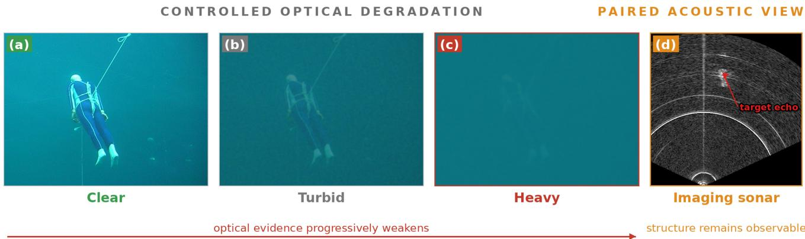
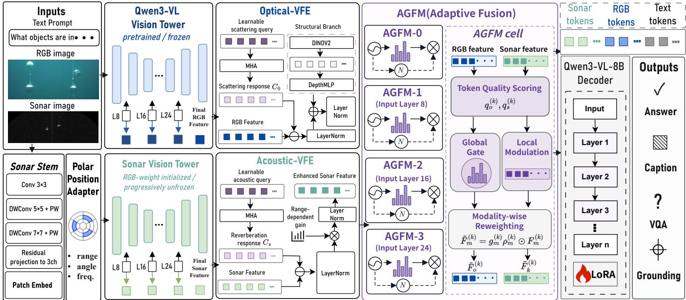
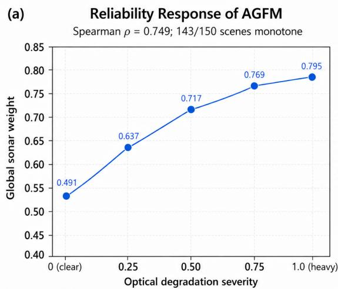
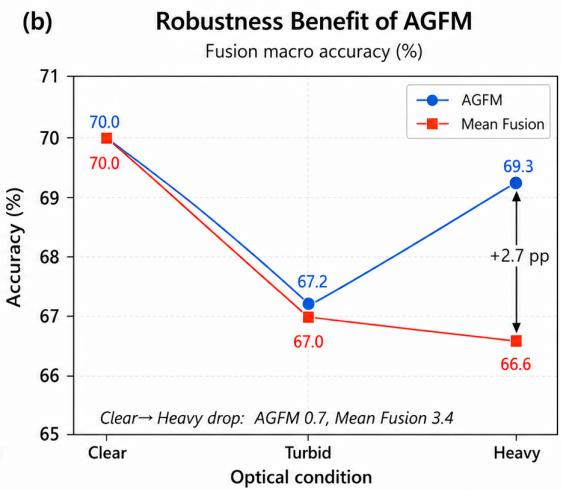
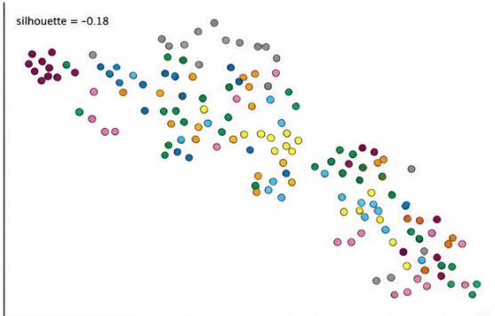
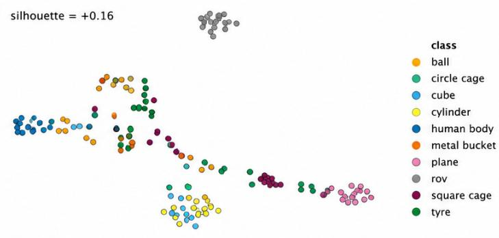
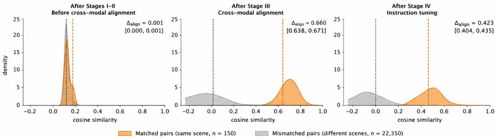

# SonarLLM: A Native Sonar–Optical Multimodal Large Language Model for Underwater Perception

Cong Su   
siliconevolution@gmail.com   
Faculty of Information Engineering   
and Automation, Kunming University   
of Science and Technology   
Kunming, China   
Yunnan Key Laboratory of Artificial   
Intelligence   
Kunming, China   
Guofeng Tang   
920903629@qq.com   
Faculty of Information Engineering   
and Automation, Kunming University   
of Science and Technology   
Kunming, China   
Yunnan Key Laboratory of Artificial   
Intelligence   
Kunming, China   
Longxuan Ma∗   
lxma@kust.edu.cn   
Faculty of Information Engineering   
and Automation, Kunming University   
of Science and Technology   
Kunming, China   
Yunnan Key Laboratory of Artificial   
Intelligence   
Kunming, China   
Weijie Yin   
18102382274@163.com   
Faculty of Information Engineering   
and Automation, Kunming University   
of Science and Technology   
Kunming, China   
Yunnan Key Laboratory of Artificial   
Intelligence   
Kunming, China   
Zhengtao Yu   
ztyu@hotmail.com   
Faculty of Information Engineering   
and Automation, Kunming University   
of Science and Technology   
Kunming, China   
Yunnan Key Laboratory of Artificial   
Intelligence   
Kunming, China   
Ling Dong   
ling.dong@kust.edu.cn   
Faculty of Information Engineering   
and Automation, Kunming University   
of Science and Technology   
Kunming, China   
Yunnan Key Laboratory of Artificial   
Intelligence   
Kunming, China   
Haohui Chen   
2954390791@qq.com   
Faculty of Information Engineering   
and Automation, Kunming University   
of Science and Technology   
Kunming, China   
Yunnan Key Laboratory of Artificial   
Intelligence   
Kunming, China

## Abstract

Reliable underwater perception requires complementary sensing under variable visibility. Optical cameras capture appearance and semantics but degrade rapidly with turbidity, whereas imaging sonar preserves geometry while exhibiting distinct range–azimuth structure and acoustic artifacts. Existing MLLMs, built primarily on optical encoders, are therefore ill-suited to model sonar or adaptively exploit sonar–optical complementarity. We propose

SonarLLM, a sonar–optical MLLM that treats sonar as a native perceptual modality. It combines a sonar-specific encoder, modalityspecific physics-aware feature enhancement, and reliability-aware hierarchical fusion to align acoustic structure with optical semantics and dynamically adjust their contributions as sensing quality changes. We also introduce SonarBench, a paired benchmark that spans four tasks—recognition, counting, visual question answering, and captioning—and, across the benchmark, three input settings: sonar-only, optical-only, and fusion. By fixing the scene and sonar observation while varying optical degradation, SonarBench enables controlled measurement of cross-modal complementarity. SonarLLM achieves 72.0% macro accuracy across sonar-only recognition, counting, and VQA, outperforming the strongest baseline by 34.4 percentage points, and 68.7% under fusion, exceeding the best baseline by 25.1 points. For recognition and counting, the fusion-over-optical gain grows from 6.0 to 36.0 points as turbidity increases, indicating the increasing complementary value of sonar under controlled optical degradation. Together, these results show that robust heterogeneous perception depends not only on adding sonar, but on representing and weighting it according to its sensing characteristics.

## CCS Concepts

• Computing methodologies → Computer vision; Machine learning; Natural language processing.

## Keywords

Multimodal Large Language Model, Underwater Perception and Understanding, Sonar-Optical

## ACM Reference Format:

Cong Su, Longxuan Ma, Ling Dong, Guofeng Tang, Weijie Yin, Haohui Chen, and Zhengtao Yu. 2018. SonarLLM: A Native Sonar–Optical Multimodal Large Language Model for Underwater Perception. In Proceedings of Make sure to enter the correct conference title from your rights confirmation email (Conference acronym ’XX). ACM, New York, NY, USA, 11 pages. https://doi. org/XXXXXXX.XXXXXXX

## 1 Introduction

Underwater environments impose severe and highly variable sensing conditions. Recent multimodal large language models (MLLMs) have advanced open-ended visual understanding, while underwater models such as MarineGPT [32] and NAUTILUS [26] extend these capabilities to marine image captioning, question answering, and recognition. However, these models remain predominantly dependent on optical imagery. Absorption and scattering progressively erase color, texture, contrast, and object boundaries as turbidity increases [11]. Imaging sonar is largely independent of illumination and can preserve object contours, spatial structure, and range information under poor visibility [16]. Optical and sonar observations are therefore complementary: one provides appearance and semantic detail, whereas the other supplies more stable geometric evidence under optical degradation [13], as illustrated in Fig. 1.

Exploiting this complementarity requires more than adding sonar as another visual input. Existing sonar–optical systems are primarily designed for task-specific detection or tracking [13, 24] and do not address open-ended language reasoning. Natural-image encoders are also poorly matched to sonar, whose range–azimuth geometry and artifacts include speckle, reverberation, acoustic shadows, and range-dependent propagation loss [16, 22]. Moreover, modality reliability is observation-dependent: optical evidence may collapse under turbidity, while sonar can be corrupted by acoustic noise and artifacts, making fixed fusion vulnerable to an unreliable sensor [18]. Together, these limitations motivate a sonar–optical MLLM that jointly addresses modality-specific representation, degradation-aware enhancement, and reliability-aware interaction across sensors and semantic levels.

To address these key challenges, we propose SonarLLM, a sonar– optical MLLM that treats imaging sonar as a native perceptual modality rather than an auxiliary image. First, for modality-specific representation, SonarLLM retains the pretrained Qwen3-VL-8B optical encoder [4] and introduces an independent sonar encoder equipped with a multi-scale Sonar Stem and range–azimuth positional encoding. Second, for modality-dependent degradation, dedicated Visual Feature Enhancement (VFE) modules operate in each modality: Optical-VFE targets scattering-related corruption, whereas Acoustic-VFE targets reverberation-related components and range attenuation. Third, AGFM predicts quality-aware modality weights, while dual-stream hierarchical DeepStack delivers reweighted optical and sonar features to multiple language-model layers. Finally, progressive training establishes sonar-domain representations, cross-modal correspondence, reliability learning, and instruction-following capability.

We further introduce SonarBench, a paired benchmark for controlled evaluation of sonar–optical understanding. It covers recognition, counting, visual question answering, and captioning and spans sonar-only, optical-only, and fusion settings across the benchmark as a whole. Fusion evaluation focuses on the three accuracy-based tasks, while captioning provides a separate diagnostic of openended generation. Optical observations are evaluated from clear to heavily turbid conditions. Unlike protocols that compare diferent samples across conditions, SonarBench fixes the underlying scene and sonar observation while varying only optical quality. This design separates gains from improved unimodal modeling from gains attributable to complementary sonar evidence as optical reliability deteriorates.

Experiments demonstrate both strong sonar understanding and robust cross-modal complementarity. SonarLLM achieves 72.0% macro accuracy across sonar-only recognition, counting, and VQA, outperforming the strongest baseline by 34.4 percentage points; substantially larger 27B–35B general-purpose MLLMs do not close this gap. Under fusion input, SonarLLM reaches 68.7%, exceeding the best baseline by 25.1 points. For recognition and counting, the fusion-over-optical gain increases from 6.0 points under clear conditions to 36.0 points under heavy turbidity, while fusion performance remains comparatively stable. SonarLLM achieves the best overall performance among the evaluated MLLMs on Sonar-Bench.

Our main contributions are summarized as follows:

• We formulate sonar–optical language understanding as a heterogeneous sensing problem and propose SonarLLM, which unifies sonar-specific representation, modality-specific feature enhancement, reliability-aware gating, and hierarchical interaction within a shared language model.

• We introduce SonarBench, a paired benchmark whose controlled intervention keeps the scene and sonar observation fixed while varying optical quality, thereby isolating unimodal sonar capability from cross-modal complementarity.

• Through controlled comparisons, representation analysis, and structural ablations, we show that native sonar modeling provides capabilities not recovered by model scale or instruction tuning alone, while reliability-aware fusion becomes increasingly valuable as optical evidence deteriorates.

## 2 Related Work

## 2.1 Underwater Vision-Language and Sonar Perception

Recent work has extended vision-language learning to marine and underwater environments. MarineGPT [32] uses domain-specific image–text data and instruction tuning for captioning, question answering, and recognition, while AquaticCLIP [1] learns underwater vision–language representations through large-scale contrastive pretraining. NAUTILUS [26] incorporates physics-aware enhancement, and OceanGPT [6] targets broader ocean-domain knowledge. OceanPile [28] and OceanGym [27] provide ocean multimodal data and embodied evaluation, respectively, but do not address sonar-native open-ended reasoning under paired optical degradation. These eforts demonstrate the value of domain data and priors, yet do not study the heterogeneous language-level interaction considered here.

  
Figure 1: Paired sonar–optical observations under controlled optical degradation. Optical evidence weakens with turbidity, whereas sonar preserves structural cues for the same scene.

Imaging sonar provides complementary structural observations independent of ambient illumination. Existing sonar research primarily addresses detection, classification, segmentation, and tracking [16, 22], supported by datasets such as UATD [25] and SCTD [31]. Paired datasets including RGBS50 [13], UMOD [24], and SOVIS [7] further demonstrate the value of sonar–optical fusion for specific discriminative tasks. However, these systems typically fuse taskdependent features or predictions and do not connect acoustic representations to open-ended language reasoning. SonarLLM instead models sonar as a native perceptual modality and enables continuous interaction among acoustic structure, optical semantics, and language representations.

## 2.2 Heterogeneous Multimodal Fusion and Evaluation

General-purpose MLLMs employ diverse mechanisms to connect visual and linguistic representations. LLaVA [14, 15] uses learned projection, BLIP-2 [12] introduces a Q-Former, Flamingo [2] injects visual context through cross-layer attention, and Qwen3-VL [4] incorporates hierarchical visual features through DeepStack. Gated and reliability-aware fusion methods [3, 18] additionally adjust modality contributions according to sensor quality. Nevertheless, these approaches generally assume visually homogeneous inputs or do not explicitly account for sensors with diferent imaging geometry, degradation processes, and environment-dependent reliability. SonarLLM combines modality-specific representation and enhancement with reliability-aware hierarchical interaction to address these requirements jointly.

Existing underwater evaluation resources are similarly divided by modality or task. UIEB [11] and EUVP [9] focus on optical enhancement; UATD and SCTD support sonar perception; and RGBS50, UMOD, and SOVIS target specific paired-sensor tasks. Vision-language benchmarks such as NautData [26] and UWBench [30] remain centered on optical observations. They therefore cannot isolate whether multimodal gains arise from stronger unimodal modeling or from genuinely complementary sonar evidence. Sonar-Bench addresses this limitation through paired interventions that keep the scene and sonar observation fixed while varying only optical quality, enabling controlled evaluation of sonar representation, cross-modal complementarity, and reliability adaptation.

## 3 Method

## 3.1 Overall Architecture

Given an optical image $I _ { o } ,$ , an imaging-sonar observation $I _ { s } ,$ and a textual instruction �, SonarLLM extracts heterogeneous visual representations and performs joint reasoning within a shared language model. As shown in Fig. 2, it preserves the pretrained optical encoder $\scriptstyle { \mathcal { E } } _ { o }$ of Qwen3-VL-8B [4] and introduces an independent sonar encoder $\mathcal { E } _ { s } ,$ , thereby treating sonar as a native perceptual modality rather than an auxiliary image input.

Each visual encoder produces a final feature $F _ { m }$ and three intermediate features $\{ F _ { m } ^ { ( k ) } \} _ { k = 1 } ^ { 3 }$ extracted after Transformer blocks 8, 16, and 24, where � ∈ {�, �}. Final features are processed by modalityspecific Visual Feature Enhancement (VFE) modules, projected into the language space, and reweighted by AGFM0. Intermediate features bypass the VFEs and are processed by $\operatorname { A G F M } _ { k }$ before being projected and injected into language-model layers 8, 16, and 24, respectively, through dual-stream DeepStack. This separation preserves modality-specific information while enabling cross-modal interaction at multiple semantic depths.

## 3.2 Sonar-Native Visual Representation

Natural-image encoders are poorly matched to sonar statistics and range–azimuth geometry. We initialize a Polar-aware Sonar Vision Transformer (PSVT) from the Qwen3-VL visual tower to retain

  
Figure 2: Overall architecture of SonarLLM, comprising sonar-native representation, modality-specific feature enhancement, reliability-aware hierarchical fusion, and progressive training.

transferable visual priors, and adapt it through a multi-scale Sonar Stem and explicit geometric positional encoding.

Multi-scale Sonar Stem. Before patch embedding, the Sonar Stem captures echoes, boundaries, and acoustic shadows at diferent receptive fields:

$$
\begin{array} { r } { \Delta I _ { s } = \mathrm { C o n v } _ { 1 \times 1 } \left[ f _ { 7 } \left( f _ { 5 } \left( f _ { 3 } ( I _ { s } ) \right) \right) \right] , } \\ { \widetilde { I _ { s } } = I _ { s } + \gamma \Delta I _ { s } , \qquad } \end{array}\tag{1}
$$

where $f _ { 3 } , f _ { 5 } ,$ and $f _ { 7 }$ denote convolutional transformations with diferent receptive fields. The zero-initialized coeficient � gradually introduces sonar-specific structure without disrupting the transferred representation at initialization.

Range–Azimuth Positional Adaptation. For a sonar patch centered at range $r _ { i }$ and azimuth $\theta _ { j }$ , we augment the transferred positional representation as:

$$
z _ { i j } ^ { s } = z _ { i j } ^ { \mathrm { b a s e } } + \lambda _ { p } \left[ \phi _ { r } ( r _ { i } ) + \phi _ { \theta } ( \theta _ { j } ) \right] ,\tag{2}
$$

where $\phi _ { r }$ and $\phi _ { \theta }$ encode physical range and azimuth, respectively. PSVT can therefore retain pretrained visual priors while explicitly adapting to sonar imaging geometry.

## 3.3 Modality-Specific Feature Enhancement

Optical and sonar observations undergo diferent physical degradations. A compact abstraction of their image-formation processes is:

$$
\begin{array} { c } { { I _ { o } ( u ) = J ( u ) e ^ { - \beta d ( u ) } + B _ { \infty } \left[ 1 - e ^ { - \beta d ( u ) } \right] , } } \\ { { S ( r , \theta ) = \displaystyle \frac { S _ { 0 } T S ( \theta ) } { r ^ { 2 } } e ^ { - 2 \alpha _ { \mathrm { p h y } } r } + R ( r , \theta ) , } } \end{array}\tag{3}
$$

where $d ( u )$ is scene range, $\beta$ is optical attenuation, $J ( u )$ is undegraded scene radiance, and $B _ { \infty }$ is backscattered light. In the sonar model, $S _ { 0 }$ is a source-level constant, $\alpha _ { \mathrm { p h y } }$ is acoustic attenuation, �� (�) is target strength, and $R ( r , \theta )$ is reverberation. Motivated by these distinct attenuation and interference terms, we apply separate Optical-VFE and Acoustic-VFE modules to the final high-level features, while intermediate DeepStack features bypass the VFEs. The modules perform feature-space correction rather than inversion of the raw physical image-formation processes.

Optical-VFE.. A learnable query $e _ { b }$ estimates feature corruption related to scattering in $F _ { o } ,$ while a frozen DINOv2-L encoder [17] provides a generic structural reference $D _ { o }$

$$
\begin{array} { r l } & { C _ { o } = \mathrm { M H A } ( e _ { b } , F _ { o } , F _ { o } ) , } \\ & { F _ { o } ^ { c } = \mathrm { L N } \left( F _ { o } - W _ { b } C _ { o } \right) , } \\ & { \overline { { F } } _ { o } = \mathrm { L N } \left[ F _ { o } ^ { c } + \Psi _ { o } ( D _ { o } ) \right] . } \end{array}\tag{4}
$$

Here, $W _ { b }$ is a learned channel projection, and $\Psi _ { o }$ maps $D _ { o }$ to the token shape of $F _ { o } ^ { c }$ . Optical-VFE performs feature correction rather than physical inversion.

Acoustic-VFE.. A learnable acoustic query $e _ { r }$ estimates a feature component associated with reverberation, while token range param eterizes learned compensation for range-dependent attenuation:

$$
\begin{array} { r l } & { \quad C _ { s } = \mathrm { M H A } ( e _ { r } , F _ { s } , F _ { s } ) , } \\ & { \quad F _ { s } ^ { c } [ i ] = F _ { s } \left[ i \right] - \sigma ( g _ { r } ) W _ { s } C _ { s } , } \\ & { \quad G ( r _ { i } ) = \exp \left[ 2 \log \left( \frac { r _ { i } } { { r _ { \operatorname* { m i n } } } } \right) + 2 \alpha _ { c } ( { r _ { i } - r _ { \operatorname* { m i n } } } ) \right] , } \\ & { \quad \overline { { F } } _ { s } \left[ i \right] = \mathrm { L N } \left( G ( r _ { i } ) F _ { s } ^ { c } \left[ i \right] \right) . } \end{array}\tag{5}
$$

Here, $W _ { s }$ is a learned channel projection, $\sigma$ is sigmoid, and $g _ { r }$ is a scalar gate. The learned range-compensation coeficient $\alpha _ { c } =$ softplus $( \widehat { \alpha } _ { c } )$ is distinct from the physical $\alpha _ { \mathrm { p h y } }$ in Eq. (3). Because $r _ { i }$ is the physical range of the sonar token, the compensation retains the native range–azimuth geometry.

## 3.4 Reliability-Aware Hierarchical Fusion

The reliability of optical and sonar observations varies across both environments and spatial regions. SonarLLM therefore combines the Adaptive Gated Fusion Module (AGFM) with dual-stream Deep-Stack to model global sensor reliability and local token quality at multiple visual levels.

At level �, let $F _ { m } ^ { ( k ) } ~ = ~ \{ f _ { m , i } ^ { ( k ) } \} _ { i = 1 } ^ { N _ { m } }$ . For $k = 0 , F _ { m } ^ { ( 0 ) }$ denotes the enhanced and projected final representation; for $k \in \{ 1 , 2 , 3 \}$ , it denotes the feature extracted after visual block 8, 16, or 24. AGFM first estimates token quality and aggregates it into modality-level reliability:

$$
\begin{array} { r } { \boldsymbol { q } _ { m , i } ^ { ( k ) } = \boldsymbol { h } _ { m } ^ { ( k ) } \left( \mathrm { L N } \left( \boldsymbol { f } _ { m , i } ^ { ( k ) } \right) \right) , \qquad \boldsymbol { \bar { q } } _ { m } ^ { ( k ) } = \boldsymbol { N } _ { m } ^ { - 1 } \displaystyle \sum _ { j = 1 } ^ { N _ { m } } \boldsymbol { q } _ { m , j } ^ { ( k ) } , } \end{array}\tag{6}
$$

$$
\overline { { \mathbf { q } } } ^ { ( k ) } = \left[ \bar { q } _ { o } ^ { ( k ) } , \bar { q } _ { s } ^ { ( k ) } \right] , \qquad \mathbf { g } ^ { ( k ) } = \mathrm { s o f t m a x } \left( \overline { { \mathbf { q } } } ^ { ( k ) } / \tau _ { k } \right) .
$$

Here, $h _ { m } ^ { ( k ) } : \mathbb { R } ^ { d _ { k } }  \mathbb { R }$ is a token-shared scalar scorer. The vector $\mathbf { g } ^ { ( k ) } = [ g _ { o } ^ { ( k ) } , g _ { s } ^ { ( k ) } ]$ contains relative modality weights used as controlled reliability proxies. Each $\tau _ { k }$ is learnable, lower-bounded at 0.05, and initialized to 2.0.

AGFM further captures spatially non-uniform quality through mean-preserving token modulation:

$$
\begin{array} { l } { { \displaystyle { u _ { m , i } ^ { ( k ) } = \frac { 1 + \sigma \left( q _ { m , i } ^ { ( k ) } \right) } { 2 } } , \qquad \bar { u } _ { m } ^ { ( k ) } = N _ { m } ^ { - 1 } \sum _ { j = 1 } ^ { N _ { m } } u _ { m , j } ^ { ( k ) } , } } \\ { { \displaystyle { \rho _ { m , i } ^ { ( k ) } = \frac { u _ { m , i } ^ { ( k ) } } { \bar { u } _ { m } ^ { ( k ) } } } , \qquad \widetilde { f } _ { m , i } ^ { ( k ) } = g _ { m } ^ { ( k ) } \rho _ { m , i } ^ { ( k ) } f _ { m , i } ^ { ( k ) } . } } \end{array}\tag{7}
$$

The global factor $g _ { m } ^ { ( k ) }$ allocates reliability across sensors, while $\rho _ { m , i } ^ { ( k ) }$ redistributes importance among tokens without changing their mean scale. For single-modality input, AGFM reduces to an identity mapping.

Crucially, AGFM reweights rather than merges the two modality sequences. At the final level, the reweighted optical and sonar tokens form the initial multimodal context. At the three intermediate levels, the reweighted features are projected by modality-specific DeepStack mergers and injected into language layers 8, 16, and 24, respectively:

$$
\begin{array} { r l } & { H ^ { ( \ell _ { k } ) } \gets H ^ { ( \ell _ { k } ) } + \mathcal { T } _ { o } ^ { ( k ) } \left[ \mathcal { P } _ { o } ^ { ( k ) } \left( \widetilde { F } _ { o } ^ { ( k ) } \right) \right] } \\ & { ~ + \mathcal { T } _ { s } ^ { ( k ) } \left[ \mathcal { P } _ { s } ^ { ( k ) } \left( \widetilde { F } _ { s } ^ { ( k ) } \right) \right] . } \end{array}\tag{8}
$$

Equation (8) is applied at language layers 8, 16, and 24. Here, $\mathcal { P } _ { m } ^ { ( k ) }$ is a modality-specific DeepStack merger that maps intermediate features to the language-model hidden space, and $\mathcal { T } _ { m } ^ { ( k ) }$ aligns and adds them to the visual-token span of the corresponding modality. Maintaining separate optical and sonar streams before injection avoids premature compression of their heterogeneous representations.

## 3.5 Progressive Training Strategy

We train SonarLLM in four stages that progressively establish sonardomain representations, acoustic semantics, cross-modal reliability, and language-level reasoning. Direct joint optimization would require limited paired data to simultaneously resolve domain shift, semantic organization, sensor correspondence, gate calibration, and instruction following. The staged curriculum first stabilizes acoustic representations and then introduces cross-modal and language supervision, reducing interference among these heterogeneous objectives. Table 1 summarizes the resulting schedule.

Table 1: Progressive training schedule. CE denotes category cross-entropy.
<table><tr><td>Stage</td><td>Data/objective</td><td>Trainable modules</td></tr><tr><td>I</td><td>Unlabeled sonar / MAE</td><td>PSVT, decoder</td></tr><tr><td>Ⅱ</td><td>Labeled sonar / CE</td><td>PSVT/Stem, classifier</td></tr><tr><td>III</td><td>Paired /  $\mathcal { L } _ { \mathrm { a l i g n } }$ </td><td>Sonar path, VFEs, AGFM</td></tr><tr><td>IV</td><td>Instructions  $/ \ \mathcal { L } _ { \mathrm { i n s t } }$ </td><td>LoRA, interfaces</td></tr></table>

Stage I: Sonar-Domain Adaptation. PSVT is first adapted using masked reconstruction on unlabeled sonar images. Because lowresponse background occupies a large portion of each frame, normalized masked patches $\bar { x } _ { i }$ are weighted by their local variation $w _ { i } { : }$

$$
\mathcal { L } _ { \mathrm { a d a p t } } = \frac { \sum _ { i \in \mathcal { M } } w _ { i } \| \mathcal { D } ( z _ { i } ) - \bar { x } _ { i } \| _ { 2 } ^ { 2 } } { \sum _ { i \in \mathcal { M } } w _ { i } } .\tag{9}
$$

Here, $\bar { x } _ { i } = ( x _ { i } - \mu ( x _ { i } ) ) / ( \sigma ( x _ { i } ) + \varepsilon )$ and $w _ { i } = \mathrm { c l i p } ( \sigma ( x _ { i } ) , \sigma _ { \mathrm { m i n } } , \sigma _ { \mathrm { m a x } } ) .$ Only the sonar pathway is optimized, and the decoder D is discarded afterward.

Stage II: Acoustic Semantic Learning. Category supervision then organizes the adapted sonar representations according to acoustic semantics:

$$
\begin{array} { r l r } & { } & { \mathcal { L } _ { \mathrm { s e m } } = - \displaystyle \frac { 1 } { B } \sum _ { n = 1 } ^ { B } \sum _ { c = 1 } ^ { C } y _ { n , c } \log p _ { s , c } ^ { ( n ) } , } \\ & { } & { p _ { s } ^ { ( n ) } = \mathrm { s o f t m a x } \left( W _ { c } h _ { s } ^ { ( n ) } + b _ { c } \right) . } \end{array}\tag{10}
$$

where $h _ { s } ^ { ( n ) } = \mathrm { P o o l } [ \mathcal { E } _ { s } ( \widetilde { I } _ { s } ^ { ( n ) } ) ]$ . The optical pathway, language model, and fusion modules remain frozen.

Stage III: Cross-Modal Alignment and Reliability Learning. Synchronized sonar–optical pairs are used with stochastic optical degradation across a continuous severity range, while clear pairs are retained as anchors. Training combines global contrastive alignment, hierarchical feature alignment, BCE-based gate supervision, and gate regularization:

$$
\begin{array} { r l } & { \mathcal { L } _ { \mathrm { N C E } } = \displaystyle \mathrm { I n f o N C E } \left( z _ { o } , z _ { s } \right) , } \\ & { \mathcal { L } _ { \mathrm { h i e r } } = \displaystyle \sum _ { k = 1 } ^ { 3 } \left[ 1 - \cos \left( z _ { o } ^ { ( k ) } , z _ { s } ^ { ( k ) } \right) \right] , } \\ & { \mathcal { L } _ { \mathrm { g a t e } } = \displaystyle \frac { 1 } { 4 } \sum _ { k = 0 } ^ { 3 } \mathrm { B C E } \left( g _ { s } ^ { ( k ) } , \pi _ { s } ( \eta ) \right) , } \\ & { \mathcal { L } _ { \mathrm { e n t } } = - \displaystyle \frac { 1 } { 4 } \sum _ { k = 0 } ^ { 3 } \mathcal { H } _ { b } \left( g _ { s } ^ { ( k ) } \right) , } \\ & { \mathcal { L } _ { \mathrm { a l i g n } } = \mathcal { L } _ { \mathrm { N C E } } + 0 , 5 \mathcal { L } _ { \mathrm { h i e r } } + 0 . 2 \mathcal { L } _ { \mathrm { g a t e } } + 0 . 1 \mathcal { L } _ { \mathrm { e n t } } . } \end{array}\tag{11}
$$

Here, $z _ { m }$ and $z _ { m } ^ { ( k ) }$ are pooled final and intermediate representations, respectively; InfoNCE uses temperature 0.07, and $\mathcal { H } _ { b }$ denotes binary entropy. The BCE target $\pi _ { s } ( \eta ) = \mathrm { c l a m p } ( 0 . 5 + 0 . 4 \eta , 0 , 1 )$ shifts supervision from balanced fusion toward sonar as optical degrada tion increases, making $g _ { s }$ a supervised degradation proxy rather than a general reliability estimate. The negative-entropy term discourages early gate collapse. Modality-missing examples preserve compatibility with sonar-only and optical-only inputs.

Stage IV: Multimodal Instruction Tuning. Finally, the model is trained on sonar-only, optical-only, and paired sonar–optical instructions. For visual input $\mathcal { I } \in \{ I _ { s } , I _ { o } , ( I _ { s } , I _ { o } ) \}$ , prompt �, and target answer �, we minimize the answer-only autoregressive objective:

$$
\mathcal { L } _ { \mathrm { i n s t } } = - \frac { 1 } { \left| \mathcal { R } \right| } \sum _ { t \in \mathcal { A } } \log p _ { \Theta } \left( y _ { t } \mid x , \bar { Z } , y _ { < t } \right) ,\tag{12}
$$

where A contains answer-token positions and Θ includes the trainable LoRA parameters [8] and multimodal interfaces. This stage transfers the learned sonar representations and reliability-aware alignment to open-ended recognition, counting, question answering, and captioning.

## 4 Experiments

Our evaluation follows the causal structure of SonarLLM. We first test whether a sonar-native pathway provides capabilities that cannot be recovered through model scale or instruction tuning alone. We then use paired optical degradation to isolate when sonar becomes complementary and whether AGFM responds to the resulting reliability shift. Finally, representation analysis and controlled ablations trace these gains to sonar-domain adaptation, cross-modal alignment, sonar geometry, modality-specific enhancement, and hierarchical interaction before we quantify their computational cost. Unless otherwise specified, all models use identical task prompts, input protocols, and deterministic decoding.

## 4.1 Experimental Setup

Training Data. Stage I pools approximately 98K candidate sonar images from RGBS50, UATD, SCTD, DeeperSense, FLC+FLS, and OceanGym [27], together with sonar-filtered frames from OceanInstruct and OceanPile’s OceanInstruction [28]. After empty-frame removal, outlier filtering, byte-level deduplication, and brightnessbalanced sampling, we retain 40K unlabeled images for sonar domain adaptation. Stage II uses 23-class sonar object annotations aggregated from these sources. Stage III uses synchronized RGBS50 sonar–optical pairs with online optical degradation. Stage IV uses a 635K-sample instruction mixture comprising 533K sonar-related and 102K optical samples, with sonar-only, optical-only, and paired inputs.

SonarBench. SonarBench evaluates recognition, counting, VQA, and captioning. Recognition, counting, and VQA use sonar-only, optical-only, and fusion inputs; captioning uses sonar-only and optical-only inputs. Optical and fusion settings are evaluated under clear, turbid, and heavily turbid conditions. Across degradation levels, the scene, question, and sonar observation remain fixed, and only the paired RGB image is modified. This design is a controlled stress test of optical reliability rather than a simulation of the complete distribution of natural turbidity. Within this protocol, paired fusion analysis is defined over recognition, counting, and

Table 2: SonarBench evaluation structure. S/O/F denote sonar, optical, and fusion inputs; C/T/H denote clear, turbid, and heavy optical conditions.
<table><tr><td>Task</td><td>Input conditions</td><td>Metric</td><td>Subsets</td></tr><tr><td>Recognition</td><td>S; O/F×C/T/H</td><td>Sem. accuracy</td><td>7</td></tr><tr><td>Counting</td><td>S; O/F×C/T/H</td><td>Exact accuracy</td><td>7</td></tr><tr><td>VQA</td><td>S; O/F×C/T/H</td><td>Sem. accuracy</td><td>7</td></tr><tr><td>Captioning</td><td>S; O×C/T/H</td><td>GOOD / METEOR</td><td>4</td></tr><tr><td>Total</td><td></td><td></td><td>25</td></tr></table>

VQA, whereas captioning is reported separately as a diagnostic of open-ended semantic generation.

The three optical conditions provide a controlled contrast in observation quality. Clear images remain unchanged; turbid images combine reduced brightness, additive white noise, colored veiling, and Gaussian blur; and heavy-turbid images retain the same photometric attenuation while replacing white noise with multi-scale correlated disturbances. Training degradation data and benchmark renderings use the same generator, so the comparison isolates response to a known reliability shift rather than out-offamily generalization to arbitrary natural turbidity.

Evaluation samples are drawn from held-out RGBS50 and UMOD video sequences, forming 25 subsets—4 sonar-only, 12 optical-only, and 9 fusion—with 150 QA instances each. Each record contains one question, while an underlying sequence–frame may recur across tasks, modalities, and degradation conditions to support paired comparisons. Source sequences are partitioned before all training stages, and a sequence–frame audit confirms zero overlap between training and evaluation.

Metrics andJudging. Recognition and VQA use Qwen3.8-Max [21] to judge semantic correctness against reference answers. Counting uses integer parsing and exact match; unparseable outputs (0.9%) are incorrect. Captioning reports semantic GOOD rate, with NLTK METEOR [5] (×100) used only as a lexical diagnostic. Macro averages cover recognition, counting, and VQA; captioning is reported separately. VQA equally macro-averages attribute, existence, and counting scores, so its values need not be integer multiples of 1/150; reported improvements are computed from unrounded aggregate scores. To assess possible same-family judge bias, we independently re-evaluate a stratified set of 300 recognition/VQA outputs with Kimi-K3 [10]. The judges achieve 94.3% agreement and Cohen’s � = 0.87, and all model rankings remain unchanged after manual inspection of disagreements.

Baselines. We compare against Qwen3-VL-8B, InternVL3.5-8B [23], MiniCPM-V 4.5 [29], the larger Qwen3.6-35B-A3B and Qwen3.8- 27B models [19, 20], and the underwater-domain OceanGPT-o-7B and NAUTILUS-7B models. Qwen3-VL-8B+LoRA uses the same Stage-IV data and LoRA configuration as SonarLLM, providing a controlled test of whether instruction tuning alone explains the gains. For fusion input, all baselines use their native multi-image interface with a fixed sonar–optical order and explicit modality labels.

Implementation Details. SonarLLM uses Qwen3-VL-8B with 448× 448 inputs. The language model is frozen in Stages I–III. Stage I uses a 0.60 masking ratio. Stage II optimizes PSVT and the Sonar Stem at a learning rate of $5 \times 1 0 ^ { - 5 }$ . Stage III degrades the optical input with probability 0.7, samples $\eta \sim \mathcal { U } ( 0 . 1 , 1 . 0 )$ for degraded examples, and jointly trains the sonar pathway, both VFEs, and AGFM at a learning rate of $1 0 ^ { - 4 } .$ Stage IV uses LoRA with $r = 1 2 8 ,$ $\alpha = 2 5 6 ,$ , and learning rate 10−4. The architecture and Stage-IV adapters add 882.4M and 349.2M parameters, respectively, resulting in 10.3B total parameters versus 8.77B for the backbone when the frozen DINOv2-L structural-prior encoder is included.

## 4.2 Main Results

Native Sonar Understanding. SonarLLM obtains 72.0% sonar-only macro accuracy, exceeding the strongest baseline by 34.4 points. The gain is consistent across recognition (64.7%), counting (84.7%), and VQA (66.5%), and its caption GOOD rate reaches 33.3% versus 12.0% for the best baseline. Increasing general-purpose capacity does not close the gap: Qwen3.6-35B-A3B and Qwen3.8-27B achieve only 28.9% and 29.1%, respectively. Underwater-domain models are also substantially weaker, supporting the need for sonar-native representation rather than model scaling or domain knowledge alone.

Optical and Fusion Performance. SonarLLM achieves 50.9% on optical input and ranks first on every recognition and VQA subset. Its main optical weakness is clear/turbid counting, where it trails the best baselines. With both sensors, however, SonarLLM reaches 68.7%, 25.1 points above the strongest baseline. Fusion recognition remains between 76.7% and 83.3% across all degradation levels. In contrast, heterogeneous multi-image input alone is unreliable: Qwen3-VL-8B+LoRA drops from 36.9% optical accuracy to 32.3% under fusion, and Qwen3.6-35B-A3B drops from 36.4% to 28.9%. Dedicated heterogeneous representation and interaction therefore provide substantial benefits when exploiting the second sensor.

Controlling Instruction Tuning and Sampling Uncertainty. Qwen3- VL-8B+LoRA uses the same Stage-IV data and language-side LoRA as SonarLLM. Relative to this control, SonarLLM improves sonar, optical, and fusion accuracy by 34.4, 14.0, and 36.5 points, showing that instruction tuning alone does not reproduce the observed gains. A 10,000-replication scene-clustered bootstrap gives 95% confidence intervals of [28.1, 40.5], [11.3, 16.7], and [34.0, 39.0] for these gains; all lower bounds remain positive. These intervals quantify test-set sampling uncertainty but not variation across independent training runs.

## 4.3 Controlled Degradation and Reliability-Aware Fusion

Because optical and fusion evaluations share scenes, questions, and sonar observations, fusion minus optical accuracy provides a paired estimate of the benefit of adding sonar. Table 4 summarizes this controlled comparison. The fusion-over-optical gain expands from 6.0 to 36.0 points for recognition and counting, and from 7.1 to 14.0 points for VQA. Meanwhile, clear-to-heavy fusion changes are lim ited to −2.6, 0.0, and +0.6 points, respectively, despite much larger optical declines. For recognition, fusion also exceeds the stronger individual sensor by 6.0, 12.0, and 16.0 points across clear, turbid, and heavy conditions, showing that sonar increasingly complements rather than merely replaces optical sensing.

We next evaluate whether AGFM exhibits the intended internal response on an independent probe set of 150 RGBS50 scenes, each rendered at five degradation levels (750 observations). As shown in Fig. 3(a), mean sonar weight increases from 0.491 to 0.637, 0.717, 0.769, and 0.795. Severity and sonar weight have Spearman correlation $\rho = 0 . 7 4 9$ (scene-blocked 95% CI [0.68, 0.81]), and 95.3% of scenes show non-decreasing sonar weight. Because Stage III explicitly supervises the gate using degradation strength, we interpret this trend as verification of AGFM’s intended internal response, rather than as independent evidence of emergent reliability estimation.

Using the same checkpoint, we replace AGFM by equal weighting at inference. The accuracy advantage is 0.0, 0.2, and 2.7 points under clear, turbid, and heavy conditions, respectively; clear-toheavy degradation is 0.7 points with AGFM versus 3.4 points with equal weighting. This pattern clarifies that complementarity is not an unconditional advantage of using more sensors. Recognition benefits consistently because optical appearance and acoustic contour and range provide distinct evidence, whereas fusion counting and VQA do not always exceed sonar-only performance when the answer depends primarily on geometry or degraded optical cues become distracting. AGFM is therefore not an oracle that selects the best modality for every question; it acts mainly as a degradation bufer that prevents a deteriorating sensor from dominating the shared representation. This distinction separates representation from allocation: the sonar pathway determines which acoustic evidence is available to language reasoning, while AGFM controls its influence as observation reliability shifts. The following ablations examine these responsibilities at the representation and interaction levels. The controlled protocol does not cover non-uniform scattering, dynamic suspended particles, sonar-specific failures, or temporal misalignment; evaluation on naturally degraded paired observations remains necessary.

## 4.4 Ablation and Representation Analysis

Ablations use a diagnostic split constructed from video sequences disjoint from both training and the main SonarBench test set, with 25 modality–task–condition combinations and 150 samples each (� = 3,750). Recognition and VQA use rule-based scoring rather than the semantic judge in Table 3; absolute values across the two tables are not directly comparable.

Domain Adaptation and Representation Formation. As shown in Table 5, Stage-I MAE with the same � = 128 language adaptation improves the sonar R/C average from 72.0% to 74.7%, recognition by 7.3 points, and METEOR by 4.1, although counting decreases by 2.0 points. MAE-�64 reaches only 69.3%, indicating that adapted acoustic features also require suficient language-side capacity. Mask ratios and Stage-I data scale are examined separately in Table 6.

An intermediate masking ratio performs best: excessive masking removes sparse acoustic structure, whereas insuficient masking weakens the adaptation signal. Increasing unlabeled data produces consistent but diminishing gains; we therefore use a 0.60 mask ratio and 40K images.

Table 3: SonarBench results (%; 25 subsets, �=150 each). Recognition/VQA use semantic judging, counting uses exact match, and ‡ denotes caption GOOD rate. Averages exclude captioning. Best per row in bold.
<table><tr><td>Modality</td><td>Task (Condition)</td><td>Qwen3-VL -8B</td><td>Qwen3-VL -8B+LoRA</td><td>3.5-8B</td><td>4.5</td><td>InternVL MiniCPM-V NAUTILUS -7B</td><td>OceanGPT -0-7B</td><td>Qwen3.6 -35B-A3B</td><td>Qwen3.8 -27B</td><td>Sonar LLM</td></tr><tr><td>Sonar</td><td>Recognition</td><td>25.3</td><td>28.7</td><td>29.3</td><td>23.3</td><td>14.0</td><td>2.0</td><td>27.3</td><td>32.0</td><td>64.7</td></tr><tr><td></td><td>Counting</td><td>40.7</td><td>51.3</td><td>33.3</td><td>47.3</td><td>32.7</td><td>14.0</td><td>35.3</td><td>32.7</td><td>84.7</td></tr><tr><td></td><td>VQA</td><td>30.2</td><td>32.6</td><td>27.5</td><td>21.7</td><td>25.8</td><td>20.8</td><td>24.2</td><td>22.5</td><td>66.5</td></tr><tr><td></td><td>Caption</td><td>8.0</td><td>4.0</td><td>7.3</td><td>4.7</td><td>12.0</td><td>5.3</td><td>10.0</td><td>4.7</td><td>33.3</td></tr><tr><td>Optical</td><td>Recognition (Clear)</td><td>41.3</td><td>38.7</td><td>38.7</td><td>36.0</td><td>34.7</td><td>10.7</td><td>44.0</td><td>40.0</td><td>77.3</td></tr><tr><td></td><td>Recognition (Turbid)</td><td>37.3</td><td>36.0</td><td>36.0</td><td>35.3</td><td>36.0</td><td>12.7</td><td>40.7</td><td>38.7</td><td>63.3</td></tr><tr><td></td><td>Recognition (Heavy)</td><td>38.0</td><td>35.3</td><td>33.3</td><td>29.3</td><td>30.7</td><td>9.3</td><td>34.7</td><td>39.3</td><td>44.7</td></tr><tr><td></td><td>Counting (Clear)</td><td>71.3</td><td>69.3</td><td>60.7</td><td>66.0</td><td>59.3</td><td>40.7</td><td>73.3</td><td>72.7</td><td>66.0</td></tr><tr><td></td><td>Counting (Turbid)</td><td>37.3</td><td>39.3</td><td>26.0</td><td>32.0</td><td>24.0</td><td>22.7</td><td>29.3</td><td>22.7</td><td>37.3</td></tr><tr><td></td><td>Counting (Heavy)</td><td>8.0</td><td>16.0</td><td>6.7</td><td>10.0</td><td>6.0</td><td>10.0</td><td>10.0</td><td>6.0</td><td>36.0</td></tr><tr><td></td><td>VQA (Clear)</td><td>40.9</td><td>37.0</td><td>37.0</td><td>41.1</td><td>32.6</td><td>22.9</td><td>38.7</td><td>36.8</td><td>47.5</td></tr><tr><td></td><td>VQA (Turbid)</td><td>34.7</td><td>32.5</td><td>30.8</td><td>32.0</td><td>28.2</td><td>21.5</td><td>32.8</td><td>28.5</td><td>44.7</td></tr><tr><td></td><td>VQA (Heavy)</td><td>28.1</td><td>28.2</td><td>26.3</td><td>22.9</td><td>20.7</td><td>20.3</td><td>24.1</td><td>24.7</td><td>41.2</td></tr><tr><td></td><td>Caption (Clear)‡</td><td>23.3</td><td>26.7</td><td>25.3</td><td>22.0</td><td>18.7</td><td>16.0</td><td>26.7</td><td>22.0</td><td>29.3</td></tr><tr><td></td><td>Caption (Turbid)‡</td><td>24.7</td><td>26.0</td><td>24.7</td><td>25.3</td><td>22.7</td><td>12.0</td><td>24.7</td><td>21.3</td><td>28.7</td></tr><tr><td></td><td>Caption (Heavy)</td><td>15.3</td><td>9.3</td><td>10.0</td><td>10.7</td><td>14.0</td><td>6.0</td><td>13.3</td><td>12.0</td><td>14.7</td></tr><tr><td>Fusion</td><td>Recognition (Clear)</td><td>37.3</td><td>30.7</td><td>34.7</td><td>34.7</td><td>34.0</td><td>15.3</td><td>40.7</td><td>40.7</td><td>83.3</td></tr><tr><td></td><td>Recognition (Turbid)</td><td>36.0</td><td>30.0</td><td>36.0</td><td>39.3</td><td>33.3</td><td>15.3</td><td>38.7</td><td>40.0</td><td>76.7</td></tr><tr><td></td><td>Recognition (Heavy)</td><td>39.3</td><td>30.0</td><td>33.3</td><td>32.0</td><td>30.7</td><td>10.7</td><td>37.3</td><td>38.7</td><td>80.7</td></tr><tr><td></td><td>Counting (Clear)</td><td>66.7</td><td>36.0</td><td>65.3</td><td>62.0</td><td>62.7</td><td>52.7</td><td>23.3</td><td>63.3</td><td>72.0</td></tr><tr><td></td><td>Counting (Turbid)</td><td>44.7</td><td>36.0</td><td>59.3</td><td>51.3</td><td>63.3</td><td>52.0</td><td>25.3</td><td>61.3</td><td>70.7</td></tr><tr><td></td><td>Counting (Heavy)</td><td>47.3</td><td>36.0</td><td>48.7</td><td>36.0</td><td>62.0</td><td>55.3</td><td>24.0</td><td>40.0</td><td>72.0</td></tr><tr><td></td><td>VQA (Clear)</td><td>39.1</td><td>30.3</td><td>33.9</td><td>38.0</td><td>38.0</td><td>11.6</td><td>25.6</td><td>38.5</td><td>54.6</td></tr><tr><td></td><td>VQA (Turbid)</td><td>33.7</td><td>31.5</td><td>34.4</td><td>26.9</td><td>28.9</td><td>15.5</td><td>24.7</td><td>36.1</td><td>53.5</td></tr><tr><td></td><td>VQA (Heavy)</td><td>26.4</td><td>30.1</td><td>28.6</td><td>20.4</td><td>22.6</td><td>13.5</td><td>20.3</td><td>34.5</td><td>55.2</td></tr><tr><td colspan="2">Sonar Average</td><td>32.1</td><td>37.5</td><td>30.0</td><td>30.8</td><td>24.2</td><td>12.3</td><td>28.9</td><td>29.1</td><td>72.0</td></tr><tr><td colspan="2">Optical Average</td><td>37.4</td><td>36.9</td><td>32.8</td><td>33.8</td><td>30.2</td><td>19.0</td><td>36.4</td><td>34.4</td><td>50.9</td></tr><tr><td colspan="2">Fusion Average</td><td>41.2</td><td>32.3</td><td>41.6</td><td>37.8</td><td>41.7</td><td>26.9</td><td>28.9</td><td>43.7</td><td>68.7</td></tr></table>

  
Figure 3: Reliability-aware fusion analysis on 150 held-out scenes. (a) Sonar weight increases with optical degradation. (b) Under the same checkpoint, AGFM’s advantage over equal weighting grows from 0.0 to 2.7 points.

Figure 4 shows that the silhouette score of sonar categories increases from −0.18 under the pretrained optical tower to 0.16 after Stages I–II. However, matched and mismatched sonar–optical pairs remain nearly indistinguishable at this point $( \Delta _ { \mathrm { a l i g n } } = 0 . 0 0 1 _ { \mathrm { : } }$ 95% CI [0.000, 0.001]). Stage III raises the alignment margin to 0.660 ([0.638, 0.671]), supporting the conclusion that cross-modal correspondence is learned beyond unimodal sonar structure. After Stage IV, the margin remains substantial at 0.423 ([0.404, 0.435]), indicating that instruction tuning relaxes strict feature similarity while preserving task-relevant correspondence.

(a) Pretrained Qwen3-VL tower (sonar as RGB)  

(b) SonarLLM sonar tower (Stages I-II)  

(c) Sonar-optical correspondence across training (RGBS50, clear condition)  
  
Figure 4: Progressive representation formation. (a) Sonar frames processed by the pretrained optical tower. (b) Class structure after Stages I–II. (c) Similarity of matched and mismatched sonar–optical pairs before and after alignment and instruction tuning. Panel (c) uses 150 matched same-scene pairs and 22,350 mismatched cross-scene pairs under the clear condition; intervals denote 95% confidence intervals for the mean-similarity margin.

Table 4: Controlled degradation summary derived from Table 3 (percentage points). Δ(F–O) is fusion minus optical accuracy; C/T/H denote clear/turbid/heavy conditions.
<table><tr><td>Task</td><td>∆(F-O) C/T/H</td><td>Optical C→H</td><td>Fusion C→H</td></tr><tr><td>Recognition</td><td> $+ 6 . 0 / + 1 3 . 4 / + 3 6 . 0$ </td><td>-32.6</td><td>-2.6</td></tr><tr><td>Counting</td><td> $+ 6 . 0 / + 3 3 . 4 / + 3 6 . 0$ </td><td>-30.0</td><td>0.0</td></tr><tr><td>VQA</td><td> $+ 7 . 1 / + 8 . 8 / + 1 4 . 0$ </td><td>-6.3</td><td>+0.6</td></tr></table>

Table 5: Sonar front-end adaptation on the rule-scored validation split. R/C avg. is the mean of recognition and counting accuracy; METEOR is reported in %.
<table><tr><td>Variant</td><td>R/C avg.</td><td>Rec.</td><td></td><td>Count METEOR</td></tr><tr><td>Transplant (no MAE)</td><td>72.0</td><td>64.0</td><td>80.0</td><td>45.1</td></tr><tr><td>MAE-r64</td><td>69.3</td><td>61.3</td><td>77.3</td><td>46.8</td></tr><tr><td>MAE-r128</td><td>74.7</td><td>71.3</td><td>78.0</td><td>49.2</td></tr></table>

Table 6: Sensitivity of the sonar R/C average (%) to Stage-I masking and data scale.
<table><tr><td>Factor</td><td>Tested values</td><td>R/C avg.</td></tr><tr><td>Mask ratio</td><td>0.50 / 0.60 / 0.75</td><td>73.3 / 74.7 / 69.3</td></tr><tr><td>Unlabeled images</td><td>10K / 20K /  40K</td><td>70.0 / 72.7 / 74.7</td></tr></table>

Table 7: Structural ablation on the rule-scored validation split (%). Fusion, Optical, and Sonar Macro average recognition, counting, and VQA. Drop: clear-to-heavy fusion decline. †: sonar front-end retraining required. Mean Fusion is an independently retrained equal-weight variant.
<table><tr><td></td><td></td><td></td><td></td><td>Sonar Macro</td></tr><tr><td>Variant</td><td>Fusion</td><td>Drop</td><td>Optical</td><td></td></tr><tr><td>SonarLLM</td><td>82.1</td><td>1.3</td><td>72.5</td><td>65.8</td></tr><tr><td>Mean Fusion</td><td>80.8</td><td>3.8</td><td>72.3</td><td>65.6</td></tr><tr><td>w/o gate loss w/o both VFE</td><td>81.2 79.8</td><td>3.0</td><td>72.7 67.2</td><td>64.9 61.4</td></tr><tr><td>w/o Optical-VFE</td><td>80.7</td><td>3.1 2.6</td><td>68.8</td><td>65.4</td></tr><tr><td>w/o Acoustic-VFE</td><td>80.4</td><td>2.4</td><td>72.1</td><td>62.0</td></tr><tr><td>w/o DeepStack</td><td>78.9</td><td>2.8</td><td>71.8</td><td>59.6</td></tr><tr><td>w/o Sonar Stem†</td><td>73.9</td><td>5.3</td><td>71.6</td><td>58.3</td></tr><tr><td></td><td></td><td></td><td></td><td></td></tr><tr><td>w/o Polar PE†</td><td>68.6</td><td>7.1</td><td>71.4</td><td>55.7</td></tr></table>

Table 8: Inference eficiency on one A100-80GB GPU. Results use BF16, FlashAttention-2, batch size 1, two 448 × 448 images, 512 visual tokens, and 128 generated tokens; all SonarLLM measurements and latency and throughput are mean±std over 10 runs.
<table><tr><td>Model</td><td>Params</td><td>Peak mem.</td><td>Prefill (ms)</td><td>Decode (tok/s)</td></tr><tr><td>Qwen3-VL-8B</td><td>8.77B</td><td>17.7GB</td><td> $7 7 . 2 { \pm } 0 . 2 $ </td><td> $3 8 . 4 { \pm } 0 . 1$ </td></tr><tr><td>SonarLLM</td><td>10.3B</td><td>21.6GB</td><td> $1 3 7 . 5 { \pm } 1 . 1 $ </td><td> $2 1 . 1 { \pm } 1 . 2 $ </td></tr></table>

Structural Components. Table 7 identifies sonar geometry as the dominant factor: removing Polar PE reduces fusion/sonar-macro accuracy by 13.5/10.1 points, and removing the Sonar Stem reduces them by 8.2/7.5 points. The VFEs exhibit the intended modality specificity: removing Optical-VFE mainly reduces optical accuracy (3.7 points), whereas removing Acoustic-VFE mainly reduces sonarmacro accuracy (3.8 points). Removing DeepStack causes a 6.2-point sonar-macro loss, showing the importance of intermediate acoustic structure. Removing both VFEs causes consistent losses of 2.3, 5.3, and 4.4 points on fusion, optical, and sonar inputs, respectively, confirming complementary rather than redundant modality-specific corrections.

Quality-aware weighting contributes most strongly to robustness. Mean Fusion and w/o gate loss reduce static fusion accuracy by only 1.3 and 0.9 points, but increase the clear-to-heavy decline from 1.3 to 3.8 and 3.0 points. Together with the same-checkpoint comparison in Fig. 3, this consistently supports AGFM as a quality aware adaptation mechanism. The Sonar Stem and Polar PE variants require front-end retraining and are therefore not strict inferencetime ablations, but their consistent losses across sonar, fusion, and degradation sensitivity support their necessity.

Together, the ablations reveal complementary roles: the Sonar Stem and Polar PE establish acoustic representations, the VFEs correct modality-specific corruption, DeepStack preserves intermediate structure, and AGFM stabilizes fusion under asymmetric observation quality.

## 4.5 Eficiency

Table 8 shows the cost of native sonar processing: parameters and peak memory rise by 17.4% and 22.0%, prefill latency by 78.1%, and decoding throughput falls by 45.1%. Most added capacity is inherited: the 736.9M sonar tower is pretrained and frozen DINOv2- L contributes 0.30B parameters; only 25.1M non-LoRA adaptation and fusion parameters are randomly initialized.

## 5 Conclusion

This work shows that robust sonar–optical reasoning requires representations tailored to each modality and fusion conditioned on observation quality. SonarLLM combines a sonar-native pathway with SonarBench’s paired protocol, which varies optical quality while holding the scene and sonar observation fixed. It achieves 72.0% sonar-only macro accuracy and 68.7% fusion accuracy, 34.4 and 25.1 points above the strongest baselines. The fusion-over-optical gain rises from +6.0 to +36.0 points as optical quality deteriorates, showing that sonar becomes increasingly valuable as optical reliability falls.

These results support representing heterogeneous sensors according to their observation processes and weighting them according to observation quality. The controlled protocol does not fully validate naturally occurring turbidity; future work will extend to real paired data, task-aware routing, and temporal sonar–optical reasoning.

## References

[1] Basit Olakunle Alawode, Iyyakutti Iyappan Ganapathi, Sajid Javed, Naoufel Werghi, Mohammed Bennamoun, and Arif Mahmood. 2025. Aquatic-CLIP: A Vision-Language Foundation Model for Underwater Scene Analysis. arXiv:2502.01785

[2] Jean-Baptiste Alayrac, Jef Donahue, Pauline Luc, Antoine Miech, Iain Barr, Yana Hasson, Karel Lenc, Arthur Mensch, Katie Millican, Malcolm Reynolds, et al. 2022. Flamingo: A Visual Language Model for Few-Shot Learning. In Advances in Neural Information Processing Systems (NeurIPS), Vol. 35. 23716–23736.

[3] John Arevalo, Thamar Solorio, Manuel Montes-y Gómez, and Fabio A. González. 2017. Gated Multimodal Units for Information Fusion. In ICLR 2017 Workshop Track.

[4] Shuai Bai, Yuxuan Cai, Ruizhe Chen, Keqin Chen, Xionghui Chen, Zesen Cheng, Lianghao Deng, Wei Ding, Chang Gao, Chunjiang Ge, et al. 2025. Qwen3-VL Technical Report. arXiv:2511.21631

[5] Satanjeev Banerjee and Alon Lavie. 2005. METEOR: An Automatic Metric for MT Evaluation with Improved Correlation with Human Judgments. In Proceedings ofthe ACL Workshop on Intrinsic and Extrinsic Evaluation Measures for Machine Translation and/or Summarization. Association for Computational Linguistics, Ann Arbor, Michigan, 65–72. https://aclanthology.org/W05-0909/

[6] Zhen Bi, Ningyu Zhang, Yida Xue, Yixin Ou, Daxiong Ji, Guozhou Zheng, and Huajun Chen. 2024. OceanGPT: A Large Language Model for Ocean Science Tasks. In Proceedings of the 62nd Annual Meeting of the Association for Computational Linguistics (Volume 1: Long Papers). Association for Computational Linguistics, 3357–3372. doi:10.18653/v1/2024.acl-long.184

[7] Weitung Chen, Phil Tinn, Per Gunnar Auran, Martin Ludvigsen, and Peter Hal land Haro. 2026. A Sonar-Visual Dataset for Cross-Modal Underwater Robo Perception. arXiv:2606.01398 [cs.RO] doi:10.48550/arXiv.2606.01398

[8] Edward J. Hu, Yelong Shen, Phillip Wallis, Zeyuan Allen-Zhu, Yuanzhi Li, Shean Wang, Lu Wang, and Weizhu Chen. 2021. LoRA: Low-Rank Adaptation of Large Language Models. arXiv:2106.09685 [cs.CL] doi:10.48550/arXiv.2106.09685

[9] Muhammad Jamil Islam, Youya Xia, and Junaed Sattar. 2020. Fast Underwater Image Enhancement for Improved Visual Perception. IEEE Robotics and Automation Letters 5, 2 (2020), 3227–3234.

[10] Kimi Team. 2026. Kimi K3: Open Frontier Intelligence. arXiv:2607.24653

[11] Chongyi Li, Chunle Guo, Wenqi Ren, Runmin Cong, Junhui Hou, Sam Kwong, and Dacheng Tao. 2020. An Underwater Image Enhancement Benchmark Dataset and Beyond. IEEE Transactions on Image Processing 29 (2020), 4376–4389. doi:10. 1109/TIP.2019.2955241

[12] Junnan Li, Dongxu Li, Silvio Savarese, and Steven Hoi. 2023. BLIP-2: Bootstrapping Language-Image Pre-training with Frozen Image Encoders and Large Language Models. In Proceedings ofthe 40th International Conference on Machine Learning (ICML). PMLR, 19730–19742.

[13] Yunfeng Li, Bo Wang, Jiuran Sun, Xueyi Wu, and Ye Li. 2025. RGB-Sonar Tracking Benchmark and Spatial Cross-Attention Transformer Tracker. IEEE Transactions on Circuits and Systems for Video Technology 35, 3 (2025), 2260–2275. doi:10.1109/ TCSVT.2024.3497214

[14] Haotian Liu, Chunyuan Li, Yuheng Li, and Yong Jae Lee. 2023. Improved Baselines with Visual Instruction Tuning. arXiv:2310.03744

[15] Haotian Liu, Chunyuan Li, Qingyang Wu, and Yong Jae Lee. 2023. Visual Instruction Tuning. In Advances in Neural Information Processing Systems (NeurIPS), Vol. 36.

[16] Dhiraj Neupane and Jongwon Seok. 2020. A Review on Deep Learning-Based Approaches for Automatic Sonar Target Recognition. Electronics 9, 11 (2020), 1972. doi:10.3390/electronics9111972

[17] Maxime Oquab, Timothée Darcet, Théo Moutakanni, Huy Vo, Marc Szafraniec, Vasil Khalidov, Pierre Fernandez, Daniel Haziza, Francisco Massa, Alaaeldin El-Nouby, Mahmoud Assran, Nicolas Ballas, Wojciech Galuba, Russell Howes, Po-Yao Huang, Shang-Wen Li, Ishan Misra, Michael Rabbat, Vasu Sharma, Gabriel Synnaeve, Hu Xu, Hervé Jégou, Julien Mairal, Patrick Labatut, Armand Joulin, and Piotr Bojanowski. 2023. DINOv2: Learning Robust Visual Features without Supervision. arXiv:2304.07193 [cs.CV] doi:10.48550/arXiv.2304.07193

[18] Konyul Park, Yecheol Kim, Daehun Kim, and Jun Won Choi. 2025. Resilient Sensor Fusion Under Adverse Sensor Failures via Multi-Modal Expert Fusion. In Proceedings ofthe IEEE/CVFConference on ComputerVision and Pattern Recognition (CVPR). 6720–6729.

[19] Qwen Team. 2026. Qwen3.6-35B-A3B: Agentic Coding Power, Now Open to All. Oficial model release. https://qwen.ai/blog?id=qwen3.6-35b-a3b Accessed:

2026-08-24.

[20] Qwen Team. 2026. Qwen3.8-27B. Oficial model card. https://huggingface.co/ Qwen/Qwen3.8-27B Accessed: 2026-08-24.

[21] Qwen Team. 2026. Qwen3.8-Max: A New Bar for Coding and Cowork. Oficial model release. https://qwen.ai/blog?id=qwen3.8 Accessed: 2026-08-24.

[22] Yannik Steiniger, Dieter Kraus, and Tobias Meisen. 2022. Survey on Deep Learning Based Computer Vision for Sonar Imagery. Engineering Applications of Artificial Intelligence 114 (2022), 105157.

[23] Weiyun Wang, Zhangwei Gao, Lixin Gu, et al. 2025. InternVL3.5: Advancing Open-Source Multimodal Models in Versatility, Reasoning, and Eficiency. arXiv:2508.18265 [cs.CV]

[24] Yujie Wu, Wenling Wang, Cong Lin, Mingxin Hou, and Mingxin Liu. 2026. Towards Multimodal Underwater Object Detection: A Bidirectional Feature Recom position Network and Visual-Sonar Dataset. Expert Systems with Applications 316 (2026), 131710. doi:10.1016/j.eswa.2026.131710

[25] Kaibing Xie, Jian Yang, and Kang Qiu. 2022. A Dataset with Multibeam Forward-Looking Sonar for Underwater Object Detection. Scientific Data 9, 1 (2022), 739. doi:10.1038/s41597-022-01854-w

[26] Wei Xu, Cheng Wang, Dingkang Liang, Zongchuang Zhao, Xingyu Jiang, Peng Zhang, and Xiang Bai. 2025. NAUTILUS: A Large Multimodal Model for Underwater Scene Understanding. In Advances in Neural Information Processing Systems (NeurIPS).

[27] Yida Xue, Mingjun Mao, Xiangyuan Ru, Yuqi Zhu, Baochang Ren, Shuofei Qiao, Mengru Wang, Shumin Deng, Xinyu An, Ningyu Zhang, Ying Chen, and Huajun Chen. 2025. OceanGym: A Benchmark Environment for Underwater Embodied Agents. arXiv:2509.26536

[28] Yida Xue, Ningyu Zhang, Tingwei Wu, Zhe Ma, Daxiong Ji, Zhao Wang, Guozhou Zheng, and Huajun Chen. 2026. OceanPile: A Large-Scale Multimodal Ocean Corpus for Foundation Models. arXiv:2605.00877

[29] Tianyu Yu, Zefan Wang, Chongyi Wang, et al. 2025. MiniCPM-V 4.5: Cooking Eficient MLLMs via Architecture, Data, and Training Recipe. arXiv:2509.18154 [cs.CV]

[30] Da Zhang, Chenggang Rong, Bingyu Li, Feiyu Wang, Zhiyuan Zhao, Junyu Gao, and Xuelong Li. 2025. UWBench: A Comprehensive Vision-Language Benchmark for Underwater Understanding. arXiv:2510.18262

[31] Peng Zhang, Jinsong Tang, Heping Zhong, Mingqiang Ning, Dandan Liu, and Ke Wu. 2022. Self-Trained Target Detection of Radar and Sonar Images Using Automatic Deep Learning. IEEE Transactions on Geoscience and Remote Sensing 60 (2022), 4701914. doi:10.1109/TGRS.2021.3096011

[32] Ziqiang Zheng, Jipeng Zhang, Tuan-Anh Vu, Shizhe Diao, Yue Him Wong Tim, and Sai-Kit Yeung. 2023. MarineGPT: Unlocking Secrets of Ocean to the Public. arXiv:2310.13596

Received 20 February 2007; revised 12 March 2009; accepted 5 June 2009