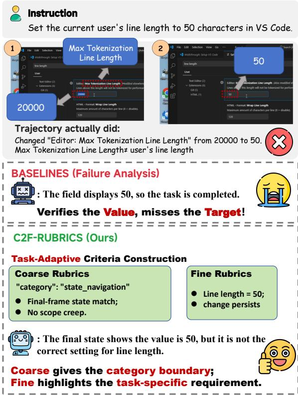
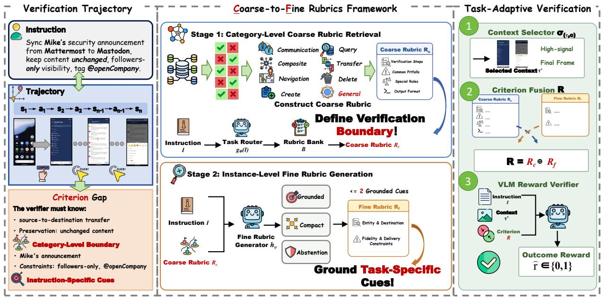
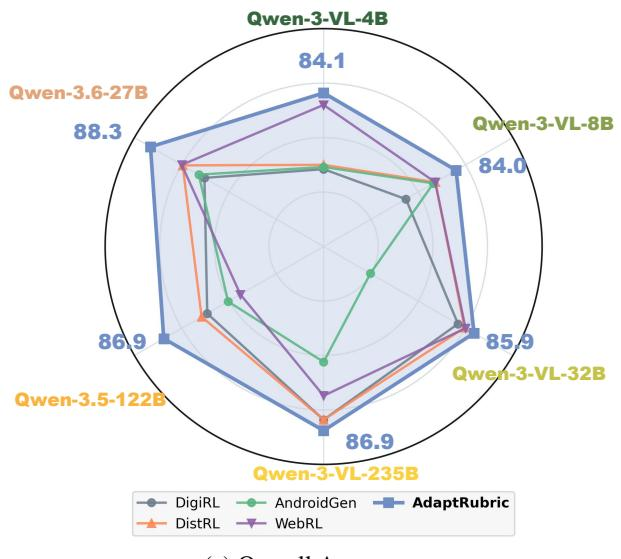
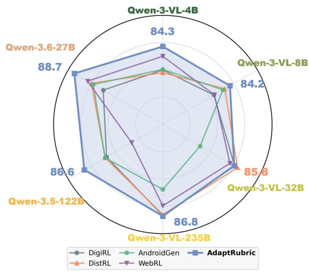
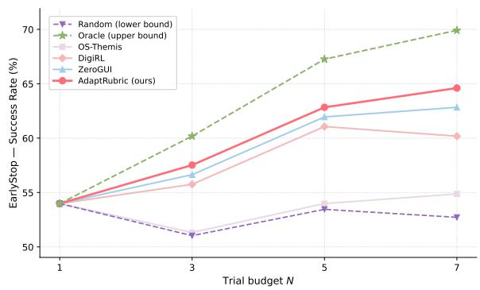
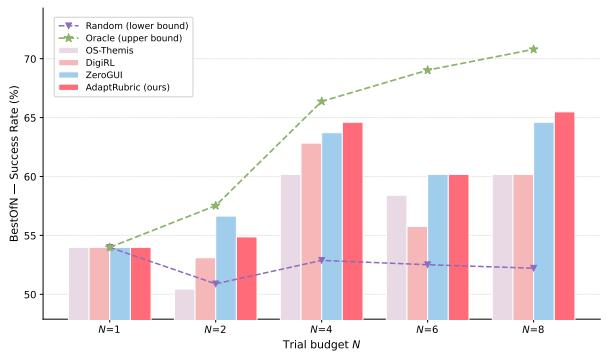
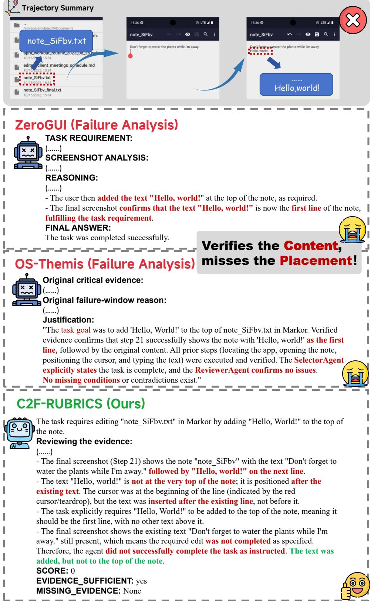

# Task-Adaptive Rubrics for GUI Reward Modeling

Tao Xiong<sup>1</sup>, Xavier Hu<sup>1</sup>, Wenkai Wang<sup>1</sup>, Qinzhuo Wu<sup>2</sup>, Changqiao Wu<sup>2</sup>, Pengzhi Gao<sup>2</sup>, Wei Liu<sup>2</sup>, Jian Luan <sup>2</sup>, Shengyu Zhang<sup>1,‡</sup>

<sup>1</sup>Zhejiang University, <sup>2</sup>MiLM Plus, Xiaomi Inc.

Correspondence: {xiongtao@zju.edu.cn,sy\_zhang@zju.edu.cn}

## Abstract

Recent studies on GUI agents have increasingly focused on outcome reward modeling, which assigns outcome rewards by judging whether an executed trajectory satisfies the success criteria implied by the user instruction. Existing GUI reward verifiers, however, often under-specify how these criteria should be constructed for each task instance. Whether using generic rubric structures or implicit model reasoning, their judging criteria are not sufficiently task-adaptive: they can transfer checks across tasks, overlook concrete constraints in the current instruction, or become overly strict by enforcing unstated requirements. To address this limitation, we propose ADAPTRUBRIC, a Coarse-to-Fine Rubrics Framework that constructs task-adaptive judging criteria through a category-level coarse stage and an instancelevel fine stage. ADAPTRUBRIC performs category-level coarse rubric retrieval by routing the instruction to a GUI task family and retrieving reusable task-family criteria, then conducts instance-level fine rubric generation to surface compact cues for concrete values, scopes, and constraints in the current instruction. Across offline reward evaluation and online reinforcement learning optimization, ADAPTRUBRIC consistently outperforms prior reward agents, improving F1 by 3.6 points over the baseline average under a matched image budget and yielding a 4.23-point task-success gain.

## 1 Introduction

Graphical User Interface (GUI) agents (Hu et al., 2025; Zhang et al., 2025; Liu et al., 2025a; Wang et al., 2024) have emerged as a promising paradigm for automating realistic digital devices. Enhancing GUI agents relies heavily on reliable outcome reward models (ORMs), which can filter high-value trajectories (Xia et al., 2025; Chen et al., 2025b;

  
Figure 1: A motivating example for task-adaptive verification. The trajectory sets a related VS Code option to 50, but misses the requested line-length setting. While baselines verify only the surface value, ADAP-TRUBRIC constructs coarse-to-fine criteria and correctly identifies the failure.

Xiong et al., 2025) from costly interactions, support benchmark evaluation and inference-time trajectory selection (Rawles et al., 2025; Xie et al., 2024), as well as provide reward signals (Xu et al., 2025, 2026; Li et al., 2026) for reinforcement learning.

To determine whether a GUI trajectory succeeds, a reward verifier must first identify the success criteria (Gupta et al., 2025; Xie et al., 2026; Gunjal et al., 2025) implied by the instruction. These criteria specify the goal to be achieved, the instancespecific constraints to satisfy, and the visual evidence needed to support the final judgment. Existing GUI reward verifiers construct or obtain these criteria in two common ways. Static-template methods (Yang et al., 2025; Qi et al., 2025; Lai et al., 2025; Wang et al., 2025a; Pan et al., 2024) encode the criteria in a fixed rubric structure, which makes verification stable but keeps the rubric generic. Such a rubric may ask whether the task is completed, but it does not adapt its checks to the current instruction’s target object, required value, operation scope, or output format. Other methods (Li et al., 2026; Dai et al., 2026; Cui et al., 2026) leave the criteria to the model’s implicit reasoning during verification. This gives the verifier more flexibility, but without clear verification boundaries for different task categories, the model may overlook required instruction details or introduce constraints beyond the intended scope of the task.

  
Figure 2: Overview of ADAPTRUBRIC. The left panel motivates task-adaptive verification with a concrete trajectory example and the resulting criterion gap. The middle panel illustrates coarse-to-fine rubric construction, where ADAPTRUBRIC retrieves a category-level coarse rubric from the rubric bank and augments it with compact instruction-specific cues. The right panel shows the final verification stage, where the fused criterion and selected trajectory context are passed to a VLM verifier for outcome reward prediction.

These limitations suggest that GUI reward verification requires task-adaptive criterion construction. The criteria should preserve verification boundaries for different task categories while adapting to the concrete requirements of each instruction instance. This allows the verifier to assess the trajectory against the task’s actual requirements, rather than a generic template or a loosely defined set of implicit checks.

We propose ADAPTRUBRIC, a framework for task-adaptive criterion construction in GUI outcome reward modeling. ADAPTRUBRIC constructs explicit judging criteria through a category-level coarse stage and an instance-level fine stage. The coarse stage first routes each instruction to a GUI task category and retrieves a reusable rubric from a category-level rubric bank, where the rubric specifies verification steps, common pitfalls, and special rules for that category. The fine stage then uses the current instruction and the retrieved rubric to generate compact instance-level rubric cues, turning concrete requirements into task-specific checking items. Finally, ADAPTRUBRIC fuses both components into a single criterion supplied to the VLM verifier, so the reward model preserves categorylevel verification boundaries while adapting to the current instruction.

We evaluate ADAPTRUBRIC on both offline reward discrimination and online reinforcement learning. On the offline GUI reward benchmark, ADAP-TRUBRIC achieves 86.7% accuracy and 86.6 F1, improving F1 by 3.6 points over the baseline average under a matched image budget. In online reinforcement learning experiments, using ADAP-TRUBRIC as the reward verifier yields a 4.23-point absolute gain in task success rate and achieves the best result among compared reward agents. These results show that task-adaptive criterion construction improves trajectory-level reward judgment and transfers to downstream GUI agent optimization. Our contributions are summarized as follows:

• We formulate task-adaptive criterion construction for GUI outcome reward modeling, where a verifier must derive explicit judging criteria from the user instruction before assigning reward.

• We introduce ADAPTRUBRIC, a coarse-to-fine rubric framework that combines category-level rubrics with compact instance-level rubrics into a single task-adaptive criterion for VLM-based reward verification.

• We evaluate ADAPTRUBRIC on offline reward discrimination and online reinforcement learning, achieving 86.7% accuracy and 86.6 F1 on the offline benchmark and a 4.23-point absolute gain in online task success rate.

## 2 Related Work

GUI Agents for Task Automation. The rapid progress of multimodal large language models (Singh et al., 2026; Anthropic, 2025; Team, 2026) has fundamentally transformed the landscape of autonomous GUI agents. Early GUI agents commonly relied on structured interface representations, such as DOM/HTML trees (Gur et al., 2018; Deng et al., 2023) for web pages and accessibility metadata for web or mobile interfaces (Li et al., 2024). With the emergence of large multimodal language models, later work increasingly shifted toward screenshot-based observations, often augmented with Set-of-Mark-style (Yang et al., 2023) visual annotations to expose clickable regions for visual grounding. To push their capability further, recent work post-trains these agents with supervised fine-tuning (Liu et al., 2025b; Hong et al., 2024) and offline reinforcement learning (Liu et al., 2025b, 2024). However, offline data limits how much an agent can explore beyond the trajectories it has already seen. Online reinforcement learning lets the agent interact with real environments, collect more diverse trajectories, and improve from a reward signal. To provide scalable training data and a reliable reward for both settings, outcome reward modeling is gaining increasing attention.

Outcome Reward Modeling for GUI Agents. Reliable outcome reward modeling is critical for GUI agents. A common approach is to use programmatic or rule-based evaluators (Rawles et al., 2025; Xie et al., 2024; Chen et al., 2025a) when the task can be deterministically checked, as in environments with executable assertions or handcrafted reward functions. Such evaluators are precise but costly to design and hard to scale to open-ended GUI tasks. Recent work therefore turns to modelbased evaluators that estimate task success from screenshots, action histories, final states, or UI metadata. One line of work directly applies LLMas-a-judge, feeding the trajectory and the instruction into a single model to obtain a binary or graded reward (Yang et al., 2025; Qi et al., 2025; Lai et al., 2025; Wang et al., 2025a; Pan et al., 2024). Another line improves verification reliability by decomposing the trajectory into milestones, adding verification steps, or introducing process-level rewards (Li et al., 2026; Zheng et al., 2026; Dai et al., 2026; Cui et al., 2026). These methods mainly change how evidence is collected, decomposed, or aggregated during verification. We focus on a complementary issue: before the verifier evaluates any evidence, it needs a task-adaptive judging criterion derived from the instruction. ADAPTRUBRIC addresses this by combining category-level rubrics with instance-level rubrics into an explicit criterion for GUI outcome reward verification.

## 3 Preliminary

A GUI agent interacts with an environment through a sequence of visual states and actions. Given a user instruction I and an initial screenshot $s _ { 1 } .$ , the agent executes an action $a _ { t }$ at each step and receives the next screenshot $s _ { t + 1 }$ until termination. We denote the completed trajectory as

$$
\tau = ( s _ { 1 } , a _ { 1 } , s _ { 2 } , a _ { 2 } , \ldots , s _ { T } , a _ { T } , s _ { T + 1 } ) ,\tag{1}
$$

where $s _ { t } \in S$ is a GUI screenshot, $a _ { t } \in \mathcal A$ is the executed action, and $s T \substack { + 1 }$ is the terminal screenshot after the final action.

An outcome reward model (ORM) maps the instruction and trajectory to a binary success judgment,

$$
\hat { r } = \mathcal { M } ( \mathcal { I } , \tau ) \in \{ 0 , 1 \} .\tag{2}
$$

Task-adaptive outcome reward modeling requires an explicit judging criterion that specifies the success conditions for the current instruction. We denote this criterion by R and write

$$
\hat { r } = f _ { \theta } ( \mathcal { T } , \tau ^ { \prime } , \mathcal { R } ) \in \{ 0 , 1 \} ,\tag{3}
$$

where $f _ { \theta }$ is the verifier, $\tau ^ { \prime } \subseteq \tau$ is the selected trajectory context, and R specifies the success cri-

teria used to judge the trajectory. The goal of taskadaptive criterion construction is to derive R for the current instruction before assigning reward.

## 4 Method

Figure 2 gives a compact overview of ADAP-TRUBRIC. As shown in the figure, Section 4.1 introduces category-level coarse rubric retrieval, Section 4.2 describes instance-level fine rubric generation, and Section 4.3 presents criterion fusion and reward verification.

## 4.1 Category-Level Coarse Rubric Retrieval

We construct the category-level rubric bank once before evaluation through an LLM-assisted induction procedure. Starting from a development trajectory pool ${ \mathcal { D } } _ { \mathrm { d e v } }$ collected from existing GUI agent benchmarks, we sample successful and failed trajectories and ask an LLM to summarize the verification dimensions that separate successful completions from failures. We then group these dimensions into broad GUI task categories. Each category rubric is refined on held-out trajectories, and whenever the rubric judgment disagrees with the trajectory label, we ask the LLM to revise it.

The resulting taxonomy C contains $K { = } 8$ categories, namely info\_query, create\_modi $\mathsf { f y } .$ delete\_cleanup, communication, transfer, state\_navigation, composite\_workflow, and general. The rubric bank is a fixed collection of category-level entries,

$$
\mathcal { B } = \{ E _ { c } = ( m _ { c } , S _ { c } ) \} _ { c \in \mathcal { C } } .\tag{4}
$$

Each entry $E _ { c }$ contains metadata $m _ { c }$ and a set of natural-language rubric sections $S _ { c } .$ The metadata records the category label and prompt-assembly information, while the rubric sections specify verification steps, common pitfalls, special rules, and output format:

$$
S _ { c } = \{ S _ { c } ^ { \mathrm { s t e p } } , S _ { c } ^ { \mathrm { p i t f a l l } } , S _ { c } ^ { \mathrm { r u l e } } , S _ { c } ^ { \mathrm { f o r m a t } } \} ,\tag{5}
$$

During verification, ADAPTRUBRIC renders $S _ { c }$ into the category-level coarse rubric $R _ { c }$ . The taxonomy and rubric dimensions are summarized in Appendix A. At inference time, a task router predicts the GUI task category from the instruction,

$$
c = g _ { \phi } ( { \underline { { \tau } } } ) , \qquad c \in { \mathcal { C } } .\tag{6}
$$

ADAPTRUBRIC then retrieves and renders the corresponding bank entry,

$$
\begin{array} { c } { E _ { c } = \operatorname { L o o k u p } ( B , c ) , \quad S _ { c } = \operatorname { S e c t i o n s } ( E _ { c } ) , } \\ { R _ { c } = \operatorname { R e n d e r } ( S _ { c } ) . \qquad } \end{array}\tag{7}
$$

We use top-1 lookup and if the router does not identify a specialized category, ADAPTRUBRIC falls back to the general entry $E _ { \tt g e n e r a l }$

## 4.2 Instance-Level Fine Rubric Generation

The fine stage constructs an instance-level fine rubric for the current instruction. Given the instruction $\mathcal { T } ,$ the predicted category $^ { c , }$ and the retrieved coarse rubric $R _ { c }$ , a rubric generator produces

$$
R _ { f } = h _ { \psi } ( { \mathcal { T } } , c , R _ { c } ) , \qquad | R _ { f } | \leq 2 ,\tag{8}
$$

where $R _ { f }$ is a compact list of fine-grained rubric items. The generator receives the coarse rubric as context, but it is not asked to rewrite $R _ { c }$ or fill its sections. Instead, it generates only additional instance-level checks that are grounded in the current instruction. The generator follows three constraints:

• Instruction grounding. Each fine rubric item must be supported by an explicit phrase, value, or constraint in the user instruction.

• Compactness. $R _ { f }$ contains at most two items, so the fine rubric highlights only the most useful instance-level requirements rather than becoming another full checklist.

• Abstention. The generator may return $R _ { f } = \varnothing$ when no reliable fine rubric item is needed.

These constraints keep the fine rubric compact and reduce the chance of adding requirements that are not specified by the instruction.

## 4.3 Criterion Fusion and Reward Verification

After obtaining the category-level coarse rubric and the instance-level fine rubric, ADAPTRUBRIC assembles the final judging criterion as

$$
\mathcal { R } = \Phi ( R _ { c } , R _ { f } ) = R _ { c } \oplus R _ { f } .\tag{9}
$$

The operator ⊕ keeps $R _ { c }$ as the main body of the criterion and appends $R _ { f }$ as a separated taskspecific block. If the fine stage abstains, the final criterion reduces to the coarse rubric, $\Phi ( R _ { c } , \emptyset ) =$ $R _ { c }$ . The fused criterion therefore preserves the category-level verification boundary while adding the instruction-specific fine rubric when available.

Before verification, ADAPTRUBRIC selects a compact trajectory context from the full GUI trajectory,

$$
\tau ^ { \prime } = \sigma ( \tau , c ) , \qquad | \tau ^ { \prime } | \leq M .\tag{10}
$$

<table><tr><td rowspan="2">Model</td><td colspan="2">Ubuntu</td><td colspan="2">Mobile</td><td colspan="2">Windows</td><td colspan="2">macOS</td><td colspan="2">Web</td><td colspan="3">Overall</td></tr><tr><td>Acc</td><td>F1</td><td>Acc</td><td>F1</td><td>Acc</td><td>F1</td><td>Acc F1</td><td></td><td>Acc F1</td><td>Acc</td><td>Prec</td><td>Rec</td><td>F1</td></tr><tr><td colspan="10">ZeroGUI</td><td></td><td></td><td></td><td></td><td></td></tr><tr><td>Qwen3-VL-4B-Instruct</td><td>83.8</td><td>84.0</td><td>74.5</td><td>76.2</td><td>80.3</td><td>75.6</td><td>90.9</td><td>78.8</td><td>81.1</td><td>83.2</td><td>82.0</td><td>83.2 80.0</td><td>81.6</td></tr><tr><td>Qwen3-VL-8B-Instruct</td><td>84.6</td><td>85.0</td><td>83.0</td><td>84.5</td><td>79.3</td><td>74.4 94.8</td><td>88.2</td><td>78.4</td><td>80.6</td><td>83.3</td><td>84.1</td><td>81.9</td><td>83.0</td></tr><tr><td>Qwen3-VL-32B-Instruct</td><td>84.6</td><td>85.2</td><td>83.5</td><td>85.0</td><td>80.3 75.6</td><td>96.1</td><td>90.3</td><td>82.1</td><td>83.5</td><td>84.1</td><td>84.6</td><td>83.1</td><td>83.9</td></tr><tr><td>Qwen3-VL-235B-A22B-Instruct</td><td>86.9</td><td>87.3</td><td>84.0</td><td>85.8</td><td>84.5</td><td>80.9 96.1</td><td>90.3</td><td>87.4</td><td>88.6</td><td>86.7</td><td>87.2</td><td>85.9</td><td>86.5</td></tr><tr><td>Qwen3.5-122B-A10B</td><td>85.8</td><td>86.5</td><td>82.4</td><td>83.7</td><td>83.6</td><td>80.2</td><td>96.1 90.9</td><td>80.0</td><td>82.7</td><td>84.8</td><td>84.1</td><td>85.6</td><td>84.8</td></tr><tr><td>Qwen3.6-27B</td><td>86.2</td><td>87.5</td><td>80.9</td><td>83.5</td><td>83.6</td><td>81.5</td><td>94.8 88.9</td><td>82.1</td><td>84.7</td><td>85.0</td><td>81.2</td><td>90.9</td><td>85.8</td></tr><tr><td>Gemini 3 Flash</td><td>88.5</td><td>89.0</td><td>80.3</td><td>80.6</td><td>87.8</td><td>85.7 97.4</td><td>93.8</td><td>87.9</td><td>88.3</td><td>87.7</td><td>89.2</td><td>85.7</td><td>87.4</td></tr><tr><td>Gemini 3.1 Flash-Lite</td><td>87.2</td><td>87.9</td><td>80.3</td><td>81.6</td><td>85.4</td><td>82.3</td><td>94.8 87.5</td><td>85.3</td><td>86.8</td><td>86.2</td><td>85.9</td><td>86.3</td><td>86.1</td></tr><tr><td>Mean</td><td>86.0</td><td>86.5</td><td>81.1</td><td>82.6</td><td>83.1</td><td>79.5</td><td>95.1 88.6</td><td>83.0</td><td>84.8</td><td>85.0</td><td>84.9</td><td>84.9</td><td>84.9</td></tr><tr><td colspan="10">OS-Themis</td><td colspan="7"></td></tr><tr><td>Qwen3-VL-4B-Instruct</td><td>72.6</td><td>71.4</td><td>79.3</td><td>78.9</td><td>75.1</td><td>68.3</td><td>84.4</td><td>57.1</td><td>80.0</td><td>81.9</td><td>75.5</td><td>79.5 68.3</td><td>73.5</td></tr><tr><td>Qwen3-VL-8B-Instruct</td><td>76.2</td><td>75.0</td><td>84.0</td><td>83.7</td><td>78.4</td><td>72.0</td><td>83.1</td><td>51.9 81.6</td><td>82.4</td><td></td><td>78.7 84.6</td><td>69.9</td><td>76.5</td></tr><tr><td>Qwen3-VL-32B-Instruct</td><td>77.1</td><td>74.6</td><td>81.9</td><td>80.7</td><td>76.5</td><td>65.3</td><td>90.9 77.4</td><td>83.7</td><td>81.9</td><td>79.3</td><td>91.6</td><td>64.1</td><td>75.5</td></tr><tr><td>Qwen3-VL-235B-A22B-Instruct</td><td>86.4</td><td>86.8</td><td>93.6</td><td>93.7</td><td>77.5</td><td>69.6</td><td>93.5 82.8</td><td>91.6</td><td>91.9</td><td>87.1</td><td>90.5</td><td>82.7</td><td>86.4</td></tr><tr><td>Qwen3.5-122B-A10B</td><td>85.8</td><td>85.8</td><td>88.3</td><td>88.2</td><td>79.8</td><td>73.0</td><td>88.3 66.7</td><td>79.0</td><td>75.6</td><td>84.5</td><td>92.0</td><td>75.3</td><td>82.8</td></tr><tr><td>Qwen3.6-27B Gemini 3 Flash</td><td>87.9</td><td>88.5</td><td>93.6</td><td>93.9</td><td>88.3</td><td>86.9</td><td>96.1 90.3</td><td>92.1</td><td>92.1</td><td>89.7</td><td>90.2</td><td>89.0</td><td>89.6</td></tr><tr><td>Gemini 3.1 Flash-Lite</td><td>81.5</td><td>81.5</td><td>84.0</td><td>84.2</td><td>86.9</td><td>84.4 88.3</td><td>71.0</td><td>80.5</td><td>77.3</td><td>82.9</td><td>88.1</td><td>75.9</td><td>81.5</td></tr><tr><td>Mean</td><td>82.9</td><td>83.3</td><td>82.4</td><td>82.7</td><td>87.3</td><td>84.2 90.9</td><td>75.9</td><td>84.2</td><td>83.3</td><td>84.1</td><td>87.7</td><td>79.1</td><td>83.2</td></tr><tr><td></td><td>81.3</td><td>80.9</td><td>85.9</td><td>85.8</td><td>81.2</td><td>75.5</td><td>89.4 71.6</td><td>84.1</td><td>83.3</td><td>82.7</td><td>88.0</td><td>75.5</td><td>81.1</td></tr><tr><td colspan="10">ADAPTRUBRIC</td><td colspan="7"></td></tr><tr><td>Qwen3-VL-4B-Instruct</td><td>84.3</td><td>85.6</td><td>80.9</td><td>81.1</td><td>83.1</td><td>79.5</td><td>97.4</td><td>94.1</td><td>82.1</td><td>84.5</td><td>84.1</td><td>82.8</td><td></td><td>84.3</td></tr><tr><td>Qwen3-VL-8B-Instruct</td><td>83.9</td><td>85.1</td><td>83.5</td><td>84.6</td><td>81.7</td><td>79.1</td><td>97.4</td><td>94.1</td><td>81.6</td><td>83.3</td><td>84.0</td><td>82.6</td><td>85.9 85.9</td><td>84.2</td></tr><tr><td>Qwen3-VL-32B-Instruct</td><td>86.5</td><td>86.6</td><td>85.6</td><td>85.9</td><td>80.3</td><td>75.0</td><td>93.5</td><td>83.9</td><td>86.8</td><td>87.6</td><td>85.9</td><td>89.3</td><td>81.3</td><td>85.1</td></tr><tr><td>Qwen3-VL-235B-A22B-Instruct</td><td>86.1</td><td>86.7</td><td>87.8</td><td>88.9</td><td>84.5</td><td>81.4</td><td>94.8</td><td>87.5</td><td>88.9</td><td>90.0</td><td>86.9</td><td>87.0</td><td>86.7</td><td>86.8</td></tr><tr><td>Qwen3.5-122B-A10B</td><td>86.2</td><td>86.8</td><td>89.9</td><td>90.4</td><td>81.7</td><td>77.2</td><td>94.8</td><td>88.2</td><td>88.9</td><td>89.8</td><td>86.9</td><td>87.8</td><td>85.4</td><td>86.6</td></tr><tr><td>Qwen3.6-27B</td><td>87.3</td><td>88.5</td><td>91.0</td><td>91.6</td><td>84.5</td><td>82.5</td><td>93.5</td><td>85.7</td><td>91.6</td><td>92.4</td><td>88.3</td><td>85.4</td><td>92.1</td><td>88.7</td></tr><tr><td>Gemini 3 Flash</td><td>90.4</td><td>90.7</td><td>91.0</td><td>91.4</td><td>87.3</td><td>84.7</td><td>94.8</td><td>88.9</td><td>94.7</td><td>95.0</td><td>90.8</td><td>92.3</td><td>89.0</td><td>90.6</td></tr><tr><td>Gemini 3.1 Flash-Lite</td><td>86.4</td><td>87.1</td><td>83.0</td><td>83.3</td><td>85.0</td><td>81.6</td><td>94.8</td><td>87.5</td><td>88.9</td><td>89.7</td><td>86.5</td><td>87.2</td><td>85.4</td></table>

Table 1: Offline reward discrimination results on OGRBench. Each method reports Accuracy (Acc) and F1-score (F1) for each platform; Overall columns include Acc, Precision (Prec), Recall (Rec), and F1. ZeroGUI uses the last-10 image budget. In each column, bold marks the best value across all 3×8 method-backbone cells, and underline marks the second-best (computed separately for the Mean rows).

The selector keeps screenshot-bearing steps that are useful for outcome judgment, including the initial and final states and frames around high-signal actions such as text entry, submission, or statechanging operations. The selected context, the instruction, and the fused criterion are then passed to the verifier,

$$
\hat { r } = f _ { \theta } ( \mathbb { Z } , \tau ^ { \prime } , \mathscr { R } ) \in \{ 0 , 1 \} .\tag{11}
$$

The verifier outputs a binary reward in a parsable format. Thus, ADAPTRUBRIC changes the judging criterion and trajectory context supplied to the verifier, while keeping the verifier architecture unchanged.

## 5 Experiment

## 5.1 Offline Evaluation

We evaluate offline GUI reward discrimination on OmniGUIRewardBench (OGRBench) (Li et al., 2026), a cross-platform benchmark for testing whether a reward verifier can correctly judge trajectory-level task success.

Benchmark. OGRBench contains 1,409 trajectories from five environments: OSWorld (Xie et al., 2024) for Ubuntu, AndroidWorld (Rawles et al., 2025) for mobile Android, (Bonatti et al., 2024) for Windows, macOSArena (Wang et al., 2025b) for macOS, and WebArena-Lite-v2 (Wang et al., 2025b; Zhou et al., 2023) for web tasks. The benchmark is nearly balanced overall, with 700 positive and 709 negative trajectories.

Baselines. We compare with six representative

  
(a) Overall Accuracy.

  
(b) Overall F1.  
Figure 3: Cross-backbone radar comparison on OGRBench under the matched ten-screenshot budget. Each axis corresponds to one Qwen-family judge backbone, and each curve corresponds to one reward verifier.

GUI reward verification frameworks: DigiRL (Bai et al., 2024), DistRL (Wang et al., 2025a), Android-Gen (Lai et al., 2025), WebRL (Qi et al., 2025), ZeroGUI (Yang et al., 2025), and OS-Themis (Li et al., 2026). To align their trajectory inputs with ADAP-TRUBRIC, all offline reward verifiers are evaluated under the same ten-screenshot budget. Appendix E details each baseline’s original trajectory-context setting and our unified matched-budget instantiation, and Appendix D analyzes the effect of image budget.

For judge backbones, we evaluate open-source Qwen models from the Qwen3-VL (Bai et al., 2025), Qwen3.5 (Team, 2026), and Qwen3.6 (Qwen Team, 2026) series, as well as closed-source Gemini models (Team et al., 2025).

Metrics. For offline reward discrimination, we report Accuracy, Precision, Recall, and F1.

Main Results. Table 1 reports the main OGR-Bench comparison with ZeroGUI and OS-Themis across all eight judge backbones. In this setting, ADAPTRUBRIC achieves the best average performance, with 86.7% accuracy and 86.6 F1. Compared with the average of the two baselines under the main protocol, ADAPTRUBRIC improves the four overall metrics by 3.3 points on average, including 2.9 points in accuracy and 3.6 points in F1. The main gain comes from recall: the baseline average is 80.2%, while ADAPTRUBRIC raises recall to 86.5% with a comparable precision of 86.8%. This indicates that task-adaptive criteria help the verifier recover more successful trajectories while still controlling false positives. The improvement is also consistent across platforms, where ADAPTRUBRIC achieves the best average F1 on Ubuntu, Android, Windows, macOS, and Web tasks. These results support our core claim that combining category-level rubrics with instancelevel fine rubrics yields more reliable trajectorylevel reward judgment than generic terminal-state judging or implicit multi-step verification.

Figure 3 further compares ADAPTRUBRIC with four additional baselines, DigiRL, DistRL, AndroidGen, and WebRL, using the open-source Qwen-family judge backbones. This expanded comparison tests whether the same advantage holds against a broader set of reward-agent prompts under the matched ten-screenshot budget. ADAP-TRUBRIC achieves the best accuracy on all backbones and the best F1 on five of six backbones, showing that the gain is not tied to a single judge scale. The detailed values in Appendix E show that the expanded-baseline mean F1 of ADAP-TRUBRIC remains higher than all four additional baselines.

## 5.2 Online Reinforcement Learning

We further evaluate whether the offline reward advantage transfers to downstream GUI agent optimization.

Setup. We conduct online RL training using the ClawGUI (Tang et al., 2026) framework on the MobileWorld (Kong et al., 2025) environment. The policy backbone is MAI-UI-8B (Zhou et al., 2025), and the policy is optimized with Group Relative Policy Optimization (GRPO) (Shao et al., 2024). For each task, GRPO samples four rollouts as a group, and the reward agent assigns an outcome reward to each completed trajectory. We keep the training protocol fixed and replace only the reward agent, comparing DigiRL, ZeroGUI, OS-Themis, and ADAPTRUBRIC. For ADAPTRUBRIC, the reward verifier uses Qwen3-VL-8B-Instruct and observes at most ten trajectory screenshots. All runs use a maximum episode length of 50 steps and train for 2 epochs; other hyperparameters are reported in Appendix C.

Main Results. Table 2 reports online reinforcement learning results when different reward agents provide training rewards for MAI-UI-8B. Without an external reward agent, MAI-UI-8B reaches 19.70% task success. Using ADAPTRUBRIC as the reward verifier increases success to 23.93%, a 4.23-point absolute gain and the best result among compared reward agents. This suggests that the criterion constructed by ADAPTRUBRIC is not only better at offline trajectory discrimination, but also provides a more useful reward signal for policy improvement.

## 5.3 Reward-Guided Test-Time Scaling

We test whether reward verification helps select successful trajectories when multiple candidates are sampled for the same task.

Setup. We evaluate on 113 AndroidWorld tasks, with ten candidate trajectories sampled for each task. We use this offline candidate pool to simulate online test-time scaling, so that all verifiers select from the same trajectories and the dynamic execution environment remains controlled. To create a discriminative candidate pool, we mix eight rollouts from Qwen3-VL-8B-Instruct and two rollouts from Qwen3-VL-235B-A22B-Instruct. Details are provided in Appendix F. All reward verifiers share

<table><tr><td>Backbone</td><td>Reward Agent</td><td>SR (%)</td><td>∆</td></tr><tr><td rowspan="5">MAI-UI-8B</td><td></td><td>19.70†</td><td></td></tr><tr><td>DigiRL</td><td>23.08</td><td>+3.38</td></tr><tr><td>ZeroGUI</td><td>22.22</td><td>+2.52</td></tr><tr><td>OS-Themis</td><td>22.22</td><td>+2.52</td></tr><tr><td>ADAPTRUBRIC</td><td> ${ \bf 2 3 . 9 3 \pm 0 . 8 5 }$ </td><td>+4.23</td></tr></table>

Table 2: Online reinforcement training results on MAI-UI-8B. We report the success rate (SR) after training with different reward agents. <sup>†</sup> denotes the result from Tang et al. (2026).

<table><tr><td>Method</td><td>ES@7</td><td>BoN@8</td><td>Acc.</td><td>F1</td><td>FPR</td></tr><tr><td>OS-Themis</td><td>+2.15</td><td>+7.97</td><td>75.75</td><td>72.92</td><td>10.81</td></tr><tr><td>DigiRL</td><td>+7.46</td><td>+7.97</td><td>80.80</td><td>81.90</td><td>22.71</td></tr><tr><td>ZeroGUI</td><td>+10.11</td><td>+12.39</td><td>86.55</td><td>87.16</td><td>15.38</td></tr><tr><td>ADAPTRUBRIC</td><td>+11.88</td><td>+13.28</td><td>88.14</td><td>88.41</td><td>11.17</td></tr></table>

Table 3: Heterogeneous-pool offline reward-guided testtime scaling. ES@7 (EarlyStop) and BoN@8 (BestOfN) report success-rate gains over Random in percentage points. Acc., F1, and FPR (false-positive rate) are computed over trajectory-level reward predictions.

Qwen3-VL-32B-Instruct as the judge and consume the same per-task shuffled trajectory stream. We evaluate two selection protocols: EarlyStop@N scans the first N trajectories sequentially and stops at the first one predicted as successful (online, lowlatency setting), while BestOfN@N scores all N candidates and returns the highest-scored one (offline, batch setting). All verifiers in this comparison output binary scores, so multiple candidates often share the same score under BestOfN. In this case, we always pick the last tied candidate as the final selection. Both gains are reported relative to Random selection.

Overall results. Table 3 summarizes performance under the two selection protocols. ADAP-TRUBRIC achieves the largest gains over Random, improving EarlyStop@7 by +11.88 points and BestOfN@8 by +13.28 points. It also obtains the strongest trajectory-level reward prediction results, with 88.14 accuracy and 88.41 F1. At the same time, its false-positive rate remains low at 11.17, close to the most conservative baseline OS-Themis.

EarlyStop: low-latency selection. Figure 4a reports EarlyStop SR@N as the per-task budget grows from 1 to 7. ADAPTRUBRIC is the strongest method at every budget from N=3 onward. At N=7, it reaches 64.60% task success, exceeding ZeroGUI by 1.77 points, DigiRL by 4.42 points, and OS-Themis by 9.73 points. The Oracle upper bound at the same budget is 69.91%, so ADAPTRUBRIC closes about 69% of the gap between Random selection and the Oracle. Because EarlyStop commits to the first accepted trajectory, it favors verifiers that can avoid false-positive acceptances.

BestOfN: batch selection. Figure 4b reports BestOfN SR@N for $N \in \{ 1 , 2 , 4 , 6 , 8 \}$ . ADAP-TRUBRIC achieves the best result at N=4 with 64.60% task success and at N=8 with 65.49% task success, and it ties ZeroGUI at N=6. The only weaker point is N=2, where binary reward outputs often produce ties and the fixed tie-breaking rule has a large effect on the selected trajectory. DigiRL decreases as the candidate set grows from N=4 to N=6, consistent with the difficulty of judging longer visual contexts. Overall, the batch setting amplifies the advantage of ADAPTRUBRIC, because reward errors accumulate when the verifier must compare many candidates.

  
(a) EarlyStop SR@N $( N { = } 1 , 3 , 5 , 7 ) .$

  
(b) BestOfN SR@N $( N { = } 1 , 2 , 4 , 6 , 8 )$

Figure 4: Test-time scaling results on the heterogeneous AndroidWorld pool of 113 tasks.
<table><tr><td>Coarse</td><td>Fine</td><td>Setting</td><td>Acc.</td><td>∆Acc.</td><td>F1</td><td>∆F1</td></tr><tr><td></td><td>√</td><td>Full (Coarse + Fine)</td><td>86.9</td><td></td><td>86.6</td><td></td></tr><tr><td>√</td><td>X</td><td>w/o Fine</td><td>84.9</td><td>-2.0</td><td>84.6</td><td>-2.0</td></tr><tr><td>X</td><td>√</td><td>w/o Coarse</td><td>85.2</td><td>-1.7</td><td>84.6</td><td>-2.0</td></tr><tr><td>X</td><td>X</td><td>w/o Both (image-only)</td><td>81.5</td><td>-5.4</td><td>80.7</td><td>-5.9</td></tr></table>

Table 4: Ablation study of rubric construction on Qwen3.5-122B-A10B. ∆Acc. and ∆F1 report the absolute drop relative to the full model.

## 5.4 Ablation Study

Table 4 isolates the contribution of the Coarse and Fine rubrics in ADAPTRUBRIC. The full model achieves 86.9 accuracy and 86.6 F1 on Qwen3.5- 122B-A10B. Removing either component consistently weakens reward verification. Without the Fine rubric, F1 drops by 2.0 points, and without the Coarse rubric, F1 drops by 2.0 points as well. The largest decline appears when both rubrics are removed, where the verifier relies only on the instruction and trajectory screenshots and F1 falls by 5.9 points. This pattern shows that the two rubrics are complementary, since the Coarse rubric anchors the verifier to task-category boundaries and the Fine rubric adds instruction-specific success requirements.

<table><tr><td rowspan="2">Method</td><td colspan="2">Quality</td><td colspan="4">LLM Cost</td><td colspan="2">Runtime</td></tr><tr><td>Acc.</td><td>F1</td><td>Calls</td><td>Calls/traj.</td><td>Tokens</td><td>Tok./traj.</td><td>Min.</td><td>s/traj.</td></tr><tr><td>OS-Themis</td><td>78.7</td><td>76.5</td><td>21,490</td><td>15.25</td><td>243.75M</td><td>173.0K</td><td>88.8</td><td>3.78</td></tr><tr><td>ZeroGUI</td><td>83.3</td><td>83.0</td><td>5,608</td><td>3.98</td><td>100.15M</td><td>71.1K</td><td>51.7</td><td>2.20</td></tr><tr><td>DigiRL</td><td>78.7</td><td>80.8</td><td>1,402</td><td>1.00</td><td>23.46M</td><td>16.6K</td><td>34.2</td><td>1.46</td></tr><tr><td>ADAPTRUBRIC</td><td>84.0</td><td>84.2</td><td>4,220</td><td>3.00</td><td>26.98M</td><td>19.1K</td><td>36.6</td><td>1.56</td></tr></table>

Table 5: Efficiency comparison on OGRBench using Qwen3-VL-8B-Instruct. All methods use the same ten-screenshot trajectory budget. Lowest cost in each column is in bold.

## 5.5 Efficiency Analysis

Table 5 compares OGRBench quality and inference cost using Qwen3-VL-8B-Instruct. ADAP-TRUBRIC achieves the best accuracy and F1, with 84.0 Acc. and 84.2 F1, while using substantially fewer calls, tokens, and runtime than OS-Themis and ZeroGUI. DigiRL is slightly cheaper, but its F1 remains 3.4 points lower than ADAPTRUBRIC. Overall, ADAPTRUBRIC provides the strongest quality–cost trade-off for repeated reward verification.

## 5.6 Case Study

Appendix G presents a representative failure case showing why task-adaptive criteria matter. The task asks the agent to add text to the top of a note, but the trajectory inserts the text below existing content. Baselines focus on whether the requested text appears and incorrectly mark the task as successful. ADAPTRUBRIC combines a coarse create/- modify rubric with fine placement cues, allowing the verifier to check both the edited item and the instruction-specific ordering constraint.

## 6 Conclusion

We presented ADAPTRUBRIC, a coarse-to-fine rubric framework for task-adaptive GUI outcome reward modeling. The category-level Coarse rubric anchors verification to task-family success criteria, while the instance-level Fine rubric specifies the task-adaptive criteria needed for the current instruction. Across offline and online experiments, ADAP-TRUBRIC consistently demonstrates the value of explicitly constructing task-adaptive criteria for success, supporting our core claim for reliable GUI reward modeling across GUI interaction settings.

## Limitations

ADAPTRUBRIC improves GUI reward verification by constructing task-adaptive rubrics, but it still has several scope boundaries. First, although our evaluation covers mobile, desktop, and web environments, it does not exhaust all possible applications, interface designs, or user instruction styles. Second, the coarse rubric bank is constructed offline and kept fixed during evaluation to ensure reproducibility and controlled comparison across methods; this makes the protocol stable, but it may not capture every newly emerging application or domain-specific workflow.

## References

Anthropic. 2025. Introducing claude 4. https://www. anthropic.com/news/claude-4. Accessed: 2026- 05-25.

Hao Bai, Yifei Zhou, Mert Cemri, Jiayi Pan, Alane Suhr, Sergey Levine, and Aviral Kumar. 2024. Digirl: Training in-the-wild device-control agents with autonomous reinforcement learning. Preprint, arXiv:2406.11896.

Shuai Bai, Yuxuan Cai, Ruizhe Chen, Keqin Chen, Xionghui Chen, Zesen Cheng, Lianghao Deng, Wei Ding, Chang Gao, Chunjiang Ge, Wenbin Ge, Zhifang Guo, Qidong Huang, Jie Huang, Fei Huang, Binyuan Hui, Shutong Jiang, Zhaohai Li, Mingsheng Li, and 45 others. 2025. Qwen3-vl technical report. arXiv preprint arXiv:2511.21631.

Rogerio Bonatti, Dan Zhao, Francesco Bonacci, Dillon Dupont, Sara Abdali, Yinheng Li, Yadong Lu, Justin Wagle, Kazuhito Koishida, Arthur Bucker, Lawrence Jang, and Zack Hui. 2024. Windows agent arena: Evaluating multi-modal os agents at scale. Preprint, arXiv:2409.08264.

Yuhan Chen, Yuxuan Liu, Long Zhang, Pengzhi Gao, Jian Luan, and Wei Liu. 2025a. Step: Successrate-aware trajectory-efficient policy optimization. Preprint, arXiv:2511.13091.

Zhenfang Chen, Delin Chen, Rui Sun, Wenjun Liu, and Chuang Gan. 2025b. Scaling autonomous agents via

automatic reward modeling and planning. Preprint, arXiv:2502.12130.

Chaoqun Cui, Jing Huang, Shijing Wang, Liming Zheng, Qingchao Kong, and Zhixiong Zeng. 2026. Agentic reward modeling: Verifying gui agent via online proactive interaction. Preprint, arXiv:2602.00575.

Gaole Dai, Shiqi Jiang, Ting Cao, Yuqing Yang, Yuanchun Li, Rui Tan, Mo Li, and Lili Qiu. 2026. Prore: A proactive reward system for gui agents via reasoner-actor collaboration. Preprint, arXiv:2509.21823.

Xiang Deng, Yu Gu, Boyuan Zheng, Shijie Chen, Samuel Stevens, Boshi Wang, Huan Sun, and Yu Su. 2023. Mind2web: Towards a generalist agent for the web. Preprint, arXiv:2306.06070.

Anisha Gunjal, Anthony Wang, Elaine Lau, Vaskar Nath, Yunzhong He, Bing Liu, and Sean Hendryx. 2025. Rubrics as rewards: Reinforcement learning beyond verifiable domains. Preprint, arXiv:2507.17746.

Taneesh Gupta, Shivam Shandilya, Xuchao Zhang, Rahul Madhavan, Supriyo Ghosh, Chetan Bansal, Huaxiu Yao, and Saravan Rajmohan. 2025. Carmo: Dynamic criteria generation for context-aware reward modelling. Preprint, arXiv:2410.21545.

Izzeddin Gur, Ulrich Rueckert, Aleksandra Faust, and Dilek Hakkani-Tur. 2018. Learning to navigate the web. Preprint, arXiv:1812.09195.

Wenyi Hong, Weihan Wang, Qingsong Lv, Jiazheng Xu, Wenmeng Yu, Junhui Ji, Yan Wang, Zihan Wang, Yuxuan Zhang, Juanzi Li, Bin Xu, Yuxiao Dong, Ming Ding, and Jie Tang. 2024. Cogagent: A visual language model for gui agents. Preprint, arXiv:2312.08914.

Xueyu Hu, Tao Xiong, Biao Yi, Zishu Wei, Ruixuan Xiao, Yurun Chen, Jiasheng Ye, Meiling Tao, Xiangxin Zhou, Ziyu Zhao, Yuhuai Li, Shengze Xu, Shenzhi Wang, Xinchen Xu, Shuofei Qiao, Zhaokai Wang, Kun Kuang, Tieyong Zeng, Liang Wang, and 10 others. 2025. Os agents: A survey on mllm-based agents for general computing devices use. Preprint, arXiv:2508.04482.

Quyu Kong, Xu Zhang, Zhenyu Yang, Nolan Gao, Chen Liu, Panrong Tong, Chenglin Cai, Hanzhang Zhou, Jianan Zhang, Liangyu Chen, Zhidan Liu, Steven Hoi, and Yue Wang. 2025. Mobileworld: Benchmarking autonomous mobile agents in agent-user interactive and mcp-augmented environments. Preprint, arXiv:2512.19432.

Hanyu Lai, Junjie Gao, Xiao Liu, Yifan Xu, Shudan Zhang, Yuxiao Dong, and Jie Tang. 2025. Androidgen: Building an android language agent under data scarcity. Preprint, arXiv:2504.19298.

Wei Li, William Bishop, Alice Li, Chris Rawles, Folawiyo Campbell-Ajala, Divya Tyamagundlu, and Oriana Riva. 2024. On the effects of data scale on ui control agents. Preprint, arXiv:2406.03679.

Zehao Li, Zhenyu Wu, Yibo Zhao, Bowen Yang, Jingjing Xie, Zhaoyang Liu, Zhoumianze Liu, Kaiming Jin, Jianze Liang, Zonglin Li, Feng Wu, Bowen Zhou, Zun Wang, and Zichen Ding. 2026. Os-themis: A scalable critic framework for generalist gui rewards. Preprint, arXiv:2603.19191.

Xiao Liu, Bo Qin, Dongzhu Liang, Guang Dong, Hanyu Lai, Hanchen Zhang, Hanlin Zhao, Iat Long Iong, Jiadai Sun, Jiaqi Wang, Junjie Gao, Junjun Shan, Kangning Liu, Shudan Zhang, Shuntian Yao, Siyi Cheng, Wentao Yao, Wenyi Zhao, Xinghan Liu, and 11 others. 2024. Autoglm: Autonomous foundation agents for guis. Preprint, arXiv:2411.00820.

Yuhang Liu, Pengxiang Li, Zishu Wei, Congkai Xie, Xueyu Hu, Xinchen Xu, Shengyu Zhang, Xiaotian Han, Hongxia Yang, and Fei Wu. 2025a. Infiguiagent: A multimodal generalist gui agent with native reasoning and reflection. Preprint, arXiv:2501.04575.

Yuhang Liu, Pengxiang Li, Congkai Xie, Xavier Hu, Xiaotian Han, Shengyu Zhang, Hongxia Yang, and Fei Wu. 2025b. Infigui-r1: Advancing multimodal gui agents from reactive actors to deliberative reasoners. Preprint, arXiv:2504.14239.

Jiayi Pan, Yichi Zhang, Nicholas Tomlin, Yifei Zhou, Sergey Levine, and Alane Suhr. 2024. Autonomous evaluation and refinement of digital agents. Preprint, arXiv:2404.06474.

Zehan Qi, Xiao Liu, Iat Long Iong, Hanyu Lai, Xueqiao Sun, Wenyi Zhao, Yu Yang, Xinyue Yang, Jiadai Sun, Shuntian Yao, Tianjie Zhang, Wei Xu, Jie Tang, and Yuxiao Dong. 2025. Webrl: Training llm web agents via self-evolving online curriculum reinforcement learning. Preprint, arXiv:2411.02337.

Qwen Team. 2026. Qwen3.6-27B: Flagship-level coding in a 27B dense model.

Christopher Rawles, Sarah Clinckemaillie, Yifan Chang, Jonathan Waltz, Gabrielle Lau, Marybeth Fair, Alice Li, William Bishop, Wei Li, Folawiyo Campbell-Ajala, Daniel Toyama, Robert Berry, Divya Tyamagundlu, Timothy Lillicrap, and Oriana Riva. 2025. Androidworld: A dynamic benchmarking environment for autonomous agents. Preprint, arXiv:2405.14573.

Zhihong Shao, Peiyi Wang, Qihao Zhu, Runxin Xu, Junxiao Song, Xiao Bi, Haowei Zhang, Mingchuan Zhang, Y. K. Li, Y. Wu, and Daya Guo. 2024. Deepseekmath: Pushing the limits of mathematical reasoning in open language models. Preprint, arXiv:2402.03300.

Aaditya Singh, Adam Fry, Adam Perelman, Adam Tart, Adi Ganesh, Ahmed El-Kishky, Aidan McLaughlin,

Aiden Low, AJ Ostrow, Akhila Ananthram, Akshay Nathan, Alan Luo, Alec Helyar, Aleksander Madry, Aleksandr Efremov, Aleksandra Spyra, Alex Baker-Whitcomb, Alex Beutel, Alex Karpenko, and 467 others. 2026. Openai gpt-5 system card. Preprint, arXiv:2601.03267.

Fei Tang, Zhiqiong Lu, Boxuan Zhang, Weiming Lu, Jun Xiao, Yueting Zhuang, and Yongliang Shen. 2026. Clawgui: A unified framework for training, evaluating, and deploying gui agents. Preprint, arXiv:2604.11784.

Gemini Team, Rohan Anil, Sebastian Borgeaud, Jean-Baptiste Alayrac, Jiahui Yu, Radu Soricut, Johan Schalkwyk, Andrew M. Dai, Anja Hauth, Katie Millican, David Silver, Melvin Johnson, Ioannis Antonoglou, Julian Schrittwieser, Amelia Glaese, Jilin Chen, Emily Pitler, Timothy Lillicrap, Angeliki Lazaridou, and 1332 others. 2025. Gemini: A family of highly capable multimodal models. Preprint, arXiv:2312.11805.

Qwen Team. 2026. Qwen3.5: Accelerating productivity with native multimodal agents.

Shuai Wang, Weiwen Liu, Jingxuan Chen, Yuqi Zhou, Weinan Gan, Xingshan Zeng, Yuhan Che, Shuai Yu, Xinlong Hao, Kun Shao, and 1 others. 2024. Gui agents with foundation models: A comprehensive survey. arXiv preprint arXiv:2411.04890.

Taiyi Wang, Zhihao Wu, Jianheng Liu, Jianye Hao, Jun Wang, and Kun Shao. 2025a. Distrl: An asynchronous distributed reinforcement learning framework for on-device control agents. Preprint, arXiv:2410.14803.

Xuehui Wang, Zhenyu Wu, JingJing Xie, Zichen Ding, Bowen Yang, Zehao Li, Zhaoyang Liu, Qingyun Li, Xuan Dong, Zhe Chen, Weiyun Wang, Xiangyu Zhao, Jixuan Chen, Haodong Duan, Tianbao Xie, Shiqian Su, Chenyu Yang, Yue Yu, Yuan Huang, and 8 others. 2025b. Mmbench-gui: Hierarchical multi-platform evaluation framework for gui agents. arXiv preprint arXiv:2507.19478.

Yu Xia, Jingru Fan, Weize Chen, Siyu Yan, Xin Cong, Zhong Zhang, Yaxi Lu, Yankai Lin, Zhiyuan Liu, and Maosong Sun. 2025. Agentrm: Enhancing agent generalization with reward modeling. Preprint, arXiv:2502.18407.

Lipeng Xie, Sen Huang, Zhuo Zhang, Anni Zou, Yunpeng Zhai, Dingchao Ren, Kezun Zhang, Haoyuan Hu, Boyin Liu, Haoran Chen, Zhaoyang Liu, and Bolin Ding. 2026. Auto-rubric: Learning from implicit weights to explicit rubrics for reward modeling. Preprint, arXiv:2510.17314.

Tianbao Xie, Danyang Zhang, Jixuan Chen, Xiaochuan Li, Siheng Zhao, Ruisheng Cao, Toh Jing Hua, Zhoujun Cheng, Dongchan Shin, Fangyu Lei, Yitao Liu,

Yiheng Xu, Shuyan Zhou, Silvio Savarese, Caiming Xiong, Victor Zhong, and Tao Yu. 2024. Osworld: Benchmarking multimodal agents for openended tasks in real computer environments. Preprint, arXiv:2404.07972.

Tao Xiong, Xavier Hu, Yurun Chen, Yuhang Liu, Changqiao Wu, Pengzhi Gao, Wei Liu, Jian Luan, and Shengyu Zhang. 2025. Gui-pra: Process reward agent for gui tasks. Preprint, arXiv:2509.23263.

Haiyang Xu, Xi Zhang, Haowei Liu, Junyang Wang, Zhaozai Zhu, Shengjie Zhou, Xuhao Hu, Feiyu Gao, Junjie Cao, Zihua Wang, Zhiyuan Chen, Jitong Liao, Qi Zheng, Jiahui Zeng, Ze Xu, Shuai Bai, Junyang Lin, Jingren Zhou, and Ming Yan. 2026. Mobileagent-v3.5: Multi-platform fundamental gui agents. Preprint, arXiv:2602.16855.

Yifan Xu, Xiao Liu, Xinghan Liu, Jiaqi Fu, Hanchen Zhang, Bohao Jing, Shudan Zhang, Yuting Wang, Wenyi Zhao, and Yuxiao Dong. 2025. Mobilerl: Online agentic reinforcement learning for mobile gui agents. Preprint, arXiv:2509.18119.

Chenyu Yang, Shiqian Su, Shi Liu, Xuan Dong, Yue Yu, Weijie Su, Xuehui Wang, Zhaoyang Liu, Jinguo Zhu, Hao Li, Wenhai Wang, Yu Qiao, Xizhou Zhu, and Jifeng Dai. 2025. Zerogui: Automating online gui learning at zero human cost. Preprint, arXiv:2505.23762.

Jianwei Yang, Hao Zhang, Feng Li, Xueyan Zou, Chunyuan Li, and Jianfeng Gao. 2023. Set-of-mark prompting unleashes extraordinary visual grounding in gpt-4v. Preprint, arXiv:2310.11441.

Shengyu Zhang, Linfeng Dong, Xiaoya Li, Sen Zhang, Xiaofei Sun, Shuhe Wang, Jiwei Li, Runyi Hu, Tianwei Zhang, Fei Wu, and Guoyin Wang. 2025. Instruction tuning for large language models: A survey. Preprint, arXiv:2308.10792.

Congmin Zheng, Xiaoyun Mo, Xinbei Ma, Qiqiang Lin, Yin Zhao, Jiachen Zhu, Xingyu Lou, Jun Wang, Zhaoxiang Wang, Weiwen Liu, Zhuosheng Zhang, Yong Yu, and Weinan Zhang. 2026. Adaptive milestone reward for gui agents. Preprint, arXiv:2602.11524.

Hanzhang Zhou, Xu Zhang, Panrong Tong, Jianan Zhang, Liangyu Chen, Quyu Kong, Chenglin Cai, Chen Liu, Yue Wang, Jingren Zhou, and Steven Hoi. 2025. Mai-ui technical report: Real-world centric foundation gui agents. Preprint, arXiv:2512.22047.

Shuyan Zhou, Frank F Xu, Hao Zhu, Xuhui Zhou, Robert Lo, Abishek Sridhar, Xianyi Cheng, Yonatan Bisk, Daniel Fried, Uri Alon, and 1 others. 2023. Webarena: A realistic web environment for building autonomous agents. arXiv preprint arXiv:2307.13854.

## A Taxonomy and Rubric Bank

Table 6 lists the eight task families in our GUI taxonomy C. For each family, we show its identifier, a brief description, and the key verification dimensions encoded in its static rubric $R _ { c }$

<table><tr><td>Family</td><td>Description</td><td>Key Dimensions</td></tr><tr><td>info_query</td><td>Answer from screen</td><td>Format; content; evidence</td></tr><tr><td>create_modify</td><td>Create or edit</td><td>Explicit properties; completion; consistency</td></tr><tr><td>delete_cleanup</td><td>Remove or clear</td><td>Scope; target; completeness</td></tr><tr><td>communication</td><td>Send to recipient</td><td>Source; recipient; channel; confirmation</td></tr><tr><td>transfer</td><td>Move or copy</td><td>Source; action; destination; fidelity</td></tr><tr><td>state_navigation</td><td>Toggle or navigate</td><td>Final state; toggle; persistence</td></tr><tr><td>composite_workflow</td><td>Multiple goals</td><td>Per-family rubric; all subgoals succeed</td></tr><tr><td>general</td><td>Fallback</td><td>Task logic; action; final state</td></tr></table>

Table 6: GUI task taxonomy used for coarse rubric retrieval.

## B Coarse Rubric Bank Construction

We construct the coarse rubric bank before evaluation and keep it fixed for all experiments. To build the development pool, we run Qwen3.5-122B-A10B on AndroidWorld and MobileWorld and collect complete trajectories with binary success labels from the environment evaluators. The pool contains 116 trajectories from each benchmark: AndroidWorld has 55 successful and 61 failed trajectories, while MobileWorld has 35 successful and 81 failed trajectories. MobileWorld originally contains 117 tasks in this collection, but one task fails during environment execution and therefore has no usable trajectory. We use Claude Opus 4.6 as the offline rubric-construction model to summarize recurring success criteria and failure patterns, group them into GUI task families, and refine the category rubrics using disagreement cases. The resulting bank contains the eight entries shown in Table 6.

## C Online RL Training Details

Our online reinforcement learning experiments use ClawGUI-RL with GRPO on MobileWorld. Table 7 summarizes the main training hyperparameters. All compared reward agents use the same policy backbone and training protocol; only the reward verifier is changed.

<table><tr><td>Setting</td><td>Acc</td><td>Prec</td><td>Rec</td><td>F1</td></tr><tr><td>Last 2 screenshots</td><td>79.1</td><td>84.9</td><td>70.7</td><td>76.8</td></tr><tr><td>Last 10 screenshots</td><td>85.0</td><td>84.9</td><td>84.9</td><td>84.9</td></tr></table>

Table 8: Effect of image budget on ZeroGUI. We report overall performance on OGRBench averaged across eight judge backbones.

<table><tr><td>Item</td><td>Value</td></tr><tr><td>Training framework</td><td>ClawGUI-RL</td></tr><tr><td>Environment</td><td>MobileWorld</td></tr><tr><td>Policy backbone</td><td>MAI-UI-8B</td></tr><tr><td>Optimization algorithm</td><td>GRPO</td></tr><tr><td>Training epochs</td><td>2</td></tr><tr><td>Number of GPUs</td><td>8</td></tr><tr><td>Training batch size</td><td>8</td></tr><tr><td>Rollouts per task</td><td>4</td></tr><tr><td>History length</td><td>3</td></tr><tr><td>Maximum episode steps</td><td>50</td></tr><tr><td>Learning rate</td><td>1×10</td></tr><tr><td>KL coefficient</td><td>0.01</td></tr><tr><td>Rollout temperature</td><td>0.7</td></tr><tr><td>Validation temperature</td><td>0.4</td></tr><tr><td>Maximum prompt length</td><td>28,000</td></tr><tr><td>Maximum response length</td><td>512</td></tr><tr><td>ADAPTRUBRICverifier backbone</td><td>Qwen3-VL-8B-Instruct</td></tr><tr><td>Maximum screenshots for reward verification</td><td>10</td></tr></table>

Table 7: Key hyperparameters for online RL training.

## D Image Budget Analysis

Trajectory context is an important input factor for GUI reward verification. The OS-Themis evaluation protocol runs ZeroGUI with the final two screenshots, while our main experiments use at most ten trajectory screenshots. To align the image budget, we also evaluate ZeroGUI with its final ten screenshots and use the ten-screenshot setting in subsequent experiments. Table 8 reports both settings. Increasing the image budget improves ZeroGUI mainly by raising recall, which makes our main comparison more conservative.

Table 9 further reports the additional baselines under their original trajectory-context settings. Most of these evaluators were designed around a final screenshot or a small final-state context, while ZeroGUI follows the two-screenshot setting used in prior evaluation. Comparing Table 9 with Table 11 shows that increasing the trajectory context substantially improves several baselines, which motivates the matched-budget setting used in the expanded comparison shown in Figure 3.

## E Additional Baselines under Matched Image Budget

This section provides the detailed numerical results behind the expanded matched-budget comparison summarized in Figure 3. Table 10 summarizes each baseline’s original trajectory-context setting and our matched-budget instantiation. For a controlled comparison, we provide every baseline with the same ten-screenshot trajectory budget used by ADAPTRUBRIC and evaluate them with the same Qwen-family judge backbones used in Figure 3. Table 11 reports the full results, including ZeroGUI and OS-Themis for reference. The results show that ADAPTRUBRIC maintains the strongest mean overall F1 across the expanded baseline set, indicating that the advantage does not come from comparing only against ZeroGUI and OS-Themis.

## F Reward-Guided Test-Time Scaling Details

We evaluate reward-guided trajectory selection on AndroidWorld. The pool contains 113 tasks with complete rollout traces and ground-truth labels from the AndroidWorld evaluator. Instead of executing new rollouts separately for each verifier, we use this pre-collected trajectory pool to simulate online repeated attempts under a controlled environment. This ensures that different verifiers are compared on the same candidate trajectories rather than on different samples produced by a stochastic dynamic environment. For each task, we collect ten independent candidate trajectories: eight generated by Qwen3-VL-8B-Instruct and two generated by Qwen3-VL-235B-A22B-Instruct, all sampled with temperature 0.7.

Why a heterogeneous pool. Table 12 shows why we use a heterogeneous pool rather than a homogeneous single-policy pool. The 8B-only pool is strongly bimodal: 42.5% of tasks fail on every trial and 38.9% succeed on every trial, leaving only 18.6% of tasks where any reward verifier can change the outcome. The 235B-only pool has a similar issue because it contains only two trajectories per task, yielding only 13.3% mixed tasks. In these all-success or all-failure cases, the verifier choice is irrelevant and SR@N differences are dominated by pool composition rather than reward quality. The heterogeneous pool raises the mixed-task fraction to 46.0% and widens the Oracle-minus-Random headroom from about +6 points to +20.00 points. Relative to the 8B-only pool, it creates 31 additional mixed tasks, all caused by the added 235B trajectories changing an otherwise all-success or all-failure task into a task with both positive and negative candidates. This policy-level diversity makes the reward-guided selection setting informative enough to distinguish verifiers.

<table><tr><td rowspan="2">Model</td><td colspan="2">Ubuntu</td><td colspan="2">Mobile</td><td colspan="2">Windows</td><td colspan="2">macOS</td><td colspan="2">Web</td><td colspan="3">Overall</td></tr><tr><td>Acc</td><td>F1</td><td>Acc</td><td>F1 Acc</td><td>F1</td><td>Acc</td><td>F1</td><td>Acc</td><td>F1</td><td>Acc</td><td>Prec</td><td>Rec</td><td>F1</td></tr><tr><td colspan="10">DigiRL</td><td></td><td></td><td></td><td></td></tr><tr><td>Qwen3-VL-4B-Instruct</td><td>70.7</td><td>71.0</td><td>78.7</td><td>81.3 76.5</td><td>72.5</td><td>87.0</td><td>70.6</td><td>76.3</td><td>79.6</td><td>74.3</td><td>74.1</td><td>74.1</td><td>74.1</td></tr><tr><td>Qwen3-VL-8B-Instruct</td><td>73.3</td><td>73.8</td><td>73.4</td><td>76.9 77.9</td><td>73.7</td><td>88.3</td><td>71.0</td><td>74.2</td><td>77.8</td><td>74.9</td><td>74.7</td><td>75.0</td><td>74.8</td></tr><tr><td>Qwen3-VL-32B-Instruct</td><td>77.9</td><td>78.1</td><td>80.9</td><td>82.5</td><td>79.8 74.9</td><td>90.9</td><td>75.9</td><td>81.1</td><td>82.9</td><td>79.7</td><td>81.1</td><td>77.1</td><td>79.1</td></tr><tr><td>Qwen3-VL-235B-A22B-Instruct</td><td>77.1</td><td>76.5</td><td>78.7</td><td>80.4</td><td>78.4 72.3</td><td>90.9</td><td>75.9</td><td>81.1</td><td>82.5</td><td>78.8</td><td>81.9</td><td>73.6</td><td>77.5</td></tr><tr><td>Qwen3.5-122B-A10B</td><td>73.0</td><td>69.4</td><td>75.5</td><td>75.8</td><td>78.4 69.3</td><td>87.0</td><td>61.5</td><td>76.8</td><td>77.3</td><td>75.4</td><td>84.4</td><td>62.0</td><td>71.5</td></tr><tr><td>Qwen3.6-27B</td><td>73.1</td><td>71.0</td><td>76.6</td><td>78.0</td><td>77.0 69.6</td><td>92.2</td><td>78.6</td><td>78.4</td><td>79.6</td><td>75.9</td><td>81.3</td><td>67.0</td><td>73.5</td></tr><tr><td>Mean</td><td>74.2</td><td>73.3</td><td>77.3</td><td>79.1 78.0</td><td>72.0</td><td>89.4</td><td>72.2</td><td>78.0</td><td>80.0</td><td>76.5</td><td>79.6</td><td>71.5</td><td>75.1</td></tr><tr><td colspan="10">DistRL</td><td colspan="3"></td><td></td></tr><tr><td>Qwen3-VL-4B-Instruct</td><td>71.8</td><td>73.7</td><td>75.0</td><td>76.1</td><td>72.8</td><td>66.7 84.4</td><td>68.4</td><td>76.3</td><td>80.0</td><td>73.7</td><td>72.6</td><td>75.6</td><td>74.0</td></tr><tr><td>Qwen3-VL-8B-Instruct</td><td>79.1</td><td>80.1</td><td>75.0</td><td>77.3</td><td>78.9</td><td>74.6 89.6</td><td>75.0</td><td>73.2</td><td>77.3</td><td>78.3</td><td>77.4</td><td>79.6</td><td>78.5</td></tr><tr><td>Qwen3-VL-32B-Instruct</td><td>83.9</td><td>84.8</td><td>78.2</td><td>80.4</td><td>81.7</td><td>77.2 92.2</td><td>81.2</td><td>83.2</td><td>85.6</td><td>83.2</td><td>82.4</td><td>84.1</td><td>83.3</td></tr><tr><td>Qwen3-VL-235B-A22B-Instruct</td><td>80.6</td><td>81.0</td><td>81.9</td><td>83.7</td><td>79.8</td><td>74.3</td><td>90.9 78.8</td><td>80.0</td><td>82.4</td><td>81.1</td><td>81.8</td><td>79.7</td><td>80.8</td></tr><tr><td>Qwen3.5-122B-A10B</td><td>77.2</td><td>75.3</td><td>73.4</td><td>72.8</td><td>77.0</td><td>67.5</td><td>89.6 71.4</td><td>79.5</td><td>80.8</td><td>77.6</td><td>85.1</td><td>66.7</td><td>74.8</td></tr><tr><td>Qwen3.6-27B</td><td>80.4</td><td>80.2</td><td>77.7</td><td>77.4</td><td>77.9 69.3</td><td>88.3</td><td>71.0</td><td>78.4</td><td>79.6</td><td>79.8</td><td>84.6</td><td>72.7</td><td>78.2</td></tr><tr><td>Mean</td><td>78.8</td><td>79.2</td><td>76.9</td><td>78.0</td><td>78.0 71.6</td><td>89.2</td><td>74.3</td><td>78.4</td><td>81.0</td><td>79.0</td><td>80.6</td><td>76.4</td><td>78.3</td></tr><tr><td colspan="10">AndroidGen</td><td colspan="3"></td><td></td></tr><tr><td>Qwen3-VL-4B-Instruct</td><td>77.3</td><td>79.2</td><td>68.6</td><td>74.9</td><td>70.0 69.5</td><td>75.3</td><td>61.2</td><td>77.9</td><td>82.1</td><td>75.0</td><td>70.9</td><td>84.4</td><td>77.1</td></tr><tr><td>Qwen3-VL-8B-Instruct</td><td>76.4</td><td>75.5</td><td>75.5</td><td>78.3</td><td>70.4 65.2</td><td>85.7</td><td>70.3</td><td>79.5</td><td>82.8</td><td>76.3</td><td>77.2</td><td>74.1</td><td>75.7</td></tr><tr><td>Qwen3-VL-32B-Instruct</td><td>76.9</td><td>79.0</td><td>64.9</td><td>74.0</td><td>69.5 70.3</td><td>74.0</td><td>60.0</td><td>74.2</td><td>79.7</td><td>73.7</td><td>68.8</td><td>86.1</td><td>76.5</td></tr><tr><td>Qwen3-VL-235B-A22B-Instruct</td><td>78.1</td><td>79.6</td><td>71.8</td><td>77.1</td><td>73.2 67.8</td><td>84.4</td><td>71.4</td><td>80.5</td><td>82.5</td><td>77.2</td><td>75.1</td><td>81.0</td><td>77.9</td></tr><tr><td>Qwen3.5-122B-A10B</td><td>77.1</td><td>80.1</td><td>70.2</td><td>76.5</td><td>68.1 66.3</td><td>75.3</td><td>59.6</td><td>74.2</td><td>79.7</td><td>74.3</td><td>69.2</td><td>87.1</td><td>77.1</td></tr><tr><td>Qwen3.6-27B</td><td>82.6</td><td>83.0</td><td>77.1</td><td>81.2</td><td>74.2</td><td>68.2 85.7</td><td>66.7</td><td>75.8</td><td>79.5</td><td>79.8</td><td>79.1</td><td>80.9</td><td>79.9</td></tr><tr><td>Mean</td><td>78.1</td><td>79.4</td><td>71.4</td><td>77.0</td><td>70.9 67.9</td><td>80.1</td><td>64.9</td><td>77.0</td><td>81.0</td><td>76.0</td><td>73.4</td><td>82.3</td><td>77.4</td></tr><tr><td colspan="10"></td><td colspan="3"></td><td></td><td></td></tr><tr><td>Qwen3-VL-4B-Instruct</td><td></td><td>74.6</td><td>75.0</td><td>72.8</td><td>WebRL 78.9</td><td>72.7</td><td>79.2 33.3</td><td>78.4</td><td>79.0</td><td>76.6</td><td>82.5</td><td>67.1</td><td>74.0</td></tr><tr><td>Qwen3-VL-8B-Instruct</td><td>75.6 76.8</td><td>75.1</td><td>79.8</td><td>79.6</td><td>70.9 59.2</td><td>80.5</td><td>34.8</td><td>82.1</td><td>83.3</td><td>77.2</td><td>84.1</td><td>66.7</td><td>74.4</td></tr><tr><td>Qwen3-VL-32B-Instruct</td><td>81.0</td><td>80.7</td><td>78.2</td><td>77.1</td><td>70.0 53.6</td><td>87.0</td><td>58.3</td><td>82.1</td><td>83.3</td><td>79.4</td><td>85.7</td><td>70.3</td><td>77.2</td></tr><tr><td>Qwen3-VL-235B-A22B-Instruct</td><td>80.3</td><td>82.0</td><td>74.5</td><td>76.2</td><td>77.9 73.1</td><td>84.4</td><td>62.5</td><td>81.1</td><td>83.8</td><td>79.5</td><td>77.7</td><td>82.3</td><td>79.9</td></tr><tr><td>Qwen3.5-122B-A10B</td><td>70.2</td><td>63.6</td><td>70.7</td><td>70.9</td><td>66.7 43.2</td><td>79.2</td><td>0.0</td></table>

Table 9: Additional offline OGRBench results under each baseline’s original trajectory-context setting. Most baselines use only the final screenshot or a small final-state context, while ZeroGUI follows the prior two-screenshot setting.

Per-task shuffling. If the trial order followed the source model ([8B×8, 235B×2]), EarlyStop@N for small N would be dominated by the 8B success rate and a jump to large N would mostly reflect the position of the stronger 235B rollouts rather than the verifier’s judgment. To remove this position prior, we apply a fixed per-task shuffle (seed 42) so that every position i ∈ [0, 9] contains a 235B trajectory with probability ≈ 20%. All reward methods score the same shuffled pool and do not receive the source model metadata. We use Qwen3-VL-32B-Instruct as the judge backbone for all compared reward methods.

For EarlyStop@N, the verifier scans candidates in order and stops at the first trajectory predicted as successful. If no candidate is predicted as successful within the budget, the protocol falls back to the last candidate in the scanned prefix. For BestOfN@N, the verifier scores all candidates in the prefix and selects a predicted-success trajectory; when binary rewards create ties, we use a deterministic last-candidate tie break. Random@N uniformly selects a candidate from the same prefix and serves as the lower reference, while Oracle@N succeeds whenever the prefix contains at least one truly successful trajectory. The main table reports method gains over Random in percentage points.

<table><tr><td>Baseline</td><td>Original trajectory context</td><td>Matched-budget instantiation</td><td>Verification style</td></tr><tr><td>ZeroGUI (Yang et al., 2025)</td><td>screenshots.</td><td>Final-state selection; the OS-Themis Use the final ten screenshots and the Terminal-state evaluation protocol uses the last two same four-vote majority setting as the ment with voting. main offline comparison.</td><td>judg-</td></tr><tr><td>2024)</td><td>evidence, typically centered on the ob- served screenshot/state.</td><td>DigiRL (Bai et al., Autonomous evaluator prompt that Provide the same ten selected trajec- Autonomous trajectory judges task completion from visual tory screenshots as visual evidence.</td><td>evaluator.</td></tr><tr><td>DistRL (Wang et al., 2025a)</td><td>and recent action context.</td><td>AUTO-EVALUATOR uses the task Provide the same ten selected trajec- Autonomous trajectory description with the last screenshot tory screenshots and the correspond- evaluator. ing trajectory context.</td><td></td></tr><tr><td>AndroidGen (Lai et al., 2025)</td><td>to decompose required conditions and tion history. check completion.</td><td>StepCritic-style evaluation uses the Provide the same ten selected trajec- Condition-wise task, action history, and final screen tory screenshots together with the ac- checking.</td><td>task</td></tr><tr><td>2025)</td><td>WebRL (Qi et al., Outcome reward model uses the user Provide the same ten selected trajec- Outcome reward model- state.</td><td>intent, action history, and final web tory screenshots and trajectory his- ing. tory, replacing web-only state evi- dence with visual GUI evidence for</td><td></td></tr><tr><td>OS-Themis et al., 2026)</td><td>critical trajectory evidence.</td><td>cross-platform OGRBench. (Li Milestone-based multi-agent critic Use the same ten-screenshot trajec- Structured multi-step that selects and verifies outcome- tory budget as ADAPTRUBRIC for of- evidence verification. fline comparison.</td><td></td></tr></table>

Table 10: Baseline context budgets and matched-budget instantiations for the expanded OGRBench comparison. All matched-budget runs use at most ten trajectory screenshots to align with ADAPTRUBRIC.

## G Detailed Case Study

Figure 5 shows a representative AndroidWorld case where task-adaptive criteria are crucial for avoiding a false positive reward. The user asks the agent to edit note\_SiFbv.txt in Markor and add Hello, World! to the top of the note. The ground-truth label is failure. Although the agent opens the correct file and types the target phrase, the final screenshot shows that the original sentence, “Don’tforget to water the plants while I’m away.”, remains above the inserted text. Thus, the trajectory satisfies content presence but violates the positional requirement implied by “to the top of the note”.

The baseline verifiers fail because they rely on a surface-level notion of task completion. ZeroGUI states that the final screenshot confirms Hello, world! is now the first line of the note and therefore assigns a successful reward. OS-Themis makes a similar error: its critical evidence claims that Hello, world! appears as the first line, followed by the original content. Both judgments are false positives. They verify that the requested text appears, but they do not correctly verify the spatial or textual ordering of the final note. In other words, they verify the content but miss the placement.

ADAPTRUBRIC avoids this error by constructing a task-adaptive criterion before making the reward judgment. The coarse stage routes the instruction to the create\_modify category, whose rubric bounds verification to the final state of the edited item and the explicitly required properties. This prevents the verifier from judging the task using generic signals such as whether some edit was made. The fine stage then adds instruction-specific cues, including whether Hello, World! appears at the very top of note\_SiFbv.txt before any other text. With the fused criterion, the verifier checks both the edited note and the top-placement requirement. It correctly observes that the final state contains the original sentence followed by Hello, world!, so the inserted text is not at the top of the note. The trajectory is therefore assigned a failure reward.

The single-component variants further illustrate why both levels are needed. The coarse-only verifier predicts success because it recognizes that the note was modified and that the target text is visible, but the category-level rubric alone is too broad to enforce the exact top-of-note placement. The fineonly verifier receives the top-placement cue, but still misreads the final order and predicts success.

<table><tr><td rowspan="2">Model</td><td colspan="2">Ubuntu</td><td colspan="2">Mobile</td><td colspan="2">Windows</td><td colspan="2">macOS</td><td colspan="2"></td><td colspan="2">Overall</td></tr><tr><td>Acc</td><td>F1</td><td>Acc</td><td>Acc</td><td>F1</td><td>Acc</td><td>Acc</td><td>F1</td><td>Acc</td><td>Prec</td><td>Rec</td></tr><tr><td colspan="10">DigiRL</td></tr><tr><td>Qwen3-VL-4B-Instruct</td><td>77.5</td><td>81.2</td><td>80.5</td><td>77.0 79.8</td><td>77.4</td><td>88.3</td><td>76.9</td><td>72.1</td><td>77.6</td><td>70.7 73.2</td><td>92.0</td><td>80.0</td></tr><tr><td>Qwen3-VL-8B-Instruct</td><td>80.0</td><td>82.8</td><td>76.1 76.6</td><td>80.4</td><td>78.8</td><td>89.6</td><td>78.9</td><td>70.0</td><td>76.2</td><td>77.1 78.7</td><td>90.1</td><td>80.8</td></tr><tr><td>Qwen3-VL-32B-Instruct</td><td>85.2</td><td>86.8</td><td>82.4</td><td>85.2</td><td>80.6</td><td>94.8</td><td>88.2</td><td>79.5</td><td>82.7</td><td>84.2</td><td>79.6 91.6</td><td>85.2</td></tr><tr><td>Qwen3-VL-235B-A22B-Instruct</td><td>87.9</td><td>89.1</td><td>80.9</td><td>83.9</td><td>82.3</td><td>94.8</td><td>87.5</td><td>82.1</td><td>84.5</td><td>85.9</td><td>81.8 92.3</td><td>86.7</td></tr><tr><td>Qwen3.5-122B-A10B</td><td>84.2</td><td>84.7</td><td>78.7</td><td>84.0 81.0</td><td>72.6</td><td>90.9</td><td>75.9</td><td>78.9</td><td>81.1</td><td>82.3 83.0</td><td>80.9</td><td>81.9</td></tr><tr><td>Qwen3.6-27B</td><td>84.2</td><td>85.1</td><td>79.3</td><td>78.4 81.7 77.9</td><td>71.9 77.3</td><td>94.8</td><td>87.5</td><td>80.0</td><td>82.2</td><td>82.6 82.1</td><td>83.1</td><td>82.6 82.9</td></tr><tr><td>80.0</td><td colspan="10">83.2 85.0 79.0 82.1</td></tr><tr><td></td><td></td><td></td><td></td><td></td><td>DistRL</td><td></td><td></td><td></td><td></td><td></td><td></td><td></td></tr><tr><td>Qwen3-VL-4B-Instruct 87.0</td><td>77.5</td><td>80.6</td><td>74.5</td><td>77.6</td><td>80.3</td><td>79.6</td><td>72.2</td><td>73.7</td><td>78.3</td><td>77.5</td><td>72.7 87.7 77.1</td><td>79.5 83.1</td></tr><tr><td>Qwen3-VL-8B-Instruct</td><td>83.8</td><td>85.5 88.2</td><td>79.3 80.9</td><td>81.7 83.2</td><td>78.9 78.3 83.6</td><td>90.9</td><td>81.1 84.8</td><td>75.8 79.5</td><td>80.0 83.0</td><td>81.8 84.9</td><td>90.0 91.9</td><td>85.8</td></tr><tr><td>Qwen3-VL-32B-Instruct Qwen3-VL-235B-A22B-Instruct</td><td>86.8</td><td>88.5</td><td>81.4</td><td>84.0</td><td>81.9 82.6 80.0</td><td>93.5 94.8</td><td>88.2</td><td>84.7</td><td>86.9</td><td>80.5 85.9 82.4</td><td>91.0</td><td>86.5</td></tr><tr><td>Qwen3.5-122B-A10B</td><td>87.3 82.9</td><td>83.1</td><td>83.0</td><td>84.2</td><td>74.7</td><td></td><td>90.3</td><td>80.5</td><td>81.8</td><td>82.9 85.1</td><td>79.4</td><td>82.2</td></tr><tr><td>Qwen3.6-27B</td><td>87.0</td><td>88.1</td><td>79.3</td><td>80.6</td><td>79.1</td><td>96.1</td><td></td><td></td><td></td><td></td><td></td><td>85.1</td></tr><tr><td>Mean</td><td>84.2</td><td>85.7</td><td></td><td>82.6 81.9</td><td>78.9</td><td>93.5</td><td>85.7</td><td>81.1</td><td>82.7</td><td>84.9 83.3 80.2</td><td>87.0</td><td></td></tr><tr><td></td><td></td><td>79.7</td><td></td><td>81.4</td><td></td><td>92.6</td><td>83.7</td><td>79.2</td><td>82.1</td><td>83.0</td><td>87.8</td><td>83.7</td></tr><tr><td colspan="10">AndroidGen</td></tr><tr><td>Qwen3-VL-4B-Instruct</td><td>79.5</td><td>82.6</td><td>73.4</td><td>78.4 71.8</td><td>73.7</td><td>71.4</td><td>54.2</td><td>81.1</td><td>84.3</td><td>77.3</td><td>70.9 92.1</td><td>80.1</td></tr><tr><td>Qwen3-VL-8B-Instruct</td><td>84.6</td><td>85.7</td><td>77.7</td><td>81.3 73.2</td><td>71.9</td><td>87.0</td><td>75.0</td><td>81.1</td><td>84.6</td><td>81.6</td><td>77.7 88.4</td><td>82.7 77.9</td></tr><tr><td>Qwen3-VL-32B-Instruct</td><td>78.4</td><td>81.4</td><td>65.4</td><td>74.3 71.4</td><td>73.6</td><td>70.1</td><td>58.2</td><td>71.1</td><td>78.3</td><td>74.2</td><td>67.7 91.9</td><td>81.9</td></tr><tr><td>Qwen3-VL-235B-A22B-Instruct</td><td>82.5</td><td>84.3</td><td>71.3</td><td>76.7</td><td>76.5 74.5</td><td>89.6</td><td>80.0</td><td>83.2</td><td>85.6</td><td>80.6</td><td>76.0 88.9</td><td></td></tr><tr><td>Qwen3.5-122B-A10B</td><td>83.1</td><td>85.3</td><td>72.3</td><td>78.2</td><td>78.4 78.3</td><td>85.7</td><td>74.4</td><td>75.8</td><td>80.2</td><td>80.1</td><td>74.0 92.6</td><td>82.2 84.7</td></tr><tr><td>Qwen3.6-27B Mean</td><td>86.5</td><td>88.1</td><td>81.4</td><td>84.2</td><td>75.6 75.5</td><td>94.8 83.1</td><td>88.9</td><td>75.8</td><td>80.5</td><td>83.2</td><td>77.4 93.4</td><td>81.6</td></tr><tr><td></td><td>82.4</td><td>84.6</td><td>73.6</td><td>78.9</td><td>74.5</td><td>74.6</td><td>71.8</td><td>78.0</td><td>82.2</td><td>79.5</td><td>74.0 91.2</td><td></td></tr><tr><td colspan="10">WebRL</td></tr><tr><td>Qwen3-VL-4B-Instruct</td><td>85.6</td><td>86.4</td><td>77.1</td><td>75.1</td><td>80.3 75.9</td><td>94.8</td><td>86.7</td><td>77.4</td><td>78.4</td><td>83.0</td><td>84.8 80.3 84.4</td><td>82.5 80.9</td></tr><tr><td>Qwen3-VL-8B-Instruct Qwen3-VL-32B-Instruct</td><td>82.9 86.6</td><td>83.2 87.3</td><td>81.4 80.3</td><td>81.7 78.9</td><td>75.1 66.7 81.7 76.4</td><td>87.0 85.7</td><td>61.5 47.6</td><td>83.2 86.3</td><td>84.9 87.4</td><td>81.8 85.0</td><td>77.6 87.8 81.0</td><td>84.2</td></tr><tr><td>Qwen3-VL-235B-A22B-Instruct</td><td>86.0</td><td>87.7</td><td>78.2</td><td>80.4 82.2</td><td>80.6</td><td>90.9</td><td>81.1</td><td>78.9</td><td>82.6</td><td>83.7 78.7</td><td>92.1</td><td>84.9</td></tr><tr><td>Qwen3.5-122B-A10B</td><td>82.1</td><td>81.3</td><td>76.1</td><td>78.5 68.1</td><td>48.5</td><td>83.1</td><td>31.6</td><td>78.9</td><td>80.6</td><td>78.8 84.6</td><td>70.0</td><td>76.6</td></tr><tr><td>Qwen3.6-27B</td><td>86.1</td><td>87.8</td><td>82.4</td><td>85.1</td><td>82.6 80.6</td><td>92.2</td><td>82.4</td><td>82.6</td><td>85.1</td><td>85.0</td><td>80.2 92.6</td><td>85.9</td></tr><tr><td>Mean</td><td>84.9</td><td>85.6</td><td>79.2</td><td>80.0</td><td>78.3 71.5</td><td>89.0</td><td>65.1</td><td>81.2</td><td>83.2</td><td>82.9</td><td>83.4 82.3</td><td>82.5</td></tr><tr><td></td><td></td><td></td><td></td><td></td><td></td><td></td><td></td><td></td><td></td><td></td><td></td><td></td></tr><tr><td colspan="10">ZeroGUI 83.8 84.0 74.5 76.2 80.3 75.6 90.9 78.8 81.1 83.2 82.0</td><td>83.2</td><td>80.0</td><td>81.6 83.0</td></tr><tr></table>

Table 11: Additional offline OGRBench results under the matched ten-screenshot trajectory budget. We include DigiRL, DistRL, AndroidGen, WebRL, ZeroGUI, OS-Themis, and ADAPTRUBRIC across multiple judge backbones.

<table><tr><td>Pool</td><td>Trials/task</td><td>All-fail</td><td>All-pass</td><td>Mixed</td><td>Trial SR</td><td>Oracle@N</td><td>Headroom</td></tr><tr><td>8B-only</td><td>8</td><td>48 (42.5%)</td><td>44 (38.9%)</td><td>21 (18.6%)</td><td>51.44%</td><td>57.52%</td><td>+6.08</td></tr><tr><td>235B-only</td><td>2</td><td>46 (40.7%)</td><td>52 (46.0%)</td><td>15 (13.3%)</td><td>52.65%</td><td>59.29%</td><td>+6.64</td></tr><tr><td>8B+235B</td><td>10</td><td>32 (28.3%)</td><td>29 (25.7%)</td><td>52 (46.0%)</td><td>51.68%</td><td>71.68%</td><td>+20.00</td></tr></table>

Table 12: Candidate-pool composition for reward-guided test-time scaling. Mixed tasks contain both successful and failed trajectories, and are the only tasks where reward-guided selection can change the final task success. Headroom is Oracle@N minus Random@1.

Only the fused coarse-to-fine criterion combines a structured final-state check with the instructionspecific positional constraint, leading to the correct failure judgment.

## H PROMPTS

We provide the prompt-facing components used by ADAPTRUBRIC. The rubric bank is loaded once from the cold-start bank, the coarse stage routes each instruction to one of the eight rubric families and retrieves the corresponding bank entry, and the fine stage optionally generates instance-level rubric cues.

## H.1 Rubric Bank

The rubric bank B contains one cold-start RubricSet for each task family. Each entry stores natural-language sections, namely verification\_steps, common\_pitfalls, special\_rules, and output\_format. It also stores named rubric\_items with criticality labels for structured ablations. The default verifier uses the natural-language sections; the structured rubric\_items are kept for the legacy structured ablation.

RubricSet(   
id="RSET\_INFO\_QUERY",   
categories=["info\_query"],   
description="Read screen content and return a value, count,   
list, or title.",   
sections={   
"verification\_steps": [   
"Check explicit answer-format constraints, if any.",   
"Ground content correctness in screenshots from the   
trajectory.",   
"Check answer/submission evidence when the task   
requires an answer."   
],   
"common\_pitfalls": [   
"Correct content but wrong requested format.",   
"Answer hallucinated from memory rather than screen   
evidence.",   
"Wrong count or list item due to misreading visible   
content."   
],   
"special\_rules": [   
"A format constraint is hard only when stated by the   
instruction.",   
"The supporting evidence need not appear in the final   
frame.",   
"Semantic equivalence is acceptable when no format is   
specified."   
],   
"output\_format": OUTPUT\_FORMAT\_HOLISTIC

},   
rubric\_items=[   
("R1", "Answer Format Match", "critical"),   
("R2", "Content Correctness", "critical"),   
("R3", "Answer Recorded", "default"),   
("R4", "Screen-Grounded Source", "auxiliary")   
1   
)   
RubricSet(   
id="RSET\_CREATE\_MODIFY",   
categories=["create\_modify"],   
description="Create a new item or modify explicitly   
requested properties.",   
sections={   
"verification\_steps": [   
"Collect only properties explicitly stated in the   
instruction.",   
"Check whether the required properties are reflected   
in the end state.",   
"Check that the edit is not left mid-flight."   
],   
"common\_pitfalls": [   
"Inventing filename, folder, toast, or UI-path   
requirements.",   
"Only a subset of explicitly required properties is   
applied.",   
"The final frame still shows an uncommitted editor or   
form."   
],   
"special\_rules": [   
"Any valid save or commit path counts unless a path is   
specified.",   
"Unmentioned properties are ignored."   
],   
"output\_format": OUTPUT\_FORMAT\_HOLISTIC   
},   
rubric\_items=[   
("R1", "Required Properties Set", "critical"),   
("R2", "Save / Confirm Action Performed", "critical"),   
("R3", "Final State Persisted", "critical"),   
("R4", "No Unspecified Constraint Imposed", "default"),   
("R5", "Form / Editor Closed After Save", "auxiliary")   
]   
)   
RubricSet(   
id="RSET\_DELETE\_CLEANUP",   
categories=["delete\_cleanup"],   
description="Remove items or clear state under specific or   
global scope.",   
sections={   
"verification steps":   
"Distinguish specific deletion from global cleanup.",   
"Check final-state absence or zero remaining matches.",   
"Check that any confirmation dialog has been committed   
"Guard against inferring absence from an unrelated   
screen."   
],   
"common\_pitfalls": [   
"Passing after one deletion when the instruction says   
all.",   
"Confirmation dialog still visible in the final frame   
"Deleting a similarly named but wrong item."   
],   
"special\_rules": [   
"Global cleanup requires visibly complete final   
evidence.",   
"Post-confirmation return to a list with the item gone

```python
is strong evidence." sections={
], "verification_steps": [
"output format": OUTPUT FORMAT HOL ISTIC "Check the final-frame state.",
}, "Check persistence of the requested state or view.",
rubric_items=[ "Avoid requiring side effects not requested by the
("R1", "Correct Target / Scope Identified", "critical"), instruction."
("R2", "Deletion Confirmed", "critical"), ]
("R3", "Final-State Absence / Count Verified", "critical "common_pitfalls": [
"), "Correct view was only visited mid-trajectory.",
("R4", "Pre-Deletion Visibility", "auxiliary") "Toggle was tapped but visual state did not change.",
"Parent page reached instead of the requested sub-page
RubricSet( "special_rules": [
id="RSET COMMUNICATION" " h f l f h h "
categories=["communication"], "Any UI path is acceptable unless a path is specified
description="Send, reply, forward, or share content to a
recipient.", ],
sections={ "output_format": OUTPUT_FORMAT_HOLISTIC
"verification_steps": [ },
"Check source content.", rubric_items=[
"Check recipient and channel.", ("R1", "Final Screen Match", "critical"),
"Check post-send evidence instead of treating a draft ("R2", "State Persisted", "critical"),
as sent." ("R3", "Exact Sub-Page Reached", "default"),
], ("R4", "Toggle Visual State", "auxiliary")
"common_pitfalls": [ ]
"Compose screen remains visible, so the message may be )
unsent.",
"Wrong recipient or wrong channel.", RubricSet(
"Visible sent bubble has different content. id="RSET_COMPOSITE",
], categories=["composite_workflow"],
"special_rules": [ description="Two or more independent sub-goals must all be
"Thread view with a new bubble is sufficient for completed.",
messaging apps.", sections={
"Literal message text must match up to minor "verification steps":
whitespace differences." "Decompose the instruction into independent
], checkpoints.",
"output_format": OUTPUT_FORMAT_HOLISTIC "Check evidence for each sub-goal using its underlying
}, family logic.",
rubric_items=[ "Fail when any sub-goal is silently dropped.",
("R1", "Source Content Correctness", "critical"), "Treat ordering as required only when the instruction
("R2", "Recipient Correctness", "critical"), makes it required."
("R3", "Send Action Confirmation", "critical"),
("R4", "Channel / App Match", "default"), "common_pitfalls": [
("R5", "No Side Effects", "auxiliary") "Judging only the first or most visible sub-goal.",
] "Over-decomposing implementation steps into false sub-
) goals."
RubricSet( "special_rules": [
id="RSET_TRANSFER", "Composite success is an AND over sub-goals.",
categories=["transfer"], "Compositeness does not raise the per-sub-goal pass
description="Move, copy, import, export, clone, unzip, or bar."
save content from source to sink.", ],
sections={ "output_format": OUTPUT_FORMAT_HOLISTIC
"verification_steps": [ },
"Identify source evidence.", rubric_items=[
"Check destination evidence.", ("R1", "All Sub-goals Identified", "critical"),
"Check content fidelity at the sink.", ("R2", "Each Sub-goal Evidenced", "critical"),
"Detect partial or corrupted transfer." ("R3", "No Silent Drop", "critical")
], ]
"common_pitfalls": [ )
"Source read but destination left empty.",
"Only a subset transferred when all was required.", RubricSet(
"Manual retype introduces truncation or digit errors." id="RSET_GENERAL",
], categories=["*"],
"special_rules": [ description="Conservative fallback for tasks outside the
"Both source-side and sink-side evidence are required specialized families.",
.", sections={
"Fidelity mismatch is a fail even if the transfer "verification_steps": [
action succeeded." "Reconstruct the user's intended outcome."
], "Check end-state evidence.",
"output_format": OUTPUT_FORMAT_HOLISTIC "Check action-visual consistency.",
}, "Use conservative judgment under genuine ambiguity."
rubric_items=[ ],
("R1", "Source Read Verified", "critical"), "common_pitfalls": [
("R2", "Destination Reached", "critical"), "Intermediate success but final state drifts elsewhere
("R3", "Content Fidelity", "critical"),
("R4", "Correct Transfer Mechanism", "default"), "Action trace shows intent but no visual corroboration
("R5", "Completeness for all Tasks", "auxiliary")
] ],
) "special_rules": [
"Prefer EVIDENCE_SUFFICIENT=no when evidence is
RubricSet( unclear.",
id="RSET_STATE_NAV", "Do not infer success from a confident-looking answer
categories=["state_navigation"], alone."
description="Navigate to a view, toggle a setting, or ],
configure a preference.", "output_format": OUTPUT_FORMAT_HOLISTIC
```

},   
rubric\_items=[   
("R1", "Task Goal Achieved", "critical"),   
("R2", "Final State Consistent", "default"),   
("R3", "Action-Visual Consistency", "auxiliary")   
]   
)   
Shared meta rule appended to each family:   
- Evidence anchors guide attention; they do not add   
requirements beyond the task instruction.   
- If the final state clearly satisfies the user's intent but   
a specific anchor cannot be confirmed, prefer PASS   
unless the instruction made that anchor mandatory.   
- Do not fail for properties the instruction did not state,   
such as filenames, folders, confirmation toasts,   
specific phrasing, or cosmetic details.  
H.2 Category-Level Coarse Rubric Retrieval

The coarse stage first routes the instruction to a rubric family. In the LLM-routing mode, the implementation uses the following classifier prompt and parses the single-line category output. The retrieved rubric is then selected deterministically: if the category is not general, the retriever returns the unique RubricSet whose categories field contains that category; otherwise it returns the wildcard RSET\_GENERAL.

```erb
You are routing a GUI task to one of 8 rubric families.
TASK INSTRUCTION:
{instruction}
CATEGORIES (pick exactly one):
- info_query : the agent must answer a question by
reading screen content (a value, a count, a list, a
title)
- create_modify : the agent creates a NEW item or
edits properties of an EXISTING item (note, event,
file, drawing, form field, spreadsheet cell)
- delete_cleanup : the agent removes items, uninstalls,
clears data, gets rid of content
communication : the agent sends / replies /
forwards / shares content to a recipient via a
messaging channel
- transfer : the agent moves content source ->
sink (copy, paste, import, export, clone repo, unzip,
save-as to a path)
- state_navigation : the agent toggles a setting,
configures a preference, changes theme/font/default
app, navigates to a specific view
composite_workflow : the instruction lists TWO OR MORE
INDEPENDENT sub-goals (different apps, different
target objects) connected by "and then", "; then", ";".
Sequential steps that all accomplish ONE goal are NOT
composite.
- general : the task genuinely does not fit any
specific family above. Use ONLY as a last resort.
Decision rules:
1. If two or more categories seem to apply, pick the one
matching the PRIMARY outcome the user cares about.
2. Prefer a specific family over general whenever possible.
3. composite_workflow requires independent sub-goals, not
just multiple sub-steps of one operation.
OUTPUT EXACTLY ONE LINE (no other text, no markdown):
CATEGORY: <one of info_query | create_modify |
delete_cleanup | communication | transfer |
state_navigation | composite_workflow | general>
```

After retrieval, the selected category-level rubric sections are rendered into the verifier prompt. The implementation uses the following prompt skeleton; in the coarse-only setting,

{additional\_attention} is empty.   
You are evaluating a GUI task.   
TASK: {instruction}   
COMPILED EVIDENCE:   
- Agent's submitted answer: {agent\_answer}   
- Key text entered by agent: {typed\_texts}   
- Key actions performed: {key\_actions}   
ACTION TRACE:   
{action\_trace}   
{verification\_steps}   
{common\_pitfalls}   
{special\_rules}   
{additional\_attention}   
Screenshots (in order) are shown below.   
End your response with EXACTLY these three lines (do not add   
any text after):   
SCORE: [0/1]   
EVIDENCE\_SUFFICIENT: [yes/no]   
MISSING\_EVIDENCE: [source\_missing | sink\_missing |   
final\_state\_ambiguous | answer\_format\_mismatch |   
global\_count\_unverified | subgoal\_unverified | none]

## H.3 Instance-Level Fine Rubric Generation

The fine stage generates zero, one, or two instruction-specific rubric cues. It receives the instruction, the routed task family, and the critical items from the retrieved coarse rubric. The generator is explicitly allowed to abstain with NO\_HINT; otherwise, the generated cues are injected into {additional\_attention} in the verifier prompt

above.   
You are generating optional task-specific rubric cues for a   
GUI task verifier.   
The verifier already has a coarse task-type rubric that   
covers standard verification   
(action trace, final screenshot, task completion). Your job   
is to decide whether this   
specific task needs additional fine-grained attention cues,   
and if so, generate them.   
TASK INSTRUCTION:   
{instruction}   
TASK TYPE: {category}   
COARSE RUBRIC ITEMS already applied (for reference -- do NOT   
paraphrase them):   
{rubric\_items\_block}   
YOUR JOB: Decide whether 0, 1, or 2 task-specific rubric   
cues would help the verifier.   
OUTPUT NO\_HINT when:   
- The coarse rubric already covers the task adequately.   
- Any cue you could write would merely restate the coarse   
rubric in task-specific words.   
- The task is straightforward and the main success   
criterion is obvious from the instruction.   
- You cannot generate a cue without introducing   
requirements NOT present in the instruction.   
OUTPUT 1-2 CUES when the task has:   
- An explicit constraint that the coarse rubric might miss   
(a specific value, format,   
recipient, negative constraint like "do not send", exact   
date/time, recurrence rule).   
- A plausible partial-completion trap where the agent   
might stop one step early.

- An answer-format requirement where the verifier might   
accept wrong structure.   
RULES for valid cues:   
1. Must be grounded in an EXPLICIT phrase/value/constraint   
from the task instruction.   
2. Must distinguish plausible partial completion from   
actual success.   
3. Must NOT require "final screenshot" evidence unless the   
instruction explicitly   
asks for a visible final state. The verifier can use   
action trace, intermediate   
screenshots, and submitted answers as evidence.   
4. Must NOT use over-constraining language: avoid "visibly   
", "exactly", "every/all"   
(unless the instruction itself uses these words), "   
saved/persisted" (unless the   
task is about saving), "final state must show".   
5. Must NOT add requirements absent from the instruction (   
e.g., "must remain in the   
app", "must show confirmation dialog", "must prove   
persistence").   
6. Should specify what evidence source is acceptable:   
action trace, any screenshot,   
submitted answer, or final screenshot.   
7. Use soft attention phrasing: "Pay attention to whether   
.", "Check if ...",   
"The key distinction is ...", "Evidence of success   
includes ...".   
Do NOT start with "Confirm that ..." (too imperative).   
8. One sentence each, <= 40 words.   
OUTPUT FORMAT (exactly one of these two forms, no other text   
):   
If no cue needed:   
NO\_HINT: <one-sentence reason>   
If 1-2 cues:   
CUE\_1: <sentence>   
CUE\_2: <optional second sentence>

## When cues are available, they are rendered as a soft task-specific attention block rather than as additional hard requirements.

TASK-SPECIFIC ATTENTION CUES (focus aids -- NOT additional   
pass/fail items):   
The bullets below highlight aspects of THIS task that are   
worth attending to.   
They guide where to look; they do NOT add pass/fail   
requirements beyond the   
task instruction itself, and they do NOT override the META   
RULE above.   
- {cue\_1}   
- {cue\_2}   
CUE USAGE -- REMINDERS THAT OVERRIDE EARLIER WORDING:   
- A cue you cannot confirm in the screenshots is NOT, by   
itself, a failure.   
Base the verdict on whether the OVERALL final state   
satisfies the user's   
intent in the task instruction -- not on per-cue   
verifiability.   
- Use EVIDENCE\_SUFFICIENT=no only when the OVERALL verdict   
is uncertain,   
not when a single cue is unconfirmed but the rest of the   
evidence agrees.   
- If the final state clearly satisfies the user's intent,   
prefer SCORE: 1   
even when one or more cues are visually ambiguous.   
- A cue CLEARLY CONTRADICTED by visible evidence is still a   
strong FAIL signal.

  
Figure 5: Qualitative case study illustrating the importance of task-adaptive criteria. The task requires adding Hello, World! to the top of note\_SiFbv.txt in Markor. The trajectory inserts the text, but places it below the original note content, yielding a failed task. Baseline verifiers focus on content presence and incorrectly judge the task as completed. ADAPTRUBRIC combines a coarse create/modify rubric with fine placement cues, enabling the verifier to check both the edited item and the instruction-specific requirement that no text appears above the inserted phrase.