# The Shadow Price of Intelligence

Quality Degradation in LLM Inference as a Supply Chain Problem

Elioth Sanabria

Department of Decision and Technology Analytics

Lehigh University - College of Business

els626@lehigh.edu

August 26, 2026

## Abstract

Large language model providers are compute constrained, and their universal response to congestion is to degrade service: route queries to smaller models, cut reasoning efort, truncate context. The industry’s accounting says this saves money. We show the accounting is wrong, because it prices a query when the customer buys an answer. A degraded answer fails with some probability, and a failed answer either returns as a retry, inflating arrivals precisely when the system is most loaded, or departs as churn, destroying lifetime value on a ledger no cost dashboard displays. We model inference allocation with three classical primitives: a newsvendor whose stockout cost is churned lifetime value, a geometric retry multiplier in which the recycled product is dissatisfaction, and a two-regime transient queue whose arrival rate is made endogenous by retries. Statically, there is a nonempty, measurable regime in which a cheaper model saves energy per satisfied answer while consuming strictly more capacity per satisfied answer, so the discount inverts exactly when capacity binds. Dynamically, a reactive throttle fired during a surge can cross an ignition threshold beyond which it manufactures more trafic than it sheds, and a release rule set below the degraded equilibrium converts a transient surge into a permanent degraded regime. With heterogeneous customers, throttling becomes a transportation problem in retry-inflated load whose optimal policy rations intelligence by critical ratio, class by class, and whose dual, the shadow price of intelligence, prices a marginal query by class and by hour; closed-form trajectories make it computable in milliseconds. Stochastic analysis sharpens rather than erodes the thesis: the ignition boundary acquires a predicted width, and noise punishes the reactive policy that parks the system against it. Under congestion, throttling is not a cost lever but a demand lever.

Keywords: LLM inference; capacity allocation; service degradation; queueing; duality.

## 1 Introduction

Allocating inflexible resources against random demand is the founding problem of operations, and its newest instance is also its most expensive: deciding, query by query, who receives how much machine intelligence. The providers themselves describe the stakes without euphemism. A 2026 Anthropic careers posting reads:

“Anthropic is compute-constrained, and how we allocate that compute is one of the highest-leverage decisions we make as a company. Today, allocation choices are only loosely tied to the user outcomes we ultimately care about: retention, lifetime value, and the experience of people relying on Claude.”

The distance named in that paragraph, between the allocation decision and the outcomes it exists to serve, is not a data problem and not an engineering problem. It is a modeling problem, and it is precisely the kind the classical toolkit of operations was built to close.

When a language model provider is congested, it does not turn customers away. It degrades them: it routes queries to smaller or quantized models, cuts the compute budget for reasoning, truncates the context the model is allowed to read. Degradation is the industry’s universal congestion lever because its first-order efect is irresistible. A degraded query consumes less energy, less memory, and less server time, and every dashboard in the industry duly reports that degrading saves money. This paper is about the sign of that claim being wrong.

The error is an accounting error, and it fits in one sentence: the customer buys an answer, but the dashboard prices a query. A degraded answer is unsatisfactory with some probability, and an unsatisfied customer does one of two things. They re-ask, in which case the query returns to the arrival stream and inflates demand at exactly the moment the system is least able to absorb it. Or they abandon, in which case a lifetime-value asset is destroyed on a ledger no cost chart displays. The true impulse response of a throttle is therefore cost up, then down, plus a permanent loss that never appears on the cost curve. Since compute is genuinely scarce, someone must receive less intelligence; the question is never whether to degrade. The question is how much, when, and, once customers difer, who. The price of these decisions is a dual variable, the shadow price of intelligence, and computing it is the destination of this paper.

We reach that destination with deliberately classical equipment. The model has three primitives. The first is a capacity choice under random demand, a newsvendor in which the cost of a stockout is not a lost sale but the expected lifetime value of a customer who never returns. The second is a retry loop: because each unsatisfactory answer re-enters the queue independently, the number of attempts behind one satisfied answer is geometric, and its mean is a multiplier of exactly the kind that arises in input-output economics when a producer consumes a share of its own output, except that here the recycled product is dissatisfaction. The third is a transient fluid model of a finite-server queue, saturated and linear above capacity, exponential and self-correcting below it, with one modification that changes everything: the arrival rate is endogenous, because completions at a degraded tier feed retries back into the stream. Each ingredient is standard (Leontief 1966; Halfin and Whitt 1981; Whitt 2002). What is not standard is the loop that closes over them: the failure probability driving retries and churn is not an attribute of the customer but the direct consequence of a quality decision the provider controls. The feedback is an instrument, and this paper is about how to play it.

Four results follow, each a corollary of the accounting identity above. Statically, comparing model tiers per query and per satisfied answer yields two diferent break-even frontiers, an energy frontier and a capacity frontier, and on the nonempty interval between them a weak tier saves money per satisfied answer while consuming strictly more server time per satisfied answer; every quantity in the frontier conditions is measurable, the service times and power draws from public benchmarks and the multipliers from logged trafic, so the trap is a falsifiable statement about rea systems, and inside it the wrong decision registers as a saving on every dashboard. Dynamically, switching saturated trafic to a degraded tier drains the queue if and only if fresh demand is below the tier’s efective, retry-deflated throughput; above that threshold the feedback sustains itself, the standard reactive rule raises raw capacity while worsening the congestion it was deployed to relieve, and a release threshold placed below the degraded equilibrium never releases, converting a transient surge into a permanent degraded regime. With heterogeneous customers, throttling becomes a transportation problem whose capacity constraint must be written in retry-inflated load; the optimal policy degrades classes in increasing order of marginal damage per unit of capacity relief and strictly dominates the uniform throttling that every production load balancer implements. Finally, the dual of that problem prices a marginal query by class and by hour, collapsing of peak to the electricity of a strong-tier answer and carrying, at the crunch, a scarcity rent that difers sharply across classes; the spread of that dual over a day is the “loosely tied” of the posting above, made into a number. A companion analysis prices what the fluid model discards, variance, and shows the noise strengthens the thesis: the ignition threshold becomes a boundary with a predicted width, and the prescription is the oldest formula in operations, a square-root bufer, applied to a boundary instead of a quantity. Section 5 demonstrates the entire pipeline, statics, dynamics, matching, duality, and policy distillation, on five calibrated instances, as a proof of concept rather than an empirical claim.

## 1.1 Related Literature

Four literatures meet in this problem, and the point of contact is the same in each: a quantity that the literature treats as a primitive of the environment is, for an LLM provider, a decision.

Retrials, abandonment, and rational queueing. In retrial queues, blocked customers enter an orbit and return (Falin and Templeton 1997; Artalejo and G´omez-Corral 2008); in the abandonment tradition descending from Erlang-A, waiting customers renege, and stafing rules are derived to control the fraction lost (Garnett et al. 2002; Zeltyn and Mandelbaum 2005). Our customers do both, but for a diferent reason and at a diferent point in the process: they defect after service, in response to its quality, and the quality is the firm’s control. This inverts the direction of the classical analysis. Where Erlang-A asks how many servers hold abandonment below a target, we ask which quality menu holds the retry feedback below ignition. The strategic queueing literature beginning with Naor (1969) and synthesized by Hassin and Haviv (2003) endogenizes customer behavior through equilibrium reasoning about delay; our customers respond to realized quality rather than anticipated delay, which removes the fixed-point subtlety of equilibrium arrival rates but introduces a sharper one, a completion-driven feedback whose gain the firm sets tier by tier. Two closer antecedents deserve explicit mention. Queues with Bernoulli feedback (Tak´acs 1963) recycle a completed job with a fixed probability, and V´ericourt and Zhou (2005) route calls under a resolution probability, unresolved customers calling back and re-entering the system, failure-driven re-entry after service with routing as the decision. What separates our setting is that the re-entry probability is neither an environment primitive nor a fixed server attribute: it is the quantity the provider chooses, tier by tier and class by class, jointly priced against a churn ledger denominated in lifetime value, and it moves the arrival rate within the congestion event itself. The trap region, the ignition threshold, and the shadow-price duality all live in that joint choice, and none arises when the feedback gain is exogenous.

Quality-speed trade-ofs and demand-service interactions. A line of work models servers who choose a speed-quality point, with congestion penalizing slowness and errors penalizing haste (Anand et al. 2011; Hopp et al. 2007; Alizamir et al. 2013; Ata and Shneorson 2006), and a complementary line models service quality feeding back into future demand through loyalty and word of mouth (Hall and Porteus 2000; Gans 2002; Aflaki and Popescu 2014). We combine the two channels and add the one the LLM setting makes unavoidable: failed service returns to the queue immediately, within the congestion event itself, so quality degradation moves the arrival rate on the same time scale as the backlog it was meant to relieve. The resulting efective-throughput inversion (Proposition 1) and ignition threshold (Proposition 3) have, to our knowledge, no analogue in either line once the feedback gain becomes a decision variable.

Amplification in supply networks. The bullwhip efect shows how individually rational hedging amplifies demand variability as it propagates through a supply network (Lee et al. 1997; Chen et al. 2000), and its modern reading is structural: the amplification is a property of the network’s feedback topology, not of the managers operating it (Sanabria 2026). Our central result is of the same species. The retry spiral is individually rational cost-cutting that amplifies the demand it faces, it survives perfect information and instantaneous control, and its remedy, like the bullwhip’s, is architectural rather than exhortative.

Server allocation, scheduling, and LLM serving. The autoscaling literature asks how many servers to run against time-varying load, trading energy against latency (Gandhi et al. 2012; Lin et al. 2013); square-root stafing and fluid approximations for transient many-server systems supply its analytical backbone (Halfin and Whitt 1981; Mandelbaum and Massey 1995; Whitt 2002). The systems literature on LLM inference optimizes the serving layer itself: batching, paged attention, memory management (Kwon et al. 2023; Yu et al. 2022). We hold the fleet and the serving stack fixed and ask the question orthogonal to both: not how many servers or how to batch, but what quality to serve, to whom, and at what implicit price. The index policy of Section 3.3 is a relative of the cµ rule and its generalizations (Van Mieghem 1995), with the novelty that the capacity purchased by degradation is itself deflated by the retry multiplier of the class being degraded. For the interpretable-policy question of Section 4.3 we draw on decision-tree representations of Markov decision policies (Sanabria et al. 2021), and for the distribution-dependent dynamics that delayed retries induce, a natural extension of this work, on the nonlinear-Markov formulation of Dieker et al. (2026) (QPLEX and QDP).

Section 2 builds the model. Section 3 contains the analysis: the statics, the dynamics, the matching problem, and the shadow price. Section 4 confronts the four questions a deployment must answer: how the program is solved and at what computational price, what variance does to the fluid conclusions, how to make the policy legible, and how to identify the one primitive that is not directly observable. Section 5 is the proof-of-concept computation, and Section 6 concludes.

Table 1: Notation. The symbols of the first three blocks are primitives, measurable from benchmarks, serving traces, and logged trafic; the derived quantities of the last block carry the retry feedback and are the objects every result compares.
<table><tr><td>symbol</td><td>meaning</td></tr><tr><td> $k , m , m k$   $\frac { \pi } { \frac { v } { \frac { c } { \pi } } }$   $N _ { t }$ </td><td>servers; concurrent slots per server; total capacity in jobs jobs resident in the system at time t</td></tr><tr><td> $\gamma , w _ { 0 } , c _ { m } , \kappa , C _ { \mathrm { S L A } } , \beta$ </td><td>electricity price; idle draw per server; memory cost scale and exponent; service-level penalty scale (dollars per hour) and elasticity</td></tr><tr><td> $j \in \{ 0 , \ldots , J \}$  tiers</td><td>quality tier, 0 the strongest; φ a routing mix across tiers</td></tr><tr><td> $\Delta w _ { j } , \mathsf { E } [ S _ { j } ] , \mu _ { j }$   $d _ { j }$ </td><td>power draw per active slot; mean service time; service rate  $1 / \mathsf { E } [ S _ { j } ]$  dissatisfaction probability: the answer fails its user,</td></tr><tr><td>cusmers  $\rho$   $p _ { r } , \ell$ </td><td>increasing in j probability an unsatisfied user re-asks (retry);  $1 - \rho$  abandons churn probability upon abandonment; expected lifetime margin, so each abandonment books the</td></tr><tr><td> $r _ { t }$   $\begin{array} { r } { M _ { j } = \frac { 1 } { 1 - d _ { j } \rho } } \end{array}$  deved</td><td>expected LTV loss  $p _ { r } \ell$  fresh-demand arrival rate, the forecast  $\mathsf E [ D _ { t } \mid \mathcal H _ { t } ]$  retry multiplier: expected attempts behind one satisfied answer</td></tr><tr><td> ${ \tilde { S } } _ { j } = M _ { j } \mathsf { E } [ S _ { j } ]$   $\theta _ { j } = ( 1 - d _ { j } \rho ) k \mu _ { j } m$   $r _ { t } ^ { \mathrm { e f f } }$ </td><td>effective service time: slot-time behind one satisfied answer effective throughput: satisfied answers per unit time at saturation effective arrival rate: fresh demand plus</td></tr></table>

## 2 The Model

In this section we present a stylized but rich enough modeling paradigm to capture the nuance of the problem. We start by describing the primitives that allow us to answer how much to degrade and when. We add customer heterogeneity in Section 3.3. Table 1 collects the notation once; each symbol is introduced in context below, and the derived quantities of the last block are the ones the analysis runs on.

The technology and its cost. The provider operates k servers, each hosting m concurrent inference slots, for a capacity of mk simultaneous jobs. With N jobs resident and the fleet serving at quality tier $j ,$ the operating cost per hour is (this can be later extended for a combination of tiers, but we defer it to build the tradeof intuition):

$$
c ( k , N ) \ = \ \gamma \big [ k w _ { 0 } + N \Delta w _ { j } \big ] \ + \ \gamma c _ { m } N ^ { \kappa } \ + \ C _ { \mathrm { S L A } } \bigg ( \frac { ( N - m k ) ^ { + } } { m k } \bigg ) ^ { \beta } .\tag{1}
$$

The three terms are the physics of inference serving. The first is electricity at price γ: an idle floor w0 per powered server plus an active draw $\Delta w _ { j }$ per busy slot. The second is the memory overhead of holding N attention contexts resident, superlinear with exponent $\kappa > 1$ because context caches compete for a fixed pool. The third is a service-level penalty at scale $C _ { \mathrm { S L A } }$ , a constant with units of dollars per hour, the penalty rate incurred when the excess backlog equals capacity itself; the penalty is convex in the relative backlog with elasticity $\beta = 2$ , encoding latency commitments that bite quadratically once the system saturates. While simplified, these approximate the energy tradeof of a system with N customers and k servers.

The tier ladder. The fleet runs at a tier $j \in \{ 0 , \dots , J \}$ , tier 0 the strongest, or a routing mix $\varphi$ across tiers. Each tier carries exactly three numbers: a power draw per active slot $\Delta w _ { j } .$ decreasing in $j$ because quantized and distilled models draw less; a mean service time $\mathsf { E } [ S _ { j } ]$ , with rate $\mu _ { j } = 1 / \mathsf { E } [ S _ { j } ]$ , decreasing because fewer tokens complete faster; and a dissatisfaction probability $d _ { j } \in [ 0 , 1 )$ , increasing in $j ,$ the probability that the answer fails the user who receives it (or in an agentic workflow also mimics extended workflows for a given task, again increasing in j). No tier is exempt, the strongest included: $d _ { 0 } \geq 0$ is a measured quantity, not an assumption. The first two are measurable from public benchmarks and serving traces. The third is the new object, the price of the discount, and the reason the problem is interesting; its estimation is the subject of Section 4.4.

The feedback loop. What does an unsatisfied user do? With probability $\rho$ they re-ask, and the query re-enters the arrival stream indistinguishable from fresh demand. With probability $1 - \rho$ they abandon, and abandonment is not free: the abandoning customer churns with probability $p _ { r }$ taking an expected lifetime margin of ℓ dollars with them, so each abandonment books an expected LTV loss of $p _ { r } \ell$ on a ledger that is not the electricity bill.1 Both branches matter, but the retry branch hides a multiplier. Each attempt fails and returns with probability $d _ { j } \rho ,$ independently across attempts, so the number of attempts behind one satisfied answer is geometric and its expectation $\mathrm { i s ^ { 2 } }$

$$
M _ { j } = \frac { 1 } { 1 - d _ { j } \rho } .\tag{2}
$$

Readers of input-output economics will recognize the form. An economy that consumes a fraction $\phi$ of its own output in production does not deliver demand $D ;$ it must gross production up to $D / ( 1 - \phi )$ , a feedback factor generated by output re-entering its own production process (Leontief 1966). Equation (2) is that factor with the recycled product replaced by dissatisfaction: the customer has become a link in their own supply chain. This observation, that a throttled system manufactures part of its own demand, is the seed of everything that follows.

The multiplier converts what the benchmark posts into what the system experiences, and it pays to fix the notation once. Define the efective service time and the efective throughput of a tier,

$$
\tilde { S } _ { j } : = M _ { j } \mathsf { E } [ S _ { j } ] , \qquad \theta _ { j } : = \frac { m k } { \tilde { S } _ { j } } = ( 1 - d _ { j } \rho ) k \mu _ { j } m ,\tag{3}
$$

the slot-time behind one satisfied answer and the rate at which a saturated fleet produces satisfied answers. Tier 0 is not exempt: $\tilde { S } _ { 0 } = M _ { 0 } \mathsf { E } [ S _ { 0 } ]$ carries the strong tier’s own multiplier. Every tier comparison in this paper is a comparison of efective, not posted, quantities; the posted ones are what the dashboard shows, and the wedge between the two is the paper.

It is also worth noting that this mechanic is also present in agentic workflows, where a similar dissatisfaction mechanism generates the same feedback loop.

The demand. Arrivals form a stochastic process with hour-of-day structure, and the operational forecast is the conditional expectation $r _ { t } = \mathsf E [ D _ { t } \mid \mathcal H _ { t } ]$ given the observable history, calibrated by regression and validated out of sample.3 Nothing below depends on the forecasting machinery, only on the availability of $r _ { t }$ and its error variance.

The static case: provisioning is a Newsvendor. Before any dynamics, observe that the onehour capacity choice is already a complete classical problem. Let $p - c$ be the margin on a served query, $c _ { o }$ the hourly cost of an idle slot, and ${ p } _ { r } \ell$ the churn charge on an unserved one. Capacity q against random ofered load $L ,$ demand in efective slot-time, ${ \cal L } = { \cal D } \tilde { S } _ { 0 }$ , earns $\mathsf E [ ( L \wedge q ) ( p - c ) - ( q -$ $L ) ^ { + } c _ { o } - ( L - q ) ^ { + } p _ { r } \ell ]$ , and the first-order condition delivers the familiar quantile with an unfamiliar tenant in the numerator:

$$
q ^ { \star } = F _ { L } ^ { - 1 } \Bigg ( \frac { p - c + p _ { r } \ell } { p - c + p _ { r } \ell + c _ { o } } \Bigg ) \qquad \qquad k _ { t } ^ { \star } = \frac { 1 } { m } \Big [ r _ { t } \tilde { S } _ { 0 } + \sqrt { \mathsf { V a r } ( L _ { t } ) } ~ \Phi ^ { - 1 } ( \mathrm { C R } ) \Big ] ,\tag{4}
$$

where the Gaussian form on the right is square-root stafing at the critical ratio CR (Halfin and Whitt 1981). The bufer multiplier is now an exchange rate between lifetime value and electricity, and the moral of this case deserves stating before the model gets richer: under-provisioning intelligence is a stockout, and the cost of a stockout was never the lost sale. It was the churn, $p _ { r } \ell .$

Scope. The model trades realism for tractability at six declared fences, each revisited where it binds: retries fold in at admission via the geometric multiplier, deferring the delayed-retry, distribution-dependent variant to a sequel on the terms of Dieker et al. (2026); design is by fluid dynamics with tails certified by simulation, and every boundary near the critical band receives a square-root bufer, never a bare fluid threshold (Section 4.2); $d _ { j }$ is monotone in $j$ and customer type is observed rather than reported, so there is no gaming, with $d _ { 0 }$ set to zero in the worked examples purely to keep the arithmetic transparent, the framework itself carrying a general $d _ { 0 } \geq 0$ through $\tilde { S } _ { 0 }$ in every result; two customer classes sufice for the theory because the class axis, not the count, is the point, the numerics of Section 5 carrying three; services are exponential, with heavy tails entering through the simulation oracle rather than the design loop; and churn is permanent and linear in $p _ { r } \ell ,$ , with no win-back dynamics.

## 3 Analysis

The analysis proceeds in four movements, and all four are consequences of the same identity: the customer buys an answer, but the system prices a query. Statics first, because the inversion is visible before anything moves; then dynamics, where the inversion becomes a spiral; then heterogeneity, where the spiral becomes a matching problem; then duality, where the matching problem yields the number the paper is named after.

## 3.1 The Two Frontiers

Is a weaker tier actually cheaper? The naive comparison prices a raw query. The correct comparison prices a satisfied answer, and the multiplier (2) stands between the two. Per satisfied answer, tier $j$ consumes:

$$
\underbrace { \tilde { S } _ { j } \Delta w _ { j } \gamma } _ { \mathrm { e n e r g y } } , \qquad \underbrace { \tilde { S } _ { j } } _ { \mathrm { s l o t - t i m e } } , \qquad \underbrace { M _ { j } d _ { j } \left( 1 - \rho \right) p _ { r } \ell } _ { \mathrm { d e s t r o y e d ~ l i f e t i m e ~ v a l u e } } ,\tag{5}
$$

because every satisfied answer drags $M _ { j }$ attempts behind it and sheds abandonments at rate $d _ { j } ( 1 - \rho )$ along the way, for the destroyed LTV: someone asks $M _ { j }$ times, each dissatisfactory with probability $d _ { j }$ , lastly they do not retry $( 1 - \rho )$ and they are lost as customers with probability $p _ { r }$ with an LTV $\ell .$ Comparing tier $j$ against tier 0 column by column produces two break-even conditions: tier $j$ saves energy per satisfied answer if and only if the first inequality below holds, and it relieves capacity if and only if the second does,

$$
\underbrace { \tilde { S } _ { j } \Delta w _ { j } \mathrm { ~ < ~ } \tilde { S } _ { 0 } \Delta w _ { 0 } } _ { \mathrm { e n e r g y ~ f r o n t i e r } } , \qquad \underbrace { \tilde { S } _ { j } \mathrm { ~ < ~ } \tilde { S } _ { 0 } } _ { \mathrm { c a p a c i t y ~ f r o n t i e r } } .\tag{6}
$$

These are two diferent conditions, and because a weak tier by construction draws less power, the energy frontier is strictly easier to cross. The reader should pause on what the gap between them means before reading on: there is a region in which one frontier has been crossed and the other has not, and no dashboard that prices queries can tell the two sides apart.

Proposition 1 (The trap). If $\Delta w _ { j } < \Delta w _ { 0 }$ , the trap region

$$
1 ~ < ~ \frac { \tilde { S } _ { j } } { \tilde { S } _ { 0 } } ~ < ~ \frac { \Delta w _ { 0 } } { \Delta w _ { j } }
$$

is nonempty, and on it tier $j$ costs less per satisfied answer in energy while consuming strictly more server time per satisfied answer than tier 0. Every quantity in (6) is measurable, the service times and power draws $( \mathsf { E } [ S _ { j } ] , \Delta w _ { j } )$ from public benchmarks for named open-weight model pairs and the multipliers from the estimation program of Section 4.4, with no exemption for the strong tier, whose $d _ { 0 }$ enters through ${ \cal \tilde { S } } _ { 0 } ;$ the trap is therefore a falsifiable statement about real tiers.

Proof. Write $R : = \tilde { S } _ { j } / \tilde { S } _ { 0 }$ . The energy frontier reads $R \mathrm { ~ < ~ } \Delta w _ { 0 } / \Delta w _ { j }$ and the capacity frontier reads $R < 1$ . Since $\Delta w _ { 0 } / \Delta w _ { j } > 1$ , the interval $( 1 , \Delta w _ { 0 } / \Delta w _ { j } )$ is nonempty, and on it the energy condition holds while the capacity condition fails. □

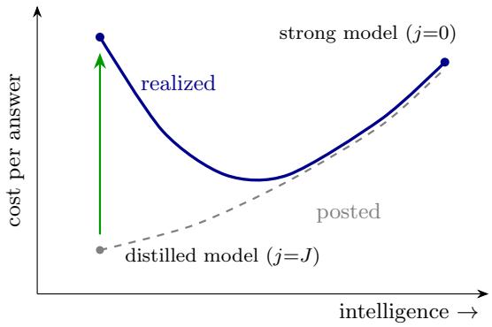  
Figure 1: The two frontiers (schematic). The posted frontier, per raw query, is monotone: weaker is cheaper, which is what every pricing page implies. The realized frontier, per satisfied answer, carries the multiplier and the churn charge of (5) and bends back up as $d _ { j } \rho$ grows; past the energy break-even the ordering of the tiers inverts. The green arrow is the inversion at the distilled model: the vertical gap between its posted and realized cost, the retry storm plus the churn, is the cost of confusing a query with an answer.

Example 3.1 (Two tiers of the same model). A provider serves with a strong model, tier $0 ,$ drawing $\Delta w _ { 0 } = 4 \mathrm { k W }$ per active slot at $\mathsf { E } [ S _ { 0 } ] = 1 0 0$ milliseconds per query, and a distilled sibling, tier 1, drawing $\Delta w _ { 1 } = 2 \mathrm { k W }$ at $\mathsf { E } [ S _ { 1 } ] = 6 0$ milliseconds. For the trafic in question a tier-1 answer fails with probability $d _ { 1 } = 0 . 6$ , a failed user re-asks with probability $\rho = 0 . 8 ,$ , and the strong tier with $d _ { 0 } = 0$ , so $\tilde { S } _ { 0 } = \mathsf E [ S _ { 0 } ] = 1 0 0$ . Is the switch profitable?

Compute the multiplier first: $d _ { 1 } \rho = 0 . 4 8$ , so $M _ { 1 } = 1 / 0 . 5 2 \approx 1 . 9 2$ , and each satisfied answer costs nearly two attempts, $\tilde { S } _ { 1 } = 1 . 9 2 \cdot 6 0 = 1 1 5 . 4$ slot-milliseconds. The efective ratio is $R = \tilde { S } _ { 1 } / \tilde { S } _ { 0 } =$ 1.15, squarely inside the trap region (1, $\Delta w _ { 0 } / \Delta w _ { 1 } ) = ( 1 , 2 )$ . Per satisfied answer, tier 1 spends $\tilde { S } _ { 1 } \Delta w _ { 1 } = 2 3 0 . 8$ kW-ms of energy, that is 230.8 joules, against tier 0’s 400, a 42% saving on the electricity bill, while occupying 115.4 slot-milliseconds against tier 0’s 100: the cheap tier consumes 15% more capacity per satisfied answer. During a surge, when capacity rather than electricity is the binding resource, this is exactly the wrong trade, and it registers as a saving on every cost dashboard the provider owns, when in fact it is the opposite. See Figure 1 for a schematic.

Remark 1 (The third frontier). The frontiers (6) price energy and slot-time, but the cost (1) carries a third, occupancy-dependent column: the memory term $\gamma c _ { m } N ^ { \kappa }$ . Routing trafic of rate λ to tier j shifts the standing population by $\Delta N = \lambda \big ( \tilde { S } _ { 0 } - \tilde { S } _ { j } \big )$ , worth $\gamma c _ { m } \kappa N ^ { \kappa - 1 } \Delta N$ per hour at occupancy N: a discount on the weak tier that grows with load even before the service-level term bites. Explicitly, per unit of rerouted rate the full hourly ledger, energy plus memory minus churn from (5), reads

$$
\gamma \big ( \tilde { S } _ { 0 } \Delta w _ { 0 } - \tilde { S } _ { j } \Delta w _ { j } \big ) \ + \ \gamma c _ { m } \kappa N ^ { \kappa - 1 } \big ( \tilde { S } _ { 0 } - \tilde { S } _ { j } \big ) \ - \ M _ { j } d _ { j } ( 1 - \rho ) p _ { r } \ell ,
$$

and setting it to zero yields the closed-form break-even expected LTV loss

$$
( p _ { r } \ell ) ^ { \star } ( N ) = \frac { \gamma \big ( \tilde { S } _ { 0 } \Delta w _ { 0 } - \tilde { S } _ { j } \Delta w _ { j } \big ) + \gamma c _ { m } \kappa N ^ { \kappa - 1 } \big ( \tilde { S } _ { 0 } - \tilde { S } _ { j } \big ) } { M _ { j } d _ { j } ( 1 - \rho ) } ,
$$

increasing in N when $\tilde { S } _ { j } < \tilde { S } _ { 0 }$ , with minimum at $N = 0$ , the pure-energy break-even $( p _ { r } \ell ) ^ { \star } : =$ $( p _ { r } \ell ) ^ { \star } ( 0 )$ . With ${ { p } _ { r } } { { \ell } }$ below this break-even the weak tier dominates at every congestion level and the optimal policy has no occupancy threshold at all; above it the ledger flips sign at the finite threshold

$$
N ^ { \star } = \left[ \frac { M _ { j } d _ { j } ( 1 - \rho ) p _ { r } \ell - \gamma \big ( { \tilde { S } } _ { 0 } \Delta w _ { 0 } - { \tilde { S } } _ { j } \Delta w _ { j } \big ) } { \gamma c _ { m } \kappa \big ( { \tilde { S } } _ { 0 } - { \tilde { S } } _ { j } \big ) } \right] ^ { 1 / ( \kappa - 1 ) } ,
$$

below which the churn charge dominates and above which the memory discount does. The threshold $N ^ { \star }$ is therefore not a tuning parameter but an economic object: its existence and location are determined by the expected LTV loss $p _ { r } \ell$ relative to $( p _ { r } \ell ) ^ { \star }$ , that is, by how much a customer is worth. Section 4.3 meets this boundary again, from the other side.

## 3.2 The Dynamics of a Poorly Timed Throttle

The static analysis locates the trap; it says nothing about time, and time is where the richness of the problem lives. Degradation is not a lever to pull but a moment to choose, and choosing it requires knowing how fast the system moves between its regimes. This subsection supplies those transition rates. A finite-server system lives in one of two regimes. Above capacity, all mk slots are busy and jobs complete at throughput $k \mu _ { j } m$ , the number of finished queries the fleet delivers per unit time; with every slot serving at rate $\mu _ { j }$ , this is the maximum throughput the fleet can attain. The backlog therefore changes linearly, accumulating when the arrival rate exceeds the processing rate, that is, $r > k \mu _ { j } m$ , and depleting when the processing rate exceeds the arrival rate, that is, $r < k \mu _ { j } m \colon$ jobs arrive at rate r and depart at rate $k \mu _ { j } m$ , both constant, so the net change per unit time is the constant diference $r - k \mu _ { j } m$ , or evolving over time as $t \left( r - k \mu _ { j } m \right)$ . Below capacity, service scales with occupancy and the system relaxes exponentially toward the level at which arrivals balance departures, the equilibrium $r / \mu _ { j }$ that Little’s law prescribes (Whitt 2002; Eick et al. 1993). One modification separates our system from the textbook one, and it changes everything: the arrival rate is endogenous, because completions at a degraded tier feed retries back into the stream. The following lemma makes the dynamics exact in expectation.

Lemma 2 (Two-regime dynamics with endogenous arrivals). Let services at the incumbent tier $j$ be exponential with rate $\mu _ { j }$ , and let the efective arrival rate

$$
r _ { t } ^ { \mathrm { e f f } } \ = \ r _ { t } + d _ { j } \rho \cdot ( \mathrm { c o m p l e t i o n \ r a t e \ a t \ } t ) \ = \ r _ { t } + d _ { j } \rho \mu _ { j } \operatorname* { m i n } ( N _ { t } , \ m k )
$$

be constant over a step $[ t , t + \Delta t ]$ containing no regime switch. The retry term scales with $\operatorname* { m i n } ( N _ { t } , m k )$ , the number of jobs in service: a waiting job cannot generate a retry, because its customer has not yet received an answer, so the feedback saturates at $d _ { j } \rho k \mu _ { j } m$ no matter how large the backlog grows. Then, in expectation,

$$
N _ { t + \Delta t } = \left\{ \begin{array} { l l } { N _ { t } + \left( r _ { t } ^ { \mathrm { e f f } } - k \mu _ { j } m \right) \Delta t } & { \mathrm { i f ~ } N _ { t } \geq m k \quad \mathrm { ( s a t u r a t e d , ~ l i n e a r ) } } \\ { N _ { t } e ^ { - \mu _ { j } \Delta t } + \displaystyle \frac { r _ { t } ^ { \mathrm { e f f } } } { \mu _ { j } } \bigl ( 1 - e ^ { - \mu _ { j } \Delta t } \bigr ) } & { \mathrm { i f ~ } N _ { t } < m k \quad \mathrm { ( r e c o v e r i n g , ~ e x p o n e n t i a l ) } } \end{array} \right.\tag{7}
$$

and the regime switches occur exactly at the crossing times of N through mk, both closed form: from the saturated branch, $t ^ { \star } = ( m k - N _ { t } ) / ( r _ { t } ^ { \mathrm { e f f } } - k \mu _ { j } m )$ whenever the drift points toward the boundary, and from the recovering branch, $t ^ { \star } = \mu _ { j } ^ { - 1 } \ln \bigl [ ( \bar { N } - N _ { t } ) / ( \bar { N } - m k ) \bigr ]$ with $\bar { N } : = r _ { t } ^ { \mathrm { e f f } } / \mu _ { j }$ 2 finite exactly when the equilibrium sits beyond the boundary.

Proof. The recovering branch adapts the classical two-population argument for the transient infiniteserver queue (Eick et al. 1993); the saturated branch, the endogenous arrival rate, and the switching logic are self-contained below. Recovering branch $( N _ { t } < m k )$ . Every resident job holds a slot, so over the step the system serves as if capacity were unlimited, and the population at $t + \Delta t$ splits into survivors of the $N _ { t }$ incumbents and arrivals during $( t , t + \Delta t ]$ . By memorylessness of the exponential, each incumbent’s residual service is again exponential with rate $\mu _ { j }$ regardless of its elapsed service, so it remains resident with probability $e ^ { - \mu _ { j } \Delta t }$ , and the incumbents contribute $\begin{array} { r } { \mathsf { E } \bigl [ \sum _ { i = 1 } ^ { N _ { t } } \mathbf { 1 } \{ T _ { i } \geq \Delta t \} \bigr ] = N _ { t } e ^ { - \mu _ { j } \Delta t } } \end{array}$ . An arrival in $( t + s , t + s + d s ]$ occurs with probability $r _ { t } ^ { \mathrm { e f f } } d s$ at most one per infinitesimal interval, and is still resident at $t + \Delta t$ with probability $e ^ { - \mu _ { j } ( \Delta t - s ) }$ ; integrating over the step,

$$
\int _ { 0 } ^ { \Delta t } r _ { t } ^ { \mathrm { e f f } } e ^ { - \mu _ { j } ( \Delta t - s ) } d s = r _ { t } ^ { \mathrm { e f f } } \int _ { 0 } ^ { \Delta t } e ^ { - \mu _ { j } u } d u = \frac { r _ { t } ^ { \mathrm { e f f } } } { \mu _ { j } } \big ( 1 - e ^ { - \mu _ { j } \Delta t } \big ) .
$$

Summing the two populations gives the exponential branch, a transient Little’s law: as $\Delta t$ grows the memory term vanishes and N relaxes toward the equilibrium $r _ { t } ^ { \mathrm { e f f } } / \mu _ { j }$ that Little’s law prescribes. Saturated branch $( N _ { t } \ge m k )$ . All mk slots are busy, and the minimum of mk independent exponentials of rate $\mu _ { j }$ is exponential with rate equal to the sum of the rates, so completions depart at aggregate rate ${ \mathrm { ; } } \mu _ { j } m$ while arrivals accrue at rate $\boldsymbol { r } _ { t } ^ { \mathrm { e f f } }$ ; the expected net change over the step is $\left( r _ { t } ^ { \mathrm { e f f } } - k \mu _ { j } m \right) \Delta t$ , the linear branch. Endogeneity and switching. The completion rate entering $\boldsymbol { r } _ { t } ^ { \mathrm { e f f } }$ is $k \mu _ { j } m$ when saturated and $N _ { t } \mu _ { j }$ when recovering; within a step it is constant by hypothesis, so the constant-rate derivations above apply, and a change of branch requires N to cross mk, which pins the switch epochs to the crossing times of N through mk. The formulas follow by solving each branch for the time at which N equals mk: the linear branch directly, the exponential branch by isolating $e ^ { - \mu _ { j } t }$ and taking logarithms. □

Throughout, j indexes the tier currently serving, the strong tier 0 included; the regime, saturated or recovering, is determined by the state N alone, not by the tier. Between regime switches the trajectory is a formula and the switch epochs are the crossing times of the lemma (the 139 milliseconds of Example 3.2 below is the logarithm), so evaluating an entire horizon costs a handful of arithmetic operations: no time grid, no probability mass function, and, as Section 3.4 exploits, dual variables by finite diferences at the same price.

Remark 2 (What the lemma buys, and what it pays). The lemma tames the mean of a branching feedback, not the process. Its tractability is purchased by two modeling choices: instantaneous retries, which collapse the feedback into a rate modification rather than a convolution with a retrydelay distribution, and memorylessness, which makes the drift piecewise linear in the state. What the mean-field view discards is precisely the variance of the branching cascade, an overdispersion that grows without bound as $d _ { j } \rho$ approaches the ignition threshold; Section 4.2 prices it. The recursion’s nearest antecedents all fix the feedback gain: Bernoulli-feedback queues (Tak´acs 1963) recycle completions at a constant probability, call-routing with service failure (V´ericourt and Zhou 2005) recycles unresolved callers at a server attribute, retrial queues recycle customers blocked before service, and quality-feedback models move demand on the slow timescale of loyalty; in all of them the failure probability is an environment primitive rather than a control, so the completiondriven, same-timescale feedback of (7) with a chosen gain had no reason to be written down until degradation became a decision.

The recursion is also simple enough to run by hand, which we now do.

Example 3.2 (Throttling at the surge). A datacenter runs $k = 1 5 0$ clusters of $m = 2 0$ slots, so $m k = 3$ thousand concurrent jobs, on tier 0 with $\mathsf { E } [ S _ { 0 } ] = 1 0 0$ milliseconds as in Example 3.1: $\mu _ { 0 } = 1 0$ per second, and, setting $d _ { 0 } = 0$ to simplify the analysis, efective throughput $\theta _ { 0 } = 3 0$ thousand jobs per second. A surge arrives at $r = 3 3 . 3$ thousand queries per second with $N ( 0 ) = 2$ thousand jobs in the system. The controller is the industry’s standard reactive rule: when N crosses an operator-chosen trigger level $\widehat { N } _ { \mathrm { f i r e } }$ , degrade everyone to tier 1, with $\mathsf { E } [ S _ { 1 } ] = 6 0$ milliseconds $( \mu _ { 1 } \approx 1 6 . 7$ per second, raw throughput 50 thousand per second) and, for this trafic, $d _ { 1 } = 0 . 6$ and $\rho = 0 . 8$ as in Example 3.1. What happens?

The system starts below capacity, relaxing toward the equilibrium $r / \mu _ { 0 } = 3 3 . 3 / 1 0 \approx 3 . 3 3$ thousand. Since $3 . 3 3 > 3$ , it must cross the capacity line first, at the time solving $2 e ^ { - 1 0 t } + 3 . 3 3 ( 1 -$ $e ^ { - 1 0 t } ) = 3$ , that is $e ^ { - 1 0 t } = 0 . 2 5$ , or $t = \ln { 4 } / 1 0 \approx 0 . 1 3 9$ seconds, 139 milliseconds in. From there the system saturates and grows linearly at $r - \theta _ { 0 } = 3 . 3$ thousand jobs per second. Suppose the trigger sits at $\widehat { N } _ { \mathrm { f i r e } } = 3 . 5$ thousand, so the rule fires 150 milliseconds later. On paper the throttle looks decisive: raw capacity jumps from 30 to 50 thousand per second against demand of 33.3, so the queue should drain at 16.7 thousand per second.

Now account for the feedback loop. In saturation, completions run at 50 thousand per second, and a fraction $d _ { 1 } \rho = 0 . 4 8$ of them come back: 24 thousand retries per second, so $r ^ { \mathrm { e f f } } = 3 3 . 3 + 2 4 =$ $5 7 . 3 > 5 0$ . The queue does not drain. It grows at 7.3 thousand jobs per second, more than twice its pre-throttle rate, while the service-level term of (1) bites quadratically in the swelling backlog. The throttle raised raw capacity by two thirds and made the congestion worse. In plain words: once the retries it generates are subtracted from its raw output, tier 1 delivers $\theta _ { 1 } = ( 1 - d _ { 1 } \rho ) \times 5 0 = 2 6$ thousand fresh answers per second against tier 0’s $\theta _ { 0 } = 3 0$ . The fast cheap model is the slow expensive one. And every second of the spiral pours $5 0 \times 0 . 6 \times 0 . 2 = 6$ thousand abandonments onto the churn ledger, none of which appear on the cost-rate chart. Figure 2 sketches the path.

What would work instead? Not this throttle at another time: with a single class the instance sits inside the trap of Proposition 1 $( \tilde { S } _ { 1 } = 1 1 5 . 4 > 1 0 0 = \tilde { S } _ { 0 } )$ , so degrading everyone, at any moment, adds efective load. The anticipatory path of the figure requires heterogeneity. Suppose 30% of the trafic is insensitive to the weak tier, say $d _ { 1 } = 0 . 0 5$ and $\rho = 0 . 3$ for that fraction. Run the same arithmetic as before: $d _ { 1 } \rho = 0 . 0 1 5$ , so $M _ { 1 } = 1 / 0 . 9 8 5 \approx 1 . 0 2$ and $\tilde { S } _ { 1 } \approx 1 . 0 2 \times 6 0 \approx$ 61 milliseconds, a multiplier near one because this trafic barely retries. Now price the ofered load, arrivals times efective service time, class by class: the sensitive 70% stays on tier 0 and occupies $0 . 7 \times 3 3 . 3 \times 0 . 1 0 0 \approx 2 . 3 3$ thousand slots, the insensitive 30% moves to tier 1 and occupies $0 . 3 \times 3 3 . 3 \times 0 . 0 6 1 \approx 0 . 6 1$ thousand, for a total of $2 . 9 4 < 3 $ thousand. Degrading the insensitive fraction before the surge therefore holds the system below capacity: it relaxes toward 2.94 thousand, never saturates, and no spiral ignites, the dashed path of Figure 2. Who is insensitive, and how to find them, is the subject of Section 3.3.

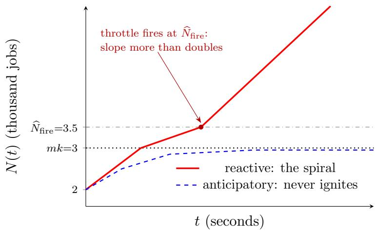  
Figure 2: The boomerang of Example 3.2, in the example’s units of thousands of jobs. Three levels anchor the vertical axis: capacity mk = 3 (dotted), the reactive trigger $\widehat { N } _ { \mathrm { f i r e } } = 3 . 5$ (dashdotted), and the Little’s-law equilibrium $\bar { N } = r ^ { \mathrm { e f f } } / \mu \approx 2 . 9 4$ of the anticipatory mix, which sits below capacity. Reactive throttling fires when N crosses the trigger and ignites the retry spiral; the anticipatory path relaxes toward $\bar { N }$ and never saturates. The cost rate spikes before it saves, and the churned lifetime value accrues on a separate, monotone ledger that no cost chart displays.

The example is not an accident of its numbers. Each of its pathologies, the throttle that adds load, the queue that never drains, the release that never comes, is an instance of a structural result, and the results follow.

Proposition 3 (Ignition threshold). Suppose the system is saturated, $N _ { t } ~ \ge ~ m k$ , and the fleet switches to tier j. The queue drains back below mk if and only if $r ~ < ~ \theta _ { j }$ , the tier’s efective throughput (3). Above this threshold the retry feedback is self-sustaining: the drift is positive, N never returns below mk, and the backlog and the churn ledger grow without bound.

Proof. With $N \geq m k$ , all mk slots are busy, completions run at $k \mu _ { j } m _ { ; }$ , and a fraction djρ re-enter, so $r ^ { \mathrm { e f f } } = r + d _ { j } \rho k \mu _ { j } m$ and the net change of N per unit time is

$$
\frac { \Delta N } { \Delta t } \ = \ r ^ { \mathrm { e f f } } - k \mu _ { j } m \ = \ r - \left( 1 - d _ { j } \rho \right) k \mu _ { j } m \ = \ r - \theta _ { j } .
$$

The queue drains if and only if $r - \theta _ { j } < 0 .$ . If positive, N stays above mk, the saturated branch of (7) continues to apply, and the same positive rate persists forever: what the throttle sheds in service time, the feedback more than replaces in retries. □

Corollary 4 (The latch). Every reactive rule comes in two halves: it degrades to tier 1 when N exceeds the trigger $\widehat { N } _ { \mathrm { f i r e } }$ of Example 3.2, and it releases back to tier 0 when N falls below a release level $\widehat { N } _ { \mathrm { r e l } } \leq \widehat { N } _ { \mathrm { f i r e } }$ , the backlog deemed low enough to declare the congestion over. Start the clock when the surge ends: from time $0 \ \mathrm { o n } .$ , the arrival rate is a constant $r _ { \mathrm { c a l m } } < r _ { \mathrm { s u r g e } } ,$ demand genuinely back to normal, the system still degraded, and $N _ { 0 } > \widehat { N } _ { \mathrm { r e l } }$ . The rule returns to the strong tier if and only if

$$
r _ { \mathrm { c a l m } } \tilde { S } _ { 1 } < \widehat { N } _ { \mathrm { r e l } } .
$$

The left side is where the degraded system comes to rest: by Little’s law, arrivals at rate $r _ { \mathrm { c a l m } }$ each holding a slot for an efective time $\tilde { S } _ { 1 }$ , retries included, keep $r _ { \mathrm { c a l m } } \tilde { S } _ { 1 }$ jobs in the system. The release fires only if that resting level lies below the release line. When the condition holds, the release is also final: back on tier 0 the same logic applies with $\tilde { S } _ { 0 }$ in place of $\tilde { S } _ { 1 }$ , and in the trap region $\tilde { S } _ { 0 } < \tilde { S } _ { 1 }$ , so the system settles at the lower level $r _ { \mathrm { c a l m } } \tilde { S } _ { 0 }$ , below the line it just crossed, and the trigger never re-fires. When it fails, the throttle never releases, even though the surge is over: the transient surge becomes a permanent degraded regime, and the churn ledger accrues at the constant rate $r _ { \mathrm { c a l m } } M _ { 1 } d _ { 1 } ( 1 - \rho ) p _ { r } \ell$ forever. An operator who sets $\widehat { N } _ { \mathrm { r e l } }$ below $r _ { \mathrm { c a l m } } \tilde { S } _ { 1 }$ has, without knowing it, disabled the release: every customer is served by the weak model until demand itself moves, and the exit, when it comes, arrives for the wrong reason, a quiet weekend, or the churn the latch is causing eroding $r _ { \mathrm { c a l m } }$ until the resting level sinks below the line. The rule reads that as congestion clearing; it is the customer base clearing.

Proof. For $t > 0$ the arrival rate is the constant $r _ { \mathrm { c a l m } }$ and the tier is 1, so by (7) the trajectory decreases monotonically toward the degraded equilibrium $\bar { N } _ { 1 } : = r _ { \mathrm { c a l m } } / \big ( ( 1 - d _ { 1 } \rho ) \mu _ { 1 } \big ) = r _ { \mathrm { c a l m } } \tilde { S } _ { 1 }$ first linearly while saturated, then along the exponential branch once below mk. If $\bar { N } _ { 1 } < \widehat { N } _ { \mathrm { r e l } }$ , the trajectory crosses the release line in finite time, by the crossing formulas of Lemma 2, and the rule releases. If $\bar { N } _ { 1 } \geq \widehat { N } _ { \mathrm { r e l } }$ , the trajectory approaches $\bar { N } _ { 1 }$ from above and stays above it forever, hence above the release line: $N _ { t } > \widehat { N } _ { \mathrm { r e l } }$ for all t, and the rule never fires its release. Durability after release: once the tier is 0, the same monotone argument drives N toward the strong tier’s resting level $\bar { N } _ { 0 } : = r _ { \mathrm { c a l m } } \tilde { S } _ { 0 }$ . In the trap region ${ \tilde { S } } _ { 0 } < { \tilde { S } } _ { 1 }$ gives $\bar { N } _ { 0 } < \bar { N } _ { 1 } < \widehat { N } _ { \mathrm { r e l } } \leq \widehat { N } _ { \mathrm { f i r e } }$ , so the trajectory keeps falling and never re-crosses the trigger. Outside the trap, $\bar { N } _ { 0 } > \bar { N } _ { 1 }$ and the trajectory climbs back toward $\begin{array} { r } { \bar { N } _ { 0 } ; } \end{array}$ ; the release holds if and only if $\bar { N } _ { 0 } < \widehat { N } _ { \mathrm { f i r e } }$ , and when it does not, the rule re-fires and cycles between the tiers indefinitely. □

Proposition 5 (Anticipation dominates reaction). This is Example 3.2 with the one ingredient the reactive rule ignores, the forecast: the demand model of Section 2 announces the surge in advance. Start the system at rest on tier 0: for $t < t _ { 1 }$ the arrival rate is $r _ { \mathrm { c a l m } } < \theta _ { 0 }$ and N sits at its resting level $r _ { \mathrm { c a l m } } \tilde { S } _ { 0 } < m k$ . On the surge window $[ t _ { 1 } , t _ { 2 } ]$ the rate jumps to $r _ { \mathrm { s u r g e } } .$ : too high for the strong tier, $r _ { \mathrm { s u r g e } } > \theta _ { 0 }$ , so something must give; too high for a uniform throttle, $r _ { \mathrm { s u r g e } } > \theta _ { 1 } ,$ so degrading everyone ignites; yet feasible under full degradation, $r _ { \mathrm { s u r g e } } \tilde { S } _ { 1 } < m k$ , so a policy that clears capacity in advance exists. Compare two policies. The reactive rule waits for N to cross the trigger $\widehat { N } _ { \mathrm { f i r e } }$ and then degrades everyone; by Proposition 3 it ignites, and from its firing time $\tau \in ( t _ { 1 } , t _ { 2 } )$ , after the surge begins and before it ends, the service-level cost accrues as the cube of the remaining surge, at least $\frac { C _ { \mathrm { S L A } } } { 3 ( m k ) ^ { 2 } } ( r _ { \mathrm { s u r g e } } - \theta _ { 1 } ) ^ { 2 } ( t _ { 2 } - \tau ) ^ { 3 }$ . The anticipatory policy degrades a fraction $\varphi$ of trafic from a lead time $t _ { 0 } < t _ { 1 }$ , while there is still slack capacity for the retry cascade to drain into; it achieves the same energy savings, never saturates, and pays exactly one charge the reactive rule avoids, churn over the lead window,

$$
\varphi r _ { \mathrm { c a l m } } d _ { 1 } ( 1 - \rho ) p _ { r } \ell ( t _ { 1 } - t _ { 0 } ) ,
$$

linear in the lead and independent of the surge length. Cubic against linear: anticipation trades a fixed, known loss, the churn of the customers degraded early, for the removal of a loss that compounds with every moment of the surge, the backlog swelling under a positive drift. Nor does the reactive bill close at $t _ { 2 } { \mathrm { : } }$ the surge ends with $( r _ { \mathrm { s u r g e } } - \theta _ { 1 } ) ( t _ { 2 } - \tau )$ jobs above capacity, which drain only at the calm margin $\theta _ { 1 } - r _ { \mathrm { c a l m } }$ , paying the same cubic charge a second time, scaled by $( r _ { \mathrm { s u r g e } } - \theta _ { 1 } ) / ( \theta _ { 1 } - r _ { \mathrm { c a l m } } )$ ; even a short surge leaves a long aftermath (this assumes $r _ { \mathrm { c a l m } } < \theta _ { 1 }$ , so the degraded queue can drain at all; otherwise the reactive cost is unbounded and the latch case below applies). Equating premium to penalty makes the trade-of exact: anticipation strictly dominates if and only if the post-firing surge exceeds the critical window

$$
T ^ { \star } = \left[ \frac { 3 ( m k ) ^ { 2 } \varphi r _ { \mathrm { c a l m } } d _ { 1 } ( 1 - \rho ) p _ { r } \ell ( t _ { 1 } - t _ { 0 } ) } { C _ { \mathrm { S L A } } ( r _ { \mathrm { s u r g e } } - \theta _ { 1 } ) ^ { 2 } \left( 1 + \frac { r _ { \mathrm { s u r g e } } - \theta _ { 1 } } { \theta _ { 1 } - r _ { \mathrm { c a l m } } } \right) } \right] ^ { 1 / 3 } ,
$$

when $t _ { 2 } - \tau < T ^ { \star }$ the surge is too brief for the backlog to hurt and the reactive rule is genuinely cheaper: anticipation is not free insurance, it is insurance worth buying exactly when the storm outlasts $T ^ { \star }$ . The cube root is the strengthening: because the penalty compounds cubically while the premium accrues linearly, $T ^ { \star }$ grows only as the cube root of the churn premium, so even a tenfold increase in what anticipation costs barely doubles the surge length that justifies it. And whenever the latch of Corollary 4 binds, $T ^ { \star }$ is irrelevant: the reactive ledger grows without bound and dominance holds at every horizon. The optimal switch surface is computed by dynamic programming over (7), with the chance constraint $\mathsf P ( W > s ) \le a$ enforced by pruning every state-action pair violating $s k \mu m \geq \operatorname* { m a x } ( N , m k ) + { \sqrt { \operatorname* { m a x } ( N , m k ) } } \Phi ^ { - 1 } ( 1 - \alpha )$

Proof. Appendix A.1.

The three results share one mechanism: under congestion, throttling is not a cost lever but a demand lever. It manufactures the very trafic it was deployed to shed, and doing it reactively converts a capacity shortage into a self-sustaining one.

## 3.3 Who to Throttle: Customer Heterogeneity

So far every customer felt degradation identically, and real customer bases are not like that. A researcher doing context-heavy work feels a single tier of degradation acutely; a user parsing CSV fields into a table does fine on a smaller model. Index customer classes by $x \in \mathcal { X }$ , a label observed by the router; X is a general set; taking X = {researcher, parser}, two classes each aggregating the many customers whose workload fits the description, gives the smallest instance rich enough for everything this section builds: the index, the nested thresholds, and the dual spread of Section 3.4 all take their simplest nontrivial form on two classes. Let each primitive of Section 2 carry the class: the dissatisfaction probability becomes $d _ { j } ( x )$ , the retry probability $\rho _ { x }$ , and the expected LTV loss $( p _ { r } \ell ) _ { x }$ . Formally, the sensitivity curve $d _ { j } ( x )$ is steep in $j$ for the first type and nearly flat for the second, and the retry probability $\rho _ { x }$ and the expected LTV loss $( p _ { r } \ell ) _ { x }$ order the same way: the researcher re-asks more and is worth more. The efective service time and the efective throughput of (3) become class-dependent, ${ \tilde { S } } _ { j } ( x ) : = M _ { j } ( x ) \mathsf E [ S _ { j } ]$ and $\theta _ { j } ( x ) : = m k / \tilde { S } _ { j } ( x )$ . To feel the asymmetry, take a researcher at $d _ { 1 } = 0 . 6 , \rho = 0 . 9$ and a parser at $d _ { 1 } = 0 . 0 5 , \rho = 0 . 3$ : the multipliers are $M _ { 1 } = ( 1 - 0 . 5 4 ) ^ { - 1 } \approx 2 . 1 7$ against $( 1 - 0 . 0 1 5 ) ^ { - 1 } \approx 1 . 0 2 $ . Routing the researcher to tier 1 more than doubles their trafic; routing the parser is nearly free. Uniform throttling, the standard load balancer, treats these two customers identically; we study the tradeof as follows.

The action is no longer a tier but a routing: $\varphi ( x , j )$ is the fraction of class-x trafic sent to tier $j ,$ and $\lambda _ { x }$ is class x’s fresh-demand rate, the class decomposition $r _ { t } = \textstyle \sum _ { x } \lambda _ { x }$ of the forecast, counting first attempts only because $\tilde { S } _ { j } ( x )$ already carries each attempt’s retries. Writing $c ( x , j ) : =$ $\gamma \tilde { S } _ { j } ( x ) \Delta w _ { j } + M _ { j } ( x ) d _ { j } ( x ) ( 1 - \rho _ { x } ) ( p _ { r } \ell ) _ { x }$ for the cost per satisfied class-x answer at tier $j ,$ the first term the energy of (5) and the second its destroyed lifetime value, now evaluated at class x’s own multiplier and expected LTV loss, the one-period problem is a transportation problem with classes as demand nodes and tiers as warehouses. One precaution decides whether the formulation is right or wrong: the capacity constraint must charge each unit of routed trafic its retry-inflated load $\tilde { S } _ { j } ( x )$ , not its posted service time, otherwise the optimization sees tier 1 as cheap capacity and happily recommends the spiral of Example 3.2,

$$
\operatorname* { m i n } _ { \varphi \geq 0 } \sum _ { x , j } c ( x , j ) \lambda _ { x } \varphi ( x , j ) \quad \mathrm { s . t . } \quad \sum _ { j } \varphi ( x , j ) = 1 \forall x \in \mathcal { X } , \qquad \sum _ { x } \tilde { S } _ { j } ( x ) \lambda _ { x } \varphi ( x , j ) \leq m k _ { j } \forall j .\tag{8}
$$

The objective sums, over every class and tier, the cost per satisfied answer times the volume routed there: energy plus destroyed lifetime value, dollars per unit time. The first constraint says every class is served somewhere, the fractions across tiers summing to one, so the provider cannot solve congestion by silently dropping a class. The second constraint prices capacity in retry-inflated slottime: each unit of class-x trafic routed to tier $j$ occupies $\tilde { S } _ { j } ( x )$ slot-time, the multiplier included, so a class that retries heavily consumes capacity its posted service time conceals, and in the trap region routing it to the weak tier tightens the constraint the routing was meant to relax. The linear objective is reconciled with the nonlinear cost (1) term by term: the idle floor γkw0 is constant across routings and drops from any argmin; the service-level penalty is not ignored but converted into the capacity constraint, exact rather than approximate because on the feasible set the excess backlog is identically zero, its economics surviving as the constraint’s dual $\nu ;$ and the memory term, convex in occupancy, is linearized at the operating point, its marginal rate $\gamma c _ { m } \kappa N ^ { \kappa - 1 }$ per unit slot-time being precisely the discount Remark 1 prices, with the omitted curvature only reinforcing the index ordering that follows. The linear program is small, classes times tiers, and solves in microseconds; its value is not the solution but its structure, which the next proposition extracts: at a binding constraint the optimum is a greedy ordering, and the ordering is by a single computable index.

Proposition 6 (Index rule). At a binding capacity constraint, the optimal routing degrades classes in increasing order of the index

$$
I ( x , j ) = \frac { \partial c ( x , j ) / \partial j } { \tilde { S } _ { 0 } ( x ) - \tilde { S } _ { j } ( x ) } ,
$$

marginal damage per unit of capacity relief, and the optimal policy has nested thresholds in the congestion state: the set of degraded classes at backlog N contains the set degraded at any $N ^ { \prime } < N$

Proof. Appendix A.2. The index is a relative of the $c \mu$ rule (Van Mieghem 1995), with the denominator written in efective slot-time: degrading a heavy-retry class buys less capacity than its service-time discount suggests, because part of the freed capacity is immediately reclaimed by that class’s own retries, and in the trap region of Proposition 1 the denominator goes negative, pricing the class out of degradation entirely when capacity binds. □

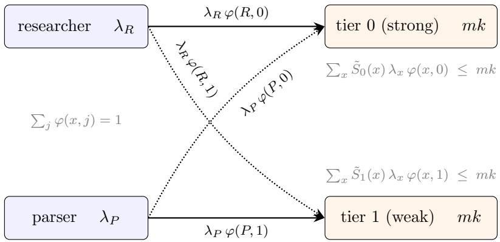

$$
\begin{array} { c } { { \mathrm { e d g e ~ c o s t ~ p e r ~ s a t i s f i e d ~ a n s w e r } ; } } \\ { { c ( x , j ) = \gamma \tilde { S } _ { j } ( x ) \Delta w _ { j } + M _ { j } ( x ) d _ { j } ( x ) ( 1 { - } \rho _ { x } ) ( p _ { r } \ell ) _ { x } } } \end{array}
$$

Figure 3: The transportation LP (8) for two classes and two tiers. Solid arrows are the dominant flows in the calibrated instance; dotted arrows are the cross-assignments the LP considers and rejects. Capacity is charged in efective slot-time $\tilde { S } _ { j } ( x ) = M _ { j } ( x ) \mathsf { E } [ S _ { j } ]$ , not posted $\mathsf { E } [ S _ { j } ]$ : a heavyretry class consumes capacity its service time conceals, and in the trap region the capacity constraint tightens under degradation.

Remark 3. When the fleet is congested, every slot of capacity freed by degrading someone must be paid for in degraded service, and the exchange rate difers by customer. The index says: degrade the customers for whom that swap is cheapest first: the ones whose retries eat the least of the capacity just freed, and whose dissatisfaction and churn cost the least. Heavy-retry, high-value customers are priced out of degradation entirely when capacity binds, because degrading them buys less relief than it costs in damage.

Proposition 7 (Dominance). Targeted degradation weakly dominates uniform degradation for any sensitivity profile, and strictly whenever profiles difer across classes.

Proof. Any uniform policy is feasible for (8) with $\varphi ( x , j )$ constant in $x ,$ so the optimum weakly improves on it. For strictness: at equal energy savings, uniform throttling books churn at the population-average expected LTV loss while the targeted policy books it at the minimum over classes achieving the same capacity relief, and when profiles difer the average strictly exceeds the minimum. □

The uniform policy is the LP optimum restricted to routings of the form $\varphi ( x , j ) = \varphi ( j )$ , the same tier mix for every class; its gap to the true optimum is the excess churn it books at the populationaverage LTV loss rather than the class-specific minimum, positive exactly when sensitivity profiles difer. That gap is the entire value of knowing who is who.

## 3.4 The Shadow Price of Intelligence

The capacity constraint’s dual, the Lagrange multiplier on the retry-inflated slot-time budget of (8), is the number the paper is named after: it is the marginal cost of one additional unit of efective load, the price the system assigns to intelligence at the binding tier.

In the static problem each demand-satisfaction constraint carries a dual variable $\pi _ { x } .$ , and in the dynamic problem the corresponding object is a derivative through the value function,

$$
\pi _ { x } ( t ) : = \frac { \partial V _ { t } ^ { \star } } { \partial \lambda _ { x } ( t ) } ,\tag{9}
$$

the system’s marginal cost of one more class-x query at hour t. The value function behind (9) is the dynamic version of the transportation problem (8). The state is the class-indexed backlog $\mathbf { N } _ { s } = ( N _ { s } ( x ) ) _ { x \in \mathcal { X } }$ with total $\begin{array} { r } { N _ { s } : = \sum _ { x } N _ { s } ( x ) } \end{array}$ ; an action is an assignment $a _ { s } : \mathcal { X }  \{ 0 , \ldots , J \}$ of a tier to each class, and A denotes the admissible assignment sequences $( a _ { t } , \ldots , a _ { T } )$ . Write $n _ { s } ( x )$ for the class-x jobs in service, all of them below capacity and the proportional share above ${ \mathrm { i t } } ,$ $n _ { s } ( x ) : = N _ { s } ( x )$ min{1, mk/Ns}. The stage cost is the operating cost (1) with its active-draw term opened up by class, the multi-tier extension deferred in Section 2,

$$
c ( k , \mathbf { N } _ { s } , a _ { s } ) \ : = \ \gamma \Big [ k w _ { 0 } + \sum _ { x \in \mathcal { X } } n _ { s } ( x ) \Delta w _ { a _ { s } ( x ) } \Big ] \ + \ \gamma c _ { m } N _ { s } ^ { \kappa } \ + \ C _ { \mathrm { S L A } } \bigg ( \frac { ( N _ { s } - m k ) ^ { + } } { m k } \bigg ) ^ { \beta } ,
$$

which reduces to (1) when every class shares one tier. Then

$$
\begin{array} { r l } & { V _ { t } ^ { \star } \ = \ \underset { a ( \cdot ) \in \mathcal { A } } { \operatorname* { m i n } } \ \underset { s = t } { \overset { T } { \sum } } \Big [ c \big ( k , \mathbf { N } _ { s } , a _ { s } \big ) \ + \ \displaystyle \sum _ { x \in \mathcal { X } } d _ { a _ { s } ( x ) } ( x ) \left( 1 - \rho _ { x } \right) \mu _ { a _ { s } ( x ) } n _ { s } ( x ) \left( p _ { r } \ell \right) _ { x } \Big ] } \\ & { \quad \mathrm { s . t . } \quad N _ { s + 1 } ( x ) \ = \ \mathcal { F } \big ( N _ { s } ( x ) , \lambda _ { x } ( s ) , a _ { s } ( x ) \big ) \quad \forall x \in \mathcal { X } , } \\ & { \quad \quad \quad \quad \mathsf { P } \big ( W _ { s } > \bar { s } \big ) \ \leq \ \alpha , } \end{array}\tag{10}
$$

with $\mathcal { F }$ the two-regime recursion (7) applied class by class, each class carrying its own efective quantities, dissatisfaction $d _ { a _ { s } ( x ) } ( x )$ , retry probability $\rho _ { x }$ , and its capacity share as the regime boundary. The second sum is the churn ledger: class-x completions depart at rate $\mu _ { a _ { s } ( x ) } n _ { s } ( x )$ , each an attempt that fails with probability $d _ { a _ { s } ( x ) } ( x )$ and abandons with probability $1 - \rho _ { x } ,$ , booking the expected LTV loss $( p _ { r } \ell ) _ { x }$ . The latency constraint is a chance constraint at threshold ${ \bar { s } } ,$ enforced by pruning every state–action pair that violates the normal surrogate of Proposition $5 ;$ crucially, it permits transient saturation and charges for it through $C _ { \mathrm { S L A } }$ , rather than forbidding the saturated regime the analysis is about. The fresh-demand rate $\lambda _ { x } ( s )$ enters only the class-x dynamics, so the derivative (9) is well defined class by class; with a single class the assignment collapses to a tier-switching sequence and (10) is the problem of Section 3.2 verbatim. The forward pass makes $\pi _ { x } ( t )$ computable at every level: closed form at the newsvendor level, obtained by diferentiating (4) through the chance constraint; the LP dual of (8) in the static problem; and, in the dynamic model, a finite diference through the deterministic forward pass, with no Monte Carlo jitter. Because the forward pass is closed form between regime switches, the dynamic dual recomputes in milliseconds, making it a live control signal rather than an overnight batch job (Section 5 reports the measured cost).

The structure of $\pi _ { x } ( t )$ answers the posting quoted in the introduction, in two parts. First, the class duals difer at every hour, not only at the crunch: even with the capacity constraint slack, a marginal specialized query costs its strong tier’s multiplied compute and churn, $M _ { j } ( x ) { \left( c _ { j } \right. } +$ $d _ { j } ( x ) ( 1 { - } \rho _ { x } ) ( p _ { r } \ell ) _ { x } )$ , while a marginal casual query costs its cheap tier’s, so the flat relative price of one that any uniform policy implicitly charges is wrong around the clock. Second, when capacity binds, the shared pool adds a scarcity rent that is nearly common across classes, because congestion anywhere reprices capacity everywhere: dollar diferences between the class duals widen at the crunch while their ratios compress toward one. The distance the posting names between allocation choices and user outcomes is therefore a two-part number, a floor spread that never closes and a rent that arrives for everyone at once, and both parts are now computable, monitorable, and optimizable against; Section 5.4 computes them on the calibrated instances.

## 4 From Fluid to Practice

Four questions separate the analysis from a deployment: how to solve the dynamic program fast enough to matter, what the fluid approximation discards and whether it matters, how to make the optimal policy operable by a human, and whether the one primitive that is not directly observable can be identified from data. Each has a short answer.

## 4.1 Solving It: the Complexity Dividend of the Closed Form

The value function (10) is solved by backward induction: T epochs, a grid of g points per class backlog with multilinear interpolation, and the admissible assignments $\mathcal { A } _ { 1 }$ surviving the static ledger (5), which prunes the menu before the dynamics begin (Section 5.1 reports collapses as severe as $2 7 4 4  7 2 )$ . Any solver of this type evaluates the same count of transitions,

$$
T \times | { \mathcal { A } } _ { 1 } | \times g ^ { | { \mathcal { X } } | } ,
$$

so the cost diference between solvers lives entirely in the price of one transition, and that price is the point of Lemma 2.

Without the lemma, the natural transition oracle is the drift itself: the backlog changes at rate $\boldsymbol { r } _ { t } ^ { \mathrm { e f f } }$ minus the completion rate, and one steps this forward, either as the Markov chain or as its mean ODE. Any such explicit scheme must resolve the fastest relaxation in the dynamics, the below-capacity decay at rate $\mu _ { j } { \mathrm { : } }$ stability and accuracy require steps $\delta$ with $\mu _ { j } \delta \le c , c \approx 0 . 2$ in practice, hence $\mu _ { \mathrm { m a x } } \Delta / c$ substeps per epoch of length $\Delta .$ The service rate sets the integrator’s clock, and the fast, cheap tiers that make degradation attractive are exactly the tiers that make integrating it expensive. Lemma 2 is the escape: because the drift is piecewise linear in the state, the ODE solves in closed form on each side of the capacity boundary, the crossing time is itself a formula, and within a leg the trajectory crosses at most once, so one transition costs a constant handful of elementary-function evaluations regardless of $\mu _ { \mathrm { m a x } }$ or $\Delta$ . Per transition:

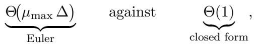

a speedup linear in the service-rate scale. This is the pattern of Table 4: the measured factors grow with $\mu _ { \mathrm { m a x } }$ and peak on the fastest ladder, sitting below the raw substep ratio only because interpolation and cost evaluation are overhead common to both solvers. Figure 4 draws one transition under each solver.

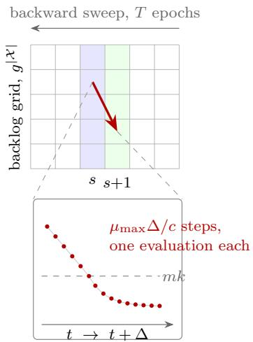  
(a) converged Euler

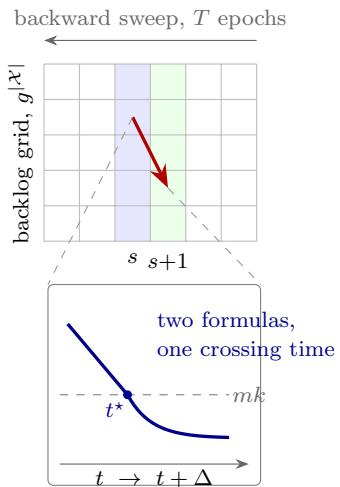  
(b) closed form (Lemma 2)  
Figure 4: One transition of the backward induction, magnified. The induction fills the same $T \times \vert \mathcal { A } _ { 1 } \vert \times g ^ { \vert \mathcal { X } \vert }$ value surface under either solver; the panels difer inside the transition arrow. (a) An explicit integrator resolves the recovering branch’s relaxation at rate $\mu _ { j } ,$ so each transition takes $\mu _ { \mathrm { m a x } } \Delta / c$ substeps. (b) Lemma 2 gives the same trajectory as a linear leg and an exponential leg joined at the closed-form crossing time t⋆: constant cost per transition, independent of the servicerate scale.

The device is worth locating in the queueing literature, because it occupies a gap. The standard responses to time-varying load sit at two poles. At one, stationary formulas are applied pointwise, hour by hour, which is blind to precisely the object this paper controls: how fast the backlog moves between regimes, the transient on which the ignition threshold and the latch live. At the other, exact transient analysis, the fluid and strong-approximation limits for time-varying many-server systems (Mandelbaum and Massey 1995; Whitt 2002) and, further out, the distribution-dependent formulations of Dieker et al. (2026), describes the trajectory faithfully but as an object to be integrated, at the integrator’s price derived above. The two-regime recursion of Lemma 2 sits between the poles: transient, yet a formula, a transient Little’s law that relaxes to the stationary prescription as the step grows and is exact along the way. Its ingredients are classical, the recovering branch in particular being the transient infinite-server decomposition of Eick et al. (1993); what we have not found in the literature is the pieced two-regime trajectory itself, crossing times included and arrivals made endogenous, nor its deployment as a constant-cost transition oracle inside an optimization loop, and that deployment is what turns transient control from a simulation study into arithmetic.

The line between exact and approximate deserves stating precisely. The single-class dynamics of (7) requires no time discretization at all: between changes of the arrival rate or the tier, the trajectory is a formula, and the only event is the capacity crossing, whose time is itself closed form. Discretization enters solely through the multi-class extension, where a shared pool makes each class’s capacity a function of every class’s current backlog; the solver holds these shares frozen within a leg, re-resolving at the leg boundaries, and the error is first-order in the leg length. It concentrates in deep saturation with unbalanced backlogs, of the optimal trajectory, which is where the Q-regret tails of Section 5.5 sit while the policy-value certificate stays within single digits of percent on every instance.

The dividend compounds at the dual: after the backward pass, a forward pass costs T transitions, so the finite diference (9) prices the full daily surface $\pi _ { x } ( t )$ in $O ( | \mathcal { X } | T ^ { 2 } )$ transitions of closed-form arithmetic, no Monte Carlo, no averaging. The solve runs in seconds; repricing against a revised forecast, the input that actually changes intraday, runs in milliseconds. That is the diference between a shadow price that is a quarterly slide and one that is a live control signal. Stepping back, the tractability is not one device but four multiplying: memorylessness collapses the state to a backlog per class, the static ledger (5) collapses the action space before the dynamics begin, the lemma collapses the transition to constant cost, and the normal surrogate collapses the tail constraint to a pruning rule. Remove any one and the problem returns to overnight simulation.

## 4.2 The Role of the Variance

The fluid model (7) buys its tractability, closed-form trajectories whose evaluation over a horizon costs one elementary-function call per regime switch, by discarding fluctuations, and an honest account of what that purchase costs has two faces. Where the model is safe: Propositions 1, $6 ,$ and 7 are statements about orderings and regions, not levels, so noise moves their boundaries by $O ( \sigma )$ without reordering unless the compared quantities are nearly equal, in which case either choice is near-optimal and the error is self-limiting; the saturated regime is drift-dominated, and the churn ledger aggregates over many customers and obeys the law of large numbers. Where it is not: the tail. The service-level constraint $\mathsf P ( W > s ) \le { \mathfrak a } $ α is a statement about fluctuations, and a fluid path can only answer zero or one; worse, the economics of capacity puts the operating point exactly where this matters, since idle servers are pure cost it makes economic sense to run a system that is barely stable, so the provider lives in the critical band where the normal surrogate is a central limit theorem applied precisely where it is least reliable.

And the mechanism manufactures its own variance. The retry cascade is a branching process, so the efective arrival stream is overdispersed, and its variance blows up as $d _ { j } \rho$ approaches the threshold of Proposition $^ { 3 , }$ in the same way a supply network propagates variability through a multiplier of its own, distinct from and larger than the mean multiplier (Lee et al. 1997; Chen et al. 2000). The consequence is that the deterministic threshold is really an ignition boundary: below it the fluid system is stable, but a fluctuation can kick the stochastic system across, into a spiral from which the fluid dynamics correctly say there is no return.

The repair lies in one of the deepest and well-established concepts in operations research. Means decide who, in what order, and when; variance decides the bufer. Every threshold in the policy, the throttle trigger, the forbidden region, the tree boundaries of the next subsection, is pulled inside its fluid location by $\Phi ^ { - 1 } ( 1 - \alpha ) { \sqrt { \mathrm { s c a l e } } } { \mathrm { . } }$ square-root safety stafing, which is to say the newsvendor bufer of (4) applied to a boundary instead of a quantity. And the asymmetry is an interesting result in itself: noise punishes the reactive policy, which parks the system flush against the ignition boundary, and rewards the anticipatory one, which buys distance from it. Stochasticity strengthens the thesis it might have been expected to erode. Section 5 verifies both halves of this account on the calibrated instances: the fluid verdict is essentially exact outside a narrow critical band, the ignition transition has the width the central limit theorem predicts, and the bufered threshold becomes a number rather than a sentiment.

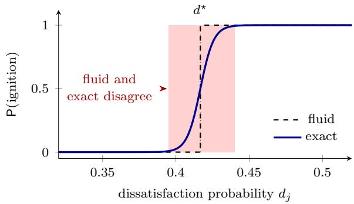  
Figure 5: The ignition boundary and its stochastic width (schematic). The fluid model (dashed) predicts a sharp step at $d ^ { \star }$ : below, stable; above, ignited. The exact stochastic system (solid) transitions over a band of finite width. The shaded region marks where the two verdicts disagree: the fluid gives a binary answer while the exact ignition probability lies in the middle, and a fluctuation can push the system into the spiral from which the fluid dynamics say there is no return.

With delayed retries the arrival rate becomes a functional of the current population state: the dynamics are distribution-dependent, a nonlinear Markov chain in exactly the sense of Dieker et al. (2026), and it is the principled extension of this work. The fluid model of this paper is a first-order approximation: it locates the trap, the spiral, and the index rule; the regime where the stakes concentrate, exact tail certification in the critical band, heavy-tailed token distributions, retries arriving with delay, is left for future work.

## 4.3 The Policy as a Tree

The optimal policy of Section 3 is a heatmap over $( t , N , x )$ that no operations engineer will certify, dif, or roll back. The industry’s actual policy, degrade everyone once $N > \widehat { N }$ , is a depth-one stump, constant in x. The territory between the stump and the heatmap is a decision tree, and here it comes cheap, because the situation is distillation, not learning: tree methods for Markov decision processes interleave splitting and optimization because the policy is unknown during construction (Sanabria et al. 2021), whereas here the teacher is already solved. The procedure has four steps. First, run the fluid dynamic program and extract the optimal actions, the action values $Q ( t , N , x , a )$ and the occupancy measure $\mu ( t , N )$ under the optimal policy, one backward and one forward pass with closed-form dynamics. Second, fit the tree to minimize the occupancy-weighted value regret

$$
\sum _ { t , N , x } \mu ( t , N ) \left[ Q ( t , N , x , a ^ { \star } ) - Q ( t , N , x , \operatorname { t r e e } ( t , N , x ) ) \right] ,\tag{11}
$$

so that where $Q$ is flat across actions the tree may be wrong for free and where it is steep, near the ignition boundary, the splitter concentrates resolution, coarse where the constraint is slack and fine where it bites. Third, close the loop: deploying the tree changes the occupancy and the retry feedback again, so roll (7) forward under the tree, refit on the induced occupancy, and repeat until the splits stabilize; every candidate ships with an exact certificate of leaf count, value gap, and violation path. Fourth, hard-code the bufered forbidden region of Section 4.2: any leaf whose cel intersects it takes the safe action, so the chance constraint holds by architecture rather than by hope.

Proposition 8 (Canonical form). Under the nested-threshold structure of Proposition 6, the optimal policy admits an ϵ-exact tree with $O ( | \mathcal { X } | \times \# \mathrm { r e g i m e s } \times J )$ leaves, and the distillation above recovers it. The tree is not a compression of the policy; it is the policy’s normal form.

Proof. Appendix A.3.

Each leaf is literally a row, “surge, class = parser → tier 1,” that an engineer can read, stresstest, dif, and roll back, which is the deployable format the stump already has and the heatmap never will.

## 4.4 Identifying the Price of the Discount

Every primitive of the model but one is read of a benchmark or a meter: service times and power draws from public leaderboards and serving traces, capacities and peak windows from published documentation, electricity from the bill. The exception is the behavioral triple, the dissatisfaction probability $d _ { j } ( x )$ , the retry probability $\rho _ { x }$ , and the expected LTV loss $( p _ { r } \ell ) _ { x } ,$ and the estimation program for it runs on logs every provider already keeps. Tier assignments are recorded per query; sessions link queries to customers; and dissatisfaction leaves fingerprints: a re-ask of the same question within minutes, semantically near its predecessor, an explicit regeneration, a thumbsdown, an agentic run abandoned mid-task. The per-answer rate of retry fingerprints at tier j estimates the product $d _ { j } ( x ) \rho _ { x }$ directly.

The product is the right target, because it is what the results consume. The multiplier (2), the efective quantities (3), the trap condition of Proposition 1, the ignition threshold of Proposition $^ { 3 , }$ and the latch of Corollary 4 depend on $( d _ { j } , \rho )$ only through $d _ { j } \rho ,$ the directly estimable object; once it is in hand, fresh demand follows from logged arrivals by the deconvolution of footnote 3. Separating $d _ { j }$ from $\rho$ is needed only for the churn column of (5), and the abandonment branch identifies it imperfectly: a dissatisfaction fingerprint followed by no retry brackets $d _ { j } ( 1 - \rho )$ from below, and all answers with no follow-up bracket it from above, because a silent satisfied exit and a silent dissatisfied one look alike. The honest output is therefore an interval, which propagates to an interval on the churn column and leaves the capacity side of every frontier untouched. The identification split runs through every downstream object: the fingerprint rate pins $d _ { j } \rho$ exactly, so the multiplier, the efective service time, the trap interval, and the ignition threshold are pointidentified from the log; the churn column needs $d _ { j }$ and $\rho _ { x }$ apart plus $( p _ { r } \ell ) _ { x }$ , and every object reading it, the newsvendor bufer, the index numerator, the dual floor, carries the interval forward. The program is built so that the interval lives on the ledger the dashboard does not show.

The comparison across tiers is confounded by construction: routers degrade under congestion, and congestion changes who is asking and how patient they are, so naive per-tier fingerprint rates mix the tier’s efect with the crowd’s. The environment supplies two instruments. Past capacity incidents shift tier assignment for fleet-level reasons orthogonal to any individual query, the classical exclusion. And published clock policies are a regression discontinuity in time: DeepSeek’s peak windows switch tiers at fixed minutes, so queries arriving seconds apart on either side of the boundary face the same demand and a discontinuous tier shift, and the jump in the fingerprint rate at the boundary estimates the diference in $d _ { j } \rho$ across the switched tiers. The churn side closes the same way: $( p _ { r } \ell ) _ { x }$ anchors to subscription price points, and a survival regression of churn on exposure to degraded episodes, instrumented by the same incidents, estimates $p _ { r }$

This program is why Section 5 declares its behavioral parameters as assumptions rather than estimates: the logs it needs exist, but they belong to the providers. What can be done from outside is what Section 5 does, anchor the assumptions to public prices and run the pipeline; what a provider can do from inside is replace every assumed number in Table 2 with a fingerprint rate and an instrumented regression, and then read Proposition 1 against its own menu.

## 5 Numerical examples

This section runs the entire pipeline of the paper, statics, dynamics, duality, and policy distillation, on five instances calibrated to public benchmark data. The tier physics of each provider’s posted menu, mean service times, quality indices, and cost per task, are read from the Artificial Analysis leaderboard; DeepSeek’s concurrency limits, peak windows, and two-to-one peak/of-peak price ratio are taken from its published API documentation; and the behavioral primitives $( \rho _ { x } , p _ { r } \ell _ { x } )$ are declared assumptions anchored to public subscription price points, per the estimation program of Section 4.4. The five providers were chosen because their menus instantiate five distinct regimes of the theory: a steep reasoning-efort ladder (Anthropic), a published trap tier alongside a published clock policy (DeepSeek), a fast ladder where degradation buys throughput rather than energy (Google), a flat ladder where degradation buys nothing (Kimi), and a fourteen-variant lattice containing equal-quality tiers split across the energy and capacity frontiers (OpenAI). Everything below is a proof of concept in the sense declared in Section 1: the measurable skeleton of each instance is real, the behavioral parameters are assumptions, and the point is the pipeline, not the estimates.

## 5.1 Instances, menus, and the efective-dominance collapse

Table 2 collects the calibration. Three customer classes, shared across all five providers because classes describe customers rather than vendors, carry the heterogeneity of Section 3.3: casual (low retry probability, low lifetime value), specialized (high retry, high value), and agentic (retries by construction), with dissatisfaction $d _ { j } ( x )$ linear in the relative quality gap of each ladder and $d _ { 0 } ( x ) > 0$ for every class, the strong tier included. Demand follows a shared diurnal profile whose peak sits at 0.90 of the static-optimal-mix throughput $\theta _ { \mathrm { m i x } }$ , the “barely stable” operating point that rational provisioning implies, plus an overnight surge at 03:00 (the nineteenth hour of the horizon, which opens at 08:00), deliberately placed of the published peak windows, sized to exceed the comfortable mix while remaining survivable near the maximum-throughput action.

Table 2: Calibrated instances. Markers give each number’s provenance: B benchmark (Artificial Analysis), P published by the provider, A assumption anchored to public prices, C calibration choice, D derived. Symbols as in Table 1, by class x (Section 3.3).
<table><tr><td></td><td colspan="3">customer classes (shared across providers)</td><td colspan="3"></td></tr><tr><td></td><td>casual</td><td>special.</td><td>agentic</td><td colspan="3"></td></tr><tr><td> $\mathrm { s h a r e } ^ { \mathrm { A } }$ </td><td>0.60</td><td>0.25</td><td>0.15</td><td colspan="3">share of fresh demand</td></tr><tr><td> $\rho _ { x } ^ { \mathrm { ~ A ~ } }$   $d _ { 0 , x } \mathrm { ^ A }$ </td><td>0.30</td><td>0.85</td><td>0.98</td><td colspan="3">probability an unsatisfied user re-asks dissatisfaction at the strongest tier</td></tr><tr><td> $\beta _ { x } ^ { \mathrm { ~ A ~ } }$ </td><td>0.02</td><td>0.05</td><td>0.10</td><td colspan="3">quality sensitivity:</td></tr><tr><td></td><td>0.8</td><td>2.5</td><td>3.0</td><td colspan="3"> $d _ { j } ( x ) = \operatorname* { m i n } \{ 0 . 9 5 , d _ { 0 , x } + \beta _ { x } ( 1 - I _ { j } / I _ { 0 } ) \}$ </td></tr><tr><td> ${ p _ { r } } ^ { \mathrm { ~ A ~ } }$ </td><td>0.03</td><td>0.08</td><td>0.05</td><td colspan="3">churn probability upon abandonment</td></tr><tr><td> $\ell ^ { \mathrm { A } }$ </td><td>$240</td><td>$1,800</td><td>$2,000</td><td colspan="3">lifetime margin of a churned customer</td></tr><tr><td> $p _ { r } \ell ^ { \mathrm { D } }$ </td><td>$7.2</td><td>$144</td><td>$100</td><td colspan="3">churn charge per abandonment,</td></tr><tr><td colspan="9">provider instances (one per regime of the theory)  $\mathrm { t i e r s } ^ { \mathrm { B } }$   $\mathrm { p o o l } ^ { \mathrm { C } }$   $\theta _ { \mathrm { m i x } } / \mathrm { h r } ^ { \mathrm { D } }$   $\mathrm { \ a c t i o n s ^ { D } }$ </td></tr><tr><td>Anthropic</td><td>5</td><td>2000</td><td>190 943</td><td>125→9</td><td rowspan="4">steep reasoning-effort ladder 14-variant lattice, tiers split</td><td rowspan="4"></td></tr><tr><td>OpenAI</td><td>14</td><td>2000</td><td>40 258</td><td>2744→72</td><td>across the two frontiers</td></tr><tr><td>Google</td><td>4</td><td>2000</td><td>462784</td><td>64→27</td><td>fast ladder: degradation buys</td></tr><tr><td>DeepSeek</td><td>3</td><td> $3 5 0 0 ^ { \mathrm { P } }$ </td><td>123 362</td><td>27→4</td><td>throughput, not energy published trap tier, clock policy,</td></tr><tr><td>Kimi</td><td>3</td><td>2000</td><td>102576</td><td></td><td>27→1</td><td>per-tier pools flat ladder: no lever; the policy space is a point</td></tr><tr><td colspan="9"></td></tr><tr><td colspan="9">tier  $\mathrm { \ p h y s i c s } ^ { \mathrm { B } }$  demandC</td></tr><tr><td>peak windowsP service  $\mathrm { l e v e l } ^ { \mathrm { c } }$ </td><td colspan="8">daily profile peaking at  $\operatorname* { m i n } ( 1 . 5 \theta _ { \mathrm { m i x } } , 0 . 9 \theta _ { \mathrm { m a x } } )$  09–12 and  $^ { 1 4 - 1 8 ; }$   $\mathsf { P } ( W > 3 0 0 \mathrm { s } ) \leq 0 . 0 5 ,$ </td></tr></table>

The first output of the pipeline is static: before any dynamics, the per-satisfied-answer ledger of (5) prunes each provider’s menu class by class, discarding any tier that another tier weakly dominates in both efective slot-time $\tilde { S } _ { j } ( x )$ and per-satisfied total cost. The collapse, reported in the last column of Table 2, is severe and informative. Anthropic’s 125 joint actions reduce to 9: the agent class is pinned to the single admissible tier Opus 5 (medium), priced out of the strong tier by slot-time and out of the weak tiers by its own retry multiplier, the two-sided exclusion of Proposition 6. DeepSeek’s 27 actions reduce to 4: the trap tier identified by Proposition 1 is inadmissible for every class, and, more striking, the strong tier is inadmissible for the majority (casual) class, whose entire efective menu is the Flash sibling. OpenAI’s 2744 actions reduce to 72, with the 221-second flagship surviving only on the specialist menu. Kimi’s menu collapses to a single action, all classes on the strong tier: on a flat ladder where the cheap tiers are no faster, the retry multiplier makes every degradation a pure loss, and the correct policy space is a point.

Table 3: Twenty-four-hour economic cost by policy and provider; lower is better, and the fluid DP (bold) is on every instance simultaneously the cheapest policy and feasible at every hour. Demand is scaled to each provider’s own throughput, so dollar figures compare across policies within a row, not across providers. Baselines: always strongest serves every query at tier 0; the reactive threshold degrades everyone when total backlog crosses a trigger, releasing below a second threshold; scheduled degrades everyone during the published peak windows; both are tuned per instance (best degrade tier and thresholds by rollout search). †unstable: the backlog diverges under its own retry feedback (Proposition 3), so no finite cost is meaningful. kv: the policy violates the 300-second latency SLA in k of 24 hours. The final column reports the cost of the best feasible baseline as a multiple of the DP.
<table><tr><td>provider</td><td>always strongest</td><td>reactive threshold</td><td>scheduled</td><td>fluid DP</td><td>tree</td><td>best/DP</td></tr><tr><td>Anthropic</td><td>unstable†</td><td>$648.95M</td><td> $u n s t a b l e ^ { \dagger }$ </td><td>$9.38M</td><td>$9.43M</td><td>69×</td></tr><tr><td>OpenAI</td><td>$110.56M15v</td><td>$14.49M</td><td>$60.52M4v</td><td>$1.39M</td><td>$1.39M</td><td>10×</td></tr><tr><td>Google</td><td>$7.27B2v</td><td>$3.30B</td><td>$7.27B²v</td><td>$8.90M</td><td>$8.86M</td><td>371×</td></tr><tr><td>DeepSeek</td><td>unstable†</td><td>$49.51M⁴v</td><td> $u n s t a b l e ^ { \dagger }$ </td><td>$2.02M</td><td>$2.02M</td><td>24×</td></tr><tr><td>Kimi</td><td>$3.44M</td><td>$3.44M</td><td> $\$ 1.4789$ </td><td>$3.44M</td><td>$3.44M</td><td>1.0×</td></tr></table>

These admissible sets are computed from the benchmark numbers and the class primitives alone, no optimization involved; they are the trap proposition doing menu design.

## 5.2 Policies and protocol

Five policies are compared on a common fine-grained simulator, all starting from the resting level of their own hour-0 action, so that cost accounting is identical and only the decision rule difers. P0 serves every query at the strong tier. P1 is the industry’s reactive stump, degrade everyone when total backlog crosses a trigger and release below a second threshold, with the degrade tier and both thresholds tuned per instance by rollout search, a deliberately generous opponent. P2 is the clock policy modeled on DeepSeek’s published mechanism, degrade everyone during the published peak windows regardless of state, again with the tier tuned. P3 is the fluid dynamic program of Section 3: hourly epochs, the closed-form two-regime transition of Lemma 2 with the arrival rate made endogenous by retries, a $1 3 ^ { 3 }$ interpolated grid over the three class backlogs, and the chance constraint $\mathsf { P } ( W > s ) \le 0 . 0 5$ at an absolute threshold s = 300 seconds enforced by pruning, never by dollars. P4 is the depth-three decision tree distilled from P3 by the occupancy-weighted procedure of Section 4.3 and then rolled out as a policy in its own right, so that its value gap to the DP is a certified number rather than a fit statistic.

## 5.3 Results

Table 3 reports the twenty-four-hour economics and Figure 6 the backlog trajectories. Three patterns organize the table. First, under capacity provisioned to the optimal mix, not optimizing is not an option: the always-strong policy is unstable on Anthropic and DeepSeek, its backlog diverging under its own retry feedback, and where it survives it does so only at one to two orders of magnitude above the optimum or in violation of the latency constraint. Second, the two industry heuristics fail in exactly the modes the theory predicts. The clock policy is unstable on Anthropic and DeepSeek and, most cleanly, pathological on Kimi, where its scheduled degradation steps into a flat ladder and manufactures a recurring retry storm, the sawtooth of Figure 6 being the fire-andrelease cycling of Corollary 4; it is also blind to the of-window surge by construction. The tuned stump stays feasible on most instances but pays for feasibility on the churn ledger: on Anthropic it books \$648.95M against the DP’s \$9.38M, with churned lifetime value of \$57.20M against the DP’s \$4.26M on identical demand, the uniform-degradation penalty of Proposition 7 in a single column. Third, the fluid DP is, on every instance, simultaneously the cheapest policy on the board and feasible at every hour, and its margin over the best feasible baseline, the last column of the table, varies with the regime exactly as the statics predict: large factors where the menu is rich (Anthropic at 69×, OpenAI at 10×), a factor of 371× on Google where the entire gap is surge timing, 24× on DeepSeek, and parity on Kimi, where the DP correctly recognizes that no lever exists and reproduces the always-strong policy to the dollar. The Kimi row is the null result that validates the method: an optimizer that found savings where the theory says none exist would be fitting noise.

The Google instance isolates the anticipation mechanism of Proposition 5. Its static-optima mix is all-strong, so of the surge the DP and the always-strong policy agree; the surge exceeds the strong tier’s mixed throughput and is survivable only down-ladder, so degradation here buys throughput rather than energy. The DP pre-positions ahead of the 03:00 surge and glides through at a peak backlog orders of magnitude below the baselines, which absorb the same surge as a spike of hundreds of thousands of jobs and a multi-billion-dollar service-level bill. The same mechanism, run in reverse, appears on Kimi: because its maximum-throughput action is the all-strong action, the surge there punishes any policy caught degraded, which is precisely the clock policy’s failure.

## 5.4 The dual, computed

Figure 7 prices the marginal query, by class and by hour, on all five instances: the frozen-policy duals of (9), finite diferences through the closed-form forward pass under the DP’s own actions, the entire surface recomputed in seconds. The two-part structure of Section 3.4 is visible on every panel. The floors never meet: of peak the specialized dual sits at 3.9× the casual dual on Anthropic, pure direct-cost spread with no congestion involved, so a router that prices all classes alike is mispricing at four in the morning, not just at the crunch. And the rent is the system’s, not the class’s: when load rises the three rent curves move together, the shared pool charging everyone the same scarcity premium, with the class identities carried almost entirely by the floors. The exception proves the mechanism: on Google, whose story is the surge, the marginal casual query at 03:00 carries \$145 of service-level knock-ons, the dual at the capacity wall, four orders of magnitude above its of-peak floor. On Anthropic the rent peaks at the window shoulders rather than inside the windows: midwindow the DP has already degraded and capacity is cheap, while at the shoulders it is still running strong tiers into rising load, the anticipatory policy visible in the dual. Two disclosed biases: duals in the last hours of the day are truncated by the finite horizon, and the rent reaches the latency constraint through the smooth $C _ { \mathrm { S L A } }$ surrogate, consistent with how every rollout in this section is priced. DeepSeek and Kimi hold the static-optimal action all day, so their duals carry no switch structure and their rents simply follow load, the dual-side reflection of the parity row in Table 3.

Table 4: Runtime and accuracy of the fluid solver against a brute-force competitor: the identical dynamic program, grid, action set, and cost function, with the closed-form transition replaced by a converged Euler integration at the per-provider stable step. The policy-value gap compares twenty-four-hour rollout costs of the two greedy policies on a common simulator; pointwise Q-regret statistics are reported in Appendix B.
<table><tr><td>provider</td><td>fluid (s)</td><td>Euler (s)</td><td>speedup</td><td>policy-value gap</td></tr><tr><td>Anthropic</td><td>0.31</td><td>23</td><td>75×</td><td>+5.89%</td></tr><tr><td>OpenAI</td><td>2.41</td><td>274</td><td>114×</td><td>+4.22%</td></tr><tr><td>Google</td><td>0.95</td><td>287</td><td>302×</td><td>+1.73%</td></tr><tr><td>DeepSeek</td><td>0.13</td><td>11</td><td>78×</td><td>+0.00%</td></tr><tr><td>Kimi</td><td>0.04</td><td>3</td><td>69×</td><td>+0.00%</td></tr></table>

## 5.5 Certificates

Table 4 certifies the fluid solution against a brute-force competitor: the identical dynamic program, grid, action set, and cost function, with the closed-form transition of Lemma 2 replaced by a converged Euler integration at the per-provider stable step. The fluid solver runs each instance in under three seconds against the competitor’s tens to hundreds, a speedup that grows with the provider’s service-rate scale, largest exactly where numerical integration is most expensive; this is the “computable in milliseconds” claim of Section 3.4 made concrete, and it is what makes the dual a live control signal rather than an overnight batch job. Two accuracy certificates accompany the speed claim. The policy-value certificate, reported in the table, rolls out the fluid and converged greedy policies on the same simulator and compares their twenty-four-hour costs; it is the deployment-relevant metric and closes the chain of custody, the fluid policy is ε-close to the converged optimum in rollout value, and the tree below is δ-close to the fluid policy, both epsilons printed. The trajectories themselves carry a third certificate: the closed-form forward pass of (7) matches the Euler simulator’s hourly states to a maximum relative gap of 0.43% (mean 0.008%) over every provider, policy, and hour mark, the diverging paths included; Figure 6 is drawn from that forward pass, so what the reader sees is the lemma’s formula, verified against the integrator on-trajectory, complementing the of-trajectory grid states the Q-regret table probes. The pointwise Q-regret statistics, reported in the appendix, price the fluid policy’s actions state by state under the converged Q-function; their tails concentrate of-trajectory in deep-saturation grid states on the shared-pool, high-rate providers, where the frozen-share approximation inside the closed form is weakest, and are reported in full rather than smoothed.

## 5.6 The policy in normal form: five trees

Figures 8 and 9 are the central artifact: the distilled policy, one depth-three tree per class, rendered in the same normal form as the baselines so that the comparison is visual, the stump is a single split on total backlog, the clock a single split on the peak flag, always-strong a single leaf, and the

DP’s tree shows exactly which splits they are missing. Every tree has at most eight leaves, every certified rollout gap to the DP is small (0.54% and 0.20% on the instances shown), and the splits are the paper’s objects surfacing from data. The OpenAI casual tree opens on the frontier switch of Section 3.1: below a total-backlog threshold and of the overnight surge, route to Luna (max), the \$0.05, 172-second energy-frontier tier; past the threshold, route to Sol (medium), the \$0.37, 13-second capacity-frontier tier, the cheapest model on the menu becoming the most expensive thing to serve exactly when capacity binds. The Anthropic casual tree splits at its root on the demand forecast $\boldsymbol { { \hat { r } } } _ { t } .$ , degrading ahead of load, the anticipatory structure of Proposition 5 as a root node; its specialist tree splits on the peak flag, of-peak at moderate efort and peak hours governed by the two-to-one electricity price, the energy dual of Section 3.4 as literal tree structure; and its agent tree is a single leaf, a class whose efective menu is a singleton. The Google, DeepSeek, and Kimi trees are in Appendix ${ \mathrm { B } } ;$ the DeepSeek specialist tree carries nested backlog thresholds on its own queue, the index-rule structure of Proposition 6, and all three Kimi trees are single leaves with perfect fidelity, the correct policy tree for that provider having one leaf per class, proven rather than asserted.

In the trees, $\hat { r } _ { t }$ is the demand forecast, t the hour of day, $N _ { \mathrm { c a s } , N _ { \mathrm { s p e c } } , N _ { \mathrm { a g } } , N _ { \mathrm { t o t } } }$ backlogs by class and in total, and $C$ pool capacity.

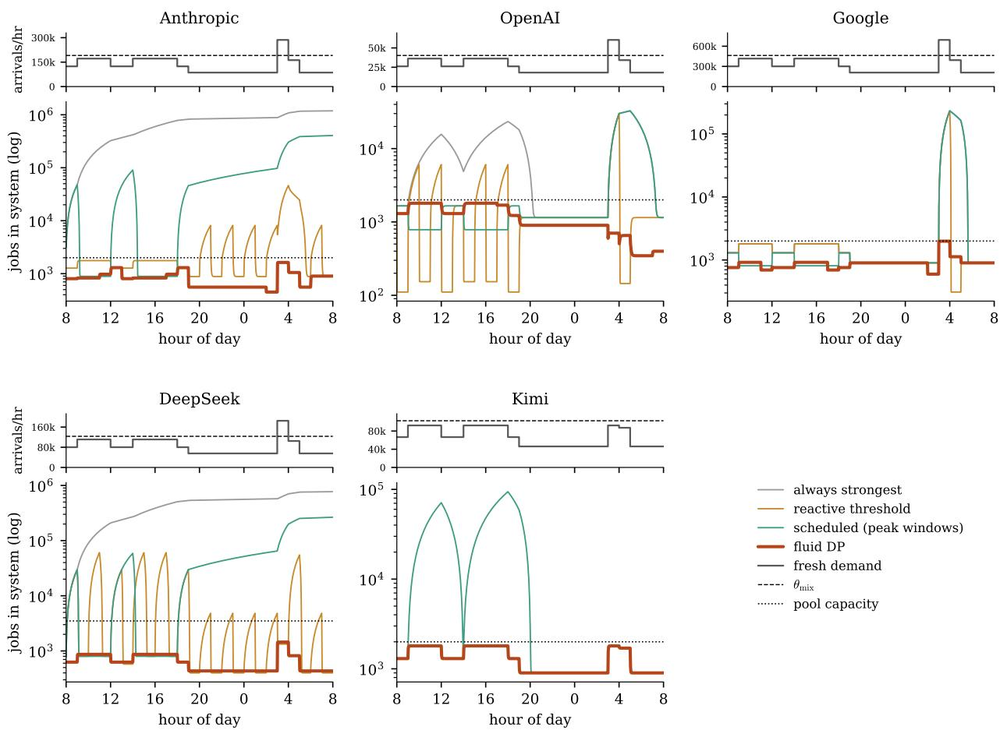  
Figure 6: Demand and backlog under the policies of Table 3, five providers, one shared diurnal profile scaled to each provider’s throughput (hour of day; the day is a finite horizon, not a cycle, so the two edges need not match). Top panels: fresh demand, with the static-optimal-mix throughput $\theta _ { \mathrm { m i x } }$ dashed; the morning and afternoon plateaus are the published peak windows, and the overnight spike at 03:00 is the surge, outside every scheduled window and above $\theta _ { \mathrm { m i x } }$ . On Kimi the surge is a plateau rather than a spike: it is sized min $( 1 . 5 \theta _ { \mathrm { m i x } } , 0 . 9 \theta _ { \mathrm { m a x } } )$ , and on a flat ladder the all-strong action is already the maximum-throughput action, so the cap binds at the daily peak level. Bottom panels: the resulting backlogs (log scale), the closed-form forward pass of (7) under each policy’s logged hourly actions, validated against the Euler simulator’s hourly states to a maximum relative gap of 0.43%, diverging paths included; every excess of backlog growth over what fresh demand alone would produce is policy-manufactured retry trafic. The reactive threshold’s spike train on DeepSeek is the latch of Corollary 4 on published capacities: each release drops all classes back into the 500-slot Pro pool and the trigger re-fires. The distilled tree is omitted: visually identical to the fluid DP on every panel (value gaps in Table 3).

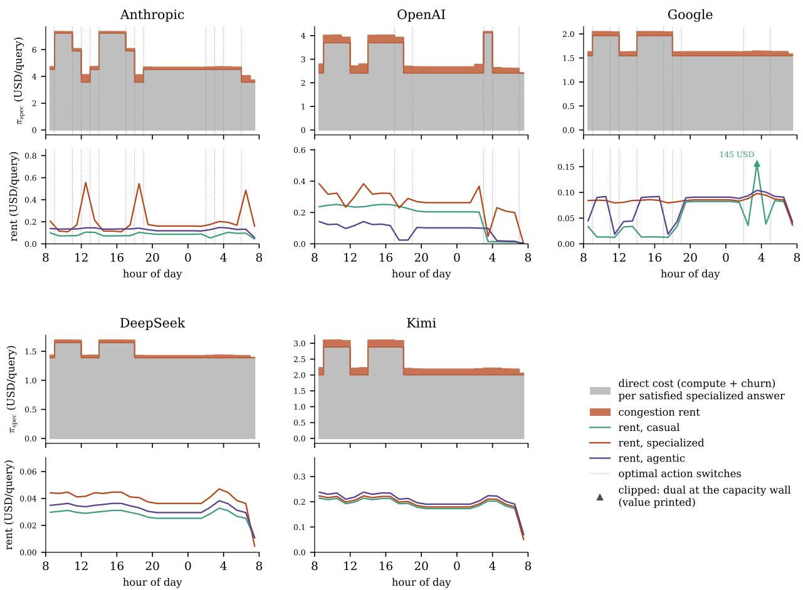  
Figure 7: The shadow price of intelligence, five providers: frozen-policy duals $\pi _ { x } ( t ) = \partial V ^ { \star } / \partial \lambda _ { x } ( t )$ of (9), finite diferences through the closed-form forward pass under the $\mathrm { D P s }$ actions; dotted verticals mark hours where the optimal action switches, where the dual may kink. Top panels: the specialized class’s dual decomposed into the direct cost of one more satisfied answer at the hour’s action, $M _ { j } ( x ) \big ( c _ { j } + d _ { j } ( x ) ( 1 { - } \rho _ { x } ) p _ { r } \ell _ { x } \big )$ with the peak electricity multiplier, and the congestion rent above it. Bottom panels: the rent by class, in dollars. Two facts organize the panels. The direct floors difer across classes at every hour, so the flat relative price of one that any uniform policy implicitly charges is wrong around the clock, of peak by $3 . 9 \times$ on Anthropic; and the pool charges a near-common rent when capacity binds, so dollar gaps between classes widen at the crunch while dual ratios compress. Rent panels are clipped where a single hour dominates, the value printed at the marker: on Google the marginal casual query at the surge carries \$145 of service-level knockons, the dual at the capacity wall. DeepSeek and Kimi hold one action all day, the static optimum: no switches, and rent moves only with load. Duals in the last hours are biased low by the finite horizon, and the rent reaches the latency constraint through the smooth $C _ { \mathrm { S L A } }$ surrogate rather than a hard wall.

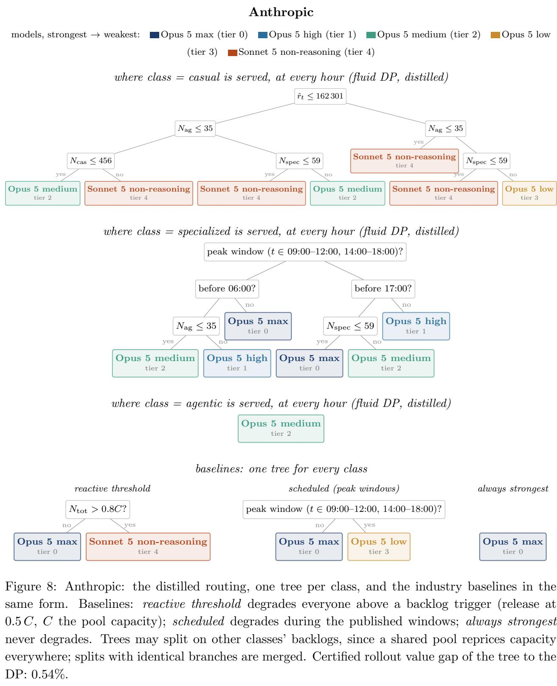

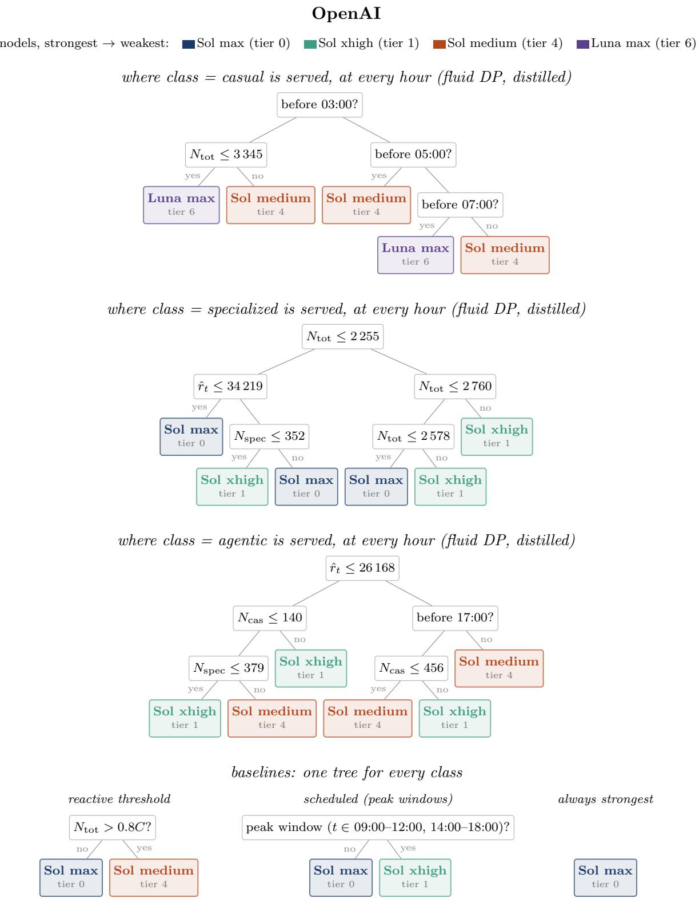  
Figure 9: OpenAI: the distilled routing, one tree per class, and the industry baselines in the same form. Baselines: reactive threshold degrades everyone above a backlog trigger (release at 0.5 C, C the pool capacity); scheduled degrades during the published windows; always strongest never degrades. Trees may split on other classes’ backlogs, since a shared pool reprices capacity everywhere; splits with identical branches are merged. Model names drop the shared prefix “GPT-5.6”. Certified rollout value gap of the tree to the DP: 0.20%.

## 6 Concluding Remarks

The paper’s argument compresses to one accounting identity and its consequences. The customer buys an answer; the system prices a query; and the wedge between the two, a geometric retry multiplier, inverts the static economics of model tiers, converts a reactive throttle into a demand amplifier with an ignition threshold and a one-way latch, turns heterogeneous throttling into a transportation problem in retry-inflated load, and equips the whole with a dual variable that prices a marginal query by class and by hour. The machinery is known: the newsvendor, the multiplier, and the transient fluid queue are each decades old (Leontief 1966; Eick et al. 1993; Halfin and Whitt 1981). What the recomposition unlocks is a control problem that was previously tractable only by simulation: a failure probability that is a control rather than a primitive, closed over by the retry loop, and priced on both ledgers, the one the dashboard shows and the one it does not. The unlocking is multiplicative rather than singular, four collapses compounding: memorylessness collapses the state, the static ledger collapses the action space, the two-regime closed form collapses the transition, and the normal surrogate collapses the tail. Remove any one and the problem returns to overnight simulation.

The boundary of the method is where the first collapse fails. Delayed retries restore the orbit as a state variable, making the dynamics distribution-dependent, a nonlinear Markov chain in the sense of Dieker et al. (2026) via the QPLEX-DQP formalism; that formulation is the natural home for exact tail certification in the critical band and for heavy-tailed token distributions, and it is exactly why the extension is a sequel rather than a section. What this paper’s first-order approximation delivers on its side of the boundary is the structure, the trap, the spiral, the index rule, and the dual, and most of the cost recoverable by controlling the system well; what lies beyond it is the sharper accounting of the tails.

## References

Aflaki, Sam and Ioana Popescu (2014). “Managing Retention in Service Relationships”. Management Science 60 (2), pp. 415–433.

Alizamir, Saed, Francis de V´ericourt, and Peng Sun (2013). “Diagnostic Accuracy Under Congestion”. Management Science 59 (1), pp. 157–171.

Anand, Krishnan S., M. Fazil Pa¸c, and Senthil Veeraraghavan (2011). “Quality–Speed Conundrum: Trade-ofs in Customer-Intensive Services”. Management Science 57 (1), pp. 40–56.

Artalejo, Jes´us R. and Antonio G´omez-Corral (2008). Retrial Queueing Systems: A Computational Approach. Berlin: Springer.

Ata, Barı¸s and Shiri Shneorson (2006). “Dynamic Control of an M/M/1 Service System with Adjustable Arrival and Service Rates”. Management Science 52 (11), pp. 1778–1791.

Chen, Frank et al. (2000). “Quantifying the Bullwhip Efect in a Simple Supply Chain: The Impact of Forecasting, Lead Times, and Information”. Management Science 46 (3), pp. 436–443.

Dieker, Antonius B. et al. (2026). QPLEX Decision Processes: Formulation via Nonlinear Markov Chains and Optimization via Policy Gradients. Preprint. arXiv: 2605.17149.

Eick, Stephen G., William A. Massey, and Ward Whitt (1993). “The Physics of the $M _ { t } / G / \infty$ Queue”. Operations Research 41 (4), pp. 731–742.

Falin, Gennadi I. and James G. C. Templeton (1997). Retrial Queues. London: Chapman & Hall.

Gandhi, Anshul et al. (2012). “AutoScale: Dynamic, Robust Capacity Management for Multi-Tier Data Centers”. ACM Transactions on Computer Systems 30 (4), pp. 1–26.

Gans, Noah (2002). “Customer Loyalty and Supplier Quality Competition”. Management Science 48 (2), pp. 207–221.

Garnett, Ofer, Avishai Mandelbaum, and Martin I. Reiman (2002). “Designing a Call Center with Impatient Customers”. Manufacturing & Service Operations Management 4 (3), pp. 208–227.

Halfin, Shlomo and Ward Whitt (1981). “Heavy-Trafic Limits for Queues with Many Exponential Servers”. Operations Research 29 (3), pp. 567–588.

Hall, Joseph and Evan Porteus (2000). “Customer Service Competition in Capacitated Systems”. Manufacturing & Service Operations Management 2 (2), pp. 144–165.

Hassin, Refael and Moshe Haviv (2003). To Queue or Not to Queue: Equilibrium Behavior in Queueing Systems. Boston: Kluwer Academic Publishers.

Hopp, Wallace J., Seyed M. R. Iravani, and Gigi Y. Yuen (2007). “Operations Systems with Discretionary Task Completion”. Management Science 53 (1), pp. 61–77.

Kwon, Woosuk et al. (2023). “Eficient Memory Management for Large Language Model Serving with PagedAttention”. In: Proceedings of the 29th Symposium on Operating Systems Principles (SOSP), pp. 611–626.

Lee, Hau L., V. Padmanabhan, and Seungjin Whang (1997). “Information Distortion in a Supply Chain: The Bullwhip Efect”. Management Science 43 (4), pp. 546–558.

Leontief, Wassily (1966). Input-Output Economics. New York: Oxford University Press.

Lin, Minghong et al. (2013). “Dynamic Right-Sizing for Power-Proportional Data Centers”. IEEE/ACM Transactions on Networking 21 (5), pp. 1378–1391.

Mandelbaum, Avishai and William A. Massey (1995). “Strong Approximations for Time-Dependent Queues”. Mathematics of Operations Research 20 (1), pp. 33–64.

Naor, Pinhas (1969). “The Regulation of Queue Size by Levying Tolls”. Econometrica 37 (1), pp. 15–24.

Sanabria, Elioth (2026). Supply Chain Analytics: A Data-Driven Approach. Lecture notes, Lehigh University.

Sanabria, Elioth, David D. Yao, and Henry Lam (2021). “Decision Tree Algorithms for MDP”. Working paper, Columbia University.

Tak´acs, Lajos (1963). “A Single-Server Queue with Feedback”. Bell System Technical Journal 42 (2), pp. 505–519.

Van Mieghem, Jan A. (1995). “Dynamic Scheduling with Convex Delay Costs: The Generalized cµ Rule”. The Annals of Applied Probability 5 (3), pp. 809–833.

V´ericourt, Francis de and Yong-Pin Zhou (2005). “Managing Response Time in a Call-Routing Problem with Service Failure”. Operations Research 53 (6), pp. 968–981.

Whitt, Ward (2002). Stochastic-Process Limits: An Introduction to Stochastic-Process Limits and Their Application to Queues. New York: Springer.

Yu, Gyeong-In et al. (2022). “Orca: A Distributed Serving System for Transformer-Based Generative Models”. In: Proceedings of the 16th USENIX Symposium on Operating Systems Design and Implementation (OSDI), pp. 521–538.

Zeltyn, Sergey and Avishai Mandelbaum (2005). “Call Centers with Impatient Customers: Many-Server Asymptotics of the $\mathrm { M } / \mathrm { M } / \mathrm { n } { + } \mathrm { G } \ \mathrm { Q u e u e } ^ { 3 }$ . Queueing Systems 51 (3–4), pp. 361–402.

## A Proofs

## A.1 Proof of Proposition 5

Fix a horizon $[ 0 , T ]$ , a calm rate $r _ { \mathrm { c a l m } } < \theta _ { 0 }$ , and a surge window $[ t _ { 1 } , t _ { 2 } ]$ on which $r _ { t } = r _ { \mathrm { s u r g e } } > \theta _ { 0 }$ with $r _ { \mathrm { s u r g e } } > \theta _ { 1 }$ so the reactive rule fires above ignition and $r _ { \mathrm { s u r g e } } \tilde { S } _ { 1 } < m k$ so the surge is feasible under full degradation. Step 1: an anticipatory path that never ignites. Degrading a fraction $\varphi \in ( 0 , 1 ]$ of trafic produces retry-inflated ofered load $\ell _ { t } ( \varphi ) = r _ { t } \big [ ( 1 - \varphi ) \tilde { S } _ { 0 } + \varphi \tilde { S } _ { 1 } \big ]$ . Feasibility guarantees a $\varphi$ and a start $t _ { 0 } < t _ { 1 }$ with $\ell _ { t } ( \varphi ) \leq ( 1 - \delta ) m k$ for all t and some $\delta > 0 .$ , the lead $t _ { 1 } - t _ { 0 }$ long enough for the pre-surge backlog to relax below $\ell _ { t _ { 1 } } ( \varphi )$ along the exponential branch of (7). On this path the system never saturates, the service-level term of (1) is identically zero, and the energy saved equals $\gamma ( \tilde { S } _ { 0 } \Delta w _ { 0 } - \tilde { S } _ { 1 } \Delta w _ { 1 } )$ per unit of degraded volume, the same volume the reactive rule degrades over the surge. Step 2: the reactive path pays superlinearly. By Proposition 3 the reactive trajectory crosses mk at some $\tau < t _ { 2 }$ , fires, and thereafter carries constant positive drift $\theta : = r _ { \mathrm { s u r g e } } - \theta _ { 1 }$ . Its backlog at $t \in [ \tau , t _ { 2 } ]$ is at least $\theta ( t - \tau )$ , so its cumulative service-level cost is at least $\begin{array} { r } { \frac { C _ { \mathrm { S L A } } } { ( m k ) ^ { 2 } } \int _ { \tau } ^ { t _ { 2 } } \theta ^ { 2 } ( t - \tau ) ^ { 2 } d t = \frac { C _ { \mathrm { S L A } } \theta ^ { 2 } } { 3 ( m k ) ^ { 2 } } ( t _ { 2 } - \tau ) ^ { 3 } } \end{array}$ , cubic in the surge duration. The bill does not close at $t _ { 2 } \colon \mathrm { i f } \ r _ { \mathrm { c a l m } } < \theta _ { 1 }$ , the excess backlog $B : = \theta ( t _ { 2 } - \tau )$ drains at rate $\beta : = \theta _ { 1 } - r _ { \mathrm { c a l m } }$ and contributes a further $\begin{array} { r } { \frac { C _ { \mathrm { S L A } } } { ( m k ) ^ { 2 } } \int _ { 0 } ^ { B / \beta } ( B - \beta t ) ^ { 2 } d t = \frac { C _ { \mathrm { S L A } } \theta ^ { 3 } } { 3 ( m k ) ^ { 2 } \beta } ( t _ { 2 } - \tau ) ^ { 3 } } \end{array}$ , the same cube scaled by $\theta / \beta ;$ if $r _ { \mathrm { c a l m } } \ge \theta _ { 1 }$ , the degraded queue never drains at all and the reactive cost is unbounded regardless of surge length. Step 3: comparison. The anticipatory policy pays one charge the reactive avoids, churn over the lead window, of size $P : = \varphi r _ { \mathrm { c a l m } } d _ { 1 } ( 1 - \rho ) p _ { r } \ell \left( t _ { 1 } - t _ { 0 } \right)$ , linear in the lead and independent of the surge length. Summing the two cubes of Step 2, the reactive excess is at least $\frac { C _ { \mathrm { S L A } } \theta ^ { 2 } } { 3 ( m k ) ^ { 2 } } \left( 1 + \frac { \theta } { \beta } \right) ( t _ { 2 } - \tau ) ^ { 3 }$ 2 and setting this equal to $P$ and solving for $t _ { 2 } - \tau$ gives the critical window $T ^ { \star }$ of the statement: for $t _ { 2 } { - } \tau < T ^ { \star }$ the reactive rule is cheaper and anticipation does not pay; for $t _ { 2 } - \tau > T ^ { \star }$ the anticipatory policy strictly dominates, with a margin growing as the cube of the excess. If the release threshold sits below the degraded calm equilibrium, Corollary 4 makes the reactive ledger unbounded and dominance strict at every T regardless of $T ^ { \star }$ . The chance-constraint surrogate. A job arriving at occupancy N waits behind $\operatorname* { m a x } ( N , m k )$ stages of exponential work served at aggregate rate $k \mu m .$ so its waiting time has mean ma $\mathfrak { z } ( N , m k ) / ( k \mu m )$ and variance max ${ \mathopen { : } } ( N , m k ) / ( k \mu m ) ^ { 2 } ;$ ; the normal approximation to $\mathsf { P } ( W \leq s ) \geq 1 - \alpha$ is exactly skµm $\geq \operatorname* { m a x } ( N , m k ) + \sqrt { \operatorname* { m a x } ( N , m k ) } \Phi ^ { - 1 } ( 1 - \alpha )$ and pruning the violating pairs preserves feasibility of every surviving trajectory. □

## A.2 Proof of Proposition 6

Attach a multiplier $\nu \geq 0$ to the binding capacity constraint of (8). The Lagrangian separates by class, and moving a unit of class-x trafic from tier j to $j + 1$ changes the objective by $\lambda _ { x } \partial c ( x , j ) / \partial j$ and relaxes the constraint by $\lambda _ { x } \big ( \tilde { S } _ { j } ( x ) - \tilde { S } _ { j + 1 } ( x ) \big )$ ; at the margin against tier 0, the relief per unit is $\tilde { S } _ { 0 } ( x ) - \tilde { S } _ { j } ( x )$ . A routing is optimal if no swap of degraded volume between classes improves the Lagrangian, i.e., if classes with positive relief are degraded in increasing order of the ratio $I ( x , j )$ of damage to relief, while classes with nonpositive relief, the trap region of Proposition 1, are never degraded at a binding constraint since doing so tightens it; ties are resolved arbitrarily and do not afect the value. Nestedness in the congestion state follows because $\nu$ is nondecreasing in N through the convexity of the service-level term in (1), so the set $\{ x : I ( x , j ) \leq \nu \}$ is nondecreasing in N. □

Table 5: Pointwise Q-regret of the fluid policy under the converged Q-function, on mutually feasible state–action pairs (uniform mean and p95, occupancy-weighted mean), with the feasibilitydisagreement rate. Tails concentrate of-trajectory in deep-saturation grid states on the shared-pool, $\mathrm { \ h i g h } { - \mu }$ providers; the deployment-relevant policy-value certificate is in Table 4.
<table><tr><td>provider</td><td>mean</td><td> $\mathrm { p 9 5 }$ </td><td>occ. mean</td><td>feas. disagr.</td></tr><tr><td>Anthropic</td><td>1.84%</td><td>7.71%</td><td>3.33%</td><td>4.54%</td></tr><tr><td>OpenAI</td><td>1.25%</td><td>5.02%</td><td>1.93%</td><td>0.00%</td></tr><tr><td>Google</td><td>8.05%</td><td>39.53%</td><td>11.66%</td><td>1.51%</td></tr><tr><td>DeepSeek</td><td>1.49%</td><td>1.90%</td><td>1.65%</td><td>0.00%</td></tr><tr><td>Kimi</td><td>0.00%</td><td>0.00%</td><td>0.00%</td><td>0.00%</td></tr></table>

## A.3 Proof of Proposition 8

By Proposition 6 the optimal action at $( t , N , x )$ is determined by (i) the regime of $t ,$ calm or surge, through the arrival rate entering $\nu ; ~ ( \mathrm { i i } )$ the position of $I ( x , \cdot )$ in the class ordering; and (iii) the position of N relative to the at most J thresholds at which ν crosses the successive indices of class x. A tree that splits first on regime, then on class, then on the class-specific thresholds in $N _ { ; }$ , reproduces this map exactly, with at most #regimes $\mathbf { \nabla } \times \left| \mathcal { X } \right| \times J$ leaves; ϵ-exactness with fewer leaves follows by merging any adjacent cells whose $Q \mathrm { - g a p }$ is below ϵ under the occupancy measure. That the distillation of Section 4.3 recovers it follows because the fit minimizes occupancy-weighted regret over a hypothesis class containing this tree, and the closed-loop certificate verifies attainment ex post; the collapse to depth one below the break-even expected LTV loss of Remark 1 is the case of a single efective tier with the N-threshold at infinity. □

## B Additional numerical assets

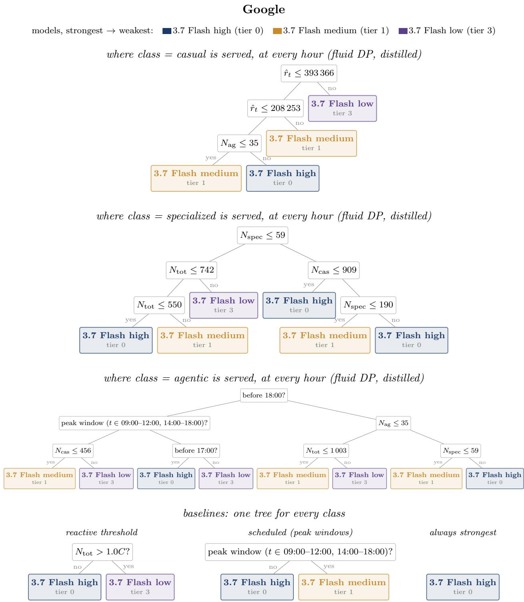  
Figure 10: Google: the distilled routing, one tree per class, and the industry baselines in the same form. Baselines: reactive threshold degrades everyone above a backlog trigger (release at 0.5 C, C the pool capacity); scheduled degrades during the published windows; always strongest never degrades. Trees may split on other classes’ backlogs, since a shared pool reprices capacity everywhere; splits with identical branches are merged. Model names drop the shared prefix “Gemini”. Certified rollout value gap of the tree to the DP: -0.43%.

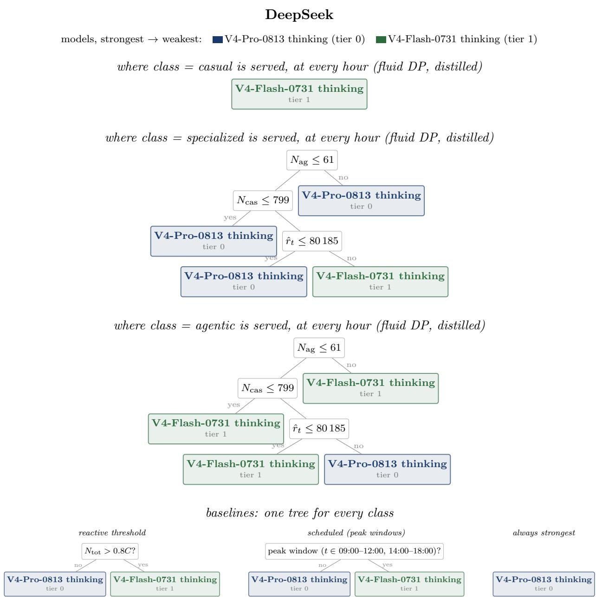  
Figure 11: DeepSeek: the distilled routing, one tree per class, and the industry baselines in the same form. Baselines: reactive threshold degrades everyone above a backlog trigger (release at 0.5 C, C the pool capacity); scheduled degrades during the published windows; always strongest never degrades. Trees may split on other classes’ backlogs, since a shared pool reprices capacity everywhere; splits with identical branches are merged. Certified rollout value gap of the tree to the DP: 0.00%.

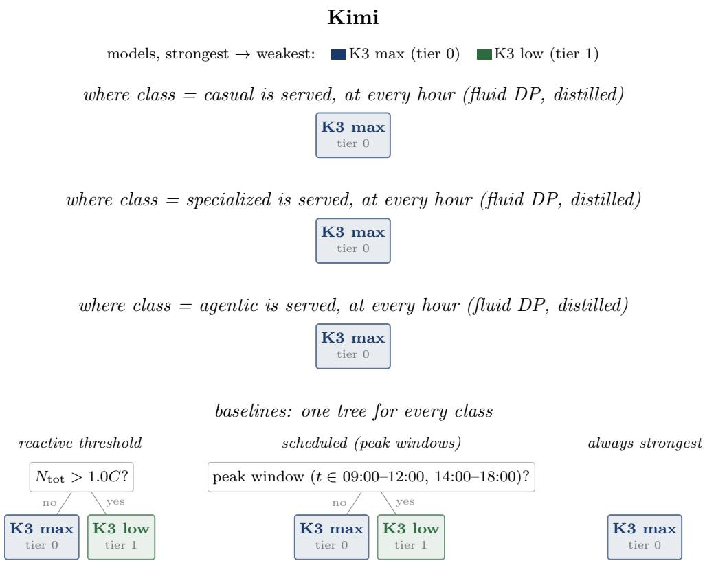  
Figure 12: Kimi: the distilled routing, one tree per class, and the industry baselines in the same form. Baselines: reactive threshold degrades everyone above a backlog trigger (release at 0.5 C, C the pool capacity); scheduled degrades during the published windows; always strongest never degrades. Trees may split on other classes’ backlogs, since a shared pool reprices capacity everywhere; splits with identical branches are merged. Model names drop the shared prefix “Kimi”. Certified rollout value gap of the tree to the DP: 0.00%.