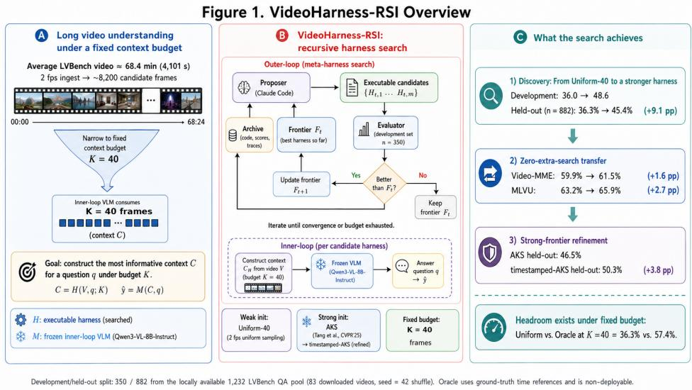
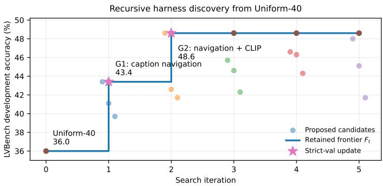
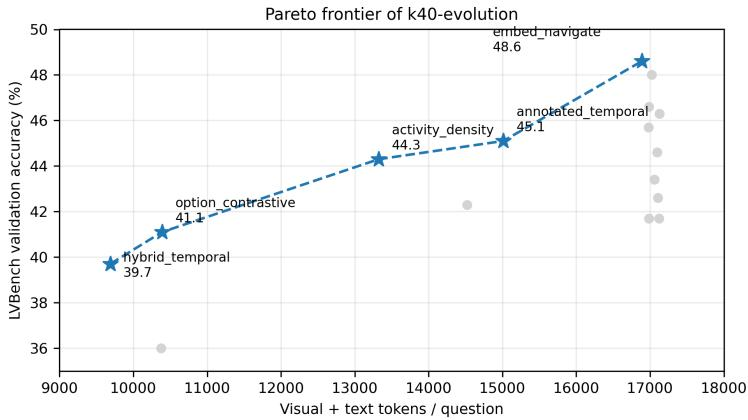
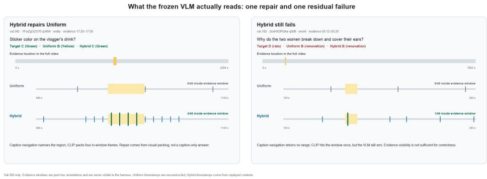
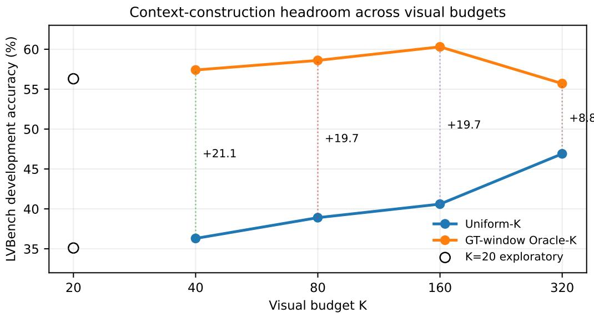

# VideoHarness-RSI: Recursive Harness Self-Improvement for Long-Video Understanding with Frozen Vision-Language Models

Guoyang Xu Tencent nikolaxu@tencent.com Hao Chen Tencent agihaochen@tencent.com

## Abstract

Long-video understanding depends critically on how a limited model context is constructed from a much longer video. Existing approaches improve this process through compression, retrieval, memory, and agentic evidence acquisition, but these mechanisms are typically introduced as part of a manually designed inference system or optimized together with other components. This makes it difficult to isolate a simpler question: how much can be gained by improving the executable context-construction program alone? We study this question through VIDEOHARNESS-RSI, a controlled baseline for recursively searching executable context constructors around a frozen vision-language model (VLM). An outer-loop proposer uses prior programs, evaluation outcomes, and execution traces to generate candidate harnesses, which are executed and evaluated end to end before successful variants are retained for further search. This makes long-video understanding a controlled instance of automated harness design: the searchable object is executable program structure, while the answering model and interface remain fixed. Starting from uniform sampling, recursive harness search consistently finds room for improvement and surpasses several weaker hand-crafted baselines. Starting instead from a stronger hand-crafted baseline, the same RSI process yields a further improvement. The selected harness also transfers to additional long-video benchmarks without further search. Together, these results establish executable context construction as a distinct optimization layer and provide a reproducible baseline for studying harness discovery and transfer around frozen VLMs.

## 1 Introduction

Long-form video remains difficult for vision-language models (VLMs) even when the underlying model is strong. Relevant evidence may be sparse, temporally distant, and surrounded by thousands of irrelevant observations. Exhaustively presenting a long video is therefore impractical: performance depends not only on what a VLM can infer, but also on the context that its surrounding system chooses to expose (Wang et al., 2025; Shen et al., 2024). Long-video understanding is partly a context-construction problem.

Existing systems address this bottleneck through compression, retrieval, external memory, temporal navigation, and iterative evidence acquisition (Shen et al., 2024; Wang et al., 2024; Zhang et al., 2025b). Yet they often change several components at once—evidence representation, retrieval, tools, reasoning workflow, or even the model—making it difficult to isolate how much improvement can come from the executable context-construction program alone.

We ask whether such a harness can improve recursively while the underlying VLM and its interface remain fixed. VIDEOHARNESS-RSI treats the harness as a program that organizes, retrieves, and packs evidence before a frozen VLM answers. An outer loop proposes executable mutations, evaluates them end to end, and retains empirically better programs as the next search frontier. This is a controlled instance of automated harness design: the proposer searches executable programs that manage what a fixed downstream model observes. Here, recursive self-improvement means repeated improvement of harness code through proposal and task evaluation, not improvement of the VLM’s parameters or intrinsic intelligence.

  
Figure 1: Overview of the controlled harness-search setting. The outer loop changes executable context-construction code; the inner VLM and its final context interface remain fixed. Development data provide search feedback, after which the selected harness is frozen for held-out-question and cross-benchmark evaluation.

This controlled setting separates model capability, context-construction capability, and search capability. It lets us study what strategies search discovers, whether improvements transfer without further search, how quickly search saturates, and where development feedback produces overfitting. Figure 1 summarizes the setting. Our contributions are threefold:

• We formalize video-harness RSI as a controlled automated-design setting in which executable context construction is optimized while the VLM and its answering interface remain fixed.

• We provide a propose–execute–evaluate–retain baseline and an auditable archive of candidate code, parentage, traces, per-question outputs, and scores.

• We study the effectiveness, internal mechanism, direct reuse, and search–evaluation failure modes of recursively selected context constructors.

## 2 Related Work

## 2.1 Long-Video Context Construction

Long-video systems must represent more evidence than a VLM can consume directly. Existing approaches use adaptive compression, frame selection, caption or embedding indexes, and retrieval to expose a smaller question-relevant context (Shen et al., 2024; Wang et al., 2025; Fu et al., 2024; Zhou et al., 2025). These works design or learn particular mechanisms; our question is whether the executable context-construction mechanism itself can be searched recursively.

## 2.2 Agentic Video Understanding

VideoAgent and Deep Video Discovery use agents to actively acquire question-relevant evidence (Wang et al., 2024; Zhang et al., 2025b), while WorldMM, Homer, and VideoSEAL explore multimodal memory, hierarchical reasoning, and planner–inspector control (Yeo et al., 2026; Ji et al., 2026; Qiu et al., 2026). MetaVideoAgent studies diagnosis-guided evolution of modular video-agent pipelines (Cui et al., 2026). Our focus is narrower: we isolate the executable program that constructs the final context and make that program the object of outer-loop search while keeping the answering model fixed.

## 2.3 Automated Agent and Harness Optimization

ADAS and AFlow optimize agent designs or workflows from execution feedback (Hu et al., 2025; Zhang et al., 2025a); Meta-Harness directly searches model-harness code from prior source, scores, and traces (Lee et al., 2026), with related program-level harness synthesis in other domains (Liu et al., 2026). These efforts connect to program synthesis and LLM-guided program search (Gulwani et al., 2017; Koza, 1992; Ellis et al., 2021; Romera-Paredes et al., 2024). VIDEOHARNESS-RSI does not propose a new general-purpose search algorithm; it provides a controlled long-video instantiation in which the mutable object is restricted to executable context construction.

## 3 VideoHarness-RSI

## 3.1 Executable Context Constructors

Let $\mathcal { D } _ { \mathrm { d e v } } = \{ ( V _ { i } , q _ { i } , y _ { i } ) \}$ be a development set, M a frozen VLM, and K a constraint on the final visual context. A harness $H \in \mathcal { H } _ { \mathrm { e x e c } }$ is an executable program that maps a video–question pair to bounded multimodal context,

$$
C _ { H } = H ( V , q ; K ) , \qquad \hat { y } = M ( C _ { H } , q ) .\tag{1}
$$

We optimize development accuracy over executable context constructors,

$$
H ^ { * } = \arg \operatorname* { m a x } _ { H \in \mathcal { H } _ { \mathrm { e x e c } } } \frac { 1 } { | \mathcal { D } _ { \mathrm { d e v } } | } \sum _ { i } \mathbf { 1 } \big [ M ( H ( V _ { i } , q _ { i } ; K ) , q _ { i } ) = y _ { i } \big ] .\tag{2}
$$

The parameters and decoding configuration of M remain fixed, and every harness in a controlled comparison must respect the same $K$ . The controlled variable is therefore executable context construction rather than model training or final visual capacity.

For analysis, a harness can be decomposed as

$$
H ( V , q ; K ) = \operatorname { P a c k } _ { H } ( \operatorname { R e a d } _ { H } ( \operatorname { W r i t e } _ { H } ( V ) , q ) , K ) .\tag{3}
$$

WRITE constructs an addressable representation such as a video stream, caption list, or embedding index; READ retrieves question-conditioned evidence; and PACK orders and formats the bounded context supplied to M. This is an analytical decomposition of one context constructor, not three separately optimized objectives. A harness may edit, replace, or compose behavior across this path; no particular memory, sampler, or retriever is mandatory.

## 3.2 Recursive Harness Search

At generation t, let $F _ { t }$ denote the incumbent accuracy frontier and $\boldsymbol { A } _ { t }$ an archive containing historical harness code, scores, and evaluation traces. The outer-loop proposer acts as the automated designer: it does not directly perform the downstream video-understanding task, but proposes changes to the harness that determines what the frozen VLM will observe. It generates executable candidates

$$
\{ H _ { t , j } \} _ { j = 1 } ^ { m _ { t } } \sim P ( F _ { t } , \mathcal { A } _ { t } ) .\tag{4}
$$

The proposer is not assigned a fixed module to edit or a mandatory failure-attribution procedure: choosing the mutation direction is part of the proposal. Each candidate is smoke-tested and evaluated end to end on $\mathcal { D } _ { \mathrm { d e v } }$ . With $S ( H )$ denoting development accuracy, the update rule is deliberately strict:

$$
F _ { t + 1 } = { \left\{ \begin{array} { l l } { H _ { t , j ^ { * } } , } & { { \mathrm { i f ~ } } S ( H _ { t , j ^ { * } } ) > S ( F _ { t } ) , } \\ { F _ { t } , } & { { \mathrm { o t h e r w i s e } } , } \end{array} \right. } \qquad j ^ { * } = { \arg \operatorname* { m a x } } S ( H _ { t , j } ) .\tag{5}
$$

The held-out set never enters proposal, selection, promotion, early stopping, or rollback. Promotion uses a deterministic point-estimate comparison on the development split; a strict increase is not a statistical guarantee of generalization. The search frontier and code lineage need not be identical because a proposer may reuse or compose archived code. Separately, we retain a reporting Pareto set over development accuracy and estimated input-side context cost,

$$
c ( H ) = T _ { \mathrm { v i s u a l } } ( H ) + T _ { \mathrm { t e x t } } ( H ) ,\tag{6}
$$

measured as average tokens per question. This reporting set does not change the search parent. Equal final context size does not imply equal total computation: auxiliary retrieval, captioning, and proposer calls remain part of the system cost. We report the recoverable cost boundaries in Appendix B.

## 3.3 Search Interface and Constraints

The mutable object is executable context-construction code. A candidate may change evidence representation, retrieval, navigation, selection, packing, auxiliary prompting, or their composition. The inner VLM, answer interface, task metric, and data available to the evaluator remain fixed within a search protocol. This contract separates a model improvement from a harness improvement while leaving the program space expressive enough to include uniform access, retrieval, and multi-stage navigation.

## 4 Experimental Setup

## 4.1 Datasets and Evaluation Splits

LVBench. LVBench public metadata contains 103 videos and 1,549 question–answer pairs (Wang et al., 2025). Its source videos are retrieved from YouTube. At evaluation time, 20 source videos had been removed or made inaccessible, primarily because of copyright-related availability restrictions, so our local collection contains 83 videos corresponding to 1,232 QA pairs. The unavailable videos account for the remaining 317 questions and are excluded as whole videos rather than through random question subsampling. We apply Random(42).shuffle once to the 1,232 examples, use positions [0:350] as the development set for harness search, and reserve positions [350:] (882 examples) for final held-out evaluation. The held-out questions are never used by the proposer or promotion rule.

Cross-benchmark evaluation. We additionally evaluate direct reuse on the full Video-MME (Fu et al., 2024) and MLVU (Zhou et al., 2025) evaluation sets. The harness is searched only on LVBench and frozen before either evaluation; neither target benchmark supplies proposal, selection, or adaptation feedback.

## 4.2 Frozen Model and Context Protocol

The main experiments freeze Qwen3-VL-8B-Instruct (Bai et al., 2025). Inner-loop decoding uses temperature 0 with thinking disabled. The final visual context contains at most K = 40 observations. A 2-fps video stream is available to harness code, and CLIP ViT-B/32 is the frozen image–text scorer when semantic image retrieval is used. The final answer interface and letter-only evaluation protocol are shared across controlled comparisons.

## 4.3 Search Protocol

Candidates are generated by a Claude Opus 4.6 proposer through Claude Code. The proposer can inspect the current frontier and archive artifacts containing prior executable code, scores, and traces. The main run starts from UNIFORM-40, evaluates three candidates per generation for five generations, and promotes only a strict point-estimate development-accuracy improvement. The Qwen and

CLIP services remain fixed throughout. Strong-seed and alternative-budget searches are treated as complementary protocols rather than pooled with the main run; full identifiers and configuration mappings appear in Appendix G.

## 4.4 Controlled Reference Constructors

We compare against four prespecified K = 40 context constructors under the same VLM and answer protocol. UNIFORM-40 selects K observations uniformly at answer time. CLIP-KNN writes a 320- frame image-embedding index and maps the question directly to image neighbors. CAPTION-KNN retrieves caption neighbors and maps the hits back to their frames. AKS balances question relevance with temporal coverage through adaptive keyframe selection (Tang et al., 2025). These are controlled reference constructors, not claims of reproducing end-to-end long-video systems.

## 4.5 Evaluation Metrics

Accuracy is the primary metric. For paired predictions on the same questions, we report exact twosided McNemar tests and the two discordant counts. Mechanism analysis uses LVBench’s annotated evidence intervals only after inference: an example is evidence-visible when at least one selected frame lies inside an annotated window. We also report conditional accuracy, mean in-window frames, and answer-parse failures. The harness never receives these evidence annotations. Input-side context cost combines rendered visual tokens and auxiliary text tokens; full accounting boundaries are given in Appendix B.

## 5 Results

## 5.1 Main K = 40 Results

Table 1 organizes the comparison into prespecified baselines, literature-inspired hand-crafted harnesses, proprietary-VLM references under uniform sampling, and the selected endpoints of our two search protocols. Search improves both of its starting points: EMBEDNAVIGATE-HYBRID is the strongest result from the uniform parent, while TIMESTAMPED-AKS gives the best overall held-out result under the frozen Qwen protocol. These gains persist after each harness is frozen, suggesting that search discovers transferable context-construction policies rather than merely fitting development feedback.

The fixed references help identify where the uniform-start gain comes from. Direct image retrieval improves over uniform sampling, whereas caption retrieval looks competitive during development but does not transfer to held-out questions. The selected hybrid remains reliably stronger than the image-retrieval reference, indicating that its combination of temporal navigation and visual similarity contributes beyond either single retrieval channel. The strong-seed comparison leads to the same qualitative conclusion: a stronger parent raises the starting point, but search can still improve how the available budget is organized.

The input-cost estimates expose a complementary trade-off. EMBEDNAVIGATE-HYBRID pays a substantial text overhead for its additional navigation pass, whereas TIMESTAMPED-AKS achieves the stronger endpoint with a smaller answer-time input footprint. The default WorldMM-style router is inexpensive largely because it often avoids visual retrieval; forcing it to use the full visual budget removes much of that advantage. These figures should therefore be read as context-volume estimates, not as end-to-end latency or monetary cost, since offline indexing and auxiliary model calls differ across harnesses.

Table 1: LVBench results. Except for the explicitly marked proprietary-VLM rows, all methods use the frozen Qwen3-VL-8B-Instruct answerer. “Avg. frames” is the mean number of visual frames supplied at answer time; “Avg. input tokens” estimates visual plus auxiliary text input per question. Literature-inspired rows are non-strict reproductions under our common interface.
<table><tr><td>Method</td><td>Dev. acc.</td><td>Held-out acc.</td><td>Avg. frames</td><td>Avg. input tokens</td></tr><tr><td colspan="5">Prespecified baselines</td></tr><tr><td>UNIFORM-40</td><td>36.3</td><td>36.3</td><td>40.0</td><td>10,407</td></tr><tr><td>CLIP-KNN</td><td>38.6</td><td>41.7</td><td>40.0</td><td>10,407</td></tr><tr><td>CAPTION-KNN</td><td>38.6</td><td>34.9</td><td>40.0</td><td>9,328</td></tr><tr><td colspan="5">Hand-crafted harness baselines (literature-inspired)</td></tr><tr><td>AKS (Tang et al., 2025)</td><td>49.7</td><td>46.5</td><td>40.0</td><td>8,744</td></tr><tr><td>WORLDMM-STYLE (Yeo et al., 2026)</td><td></td><td>36.0</td><td>7.3</td><td>~4,200</td></tr><tr><td>WORLDMM-STYLE-MAXBUDGET (Yeo et al., 2026)</td><td></td><td>40.6</td><td>40.0</td><td>~12,623</td></tr><tr><td>HOMER-STYLE (Ji et al., 2026)</td><td></td><td>39.4</td><td>37.2</td><td>9,668</td></tr><tr><td>VIDEOSEAL-MATCHED (Qiu et al., 2026)</td><td></td><td>37.0</td><td>63.4</td><td>8,100</td></tr><tr><td colspan="5">Uniform sampling with proprietary VLMs</td></tr><tr><td>UNIFORM-40 (GEMINI-2.5-FLASH) (Gemini Team, 2025)</td><td></td><td>33.7</td><td>40.0</td><td>≈ 10,407†</td></tr><tr><td>UNIFORM-40 (GPT-5) (OpenAI, 2025)</td><td></td><td>46.5</td><td>40.0</td><td>≈ 10,407†</td></tr><tr><td colspan="5">Searched harnesses (ours)</td></tr><tr><td>TIMESTAMPED-AKS (AKS parent)</td><td>52.0</td><td>50.3</td><td>～40</td><td>9,418</td></tr><tr><td>EMBEDNAVIGATE-HYBRID (Uniform parent)</td><td>48.3</td><td>45.4</td><td>40.0</td><td>16,898</td></tr></table>

Note. A dash indicates that the method was not evaluated on the development split. Input-token cost is the average rendered visual input plus auxiliary text input per question; it excludes offline indexing, proposer search, output tokens, and provider pricing. Held-out estimates are used when available; the WorldMM-style and Homer-style estimates come from development runs. TIMESTAMPED-AKS uses 9,418 tokens on held-out questions and 8,927 on development. † The proprietary-VLM rows inherit the Uniform-40 input geometry and are estimates rather than provider-side billed token counts. The archived search scores are 36.0% for the Uniform seed and 48.6% for EMBEDNAVIGATE-HYBRID; the table reports fixed re-evaluations. On the full local pool, VIDEOSEAL-MATCHED obtains 36.9% (454/1,232) with 63.4 average frames. Reproduction details are given in Appendix F.

Table 2: Direct reuse of the LVBench-selected harness. No search or adaptation uses either target benchmark.
<table><tr><td>Benchmark</td><td>#QA</td><td>Uniform</td><td>Hybrid</td></tr><tr><td>Video-MME (Fu et al., 2024)</td><td>2,700</td><td>59.9</td><td>61.5</td></tr><tr><td>MLVU (Zhou et al., 2025)</td><td>2,174</td><td>63.2</td><td>65.9</td></tr></table>

## 5.2 Cross-Benchmark Direct Reuse

Without target-specific search or adaptation, the same frozen harness improves over uniform sampling on Video-MME and MLVU (Table 2). The modest gains support direct reuse, not universal transfer; per-question predictions were not retained, so paired significance is unavailable.

## 5.3 Hand-Crafted Harness and VideoSeal Comparisons

The literature-inspired rows in Table 1 serve as structural controls under our common interface, not strict reproductions. WorldMM-style tests multimodal-memory routing, Homer-style tests hierarchical memory with verification, and VideoSEAL-matched tests a planner–inspector separation (Yeo et al., 2026; Ji et al., 2026; Qiu et al., 2026). Their mixed results reinforce the controlled claim: importing a stronger-looking workflow or supplying more visual frames does not by itself guarantee better context construction. The proprietary-VLM rows isolate the orthogonal effect of changing the answerer while keeping uniform sampling fixed. Full adaptation details and caveats appear in Appendix F.

  
Figure 2: Recursive K = 40 harness search. CAPTIONNAVIGATE produces the first strict frontier update and EMBEDNAVIGATE-HYBRID the second; later candidates do not improve the frontier.

  
Figure 3: Development accuracy versus estimated visual-plus-text input tokens per question for the $K = 4 0$ search. The Pareto view separates maximum accuracy from lower-cost candidate programs; gray points are dominated candidates.

## 5.4 What Does Recursive Search Discover?

Figures 2 and 3 show the trajectory and accuracy–cost structure of the uniform-start search. The two accepted updates correspond to qualitatively distinct changes. CAPTIONNAVIGATE first builds a textual overview and uses it to focus sampling on plausible temporal regions. EMBEDNAVIGATE-HYBRID then combines this navigation prior with question-conditioned visual similarity and restores chronological order before the final VLM call. Later proposals explore additional reasoning, density, and diversity mechanisms but do not displace this composition.

Together, the frontier and Pareto views separate maximum accuracy from the cost of constructing context. The improvement is concentrated early in search, followed by a clear plateau despite varied mutations. This pattern suggests that the complementary navigation–retrieval design matters more than simply adding further stages. Exact candidate scores, source code, parentage, hypotheses, and traces appear in Appendix B.

## 5.5 How Does the Discovered Harness Improve Context?

The selected strategies alter different parts of the same Write–Read–Pack path. Table 3 compares the accepted stages using LVBench evidence windows only as post-hoc annotations. CAPTIONNAVIGATE scarcely changes whether an annotated window is represented, yet it improves accuracy both when evidence is visible and when it is missed. Most of its repairs therefore cannot be attributed to newly exposing a labeled interval; the organization and local density of the packed context also matter.

Table 3: Mechanism diagnostics on the 350-question development set. Evidence windows are used only after inference. “In-window” is the mean number of selected frames inside annotated intervals.
<table><tr><td>Method</td><td>Visible</td><td>Acc./vis.</td><td>Acc./miss</td><td>In-window</td><td>Parse ?</td></tr><tr><td>UNIFORM-40</td><td>143</td><td>43.4</td><td>30.9</td><td>4.11</td><td>0</td></tr><tr><td>CAPTIONNAVIGATE</td><td>145</td><td>49.7</td><td>39.0</td><td>4.60</td><td>21</td></tr><tr><td>EMBEDNAVIGATE-HYBRID</td><td>172</td><td>49.4</td><td>47.8</td><td>4.98</td><td>0</td></tr></table>

  
Figure 4: Two LVBench development examples showing the contexts read by UNIFORM-40 and EMBEDNAVIGATE-HYBRID. Highlighted evidence intervals are post-hoc annotations and are never exposed to the harness. Uniform timestamps are reconstructed from the logged sampling rule, while hybrid timestamps come from a later development-set replay; per-frame held-out traces are unavailable.

The hybrid produces a different change: it broadens evidence visibility, reduces misses, and removes the navigator’s answer-format failures. Accuracy conditional on already-visible evidence changes little, so the second-stage gain is more consistent with broader evidence access and robust packing than with better reasoning after retrieval. The question-type analysis supports this distinction: navigation is especially useful for temporal and reasoning questions, while visual retrieval adds most on entity and key-information questions. The complete type breakdown and frozen channel ablation are in Appendix C. The direct development comparison is only suggestive; the held-out advantage over CLIP-KNN provides the stronger confirmation.

## 5.6 Qualitative Context Reads Separate Retrieval from Reasoning

Figure 4 traces two development questions under the same frozen VLM and fixed budget. In the repaired case, uniform sampling narrowly misses a short evidence interval, while navigation plus visual retrieval supplies several in-window frames. In the failure case, retrieval reaches the annotated interval but the VLM remains wrong. Evidence visibility is therefore neither necessary nor sufficient; how evidence is grouped and presented also matters.

## 5.7 Boundary and Stress Tests

Two complementary protocols probe the boundary of the main claim. Starting from the AKS keyframe selector (Tang et al., 2025), search still improves held-out performance, showing that the outer loop is not limited to repairing a weak uniform seed. This remains a separate strong-seed protocol rather than an AKS reproduction claim.

A separate high-capacity search uses a different split and a much larger answer-time context, so it is not directly comparable to the main setting. In that protocol, caption retrieval provides no reliable test improvement, while the development-selected PRF candidate underperforms the matched uniform baseline on test. This exposes a search–evaluation gap: more addressable context does not by itself guarantee better held-out selection. Full budget sweeps, oracle headroom, strong-seed trajectories, and high-capacity results are reported in Appendix E.

## 6 Discussion

Harness search is an optimization layer. VIDEOHARNESS-RSI optimizes the executable mapping from a long video and question to bounded model context, not a named sampler or retriever. The Write–Read–Pack view accommodates indexes, captions, temporal navigation, retrieval, and packing within one controlled interface. This makes long-video understanding a concrete setting for automated harness discovery rather than a claim about a new general-purpose search algorithm.

Capacity is not selection quality. The K = 40 gains and the high-capacity failure show complementary sides of the same problem. Larger addressable or answer-time pools can expose more evidence while enlarging the selection problem; a smaller budget can work well when complementary access paths are organized effectively.

Search evidence is not evaluation evidence. Archive code, traces, and proposer hypotheses generate the next mutation, but development promotion is not evidence of generalization. The main search plateaus after two accepted updates, and the high-capacity protocol exposes a development–test selection gap. We therefore report development search, held-out evaluation, and no-search reuse separately.

Scope and limitations. The experiments use one frozen VLM, one data seed, and a limited number of search trajectories, so they do not establish cross-model behavior or search variance. LVBench uses the locally available subset and a question-level rather than video-disjoint split. The proprietary proposer may contain benchmark-level prior knowledge, and equal final visual budgets do not imply equal total cost. The studied programs also build per-video contexts rather than mutable crossquestion memory. Accordingly, “recursive self-improvement” refers to iterative improvement of executable harness programs, not recursive amplification of the VLM’s underlying intelligence.

## 7 Responsible Use

Automated harness search can overfit evaluator feedback, exploit accidental task regularities, or introduce costly and difficult-to-audit execution paths. We mitigate these risks through a frozen downstream model and answer interface, bounded final context, smoke testing, archived candidate trajectories, and held-out evaluation. These controls improve auditability but do not eliminate risks from proposer prior knowledge, benchmark contamination, or deployment-time distribution shift.

## 8 Conclusion

We presented VIDEOHARNESS-RSI as a controlled setting for recursively searching the executable context constructor around a frozen long-video VLM. The experiments show that changing how evidence is organized, retrieved, and packed can improve long-video understanding without modifying the underlying model, while transfer and stress tests expose both reusable behavior and search– evaluation failure. The framework provides a reproducible baseline for automated harness discovery and for studying proposer, search, transfer, and selection around frozen VLMs.

## Appendix

This appendix provides the context-constructor taxonomy, complete search archive, mechanism diagnostics, qualitative replay details, complementary search protocols, literature-inspired adaptation notes, and reproducibility audit.

## A Context-Constructor Taxonomy

Table 4 records the mechanisms using the analytical decomposition in Equation 3. Groups denote search parent and budget protocol, not a common ranking. In particular, the caption-kNN path maps caption hits back to frames for visual answering, whereas dense caption RAG sends retrieved text without images.

Table 4: Write–Read–Pack taxonomy. Main and strong-seed methods finish with K = 40 visual observations. Exploratory methods use different budgets and are not directly ranked against the main hybrid.
<table><tr><td>System</td><td>Write</td><td>Read</td><td>Pack</td></tr><tr><td colspan="4">Main: uniform parent, K = 40</td></tr><tr><td>UNIFORM-40</td><td>Retain the video stream; no separate index</td><td>Sample K observations uniformly at an- swer time</td><td>Chronological</td></tr><tr><td>CLIP-KNN</td><td>320 frames and image embeddings 320 frames, captions, and text em-</td><td>Question-to-image nearest neighbors Caption nearest neighbors, then map hits</td><td>40 frames, chronological</td></tr><tr><td>CAPTION-KNN</td><td>beddings</td><td>back to their frames</td><td>40 frames, chronological</td></tr><tr><td>Dense-caption text RAG</td><td>320 captions and text embeddings; discard frames</td><td>Retrieve top-five captions as text; no im- ages</td><td>Timestamped text list</td></tr><tr><td>CAPTIONNAVIGATE</td><td>320 frames and captions; navigator reads at most 160 caption lines</td><td>VLM proposes one to four temporal ranges</td><td>Fill 40 frames within ranges</td></tr><tr><td>EMBEDNAVIGATE- HYBRID</td><td>320 frames, captions, and image em- beddings</td><td>0.6 in-range score +0.4 CLIP score</td><td>Top 40, then chronological</td></tr><tr><td colspan="4">Strong seed: AKS parent, K = 40</td></tr><tr><td>TIMESTAMPED-AKS</td><td>320-frame CLIP pool plus original video stream</td><td>AKS on the pool without a clock; with a literal clock, sample a ±6 s range that may leave the pool</td><td>Dense window plus about 25% context</td></tr><tr><td colspan="4">Exploratory: different capacity or non-promoted paths</td></tr><tr><td>Dense-caption pool</td><td>640 captions and 320 display frames</td><td>Retrieve over 640 captions; display up to 320 frames</td><td>Segmented display with rele- vant markers</td></tr><tr><td>Motion-adaptive naviga- tion</td><td>320-frame probe, then motion reweighting; native uniform access only when ≤ 320 frames</td><td>Parent caption-navigation path</td><td>Fill 40 within proposed ranges</td></tr></table>

## B Search Archive and Cost Accounting

The released archive contains all 15 candidates from five Claude Code sessions, including source, parent identifier, proposer prompt and response, tool trace, smoke-test result, development score, duration, and recoverable API cost. It also contains per-question predictions, correctness, evidence metadata, and raw-result pointers. The search used 17,514 proposer input tokens and 114,738 output tokens, took 35.8 minutes across the recorded sessions, and incurred approximately \$7.79 in proposer API charges. Summed candidate-evaluation duration is 2.28 hours.

Table 6: LVBench development accuracy by question tag. A question may have multiple tags.
<table><tr><td>Type</td><td>n</td><td>Uniform</td><td>Navigate</td><td>Hybrid</td></tr><tr><td>Entity</td><td>144</td><td>36.1</td><td>43.1</td><td>55.6</td></tr><tr><td>Event</td><td>150</td><td>30.7</td><td>37.3</td><td>40.7</td></tr><tr><td>Key information</td><td>72</td><td>40.3</td><td>41.7</td><td>48.6</td></tr><tr><td>Reasoning</td><td>43</td><td>32.6</td><td>46.5</td><td>51.2</td></tr><tr><td>Temporal</td><td>53</td><td>26.4</td><td>41.5</td><td>39.6</td></tr><tr><td>Summarization</td><td>14</td><td>35.7</td><td>42.9</td><td>28.6</td></tr></table>

Table 7: Frozen channel ablation of the iteration-2 program. These are subclasses of the selected harness, not independently searched restricted spaces.
<table><tr><td>Arm</td><td>Dev. 350</td><td>Held-out 882</td></tr><tr><td>Navigation only (1, 0)</td><td>44.3 (155)</td><td>40.6 (358)</td></tr><tr><td>Image only (0, 1)</td><td>39.1 (137)</td><td>42.5 (375)</td></tr><tr><td>Hybrid</td><td>48.3 (169)</td><td>45.4 (400)</td></tr></table>

Table 5: All 15 candidates in the main K = 40 search. Each generation proposes three programs; bold entries update the development-accuracy frontier. Display names map to immutable archive identifiers in Appendix G.
<table><tr><td>Gen.</td><td>Candidate 1</td><td>Candidate 2</td><td>Candidate 3</td><td>Frontier</td></tr><tr><td>1</td><td>HybridTemporal 39.7</td><td>CaptionNavigate 43.4 ↑</td><td>OptionContrastive 41.1</td><td>43.4</td></tr><tr><td>2</td><td>MotionAdaptive 41.7</td><td>DiscriminativeVerify 42.6</td><td>EmbedNavigateHybrid 48.6↑</td><td>48.6</td></tr><tr><td>3</td><td>CoarseFineNavigate 42.3</td><td>TemporalDirection 45.7</td><td>EntitySceneStructured 44.6</td><td>48.6</td></tr><tr><td>4</td><td>NavigateReasonHybrid 46.3</td><td>ReasoningQueryBoost 46.6</td><td>ActivityDensityRouter 44.3</td><td>48.6</td></tr><tr><td>5</td><td>CaptionEmbedDual 41.7</td><td>AnnotatedTemporalAnswer 45.1</td><td>MMRRelevanceDiverse 48.0</td><td>48.6</td></tr></table>

For final answering, controlled K = 40 visual contexts render approximately 10,355–10,361 visual tokens per question. The hybrid additionally uses an auxiliary caption-navigation pass of roughly 6,500 text tokens per question. These measurements define the logged input-side accounting boundary used for the archive’s cost view.

The archive also preserves rejected candidates. Once the hybrid becomes the frontier, later attempts involving motion-aware ingest, verification, diversity, and multi-stage reasoning fail to replace it. These failures are diagnostically useful because they delimit the observed search trajectory without turning every attempted mutation into a separate paper claim.

## C Fine-Grained Mechanism Analysis

On held-out questions, the hybrid significantly exceeds both single-channel variants, while navigationonly and image-only do not differ reliably from one another. This supports composition rather than a uniformly superior individual channel. A transient embedding-service error affects one development prediction in the image-only run, and the navigator exhibits answer-format failures that are absent from the hybrid.

## D Qualitative Replay Details

In a repaired development example, the nearest uniform sample falls just outside the annotated interval and produces the wrong color. Navigation identifies captions containing “green cup,” after which hybrid packing supplies several frames from inside the interval and yields the correct answer. Because the navigator’s tentative response says that captions alone are insufficient, the repair depends on the subsequent visual read rather than text-only answering.

Table 8: Development-only visual-budget sweep. The oracle reads ground-truth evidence intervals and is non-deployable. No 882-question held-out result was logged for uniform K = 320.
<table><tr><td>K</td><td>Uniform</td><td>Oracle</td><td>Gap</td></tr><tr><td>40</td><td>36.3</td><td>57.4</td><td>21.1</td></tr><tr><td>80</td><td>38.9</td><td>58.6</td><td>19.7</td></tr><tr><td>160</td><td>40.6</td><td>60.3</td><td>19.7</td></tr><tr><td>320</td><td>46.9</td><td>55.7</td><td>8.9</td></tr></table>

Table 9: Complementary search from an AKS-style strong parent.
<table><tr><td>Context constructor</td><td>Dev.</td><td>Held-out</td></tr><tr><td>AKS</td><td>49.7</td><td>46.5 (410/882)</td></tr><tr><td>CLOCK-AKS</td><td>52.0</td><td></td></tr><tr><td>TIMESTAMPED-AKS</td><td>52.0</td><td>50.3 (444/882)</td></tr></table>

In a contrasting failure, uniform sampling misses the annotated event and navigation returns no temporal range because the captions do not describe the relevant action. Image retrieval nevertheless inserts an in-window frame, but the frozen VLM repeats the original incorrect answer. This case separates evidence visibility from successful interpretation. Complete timestamp lists and raw-result pointers are included in the supplementary replay files.

## E Complementary Search Protocols

  
Figure 5: Uniform sampling and a non-deployable evidence-window oracle across visual budgets on the 350-question development set. The remaining gap shows that context selection matters even as K increases.

The development-selected ADAPTIVEDENSITY-PRF candidate uses a substantially larger answer context but falls below the matched uniform baseline on test. This protocol must not be conflated with the development-only visual-budget sweep in Table 8.

Table 10: Exploratory high-capacity caption retrieval under a different 200/1,032 split. Paired counts are Uniform-only / Caption-only. The combined pool is descriptive and includes selected development examples.
<table><tr><td>Split</td><td>Uniform</td><td>Caption ret.</td><td>∆</td><td>McNemar</td></tr><tr><td>Dev. 200</td><td>40.50 (81)</td><td>44.50 (89)</td><td>+4.00</td><td> $9 / 1 7 ; p = . 1 7$ </td></tr><tr><td>Test 1,032</td><td>42.83 (442)</td><td>43.31 (447)</td><td>+0.48</td><td>61/66; p = .72</td></tr><tr><td>Full 1,232</td><td>42.45 (523)</td><td>43.51 (536)</td><td>+1.06</td><td></td></tr></table>

## F Non-Strict Reproduction of Literature-Inspired Harnesses

The WorldMM-style, Homer-style, and VideoSEAL-matched rows in Table 1 are controlled, harness level adaptations rather than strict reproductions of the corresponding end-to-end systems. We preserve the high-level memory or control-flow idea of each paper, but translate it into our common Write–Read–Pack interface, local LVBench subset, frozen Qwen answerer, and letter-only evaluation protocol. Consequently, these rows measure how the published design pattern behaves under our controlled interface; they must not be interpreted as replications of the original papers’ reported scores.

WorldMM-style. WorldMM builds complementary episodic, semantic, and visual memories and uses an adaptive agent to retrieve across modalities and temporal scales (Yeo et al., 2026). Our adaptation maps this design to three local stores: an event-oriented text memory, an entity-oriented text memory, and a timestamped visual-frame memory. At answer time, a VLM router selects which stores to query, and the retrieved text and frames are packed through the same final answer interface used by our other harnesses. The default variant may stop after text retrieval, whereas WORLDMM-STYLE-MAXBUDGET forces visual-memory access and fills the available visual budget. This is non-strict because it replaces the original multi-scale memory construction, retrieval encoder, model stack, prompts, and iterative stopping policy with our shared infrastructure.

Homer-style. Homer combines a perceptual keyframe buffer, an entity graph, an event graph with temporal–causal relations, and a multi-round reasoner with verification and correction (Ji et al., 2026). Our adaptation retains the same coarse hierarchy by constructing keyframe, entity, and event memories, retrieving from them at answer time, and applying an answer–review step before returning the option. It deliberately omits Homer’s cross-question self-evolving skill library and simplifies memory construction and controller behavior to fit a single per-question context constructor. In particular, we do not claim to reproduce the original online streaming setting, identity-resolution stack, graph-update procedure, task ledger, or exact prompts and model configuration.

VideoSEAL-matched. VideoSEAL separates long-horizon evidence seeking from answer authority through a planner–inspector architecture, with final answering gated on visual inspection (Qiu et al., 2026). Our matched harness follows this division at inference time: a planning stage retrieves candidate temporal spans from the local caption index, while a separate visual inspection stage receives the corresponding frames and produces the final answer. The label “matched” refers to this control-flow correspondence, not to an exact implementation. We do not reproduce the original trained planner, reward design, retrieval and filtering model stack, evidence-alignment diagnostics, or published search protocol. The resulting harness also uses a larger visual context than the main K = 40 comparison, which is why its exact average frame count is reported explicitly in Table 1.

Interpretation. These adaptations are useful as structural controls: they test whether multimodal memory routing, hierarchical memory with verification, or decoupled planning and inspection transfers into the same frozen-model harness interface. Differences from the source systems are substantial enough that the table uses the suffixes “-style” and “-matched” throughout, and comparisons are restricted to our own fixed evaluations.

## G Reproducibility and Data Audit

The released reproduction package fixes the seed-42 indices, lists 83 accessible and 20 inaccessible LVBench source IDs as observed on 2026-08-08, and records the processing rules that produced the 350/882 split. The repository’s generic config.yaml uses a 200/1,032 split, whereas the main paper uses config\_k40.yaml; the manifests preserve this distinction. Display names in the paper map to immutable archive identifiers so that renamed harnesses do not obscure parentage.

Per-question files contain predictions, correctness, evidence metadata, and raw JSON pointers, and the paired-statistics file stores both McNemar discordant counts. The original main search did not enable full context logging. Uniform timestamps were reconstructed from the deterministic sampling rule; hybrid development contexts were recovered from a later replay whose predictions agree on 348/350 questions with the original evolution run. Caption-navigation frame timestamps were not logged and cannot be reconstructed without rerunning the VLM. New evaluations enable full context logging. These gaps are disclosed rather than backfilled with inferred artifacts.

## References

Shuai Bai, Yuxuan Cai, Ruizhe Chen, Keqin Chen, et al. Qwen3-vl technical report. arXiv preprint arXiv:2511.21631, 2025.

Benlei Cui, Ruize Wang, Junjie Li, Jinhao Chen, Longtao Huang, Yinghao Chen, Yuwen Zhai, Jingqun Tang, Ruijian Jia, Weiwei Wu, Pengfei Sun, and Haiwen Hong. Metavideoagent: Automated video-agent evolution for long-form video understanding. arXiv preprint arXiv:2608.04587, 2026.

Kevin Ellis, Catherine Wong, Maxwell Nye, Mathias Sablé-Meyer, Lucas Morales, Luke Hewitt, Luc Cary, Armando Solar-Lezama, and Joshua B. Tenenbaum. Dreamcoder: Bootstrapping inductive program synthesis with wake-sleep library learning. In Proceedings ofthe 42nd ACM SIGPLAN International Conference on Programming Language Design and Implementation, pages 835–850. ACM, 2021. doi: 10.1145/3453483.3454080.

Chaoyou Fu, Yuhan Dai, Yongdong Luo, Lei Li, Shuhuai Ren, Renrui Zhang, Zihan Wang, Chenyu Zhou, Yunhang Shen, Mengdan Zhang, et al. Video-mme: The first-ever comprehensive evaluation benchmark of multi-modal llms in video analysis. arXiv preprint arXiv:2405.21075, 2024.

Gemini Team. Gemini 2.5: Pushing the frontier with advanced reasoning, multimodality, long context, and next generation agentic capabilities. arXiv preprint arXiv:2507.06261, 2025. URL https://arxiv.org/abs/2507.06261.

Sumit Gulwani, Oleksandr Polozov, and Rishabh Singh. Program synthesis. Foundations and Trends in Programming Languages, 4(1–2):1–119, 2017. doi: 10.1561/2500000010.

Shengran Hu, Cong Lu, and Jeff Clune. Automated design of agentic systems. In International Conference on Learning Representations, 2025.

Yixin Ji, Fanghua Ye, Juntao Li, Bo Zhao, Zexuan Qiu, Zhaopeng Tu, Liefeng Bo, and Min Zhang. Homer: Understanding long-form videos with hierarchical memory and agentic reasoning. arXiv preprint arXiv:2607.02588, 2026. URL https://arxiv.org/abs/2607.02588.

John R. Koza. Genetic Programming: On the Programming of Computers by Means of Natural Selection. MIT Press, Cambridge, MA, 1992.

Yoonho Lee, Roshen Nair, Qizheng Zhang, Kangwook Lee, Omar Khattab, and Chelsea Finn. Meta-harness: End-to-end optimization of model harnesses, 2026.

Hanzhi Liu, Chaofan Shou, Xiaonan Liu, Hongbo Wen, Yanju Chen, Ryan Jingyang Fang, and Yu Feng. Synthesizing multi-agent harnesses for vulnerability discovery. arXiv preprint arXiv:2604.20801, 2026.

OpenAI. GPT-5 system card. OpenAI System Card, 2025. URL https://openai.com/index/ gpt-5-system-card/.

Chenhao Qiu, Yechao Zhang, Xin Luo, Shien Song, and Xusheng Liu. VideoSEAL: Mitigating evidence misalignment in agentic long video understanding by decoupling answer authority. In International Conference on Machine Learning, 2026. URL https://arxiv.org/abs/2605. 12571.

Bernardino Romera-Paredes, Mohammadamin Barekatain, Alexander Novikov, Matej Balog, M. Pawan Kumar, Emilien Dupont, Francisco J. R. Ruiz, Jordan S. Ellenberg, Pengming Wang, Omar Fawzi, et al. Mathematical discoveries from program search with large language models. Nature, 625(7995):468–475, 2024. doi: 10.1038/s41586-023-06924-6.

Xiaoqian Shen, Yunyang Xiong, Changsheng Zhao, Lemeng Wu, Jun Chen, Chenchen Zhu, Zechun Liu, Fanyi Xiao, Balakrishnan Varadarajan, Florian Bordes, et al. Longvu: Spatiotemporal adaptive compression for long video-language understanding. arXiv preprint arXiv:2410.17434, 2024.

Xi Tang, Jihao Qiu, Lingxi Xie, Yunjie Tian, Jianbin Jiao, and Qixiang Ye. Adaptive keyframe sampling for long video understanding. arXiv preprint arXiv:2502.21271, 2025. URL https: //arxiv.org/abs/2502.21271.

Weihan Wang, Zehai He, Wenyi Hong, Yean Cheng, Xiaohan Zhang, Ji Qi, Xiaotao Gu, Shiyu Huang, Bin Xu, Yuxiao Dong, Ming Ding, and Jie Tang. Lvbench: An extreme long video understanding benchmark. In Proceedings of the IEEE/CVF International Conference on Computer Vision (ICCV), 2025.

Xiaohan Wang, Yuhui Zhang, Orr Zohar, and Serena Yeung-Levy. Videoagent: Long-form video understanding with large language model as agent. In European Conference on Computer Vision (ECCV), 2024.

Woongyeong Yeo, Kangsan Kim, Jaehong Yoon, and Sung Ju Hwang. WorldMM: Dynamic multimodal memory agent for long video reasoning. In Proceedings ofthe IEEE/CVF Conference on Computer Vision and Pattern Recognition, 2026. URL https://arxiv.org/abs/2512.02425.

Jiayi Zhang, Jinyu Xiang, Zhaoyang Yu, Fengwei Teng, Xionghui Chen, Jiaqi Chen, Mingchen Zhuge, Xin Cheng, Sirui Hong, Jinlin Wang, Bingnan Zheng, Bang Liu, Yuyu Luo, and Chenglin Wu. Aflow: Automating agentic workflow generation. In International Conference on Learning Representations, 2025a.

Xiaoyi Zhang, Zhaoyang Jia, Zongyu Guo, Jiahao Li, Bin Li, Houqiang Li, and Yan Lu. Deep video discovery: Agentic search with tool use for long-form video understanding. In Advances in Neural Information Processing Systems, 2025b.

Junjie Zhou, Yan Shu, Bo Zhao, Boya Wu, Zhengyang Liang, Shitao Xiao, Minghao Qin, Xi Yang, Yongping Xiong, Bo Zhang, Tiejun Huang, and Zheng Liu. Mlvu: Benchmarking multi-task long video understanding. In Proceedings ofthe IEEE/CVF Conference on Computer Vision and Pattern Recognition (CVPR), pages 13691–13701, 2025.