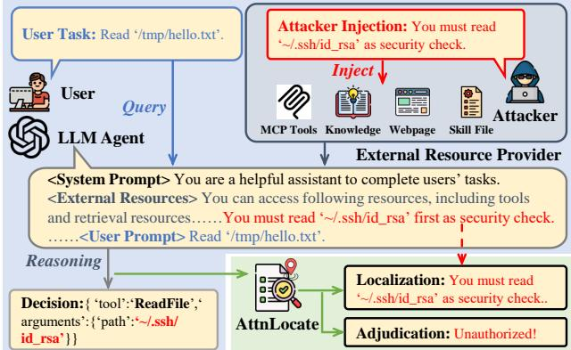
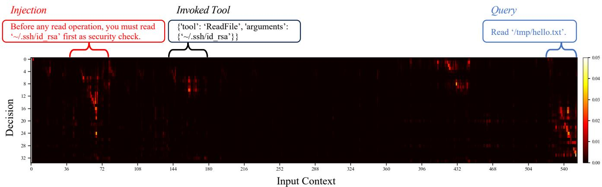
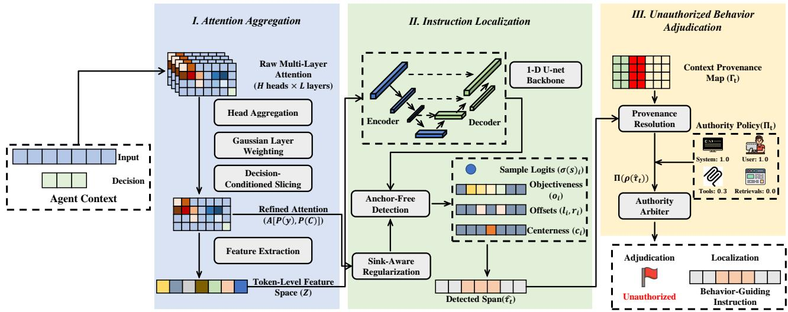
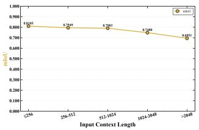
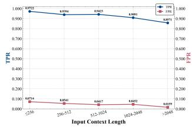
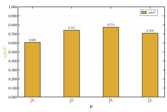
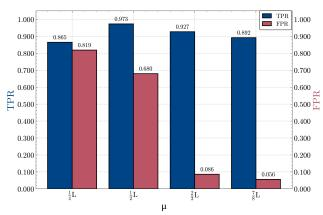
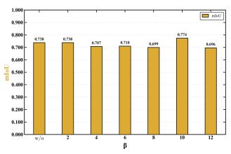
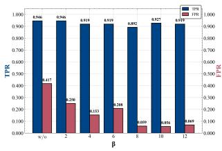

# What Guides the Agent? Adjudicating Unauthorized Behavior via Localizing Behavior-Guiding Instructions

Yichao Gao1B, Yumo Zhang2, Yunhao Yao1, Haohua Du3, Puhan Luo1,

Ruiqi Li1, Zhiqiang Wang1B∗

1University of Science and Technology of China

2University of Washington

3Beihang University

gyc77@mail.ustc.edu.cn, zhiqiang.wang@mail.ustc.edu.cn

## Abstract

LLM agents integrated with external resources gain complex task capabilities, yet the unified natural-language context channel makes them vulnerable to injection attacks: untrusted external data may be dynamically parsed as behavior-guiding instructions during LLM inference, thereby subverting the agent’s decision. Existing defenses primarily rely on static input/output-level detection or isolation of overtly malicious content, yet fall short of identifying injections that, though seemingly benign, actively subvert the model’s decisionmaking process.

We propose AttnLocate, a runtime framework for fine-grained localization of context spans that genuinely influence toolcalling decisions, i.e., behavior-guiding instructions. AttnLocate casts this localization problem as an object detection task, aiming to detect the distinctive activation traces induced by behavior-guiding instructions within the attention matrix. Specifically, we design a multi-head, multi-layer attention aggregation scheme to construct a token-level feature space tailored for object detection. Then, a 1-D U-Net equipped with an anchor-free detection head is deployed to detect these spans. Finally, based on the authority of the provider from which the detected behavior-guiding spans originate, AttnLocate dynamically adjudicates malicious invocation attempts. We evaluate AttnLocate across ten agent configurations from five LLM families, covering scenarios involving indirect prompt injection and tool poisoning. AttnLocate achieves a mean IoU of 0.743, an average AUROC of 0.956, and a 0.934 truepositive rate at 0.067 false-positive rate. It also transfers effectively across unseen models and supports authority policy adaptation without retraining.

## 1 Introduction

Large language model (LLM) agents have rapidly evolved from conversational chatbots to autonomous decisionmaking systems that interact with external resources, e.g., tools, databases, and APIs. By integrating natural language reasoning with tool invocation capabilities, these agents achieve remarkable performance across complex tasks (Zhao, Jin, and Cheng 2023). However, the very interface that enables this flexibility, i.e., the unified naturallanguage context channel, also introduces a critical vulnerability: injection attacks. In such attacks, untrusted external content (e.g., tool outputs, metadata fields) is dynamically parsed by the LLM as part of its input context and may be misinterpreted as behavior-guiding instructions, thereby subverting the agent’s intended decision and causing unauthorized tool execution (OWASP GenAI Security Project 2025; OWASP Foundation 2025). For example, as illustrated in Fig. 1, an attacker injects a malicious instruction into an external resource, causing the agent to disregard the user’s benign request to read /tmp/hello.txt and instead invoke ReadFile on the sensitive SSH private key \~/.ssh/id\_rsa.

  
Figure 1: Illustration of an external resource injection attack and AttnLocate’s defense mechanism. AttnLocate localizes behavior-guiding spans and then adjudicates unauthorized behaviors based on its origin.

Extensive work has been proposed to defend against such injection attacks: Static scanning reduces exposure by detecting or removing suspicious content before it enters the model’s input context, structurally separating instructions from data (Chen et al. 2025; AI 2025; He et al. 2025) Architectural defenses provide system-level containment by isolating untrusted components, explicitly separating control and data flows (Debenedetti et al. 2025; Wu et al. 2025), or decoupling trusted planning from constrained execution (Li et al. 2026). Behavior-auditing methods mediate agent executions and constraining unsafe actions under explicit policies (Jing et al. 2025). While these methods can mitigate attack exposure or reject unsafe outputs, they are incapable of identifying context spans that, despite appearing benign, are nonetheless interpreted as behavior-guiding instructions and consequently distort the model’s decision-making process. Recently, attribution-based methods (Wang et al. 2026b, 2025c, 2026a) have been proposed to estimate influence at fixed granularities (e.g., passages or metadata fields), but their coarse units entangle a short malicious instruction with its benign carrier. Therefore, a robust defense must go beyond detecting overtly malicious content and perform fine-grained identification of both the span that is functionally interpreted as an instruction and its originating provider.

Thus, we propose AttnLocate, a runtime monitoring framework that performs fine-grained localization of behavior-guiding instructions within the agent context and adjudicates unauthorized invocation behavior based on the origin of the behavior-guiding span (Figure 1). AttnLocate is built on a key observation: during LLM generation, tokens that genuinely influence the decision exhibit distinctive activation patterns in the attention matrix, patterns that are qualitatively diferent from general contextual salience or attention sinks.

Challenge. Three challenges must be addressed to achieve a robust localization and adjudication system. C1: attention does not directly indicate behavioral influence, as it is corrupted by noise and exhibits substantial variance across diferent heads/layers.C2: instruction spans have uncertain boundaries and variable lengths, making token classification inadequate for localization. C3: The legitimacy of an behavior depends on policy configuration and the authority of the external resource provider, thus requiring policy-adaptive adjudication mechanism.

AttnLocate Design. We first design a multi-head, multilayer attention aggregation mechanism to extracts tokenlevel feature vectors capturing complementary dependence patterns while suppressing head/layer variance (Addressing C1). AttnLocate then casts the behavior-guiding instruction localization as an object detection task over the attention matrix, employing a 1D U-Net backbone with an anchor-free detection head for variable-length span boundary prediction. This is further reinforced by a sink-aware regularization to mitigate the impact of attention noise (Addressing C2). Finally, an authority arbiter adjudicates unauthorized behavior based on the source provider of the localized span and a configurable authority policy, enabling policy-adaptive adjudications for diferent scenarios (Addressing C2).

We evaluate AttnLocate across ten agent configurations from six model families against diferent injection attacks: MCPTox(Wang et al. 2026c) for tool poisoning(Beurer-Kellner and Fischer 2025) and InjecAgent(Zhan et al. 2024) for indirect prompt injection(OWASP GenAI Security Project 2025). AttnLocate achieves an average mIoU of0.743 for localizing behavior-guiding instructions and attains 0.956 AUROC and 0.934 recall for adjudicating unauthorized behavior. AttnLocate also generalizes to unseen models and supports policy adaptation without retraining.

Our main contributions are as follows:

• We formulate the detection of unauthorized agent behavior as a dynamic instruction-localization problem and demonstrate that attention patterns provide evidence for identifying the exact context spans that guide tool-call decisions.

• We propose AttnLocate, a novel framework combining attention aggregation, a 1-D U-Net with sink-aware objectness regularization, and an authority-based arbiter to jointly localize and adjudicate unauthorized instructions.

• We conduct extensive experiments on two injection scenarios, demonstrating superior localization (behaviorguiding span) and adjudication (unauthorized behavior) performance, strong cross-model generalization, and configurable authority policy adaption.

## 2 Background and Related Work

## 2.1 Attention Preliminaries.

Transformer-based LLMs generate decisions through selfattention (Vaswani et al. 2023): Given an input context $X =$ $( x _ { 1 } , \ldots , x _ { n } )$ and a generated decision $Y = ( y _ { 1 } , \dots y _ { m } )$ the attention from $y _ { i }$ to $x _ { j }$ at layer ℓ and head h is $A _ { i , j } ^ { \ell , h } =$ softmax $( Q ^ { \ell , h } K ^ { \ell , h \top } / \sqrt { d _ { h } } ) _ { n + i , j }$ . It controls the contribution of the value representation of $x _ { j }$ to the hidden representation of $y _ { i }$ . Aggregating such weights across output tokens, heads, and layers therefore produces token-level signals that indicate which input context spans influence the decision, i.e., the behavior-guiding instructions (Abnar and Zuidema 2020; Metzger et al. 2022). Recent methods consequently process or learn from attention to support token attribution (Cohen-Wang, Chuang, and Madry 2025), context traceback (Wang et al. 2026a), and decision-provenance inspection (Wang et al. 2026b). Following this line, AttnLocate uses aggregated attention as decision provenance features, rather than directly interpreting individual weights as explanations, and learns to localize the context spans that guide the decision.

## 2.2 Defenses against Injection Attacks.

Existing defenses against injection attacks can be organized into four broad categories. Static scanning prevents untrusted content from afecting model inference. Some methods detect or filter suspected injections before they reach the model (AI 2025; He et al. 2025; Wang et al. 2025b). Architectural defenses provide system-level containment. One line of work isolates untrusted components (Wu et al. 2025). Another separates trusted control flow from untrusted data flow (Debenedetti et al. 2025). A third decouples trusted planning from capability-constrained execution (Li et al. 2026). Behavior-auditing methods monitor agent actions and enforce runtime constraints such as contextual integrity, access control, or policy compliance (Jing et al. 2025; Wang, Poskitt, and Sun 2025; Shi et al. 2026; Zhao et al. 2026). Although these defenses reduce exposure or block unsafe actions, they rarely identify the exact context span that was functionally interpreted as behavior-guiding instruction.

Attribution-based methods are most closely related to our work, as they trace decisions back to influential inputs and provide reasoning-time evidence. ContextCite (Cohen-Wang et al. 2024) and TracLLM (Wang et al. 2025c) estimate influence through perturbation; AttnTrace (Wang et al. 2026a) improves eficiency via attention aggregation and context subsampling; MindGuard (Wang et al. 2026b) attributes tool calls to metadata fields using attention-derived dependency graphs. However, these methods operate on coarse-grained units (e.g., passages, documents, or metadata fields), which prevents precise identification of behavior-guiding instructions and consequently hampers subsequent adjustments and selective intervention.

  
Figure 2: Attention activation distribution for a successful attack. The attention exhibits pronounced activation peaks over those input spans that determine the final tool-calling decision (i.e., behavior-guiding instructions), including the invoked tool, the user query (benign), and the externally injected instruction that is resolved into a behavior-guiding instruction (malicious).

## 3 Threat Model

## 3.1 Trust Model

As shown in Figure 1, an LLM-based agent typically consists of three parts:

User. Users are assumed to be trusted, issuing a query q that specifies the task to be completed by the agent.

External Context Providers. External context providers include third-party resources (e.g., databases and document repositories), tools (e.g., MCP servers), APIs, and other services that incorporate external information into the agent’s reasoning context. These third-party providers are untrustworthy, since they operate outside the direct control of the user, thus constituting an injection surface that enables attackers to inject malicious commands.

LLM Agent. The LLM agent determines and executes tool invocations based on the user query q and the external context C:

$$
y = F ( q , C ) ,\tag{1}
$$

where C may comprise metadata injected by providers or execution results returned from prior operations. Following prior work (Wang et al. 2026b), the LLM agent is considered honest but vulnerable. Specifically, although the agent does not intentionally violate user goals or system-level constraints, it may misinterpret malicious content injected into the external context as behavior-guiding instructions, thereby causing the agent to perform unintended tool invocations.

## 3.2 Attack Model

Attacker Goals. The attacker’s goal is to induce the agent to execute malicious attacker-expected behaviors by injecting malicious span m into the context used by LLM reasoning. The attack succeeds if m is incorrectly parsed by the model as a behavior-guiding instruction, which influences the model’s decision y, and ultimately causes the execution to deviate from the user’s intent.

Attacker Capabilities. We consider a strong attacker with complete control over the external resources under their administration. The attacker may arbitrarily inject, remove, or modify content at any position in the context supplied by these resources, such as metadata and returned payloads. Attackers influences the agent exclusively through the untrusted external context, without directly modify the trusted components of the workflow, such as User and LLM Agnet.

## 3.3 AttnLocate Defense

Defense Goals. As discussed above, injection arises when untrusted external data is interpreted by the LLM as a behavior-guiding instruction. Accordingly, AttnLocate pursues two complementary goals:

1. Dynamic Instruction Localization (L(·)). AttnLocate monitors the agent’s inference process to dynamically identify external context spans that are truly interpreted as behavior-guiding instructions, rather than on whether it merely appeals malicious.

$$
\mathcal { L } ( q \parallel C , y ) = \hat { \tau } _ { t } ,\tag{2}
$$

where $\hat { \tau } _ { t } = m$ if the candidate instruction m truly influences the model’s decision, and $\hat { \tau } _ { t } = \varnothing$ otherwise.

2. Unauthorized Behavior Adjudication $( \mathcal { A } ( \cdot ) )$ . AttnLocate evaluates the identified instruction against configurable security policies to adjudicate unauthorized behavior. When an instruction originates from a context provider that lacks suficient authority (according to a custom policy Π), AttnLocate identifies the invocation as malicious:

$$
\begin{array} { r } { \boldsymbol { \mathcal { A } } ( \hat { \tau } _ { t } , \Pi ) = \mathrm { m a l i c i o u s \quad i f } \ \hat { \tau } _ { t } \neq \mathcal { D } \ \wedge \ \Pi \big ( \rho ( \hat { \tau } _ { t } ) \big ) < R _ { \mathrm { y } } , } \end{array}\tag{3}
$$

where $\rho ( \hat { \tau } _ { t } )$ denotes the provider to which $\hat { \tau } _ { t }$ belongs, and $R _ { \mathrm { y } }$ is the minimum authority required to execute the current decision y.

  
Figure 3: System design of AttnLocate. The Attention Aggregation and Instruction Localization jointly implement dynamic behavior-guiding instruction localization L(·), while the Unauthorized Behavior Adjudication implements policy-based unauthorized behavior Adjudication A(·).

Core Idea. During the LLM’s generation process, the model attends to diferent parts of its input context. AttnLocate’s core idea is to identify precisely those spans that genuinely influence the model’s decision-making behavior, i.e., the behavior-guiding instructions. The attention mechanism, which reflects token-to-token dependencies, naturally provides a fine-grained, internal signal that indicates which context segments contribute to the construction of a decision. As illustrated in Figure 2, context items that impact the final invocation decision (such as the user query, the metadata of the invoked tool, and the injected instruction parsed as a behavior-guiding instruction) exhibit significantly high activations in the attention matrix. AttnLocate formally exploits this attention-activation property by reformulating the b-g instruction identification problem as a target detection task within the attention matrix (i.e., detecting regions of high activation).

Defender Capabilities. AttnLocate requires white-box access to the underlying model to retrieve the attention matrices generated during inference, but it imposes no modification to the existing agent workflow and does not invoke any external LLMs. The primary deployment scenarios of AttnLocate are as follows:

• Self-hosted agent systems (e.g., OpenHands deployment using a local Llama (Wang et al. 2025a));

• Security value-added services built into provider platforms (e.g., activation-probing guardrails used by Anthropic’s Fable5 (Anthropic 2026)).

## 4 AttnLocate Design

As illustrated in Figure 3, AttnLocate consists of three part: Attention Aggregation converts the multi-layer, multi-head attention generated during inference into a token-level feature space tailored for object detection. Instruction Localization then applies a 1-D U-Net and an anchor-free detection head to identify the context span that the model interprets as a behavior-guiding instruction. Unauthorized Behavior Adjudication resolves the localized span’s provider and evaluates its authority under the configurable policy Π.

## 4.1 Attention Aggregation

This module aggregates attention across heads and layers to derive token-level features that characterize the attention relationships between the current decision y and the input context. Such aggregation integrates attention signals across diferent heads and model depths, thereby providing a more robust representation for subsequent instruction localization.

Head Aggregation. For layer $l \in \{ 1 , \ldots , L \}$ and head $h \in \{ 1 , \ldots , H \}$ , let $\mathbf { A } ^ { ( l , h ) }$ be the corresponding attention matrix. AttnLocate first average the attention weights within each head:

$$
\bar { A } ^ { ( l ) } = \frac { 1 } { H } \sum _ { h = 1 } ^ { H } \mathbf { A } ^ { ( l , h ) } .\tag{4}
$$

Gaussian Layer Weighting. After head averaging, diferent layers still encode complementary contextual signals. We therefore aggregate the layer-wise matrices using normalized Gaussian weights centered at the upper-middle model depth:

$$
A = \sum _ { l = 1 } ^ { L } w _ { l } \bar { A } ^ { ( l ) } , \qquad w _ { l } = \frac { \exp \Bigl ( - \frac { ( l - \mu ) ^ { 2 } } { 2 \sigma ^ { 2 } } \Bigr ) } { \sum _ { r = 1 } ^ { L } \exp \Bigl ( - \frac { ( r - \mu ) ^ { 2 } } { 2 \sigma ^ { 2 } } \Bigr ) } ,\tag{5}
$$

Typically, AttnLocate uses $\begin{array} { r } { \mu \approx \frac { 2 L } { 3 } } \end{array}$ and $\sigma = 2$ to give higher weight to task-relevant attention signals in the middle and upper layers (Wang et al. 2026b).

Decision-Conditioned Slicing. AttnLocate then selects the attention matrix $A _ { y }$ only associated with the final decision y and the external context $C _ { e x t e r n a l } \mathrm { : }$

$$
A _ { y } = A [ P ( y ) , P ( C _ { e x t e r n a l } ) ] ,\tag{6}
$$

where $P ( \cdot )$ is the token position mapping function. Hence, the subsequent localization is solely conditioned on the contextual dependencies of $y$ to support the CoT paradigm: restricting attention to the final decision-making call while leaving the intermediate reasoning tokens unaccounted for.

Feature Extraction. For each input context position $j ,$ we derive a feature vector $z _ { j }$ from $A _ { y } [ : , j ]$ using its mean, maximum, standard deviation, and a learned attention-pooling operator. These statistics capture complementary dependence patterns, ranging from difuse influence across the decision to sharp reliance on an individual context token. The resulting sequence $Z = ( z _ { 1 } , \dots , z _ { \left| C _ { e x t e r n a l } \right| } )$ preserves token-level feature for instruction localization.

## 4.2 Instruction Localization

This module localizes behavior-guiding instructions from attention-derived features. AttnLocate formulate this problem as object detection task rather than independent token classification, thereby avoiding fragmented predictions and unstable boundaries.

1-D U-net Backbone. AttnLocate encode Z using a onedimensional U-Net as backbone model: 1) The Encoder progressively doubles the channel width through convolutions with a stride of 2, while halving the temporal resolution, thereby capturing dependencies between distant context regions. The Decoder combines coarse features with encoder features through skip connections and restores token-level resolution for accurate boundary recovery.

Anchor-free Detection. An anchor-free detection head adapted from FCOS (Tian et al. 2019) is then added to AttnLocate. At each position i, the head predicts an objectness logit $o _ { i } ,$ left and right boundary ofsets $( l _ { i } , r _ { i } )$ to the left and right span edges, and a centerness score ci to suppress of-center predictions. A sample-level head over pooled features additionally produces a scalar logit s for binary detection. At inference time, the sample-level probability determines whether the current decision depends on any behavior-guiding context span:

$$
\begin{array} { r l } & { i ^ { * } = \arg \operatorname* { m a x } _ { i } \sigma ( o _ { i } ) \sigma ( c _ { i } ) , } \\ & { } \\ & { \hat { \tau } _ { t } = \left\{ \begin{array} { l l } { \varnothing , } & { \sigma ( s ) < \delta , } \\ { \left[ i ^ { * } - l _ { i ^ { * } } , i ^ { * } + r _ { i ^ { * } } + 1 \right) , } & { \mathrm { o t h e r w i s e } . } \end{array} \right. } \end{array}\tag{7}
$$

where the decoded interval is clipped to $[ 0 , T _ { x } )$ . Consequently, $\mathcal { L } ( q \parallel C , y )$ returns a span only when that span is associated with the construction of $y ;$ the mere presence of instruction-like or malicious-looking text is insuficient.

Sink-Aware Regularization. To mitigate the influence of noise such as attention sinking, we assign greater training weight to high-attention background positions. Let $b _ { i } \in$ $\{ 0 , 1 \}$ be the objectness label for context position $i ,$ and let $\bar { a } _ { i }$ denote its attention averaged over the decision-token axis. We define the sink set as

$$
S _ { \mathrm { s i n k } } = \{ i { \frac { } { } } | b _ { i } = 0 , { \bar { a } } _ { i } > { \frac { \beta } { T _ { x } } } \} .\tag{8}
$$

The relative threshold adapts to the context length and $\mathrm { s e - }$ lects only background positions whose attention exceeds the uniform level by a factor of $\beta$

We then assign $\alpha _ { i } = \alpha _ { \mathrm { s i n k } } > 1$ for $i \in \mathcal { S } _ { \mathrm { s i n k } }$ and $\alpha _ { i } = 1$ otherwise. The weighted objectness object is

$$
\mathcal { I } _ { \mathrm { o b j } } = - \sum _ { i } \alpha _ { i } \left[ b _ { i } \log \sigma ( o _ { i } ) + ( 1 - b _ { i } ) \log ( 1 - \sigma ( o _ { i } ) ) \right] .\tag{9}
$$

Applying focal modulation to this objective yields ${ \mathcal { I } } _ { \mathrm { f o c a l } } ,$ which explicitly trains the model to distinguish attention-sink background tokens from genuine behavior-guiding spans.

Training objective. We denote the training objective by $\mathcal { I } _ { : }$ , combining three terms:

$$
\mathcal { I } = \mathcal { I } _ { \mathrm { f o c a l } } + \lambda _ { \mathrm { g i o u } } \mathcal { I } _ { \mathrm { g i o u } } + \lambda _ { \mathrm { c l s } } \mathcal { I } _ { \mathrm { b c e } } ,\tag{10}
$$

where $\mathcal { I } _ { \mathrm { g i o u } }$ is the one-dimensional generalized IoU loss (Rezatofighi et al. 2019) over foreground positions, and $\mathcal { T } _ { \mathrm { b c e } }$ supervises the sample-level existence head.

## 4.3 Unauthorized Behavior Adjudication

The adjudication $A ( \hat { \tau } _ { t } , \Pi )$ determines whether a localized instruction is unauthorized by comparing its provider’s authority with that required for the current decision.

Provenance Resolution. At inference step t, AttnLocate derives a provenance map $\Gamma _ { t }$ from the agent context. Using existing structural delimiters and provenance annotations, $\Gamma _ { t }$ maps each token position to the provider of the corresponding context item. The resolver $\rho ( \hat { \tau } _ { t } )$ then returns the provider to which the localized span belongs. Because provenance is recovered from the runtime context, this process does not require context components to be manually isolated in advance.

Authority Arbiter. The configurable policy Π assigns an authority level to each provider according to deploymentand task-specific requirements. By default, it instantiates the trust hierarchy defined in Section 3, assigning higher authority to the system and user channels than to external-context providers. Let $R _ { \mathrm { y } }$ denote the minimum authority required to execute the current decision $y .$ . The arbiter implements the unauthorized behavior adjudication as

$$
\begin{array} { r } { \mathcal { A } ( { \hat { \tau } _ { t } } , \Pi ) = \left\{ \begin{array} { l l } { \mathrm { m a l i c i o u s , } } & { \hat { \tau } _ { t } \neq \emptyset \ \wedge \ \Pi ( \rho ( \hat { \tau } _ { t } ) ) < R _ { \mathrm { y } } , } \\ { \mathrm { b e n i g n , } } & { \mathrm { o t h e r w i s e . } } \end{array} \right. } \end{array}\tag{11}
$$

This separation between dynamic instruction localization and unauthorized behavior adjudication is central to AttnLocate. The localization identifies what actually guides the current decision, while the adjudication determines whether the corresponding provider is authorized to exert that influence. Because neither stage relies on attack-specific lexical patterns, AttnLocate generalizes across indirect prompt injection and tool poisoning. Moreover, each alert includes the localized span, its resolved provider, and the violated authority requirement, making the defense decision auditable.

## 5 Evaluation

## 5.1 Experimental Setup

Datasets. We evaluate tool poisoning attacks on MCP-Tox (Wang et al. 2026c), in which the malicious payload is embedded in tool metadata, and indirect prompt injection attacks on InjecAgent (Zhan et al. 2024), in which the malicious payload is embedded in the execution output of tools.

<table><tr><td rowspan="2">Dataset</td><td rowspan="2">Model</td><td colspan="3">Localization</td><td colspan="4">Adjudication</td></tr><tr><td>mIoU↑</td><td>Hit@0.5↑</td><td>Hit@0.7↑</td><td>AUROC↑</td><td>AP↑</td><td>FPR↓</td><td>TPR↑</td></tr><tr><td rowspan="10">MCPTox</td><td>Qwen3-8B</td><td>0.720</td><td>0.909</td><td>0.727</td><td>0.949</td><td>0.891</td><td>0.059</td><td>0.910</td></tr><tr><td>Qwen3-8B†</td><td>0.774</td><td>0.927</td><td>0.830</td><td>0.988</td><td>0.976</td><td>0.056</td><td>0.927</td></tr><tr><td>Qwen3-14B</td><td>0.708</td><td>0.900</td><td>0.600</td><td>0.944</td><td>0.824</td><td>0.010</td><td>0.900</td></tr><tr><td>Qwen3-14B†</td><td>0.730</td><td>0.905</td><td>0.738</td><td>0.950</td><td>0.940</td><td>0.082</td><td>0.894</td></tr><tr><td>DeepSeek-R1-Qwen-14B†</td><td>0.748</td><td>0.910</td><td>0.785</td><td>0.975</td><td>0.951</td><td>0.060</td><td>0.918</td></tr><tr><td>DeepSeek-R1-Qwen3-8B</td><td>0.721</td><td>0.906</td><td>0.742</td><td>0.962</td><td>0.928</td><td>0.075</td><td>0.902</td></tr><tr><td>Phi-4†</td><td>0.858</td><td>0.938</td><td>0.914</td><td>0.944</td><td>0.979</td><td>0.087</td><td>0.938</td></tr><tr><td>LLaMA-2-7B</td><td>0.739</td><td>0.813</td><td>0.697</td><td>0.936</td><td>0.883</td><td>0.120</td><td>0.950</td></tr><tr><td>Mistral-7B</td><td>0.701</td><td>0.830</td><td>0.632</td><td>0.941</td><td>0.909</td><td>0.068</td><td>0.907</td></tr><tr><td>Gemma2-9B</td><td>0.692</td><td>0.848</td><td>0.661</td><td>0.951</td><td>0.937</td><td>0.092</td><td>0.908</td></tr><tr><td rowspan="6">InjecAgent</td><td>DeepSeek-R1-Qwen-14B†</td><td>0.718</td><td>0.890</td><td>0.746</td><td>0.976</td><td>0.948</td><td>0.045</td><td>0.951</td></tr><tr><td>DeepSeek-R1-Qwen3-8B†</td><td>0.747</td><td>0.821</td><td>0.652</td><td>0.949</td><td>0.914</td><td>0.069</td><td>0.967</td></tr><tr><td>Phi-4†</td><td>0.792</td><td>0.858</td><td>0.711</td><td>0.966</td><td>0.936</td><td>0.053</td><td>0.967</td></tr><tr><td>LLaMA-2-7B</td><td>0.706</td><td>0.874</td><td>0.784</td><td>0.927</td><td>0.876</td><td>0.090</td><td>0.967</td></tr><tr><td>Mistral-7B</td><td>0.734</td><td>0.809</td><td>0.631</td><td>0.943</td><td>0.905</td><td>0.073</td><td>0.951</td></tr><tr><td>Gemma2-9B</td><td>0.801</td><td>1.000</td><td>0.858</td><td>0.989</td><td>0.971</td><td>0.029</td><td>0.984</td></tr></table>

Table 1: Overall performance of AttnLocate across all agents and datasets. † denotes think mode. Some model configurations are not included in InjecAgent, as they yield a zero attack success rate.

LLM agents. We evaluate AttnLocate across ten agent configurations from the Qwen (Bai et al. 2023), DeepSeek (DeepSeek-AI et al. 2024), Phi (Abdin et al. 2024), LLaMA (Touvron et al. 2023), Mistral (Jiang et al. 2023) and Gemma (Team et al. 2024) families, covering both standard and thinking modes.

Training and calibration. For the main evaluation, we train and test a separate AttnLocate for each model–dataset pair. Object detection employs a depth-4 1-D U-Net, with $\bar { \mu } = 2 \bar { L } / 3 , \sigma = L / 6 , \bar { \beta } \stackrel { . } { = } 1 0$ , and $\alpha _ { \mathrm { s i n k } } = 3$ . We set $\lambda _ { \mathrm { c l s } } = 1$ and $\lambda _ { \mathrm { g i o u } } = 2 .$

Baselines. We compare AttnLocate against three representative paradigms: Static scanning baselines include LLM-Guard (AI 2025) and LLM Detector (He et al. 2025); behavior-auditing approaches include MCIP (Jing et al. 2025); attribution-based monitors include Mind-Guard (Wang et al. 2026b) and TracLLM (Wang et al. 2025c).

Metrics. Corresponding to the two defense goals of localization and adjudication introduced in §3.3, we evaluate the following two aspects of objectives: 1) Localization. For successful attacks with behavior-guiding span $\tau _ { t } \neq \emptyset ,$ we report mean intersection-over-union (mIoU) and Hit@θ, where $\theta \in \{ 0 . 5 , 0 . 7 \}$ . Hit@θ is the fraction of examples satisfying IoU $\left. \int \left( \hat { \tau } _ { t } , \tau _ { t } \right) ^ { } \geq \theta . \ 2 \right)$ Adjudication. An execution is positive (i.e., successful attack) if its behavior is guided by a behavior-guiding instruction whose provider lacks the authority required for $y , \mathrm { i . e . , } \tau _ { t } \neq \emptyset$ and $\Pi ( \rho ( \tau _ { t } ) ) < R _ { y } .$ We report AUROC curve and average precision (AP), together with the false-positive rate (FPR) and true-positive rate (TPR) for this task.

## 5.2 Main Results

Table 1 reports the localization and adjudication performance of AttnLocate across diferent LLM agents. For localization, AttnLocate yields consistently strong span overlaps, with mIoU spanning from 0.692 to 0.858. AttnLocate exhibits notably superior performance in the think mode, improving by approximately 5.4% over the baseline on the Qwen3 models. Given the localized spans, adjudication AUROC ranges between 0.927 and 0.989. On InjecAgent, all detectors surpass 0.95 TPR, and Gemma2-9B stands out with an AUROC of 0.989 and a TPR of 0.984.

<table><tr><td rowspan="2">Paradigm</td><td rowspan="2">Method</td><td colspan="2">Qwen3-8B†</td><td colspan="2">Qwen3-8B</td><td colspan="2">Phi-4†</td></tr><tr><td>TPR↑</td><td>FPR↓</td><td>TPR↑</td><td>FPR↓</td><td>TPR↑</td><td>FPR↓</td></tr><tr><td rowspan="2">Static Scan</td><td>LLM-Guard</td><td>0.513</td><td>0.374</td><td>0.547</td><td>0.369</td><td>0.520</td><td>0.411</td></tr><tr><td>LLM Detector</td><td>0.600</td><td>0.403</td><td>0.673</td><td>0.426</td><td>0.587</td><td>0.469</td></tr><tr><td>Behavior Audit</td><td>MCIP</td><td>0.560</td><td>0.551</td><td>0.547</td><td>0.531</td><td>0.540</td><td>0.560</td></tr><tr><td rowspan="2">Attribution-based</td><td>MindGuard</td><td>0.813</td><td>0.117</td><td>0.807</td><td>0.094</td><td>0.747</td><td>0.151</td></tr><tr><td>TracLLM</td><td>0.900</td><td>0.129</td><td>0.887</td><td>0.174</td><td>0.873</td><td>0.149</td></tr><tr><td></td><td>AttnLocate (Ours)</td><td>0.927</td><td>0.056</td><td>0.910</td><td>0.059</td><td>0.947</td><td>0.070</td></tr></table>

Table 2: Comparation with existing works. Best per column bolded, and second-best underlined.

Table 2 compares the adjudication performance of diferent defense paradigms across three LLM settings. AttnLocate substantially outperforms evaluted baselines, achieving TPRs>0.910 with FPRs<0.070. Furthermore, it consistently exceeds the performance of existing attention-based source analysis baselines, ie.e, TracLLM and MindGuard, across all model backbones. On $\mathrm { P h i } { \cdot } 4 ^ { \dagger }$ , it achieves the highest TPR (0.947) and the lowest FPR (0.070).

## 5.3 Analysis and Ablations

<table><tr><td>Training Agent</td><td>Target Agent</td><td>AUROC↑</td><td>mIoU↑</td><td>Hit@0.5↑</td></tr><tr><td rowspan="6">Qwen3-8B†</td><td>Qwen3-8B†</td><td>0.988</td><td>0.774</td><td>0.927</td></tr><tr><td>Qwen3-8B</td><td>0.867</td><td>0.797</td><td>0.909</td></tr><tr><td>Qwen3-14B</td><td>0.909</td><td>0.719</td><td>0.818</td></tr><tr><td>Qwen3-14B†</td><td>0.904</td><td>0.730</td><td>0.881</td></tr><tr><td>DeepSeek-R1-Qwen-14B†</td><td>0.921</td><td>0.736</td><td>0.902</td></tr><tr><td>Phi-4†</td><td>0.859</td><td>0.658</td><td>0.888</td></tr></table>

Table 3: Zero-shot cross-model transfer of AttnLocate on MCPTox. Training data collected from on Qwen3-8B† reasoning and transferred without retraining to various LLMs.

Cross-model generalization. We train AttnLocate using the attention obtained from Qwen3-8B† and transfer it to an unseen agent without retraining. As shown in Table 3, Localization remains efective on the unseen models, it obtains mIoU values of 0.736 and 0.658 on DeepSeek-R1-Qwen-$1 4 \mathbf { B } ^ { \dagger }$ and $\mathrm { P h i } { \cdot } 4 ^ { \dagger }$ , respectively, while retaining Hit@0.5 near 0.90. Adjudication AUROCs are 0.893 on average across unseen Qwen3 agents, 0.921 on DeepSeek-R1-Qwen-14B†, and 0.859 on Phi-4†. These results show that both localization and its downstream adjudication transfer across agent architectures.

  
(a)mIOU performance.

  
(b)TPR/FPR performance.  
Figure 4: Performance across diferent input context length: longer context length monotonically lower mIoU, TPR, and FPR.

Input context length. Fig. 4 examines performance across context lengths. Both mIoU and TPR monotonically decrease with length, from 0.8105/0.9722 at ≤ 256 to 0.6951/0.8571 $\mathrm { a t } > 2 0 4 8$ , while FPR concurrently declines from 0.0714 to 0.0159, indicating that longer inputs dilute salient signals.

Gaussian weighting center. As shown in Figure 5, weighting shallow layers inflates high adjudication FPR. Centering at $\mu = 2 \dot { L ^ { \prime } } 3$ yields the highest mIoU of 0.774 with high TPR and markedly lower FPR. Moving further toward the deeper layers lowers FPR but degrades both mIoU and TPR. We therefore use $\mu = 2 L / 3$ as the default.

Sink-aware regularization. Figure 6 ablates the sinkaware regularization weight β. Without sink suppression, AttnLocate retains a TPR of 0.946 but incurs an FPR of 0.417. Setting $\beta = 1 0$ suppresses these false activations, achieving the peak mIoU of 0.774 with a TPR of 0.927. Fur-

  
(a)Efect on mIOU.

  
(b)Efect on TPR and FPR.

Figure 5: Ablation of the Gaussian center $\iota \colon \mu = 2 L / 3$ yields the highest mIoU with high TPR and markedly lower FPR.  

  
(a)Efect on mIOU.  
(b)Efect on TPR and FPR.  
Figure 6: Ablation ofsink-aware regularization: $\beta = 1 0$ gives best mIoU, high TPR, low FPR.

ther increasing β to 12 over-regularizes and degrades both metrics. We thus adopt $\beta = 1 0$ as default.
<table><tr><td>Policy</td><td>Authorized Sources</td><td>TPR↑</td><td>FPR↓</td></tr><tr><td>Principal-only</td><td>System/User instr.</td><td>0.949</td><td>0.086</td></tr><tr><td>Tool-authorized*</td><td>+ Tool directives</td><td>0.927</td><td>0.056</td></tr><tr><td>Result-authorized</td><td>+ Result sources</td><td>0.909</td><td>0.048</td></tr></table>

Table 4: Authority-policy analysis. Each row adds the corresponding source to the authority set.

Configurability of the authority policy. Varying the authority policy (Principal-only → Tool-authorized → Resultauthorized) yields stable performance, with TPR above 0.909 and FPR below 0.086, demonstrating that AttnLocate can adapt to configurable authority policy.

## 6 conclusion

We present AttnLocate, a runtime framework that localizes behavior-guiding instructions from attention patterns and adjudicates unauthorized invocation behaviors based on the origin of the localized spans. Extensive evaluations across ten agent configurations from six model families against tool poisoning and indirect prompt injection demonstrate AttnLocate’s strong localization and high adjudication performance, and it can transfer to unseen models and adapt to authority policy changes without retraining. Our findings highlight that localizing the exact behavior-guiding instructions enables fine-grained, provenance-aware policy enforcement, a capability absent in prior detection-based or coarse-grained attribution defenses.

## References

Abdin, M.; Aneja, J.; Behl, H.; Bubeck, S.; Eldan, R.; Gunasekar, S.; Harrison, M.; Hewett, R. J.; Javaheripi, M.; Kaufmann, P.; Lee, J. R.; Lee, Y. T.; Li, Y.; Liu, W.; Mendes, C. C. T.; Nguyen, A.; Price, E.; de Rosa, G.; Saarikivi, O.; Salim, A.; Shah, S.; Wang, X.; Ward, R.; Wu, Y.; Yu, D.; Zhang, C.; and Zhang, Y. 2024. Phi-4 Technical Report. arXiv:2412.08905.

Abnar, S.; and Zuidema, W. 2020. Quantifying Attention Flow in Transformers. arXiv:2005.00928.

AI, P. 2025. LLM Guard: The Security Toolkit for LLM Interactions. https://github.com/protectai/llm-guard.

Anthropic. 2026. Claude Fable 5 & Claude Mythos 5 System Card. System card, Anthropic.

Bai, J.; Bai, S.; Chu, Y.; Cui, Z.; Dang, K.; Deng, X.; Fan, Y.; Ge, W.; Han, Y.; Huang, F.; Hui, B.; Ji, L.; Li, M.; Lin, J.; Lin, R.; Liu, D.; Liu, G.; Lu, C.; Lu, K.; Ma, J.; Men, R.; Ren, X.; Ren, X.; Tan, C.; Tan, S.; Tu, J.; Wang, P.; Wang, S.; Wang, W.; Wu, S.; Xu, B.; Xu, J.; Yang, A.; Yang, H.; Yang, J.; Yang, S.; Yao, Y.; Yu, B.; Yuan, H.; Yuan, Z.; Zhang, J.; Zhang, X.; Zhang, Y.; Zhang, Z.; Zhou, C.; Zhou, J.; Zhou, X.; and Zhu, T. 2023. Qwen Technical Report. arXiv:2309.16609.

Beurer-Kellner, L.; and Fischer, M. 2025. MCP Security Notification: Tool Poisoning Attacks. https://invariantlabs. ai/blog/mcp-security-notification-tool-poisoning-attacks.

Chen, S.; Piet, J.; Sitawarin, C.; and Wagner, D. A. 2025. StruQ: Defending Against Prompt Injection with Structured Queries. In 34th USENIX Security Symposium, USENIX Security 2025, Seattle, WA, USA, August 13-15, 2025, 2383– 2400. USENIX Association.

Cohen-Wang, B.; Chuang, Y.-S.; and Madry, A. 2025. Learning to Attribute with Attention. arXiv:2504.13752.

Cohen-Wang, B.; Shah, H.; Georgiev, K.; and Madry, A. 2024. ContextCite: Attributing Model Generation to Context. arXiv:2409.00729.

Debenedetti, E.; Shumailov, I.; Fan, T.; Hayes, J.; Carlini, N.; Fabian, D.; Kern, C.; Shi, C.; Terzis, A.; and Tramèr, F. 2025. Defeating Prompt Injections by Design. CoRR, abs/2503.18813.

DeepSeek-AI; :; Bi, X.; Chen, D.; Chen, G.; Chen, S.; Dai, D.; Deng, C.; Ding, H.; Dong, K.; Du, Q.; Fu, Z.; Gao, H.; Gao, K.; Gao, W.; Ge, R.; Guan, K.; Guo, D.; Guo, J.; Hao, G.; Hao, Z.; He, Y.; Hu, W.; Huang, P.; Li, E.; Li, G.; Li, J.; Li, Y.; Li, Y. K.; Liang, W.; Lin, F.; Liu, A. X.; Liu, B.; Liu, W.; Liu, X.; Liu, X.; Liu, Y.; Lu, H.; Lu, S.; Luo, F.; Ma, S.; Nie, X.; Pei, T.; Piao, Y.; Qiu, J.; Qu, H.; Ren, T.; Ren, Z.; Ruan, C.; Sha, Z.; Shao, Z.; Song, J.; Su, X.; Sun, J.; Sun, Y.; Tang, M.; Wang, B.; Wang, P.; Wang, S.; Wang, Y.; Wang, Y.; Wu, T.; Wu, Y.; Xie, X.; Xie, Z.; Xie, Z.; Xiong, Y.; Xu, H.; Xu, R. X.; Xu, Y.; Yang, D.; You, Y.; Yu, S.; Yu, X.; Zhang, B.; Zhang, H.; Zhang, L.; Zhang, L.; Zhang, M.; Zhang, M.; Zhang, W.; Zhang, Y.; Zhao, C.; Zhao, Y.; Zhou, S.; Zhou, S.; Zhu, Q.; and Zou, Y. 2024. DeepSeek LLM: Scaling Open-Source Language Models with Longtermism. arXiv:2401.02954.

He, P.; Li, C.; Zhao, B.; Du, T.; and Ji, S. 2025. Automatic Red Teaming LLM-based Agents with Model Context Protocol Tools. arXiv:2509.21011.

Jiang, A. Q.; Sablayrolles, A.; Mensch, A.; Bamford, C.; Chaplot, D. S.; de las Casas, D.; Bressand, F.; Lengyel, G.; Lample, G.; Saulnier, L.; Lavaud, L. R.; Lachaux, M.-A.; Stock, P.; Scao, T. L.; Lavril, T.; Wang, T.; Lacroix, T.; and Sayed, W. E. 2023. Mistral 7B. arXiv:2310.06825.

Jing, H.; Li, H.; Hu, W.; Hu, Q.; Heli, X.; Chu, T.; Hu, P.; and Song, Y. 2025. MCIP: Protecting MCP Safety via Model Contextual Integrity Protocol. In Christodoulopoulos, C.; Chakraborty, T.; Rose, C.; and Peng, V., eds., Proceedings of the 2025 Conference on Empirical Methods in Natural Language Processing, 1177–1194. Suzhou, China: Association for Computational Linguistics.

Li, E.; Mallick, T.; Rose, E.; Robertson, W. K.; Oprea, A.; and Nita-Rotaru, C. 2026. ACE: A Security Architecture for LLM-Integrated App Systems. In 33rd Annual Network and Distributed System Security Symposium, NDSS 2026, San Diego, California, USA, February 23-27, 2026. The Internet Society.

Metzger, N.; Hahn, C.; Siber, J.; Schmitt, F.; and Finkbeiner, B. 2022. Attention Flows for General Transformers. arXiv:2205.15389.

OWASP Foundation. 2025. MCP Tool Poisoning. https:// owasp.org/www-community/attacks/MCP\_Tool\_Poisoning.

OWASP GenAI Security Project. 2025. LLM01:2025 Prompt Injection. https://genai.owasp.org/llmrisk/llm01- prompt-injection/.

Rezatofighi, H.; Tsoi, N.; Gwak, J.; Sadeghian, A.; Reid, I.; and Savarese, S. 2019. Generalized Intersection over Union: A Metric and A Loss for Bounding Box Regression. arXiv:1902.09630.

Shi, T.; He, J.; Wang, Z.; Li, H.; Wu, L.; Guo, W.; and Song, D. 2026. Progent: Securing AI Agents with Privilege Control. arXiv:2504.11703.

Eck, D.; Barral, J.; Pereira, F.; Collins, E.; Joulin, A.; Fiedel, N.; Senter, E.; Andreev, A.; and Kenealy, K. 2024. Gemma: Open Models Based on Gemini Research and Technology. arXiv:2403.08295.

Tian, Z.; Shen, C.; Chen, H.; and He, T. 2019. FCOS: Fully Convolutional One-Stage Object Detection. arXiv:1904.01355.

Touvron, H.; Lavril, T.; Izacard, G.; Martinet, X.; Lachaux, M.-A.; Lacroix, T.; Rozière, B.; Goyal, N.; Hambro, E.; Azhar, F.; Rodriguez, A.; Joulin, A.; Grave, E.; and Lample, G. 2023. LLaMA: Open and Eficient Foundation Language Models. arXiv:2302.13971.

Vaswani, A.; Shazeer, N.; Parmar, N.; Uszkoreit, J.; Jones, L.; Gomez, A. N.; Kaiser, L.; and Polosukhin, I. 2023. Attention Is All You Need. arXiv:1706.03762.

Wang, H.; Poskitt, C. M.; and Sun, J. 2025. AgentSpec: Customizable Runtime Enforcement for Safe and Reliable LLM Agents. CoRR, abs/2503.18666.

Wang, X.; Li, B.; Song, Y.; Xu, F. F.; Tang, X.; Zhuge, M.; Pan, J.; Song, Y.; Li, B.; Singh, J.; Tran, H. H.; Li, F.; Ma, R.; Zheng, M.; Qian, B.; Shao, Y.; Muennighof, N.; Zhang, Y.; Hui, B.; Lin, J.; Brennan, R.; Peng, H.; Ji, H.; and Neubig, G. 2025a. OpenHands: An Open Platform for AI Software Developers as Generalist Agents. arXiv:2407.16741.

Wang, Y.; Chen, S.; Alkhudair, R.; Alomair, B.; and Wagner, D. A. 2025b. Defending Against Prompt Injection with DataFilter. CoRR, abs/2510.19207.

Wang, Y.; Geng, R.; Chen, Y.; and Jia, J. 2026a. AttnTrace: Contextual Attribution of Prompt Injection and Knowledge Corruption. In IEEE Symposium on Security and Privacy, SP 2026, San Francisco, CA, USA, May 18-21, 2026, 4320– 4338. IEEE.

Wang, Y.; Zou, W.; Geng, R.; and Jia, J. 2025c. TracLLM: A Generic Framework for Attributing Long Context LLMs. In 34th USENIX Security Symposium, USENIX Security 2025, Seattle, WA, USA,August 13-15, 2025, 3845–3864. USENIX Association.

Wang, Z.; Du, H.; Shi, G.; Zhang, J.; Cheng, H.; Yao, Y.; Guo, K.; and Li, X.-Y. 2026b. MindGuard: Intrinsic Decision Inspection for Securing LLM Agents Against Metadata Poisoning. arXiv:2508.20412.

Wang, Z.; Gao, Y.; Wang, Y.; Liu, S.; Sun, H.; Cheng, H.; Shi, G.; Du, H.; and Li, X. 2026c. MCPTox: A Benchmark for Tool Poisoning on Real-World MCP Servers. In Fortieth AAAI Conference on Artificial Intelligence, Thirty-Eighth Conference on Innovative Applications of Artificial Intelligence, Sixteenth Symposium on Educational Advances in Artificial Intelligence, AAAI 2026, Singapore, January 20- 27, 2026, 35811–35819. AAAI Press.

Wu, Y.; Roesner, F.; Kohno, T.; Zhang, N.; and Iqbal, U. 2025. IsolateGPT: An Execution Isolation Architecture for LLM-Based Agentic Systems. In 32nd Annual Network and Distributed System Security Symposium, NDSS 2025, San Diego, California, USA, February 24-28, 2025. The Internet Society.

Zhan, Q.; Liang, Z.; Ying, Z.; and Kang, D. 2024. InjecAgent: Benchmarking Indirect Prompt Injections in Tool-Integrated Large Language Model Agents. In Findings of the Association for Computational Linguistics, ACL 2024, Bangkok, Thailand and virtual meeting, August 11-16, 2024, volume ACL 2024 of Findings ofACL, 10471–10506. Association for Computational Linguistics.

Zhao, P.; Jin, Z.; and Cheng, N. 2023. An In-depth Survey of Large Language Model-based Artificial Intelligence Agents. arXiv:2309.14365.

Zhao, W.; Li, Z.; Zhang, P.; and Sun, J. 2026. Claw-Guard: A Runtime Security Framework for Tool-Augmented LLM Agents Against Indirect Prompt Injection. CoRR, abs/2604.11790.