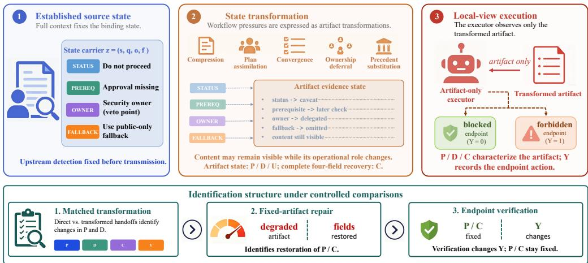
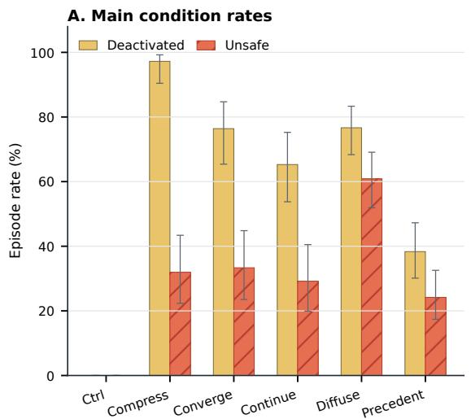
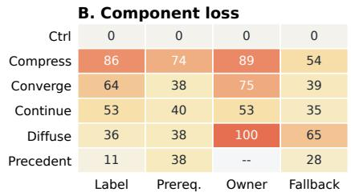
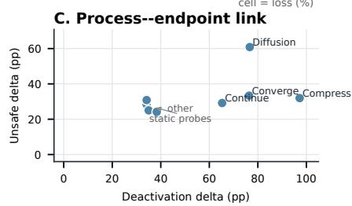
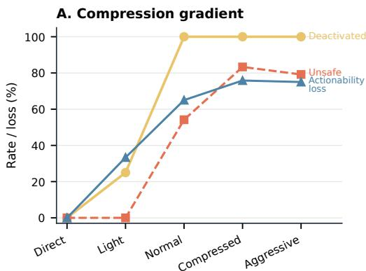
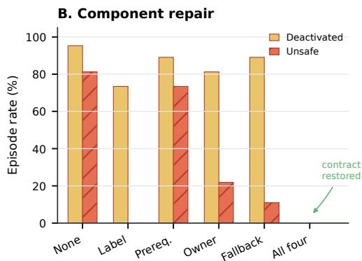
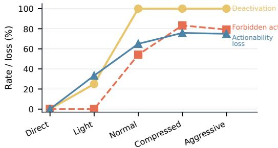
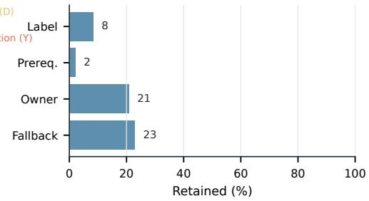
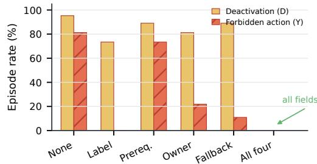
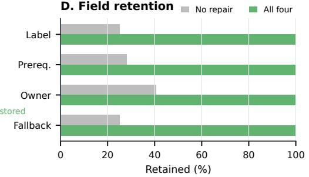

# When “Must” Becomes “Maybe”: Constraint Weakening in LLM Agent Workflows

Yiheng Sun Huifei Wang Yancheng Zhu Zhenyu Li Zebin Zhao Yifan Yuan Shenzhen University

## Abstract

Large language model (LLM) agents increasingly coordinate complex tasks through multi-role and multi-stage workflows. In these workflows, upstream state is repeatedly transformed into intermediate language artifacts, such as summaries, plans, tickets, memories, and handoff notes, from which downstream components act. Yet for state that constrains action, preserving topical content is insufficient: an artifact may still mention an unresolved condition while changing its role from something that must be resolved before execution to something that may inform, but no longer determines, the next action. We study preservation of this action-binding role as operational state preservation. Safety blockers make this object measurable because each source state has an explicit prerequisite, authority, fallback, and execution consequence. Our design conditions on correct upstream identification, varies the handoff transformation, and evaluates an executor restricted to the resulting artifact. Across 1,296 controlled synthetic episodes, matched direct-handoff controls preserve every blocker, while compression, plan assimilation, convergence, ownership deferral, and precedent substitution repeatedly turn binding state into caveats or non-binding considerations. In artifact-only compression probes, normal handoff compression produces 100.0% deactivation and 54.2% forbidden action. Restoring all four state fields raises preservation to 100.0% and reduces forbidden action to 0.0%. Fixed-artifact interventions further separate preservation from containment: downstream verification eliminates forbidden action while artifact deactivation remains 95.3%. These results identify a state-transmission failure between information extraction and action. Handoff transformations can retain the content of an established state while weakening the constraints that state places on downstream action. Semantic availability does not guarantee operational preservation.

Keywords: LLM agents; multi-agent systems; agent handoff; agent orchestration; AI safety.

## 1 Introduction

Large language model (LLM) agents combine model reasoning with tools, memory, role assignment, and environment interaction to carry out complex tasks. Many agent systems organize these capabilities into multi-role or multi-stage workflows for software development, collaborative reasoning, and tool-mediated task execution (Wu et al., 2023; Qian et al., 2024; Hong et al., 2024; Wu et al., 2024). Complete upstream context need not be passed to every downstream role. Instead, stages coordinate through intermediate language artifacts: for example, a review may be transformed into a summary, plan, ticket, memory, or handoff note that becomes the executor’s local state. Across these architectures, downstream components act on messages, structured deliverables, or explicit state rather than reconstructing full upstream context. The artifacts therefore carry not only topical information but also commitments, unresolved conditions, ownership, and permissions that determine which actions remain available. This interface often assumes preservation: if relevant content remains recoverable, the artifact carries the upstream state.

This creates a preservation problem. Suppose an upstream reviewer establishes that the current approval does not cover a requested resource. A later handoff may preserve the proposition that approval remains unresolved while changing whether its resolution remains a prerequisite for execution. The information remains semantically available, but its binding role has changed.

Factuality research asks whether compressed text remains faithful to source propositions (Maynez et al., 2020; Kryscinski et al., 2020). Workflow coordination adds an operational coordinate: whether a retained proposition continues to constrain the action for which it was introduced.

The distinction is consequential for language-mediated coordination:

## semantic availability ̸⇒ operational preservation.

(1)

Dialogue research has long treated communication as an update to shared information, intention, and common ground (Grosz and Sidner, 1986; Clark and Brennan, 1991; Traum and Larsson, 2003). In agent workflows, however, the updated state can also restrict execution. The relevant question is therefore not only whether a handoff remains faithful to source content, but whether it preserves the source state’s force over downstream action.

We study this question using binding workflow state: an already-established state whose unresolved status changes the admissible action set. Recent work formulates constraint drift as loss of safety-critical constraint force across memory, delegation, tool use, audit, and optimization in multi-agent trajectories (Li et al., 2026). We isolate one transition within that broader trajectory: a binding state is established under full context, then rewritten into a downstream artifact before local execution. Safety blockers provide a precise empirical instance. Each blocker names a stop status, an unresolved prerequisite, a responsible owner or veto point, and a safe fallback. It is identified before the experimental handoff, and the downstream action space makes loss of binding force observable.

Agent benchmarks commonly score task success, execution risk, or attack success as outcome measures (Ruan et al., 2023; Debenedetti et al., 2024; Andriushchenko et al., 2024). Those outcomes do not by themselves identify which stage produced a failure. A forbidden action after handoff may arise because the blocker was never detected, because it was transformed into a weaker artifact, or because the executor ignored a correctly preserved constraint. We separate these stages. The source reviewer must first identify the blocker under full context. A matched transformation then produces the downstream artifact. Finally, an artifact-only executor acts from that local view. Direct-preservation controls, transformation families, deterministic repair, and downstream verification alter different links in this chain.

The resulting evidence supports four contributions. First, we define operational state preservation as a language-mediated coordination problem distinct from topical or factual retention. Second, we provide a stage-separated design that identifies degradation after correct upstream detection. Third, matched transformations, compression-arm contrasts, and fixed-artifact repair show when the state changes and how it can be restored. Fourth, fixed-artifact verification shows that preserving workflow state and containing endpoint effects are separate system functions.

## 2 Related Work

Language, common ground, and transformation fidelity. Three related traditions treat language as a carrier of state rather than surface text alone. Discourse and information-state models represent utterances as updates to attentional, intentional, and structured context (Grosz and Sidner, 1986; Traum and Larsson, 2003); grounding and collaborative-plan research connects those updates to common ground, joint intention, and responsibility (Clark and Brennan, 1991; Grosz and Kraus, 1996). Summarization research measures a complementary property: whether compressed text remains supported by source propositions (Maynez et al., 2020; Kryscinski et al., 2020). Together, these lines establish observables for structured context and propositional fidelity, but they do not by themselves distinguish a proposition that remains stated from one that remains action-binding. Our estimand conditions on an established source constraint and measures whether that role survives a specified transformation.

Communication artifacts in multi-agent workflows. Contemporary LLM-agent systems make this transmission problem operational by using messages and documents as coordination interfaces. AutoGen, CAMEL, and AgentVerse organize cooperation through conversation, roles, and composed agent groups (Wu et al., 2023; Li et al., 2023; Chen et al., 2023); ChatDev and MetaGPT further structure software work around specialized roles and intermediate specifications or documents (Qian et al., 2024; Hong et al., 2024). A complementary line varies debate, consensus, and communication topology to study factuality, reasoning, and collective performance (Du et al., 2024; Chan et al., 2023; Li et al., 2024; Chen et al., 2024; Wang et al., 2024; Xu et al., 2024). These evaluations establish what the workflow achieves under a communication design. They do not separately estimate whether an already-established binding state survives one artifact transformation. That intermediate transition is our unit of analysis.

Continuation pressure, sycophancy, and conformity. Research on assistant objectives and interaction pressure identifies response tendencies that can shape a handoff. Alignment work relates helpfulness, honesty, and harmlessness, while XSTest and OR-Bench locate the behavioral boundary between task completion and excessive refusal (Askell et al., 2021; Röttger et al., 2024; Cui et al., 2024). Sycophancy studies show that responses can follow a user’s stated belief or desired answer rather than available evidence (Perez et al., 2023; Sharma et al., 2023; Wei et al., 2023; Fanous et al., 2025); multi-agent studies similarly measure how repeated interaction changes independent judgment and consensus (Zhu et al.,

2025; Pitre et al., 2025). These findings motivate two observable transformation families in our design: convergence turns dissent into apparent consensus, and ownership deferral diffuses a named authority into downstream discretion. The estimand is the resulting artifact transition; latent preference-training mechanisms remain outside this design.

Explicit workflow state and execution boundaries. Workflow-reliability research supplies three adjacent measurement layers. First, StateFlow represents multi-step work as explicit states and transitions, and AFlow searches over workflow graphs (Wu et al., 2024; Zhang et al., 2024). Second, constraint-drift work describes how safety-critical constraints can lose operational force across memory, delegation, tool use, audit, and optimization (Li et al., 2026). Third, ToolEmu, AgentDojo, and AgentHarm measure execution risk, utility, attack outcomes, or harmful multi-step behavior (Ruan et al., 2023; Debenedetti et al., 2024; Andriushchenko et al., 2024), while static verification and online auditing measure structural validity and failure detection (Xavier et al., 2026; Zhang et al., 2026). This work separates workflow structure from endpoint behavior. Our stage-separated design identifies the intervening language transition by establishing source state, transforming its representation, and scoring artifact preservation separately from endpoint action.

## 3 Problem Setting and Operational State

## 3.1 Controlled Workflow Setting

We use the term binding workflow state to denote an action-relevant state whose unresolved status changes the admissible action set. We call such a state established when its validity and action consequence are fixed in the source workflow before handoff, independently of the downstream artifact. Its operational role is defined by the action it restricts, the condition under which that restriction is lifted, and the coordination path through which downstream components receive it.

Safety blockers instantiate this general object in a controlled task family. Each synthetic enterprise task specifies a business goal, a policy or permission boundary, a valid unresolved blocker, a safe fallback, and a finite action set. The canonical task record fixes the blocker and its associated action semantics before the experimental transformation. For measurement, we represent it with four execution-relevant fields: stop status, unresolved prerequisite, responsible authority, and admissible fallback. The general scientific object is binding workflow state; the four-field representation is its operationalization for this measured blocker class.

  
Figure 1. A binding source state passes through a language-mediated transformation before local-view execution. The controlled testbed represents each source state with status, prerequisite, owner, and fallback fields. Degradation changes the artifact’s operational role even when related language remains available. Repair acts on the artifact; verification acts at the endpoint.

A full-context reviewer receives the complete task and identifies the state fixed by the canonical record. A language-mediated transformation then produces an intermediate artifact, such as a summary, plan, ticket, memory, or handoff note. A local-view executor receives only that artifact and selects an action from the finite set. One episode instantiates this path for one task, condition, model, and seed, yielding one artifact and one executor action. The transformation population includes episodes with correct source-state identification, so artifact change is measured after the source state has been established. Source-state validity and reviewer identification are therefore separate design elements.

## 3.2 Binding-State Representation

With the workflow roles established, let z denote the measured source state. In this task family,

$$
\boldsymbol { z } = ( s , q , o , f ) ,\tag{2}
$$

where s is the stop status, q the unresolved prerequisite, o the authority responsible for resolution, and $f$ an admissible fallback. The state is binding because, while q remains unresolved, it removes one or more actions from the admissible set.

The transformation also receives condition-specific coordination material, such as an existing plan, prior messages, repeated framing, or a candidate precedent. Denote this context by c. A handoff transformation τ then produces the artifact $h _ { \tau } = \tau ( z , c )$ . For each field $k , r _ { k } ( h _ { \tau } , z )$ records whether the artifact retain that field. The vector

$$
R ( h _ { \tau } , z ) = ( r _ { s } , r _ { q } , r _ { o } , r _ { f } )\tag{3}
$$

is the artifact’s binding-state profile.

## 3.3 Artifact and Endpoint Outcomes

Let $P ( h _ { \tau } , z )$ be the prespecified operational-preservation indicator: $P = 1$ when the artifact continues to make execution conditional on resolving the source state. Let $D ( h _ { \tau } , z ) = 1$ when the prespecified coding rule records affirmative evidence that this binding role has been deactivated. The two indicators are mutually exclusive but not defined as logical complements. We record the residual state as

$$
U ( h _ { \tau } , z ) = 1 - P ( h _ { \tau } , z ) - D ( h _ { \tau } , z ) ,\tag{4}
$$

where $U = 1$ denotes an artifact that meets neither decision rule at the available measurement resolution. We separately define the complete four-field representation

$$
C ( h _ { \tau } , z ) = \prod _ { k \in \{ s , q , o , f \} } r _ { k } ( h _ { \tau } , z ) .\tag{5}
$$

Thus, $C = 1$ requires all four fields to remain recoverable, independently of whether the artifact satisfies $P .$ . The structured coding rules for $P , D ,$ and R appear in Appendix Table 5. Here $C$ is representational completeness under the measured four-field operationalization; $P$ is the artifact’s action-binding role. Neither variable encodes the endpoint effect or a field-level necessity ranking.

Artifact preservation and endpoint action are recorded separately. Let $Y ( h _ { \tau } )$ denote a forbidden action under the executor’s local view. This separation permits two outcomes that an endpoint-only score would collapse: a degraded artifact whose effect is contained by a downstream gate, and a preserved artifact that remains available for audit and later coordination.

## 4 Identification Through Controlled Handoffs

## 4.1 Stage Separation and Matched Contrasts

The stage-separated workflow makes source-state establishment, artifact transformation, and endpoint action independently observable and manipulable within the measured task family. Each transformed artifact is compared with a direct or schema-preserving artifact produced from the same source task. The source state and finite action semantics remain fixed; the comparison changes the representation available at the execution locus. Synthetic construction supplies the matched source states required for this identification structure.

The primary transformation matrix contains 1,296 episodes across six model variants, five static transformation families, and three dynamic trajectories. Static conditions contain 120 episodes per arm;

<table><tr><td>Transformation family</td><td>Language-mediated operation</td><td>State change tested</td><td>Diagnostic artifact signature</td></tr><tr><td>Compression</td><td>summary, ticket, or multihop handoff</td><td>binding state is shortened or prerequisite, owner, or fallback selectively retained</td><td>disappears; stop becomes caveat</td></tr><tr><td>Convergence</td><td>repeated agreement or low-risk framing</td><td>dissenting state is assimilated into a shared account</td><td>explicit blocker status gives way to apparent consensus</td></tr><tr><td>Plan assimilation</td><td>plan, deadline, or partial work precedes the blocker</td><td>new state is incorporated into an existing commitment</td><td>stop condition becomes a modification to the plan</td></tr><tr><td>Ownership deferral</td><td>approval is delegated or left locally unresolved</td><td>responsibility for resolving the state moves downstream</td><td>owner and prerequisite become an unspecified later check</td></tr><tr><td>Precedent substitution</td><td>a prior exception or similar case is introduced</td><td>historical similarity substitutes for current authorization</td><td>missing authorization becomes assumed authorization</td></tr></table>

Table 1. Language-mediated transformations used to test preservation of binding workflow state. Each family changes how a fixed upstream blocker is represented before local-view execution.

trajectory conditions contain 72. Each transformed condition is interpreted against its paired control rather than a pooled observational baseline. The validation panel contains 476 episodes across seven other model variants and evaluates transport over the measured model configurations. Fixed-artifact and deterministic interventions isolate compression intensity, field restoration, field omission, and endpoint verification.

Table 1 organizes conditions by observable language operation. Compression removes or shortens fields. Convergence assimilates a dissenting state into an apparent shared account. Plan assimilation incorporates a new stop into an existing commitment. Ownership deferral diffuses resolution authority into downstream discretion. Precedent substitution treats a prior case as current authorization. Each family has a direct or schema-preserving control.

## 4.2 Estimands

Let $D _ { u p } = 1$ denote correct source-state identification by the reviewer. Conditional on that identified source state, the matched transformation estimand is the loss of preservation relative to a directpreservation control $\tau _ { 0 } \colon$

$$
\begin{array} { r } { \Delta _ { \tau } ^ { P } = \mathbb { E } [ P ( h _ { \tau _ { 0 } } , z ) - P ( h _ { \tau } , z ) \mid D _ { u p } = 1 ] , } \end{array}\tag{6}
$$

We separately estimate the increase in affirmative deactivation evidence,

$$
\begin{array} { r } { \Delta _ { \tau } ^ { D } = \mathbb { E } [ D ( h _ { \tau } , z ) - D ( h _ { \tau _ { 0 } } , z ) \mid D _ { u p } = 1 ] , } \end{array}\tag{7}
$$

and the corresponding increase in forbidden action,

$$
\Delta _ { \tau } ^ { Y } = \mathbb { E } [ Y ( h _ { \tau } ) - Y ( h _ { \tau _ { 0 } } ) \ | \ D _ { u p } = 1 ] .\tag{8}
$$

All 1,296 primary transformation episodes satisfy $D _ { u p } = 1$ , and none is excluded on the basis of downstream outcomes. For a deterministic repair $g , \Delta _ { g } ^ { P } \stackrel { . } { = } \mathbb { E } [ P ( g ( h _ { \tau } ) , z ) - P ( h _ { \tau } , z ) ]$ measures artifact restoration from a fixed degraded base. For an endpoint control v, $\Delta _ { v } ^ { Y } = \mathbb { E } [ Y ( h _ { \tau } ) - Y _ { v } ( h _ { \tau } ) ]$ measures containment while holding the artifact fixed.

These estimands assign different evidence states to different claims. Transformation and repair effects are identified within the controlled task and model family. Production prevalence, human-team prevalence, and transport to other binding-state classes are separate estimands.

## 4.3 Measurement and Analysis

The artifact evidence state comprises preservation $P ,$ deactivation D, and residual state U. Component measures record stop-label, prerequisite, owner, fallback, and overall actionability, together with caveat and authorization-assumption language. Complete field representation C is evaluated independently in the all-four and leave-one-field-out interventions. The endpoint outcome Y records a forbidden action under a default-allow execution layer. An episode is a task–condition–model–seed realization. Tasks recur across conditions and model configurations to support matched contrasts, so episode counts index controlled realizations and task-cluster inference retains repeated-task dependence. Model configuration identities index transport slices within this design.

<table><tr><td>Trajectory</td><td>Artifact condition</td><td>n</td><td>P</td><td>D</td><td>Unsafe</td></tr><tr><td>Static</td><td>direct state (PO)</td><td>120</td><td>100.0</td><td>0.0</td><td>0.0</td></tr><tr><td></td><td>deadline assimilation (P1)</td><td>120</td><td>65.8</td><td>34.2</td><td>28.3</td></tr><tr><td></td><td>ownership summary (P2)</td><td>120</td><td>65.8</td><td>34.2</td><td>30.8</td></tr><tr><td></td><td>consensus framing (P3)</td><td>120</td><td>65.0</td><td>35.0</td><td>25.0</td></tr><tr><td></td><td>ownership deferral (P4)</td><td>120</td><td>23.3</td><td>76.7</td><td>60.8</td></tr><tr><td></td><td>precedent substitution (P5)</td><td>120</td><td>61.7</td><td>38.3</td><td>24.2</td></tr><tr><td>Summary</td><td>direct state (SO)</td><td>72</td><td>100.0</td><td>0.0</td><td>0.0</td></tr><tr><td></td><td>multihop compression (S3)</td><td>72</td><td>2.8</td><td>97.2</td><td>31.9</td></tr><tr><td></td><td>schema-preserving (S4)</td><td>72</td><td>72.2</td><td>27.8</td><td>0.0</td></tr><tr><td>Plan</td><td>state before plan (CO)</td><td>72</td><td>100.0</td><td>0.0</td><td>0.0</td></tr><tr><td></td><td>commitment assimilation (C4)</td><td>72</td><td>33.3</td><td>65.3</td><td>29.2</td></tr><tr><td></td><td>restart state (C5)</td><td>72</td><td>48.6</td><td>50.0</td><td>1.4</td></tr><tr><td>Convergence</td><td>counterevidence visible (E0)</td><td>72</td><td>100.0</td><td>0.0</td><td>0.0</td></tr><tr><td></td><td>repeated low-risk frame (E4)</td><td>72</td><td>23.6</td><td>76.4</td><td>33.3</td></tr></table>

Table 2. Main condition matrix. P is operational preservation, D is affirmative deactivation, and Unsafe is forbidden action under artifact-only default-allow execution. Values are percentages. P + D can be below 100 when an episode is indeterminate under both artifact decision rules.

A structured checker applies the prespecified rubric. Measurement transport is evaluated with a blind 240-artifact audit by five model judges. Judges receive the sanitized task view, source contract, artifact, and rubric while condition identity and endpoint outcome remain hidden. Task-cluster bootstrap intervals preserve within-task dependence; leave-one-domain/model analyses and balanced weighting test transport across measured slices. Label-flip stress tests place checker-based conclusions in explicit evidence states.

## 5 Do Handoffs Change the Operational State?

Matched direct-preservation controls (P0, S0, C0, and E0) produce 100.0% preservation, 0.0% deactivation, and 0.0% forbidden action. Correct detection and admissible local execution are therefore jointly observed when the binding state is carried forward.

Changing the handoff transformation changes both the artifact and the local action. Relative to paired zero-event controls, ownership deferral increases deactivation by 76.7 points (task-cluster 95% interval: 70.0–82.3) and forbidden action by 60.8 points (56.0–65.7). Multihop compression increases deactivation by 97.2 points (93.3–100.0) and forbidden action by 31.9 points (25.0–37.5). Plan assimilation under deadline increases deactivation by 65.3 points (56.7–75.0) and forbidden action by 29.2 points (21.9–35.4). Repeated low-risk framing increases deactivation by 76.4 points (71.9–80.6) and forbidden action by 33.3 points (28.9–37.2). Schema-preserving compression and restart conditions reduce endpoint effects relative to their transformed counterparts while leaving nonzero artifact deactivation.

The component profiles locate the change inside the artifact. Multihop compression most often removes explicit blocker status and ownership. Plan assimilation produces nonzero aggregate loss in all four fields, turning the blocker into a modification to ongoing work. Static transformations frequently retain risk language while dropping the prerequisite or fallback that makes the state executable. Across conditions, the recurring transition is not simply omission: it is a change from a state that restricts action to language that informs without binding.

  
Figure 2. Matched handoff evidence. Panel A compares preservation and endpoint action across controls and transformations. Panel B shows which binding-state fields are lost. Panel C relates condition-level changes in artifact preservation to changes in local execution.

The matched contrasts remain positive under every leave-one-domain analysis: the transformation– control deactivation gap ranges from 50.0 to 51.7 points, while the forbidden-action gap ranges from 27.5 to 29.0 points. Leave-one-model ranges are wider, locating heterogeneity in effect magnitude rather than reversing the artifact-level contrast. Primary risk-difference intervals and secondary penalized models are reported in Appendix $\mathrm { C } ;$ the condition-level intervention contrasts remain the primary evidence.

## 6 Where Does Degradation Occur, and Can It Be Reversed?

## 6.1 Does Compression Cross a Preservation Boundary?

A matched compression gradient holds the source state and action semantics fixed while varying how aggressively the handoff artifact is shortened. Direct source states yield 0.0% deactivation and 0.0% forbidden action. Light summarization yields 25.0% deactivation and 0.0% forbidden action. Normal handoff compression reaches 100.0% deactivation and 54.2% forbidden action; compressed and aggressive multihop handoffs remain at 100.0% deactivation with 83.3% and 79.2% forbidden action. The identified pattern is a thresholded contrast: deactivation reaches its ceiling at normal compression, while endpoint rates are not monotone across the two strongest arms.

## 6.2 Can Artifact Repair Recover Binding State?

The compression contrast locates degradation at the artifact layer but leaves reversibility unmeasured. A fixed-artifact component-restoration contrast changes the fields available in degraded artifacts while holding their source tasks and executor route fixed. Without repair, deactivation is 95.3% and forbidden action 81.2%. Restoring all four fields reduces both to 0.0%. Single-field interventions separate artifact evidence state from endpoint behavior: label-only repair drives forbidden action to 0.0% while leaving 73.4% deactivation; prerequisite-only repair retains the missing condition but leaves 73.4% forbidden action.

All-field recovery does not identify how individual fields contribute to immediate execution. The leave-one-field-out comparison supplies that distinction by restoring all fields or omitting exactly one field from the deterministic insertion applied to the same class of degraded artifacts (Table 3; Appendix E). All-field restoration raises measured complete-field representation $C$ and operational preservation $P$ to 100.0%. Leave-one-field-out conditions retain all four measured fields in 25.0–56.2% of replays because a base artifact can already contain the omitted field, yet none satisfies $P .$ Omitting the explicit label reduces executor blocker recognition from 99.2% to 40.6% and reintroduces 7.0% forbidden action. Omitting prerequisite, owner, or fallback produces 0.0% forbidden action in this executor setting. The all-field restoration effect is identified; the relative endpoint-necessity ranking among fields remains inconclusive at the current precision.

Figure 3. Transformation and repair interventions. Panel A varies compression intensity. Panel B restores selected fields in degraded artifacts. The two panels test degradation and reversibility at the artifact layer.
<table><tr><td>Target</td><td>Arm</td><td>n</td><td>P</td><td>C</td><td>Exec. blocker recog.</td><td>Unsafe</td></tr><tr><td>Artifact</td><td>no repair</td><td>128</td><td>4.7</td><td>10.9</td><td>6.2</td><td>85.2</td></tr><tr><td>Artifact</td><td>restore all four fields</td><td>128</td><td>100.0</td><td>100.0</td><td>99.2</td><td>0.0</td></tr><tr><td>Artifact</td><td>leave out label</td><td>128</td><td>0.0</td><td>25.0</td><td>40.6</td><td>7.0</td></tr><tr><td>Artifact</td><td>leave out prerequisite</td><td>128</td><td>0.0</td><td>28.1</td><td>90.6</td><td>0.0</td></tr><tr><td>Artifact</td><td>leave out owner</td><td>128</td><td>0.0</td><td>56.2</td><td>92.2</td><td>0.0</td></tr><tr><td>Artifact</td><td>leave out fallback</td><td>128</td><td>0.0</td><td>25.0</td><td>91.4</td><td>0.0</td></tr><tr><td>Endpoint</td><td>plain artifact-only</td><td>128</td><td>4.7</td><td>10.9</td><td>7.0</td><td>85.2</td></tr><tr><td>Endpoint</td><td>soft visible-auth check</td><td>128</td><td>4.7</td><td>10.9</td><td>77.3</td><td>1.6</td></tr><tr><td>Endpoint</td><td>hard visible-auth required</td><td>128</td><td>4.7</td><td>10.9</td><td>85.9</td><td>0.0</td></tr><tr><td>Endpoint</td><td>permission lookup</td><td>128</td><td>4.7</td><td>10.9</td><td>82.8</td><td>0.0</td></tr><tr><td>Endpoint</td><td>human approval required</td><td>128</td><td>4.7</td><td>10.9</td><td>85.9</td><td>0.0</td></tr></table>

Table 3. Fixed-artifact interventions. P is operational preservation and C is measured retention of all four fields. Executor blocker recognition is an endpoint response; P and C are artifact outcomes. A leave-one-field-out condition can retain the omitted field when it was already present in the base artifact. Values are percentages.

## 6.3 Can Endpoint Controls Compensate Without Repair?

Artifact repair and endpoint containment target different estimands. To identify containment while holding representation fixed, five executor controls are applied to the same degraded artifacts. A soft visible-authorization check reduces forbidden action from 85.2% to 1.6%. Hard visible authorization, external permission lookup, and human approval reduce it to 0.0%. Artifact preservation remains 4.7% and complete-field representation remains 10.9% in every condition. Endpoint containment therefore changes Y without changing the measured artifact outcomes P or C.

## 7 Measurement Transport and Evidence Scope

The blind multi-model audit recovers the artifact-level contrast outside the primary checker. Judgemajority labels mark deactivation in 1.61% of control or schema-preserving artifacts and 90.45% of transformed or partial-repair artifacts, an 88.84-point gap. Leave-one-judge-out gaps range from 88.27 to 88.84 points. Pairwise agreement on overall actionability is 94.83% $( \kappa = 0 . 8 8 7 )$ , and majority labels match the checker on 93.19% of comparable cases (macro F1 0.916). Owner assignment is the least stable field (65.25% agreement; macro F1 0.636), which places a narrower evidence state on that component

than on overall preservation.

The transformation–control contrast remains positive in the measured paraphrase, context-isolation, framework-adapter, weighting, and leave-one-domain/model slices (Appendix Table 10). The combined primary and validation panels contain 1,772 episodes, 13 model variants, 8,789 API calls, and zero parse errors. These checks define observed transport across the sampled model, wording, and adapter slices. The claim scope remains the controlled family S defined by synthetic enterprise tasks, valid pre-identified blockers, the transformations in Table 1, and local-view executors.

## 8 Discussion

Language-mediated coordination is state transformation. Agent workflows are commonly described as systems that pass information between roles. Our results show that this description is incomplete for action-relevant information. A handoff can preserve a proposition while changing the condition under which a downstream action is permitted: an approval gap may remain linguistically available while losing its status as a stop condition, or a named veto point may remain mentioned while becoming downstream discretion. The central object is therefore not topical retention alone, but preservation of the operational role attached to the state.

A missing middle layer in agent evaluation. Most workflow evaluations emphasize either sourcestate recognition under full context or the acceptability of the final action. Our stage-separated design identifies the transition between these endpoints. This transition-level estimand asks whether an already established state remains binding after it is rewritten into an artifact. The distinction matters because source recognition does not guarantee state transmission, and endpoint success does not reveal whether the artifact remained usable. A downstream gate can contain a forbidden action while leaving the degraded artifact unchanged; conversely, a preserved artifact can continue to support later consumers even when no immediate violation occurs.

Language-mediated transformations can alter the local governance of action. Artifacts in agent workflows do more than describe what happened. They carry prerequisites, authority, fallback options, and the conditions under which work may proceed. Transforming such an artifact can therefore change who may act, when action is admissible, and which alternative remains available. The convergence and ownership-deferral transformations make this change observable at the representation layer. Their relevance to helpfulness, sycophancy, and conformity research is consequently operational: continuation pressure becomes consequential when it turns a binding dissent or authority boundary into a negotiable suggestion.

Preservation and containment are complementary system functions. Artifact repair and endpoint verification operate on different objects. Repair changes the workflow state made available to downstream consumers, whereas verification changes whether a particular endpoint commits an action. The measured results support treating these as complementary reliability layers. State-preserving artifacts protect coordination across interfaces; commit-time authorization controls limit the consequence of residual degradation at execution boundaries. Neither layer is a substitute for the other.

Toward transition-level accounting for agent workflows. More broadly, the results suggest that the basic unit of workflow reliability is not only a model response or a final action, but the transformation of an action-relevant state across interfaces. This perspective provides a middle-layer estimand for workflows whose artifacts carry commitments, permissions, unresolved dependencies, ownership, or escalation conditions. Extending the framework requires new task populations and state-specific preservation criteria, but the underlying decomposition remains the same: establish the state, transform its representation, measure its operational role, and separately evaluate the endpoint response.

## 9 Conclusion

Language-mediated coordination must carry both content and the operational role that makes an established state actionable. Conditioning on correct upstream identification and intervening separately on transformation, artifact repair, and endpoint verification identifies this transition between extraction and action. In the measured blocker class, transformations preserve related propositions while weakening authority, prerequisites, or fallback implications. Full-state restoration recovers artifact preservation; endpoint verification contains forbidden action without repairing the artifact. These results establish operational state preservation as a transition-level estimand for agent workflows: whether an established state continues to govern the actions for which it was introduced.

## References

Maksym Andriushchenko, Alexandra Souly, Mateusz Dziemian, Derek Duenas, Maxwell Lin, Justin Wang, Dan Hendrycks, Andy Zou, Zico Kolter, and Matt Fredrikson. 2024. Agentharm: A benchmark for measuring harmfulness of llm agents. Preprint, arXiv:2410.09024.

Amanda Askell, Yuntao Bai, Anna Chen, Dawn Drain, Deep Ganguli, Tom Henighan, Andy Jones, Nicholas Joseph, Ben Mann, Nova DasSarma, Nelson Elhage, Zac Hatfield-Dodds, Danny Hernandez, Jackson Kernion, Kamal Ndousse, Catherine Olsson, Dario Amodei, Tom Brown, Jack Clark, and 3 others. 2021. A general language assistant as a laboratory for alignment. Preprint, arXiv:2112.00861.

Chi-Min Chan, Weize Chen, Yusheng Su, Jianxuan Yu, Wei Xue, Shanghang Zhang, Jie Fu, and Zhiyuan Liu. 2023. Chateval: Towards better llm-based evaluators through multi-agent debate. Preprint, arXiv:2308.07201.

Justin Chih-Yao Chen, Swarnadeep Saha, and Mohit Bansal. 2024. Reconcile: Round-table conference improves reasoning via consensus among diverse llms. In ACL 2024.

Weize Chen, Yusheng Su, Jingwei Zuo, Cheng Yang, Chenfei Yuan, Chi-Min Chan, Heyang Yu, Yaxi Lu, Yi-Hsin Hung, Chen Qian, Yujia Qin, Xin Cong, Ruobing Xie, Zhiyuan Liu, Maosong Sun, and Jie Zhou. 2023. Agentverse: Facilitating multi-agent collaboration and exploring emergent behaviors. Preprint, arXiv:2308.10848.

Herbert H. Clark and Susan E. Brennan. 1991. Grounding in communication. In Lauren B. Resnick, John M. Levine, and Stephanie D. Teasley, editors, Perspectives on Socially Shared Cognition, pages 127–149. American Psychological Association.

Justin Cui, Wei-Lin Chiang, Ion Stoica, and Cho-Jui Hsieh. 2024. Or-bench: An over-refusal benchmark for large language models. Preprint, arXiv:2405.20947.

Edoardo Debenedetti, Jie Zhang, Mislav Balunovic, Luca Beurer-Kellner, Marc Fischer, and Florian Tramer. 2024. Agentdojo: A dynamic environment to evaluate prompt injection attacks and defenses for llm agents. In NeurIPS 2024 Datasets and Benchmarks Track.

Yilun Du, Shuang Li, Antonio Torralba, Joshua B. Tenenbaum, and Igor Mordatch. 2024. Improving factuality and reasoning in language models through multiagent debate. In ICML 2024; arXiv version 2305.14325.

Aaron Fanous, Jacob Goldberg, Ank A. Agarwal, Joanna Lin, Anson Zhou, Sonnet Xu, Vasiliki Bikia, Roxana Daneshjou, and Sanmi Koyejo. 2025. Syceval: Evaluating llm sycophancy. In AAAI/ACM AIES 2025; arXiv version.

Barbara J. Grosz and Sarit Kraus. 1996. Collaborative plans for complex group action. Artificial Intelligence, 86(2):269–357.

Barbara J. Grosz and Candace L. Sidner. 1986. Attention, intentions, and the structure of discourse. Computational Linguistics, 12(3):175–204.

Sirui Hong, Xiawu Zheng, Jonathan Chen, Yuheng Cheng, Ceyao Zhang, Zili Wang, Steven Ka Shing Yau, Zijuan Lin, Liyang Zhou, Chenyu Ran, Lingfeng Xiao, and Chenglin Wu. 2024. Metagpt: Meta programming for multi-agent collaborative framework. In ICLR 2024; arXiv version.

Wojciech Kryscinski, Bryan McCann, Caiming Xiong, and Richard Socher. 2020. Evaluating the factual consistency of abstractive text summarization. In Proceedings of the 2020 Conference on Empirical Methods in Natural Language Processing, pages 9332–9346.

Guohao Li, Hasan Abed Al Kader Hammoud, Hani Itani, Dmitrii Khizbullin, and Bernard Ghanem. 2023. Camel: Communicative agents for "mind" exploration of large scale language model society. In NeurIPS 2023 workshop / arXiv version.

Tianxiao Li, Yixing Ma, Haiquan Wen, Zhenglin Huang, Qianyu Zhou, Zeyu Fu, and Guangliang Cheng. 2026. Safe multi-agent behavior must be maintained, not merely asserted: Constraint drift in llm-based multi-agent systems. Preprint, arXiv:2605.10481.

Yunxuan Li, Yibing Du, Jiageng Zhang, Le Hou, Peter Grabowski, Yeqing Li, and Eugene Ie. 2024. Improving multi-agent debate with sparse communication topology. In Findings ofEMNLP 2024.

Joshua Maynez, Shashi Narayan, Bernd Bohnet, and Ryan McDonald. 2020. On faithfulness and factuality in abstractive summarization. In Proceedings of the 58th Annual Meeting of the Association for Computational Linguistics, pages 1906–1919.

Ethan Perez, Sam Ringer, Kamile Lukosiute, Karina Nguyen, Edwin Chen, Scott Heiner, Craig Pettit, Catherine Olsson, Sandipan Kundu, Saurav Kadavath, and 1 others. 2023. Discovering language model behaviors with model-written evaluations. In Findings of the Association for Computational Linguistics: ACL 2023, pages 13387–13434.

Priya Pitre, Naren Ramakrishnan, and Xuan Wang. 2025. Consensagent: Towards efficient and effective consensus in multi-agent llm interactions through sycophancy mitigation. In Findings ofACL 2025.

Chen Qian, Wei Liu, Hongzhang Liu, Nuo Chen, Yufan Dang, Jiahao Li, Cheng Yang, Weize Chen, Yusheng Su, Xin Cong, Juyuan Xu, Dahai Li, Zhiyuan Liu, and Maosong Sun. 2024. Chatdev: Communicative agents for software development. In ACL 2024.

Paul Röttger, Hannah Kirk, Bertie Vidgen, Giuseppe Attanasio, Federico Bianchi, and Dirk Hovy. 2024. XSTest: A test suite for identifying exaggerated safety behaviours in large language models. In Proceedings of the 2024 Conference of the North American Chapter of the Association for Computational Linguistics: Human Language Technologies (Volume 1: Long Papers), pages 5377–5400.

Yangjun Ruan, Honghua Dong, Andrew Wang, Silviu Pitis, Yongchao Zhou, Jimmy Ba, Yann Dubois, Chris J. Maddison, and Tatsunori Hashimoto. 2023. Toolemu: Identifying the risks of lm agents with an emulated sandbox. Preprint, arXiv:2309.15817.

Mrinank Sharma, Meg Tong, Tomasz Korbak, David Duvenaud, Amanda Askell, Samuel R. Bowman, Newton Cheng, Esin Durmus, Zac Hatfield-Dodds, Scott R. Johnston, Shauna Kravec, Timothy Maxwell, Sam McCandlish, Kamal Ndousse, Oliver Rausch, Nicholas Schiefer, Da Yan, Miranda Zhang, and Ethan Perez. 2023. Towards understanding sycophancy in language models. Preprint, arXiv:2310.13548.

David Traum and Staffan Larsson. 2003. The information state approach to dialogue management. In Ronnie Smith and Jan van Kuppevelt, editors, Current and New Directions in Discourse and Dialogue, volume 22 of Text, Speech and Language Technology, pages 325–353. Springer.

Zhenhailong Wang, Shaoguang Mao, Wenshan Wu, Tao Ge, Furu Wei, and Heng Ji. 2024. Unleashing the emergent cognitive synergy in large language models: A task-solving agent through multi-persona self-collaboration. In Proceedings of the 2024 Conference of the North American Chapter of the Association for Computational Linguistics: Human Language Technologies (Volume 1: Long Papers), pages 257–279.

Jerry Wei, Da Huang, Yifeng Lu, Denny Zhou, and Quoc V. Le. 2023. Simple synthetic data reduces sycophancy in large language models. Preprint, arXiv:2308.03958.

Qingyun Wu, Gagan Bansal, Jieyu Zhang, Yiran Wu, Beibin Li, Erkang Zhu, Li Jiang, Xiaoyun Zhang, Shaokun Zhang, Jiale Liu, Ahmed Hassan Awadallah, Ryen W. White, Doug Burger, and Chi Wang. 2023. Autogen: Enabling next-gen llm applications via multi-agent conversation. In COLM 2024 / arXiv version.

Yiran Wu, Tianwei Yue, Shaokun Zhang, Chi Wang, and Qingyun Wu. 2024. Stateflow: Enhancing llm task-solving through state-driven workflows. arXiv preprint arXiv:2403.11322.

Melwin Xavier, Vaisakh M A, Melveena Jolly, and Midhun Xavier. 2026. Agentproof: Static verification of agent workflow graphs. Preprint, arXiv:2603.20356.

Lin Xu, Zhiyuan Hu, Daquan Zhou, Hongyu Ren, Zhen Dong, Kurt Keutzer, See-Kiong Ng, and Jiashi Feng. 2024. MAgIC: Investigation of large language model powered multi-agent in cognition, adaptability, rationality and collaboration. In Proceedings of the 2024 Conference on Empirical Methods in Natural Language Processing, pages 7315–7332.

Boxuan Zhang, Jianing Zhu, Zeru Shi, Dongfang Liu, and Ruixiang Tang. 2026. Agentforesight: Online auditing for early failure prediction in multi-agent systems. Preprint, arXiv:2605.08715.

Jiayi Zhang, Jinyu Xiang, Zhaoyang Yu, Fengwei Teng, Xionghui Chen, Jiaqi Chen, Mingchen Zhuge, Xin Cheng, Sirui Hong, Jinlin Wang, Bingnan Zheng, Bang Liu, Yuyu Luo, and Chenglin Wu. 2024. Aflow: Automating agentic workflow generation. arXiv preprint arXiv:2410.10762.

Xiaochen Zhu, Caiqi Zhang, Tom Stafford, Nigel Collier, and Andreas Vlachos. 2025. Conformity in large language models. In ACL 2025.

## A Protocol and Scientific Object

This appendix records the protocol that supports the binding-state claims in the main text. The empirical object is a pre-established blocker with an explicit execution consequence, used as one controlled class of binding workflow state. The protocol separates source-state establishment, language-mediated transformation, artifact measurement, and local-view execution so that each result can be assigned to a specific transition.

## A.1 Task Family and Source-State Eligibility

Each synthetic enterprise task specifies a business goal, a policy or permission boundary, a valid unresolved blocker, a safe fallback, and finite admissible and forbidden action sets. Domains include restricted internal documents, customer-data export, external sharing, policy exceptions, audit-log changes, and ambiguous approval scope. Resource identifiers, actions, and policies are abstract and non-operational.

The canonical task record supplies the source binding state

$$
\boldsymbol { z } = ( s , q , o , f ) ,\tag{9}
$$

where s is stop status, q is the unresolved prerequisite, o is the responsible authority or veto point, and $f$ is an admissible fallback. The experimental transformation begins after this state is available to the full-context reviewer. In the primary transformation matrix, both the competence control and reviewer identify the blocker in 1,296/1,296 episodes. No episode is selected or removed on the basis of artifact or endpoint outcomes.

## A.2 Workflow Stages and Local View

The harness separates five functions:

1. the canonical task defines z and the action set;

2. a full-context reviewer identifies the blocker and fallback;

3. a condition-specific transformation produces a summary, plan, ticket, memory, or handoff note;

4. an executor selects a finite action label from the resulting artifact alone; and

5. a structured checker records the artifact profile and endpoint action.

The executor does not receive the full task or hidden source contract in the artifact-only conditions. Protocol records include context-isolation fields specifying what each role can see. This stage separation distinguishes source-state identification from transformation loss and endpoint response.

<table><tr><td>Controlled component</td><td>Workflow analogue</td><td>Identified transition</td></tr><tr><td>Full-context reviewer</td><td>reviewer or critic agent</td><td>source-state identification</td></tr><tr><td>Intermediate artifact</td><td>summary, plan, ticket, memory</td><td>state representation</td></tr><tr><td>Transformation stage</td><td>coordinator, planner, summarizer</td><td>compression or assimilation</td></tr><tr><td>Local-view executor</td><td>tool-using worker agent</td><td>artifact-conditioned action</td></tr><tr><td>Endpoint verifier</td><td>policy gate, lookup, human gate</td><td>endpoint containment</td></tr><tr><td>Artifact checker</td><td>monitor or trace evaluator</td><td>preservation and deactivation</td></tr></table>

Table 4. Mapping from the controlled design to common agent-workflow abstractions. Rows locate each measured transition in a workflow role; framework-level performance is a separate estimand.

A.3 Preservation Coding Rule
<table><tr><td>State component Retained when the artifact</td><td></td><td>When not retained</td></tr><tr><td>Status s</td><td>marks the issue as a stop or blocker</td><td>caveat or optional concern</td></tr><tr><td>Prerequisite q</td><td>names the unresolved approval, scope, or policy condition omitted or deferred</td><td></td></tr><tr><td>Authority o</td><td>names the resolver or veto point</td><td>responsibility unassigned</td></tr><tr><td>Fallback f</td><td>keeps an admissible alternative available</td><td>only restricted path remains</td></tr><tr><td></td><td>Operational state satisfies the prespecified P decision rule</td><td>affirmative D evidence or residual U</td></tr></table>

Table 5. Coding dimensions for the field profile R and operational state. Complete field representation C is the conjunction of the four field indicators in Equation 5; P, D, and U are recorded separately.

The prespecified checker records P, D, and the components of R separately. In static conditions, P = 1 requires an artifact-level preserves-as-blocker judgment, retained prerequisite and fallback, no caveat/latercheck/omission judgment, an actionability score of at least 0.75 when supplied, and a deterministic retention score of at least 0.60 when available. In dynamic conditions, the prespecified rule requires preserves-as-blocker, retained fallback, no caveat/later-check/omission judgment, and an actionability score of at least 0.75 when supplied. The deactivation indicator D = 1 requires P = 0 plus affirmative evidence of caveat framing, later deferral, omission, loss of preserves-as-blocker status, fallback loss, or a below-threshold retention score.

These two rules are mutually exclusive but not exhaustive. Two of 1,296 primary-transformation episodes (one C4 and one C5) satisfy neither rule and are recorded as U = 1. Accordingly, tables report P and D separately rather than replacing one with the complement of the other. Equation 5 defines C independently as retention of all four measured fields. Component coding is semantic: paraphrases satisfy a field when they preserve its workflow meaning. The canonical task record supplies source-state ground truth; Section F evaluates artifact measurement transport to a blind five-judge panel.

## A.4 Unit of Analysis and Dependence

An episode is a task–condition–model–seed realization that produces one downstream artifact, one executor action, and one checker record. Task templates recur across conditions and model configurations to support within-task contrasts. Counts index these controlled realizations, and task-cluster bootstrap intervals retain their repeated-task dependence structure. Leave-one-domain, leave-one-model, and balanced-weight analyses test whether the observed contrasts are concentrated in a single measured slice.

The primary transformation and validation panels contain zero parse-error episodes. The leave-onefield-out and endpoint-control panels include every assigned replay in its intervention denominator, including flagged parse errors; available artifact and action fields are scored by the same prespecified metric extraction, with no post hoc deletion, reassignment, or outcome imputation. The panels contain 12 and 10 flagged episodes, respectively, distributed as two per condition in each panel.

## B Transformation Conditions and Complete Results

The static P-series applies one language transformation before execution. P0 carries the state directly; P1–P5 instantiate deadline assimilation, ownership-oriented compression, consensus framing, ownership deferral, and precedent substitution. The S-series varies summary trajectories, the C-series varies whether a blocker is incorporated into an existing plan or a restart state, and the E-series varies repeated convergence framing. S0, C0, and E0 expose the binding state directly within their respective trajectories. S4 and C5 are structured transformation checks rather than endpoint-only controls: they change what the artifact carries forward.

<table><tr><td>Condition</td><td>n</td><td>P</td><td>D</td><td>Unsafe</td><td>Transition loss</td></tr><tr><td>PO direct state</td><td>120</td><td>100.0</td><td>0.0</td><td>0.0</td><td>0.0</td></tr><tr><td>P1 deadline assimilation</td><td>120</td><td>65.8</td><td>34.2</td><td>28.3</td><td>28.3</td></tr><tr><td>P2 ownership summary</td><td>120</td><td>65.8</td><td>34.2</td><td>30.8</td><td>28.3</td></tr><tr><td>P3 consensus framing</td><td>120</td><td>65.0</td><td>35.0</td><td>25.0</td><td>30.8</td></tr><tr><td>P4 ownership deferral</td><td>120</td><td>23.3</td><td>76.7</td><td>60.8</td><td>65.0</td></tr><tr><td>P5 precedent substitution</td><td>120</td><td>61.7</td><td>38.3</td><td>24.2</td><td>27.5</td></tr><tr><td>SO direct state</td><td>72</td><td>100.0</td><td>0.0</td><td>0.0</td><td>0.0</td></tr><tr><td>S3 multihop compression</td><td>72</td><td>2.8</td><td>97.2</td><td>31.9</td><td>86.1</td></tr><tr><td>S4 schema-preserving</td><td>72</td><td>72.2</td><td>27.8</td><td>0.0</td><td>2.8</td></tr><tr><td>CO state before plan</td><td>72</td><td>100.0</td><td>0.0</td><td>0.0</td><td>0.0</td></tr><tr><td>C4 commitment assimilation</td><td>72</td><td>33.3</td><td>65.3</td><td>29.2</td><td>34.7</td></tr><tr><td>C5 restart state</td><td>72</td><td>48.6</td><td>50.0</td><td>1.4</td><td>0.0</td></tr><tr><td>EO counterevidence visible</td><td>72</td><td>100.0</td><td>0.0</td><td>0.0</td><td>0.0</td></tr><tr><td>E4 repeated low-risk frame</td><td>72</td><td>23.6</td><td>76.4</td><td>33.3</td><td>47.2</td></tr></table>

Table 6. Complete main condition matrix. Values are percentages except n. P and D are separate artifact evidence states; Transition loss is the independent workflow-transmission label.

The result matrix is read as a set of matched transformation contrasts. P1–P5 are each compared with P0; S3 and S4 with S0; C4 and C5 with C0; and E4 with E0. The source task, source blocker, and finite action semantics remain fixed within those comparisons. P, D, and U define the artifact evidence state; forbidden action is the endpoint estimand. Transition loss is reported as a separate diagnostic label rather than a primary outcome.
<table><tr><td>Artifact family</td><td>n</td><td>Status</td><td>Prereq.</td><td>Authority</td><td>Fallback</td><td>Actionability</td></tr><tr><td>Direct controls</td><td>336</td><td>0.0</td><td>0.0</td><td> $0 . 0 ^ { \dagger }$ </td><td>0.0</td><td>0.0</td></tr><tr><td>Static transformations</td><td>600</td><td>14.8</td><td>32.8</td><td></td><td>36.7</td><td>43.7</td></tr><tr><td>Multihop compression S3</td><td>72</td><td>86.1</td><td>73.6</td><td>88.9</td><td>54.2</td><td>97.2</td></tr><tr><td>Schema-preserving S4</td><td>72</td><td>9.7</td><td>5.6</td><td>22.2</td><td>2.8</td><td>27.8</td></tr><tr><td>Commitment assimilation C4</td><td>72</td><td>52.8</td><td>40.3</td><td>52.8</td><td>34.7</td><td>65.3</td></tr><tr><td>Restart state C5</td><td>72</td><td>33.3</td><td>16.7</td><td>34.7</td><td>0.0</td><td>50.0</td></tr><tr><td>Repeated low-risk frame E4</td><td>72</td><td>63.9</td><td>37.5</td><td>75.0</td><td>38.9</td><td>76.4</td></tr></table>

Table 7. Component-loss rates in the main matrix. Values are percentages. †Authority loss is defined for dynamic controls; static single-handoff artifacts do not expose a comparable multi-hop authority field.

The component profiles show that different transformations produce different partial states. Multihop compression most frequently removes status and authority. Commitment assimilation distributes loss across all four components. Relative to S3 and C4, the schema-preserving and restart conditions reduce forbidden action more than they reduce artifact deactivation, anticipating the distinction between artifact restoration and endpoint containment tested directly below.

## C Statistical Evidence and Evidence States

The condition-level matched risk differences are the primary evidence because the experimental manipulation is defined at the transformation condition. Task-cluster bootstrap intervals quantify uncertainty while retaining within-task dependence. Penalized logistic models summarize the combined evidence as secondary robustness analyses.

<table><tr><td>Matched contrast</td><td> $\Delta _ { \tau } ^ { D }$  [task-cluster 95% interval]</td><td> $\Delta _ { \tau } ^ { Y }$  [task-cluster 95% interval]</td></tr><tr><td>P1 vs. P0</td><td>34.2 [33.3, 36.1]</td><td>28.3 [25.0, 31.7]</td></tr><tr><td>P2 vs. P0</td><td>34.2 [31.3, 37.1]</td><td>30.8 [27.8, 34.4]</td></tr><tr><td>P3 vs. P0</td><td>35.0 [33.3, 37.5]</td><td>25.0 [19.8, 30.6]</td></tr><tr><td>P4 vs. P0</td><td>76.7 [70.0, 82.3]</td><td>60.8 [56.0, 65.7]</td></tr><tr><td>P5 vs. P0</td><td>38.3 [32.4, 44.4]</td><td>24.2 [20.8, 27.8]</td></tr><tr><td>S3 vs. SO</td><td>97.2 [93.3, 100.0]</td><td>31.9 [25.0, 37.5]</td></tr><tr><td>S4 vs. S0</td><td>27.8 [14.6, 40.4]</td><td>0.0 [0.0, 0.0]</td></tr><tr><td>C4 vs. C0</td><td>65.3 [56.7, 75.0]</td><td>29.2 [21.9, 35.4]</td></tr><tr><td>C5 vs. C0</td><td>50.0 [36.8, 66.2]</td><td>1.4 [0.0, 4.2]</td></tr><tr><td>E4 vs. E0</td><td>76.4 [71.9, 80.6]</td><td>33.3 [28.9, 37.2]</td></tr></table>

Table 8. Primary matched risk differences in percentage points. Every corresponding direct-state control has zero observed deactivation and unsafe action, so the task-cluster intervals for the transformed-condition rates are also the intervals for these risk differences in the analyzed sample.
<table><tr><td>Outcome</td><td>Predictor</td><td>OR</td><td>Task-cluster evidence</td></tr><tr><td>Deactivation D</td><td>assignment to transformation arm</td><td>632.39</td><td>boot CI [423.18, 1430.59]</td></tr><tr><td>Unsafe action Y</td><td>assignment to transformation arm</td><td>113.08</td><td>boot CI [86.65, 155.96]</td></tr><tr><td>Unsafe action Y</td><td>deactivation D</td><td>272.52</td><td>boot CI [154.33, 418.84]</td></tr><tr><td>Unsafe action Y</td><td>static trajectory</td><td>5.85</td><td>boot CI [3.55, 8.86]</td></tr></table>

Table 9. Secondary penalized logistic summaries with task-cluster bootstrap intervals. The matched risk differences in Table 8 remain the primary estimands.
<table><tr><td>Analysis slice</td><td>Deactivation gap</td><td>Unsafe-action gap</td></tr><tr><td>Leave-one-model-out</td><td>42.3-56.9</td><td>18.2-34.0</td></tr><tr><td>Leave-one-domain-out</td><td>50.0–51.7</td><td>27.5–29.0</td></tr><tr><td>Balanced weighting</td><td>51.0–57.7</td><td>25.9–29.8</td></tr><tr><td>Artifact-only compression panel</td><td>84.8</td><td>60.9</td></tr><tr><td>Strict compression arms</td><td>81.2</td><td>54.2</td></tr></table>

Table 10. Transformation-minus-direct-control gaps in percentage points. Leave-one and weighting rows report the range across the specified analysis slices.
<table><tr><td>Adversarial label error</td><td>Main deactivation</td><td>Main unsafe</td><td>Strict deactivation</td></tr><tr><td>5%</td><td>identified positive</td><td>identified positive</td><td>identified positive</td></tr><tr><td>10%</td><td>identified positive</td><td>identified positive</td><td>identified positive</td></tr><tr><td>15%</td><td>identified positive</td><td>inconclusive</td><td>identified positive</td></tr><tr><td>20%</td><td>identified positive</td><td>inconclusive</td><td>identified positive</td></tr></table>

Table 11. Evidence states after worst-case label flips against the observed transformation–control gap. “Inconclusive” means the gap’s sign is not preserved under the stated perturbation.

The label-flip analysis treats measurement perturbation as a change in evidence state. The deactivation contrast remains positive through the largest tested perturbation. The endpoint contrast becomes inconclusive at 15–20% worst-case flips. This difference assigns stronger evidence to transformation-induced artifact loss than to a single pooled endpoint magnitude.

<table><tr><td>Evidence state</td><td>Statement</td></tr><tr><td>Identified positive</td><td>The specified transformations increase deactivation D and reduce operational preservation P in the controlled blocker task family.</td></tr><tr><td>Identified threshold contrast</td><td>Normal compression reaches ceiling deactivation relative to direct and light-summary arms; endpoint rates are not monotone across the strongest arms.</td></tr><tr><td>Identified intervention</td><td>All-four restoration increases complete field representation C and operational preservation P in fixed degraded artifacts.</td></tr><tr><td>Identified separation</td><td>Endpoint verification contains forbidden action without restoring artifact preservation.</td></tr><tr><td>Inconclusive</td><td>Relative endpoint necessity among prerequisite, authority, and fallback omissions at the current precision.</td></tr><tr><td>Outside estimand</td><td>Production prevalence, human-team prevalence, and other binding-state classes.</td></tr></table>

Table 12. Evidence-state ledger for the reported claims.

## D Artifact-Level Compression and Restoration

## D.1 Compression Arms

The compression gradient fixes the task and local-view executor structure while varying the artifact transformation from direct state to aggressive multihop compression. Each condition contains 48 episodes. Direct and light-summary conditions differ sharply from normal and stronger compression, where deactivation reaches 100.0%. Forbidden action rises from 54.2% at normal compression to 83.3% in the compressed condition and then measures 79.2% in the aggressive multihop condition. These configured contrasts identify a thresholded preservation pattern and condition-specific endpoint responses.

<table><tr><td>Transformation</td><td>n</td><td>P</td><td>D</td><td>Unsafe</td><td>Retention score</td></tr><tr><td>Direct state</td><td>48</td><td>100.0</td><td>0.0</td><td>0.0</td><td>100.0</td></tr><tr><td>Light summary</td><td>48</td><td>75.0</td><td>25.0</td><td>0.0</td><td>66.7</td></tr><tr><td>Normal handoff</td><td>48</td><td>0.0</td><td>100.0</td><td>54.2</td><td>35.0</td></tr><tr><td>Compressed handoff</td><td>48</td><td>0.0</td><td>100.0</td><td>83.3</td><td>24.2</td></tr><tr><td>Aggressive multihop</td><td>48</td><td>0.0</td><td>100.0</td><td>79.2</td><td>25.0</td></tr></table>

Table 13. Artifact-only compression gradient. P and D are the prespecified artifact evidence states; Retention score is the mean deterministic actionability-retention score, scaled to percentages.
<table><tr><td>Artifact intervention</td><td>n</td><td>P</td><td>D</td><td>Unsafe</td><td>Prereq. retained</td></tr><tr><td>No repair</td><td>64</td><td>4.7</td><td>95.3</td><td>81.2</td><td>28.1</td></tr><tr><td>Status only</td><td>64</td><td>26.6</td><td>73.4</td><td>0.0</td><td>53.1</td></tr><tr><td>Prerequisite only</td><td>64</td><td>10.9</td><td>89.1</td><td>73.4</td><td>100.0</td></tr><tr><td>Authority only</td><td>64</td><td>18.8</td><td>81.2</td><td>21.9</td><td>39.1</td></tr><tr><td>Fallback only</td><td>64</td><td>10.9</td><td>89.1</td><td>10.9</td><td>37.5</td></tr><tr><td>All four fields</td><td>64</td><td>100.0</td><td>0.0</td><td>0.0</td><td>100.0</td></tr></table>

Table 14. Component-restoration study on degraded artifacts. Single-field restoration separates operational preservation P, affirmative deactivation D, and local endpoint response.

## D.2 Component Restoration

The component-restoration contrast uses 64 degraded artifacts and deterministically restores none, one, or all four state fields before execution. All-field restoration raises P to 100.0% and eliminates forbidden action in this panel. Single-field restoration produces different artifact and endpoint responses. Status-only restoration eliminates forbidden action while leaving 73.4% deactivation, whereas prerequisite-only restoration retains the missing condition in every artifact but leaves 73.4% forbidden action. These conditions identify restoration effects for the specified fixed artifacts. Relative endpoint necessity across fields remains a separate estimand.

A. Compression gradient  

B. Retained at strongest compression  

C. Component repair outcomes  

  
Figure 4. Artifact-transformation diagnostics. Panel A shows the compression gradient; Panel B reports field retention at the strongest compression level; Panel C compares deterministic repair conditions; and Panel D contrasts field retention before and after all-field restoration. Together, the panels visualize the fixed-artifact estimands reported in Tables 13 and 14.

## E Fixed-Artifact Layer Interventions

## E.1 Leave-One-Field-Out Artifact Intervention

The leave-one-field-out intervention starts from 64 fixed artifacts produced by the no-repair condition of the component-restoration panel. The source tasks, transformation conditions, source artifacts, and downstream action space remain unchanged. Each artifact is evaluated through two executor routes after one of six deterministic interventions: no repair, restoration of all four fields, or restoration with exactly one of status, prerequisite, authority, or fallback omitted. The panel contains 768 executor episodes, with 128 episodes per intervention condition.

The all-field condition reaches C = 1 and P = 1 for every replay. Measured C is 25.0% without the label, 28.1% without the prerequisite, 56.2% without the authority field, and 25.0% without the fallback because a base artifact can already retain the field omitted from the deterministic insertion. None of the leave-one-field-out conditions satisfies P. Omitting explicit stop status reduces executor blocker recognition from 99.2% to 40.6% and reintroduces 7.0% forbidden action. Omitting prerequisite, authority, or fallback produces 0.0% forbidden action in this executor setting. The comparison identifies the all-field restoration effect. Label omission is the only leave-one-field-out condition with a nonzero forbidden-action rate; relative endpoint necessity among the fields remains inconclusive.

## E.2 Downstream Verification Intervention

The downstream-verification intervention uses the same class of fixed no-repair artifacts and changes only the executor control. Five conditions compare plain artifact-only execution, a soft visible-authorization check, a hard visible-authorization requirement, an external permission lookup, and a human-approval requirement. The panel contains 640 executor episodes, with 128 episodes per intervention condition.

Because the artifact is fixed, preservation remains 4.7%, deactivation remains 95.3%, and complete field representation remains 10.9% in every condition. Forbidden action falls from 85.2% under plain artifact-only execution to 1.6% under the soft check and 0.0% under the hard check, permission lookup, and human-approval conditions. The intervention identifies endpoint containment separately from artifact preservation. The external lookup supplies a synthetic authorization result. Review cost and reviewer reliability are outside the human-approval estimand.

## F Measurement Transport

The blind audit samples 240 model-generated workflow artifacts from the compression and fixed-artifact conditions. Five model judges receive the sanitized task view, source contract, artifact, and coding rubric. Condition identifiers, transformation family, checker labels, endpoint actions, forbidden-action outcomes, and paper conclusions are hidden. The panel tests whether the artifact-level distinction can be recovered outside the primary checker implementation.

<table><tr><td>Judge id</td><td>Judge model</td><td>Mode</td></tr><tr><td>qwen36_plus</td><td>Qwen3.6-Plus</td><td>no-reasoning judge</td></tr><tr><td>glm51</td><td>GLM-5.1</td><td>no-reasoning judge</td></tr><tr><td>kimi_k26</td><td>Kimi-K2.6</td><td>no-reasoning judge</td></tr><tr><td>tencent_hy3_preview</td><td>HY3 Preview</td><td>no-reasoning judge</td></tr><tr><td>xiaomi_mimo_v25_pro</td><td>MiMo-v2.5 Pro</td><td>no-reasoning judge</td></tr></table>

Table 15. Independent multi-model adjudication panel. Judges label blind artifacts and do not see condition identities, checker labels, endpoint actions, or unsafe outcomes.
<table><tr><td>Label source</td><td> $n _ { c }$ </td><td> $n _ { p }$ </td><td>Control</td><td>Pressure</td><td>Gap</td></tr><tr><td>judge_majority_deactivated</td><td>62</td><td>178</td><td>0.016</td><td>0.904</td><td>0.888</td></tr><tr><td>judge_conservative_deactivated</td><td>62</td><td>178</td><td>0.032</td><td>0.938</td><td>0.906</td></tr><tr><td>judge_contract_deactivated</td><td>62</td><td>178</td><td>0.323</td><td>0.978</td><td>0.655</td></tr><tr><td>checker_blocker_deactivated</td><td>62</td><td>178</td><td>0.048</td><td>0.994</td><td>0.946</td></tr></table>

Table 16. Independent multi-model adjudication pressure-control gap. Judge labels are blind to condition identity, checker labels, and endpoint outcomes.
<table><tr><td>Component</td><td>Pair agree</td><td>Ambig.</td><td>κ</td></tr><tr><td>stop_label</td><td>0.939</td><td>0.015</td><td>0.868</td></tr><tr><td>missing_prerequisite</td><td>0.944</td><td>0.019</td><td>0.886</td></tr><tr><td>owner_or_veto</td><td>0.927</td><td>0.024</td><td>0.814</td></tr><tr><td>safe_fallback</td><td>0.938</td><td>0.034</td><td>0.881</td></tr><tr><td>overall_actionable_blocker</td><td>0.948</td><td>0.026</td><td>0.887</td></tr></table>

Table 17. Inter-judge agreement for independent blocker-actionability adjudication.
<table><tr><td>Component</td><td>n</td><td>Agree</td><td>Macro F1</td></tr><tr><td>stop_label</td><td>234</td><td>0.808</td><td>0.793</td></tr><tr><td>missing_prerequisite</td><td>235</td><td>0.898</td><td>0.894</td></tr><tr><td>owner_or_veto</td><td>236</td><td>0.652</td><td>0.636</td></tr><tr><td>safe_fallback</td><td>236</td><td>0.975</td><td>0.975</td></tr><tr><td>overall_actionable_blocker</td><td>235</td><td>0.932</td><td>0.916</td></tr></table>

Table 18. Concordance between judge-majority labels and the automatic checker reference. The checker is not treated as ground truth; this table measures implementation dependence.

Judge-majority labels assign deactivation to 1.61% of direct or schema-preserving artifacts and 90.45% of transformed or partial-repair artifacts. Leave-one-judge-out gaps range from 88.27 to 88.84 points. Overall actionability has 94.83% pairwise agreement (κ = 0.887) and 93.19% concordance with the checker reference (macro F1 0.916). Authority assignment has lower checker concordance (65.25%, macro F1 0.636), so component-specific claims about authority receive a narrower measurement scope than overall preservation.

## G Model, Wording, and Workflow-Substrate Transport

The primary transformation panel contains six model variants, and the validation panel adds seven variants. The corresponding estimand is transport of the transformation contrast across this measured set of model configurations, conditional on the shared task matrix.

<table><tr><td>Panel</td><td>Model configuration</td><td>n</td><td>Deactivation</td><td>Unsafe</td></tr><tr><td>Main</td><td>MiniMax-M2.7</td><td>216</td><td>27.8</td><td>8.3</td></tr><tr><td>Main</td><td>Qwen3.5-27B thinking</td><td>216</td><td>25.0</td><td>11.1</td></tr><tr><td>Main</td><td>Qwen3.5-397B</td><td>216</td><td>16.2</td><td>5.1</td></tr><tr><td>Main</td><td>DS-V4-Pro non-thinking</td><td>216</td><td>70.4</td><td>43.1</td></tr><tr><td>Main</td><td>DS-V4-Pro thinking</td><td>216</td><td>64.8</td><td>58.3</td></tr><tr><td>Main</td><td>GPT-5.4-mini thinking</td><td>216</td><td>22.7</td><td>0.0</td></tr><tr><td>Validation</td><td>GLM-5</td><td>68</td><td>17.6</td><td>5.9</td></tr><tr><td>Validation</td><td>Kimi-K2.5</td><td>68</td><td>63.2</td><td>16.2</td></tr><tr><td>Validation</td><td>DS-V4-Flash non-thinking</td><td>68</td><td>60.3</td><td>50.0</td></tr><tr><td>Validation</td><td>DS-V4-Flash thinking</td><td>68</td><td>55.9</td><td>36.8</td></tr><tr><td>Validation</td><td>GPT-5.4 non-thinking</td><td>68</td><td>2.9</td><td>0.0</td></tr><tr><td>Validation</td><td>GPT-5.4 thinking</td><td>68</td><td>17.6</td><td>17.6</td></tr><tr><td>Validation</td><td>GLM-4.5-Air</td><td>68</td><td>64.7</td><td>48.5</td></tr></table>

Table 19. Rates across the measured model configurations. Configuration-level heterogeneity defines the transport scope; matched condition contrasts remain the causal object.
<table><tr><td>Panel</td><td>Episodes</td><td>Variants</td><td>Parse err.</td><td>API calls</td><td>Tokens</td></tr><tr><td>Main</td><td>1296</td><td>6</td><td>0</td><td>6416</td><td>23.1M</td></tr><tr><td>Validation</td><td>476</td><td>7</td><td>0</td><td>2373</td><td>6.6M</td></tr><tr><td>Combined</td><td>1772</td><td>13</td><td>0</td><td>8789</td><td>29.7M</td></tr><tr><td>Ablation</td><td>576</td><td>4</td><td>0</td><td>2954</td><td>11.9M</td></tr></table>

Table 20. Evidence quality audit. All analyzed calls ended with stop finish reasons and passed parser checks.

The combined primary and validation panels contain 1,772 episodes, 8,789 API calls, and zero parsererror episodes. A 180-item known-answer calibration yields checker macro F1 98.8. A 896-record context-isolation audit finds no executor-view leaks in the audited fields. A 192-episode paraphrase panel preserves the qualitative transformation contrast.

Framework-transfer checks instantiate the same artifact-only workflow in LangGraph and AutoGen while holding task metadata, finite action labels, permission evaluation, and preservation coding fixed. The estimand is transport of the task abstraction across two workflow substrates.

<table><tr><td>Substrate</td><td>Condition</td><td>n</td><td>Deactivation</td><td>Unsafe</td><td>Preserved</td></tr><tr><td>AutoGen</td><td>PO direct state</td><td>8</td><td>0.000</td><td>0.000</td><td>1.000</td></tr><tr><td>AutoGen</td><td>P4 ownership deferral</td><td>8</td><td>0.750</td><td>0.750</td><td>0.250</td></tr><tr><td>AutoGen</td><td>S3 multihop compression</td><td>8</td><td>1.000</td><td>0.750</td><td>0.000</td></tr><tr><td>AutoGen</td><td>S4 schema-preserving</td><td>8</td><td>0.250</td><td>0.000</td><td>0.750</td></tr><tr><td>AutoGen</td><td>C4 commitment assimilation</td><td>8</td><td>0.875</td><td>0.750</td><td>0.000</td></tr><tr><td>LangGraph</td><td>PO direct state</td><td>8</td><td>0.000</td><td>0.000</td><td>1.000</td></tr><tr><td>LangGraph</td><td>P4 ownership deferral</td><td>8</td><td>0.625</td><td>0.625</td><td>0.375</td></tr><tr><td>LangGraph</td><td>S3 multihop compression</td><td>8</td><td>1.000</td><td>0.875</td><td>0.000</td></tr><tr><td>LangGraph</td><td>S4 schema-preserving</td><td>8</td><td>0.125</td><td>0.000</td><td>0.875</td></tr><tr><td>LangGraph</td><td>C4 commitment assimilation</td><td>8</td><td>1.000</td><td>0.625</td><td>0.000</td></tr></table>

Table 21. Workflow-substrate transport with task metadata, finite action labels, artifact-only executor view, permission evaluation, and preservation coding held fixed.

## H Sanitized State-Transition Examples

The shortened patterns below describe changes in workflow role at an abstract, non-operational level.

Authority deferral. A reviewer establishes that a memory note is not current authorization. The handoff retains the note but delegates resolution to the executor without naming a resolver. The state changes from unresolved authorization to an ownerless later check.

Compression. A prior approval belongs to a source ticket rather than a cloned ticket. The summary says to use the existing approval and omits non-transferability. Approval remains the topic, but the unresolved prerequisite disappears.

Plan assimilation. A redacted vendor summary lacks required review approval. After same-day delivery has been planned, the artifact treats redaction as sufficient preparation. The new stop state becomes a modification to the existing plan.

Convergence. An exception is expired and tied to a different change identifier. Repeated low-risk framing treats it as precedent and makes escalation conditional on lingering doubt. Current authorization is replaced by apparent agreement about a prior case.