# Syn2Logic

# End-to-End Neuromorphic Design Automation

Artur Podobas

Department of Computing and Learning Systems, KTH Royal Institute of Technology, Brinellvägen 8, 100 44, Stockholm Sweden.

Contributing authors: podobas@kth.se;

## Abstract

The termination of Dennard’s scaling and the end of Moore’s law are forcing researchers and computer specialists to consider systems other than classical computers. Among these emerging post-Moore systems are neuromorphic architectures— systems built to resemble and replicate the fantastic computing power of the biological brain. Neuromorphic systems are emerging as a strong candidate to solve problems faster or more energy-eficiently within fields such as computational neuroscience, optimization theory, or artificial intelligence/machine learning. Prior work has demonstrated prototypes that outperform classical systems by nearly three orders of magnitude on certain problems, and much of the success of neuromorphic engineering builds on advances within computational neuroscience.

In this work, we propose a view on electronic Neuromorphic Design Automation (eNDA), which we see as a design automation flow that bridges computational neuroscience modeling with traditional Electronic Design Automation (EDA) flow. We introduce the term, give examples of how it can be implemented, and design a prototype implementation: Syn2Logic. Syn2Logic is an entire eNDA framework, from language-to-RTL, that allows neuroscientists to model neural behavior using a custom DSL and a compiler that takes the same model description down to synthesizable RTL hardware. We end the paper by applying the eNDA-flow through Syn2Logic to show how to — without writing a single line of hardware description language (HDL) code— (i) generate what we believe is the fastest C. elegans accelerator that runs significantly faster than state-of-the-art simulators, (ii) create (to the best of our knowledge) the fastest, most generic neuromorphic sudoku solver that outperforms CP-SAT and SCIP, and (iii) create a 5.6 million FPS/Watt accelerator on a tiny FPGA that outperforms existing neuromorphic architectures in terms of speed and energy-eficiency on the MNIST dataset.

Keywords: Neuromorphic Design Automation, Computational Neuroscience, Post-Moore

## 1 Introduction

With the end of Dennard’s scaling [1] and the impending end of Moore’s law [2], the computer science community is actively pursuing alternative forms of computing to continue the performance scaling [3] we have grown accustomed to. Many of these alternative forms of computing are so-called post-Moore technologies, ranging from analog computers to quantum computers. However, none is perhaps as salient as that called neuromorphic computing.

Neuromorphic computing [4] is a computing paradigm that involves mapping the algorithm to a set of biologically inspired neurons and synapses, whose configuration solves computationally demanding problems. Neurons can be viewed as actors that sparsely communicate with each other, while synapses are the strength of information between neurons. Neuromorphic computing is most often (but not always) implemented using Spiking Neural Networks (SNNs) [5]– the third generation neural network models. Unlike an imperative application running on a classical (Von-Neumann) system, neuromorphic systems can be both faster and more energy-eficient. Examples of the types of problems solved using neuromorphic computing include artificial intelligence (AI) [6–8], computational neuroscience [9, 10], graph traversal/processing [11], and combinatorial optimization problems [12–14].

Neuromorphic computing is often performed on a neuromorphic architecture [15, 16], which is a specialized architecture – either digital-, analog-, or mixed-signal – that emulates neurons and synapses in silico, exploiting the large amount of parallelism, event-driven nature, and sparseness that neuromorphic computing ofers. To be called a neuromorphic architecture, it must primarily support [17] (i) compute using neurons and synapses, and (ii) communication is performed with spikes (action potentials); other traits such as being massively parallel, co-locating memory and computation, and being event-driven are important implementation design-decisions [16]. Some notable neuromorphic architectures include SpiNNaker I and II [18, 19], IBM TrueNorth [20], Intel Loihi [21], and BrainScaleS [22] <sup>1</sup>.

Neuromorphic computing algorithms require neuromorphic architecture, as these algorithms do not map well to classical imperative computers. For example<sup>2</sup>, (i) simulating one mm<sup>2</sup> cortical sheet [25] is 2.7x faster and 18.8x more energy-eficient on a neuromorphic Field-Programmable Gate Array (FPGA) than using an Nvidia V100 GPU [26], (ii) solving a Least Absolute Shrinkage and Selection Operator (LASSO) optimization on Intel Loihi [23] is five orders of magnitude faster than on a traditional Intel CPU, and (iii) Deep-Learning (DL) inference on CIFAR10 [27] on IBM TrueNorth is 90x more energy-eficient than NVIDIA Titan X. Hence, to advance neuromorphic computing research and adaptability, there is a fundamental need for high-performance neuromorphic architectures.

In this paper, we propose what future electronic Neuromorphic Design Automation (eNDA) should be– a concept that extends the concept of electronic design automation (EDA) and computational neuroscience to allow pushbutton generation of custom neuromorphic architectures from first-principle descriptions of neural dynamics targeting Field-Programmable Gate Arrays (FPGAs) and Application-Specific Integrated Circuits (ASICs). Additionally, we introduce Syn2Logic, which is a prototype implementation of the eNDA methodology concepts, including a custom, multi-paradigm, domain-specific language (DSL) that combines concepts of hardware description languages (e.g. VHDL and Verilog) with classical neural modeling language (e.g., NestML [28]) while also integrating templatized multiple dispatch-like (similar to Julia [29]) and methodologies for building neuromorphic neural networks. Finally, we introduce a class-4 [16] capable Syn2Logic backend, which we use to perform eNDA exploration of neuronand synapse-model and their networks, some of which have never been mapped down to silicon. We end the paper by pushing the state-of-the-art in neuromorphic systems in three ways: (a) we show how the proposed eNDA-flow can be used to create an accelerator that simulates the Caenorhabditis elegans (a nematode commonly used as a model organism) level-A (leaky integrate-and-fire) connectome faster than any other methodologies, reaching between 392x-143,971x faster simulation speed than state-of-the-art simulators running on server-class systems, (b) we develop a neural optimization solver for Sudoku, solving a 46-puzzle benchmark (including the notoriously hard AI escargot) up to 96.2x (ASIC estimates) and 28x (FPGA) faster than modern solvers such as SCIP [30] and CP-SAT [31], generalizes to other puzzles (including the famous top1465 puzzle set) and – for a few puzzles – is able to compete with tdoku[32]; the world’s fastest, hand-written, SIMD-based Sudoku solver, and (c) we use the proposed eNDA-flow to show how to design a MNIST-classifier that – to the best of our knowledge – is the currently fastest SNN MNIST classifier in existence, reaching 5.6 million frames-per-second/Watt and 1.72 million frames-per-second, outperforming existing FPGA SNN accelerators by several orders of magnitude and being faster than ASICs such as Intel Loihi and IBM TrueNorth using a tiny FPGA (Altera MAX10) from 2014.

## 2 Neuromorphic Design Automation

Today, computational neuroscientists, neuromorphic algorithm developers, and neuromorphic hardware designers operate in (mostly) two very isolated environments (Figure 1).

Computational neuroscientists adopt a flow (Figure 1:a) where algorithms and neuron- and synapse-dynamics are described using the very foundational mathematical models that govern them in computer simulator frameworks such as NEST [33], Brian2 [34], or GeNN [35], where the software is also responsible for executing the described models on some classical computer hardware, such as central processing units (CPUs), graphical processing units (GPUs), or the odd neuromorphic architecture (e.g., SpiNNaker [18]) that might support the model. Neuromorphic algorithm developers and end-users, similarly, leverage frameworks such as snnTorch [36] and SpikingJelly [37] for creating neural networks solving diferent problems. The observation to be made here is that these domain- and applicationexperts rely on general-purpose hardware for running their experiments– hardware that we know [23, 24, 26, 38] is not a good match for the event-driven and extremely parallel nature of said models. There is also a surge in programming frameworks such as Lava [39], NxTF [40], PyNN [41], Nengo [42], and Fugu [43] that attempt to bridge programming and mapping neuromorphic devices from a higher abstraction level to simplify the use of these devices. Proposals such as Neuromorphic Intermediate Representation (NIR) [44] provide an intermediate language that facilitates backend mapping to both neuromorphic and classical systems.

A hardware designer, on the other hand, works with a diferent flow (Figure 1:b), where they decide – often what is easy to implement rather than what is new – on a particular neuron- and synapse-model and make several hardware-friendly optimizations to the model that may or may not be appropriate for the experiments performed by the computational neuroscientists. The final design is described using hardware description languages (VHDL, Verilog, or alternatives) and manually (often iteratively) mapped down towards either FPGA or ASIC using existing Electronic Design Automation (EDA) tools, resulting in an FPGA bitstream or ASIC GDSII output. There are two observations to be made here: (i) the entire process is very labor-intensive, and would have to be repeated for changes made to the chosen models with no obvious ways of design-space exploration (DSE) and automation, (ii) the flow is often detached from the models and expectations that computational neuroscientists and end users actually need <sup>3</sup>. A prime example of the second observation is that it took more than a decade for Spike-Timing-Dependent Plasticity (STDP) [45] to make it into hardware since its discovery in 1997, and the model organism C. elegans [46], our largest fully mapped connectome (prior to the recently released Drosophila melanogaster [47]) has not been fully accelerated in hardware. And while there are several excellent SNN-to-FPGA/ASIC generation frameworks (see our recent survey on the topic [16]), they create fixed-functionality neuromorphic hardware based on architecture templates with fixed topology, parameters, and neuron/synapse model (often one or several IF/LIF variants), and not ofering the freedom of model/network expressivity that might be needed to develop new theories, use-cases, advanced models <sup>4</sup>, and networks. Examples of such excellent work include DeepFire2 (S-CNN) [48], RANC [49] (parameterizable overlay), Spiker+ (LIF-based generator) [50], QUANTIENC [51], and HLS4ML [52], (that uses High-Level Synthesis).

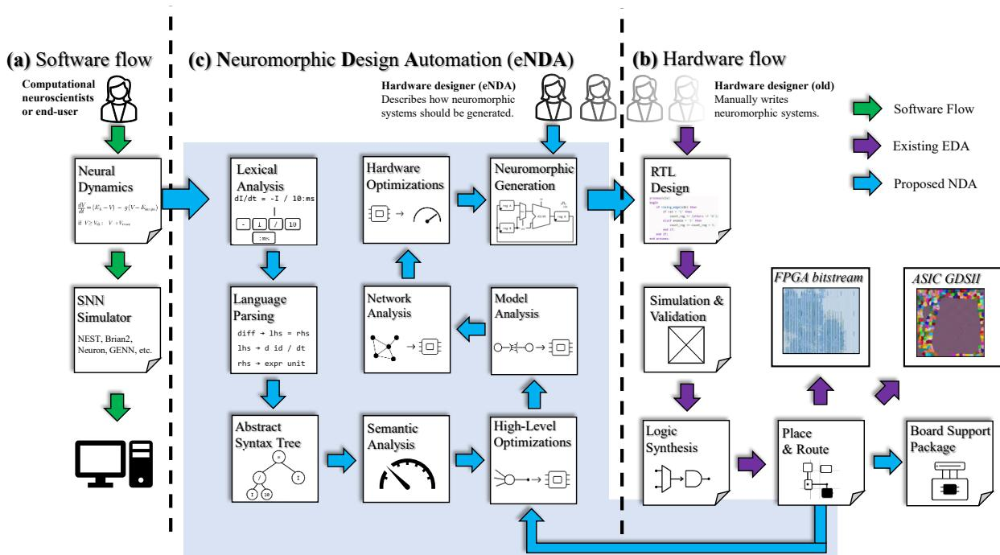  
Fig. 1: (c) eNDA is the missing link between traditional neuroscientific algorithm development (a) and the well-known electronic design automation (EDA) flow that hardware designers use for ASIC/FPGA creation (b), allowing push button generation of neuromorphic systems supporting state-of-the-art algorithms and increased technology transfer in the neuromorphic domain. eNDA shifts the role of the hardware designers from recurrent manual and laborious hardware design to non-recurrent decision making inside the framework, focusing on how a neuromorphic platform should be implemented.

However, to the best of our knowledge, no prior work combines (i) a hardware-oriented flexible domain-specific language for arbitrary models (from simple LIF to complex Hodgkin-Huxley and beyond), synapses, and plasticity dynamics, (ii) automated precision/bandwidth/timestep design-space exploration, and (iii) direct synthesis to both FPGA bitstreams and ASIC layouts.

We propose the electronic Neuromorphic Design Automation (eNDA) methodology, shown in Figure 1:c, which bridges algorithmic and neuroscientific descriptions with EDA tool-flow, allowing application, models, and hardware designers to operate within one umbrella. An eNDA-flow takes as input the domain-specific model of a neural system as specified by a domain expert and automatically – through a series of complex transformations – transforms this high-level abstraction down to a custom and specialized neuromorphic platform, where EDA-flow takes it down to hardware. eNDA changes the hardware designer’s role significantly. Rather than relying on insuficiently informed functional decisions regarding what should be implemented, designers now can focus on how a system should be implemented given a certain implementation strategy.

This view of eNDA opens up several opportunities. Firstly, it allows domain experts and hardware designers to work within a single unified framework, allowing improvements on one side to be directly transferred to another. For example, a new learning rule or network structure can directly be synthesized and made into a neuromorphic accelerator to solve problems in society. Secondly, the hardware designer now focuses exclusively on how hardware should be designed with direct access to a large number of domain-specific use-cases, allowing hardware decisions to be empirically explored systematically. Thirdly, domain experts can run their algorithms on more energy-eficient and faster FPGAs or even construct ASICs with the push of a button.

The flow in an eNDA can difer, but overall has the following functionality:

• A Lexical analysis and language parsing step for understanding the neural algorithms to be incepted as a neuromorphic accelerator (these could rely on descriptions written in NEST, Brian2, or even NIR),

• An intermediate representation (e.g., AST) encapsulating model dynamics and connectome and semantic analysis on said representation,

• A series of high-level, hardware-agnostic optimizations, such as (for example) constant folding or common sub-expression elimination,

• A model analysis step that understands and decorates the constructs with information critical for performance generation, such as whether a particular model is event-driven or continuous.

• A network analysis step that analyzes and decorates the network with information such as information flow, bandwidth requirements, etc.

• A hardware optimization step that performs hardware-specific optimization specific to the target, and

• Neuromorphic synthesis, where a backend generates the neuromorphic platform based on the decorations provided by the other parts.

Note that an eNDA-flow is not tied to digital-only implementation, and diferent backends can map the neuroscientific descriptions (often ODEs) to digital, analogue, or even mixed-signal components subject only to the availability of such a backend.

## 2.1 Syn2Logic: an eNDA prototype

Syn2Logic is our prototype framework embodying the spirit of eNDA, implementing the eNDA-flow of Figure 1. Syn2Logic operates under a custom-designed, multi-paradigm language that combines (and is inspired by) elements of traditional hardware description languages such as VHDL (concurrent, strictly typed, hierarchical), with neural modelling languages such as NestML [28] and Brian2 [34], and a variant of Julia’s [29] multiple-dispatch functionality to efectively describe and build hierarchical neural networks. The language itself is object-oriented, LL(1), where models and networks described can act as extendable prototypes, reducing code-bloat and increasing readability and code re-usability. In short, Syn2Logic combines the benefits of a hardware description language with the familiarity of neural description syntax.

The Syn2Logic model of computation has been created to be as compatible with existing frameworks as possible, simplifying the transfer of models, while still being hardware-friendly in order to facilitate mapping of descriptions to various types of hardware, such as digital and analog. The model of computation is divided into two types of components: a model and a network.

A model is the smallest unit that can perform computation, and is composed of state, update, events, and conduits (input) and outputs. A model consumes (and computes) data from conduits and drives outputs. Model state consists of variables and constants. The model update describes how to go from time t to time t+1, most often (but not exclusively) using Ordinary Diferential Equations (ODEs). Model events are always-on, timeless monitors of the model state that trigger when a particular condition is reached. Generating output (=spikes) can only be done through events.

The second part of the model of computation is a network, consisting of one or more models or subnetworks connected to each other. Here, the user describes how a network is connected and how data is processed before entering each model. Each connection is event-driven, carries a token, and information is transferred instantly. Furthermore, connections occurring at conduits can be processed, such as, for example, accumulating all incoming data, before sending it to a model/subnet, subject to how the receivers require the data. Information from outputs to conduits occurs instantaneously (unlike models whose state are synchronously updated), and combinatorial paths can form in a network (akin to their digital design counterparts).

Listing 2: A constant (scalar) and a variable (nano Siemens)   
1 const Aplus = 0.2   
2 var chem\_GABA :nS = 3

## 2.1.1 Model Objects

## Model Definition

A generic model is defined using the keyword model followed by optional prototype information, then state, and a body of ODEs and events. When a prototype statement is provided, the model inherits state and connectivity rules (see network, below) from the prototype, promoting code reuse and versatility.

Listing 1: A base-class model of a neuron with empty body but with interface, followed by another neuron that uses the Neuron as a prototype.

1 model Neuron   
2 conduit Iin :pA   
3 conduit spike\_in :mV   
4 output Vout :mV   
5 var Vm :mV = -65 :mV   
6 const Iconst :pA = 0, Vrst :mV = -65   
begin   
8 end   
9   
model LIF = Neuron ( Vrst = -10)   
11 begin   
12   
13 end

## Model State

State of the model contains variables or constants. A constant is a compile-time fixed value that cannot be changed after the design of the neuromorphic architecture, while a variable is subject to change as a function of time (and available for observation from outside the circuit). Both constants and variables can be typed, where a type is either a base (or derived) unit from the International System of Units (SI), a scalar value, or a custom type. Metric prefixes can be used to specify the magnitude of the unit (µ, M, G, etc.). The language is agnostic about the numerical size (in bits) of the variables or constants, leaving that decision to the compiler (or user) to decide. This allows variables to be size-agnostic, unlike (say) a language such as C or C++. All types of states can be made into an array or population. Modifying a variable can be performed in one of three ways: (i) externally by an end-user (when the system is not running), (ii) through time-dependent ordinary diferential equations (ODEs), or (iii) imperatively inside events.

## Model Interfaces

Interfaces are a special type of variable that are visible, have a sense direction (input or output), and are accessible outside of the model. They map very naturally to the neuromorphic concepts, since a neuron (or synapses, axons, astrocytes, glia, etc.) also shares the concepts of an input or output interface. There are two types of interfaces: a conduit and output. An output is an interface that can only be read from outside the model and is used by the model to transmit information out. An output in Syn2Logic is akin to an output port in (for example) VHDL, and may have only a single driver (avoiding race conditions). A conduit is an interface that can only be written into from outside the model and is used to transmit information into the model. Unlike an output, a conduit can have multiple writers to it, and it is up to the model to describe how to perceive those writes using collectives such as sum, product, or max.

Listing 3: A conduit (pico Ampere) and an output (scalar)

conduit I\_in :pA   
2 output Vout

## Model ODEs

ODEs describe how variables in the model change as a function of time, and map naturally to the dynamics of neurons and synapses. An ODE block, follows textbook conventions $\begin{array} { r } { ( \frac { d X } { d t } = . . . . ) . } \end{array}$ , allowing the code to be readable and relatable. ODEs at the language level have no time discretization; albeit (for digital hardware), hints regarding what kind of solver or timestep is needed for stable integration can be provided. Note that all equations in Syn2Logic are strongly typed: the type of the left-hand expression must match that of the right-hand expression. In our example, since Izhikevich operates on unit-less variables, this means that we make use of casting expressions to force certain equations to be – in our case – of type mV, and that we properly divide it by time. Note that the magnitude (e.g. the resolution of 1: mV + 1: GV) may difer, and our compiler will insert required adapters between expressions at a later stage in the pipeline.

1 dVm /dt = ( Iconst + Gexc \*( Eex -Vm) + Ginh \*( Ein -Vm) - gL \*(Vm -EL) ) /Cm

Listing 4: A diferential equation for LIF neuron membrane dynamics

## Model Events

Events are anonymous functions that can modify model state asynchronously and atomically (appearing, to the system, instantaneously), but can only be triggered upon a condition. A condition could be, for example, when a model of a neuron receives an action potential or spike from other neurons. Events that are triggered only as a function of external conduits are asynchronous (and can occur without advancing time), while events that are a function of at least one state variable are called synchronous (and can occur only during state update). Asynchronous events are important as they enable (for example) lazy updating of model state and pass-through (combinatorial) relay of signals (an event based on a conduit that writes to an output relays information downstream instantanously).

Listing 5: An event that activates if internal state Vm>-30 and writes to output port Vout while resetting Vm to -60:mV, and an event that triggers when a conduit receives spikes, and accumulates the value of all spikes (::sum) on the conduits into variable Hinh

```erlang
event (Vm > -30 :mV )
2 Vout = Vm , Vm = -60 :mV
3 end
4
event ( I_in )
6 Hinh = Hinh + I_in ::sum
7 end
```

## 2.1.2 Network Objects

## Network Object

A network object in Syn2Logic acts as the blueprint for how to wire together populations of models (or other nets) to create a larger, more capable, component. Often, the blueprint of a neural network dictates its functionality, and we see many such examples from literature, including central pattern generators (CPGs) [53], winner-take-all (WTA) [54], and even full-brain connectomes of invertebrates such as the nematode C. elegans [55] and the fruit fly Drosophila melanogaster [56]. Information between network objects is send instantaneously from sender (conduit) to receiver (output).

Describing a network object involves three things: (i) instantiate population instances of models or networks and their configuration (e.g., changing constants). Each instance gets its own copy of the model state, and it is possible to override any value at instantiation (e.g., giving one neuron stronger drive than others), (ii) describe how populations wire together using well-known connectivity schemes such as all2all or one2one, connecting outputs of some models to conduits of others, and (iii) a network can (as a model) have their own conduits and outputs connecting internal populations to propagate information in and out of the network.

Listing 6: A simple WTA network that instantiates NZ neurons that inhibit each other and compete for activation.

1 net WTA   
2 const NZ = 3   
3 conduit cinp [NZ] :mV   
4 output cout [NZ] :mV   
5 obj pop [NZ ]: LIF ()   
begin   
one2one ( cinp [\*] ⇒ pop [\*]. spike\_in )   
8 one2one (pop [\*]. Vout ⇒ cout [\*])   
9 one2all (pop [\*]. Vout ⇒ pop [\*]. spike\_in )   
10 end

## Rule-based Connectivity

Connecting outputs of one model to the input of another is trivial as long as the types match, such as connecting an output of type mV to an input also of type mV. However, this quickly becomes very verbose and unclean code-wise as it combines how something is connected with the topology. In Syn2Logic, we decouple how something is connected from the network itself by using rule-based connectivity. A rule describes how a model or net connect to other components in the system. For example, a simple synapse would connect its output (conductance) to a neurons conduit, and a more complex plastic synapse would also connect the post-synaptic neuron’s output back to itself. Furthermore, rules are inherited through prototypes, meaning that if a rule connecting our basic empty neuron (defined above) with a basic empty synapse exists, then all variants of neurons and synapses inherited from their respective prototype will know how to connect unless a new rule for that model/net is written. The concept is similar to Julia’s multiple dispatch.

Listing 7: A rule describing how a WTA network connects to another WTA network, in this case by having each entry in the connecting WTA inhibit corresponding entry in the destination WTA. Such a network is useful for when, for example, creating neuromorphic constraint satisfaction solvers.

```ocaml
1 rule src :WTA ⇒ dst :WTA
2 begin
3 one2one (src . cout [*] ⇒ dst . cinp [*])
4 end
```

## Template-based Instantiation

Finally, by decoupling what connects to what from how it connects, we can allow templates. A template is a construct that allows a network to operate on generic models/networks, which are resolved dynamically at compile time and whose connections use the ruleset that has been defined. Templating allows writing generic code for constructing a network without specifying what type of neuron or synapse model is being used. For example, one can define a network describing a microcircuit using a template and then easily change the underlying neuron of the model from LIF to Hodgkin-Huxley, or even to other sub-networks with the change of a single line (or during instantiation).

Listing 8: A simple two-neuron oscillator built using templates (TNeuron defaults to LIF, TSynapse defaults to AMPA) allowing any template to be changed to any other model (or network) assuming the rules for connecting them exist.

1 net HCO   
2 template TNeuron = LIF ()   
3 template TSynapse = AMPA ()   
4 obj neu [2]: TNeuron ()   
5 obj syn [2]: TSynapse ()   
6 output spkout [2] :mV   
begin   
8 one2one (neu [0] ⇒ syn [0])   
9 one2one (syn [0] ⇒ neu [1])   
10 one2one (neu [1] ⇒ syn [1])   
11 one2one (syn [1] ⇒ neu [0])   
12 one2one (neu [\*] ⇒ spkout [\*])   
13 end

## 2.2 Example Network

To demonstrate a complete example, consider Figure 2:a, where we see a network not entirely unlike the nervous system for the C. elegans nematode, ported to the Syn2Logic language from c302 [55]. Red, blue, and green nodes correspond to diferent neuron types (inter-, motor-, and somatic-neuron), and gray- and white-boxes correspond to plastic and nonplastic synapses, respectively. Our example network works with STDP synapses, which the c302 does not, and this is only to show the diferent perspective of the Syn2Logic language (we construct a more faithful c302-variant later in 3.3).

Figure 2:b shows an enlarged part of the graph, showing a motor neuron (red) and its description in the Syn2Logic language (Figure 2:c). A plastic STDP synapse (Figure 2:d) is connected to the motor neuron using the specified ruleset (Figure 2:e) by connecting the output conductance G\_out to the chem\_in conduit of the neuron, and connecting the spiking output Vout of the neuron back to the Vpost conduit terminal of the synapses, completing the connection. A simpler non-plastic synapse is shown in Figure 2:f.

Parts of the top-level C. elegans -like Syn2Logic description are shown in Figure 2:a, where the neuron and synapses objects are created followed by a long connectivity list. This is a detailed and verbose way of describing each connection in the system. An alternative – and more general – is shown in Figure 2:g, where we create a generic accelerator with 302 neurons and 302<sup>2</sup> STDP and inhibitory synapses, respectively, and connect all of them together. Smaller and more elegant, this description requires the users to actively program the state of the accelerator prior to execution (similar to how neuromorphic systems such as Intel Loihi are programmed).

net SampleNetwork   
const N NEU = 302 (a)   
const N EXC = 4681   
const N\_INH = 273   
output spk[N\_NEU]:mV   
obj neu[N\_NEU]:LIF(Iconst=5.0)   
obj exc[N\_EXC]:STDPSyn()   
obj inh[N\_INH]:InhSyn()   
begin   
one2one(neu[115] ⇒ exc[0])   
one2one(exc [0] neu[117])   
one2one(neu[115] exc[1])   
one2one(exc[1] neu[119])   
one2one(neu[115] exc [2])   
one2one(exc[2] neu[121])   
one2one(neu[115] exc[3])   
one2one(exc[3] neu[122])   
one2one(neu[115] exc[4])   
one2one(exc [4] neu[138])   
one2one(neu[115] exc [5])   
one2one(exc [5] neu[140])   
one2one(neu[115] exc [6])   
one2one(exc [6] neu[141])   
one2one(neu[115] exc [7])   
one2one(exc [7] neu[144])   
one2one(neu [115] exc[8])   
one2one(exc[8] neu[145])   
one2one(neu[115] exc [9])   
Long list of connections

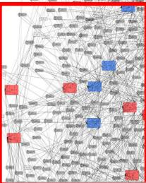

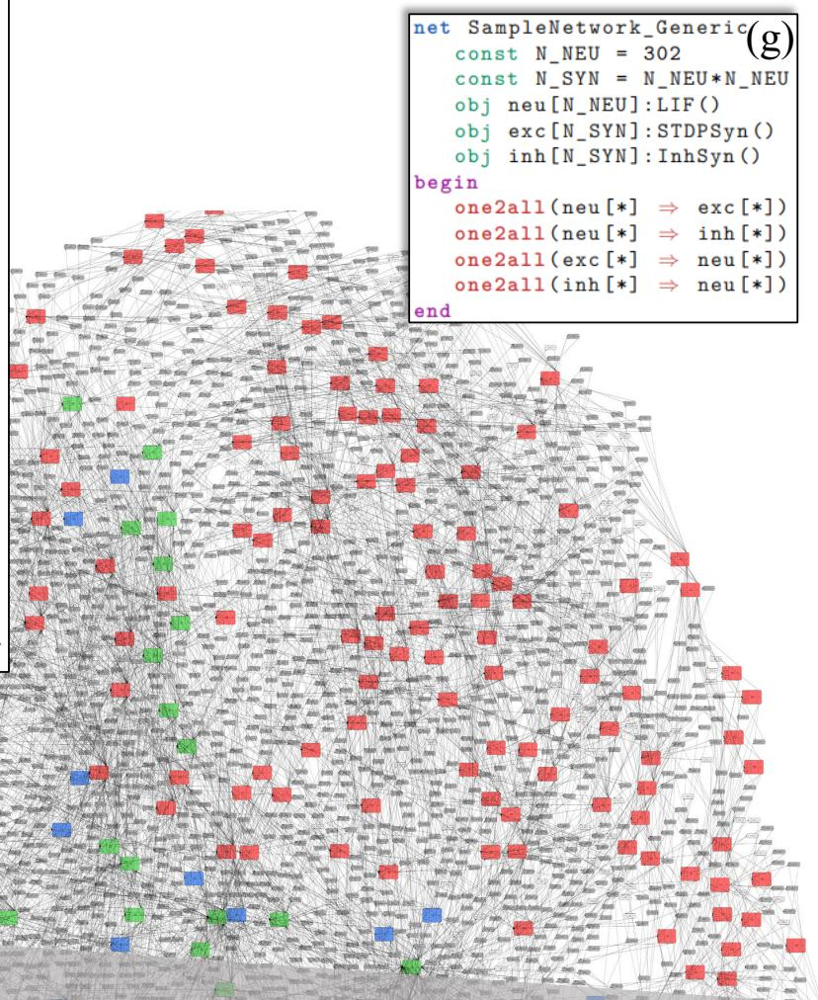

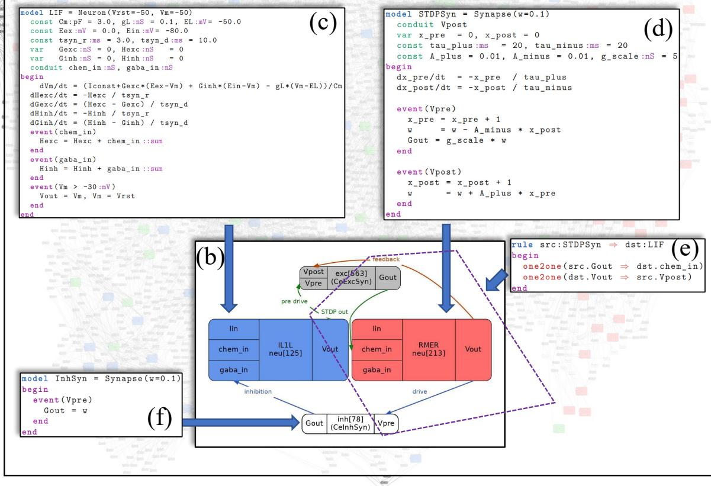  
Fig. 2: A Syn2Logic graph (rendered using dot and based on the C. elegans nervous system), showing the top-level Syn2Logic code describing it (a), a zoom-in of a motif (b) where we see the neuron model (c), the STDP synapse (d), and the rule (e) on how to connect a STDP synapse to the neuron, which is also visible in the motif. We also see the simpler non-plastic synapse (f). Finally, we see a generic description of the accelerator (g) that is condensed but requires the user to configure it (unlike a, whose connectivity is sparser but immutable).

## 2.3 Syn2Logic Neuromorphic Backend

As with a regular compiler, Syn2Logic can have multiple backends transforming the intermediate representation into a digital, analog, or mixed-signal neuromorphic device, each with their own characteristics, strengths, and weaknesses. For example, a neuromorphic device targeting a specific Internet-of-Things (IoT) use-case will likely use a backend focusing on creating an ASIC with low power consumption, while a generic design targeting a high-performance, high-capacity network would prefer a top-tier FPGA backend.

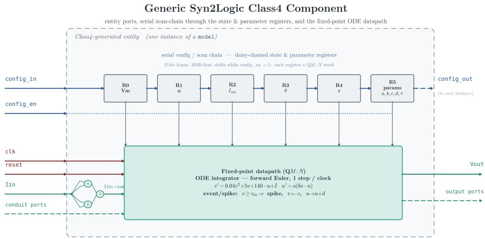  
Fig. 3: A generic view of a model component generated by our Syn2Logic class4-backend. We see an Izhikevich model with several state variables, and each variable is daisy-chained on the scan-chain, which goes serially through all components in the system and can be configured from outside. The model state is connected to a generated data path that solves the ODEs and handles events. Conduits are currents from (typically connected synapses) that are added together to provide reduction functionality at the neuron side. Each conduit and output has a token (a spike-enable) signal, indicating a valid value (not entirely unlike data-flow).

To illustrate the concept, we developed a backend that generates digital hardware that embraces the spirits of neuromorphic computing [57], where the substrate becomes the computation (the entire network is placed in silico, with no time multiplexing of data paths). The output of our backend is a component shown in Figure 3 (in this case, an Izhikevich neuron). The generated neuromorphic system meets the neuromorphic requirements described by Kudithipudi et al. [17], and is considered a class-4 system per Szczerek and Podobas’ taxonomy [16].

Our backend takes the intermediate representation and generates a digital neuromorphic system (i) whose components are discretely and spatially placed on the underlying silicon, (ii) communicates in a sparse and event-based fashion, (iii) implements data-paths for updating neural state using fixed-point representations, and (iv) is deterministic in that advancing one time step takes exactly one clock cycle. The strengths of our backend are that it generates highperformance yet deterministic neuromorphic systems without reliance on external peripherals (e.g., DDR4), and where it is therefore the closest to nervous systems in nature. The weakness is that it is not very scalable, and suitable only for small-to-medium sized designs.

Additionally, our backend accepts a number of optimization knobs with which the user can adjust or control the quality of the neuromorphic hardware generated:

• Fixed-Point Width (M:N): A user can specify the size of state in terms of mantissa- and fraction-bits, which can trade accuracy for smaller silicon,

• Timestep (TS): A user can select how fast time advances in the neuromorphic device. A large timestep is faster but can lead to instabilities,

• Per-Model Bandwidth (PMW): A user can specify the bandwidth of conduits into a model, and can optimize for the fact that spikes are very sparse at the risk of dropping information in times of high activity.

• Fused operations (FO): Forces fused data-paths and reduction adapters operating without loss in accuracy, and rounds only at the end of the computation,

• Approximate Constants (AC): allows approximating constants to save silicon area, relying on the observation that some constants consume a lot of area to be exactly (if at all possible) defined.

## 2.3.1 Syn2Logic Complete Internal Flow

The internal Syn2Logic compilation flow follows our proposed eNDA-flow closely. To compile a Syn2Logic (.s2l) source file into a neuromorphic system in RTL, we perform the following steps:

• Lexical analysis: Our Flex-generated scanner deposits tokens onto a double-ended queue consumed by the recursive-descent parser. The lexer normalizes the language’s notation: the equivalent derivative spellings X’ and dX/dt are mapped to a single ODE token, SI units carry their metric prefix as a power-of-ten magnitude, and the identifier rule consults the symbol table during scanning, such that an identifier with a registered datatype sufix (e.g., mV) is emitted as a typed token.

• Syntactic analysis: and parsing is performed by a hand-written recursive-descent parser dispatching on the constructs type, model, net, rule, and build. Expressions are parsed with a two-stack operator-precedence scheme; integer exponents expand into repeated multiplications at parse time. Postfix analysis yields function calls, array accesses (including ranges and the \* wildcard), member accesses, ::sum/::num/::max/::product reductions, and ::type casts. For models, the parser collects storage declarations (const, var, conduit, output) together with ODEs, algebraic equations, and event blocks; the left-hand side of an ODE is intentionally represented as X1 ms so that dimensional analysis of dXdt remains well defined. Nets comprise object and template declarations and connection commands, whereas rules are registered under the mangled name srcType+dstType. Prototype derivation (model Foo = Neuron(...)) clones the prototype’s AST and overrides its constants from the supplied dictionary. Finally, parse\_build() deep-clones the build target, applies its dictionary, and invokes Instantiate, AnalyzePorts, the optional visualisation passes, and Class4.

– Verification: This pass constitutes the principal semantic analysis and is re-executed for every instantiated clone. It resolves all symbols (and decorates the tree) and performs dimensional type checking over the SI unit system: addition, subtraction, comparison, assignment, and ODEs require identical dimensions on both sides, whereas multiplication and division combine dimensions algebraically; magnitude discrepancies merely warn, deferring to BalanceTypes. The pass further propagates the writeable, is\_const, and event-driven attributes (a model writing its outputs solely in such handlers is itself classified as eventdriven) and enforces the language’s structural invariants: single-writer outputs, no variable/output/self reads in equations, reductions restricted to conduits (recording the reduce\_\* attributes consumed downstream), array dimensionality, function signatures, and constant, type-correct initialisers.

– Print (optional) A diagnostic pass that emits the fully attributed AST; its output is suppressed at default verbosity and exposed through command-line options.

– Instantiate: This pass elaborates the declarative design into a concrete instance hierarchy: for a Net, it first applies the sub-sequence Verify→StripTypes→ConstFold→DivToMul (reducing array bounds to literals) and then, for each declared object, clones the referenced model or net, assigns a globally unique name to preclude duplicate VHDL entities, applies the parameter dictionary, attaches the clone via setImplementation(), and recurses depth-first. For a Model, the sub-sequence Verify→BalanceTypes→StripTypes→ConstFold→DivToMul→Verify is applied, after which the model consists of dimensionless, constant-folded arithmetic suitable for hardware mapping.

∗ BalanceTypes: Source programs may freely mix magnitudes of a common dimension (e.g., millivolts and volts); for every binary statement, this pass compares the magnitude exponents of the operands and, where they difer, rewrites the right-hand side with an explicit multiplication or division by 10<sup>k</sup>, so that the subsequent erasure of units incurs no numerical loss.

∗ StripTypes: This pass erases the unit system: cast nodes are replaced by their operand, the implicit 1 ms on ODE left-hand sides is removed (right-hand-side divisions are preserved), and all declared symbol types are reset to the dimensionless type, leaving a purely numerical program.

∗ ConstFold: Constant symbols are substituted by their values, operators over two literals are collapsed, and the identities x0, x−0, 0−x=−x, x·0=0, and x1=x are applied. As instantiation converts model parameters into constants, this pass efectively specialises each instance’s equations and renders divisors literal for DivToMul.

∗ DivToMul: Since a hardware divider is substantially larger and slower than a multiplier, every division by a literal c is strength-reduced to X · 1c, the reciprocal being evaluated at compile time; X1 is eliminated.

∗ Build command interpreter: Build is the common base class of AnalyzePorts and Class4; subclasses override a virtual connect() method invoked once per resolved point-to-point link. Its Command visitor expands wildcards and ranges into index sets (verifying one2one cardinality) and enumerates index pairs for primitive endpoints. For object-to-object connections it performs rule expansion: the rule registered under srcType+dstType is cloned, its src/dst placeholders are substituted with concrete array accesses (ReplaceId), the result is re-verified, and the rule’s commands are re-executed per index pair, unfolding a single net-level command into all of its port-level links.

∗ AnalyzePorts: The hardware required at a port depends on the opposite endpoint of each connection: a conduit read as Iin::sum obliges every connected source to export a value bus in addition to its spike bit. Inheriting the Build interpreter, this pass re-executes all connection commands, transfers each destination conduit’s reduce\_\* attributes onto the corresponding source ports, and recurses through the instance hierarchy, thereby determining which reduction adaptors and \_val side channels the backend must generate.

– DotGraph/DotGraphPop: Optional passes rendering Graphviz visualisations of the design at object and population level. The previous Figure 2 was generated using this pass.

• Backend (Class4): The final backend produces the final RTL for the neuromorphic system, and is composed of four parts: expression mapping, diferential equations/state mapping, model emission, and network emission:

– Expression Mapping: Code generation proceeds bottom-up: each AST node deposits a "mapped" signal annotated with exact m, n bit bounds. Literals are quantised to their minimal exact format, further reduced under –round-constants. Bit growth is tracked exactly (addition: max 1; multiplication: m m 1; etc.), whereupon maybeFuse() resizes each result to M:N; under –fused-ops the wide intermediate is instead retained, exchanging area for a datapath free of intermediate rounding. Comparisons yield single-bit when/else signals, and reduction nodes read the conduit’s precomputed port. The functions exp and log are expanded inline into Taylor-series datapaths, the former via base-2 decomposition with a barrel shifter.

– ODEs, events, and state threading. ODEs are integrated by the forward Euler method: X f··TS is computed combinationally but not committed to the register, being published instead in a per-variable NextState map. Within an event, reads are redirected through NextState, so that a threshold condition observes the freshly integrated value (“integrate-then-test”, as in Brian2/NEST) and an accumulating assignment composes with, rather than supersedes, the ODE step; each event assignment becomes a multiplexer over the value produced thus far, replacing the corresponding NextState entry; output assignments are emitted combinationally (event-driven models) or as guarded sequential statements. Only upon completion of the model visit is each variable’s final value committed to its state (a part of config on the scan-chain) — one register write per variable per timestep, avoiding VHDL’s last-assignment-wins semantics. Reads outside events continue to observe the registered value, preserving the simultaneous (Jacobi-style) integration of coupled ODEs.

– Model synthesis: The backend produces a fully parallel implementation with co-located memory and computation (class-4 [16]): one VHDL entity per model and one structural entity per net, appended to out.vhdl together with a JSON device tree (out.json, which describes what variable is located where on the scan-chain). Its parameters (M:N format, timestep TS, pmw, round\_constants, fused\_operations) come from the symbol table. Each var is realized as an sfixed(M downto -N) signal aliased onto a slice of a single config shift register, with its reset value, read alias, and bit address recorded in the device tree; the register simultaneously serves as a scan chain (config\_in/out/en) for state load and read-back. Conduits map to spike input ports (with \_sum/\_num/etc. side ports where required), and outputs to output ports (with a \_val bus where a downstream reduction consumes the value).

– Network synthesis: For a Net, the backend first recurses into each object’s implementation and then constructs a structural architecture. Re-executed connect() calls accumulate per-port lists of mangled signal names $( \mathsf { o b j \_ i d } i \mathsf { \_ p o r t \_ i d } j )$ ; the instantiation loop then emits one port map per array element, in which spike inputs are combined by disjunction over all sources, ::num is realised as an adder over spike bits, ::sum as a balanced adder tree over \_val buses (resized after each addition, of depth ⌈log K⌉), and ::product as a multiplication chain. For 0 < <sub>pmw</sub> < 1, a reduction’s K inputs are partitioned into ⌈K · <sub>pmw</sub>⌉ bins of one priority-selected value each, trading connectivity for area. Per-model scan chains are concatenated through a config\_chain signal; the architecture is appended to out.vhdl and the device tree written to out.json.

• Post-Emission flows: Following the backend, parse\_build() invokes the flow generator selected by –flow GenCadence (Genus+Innovus/ASAP7; default), GenOpenROAD (NanGate45, unused in this paper, but we do have preliminary support for OpenROAD [58]), or GenQuartusAgilex7 — each bundled with out.vhdl into <flow>\_flow.tgz; –testbench additionally generates a spike-counting GenMeasureOutActivity testbench.

(a) Leaky Integrate-and-Fire (LIF)  
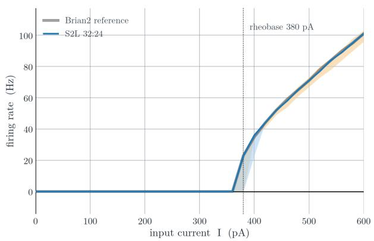

(b) Izhikevich  
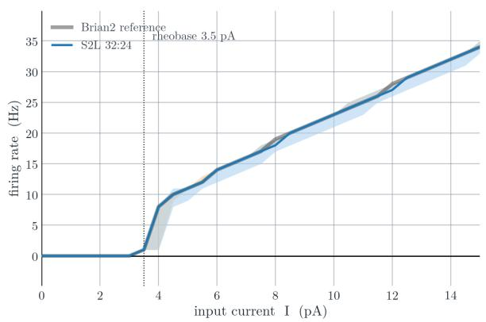

(c) Adaptive Exponential (AdEx)  
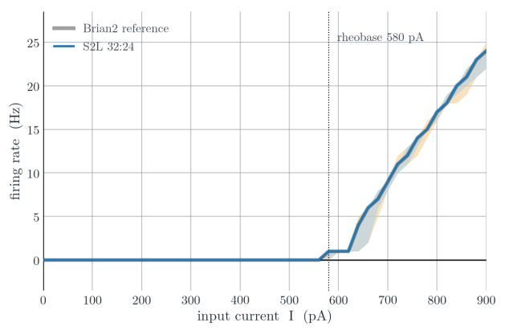

(d) Hodgkin-Huxley  
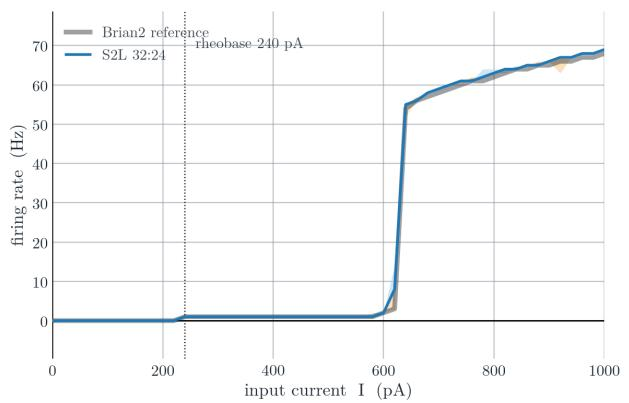  
Fig. 4: Current-Frequency response (i-F) for four neuron models with reference framework Brian2 and Syn2Logic, including (a) Leaky Integrate-and-Fire, (b) Izhikevich, (c) AdEx, and (d) Hodgkin-Huxley.

## 3 Results

## 3.1 Neuron Correctness and Exploration

We start by exploring the correctness results for our proposed eNDA-flow for four diferent neuron models: Leaky Integrate and Fire (LIF), Izhikevich, Adaptive Exponential Integrate and Fire (AdEx), and the Hodgkin-Huxley model, in rising order of complexity. For each evaluation, we see the firing rate of the neuron as a function of the internal constant current, a well-known correctness experiment. We compare to Brian2 as a golden reference, and use Normalized Root Mean Square Error (NRMSE) as a measurement for how well the diferent implementation match our Brian2 reference.

The LIF model – a cornerstone neuron model in neuroscience and neuromorphic engineering – is shown in Figure 4:a, where we see the f-I response curve for both the Brian2 reference implementation and the Syn2Logic $Q _ { 3 2 : 2 4 }$ highfidelity variant. Overall, this high-fidelity Syn2Logic variant faithfully follows Brian2’s LIF dynamics, and – for the sampled input current points – yields the same 380 pA rheobase current, which is when (for our samples) the neuron starts firing. The error between this high-fidelity Syn2Logic LIF model and the Brian2 reference is as little as 0.4% NRMSE. The LIF model does not need an expensive $Q _ { 3 2 : 2 4 }$ format to work well. In fact, by applying fused operations, we can operate with state variables at a $Q _ { 7 : 7 }$ format with less than 5% NRMSE, and we are forced to widen the data-path to a $Q _ { 1 6 : 6 }$ format if we disable fused operations and force-round results after each operation in the datapath. The NRMSE <5% requirement follows the trend of the Brian2 curve, albeit with some small over- and undershoots in the frequency for a given input current.

The Izhikevich model, which is more complex than the earlier LIF model, is shown in Figure 4:b. As with the LIF model, the Izhikevich Syn2Logic variant follows the Brian2 model faithfully, yielding identical rheobase currents for the tested current points and follows the curve near-exactly, with – interestingly – the non-fused version reaches 0.0% NRMSE error compared to Brian2, and the fused variant reaches 0.7% NRMSE. As with the LIF model, the Izhikevich model does not need the full $Q _ { 3 2 : 2 4 }$ format, but – assuming an NRMSE <5% ratio can be tolerated – can work well with a $Q _ { 6 : 9 }$ fused variant or a $Q _ { 1 3 : 8 }$ non-fused variant, showing small under- and overshoots in the graph relative to the Brian2 reference value.

The AdEx model is even more complex than Izhikevich, containing more complex ODEs and also the hardwareunfriendly exp function. We see the comparison between Syn2Logic and Brian2 in Figure 4:c. The high-fidelity $Q _ { 3 2 : 2 4 }$ Syn2Logic variant behaves identically with the Brian2 reference model, with a rheobase current of ${ 5 8 0 } \mathrm { p A }$ The fused-op variant stays at 0.0% NRMSE compared to Brian2 until we drop to 8 fractional bits, while the non-fused variant is a bit more chaotic. For fused-operations, a $Q _ { 9 : 6 }$ value is enough to stay within NRMSE <5% (with notable undershoots compared to the Brian2 reference) while the non-fused variant reaches a 2% error rate at $Q _ { 1 6 : 7 }$

We end our validation experiments by comparing the Hodgkin-Huxley model on Brian2 and Syn2Logic, shown in Figure 4:d. The H-H model is a complex neuron model, with multiple ODEs and a large number of multiplications, divisions, and exp operations. While the Syn2Logic $Q _ { 3 2 : 2 4 }$ variant reproduces and follows the Brian2 model rather well, it still has an NRMSE of 0.9% that cannot be reduced; interestingly, in fixed-point representation, larger data type is not better, as $Q _ { 1 8 : 1 4 }$ yields better NRMSE than $Q _ { 3 2 : 2 4 }$ . This could be attributed to Brian2 model’s IEEE 754 numerical representation being better than the fixed-point representation our backend operates on. The fused variant can be as small as $Q _ { 7 : 1 7 }$ while keeping within a <5% NRMSE while the non-fused variant requires more integer bits and is at $Q _ { 1 6 : 1 4 }$

## 3.1.1 Discussion: Neuron Models in Neuromorphic Systems?

Synthesizing the neurons using Syn2Logic and Cadence Genus, we observe several trends, shown in Table 1. The first observation, which is rather intuitive, is that the more complex the neuron model, the more area it consumes and the slower it operates. For example, the LIF model can operate at 137 MHz, consuming less than 500 $\mu m ^ { 2 }$ in area, while the HH, which is many times more complex, is significantly slower and can be more than 100x larger.

The second observation is that fused data paths can give the neuromorphic system higher performance. Rounding fixed-point numbers can be expensive, and by rounding only when you store the result back, you can increase the operating frequency of the circuit. This increase is visible in LIF, Izhikevich, and AdEx, but is most notable in the latter (nearly 50% increase in clock frequency).

Table 1: ASIC cost of the four neuron models at their faithful (≤5%) fixed-point format, fused vs non-fused ops (ASAP7 7 nm, Cadence Genus estimation). Area saving and $\Delta F _ { \mathrm { m a x } }$ are the non-fused variant relative to fused.
<table><tr><td>Model</td><td> $\mathrm { O p s }$ </td><td>Area  $( \mu \mathrm { { m } ^ { 2 } ) }$ </td><td> $F _ { \mathrm { m a x } }$  (MHz)</td><td>Area saving</td><td> $\Delta F _ { \mathrm { m a x } }$  (MHz)</td></tr><tr><td>LIF</td><td>fused  $Q _ { 7 : 7 }$  non-  $\mathrm { f . } \mathrm { Q l } 6 { : } 6$ </td><td>475.6 439.4</td><td>137 129</td><td>7.6%</td><td>-8</td></tr><tr><td>Izh.</td><td>fused Q6:9 non-f.  $Q _ { 1 3 : 8 }$ </td><td>826.2 667.0</td><td>127 121</td><td>19.3%</td><td>-6</td></tr><tr><td>AdEx</td><td>fused  $Q _ { 9 : 6 }$  non-f.  $Q _ { 1 6 : 7 }$ </td><td>1020.0 783.7</td><td>99 65</td><td>23.2%</td><td>-34</td></tr><tr><td>HH</td><td>fused  $Q _ { 7 : 1 7 }$  non-f.  $Q _ { 1 6 : 1 4 }$ </td><td>52 272 13 212</td><td>30 30</td><td>74.7%</td><td>0</td></tr></table>

However, this increase in clock frequency is not free, as

the fused data paths are wider and thus – as a consequence – cost more area, whereas the non-fused version can have a footprint between 7.6% and 74.7% smaller than its fused counterpart.

An interesting observation is that, despite using a rather small, 7 nm, predictive PDK, our described neurons are still far away from their biological counterparts. Granule cells (among the smallest cells in the cerebellum, $8 \mu m ^ { 2 } ) [ 5 9 ]$ cortical pyramidal cells $( 2 5 \mu m ^ { 2 } )$ [60], and the large Betz cells $( ~ 1 0 0 ~ \mu m ^ { 2 } )$ [61] are still 55x, 18x, and 4.4x smaller than even our most pruned and smallest LIF model, leaving ample future opportunities for improvements.

Finally, a word of warning: the exact width of the fixed-point representation is – as we will see in our use-cases – very use-case dependent. A computational neuroscientist might accept a NRMSE<5% (or stricter), or might opt for a larger data-path that is much larger giving more details. A neuromorphic application, on the other hand, might actually work with a significantly smaller data-path– an observation we will see later when creating our neuromorphic Sudoku solver.

## 3.2 Synapse Correctness and Exploration

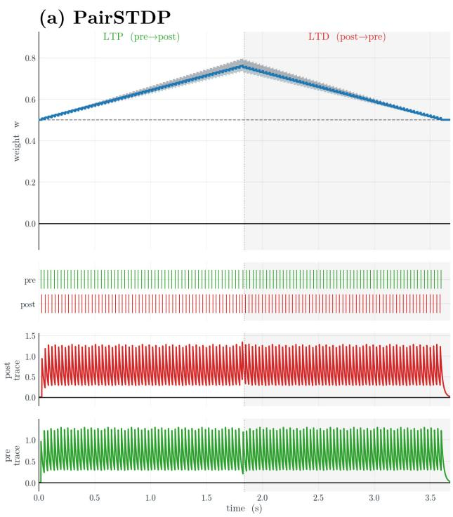

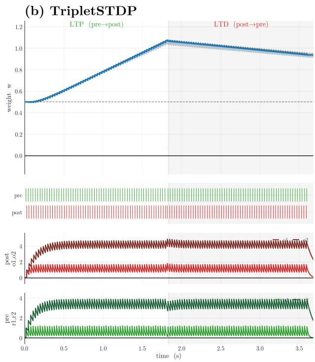

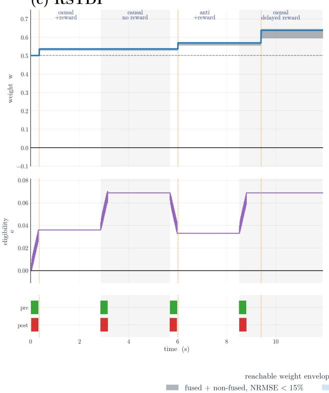

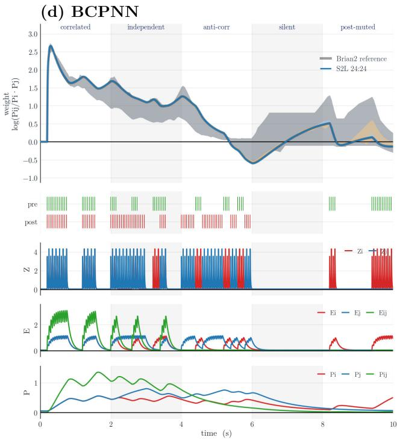  
Fig. 5: Large-scale evaluation of four plastic synapse models (PairSTDP, TripletSTDP, RSTDP, and BCPNN) in the Syn2Logic framework, with the tested induction protocol (pre- and post-synaptical activity) and the change in weight (w) and other state variables. For each model we also show its sensitivity to fixed-point precision quantization.

Next, we quantitatively verify the correctness and explore the data-path pipeline for four well-known plastic synapse models and a specific induction protocol: Pairwise STDP, Triplet STDP, RSTDP, and BCPNN. The results are shown in Figure 5.

Figure 5:a shows the classical pairwise STDP rule based on traces. Here, we created an induction protocol that spans 3.6 seconds of simulated time and first encourages synapse potentiation (the weight w increases) for the first half seconds by driving post-synaptic spikes directly after pre-synaptic spikes, and then induces synapse depression (the weight w decreases) during the remaining half seconds of the simulation. The functionality, the traces, and the depression/potentiation are in line with the expected functionality of STDP. Furthermore, what is interesting is that STDP, as long as the weights are clipped to a maximum, can tolerate a data-path width reduction as low as $Q _ { 2 : 8 } ,$ yielding an NRMSE of $3 . 5 \%$ and 4.1% for fused- and non-fused data paths alike; going further significantly decreases the performance of the learning rule compared to its golden reference.

Figure 5:b shows the TripletSTDP rule with a similar induction protocol as the Pairwise rule, but containing twice as many trace variables. The rule functions as expected in both depression and potentiation mode, and — due to the more complex nature of the rule — requires more fractional bits compared to its pairwise counterpart, landing at $Q _ { 2 : 9 }$ to maintain 2.8% and 3.5% for the fused- and non-fused variants’ NRMSE, respectively, over the golden reference.

Figure 5:c shows the reward-modulated STDP rule (RSTDP), with a more complex induction protocol consisting of both causal and delayed rewards, as well as no rewards and anti-rewards. We see how the diferent pre- and post-traces induce changes to the synapse strength based on the eligibility trace to the synapse weight. As with the TripletSTDP rule, we see the RSTDP rule for the proposed induction protocol can require as little as a $Q _ { 2 : 9 }$ precision, reaching 1.30% and 0.20% variants’ NRMSE, respectively for the fused- and non-fused variants, over the golden reference.

Finally, we take on a much more complex learning rule in Figure 5:d, where we see the Bayesian Confidence Propagation Neural Network (BCPNN) learning rule. Here, we use a complex induction protocol that includes five diferent activities on the eligibility traces (correlated, independent, anti-correlated, silent, and post-muted). In addition, we compare our Syn2Logic-generated functionality against the reference Brian2 model. At a $Q _ { 2 4 : 2 4 }$ data-path, our Syn2Logic variant mimics the Brian2 model rather exactly in all regimes. In fact, we can reduce the data-path width to as little as an $Q _ { 8 : 1 8 } ( \mathrm { n o n - f u s e d } )$ and $Q _ { 8 : 1 9 }$ (fused) width while still being 0.92% and 3.5% NRMSE compared to the $Q _ { 2 4 : 2 4 }$ variant.

In the end, whether a plasticity rule works or not is likely scenario-dependent, and could allow for further reductions than shown here. For example, if an NRMSE<15% error rate can be tolerated (the gray-shadow behind the graph in Figure 5:d), then $Q _ { 8 : 1 4 }$ format should sufice. Syn2Logic can and will be used in the future to quantify the impact of plasticity rules and their impact from within more complex use-cases.

## 3.2.1 Discussion: Which Synapse Model to use in Neuromorphic Systems?

The synthesis results for the synapses are shown in Table 2. As expected, the Pairwise-STDP synapse is by far the smallest, consuming as little as $6 0 . 4 ~ \mu m ^ { 2 }$ area, with the Triplet-STDP (larger fused-variant) and RSTDP (larger non-fused variant) being similar in area, and BCPNN – being the most complex and uses a log function – is the most expensive at $1 2 6 9 . 9 \ \mu m ^ { 2 }$ As expected, the fused variants are larger than their non-fused counterparts, with the highest benefit observed in TripletSTDP (71.7%). Interestingly, the BCPNN $Q _ { 8 : 1 9 }$ version synthesized was smaller than the non-fused version.

While the diference in hardware cost is – as expected – diferent in the various plastic synapses, it does raise another question: how much "learning" capacity does a synapse actually bring for the silicon footprint it consumes? If a neuromorphic IP component has a silicon budget of 0.1 $m m ^ { 2 }$ for a device that should learn online using plastic synapses, should that silicon be spent on 78 BCPNN synapses, 765 RSTDP synapses, 944 TripletSTDP synapses, or 1655 STDP synapses to perform the best? Likely,

Table 2: ASIC area of the four plasticity rules at their faithful (≤5%) fixed-point format, fused vs non-fused ops (ASAP7 7 nm, Genus synthesis estimations). Area saving is the non-fused variant relative to fused.
<table><tr><td>Rule</td><td> $\mathrm { { O p s } }$ </td><td>Area  $( \mu \mathrm { { m } } ^ { 2 } )$ </td><td>Area saving</td></tr><tr><td rowspan="2">Pair</td><td>fused  $Q _ { 2 : 8 }$ </td><td>91.9</td><td rowspan="2">34.2%</td></tr><tr><td>non-f  $. Q _ { 2 : 8 }$ </td><td>60.4</td></tr><tr><td rowspan="2">Triplet</td><td>fused  $Q _ { 2 : 9 }$ </td><td>374.4</td><td rowspan="2">71.7%</td></tr><tr><td>non-f  $\cdot Q _ { 2 : 9 }$ </td><td>105.9</td></tr><tr><td rowspan="2">RSTDP</td><td>fused  $Q _ { 2 : 9 }$ </td><td>202.3</td><td rowspan="2">35.4%</td></tr><tr><td>non-f.  $Q _ { 2 : 9 }$ </td><td>130.7</td></tr><tr><td rowspan="2">BCPNN</td><td>fused  $Q _ { 8 : 1 9 }$ </td><td>1269.9</td><td rowspan="2">-9.2%</td></tr><tr><td>non-f.  $Q _ { 8 : 1 8 }$ </td><td>1386.9</td></tr></table>

the answer depends on the use-case, where some use cases might benefit from the more advanced learning of BCPNN synapses while others favor the simpler (but more) Pair-STDP synapses. Independent of which, the amount of "learning" per silicon area is seldom discussed, but should be quantified in the future, since – in the end – it is the hardware implementation that in parts dictates the success (through lowered execution time or reduced power consumption) of putting neuromorphic systems to good use. An example metric could be (for example) Silicon Learning Fidelity, $\begin{array} { r } { S \dot { L } F = \frac { \mp S y n a p s e s } { m m ^ { 2 } } } \end{array}$ for a particular technology node and iso-fidelity.

We end the discussion by comparing our results to biology <sup>5</sup>. Unlike neurons, which could (the smallest LIF model) be between 4x-55x larger than biological neurons, the same – unfortunately – does not hold for synapses. A typical synapse in the human brain is on the order of 0.1 $\mu m ^ { 2 }$ [62] in area, which is a factor 600x smaller than our PairSTDP, 1059x smaller than TripletSTDP, 1307x smaller than RSTDP, and 12699x smaller than a BCPNN synapse. Granted, our silicon synapses run multiple times faster (opening up the possibility to time-multiplex synapse data paths, which is what many neuromorphic designs do) at the expense of reconfiguration. In short, creating capable, capacitive, and plastic synapses that bridge the gap between biological systems and silicon is more of a challenge than placing a lot of neurons on a chip.

## 3.3 Fastest Level-A (LIF-based) C. elegans Simulation

(a) jNeuroML  
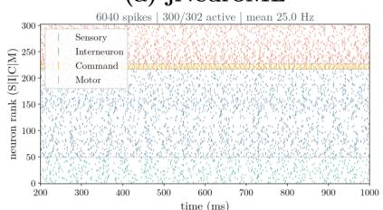

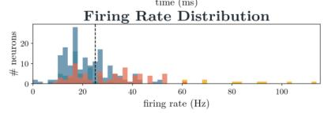

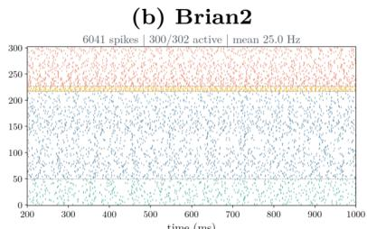

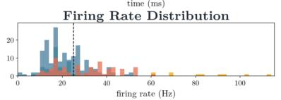

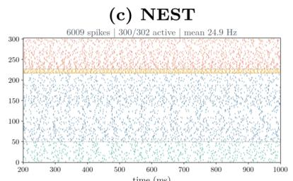

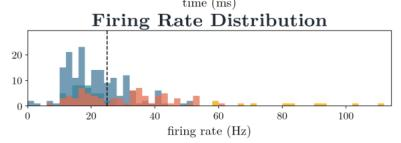  
(e) Accuracy vs Bandwidth (f) Syn2Logic (Q7:15, 1%, pmw 0.2)

(d) Syn2Logic (Q32:32)  
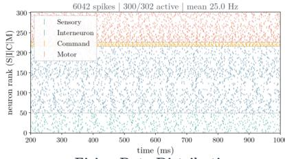

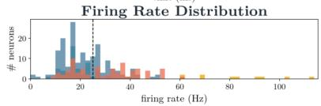

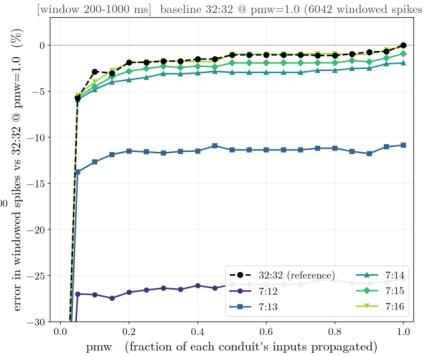

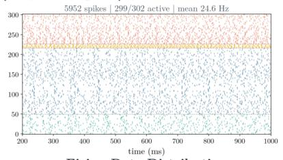

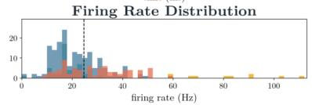  
Fig. 6: (a-c) Reference jNeuroML, Brian2, and NEST, spike plots for the C. elegans simulation, (d) the $Q _ { 3 2 : 3 2 }$ full-precision Syn2Logic spike plot, (e) the impact on data-path width and per-model bandwidth on the error rate, and (f) the final hardware-friendly neuromorphic system.

Next, we turn our attention to the full-scale C. elegans connectome shown in Figure 6. Figure 6:a-c shows spike raster plots for the network running 0.8 seconds of simulated time <sup>6</sup> on the well-established simulators jNeuroML, Brian2, and NEST, respectively. The diferent simulators produce near-identical firing rates (25 Hz for NeuroML and Brian2, 24.9 Hz for NEST) but with a diferent firing rate distribution and (more or less) equal number of total spikes (6040, 6041, and 6009 for jNeuroML, Brian2, and NEST, respectively). Our $Q _ { 3 2 : 3 2 }$ Syn2Logic description – in Figure 6:d – of the C. elegans matches the results of jNeuroML and Brian2, showing 25 Hz mean frequency, 6042 spikes, and near-identical firing rate distribution. Unfortunately, such a large $Q _ { 3 2 : 3 2 }$ variant would not fit on the FPGAs we use, and so there is a need to design-explore to reduce the size of the final accelerators.

We explored parameters that govern the fixed-precision size and the per-model bandwidth, with the first being motivated by our earlier neuron sensitivity study (Section 3.1) while the second being motivated by the fact that biological SNNs – such as the present C. elegans – are very sparsely active, where each neuron (on average) is active only 0.25% of the timesteps– a clear sign that each neuron does not need full bandwidth from each of their synapses. Figure 6:e shows the tradeofs, showing the error (in % of spikes) as a function of per-model bandwidth for a number of fixed-point variants. We see that already at 90% bandwidth reduction $( \mathrm { P M W } { = } 0 . 1 )$ , most variants reach ${ < } 5 \%$ of error compared to the $Q _ { 3 2 : 3 2 }$ reference, where 80% and less reach <2.5% error. $Q _ { 7 : 1 2 }$ and $Q _ { 7 : 1 3 }$ variants have too few fractional bits to perform well, irrespective of per-model bandwidth, and instead top out at 25% and 12% error, respectively. $\textbf { A } Q _ { 7 : 1 5 }$ variant strikes a strong <1.5% error rate, keeping only 20% of its incoming connections, whose spike raster plot we see in Figure 6:f with 5952 spikes and a 24.6 Hz mean neuron firing rate. As for rounding constants, anything larger than 1% rounding significantly impacts the results negatively.

Execution Time Comparison  
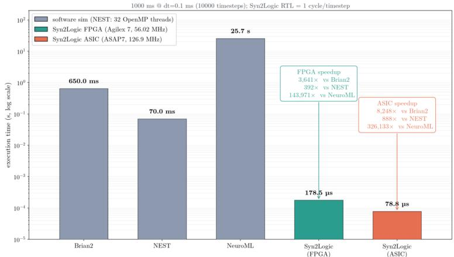

Table 3: FPGA and ASIC Synthesis information for C. elegans
<table><tr><td colspan="2">Agilex7</td></tr><tr><td>Logic utilisation (ALMs)</td><td>219,330/487,200 (45 %)</td></tr><tr><td>Dedicated logic registers</td><td>55,420</td></tr><tr><td>DSP blocks</td><td>3,926/4,510 (87 %)</td></tr><tr><td>Clock frequency</td><td>56.02 MHz</td></tr><tr><td colspan="2">ASAP7</td></tr><tr><td>Std-cell area</td><td>277,499 µm² (0.277 mm²)</td></tr><tr><td>Cell count</td><td>2,808,514</td></tr><tr><td>fmax</td><td>126.9MHz</td></tr><tr><td>Total power</td><td>56.4mW</td></tr></table>

Fig. 7: Performance comparison between simulation and Syn2Logic FPGA and ASIC auto-generated C. elegans accelerators.

Table 3 shows synthesis results for the $Q _ { 7 : 1 5 }$ version with 20% per-model bandwidth and 1% rounding, which fits on our Agilex7 FPGA device, occupying half the logical resources and most (87%) of the DSP resources, making it DSP-bound. It reaches a peak clock frequency of 56.02 MHz. The same design, synthesized using Cadence Genus for the ASAP 7nm PDK, yields a 0.277 mm<sup>2</sup> design (2808514 standard cells) with a peak clock frequency of 126.9 MHz.

In Figure 7, we put our accelerator performance numbers into perspective against current state-of-the-art simulators; we see that our FPGA accelerator can simulate the C. elegans connectome 392x, 3,641x, and 143,971x faster than NEST, Brian2, and jNeuroML, respectively, running on a large multithreaded server. Furthermore, should our ASIC C. elegans accelerator ever be taped out, we would observe a 2.26x speed-up over the FPGA results. To the best of our knowledge, we have shown how to use Syn2Logic to obtain the fastest level-A (LIF-based) C. elegans simulation existing today. Our FPGA accelerator runs close to 6000x faster than real-time– performance levels that could eventually open up research into understanding plasticity in the worm, neuromorphic and neuroAI crossover, or (eventually) closed-loop experiments.

## 3.3.1 Discussion: eNDA for use in Neuroscientific Simulation

The speed of neuroscientific simulation is considered one (of four) grand challenges [38] in the pursuit of a deeper understanding of how the brain functions. In particular, faster-than-real-time simulations allow researchers to study the long, slow processes that govern many complex dynamics in the brain. Despite its simplicity, the C. elegans model is still not yet fully understood, and by using our eNDA-flow to produce high-performance C. elegans accelerators that execute between 392x-143971x faster than simulators, we can facilitate faster-than-real-time exploration of C. elegans , allowing plasticity experiments, neuromorphic/neuroAI crossover, or even (in the future) closed-loop experiments. In the future, we want to extend our eNDA-backend to support larger connectomes, and to accelerate the recently charted connectome of the Drosophila melanogaster [56] (the common fruit fly).

## 3.4 A Fast Neuromorphic Sudoku Solver

Now we turn our attention towards using SNNs to solve practical optimization problems. One such problem is Sudoku, which represents a canonical constraint satisfaction problem (CSP), with a structure of 81 variables, each containing a digit between 1 and 9, and constraints that enforce all-diferent on rows, columns, and 3x3 quadrants. The Sudoku problem is NP-complete and has a form that can be adapted to other problems (scheduling, resource allocation, etc.). Furthermore, it is a standard benchmark to solve. Finally, while prior work has shown SNNs to be capable of solving Sudoku, so far none has ever been able to compete with existing ILP/CP solvers or custom solutions.

SNN Sudoku Solver  
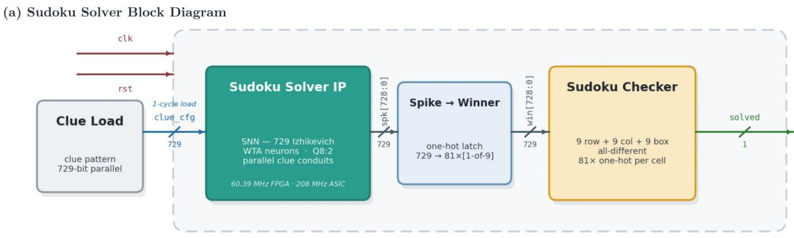  
(b) Performance Compared to SOTA

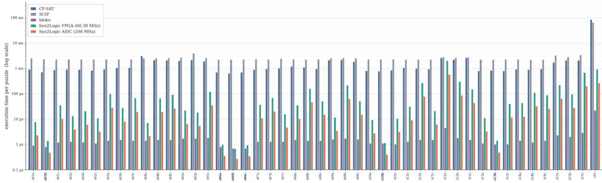  
Fig. 8: (a) The hardware architecture for solving Sudoku puzzles using our Syn2Logic accelerator, and (b) the performance comparison between CP-SAT, SCIP, tdoku, and our Syn2Logic accelerator per-puzzle solution time.

To solve Sudoku, we designed a network based on the Izhikevich model with added local long- and short-term annealing (escape currents) to avoid being stuck in local (incorrect) minima—a well-known problem in SNN-based solvers. In addition, we performed heavy parameter search to find fast-performing parameters. In the end, the parameters we found working well were: a = 0.0267, b = 0.25, d = 7.06, Δt = 2.382, I<sub>const</sub> = 14.82, I<sub>set</sub> = 20.77, $w _ { \mathrm { s y n } } ~ = ~ 1 3 . 5$ $\tau _ { s } = 1 2 . 5 8 , \Delta \theta = 0 . 3 9 8 , \tau _ { \theta } = 9 0 . 5 , R _ { \mathrm { a m p } } = 1 7 . 6 3 , \tau _ { r } = 6 5$ $v _ { \mathrm { t h } } = 3 2 , c = - 6 5$ , which were then quantized and optimized for an $Q _ { 8 : 2 }$ format.

There are a few very interesting things with the above parameters. Firstly, we treat the integration time step as a free parameter to optimize, which resulted in a very large time step of 2.382 ms — more than 20x larger than traditional neuroscientific simulations of the Izhikevich model (0.1ms). Secondly — and this is counterintuitive — we found that the model worked best with a very small number of fractional bits, and actually a $Q _ { 8 : 2 }$ format was shown to perform better than higher-precision alternatives. These two observations

Table 4: FPGA and ASIC synthesis (ASAP7 7 nm, Genus synthesis estimations) results for our Sudoku accelerator.
<table><tr><td>Agilex 7</td></tr><tr><td>Logic utilization (ALMs) 426,278 (87%) Dedicated logic registers 75,315</td></tr><tr><td>DSP blocks 1,823 / 4,510 (40%) Block RAM / memory 0 (none used)</td></tr><tr><td>Clock frequency  $( F _ { \operatorname* { m a x } } )$  63MHz ASAP7</td></tr><tr><td>Standard cells 2,033,761</td></tr><tr><td>Cell area 177,086 µm² (0.177 mm²)</td></tr><tr><td></td></tr><tr><td>Total power 61.3 mW Clock frequency  $\left( F _ { \operatorname* { m a x } } \right)$  208.2 MHz</td></tr></table>

run counter to standard practices for using SNNs to solve optimization problems. Furthermore, these optimizations — in particular the second one — are very hardware-friendly.

The accelerator we designed is shown in Figure 8:a, and consists of a WTA-circuitry for solving and enforcing the Sudoku constraints, configurable externally by sending spikes to the conduit (to set Sudoku clues), and updates the network one timestep per clock cycle. Each timestep, all 729 neuron spike outputs (if any) are latched into the checker network, which rejects invalid puzzles. In short, one component is searching for plausible solutions, and the other component rejects invalid solutions. The spike checker networks are negligible in area and are not on the critical path.

Synthesis of our accelerator is shown in Table 4. On the FPGA, the accelerator is logic-bound, consuming 87% of device resources and 40% of all DSP resources, running at a peak clock frequency of 63 MHz. A hypothetical ASIC variant using the ASAP 7nm PDK and Cadence Genus estimations would consume order 2 million standard cells, be 177k $\mu m ^ { 2 }$ , and run at 208.2 MHz.

Our accelerator performance, compared to the state-of-the-art optimization solvers CP-SAT, SCIP, and the handwritten tdoku solver (claimed to be the world’s fastest solver), is shown in Figure 8:b on all 46 Vaasa puzzles [63]. The Vaasa puzzles are a combination of easy to hard puzzles, and include the notoriously hard AI escargot puzzle (s16).

Results show that SCIP [30], CP-SAT [31], and tdoku [32] solve all 46 puzzles correctly in 173.2 ms, 142.5 ms, and 82.3 µs, respectively, on a modern server machine. Our Syn2Logic FPGA accelerator solves all 46 puzzles correctly within 6.19 ms, and the hypothetical ASIC variant within 1.80 ms– many times faster than both SCIP and CP-SAT. While tdoku is still much faster than Syn2Logic, in fact, our accelerator solves several individual puzzles faster than tdoku, such as s01b, s06a, s06b, s06c, s10b, and s13b. It is not unlikely that for these puzzles, our accelerator is the fastest solver currently in the world.

## 3.4.1 Generalization to other puzzles

Does our neuromorphic solver generalize outside the very same puzzles we tuned it for? Does it still perform well? To answer this, we first tested it on a diferent but equally hard Sudoku testing set, the Euler-96. Our solver solves all 42 of these puzzles, consuming 2.79 ms/ 0.81 ms (FPGA/ASIC) for the whole set and between 0.51 us/0.17 us and 427.8 µs/ 124.1 µs per-puzzle solution time. CP-SAT and SCIP solve the entire set in $4 9 . 5 \pm 2 2 . 0$ ms and 96.7 ± 4.3 ms, respectively, and our solver continues to be 17.74x/61x (FPGA/ASIC) and 34.65x/119x (FPGA/ASIC) faster than CP-SAT and SCIP, respectively. tdoku continues to be the fastest with a total time of 0.073 ms, which is 11x faster than our solver ASIC solver; our ASIC solver solves five puzzles (out of 42) 1.16x-4x faster than tdoku.

Generalization to TOP1465 (measured hardware)  
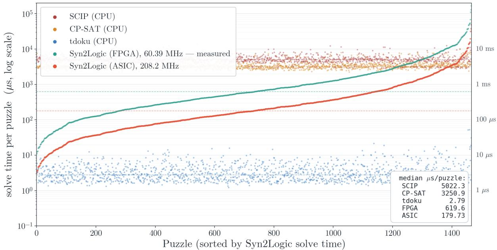  
Fig. 9: Generalization testing our Sudoku solver on puzzles non-tuned for and in comparison with the software solvers.

The ultimate test of generality is whether our solver can solve the top1465— a set of 1465 handpicked hard puzzles [64]; these puzzles are significantly harder ( 5-35x based on the number of guesses needed) than our previous tests. Results are shown in Figure 9. Our solver solves all 1465 puzzles in 3.94s/1.14s (FPGA/ASIC), dominated by a set of 15 puzzles that need>2 million steps to solve, with the main culprit (puzzle p0330) taking 10 million cycles to solve, and half the total time is spent on 50 (out of 1465) hardest puzzles. CP-SAT and SCIP both solve the entire puzzle in 5095.8±6.2 ms and $7 5 1 6 . 1 \pm 1 5 3 . 1$ ms, respectively, reducing the speed-up our solver has over CP-SAT to 1.29x/4.47x (FPGA/ASIC) and SCIP to 1.9x/6.59x (FPGA/ASIC)— still a large improvement, but reduced compared to the simpler puzzle. tdoku continues to be blazing fast, with a total time solving all puzzles of $1 2 . 2 7 5 \pm 0 . 0 0 8$ ms— a speedup of 320x/92x over our solver variants. Over tkodu, as we only solve four puzzles (out of the 1465) 1.07-1.83x faster than it.

## 3.4.2 Discussion: eNDA Enables High-Performance Practical SNN-based Optimizers

Until now, prior neuromorphic accelerators and simulators had a per-puzzle solution time in order of seconds [65]; our work shows that we can employ eNDA to create neuromorphic accelerators that have as low as sub-us puzzle solver time and outperform state-of-the-art optimization solvers (CP-SAT/SCIP) by up to 28x on an FPGA and 96.2x if an ASIC were manufactured. We also show – for the first time and for a small subset of puzzles – that a neuromorphic solver can outperform the world’s fastest sudoku solver (tdoku) running on a state-of-the-art server-class system on some puzzles. We also showed that our solver generalizes, and solves harder puzzles than what it was tuned for, solving the entire top1465 puzzle list. Aside from the eNDA-flow, which is central to the success of the hardware accelerator, there are two very interesting observations: (i) our neuron model actually worked the best with a very large integration time step of over 2ms, and (ii) a small fixed-point representation actually allowed (for this particular configuration) to solve more puzzles than its larger counterpart. Our work paves the way toward enabling neuromorphic optimization solvers to be a serious alternative to traditional solvers, and to be far more energy-eficient (ASIC estimates are 61.3mW, which is 3-4 orders of magnitude lower than the server-class processor we compared against), making it suitable for serious exploration of real use-cases such as Edge-User Allocation [66] or scheduling sports events and/or airplanes.

A final note on the configuration of the puzzle: our experiments did not take into account either the binary loading overhead of the software solver. Our accelerator can load a puzzle instance in a single cycle, so likely – if we also include the time to reconfigure a new puzzle – the results would favor our accelerator even more.

## 3.5 Extreme Energy-Eficient MNIST Accelerator

We end our results with a familiar use case: identifying handwritten digits using the MNIST dataset. While not the largest, the MNIST dataset still represents a cornerstone for evaluating — and more importantly, comparing — neuromorphic systems with each other. The dataset comprises 60000 training and 10000 test images of 28x28 pixels that are black and white, where each corresponds to the written value 0-9. Our goal was to create the most energy-eficient neuromorphic MNIST classifier to date, runnable on hardware that is readily available and cheap (in contrast to the Agilex7 board in prior sections). Our goal was to use neuromorphic design automation to make a MNIST accelerator for a system that is financially accessible to a broad audience, such as the MAX10 toy-FPGA, released in 2014 and built using a 55nm technology.

After training a 784-128-64-10 layer MLP network containing 110k parameters using snnTorch, we start our designspace exploration. The initial network demonstrated 97.61% testing accuracy, well in line with current state-of-the-art. Next, we will explore the design space of the network.

We start with the impact of sparsity of the network, in Figure 10:a. We noticed that the network can be pruned by 80-90% of existing parameters with minimal impact on classification accuracy, especially when coupled with fine-tuning of the network after pruning, yielding an accuracy of 97.23% and 95.06% test accuracy for 80% and 90% pruned networks, respectively. While this is a respectable amount of pruning, in fact, such a network is still far too large to fit on the 50k look-up tables on the MAX10 board, due to the many adders that make up reduction trees per neuron.

(a) Sparsity  
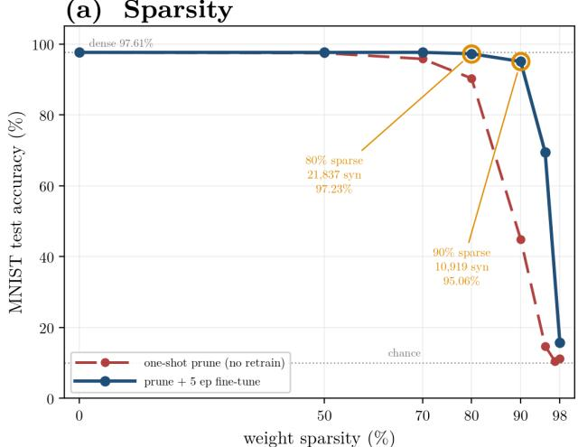

(b) Bandwidth Reduction  
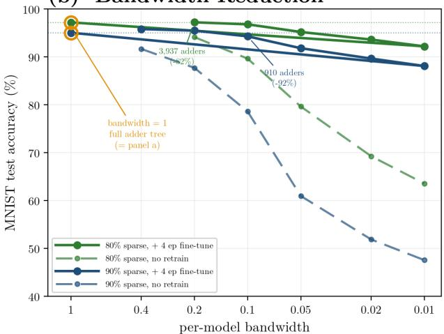

(c) Datapath Precision  
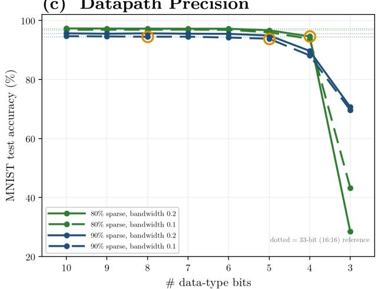

(d) Timesteps  
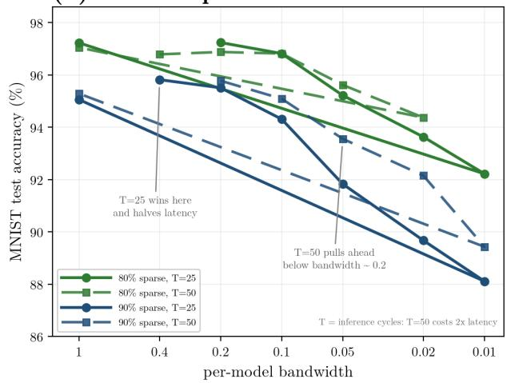  
Fig. 10: (a) Impact of weight-pruning on our network, (b) impact of our per-model bandwidth parameter on the pruned network, (c) impact of reducing the SNN data-path width on the network, and (d) impact of timesteps on the accuracy and per-model bandwidth.

Next, we investigated the impact of per-model bandwidth reduction on the already sparse network, in Figure 10:b. We noticed that we can reduce the per-model bandwidth between 80% and 90% without losing much test accuracy, again exploiting fine-tuning to reach between 97.24% (upper, interestingly 0.02% better test accuracy after fine-tuning than pmw=1.0/80% baseline) and 94.31% (lower) test accuracy. By reducing the per-model bandwidth, we efectively reduce the number of adders required in the reduction step per neuron, from 10919 (pmw=1.0) to 1883 (pmw=0.2) and 901 (pmw=0.1)

Having sparsified and reduced the per-model bandwidth of the network, we next investigate the impact of data-path size on our network, in Figure 10:c, by plotting and investigating the test accuracy as a function of data-type size. We noticed that we can reduce the size of operations to as low as 5 bits with small impacts on the accuracy, compared to our $Q _ { 1 6 : 1 6 }$ reference. This means that we can still achieve 93%+ accuracy with a $Q _ { 1 : 3 }$ format.

An interesting observation and experiment can be seen in Figure 10:d, where we investigate the impact of per-model bandwidth as a function of how many timesteps we run the network and input for. An interesting observation is that, as the timestep increases from 25 → 50 timesteps, it becomes more resilient to degradations from a reduced bandwidth per model. This is intuitive, since longer timesteps can lead to more sparse activations in the network, which in turn lead to fewer spikes incoming to each neuron. The interesting part is that, by controlling the sparsity of the network, this impacts hardware generation significantly, since at a 90+% reduction in per-model bandwidth together with the earlier sparsity pruning, most of the adder-trees are gone, and replaced with only the priority-encoders and multiplexers.

Table 5: FPGA and ASIC synthesis results for the MNIST accelerator.
<table><tr><td></td><td>MAX10</td><td>Agilex7</td><td>ASAP7</td></tr><tr><td colspan="4">Design point</td></tr><tr><td>Weight sparsity / synapses</td><td>90 % / 10,919</td><td>80 % / 21,837</td><td>80 % / 21,837</td></tr><tr><td>Per-model bandwidth (--pmw)</td><td>0.1</td><td>0.2</td><td>0.2</td></tr><tr><td>Datapath (--fixed-point)</td><td> $Q _ { \mathrm { 1 : 3 } } \ : ( 5 \ : \mathrm { b i t s } )$ </td><td> $Q _ { \mathrm { 1 : 4 } } ( 6 \mathrm { b i t s } )$ </td><td> $Q _ { \mathrm { 1 : 4 } } ( 6 \mathrm { b i t s } )$ </td></tr><tr><td>Timesteps T (= cycles/image)</td><td>25 93.80 %</td><td>25 97.07 %</td><td>25 97.07 %</td></tr><tr><td>Accuracy, full 10k test set</td><td></td><td></td><td></td></tr><tr><td colspan="4">Implementation</td></tr><tr><td>Logic</td><td>38,103 LE (77 %)</td><td>26,684 ALM (5 %)</td><td>110,146 std cells</td></tr><tr><td>of which the classifier</td><td>18,759 LE</td><td>all</td><td>all</td></tr><tr><td>Registers</td><td>12,498 (classifier 1,074)</td><td>4,077</td><td></td></tr><tr><td>On-chip memory</td><td>33,744 bits (92 M9K)</td><td></td><td></td></tr><tr><td>Cell area die</td><td></td><td></td><td> $8 { , } 7 6 5 \mu \mathrm { m } ^ { 2 }$   $2 1 , 7 6 4 \mu \mathrm { m } ^ { 2 }$ </td></tr><tr><td colspan="4">Closure and cost</td></tr><tr><td>Clock constraint</td><td>43MHz</td><td>400 MHz</td><td>500 MHz</td></tr><tr><td>Fmax</td><td>45.28 MHz</td><td>214.82 MHz (prelim.)</td><td>491 MHz</td></tr><tr><td>Power</td><td>307mW</td><td></td><td>17.96mW</td></tr><tr><td>Latency per image</td><td>581 ns</td><td>116 ns</td><td>51 ns</td></tr><tr><td>Energy per image</td><td>179 nJ</td><td></td><td>0.91 nJ</td></tr></table>

(a) Floorplan  
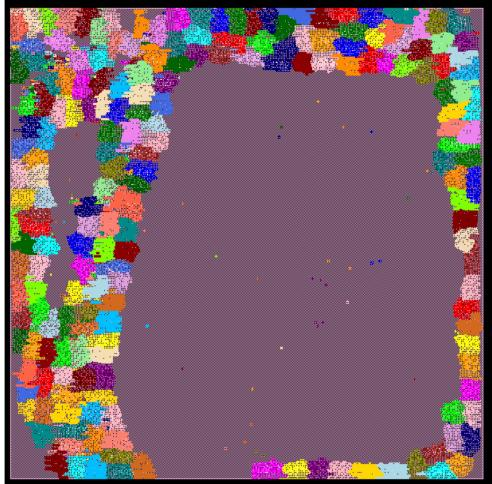

(b) In-Lab testing  
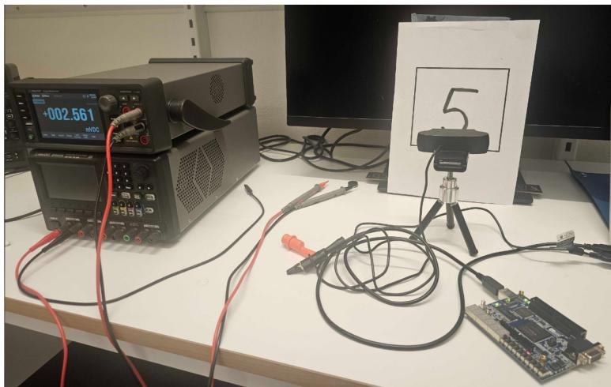  
Fig. 11: (a) the ASIC floorplan for the placed-and-routed chip (each neuron is clearly shown), and (b) just after the power measurement for the MAX10 device when inferring a hand-drawn number 5 (the observant reader will see the fifth LED shining strongest, indicating a correct inference).

At this time, we can start synthesizing our accelerators, with results shown in Table 5. We created three diferent variants, suitable for MAX10, Agilex7, and ASIC ASAP7 generation. The MAX10 variant uses the 90% sparse network in $Q _ { 1 : 3 }$ format with 90% (T=25) per-model bandwidth reduction and reaches 93.80% testing accuracy, consuming 77% of device resources and no DSPs. The MAX10 power consumption was empirically measured to be 0.307 Watt. For the larger Agilex7 system, we show results for a variant that uses the 80% sparse network with $Q _ { 1 : 4 }$ format with 80% per-model bandwidth reduction and reaches 97.07% test accuracy, consuming a minimal fraction of the resources (5%). Finally, we show synthesis results for the ASAP7 accelerator that uses the same configuration as the Agilex7 variant, consumes 110k standard cells, and is estimated at 17.96mW power consumption. The ASIC floorplan is shown in Figure 11:a. Performance-wise, the ASIC version is the fastest at 491 MHz, followed by the Agilex7 at 214 MHz and lastly the MAX10 at 45.28 MHz. An image of the MAX10 power-consumption measurement evaluation (or directly after, actually, with the snapshotted measurement still visible) inferring a hand-written number 5 is seen in Figure 11:b.

(a) Inference Throughput  
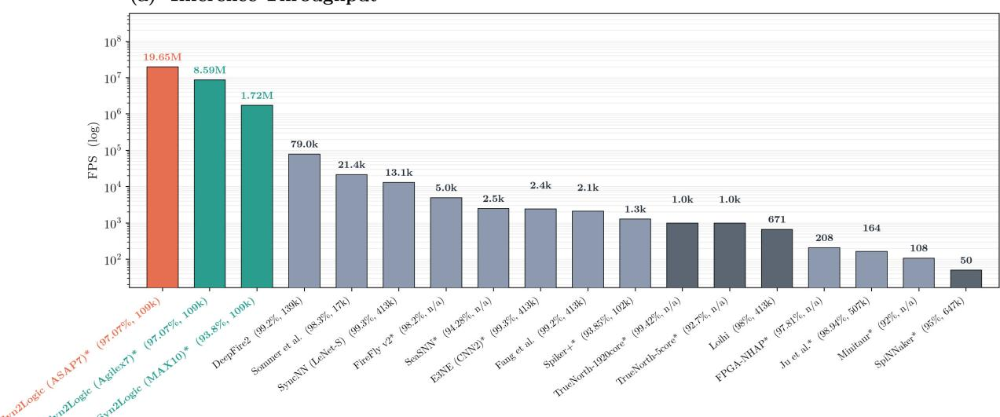

(b) Energy Efficiency  
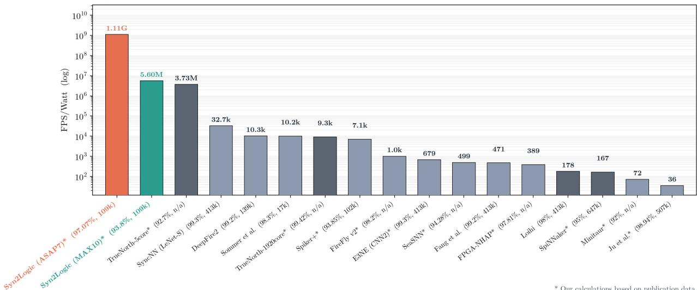

Fig. 12: (a) Frame-per-second (FPS) performance of our Syn2Logic accelerator over state-of-the-art neuromorphic systems, and (b) FPS/Watt over state-of-the-art systems.

The performance (FPS) of the accelerators and their energy eficiency (FPS/Watt) are shown in Figure 12:a-b and are compared with the reported performance of state-ofthe-art SNN accelerators inferring MNIST. Performance-wise, our Agilex7 and ASIC accelerators are up to 109-249x faster than DeepFire2, respectively, while the MAX10 version is 21x faster than the runner-up DeepFire2. From an energy-consumption perspective, the ASAP7 performance could be up to 1.11 GFPS/Watt, while the MAX10 measured energy consumption is 5.60 MFP-S/Watt— 1.5x more power-eficient than the IBM TrueNorth runner-up. Remaining SNN accelerators are 32.7 kFPS/Watt and below.

Figure 13 we see a diferent view of the state-of-the-art landscape, where we plot power-eficiency as a function of inference classification accuracy (%). We see that, for the inference accuracy Syn2Logic acceler-

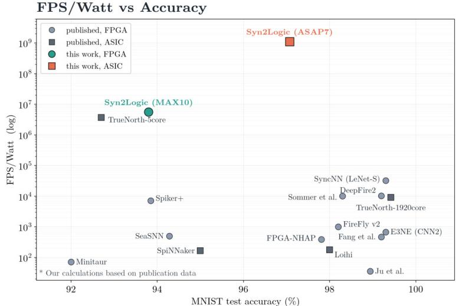  
Fig. 13: Energy-eficiency versus classification accuracy for diferent MNIST accelerators.

ator provides, they are significantly (many

orders of magnitude) more energy-eficient than alternatives, even when compared to other accelerators that provide the same (or less) inference accuracy. While there are several accelerators reaching a higher accuracy than our 97.07%, those 1-2% comes at a four orders of magnitude cost in battery drainage. We have to acknowledge that the ASAP7-variant is an estimation for the core only. Furthermore, these numbers assume that we can feed the images to the accelerator at the maximal FPS; while this is true for the MAX10-accelerator (that would hypothetically need to be fed with HBM2-quality external memory), there is nothing external that could feed 19.65 million images for the ASIC or 8.59 million images for the high-end FPGA, so these systems are more memory-bound than compute-bound. That being said, there are ample opportunities to tune these accelerators to the data source. For example, if the data source is an event-driven camera operating at 40 FPS, then the clock frequency can be significantly reduced for the device to draw even less energy. There is also one dimension not thoroughly explored in our work: the number of timesteps per image. In our work, we used a conservative 25 timesteps per image, while most other work uses between 4 and 8, which linearly reduces the required data bandwidth to provide the data. In short, for a timestep of four, all our performance numbers would be 6.25x higher.

## 3.5.1 Discussion: eNDA for Extremely Energy-Eficient TinyML on FPGAs

Our accelerator numbers could, to the best of our knowledge, be the most energy-eficient MNIST neuromorphic numbers in the world. Now, this might not be an apples-to-apples comparison, since every one of the reported accelerators used a diferent network architecture (SCNN, SMLP, etc.) with varying model parameter count (we used 110k, DeepFire2 139k, Sommer et al. 17k, etc.). With that being said, let the result sink in: we trained an S-MLP network in a matter of hours, explored the design space using Syn2Logic, and created a MNIST classifier that reaches world-record 1.72 Million FPS with an eficiency of 5.6 Million FPS/Watt (full System-on-Chip, not only estimations of the IP module), beating all current top-end SNN accelerators on MNIST inference, running on a toy FPGA that is significantly cheaper, older (2014), and more constrained than any of the competition without writing a single line of hardware description language code using our eNDA-flow.

## 4 Conclusion

In this paper, we have presented the first complete NDA flow, allowing push-button end-to-end generation of neuromorphic systems. Furthermore, we have introduced Syn2Logic— an NDA prototype system implementing the entire NDA flow- and created a class-4 backend targeting the creation of digital neuromorphic systems. We evaluated our proposed NDA Flow and prototype implementation on a set of well-known neuron and synapse models— some, such as the BCPNN synapse, which is seen in hardware for the first time— and finally proceeded to adopt our methodology to break three (to our knowledge) performance records: (i) World’s fastest simulation of the C. elegans level-A nematode model for computational neuroscience, (ii) a Sudoku accelerator that (for the first time ever) is capable of solving puzzles faster than generic optimization solvers (but does not yet reach tdoku-levels), generalizes to the TOP1465 puzzles set, and is many orders of magnitude faster than prior neuromorphic solvers, and (iii) world’s most energy eficient spike-based MNIST accelerator, reaching 5.6 million frames-per-second per Watt spent on a 12-year-old toy-FPGA, with ASIC estimates at >1 billion frames-per-second per Watt.

A word on AI: An interesting experience is also in the use of generative AI for transporting models between diferent neural descriptions. One problem in neuroscience is a common language for describing neural networks (Brian2, NestML, NeuronML, SpineML, Syn2Logic, all use diferent grammars). We found that using generative AI worked remarkably well to move between diferent languages, as long as proper validation suites were present (e.g., generating traces using Brian2, moving the model to Syn2Logic using generative AI, and then verifying using traces). So in the future, perhaps generative AI will be the component that unifies cross-framework development between these modelling frameworks.

Limitations and Future Work: Future work should cover some of the limitations of the backend. Our backend lays out all neuromorphic components directly in silico, which is well within the spirit of digital implementations of traditionally analog neuromorphic systems [57]; our backend — while being extremely performant— cannot easily handle a large number of neurons/synapses before running out of silicon real estate (order $1 0 ^ { 3 }$ neurons on mid-tier FPGAs, possible reaching $1 0 ^ { 4 }$ neurons on high-end FPGAs)– not entirely unlike their analog counterparts. We see three directions. The first direction could thus be to extend the class4 backend to operate not only in 2D, but also towards 3D monolithic integrated circuits, which could provide more capacity and synergize well with the sparse, biologically plausible nature of spiking neural networks that could assist in the troublesome thermal gradients in such systems. A second direction would be to create a backend that temporally shares the data paths across states, which is in line with most prior digital neuromorphic systems; such a backend would have significantly more capacity, limited only by the amount of external (or on-chip) RAM resources, but would also be slower and less deterministic, and could lose some of the edge that the current backend provides. A third, and maybe most radical, direction is to create a backend that maps the ODEs and model/network structures to an (possibly mixed-signal) analog/memristive technology, allowing exploration of future post-Moore substrates from the NDA flow without changing the descriptions.

## 5 Methods

## 5.1 Syn2Logic Implementation

The Syn2Logic compiler consists of 17500 lines of C/C++ code that was written manually by the author. The lexical analysis is performed using FLEX, and we created a hand-written recursive-descent parser. Together, these are 2600 lines of program code, and the remaining program code is for the intermediate optimizations and backend generation.

## 5.2 Fixed-Point Representation

All Syn2Logic generated code used a fixed-point representation, represented by two integers M and N in the form QM:N, where M are the number of integer bits and N the number of fractional bits, giving a total word length of M N 1 bits, a representable range of $\pm 2 ^ { M }$ and a quantisation step of $2 ^ { - N }$

## 5.3 Neuron Models Exploration

## 5.3.1 Leaky Integrate-and-Fire (LIF)

The LIF neuron integrates its membrane potential $V$ according to the linear subthreshold dynamics

$$
C _ { m } \frac { d V } { d t } = g _ { L } E _ { L } - V I , g _ { L } = \frac { C _ { m } } { \tau _ { m } } ,\tag{1}
$$

and emits a spike when V crosses a fixed threshold $V _ { \mathrm { t h } }$ , after which V is reset instantaneously to $V _ { \mathrm { r e s e t } }$ . The parameters are a membrane capacitance $C _ { m } = 2 5 0 \mathrm { p F }$ , a membrane time constant $\tau _ { m } = 1 0$ ms (so that $g _ { L } = C _ { m } \tau _ { m } = 2 5 \mathrm { n S ) }$ , a leak and resting potential $E _ { L } = - 7 0 \mathrm { m V }$ , a threshold $V _ { \mathrm { t h } } = - 5 5 \mathrm { m V }$ , and a reset $V _ { \mathrm { r e s e t } } = - 7 0 \mathrm { m V }$ . Brian2 integrates this equation analytically (exact integration) and Syn2Logic uses LIF with a membrane resistance $R _ { \mathrm { m e m } } = \tau _ { m } C _ { m } = 4 0 \mathrm { M } \Omega$ which reproduces the reference leak conductance, retaining the library-default threshold and reset of −55 mV and −70 mV.

## 5.3.2 Izhikevich

The Izhikevich neuron is a dimensionless two-variable model coupling a membrane-like variable v to a recovery variable u,

$$
\frac { d v } { d t } = 0 . 0 4 v ^ { 2 } \ 5 v \ 1 4 0 - u \ I ,\tag{2}
$$

$$
\frac { d u } { d t } = a b v - u ,\tag{3}
$$

with the spike-and-reset rule

$$
{ \mathrm { i f ~ } } v \geq 3 0 { \mathrm { m V } } : \quad v  c , \quad u  u \ d .\tag{4}
$$

Here the injected current I is the model’s native dimensionless drive rather than a physical current in picoamperes. We use the canonical regular-spiking parameters $a = 0 . 0 2 , b = 0 . 2 , c = - 6 5 \mathrm { m V }$ , and $d = 8$ , with a peak/cut-of of 30 mV. Brian2 integrates with forward Euler and initialises $v 0 = c , u 0 = b ($ c and Syn2Logic uses Izhikevich with the matching library-default coeficients.

## 5.3.3 Adaptive exponential integrate-and-fire (AdEx)

The AdEx neuron augments an exponential spike-initiation term with a slow adaptation current $w ,$

$$
C _ { m } \frac { d V } { d t } = g _ { L } E _ { L } - V g _ { L } \Delta _ { T } \exp \left( \frac { V - V _ { T } } { \Delta _ { T } } \right) - w I ,\tag{5}
$$

$$
\tau _ { w } \frac { d w } { d t } = a V - E _ { L } - w ,\tag{6}
$$

with the reset, applied when V exceeds the cut-of $V _ { \mathrm { p e a k } }$

$$
{ \mathrm { i f ~ } } V > V _ { \mathrm { p e a k } } : \quad V  V _ { \mathrm { r e s e t } } , \quad w  w \ b .\tag{7}
$$

The parameters are $C _ { m } = 2 8 1 \mathrm { p F } , g _ { L } = 3 0 \mathrm { n S } , E _ { L } = - 7 0 . 6 \mathrm { m V }$ , an exponential onset threshold $V _ { T } = - 5 0 . 4 \mathrm { m V } ,$ a slope factor $\Delta _ { T } = 2 \mathrm { m V }$ , a subthreshold adaptation conductance $a = 4 \mathrm { n S }$ , an adaptation time constant $\tau _ { w } = 1 4 4$ ms, a spike-triggered adaptation increment $b = 8 0 . 5 \mathrm { p A }$ , a reset $V _ { \mathrm { r e s e t } } = - 6 0 \mathrm { m V }$ , and a spike cut-of $V _ { \mathrm { p e a k } } = 0 \mathrm { m V }$ Brian2 integrates with forward Euler from w $) = 0$ and Syn2Logic uses AdEX with the matching library defaults. The Syn2Logic model emits a spike when $V$ crosses $V _ { T } ;$ because the exponential term diverges within a single step once $V > V _ { T }$ , this is numerically equivalent to the $V _ { \mathrm { p e a k } } = 0$ cut-of used by the references.

## 5.3.4 Hodgkin-Huxley Model

The classic conductance-based HH neuron resolves the action potential explicitly through voltage-gated sodium and potassium channels,

$$
C _ { m } \frac { d V } { d t } = I - g _ { \mathrm { { N a } } } \ : m ^ { 3 } h V - E _ { \mathrm { { N a } } } - g _ { \mathrm { { K } } } \ : n ^ { 4 } V - E _ { \mathrm { { K } } } - g _ { L } V - E _ { L } ,\tag{8}
$$

where each gating variable $x \in \{ m , h , n \}$ relaxes according to

$$
\frac { d x } { d t } = \alpha _ { x } V 1 - x - \beta _ { x } V x ,\tag{9}
$$

with the standard textbook rate functions (voltage V in millivolts, rates in $\mathrm { m } \mathrm { s } ^ { - 1 }$ , resting potential $\approx - 6 5 \mathrm { m V } )$

$$
\alpha _ { m } V = { \frac { 0 . 1 V \ 4 0 } { 1 - e ^ { - V 4 0 1 0 } } } ,
$$

$$
\beta _ { m } V = 4 e ^ { - V 6 5 1 8 } ,\tag{10}
$$

$$
\alpha _ { h } V = 0 . 0 7 e ^ { - V 6 5 2 0 } ,
$$

$$
\beta _ { h } V = \frac { 1 } { 1 ~ e ^ { - V 3 5 1 0 } } ,\tag{11}
$$

$$
\alpha _ { n } V = { \frac { 0 . 0 1 V \ 5 5 } { 1 - e ^ { - V 5 5 1 0 } } } ,
$$

$$
\beta _ { n } V = 0 . 1 2 5 e ^ { - V 6 5 8 0 } .\tag{12}
$$

The parameters are $C _ { m } = 1 0 0 \mathrm { p F } .$ , a maximum sodium conductance $g _ { \mathrm { N a } } = 1 2 0 0 0 \mathrm { n S ( 1 2 \mu S ) }$ , a maximum potassium conductance $g _ { \mathrm { K } } ~ = ~ 3 6 0 0 \mathrm { n S \ ( 3 . 6 \mu S ) }$ , a leak conductance $g _ { L } \ = \ 3 0 \mathrm { n S }$ , and reversal potentials $\mathit { E } _ { \mathrm { N a } } ~ = ~ 5 0 \mathrm { m V }$ $E _ { \mathrm { K } } = - 7 7 \mathrm { m V }$ , and $E _ { L } = - 5 4 . 4 0 2 \mathrm { m V }$ . Brian2 integrates with the exponential-Euler method from the resting steady state $( m = 0 . 0 5 2 9 , n = 0 . 3 1 7 7 , h = 0 . 5 9 6 1 )$ and Syn2Logic uses HH with the matching library defaults, detecting a spike on the upward zero-crossing of V via a re-arming threshold flag that guarantees one count per action potential.

## 5.3.5 Numerical Integration

The LIF, Izhikevich, and AdEx models are integrated at $\Delta t = 0 . 1$ ms on all Brian2 and Syn2Logic platforms. The HH model uses 0.01 ms for both frameworks.

## 5.3.6 Syn2Logic configuration

For the initial correctness evaluation, Syn2Logic was invoked to generate hardware with a fixed-point representation of Q32:24. Fused operations were enabled, and constant rounding was disabled.

## 5.3.7 Stimulation Protocol

The injected current is swept over 0 to $6 0 0 \mathrm { p A }$ for the LIF model, 0 to 15 (dimensionless) for the Izhikevich model, 0 to $9 0 0 \mathrm { p A }$ for the AdEx model, and 0 to 1000 pA for the HH model. The software references sample these ranges densely (a current step of $\mathrm { 5  p A }$ , or 0.1 for the dimensionless Izhikevich drive), whereas the Syn2Logic sweeps use a coarser step $\mathrm { ( 2 0 p A }$ , or 0.5 for Izhikevich) because each Syn2Logic point is a full compile-and-simulate cycle (using QuestaSim).

## 5.3.8 Precision sensitivity analysis.

Fidelity between implementations quantified with the root-mean-square error between the two curves (test and reference), normalized by the dynamic range (swing) of the reference to make the metric dimensionless and comparable across models with widely diferent firing-rate scales:

$$
\mathrm { N R M S E } = 1 0 0 \times \frac { \sqrt { \frac { 1 } { N } \mathbf { \Xi } _ { i = 1 } ^ { N } \big ( f _ { i } ^ { \mathrm { S 2 L } } - f _ { i } ^ { \mathrm { r e f } } \big ) ^ { 2 } } } { \displaystyle \operatorname* { m a x } _ { i } f _ { i } ^ { \mathrm { r e f } } - \operatorname* { m i n } _ { i } f _ { i } ^ { \mathrm { r e f } } } \mathcal { I } _ { 0 } ,\tag{13}
$$

where $f _ { i } ^ { \mathrm { r e f } }$ and $f _ { i } ^ { \mathrm { S 2 L } }$ are the reference and Syn2Logic firing rates at the i-th of N current points (points at which either curve is undefined are excluded). NRMSE is reported as a percentage of the reference swing, and a configuration is deemedfaithful when it meets a 5% design budget.

## 5.4 Synapse Models

## 5.4.1 Plasticity models.

Four canonical learning rules spanning the principal families of synaptic plasticity were studied: (i) pair-based spike-timing-dependent plasticity (PairSTDP), (ii) triplet STDP, which augments the pair rule with a second-order postsynaptic trace; (iii) a reward-modulated (“three-factor”) STDP rule (RSTDP) after Izhikevich[67], in which pre/post coincidences accumulate a decaying synaptic eligibility trace that is converted into a weight change only upon delivery of a global reward signal; and (iv) the Bayesian Confidence Propagation Neural Network (BCPNN) synapse after Lansner and Tully et $a l . [ 6 8 ] ~ ^ { 7 }$ . The synaptic weight was initialised to $w 0 = 0 . 5$ (dimensionless) in the three STDP-family rules.

## 5.4.2 Pair-based STDP.

Two exponentially decaying eligibility traces, $x _ { \mathrm { p r e } }$ and $x _ { \mathrm { p o s t } }$ , record recent pre- and postsynaptic activity,

$$
{ \frac { d x _ { \mathrm { p r e } } } { d t } } = - { \frac { x _ { \mathrm { p r e } } } { \tau } } , \qquad { \frac { d x _ { \mathrm { p o s t } } } { d t } } = - { \frac { x _ { \mathrm { p o s t } } } { \tau _ { - } } } ,\tag{14}
$$

with the spike-triggered updates

$$
\begin{array} { r l r l } & { \mathrm { p r e - s p i k e : ~ } x _ { \mathrm { p r e } } \gets x _ { \mathrm { p r e } } \ 1 , \qquad } & & { w \gets w - A _ { - } x _ { \mathrm { p o s t } } , \qquad } & & { g _ { \mathrm { o u t } } \gets g _ { \mathrm { s c a l e } } w , } \\ & { \mathrm { p o s t - s p i k e : ~ } x _ { \mathrm { p o s t } } \gets x _ { \mathrm { p o s t } } \ 1 , \qquad } & & { w \gets w \ A x _ { \mathrm { p r e } } . } \end{array}\tag{15}
$$

(16)

Parameters: $\tau = \tau _ { - } = 2 0$ ms, $A = A _ { - } = 0 . 0 1$ , output scale $g _ { \mathrm { s c a l e } } = 5$

## 5.4.3 Triplet STDP.

The triplet rule [69] adds slow pre- and postsynaptic traces $r _ { 2 } , o _ { 2 }$ to the fast pair traces $r _ { 1 } , o _ { 1 }$

$$
\frac { d r _ { 1 } } { d t } = - \frac { r _ { 1 } } { \tau } , \quad \frac { d r _ { 2 } } { d t } = - \frac { r _ { 2 } } { \tau _ { x } } , \quad \frac { d o _ { 1 } } { d t } = - \frac { o _ { 1 } } { \tau _ { - } } , \quad \frac { d o _ { 2 } } { d t } = - \frac { o _ { 2 } } { \tau _ { y } } ,\tag{17}
$$

with the triplet-modulated updates

$$
\begin{array} { r l r } & { \mathrm { p r e - s p i k e : ~ } w  w - o _ { 1 } A _ { 2 } ^ { - } A _ { 3 } ^ { - } r _ { 2 } , } & { \qquad r _ { 1 }  r _ { 1 } 1 , r _ { 2 }  r _ { 2 } 1 , } \\ & { \mathrm { p o s t - s p i k e : ~ } w  w r _ { 1 } A _ { 2 } A _ { 3 } o _ { 2 } , } & { \qquad o _ { 1 }  o _ { 1 } 1 , o _ { 2 }  o _ { 2 } 1 , } \end{array}\tag{18}
$$

(19)

and $g _ { \mathrm { o u t } } = g _ { \mathrm { s c a l e } } w$ emitted on each pre-spike. Parameters: fast decays $\tau = 1 6 . 8$ ms, $\tau _ { - } = 3 3 . 7$ ms; slow decays $\tau _ { x } = 1 0 1$ ms, $\tau _ { y } = 1 2 5$ ms; pair amplitudes $A _ { 2 } = 0 , A _ { 2 } ^ { - } = 0 . 0 0 7 2 $ ; triplet amplitudes $A _ { 3 } = 0 . 0 0 6 2 , A _ { 3 } ^ { - } = 0 ;$ $g _ { \mathrm { s c a l e } } = 1$ . The second-order trace $o _ { 2 }$ sets this rule’s integer-bit requirement.

## 5.4.4 Reward-modulated STDP.

RSTDP [67] is a three-factor rule: the same pre/post traces feed a slowly decaying eligibility trace $e ,$

$$
\frac { d x _ { \mathrm { p r e } } } { d t } = - \frac { x _ { \mathrm { p r e } } } { \tau } , \quad \frac { d x _ { \mathrm { p o s t } } } { d t } = - \frac { x _ { \mathrm { p o s t } } } { \tau _ { - } } , \quad \frac { d e } { d t } = - \frac { e } { \tau _ { e } } ,\tag{20}
$$

with

$$
\begin{array} { r l r l } & { \mathrm { p r e - s p i k e : ~ } x _ { \mathrm { p r e } } \gets x _ { \mathrm { p r e } } \ 1 , \qquad e \gets e \gets e - A _ { - } x _ { \mathrm { p o s t } } , } & { \qquad } & & { g _ { \mathrm { o u t } } \gets g _ { \mathrm { s c a l e } } w , } \\ & { \mathrm { p o s t - s p i k e : ~ } x _ { \mathrm { p o s t } } \gets x _ { \mathrm { p o s t } } \ 1 , \qquad } & & { e \gets e \ A x _ { \mathrm { p r e } } , } \end{array}\tag{21}
$$

(22)

so that spike timing only builds eligibility; a separate reward event converts it into a weight change,

$$
\mathrm { r e w a r d } \colon \textit { w } \gets \textit { w } R e ,\tag{23}
$$

and the reward does not reset e. Parameters: $\tau = \tau _ { - } = 2 0$ ms, eligibility decay $\tau _ { e } = 1 0 0 0$ ms, $A = A _ { - } = 0 . 0 1$ , reward magnitude $R = 1 . 0 , g _ { \mathrm { s c a l e } } = 1$ . All internal signals stay below unity, but the update $w = R$ e is a product of two small quantised quantities.

## 5.4.5 BCPNN.

The BCPNN synapse [70] in which low-pass-filtered spike $( Z ) ,$ , eligibility (E) and probability (P) traces estimate pre-, post- and joint firing probabilities, and the synaptic weight is the log-odds

$$
w = \log \frac { P _ { i j } } { P _ { i } P _ { j } } .\tag{24}
$$

Each input spike sets a one-timestep pulse $\mathrm { s p k } _ { i }$ that decays with the spike duration, $d \mathrm { s p k } _ { i } d t = - \mathrm { s p k } _ { i } t _ { \mathrm { s p i k e } }$ (and likewise $\mathrm { s p k } _ { j } )$ , driving the spike (Z), eligibility (E) and probability $( P )$ traces

$$
\frac { d Z _ { i } } { d t } = \frac { \mathrm { s p k } _ { i } f _ { \mathrm { m a x } } t _ { \mathrm { s p i k e } } - Z _ { i } \ \varepsilon } { \tau _ { z } } , \qquad \frac { d Z _ { j } } { d t } = \frac { \mathrm { s p k } _ { j } f _ { \mathrm { m a x } } t _ { \mathrm { s p i k e } } - Z _ { j } \ \varepsilon } { \tau _ { z } } ,\tag{25}
$$

$$
\frac { d E _ { i } } { d t } = \frac { Z _ { i } - E _ { i } } { \tau _ { e } } , ~ \frac { d E _ { j } } { d t } = \frac { Z _ { j } - E _ { j } } { \tau _ { e } } , ~ \frac { d E _ { i j } } { d t } = \frac { Z _ { i } Z _ { j } - E _ { i j } } { \tau _ { e } } ,\tag{26}
$$

$$
\frac { d P _ { i } } { d t } = \frac { E _ { i } - P _ { i } } { \tau _ { p } } , \quad \frac { d P _ { j } } { d t } = \frac { E _ { j } - P _ { j } } { \tau _ { p } } , \quad \mathrm { ~ } \frac { d P _ { i j } } { d t } = \frac { E _ { i j } - P _ { i j } } { \tau _ { p } } ,\tag{27}
$$

The drive term $1 f _ { \mathrm { m a x } } t _ { \mathrm { s p i k e } } = 5 0 0$ is the largest internal quantity in any of the four rules and sets this synapse’s integer-bit floor. Parameters: $f _ { \mathrm { m a x } } = 2 0 \mathrm { H z } .$ , floor $\varepsilon = 0 . 0 5 , t _ { \mathrm { s p i k e } } = 0 . 1$ ms, $\tau _ { z } = 1 0$ ms, $\tau _ { e } = 1 0 0$ ms, $\tau _ { p } = 1 0 0 0 \mathrm { m s } ;$ marginal traces initialised to ε and joint traces to $\varepsilon ^ { 2 }$

## 5.4.6 Induction protocols.

Each rule was driven by a deterministic spike protocol designed to exercise its characteristic dynamics. PairSTDP and TripletSTDP received a mixed pairing protocol combining potentiating and depressing pre/post orderings across repeated bursts (3,680 timesteps, $\Delta t = 1 \mathrm { m s } )$ . RSTDP received a four-phase protocol (causal pairing with reward; causal pairing without reward; anti-causal pairing with reward; causal pairing followed by a delayed reward), with a quiescent washout longer than twice the eligibility time constant between phases so that each phase began from a null eligibility trace. BCPNN received the five-section correlation protocol of Tully et al. (correlated, independent, anti-correlated, silent, and postsynaptically-muted epochs; 10 s total, $\Delta t = 0 .$ 1 ms, peak rate 20 Hz), with spike trains drawn from a seeded pseudo-random generator so that hardware and reference implementations received bit-identical input. Protocols consisting only of binary spike events are independent of the fixed-point format and were generated once; the RSTDP protocol additionally carries an analogue reward payload whose port width scales as QM:N, and was therefore regenerated for every format.

## 5.4.7 Cycle-accurate simulation.

Each compiled model was co-generated with a self-checking VHDL testbench that applies the protocol one row per clock cycle (one clock cycle corresponds to one biological timestep) and records every state variable each cycle. Testbenches were compiled and simulated cycle-accurately in a QuestaSim.

## 5.4.8 Precision sensitivity analysis.

For every rule we recorded the full weight trajectory wt at each fixed-point format and quantified its fidelity relative to a high-precision reference format (16:16 for the STDP-family and RSTDP rules; 24:24 for BCPNN). Fidelity was expressed as the normalised root-mean-square error of wt against the reference $w _ { \mathrm { r e f } } t .$

$$
\mathrm { N R M S E } = \frac { \sqrt { \frac { 1 } { \vert \mathcal { T } \vert } _ { t \in \mathcal { T } } \bigl ( w t - w _ { \mathrm { r e f } } t \bigr ) ^ { 2 } } } { \operatorname* { m a x } _ { t } w _ { \mathrm { r e f } } t - \operatorname* { m i n } _ { t } w _ { \mathrm { r e f } } t } \times 1 0 0 \% ,\tag{28}
$$

normalised by the reference weight swing and reported as a percentage. The set $\tau$ comprises only those cycles at which both trajectories are finite, guarding against fixed-point underflow of the BCPNN P-traces (for which the log-odds in Eq. (24) are undefined). The M, N plane was first mapped at coarse resolution to locate the operating region and subsequently at single-bit resolution over the relevant range to resolve fine structure. From each map we extracted, for a fixed error budget (5% NRMSE), the smallest total word length M N 1 achieving that budget, and the minimum integer width below which the largest internal trace of each rule saturates.

## 5.4.9 Reference validation and reproducibility.

The BCPNN hardware synapse was cross-validated against an independent Brian2 implementation of the same equations driven by the identical seeded protocol. All protocols are deterministic and all simulations reproducible from the provided generators, compiler flags (--fixed-point=M:N, --timestep, --testbench) and simulation scripts; the per-format state traces and the derived NRMSE maps are archived as machine-readable CSV.

## 5.5 Caenorhabditis elegans

## Reference network.

We evaluate our neuromorphic compilation flow on the C. elegans connectome, using the c302 Level A model as the ground-truth specification. The network comprises 302 neurons with the full set of chemical and electrical (gapjunction) connections defined by c302. All neurons are integrate-and-fire cells driven by a uniform tonic input of 2.1 pA with a flat gap-junction conductance, the operating point at which the model produces stable, non-degenerate activity across the whole network. It is transcribed into the Syn2Logic domain-specific language as a single flat network, preserving the per-synapse weights and neuron parameters of the NeuroML description.

## Software baselines.

To establish a reference spike train we simulate the same network with three independent simulators: jNeuroML (the LEMS reference interpreter), Brian2, and NEST (32 OpenMP threads). All three integrate for 1000 ms at a fixed time step of 0.1 ms (10k steps).

## Hardware compilation.

Syn2Logic compiles the .s2l description directly to synthesizable VHDL. The generated datapath advances the entire network by one simulation time step every clock cycle, so the 1000 ms experiment maps to exactly 10 000 clock cycles independent of firing activity. Two orthogonal knobs reduce hardware cost while preserving accuracy: (i) a fixed-point number format, here Q7:15 (7 integer, 15 fractional bits) with non-fused arithmetic; and (ii) a synapse-pruning factor pmw, set to 0.2, which only propagates the 20 % active synaptic weights into the neurons. Constant coeficients are additionally quantised with up to 1 % relative error (--round-constants=0.01). We verify the emitted RTL bit-exactly against the compiler’s fixed-point model in Siemens QuestaSim, using a testbench that counts per-neuron spike events; the resulting spike train reproduces the software baselines with a correlation of 0.9967 (windowed 200–1000 ms error of 0.94 % against the full-precision 32:32 reference).

## Physical implementation.

The same VHDL is pushed through two independent compiler-generated back-end flows. For the FPGA target we use Intel Quartus Prime Pro on an Agilex 7 device (AGFB014R24B2E2V); for the ASIC target, the Cadence flow (Genus synthesis and Innovus place-and-route) with the ASAP7 7 nm predictive standard-cell library at the typical corner (0.7 V, 25 <sup>◦</sup>C). Both flows emit an identical out.vhdl (matching MD5 checksums), so the two results describe the same numerical model. Frequency, area, and power are read from the vendor reports; the maximum operating frequency is $f _ { \mathrm { m a x } } = 1 T _ { \mathrm { c l k } } - \mathrm { W N S }$ from the worst negative slack of the setup-critical path.

## 5.6 Sudoku Accelerator

## 5.6.1 Puzzles used and Performance Measurements

Tuning our SNN accelerator was performed on all 46 puzzles proposed by Mantere–Koljonen [63]. Generalization was tested using the TOP1465 [64] and Euler 96 [71]. We removed the overlapping puzzles between Mantere-Koljonen and Euler 96.

For performance testing, we only counted time to solve the puzzle and not application binary/hardware startup time or puzzle configuration (including the setup time would skew the results significantly in favor of the single-cycle neuromorphic configuration). For CP-SAT, we tested the strong scalability on the puzzles and used the single worker version, which was the fastest.

## 5.6.2 Solvers used

We compared our neuromorphic solvers to three other state-of-the-art methods. SCIP (Solving Constraint Integer Programs) is a widely used open-source solver for mixed-integer programming (MIP) and mixed-integer nonlinear programming (MINLP), developed primarily at the Zuse Institute Berlin. It combines branch-and-bound, cutting planes, and constraint programming in a plugin-based framework that lets users customize components like branching rules, heuristics, and constraint handlers.

CP-SAT is Google’s open-source constraint programming solver, distributed as part of the OR-Tools suite. It reformulates integer and combinatorial problems as boolean satisfiability (SAT) problems and solves them using a clause-learning SAT engine combined with linear programming relaxations, constraint propagation, and large neighborhood search, running multiple strategies in parallel.

Tdoku is a highly optimized open-source Sudoku solver written in C++ by Tom Dillon, designed to be among the fastest in existence for both easy and hard puzzles. It models Sudoku as a constraint satisfaction problem using a compact box-band representation and applies vectorized with SIMD instructions (SSE/AVX2/AVX-512) for speed.

## 5.6.3 Sudoku Neuron model

Each of the $9 \times 9 \times 9 = 7 2 9$ neurons $B _ { x , y , z }$ (cell x, y asserting digit z1) is an Izhikevich unit augmented with two per-neuron, exponentially decaying escape currents that let the winner-take-all (WTA) network leave local minima. v is the membrane variable and u for the recovery variable, a free neuron (clue = 0) updates as (please note how we compute 0.04 ∗ v ∗ v and not $0 . 0 4 * v ^ { 2 }$ to prevent product blow-up):

$$
v = 0 . 0 4 * v * v \ 5 v \ 1 4 0 - u \ \big ( I _ { \mathrm { c o n s t } } - I _ { \mathrm { s y n } } - \theta - r \big ) ,\tag{29}
$$

$$
u = a b v - u ,\tag{30}
$$

$$
\theta = - \theta \tau _ { \theta } ,
$$

$$
r = - r \tau _ { r } , \quad \quad \quad \quad I _ { \mathrm { s y n } } = - I _ { \mathrm { s y n } } \tau _ { s } .\tag{31}
$$

θ is the reverse adaptation current, and r is a slower reverse current– both use as an annealer within the neuron. Inhibition $I _ { \mathrm { s y n } }$ enforces the four Sudoku constraints: whenever a conflicting neuron fires, $I _ { \mathrm { s y n } }  I _ { \mathrm { s y n } } \ w _ { \mathrm { s y n } } n _ { c } .$ , where $n _ { c }$ (described in Syn2Logic using the ::num reducer) is the number of simultaneously conflicting spikes (row, column, box, and one-digit-per-cell). A spike is emitted when $v \geq v _ { \mathrm { t h } } = 3 2$ , upon which

$$
v  c = - 6 5 , \qquad u  u ~ d , \qquad \theta  \theta ~ \Delta \theta ,\tag{32}
$$

followed by the floor $v  \operatorname* { m a x } v , c$ that prevents the $0 . 0 4 v ^ { 2 }$ positive-feedback well from re-diverging under strong inhibition. A clue (given) neuron is pinned: it is driven by $v = 0 . 0 4 v ^ { 2 }$ 5v $1 4 0 - u \ I _ { \mathrm { s e t } }$ and is immune to $I _ { \mathrm { s y n } } , \theta ,$ and r. The system is integrated by forward Euler with step Δt (also a tunable parameter).

## 5.6.4 Parameter search

Finding parameters was key to a good Sudoku solver, and consumed nearly a week of overnight (iterative) searches. The dynamics are governed by several tunable parameters, $\Theta = \{ a , b , d , \Delta t , \ I _ { \mathrm { c o n s t } } , I _ { \mathrm { s e t } } , w _ { \mathrm { s y n } } , \tau _ { s } , \ \Delta \theta , \tau _ { \theta } , R _ { \mathrm { a m p } } , \tau _ { r } \}$ We optimise the single fixed set that solves the largest number of the 46 Mantere–Koljonen benchmark puzzles [63] under a per-puzzle step cap, breaking ties by minimum total step count. Two properties of the landscape dictate the method. First, because v evolves in single-precision floating point through a quadratic map, the good operating points are razor-thin, isolated spikes (floating-point chaos), not smooth basins: gradient- or edge-pushing searches, and hill-climbing from a known-good point, repeatedly fail—nudging a single parameter of a winning value collapses the score. Second, evaluation is cheap and embarrassingly parallel. We therefore search by randomised (Latin-hypercubestyle) sampling over all twelve parameters at once, rather than refining locally, and validate any directional hypothesis with a cheap single-axis anchor probe before committing a sweep. The harness compiles the reference solver into an environment-tunable binary, evaluates all 46 puzzles per configuration, and tags every result line with its full parameter vector; runs are resumable and use fail-fast pruning (a configuration is abandoned as soon as it can no longer beat the incumbent). Over $5 . 5 * 1 0 ^ { 4 }$ configurations, this yields a single set solving all 46 with no per-puzzle retuning. Deploying on hardware is a second stage: the fixed-point datapath (Q8:2) is a diferent dynamical system, so the operating point is re-optimised in the same way at the target precision rather than merely quantised from the floating-point solution.

## 5.7 S-MLP Accelerator

## 5.7.1 Training

Our MNIST accelerator implements a fully connected spiking multilayer perceptron 784−128−64−10 (109 184 parameters, no biases). Neurons are non-leaky integrate-and-fire (β = 1, threshold 1, reset-by-subtraction). Inputs are rate-coded: each pixel intensity is the Bernoulli firing probability of its input neuron, redrawn every timestep, and the class decision is the output neuron with the most spikes over T (25 or 50) timesteps.

The network was trained using snnTorch [36] with backpropagation through time and a fast-sigmoid surrogate gradient on the standard MNIST split [72]. Hardware constraints are applied during training rather than after it: the network is first pruned by weight magnitude and fine-tuned for five epochs at a fixed mask, and the per-neuron bandwidth limit is then fine-tuned for a further four epochs with the hardware selection in the loop, so the trained weights are the ones the generated logic actually uses. All accuracies are the full 10 000-image test set; repeated evaluation of one checkpoint varies by ±0.3 points with the Poisson seed.

## 5.7.2 Power Measurement and Estimation

FPGA power is measured on the DE10-Lite (MAX10) board using a Siglent SDM4055A multimeter for the full System-on-Chip, which includes (except the Syn2Logic-generated accelerator) a JTAG interface, a JTAG command FSM, a Phase Locked Loop (PLL), and a spike bufer holding one frame worth of data. A 0.01 Ω sense resistor (R22) in the 1.2 V core rail of the MAX10 device drops 2.561 mV while the accelerator classifies, giving 256.1 mA and 0.307 W. This is the whole system-on-chip on that rail, including the static leakage of the entire device, and is therefore an upper bound on the classifier alone. For ASIC, we estimated the power using Cadence Voltus for the entire place-and-routed netlist at 0.7 V with a 500 MHz clock.

## 5.7.3 State-of-the-Art

We compared against the following works: DeepFire2 [48], Sommer et al. [73], SyncNN [74], E3NE [75], SeaSNN [76], Fang et al. [77], FPGA-NHAP [78], Ju et al. [79], Spiker+ [50],Firefly v2 [80], and Minitaur [81] on FPGA, and against TrueNorth [82], Loihi [21], and SpiNNaker [83] on ASIC. We used performance numbers taken from the paper itself and derived metrics only where possible (e.g., throughput and energy reported separately). The results spans work achieving between 92 % and 99.6 % MNIST accuracy on networks sized 17k to 647k parameters.

## 5.8 Software

## 5.8.1 NEST

NEST (Neural Simulation Tool) is an open-source simulator for spiking neural network models, designed to study the dynamics, size, and structure of neural systems rather than the detailed morphology of individual neurons. It represents neurons as point or few-compartment models and focuses on the network level, making it well-suited for large-scale simulations involving thousands to millions of neurons and their connections. NEST is optimized for performance and scales eficiently from laptops to high-performance supercomputers through parallel computing (using both threading and MPI). Models are typically built and controlled through PyNEST, its Python interface, while the computationally intensive simulation runs in a fast C++ core. It supports a wide range of neuron and synapse models, including plasticity mechanisms like STDP, and is widely used in computational neuroscience research. In our experiments, we used NEST 3.10.

## 5.8.2 Brian2

Brian2 is an open-source simulator for spiking neural networks, written in Python and designed around flexibility and ease of model specification. Neuron and synapse models are defined directly as systems of diferential equations using standard mathematical notation and physical units, allowing custom dynamics, threshold and reset conditions, refractoriness, and synaptic plasticity rules to be expressed without low-level programming. To maintain performance despite this high-level interface, Brian2 uses runtime code generation: model descriptions written in Python are translated into eficient compiled C++ code that is executed at simulation time. The simulator provides a range of numerica integration methods, from exact integration for linear systems to numerical schemes for arbitrary equations, and supports monitoring of spikes, state variables, and population activity. We used Brian2 v2.10.1 in all our experiments.

## 5.8.3 Cadence EDA toolchain

The digital implementation flow was carried out using the Cadence toolchain. Logic synthesis was performed with Cadence Genus v25.10, which takes the RTL description together with timing constraints (SDC) and a standard-cell library and produces an optimized gate-level netlist, performing logic mapping and optimization for timing, area, and power. The resulting netlist was then passed to Cadence Innovus v25.10 for physical implementation (place-and-route), where it is combined with the standard-cell library and physical (LEF) data to generate the final routed layout. The Innovus flow encompassed floorplanning, power planning, placement (via the GigaPlace engine), clock tree synthesis (CCOpt), signal routing (NanoRoute), and concurrent timing and power optimization, yielding a placed-and-routed design from which area, timing, and power metrics were extracted.

## 5.8.4 Siemens Questasim

QuestaSim is a commercial hardware simulator from Siemens EDA (formerly Mentor Graphics) used to verify digital designs written in VHDL, Verilog, or SystemVerilog before they reach silicon or an FPGA.

## 5.8.5 snnTorch

The S-MLP architecture was implemented and trained using snnTorch v0.9.4, which is an open-source Python library that extends the PyTorch framework to spiking neuron models. snnTorch exposes spiking neurons, input encoders, surrogate gradients, and loss functions as native PyTorch modules, allowing SNNs to be constructed and trained using standard deep learning practices and inheriting PyTorch’s automatic diferentiation and GPU acceleration. Networks are defined by composing spiking neuron layers (such as leaky integrate-and-fire units) with conventional PyTorch layers, and unrolled over discrete time steps to process temporally encoded inputs.

## 5.8.6 Altera Quartus

Altera Quartus is a software toolchain used to design digital circuits for Altera FPGAs and CPLDs. Quartus lets a developer compile their designs, perform timing analysis, examine RTL diagrams, simulate the design’s reaction to diferent stimuli, and configure the target device with the programmer. Quartus Pro 26.1 was used for the Terasic DE10-Agilex platform, while Quartus Lite 18.1 was used for the DE10-Lite MAX10 board.

## 5.9 Experimental Platform

All experiments were carried out on a server featuring two Intel Xeon Silver 4514Y, a total of 32 cores (64 hyperthreads) and 256 GB of DDR5 RAM. The system is running Rocky 9.8 with kernel 5.14.0-687.10.1. All performance-sensitive experiments on the server were executed in isolation using Slurm 25.11.4.

For FPGA execution, we used a mid-range Terasic DE10-Agilex featuring an AGFB014R24B2E2V (1.4M LEs, 139 Mb SRAM, 4510 DSPs), as well as a low-range Terasic DE10-Lite featuring a MAX10 10M50 device (50k LEs, 1.6 Mb SRAM, 64 equivalent DSP blocks).

Supplementary information. All data, scripts, results, Syn2Logic descriptions, VHDL files, FPGA bitstreams, language grammar, and the compiler itself will soon be made available as a independent docker image.

Acknowledgements. This work was supported by the Swedish Research Council’s Project Building Digital Brains under Grant 2021-04579. The author would also like to thank Muhammad Ihsan Al Hafiz, Wiktor Jan Szczerek, Björn Lindqvist, Pedro Antunes, Pawel Herman, and Anders Lansner for valuable and interesting discussions on the neuromorphic topic over the years.

## Declarations

The Syn2Logic prototype framework has been – from start to finish – written by hand by the author, as has the description of all neural models. The author only used Claude Fable 5.0 and Opus 5.0 for developing Syn2Logic descriptions (.s2l files) of networks (some converted from NEST/Brian2 to Syn2Logic), the BCPNN synapse (from Brian2), plotting, scripting, and help in analyzing the experiments. Grammarly/Claude Fable 5.0 was used to polish/improve the quality of the written manuscript.

## References

[1] Bohr, M.: A 30 year retrospective on dennard’s mosfet scaling paper. IEEE Solid-State Circuits Society Newsletter 12(1), 11–13 (2007)

[2] Theis, T.N., Wong, H.-S.P.: The end of moore’s law: A new beginning for information technology. Computing in science & engineering 19(2), 41–50 (2017)

[3] Shalf, J.: The future of computing beyond moore’s law. Philosophical Transactions of the Royal Society A: Mathematical, Physical and Engineering Sciences 378(2166) (2020)

[4] Mead, C.: Neuromorphic engineering: In memory of misha mahowald. Neural Computation 35(3), 343–383 (2023)

[5] Maass, W.: Networks of spiking neurons: the third generation of neural network models. Neural networks 10(9), 1659–1671 (1997)

[6] Lindqvist, B.A., Podobas, A.: Incinerate: Multi-modal fpga accelerator architecture for scnns. In: 2025 IEEE 18th International Symposium on Embedded Multicore/Many-core Systems-on-Chip (MCSoC), pp. 165–172 (2025). IEEE

[7] Diehl, P.U., Cook, M.: Unsupervised learning of digit recognition using spike-timing-dependent plasticity. Frontiers in computational neuroscience 9, 149773 (2015)

[8] Plagwitz, P., Hannig, F., Teich, J., Keszocze, O.: Snn vs. cnn implementations on fpgas: an empirical evaluation. In: International Symposium on Applied Reconfigurable Computing, pp. 3–18 (2024). Springer

[9] Sharp, T., Galluppi, F., Rast, A., Furber, S.: Power-eficient simulation of detailed cortical microcircuits on spinnaker. Journal of neuroscience methods 210(1), 110–118 (2012)

[10] Wang, F., Theilman, B.H., Rothganger, F., Severa, W., Vineyard, C.M., Aimone, J.B.: Neuromorphic simulation of drosophila melanogaster brain connectome on loihi 2. arXiv preprint arXiv:2508.16792 (2025)

[11] Aimone, J.B., Ho, Y., Parekh, O., Phillips, C.A., Pinar, A., Severa, W., Wang, Y.: Provable advantages for graph algorithms in spiking neural networks. In: Proceedings of the 33rd ACM Symposium on Parallelism in Algorithms and Architectures, pp. 35–47 (2021)

[12] Jonke, Z., Habenschuss, S., Maass, W.: Solving constraint satisfaction problems with networks of spiking neurons. Frontiers in neuroscience 10, 118 (2016)

[13] Szczerek, W.J., Podobas, A.: Izhirisc-v-a risc-v-based processor with custom isa extension for spiking neuron networks processing with izhikevich neurons. In: Proceedings of the SC’25 Workshops of the International Conference for High Performance Computing, Networking, Storage and Analysis, pp. 1667–1675 (2025)

[14] Fonseca Guerra, G.A., Furber, S.B.: Using stochastic spiking neural networks on spinnaker to solve constraint satisfaction problems. Frontiers in neuroscience 11, 714 (2017)

[15] Schuman, C.D., Potok, T.E., Patton, R.M., Birdwell, J.D., Dean, M.E., Rose, G.S., Plank, J.S.: A survey of neuromorphic computing and neural networks in hardware. arXiv preprint arXiv:1705.06963 (2017)

[16] Szczerek, W., Podobas, A.: A quarter of a century of neuromorphic architectures on fpgas-an overview. ACM Computing Surveys 58(14), 1–38 (2026)

[17] Schuman, C.D., Kulkarni, S.R., Parsa, M., Mitchell, J.P., Date, P., Kay, B.: Opportunities for neuromorphic computing algorithms and applications. Nature Computational Science 2(1), 10–19 (2022)

[18] Furber, S.B., Galluppi, F., Temple, S., Plana, L.A.: The spinnaker project. Proceedings of the IEEE 102(5), 652–665 (2014)

[19] Höppner, S., Yan, Y., Dixius, A., Scholze, S., Partzsch, J., Stolba, M., Kelber, F., Vogginger, B., Neumärker, F., Ellguth, G., et al.: The spinnaker 2 processing element architecture for hybrid digital neuromorphic computing. arXiv preprint arXiv:2103.08392 (2021)

[20] Akopyan, F., Sawada, J., Cassidy, A., Alvarez-Icaza, R., Arthur, J., Merolla, P., Imam, N., Nakamura, Y., Datta, P., Nam, G.-J., et al.: Truenorth: Design and tool flow of a 65 mw 1 million neuron programmable neurosynaptic chip. IEEE transactions on computer-aided design of integrated circuits and systems 34(10), 1537–1557 (2015)

[21] Davies, M., Srinivasa, N., Lin, T.-H., Chinya, G., Cao, Y., Choday, S.H., Dimou, G., Joshi, P., Imam, N., Jain, S., et al.: Loihi: A neuromorphic manycore processor with on-chip learning. Ieee micro 38(1), 82–99 (2018)

[22] Pehle, C., Billaudelle, S., Cramer, B., Kaiser, J., Schreiber, K., Stradmann, Y., Weis, J., Leibfried, A., Müller, E., Schemmel, J.: The brainscales-2 accelerated neuromorphic system with hybrid plasticity. Frontiers in Neuroscience 16, 795876 (2022)

[23] Davies, M., Wild, A., Orchard, G., Sandamirskaya, Y., Guerra, G.A.F., Joshi, P., Plank, P., Risbud, S.R.: Advancing neuromorphic computing with loihi: A survey of results and outlook. Proceedings of the IEEE 109(5), 911–934 (2021)

[24] Kudithipudi, D., Schuman, C., Vineyard, C.M., Pandit, T., Merkel, C., Kubendran, R., Aimone, J.B., Orchard, G., Mayr, C., Benosman, R., et al.: Neuromorphic computing at scale. Nature 637(8047), 801–812 (2025)

[25] Potjans, T.C., Diesmann, M.: The cell-type specific cortical microcircuit: relating structure and activity in a full-scale spiking network model. Cerebral cortex 24(3), 785–806 (2014)

[26] Lindqvist, B.A., Podobas, A.: Algorithms for fast spiking neural network simulation on fpgas. IEEE Access 12, 150334–150353 (2024)

[27] Cheng, H.-P., Wen, W., Wu, C., Li, S., Li, H.H., Chen, Y.: Understanding the design of ibm neurosynaptic system and its tradeofs: A user perspective. In: Design, Automation & Test in Europe Conference & Exhibition (DATE), 2017, pp. 139–144 (2017). IEEE

[28] Linssen, C., Babu, P.N., Eppler, J.M., Koll, L., Rumpe, B., Morrison, A.: Nestml: a generic modeling language and code generation tool for the simulation of spiking neural networks with advanced plasticity rules. Frontiers in Neuroinformatics 19, 1544143 (2025)

[29] Bezanson, J., Karpinski, S., Shah, V.B., Edelman, A.: Julia: A fast dynamic language for technical computing. arXiv preprint arXiv:1209.5145 (2012)

[30] Achterberg, T.: Scip: solving constraint integer programs. Mathematical Programming Computation 1(1), 1–41 (2009)

[31] Perron, L., Didier, F., Gay, S.: The cp-sat-lp solver (invited talk). In: 29th International Conference on Principles and Practice of Constraint Programming (CP 2023), pp. 3–1 (2023). Schloss Dagstuhl–Leibniz-Zentrum für Informatik

[32] Dillon, T.: Tdoku: A fast Sudoku Solver and Generator. https://github.com/t-dillon/tdoku. Accessed: 2026-08-20 (2019)

[33] Diesmann, M., Gewaltig, M.-O.: Nest: An environment for neural systems simulations. Forschung und wisschenschaftliches Rechnen, Beiträge zum Heinz-Billing-Preis 58, 43–70 (2001)

[34] Stimberg, M., Brette, R., Goodman, D.F.: Brian 2, an intuitive and eficient neural simulator. elife 8, 47314 (2019)

[35] Yavuz, E., Turner, J., Nowotny, T.: Genn: a code generation framework for accelerated brain simulations. Scientific reports 6(1), 18854 (2016)

[36] Eshraghian, J.K., Ward, M., Neftci, E.O., Wang, X., Lenz, G., Dwivedi, G., Bennamoun, M., Jeong, D.S., Lu, W.D.: Training spiking neural networks using lessons from deep learning. Proceedings of the IEEE 111(9), 1016–1054 (2023) https://doi.org/10.1109/JPROC.2023.3308088

[37] Fang, W., Chen, Y., Ding, J., Yu, Z., Masquelier, T., Chen, D., Huang, L., Zhou, H., Li, G., Tian, Y.: Spikingjelly: An open-source machine learning infrastructure platform for spike-based intelligence. Science Advances 9(40), 1480 (2023)

[38] Makin, S.: The four biggest challenges in brain simulation. Nature 571(7766), 9 (2019) https://doi.org/10.1038/ d41586-019-02209-z . Nature Outlook: The brain

[39] Intel Labs: Lava: A Software Framework for Neuromorphic Computing. https://github.com/lava-nc/lava. Accessed: 2026-08-21 (2021)

[40] Rueckauer, B., Bybee, C., Goettsche, R., Singh, Y., Mishra, J., Wild, A.: NxTF: An API and compiler for deep spiking neural networks on Intel Loihi. ACM Journal on Emerging Technologies in Computing Systems 18(3), 48–14822 (2022) https://doi.org/10.1145/3501770

[41] Davison, A.P., Brüderle, D., Eppler, J.M., Kremkow, J., Muller, E., Pecevski, D., Perrinet, L., Yger, P.: PyNN: A common interface for neuronal network simulators. Frontiers in Neuroinformatics 2, 11 (2009) https: //doi.org/10.3389/neuro.11.011.2008

[42] Bekolay, T., Bergstra, J., Hunsberger, E., DeWolf, T., Stewart, T.C., Rasmussen, D., Choo, X., Voelker, A.R., Eliasmith, C.: Nengo: A Python tool for building large-scale functional brain models. Frontiers in Neuroinformatics 7, 48 (2014) https://doi.org/10.3389/fninf.2013.00048

[43] Aimone, J.B., Severa, W., Vineyard, C.M.: Composing neural algorithms with Fugu. In: Proceedings of the International Conference on Neuromorphic Systems (ICONS), pp. 1–8 (2019). https://doi.org/10.1145/3354265. 3354268 . ACM

[44] Pedersen, J.E., Abreu, S., Jobst, M., Lenz, G., Fra, V., Bauer, F.C., Muir, D.R., Zhou, P., Vogginger, B., Heckel, K., Urgese, G., Shankar, S., Stewart, T.C., Sheik, S., Eshraghian, J.K.: Neuromorphic intermediate representation: A unified instruction set for interoperable brain-inspired computing. Nature Communications 15(1), 8122 (2024) https://doi.org/10.1038/s41467-024-52259-9

[45] Markram, H., Lübke, J., Frotscher, M., Sakmann, B.: Regulation of synaptic eficacy by coincidence of postsynaptic aps and epsps. Science 275(5297), 213–215 (1997)

[46] Szigeti, B., Gleeson, P., Vella, M., Khayrulin, S., Palyanov, A., Hokanson, J., Currie, M., Cantarelli, M., Idili, G., Larson, S.: Openworm: an open-science approach to modeling caenorhabditis elegans. Frontiers in computational neuroscience 8, 137 (2014)

[47] Dorkenwald, S., Matsliah, A., Sterling, A.R., Schlegel, P., Yu, S.-C., McKellar, C.E., Lin, A., Costa, M., Eichler, K., Yin, Y., et al.: Neuronal wiring diagram of an adult brain. Nature 634(8032), 124–138 (2024)

[48] Aung, M.T.L., Gerlinghof, D., Qu, C., Yang, L., Huang, T., Goh, R.S.M., Luo, T., Wong, W.-F.: DeepFire2: A convolutional spiking neural network accelerator on FPGAs. IEEE Transactions on Computers 72(10), 2847–2857 (2023) https://doi.org/10.1109/TC.2023.3272284

[49] Mack, J., Purdy, R., Rockowitz, K., Inouye, M., Richter, E., Valancius, S., Kumbhare, N., Hassan, M.S., Fair, K., Mixter, J., Akoglu, A.: RANC: Reconfigurable architecture for neuromorphic computing. IEEE Transactions on Computer-Aided Design of Integrated Circuits and Systems 40(11), 2265–2278 (2021) https: //doi.org/10.1109/TCAD.2020.3038151

[50] Carpegna, A., Savino, A., Di Carlo, S.: Spiker+: A framework for the generation of eficient spiking neural networks FPGA accelerators for inference at the edge. arXiv preprint arXiv:2401.01141 (2024)

[51] Matinizadeh, S., Mohammadhassani, A., Pacik-Nelson, N., Polykretis, I., Mishra, A., Shackleford, J., Kandasamy, N., Gallo, E., Das, A.: A fully-configurable open-source software-defined digital quantized spiking neural core architecture. arXiv preprint arXiv:2404.02248 (2024) https://doi.org/10.48550/arXiv.2404.02248

[52] Dillon, B.M.: Spiking neural network inference on fpgas with hls4ml. arXiv preprint arXiv:2606.10008 (2026)

[53] Marder, E., Bucher, D.: Central pattern generators and the control of rhythmic movements. Current biology 11(23), 986–996 (2001)

[54] Maass, W.: On the computational power of winner-take-all. Neural computation 12(11), 2519–2535 (2000)

[55] Gleeson, P., Lung, D., Grosu, R., Hasani, R., Larson, S.D.: c302: a multiscale framework for modelling the nervous system of caenorhabditis elegans. Philosophical Transactions of the Royal Society B: Biological Sciences 373(1758), 20170379 (2018)

[56] Schlegel, P., Yin, Y., Bates, A.S., Dorkenwald, S., Eichler, K., Brooks, P., Han, D.S., Gkantia, M., Dos Santos, M., Munnelly, E.J., et al.: Whole-brain annotation and multi-connectome cell typing of drosophila. Nature 634(8032), 139–152 (2024)

[57] Indiveri, G.: Neuromorphic is dead. long live neuromorphic. Neuron 113(20), 3311–3314 (2025)

[58] Ajayi, T., Chhabria, V.A., Fogaça, M., Hashemi, S., Hosny, A., Kahng, A.B., Kim, M., Lee, J., Mallappa, U., Neseem, M., et al.: Toward an open-source digital flow: First learnings from the openroad project. In: Proceedings of the 56th Annual Design Automation Conference 2019, pp. 1–4 (2019)

[59] Palay, S.L., Chan-Palay, V.: Cerebellar cortex: cytology and organization (2012, Springer Science & Business Media)

[60] DeFelipe, J., Fariñas, I.: The pyramidal neuron of the cerebral cortex: morphological and chemical characteristics of the synaptic inputs. Progress in neurobiology 39(6), 563–607 (1992)

[61] Betz, W.: Anatomischer nachweis zweier gehirncentra. Centralblatt für die medicinischen Wissenschaften 12, 578 (1874)

[62] Kim, E., Sheng, M.: The postsynaptic density. Current Biology 19(17), 723–724 (2009)

[63] Mantere, T., Koljonen, J.: Solving, rating and generating sudoku puzzles with ga. In: 2007 IEEE Congress on Evolutionary Computation, pp. 1382–1389 (2007). IEEE

[64] Aragón Artacho, F.J., Borwein, J.M., Tam, M.K.: Douglas-Rachford for Combinatorial Optimization. https: //carmamaths.org/DRmethods/comb-opt/. Companion webpage to “Recent Results on Douglas-Rachford Methods

for Combinatorial Optimization Problems”. Last updated 9 May 2013. Accessed 23 August 2026 (2013)

[65] Ostrau, C., Klarhorst, C., Thies, M., Rückert, U.: Benchmarking neuromorphic hardware and its energy expenditure. Frontiers in neuroscience 16, 873935 (2022)

[66] Zhang, K., Lansner, A., Awan, A.J., Ravichandran, N.B., Herman, P.: Dynamic heuristic neuromorphic solver for the edge user allocation problem with bayesian confidence propagation neural network. In: 2026 Neuro Inspired Computational Elements (NICE), pp. 1–8 (2026). IEEE

[67] Izhikevich, E.M.: Solving the distal reward problem through linkage of stdp and dopamine signaling. Cerebral cortex 17(10), 2443–2452 (2007)

[68] Tully, P.J., Lindén, H., Hennig, M.H., Lansner, A.: Spike-based bayesian-hebbian learning of temporal sequences. PLoS computational biology 12(5), 1004954 (2016)

[69] Pfister, J.-P., Gerstner, W.: Triplets of spikes in a model of spike timing-dependent plasticity. The Journal of neuroscience 26(38), 9673–9682 (2006)

[70] Tully, P.J., Hennig, M.H., Lansner, A.: Synaptic and nonsynaptic plasticity approximating probabilistic inference. Frontiers in synaptic neuroscience 6, 8 (2014)

[71] Project Euler: Problem 96: Su Doku. https://projecteuler.net/problem=96. Benchmark set of 50 Sudoku puzzles (file p096\_sudoku.txt); accessed 2026-08-23 (2005)

[72] LeCun, Y., Bottou, L., Bengio, Y., Hafner, P.: Gradient-based learning applied to document recognition. Proceedings of the IEEE 86(11), 2278–2324 (1998)

[73] Sommer, J., Özkan, M.A., Keszocze, O., Teich, J.: Eficient hardware acceleration of sparsely active convolutional spiking neural networks. In: arXiv Preprint arXiv:2203.12437 (2022). Also IEEE TCAD 41(11):3767–3778, 2022

[74] Panchapakesan, S., Fang, Z., Li, J.: SyncNN: Evaluating and accelerating spiking neural networks on FPGAs. ACM Transactions on Reconfigurable Technology and Systems 15(4), 1–27 (2022) https://doi.org/10.1145/3514253

[75] Gerlinghof, D., Wang, Z., Gu, X., Goh, R.S.M., Luo, T.: E3NE: An end-to-end framework for accelerating spiking neural networks with emerging neural encoding on FPGAs. IEEE Transactions on Parallel and Distributed Systems 33(11), 3207–3219 (2022) https://doi.org/10.1109/TPDS.2021.3128945

[76] Geng, S., Wang, Z., Liu, Z., Zhang, M., Zhu, X., Dan, Y.: Hardware implementation of FPGA-based spiking attention neural network accelerator. PeerJ Computer Science 11, 3077 (2025) https://doi.org/10.7717/peerj-cs. 3077

[77] Fang, H., Mei, Z., Shrestha, A., Zhao, Z., Li, Y., Qiu, Q.: Encoding, model, and architecture: Systematic optimization for spiking neural network in FPGAs. In: 2020 IEEE/ACM International Conference on Computer Aided Design (ICCAD), pp. 1–9 (2020)

[78] Liu, Y., Chen, Y., Ye, W., Gui, Y.: FPGA-NHAP: A general FPGA-based neuromorphic hardware acceleration platform with high speed and low power. IEEE Transactions on Circuits and Systems I: Regular Papers 69(6), 2553–2565 (2022) https://doi.org/10.1109/TCSI.2022.3160266

[79] Ju, X., Fang, B., Yan, R., Xu, X., Tang, H.: An FPGA implementation of deep spiking neural networks for low-power and fast classification. Neural Computation 32(1), 182–204 (2020) https://doi.org/10.1162/neco\_a\_01245

[80] Li, J., Shen, G., Zhao, D., Zhang, Q., Zeng, Y.: FireFly v2: Advancing hardware support for high-performance spiking neural network with a spatiotemporal FPGA accelerator. arXiv preprint arXiv:2309.16158 (2023)

[81] Neil, D., Liu, S.-C.: Minitaur, an event-driven FPGA-based spiking network accelerator. IEEE Transactions on Very Large Scale Integration (VLSI) Systems 22(12), 2621–2628 (2014) https://doi.org/10.1109/TVLSI.2013.2294916

[82] Esser, S.K., Appuswamy, R., Merolla, P., Arthur, J.V., Modha, D.S.: Backpropagation for energy-eficient neuromorphic computing. In: Advances in Neural Information Processing Systems, vol. 28, pp. 1117–1125 (2015)

[83] Stromatias, E., Neil, D., Galluppi, F., Pfeifer, M., Liu, S.-C., Furber, S.: Scalable energy-eficient, low-latency implementations of trained spiking deep belief networks on SpiNNaker. In: 2015 International Joint Conference