# Unlocking Multimodal Protein Language Models at Inference Time

Yi Zhou1, Qipeng Wang1, Yunqing Liu1, Jun Xia2, Qing Li1, Wenqi Fan1,B,

1The Hong Kong Polytechnic University,

2The Hong Kong University of Science and Technology (Guangzhou),

echo-yi.zhou@connect.polyu.hk; qipeng26.wang@connect.polyu.hk; yunqing617.liu@connect.polyu.hk; junxia@hkust-gz.edu.cn; csqli@comp.polyu.edu.hk; wenqifan03@gmail.com

## Abstract

Multimodal protein language models (pLMs) learn joint protein sequence-structure distributions, and their generation performance should also depend critically on inference-time sampling strategies. Yet prior work has focused more on model training than on how inference-time strategies behave. In this paper, we establish a three-stage investigation framework to empirically study the inference design space of multimodal pLMs across three representative pLMs and four fundamental tasks. We evaluate vanilla sampling, task-specific classifier-free guidance, and reward-guided beam search on multimodal pLMs, corresponding to controls over sampling distributions, per-step logits, and parallel trajectories. Throughout the complementary advancements centered on explorationexploitation trade-off, we (1) reveal the suboptimality of default inference protocols and identify task-oriented sampling preferences; (2) observe substantial quantitative gains across tasks, consistently boosting the upper bound performance of multimodal pLMs without updating model parameters; (3) derive conclusions about base models that differ from prior consensus. Our code is available at: github.com/EchoChou990919/mplm\_inference.

## 1 Introduction

Proteins are essential macromolecules in virtually all cellular processes. Their behavior follows the sequence-structure-function paradigm (Anfinsen, 1973) – the amino acid sequence determines the 3D structure, which in turn defines biological function. This biological centrality, combined with the inherent challenge of aligning heterogeneous data modalities within a unified semantic space, has driven extensive research on computational protein modeling (Fan et al., 2025; Notin et al., 2024; Liu et al., 2026, 2025b). Especially in the context of protein sequence-structure duality, key tasks like protein structure prediction (Jumper et al., 2021; Lin et al., 2023), inverse folding (Dauparas et al., 2022), motif scaffolding (Watson et al., 2023), and unconditional protein sequence-structure cogeneration (Geffner et al., 2026) have attracted sustained research interest.

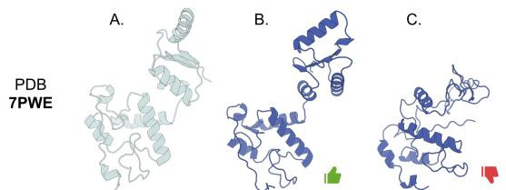  
Figure 1: A structure prediction case. A. Ground-truth. B. One-step argmax prediction result. C. L-step temperaturebased sampling result.

In recent years, multimodal generative protein language models (pLMs) have emerged as an “all-in-one” solution for joint protein sequence-structure modeling (Fan et al., 2025; LIU et al., 2026). Representative models, such as ESM3 (Hayes et al., 2025) and DPLM-2 series (Wang et al., 2025; Hsieh et al., 2025), treat protein sequence and structure as parallel token tracks: they learn the multimodal probability distribution of proteins during pre-training and address diverse tasks via iterative sampling from pLM logits at inference time. As with modern language and vision generative models (Karras et al., 2024; Snell et al., 2024), the performance of multimodal pLMs on generative tasks depends not only on the probability landscape learned but also on the sampling strategy employed, which shapes the inference-time sampling trajectory.

Figure 1 illustrates a protein structure prediction case comparing two typical inference-time sampling configurations. While single-step decoding at temperature = 0.0, ESM3 successfully predicts the structure of protein 7PWE in generally the same fold (TM-score > 0.5). However, when structure tokens are iteratively sampled at temperature = 1.0 over L steps, ESM3’s final prediction obviously collapses. This disparity intuitively underscores the significance of sampling strategies at inference time. On the same pLM landscape and starting from the same conditional point, inference over an exploitative short trajectory or an exploratory long trajectory yields different outputs.

Nevertheless, most research on multimodal pLMs has focused primarily on the effectiveness of training and fine-tuning, leaving inferencetime sampling strategies largely underexplored. ESM3 (Hayes et al., 2025), DPLM-2 (Wang et al., 2025), and DPLM-2.1 (Hsieh et al., 2025) perform protein generation tasks by default using modeland task-specific vanilla sampling configurations, without the widely recognized reward-free guidance (Ho and Salimans, 2022; Karras et al., 2024; Nie et al., 2025) and reward-guided search (Yao et al., 2023; Wei et al., 2025) techniques. As a result, cross-model comparisons can be confounded by implementation-specific inference defaults. A few recent attempts apply advanced sampling to ESM3, e.g., a self-consistency reward for inverse folding (Liu et al., 2025a) or a foldability reward for unconditional generation (Li et al., 2025), but each is confined to one task, a single base model, or a specific strategy. We still lack a systematic understanding of how multi-level sampling strategies behave across multimodal pLMs and tasks, and how the underlying exploration-exploitation trade-offshould be navigated at inference time.

In this paper, we address this gap through a systematic investigation that organizes inferencetime sampling along three orthogonal control axes at different granularity levels: the sampling distribution, the per-step logits, and the parallel sampling trajectories, with an overview presented in Figure 2. Section 3: At the distribution level, we benchmark vanilla sampling among ESM3, DPLM-2, and DPLM-2.1 on four protein modeling tasks, sweeping the multimodal sampling order, total denoising step, unmasking, remasking, and temperature settings. Section 4: At the logit level, we instantiate task-specific variants of classifierfree guidance (CFG) that redirect each step’s distribution toward the condition-aligned region of the sampling space. Section 5: At the trajectory level, we introduce a reward-guided beam search that selects across parallel sampling trajectories using global quality signals. Our main contributions are summarized as follows, while the main insights are summarized at the end of each section:

• We introduce a systematic investigation framework for inference-time sampling in multimodal pLMs, orthogonally composing vanilla sampling, reward-free guidance, and reward-guided search strategies, and comprehensively covering four generative protein modeling tasks.

• The three-level inference strategies we investigate consistently advance the best empirical performance for multimodal pLMs across four tasks, especially boosting breakthroughs in ESM3’s unconditional protein sequence-structure cogeneration and motif-scaffolding.

• We demonstrate that standardized inference-time strategies can substantially change conclusions about multimodal pLMs: models viewed as weak under default sampling can become competitive once inference strategies are controlled, revealing inference protocol as a hidden confounder in protein modeling evaluation.

## 2 Preliminaries

Multimodal Protein Language Modeling: Formulation and Benchmarks. A protein is fundamentally characterized by its sequence and structure. We study multimodal pLMs, represented by ESM3 (Hayes et al., 2025) and DPLM-2 series (Wang et al., 2025; Hsieh et al., 2025), which model proteins via parallel token tracks. For a protein of length L, its sequence is represented as $\pmb { s } = ( s _ { 1 } , \ldots , s _ { L } )$ over the standard 20-amino-acid vocabulary, and its structure as a discrete latent sequence $\boldsymbol { z } = ( z _ { 1 } , \dots , z _ { L } )$ produced by the model’s structure tokenizer. These pLMs learn the joint distribution $p _ { \theta } ( \pmb { s } , \pmb { z } )$ with neural network θ, from which four multimodal protein generative tasks can be conducted: unconditional sequence-structure co-generation via $p _ { \theta } ( \pmb { s } , \pmb { z } | \alpha )$ , motif scaffolding via $p _ { \theta } ( s , z | s _ { \mathrm { m o t i f } } , z _ { \mathrm { m o t i f } } )$ , structure prediction via $p _ { \theta } ( z | \boldsymbol { s } )$ , and inverse folding via $p _ { \theta } ( \pmb { s } | \pmb { z } )$ .

Our study focuses on investigating inference protocols for multimodal pLMs. Regarding the evaluation datasets and metrics, we follow established benchmarks. For unconditional co-generation, we generate protein samples ranging from 100 to 500 residues and report designability and diversity metrics (Geffner et al., 2026). Motif scaffolding is evaluated on 24 benchmark problems (Zheng et al., 2025), with the number of solved problems, overall success rate, and diversity of successful designs reported (Wang et al., 2025; Yim et al., 2024). Protein structure prediction and inverse folding are evaluated on the CAMEO2022 and PDB date datasets (Campbell et al., 2024), with RMSD & TM-score, and scTM & AAR reported (Wang et al., 2025; Hsieh et al., 2025). Additionally, we record the FLOPs and wall-clock runtime to analyze the computational efficiency of inference protocols. Details of the protein structure tokenization, base models, and evaluation pipelines are deferred to Appendix A.1.

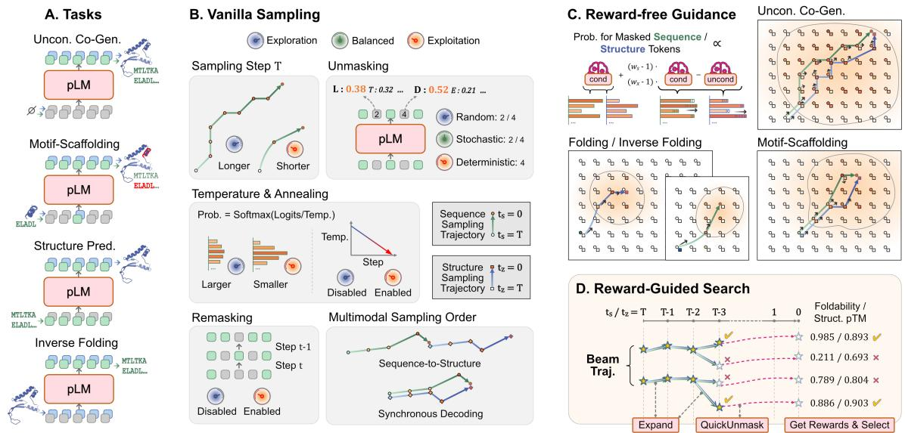  
Figure 2: Overview of our empirical investigation framework. A. Multimodal protein language models (pLMs) perform four foundational protein modeling tasks via iterative diffusion sampling. B. At the distribution level, we benchmark vanilla sampling across three pLMs and four tasks, therefore identifying the task-oriented exploration-exploitation trade-off at inference time. C. At the logit level, we propose task-motivated classifier-free guidance that steers each step’s logits and therefore directs the sampling trajectory. D. At the trajectory level, reward-guided beam search navigates parallel trajectories using model-internal quality signals, highlighting the effectiveness of “explore-then-select” inference across tasks.

Protein Generation with Diffusion Language Models. Typical multimodal pLMs (Hayes et al., 2025; Wang et al., 2025; Hsieh et al., 2025) are built on the discrete diffusion framework. At inference, protein generation proceeds along a reverse denoising trajectory of $T$ steps, iteratively refining an initial masked state $\big ( \pmb { s } ^ { ( \hat { T } ) } , \pmb { z } ^ { ( T ) } \big )$ into a clean state $( \pmb { s } ^ { ( 0 ) } , \pmb { z } ^ { ( 0 ) } )$ . With two token tracks, multimodal protein generation admits different sampling orders along the two diffusion timelines $t _ { s }$ and $t _ { z } \mathrm { : }$ a sequence-to-structure schedule completes $t _ { s }$ before advancing $t _ { z }$ , while a synchronous schedule couples them under a shared timeline $( t _ { s } = t _ { z } = t )$

Unlike left-to-right autoregressive decoding, each diffusion step involves two sets of operations on the masked positions. First, an explicit unmasking policy selects an unmasking subset $\mathcal { U } _ { t } \subseteq \mathcal { M } _ { t }$ from the currently masked indices $\mathcal { M } _ { t } .$ , based on a per-position confidence $c _ { i } ^ { ( t ) }$ (e.g., log-probability or entropy), in one of three modes: deterministic (best $c _ { i } ^ { ( t ) }$ first), stochastic (Gumbel-perturbed confidence), or random. An optional remasking action re-masks low-confidence tokens for later refinement. Second, for each $i \in \mathcal { U } _ { t }$ , the token is sampled from a temperature-scaled categorical distribution $p _ { i } ^ { ( t ) } ( \cdot ) = \mathrm { s o f t m a x } ( \mathbf { l } _ { i } ^ { ( t ) } / \tau _ { t } )$ over raw logits $\mathbf { l } _ { i } ^ { ( t ) }$ . Larger $\tau _ { t }$ increases randomness, while a smaller one makes decoding greedier. The temperature $\tau _ { t }$ can also be annealed across steps to reduce entropy and stabilize the final state.

Reward-free Guidance and Reward-Guided Search. Reward-free guidance, particularly classifier-free guidance (CFG) (Ho and Salimans, 2022; Karras et al., 2024), is a standard practice in diffusion vision models that steers sampling toward context-aligned high-likelihood regions. Prior work has proven that CFG can be applied to diffusion language models with a straightforward adaptation (Nie et al., 2025; Schiff et al., 2025; Chen et al., 2025). At each step t, the guided logits are computed as $\mathbf { l } _ { \mathrm { g u i d e d } } ^ { ( t ) } = \mathbf { l } _ { \mathrm { u n c o n d } } ^ { ( t ) ^ { - } } + w \cdot \big ( \mathbf { l } _ { \mathrm { c o n d } } ^ { ( t ) } - \bar { \mathbf { l } } _ { \mathrm { u n c o n d } } ^ { ( t ) } \big )$ where $\mathbf { l } _ { \mathrm { c o n d } } ^ { ( t ) }$ and $\mathbf { l } _ { \mathrm { u n c o n d } } ^ { ( t ) }$ are the conditional and unconditional logits and w is the guidance scale, with w > 1 amplifying the conditional signal and sharpening adherence to the specified constraints.

Beyond single-trajectory guidance, search algorithms (Snell et al., 2024; Wei et al., 2025) use a global reward with two complementary views: exploring multiple trajectories in parallel, as in Bestof-N, and evaluating the ongoing trajectory in advance, as in soft value-based decoding (SVDD) (Li et al., 2025). Beam search can be generalized to combine both views (Didi et al., 2026), which we treat in a unified manner in Section 5.

## 3 Vanilla Sampling

To begin our investigation of the inference-time behavior of multimodal pLMs, we revisit the default sampling of ESM3, DPLM-2, and DPLM-2.1 across four foundational tasks, with details provided in Appendix A.2. Two issues motivate a closer look. First, the inference implementations across models are not aligned: ESM3 lacks native support for stochastic unmasking, remasking, and synchronous sequence-structure sampling, which are integral to DPLM-2 and DPLM-2.1. Second, across tasks, the four sets of defaults rely on coarse heuristics, whose rationality and optimality have not been empirically verified. Together, these discrepancies hinder fair cross-model comparison and motivate a unified sampling framework.

To address these limitations, we standardize inference implementations across multimodal pLMs and benchmark vanilla sampling configurations. Specifically, we conduct a comprehensive grid search across six key dimensions: diffusion steps T (spanning 1, 8, L/8, L/4, L/2, L, and optionally 100 and 500), unmasking strategies (deterministic, stochastic, or random), remasking (enabled or disabled), sampling temperature (varying in [0, 1]), temperature annealing (enabled or disabled), and multimodal sampling orders (synchronous, or sequence-to-structure). The resulting optimal configurations differ considerably from the defaults across all three models and four tasks.

Figure 3 and Appendix A.2.2-A.2.3 present the optimal configurations and ablations for vanilla sampling settings. Taking ESM3 as representative, on the unconditional co-generation benchmark, enabling synchronous multimodal sampling, stochastic unmasking, and remasking unlocks ESM3 from subpar to considerably competitive. Under the default sequence-to-structure sampling, ESM3 produces only 52.8 designable protein samples and 34.4 unique designable clusters. With the optimized configuration, it reaches 174.8 designable samples and 64.4 clusters, on par with DPLM-2 (149.0 designable samples and 76.0 clusters). On the motif-scaffolding benchmark, ESM3 solves obviously more problems, increasing from an average of 19.4 to 21.6 out of 24. On the CAMEO2022 dataset, optimizing the sampling configuration yields consistent gains: the average TM-score for protein structure prediction rises from 0.860 to 0.868, and the average scTM for inverse folding improves from 0.899 to 0.905.

The optimal configurations and extent of gains differ sharply across tasks, motivating a unified, task-aware view of inference behavior through the exploration-exploitation trade-off. The trade-off should be governed by the length of the denoising trajectory and the randomness introduced at each step and accumulated over steps, along which the sampling distribution is iteratively shaped. Our six grid-search dimensions provide concrete controls over these factors: total steps T determine trajectory length; unmasking strategy and sampling temperature control per-step randomness; remasking and temperature annealing affect randomness accumulation; and the sequence-structure sampling order acts as a cross-track control in multimodal protein generation. The corresponding exploration or exploitation tendency for each setting is summarized in Figure 2.B. Reading the optimized configurations through this lens, the four protein modeling tasks fall into distinct regions of the trajectory-byrandomness plane, consistent with the topology of their task-specific solution spaces.

† Unconditional co-generation targets the full protein space and lies near the exploration corner, requiring the longest trajectories with stochastic unmasking, remasking, and high temperatures, while relying on synchronous decoding to enforce protein designability.

† Motif scaffolding occupies the balanced regime, where the solution space must simultaneously satisfy motif constraints, scaffold self-consistency, and diversity, calling for long trajectories, moderate temperature, and synchronous sequence-structure decoding.

† Protein structure prediction and inverse folding sit near the exploitation corner. The tight biophysical coupling between sequence and structure yields a narrow but nondegenerate solution space, favors short trajectories, deterministic or stochastic unmasking, and low temperatures.

## 4 Reward-Free Guidance

Classifier-free guidance (CFG) (Ho and Salimans, 2022) has been widely acknowledged in general generative modeling, yet remains underexplored in multimodal pLMs. In our investigation framework,

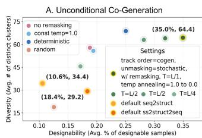

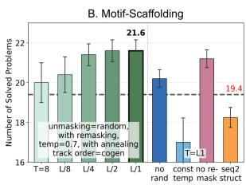

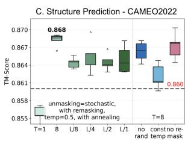

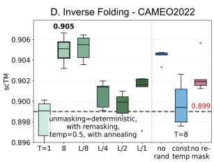  
Figure 3: Vanilla sampling benchmark. Panels A-D show ESM3 performance on each task under the optimal vanilla sampling configuration, with ablations over total steps, per-step randomness (unmasking × temperature), temperature annealing, remasking, and multimodal sampling order. The optimal configuration is highlighted, and the default performance is marked for reference.

CFG adds an orthogonal control axis to the vanilla sampling strategies. While vanilla sampling shapes the foundational sampling distribution, CFG instead steers the per-step logits, shifting probability mass away from the unconditional prior and toward the condition-aligned region of the solution space. In this section, we design CFG strategies for four multimodal protein modeling tasks, implement them across multimodal pLMs, and examine how this logit-level control behaves across task regimes and model capabilities. To accommodate the dual-track nature of multimodal pLMs, we extend standard CFG to a track-wise form. Let $m \in \{ s , z \}$ index the sequence and structure tracks, the guided logits on each track are then

$$
\begin{array} { r } { \mathbf { l } _ { \mathrm { g u i d e d } } ^ { m , ( t ) } = \mathbf { l } _ { \mathrm { u n c o n d } } ^ { m , ( t ) } + w _ { m } \cdot \big ( \mathbf { l } _ { \mathrm { c o n d } } ^ { m , ( t ) } - \mathbf { l } _ { \mathrm { u n c o n d } } ^ { m , ( t ) } \big ) , } \end{array}\tag{1}
$$

where $w _ { m }$ is the track-wise guidance scale. Each subsection below instantiates this formulation by specifying (i) which tracks are denoised and (ii) the conditional and unconditional forward inputs that yield $\boldsymbol { \mathrm { I } } _ { \mathrm { c o n d } } ^ { m , ( t ) }$ and $\mathbf { l } _ { \mathrm { u n c o n d } } ^ { m , ( t ) }$ . The CFG methodology and schematic task-specific guided trajectories are also sketched in Figure 2.C. All experiments build on the optimal vanilla sampling strategies, with selected CFG scales reported in Appendix A.3.1.

Unconditional Protein Sequence-Structure Co-Generation. In unconditional co-generation, multimodal pLMs receive no explicit conditioning but must maintain protein sequence-structure consistency throughout the denoising. Our earlier observation demonstrates that track-by-track sampling underperforms synchronous sequence-structure decoding, in which each sampling step can be viewed as a cross-modal update, with the partially decoded tokens on one track implicitly conditioning the other. This perspective motivates using CFG to amplify the cross-modal conditioning signal at each step. We thus formulate CFG as:

$$
\begin{array} { r } { \begin{array} { c } { \mathsf { l } _ { \mathrm { c o n d } } ^ { s , ( t ) } , \mathsf { l } _ { \mathrm { c o n d } } ^ { z , ( t ) } = f _ { \theta } ( s ^ { ( t ) } , z ^ { ( t ) } ) , } \\ { \mathsf { l } _ { \mathrm { u n c o n d } } ^ { s , ( t ) } = f _ { \theta } \big ( s ^ { ( t ) } , \emptyset \big ) , \quad \mathsf { l } _ { \mathrm { u n c o n d } } ^ { z , ( t ) } = f _ { \theta } \big ( \emptyset , z ^ { ( t ) } \big ) , } \end{array} } \end{array}
$$

where each unconditional logit is computed by masking the tokens on the opposite track. Guided logits on each track are then computed using Equation 1 with track-specific scales $w _ { s }$ and $w _ { z }$

As shown in Table 1, cross-modal CFG improves the generation designability and the diversity across all three base models. For DPLM-2 and DPLM-2.1, the size of the designable subset and the number of distinct designable clusters increase moderately over their default sampling. On ESM3, the gains are much more pronounced. Across all generated samples, ESM3 with CFG attains better sequence foldability (average pLDDT of 88.748) and stronger sequence-structure selfconsistency (average scTM of 0.931). The number of designable protein samples reaches 325.0, nearly doubling that of the optimal vanilla sampling (174.8), while the number of distinct designable clusters rises to 116.6, about 1.8 times that of the optimal vanilla sampling (64.4). In prior protein co-design studies, ESM3 has commonly been regarded as an underperforming baseline. Our results show that once equipped with optimal vanilla sampling and a properly designed CFG, ESM3 delivers a strong performance, surpassing both DPLM-2 and DPLM-2.1 by a clear margin.

Beyond the quantitative gains, the qualitative behavior of ESM3 also changes. Under default sampling, ESM3 often produces implausible proteins with repetitive residues and a biased secondarystructure composition. Then, cross-modal CFG can make the generations more "protein-like". As shown in Figure 4, applying our cross-modal CFG reduces residue repetition and brings the α- helix/β-sheet/coil proportions closer to those of natural proteins. In addition, Appendix A.3.2 presents a PDB alignment analysis that further demonstrates that cross-modal CFG makes the generations structurally more similar to PDB proteins. We interpret this qualitative effect as an implicit regularization of joint multimodal sampling. By up-weighting cross-track conditional logits, CFG discourages the tendency for one track to move toward plausible states in isolation while having low joint probability with the other track. Prior work sought to mitigate the repetition-induced generation collapse in pLMs by injecting external steering vectors (Zhang et al., 2026), yet our results show that internal crossmodal steering can already be highly effective.

Table 1: Evaluation of Unconditional Sequence-Structure Co-Generation. Note: Improves over the last investigation stage.
<table><tr><td rowspan="2">Model</td><td rowspan="2">Cost*</td><td colspan="2">Designable Subset</td><td colspan="4">All Samples</td></tr><tr><td>#Design ↑</td><td>#Clusters ↑</td><td>pLDDT ↑</td><td>scTM ↑</td><td>#Clusters ↑</td><td>α/β%</td></tr><tr><td>DPLM-2 Default</td><td>2.18, 1.17</td><td>149.0 (126, 160)</td><td>76.0 (62, 84)</td><td> $8 1 . 9 2 0 \pm 8 . 6 4 3$ </td><td> $0 . 9 0 6 \pm 0 . 1 0 5$ </td><td>262.0 (248, 273)</td><td>38.4 / 16.9</td></tr><tr><td>DPLM-2 CFG</td><td>6.54, 3.22</td><td>162.4 (157, 168)</td><td>78.4 (75, 84)</td><td> $8 2 . 2 4 2 \pm 8 . 2 4 7$ </td><td> $0 . 9 1 3 \pm 0 . 0 9 1$ </td><td>247.4 (241, 254)</td><td>36.9 /17.4</td></tr><tr><td>DPLM-2.1 Default</td><td>2.15, 1.02</td><td> $1 4 3 . 4 \ : ( 1 2 9 , 1 5 3 )$ </td><td>86.6 (82, 97)</td><td> $8 5 . 1 1 6 \pm 7 . 6 8 1$ </td><td> $0 . 9 0 4 \pm 0 . 1 0 6$ </td><td>304.2 (295, 312)</td><td>43.6/ 13.6</td></tr><tr><td>DPLM-2.1 CFG</td><td>6.44, 3.00</td><td>162.2 (145, 171)</td><td>96.4 (90, 104)</td><td> $8 4 . 9 9 5 \pm 7 . 6 7 1$ </td><td> $0 . 9 1 1 \pm 0 . 0 9 9$ </td><td>284.8 (272, 293)</td><td>42.5 /14.2</td></tr><tr><td>ESM3 Default seq2struct</td><td>1.25, 1.68</td><td>52.8 (31, 70)</td><td>34.4 (24, 49)</td><td> $6 1 . 3 8 7 \pm 1 7 . 5 6 3$ </td><td> $0 . 6 6 0 \pm 0 . 2 4 2$ </td><td>381.4 (371, 396)</td><td>48.3 / 4.3</td></tr><tr><td>ESM3 Default ss2struct2seq</td><td>3.75, 4.98</td><td>91.8 (90, 95)</td><td>29.2 (22, 45)</td><td> $7 6 . 0 7 9 \pm 1 3 . 5 3 0$ </td><td> $0 . 7 6 2 \pm 0 . 2 2 1$ </td><td>240.0 (229, 260)</td><td>71.3 /3.5</td></tr><tr><td>ESM3 Vanilla</td><td>1.25,1.87</td><td>174.8 (167, 179)</td><td>64.4 (56, 69)</td><td> $6 8 . 7 2 4 \pm 2 6 . 0 2 1$ </td><td> $0 . 6 8 3 \pm 0 . 2 9 4$ </td><td>135.0 (124, 148)</td><td>43.5 /5.3</td></tr><tr><td>ESM3 CFG</td><td>3.75,2.74</td><td>325.0 (315, 333)</td><td>116.6 (106, 123)</td><td> $8 8 . 7 4 8 \pm 1 2 . 0 0 7$ </td><td> $0 . 9 3 1 \pm 0 . 1 4 5$ </td><td>194.2 (183, 202)</td><td>53.8 /10.4</td></tr><tr><td>ESM3 Beam - Select=Best</td><td></td><td>411.6 (406, 421)</td><td>126.6 (122, 131)</td><td> $\mathbf { 9 1 . 5 7 7 \pm 5 . 2 0 8 }$ </td><td> $\mathbf { 0 . 9 7 6 \pm 0 . 0 4 4 }$ </td><td>148.0 (142, 158)</td><td>45.8 / 12.4</td></tr><tr><td>ESM3 Beam - Select=Random</td><td>15.4, 11.88</td><td>350.4 (336, 360)</td><td>139.0 (132, 145)</td><td> $9 0 . 7 0 4 \pm 5 . 5 2 5$ </td><td> $0 . 9 6 4 \pm 0 . 0 5 6$ </td><td>177.6 (170, 186)</td><td>47.9 /11.6</td></tr><tr><td>ESM3 Official SVDD</td><td></td><td>189.4 (175, 201)</td><td>88.4 (79, 94)</td><td> $7 6 . 4 7 8 \pm 1 5 . 4 3 0$ </td><td> $0 . 8 8 1 \pm 0 . 1 6 0$ </td><td>253.4 (241, 266)</td><td>51.7 / 10.4</td></tr><tr><td>La-Proteina</td><td></td><td>383.0 (370, 397)</td><td>134.7 (125, 141)</td><td> $8 3 . 7 7 0 \pm 1 0 . 1 3 0$ </td><td> $0 . 9 5 3 \pm 0 . 1 1 9$ </td><td>206.0 (202, 208)</td><td>72.1 / 5.7</td></tr></table>

\* denotes the computational cost at inference time, concretely the $" \mathrm { F L O P s } ( \times 1 0 ^ { 1 7 } ) ,$ Runtime (Hours)".

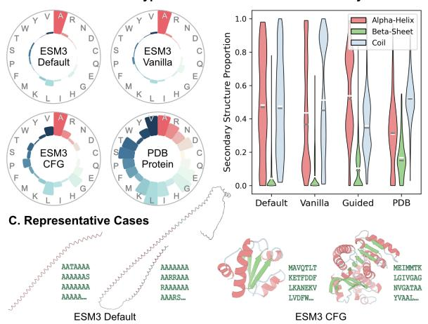  
Figure 4: Qualitative Analysis. A-B. Optimal vanilla sampling and CFG alleviate the abnormal properties of ESM3- generated proteins. C. Visualizations of representative cases.  
Table 2: Evaluation of Motif-Scaffolding.

Motif-Scaffolding. In motif-scaffolding, multimodal pLMs sample both sequence and structure tracks to generate coherent protein scaffolds for specific motifs. Success requires both preserving local motifs and maintaining global protein designability. The former emphasizes the explicit conditioning of the motifs. The latter, along with our observation of the superiority of synchronous decoding over sequence-to-structure sampling, highlights the implicit cross-modal conditioning. We therefore use a track-wise CFG that emphasizes both motif and cross-modal alignments. The conditional logits on both tracks are obtained from $\mathbf { l } _ { \mathrm { c o n d } } ^ { s , ( t ) } , \mathbf { l } _ { \mathrm { c o n d } } ^ { z , ( t ) } \ = \ f _ { \theta } ( s ^ { ( t ) } , z ^ { ( t ) } )$ The unconditional logits are computed by removing motif and cross-

<table><tr><td>Model</td><td> $\mathrm { C o s t ^ { * } }$ </td><td>#Solved ↑</td><td>Succ. Rate ↑</td><td>#Clusters ↑</td></tr><tr><td>DPLM-2 Default</td><td>2.88, 1.37</td><td>15.6 (15, 16)</td><td> $1 5 . 3 \pm 0 . 3 \%$ </td><td>72.6 (63, 83)</td></tr><tr><td>DPLM-2 Vanilla</td><td>0.47,0.42</td><td>16.8 (16, 17)</td><td> $2 0 . 6 \pm 0 . 5 \%$ </td><td>72.8 (68, 80)</td></tr><tr><td>DPLM-2 CFG</td><td>1.41,0.75</td><td>15.8 (15, 17)</td><td> $2 0 . 4 \pm 0 . 2 \%$ </td><td>71.6 (63, 81)</td></tr><tr><td>DPLM-2.1 Default 2.83, 1.15</td><td></td><td>14.2 (14, 15)</td><td> $1 8 . 7 \pm 0 . 6 \%$ </td><td>51.0 (45, 55)</td></tr><tr><td>DPLM-2.1 Vanilla</td><td>2.83, 1.15</td><td>15.4 (15, 16)</td><td> $1 9 . 4 \pm 0 . 6 \%$ </td><td>66.8 (61, 72)</td></tr><tr><td> $\mathrm { D P L M } { - } 2 . 1 _ { \mathrm { { C F G } } }$ </td><td>8.49, 3.33</td><td>15.0 (14, 16)</td><td> $1 9 . 3 \pm 0 . 5 \%$ </td><td>61.2 (56, 68)</td></tr><tr><td>ESM3 Default</td><td>0.18, 1.11</td><td>19.4 (19, 20)</td><td> $1 9 . 6 \pm 0 . 8 \%$ </td><td>94.2 (85, 98)</td></tr><tr><td>ESM3 Vanilla</td><td>0.28, 1.66</td><td>21.6 (21, 22)</td><td> $3 0 . 9 \pm 1 . 1 \%$ </td><td>110.0 (100, 124)</td></tr><tr><td>ESM3 CFG</td><td>0.84, 1.67</td><td>22.8 (22, 23)</td><td> $3 7 . 5 \pm 1 . 0 \%$ </td><td>179.4 (165, 198)</td></tr><tr><td>ESM3  $\mathrm { B e a m }$ </td><td>3.65, 15.64</td><td>23.0 (23, 23)</td><td> $4 9 . 9 \pm 0 . 7 \%$ </td><td></td></tr><tr><td>La-Proteina  $\operatorname { s c a f f }$ </td><td></td><td>22.0 (22, 22)</td><td> $4 2 . 7 \pm 0 . 7 \%$ </td><td>261.0 (250, 278) 256.6 (247, 272)</td></tr></table>

\* Inference cost in $" \mathrm { F L O P s } ( \times 1 0 ^ { 1 7 } )$ , Runtime (Hours)".  
modal information from each track:

$$
\mathbf { l } _ { \mathrm { u n c o n d } } ^ { s , ( t ) } = f _ { \boldsymbol { \theta } } \big ( \boldsymbol { s } ^ { ( t ) } \setminus \boldsymbol { s } _ { \mathrm { m o t i f } } , \boldsymbol { \emptyset } \big ) ,
$$

$$
\mathbf { l } _ { \mathrm { u n c o n d } } ^ { z , ( t ) } = f _ { \theta } \big ( \otimes , z ^ { ( t ) } \setminus z _ { \mathrm { m o t i f } } \big ) .
$$

The guided logits on each track then follow Equation 1 with track-specific scales $w _ { s }$ and $w _ { z }$

Table 2 summarizes the results. While CFG brings no further gains over optimal vanilla sampling for DPLM-2 and DPLM-2.1, it substantially improves ESM3. In 4 out of 5 independent runs, ESM3 solves 23 of the 24 benchmark cases, outperforming DPLM-2/-2.1, and ESM3 itself without guidance. The average success rate rises to 37.5%, nearly doubling that of the default sampling and about 1.2 times that of the optimal vanilla sampling. The diversity of successful scaffolds is improved accordingly: ESM3 with CFG produces 179.4 unique solution clusters on average, nearly twice that of the default sampling (94.2) and about 1.6 times that of the optimal vanilla sampling (110.0). We interpret this contrast as a difference in how reliably each base model encodes the motif and cross-modal conditions. ESM3 appears to encode these conditions strongly enough for effective logit-level steering, whereas DPLM-2 and DPLM-2.1 do not. We further provide an ablation on the dual-condition CFG design in Appendix A.3.3.

Table 3: Evaluation of Protein Structure Prediction (Left) and Inverse Folding (Right).
<table><tr><td></td><td colspan="3">CAMEO</td><td colspan="2">PDB Date Split</td><td></td><td colspan="3">CAMEO</td><td colspan="2">PDB Date Split</td></tr><tr><td>Model</td><td> $\mathrm { C o s t ^ { * } }$ </td><td>RMSD↓</td><td>TM-score ↑</td><td>RMSD↓</td><td>TM-score ↑</td><td>Model</td><td> $\mathrm { C o s t ^ { * } }$ </td><td>scTM ↑</td><td>AAR</td><td>scTM ↑</td><td>AAR</td></tr><tr><td>DPLM-2 Default</td><td>18.5, 6.2</td><td>7.483±6.126</td><td>0.786±0.170</td><td>5.253±5.143</td><td>0.836±0.144</td><td>DPLM-2 Default</td><td>18.5,6.2</td><td>0.870±0.158</td><td>48.1</td><td>0.912±0.111</td><td>55.6</td></tr><tr><td>DPLM-2 Vanilla</td><td>5.6,2.8</td><td>7.513±6.178</td><td>0.790±0.167</td><td>5.249±5.103</td><td>0.837±0.141</td><td>DPLM-2 Vanilla</td><td>0.2, 0.1</td><td>0.875±0.153</td><td>48.2</td><td>0.917±0.111</td><td>55.6</td></tr><tr><td>DPLM-2 CFG</td><td>11.2, 4.1</td><td>7.414±6.112</td><td>0.786±0.169</td><td>5.178±5.029</td><td>0.835±0.142</td><td>DPLM-2 CFG</td><td>0.4, 0.1</td><td>0.877±0.151</td><td>47.1</td><td>0.922±0.101</td><td>54.9</td></tr><tr><td>DPLM-2.1 Default</td><td>18.2, 5.5</td><td>6.297±6.181</td><td>0.822±0.170</td><td></td><td></td><td>DPLM-2.1 Default</td><td>18.2,5.5</td><td>0.875±0.144</td><td>53.3</td><td></td><td></td></tr><tr><td>DPLM-2.1 Vanilla</td><td>1.5,0.5</td><td>6.259±6.051</td><td>0.824±0.167</td><td></td><td></td><td> $\mathrm { D P L M } { \cdot } 2 . 1 \ \mathrm { v a n i l l a }$ </td><td>1.5,0.5</td><td>0.879±0.142</td><td>53.4</td><td></td><td></td></tr><tr><td> $\mathrm { D P L M } { - } 2 . 1 _ { \mathrm { { C F G } } }$ </td><td>2.9,0.9</td><td>6.104±5.809</td><td>0.824±0.167</td><td></td><td></td><td> $\mathrm { D P L M } { - } 2 . 1 _ { \mathrm { { C F G } } }$ </td><td>2.9,0.9</td><td>0.880±0.148</td><td>52.1</td><td></td><td></td></tr><tr><td>ESM3 Default</td><td>0.1,0.3</td><td>5.334±6.280</td><td>0.860±0.168</td><td>4.053±4.867</td><td>0.882±0.152</td><td>ESM3 Default</td><td>0.8, 1.4</td><td>0.899±0.143</td><td>46.4</td><td>0.944±0.083</td><td>49.6</td></tr><tr><td>ESM3 Vanilla</td><td>0.8,1.2</td><td>5.563±7.108</td><td>0.868±0.161</td><td>4.872±7.178</td><td>0.885±0.150</td><td>ESM3 Vanilla</td><td>0.8,1.4</td><td>0.905±0.134</td><td>48.4</td><td>0.947±0.085</td><td>52.0</td></tr><tr><td>ESM3 CFG</td><td>1.6,1.3</td><td>5.144±6.129</td><td>0.870±0.157</td><td>3.969±4.823</td><td>0.889±0.142</td><td> $\mathbf { E S M 3 _ { C F G } }$ </td><td>1.6,1.5</td><td>0.910±0.135</td><td>45.7</td><td>0.954±0.075</td><td>49.1</td></tr><tr><td>ESM3 Beam</td><td>35.6,36.2</td><td>5.221±6.565</td><td>0.872±0.157</td><td>3.744±4.5420.893±0.140</td><td></td><td> $\mathbf { E S M 3 _ { \ B e a m } }$ </td><td>47.4,50.0</td><td>0.914±0.129</td><td>46.0</td><td>0.956±0.069</td><td></td></tr><tr><td>ESMFold</td><td></td><td>3.961±4.795</td><td>0.898±0.147</td><td>2.661±3.916 0.931±0.112</td><td></td><td>ProteinMPNN</td><td></td><td>0.902±0.145</td><td>42.4</td><td>0.953±0.075</td><td>49.3 46.8</td></tr></table>

\* Inference cost in $" \mathrm { F L O P s } ( \times 1 0 ^ { 1 5 } ) ,$ Runtime (Minutes)".

Protein Structure Prediction. For structure prediction, multimodal pLMs condition on the input sequence s and perform iterative discrete diffusion sampling along the structure track z. At each denoising step t, the conditional structure logits are obtained through a forward pass $\mathbf { l } _ { \mathrm { c o n d } } ^ { z , ( t ) } \ =$ $f _ { \boldsymbol { \theta } } ( \boldsymbol { s } , \boldsymbol { z } ^ { ( t ) } )$ . The corresponding unconditional logits are obtained by fully masking the sequence track and executing an additional forward pass, yielding ${ \bf l } _ { \mathrm { u n c o n d } } ^ { z , ( t ) } = f _ { \theta } ( \emptyset , z ^ { ( t ) } )$ . Guided sampling is then performed by extrapolating the two via Equation 1. Table 3 summarizes the evaluation results.

For DPLM-2 and DPLM-2.1, CFG yields modest RMSD improvements and no consistent TMscore gains. In contrast, ESM3 benefits clearly from CFG across both datasets and metrics, achieving an average RMSD of 5.144 and TMscore of 0.870 on CAMEO2022, and an RMSD of 3.969 with TM-score of 0.889 on PDB Date. We attribute this contrast to the narrow solution space in structure prediction and the differing sequence-conditional capacity across base models. As a given sequence admits only a small set of plausible folds, CFG should be useful when a pLM has not yet fully exploited its sequence condition. DPLM-2 and DPLM-2.1 already operate near their conditional capacity under optimal vanilla sampling, whereas ESM3, with the strongest capability of the three, leaves more room above its conditional optimum for logit-level steering. Additionally, a divergence between RMSD and TM-score performance in ESM3 is analyzed in Appendix A.3.4.

Inverse Folding. For inverse folding, multimodal pLMs iteratively sample along the sequence track s, conditioned on the target structure z. We formulate CFG for this task symmetrically to structure prediction. At each denoising step t, the conditional sequence logits are ${ \bf l } _ { \mathrm { c o n d } } ^ { s , ( t ) } = f _ { \boldsymbol \theta } ( \pmb { s } ^ { ( t ) } , z )$ . The corresponding unconditional logits are obtained by dropping the structural condition and executing an additional forward pass, yielding $\mathbf { l } _ { \mathrm { u n c o n d } } ^ { s , ( t ) } = f _ { \boldsymbol { \theta } } ( s ^ { ( t ) } , \emptyset )$

Table 3 shows that CFG consistently improves structural consistency and reduces sequence similarity to the native reference across base models. For ESM3, the average scTM reaches 0.910 on CAMEO2022 and 0.954 on PDB Date, while the AAR declines slightly. We interpret this decline in light of the one-to-many nature of inverse folding and the exploitation effect of CFG. It improves structural consistency by shifting pLM probability mass toward protein sequences that better satisfy the target structure, without requiring them to recover the native reference.

Inference Efficiency. Alongside benchmark performance, Tables 1-3 also report the computational costs across inference protocols, revealing the inefficiency of default sampling and the superior performance-efficiency balance of our CFG strategies. See Appendix A.5 for detailed discussions.

CFG provides a simple and general control for multimodal protein modeling. By casting diverse tasks into conditional generation and dropping the appropriate conditions in the unconditional branch, it consistently improves the protein generation performance.

† CFG helps more when the task condition leaves a larger solution space, giving more room to steer the sampling. It is evidenced by the larger gains on unconditional cogeneration and motif-scaffolding tasks, which have a considerable exploratory nature.

† The benefit of CFG is model-dependent and scales with how well the base model has internalized the corresponding conditional signal. Stronger multimodal pLMs expose more usable condition-aligned logit changes for steering, tend to gain more from CFG.

## 5 Reward-Guided Search

Our study of vanilla sampling and reward-free guidance shows that the performance of multimodal pLMs can be improved by optimizing the sampling trajectory. However, they still generate only a single trajectory per run and rely on per-step tokenlevel logits, which assess local probabilities rather than the global quality of the final output, leaving potentially superior trajectories unexplored. To address this limitation, we lift control from individual steps to entire trajectories: multiple trajectories are maintained in parallel and selected using global rewards. Notably, this section focuses exclusively on ESM3. Our earlier results show that it is the only base model with consistent room for logit-level steering, making it the natural base for studying trajectory-level search. Implementation details are presented in Appendix A.4.

Specifically, we adapt beam search for the inference of multimodal pLMs, as illustrated in $\mathrm { F i g \mathrm { - } }$ ure 2.D and Algorithm 1, and as explained in detail in Appendix A.4.2. Built on top of the underlying sampler, the search layer is decoupled from vanilla sampling and CFG choices.

Let $\overline { { \mathcal { T } ^ { ( t ) } } }$ denote the retained sampling trajectories at step $t ,$ where each trajectory is a partially denoised protein $( \pmb { s } ^ { ( t ) } , \pmb { z } ^ { ( t ) } )$ . Starting from $\mathcal { T } ^ { ( \bar { T } ) }$ with beam width $N$ , branching factor B, and scoring interval $K$ , we perform expand-score-select operations periodically:

$$
\begin{array} { r l } & { \mathcal { C } ^ { ( t ) } \gets \mathrm { E x p A N D } ( \mathcal { T } ^ { ( t ) } , B ) , \quad \mathrm { i f } t \bmod K = 0 , } \\ & { \quad \hat { r } ( c ) \gets r \big ( \mathrm { Q u I C K U N M A S K } ( c ) \big ) , \quad c \in \mathcal { C } ^ { ( t ) } , } \\ & { \mathcal { T } ^ { ( t - 1 ) } \gets \mathrm { S E L E C T } ( \mathcal { C } ^ { ( t ) } , \hat { r } , N ) . } \end{array}
$$

Every K steps (when t mod $K = 0 )$ , the search maintains N parallel trajectories and expands each trajectory into B candidates via independent one-step samplings. While these candidates are still partially masked, we use the estimated reward rˆ: each candidate is denoised by one-pass QUICKUNMASK(·) and then scored by a reward $r ( \cdot )$ . The search then prunes the beam set back to width N under rˆ via a selection rule SELECT(·).

At non-expansion steps (when t mod $K \neq 0 )$ all retained trajectories are simply advancing. After the final step, a single output is selected from the beam set $\mathcal { T } ^ { ( 0 ) }$ using SELECT(·) again.

Within this framework, task-specific design reduces to the reward function $r ( \cdot )$ and the selection rule SELECT(·). To preserve the “all-in-one” nature of multimodal pLMs and keep comparisons with vanilla sampling and CFG fair, we use model-internal signals as rewards, i.e., pTM scores produced during protein structure de-tokenization. The structure track is scored directly by structural $\mathrm { p T M } .$ , whereas the sequence track is first greedily folded into structure tokens and then scored, named foldability pTM. Then, the selection rule should match each task’s exploration-exploitation profile: for protein structure prediction, inverse folding, and motif-scaffolding, SELECT(·) returns the top candidates ranked by structural pTM, foldability pTM, or their sum, respectively. For unconditional cogeneration, we instead randomly select candidates that satisfy structural and foldability constraints (pTM > 0.8 on both tracks), thereby preserving diversity while enforcing a quality threshold.

Tables 1-3 also report the performance of ESM3 with reward-guided search, alongside specialist baselines. Across all four tasks, beam search consistently improves over the CFG stage and enables a single foundation protein model to match or surpass task-specific SOTA systems without task-specific training or external rewards. For unconditional co-generation, ESM3 attains the strongest designability across all baselines. The threshold-based random selection variant raises the number of unique designable clusters from 116.6 to 139.0, surpassing La-Proteina (Geffner et al., 2026). We also include the official SVDD implementation in ESM3, which works atop the default sequenceto-structure sampling. Its limited performance further suggests that our improvements from vanilla sampling and CFG are complementary to rewardguided search. On motif-scaffolding, ESM3 solves 23 of 24 problems in every run, raising the success rate from 37.5% to 53.3% and the number of unique clusters from 179.4 to 245.2, exceeding La-Proteina’s motif-scaffolding variant. For protein structure prediction, ESM3 further reduces the average RMSD and lifts the TM-score on PDB Date, narrowing the gap to ESMFold (Lin et al., 2023). For inverse folding, ESM3 achieves the best scTM on both CAMEO2022 and PDB Date (0.914 and 0.956), surpassing ProteinMPNN (Dauparas et al., 2022).

Notably, beam search delivers its full benefit when the underlying vanilla sampling is tuned to be slightly more exploratory than its single-trajectory optimum, as leaving room for reward-driven selection to discriminate among candidate trajectories. Details are deferred to Appendix A.4.4. Besides, as transparently presented in Table 1-3, beam search incurs considerable computational overhead at inference to achieve improved benchmark performance. Computational efficiency issues are discussed in detail in Appendix A.5.

† Multimodal pLMs can support a simple and effective internal loop at inference time. Searching across parallel trajectories with model-internal rewards further improves protein modeling performance without additional training or external judges.

† Our three-stage evaluation pushes multimodal pLMs to the level of task-specific SOTA systems across multiple protein modeling tasks. This may reshape the community’s view of multimodal pLMs’ position, which has so far been formed by their performance under default sampling.

## 6 Conclusion

In this paper, we elucidate the inference space of multimodal pLMs. Across three base models on four tasks, vanilla sampling, reward-free guidance, and reward-guided search act in complementary ways and together yield consistent, clearmargin gains over each model’s default configuration, bringing multimodal pLMs close to, or even surpass, task-specific specialist models. Two unifying patterns emerge along the way: (1) inference preferences are largely task-oriented; and (2) the exploration-exploitation trade-off can be navigated bottom-up—first centering the foundational sampling distribution, then steering its logits toward the condition, and finally selecting among trajectories with a global quality signal.

## Limitations

This work studies inference-time strategies for fixed multimodal pLMs on controlled benchmark tasks. Our goal is to improve the final-sample quality through vanilla sampling, classifier-free guidance, and reward-guided search, using the model’s internal logits and quality signals. Although these results are useful across the tasks studied here, they do not directly translate to broader notions of biological utility or experimental success. We do not study richer deployment settings in which multimodal pLMs interact with external predictive models, human experts, laboratory feedback, or multi-stage protein design pipelines. These remain important directions for future work.

Besides, our analysis of performance-efficiency trade-offs remains at a very basic stage. Since the current work does not take computational efficiency as the optimization objective, the reported FLOPs and runtime objectively reflect the computational efficiency of inference protocols optimized purely for performance. We consider the multiobjective optimization of inference efficiency and benchmark performance under limited computational resources as future work.

## Ethical Considerations

The primary societal impact of this work is to support scientific research and beneficial clinical and biomedical applications. However, as with any generative technology in biology, there is a theoretical risk of misuse in designing harmful biomolecules, such as pathogenic proteins. We believe this risk is mitigated by the fact that our study investigates the inference procedures of models rather than introducing new biological capabilities, operates on established computational benchmarks, and does not autonomously propose or experimentally validate hazardous biological designs. All data used in this work were obtained from publicly available sources, and no ethical approval was required.

## References

Gustaf Ahdritz, Nazim Bouatta, Christina Floristean, Sachin Kadyan, Qinghui Xia, William Gerecke, Timothy J O’Donnell, Daniel Berenberg, Ian Fisk, Niccolò Zanichelli, and 1 others. 2024. Openfold: retraining alphafold2 yields new insights into its learning mechanisms and capacity for generalization. Nature methods, 21(8):1514–1524.

Christian B Anfinsen. 1973. Principles that govern the folding of protein chains. Science, 181(4096):223– 230.

Andrew Campbell, Jason Yim, Regina Barzilay, Tom Rainforth, and Tommi Jaakkola. 2024. Generative flows on discrete state-spaces: Enabling multimodal flows with applications to protein co-design. In ICLR 2024 Workshop on Generative and Experimental Perspectives for Biomolecular Design.

Tianlang Chen, Minkai Xu, Jure Leskovec, and Stefano Ermon. 2025. Rfg: Test-time scaling for diffusion large language model reasoning with reward-free guidance. arXiv preprint arXiv:2509.25604.

Justas Dauparas, Ivan Anishchenko, Nathaniel Bennett, Hua Bai, Robert J Ragotte, Lukas F Milles, Basile IM Wicky, Alexis Courbet, Rob J de Haas, Neville Bethel, and 1 others. 2022. Robust deep

learning–based protein sequence design using proteinmpnn. Science, 378(6615):49–56.

Kieran Didi, Zuobai Zhang, Guoqing Zhou, Danny Reidenbach, Zhonglin Cao, Sooyoung Cha, Tomas Geffner, Christian Dallago, Jian Tang, Michael M Bronstein, and 1 others. 2026. Scaling atomistic protein binder design with generative pretraining and test-time compute. arXiv preprint arXiv:2603.27950.

Wenqi Fan, Yi Zhou, Shijie Wang, Yuyao Yan, Hui Liu, Qian Zhao, Le Song, and Qing Li. 2025. Computational protein science in the era of large language models (llms). arXiv preprint arXiv:2501.10282.

Tomas Geffner, Kieran Didi, Zhonglin Cao, Danny Reidenbach, Zuobai Zhang, Christian Dallago, Emine Kucukbenli, Karsten Kreis, and Arash Vahdat. 2026. La-proteina: Atomistic protein generation via partially latent flow matching. In The Fourteenth International Conference on Learning Representations.

Thomas Hayes, Roshan Rao, Halil Akin, Nicholas J Sofroniew, Deniz Oktay, Zeming Lin, Robert Verkuil, Vincent Q Tran, Jonathan Deaton, Marius Wiggert, and 1 others. 2025. Simulating 500 million years of evolution with a language model. Science, 387(6736):850–858.

Jonathan Ho and Tim Salimans. 2022. Classifierfree diffusion guidance. arXiv preprint arXiv:2207.12598.

Cheng-Yen Hsieh, Xinyou Wang, Daiheng Zhang, Dongyu Xue, Fei Ye, Shujian Huang, Zaixiang Zheng, and Quanquan Gu. 2025. Elucidating the design space of multimodal protein language models. In Proceedings of the 42nd International Conference on Machine Learning.

Chloe Hsu, Robert Verkuil, Jason Liu, Zeming Lin, Brian Hie, Tom Sercu, Adam Lerer, and Alexander Rives. 2022. Learning inverse folding from millions of predicted structures. In International conference on machine learning, pages 8946–8970. PMLR.

John Jumper, Richard Evans, Alexander Pritzel, Tim Green, Michael Figurnov, Olaf Ronneberger, Kathryn Tunyasuvunakool, Russ Bates, Augustin Žídek, Anna Potapenko, and 1 others. 2021. Highly accurate protein structure prediction with alphafold. Nature, 596(7873):583–589.

Tero Karras, Miika Aittala, Tuomas Kynkäänniemi, Jaakko Lehtinen, Timo Aila, and Samuli Laine. 2024. Guiding a diffusion model with a bad version of itself. In Advances in Neural Information Processing Systems, volume 37, pages 52996–53021.

Patrick Kunzmann, Tom David Müller, Maximilian Greil, Jan Hendrik Krumbach, Jacob Marcel Anter, Daniel Bauer, Faisal Islam, and Kay Hamacher. 2023. Biotite: new tools for a versatile python bioinformatics library. BMC bioinformatics, 24(1):236.

Xiner Li, Yulai Zhao, Chenyu Wang, Gabriele Scalia, Gokcen Eraslan, Surag Nair, Tommaso Biancalani, Shuiwang Ji, Aviv Regev, Sergey Levine, and 1 others. 2025. Derivative-free guidance in continuous and discrete diffusion models with soft value-based decoding. In Advances in Neural Information Processing Systems, volume 38, pages 95507–95545.

Zeming Lin, Halil Akin, Roshan Rao, Brian Hie, Zhongkai Zhu, Wenting Lu, Nikita Smetanin, Robert Verkuil, Ori Kabeli, Yaniv Shmueli, and 1 others. 2023. Evolutionary-scale prediction of atomic-level protein structure with a language model. Science, 379(6637):1123–1130.

Mengdi Liu, Xiaoxue Cheng, Zhangyang Gao, Hong Chang, Cheng Tan, Shiguang Shan, and Xilin Chen. 2025a. Protinvtree: Deliberate protein inverse folding with reward-guided tree search. arXiv preprint arXiv:2506.00925.

Yunqing Liu, Wenqi Fan, Xiao-Yong Wei, and Li Qing. 2025b. GLProtein: Global-and-local structure aware protein representation learning. In Findings of the Associationfor Computational Linguistics: EMNLP 2025, pages 4355–4372, Suzhou, China. Association for Computational Linguistics.

Yunqing LIU, Yi Zhou, and Wenqi Fan. 2026. Enhancing molecular property predictions by learning from bond modelling and interactions. In The Fourteenth International Conference on Learning Representations.

Yunqing Liu, Yi Zhou, and Wenqi Fan. 2026. Geometric flow matching for molecular conformation generation via manifold decomposition. arXiv preprint arXiv:2605.25577.

Stephen Zhewen Lu, Jiarui Lu, Hongyu Guo, and Jian Tang. 2025. Towards protein sequence & structure co-design with multi-modal language models. In Learning Meaningful Representations of Life (LMRL) Workshop at ICLR 2025.

Shen Nie, Fengqi Zhu, Chao Du, Tianyu Pang, Qian Liu, Guangtao Zeng, Min Lin, and Chongxuan Li. 2025. Scaling up masked diffusion models on text. In International Conference on Learning Representations, volume 2025, pages 82974–82997.

Pascal Notin, Nathan Rollins, Yarin Gal, Chris Sander, and Debora Marks. 2024. Machine learning for functional protein design. Nature biotechnology, 42(2):216–228.

Yair Schiff, Subham Sekhar Sahoo, Hao Phung, Guanghan Wang, Alexander Rush, Volodymyr Kuleshov, Hugo Dalla-Torre, Sam Boshar, Bernardo P de Almeida, and Thomas Pierrot. 2025. Simple guidance mechanisms for discrete diffusion models. In International Conference on Learning Representations, volume 2025, pages 43776–43821.

Charlie Snell, Jaehoon Lee, Kelvin Xu, and Aviral Kumar. 2024. Scaling llm test-time compute optimally

can be more effective than scaling model parameters. In International Conference on Learning Representations, volume 2025, pages 10131–10165.

Aaron Van Den Oord, Oriol Vinyals, and 1 others. 2017. Neural discrete representation learning. Advances in neural information processing systems, 30.

Michel Van Kempen, Stephanie S Kim, Charlotte Tumescheit, Milot Mirdita, Jeongjae Lee, Cameron LM Gilchrist, Johannes Söding, and Martin Steinegger. 2024. Fast and accurate protein structure search with foldseek. Nature biotechnology, 42(2):243–246.

Xinyou Wang, Zaixiang Zheng, Fei YE, Dongyu Xue, Shujian Huang, and Quanquan Gu. 2025. Dplm-2: A multimodal diffusion protein language model. In International Conference on Learning Representations, volume 2025, pages 35463–35490.

Joseph L Watson, David Juergens, Nathaniel R Bennett, Brian L Trippe, Jason Yim, Helen E Eisenach, Woody Ahern, Andrew J Borst, Robert J Ragotte, Lukas F Milles, and 1 others. 2023. De novo design of protein structure and function with rfdiffusion. Nature, 620(7976):1089–1100.

Jiaqi Wei, Xiang Zhang, Yuejin Yang, Wenxuan Huang, Juntai Cao, Sheng Xu, Xiang Zhuang, Zhangyang Gao, Muhammad Abdul-Mageed, Laks V. S. Lakshmanan, and 1 others. 2025. Unifying tree search algorithm and reward design for llm reasoning: A survey. arXiv e-prints, page arXiv:2510.09988.

Shunyu Yao, Dian Yu, Jeffrey Zhao, Izhak Shafran, Tom Griffiths, Yuan Cao, and Karthik Narasimhan. 2023. Tree of thoughts: Deliberate problem solving with large language models. In Advances in neural information processing systems, volume 36, pages 11809–11822.

Jason Yim, Andrew Campbell, Emile Mathieu, Andrew YK Foong, Michael Gastegger, José Jiménez-Luna, Sarah Lewis, Victor Garcia Satorras, Bastiaan S Veeling, Frank Noé, and 1 others. 2024. Improved motif-scaffolding with se (3) flow matching. arXiv preprint arXiv:2401.04082.

Jason Yim, Marouane Jaakik, Ge Liu, Jacob Gershon, Karsten Kreis, David Baker, Regina Barzilay, and Tommi Jaakkola. 2025. Hierarchical protein backbone generation with latent and structure diffusion. arXiv preprint arXiv:2504.09374.

Jiahao Zhang, Zeqing Zhang, Di Wang, and Lijie Hu. 2026. Controlling repetition in protein language models. arXiv preprint arXiv:2602.00782.

Yang Zhang and Jeffrey Skolnick. 2005. Tm-align: a protein structure alignment algorithm based on the tm-score. Nucleic acids research, 33(7):2302–2309.

Zhuoqi Zheng, Bo Zhang, Kieran Didi, Kevin K Yang, Jason Yim, Joseph L Watson, Hai-Feng Chen, and Brian L Trippe. 2025. Motifbench: A standardized

protein design benchmark for motif-scaffolding problems. arXiv preprint arXiv:2502.12479.

Yi Zhou, Haohao Qu, Yunqing Liu, Shanru Lin, Le Song, and Wenqi Fan. 2025. Hd-prot: A protein language model for joint sequence-structure modeling with continuous structure tokens. arXiv preprint arXiv:2512.15133.

## A Appendix

## Table of Appendix:

• A.1. Supplementary Preliminaries

– A.1.1. Protein Structure Tokenization

– A.1.2. Base Model Descriptions

– A.1.3. Evaluation Pipelines

• A.2. Details in Vanilla Sampling

– A.2.1. Default Sampling Strategies

– A.2.2. Optimal Vanilla Sampling Strategies

– A.2.3. Ablation Study

• A.3. Details in Reward-free Guidance

– A.3.1. Hyperparameter Selection

– A.3.2. PDB Alignment Analysis on Unconditional Co-Generation Proteins.

– A.3.3. Ablation Study on Motif-Scaffolding CFG

– A.3.4. A Detailed Protein Structure Prediction Observation

• A.4. Details in Reward-guided Search

– A.4.1. Implementation of Specialist Models

– A.4.2. Beam Search for Multimodal pLMs

– A.4.3. Hyperparameter Selection

– A.4.4. Beam Search: Explore-then-Select

• A.5. Inference Efficiency Analysis

## A.1 Supplementary Preliminaries

## A.1.1 Protein Structure Tokenization

For a protein with L residues, its sequence is formulated as $\pmb { s } = ( s _ { 1 } , s _ { 2 } , . . . , s _ { L } )$ , where each $s _ { i } \left( 1 \leq i \leq L \right)$ is a categorical variable denotes the identity of the i-th residue, generally involved in 20 standard amino acids $\mathbb { S } ^ { 2 0 } = \{ \mathbb { A } , \mathbb { R } , \ldots , \mathbb { V } \}$ . Meanwhile, the protein structure is firstly formulated by ${ \pmb x } = ( x _ { 1 } , x _ { 2 } , \dots , x _ { L } )$ , where $x _ { i } \in \mathbb { R } ^ { n _ { i } \times 3 }$ is the Cartesian coordinates of the i-th residue’s atoms.

To accommodate the discrete nature of language models, multimodal pLMs (Hayes et al., 2025; Wang et al., 2025; Hsieh et al., 2025) generally handle protein structures using quantization-based tokenizers. Similar to image tokenization, the protein structure tokenization process can be summarized under a VQ-VAE (Van Den Oord et al., 2017) framework:

$$
x \xrightarrow { \mathrm { e n c o d e r } \ : \& \ : { \mathrm { q u a n t i z e r } } } z \xrightarrow { \mathrm { d e c o d e r } } \hat { x } ,
$$

where an encoder and a quantizer convert protein structure coordinates x into L discrete tokens $\boldsymbol { z } ~ = ~ ( z _ { 1 } , \dots , z _ { L } )$ each within a finite-size codebook, and the decoder reconstructs 3D coordinates xˆ. Notably, following the practice of AlphaFold (Jumper et al., 2021) and ESMFold (Lin et al., 2023), the decoder of ESM3’s structure tokenizer includes dedicated heads to compute structural quality scores, typically the predicted template modeling (pTM) score.

## A.1.2 Base Model Descriptions

DPLM-2 (Wang et al., 2025) is a multimodal protein language model that extends a sequenceonly pLM to model both sequence and structure. To incorporate structural information, it converts 3D coordinates x into discrete tokens z using a lookup-free quantization tokenizer1. Trained on high-quality protein data, DPLM-2 learns the joint distribution of protein sequence and structure, together with their marginals and conditionals. In our implementation, we use the pretrained 650M checkpoint2, following the official instructions3.

DPLM-2.1 (Hsieh et al., 2025) likewise models the joint distribution of protein sequence and structure. For structural modeling, it uses the same LFQ tokenizer as DPLM-2, with a vocabulary size of $2 ^ { 1 3 } = 8 1 9 2$ , but predicts the 13 binary bits of each token rather than the corresponding 8192-way index. This finer-grained supervision should improve protein structure modeling. In our implementation, we use the pretrained 650M checkpoint4, following the official instructions5.

ESM3 (Hayes et al., 2025) is a multimodal generative language model that reasons over the sequence, structure, and function of proteins. Besides tokenized sequence and structure tracks, it also supports four additional parallel tracks, such as secondary structure labels, and can take structure coordinates as input. In this work, we focus on the sequence and structure tracks and enable coordinate input to improve protein structure modeling. In our implementation, we use the open-source ESM3-Open (1.4B) checkpoint6, following the official codebase7.

For notational uniformity, we denote the protein structure by discrete tokens z throughout the main text. In practice, however, we follow each model’s recommended input format: ESM3 takes raw backbone coordinates x and motif coordinates $x _ { \mathrm { m o t i f } }$ for inverse folding and motif scaffolding, whereas DPLM-2 and DPLM-2.1 require the tokenized forms z and $z _ { \mathrm { m o t i f } }$ . This input choice does not affect the generation formulation in Equation 1.

In our practice, all experiments were conducted on a single NVIDIA H20 (96GB) GPU. To compare the computational efficiency of different inference protocols, we also report the floating-point operations per second (FLOPs) and wall-clock runtime for each experiment.

## A.1.3 Evaluation Pipelines

Unconditional protein sequence-structure cogeneration jointly produces protein sequence and structure with only chain length specified (Geffner et al., 2026; Zhou et al., 2025). Following established protocols (Wang et al., 2025; Geffner et al., 2026), we sample 100 proteins at each target length (100, 200, 300, 400, and 500 residues), and report designability and diversity over both the designable subset and the full sample set. For each generated sample, we refold the sequence with ESMFold (Lin et al., 2023), where pLDDT is ESMFold’s prediction confidence, and scRMSD and scTM measure the consistency between the ESMFold-predicted and the generated structures. A sample is classified as designable if scRMSD < 2.0 Å. On the designable subset, designability is summarized by the number of designable samples and diversity by the number of Foldseek (Van Kempen et al., 2024) clusters of these samples. On the full sample set, designability is summarized by pLDDT and scTM, and diversity by the number of Foldseek clusters of all generated samples. Additionally, the secondary structure proportions are also calculated.

Motif scaffolding aims to generate protein scaffold structures that correctly embed specified target motifs (Geffner et al., 2026; Watson et al., 2023). Following established protocols (Wang et al., 2025; Yim et al., 2024), we generate 100 candidate scaffolds for each of the 24 benchmark problems, with scaffold length and motif order determined according to the specifications. For each generated candidate, we refold the sequence with ESMFold (Lin et al., 2023) and obtain scRMSD between the ESMFold-predicted structure and the generated structure, while motif-RMSD is computed directly between the motif residues of the generated structure and those of the ground-truth motif. A candidate is counted as successful if and only if it satisfies both global designability (scRMSD < 2.0 Å) and local motif preservation (motif-RMSD < 1.0 Å) (Zheng et al., 2025). The diversity of successful designs is quantified via Foldseek clustering (Van Kempen et al., 2024).

Protein structure prediction infers a protein’s 3D structure from its amino acid sequence (Jumper et al., 2021; Lin et al., 2023). Following established protocols (Wang et al., 2025; Hsieh et al., 2025), we evaluate on CAMEO 2022 and the PDB Date Split (Campbell et al., 2024), and quantify prediction accuracy by comparing the generated structures against their ground-truth natural structures with RMSD and TM-score.

Inverse folding generates amino acid sequences compatible with a specified target structure (Dauparas et al., 2022; Hsu et al., 2022). Following established protocols (Wang et al., 2025; Hsieh et al., 2025), we evaluate on CAMEO 2022 and the PDB Date Split. To assess structural self-consistency, we refold each generated sequence with ESMFold (Lin et al., 2023) and compute scTM relative to the target structure. As multiple sequences can yield about the same backbone structure, the amino acid recovery rate (AAR) is not a direct quality metric for inverse folding. Nevertheless, we report it to distinguish structural consistency from nativesequence recovery.

In our experiments, if no special indication is made, every reported number is aggregated across five independent runs with distinct random seeds, formulated as “mean ± std” or “mean (min, max)”. The RMSD and TM-score are calculated using standard functions in OpenFold (Ahdritz et al., 2024) and TM-Tools (Zhang and Skolnick, 2005). The secondary structure is annotated via Biotite (Kunzmann et al., 2023). The number of clusters is obtained by clustering the generated structures via Foldseek (Van Kempen et al., 2024), using this command:

foldseek easy-cluster ⟨input\_path⟩

⟨output\_path⟩ ⟨tmp\_path⟩

–alignment-type 1 –cov-mode 0

–min-seq-id 0 –tmscore-threshold 0.5.

## A.2 Details in Vanilla Sampling

## A.2.1 Default Sampling Strategies

We document the default sampling strategies for each base model across the foundational tasks considered in this work. For DPLM-2 (Wang et al., 2025) and DPLM-2.1 (Hsieh et al., 2025), we follow the official guideline and default hyperparameters8. For ESM3 (Hayes et al., 2025), we adhere to the implementation details described in the original appendix, official codebase9, as well as established community practices (Yim et al., 2025; Zhou et al., 2025). Tables 4-7 present the default sampling configurations that serve as our primary baseline. These include the total sampling step, unmasking strategy, remasking allowance, sampling temperature, temperature annealing, and the multimodal sampling order.

Table 4: Default Sampling Strategies for Unconditional Co-Generation
<table><tr><td></td><td>DPLM-2</td><td>DPLM-2.1</td><td>ESM3</td><td>ESM3</td></tr><tr><td>Multimodal Order</td><td>Synchronous</td><td>Synchronous</td><td>Seq → Struct</td><td>SS → Struct → Seq</td></tr><tr><td>Sampling Step T</td><td>500</td><td>500</td><td>L; 1</td><td>L</td></tr><tr><td>Unmasking</td><td>Stochastic</td><td>Stochastic</td><td>Random</td><td>Random</td></tr><tr><td>Remasking</td><td>Enabled</td><td>Enabled</td><td>Disabled</td><td>Disabled</td></tr><tr><td>Temp. &amp; Annealing</td><td>From 2.0 to 0.1</td><td>From 1.1 to 0.1</td><td>From 1.0 to 0.0; 0.0</td><td>0.7</td></tr></table>

Table 5: Default Sampling for Motif-Scaffolding
<table><tr><td></td><td>DPLM-2</td><td>DPLM-2.1</td><td>ESM3</td></tr><tr><td>Multimodal Order</td><td>Synchronous</td><td>Synchronous</td><td>Seq → Struct</td></tr><tr><td>Sampling Step T</td><td>500</td><td>500</td><td> $L / 2 ; L / 8$ </td></tr><tr><td>Unmasking</td><td>Stochastic</td><td>Stochastic</td><td>Random</td></tr><tr><td>Remasking</td><td>Enabled</td><td>Enabled</td><td>Disabled</td></tr><tr><td>Temp. &amp; Annealing</td><td>From 2.0 to 1.0</td><td>From 1.1 to 0.1</td><td>From 1.0 to 0.0</td></tr></table>

Table 6: Default Sampling for Structure Prediction
<table><tr><td></td><td>DPLM-2</td><td>DPLM-2.1</td><td>ESM3</td></tr><tr><td>Sampling Step T</td><td>100</td><td>100</td><td>1</td></tr><tr><td>Unmasking</td><td>Deterministic</td><td>Deterministic</td><td>Deterministic</td></tr><tr><td>Remasking</td><td>Enabled</td><td>Enabled</td><td>Disabled</td></tr><tr><td>Temp. &amp; Annealing</td><td>0.0</td><td>0.0</td><td>0.0</td></tr></table>

Table 7: Default Sampling for Inverse Folding
<table><tr><td></td><td>DPLM-2</td><td>DPLM-2.1</td><td>ESM3</td></tr><tr><td>Sampling Steps T</td><td>100</td><td>100</td><td>8</td></tr><tr><td>Unmasking</td><td></td><td>Deterministic Deterministic</td><td>Random</td></tr><tr><td>Remasking</td><td>Enabled</td><td>Enabled</td><td>Disabled</td></tr><tr><td>Temp. &amp; Annealing</td><td>0.0</td><td>0.0</td><td>From 1.0 to 0.0</td></tr></table>

Examining the default configurations of DPLM-2/-2.1 and ESM3 across four foundational tasks reveals two implicit heuristics: (1) the required diffusion steps follow the order unconditional cogeneration ≥ motif scaffolding > structure prediction ≈ inverse folding; and (2) the randomness during sampling scales as unconditional cogeneration ≈ motif scaffolding > structure prediction ≈ inverse folding. We aim to examine these task-dependent assumptions and derive more nuanced insights. Furthermore, the inference protocols of DPLM-2/-2.1 and ESM3 exhibit significant implementation mismatches. The original ESM3 codebase lacks native support for stochastic unmasking, remasking, and synchronous sequencestructure co-sampling. Resolve this, we hope to standardize the ESM3 inference protocol and rigorously evaluate the effectiveness of each vanilla sampling strategy under a unified framework.

Table 8: Optimal Vanilla Sampling for Uncond. Co-Gen.
<table><tr><td></td><td>DPLM-2</td><td>DPLM-2.1</td><td>ESM3</td></tr><tr><td>Multimodal Order</td><td>Synchronous</td><td>Synchronous</td><td>Synchronous</td></tr><tr><td>Sampling Step T</td><td>500</td><td>500</td><td>L</td></tr><tr><td>Unmasking</td><td>Stochastic</td><td>Stochastic</td><td>Stochastic</td></tr><tr><td>Remasking</td><td>Enabled</td><td>Enabled</td><td>Enabled</td></tr><tr><td>Temp. &amp; Annealing</td><td></td><td>From 2.0 to 0.1 From 1.1 to 0.1</td><td>From 1.0 to 0.0</td></tr></table>

Table 9: Optimal Vanilla Sampling for Motif-Scaffolding
<table><tr><td></td><td>DPLM-2</td><td>DPLM-2.1</td><td>ESM3</td></tr><tr><td>Multimodal Order</td><td>Synchronous</td><td>Synchronous</td><td>Synchronous</td></tr><tr><td>Sampling Step T</td><td>L</td><td>500</td><td>L</td></tr><tr><td>Unmasking</td><td>Stochastic</td><td>Stochastic</td><td>Random</td></tr><tr><td>Remasking</td><td>Enabled</td><td>Enabled</td><td>Enabled</td></tr><tr><td>Temp. &amp; Annealing</td><td>From 0.5 to 0.0</td><td>From 0.5 to 0.0</td><td>From 0.7 to 0.0</td></tr></table>

Table 10: Optimal Vanilla Sampling for Structure Prediction
<table><tr><td></td><td>DPLM-2</td><td>DPLM-2.1</td><td>ESM3</td></tr><tr><td>Sampling Step T</td><td> $L / 8$ </td><td>8</td><td>8</td></tr><tr><td>Unmasking</td><td>Random</td><td>Deterministic</td><td>Stochastic</td></tr><tr><td>Remasking</td><td>Enabled</td><td>Enabled</td><td>Enabled</td></tr><tr><td>Temp. &amp; Annealing</td><td>From 0.1 to 0.0</td><td>From 0.1 to 0.0</td><td>From 0.5 to 0.0</td></tr></table>

In addition to these, we retain several default configurations after careful consideration. First, to preserve each model’s inherent training-inference alignment, we maintain the original diffusion schedules (linear for DPLM-2 and DPLM-2.1, cosine for ESM3) and temperature annealing functions (linear for DPLM-2 and DPLM-2.1, quadratic for ESM3). Second, for unmasking, DPLM-2 and DPLM-2.1 evaluate positional confidence using log-probabilities, whereas ESM3 relies on entropy, which has been confirmed in prior work to have little impact (Lu et al., 2025). Although these settings introduce minor methodological differences, they should not detract from our core investigation into the exploration-exploitation tradeoff.

## A.2.2 Optimal Vanilla Sampling Strategies

Tables 8-11 present the optimal vanilla sampling configurations we identified. Configurations that deviate from the defaults are highlighted in blue.

Table 11: Optimal Vanilla Sampling for Inverse Folding
<table><tr><td></td><td>DPLM-2</td><td>DPLM-2.1</td><td>ESM3</td></tr><tr><td>Sampling Step T</td><td>1</td><td>8</td><td>8</td></tr><tr><td>Unmasking</td><td>Random</td><td>Stochastic</td><td>Deterministic</td></tr><tr><td>Remasking</td><td>Enabled</td><td>Enabled</td><td>Enabled</td></tr><tr><td>Temp. &amp; Annealing From 0.1 to 0.0 From 0.1 to 0.0 From 0.5 to 0.0</td><td></td><td></td><td></td></tr></table>

## A.2.3 Ablation Study

Due to space constraints, we present the comprehensive vanilla sampling ablation results across models and tasks in Figure 5. Each panel reports task-specific metrics across varying sampling hyperparameters for a single base model, with the default-setting performance marked for reference. The caption explains how to read the figure.

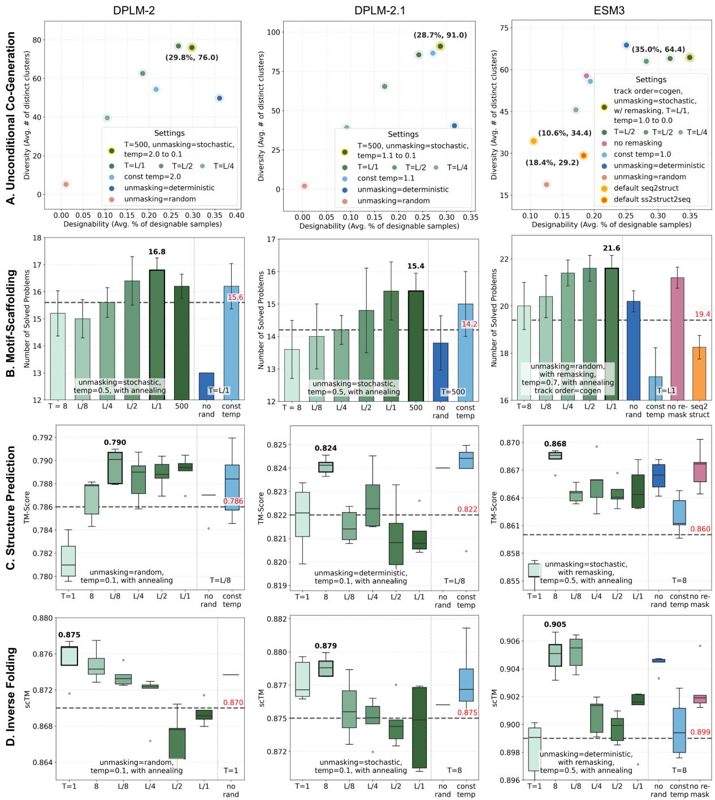  
Figure 5: Vanilla sampling: optimal configurations and ablation results. A. Pareto comparison between designability and diversity in unconditional protein sequence-structure co-generation. The first legend shows the optimal configuration, and each subsequent legend changes one setting at a time. B-D. The green bars to the left of the vertical dotted line show ablations over the total sampling step ${ \check { T } } ,$ with the other vanilla sampling settings listed. The remaining bars show one-at-a-time changes to the optimal configuration: "no rand" denotes deterministic unmasking with temperature = 0.0 (argmax sampling); "const temp" and "no remasking" denote disabled temperature annealing and remasking, respectively.

## A.3 Details in Reward-free Guidance

## A.3.1 Hyperparameter Selection

To select the CFG scales, we have conducted a limited hyperparameter search for each base model across the four tasks. Table 12 lists the selected scales, with those yielding gains over the optimal vanilla sampling underlined, and the corresponding results are reported in the main text.

A notable observation from this hyperparameter search concerns the sequence-structure asymmetry in multimodal pLMs. Since the two tracks are inherently imbalanced in tokenization, some differences in behavior are expected. However, the asymmetry in CFG response is substantially more pronounced for DPLM-2/-2.1 than for ESM3, as reflected in the contrast between protein structure prediction and inverse folding in Figure 6. For DPLM-2 and DPLM-2.1, CFG provides no benefit for protein structure generation but yields clear gains when guiding inverse folding with a selected guidance scale. By contrast, ESM3 can positively respond to CFG in both directions, behaving more balanced across the two tasks.

A plausible explanation is that DPLM-2 and DPLM-2.1 are developed through modality extension, from sequence-only to multimodal pLMs, so the two tracks may not be internalized equally well. ESM3, trained natively at a larger scale on multimodal protein data, appears to internalize sequence and structure conditions more evenly, leading to a more balanced response to guidance across the two tracks. This is consistent with our insight that the exploitation effect of CFG depends on how well the base model has internalized the corresponding conditional signal.

## A.3.2 PDB Alignment Analysis on Unconditional Co-Generation Proteins

To further confirm the effect of CFG in making ESM3’s unconditional co-generation more "protein-like", we align the generated samples with PDB proteins. Specifically, we search each generated sample against the PDB database using Foldseek (Van Kempen et al., 2024) and recorded the highest TM-score from the alignment against all PDB proteins, denoted as PDB-TM.

In our benchmark of 500 generated proteins, ESM3 in the optimal vanilla sampling configuration yields an average of 387.2 samples that could be aligned to PDB proteins, with a mean PDB-TM of $0 . 5 4 8 \pm 0 . 3 1 6$ . In contrast, ESM3 with crossmodal CFG yields an average of 473.0 samples with aligned PDB proteins, with a mean PDB-TM of $0 . 8 2 1 \pm 0 . 1 5 6$ . These results demonstrate that cross-modal CFG makes ESM3’s generations structurally closer to PDB proteins.

The concrete Foldseek command is:

foldseek easy-search ⟨input\_path⟩   
⟨database\_path⟩ ⟨output\_path⟩   
⟨tmp\_path⟩ –exhaustive-search   
–alignment-type 1 –tmscore-threshold 0.0   
–format-output query,target,qtmscore.

## A.3.3 Ablation Study on Motif-Scaffolding CFG

To validate our dual-condition CFG design for motif scaffolding, we compare it against two singlecondition variants on ESM3. In all cases, the conditional logits remain those under full conditioning, namely ${ \bf l } _ { \mathrm { c o n d } } ^ { s , ( t ) } , { \bf l } _ { \mathrm { c o n d } } ^ { z , ( t ) } = f _ { \theta } ( s ^ { ( t ) } , z ^ { ( t ) } )$ . For motif-only CFG, the unconditional branch drops only the motif condition while retaining crossmodal context, yielding

$$
\begin{array} { r } { \rVert _ { \mathrm { u n c o n d } } ^ { s , ( t ) } , \rVert _ { \mathrm { u n c o n d } } ^ { z , ( t ) } = f _ { \theta } \big ( \pmb { s } ^ { ( t ) } \ \backslash \ \pmb { s } _ { \mathrm { m o t i f } } , \ z ^ { ( t ) } \ \backslash \ z _ { \mathrm { m o t i f } } \big ) . } \end{array}
$$

For cross-modal CFG, the unconditional branch drops only the opposite-track context while retaining motif information, yielding

$$
\begin{array} { r } { \boldsymbol { \mathrm { l } } _ { \mathrm { u n c o n d } } ^ { s , ( t ) } = f _ { \boldsymbol { \theta } } \big ( \boldsymbol { s } ^ { ( t ) } , \mathcal { D } \big ) , \quad \boldsymbol { \mathrm { l } } _ { \mathrm { u n c o n d } } ^ { z , ( t ) } = f _ { \boldsymbol { \theta } } \big ( \mathcal { D } , \boldsymbol { z } ^ { ( t ) } \big ) . } \end{array}
$$

Table 13 reports the ablation results. Both single-conditioning CFG variants improve over the optimal vanilla sampling, while the full dualconditioning CFG achieves the strongest gains. These results show that explicit motif guidance and implicit cross-modal guidance are both useful and are most effective when combined.

## A.3.4 A Detailed Protein Structure Prediction Observation

As noted in Table 3, ESM3 exhibits an interesting divergence between RMSD and TM-score with sampling strategies adjusted. Moving from default sampling $( T = 1$ , deterministic unmasking, no remasking, temperature = 0.0) to the optimized vanilla sampling (T = 8, stochastic unmasking, remasking, temperature annealing from 0.5 to 0.0) degrades RMSD while also improving TM-score on both datasets. Applying CFG on top of the selected vanilla sampling strategy mitigates this RMSD–TM-score divergence, improving both metrics simultaneously.

Table 12: Selected CFG scales.
<table><tr><td></td><td>Uncon. Co-Gen.</td><td>Motif-Scaffolding</td><td>Structure Prediction</td><td>Inverse Folding</td></tr><tr><td>DPLM-2</td><td> $w _ { s } = 2 . 0 , w _ { z } = 1 . 5$ </td><td> $w _ { s } = 1 . 5 , w _ { z } = 1 . 0$ </td><td> $w _ { z } = 1 . 5$ </td><td> ${ \underline { w _ { s } } } = 4 . 0$ </td></tr><tr><td>DPLM-2.1</td><td> $w _ { s } = 2 . 0 , w _ { z } = 1 . 5$ </td><td> $w _ { s } = 1 . 5 , w _ { z } = 1 . 0$ </td><td> $w _ { z } = 1 . 5$ </td><td> ${ \underline { w _ { s } } } = 2 . 0$ </td></tr><tr><td>ESM3</td><td> $\overline { { w _ { s } = 2 . 0 , w _ { z } = 3 . 0 } }$ </td><td> $w _ { s } = 2 . 0 , w _ { z } = 2 . 0$ </td><td> ${ \underline { w _ { z } } } = 2 . 0$ </td><td> $\overline { { w _ { s } = 2 . 0 } }$ </td></tr></table>

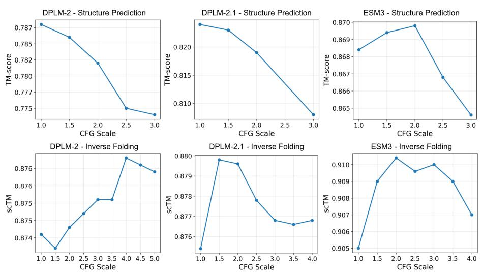  
Figure 6: CFG scale analysis for protein structure prediction and inverse folding on CAMEO2022.

Table 13: Ablation study on motif-scaffolding CFG.
<table><tr><td></td><td>#Solved / 24</td><td>Success Rate</td><td>#Clusters</td></tr><tr><td>ESM3 Vanilla</td><td>21.6 (21, 22)</td><td> $3 0 . 9 \pm 1 . 1 \%$ </td><td>110.0 (100, 124)</td></tr><tr><td>ESM3 CFG (Motif-only)</td><td>22.6 (22, 23)</td><td> $3 5 . 3 \pm 0 . 6 \%$ </td><td>146.8 (127, 158)</td></tr><tr><td>ESM3 CFG (Cross-Modal)</td><td>22.4 (21, 23)</td><td> $3 6 . 6 \pm 1 . 4 \%$ </td><td>155.0 (144, 166)</td></tr><tr><td>ESM3 CFG (Both)</td><td>22.8 (22, 23)</td><td> $3 7 . 5 \pm 1 . 0 \%$ </td><td>179.4 (165, 198)</td></tr></table>

Figure 7 provides two case studies to illustrate this behavior. For some challenging targets, default single-pass argmax decoding yields low-quality predictions with incorrect secondary-structure organization. Multi-step iterative sampling recovers more plausible global topologies, which improves TM-score, but local fragment misorientations can persist and keep RMSD high. CFG further refines these local geometries, reducing this mismatch and yielding predictions with both more native-like global folds and more accurate local alignments.

## A.4 Details in Reward-guided Search

## A.4.1 Implementation of Specialist Models

For unconditional protein sequence-structure cogeneration, we run La-Proteina (Geffner et al., 2026) using the pre-trained checkpoint10 and follow the official guideline11, using the default noise scales of 0.1 for the alpha-carbon atoms and 0.1 for the latent variables. We also benchmark the official SVDD implementation in ESM3 following the official tutorial12. Given a desired length L, it employs a sequence-to-structure sampling order: sequence tokens are first sampled over $L / 8$ steps with random unmasking, no remasking, and temperature annealing from 1.0 to 0.0, after which structure tokens are predicted in a single argmax step. On top of this default procedure, SVDD branches 10 candidates at each step and retains the one with the best pTM. For motif scaffolding, we run La-Proteina using the motif-scaffolding checkpoint13 with the default sampling settings. For inverse folding, we run ProteinMPNN (Dauparas et al., 2022) using the official checkpoint $" \mathrm { v } \_ { 4 8 } \_ 0 2 0 . \mathrm { p t } "$ with temperature = 0.1.

## A.4.2 Beam Search for Multimodal pLMs

In this study, we adapt beam search to the discrete diffusion sampling of multimodal pLMs, operating jointly over protein sequence and structure (s, z), as summarized in Algorithm 1. This procedure maintains N trajectories in parallel in the set T.

At each step t, the search layer calls EXPAND(·), which applies the underlying sampler for one step independently to each retained trajectory. At general steps, EXPAND(T , 1) simply advances each retained trajectory once. Meanwhile, every K steps is an expansion step to periodically expand, score, and prune trajectories: First, EXPAND(T, B) yields $N \times B$ candidate trajectories, collected in set C. Second, since partially masked candidates cannot be directly evaluated, we apply a single-forward argmax decoding QUICKUNMASK(·) to predict all remaining masked tokens and compute r(·) on the resulting proteins, leading to the estimated rewards rˆ. Third, the selection rule SELECT(·) then chooses N beams from C according to rˆ for the next step of denoising.

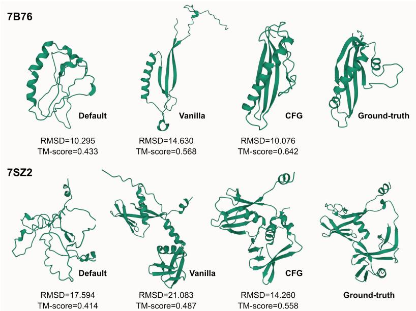  
Figure 7: Two cases to illustrate ESM3’s RMSD-TM-score divergence in protein structure prediction.

Algorithm 1 Generalized Beam Search   
Require: initial state $( \pmb { s } ^ { ( T ) } , \pmb { z } ^ { ( T ) } )$ , total steps T, beam width   
N, branching factor B, scoring interval K, reward r(·)   
1: $\mathcal { T }  \{ ( \pmb { s } _ { n } ^ { ( T ) } , \pmb { z } _ { n } ^ { ( T ) } ) \} _ { n = 1 } ^ { N }$   
2: for $t \doteq \mathsf { T } , T \mathrm { - } 1 , \ldots , 1$ do   
3: if t mod $K = 0$ and $t < T$ then   
4: C ← EXPAND(T, B)   
5: rˆ(c) ← r(QUICKUNMASK(c)), ∀c ∈ C   
6: T ← SELECT(C, r, Nˆ )   
7: else   
8: $\tau $ EXPAND(T , 1)   
9: end if   
10: end for   
11: return SELECT(T , r, 1)

After all T steps, the final output is produced by applying the same SELECT(·) rule to the N completed beams with target width 1. Notably, this formulation unifies two typical cases: N=1, K=1 recovers single-trajectory search with per-step reranking, i.e., SVDD (Li et al., 2025), and B=1, K=T reduces to Best-of-N sampling.

Within this framework, the task-aware design choices in protein modeling reduce to two questions: how to instantiate the reward r(·), and how to instantiate the selection rule SELECT(·).

• Reward. While external models such as ESM-Fold could in principle serve as the scorer, we rely on signals internal to the multimodal pLM. This reflects our choice to keep all conditioning signals internal to the model, both to preserve the “all-in-one” nature of multimodal pLMs and to ensure a fair comparison with vanilla and guided sampling. As described in Section A.1.1, ESM3’s protein structure tokenizer natively produces pTM scores during de-tokenization, which we use as global, trajectory-level rewards. A candidate on the structure track is scored directly (named structural pTM), whereas a candidate on the sequence track is first folded with an additional single-pass argmax decoding and then scored (named foldability pTM).

• Selection. The choice of SELECT(·) is aligned with the exploration-exploitation profile of each task. For the exploitation-biased and balanced tasks, SELECT(·) simply returns the top-N (or top-1) candidates ranked by the corresponding pTM: structural pTM for structure prediction, foldability pTM for inverse folding, and their sum for motif-scaffolding. For the explorationbiased task (unconditional co-generation), we optionally use a threshold-based random selection that uniformly samples from candidates satisfying both per-track criteria (foldability pTM > 0.8 and structural pTM > 0.8), which preserves diversity while enforcing a quality lower bound. Notably, $\mathrm { p T M } > 0 . 8$ is a commonly used thresh-

Table 14: ESM3 hyperparameter selection: unconditional co-generation
<table><tr><td></td><td colspan="3">Designable Subset</td><td colspan="4">All Samples</td></tr><tr><td></td><td>N B</td><td>#Design</td><td>#Clusters</td><td>pLDDT</td><td>scTM</td><td>#Clusters</td><td> $\alpha / \beta \%$ </td></tr><tr><td>2</td><td>1</td><td>318.0</td><td>137.0</td><td>89.529</td><td>0.955</td><td>194.0</td><td>45.7 / 12.8</td></tr><tr><td>4</td><td>1</td><td>350.4</td><td>139.0</td><td>90.704</td><td>0.964</td><td>177.6</td><td>47.9/11.6</td></tr><tr><td>8</td><td>1</td><td>342.0</td><td>132.0</td><td>90.632</td><td>0.963</td><td>175.0</td><td>47.6 / 11.7</td></tr><tr><td>4</td><td>2</td><td>385.0</td><td>119.0</td><td>91.342</td><td>0.973</td><td>138.0</td><td>50.2 / 10.5</td></tr><tr><td>4</td><td>4</td><td>361.0</td><td>117.0</td><td>91.574</td><td>0.970</td><td>135.0</td><td>50.0 / 10.9</td></tr><tr><td>4</td><td>8</td><td>382.0</td><td>107.0</td><td>91.251</td><td>0.973</td><td>135</td><td>50.7 / 10.4</td></tr></table>

Table 15: ESM3 Beam hyperparameter selection: motif scaffolding
<table><tr><td>N</td><td>B</td><td>#Solved</td><td>Success Rate</td><td>#Clusters</td></tr><tr><td>1</td><td>2</td><td>23.0</td><td>38.2 %</td><td>174.0</td></tr><tr><td>1</td><td>4</td><td>23.0</td><td>38.0 %</td><td>186.0</td></tr><tr><td>2</td><td>1</td><td>23.0</td><td>43.7 %</td><td>222.0</td></tr><tr><td>2</td><td>2</td><td>23.0</td><td>46.0 %</td><td>240.0</td></tr><tr><td>2</td><td>4</td><td>23.0</td><td>47.8 %</td><td>233.0</td></tr><tr><td>4</td><td>1</td><td>23.0</td><td>49.9 %</td><td>261.0</td></tr><tr><td>4</td><td>2</td><td>23.0</td><td>52.9 %</td><td>228.5</td></tr><tr><td>4</td><td>4</td><td>23.0</td><td>54.0 %</td><td>221.0</td></tr></table>

old (Hayes et al., 2025).

## A.4.3 Hyperparameter Selection

In the reward-guided beam search, to select the beam width N, branching factor B, and scoring interval K, we conduct a limited hyperparameter search and obtain some primary observations.

For unconditional cogeneration, we examine $N ~ \in ~ \{ 2 , 4 , 8 \}$ and $B ~ \in ~ \{ 1 , 2 , 4 , 8 \}$ while fixing $K = T / 5$ . For motif scaffolding, we examine $N \in \{ 1 , 2 , 4 \}$ and $B \in \{ 1 , 2 , 4 \}$ while fixing $K \ = \ T / 5$ The results are reported in Tables 14 and 15, respectively. In both tables, only the selected (gray-highlighted) rows are aggregated over five random seeds, whereas other rows report single-seed results. Overall, increasing N consistently improves designability, suggesting that a wider beam is more likely to preserve at least one high-quality trajectory for final selection. By contrast, increasing B can reduce diversity, especially in a wide beam. Although a larger branching factor expands intermediate step exploration, it also leads to more aggressive pruning, so trajectories that might later yield diverse outcomes can be discarded too early, causing the search to concentrate on trajectories that appear better at the current step.

For protein structure prediction and inverse folding, we examine $N \in \{ 1 , 2 , 4 \}$ and $B \in \{ 1 , 2 , 4 \}$ on the CAMEO 2022 dataset while fixing $K = 1$ and report the results. As Figure 8 shows, larger N and B consistently improve performance on both tasks. We attribute this trend to the fact that protein structure prediction and inverse folding are already relatively exploitation-biased. A larger beam width is more likely to retain high-quality trajectories, while a larger branching factor makes it easier to identify the best trajectory during search.

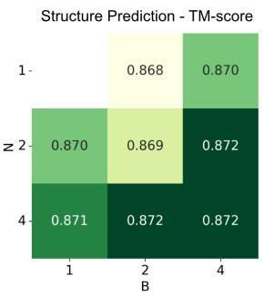

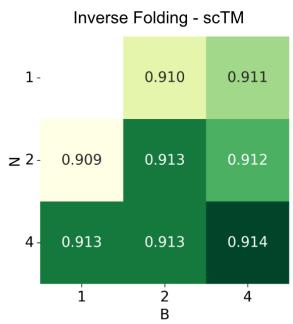  
Figure 8: ESM3 $\mathrm { B e a m }$ hyperparameter selection. Left: protein structure prediction; right: inverse folding.

Table 16: ESM3 $\mathrm { B e a m }$ explore-then-select: unconditional protein sequence-structure co-generation  
(a) Designable Subset
<table><tr><td rowspan="3"></td><td>Temp.</td><td>#Design ↑</td><td>#Clusters ↑</td><td rowspan="3"></td></tr><tr><td>From 1.0 to 0.0 1.0</td><td>393.8 (383, 405)</td><td>117.0 (107, 127)</td></tr><tr><td></td><td>350.4 (336, 360) (b) All Samples</td><td>139.0 (132, 145)</td></tr><tr><td colspan="5"></td></tr><tr><td>Temp.</td><td>pLDDT ↑</td><td>scTM ↑</td><td>#Clusters ↑</td><td>α/β%</td></tr><tr><td>1.0 to 0.0</td><td> $9 2 . 1 0 6 \pm 4 . 7 8 1$ </td><td> $0 . 9 7 4 \pm 0 . 0 4 8$ </td><td>144.0 (137, 152)</td><td>54.7 / 10.1</td></tr><tr><td>1.0</td><td> $9 0 . 7 0 4 \pm 5 . 5 2 5$ </td><td> $0 . 9 6 4 \pm 0 . 0 5 6$ </td><td>177.6 (170, 186)</td><td>47.9 /11.6</td></tr></table>

## A.4.4 Beam Search: Explore-then-Select

Across three of the four multimodal protein modeling tasks, beam search works better when the base sampler is made slightly more exploratory. For each task, we start from the selected vanilla sampling configuration (Table 8-11) and CFG scale (Table 12), and modify only one vanilla sampling setting. Table 16-18 report the ablation results.

For unconditional co-generation, replacing temperature annealing from 1.0 to 0.0 with a constant temperature of 1.0 trades designability for diversity: the number of designable samples drops from 393.8 to 350.4, while the number of clusters on the designable subset rises from 117.0 to 139.0. For motif scaffolding, increasing the initial temperature from 0.7 to 1.0 improves both success rate (48.9% to 49.9%) and diversity (214.6 to 261.0 clusters). For inverse folding, switching the unmasking strategy from deterministic to stochastic yields modest but consistent gains in scTM on both CAMEO 2022 and the PDB Date Split.

We suspect that, without this additional exploration, the beams remain too similar for rewardbased selection to meaningfully distinguish among the protein generation candidates. When exploring a too-narrow candidate space, the search could fail to achieve substantial diversity gains in more openended, exploratory-biased tasks or self-consistency gains in exploitation-biased tasks.

Table 17: ESM3 $\mathrm { B e a m }$ explore-then-select: motif-scaffolding
<table><tr><td>Temperature</td><td>#Solved / 24</td><td>Success Rate</td><td>#Clusters</td></tr><tr><td>From 0.7 to 0.0</td><td>23.0 (23, 23)</td><td> $4 8 . 9 \pm 0 . 9 \%$ </td><td>214.6 (202, 226)</td></tr><tr><td>From 1.0 to 0.0</td><td>23.0 (23, 23)</td><td> $4 9 . 9 \pm 0 . 7 \%$ </td><td>261.0 (250, 278)</td></tr></table>

Table 18: ESM3 $\mathrm { B e a m }$ explore-then-select: inverse folding
<table><tr><td></td><td colspan="2">CAMEO</td><td colspan="2">PDB Date Split</td></tr><tr><td>Umasking</td><td>scTM ↑</td><td>AAR</td><td>scTM ↑</td><td>AAR</td></tr><tr><td>Deterministic</td><td> $0 . 9 1 0 \pm 0 . 1 3 4$ </td><td>45.7</td><td> $0 . 9 5 4 \pm 0 . 0 7 5$ </td><td>49.1</td></tr><tr><td>Stochastic</td><td> $0 . 9 1 4 \pm 0 . 1 2 9$ </td><td>46.0</td><td> $0 . 9 5 6 \pm 0 . 0 6 9$ </td><td>49.3</td></tr></table>

## A.5 Inference Efficiency Analysis

As shown in Tables 1-3, in addition to benchmark performance, we report the specific FLOPs and actual wall-clock runtime on a unified device (a single Nvidia H20 GPU). Based on these results, we can draw the following analysis.

FLOPs and Forward Passes. For benchmarks with a fixed number of tokens, FLOPs are roughly proportional to the number of forward passes. In the vanilla sampling stage, the number of passes equals the diffusion steps T. In the CFG stage, the model combines conditional and unconditional outputs, requiring 2 passes per step for structure prediction and inverse folding, and 3 passes for motif scaffolding and unconditional co-generation. That is, 2T and 3T passes in total, respectively.

In the reward-guided search stage, let N be the beam width, B the branching factor, and K the scoring interval. The number of branching (scoring) steps is $S = \lfloor ( T - 1 ) / K \rfloor$ . The total forward passes equal $( ( T - S ) N + S N B ) \ \times$ perstep cost (2 or 3 passes depending on the CFG formulation), plus an additional $( S N B + N ) \times$ reward cost (1 to 3 passes depending on the reward type). Specifically, our beam search inference requires $2 ( ( T - S ) N + S N B ) + ( S N B + N )$ passes for structure prediction, $2 ( ( T - S ) N +$ $S N B ) + 2 ( S N B + N )$ passes for inverse folding, and $3 ( ( T - S ) N + S N B ) + 3 ( S N B + N )$ passes for motif scaffolding and unconditional sequencestructure co-generation.

Runtime vs. FLOPs Scaling. Due to GPU parallelization optimizations, the actual inference runtime often grows sublinearly with FLOPs. Depending on the base model implementation, if the GPU utilization is close to 100 percent, the runtime scales nearly proportionally with FLOPs. Conversely, if there is spare GPU capacity, the runtime may grow slowly even when FLOPs increase significantly.

Suboptimal Efficiency in Default Inference. Default inference protocols are often suboptimal in both performance and efficiency. Through our firststage vanilla sampling exploration, we can achieve simultaneous runtime reduction and performance improvement for DPLM-2/2.1 (structure prediction, inverse folding) and ESM3 (unconditional co-generation, inverse folding). This is achieved by reducing the total number of pLM forward passes, i.e., setting fewer diffusion steps and enabling synchronous sequence-structure co-sampling.

Performance-Efficiency Balance in CFG Inference. Our classifier-free guidance (CFG) strategies offer a superior performance-efficiency balance, delivering various degrees of performance improvement with only 1 to 3 times runtime overhead. Especially for ESM3, whose implementation leaves spare GPU capacity, resulting in only a moderate increase in runtime despite doubling the FLOPs, yielding practical benefits across all four tasks. In the unconditional co-generation benchmark, ESM3 runtime increases by about 1.46 times, while the number of designable clusters increases by about 1.81 times. In the motif scaffolding benchmark, ESM3 runtime remains nearly flat, while the number of clusters increases by a factor of 1.63. Similarly, for structure prediction and inverse folding, ESM3 performance improves while runtime remains nearly constant (<1.1 times).

Beam Search Efficiency. Table 1-3 results acknowledge that reward-guided beam search significantly increases inference costs. Meanwhile, as shown in the FLOPs estimation formats, increasing the beam width, branching factor, or scoring frequency multiplies the computational overhead. However, we believe this trade-off is justifiable for two reasons. First, our approach is training-free. Unlike specialized models or post-training studies that require multi-node clusters and weeks of training, we adjust sampling strategies using a single GPU for at most several hours. Second, the performance gains at this stage demonstrate that pLMs can compete with specialized state-of-the-art models, overturning prior consensus on multimodal pLMs such as ESM3.