# VOICEMEM: STREAMING DUAL-BRAIN MEMORY FOR REAL-TIME INTERACTION

Zhifei Xie1,5∗ Jiaqi Lang2∗ Ze An2 Yifan Zhao2 Dongchao Yang4 Kai Li3 Ziyang Ma1,5 Mingbao Lin2† Chunyan Miao1† Shuicheng Yan2†

1Nanyang Technological University 2National University of Singapore 3Tsinghua University 4The Chinese University of Hong Kong 5Open Interaction Lab # Zhifei001@e.ntu.edu.sg

https://xzf-thu.github.io/VoiceMem/

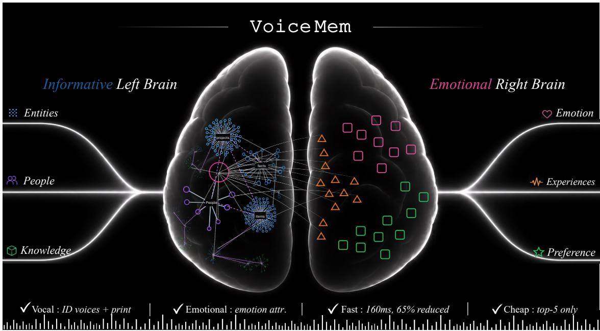

Figure 1: VOICEMEM: a memory system purpose-built for real-time conversational systems. The “left brain” provides state-of-the-art memory capabilities, while the “right brain” captures emotion and persona. Together, they enable rich, personalized memory with virtually no added latency.

## ABSTRACT

Conversational systems, such as duplex speech language models (SLMs), still lack a streaming, accurate, and empathetic memory system as their soul. We introduce VOICEMEM, a simple memory architecture with a parallel informational left brain, an emotional right brain, and streaming memory I/O mechanisms. We further build a complete pipeline for memory-aware SLM training, long-horizon evaluation, and decoupled deployment with interchangeable memory backends. Experiments and real-world deployment show three advantages: i) Accuracy: under top-5 retrieval, the left brain outperforms classical systems such as MEM0 at top-200 by nearly 30 points; ii) Emotional & Personal: the right brain, with short- and long-horizon affective attribution and dual-node persona modeling, achieves stateof-the-art performance across three persona benchmarks and improves the aggregate score by 1.89 points over the previous best system; and iii) Real-Time & Cheap: VOICEMEM completes retrieval in 134 ms, well within standard VAD latency, adding no extra conversational delay while maintaining high accuracy and low cost. These results show that VOICEMEM provides a practical memory foundation for real-time, personalized, and emotionally aware speech interaction.

## 1 Introduction

"Through memory, the soul reveals traces of itsformer existence."

Memory is what turns a conversational system (e.g. voice agent) from an intelligent tool into a humancentered partner. Although many powerful memory systems have appeared recently (Chhikara et al., 2025; Xu et al., 2025b; Hu et al., 2026), alongside interaction models that are increasingly intelligent and natural (e.g. SLMs (Xie and Wu, 2024a; Xie et al., 2026b; Fang et al., 2025; Qwen Team, 2026a) and duplex models (Ma et al., 2025; ByteDance Seed, 2026; OpenAI, 2026)), the two have not been merged into one complete solution. Building an empathetic and intelligent interaction system on top of memory remains an open challenge.

From our view, three obstacles stand in the way. (O1) Unified architecture for both informational and emotional intelligence. For real-time conversational systems, a grasp of emotion and persona matters as much as information and intelligence, and the mechanisms behind emotion are far more complex. How to model both in one architecture over the long run is still unexplored. (O2) High information density under zero latency. Existing memory systems conflict with conversational systems in two ways: (i) a 2–3 s retrieval breaks the 500 ms budget of a real-time conversation, and (ii) the top-100 output common in text agent memory is more than a speech model can take. Instead, a memory system has to add almost no latency, run streaming, and still hold its accuracy at top-5. (O3) Infrastructure and evolvability. Memory methods and speech dialogue models are both moving fast. Dialogue models still cannot take joint audio-memory input, and a memory system has to stay simple-and-effective to remain useful and keep updating in a fast-moving field.

We present VOICEMEM, a simple-and-effective streaming dual-brain memory framework for real-time spoken interaction, As shown in Figure 1. For O1 and O2, VOICEMEM has a left brain for information and a right brain for emotion and persona. (i) In the left brain, a simple two-level schema–entity architecture manages and routes memory items, which raises the information density of the ranking stage for top-5 performance. The setting of schemas is critical here, so we add an emergence mechanism, driven jointly by left-brain state, semantics, and query frequency, to balance the number of memory schemas against precision over the long run. (ii) In the right brain, we define two kinds of nodes to model complex human emotion and persona: independent nodes for emotional features of the person, and cross-entity nodes for emotional features tied to entities in the left brain, both maintained by a short- and long-term emotion attribution mechanism. (iii) To further cut latency, we propose a four-stage streaming memory query that breaks every step apart and runs in real time,finishing the query within the time a standard VAD takes.

For O3, we reassemble VOICEMEM into a fully decoupled framework, with two new modules added. (i)Model adaption: To avoid forgetting, we train at small scale and propose SLM-verified blackbox OPD, which trains the model through a loop of memory-world construction, online correction by closed-source model, and post-verification. The data produced along the loop gives CHATMEM-400K for training and CHATMEM-BENCH for evaluation, a benchmark covering four dimensions {Information, Persona, Affective Attribution, Paralinguist&Environment}, across 14 fine-grained categories. (ii) Standalone memory engine: Memory methods are moving fast, so we spent considerable extra effort transforming VOICEMEM into a graph-on-graph framework. The algorithms of VOICEMEM only manage, route, and stream at the upper layer; the lower layer is fully independent. We use Mem0 as the lower layer for its current state-of-the-art performance. Our extensive experiments across a wide range of benchmarks spanning information memory (+46.1% over Mem0 / +16.0% over the previous SOTA), persona memory (+16.8% / +5.9%), and long-horizon audio memory (+41.3% / +27.4%) demonstrate that VOICEMEM consistently advances memory quality across text and speech, while supporting low-latency streaming retrieval and transferring robustly across different memory backends.

## 2 Preliminary

Embedding-Based Memory Retrieval. Retrieval-Augmented Generation (RAG) retrieves external records according to semantic similarity (Lewis et al., 2020). General memory engines such as Mem0 (Chhikara et al., 2025) and Zep (Rasmussen et al., 2025) further support memory writing and updating. Let $\mathcal { M } _ { t }$ be the memory store at step t and $q _ { t }$ the current query. Standard retrieval selects

$$
\begin{array} { r } { \mathcal { R } _ { t } ^ { \mathrm { s e m } } = \mathrm { T o p K } _ { m _ { i } \in \mathcal { M } _ { t } } \sin \left( f _ { \theta } ( q _ { t } ) , f _ { \theta } ( m _ { i } ) \right) , } \end{array}\tag{1}
$$

and generates

$$
o _ { t } = \mathrm { L L M } \left( q _ { t } , \mathcal { R } _ { t } ^ { \mathrm { s e m } } \right) , \qquad \mathcal { M } _ { t + 1 } = \mathrm { U p d a t e } ( \mathcal { M } _ { t } , u _ { t } , o _ { t } ) .\tag{2}
$$

Agentic memory systems (e.g., A-Mem (Xu et al., 2025b) and MemoryOS) and personal memory systems (e.g., MemoryBank (Zhong et al., 2024) and EverMemOS (Hu et al., 2026)) add additional storage structures on top of this base.

Emotion-Aware Retrieval. Emotion-aware systems additionally consider affective compatibility. Emotional RAG (Huang et al., 2024) incorporates emotional relevance into retrieval, while KEEM (Kang et al., 2025a) uses emotional context to guide memory construction and updating. Let $\mathbf { a } _ { t }$ and ${ \bf a } _ { i }$ denote the affective representations of the current query and memory $m _ { i }$ . Retrieval becomes

$$
\mathcal { R } _ { t } ^ { \mathrm { a f f } } = \mathrm { T o p K } _ { m _ { i } \in \mathcal { M } _ { \star t } } \left[ \lambda \sin \left( f _ { \star \theta } ( q _ { t } ) , f _ { \star \theta } ( m _ { i } ) \right) + ( 1 - \lambda ) \kappa ( \mathbf { a } _ { t } , \mathbf { a } _ { i } ) \right] .\tag{3}
$$

Despite incorporating affect into retrieval, these methods remain information-centric, with limited capacity for emotional association and long-term affective accumulation.

Streaming Dual-Brain Memory Informational and emotional intelligence call for different maintenance: one stores information at scale, the other accumulates and attributes it. We therefore extend prior work into two parallel brains. The left brain $\mathcal { G } _ { t } ^ { L }$ organizes factual cells into evolving fact clusters, while the right brain $\mathcal { G } _ { t } ^ { R }$ maintains affective-attribution cells. They are connected by cross-brain associations $\bar { \mathcal { E } } _ { t } ^ { L R } \{ $

$$
\boldsymbol { B } _ { t } = \left( \mathcal { G } _ { t } ^ { L } , \mathcal { G } _ { t } ^ { R } , \mathcal { E } _ { t } ^ { L R } \right) .\tag{4}
$$

For every incoming utterance $u _ { t } .$ both brains activate new cells and update incrementally:

$$
\mathcal { G } _ { t + 1 } ^ { L } = \mathrm { U p d a t e } _ { L } \left( \mathcal { G } _ { t } ^ { L } , \mathrm { A c t i v a t e } _ { L } ( u _ { t } ) \right) ,
$$

$$
\mathcal { G } _ { t + 1 } ^ { R } = \mathrm { U p d a t e } _ { R } \left( \mathcal { G } _ { t } ^ { R } , \mathrm { A c t i v a t e } _ { R } ( u _ { t } ) \right) .\tag{5}
$$

The response is produced through joint retrieval:

$$
\mathcal { R } _ { t } ^ { \mathrm { D B } } = \mathrm { J o i n t R e t r i e v e } \left( q _ { t } | \mathcal { G } _ { t + 1 } ^ { L } , \mathcal { G } _ { t + 1 } ^ { R } , \mathcal { E } _ { t + 1 } ^ { L R } \right) , \qquad o _ { t } = \mathrm { L L M } \left( q _ { t } , \mathcal { R } _ { t } ^ { \mathrm { D B } } \right) .\tag{6}
$$

Thus, conventional RAG retrieves semantically similar records, emotion-aware RAG adds affective compatibility, and streaming dual-brain memory continually constructs and jointly queries separate factual and affective cognitive structures.

## 3 VoiceMem: Streaming Dual-brain Architecture

We instantiate the proposed streaming dual-brain architecture as VOICEMEM to meet three requirements: (i) maximize information density under a limited memory budget; (ii) develop a long-term understanding of personality while learning to perceive and adapt to emotions and attitudes; and (iii) add no perceptible latency to real-time spoken dialogue.

## 3.1 Left Brain: Efficient Memory Access

The goal of the left brain in VOICEMEM is to support efficient memory storage and retrieval under the tight context and latency budgets of online spoken interaction. Existing systems face two key challenges. (i) Retrieving up to top-100 candidates improves coverage but overwhelms the limited context capacity of speech-language models, whereas restricting retrieval to top-5 risks omitting relevant memories. (ii) Conventional memory pipelines often require 2–3 seconds for retrieval and processing, while real-time dialogue permits only 100–200 milliseconds of additional latency to preserve natural turn-taking.

Cluster–Entity–MemItem Indexing for Dense Memory Access. When retrieval is restricted to a small budget, such as top-5, performance depends primarily on the semantic density of the candidate space rather than on increasingly sophisticated ranking. Multiple memory items that refer to the same entity under irrelevant contexts may dominate the top-k results while providing little useful information. We therefore decouple the backend memory items stored in MEM0 from a lightweight semantic index constructed above them. This index narrows retrieval to a compact and semantically coherent candidate set before accessing the underlying memories.

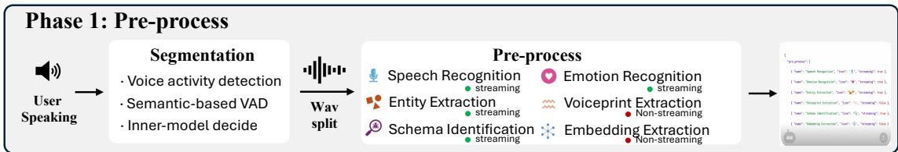

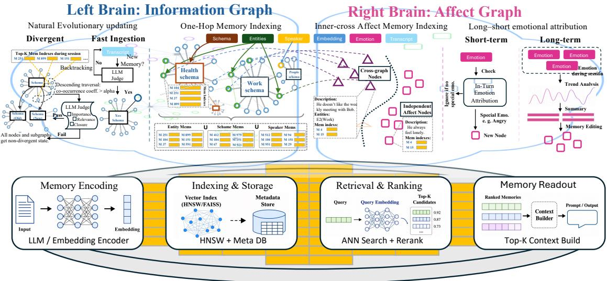  
Figure 2: The architecture of VOICEMEM. Phase I: Streaming preprocessing extracts speaker identity, ASR, entities, schemas, emotion, and embeddings. Phase II: The core algorithms manage the left brain via schema–entity organization and emergence, and the right brain via inner/cross-node modeling and long-/short-term emotion attribution. Phase III: Managed memory items are queried through interchangeable backend memory engines.

For simplicity and efficiency, the left-brain index adopts a two-level hierarchy comprising schemas for coarse-grained semantic routing and entities for locating concrete people, events, or concepts. We define

$$
\begin{array} { r l r l r } { \mathcal { G } ^ { L } = ( \mathcal { S } , \mathcal { V } , \mathcal { E } ) , } & { } & { v = ( d _ { v } , \Lambda _ { v } ^ { \mathrm { m i c r o } } , \mathcal { T } _ { v } ) , } & { } & { s = ( d _ { s } , \Lambda _ { s } ^ { \mathrm { m a c r o } } , \mathcal { V } _ { s } ) . } \end{array}
$$

Each entity $v \in \mathcal V$ belongs to exactly one schema $s \in { \mathcal { S } }$ , where $d _ { v }$ and $d _ { s }$ are textual descriptions, $\mathcal { T } _ { v }$ indexes the associated backend memory items, and $\gamma _ { s }$ contains the entities assigned to schema s. The edge set $\mathcal { E } = \mathcal { E } _ { \mathrm { m i c r o } } \cup \mathcal { E } _ { \mathrm { m a c r o } }$ supports lightweight semantic expansion: $\mathcal { N } _ { v } ^ { \mathrm { m i c r o } }$ links related entities, while $\mathcal { N } _ { s } ^ { \mathrm { m a c r o } }$ links related schemas. We encode schema membership directly rather than introducing explicit schema–entity edges, thereby avoiding recursive traversal and keeping retrieval both compact and semantically focused.

Retrieval. While the user is speaking, a streaming matcher identifies relevant schemas and entities from the partial transcript, then expands the matched entities and those contained in the matched schemas through strong and weak one-hop connections:

$$
( \gamma _ { t } , S _ { t } ) = \operatorname { M a t c h } ( x _ { < t } , \mathcal { V } , S ) , \qquad \mathcal { Z } _ { t } = \mathcal { V } _ { t } \cup \mathcal { V } _ { S _ { t } } \cup \mathcal { N } _ { 1 } ^ { \mathrm { s t r o n g } } ( \mathcal { V } _ { t } \cup \mathcal { V } _ { S _ { t } } ) \cup \mathcal { N } _ { 1 } ^ { \mathrm { w e a k } } ( \mathcal { V } _ { t } \cup \mathcal { V } _ { S _ { t } } )\tag{1}
$$

Here, $\nu _ { t }$ and $S _ { t }$ denote the matched entities and schemas, respectively; $\mathcal { V } _ { S _ { t } }$ denotes the entities assigned to the matched schemas; and $\mathcal { Z } _ { t }$ is the expanded entity set obtained through one-hop strong and weak edges. The corresponding memory items are then indexed and searched as

$$
\mathcal { C } _ { t } ^ { L } = \bigcup _ { z \in \mathcal { Z } _ { t } } \mathcal { Z } _ { z } , \qquad \mathcal { R } _ { t } ^ { L } = \mathrm { M e m S e a r c h } ( q _ { t } , \mathcal { C } _ { t } ; K ) .\tag{2}
$$

The backend searches only this candidate pool rather than the full memory M. By retaining memories associated with matched and neighboring entities while sharply reducing the search space, the proposed index enables accurate and efficient top-5 retrieval.

Fast Update. After each turn, an asynchronous updater extracts new facts and jointly reconciles them with nearby memories through ADD, UPDATE, DELETE, or KEEP operations. It then updates the associated schemas, entities, and relations off the critical path; implementation details are deferred to the appendix.

Cluster Emergence Mechanism. As a cluster grows, its information density decreases, while frequent rule-based splitting may fragment related memories and reduce retrieval coverage. We therefore let coherent subclusters emerge from repeated retrieval patterns.

Let Q be the queries observed within a session, $A _ { q }$ the entities activated by query $q ,$ and H a connected subset of entities in the current cluster. We measure their query coherence by

$$
\rho ( H ) = \frac { 1 } { | \mathcal { Q } | } \sum _ { q \in \mathcal { Q } } \frac { | A _ { q } \cap H | } { | A _ { q } \cup H | } .\tag{3}
$$

A high score indicates that the entities in H are repeatedly retrieved together. If the largest qualifying subgraph exceeds threshold $\alpha ,$ an LLM judge further evaluates its relevance, importance, and completeness before promoting it to a new cluster. The whole emergence workflow is summarized in Algorithm 1.

Algorithm 1 Cluster Subgraph Emergence Pipeline   
Require: Cluster $G _ { c } ,$ query set $\mathcal { Q } ,$ coherence threshold α   
1: H ← CONNECTEDCANDIDATES $\left( G _ { c } \right)$   
2: H⋆ ← arg maxH∈H |H| // Filter via coherence con.   
subject to $\rho ( H ) > \alpha$   
3: if $H ^ { \star }$ exists then   
4: // Relevance, importance, and completeness val.   
5: $( r , i , c ) \gets \mathrm { L L M J U D G E } ( H ^ { \star } )$   
6: if $r \wedge i \wedge c$ then   
7: PROMOTE(H⋆) // Do cluster emergence.   
8: else   
9: DISABLEPOTENTIAL(H⋆) //Prevent future   
candidate splitting   
10: end if   
11: end if

## 3.2 Right Brain: Knowing the Person

While the left brain records what happened, the right brain captures who the user is. Operating in parallel, it maintains persona memory: stable dispositions, affective tendencies, and attitudes grounded in specific people, events, or concepts. Such evidence spans multiple timescales, from immediate reactions within a turn to persistent properties consolidated across sessions.

Persona Graph. The right brain maintains two complementary types of persona nodes:

$$
\begin{array} { r } { \mathcal { G } ^ { R } = \left( \mathcal { V } ^ { I } , \mathcal { V } ^ { C } \right) , \qquad \boldsymbol { v } ^ { I } = \left( d _ { v } ^ { I } , \mathcal { Z } _ { v } ^ { I } \right) \in \mathcal { V } ^ { I } , \qquad \boldsymbol { v } _ { e } ^ { C } = \left( d _ { v , e } ^ { C } , \mathcal { Z } _ { v , e } ^ { C } , \rho _ { v , e } \right) \in \mathcal { V } ^ { C } , \quad e \in \mathcal { V } . } \end{array}\tag{4}
$$

Here, d is a persona description and I indexes its supporting backend memory items. Independent nodes $v ^ { I }$ encode user-intrinsic properties, including enduring dispositions, behavioral regularities, and affective tendencies supported by longitudinal evidence. Cross-entity nodes $v _ { e } ^ { C }$ instead capture context-dependent affect, with $\rho _ { v , e }$ linking each node to a left-brain entity $e \in \mathcal { V }$ . This distinction is fundamental: $v ^ { I }$ explains persistent user characteristics, whereas $v _ { e } ^ { C }$ preserves whom or what an emotion concerns. Collapsing the two would either mistake situational reactions for stable traits or remove the real-world causes that give affect its meaning.

Retrieval. A streaming matcher jointly activates independent and cross-entity persona nodes from the partial transcript. These matches are combined with cross-entity nodes linked to the entities activated by the left brain:

$$
\begin{array} { r l } & { ( \mathcal { V } _ { t } ^ { I } , \mathcal { V } _ { t } ^ { C } ) = \operatorname { M a t c h } \left( x _ { \le t } , \mathcal { V } ^ { I } , \mathcal { V } ^ { C } \right) , \qquad \mathcal { Z } _ { t } ^ { R } = \mathcal { V } _ { t } ^ { I } \cup \mathcal { V } _ { t } ^ { C } \cup \left\{ v _ { e } ^ { C } \in \mathcal { V } ^ { C } : e \in \mathcal { Z } _ { t } \right\} , } \\ & { \qquad \mathcal { C } _ { t } ^ { R } = \bigcup _ { z \in \mathcal { Z } _ { t } ^ { R } } \mathcal { R } _ { t } ^ { R } = \operatorname { M e m S e a r c h } \left( q _ { t } , \mathcal { C } _ { t } ^ { R } ; K \right) . } \end{array}\tag{5}
$$

Here, $\mathcal { Z } _ { t }$ is the expanded entity set produced by the left brain in (1). The resulting candidate pool combines persona evidence directly implied by the conversation with attitudes grounded in the currently relevant real-world entities, without searching the full persona memory.

Short-Horizon Attribution. For each conversational input $x _ { t } ,$ an affect estimator produces an emotion representation $e _ { t } = \phi ( x _ { t } )$ . The pair $( x _ { t } , e _ { t } )$ provides immediate evidence for adding, editing, or merging persona nodes:

$$
e _ { t } = { \phi } ( x _ { t } ) , \qquad \mathcal { G } _ { t } ^ { R } = \mathrm { M o d i f y } \left( \mathcal { G } _ { t - 1 } ^ { R } ; x _ { t } , e _ { t } \right) , \qquad t = 1 , \ldots , T .\tag{6}
$$

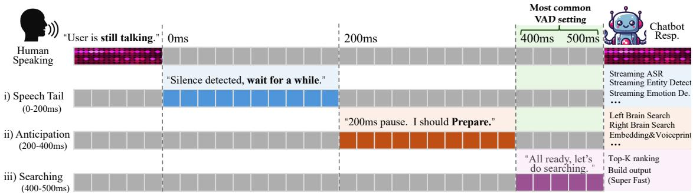  
Figure 3: The four-stage streaming retrieval process, which serves as the final safeguard for reducing retrieval latency in VOICEMEM.

Short-horizon attribution preserves the current affect together with its situational target and cause, allowing the persona graph to adapt within the ongoing interaction.

Long-Horizon Attribution. After each session, long-horizon attribution jointly analyzes the sequence $( x _ { 1 } , e _ { 1 } ) , ( x _ { 2 } , e _ { 2 } ) , \ldots , ( x _ { T } , e _ { T } )$ and consolidates recurrent evidence into stable independent persona nodes:

$$
\mathcal { V } ^ { I }  \mathrm { C o n s o l i d a t e } ( \mathcal { V } ^ { I } ; ( x _ { 1 } , e _ { 1 } ) , ( x _ { 2 } , e _ { 2 } ) , \ldots , ( x _ { T } , e _ { T } ) ) .\tag{7}
$$

Rather than accumulating every transient state, this process identifies persistent affective and behavioral patterns that provide a stable account of who the user is.

## 3.3 Streaming Dual-Brain Retrieval

We finally describe the streaming retrieval process of VOICEMEM, which is the core of its near-zero added latency. Four stages are introduced for this process: listening, speech tail, anticipation, and searching. During listening and (i) Speech Tail(0-200ms), While the user speaks, we obtain the transcript $x _ { \le t }$ (Shi et al., 2026; Xie et al., 2026c), the matched entities and schemas of both brains, and the speaker identity p in a streaming manner:

$$
\underbrace { x _ { \le t } = \mathrm { A S R } ( a _ { \le t } ) , ~ ( \mathcal { V } _ { t } , \mathcal { S } _ { t } ) , ~ ( \mathcal { V } _ { t } ^ { I } , \mathcal { V } _ { t } ^ { \dot { C } } ) } _ { \mathrm { i n ~ r e a l ~ t i m e } } = \mathrm { M a t c h } ( x _ { \le t } ) \ \left. \begin{array} { l l } { \underbrace { p _ { t } = \psi ( a _ { \le t } ) } _ { \mathrm { ( i ) ~ i f ~ d e l a y e d } } . } \end{array} \right.\tag{8}
$$

(ii) Anticipation. (200-400ms) Assume a reply is coming once the silence reaches 200 ms. Extract the query embedding and expand the upper-layer graphs of both brains by (1) and (5):

$$
\begin{array} { r } { q _ { t } = \mathrm { E m b e d } ( x _ { \leq t } ) , \qquad \mathcal { Z } _ { t } = \mathcal { G } ^ { L } ( \gamma _ { t } , S _ { t } ) , \qquad \mathcal { Z } _ { t } ^ { R } = \mathcal { G } ^ { R } ( \gamma _ { t } ^ { I } , \gamma _ { t } ^ { C } , \mathcal { Z } _ { t } ) . } \end{array}\tag{9}
$$

(iii) Searching.(400-500ms) Only the backend search is left. Both brains are searched and merged:

$$
\mathcal { R } _ { t } ^ { L } = \operatorname { M e m S e a r c h } ( { q _ { t } } , \mathcal { C } _ { t } ^ { L } ; K ) , \mathcal { R } _ { t } ^ { R } = \operatorname { M e m S e a r c h } ( { q _ { t } } , \mathcal { C } _ { t } ^ { R } ; K ) , R _ { t } = \operatorname { P r o m p t } ( \mathcal { R } _ { t } ^ { L } , \mathcal { R } _ { t } ^ { R } ) .\tag{10}
$$

A VAD threshold is commonly set to 500 ms, leaving a 400 ms window before the reply must start;   
VOICEMEM meets this budget with margin, as the dense dual-brain retrieval itself costs only 134 ms.

## 3.4 What Was the Song Playing at the Café Yesterday?

VOICEMEM extends memory beyond text to audio, supporting multi-speaker discrimination, paralinguistic analysis, and environmental sound memory. When enabled, agents selectively retain audio as speaker voiceprints, acoustic embeddings, or raw waveforms, and attach them as multimodal nodes to the corresponding entity nodes.

## 4 Infrastructure: Model Training, Validation and Deployment

In this section, we provide implementation details of VOICEMEM in real-world settings, focusing on two aspects: i) model training, where we convert the Qwen2.5-Omni (Xu et al., 2025a), Qwen3- Omni (Qwen Team, 2025), and Step-Audio2-Mini (Wu et al., 2025a) model families–originally designed for the speech-input/text-output–into memory-augmented speech language models through online black-box on-policy distillation, yielding, to our knowledge, the first speech language models with explicit memory access; and ii) deployment, where we design an evolvable two-layer system architecture for VOICEMEM that decouples the memory layer from the underlying search engine.

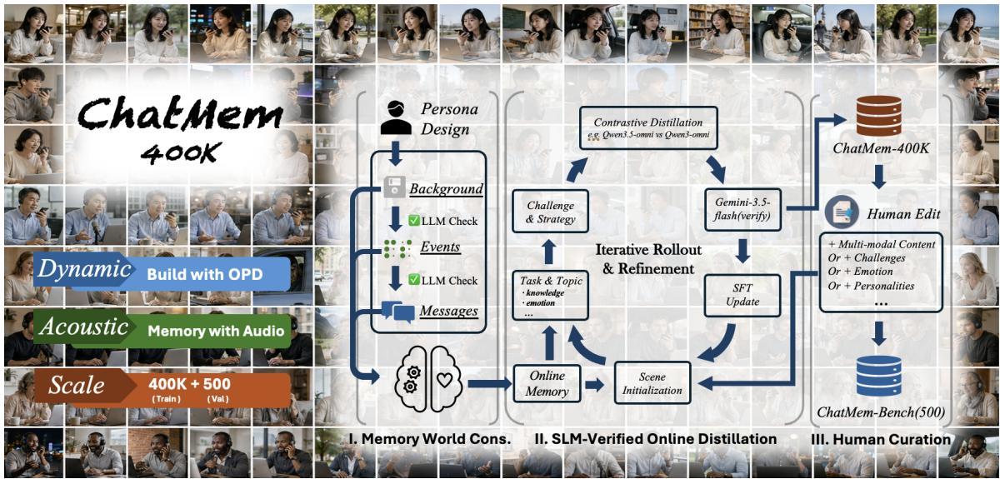  
Figure 4: Training and validation pipeline for VOICEMEM. We construct CHATMEM-400K through three stages: memory-world construction, SLM-verified online on-policy distillation, and human curation, covering dynamic user histories, acoustic inputs, and large-scale memory-dependent conversations. A human-curated subset further forms CHATMEM-BENCH for evaluating information recall, persona understanding, affective attribution, and paralinguistic/environmental reasoning.

## 4.1 Black-box OPD Training

To maximize model performance, we employ proprietary models as teachers and adopt online distillation to mitigate catastrophic forgetting during adaptation. Specifically, Qwen2.5-Omni and Qwen3-Omni are distilled from Qwen3.5-Omni (Qwen Team, 2026b), while Step-Audio2-Mini is distilled from Step-Audio2 (Wu et al., 2025a). The Training pipeline consists of four stages:

Stage I: Memory World Construction. We first construct a coherent long-term memory world for each synthetic user. Starting from a core persona, we progressively instantiate background information, life events, messages, and online memories: Persona → Background → Events → Messages → Memory. This yields temporally consistent user histories for downstream dialogue generation.

Stage II: SLM-Verified Online Distillation. We generate memory-dependent conversations through an iterative pipeline: i) Task & Topic samples knowledge-, emotion-, or persona-oriented goals; ii) Scene Initialization constructs the current context; iii) Challenge & Strategy introduces recall, reference resolution, contradiction, and multi-memory reasoning; iv) Contrastive Distillation compares responses with different memory-use behaviors; v) Verification filters for necessity, faithfulness, and quality; and vi) SFT Update updates the generator for the next iteration. Repeating this loop yields CHATMEM-400K, a large-scale corpus of memory-dependent conversations.

Stage III: Human Curation. Human annotators further refine the corpus and construct harder samples with richer emotional and personality dynamics and multimodal inputs such as acoustic questions. These examples augment training, while a challenging subset is curated into CHATMEM-BENCH.

Stage IV: Validation. We use CHATMEM-BENCH as one of the primary benchmarks for evaluating the final models, as existing benchmarks do not fully capture the requirements of real-world voice assistants. It covers four dimensions: {Information, Persona, Affective Attribution, Paralinguistics & Environment}, across 14 fine-grained question categories. As its construction requires substantial human effort, we defer a detailed introduction of the benchmark and annotation pipeline to a separate follow-up technical report.

## 4.2 Decoupled Upper-level Routing–Lower-level Engine Architecture

The underlying memory engine is evolving rapidly, with parameterized and latent memory mechanisms also emerging as promising directions. We therefore avoid tightly coupling the real-time memory architecture with any particular backend, which would otherwise hinder timely adoption of newer memory algorithms. To this end, we substantially redesigned VOICEMEM around a decoupled architecture: our focus lies on upper-level routing, the parallel dual-brain organization, and streaming reasoning, while the underlying engine abstracted by MemSearch in Section 3 remains fully interchangeable. In our current implementation, we use MEM0 as the backend due to its generality and strong state-of-the-art performance.

Table 1: Factual memory results. LLM-judge score (%, ↑). ‡: responses generated by our finetuned Qwen3.6; all other rows use GPT-4o-mini as the response model.
<table><tr><td rowspan="2">Method</td><td colspan="4">LoCoMo</td><td colspan="4">LongMemEval</td><td colspan="3">Memora</td><td rowspan="2">Avg.</td></tr><tr><td>Single</td><td>Multi</td><td>Temp.</td><td>Open</td><td>Extr.</td><td>Multi</td><td>Upd.</td><td>Temp.</td><td>Rem.</td><td>Rec.</td><td>Rea.</td></tr><tr><td colspan="10">Reference</td><td></td><td></td><td></td></tr><tr><td>Full-Context</td><td>75.87</td><td>72.27</td><td>70.29</td><td>57.45</td><td>45.45</td><td>73.92</td><td>78.21</td><td>31.58</td><td>85.54</td><td>52.10</td><td>22.67</td><td>60.49</td></tr><tr><td colspan="10">Memory Engines</td><td></td><td></td><td></td></tr><tr><td>Mem0</td><td>67.13</td><td>51.15</td><td>55.51</td><td>72.93</td><td>62.82</td><td>46.21</td><td>70.12</td><td>40.15</td><td>40.42</td><td>52.58</td><td>16.00</td><td>52.27</td></tr><tr><td>Zep</td><td>66.91</td><td>53.70</td><td>60.29</td><td>70.82</td><td>47.46</td><td>74.44</td><td>54.10</td><td>34.62</td><td>33.36</td><td>37.38</td><td>3.50</td><td>48.78</td></tr><tr><td>LangMem</td><td>62.23</td><td>47.92</td><td>43.43</td><td>71.12</td><td>55.13</td><td>20.30</td><td>66.67</td><td>15.79</td><td>68.16</td><td>48.88</td><td>30.00</td><td>48.15</td></tr><tr><td colspan="10">Agent Memory</td><td></td><td></td><td></td><td></td></tr><tr><td>A-MEM</td><td>49.79</td><td>49.85</td><td>54.05</td><td>49.91</td><td>64.62</td><td>48.87</td><td>64.11</td><td>47.36</td><td>68.82</td><td>35.04</td><td>2.00</td><td>48.58</td></tr><tr><td>MemoryOS</td><td>69.35</td><td>62.30</td><td>44.72</td><td>44.29</td><td>58.10</td><td>31.06</td><td>48.72</td><td>32.33</td><td>15.24</td><td>38.86</td><td>1.50</td><td>40.59</td></tr><tr><td>MemOš</td><td>81.09</td><td>67.49</td><td>75.18</td><td>55.90</td><td>86.77</td><td>70.70</td><td>74.33</td><td>77.49</td><td>51.84</td><td>62.64</td><td>20.66</td><td>65.83</td></tr><tr><td colspan="10">Personal Memory</td><td></td><td></td><td></td><td></td></tr><tr><td>MemoryBank</td><td>21.25</td><td>18.40</td><td>31.50</td><td>26.28</td><td>23.33</td><td>26.00</td><td>14.00</td><td>20.00</td><td>22.22</td><td>41.88</td><td>1.42</td><td>22.39</td></tr><tr><td>EverMemOS</td><td>90.12</td><td>87.43</td><td>85.16</td><td>69.79</td><td>82.71</td><td>73.68</td><td>89.74</td><td>77.44</td><td>17.21</td><td>33.27</td><td>16.67</td><td>65.75</td></tr><tr><td>Emotional RAG</td><td>19.62</td><td>25.53</td><td>34.89</td><td>13.54</td><td>40.00</td><td>55.00</td><td>70.00</td><td>65.00</td><td>51.16</td><td>39.38</td><td>14.75</td><td>38.99</td></tr><tr><td colspan="10">Ours</td><td></td><td></td><td></td><td></td></tr><tr><td>VoiceMem</td><td>94.60</td><td>91.60</td><td>89.80</td><td>85.60</td><td>83.20</td><td>75.00</td><td>77.50</td><td>95.00</td><td>66.80</td><td>50.50</td><td>30.70</td><td>76.39</td></tr><tr><td>VoiceMem‡</td><td>95.15</td><td>92.40</td><td>91.35</td><td>86.08</td><td>79.64</td><td>70.17</td><td>79.24</td><td>89.63</td><td>69.10</td><td>54.77</td><td>24.61</td><td>75.65</td></tr></table>

Table 2: Persona memory results. LLM-judge score (%, ↑).
<table><tr><td rowspan="2">Method</td><td colspan="4">ES-MemEval</td><td colspan="5">PersonaMem</td><td colspan="2">PersonaLens</td><td rowspan="2">Avg.</td></tr><tr><td>E</td><td>TR</td><td>CD</td><td>UM</td><td>Rec.</td><td>Gen.</td><td>Evol.</td><td>Reason</td><td>Reco.</td><td>Per.</td><td>TCR</td></tr><tr><td colspan="10">Reference</td><td></td><td></td><td></td></tr><tr><td>Full-Context</td><td>20.20</td><td>19.60</td><td>12.10</td><td>21.70</td><td>41.00</td><td>46.00</td><td>68.00</td><td>77.00</td><td>37.00</td><td>75.00</td><td>91.08</td><td>46.24</td></tr><tr><td colspan="10">Memory Engines</td><td></td><td></td><td></td></tr><tr><td>Mem0</td><td>75.10</td><td>56.70</td><td>72.30</td><td>64.20</td><td>32.13</td><td>57.89</td><td>54.68</td><td>80.81</td><td>52.73</td><td>82.25</td><td>92.39</td><td>65.56</td></tr><tr><td>Zep</td><td>66.80</td><td>42.30</td><td>64.20</td><td>58.00</td><td>35.30</td><td>42.10</td><td>34.50</td><td>50.50</td><td>36.40</td><td>58.50</td><td>82.74</td><td>51.94</td></tr><tr><td>LangMem</td><td>18.80</td><td>15.00</td><td>20.40</td><td>22.70</td><td>31.29</td><td>8.77</td><td>53.24</td><td>81.82</td><td>40.00</td><td>77.45</td><td>88.99</td><td>41.68</td></tr><tr><td colspan="10">Agent Memory</td><td></td><td></td><td></td></tr><tr><td>A-MEM</td><td>67.80</td><td>58.30</td><td>67.00</td><td>56.70</td><td>63.01</td><td>57.89</td><td>54.68</td><td>85.86</td><td>69.09</td><td>62.50</td><td>83.26</td><td>66.01</td></tr><tr><td>MemoryOS</td><td>43.90</td><td>30.50</td><td>41.00</td><td>41.50</td><td>47.06</td><td>56.14</td><td>32.37</td><td>48.48</td><td>47.27</td><td>55.75</td><td>82.01</td><td>47.82</td></tr><tr><td>MemOS</td><td>77.70</td><td>64.60</td><td>66.30</td><td>73.50</td><td>72.72</td><td>56.14</td><td>58.27</td><td>78.79</td><td>72.72</td><td>82.75</td><td>91.47</td><td>72.27</td></tr><tr><td colspan="10">Personal Memory</td><td></td><td></td><td></td><td></td></tr><tr><td>MemoryBank</td><td>43.00</td><td>35.20</td><td>42.70</td><td>38.70</td><td>35.29</td><td>49.12</td><td>51.08</td><td>56.57</td><td>40.00</td><td>64.50</td><td>80.66</td><td>48.80</td></tr><tr><td>EverMemOS</td><td>66.80</td><td>50.70</td><td>59.60</td><td>45.90</td><td>47.06</td><td>47.37</td><td>41.01</td><td>43.43</td><td>56.36</td><td>63.25</td><td>79.91</td><td>54.67</td></tr><tr><td>Emotional RAG</td><td>82.30</td><td>67.10</td><td>77.30</td><td>73.70</td><td>52.94</td><td>61.40</td><td>44.60</td><td>58.59</td><td>43.64</td><td>64.25</td><td>82.00</td><td>64.35</td></tr><tr><td colspan="10">Ours</td><td></td><td></td><td></td><td></td></tr><tr><td>VoiceMem</td><td>82.80</td><td>67.30</td><td>69.10</td><td>74.00</td><td>76.47</td><td>64.91</td><td>51.08</td><td>83.84</td><td>70.91</td><td>83.75</td><td>91.63</td><td>74.16</td></tr><tr><td>VoiceMem‡</td><td>81.20</td><td>64.70</td><td>73.50</td><td>71.90</td><td>75.19</td><td>70.17</td><td>73.38</td><td>83.94</td><td>69.10</td><td>85.50</td><td>93.57</td><td>76.56</td></tr></table>

## 5 Experiments

In this section, we conduct a series of experiments to answer four questions:

(RQ1) Does VoiceMem retrieve accurately across modalities? §5.2, §5.3

(RQ2) Is that accuracy cheap and fast enough for a live voice loop, and what makes it so? §5.4

(RQ3) Does every component earn its place, and what memory structure do they produce? §5.4

(RQ4) Does the index transfer across different underlying memory stores? §5.4

Table 3: ChatMem-Bench results. LLM-judge score (%, ↑).
<table><tr><td rowspan="2">Method</td><td colspan="4">Information</td><td colspan="3">Persona</td><td colspan="3">Affective Attr.</td><td colspan="4">Paraling.&amp;Env.</td><td rowspan="2">Avg.</td></tr><tr><td>Upd.</td><td>Temp.</td><td>Synt.</td><td>Abst.</td><td>Prof.</td><td>Pref.</td><td>Impl.</td><td>Attr.</td><td>Agd.</td><td>Phras.</td><td>Bsr.</td><td>Asi.</td><td>Mul.</td><td>Asa.</td></tr><tr><td colspan="10">Reference</td><td colspan="7"></td></tr><tr><td>Full-Context</td><td>62.07</td><td>42.11</td><td>68.42</td><td>57.89</td><td>61.11</td><td>47.83</td><td>41.17</td><td>16.67</td><td>57.14</td><td>37.78</td><td>11.76</td><td>22.58</td><td>26.92</td><td>90.00</td><td>45.96</td></tr><tr><td colspan="10">Memory Engines</td><td colspan="7"></td></tr><tr><td>Mem0</td><td>55.17</td><td>31.57</td><td>83.21</td><td>68.42</td><td>66.67</td><td>78.26</td><td>52.94</td><td>16.67</td><td>61.90</td><td>46.67</td><td>11.76</td><td>3.23</td><td>11.54</td><td>93.00</td><td>48.64</td></tr><tr><td>Zep</td><td>37.93</td><td>15.78</td><td>63.16</td><td>63.16</td><td>50.00</td><td>69.57</td><td>35.29</td><td>8.33</td><td>57.14</td><td>33.33</td><td>5.88</td><td>9.68</td><td>7.69</td><td>91.50</td><td>39.17</td></tr><tr><td>LangMem</td><td>58.62</td><td>21.05</td><td>73.68</td><td>78.95</td><td>61.11</td><td>73.91</td><td>47.05</td><td>41.67</td><td>47.62</td><td>42.22</td><td>11.76</td><td>12.90</td><td>15.38</td><td>93.00</td><td>48.49</td></tr><tr><td colspan="10"></td><td colspan="7"></td></tr><tr><td>Agent Memory A-MEM</td><td></td><td></td><td></td><td></td><td></td><td></td><td></td><td></td><td></td><td></td><td>23.53</td><td></td><td></td><td></td><td>42.89</td></tr><tr><td>MemoryOS</td><td>41.38 51.71</td><td>10.53 36.84</td><td>68.42 89.47</td><td>73.68 73.68</td><td>38.89 44.44</td><td>73.91 82.61</td><td>41.17 35.29</td><td>25.00 25.00</td><td>52.38 52.38</td><td>44.44 35.55</td><td>5.88</td><td>9.68 19.35</td><td>3.85 15.38</td><td>93.65 95.59</td><td>47.37</td></tr><tr><td>MemOS</td><td>72.41</td><td>31.57</td><td>52.63</td><td>84.21</td><td>77.78</td><td>78.26</td><td>47.05</td><td>50.00</td><td>71.43</td><td>46.67</td><td>17.65</td><td>12.90</td><td>19.23</td><td>93.46</td><td>53.95</td></tr><tr><td colspan="10">Personal Memory</td><td colspan="7"></td></tr><tr><td>MemoryBank</td><td>41.38</td><td>5.26</td><td>47.37</td><td>63.16</td><td>38.89</td><td>52.17</td><td>29.41</td><td>8.33</td><td>42.86</td><td>24.44</td><td>23.53</td><td>6.45</td><td>7.69</td><td>94.49</td><td>34.67</td></tr><tr><td>EverMemOS</td><td>44.83</td><td>26.32</td><td>63.16</td><td>94.74</td><td>50.00</td><td>69.57</td><td>52.94</td><td>33.33</td><td>66.67</td><td>37.78</td><td>11.76</td><td>9.68</td><td>23.08</td><td>94.41</td><td>48.45</td></tr><tr><td>Emotional RAG</td><td>34.48</td><td>10.53</td><td>57.89</td><td>73.68</td><td>44.44</td><td>60.87</td><td>58.82</td><td>58.33</td><td>52.38</td><td>42.22</td><td>11.76</td><td>3.23</td><td>3.85</td><td>94.55</td><td>43.36</td></tr><tr><td colspan="10">Ours</td><td colspan="7"></td></tr><tr><td>VoiceMem</td><td>79.31</td><td>47.37</td><td>83.68</td><td>89.47</td><td>72.22</td><td>86.96</td><td>64.71</td><td>66.67</td><td>76.19</td><td>51.11</td><td>47.06</td><td>45.16</td><td>53.84</td><td>98.50</td><td>68.73</td></tr><tr><td>VoiceMem‡</td><td>86.21</td><td>42.11</td><td>83.16</td><td>89.47</td><td>66.67</td><td>86.96</td><td>58.82</td><td>58.33</td><td>66.67</td><td>48.89</td><td>52.94</td><td>51.61</td><td>50.00</td><td>95.56</td><td>66.96</td></tr></table>

## 5.1 Settings

Benchmarks. We evaluate on three families. (i) Information memory: LoCoMo (Maharana et al., 2024), LongMemEval (S) (Wu et al., 2025b), and Memora (Uddin et al., 2026). (ii) Persona memory: ES-MemEval (Chen et al., 2026), PersonaMem (Jiang et al., 2025), and PersonaLens (Zhao et al., 2025). (iii) Voice-grounded memory: ChatMem-Bench, with 316 questions over 53 hours of audio in four ability groups and fourteen sub-categories.

Baselines. Ten systems in four groups. (i) Reference: Full-Context. (ii) Memory engines: Mem0 (Chhikara et al., 2025), Zep (Rasmussen et al., 2025), LangMem (LangChain, 2025). (iii) Agent memory: A-MEM (Xu et al., 2025b), MemoryOS (Kang et al., 2025b), MemOS (Li et al., 2025). (iv) Personal memory: MemoryBank (Zhong et al., 2024), EverMemOS (Hu et al., 2026), Emotional RAG (Huang et al., 2024).

Implementation details. All baseline systems use GPT-4o-mini (OpenAI, 2024a) as the backbone LLM and text-embedding-3-small (OpenAI, 2024b) as the embedding model, with temperature 0. VoiceMem is evaluated under six retrieval settings, K ∈ {1, 3, 5, 10, 30, 100} with K=5 as the default operating point.

## 5.2 Main Results

For [RQ1.1] on text conversations, VOICEMEM retrieves dense memory on both information and persona. As presented in Tab. 1, our method leads seven of the eleven information sub-categories. It averages 76.39, beating Mem0, its own storage backend, by +24.12 and full-context processing, which sees the entire history, by +15.90. The margin is widest when several memories must arrive together (e.g., temporal reasoning, +54.9) and narrowest on update tracking (+7.4), which a single most-recent memory already answers. As presented in Tab. 2, our method reaches 74.16 on eleven persona sub-categories with GPT-4o-mini and 76.56 with our fine-tuned response model, passing the strongest baseline, MemOS, by +1.89. The reference inverts on ES-MemEval, where full context scores 12.10 on conflict detection and 21.70 on user modeling, against 69.10 and 74.00 for ours, i.e., the evidence sits in its input and it still cannot attribute it. Notably, both tables are produced at a retrieval budget an order of magnitude below the top-100 setting conventional in text-agent memory, which indicates that the gains come from a denser candidate pool rather than a larger one.

## 5.3 ChatMem-Bench: Long-Horizon Audio Assistant Memory

As briefly introduced in Sec. 4.1, CHATMEM-BENCH evaluates whether a memory system can consolidate long-term speech interaction, across complex environments, affect, and information into a good voice assistant. It contains 316 questions drawn from 15,314 turns and 53 hours of dialogue, and every session is curated by humans, from choosing the topic to constructing the memory world and designing the challenge. As shown in Tab. 3, the benchmark has four dimensions with 14 fine-grained categories. From left to right, Information covers update tracking, temporal reasoning, synthesis, and abstention; Persona covers profile constraints, preference-aligned recommendation, and implicit-need inference; Affective Attribution covers emotion–target attribution, attachment-guided decisions, and affect-aware phrasing; Paralinguistics & Environment covers background-sound recall, acoustic-scene inference, multi-user conversational memory, and acoustic style adaptation.

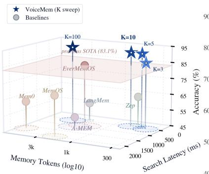

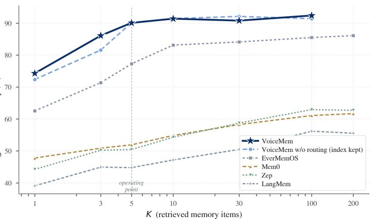  
Figure 5: Time–Cost–Accuracy Comparison on LoCoMo.  
Figure 6: Retrieval-budget sweep on LoCoMo.  
fullw/o upper-layer indexw/o right brainw/o emergent clusterw/o dual horizonw/o joint retrieva

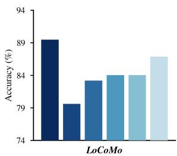

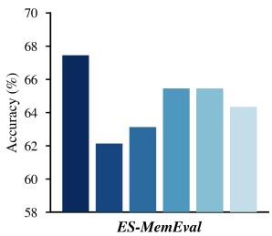

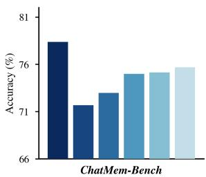

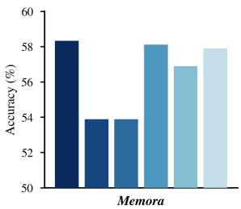  
Figure 7: Component ablation at K=5, one mechanism disabled per bar. Each panel uses its own y-range; none starts at zero.

For [RQ1.2] on long multi-turn audio, as shown in Tab. 3, VOICEMEM leads on 11 of the 14 categories, and the gap is widest on Paralinguistics & Environment, where a transcript carries no evidence at all: every text system lands between 3.23 and 26.92 on the three acoustic categories, while ours reaches 45.16 to 53.84. Affective Attribution shows the opposite, i.e., text baselines stay competitive because word choice already carries most of the affective signal, and the audio increment appears instead on attachment-guided decisions and affect-aware phrasing.

## 5.4 Ablation and Analysis

[RQ2] Accuracy, cost and latency at one operating point. Figure 5 plots all three axes at once. VoiceMem at K=5 reaches 91.2 with 430 memory tokens and 134 ms of retrieval. The strongest baseline, EverMemOS, reaches 83.13 with 1,899 tokens: +8.1 points at 4.4× fewer tokens. The whole baseline field sits at 541 to 6, 956 tokens, so the saving is not specific to one comparison. Latency is also flat in K: the search stays near 134 ms from K=3 to $\mathrm { \hat { K } = 1 0 0 }$ , because schema routing bounds the candidate pool before ranking, so the number of items finally returned does not change how much is searched.

[RQ2] The small budget costs nothing in accuracy. Figure 6 sweeps K on LoCoMo. VoiceMem is highest at every K, and the margin is widest where the budget is tightest: +11.8 over EverMemOS and +26.5 over Mem0 at K=1, and +12.8 over EverMemOS at K=5. The curve is flat past $K { = } 5 - K { = } 1 0$ adds 1.3 points, $K { = } 1 0 0$ adds 2.3 for 8× the tokens — so operating at K=5 gives up essentially nothing. The baselines have no such option: EverMemOS needs top-10 to reach 83.13, which VoiceMem already exceeds at K=3 with 362 tokens, and neither Mem0 nor Zep exceeds 63 at any budget. The dashed curve removes schema routing and shows where the saving comes from: it costs 4.53 points at K=3 and closes to within 0.05 by K=5, i.e. routing does not raise the ceiling, it lowers the budget needed to reach it — without it, matching 430-token accuracy takes K=30 and 1,277 tokens. Note that this ablation disables schema-based routing while retaining the upper-layer index, so the candidate pool is still narrowed; removing the index entirely costs 9.9 points at the same $K { = } 5$ (Figure 7), which is what actually carries the gain.

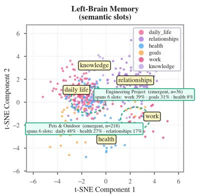

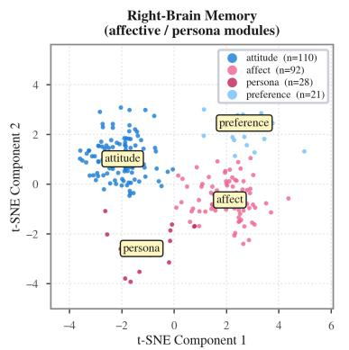

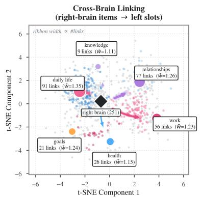  
Figure 8: What the two stores hold. $L e f t { \mathrm { : } }$ left-brain items by semantic slot, with the two emergent sub-slots circled. Middle: right-brain items by module. Right: right-to-left linking, ribbon width proportional to link count.

[RQ3] Every mechanism contributes on every dataset. Figure 7 disables one mechanism at a time on four datasets. All five ablations lose accuracy on all four. Removing the upper-layer index is the largest loss everywhere $( - 9 . 9 ~ / ~ - 5 . 3 ~ / ~ - \bar { 6 } . 7 ~ / ~ - 4 . 4 ~ \mathrm { o n } ~ \mathrm { L o C o M o } ^ { - } / $ ES-MemEval / ChatMem-Bench / Memora). The right brain is next $( - 6 . 3 / - 4 . 3 / - 5 . 4 / - 4 . 4 )$ , so affect and persona carry information the factual store does not. Emergent clustering $( - 5 . 5 / - 2 . 0 / - 3 . 4$ / −0.2) and dual-horizon updating $( - 5 . 4 / - 2 . 0 / - 3 . 2 / - 1 . 4 )$ are largest on LoCoMo, whose sessions are the longest, and smallest on Memora. Joint retrieval is the smallest on LoCoMo and ChatMem-Bench $( - 2 . 6 / - 3 . 1 / - 2 . 7 / - 0 . 4 ) \colon$ taking the union of two separately ranked lists is a workable fallback. Two further ablations — how a one-hop neighbour schema should enter the prompt, and how cluster maintenance compares against splitting at random — are in Appendix B.

[RQ3] The structure those mechanisms produce. Figure 8 shows what the store looks like once they run. The left store holds 510 items across six preset slots. Two further slots were never preset; they emerged from the semantic graph and cover 254 items, 49.8% of the store. Neither sits inside a single preset slot: Pets & Outdoor (218 items) draws 48% from daily\_life, 27% from health and 17% from relationships, and Engineering Project (36 items) splits between work (39%) and goals (31%). Both span all six preset slots, so emergence re-partitions the store across preset boundaries rather than refining within them — which is why disabling it costs most on LoCoMo, where sessions run longest and the preset slots are furthest from the actual topic structure. The right store holds 251 items in four modules, linked to left-brain slots by 280 edges spread unevenly: daily\_life receives 91, knowledge 9.

[RQ4] The index transfers across backends. The index requires identifier-addressable items, similarity search, and UPDATE writes. Without threshold retuning, it improves all three stores by 15.8–29.5 points (Table 4), showing the gain is not store-specific. Mem0 is the full system; however, LangMem and Mem0 start within 5.50 points but finish 19.26 apart, so backend quality still bounds recovery.

Table 4: Backend transfer on LoCoMo.
<table><tr><td>Backend</td><td>bare</td><td>+ ours</td><td>∆</td></tr><tr><td>Mem0 LangMem</td><td>61.68 56.18</td><td>91.20 71.94</td><td>+29.52 +15.76</td></tr><tr><td>Zep</td><td>62.93</td><td>85.85</td><td>+22.92</td></tr><tr><td>mean</td><td>60.26</td><td>83.00</td><td>+22.73</td></tr></table>

## 6 Case Study

As shown in Fig. 9, current real-time voice models can respond fluently to the current turn but struggle to accumulate persistent knowledge about the user. VoiceMem addresses this limitation by jointly modeling semantic, preference, affective, and audio-related memories, enabling responses conditioned on a user’s interaction history. Its streaming dual-brain architecture separates factual memory from affective attribution while supporting long-horizon and multimodal recall. As a result, VoiceMem turns turn-level speech understanding into continuous, personalized user understanding with minimal latency overhead.

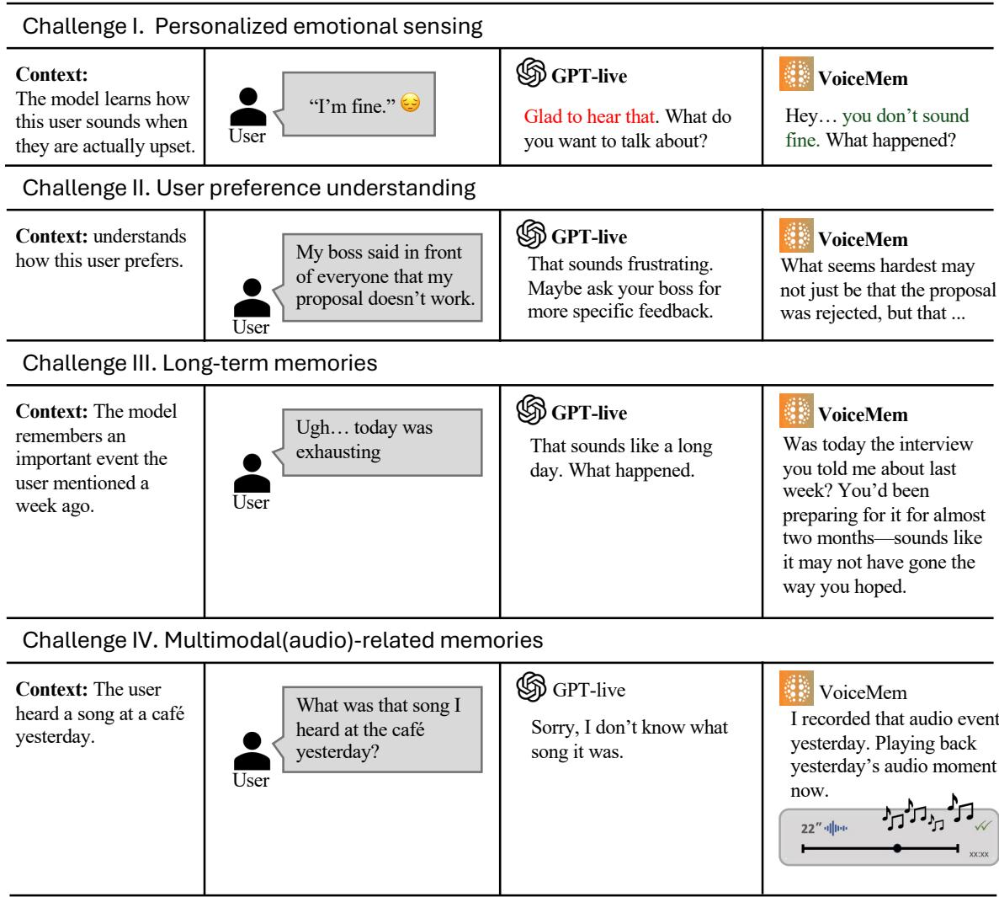  
Figure 9: VoiceMem augments real-time voice models with persistent, personalized memory. Across four representative cases, VoiceMem enables user-specific emotion sensing, preference-aware responses, long-term recall, and multimodal audio memory that are unavailable to a memoryless baseline.

## 7 Conclusion

In this paper, we presented VOICEMEM, a streaming dual-brain memory framework that equips real-time conversational systems with both informational and emotional memory without breaking their latency budget. The left brain organizes factual knowledge through a two-level schema–entity index with a query-driven cluster emergence mechanism, keeping the candidate pool dense enough to survive a top-5 retrieval budget, while the right brain models the person through independent and cross-entity persona nodes maintained by short- and long-horizon affective attribution. A four-stage streaming query then hides the entire retrieval inside the silence that a standard VAD already waits out. Around this core we built a complete pipeline for memory-aware SLM training, long-horizon evaluation, and decoupled deployment with interchangeable backends. Experiments show that VOICEMEM leads on both information and persona benchmarks at a retrieval budget an order of magnitude below common practice, reaching 91.2 on LoCoMo with 430 memory tokens and 134 ms of retrieval, and that the same index lifts three different backends by 15.8–29.5 points. By turning turn-level speech understanding into continuous, personalized user understanding at essentially no latency cost, VOICEMEM lays a practical memory foundation for the next generation of empathetic, real-time voice assistants.

## References

Pratyay Banerjee, Masud Moshtaghi, Shivashankar Subramanian, Amita Misra, and Ankit Chadha. APEX-MEM: Agentic semi-structured memory with temporal reasoning for long-term conversational AI. In Proceedings ofthe 64th Annual Meeting ofthe Associationfor Computational Linguistics (Volume 1: Long Papers), pages 16470–16489, 2026. arXiv:2604.14362.

ByteDance Seed. Seedrealtime: Audio-visual full-duplex llm released, August 2026. ByteDance Seed model release.

Hao Chen, Jiaming Liu, Chenyang Gu, Zhuoyang Liu, Renrui Zhang, Xiaoqi Li, Xiao He, Yandong Guo, Chi-Wing Fu, Shanghang Zhang, and Pheng-Ann Heng. Fast-in-slow: A dual-system foundation model unifying fast manipulation within slow reasoning. In Advances in Neural Information Processing Systems, 2025. arXiv:2506.01953.

Tiantian Chen, Jiaqi Lu, Ying Shen, and Lin Zhang. Es-memeval: Benchmarking conversational agents on personalized long-term emotional support. In Proceedings of the ACM Web Conference 2026, pages 5810–5821, 2026.

Prateek Chhikara, Dev Khant, Saket Aryan, Taranjeet Singh, and Deshraj Yadav. Mem0: Building production-ready ai agents with scalable long-term memory. arXiv preprint arXiv:2504.19413, 2025.

Cheng-Han Chiang, Xiaofei Wang, Linjie Li, Chung-Ching Lin, Kevin Lin, Shujie Liu, Zhendong Wang, Zhengyuan Yang, Hung-yi Lee, and Lijuan Wang. SHANKS: Simultaneous hearing and thinking for spoken language models. In Proceedings of the 64th Annual Meeting of the Association for Computational Linguistics (Volume 1: Long Papers), 2026. arXiv:2510.06917.

Konstantina Christakopoulou, Shibl Mourad, and Maja Mataric. Agents thinking fast and slow: A´ talker-reasoner architecture. arXiv preprint arXiv:2410.08328, 2024. NeurIPS 2024 Workshop on Open-World Agents.

Alexandre Défossez, Laurent Mazaré, Manu Orsini, Amélie Royer, Patrick Pérez, Hervé Jégou, Edouard Grave, and Neil Zeghidour. Moshi: A speech-text foundation model for real-time dialogue. arXiv preprint arXiv:2410.00037, 2024.

Qingkai Fang, Shoutao Guo, Yan Zhou, Zhengrui Ma, Shaolei Zhang, and Yang Feng. Llama-omni: Seamless speech interaction with large language models. In International Conference on Learning Representations, 2025.

Gregory Hickok and David Poeppel. The cortical organization of speech processing. Nature Reviews Neuroscience, 8(5):393–402, 2007. doi: 10.1038/nrn2113.

Chuanrui Hu, Xingze Gao, Zuyi Zhou, Dannong Xu, Yi Bai, Xintong Li, Hui Zhang, Tong Li, Chong Zhang, Lidong Bing, and Yafeng Deng. Evermemos: A self-organizing memory operating system for structured long-horizon reasoning. arXiv preprint arXiv:2601.02163, 2026.

Le Huang, Hengzhi Lan, Zijun Sun, Chuan Shi, and Ting Bai. Emotional rag: Enhancing roleplaying agents through emotional retrieval. In 2024 IEEE International Conference on Knowledge Graph, 2024.

Bowen Jiang, Zhuoqun Hao, Young-Min Cho, Bryan Li, Yuan Yuan, Sihao Chen, Lyle Ungar, Camillo J. Taylor, and Dan Roth. Know me, respond to me: Benchmarking llms for dynamic user profiling and personalized responses at scale. arXiv preprint arXiv:2504.14225, 2025.

Dongming Jiang, Yi Li, Guanpeng Li, and Bingzhe Li. MAGMA: A multi-graph based agentic memory architecture for AI agents. In Proceedings ofthe 64th Annual Meeting ofthe Association for Computational Linguistics (Volume 1: Long Papers), 2026. arXiv:2601.03236.

Jeonghyun Kang, Hongjin Kim, and Harksoo Kim. Generation-based and emotion-reflected memory update: Creating the KEEM dataset for better long-term conversation. In Proceedings of the 31st International Conference on Computational Linguistics, pages 9260–9277. Association for Computational Linguistics, 2025a.

Jiazheng Kang, Mingming Ji, Zhe Zhao, and Ting Bai. Memory os of ai agent. In Proceedings of the 2025 Conference on Empirical Methods in Natural Language Processing, pages 25961–25970, 2025b.

LangChain. Langmem, 2025. Long-term memory tools for AI agents.

Patrick Lewis, Ethan Perez, Aleksandra Piktus, Fabio Petroni, Vladimir Karpukhin, Naman Goyal, Heinrich Küttler, Mike Lewis, Wen-tau Yih, Tim Rocktäschel, Sebastian Riedel, and Douwe Kiela. Retrieval-augmented generation for knowledge-intensive nlp tasks. In Advances in Neural Information Processing Systems, volume 33, pages 9459–9474, 2020.

Zhiyu Li, Shichao Song, Hanyu Wang, Simin Niu, Ding Chen, Jiawei Yang, Chenyang Xi, Huayi Lai, Jihao Zhao, Yezhaohui Wang, Junpeng Ren, Zehao Lin, Jiahao Huo, Tianyi Chen, Kai Chen, Kehang Li, Zhiqiang Yin, Qingchen Yu, Bo Tang, Hongkang Yang, Zhi-Qin John Xu, and Feiyu Xiong. Memos: An operating system for memory-augmented generation (mag) in large language models. arXiv preprint arXiv:2505.22101, 2025.

Junfeng Lu and Yueyan Li. Dynamic affective memory management for personalized LLM agents. arXiv preprint arXiv:2510.27418, 2025.

Yaxi Lu, Shenzhi Yang, Cheng Qian, Guirong Chen, Qinyu Luo, Yesai Wu, Huadong Wang, Xin Cong, Zhong Zhang, Yankai Lin, Weiwen Liu, Yasheng Wang, Zhiyuan Liu, Fangming Liu, and Maosong Sun. Proactive agent: Shifting llm agents from reactive responses to active assistance. In International Conference on Learning Representations, 2025.

Ziyang Ma, Yakun Song, Chenpeng Du, Jian Cong, Zhuo Chen, Yuping Wang, Yuxuan Wang, and Xie Chen. Language model can listen while speaking. In Proceedings of the AAAI Conference on Artificial Intelligence, 2025.

Adyasha Maharana, Dong-Ho Lee, Sergey Tulyakov, Mohit Bansal, Francesco Barbieri, and Yuwei Fang. Evaluating very long-term conversational memory of llm agents. In Proceedings of the 62nd Annual Meeting of the Association for Computational Linguistics, pages 13851–13870, 2024.

James L. McGaugh. The amygdala modulates the consolidation of memories of emotionally arousing experiences. Annual Review ofNeuroscience, 27:1–28, 2004. doi: 10.1146/annurev.neuro.27. 070203.144157.

Tu Anh Nguyen, Eugene Kharitonov, Jade Copet, Yossi Adi, Wei-Ning Hsu, Ali Elkahky, Paden Tomasello, Robin Algayres, Benoît Sagot, Abdelrahman Mohamed, and Emmanuel Dupoux. Generative spoken dialogue language modeling. Transactions ofthe Associationfor Computational Linguistics, 11:250–266, 2023. doi: 10.1162/tacl\_a\_00545.

OpenAI. Gpt-4o mini: Advancing cost-efficient intelligence, July 2024a. OpenAI model release.

OpenAI. New embedding models and api updates, January 2024b. Introduces the text-embedding-3- small model.

OpenAI. Introducing gpt-live, July 2026. OpenAI product release.

Qwen Team. Qwen3-Omni, September 2025. URL https://qwen.ai/blog?id= 65f766fc2dcba7905c1cb69cc4cab90e94126bf4. Qwen Blog.

Qwen Team. Qwen3.5-omni technical report. arXiv preprint arXiv:2604.15804, 2026a.

Qwen Team. Qwen3.5-Omni: Scaling up, toward native omni-modal AGI, March 2026b. URL https://qwen.ai/blog?id=qwen3.5-omni. Qwen Blog.

Preston Rasmussen, Pavlo Paliychuk, Travis Beauvais, Jack Ryan, and Daniel Chalef. Zep: A temporal knowledge graph architecture for agent memory. arXiv preprint arXiv:2501.13956, 2025.

Xian Shi, Xiong Wang, Zhifang Guo, Yongqi Wang, Pei Zhang, Xinyu Zhang, Zishan Guo, Hongkun Hao, Yu Xi, Baosong Yang, et al. Qwen3-asr technical report. arXiv preprint arXiv:2601.21337, 2026.

Md Nayem Uddin, Kumar Shubham, Eduardo Blanco, Chitta Baral, and Gengyu Wang. From recall to forgetting: Benchmarking long-term memory for personalized agents. In Findings ofthe Associationfor Computational Linguistics: ACL 2026, pages 26814–26841, 2026.

Bandhav Veluri, Benjamin N. Peloquin, Bokai Yu, Hongyu Gong, and Shyamnath Gollakota. Beyond turn-based interfaces: Synchronous LLMs as full-duplex dialogue agents. In Proceedings of the 2024 Conference on Empirical Methods in Natural Language Processing, 2024. arXiv:2409.15594.

Boyong Wu, Chao Yan, Chen Hu, Cheng Yi, Chengli Feng, Fei Tian, Feiyu Shen, Gang Yu, Haoyang Zhang, Jingbei Li, Mingrui Chen, Peng Liu, Wang You, Xiangyu Tony Zhang, Xingyuan Li, Xuerui Yang, Yayue Deng, Yechang Huang, Yuxin Li, Yuxin Zhang, Zhao You, Brian Li, Changyi Wan, Hanpeng Hu, Jiangjie Zhen, Siyu Chen, Song Yuan, Xuelin Zhang, Yimin Jiang, Yu Zhou, Yuxiang Yang, Bingxin Li, Buyun Ma, Changhe Song, Dongqing Pang, Guoqiang Hu, Haiyang Sun, Kang An, Na Wang, Shuli Gao, Wei Ji, Wen Li, Wen Sun, Xuan Wen, Yong Ren, Yuankai Ma, Yufan Lu, Bin Wang, Bo Li, Changxin Miao, Che Liu, Chen Xu, Dapeng Shi, Dingyuan Hu, Donghang Wu, Enle Liu, Guanzhe Huang, Gulin Yan, Han Zhang, Hao Nie, Haonan Jia, Hongyu Zhou, Jianjian Sun, Jiaoren Wu, Jie Wu, Jie Yang, Jin Yang, Junzhe Lin, Kaixiang Li, Lei Yang, Liying Shi, Li Zhou, Longlong Gu, Ming Li, Mingliang Li, Mingxiao Li, Nan Wu, Qi Han, Qinyuan Tan, Shaoliang Pang, Shengjie Fan, Siqi Liu, Tiancheng Cao, Wanying Lu, Wenqing He, Wuxun Xie, Xu Zhao, Xueqi Li, Yanbo Yu, Yang Yang, Yi Liu, Yifan Lu, Yilei Wang, Yuanhao Ding, Yuanwei Liang, Yuanwei Lu, Yuchu Luo, Yuhe Yin, Yumeng Zhan, Yuxiang Zhang, Zidong Yang, Zixin Zhang, Binxing Jiao, Daxin Jiang, Heung-Yeung Shum, Jiansheng Chen, Jing Li, Xiangyu Zhang, and Yibo Zhu. Step-Audio 2 technical report. arXiv preprint arXiv:2507.16632, 2025a.

Di Wu, Hongwei Wang, Wenhao Yu, Yuwei Zhang, Kai-Wei Chang, and Dong Yu. Longmemeval: Benchmarking chat assistants on long-term interactive memory. In The Thirteenth International Conference on Learning Representations, 2025b.

Donghang Wu, Haoyang Zhang, Jun Chen, Xiangyu Tony Zhang, Hexin Liu, Eng Siong Chng, Fei Tian, Xuerui Yang, Xiangyu Zhang, Daxin Jiang, and Gang Yu. Mind-paced speaking: A dual-brain approach to real-time reasoning in spoken language models. arXiv preprint arXiv:2510.09592, 2025c.

Donghang Wu, Haoyang Zhang, Chen Chen, Tianyu Zhang, Fei Tian, Xuerui Yang, Gang Yu, Hexin Liu, Nana Hou, Yuchen Hu, and Eng Siong Chng. Chronological thinking in full-duplex spoken dialogue language models. In Proceedings of the 27th Annual Meeting of the Special Interest Group on Discourse and Dialogue, 2026a. arXiv:2510.05150.

Zhaofen Wu, Hanrong Zhang, Fulin Lin, Wujiang Xu, Xinran Xu, Yankai Chen, Henry Peng Zou, Shaowen Chen, Weizhi Zhang, Xue Liu, Philip S. Yu, and Hongwei Wang. GAM: Hierarchical graph-based agentic memory for LLM agents. In Proceedings ofthe 64th Annual Meeting ofthe Associationfor Computational Linguistics (Volume 1: Long Papers), 2026b. arXiv:2604.12285.

Zhifei Xie and Changqiao Wu. Mini-omni: Language models can hear, talk while thinking in streaming. arXiv preprint arXiv:2408.16725, 2024a.

Zhifei Xie and Changqiao Wu. Mini-omni2: Towards open-source gpt-4o with vision, speech and duplex capabilities. arXiv preprint arXiv:2410.11190, 2024b.

Zhifei Xie, Ziyang Ma, Zihang Liu, Kaiyu Pang, Hongyu Li, Jialin Zhang, Yue Liao, Deheng Ye, Chunyan Miao, and Shuicheng Yan. Mini-omni-reasoner: Token-level thinking-in-speaking in large speech models. arXiv preprint arXiv:2508.15827, 2025.

Zhifei Xie, Zongzheng Hu, Fangda Ye, Xin Zhang, Haobo Chai, Zihang Liu, Pengcheng Wu, Guibin Zhang, Yue Liao, Xiaobin Hu, Deheng Ye, Chunyan Miao, and Shuicheng Yan. PASK: Toward intent-aware proactive agents with long-term memory. arXiv preprint arXiv:2604.08000, 2026a.

Zhifei Xie, Zihang Liu, Ze An, Xiaobin Hu, Yue Liao, Ziyang Ma, Dongchao Yang, Mingbao Lin, Deheng Ye, Shuicheng Yan, et al. Audio interaction model. arXiv preprint arXiv:2606.05121, 2026b.

Zhifei Xie, Kaiyu Pang, Haobin Zhang, Deheng Ye, Xiaobin Hu, Shuicheng Yan, and Chunyan Miao. Mega-asr: Towards in-the-wildˆ 2 speech recognition via scaling up real-world acoustic simulation. arXiv preprint arXiv:2605.19833, 2026c.

Jin Xu, Zhifang Guo, Jinzheng He, Hangrui Hu, Ting He, Shuai Bai, Keqin Chen, Jialin Wang, Yang Fan, Kai Dang, Bin Zhang, Xiong Wang, Yunfei Chu, and Junyang Lin. Qwen2.5-Omni technical report. arXiv preprint arXiv:2503.20215, 2025a.

Wujiang Xu, Zujie Liang, Kai Mei, Hang Gao, Juntao Tan, and Yongfeng Zhang. A-mem: Agentic memory for llm agents. In Advances in Neural Information Processing Systems, 2025b.

Wenyi Yu, Siyin Wang, Xiaoyu Yang, Xianzhao Chen, Xiaohai Tian, Jun Zhang, Guangzhi Sun, Lu Lu, Yuxuan Wang, and Chao Zhang. SALMONN-omni: A codec-free LLM for full-duplex speech understanding and generation. arXiv preprint arXiv:2411.18138, 2024.

Ceyao Zhang, Kaijie Yang, Siyi Hu, Zihao Wang, Guanghe Li, Yihang Sun, Cheng Zhang, Zhaowei Zhang, Anji Liu, Song-Chun Zhu, Xiaojun Chang, Junge Zhang, Feng Yin, Yitao Liang, and Yaodong Yang. Proagent: Building proactive cooperative agents with large language models. In Proceedings ofthe AAAI Conference on Artificial Intelligence, volume 38, pages 17591–17599, 2024.

Rongsheng Zhang, Ruofan Hu, Weijie Chen, Jiji Tang, Junnan Ren, Wanying Wu, Xunuoyan Chen, Tangjie Lv, Tao Jin, and Zhou Zhao. From facts to insights: A persona-driven dual memory framework and dataset for role-playing agents. arXiv preprint arXiv:2605.25693, 2026.

Zheng Zhao, Clara Vania, Subhradeep Kayal, Naila Khan, Shay B. Cohen, and Emine Yilmaz. Personalens: A benchmark for personalization evaluation in conversational ai assistants. In Findings of the Association for Computational Linguistics: ACL 2025, pages 18023–18055, 2025.

Wanjun Zhong, Lianghong Guo, Qiqi Gao, He Ye, and Yanlin Wang. Memorybank: Enhancing large language models with long-term memory. In Proceedings ofthe AAAI Conference on Artificial Intelligence, volume 38, pages 19724–19731, 2024. doi: 10.1609/aaai.v38i17.29946.

## Appendix

## A Related Work

Agent memory. Agent memory has evolved from scalable factual stores such as Mem0 (Chhikara et al., 2025) and Zep (Rasmussen et al., 2025), to self-organizing and graph-structured systems that revise links or consolidate memories over time (Xu et al., 2025b; Banerjee et al., 2026; Jiang et al., 2026; Wu et al., 2026b). A parallel line incorporates affect into retrieval and updating, including Emotional RAG (Huang et al., 2024), KEEM (Kang et al., 2025a), dynamic affective memory management (Lu and Li, 2025), and DualMem (Zhang et al., 2026). Yet these methods remain largely text-centric: affect mostly re-weights stored content, while factual relations and persondirected attribution are not maintained as distinct evolving states. VoiceMem instead separates an accumulating relational-information memory from a revising persona memory (Sections 3.1 and 3.2).

Speech language models. Speech language models have progressed from conversational overlap to full-duplex interaction and reasoning during speech. dGSLM (Nguyen et al., 2023) models overlapping dialogue, while LSLM (Ma et al., 2025), SyncLLM (Veluri et al., 2024), Mini-Omni (Xie and Wu, 2024a), Mini-Omni2 (Xie and Wu, 2024b), Moshi (Défossez et al., 2024), SALMONNomni (Yu et al., 2024) and Audio-Interaction (Xie et al., 2026b) progressively support simultaneous listening, speaking, and low-latency multimodal generation. More recent systems move reasoning into the interaction window: Mind-Paced Speaking (Wu et al., 2025c), SHANKS (Chiang et al., 2026), Chronological Thinking (Wu et al., 2026a), and Mini-Omni-Reasoner (Xie et al., 2025) interleave reasoning with ongoing speech. However, memory remains largely outside this realtime path; VoiceMem extends the streaming constraint to memory access and revision themselves (Section 3.3).

Memory-interaction systems. A complementary line studies how internal state shapes interactive behavior. Neuroscience suggests specialized parallel pathways for speech (Hickok and Poeppel, 2007) and distinct modulation of emotionally salient memory (McGaugh, 2004), while computational dual-system models such as Talker-Reasoner (Christakopoulou et al., 2024) and Fast-in-Slow (Chen et al., 2025) separate fast interaction from deeper reasoning. Proactive agents further use inferred intent or persistent context to decide when and how to act (Zhang et al., 2024; Lu et al., 2025); PASK (Xie et al., 2026a), in particular, combines proactive interaction with long-term memory. These systems use memory or internal state to support reasoning and action selection, whereas VoiceMem focuses on the memory substrate itself: factual-relational and persona-affective states are maintained separately and updated in parallel during continuous interaction.

## B Additional Ablations

## B.1 One-hop neighbours: compress or expand

When a schema has a strongly linked neighbour, that neighbour can either be compressed into a one-sentence description or expanded into memory items that compete for the top-K slots. Table 5 compares both against ignoring neighbours entirely.

Compression and macro-expansion are indistinguishable on LoCoMo (91.2 against 91.10), but compression is clearly better on ES-MemEval (+2.76), and ignoring neighbours costs 3.4 and 9.1 respectively — so the neighbour information is doing real work either way. What separates the two is the candidate pool: compression keeps it from growing (144.1 against 165.7 on ES-MemEval) at the price of 71.2 extra prompt tokens on LoCoMo. We take compression because it bounds the pool, not because it is more accurate.

## B.2 Cluster maintenance over a growing history

Table 6 compares four cluster-maintenance strategies on ES-MemEval P1 (32 sessions), scored over all 252 questions at K=5.

Emergence is the most accurate at 74.40, ahead of static by 1.80 points, of random\_split by 2.00 and of size\_threshold by 2.79. The comparison that carries the argument is emergence against random\_split, which is forced to perform the same number of splits: the 2.00-point gap means the gain comes from splitting in the right place, not from splitting at all. Splitting in the wrong place is worse than not splitting — size\_threshold falls 0.99 points below static, and random\_split does not beat it either.

Table 5: How a one-hop neighbour schema should enter the prompt. Pool is the mean number of items entering final ranking.
<table><tr><td>Dataset</td><td>Neighbour handling</td><td>Acc.</td><td>Pool</td><td>Mem. tok.</td></tr><tr><td rowspan="3">LoCoMo</td><td>description (ours)</td><td>91.2</td><td>292.0</td><td>430</td></tr><tr><td>macro-expansion</td><td>91.10</td><td>306.0</td><td>358.8</td></tr><tr><td>w/o macro</td><td>87.80</td><td>292.0</td><td>427.2</td></tr><tr><td rowspan="3">ES-MemEval</td><td>description (ours)</td><td>67.45</td><td>144.1</td><td>624.4</td></tr><tr><td>macro-expansion</td><td>64.69</td><td>165.7</td><td>497.6</td></tr><tr><td>w/o macro</td><td>58.39</td><td>144.8</td><td>498.1</td></tr></table>

Table 6: Cluster maintenance strategies on ES-MemEval P1, K=5, weighted over all 32 sessions (n=252). random\_split is forced to perform the same number of splits as emergence.
<table><tr><td>Strategy</td><td>Acc.</td><td>∆ vs. static</td></tr><tr><td>static (no split)</td><td>72.60</td><td></td></tr><tr><td>size threshold</td><td>71.61</td><td>-0.99</td></tr><tr><td>random split</td><td>72.40</td><td>-0.20</td></tr><tr><td>emergence (ours)</td><td>74.40</td><td>+1.80</td></tr></table>