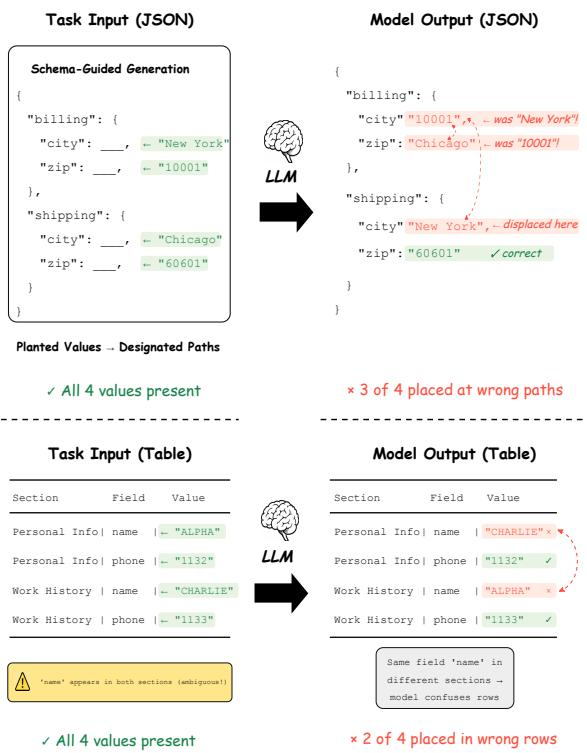
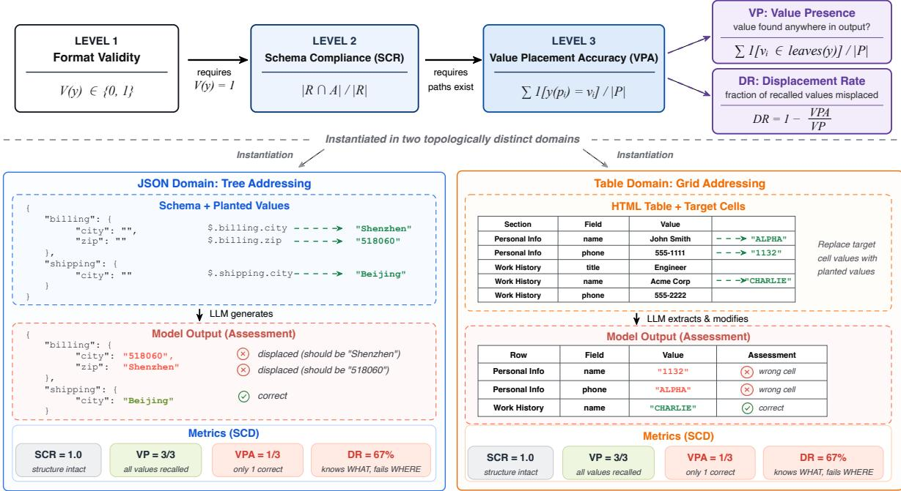
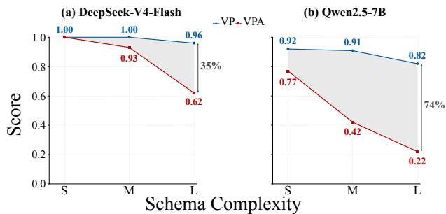
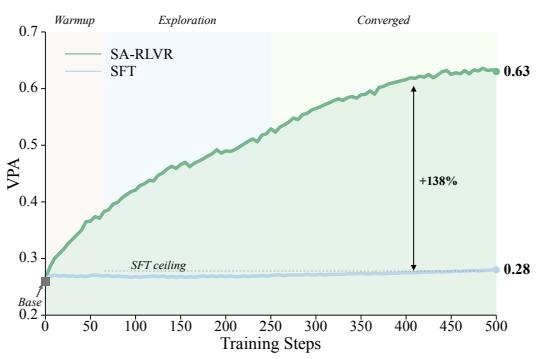
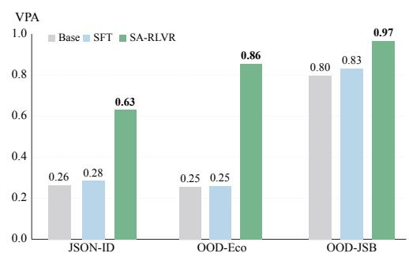

# Where vs What: Decomposing Structural and Content Failures in LLM-Generated Structured Outputs

Yiwei Zhang1 Chengke Wu2 Li Wang1 Jianqiang Li1

1Shenzhen University

2Shenzhen Institutes of Advanced Technology, Chinese Academy of Sciences 2400671022@mails.szu.edu.cn ck.wu@siat.ac.cn wangli100@szu.edu.cn lijq@szu.edu.cn

## Abstract

Structured outputs such as JSON and tables are central to modern LLM-based systems, yet generation failures are evaluated monolithically, conflating two distinct error modes: placement errors (correct values at wrong positions) and value errors (wrong values at intended positions). We introduce Structure-Content Decomposition (SCD), a framework that independently measures structural fidelity and content accuracy. Applying SCD to nested JSON and table tasks across six models (7B to frontier), we uncover a consistent phenomenon: structural fidelity degrades earlier and more sharply than content accuracy as complexity increases. At the highest complexity, even DeepSeek-V4- Flash (with reasoning) misplaces 35% of recalled values, while Qwen2.5-7B misplaces 74%. Controlled ablations suggest that this pattern is associated with reliance on semantic shortcuts rather than topological understanding of output structure. Based on these findings, we propose SA-RLVR, converting SCD metrics into verifiable rewards for reinforcement learning via GRPO. SA-RLVR successfully optimizes structural addressing across distinct topologies: it lifts JSON Value Placement Accuracy (VPA) from 26% to 63% while generalizing to held-out schemas; moreover, it consistently drives VPA improvements in the table domain, demonstrating that structure-aware rewards can directly enhance multi-domain structural positioning.

## 1 Introduction

Large language models (LLMs), workflows, and autonomous agents increasingly rely on structured outputs such as JSON objects and tables, where both value correctness and structural placement are critical (Geng et al., 2025; Qin et al., 2024; Schick et al., 2023; Yao et al., 2023; Patil et al., 2024).

Consider an LLM generating a billing record: it correctly preserves the zip code 10001 and the city New York, but places the two values under the wrong JSON paths. Although the required values appear in the output, the resulting structure becomes semantically invalid, potentially corrupting downstream execution. Such failures reveal that structured generation requires not only knowing what values to produce or preserve, but also understanding where they belong (Figure 1).

  
Figure 1: An illustration of the “right value, wrong position” failure in structured generation. The LLM correctly recalls all planted values but places them at wrong structural positions. Top: JSON domain: values swap between sibling paths. Bottom: Table domain: values migrate to wrong row-column coordinates. Existing holistic metrics cannot detect this failure mode.

Despite their practical importance, existing evaluations treat structured generation failures monolithically. JSONSchemaBench evaluates schema conformance as a binary check (Geng et al., 2025); BFCL reports exact-match accuracy on function calls (Patil et al., 2025); SWE-bench measures endto-end task success (Jimenez et al., 2024); text-to-SQL benchmarks rely on execution accuracy (Yu et al., 2018; Li et al., 2023a). When an output fails, these metrics cannot distinguish whether the model produces incorrect values or misplaces otherwise correct values. This distinction is crucial because the two failure modes imply fundamentally different underlying deficiencies and require different interventions.

We hypothesize and later show that this “correct value, wrong position” failure becomes increasingly prominent as structural complexity grows.

To address this gap, we propose Structure-Content Decomposition (SCD), a three-level evaluation framework that independently measures structural fidelity and content accuracy. Applying SCD to nested JSON (tree-structured addressing) and table tasks (grid-structured addressing) across six models ranging from 7B-scale to full-scale models, we uncover a consistent and previously undocumented phenomenon: structural fidelity degrades earlier and faster than content accuracy.

At the highest complexity level, strong frontierscale models still misplace roughly one quarter or more of correctly recalled values, while smaller models can misplace nearly three in four. Further controlled ablations suggest that these failures are associated with models’ reliance on semantic shortcuts (Geirhos et al., 2020) rather than robust topological addressing, consistent with known positional biases in long-context reasoning (Liu et al., 2024).

These findings suggest that structural addressing should be treated as an independently optimizable capability rather than a byproduct of value generation. We therefore propose SA-RLVR, which transforms SCD’s decomposed metrics into verifiable reward signals for GRPO-based online reinforcement learning (Shao et al., 2024; DeepSeek-AI et al., 2025), directly optimizing structural addressing behavior.

Our contributions are as follows:

• We introduce SCD, a decomposed evaluation framework that separates structural and valuelevel failures in LLM-generated structured outputs, revealing failure modes collapsed by existing monolithic evaluations.

• We identify the “structure degrades first” pattern, a consistent phenomenon across two topologies, two task paradigms, and six models, and provide evidence that semantic shortcuts contribute to this failure mode through controlled ablations.

• We propose SA-RLVR, which converts SCD metrics into verifiable rewards for GRPO. It improves JSON Value Placement Accuracy from 0.26 to 0.63 with strong cross-schema generalization, versus only 0.28 for a matched SFT baseline.

## 2 Related Work

Positional and Structural Reasoning in LLMs. Liu et al. (2024) show retrieval accuracy degrades for mid-context information, and stress tests such as Needle-in-a-Haystack (Kamradt, 2023) further document positional sensitivity in long-context retrieval; Herzig et al. (2020) and Sui et al. (2024) demonstrate that table understanding requires joint reasoning over coordinates and content. Hsieh et al. (2023) and Wang et al. (2023) suggest that instruction-tuned models may still struggle with organizing generated content into correct structural layouts. Much prior work probes positional awareness in input comprehension; we extend to output generation with a framework that quantitatively isolates structural degradation from content-accuracy degradation.

Structured Output Generation and Evaluation. Constrained decoding methods, such as Outlines (Willard and Louf, 2023), SGLang (Zheng et al., 2024), Guidance (Microsoft, 2023), only guarantee format validity (defined as Level 1 accuracy in our experiments) but cannot ensure correct value placement (Level 2–3). Existing benchmarks evaluate structured outputs holistically: JSON-SchemaBench (Geng et al., 2025) uses binary schema conformance; function-call benchmarks such as BFCL (Patil et al., 2025) and API-Bank (Li et al., 2023b) report exact-match on function calls; agent benchmarks measure end-to-end task success (Liu et al., 2023; Jimenez et al., 2024); textto-SQL (Yu et al., 2018; Li et al., 2023a) and table QA (Ye et al., 2023; Sui et al., 2024) measure execution accuracy or cell-level F1. None distinguish whether failures are structural (right value, wrong position) or value-level (wrong value). SCD fills this gap by decomposing the binary signal into structural and content-accuracy components.

Reinforcement Learning with Verifiable Rewards. DeepSeek-R1 (DeepSeek-AI et al., 2025) shows GRPO with verifiable rewards can elicit reasoning without supervised demonstrations; this paradigm extends to math (Lightman et al., 2024; Wang et al., 2024) and code (Le et al., 2022; Shojaee et al., 2023). Structured outputs are a natural fit because correctness is programmatically checkable, yet existing RLVR uses holistic rewards (answer correctness, execution pass/fail) that conflate structural and value-level errors. Beyond verifiablereward RL, preference-based methods such as DPO (Rafailov et al., 2023) and ORPO (Hong et al., 2024) optimize policies from pairwise preferences, but rely on human or model-judged labels and do not provide structure-specific gradients. Our SA-RLVR leverages SCD’s decomposed metrics as fine-grained verifiable rewards, providing structurespecific training gradients.

## 3 Structure-Content Decomposition

Every structured output task shares a common abstraction: the model must decide both where to place information (structural addressing) and what values to preserve or generate. Existing metrics collapse these two decisions into a single score. SCD teases them apart through a three-level hierarchy that mirrors the generative process: first produce a valid format, then construct the required structural paths, then place the correct values at those paths (Figure 2).

## 3.1 Formulation

Consider a structured output task in which a model receives input x and must produce output y satisfying a structural schema S and a set of planted values $\mathcal { P } = \{ ( p _ { i } , v _ { i } ) \}$ (path-to-value mappings). We decompose quality into three hierarchically dependent levels.

Level 1: Format Validity. $V ( y ) \in \{ 0 , 1 \}$ indicates whether y is parseable and well-formed. If $V ( y ) = 0$ , we skip Level 2–3.

Level 2: Schema Compliance Rate (SCR). Let R be the set of required structural paths from the schema and A the actual leaf paths in the model output:

$$
\mathrm { S C R } = \left| R \cap A \right| / \left| R \right|\tag{1}
$$

Level 3: Value Placement Accuracy (VPA). For each planted value $( p _ { i } , v _ { i } ) \in \mathcal P$ , we check whether

the output’s value at path $p _ { i }$ equals $v _ { i } { \mathrm { : } }$

$$
\mathrm { V P A } = \frac { 1 } { | \mathcal { P } | } \sum _ { ( p _ { i } , v _ { i } ) \in \mathcal { P } } \mathcal { H } [ y ( p _ { i } ) = v _ { i } ]\tag{2}
$$

The three levels form a strict hierarchy: SCR requires $V ( y ) = 1$ ; VPA requires the planted paths to exist. This decomposition serves a dual purpose: it enables fine-grained diagnosis of failure modes $( \ S 4 \mathrm { - } 5 )$ , and its metrics directly yield verifiable reward signals for targeted training (§6).

Diagnostic Metrics: VP and SCG. VPA alone tells us a value is missing from its path, but not why. Value Presence (VP) measures whether each planted value appears anywhere in the output:

$$
\mathbf { V P } = \frac { 1 } { | \mathcal { P } | } \sum _ { ( p _ { i } , v _ { i } ) \in \mathcal { P } } \mathcal { H } [ v _ { i } \in \mathrm { l e a v e s } ( y ) ]\tag{3}
$$

VP uses strict single-match to prevent doublecounting. We further define Structural Compliance Gap $\mathrm { S C G } \ = \ \mathrm { V P } \ - \ \mathrm { V P A }$ (values that appear but are misplaced) and Displacement Rate $\mathrm { D R } = 1 - \mathrm { V P A } / \mathrm { V P }$ (fraction of recalled values at wrong positions). When VP remains high while VPA drops (DR ≫ 0), the model recalls correct values but fails to place them at the correct structural locations.

## 3.2 Instantiation Across Domains

SCD applies to any task where the output has identifiable structural positions. We instantiate it in two topologically distinct domains: in nested JSON, the structural position is a leaf path in the tree; in table rows, it is a cell at a specific row-column coordinate. Both share the three-level hierarchy; only the definition of “structural position” differs.

In nested JSON, we use a schema-guided generation paradigm: given a JSON Schema and planted values (path→value mappings with uniquely identifiable markers), the model generates a complete conforming JSON object.

In table row recitation, we use a row-level modification paradigm: given a complete HTML table and target fields with designated replacement values, the model must locate the correct row and output it with modifications. For tables, SCR checks whether the produced row has the expected tag/- cell sequence, while VPA checks whether each designated replacement value appears at its target row-column coordinate. VP still ignores position and measures whether the replacement value appears anywhere in the produced row. Unlike JSON’s generation-from-scratch, tables require locating and modifying within existing structure, which tests the same underlying addressing ability through a different cognitive demand.

  
Figure 2: Overview of Structure-Content Decomposition. The three levels form a strict hierarchy (top); we instantiate the same framework in two topologically distinct domains (bottom). Both examples show the same diagnostic pattern: all planted values are recalled (VP=3/3) but two are placed at wrong structural positions (VPA=1/3, DR=67%), namely, the model preserves what values are required but fails at where to place them.

This dual-domain design tests whether the “structure degrades first” pattern is not merely an artifact of any particular topology or task paradigm.

## 4 Experimental Setup

Our diagnostic experiments are designed around one principle: isolate structural addressing from content accuracy so that degradation in each can be independently measured. This requires tasks with deterministic ground truth, uniquely identifiable planted values, and systematically controlled complexity. Naturalistic benchmarks cannot guarantee these conditions, so we construct controlled tasks via algorithmic generation (no LLM in loop), using two topologically distinct domains at three unified complexity levels (S/M/L).

JSON Domain: Schema-Guided Generation. We algorithmically generate JSON Schemas at three complexity levels, all sharing the same recursive TreeNode structure (binary tree with metadata sub-objects) but differing in unrolled depth:

S (depth=2, 12 planted values), M (depth=3, 15 planted values), and L (depth=4, 20 planted values). This design cleanly isolates recursive depth as the independent variable while holding schema topology constant. Field names are drawn from realistic domains (healthcare, e-commerce, logistics, etc.). Planted values use NATO phonetic alphabet words, fixed integer sequences, and fixed float sequences, each uniquely identifiable to enable unambiguous VP/VPA measurement. For M and L levels, 70% of planted values target deep paths to maximally stress structural addressing. The core experiment comprises 1,500 tasks per model (500 per level). Two additional ablations isolate tree depth (300 tasks) and planted count (400 tasks) as single variables. Mechanistic ablations on semantic cues and path ambiguity are reported in §5.4.

Table Domain: Row-Level Modification. We construct HTML tables at three complexity levels, paralleling the JSON domain: S (flat key-value grid, ∼28 rows, ∼280 cells), M (key-value with column merging and repeated data blocks such as education records, ∼33 rows, ∼330 cells), L (3–5 sections with cross-section field ambiguity plus repeated data blocks, ∼53 rows, ∼700 cells). The tables are derived from 53 real-world seed templates, such as application forms, tax records, and personal information sheets. Through programmatic synthesis with 144 unique field labels, 8 repeated-block types, 12 section configurations, and seed-driven perturbation (shuffling, trimming, colspan variation), we generate 4,490 unique table instances across 1,030 distinct layout structures, while target value modifications are programmatically generated to maintain deterministic ground truth.

<table><tr><td></td><td colspan="3">S (depth=2)</td><td colspan="3">M (depth=3)</td><td colspan="3">L (depth=4)</td></tr><tr><td>Model</td><td>VPA</td><td>VP</td><td>DR</td><td>VPA</td><td>VP</td><td>DR</td><td>VPA</td><td>VP</td><td>DR</td></tr><tr><td colspan="10">Closed-Source</td></tr><tr><td>GPT-40</td><td>0.975</td><td>0.975</td><td>0%</td><td>0.910</td><td>0.963</td><td>5.5%</td><td>0.690</td><td>0.910</td><td>24.2%</td></tr><tr><td colspan="10">Open-Source</td></tr><tr><td>DeepSeek-V3</td><td>0.975</td><td>0.979</td><td>0.4%</td><td>0.907</td><td>0.953</td><td>4.8%</td><td>0.700</td><td>0.948</td><td>26.2%</td></tr><tr><td>DeepSeek-V4-Flash†</td><td>0.995</td><td>0.996</td><td>0.1%</td><td>0.927</td><td>0.995</td><td>6.8%</td><td>0.618</td><td>0.956</td><td>35.4%</td></tr><tr><td>Qwen3-8B†</td><td>0.904</td><td>0.925</td><td>2.3%</td><td>0.730</td><td>0.880</td><td>17.0%</td><td>0.325</td><td>0.610</td><td>46.7%</td></tr><tr><td>Qwen2.5-14B</td><td>0.908</td><td>0.938</td><td>3.2%</td><td>0.607</td><td>0.797</td><td>23.8%</td><td>0.297</td><td>0.585</td><td>49.2%</td></tr><tr><td>Qwen2.5-7B</td><td>0.771</td><td>0.921</td><td>16.3%</td><td>0.417</td><td>0.913</td><td>54.4%</td><td>0.215</td><td>0.820</td><td>73.8%</td></tr></table>

Table 1: JSON results across complexity levels. VP stays high while VPA drops with depth (S→L), demonstrating the scissors pattern. †Uses reasoning mode. Full metrics in Appendix D.

The task is to locate a specified row and output it with designated cell modifications (replacement values are NATO words). Structural complexity increases with table size (more competing positions), structural repetition (more ambiguous addresses), and target cell distance from the table origin. This domain uses a different cognitive demand, modifying within existing structure rather than generating from scratch, while exercising the same underlying addressing ability. The core experiment comprises 600 tasks per model (200 per level); additional ablations isolate row distance and target count.

Models. We evaluate six models spanning openweight and closed-source systems: GPT-4o (OpenAI, 2024) (frontier closed-source), DeepSeek-V3- 0324 (DeepSeek-AI, 2024) (671B MoE, 37B active), DeepSeek-V4-Flash (284B MoE, 13B active; reasoning mode), Qwen3-8B with explicit thinking mode, Qwen2.5-14B, and Qwen2.5-7B (Yang et al., 2024). This range covers frontier to 7B scale and includes two explicit-reasoning models, enabling analysis of whether scale or reasoning capability alleviates the structural bottleneck. All models use temperature 0.1 with standard prompting. Additional models are reported in Appendix D.

  
Figure 3: Scissors pattern in JSON: VP stays high while VPA drops. (a) DeepSeek-V4-Flash, DR=35%. (b) Qwen2.5-7B, DR=74%.

## 5 Results: Structure Degrades First

## 5.1 JSON Domain: The Scissors Pattern

Core Experiment: Complexity Gradient. Table 1 and Figure 3 present the scissors pattern clearly. As schema complexity increases from S (depth=2) through M (depth=3) to L (depth=4), the two metrics exhibit sharply divergent trends: VP remains high while VPA drops sharply, meaning models still recall the correct values but place them at wrong structural positions. At L-level complexity, even DeepSeek-V4-Flash (with reasoning) misplaces 35% of recalled values, and the gap widens to 74% for Qwen2.5-7B.

Model Capability Tiers. DR stratifies by capability: roughly 24–35% for strong frontier-scale models and 74% for Qwen2.5-7B. Reasoning helps— Qwen3-8B reduces DR to 47%—but the scissors pattern persists across scales.

Ablations: What Drives the Scissors? Two ablations isolate likely contributors. Recursive depth: holding topology constant while varying only tree depth from 1 to 3, DR rises from near-zero to 28.5% (Qwen2.5-7B), indicating that recursive nesting is a major driver. Planted count: varying the number of planted values (5–20) at fixed complexity yields no monotonic trend in DR (±5pp fluctuation around 56%), suggesting that topology, more than payload size, determines when structure collapses.

## 5.2 Table Domain: From Trees to Grids

If the scissors pattern were specific to treestructured JSON, it would be a curiosity rather than a general property. The table domain tests whether the same asymmetric degradation arises in a fundamentally different setting: two-dimensional grid addressing, where the task requires locating and extracting target cells rather than generating structure from scratch.

Core Results. The scissors pattern also appears on grid topology (full results in Appendix Table 8). As table complexity increases from S to L, strong models show the same “right value, wrong coordinate” failure: VPA drops while VP remains higher. For weaker models, table tasks exhibit a compounded failure: value preservation also collapses, but VPA remains far below VP. At Llevel, DR ranges from 17–28% for strong models (DeepSeek-V4-Flash, GPT-4o, DeepSeek-V3) to 98% for Qwen2.5-7B, where even the few recalled values (VP = 0.085) are almost never correctly placed. Reasoning again helps without resolving the bottleneck: Qwen3-8B achieves DR = 22% at L, comparable to strong models and far below Qwen2.5-7B’s 98%.

Ablations. Two ablations support a similar pattern in tables. Row distance parallels tree depth: holding table complexity at L and varying target position (DeepSeek-V3), DR rises from 35.8% (near rows) to 44.6% (far rows) while VP remains above 0.80, suggesting that positional distance in grid coordinates contributes to failure just as recursive depth does in trees. Target count in the table domain does increase DR (from 14.7% at n=5 to 23.6% at n=15), unlike the flat pattern in JSON; one likely explanation is inter-target interference: multiple targets in the same table compete for the model’s attention, a confound absent in JSON where paths are generated independently.

## 5.3 Cross-Domain Consistency

Both domains exhibit a consistent VP–VPA gap as complexity increases. The gap is clearest in JSON and in strong table models; weaker table models

<table><tr><td rowspan="2">Model</td><td colspan="3">JSON (L)</td><td colspan="3">Table (L)</td></tr><tr><td>VPA</td><td>VP</td><td>DR</td><td>VPA</td><td>VP</td><td>DR</td></tr><tr><td>GPT-40</td><td></td><td>0.6900.910</td><td>24.2%</td><td></td><td>0.6350.880</td><td>27.9%</td></tr><tr><td>DeepSeek-V3</td><td>0.7000.948</td><td></td><td>26.2%</td><td>0.529</td><td>0.712</td><td>25.7%</td></tr><tr><td>DeepSeek-V4-Flash⁺</td><td>0.618</td><td>0.956</td><td>35.4%</td><td></td><td>0.8260.999</td><td>17.3%</td></tr><tr><td>Qwen3-8B†</td><td>0.325</td><td>0.610</td><td>46.7%</td><td>0.185</td><td>0.237</td><td>21.9%</td></tr><tr><td>Qwen2.5-14B</td><td>0.297</td><td>0.585</td><td>49.2%</td><td>0.186</td><td>0.347</td><td>36.5%</td></tr><tr><td>Qwen2.5-7B</td><td>0.215 0.820</td><td></td><td>73.8%</td><td></td><td>0.002 0.085</td><td>98.0%</td></tr></table>

Table 2: Cross-domain L-level results. In both domains, VPA remains below VP; strong table models preserve the JSON-like gap, while weaker table models additionally lose content accuracy.
<table><tr><td>Ablation</td><td>Condition</td><td>VPA</td><td>VP</td><td>DR</td><td>∆DR</td></tr><tr><td>Semantic cues</td><td>Opaque (left/right)</td><td>0.433</td><td>0.860</td><td>49.6%</td><td></td></tr><tr><td></td><td>Descriptive names</td><td>0.490</td><td>0.847</td><td>42.1%</td><td>-7.5</td></tr><tr><td>Path ambiguity</td><td>Repeated names</td><td>0.415</td><td>0.878</td><td>52.8%</td><td></td></tr><tr><td></td><td>Unique names</td><td>0.493</td><td>0.890</td><td>44.6%</td><td>-8.2</td></tr></table>

Table 3: Mechanistic ablations on M-level JSON with Qwen2.5-7B. Both weaker semantic cues and repeated field names increase displacement while leaving VP stable.

additionally show value-preservation collapse, suggesting that grid addressing can compound structural and value-level failures.

## 5.4 Why Does Structure Degrade First?

The ablations in §5.1–5.2 indicate that structural topology (recursive depth in JSON, positional distance in tables) is a major contributor to structural failure. But what addressing cues do models appear to use, and why might they break? Two controlled ablations on M-level JSON schemas probe this mechanism (Table 3).

Semantic Shortcuts. (1) Semantic cue dependence: replacing descriptive field names with opaque left/right navigation increases DR by 7.5 percentage points (42.1%→49.6%) while VP remains unchanged (−1.3%), suggesting that models use name semantics as an implicit addressing signal. (2) Path ambiguity: schemas with repeated field names across nodes increase DR by 8.2 percentage points (44.6%→52.8%) versus unique names, consistent with name disambiguation being an important addressing cue.

Synthesis. A plausible interpretation is that LLMs approximate structural addressing through a composite heuristic: semantic cue matching, positional approximation, and name disambiguation. This works on shallow, semantically transparent structures. But recursive depth multiplies structurally distinct positions sharing similar contexts, weakening all three cues simultaneously. When these cues fail, addressing degrades while the model may still preserve the required values. This explains why VP can stay high as VPA drops: the model often preserves what values are required, but fails to bind them to the correct structural addresses.

## 6 SA-RLVR: Structure-Aware RL

The diagnostic findings above indicate that structural addressing is an independent bottleneck. If base models rely heavily on the semantic and positional shortcuts identified in §5.4, supervised imitation on the model’s own high-scoring outputs may remain close to this distribution and reinforce existing heuristics. This motivates using online reward-guided exploration to search beyond the base model’s typical placement behavior.

The SCD metrics that quantify structural addressing are fully programmatic, deterministic, and require no human judgment or reward model, making them directly usable as verifiable rewards for reinforcement learning.

Unlike existing RLVR applications where the verifiable signal is holistic (e.g., answer correctness in math, test passing in code), SCD provides decomposed signals that distinguish structural from valuelevel failures. This decomposition offers two advantages as a reward: (1) continuous partial credit (a model that places 12 of 15 values correctly receives proportional reward rather than zero), and (2) targeted gradient pressure specifically on structural addressing rather than on content accuracy alone.

We apply GRPO (DeepSeek-AI et al., 2025) with SCD-derived rewards, an approach we call SA-RLVR (Structure-Aware Reinforcement Learning with Verifiable Rewards), to test whether online RL exploration can improve structural placement beyond a matched imitation baseline.

## 6.1 Method

Reward Design. For each generated output y, we compute a reward from the SCD metrics:

$$
r ( y ) = 1 . 0 \cdot \mathrm { V P A } ( y ) + 0 . 3 \cdot \mathrm { S C R } ( y )\tag{4}
$$

VPA receives the highest weight as the core structural addressing signal; SCR provides schema-level structural feedback. We exclude VP from the reward because VP measures whether values appear anywhere in the output regardless of position; including it would reward models for producing correct values without placing them at the correct structural locations.

Training. We use GRPO (DeepSeek-AI et al., 2025): for each prompt, sample K=10 completions, score with r(y), and update via clipped policy gradient with group-normalized advantages and a KL penalty against the initial policy. We train Qwen2.5-7B-Instruct with LoRA (Hu et al., 2022) (∼40M parameters) for 500 steps on ∼3,400 mixed-domain prompts using 4×A6000 GPUs (details in Appendix F).

Baselines. (1) Base: Qwen2.5-7B-Instruct without fine-tuning; (2) SFT: Best-of-10 supervised fine-tuning on the highest SCD-reward completion per prompt (2,907 pairs, identical LoRA configuration). The SFT baseline uses the same evaluation metrics for data selection, isolating the training paradigm (imitation vs. exploration) as the sole variable.

Evaluation Splits. We evaluate on five splits spanning two domains and three generalization conditions: (1) JSON-ID (N=1,500): generated by the same schema procedure as training (depth 3–5, harder than the diagnostic S/M/L levels) with non-overlapping instances; (2) OOD-Eco (N=300): an ecological validation split built from real-world JSONSchemaBench schemas, used only for evaluation; (3) OOD-JSB (N=300): a disjoint heldout JSONSchemaBench split not seen during training; (4) Table-ID (N=200): generated by the same table procedure with non-overlapping instances; (5) Table-OOD (N=200): table tasks from unseen experiment types. This design tests in-domain optimization, cross-schema JSON generalization, and transfer behavior on table tasks.

## 6.2 Results

Table 4 reports results across five evaluation splits spanning two domains under in-distribution and out-of-distribution conditions.

SA-RLVR improves structural addressing. On JSON-ID (N=1,500), VPA improves from 0.264 (Base) to 0.629 (+138%), and VP rises from 0.310 to 0.869. Gains on JSON OOD splits are even larger (OOD-Eco: +247%), suggesting that the learned behavior is not limited to the training schemas.

(a) Training Dynamics  

(b) VPA across JSON Evaluation Splits  
  
Figure 4: SA-RLVR training dynamics and JSON generalization. (a) VPA rises beyond the SFT ceiling over 500 steps. (b) SA-RLVR outperforms Base and SFT on JSON-ID and two OOD JSON splits.

<table><tr><td>Split</td><td>Metric</td><td>Base</td><td>SFT</td><td>SA-RLVR</td></tr><tr><td colspan="5">JSON Domain</td></tr><tr><td>JSON-ID</td><td>VPA VP</td><td>0.264 0.310</td><td>0.281 0.319</td><td>0.629 0.869</td></tr><tr><td>OOD-Eco</td><td>VPA VP</td><td>0.247 0.261</td><td>0.252 0.264</td><td>0.858 0.886</td></tr><tr><td>OOD-JSB</td><td>VPA VP</td><td>0.795 0.817</td><td>0.826 0.832</td><td>0.968 0.971</td></tr><tr><td colspan="5">Table Domain</td></tr><tr><td>Table-ID Table-OOD</td><td>VPA FmtOK VPA FmtOK</td><td>0.027 0.265 0.094 0.535</td><td>0.032 0.270 0.086 0.540</td><td>0.065 0.855 0.085 0.940</td></tr><tr><td colspan="5">Reward Ablation (JSON-ID) VPA-only</td></tr><tr><td colspan="4">EM (binary) VPA 0.579 0.621 VP 0.831 0.696 SCR 0.789 0.625</td><td>Composite 0.629 0.869 0.832</td></tr></table>

Table 4: SA-RLVR results and reward ablation. SA-RLVR improves JSON VPA from 0.26 to 0.63 and Table FmtOK from 26.5% to 85.5%; the composite reward gives the best overall balance.

SFT remains close to the base model in this setting. In our setting, SFT achieves only 0.281 VPA (+6.4%) despite normal loss convergence, consistent with Best-of-K imitation being constrained by the base model’s sampled distribution. SA-RLVR substantially exceeds this baseline through online reward-guided exploration.

Generalization and transfer. SA-RLVR generalizes strongly across JSON schemas (OOD-Eco and OOD-JSB). On table tasks, it substantially improves format validity, with Table FmtOK rising from 26.5% to 85.5%, but coordinate-level VPA remains marginal (∼0.06–0.09). Thus, mixeddomain training improves table formatting, but does not substantially solve grid-coordinate placement at the 7B scale.

## 6.3 Reward Ablation

To isolate the contribution of each reward component, we train two ablated variants with identical configuration. Exact match (EM) uses a binary signal: reward is 1 only when both VPA and SCR equal 1.0, and 0 otherwise. VPA only removes SCR, using $r ( y ) = \mathrm { V P A } ( y )$ alone. The bottom panel of Table 4 reports results on JSON-ID.

All RL variants outperform SFT (VPA 0.58–0.63 vs. 0.28). The composite reward best balances placement and schema compliance: it preserves VPA while improving SCR over VPA-only.

## 7 Conclusion

We introduced Structure-Content Decomposition (SCD), a framework that separates content accuracy from structural fidelity in LLM-generated structured outputs. Across nested JSON and table tasks, SCD reveals a consistent “structure degrades first” pattern: as complexity grows, models often preserve correct values but misplace them, with displacement rates above 24% for frontier models and exceeding 70% for smaller ones; ablations suggest reliance on semantic shortcuts rather than topological addressing. Using SCD metrics as verifiable rewards, SA-RLVR lifts Value Placement Accuracy from 0.26 to 0.63, while a matched SFT baseline reaches only 0.28, indicating that structural addressing is an independent capability that should be evaluated and optimized directly.

## Limitations

Our experiments are based on controlled synthetic tasks with deterministic ground truth. This design is necessary for isolating structural addressing from content generation, but it also limits ecological coverage: real-world structured-output tasks may involve noisier instructions, underspecified schemas, semantically equivalent outputs, or downstream execution criteria that are not fully captured by exact path–value matching. Although our JSON experiments include OOD schemas from JSON-SchemaBench, the table domain is still synthesized from a limited set of real-world templates, so conclusions about grid-structured outputs should be interpreted with more caution.

SCD also assumes that target values and their intended structural positions are known, making it most suitable for settings where correctness can be programmatically verified. It may be less directly applicable to open-ended generation tasks where multiple structures are acceptable or where value equivalence requires semantic judgment. Similarly, SA-RLVR optimizes rewards derived from SCD metrics; while this provides targeted feedback, it may encourage metric-specific behavior rather than fully general structural understanding.

Our training study is limited in scale. We evaluate SA-RLVR on Qwen2.5-7B-Instruct with LoRA, and behavior at larger model scales is inferred from diagnostic trends rather than directly trained. The training data is JSON-dominated, and the table results show limited cross-topology transfer: format validity improves substantially, but Table-OOD VPA remains near baseline. Training is capped at 500 steps (2.9 epochs) due to compute constraints, and the learning curve has not plateaued. Finally, API cost constraints restrict closed-source models to diagnostic evaluation only. Thus, we leave larger-scale, multi-seed RLVR training and broader real-world deployments to future work.

## References

DeepSeek-AI. 2024. DeepSeek-V3 technical report. arXiv preprint arXiv:2412.19437.

DeepSeek-AI, Daya Guo, Dejian Yang, Haowei Zhang, Junxiao Song, Peiyi Wang, Qihao Zhu, Runxin Xu, Ruoyu Zhang, Shirong Ma, and 1 others. 2025. DeepSeek-R1: Incentivizing reasoning capability in LLMs via reinforcement learning. arXiv preprint arXiv:2501.12948.

Robert Geirhos, Jörn-Henrik Jacobsen, Claudio Michaelis, Richard Zemel, Wieland Brendel, Matthias Bethge, and Felix A Wichmann. 2020. Shortcut learning in deep neural networks. Nature Machine Intelligence, 2(11):665–673.

Saibo Geng, Hudson Cooper, Michal Moskal, Samuel Jenkins, Julian Berman, Nathan Ranchin, Robert West, Eric Horvitz, and Harsha Nori. 2025. JSON-SchemaBench: A rigorous benchmark of structured outputs for language models. arXiv preprint arXiv:2501.10868.

Jonathan Herzig, Pawel Krzysztof Nowak, Thomas Müller, Francesco Piccinno, and Julian Eisenschlos. 2020. TaPas: Weakly supervised table parsing via pre-training. In Proceedings of ACL.

Jiwoo Hong, Noah Lee, and James Thorne. 2024. ORPO: Monolithic preference optimization without reference model. In Proceedings of EMNLP.

Cheng-Yu Hsieh, Chun-Liang Li, Chih-Kuan Yeh, Hootan Nakhost, Yasuhisa Fujii, Alexander Ratner, Ranjay Krishna, Chen-Yu Lee, and Tomas Pfister. 2023. Distilling step-by-step! outperforming larger language models with less training data and smaller model sizes. In Findings of ACL.

Edward J Hu, Yelong Shen, Phillip Wallis, Zeyuan Allen-Zhu, Yuanzhi Li, Shean Wang, Lu Wang, and Weizhu Chen. 2022. LoRA: Low-rank adaptation of large language models. In Proceedings ofICLR.

Carlos E Jimenez, John Yang, Alexander Wettig, Shunyu Yao, Kexin Pei, Ofir Press, and Karthik Narasimhan. 2024. SWE-bench: Can language models resolve real-world GitHub issues? In Proceedings of ICLR.

Greg Kamradt. 2023. Needle in a haystack — pressure testing LLMs.

Hung Le, Yue Wang, Akhilesh Deepak Gotmare, Silvio Savarese, and Steven C.H. Hoi. 2022. CodeRL: Mastering code generation through pretrained models and deep reinforcement learning. In Proceedings ofNeurIPS.

Jinyang Li, Binyuan Hui, Ge Qu, Jiaxi Yang, Binhua Li, Bowen Li, Bailin Wang, Bowen Qin, Ruiying Geng, Nan Huo, and 1 others. 2023a. Can LLM already serve as a database interface? a BIg bench for large-scale database grounded text-to-SQLs. In Proceedings of NeurIPS.

Minghao Li, Feifan Song, Bowen Yu, Haiyang Yu, Zhoujun Li, Fei Huang, and Yongbin Li. 2023b. API-Bank: A comprehensive benchmark for toolaugmented LLMs. In Proceedings of EMNLP.

Hunter Lightman, Vineet Kosaraju, Yura Burda, Harri Edwards, Bowen Baker, Teddy Lee, Jan Leike, John Schulman, Ilya Sutskever, and Karl Cobbe. 2024. Let’s verify step by step. In Proceedings of ICLR.

Nelson F Liu, Kevin Lin, John Hewitt, Ashwin Paranjape, Michele Bevilacqua, Fabio Petroni, and Percy Liang. 2024. Lost in the middle: How language models use long contexts. Transactions ofthe Association for Computational Linguistics, 12:157–173.

Xiao Liu, Hao Yu, Hanchen Zhang, Yifan Xu, Xuanyu Lei, Hanyu Lai, Yu Gu, Hangliang Ding, Kaiwen Men, Kejuan Yang, and 1 others. 2023. Agent-Bench: Evaluating LLMs as agents. arXiv preprint arXiv:2308.03688.

Microsoft. 2023. Guidance: A guidance language for controlling large language models.

OpenAI. 2024. GPT-4o system card.

Shishir G Patil, Huanzhi Mao, Fanjia Yan, Charlie Cheng-Jie Ji, Vishnu Suresh, Ion Stoica, and Joseph E Gonzalez. 2025. The Berkeley Function Calling Leaderboard (BFCL): From tool use to agentic evaluation of large language models. In Proceedings of ICML.

Shishir G Patil, Tianjun Zhang, Xin Wang, and Joseph E Gonzalez. 2024. Gorilla: Large language model connected with massive APIs. In Proceedings of NeurIPS.

Yujia Qin, Shihao Liang, Yining Ye, Kunlun Zhu, Lan Yan, Yaxi Lu, Yankai Lin, Xin Cong, Xiangru Tang, Bill Qian, and 1 others. 2024. ToolLLM: Facilitating large language models to master 16000+ real-world APIs. In Proceedings of ICLR.

Rafael Rafailov, Archit Sharma, Eric Mitchell, Stefano Ermon, Christopher D Manning, and Chelsea Finn. 2023. Direct preference optimization: Your language model is secretly a reward model. In Proceedings of NeurIPS.

Timo Schick, Jane Dwivedi-Yu, Roberto Dessì, Roberta Raileanu, Maria Lomeli, Eric Hambro, Luke Zettlemoyer, Nicola Cancedda, and Thomas Scialom. 2023. Toolformer: Language models can teach themselves to use tools. In Proceedings ofNeurIPS.

Zhihong Shao, Peiyi Wang, Qihao Zhu, Runxin Xu, Junxiao Song, Xiao Bi, Haowei Zhang, Mingchuan Zhang, Y.K. Li, Y. Wu, and Daya Guo. 2024. DeepSeekMath: Pushing the limits of mathematical reasoning in open language models. arXiv preprint arXiv:2402.03300.

Parshin Shojaee, Aneesh Jain, Sindhu Tipirneni, and Chandan K. Reddy. 2023. Execution-based code generation using deep reinforcement learning. Transactions on Machine Learning Research.

Yuan Sui, Mengyu Zhou, Mingjie Zhou, Shi Han, and Dongmei Zhang. 2024. Table meets LLM: Can large language models understand structured table data? a benchmark and empirical study. In Proceedings of WSDM.

Peiyi Wang, Lei Li, Zhihong Shao, R.X. Xu, Damai Dai, Yifei Li, Deli Chen, Y. Wu, and Zhifang Sui. 2024. Math-Shepherd: Verify and reinforce LLMs step-bystep without human annotations. In Proceedings of ACL.

Yizhong Wang, Yeganeh Kordi, Swaroop Mishra, Alisa Liu, Noah A Smith, Daniel Khashabi, and Hannaneh Hajishirzi. 2023. Self-instruct: Aligning language models with self-generated instructions. In Proceedings ofACL.

Brandon T Willard and Rémi Louf. 2023. Efficient guided generation for large language models. arXiv preprint arXiv:2307.09702.

An Yang, Baosong Yang, Beichen Zhang, Binyuan Hui, Bo Zheng, Bowen Yu, Chengyuan Li, Dayiheng Liu, Fei Huang, Haoran Wei, and 1 others. 2024. Qwen2.5 technical report. arXiv preprint arXiv:2412.15115.

Shunyu Yao, Jeffrey Zhao, Dian Yu, Nan Du, Izhak Shafran, Karthik Narasimhan, and Yuan Cao. 2023. ReAct: Synergizing reasoning and acting in language models. In Proceedings ofICLR.

Yunhu Ye, Binyuan Hu, Kai Sun, Yongbin Li, and Haiyang Yu. 2023. Large language models are versatile decomposers: Decompose evidence and questions for table-based reasoning. In Proceedings of SIGIR.

Tao Yu, Rui Zhang, Kai Yang, Michihiro Yasunaga, Dongxu Wang, Zifan Li, James Ma, Irene Li, Qingning Yao, Shanelle Roman, and 1 others. 2018. Spider: A large-scale human-labeled dataset for complex and cross-domain semantic parsing and text-to-SQL task. In Proceedings ofEMNLP.

Lianmin Zheng, Liangsheng Yin, Zhiqiang Xie, Chuyue Sun, Jeff Huang, Cody Hao Yu, Shi Cao, Christos Kozyrakis, Ion Stoica, Joseph E Gonzalez, Clark Barrett, and Ying Sheng. 2024. SGLang: Efficient execution of structured language model programs. In Proceedings ofNeurIPS.

## A Task Construction Details

All diagnostic instances are generated algorithmically without using an LLM, so each task has deterministic ground truth in the form of target structural positions and planted values.

## A.1 JSON Schema-Guided Generation

Each JSON instance consists of an input schema and planted path–value pairs. The model must generate a complete JSON object conforming to the schema and place each planted value at its specified path. We use a recursive TreeNode template at three complexity levels: S (depth 2, 12 planted values), M (depth 3, 15 planted values), and L (depth

<table><tr><td>Domain</td><td>Level</td><td>Structure</td><td>Core tasks/model</td></tr><tr><td>JSON</td><td>S</td><td>depth 2, 12 values</td><td>500</td></tr><tr><td>JSON</td><td>M</td><td>depth 3, 15 values</td><td>500</td></tr><tr><td>JSON</td><td>L</td><td>depth 4, 20 values</td><td>500</td></tr><tr><td>Table</td><td>S</td><td>5 targets</td><td>200</td></tr><tr><td>Table</td><td>M</td><td>10 targets</td><td>200</td></tr><tr><td>Table</td><td>L</td><td>15 targets</td><td>200</td></tr></table>

Table 5: Core diagnostic task sizes and complexity settings.

4, 20 planted values). For M and L, 70% of planted values target deep paths. Field names are sampled from 10 domain word banks, and planted values come from uniquely identifiable NATO words, fixed integers, and fixed floats.

The core JSON diagnostic experiment contains 1,500 instances per model, with 500 instances per complexity level. Additional JSON ablations vary recursive depth and planted-value count while holding other generation settings fixed.

## A.2 Table Row Modification

The table domain tests the same addressing problem under grid topology. Each instance provides an HTML table, target fields, and designated replacement values. The model must locate the target row and output the complete modified row. The generator starts from 53 real-world templates and synthesizes layouts with varying row counts, section boundaries, repeated labels, repeated blocks, and target-cell positions. S/M/L correspond to increasing table size, ambiguity, and target count: S uses 5 target modifications, M uses 10, and L uses 15.

The core table diagnostic experiment contains 600 instances per model, with 200 instances per complexity level. Additional table ablations vary target-row distance and target count.

## B Evaluation Metrics and Parsers

SCD evaluates generated structured outputs with a hierarchy of checks. Format validity is evaluated first; compliance and value-placement metrics are computed only for parseable outputs.

Format validity. For JSON, FmtOK is 1 if the output can be parsed into a JSON object after the recovery procedure below. For tables, FmtOK is 1 if the output can be parsed into the expected target-ID-to-row mapping and each row can be parsed into an ordered cell sequence. If FmtOK is 0, SCR,

VPA, and VP are scored as 0 for aggregate reporting.

SCR. For JSON, let R be the required leaf paths induced by the schema and A be actual leaf paths in the parsed output. We compute $\mathrm { S C R } = | R \cap \quad$ $A | / | R |$ . For tables, SCR measures whether the produced row has the expected cell/tag sequence, separating row-shape errors from value-placement errors.

VPA and VP. For each planted pair $( p _ { i } , v _ { i } )$ , VPA checks whether the parsed output contains exactly $v _ { i }$ at target position $p _ { i }$ . In JSON, $p _ { i }$ is a leaf path; in tables, it is the target row-column coordinate within the output row. VP ignores position and checks whether each planted value appears anywhere among parsed leaves or cells, using strict single-match accounting so each generated leaf/- cell can match at most one planted value.

SCG and DR. We compute SCG = VP − VPA and $\mathrm { D R } = 1 - \mathrm { V P A } / \mathrm { V P }$ when VP is nonzero; otherwise DR is undefined and excluded from DRspecific averaging.

JSON outputs are recovered with a three-level parser: strict JSON parsing, conservative repairs such as removing trailing commas and closing brackets, and extraction of the first balanced {...} block followed by the same repairs. Table outputs are parsed first as target-ID-to-row mappings and then as HTML row fragments; we extract each produced row and its ordered cells, preserving the sequence used for coordinate evaluation. No synonym matching or semantic equivalence judgment is used.

Listing 1: Evaluator sketch for SCD metrics.   
parse output y   
if parse fails :   
return FmtOK =0, SCR =0, VPA =0, VP =0   
R = required\_positions (   
schema\_or\_target\_row )   
A = actual\_positions ( parsed\_y )   
SCR = |R intersect A| / |R|   
VPA = mean ( parsed\_y [ p ] == v for (p , v )   
in planted\_pairs )   
VP = strict\_single\_match ( values (   
parsed\_y ) , planted\_values )   
SCG = VP - VPA   
DR = undefined if VP == 0 else 1 -   
VPA / VP

## C Prompt Templates and Examples

Listing 2: JSON schema-guided generation prompt template.

Generate a valid JSON object that   
strictly conforms to the following   
JSON Schema .   
## JSON Schema   
\`\`\`json   
{ schema\_json }   
## Requirements   
1. The output MUST be a valid JSON   
object conforming to the schema   
above .   
2. All required fields MUST be present   
at their correct structural   
positions .   
3. Field types MUST match the schema (   
string , integer , number , boolean ) .   
4. For the following fields , you MUST   
use the EXACT values specified :   
{ planted\_instructions }   
5. For all other fields , generate   
realistic values that match the   
field name and type .   
6. Output ONLY the JSON object , no   
explanation or markdown fences .

Listing 3: Minimal JSON diagnostic example.

Schema paths :   
\$. root . left . value : string   
\$. root . right . value : string   
Planted values :   
\$. root . left . value = " ALPHA "   
\$. root . right . value = " BRAVO "   
Displaced output :   
{" root ": {" left ": {" value ": " BRAVO   
"} ,   
" right ": {" value ": " ALPHA   
"}}}   
Diagnosis : VP = 2/2 , VPA = 0/2 , DR =   
100%

Listing 4: Table row-modification prompt template.

Below is an HTML table .   
{ table\_html }   
Modify the following fields in the   
table to the specified new values .   
For each target , output the COMPLETE   
HTML <tr >... </ tr > row that contains   
the target cell , with the   
modification applied .   
The row must include ALL cells ( both <   
th > and <td >) exactly as they   
appear in the original table ,   
except for the modified cell .   
{ targets\_list }   
Output ONLY a JSON object mapping each   
target ID to the modified row HTML   
{" T1 ": "<tr >... </tr >", "T2 ": "<tr   
>... </ tr >", ...}   
Do NOT output anything else -- no   
explanation , no markdown fences .

## D Detailed Experimental Results

This section reports the full diagnostic metrics that complement the aggregate results in the main text, including L-level JSON metrics, additional JSON pilot runs, and complete table-domain results.

<table><tr><td>Model</td><td>FmtOK</td><td>SCR</td><td>VPA</td><td>VP</td><td>SCG</td><td>DR</td></tr><tr><td>GPT-40</td><td>1.000</td><td>0.969</td><td>0.690</td><td>0.910</td><td>0.220</td><td>24.2%</td></tr><tr><td>DeepSeek-V3</td><td>1.000</td><td>0.975</td><td>0.700</td><td>0.948</td><td>0.247</td><td>26.2%</td></tr><tr><td>DeepSeek-V4-Flash†</td><td>1.000</td><td>0.972</td><td>0.618</td><td>0.956</td><td>0.338</td><td>35.4%</td></tr><tr><td>Qwen3-8B†</td><td>0.900</td><td>0.746</td><td>0.325</td><td>0.610</td><td>0.285</td><td>46.7%</td></tr><tr><td>Qwen2.5-14B</td><td>0.900</td><td>0.881</td><td>0.297</td><td>0.585</td><td>0.287</td><td>49.2%</td></tr><tr><td>Qwen2.5-7B</td><td>1.000</td><td>0.384</td><td>0.215</td><td>0.820</td><td></td><td>0.605 73.8%</td></tr></table>

Table 6: L-level JSON results with full SCD metrics. †Uses explicit thinking/reasoning mode.

<table><tr><td>Model</td><td></td><td></td><td>Level N FmtOK SCR</td><td></td><td>VPA</td><td>VP</td><td>DR</td></tr><tr><td rowspan="3">Kimi-K2</td><td>S</td><td>20</td><td>1.000</td><td>1.000</td><td>0.983</td><td>0.988</td><td>0.4%</td></tr><tr><td>M</td><td>20</td><td>1.000</td><td>0.949</td><td>0.837</td><td>0.947</td><td>11.6%</td></tr><tr><td>L</td><td>20</td><td>0.950</td><td>0.588</td><td>0.328</td><td>0.855</td><td>61.7%</td></tr><tr><td rowspan="3">Gemini-2.0-Flash-Lite</td><td>S</td><td>20</td><td>1.000</td><td>1.000</td><td>0.925</td><td>0.929</td><td>0.4%</td></tr><tr><td>M</td><td>20</td><td>1.000</td><td>1.000</td><td>0.703</td><td></td><td>0.82014.2%</td></tr><tr><td>L</td><td>20</td><td>1.000</td><td>0.962</td><td>0.383</td><td>0.795</td><td>51.9%</td></tr><tr><td rowspan="3">DeepSeek-R1†</td><td>S</td><td>20</td><td>1.000</td><td>1.000</td><td>0.975</td><td>0.975</td><td>0.0%</td></tr><tr><td>M</td><td>20</td><td>1.000</td><td>1.0000.9600.963</td><td></td><td></td><td>0.3%</td></tr><tr><td>L</td><td>20</td><td>0.500</td><td></td><td></td><td></td><td>0.4840.4130.46711.8%</td></tr></table>

Table 7: Additional JSON diagnostic models on the S/M/L complexity gradient. These are smaller pilot runs and are reported for completeness.

<table><tr><td>Model</td><td>Scale</td><td>Level</td><td>VPA</td><td>VP</td><td>DR</td></tr><tr><td rowspan="3">GPT-40</td><td rowspan="3">Frontier</td><td>S</td><td>0.933</td><td>0.995</td><td>6.2%</td></tr><tr><td>M</td><td>0.756</td><td>0.993</td><td>23.9%</td></tr><tr><td>L</td><td>0.635</td><td>0.880</td><td>27.9%</td></tr><tr><td rowspan="3">DeepSeek-V3</td><td rowspan="3">671B MoE</td><td>S</td><td>0.935</td><td>0.991</td><td>5.7%</td></tr><tr><td>M</td><td>0.701</td><td>0.914</td><td>23.3%</td></tr><tr><td>L</td><td>0.529</td><td>0.712</td><td>25.7%</td></tr><tr><td rowspan="3">DeepSeek-V4-Flash† 284B MoE</td><td rowspan="3"></td><td>S</td><td>0.941</td><td>0.998</td><td>5.7%</td></tr><tr><td>M</td><td>0.773</td><td>0.997</td><td>22.4%</td></tr><tr><td>L</td><td>0.826</td><td>0.999</td><td>17.3%</td></tr><tr><td rowspan="3">Qwen3-8B†</td><td rowspan="3">8B</td><td>S</td><td>0.247</td><td>0.274</td><td>9.9%</td></tr><tr><td>M</td><td>0.221</td><td>0.288</td><td>23.3%</td></tr><tr><td>L</td><td>0.185</td><td>0.237</td><td>21.9%</td></tr><tr><td rowspan="3">Qwen2.5-14B</td><td rowspan="3">14B</td><td>S</td><td>0.373</td><td>0.609</td><td>34.7%</td></tr><tr><td>M</td><td>0.364</td><td>0.585</td><td>35.9%</td></tr><tr><td>L</td><td>0.186</td><td>0.347</td><td>36.5%</td></tr><tr><td rowspan="3">Qwen2.5-7B</td><td rowspan="3">7B</td><td>S</td><td></td><td>0.414</td><td>84.8%</td></tr><tr><td>M</td><td>0.063 0.027</td><td>0.264</td><td>89.6%</td></tr><tr><td>L</td><td>0.002</td><td>0.085</td><td>98.0%</td></tr></table>

Table 8: Table fill-row results across complexity levels.

## E Additional Ablation Results

This section provides the complete ablation results for the JSON and table settings discussed in Sec-

<table><tr><td>Ablation</td><td>Condition</td><td>FmtOK</td><td>SCR</td><td>VPA</td><td>VP</td><td>DR</td></tr><tr><td rowspan="3">JSON depth</td><td>d=1</td><td>1.000</td><td>1.000</td><td>0.988</td><td>0.992</td><td>0.4%</td></tr><tr><td>d=2</td><td>1.000</td><td></td><td>0.9030.696</td><td>0.892</td><td>22.0%</td></tr><tr><td>d=3</td><td>1.000</td><td>0.605</td><td>0.617</td><td>0.863</td><td>28.5%</td></tr><tr><td rowspan="4">JSON planted count</td><td>5</td><td>1.000</td><td></td><td>0.7450.380</td><td></td><td>0.77050.6%</td></tr><tr><td>10</td><td>1.000</td><td></td><td></td><td></td><td>0.6640.325 0.80059.4%</td></tr><tr><td>15</td><td>1.000</td><td></td><td></td><td></td><td>0.6550.3400.77756.2%</td></tr><tr><td>20</td><td>1.000</td><td></td><td></td><td>0.6660.3400.855</td><td>60.2%</td></tr><tr><td rowspan="2">Semantic cues</td><td>Opaque names</td><td>1.000</td><td></td><td>0.681 0.433</td><td>0.860</td><td>49.6%</td></tr><tr><td>Descriptive names</td><td>1.000</td><td>0.829</td><td>0.490</td><td>0.847</td><td>42.1%</td></tr><tr><td rowspan="2">Path ambiguity</td><td>Repeated names</td><td>1.000</td><td></td><td>0.6230.415</td><td></td><td>0.87852.8%</td></tr><tr><td>Unique names</td><td>1.000</td><td></td><td></td><td></td><td>0.5420.4930.89044.6%</td></tr></table>

Table 9: JSON ablations on Qwen2.5-7B.

<table><tr><td>Condition</td><td>SCR</td><td>VPA</td><td>VP</td><td>DR</td></tr><tr><td>Near rows</td><td>0.873</td><td>0.539 0.515</td><td>0.866</td><td>35.8% 36.5%</td></tr><tr><td>Middle rows Far rows</td><td>0.872 0.864</td><td>0.442</td><td>0.848 0.810</td><td>44.6%</td></tr><tr><td>5 targets</td><td>0.820</td><td>0.665</td><td>0.787</td><td>14.7%</td></tr><tr><td></td><td></td><td></td><td></td><td></td></tr><tr><td>10 targets 15 targets</td><td>0.783 0.753</td><td>0.571 0.529</td><td>0.740 0.712</td><td>21.7%</td></tr></table>

Table 10: Table fill-row ablations with DeepSeek-V3. Row distance and target count both increase displacement while VP remains substantially higher than VPA for this strong table model.

## F SA-RLVR Training Details

SA-RLVR trains Qwen2.5-7B-Instruct with LoRA using SCD metrics as online verifiable rewards. The reward used in the main experiments is

$$
r ( y ) = \mathrm { V P A } ( y ) + 0 . 3 \mathrm { S C R } ( y ) ,\tag{5}
$$

which gives the largest weight to exact value placement while preserving a schema-compliance signal. VP is excluded from the reward because it can be optimized by emitting correct values at wrong locations.

<table><tr><td>Hyperparameter</td><td>Value</td></tr><tr><td>Base model</td><td>Qwen2.5-7B-Instruct</td></tr><tr><td>Tuning method</td><td>LoRA</td></tr><tr><td>LoRA rank / alpha</td><td>64 / 128</td></tr><tr><td>Trainable parameters Algorithm</td><td>approx. 40M</td></tr><tr><td>Generations per prompt</td><td>GRPO</td></tr><tr><td></td><td>10</td></tr><tr><td>Per-device batch size</td><td>1</td></tr><tr><td>Gradient accumulation</td><td>5</td></tr><tr><td>Learning rate</td><td>1 × 10−5</td></tr><tr><td>Warmup steps</td><td>50</td></tr><tr><td>KL coefficient</td><td>0.04</td></tr><tr><td>Sampling temperature</td><td>0.7</td></tr><tr><td>Max steps</td><td>500</td></tr><tr><td>Effective epochs</td><td>2.9</td></tr><tr><td></td><td>4 A6000 GPUs</td></tr><tr><td>Hardware</td><td></td></tr></table>

Table 11: SA-RLVR training configuration.

The training mixture contains approximately 3,400 prompts: 1,500 synthetic JSON prompts, roughly 1,000 real-schema JSON prompts, and roughly 900 table prompts. The matched SFT baseline uses 2,907 best-of-10 examples selected by the same SCD scoring pipeline and is trained with the same LoRA configuration.

<table><tr><td>Reward</td><td>VPA</td><td>VP</td><td>SCR</td></tr><tr><td>Exact match</td><td>0.579</td><td>0.831</td><td>0.789</td></tr><tr><td>VPA only</td><td>0.621</td><td>0.696</td><td>0.625</td></tr><tr><td>Composite</td><td>0.629</td><td>0.869</td><td>0.832</td></tr></table>

Table 12: Reward ablation on JSON-ID.

## G Qualitative Failure Cases

Listing 5: JSON sibling-path displacement.

Target :   
\$. root . left . metadata . code = " ALPHA "   
\$. root . right . metadata . code = " BRAVO "   
Output excerpt :   
" left ": {" metadata ": {" code ": "   
BRAVO "}} ,   
" right ": {" metadata ": {" code ": "   
ALPHA "}}   
Diagnosis :   
VP = 2/2 , VPA = 0/2 , DR = 100%

Listing 6: Table cell displacement within the correct row.

Target row :   
<tr ><th >Name </th ><td >Ada </td ><th >   
Status </th ><td > Pending </td ></tr >   
Target modification :   
Status -> " ALPHA "   
Output row :   
<tr ><th >Name </th ><td >ALPHA </td ><th >   
Status </th ><td > Pending </td ></tr >   
Diagnosis :   
VP = 1/1 , VPA = 0/1 , DR = 100%