# LightNav-0: Eliciting VLM Spatial Intelligence for Generalist Embodied Navigation

Light Origins Team

Project Page GitHub Hugging Face

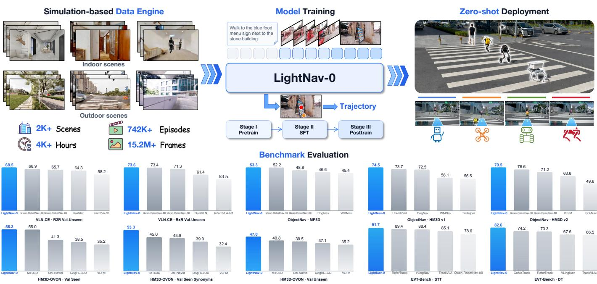  
Fig. 1. LightNav-0: a compact generalist embodied navigation model. A single autoregressive model expresses spatial intent through affordance and object points and predicts RVQ-tokenized trajectories without task- or embodiment-specific prediction heads. The single mode achieves state-of-the-art monocular success rates across 10 public simulation settings spanning instruction following, object goal navigation, and embodied visual tracking, and transfers zero-shot to humanoid, quadruped, aerial, and wheeled robots. Blue bars denote LightNav-0, whereas gray bars denote prior methods.

Abstract—Embodied navigation requires agents to translate heterogeneous goals and visual observations into actions across tasks, environments, and robot embodiments. Modern visionlanguage models (VLMs) already encode spatial priors for visual grounding, spatial reasoning, and pointing, but these capabilities are rarely elicited directly for robot control. Existing navigation systems instead rely on task- or embodiment-specific components, fragmenting perception, reasoning, and action while offering limited generalization. Here we present LightNav-0, a compact generalist embodied navigation model that elicits the spatial intelligence of a pretrained VLM and aligns it with navigation, without task-specific prediction heads. LightNav-0 represents diverse navigation tasks through a unified token interface: dual-channel pointing expresses task-, scene-, and embodiment-agnostic spatial intent, while a residual vector-quantized action tokenizer maps this intent to precise, embodiment-specific trajectories. Together with temporally aware visual history compression, ER midtraining, supervised fine-tuning, and reinforcement learning, this formulation supports instruction following, open-vocabulary object navigation, and visual tracking within a single model. The navigation training corpus spans 2K+ scenes and 4K+ hours of embodied navigation data. LightNav-ER, the embodied-reasoning checkpoint used to initialize LightNav-0, attains the highest complete-set average across 8 embodied-reasoning benchmarks, while LightNav-0 achieves state-of-the-art monocular success rates across all 10 public navigation simulation settings. Realworld evaluations further demonstrate zero-shot generalization across robot embodiments, diverse scenes, and static and dynamic targets. These results establish compact VLMs as a unified and transferable backbone for generalist embodied navigation.

## I. INTRODUCTION

Embodied navigation is the capability that enables an agent to move through the physical world and reach a location appropriate for accomplishing a given goal. It encompasses a range of goal-directed behaviors, including following natural language instructions, searching for specified objects or places, and tracking moving targets [4, 66, 84]. Across these tasks, the agent must ground linguistic or visual goals in its observations, maintain spatial and temporal context, and translate multimodal understanding into executable actions. A general navigation model should therefore transfer not only across environments, but also across tasks and robot embodiments. Most existing systems, however, are optimized for a single task or benchmark and rely on specialized components such as waypoint predictors, topological maps, or action heads [2, 38,

66, 69]. This fragmentation limits open-vocabulary transfer, hinders the reuse of learned reasoning across platforms, and isolates embodied navigation from the scaling benefits of modern vision-language models (VLMs).

Modern VLMs already encode many capabilities required for navigation, including open-vocabulary recognition, spatial reasoning, instruction understanding, and temporal video interpretation [5, 29, 63]. This suggests a different design principle: a compact VLM can serve as a shared reasoning backbone for general embodied navigation. We instantiate this principle with Qwen3-VL-4B-Instruct [5], retaining its pretrained architecture without introducing task-specific prediction heads for individual tasks or embodiments. Navigation capabilities are acquired through vocabulary extension, unified supervision, and staged training, keeping the model compact while preserving its semantic and spatial priors.

Bridging a general-purpose VLM and heterogeneous embodied navigation policies requires an intermediate representation that is both spatially meaningful and independent of any particular action space. We argue that pointing naturally provides such an interface. Recent VLMs can express grounded spatial decisions directly as image-plane points [17, 86], allowing a navigation model to preserve and exploit the backbone’s pretrained capabilities in visual grounding, spatial reasoning, and scene understanding. We therefore formulate dual-channel pointing with channel-specific image-grid tokens as a shared interface across tasks and robot embodiments. An affordance point indicates a feasible direction or free-space waypoint, whereas an object point localizes the task goal, either a target object or a goal location. Predicting this grounded spatial intent before action decoding provides an explicit reasoning step that guides the generation of precise, embodiment-specific navigation actions. This shared representation consequently supports instruction following, object search, and target tracking without separate task-specific designs.

Building on this interface, we construct an end-to-end system using only the compact VLM backbone and tokenbased outputs. An automatic dual-channel annotation pipeline projects navigation targets into the shared pointing space. Temporally aware visual history compression preserves both recent detail and long-horizon context within a bounded visual-token budget. An RVQ-based action tokenizer converts short-horizon trajectories into language-model tokens, which are subsequently mapped by an execution layer to platform-specific controls. Embodied-reasoning mid-training, supervised finetuning with DAgger [60], and online reinforcement learning progressively align perception, reasoning, and control.

We evaluate LightNav-0 across 10 public navigation simulation settings covering instruction-following VLN, object goal navigation, and embodied visual tracking. Complementary pointing and spatial-VQA evaluations test whether navigation adaptation preserves the VLM’s original grounding abilities. Real-world demonstrations further probe transfer across robot embodiments, outdoor scenes, and dynamic targets. Together, these experiments demonstrate a central hypothesis: a compact VLM backbone can provide a unified, transferable basis for cross-task and cross-embodiment navigation.

## II. RELATED WORK

## A. Generalist Embodied Navigation

Embodied navigation has long been studied as separate problems, including instruction-following VLN [4, 37, 39], object navigation [6, 84], and embodied visual tracking [66]. Solutions either chain perception, mapping, and planning modules through hand-designed interfaces [50, 80, 81, 83] or train a task-specific end-to-end policy [58, 88], and both transfer poorly once the task, the sensor suite, or the robot changes.

Video-based vision-language-action (VLA) models replaced these pipelines with a single vision-language backbone. NaVid [90] first showed that a video VLM can predict navigation actions from monocular RGB alone, and subsequent models unified more tasks and improved streaming efficiency [16, 76, 92]. Recent navigation foundation models further scale this recipe across tasks, environments, and embodiments, including NavFoM [91], ABot-N0/N1 [18, 27], Qwen-RobotNav [93], and Qwen-VLA [56]. Their action interfaces, however, differ sharply. Discrete atomic commands decoded as language tokens [53, 76, 90] quantize motion coarsely. Waypoint predictors on panoramic observations or topological graphs [2, 38, 69, 70] follow instructions well, but demand extra sensing and an explicit map. Continuous action modules built on anchor-based diffusion [66], flow matching [7, 8], or regression heads [35, 93] act smoothly, yet they place action generation outside the language model. Purely autoregressive quantization [34, 54] keeps generation inside the model, but trades precision for token efficiency.

Across these designs, transferable navigation capability often relies on structure added outside the pretrained backbone: panoramic or multi-camera front ends, task and embodiment identifier tokens, and separate action heads or experts. LightNav-0 keeps a single compact backbone driven by monocular RGB, compresses its observation history under a fixed visual-token budget, and introduces neither task identifier nor auxiliary prediction head. Its residual vector-quantized tokenizer decodes 10 SE(2) waypoints from three tokens of the original language-model head, enabling high-precision continuous control without a diffusion planner, flow-matching expert, or embodiment-specific action head.

## B. Linguistic and Visual Chain-of-Thought

Chain-of-thought prompting [74] has been extended to embodied action by producing an explicit reasoning trace before acting. On the linguistic side, embodied chain-ofthought generates grounded language plans before low-level commands [87, 99]. In navigation, OctoNav [25] and Nav-R1 [48] cold-start think-before-action behavior from synthesized chains of thought, and VLingNav [67] triggers reasoning adaptively rather than at a fixed rate. Hydra-Nav [71] unifies slow temporal-spatial deliberation and fast reactive execution within a single VLM, learning to invoke the slow system selectively at critical navigation stagnation points. Aux-Think [68] reports that textual reasoning helps most as an auxiliary training signal, because decoding long rationales at every step is costly and can degrade control.

A second family expresses the trace visually rather than in words. CoT-VLA [97] reasons through predicted future frames, ThinkAct [30] reinforces latent visual plans, and NavForesee [45] plans hierarchically inside a vision-language world model. Several methods place the trace on the image plane: AO-Planner [13] selects affordance-grounded pixel waypoints with a VLM and delegates execution to a low-level planner. The dual-system models DualVLN and InternVLA-N1 [32, 75] ground a farthest reachable pixel goal with a slow 7B planner, then hand it to a fast diffusion-style trajectory policy. Robostral Navigate [9] keeps the trace inside one monocular model, predicting the next waypoint by pointing in the current camera view. Others make the trace geometric instead of positional, using priors from a 3D geometry foundation model [89] or a single occupancy token supervised by volumetric prediction and re-injected as a spatial chain of thought [47].

LightNav-0 combines explicit reasoning with visual grounding in a fixed-length trace. Its dual-channel pointing prefix predicts an affordance point for feasible local motion and an object point for a target object or goal location. Both are represented with channel-specific image-grid tokens that leverage the backbone’s pretrained spatial grounding rather than replacing it, and the same representation supports instructionfollowing VLN, open-vocabulary object navigation, and embodied visual tracking. The prefix is supervised in the same token space as the action and costs a constant number of tokens per decision. It therefore keeps the interpretability of an explicit reasoning step, without the variable decoding latency of free-form textual deliberation or a second planning system.

## C. Reinforcement Learning Post-Training

Reinforcement learning has long complemented imitation in embodied navigation, from large-scale distributed on-policy training [77] and its transformer-scale successors [88] to imitation pretraining followed by RL fine-tuning [59]. Those policies are task-specific and act over a handful of discrete primitives, so an action probability is immediate and a rollout is cheap. Neither property is automatic once the policy becomes a generalist VLA.

For VLM-based policies the dominant recipe is verifiablereward post-training. Group-relative policy optimization [28, 61] removed the learned critic and made a second RL stage practical at scale, and the same recipe was carried into multimodal reasoning [24, 31]. Navigation adopted it quickly. VLN-R1 [53] shapes a time-decayed reward over multi-step action predictions, and Nav-R1 [48] combines format, understanding, and trajectory rewards. OctoNav [25] refines its reasoning traces with verifiable rewards before an online exploration stage, and ActiveVLN [96] extends optimization to multi-turn on-policy rollouts. ABot-N1 [27] moves the same machinery one level up. It treats the joint chain-of-thought and pixel-goal output of its slow system as the action, and shapes format, target, and safety-clearance rewards over that output, though only for its point-goal task. Robostral Navigate [9] instead reduces the reward to a single terminal distance to the goal, and optimizes it with CISPO under group-relative advantage estimation. It also mines its rollout pool, keeping only the tasks that its supervised policy fails to solve. These systems differ in reward design, yet they agree on the action interface: what the optimizer sees is always a discrete language token. That choice is what keeps the update cheap, because the quantity a policy gradient needs is already a token log-probability. Its cost is a coarse action space.

Policies that attach a continuous head recover precision and lose that quantity. SimpleVLA-RL [42] therefore keeps an autoregressive policy and supplies outcome-only rewards, whereas flow-based policies must first recast their denoising process as a Markov decision process before policy gradients apply [14, 95].

The open question is therefore not how to reshape reward, but whether a policy can expose a tractable per-action probability while still acting precisely. The residual vector-quantized interface of LightNav-0 supplies both at once. The trajectory at each decision step is three RVQ tokens emitted by the same head that produces language, so their log-probabilities are exact and group-relative updates apply unchanged. No auxiliary MDP, denoising reformulation, or separate critic is required, yet decoding still recovers 10 continuous SE(2) waypoints. Because a whole trajectory costs three tokens, the credit-assignment horizon stays short and each rollout stays cheap.

## III. MODEL ARCHITECTURE

## A. Architecture Overview

LightNav-0 formulates heterogeneous embodied navigation tasks as conditional token generation. At decision step t, the model receives a natural-language instruction I and an egocentric RGB history $\mathcal { O } _ { 1 : t } = \{ \mathbf { o } _ { 1 } , \ldots , \mathbf { o } _ { t } \}$ . It generates a dualchannel pointing prefix followed by a short-horizon action sequence. The decoded action is a trajectory of 10 future SE(2) waypoints, which provides a common geometric interface to the low-level controllers of different robot embodiments. Task semantics are specified entirely by the instruction and supervision format; we introduce no task-identification token.

We instantiate LightNav-0 from Qwen3-VL-4B-Instruct [5], whose backbone comprises a native-resolution vision transformer and a 36-layer language model. Rather than introducing navigation-specific modules, we retain the pretrained architecture and augment only its vocabulary with indexed ⟨apos ⟩, ⟨opos ⟩, and RVQ action tokens. Both intermediate spatial predictions and action codes are consequently decoded through the original autoregressive language-model head, with no waypoint predictor, task-specific action head, or embodiment-specific expert. As shown in Fig. 2, tokens from the timestamped visual history, current observation, and instruction are interleaved within a single causal sequence at each decision step. This compact formulation preserves the backbone’s pretrained visual-grounding and spatial-reasoning capabilities while aligning them with a unified control interface shared across tasks and embodiments.

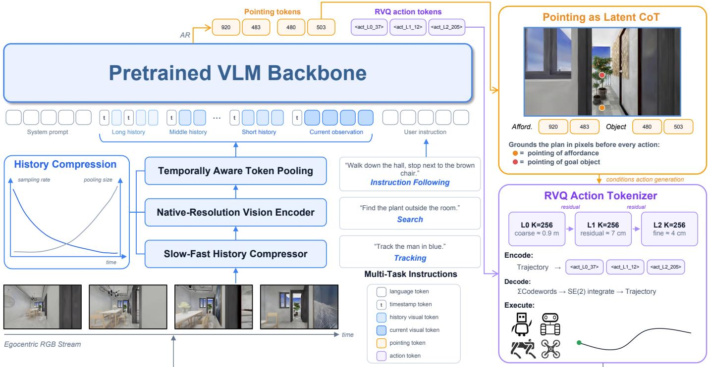  
Fig. 2. Overview of LightNav-0. A compact pretrained VLM consumes a temporally compressed egocentric RGB history and a natural language goal. It first emits pointing as an explicit spatial reasoning trace, followed by three residual vector-quantized (RVQ) action tokens. The action tokens decode to 10 future SE(2) waypoints and are executed by an embodiment-specific low-level controller. The same backbone, token interface, and objective are used for all navigation tasks.

01 Affordance Point Labeling — feasible motion target in free space  
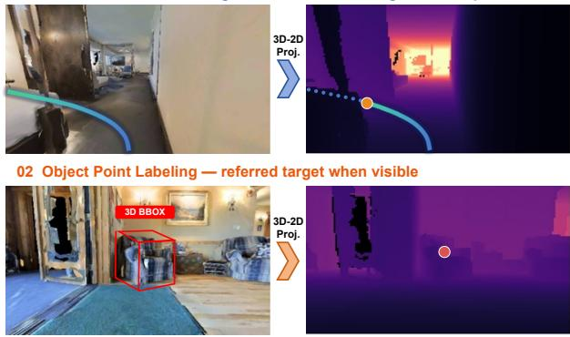  
Fig. 3. Automatic dual-channel pointing annotation. The affordance channel indicates a feasible local direction or free-space waypoint, whereas the object channel localizes the task goal, either a target object or a goal location.

## B. Temporally Aware Visual History Compression

Navigation requires both recent geometric detail and longhorizon context, but encoding every historical frame at native resolution causes the visual-token count to grow without bound. We therefore compress history according to temporal recency. The design follows the qualitative form of the Ebbinghaus forgetting curve [21]: recent observations receive a higher sampling rate and finer spatial resolution, whereas older observations are sampled less frequently and pooled more aggressively.

For a historical frame acquired at time $t _ { i } ,$ we define its age as $\Delta T _ { i } = t - t _ { i }$ . Its sampling rate decays exponentially,

$$
f _ { s } ( i ) = f _ { s } ^ { \mathrm { m a x } } \exp \biggl ( - \frac { \Delta T _ { i } } { \tau _ { s } } \biggr )\tag{1}
$$

where $f _ { s } ^ { \mathrm { m a x } }$ is the maximum sampling rate and $\tau _ { s }$ controls the temporal decay. The selected frames are encoded independently by the native-resolution vision transformer. Given the resulting patch grid $\mathbf { V } _ { i } ,$ , we set the spatial pooling stride to

$$
\begin{array} { c l l } { s _ { i } = \displaystyle \mathrm { m a x } \bigg \{ 1 , \bigg \vert \exp \bigg ( \frac { \Delta T _ { i } } { \tau _ { p } } \bigg ) \bigg \vert \bigg \} } \\ { \widetilde { \mathbf { V } } _ { i } = \mathcal { G } _ { s _ { i } } ( \mathbf { V } _ { i } ) } \end{array}\tag{2}
$$

where $\tau _ { p }$ controls the rate of spatial compression and $\mathcal { G } _ { s _ { i } }$ denotes grid pooling with stride $s _ { i } .$ . Thus, temporally distant observations contribute fewer and coarser tokens, while the current observation retains the finest visual detail. Timestamp tokens preserve the temporal ordering after pooling.

The compressor operates after the vision transformer and supports variable-length, native-resolution inputs under configurable pixel budgets of 256K, 576K, and 1M. Within the selected budget, frame sampling and tier-wise adaptive pooling jointly allocate tokens across long-, middle-, and short-term history. This slow-fast allocation bounds the context length without collapsing the entire history to a single fixedresolution representation.

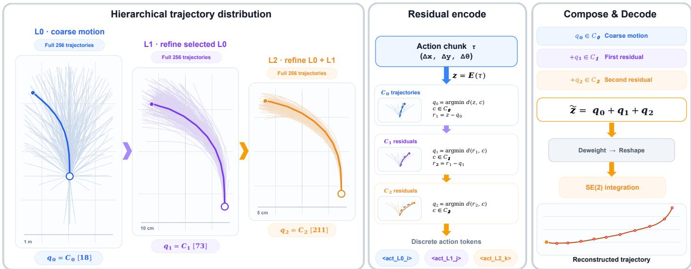  
Fig. 4. Hierarchical residual vector-quantized action tokenizer. A 10-step SE(2) trajectory is quantized by a coarse 256-entry codebook and two residual 256-entry codebooks. Each level visualizes all 256 candidates and highlights the selected codeword. Any non-empty token prefix decodes into an executable coarse trajectory, while successive residual levels progressively refine geometric precision.

## C. Dual-Channel Pointing as Latent Spatial Reasoning

A VLM represents visual evidence on a 2D token lattice, whereas navigation requires geometrically precise actions in metric space. We therefore encode each projected point as one channel-specific image-grid token rather than as separate horizontal and vertical coordinate tokens. Let the current view be partitioned into $H _ { g }$ rows and $W _ { g }$ columns. A projected point $\mathbf { p } = ( u , v ) \in [ 0 , \bar { 1 } ] ^ { 2 }$ is assigned a flattened grid index

$$
\begin{array} { l } { { r ( \mathbf { p } ) = \operatorname* { m i n } \{ H _ { g } - 1 , \lfloor H _ { g } v \rfloor \} } } \\ { { \displaystyle c ( \mathbf { p } ) = \operatorname* { m i n } \{ W _ { g } - 1 , \lfloor W _ { g } u \rfloor \} } } \\ { { \displaystyle i ( \mathbf { p } ) = r ( \mathbf { p } ) W _ { g } + c ( \mathbf { p } ) } } \end{array}\tag{3}
$$

The affordance and object channels use distinct token families indexed over this shared lattice. An affordance point $ { \mathbf { p } } ^ { a }$ is encoded directly as the single token $\langle \mathrm { a p o s } _ { i ^ { a } } \rangle$ , where $i ^ { a } = i ( \mathbf { p } ^ { a } )$ The token family $\left. \mathrm { a p o s } _ { i } \right.$ represents affordance points, and the selected cell indicates a feasible local direction or landing location in free space. An object point $ { \mathbf { p } } ^ { o }$ is encoded directly as $\langle \mathrm { o p o s } _ { i ^ { o } } \rangle$ , where $i ^ { o } ~ = ~ i ( \mathbf { p } ^ { o } )$ . The token family ⟨opos ⟩ represents object points and localizes the task goal, either a target object or a goal location. Reserved indices within the corresponding token family represent cases without a valid image-grid cell, including in-place turns, stopping, and target invisibility.

At each decision step, the complete navigation output is serialized as

$$
\begin{array} { r } { \begin{array} { r } { \mathbf { y } _ { t } = [ \langle \mathbf { a p o s } _ { i _ { t } ^ { a } } \rangle , \langle \mathbf { o p o s } _ { i _ { t } ^ { o } } \rangle , } \\ { \langle \mathbf { a c t \_ L } \mathbf { 0 } _ { k _ { 0 , t } } \rangle , \langle \mathbf { a c t \_ L } \mathbf { l } _ { k _ { 1 , t } } \rangle , \langle \mathbf { a c t \_ L } \mathbf { 2 } _ { k _ { 2 , t } } \rangle ] } \end{array} } \end{array}\tag{4}
$$

The pointing prefix therefore contains exactly two atomic tokens, followed immediately by three RVQ action tokens;

no separate channel-marker or coordinate token is generated. Causal attention makes this compact prefix an explicit latent spatial trace that conditions trajectory generation. The same grid indexing scheme is shared across navigation, pointing, and spatial-VQA supervision, allowing navigation training to reuse the backbone’s visual grounding capability. As illustrated in Fig. 3, automatic annotation projects the affordance target and the task-relevant object or goal location into the current view. Each valid affordance projection is assigned an indexed ⟨apos ⟩ token, whereas each valid object or goal projection is assigned an indexed ⟨opos ⟩ token. Because the lattice is defined in the image plane rather than in an embodimentspecific control space, the representation remains common across navigation tasks and robot platforms.

## D. Residual Vector-Quantized Action Tokenizer

Directly emitting continuous controls from a languagemodel head creates a mismatch between token prediction and geometric precision. We instead represent each action chunk as 10 future SE(2) waypoints and tokenize the complete trajectory with residual vector quantization, as visualized in Fig. 4. Let $\mathbf { z } _ { t } \in \mathbb { R } ^ { 1 0 \times 3 }$ denote the vectorized waypoint sequence. The tokenizer contains 3 level-specific codebooks $\mathcal { C } ^ { ( 0 ) } , \mathcal { C } ^ { ( 1 ) } , \mathcal { C } ^ { ( 2 ) }$ each with 256 codewords. The first level captures the coarse trajectory, and the next two levels successively quantize its residual:

$$
k _ { \ell } = \arg \operatorname* { m i n } _ { k } d _ { J } \Big ( \mathbf { r } ^ { ( \ell ) } , \mathbf { e } _ { k } ^ { ( \ell ) } \Big )\tag{5}
$$

$$
\mathbf { r } ^ { ( \ell + 1 ) } = \mathbf { r } ^ { ( \ell ) } - { \mathbf e } _ { k _ { \ell } } ^ { ( \ell ) } \qquad \mathbf { r } ^ { ( 0 ) } = \mathbf { z } _ { t }\tag{6}
$$

where $d _ { J }$ is a Jacobian-weighted trajectory distance used during residual k-means fitting. Weighting in the integrated trajectory space balances translation and heading errors when

forming the codebooks. We assign trajectories using

$$
d _ { \mathrm { t r a j } } ( \mathbf { z } , \hat { \mathbf { z } } ) = \mathrm { A D E } ( \mathbf { z } , \hat { \mathbf { z } } ) + \lambda | \Delta \theta ( \mathbf { z } ) - \Delta \theta ( \hat { \mathbf { z } } ) |\tag{7}
$$

which measures both positional deviation and accumulated heading error at the trajectory level. Based on the trajectoryerror analysis, we set $\lambda = 0 . 3$ throughout all experiments.

The three level-specific indices are emitted as level-specific action tokens [⟨act $\mathrm { L } 0 _ { k _ { 0 , t } } \rangle$ , ⟨act $_ { - \sum 1 _ { k _ { 1 , t } } \rangle }$ , $\langle \mathrm { a c t } \_ { \mathrm { L } 2 _ { k _ { 2 , t } } } \rangle ]$ . For a generated prefix of length L, we reconstruct

$$
\hat { \mathbf { z } } _ { t } ^ { ( L ) } = \sum _ { \ell = 0 } ^ { L - 1 } \mathbf { e } _ { k _ { \ell } } ^ { ( \ell ) } \qquad L \in \{ 1 , 2 , 3 \}\tag{8}
$$

and integrate $\hat { \mathbf { z } } _ { t } ^ { ( L ) }$ in ${ \mathrm { S E } } ( 2 )$ to recover 10 waypoints. The first token specifies a coarse trajectory, and each additional token corrects the residual left by the preceding levels. Every nonempty prefix is reshaped and integrated by the same decoder, so it yields an executable trajectory rather than an incomplete action representation. Under tight compute or latency budgets, generation can therefore stop after the first RVQ token or after two tokens and trade geometric precision for lower autoregressive cost. Full 3-level decoding provides the highest precision and represents up to $2 5 6 ^ { 3 }$ code combinations with only 3 tokens. It achieves an average displacement error of 0.72 cm, compared with 2.48 cm for a single-level K = 4096 VADv2-style planning vocabulary [15]. This baseline follows the vectorized planning formulation introduced by VAD [33], but uses a single trajectory token without residual refinement. The shared trajectory is finally converted to platform-specific commands by the robot’s low-level controller.

## E. Unified Autoregressive Objective

Navigation and auxiliary VQA examples are trained with the same causal language-model objective. For an input context x and supervised output positions $\mathcal { M } ,$ , we minimize

$$
\mathcal { L } _ { \mathrm { C E } } = - \sum _ { j \in \mathcal { M } } \log p _ { \theta } ( y _ { j } \mid \mathbf { x } , y _ { < j } ) .\tag{9}
$$

For navigation, the supervised sequence contains one $\left. \mathrm { a p o s } _ { i } \right.$ token, one ⟨opos ⟩ token, and 3 RVQ action tokens; for pointing or spatial VQA, it contains the corresponding indexed token or language response. This formulation exposes every task through a shared token space and prediction head. It also avoids separately balanced navigation losses and permits all samples to share the same packed autoregressive training loop.

## F. Training and Inference Efficiency

The compact, purely autoregressive interface allows variable-length samples to be packed without padding each sample to a common maximum. We dynamically pack approximately 8.6 samples into each 8,192-token training sequence. Fused vision rotary-position-embedding operations and an LM-head dimension aligned to a multiple of 8 further reduce kernel and memory overhead. These optimizations apply uniformly because the model contains no task-specific action modules.

At inference time, the vision transformer and language model run in a single process, and autoregressive decoding is served with vLLM [41]. This single-process implementation avoids inter-process transfer of visual features and achieves an inference latency of approximately 4 ms per generated token on an NVIDIA GeForce RTX 4090. Each inference step requires the $\left. \mathrm { a p o s } _ { i } \right.$ and ⟨opos ⟩ prefix followed by at most 3 RVQ action tokens. Resource-constrained deployments may stop after the first or second RVQ level and execute the corresponding coarse trajectory, whereas the third level is generated when maximum geometric precision is required.

## IV. DATA & BENCHMARKS

Our data design follows the same principle as the model: heterogeneous embodied tasks should share a common perceptual and spatial basis before they are mapped to actions. We therefore organize training data into two coupled mixtures. The navigation corpus spans 2K+ scenes and 4K+ hours of embodied trajectories. Embodied-reasoning (ER) mid-training draws from 36 sources to strengthen spatial understanding, temporal reasoning, and visual grounding. Supervised finetuning (SFT) then combines 16 navigation sources with 33 auxiliary ER and VQA sources. Under the active sampling schedule, 77.6% of optimization samples carry navigationaction supervision and 22.4% rehearse the perceptual and reasoning capabilities acquired during ER mid-training. These proportions describe the task-balanced optimization mixture rather than unique corpus coverage. This separation lets us increase task and scene diversity without changing the unified pointing–action interface.

## A. Embodied Reasoning Data

Following the capability-oriented organization of Molmo2- ER [22], we construct the ER corpus around the competencies that most directly support navigation. The two-stage data curriculum is shown in Fig. 5. The mixture allocates 35.14% of its sampling mass to pointing, 25.05% to single-image VQA, 19.81% to video reasoning, and 20.00% to general visual and abstract reasoning. Rather than optimizing for any single benchmark format, these sources expose the model to complementary supervision across synthetic scenes, real images, egocentric video, multi-view observations, and robot interaction data.

1) Image Embodied QA: Eleven single-image VQA sources provide indexed supervision. Three standalone collections are SenseNova-SI Spatial, CLEVR Spatial VQA, and SAT Spatial VQA. The remaining eight are VSTP-SI Depth Comparison, VSTP-SI Distance, VSTP-SI Scene Caption, VSTP-SI Measurement, VSTP-MI Correspondence, VSTP-MI Object– Object Relation, VSTP-MI Camera Motion, and VSTP-MI Scene Caption. Their questions cover relative position, metric depth and distance, object–object relations, camera motion, physical measurement, scene description, and affordanceoriented reasoning. This mixture teaches the model to recover both qualitative relations, such as left/right and in front/behind, and quantitative cues needed to distinguish traversable free space from visually plausible but geometrically invalid targets.

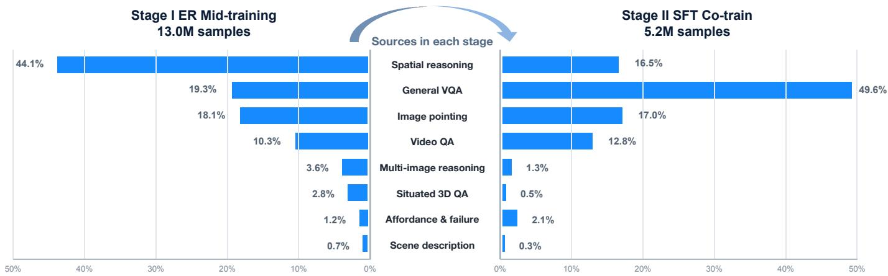  
Fig. 5. 2-stage embodied-reasoning data curriculum. Stage I covers spatial reasoning, general VQA, image pointing, video QA, multiimage reasoning, situated 3D QA, affordance and failure understanding, and scene description. Stage II retains these capabilities through rebalanced ER mixture during supervised co-training.

2) Video Embodied QA: Nine video sources provide indexed supervision. Robot-centric supervision comes from RoboVQA-Reasoning, RoboVQA-Understanding, and Robo-FAC Failure-VQA. Broader video and situated-spatial supervision comes from VSI-590K Spatial, SIMS-VSI Spatial, ViCA-322K, LLaVA-Video-VQA, SQA3D-Situated, and SpatialLadder Spatial. The data span short robot interactions and clips of up to 64 frames, with supervision for temporal ordering, trajectory-aware spatial relations, planning, affordance prediction, future-state reasoning, and failure understanding. Video supervision is important for navigation because action feasibility depends not only on the current view but also on how objects, people, and the agent itself evolve over time.

3) Pointing and Grounding: Pointing is the largest specialized component of ER mid-training: 13 sources account for 35.14% of the sampling probability. Object and referringpoint supervision is drawn from RefSpatial-2D and RefSpatial-3D [98], PixMo Points Single, PixMo Points Multi, COCO Pointing [44], CoSyn Point, RefL4, and RoboRefIt. Affordance, free-space, and trajectory-point supervision comes from RoboPoint [86], RoboAfford, HANDAL, FSD Free-Point, and FSD Visual-Trace. Together, these sources cover referred-object localization, free-space selection, interaction affordances, and visual trajectory traces. They teach the VLM to express spatial decisions directly in the image plane. During navigation SFT stage, the same capability is instantiated as the grid used by the affordance-point token ⟨apos ⟩ and objectpoint token ⟨oposi⟩.

4) Multi-image and Ego–Exo Correspondence: Multiimage samples are drawn from both the image-VQA and video pools. The explicitly multi-image subset comprises VSTP-MI Correspondence, VSTP-MI Object–Object Relation, VSTP-MI Camera Motion, and VSTP-MI Scene Caption, while temporal cross-view samples are inherited from the 9 video sources listed above. They require the model to associate objects across viewpoints, reconcile egocentric and exocentric observations, estimate camera motion, and preserve spatial relations when the visual frame changes. This supervision complements history compression: although the navigation policy receives a temporally compressed context, it must still recognize that observations captured at different times or viewpoints refer to the same scene structure.

5) Abstract Embodied Reasoning: 3 general sources account for 20.00% of the ER sampling mass: LLaVA-OneVision Spatial VQA, Euclid30K-Math, and MMIF-23K-Instruct. They cover broad visual question answering, instruction understanding, mathematical reasoning, and compositional spatial relations. We retain this component to prevent specialization from collapsing the linguistic and visual breadth inherited from the pretrained VLM. Synthetic relation problems additionally isolate frame-of-reference and multistep composition from the appearance biases of natural images.

## B. Navigation Data

Navigation supervision is organized by task objective rather than by robot platform. It spans instruction following, object goal navigation, and embodied visual tracking. The task-level composition of the supervised mixture is summarized in Fig. 6. To reduce dependence on a fixed sensor configuration, we apply camera randomization throughout navigation-data generation. The field of view, camera height, and pitch are sampled from [90◦, 130◦], [0.5, 1.5] m, and [−15◦, 15◦], respectively. This augmentation broadens the visual geometries and viewpoints represented by the training trajectories. All samples are converted to the same output sequence: an affordance point, an object point, and three residual vector-quantized trajectory tokens. Consequently, instruction following, object search, and target following can be interleaved in a single autoregressive training stream even though they differ in goal semantics, temporal structure, and termination conditions.

1) Instruction Following: The instruction-following mixture combines randomized-camera expert trajectories from R2R [4] and RxR [39] with self-distilled routes and ScaleVLN data. The synthesized and self-distilled sources provide substantially broader scene and instruction diversity than the human-annotated corpora alone. Together, expert, synthesized, and self-distilled routes expose the model to both fine-grained linguistic alignment and large-scale geometric variation.

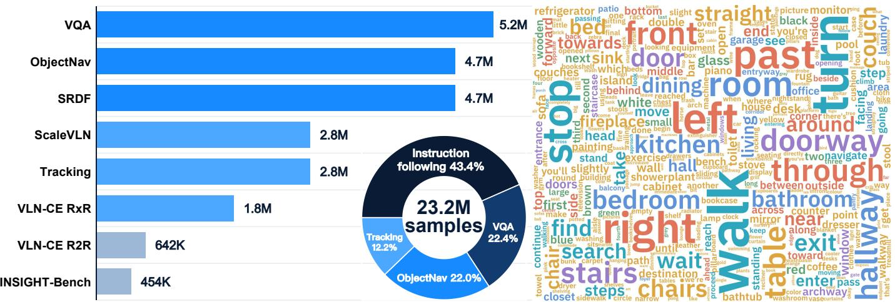  
Fig. 6. Composition of the supervised fine-tuning corpus. The task-balanced optimization mixture combines VQA with instruction following, object navigation, tracking, VLN-CE, ScaleVLN [72], SRDF [73], and INSIGHT-Bench data. The task proportions and instruction word cloud illustrate the diversity of the unified training corpus.

2) Object-Goal Navigation: The object-goal mixture contains semantic and expert demonstrations derived from PIRL-Nav [59], HM3D [57], MP3D [12], VLNVerse [43], Habitat-GS [78], and InteriorGS [51]. We further self-collect exploration trajectories from HM3D-OVON [84] and MP3D, jointly supervising a feasible landing region and the referred object. Finally, in-loop DAgger samples expose the policy to states induced by its own actions rather than only states visited by an expert.

3) Embodied Visual Tracking: Tracking data contain randomized-camera person-following trajectories derived from EVT-Bench [66]. Unlike goal-reaching tasks, tracking requires persistent target identity and continuous relative-position control; including it in the same mixture therefore broadens the temporal behavior learned by the shared policy.

4) Quality Control and Sampling: We apply task-aware filters before constructing the balanced training index. For instruction following and object navigation, stop supervision is retained only at the final frame and only when the target is visible; episodes in which the target is never observed are removed. Stop samples are capped at 2% of the mixture to prevent premature termination from dominating token prediction. Dual-channel pointing labels use a shared grid format, while each 10-waypoint action chunk is encoded by three K = 256 RVQ levels. To reduce domination by common motion patterns, trajectory clusters are balanced with a maximum cluster share of 5%.

## C. Evaluation Benchmarks

We evaluate the ER checkpoint on 8 benchmarks that isolate complementary spatial capabilities: Point-Bench [17], RefSpatial [98], the POI and VQA tracks of RoboSpatial [62],

Where2Place [86], CV-Bench [64], ERQA [26], and Emb-Spatial [20]. Together they measure visual pointing, spatial referring, interaction-site prediction, affordance grounding, geometric perception, and embodied question answering.

Navigation evaluation comprises 10 simulation settings across three task families. Continuous instruction following is measured on the R2R and RxR val-unseen splits [37]. Closedvocabulary ObjectNav is evaluated on MP3D and HM3D v1/v2, and open-vocabulary generalization is measured on HM3D-OVON. Embodied visual tracking is evaluated on the STT and DT settings of EVT-Bench [66]. All navigation benchmarks use the same checkpoint without benchmarkspecific fine-tuning.

## D. INSIGHT-Bench

INSIGHT-Bench extends the data distribution with heterogeneous mesh-based and 3D Gaussian-splatting environments. It contains 1,683 scenes and 53,090 training episodes, together with 210 scenes and 1,097 evaluation episodes. Fig. 10 details the source composition of both splits.

1) Pre-annotation: Scene sources enter the target-inventory stage through two routes. Unlabeled Habitat-GS captures, together with HM3D/MP3D and VLNVerse, use the automatic multi-view pre-annotation pipeline in Fig. 7, whereas InteriorGS bypasses visual discovery and directly supplies official ground-truth boxes. Both routes are converted to the same 3D target representation before episode synthesis. For these sources, the orange dots in Stage 1 mark sampled navigable viewpoints, each of which provides RGB and metric-depth observations in 4 headings. We use Molmo2 [19] for openset pointing, localizing candidate targets in the rendered views from open-vocabulary object prompts. Metric depth lifts every image-space prediction into 3D. Stage 4 groups categorycompatible observations with nearby 3D locations and retains a merged instance only when it is supported by at least two observations from at least two distinct viewpoints and its 3D localization spread is below 0.6 m. Each accepted cluster is represented as one target instance, shown by a green dot in the figure. This cross-view consistency gate removes single-view detections and geometrically unstable matches before episode generation. The resulting target geometry is projected back to the agent view to construct object-point supervision, while navigable free space provides the corresponding affordance-

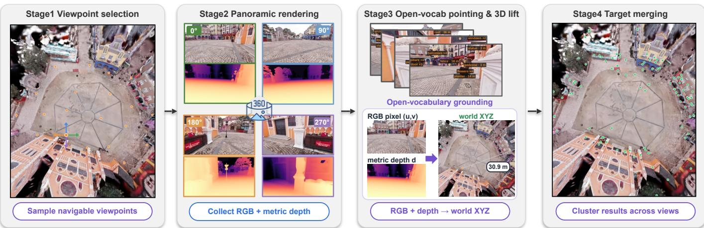  
Fig. 7. Automatic pre-annotation pipeline for INSIGHT-Bench. The pipeline first samples navigable viewpoints (orange dots) and render RGB and metric-depth observations in 4 headings. Molmo2 then produces open-set image-space pointing predictions, which are lifted into 3D and merged across views. The green dots denote the resulting spatially consistent 3D target instances.

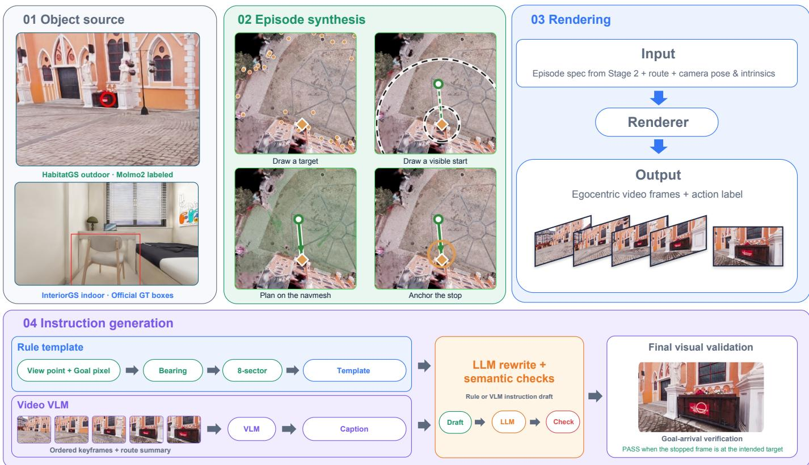  
Fig. 8. Automatic data-generation and instruction-labeling pipeline for INSIGHT-Bench. All scene sources are converted to a common 3D target inventory; we then draw a target and a start pose from which it is visible in at least one offline inventory view, plan a route on the navigation mesh, anchor the stop, and render an egocentric clip with action labels. The evaluated policy remains monocular, and the target need not appear in its initial forward-facing observation. Instructions are drafted by either a rule-template route or a video-VLM route, rewritten by an LLM under semantic checks, and confirmed by a visual goal-arrival check on the final frames.

point target.

2) Data Generation and Instruction Labeling: We then sample a target together with a starting pose from which the target is visible in at least one offline inventory view. This construction-time constraint enables geometric labeling but does not guarantee target visibility to the policy: evaluation uses only the forward-facing monocular stream, and the target need not appear in the initial observation. We plan a route on the navigation mesh, anchor the stopping location, and render egocentric video frames with action labels, as shown in Fig. 8. This common interface makes mesh-based simulators and Gaussian-splatting scenes compatible with the same trajectory format while increasing visual diversity without introducing a scene-specific model component.

Scene types  

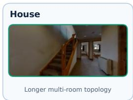

  
Open floors and repeated objects

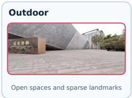

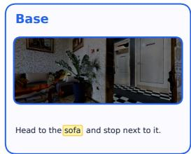

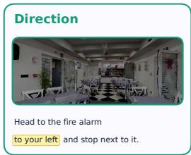

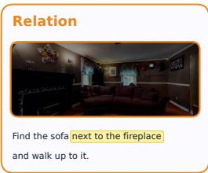

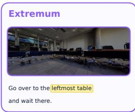

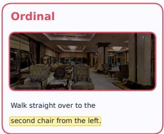

Fig. 9. Two-axis diagnostic taxonomy of INSIGHT-Bench. The scene axis groups environments by dominant function and layout, independent of their source dataset. The instruction axis identifies the spatial mechanism required to resolve the goal.  
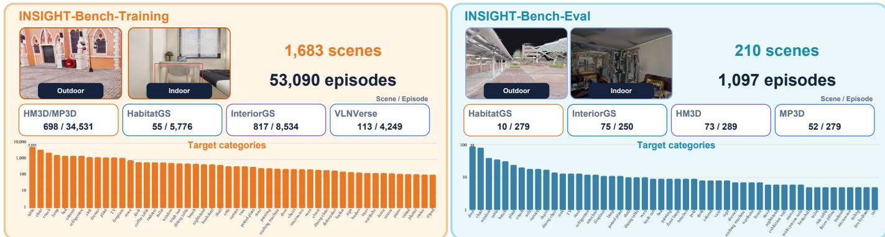  
Fig. 10. Composition of INSIGHT-Bench. The training split contains 1,683 scenes and 53,090 episodes collected from HM3D/MP3D, Habitat-GS, InteriorGS, and VLNVerse, whereas the evaluation split contains 210 scenes and 1,097 episodes from Habitat-GS, InteriorGS, HM3D, and MP3D. The lower histograms show the Top-50 navigation-target frequencies on a logarithmic scale.

Each instruction is then produced by one of two alternative drafting routes, followed by a shared rewriter and a final visual check. The rule-based route reuses evidence that the target inventory already carries: every grounded target records the camera view in which it was detected and the horizontal position of its goal pixel inside that view. Together these determine the direction of the target relative to the agent’s starting heading, so the direction word is read off the recorded geometry rather than inferred from appearance.

The wording is then chosen in two steps. The detected view first fixes the turn family: a target found in the left view is reached by turning left, and a target found in the rear view by turning around. The goal pixel then only refines the phrase within that family, separating ahead from front-left and frontright, or behind-left from behind-right. The resulting sectors are therefore view-aware rather than uniform angular bins, and letting the view dominate is what keeps the wording faithful: a target seen in the rear view whose bearing falls inside the left range is behind the agent on its left, and describing it as a left turn would send the agent the wrong way. Each sector carries a turn-verb phrasing and a locative phrasing, so that “Turn left and go to the chair and stop.” and “The chair is on your left; go to it and stop.” both occur. Episodes whose planned route departs substantially from the straight line to the target always take the locative form, because it describes the direction of the target, whereas a turn verb is read as describing the path that is actually executed.

The video-conditioned route describes the same episode from its recording instead of its geometry. 6 frames evenly spaced over the rendered clip are submitted together with a summary of the executed trajectory to Seed2.0 [10], which is asked to describe the motion along the route rather than only the static position of the target. Its drafts therefore mention landmarks passed on the way and are phrased more freely than any template allows.

TABLE I  
EPISODE DISTRIBUTION OF THE INSIGHT-BENCH EVALUATION SPLIT ACROSS TWO DIAGNOSTIC AXES. ROWS GROUP SCENES BY DOMINANT FUNCTION AND LAYOUT; COLUMNS GROUP INSTRUCTIONS BY THE SPATIAL MECHANISM REQUIRED TO IDENTIFY THE TARGET. “SCENES” COUNTS UNIQUE EVALUATION ENVIRONMENTS, WHILE THE REMAINING CELLS COUNT EVALUATION EPISODES.
<table><tr><td>Scene type</td><td>Scenes</td><td>Episodes</td><td>Base</td><td>Direction</td><td>Relation</td><td>Extremum</td><td>Ordinal</td></tr><tr><td>Apartment</td><td>120</td><td>239</td><td>50</td><td>50</td><td>50</td><td>50</td><td>39</td></tr><tr><td>House</td><td>61</td><td>216</td><td>50</td><td>50</td><td>31</td><td>50</td><td>35</td></tr><tr><td>Commercial</td><td>10</td><td>195</td><td>42</td><td>40</td><td>30</td><td>50</td><td>33</td></tr><tr><td>Institution</td><td>11</td><td>219</td><td>50</td><td>49</td><td>32</td><td>50</td><td>38</td></tr><tr><td>Outdoor</td><td>8</td><td>228</td><td>45</td><td>50</td><td>50</td><td>50</td><td>33</td></tr><tr><td>Total</td><td>210</td><td>1,097</td><td>237</td><td>239</td><td>193</td><td>250</td><td>178</td></tr></table>

Both routes emit drafts rather than final instructions. The same model then rewrites every draft to broaden its vocabulary without changing what it denotes, and each rewrite is accepted only if it passes the semantic checks illustrated in the image: it must keep the head noun of the target, keep the direction implied by its sector, and never introduce the opposite direction. A rewrite that fails falls back to the corresponding source draft, so no episode is lost to rewriting.

Finally, a visual arrival check closes the loop on the rendered episode. The same pointing model is applied to the last frames of the rendered clip (by default the 1st, 3rd, 6th, and 10th frames counted back from the end) and asked to locate the instructed target; an episode is confirmed as soon as any frame contains it, and episodes in which none does are flagged as suspect for review. The 4 components play complementary roles across the benchmark: the rule route supplies exact egocentric direction, the video route supplies route-level language, the rewriter supplies lexical variety, and the checks preserve target identity and trajectory semantics.

3) Diagnostic Taxonomy: We organize INSIGHT-Bench along two independent axes. Each episode inherits one of 5 scene-level labels from the frozen scene-class mapping: apartments contain compact rooms and frequent doors; houses have longer multi-room topologies; commercial scenes contain open floor plans and repeated object instances; institutions emphasize corridors and repeated rooms or workspaces; and outdoor scenes contain open traversable regions with comparatively sparse landmarks. These labels describe functional layout rather than the source dataset or rendering representation.

Instruction labels are assigned at the episode level from the geometric proof used to instantiate the target, rather than inferred post hoc from surface wording. A base instruction names a uniquely resolvable target without a spatial modifier; direction adds an egocentric side or bearing; relation identifies the target through a unique anchor object; extremum selects an argmin or argmax instance such as the nearest or leftmost target; and ordinal selects a ranked instance from a stable ordered set. Fig. 9 illustrates both axes, and Tab. I reports their complete 5 × 5 episode distribution.

The taxonomy turns a single aggregate success rate into a diagnostic result. Row-wise differences expose sensitivity to scene function and layout, column-wise differences isolate the underlying language mechanism, and individual cells reveal interactions such as ordinal references in repeated commercial layouts. The lower counts for relation and ordinal episodes reflect stricter uniqueness and ordering gates, rather than silent truncation. We therefore treat aggregate success rate as an overall health indicator and use the scene, instruction, and cross-category results for substantive conclusions.

4) Benchmark Statistics: The training and evaluation scene sets are strictly disjoint. Specifically, none of the 210 evaluation scenes overlaps with any of the 1,683 training scenes across data sources. The Habitat-GS captures are partitioned contiguously into 55 training and 10 evaluation scenes, InteriorGS contributes 817 training and 75 evaluation scenes, and the HM3D partition is fixed by a frozen scene allowlist that every collection run consumes. The training split averages 31.5 episodes per scene, whereas the evaluation split averages 5.2. Because the benchmark combines conventional indoor meshes with Gaussian-splatting reconstructions, it also tests whether a policy trained under a unified visual interface transfers across rendering representations and scene types.

## V. TRAINING RECIPE

## A. Embodied-Reasoning Mid-training

Although the pretrained VLM already encodes broad semantic and spatial priors, these priors are not consistently exposed in the forms required for embodied decision-making. We therefore begin with embodied-reasoning (ER) mid-training, which specializes the backbone before introducing navigation actions. As summarized in Fig. 5, Stage I uses a taskbalanced mixture spanning spatial reasoning, general VQA, image pointing, video QA, multi-image reasoning, situated 3D QA, affordance and failure understanding, and scene description. These complementary tasks jointly train the model to localize visual evidence, reason across viewpoints and time, identify feasible free space, and anticipate the consequences of embodied interactions. Importantly, this stage operates entirely through the native autoregressive interface and introduces no navigation-specific prediction head. We refer to the resulting embodied-reasoning checkpoint as LightNav-ER and use it to initialize subsequent navigation alignment.

Specialization alone can narrow the general visual-language competence inherited from the backbone. We therefore adopt a specialize-then-retain curriculum: during the subsequent supervised stage, a rebalanced ER mixture is rehearsed together with navigation data. This second stage preserves the pointing, grounding, and spatial-reasoning skills acquired during ER mid-training while aligning them with embodied action generation. The resulting curriculum establishes a common perceptual and reasoning basis before cross-task navigation supervision is introduced.

For ER mid-training, we use a learning rate of $1 \times 1 0 ^ { - 5 }$ and a warmup ratio of 0.01. The global batch size is 128, and the maximum sequence length is 10,240 tokens. This stage is trained on NVIDIA H100 GPUs and consumes approximately 170 H100 GPU-hours of compute.

## B. Supervised Fine-tuning

We next perform supervised fine-tuning (SFT) to align the LightNav-ER checkpoint with the unified navigation token space. The task-balanced optimization mixture in Fig. 6 combines retained ER and VQA data with instruction following, object navigation, and embodied visual tracking. Navigation examples are serialized using the same target structure across tasks: one $\left. \mathrm { a p o s } _ { i } \right.$ token and one ⟨opos ⟩ token provide the latent spatial trace, followed by three RVQ tokens specifying the short-horizon trajectory. Auxiliary reasoning examples and navigation trajectories are optimized with the shared causal language-model objective described above, allowing the shared backbone and output head to learn across tasks, scenes, and embodiments. The navigation mixture additionally includes DAgger-collected examples [60], exposing the policy to states induced by its own predictions and reducing the traindeployment state-distribution gap.

We train with a learning rate of $1 . 5 \times 1 0 ^ { - 5 }$ and a warmup ratio of 0.01. The global batch size is 320, and the maximum sequence length is 8,192 tokens. Training is conducted on NVIDIA H100 GPUs and consumes approximately 950 H100 GPU-hours of compute. Together with dynamic sequence packing, this configuration accommodates long visual histories while retaining a large and diverse global batch.

## C. Online RL Post-training

Although DAgger augments SFT with policy-induced states, the resulting objective remains token-level imitation and does not directly optimize the closed-loop behaviors that determine task success. We therefore introduce online reinforcement learning to optimize complete policy rollouts against task-level objectives, as shown in Fig. 11. This stage refines long-horizon behavior, including sustained tracking, route-consistent goal reaching, efficient search, and appropriate termination. The same backbone, token interface, and rollout machinery support embodied visual tracking, instruction-following VLN, and open-vocabulary object goal navigation; only the task-specific reward function differs.

1) Problem Setup and Group-Relative Objective: An episode is a trajectory $\tau = ( \mathbf { s } _ { 1 } , \mathbf { a } _ { 1 } , \dots , \mathbf { s } _ { T } , \mathbf { a } _ { T } )$ . Its state $\mathbf { s } _ { t }$ pairs the instruction $\mathcal { T }$ with the compressed history $\mathcal { O } _ { 1 : t }$ , and its action $\mathbf { a } _ { t }$ is the token block emitted at step $t { : }$ the dualchannel pointing prefix followed by three RVQ action tokens.

We optimize with Group Relative Policy Optimization (GRPO) [61], which replaces a learned value function by a group baseline. For each episode seed we roll out G independent trajectories, score each with a single scalar $R ( \tau ^ { ( g ) } )$ , and take the within-group standardized reward as the advantage,

$$
A ^ { ( g ) } = \frac { R ( \tau ^ { ( g ) } ) - \mu _ { R } } { \sigma _ { R } + \epsilon _ { \mathrm { n u m } } }\tag{10}
$$

$$
\mu _ { R } = \frac { 1 } { G } \sum _ { g } R ( \tau ^ { ( g ) } )
$$

where $\sigma _ { R }$ is the group standard deviation and $\epsilon _ { \mathrm { n u m } } = 1 0 ^ { - 6 }$ is a numerical stability constant. Standardizing inside the group removes the scene-difficulty offset, so only the ranking of the G attempts on the same start state carries gradient.

Each task is scored by one terminal scalar that is assigned to every decision step, $r _ { t } = R ( \tau )$ for all t, so all tokens of a trajectory share the advantage $A ^ { ( g ) }$ . Per-step shaping would instead need a hand-designed potential defined three times over three incompatible geometries. The surrogate is applied at token level, with $\rho$ the importance ratio of a response token,

$$
\begin{array} { r l } & { \mathcal { L } _ { \mathrm { R L } } = - \mathbb { E } \Big [ \operatorname* { m i n } \big ( \rho A , ~ \mathrm { c l i p } ( \rho , 1 - \varepsilon , 1 + \varepsilon ) A \big ) \Big ] } \\ & { \qquad + \beta D _ { \mathrm { K L } } ( \pi _ { \theta } \| \pi _ { \mathrm { r e f } } ) , } \end{array}\tag{11}
$$

where $\pi _ { \mathrm { r e f } }$ is the frozen supervised policy and $\beta$ anchors the update to it.

2) Rollout Infrastructure and Training-Set Construction: Online RL is bounded by simulation throughput rather than by gradient computation, so we decouple simulation from optimization. Each simulator is an independent process holding one resident scene, and action generation is served by a separate inference server. A scene hash assigns all G rollouts from the same episode seed to a simulator holding the corresponding scene, thereby avoiding redundant scene loading.

Uniform sampling of the training set would waste most of this budget, since an episode the supervised policy always solves and one it never solves both yield $\sigma _ { R } \approx 0$ and no gradient. We therefore run K rollouts of every candidate with the supervised checkpoint and bin it as always-solved, mixed, or never-solved. Mixed episodes sit on the decision boundary and are the only ones guaranteed to produce within-group variance, so they dominate the pool. Robostral Navigate [9] applies a related filter, though it retains only the tasks its supervised policy fails to solve. We instead keep a small fraction of both extremes: always-solved episodes preserve acquired behavior, whereas never-solved episodes provide challenging cases for exploration. The continuous terminal signals described below still rank these failures and thereby support graded trial-anderror learning.

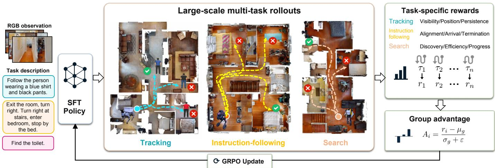  
Fig. 11. Online multi-task reinforcement-learning pipeline. We initialize online optimization from the supervised policy and collect largescale rollouts for all navigation tasks. Task-specific rewards evaluate visibility, position, and persistence for EVT; alignment, arrival, and termination for instruction following; and discovery, efficiency, and progress for object goal navigation. Rewards are normalized within each rollout group to compute advantages for GRPO policy updates.

3) Task-Specific Terminal Rewards: We define a separate terminal reward for each navigation task, tailored to its objective and success criteria. All distances are reported in meters and bearings in radians.

a) Embodied visual tracking: The target here is a moving agent rather than a fixed location, so there is no goal coordinate to arrive at and no terminating stop for the policy to emit. An all-zero plan holds the follower in place, and following resumes as soon as the target moves again. Termination is decided by the environment: the target finishes its route, the follower loses it beyond recovery, or the step budget is exhausted. The environment declares success only if the follower is still 1 to 3 m behind the target and oriented towards it at that moment, so closing in too tightly does not count. What matters over the episode is therefore sustained visibility at a correct standoff rather than a terminal event. At each step we read the target’s visibility $v _ { t } \in \{ 0 , 1 \}$ , bearing $\alpha _ { t } ,$ and range $\delta _ { t }$ . These give a per-step quality $q _ { t } ~ = ~ v _ { t } c ( \alpha _ { t } ) b ( \delta _ { t } )$ whose two position factors are a flat-topped bearing term and a two-sided range band,

$$
c ( \alpha ) = \left. \begin{array} { l r } { 1 , } & { | \alpha | \leq \alpha _ { 0 } , } \\ { \exp \big ( - \frac { ( | \alpha | - \alpha _ { 0 } ) ^ { 2 } } { 2 \sigma _ { \alpha } ^ { 2 } } \big ) , } & { | \alpha | > \alpha _ { 0 } , } \end{array} \right.\tag{12}
$$

$$
\begin{array} { r } { b ( \delta ) = \left\{ \begin{array} { l l } { \exp \big ( - \frac { ( \delta _ { \mathrm { l o w } } - \delta ) ^ { 2 } } { 2 \sigma _ { \mathrm { n e a r } } ^ { 2 } } \big ) , } & { \delta < \delta _ { \mathrm { l o w } } , } \\ { 1 , } & { \delta _ { \mathrm { l o w } } \le \delta \le \delta _ { \mathrm { h i g h } } , } \\ { \exp \big ( - \frac { ( \delta - \delta _ { \mathrm { h i g h } } ) ^ { 2 } } { 2 \sigma _ { \mathrm { f a r } } ^ { 2 } } \big ) , } & { \delta > \delta _ { \mathrm { h i g h } } . } \end{array} \right. } \end{array}\tag{13}
$$

The bearing factor uses a dead zone $\alpha _ { 0 } = 0$ .14 rad and a width $\sigma _ { \alpha } = 0 . 3 5$ rad. The range band is $[ \delta _ { \mathrm { l o w } } , \delta _ { \mathrm { h i g h } } ] = [ 1 . 5 , 3 . 0 ] 1$ m, with $\sigma _ { \mathrm { n e a r } } = 0 . 3 5$ m and $\sigma _ { \mathrm { f a r } } = 1 . 0$ m. Inside the flat top and the flat band the factors are exactly 1, so fine-grained jitter produces no group variance. A second per-step term scores the motion rather than the view. Let $m _ { t } ~ \in ~ [ 0 , 1 ]$ measure how closely the 10-waypoint plan emitted at step t matches a privileged oracle plan from the same state. Writing $\mathbb { 1 } [ \cdot ]$ for the indicator function, combining the two per-step terms with a collision charge gives

$$
\begin{array} { r l r } {  { R _ { \mathrm { E V T } } = 1 [ \mathrm { s u c c e s s } ] - 0 . 5 \times 1 [ \mathrm { c o l l i s i o n } ] } } \\ & { } & { + \frac { 1 } { T _ { \mathrm { n o r m } } } \sum _ { t = 1 } ^ { T } ( 0 . 7 q _ { t } + 0 . 3 m _ { t } ) . } \end{array}\tag{14}
$$

Persistence comes from the normalizer

$$
\begin{array} { r } { T _ { \mathrm { n o r m } } = \left\{ \begin{array} { l l } { T , } & { \mathrm { n a t u r a l ~ e n d , } } \\ { \mathrm { m a x } ( T , T _ { 0 } ) , } & { \mathrm { e a r l y ~ e n d , } } \end{array} \right. } \end{array}\tag{15}
$$

a natural end being the target finishing or the budget being reached, an early end the target being lost or a collision. Averaging over executed steps alone would reward early termination, since a follower that crashes early stops the clock while its average is high. Charging an early end against the constant horizon $T _ { 0 } = 3 0 0$ steps counts the unexecuted steps as zero quality, which turns average quality into persistence.

b) Instruction following: Let dT be the geodesic distance from the final pose to the goal, and nDTW the normalized dynamic-time-warping similarity between the executed and the annotated reference path. With a success radius of 3.0 m we use

$$
\begin{array} { r l } & { R _ { \mathrm { V L N } } = \left( 1 + \mathrm { n D T W } \right) \mathbb { 1 } \left[ \mathrm { s u c c e s s } \right] } \\ & { \quad \quad \quad + \exp \bigg ( - \frac { \operatorname* { m a x } ( d _ { T } , d _ { \mathrm { c l i p } } ) ^ { 2 } } { \sigma _ { d } ^ { 2 } } \bigg ) - 0 . 2 5 \times \mathbb { 1 } [ \mathrm { t i m e o u t } ] . } \end{array}\tag{16}
$$

The first term pays arrival once, and pays up to twice as much when the executed path also kept alignment with the described route. That bonus prevents a shortcut that reaches the goal while ignoring the instruction. The Gaussian kernel, of width $\sigma _ { d } = 3 . 0 \mathrm { m }$ , grades that arrival on both sides of the success boundary and ranks a near miss above a distant stop. The clip $d _ { \mathrm { c l i p } } = 2 . 0$ m flattens it inside that radius.

c) Object goal navigation: Object goal navigation names a category instead of a route, so path fidelity is meaningless and only reaching the object matters. Let $d _ { 0 }$ be the initial geodesic distance to the goal and ˜ℓ the length of the executed path. We write $\mathrm { P L } ~ = ~ d _ { 0 } / \operatorname* { m a x } ( d _ { 0 } , \tilde { \ell } )$ for the per-episode path-length efficiency, the quantity that SPL averages over a dataset [3]. With a success radius of 1.0 m we use

$$
\begin{array} { r l } & { R _ { \mathrm { O B J } } = \left( 1 + 0 . 2 5 \mathrm { P L } \right) \mathbb { 1 } [ \mathrm { s u c c e s s } ] } \\ & { ~ + 0 . 2 5 \exp \Bigl ( - \frac { \operatorname* { m a x } ( d _ { T } , d _ { \mathrm { c l i p } } ) ^ { 2 } } { \sigma _ { d } ^ { 2 } } \Bigr ) . } \end{array}\tag{17}
$$

The first term mirrors Eq. (16). Arrival is paid once, and paid more when the object was reached along a short path, which discourages exhaustive sweeping of the building. Only the measured quality differs: path efficiency here, path fidelity there, because object navigation prescribes no route. The graded proximity term then carries the whole failure population, ranking a run that halved its distance to the object above one that never left the starting room. Without it every failure would share one reward value and contribute nothing to Eq. (10). Because that radius is 1.0 m rather than the 3.0 m used for instruction following, the clip tightens to $d _ { \mathrm { c l i p } } = 1 . 0 \mathrm { m }$ , while $\sigma _ { d }$ is unchanged.

4) Optimization Details: Each iteration draws B episode seeds with pairwise-distinct scenes and rolls out G trajectories per seed. Because each decision step constitutes one training sample, a single iteration generates far more samples than one update needs. We therefore cap the number retained per episode and select them by event stratification. The first and last decisions are always kept, together with decisions carrying a discrete event such as stop emission, stuck detection, collision, or a large-angle turn, and their immediate neighbors. Any remaining quota is spread uniformly over the timeline. Uniform subsampling would discard these decisions in proportion to their rarity, yet they are where the terminal reward is actually earned.

The group size is $G = 8$ and each iteration draws $B = 3 2$ seeds, giving 256 episodes per update. The clip range is $\varepsilon =$ 0.2 and the KL coefficient is $\beta = 0 . 0 1$ . Training runs on a single node with 8 H100 GPUs.

## VI. EXPERIMENTS

## A. Experimental Setup

1) Benchmarks: We evaluate spatial intelligence, simulated navigation, and real-world transfer. For spatial intelligence, LightNav-ER is tested on 8 embodied-reasoning benchmarks: Point-Bench [17], RefSpatial [98], the POI and VQA tracks of RoboSpatial [62], Where2Place [86], CV-Bench [64], ERQA [26], and EmbSpatial [20]. For navigation, a single shared LightNav-0 checkpoint is evaluated without benchmark-specific fine-tuning on 10 public simulation settings spanning three task families and INSIGHT-Bench. Instruction following is measured on the R2R [4] and RxR [39] val-unseen splits in VLN-CE [37]; object goal navigation is evaluated on MP3D [12], HM3D v1/v2 [57], and HM3D-OVON [84]; and embodied visual tracking is evaluated on the STT and DT splits of EVT-Bench [66]. We further deploy the same checkpoint on four physical robot embodiments to assess zero-shot real-world deployment beyond simulation.

INSIGHT-Bench is evaluated under a shared deployment protocol. All models see the same 1,097 episodes from 210 scenes, receive a 120◦, 480×270 forward RGB stream from a camera at 1.0 m height, and are given a budget of 300 actions. An episode succeeds only if the model stops within the goal radius and the target lies inside the 120◦ field of view of the final frame. The radius is 2.0 m for indoor scenes and 3.0 m for outdoor scenes, because outdoor environments are considerably larger and their navigable targets are correspondingly farther apart.

2) Baselines: For embodied reasoning, we compare with two general-purpose 4B VLMs, Qwen3-VL and the posttrained Qwen3.5-4B checkpoint [55], and the spatially specialized 8B Molmo2-ER model. Navigation comparisons cover three representative families: modular systems that separate perception, mapping, and planning; task-specific end-to-end policies, including methods with learned waypoint predictors; and generalist VLM/VLA navigation policies. For INSIGHT-Bench, we additionally run 6 open-source navigation policies through a common action interface: JanusVLN [89], NaVid [90], Uni-NaVid [92], TAMP-Nav [23], InternVLA-N1 [32], and StreamVLN [76]. Each policy receives the shared forward stream through an adapter that may center-crop it to the model’s native training field of view, as used by NaVid and StreamVLN. TAMP-Nav was designed for 4-camera 360◦ observations and depth-assisted pixel-to-3D execution, but we restrict its visual input to the shared forward view. InternVLA-N1 follows its released RGB-only path with constant depth. The episode set, simulator, action budget, and success criterion are identical across these runs. Every navigation result explicitly identifies the use of single-view RGB, panoramic or multi-camera RGB, depth, and odometry.

3) Metrics: For embodied reasoning, we report each benchmark’s primary score as a percentage and compute an unweighted macro average across all 8 benchmarks only when every result is available. For continuous VLN, we report navigation error (NE), oracle success rate (OS), success rate (SR), success weighted by path length (SPL), and normalized dynamic time warping (nDTW). ObjectNav and HM3D-OVON are evaluated with SR and SPL. INSIGHT-Bench is evaluated with SR, SPL, and terminal NE. EVT-Bench reports success rate (SR), tracking rate (TR) and collision rate (CR). Higher values indicate better performance for all metrics except NE and CR, as marked by the arrows in each table.

## B. Embodied Reasoning Benchmark Evaluation

We first evaluate whether embodied-reasoning (ER) midtraining strengthens the spatial capabilities of the VLM before downstream navigation alignment. We test the 4B ER checkpoint on 8 benchmarks covering language-guided pointing, spatial referring, robotic spatial reasoning, affordance prediction, visual perception, and embodied question answering.

TABLE II  
EMBODIED-REASONING AND SPATIAL-INTELLIGENCE EVALUATION. WE COMPARE 4B GENERAL-PURPOSE VLMS, THE 8B MOLMO2-ER MODEL, AND OUR 4B LIGHTNAV-ER CHECKPOINT ON POINT-BENCH [17], REFSPATIAL [98], ROBOSPATIAL [62], WHERE2PLACE [86], CV-BENCH [64], ERQA [26], AND EMBSPATIAL [20]. ALL VALUES ARE PERCENTAGES AND HIGHER IS BETTER. AVG. IS THE UNWEIGHTED MEAN OVER ALL 8 BENCHMARKS. BOLD AND UNDERLINED DENOTE BEST AND SECOND BEST.
<table><tr><td colspan="10">RoboSpatial RoboSpatial</td></tr><tr><td>Method</td><td></td><td>Point-</td><td>Params. Bench RefSpatial</td><td>POI</td><td>VQA</td><td>Where2Place CV-Bench ERQA EmbSpatial Avg.</td><td></td><td></td><td></td><td></td></tr><tr><td>Qwen3-VL [5]</td><td>4B</td><td>58.2</td><td>45.5</td><td>64.8</td><td>69.7</td><td>64.0</td><td>85.6</td><td>39.5</td><td>77.6</td><td>63.1</td></tr><tr><td>Qwen3.5-4B [55]</td><td>4B</td><td>60.4</td><td>54.6</td><td>47.9</td><td>59.7</td><td>61.3</td><td>85.0</td><td>40.8</td><td>76.8</td><td>60.8</td></tr><tr><td>Molmo2-ER [22]</td><td>8B</td><td>77.3</td><td>52.5</td><td>32.0</td><td>73.4</td><td>54.0</td><td>87.8</td><td>46.8</td><td>78.8</td><td>62.8</td></tr><tr><td>LightNav-ER</td><td>4B</td><td>64.5</td><td>57.4</td><td>56.5</td><td>71.9</td><td>76.6</td><td>88.4</td><td>43.8</td><td>79.8</td><td>67.4</td></tr></table>

Tab. II reports each benchmark’s primary score as a percentage, with higher values indicating better performance. The macro average is computed only for models with results on all 8 benchmarks.

LightNav-ER ranks first on 4 of the 8 benchmarks and second on the remaining 4, attaining the highest complete-set average of 67.4. This exceeds the strongest baseline average, achieved by Qwen3-VL-4B, by +4.3 (6.8%) and the 8B Molmo2-ER average by +4.6 (7.3%), despite using only 50% of the parameters. LightNav-ER also outperforms Qwen3.5-4B on all 8 benchmarks. Molmo2-ER remains stronger on Point-Bench, RoboSpatial-VQA, and ERQA, while Qwen3-VL leads on RoboSpatial-POI. The comparison therefore demonstrates broad and balanced spatial competence rather than uniform dominance on every individual task.

Relative to the Qwen3-VL-4B initialization, ER midtraining improves 7 of the 8 benchmark scores and raises the macro average from 63.1 to 67.4, an absolute improvement of +4.3 (6.8%). The largest gains occur on Where2Place (+12.6; 19.7%) and RefSpatial (+11.9; 26.2%), which directly exercise free-space grounding and multi-step spatial referring.

## C. Simulation Benchmark Evaluation

We compare LightNav-0 with reported state-of-the-art systems across instruction following, object goal navigation, and embodied visual tracking. To make the sensing assumptions explicit, all comparisons report whether each method uses single-view RGB, panoramic or multi-camera RGB, depth, and odometry inputs.

1) Vision-Language Navigation: As shown in Tab. III, LightNav-0 achieves the strongest monocular R2R result on all 4 metrics. Relative to the best prior monocular entries, SR increases from 66.9 to 68.5 (+1.6; 2.4%) and SPL from 62.3 to 62.8 (+0.5; 0.8%), while NE decreases from 4.05 to 3.91 (-0.14 m; 3.5% reduction). OS reaches 73.7, marginally above Qwen-RobotNav-4B at 73.6. The simultaneous gains in SR, SPL, and NE indicate that the improved goal-reaching reliability is retained under path-efficiency and terminal-precision criteria.

On the longer RxR benchmark, LightNav-0 likewise obtains the best monocular NE, SR, and SPL. It improves SR over Qwen-RobotNav-8B from 73.4 to 73.6 (+0.2; 0.3%) and SPL from 63.5 to 64.5 (+1.0; 1.6%), while reducing NE from 4.09 to 3.66 (-0.43 m; 10.5% reduction). Its nDTW of 67.4 remains below DualVLN’s 70.0, revealing that the higher success and terminal accuracy do not translate uniformly to trajectory fidelity. Panoramic methods retain small advantages on both datasets, but LightNav-0 remains competitive while using only a forward RGB view and no depth or odometry.

2) Object Goal Navigation: LightNav-0 attains the strongest monocular SR and SPL across all three closedvocabulary ObjectNav settings in Tab. IV, despite using neither depth nor odometry. On MP3D, it raises SR over CogNav from 46.6 to 53.3 (+6.7; 14.4%) and SPL over VLFM from 17.5 to 21.2 (+3.7; 21.1%). On HM3D v1, SR increases from 73.7 to 74.5 (+0.8; 1.1%), while SPL rises from 37.3 to 43.9 (+6.6; 17.7%). On HM3D v2, LightNav-0 improves SR from 77.0 to 79.5 (+2.5; 3.2%) and SPL from 41.3 to 43.7 (+2.4; 5.8%).

The same RGB-only policy also exceeds the listed multiview systems. On MP3D, its SR is 1.1 points above Qwen-RobotNav-4B and its SPL is 3.5 points above Qwen-RobotNav-8B. On HM3D v1, it outperforms the depth- and odometry-assisted WMNav by +16.4 SR and +12.7 SPL; on HM3D v2, it exceeds the best multi-view entries by +3.9 SR and +10.7 SPL. These comparisons rule out a wider field of view or privileged geometry as the source of the advantage.

Open-vocabulary evaluation exhibits the same pattern (Tab. V). On val seen categories, LightNav-0 improves the strongest prior monocular SR from 55.0 to 55.3 (+0.3; 0.5%). The SR gain widens to +8.3 (18.4%) on val synonyms and +6.2 (15.2%) on val unseen categories. SPL also rises from 23.6 to 30.4 (+6.8; 28.8%) on seen categories and from 21.8 to 29.3 (+7.5; 34.4%) on synonyms. On unseen categories, SPL increases from 19.8 to 24.1 (+4.3; 21.7%). These margins are measured against monocular methods that may additionally use depth and odometry, making the result particularly notable for a single-RGB-input policy.

3) INSIGHT-Bench: As shown in Tab. VI, LightNav-0 attains the best result on every aggregate metric. It improves SR over JanusVLN from 27.4 to 43.7 (+16.3; 59.5%) and SPL from 24.0 to 41.5 (+17.5; 72.9%), and reduces NE from NaVid’s 4.25 m to 3.88 m (-0.37 m; 8.7%).

The instruction axis of Tab. VII shows where that advantage is concentrated. LightNav-0 leads every instruction type, and the margin is largest on Direction, which rises from NaVid’s 29.7 to 57.7 (+28.0; 94.3%). Direction is also the only type on which LightNav-0 exceeds its own Base score of 45.1, whereas all 6 baselines fall below their Base score once an egocentric bearing is added. This is consistent with the route-conditioned supervision of Sec. IV, in which egocentric bearings are stated explicitly in the rule templates and preserved through rewriting. Extremum remains the hardest type at 37.2, ahead of NaVid by +14.8 (66.1%), because selecting an argmin or argmax instance requires detecting several candidates before their positions can be compared.

TABLE III  
PERFORMANCE ON CONTINUOUS VISION-AND-LANGUAGE NAVIGATION. COMPARISON ON THE R2R [4] AND RXR [39] VAL-UNSEEN SPLITS IN CONTINUOUS ENVIRONMENTS [37]. S.RGB, PANO., DEPTH, AND ODOM. INDICATE SINGLE-VIEW RGB, PANORAMIC OR MULTI-CAMERA RGB, DEPTH, AND ODOMETRY INPUTS, RESPECTIVELY. ∗ DENOTES METHODS USING A WAYPOINT PREDICTOR. IN MONOCULAR SETTING, BOLD AND UNDERLINED DENOTE BEST AND SECOND BEST.
<table><tr><td rowspan="2">Method</td><td colspan="3">Observation</td><td colspan="4">R2R Val-Unseen</td><td colspan="4">RxR Val-Unseen</td></tr><tr><td>S.RGB</td><td></td><td></td><td></td><td></td><td></td><td></td><td></td><td></td><td></td><td>Pano. Depth Odom. NE↓ OS↑ SR↑ SPL↑ NE↓ SR↑ SPL↑ nDTW↑</td></tr><tr><td>Multi-view methods</td><td></td><td></td><td></td><td></td><td></td><td></td><td></td><td></td><td></td><td></td><td></td></tr><tr><td>CMA*[37]</td><td>√</td><td>√</td><td>√</td><td></td><td></td><td>6.2052.0 41.0 36.0</td><td></td><td>8.7626.5</td><td></td><td>22.1</td><td></td></tr><tr><td>HPN+DN* [38]</td><td>√</td><td>√</td><td>√</td><td>6.31 40.0 36.034.0</td><td></td><td></td><td></td><td></td><td></td><td></td><td></td></tr><tr><td>Sim2Sim* [36]</td><td>√</td><td>√</td><td>√</td><td>6.07 52.0 43.0 36.0</td><td></td><td></td><td></td><td>8.76 26.5</td><td></td><td>22.1</td><td></td></tr><tr><td>Reborn* [1]</td><td>√</td><td>√</td><td>√</td><td>5.4057.0 50.046.0</td><td></td><td></td><td></td><td>5.9848.6</td><td></td><td>42.0</td><td></td></tr><tr><td>GridMM* [69]</td><td>√</td><td>√</td><td>√</td><td></td><td></td><td>5.11 61.0 49.041.0</td><td></td><td></td><td></td><td></td><td></td></tr><tr><td>DreamWalker* [65]</td><td>√</td><td>√</td><td>√</td><td></td><td></td><td>5.53 59.0 49.044.0</td><td></td><td></td><td></td><td></td><td></td></tr><tr><td>ETPNav* [2]</td><td>√</td><td>V</td><td>√</td><td></td><td>4.71 65.0 57.049.0</td><td></td><td></td><td>5.6454.7</td><td></td><td>44.8</td><td></td></tr><tr><td>HNR* [70]</td><td>√</td><td>√</td><td>√</td><td></td><td></td><td>4.42 67.0 61.051.0</td><td></td><td>5.5056.3</td><td></td><td>46.7</td><td></td></tr><tr><td>InstructNav [50]</td><td>√</td><td>√</td><td>√</td><td>6.89</td><td></td><td></td><td>31.0 24.0</td><td></td><td></td><td></td><td></td></tr><tr><td>AO-Planner [13]</td><td>√</td><td>√</td><td></td><td></td><td>5.55 59.0 47.0 33.0</td><td></td><td></td><td></td><td></td><td></td><td></td></tr><tr><td>NavFoM [91]</td><td>√</td><td></td><td></td><td></td><td></td><td>4.61 72.1 61.7 55.3</td><td></td><td>4.7464.4</td><td></td><td>56.2</td><td>65.8</td></tr><tr><td>NavForesee [45]</td><td>√</td><td></td><td></td><td></td><td>3.94 78.4 66.2 59.7</td><td></td><td></td><td>4.2066.3</td><td></td><td>53.2</td><td></td></tr><tr><td>SPAN-Nav [47]</td><td>√</td><td></td><td></td><td></td><td>4.07 75.3 66.3 59.3</td><td></td><td></td><td></td><td>4.20 69.7 60.1</td><td></td><td>67.9</td></tr><tr><td>ABot-N0 [18]</td><td>√</td><td></td><td></td><td></td><td></td><td>3.80 70.8 66.4 63.9</td><td></td><td>3.83 69.3</td><td></td><td>60.0</td><td></td></tr><tr><td>Qwen-RobotNav-4B [93]</td><td>√</td><td></td><td></td><td></td><td>3.8077.2 69.5</td><td></td><td>63.6</td><td>3.80 75.2</td><td></td><td>65.0</td><td>71.9</td></tr><tr><td>Qwen-RobotNav-8B [93]</td><td>√</td><td></td><td></td><td></td><td>3.53 78.5 72.1</td><td></td><td>66.6</td><td>3.5876.5</td><td></td><td>65.7</td><td>72.5</td></tr><tr><td>ABot-N1 [27]</td><td>√</td><td></td><td></td><td></td><td></td><td>3.91 71.7 68.3</td><td>66.6</td><td>3.43 70.9</td><td></td><td>61.4</td><td></td></tr><tr><td colspan="12">Monocular methods</td></tr><tr><td>NaVid [90]</td><td>√</td><td></td><td></td><td></td><td>5.47 49.0 37.0 35.0</td><td></td><td></td><td></td><td></td><td></td><td></td></tr><tr><td>Uni-NaVid [92]</td><td>√</td><td></td><td></td><td></td><td>5.58 53.5 47.0</td><td></td><td>42.7</td><td></td><td>6.2448.7</td><td>40.9</td><td></td></tr><tr><td>NaVILA [16]</td><td>√</td><td></td><td></td><td></td><td>5.22 62.5 54.049.0</td><td></td><td></td><td>6.7749.3</td><td></td><td>44.0</td><td></td></tr><tr><td>StreamVLN [76]</td><td>√</td><td></td><td></td><td></td><td>4.98 64.2 56.9 51.9</td><td></td><td></td><td></td><td>6.22 52.9 46.0</td><td></td><td></td></tr><tr><td>CorrectNav [85]</td><td>√</td><td></td><td></td><td></td><td>4.24 67.5 65.1 62.3</td><td></td><td></td><td></td><td>4.09 69.3 63.3</td><td></td><td></td></tr><tr><td>DualVLN [75]</td><td>√</td><td></td><td></td><td></td><td>4.05 70.7 64.3 58.5</td><td></td><td></td><td></td><td>4.58 61.4 51.8</td><td></td><td>70.0</td></tr><tr><td>InternVLA-N1 [32]</td><td>√</td><td>√</td><td></td><td></td><td>4.83 63.3 58.2 54.0</td><td></td><td></td><td>5.91 53.5</td><td></td><td>46.1</td><td>65.3</td></tr><tr><td>Qwen-VLA [56]</td><td>√</td><td></td><td></td><td></td><td>5.10 69.0 57.3</td><td></td><td>51.2</td><td>5.8059.6</td><td></td><td>47.8</td><td></td></tr><tr><td>Qwen-RobotNav-4B [93]</td><td>√</td><td></td><td></td><td></td><td>4.2273.6</td><td>66.9</td><td>60.5</td><td>4.1571.3</td><td></td><td>61.5</td><td>68.6</td></tr><tr><td>Qwen-RobotNav-8B [93]</td><td>√</td><td></td><td></td><td></td><td>4.3672.7</td><td>65.7</td><td>59.6</td><td>4.16 73.4</td><td></td><td>63.5</td><td>69.9</td></tr><tr><td>LightNav-0</td><td>√</td><td></td><td></td><td></td><td>3.91 73.7 68.5</td><td></td><td>62.8</td><td>3.66 73.6</td><td></td><td>64.5</td><td>67.4</td></tr></table>

The scene axis follows the same pattern. LightNav-0 is strongest in Apartment scenes at 61.1, exceeding the best open-source result by +21.4 (53.9%), and gains its largest relative margin outdoors, improving on JanusVLN from 16.7 to 34.2 (+17.5; 104.8%). The outdoor result is consistent with the inclusion of outdoor 3DGS trajectories during training, whereas the evaluated open-source policies are predominantly trained on indoor Habitat environments. Institution is the weakest scene type at 29.2, although it still exceeds the best open-source result by +10.9 (59.6%); its large spaces and repeated doors, chairs, and workstations make distant recognition and instance disambiguation difficult.

The joint matrix in Fig. 12 shows that the two axes interact rather than contributing independent, uniform penalties. House–Direction reaches 74.0% (37/50), while Institution– Extremum falls to 18.0% (9/50), a 56.0-point range against marginal spans of only 31.9 points across scene types and 20.5 points across instruction types. The larger cross-cell span indicates that difficult language compounds scene-specific ambiguity: familiar residential topology and explicit egocentric cues favor House–Direction, whereas repeated instances in large institutional spaces make the global comparison required by Extremum particularly brittle.

4) Embodied Visual Tracking: On EVT-Bench (Tab. VIII), LightNav-0 achieves the highest SR on both tracking regimes. For single-target tracking, it raises SR from ReferTrack’s 89.4 to 91.7 (+2.3; 2.6%). Under distracted tracking, where the agent must preserve target identity among distractors, the margin increases from 73.3 to 82.6 (+9.3; 12.7%). LightNav-0 also reduces the best prior monocular distracted-tracking CR from 5.51 to 4.62 (-0.89; 16.2% reduction). ReferTrack retains the highest TR in both regimes and the lowest single-target CR, indicating that persistent visual lock remains a complementary strength of the specialist tracker.

TABLE IV  
PERFORMANCE ON OBJECT-GOAL NAVIGATION. COMPARISON ON MP3D [12] AND HM3D [57] OBJECTNAV [6]. IN MONOCULAR SETTING, BOLD AND UNDERLINED DENOTE BEST AND SECOND BEST.
<table><tr><td rowspan="2">Method</td><td colspan="4">Observation</td><td colspan="2">MP3D</td><td colspan="2">HM3D v1</td><td colspan="2">HM3D v2</td></tr><tr><td>S.RGB</td><td>Pano. Depth</td><td></td><td>Odom.</td><td>SR↑</td><td>SPL↑</td><td>SR↑</td><td>SPL↑</td><td>SR↑ SPL↑</td><td></td></tr><tr><td>Multi-view methods</td><td></td><td></td><td></td><td></td><td></td><td></td><td></td><td></td><td></td><td></td></tr><tr><td>WMNav [52]</td><td></td><td>√</td><td></td><td>V</td><td>45.4</td><td>17.2</td><td>58.1</td><td>31.2</td><td></td><td></td></tr><tr><td>Qwen-RobotNav-4B [93]</td><td></td><td>√</td><td></td><td></td><td>52.2</td><td>16.0</td><td>一</td><td></td><td>75.6</td><td>30.6</td></tr><tr><td>Qwen-RobotNav-8B [93]</td><td></td><td>√</td><td></td><td></td><td>48.8</td><td>17.7</td><td>一</td><td>一</td><td>71.2</td><td>33.0</td></tr><tr><td>Monocular methods</td><td></td><td></td><td></td><td></td><td></td><td></td><td></td><td></td><td></td><td></td></tr><tr><td>VLFM [83]</td><td>√</td><td></td><td>V</td><td>√</td><td>36.4</td><td>17.5</td><td>52.5</td><td>30.4</td><td>63.6</td><td>32.5</td></tr><tr><td>OpenFMNav [40]</td><td>√</td><td></td><td>√</td><td>√</td><td>37.2</td><td>15.7</td><td>52.5</td><td>24.1</td><td></td><td></td></tr><tr><td>SG-Nav [80]</td><td>√</td><td></td><td>√</td><td>√</td><td>40.2</td><td>16.0</td><td>54.0</td><td>24.9</td><td>49.6</td><td>25.5</td></tr><tr><td>TriHelper [94]</td><td>√</td><td></td><td>√</td><td>√</td><td>一</td><td>一</td><td>56.5</td><td>25.3</td><td></td><td></td></tr><tr><td>FiLM-Nav [82]</td><td>√</td><td></td><td>√</td><td>√</td><td></td><td>一</td><td>61.7</td><td>37.3</td><td>77.0</td><td>41.3</td></tr><tr><td>CogNav [11]</td><td>√</td><td></td><td>√</td><td>√</td><td>46.6</td><td>16.1</td><td>72.5</td><td>26.2</td><td></td><td>一</td></tr><tr><td>Uni-NaVid [92]</td><td>√</td><td></td><td></td><td></td><td></td><td></td><td>73.7</td><td>37.1</td><td></td><td></td></tr><tr><td>LightNav-0</td><td>√</td><td></td><td></td><td></td><td>53.3</td><td>21.2</td><td>74.5</td><td>43.9</td><td>79.5</td><td>43.7</td></tr></table>

TABLE V

PERFORMANCE ON OPEN-VOCABULARY OBJECT NAVIGATION. COMPARISON ON THE HM3D-OVON BENCHMARK [84] UNDER SEEN-CATEGORY, SYNONYM, AND UNSEEN-CATEGORY SETTINGS. IN MONOCULAR SETTING, BOLD AND UNDERLINED DENOTE BEST AND SECOND BEST.
<table><tr><td rowspan="2">Method</td><td colspan="4">Observation</td><td colspan="2">Seen</td><td colspan="2">Synonyms</td><td colspan="2">Unseen</td></tr><tr><td>S.RGB</td><td>Pano.</td><td>Depth</td><td>Odom.</td><td>SR↑</td><td>SPL↑</td><td>SR↑</td><td>SPL↑</td><td>SR↑</td><td>SPL↑</td></tr><tr><td>Multi-view methods</td><td></td><td></td><td></td><td></td><td></td><td></td><td></td><td></td><td></td><td></td></tr><tr><td>NavFoM [91]</td><td></td><td>√</td><td></td><td></td><td>37.7</td><td>25.5</td><td>43.3</td><td>29.9</td><td>43.6</td><td>31.3</td></tr><tr><td>Qwen-RobotNav-4B [93]</td><td></td><td>√</td><td></td><td></td><td>57.7</td><td>24.4</td><td>60.1</td><td>25.1</td><td>53.1</td><td>20.9</td></tr><tr><td>Qwen-RobotNav-8B [93]</td><td></td><td>√</td><td></td><td></td><td>56.1</td><td>28.5</td><td>57.8</td><td>28.8</td><td>51.2</td><td>24.0</td></tr><tr><td>ABot-N0 [18]</td><td></td><td>√</td><td></td><td></td><td>55.3</td><td>32.1</td><td>55.4</td><td>33.2</td><td>54.0</td><td>30.5</td></tr><tr><td>Monocular methods</td><td></td><td></td><td></td><td></td><td></td><td></td><td></td><td></td><td></td><td></td></tr><tr><td>VLFM [83]</td><td>√</td><td></td><td>√</td><td>√</td><td>35.2</td><td>18.6</td><td>32.4</td><td>17.3</td><td>35.2</td><td>19.6</td></tr><tr><td>DAgRL+OD [84]</td><td>√</td><td></td><td>√</td><td>√</td><td>38.5</td><td>21.1</td><td>39.0</td><td>21.4</td><td>37.1</td><td>19.8</td></tr><tr><td>MTU3D [100]</td><td>√</td><td></td><td>√</td><td>√</td><td>55.0</td><td>23.6</td><td>45.0</td><td>14.7</td><td>40.8</td><td>12.1</td></tr><tr><td>Uni-NaVid [92]</td><td>√</td><td></td><td></td><td></td><td>41.3</td><td>21.1</td><td>43.9</td><td>21.8</td><td>39.5</td><td>19.8</td></tr><tr><td>LightNav-0</td><td>√</td><td></td><td></td><td></td><td>55.3</td><td>30.4</td><td>53.3</td><td>29.3</td><td>47.0</td><td>24.1</td></tr></table>

TABLE VI

OVERALL PERFORMANCE ON INSIGHT-BENCH. BOLD ANDUNDERLINED DENOTE BEST AND SECOND BEST.
<table><tr><td>Method</td><td>SR↑</td><td>SPL↑</td><td>NE↓ (m)</td></tr><tr><td>JanusVLN [89]</td><td>27.4</td><td>24.0</td><td>4.89</td></tr><tr><td>NaVid [90]</td><td>26.9</td><td>23.0</td><td>4.25</td></tr><tr><td>Uni-NaVid [92]</td><td>24.3</td><td>22.1</td><td>4.91</td></tr><tr><td>TAMP-Nav [23]</td><td>16.0</td><td>15.8</td><td>6.29</td></tr><tr><td>InternVLA-N1 [32]</td><td>11.7</td><td>11.0</td><td>5.45</td></tr><tr><td>StreamVLN [76]</td><td>11.6</td><td>10.8</td><td>6.56</td></tr><tr><td>LightNav-0</td><td>43.7</td><td>41.5</td><td>3.88</td></tr></table>

The cross-modality comparison is especially strong under distraction: LightNav-0 achieves 82.6 SR, exceeding the best multi-view result, CoMaTrack’s 74.2, by +8.4 (11.3%), while its single-target SR is within 0.4 of CoMaTrack’s 92.1. Co-MaTrack still attains a lower CR, and ReferTrack retains a higher distracted-tracking TR, so the result establishes stronger episode-level success rather than uniform dominance on every tracking metric. Together with the VLN and ObjectNav results, this supports the use of one compact RGB-only policy across instruction following, search, and following tasks under markedly different sensing and temporal demands.

## D. Cross-Domain and Real-World Generalization

We qualitatively evaluate whether the unified spatial interface transfers beyond the simulation domains used for training. These demonstrations use the same LightNav-0 checkpoint without domain-specific fine-tuning. Because the virtual and physical environments do not share a standardized action space or success protocol, we use the rollouts to assess the breadth of transfer rather than to make a quantitative benchmark comparison.

1) Cross-Domain Generalization: As shown in Fig. 13, LightNav-0 operates across 4 game domains with markedly different visual styles, scene structures, and control dynamics. The model follows multi-step spatial instructions in Counter-Strike 1.6 and VizDoom, maintains a moving Creeper as the target in Minecraft, and follows a sequence of checkpoints while driving in Trigger Rally. Across these settings, the affordance point provides a transferable intermediate target in navigable space, while the object point identifies the referred target or landmark when applicable. The coherent rollouts across first-person navigation, target following, and vehicle control indicate that the learned pointing-and-trajectory interface is not tied to the appearance statistics or locomotion dynamics of the training simulators.

TABLE VII  
FINE-GRAINED SUCCESS RATE ON INSIGHT-BENCH. THE FIRST 5 COLUMNS GROUP EPISODES BY INSTRUCTION TYPE AND THENEXT 5 BY SCENE TYPE. BOLD AND UNDERLINED DENOTE BEST AND SECOND BEST.
<table><tr><td rowspan="2">Method</td><td colspan="5">Instruction type</td><td colspan="5">Scene type</td><td rowspan="2">Avg.</td></tr><tr><td>Base Direction Relation Extremum Ordinal Apartment House Commercial Institution Outdoor</td><td></td><td></td><td></td><td></td><td></td><td></td><td></td><td></td><td></td></tr><tr><td>JanusVLN [89]</td><td>32.5</td><td>28.5</td><td>28.5</td><td>22.0</td><td>25.8</td><td>39.7</td><td>35.2</td><td>26.7</td><td>18.3</td><td>16.7</td><td>27.4</td></tr><tr><td>NaVid [90]</td><td>37.6</td><td>29.7</td><td>18.7</td><td>22.4</td><td>24.2</td><td>37.7</td><td>39.8</td><td>24.6</td><td>18.3</td><td>13.6</td><td>26.9</td></tr><tr><td>Uni-NaVid [92]</td><td>32.9</td><td>29.3</td><td>21.8</td><td>16.8</td><td>19.7</td><td>39.3</td><td>28.7</td><td>23.1</td><td>15.5</td><td>14.0</td><td>24.3</td></tr><tr><td>TAMP-Nav [23]</td><td>18.1</td><td>14.2</td><td>17.6</td><td>10.8</td><td>20.8</td><td>26.8</td><td>18.5</td><td>15.9</td><td>9.6</td><td>8.3</td><td>16.0</td></tr><tr><td>InternVLA-N1 [32]</td><td>18.1</td><td>13.0</td><td>9.8</td><td>8.4</td><td>7.9</td><td>12.1</td><td>19.0</td><td>12.3</td><td>7.8</td><td>7.5</td><td>11.7</td></tr><tr><td>StreamVLN [76]</td><td>15.6</td><td>9.6</td><td>14.5</td><td>8.0</td><td>10.7</td><td>19.7</td><td>15.7</td><td>12.8</td><td>4.1</td><td>5.3</td><td>11.6</td></tr><tr><td>LightNav-0</td><td>45.1</td><td>57.7</td><td>37.8</td><td>37.2</td><td>38.2</td><td>61.1</td><td>50.5</td><td>42.1</td><td>29.2</td><td>34.2</td><td>43.7</td></tr></table>

<table><tr><td></td><td>Base</td><td>Direction</td><td>Relation</td><td>Extremum</td><td>Ordinal</td><td>Total</td><td rowspan="5">74.0 65.0 55.0 Suc res r(%) 43.66</td><td rowspan="5"></td></tr><tr><td>Apartment</td><td>68.0% 34/50</td><td>72.0% 36/50</td><td>54.0% 27/50</td><td>66.0% 33/50</td><td>41.0% 16/39</td><td>61.1% 146/239</td></tr><tr><td>House</td><td>60.0% 30/50</td><td>74.0% 37/50</td><td>29.0% 9/31</td><td>32.0% 16/50</td><td>48.6% 17/35</td><td>50.5% 109/216</td></tr><tr><td>Commercial</td><td>38.1% 16/42</td><td>52.5% 21/40</td><td>40.0% 12/30</td><td>34.0% 17/50</td><td>48.5% 16/33</td><td>42.1% 82/195</td></tr><tr><td>Institution</td><td>28.0% 14/50</td><td>44.9% 22/49</td><td>31.2% 10/32</td><td>18.0% 9/50</td><td>23.7% 9/38</td><td>29.2% 64/219</td></tr><tr><td>Outdoor</td><td>28.9% 13/45</td><td>44.0% 22/50</td><td>30.0% 15/50</td><td>36.0% 18/50</td><td>30.3% 10/33</td><td>34.2% 78/228</td><td rowspan="2">30.0 18.0</td></tr><tr><td>Total</td><td>45.1% 107/237</td><td>57.7% 138/239</td><td>37.8% 73/193</td><td>37.2% 93/250</td><td>38.2% 68/178</td><td>43.66% 479/1,097</td></tr></table>

Fig. 12. Joint scene–instruction capability matrix of LightNav-0 on the INSIGHT-Bench evaluation split. Each cell reports SR and successful episodes over evaluated episodes. Warm cells fall below the overall SR of 43.66%, whereas cool cells exceed it; saturation encodes the magnitude of this deviation on the colorbar scale, and thin borders mark row, column, and overall totals. The bottom-right cell is the aggregate result (479/1,097). The best and worst intersections are House–Direction (74.0%, 37/50) and Institution–Extremum (18.0%, 9/50), respectively.

TABLE VIII  
PERFORMANCE ON EMBODIED VISUAL TRACKING. COMPARISON ON EVT-BENCH [66]. IN MONOCULAR SETTING, BOLD AND UNDERLINED DENOTE BEST AND SECOND BEST.
<table><tr><td rowspan="2">Method</td><td colspan="3">STT</td><td colspan="3">DT</td></tr><tr><td>SR↑</td><td>TR↑</td><td>CR↓</td><td>SR↑</td><td>TR↑</td><td>CR↓</td></tr><tr><td>Multi-view methods</td><td></td><td></td><td></td><td></td><td></td><td></td></tr><tr><td>TrackVLA++ [46]</td><td>86.0</td><td>81.0 80.5</td><td>2.10</td><td>66.5 61.4</td><td>68.8 68.2</td><td>4.71</td></tr><tr><td>NavFoM [91] CoMaTrack [49]</td><td>86.0 92.1</td><td>90.3</td><td>0.90</td><td>74.2</td><td>80.5</td><td>2.10</td></tr><tr><td>Qwen-RobotNav-4B [93] Qwen-RobotNav-8B [93]</td><td>77.4 78.6</td><td>90.0 89.7</td><td>6.40 5.70</td><td></td><td></td><td></td></tr><tr><td>ABot-N0 [18] ABot-N1 [27]</td><td>86.9 87.0</td><td>87.6 86.9</td><td>8.54 6.83</td><td>66.7 65.2</td><td>75.4 72.7</td><td>11.60 14.70</td></tr><tr><td>Monocular methods</td><td></td><td></td><td></td><td></td><td></td><td></td></tr><tr><td>TrackVLA [66]</td><td>85.1</td><td>78.6</td><td>1.65</td><td>57.6</td><td>63.2</td><td>5.80</td></tr><tr><td>Uni-NaVid [92]</td><td>53.3</td><td>67.2</td><td>12.60</td><td>31.9</td><td>50.1</td><td>21.30</td></tr><tr><td>VLingNav [67]</td><td>88.4</td><td>81.2</td><td>2.07</td><td>67.6</td><td>73.5</td><td>5.51</td></tr><tr><td></td><td></td><td>92.5</td><td>1.60</td><td>73.3</td><td></td><td></td></tr><tr><td>ReferTrack [79]</td><td>89.4</td><td></td><td></td><td></td><td>81.8</td><td>7.60</td></tr><tr><td></td><td></td><td></td><td></td><td></td><td></td><td></td></tr><tr><td></td><td></td><td></td><td></td><td></td><td></td><td></td></tr><tr><td>LightNav-0</td><td>91.7</td><td>87.7</td><td>1.87</td><td>82.6</td><td>80.1</td><td>4.62</td></tr><tr><td></td><td></td><td></td><td></td><td></td><td></td><td></td></tr><tr><td></td><td></td><td></td><td></td><td></td><td></td><td></td></tr><tr><td></td><td></td><td></td><td></td><td></td><td></td><td></td></tr><tr><td></td><td></td><td></td><td></td><td></td><td></td><td></td></tr><tr><td></td><td></td><td></td><td></td><td></td><td></td><td></td></tr></table>

2) Real-World Generalization: The same checkpoint is deployed in physical environments without task- or scenespecific adaptation. As shown in Fig. 15, it supports visual tracking, instruction following, and object search under substantial visual variation. The tracking transfer provides a particularly stringent test of zero-shot generalization. Although tracking supervision contains only human targets, LightNav-0 follows previously unseen classes of dynamic targets, including humanoid robots, wheeled robots, and carts, without additional training. Across these rollouts, the model preserves target identity despite changes in viewpoint, background clutter, and illumination, while grounding free-space destinations for navigation and search. These results demonstrate that the learned spatial interface generalizes beyond the scenes, task semantics, and target categories represented during training.

We deploy LightNav-0 across four heterogeneous robot embodiments through the unified platform and communication interface shown in Fig. 14. This separation keeps the highlevel RGB-to-trajectory policy unchanged, while a shared trajectory follower converts its predictions into the odometry and velocity commands required by each platform’s builtin locomotion policy. The qualitative results therefore test transfer of a shared navigation model across both domains and embodiments, rather than separate policies tuned for individual robots.

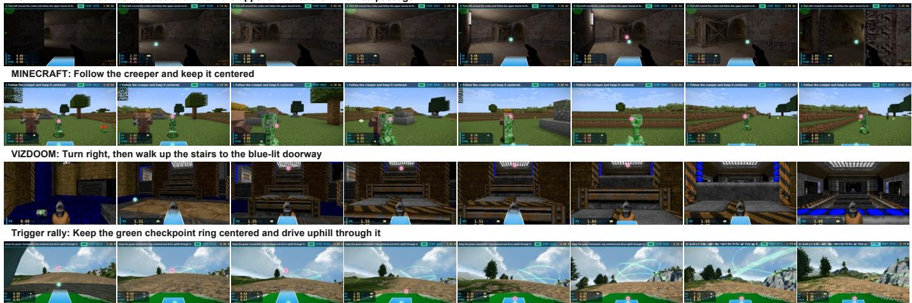  
Fig. 13. Zero-shot generalization across game domains. The same LightNav-0 checkpoint follows language instructions in Counter-Strik 1.6 and VizDoom, tracks a moving target in Minecraft, and performs checkpoint-conditioned driving in Trigger Rally. Cyan and magenta markers visualize the predicted affordance and object points, respectively.

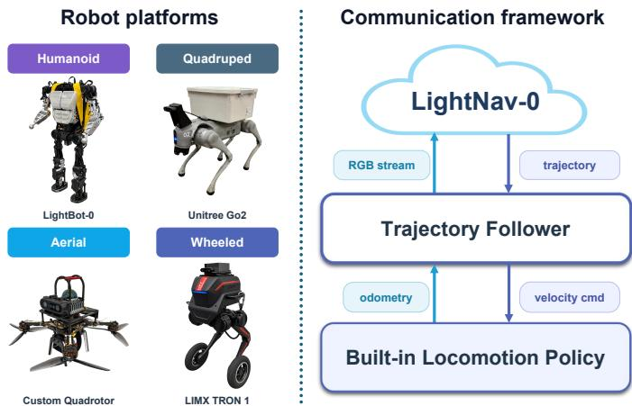  
Fig. 14. Robot platforms and communication framework. LightNav-0 receives RGB streams from humanoid, quadruped, aerial, and wheeled platforms and predicts trajectories that are executed by a shared trajectory follower interfacing with each robot’s builtin locomotion policy through odometry and velocity commands.

## E. Ablation Study

We ablate two components that connect spatial reasoning to embodied control: embodied-reasoning initialization and dualchannel pointing. Each variant is evaluated across the same 8 simulation settings used by the full model, covering instruction following, closed-vocabulary ObjectNav, and open-vocabulary ObjectNav.

a) Embodied-reasoning initialization: Tab. IX compares policies initialized from the original Qwen3-VL checkpoint and from LightNav-ER. ER initialization raises the mean SR across the 8 settings from 60.8 to 63.1 (+2.4; 3.9%) and the mean SPL from 39.0 to 40.0 (+1.0; 2.6%). SR improves in all 8 settings and is largest on MP3D (+4.2), followed by OVON Unseen (+4.0) and HM3D v1 (+3.1), indicating that the spatial priors acquired during ER mid-training transfer consistently to goal-reaching reliability. The smaller and less uniform SPL change suggests that ER initialization primarily improves semantic and spatial decision making, whereas path efficiency remains more dependent on downstream navigation alignment.

b) Dual-channel pointing: Removing affordance-point and object-point supervision degrades both SR and SPL on every benchmark in Tab. X. Dual-channel pointing raises mean SR from 54.7 to 63.1 (+8.4; 15.4%) and mean SPL from 34.3 to 40.0 (+5.7; 16.6%). The largest improvements occur on HM3D v1, with +13.5 SR and +12.7 SPL; MP3D shows the next-largest SR gain (+12.0), while HM3D v2 shows the nextlargest SPL gain (+10.3). The gains also persist across the seen, synonym, and unseen OVON splits, supporting pointing as a task-agnostic spatial interface rather than a cue specialized to instruction following or a fixed object taxonomy.

## F. Scaling Analysis

Fig. 16 reveals distinct scaling behavior across model capacity, data volume, and environment coverage. Increasing the backbone from 2B to 4B raises R2R SR/SPL from 59.9/55.4 to 68.5/62.8 and RxR SR/SPL from 64.0/57.9 to 73.6/64.5, corresponding to gains of 6.6–9.6 points across the 4 measures. Scaling further to 8B is not consistently beneficial: R2R SR/SPL decrease by 1.6/0.5 points and RxR SR decreases by 0.5 points, although RxR SPL increases by 2.0 points. Among the tested checkpoints, the 4B model therefore provides the strongest capacity–performance trade-off; the mixed 8B result indicates that additional parameters alone do not guarantee better navigation performance at this scale.

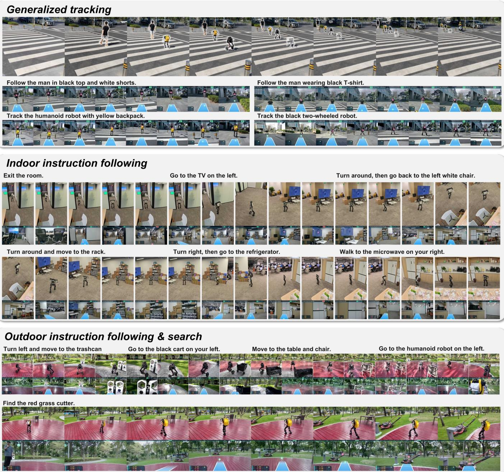  
Fig. 15. Zero-shot real-world generalization across tasks and scenes. LightNav-0 follows people and robotic targets, executes indoor and outdoor navigation instructions, and searches for open-vocabulary objects without model adaptation. Each rollout combines external views of the robot with the corresponding egocentric observations used by the policy.

Data scaling produces monotonic but saturating improvements. Moving from 1/16 to the full training set raises R2R SR/SPL from 53.0/47.1 to 68.5/62.8 and RxR SR/SPL from 56.2/49.5 to 73.6/64.5, yielding gains of 15.0–17.4 points. Most of this improvement is obtained before the final doubling: increasing the data fraction from 1/2 to the full set adds only 0.8/0.9 points on R2R and 1.4/0.4 points on RxR. Thus, additional training data remain beneficial over the tested range, but their marginal return diminishes as the training set

approaches full scale.

Environment scaling is also monotonic and remains comparatively strong at matched data fractions. Increasing the training environments from $1 / 8$ to the full set improves R2R SR/SPL by 16.7/16.2 points and RxR SR/SPL by 21.1/19.1 points, with every intermediate increment improving all 4 measures. Over the matched 1/8-to-full range, these gains exceed those from data scaling alone (13.2/13.1 points on R2R and 12.3/8.7 points on RxR). Within the tested sweeps, broader environment coverage is therefore the most reliable scaling axis, whereas model scaling saturates beyond 4B and data scaling shows diminishing returns near the full-data regime.

TABLE IX  
EFFECT OF EMBODIED-REASONING INITIALIZATION. WE COMPARE NAVIGATION POLICIES INITIALIZED FROM THE ORIGINAL QWEN3-VL CHECKPOINT AND FROM LIGHTNAV-ER ACROSS INSTRUCTION FOLLOWING, CLOSED-VOCABULARY OBJECTNAV, AND OPEN-VOCABULARY OBJECTNAV. ALL RESULTS ARE OBTAINED WITH SINGLE-VIEW RGB OBSERVATIONS. BOLD DENOTES THE BETTER RESULT IN EACH COLUMN.
<table><tr><td rowspan="2">Initialization</td><td colspan="2">R2R</td><td colspan="2">RxR</td><td colspan="2">HM3D v1</td><td colspan="2">HM3D v2</td><td colspan="2">MP3D</td><td colspan="2">OVON Seen</td><td colspan="2">OVON Synonyms</td><td colspan="2">OVON Unseen</td></tr><tr><td>SR↑</td><td>SPL↑</td><td>SR↑</td><td>SPL↑</td><td>SR↑</td><td>SPL↑</td><td>SR↑</td><td>SPL↑</td><td>SR↑</td><td>SPL↑</td><td>SR↑</td><td>SPL↑</td><td>SR↑</td><td>SPL↑</td><td>SR↑</td><td>SPL↑</td></tr><tr><td>Qwen3-VL</td><td>65.8</td><td>59.9</td><td>72.6</td><td>64.9</td><td>71.4</td><td>42.0</td><td>78.0</td><td>41.9</td><td>49.1</td><td>19.8</td><td>53.7</td><td>31.2</td><td>52.5</td><td>29.7</td><td>43.0</td><td>22.4</td></tr><tr><td>LightNav-ER</td><td>68.5</td><td>62.8</td><td>73.6</td><td>64.5</td><td>74.5</td><td>43.9</td><td>79.5</td><td>43.7</td><td>53.3</td><td>21.2</td><td>55.3</td><td>30.4</td><td>53.3</td><td>29.3</td><td>47.0</td><td>24.1</td></tr></table>

TABLE X

EFFECT OF DUAL-CHANNEL POINTING. WE REMOVE THE AFFORDANCE-POINT AND OBJECT-POINT SUPERVISION WHILE RETAINING THE REMAINING MODEL AND ACTION REPRESENTATION. ALL RESULTS ARE OBTAINED WITH SINGLE-VIEW RGB OBSERVATIONS. BOLD DENOTES THE BETTER RESULT IN EACH COLUMN.
<table><tr><td rowspan="2">Variant</td><td colspan="2">R2R</td><td colspan="2">RxR</td><td colspan="2">HM3D v1</td><td colspan="2">HM3D v2</td><td colspan="2">MP3D</td><td colspan="2">OVON Seen</td><td colspan="2">OVON Synonyms</td><td colspan="2">OVON Unseen</td></tr><tr><td>SR↑</td><td>SPL↑</td><td>SR↑</td><td>SPL↑</td><td>SR↑</td><td>SPL↑</td><td>SR↑</td><td>SPL↑</td><td>SR↑</td><td>SPL↑</td><td>SR↑</td><td>SPL↑</td><td>SR↑</td><td>SPL↑</td><td>SR↑</td><td>SPL↑</td></tr><tr><td>w/o pointing</td><td>59.5</td><td>55.8</td><td>70.8</td><td>64.2</td><td>61.0</td><td>31.2</td><td>67.9</td><td>33.4</td><td>41.3</td><td>15.2</td><td>48.2</td><td>26.1</td><td>45.8</td><td>25.6</td><td>43.1</td><td>22.8</td></tr><tr><td>LightNav-0</td><td>68.5</td><td>62.8</td><td>73.6</td><td>64.5</td><td>74.5</td><td>43.9</td><td>79.5</td><td>43.7</td><td>53.3</td><td>21.2</td><td>55.3</td><td>30.4</td><td>53.3</td><td>29.3</td><td>47.0</td><td>24.1</td></tr></table>

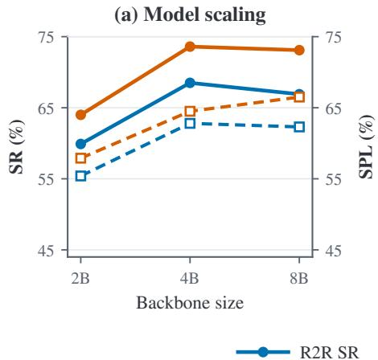

(b) Data scaling  
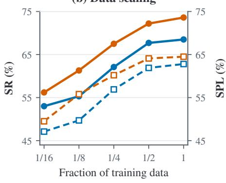

(c) Environment scaling  
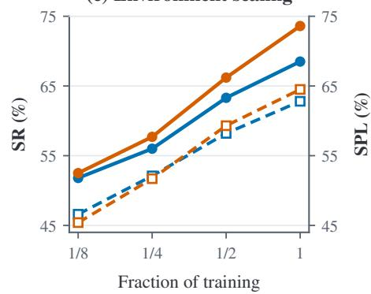  
Fig. 16. Model, data, and environment scaling on continuous VLN. The left and right vertical axes report SR and SPL, respectively. (a) Scaling the backbone from 2B to 4B parameters improves both metrics on R2R and RxR, whereas the 8B checkpoint produces mixed changes. (b) Increasing the fraction of training data yields monotonic gains with diminishing returns near the full-data regime. (c) Expanding the fraction of training environments consistently improves both metrics on both benchmarks.

## VII. CONCLUSION

We presented LightNav-0, a compact generalist embodied navigation model that elicits the spatial intelligence of a pretrained VLM rather than introducing task-specific navigation architectures. Dual-channel pointing expresses taskand embodiment-agnostic spatial intent, while temporal history compression and hierarchical RVQ action tokens connect long-horizon visual context to precise short-horizon trajectories through the original autoregressive language-model head. Training on a unified corpus spanning 2K+ scenes and 4K+ hours of embodied trajectories aligns the same monocular RGB policy across instruction following, object goal navigation, and embodied visual tracking. LightNav-ER, the embodied-reasoning checkpoint from which LightNav-0 is initialized, attains the highest complete-set average across 8 embodied-reasoning benchmarks. The resulting LightNav-0 checkpoint achieves the strongest monocular success rates across all 10 public navigation simulation settings and transfers without task- or robot-specific model adaptation to four real-world robot embodiments. Together, these results indicate that compact VLMs can provide a unified and transferable substrate for generalist embodied navigation without relying on separate prediction heads for each task or platform.

Several directions can extend this framework. First, the current model uses a single decision pathway and does not explicitly separate high-frequency local control from slower semantic deliberation. A dual system could pair a lightweight reactive policy for obstacle avoidance and frequent trajectory correction with a slower VLM planner for long-horizon reasoning. Second, stronger pretraining on Internet-scale video could broaden open-world concept coverage and expose the model to rarer scenes, interactions, and motion patterns than curated embodied datasets alone.

## CONTRIBUTORS AND ACKNOWLEDGEMENTS

## Contributors

Training Infrastructure: Qianli Ma, Ran Mei, and Jia Wei Data Infrastructure: Fei Huang, Shaoan Wang, Jingyi Xu, Yueyu Wang, and Aocheng Luo

Mid-training: Shaoan Wang and Fan Yang

Supervised Fine-tuning: Shaoan Wang and Aocheng Luo Post-training: Aocheng Luo and Shaoan Wang

Benchmark: Fei Huang, Shaoan Wang, Jingyi Xu, and Yueyu Wang

Real-world Deployment: Xiaoyang Wang, Jiangpeng Hu, Xuhao Liu, Hongming Chen, Yuanbin Shao, Yiyang Lin, and Ziliang Li

Writing: Shaoan Wang, Tingxiang Fan, Aocheng Luo, Fei Huang, Liang Pan, Xinhang Liu, and Yuntao Ma Project Leads: Tingxiang Fan and Shaoan Wang

## Acknowledgements

We thank Bo Liang, Yuxuan Xie, Jiaxin Li, and Tianwei Zhang for their contributions to the early-stage infrastructure and initial technical exploration. We also thank Shiyao Zhang and Shuqi Liao for filming and editing the real-world videos, and Kaisong Chen for designing the cover. We thank our collaborators at LimX Dynamics and Manycore Tech for their support across physical deployment and simulation.

## REFERENCES

[1] Dong An, Zun Wang, Yangguang Li, Yi Wang, Yicong Hong, Yan Huang, Liang Wang, and Jing Shao. 1st place solutions for rxr-habitat vision-and-language navigation competition (cvpr 2022). arXiv preprint arXiv:2206.11610, 2022.

[2] Dong An, Hanqing Wang, Wenguan Wang, Zun Wang, Yan Huang, Keji He, and Liang Wang. Etpnav: Evolving topological planning for vision-language navigation in continuous environments. IEEE TPAMI, 2024.

[3] Peter Anderson, Angel Chang, Devendra Singh Chaplot, Alexey Dosovitskiy, Saurabh Gupta, Vladlen Koltun, Jana Kosecka, Jitendra Malik, Roozbeh Mottaghi, Manolis Savva, et al. On evaluation of embodied navigation agents. arXiv preprint arXiv:1807.06757, 2018.

[4] Peter Anderson, Qi Wu, Damien Teney, Jake Bruce, Mark Johnson, Niko Sunderhauf, Ian Reid, Stephen¨ Gould, and Anton Van Den Hengel. Vision-andlanguage navigation: Interpreting visually-grounded navigation instructions in real environments. In Proceedings of the IEEE conference on computer vision and pattern recognition, pages 3674–3683, 2018.

[5] Shuai Bai, Yuxuan Cai, Ruizhe Chen, Keqin Chen, Xionghui Chen, Zesen Cheng, Lianghao Deng, Wei

Ding, Chang Gao, Chunjiang Ge, et al. Qwen3-VL technical report. arXiv preprint arXiv:2511.21631, 2025.

[6] Dhruv Batra, Aaron Gokaslan, Aniruddha Kembhavi, Oleksandr Maksymets, Roozbeh Mottaghi, Manolis Savva, Alexander Toshev, and Erik Wijmans. ObjectNav Revisited: On Evaluation of Embodied Agents Navigating to Objects. In arXiv:2006.13171, 2020.

[7] Kevin Black, Noah Brown, Danny Driess, Adnan Esmail, Michael Equi, Chelsea Finn, Niccolo Fusai, Lachy Groom, Karol Hausman, Brian Ichter, et al. π : A vision-language-action flow model for general robot control. arXiv preprint arXiv:2410.24164, 2024.

[8] Kevin Black, Noah Brown, James Darpinian, Karan Dhabalia, Danny Driess, Adnan Esmail, Michael Robert Equi, Chelsea Finn, Niccolo Fusai, Manuel Y Galliker, et al. π0.5: a vision-language-action model with openworld generalization. In 9th Annual Conference on Robot Learning, 2025.

[9] Abdelaziz Bounhar, Abhijeet Somani, Aditi Kabra, Adrian Valente, Adrien Petralia, Adrien Sade, Alan Jeffares, Albert Jiang, Aleksandr Timashov, Alexandre Cahill, et al. Robostral navigate. arXiv preprint arXiv:2607.20785, 2026.

[10] ByteDance Seed. Seed2.0 model card: Towards intelligence frontier for real-world complexity. arXiv preprint arXiv:2607.00248, 2026.

[11] Yihan Cao, Jiazhao Zhang, Zhinan Yu, Shuzhen Liu, Zheng Qin, Qin Zou, Bo Du, and Kai Xu. Cognav: Cognitive process modeling for object goal navigation with llms. In Proceedings of the IEEE/CVF International Conference on Computer Vision, pages 9550– 9560, 2025.

[12] Angel Chang, Angela Dai, Thomas Funkhouser, Maciej Halber, Matthias Niebner, Manolis Savva, Shuran Song, Andy Zeng, and Yinda Zhang. Matterport3d: Learning from rgb-d data in indoor environments. In 2017 International Conference on 3D Vision (3DV), pages 667–676. IEEE, 2017.

[13] Jiaqi Chen, Bingqian Lin, Xinmin Liu, Xiaodan Liang, and Kwan-Yee K Wong. Affordances-oriented planning using foundation models for continuous vision-language navigation. arXiv preprint arXiv:2407.05890, 2024.

[14] Kang Chen, Zhihao Liu, Tonghe Zhang, Zhen Guo, Si Xu, Hao Lin, Hongzhi Zang, Quanlu Zhang, Zhaofei Yu, Guoliang Fan, et al. πRL: Online rl fine-tuning for flow-based vision-language-action models. arXiv preprint arXiv:2510.25889, 2025.

[15] Shaoyu Chen, Bo Jiang, Hao Gao, Bencheng Liao, Qing Xu, Qian Zhang, Chang Huang, Wenyu Liu, and Xinggang Wang. Vadv2: End-to-end vectorized autonomous driving via probabilistic planning. arXiv preprint arXiv:2402.13243, 2024.

[16] An-Chieh Cheng, Yandong Ji, Zhaojing Yang, Xueyan Zou, Jan Kautz, Erdem Biyik, Hongxu Yin, Sifei Liu, and Xiaolong Wang. NaVILA: Legged robot vision-

language-action model for navigation. In RSS, 2025.

[17] Long Cheng, Jiafei Duan, Yi Ru Wang, Haoquan Fang, Boyang Li, Yushan Huang, Elvis Wang, Ainaz Eftekhar, Jason Lee, Wentao Yuan, Rose Hendrix, Noah A. Smith, Fei Xia, Dieter Fox, and Ranjay Krishna. Pointarena: Probing multimodal grounding through language-guided pointing. arXiv preprint arXiv:2505.09990, 2025.

[18] Zedong Chu, Shichao Xie, Xiaolong Wu, Yanfen Shen, Minghua Luo, Zhengbo Wang, Fei Liu, Xiaoxu Leng, Junjun Hu, Mingyang Yin, et al. Abot-n0: Technical report on the vla foundation model for versatile embodied navigation. arXiv preprint arXiv:2602.11598, 2026.

[19] Christopher Clark, Jieyu Zhang, Zixian Ma, Jae Sung Park, Mohammadreza Salehi, Rohun Tripathi, Sangho Lee, Zhongzheng Ren, Chris Dongjoo Kim, Yinuo Yang, Vincent Shao, Yue Yang, Weikai Huang, Ziqi Gao, Taira Anderson, Jianrui Zhang, Jitesh Jain, George Stoica, Winson Han, Ali Farhadi, and Ranjay Krishna. Molmo2: Open weights and data for vision-language models with video understanding and grounding. arXiv preprint arXiv:2601.10611, 2026.

[20] Mengfei Du, Binhao Wu, Zejun Li, Xuanjing Huang, and Zhongyu Wei. Embspatial-bench: Benchmarking spatial understanding for embodied tasks with large vision-language models. arXiv preprint arXiv:2406.05756, 2024.

[21] Hermann Ebbinghaus. Memory: A contribution to experimental psychology. Annals of neurosciences, 20 (4):155, 2013.

[22] Haoquan Fang, Jiafei Duan, Donovan Clay, Sam Wang, Shuo Liu, Weikai Huang, Xiang Fan, Wei-Chuan Tsai, Shirui Chen, Yi Ru Wang, et al. Molmoact2: Action reasoning models for real-world deployment. arXiv preprint arXiv:2605.02881, 2026.

[23] Hongyan Feng, Sunlai Chen, Xuanyu Liu, Miao Pan, Yangfan Xie, Yuxiang Cui, Zhongxiang Zhou, Rong Xiong, Wenqi Zhang, Jianwei Yin, Yueting Zhuang, and Xuhong Zhang. Embodied-Navigator: Point, think, memorize, and align for efficient navigation. arXiv preprint arXiv:2608.17512, 2026.

[24] Kaituo Feng, Kaixiong Gong, Bohao Li, Zonghao Guo, Yibing Wang, Tianshuo Peng, Junfei Wu, Xiaoying Zhang, Benyou Wang, and Xiangyu Yue. Video-r1: Reinforcing video reasoning in mllms. arXiv preprint arXiv:2503.21776, 2025.

[25] Chen Gao, Liankai Jin, Xingyu Peng, Jiazhao Zhang, Yue Deng, Annan Li, He Wang, and Si Liu. Octonav: Towards generalist embodied navigation. arXiv preprint arXiv:2506.09839, 2025.

[26] Gemini Robotics Team. Gemini robotics: Bringing ai into the physical world. arXiv preprint arXiv:2503.20020, 2025.

[27] Ruiyan Gong, Yingnan Guo, Junjun Hu, Jintao Kong, Xiaoxu Leng, Tianlun Li, Weize Li, Fei Liu, Zhicheng Liu, Jia Lu, et al. Abot-n1: Toward a general visual

language navigation foundation model. arXiv preprint arXiv:2607.10383, 2026.

[28] Daya Guo, Dejian Yang, Haowei Zhang, Junxiao Song, Ruoyu Zhang, Runxin Xu, Qihao Zhu, Shirong Ma, Peiyi Wang, Xiao Bi, et al. Deepseek-r1: Incentivizing reasoning capability in llms via reinforcement learning. arXiv preprint arXiv:2501.12948, 2025.

[29] Wenyi Hong, Weihan Wang, Ming Ding, Wenmeng Yu, Qingsong Lv, Yan Wang, Yean Cheng, Shiyu Huang, Junhui Ji, Zhao Xue, Lei Zhao, Zhuoyi Yang, Xiaotao Gu, Xiaohan Zhang, Guanyu Feng, Da Yin, Zihan Wang, Ji Qi, Xixuan Song, Peng Zhang, Debing Liu, Bin Xu, Juanzi Li, Yuxiao Dong, and Jie Tang. CogVLM2: Visual language models for image and video understanding. arXiv preprint arXiv:2408.16500, 2024.

[30] Chi-Pin Huang, Yueh-Hua Wu, Min-Hung Chen, Yu-Chiang Frank Wang, and Fu-En Yang. Thinkact: Visionlanguage-action reasoning via reinforced visual latent planning. arXiv preprint arXiv:2507.16815, 2025.

[31] Wenxuan Huang, Bohan Jia, Zijie Zhai, Shaosheng Cao, Zheyu Ye, Fei Zhao, Zhe Xu, Yao Hu, and Shaohui Lin. Vision-r1: Incentivizing reasoning capability in multimodal large language models. arXiv preprint arXiv:2503.06749, 2025.

[32] InternVLA-N1 Team. Internvla-n1: An open dualsystem vision-language navigation foundation model with learned latent plans. Technical report, 2025. URL https://internrobotics.github.io/internvla-n1.github.io/.

[33] Bo Jiang, Shaoyu Chen, Qing Xu, Bencheng Liao, Jiajie Chen, Helong Zhou, Qian Zhang, Wenyu Liu, Chang Huang, and Xinggang Wang. Vad: Vectorized scene representation for efficient autonomous driving. In Proceedings of the IEEE/CVF International Conference on Computer Vision, pages 8340–8350, 2023.

[34] Moo Jin Kim, Karl Pertsch, Siddharth Karamcheti, Ted Xiao, Ashwin Balakrishna, Suraj Nair, Rafael Rafailov, Ethan Foster, Grace Lam, Pannag Sanketi, et al. Open-VLA: An open-source vision-language-action model. arXiv preprint arXiv:2406.09246, 2024.

[35] Moo Jin Kim, Chelsea Finn, and Percy Liang. Fine-tuning vision-language-action models: Optimizing speed and success. arXiv preprint arXiv:2502.19645, 2025.

[36] Jacob Krantz and Stefan Lee. Sim-2-sim transfer for vision-and-language navigation in continuous environments. In European Conference on Computer Vision, pages 588–603. Springer, 2022.

[37] Jacob Krantz, Erik Wijmans, Arjun Majumdar, Dhruv Batra, and Stefan Lee. Beyond the nav-graph: Visionand-language navigation in continuous environments. In European Conference on Computer Vision, pages 104– 120. Springer, 2020.

[38] Jacob Krantz, Aaron Gokaslan, Dhruv Batra, Stefan Lee, and Oleksandr Maksymets. Waypoint models for instruction-guided navigation in continuous environ-

ments. In Proceedings of the IEEE/CVF International Conference on Computer Vision, pages 15162–15171, 2021.

[39] Alexander Ku, Peter Anderson, Roma Patel, Eugene Ie, and Jason Baldridge. Room-across-room: Multilingual vision-and-language navigation with dense spatiotemporal grounding. In Proceedings ofthe 2020 Conference on Empirical Methods in Natural Language Processing (EMNLP), pages 4392–4412, 2020.

[40] Yuxuan Kuang, Hai Lin, and Meng Jiang. Openfmnav: Towards open-set zero-shot object navigation via vision-language foundation models. arXiv preprint arXiv:2402.10670, 2024.

[41] Woosuk Kwon, Zhuohan Li, Siyuan Zhuang, Ying Sheng, Lianmin Zheng, Cody Hao Yu, Joseph E. Gonzalez, Hao Zhang, and Ion Stoica. Efficient memory management for large language model serving with pagedattention. arXiv preprint arXiv:2309.06180, 2023.

[42] Haozhan Li, Yuxin Zuo, Jiale Yu, Yuhao Zhang, Zhaohui Yang, Kaiyan Zhang, Xuekai Zhu, Yuchen Zhang, Tianxing Chen, Ganqu Cui, et al. Simplevla-rl: Scaling vla training via reinforcement learning. arXiv preprint arXiv:2509.09674, 2025.

[43] Sihao Lin, Zerui Li, Xunyi Zhao, Gengze Zhou, Liuyi Wang, Rong Wei, Rui Tang, Juncheng Li, Hanqing Wang, Jiangmiao Pang, Anton van den Hengel, Jiajun Liu, and Qi Wu. VLNVerse: A benchmark for vision-language navigation with versatile, embodied, realistic simulation and evaluation. arXiv preprint arXiv:2512.19021, 2025.

[44] Tsung-Yi Lin, Michael Maire, Serge Belongie, James Hays, Pietro Perona, Deva Ramanan, Piotr Dollar, and´ C Lawrence Zitnick. Microsoft coco: Common objects in context. In European conference on computer vision, pages 740–755. Springer, 2014.

[45] Fei Liu, Shichao Xie, Minghua Luo, Zedong Chu, Junjun Hu, Xiaolong Wu, and Mu Xu. Navforesee: A unified vision-language world model for hierarchical planning and dual-horizon navigation prediction. arXiv preprint arXiv:2512.01550, 2025.

[46] Jiahang Liu, Yunpeng Qi, Jiazhao Zhang, Minghan Li, Shaoan Wang, Kui Wu, Hanjing Ye, Hong Zhang, Zhibo Chen, Fangwei Zhong, et al. Trackvla++: Unleashing reasoning and memory capabilities in vla models for embodied visual tracking. arXiv preprint arXiv:2510.07134, 2025.

[47] Jiahang Liu, Tianyu Xu, Jiawei Chen, Lu Yue, Jiazhao Zhang, Zhiyong Wang, Minghan Li, Qisheng Zhao, Anqi Li, Qi Su, Zhizheng Zhang, and He Wang. Spannav: Generalized spatial awareness for versatile visionlanguage navigation. arXiv preprint arXiv:2603.09163, 2026.

[48] Qingxiang Liu, Ting Huang, Zeyu Zhang, and Hao Tang. Nav-r1: Reasoning and navigation in embodied scenes. arXiv preprint arXiv:2509.10884, 2025.

[49] Youzhi Liu, Li Gao, Liu Liu, Mingyang Lv, and

Yang Cai. Comatrack: Competitive multi-agent gametheoretic tracking with vision-language-action models. arXiv preprint arXiv:2603.22846, 2026.

[50] Yuxing Long, Wenzhe Cai, Hongcheng Wang, Guanqi Zhan, and Hao Dong. Instructnav: Zero-shot system for generic instruction navigation in unexplored environment. arXiv preprint arXiv:2406.04882, 2024.

[51] Bingchen Miao, Rong Wei, Zhiqi Ge, Xiaoquan Sun, Shiqi Gao, Jingzhe Zhu, Renhan Wang, Siliang Tang, Jun Xiao, Rui Tang, and Juncheng Li. Towards physically executable 3D Gaussian for embodied navigation. In The Fourteenth International Conference on Learning Representations, 2026.

[52] Dujun Nie, Xianda Guo, Yiqun Duan, Ruijun Zhang, and Long Chen. Wmnav: Integrating vision-language models into world models for object goal navigation. arXiv preprint arXiv:2503.02247, 2025.

[53] Zhangyang Qi, Zhixiong Zhang, Yizhou Yu, Jiaqi Wang, and Hengshuang Zhao. Vln-r1: Vision-language navigation via reinforcement fine-tuning. arXiv preprint arXiv:2506.17221, 2025.

[54] Delin Qu, Haoming Song, Qizhi Chen, Yuanqi Yao, Xinyi Ye, Yan Ding, Zhigang Wang, JiaYuan Gu, Bin Zhao, Dong Wang, et al. Spatialvla: Exploring spatial representations for visual-language-action model. arXiv preprint arXiv:2501.15830, 2025.

[55] Qwen Team. Qwen3.5: Towards native multimodal agents, February 2026. URL https://qwen.ai/blog?id= qwen3.5.

[56] Qwen Team. Qwen-VLA: Unifying vision-languageaction modeling across tasks, environments, and robot embodiments. arXiv preprint arXiv:2605.30280, 2026.

[57] Santhosh Kumar Ramakrishnan, Aaron Gokaslan, Erik Wijmans, Oleksandr Maksymets, Alexander Clegg, John M Turner, Eric Undersander, Wojciech Galuba, Andrew Westbury, Angel X Chang, et al. Habitatmatterport 3d dataset (hm3d): 1000 large-scale 3d environments for embodied ai. In Thirty-fifth Conference on Neural Information Processing Systems Datasets and Benchmarks Track (Round 2), 2021.

[58] Ram Ramrakhya, Eric Undersander, Dhruv Batra, and Abhishek Das. Habitat-web: Learning embodied objectsearch strategies from human demonstrations at scale. In Proceedings of the IEEE/CVF Conference on Computer Vision and Pattern Recognition, pages 5173–5183, 2022.

[59] Ram Ramrakhya, Dhruv Batra, Erik Wijmans, and Abhishek Das. Pirlnav: Pretraining with imitation and rl finetuning for objectnav. In Proceedings of the IEEE/CVF Conference on Computer Vision and Pattern Recognition, pages 17896–17906, 2023.

[60] Stephane Ross, Geoffrey Gordon, and Drew Bagnell. A´ reduction of imitation learning and structured prediction to no-regret online learning. In Proceedings of the fourteenth international conference on artificial intelligence and statistics, pages 627–635. JMLR Workshop and

Conference Proceedings, 2011.

[61] Zhihong Shao, Peiyi Wang, Qihao Zhu, Runxin Xu, Junxiao Song, Xiao Bi, Haowei Zhang, Mingchuan Zhang, YK Li, Yang Wu, et al. Deepseekmath: Pushing the limits of mathematical reasoning in open language models. arXiv preprint arXiv:2402.03300, 2024.

[62] Chan Hee Song, Valts Blukis, Jonathan Tremblay, Stephen Tyree, Yu Su, and Stan Birchfield. Robospatial: Teaching spatial understanding to 2d and 3d vision-language models for robotics. arXiv preprint arXiv:2411.16537, 2024.

[63] Gemini Team, Rohan Anil, Sebastian Borgeaud, Jean-Baptiste Alayrac, Jiahui Yu, Radu Soricut, Johan Schalkwyk, Andrew M Dai, Anja Hauth, Katie Millican, et al. Gemini: a family of highly capable multimodal models. arXiv preprint arXiv:2312.11805, 2023.

[64] Shengbang Tong, Ellis Brown, Penghao Wu, Sanghyun Woo, Manoj Middepogu, Sai Charitha Akula, Jihan Yang, Shusheng Yang, Adithya Iyer, Xichen Pan, Austin Wang, Rob Fergus, Yann LeCun, and Saining Xie. Cambrian-1: A fully open, vision-centric exploration of multimodal llms. arXiv preprint arXiv:2406.16860, 2024.

[65] Hanqing Wang, Wei Liang, Luc Van Gool, and Wenguan Wang. Dreamwalker: Mental planning for continuous vision-language navigation. In ICCV, 2023.

[66] Shaoan Wang, Jiazhao Zhang, Minghan Li, Jiahang Liu, Anqi Li, Kui Wu, Fangwei Zhong, Junzhi Yu, Zhizheng Zhang, and He Wang. Trackvla: Embodied visual tracking in the wild. arXiv preprint arXiv:2505.23189, 2025.

[67] Shaoan Wang, Yuanfei Luo, Xingyu Chen, Aocheng Luo, Dongyue Li, Chang Liu, Sheng Chen, Yangang Zhang, and Junzhi Yu. Vlingnav: Embodied navigation with adaptive reasoning and visual-assisted linguistic memory. arXiv preprint arXiv:2601.08665, 2026.

[68] Shuo Wang, Yongcai Wang, Wanting Li, Xudong Cai, Yucheng Wang, Maiyue Chen, Kaihui Wang, Zhizhong Su, Deying Li, and Zhaoxin Fan. Aux-think: Exploring reasoning strategies for data-efficient vision-language navigation. arXiv preprint arXiv:2505.11886, 2025.

[69] Zihan Wang, Xiangyang Li, Jiahao Yang, Yeqi Liu, and Shuqiang Jiang. Gridmm: Grid memory map for vision-and-language navigation. In Proceedings of the IEEE/CVF International Conference on Computer Vision, pages 15625–15636, 2023.

[70] Zihan Wang, Xiangyang Li, Jiahao Yang, Yeqi Liu, Junjie Hu, Ming Jiang, and Shuqiang Jiang. Lookahead exploration with neural radiance representation for continuous vision-language navigation. In CVPR, 2024.

[71] Zixuan Wang, Huang Fang, Shaoan Wang, Yuanfei Luo, Heng Dong, Wei Li, and Yiming Gan. Hydra-nav: Object navigation via adaptive dual-process reasoning. arXiv preprint arXiv:2602.09972, 2026.

[72] Zun Wang, Jialu Li, Yicong Hong, Yi Wang, Qi Wu, Mohit Bansal, Stephen Gould, Hao Tan, and Yu Qiao.

Scaling data generation in vision-and-language navigation. In Proceedings of the IEEE/CVF International Conference on Computer Vision, 2023.

[73] Zun Wang, Jialu Li, Yicong Hong, Songze Li, Kunchang Li, Shoubin Yu, Yi Wang, Yu Qiao, Yali Wang, Mohit Bansal, and Limin Wang. Bootstrapping language-guided navigation learning with self-refining data flywheel. arXiv preprint arXiv:2412.08467, 2024.

[74] Jason Wei, Xuezhi Wang, Dale Schuurmans, Maarten Bosma, Fei Xia, Ed Chi, Quoc V Le, Denny Zhou, et al. Chain-of-thought prompting elicits reasoning in large language models. Advances in Neural Information Processing Systems, 35:24824–24837, 2022.

[75] Meng Wei, Chenyang Wan, Jiaqi Peng, Xiqian Yu, Yuqiang Yang, Delin Feng, Wenzhe Cai, Chenming Zhu, Tai Wang, Jiangmiao Pang, and Xihui Liu. Ground slow, move fast: A dual-system foundation model for generalizable vision-language navigation. arXiv preprint arXiv:2512.08186, 2025.

[76] Meng Wei, Chenyang Wan, Xiqian Yu, Tai Wang, Yuqiang Yang, Xiaohan Mao, Chenming Zhu, Wenzhe Cai, Hanqing Wang, Yilun Chen, et al. Streamvln: Streaming vision-and-language navigation via slowfast context modeling. arXiv preprint arXiv:2507.05240, 2025.

[77] Erik Wijmans, Abhishek Kadian, Ari Morcos, Stefan Lee, Irfan Essa, Devi Parikh, Manolis Savva, and Dhruv Batra. DD-PPO: Learning near-perfect pointgoal navigators from 2.5 billion frames. In International Conference on Learning Representations (ICLR), 2020.

[78] Ziyuan Xia, Jingyi Xu, Chong Cui, Yuanhong Yu, Jiazhao Zhang, Qingsong Yan, Tao Ni, Junbo Chen, Xiaowei Zhou, Hujun Bao, Ruizhen Hu, and Sida Peng. Habitat-GS: A high-fidelity navigation simulator with dynamic gaussian splatting. arXiv preprint arXiv:2604.12626, 2026.

[79] Hanjing Ye, Tianle Zeng, Jiazhao Zhang, Shaoan Wang, Zibo Zhang, Weixi Situ, Yuchen Zhou, Yonggen Ling, and Hong Zhang. Refertrack: Referring then tracking for embodied visual tracking. arXiv preprint arXiv:2607.20061, 2026.

[80] Hang Yin, Xiuwei Xu, Zhenyu Wu, Jie Zhou, and Jiwen Lu. Sg-nav: Online 3d scene graph prompting for llmbased zero-shot object navigation. Advances in neural information processing systems, 37:5285–5307, 2024.

[81] Hang Yin, Xiuwei Xu, Linqing Zhao, Ziwei Wang, Jie Zhou, and Jiwen Lu. Unigoal: Towards universal zeroshot goal-oriented navigation. In Proceedings of the Computer Vision and Pattern Recognition Conference, pages 19057–19066, 2025.

[82] Naoki Yokoyama and Sehoon Ha. Film-nav: Efficient and generalizable navigation via vlm fine-tuning. arXiv preprint arXiv:2509.16445, 2025.

[83] Naoki Yokoyama, Sehoon Ha, Dhruv Batra, Jiuguang Wang, and Bernadette Bucher. Vlfm: Vision-language frontier maps for zero-shot semantic navigation. In

2024 IEEE International Conference on Robotics and Automation (ICRA), pages 42–48. IEEE, 2024.

[84] Naoki Yokoyama, Ram Ramrakhya, Abhishek Das, Dhruv Batra, and Sehoon Ha. Hm3d-ovon: A dataset and benchmark for open-vocabulary object goal navigation. In 2024 IEEE/RSJ International Conference on Intelligent Robots and Systems (IROS), pages 5543– 5550. IEEE, 2024.

[85] Zhuoyuan Yu, Yuxing Long, Zihan Yang, Chengyan Zeng, Hongwei Fan, Jiyao Zhang, and Hao Dong. Correctnav: Self-correction flywheel empowers visionlanguage-action navigation model. arXiv preprint arXiv:2508.10416, 2025.

[86] Wentao Yuan, Jiafei Duan, Valts Blukis, Wilbert Pumacay, Ranjay Krishna, Adithyavairavan Murali, Arsalan Mousavian, and Dieter Fox. Robopoint: A visionlanguage model for spatial affordance prediction for robotics. arXiv preprint arXiv:2406.10721, 2024.

[87] Michał Zawalski, William Chen, Karl Pertsch, Oier Mees, Chelsea Finn, and Sergey Levine. Robotic control via embodied chain-of-thought reasoning. arXiv preprint arXiv:2407.08693, 2024.

[88] Kuo-Hao Zeng, Zichen Zhang, Kiana Ehsani, Rose Hendrix, Jordi Salvador, Alvaro Herrasti, Ross Girshick, Aniruddha Kembhavi, and Luca Weihs. Poliformer: Scaling on-policy rl with transformers results in masterful navigators. In 8th Annual Conference on Robot Learning, 2024.

[89] Shuang Zeng, Dekang Qi, Xinyuan Chang, Feng Xiong, Shichao Xie, Xiaolong Wu, Shiyi Liang, Mu Xu, and Xing Wei. Janusvln: Decoupling semantics and spatiality with dual implicit memory for vision-language navigation. arXiv preprint arXiv:2509.22548, 2025.

[90] Jiazhao Zhang, Kunyu Wang, Rongtao Xu, Gengze Zhou, Yicong Hong, Xiaomeng Fang, Qi Wu, Zhizheng Zhang, and He Wang. NaVid: Video-based VLM plans the next step for vision-and-language navigation. Robotics: Science and Systems, 2024.

[91] Jiazhao Zhang, Anqi Li, Yunpeng Qi, Minghan Li, Jiahang Liu, Shaoan Wang, Haoran Liu, Gengze Zhou, Yuze Wu, Xingxing Li, et al. Embodied navigation foundation model. arXiv preprint arXiv:2509.12129, 2025.

[92] Jiazhao Zhang, Kunyu Wang, Shaoan Wang, Minghan Li, Haoran Liu, Songlin Wei, Zhongyuan Wang, Zhizheng Zhang, and He Wang. Uni-NaVid: A videobased vision-language-action model for unifying embodied navigation tasks. Robotics: Science and Systems, 2025.

[93] Jiazhao Zhang, Gengze Zhou, Hale Yin, Yiyang Huang, Zixing Lei, Qihang Peng, Haoqi Yuan, Jie Zhang, Xudong Guo, Xiaoyue Chen, et al. Qwen-RobotNav technical report: A scalable navigation model designed for an agentic navigation system. arXiv preprint arXiv:2606.18112, 2026.

[94] Lingfeng Zhang, Qiang Zhang, Hao Wang, Erjia Xiao,

Zixuan Jiang, Honglei Chen, and Renjing Xu. Trihelper: Zero-shot object navigation with dynamic assistance. In 2024 IEEE/RSJ International Conference on Intelligent Robots and Systems, pages 10035–10042, 2024.

[95] Tonghe Zhang, Chao Yu, Sichang Su, and Yu Wang. Reinflow: Fine-tuning flow matching policy with online reinforcement learning. arXiv preprint arXiv:2505.22094, 2025.

[96] Zekai Zhang, Weiye Zhu, Hewei Pan, Xiangchen Wang, Rongtao Xu, Xing Sun, and Feng Zheng. Activevln: Towards active exploration via multi-turn rl in vision-andlanguage navigation. arXiv preprint arXiv:2509.12618, 2025.

[97] Qingqing Zhao, Yao Lu, Moo Jin Kim, Zipeng Fu, Zhuoyang Zhang, Yecheng Wu, Zhaoshuo Li, Qianli Ma, Song Han, Chelsea Finn, et al. Cot-vla: Visual chain-of-thought reasoning for vision-language-action models. In Proceedings ofthe Computer Vision and Pattern Recognition Conference, pages 1702–1713, 2025.

[98] Enshen Zhou, Jingkun An, Cheng Chi, Yi Han, Shanyu Rong, Chi Zhang, Pengwei Wang, Zhongyuan Wang, Tiejun Huang, Lu Sheng, and Shanghang Zhang. Roborefer: Towards spatial referring with reasoning in vision-language models for robotics. arXiv preprint arXiv:2506.04308, 2025.

[99] Zhongyi Zhou, Yichen Zhu, Xiaoyu Liu, Zhibin Tang, Junjie Wen, Yaxin Peng, Chaomin Shen, and Yi Xu. Chatvla-2: Vision-language-action model with openworld reasoning. In The Thirty-ninth Annual Conference on Neural Information Processing Systems, 2025.

[100] Ziyu Zhu, Xilin Wang, Yixuan Li, Zhuofan Zhang, Xiaojian Ma, Yixin Chen, Baoxiong Jia, Wei Liang, Qian Yu, Zhidong Deng, et al. Move to understand a 3d scene: Bridging visual grounding and exploration for efficient and versatile embodied navigation. In Proceedings of the IEEE/CVF International Conference on Computer Vision, pages 8120–8132, 2025.