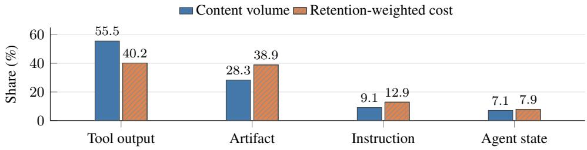

# Measure Before You Manage: Evaluating Agent Working Memory in Coding Agents

Le Chen1 Zishen Wan2 Baixi Sun1 Xiaolong Ma1 Chih-Hsuan Yang1 Feng Yan3 Sheng Di1 Franck Cappello1 Rajeev Thakur1

1Argonne National Laboratory 2Columbia University 3University of Houston

## Abstract

Agent working memory is heterogeneous. Objects such as instructions, artifacts, tool outputs, and agent-generated state play different semantic roles and exhibit different size, retention, and representation profiles. Recent work has begun to explore memory-management mechanisms that account for such heterogeneity. This work focuses on semantic heterogeneity and studies how it should shape the management and evaluation of working memory in coding agents. Across 55 archived codingagent trajectories, we find that semantically different working-memory objects exhibit distinct retention and compression behavior. This heterogeneity motivates semantically informed memory management. We study two semantically informed strategies: an object-aware compression policy and a retrieval-based policy. Their evaluation shows that calibration gains may not transfer to held-out tasks, and that equal token budgets do not imply equal delivered context or management cost. A real-system replay further exposes serving limits that nominal budgets alone do not capture. Together, these results show why semantic structure matters for agent working memory and why evaluating memory-management strategies requires more than a nominal token budget. We organize these lessons into four levels: stored state, delivered context, management work, and task or process outcome.

## 1 Introduction

Agent working memory is heterogeneous. During a coding trajectory, instructions, source artifacts, tool outputs, and agent-generated state play different semantic roles and evolve differently over time. Their size, persistence, representation, and lifecycle characteristics need not follow the same pattern. Yet memory-management mechanisms commonly center on retention, compression, eviction, or retrieval rules that may treat this heterogeneous state uniformly. Whether and how semantic heterogeneity should shape the management of agent working memory—and how such management should be evaluated—remains unclear.

We study these questions in coding agents. We first characterize working memory at the level of typed objects, asking how different kinds of state differ in size, retention, representation, and compression behavior. We then examine two semantically informed management strategies: a calibration-informed object-aware compression policy and a retrieval-based policy adapted from prior work. Our goal is not to identify a universally winning policy, but to understand what these strategies reveal about heterogeneous working memory and what evidence is required to evaluate them reliably. Specifically, we ask: (1) how does semantic heterogeneity manifest in coding-agent working memory, and (2) what must be measured before attributing a benefit to a memory-management strategy?

Our contributions are threefold. First, we characterize semantic heterogeneity in coding-agent working memory through typed-object accounting of size, retention, representation, and compression behavior across 55 archived trajectories. Second, we examine two semantically informed management strategies—an object-aware compression policy and a retrieval-based policy—as case studies of how heterogeneous working memory is managed in practice. Their results illustrate how apparent gains may not transfer to held-out tasks and how nominally equal budgets can still leave delivered context and management work unequal. Third, we synthesize these observations into a four-level evaluation framework that separates stored state, delivered context, management work, and task or process outcome.

Relation to existing work. Memory hierarchies and retrieval are established agent design ideas. MemGPT manages movement between memory tiers for document analysis and multi-session conversation [Packer et al., 2023]; Generative Agents combines memory retrieval with reflection and planning in a social simulation [Park et al., 2023]; and SWE-agent shows that the agent–computer interface affects software-engineering behavior and performance [Yang et al., 2024]. These works motivate mechanisms relevant to our setting, but are not the systems evaluated here.

Prior work has also studied the evaluation and cost of agent memory. Lindenbauer et al. [2025] compare observation masking and LLM summarization on SWE-bench Verified; Chintalapati et al. [2026] compare memory condensers on scientific-discovery tasks, reporting quality and token costs; and Omri et al. [2026] characterize construction, retrieval, and generation costs across agent-memory systems. We do not claim novelty in memory hierarchies, retrieval, summarization, or agent-memory profiling itself. Our focus is narrower: task-local working memory in coding agents and how its semantic heterogeneity should be measured, managed, and evaluated. We combine typed-object residency accounting with explicit controls for calibration, delivered context, management work, and outcome interpretation within a single coding-agent archive. The empirical scope and outcome validation remain deliberately limited.

## 2 Working-Memory Model and Study Design

Objects and agent interface. The host maintains an ordered message plan referencing the typed working-memory objects. Instructions hold protected system/task text; artifacts include sourcecode views; tool outputs hold execution feedback; agent state holds model-generated text, not verified reasoning. Records include object ID, size, creation step, representation, and optional path/version/dependencies. Compression policies use raw, compressed, summary, and pointer representations; a pointer retains an ID recoverable through recall\_object, so eviction need not be irreversible deletion.

The policy studies use a 25-step ceiling and recorded model alias claude-opus-4.8, with the gateway prefix anonymized; the served revision is unpinned. Agents receive issue text, repository state, and read/edit/search/list/test/command/recall tools, not a gold patch. Historical requests, retries, and outside human supervision are incompletely reconstructable, so we claim neither a wholly unattended workflow nor identical historical serving conditions; auxiliary requests omit temperature, which does not establish deterministic decoding.

Table 1: Study populations and comparison units. These samples must not be added together as independent replications. The retrieval study reuses development tasks rather than providing another held-out test.
<table><tr><td>Study</td><td>Tasks</td><td>Evidence and conditioning</td></tr><tr><td>Object characterization</td><td>55</td><td>One archived full-context trajectory per task; eight repositories; descriptive object accounting.</td></tr><tr><td>Policy calibration</td><td>15</td><td>SymPy; task-level averages over nominal-budget conditions at most 15%.</td></tr><tr><td>Policy held-out</td><td>8</td><td>Five other repositories; one run per task-arm in a separate 15%-labelled sweep.</td></tr><tr><td>Retrieval follow-up</td><td>24</td><td>SymPy development tasks; eight blocks completed all six arms once, yielding 48 paired-analysis cells.</td></tr></table>

Populations and outcomes. Table 1 summarizes the study populations and comparison units. Tasks derive from SWE-bench Lite [Jimenez et al., 2024], but the earlier policy population was selected for full-context solvability under a local, Docker-free evaluator checking FAIL\_TO\_PASS and only the first 20 PASS\_TO\_PASS tests, so its verdicts are not official SWE-bench scores; the later 48 complete task–arm cells lack valid formal repair evaluation. Our primary endpoint is therefore explicitly a level-4 process metric: each tool invocation whose tool name and sorted-key JSON arguments match a previous invocation contributes one repeated call. A test after an edit can legitimately repeat, so this metric measures process regularity rather than repair success or total unnecessary work; an agent finish signal does not fill that gap.

Content accounting. We deduplicate object IDs within each characterization run and exclude disk-only records. For object $^ { O , }$ let $s _ { o }$ be its recorded proxy-token size, $c _ { o }$ its creation step, $e _ { o }$ its first eviction, and T the trajectory endpoint $( e _ { o } = T$ when no eviction is recorded):

$$
r _ { o } = \operatorname* { m a x } ( 0 , \operatorname* { m i n } ( e _ { o } , T ) - c _ { o } ) , \qquad V _ { c } = \sum _ { o \in c } s _ { o } , \qquad R _ { c } = \sum _ { o \in c } s _ { o } r _ { o } .\tag{1}
$$

Content volume $V _ { c }$ counts each retained record once; retention-weighted cost $R _ { c }$ weights it by recorded residency. The earlier host uses cl100k\_base proxy accounting. Both are accounting quantities: neither is a provider bill, a KV-cache footprint, or a measure of causal utility, and equalcontent records with different IDs are not deduplicated (Appendix A gives task composition and archive boundaries); serving-side quantities were measured separately (Section 5).

## 3 Semantic Heterogeneity in Agent Working Memory

  
Figure 1: Pooled object accounting across 55 coding trajectories. Each series has its own denominator: summed content volume or summed retention-weighted cost. These are descriptive shares, not task level confidence intervals. The same four object types contribute different shares when residency is included.

Object types differ in volume and residency. The 55 trajectories contain 1,350 in-context objects after excluding 306 disk-only records: 585 tool outputs, 165 artifacts, 110 instructions, and 490 agent-state objects. Tool outputs account for 55.5% of pooled content volume and 40.2% of retentionweighted cost; artifacts account for 28.3% and 38.9%, respectively (Figure 1). Artifacts’ median recorded size is 624 proxy tokens versus 73 for tool outputs, and their mean recorded residency is 10.71 versus 8.61 steps. Artifacts thus nearly reach tool outputs’ retention-cost share without reversing the ordering, so a volume-only profile understates their contribution once residency is taken into account.

The pooled average is not a typical task. Weighting tasks equally gives a mean tool-output volume share of 50.8% rather than the pooled 55.5%, with a task-level P10–P90 range of 23.0–78.1%: these are different estimands, not inconsistent results. An additional 18-trajectory Terminal-Bench probe has a 64.7% mean tool-output share and 4.5% artifact share, versus 50.8% and 29.1% in SWE tasks; it is a descriptive boundary check, not a policy-transfer experiment. Temporal summaries also change population: all 55 trajectories contribute at step 5 but only nine have an LLM step at step 25, so their changing composition cannot establish a within-task trend over the corpus.

Object types also differ in representation behavior. A separate structural probe covers 156 sampled objects, with 468 raw/compressed/pointer rows. The mean compressed/raw size ratio is 0.150 for artifacts and 0.673 for tool outputs, so a single stored-token figure hides how much state each representation carries. These ratios are properties of the implemented type-specific rules and sampled objects rather than intrinsic compressibility, and the probe lacks task IDs, so it supports neither task-clustered inference nor semantic-preservation claims. The archived literal-string retention metric assigns 1 to empty fact sets; restricting to nonempty sets changes the instruction mean from 0.862 to 0.311 (Appendix B). No stored-state quantity identifies which object is safe to discard.

## 4 Managing Heterogeneous Working Memory

This heterogeneity suggests two semantically informed responses: change object representations by type, or select objects by retrieval score. We examine each as a case study of how semantic structure can inform working-memory management, while using their evaluation to identify where apparent policy gains can be misleading. We do not treat either as a universally superior policy, and we do not pool them because the studies differ in budget, host mechanism, and population.

## 4.1 Object-Aware Compression

The object-aware policy (OA) is a hand-specified heuristic, not a learned utility predictor. Its score combines type/subtype weights, recorded age and access count, stale/supersession penalties, and inverse square-root rendered size. At most four rounds demote low-score candidates through raw, compressed, summary, and pointer forms; instructions and newly created objects are protected. Calibration informed the recorded defaults, but a complete parameter-search ledger is unavailable (Appendix C gives the equation and coefficients).

FIFO evicts by creation time; the earlier LRU uses the host’s inherited access clock. Uniform compression (UC) applies an age threshold of three steps and then FIFO eviction, sharing the same type-specific structural renderers: it is the decision rule, not the codec, that is uniform. One instrumentation limit matters throughout: automatic prompt inclusion updates the inherited access clock, including for pointers, so LRU can collapse toward creation order and OA’s age/reuse inputs are not clean demand signals. Version-derived penalties have a further limitation (Section 5).

Table 2: Task-paired repeated-call contrasts: OA–baseline for calibration and held-out; GA–baseline for retrieval. Negative ∆ favors OA or GA respectively; n/m: tasks/nonzero differences. CIs are post-hoc task bootstraps; exact two-sided signed-rank tests omit zero differences; Holm correction is separate for each of the three comparison families. The rows are not a cross-study ranking.
<table><tr><td>Study</td><td>Baseline</td><td>n/m</td><td>Mean ∆</td><td>95% CI</td><td>Exact p</td><td>Holm p</td></tr><tr><td>Calibration</td><td>FIFO</td><td>15/12</td><td>-1.633</td><td>[-2.667, -0.700]</td><td>0.0049</td><td>0.0146</td></tr><tr><td>Calibration</td><td>LRU</td><td>15/10</td><td>-1.533</td><td>[-2.633, -0.533]</td><td>0.0215</td><td>0.0312</td></tr><tr><td>Calibration</td><td>UC</td><td>15/8</td><td>-0.733</td><td>[-1.233, -0.267]</td><td>0.0156</td><td>0.0312</td></tr><tr><td>Held-out</td><td>FIFO</td><td>8/2</td><td>-0.500</td><td>[-1.250, +0.000]</td><td>0.5000</td><td>0.5000</td></tr><tr><td>Held-out</td><td>LRU</td><td>8/4</td><td>-1.875</td><td>[-4.125, +0.000]</td><td>0.2500</td><td>0.5000</td></tr><tr><td>Held-out</td><td>UC</td><td>8/5</td><td>-1.000</td><td>[-1.750, -0.375]</td><td>0.0625</td><td>0.1875</td></tr><tr><td>Retrieval</td><td>FIFO</td><td>8/5</td><td>-0.375</td><td>[-1.250, +0.375]</td><td>0.7500</td><td>1.0000</td></tr><tr><td>Retrieval</td><td>LRU-D</td><td>8/7</td><td>-0.125</td><td>[-2.125, +1.000]</td><td>0.3594</td><td>1.0000</td></tr><tr><td>Retrieval</td><td>UC</td><td>8/6</td><td>+0.125</td><td>[-0.625, +0.750]</td><td>1.0000</td><td>1.0000</td></tr><tr><td>Retrieval</td><td>OA</td><td>8/6</td><td>+0.500</td><td>[+0.000, +0.875]</td><td>0.2188</td><td>0.8750</td></tr></table>

For the original nominal-budget analysis, runs at fractions at most 15% are averaged within task before pairing OA with each baseline. Six calibration tasks contribute two budget-labelled runs and nine contribute one; held-out has eight tasks with one run per arm. We enumerate sign assignments with midranks for tied absolute differences and drop zero differences; Holm correction covers three baselines within each split. Post-hoc 95% CIs use 10,000 task bootstrap samples and seed 20260828, describing task variation rather than repeated-generation variability; repositories can induce further dependence.

OA’s calibration contrast with FIFO is −1.633 repeated calls, whereas its held-out contrast is −0.500 with only two nonzero pairs (Table 2), and no held-out contrast survives Holm correction. The held-out split changes the evidentiary status of the calibration result: a policy tuned on development tasks can show a sizable development contrast on the repeated-call metric that its own held-out sweep does not confirm. A non-significant held-out result is not equivalence, and the pattern neither proves that calibration caused overfitting nor shows that OA matches a baseline. A held-out OA–UC bootstrap interval excludes zero while its exact test does not reject; the interval is not an inversion of that test, and sparse discrete outcomes make the distinction matter.

Budget floors further qualify the nominal analysis. A post-hoc calibration subset restricted to actual budget/reference-peak ratios at most 30% contains eight tasks; all three Holm-adjusted p values equal 0.09375. This changes both the sample and the conditioning rule, so it neither replaces the original analysis nor identifies budget mismatch as the cause of unconfirmed transfer.

## 4.2 Retrieval-Based Memory Management

The later study adapts Generative Agents’ recency/relevance/importance components [Park et al., 2023], not its reflection, planning, or social environment. The score is

$$
S _ { o } ^ { \mathrm { G A } } = 0 . 5 0 . 9 9 ^ { s - \ell _ { o } } + 3 . 0 \cos ( \widetilde { e _ { o } , e _ { q } } ) + 2 . 0 \widetilde { I _ { o } } ,\tag{2}
$$

where each component is min–max normalized over candidates, with constants mapped to 0.5, and the clock $\ell _ { o }$ updates on admission, not automatic prompt inclusion. Local BAAI/bge-small-en-v1.5 embeddings compare candidate content with issue text and latest agent state, and importance uses a separate model request for a 1–10 rating, cached within a run. These coefficients, step-based decay, and coding inputs define an adaptation, not a replication.

The six arms are an uncapped full-context reference, FIFO, LRU-demand (LRU-D), adapted retrieval (GA), UC, and OA. FIFO, LRU-D, and GA share a raw/pointer packer and may restore old pointer objects; LRU-D observes READ/RETRIEVE/UPDATE demand events instead of automatic prompt inclusion. UC and OA retain inherited compression ladders under a common-budget adapter that rejects non-decreasing-cost transitions; their candidate sets exclude currently evicted objects. The design holds the cap fixed while varying priority score, representation, and restoration mechanism together—a deployment-style comparison, not a score ablation. Of 24 task blocks, eight completed all six arms, 13 stopped under a greedy floor rule, and three stopped after OA exhausted its allowed transitions; of 77 started trajectories, 61 completed and 16 were interrupted, and only 48 belong to the paired six-arm blocks. The floor is a state-dependent construction, not a proven global minimum, and its recorded excesses range from 1 to 78 tokens. Stops are neither evidence of task infeasibility nor formal repair failures; later unrun arms are not assigned zero outcomes.

Across the eight complete blocks, GA’s mean repeated-call difference from FIFO is −0.375 (95% CI [−1.250, 0.375]); none of four baseline contrasts survives Holm correction. Each task–arm runs once, and an LRU-D count of seven on one task and OA’s only nonzero count of two on another show how few cases drive arm means. The analysis is conditional on completion and does not establish a stable ranking over all 24 tasks (Appendix D).

## 5 Lessons for Evaluating Agent Working Memory

Both studies were run under nominal token budgets and summarized by process metrics. Examining what those comparisons actually controlled yields the following lessons for evaluating workingmemory management.

Nominal budget labels need not reflect effective budgets. A budget label is a three-part quantity— nominal fraction, absolute cap, and measurement unit—whose parts move independently. Earlier sweeps use $\boldsymbol { B } = \operatorname* { m a x } ( \lfloor f P \rfloor , \dot { \boldsymbol { B } } _ { \operatorname* { m i n } } )$ , with reference peak P and a minimum budget; the wide sweep’s 6,000-token floor makes all 25%/50% pairs identical absolute-budget conditions, and subsequent sweeps in that study use a 1,200-token floor, so such labels are sweep coordinates rather than distinct pressure levels or independent tasks. The retrieval study freezes $\bar { B _ { t } } \bar { = } \operatorname* { m a x } ( \lfloor 0 . 1 5 P _ { t } \rfloor , \lfloor F _ { t } / 0 . 8 \rfloor + 1 )$ from archived reference-peak and floor statistics, and 18 of 24 caps exceed the nominal 15% anchor. All five constrained arms share this task-specific cap, measured by tokenizing the joined rendered message plan with a frozen Qwen tokenizer; that unit differs from earlier proxy accounting and excludes some full-request overhead, and API prompt usage is recorded separately. Conflicting archived narrative and cell-derived medians remain distinguished (Appendix E).

Shared caps control admissible state but not delivered context. For each task–arm, take the median managed-state token count across steps, and call a pair matched if the larger median is at most 1.10 times the smaller. None of the ten constrained-arm pairs matches on all eight complete tasks; FIFO–GA matches on six of eight, with a largest gap of 18.7%. On these eight tasks, with one run per arm, a contrast at a common cap is therefore partly a contrast in delivered context.

The distinction also appears at the serving boundary. In an exploratory replay on an NVIDIA GB10 serving Qwen2.5-Coder-32B under a frozen 32,768-token limit, the unconstrained arm reached 37,883 tokens on one task, so 6 of its 25 steps exceeded that limit, while every constrained arm stayed at or below 16,643 tokens: a hard feasibility boundary on delivered context, not a hardware-memory advantage for any policy (Appendix F.3).

Table 3: Measured resources in the eight complete retrieval-study blocks. Main calls count recorded agent LLM steps; input is summed main-agent API prompt usage, excluding auxiliary requests; wall time is median whole-run seconds; ceiling counts runs reaching 25 steps, not successful repairs.
<table><tr><td>Arm</td><td>Main calls</td><td>Importance</td><td>Summary</td><td>Input tokens</td><td>Wall (s)</td><td>Ceiling</td></tr><tr><td>Full</td><td>181</td><td>0</td><td>0</td><td>2,140,636</td><td>131.7</td><td>6/8</td></tr><tr><td>FIFO</td><td>191</td><td>0</td><td>0</td><td>1,147,832</td><td>103.0</td><td>7/8</td></tr><tr><td>LRU-D</td><td>181</td><td>0</td><td>0</td><td>1,074,649</td><td>99.5</td><td>4/8</td></tr><tr><td>GA</td><td>198</td><td>285</td><td>0</td><td>1,206,642</td><td>143.9</td><td>7/8</td></tr><tr><td>UC</td><td>197</td><td>0</td><td>0</td><td>1,091,350</td><td>102.0</td><td>7/8</td></tr><tr><td>OA</td><td>190</td><td>0</td><td>169</td><td>1,166,383</td><td>154.4</td><td>7/8</td></tr></table>

Management work is part of the comparison. GA adds 285 importance calls and OA 169 summary calls (Table 3); CPU embedding work is additional and uncounted. GA–FIFO whole-run wall-time differences are positive on all eight tasks (mean +67.45 seconds), though they include changed tool paths and cannot isolate rating latency. The archive’s two full-run dollar estimates, \$213.52 and \$235.99, conflict and use preset prices, so neither is a billed measurement nor a cost total for this table.

Lifecycle instrumentation must preserve the meaning of signals. In one saved SymPy trajectory, reading unchanged source creates a new disk artifact version and triggers five tool-output invalidations, while equal full-source hashes establish that the content did not change; a version event can therefore be a rendering event rather than semantic staleness, although one case does not estimate prevalence. Separately, prompt inclusion refreshes the inherited access clock, conflating rendering with demand. Both can affect OA; later LRU-D changes the clock mechanism but is not a corrected-OA experiment, and the archive holds no corrected-system trajectories (Appendix F).

## 6 A Framework for Evaluating Agent Working Memory

Table 4 synthesizes these lessons into what to report at each level when evaluating agent working memory; it is development-informed, synthesized from the case studies rather than specified in advance. Two qualifications do not fit it: calibration is development evidence, so a development contrast needs its own held-out assessment; and mechanism defects such as the access-clock and version signals qualify a comparison rather than explain it.

Table 4: The four reporting levels, synthesized post-hoc from Sections 3–5.
<table><tr><td>Level</td><td>Report</td><td>Reading it guards against</td></tr><tr><td>Stored state</td><td>Type, size, representation, residency; pooled and task-level shares</td><td>Volume as the whole stored-state profile</td></tr><tr><td>Delivered context</td><td>Nominal fraction, absolute cap, unit, delivered state per arm</td><td>A shared cap as matched delivered context</td></tr><tr><td>Management work Task/process</td><td>Auxiliary calls by type, embeddings, wall time Process metrics with valid task outcomes;</td><td>A same-cap comparison as same compute Repeated calls or finish signals as repair success</td></tr></table>

Scope and limitations. The evidence base is small, repository-clustered, conditional on completion, and limited to eight complete six-arm retrieval blocks with one run per task–arm; the later study has no valid repair-success evaluation. The served model revision is unpinned, the request and intervention history is incompletely reconstructable, the OA lifecycle signals are defective, and no corrected-OA trajectories exist. Policy repairs, cache benefits, serving speedups, and semantic-utility claims are outside the evidence, and Appendix F states what the archive does and does not reproduce.

Conclusion. Coding-agent working memory is not a uniform token pool: semantically different objects exhibit distinct retention and representation behavior, motivating management mechanisms that account for this structure. Our two case studies also show that apparent policy gains depend on what is actually delivered and what management work is required. Evaluating such strategies therefore requires four measurements: stored state, delivered context, management work, and task or process outcome. Measure before you manage.

## References

Renuka Chintalapati, Sid Raskar, Anurag Acharya, Jared Willard, Patrick Emami, and Sameera Horawalavithana. Evaluating memory condensation strategies for coding agents in data-driven scientific discovery. arXiv preprint arXiv:2605.18854, 2026. URL https://arxiv.org/abs/ 2605.18854.

Carlos E. Jimenez, John Yang, Alexander Wettig, Shunyu Yao, Kexin Pei, Ofir Press, and Karthik Narasimhan. SWE-bench: Can language models resolve real-world GitHub issues? In International Conference on Learning Representations, 2024. URL https://arxiv.org/abs/2310.06770.

Tobias Lindenbauer, Igor Slinko, Ludwig Felder, Egor Bogomolov, and Yaroslav Zharov. The complexity trap: Simple observation masking is as efficient as LLM summarization for agent context management. arXiv preprint arXiv:2508.21433, 2025. URL https://arxiv.org/abs 2508.21433.

Yasmine Omri, Ziyu Gan, Zachary Broveak, Robin Geens, Zexue He, Alex Pentland, Marian Verhelst, Tsachy Weissman, and Thierry Tambe. Agent memory: Characterization and system implications of stateful long-horizon workloads. arXiv preprint arXiv:2606.06448, 2026. URL https://arxiv.org/abs/2606.06448.

Charles Packer, Sarah Wooders, Kevin Lin, Vivian Fang, Shishir G. Patil, Ion Stoica, and Joseph E. Gonzalez. MemGPT: Towards LLMs as operating systems. arXiv preprint arXiv:2310.08560, 2023. URL https://arxiv.org/abs/2310.08560.

Joon Sung Park, Joseph C. O’Brien, Carrie J. Cai, Meredith Ringel Morris, Percy Liang, and Michael S. Bernstein. Generative agents: Interactive simulacra of human behavior. In Proceedings ofthe ACM Symposium on User Interface Software and Technology, 2023. URL https://arxiv. org/abs/2304.03442.

John Yang, Carlos E. Jimenez, Alexander Wettig, Kilian Lieret, Shunyu Yao, Karthik Narasimhan, and Ofir Press. SWE-agent: Agent-computer interfaces enable automated software engineering. arXiv preprint arXiv:2405.15793, 2024. URL https://arxiv.org/abs/2405.15793.

## A Experimental Setup and State Interface

All expanded results use saved records, not new agent runs. Independent recalculations, new descrip tive summaries, and confidence intervals are post-hoc audit analyses, not additional confirmatory experiments. Historical protocol declarations and later amendments are distinguished below.

## A.1 Populations and evaluation units

Table A.1: Study populations are not interchangeable. A task, a trajectory, an object, and a task–policy cell are different units.
<table><tr><td>Study</td><td>Tasks</td><td>Population and use</td></tr><tr><td>SWE characterization</td><td>55</td><td>One archived full-context trajectory per task; eight repositories; object accounting.</td></tr><tr><td>Terminal-Bench probe</td><td>18</td><td>Separate archived task trajectories; descriptive composition comparison only, not a policy replication.</td></tr><tr><td>Policy calibration</td><td>15</td><td>SymPy; six tasks in the tight-budget sweep plus nine further calibration tasks; nominal budgets at most 15%.</td></tr><tr><td>Policy held-out</td><td>8</td><td>Five repositories; a separate 15%-labelled sweep; conditional policy comparison.</td></tr><tr><td>Retrieval follow-up</td><td>24</td><td>SymPy development set; eight task blocks completed all six arms once, yielding 48 cells for paired comparisons.</td></tr></table>

Within the populations of Table A.1, the 55-trajectory SWE corpus contains SymPy (31), pytest (8), seaborn (4), pylint (4), Sphinx (4), Django (2), Flask (1), and requests (1). The collection summaries cover 24 calibration and 30 later tasks; the extra trace sympy\_\_sympy-11400 has no corresponding summary verdict. It contributes to cost accounting, not to a claimed success rate. The eight held-out policy tasks come from seaborn (2), pylint (2), pytest (2), requests (1), and Sphinx (1). The retrieval follow-up uses development tasks and is not a second held-out evaluation.

The earlier policy population was selected using successful full-context runs under a local, Dockerfree evaluator. Its base validation checks FAIL\_TO\_PASS and only the first 20 PASS\_TO\_PASS tests. These local verdicts are not presented as official SWE-bench scores [Jimenez et al., 2024]. Runs at different budgets are aggregated within task before paired inference. The follow-up’s eight-task estimand is additionally conditional on all six arms completing under the stopping protocol.

## A.2 Object and agent interfaces

The ordered message plan refers to object IDs with type/subtype, creation step, size, representation, and optional path/version/dependencies. Instructions hold protected system/task text; artifacts include code views; tool outputs hold execution feedback; agent state holds model-generated text, not validated reasoning. Disk-only source versions are excluded from context cost. A pointer retains an ID that recall\_object can restore; eviction is not permanent deletion.

Policy trajectories use a 25-step ceiling and the recorded model alias claude-opus-4.8; its gateway prefix is withheld for double-blind review. The agent receives issue text, repository state, and read/edit/search/list/test/command/recall tools, not a supplied gold patch. The alias does not pin the served revision. Auxiliary requests omit temperature, which is not deterministic decoding. Outside human supervision is not fully reconstructable; no wholly unattended workflow is claimed.

Primary process endpoint. Each tool invocation matching a previous tool name and sorted-key JSON argument serialization contributes one repeated call. Changed arguments form a new signature; a useful retest after an edit can still count as repeated. Neither this endpoint nor a finish signal establishes repair success.

## B Extended State Characterization

## B.1 Size, retention, and task heterogeneity

For each trajectory, object records are deduplicated by ID, not by equal content. The analysis keeps in\_context=true, giving 1,350 objects and excluding 306 disk-only records. $\mathbf { A } \mathbf { n }$ object’s proxy size uses the host’s cl100k\_base accounting. Its recorded retention interval is $r _ { o } = \operatorname* { m a x } ( 0 ,$ min $\{ e _ { o } , T \} - c _ { o } )$ , where $c _ { o }$ is creation, T is the trajectory endpoint, and $e _ { o }$ is first eviction, or $T$ if absent. Thus $s _ { o } r _ { o }$ is an interval-based token-step proxy, not a sum of provider charges and not the period for which the object is semantically useful; Table B.1 reports the resulting size and retention distributions by type.

Table B.1: Object-size distributions and recorded retention in the SWE corpus. P90 is a linearly interpolated descriptive percentile; objects are not treated as independent experimental replicates.
<table><tr><td>Type</td><td>Objects</td><td>Median size</td><td>P90 size</td><td>Mean  $r _ { o }$ </td><td> $\sum s _ { o } r _ { o }$ </td></tr><tr><td>Tool output</td><td>585</td><td>73</td><td>931.6</td><td>8.61</td><td>1,599,232</td></tr><tr><td>Artifact</td><td>165</td><td>624</td><td>1596.8</td><td>10.71</td><td>1,547,083</td></tr><tr><td>Instruction</td><td>110</td><td>135</td><td>787.3</td><td>13.25</td><td>514,522</td></tr><tr><td>Agent state</td><td>490</td><td>37</td><td>162.7</td><td>8.74</td><td>313,525</td></tr></table>

Pooled shares in the main text divide summed content volume by total volume. Table B.2 instead gives every task equal weight. For example, tool output contributes 55.5% of pooled volume but 50.8% of the mean within-task share. These are different estimands, not conflicting measurements. The distributions show variation that a single pooled percentage conceals.

Table B.2: Within-task content-volume shares (%). SWE statistics use 55 tasks; the last column uses 18 separate Terminal-Bench trajectories, including zero shares when a type is absent. P10–P90 is a descriptive range, not a confidence interval.
<table><tr><td>Type</td><td>SWE mean</td><td>SWE median</td><td>SWE P10-P90</td><td>Terminal mean</td></tr><tr><td>Tool output</td><td>50.8</td><td>48.8</td><td>[23.0, 78.1]</td><td>64.7</td></tr><tr><td>Artifact</td><td>29.1</td><td>28.3</td><td>[11.0, 45.4]</td><td>4.5</td></tr><tr><td>Instruction</td><td>14.6</td><td>8.5</td><td>[2.4, 35.0]</td><td>17.7</td></tr><tr><td>Agent state</td><td>5.5</td><td>3.2</td><td>[1.3, 11.8]</td><td>13.0</td></tr></table>

The Terminal-Bench probe has more tool-output volume and less artifact volume than the SWE sample. It is a boundary observation: repository work and terminal tasks need not induce the same mix. It does not establish transfer of either policy or consistency of semantic-staleness behavior across workloads.

## B.2 Composition over the recorded trajectory

Table B.3: Mean within-step attributed-context shares (%) at selected checkpoints, recomputed post hoc. Each row averages only trajectories with a recorded LLM step at that checkpoint. The changing denominator is essential.

<table><tr><td>Step</td><td>Trajectories</td><td>Tool output</td><td>Artifact</td><td>Instruction</td><td>Agent state</td></tr><tr><td>1</td><td>55</td><td>0.0</td><td>0.0</td><td>100.0</td><td>0.0</td></tr><tr><td>5</td><td>55</td><td>18.2</td><td>40.1</td><td>27.8</td><td>14.0</td></tr><tr><td>10</td><td>25</td><td>35.2</td><td>36.3</td><td>11.6</td><td>16.9</td></tr><tr><td>15</td><td>19</td><td>26.4</td><td>40.7</td><td>8.6</td><td>24.3</td></tr><tr><td>20</td><td>13</td><td>35.9</td><td>33.6</td><td>5.7</td><td>24.8</td></tr><tr><td>25</td><td>9</td><td>31.5</td><td>36.0</td><td>4.9</td><td>27.6</td></tr></table>

Unlike the once-per-object volume measure, Table B.3 describes the state included at individual LLM steps. Later rows contain fewer, longer-running tasks; their shifts cannot be interpreted as a balanced longitudinal effect over all 55 tasks. In particular, a rising agent-state share among survivors does not demonstrate rising utility.

## B.3 Structural compression probe

The archived probe contains 468 raw/compressed/pointer rows for 156 sampled objects. No summarymodel probe results are present in this file. The sampler uses available content and per-type limits, rather than a random task sample; it does not enforce the characterization table’s in-context filter. Because the CSV lacks task IDs, these rows cannot be assumed to be a mapped subset of the 1,350 context objects or independent task-level replicates.

The structural rules retain code signatures/imports for artifacts, selected diagnostic lines for tool outputs, and a head portion for instructions and agent state. Different ratios therefore describe these type-dependent rules on this sample, not an intrinsic or optimal compressibility of each type. The literal-fact metric extracts strings such as paths, error names, symbols, test names, and test-count phrases and checks whether they remain verbatim.

Table B.4: Descriptive structural compression. Ratio is compressed/raw proxy tokens. “All” is the archived mean literal-string retention; empty fact sets receive 1 by convention. “Nonempty” is a new post-hoc sensitivity summary restricted to rows with at least one extracted fact.
<table><tr><td>Type</td><td>Objects</td><td>Ratio</td><td>All</td><td>Empty fact sets</td><td>Nonempty</td></tr><tr><td>Tool output</td><td>40</td><td>0.673</td><td>0.660</td><td>7</td><td>0.588</td></tr><tr><td>Artifact</td><td>40</td><td>0.150</td><td>0.838</td><td>0</td><td>0.838</td></tr><tr><td>Instruction</td><td>40</td><td>0.518</td><td>0.862</td><td>32</td><td>0.311</td></tr><tr><td>Agent state</td><td>36</td><td>0.970</td><td>0.972</td><td>24</td><td>0.917</td></tr></table>

The 0.150 artifact ratio versus 0.673 for tool outputs in Table B.4 supports considering type-specific representations. It does not show semantic preservation or unchanged task performance. Empty fact sets are common in instructions and agent state, limiting the interpretation of their high “All” values. We omit the old object-level significance test: task clustering cannot be reconstructed reliably from the stored probe table alone.

## C Calibration-Informed Object-Aware Policy

## C.1 Implemented scoring and baselines

The policy is a hand-specified heuristic, not a learned estimator of future utility. For type t, subtype multiplier $m _ { o } ,$ recorded access age ${ { a } _ { o } } ,$ access counter $k _ { o } ,$ , and recorded stale indicator $z _ { o } ,$ the implementation uses

$$
u _ { o } = \operatorname* { m a x } \bigl ( 1 0 ^ { - 6 } , b _ { t } e ^ { - d _ { t } a _ { o } } m _ { o } [ 1 + 0 . 3 5 \operatorname* { m i n } ( k _ { o } , 5 ) ] ( 1 - p _ { t } z _ { o } ) q _ { o } \bigr ) ,\tag{C.1}
$$

$$
S _ { o } = u _ { o } / \operatorname* { m a x } ( s _ { o } ^ { \mathrm { r e n d e r e d } } , 1 ) ^ { 0 . 5 } .\tag{C.2}
$$

Here $q _ { o } = 0 . 2 5$ for an artifact whose version is older than the store’s current version for that path, and 1 otherwise. Table C.1 gives the recorded defaults. Subtype multipliers are diagnosis 1.4, plan 1.2, test 1.0, compiler 0.9, search 0.7, listing 0.4, file\_read 0.9, and patch 1.1; unlisted subtypes use 1.0. These are calibrated design choices, not measured causal values.

Table C.1: Recorded type profile. Instructions are pinned, so their profile is not an instruction-eviction experiment.
<table><tr><td>Type</td><td>Base  $b _ { t }$ </td><td>Decay  $d _ { t }$ </td><td>Stale penalty  $p _ { t }$ </td></tr><tr><td>Instruction</td><td>1.0</td><td>0.00</td><td>0.0</td></tr><tr><td>Agent state</td><td>0.8</td><td>0.04</td><td>0.2</td></tr><tr><td>Artifact</td><td>0.6</td><td>0.06</td><td>0.7</td></tr><tr><td>Tool output</td><td>0.5</td><td>0.18</td><td>0.9</td></tr></table>

At most four rounds demote low-score candidates one rung through raw, compressed, summary, and pointer until the budget is met. Candidates exclude instructions and objects created in the current step. FIFO evicts by creation order; the earlier LRU uses the inherited access clock. Uniform compression (UC) applies a common age threshold of three steps and then FIFO eviction, but shares the type-dependent structural renderers; “uniform” refers to the decision rule, not one type-blind codec.

The earlier host increments access clocks and counters on automatic prompt inclusion. Consequently, these are not clean demand-reuse signals: inherited LRU can collapse to creation order, and OA’s access-age and reuse terms are degenerate under repeated inclusion. The version issue in Appendix F also affects its stale/supersession inputs. The tables report the implemented historical policies, not their intended or corrected variants. The archive documents fixed defaults and development use, but not a complete hyperparameter-search ledger; we do not claim exhaustive tuning.

## C.2 Paired primary comparisons

For the original nominal-budget analysis, each task’s repeated-call counts are first averaged across its cells with nominal fraction at most 15%. OA–baseline differences are then paired by task. The calibration set has 15 tasks; six contribute two budget-labelled runs and nine one. Held-out uses one run per arm for each of eight tasks. Repeated budget conditions are not treated as independent tasks.

Table C.2: OA minus each baseline on repeated tool calls. Negative favors OA. $n / m$ gives paired tasks/nonzero differences. CIs are independently recomputed post-hoc task-bootstrap intervals, not an inversion of the signed-rank test.
<table><tr><td>Split</td><td>Baseline</td><td> $n / m$ </td><td>Mean ∆</td><td>95% CI</td><td>Exact p</td><td>Holm p</td></tr><tr><td>Calibration</td><td>FIFO</td><td>15/12</td><td>-1.633</td><td>[-2.667, -0.700]</td><td>0.0049</td><td>0.0146</td></tr><tr><td>Calibration</td><td>LRU</td><td>15/10</td><td>-1.533</td><td>[-2.633, -0.533]</td><td>0.0215</td><td>0.0312</td></tr><tr><td>Calibration</td><td>UC</td><td>15/8</td><td>-0.733</td><td>[-1.233, -0.267]</td><td>0.0156</td><td>0.0312</td></tr><tr><td>Held-out</td><td>FIFO</td><td>8/2</td><td>-0.500</td><td>[-1.250, +0.000]</td><td>0.5000</td><td>0.5000</td></tr><tr><td>Held-out</td><td>LRU</td><td>8/4</td><td>-1.875</td><td>[-4.125, +0.000]</td><td>0.2500</td><td>0.5000</td></tr><tr><td>Held-out</td><td>UC</td><td>8/5</td><td>-1.000</td><td>[-1.750, -0.375]</td><td>0.0625</td><td>0.1875</td></tr></table>

The two-sided exact test behind Table C.2 drops zero differences, assigns midranks to tied absolute differences, and enumerates all sign assignments. Holm correction covers the three baseline comparisons separately within each split. It was an additional multiplicity analysis, not part of the original preregistration. Intervals use 10,000 task bootstrap samples, seed 20260828, and sorted bootstrap-mean indices 250 and 9750. Discreteness and the different procedures can yield a bootstrap interval excluding zero without a significant exact test, as in held-out OA–UC. Neither procedure establishes equivalence.

## C.3 Per-task results and secondary measurements

Table C.3: Every task in the nominal primary comparisons: within-task mean repeated calls. Calibration IDs have prefix sympy $\mathrm { - - } \mathsf { s y m p y - } ;$ held-out IDs show repository and issue suffix. Fractional values average two budget-labelled runs. UC = uniform compression; OA = object-aware.

<table><tr><td colspan="5">Calibration  $( n = 1 5 )$ </td></tr><tr><td>Task</td><td>FIFO</td><td>LRU</td><td>UC</td><td>OA</td></tr><tr><td>12481</td><td>2</td><td>1.5</td><td>0.5</td><td>1</td></tr><tr><td>13647</td><td>0</td><td>3</td><td>0</td><td>0</td></tr><tr><td>13773</td><td>1</td><td>0</td><td>1</td><td>0</td></tr><tr><td>14817</td><td>2</td><td>2</td><td>1</td><td>0</td></tr><tr><td>15609</td><td>1</td><td>0</td><td>0</td><td>0</td></tr><tr><td>17022</td><td>4</td><td>4</td><td>2</td><td>0.5</td></tr><tr><td>17139</td><td>0</td><td>0</td><td>1</td><td>1</td></tr><tr><td>18189</td><td>0</td><td>3</td><td>2</td><td>0</td></tr><tr><td>19487</td><td>2</td><td>0</td><td>0</td><td>0</td></tr><tr><td>20154</td><td>5.5</td><td>5.5</td><td>3</td><td>0</td></tr><tr><td>20442</td><td>6</td><td>6</td><td>2</td><td>0</td></tr><tr><td>21055</td><td>3.5</td><td>2.5</td><td>2.5</td><td>1.5</td></tr><tr><td>23262</td><td>0</td><td>0</td><td>0.5</td><td>0.5</td></tr><tr><td>24152</td><td>0</td><td>0</td><td>0</td><td>0</td></tr><tr><td>24213</td><td>2</td><td>0</td><td>0</td><td>0</td></tr></table>

Held-out (n = 8)
<table><tr><td>Task</td><td>FIFO LRU</td><td></td><td>UC OA</td></tr><tr><td>seaborn-3010</td><td>2</td><td>1</td><td>2</td></tr><tr><td>seaborn-3190</td><td>0</td><td>0</td><td>2 1 0</td></tr><tr><td>requests-3362</td><td>0</td><td>8 1</td><td>0</td></tr><tr><td>pylint-5859</td><td>1</td><td>0</td><td>2 0</td></tr><tr><td>pylint-7228</td><td>0</td><td>0</td><td>1 0</td></tr><tr><td>pytest-11148</td><td>0</td><td>5</td><td>0 0</td></tr><tr><td>pytest-9359</td><td>5</td><td>5</td><td>5 2</td></tr><tr><td>sphinx-10325</td><td>0</td><td>0</td><td>0 0</td></tr></table>

Calibration improvements on repeated calls do not imply improvement on all resources: in Table C.4, OA’s mean recorded input is slightly above FIFO’s under this aggregation. Held-out repeated-call

Table C.4: Descriptive secondary measurements under the same within-task aggregation. Input is recorded main-agent prompt tokens per trajectory, not an all-service token bill. No secondary significance claim is made here.
<table><tr><td>Split</td><td>Policy</td><td>Repeated</td><td>Tool calls</td><td>Steps</td><td>Input tokens</td></tr><tr><td>Calibration</td><td>FIFO</td><td>1.933</td><td>18.43</td><td>17.93</td><td>71,335</td></tr><tr><td>Calibration</td><td>LRU</td><td>1.833</td><td>19.70</td><td>19.37</td><td>78,917</td></tr><tr><td>Calibration</td><td>UC</td><td>1.033</td><td>19.47</td><td>18.30</td><td>74,612</td></tr><tr><td>Calibration</td><td>OA</td><td>0.300</td><td>17.67</td><td>17.30</td><td>72,422</td></tr><tr><td>Held-out</td><td>FIFO</td><td>1.000</td><td>20.12</td><td>19.88</td><td>99,480</td></tr><tr><td>Held-out</td><td>LRU</td><td>2.375</td><td>19.00</td><td>18.62</td><td>98,189</td></tr><tr><td>Held-out</td><td>UC</td><td>1.500</td><td>21.50</td><td>21.12</td><td>114,850</td></tr><tr><td>Held-out</td><td>OA</td><td>0.500</td><td>17.50</td><td>17.38</td><td>91,898</td></tr></table>

differences in Table C.3 are driven by few nonzero pairs, and neither fewer calls nor fewer steps demonstrates a repaired issue. The local evaluator’s limited scope and the later study’s absent formal repair evaluation prevent a cross-study success-rate claim.

## C.4 Post-hoc effective-budget sensitivity

For each cell, effective fraction is its recorded absolute budget divided by the full-context reference peak from the same sweep and task. The archived calibration sensitivity uses effective fraction at most 30%, not the primary nominal threshold of 15%. Recomputing that archived selection gives eight tasks and the comparisons in Table C.5. Thus it changes both the conditioning rule and sample; it cannot replace the nominal primary analysis or identify budget mismatch as the cause of failed held-out transfer.

Table C.5: Calibration sensitivity, post hoc, effective fraction ≤ 30%. All three Holm-adjusted values equal 0.09375. CIs use the same audit bootstrap as Table C.2.
<table><tr><td>Baseline</td><td> $n / m$ </td><td>OA-baseline</td><td>95% CI</td><td>Exact p</td><td>Holm p</td></tr><tr><td>FIFO</td><td>8/7</td><td>-2.312</td><td>[-3.875, -0.812]</td><td>0.0312</td><td>0.0938</td></tr><tr><td>LRU</td><td>8/7</td><td>-2.500</td><td>[-4.062, -0.938]</td><td>0.0469</td><td>0.0938</td></tr><tr><td>UC</td><td>8/7</td><td>-1.250</td><td>[-2.000, -0.500]</td><td>0.0312</td><td>0.0938</td></tr></table>

The separate, later 25%/35% held-out archive is not merged into these eight-task results. Its different tasks, budgets, and full-context references would define another analysis. These appendix computations do not open that raw archive; pre-existing project summaries already contain some of its derived results, so this is not a claim of prospective blinding of the write-up.

## D Retrieval-Based Adaptation and Six-Arm Evaluation

## D.1 What was adapted

The follow-up adapts the recency/relevance/importance retrieval components of Generative Agents [Park et al., 2023], not its reflection, planning, or simulated social environment. Our implemented score is

$$
S _ { o } ^ { \mathrm { G A } } = 0 . 5 0 . 9 9 ^ { s - \ell _ { o } } + 3 . 0 \cos ( \widetilde { e _ { o } , e _ { q } } ) + 2 . 0 \widetilde { I _ { o } } .\tag{D.1}
$$

Each tilde is min–max normalization over the current candidate set; a constant component maps to 0.5. The retrieval-owned clock $\ell _ { o }$ is initialized at creation and updated for admitted objects, not on automatic prompt inclusion. Elapsed agent steps substitute for the source setting’s time scale.

Relevance uses local BAAI/bge-small-en-v1.5, revision 5c38ec7c405e. . . , on CPU in float32 with normalized embeddings and no query prefix. The query combines issue text and latest agent-state text, with a nominal 512-token embedding-query allocation split between them and unused allocation reassigned. Candidate embeddings use immutable content and a content-hash cache. The importance request asks for one integer from 1 to 10 indicating future relevance to a software-engineering trajectory. Its configuration is the recorded agent model alias, temperature omitted, four output tokens, and one retry for an invalid rating. Long inputs retain 256 head and 256 tail Qwen tokens plus a separator; the delivered length is logged rather than assumed to be exactly 512. Ratings are cached within a run.

Comparison mechanisms. FIFO, LRU-demand (LRU-D), and GA share a candidate universe and raw/pointer packer. It includes old non-instruction objects even if currently pointers, so retrieval may restore them. Instructions and newly created objects are fixed. The packer starts with candidate pointers, makes a sequential non-increasing-cost raw pass, and then offers candidates by priority, skipping ones that do not fit. Rendering remains in message-plan order. FIFO prioritizes newer creation; LRU-D uses READ/RETRIEVE/UPDATE demand events rather than prompt inclusion. These are not the earlier FIFO/LRU implementations.

UC and OA keep the inherited compression mechanisms under a common budget adapter: full-plan Qwen accounting and rejection of transitions that do not strictly reduce that count. Their candidates exclude currently evicted objects; their ladders and restoration opportunities differ from the selectors. GA–compression comparisons therefore compare system mechanisms, not only a retrieval score. Full context is an uncapped reference, not a sixth capped arm.

## D.2 Completed-block outcomes

Table D.1: Repeated tool calls in all eight complete blocks. All task IDs have prefix sympy\_\_sympy-; each task–arm combination ran once. UC and OA here denote the common-budget-adapter variants.
<table><tr><td>Task</td><td>Full</td><td>FIFO</td><td>LRU-D</td><td>GA</td><td>UC</td><td>OA</td></tr><tr><td>11870</td><td>0</td><td>1</td><td>0</td><td>1</td><td>0</td><td>2</td></tr><tr><td>13146</td><td>0</td><td>0</td><td>0</td><td>1</td><td>1</td><td>0</td></tr><tr><td>16106</td><td>0</td><td>0</td><td>0</td><td>1</td><td>0</td><td>0</td></tr><tr><td>16281</td><td>0</td><td>3</td><td>7</td><td>0</td><td>2</td><td>0</td></tr><tr><td>17022</td><td>0</td><td>1</td><td>0</td><td>1</td><td>0</td><td>0</td></tr><tr><td>20154</td><td>0</td><td>1</td><td>0</td><td>0</td><td>1</td><td>0</td></tr><tr><td>21627</td><td>0</td><td>2</td><td>0</td><td>1</td><td>0</td><td>0</td></tr><tr><td>23262</td><td>0</td><td>1</td><td>0</td><td>1</td><td>1</td><td>0</td></tr><tr><td>Mean</td><td>0.000</td><td>1.125</td><td>0.875</td><td>0.750</td><td>0.625</td><td>0.250</td></tr></table>

Table D.2: All four declared GA–baseline contrasts (n = 8). Negative favors GA; m counts nonzero differences. Exact tests and Holm values match the archived analysis; intervals were independently recomputed with the audit bootstrap.
<table><tr><td>Baseline</td><td>m</td><td>Mean ∆</td><td>95% CI</td><td>Exact p</td><td>Holm p</td></tr><tr><td>FIFO</td><td>5</td><td>-0.375</td><td>[-1.250, +0.375]</td><td>0.7500</td><td>1.0000</td></tr><tr><td>LRU-D</td><td>7</td><td>-0.125</td><td>[-2.125, +1.000]</td><td>0.3594</td><td>1.0000</td></tr><tr><td>UC</td><td>6</td><td>+0.125</td><td>[-0.625, +0.750]</td><td>1.0000</td><td>1.0000</td></tr><tr><td>OA</td><td>6</td><td>+0.500</td><td>[+0.000, +0.875]</td><td>0.2188</td><td>0.8750</td></tr></table>

In Table D.1, the largest single repeated-call count is seven for LRU-D on task 16281; OA’s two calls on 11870 are its only nonzero entry. Table D.2 reports the four declared GA–baseline contrasts; the per-task table exposes this concentration rather than interpreting the arm means as a stable ranking. Full’s zero is an observation, not a consequence of the metric definition. Most arms often reach the step ceiling (Appendix E).

## D.3 All attempted task blocks and stopping

Table D.3 summarizes all 24 attempted blocks: eight complete, 13 stopped by the greedy floor rule, and three stopped after OA’s adapted mechanism exhausted its allowed transitions. No unresolvedinfrastructure block is recorded. In total, 77 trajectories started, 61 completed, and 16 were interrupted. Only 48 of those completed trajectories belong to complete six-arm blocks; the remaining completed partial-block trajectories are not extra paired tasks. The protocol stops a block after a failure, so later arms in that block can be unrun.

“Floor rule” refers to a sequential, state-dependent raw/pointer construction. It is not a proven global minimum over representation assignments and does not establish that the task is intrinsically

Table D.3: All 24 blocks, including non-completers. Task prefix is sympy\_\_sympy-. State $\mathbf { C } =$ complete, F = floor rule, $\mathrm { O } = \mathrm { O A }$ exhaustion. ${ \bf \bar { \boldsymbol { B } } } / P$ uses the frozen reference peak. Excess is the recorded greedy-floor count minus cap; a dash means not applicable, not zero.
<table><tr><td>Task</td><td>State</td><td>B</td><td>100B/P</td><td>Excess</td></tr><tr><td>11870</td><td>C</td><td>3037</td><td>21.7</td><td>一</td></tr><tr><td>12481</td><td>0</td><td>1887</td><td>15.0</td><td>1</td></tr><tr><td>13146</td><td>C</td><td>2709</td><td>19.8</td><td>一</td></tr><tr><td>13437</td><td>0</td><td>993</td><td>15.0</td><td>一</td></tr><tr><td>13647</td><td>F</td><td>1438</td><td>26.1</td><td>16</td></tr><tr><td>13773</td><td>F</td><td>1156</td><td>19.2</td><td>9</td></tr><tr><td>14817</td><td>F</td><td>1517</td><td>19.2</td><td>3</td></tr><tr><td>15609</td><td>F</td><td>1002</td><td>15.0</td><td>1</td></tr><tr><td>16106</td><td>C</td><td>2849</td><td>28.4</td><td>一</td></tr><tr><td>16281</td><td>C</td><td>3689</td><td>25.2</td><td>一</td></tr><tr><td>17022</td><td>C</td><td>3069</td><td>15.0</td><td>一</td></tr><tr><td>17139</td><td>F</td><td>1332</td><td>60.2</td><td>2</td></tr></table>

<table><tr><td>Task</td><td>State</td><td>B</td><td>100B/P</td><td>Excess</td></tr><tr><td>18057</td><td>F</td><td>1892</td><td>15.0</td><td>32</td></tr><tr><td>18189</td><td>F</td><td>986</td><td>15.9</td><td>36</td></tr><tr><td>18835</td><td>F</td><td>808</td><td>33.6</td><td>20</td></tr><tr><td>19487</td><td>F</td><td>999</td><td>24.8</td><td>78</td></tr><tr><td>20154</td><td>C</td><td>1682</td><td>17.2</td><td></td></tr><tr><td>20442</td><td>F</td><td>1034</td><td>24.2</td><td>68</td></tr><tr><td>21055</td><td>F</td><td>1036</td><td>26.7</td><td>2</td></tr><tr><td>21627</td><td>C</td><td>3494</td><td>15.0</td><td>一</td></tr><tr><td>22840</td><td>0</td><td>3458</td><td>44.3</td><td>一</td></tr><tr><td>23262</td><td>C</td><td>2172</td><td>36.6</td><td>一</td></tr><tr><td>24152</td><td>F</td><td>1222</td><td>76.7</td><td>12</td></tr><tr><td>24213</td><td>F</td><td>926</td><td>39.4</td><td>12</td></tr></table>

infeasible. Likewise, OA exhaustion concerns that implemented transition mechanism. The floor excess ranges from 1 to 78 tokens; only three of the 13 cases are within two tokens. The eightcompleter analysis is conditional, not an estimate over all 24 tasks. An interruption is not relabelled a repair failure, and an unrun arm is not assigned a zero outcome.

## E Budget and Resource Accounting

## E.1 Nominal, absolute, and delivered quantities

The earlier sweeps set $B = \operatorname* { m a x } ( \lfloor f P \rfloor , B _ { \operatorname* { m i n } } )$ , where $f$ is the requested fraction and $P$ is the task’s full-context reference peak in that sweep. Table E.1 reconstructs $\scriptstyle { \dot { B } } / P$ from saved cells. The original wide sweep used a 6,000-token floor; the tight and subsequent 15% sweeps used 1,200. A nominal label is therefore not an actual pressure level. For example, all 25%/50% pairs in the wide sweep received the same absolute budget. They are repeated runs of the same budget condition, not two pressure levels and not independent tasks.

Table E.1: Earlier sweeps: budget/reference peak (%). “Cells” is the median independently reconstructed from saved cells; “Note” is the conflicting archived narrative median. N counts constrained runs, not tasks.
<table><tr><td>Archive sweep</td><td>Nominal</td><td>N</td><td>Cells</td><td>Note</td><td>Cell range</td></tr><tr><td>policy</td><td>25</td><td>24</td><td>71.1</td><td>73.5</td><td>[56.3, 165.0]</td></tr><tr><td>policy</td><td>50</td><td>24</td><td>71.1</td><td>73.5</td><td>[56.3, 165.0]</td></tr><tr><td>policy_tight</td><td>8</td><td>24</td><td>15.6</td><td>16.3</td><td>[11.9, 30.9]</td></tr><tr><td>policy_tight</td><td>15</td><td>24</td><td>15.6</td><td>16.3</td><td>[15.0, 30.9]</td></tr><tr><td>policy_w3</td><td>15</td><td>36</td><td>47.1</td><td>47.1</td><td>[16.0, 63.1]</td></tr><tr><td>policy_heldout</td><td>15</td><td>32</td><td>25.7</td><td>32.7</td><td>[15.0, 52.0]</td></tr></table>

The older FINDINGS\_BUDGET\_FLOOR.md narrative and current saved cells give different medians, as shown explicitly above; their historical discrepancy is unresolved. Recalculations here use the saved cell values with within-sweep references. No later 25%/35% held-out data are merged into this table.

The later study instead freezes, for each task $t ,$

$$
\begin{array} { r } { B _ { t } = \operatorname* { m a x } ( \lfloor 0 . 1 5 P _ { t } \rfloor , \lfloor F _ { t } / 0 . 8 \rfloor + 1 ) , } \end{array}\tag{E.1}
$$

where $P _ { t }$ and $F _ { t }$ are the archived reference peak and floor statistic used by the freeze procedure. This is a budget-allocation rule, not a mathematical infeasibility theorem. Eighteen of 24 tasks are raised above the nominal anchor. $B _ { t } / P _ { t }$ ranges from 0.14994 to 0.76711; the slight undershoot of 0.15 is integer rounding. The five constrained arms share $B _ { t }$ within task.

Managed-state cost tokenizes the joined rendered message-plan objects once, including pointers, with the frozen tokenizer for Qwen/Qwen2.5-Coder-32B-Instruct, revision 381fc969f78e. . . . It is not the sum of independently tokenized objects, nor the full provider request including all protocol overhead. The API’s recorded prompt usage is a separate outcome. Absolute budgets from the earlier host accounting and the later Qwen accounting are not directly comparable token units.

## E.2 Delivered-state matching and measured resources

Let $D _ { t , a }$ be the median recorded managed-state token count across steps for task t, arm a. The delivery diagnostic requires max $( D _ { t , a } , \bar { D _ { t , b } } ) /$ min $( D _ { t , a } , D _ { t , b } ) - 1 \leq 0 . 1 0$ for every task. No cappedarm pair passes on all eight tasks (Table E.2). This is a median managed-state diagnostic, not an equality test on full API input or all-service compute.

Table E.2: All ten capped-arm delivery comparisons. The last column is the largest relative gap across the eight tasks, expressed in percent.
<table><tr><td>Pair Tasks within 10%</td><td>Maximum gap (%)</td></tr><tr><td>FIFO-LRU-D</td><td>7/8 17.5</td></tr><tr><td>FIFO-GA</td><td>6/8 18.7</td></tr><tr><td>FIFO-UC</td><td>0/8 88.8</td></tr><tr><td>FIFO-OA</td><td>5/8 36.1</td></tr><tr><td>LRU-D-GA</td><td>5/8 30.2</td></tr><tr><td>LRU-D-UC</td><td>0/8 88.8</td></tr><tr><td>LRU-D-OA</td><td>6/8 28.9</td></tr><tr><td>GA-UC</td><td>0/8 83.0</td></tr><tr><td>GA-OA</td><td>6/8 27.7</td></tr><tr><td>UC-OA</td><td>1/8 81.7</td></tr></table>

Table E.3: Resources in the eight complete blocks only. Main calls count recorded agent LLM steps; importance and summary calls are separate counters. Input sums the main trajectories’ recorded API prompt usage, excluding auxiliary requests. Wall time is median whole-trajectory seconds; ceiling counts runs reaching 25 steps, not successful completions.
<table><tr><td>Arm</td><td>Main calls</td><td>Importance</td><td>Summary</td><td>Input tokens</td><td>Wall (s)</td><td>Ceiling</td></tr><tr><td>Full</td><td>181</td><td>0</td><td>0</td><td>2,140,636</td><td>131.7</td><td>6/8</td></tr><tr><td>FIFO</td><td>191</td><td>0</td><td>0</td><td>1,147,832</td><td>103.0</td><td>7/8</td></tr><tr><td>LRU-D</td><td>181</td><td>0</td><td>0</td><td>1,074,649</td><td>99.5</td><td>4/8</td></tr><tr><td>GA</td><td>198</td><td>285</td><td>0</td><td>1,206,642</td><td>143.9</td><td>7/8</td></tr><tr><td>UC</td><td>197</td><td>0</td><td>0</td><td>1,091,350</td><td>102.0</td><td>7/8</td></tr><tr><td>OA</td><td>190</td><td>0</td><td>169</td><td>1,166,383</td><td>154.4</td><td>7/8</td></tr></table>

GA’s paired whole-trajectory wall-time difference from FIFO is positive on all eight tasks: mean +67.45 seconds, median +43.47 seconds. The difference between the two arm medians is instead 40.89 seconds. These are distinct summaries. Whole-trajectory differences include changed execution paths, tool work, and auxiliary work; they do not isolate importance-rating latency or prove a servinglayer slowdown. CPU embedding work is not an LLM call. OA’s 169 summary calls and GA’s 285 importance calls in Table E.3 prevent interpreting same-cap outcomes as equal-compute comparisons.

Dollar estimates are unresolved, not billed measurements. The full-run run\_result.json stores an estimate of \$213.52, whereas the associated cost.json ledger stores \$235.99. The ledger uses preset prices of \$20/\$100 per million input/output tokens for the recorded alias, explicitly conservative assumptions rather than provider billing. The two totals have not been reconciled; neither is used as an actual-spend result or combined with the eight-block table above.

## F Measurement Validity and Reproducibility

## F.1 Lifecycle signals are implementation observations

In task sympy\_\_sympy-19007, a read of unchanged source content creates a new disk artifact and advances its version. The file is sympy/matrices/expressions/blockmatrix.py. The full-source sidecar hashes in Table F.1 establish equal content across each edit/read pair; different line-numbered file views are not compared as if they were full-source snapshots.

Table F.1: Diagnostic case from the saved full-context trajectory. All four rows are disk-only records, not counted context objects. Hash prefixes are SHA-256 of complete saved source content.
<table><tr><td>Step</td><td>Object</td><td>Source action</td><td>Version</td><td>Content hash prefix</td></tr><tr><td>3</td><td>art_0002</td><td>edit_file</td><td>2</td><td>907377b09b27</td></tr><tr><td>5</td><td>art_0003</td><td>read_file</td><td>3</td><td>907377b09b27</td></tr><tr><td>6</td><td>art_0005</td><td>edit_file</td><td>4</td><td>e52604081c45</td></tr><tr><td>14</td><td>art_0008</td><td>read_file</td><td>5</td><td>e52604081c45</td></tr></table>

At step 14, the unchanged read produces five dependency-change invalidations of tool-output objects. The tool’s read path returns both a view and full artifact content; the loop creates a versioned disk artifact before adding the context view. Without a content-equality guard, a recorded version event is not proof of a semantic change. This case invalidates that interpretation of recorded stale flags; it does not estimate the defect’s frequency over the corpus. No corrected-system trajectories have been generated.

The access clock has a separate problem: the host updates last\_access\_step and access\_count for INCLUDE\_IN\_PROMPT, including pointer objects. The next policy decision therefore sees recent inclusion rather than necessarily recent demand. The later LRU-D selector uses a separate demand observer; inherited OA retains the old counters. We do not infer a benefit of true recency or reuse from this implementation. These limitations qualify the policy comparisons as well as the lifecycle interpretation.

## F.2 Protocol history and omitted conclusions

Table F.2 summarizes the protocol history.

Table F.2: Declarations and revisions are not all prospective preregistration. Dates are the dates stated in the archived documents, not a new audit of their entire commit history.
<table><tr><td>Record</td><td>Status and implication</td></tr><tr><td>Original, Aug. 14</td><td>Declares calibration/held-out use, fixed policy parameters, and nominal-budget repeated calls as the primary policy endpoint.</td></tr><tr><td>A10.4, Aug. 27</td><td>Defines same-cap comparisons and treats delivered tokens as an outcome; it does not establish equal delivered context.</td></tr><tr><td>A10.5, Aug. 27</td><td>Introduces the two-endpoint framing after shakedown evidence. This framing is development-informed.</td></tr><tr><td>A10.6, Aug. 27</td><td>Adds explicit mechanism-exhaustion handling after a prior calibration-run failure; explicitly not preregistered.</td></tr><tr><td>A10.7, Aug. 28</td><td>Reactive serving-protocol amendment after a shakedown failure; also not preregistered. It is not a new agent-quality replication.</td></tr></table>

Content-reference detection measures matching signatures, not causal utility; its coverage differs by type and its annotator checks did not provide human ground truth. Those observations and old ablation summaries are not used to claim that inexpensive objects have greater future utility. Similarly, a bootstrap interval and non-significant test do not establish policy equivalence. Small conditional samples, dependent objects within tasks, and one follow-up run per task–arm leave substantial uncertainty.

The later 48 complete task–arm cells lack valid formal repair evaluation. An agent finish flag cannot fill this gap. Separate serving replays are also excluded from performance claims: a purported cold-reset probe processes a real request and changes subsequent cache/queue state. Removing its first measurement does not restore an unaffected run. No cache benefit, serving speedup, or corrected implementation result is claimed.

## F.3 Exploratory serving replay: platform and scope

The serving-feasibility observation in Section 5 comes from an exploratory replay on an NVIDIA GB10 host: Ubuntu 24.04.3, aarch64, CUDA 13.0, and 121.6 GB usable unified memory, serving Qwen2.5-Coder-32B under a frozen 32,768-token context limit. Execution was replay-only, reserving saved trajectory prompts; no new agent runs were performed. The overflow figures are a static tokenization of those prompts computed before the serving engine started, so they do not depend on the replay’s timing behaviour.

This replay is exploratory and is not matched to the paper’s main experimental units: it covers a small set of calibration tasks rather than the held-out split or the eight complete six-arm blocks, and it uses a different served model from the agent runs. Its task-level serving measurements are therefore not comparable to the policy contrasts reported in the main text.

No sustained system-memory-pressure regime was reached at the tested scale. Recorded peak process resident memory stayed near 1.6 GB with no swap use, and a separate concurrency ladder recorded no sustained swap-out, with the machine limited by scheduling and admission rather than memory. These runs therefore support no physical-memory-efficiency claim for any policy, and none is made. Per-policy latency, prefix-cache, and KV-utilisation figures from the same replay are affected by the probe defect above and by unequal trajectory lengths, and are not reported.

## F.4 What the archive supports

Table F.3: Evidence locators within the working archive and their limits. No anonymous public release is claimed. Prefix A denotes attempts1/; G denotes generative-agents-eval/.

<table><tr><td>Evidence</td><td>Locator and supported check</td></tr><tr><td>Object accounting</td><td>A: results/traces/ and results/tables/cost.csv; saved-result aggregation only.</td></tr><tr><td>Earlier policy outcomes</td><td>A: cell files in results/policy_tight/, results/policy_w3/, and results/policy_heldout/. Keep sweep identity when pairing.</td></tr><tr><td>Later outcomes</td><td>G: results/phase3_calibration_v3/agent/; derived cross-check:</td></tr><tr><td>Frozen mechanisms</td><td>results/phase3_quality_v1/QUALITY.json. G: results/budget_freeze_v2/budget.json, src/policies/,</td></tr><tr><td>Recalculation</td><td>src/prompts/, and tokenizer/embedding constants. Manuscript: analysis/build_appendix_evidence.py; standard-library-only, input hashes, generated table rows; no model calls.</td></tr></table>

The archived analysis dependency specification lists Python 3.12.7, NumPy 1.26.4, SciPy 1.13.1, and pandas 2.2.2 for the earlier statistics; the follow-up has a separate requirements file and pinned local tokenizer/embedding revisions. These specifications are not evidence that every historical runtime was identical. Our exact enumeration avoids silently changing the treatment of zero differences with SciPy versions. Full provider request/retry provenance, the served model revision, and outside intervention history are incomplete. Within-run caches stabilize some repeated auxiliary work but do not make cloud generations exactly reproducible across reruns. The supplied audit script, derived tables, and input hashes support the saved-result checks stated in Table F.3; we promise neither a complete anonymous raw-data release nor byte-identical trajectory regeneration.

## NeurIPS Paper Checklist

## 1. Claims

Question: Do the main claims made in the abstract and introduction accurately reflect the paper’s contributions and scope?

## Answer: [Yes]

Justification: The abstract and Section 1 state three scoped contributions: (1) a characterization of semantic heterogeneity in coding-agent working memory through typed-object accounting of size, retention, representation, and compression behavior; (2) two semantically informed management strategies examined as case studies; and (3) a four-level evaluation framework separating stored state, delivered context, management work, and task/process outcome. Sections 3–6 distinguish descriptive memory structure from semantic utility and process metrics from repair success, and do not claim general policy superiority.

Guidelines:

• The answer [N/A] means that the abstract and introduction do not include the claims made in the paper.

• The abstract and/or introduction should clearly state the claims made, including the contributions made in the paper and important assumptions and limitations. A [No] or [N/A] answer to this question will not be perceived well by the reviewers.

• The claims made should match theoretical and experimental results, and reflect how much the results can be expected to generalize to other settings.

• It is fine to include aspirational goals as motivation as long as it is clear that these goals are not attained by the paper.

## 2. Limitations

Question: Does the paper discuss the limitations of the work performed by the authors?

Answer: [Yes]

Justification: Sections 2–6 and Appendices A–F discuss conditional samples, limited repetitions, budget and delivery differences, lifecycle-signal defects, missing valid repair evaluation, and incomplete model/request provenance. These limits qualify the policy results as well as their generalization.

Guidelines:

• The answer [N/A] means that the paper has no limitation while the answer [No] means that the paper has limitations, but those are not discussed in the paper.

• The authors are encouraged to create a separate “Limitations” section in their paper.

• The paper should point out any strong assumptions and how robust the results are to violations of these assumptions (e.g., independence assumptions, noiseless settings, model well-specification, asymptotic approximations only holding locally). The authors should reflect on how these assumptions might be violated in practice and what the implications would be.

• The authors should reflect on the scope of the claims made, e.g., if the approach was only tested on a few datasets or with a few runs. In general, empirical results often depend on implicit assumptions, which should be articulated.

• The authors should reflect on the factors that influence the performance of the approach. For example, a facial recognition algorithm may perform poorly when image resolution is low or images are taken in low lighting. Or a speech-to-text system might not be used reliably to provide closed captions for online lectures because it fails to handle technical jargon.

• The authors should discuss the computational efficiency of the proposed algorithms and how they scale with dataset size.

• If applicable, the authors should discuss possible limitations of their approach to address problems of privacy and fairness.

• While the authors might fear that complete honesty about limitations might be used by reviewers as grounds for rejection, a worse outcome might be that reviewers discover limitations that aren’t acknowledged in the paper. The authors should use their best judgment and recognize that individual actions in favor of transparency play an important role in developing norms that preserve the integrity of the community. Reviewers will be specifically instructed to not penalize honesty concerning limitations.

## 3. Theory assumptions and proofs

Question: For each theoretical result, does the paper provide the full set of assumptions and a complete (and correct) proof?

Answer: [N/A]

Justification: The paper contains no theoretical results or claimed optimality or feasibility guarantees. Its equations define accounting quantities and implemented policy scores; the recorded greedy floor rule is explicitly not a proof of global infeasibility (Appendices D and E).

Guidelines:

• The answer [N/A] means that the paper does not include theoretical results.

• All the theorems, formulas, and proofs in the paper should be numbered and crossreferenced.

• All assumptions should be clearly stated or referenced in the statement of any theorems.

• The proofs can either appear in the main paper or the supplemental material, but if they appear in the supplemental material, the authors are encouraged to provide a short proof sketch to provide intuition.

• Inversely, any informal proof provided in the core of the paper should be complemented by formal proofs provided in appendix or supplemental material.

• Theorems and Lemmas that the proof relies upon should be properly referenced.

## 4. Experimental result reproducibility

Question: Does the paper fully disclose all the information needed to reproduce the main experimental results of the paper to the extent that it affects the main claims and/or conclusions of the paper (regardless of whether the code and data are provided or not)?

Answer: [No]

Justification: Appendices C, D, and F document saved-record aggregation and statistical recomputation, but the served model revision and complete historical requests, retries, and intervention records are unavailable. The stated saved-result checks therefore do not constitute full experimental reproducibility.

## Guidelines:

• The answer [N/A] means that the paper does not include experiments.

• If the paper includes experiments, a [No] answer to this question will not be perceived well by the reviewers: Making the paper reproducible is important, regardless of whether the code and data are provided or not.

• If the contribution is a dataset and/or model, the authors should describe the steps taken to make their results reproducible or verifiable.

• Depending on the contribution, reproducibility can be accomplished in various ways. For example, if the contribution is a novel architecture, describing the architecture fully might suffice, or if the contribution is a specific model and empirical evaluation, it may be necessary to either make it possible for others to replicate the model with the same dataset, or provide access to the model. In general. releasing code and data is often one good way to accomplish this, but reproducibility can also be provided via detailed instructions for how to replicate the results, access to a hosted model (e.g., in the case of a large language model), releasing of a model checkpoint, or other means that are appropriate to the research performed.

• While NeurIPS does not require releasing code, the conference does require all submissions to provide some reasonable avenue for reproducibility, which may depend on the nature of the contribution. For example

(a) If the contribution is primarily a new algorithm, the paper should make it clear how to reproduce that algorithm.

(b) If the contribution is primarily a new model architecture, the paper should describe the architecture clearly and fully.

(c) If the contribution is a new model (e.g., a large language model), then there should either be a way to access this model for reproducing the results or a way to reproduce the model (e.g., with an open-source dataset or instructions for how to construct the dataset).

(d) We recognize that reproducibility may be tricky in some cases, in which case authors are welcome to describe the particular way they provide for reproducibility. In the case of closed-source models, it may be that access to the model is limited in some way (e.g., to registered users), but it should be possible for other researchers to have some path to reproducing or verifying the results.

## 5. Open access to data and code

Question: Does the paper provide open access to the data and code, with sufficient instructions to faithfully reproduce the main experimental results, as described in supplemental material?

## Answer: [No]

Justification: Appendix F locates evidence in the working archive, but the manuscript does not provide a complete anonymous public code/data release or a standalone raw-trace package. The included audit script, input hashes, and derived tables are not substitutes for access to the experimental inputs.

## Guidelines:

• The answer [N/A] means that paper does not include experiments requiring code.

• Please see the NeurIPS code and data submission guidelines (https://neurips.cc/ public/guides/CodeSubmissionPolicy) for more details.

• While we encourage the release of code and data, we understand that this might not be possible, so [No] is an acceptable answer. Papers cannot be rejected simply for not including code, unless this is central to the contribution (e.g., for a new open-source benchmark).

• The instructions should contain the exact command and environment needed to run to reproduce the results. See the NeurIPS code and data submission guidelines (https: //neurips.cc/public/guides/CodeSubmissionPolicy) for more details.

• The authors should provide instructions on data access and preparation, including how to access the raw data, preprocessed data, intermediate data, and generated data, etc.

• The authors should provide scripts to reproduce all experimental results for the new proposed method and baselines. If only a subset of experiments are reproducible, they should state which ones are omitted from the script and why.

• At submission time, to preserve anonymity, the authors should release anonymized versions (if applicable).

• Providing as much information as possible in supplemental material (appended to the paper) is recommended, but including URLs to data and code is permitted.

## 6. Experimental setting/details

Question: Does the paper specify all the training and test details (e.g., data splits, hyperparameters, how they were chosen, type of optimizer) necessary to understand the results?

Answer: [No]

Justification: Sections 2, 4, and 5 and Appendices A–E report the task splits, selection rules, recorded policy parameters, tools, budgets, and stopping rules, but a complete historical parameter-selection ledger and serving/decoding provenance are not available. There is no model training; the missing details prevent an unqualified claim that all experimental settings are specified.

Guidelines:

• The answer [N/A] means that the paper does not include experiments.

• The experimental setting should be presented in the core of the paper to a level of detail that is necessary to appreciate the results and make sense of them.

• The full details can be provided either with the code, in appendix, or as supplemental material.

## 7. Experiment statistical significance

Question: Does the paper report error bars suitably and correctly defined or other appropriate information about the statistical significance of the experiments?

Answer: [Yes]

Justification: Appendices C and D report task-paired effects, exact signed-rank tests, Holm correction, and explicitly post-hoc 95% task-bootstrap intervals, with the resampling method and seed specified. These intervals describe task-level variation, not repeated-model-run vari ability; the object characterization is descriptive rather than a population-wide significance claim.

## Guidelines:

• The answer [N/A] means that the paper does not include experiments.

• The authors should answer [Yes] if the results are accompanied by error bars, confidence intervals, or statistical significance tests, at least for the experiments that support the main claims of the paper.

• The factors of variability that the error bars are capturing should be clearly stated (for example, train/test split, initialization, random drawing of some parameter, or overall run with given experimental conditions).

• The method for calculating the error bars should be explained (closed form formula, call to a library function, bootstrap, etc.)

• The assumptions made should be given (e.g., Normally distributed errors).

• It should be clear whether the error bar is the standard deviation or the standard error of the mean.

• It is OK to report 1-sigma error bars, but one should state it. The authors should preferably report a 2-sigma error bar than state that they have a 96% CI, if the hypothesis of Normality of errors is not verified.

• For asymmetric distributions, the authors should be careful not to show in tables or figures symmetric error bars that would yield results that are out of range (e.g., negative error rates).

• If error bars are reported in tables or plots, the authors should explain in the text how they were calculated and reference the corresponding figures or tables in the text.

## 8. Experiments compute resources

Question: For each experiment, does the paper provide sufficient information on the computer resources (type of compute workers, memory, time of execution) needed to reproduce the experiments?

Answer: [No]

Justification: Appendix E separates recorded main/auxiliary calls, input tokens, wall time, and incomplete-run accounting, and discloses conflicting dollar estimates. Appendix F.3 gives the NVIDIA GB10 hardware and memory environment for the exploratory serving replay. A complete per-experiment hardware/memory specification and total compute inventory for the main archived agent runs, including provider-side resources and development runs, remain unavailable.

Guidelines:

• The answer [N/A] means that the paper does not include experiments.

• The paper should indicate the type of compute workers CPU or GPU, internal cluster, or cloud provider, including relevant memory and storage.

• The paper should provide the amount of compute required for each of the individual experimental runs as well as estimate the total compute.

• The paper should disclose whether the full research project required more compute than the experiments reported in the paper (e.g., preliminary or failed experiments that didn’t make it into the paper).

## 9. Code of ethics

Question: Does the research conducted in the paper conform, in every respect, with the NeurIPS Code of Ethics https://neurips.cc/public/EthicsGuidelines?

Answer: [Yes]

Justification: The authors confirm that they have reviewed the NeurIPS Code of Ethics and that the research reported in this paper conforms to it. Sections 5–6 and Appendix F disclose the measurement and reproducibility limitations relevant to research transparency.

## Guidelines:

• The answer [N/A] means that the authors have not reviewed the NeurIPS Code of Ethics.

• If the authors answer [No], they should explain the special circumstances that require a deviation from the Code of Ethics.

• The authors should make sure to preserve anonymity (e.g., if there is a special consideration due to laws or regulations in their jurisdiction).

## 10. Broader impacts

Question: Does the paper discuss both potential positive societal impacts and negative societal impacts of the work performed?

Answer: [No]

Justification: The manuscript discusses measurement validity, resource accounting, and evaluation limitations, but does not provide a discussion covering both positive and negative societal impacts. Its narrow empirical scope is not a claim that downstream coding-agent deployment has no societal impact.

## Guidelines:

• The answer [N/A] means that there is no societal impact of the work performed.

• If the authors answer [N/A] or [No], they should explain why their work has no societal impact or why the paper does not address societal impact.

• Examples of negative societal impacts include potential malicious or unintended uses (e.g., disinformation, generating fake profiles, surveillance), fairness considerations (e.g., deployment of technologies that could make decisions that unfairly impact specific groups), privacy considerations, and security considerations.

• The conference expects that many papers will be foundational research and not tied to particular applications, let alone deployments. However, if there is a direct path to any negative applications, the authors should point it out. For example, it is legitimate to point out that an improvement in the quality of generative models could be used to generate Deepfakes for disinformation. On the other hand, it is not needed to point out that a generic algorithm for optimizing neural networks could enable people to train models that generate Deepfakes faster.

• The authors should consider possible harms that could arise when the technology is being used as intended and functioning correctly, harms that could arise when the technology is being used as intended but gives incorrect results, and harms following from (intentional or unintentional) misuse of the technology.

• If there are negative societal impacts, the authors could also discuss possible mitigation strategies (e.g., gated release of models, providing defenses in addition to attacks, mechanisms for monitoring misuse, mechanisms to monitor how a system learns from feedback over time, improving the efficiency and accessibility of ML).

## 11. Safeguards

Question: Does the paper describe safeguards that have been put in place for responsible release of data or models that have a high risk for misuse (e.g., pre-trained language models, image generators, or scraped datasets)?

Answer: [N/A]

Justification: This manuscript does not release a new pretrained model or a high-risk dataset requiring controlled access. The reported work analyzes saved coding-agent trajectories and does not claim that safeguards for a deployed agent have been evaluated.

Guidelines:

• The answer [N/A] means that the paper poses no such risks.

• Released models that have a high risk for misuse or dual-use should be released with necessary safeguards to allow for controlled use of the model, for example by requiring that users adhere to usage guidelines or restrictions to access the model or implementing safety filters.

• Datasets that have been scraped from the Internet could pose safety risks. The authors should describe how they avoided releasing unsafe images.

• We recognize that providing effective safeguards is challenging, and many papers do not require this, but we encourage authors to take this into account and make a best faith effort.

## 12. Licenses for existing assets

Question: Are the creators or original owners of assets (e.g., code, data, models), used in the paper, properly credited and are the license and terms of use explicitly mentioned and properly respected?

Answer: [No]

Justification: The manuscript credits the benchmark and prior methods and identifies relevant model/tokenizer assets, but does not enumerate all asset licenses, dataset/repository terms, and provider terms of use. Complete license and terms-of-use compliance has not been verified in this manuscript.

Guidelines:

• The answer [N/A] means that the paper does not use existing assets.

• The authors should cite the original paper that produced the code package or dataset.

• The authors should state which version of the asset is used and, if possible, include a URL.

• The name of the license (e.g., CC-BY 4.0) should be included for each asset.

• For scraped data from a particular source (e.g., website), the copyright and terms of service of that source should be provided.

• If assets are released, the license, copyright information, and terms of use in the package should be provided. For popular datasets, paperswithcode.com/datasets has curated licenses for some datasets. Their licensing guide can help determine the license of a dataset.

• For existing datasets that are re-packaged, both the original license and the license of the derived asset (if it has changed) should be provided.

• If this information is not available online, the authors are encouraged to reach out to the asset’s creators.

## 13. New assets

Question: Are new assets introduced in the paper well documented and is the documentation provided alongside the assets?

Answer: [No]

Justification: The audit script and derived tables are accompanied by input and limitation documentation, but a complete license and release/usage documentation for the new research artifacts is not included. No public benchmark or trained-model release is claimed (Appendix F).

Guidelines:

• The answer [N/A] means that the paper does not release new assets.

• Researchers should communicate the details of the dataset/code/model as part of their submissions via structured templates. This includes details about training, license, limitations, etc.

• The paper should discuss whether and how consent was obtained from people whose asset is used.

• At submission time, remember to anonymize your assets (if applicable). You can either create an anonymized URL or include an anonymized zip file.

## 14. Crowdsourcing and research with human subjects

Question: For crowdsourcing experiments and research with human subjects, does the paper include the full text of instructions given to participants and screenshots, if applicable, as well as details about compensation (if any)?

Answer: [N/A]

Justification: The reported analyses use existing benchmark tasks and saved software-agent traces; no recruited participants, crowdsourcing experiment, or human-subject study is reported. Consequently, participant instructions, screenshots, and compensation do not apply to these reported experiments.

Guidelines:

• The answer [N/A] means that the paper does not involve crowdsourcing nor research with human subjects.

• Including this information in the supplemental material is fine, but if the main contribution of the paper involves human subjects, then as much detail as possible should be included in the main paper.

• According to the NeurIPS Code of Ethics, workers involved in data collection, curation, or other labor should be paid at least the minimum wage in the country of the data collector.

## 15. Institutional review board (IRB) approvals or equivalent for research with human subjects

Question: Does the paper describe potential risks incurred by study participants, whether such risks were disclosed to the subjects, and whether Institutional Review Board (IRB) approvals (or an equivalent approval/review based on the requirements of your country or institution) were obtained?

Answer: [N/A]

Justification: The reported work does not include a crowdsourcing or human-subject experiment for which participant-risk disclosures or an IRB approval are being claimed. This answer is limited to the study described in the manuscript, not a certification of unrelated historical activities.

Guidelines:

• The answer [N/A] means that the paper does not involve crowdsourcing nor research with human subjects.

• Depending on the country in which research is conducted, IRB approval (or equivalent) may be required for any human subjects research. If you obtained IRB approval, you should clearly state this in the paper.

• We recognize that the procedures for this may vary significantly between institutions and locations, and we expect authors to adhere to the NeurIPS Code of Ethics and the guidelines for their institution.

• For initial submissions, do not include any information that would break anonymity (if applicable), such as the institution conducting the review.

## 16. Declaration of LLM usage

Question: Does the paper describe the usage of LLMs if it is an important, original, or non-standard component of the core methods in this research? Note that if the LLM is used only for writing, editing, or formatting purposes and does not impact the core methodology, scientific rigor, or originality of the research, declaration is not required.

Answer: [Yes]

Justification: Sections 2, 4, and 5 and Appendices A, C, D, and E describe the coding-agent LLM, summary generation, and importance scoring, including the recorded model alias and auxiliary-call accounting. Appendix F explicitly identifies the incomplete historical model/request provenance.

Guidelines:

• The answer [N/A] means that the core method development in this research does not involve LLMs as any important, original, or non-standard components.

• Please refer to our LLM policy in the NeurIPS handbook for what should or should not be described.