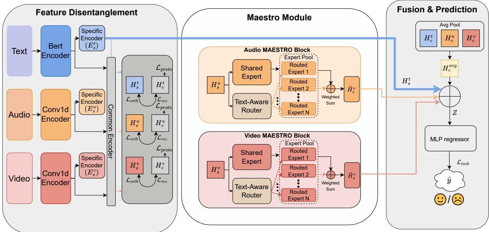
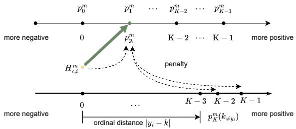
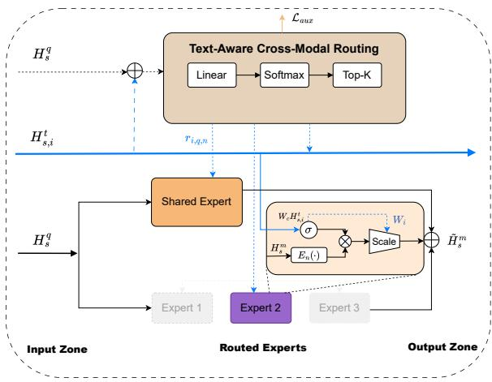
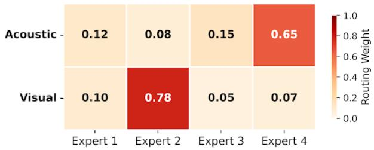

# Multimodal Adaptive Expert Selection with Text Routing and Ordinal Prototype Optimization for Sentiment Analysis

Xiaode Chen∗ Jianghan University Wuhan, China chenxiaode2003@stu.jhun.edu.cn

Huina Qu   
Jianghan University   
Wuhan, China   
quhuina2004@gmail.com   
Jiakang Yu∗   
Jianghan University   
Wuhan, China   
jiakangyu@stu.jhun.edu.cn   
Xun Zhu   
Jianghan University   
Wuhan, China   
zhuxun@jhun.edu.cn   
Hongtao Deng†   
Jianghan University   
Wuhan, China   
hongtaodeng@jhun.edu.cn   
Yinxia Lou   
Jianghan University   
Wuhan, China   
yinxia@jhun.edu.cn

## Abstract

Multimodal Sentiment Analysis (MSA) is a fundamental component of afective computing that aims to decipher complex emotional states by integrating verbal content with non-verbal cues including vocal intonation and facial micro-expressions. While recent disentanglement-based approaches have advanced the field, their potential is hindered by two methodological challenges. First, static computation graphs process all samples indiscriminately regardless of semantic complexity, which leads to suboptimal represen tation for diverse emotional expressions and contextual scenarios. Second, generic contrastive objectives often neglect the intrinsic ordinal hierarchy of sentiment intensities. To systematically address these limitations, we introduce Multimodal Adaptive Expert Selection with Text Routing and Ordinal prototype optimization (MAESTRO), a novel framework designed to dynamically orchestrate and refine multimodal representations. Drawing inspiration from an orchestra conductor, we design a Text-Guided Hybrid Mixture-of-Experts (MoE) mechanism. Unlike static fusion, this module utilizes linguistic context as a routing signal to dynamically activate specific audio-visual experts, thereby resolving cross-modal ambiguity through adaptive feature enhancement. Furthermore, to capture fine-grained sentiment gradations, we propose an Ordinalaware Prototype Contrastive Learning (O-PCL). By incorporating distance-based penalties into the prototype learning objective, O-PCL enforces a structured latent space that preserves the natural order of emotion. Extensive experiments on the CMU-MOSI and CMU-MOSEI benchmarks demonstrate that MAESTRO achieves state-of-the-art performance, and qualitative analysis further confirms the interpretability of our dynamic routing paradigm.

## CCS Concepts

• Information systems → Multimedia information systems; • Computing methodologies → Natural language processing.

Keywords Multimodal Sentiment Analysis, Mixture of Experts, Dynamic Routing, Contrastive Learning, Ordinal Regression

ACM Reference Format: Xiaode Chen, Jiakang Yu, Hongtao Deng, Huina Qu, Xun Zhu, and Yinxia Lou. 2026. Multimodal Adaptive Expert Selection with Text Routing and Ordinal Prototype Optimization for Sentiment Analysis. In . ACM, New York, NY, USA, 9 pages. https://doi.org/10.1145/nnnnnnn.nnnnnnn

## 1 Introduction

Multimodal Sentiment Analysis (MSA) stands at the forefront of modern artificial intelligence research with the primary objective of gauging emotional intensity through the synergistic integration of heterogeneous data streams encompassing language, vision, and acoustics. In contrast to conventional unimodal approaches that depend exclusively on linguistic semantics, MSA seeks to capture the multifaceted nature of human communication. Non-verbal signals including voice modulation and subtle facial movements frequently serve as the key to unlocking the genuine intent of a speaker [1, 5, 18, 36]. Consequently, this technology ofers immense utility in a wide array of applications ranging from personalized recommendation systems in social media to automated monitoring in mental healthcare.

To tackle the heterogeneity gap across modalities, the field has witnessed an evolution from early fusion architectures to disentangled representation learning. Seminal fusion works such as TFN [33] and MulT [23] leveraged tensor fusion or cross-modal Transformers [24] to capture interactions directly from raw features. Subsequently, to mitigate information redundancy and conflict, the paradigm shifted towards feature disentanglement. State-of-the-art methods like MISA [10] and DLF [25] decompose multimodal features into modality-invariant and modality-specific subspaces by employing geometric constraints to refine representations. Due to their robustness and compact architecture, these disentanglementbased approaches have established themselves as the dominant paradigm for eficient MSA.

However, despite these advances, existing disentanglement frameworks face two critical limitations in the context of advanced multimedia retrieval.

  
Figure 1: The overall architecture of MAESTRO, which utilizes a Text-Guided Hybrid MoE mechanism to disentangle modalityspecific features, orchestrate expert selection via a "conductor" signal, and fuse enhanced representations for robust sentiment analysis.

(1) Inflexible Static Interaction: Current models rely on static computation graphs that process every sample through identical fixed parameters regardless of its semantic complexity. This "one-size-fits-all" mechanism lacks the adaptability to handle cross-modal variations efectively. For instance, a linguistically explicit sentiment requires minimal verification, whereas an ambiguous sarcastic utterance demands the activation of specialized acoustic or visual modules to disambiguate the intent. Static models lack the flexibility to adapt to such distinct reasoning needs.

(2) Neglect of Ordinal Semantics: Existing methods often treat sentiment analysis as a standard classification or regression problem while ignoring the intrinsic ordinal nature of sentiment intensities, which typically range from strongly negative to strongly positive, with varying levels of intensity. They usually employ generic contrastive losses that treat all negative samples equally. Consequently, they fail to penalize the semantic distance between labels, such as the significant error of misclassifying a strongly positive sample as strongly negative compared to a minor deviation. This lack of ordinal awareness leads to a latent space that is loosely clustered and lacks fine-grained discriminative power.

To address these limitations, we draw inspiration from an orchestra conductor. In a symphony, the conductor dynamically cues diferent instrument sections based on the score. Similarly, we argue that Language, as the dominant semantic modality, should act as the "conductor" to orchestrate non-verbal modalities. Based on this in sight, we propose Multimodal Adaptive Expert Selection with Text Routing and Ordinal prototype optimization (MAESTRO). To the best of our knowledge, MAESTRO is the first framework to incorporate a Text-Guided Hybrid Mixture-of-Experts (MoE) mechanism within the multimodal disentanglement paradigm. Specifically, we replace static fusion layers with a dynamic routing strategy where the textual context gates and weights specific audio-visual experts to enable sample-specific computation. Furthermore, to structure the semantic space, we introduce a novel Ordinal-aware Prototype Contrastive Learning (O-PCL). Unlike standard contrastive methods, O-PCL incorporates a distance-based penalty that pushes samples further away from emotionally distant prototypes, thereby enforcing a structured embedding space that aligns with the ordinal hierarchy of sentiment labels.

Our main contributions are summarized as follows:

• We propose MAESTRO, a novel framework that breaks the static interaction bottleneck of traditional disentanglement methods by introducing a Language-Guided Dynamic Routing strategy.

• We design a Text-Guided Hybrid MoE module that acts as a "conductor," allowing textual semantics to dynamically select and modulate audio-visual experts for adaptive feature enhancement.

• We devise an O-PCL that dynamically adjusts penalties based on the semantic distance between sentiment intensities, ensuring that the feature space is aligned with the fine-grained ordinal structure of human emotions.

• Extensive experiments on the CMU-MOSI and CMU-MOSEI benchmarks demonstrate that MAESTRO achieves state-ofthe-art performance across most key metrics, yielding substantial improvements over strong baselines.

## 2 Related Work

## 2.1 Multimodal Sentiment Analysis

The field of MSA has evolved from early feature-level fusion to sophisticated deep representation learning. Early feature-level fusion methods typically extract unimodal features and explicitly combine them into a joint representation via predefined fusion operators. Representative tensor-based approaches, such as TFN [33] and LMF [16], model inter-modal interactions through tensor outer products and low-rank factorization, respectively, ofering a direct yet often rigid way to capture cross-modal dependencies. In contrast, deep representation learning methods aim to learn fused multimodal representations in an end-to-end manner, where cross-modal interactions are implicitly modeled within neural architectures. With the advent of the Transformer, attention-based models became mainstream: MulT [23] leverages cross-modal attention to align unaligned sequences, while MISA [10] learns more robust representations by disentangling modality-invariant and modality-specific factors. More recently, advanced frameworks further enhance representation learning and fusion through hierarchical mechanisms [22, 26], knowledge-guided learning [8, 12, 32], adaptive dual-branch networks [9, 21], and multi-scale convolutional fusion with contrastive learning [30]. Meanwhile, the significance of text-guided cross-modal interaction extends beyond sentiment analysis: implicit hate speech detection calls for resolving the incongruity between literal language and non-verbal cues [15], and multimodal named entity recognition benefits from aligning visual semantics with language [29].

However, most existing methods rely on static computation graphs where all input samples pass through the same fixed encoders and fusion layers. This "one-size-fits-all" paradigm struggles to handle diverse noise levels and semantic ambiguities in real-world multimodal data. For example, resolving sarcasm or context-dependent non-verbal cues often calls for instance-adaptive cross-modal reasoning rather than fixed interactions, leading to suboptimal performance on hard samples under static architectures.

## 2.2 Dynamic Computation and MoE

Dynamic neural networks adapt their structures or parameters based on the input instance, ofering a promising solution to the limitations of static models. Among these, the MoE architecture has gained significant traction in natural language processing and computer vision [4, 7, 20]. MoE scales model capacity by activating only a sparse subset of experts for each input token which achieves high eficiency.

Despite its success in other fields, the application of MoE in MSA remains underexplored. While some recent works have begun to introduce MoE-style gating for multimodal fusion [2], their expert selection is typically conditioned on multimodal token representations and is not explicitly guided by linguistic context as a global routing signal. In contrast, our MAESTRO framework incorporates a Text-Guided Router, which leverages language as a “conductor” to orchestrate visual and acoustic experts, thereby resolving crossmodal ambiguity through dynamic, context-aware expert selection.

## 2.3 Contrastive Learning and Ordinal Regression

Contrastive learning has emerged as a powerful technique for learning distinctive representations by pulling positive pairs closer and pushing negative pairs apart. In the context of MSA, Self-MM [31] utilized unimodal label generation and contrastive constraints to refine modality representations. HyCon [17] further explored hybrid contrastive strategies to capture both intra- and inter-modal dependencies [11, 27, 28].

Nevertheless, standard contrastive learning approaches typically treat sentiment analysis as a categorical classification problem. This approach ignores the intrinsic ordinal nature of sentiment intensities such as the semantic diference between +1 and +2. Such limitations often result in regression errors where predictions violate the natural order of sentiment. To address this, ordinal regression techniques [3, 14] have been proposed, but few integrate them efectively with contrastive learning. Our proposed O-PCL fills this gap by injecting ordinal constraints into the latent space, ensuring that the learned embeddings respect the hierarchy of sentiment intensities.

## 3 Methodology

## 3.1 Overall Architecture

The framework of the proposed MAESTRO is illustrated in Figure 1. It follows a five-stage pipeline: Multimodal Feature Extraction projects the pre-extracted text, audio, and visual inputs into highlevel representations; Latent Feature Disentanglement decomposes each modality representation into a modality-specific subspace and a modality-invariant common subspace; Text-Guided Feature Enhancement employs the Maestro block to route and refine nonverbal representations conditioned on the text-specific feature; Multimodal Fusion aggregates the enhanced modality-specific features together with the common representations; and Sentiment Prediction outputs the final sentiment intensity via a regression head.

Given an input video clip, we denote the raw modalities as $\boldsymbol { X } = \{ X _ { t } , X _ { a } , X _ { v } \}$ }. Initially, we take the pre-extracted modality fea tures stored in .pkl files as inputs and project them into high-level representations $\mathcal { F } = \{ E _ { t } , E _ { a } , E _ { v } \}$ using modality-specific input encoders. Specifically, $E _ { t } \in \mathbb { R } ^ { d _ { t } }$ is obtained via a BERT-based text encoder [6]. For the acoustic and visual streams, the input feature sequences are first mapped to a unified hidden space through lightweight 1D convolutional projection layers and then encoded by Transformer-based networks to produce $E _ { a } \in \mathbb { R } ^ { d _ { a } }$ and $E _ { v } \in \mathbb { R } ^ { d _ { v } }$

To address information heterogeneity and redundancy, the feature disentanglement module decomposes each $E _ { m }$ into a modalityspecific subspace $H _ { s } ^ { m }$ and a modality-invariant common subspace $H _ { c } ^ { m }$ for $m \in \{ t , a , v \}$ . To ensure the purity and complementarity of these latent spaces, three constraints comprising orthogonality $( \mathcal { L } _ { o r t h } )$ , reconstruction $( \mathcal { L } _ { r e c } )$ , and the proposed O-PCL are incorporated as regularization terms.

The defining component ofthe MAESTRO framework is the Maestro block, which implements a Text-Guided Hybrid MoE mechanism. It treats the text-specific feature $H _ { s } ^ { t }$ as an anchor to orchestrate a shared expert and an expert pool for audio and video enhancement. This process produces refined representations $\tilde { H } _ { s } ^ { a }$ and $\tilde { H } _ { s } ^ { v }$ that are sensitive to the linguistic context. Finally, the enhanced features are aggregated via a Final Fusion Layer to predict the sentiment intensity �ˆ.

## 3.2 Feature Disentanglement

A fundamental challenge in multimodal sentiment analysis is the inherent heterogeneity of the data. Raw feature representations typically entail an entanglement of modality-invariant semantics representing the underlying sentiment and modality-specific characteristics such as acoustic background or visual style. Directly fusing these entangled features may introduce redundancy and noise which hinders efective cross-modal interaction. To address this, we propose a geometry-guided disentanglement paradigm. As illustrated in the Feature Disentanglement module of Figure 1, our objective is to mathematically decompose the input features into two independent subspaces: a specific space for unique modal dynamics and a common space for shared sentiment semantics.

3.2.1 Dual-Stream Feature Decomposition. Let the high-level feature of modality � $\in \ \{ t , a , v \}$ be denoted as $E _ { m }$ . To disentangle the representation, we employ two parallel encoders: a modalityspecific encoder $E _ { s } ^ { m }$ and a modality-invariant encoder $E _ { c } ^ { m }$

$$
H _ { s } ^ { m } = E _ { s } ^ { m } ( E _ { m } ) , \qquad H _ { c } ^ { m } = E _ { c } ^ { m } ( E _ { m } ) ,\tag{1}
$$

Here, $H _ { s } ^ { m }$ encodes the exclusive attributes of modality �, while ${ { H } _ { c } ^ { m } }$ is intended to capture the sentiment consistency shared across modalities.

3.2.2 Latent Space Regularization. To validate this decomposition and prevent trivial solutions, we impose three geometric regularization constraints.

(1) Integrity via Reconstruction. To avoid losing information during disentanglement, we regularize the decomposition by requiring the reconstructed feature to stay close to the input feature. Specifically, we introduce a decoder $D _ { m }$ for each modality �. The decoder maps the concatenated representation $H _ { s } ^ { m }$ ⊕ $H _ { c } ^ { m }$ back to the feature space, and we minimize the squared $\ell _ { 2 }$ reconstruction error:

$$
\mathcal { L } _ { r e c } = \sum _ { m \in \{ t , a , v \} } \left. E _ { m } - D _ { m } \bigl ( H _ { s } ^ { m } \oplus H _ { c } ^ { m } \bigr ) \right. _ { 2 } ^ { 2 } ,\tag{2}
$$

Here ⊕ denotes concatenation along the feature dimension.

Minimizing $\mathcal { L } _ { r e c }$ encourages $H _ { s } ^ { m }$ and ${ { H } _ { c } ^ { m } }$ to jointly preserve the input information, which stabilizes disentanglement and reduces trivial solutions.

(2) Independence via Orthogonality. To eliminate redundancy between the two subspaces, we enforce geometric orthogonality. By minimizing the Frobenius norm of the correlation between $H _ { s } ^ { m }$ and ${ { H } _ { c } ^ { m } }$ , we ensure that the two representations are linearly independent. This forces the model to isolate modality-specific noise within $H _ { s } ^ { m }$ , leaving $H _ { c } ^ { m }$ to focus on shared semantics:

$$
\mathcal { L } _ { o r t h } = \sum _ { m \in \{ t , a , v \} } \Vert ( H _ { s } ^ { m } ) ^ { \top } H _ { c } ^ { m } \Vert _ { F } ^ { 2 } .\tag{3}
$$

(3) Alignment via Ordinal Prototype Optimization. Sentiment intensity naturally follows an ordinal structure, where adjacent levels are semantically closer than distant ones. For instance, confusing an extremely positive sample with an extremely negative one should incur a larger penalty than confusing it with a nearby positive level. However, conventional prototype-based contrastive learning typically treats all negative classes uniformly, thereby overlooking this ordinal prior. To address this, we propose an ${ \mathrm { O - P C L } } ,$ as illustrated in Figure 2, which injects an explicit distance-dependent penalty into the prototype contrast objective.

  
Figure 2: Illustration of the O-PCL. For modality �, the sample representation $\bar { H } _ { c , i } ^ { m }$ serves as an anchor and is pulled toward its positive prototype $\boldsymbol { p } _ { y _ { i } } ^ { m }$ (green arrow). Crucially, negative prototypes $p _ { k } ^ { m } \left( k \neq y _ { i } \right)$ are pushed away with a dynamic penalty proportional to the ordinal distance $w _ { i , k } ~ =$ |�� $- k | / ( K - 1 )$ . This is implemented by increasing the logits with ��� �, forcing the latent space to respect the hierarchy of sentiment intensities.

We obtain the ordinal label $y _ { i }$ by quantizing the continuous sentiment score $\tilde { y } _ { i }$ into $K$ ordered levels, which is consistent with the standard $_ { \mathrm { A c c ^ { - } } 5 }$ and Acc-7 evaluation protocol. We denote the resulting ordinal label of sample � as $y _ { i }$

$$
y _ { i } \in \{ 0 , 1 , . . . , K - 1 \} ,\tag{4}
$$

where a larger $y _ { i }$ indicates a more positive sentiment. Accordingly, we define $Y _ { \mathrm { m i n } } = 0$ and $Y _ { \mathrm { m a x } } = K - 1$ , so the maximum ordinal gap is $Y _ { \mathrm { m a x } } - Y _ { \mathrm { m i n } } = K - 1$

Consistent with our implementation, we compute in-batch prototypes on-the-fly instead of introducing additional learnable prototype parameters. Let ${ { H } _ { { { c } , i } } ^ { m } }$ be the common representation of sample � in modality � $\in \ \{ t , a , v \}$ . We first normalize each feature and then compute a prototype for each ordinal level that appears in the current mini-batch,

$$
\bar { H } _ { c , i } ^ { m } = \frac { H _ { c , i } ^ { m } } { \Vert H _ { c , i } ^ { m } \Vert _ { 2 } } ,
$$

$$
{ \mathcal { B } } _ { k } = \{ i \mid y _ { i } = k \} ,\tag{5}
$$

$$
\mathcal { P } _ { k } ^ { m } = \frac { 1 } { \vert \mathcal { B } _ { k } \vert } \sum _ { i \in \mathcal { B } _ { k } } \bar { H } _ { c , i } ^ { m } ,\tag{6}
$$

(7)

$$
p _ { k } ^ { m } \gets \frac { { \boldsymbol { p } } _ { k } ^ { m } } { \| \boldsymbol { p } _ { k } ^ { m } \| _ { 2 } } ,\tag{8}
$$

where $\mathcal { B } _ { k }$ denotes the set of samples in the batch with ordinal label �. In practice, we only construct prototypes for labels present in the batch, i $\mathrm { . e . , } k \in \mathcal { K } _ { \mathcal { B } } = \left\{ k \mid \left| \mathcal { B } _ { k } \right| > 0 \right\}$

  
Figure 3: Illustration of the Maestro Block, featuring Text-Guided Dynamic Routing and Context-Aware Dual Gating to orchestrate non-verbal representations.

For each sample � and prototype index �, we define the normalized ordinal distance factor,

$$
w _ { i , k } = \frac { | y _ { i } - k | } { Y _ { \operatorname* { m a x } } - Y _ { \operatorname* { m i n } } } = \frac { | y _ { i } - k | } { K - 1 } ,\tag{9}
$$

so that $w _ { i , k } \in [ 0 , 1 ]$ . This normalization keeps the penalty scale comparable across diferent choices of �.

Penalty-injected prototype contrast. We compute similarity logits between each sample representation and the in-batch proto types, and inject the ordinal penalty only for negative prototypes,

$$
z _ { i , k } ^ { m } = \frac { \sin \left( \bar { H } _ { c , i } ^ { m } , \mathcal { P } _ { k } ^ { m } \right) } { \tau } ,\tag{10}
$$

$$
\tilde { z } _ { i , k } ^ { m } = z _ { i , k } ^ { m } + \alpha ~ \cdot w _ { i , k } \cdot \mathbb { I } [ k \neq y _ { i } ] ,\tag{11}
$$

where sim(·, ·) is cosine similarity, � is the temperature, and � controls the penalty strength. Finally, we optimize a cross-entropy objective over prototypes,

$$
\mathcal { L } _ { \hat { p r o t o } } ^ { m } = - \frac { 1 } { B } \sum _ { i = 1 } ^ { B } \log \frac { \exp ( \tilde { z } _ { i , y _ { i } } ^ { m } ) } { \sum _ { k \in \mathcal { K } _ { \mathcal { B } } } \exp ( \tilde { z } _ { i , k } ^ { m } ) } ,\tag{12}
$$

$$
\mathcal { L } _ { p r o t o } = \sum _ { m \in \{ t , a , v \} } \mathcal { L } _ { p r o t o } ^ { m } .\tag{13}
$$

By enlarging the logits of ordinal-distant negative prototypes through ��� �, O-PCL increases the loss for confusing emotionally distant levels, thereby pushing representations away from distant prototypes and shaping an ordinal-structured latent space.

## 3.3 Text-Guided Hybrid MoE

The interpretation of non-verbal cues is highly context dependent. A visual smile may indicate happiness or sarcasm, and the correct meaning often depends on the linguistic content. Standard MoE methods typically adopt a self-routing strategy, where expert selection is conditioned only on the input modality itself. As a result, the modality is processed in isolation from the semantic context, which resembles an orchestra performing without a conductor. We address this limitation by introducing Maestro, as illustrated in Figure 3. Maestro uses the text-specific feature $H _ { s } ^ { t }$ as a global conductor signal and dynamically orchestrates the processing of the audio feature $H _ { s } ^ { a }$ and the visual feature $H _ { s } ^ { v }$

3.3.1 Text-Guided Dynamic Routing. The conductor selects a sparse set of experts to process the current sample in a context-aware manner. Unlike standard MoE designs that perform self-routing within each modality, we introduce a text-guided cross-modal router. The key idea is to condition expert selection for non-text modalities on both the global linguistic context and the local modality dynamics.

For a target non-text modality $q \in \{ a , \upsilon \}$ , we compute routing logits over � experts for each sample �,

$$
{ s _ { i , q } } = W _ { g } \left( { H _ { s , i } ^ { t } } \oplus H _ { s , i } ^ { q } \right) + b _ { g } , \qquad s _ { i , q } \in \mathbb { R } ^ { N } ,\tag{14}
$$

where $H _ { s , i } ^ { t } \in \mathbb { R } ^ { d _ { t } }$ and $H _ { s , i } ^ { q } \in \mathbb { R } ^ { d _ { q } }$ are the text-specific and modalityspecific representations of sample � after temporal aggregation, $\dot { W } _ { q } \in \mathbb { R } ^ { N \times ( d _ { t } + d _ { q } ) }$ and $b _ { q } \in \mathbb { R } ^ { N }$ are learnable parameters.

The gating distribution is obtained by

$$
G _ { i , q } = \mathrm { S o f t m a x } ( s _ { i , q } ) , \qquad G _ { i , q } \in \mathbb { R } ^ { N } .\tag{15}
$$

We adopt Top-� routing and activate only the � experts with the largest gating scores. The sparse routing weight assigned to expert � is

$$
r _ { i , q , n } = \left\{ \begin{array} { l l } { \frac { G _ { i , q , n } } { \sum _ { j \in \mathrm { T o p K } ( G _ { i , q } , K ) } G _ { i , q , j } } , } & { n \in \mathrm { T o p K } ( G _ { i , q } , K ) , } \\ { 0 , } & { \mathrm { o t h e r w i s e } . } \end{array} \right.\tag{16}
$$

This sparse selection encourages expert specialization and filters irrelevant signals. We further apply an auxiliary load balancing objective during training to mitigate expert collapse, and we detail this objective in Section 3.5.

3.3.2 Context-Aware Dual Gating. Beyond expert selection, finegrained modulation inside each expert is also crucial. We introduce a context-aware dual gating mechanism. The sparse routing weight $r _ { i , q , n }$ controls the contribution ofexpert �, while an internal channel gate modulates the expert output using the text context. For sample �, modality $q \in \{ a , \upsilon \}$ , and expert �, we compute

$$
O _ { i , q , n } = r _ { i , q , n } \Big ( E _ { n } ( H _ { s , i } ^ { q } ) \odot \sigma ( W _ { c } H _ { s , i } ^ { t } ) \Big ) ,\tag{17}
$$

Here, $E _ { n }$ denotes the �-th expert network, $\sigma$ is the Sigmoid activation function, and $\odot$ denotes element-wise multiplication. $W _ { c } \in$ $\mathbb { R } ^ { d _ { t } \times d _ { E } }$ projects the text-specific feature $H _ { s , i } ^ { T } \in \mathbb { R } ^ { d _ { t } }$ to the expert channel space of dimension $d _ { E }$

3.3.3 Hybrid Expert Aggregation. Purely sparse MoE models may sufer from training instability. To balance dynamic adaptability with static robustness, we adopt a hybrid aggregation scheme. For sample � and modality $q \in \{ a , \upsilon \}$ , the enhanced representation is

$$
\tilde { H } _ { s , i } ^ { q } = E _ { s h a r e d } ^ { q } ( H _ { s , i } ^ { q } ) + \sum _ { n = 1 } ^ { N } O _ { i , q , n } .\tag{18}
$$

Since $r _ { i , q , n } = 0$ for non-selected experts, the summation non-zero only for Top-K routed experts over the Top-� routed experts.

Here, the shared expert captures modality-invariant patterns that are useful across contexts, while the routed experts provide text-aligned refinements.

## 3.4 Multimodal Fusion and Prediction

After the text-guided enhancement via the Maestro Block, we obtain the refined modality-specific features $\tilde { H } _ { s } ^ { a }$ and $\tilde { H } _ { s } ^ { v } ,$ , which now incorporate linguistically aligned non-verbal cues. For simplicity, we omit the sample index � in the following fusion and prediction formulas. Simultaneously, we retain the original text-specific feature $H _ { s } ^ { t }$ and the modality-invariant common features $\{ H _ { c } ^ { t } , H _ { c } ^ { a } , H _ { c } ^ { v } \}$ extracted from the disentanglement module.

To condense the shared semantic information, we perform an average pooling operation over the common subspaces. This operation aggregates the modality-invariant features across the three modalities, ensuring that the most representative information from all modalities is captured in $H _ { c } ^ { a v g }$

$$
H _ { c } ^ { a v g } = \frac { 1 } { 3 } \left( H _ { c } ^ { t } + H _ { c } ^ { a } + H _ { c } ^ { v } \right) .\tag{19}
$$

Subsequently, we construct a comprehensive multimodal representation vector $Z$ by concatenating the consolidated common feature with the specificity-enhanced representations:

$$
Z = H _ { c } ^ { a v g } \oplus H _ { s } ^ { t } \oplus \tilde { H } _ { s } ^ { a } \oplus \tilde { H } _ { s } ^ { v } ,\tag{20}
$$

where $Z \in \mathbb { R } ^ { d _ { t o t a l } }$ encapsulates both the consistent sentiment semantics and the context-sensitive unimodal dynamics.

Finally, the fused vector � is fed into a sentiment regression head. This head consists of a multi-layer perceptron with two fully connected layers, non-linear activation functions, and dropout regularization to prevent overfitting. The predicted sentiment intensity �ˆ is computed as:

$$
\begin{array} { r } { \hat { y } = W _ { 2 } \left( \mathrm { R e L U } \left( W _ { 1 } Z + b _ { 1 } \right) \right) + b _ { 2 } , } \end{array}\tag{21}
$$

where $W _ { 1 } , W _ { 2 }$ and $b _ { 1 } , b _ { 2 }$ represent the learnable weights and biases of the projection layers, respectively.

## 3.5 Optimization Objectives

The MAESTRO framework is optimized in an end to end manner. The total objective is a weighted combination of the task loss and multiple regularization terms:

$$
\begin{array} { r } { \mathcal { L } _ { t o t a l } = \mathcal { L } _ { t a s k } + \lambda _ { 1 } \mathcal { L } _ { o r t h } + \lambda _ { 2 } \mathcal { L } _ { r e c } + \lambda _ { 3 } \mathcal { L } _ { p r o t o } + \lambda _ { 4 } \mathcal { L } _ { a u x } , } \end{array}\tag{22}
$$

where $\lambda _ { 1 } , \lambda _ { 2 } , \lambda _ { 3 } , \lambda _ { 4 }$ balance the contribution of each component.

Sentiment prediction on benchmarks such as CMU-MOSI is formulated as a regression problem. We use mean absolute error as the task objective:

$$
\mathcal { L } _ { t a s k } = \frac { 1 } { B } \sum _ { i = 1 } ^ { B } \left| \tilde { y } _ { i } - \hat { y } _ { i } \right| ,\tag{23}
$$

where � is the batch size, $\tilde { y } _ { i }$ is the ground truth sentiment score, and $\hat { y } _ { i }$ is the predicted score.

A key challenge in training sparse MoE models is expert collapse, where the router consistently activates only a small subset of experts and leaves others underutilized. To mitigate this issue during training, we introduce an auxiliary load balancing loss that encourages balanced expert utilization.

For a batch of � samples and � experts, let $f _ { n }$ denote the fraction of samples routed to expert �, and let $P _ { n }$ denote the average gating probability assigned to expert � over the batch. We define

$$
\mathcal { L } _ { a u x } = N \sum _ { n = 1 } ^ { N } f _ { n } \cdot P _ { n } ,\tag{24}
$$

which is optimized together with the main objective to discourage skewed routing.

This auxiliary term complements Top-� sparse routing by preventing a few experts from dominating the trafic, while still allowing the router to focus computation on the most informative experts for each sample.

## 4 EXPERIMENTS

## 4.1 Experiment Setup

Datasets. To validate the efectiveness of our framework, we conduct experiments on two standard benchmarks, namely CMU-MOSI [35] and its larger counterpart CMU-MOSEI [34]. The former comprises 2,199 video segments, whereas the latter features a more extensive collection of 22,856 clips with enhanced speaker diversity. All samples across both datasets are annotated with continuous sentiment intensity scores where -3 represents strongly negative and +3 indicates strongly positive sentiments.

Implementation Details. All experiments were conducted on a single NVIDIA RTX 4090 GPU. We employed bert-base-uncased as the textual encoder. To prevent overfitting on limited multimodal data, we projected all modality features into a compact common subspace. For the acoustic and visual modalities, we utilized 2-layer Transformer backbones [24]. The model was optimized using the Adam optimizer with a unified learning rate of 1�−4. To stabilize the MoE training, we applied gradient clipping with a threshold of 0.6. The batch size was set to 64, and we employed early stopping with a patience of 5 epochs. Key hyperparameters including datasetspecific dropout rates are detailed in Table 1.

Metrics. Following previous studies, we evaluate performance using six metrics: Mean Absolute Error (MAE), Pearson correlation coeficient (Corr), binary classification accuracy (Acc-2), F1 score (F1), 5-class accuracy (Acc-5), and 7-class accuracy (Acc-7). Higher Acc/F1/Corr and lower MAE indicate better performance.

## 4.2 Results and Analysis

Baselines. To comprehensively evaluate the efectiveness of MAE-STRO, we compare it against a wide range of state-of-the-art MSA methods categorized into two groups: (1) Fusion and Attentionbased approaches, including TFN [33], LMF [16], MulT [23], and MAG-BERT [19]; and (2) Advanced Representation Learning frameworks, which cover disentanglement and contrastive learning methods such as MISA [10], Self-MM [31], HyCon [17], ConFEDE [27], DMD [13], and DLF [25].

Table 1: Hyperparameter settings for CMU-MOSI and CMU-MOSEI.
<table><tr><td>Parameter</td><td>CMU-MOSI</td><td>CMU-MOSEI</td></tr><tr><td>Training Config</td><td></td><td></td></tr><tr><td>Batch size</td><td>64</td><td>64</td></tr><tr><td>Learning Rate</td><td> $1 e ^ { - 4 }$ </td><td> $1 e ^ { - 4 }$ </td></tr><tr><td>Gradient Clip</td><td>0.6</td><td>0.6</td></tr><tr><td>Patience</td><td>5</td><td>5</td></tr><tr><td>Model Architecture</td><td></td><td></td></tr><tr><td>Transformer Layers</td><td>2</td><td>2</td></tr><tr><td>Num. Experts (N)</td><td>4</td><td>4</td></tr><tr><td>Top-K (K)</td><td>2</td><td>2</td></tr><tr><td>Regularization</td><td></td><td></td></tr><tr><td>Text Dropout</td><td>0.5</td><td>0.1</td></tr><tr><td>Attn Dropout</td><td>0.3</td><td>0.5</td></tr><tr><td> $\lambda _ { o r t h } ( \mathrm { O r t h o g o n a l i t y } )$ </td><td>0.1</td><td>0.1</td></tr><tr><td> $\lambda _ { a u x } ( \mathrm { L o a d B a l a n c e } )$ </td><td>0.1</td><td>0.1</td></tr><tr><td> $\alpha _ { } ( \mathrm { O - P C L P e n a l t y } )$ </td><td>0.5</td><td>0.5</td></tr></table>

Performance Comparison. The quantitative results on CMU-MOSI and CMU-MOSEI are summarized in Table 2. MAESTRO establishes a new state-of-the-art by outperforming strong baselines across most key metrics.

Analysis on CMU-MOSI. As shown in Table 2, MAESTRO demonstrates superior performance over the strongest competitor, ConFEDE. Specifically, our model attains an Acc-2 score of 87.20%, outperforming the strongest baseline ConFEDE by a clear margin. Most notably, we observe a substantial improvement in regression precision which validates the efectiveness of our Ordinal-Aware approach. Compared to ConFEDE and Self-MM, MAESTRO attains a lower MAE of 0.689 and achieves a superior correlation of 0.807. While recent methods like ConFEDE efectively fuse modalities, they often neglect the ordinal distance between sentiment labels. By integrating the O-PCL, MAESTRO explicitly penalizes large sentiment deviations such as confusing +3 with -1, forcing the latent space to respect sentiment hierarchy. This structural alignment directly translates into the observed lower MAE and higher correlation.

Analysis on CMU-MOSEI. On the large-scale MOSEI dataset, MAESTRO continues to show competitive advantages. It surpasses all baselines in classification tasks, achieving the highest Acc-2 of 85.91% and F1 score of 85.88%, edging out the strong baseline Con-FEDE. The consistent performance on MOSEI attributes to the Text-Guided Dynamic Routing. Unlike static fusion mechanisms used in DLF or Self-MM that apply fixed interactions, MAESTRO acts as a "conductor" by dynamically activating only the most semantically relevant audio-visual experts for each sample. This adaptability ensures robustness even in the diverse and noisy environments characteristic of large-scale datasets.

## 4.3 Ablation Study

To thoroughly investigate the contribution of each core component within the MAESTRO framework, we conducted a comprehensive ablation study on the CMU-MOSI dataset. We constructed four distinct variants to isolate the efects of the dynamic MoE mechanism, the text-guided routing strategy, the feature disentanglement module, and the ordinal-aware optimization:

• w/o Maestro Block: In this setting, we remove the entire Maestro MoE structure. Instead of dynamically selecting experts, the model utilizes a standard static fusion approach where features from text, audio, and video encoders are directly concatenated. This setting serves as a baseline to quantify the value of dynamic computation over static interaction.

• w/o Text-Guided Router: This variant retains the MoE architecture but replaces the Text-Guided Router with a Self-Routing mechanism. Specifically, the audio and visual experts are selected based solely on their own modality features, without the "conductor" signal from the textual context. This is designed to test whether linguistic guidance is superior to self-adaptation in resolving cross-modal ambiguity.

• w/o Disentanglement: We remove the modality-specific and modality-invariant decomposition along with the orthogonality and reconstruction constraints. The raw encoded features are directly fed into the Maestro Block. This setting tests whether purifying modality dynamics is a prerequisite for efective expert routing.

• w/o O-PCL: We replace the proposed O-PCL with a standard contrastive loss that treats all negative samples equally. The model is trained without the distance-based penalty weights. This setup evaluates whether incorporating ordinal priors helps the model focus on fine-grained sentiment intensity and prevents regression errors.

The results presented in Table 3 ofer several critical insights into the architecture of MAESTRO.

Dynamic Selection Outperforms Static Fusion. The "w/o Maestro Block" variant exhibits the lowest performance across all metrics with the Acc-7 dropping significantly to 45.32%. This confirms that static computation graphs are insuficient for capturing complex multimodal dynamics. Simply concatenating features introduces redundancy and noise. In contrast, the Maestro Block efectively filters out irrelevant information through dynamic routing, allowing the model to focus on the most informative cues for each specific sample.

Linguistic Context Disambiguates Non-Verbal Cues. The "w/o Text-Guided Router" improves upon the static baseline but lags behind the full MAESTRO, recording an Acc-2 of 85.42% compared to 87.20%. This supports our hypothesis that non-verbal signals are often ambiguous without semantic context such as when a smile indicates sarcasm rather than happiness. The Text-Guided Router acts as a "conductor" ensuring that the activated visual and acoustic experts are semantically aligned with the linguistic intent, thereby guaranteeing interpretation reliability.

Disentanglement Ensures Routing Reliability. The performance drop observed in the "w/o Disentanglement" variant (Acc-2 drops to 85.15%) highlights the foundational role of feature purification. Without disentanglement, modality-specific features are polluted by irrelevant noise and shared semantics. This entanglement confuses the Text-Guided Router, making it dificult to accurately assess which expert is needed. This result confirms that "clean inputs make for a better conductor," validating the necessity of our geometry-guided disentanglement module.

Table 2: Comparison with state-of-the-art methods on CMU-MOSI and CMU-MOSEI. The best results are highlighted in bold. The sufix ∗ indicates results cited from related literature.
<table><tr><td rowspan="2">Method</td><td colspan="6">CMU-MOSI</td><td colspan="6">CMU-MOSEI</td></tr><tr><td>Acc-7 ↑</td><td>Acc-5 ↑</td><td>Acc-2 ↑</td><td>F1↑</td><td>Corr ↑</td><td>MAE↓</td><td>Acc-7 ↑</td><td>Acc-5 ↑</td><td>Acc-2 ↑</td><td>F1↑</td><td>Corr ↑</td><td>MAE↓</td></tr><tr><td>TFN</td><td>34.90</td><td>39.39</td><td>80.08</td><td>80.07</td><td>0.698</td><td>0.901</td><td>50.20</td><td>53.10</td><td>82.50</td><td>82.10</td><td>0.700</td><td>0.593</td></tr><tr><td>LMF</td><td>33.20</td><td>38.13</td><td>82.50</td><td>82.40</td><td>0.695</td><td>0.917</td><td>48.00</td><td>52.90</td><td>82.00</td><td>82.10</td><td>0.677</td><td>0.623</td></tr><tr><td>MulT</td><td>40.00</td><td>42.68</td><td>83.00</td><td>82.00</td><td>0.698</td><td>0.871</td><td>51.80</td><td>54.18</td><td>82.50</td><td>82.30</td><td>0.703</td><td>0.580</td></tr><tr><td>MISA</td><td>41.37</td><td>47.08</td><td>83.54</td><td>83.58</td><td>0.778</td><td>0.777</td><td>52.05</td><td>53.63</td><td>84.67</td><td>84.66</td><td>0.752</td><td>0.558</td></tr><tr><td>MAG-BERT</td><td>43.62</td><td></td><td>84.43</td><td>84.61</td><td>0.781</td><td>0.727</td><td>52.67</td><td></td><td>84.82</td><td>84.71</td><td>0.755</td><td>0.543</td></tr><tr><td>HyCon*</td><td>46.60</td><td>1</td><td>85.20</td><td>85.10</td><td>0.790</td><td>0.713</td><td>52.80</td><td></td><td>85.40</td><td>85.60</td><td>0.776</td><td>0.601</td></tr><tr><td>Self-MM*</td><td>46.67</td><td>1</td><td>85.46</td><td>85.43</td><td>0.796</td><td>0.708</td><td>53.87</td><td></td><td>85.15</td><td>84.90</td><td>0.765</td><td>0.531</td></tr><tr><td>ConFEDE*</td><td>42.27</td><td>1</td><td>85.52</td><td>85.52</td><td>0.784</td><td>0.742</td><td>54.86</td><td></td><td>85.82</td><td>85.83</td><td>0.780</td><td>0.522</td></tr><tr><td>DMD*</td><td>46.06</td><td></td><td>83.23</td><td>83.29</td><td>=</td><td>0.752</td><td>52.78</td><td></td><td>84.62</td><td>84.62</td><td></td><td>0.543</td></tr><tr><td>DLF</td><td>47.08</td><td>52.33</td><td>85.06</td><td>85.04</td><td>0.781</td><td>0.731</td><td>53.90</td><td>55.70</td><td>85.42</td><td>85.27</td><td>0.764</td><td>0.536</td></tr><tr><td>MAESTRO (Ours)</td><td>49.42</td><td>56.56</td><td>87.20</td><td>87.16</td><td>0.807</td><td>0.689</td><td>54.54</td><td>56.28</td><td>85.91</td><td>85.88</td><td>0.769</td><td>0.529</td></tr></table>

Table 3: Ablation study results of MAESTRO on CMU-MOSI. We report six metrics to fully evaluate the performance impact. Bold indicates the best performance.
<table><tr><td>Model</td><td>Acc-7</td><td>Acc-5</td><td>Acc-2</td><td>F1</td><td>MAE</td><td>Corr</td></tr><tr><td>w/o Maestro Block</td><td>45.32</td><td>52.14</td><td>84.75</td><td>84.71</td><td>0.738</td><td>0.789</td></tr><tr><td>w/o Text-Guided Router</td><td>46.85</td><td>54.02</td><td>85.42</td><td>85.38</td><td>0.719</td><td>0.795</td></tr><tr><td>w/o Disentanglement</td><td>46.10</td><td>53.50</td><td>85.15</td><td>85.12</td><td>0.728</td><td>0.792</td></tr><tr><td>w/o O-PCL</td><td>47.90</td><td>55.10</td><td>85.80</td><td>85.76</td><td>0.724</td><td>0.798</td></tr><tr><td>MAESTRO (Full)</td><td>49.42</td><td>56.56</td><td>87.20</td><td>87.16</td><td>0.689</td><td>0.807</td></tr></table>

Ordinal Constraints Enhance Regression Precision. Notably, the "w/o O-PCL" variant sufers a clear degradation in regression performance with MAE increasing from 0.689 to 0.724. This is a crucial finding because standard contrastive losses ignore the semantic distance between labels and fail to penalize ordinal errors efectively. The O-PCL ensures that the latent space is structured according to sentiment intensity, enabling the model to distinguish fine-grained emotional shifts such as +3 versus +2 and achieve high-precision predictions.

## 4.4 Further Analysis

To provide deeper insights into the interpretability of MAESTRO, we investigate how the Text-Guided Router orchestrates multimodal interactions by visualizing the dynamic routing weights.

We conducted a case study on a representative sample from the CMU-MOSI test set involving sarcasm where the speaker says “It’s just... fine” with a disappointed facial expression. In this scenario, the literal positive meaning of the text contradicts the negative non-verbal signals, often confusing static fusion models.

As illustrated in Figure 4, the heatmap exhibits a distinct sparse activation pattern. Specifically, the router allocates dominant attention to Visual Expert 2 and Acoustic Expert 4, assigning them weights of 0.78 and 0.65, respectively, while efectively suppressing irrelevant experts. This behavior indicates that, guided by the linguistic cues of hesitation, the model adaptively redirects its focus towards facial expressions and vocal tonality to capture the underlying negative sentiment. This empirical evidence validates the capability of our text-driven "conductor" mechanism to resolve cross-modal ambiguity.

  
Figure 4: Visualization of dynamic routing weights. The heatmap illustrates that the Text-Guided Router resolves semantic ambiguity by assigning dominant weights to Visual Expert 2 and Acoustic Expert 4, as indicated by the dark red intensity.

## 5 Conclusion

In this paper, we presented MAESTRO, a novel framework that shifts the paradigm of Multimodal Sentiment Analysis from static computation graphs to dynamic, context-aware routing. Drawing inspiration from an orchestra conductor, our proposed Text-Guided Router utilizes linguistic semantics to dynamically orchestrate audio-visual experts. This mechanism efectively resolves cross-modal ambiguity by activating only the most discriminative non-verbal cues for each specific sample. Furthermore, to address the neglect of sentiment hierarchy in existing methods, we introduced the O-PCL. By incorporating distance-based penalties into prototype learning, O-PCL enforces a structured latent space that rigorously aligns with the intrinsic order of sentiment intensities.

Extensive experiments on the benchmark datasets CMU-MOSI and CMU-MOSEI demonstrate that MAESTRO establishes a new state-of-the-art performance. Qualitative analysis further confirms the interpretability of our dynamic mechanism, revealing that the model intelligently shifts its focus to specific non-verbal signals when facing semantic conflicts such as sarcasm.

## References

[1] Tadas Baltrušaitis, Chaitanya Ahuja, and Louis-Philippe Morency. 2018. Multimodal machine learning: A survey and taxonomy. IEEE Transactions on Pattern Analysis and Machine Intelligence 41, 2 (2018), 423–443.

[2] Kezhou Chen, Shuo Wang, Huixia Ben, Shengeng Tang, and Yanbin Hao. 2025. Mixture of multimodal adapters for sentiment analysis. In Proceedings ofthe North American Chapter of the Association for Computational Linguistics (NAACL). 1822–1833.

[3] Wei Chu and S Sathiya Keerthi. 2007. Support vector ordinal regression. Neural computation 19, 3 (2007), 792–815.

[4] Damai Dai, Chengqi Deng, Chenggang Zhao, RX Xu, Huazuo Gao, Deli Chen, Jiashi Li, Wangding Zeng, Xingkai Yu, Yu Wu, et al. 2024. Deepseekmoe: Towards ultimate expert specialization in mixture-of-experts language models. arXiv preprint arXiv:2401.06066 (2024).

[5] Ringki Das and Thoudam Doren Singh. 2023. Multimodal sentiment analysis: A survey of methods, trends, and challenges. Comput. Surveys 55, 13s (2023), 1–38.

[6] Jacob Devlin, Ming-Wei Chang, Kenton Lee, and Kristina Toutanova. 2019. BERT: Pre-training of deep bidirectional transformers for language understanding. In Proceedings ofthe North American Chapter ofthe Association for Computational Linguistics (NAACL). 4171–4186.

[7] William Fedus, Barret Zoph, and Noam Shazeer. 2022. Switch transformers: Scaling to trillion parameter models with simple and eficient sparsity. Journa of Machine Learning Research 23, 1 (2022), 1–40.

[8] Xinyu Feng, Yuming Lin, Lihua He, You Li, Liang Chang, and Ya Zhou. 2024. Knowledge-guided dynamic modality attention fusion framework for multimodal sentiment analysis. In Proceedings of the Conference on Empirical Methods in Natural Language Processing (EMNLP). 14755–14766.

[9] Wenxiu Geng, Xiangxian Li, and Yulong Bian. 2023. A dual-branch enhanced multi-task learning network for multimodal sentiment analysis. In Proceedings of the ACM International Conference on Multimedia Retrieval (ICMR). 481–489.

[10] Devamanyu Hazarika, Roger Zimmermann, and Soujanya Poria. 2020. MISA: Modality-invariant and -specific representations for multimodal sentiment analysis. In Proceedings ofthe ACM International Conference on Multimedia (ACM MM). 1122–1131.

[11] Prannay Khosla, Piotr Teterwak, Chen Wang, Aaron Sarna, Yonglong Tian, Phillip Isola, Aaron Maschinot, Ce Liu, and Dilip Krishnan. 2020. Supervised contrastive learning. In Advances in Neural Information Processing Systems (NeurIPS), Vol. 33. 18661–18673.

[12] Yan Li, Xiangyuan Lan, Haifeng Chen, Ke Lu, and Dongmei Jiang. 2024. Multimodal PEAR chain-of-thought reasoning for multimodal sentiment analysis. ACM Transactions on Multimedia Computing, Communications and Applications 20, 9 (2024), 1–23.

[13] Yi Li, Yuan Wang, and Zhaoxu Cui. 2023. Decoupled multimodal distilling for emotion recognition. In Proceedings ofthe IEEE/CVF Conference on Computer Vision and Pattern Recognition (CVPR). 6631–6640

[14] Zheng Lian, Jianhua Tao, Bin Liu, Jian Huang, Zhanlei Yang, and Rongjun Li. 2020. Context-Dependent Domain Adversarial Neural Network for Multimodal Emotion Recognition. In Proceedings ofthe Annual Conference ofthe International Speech Communication Association (INTERSPEECH). 394–398.

[15] Shuo Liu, Jiakang Yu, Xun Zhu, Hongtao Deng, and Yinxia Lou. 2026. Query-Guided Conflict Inference and Incongruity-Aware Alignment for Implicit Hate Speech Detection in Videos. In Proceedings ofthe ACM International Conference on Multimedia Retrieval (ICMR). 1495–1503. doi:10.1145/3805622.3810673

[16] Zhun Liu, Ying Shen, Varun Bharadhwaj Lakshminarasimhan, Paul Pu Liang, Amir Zadeh, and Louis-Philippe Morency. 2018. Eficient low-rank multimodal fusion with modality-specific factors. In Proceedings ofthe Annual Meeting ofthe Association for Computational Linguistics (ACL). 2247–2256.

[17] Sijie Mai, Ying Zeng, Shuangjia Zheng, and Haifeng Hu. 2022. Hybrid contrastive learning of tri-modal representation for multimodal sentiment analysis. IEEE Transactions on Afective Computing 14, 3 (2022), 2276–2289.

[18] Louis-Philippe Morency, Rada Mihalcea, and Payal Doshi. 2011. Towards multimodal sentiment analysis: Harvesting opinions from the web. In Proceedings of the International Conference on Multimodal Interfaces (ICMI). 169–176.

[19] Wasifur Rahman, Md Kamrul Hasan, Sangwu Lee, Amir Zadeh, Chengfeng Mao, Louis-Philippe Morency, and Ehsan Hoque. 2020. Integrating multimodal information in large pretrained transformers. In Proceedings of the Annual Meeting of the Association for Computational Linguistics (ACL). 2359–2369.

[20] Noam Shazeer, Azalia Mirhoseini, Krzysztof Maziarz, Andy Davis, Quoc Le, and Geofrey Hinton. 2017. Outrageously large neural networks: The sparselygated mixture-of-experts layer. In Proceedings of the International Conference on Learning Representations (ICLR).

[21] Yue Su and Xuying Zhao. 2025. Adaptive agent semantic aggregation network for multimodal sentiment analysis. In Proceedings ofthe ACMInternational Conference on Multimedia Retrieval (ICMR). 1191–1200.

[22] Chaoxing Tang, Anyang Tong, Fei Wang, and Zhangling Duan. 2025. Hierarchical matrix-contrastive bilateral fusion for multimodal sentiment analysis. In Proceedings ofthe ACM International Conference on Multimedia Retrieval (ICMR). 1255–1263.

[23] Yao-Hung Hubert Tsai, Shaojie Bai, Paul Pu Liang, J Zico Kolter, Louis-Philippe Morency, and Ruslan Salakhutdinov. 2019. Multimodal transformer for unaligned multimodal language sequences. In Proceedings of the Annual Meeting of the Association for Computational Linguistics (ACL). 6558–6569.

[24] Ashish Vaswani, Noam Shazeer, Niki Parmar, Jakob Uszkoreit, Llion Jones, Aidan N Gomez, Łukasz Kaiser, and Illia Polosukhin. 2017. Attention is all you need. In Advances in Neural Information Processing Systems (NeurIPS), Vol. 30

[25] Pan Wang, Qiang Zhou, Yawen Wu, Tianlong Chen, and Jingtong Hu. 2025. DLF: Disentangled-language-focused multimodal sentiment analysis. In Proceedings of the AAAI Conference on Artificial Intelligence (AAAI). 21180–21188.

[26] Qingpeng Wen, Pengfei Wei, Fan Li, Qintai Hu, Bi Zeng, and Guang Feng. 2025. HGAtt-ARN: A novel adversarial reconstruction network based on higher-order gate attention for incomplete multimodal sentiment analysis. In Proceedings of the ACM International Conference on Multimedia Retrieval (ICMR). 1479–1487.

[27] Jiuding Yang, Yakun Yu, Di Niu, Weidong Guo, and Yu Xu. 2023. ConFEDE: Contrastive feature decomposition for multimodal sentiment analysis. In Proceedings ofthe Annual Meeting ofthe Association for Computational Linguistics (ACL). 7617–7630.

[28] Yang Yang, Xunde Dong, and Yupeng Qiang. 2024. CLGSI: A multimodal sentiment analysis framework based on contrastive learning guided by sentiment intensity. In Proceedings of the North American Chapter of the Association for Computational Linguistics (NAACL). 2099–2110.

[29] Jiakang Yu, Shizhou Huang, Xiaode Chen, Hongtao Deng, Wang Gao, and Xun Zhu. 2026. CodeMNER: Vision-Language Models are Better Multimodal Named Entity Recognizers via Progressive Vision-Code Alignment. In Proceedings of the ACM International Conference on Multimedia Retrieval (ICMR). 497–505. doi:10. 1145/3805622.3810770

[30] Jiakang Yu, Mingxin Li, Hongtao Deng, Wang Gao, and Xun Zhu. 2026. AMCCL: Adaptive Multi-scale Convolution Fusion Network with Contrastive Learning for Multimodal Sentiment Analysis. In Proceedings of the 22nd Pacific Rim International Conference on Artificial Intelligence (PRICAI) (Lecture Notes in Computer Science, Vol. 16454). Springer, Singapore. doi:10.1007/978-981-95-7081-2\_34

[31] Wenmeng Yu, Hua Xu, Ziqi Yuan, and Jiele Wu. 2021. Learning modality-specific representations with self-supervised multi-task learning for multimodal sentiment analysis. In Proceedings ofthe AAAI Conference on Artificial Intelligence (AAAI). 10790–10797.

[32] Yakun Yu, Mingjun Zhao, Shi-ang Qi, Feiran Sun, Baoxun Wang, Weidong Guo, Xiaoli Wang, Lei Yang, and Di Niu. 2023. ConKI: Contrastive knowledge injection for multimodal sentiment analysis. In Proceedings of the Annual Meeting of the Association for Computational Linguistics (ACL). 13610–13624.

[33] Amir Zadeh, Minghai Chen, Soujanya Poria, Erik Cambria, and Louis-Philippe Morency. 2017. Tensor fusion network for multimodal sentiment analysis. In Proceedings of the Conference on Empirical Methods in Natural Language Processing (EMNLP). 1103–1114.

[34] Amir Zadeh, Paul Pu Liang, Soujanya Poria, Erik Cambria, and Louis-Philippe Morency. 2018. Multimodal language analysis in the wild: CMU-MOSEI dataset and interpretable dynamic fusion graph. In Proceedings ofthe Annual Meeting of the Association for Computational Linguistics (ACL). 2236–2246.

[35] Amir Zadeh, Rowan Zellers, Eli Pincus, and Louis-Philippe Morency. 2016. MOSI: Multimodal corpus of sentiment intensity and subjectivity analysis in online opinion videos. IEEE Intelligent Systems 31, 6 (2016), 82–88.

[36] Linan Zhu, Zhechao Zhu, Chenwei Zhang, Yifei Xu, and Xiangjie Kong. 2023. Multimodal sentiment analysis based on fusion methods: A survey. Information Fusion 95 (2023), 306–325.