# On the Prospects of Dynamic LLM Conversations in Software Development

Annemarie Wittig Alina Mailach Janet Siegmund Norbert Siegmund

Abstract Large language models (LLMs) have become an essential tool for assisting developers, yet we still lack knowledge on ways to efectively support their interactions during development activities. That is, the quality of interactions with a chat-based LLM still strongly depends on how developers phrase prompts and which information they include.

Our goal is to evaluate whether interventions into these interactions with LLMs have an efect on software developers—be it harmful or beneficial. To this end, we conducted a four-month longitudinal study with third-semester computer science students working on a full-stack Web development project using chat-based LLMs under three conditions: (1) a context-aware group received intent-based conversation augmentation, (2) a proactive group received follow-up suggestions and tailored advice, and (3) a control group without intervention. Our augmentations are minimal: (i) to reduce confounding factors and (ii) to isolate treatment efects.

Analyzing interaction logs and user surveys revealed no major diferences in interaction patterns, indicating no detectable harmful efects in the measured outcomes when intervening in interactions. Moreover, we observed trends of increased satisfaction with the proactive treatment. The results indicate that even with minimal interventions, dynamic guidance mechanisms for developer-

LLM interactions show observable efects, such that more severe augmentations may have the potential to substantially improve developer satisfaction.

Keywords LLM Developers Conversation Guidance Coding Assistance

## 1 Introduction

The growing popularity of large language models (LLMs) has made them essential to assist software engineers in their daily work. These models have proven useful for many software engineering tasks, including code generation [4,5,23,25], requirements elicitation [2], debugging [5,23], and documentation [15,25,28].

A number of studies have been conducted that focus on how developers rely on LLMbased tools, investigating usage and interactions [24], and the impact on productivity: Findings regarding the usefulness are mixed, with some studies finding no [6], little [15], or considerable improvement [31]. Despite such numerous research activities, only few papers focused on how to guide users through the interaction with an LLM to increase their usefulness. Figure 1 shows that, among 43 LLM-centered papers presented at the research tracks of recent ICSE, ASE, and FSE conferences, only seven analyze the conversational structure and developer interactions with LLMs. Just two of these papers attempt to improve these interactions. This underscores a critical gap: While LLMs are widely applied, the central question of how users interact with them and how to better support this interaction remains underexplored. Closing this gap is essential to unlock the full potential of LLM-developer interactions.

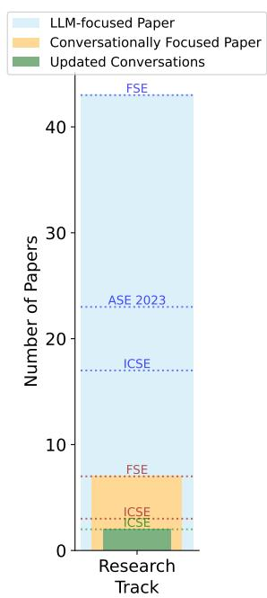  
Fig. 1 Number of research papers on LLMs published in FSE’24, ICSE’24, and ASE’23

The lack of research prioritizing the guidance of developers in their conversations with

LLMs is surprising, as it has been shown in diferent research fields that supporting chat conversations of individuals can yield more positive results for both sides of the conversation, for example, by causing a better understanding of conversational contexts [3,10,12,20]. Moreover, studies in software engineering found that developers often do not provide suficient context to an LLM, reducing its ability to efectively solve a development task [1,15,18,19]. Despite the advances in prompting techniques, retrieval augmented generation, and agentic development, there is limited insight into how conversations may benefit from additional guidance. Thus, we ask whether and how guided developer–LLM conversations benefit software development, and how they af fect developer behavior and perceptions as well as the resulting code.

In this study, we investigate the efects of two approaches intended to support developer-LLM interactions: The first approach, referred to as context treatment, enhances the system message provided to the LLM with context based on a user-selected intention chosen before each conversation. The second treatment, referred to as proactive treatment, provides additional guidance by recommending improved and follow-up prompts, as well as advice tailored to the user’s conversation. We show such a workflow in Figure 2, highlighting the diferent mechanisms of each treatment.

Our goal is to understand how these direct interventions into interactions with an LLM can afect software developers and the software development process. To this end, we evaluate both treatments against a control group in a large study with computer science students in their 3rd semester working on a full-stack web development project for four consecutive months. This study design, focusing on an entire project rather than a small programming task, and lasting for four months instead of a few hours, is a distinguishing feature of this work. It enables us to draw long-term efects in a more practical setting. Despite relying on students, our setting has high ecological validity due to the size, complexity, variety, and length of the task. We provided developers with a user interface to interact with the adjusted LLM and logged all interactions. Additionally, we conducted a monthly survey tracking the user’s experience throughout the experiment.

Overall, our treatments are designed to follow a conservative approach with a focus on internal validity, so we explore whether even minimal interventions can already afect the development process. Although we do not expect large efect sizes with such a setup, we thereby minimizing the risk of introducing too many confounding factors (e.g., the way interventions are provided or whether they disturb the LLM interaction) and can better pinpoint efects to certain treatments. Based on this controlled design, we provide the foundation for research on extensive and targeted interventions to unlock further productivity gains with LLMs. The main goal of the study is to identify whether and to what degree even small interventions in the communication of an LLM afect development.

In summary, we make the following contributions:

– A description of two novel approaches to guide developers during software development with LLMs.

– An analysis of longitudinal usage data from three diferent LLM assistants (control, context, proactive) over a four-month, realistic software development project.

– A comprehensive replication package containing an application with both guidance approaches and all material and data from the empirical study.1

## 2 Related Work

Pitfalls of LLM Usage. Several studies have observed that LLMs misunderstand what users want and need to successfully achieve their goal. For instance, LLMs misunderstand requirements [15,24], task context [24], and problems, goals, and rationales resulting in faulty conversation [6,24]. Particularly in more complex software engineering tasks, LLMs appear to be less beneficial compared to simple coding tasks [30]. These studies provide valuable insights in the context of developer-LLM interactions, but none of these take a close look at how we can guide developers to overcome these challenges—the key motivation for our work. Thus, we focus on automatically intercepting in developers’ interactions to provide situation-specific support in complex software engineering projects.

Improving LLM Interactions for Development. Several studies focus on finetuning LLMs by incorporating specific information sources to enhance LLM capabilities. Kong et al. [14] use pre-collected data to fine-tune an LLM, such that it automatically refines the latest prompt of a conversation using role prompting [13], a technique that assigns a model a role via prompts to guide its responses in line with that role’s expertise and perspective. While promising, updating only the latest prompt in a conversation ignores the conversational flow that chatbot interactions usually have. Ouyang et al. [22] fine-tuned LLMs with human feedback to better align them with user intent, which results in improved truthfulness and less toxic replies. Similarly, Wang [29] applied reinforcement learning from human feedback to adapt interactions. While these studies explore similar directions to ours, they directly update models, which reduces flexibility and ties them to specific model instances. Moreover, a model update is static by definition and cannot account for new conversational intents and contexts. By contrast, our approach is dynamically intercepting and updating conversations while they are ongoing, allowing for larger flexibility with less time and compute.

Another approach to improve user-LLM interaction is to intervene directly in conversations to enhance the interaction by including specific context information. Nam et al. [19] enhance open-ended prompts with user-highlighted code, resulting in more task completions. They conclude that adding even more contextual information holds potential to improve interactions. Arteaga Garcia et al. [1] validates this conclusion by demonstrating that, with more context, such as environment variables, previously executed code, and previous chat messages, the LLM yields better results. Similarly, Li et al. [16] add IDE native contexts, hereby focusing on code completion instead of conversations. While these studies follow partially related ideas, they do not concentrate on the prompt flow, but include diferent context information. A distinguishing feature of our study is that it is not being limited to coding tasks, specific IDEs, and laboratory environments, but aims at analyzing efects on intervening chat interactions in a long-term, practical development scenario. That is, it is orthogonal to the aforementioned studies.

Guidance of Chat Interactions in Diferent Fields. The need for supporting chat interactions is not limited to SE contexts, but has been recognized in multiple diferent fields. Researchers enhanced chatbots for more empathetic and eficient responses for embodied conversational agents in general conversations to better react and understand participants intents [20]. Another study on LLMs for procrastination management found that LLMs require nuanced contexts to properly react to user’s needs which are usually not provided, thus recommends the inclusion of automatically generated dynamic contexts [3]. Overall, even if the approaches difer, research fields beyond SE recognized that conversations can benefit from additional support and guidance to improve the overall experience and efectiveness.

## 3 Methodology

In this section, we present our experimental design by introducing and motivating the research questions, then operationalizing the independent and dependent variables, and finally detailing the qualitative analysis, participants, and materials.

## 3.1 Research Questions

The overarching goal of this research is to understand the efect of guidance mechanisms on developers and the code they produce. Specifically, we are interested in how diferent levels of guidance afect developers’ interactions with an LLM, their perception of the LLM, and the code they produce. To this end, we define three research questions:

RQ1. How does the level of guidance influence developer behavior when interacting with an LLM?

RQ2. How do developers perceive LLMs with guided conversations?

RQ3. How do diferent guidance and support mechanisms influence code produced by developers?

We address these questions through three dependent variables: user behavior, perception, and generated code usage, each capturing interaction, experience, and code artifacts, respectively.

Independent Variable. The level of guidance is the independent variable and has three alternatives: contextual guidance, proactive guidance, and no guidance (our control condition). Figure 2 illustrates how these levels play out in a conversation with the same user prompt.

We operationalize contextual guidance (lower left part in Figure 2), such that we enhance user-conversations with the context of the project task given by us (i.e., developing a web application) C2 and the developer’s intention for a conversation C3 , which they provide at the start of every conversation by selecting from a list of pre-defined intentions or providing their own C1 . This way, we ensure suficient context for the LLM, so that it can generate more tailored responses, for example, to either provide code, a description, or a user story. We chose this treatment because prior research has shown that providing suficient context to an LLM is essential for good developer–LLM interactions: Challenges often arise when developers do not share the necessary context [7, 11,18], leading to frustration [11], out-of-context interactions [7], and incorrect or unsatisfying replies [18]. Furthermore, since we found in a previous study that participants have dificulty providing suficient context [18], we decided to automatically provide the context to the LLM without participant interaction. This allows us to focus on the efect of additional context, independent of participants’ ability to provide it. Related approaches have also been successfully explored by other researchers [1,16,19].

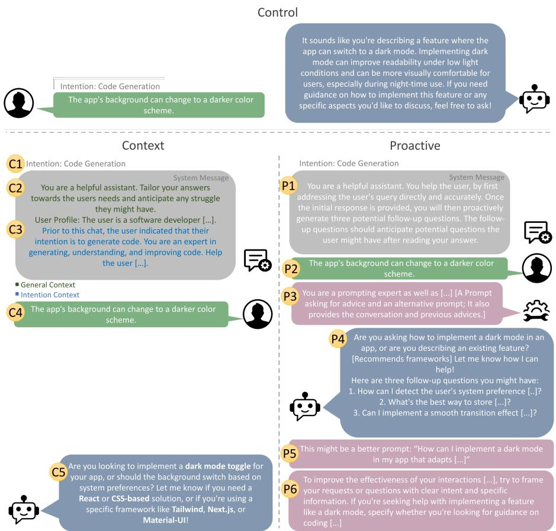  
Fig. 2 The system message ( gray bubble), developer input ( green bubble), bot response ( blue bubble), and how they are updated in each treatment, using the example input prompt “The app’s background can change to a darker color scheme.”, representing a minimal feature description

Next, we operationalize proactive guidance (lower right part in Figure 2) by instructing the LLM to act as a helpful assistant and predict follow-up questions that the user may state based on the generated answer P1 . Additionally, we give the user feedback on the quality of their prompts and hints for more efective interactions with the LLM P3 (based on a hidden LLM). Inspired by automatic prompt refinement techniques [17], we use the reply to suggest a better suited prompt to the user in an informative block P5 , alongside the generated hints and advice P6 . This operationalization is also inspired by our previous study, in which participants also faced dificulties in formulating prompts [18]. Furthermore, our experience shows that participants find it dificult to navigate programming projects and determine which direction to take next. Thus, we included this treatment to provides support in these areas.

For the control condition, no guidance, we use a LLM without any intervention (upper part in Figure 2). We refer to this model as the control LLM to ensure clear separation from the treatment conditions. Both treatments are minimally invasive compared to the control LLM, for two reasons: First, we focus on internal validity to understand possible efects in detail. Thus, if the treatments difer only in few aspects, we can more reliably attribute cause and efect relationship between treatments and outcome. Second, we reduce ethical issues to a minimum. If we design a treatment that is highly invasive and worsens the performance of students, the respective students would be disadvantaged disproportionally.

We provide a short summary of each of the levels of guidance in Table 1.

Table 1 Overview of our levels of guidance and their operationalization
<table><tr><td>Level of Guidance</td><td>Operationalization</td><td>Rationale</td></tr><tr><td>No Guidance</td><td>Base LLM, no intervention</td><td>Control Group</td></tr><tr><td>Contextual Guidance</td><td>Enhanced user conversations with task and intention con- text</td><td>Mitigation of challenges caused by LLMs lacking context</td></tr><tr><td>Proactive Guidance</td><td>Additional follow-up ques- tions, feedback on prompt quality and further hints, al- ternative prompts</td><td>Mitigation of issues with prompt formulation and find- ing directions in program- ming projects</td></tr></table>

Dependent Variables. To answer our RQs, we analyze 3 dependent variables, one per RQ: user behavior, perception, and generated code usage. We provide a summary of each in Table 2 .

The outcome user behavior describes the interaction of developers with the LLM and represents the most direct observable impact of the treatments. We operationalized it three-ways. First, we checked the conversation length (number of prompts per conversation, their evolvement over time, and number of prompt tokens, i.e. tokens from user-created messages, per conversation) to measure how extensively participants interacted with the LLM and whether this changed over time or under treatment. Second, we evaluated the specified intentions for starting a conversation, provided by the participants, to examine whether treatments steered developers toward switching their intention (e.g. explanations versus code generation). Third, we analyzed the intention alignment of participants’ provided intention with conversation content. This allows us to explore underlying reasons of potential treatment impacts. To assess whether participants’ specified intentions align with the prompt contents within conversations, we selected 45 conversations per treatment to inspect manually. The resulting sampling size of 135 conversations was chosen to ensure suficient coverage across treatments while keeping manual inspection feasible. We used stratified random sampling, such that we order the conversations by time, assign them to buckets of 100 conversations, and randomly selected five conversations per treatment from each bucket. Then, two of the authors assigned each of these prompts the intention that best fit the content of the prompt. We compared whether our assignments align with the user-specified intention and logged each mismatch.

Perception refers to perceived helpfulness of the LLM, its perceived impact on developers’ frustration, and their productivity. We assessed all three aspects with monthly questionnaires. This provides insights into how participants perceive guided interactions, and determines whether these guidance mechanisms could serve as a foundation for future research on improving developer-LLM interactions.

Last, we observe the generated code usage for the projects. Specifically, we analyze the amount of generated code pushed into a repository, the modification rate of committed code, and the duration for how long this code typically remains in the project. We collected this data to analyze how much the LLM supports development eforts, how long-lasting this support is, and how our treatment changes these efects. To this end, we randomly selected 50 conversations from each treatment for manual review. We restricted the selected conversations to intentions that tend to naturally produce code: code generation, language question, debugging, and test generation. A conversation must also contain more than two prompts, and at least one response with generated code that not just repeats code of the prompt and does not solely contain shell commands or settings. For each conversation, we reviewed the commit history of the corresponding repository from the day the code was generated to the final release tag. When the generated code was indeed committed, we analyzed the commit history and counted line modifications to evaluate how the code evolved.

## 3.2 Study Conduct

We conducted the study in the context of a mandatory 3rd semester software engineering course ofered at two universities. This course included practical work to develop a full-stack web development project that lasted four months. The project was either preceded by a lecture on software engineering (one university) or accompanied by one (second university), covering the software engineering lifecycle, development practices, and prompt engineering basics.

Table 2 Dependent Variables, the RQ for which they are collected, and their operationalization.
<table><tr><td>Variable</td><td>Operationalization</td><td>Rationale</td></tr><tr><td rowspan="3">RQ1: User Behavior</td><td>Conversation length</td><td>Changes in interaction intensity under treatment and time</td></tr><tr><td>Specified intentions</td><td>Treatment influence on the type of in- teraction developers initiate</td></tr><tr><td>Intention alignment</td><td>Exploration of reasons for treatment impacts</td></tr><tr><td>RQ2: Developer Perception</td><td>Helpfulness, frustra- tion, productivity</td><td>Participants&#x27; perception of guided in- teractions</td></tr><tr><td rowspan="3">Code Usage</td><td>RQ3: Generated Amount pushed</td><td>Adoption rate of AI-generated code in development</td></tr><tr><td>Modification rate</td><td>Degree of adaptation required for AI- generated code</td></tr><tr><td>Duration</td><td>Persistence of AI-generated code in the codebase</td></tr></table>

With the start of the project, participants received access to the chatbot that was connected to GPT-4 [21]. Using the most recent model at the time ensured participants’ interest in the LLM while reducing the risk of abandonment due to perceived tool limitations. They first gave their informed consent, confirming that they want to participate in the study, and agreed to the pseudonymized use of their data. They could revoke these agreements and stop participating in the study at any time without any repercussions on their course fulfillment. Once consent was given, participants could use the chatbot throughout the four-month project while completing their regular course activities. Throughout this time, we collected participant information through questionnaires, including short monthly questionnaires to collect longitudinal data on their opinions and satisfaction. Participants could discontinue the study at any time without any negative impact. In that case, they would have received access the chatbot using an account without tracking and without questionnaire prompts. No participant withdrew consent or requested removal of their data. There was no ethics proposal, which is not required at either university; we followed standard research guidelines on these kinds of studies.

There was no restriction in using the chatbot. At the beginning of each conversation, we asked our participants to specify the intention they have and whether they use the LLM for the project or other use cases. The study process for participants is visualized in Figure 3. We analyze only project-related conversations. We restrict the chatbot history to read-only. This ensures the validity of our experiment by maintaining the relevance of intentions to the current conversation.

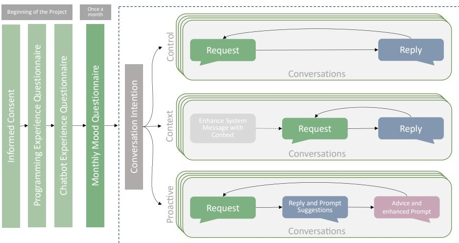  
Fig. 3 Process of the study after participants received access depending on the treatment

## 3.3 Material

Intentions. When initializing a conversation with the LLM, participants were asked to specify their intention for this conversation. The intention choice cannot be changed within a conversation, as it is intended that participants start new conversations when their intentions change. This ensures that conversations are clearly assigned to intentions, prioritizing internal validity. This process is the same for all treatments.

For starting a conversation, selecting one of the following intentions was necessary: to generate code (referred to as code generation, code gen), to debug code (debugging, debug), to test code (test generation, test gen), to have code explained (code comprehension, code comp), to identify requirements (requirements elicitation, req elic), to ask questions about lecture content (lecture question, lect ques), and lastly, to ask questions about the programming language/framework (language question, lang ques). The specification of a custom intention was possible if none of these were suitable. The intention pool has been derived from our previous study by Mailach et al. [18].

Questionnaires. During the course of the study, we applied several questionnaires to answer our research questions. At the beginning, we asked participants about their programming knowledge, following the guidelines by Sieg mund et al. [26]. Details are in the replication package.

Additionally, we assessed information about experience with prompt engineering (PE), including whether they have attended a dedicated PE lecture of the course. Questions included how often participants have used LLMs, whether previous experience was positive or negative, and whether they would like to use them in the future. In a free text field, participants could also share any thoughts that they might feel relevant for the study.

The monthly surveys assessed participants’ perception of the LLM to answer our second research question. Completing these questionnaires was mandatory to continue interacting with the LLM. These surveys asked, on a 5-point-Likert scale, whether they find the chatbot helpful, frustrating, and beneficial for productivity. The monthly questionnaire also included an optional opentext field for any thoughts participants liked to share with us.

We chose a one-month timeframe to collect regular insights and track changes throughout the experiment, while accommodating the typical bursts and pauses of activity in university projects. This duration also minimized participant inconvenience, reducing the risk of participants stopping using the chatbot due to excessive interruptions.

## 3.4 Participants

To work on the programming project, students were randomly divided into teams of 4 to 8 students. The teams were then randomly assigned to the levels of the independent variable, ensuring similar experiences, even when multiple participants interacted with one LLM, for example, in the context of pair programming. In total, 93 students started the experiment. For answering RQ1 and RQ3, we cleaned the data to remove outliers in three steps:

1. Removing all conversations / prompts with a non-project intention (removed 7 participants from the dataset).

2. Removing participants who sent fewer than 10 prompts in total (19 participants) to exclude users who did not suficiently use the LLM.

3. Removing superusers (3 participants). These users are considered statistical outliers according to the two-standard-deviation criterion, as they considerably exceed the mean number of 70 prompts per person (59 after removal); they sent between 235 and 415 prompts.

This left us with the data of 64 participants from 25 project teams. Per treatment, we had 9 project teams in the control group, 8 in the context group, and 7 in the proactive group. We give an overview of our individual participant demographics in Table 3.

The programming experience level (Median Prog. Experience in Table 3) is comparable for all groups (confirmed by a Kruskal-Wallis-Test W= 2.84, p = 0.24), so diferent levels of programming experience cannot explain diferences between groups in the dependent variables (further confounding variables, such as preceding programming courses, are also similar among the groups, see project’s replication package). The same counts for the opinions on and usage of LLMs; although there are slight variations between the groups, there is no systematic diference, so that we can assume that the attitude toward LLMs is comparable between groups.

For the second research question, which focuses on perception rather than behavior, we did not remove the outliers from the questionnaire responses, because super-users’ opinions are still relevant here and do not skew any statistics. Instead, we removed responses only from participants with less than five prompts in the month previous to the questionnaire. For example, to be included in the data from the 2024-01-14 (second measurement date), users must have sent a minimum of 5 requests between 2023-12-06 (first measurement date) and 2024-01-14. Additionally, if participants did not use the LLM in-between two measurement dates at all, they could not answer the questionnaire and thus are not included either. This way, we ensure that participants have used the LLMs suficiently to be able to give an informed response, while also preventing the loss of responses from participants who worked on the projects infrequently or became too frustrated to continue participating.

Table 3 Background of participants. Likert-scale responses are shown as bars, with the following values on the left and right respectively: [D-A] Strongly disagree to strongly agree [N-D] Never to Daily [I-E] Very inexperienced to Very experienced [W-B] Much worse to Much better
<table><tr><td>Context</td><td>Control (N=25)</td></tr><tr><td>(N=21)</td><td>(N=18)</td></tr><tr><td>Background and Experience Median Prog. Experience (yrs) 3.0</td><td>(n=23) 2.0 (n=15)</td></tr><tr><td>Attended &#x27;PE&#x27; Lecture</td><td>3.0 yes (n=25) yes (n=18) yes</td></tr><tr><td>Perceived Prog. Experience</td><td></td></tr><tr><td>compared to Peers [W-B]</td><td>W B W B W </td></tr><tr><td>Logical Prog. Experience [I-E]</td><td>I E I E I</td></tr><tr><td>Opinions on Chatbots</td><td></td></tr><tr><td>Use in daily life [N-D]</td><td>N D N D N</td></tr><tr><td>Chatbots are helpful...</td><td>1 11</td></tr><tr><td>...in software dev. [D-A] D</td><td>I A D A D</td></tr><tr><td>...in programming [D-A] D</td><td>H A D IA D</td></tr><tr><td>...in daily life [D-A]</td><td>D I A D A D</td></tr><tr><td>...in studies [D-A] D 1I</td><td>A D A D I 1</td></tr><tr><td>Chatbots are fun [D-A] D Confident using chatbots [D-A] D </td><td>A D 1 A D A D A D</td></tr></table>

## 4 Results and Discussion

We present the results of each research question in this section, separated into data presentation and the discussion of the interpretation and implications of the results.

4.1 $\mathrm { R Q _ { 1 } }$ : How does guiding a conversation influence developer behavior when interacting with an LLM?

## 4.1.1 User Behavior

Conversation Length. After removing outliers (conversations where the amount of prompts deviated more than two standard deviations of the mean), participants wrote on average 3.1 prompts per conversation in the control, 3.6 in the context, and 3.3 in the proactive group. For the number of tokens per prompt per conversation, also with outliers removed, there are, on average, 4638 for the control, 7191 for the context, and 5995 for the proactive group. We present an overview in Figure 4.

(a)  
(b)  
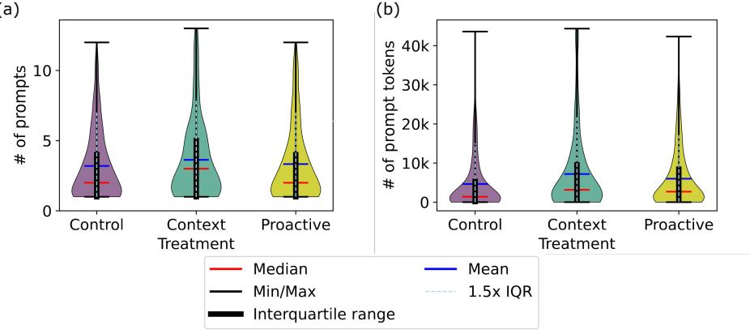  
Fig. 4 Average conversation length by treatment group per conversation by number of prompts per conversation (a) and number of prompt tokens per conversation (b)

A Kruskal-Wallis test shows no significant diference in the number of prompts $( \mathrm { W } = 3 . 3 9 , p = 0 . 1 8 2$ , Clif’s delta ranging from -0.07 to 0.06), while it does for the prompt tokens $( \mathrm { W } { = } 1 7 . 1 8 , p < 0 . 0 5$ , Clif’s delta ranging from -0.21 to 0.04). A Post-hoc Dunn’s Test with Bonferroni correction confirmed the diferences to be significant between the control and context $( p < 0 . 0 5$ Clif’s $\delta \ : = \ : - 0 . 2 1 \rangle$ , and the control and proactive group $( p \ : < \ : 0 . 0 5$ , Clif’s $\delta = - 0 . 1 7 )$ . Notably, these diferences are not merely significant based on the large number of tokens, but also the efect sizes are larger than for the number of prompts.

Figure 5 shows that the number of prompts per conversation drops with the project duration. This holds for all groups and is most severe for context treatment. Interestingly, proactive treatment seems already right at the beginning requiring fewer prompts.

Specified Intentions. Figure 6 gives an overview of the distribution of conversation intentions. Across all groups, the most frequent intentions are code generation (370), debugging (235), and language questions (148). Notably, participants in the control group started far more conversations with the intention language question (Lang ques) than any other group (66.9 % of such conversations, compared to 3 % (context), and 29 % (proactive)). It is their most frequent intention (99 of 323 conversations, 30 % of all their conversations). In the context and proactive group, the most frequent intention was code generation (Code gen) with 117 of 226 (54 %) and 156 of 352 (44 %) conversations, respectively. These diferences in frequency are statistically significant $( \chi ^ { 2 } = 1 1 1 . 4 0 , d f = 1 4 , p < 0 . 0 0 1 )$ ). Furthermore, the proactive group used code generation intentions 60 % and 33 % more often than the control and context groups, respectively.

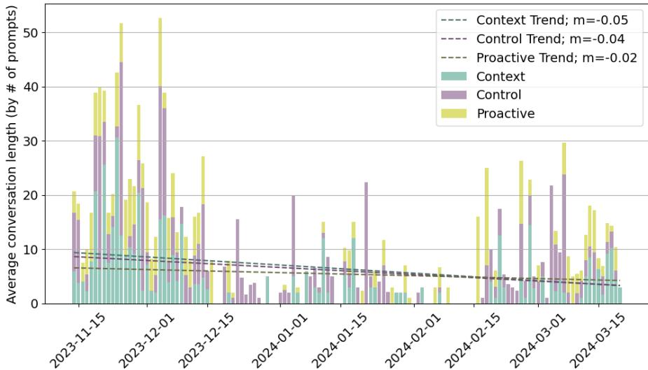  
Fig. 5 Length of conversations over time, averaged per day and divided by treatment

Interaction of conversation length and specified intentions. We also evaluated whether conversation length in terms of number of prompts is specific to the conversations’ intention. Most of the conversations are kept short, but intentions language questions, debugging, and code generation relate to longer conversations. Figure 7 shows how many conversations (numbers in circles) with a specific conversation length (x-axis) were found for each intention (y axis). The median length of conversations varies between 2 (custom intentions, marked as other) and 4 (test generation).

A two-way ANOVA indicates a potentially significant impact of the intention on the conversation length $( \mathrm { F } = 2 . 0 2 , \mathrm { d f } = 7 , p = 0 . 0 4 9 )$ , but shows no significant impact of neither the treatment $( \mathrm { F } = 2 . 3 , \mathrm { d f } = 2 , p > 0 . 0 5 )$ nor the interaction of treatment and intention $( \mathrm { F } = 0 . 8 , \mathrm { d f } = 1 4 , p > 0 . 0 5 )$ . In post-hoc tests, the significant efect of intention vanishes.

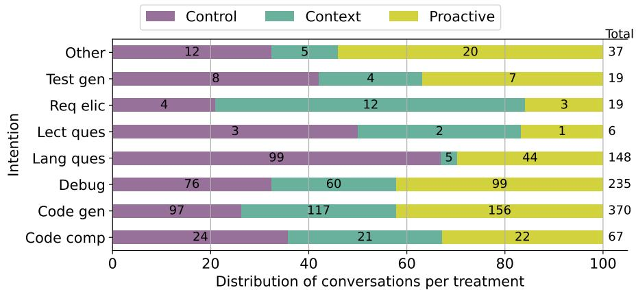  
Fig. 6 Conversation intentions per treatment. The number of conversations with an intention is shown in the bars; the total number of conversations is shown on the right

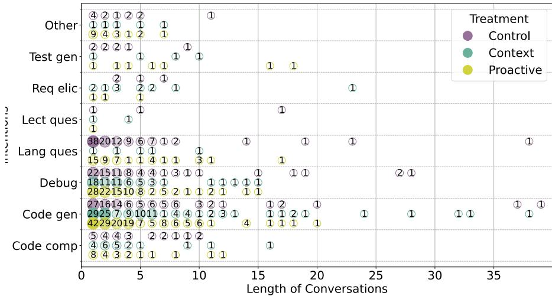  
Fig. 7 Distribution of conversation lengths per intention

Intention alignment with conversation content. The manual analysis of 135 conversations showed whether and how participants’ prompt contents diverge from their initially specified intentions.

Table 4 provides details on misalignments between intention and actual conversation. Over all groups, 38.52 % of the analyzed conversations contain only prompts that entirely match the user-specified intention. Across all groups, about 25 % of conversations have been started with a prompt that does not match the user-specified intention (the upper part of the table, column $( \% _ { 1 s t } ) )$ , which is similar for all treatments. If any deviation occurs, it usually occurs with the second prompt (columns med $\mathrm { l } _ { p o s }$ and $\mathrm { a v g } _ { p o s } )$ for all treatments. Furthermore, 35.56 % of all conversations in the control group, 37.78 % in the context group, and 26.67 % in the proactive group had more than half of their prompts misaligned with the user-specified intention. Thus, a considerable number of conversations do not align with the user-specified intention and shift quickly, mostly after the first answer. Interestingly, the proactive group has the highest agreement in intention and actual conversation.

Table 4 Misalignments between user-specified intentions and prompt contents, split by treatment group or intention. Columns describe conversations with at least one misaligned prompt $( \% _ { m i n 1 } )$ , more than half misaligned prompts $( \% _ { h a l f } ) _ { ; }$ , and the mean and median first positions in a conversation where a misalignment occurs $( \mathrm { a v g } _ { p o s } ;$ med $\mid _ { p o s } )$ . Prompt-level metrics include the percentage of first prompts of conversations that were misaligned $( \% _ { 1 s t } )$ and the percentage of prompts where an intention that was assigned by us did not align with the user’s given intention $( \% _ { F N } )$
<table><tr><td colspan="2">Prompt-level Conversation-level</td><td>N</td><td> $\% _ { 1 s t }$ </td><td> $\% _ { m i n 1 }$ </td><td> $\% _ { h a l f }$ </td><td> $\mathrm { a v g } _ { p o s }$ </td><td> $\mod _ { p o s }$ </td><td> $\% _ { F N }$ </td></tr><tr><td rowspan="4">treat- mennt B</td><td>Control</td><td>45</td><td>26.67</td><td>62.22</td><td>35.56</td><td>2.46</td><td>2.0</td><td></td></tr><tr><td>Context</td><td>45</td><td>28.89</td><td>68.89</td><td>37.78</td><td>2.19</td><td>2.0</td><td></td></tr><tr><td>Proactive</td><td>45</td><td>22.22</td><td>53.33</td><td>26.67</td><td>2.00</td><td>2.0</td><td></td></tr><tr><td></td><td>52</td><td>36.54</td><td>75.00</td><td>46.15</td><td>2.03</td><td></td><td>11.43</td></tr><tr><td rowspan="5">Byen intnnion</td><td>Code gen Code comp</td><td>7</td><td>14.29</td><td>85.71</td><td>42.86</td><td>2.00</td><td>2.0 2.0</td><td>5.71</td></tr><tr><td>Debug</td><td>37</td><td>10.81</td><td>48.65</td><td>10.81</td><td>2.72</td><td>3.0</td><td>22.86</td></tr><tr><td>Lang ques</td><td>28</td><td>14.29</td><td>46.43</td><td>25.00</td><td>2.92</td><td>2.0</td><td>45.71</td></tr><tr><td>Test gen</td><td>3</td><td>66.67</td><td>66.67</td><td>66.67</td><td>1.00</td><td>1.0</td><td></td></tr><tr><td></td><td></td><td></td><td></td><td></td><td></td><td></td><td>2.86</td></tr></table>

Breaking down the conversations per group, 37.78 % of conversations in the control group, 31.11 % in the context group, and 46.67 % conversations in the proactive group solely contain aligned prompts. A $\chi ^ { 2 } .$ -test of independence on the number of aligned and misaligned prompts shows no significant diference between the alignment of prompts and the treatments $( \chi ^ { 2 } = 5 . 3 1 , d f = 2 , p =$ 0.069).

While these misalignments may have influenced previously analyzed variables for this RQ, the majority of conversations and prompts remain aligned; thus, we consider the data suitable for analysis of previous RQs. The inability to express one’s intentions and the tendency to shift intentions quickly during a conversation is interesting in its own right. This insight has not been empirically observed in related studies, yet it will afect future chat mechanisms.

Viewing the data by user-specified intention (lower part of Table 4), participants indicating that they intend to debug deviate the least. Additionally, if participants deviate from debugging, they do so later in the conversations compared to any other intention (on median after the 3rd prompt; column $\mathrm { \cdot M e d i a n } _ { p o s } \mathrm { \cdot } \mathrm { \cdot }$ ). A potential reason for this observation is that participants might need more prompts to find a bug using the LLM than they need to fulfill other tasks. The highest number of deviations occurs when participants specify to generate code and tests (85.71 and 66.67 %, column $\% _ { m i n 1 } )$ . In cases such misalignments occur, the most often used intention is language questions (45 %; column $\% _ { F N } )$ , which might mean that, once code is returned by the LLM, it needs to be understood, so the intention shifts to language questions or code comprehension.

## RQ1: Results

Conversational behavior of participants shows no major diferences among treatments regarding the number of prompts, but regarding the number of prompt tokens per conversation. Conversations also get shorter over time whereas proactive already starts with short conversations.

There is a significant imbalance of our treatment groups between the number of conversations for specific intentions, despite the overall number of conversations being similar. This diference is most prominent for participants asking about language-specific details. In the control group, participants are starting conversations with this intention almost 20 times more often than participants in the context group. Moreover, programming related intentions, such as code generation and debugging intentions, are used substantially more often for the proactive group than for the two others.

About a quarter of conversations start with a mismatch of the stated intention and the actual content of the prompt. This number rises after the first answer and is most pronounced for code generation and comprehension. The proactive group has the highest alignment of actual and user-stated intentions.

## 4.1.2 Discussion: Efects of guidance levels on developer-LLM-interactions

The results regarding specified intentions align with other studies, indicating that developers use AI assistants for code generation and debugging [24,18,31, 5]. While not entirely surprisingly, it is interesting that the participants of our study only rarely asked the LLM for test generation, while Sergeyuk et al. [24] found that this was an often used intention. This discrepancy might stem from the diferent contexts of our programming-beginner setting, compared to the professional setting of their study, as automated tests were not mandatory for the programming project (yet the final product must still run and fulfill the requirements).

Looking at the specified intentions by treatment, the control group specifies most often language questions. This intention describes participants wanting to start a conversation to learn more about a programming language. At first sight, this might indicate that the control setting motivates participants toward using the LLM to dive more into understanding the programming language, while the proactive and context nudges participants toward using the LLM to provide a working software product, less toward learning something about the code. However, in conjunction with the result that the actual content of the conversation in many cases does not align with the specified intention draws a diferent picture. Especially conversations with the specified intention of code generation often contain prompts about language-specific details (19.5 % of prompts within code generation conversations).

Thus, even though the LLM interface explicitly guides users to think about what they want from the conversation, they have trouble doing so. We interpret this to mean that early-career developers, like those in our sample, might struggle with deciding up-front what exactly they want from the LLM. If they are not sure about their intention, it is likely that their prompt reflects that in vagueness, such that the LLM is used inefectively. This insight shows the need to clarify intentions of users upfront, which may also yield a more efective prompt design. We are not aware of any user study that identified the extend of this mismatch despite its importance for the soundness of empirical evalutions and design of new chat mechanisms.

Regarding eficiency, we see a longitudinal trend towards shorter discussions, indicating that developers get more eficient in their LLM communication over time as they require fewer prompts in a single discussion. A main observation is that with the proactive treatment, conversations were already short at the first time period, which stands out and may point to an increased eficiency.

In our specific setting, intentions within a conversation could not be changed without starting a new conversation; a trade-of of our study design. This can be unproductive, as a new conversation does not have the relevant context. We found clear evidence that a static intention context is insuficient, as the natural flow of conversations shifts the focus. The proactive treatment accounts for this dynamic nature and shows the lowest misalignments in intentions and actual conversation content. A possible explanation is also that this treatment ensures that the user stays on track with its initial intent and does not slide into other intention activities. So either requiring users to specify their intentions with every prompt or leveraging systems, that predict intentions without additional user input, could improve efectiveness of LLMs.

The answer to $\mathrm { R Q _ { 1 } }$ is nuanced. At first glance, there is no significant diference in developers’ general behavior when interacting with the LLM, regardless of the treatment. Even for the context group, we observed no substantial behavior changes, despite identifying frequent misalignments of intentions throughout conversations. A closer look reveals that the proactive group seems to better align their prompts to their initial conversation intention. However this diference is not significant. Additionally, participants in this group used the LLM most often for development specific intentions, such as debugging and code generation, and used fewer prompts to finish a conversation, pointing to higher eficiency. Nevertheless, this could show a tendency of the ability of dynamic approaches to support participants in keeping their conversations aligned with their initial goal when using the LLM specifically for software development.

## 4.2 $\mathrm { R Q } _ { 2 } \colon$ How do developers perceive LLMs with guided conversations?

## 4.2.1 Developer Perception

To evaluate $\mathrm { R Q _ { 2 } }$ , we show the monthly survey results of participants in Figure 8. As is common in longitudinal studies (especially in voluntary university experiments), the number of participants reduces with each month. We started with 47 replies for the first survey and ended up with only 13 replies for the last. Starting with the second survey, the group sizes were small, making significance tests underpowered and the results likely inconclusive. Therefore, we compared the results of surveys 2–4 without testing for significance. This approach helps identify tendencies between treatments that can inform future research directions.

The first survey was conducted during the period with the highest development efort for the projects, so more developers answered it. Therefore, we performed pairwise Mann-Whitney U-tests for this survey to compare individual groups. Thus, we compare the values for tendencies, but note that diferences are minor. More detailed information on this can be found on our Web site.

Helpfulness. The total average value on perceived helpfulness (Total in Fig ure 8) is 3.9 for the control, 3.5 for the context, and 4.3 in the proactive group (5 meaning very helpful), so all groups found the LLM to be at least somewhat helpful. A pair-wise Mann-Whitney U-test revealed significant diferences between the proactive and both, the control and the context group $( \mathrm { U } = 4 5 2 . 0 ,$ $p = 0 . 0 0 8$ and $\mathrm { U } = 2 6 9 . 0 , p = 0 . 0 0 3$ respectively). Overall, there is a downward trend of perceived helpfulness for all groups from the first to the third survey, and an increase for the last survey. The proactive group reported the highest helpfulness rating (Figure 8 A) in all surveys, while the control group reported the lowest in the first survey (U = 88.5, p = 0.025). Clif’s delta efect sizes for the first survey range from 0.41 (when comparing the control and proactive group) to 0.06 (context to control), confirming that the proactive group viewed the LLM more helpful at this point. The context group has the lowest helpfulness rating in the second and third surveys, dropping notably from the first.

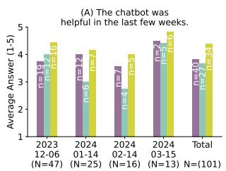

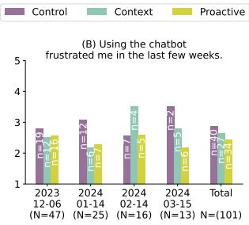

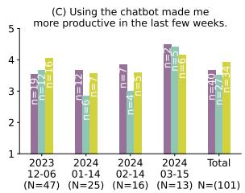  
Fig. 8 Averaged answers for perceived helpfulness, frustration, and productivity. The answers range from 1 to 5, with 1 being “strongly disagree” and 5 “strongly agree”. Higher values indicate a positive rating in A and C, but negative in B.

Frustration. The average participant frustration scores are 2.9 for control, 2.7 for context, and 2.4 for proactive (1 meaning not frustrated), indicating low frustration. There does not seem to be an overall picture of how frustration evolves. Participants in the control group showed the highest frustration (Figure 8 B) in the first two surveys, then align with the proactive group on a medium-low level. After a considerable increase in frustration from the second to third survey, the context group is the most frustrated in the third survey. The proactive group consistently reported low frustration levels. None of the diferences in the first survey is statistically significant, and the Clif’s delta ranges from 0.14 to 0.11.

Productivity On average, the total perceived productivity of participants is 3.8 for the control and proactive, and 3.4 for the context group (5 meaning very productive). Participants’ perceived productivity (Figure 8 C) increased in each survey for the control group, showing the highest ratings of all groups in the second and third surveys. Again, with only two people from the control group giving responses, we cannot reliably compare their results for the last survey. The context and proactive groups’ perceived productivity drops from the first to the second survey. However, the drop is more pronounced for the context group, resulting in the lowest perceived productivity in the second and third surveys. Again, none of the diferences in the first survey are statistically significant, with Clif’s delta efect sizes ranging from medium 0.30 (comparing the context and proactive group) to null 0.0 (context and control).

## RQ2: Results

The proactive group perceived the LLM as the most helpful and as more beneficial to their productivity while rarely feeling frustrated, while maintaining the highest user engagement throughout the experiment. The context group viewed the LLM the most critical, while both, the context and control groups felt frustrated by the LLM at some point during the semester.

## 4.2.2 Discussion: Developer perceptions of guided conversations with LLMs

The perception of participants difers marginally between groups, indicating that all variants of LLMs are perceived as helpful, supporting productivity, and only rarely lead to frustration. Especially the proactive group shows the most positive perception, and one participant highlighted this in the open text field $\ ^ { 6 6 } / . . . ] I$ can only say that programming itself can be frustrating sometimes and I think without the chatbot[...] it would be even more exhausting and frustrating”P1.

The consistently lower helpfulness and productivity ratings of the context group might be linked with the misalignment of the user-specified with the actual intentions of a conversation, which is most prominent for the context group (cf. Section 4.1.1). The intention is not used for the control group, and has limited efect for the dynamic conversation in the proactive group. So, they do not receive misaligned responses, resulting in a more positive perception.

In general, these results align with previous studies on perceived produc tivity [15], and contradict others that found significant productivity improvements [31] or that observed increased frustration and no productivity gains [6]. This further highlights the mixed efects of LLMs. Thus, these findings add another piece to the puzzle to better understand how diferent prompting techniques and guidance mechanisms afect software developers.

For the proactive group, we further manually analyzed how users adopted the features of follow-up questions and improved prompts. About two-thirds of participants used follow-up questions or improved prompts, indicating that the functionality holds some appeal for the majority of users. Looking more closely, especially for the user-specified intentions of code generation and language questions, participants used either follow-up questions or improved prompts to continue the conversation. Over time, this decreased, which could indicate that participants might have learned how to improve their conversations, thus not needing any more assistance. Furthermore, since there does not seem to be negative perception of participants regarding guidance, this might be a promising endeavor to integrate relevant tips and techniques in custom-based chatbots, at least for early-career developers.

To answer $\mathrm { R Q _ { 2 } }$ , we find that LLMs are perceived diferently depending on the treatment. Especially developers using the proactive LLM perceived the LLM the most positive, suggesting that active guidance features positively impact developers perceptions of LLMs. This is noteworthy, considering that we used a conservative, low-impact approach. By contrast, developers using the context LLM rated it the least helpful, which is likely due to the misalignment of given prompts with conversational contents. These findings suggest that, while guiding LLMs can enhance user experience, not all treatments are equally well-received. Given the better results in the proactive group, enhancing developer-LLM-interactions with proactive guidance elements is a promising direction for future work.

4.3 $\mathrm { R Q } _ { 3 } \colon$ How do diferent guidance and support mechanisms influence code produced by developers?

## 4.3.1 Results

To answer $\mathrm { R Q _ { 3 } }$ , we evaluate the amount of generated code that is pushed into the repository, the modification rate, and the duration of how long generated code remains in the project.

Amount of generated code pushed to repositories. Over all treatments, participants made a median of 59 commits. Per treatment, the median commits by person were 72 (control), 42 (context) and 44 (proactive) commits.

To verify whether participants used code generated by the LLM, we sampled 150 conversations for manual review (cf. Section 3.1). Figure 9 shows that, for 46 % (23) conversations in the control group, 68 % (34) in the context group, and 52 % (26) in the proactive group, generated code was committed to the repository. Thus, most generated code was committed in the context group. This diference is significant between the control group and context group $( \chi ^ { 2 } = 4 . 0 7 ,$ df = 1 , $p = 0 . 0 4$ , Clif’s $\mathrm { { d e l t a } = - 0 . 2 2 } )$ , but it disappears after Bonferroni correction.

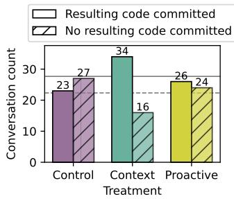  
Fig. 9 Pushed vs. not pushed generated code per treatment; solid and dashed lines mark their respective averages.

Modification rate. Overall, participants change 74.01 % of the generated code over time. Table 5 gives an overview of the code changes by treatment $\left( \% _ { \mathrm { t o t a l } } \right)$ ， showing that the context and proactive groups have a similar modification rate, and the control group shows the lowest number of modifications. The diference of the total modification rates is significant $( \chi ^ { 2 } = 2 0 . 9 5 , p < 0 . 0 1 )$ .

We normalized the changes by computing the average percentage of modified lines per committed code segment $\left( \% _ { \mathrm { s e g m e n t } } \right)$ to better account for codesegment specific modifications $( \mathrm { e . g . }$ , ignoring formatting related changes). A code segment comprises coherent code that was generated by the LLM, and pushed to the same file. The lowest modification rate still occurs in the control group (60.25%), but the rate of modification of the context group is now more similar to the control group, and the change for the proactive group is negligible. After the normalization, the diference is not significant anymore, as shown by a Kruskal-Wallis test $( \mathrm { W } { = } 1 . 4 6 , p = 0 . 4 8 )$

Table 5 Changes made to the LLM-generated code after it was committed to the project, including the total percentage of changes to generated code $\left( \% _ { \mathrm { t o t a l } } \right)$ , the average percentage of changes per committed code segment $( \% _ { \mathrm { s e g m e n t } } )$ , and the average number of days until changes occurred $\mathrm { ( T i m e _ { d a y s } ) }$
<table><tr><td>Treatment</td><td> $\% _ { \mathrm { t o t a l } }$ </td><td> $\% _ { \mathrm { s e g m e n t } }$ </td><td> ${ \mathrm { T i m e } } _ { \mathrm { d a y s } }$ </td></tr><tr><td>Control</td><td>65.26</td><td>60.25</td><td>18.72</td></tr><tr><td>Context</td><td>76.47</td><td>65.54</td><td>8.70</td></tr><tr><td>Proactive</td><td>79.95</td><td>77.59</td><td>20.16</td></tr></table>

Duration until code is changed. Over all treatments, code remains unchanged for, on average, 15.37 days. Members of the proactive treatment leave their code unchanged for the longest time period of 20 days, on average. The control treatment follows with 18 days, while the context treatment had the shortest time until changes occurred, averaging 8 days (right column, Timedays in Table 5). This diference is not significant $( \mathrm { W } { = } 5 . 0 , p { = } 0 . 0 8 )$

## RQ3: Results

Participants used more LLM-generated code in their projects if they used one of the guiding treatments. The discrepancy is large with the context group using generated code from 2 out of 3 conversations, compared to less than half of the conversations in the control group. Around 70 % of LLM-generated code per file was eventually changed in all groups, with teams in the proactive group changing code the most and the control group changing the least. The alteration occurred the fastest in the context group.

## 4.3.2 Discussion: Efects of guidance levels on produced code

The context group had more conversations resulting in generated code being pushed. This is in line with the results of Spasić and Janković [27], who observed that incorporating roles, specific instructions, and seed words into prompts improved model outputs to a more human-like level. Since the context treatment works similarly, this might explain that the context groups committed more generated code to the repository. At first, it seems counterintuitive that the context group has the highest number of generated code commits in the repositories, despite having lower helpfulness and productivity ratings. Simultaneously, the LLM code is modified the fastest, that is, after 10 days. A likely explanation is that, since the participants modify code more quickly, they are likely not satisfied with the generated code, but since they pushed it to the repository and now must modify it, they feel less productive and less supported by the LLM. Interestingly, this insight contrasts another study regarding perceived productivity: Ziegler et al. [32] found that higher perceived productivity correlates with higher acceptance rate of generated code. This might also be caused by the diferent AI assistance (chat-based vs. direct IDE integration with code generation suggestions) or by the university context. The concrete underlying causes for this mismatch in perceived productivity and code contribution is an interesting research direction for future studies.

The overall high modification rates are in line with Harding and Kloster [9], who estimate the code churn rate (the percentage of code lines that are modified within 2 weeks) to double in 2024 compared to a 2021 baseline from before the wide usage of AI-tools. One developer in the control group mentions: “Some of my fellow students used the chatbot to write the frontend $\Big [ \dots \Big ] .$ Now, [it] is practically unmaintainable because it is just a pile of spaghetti $c o d e ^ { \gamma } P 2$ . Within the same group, another developer had a similar experience, when their team members did not update LLM-generated code to fit their current project’s boundaries, resulting in $^ { 6 6 } [ \dots ]$ others [having] to spend the time saved $b y$ [the LLM] to get the code into an acceptable state. $ { { \vec { \mathbf { \Delta } } } } ^ { \prime } (  { { \vec { \mathbf { \Delta } } } } ) _ { 4 }$ The observation was summarized by another developer using the control LLM, pointing out how the “chatbot was very helpful for general basic understanding, but it reached its limits when it came to more concrete, project-specific things $[ \ldots ] ^ { \mathfrak { n } } { } _ { P 3 }$ This perception is supported by current work, which often focuses on including the codebase as context in LLM conversations [1,16,19], highlighting the gap between the LLM’s knowledge of the codebase and the knowledge needed to create code that can be integrated nicely. We argue that, partially, diferences of our setting with other studies come from our project-specific setting that does not focus on a single, well-encapsulated tasks, but rather a more realistic open-ended project scenario, which is essential to understand the full range of of an LLM’s impact on coding activities.

While we acknowledge that interpretations based on limited data and marginal significance should be made cautiously, the observed trends ofer valuable insights for future research. Furthermore, the alignment of our findings regarding modification with participant perceptions and prior work supports the viability of these findings.

To answer $\mathrm { R Q } _ { 3 }$ , we find that treated LLMs cause more LLM-generated code to be pushed into repositories, with the highest amount in repositories of developers using the context LLM. Despite this disparity, similar amounts of code were changed over time in all groups. This highlights how even the more conservative interventions in conversations can increase the LLM’s capabilities to generate code that is committed without causing negative trade-ofs in that regard, further highlighting the potential of guidance mechanisms.

## 5 Threats to Validity

Internal Validity. The drop-out rate of participants could be a threat to the study’s internal validity. This might suggest that participants who continued using the LLMs were more motivated or had a more positive attitude toward them, which particularly threatens conclusions for RQ2. Hence, we collected participants general attitude toward LLM usage at the beginning of the study and found no systematic pattern between participants completing the study and those who drop out. Moreover, since the main development activities were in the first time period, the decreasing numbers may indicate that fewer participants required the help of the LLM.

Statistical Conclusion Validity. Most participants sent fewer than 200 prompts, except three, one of whom sent over 400. Including them can majorly impact statistical conclusions. We mitigated this by removing superusers during preprocessing to ensure that they are not skewing aggregated statistics.

External Validity. The study population consists of novice developers. As the participants were students rather than professional developers, this might limit the generalizability to the full developer population. However, the study was embedded in a longitudinal, realistic software project resembling conditions developers encounter in their first professional projects. As such, the study supports viewing the population as novice developers, as is done commonly in Software Engineering research [8]. Consequently, the results are interpreted with respect to novice developers rather than the educational setting itself.

As novice developers, most of our participants developed their first proper software project during our study, while more experienced developers might have done a lot more projects. However, a significant portion of developers in practice are junior developers and developers in new positions. Thus, while our results may not be generalizable to the entire developer population, they are still relevant to an important subpopulation. The goal of this study is to investigate the benefits and harms of interventions in LLM conversations in order to pave the way for new interaction mechanisms.

Ecological Validity. The university context threatens the applicability of our results for practical settings and may explain deviations of results from other studies. However, conducting a study as controlled as ours, which includes randomly assigning developers to teams and letting all teams develop the same project for four consecutive months, is infeasible in a realistic setting. This dedicated focus inherently comes with cost for ecological validity. To increase ecological validity, we designed a realistic project setting, with the project’s longevity aligning more closely with real-world development processes, especially compared to studies that focus on small or isolated tasks.

## 6 Conclusion

LLMs have become a well-used tool for developers and a popular research topic. In this study, we asked whether we can support and guide developers when interacting with LLMs and, more specifically, how such guidance impacts software development.

To this end, we implemented two guidance approaches with minimal interference in the conversation. The context treatment supplied the LLM with additional context based on the user’s intention, while the proactive treatment ofered active guidance through advice, improved prompts, and follow-up questions. We tested these approaches in a large, longitudinal 4-month study with CS students building a full-stack Web application in their third semester.

We found that conservative guidance mechanisms in LLMs did not majorly influence participants in their general usage behavior with the LLMs. Across the measured outcomes (interaction patterns, self-reported frustration/helpfulness/productivity, and downstream code adoption/modification), we did not observe evidence of negative efects attributable to the interventions. However, we find significant variation in conversation intentions between treatment groups, though the reason for this remains unclear. In terms of helpfulness, frustration, and productivity, we find that developers receiving the proactive guidance perceived the LLM as the most positive. The context treatment was perceived critically, but still led to higher usage of LLM-generated code.

What does it mean? We conclude that even such minimal interventions as ours already yield positive efects on developers’ satisfaction and how they adopt and modify code. The interventions do not disrupt the workflow compared to the freedom of the control LLM. During the course of the project, participants grew more eficient, as conversations grew shorter over time.

Based on this, it is promising to study how higher levels of guidance, such as regular updates of intentions or requesting more context during a conversation, may afect results and user satisfaction. Our initial setup with only sparse intervention of user-LLM interaction can serve as a starting point to better guide (early-career) software developers to eficiently use LLMs in their daily workflow, and, importantly, dispel ethical concerns regarding harmful efects of studies that investigate interventions in user-LLM interactions.

## Statements and Declarations

## Funding

This work was supported by the Saxon State Ministry for Science, Culture and Tourism (SMWK) through the “Center for Scalable Data Analytics and Artificial Intelligence Dresden/Leipzig” (ScaDS.AI), by the European Social Fund (ESF) together with the German state of Saxony under grant number A.100760692 (Project: Teaching-AI), and by the German Research Foundation DFG (SI 2171/3-2).

## Ethical approval

This study involved voluntary participation of computer science students and did not require formal ethical approval according to the institutional regulations of the participating universities. All participants provided informed consent prior to participation. Responses were pseudonymized, and no personally identifiable information was published. Participation was voluntary, and participants could withdraw at any time without consequence. Data was handled in accordance with applicable data protection regulations.

## Informed consent

Participants were informed about the purpose of the study, the voluntary nature of their participation, what data would be collected, how it would be used and protected, and that they could withdraw at any time. Data was pseudonymized during analysis and anonymized prior to publication. Informed consent was obtained before any data was collected. Informed consent was obtained prior to data collection.

## Author Contributions

All authors contributed to the study conception and design. Material preparation and data collection were performed by Annemarie Wittig and Alina Mailach; Analysis was performed by Annemarie Wittig. The first draft of the manuscript was written by Annemarie Wittig and subsequently revised by Alina Mailach; All authors commented, updated and rephrased previous versions of the manuscript. All authors read and approved the final manuscript.

## Data Availability Statement

The data and material from this study is available in our replication package: https://anonymous.4open.science/r/On-the-Prospects-of-Dynamic-L LM-Conversations-in-Software-Development-D22C/README.md

Conflict of Interest

The authors have no competing interests to declare that are relevant to the content of this article.

Clinical Trial Number

Not applicable

## References

1. Arteaga Garcia, E.J., Nicolaci Pimentel, J.a.F., Feng, Z., Gerosa, M., Steinmacher, I., Sarma, A.: How to support ml end-user programmers through a conversational agent. In: Proceedings of the IEEE/ACM 46th International Conference on Software Engineering, ICSE ’24. Association for Computing Machinery, New York, NY, USA (2024). DOI 10.1145/3597503.3608130. URL https://doi.org/10.1145/3597503.3608130

2. Ataei, M., Cheong, H., Grandi, D., Wang, Y., Morris, N., Tessier, A.: Elicitron: An llm agent-based simulation framework for design requirements elicitation (2024). URL https://arxiv.org/abs/2404.16045

3. Bhattacharjee, A., Zeng, Y., Xu, S.Y., Kulzhabayeva, D., Ma, M., Kornfield, R., Ahmed, S.I., Mariakakis, A., Czerwinski, M.P., Kuzminykh, A., Liut, M., Williams, J.J.: Understanding the role of large language models in personalizing and scafolding strategies to combat academic procrastination (2023). URL https://arxiv.org/abs/2312.13581

4. Bird, C., Ford, D., Zimmermann, T., Forsgren, N., Kalliamvakou, E., Lowdermilk, T., Gazit, I.: Taking flight with copilot: Early insights and opportunities of ai-powered pair-programming tools. Queue 20(6), 35–57 (2023). DOI 10.1145/3582083. URL https://doi.org/10.1145/3582083

5. Chatterjee, S., Liu, C.L., Rowland, G., Hogarth, T.: The impact of ai tool on engineering at anz bank an empirical study on github copilot within coporate environment. ArXiv abs/2402.05636 (2024). URL https://api.semanticscholar.org/CorpusID:267547 947

6. Choudhuri, R., Liu, D., Steinmacher, I., Gerosa, M., Sarma, A.: How far are we? the triumphs and trials of generative ai in learning software engineering (2023). URL https: //arxiv.org/abs/2312.11719

7. Davila, N., Wiese, I.S., Steinmacher, I., da Silva, L.L., Kawamoto, A.L.S., Favaro, G.J.P., Nunes, I.: An industry case study on adoption of ai-based programming assistants. 2024 IEEE/ACM 46th International Conference on Software Engineering: Software Engineering in Practice (ICSE-SEIP) pp. 92–102 (2024). URL https: //api.semanticscholar.org/CorpusID:270174221

8. Falessi, D., Juristo, N., Wohlin, C., Turhan, B., Münch, J., Jedlitschka, A., Oivo, M.: Empirical software engineering experts on the use of students and professionals in experiments. Empirical Software Engineering 23(1), 452–489 (2018). DOI 10.1007/s10664-017-9523-3. URL https://doi.org/10.1007/s10664-017-9523-3

9. Harding, W., Kloster, M.: Coding on copilot: 2023 data shows downward pressure on code quality. Tech. rep., GitClear (2024). URL https://gitclear-public.s3.us-wes t-2.amazonaws.com/Coding-on-Copilot-2024-Developer-Research.pdf

10. Hassib, M., Buschek, D., Wozniak, P.W., Alt, F.: Heartchat: Heart rate augmented mobile chat to support empathy and awareness. In: Proceedings of the 2017 CHI Conference on Human Factors in Computing Systems, CHI ’17, p. 2239–2251. Association for Computing Machinery, New York, NY, USA (2017). DOI 10.1145/3025453.3025758

11. Khojah, R., Mohamad, M., Leitner, P., de Oliveira Neto, F.G.: Beyond code generation: An observational study of chatgpt usage in software engineering practice (2024). URL https://arxiv.org/abs/2404.14901

12. Kim, S., Eun, J., Oh, C., Suh, B., Lee, J.: Bot in the bunch: Facilitating group chat discussion by improving eficiency and participation with a chatbot. In: Proceedings of the 2020 CHI Conference on Human Factors in Computing Systems, CHI ’20, p. 1–13. Association for Computing Machinery, New York, NY, USA (2020). DOI 10.1145/3313 831.3376785

13. Kong, A., Zhao, S., Chen, H., Li, Q., Qin, Y., Sun, R., Zhou, X., Wang, E., Dong, X.: Better zero-shot reasoning with role-play prompting. In: Proceedings of the 2024 Conference of the North American Chapter of the Association for Computational Linguistics: Human Language Technologies (Volume 1: Long Papers), pp. 4099–4113 (2024)

14. Kong, A., Zhao, S., Chen, H., Li, Q., Qin, Y., Sun, R., Zhou, X., Zhou, J., Sun, H.: Self-prompt tuning: Enable autonomous role-playing in llms (2024). URL https://ar xiv.org/abs/2407.08995

15. Kuhail, M.A., Mathew, S.S., Khalil, A., Berengueres, J., Shah, S.J.H.: “will i be replaced?” assessing chatgpt’s efect on software development and programmer perceptions of ai tools. Science of Computer Programming 235, 103111 (2024). DOI https://doi.org/10.1016/j.scico.2024.103111. URL https://www.sciencedirect. com/science/article/pii/S0167642324000340

16. Li, Y., Peng, Y., Huo, Y., Lyu, M.R.: Enhancing llm-based coding tools through native integration of ide-derived static context (2024). URL https://arxiv.org/abs/2402.0 3630

17. Madaan, A., Tandon, N., Gupta, P., Hallinan, S., Gao, L., Wiegrefe, S., Alon, U., Dziri, N., Prabhumoye, S., Yang, Y., Gupta, S., Majumder, B.P., Hermann, K., Welleck, S., Yazdanbakhsh, A., Clark, P.: Self-refine: Iterative refinement with self-feedback. In: NeurIPS (2023)

18. Mailach, A., Gorgosch, D., Siegmund, N., Siegmund, J.: “ok pal, we have to code that now”: Interaction patterns of programming beginners with a conversational chatbot. Empirical Software Engineering (EMSE) 30(1), 34 (2025). URL https://sws.inform atik.uni-leipzig.de/wp-content/uploads/2024/10/OkPal-InteractionPatternsOf ProgrammingBeginners.pdf

19. Nam, D., Macvean, A., Hellendoorn, V., Vasilescu, B., Myers, B.: Using an llm to help with code understanding. In: Proceedings of the IEEE/ACM 46th International Conference on Software Engineering, ICSE ’24. Association for Computing Machinery, New York, NY, USA (2024). DOI 10.1145/3597503.3639187

20. Özge Nilay Yalçın: Empathy framework for embodied conversational agents. Cognitive Systems Research 59, 123–132 (2020). DOI https://doi.org/10.1016/j.cogsys.2019.09.0 16. URL https://www.sciencedirect.com/science/article/pii/S1389041719304826

21. OpenAI: Gpt-4 (2024). URL https://openai.com/research/gpt-4. Accessed: 2024- 10-17

22. Ouyang, L., Wu, J., Jiang, X., Almeida, D., Wainwright, C.L., Mishkin, P., Zhang, C., Agarwal, S., Slama, K., Ray, A., Schulman, J., Hilton, J., Kelton, F., Miller, L., Simens, M., Askell, A., Welinder, P., Christiano, P.F., Leike, J., Lowe, R.: Training language models to follow instructions with human feedback. In: NeurIPS (2022)

23. Russo, D.: Navigating the complexity of generative ai adoption in software engineering (2024). URL https://arxiv.org/abs/2307.06081

24. Sergeyuk, A., Golubev, Y., Bryksin, T., Ahmed, I.: Using ai-based coding assistants in practice: State of afairs, perceptions, and ways forward (2024). URL https://arxiv. org/abs/2406.07765

25. Shin, J., Tang, C., Mohati, T., Nayebi, M., Wang, S., Hemmati, H.: Prompt engineering or fine tuning: An empirical assessment of large language models in automated software engineering tasks. ArXiv abs/2310.10508 (2023). URL https://api.semanticscho lar.org/CorpusID:264145854

26. Siegmund, J., Kästner, C., Liebig, J., Apel, S., Hanenberg, S.: Measuring and modeling programming experience. Empirical Software Engineering 19, 1299–1334 (2014)

27. Spasić, A.J., Janković, D.S.: Using chatgpt standard prompt engineering techniques in lesson preparation: Role, instructions and seed-word prompts. In: 2023 58th International Scientific Conference on Information, Communication and Energy Systems and Technologies (ICEST), pp. 47–50 (2023). DOI 10.1109/ICEST58410.2023.10187269

28. Vaillant, T.S., de Almeida, F.D., Neto, P.A.M.S., Gao, C., Bosch, J., de Almeida, E.S.: Developers’ perceptions on the impact of chatgpt in software development: A survey (2024). URL https://arxiv.org/abs/2405.12195

29. Wang, B.: A proactive system for supporting users in interactions with large language models. In: Proceedings of the 2024 Conference on Human Information Interaction and Retrieval, CHIIR ’24, p. 441–444. Association for Computing Machinery, New York, NY, USA (2024). DOI 10.1145/3627508.3638325

30. Wang, W., Ning, H., Zhang, G., Liu, L., Wang, Y.: Rocks coding, not development–a human-centric, experimental evaluation of llm-supported se tasks (2024). URL https: //arxiv.org/abs/2402.05650

31. Ziegler, A., Kalliamvakou, E., Li, X.A., Rice, A., Rifkin, D., Simister, S., Sittampalam, G., Aftandilian, E.: Measuring github copilot’s impact on productivity. Commun. ACM 67(3), 54–63 (2024). DOI 10.1145/3633453. URL https://doi.org/10.1145/3633453

32. Ziegler, A., Kalliamvakou, E., Simister, S., Sittampalam, G., Li, A., Rice, A., Rifkin, D., Aftandilian, E.: Productivity assessment of neural code completion (2022). URL https://arxiv.org/abs/2205.06537