# One AI Signal, Many Human Judgments: A Bayesian Cascade Analysis of AI-based Credibility Indicators in Online Information Spread

Zhuoran Lu   
Purdue University   
West Lafayette, Indiana, USA   
zhuoranlu33@gmail.com

Xinru Wang Singapore-MIT Alliance for Research and Technology Singapore, Singapore xinru.wang@smart.mit.edu

Weilong Wang   
St John’s University   
New York, New York, USA   
weilong.wang@stjohns.edu

Zhuoyan Li Purdue University West Lafayette, Indiana, USA li4178@purdue.edu

Yangyang Yu Stevens Institute of Technology Hoboken, New Jersey, USA yyu44@stevens.edu

Sophia Ananiadou University of Manchester Manchester, United Kingdom sophia.ananiadou@manchester.ac.uk

Zhiwei Liu University of Manchester Manchester, United Kingdom zhiwei.liu@manchester.ac.uk

## Abstract

Social media platforms increasingly use AI-based credibility indicators to help users judge misinformation. Unlike individual human-AI decision-making, these indicators are embedded in informa- tion spread: users see both an AI prediction and earlier judgments shaped by the same AI, and their own judgments may then enter the public history. Yet how to analytically characterize this process remains under-explored. We therefore introduce a social-learning lens for this setting by extending the classical Bayesian cascade model with the AI indicator as a shared public signal. The resulting Gateway condition compares the evidence from the AI prediction with users’ private impressions. Through this view, we show that AI changes what public history means. Crowd agreement may reflect accumulated independent human evidence, or repeated dependence on the same AI prediction. This creates a preservation–correction trade-of: stronger reliance on AI can preserve correct predictions, but can also lock in incorrect ones by blocking corrective private impressions. We calibrate the model using human-subject data on news veracity judgments. Although the AI outperforms human users, the average user weights it below her own impression but above several peer judgments, while individual users vary from discounting the AI to relying on it enough to cascade. Simulations show that over-reliance on a weak AI is especially harmful, and that diversifying AI signals across users can better keep the crowd informative. We conclude with implications for understanding human-AI interaction in information spread and designing misinformation interventions.

## CCS Concepts

• Human-centered computing → Collaborative and social computing theory, concepts and paradigms; Empirical studies in collaborative and social computing; • Computing methodologies → Modeling methodologies.

## Keywords

misinformation, credibility indicators, information cascades, Bayesian social learning, human-AI interaction, crowd judgments

## 1 Introduction

Misinformation on social platforms remains a critical challenge. It spreads through user interactions: users judge the veracity of news stories and express those judgments through comments, ratings, flags, or sharing decisions [46]. To combat misinformation, platforms increasingly attach AI-based credibility indicators to news stories, such as predictions about whether a story contains false information [30, 31, 49]. This creates a familiar human–AI decision-making problem: users’ reliance on AI predictions determines whether they can correctly judge the veracity of online content and engage with accurate information.

However, AI-based credibility indicators work diferently from standard one-shot AI advice. A user who sees the AI prediction may also see how earlier users reacted after seeing the same AI signal, and her own judgment may then become part of the public record seen by later users [6, 10]. Existing human–AI decision-making theory has largely focused on whether an individual user revise her initial judgment after receiving AI advice, leaving under-explored how AI advice reshapes a sequence of user decisions, such as news veracity judgments in the presence of AI. In this setting, individual reliance on AI can change what later users learn from the public history.

Fortunately, formally characterizing sequential human behavior is not a new problem: social learning theories have studied how people update and act on information from others for decades. We therefore introduce a new lens for studying sequential human engagement with AI-based credibility indicators by extending this existing framework: Bayesian belief updating with a shared AI signal. In this view, each user updates her belief about a story by combining three signals: her private impression of the story, the AI credibility signal, and the judgments of earlier users [22, 52, 53]. Representing these signals on a common log-odds scale allows us to formally describe how AI predictions afect sequential veracity judgments.

What core mechanism does a shared AI signal introduce into a sequence of judgments and the resulting public history? Classical social-learning models show that earlier judgments accumulate into public belief until a cascade forms, after which later actions no longer reveal private information [6, 10]. The AI signal enters this process diferently. Because every user sees the same signal, it adds a fixed amount to each user’s belief and sets the starting point of the sequence. This diference gives a simple condition, which we call the Gateway. The Gateway compares the evidence from the AI prediction with the evidence from one user’s private impression. In accuracy terms, it compares the AI accuracy � with the human private-impression accuracy �. In log-odds terms, one AI indication is worth $k ^ { * } = L _ { \alpha } / L _ { q }$ private impressions, so the Gateway is $k ^ { * } \geq 1$ . When the AI is at least as strong as a user’s private impression $( \alpha \geq q )$ , the first user follows the AI regardless of her own impression. Her judgment reveals no new private information to the next user, so the same logic repeats. The crowd is absorbed into the AI prediction, right or wrong, and private impressions never enter the public record. When the AI is weaker $( \alpha < q )$ , early users can still act on their own private impressions before a cascade forms. These impressions can correct a wrong AI prediction, but they can also overturn a correct one. Conditional on the AI’s realized indication for a given story, the subsequent dynamics depend on �, not on the AI’s overall accuracy �. Higher AI accuracy only changes how often the process begins with a correct indication. Once that indication is fixed, it does not make the crowd more efective at pooling its own information or more strongly led toward the truth.

The Gateway mechanism has both benefits and risks. Externally, it changes what population statistics mean. In the presence of a shared AI signal, crowd agreement becomes more dependent than it appears: a Bayes-correct observer counts only the shared AI signal and the finite pre-cascade private impressions, while a naive observer may mistake repeated agreement for many independent human judgments. Internally, the same mechanism changes the welfare of following the AI. When the AI is correct, absorption can preserve the correct prediction by filtering out noisy private impressions; when the AI is wrong, the same absorption blocks the corrective impressions that could overturn it. Improving AI accuracy moves the system toward the better side of this trade-of, but it does not eliminate the frontier: stronger AI also makes wrong AI predictions harder for the crowd to correct.

We calibrate the model against data from a prior human-subject experiment in which users judge news veracity in the presence of an AI indicator that outperforms human users. We first benchmark users as fully calibrated Bayesian agents and find though users are significantly afected by AI, there are deviations from immediate cascades. We then relax the decision rule, estimating behavioral weights on each signal, and find that the average user sits in the learning regime of the Gateway, treating the AI prediction equiva-lent to 3—6 peer judgments. Finally, fitting a mixture model over subjects reveals two distinct behavioral components: a majority who under-weight the AI and never cascade on it alone, and a cascade-prone minority who over-weight it and cascade immediately. We also use simulations to examine two implications beyond the calibration data. First, by sweeping over combinations of the $\operatorname { A I } ^ { * } s$ true accuracy and users’ perceived AI accuracy, we show that over-reliance a weak AI is more damaging than under-reliance on a strong one. Second, simulations of structural interventions show that diversification and expert review improve the preservationcorrection trade-of in diferent ways. Diversifying the AI signal across users is more reliable across AI strengths and behavioral weightings, while triggering expert review in slowly forming cascades is useful mainly when users remain in the learning regime.

To summarize, we make three contributions. First, we introduce a social-learning lens for information spread with AI-based credibility indicators, modeling the indicator as a platform-deployed shared signal that links individual reliance to crowd-level dependence. Second, we derive interpretable consequences of this shared-signal view: a Gateway condition for when independent human evidence stops entering the public record, an information ceiling for AI-shaped consensus, and a preservation–correction trade-of. Third, we calibrate a behavioral version of the model on human-subject sequential judgment data, showing average users weight AI below their own impressions yet above several peer judgments, while the AI treatment reveals a cascade-prone behavioral component that crosses the Gateway. We hope this work provides a starting point for extending human-AI interaction theory to crowd-AI interaction.

## 2 Related Work

## 2.1 Online information spread: sequential veracity judgments on misinformation

Misinformation has been a critical issue [2, 29]. It spreads through platforms as a sequence of human judgments: users encounter a story, assess its veracity, and react—and false content travels farther and faster than true content through exactly this relay [36, 38, 40, 45, 50, 55]. Two empirical facts shape the environment. First, individual truth discernment is limited; people separate true from false headlines only modestly better than chance [46]. Second, users do not judge in isolation: they see the reactions of those before them—votes, shares, comments—and such social signals causally shift later judgments, as shown by field experiments on rating herding and social influence bias [27, 38, 44, 50]. Platforms now fold these judgments into crowd-facing statistics, from crowdsourced credibility ratings to community fact-checking notes [9, 12, 15, 47], so each user’s veracity judgment is simultaneously her own decision and social evidence for everyone after her. Our model takes this sequential structure as primitive and perturbs it with one design change: an AI signal at every position.

## 2.2 Human-AI decision making in information processing

A large body of work in human-AI interaction studies how AI assis- tance changes individual decisions: when people accept algorithmic advice, how they calibrate reliance on it, and how interface and explanation design shift that reliance [7, 8, 23, 33, 34, 41]. People discount AI predictions generally [4, 57], but show over-reliance (algorithm appreciation, Hou and Jung 25, Logg et al. 37) and sometimes under-reliance due to diferent cognitive factors (algorithm aversion, Dietvorst et al. 16, 17). For misinformation specifically, AI-based credibility indicators and warning labels measurably move individual belief and sharing decisions [17, 18, 28, 38, 39]. This line of work provides empirical and theoretical grounding to individual human-AI decision-making where human engagement is determined primarily by the decision-maker and the AI [23, 35, 58]. In information spread, however, reliance on AI does not remain an individual decision. It can enter the public history through visible user judgments and shape what later users learn from the crowd. This sequential dimension of human-AI decision-making remains under-explored, especially from a analytical perspective.

## 2.3 Belief update: a theoretical lens to uniformly model both

Analyzing social influence and AI influence in one system requires a common currency, and Bayesian belief update in log-odds form supplies it: every signal—a private impression, an AI prediction, an earlier user’s judgment—enters as an additive evidence contribution. This is the machinery of observational learning in computational economics: information cascades [6, 10, 21, 48], their limits under unbounded private beliefs [3, 24, 51], observation networks [1], price aggregation in markets [13, 54], and word-of-mouth learning with a public signal, the closest precedent to ours [5, 14]. Behavioral departures from the Bayesian rule—conservatism [11, 32, 42], noisy quantal choice [20, 43, 56]—extend the same currency to mea-sured human behavior, which is exactly the bridge our behavioral calibration crosses.

Prior social-learning models supply the machinery for common signals; we put it to a new use—reading AI credibility indicators as platform-deployed signals whose efects propagate through se- quential human judgments and reshape what crowd statistics mean. This reframing, rather than a new equilibrium concept, is where the core mechanism and analysis in Sections 4 and 5 come from.

## 3 Model and Dynamics

We study a typical setting of information spread in the presence of an AI-based credibility indicator. A user, Alice, is browsing news on a social media platform. Seeing a news story, she first forms her own impression of whether it is true; alongside the story, she also observes two public cues: an AI-based credibility indicator attached to the content, and the judgments left by earlier users $( \mathrm { e . g . }$ potentially through comments, upvotes, and downvotes). She then makes her own veracity judgment and leaves it in the comment section, where it becomes part of the record shown to later users. Our research question is how to model this entire informationspread process, where a sequence of such users, each judging under the same AI indicator, through a single theoretical lens.

## 3.1 Cascade Model with AI-based Credibility Indicator

We deliberately use a minimal extension of the classical BHW information cascade [6, 10]. The only new element is a common AI credibility signal: one prediction �, computed once for the story and shown unchanged to every $\mathrm { u s e r } . ^ { 1 }$ The minimality is the point: any change in the public judgment record can then be traced to the shared-signal role of the AI indicator. A news story has unknown binary veracity $\theta \in \{ 0 = \mathrm { F A K E } , 1 = \mathrm { R E A L } \}$ , with common prior $\pi _ { 0 } = \mathbb { P } ( \theta = 1 )$ , and � users, indexed $i = 1 , \ldots , N ,$ , judge it one after another. Each user � receives three signals:

• her private impression $s _ { i } \in \{ 0 , 1 \}$ , her independent read of the news veracity, with accuracy $\mathbb { P } ( s _ { i } = \theta \mid \theta ) = q > \frac { 1 } { 2 }$ drawn independently across users given �;

• the common AI signal $c \in \{ 0 , 1 \}$ produced by the AI credibility indicator, with accuracy $\mathbb { P } ( c = \theta \mid \theta ) = \alpha > \frac { 1 } { 2 }$ 2 computed once per story and shown unchanged to every user;

• the public history $H _ { i } = ( J _ { 1 } , . . . , J _ { i - 1 } )$ , with $H _ { 1 } = \varnothing$ : the judgments earlier users left alongside the news, e.g., through comments.

As in the classic cascade setting, private impressions stay hidden, and only judgments are observable to later users. User � chooses a judgment $J _ { i }$ that minimizes 0–1 loss against the story’s true veracity, so her interaction with the three signals is a Bayesian belief update. Taking �� and � to be mutually independent given �, her posterior log-odds $\ell _ { i }$ are additive in the contributions of the signals she sees [22, 52]:

$$
\ell _ { i } \ = \ P _ { i } + \lambda ( s _ { i } ; q ) , \qquad P _ { i } \equiv \ell _ { 0 } + \lambda ( c ; \alpha ) + \sum _ { j < i } \psi _ { j } ( J _ { j } ) ,\tag{1}
$$

and $J _ { i } = 1 \{ \ell _ { i } > 0 \}$ . Here, for a binary signal of accuracy $\textstyle \rho \in { \bigl ( } { \frac { 1 } { 2 } } , 1 { \bigr ) }$ $\lambda ( x ; \rho ) = \pm L _ { \rho }$ contributes to the log-odds of $\theta = 1$ , with the sign set by the value of � and the magnitude set by $\begin{array} { r } { L _ { \rho } \equiv \log \frac { \rho } { 1 - \rho } > 0 ; } \end{array}$ the private impression and the AI prediction thus contribute $\pm L _ { q }$ and $\pm L _ { \alpha }$ , respectively. Here $\psi _ { j } ( J _ { j } )$ is the log-likelihood ratio that later users infer from observing judgment $J _ { j } ,$ , given the public log-odds $P _ { j }$ under which user � acted:

$$
\psi _ { j } ( J _ { j } ; P _ { j } ) = \log { \frac { \mathbb { P } ( J _ { j } \mid \theta = 1 , P _ { j } ) } { \mathbb { P } ( J _ { j } \mid \theta = 0 , P _ { j } ) } } .
$$

The posterior log-odds thus decompose into the public log-odds $P _ { i : }$ , common to every user at position �, and the private contribution $\lambda ( s _ { i } ; q )$ . How this scalar evolves is the subject of Section 3.2.

We impose several technical conventions. First, ties at $\ell _ { i } = 0 { - } \mathbf { a }$ measure-zero boundary event—are broken toward the public com- ponent, so at the boundaries $P _ { i } = \pm L _ { q }$ the user chooses $J _ { i } = 1 \{ P _ { i } \ge$ 0}. The supplementary material analyzes both this conventional rule and a random tie-break and shows the choice bites only at the measure-zero classical edge $\begin{array} { r } { \alpha = \frac { 1 } { 2 } } \end{array}$ , leaving every main conclusion unchanged. Second, we assume � $\textstyle \left. , \alpha \in { \bigl ( } { \frac { 1 } { 2 } } , 1 { \bigr ) } \right.$ throughout the main analysis, so both $L _ { q }$ and $L _ { \alpha }$ are finite; the boundary value $\begin{array} { r } { \alpha = \frac { 1 } { 2 } } \end{array}$ (the classical no-AI limit) is itself a measure-zero edge, and we relegate it, together with the other measure-zero events, to the supplementary material. The limiting case $\alpha = 1$ , in which the AI model predicts � perfectly, is degenerate and is therefore excluded from the main analysis. Finally, we focus on the symmetric prior $\begin{array} { r } { \pi _ { 0 } = \frac { 1 } { 2 } \left( \mathbf { s o } \ell _ { 0 } = 0 \right) } \end{array}$ and treat the asymmetric case separately in the supplementary material, thus simplifying the public log-odds to

$P _ { i } \equiv \lambda ( c ; \alpha ) + \sum _ { j < i } \psi _ { j } ( J _ { j } )$ . All boundary statements involving weak inequalities below $( \mathrm { e . g . } , \alpha \ge q )$ adopt this tie-breaking convention; under random tie-breaking the weak inequalities become strict $( \alpha > q )$ , and the boundary cases $\alpha = q$ and $\begin{array} { r } { \alpha = \frac { 1 } { 2 } } \end{array}$ are analyzed in full in the supplementary material.

## 3.2 Public Log-Odds Dynamics: Public History and the AI Signal

We now characterize how the public log-odds evolve as users se- quentially add their judgments to the public history. At the mo-ment user � acts, the public component of her posterior log-odds is $\begin{array} { r } { P _ { i } = \ell _ { 0 } + \lambda ( c ; \alpha ) + \sum _ { j < i } \psi _ { j } ( J _ { j } ) } \end{array}$ ; once her judgment joins the public history, the next user faces

$$
P _ { i + 1 } ~ = ~ P _ { i } + \psi _ { i } ( J _ { i } ) .
$$

In this recursion, the only newly added term is the contribution of user $i \gamma _ { s }$ judgment. The AI contribution $\lambda ( c ; \alpha )$ , by contrast, gener ates no new term: because the same prediction � is shown to every user for the same story, it enters the public log-odds once and is carried forward throughout the sequence.

This is the same public-belief reduction used in the classical cascade model: the common AI signal changes the level ofthe public log-odds but not its Markovian structure, since conditional on � and � the next public log-odds depends on the past only through $P _ { i } .$ . We can therefore characterize the transition rule in the classical way, by asking when user �’s judgment reveals her private impression: since $\ell _ { i } = P _ { i } + \lambda ( s _ { i } ; q )$ , the judgment is informative exactly when the public component is not strong enough to dominate one private impression, i.e., when |�� | has not reached the boundary $L _ { q }$

Lemma 1 (Cascade structure). For each user �:

(a) Learning regime. $I f | P _ { i } | < L _ { q } ,$ , then $J _ { i } = 1 \iff s _ { i } = 1$ and $\psi _ { i } ( J _ { i } ) = \lambda ( J _ { i } ; q )$

(b) Up-cascade. $I f P _ { i } \ge L _ { q }$ , then $J _ { i } ~ = ~ 1$ regardless of $\dot { s } _ { i } ,$ , and $\psi _ { i } ( J _ { i } ) = 0 .$

(c) Down-cascade. $I f P _ { i } \leq - L _ { q }$ , then $J _ { i } = 0$ regardless of ��, and $\psi _ { i } ( J _ { i } ) = 0 .$

Combining this dichotomy with the Markovian representation yields the full equilibrium of the public log-odds process.

Theorem 2 (Eqilibrium structure). Conditional on � and $c ,$ the public log-odds process $( P _ { i } )$ is a Markov chain with initial value

$$
P _ { 1 } = \ell _ { 0 } + \lambda ( c ; \alpha ) .
$$

It has a transient learning region $( - L _ { q } , L _ { q } )$ and two absorbing cascade regions, $\{ P \ge L _ { q } \}$ and $\{ P \leq - L _ { q } \}$ . While $P _ { i } \in ( - L _ { q } , L _ { q } )$ , the process moves by $+ L _ { q }$ after judgment ${ \mathrm { \Delta } J } _ { i } = 1$ and by $- L _ { q }$ after judgment ${ \bf \nabla } J _ { i } = 0 ;$ equivalently,

$$
{ \mathbb E } [ P _ { i + 1 } - P _ { i } \mid \theta , P _ { i } ] = ( 2 \theta - 1 ) ( 2 q - 1 ) L _ { q } .
$$

Once $P _ { i }$ reaches either cascade region, the process is absorbed.

Being common across users, the AI contributes no transition term; its only role is the initial condition $P _ { 1 } = \lambda ( c ; \alpha )$ , so whether the sequence begins in the learning region or with an immediate cascade comes down to whether $L _ { \alpha } \ge L _ { q }$

With the guaranteed absorption by Theorem 2, two statistics summarize the procedure. The first is the cascade-formation time

$$
\tau = \operatorname* { i n f } \{ i \geq 1 : | P _ { i } | \geq L _ { q } \} ,
$$

the first position at which the public log-odds are absorbed. The second is the final cascade direction

$$
D _ { \infty } = \operatorname* { l i m } _ { i \to \infty } \mathrm { s i g n } ( P _ { i } ) \in \{ - 1 , + 1 \} ,
$$

well-defined by eventual absorption. The comparison between $L _ { \alpha }$ and $L _ { q } ,$ , which Section 4 names the Gateway, already settles the strong-AI case: $\tau = 1$ and $D _ { \infty } = \mathrm { s i g n } ( \lambda ( c ; \alpha ) )$ when $\alpha \geq q .$ Below it, both statistics are random, and characterizing them is the work of the next section.

## 4 Main Results

As we illustrated, one comparison translates individual reliance on the AI into a crowd-level condition—whether later judgments can still reveal independent human evidence. We call this compar- ison the Gateway: the AI contribution $L _ { \alpha }$ measured against one private-impression contribution $L _ { q } ,$ equivalently the AI accuracy � measured against the human accuracy �.

Corollary 3 (Gateway). With symmetric prior $\ell _ { 0 } = 0 _ { : }$ , the initial public log-odds $P _ { 1 }$ lies in the learning region $i f$ and only $i f \alpha < q , I f$ $\alpha \geq q , P _ { 1 }$ lies in a cascade region, with the direction determined by the AI prediction � (the equality case $\alpha = q$ relies on the tie-breaking convention ofSection 3.1).

Remark 4 (Evidence weight of one AI indication). In logodds, one AI indication is worth $k ^ { * } = L _ { \alpha } / L _ { q }$ independent private impressions, so the Gateway $\prime \alpha \geq q$ is exactly $\dot { k ^ { * } } \geq 1 \cdot$ —the AI worth at least one private impression.

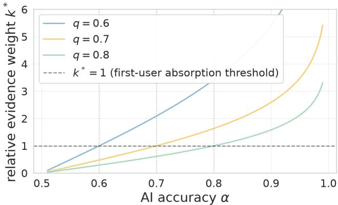  
Figure 1: Evidence weight of the shared AI signal relative to one private impression (Remark 4): the relative log-odds weight $\begin{array} { r } { k ^ { * } ( \alpha ) = \frac { L _ { \alpha } } { L _ { q } } } \end{array}$ of the shared AI credibility signal versus one private impression, for $q \in \{ 0 . 6 , 0 . 7 , 0 . 8 \}$ . The boundary $k ^ { * } = 1$ marks the first-user absorption threshold: at or above it, the AI signal can dominate one private impression, with each curve crossing $k ^ { * } = 1$ exactly at $\alpha = q .$

Once a cascade forms, later judgments reveal no additional private impressions, so the public history contains only bounded infor-mation about $\theta ,$ even as the visible sequence of agreeing judgments can create excessive apparent support for the cascade direction. Viewed as a shared signal, the indicator has three implications for reading a crowd’s record: when independent human evidence stops entering it, how much it can ever contain, and when preserving an AI-correct cascade trades of against correcting an AI error.

## 4.1 Above the Gateway: immediate AI-directed cascades

We first consider the strong-AI side of the Gateway. When $\alpha \geq q ,$ , the initial public log-odds is already at or beyond the relevant cascade boundary, with the sign selected by the AI prediction.

Theorem 5 (Immediate AI-Directed Absorption). $H \alpha \geq q ;$ then for either AI prediction �, each user � makes the same judgment as the AI prediction, regardless of whether it is correct:

$$
J _ { i } = c \qquad { f o r a l l i \geq 1 } .
$$

That $i s ,$ the cascade forms at the first user, $\tau = 1 ,$ and thefinal cascade direction will be the same as the AI prediction:

$$
D _ { \infty } = \mathrm { s i g n } ( \lambda ( c ; \alpha ) ) .
$$

Thus, no user’s private impression is revealed through the public history.3

Correctness of the crowd thus reduces to correctness of the AI: if $c = \theta ,$ the public history locks onto the truth; if $c \neq \theta _ { : }$ , it locks onto the wrong direction. The proof is in the supplementary material.4

## 4.2 Below the Gateway: biased but not determined cascades

We now consider the below-Gateway regime, $\textstyle { \frac { 1 } { 2 } } < \alpha < q .$ . Here the AI prediction is informative, but it is not strong enough to place $P _ { 1 }$ in a cascade region. It shifts the initial public log-odds toward the direction of the AI prediction, while early private impressions can still enter the public history. Thus the AI prediction biases both (1) when the cascade forms and (2) which direction it eventually takes, but it does not determine either one by itself.

Cascade formation time Particularly, the below-Gateway regime has a simple two-state structure before absorption. Changing � moves the transient public states, but as long as $\alpha \in ( \textstyle { \frac { 1 } { 2 } } , q )$ , it does not change which private impressions move the process between those states or into a cascade region. Those moves are governed by �. This gives the following timing result.

Proposition 6 (Cascade-Formation Time). Let� be the cascadeformation time:

$$
\tau = \operatorname* { i n f } \{ j \geq 1 : | P _ { j } | \geq L _ { q } \}
$$

(a) $H \alpha \geq q ,$ then $\tau = 1 ,$ as in Theorem 5.

(b) $\textstyle I f \alpha \in { \bigl ( } { \frac { 1 } { 2 } } , q )$ , then forfixed � and �, the value of� depends on � and on whether $c = \theta _ { : }$ , but not on the value of� within the interval. A correct AI prediction yields a shorter expected cascade-formation time than an incorrect one, with the $d i f -$ ference governed by �. Closed forms for P $^ { \circ } ( \tau = 2 )$ and E[�] are in the supplementary material.

Cascade Direction The same below-Gateway structure also deter-mines the final cascade direction. Let $D _ { \infty }$ denote the final cascade direction: $D _ { \infty } = + 1$ if the process is absorbed in an up-cascade, and $D _ { \infty } = - 1 \mathrm { i } 1$ f it is absorbed in a down-cascade. Equivalently, by Theorem 2,

$$
D _ { \infty } = \operatorname* { l i m } _ { j \to \infty } \mathrm { s i g n } ( P _ { j } ) .
$$

Particularly, below the Gateway, early private impressions can still correct a wrong AI prediction or overturn a correct one.

Theorem 7 (Cascade Direction under a Shared AI Signal).

(a) $H \alpha \geq q ,$ then for any fixed AI prediction �,

$$
D _ { \infty } = \mathrm { s i g n } ( \lambda ( c ; \alpha ) ) .
$$

(b) $\begin{array} { r } { I f { \frac { 1 } { 2 } } < \alpha < q , } \end{array}$ , then, for fixed � and �,

$$
\mathbb { P } ( D _ { \infty } = \mathrm { s i g n } ( \lambda ( c ; \alpha ) ) \mid c , \theta ) = \left\{ \begin{array} { l l } { \displaystyle \frac { q } { 1 - q + q ^ { 2 } } , } & { c = \theta , } \\ { \displaystyle \frac { 1 - q } { 1 - q + q ^ { 2 } } , } & { c \neq \theta . } \end{array} \right.
$$

This independence from � holds only below the Gateway. Within $\textstyle { \left( { \frac { 1 } { 2 } } , q \right) }$ , � changes how often $c = \theta _ { : }$ , but conditional on � and �, pre- cascade learning is driven by private impressions with accuracy �. At $\alpha = q ,$ this learning phase vanishes: the initial public log-odds reaches the cascade boundary, and the AI selects the final direction from the first user onward.

Only judgments before cascade formation can reveal private impressions. The next section uses this finite pre-cascade prefix to show why a large AI-shaped consensus need not contain much independent human information about �. The Gateway earns its place as a mechanism rather than a destination: it marks where the public record stops adding independent human evidence, which is what lets AI-shaped agreement mislead an outside observer.

Theorem 8 (AI-Mediated Agreement and External Overconfidence). The Bayes-correct observer’s posterior log-odds are bounded in expectation uniformly in $N ,$

$$
\begin{array} { r } { \mathbb { E } \left[ \left| \ell _ { \mathrm { e x t } } ^ { \mathrm { c o r r e c t } } \right| \right] \leq \left| \ell _ { 0 } \right| + L _ { \alpha } + \mathbb { E } \left[ \tau - 1 \right] L _ { q } , } \end{array}
$$

and the naive observer’s excess log-odds in the final consensus direction grow linearly,

$$
\mathbb { E } \bigg [ \big ( \ell _ { \mathrm { e x t } } ^ { \mathrm { n a i v e } } - \ell _ { \mathrm { e x t } } ^ { \mathrm { c o r r e c t } } \big ) D _ { \infty } \bigg ] = N L _ { q } + O ( 1 ) ,\tag{2}
$$

where the $O ( 1 )$ term is uniformly bounded in $N _ { ☉ }$ . Taking $\ell _ { 0 } = 0 ,$ the constant is pinned down by the Gateway:

(a) Above the Gateway $( \alpha \geq q ,$ so $\tau = 1$ and $J _ { i } = c f o r a l l i ) .$

$$
\begin{array} { r } { \mathbb { E } \bigg [ \big ( \ell _ { \mathrm { e x t } } ^ { \mathrm { n a i v e } } - \ell _ { \mathrm { e x t } } ^ { \mathrm { c o r r e c t } } \big ) D _ { \infty } \bigg ] = N L _ { q } - L _ { \alpha } . } \end{array}
$$

The only independent evidence the Bayes-correct observer can credit is the shared AI prediction $^ { c ; }$ no private impression is revealed.

(b) Below the Gateway $\begin{array} { r } { ( \frac { 1 } { 2 } < \alpha < q , } \end{array}$ , so $\tau \geq 2 )$ : the �(1) term equals the bounded evidence in � together with the finite pre-cascade prefix $\sigma _ { < \tau } ,$ and is uniformly bounded in � by $L _ { \alpha } + \mathbb { E } [ \tau - 1 ] L _ { q } .$

The two cases show that AI changes the source instead of the rate of external overconfidence. The naive observer counts every repeated judgment as a fresh private signal, so excess evidence grows at slope $L _ { q }$ in all cascade regimes. What difers is the bounded evidence being over-counted: below the Gateway, it is � plus the finite pre-cascade prefix; above the Gateway, it is only �, because no private impression is revealed. Particularly, this is a risk introduced by the presence of AI. A platform may display many users judging a news story $( \mathrm { e . g . } ,$ up-voting). If those users first saw the same AI prediction, the statistic can be read as independent crowd validation, even though it reflects the impact of AI. The consensus is real, but the independence is further limited or even does not exist at all.

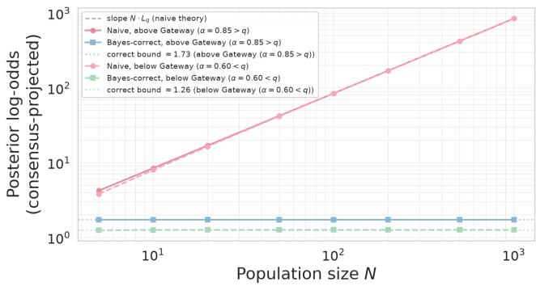  
Figure 2: Spurious external confidence (Theorem ${ \mathbf { 8 } } ) , q = 0 . 7 .$ Expected posterior log-odds projected onto the consensus direction, plotted against � on a log–log scale. For both $\alpha =$ $0 . 8 5 ~ > ~ q$ (above Gateway, solid) and $\alpha ~ = ~ 0 . 6 0 ~ < ~ q$ (below Gateway, dashed), the naïve observer’s curve grows as $N$ $L _ { q }$ without bound; the Bayes-correct observer’s curve stays bounded—at $L _ { \alpha } \approx 1 . 7 3$ above the Gateway and at the cascade- formation threshold ≈1.26 below it.

## 4.3 AI-based credibility indicator to combat misinformation: protecting correct cascades, correcting wrong ones

With an AI-based credibility indicator, the cost of absorption is ambiguous. Once the process is absorbed, later private impressions no longer enter the public history, but this can help or harm depending on whether the AI is correct. If $\dot { \mathbf { \nabla } } c = \theta ,$ , absorption filters out noisy impressions that could pull users away from the truth; i $\mathrm { ~ f ~ } c \neq \theta _ { : }$ it blocks the corrective impressions that could overturn the AI’s mistake. We therefore evaluate the indicator along two coordinates, conditional on AI correctness:

$$
\begin{array} { r } { W ^ { + } = \mathbb { P } ( D _ { \infty } = \theta \mid c = \theta ) , \qquad W ^ { - } = \mathbb { P } ( D _ { \infty } = \theta \mid c \neq \theta ) , } \end{array}
$$

the probability that the cascade direction is correct when the AI is right $( W ^ { + }$ , preservation) and when it is wrong $( W ^ { \cdot }$ −, correction), with ideal point $( W ^ { + } = 1 , W ^ { - } = 1 )$

Proposition 9 (Preservation–Correction Frontier). With accuracy of private impression $q \in \left( { \textstyle { \frac { 1 } { 2 } } } , 1 \right)$ , the welfare point depends on the AI accuracy � only through which side of the Gateway it falls on:

$$
( W ^ { + } , W ^ { - } ) = \left\{ \begin{array} { l l } { \displaystyle \big ( 1 , ~ 0 \big ) , \qquad \ } & { \alpha \geq q , } \\ { \displaystyle \left( \frac { q } { 1 - q + q ^ { 2 } } , \ \frac { q ^ { 2 } } { 1 - q + q ^ { 2 } } \right) , \quad \frac { 1 } { 2 } < \alpha < q , } \end{array} \right.
$$

where the two cases correspond to the AIfalling above and below the Gateway, respectively.

Within each regime $( W ^ { + } , W ^ { - } )$ is constant in $\alpha ,$ and the two regime points are mutually non-dominating: the above-Gateway point has strictly higher preservation $\begin{array} { r } { \left( 1 > \frac { q } { 1 - q + q ^ { 2 } } \right) } \end{array}$ and strictly lower correction $\begin{array} { r } { \big ( 0 < \frac { q ^ { 2 } } { 1 - q + q ^ { 2 } } \big ) } \end{array}$ . Raising AI accuracy thus trades preservation against correction rather than improving both. The question of when to let the AI lead then becomes:

Remark 10 (When should the AI lead?). Under an asymmetric loss that weights a wrong cascade at � times the cost of a missed truth, welfare collapses to a weighted accuracy and letting the AI lead is optimal if and only if

$$
\pi > \pi ^ { * } ( \kappa ) = \frac { \kappa q ^ { 2 } } { ( 1 - q ) ^ { 2 } + \kappa q ^ { 2 } } .
$$

$A t \kappa = 1$ (equal costs) this reduces to the unconditional-accuracy threshold $\begin{array} { r } { \pi ^ { * } ( 1 ) = \frac { q ^ { 2 } } { 1 - 2 q + 2 q ^ { 2 } } ; } \end{array}$ as � grows, $\pi ^ { * } ( \kappa )$ rises toward 1—the costlier an amplified falsehood, the more accurate the AI must be before it leads.

Figure 3 plots both cases at $q = 0 . 7 .$ Figure (a) compares unconditional accuracy across the two regimes: above the Gateway it equals �; below it the curve $\frac { \pi q + ( 1 - \pi ) q ^ { 2 } } { 1 - q + q ^ { 2 } }$ rises more slowly, crossing at $\pi ^ { * } ( 1 ) \approx 0 . 8 4 5 - \mathbf { a }$ 90%-accurate AI qualifies—and the same true accuracy can realize either regime through the perceived strength of the indicator (Section 6.1). Figure (b) shows $\pi ^ { * } ( \kappa )$ rising from 0.845 toward 1 5.

## 4.4 Escaping the frontier: structural levers from the theory

The frontier of Proposition 9 constrains a single shared indicator: raising AI accuracy trades preservation for correction, never lifting both. Escaping it requires changing what is deployed. We develop two structural levers here and simulate both in Section 6.2; fur- ther levers—including what to report alongside the consensus and when to attach the indicator—are examined in the supplementary material.

Diversify the model (what to deploy). Replacing the shared � with independent per-user draws $c _ { 1 } , \ldots , c _ { N }$ breaks the common- signal dependence, so the information ceiling rises beyond the single term $I ( c ; \theta )$ :

$$
I ( \bar { J } _ { N } ; \theta ) \ \leq \ I \big ( ( c _ { 1 } , \ldots , c _ { N } , \sigma _ { < \tau } ) ; \theta \big ) , \qquad I \big ( ( c _ { 1 } , \ldots , c _ { N } ) ; \theta \big ) \ \uparrow \ \mathrm { i n } \ N .
$$

A cascade still forms eventually, so aggregation saturates at a higher but still �-independent level; full aggregation is approached only

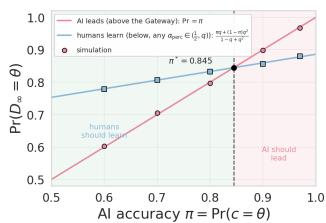

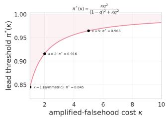  
Figure 3: When should the AI lead? (Remark ${ \bf 1 0 } , q = 0 . 7 . )$ Left: unconditional accuracy $\mathbb { P } ( D _ { \infty } = \theta )$ against the AI’s true accuracy $\pi = \mathbb { P } ( c = \theta )$ , under the two regimes a deployment can realize at the same �. If the population defers from the first user (above the Gateway), accuracy equals �. If it keeps learning (below the Gateway, i.e. the indicator is weighted as one more piece of weak evidence), accuracy is $\frac { \pi q + ( 1 - \pi ) q ^ { 2 } } { 1 - q + q ^ { 2 } } -$ identical for every perceived accuracy $\textstyle \alpha _ { \mathrm { p e r c } } \in ( { \frac { 1 } { 2 } } , q )$ by Theo- rem 7(b), and capped at $\frac { q } { 1 - q + q ^ { 2 } } \approx 0 . 8 8 6$ no matter how accu- rate the AI truly is. The two cross at $\pi ^ { * } \approx 0 . 8 4 5 ;$ markers are simulation. Right: under an asymmetric loss where an am-plified falsehood costs � times a missed truth, the threshold $\overline { { \pi } } ^ { * } ( \kappa ) = \kappa q ^ { 2 } / ( ( 1 - q ) ^ { 2 } + \kappa q ^ { 2 } )$ rises from $0 . 8 4 5 \left( \kappa = 1 \right)$ toward 1.

when the diversified signal is weighted strongly enough to keep the chain out of a cascade. Section 6.2 quantifies the gain.

Trigger expert review at slow cascades (beyond deploying AI). By Proposition $6 ( \mathrm { c } ) _ { : }$ , an incorrect AI prediction takes longer to cascade than a correct one,

$$
\mathbb { E } [ \tau \mid c \neq \theta ] > \mathbb { E } [ \tau \mid c = \theta ] ,
$$

so a large realized � is an observable symptom of � $\neq \theta \mathrm { - } \mathbf { a }$ symp- tom that exists only because the AI is present. Triggering expert review when � exceeds a threshold $\tau ^ { * } ( q )$ therefore directs a scarce perfect signal selectively toward wrong cascades without observing �, whereas an unconditional expert override corrects direction but, like any strong signal, restores no aggregation.

## 5 Empirical Calibration of the Theoretical Analysis

The analysis so far characterizes calibrated Bayesian users, where users know the true accuracy of both their own impressions and the AI indicator, and update beliefs rationally. We now calibrate the the- oretical analysis by confronting the assumption using real humansubject experiment data. The calibration is organized around three questions: (1) Benchmark Do users behave as calibrated Bayesians? (2) Pooled calibration: How does the average user weight diferent signals? (3) Heterogeneity : Are there distinct types of users who weigh signals diferently? We use this section to answer the three questions respectively, and leave the residual behavioral pat- terns not captured by these three questions in the supplementary material.

## 5.1 Empirical Calibrations

Empirical data from real human-subject experiments We use a public dataset from prior work conducting a human-subject experiment on misinformation spread in the presence of AI-based credibility indicators [38]. The dataset contains 480 sequences of news veracity judgments. In each sequence, 11 participants review a news item, make an initial binary veracity judgment (i.e., fake or real), review the public history, and then make their final veracity judgment $J _ { i } .$ . Each final judgment is then appended to the public history. We use this dataset because it closely follows the setting of information cascade in the presence of an AI-based credibility indicator as a public signal. Crucially, participants’ initial judgments before reviewing the public history are separately recorded, giving a direct read of the private impression $s _ { i \cdot }$ For more details, please refer to the supplementary material.

The experiment has three between-subjects treatments of 160 rooms each: Control (no AI; the classical BHW limit $\alpha ~ = ~ \textstyle { \frac { 1 } { 2 } } )$ AI-before (AI shown before the participants’ impression and the public history), and AI-after (AI shown after). The treatments share the same 40 news items and hold � fixed by design, with each participant reviewing the same news story at most once. The empirical AI accuracy is $\widehat { \alpha } = 0 . 7 5 0 .$ , and the private-impression accuracy, identified from its pilot study, is $\widehat { q } \approx 0 . 5 1 5$

## 5.2 Calibration in Three Readings

5.2.1 Q1 (Benchmark): fully calibrated Bayesian users. This benchmark is intentionally strict. It is a reference point, not a behavioral model of participants: it shows how observed reliance departs from calibrated Bayesian updating. Suppose users are fully calibrated Bayesian agents who know both their own accuracy and the AI model’s accuracy. Then the empirical AI accuracy �band the private-impression accuracy $\widehat { q }$ can be used directly determine the dynamics. Thus, users should lie above the Gateway: the AI prediction should be strong enough that no private impression is revealed, and all users’ final judgments should match the AI prediction on each news story. However, the empirical data depart from this strict bench- mark in several ways: users do not always follow the AI, full-room agreement with � is rare, consensus does not perfectly track AI cor-rectness, and the realized information plateau remains below the strong-AI ceiling $I ( c ; \theta ) = 0 . 1 3 1$ . Full diagnostics are reported in the supplementary material. These gaps show that the fully calibrated assumption is too strong as a behavioral description.

Meanwhile, the main qualitative pattern is still visible. The AI prediction significantly afects the consensus direction: when the AI is wrong, both AI treatments fall well below the 50% truth- accuracy line, while Control stays roughly symmetric around 0.54. Collective information also saturates, with limited wisdom-of- crowds growth in �. The following subsections relax the decision rule to close this gap.

5.2.2 Q2 (Calibration): behavioral weights of an average user. A growing line of work in human-AI interaction suggests relaxing the decision rule, where users may weight the signals by their own perceived reliabilities instead of calibrated probabilities. We estimate, directly from the choices, the per-signal log-odds each signals carries for the user,

$$
\ell _ { i } ^ { \beta } = \ell _ { 0 } + \beta _ { \mathrm { p r i v a t e } } s _ { i } + \beta _ { \mathrm { A I } } c _ { i } + \beta _ { \mathrm { p u b l i c } } T _ { i } ,
$$

with $s _ { i } , c _ { i } ~ \in ~ \{ - 1 , + 1 \}$ and $\begin{array} { r } { T _ { i } \ = \ \sum _ { j < i } ( 2 J _ { j } - 1 ) } \end{array}$ the signed public tally, so that $\beta _ { \mathrm { A I } }$ is the perceived log-odds the user assigns to one

AI indication, $\beta _ { \mathrm { p r i v a t e } }$ to her own impression, and $\beta _ { \mathrm { p u b l i c } }$ to one net peer judgment. Because the logit temperature is not separately identified, we read only ratios of signal weights: the AI-private ratio is identified from AI-after, where the initial judgment is recorded before the AI and the public history, while AI-before serves only to compare the AI signal against the public-history weight, since its recorded initial judgment may already carry the AI’s influence. Two points are essential. First, these weights are identified from the choice data alone: unlike the Q1 benchmark, the estimation does not use the empirical accuracies ${ \widehat { \alpha } } , { \widehat { q } } ,$ and every conclusion below is a ratio of these coeficients—hence invariant to ${ \widehat { \alpha } } , { \widehat { q } } .$ Second, the behavioral first-user threshold compares the perceived AI log-odds against the perceived self log-odds, $\beta _ { \mathrm { A I } }$ versus $\beta _ { \mathrm { p r i v a t e } } \colon$

Proposition 11 (Behavioral threshold for first-user cascade). In the behavioral model, the first-user cascade analog ofTheorem 5 holds with $\alpha \geq q$ replaced by the requirement that the user assign the AI indication at least as much log-odds as her own impression,

$$
\rho _ { A I - p r i v a t e } \equiv \frac { \beta _ { \mathrm { { A I } } } } { \beta _ { \mathrm { { p r i v a t e } } } } \geq 1 \qquad ( e q u i v a l e n t l y \beta _ { \mathrm { { A I } } } \geq \beta _ { \mathrm { { p r i v a t e } } } ) .
$$

When this holds, $\mathit { J } _ { i } ~ = ~ c$ for all $i \ \geq \ 1 ;$ ; otherwise the chain starts in the learning region, with starting point scaled $b y \rho _ { A I - p r i \nu a t e } . \ T h$ e threshold compares perceived weights only and does not involve the signals’ true accuracies; the equivalent efective perceived accuracy at which the user reaches the Gateway is $\alpha ^ { * } ( q , \rho _ { A I - p r i \nu a t e } )$ , solving $L _ { \alpha ^ { * } } = \rho _ { A I - p r i \nu a t e } ^ { - 1 } L _ { q } .$

Since the behavioral weights are estimated under a logistic choice rule, an estimated $\rho _ { \mathrm { A I - p r i v a t e } } \ \geq \ 1$ places a user on the cascading side of the behavioral Gateway; the immediate cascade itself is the deterministic limit of that rule.

We first estimate a pooled decision rule. Users’ judgments in Control are used only to estimate how users weigh the public history relative to their own initial judgment when no AI signal is present. Then, the two experimental treatments provide two settings for the estimation. Recall that in the AI-after treatment, each user’s initial judgment is recorded before she sees any other signal, so it can be used directly as $s _ { i } ;$ this lets us estimate the AI-private ratio $\rho _ { \mathrm { A I - p r i v a t e } } . \ : A$ I-before, however, serves a diferent purpose. There, the subject sees the AI before forming the recorded initial judgment, so that initial judgment may already be influenced by the AI and cannot be treated as a clean $s _ { i } .$ We instead use it only to compare the AI-versus-public ratio $\begin{array} { r } { \rho _ { \mathrm { A I - p u b l i c } } \equiv \frac { \beta _ { \mathrm { A I } } } { \beta _ { \mathrm { p u b l i c } } } } \end{array}$ . All confidence intervals reported below are subject-level bootstrap intervals, resampling subjects with replacement, each entering with all of her judgments across rooms. Full specification and robustness checks are reported in the supplementary material.

The estimates show that under the behavioral relaxation, the av- erage user does not lie above the Gateway. In AI-after, $\rho _ { \mathrm { A I - p r i v a t e } } =$ 0.49 (subject-bootstrap 95% $\mathrm { C I } \left[ 0 . 3 3 , 0 . 6 7 \right] < 1 )$ , so the average user gives one AI prediction about half the weight of one private impres-sion. By Proposition 11, this places the average user in the interior learning regime, which explains the gap in Q1: users should not all follow the AI from the first position onward, but should instead show partial AI alignment and partial tracking of AI correctness, as in the data. The AI-based credibility indicator is nonetheless influ- ential: in AI-after one AI prediction carries the weight of roughly three prior peer judgments $( \rho _ { \mathrm { A I - p u b l i c } } \approx 3 . 5 )$ , even though it weighs less than the user’s own private impression. Here a “peer judg-ment” means one unit of the signed public tally $T _ { i }$ in the behavioral choice model, not an independently observed private impression. This pull is stronger when the AI is shown first: under the same reduced-form specification, $\rho _ { \mathrm { A I - p u b l i c } }$ is 6.1 in AI-before versus 3.5 in AI-after, so presenting the AI before the user forms her own impression anchors judgment harder than showing it afterward. Against the strict theory this is a steep discount. Because measured private-impression accuracy is close to chance, $\widehat { L _ { q } }$ is small, so the fully calibrated Bayesian benchmark assigns the AI a very large rel- ative weight—at the point estimate $k ^ { * } = \widehat { L _ { \alpha } } / \widehat { L _ { q } } = 1 . 0 9 9 / 0 . 0 6 1 \approx 1 8$ peer judgments (Remark 4). The behavioral estimate is far smaller, $\rho _ { \mathrm { A I - p u b l i c } } \approx 3 { - } 6$ peer judgments—the discount that keeps the average user learning.

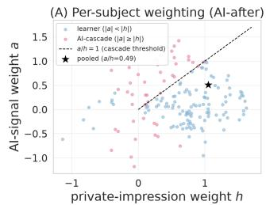

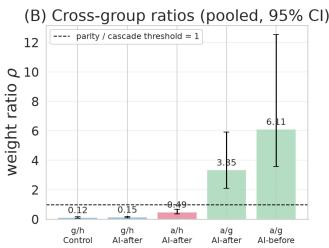  
Figure 4: Subject-level behavioral heterogeneity from the EM mixture of logistic regressions. (A) Each point is one AI-after subject’s AI-signal weight $\beta _ { \mathrm { A I } }$ against her privateimpression weight $\beta _ { \mathrm { p r i v a t e } } .$ . Points above the threshold $\beta _ { \mathrm { A I } } =$ $\beta _ { \mathrm { p r i v a t e } }$ place more weight on the AI than on their own impres-sion and therefore lie on the behavioral cascading side of the Gateway. Points below the threshold remain in the learning region. (B) The weight ratios $\rho$ with subject-bootstrap 95% CIs. The pooled ratio $\rho _ { \mathrm { { A I - p r i v a t e } } } = 0 . 4 9$ lies below parity, but the subject-level mixture reveals a cascade-prone minority with $\rho _ { \mathrm { { A I - p r i v a t e } } } > 1 .$

5.2.3 Q3 (Heterogeneity): behavioral weights across users. The pooled estimate, however, masks within-population heterogeneity: the data contain sequences that look like first-user AI-led cascades, with the first user abandoning her private impression and later judgments highly aligned with the AI prediction. The distributional question is whether the AI creates a cascade-prone behavioral component that cascades on the indicator alone even when the average user does not. We address this by fitting a �-type mixture of logistic decision rules over subjects via EM, with � selected by BIC (specification in the supplementary material).

The selected $K = 3$ mixture reveals substantial heterogeneity. About 46% of subjects weigh their own impression well above the $\mathrm { A I } .$ , about 20% are assigned to a component whose fitted weights place at least as much weight on the AI as on their own impression $( \rho _ { \mathrm { A I - p r i v a t e } } \geq 1 )$ , the cascading side of the behavioral Gateway, and the remaining ≈ 34% are not cleanly classified into either regime.

The comparison with Control makes this point sharper. In Control, the mixture does not identify an individual crowd-cascading class. This is consistent with the classical BHW logic: a single peer judgment is not enough to overturn one’s own private impression, and cascades form only through accumulated public history. The AI is diferent because it enters as a strong common signal. Even when the average user discounts it, some users treat it as strong enough to override their own impression.

Taken together, the three readings provide behavioral evidence consistent with the shared-signal mechanism: the average user weighs the AI below her own impression, while a cascade-prone behavioral component crosses the behavioral Gateway and cas- cades on the indicator alone. These conclusions are stated as ratios because the logit temperature is not identified; $\rho _ { \mathrm { A I - p r i v a t e } }$ is identified only in AI-after, while AI-before is used only for the timing comparison through �AI-public.

## 6 Simulations Extended from the Calibration

The empirical calibration shows a gap between rational Bayesian users and user behavior in the wild. We close the paper with sim- ulation in two parts. First we chart miscalibrated trust, the lever a platform’s presentation controls and the one the calibration al- ready measured (Q2). Second, we briefly illustrate two structural levers the theory suggests (Section 4.4)—diversifying the model and cascade-triggered expert review—across the two regimes $( \alpha > q$ and $\alpha < q )$ and across populations that under- or over-weight the AI. Simulation results of remaining deployment levers are deferred to the supplementary material.

## 6.1 Miscalibrated trust: the perceived Gateway

In the model the Gateway is written in true signal accuracies; in deployment the operative Gateway is behavioral, because users may weight the AI as if it had a diferent reliability. The Gateway comparison runs on the accuracy users believe, not the accuracy that generates �—and the behavioral weights Section 5 estimated (Q2) are exactly a measurement of this gap; we chart the conse-quences here. Figure 5 fixes the canvas: the (�, �) plane with the $\alpha = q$ diagonal separating the interior regime from the strong- AI regime; Section 5 placed the experimental population at two points on it—once at its measured accuracies, once at its behavioral weights.

To separate belief from truth, we let users update on a per- ceived accuracy $\alpha _ { \mathrm { p e r c } }$ while � is drawn with true accuracy �true (symmetric prior, $q = 0 . 7 )$ . The two parameters control diferent things (Figure 6): the cascade direction follows the AI prediction— $\mathbb { P } ( D _ { \infty } = c ) = \mathrm { 1 - e x a c t l y }$ when $\alpha _ { \mathrm { { p e r c } } }$ crosses �, identically for every �true, while the accuracy of that direction, ${ \ v O } ^ { \mathrm { 2 } } ( D _ { \infty } = \theta )$ , is set by $\alpha _ { \mathrm { t r u e } } .$ Sweeping the whole $( \alpha _ { \mathrm { t r u e } } , \alpha _ { \mathrm { p e r c } } )$ plane (Figure 7) indicates the resulting asymmetry: over-trusting a weak AI carries the population across this perceived Gateway onto a near-chance signal, pushing $\mathbb { P } ( D _ { \infty } \ = \ \theta )$ below even the no-AI level, while under-trusting a strong AI only leaves its information unused. The asymmetry this section illustrates—over-trusting a weak indicator is worse than having none, under-trusting a strong one merely wastes it—is the simulated counterpart of what the data now measure.

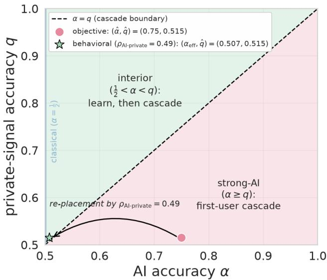

Figure 5: Regime structure on the $( \alpha , q )$ plane (symmetric prior). The $\alpha = q$ diagonal separates the interior regime (learn, then cascade) from the strong-AI regime (first-user cascade); $\begin{array} { r } { \alpha = \frac { 1 } { 2 } } \end{array}$ is the classical BHW edge. The same experimental pop- ulation appears under two placements (Section 5.2): its objective calibration $( \widehat { \alpha } , \widehat { q } ) = ( 0 . 7 5 , 0 . 5 1 5 )$ sits deep in the strong- AI regime, while its behavioral placement—the efective AI strength backed out from choices—falls across the boundary into the interior. The gap between the two points is the main empirical finding of Section 5.  
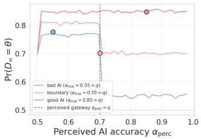

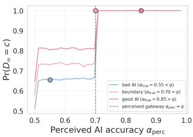  
Figure 6: Miscalibrated trust: users update on a perceived accuracy $\alpha _ { \mathrm { { p e r c } } }$ while � is generated with true accuracy $\alpha _ { \mathrm { t r u e } }$ $( q = 0 . 7 , N = 5 0$ , 12,000 simulated cascades per point). Right: $\mathbb { P } ( D _ { \infty } \ = \ c )$ jumps to 1 at the perceived Gateway $\alpha _ { \mathrm { p e r c } } = \ q ,$ identically for every $\alpha _ { \mathrm { t r u e } } .$ . Left: $\mathbb { P } ( D _ { \infty } = \theta )$ is set by $\alpha _ { \mathrm { t r u e } } ;$ overtrusting a weak $\mathbf { A I } \left( \alpha _ { \mathrm { t r u e } } = 0 . 5 5 \right)$ collapses it from $\approx 0 . 7 7$ to $\approx 0 . 5 5$ . Dots mark the calibrated case $\alpha _ { \mathrm { p e r c } } = \alpha _ { \mathrm { t r u e } } .$

## 6.2 Exploratory Analysis: simulations of AI diversification and expert review interventions

We conduct an exploratory analysis by simulating two structural interventions described in Section 4.4: diversification and expert review. We compare both against the shared AI prediction baseline across strong and weak AI regimes $( \alpha = 0 . 8 5 >$ � and $\alpha = 0 . 6 0 < q$ with $q = 0 . 7$ and $N = 6 0 )$ , while varying the behavioral weight placed on the AI. Both interventions can improve welfare relative to a shared AI prediction, but through diferent mechanisms. Diversification replaces the shared signal with independent AI predictions across users, breaking the common-dependence problem. Expert review instead uses slow cascade formation as a warning signal: when the crowd remains below the Gateway, a slow cascade is in- formative that the AI may be wrong, so expert review can redirect the consensus.

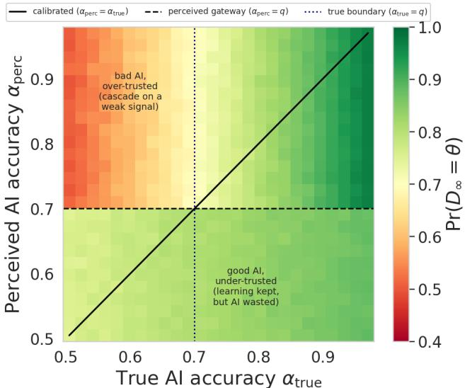  
Figure $7 { : } \mathbb { P } ( D _ { \infty } = \theta )$ over the $( \alpha _ { \mathrm { t r u e } } , \alpha _ { \mathrm { p e r c } } )$ plane $( q = 0 . 7 , N = 4 0 )$ Above the perceived Gateway $\alpha _ { \mathrm { p e r c } } = q$ (dashed) the cascade direction follows � and accuracy reduces to $\alpha _ { \mathrm { t r u e } }$ (vertical bands); below it private impressions continue to enter the public history. The diagonal is the calibrated case; the top-left corner is a weak AI over-trusted, the bottom-right a strong AI under-trusted.

The welfare comparison suggests the main tradeof. In these simulations, diversification is the more robust intervention: it re- mains no worse than the no-AI condition, prevents the collapse that occurs when a weak shared indicator is over-trusted, and moves outcomes toward the ideal (1, 1). In the over-trusting case, it raises correction $W ^ { - }$ from 0 to about 0.97 without sacrificing preserva- tion. Expert review can also be highly efective below the Gateway, reaching roughly (1, 0.7), but its benefit depends on cascades forming slowly enough to trigger review. When users over-weight the AI, cascades form immediately, so � no longer carries useful warn- ing information and the expert is rarely called. Expert review is therefore weakest exactly where the shared-indicator baseline is most dangerous.

The heterogeneous simulation gives the empirically relevant case. Using a mixed crowd motivated by Q3—60% under-weighting users with $\beta _ { \mathrm { A I } } = 0 . 4$ and 40% over-weighting users with $\beta _ { \mathrm { A I } } = 2 . 5 -$ diversification remains strong: for the strong AI, it raises accuracy from 0.85 to 0.99 and $W ^ { - }$ from 0.19 to 0.99; for the weak AI, it raises accuracy from 0.77 to 0.88 and $W ^ { - }$ from 0.55 to 0.83. Expert review degrades because the over-weighting minority often induces immediate cascades, making slow formation a weaker trigger; for the strong AI, the trigger fires in only 13% of rooms and raises $W ^ { - }$ only to 0.31. Thus both interventions can help, but within our simulated settings diversification is more reliable across AI strengths and behavioral weightings, while expert review is useful mainly for still-learning crowds.

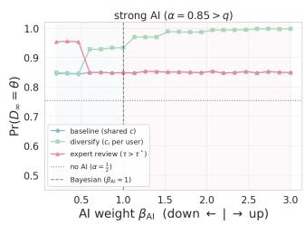

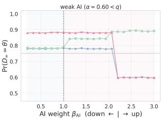  
Figure 8: Consensus accuracy $\mathbb { P } ( D _ { \infty } = \theta )$ against the behav- ioral AI weight $\beta _ { \mathrm { A I } }$ (down-weighting $\left. \vert \right.$ up-weighting), for a strong AI $\left( \alpha = 0 . 8 5 > q , \right.$ left) and a weak AI $( \alpha = 0 . 6 0 < q ,$ right); $q = 0 . 7 ,$ $N = 6 0 _ { : }$ , 30,000 cascades per point. Baseline (shared �) is flat at � above the Gateway and crashes below the no-AI line when a weak indicator is over-trusted. Diver- sify (�� per user) never falls below no-AI and rises toward 1 as the AI is weighted more. Expert review $( \tau > \tau ^ { * }$ , best $\tau ^ { * } )$ lifts accuracy only below the behavioral Gateway; once $\beta _ { \mathrm { A I } }$ crosses it the first user cascades $( \tau = 1 )$ , the trigger never fires, and the lever collapses to the baseline.

## 7 Discussion

In this study, we introduce a lens for characterizing how people interact with AI-based credibility indicators during misinformation spread. We extend the classic Bayesian belief-updating model by treating the AI indicator as a shared public signal. Through theoretical analysis, empirical calibration, and simulations, we show how users compare their private impressions with AI predictions, and how this comparison shapes collective reliance on AI and welfare in misinformation judgments. We now discuss the implications, limitations, and future directions of this work.

## 7.1 Theoretical implication

Our use of social learning theory is deliberately conservative: we take the classical framework and point it at a contemporary plat- form intervention. AI credibility indicators difer from ordinary advice because they are deployed as shared signals—the same out- put reaches many users, and its influence can be mistaken for in- dependent crowd agreement. That distinction is easy to miss in individual-level human-AI studies, and becomes central once AI assistance is embedded in sequential social systems.

Our theoretical contribution is a lens: casting the AI indicator as a common public signal traces its consequences through the same belief-update dynamics that govern the crowd. Unlike signals that arise from the population (prices, ratings, announcements), the AI prediction is exogenous and drawn once per story; it enters every posterior as the same constant term, relocating where the public process starts (Theorem 2) rather than adding a step to it. The failure this creates—bounded crowd information, collapsing to the

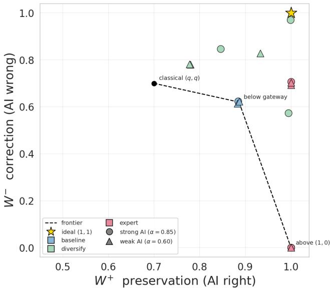  
Figure 9: Welfare plane $( W ^ { + } , W ^ { - } )$ ) of Proposition 9 for each regime $( \alpha = 0 . 8 5$ circles, $\alpha = 0 . 6 0$ triangles) and weighting (down $\beta _ { \mathrm { A I } } = 0 . 4 ,$ Bayesian 1.0, up 2.5); $q = 0 . 7$ $N = 6 0$ . The base- line (blue) sits on the AI-strength frontier. Diversify (green) moves toward the ideal (1, 1) across the grid—up to (1.00, 0.97) for an over-trusting strong-AI population. Expert review (pink) reaches $\left( 1 , \approx 0 . 7 \right)$ below the Gateway but is pinned at the above-Gateway (1, 0) under over-reliance, where its slow-cascade trigger never fires.

AI signal alone above the Gateway—is distinct from the bounded- belief [51] and sparse-network [1] obstructions, and is the discrete analog of correlated signals overstating an unweighted average’s precision.

Two features sharpen the mechanism. First, the Gateway is a property of the human–AI pair, not the AI alone: it runs on the accuracy users believe (Proposition $^ { 1 1 ) , }$ so one indicator can sit in diferent regimes for diferent populations—exactly what the calibration finds, the experimental population being objectively strong-AI yet behaviorally interior, the gap between the two its cen tral empirical result. Second, no single accuracy number evaluates the system: by Proposition 9 the welfare point depends on � only through which side of the Gateway it falls on, and the two regime points are mutually non-dominating—a higher � buys preservation $W ^ { + }$ at the cost of correction $W ^ { - } { - } s _ { 0 }$ a credibility indicator in a sequential environment must be assessed on both coordinates.

## 7.2 Implications for human–AI interaction in information spread

Our results suggest that AI-based credibility indicators change the role of public history in information spread. The public history is not irrelevant: users still observe earlier judgments and update on them. What changes is what those judgments mean. Without a shared AI signal, early judgments can reveal private impressions and help the crowd aggregate information. With a shared AI signal, the same public history may instead record repeated responses to a common input. A large AI-aligned majority can therefore look like independent human validation while containing little inde- pendent human evidence. This distinction matters for the design and interpretation of credibility indicators. Platforms should not treat an AI-aligned majority as straightforward evidence that many independent users validated the claim. The empirical calibration shows that users do use the AI signal, sometimes strongly enough to cascade on it, and that showing the AI before users form their own impressions can strengthen this influence. Thus the public record produced after an AI warning should be interpreted as a mixture of human impressions, social influence, and shared AI dependence, not as a simple crowd statistic.

Therefore, platforms need to preserve or disclose the source structure behind the public history, where similar patterns in re- cent research on community notes and user interaction visualiza- tion [19, 26] should be further highlights when AI is presented. Communicating uncertainty and provenance can help observers distinguish independent crowd evidence from repeated responses to one AI signal. Meanwhile, simply canceling or delaying the AI is not enough, because a strong indicator can still redirect later users while leaving the reported majority dificult to interpret. More structural interventions, such as diversifying AI signals or triggering expert review when cascades form slowly, are better aligned with the problem because they change the information structure rather than only changing when or how strongly the same shared signal is shown.

## 7.3 Implications for designing AI interventions against misinformation

Our results suggest that misinformation interventions should not rely only on tuning a single shared AI indicator, if it is not a perfect oracle. Changing the strength, timing, or presentation of the same indicator can move the system along the preservation-correction frontier, but it does not remove the frontier itself, as stronger re- liance better preserves correct AI predictions, while making wrong predictions harder for the crowd to correct. The design problem is therefore not simply how to make people utilize AI, but how to keep the AI and the human crowd jointly informative.

This points to interventions that change the information structure behind the public history. Provenance disclosure helps ob- servers distinguish independent human evidence from repeated responses to the same AI signal, preventing spurious confidence from growing with crowd size. Diversifying AI signals across users breaks common dependence more directly and is the most reliable intervention in our simulations, including for over-trusting crowds, although its benefit is limited when users still cascade immediately. Cascade-triggered expert review uses slow cascade formation as a warning signal for likely AI errors, but works mainly below the behavioral Gateway, where cascades remain slow enough to be diagnostic. Evaluation should therefore report preservation and correction separately, as the results of over-reliance and under- reliance, respectively.

## 7.4 Limitations and future work

Our work has several limitations. As a cascade model, it retains the standard scafolding of social-learning theory: binary veracity, conditionally independent private impressions, and Bayesian or behaviorally quasi-rational users. These assumptions help isolate the mechanism, but they simplify modern misinformation settings, where claims are often partial, ambiguous, multi-dimensional, or evolving rather than simply true or false. The empirical analysis relaxes the strict Bayesian assumption through behavioral weights, but conditional independence and the exogeneity ofthe AI indicator remain active constraints. Item-level clustering in the data including rooms that cascade against the indicator regardless ofits correctness suggests that correlated impressions matter in practice.

The empirical calibration should be read as evidence for the mechanism, not as a definitive population-level test. It reuses one public experiment with one platform paradigm, one news corpus, and one subject pool. Subjects also recur across rooms, so sharp inference must account for dependence across sequences. In addition, private-impression accuracy is estimated near chance, behavioral weights are identified only up to a logit temperature, and the AI-private ratio requires a treatment where private impressions are recorded before AI exposure. Dedicated experiments that vary AI accuracy, private-impression accuracy, ordering, and provenance would provide a cleaner causal test of the Gateway.

Finally, the paper adopts one theoretical lens: sequential Bayesian belief updating along a chain. This lens fits our question about how a shared AI signal reshapes social learning, but it leaves out network structure, strategic user responses, optimal disclosure, and platform-level intervention design. It also models the AI indica- tor mainly through accuracy, leaving aside AI-specific properties such as calibration, explanation, confidence display, model diversity, provenance, and perceived authority. Future work can extend the model along these dimensions and test interventions such as diver- sified model outputs, provenance disclosures, and cascade-triggered expert review in field or large-scale platform experiments.

## 8 Conclusion

This paper extends the classical Bayesian cascade model with the AI-based credibilit indicator as a shared ublic si nal. The re- sulting Gateway condition shows that AI changes what public history means—crowd agreement may reflect accumulated inde- pendent human evidence, or repeated dependence on the same AI prediction—creating a preservation–correction trade-of. Calibration on human-subject data shows that the average user weights the AI below her own impression but above several peer judgments, and simulations suggest that over-reliance on a weak AI is especially harmful while diversifying AI signals across users can better keep the crowd informative. We discuss implications for understand ing human-AI interaction in information spread and for designing AI-based interventions against misinformation.

## Acknowledgments

We are grateful to the anonymous reviewers who provided many helpful comments. Any opinions, findings, conclusions, or recom-mendations expressed here are those of the authors alone.

## References

[1] Daron Acemoglu, Munther A. Dahleh, Ilan Lobel, and Asuman Ozdaglar. 2011. Bayesian Learning in Social Networks. Review of Economic Studies 78, 4 (2011), 1201–1236.

[2] Esma Aïmeur, Sabrine Amri, and Gilles Brassard. 2023. Fake news, disinformation and misinformation in social media: a review. Social Network Analysis and Mining 13, 1 (2023), 30.

[3] Abdullah Almaatouq, M Amin Rahimian, Jason W Burton, and Abdulla Alhajri. 2020. When social influence promotes the wisdom of crowds. arXiv preprint arXiv:2006.12471 (2020).

[4] Phoebe E Bailey, Tarren Leon, Natalie C Ebner, Ahmed A Moustafa, and Gabrielle Weidemann. 2023. A meta-analysis of the weight of advice in decision-making. Current Psychology 42, 28 (2023), 24516–24541.

[5] Abhijit Banerjee and Drew Fudenberg. 2004. Word-of-Mouth Learning. Games and Economic Behavior 46, 1 (2004), 1–22.

[6] Abhijit V. Banerjee. 1992. A Simple Model of Herd Behavior. Quarterly Journal ofEconomics 107, 3 (1992), 797–817.

[7] Gagan Bansal, Besmira Nushi, Ece Kamar, Walter S Lasecki, Daniel S Weld, and Eric Horvitz. 2019. Be ond accurac : The role of mental models in human-AI team erformance. In Proceedings ofthe AAAI conference on human computation and crowdsourcing, Vol. 7. 2–11.

[8] Gagan Bansal, Tongshuang Wu, Joyce Zhou, Raymond Fok, Besmira Nushi, Ece Kamar, Marco Tulio Ribeiro, and Daniel Weld. 2021. Does the whole exceed its parts? the efect of ai explanations on complementary team performance. In Proceedings ofthe 2021 CHI conference on human factors in computing systems. 1–16.

[9] Md Momen Bhuiyan, Amy X Zhang, Connie Moon Sehat, and Tanushree Mitra. 2020. Investigating diferences in crowdsourced news credibility assessment: Raters, tasks, and expert criteria. Proceedings ofthe ACM on Human-Computer Interaction 4, CSCW2 (2020), 1–26.

[10] Sushil Bikhchandani, David Hirshleifer, and Ivo Welch. 1992. A Theory of Fads, Fashion, Custom, and Cultural Change as Informational Cascades. Journal of Political Economy 100, 5 (1992), 992–1026.

[11] Shreyan Biswas, Alexander Erlei, and Ujwal Gadiraju. 2026. Belief Updating and Delegation in Multi-Task Human–AI Interaction: Evidence from Controlled Simulations. In Proceedings of the 2026 CHI Conference on Human Factors in Computing Systems. 1–23.

[12] Nadav Borenstein, Greta Warren, Desmond Elliott, and Isabelle Augenstein. 2025. Can community notes replace professional fact-checkers?. In Proceedings ofthe 63rd Annual Meeting ofthe Association for Computational Linguistics (Volume 2: Short Papers). 535–552.

[13] Aseem Brahma, Mithun Chakraborty, Sanmay Das, Allen Lavoie, and Malik Magdon-Ismail. 2012. A Bayesian market maker. In Proceedings ofthe 13th ACM Conference on Electronic Commerce. 215–232.

[14] Fu-Yin Cherng, Jingchao Fang, Yinhao Jiang, Xin Chen, Taejun Choi, and Hao-Chuan Wang. 2022. Understanding social influence in collective product ratings using behavioral and cognitive metrics. In Proceedings ofthe 2022 CHI Conference on Human Factors in Computing Systems. 1–16.

[15] Yuwei Chuai, Haoye Tian, Nicolas Pröllochs, and Gabriele Lenzini. 2024. Did the roll-out of community notes reduce engagement with misinformation on X/Twitter? Proceedings ofthe ACM on human-computer interaction 8, CSCW2 (2024), 1–52.

[16] Berkeley J. Dietvorst, Joseph P. Simmons, and Cade Massey. 2015. Algorithm Aversion: People Erroneously Avoid Algorithms After Seeing Them Err. Journal of Experimental Psychology: General 144, 1 (2015), 114–126.

[17] Berkeley J Dietvorst, Joseph P Simmons, and Cade Massey. 2018. Overcoming al gorithm aversion: People will use imperfect algorithms if they can (even slightly) modify them. Management science 64, 3 (2018), 1155–1170.

[18] Ziv Epstein, Nicolo Foppiani, Sophie Hilgard, Sanjana Sharma, Elena Glassman, and David Rand. 2022. Do explanations increase the efectiveness of AI-crowd generated fake news warnings?. In Proceedings of the International AAAI Conference on Web and Social Media, Vol. 16. 183–193.

[19] KJ Kevin Feng, Nick Ritchie, Pia Blumenthal, Andy Parsons, and Amy X Zhang. 2023. Examining the impact of provenance-enabled media on trust and accuracy perceptions. Proceedings ofthe ACM on human-computer interaction 7, CSCW2 (2023), 1–42.

[20] Yiding Feng, Chien-Ju Ho, and Wei Tang. 2024. Rationality-robust information design: Bayesian persuasion under quantal response. In Proceedings ofthe 2024 Annual ACM-SIAM Symposium on Discrete Algorithms (SODA). SIAM, 501–546.

[21] Maria Glenski and Tim Weninger. 2017. Rating efects on social news posts and comments. ACM Transactions on Intelligent Systems and Technology (TIST) 8, 6 (2017), 1–19.

[22] Thomas L Grifiths and Joshua B Tenenbaum. 2006. Optimal predictions in everyday cognition. Psychological science 17, 9 (2006), 767–773.

[23] Ziyang Guo, Yifan Wu, Jason D Hartline, and Jessica Hullman. 2024. A decision theoretic framework for measuring AI reliance. In Proceedings ofthe 2024 ACM conference on fairness, accountability, and transparency. 221–236.

[24] Emőke-Ágnes Horvát, Henry Kudzanai Dambanemuya, Jayaram Uparna, and Brian Uzzi. 2023. Hidden indicators of collective intelligence in crowdfunding. In Proceedings ofthe ACM Web Conference 2023. 3806–3815.

[25] Yoyo Tsung-Yu Hou and Malte F Jung. 2021. Who is the expert? Reconciling algorithm aversion and algorithm appreciation in AI-supported decision making. Proceedings ofthe ACM on Human-Computer Interaction 5, CSCW2 (2021), 1–25.

[26] Emelia May Hughes, Renee Wang, Prerna Juneja, Tony W Li, Tanushree Mitra, and Amy X Zhang. 2024. Viblio: Introducing credibility signals and citations to video-sharing platforms. In Proceedings of the 2024 CHI Conference on Human Factors in Computing Systems. 1–20.

[27] Farnaz Jahanbakhsh, Justin Cranshaw, Scott Counts, Walter S Lasecki, and Kori Inkpen. 2020. An experimental study of bias in platform worker ratings: the role of performance quality and gender. In Proceedings ofthe 2020 CHI Conference on Human Factors in Computing Systems. 1–13.

[28] Farnaz Jahanbakhsh, Yannis Katsis, Dakuo Wang, Lucian Popa, and Michael Muller. 2023. Exploring the use of personalized AI for identifying misinformation on social media. In Proceedings ofthe 2023 CHI Conference on Human Factors in Computing Systems. 1–27.

[29] Jennifer Jerit and Yangzi Zhao. 2020. Political misinformation. Annual Review of Political Science 23, 1 (2020), 77–94.

[30] Chenyan Jia, Alexander Boltz, Angie Zhang, Anqing Chen, and Min Kyung Lee. 2022. Understanding efects of algorithmic vs. community label on perceived accuracy of hyper-partisan misinformation. Proceedings ofthe ACM on Human-Computer Interaction 6, CSCW2 (2022), 1–27.

[31] Yuechen Jiang, Zhiwei Liu, Yupeng Cao, Yueru He, Ziyang Xu, Chen Xu, Zhiyang Deng, Prayag Tiwari, Xi Chen, Alejandro Lopez-Lira, et al. 2026. All that glisters is not gold: A benchmark for reference-free counterfactual financial misinforma- tion detection. In Proceedings ofthe 64th Annual Meeting ofthe Association for Computational Linguistics (Volume 1: Long Papers). 10737–10776.

[32] Alireza Karduni, Douglas Markant, Ryan Wesslen, and Wenwen Dou. 2020. A bayesian cognition approach for belief updating of correlation judgement throu h uncertaint visualizations. IEEE Transactions on Visualization and Computer Graphics 27, 2 (2020), 978–988.

[33] Vivian Lai, Chacha Chen, Alison Smith-Renner, Q Vera Liao, and Chenhao Tan. 2023. Towards a science of human-AI decision making: An overview of design space in empirical human-subject studies. In Proceedings ofthe 2023 ACM conference on fairness, accountability, and transparency. 1369–1385.

[34] Vivian Lai and Chenhao Tan. 2019. On human predictions with explanations and predictions of machine learning models: A case study on deception detection. In Proceedings of the conference on fairness, accountability, and transparency. 29–38.

[35] Zhuoyan Li, Zhuoran Lu, and Ming Yin. 2024. Decoding ai’s nudge: A unified framework to predict human behavior in ai-assisted decision making. In Proceedings ofthe AAAIConference on Artificial Intelligence, Vol. 38. 10083–10091.

[36] Zhiwei Liu, Yangyang Yu, Yupeng Cao, Yuechen Jiang, Haohang Li, Zhuoran Lu, Yuyan Wang, Yixiang Zheng, Xiaorui Guo, Calvin Yixiang Cheng, et al. 2026. AutoRedTrader: Autonomous Red Teaming of Trading Agents through Synthetic Misinformation Injection. arXiv preprint arXiv:2605.09185 (2026).

[37] Jennifer M. Logg, Julia A. Minson, and Don A. Moore. 2019. Algorithm Appreciation: People Prefer Algorithmic to Human Judgment. Organizational Behavior and Human Decision Processes 151 (2019), 90–103.

[38] Zhuoran Lu, Patrick Li, Weilong Wang, and Ming Yin. 2022. The efects of AI-based credibility indicators on the detection and spread of misinformation under social influence. Proceedings ofthe ACM on Human-Computer Interaction 6, CSCW2 (2022), 1–27.

[39] Zhuoran Lu, Patrick Li, Weilong Wang, and Ming Yin. 2025. Understanding the efects of AI-based credibility indicators when people are influenced by both peers and experts. In Proceedings ofthe 2025 CHI Conference on Human Factors in Computing Systems. 1–19.

[40] Zhuoran Lu, Gionnieve Lim, and Ming Yin. 2026. Large Language Model (LLM)- driven Adversarial Social Influences in Online Information S read: Risks and Interventions. In Proceedings ofthe 2026 CHI Conference on Human Factors in Computing Systems. 1–19.

[41] Zhuoran Lu and Ming Yin. 2021. Human reliance on machine learning models when performance feedback is limited: Heuristics and risks. In Proceedings of the 2021 CHI conference on human factors in computing systems. 1–16.

[42] Douglas Markant, Milad Rogha, Alireza Karduni, Ryan Wesslen, and Wenwen Dou. 2023. When do data visualizations persuade? The impact of prior attitudes on learning about correlations from scatterplot visualizations. In Proceedings of the 2023 CHI Conference on Human Factors in Computing Systems. 1–16.

[43] David Milec, Jakub Černy, Viliam Lis\` y, and Bo An. 2021. Complexity and algo-\` rithms for exploiting quantal opponents in large two-player games. In Proceedings ofthe AAAI Conference on Artificial Intelligence, Vol. 35. 5575–5583.

[44] Lev Muchnik, Sinan Aral, and Sean J Taylor. 2013. Social influence bias: A randomized ex eriment. Science 341, 6146 (2013), 647–651.

[45] Gordon Penn cook, Ziv E stein, Mohsen Mosleh, Antonio A Arechar, Dean Eckles, and David G Rand. 2021. Shifting attention to accuracy can reduce misinformation online. Nature 592, 7855 (2021), 590–595.

[46] Gordon Pennycook and David G. Rand. 2021. The Psychology of Fake News. Trends in Cognitive Sciences 25, 5 (2021), 388–402.

[47] Nicolas Pröllochs. 2022. Community-based fact-checking on Twitter’s Birdwatch platform. In Proceedings of the International AAAI Conference on Web and Social Media, Vol. 16. 794–805.

[48] Nicolas Pröllochs and Stefan Feuerriegel. 2023. Mechanisms of true and false rumor sharing in social media: collective intelligence or herd behavior? Proceedings ofthe ACM on Human-Computer Interaction 7, CSCW2 (2023), 1–38.

[49] Haeseung Seo, Aiping Xiong, and Dongwon Lee. 2019. Trust it or not: Efects of machine-learning warnings in helping individuals mitigate misinformation. In Proceedings ofthe 10th ACM Conference on Web Science. 265–274.

[50] Chengcheng Shao, Giovanni Luca Ciampaglia, Alessandro Flammini, and Filippo Menczer. 2016. Hoaxy: A platform for tracking online misinformation. In Proceedings ofthe 25th international conference companion on world wide web. 745–750.

[51] Lones Smith and Peter Sørensen. 2000. Pathological Outcomes of Observational Learning. Econometrica 68, 2 (2000), 371–398.

[52] Mark Steyvers, Heliodoro Tejeda, Gavin Kerrigan, and Padhraic Smyth. 2022. Bayesian modeling of human–AI complementarity. Proceedings ofthe National Academy ofSciences 119, 11 (2022), e2111547119.

[53] Joshua B Tenenbaum, Charles Kemp, Thomas L Grifiths, and Noah D Goodman. 2011. How to row a mind: Statistics, structure, and abstraction. science 331, 6022 (2011), 1279–1285.

[54] Xavier Vives. 1993. How Fast Do Rational Agents Learn? Review ofEconomic Studies 60, 2 (1993), 329–347.

[55] Soroush Vosoughi, Deb Roy, and Sinan Aral. 2018. The spread of true and false news online. science 359, 6380 (2018), 1146–1151.

[56] James R Wright and Kevin Leyton-Brown. 2019. Level-0 models for predicting human behavior in ames. Journal ofArtificial Intelligence Research 64 (2019), 357–383.

[57] Ilan Yaniv. 2004. Receiving Other People’s Advice: Influence and Benefit. Organizational Behavior and Human Decision Processes 93, 1 (2004), 1–13.

[58] Ming Yin, Jennifer Wortman Vaughan, and Hanna Wallach. 2019. Understanding the efect of accuracy on trust in machine learning models. In Proceedings ofthe 2019 chi conference on human factors in computing systems. 1–12.

## A Measure-zero boundary events: tie-breaking and the classical edge $\begin{array} { r } { \alpha = \frac { 1 } { 2 } } \end{array}$

This appendix collects the measure-zero events excluded from the main analysis: the tie-breaking convention at the cascade boundary, the alternative random tie-break, and the classical edge $\begin{array} { r } { \alpha = ~ \frac { 1 } { 2 } } \end{array}$ The upshot, established below, is that the convention bites only at the two measure-zero edges $\alpha \in \{ { \textstyle { \frac { 1 } { 2 } } } , q \}$ and leaves every main conclusion (cascade genericity, direction selection, the information ceiling, and the spurious-confidence slope) unchanged.

## A.1 The conventional (public) tie-break

The decision rule of Section 3.1 reads $J _ { i } = 1 \{ \ell _ { i } > 0 \}$ on the open set $\{ \ell _ { i } \neq 0 \}$ , and is silent on the boundary $\ell _ { i } = 0 .$ . The boundary is a measure-zero event in the interior of the learning region and can be assigned arbitrarily there. It is not measure-zero at the cascade absorbing thresholds, however: when $P _ { i } = + L _ { q } ,$ , the private impres-sion $s _ { i } = 0$ produces $\ell _ { i } = P _ { i } - L _ { q } = 0$ exactly, and a tie-breaking convention is needed to make the absorbing-set arguments in Section 3.2 clean.

We adopt the convention that ties are broken in the direction of $P _ { i } , \mathrm { i . e . }$ , the user defers to the public log-odds when her private impression exactly cancels them. Concretely, the full decision rule is

$$
J _ { i } \ = \ \left\{ \begin{array} { l l } { 1 , } & { \mathbb { P } ( \theta = 1 \mid s _ { i } , c , H _ { i } ) > \frac { 1 } { 2 } , } \\ { 0 , } & { \mathbb { P } ( \theta = 1 \mid s _ { i } , c , H _ { i } ) < \frac { 1 } { 2 } , } \\ { 1 \{ P _ { i } \geq 0 \} , } & { \mathbb { P } ( \theta = 1 \mid s _ { i } , c , H _ { i } ) = \frac { 1 } { 2 } , } \end{array} \right.
$$

with ${ { J } _ { i } } \ = \ 1$ by default in the measure-zero event $P _ { i } ~ = ~ 0$ . The equivalent log-odds form, with $\ell _ { i } = P _ { i } + \lambda ( s _ { i } ; q )$ , is

$$
J _ { i } ~ = ~ 1 \{ \ell _ { i } > 0 \} ~ + ~ 1 \{ \ell _ { i } = 0 \} \cdot 1 \{ P _ { i } \geq 0 \} .
$$

This convention has no efect on the interior of the learning region $| P _ { i } | < L _ { q } ,$ where $\ell _ { i } \neq 0$ for both signal realizations $s _ { i } \in \{ 0 , 1 \}$ It is load-bearing at the boundaries: $P _ { i } = + L _ { q }$ commits to $J _ { i } = 1$ (the tied private impression $s _ { i } = 0$ is overridden by the positive public log-odds), and $P _ { i } = - L _ { q }$ commits to $J _ { i } = 0$ (symmetric case). This is exactly what Lemma $1 ( \mathrm { b } ) \mathrm { - ( c ) }$ requires at equality. Intuitively, when private and public evidence cancel, the user defers to the public component—the same direction a marginal additional public observation would have nud ed her.

## A.2 Ties occur only at the two measure-zero edges $\alpha \in \{ { \textstyle { \frac { 1 } { 2 } } } , q \}$

A tie $( \ell _ { i } = 0$ with positive probability) requires the public log-odds to land exactly on a boundary, $P _ { i } = \pm L _ { q }$ . With symmetric prior, $P _ { i } = \lambda ( c ; \alpha ) + k L _ { q } = \pm ( L _ { \alpha } + k L _ { q } )$ for some integer � (the net of the revealed pre-cascade impressions). Thus $P _ { i } = \pm L _ { q }$ with positive probability requires $L _ { \alpha } = ( 1 - | k | ) L _ { q }$ for some integer �, which for $\alpha \in \left( \textstyle { \frac { 1 } { 2 } } , 1 \right)$ has exactly two solutions: $L _ { \alpha } = L _ { q } , \mathrm { i . e . } \ \alpha = q ( k = 0 )$ 2   
and $L _ { \alpha } = 0 , \mathrm { i . e . } \alpha = { \textstyle { \frac { 1 } { 2 } } } ( k = 1$ , the first boundary visit $P _ { 2 } = \pm L _ { q } )$ For every other �—in particular the whole below-Gateway interval $\alpha \in ( \textstyle { \frac { 1 } { 2 } } , q )$ and the strong-AI region $\alpha > q -$ cascade entry is strict $( | P | > L _ { q }$ at the moment of absorption, because $L _ { \alpha } \neq L _ { q } ) ;$ , no tie ever occurs, and the tie-breaking convention is irrelevant. The convention can therefore matter only at the two measure-zero edges, which we treat in turn.

## A.3 The random tie-break

The alternative convention resolves each tie by an independent fair coin, $J _ { i } = 1 \{ u _ { i } > \frac { 1 } { 2 } \}$ } with $u _ { i } \sim \mathrm { U n i f } [ 0 , 1 ]$ . By the previous subsection it difers from the public rule only at $\alpha \in \{ { \textstyle { \frac { 1 } { 2 } } } , q \}$

$A t \alpha = q .$ The first user has $P _ { 1 } = \pm L _ { q } ,$ and a disagreeing private impression $( s _ { 1 } ~ \neq ~ c )$ produces a tie. The public rule sets $J _ { 1 } \ = \ c ,$ giving the weak-inequality Gateway statement $^ { \alpha } \alpha \geq q \Rightarrow \tau = 1 ^ { \prime }$ (Theorem 5). The random rule instead lets user 1 reveal $s _ { 1 }$ with probability ${ \frac { 1 } { 2 } } ,$ so first-user cascade genericity holds for $\alpha > q$ and at $\alpha = q$ only with probability $\textstyle { \frac { 1 } { 2 } }$ . This shifts a single measure-zero point from the cascade side to the learning side; every statement for � > � is untouched.

At $\begin{array} { r } { \alpha \ = \ \frac { 1 } { 2 } . } \end{array}$ . See the next subsection. In both cases the absorbing direction $D _ { \infty }$ keeps the same conditional law—a strict cascade $( | P | > L _ { q } )$ is reached in finite expected time regardless of how the boundary ties are resolved, and the coin is symmetric—so direction selection (Theorem 7), the information-aggregation bound and the spurious-confidence slope $L _ { q }$ (Theorem 8) are identical under the two conventions. Only the cascade-formation time changes, and only at $\begin{array} { r } { \alpha = \frac { 1 } { 2 } } \end{array}$

## A.4 The classical edge $\begin{array} { r } { \alpha = \frac { 1 } { 2 } } \end{array}$

When $\begin{array} { r } { \alpha = \frac { 1 } { 2 } } \end{array}$ the AI prediction contributes zero log-odds, so $P _ { 1 } = 0 :$ the first user is in the interior and acts on her private impression, $J _ { 1 } = s _ { 1 }$ , sending $P _ { 2 } = \pm L _ { q }$ to a boundary. From there the conventions diverge.

Cascade-formation time. Under the public tie-break, the bound-ary $P _ { 2 } = \pm L _ { q }$ is absorbing: every later user with a disagreeing impression is overridden toward the public side, so $\tau = 2$ , and $J _ { j } = J _ { 1 }$ for all $j \ge 2 \mathrm { - o n l y }$ the first user’s impression is ever re- vealed. Under the random tie-break, a disagreeing impression at the boundary registers with probability $\textstyle { \frac { 1 } { 2 } }$ (knocking � back to 0 before it re-absorbs), so � takes values in $\{ \bar { 2 } , 3 , \dots \}$ and a geometric number $( \mathbb { E } [ \tau - 1 ] < \infty )$ of private impressions enter the record. This is the only place the cascade-time law of Proposition 6 depends on the convention.

Why the main conclusions survive. Either way the revealed prefix is finite in expectation, so the information $I ( \bar { J } _ { N } ; \theta )$ still saturates at an �-independent ceiling, and the naive external observer’s excess still grows at slope $L _ { q }$ (Theorem 8). Under the public rule the consensus copies $J _ { 1 { \mathrm { : } } }$ , so the Bayes-correct observer extracts exactly one private impression and the spurious-confidence constant is $O ( 1 ) = - L _ { q } ;$ under the random rule the constant absorbs the few extra revealed impressions but remains uniformly bounded in �. The classical edge thus reproduces, rather than alters, the qualitative content of the main theorems.

## B Continuous-Valued AI Indicators

We extend the analysis to continuous-valued AI indicators $( \mathrm { e . g . }$ AI-generated credibility indicators on a real-valued scale rather than a binary flag). Let the AI signal $c \in \mathbb { R }$ be the indicator’s real- valued output, whose conditional density $f _ { \theta } ( c )$ satisfies the strict monotone likelihood ratio property: $\frac { f _ { 1 } ( c ) } { f _ { 0 } ( c ) }$ is strictly increasing in �. The Bayesian update with this � replaces the binary log-likelihood term $\lambda ( c ; \alpha )$ with the log-likelihood ratio

$$
\Lambda ( c ) \equiv \log \frac { f _ { 1 } ( c ) } { f _ { 0 } ( c ) } .
$$

The threshold structure of Theorem 2 generalizes immediately: the public log-odds at user � become

$$
P _ { i } = \ell _ { 0 } + \Lambda ( c ) + \sum _ { j < i } \psi _ { j } ( J _ { j } ) ,
$$

and the cascade thresholds remain at $\pm L _ { q } .$ . The continuous analog of cascade genericity is:

Theorem B.1 (Continuous-Indicator Immediate Absorption). Let $G _ { q } \equiv \mathbb { P } ( | \Lambda ( c ) | \geq L _ { q } )$ . Then with probability $G _ { q } .$ , a cascade forms at the first user. Conditional on � with $| \Lambda ( c ) | \geq L _ { q } , \bar { J } _ { i } = 1 \{ \Lambda ( c ) > 0 \}$ for all $i \geq 1$

Please refer to Appendix J.8 for details of proof. Comparative statics. As the AI indicator’s conditional distribu- tions become more separated in the likelihood ratio sense $( \mathrm { e . g . }$ scaling Λ by a factor $\kappa > 1 ) , G _ { q }$ increases monotonically toward 1, and cascade genericity becomes generic. As � increases (more accurate private impressions), the threshold $L _ { q }$ rises and $G _ { q }$ falls. The two parameters trade of cleanly: $G _ { q }$ is large when the AI indicator’s resolving power dominates the private impression’s.

Theorems 7 and 8 generalize correspondingly. The information aggregation bound becomes $I ( \bar { J } _ { N } ; \theta ) ~ \leq ~ I ( c ; \theta ) + I ( \sigma _ { < \tau } ; \theta ~ | ~ c )$ with $\sigma _ { < \tau }$ defined as in Theorem 8, the first term collapsing to $I ( c ; \theta )$ whenever the AI indicator almost surely satisfies the dom- inance condition $| \Lambda ( c ) | \geq L _ { q } . \mathrm { ~ A ~ }$ continuous AI indicator makes the first-user cascade probability $G _ { q } \ = \ \mathbb { P } ( | \Lambda ( c ) | \ \ge \ L _ { q } )$ smooth in the signal separation, with no analog of the binary discontinu-ity at $\alpha = q$ (Remark D.2). The conditional learning-region dy- namics, however, still inherit the binary-private-signal two-state structure: because the private impression contributes a fixed increment $\pm L _ { q } ,$ a starting point $\Lambda ( c ) \in ( 0 , L _ { q } )$ visits only the transient states $\{ \bar { \Lambda ( c ) } , \Lambda ( c ) - L _ { q } \}$ , whose transition topology—and hence the gambler’s-ruin absorption probabilities $\begin{array} { r } { u _ { + } \ = \ \frac { p } { 1 - p + p ^ { 2 } } } \end{array}$ (from $\Lambda ( c ) > 0 )$ and $\begin{array} { r } { u _ { - } = \frac { p ^ { 2 } } { 1 - p + p ^ { 2 } } } \end{array}$ (from $\Lambda ( c ) < 0 )$ —do not depend on the value of $\Lambda ( c )$ . The continuous extension therefore smooths the $f r e -$ quency of first-user cascading but preserves, rather than sharpens, the discrete direction-selection content.

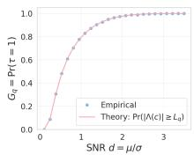

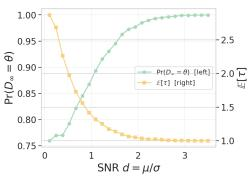  
Figure B.1: Continuous (Gaussian) extension of the cascade results at $q = 0 . 7 , \sigma = 1 . 0 , N = 1 0 0$ . Left: first-user cascade probability $G _ { q } = \mathbb { P } ( | \Lambda ( c ) | \geq L _ { q } )$ as a function of SNR $\begin{array} { r } { d = \frac { \mu } { \sigma } } \end{array}$ (Theorem B.1); empirical points match the closed form and rise monotonically to 1 without discontinuity. Right: long- run consensus accuracy $\mathbb { P } ( D _ { \infty } = \theta )$ (left axis) and expected cascade time $\mathbb { E } [ \tau ]$ (right axis) vs SNR.

## C Asymmetric prior

The body assumes $\ell _ { 0 } = 0$ (symmetric prior). The cascade-genericity threshold extends to $\ell _ { 0 } \neq 0$ as follows.

Remark C.1 (Immediate absorption with an asymmetric prior). Theorem 5 is robustto the prior, butthe threshold now depends on the realized AI indication �. A first-user cascade in the direction of � requires � $\geq \alpha ^ { * } ( q , \ell _ { 0 } , c )$ , where $\alpha ^ { * } ( q , \ell _ { 0 } , c )$ solves $L _ { \alpha ^ { * } ( q , \ell _ { 0 } , c ) } =$ $L _ { q } - \ell _ { 0 } \mathopen { } \mathclose \bgroup \left( 2 c - 1 \aftergroup \egroup \right)$ : a prior aligned with � lowers the threshold, an opposed prior raises it. A single indication-uniform condition guaranteeing a first-user cascade for both $c \in \{ 0 , 1 \}$ is $L _ { \alpha } \ge L _ { q } + | \ell _ { 0 } | .$ . In particular, the cascade can be triggered at the first user by an AI indicator of any positive accuracy when the prior is suficiently informative and aligned with �.

## D Additional results and figures for the main theorems

This appendix collects the boundary results and supporting figures deferred from Section 4: the closed forms for the cascade-formation time, the marginal-monotonicity corollary, the discontinuity re-mark, and the simulation figures.

Cascade-time closed forms (Proposition 6(c)). On the interior $\alpha \in ( \textstyle { \frac { 1 } { 2 } } , q )$ , the conditional law of � given $( c , \theta )$ depends only on � and on whether $c = \theta .$ The first-step probabilities are

$$
\mathbb { P } ( \tau = 2 \mid c = \theta ) = q , \qquad \mathbb { P } ( \tau = 2 \mid c \neq \theta ) = 1 - q ,
$$

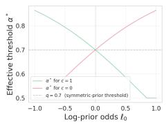

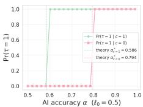

Figure C.1: Asymmetric prior at $q \ = \ 0 . 7$ . Left: theoretical threshold $\alpha ^ { * } ( q , \ell _ { 0 } , c )$ as a function of the prior log-odds $\ell _ { 0 } ,$ , for each $c \in \{ 0 , 1 \} ;$ ; a prior aligned with � lowers $\alpha ^ { * }$ , opposed raises it. Right: empirical first-user cascade probability $\mathbb { P } ( \tau = 1 \mid c )$ at $\ell _ { 0 } = 0 . 5 ,$ , with theoretical thresholds $\alpha _ { c = 1 } ^ { * } \approx 0 . 5 8 6$ and $\alpha _ { c = 0 } ^ { * } \approx$ 0.794 marked as dashed verticals.  
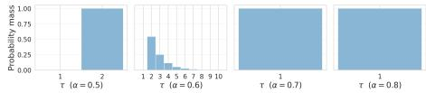  
Figure D.1: Distribution of cascade-formation time � at pri- vate accuracy $q = 0 . 7$ over 20,000 simulated cascades of $N = 5 0$ users (Theorem 5). Each panel is a diferent AI accuracy � (annotated on the panel’s �-axis). The probability mass at $\tau = 1$ rises through the learning region $\alpha \in ( \textstyle { \frac { 1 } { 2 } } , q )$ and jumps to 1 at $\alpha = q .$

and the conditional means admit the closed forms

$$
\mathbb { E } [ \tau \mid c = \theta ] \ = \ 1 + \frac { 2 - q } { 1 - q + q ^ { 2 } } , \qquad \mathbb { E } [ \tau \mid c \neq \theta ] \ = \ 1 + \frac { 1 + q } { 1 - q + q ^ { 2 } } ,
$$

with diference

$$
\mathbb { E } [ \tau \mid c \neq \theta ] - \mathbb { E } [ \tau \mid c = \theta ] ~ = ~ \frac { 2 q - 1 } { 1 - q + q ^ { 2 } } ~ > ~ 0 ,
$$

so the AI shortens cascade formation when correct and lengthens it when incorrect, the asymmetry governed by � alone.

Corollary D.1 (Marginal monotonicity in �). For $\alpha \in ( \textstyle { \frac { 1 } { 2 } } , q )$

$$
\mathbb { P } ( D _ { \infty } = \mathrm { s i g n } ( \lambda ( c ; \alpha ) ) \mid c ) = \frac { ( 1 - q ) + \alpha ( 2 q - 1 ) } { 1 - q + q ^ { 2 } } ,
$$

which is strictly increasing in �. The monotonicity is sourced entirely from the posterior $\mathbb { P } ( \theta = c \mid c ) = \alpha ;$ the chain dynamics on $\{ A , B \}$ contribute no �-dependence. (Proof in Appendix J.6.)

Remark D.2 (Discontinuity at $\alpha = q )$ . The map $\alpha \mapsto \mathbb { P } ( D _ { \infty } =$ $\mathrm { s i g n } ( \lambda ( c ; \alpha ) ) \mid c )$ is discontinuous at $\alpha = q . O n \left( { \textstyle { \frac { 1 } { 2 } } } , q \right)$ it approaches $\operatorname* { l i m } _ { \alpha \to q ^ { - } } \mathbb { P } ( D _ { \infty } = \operatorname { s i g n } ( \lambda ( c ; \alpha ) ) \mid c ) = \frac { q ^ { 2 } + ( 1 - q ) ^ { 2 } } { 1 - q + q ^ { 2 } } = \frac { 1 - 2 q ( 1 - q ) } { 1 - q + q ^ { 2 } } < 1 ,$ and jumps to 1 at $\alpha = q$ because Theorem 5 forces a first-user cascade as soon as $L _ { \alpha } \ge L _ { q }$ . The interior limit governs $o n l y \left( { \textstyle { \frac { 1 } { 2 } } } , q \right)$ and stays strictly below 1; on regime $\left( a \right) \left( \alpha \geq q \right)$ the probability is identically 1, so the value at $\alpha = q$ is reached by the jump, not as a limit from within the interior.

## E Dataset and experimental design

We use the experimental data from a prior work of AI-based credi- bility indicators in social misinformation cascades. Each room is one cascade: a single news item evaluated sequentially by eleven subjects drawn from a pool of several hundred recruited participants. Subjects rotate across rooms (the same subject may occupy diferent positions in diferent rooms), so the model’s in-room assumption of sequential, independent private signals is preserved, but rooms are not independent across the corpus—a limitation we return to in Section 7. The corpus comprises 538 distinct subjects contributing about ten judgments each, with no subject spanning more than one treatment (the design is between-subjects); it is this repeated-measures structure—each subject seen under varying AI signals, public tallies, and private impressions—that identifies the per-subject behavioral weights of Section 5.2. Each record in dexes one room by (�����, ����\_�����, ����\_��), with 480 rooms total (160 per treatment, 40 news items per treatment, 4 rooms per (�����, ����\_�����)); the item-level analysis of Appendix F pools the two AI treatments, so each of the 40 items is observed in 8 rooms.

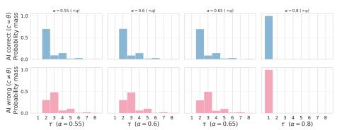  
Figure D.2: Distribution of � on the interior $\alpha \in \mathsf { \Gamma } ( \textstyle { \frac { 1 } { 2 } } , q )$ at $q = 0 . 7 ,$ split by AI correctness (Proposition $\mathbf { 6 ( c ) } )$ . Top row (blue): $c = \theta ,$ , mass concentrates at small �. Bottom row (pink): $c \neq \theta ,$ distribution shifts to larger �. Each column is a diferent $\alpha ,$ annotated on the bottom �-axis.

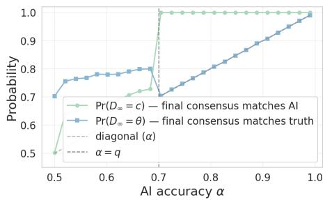

Figure D.3: Marginal $\mathbb { P } ( D _ { \infty } = \operatorname { s i g n } ( \lambda ( c ; \alpha ) )$ | �) as a function of � at $q = 0 . 7$ (Corollary D.1). The curve rises monotonically on $\textstyle { \bigl ( } { \frac { 1 } { 2 } } , q { \bigr ) }$ and jumps to 1 at $\alpha = q$ (Remark D.2).  
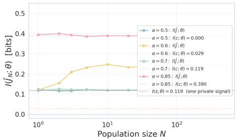  
Figure D.4: Mutual information $I ( \bar { J } _ { N } ; \theta )$ versus population size � for $\alpha \in \{ \textstyle { \frac { 1 } { 2 } } , 0 . 6 , 0 . 7 5 \}$ at $q = 0 . 7$ (Theorem 8). The curves saturate at finite ceilings independent of $N ;$ the dashed line marks the strong-AI tight value $I ( c ; \theta )$ .

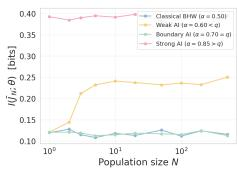

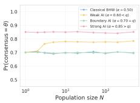  
Figure D.5: Classical BHW vs. the augmented model at $q = 0 . 7 ,$ with $\alpha \in$ {0.50, 0.60, 0.70, 0.85} spanning the classical limit, learning regime, boundary, and strong-AI regime—an extended view of Figure D.4. Left: mutual information $I ( \bar { J } _ { N } ; \theta )$ vs population size � saturates in every regime—users arriv- ing after cascade formation add no independent evidence. Right: long-run consensus accuracy $\mathbb { P } ( \mathrm { c o n s e n s u s } = \theta )$ vs � plateaus quickly, with the initial regime alone determining the ceiling.

Each room is one realization of the model in Section 3.1 with $N = 1 1$ users. The state � is the news item’s veracity, fixed and known to the experimenter; the AI signal � is a binary credibility prediction generated once per news item by a held-out classifier and held fixed within a room; each subject publishes a binary judgment $J _ { i } \in \{ 0 , 1 \}$ (fake/real), which enters the public history visible to subsequent subjects in the same room. We work directly with these per-user judgments, recoded to $\{ - 1 , + 1 \}$ for the log-odds quantities. Each subject also records a pre-crowd initial judgment, formed before seeing the public history (and, in AI-after, before the AI signal); this provides a direct measure of the private signal $s _ { i } ,$ from which we identify ${ \widehat { q } } .$

Three between-subjects treatments vary the presence and timing of the AI-based credibility indicator:

Control no AI indicator is shown; this implements the classical BHW limit $\begin{array} { r } { \alpha = \frac { 1 } { 2 } } \end{array}$

AI-before the AI signal is shown in Step 1, before the subject’s own initial impression and before the public history; this matches the canonical information set $( s _ { i } , c , H _ { i } )$ of Section 3.1.

AI-after the AI signal is shown in Step 3, alongside the pub-lic history, after the subject has formed and recorded an initial private impression; the subject’s published judgment $J _ { i }$ is then formed conditional on $( s _ { i } , c , H _ { i } )$ as in the model, but the recorded initial impression provides a separately observable measure of the private signal ��.

The three treatments are balanced (160 rooms each) and share the same set of 40 news items, so � is held fixed across treatments by design.

## F Full empirical diagnostics

This appendix expands the calibration of Section 5: the four per-prediction tests of the strict benchmark, the behavioral model’s specification and identification, and the item-level residual the per- user fit does not capture.

## F.1 Strict-benchmark diagnostics

Because ${ \widehat { \alpha } } > { \widehat { q } } ,$ the strict model lives in the strong-AI regime, where its predictions are sharp and parameter-free. We test all four in turn on the per-user judgments; the diagnostics are visualized in Figure G.1 (Section 5).

First-user cascade (Theorem 5). The strict prediction is $\mathbb { P } ( J _ { i } =$ $c ) \ : = \ : 1$ at every position � in both AI treatments. The empirical first-user rate is 0.644 (AI-before) and 0.650 (AI-after), and the per-position rate $\mathbb { P } ( J _ { i } = c )$ stays in the band $0 . 5 6 \mathrm { - } 0 . 7 1$ across all eleven positions with no tendency toward 1. The fraction of rooms in which all eleven judgments match � is only 0.044 (AI-before) and 0.119 (AI-after), not the ≈ 1 implied by strict cascade locking. The point prediction is rejected.

Direction selection (Theorem 7). Regime (a) predicts P(majority = �) = 1, i.e. majority tracks truth with probability 1 when the AI is correct and 0 when wrong. Conditional on a correct $\mathrm { A I } ,$ the majority matches the truth in 0.708 (AI-before) and 0.708 (AI-after) of rooms; conditional on a wrong AI, in 0.325 and 0.375. The strict 0/1 prediction is rejected. The qualitative comparative content sur-vives: when the AI is wrong, both AI treatments fall well below the 50% truth-accuracy line, while Control stays roughly symmetric around 0.54, consistent with the no-AI baseline $\textstyle ( \alpha = { \frac { 1 } { 2 } } )$

Information aggregation (Theorem 8). The plug-in $\widehat { I } ( \bar { J } _ { n } ; \theta )$ is computed from the empirical joint histogram of $( \mathrm { s i g n } ( \bar { J } _ { n } ) , \theta )$ over the 480 rooms. Control stays near zero (≤ 0.045 nats), AI-before grows modestly $( \leq 0 . 0 3 4 )$ , and AI-after rises to a plateau of 0.04– 0.06. The strong-AI tight value $I ( c ; \theta ) = 0 . 1 3 1$ nats at $\widehat { \alpha } = 0 . 7 5$ is not attained; the realized plateau is well below it. But the qualitative content is consistent with a finite, �-independent ceiling: across the eleven positions none of the three curves shows evidence of the monotone growth in � that wisdom-of-crowds aggregation would predict. (We read this as consistent with, not a test of, the asymptotic statement, given the short � = 11 horizon.)

Spurious external confidence (Theorem 8). The slope is where the benchmark comes closest to a quantitative match. The running mean of $\ell _ { \mathrm { e x t } } ^ { \mathrm { n a i v e } }$ · sign(consensus) grows near-linearly in �, with OLS slope ≈ 0.03 per user across all three groups—the same order as $\widehat { L _ { q } } =$ 0.061, the small shortfall reflecting imperfect cascade alignment. The amplitude constant of Theorem 8 is untestable here: the naive– correct crossover is at $\begin{array} { r } { N ^ { \dagger } \approx \frac { \widehat { L _ { \alpha } } } { \widehat { L _ { q } } } \approx 1 8 , } \end{array}$ beyond the � = 11 horizon. Only the slope, the regime-independent part of the prediction, is in range, and it holds.

## F.2 The behavioral model

We keep the model’s information structure (the public-history component, the private contribution, and the AI indicator) but relax the strict Bayesian decision rule with a few free parameters. We use a reduced-form logit in the quantal-response / behavioral- aggregation tradition; it nests three relaxations:

(i) Softmax choice in place of the hard threshold: $\mathbb { P } ( J _ { i } \ =$ $+ 1 ) \ = \ \sigma ( \nu \cdot \ell _ { i } )$ , with temperature � capturing decision noise; � → ∞ recovers the deterministic rule of Section 3.1.

(ii) Weighted (not equal) aggregation of the public-history and private channels, which enter the index with separate weights rather than at the common unit weight the strict rule imposes.

(iii) Over/under-weighting of the AI indicator through a separate weight on �, capturing relative over- or under-weighting of the AI log-odds channel against the public- history channel.

We estimate the nested specification

logit P(�� = +1) = �0 + �public $\left( { \cal L } _ { q } T _ { i } \right) + w _ { \mathrm { A I } } \left( { \cal L } _ { \alpha } c _ { i } \right) + w _ { \mathrm { p r i v a t e } } \theta _ { i } ,$ on all judgments, where $\begin{array} { r } { T _ { i } ~ = ~ \sum _ { k < i } J _ { k } } \end{array}$ is the signed public tally, $c _ { i } = 2 c - 1$ is the AI signal, and $\theta _ { i } = 2 \theta - 1$ is the truth. The public and AI regressors are placed in log-odds units $( L _ { q } T _ { i }$ is the naive public log-odds, $L _ { \alpha } c _ { i }$ the AI log-odds), so $w _ { \mathrm { p u b l i c } } ,$ , �AI are dimensionless multipliers on log-odds channels. We use $\theta _ { i }$ as a noisy proxy for the unobserved private impression �� (subjects observe $s _ { i } ,$ not $\theta ) ;$ we therefore read $w _ { \mathrm { p r i v a t e } }$ as a residual truth-aligned sensitivity after public and AI controls, not as a clean private-channel weight.

Identification. Under a logit/QRE link the index is $\nu \cdot \ell _ { i } ,$ so each fitted coeficient equals � times a structural weight: the overall scale is the (unidentified) temperature �, and only coeficient ratios are identified without a normalization. We therefore take the temperature-free per-signal ratio $\begin{array} { r } { \rho _ { \mathrm { A I - p u b l i c } } = \frac { w _ { \mathrm { A I } } \tilde { L } _ { \alpha } } { w _ { \mathrm { p u b l i c } } \widehat { L } _ { q } } - } \end{array}$ —the contri- bution of one AI indication relative to one public judgment, invariant to the log-odds scaling of the regressors—as the robust object, and report any absolute $\widehat { \beta } _ { \mathrm { A I } }$ only under an explicitly stated nor- malization. Standard errors in Table F.1 are two-way clustered by room and news item (Cameron–Gelbach–Miller); they are nearly identical under room-only or item-only clustering, so the strong item-level correlation documented below does not overturn the significance pattern. $w _ { \mathrm { p r i v a t e } }$ is the only coeficient whose 95% CI contains zero in the AI groups.

(i) Public history and the AI indicator contribute comparably. The sequential ablation is clear: adding the public tally raises the log- likelihood by +36 (AI-before) to +54 (AI-after), and adding the AI indicator by a further +42 and +32, while the truth proxy adds essentially nothing. Both channels are tightly estimated $( w _ { \mathrm { p u b l i c } } \approx 1 . 4 – 2 . 2$ and $w _ { \mathrm { A I } } \approx 0 . 4 2 – 0 . 4 7$ , clustered $t > 4 ) ;$ neither dominates. That sub- jects respond to the accumulated (cascade-correlated) public record as if it were strong evidence is the within-user counterpart of the naive external observer of Theorem 8—though the regression alone cannot separate belief updating from conformity.

(ii) Residual truth sensitivity is small. After public and AI controls, $w _ { \mathrm { p r i v a t e } }$ is small and not significantly diferent from zero in either AI group $( 0 . 0 1 \pm 0 . 0 6 , - 0 . 0 1 \pm 0 . 0 6$ , two-way clustered; adding it leaves log � essentially unchanged). Because � is only a proxy for $s _ { i } .$ we do not interpret this as “the private channel is silent” in a structural sense; we read it as the data showing no detectable truth-aligned pull beyond what the public and AI channels already carry—consistent with $\widehat { q } \approx \frac { 1 } { 2 }$ , under which a private impression conveys little.

(iii) One AI prediction carries the weight of several public judgments. The temperature-free per-signal ratio is $\rho _ { \mathrm { A I - p u b l i c } } \approx 5 . 9$ (AI-before) and 3.5 (AI-after), matching the EM reduced-form estimates (6.11 and 3.52, Appendix F.3): one AI prediction contributes as much to the fitted choice index as roughly three to six public-history judgments. Equivalently, per log-odds unit the

<table><tr><td></td><td>AI-BEFORE</td><td>AI-AFTER</td><td>CONTROL</td></tr><tr><td colspan="4">Full model (two-way clustered SE by room and item)</td></tr><tr><td>Wpublic (public history)</td><td>1.41 (0.32)</td><td>2.18 (0.27)</td><td> $2 . 1 5 \ ( 0 . 3 7 )$ </td></tr><tr><td>wAI (AI log-odds)</td><td>0.47 (0.06)</td><td>0.42 (0.06)</td><td></td></tr><tr><td>wprivate (truth proxy)</td><td>0.01 (0.06)</td><td>-0.01 (0.06)</td><td> $0 . 1 8 \ ( 0 . 0 7 )$ </td></tr><tr><td> $\begin{array} { r } { \rho _ { \mathrm { A I - p u b l i c } } = \frac { w _ { \mathrm { A I } } \widehat { L _ { \alpha } } } { w _ { \mathrm { p u b l i c } } \widehat { L _ { q } } } } \end{array}$ </td><td>5.93</td><td>3.51</td><td></td></tr><tr><td colspan="4">Sequential ablation: incremental ∆log L from</td></tr><tr><td colspan="4">adding public history, then AI, then truth proxy</td></tr><tr><td>+ public history</td><td>+36.4</td><td>+54.0</td><td>+29.7</td></tr><tr><td>+ AI indicator</td><td>+42.4</td><td>+32.1</td><td></td></tr><tr><td>+ truth proxy</td><td>+0.0</td><td>+0.0</td><td>+5.6</td></tr><tr><td></td><td>1758/160</td><td></td><td></td></tr><tr><td colspan="2">n (judgments) / rooms</td><td>1760/160</td><td>1760/160</td></tr></table>

Table F.1: Pooled behavioral decision-rule fit (the single-class baseline of the per-subject mixture of Section 5.2.3). Coefi-cients are dimensionless multipliers on log-odds channels; the absolute scale is the (unidentified) temperature, so the temperature-free per-signal ratio $\rho _ { \mathbf { A I - p u b l i c } }$ is the robust quan- tity, directly comparable with the EM reduced-form estimates (6.11 and 3.52, Appendix F.3). SEs (in parentheses) are two-way clustered by room and news item. Full specification, identifi- cation, and robustness in Appendix F.3.

AI is weighted at $\rho _ { \mathrm { A I - p u b l i c } } \cdot \frac { \widehat { L _ { q } } } { \widehat { L _ { \alpha } } } \approx 0 . 2 0 \mathrm { - } 0 . 3 3$ of the public-history multiplier—a moderate algorithm aversion relative to the social channel—though this second reading, unlike the per-signal ratio, depends on the point value of $\widehat { L _ { q } }$ . The direction of the gap is robust because it is a ratio: it identifies under-weighting of the AI relative to the public-history channel, not relative to the Bayes-optimal AI weight, which would require pinning down the temperature normalization.

The absolute discount, by contrast, is normalization-dependent. Writing $w _ { \mathrm { A I } } = \nu \cdot \beta _ { \mathrm { A I } }$ , the implied $\widehat { \beta } _ { \mathrm { A I } } \mathrm { \ i s } \approx 0 . 4 2 \mathrm { - } 0 . 4 7$ under the normalization $\nu = 1$ (logit scale equals the Bayesian log-odds scale) and $\approx 0 . 2 0 – 0 . 3 3$ under the normalization $w _ { \mathrm { p u b l i c } } = 1$ (public history taken at face value). We therefore decline to report a single structural $\beta _ { \mathrm { A I } }$ without committing to a temperature normalization; the robust, normalization-free statement is that one AI prediction carries the weight of several public judgments, even as per log-odds unit the AI is weighted moderately below the social channel.

## F.3 Per-subject behavioral weights via EM

Section 5.2 places the population on the regime map using a temperature-free weight ratio backed out per subject. We give the specification here. For each published judgment we form the index regressors $c = 2 c - 1$ (the AI signal), $\begin{array} { r } { T _ { i } ~ = ~ \sum _ { k < i } J _ { k } } \end{array}$ (the signed public tally before position �), and $s = 2 s _ { i } - 1$ (the private impression, read of the pre-crowd initial judgment), and model

$$
\begin{array} { r } { \mathrm { l o g i t } \mathbb { P } ( J _ { i } = + 1 ) \ = \ b _ { 0 } + \beta _ { \mathrm { A I } } \boldsymbol { c } + \beta _ { \mathrm { p u b l i c } } T _ { i } + \beta _ { \mathrm { p r i v a t e } } s , } \end{array}
$$

a softmax/QRE decision rule whose temperature is absorbed into $( \beta _ { \mathrm { A I } } , \beta _ { \mathrm { p u b l i c } } , \beta _ { \mathrm { p r i v a t e } } )$ . The treatment determines which regressors are clean. In AI-after the initial judgment is formed before the AI and the crowd, so � is a clean private impression and we fit the full

$1 + c + T + s ;$ this is the only group in which the cascade-threshold ratio $\rho _ { \mathrm { { A I - p r i v a t e } } }$ is identifiable. In Control there is no AI, so we fit the classical $1 + T + s$ and read �public-private. In AI-before the initial judgment is formed after the AI and is therefore a mediator of � rather than a clean private impression; including it would leak the AI efect into $\beta _ { \mathrm { p r i v a t e } }$ , so we drop it and fit the reduced form $1 + c + T _ { \ O }$ , which identifies the AI-versus-public ratio $\rho _ { \mathrm { A I - p u b l i c } }$ but not $\rho _ { \mathrm { A I - p r i v a t e } } .$

Because subjects recur across rooms, we fit a mixture of these logits with the subject as the grouping unit: each subject � has a latent class $z _ { w } \in \{ 1 , \ldots , K \}$ , and all of�’s judgments share the class-� coeficients $\beta _ { k }$ . EM alternates an E-step, in which each subject’s responsibility $\begin{array} { r } { \gamma _ { w k } \propto \pi _ { k } \prod _ { j \in w } \mathbb { P } ( J _ { j } \mid x _ { j } , \beta _ { k } ) } \end{array}$ is the product of her judgment likelihoods under class $k ,$ and an M-step, in which each class is refit by responsibility-weighted logistic regression; we select $K \in \{ 1 , 2 , 3 \}$ by BIC with the subject count as the sample size. The pooled fit of Table F.1 is the $K = 1$ limit.

Identification. Only ratios are identified: the index is $\nu \cdot \ell$ for an unidentified temperature �, so the fitted $\beta ^ { \star }$ are each � times a structural weight and only the ratios $\begin{array} { r } { \rho _ { \mathrm { A I - p r i v a t e } } \equiv \frac { \beta _ { \mathrm { A I } } } { \beta _ { \mathrm { p r i v a t e } } } , \rho _ { \mathrm { A I - p u b l i c } } \equiv } \end{array}$ $\begin{array} { r } { \frac { \beta _ { \mathrm { A I } } } { \beta _ { \mathrm { p u b l i c } } } , \rho _ { \mathrm { p u b l i c - p r i v a t e } } \equiv \frac { \beta _ { \mathrm { p u b l i c } } } { \beta _ { \mathrm { p r i v a t e } } } } \end{array}$ are temperature-free. We report subjectresampling bootstrap CIs (resample subjects with replacement, refit the pooled model, $B = 4 0 0 )$

Results. In AI-after the pooled cascade-threshold ratio is $\rho _ { \mathrm { A I - p r i v a t e } } =$ 0.49 (CI [0.33, 0.67], below 1 in every resample), with $\rho _ { \mathrm { A I - p u b l i c } } =$ 3.35; in Control $\rho _ { \mathrm { p u b l i c - p r i v a t e } } = 0 . 1 2 \left( \mathrm { C I } \left[ 0 . 0 8 , 0 . 1 6 \right] \right)$ against 0.15 in AI-after, so the AI does not disturb the social/private balance. The BIC-selected $K = 3$ mixture splits AI-after subjects into a learner majority $( \approx 4 6 \% , \rho _ { \mathrm { A I \mathrm { - p r i v a t e } } } \approx 0 . 3 )$ , a cascade-prone compo- nent $( \approx 2 0 \% , \rho _ { \mathrm { A I - p r i v a t e } } \approx 1 . 8 )$ , and a weakly-identified remainder (≈ 34%); Control has no class crossing the crowd-cascade thresh-old $\rho _ { \mathrm { p u b l i c - p r i v a t e } } \geq 1$

Timing, apples-to-apples. The AI-before-versus-AI-after gap is not an artefact of dropping �: under the identical reduced-form 1 + $c + T$ for both groups, �AI- ublic = 6.11 (AI-before) against 3.52 (AIafter). Re-including � in AI-after barely moves its ratio $( \rho _ { \mathrm { A I - p u b l i c } }$ $3 . 5 2  3 . 3 5 )$ , as expected when $\widehat { q } \approx \frac { 1 } { 2 }$ makes the private impression nearly uninformative, so the timing contrast is genuine: showing the AI before the subject forms her own impression anchors her judgment harder than showing it after.

## F.4 Item-level clustering: a residual outside the per-user model

The fit captures individual decision behavior under a stated normalization— the relative public/AI/truth weights—which is what Proposition 11 concerns and what a reduced-form test can identify. It does not capture one feature of the data that is cross-sectional rather than per-user: the herd direction clusters strongly by news item (the peritem rate of agreement with � ranges from 0.12 to 1.00 across the 40 items, with between-item over-dispersion $\approx 3 . 3 \times$ the within-item binomial benchmark), and about a third of rooms cascade against � independently of AI correctness. Per-user parameters cannot generate item-level clustering; it points to a shared, item-level component of impressions beyond the i.i.d. private-impression assumption of Section 3.1—a correlated-signal extension (which would relax the

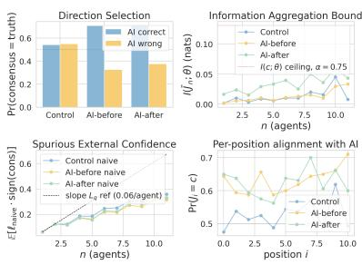  
Figure G.1: Strict-benchmark diagnostics on the experimental dataset (480 rooms, $N = 1 1$ subjects per room, three treatments). (a) Direction selection: $\mathbb { P } ( \mathrm { c o n s e n s u s } = \theta )$ by group, split by AI correctness. (b) Information aggregation: plug-in $\widehat { I } ( \bar { J } _ { n } ; \theta )$ versus � by group, with the strong-AI ceiling $I ( c ; \theta )$ at $\widehat { \alpha } = 0 . 7 5$ marked. (c) Spurious external confidence: running mean of $\ell _ { \mathrm { e x t } } ^ { \mathrm { n a i v e } }$ · sign(consensus) versus �, with the theoretical slope $\widehat { L _ { q } }$ as reference. (d) Per-position $\mathbb { P } ( J _ { i } = c )$ across posi- tions $i = 1 , \ldots , 1 1$

conditional independence that yields the scalar chain (��)) that we leave to future work and flag in Section 7.

## G Behavioral robustness: setup, comparative statics, and simulations

This appendix expands Section 5.2.

Behavioral public log-odds. In $\ell _ { i } ^ { \beta } { : }$ , the term $\psi _ { j } ( J _ { j } )$ is the log-LR that $J _ { j }$ carries about � as perceived by later users applying the same behavioral rule, not the Bayesian one. Collecting everything user � sees except her own impression gives the behavioral public log-odds

$$
P _ { i } ^ { \beta } \equiv \ell _ { 0 } + \beta _ { \mathrm { A I } } \cdot \lambda ( c ; \alpha ) + \beta _ { \mathrm { p u b l i c } } \cdot \sum _ { j < i } \psi _ { j } ( J _ { j } ) ,
$$

so that $\ell _ { i } ^ { \beta } = P _ { i } ^ { \beta } + \beta _ { \mathrm { p r i v a t e } } \cdot \lambda ( s _ { i } ; q )$ . Proposition 11 uses only the case in which forced judgments contribute $\psi _ { j } = 0 ;$ , so its conclusion does not depend on the full behavioral �-dynamics.

Comparative statics on $P _ { \mathrm { 1 } } . \mathrm { ( a ) }$ AI-indicator aversion $( \beta _ { \mathrm { A I } } < 1 )$ raises $\alpha ^ { * }$ and weakens first-user cascade genericity; AI-indicator appreciation $( \beta _ { \mathrm { A I } } > 1 )$ lowers $\alpha ^ { * }$ . (b) Conservatism $( \beta _ { \mathrm { p r i v a t e } } < 1 )$ lowers $\alpha ^ { * }$ , making first-user cascade easier to trigger. (c) Social discounting $( \beta _ { \mathrm { p u b l i c } } < 1 )$ does not enter the first-user threshold (no public history at $i = 1 )$ but locally weakens the social term, which should tend to enlarge the learning region of Proposition 6 and delay absorption when the chain does not cascade at user 1. We do not claim a closed-form analog of Proposition 6 under $\beta _ { \mathrm { p u b l i c } } \neq 1 ;$ only the qualitative direction follows from the comparative statics.

## H Scope of the behavioral threshold proposition

Proposition 11 is deliberately limited to the first-user threshold and its absorbing consequence. We do not claim that Theorems 7 and 8 extend verbatim to the behavioral model. The reason is that those theorems rely on Bayesian users using Lemma $1 ^ { 3 } s ~ { } ^ { \ast } \psi _ { j } = \pm L _ { q }$ or $0 ^ { \mathfrak { n } }$ increment structure; under heterogeneous or non-unit $\beta ^ { \prime } s ,$ down- stream users’ inference about prior users’ private impressions from observed judgments is no longer the clean $\pm L _ { q }$ jump, and Propo-sition $\boldsymbol { 6 } \boldsymbol { \mathsf { s } }$ two-state $\{ A , B \}$ reduction need not hold. Extending the direction-selection, information-bound, and spurious-confidence theorems to a behavioral population is a non-trivial open problem; we record it as such and ofer the present proposition only as a comparative-statics statement about the first-user threshold.

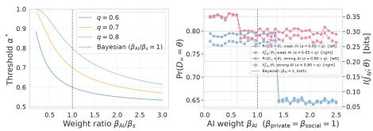  
Figure G.2: Behavioral robustness of the first-user threshold (Proposition 11). Left: efective cascade-genericity threshold $\alpha ^ { * }$ as a function of the weight ratio $\frac { \beta _ { \mathrm { A I } } } { \beta _ { \mathrm { p r i v a t e } } }$ for $q \in \{ 0 . 6 , 0 . 7 , 0 . 8 \}$ ; AI-aversion $\begin{array} { r } { ( \frac { \beta _ { \mathrm { A I } } } { \beta _ { \mathrm { p r i v a t e } } } < 1 ) } \end{array}$ raises $\alpha ^ { * }$ , AI-appreciation lowers it. Right: simulation under the weighted decision rule at $\alpha = 0 . 6 5 < q = 0 . 7$ and $N = 1 0 0$ , where AI-appreciation $( \beta _ { \mathrm { A I } }$ above the behavioral threshold $\begin{array} { r } { \beta ^ { * } = \frac { L _ { q } } { L _ { \alpha } } ) } \end{array}$ fli s the chain into immediate cascade and collapses private-signal aggregation; $\mathbb { P } ( D _ { \infty } = \theta )$ on the left axis, $I ( \bar { J } _ { N } ; \theta )$ on the right.

## I Delayed exposure: when to attach the indicator

Beyond how strongly the indicator is trusted (Section 6.1), a platform also controls when it is attached. This deployment lever is not structural—it changes neither the model nor the user—and we treat it here in simulation. Like miscalibrated trust, it does not escape the welfare frontier of Proposition ${ 9 } ;$ it fails in a diferent way, by separating the recorded majority from the direction the crowd actually takes.

If the indicator is attached only from position $k ,$ users $1 , \ldots , k - 1$ run the classical cascade, so the AI prediction arrives against a public log-odds already locked at magnitude $L _ { q } . \mathrm { A }$ strong AI $( L _ { \alpha } >$ $L _ { q } )$ overrides that lock: $D _ { \infty } = c$ at every � (Figure I.1, solid). But the majority sign( ¯��)—the aggregate record an external observer reads—follows � only when � controls more than half the positions, $k \leq \textstyle { \frac { N } { 2 } }$ (dashed). A late strong AI therefore redirects every user after � yet leaves the recorded majority with the pre-AI herd, and a weak $\mathrm { A I } \left( L _ { \alpha } < L _ { q } \right)$ can do neither.

Neither lever escapes the frontier, but they fail diferently, and for delayed exposure the failure depends on which object is scored. Miscalibrated trust moves the population along the frontier: undertrusting a strong AI reproduces the below-Gateway point. Under delayed exposure the cascade direction itself never moves—a strong AI dictates $D _ { \infty }$ from any position $k ,$ , so $( W ^ { + } , W ^ { - } )$ stays at the above- Gateway $( 1 , 0 )$ . What moves is the record. Because delay separates $D _ { \infty }$ from $\mathrm { s i g n } ( \bar { J } _ { N } )$ , the record acquires welfare coordinates of its own,

$$
{ \widetilde { W } } ^ { + } = \mathbb { P } \big ( \mathrm { s i g n } ( \bar { J } _ { N } ) = \theta \mid c = \theta \big ) , \qquad { \widetilde { W } } ^ { - } = \mathbb { P } \big ( \mathrm { s i g n } ( \bar { J } _ { N } ) = \theta \mid c \neq \theta \big ) ,
$$

which coincide with $( W ^ { + } , W ^ { - } )$ when the indicator is shown from the first position but not under delay. On this record welfare, delay slides $( \widetilde { W } ^ { + } , \widetilde { W } ^ { - } )$ from (1, 0) to the classical $( q , q )$ (Figure I.2), a path the below-Gateway point strictly dominates: judged by the aggregate a platform reports, a strong AI introduced late is worse on both coordinates than a weak AI shown from the start. Raising correction without surrendering preservation is therefore beyond either deployment lever; it requires the structural changes to the signal itself given in Section 4.4.

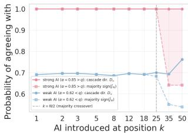

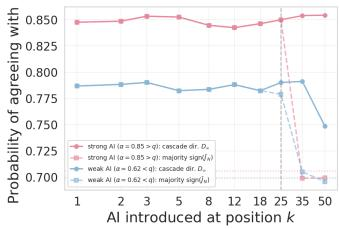  
Figure I.1: Delayed exposure: the indicator is attached from position $k ,$ with users $1 , \ldots , k - 1$ in the classical model $( q = 0 . 7 ;$ $N = 5 0 ,$ 12,000 simulated cascades per point). Solid: final cas-cade direction $D _ { \infty } ;$ dashed: majority sign( ¯��). Left: a strong AI $( \alpha = 0 . 8 5 > q )$ sets $D _ { \infty } = c$ at every � but wins the majority only for $\begin{array} { r } { k \le \frac { N } { 2 } } \end{array}$ (shaded gap); a weak AI $( \alpha = 0 . 6 2 < q )$ does neither. Right: the same two quantities against �, with classi-cal no-AI baselines dotted.

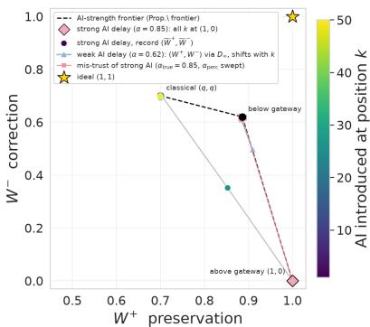  
Figure I.2: Both deployment levers on the welfare plane of Pro osition 9 $( q \ = \ 0 . 7 , \ N \ = \ 5 0 ) \colon$ : preservation $W ^ { + }$ against correction $W ^ { - }$ , with the AI-strength frontier in black. Mis- trusting a strong AI $( \alpha _ { \mathrm { t r u e } } = 0 . 8 5 , \alpha _ { \mathrm { p e r c } }$ swept; pink) moves along the frontier. Delaying the same AI to position � leaves $( W ^ { + } , W ^ { - } )$ at the above-Gateway (1, 0) (diamond), while the record welfare $( \widetilde { W } ^ { + } , \widetilde { W } ^ { - } )$ , scored for sign $\left( { \bar { J } } _ { N } \right)$ in place of $D _ { \infty } ,$ slides inside the frontier toward the classical $( q , q )$ (colored by �), dominated by the below-Gateway point. Neither ap-proaches the ideal (1, 1).

## J Proofs

This appendix collects the proofs of all theorems, propositions, lemmas, and corollaries deferred from the main text. Proofs are listed in the order the corresponding results appear in the paper.

## J.1 Proof of Lemma 1 (Cascade structure)

With $\ell _ { i } = P _ { i } + \lambda ( s _ { i } ; q )$ and $\lambda ( s _ { i } ; q ) \in \{ \pm L _ { q } \}$ : Case (a): $| P _ { i } | < L _ { q }$ implies $\ell _ { i } \neq 0$ for both signal realizations, so $J _ { i } = 1 \iff s _ { i } = 1$ Then �� perfectly reveals $s _ { i } ,$ and the log-LR of �� given � equals that of $s _ { i } ,$ namely $\lambda ( J _ { i } ; q )$ . Case $( b ) \colon P _ { i } \geq L _ { q } . \mathrm { f } \ s _ { i } = 1 , \ell _ { i } = P _ { i } + L _ { q } > 0$ If $s _ { i } = 0 , \ell _ { i } = P _ { i } - L _ { q } \ge 0 ,$ , and on the boundary $P _ { i } = L _ { q }$ the tie rule (Appendix A) yields $J _ { i } ~ = ~ 1$ . Hence $J _ { i } ~ = ~ 1$ regardless of $s _ { i } ,$ contributing zero log-LR. Case (c): Symmetric.

J.2 Proof of Theorem 2 (Equilibrium structure) The initial condition $P _ { 1 } = \ell _ { 0 } + \lambda ( c ; \alpha )$ follows from (1) with $H _ { 1 } = \varnothing$ By Lemma 1, in the learning region $\psi _ { i } ~ = ~ \pm L _ { q }$ with sign equal to $\mathrm { s i g n } ( 2 s _ { i } - 1 )$ via Lemma 1(a), so the conditional mean of the increment is E[�� $| \theta \bigr \rfloor = ( 2 q - 1 ) L _ { q } \cdot \mathrm { s i g n } ( 2 \theta - 1 )$ . In a cascade $\psi _ { i } = 0$ by Lemma 1, so $P _ { i + 1 } = P _ { i }$ ; hence the cascade regions $\{ P \geq L _ { q } \}$ and $\{ P \leq - L _ { q } \}$ are absorbing.

## J.3 Proof of Theorem 5 (Immediate AI-Directed Absorption)

By Corollary 3, when $\alpha \geq q$ we have $P _ { 1 } = \lambda ( c ; \alpha ) . \operatorname { I f } c = 1 ,$ then $P _ { 1 } = L _ { \alpha } \ge L _ { q }$ , placing the chain in the up-cascade absorbing set; by Lemma 1(b), user 1 ignores �1 and chooses $J _ { 1 } = 1$ . By Theorem 2, $P _ { 2 } = P _ { 1 } \ge L _ { q }$ , so user 2 likewise chooses $J _ { 2 } = 1$ . Induction gives $J _ { i } = 1$ for all �. Symmetrically, $c = 0$ yields $J _ { i } = 0$ for all �. Hence $J _ { i } = c$ for all �, and no $s _ { i }$ enters the public history.

## J.4 Proof of Proposition 6 (Cascade-Formation Time)

(a) is Theorem 5. (The measure-zero classical edge $\begin{array} { r } { \alpha = \frac { 1 } { 2 } } \end{array}$ is treated separately in Appendix A.)

For (b), fix $\alpha \in ( \frac { 1 } { 2 } , q )$ , so that $0 < L _ { \alpha } < L _ { q } .$ . By the symmetry $c  1 - c , \theta  1 - \theta , P  - P ,$ it sufices to analyze the chain conditional on $c \ = \ 1 ;$ ; the case $c \ = \ 0$ is identical with all signs reversed. The starting point is $P _ { 1 } = L _ { \alpha } \in ( 0 , L _ { q } )$ , which lies in the learning region, so $\tau \geq 2$

Step 1: the chain $( P _ { j } )$ visits at most two non-absorbing states. Define

$$
A \equiv L _ { \alpha } , \qquad B \equiv L _ { \alpha } - L _ { q } .
$$

Both lie in the learning region: $A \in ( 0 , L _ { q } )$ and $B \in ( - L _ { q } , 0 )$ , where the second inclusion uses $L _ { \alpha } < L _ { q } .$ From � a learning-region step $\pm L _ { q }$ leads to either $L _ { \alpha } + L _ { q }$ or �; the former satisfies $L _ { \alpha } + L _ { q } \ge L _ { q } ,$ hence triggers an up-cascade (� ). From � a learning-region step leads to either � or $L _ { \alpha } - 2 L _ { q } ;$ the latter satisfies $L _ { \alpha } - 2 L _ { q } \leq - L _ { q }$ precisely because $L _ { \alpha } < L _ { q } ,$ , hence triggers a down-cascade (�). The transient state space conditional on $c = 1$ therefore reduces to $\{ A , B \}$ with the four transitions

$$
A \to U , \ A \to B , \ B \to A , \ B \to D ,
$$

and the topology of the chain is independent of � throughout $\textstyle { \bigl ( } { \frac { 1 } { 2 } } , q { \bigr ) }$ Step 2: transition probabilities. In the learning region $\psi _ { i } = \lambda ( \overline { { s _ { i } } } ; q )$ so $\mathbb { P } ( \psi _ { i } = + L _ { q } \mid \theta ) = \mathbb { P } ( s _ { i } = 1 \mid \theta )$ . Write

$$
p \equiv \mathbb { P } ( s _ { i } = 1 \mid \theta ) = { \left\{ \begin{array} { l l } { q } & { { \mathrm { i f ~ } } \theta = 1 { \mathrm { , ~ } } } \\ { 1 - q } & { { \mathrm { i f ~ } } \theta = 0 { \mathrm { . ~ } } } \end{array} \right. }
$$

Conditional on $( c = 1 , \theta )$ , the four transitions have robabilities $\mathbb { P } ( A \to U ) = p , \mathbb { P } ( A \to B ) = 1 - p , \mathbb { P } ( B \to A ) = p , \mathbb { P } ( B \to D ) = 1 - p ,$ none of which depend on �.

Step $\boldsymbol { 3 } \colon \mathbb { P } ( \tau = 2 )$ . Since $P _ { 1 } = A$ and $\tau = 2$ if the first transition absorbs, $\mathbb { P } ( \tau = 2 \mid c = 1 , \theta ) = \mathbb { P } ( A \to U ) = p$ . Substituting $\boldsymbol { p } = \boldsymbol { q }$ for $c = \theta$ and $p = 1 - q$ for $c \neq \theta$ yields the displayed probabilities.

Step $\scriptstyle 4 : \mathbb { E } [ \tau ]$ . Let $\mu _ { A }$ (resp. ��) denote the expected number of transitions to absorption from � (resp. �). First-step analysis gives

$$
\mu _ { A } = 1 + ( 1 - p ) \mu _ { B } , \qquad \mu _ { B } = 1 + p \mu _ { A } .
$$

Substituting and solving,

$$
\mu _ { A } ~ = ~ \frac { 2 - p } { 1 - p ( 1 - p ) } .
$$

Since $\tau = 1 +$ (transitions from �),

$$
\mathbb { E } [ \tau \mid c = 1 , \theta ] ~ = ~ 1 + \frac { 2 - p } { 1 - p ( 1 - p ) } .
$$

Substituting $\textit { p } = \textit { q }$ and using $\textstyle 1 - q ( 1 - q ) \ = \ 1 - q + q ^ { 2 }$ gives $\begin{array} { r } { \mathbb { E } [ \tau \ : | \ : c = \dot { \theta } ] = 1 + \frac { 2 - q } { 1 - q + q ^ { 2 } } ; } \end{array}$ ; substituting $p = 1 - q$ gives $\mathbb { E } [ \tau \mid c \neq$ $\begin{array} { r } { \theta ] = 1 + \frac { 1 + q } { 1 - q + q ^ { 2 } } } \end{array}$ . The diference is $\frac { 2 q - 1 } { 1 - q + q ^ { 2 } }$ , strictly positive for $\textstyle q > { \frac { 1 } { 2 } }$ In none of these expressions does � appear: changing � within $\textstyle { \bigl ( } { \frac { 1 } { 2 } } , q { \bigr ) }$ shifts the locations of � and � but preserves the four-arrow transition diagram, so the conditional law of � given $( c , \theta )$ is exactly constant in �.

## J.5 Proof of Theorem 7 (Cascade Direction under a Shared AI Signal)

Part (a) is immediate from Theorem 5. For (b), by the symmetry $c  1 - c , \theta  1 - \theta , P  - P ,$ it sufices to condition on $c =$ 1. Proposition 6 (Steps 1–2) reduces the transient state space to $\{ A , B \} = \{ L _ { \alpha } , L _ { \alpha } - L _ { q } \}$ with transitions $A \to U ( { \mathrm { u p } } \mathrm { - c a s c a d e } ) , A \to$ $B , B  A , B  D$ (down-cascade) having probabilities $p , 1 - p , p , 1 -$ � respectively, where $p = \mathbb { P } ( s _ { i } = 1 \mid \theta ) \in \{ q , 1 - q \}$ . Let �� and �� denote the probabilities of absorption at � starting from � and �. First-step analysis gives

$$
u _ { A } = p + \left( 1 - p \right) u _ { B } , \qquad u _ { B } = p u _ { A } ,
$$

hence $\begin{array} { r } { u _ { A } = \frac { p } { 1 - p \left( 1 - p \right) } = \frac { p } { 1 - p + p ^ { 2 } } } \end{array}$ . Since $1 - p + p ^ { 2 }$ is invariant under $p  1 - p ,$ substituting $p \stackrel { . } { = } \dot { q } \left( \mathrm { c a s e } c = \theta \right)$ and $\ p = 1 - q \left( { \mathrm { c a s e } } c \neq \theta \right)$ yields the displayed conditional probabilities. Neither expression depends on �: changing � within $\textstyle { \left( { \frac { 1 } { 2 } } , q \right) }$ shifts the locations of � and � but preserves the four-arrow transition diagram, which alone determines absorption probabilities.

## J.6 Proof of Corollary D.1 (Marginal monotonicity in �)

Average Theorem 7(b) over � | � using $\mathbb { P } ( \theta = c \mid c ) = \alpha { : }$

## J.7 Proof of Theorem 8 (AI-Mediated Agreement and External Overconfidence)

Information-aggregation bound. We establish that, for every �,

$$
I ( \bar { J } _ { N } ; \theta ) \ \leq \ I \big ( ( c , \sigma _ { < \tau } ) ; \theta \big ) \ = \ I ( c ; \theta ) + I \big ( \sigma _ { < \tau } ; \theta \mid c \big ) .\tag{J.1}
$$

By the data-processing inequality, $I ( \bar { J } _ { N } ; \theta ) \le I ( ( J _ { 1 } , \dots , J _ { N } ) ; \theta )$ . For $j > \tau _ { ; }$ Theorem 2 gives $\psi _ { j } = 0 , s _ { 0 } J _ { j } = J _ { \tau }$ and the whole sequence is a deterministic function of $( J _ { 1 } , \ldots , J _ { \tau } )$ ; hence

The numerator simplifies to $\left( 1 - q \right) + \alpha ( 2 q - 1 )$ , which is strictly increasing in � since $\textstyle q > { \frac { 1 } { 2 } }$

$$
I ( ( J _ { 1 } , . . . , J _ { N } ) ; \theta ) = I ( ( J _ { 1 } , . . . , J _ { \tau } ) ; \theta ) .
$$

By Lemma 1, each $J _ { j }$ with $j < \tau$ lies in the learning region and reveals $s _ { j } ,$ , while the forced judgment $J _ { \tau } = \mathrm { s i g n } ( P _ { \tau } )$ is a function of $( \sigma _ { < \tau } , c , \tau )$ and reveals nothing about $s _ { \tau } .$ Thus $( J _ { 1 } , \ldots , J _ { \tau } )$ is a function of $( \sigma _ { < \tau } , c , \tau )$ , and since � is itself $\sigma ( ( \sigma _ { < \tau } , c ) )$ -measurable, data-processing gives

$$
I ( ( J _ { 1 } , . . . , J _ { \tau } ) ; \theta ) \ \leq \ I ( ( \sigma _ { < \tau } , c ) ; \theta ) .
$$

The chain rule together with conditional independence of $\left\{ s _ { i } \right\}$ from � given � yields

$$
I ( ( \sigma _ { < \tau } , c ) ; \theta ) = I ( c ; \theta ) + I ( \sigma _ { < \tau } ; \theta \mid c ) ,
$$

establishing (J.1). (A conservative universal bound also holds, $I ( ( c , \sigma _ { < \tau } ) ; \theta ) \le$ �(�) ≤ log 2 for binary �, but the content of the theorem is that the right-hand side is fixed in � through the finite-mean pre-cascade prefix, not merely capped at log 2.)

For the prefix length, the worst case in Proposition $6 ( \mathrm { c } ) \mathrm { i } \mathbf { s } \mathbb { E } [ \tau \mid$ $\begin{array} { r } { c \neq \theta ] = { \bf \bar { 1 } } + \frac { 1 + q ^ { - } } { 1 - q + q ^ { 2 } } } \end{array}$ on $\alpha \in ( \frac { 1 } { 2 } , q )$ , which dominates the other regimes $( \mathbb { E } [ \tau ] = 1$ for $\alpha \geq q$ by part $( \mathbf { a } ) , \mathbb { E } [ \tau ] = 2$ for $\begin{array} { r } { \alpha = \frac { 1 } { 2 } } \end{array}$ by part (b)). Hence

$$
\mathbb { E } [ | \sigma _ { < \tau } | ] = \mathbb { E } [ \tau - 1 ] ~ \le ~ \frac { 1 + q } { 1 - q + q ^ { 2 } }
$$

uniformly in �. For $\alpha \geq q , \tau = 1$ almost surely (Theorem 5), so the prefix $\sigma _ { < \tau }$ is empty and $I ( \sigma _ { < \tau } ; \theta \mid c ) = 0 ;$ since $J _ { 1 } = c$ deter- ministically, the judgment sequence carries no information about � beyond �, and the bound holds with equality, $I ( \bar { J } _ { N } ; \theta ) = I ( c ; \theta )$

External-overconfidence gap (2). The naïve observer assigns log-odds $\lambda ( J _ { i } ; q ) = ( 2 J _ { i } - 1 ) \cdot L _ { q }$ to each judgment, yielding $\ell ^ { \mathrm { n a i v e } } =$ $\begin{array} { r } { \ell _ { 0 } + \sum _ { i } \bigl ( 2 J _ { i } - 1 \bigr ) L _ { q } . } \end{array}$ Conditional on a cascade with consensus 1 (the consensus-0 case is symmetric), the terms with $i \geq \tau$ all equal $+ L _ { q }$ by Theorem 2, contributing $\left( N - \tau + 1 \right) \cdot L _ { q } ;$ the first $\tau - 1$ terms contribute a quantity uniformly bounded by $( \tau - 1 ) \cdot L _ { q }$ . Summing gives $N \cdot L _ { q } + O ( \tau )$ , and taking expectation projects to $\bar { N } \cdot L _ { q } + O ( 1 )$ on the consensus direction.

For the Bayes-correct observer, conditional on the realized judgment sequence she marginalizes over $( c , \sigma _ { < \tau } )$ using the model’s likelihood. By the information-aggregation bound above, her pos- terior on � has $I ( ( c , \sigma _ { < \tau } ) ; \theta )$ uniformly bounded in �. In log-odds form,

$$
\mathbb { P } ( D _ { \infty } = \mathrm { s i g n } ( \lambda ( c ; \alpha ) ) \mid ( c ) = \alpha \cdot { \frac { q } { 1 - q + q ^ { 2 } } } + ( 1 - \alpha ) \cdot { \frac { 1 - q } { 1 - q + q ^ { 2 } } } = { \frac { \alpha q + ( 1 - { \bigl | } { \tilde { \theta } } { \bigr \rangle } ( \mathbf { r } \circ \mathbf { c } ) { \bigr | } g _ { 1 } + { \bigl | } \lambda ( c ; \alpha ) { \bigr | } + ( \tau - 1 ) \cdot L _ { q } \leq { \vert } { \ell } _ { 0 } { \bigr | } + L _ { \alpha } + ( \tau - 1 ) \cdot L _ { q } } { 1 - q _ { 1 } \forall \operatorname { r a c } } }
$$

projection $\mathbb { E } [ \ell ^ { \mathrm { { c o r r e c t } } }$ · sign(consensus)] is therefore a finite quantity, and subtracting the naive expression while absorbing the bounded Bayes-correct contribution into $O ( 1 )$ yields (2).

The two benchmark constants follow by evaluating the Bayes- correct projection exactly under $\ell _ { 0 } \ = \ 0 .$ . When $\begin{array} { r } { \alpha = \frac { 1 } { 2 } } \end{array}$ , the first user reveals $s _ { 1 }$ and every later judgment copies $J _ { 1 : }$ so the cor- rect observer extracts exactly one private impression and $\ell ^ { \mathrm { c o r r e c t } }$ sign(consensus) $= \ L _ { q }$ , giving the gap $N L _ { q } - L _ { q } .$ . When � $\geq \ q ,$ $J _ { i } = c$ for all � reveals � and nothing else, so $\ell ^ { \mathrm { { c o r r e \dot { c } t } } } = \lambda ( c ; \alpha )$ with projection $L _ { \alpha } ,$ giving $N L _ { q } - L _ { \alpha }$

## J.8 Proof of Theorem B.1 (Continuous-Indicator Immediate Absorption)

Identical to Theorem 5 with Λ(�) replacing $\lambda ( c ; \alpha )$

## J.9 Proof of Proposition 11 (Behavioral threshold for first-user cascade)

Under the weighted update rule, user 1’s posterior log-odds at decision time are $\ell _ { 1 } ^ { \beta } = \ell _ { 0 } + \beta _ { \mathrm { A I } } \cdot \lambda ( c ; \alpha ) + \beta _ { \mathrm { p r i v a t e } } \cdot \lambda ( s _ { 1 } ; q )$ , and the

decision rule of Section 3.1 (translated to the behavioral log-odds) is

$$
J _ { 1 } \ = \ 1 \{ \ell _ { 1 } ^ { \beta } > 0 \} + 1 \{ \ell _ { 1 } ^ { \beta } = 0 \} \cdot 1 \{ \ell _ { 0 } + \beta _ { \mathrm { A I } } \cdot \lambda ( c ; \alpha ) \geq 0 \} ,
$$

breaking ties in the direction of the public (AI-indicator-plus-prior) log-odds, which generalizes the $\mathrm { s i g n } ( P _ { i } )$ tie rule of Section 3.1. With $\ell _ { 0 } = 0$ , the cascade-genericity argument of Theorem 5 carries through with the threshold comparison $\left| \beta _ { \mathrm { A I } } \cdot \lambda ( c ; \alpha ) \right|$ vs. $\beta _ { \mathrm { p r i v a t e } } \cdot L _ { q }$ in place of $| \lambda ( c ; \alpha ) |$ vs. $L _ { q }$ . When this comparison favors the $\mathrm { A I } -$ indicator side, user 1’s judgment is determined by � regardless of $s _ { 1 } { : }$ i $\dot { \mathbf { \zeta } } c = 1 , \beta _ { \mathrm { A I } } L _ { \alpha } \geq \beta _ { \mathrm { p r i v a t e } } L _ { q }$ gives $\ell _ { 1 } ^ { \beta } \geq 0$ for both signal realizations, and the tie rule selects $J _ { 1 } = 1$ at equality; ${ \mathrm { i f } } c = 0 ,$ the symmetric argument selects $J _ { 1 } = 0$ . Theorem $2 \mathit { \ ' } _ { s }$ absorbing property of the cascade region (which depends only on the increment structure of subsequent $P _ { j }$ , not on the magnitude of $P _ { 1 } )$ propagates the cascade.