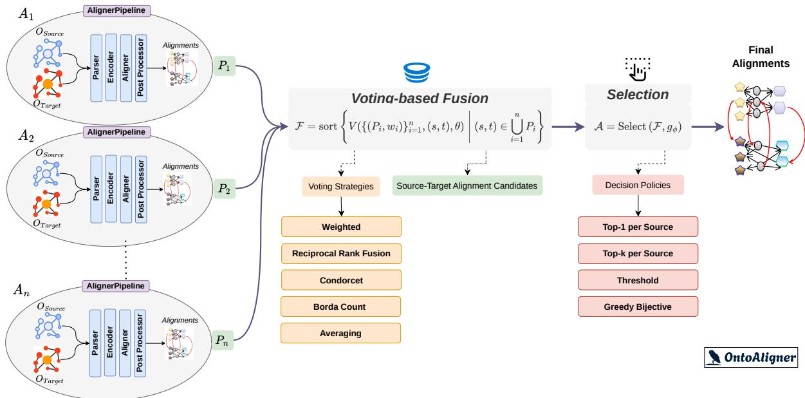

# OntoAligner-Ensemble: Voting-Based Fusion across Heterogeneous Ontology Alignment Techniques

Hamed Babaei Giglou1, Sören Auer1,2, Peio Popov3, Mahsa Sanaei4 and Jennifer D’Souza1

1TIB Leibniz Information Centre for Science and Technology, Hannover, Germany

2L3S Research Center, Leibniz University ofHannover, Hannover, Germany

3Graphwise, Sofia, Bulgaria

4University of Tabriz, Tabriz, Iran

## Abstract

Ontology alignment (OA) has evolved through several methodological paradigms, ranging from lexical and structural aligners to knowledge graph embedding (KGE) models and, more recently, Large Language Mode (LLM)-based approaches. Although modern OA frameworks provide unified ecosystems for deploying these heterogeneous aligners, mechanisms for systematically reconciling their complementary and sometimes conflicting predictions remain relatively underexplored. We present OntoAligner-Ensemble, a modular and aligner-agnostic framework that combines candidate correspondences through a configurable two-stage process comprising voting-based fusion strategies (e.g., Weighted Voting, Reciprocal Rank Fusion, Condorcet, and Borda Count) followed by post-fusion selection policies. The framework supports any ontology aligner implemented within OntoAligner that produces candidate correspondences, enabling diverse alignment paradigms to be integrated through a unified decision process. To demonstrate its efectiveness, we instantiate the framework using representative lightweight string-aligner, KGE-based, and Retrieval-Augmented Generation (RAG) aligners powered by both open-weight and API-based LLMs. We evaluate individual aligners and ensemble configurations across eight benchmark tasks from five OAEI tracks spanning biomedical, material science, biodiversity, circular economy, and beyond-equivalence ontology matching. The results show that ensemble fusion consistently improves the balance between precision and recall and frequently outperforms standalone aligners across diverse domains. Furthermore, our analysis reveals that ensemble composition directly afects the precision–recall trade-of: heterogeneous cross-paradigm ensembles generally improve precision, whereas homogeneous LLM ensembles more often achieve higher overall F1-scores. These findings demonstrate that systematic ensemble learning ofers a robust and reproducible strategy for OA while providing practical guidance for selecting ensemble compositions under diferent alignment scenarios.

## Keywords

Ontology Alignment, OntoAligner, Ensemble Learning, Voting Fusion, Large Language Models

• URL: https://ontoaligner.readthedocs.io/

• GitHub: https://github.com/sciknoworg/OntoAligner

• PyPi: https://pypi.org/project/OntoAligner/

• License: Apache License 2.0

• Experimental Resources: https://doi.org/10.5281/zenodo.21736780

## 1. Introduction

Ontology alignment (OA) is the process of finding and defining semantic correspondences between elements of diferent ontologies so that data and knowledge from heterogeneous sources can interoperate accurately. The origins of OA trace back to the 1980s and 1990s, with foundations in knowledge representation, artificial intelligence (AI), and database schema matching [1, 2]. With the emergence of the Semantic Web in the late 1990s and early 2000s, OA gained significant attention as widely adopted languages such as RDF and OWL revealed that independently developed ontologies often described similar concepts using diferent structures and terminologies [3, 4, 5, 6, 7]. Research accelerated rapidly following the inaugural International Semantic Web Conference (ISWC) in 2002, leading to standardized benchmarks via the Ontology Alignment Evaluation Initiative (OAEI) launched in 20041 and dedicated venues such as the International Workshop on Ontology Matching (OM) established in 20062 [8]. These community eforts drove advances in lexical [9], structural [10], semantic [11], and instance-based [12] techniques. Between 2016 and 2021, the field integrated machine learning and deep learning models, particularly knowledge graph embeddings (KGEs), to capture complex semantic relationships beyond surface similarities [13, 14, 15, 16]. Most recently, large language models (LLMs) have opened new frontiers in handling complex and scalable alignment processes [17, 18, 19, 20].

Although OA has historically evolved through a succession of distinct methodological paradigms often treated as competing alternatives, modern frameworks such as OntoAligner [21] aim to unify these paradigms within a modular ecosystem [22]. Yet, making heterogeneous aligners available through a common framework does not by itself determine how their predictions should be combined into a single, reliable alignment. OntoAligner enables lexical, structural, embedding-based, and generative aligners to operate through a shared pipeline, but a general and configurable mechanism for reconciling their complementary and sometimes conflicting outputs has remained missing. This exposes a central methodological question: how can heterogeneous alignment techniques be integrated so that their strengths reinforce one another while their individual weaknesses are mitigated? Addressing this question is particularly important because no single paradigm consistently dominates across ontology domains. Lexical matchers can achieve high recall when ontologies are terminologically similar but may degrade under semantic drift; KGE-based aligners can efectively capture relational structures but remain sensitive to graph sparsity; and LLM-driven aligners can generalize well in open-vocabulary contexts, although their performance varies considerably across models, providers, and domains.

Rather than treating this variability solely as a limitation, we view it as motivation for systematic ensemble alignment. Contemporary OA toolkits increasingly make heterogeneous alignment techniques interoperable, yet providing them within a common framework does not by itself determine how their potentially complementary and conflicting predictions should be combined. Although recent work has introduced retrieval-augmented generation (RAG) [17, 19] and in-context reasoning into OA, LLMbased aligners have largely been studied individually, while prior work within OntoAligner [22] has primarily considered open-weight models. Consequently, a unified and configurable mechanism for combining conventional, KGE-based, and LLM-driven aligners, including both open-weight and APIbased models, remains insuficiently investigated. To address this gap, this work makes the following central contribution:

We introduce OntoAligner-Ensemble, a unified and configurable ensemble mechanism that combines voting-based fusion with post-fusion selection to integrate predictions from heterogeneous ontology aligners, and evaluate it across multiple domains using lightweight, KGE-based, and RAG-based aligners built on both open-weight and API-based LLMs.

We evaluate this contribution through three research questions: RQ1: How do lightweight, KGEbased, and RAG/LLM-based aligners compare across heterogeneous OA tasks in terms of precision, recall, and F1-score? RQ2: To what extent can voting-based ensemble fusion improve alignment quality and balance precision and recall relative to individual aligners and established task baselines? RQ3: How does ensemble composition afect performance, particularly when comparing a heterogeneous ensemble spanning multiple alignment paradigms with a homogeneous ensemble of LLM-based aligners? To investigate these questions, we evaluate five aligners and two ensemble configurations across eight tasks from five OAEI tracks spanning beyond-equivalence, circular-economy, anatomy, materials-science, and biodiversity settings. The evaluation compares conventional similarity-based, KGE-based, and RAG/LLM-based approaches, including models from open-weight and API-based ecosystems, under OA scenarios that difer in domain, scale, semantic complexity, and structural characteristics.

The remainder of this paper is organized as follows: Section 2 formalizes the OA task; Section 3 reviews related work; Section 4 presents the proposed ensemble alignment framework; Section 5 describes the experimental setup and evaluation methodology; Section 6 discusses the empirical findings; and Section 7 concludes the paper and outlines future research directions.

## 2. Problem Formalization

Let $C _ { \mathrm { s o u r c e } } \in O _ { \mathrm { s o u r c e } }$ and $C _ { \mathrm { t a r g e t } } \in O _ { \mathrm { t a r g e t } }$ denote concepts from the source ontology $O _ { \mathrm { s o u r c e } }$ and the target ontology $O _ { \mathrm { t a r g e t : } }$ , respectively. Formally, the OA is defined as a:

$$
O A ( O _ { \mathrm { s o u r c e } } , O _ { \mathrm { t a r g e t } } ) : = M\tag{1}
$$

where

$$
M = \left\{ ( s , t , r , S _ { r } ) \mid s \in O _ { \mathrm { s o u r c e } } , t \in O _ { \mathrm { t a r g e t } } \right\}\tag{2}
$$

and $r ~ \in ~ \{ \equiv , \subseteq , \exists \}$ denotes the semantic correspondence between the source concept � and the target concept �, representing equivalence, subsumption (subclass), or inverse subsumption (superclass), respectively. The confidence score $S _ { r } \in [ 0 , 1 ]$ indicates the likelihood of the predicted correspondence.

## 3. Related Work

OA has traditionally relied on combining lexical, structural, and semantic similarity measures using manually designed aggregation strategies [23]. While these approaches have shown competitive performance, their efectiveness often depends on the characteristics of the ontologies being aligned, motivating the adoption of machine learning techniques to learn better combinations of matching evidence automatically. One of the earliest machine learning approaches was proposed by Eckert et al. [24], who introduced a meta-level learning framework that combines the outputs of multiple ontology aligners using a supervised classifier. Their results demonstrated that learned ensembles consistently outperform individual matchers and simple voting strategies. Later work of Nkisi-Orji et al. [25] has extended this idea by incorporating richer semantic representations. For example, Random Forest-based OA combines traditional similarity measures with word embedding features, enabling the model to learn efective combinations without manually tuning similarity weights.

Several studies have further explored ensemble learning for OA. The ROME framework [26] applies Bagging and Boosting techniques to improve robustness and generalization across OA tasks. Similarly, Xue et al. [27] introduced a collaborative OA based on dual-population genetic programming that employs active meta-learning and a Random Forest meta-classifier to construct high-quality similarity features and improve alignment accuracy. Interactive approaches such as DualLoop [28] also adopt ensemble principles by combining multiple heuristic matchers with active learning to reduce human annotation efort.

Ensemble techniques have also been applied in domain-specific settings. For instance, biomedical OA has benefited from integrating word embedding similarities with existing ontology aligners [29], demonstrating that learned semantic features complement traditional matching methods. Although focusing on instance matching, [30] introduced a hybrid ensemble classifier for identifying equivalent entities across heterogeneous datasets, providing insights that are also applicable to ontology matching and semantic data integration.

Overall, these studies demonstrate that ensemble learning can enhance OA by efectively combining complementary similarity measures, matching strategies, and alignment paradigms. However, despite its potential, ensemble-based approaches remain relatively underexplored within the broader history of OA research. One possible explanation is the additional computational overhead introduced by ensemble strategies, as combining multiple aligners typically increases execution time and resource requirements. While this trade-of may limit their applicability in time-sensitive scenarios, it can be justified in alignment tasks where accuracy, robustness, and the ability to handle heterogeneous ontologies are prioritized over response eficiency. Motivated by this observation, our work builds upon existing ensemble-based OA research by investigating a unified ensemble framework that integrates multiple ontology aligners and leverages their complementary strengths to improve alignment quality across diverse OA scenarios.

  
Figure 1: Overview of the OntoAligner-Ensemble architecture. Individual aligner pipelines $( A _ { 1 } \ldots A _ { n } )$ process source $( O _ { S o u r c e } )$ and target $( O _ { T a r g e t } )$ ontologies through parsing, encoding, alignment, and post-processing steps. Candidate alignments (� ) are combined using a configurable Voting-based Fusion layer—employing one of the strategies such as Weighted, Reciprocal Rank Fusion, Condorcet, Borda Count, or Averaging. Final alignments (�) are generated after applying candidate selection and decision policies (e.g., Top-1, Top-�, Threshold, or Greedy Bijective).

## 4. OntoAligner-Ensemble Framework

Due to the complexity and diversity of real-world ontological structures, individual aligner approaches might capture only specific aspects of semantic similarity, such as lexical information, structural characteristics, or contextual knowledge. To address this limitation, we propose the OntoAligner-Ensemble framework that combines multiple independent alignment pipelines through a configurable voting-based aggregation mechanism. The proposed framework is illustrated in Figure 1 and follows a two-stage decision process: 1) Fusion stage, multiple aligners generate candidate correspondences, which are aggregated using a voting strategy to obtain a unified ranking of candidate alignments. 2) Selection stage, a post-fusion selection strategy converts the ranked candidate space into the final alignment by applying task-specific constraints.

The framework is designed to be independent of the underlying alignment algorithms. Any ontology aligner capable of producing source–target correspondence predictions can be incorporated as a constituent aligner; all these capabilities are possible because of the high-level abstraction of AlignerPipeline module 3that is responsible for running the aligner steps, including parsing, encoding, aligner, and post-processing (if necessary), all of which are according to the OntoAligner backbone architecture. In the following, we describe the principal components of OntoAligner-Ensemble.

Ensemble Representation. Let an ensemble consist of � independent aligners $A = \left\{ A _ { 1 } , A _ { 2 } , . . . , A _ { n } \right\}$ where each aligner $A _ { i }$ corresponds to an individual AlignerPipeline. Each aligner produces a set of candidate correspondences: $P _ { i } = \{ ( s , t , q _ { i } ( s , t ) ) \}$ , where $s \in O _ { s o u r c e } , t \in O _ { t a r g e t }$ and $q _ { i } ( s , t )$ is the confidence score that $A _ { i }$ assigns to the candidate correspondence $( s , t )$ . To account for diferences in reliability among aligners, each aligner is assigned a weight $w _ { i } \in \mathbb { R }$ (the default is set to 1), where larger values indicate a greater contribution during the fusion process. Therefore, the complete ensemble input is represented as:

$$
\mathcal { P } = \{ ( P _ { i } , w _ { i } ) \} _ { i = 1 } ^ { n }\tag{3}
$$

Once the predictions have been generated by the � aligners, the framework converts them into a unified representation because diferent aligners may use diferent output formats. For example, the output of a retrieval-based aligner is converted from $s \mapsto \{ ( t _ { 1 } , q _ { 1 } ) , ( t _ { 2 } , q _ { 2 } ) , \dots \}$ to individual triples $( s , t _ { j } , q _ { j } )$ . This allows diferent aligners to participate in the same ensemble process. Additionally, duplicate $( s , t )$ are removed by retaining the highest-ranked occurrence according to the confidence score: $( s , t , q ) = a r g m a x q ( s , t )$ . This guarantees a unique candidate representation before voting.

Voting-Based Fusion. The fusion component aggregates predictions from multiple constituent aligners. Let

$$
\mathcal { C } = \bigcup _ { i = 1 } ^ { n } \left\{ ( s , t ) \mid ( s , t , q _ { i } ( s , t ) ) \in P _ { i } \right\}\tag{4}
$$

denote the set of candidate source–target pairs proposed by at least one aligner. For each candidate $( s , t ) \in \mathcal { C }$ , the fused score is defined as

$$
S ( s , t ) = \mathcal { V } \left( \{ ( P _ { i } , w _ { i } ) \} _ { i = 1 } ^ { n } , ( s , t ) , \theta \right)\tag{5}
$$

where $\nu$ denotes the selected voting strategy and $\theta$ contains its strategy-specific parameters. The ranked fused prediction set is then defined as

$$
\mathcal { F } = \mathrm { s o r t } _ { \downarrow S } \left( \{ ( s , t , S ( s , t ) ) \mid ( s , t ) \in \mathcal { C } \} \right)\tag{6}
$$

where candidates are ordered by decreasing fused score. OntoAligner-Ensemble supports weighted voting, Reciprocal Rank Fusion (RRF), Condorcet voting, Borda count, and score averaging.

Post-Fusion Selection. After fusion, the framework contains a ranked candidate pool ${ \mathcal F } .$ A selection operator converts this candidate pool into the final alignment of $\mathcal { A } = S e l e c t ( \mathcal { F } , g _ { \phi } )$ , where � represents the selection strategy parameters. Moreover, $g _ { \phi }$ is defined as a decision policy that is responsible for selecting appropriate alignments based on its own selection policy; the default for $g _ { \phi }$ is none. However, there are four diferent decision policies which are defined as follows:

• Top-1 per Source Selection. This decision policy aims to select the highest scoring target for each source: $t ^ { * } = a r g m a x S ( s , t )$

• Top-� per Source Selection. For each source entity, the framework retains the top-� highestscoring target candidates. Using this policy, optionally, candidates are first filtered using a relative score margin $S ( s , t ) \geq m \cdot \operatorname* { m a x } _ { t ^ { \prime } } S ( s , t ^ { \prime } )$ , where $m \in [ 0 , 1 ]$ is the margin parameter. When both constraints are specified, only the top-� candidates satisfying the margin criterion are retained.

• Threshold-based Selection. Only correspondences exceeding a confidence threshold are retained: $A = \{ ( s , t ) \in \mathcal { F } | S ( s , t ) \geq \gamma \}$ , where $\gamma$ is the confidence threshold.

• Greedy Bijective Selection. For applications requiring one-to-one alignment, this decision policy applies a greedy bijective selection strategy as follows: $\forall ( s _ { i } , t _ { i } ) , ( s _ { j } , t _ { j } ) \in \mathcal { A }$ , where $s _ { i } \neq s _ { j } \land t _ { i } \neq t _ { j }$ , meaning that each source and target entity can appear at most once.

This modular formulation enables OntoAligner-Ensemble to integrate heterogeneous OA systems within a unified framework while supporting configurable voting strategies and post-fusion selection policies that can be adapted to diferent datasets and application requirements 4.

Table 1  
OAEI tracks and tasks statistics across source, target, and alignments.
<table><tr><td>Track</td><td>Task</td><td> $O _ { s o u r c e }$  Classes</td><td> $O _ { t a r g e t }$  Classes</td><td>References</td></tr><tr><td rowspan="3">Beyond Equivalence</td><td>G1 - Web</td><td>727</td><td>1,132</td><td>339</td></tr><tr><td>G2 - Diseases</td><td>1,108</td><td>5,145</td><td>355</td></tr><tr><td>G3 - Text</td><td>334</td><td>259</td><td>762</td></tr><tr><td rowspan="2">Circular Economy</td><td>CEON - BiOnto</td><td>228</td><td>779</td><td>29</td></tr><tr><td>CEON - MatOnto</td><td>228</td><td>846</td><td>16</td></tr><tr><td>Anatomy</td><td>Mouse-Human</td><td>2,743</td><td>3,304</td><td>1,516</td></tr><tr><td>Material Science and Engineering</td><td>MI-MatOnto</td><td>545</td><td>847</td><td>302</td></tr><tr><td>Biodiversity and Ecology</td><td>Fish-Zooplankton</td><td>145</td><td>56</td><td>15</td></tr></table>

## 5. Experimental Setup

Evaluation Datasets: OAEI Tracks and Tasks. We selected eight OA tasks from five tracks of the OAEI campaign to evaluate OntoAligner-Ensemble across diverse domains. The statistics of the selected datasets, including the number of source ontology classes, target ontology classes, and reference correspondences, are summarized in Table 1. The selected tracks include: Beyond Equivalence [31, 32] (G1–Web, G2–Diseases, and G3–Text), Circular Economy [33] (CEON–BiOnto and CEON–MatOnto), Anatomy [34] (Mouse–Human), Material Science and Engineering [35] (MI–MatOnto), and Biodiversity and Ecology [36] (Fish–Zooplankton). These datasets were selected to provide a comprehensive evaluation across heterogeneous domains, ontology sizes, and matching dificulties.

The Beyond Equivalence track evaluates OA systems beyond simple equivalence detection by considering diverse semantic relations, including equivalence, subsumption, overlap, and disjointness. It contains heterogeneous benchmarks from industrial classification schemes and the STROMA/TaSeR repository. In this work, we use the STROMA/TaSeR-based tasks (G1–Web, G2–Diseases, and G3–Text), which provide diverse matching scenarios with varying ontology sizes and semantic complexity. The Circular Economy and Material Science and Engineering tracks evaluate domain-specific ontologies with relatively smaller alignment spaces, while the Anatomy track represents a larger matching task with thousands of ontology classes and reference correspondences. Finally, the Biodiversity and Ecology task provides a small-scale evaluation scenario with limited reference alignments. Overall, the selected benchmarks cover a broad range of task characteristics, including small-scale tasks (Fish–Zooplankton, CEON–BiOnto, and CEON–MatOnto), medium-scale tasks (G1–Web, G3–Text, and MI–MatOnto), and large-scale tasks (G2–Diseases and Mouse–Human). This diversity enables a comprehensive assessment of the robustness and generalization capability of both individual OA systems and the proposed ensemble framework.

Individual Aligners. To evaluate both individual OA systems and their ensemble combinations, we selected five aligners representing three complementary categories: Lightweight, KGE [22], and RAG [19]. All aligners were implemented using the AlignerPipeline interface provided by OntoAligner, enabling a unified execution and prediction format across heterogeneous alignment approaches.

• Lightweight. We employed the fuzzy string matching aligner available in OntoAligner5, using a similarity threshold of 0.7 for all experiments.

• KGE. We selected the ConvE-based aligner with the same hyperparameter configuration reported in our previous work [22].

• RAG. To evaluate the robustness of the proposed ensemble across diferent LLM ecosystems, we considered three RAG configurations:

– Qwen. Qwen3.5-9B [37] as the generator and Qwen3-Embedding-4B [38] as the retriever, both from the Qwen model family.

– GPT. GPT-5.4-Nano 6 as the generator and text-embedding-3-small 7 as the retriever, representing the OpenAI model family.

– Gemini. The Gemini 2.5 Flash-Lite 8 as the generator and EmbeddingGemma-300m [39] as the retriever, representing the Google model family.

The hyperparameter values used throughout the experiments were selected manually based on preliminary empirical observations and prior experience with the underlying alignment methods. No systematic hyperparameter optimization was performed, as the large configuration space arising from multiple aligners, voting strategies, and selection policies would make exhaustive or automated tuning computationally prohibitive.

Ensemble Configurations. To evaluate the efectiveness of ensemble-based aligners, we constructed two configurations of OntoAligner-Ensemble. Each ensemble treats individual aligners as independent techniques and combines their predictions through a voting-based fusion strategy followed by a decision policy.

• Ens. (All). This configuration combines all available aligners across diferent categories, including the lightweight string-based aligner, the KGE-based aligner, and the three RAG-based aligners. This configuration evaluates whether heterogeneous alignment systems with complementary characteristics can improve overall alignment performance through collective decision-making.

• Ens. (LLMs). This configuration focuses exclusively on LLM-based aligners and combines the three RAG aligners, namely Qwen, GPT, and Gemini. This setting investigates whether an ensemble of diferent LLM-based aligners can provide more robust predictions compared with individual LLM aligners.

For all ensemble experiments, each aligner was assigned an equal weight (�� = 1.0). The majority voting strategy (supported by weighted voting) was employed with a minimum valid vote of 3 for Ens. (All) and 2 for Ens. (LLMs). After fusion, the resulting ranked correspondence candidates were processed using the top-1-source decision policy to obtain the final alignment set. This configuration was selected to provide a consistent comparison across datasets while avoiding additional tuning of ensemble-specific parameters. Nevertheless, the proposed framework is fully configurable, allowing practitioners to adjust both model-specific and ensemble-level hyperparameters to suit diferent datasets, computational budgets, and application requirements.

## 6. Results and Discussion

We evaluate the five individual aligners and the two proposed ensemble configurations, Ens. (All) and Ens. (LLMs), across eight benchmark tasks from five OAEI tracks. The experimental results, measured in terms of precision, recall, and F1-score, are summarized in Table 2. The remainder of this section is organized around the three research questions: RQ1 examines the performance profiles of the individual aligners, RQ2 evaluates the efectiveness of the proposed voting-based ensemble, and RQ3 investigates how ensemble composition afects performance across domains and task types.

## 6.1. RQ1: Performance of Individual Aligners

No individual aligner consistently achieves the best performance across all evaluation tasks. Instead, the strongest approach varies with the benchmark, indicating that OA remains task-dependent. The three evaluated aligner categories exhibit distinct precision–recall profiles.

Ontology matching results across all evaluation datasets. “Base.” denotes the baseline aligner for each dataset. Best precision, recall, and F1-score for each task are shown in bold.
<table><tr><td rowspan="2">Task</td><td rowspan="2">Base. Aligner</td><td rowspan="2">Metric</td><td colspan="7">Aligners</td></tr><tr><td>Base. Fuzzy</td><td></td><td>KGE Qwen</td><td></td><td>GPT-5.4</td><td>Gemini</td><td>Ens. (AII)</td><td>Ens. (LLMs)</td></tr><tr><td rowspan="3">G1-Web</td><td rowspan="3">MDMapper [40]</td><td>Precision</td><td>88.2</td><td>39.8</td><td>68.9</td><td>65.5</td><td>56.3</td><td>61.7</td><td>74.2</td><td>68.7</td></tr><tr><td>Recall</td><td>36.3</td><td>53.0</td><td>41.2</td><td>51.0</td><td>54.8</td><td>51.9</td><td>48.3</td><td>51.3</td></tr><tr><td>F1</td><td>51.5</td><td>45.5</td><td>51.6</td><td>57.3</td><td>55.6</td><td>56.4</td><td>58.5</td><td>58.7</td></tr><tr><td rowspan="3">G2-Diseases</td><td rowspan="3">LogMapBio [10]</td><td>Precision</td><td>60.1</td><td>32.5</td><td>60.1</td><td>50.1</td><td>48.6</td><td>51.2</td><td>55.2</td><td>54.6</td></tr><tr><td>Recall</td><td>61.0</td><td>69.2</td><td>54.3</td><td>72.9</td><td>75.7</td><td>71.5</td><td>69.4</td><td>74.9</td></tr><tr><td>F1</td><td>60.5</td><td>44.3</td><td>57.1</td><td>59.4</td><td>59.2</td><td>59.6</td><td>61.4</td><td>63.1</td></tr><tr><td rowspan="3">G3-Text</td><td rowspan="3">LogMap [10]</td><td>Precision</td><td>43.7</td><td>40.0</td><td>36.7</td><td>48.3</td><td>41.7</td><td>45.2</td><td>45.9</td><td>46.9</td></tr><tr><td>Recall</td><td>7.3</td><td>9.4</td><td>5.1</td><td>9.0</td><td>8.9</td><td>8.7</td><td>8.13</td><td>9.0</td></tr><tr><td>F1</td><td>12.5</td><td>15.2</td><td>8.9</td><td>15.0</td><td>14.7</td><td>14.7</td><td>13.8</td><td>15.2</td></tr><tr><td rowspan="3">CEON-BiOnto</td><td rowspan="3">LogMap [10]</td><td>Precision</td><td>67.6</td><td>32.9</td><td>78.2</td><td>47.4</td><td>40.2</td><td>51.7</td><td>63.6</td><td>55.7</td></tr><tr><td>Recall</td><td>86.2</td><td>93.1</td><td>62.0</td><td>96.5</td><td>100</td><td>100</td><td>96.5</td><td>100</td></tr><tr><td>F1</td><td>75.8</td><td>48.6</td><td>69.2</td><td>63.6</td><td>57.4</td><td>68.2</td><td>76.7</td><td>71.6</td></tr><tr><td rowspan="3">CEON-MatOnto</td><td rowspan="3">LogMap [10]</td><td>Precision</td><td>35.6</td><td>22.8</td><td>33.3</td><td>27.7</td><td>27.7</td><td>28.0</td><td>33.3</td><td>29.4</td></tr><tr><td>Recall</td><td>100</td><td>100</td><td>81.2</td><td>93.7</td><td>93.7</td><td>100</td><td>93.7</td><td>93.7</td></tr><tr><td>F1</td><td>52.5</td><td>37.2</td><td>47.2</td><td>42.8</td><td>42.8</td><td>43.8</td><td>49.1</td><td>44.7</td></tr><tr><td rowspan="3">Fish-Zooplankton</td><td rowspan="3">LogMapLt [10]</td><td>Precision</td><td>80.0</td><td>64.2</td><td>100</td><td>92.8</td><td>93.3</td><td>100</td><td>100</td><td>100</td></tr><tr><td>Recall</td><td>53.3</td><td>60.0</td><td>53.3</td><td>86.6</td><td>93.3</td><td>86.6</td><td>73.3</td><td>93.3</td></tr><tr><td>F1</td><td>64.0</td><td>62.0</td><td>69.5</td><td>89.6</td><td>93.3</td><td>92.8</td><td>84.6</td><td>96.5</td></tr><tr><td rowspan="3">Ml-MatOnto</td><td rowspan="3">Matcha [41]</td><td>Precision</td><td>75.6</td><td>39.3</td><td>93.3</td><td>61.7</td><td>55.0</td><td>63.5</td><td>84.3</td><td>72.7</td></tr><tr><td>Recall</td><td>21.9</td><td>21.5</td><td>9.2</td><td>32.1</td><td>27.1</td><td>29.4</td><td>23.1</td><td>29.1</td></tr><tr><td>F1</td><td>33.9</td><td>27.8</td><td>16.8</td><td>42.2</td><td>36.3</td><td>40.2</td><td>36.3</td><td>41.6</td></tr><tr><td rowspan="3">Mouse-Human</td><td rowspan="3">Matcha [41]</td><td>Precision</td><td>95.1</td><td>53.8</td><td>99.0</td><td>86.9</td><td>87.0</td><td>89.4</td><td>96.5</td><td>93.0</td></tr><tr><td>Recall</td><td>93.1</td><td>76.7</td><td>61.3</td><td>90.6</td><td>89.3</td><td>88.3</td><td>85.5</td><td>90.3</td></tr><tr><td>F1</td><td>94.1</td><td>63.2</td><td>75.6</td><td>88.7</td><td>88.1</td><td>88.8</td><td>90.6</td><td>91.6</td></tr></table>

• Lightweight. The fuzzy string aligner achieves high recall on tasks with substantial lexical overlap, including CEON–BiOnto (93.1%) and CEON–MatOnto (100.0%). However, this behavior is accompanied by comparatively low precision, such as 32.5% on G2–Diseases and 22.8% on CEON–MatOnto. These results indicate that reliance on surface-form similarity can retrieve many candidate correspondences while also introducing false positives.

• KGE-based. The ConvE-based KGE aligner achieves high precision on several tasks, consistent with observations in prior work [22]. It reaches 100.0% precision on Fish–Zooplankton and 93.3% on MI–MatOnto. This precision-oriented behavior is nevertheless accompanied by low recall on some tasks, including 9.2% on MI–MatOnto and 5.1% on G3–Text.

• RAG/LLM-based. The RAG-based aligners generally provide broader correspondence coverage, although their performance varies across models and tasks. On MI–MatOnto, Qwen achieves an F1-score of 42.2%, outperforming the established baseline and all other individual aligners. On Fish–Zooplankton, GPT-5.4-Nano achieves a balanced precision and recall of 93.3%. The three LLM-based aligners nevertheless exhibit diferent performance profiles; for example, the precision of GPT-5.4-Nano ranges from 40.2% on CEON–BiOnto to 93.3% on Fish–Zooplankton. Thus, no individual LLM is consistently superior across all tasks.

For six of the eight tasks, all three RAG/LLM-based aligners achieve higher recall than the corresponding established baseline. The exceptions are CEON–MatOnto, where the baseline already achieves 100.0% recall, and Mouse–Human, where the baseline recall of 93.1% exceeds that of the three RAG aligners. The recall improvement is particularly pronounced on Fish–Zooplankton, where GPT-5.4-Nano reaches 93.3% recall compared with 53.3% for LogMapLt.

The broader coverage of the RAG/LLM-based aligners is often accompanied by lower precision than that of the established baselines. Conversely, the KGE aligner frequently achieves high precision but lower recall. The lightweight aligner can also obtain high recall in lexically similar tasks, although often with a substantial precision reduction. These complementary performance profiles provide the

motivation for the ensemble analysis in RQ2.

Established task baselines nevertheless remain competitive. They achieve the highest F1-score on CEON–MatOnto and Mouse–Human and remain close to the best-performing approach on tasks such as G2–Diseases and CEON–BiOnto. Overall, RQ1 shows that the relative efectiveness of lightweight, KGE-based, and RAG/LLM-based aligners depends on the task: lightweight and RAG-based approaches generally favor recall, whereas the evaluated KGE aligner generally favors precision, and no individual alignment paradigm dominates across all benchmarks.

## 6.2. RQ2: Efectiveness of the Proposed Voting-Based Ensemble

The results indicate that voting-based fusion can improve the balance between precision and recall, although its efectiveness remains task-dependent. At least one ensemble configuration achieves or ties for the highest F1-score on five of the eight tasks: G1–Web, G2–Diseases, G3–Text, CEON–BiOnto, and Fish–Zooplankton. These results show that combining predictions from multiple aligners can improve upon the constituent systems when their predictions provide complementary alignment evidence.

The clearest improvements are observed on G1–Web, G2–Diseases, and Fish–Zooplankton. On G1–Web, Ens. (LLMs) achieves the highest F1-score of 58.78%, exceeding the best individual aligner, Qwen, at 57.37%, and the MDMapper baseline at 51.50%. On G2–Diseases, Ens. (LLMs) reaches 63.1% F1, compared with 59.6% for the strongest individual aligner, Gemini, and 60.5% for the LogMapBio baseline. The largest ensemble gain occurs on Fish–Zooplankton, where Ens. (LLMs) obtains 96.5% F1, improving upon the strongest individual aligner, GPT-5.4-Nano, at 93.3%, and the LogMapLt baseline at 64.0%.

The ensemble configurations also provide competitive results on G3–Text and CEON–BiOnto. On G3–Text, Ens. (LLMs) reaches 15.2% F1, tying the fuzzy string aligner for the highest result and exceeding the LogMap baseline at 12.5%. On CEON–BiOnto, Ens. (All) achieves the highest overall F1-score of 76.7%, slightly surpassing the LogMap baseline at 75.8% and outperforming all individual aligners.

However, voting-based fusion does not uniformly outperform the strongest individual method or established baseline. On MI–MatOnto, Qwen achieves the highest F1-score of42.2%, compared with 41.6% for Ens. (LLMs) and 36.3% for Ens. (All). On CEON–MatOnto, the LogMap baseline remains strongest at 52.5% F1, whereas Ens. (All) and Ens. (LLMs) achieve 49.1% and 44.7%, respectively. Similarly, on Mouse–Human, the Matcha baseline retains the highest F1-score of 94.1%, followed by Ens. (LLMs) at 91.6% and Ens. (All) at 90.6%.

The results therefore show that voting-based fusion is most efective when agreement among the constituent aligners suppresses individual errors without removing too many valid correspondences. When one constituent aligner is already substantially stronger than the others, or when voting reduces recall too aggressively, the ensemble may remain below the strongest individual method or specialized task baseline.

Ensembling also introduces an expected computational trade-of because the predictions of multiple constituent aligners must be generated and combined. Runtime was not evaluated as an experimental metric in this study, so no quantitative eficiency comparison can be made. Nevertheless, the modular implementation within OntoAligner allows the number and types of constituent aligners to be adjusted according to task requirements and the available computational budget. Overall, RQ2 shows that the proposed voting-based ensemble can improve alignment quality and the precision–recall balance, but its benefits depend on the benchmark and the relative strengths of its constituent aligners.

## 6.3. RQ3: Efect of Ensemble Composition across Domains

The two ensemble configurations exhibit distinct precision–recall profiles. The heterogeneous configuration, Ens. (All), combines the lightweight, KGE-based, and three RAG/LLM-based aligners, whereas the homogeneous configuration, Ens. (LLMs), combines only the three RAG/LLM-based aligners. Across the eight tasks, Ens. (All) generally favors precision, while Ens. (LLMs) more often preserves recall. Consequently, Ens. (LLMs) achieves a higher F1-score than Ens. (All) on six tasks, whereas Ens. (All) performs better on the two Circular Economy tasks.

• Homogeneous LLM ensembling (Ens. (LLMs)). Combining Qwen, GPT-5.4-Nano, and Gemini through majority voting achieves or ties for the highest F1-score on four tasks: G1–Web (58.78%), G2–Diseases (63.1%), G3–Text (15.2%), and Fish–Zooplankton (96.5%). The configuration outperforms every standalone LLM on G1–Web, G2–Diseases, and Fish–Zooplankton. Its comparatively strong recall suggests that agreement among the LLM-based aligners retains broader semantic coverage than the more heterogeneous ensemble.

• Heterogeneous multi-paradigm ensembling (Ens. (All)). Combining lightweight, KGEbased, and RAG/LLM-based aligners produces a more precision-oriented configuration. On Mouse–Human, Ens. (All) achieves 96.5% precision, exceeding all three individual LLM aligners, although the KGE aligner remains higher at 99.0%. On MI–MatOnto, Ens. (All) reaches 84.3% precision, which is 22.6 percentage points higher than the best individual LLM precision of 61.7% obtained by Qwen. Its recall on this task is only 23.1%, however, resulting in an F1-score of 36.3%. The heterogeneous ensemble therefore acts as a comparatively conservative filter: agreement across diferent alignment paradigms can increase precision, but may also remove valid correspondences that are supported by only a subset of the constituent aligners.

The efect of ensemble composition also difers across domains and task types:

• Biomedical and standardized domains (Mouse–Human, G2–Diseases). On Mouse–Human, the specialized Matcha baseline retains the highest F1-score of 94.1%. Nevertheless, Ens. (LLMs) achieves a competitive 91.6% F1 in the reported setup without task-specific fine-tuning, while Ens. (All) reaches 90.6%. The heterogeneous ensemble obtains higher precision than the LLM ensemble (96.5% versus 93.0%), whereas the LLM ensemble preserves higher recall (90.3% versus 85.5%). On G2–Diseases, Ens. (LLMs) achieves 63.1% F1 and outperforms both Ens. (All) at 61.4% and the LogMapBio baseline at 60.5%. These results indicate that the LLM-only composition can provide competitive coverage of biomedical terminology, although the advantage is not uniform across biomedical tasks.

• Materials science and Circular Economy (MI–MatOnto, CEON–BiOnto, CEON–MatOnto). On MI–MatOnto, Qwen achieves the highest F1-score of 42.2%, followed closely by Ens. (LLMs) at 41.6%, both exceeding the Matcha baseline at 33.9% and the KGE aligner at 16.8%. In contrast, Ens. (All) achieves substantially higher precision (84.3%) but lower recall (23.1%), resulting in 36.3% F1. This illustrates how the heterogeneous composition can favor conservative correspondences at the expense of broader coverage.

On CEON–BiOnto, Ens. (All) achieves the highest F1-score of 76.7%, exceeding the LogMap baseline at 75.8% and Ens. (LLMs) at 71.6%. The LLM ensemble reaches 100.0% recall, but its lower precision of 55.7% reduces its overall F1-score. On CEON–MatOnto, neither ensemble exceeds the LogMap baseline at 52.5% F1. Nevertheless, Ens. (All) again outperforms Ens. (LLMs) in F1-score (49.1% versus 44.7%) because of its higher precision (33.3% versus 29.4%), while both configurations obtain the same recall of 93.7%. The two CEON tasks therefore provide the clearest cases in which cross-paradigm agreement improves the precision–recall balance relative to the LLM-only composition.

• Non-equivalence and complex mapping (G3–Text). Recall remains below 10% for every evaluated method on G3–Text, indicating that this task remains challenging for both individual and ensemble approaches. In this setting, Ens. (LLMs) achieves 15.2% F1, tying the fuzzy string aligner for the highest result and exceeding both Ens. (All) at 13.8% and the LogMap baseline at 12.5%. The LLM-only composition therefore provides a modest advantage over the heterogeneous ensemble under this dificult mapping setting, although the low absolute recall indicates substantial remaining room for improvement.

• Biodiversity and ecology (Fish–Zooplankton). Both ensemble configurations achieve 100.0% precision, but their recall difers substantially. Ens. (LLMs) reaches 93.3% recall and 96.5% F1, whereas Ens. (All) obtains 73.3% recall and 84.6% F1. The lower recall of the heterogeneous ensemble suggests that requiring agreement across substantially diferent alignment paradigms can be overly restrictive for this task. Here, the homogeneous LLM composition retains more valid correspondences while preserving perfect precision.

Overall, RQ3 shows that ensemble composition directly afects the precision–recall trade-of. The heterogeneous multi-paradigm ensemble generally provides stronger precision and performs best on the two Circular Economy tasks, whereas the homogeneous LLM ensemble generally retains more recall and achieves the higher F1-score on six of the eight tasks. Neither composition is uniformly preferable; their relative efectiveness depends on the domain, the task characteristics, and the degree of agreement among the constituent aligners.

## 7. Discussion and Conclusion

Industry Perspective. From an industrial application perspective, scaling the alignment and integration of proprietary and domain-standard ontologies directly supports the deployment of reliable data products for both human analysts and automated agents. Achieving robust semantic interoperability is crucial in regulatory reporting, reference data integration, and enterprise analytics, where data assets created for distinct business purposes must be harmonized into unified semantic layers. In these settings, raw individual aligners often face operational trade-ofs: lexical aligners can fail under proprietary terminology changes, while LLM-driven aligners introduce variance across model providers. The OntoAligner-Ensemble mechanisms developed in this work help mitigate these single-model risks by providing predictable, high-precision candidate alignments. Improving the precision–recall balance through systematic fusion lowers the manual verification cost needed to build trusted data products, ultimately facilitating smoother data consumption, discovery, and inter-organizational system integration.

Limitations and Future Directions. While our OA definition considers four matching relations (equivalence, subclass, superclass, and disjointness), the current framework reduces output decisions to binary classification (match vs. no-match). Consequently, while a positive match implicitly can encompass equivalence, subclass, and superclass associations, the framework does not diferentiate between these distinct relation types. This limitation stems from the current fusion functions, which prioritize consensus over fine-grained semantic categorization. Extending the decision layer to distinguish specific semantic relations represents a key direction for future developments of OntoAligner.

Conclusion. In this work, we presented OntoAligner-Ensemble, a modular, aligner-agnostic framework designed to systematically integrate complementary candidate predictions across heterogeneous OA paradigms. By employing a two-stage pipeline combining voting-based fusion strategies with post-fusion selection policies, the framework reconciles conflicting correspondences generated by diverse aligner algorithms. We systematically evaluated standalone and ensemble aligners across eight benchmark tasks from five OAEI tracks. Our experimental findings demonstrate that voting-based ensemble fusion consistently improves the precision–recall balance, frequently outperforming individual constituent baselines across varying domain complexities.

## Acknowledgments

This work is supported by the NFDI4DataScience initiative (DFG, German Research Foundation, Grant ID: 460234259).

## Declaration on Generative AI

In preparing this manuscript, generative AI tools, specifically ChatGPT, were used solely for grammar checking, spelling checks, and readability of some sentences. All suggested changes were carefully

reviewed and adapted by the authors to ensure accuracy and appropriateness. The scientific content, research design, analysis, and conclusions were developed and verified exclusively by the authors without AI involvement. The use of ChatGPT was limited to enhancing the presentation of the work.

Generative AI (GenAI) tools were used solely to assist with code development for conducting the experiments reported in this paper

## References

[1] E. Rahm, P. A. Bernstein, A survey of approaches to automatic schema matching, the VLDB Journal 10 (2001) 334–350.

[2] T. Milo, S. Zohar, et al., Using schema matching to simplify heterogeneous data translation, in: Vldb, volume 98, 1998, pp. 24–27.

[3] S. Melnik, H. Garcia-Molina, E. Rahm, Similarity flooding: A versatile graph matching algorithm and its application to schema matching, in: Proceedings 18th international conference on data engineering, IEEE, 2002, pp. 117–128.

[4] N. F. Noy, M. A. Musen, Prompt: Algorithm and tool for automated ontology merging and alignment, in: Proceedings of the Seventeenth National Conference on Artificial Intelligence and Twelfth Conference on Innovative Applications of Artificial Intelligence, AAAI Press, 2000, p. 450–455.

[5] N. F. Noy, M. A. Musen, Anchor-prompt: Using non-local context for semantic matching., in: Ois@ ijcai, 2001.

[6] A. Doan, J. Madhavan, P. Domingos, A. Halevy, Learning to map between ontologies on the semantic web, in: Proceedings of the 11th international conference on World Wide Web, 2002, pp. 662–673.

[7] Y. Kalfoglou, M. Schorlemmer, Ontology mapping: the state of the art, The knowledge engineering review 18 (2003) 1–31.

[8] J. Euzenat, P. Shvaiko, Ontology Matching, 2 ed., Springer, Berlin, Heidelberg, 2013. doi:10.1007/ 978-3-642-38721-0.

[9] D. Faria, C. Pesquita, E. Santos, M. Palmonari, I. F. Cruz, F. M. Couto, The agreementmakerlight ontology matching system, in: OTM Confederated International Conferences" On the Move to Meaningful Internet Systems", Springer, 2013, pp. 527–541.

[10] E. Jiménez-Ruiz, B. Cuenca Grau, Logmap: Logic-based and scalable ontology matching, in: International Semantic Web Conference, Springer, 2011, pp. 273–288.

[11] J. Li, J. Tang, Y. Li, Q. Luo, Rimom: A dynamic multistrategy ontology alignment framework, IEEE Transactions on Knowledge and data Engineering 21 (2008) 1218–1232.

[12] A. Isaac, L. Van Der Meij, S. Schlobach, S. Wang, An empirical study of instance-based ontology matching, in: International Semantic Web Conference, Springer, 2007, pp. 253–266.

[13] P. Kolyvakis, A. Kalousis, D. Kiritsis, Deepalignment: Unsupervised ontology matching with refined word vectors, in: Proceedings of the 2018 Conference of the North American Chapter of the Association for Computational Linguistics: Human Language Technologies, Volume 1 (Long Papers), 2018, pp. 787–798.

[14] J. Chen, P. Hu, E. Jimenez-Ruiz, O. M. Holter, D. Antonyrajah, I. Horrocks, Owl2vec\*: embedding of owl ontologies, Machine Learning 110 (2021) 1813–1845.

[15] V. Iyer, A. Agarwal, H. Kumar, Veealign: a supervised deep learning approach to ontology alignment., in: OM@ ISWC, 2020, pp. 216–224.

[16] Y. He, J. Chen, D. Antonyrajah, I. Horrocks, Bertmap: a bert-based ontology alignment system, in: Proceedings of the AAAI Conference on Artificial Intelligence, volume 36, 2022, pp. 5684–5691.

[17] S. Hertling, H. Paulheim, Olala: Ontology matching with large language models, in: Proceedings of the 12th knowledge capture conference 2023, 2023, pp. 131–139.

[18] Z. Qiang, W. Wang, K. Taylor, Agent-om: Leveraging llm agents for ontology matching, arXiv preprint arXiv:2312.00326 (2023).

[19] H. Babaei Giglou, J. D’Souza, F. Engel, S. Auer, Llms4om: Matching ontologies with large language models, in: European Semantic Web Conference, Springer, 2024, pp. 25–35.

[20] H. Babaei Giglou, J. D’Souza, O. Karras, S. Auer, Ontoaligner: A comprehensive modular and robust python toolkit for ontology alignment, in: European Semantic Web Conference, 2025, pp. 174–191.

[21] H. Babaei Giglou, J. D’Souza, O. Karras, S. Auer, Ontoaligner: A comprehensive modular and robust python toolkit for ontology alignment, 2026. URL: https://doi.org/10.5281/zenodo.21206300. doi:10.5281/zenodo.21206300.

[22] H. B. Giglou, J. D’Souza, S. Auer, M. Sanaei, Ontoaligner meets knowledge graph embedding aligners, arXiv preprint arXiv:2509.26417 (2025).

[23] H. Khan, M. Saqib, H. A. Khattak, S. I. Ali, S. Lee, Ontology alignment for accurate ontology matching: A survey, in: International Conference on Smart Homes and Health Telematics, Springer, 2023, pp. 338–349.

[24] K. Eckert, C. Meilicke, H. Stuckenschmidt, Improving ontology matching using meta-level learning, in: L. Aroyo, P. Traverso, F. Ciravegna, P. Cimiano, T. Heath, E. Hyvönen, R. Mizoguchi, E. Oren, M. Sabou, E. Simperl (Eds.), The Semantic Web: Research and Applications, Springer Berlin Heidelberg, Berlin, Heidelberg, 2009, pp. 158–172.

[25] I. Nkisi-Orji, N. Wiratunga, S. Massie, K.-Y. Hui, R. Heaven, Ontology alignment based on word embedding and random forest classification, in: M. Berlingerio, F. Bonchi, T. Gärtner, N. Hurley, G. Ifrim (Eds.), Machine Learning and Knowledge Discovery in Databases, Springer International Publishing, Cham, 2019, pp. 557–572.

[26] J. Ding, C. Wang, J. Liu, S. Han, T. Wang, Rome: A robust ontology matching method based on ensemble learning, in: 2025 IEEE 11th Conference on Big Data Security on Cloud (BigDataSecurity), 2025, pp. 121–125. doi:10.1109/BigDataSecurity66063.2025.00022.

[27] X. Xue, J. Chun-Wei Lin, Z. Jiang, Collaborative ontology matching with dual population genetic programming and active meta-learning, IEEE Transactions on Evolutionary Computation 30 (2026) 1024–1038. doi:10.1109/TEVC.2025.3569336.

[28] B. Cheng, J. Fürst, T. Jacobs, C. Garrido-Hidalgo, Interactive ontology matching with cost-eficient learning, 2024. URL: https://arxiv.org/abs/2404.07663. arXiv:2404.07663.

[29] D. Dearing, T. Goan, Exploring the synergies between biocuration and ontology alignment automation., in: OM@ ISWC, 2017, pp. 25–36.

[30] P. Gharpure, et al., Hybrid approach to instance matching (2024).

[31] S. Hertling, H. Paulheim, Transformer based semantic relation typing for knowledge graph integration, in: European Semantic Web Conference, Springer, 2023, pp. 105–121.

[32] P. Arnold, E. Rahm, Enriching ontology mappings with semantic relations, Data & Knowledge Engineering 93 (2014) 1–18.

[33] E. Blomqvist, H. Li, R. Keskisärkkä, M. Lindecrantz, M. A. N. Pour, Y. Li, P. Lambrix, Cross-domain modelling-a network of core ontologies for the circular economy., in: WOP@ ISWC, 2023, pp. 1–12.

[34] Z. Dragisic, V. Ivanova, H. Li, P. Lambrix, Experiences from the anatomy track in the ontology alignment evaluation initiative, J Biomed Semant 8 (2017) 56. URL: https://doi.org/10.1186/ s13326-017-0166-5. doi:10.1186/s13326-017-0166-5.

[35] E. Nas, M. Huschka, MSE Benchmark, https://github.com/EngyNasr/MSE-Benchmark, 2023.

[36] N. Karam, A. Khiat, A. Algergawy, M. Sattler, C. Weiland, M. Schmidt, Matching biodiversity and ecology ontologies: challenges and evaluation results, The Knowledge Engineering Review 35 (2020) e9. URL: https://doi.org/10.1017/S0269888920000132. doi:10.1017/S0269888920000132.

[37] Qwen Team, Qwen3.5: Towards native multimodal agents, 2026. URL: https://qwen.ai/blog?id= qwen3.5.

[38] Y. Zhang, M. Li, D. Long, X. Zhang, H. Lin, B. Yang, P. Xie, A. Yang, D. Liu, J. Lin, F. Huang, J. Zhou, Qwen3 embedding: Advancing text embedding and reranking through foundation models, arXiv preprint arXiv:2506.05176 (2025).

[39] H. Schechter Vera, S. Dua, B. Zhang, D. Salz, R. Mullins, S. Raghuram Panyam, S. Smoot, I. Naim,

[40] X. Liu, J. Grode, M. R. Hansen, Mdmapper: A framework for aligning master data models using ontology matching techniques, in: The 19th International Workshop on Ontology Matching, CEUR-WS, 2024, pp. 30–42.

[41] P. G. Cotovio, L. Ferraz, D. Faria, L. Balbi, M. C. Silva, C. Pesquita, Matcha-dl a tool for supervised ontology alignment, preprint (2024).