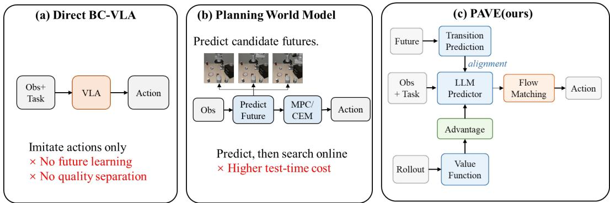
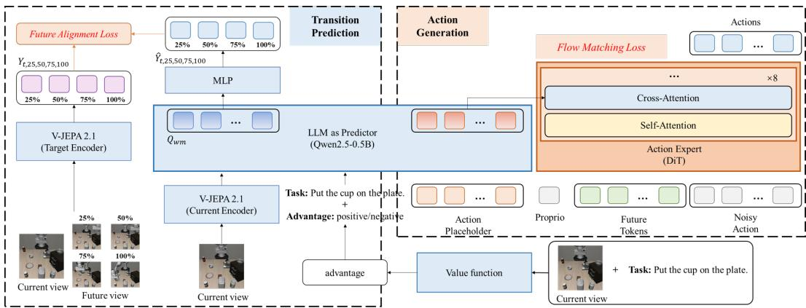
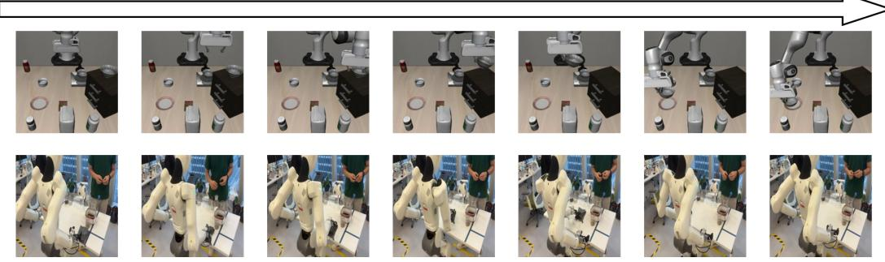
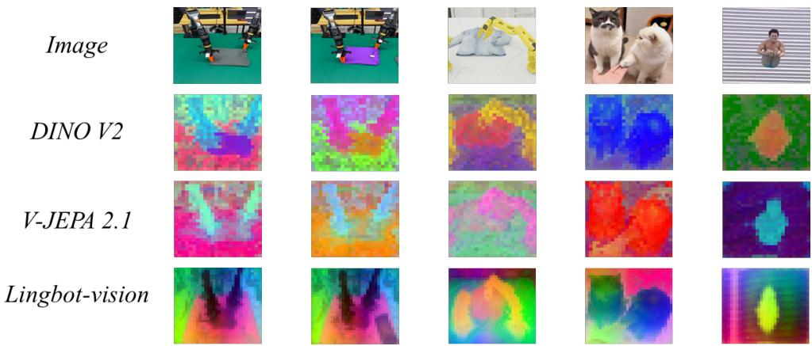

# PAVE: PREDICTIVE ALIGNMENT AND VALUE-GUIDED EVOLUTION FOR WORLD-ACTION POLICIES

Botong Zhao1,2,3 Fang Yu1,3 Tim2 Senhua Zhu2 Xinyuan Chen3 Yue Lu1,∗ 1Multi-Dimensional Information Processing Laboratory, East China Normal University 2EBKernel 3Shanghai Artificial Intelligence Laboratory   
∗Corresponding author

## ABSTRACT

Direct vision-language-action policies generate continuous robot actions efficiently, but standard behavior cloning leaves two complementary gaps: their representations are not explicitly required to describe how the scene evolves over multiple time scales, and deployment trajectories of unequal quality are often reused without separating useful dynamics from undesirable behavior. We introduce PAVE, a direct world-action policy that combines outcome-agnostic predictive learning with outcome-aware policy improvement. PAVE first retains a local fixed-offset JEPA objective and adds trajectory-relative multi-horizon transition alignment at 25%, 50%, 75%, and 100% of the remaining episode. These training-only targets require the current policy representation to preserve both local physical changes and longer-range task progress, without supplying explicit future tokens to the action head. PAVE then trains an independent distributional value critic on cumulative deployment trajectories, computes action-chunk-aligned N-step advantages, and converts them into positive, negative, or null text conditions for a flow-matching actor. Thus, every valid trajectory can teach what physically happened, while the actor is deployed only under the condition associated with relatively better actions. The multi-horizon predictor and critic are removed from online execution, preserving direct action generation from the current observation, language instruction, and proprioception. Across the three simulation benchmarks, PAVE achieves the strongest overall performance while preserving the direct actor’s online execution path.

## 1 INTRODUCTION

Vision-language-action (VLA) models map visual observations and language instructions directly to robot actions, offering a scalable interface for generalist manipulation. Recent systems use large pretrained vision-language backbones and expressive continuous action decoders, including diffusion policies and flow-matching action experts (Chi et al., 2023; Kim et al., 2024; Black et al., 2024; Physical Intelligence et al., 2025b). Their direct execution path is attractive for closed-loop control, but the dominant action-imitation objective only asks a policy to reproduce demonstrated actions. It does not explicitly require the internal representation to encode what environmental transition an action is associated with, especially over time scales longer than one action chunk.

World-action models address this limitation by introducing future prediction. Pixel-generative models can imagine future observations, whereas latent world models predict compact state representations and can support planning (Assran et al., 2025). More recent methods move predictive supervision inside a direct policy. JEPA-VLA augments VLA perception with video-predictive embeddings, VLA-JEPA learns leakage-free future latent prediction, Fast-WAM removes future generation at deployment, and JEPA-WAM jointly shapes action representations with current–future joint embeddings (Miao et al., 2026; Sun et al., 2026; Yuan et al., 2026; Lin et al., 2026). These methods establish that future aware training can benefit control without necessarily generating RGB futures online. However, a single fixed future target captures only one temporal scale: it may describe local motion but under-specify intermediate progress and trajectory-level consequences.

  
Figure 1: Conceptual positioning of PAVE. Predictive correctness and behavioral desirability are complementary, while both auxiliary modules remain training-time or offline components.

A separate line of work improves VLA policies from deployment experience. In particular, π∗0.6 introduces RECAP, where a value model converts demonstrations, rollouts, and corrections into advantage conditions for policy extraction (Physical Intelligence et al., 2025a). This addresses the fact that autonomous deployment produces successful, failed, inefficient, and recovery behaviors. Nevertheless, value-guided relabeling alone does not explicitly improve the policy’s multi-timescale transition representation. Conversely, future prediction alone is behavior-agnostic: a predictor can accurately represent the consequences of a poor action without teaching the actor to avoid it.

This distinction motivates a simple principle: learn transitionsfrom every valid trajectory, but execute actions from the better ones. We therefore propose Predictive Alignment and Value-Guided Evolution (PAVE). PAVE retains JEPA-WAM’s local fixed-offset transition target and adds trajectory-relative future anchors at 25%, 50%, 75%, and 100% of the remaining episode. The local objective provides a consistent short-range transition signal, while the relative anchors expose the representation to near-, mid-, and long-range progress despite variable episode lengths. These anchors are supervision targets rather than explicit subgoals: they never enter the action expert. Predicting what happens is still insufficient to decide whether an action is desirable, so PAVE independently trains a distributional state-value critic on cumulative rollout data and computes N-step advantages over the same horizon as the actor’s action chunk. The resulting positive, negative, and null labels are concatenated with the task text. This separation allows valid failed trajectories to contribute physical transition information while preventing low-quality actions from being imitated indiscriminately. At deployment, the actor uses only the positive condition; neither the future-target encoder, multi-horizon predictor, nor critic participates online.

Our contributions are threefold:

• We introduce trajectory-relative multi-horizon transition alignment, which combines a stable local JEPA target with normalized future anchors that span the remaining trajectory.

• We formulate a predictive-preferential decomposition: all valid trajectories supervise what physically occurred, while a distributional critic separates relatively better and worse action chunks through advantage-conditioned behavior learning.

• We develop a self-improving direct policy in which both the multi-horizon predictor and value critic are restricted to training or offline annotation, avoiding online future rollout, candidate-action evaluation, and MPC search.

## 2 RELATED WORK

Vision-language-action policies. Generalist VLA policies adapt pretrained visual-language representations to robot control. OpenVLA provides an open-source autoregressive VLA, while π0 uses flow matching to model continuous action chunks and π expands open-world generalization through heterogeneous co-training (Kim et al., 2024; Black et al., 2024; Physical Intelligence et al., 2025b). Diffusion Policy demonstrates the strength of conditional generative action models without a language foundation model (Chi et al., 2023). These methods are direct at inference, but their standard action losses do not explicitly organize the representation around multiple future time scales or mixed-quality deployment experience.

Predictive representations and world-action models. V-JEPA 2 and V-JEPA 2.1 learn temporally predictive visual representations that are suitable for physical understanding and planning (Assran et al., 2025; Mur-Labadia et al., 2026). DINOv2 emphasizes high-quality semantic and dense visual features, whereas LingBot-Vision studies boundary-centric pretraining for metric spatial perception (Oquab et al., 2023; Fu et al., 2026). In robot policies, JEPA-VLA, VLA-JEPA, Being-H0.7, Fast-WAM, StageWAM, and JEPA-WAM transfer future information into deployable policies through different latent interfaces (Miao et al., 2026; Sun et al., 2026; Luo et al., 2026; Yuan et al., 2026; Liu et al., 2026; Lin et al., 2026). PAVE differs in two respects. First, it predicts a set of trajectoryrelative current–future transition embeddings rather than one fixed offset, one inferred semantic stage, or action-conditioned candidate rollouts. Second, the future branch is paired with value-guided experience relabeling, so predictive representation learning and behavior selection are trained as distinct objectives.

Experience-driven policy improvement. RECAP improves VLAs with a distributional value function and advantage-conditioned policy extraction (Physical Intelligence et al., 2025a). Other recent approaches directly optimize preferences or redirect failed actions, including FlowPRO and RedFlow (Wu et al., 2026; Yan et al., 2026). PAVE follows the critic-driven conditional-policy route because it can annotate unpaired successful and failed rollouts at action-chunk resolution. Its contribution is not a new policy-gradient objective; rather, it connects offline value-based relabeling to a multi-horizon world-action representation while keeping the online actor direct.

## 3 PROPOSED METHOD

Given expert demonstrations $\mathcal { D } _ { \mathrm { d e m o } }$ and deployment trajectories $\mathcal { D } _ { k }$ collected in round $k ,$ our goal is to learn a direct continuous policy π $\left( a _ { t : t + H - 1 } \mid o _ { t } , l , q _ { t } , c _ { t } \right)$ . Here, o contains the current global and wrist observations, l is the task instruction, q is proprioception, and $c _ { t } \in$ {positive, negative, null} is a behavior-quality text condition. Figure 2 summarizes the three parts of PAVE. First, the actor learns actions jointly with local and multi-horizon current–future transition targets. Second, an independent distributional critic converts cumulative deployment trajectories into N-step advantage labels. Third, the labeled deployment data and expert demonstrations retrain a flow-matching actor from the same base initialization; the improved actor then collects the next round. Only the current-observation actor is used online.

  
Figure 2: Overview of PAVE. Multi-horizon current–future alignment supplies training-only predictive supervision, while the offline value branch converts accumulated trajectories into advantage text that is concatenated with the task. The deployed path retains only the current-observation predictor and flow-matching action expert.

## 3.1 MULTI-HORIZON PREDICTIVE WORLD-ACTION LEARNING

Direct actor. The current observation contains two 384 × 384 camera views. A frozen V-JEPA 2.1 ViT-L/16 encoder produces $2 4 \times 2 4$ patch tokens per view, yielding $N _ { v } = 1 1 5 2$ visual tokens with dimension $d _ { v } = 1 0 2 4$ . A frozen projector maps them to the $d _ { l } = 8 9 6$ hidden space of Qwen2.5-0.5B (Mur-Labadia et al., 2026; Yang et al., 2024). The model sequence consists of the first text token, all visual tokens, the remaining task-plus-advantage text, and 64 learned action placeholders. Let

$$
( V _ { t } , M _ { t } ) = Q _ { \theta } ( [ w _ { 0 } ; P ( E ( o _ { t } ) ) ; w _ { 1 : L } ; c _ { t } ; q _ { 1 : 6 4 } ^ { a } ] ) ,\tag{1}
$$

where $V _ { t } \in \mathbb { R } ^ { 1 1 5 2 \times 8 9 6 }$ denotes hidden states at visual positions and $M _ { t } \in \mathbb { R } ^ { 6 4 \times 8 9 6 }$ denotes the placeholder states supplied to the action expert. The frozen Qwen base is adapted with LoRA, while the flow action head is trainable (Hu et al., 2022).

The actor predicts a normalized action chunk $a \in \mathbb { R } ^ { H \times 7 }$ with $H = 2 0$ . Given Gaussian noise $\epsilon \sim \mathcal { N } ( 0 , I )$ and flow time τ, we form

$$
x _ { \tau } = ( 1 - \tau ) \epsilon + \tau a , \qquad u ^ { * } ( x _ { \tau } , \tau ) = a - \epsilon .\tag{2}
$$

The conditional action expert predicts the velocity field $u _ { \theta } ( x _ { \tau } , \tau , M _ { t } , q _ { t } )$ , with the flow-matching objective (Lipman et al., 2023)

$$
\mathcal { L } _ { \mathrm { F M } } = \frac { \sum m ^ { a } \odot | | u _ { \theta } ( x _ { \tau } , \tau , M _ { t } , q _ { t } ) - ( a - \epsilon ) | | _ { 2 } ^ { 2 } } { \sum m ^ { a } } ,\tag{3}
$$

where $m ^ { a }$ excludes padded or provenance-inconsistent action chunks.

Paired transition targets. Write $o _ { t } = ( I _ { t } ^ { \mathrm { g } } , I _ { t } ^ { \mathrm { w } } )$ for the global and wrist images. For each view, $E _ { \mathrm { p a i r } }$ stacks the current and future images along the temporal axis and encodes the resulting twoframe clip with the frozen V-JEPA 2.1 target encoder. A two-frame clip forms one temporal tubelet and therefore retains the $2 4 \times 2 4$ spatial grid for each view. The global-view and wrist-view grids are concatenated in a fixed order without spatial or global pooling:

$$
\begin{array} { r } { E _ { \mathrm { p a i r } } ( o _ { t } , o _ { h } ) = \mathrm { C o n c a t } _ { v \in \{ \mathrm { g } , \mathrm { w } \} } E _ { \mathrm { t g t } } ( \mathrm { S t a c k } _ { \mathrm { t i m e } } ( I _ { t } ^ { v } , I _ { h } ^ { v } ) ) \in \mathbb { R } ^ { 1 1 5 2 \times 1 0 2 4 } . } \end{array}\tag{4}
$$

Accordingly, $P _ { \delta }$ and $P _ { \mathrm { M H } }$ map the $1 1 5 2 \times 8 9 6$ Qwen visual states to $1 1 5 2 \times 1 0 2 4$ target tokens. All cosine losses below are evaluated token-wise and averaged over the 1,152 tokens and valid pairs.

Local transition alignment. We retain the original fixed-offset JEPA target to preserve stable local supervision. For episode endpoint $T$ and offset $\delta = 3 1$

$$
h _ { t } ^ { \delta } = \mathrm { m i n } ( t + \delta , T ) , \qquad Y _ { t } ^ { \delta } = \mathrm { s g } \Bigl [ E _ { \mathrm { p a i r } } \bigl ( o _ { t } , o _ { h _ { t } ^ { \delta } } \bigr ) \Bigr ] .\tag{5}
$$

A token-wise predictor $P _ { \delta }$ maps $V _ { t }$ to $\widehat { Y } _ { t } ^ { \delta }$ , and the valid-pair cosine loss is

$$
\mathcal { L } _ { \mathrm { l o c a l } } = \frac { \sum _ { t } m _ { t } ^ { \delta } \left[ 1 - \cos ( \widehat { Y } _ { t } ^ { \delta } , Y _ { t } ^ { \delta } ) \right] } { \sum _ { t } m _ { t } ^ { \delta } } .\tag{6}
$$

Trajectory-relative multi-horizon alignment. A fixed offset covers only one temporal scale. We instead define normalized future fractions

$$
\rho = \{ 0 . 2 5 , 0 . 5 0 , 0 . 7 5 , 1 . 0 0 \} ,\tag{7}
$$

and select the k-th target index by

$$
h _ { t , k } = \mathrm { c l i p } ( \mathrm { r o u n d } [ t + \rho _ { k } ( T - t ) ] , t , T ) .\tag{8}
$$

For each $k ,$ we reuse Equation 4 to construct the joint transition target

$$
Y _ { t , k } = \mathrm { s g } \big [ E _ { \mathrm { p a i r } } \big ( o _ { t } , o _ { h _ { t , k } } \big ) \big ] .\tag{9}
$$

A shared MLP and learned horizon embedding $\boldsymbol { e } _ { k } \in \mathbb { R } ^ { 8 9 6 }$ , broadcast across all visual-token positions, predict

$$
\widehat { Y } _ { t , k } = P _ { \mathrm { M H } } ( V _ { t } + e _ { k } ) ,\tag{10}
$$

The corresponding masked cosine objective is

$$
\mathcal { L } _ { \mathrm { M H } } = \frac { \sum _ { t , k } m _ { t , k } \left[ 1 - \cos ( \widehat { Y } _ { t , k } , Y _ { t , k } ) \right] } { \sum _ { t , k } m _ { t , k } } .\tag{11}
$$

The mask $m _ { t , k }$ requires the target to remain within one episode and not cross a policy-version, action-source, intervention, or censored-outcome boundary. Importantly, $\widehat { Y } _ { t , k }$ is never passed to the action expert. The multi-horizon branch shapes the shared Qwen LoRA representation during training and is skipped entirely at inference.

The actor objective is

$$
\begin{array} { r } {  \lvert \mathcal { L } _ { \mathrm { a c t o r } } = \mathcal { L } _ { \mathrm { F M } } + \lambda _ { \mathrm { l o c a l } } \mathcal { L } _ { \mathrm { l o c a l } } + \lambda _ { \mathrm { M H } } \mathcal { L } _ { \mathrm { M H } } \rvert , } \end{array}\tag{12}
$$

with $\lambda _ { \mathrm { l o c a l } } = \lambda _ { \mathrm { M H } } = 0 . 5$ in the default configuration.

## 3.2 DISTRIBUTIONAL VALUE-GUIDED EXPERIENCE ANNOTATION

The predictive branch answers what transition occurred, but not whether the underlying action chunk was preferable. We therefore train a separate state-value critic $V _ { \phi } ( s _ { t } )$ with $s _ { t } = ( o _ { t } , l , q _ { t } )$ . The critic reuses frozen V-JEPA, projector, and Qwen modules, then appends eight proprioceptive tokens and a learned value-query token. A lightweight trainable head outputs 201 logits over equally spaced supports $z _ { i } \in [ \bar { - 1 } , \bar { 0 } ]$ . It receives no candidate action and therefore estimates $V ( s _ { t } )$ rather than $Q ( s _ { t } , a _ { t } )$

For an episode of length $L ,$ nonterminal rewards are $r _ { t } = - 1$ . The terminal reward is 0 for success and $- C _ { \mathrm { f a i l } }$ for a valid failure. With fixed task horizon $M _ { \mathrm { t a s k } }$ and $C _ { \mathrm { f a i l } } = M _ { \mathrm { t a s k } }$ , the undiscounted return and normalized target are

$$
G _ { t } = \sum _ { i = t } ^ { L - 1 } r _ { i } , \qquad y _ { t } = { \frac { G _ { t } } { 2 M _ { \mathrm { t a s k } } } } \in [ - 1 , 0 ] .\tag{13}
$$

The scalar $y _ { t }$ is linearly projected to a two-hot categorical target $p _ { t } ^ { * }$ on the 201 supports. The distributional objective (Bellemare et al., 2017) is

$$
\mathcal { L } _ { \mathrm { v a l u e } } = - \sum _ { i = 0 } ^ { 2 0 0 } p _ { t , i } ^ { * } \log p _ { \phi } ( z _ { i } \mid s _ { t } ) ,\tag{14}
$$

and the scalar prediction is the distribution expectation

$$
V _ { \phi } ( s _ { t } ) = \sum _ { i = 0 } ^ { 2 0 0 } p _ { \phi } ( z _ { i } \mid s _ { t } ) z _ { i } .\tag{15}
$$

We align policy labels with the actor horizon by setting $N = H = 2 0$ . Let $\bar { r } _ { t } = r _ { t } / ( 2 M _ { \mathrm { t a s k } } )$ and $h _ { t } = \operatorname* { m i n } ( N , L - t )$ . The N-step target and advantage are

$$
\widehat { G } _ { t } ^ { ( N ) } = \sum _ { j = 0 } ^ { h _ { t } - 1 } \bar { r } _ { t + j } + \mathbf { 1 } [ t + N < L ] V _ { \phi } ( s _ { t + N } ) ,\tag{16}
$$

$$
A _ { t } ^ { ( N ) } = \widehat { G } _ { t } ^ { ( N ) } - V _ { \phi } ( s _ { t } ) .\tag{17}
$$

Only complete, provenance-consistent 20-step chunks are eligible. Within each task, chunks are ranked by $A _ { t } ^ { ( N ) }$ ; the top 30% receive the positive label and the remainder receive the negative label. Valid human corrections, when available, are included in the positive set. The label is relative to the current cumulative data, so positive does not simply mean episode success: a recovery segment in a failed episode may be positive, while an inefficient segment in a successful episode may be negative.

## 3.3 ADVANTAGE-CONDITIONED POLICY EVOLUTION (ACP)

The advantage is injected as text rather than as a scalar feature. The prompt contains the task instruction followed by either “Advantage: positive”, “Advantage: negative”, or no advantage phrase for the null condition. Each labeled condition is dropped to null with probability 0.3 during training. Expert demonstrations are assigned positive labels; deployment data receive critic-derived labels.

At round $k ,$ the cumulative experience pool is

$$
{ \mathcal { D } } _ { \leq k } = \bigcup _ { j = 1 } ^ { k } { \mathcal { D } } _ { j } .\tag{18}
$$

We train a fresh critic on all states in $\mathcal { D } _ { \le k }$ and use that critic to score the same cumulative pool. Thus, both value terms in Equation 17 are in-sample critic predictions rather than cross-fitted estimates. We then annotate all eligible chunks and materialize a labeled evolution dataset $\scriptstyle { \widetilde { \mathcal { D } } } \leq _ { k }$ . The actor is initialized from the same fixed base checkpoint $\pi _ { \mathrm { b a s e } }$ at every round and optimized on

$$
\mathcal { D } _ { \mathrm { t r a i n } } ^ { k } = \mathcal { D } _ { \mathrm { d e m o } } \cup \widetilde { \mathcal { D } } _ { \leq k } ,\tag{19}
$$

using a 3:1 demonstration-to-evolution sampling ratio and the actor loss in Equation 12. Reinitializing from one base model reduces confounding from sequential weight drift: successive actors differ primarily because their cumulative data and advantage labels differ. We use three rounds, collect 96 episodes per round, train each critic for 8,000 updates, and train each actor for 30,000 updates.

During deployment, the policy fixes $c _ { t } =$ positive and directly samples a 20-step action chunk with four Euler integration steps. The paired-future encoder, local and multi-horizon predictors, critic, and advantage computation are not executed online. Thus, PAVE changes training supervision and data selection without introducing test-time candidate actions or search.

## 4 EXPERIMENTS

We organize the evaluation around four questions: (1) Does PAVE improve standard manipulation success? (2) Does multi-horizon predictive alignment improve robustness under visual and spatial shifts? (3) Does value-guided evolution improve a policy across deployment rounds? (4) Are these gains obtained without adding online planning cost? Unless otherwise stated, success rates with error bars are reported as mean ± standard deviation over three independent seeds. Compared methods use the same fixed task and initial-state manifests.

## 4.1 EXPERIMENTAL SETUP

Benchmarks. LIBERO contains four suites that emphasize spatial, object, goal, and long-horizon transfer (Liu et al., 2023). LIBERO-Plus applies seven controlled perturbations: camera viewpoint, robot initial state, language instruction, lighting, background texture, sensor noise, and object layout (Fei et al., 2025). RoboTwin 2.0 evaluates 50 bimanual tasks with structured randomization over clutter, lighting, background, tabletop height, and language (Chen et al., 2025). We additionally provide a qualitative real-robot table-wiping demonstration illustrating approach, contact, coverage, and completion. This sequence is not treated as a quantitative benchmark.

Baselines and protocol. We compare with Diffusion Policy, $\pi _ { 0 . 5 } , \pi _ { 0 . 6 } ^ { * } ,$ JEPA-VLA, VLA-JEPA, Fast-WAM, and JEPA-WAM (Chi et al., 2023; Physical Intelligence et al., 2025b;a; Miao et al., 2026; Sun et al., 2026; Yuan et al., 2026; Lin et al., 2026). All baseline results in Tables 2–4 were reproduced by us using the same demonstrations, observation views, action normalization, task manifests, and evaluation budget; the citations identify the source methods rather than quoted numerical results.

## 4.2 MAIN BENCHMARK RESULTS

Compared with JEPA-WAM, PAVE improves average success by 2.6 points on LIBERO and longhorizon success by 3.4 points. Its average is also 2.0 points above $\pi _ { 0 . 6 } ^ { * } .$

Table 1: Default training and evaluation configuration used throughout the experiments.  
Component Configuration   
Visual inputs Global + wrist RGB, 384 × 384 each   
Visual encoder Frozen V-JEPA 2.1 ViT-L/16; 576 tokens per view   
Language predictor Qwen2.5-0.5B; hidden size 896; 64 action placeholders   
Adaptation LoRA rank 32, α = 64, dropout 0.1   
Action expert 16-layer flow-matching DiT; action chunk $2 0 \times 7$   
Flow sampling 4 Euler steps; execution horizon 20   
Local JEPA target Fixed frame offset δ = 31   
Multi-horizon targets Remaining-trajectory fractions {0.25, 0.50, 0.75, 1.00}   
Loss weights $\lambda _ { \mathrm { l o c a l } } = 0 . 5 , \lambda _ { \mathrm { M H } } = 0 . 5$   
Critic Token-fusion distributional $V ( s ) { \ ; }$ 201 bins on $[ - 1 , 0 ]$   
Advantage labels $N = 2 0 ;$ task-wise top 30% positive; label dropout 0.3   
Evolution schedule 3 rounds; 96 new episodes/round; demos:evolution = 3:1   
Optimization Actor 30,000 updates/round; critic 8,000 updates/round   
Default batches Actor 128 global; token-fusion critic 240 global   
Reporting Three independent seeds; mean ± standard deviation

Table 2: LIBERO success rate (%). Values are mean ± standard deviation over three seeds.
<table><tr><td>Method</td><td>Spatial</td><td>Object</td><td>Goal</td><td>Long</td><td> $\operatorname { A v g } .$ </td></tr><tr><td>Diffusion Policy (Chi et al., 2023)</td><td> $8 1 . 5 { \pm } 1 . 6 \ $ </td><td> $8 4 . 0 \pm 1 . 4$ </td><td> $8 0 . 2 \pm 1 . 8$ </td><td> $7 1 . 4 \pm 2 . 1$ </td><td> $7 9 . 3 { \pm } 1 . 2 $ </td></tr><tr><td> $\pi _ { 0 . 5 }$  (Physical Intelligence et al., 2025b)</td><td> $9 3 . 8 \pm 0 . 9$ </td><td> $9 4 . 6 { \pm } 0 . 8 $ </td><td> $9 3 . 0 { \pm } 1 . 0 \ $ </td><td> $8 9 . 8 \pm 1 . 3$ </td><td> $9 2 . 8 { \pm } 0 . 7 \ $ </td></tr><tr><td> $\pi _ { 0 . 6 } ^ { * }$  (Physical Intelligence et al., 2025a)</td><td> $9 5 . 8 \pm 0 . 7 $ </td><td> $9 5 . 4 \pm 0 . 8$ </td><td> $9 4 . 9 { \pm } 0 . 8 $ </td><td> $9 2 . 4 \pm 1 . 1$ </td><td> $9 4 . 6 { \pm } 0 . 6 $ </td></tr><tr><td>JEPA-VLA (Miao et al., 2026)</td><td> $9 2 . 6 \pm 1 . 1$ </td><td> $9 3 . 8 \pm 1 . 0$ </td><td> $9 2 . 1 \pm 1 . 2 $ </td><td> $8 7 . 2 \pm 1 . 5$ </td><td> $9 1 . 4 \pm 0 . 8$ </td></tr><tr><td>VLA-JEPA (Sun et al., 2026)</td><td> $9 3 . 4 \pm 1 . 0 $ </td><td> $9 4 . 1 \pm 0 . 9$ </td><td> $9 3 . 2 \pm 1 . 0 $ </td><td> $8 9 . 5 { \pm } 1 . 3 $ </td><td> $9 2 . 5 { \pm } 0 . 7 \ $ </td></tr><tr><td>Fast-WAM (Yuan et al., 2026)</td><td> $9 4 . 9 \pm 0 . 9$ </td><td> $9 5 . 0 { \pm } 0 . 8 $ </td><td> $9 4 . 0 { \pm } 0 . 9$ </td><td> $9 1 . 1 \pm 1 . 2 $ </td><td> $9 3 . 8 { \pm } 0 . 6 \ $ </td></tr><tr><td>JEPA-WAM (Lin et al., 2026)</td><td> $9 5 . 5 { \pm } 0 . 8 $ </td><td> $9 4 . 8 { \pm } 0 . 9$ </td><td> $9 4 . 1 \pm 0 . 9$ </td><td> $9 1 . 6 { \pm } 1 . 1$ </td><td> $9 4 . 0 { \pm } 0 . 6 $ </td></tr><tr><td>PAVE (ours)</td><td> $9 7 . 8 \pm 0 . 5$ </td><td> $9 7 . 0 { \pm } 0 . 6 $ </td><td> $9 6 . 6 { \pm } 0 . 6 $ </td><td> $9 5 . 0 { \pm } 0 . 8 $ </td><td> $9 6 . 6 { \pm } 0 . 4 $ </td></tr></table>

Table 3: LIBERO-Plus success rate (%) across seven perturbation dimensions. Values are mean ± standard deviation over three seeds.
<table><tr><td>Method</td><td>Camera</td><td>Robot</td><td>Language</td><td>Light</td><td>Background</td><td>Noise</td><td>Layout</td><td> $\operatorname { A v g } .$ </td></tr><tr><td>Diffusion Policy</td><td> $4 3 . 5 { \pm } 2 . 2 $ </td><td> $4 6 . 2 \pm 2 . 1$ </td><td> $5 0 . 1 \pm 2 . 0$ </td><td> $4 7 . 0 { \pm } 2 . 3 $ </td><td> $3 9 . 8 \pm 2 . 6 $ </td><td> $3 5 . 7 \pm 2 . 8$ </td><td> $3 7 . 2 \pm 2 . 5$ </td><td> $4 2 . 8 \pm 1 . 8$ </td></tr><tr><td> $\pi _ { 0 . 5 }$ </td><td> $6 0 . 2 \pm 1 . 7$ </td><td> $6 1 . 8 \pm 1 . 6 $ </td><td> $6 6 . 4 \pm 1 . 5$ </td><td> $6 3 . 1 \pm 1 . 7$ </td><td> $5 8 . 3 { \pm } 1 . 9$ </td><td> $5 4 . 7 \pm 2 . 1$ </td><td> $5 7 . 0 { \pm } 1 . 8 $ </td><td> $6 0 . 2 \pm 1 . 3$ </td></tr><tr><td> $\pi _ { 0 . 6 } ^ { * }$ </td><td> $6 7 . 1 \pm 1 . 4$ </td><td> $7 0 . 0 \pm 1 . 3$ </td><td> $7 3 . 8 \pm 1 . 2$ </td><td> $7 0 . 4 \pm 1 . 4$ </td><td> $6 8 . 0 \pm 1 . 6 $ </td><td> $6 4 . 2 \pm 1 . 7$ </td><td> $6 6 . 1 \pm 1 . 5$ </td><td> $6 8 . 5 \pm 1 . 0$ </td></tr><tr><td> $\mathrm { J E P A - V L A }$ </td><td> $5 8 . 9 \pm 1 . 8$ </td><td> $6 0 . 5 \pm 1 . 7$ </td><td> $6 5 . 2 \pm 1 . 6$ </td><td> $6 2 . 7 { \pm } 1 . 8 $ </td><td> $5 7 . 6 { \pm } 2 . 0 $ </td><td> $5 3 . 8 \pm 2 . 2$ </td><td> $5 5 . 1 \pm 2 . 0$ </td><td> $5 9 . 1 \pm 1 . 4$ </td></tr><tr><td>VLA-JEPA</td><td> $6 2 . 4 \pm 1 . 6 $ </td><td> $6 4 . 8 \pm 1 . 5$ </td><td> $6 8 . 6 \pm 1 . 4$ </td><td> $6 6 . 1 \pm 1 . 6$ </td><td> $6 1 . 2 \pm 1 . 8$ </td><td> $5 7 . 9 \pm 1 . 9$ </td><td> $6 1 . 4 \pm 1 . 7$ </td><td> $6 3 . 2 \pm 1 . 2$ </td></tr><tr><td>Fast-WAM</td><td> $6 4 . 9 \pm 1 . 5$ </td><td> $6 7 . 3 { \pm } 1 . 4 $ </td><td> $7 0 . 5 \pm 1 . 3$ </td><td> $6 8 . 4 \pm 1 . 5$ </td><td> $6 4 . 0 { \pm } 1 . 7 \ $ </td><td> $6 0 . 8 \pm 1 . 8$ </td><td> $6 4 . 7 \pm 1 . 6 $ </td><td> $6 5 . 8 \pm 1 . 1$ </td></tr><tr><td>JEPA-WAM</td><td> $6 6 . 0 { \pm } 1 . 4 $ </td><td> $6 8 . 2 \pm 1 . 4$ </td><td> $7 1 . 2 \pm 1 . 3$ </td><td> $6 9 . 5 { \pm } 1 . 4 $ </td><td> $6 5 . 8 \pm 1 . 6$ </td><td> $6 2 . 1 \pm 1 . 7$ </td><td> $6 7 . 6 \pm 1 . 5$ </td><td> $6 7 . 2 \pm 1 . 0$ </td></tr><tr><td>PAVE (ours)</td><td>71.8±1.1</td><td> $7 4 . 1 \pm 1 . 0$ </td><td> $7 8 . 0 \pm 0 . 9$ </td><td> $7 5 . 3 { \pm } 1 . 1$ </td><td> $7 3 . 7 \pm 1 . 2$ </td><td> $6 9 . 5 \pm 1 . 3$ </td><td> $6 9 . 8 \pm 1 . 2$ </td><td> $7 3 . 2 \pm 0 . 8$ </td></tr></table>

On LIBERO-Plus, PAVE improves average success by 6.0 points over JEPA-WAM and by 4.7 points over $\pi _ { 0 . 6 } ^ { * } .$ Relative to JEPA-WAM, the gains are 7.9 points under background changes and 7.4 points under sensor noise.

On RoboTwin 2.0, PAVE improves average success by 6.6 points over JEPA-WAM and by 4.8 points over $\pi _ { 0 . 6 } ^ { * } .$ . The margins over JEPA-WAM reach 7.0 points under clutter and 7.5 points under background changes.

## 4.3 QUALITATIVE TRAJECTORY VISUALIZATION

Figure 3 presents example simulation and real-robot trajectories without online future rollout or search. The real-robot row documents a qualitative demonstration; we do not infer a trial-level success rate or robustness from this sequence.

Table 4: RoboTwin 2.0 bimanual task success rate (%). Values are mean ± standard deviation over three seeds.
<table><tr><td>Method</td><td>Clean</td><td>Clutter</td><td>Light</td><td>Background</td><td>Height</td><td>Language</td><td>Avg.</td></tr><tr><td>Diffusion Policy</td><td> $4 2 . 1 \pm 2 . 8$ </td><td> $2 9 . 8 \pm 3 . 1$ </td><td> $3 4 . 2 \pm 2 . 9$ </td><td> $3 0 . 5 \pm 3 . 2$ </td><td> $2 7 . 6 { \pm } 3 . 0 $ </td><td> $2 6 . 5 { \pm } 3 . 3 $ </td><td> $3 1 . 8 \pm 2 . 1$ </td></tr><tr><td> $\pi _ { 0 . 5 }$ </td><td> $5 7 . 8 \pm 2 . 3$ </td><td> $4 4 . 3 { \pm } 2 . 5 $ </td><td> $4 9 . 0 { \pm } 2 . 3 $ </td><td> $4 5 . 1 \pm 2 . 6$ </td><td> $4 2 . 8 \pm 2 . 5$ </td><td> $4 1 . 1 { \pm } 2 . 7 $ </td><td> $4 6 . 7 \pm 1 . 8$ </td></tr><tr><td> $\pi _ { 0 . 6 } ^ { * }$ </td><td> $6 5 . 2 \pm 1 . 9$ </td><td> $5 3 . 1 \pm 2 . 1$ </td><td> $5 7 . 3 { \pm } 2 . 0 $ </td><td> $5 4 . 0 { \pm } 2 . 2 $ </td><td> $5 1 . 5 { \pm 2 . 1 }$ </td><td> $5 0 . 0 { \pm } 2 . 3 $ </td><td> $5 5 . 2 \pm 1 . 5$ </td></tr><tr><td>JEPÁ-VLA</td><td> $5 5 . 1 \pm 2 . 4$ </td><td> $4 2 . 3 { \pm } 2 . 6 $ </td><td> $4 7 . 0 { \pm } 2 . 4 $ </td><td> $4 3 . 1 \pm 2 . 7$ </td><td> $4 0 . 2 \pm 2 . 6$ </td><td> $3 9 . 1 \pm 2 . 8$ </td><td> $4 4 . 5 \pm 1 . 9$ </td></tr><tr><td>VLA-JEPA</td><td> $5 9 . 4 \pm 2 . 2$ </td><td> $4 6 . 1 \pm 2 . 4$ </td><td> $5 0 . 5 \pm 2 . 2$ </td><td> $4 7 . 0 { \pm } 2 . 5 $ </td><td> $4 4 . 6 { \pm } 2 . 4 $ </td><td> $4 2 . 2 { \pm } 2 . 6 $ </td><td> $4 8 . 3 \pm 1 . 7$ </td></tr><tr><td>Fast-WAM</td><td> $6 2 . 0 { \pm } 2 . 1 $ </td><td> $4 9 . 0 { \pm } 2 . 3 $ </td><td> $5 3 . 5 { \pm 2 . 1 }$ </td><td> $5 0 . 1 \pm 2 . 4$ </td><td> $4 7 . 0 { \pm } 2 . 3 $ </td><td> $4 5 . 6 \pm 2 . 5$ </td><td> $5 1 . 2 { \pm } 1 . 6 $ </td></tr><tr><td>JEPA-WAM</td><td> $6 4 . 0 { \pm } 2 . 0 \ $ </td><td> $5 1 . 4 \pm 2 . 2$ </td><td> $5 5 . 4 \pm 2 . 0$ </td><td> $5 2 . 0 { \pm } 2 . 3 $ </td><td> $4 9 . 8 \pm 2 . 2$ </td><td> $4 7 . 8 \pm 2 . 4$ </td><td> $5 3 . 4 \pm 1 . 5$ </td></tr><tr><td>PAVE (ours)</td><td> $6 9 . 3 { \pm } 1 . 6 $ </td><td> $5 8 . 4 \pm 1 . 8$ </td><td> $6 2 . 0 \pm 1 . 7$ </td><td> $5 9 . 5 \pm 1 . 9$ </td><td> $5 6 . 3 { \pm } 1 . 8 $ </td><td> $5 4 . 5 { \pm } 2 . 0 $ </td><td> $6 0 . 0 { \pm } 1 . 2 $ </td></tr></table>

  
Figure 3: Representative qualitative trajectories in simulation (top) and on a real robot (bottom). Seven frames per row illustrate approach, interaction, and completion; the real-robot sequence is a qualitative demonstration rather than a quantitative evaluation.

Table 5: Online efficiency and model size. Latency is measured at batch size one with two camera views, a 20-step output chunk, four flow steps, CUDA synchronization, and identical hardware.
<table><tr><td>Method</td><td>Online params (B)</td><td>Offline-only extras (M)</td><td>p50 latency (ms)</td><td>p95 latency (ms)</td><td>GPU memory (GB)</td></tr><tr><td>π0.5</td><td>3.33</td><td>0.00</td><td>78.6</td><td>86.9</td><td>15.2</td></tr><tr><td>JEPA-WAM</td><td>1.29</td><td>0.00</td><td>62.0</td><td>66.6</td><td>10.4</td></tr><tr><td>PAVE (ours)</td><td>1.29</td><td>4.63</td><td>62.2</td><td>66.8</td><td>10.4</td></tr></table>

## 4.4 ONLINE EFFICIENCY

PAVE matches JEPA-WAM’s 1.29B online parameters and 10.4GB memory footprint. Its p50 and p95 latencies are each 0.2ms higher; the 4.63M additional parameters are used only by the training-time predictor and offline critic.

## 4.5 CORE ABLATIONS

With ACP disabled, the local fixed-offset target improves success over flow matching alone by 8.1 points on LIBERO-Plus and 7.5 points on RoboTwin 2.0. Adding the shared four-horizon objective yields a further 3.5- and 3.4-point improvement, respectively.

Across the three evolution rounds in Table 7, success rises from 67.2 to 73.2 on LIBERO-Plus and from 53.4 to 60.0 on RoboTwin 2.0.

In Table 8, the positive test condition reaches 66.6 average success, compared with 64.2 for the null condition, 47.6 for the negative condition, and 61.7 for unlabeled multi-round behavior cloning.

The round-wise, advantage-condition, encoder, horizon-count, loss, visualization, and value-critic ablations are placed after the bibliography to preserve the nine-page main-text budget.

Table 6: Effect of transition supervision with ACP evolution disabled for all rows. Success rates are mean ± standard deviation over three seeds.
<table><tr><td>Transition supervision</td><td>LIBERO-Plus</td><td>RoboTwin 2.0</td></tr><tr><td>No future transition target</td><td> $5 9 . 1 { \pm } 1 . 4 $ </td><td>45.9±2.0</td></tr><tr><td>One local fixed-offset target</td><td> $6 7 . 2 { \pm } 1 . 0 $ </td><td> $5 3 . 4 { \pm } 1 . 5 $ </td></tr><tr><td>Local + shared four-horizon targets</td><td> $7 0 . 7 { \pm } 0 . 9$ </td><td> $5 6 . 8 { \pm } 1 . 4 $ </td></tr></table>

## 5 LIMITATIONS AND DISCUSSION

PAVE has several limitations. First, trajectory-relative anchors are temporal progress markers, not semantic subgoals. They may coincide near episode termination and may encode unsuccessful endpoints; their role is representation supervision rather than guaranteed plans. Second, the statevalue critic produces chunk-level relative labels and cannot identify the exact failing action inside a chunk. Action-level correction methods such as RedFlow may provide denser supervision (Yan et al., 2026). Third, the top-30% labels use in-sample critic predictions and may therefore be sensitive to critic overfitting, calibration, and data coverage; trajectory-level cross-fitting remains an important extension. Fourth, because every round retrains the actor from one base checkpoint, the method incurs substantial offline computation even though online inference remains efficient. Finally, simulation success and a qualitative real-robot sequence do not establish safety or robustness in unconstrained environments; broader deployment requires conservative termination, intervention logging, and failure auditing.

## 6 CONCLUSION

We presented PAVE, a self-improving world-action policy that separates two learning questions: what transition occurs after behavior, and which behavior should be preferred. Multi-horizon JEPA alignment extracts local-to-trajectory-scale transition structure from every valid trajectory, while a distributional critic converts cumulative deployment experience into action-chunk-level advantage conditions. Both auxiliary mechanisms are restricted to training or offline annotation, leaving one direct positive-conditioned flow actor online. Across LIBERO, LIBERO-Plus, and RoboTwin 2.0, PAVE improves average success over JEPA-WAM by 2.6, 6.0, and 6.6 points while matching its online model size and memory footprint.

Reproducibility statement. The configuration values needed to reproduce the reported experiments are given in Table 1 and Appendix A. The appendix specifies data isolation, valid action chunks, the baseline protocol, and statistical summaries. Reported success rates use fixed task and initial-state manifests and are presented as mean ± standard deviation over three independent seeds.

Ethics statement. This work concerns robot manipulation and may introduce physical safety risks if deployed without safeguards. The real-robot sequence in Figure 3 is a qualitative demonstration rather than a safety or robustness evaluation. Broader deployment requires bounded workspaces, speed and force limits, emergency stops, operator supervision, and explicit handling of censored safety terminations. No human-subject or personal-data collection was conducted.

## REFERENCES

Mido Assran, Adrien Bardes, David Fan, Quentin Garrido, Russell Howes, Mojtaba Komeili, Matthew Muckley, Ammar Rizvi, Claire Roberts, Koustuv Sinha, et al. V-jepa 2: Self-supervised video models enable understanding, prediction and planning. arXiv preprint arXiv:2506.09985, 2025. doi: 10.48550/arXiv.2506.09985.

Marc G. Bellemare, Will Dabney, and Remi Munos. A distributional perspective on reinforcement learning. In International Conference on Machine Learning, pages 449–458, 2017.

Kevin Black, Noah Brown, Danny Driess, Adnan Esmail, Michael Equi, Chelsea Finn, Niccolo Fusai, Lachy Groom, Karol Hausman, Brian Ichter, et al. π : A vision-language-action flow model for general robot control. arXiv preprint arXiv:2410.24164, 2024. doi: 10.48550/arXiv.2410.24164.

Tianxing Chen, Zanxin Chen, Baijun Chen, Zijian Cai, Yibin Liu, Zixuan Li, Qiwei Liang, Xianliang Lin, Yiheng Ge, Zhenyu Gu, et al. Robotwin 2.0: A scalable data generator and benchmark with strong domain randomization for robust bimanual robotic manipulation. arXiv preprint arXiv:2506.18088, 2025. doi: 10.48550/arXiv.2506.18088.

Cheng Chi, Zhenjia Xu, Siyuan Feng, Eric Cousineau, Yilun Du, Benjamin Burchfiel, Russ Tedrake, and Shuran Song. Diffusion policy: Visuomotor policy learning via action diffusion. In Robotics: Science and Systems, 2023.

Senyu Fei, Siyin Wang, Junhao Shi, Zihao Dai, Jikun Cai, Pengfang Qian, Li Ji, Xinzhe He, Shiduo Zhang, Zhaoye Fei, Jinlan Fu, Jingjing Gong, and Xipeng Qiu. Libero-plus: In-depth robustness analysis of vision-language-action models. arXiv preprint arXiv:2510.13626, 2025. doi: 10.48550/arXiv.2510.13626.

Zelin Fu, Bin Tan, Changjiang Sun, Shaohui Liu, Kecheng Zheng, Yinghao Xu, Xing Zhu, Yujun Shen, and Nan Xue. Vision pretraining for dense spatial perception. arXiv preprint arXiv:2607.05247, 2026. doi: 10.48550/arXiv.2607.05247.

Edward J. Hu, Yelong Shen, Phillip Wallis, Zeyuan Allen-Zhu, Yuanzhi Li, Shean Wang, Lu Wang, and Weizhu Chen. Lora: Low-rank adaptation of large language models. In International Conference on Learning Representations, 2022.

Moo Jin Kim, Karl Pertsch, Siddharth Karamcheti, Ted Xiao, Ashwin Balakrishna, Suraj Nair, Rafael Rafailov, Ethan Foster, Grace Lam, Pannag Sanketi, et al. Openvla: An open-source vision-language-action model. In Conference on Robot Learning, 2024. arXiv:2406.09246.

Yihan Lin, Jiawei He, Shifeng Bao, Chen Zhao, Yang Li, Xiaobo Wang, Yan Wang, Cheng Chi, and Jing Zhang. Jepa-wam: Learning vision-language-action policies with joint-embedding world modeling. arXiv preprint arXiv:2608.09381, 2026. doi: 10.48550/arXiv.2608.09381.

Yaron Lipman, Ricky T. Q. Chen, Heli Ben-Hamu, Maximilian Nickel, and Matt Le. Flow matching for generative modeling. In International Conference on Learning Representations, 2023. arXiv:2210.02747.

Bo Liu, Yifeng Zhu, Chongkai Gao, Yihao Feng, Qiang Liu, Yuke Zhu, and Peter Stone. Libero: Benchmarking knowledge transfer for lifelong robot learning. arXiv preprint arXiv:2306.03310, 2023. doi: 10.48550/arXiv.2306.03310.

Xiao Liu, Yuguang Yang, Xi Wang, Kai Jiang, Cheng Chi, Yong Xu, Wenchao Ding, Yilun Chen, and Yan Wang. Stagewam: Joint-embedding stage prediction for world-action models in robot manipulation. arXiv preprint arXiv:2608.10780, 2026. doi: 10.48550/arXiv.2608.10780.

Hao Luo, Wanpeng Zhang, Yicheng Feng, Sipeng Zheng, Hao Xu, Chaoyi Xu, Zhaoyang Xi, Yao Fu, and Zongqing Lu. Being-h0.7: A latent world-action model from egocentric videos. arXiv preprint arXiv:2605.00078, 2026. doi: 10.48550/arXiv.2605.00078.

Shangchen Miao, Ningya Feng, Jialong Wu, Ye Lin, Xu He, Dong Li, and Mingsheng Long. Jepa-vla: Video predictive embedding is needed for vla models. arXiv preprint arXiv:2602.11832, 2026. doi: 10.48550/arXiv.2602.11832.

Lorenzo Mur-Labadia, Matthew Muckley, Amir Bar, Mido Assran, Koustuv Sinha, Mike Rabbat, Yann LeCun, Nicolas Ballas, and Adrien Bardes. V-jepa 2.1: Unlocking dense features in video self-supervised learning. arXiv preprint arXiv:2603.14482, 2026. doi: 10.48550/arXiv.2603.14482.

Maxime Oquab, Timothée Darcet, Théo Moutakanni, Huy Vo, Marc Szafraniec, Vasil Khalidov, Pierre Fernandez, Daniel Haziza, Francisco Massa, Alaaeldin El-Nouby, et al. Dinov2: Learning robust visual features without supervision. arXiv preprint arXiv:2304.07193, 2023. doi: 10.48550/ arXiv.2304.07193.

Physical Intelligence, Ali Amin, Raichelle Aniceto, Ashwin Balakrishna, Kevin Black, Ken Conley, Grace Connors, James Darpinian, Karan Dhabalia, et al. π∗ : a vla that learns from experience. arXiv preprint arXiv:2511.14759, 2025a. doi: 10.48550/arXiv.2511.14759.

Physical Intelligence, Kevin Black, Noah Brown, James Darpinian, Karan Dhabalia, Danny Driess, Adnan Esmail, Michael Equi, Chelsea Finn, et al. π : a vision-language-action model with openworld generalization. arXiv preprint arXiv:2504.16054, 2025b. doi: 10.48550/arXiv.2504.16054.

Jingwen Sun, Wenyao Zhang, Zekun Qi, Shaojie Ren, Zezhi Liu, Hanxin Zhu, Guangzhong Sun, Xin Jin, and Zhibo Chen. Vla-jepa: Enhancing vision-language-action model with latent world model. arXiv preprint arXiv:2602.10098, 2026. doi: 10.48550/arXiv.2602.10098.

Yihao Wu, He Zhang, Junbo Tan, Xueqian Wang, and Zhengyou Zhang. Flowpro: Reward-free reinforced fine-tuning of flow-matching vlas via proximalized preference optimization. arXiv preprint arXiv:2606.05468, 2026. doi: 10.48550/arXiv.2606.05468.

Zhengyang Yan, Junhao Li, Fangqi Zhu, Zijun Wang, Quanxin Shou, Yikun Miao, Xiaoyi Pang, Zicong Hong, and Song Guo. Redflow: Redirect failure into action-level corrections for flowmatching vla policy. arXiv preprint arXiv:2607.27782, 2026. doi: 10.48550/arXiv.2607.27782.

An Yang, Baosong Yang, Beichen Zhang, Binyuan Hui, Bo Zheng, Bowen Yu, Chengyuan Li, Dayiheng Liu, Fei Huang, Haoran Wei, et al. Qwen2.5 technical report. arXiv preprint arXiv:2412.15115, 2024. doi: 10.48550/arXiv.2412.15115.

Tianyuan Yuan, Zibin Dong, Yicheng Liu, and Hang Zhao. Fast-wam: Do world action models need test-time future imagination? arXiv preprint arXiv:2603.16666, 2026. doi: 10.48550/arXiv.2603. 16666.

## A DETAILED EXPERIMENTAL PROTOCOL

Data isolation. We use non-overlapping episode and task-variant manifests for training demonstrations, evolution rollouts, development diagnostics, and official held-out evaluations. Raw rollout files are kept immutable. Returns, critic predictions, advantages, and labels are stored as derived sidecars with configuration hashes and actor lineage.

Valid action chunks. An anchor contributes to action training or advantage ranking only when all 20 actions are inside the episode, finite on valid dimensions, and generated under a consistent action source and policy version. Endpoint replication is excluded as a real action, and future JEPA pairs remain within the same provenance segment.

Statistics. For each benchmark, we report the mean and standard deviation over three independent seeds. Policies compared within a benchmark use the same fixed task and initial-state manifests.

Fair baseline comparison. All comparative baseline entries were reproduced under our evaluation protocol. When exact original pretrained weights or training data were unavailable, we retained the controlled protocol above and treat the resulting values as reproductions rather than results quoted from the original papers.

## B ADDITIONAL ABLATIONS

## B.1 POLICY EVOLUTION AND ADVANTAGE CONDITIONING

Table 7: Policy improvement across evolution rounds. Performance values are mean ± standard deviation over three seeds.
<table><tr><td>Policy</td><td>New episodes</td><td>Cumulative episodes</td><td>LIBERO-Plus</td><td>RoboTwin 2.0</td></tr><tr><td>Base actor</td><td>0</td><td>0</td><td> $6 8 . 1 { \pm } 1 . 0 \ $ </td><td> $5 4 . 5 { \pm } 1 . 5 $ </td></tr><tr><td>Round 1</td><td>96</td><td>96</td><td> $7 0 . 5 { \pm } 0 . 9 $ </td><td> $5 6 . 4 \pm 1 . 4$ </td></tr><tr><td>Round 2</td><td>96</td><td>192</td><td> $7 2 . 1 { \pm } 0 . 8 $ </td><td> $5 8 . 6 { \pm } 1 . 3 $ </td></tr><tr><td>Round 3</td><td>96</td><td>288</td><td> $7 3 . 2 { \pm } 0 . 8 $ </td><td> $6 0 . 0 { \pm } 1 . 2 $ </td></tr></table>

Table 8: Effect of advantage conditioning. Avg. success is the macro-average over LIBERO-Plus and RoboTwin 2.0. Values are mean ± standard deviation over three seeds.
<table><tr><td>Evolution setting</td><td>Train condition</td><td>Test condition</td><td>Avg. success</td></tr><tr><td>No evolution</td><td>Expert only</td><td>Null</td><td> $6 0 . 3 { \pm } 1 . 0 $ </td></tr><tr><td>Unlabeled multi-round BC</td><td>None</td><td>Null</td><td> $6 1 . 7 { \pm } 1 . 1 $ </td></tr><tr><td>ACP training</td><td>Pos./neg./null</td><td>Null</td><td> $6 4 . 2 { \pm } 0 . 9$ </td></tr><tr><td>ACP training</td><td>Pos./neg./null</td><td>Negative</td><td> $4 7 . 6 { \pm } 1 . 4 $ </td></tr><tr><td>PAVE</td><td>Pos./neg./null</td><td>Positive</td><td> $6 6 . 6 { \pm } 0 . 8 $ </td></tr></table>

## B.2 VISUAL ENCODER CHOICE

Table 9: Effect of the frozen visual encoder. Values are mean ± standard deviation over three seeds; throughput is training steps/s on the same hardware.
<table><tr><td>Encoder</td><td>LIBERO</td><td>LIBERO-Plus</td><td>RoboTwin 2.0</td><td>Train throughput</td></tr><tr><td>DINOv2 (Oquab et al., 2023)</td><td> $9 5 . 4 \pm 0 . 5$ </td><td> $6 9 . 4 \pm 1 . 0$ </td><td> $5 6 . 2 \pm 1 . 4$ </td><td>1.31</td></tr><tr><td>LingBot-Vision (Fu et al., 2026)</td><td> $9 5 . 8 \pm 0 . 5$ </td><td> $7 0 . 6 \pm 0 . 9$ </td><td> $5 7 . 4 \pm 1 . 3$ </td><td>1.14</td></tr><tr><td>V-JEPA 2.1 (default)</td><td> $9 6 . 6 { \pm } 0 . 4 $ </td><td> $7 3 . 2 \pm 0 . 8$ </td><td> $6 0 . 0 \pm 1 . 2$ </td><td>1.00</td></tr></table>

V-JEPA 2.1 exceeds DINOv2 by 3.8 points on both LIBERO-Plus and RoboTwin 2.0, and exceeds LingBot-Vision by 2.6 points on both benchmarks. DINOv2 has the highest training throughput at 1.31 steps/s, compared with 1.00 steps/s for V-JEPA 2.1.

Figure 4 complements the quantitative ablation with response maps from DINOv2, V-JEPA 2.1, and LingBot-Vision on the same input images.

  
Figure 4: Qualitative comparison of frozen visual encoders on matched input images. From top to bottom, the figure shows the source images followed by response maps from DINOv2, V-JEPA 2.1, and LingBot-Vision.

## B.3 NUMBER OF FUTURE ANCHORS

Table 10: Sensitivity to the number and placement of trajectory-relative future anchors. Values are mean ± standard deviation over three seeds.
<table><tr><td>K</td><td>Fractions</td><td>Predictor</td><td>LIBERO-Plus</td><td>RoboTwin 2.0</td></tr><tr><td>1</td><td>{1.00}</td><td>Shared</td><td> $6 7 . 8 { \pm } 1 . 1 $ </td><td> $5 4 . 1 { \pm } 1 . 5 $ </td></tr><tr><td>2</td><td> $\{ 0 . \dot { 5 } 0 , 1 . \dot { 0 } 0 \}$ </td><td>Shared</td><td> $7 0 . 3 { \pm } 0 . 9 $ </td><td> $5 6 . 8 { \pm } 1 . 4 $ </td></tr><tr><td>3</td><td> $\{ 0 . { \dot { 3 } } 3 , 0 . 6 7 , 1 . { \dot { 0 } } 0 \}$ </td><td>Shared</td><td> $7 2 . 0 { \pm } 0 . 9$ </td><td> $5 8 . 7 { \pm } 1 . 3 $ </td></tr><tr><td>4</td><td> $\{ 0 . \dot { 2 } 5 , 0 . 5 0 , 0 . 7 5 , 1 . \dot { 0 } 0 \}$ </td><td>Shared</td><td> $7 3 . 2 { \pm } 0 . 8 $ </td><td> $6 0 . 0 { \pm } 1 . 2 $ </td></tr><tr><td>6</td><td>Uniform over remaining episode</td><td>Shared</td><td> $7 2 . 7 { \pm } 0 . 8 $ </td><td> $5 9 . 3 { \pm } 1 . 3 $ </td></tr><tr><td>8</td><td>Uniform over remaining episode</td><td>Shared</td><td> $7 1 . 9 { \pm } 0 . 9 $ </td><td> $5 8 . 5 { \pm } 1 . 4 $ </td></tr></table>

Four anchors achieve 73.2 on LIBERO-Plus and 60.0 on RoboTwin 2.0. Increasing the schedule to six anchors reduces these values to 72.7 and 59.3, while eight anchors reach 71.9 and 58.5.

## B.4 LOSS COMPONENTS

Table 11: Contribution of actor losses and advantage-conditioned evolution. Success rates are mean ± standard deviation over three seeds. ACP is a data-conditioning mechanism rather than a differentiable loss term.
<table><tr><td> $\mathcal { L } _ { \mathrm { F M } }$ </td><td> $\mathcal { L } _ { \mathrm { l o c a l } }$ </td><td> ${ \mathcal { L } } _ { \mathrm { M H } }$ </td><td>ACP evolution</td><td>LIBERO-Plus</td><td>RoboTwin 2.0</td></tr><tr><td>√</td><td></td><td></td><td></td><td> $5 9 . 1 { \pm } 1 . 4 $ </td><td> $4 5 . 9 { \pm } 2 . 0 \ $ </td></tr><tr><td>√</td><td>√</td><td></td><td></td><td> $6 7 . 2 { \pm } 1 . 0 $ </td><td> $5 3 . 4 { \pm } 1 . 5 $ </td></tr><tr><td>√</td><td></td><td>√</td><td></td><td> $6 6 . 1 { \pm } 1 . 1 $ </td><td> $5 2 . 3 { \pm } 1 . 6 $ </td></tr><tr><td>√</td><td>√</td><td>√</td><td></td><td> $7 0 . 7 { \pm } 0 . 9 $ </td><td> $5 6 . 8 { \pm } 1 . 4 $ </td></tr><tr><td>√</td><td>√</td><td></td><td>√</td><td> $6 9 . 0 { \pm } 1 . 0 $ </td><td> $5 5 . 2 { \pm } 1 . 5 $ </td></tr><tr><td>V</td><td>√</td><td>√</td><td>√</td><td> $7 3 . 2 { \pm } 0 . 8 $ </td><td> $6 0 . 0 { \pm } 1 . 2 $ </td></tr></table>

The full configuration reaches 73.2 on LIBERO-Plus and 60.0 on RoboTwin 2.0. Relative to local plus multi-horizon supervision without ACP, the gains are 2.5 and 3.2 points; relative to local supervision with ACP, they are 4.2 and 4.8 points.

## B.5 VALUE CRITIC ARCHITECTURE

Table 12: Token-fusion critic versus a $\pi _ { 0 . 6 } ^ { * } { \mathrm { - s t y l e } }$ reproduced critic. Final policy success is measured on LIBERO-Plus and reported as mean ± standard deviation over three seeds.
<table><tr><td>Critic</td><td>Visual/language backbone</td><td>Fusion</td><td>Trainable params (M) ↓</td><td>Final policy success</td></tr><tr><td>π0.6-style critic</td><td> $\mathbf { S i g L I P + G e m m a }$ </td><td>pooled concat</td><td>682.4</td><td>70.4±1.0</td></tr><tr><td>Scalar-regression token critic</td><td> $\mathrm { F r o z e n \ V  – J E P A + Q w e n }$ </td><td>token fusion</td><td>0.59</td><td>71.1±0.9</td></tr><tr><td>Distributional token-fusion critic (ours)</td><td> $\mathrm { F r o z e n ~ V  – J E P A + Q w e n }$ </td><td>patch/proprio/value query</td><td>0.69</td><td>73.2±0.8</td></tr></table>

The distributional token-fusion critic uses 0.69M trainable parameters and reaches 73.2 final LIBERO-Plus success, compared with 71.1 for the scalar-regression token critic (0.59M) and 70.4 for the reproduced $\pi _ { 0 . 6 } ^ { * } { \ - } \mathrm { { s t y } }$ le critic (682.4M).