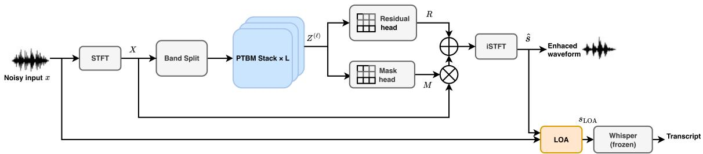
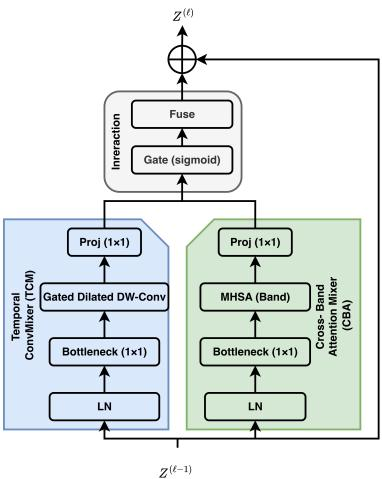

# Parallel Time–Band Mixing with Learned Observation-Adding for Robust ASR Front-Ends

Xingyu Shen1,3,∗∗, Runze Wang1, Wei-Ping Zhu1, Benoit Champagne2

1 Department of Electrical and Computer Engineering, Concordia University, Canada 2 Department of Electrical and Computer Engineering, McGill University, Canada

3 Artificial Intelligence Research Institute, Shenzhen University of Advanced Technology, China

xingyu.shen@mail.concordia.ca, runze.wang@mail.concordia.ca, weiping@ece.concordia.ca, benoit.champagne@mcgill.ca

## Abstract

Speech enhancement is often used as a front-end for robust ASR, yet recurrent temporal and cross-band modules introduce sequential dependencies that reduce parallel efficiency. In this paper, we present a sequence-parallel band-split enhancement front-end built on a Parallel Time–Band Mixer (PTBM) block that eliminates within-block recurrent unrolling. PTBM integrates intra-band temporal mixing and per-frame cross-band attention within a unified parallel architecture, enabling efficient contextual modeling across both time and frequency dimensions. The system retains the mask-plus-residual reconstruction interface and introduces learned Observation-Adding (LOA) to suppress ASR-sensitive artifacts without development-set tuning. Experiments on DNS Challenge and CHiME-4 with frozen Whisper back-ends show that the proposed front-end consistently reduces word error rate relative to recurrent bandsplit baselines while requiring only 0.96 M parameters and 0.58 GMAC/s for the front-end network.

Index Terms: speech enhancement, robust ASR, band-split, mixer, temporal convolution, cross-band attention, observationadding

## 1. Introduction

Robust automatic speech recognition (ASR) remains challenging under real-world noise and reverberation. Deep learningbased enhancement and separation have therefore become a standard component in robust speech pipelines, especially when the recognizer is fixed or difficult to retrain [1]. A common practice is to place a speech enhancement (SE) model as a frontend to suppress interference before recognition, allowing the ASR back-end to remain fixed. In practice, front-end enhancement is constrained by two factors: (1) enhancement artifacts can degrade recognition performance even when speech quality appears improved; (2) the front-end must remain computationally lightweight to enable efficient inference and deployment.

Several recent works have revisited how to make SE beneficial to ASR rather than only improving perceptual quality. Yang et al. proposed an attentive recurrent network (ARN) operating in the time domain, while Dissen et al. trained a small front-end adapter with ASR gradients to better match a frozen recognizer [2, 3]. Hu et al. addressed over-suppression via dual-path style learning, and Luo et al. proposed pseudo-supervision to adapt SE models to real far-field recordings for downstream speech recognition [4, 5]. More broadly, sequence-parallel temporal convolution and attention models have shown that long-context modeling can be achieved without recurrent unrolling, motivating mixer-style designs for deployable speech front-ends [6, 7].

These efforts have revealed that ASR is sensitive to the type of enhancement error. Iwamoto et al. decomposed enhancement errors and showed that artifact components can dominate ASR degradation; they also demonstrated that Observation-Adding (OA), which blends the observed and enhanced signals, can mitigate artifacts and improve recognition performance [8]. Guan et al. proposed loss designs that explicitly reduce speech distortion and artifacts in enhancement outputs, while de Oliveira et al. cautioned that over-optimizing a single enhancement metric can be misleading for recognition performance, highlighting the need for design choices aligned with downstream ASR objectives [9, 10].

Band-split enhancement architectures provide a strong lowdistortion backbone for ASR front-ends. Yu et al. introduced Band-split RNN (BSRNN), which alternates temporal modeling and cross-band modeling to improve full-band reconstruction quality [11]. To reduce the overhead of such front-ends, Zhao et al. proposed frame resampling and progressive subband pruning on top of BSRNN to lower computation while maintaining robust ASR performance [12]. Despite these advances, BSRNN-style front-ends still rely on recurrent computation for both temporal and cross-band modeling, which introduces sequential dependencies and reduces parallel efficiency. Meanwhile, recent work on multichannel enhancement suggests that parallelizable sequence modeling with cross-domain interaction is a promising direction for efficient utterance-level systems [13].

Motivated by the above considerations, we propose a sequence-parallel band-split SE front-end for robust ASR. Our contributions are threefold:

• We develop the Parallel Time–Band Mixer (PTBM), which combines intra-band temporal convolutional mixing and perframe cross-band self-attention in a unified parallel architecture, eliminating within-block sequential dependencies and enabling efficient sequence-parallel processing.

• We introduce learned Observation-Adding (LOA), a lightweight adaptive blending mechanism that automatically predicts OA coefficients, thereby eliminating the need for development-set tuning.

• On DNS Challenge and CHiME-4 with frozen Whisper backends, the proposed front-end consistently reduces WER relative to recurrent band-split baselines while requiring only 0.96 M parameters and 0.58 GMAC/s.

  
Figure 1: End-to-end pipeline of the proposed speech-enhancement front-end for robust ASR. The system performs band-split time– band modeling with stacked mixer blocks, reconstructs an enhanced waveform using a mask-plus-residual interface, and applies LOA before afrozen Whisper recognizer.

## 2. Proposed Method

## 2.1. Overall Architecture

Figure 1 shows the end-to-end pipeline. Given a noisy singlechannel waveform x, we compute its complex STFT X and partition the frequency bins of X into K non-overlapping subbands using a predefined (non-uniform) V4 partition [12]. For each sub-band, we form a real-valued feature by concatenating the real and imaginary parts and applying a band-wise linear embedding, yielding a band-split representation $Z ^ { ( 0 ) }$ . We process $Z ^ { ( 0 ) }$ using a stack of L Parallel Time–Band Mixer (PTBM) blocks to obtain $Z ^ { ( L ) }$ Each PTBM block uses gated dilated depthwise temporal convolutions for intra-band temporal mixing (TCM) and per-frame self-attention over the K sub-bands for cross-band interaction (CBA), avoiding within-block recurrent unrolling. Two prediction heads map $Z ^ { ( L ) }$ to a complex mask M and a complex residual $R ,$ forming the mask-plusresidual reconstruction interface. Applying inverse STFT yields an enhanced waveform sˆ. Finally, the LOA module predicts a blending weight $\omega \in [ 0 , 1 ]$ from signal statistics and produces s , a weighted sum of the input x and the enhanced estimate sˆ, which is then fed to a fixed ASR back-end with the recognizer kept frozen.

## 2.2. Band Split and Reconstruction

Given the complex STFT $\boldsymbol { X } \in \mathbb { C } ^ { T \times F }$ , where T and F denote the numbers of time frames and frequency bins, respectively, we partition the frequency axis into K non-overlapping subbands with predefined (non-uniform) sizes $\{ F _ { k } \} _ { k = 1 } ^ { K }$ satisfying $\begin{array} { r } { \sum _ { k = 1 } ^ { K } F _ { k } = F . } \end{array}$ We follow the V4 configuration in [11, 12]. Let $\boldsymbol { X } _ { k } \in \mathbb { C } ^ { T \times F _ { k } }$ denote the sub-band spectrogram extracted from X by selecting the bins assigned to sub-band k. For each sub-band and time frame, we concatenate the real and imaginary parts of the STFT values across the $F _ { k }$ bins to form a realvalued feature and apply a band-specific linear layer to obtain a C-channel embedding. Stacking the K embeddings over time yields $Z ^ { ( 0 ) } \in \mathbb { R } ^ { B \times K \times T \times C }$ , where B is the batch size.

We adopt the mask-plus-residual reconstruction interface used in BSRNN-style front-ends [12]. After processing $Z ^ { ( 0 ) }$ with L PTBM blocks, each sub-band feature is passed through band-specific fully connected layers to predict the real and imaginary parts of the complex mask and residual for the bins in that sub-band. Concatenating the predictions from all subbands yields $M , R \in \mathbb { C } ^ { T \times F }$ with the same shape as X. The enhanced spectrum is reconstructed by

$$
{ \hat { S } } = M \odot X + R ,\tag{1}
$$

where ⊙ denotes element-wise multiplication.

## 2.3. Parallel Time–Band Mixer Block (PTBM)

The core component of the proposed front-end is the PTBM block, whose internal operation is detailed in Figure 2. Each block takes $Z ^ { ( \ell - 1 ) } \ \in \ { \overset { \bullet } { \mathbb { R } } } ^ { B \times K \times T \times C }$ as input and outputs $Z ^ { ( \ell ) }$ with the same shape, where $\ell \in \{ 1 , 2 , \cdot \cdot \cdot , L \}$ indexes the block. PTBM contains two branches that operate in parallel on $Z ^ { ( \ell - 1 ) }$ : a Temporal ConvMixer (TCM) branch for intra-band temporal mixing and a Cross-Band Attention Mixer (CBA) branch for per-frame cross-band interaction. An interaction module combines the two branch outputs, and a block-level residual connection produces $Z ^ { ( \ell ) }$

  
Figure 2: Structure of the PTBM block. The TCM branch and the CBA branch run in parallel, followed by the interaction module and a residual connection.

## 2.3.1. Temporal ConvMixer (TCM)

The TCM branch performs temporal-context mixing within each sub-band. For each sub-band independently, we apply layer normalization (LN) followed by a point-wise bottleneck projection from C to $C _ { b } ,$ where $C _ { b }$ is the bottleneck channel dimension. We then apply gated dilated depthwise 1D convolutions along the frame (time) index t (i.e., the $T$ dimension in $Z ^ { ( \ell - 1 ) } \in \mathbb { R } ^ { B \times K \times T \times \dot { C } } )$ , independently for each example in the batch and each sub-band, to capture temporal context with low computational overhead. A point-wise projection maps the features back to C, yielding the temporal-branch output $\dot { Z } _ { \mathrm { t i m e } }$

## 2.3.2. Cross-Band Attention Mixer (CBA)

The CBA branch performs cross-band interaction at each time frame via multi-head self-attention [7]. For each frame t, the K sub-band vectors are treated as a token sequence. After layer normalization (LN), we apply a point-wise bottleneck projection from C to $C _ { b } .$ , compute multi-head self-attention across the K tokens, and apply a point-wise projection back to C to obtain the cross-band output $\bar { Z } _ { \mathrm { b a n d } }$ . Because attention is applied independently for each frame, this branch is applied in parallel over time frames.

## 2.3.3. Interaction

The interaction module in Figure 2 fuses temporal and crossband cues using element-wise gating followed by fusion. Let $Z _ { \mathrm { t i m e } }$ and $Z _ { \mathrm { b a n d } }$ denote the outputs of the temporal and crossband branches, respectively. We compute the gate and the fused representation by

$$
\begin{array} { r l } & { \quad G = \sigma \big ( \mathrm { L i n e a r } \big ( \big [ Z _ { \mathrm { t i m e } } ; Z _ { \mathrm { b a n d } } \big ] \big ) \big ) , } \\ & { \quad Z _ { \mathrm { f u s e } } = G \odot Z _ { \mathrm { t i m e } } + ( 1 - G ) \odot Z _ { \mathrm { b a n d } } , } \\ & { \quad Z ^ { ( \ell ) } = Z ^ { ( \ell - 1 ) } + Z _ { \mathrm { f u s e } } . } \end{array}\tag{2}
$$

where $[ \cdot ; \cdot ]$ concatenates features along the channel dimension, Linear(·) is a point-wise projection shared across time frames and sub-bands, and $\sigma ( \cdot )$ is a sigmoid.

## 2.4. Learned Observation-Adding (LOA)

LOA is implemented as a two-layer multilayer perceptron (MLP) with a ReLU hidden activation and a sigmoid output, taking summary statistics computed from the observed waveform x and the enhanced waveform sˆ as input. During training, these statistics are computed on the same fixed-length training segment (random crop) used as the SE input; during inference, they are computed on the full-length test recording.

The input statistics consist of (i) a log-energy ratio $\rho _ { E } =$ log $\frac { \| x \| _ { 2 } ^ { 2 } + \epsilon } { \| \hat { s } \| _ { 2 } ^ { 2 } + \epsilon }$ and (ii) the mean and variance of a log-magnitude spectral difference; here ϵ is a small constant for numerical stability (e.g., $1 0 ^ { - 8 } )$ . Using the same analysis STFT as in Section 2.2, we compute the log-magnitude spectral difference between the observed spectrum X and the enhanced spectrum $\hat { S }$ from Eq. (1) as $\Delta _ { t , f } = \log ( | X _ { t , f } | + \epsilon ) - \log ( | \hat { S } _ { t , f } | + \epsilon )$ . We then compute $\mu _ { \Delta } =$ mean $, , f \left( \Delta _ { t , f } \right)$ and $\sigma _ { \Delta } ^ { 2 } = \mathrm { v a r } _ { t , f } ( \Delta _ { t , f } )$ over all time–frequency bins of the current input (training segment or test recording). We concatenate $( \rho _ { E } , \mu _ { \Delta } , \sigma _ { \Delta } ^ { 2 } )$ as the MLP input and predict the blending weight $\omega \in [ 0 , 1 ]$ via a sigmoid output. These statistics capture both energy mismatch and spectral mismatch and prevent degenerate solutions that only rescale the waveform amplitude. LOA uses the resulting scalar weight to synthesize the enhanced speech fed to the ASR:

$$
s _ { \mathrm { L O A } } = \omega x + ( 1 - \omega ) \hat { s } .\tag{3}
$$

LOA is trained in a second stage using oracle blending weights. We first train the SE network with the signal-level objective in Section 2.5. We then freeze the SE network and, for each training segment, compute a signal-level oracle weight $\omega ^ { * } \in [ 0 , 1 ]$ by a 1D grid search over the interval [0, 1] with a resolution of 0.01. The oracle weight is selected as the value that minimizes the same signal-level loss between the blended waveform $s _ { \mathrm { b l e n d } } ( \omega ) = \omega x + ( 1 - \omega ) \hat { s }$ and the clean reference waveform s. The LOA MLP is trained to regress $\omega ^ { \ast }$ from the segment-level statistics using the $\ell _ { 2 }$ loss, which keeps LOA lightweight and recognizer-independent. At inference time, LOA predicts a single blending weight ω for each test recording, with the input statistics computed over all STFT frames of that recording; thus, the present LOA formulation is utterancelevel rather than fully streaming.

## 2.5. Training Objective

We minimize a fixed weighted sum of the multi-resolution STFT magnitude loss and the SI-SNR loss between the enhanced waveform sˆ and the clean reference s, following common practice in speech enhancement and separation [6, 14]:

$$
\begin{array} { r } { \mathcal { L } = \mathcal { L } _ { \mathrm { M R - S T F T } } ( \hat { s } , s ) + \lambda \mathcal { L } _ { \mathrm { S I - S N R } } ( \hat { s } , s ) , } \end{array}\tag{4}
$$

where λ is a fixed weight. We use the standard MR-STFT magnitude loss definition in [14] and the negative SI-SNR objective as in [6]. This objective is fully compatible with the mask-plusresidual reconstruction interface in Eq. (1).

## 3. Experimental Setup

## 3.1. Datasets

We evaluate the proposed SE front-end on two English benchmarks sampled at 16 kHz: DNS Challenge [15] and CHiME-4 [16]. Following the evaluation protocol in prior band-split frontend studies [12], we train an SE front-end separately for each benchmark and report results on the corresponding official test sets.

For CHiME-4, we report results on the official singlechannel real-recorded development and evaluation sets, dt05 real and et05 real (1ch track) [16]. Following the online simulation protocol used in [12], we generate training mixtures on-the-fly by mixing utterances from tr05 simu 1ch with noise segments sampled from the DNS noise corpus [15]. For each utterance, a noise segment is randomly cropped to match the utterance duration and mixed at an SNR uniformly sampled from [−5, 20] dB.

For DNS Challenge, we follow the ESPnet-SE recipe [17] to construct a 100-hour single-channel noisy-speech training set from the official DNS resources [15]. Model selection is performed on the official DNS validation set, and we report results on the official DNS synthetic test sets under two conditions: without reverberation and with reverberation [12].

## 3.2. Training and Decoding

All SE front-ends are implemented in ESPnet [17] with the V4 band partition (K=23) [11, 12] and the STFT analysis (32 ms Hann, 16 ms hop, 512-point FFT at 16 kHz). Unless noted, our model uses $L { = } 1 2 , C { = } 1 2 8 , C _ { b } { = } 4 8 .$ , TCM kernel size 3 with dilations {1, 2, 4, 8}, CBA with $H { = } 4$ , and a two-layer LOA MLP (hidden 64, sigmoid output).

For each benchmark, we train a separate SE front-end for 54k steps using Adam [19] (lr $2 \times 1 0 ^ { - 4 } , \beta _ { 1 } { = } 0 . 9 , \beta _ { 2 } { = } 0 .$ .999) on 4 s random crops (batch 8) with Eq. (4) (λ=1.0). MR-STFT uses three resolutions (FFT/hop/win: 1024/120/600, 2048/240/1200, 512/50/240) [14]. We select the model with the lowest validation loss on dt05 real (CHiME-4) or the DNS validation set, then freeze the SE network and train LOA for 10k steps with Adam (lr $1 \times 1 0 ^ { - 4 } $ ) using an $\ell _ { 2 }$ regression loss to oracle weights from the grid search in Section 2.4.

We use Whisper [20] as a frozen ASR back-end (Tiny/Medium/Large) and decode without an external language model using the same decoding and text normalization for all methods [12] (lowercasing, punctuation removal, and whitespace normalization). Unless noted, ASR input is sLOA; baselines use OA with ω tuned on the corresponding development set [8, 12]. We report Word Error Rate (WER) as the primary ASR metric, and quantify front-end efficiency using Params and MACs (GMAC/s) for the SE network only.

Table 1: Main ASR results and front-end complexity on DNS Challenge and CHiME-4. WER (%) is reported using frozen Whisper back-ends (Tiny/Medium/Large). Params (M) and MACs (GMAC/s) are reportedfor the SEfront-end only.
<table><tr><td rowspan="3">Method</td><td rowspan="3">Params</td><td rowspan="3">MACs</td><td colspan="6">DNS Challenge</td><td colspan="6">CHiME-4</td></tr><tr><td colspan="3">Without Reverb</td><td colspan="3">With Reverb</td><td colspan="3">Dev (dt05_real)</td><td colspan="3">Eval (et05_real)</td></tr><tr><td>(GMAC/s) Tiny</td><td></td><td>Medium</td><td>Large</td><td>Tiny</td><td>Medium</td><td>Large</td><td>Tiny</td><td>Medium</td><td>Large Tiny</td><td>Medium</td><td>Large</td></tr><tr><td>Noisy</td><td></td><td>一</td><td>15.02</td><td>8.85</td><td>4.80</td><td>39.51</td><td>21.13</td><td>10.94</td><td>21.76</td><td>5.55</td><td>4.41</td><td>35.03</td><td>8.63</td><td>6.69</td></tr><tr><td>DPARN [18, 12]</td><td>0.89</td><td>1.22</td><td></td><td></td><td></td><td></td><td></td><td></td><td>21.13</td><td>5.52</td><td>4.67</td><td>32.97</td><td>8.84</td><td>7.56</td></tr><tr><td>BSRNN [11]</td><td>2.60</td><td>1.84</td><td>11.36</td><td>5.59</td><td>4.23</td><td>36.60</td><td>15.34</td><td>10.29</td><td>16.50</td><td>5.19</td><td>4.25</td><td>26.24</td><td>8.17</td><td>6.36</td></tr><tr><td>Zhao et al. [12]</td><td>1.55</td><td>0.62</td><td>11.76</td><td>5.72</td><td>4.40</td><td>36.87</td><td>15.61</td><td>10.90</td><td>16.72</td><td>5.31</td><td>4.35</td><td>27.12</td><td>8.30</td><td>6.40</td></tr><tr><td>Ours</td><td>0.96</td><td>0.58</td><td>11.33</td><td>5.58</td><td>4.17</td><td>36.35</td><td>15.12</td><td>10.06</td><td>16.38</td><td>5.13</td><td>4.18</td><td>26.07</td><td>8.11</td><td>6.24</td></tr></table>

## 4. Results and Discussion

## 4.1. Main results on DNS Challenge and CHiME-4

Table 1 reports WER and front-end complexity on DNS Challenge and CHiME-4 using frozen Whisper back-ends with three model sizes (Tiny/Medium/Large). Across all back-ends, the proposed front-end achieves lower WER than the noisy input and both band-split baselines (BSRNN [11] and the lightweight front-end of Zhao et al. [12]). The improvements are consistent on DNS (with/without reverberation) and transfer to realrecorded CHiME-4 sets (dt05 real and et05 real), demonstrating robustness beyond the synthetic mixtures used for training.

The table also highlights the accuracy–efficiency trade-off. Compared with BSRNN, our model achieves lower WER with substantially fewer parameters and lower MACs. Compared with Zhao et al. [12], our model improves WER at similar or lower MACs.

## 4.2. Ablation study

Table 2 reports an ablation study using Whisper Large. Unless otherwise noted, LOA is enabled to isolate architectural changes in the enhancement front-end.

Table 2: Ablation study with Whisper Large. We analyze the contribution of different components and the effect of model depth L. “Proposed (Full)” uses L=12, TCM, CBA, and LOA.
<table><tr><td>Configuration</td><td>Params (M)</td><td>MACs (GMAC/s) w/o Rev w/ Rev</td><td>DNS</td><td>DNS</td><td>CHiME-4 Eval</td></tr><tr><td>Proposed (Full)</td><td>0.96</td><td>0.58</td><td>4.17</td><td>10.06</td><td>6.24</td></tr><tr><td>w/o CBA</td><td>0.70</td><td>0.49</td><td>4.62</td><td>11.15</td><td>6.88</td></tr><tr><td>w/o TCM</td><td>0.76</td><td>0.35</td><td>5.08</td><td>12.37</td><td>7.14</td></tr><tr><td>w/o OA/LOA (use δ)</td><td>0.96</td><td>0.58</td><td>4.45</td><td>10.65</td><td>6.60</td></tr><tr><td>w/ Fixed OA (ω = 0.2 on x)</td><td>0.96</td><td>0.58</td><td>4.26</td><td>10.21</td><td>6.42</td></tr><tr><td>Model Depth Scaling</td><td></td><td></td><td></td><td></td><td></td></tr><tr><td>L = 6</td><td>0.53</td><td>0.31</td><td>4.92</td><td>11.83</td><td>6.91</td></tr><tr><td>L = 9</td><td>0.74</td><td>0.44</td><td>4.48</td><td>10.67</td><td>6.53</td></tr><tr><td> $L = 1 5$ </td><td>1.18</td><td>0.72</td><td>4.12</td><td>9.89</td><td>6.17</td></tr></table>

Removing cross-band interaction (w/o CBA) consistently degrades WER on DNS and CHiME-4, indicating that explicit per-frame cross-band modeling helps preserve band-to-band structure that is important for recognition. Removing temporal mixing (w/o TCM) leads to a larger degradation, confirming that strong intra-band temporal context remains crucial for suppressing non-stationary interference. Together, these results support the PTBM design that combines temporal and crossband mixing within each block. Using the enhanced waveform directly as ASR input (w/o OA/LOA; use sˆ) yields worse WER than applying OA, consistent with prior observations that ASR is sensitive to enhancement artifacts [8]. A fixed OA weight improves robustness, while LOA achieves the best performance without development-set coefficient tuning, simplifying deployment across varying conditions. Increasing the number of PTBM blocks L improves WER with diminishing returns. Moving from L=6 to L=12 yields substantial gains at moderate additional cost, while L=15 provides only a small further improvement. We therefore use L=12 as the default configuration to balance recognition accuracy and front-end complexity.

## 4.3. Operator-level analysis

Table 3 compares the temporal and cross-band operators in recurrent band-split blocks and in PTBM under the default configuration in Section 3.2. TCM and CBA are sequence-parallel and have lower per-invocation cost than gated recurrent unit (GRU)-based temporal/cross-band modules, which aligns with the front-end MAC reduction reported in Table 1.

Table 3: Operator complexity oftemporal and cross-band modules under the default configuration in Section 3.2. Params and MACs are reported per module invocation (temporal modules per sub-band; cross-band modules per timeframe).
<table><tr><td>Module</td><td>Params</td><td>MACs</td><td>Seq.-parallel</td></tr><tr><td>Temporal GRU</td><td>99k</td><td>98k</td><td>No</td></tr><tr><td>Temporal ConvMixer (TCM)</td><td>17k</td><td>17k</td><td>Yes</td></tr><tr><td>Cross-band GRU</td><td>99k</td><td>2.26M</td><td>No</td></tr><tr><td>Cross-Band Attn. Mixer (CBA)</td><td>22k</td><td>0.55M</td><td>Yes</td></tr></table>

## 5. Conclusion

We presented a band-split sequence-parallel SE front-end built on PTBM blocks that combines temporal convolution mixing and per-frame cross-band attention without recurrent unrolling. We also introduced LOA, an artifact-aware blending mechanism that eliminates the need for development-set coefficient tuning. Across DNS Challenge and CHiME-4 benchmarks with frozen Whisper back-ends, the proposed front-end consistently improves WER over recurrent band-split baselines while reducing model size and MACs. These results indicate that parallel time–band mixing is a practical design solution for efficient speech-enhancement front-ends in robust ASR pipelines.

## 6. Generative AI Use Disclosure

Generative AI tools were used only for language editing and stylistic polishing of the manuscript text. They were not used to generate the scientific ideas, methods, experiments, figures, tables, or results. All authors take full responsibility for the content of this paper.

## 7. References

[1] D. Wang and J. Chen, “Supervised speech separation based on deep learning: An overview,” IEEE/ACM Transactions on Audio, Speech, and Language Processing, vol. 26, no. 10, pp. 1702– 1726, Oct. 2018.

[2] Y. Yang, A. Pandey, and D. Wang, “Time-domain speech enhancement for robust automatic speech recognition,” in Proc. Interspeech, Aug. 2023, pp. 4913–4917.

[3] Y. Dissen, S. Yonash, I. Cohen, and J. Keshet, “Enhanced ASR robustness to packet loss with a front-end adaptation network,” in Proc. Interspeech, Sep. 2024, pp. 5008–5012.

[4] Y. Hu, N. Hou, C. Chen, and E. S. Chng, “Dual-path style learning for end-to-end noise-robust speech recognition,” in Proc. Interspeech, Aug. 2023, pp. 2918–2922.

[5] L. Luo, L. Li, and Q. Hong, “SuPseudo: A pseudo-supervised learning method for neural speech enhancement in far-field speech recognition,” in Proc. Interspeech, Aug. 2025, pp. 3404–3408.

[6] Y. Luo and N. Mesgarani, “Conv-TasNet: Surpassing ideal timefrequency magnitude masking for speech separation,” IEEE/ACM Transactions on Audio, Speech, and Language Processing, vol. 27, no. 8, pp. 1256–1266, Aug. 2019.

[7] A. Vaswani, N. Shazeer, N. Parmar, J. Uszkoreit, L. Jones, A. N. Gomez, L. Kaiser, and I. Polosukhin, “Attention is all you need,” in Advances in Neural Information Processing Systems, vol. 30, Dec. 2017, pp. 5998–6008.

[8] K. Iwamoto, T. Ochiai, M. Delcroix, R. Ikeshita, H. Sato, S. Araki, and S. Katagiri, “How bad are artifacts?: Analyzing the impact of speech enhancement errors on ASR,” in Proc. Interspeech, Sep. 2022, pp. 5418–5422.

[9] H. Guan, W. Dai, G. Wang, X. Tan, P. Li, and J. Liang, “Reducing speech distortion and artifacts for speech enhancement by loss function,” in Proc. Interspeech, Sep. 2024, pp. 1730–1734.

[10] D. de Oliveira, S. Welker, J. Richter, and T. Gerkmann, “The PESQetarian: On the relevance of Goodhart’s law for speech enhancement,” in Proc. Interspeech, Sep. 2024, pp. 3854–3858.

[11] J. Yu, H. Chen, Y. Luo, R. Gu, and C. Weng, “High fidelity speech enhancement with band-split RNN,” in Proc. Interspeech, Aug. 2023, pp. 2483–2487.

[12] S. Zhao, W. Wang, and Y. Qian, “Lightweight front-end enhancement for robust ASR via frame resampling and sub-band pruning,” in Proc. Interspeech, Aug. 2025, pp. 3409–3413.

[13] X. Shen, R. Wang, W.-P. Zhu, and B. Champagne, “Dual-path state-space modeling with cross-domain interaction for multi channel speech enhancement,” IEEE/ACM Transactions on Audio, Speech, and Language Processing, vol. 33, pp. 4239–4252, 2025.

[14] R. Yamamoto, E. Song, and J.-M. Kim, “Parallel WaveGAN: A fast waveform generation model based on generative adversarial networks with multi-resolution spectrogram,” in Proc. ICASSP, May 2020, pp. 6199–6203.

[15] C. K. A. Reddy, V. Gopal, R. Cutler, E. Beyrami, R. Cheng, H. Dubey, S. Matusevych, R. Aichner, A. Aazami, S. Braun, P. Rana, S. Srinivasan, and J. Gehrke, “The INTERSPEECH 2020 deep noise suppression challenge: Datasets, subjective testing framework, and challenge results,” in Proc. Interspeech, Oct. 2020, pp. 2492–2496.

[16] E. Vincent, S. Watanabe, A. A. Nugraha, J. Barker, and R. Marxer, “An analysis of environment, microphone and data simulation mismatches in robust speech recognition,” Computer Speech & Language, vol. 46, pp. 535–557, Nov. 2017.

[17] S. Watanabe, T. Hori, S. Karita, T. Hayashi, J. Nishitoba, Y. Unno, N. E. Yalta Soplin, J. Heymann, M. Wiesner, N. Chen, A. Renduchintala, and T. Ochiai, “ESPnet: End-to-end speech processing toolkit,” in Proc. Interspeech, Sep. 2018, pp. 2207–2211.

[18] Q. Hu, Z. Hou, X. Le, and J. Lu, “A light-weight full-band speech enhancement model,” arXiv preprint arXiv:2206.14524, 2022.

[19] D. P. Kingma and J. Ba, “Adam: A method for stochastic optimization,” arXiv preprint arXiv:1412.6980, Dec. 2014. [Online]. Available: https://arxiv.org/abs/1412.6980

[20] A. Radford, J. W. Kim, T. Xu, G. Brockman, C. McLeavey, and I. Sutskever, “Robust speech recognition via large-scale weak supervision,” in Proceedings of the 40th International Conference on Machine Learning, ser. Proceedings of Machine Learning Research, vol. 202. PMLR, Jul. 2023, pp. 28 492–28 518.