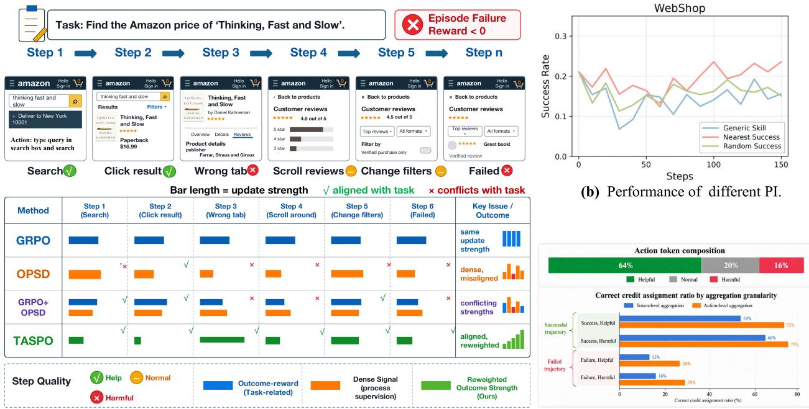
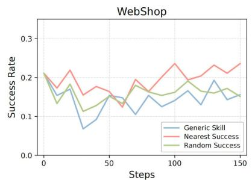
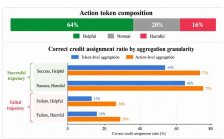
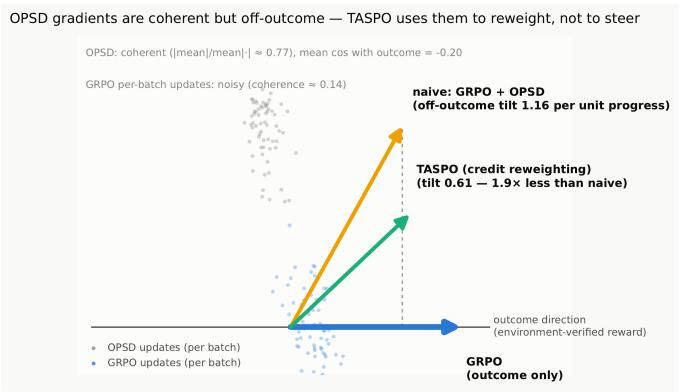
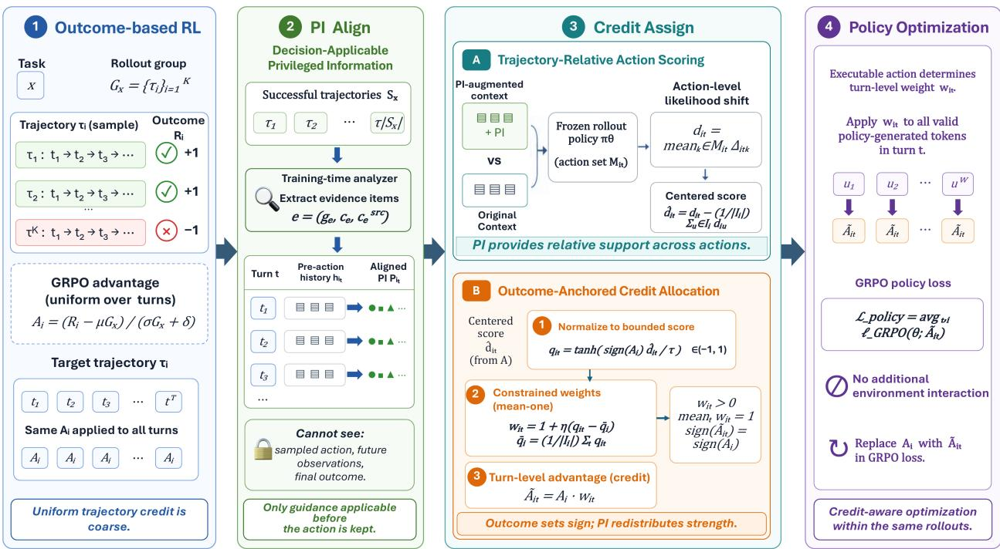
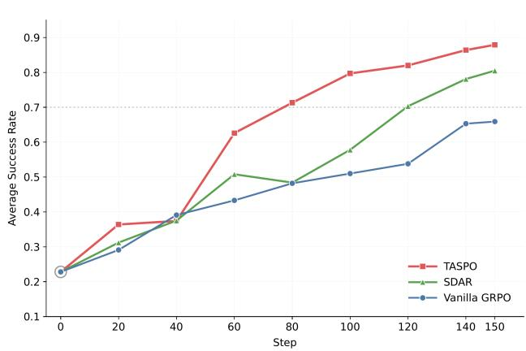
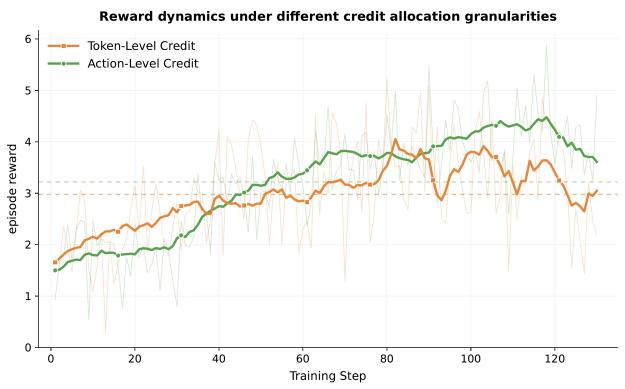
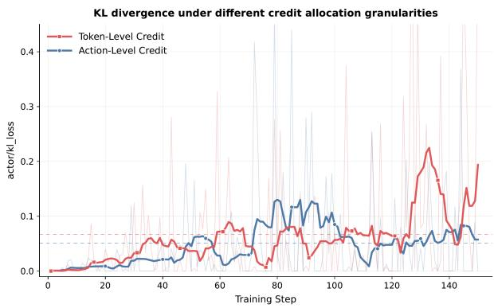

# Reconciling Process Supervision with Outcome-Based Credit in Agentic Policy Optimization

Jingxiao Yang1\*, Wangjie Gan1\*, Yingxuan Zhuang1\*, Wenqi Zhang1, Jintao Chen1, Xuhong Zhang1 1 Zhejiang University

## Abstract

Outcome-based reinforcement learning provides verified feedback for language-model agents, but assigns trajectory-level advantage uniformly to all decisions, yielding coarse credit over long-horizon interactions. On-policy self-distillation offers finer supervision by re-evaluating sampled behavior with privileged information (PI) available only during training. However, fine-grained supervision is not necessarily fine-grained credit: PI-induced likelihood changes describe how additional information alters policy preference, but do not directly determine how an executable action should inherit the verified task outcome. This creates a supervision-credit gap. Privileged signals may be irrelevant to the current interaction state, operate at a token granularity misaligned with executable decisions, and lack the outcome semantics required for reinforcement. We introduce TASPO, which converts privileged supervision into outcome-grounded action credit. TASPO constructs decision-applicable PI from verified successful experience, aggregates PI-induced likelihood shifts at the executable-action level, and converts relative action support into positive, bounded, mean-preserving weights on the original trajectory advantage. Thus, the verified outcome determines the update direction and average scale, while PI only redistributes credit across actions. Across three agentic benchmarks, TASPO improves over GRPO by 10.6% and generalizes better to unseen tasks. Further analysis indicates that TASPO reduces supervision mismatch and that action-level assignment stabilizes the policy optimization process. These findings offer the community another interesting perspective.

## 1 Introduction

Large language models are increasingly evolving from static text generators into autonomous agents capable of reasoning, search, tool use, and interaction with external environments. For such long-horizon tasks, reinforcement learning from environment or verifier feedback has become a prominent post-training paradigm, as it directly optimizes policies over trajectories generated by the model itself [5–7, 9, 12, 22, 24]. In particular, outcome-based methods such as GRPO optimize the current policy using group-relative advantages derived from verified trajectory outcomes, without requiring an explicit value model. However, in multi-turn agentic tasks, feedback is often available only after the rollout is completed, leaving substantial ambiguity about which intermediate decisions actually contributed to success or failure.

To alleviate the sparsity of terminal rewards, recent agentic RL methods have explored finer-grained supervision. One line of work constructs intermediate rewards from environment feedback, task-specific rules, process evaluators, or value estimates, while another employs on-policy distillation (OPD) or on-policy self-distillation (OPSD) to re-evaluate sampled responses using teacher distributions or privileged information (PI) available only during training [18, 30, 34, 35]. As supervision increasingly moves beyond trajectory-level outcomes toward turn-, step-, and token-level signals, effectively exploiting such intermediate feedback has become an important problem in long-horizon agent training.

  
(a) An explanation of the optimization conflict between outcome supervision (c) Action-level vs. Token-level Credit Assignment and dense process supervision.

Figure 1: An explanation of why privileged process supervision should refine, rather than replace, verified outcome credit. (a) Uniform outcome credit and dense process signals can conflict when directly combined. (b) Self-distillation performance depends strongly on the source and relevance of privileged information. (c) Action-level aggregation yields more accurate credit assignment than token-level aggregation across trajectory outcomes and action qualities.

First, existing agentic online training struggles to convert sparse outcome feedback into local supervision that is both consistent with the task objective and accurately attributable to individual interaction decisions. GRPO derives a trajectory-level advantage from verified outcomes, providing a reliable global optimization direction but failing to distinguish the contributions of different decisions within the same trajectory. OPD, in contrast, provides denser token-level teacher supervision, but the resulting distributional differences may not be aligned with the verified task objective, and changes at individual token positions do not naturally correspond to complete environment decisions. As illustrated in Figure 1(a), directly combining uniform outcome credit with dense process supervision can introduce conflicting optimization signals, motivating the use of privileged supervision to refine rather than replace verified outcome credit. Figure 1(c) further shows that aggregating supervision at the action level yields credit assignments more consistent with action quality than token-level aggregation. Recent work has also begun to organize dense supervision at interaction-aware granularities. TurnOPD balances the distillation budget across interaction turns through turn-normalized budgeting, yet teacher–student discrepancies are still measured token by token and do not provide a unified evaluation of a complete action. StepOPSD further performs credit assignment around action-centered steps, but still shapes the advantage using token-wise probability gaps within each step. Therefore, reliable local credit should remain anchored to the trajectory-level outcome while evaluating each executable action as a coherent decision unit, so that dense teacher information can refine the relative update strength of different interaction decisions without redefining the overall optimization direction.

Second, existing agent learning methods still struggle to provide process supervision that is both accurate and broadly applicable across tasks. Intermediate rewards derived from environment feedback or handcrafted rules can be reliable, but require task-specific verifiable signals; supervision generated by evaluators or value models is more broadly applicable, but is susceptible to estimation error and distribution shift. To reduce the dependence on task-specific feedback or additional evaluation models, recent work has begun to construct process supervision through OPSD using training-time privileged information. SDAR employs generic or retrieved skills as PI to provide additional optimization guidance, but such static knowledge may fail to capture the specific interaction state and is sensitive to the relevance of the retrieved skill [18]. StepOPSD instead uses a successful rollout from the same group as privileged hindsight, but the resulting experience remains tied to a particular interaction path and is not explicitly guaranteed to be applicable to the target trajectory [34]. As shown in Figure 1(b), the effectiveness of self-distillation varies substantially with the source and relevance of privileged information, highlighting that successful process supervision depends not merely on providing additional information, but on providing information applicable to the target interaction. Reliable process su pervision should therefore be derived from verified successful interactions of the current policy while explicitly checking whether the resulting experience is supported by the target trajectory’s actual state and execution path.

These observations suggest two requirements for reliable process supervision in agentic RL. First, additional supervision should refine, rather than replace, the optimization direction determined by verified outcomes. Second, the supervision should be grounded in interaction experience that is applicable to the target trajectory and should evaluate complete executable actions rather than isolated tokens. This motivates a separation between aligning privileged information to the target trajectory and assigning the resulting signal to individual decisions.

To this end, we introduce TASPO, a trajectoryaligned supervision framework for policy optimization in agentic reinforcement learning. TASPO first extracts conditional experience

  
Figure 2: Why PI should reweight credit rather than steer optimization. OPSD produces coherent but offoutcome gradients, while TASPO preserves the outcome direction through credit reweighting.

grounded in verified successful sibling trajectories from the same rollout group, and matches the resulting evidence against the recorded action–observation history of each target trajectory. Only guidance supported by the target execution path is retained; otherwise, TASPO abstains and falls back to the original GRPO update. The frozen rollout policy then re-evaluates the same sampled responses with and without the aligned PI. TASPO aggregates PI-induced likelihood shifts over the executable-action span to obtain action-level relative support scores, and converts these scores into positive, bounded, and mean-preserving weights on the original GRPO advantage. Consequently, the verified outcome always determines the direction and average scale of the policy update, while PI only redistributes relative credit across actions. TASPO requires no additional environment interaction.

We evaluate TASPO on ALFWorld, Search-QA, and WebShop across multiple backbone models. TASPO consistently improves over matched GRPO baselines across environments and model scales, while exhibiting faster and more effective policy improvement under the same training budget. Controlled analyses of PI construction show that neither generic skills nor direct reuse of successful trajectories provides the most effective supervision; extracting successful experience and aligning it to the target trajectory yields consistently stronger downstream performance. Granularity analyses further show that action-level aggregation outperforms token-level allocation, reduces training variance, improves interaction efficiency, and produces smoother reward and policy-KL dynamics. Finally, comparisons with OPSD, external-teacher OPD, and a direct $\mathrm { G R P O + O P S D }$ combination show that using PI to redistribute outcome-derived credit is more stable and effective than introducing an independent distillation objective.

Our contributions are:

• We identify two key challenges in agentic process supervision: local credit must remain consistent with verified outcomes while aligning with complete environment decisions, and privileged information must be applicable to the target trajectory’s actual state and execution path.

• We propose TASPO, which constructs trajectory-aligned PI from successful sibling trajectories, aggregates PI-induced likelihood shifts at the executable-action level, and redistributes the original GRPO advantage through constrained credit weights.

• We demonstrate consistent improvements across multiple agentic benchmarks and backbone models, with controlled analyses validating the benefits of trajectory alignment, action-level aggregation, and outcome-anchored credit redistribution.

## 2 Related Work

## 2.1 Agentic Reinforcement Learning and Credit Assignment

Language models are increasingly trained as interactive agents that reason, search, invoke tools, and act over long horizons [17, 21, 32]. Outcome-based reinforcement learning provides a direct way to optimize such agents using environment or verifier feedback [5–7, 9, 12, 22, 24]. However, sparse trajectory outcomes provide limited information about which intermediate decisions caused success or failure, reflecting the broader delayed-credit problem studied in reinforcement and sequential learning [2, 3, 16]. Recent agentic methods refine policy optimization using additional structure within sampled trajectories [5, 7, 10]. TASPO instead uses training-time privileged information to differentiate decisions within a trajectory while retaining the verified outcome as the source of the overall update direction.

## 2.2 On-Policy Self-Distillation with Privileged Information

Knowledge distillation transfers behavioral information from a teacher through token- or sequence-level supervision [11, 13]. On-policy distillation further supervises student-generated samples, reducing distribution mismatch between the data being optimized and the current policy [1, 20]. Recent self-distillation methods construct privileged teachers from additional contexts, reasoning traces, skills, or hindsight available only during training [18, 23, 25, 29, 30, 33, 35]. Several works further adapt such supervision for finer-grained agent credit, including step-aware, sibling-guided, and counterfactual formulations [4, 19, 34]. A complementary line of work studies when dense on-policy supervision is reliable, considering teacher–student compatibility, token importance, trajectory position, curriculum, and trust-region constraints [8, 14, 15, 26– 28]. TASPO focuses on two distinct questions: whether trajectory-derived guidance is applicable to the target decision, and how such guidance should refine credit without overriding verified outcomes. It therefore aligns source-grounded PI to each target pre-action context and uses the resulting signal only to redistribute outcome-derived credit across executable actions.

## 3 Method

TASPO refines outcome-based reinforcement learning through a strict separation of roles: the verified trajectory outcome determines the direction and average scale of the policy update, while training-time PI only determines how credit is distributed across the actions within that trajectory. Figure 3 provides an overview.

  
Figure 3: Overview of TASPO. TASPO first constructs conditional guidance from verified successful trajectories and aligns it to each target decision using only its pre-action history, producing decision-applicable PI $P _ { i t }$ . It then aggregates PI-induced likelihood shifts at the executable-action level and converts their within trajectory relative scores into bounded, mean-preserving weights on the original outcome advantage. The verified outcome determines the credit sign, while PI determines its relative allocation across decisions.

## 3.1 Problem Setup and Design Constraints

For a task x, the rollout policy $\pi _ { \theta _ { \mathrm { o l d } } }$ samples a group of K trajectories $\mathcal { G } _ { x } = \{ \tau _ { i } \} _ { i = 1 } ^ { K }$ . At turn t, the policy generates a response $y _ { i t }$ from the interaction history $h _ { i t } .$ , and the environment executes the corresponding action $a _ { i t }$ . After $T _ { i }$ turns, trajectory $\tau _ { i }$ receives a verified outcome $R _ { i }$ . Following GRPO, its group-relative advantage is

$$
A _ { i } = \frac { R _ { i } - \mu _ { \mathscr { G } _ { x } } } { \sigma _ { \mathscr { G } _ { x } } + \delta } ,\tag{1}
$$

which is assigned uniformly to every turn in the trajectory. TASPO seeks to distinguish these turns without estimating a new local reward from PI. Instead, it redistributes the original trajectory advantage through

$$
\widetilde { A } _ { i t } = A _ { i } w _ { i t } , \qquad 1 - \epsilon _ { w } \leq w _ { i t } \leq 1 + \epsilon _ { w } , \qquad \frac { 1 } { T _ { i } } \sum _ { t = 1 } ^ { T _ { i } } w _ { i t } = 1 ,\tag{2}
$$

where $0 \le \epsilon _ { w } < 1$ . Positivity preserves the update direction determined by the verified outcome, boundedness limits the influence of imperfect PI, and the mean-one constraint preserves the trajectory’s average advantage. Thus, the outcome determines whether and how strongly a trajectory is preferred, while PI only determines the relative allocation of credit across its actions.

## 3.2 Trajectory-Aligned Privileged Information

A verified successful trajectory contains concrete interaction evidence, but its actions cannot be treated as a plan for another rollout whose states may differ. TASPO therefore separates the content supplied by successful experience from its applicability to a target trajectory. Let $S _ { x } \subseteq { \mathcal { G } } _ { x }$ denote the successful trajectories for task x. A training-time analyzer extracts a set of conditional guidance items

$$
{ \mathcal { E } } _ { x } = \{ e \} , \qquad e = ( g _ { e } , c _ { e } , { \mathcal { Z } } _ { e } ) ,\tag{3}
$$

where $g _ { e }$ states a task requirement, ordering constraint, progress rule, or valid alternative; $c _ { e }$ describes when that guidance applies; and $\mathcal { Z } _ { e }$ contains the accepted source actions and environment observations that support it. Depending on the scope of $c _ { e }$ , an item may express a broadly applicable task rule or a state-specific lesson from a successful interaction. Requiring explicit source evidence prevents the analyzer from turning an entire successful trajectory into an unsupported prescription.

For a target trajectory $\tau _ { i } ,$ , we remove any item supported only by $\tau _ { i }$ and retain

$$
\mathcal { E } _ { i } = \left\{ e \in \mathcal { E } _ { x , - i } : \mathrm { M a t c h } ( c _ { e } , \tau _ { i } ) = 1 \right\} ,\tag{4}
$$

where $\mathcal { E } _ { x , - i }$ contains items with evidence from at least one successful sibling. Matching is performed after rollout against the task and recorded interaction path of $\tau _ { i }$ , without access to its verified outcome $R _ { i } .$ . The target trajectory therefore determines only whether a source-derived condition is relevant to its realized path; it does not supply the guidance or label its own actions. When the recorded trajectory does not establish an item’s condition, the analyzer omits that item.

The retained items are composed into one compact PI for the target trajectory:

$$
P _ { i } = { \mathrm { C o m p o s e } } \left( \left\{ \left( g _ { e } , c _ { e } \right) : e \in \mathcal { E } _ { i } \right\} \right) .\tag{5}
$$

The conditions are preserved in $P _ { i }$ , and the same $P _ { i }$ is reused when evaluating every action in $\tau _ { i }$ . This provides a common guidance context for comparing actions without generating new PI at each turn. Source extraction and target matching can be batched over a rollout group; if no grounded item remains, TASPO abstains and uses the original GRPO credit.

## 3.3 Trajectory-Relative Action Scoring

The goal of this stage is not to determine whether an action is correct, but to measure how strongly the shared PI supports it relative to other actions in the same trajectory. Let $\mathcal { M } _ { i t }$ denote the token positions of the executable action $a _ { i t }$ in response $y _ { i t }$ , and let $\mathcal { T } _ { i } = \{ t : | \mathcal { M } _ { i t } | > 0 \}$ contain the turns with a parsed action when $P _ { i }$ is available. For each $t \in \mathcal { T } _ { i }$ , the frozen rollout policy scores the same sampled response with and without $P _ { i }$

$$
\Delta _ { i t k } = \mathrm { s g } [ \log \pi _ { \theta _ { \mathrm { o l d } } } ( y _ { i t k } \mid P _ { i } , h _ { i t } , y _ { i t , < k } ) - \log \pi _ { \theta _ { \mathrm { o l d } } } ( y _ { i t k } \mid h _ { i t } , y _ { i t , < k } ) ] .\tag{6}
$$

A positive $\Delta _ { i t k }$ means that PI increases the policy’s support for the sampled token, while a negative value means the opposite. This shift measures sensitivity to PI and is not treated as a reward or token-level action value.

Not every token contributes meaningfully to this comparison. Concurrent analysis shows that privileged replay affects token roles unevenly and that some token changes contain little information specific to the privileged evidence [31]. We therefore discard changes whose magnitude is below a margin κ and aggregate the remainder over the executable action:

$$
\phi _ { \kappa } ( \Delta ) = \Delta \mathbb { I } ( | \Delta | \geq \kappa ) , \qquad d _ { i t } = \frac { 1 } { | \mathscr { M } _ { i t } | } \sum _ { k \in \mathcal { M } _ { i t } } \phi _ { \kappa } ( \Delta _ { i t k } ) .\tag{7}
$$

Thus, a token contributes only when PI materially changes the policy’s support for it, while normalization by the complete action length keeps scores comparable across actions.

An absolute action score may still contain a response shared across the trajectory to the common PI. TASPO therefore retains only its deviation from the trajectory mean:

$$
\widehat { d } _ { i t } = d _ { i t } - \bar { d } _ { i } , \qquad \bar { d } _ { i } = \frac { 1 } { | \mathcal { T } _ { i } | } \sum _ { u \in \mathcal { T } _ { i } } d _ { i u } .\tag{8}
$$

This removes any additive component shared by all action scores. Consequently, $\widehat { d } _ { i t }$ ranks relative PI support within the trajectory; it does not determine the direction or total amount of credit, which remain anchored to the verified outcome.

## 3.4 Outcome-Anchored Credit Allocation

Outcome-Oriented Scoring. We first orient the relative PI support according to the sign of the trajectory advantage and bound its magnitude:

$$
q _ { i t } = \operatorname { t a n h } \left( { \frac { \operatorname { s i g n } ( A _ { i } ) { \widehat { d } } _ { i t } } { \tau } } \right) , \qquad t \in { \mathbb { Z } } _ { i } ,\tag{9}
$$

where $\tau > 0$ is a temperature parameter. For a positive-advantage trajectory, stronger PI support increases $q _ { i t }$ and therefore assigns more credit to the action. For a negative-advantage trajectory, the orientation is reversed, so stronger PI support attenuates the negative credit assigned to that action.

Credit Redistribution. We convert these scores into bounded weights centered around the uniform GRPO allocation:

$$
w _ { i t } = 1 + \eta ( q _ { i t } - \bar { q } _ { i } ) , \qquad \bar { q } _ { i } = \frac { 1 } { | \mathcal { T } _ { i } | } \sum _ { u \in \mathcal { T } _ { i } } q _ { i u } ,\tag{10}
$$

for $t \in \mathcal { T } _ { i }$ , and set $w _ { i t } = 1$ for unaligned turns. We use $\eta = \epsilon _ { w } / 2$ with $0 \le \epsilon _ { w } < 1$ . The final turn-level advantage is $\widetilde { A } _ { i t } = A _ { i } w _ { i t }$ . By construction, the weights are positive, bounded by $[ 1 - \epsilon _ { w } , 1 + \epsilon _ { w } ]$ , and have trajectory mean one. TASPO therefore redistributes the original outcome advantage across decisions without changing its sign or trajectory-average value. If $A _ { i } = 0$ or fewer than two turns are aligned, all weights are set to one.

Policy optimization. Each action-derived credit weight $w _ { i t }$ is applied to all valid policy-generated tokens in the corresponding turn, while environment observations serve only as conditioning context. The policy objective is:

$$
\mathcal { L } _ { \mathrm { p o l i c y } } = \frac { 1 } { B } \sum _ { i = 1 } ^ { B } \frac { 1 } { T _ { i } } \sum _ { t = 1 } ^ { T _ { i } } \frac { 1 } { | \mathscr { R } _ { i t } | } \sum _ { k \in \mathscr { R } _ { i t } } \ell _ { i t k } ^ { \mathrm { G R P O } } ( \theta ; \widetilde { A } _ { i t } ) ,\tag{11}
$$

where $\mathcal { R } _ { i t }$ denotes the valid policy-generated token positions in turn t and B is the number of trajectories in the optimization batch. Thus, although credit is estimated at the executable-action level, it reweights the policy loss for the corresponding turn. TASPO otherwise uses the standard GRPO token loss, replacing the trajectory-level advantage $A _ { i }$ with the turn-level advantage $\widetilde { A } _ { i t }$ , requiring no additional environment interaction.

## 4 Experiments

## 4.1 Experimental Setup

Benchmarks and evaluation. We evaluate TASPO on three long-horizon agent domains: ALFWorld, WebShop, and Search-QA, following evaluation protocols used in recent agentic RL and distillation studies [18, 25, 30, 34]. For ALFWorld, we report success rates on the six task families—Pick, Look, Clean, Heat, Cool, and Pick2—together with their macro-average. Main results use the 140-task seen split, and matched reruns are additionally evaluated on the 134-task unseen split. For WebShop, we evaluate on 128 fixed tasks and report normalized task score and success rate. Search-QA comprises NQ, TriviaQA, PopQA, HotpotQA, 2WikiMultiHopQA, MuSiQue, and Bamboogle. We train on NQ and HotpotQA and report exact-match accuracy on all seven datasets and their macro-average.

Table 1: Main results on ALFWorld, Search-QA, and WebShop across different backbone models. ALFWorld reports success rate (%) over six task families, Search-QA reports performance over seven QA datasets, and WebShop reports Score and success rate (Succ.). Avg. denotes the reported aggregate performance on the corresponding benchmark. Bold and underlined values indicate the best and second-best results within each backbone, respectively; ties receive the same formatting.
<table><tr><td></td><td colspan="7">ALFWorld</td><td colspan="7">Search-QA</td><td colspan="2">WebShop</td><td colspan="2"></td></tr><tr><td>Method</td><td>Pick</td><td>Look</td><td>Clean</td><td>Heat</td><td>Cool</td><td>Pick2</td><td>Avg.</td><td>NQ</td><td>Triv</td><td></td><td>Pop</td><td>Hotp</td><td>2Wk</td><td>MuS</td><td>Bam</td><td>Avg.</td><td>Score</td><td>Succ.</td></tr><tr><td colspan="2">Qwen2.5-3B-Instruct</td><td></td><td></td><td></td><td></td><td></td><td></td><td></td><td></td><td></td><td></td><td></td><td></td><td></td><td></td><td></td><td></td><td></td></tr><tr><td>Vanilla</td><td>44.4</td><td>11.1</td><td>6.2</td><td>15.4</td><td>28.6</td><td>12.5</td><td>21.9</td><td>24.6</td><td>48.1</td><td>31.0</td><td>26.3</td><td>25.3</td><td></td><td>7.2</td><td>59.7</td><td>31.7</td><td>6.7</td><td>0.8</td></tr><tr><td>OPSD</td><td>48.8</td><td>41.7</td><td>16.7</td><td>0.0</td><td>15.8</td><td>16.7</td><td>28.1</td><td>0.1</td><td>0.1</td><td>0.1</td><td></td><td>0.0</td><td>0.0</td><td>0.0</td><td>0.0</td><td>0.0</td><td>11.3</td><td>3.1</td></tr><tr><td>GRPO</td><td>87.9</td><td>68.8</td><td>81.8</td><td>58.3</td><td>65.4</td><td>68.4</td><td>74.2</td><td>39.3</td><td>60.6</td><td>41.1</td><td></td><td>37.4</td><td>34.6</td><td>15.4</td><td>26.4</td><td>36.4</td><td>79.8</td><td>63.3</td></tr><tr><td>SDAR</td><td>97.1</td><td>62.5</td><td>100.0</td><td>61.9</td><td>75.0</td><td>84.2</td><td>84.4</td><td>44.8</td><td>58.1</td><td>44.3</td><td></td><td>38.6</td><td>36.2</td><td>15.7</td><td>66.1</td><td>43.4</td><td>85.0</td><td>68.0</td></tr><tr><td>StepOPSD</td><td>97.1</td><td>66.7</td><td>87.0</td><td>79.1</td><td>78.9</td><td>95.0</td><td>83.6</td><td>43.6</td><td>61.2</td><td>43.8</td><td></td><td>39.2</td><td>38.1</td><td>15.8</td><td>64.5</td><td>43.7</td><td></td><td></td></tr><tr><td>OPID</td><td>92.7</td><td>100.0</td><td>88.9</td><td>70.0</td><td>84.2</td><td>70.0</td><td>84.3</td><td>45.9</td><td>61.4</td><td>45.7</td><td></td><td>40.7</td><td>38.8</td><td>16.4</td><td>66.1</td><td>45.0</td><td>85.0</td><td>74.2</td></tr><tr><td>TASPO</td><td>97.9</td><td>77.5</td><td>95.8</td><td>95.8</td><td>79.6</td><td>70.8</td><td>86.3</td><td>46.8</td><td>65.5</td><td>44.9</td><td>41.1</td><td></td><td>31.4</td><td>19.1</td><td>55.2</td><td>43.4</td><td>88.5</td><td>78.1</td></tr><tr><td colspan="3">Qwen2.5-7B-Instruct</td><td></td><td></td><td></td><td></td><td></td><td></td><td></td><td></td><td></td><td></td><td></td><td></td><td></td><td></td><td></td><td></td></tr><tr><td>Vanilla</td><td>36.1</td><td>22.2</td><td>3.1</td><td>0.0</td><td>0.0</td><td>0.0</td><td>12.5</td><td>25.2</td><td>50.8</td><td>29.5</td><td></td><td>29.0</td><td>29.0</td><td>10.4</td><td>63.7</td><td>33.9</td><td>5.9</td><td>1.6</td></tr><tr><td>GRPO</td><td>91.2</td><td>70.0</td><td>90.9</td><td>78.6</td><td>64.7</td><td>66.7</td><td>78.9</td><td>46.3</td><td>63.8</td><td>47.2</td><td></td><td>44.6</td><td>44.3</td><td>19.3</td><td>71.4</td><td>48.6</td><td>85.7</td><td>75.0</td></tr><tr><td>OPSD</td><td>50.0</td><td>60.0</td><td>22.7</td><td>21.4</td><td>17.6</td><td>9.5</td><td>32.8</td><td>8.8</td><td></td><td>8.6 17.5</td><td></td><td>2.5</td><td>4.2</td><td>0.5</td><td>1.2</td><td>6.2</td><td>4.5</td><td>2.3</td></tr><tr><td>SDAR</td><td>94.7</td><td>75.0</td><td>100.0</td><td>86.7</td><td>68.2</td><td>78.9</td><td>85.9</td><td>46.3</td><td>63.5</td><td>48.2</td><td></td><td>43.8</td><td>48.4</td><td>19.6</td><td>73.0</td><td>49.0</td><td>89.4</td><td>82.8</td></tr><tr><td>OPID</td><td>100.0</td><td>81.8</td><td>97.1</td><td>100.0</td><td>80.8</td><td>80.0</td><td>90.0</td><td>48.8</td><td>65.6</td><td>46.8</td><td>46.1</td><td></td><td>42.7</td><td>21.7</td><td>72.6</td><td>49.2</td><td>85.3</td><td>79.7</td></tr><tr><td>TASPO</td><td>98.2</td><td>84.8</td><td>94.4</td><td>98.3</td><td>83.3</td><td>80.7</td><td>90.0</td><td>49.6</td><td>65.9</td><td>49.3</td><td>45.1</td><td></td><td>43.3</td><td>18.4</td><td>76.7</td><td>49.8</td><td>87.7</td><td>76.4</td></tr><tr><td colspan="3">Qwen3-1.7B-Instruct</td><td></td><td></td><td></td><td></td><td></td><td></td><td></td><td></td><td></td><td></td><td></td><td></td><td></td><td></td><td></td><td></td></tr><tr><td>Vanilla</td><td>25.0</td><td>22.2</td><td>3.1</td><td>0.0</td><td>21.4</td><td>4.2</td><td>12.5</td><td>29.4</td><td>46.9</td><td></td><td>37.0</td><td>23.5</td><td>19.6</td><td>6.4</td><td>10.5</td><td>24.8</td><td>46.5</td><td>4.7</td></tr><tr><td>OPSD</td><td>26.3</td><td>33.3</td><td>9.1</td><td>0.0</td><td>4.5</td><td>5.3</td><td>14.1</td><td></td><td>4.2</td><td>8.3</td><td>4.6</td><td>6.6</td><td>15.3</td><td>0.7</td><td>1.2</td><td>5.8</td><td>47.4</td><td>9.3</td></tr><tr><td>GRPO</td><td>59.3</td><td>46.7</td><td>12.5</td><td>68.4</td><td>16.7</td><td>36.8</td><td>39.1</td><td>43.0</td><td>59.7</td><td>47.4</td><td></td><td>37.9</td><td>37.4</td><td>13.6</td><td>66.1</td><td>44.3</td><td>55.8</td><td>43.0</td></tr><tr><td>SDAR</td><td>73.5</td><td>25.0</td><td>76.9</td><td>33.3</td><td>40.0</td><td>36.8</td><td>53.9</td><td>39.7</td><td>58.9</td><td>45.3</td><td></td><td>35.9</td><td>35.5</td><td>12.6</td><td>65.3</td><td>41.9</td><td>76.8</td><td>58.6</td></tr><tr><td>StepOPSD</td><td>64.7</td><td>44.4</td><td>56.5</td><td>60.9</td><td>42.1</td><td>55.0</td><td>56.3</td><td>40.5</td><td>58.6</td><td>45.6</td><td>34.9</td><td></td><td>29.8</td><td>10.8 21.7</td><td>64.5</td><td>41.4</td><td></td><td>79.7</td></tr><tr><td>OPID TASPO</td><td>65.9 71.2</td><td>72.7 64.8</td><td>66.7 68.4</td><td>40.0 60.3</td><td>63.2 73.3</td><td>45.0 60.7</td><td>58.9 66.5</td><td>48.8 46.1</td><td>65.6 62.6</td><td>46.8 45.4</td><td>46.1 40.5</td></table>

Baselines. We compare against the instruction-tuned backbone without post-training(Vanilla), GRPO, and recent methods using training-time skills or privileged supervision, including SDAR, StepOPSD, OPID [18, 30, 34]. For controlled comparisons, we rerun methods with the same backbone, environment-interaction budget, number of policy updates, and evaluation tasks. Results taken directly from prior work are reported separately for reference, while our main comparisons are based on matched reruns.

Training configuration. We evaluate Qwen2.5-3B-Instruct, Qwen2.5-7B-Instruct, and Qwen3-1.7B-Instruct. Unless otherwise stated, main experiments use Qwen2.5-3B-Instruct with eight rollouts per task and 150 policy updates. Task batch sizes are 16 for ALFWorld and WebShop and 128 for Search-QA, with maximum interaction horizons of 50, 15, and 4, respectively. We use a learning rate of $1 0 ^ { - 6 }$ and report averages over three training seeds. TASPO uses a frozen analyzer deepseek-V4-pro to construct and align privileged guidance, with $\tau = [ \cdot ]$ and $\epsilon _ { w } = [ \cdot ]$ fixed [across all benchmarks / according to your actual protocol]. Evaluation uses fixed task and decoding seeds.

Table 2: Effect of privileged information construction. Different PI sources are compared under the same training protocol. Alignment indicates whether the source guidance is matched to the target decision context before being used for optimization.
<table><tr><td>PI Construction</td><td>Source</td><td>Alignment</td><td>Success (%)</td></tr><tr><td>GRPO</td><td></td><td></td><td>74.2</td></tr><tr><td>Generic Skill</td><td>Task skill</td><td>X</td><td>76.9</td></tr><tr><td>Random Success</td><td>Successful trajectory</td><td>X</td><td>79.2</td></tr><tr><td>Nearest Success</td><td>Similar trajectory</td><td>X</td><td>81.1</td></tr><tr><td>TASPO</td><td>Abstracted success experience</td><td>√</td><td>86.3</td></tr></table>

## 4.2 Main Results

Consistent improvements across agent benchmarks. Table 1 summarizes results across ALFWorld, Search-QA, and WebShop with three backbone models. TASPO consistently outperforms GRPO across all benchmarks and model scales. On ALFWorld, TASPO improves the average success rate by 12.1%, 11.1% and 27.4% on Qwen2.5-3B, Qwen2.5-7B, and Qwen3-1.7B, respectively, yielding an average gain of +16.9%. Similar improvements are observed on Search-QA and WebShop, demonstrating that TASPO generalizes beyond embodied interaction to knowledge-intensive and tool-use environments.

Faster and more effective. Beyond final performance, we examine training dynamics on ALF-World in Figure 4. TASPO achieves faster improvement after the initial exploration stage and reaches a higher final success rate under the same training budget. This suggests that the privileged supervision constructed by TASPO provides a more informative learning signal during policy optimization. Overall, the results show that TASPO provides consistent benefits across different environments and backbone capacities, motivating further analyses of how privileged information construction and credit redistribution contribute to these improvements.

## 4.3 Analysis of Privileged Information

Privileged information (PI) is only beneficial when the provided guidance is applicable to the current decision context. We therefore study how different

  
Figure 4: Training progress on ALFWorld. TASPO improves faster and reaches a higher final success rate than GRPO and strong baseline SDAR.

PI construction strategies affect policy optimization. Table 2 shows that privileged information quality depends on its construction process rather than the amount of additional information provided. Generic skills offer only marginal improvements over GRPO, suggesting that task-level descriptions are insufficient for decision-level credit assignment. Directly reusing successful trajectories improves performance further, but remains limited because source trajectories may contain path-specific information that is inapplicable after the target policy deviates from the source path. TASPO achieves the strongest performance by abstracting successful experience and aligning the resulting guidance with each target decision, improving over GRPO by 12.1% and over the strongest trajectory-based baseline by 5.2%. These results demonstrate that effective privileged supervision requires not only successful experience, but also decision-applicable transformation of that experience. TASPO therefore does not rely on direct trajectory imitation, but extracts transferable guidance conditioned on the current interaction context.

Table 3: Robustness to the training-time analyzer. Different analyzer models yield comparable PI coverage and downstream performance, suggesting that TASPO is insensitive to the choice of analyzer.
<table><tr><td>Analyzer</td><td>PI Coverage (%)</td><td>Success (%)</td></tr><tr><td>DeepSeek-V4-Pro</td><td>72.4</td><td>86.3</td></tr><tr><td>GLM</td><td>71.6</td><td>85.7</td></tr><tr><td>Qwen3.5-35B-A3B</td><td>72.1</td><td>86.0</td></tr></table>

Table 4: Effect of credit allocation granularity. Results are averaged over three training seeds. Success Steps Avg. denotes the average number of environment steps required by successful trajectories, where lower values indicate more efficient task completion.
<table><tr><td></td><td></td><td></td><td></td><td>Allocation Unit ALF Avg. Search Avg. WebShop Succ. Success steps Avg.</td></tr><tr><td>Token-level</td><td> $7 9 . 7 \pm 2 . 9$ </td><td> $4 2 . 9 \pm 1 . 7$ </td><td> $7 2 . 1 \pm 3 . 9$ </td><td>11.4</td></tr><tr><td>Action-level</td><td> ${ \bf 8 6 . 3 \pm 1 . 4 }$ </td><td> $4 3 . 4 \pm 1 . 2$ </td><td> ${ \bf 7 8 . 1 \pm 2 . 6 }$ </td><td>9.2</td></tr></table>

Robustness to the analyzer model. Since TASPO constructs PI using an external analyzer, we further examine whether the observed gains depend on a specific analyzer preference in Table 3. We replace the analyzer while keeping the prompts, output format, rollouts, and optimization procedure unchanged.

The comparable PI coverage and downstream performance across different analyzers indicate that TASPO is robust to the choice of the training-time analyzer. In particular, replacing the default DeepSeek-V4-Pro analyzer with GLM or Qwen3.5-35B-A3B results in only minor variation in both retained PI coverage and final task success. This suggests that the gains of TASPO mainly stem from its evidence-grounded PI construction and trajectory-alignment procedure, rather than from the preference distribution of a particular external language model.

## 4.4 Analysis of Credit Allocation Granularity

Although PI provides a fine-grained signal for distinguishing decisions within a trajectory, the granularity at which this signal is applied may affect optimization quality. The environment evaluates complete executable actions rather than tokens, while token-level signals can be sensitive to lexical realization and autoregressive context. We therefore compare TASPO’s action-level credit allocation with a token-level variant, where all other components, including PI construction, trajectory alignment, optimization budget, and training configuration, are kept unchanged.

Table 4 shows that action-level allocation consistently improves performance over token-level allocation across all evaluated benchmarks. On ALFWorld, action-level allocation increases the average score from 79.7 to 86.3, while reducing the variation across seeds from 2.9 to 1.4. Similar improvements are observed on Search-QA and WebShop, where action-level allocation improves the average score from 42.9 to 43.4 and the success rate from 72.1 to 78.1, respectively. In addition, successful trajectories generated with action-level allocation require fewer environment steps on average, decreasing from 11.4 to 9.2 steps on ALFWorld. These results suggest that aggregating PI-induced likelihood shifts at the action level better matches the decision structure of interactive environments. In contrast, directly applying token-level signals introduces additional variation caused by autoregressive token realization, even when multiple tokens correspond to the same executable action. Action-level aggregation therefore preserves decision-relevant supervision while filtering token-specific noise, leading to more effective and stable policy optimization.

Table 5: Comparison with different privileged supervision strategies on ALFWorld. TASPO achieves the strongest performance without requiring an additional external teacher model.
<table><tr><td>Method</td><td>Teacher</td><td>Extra Model</td><td>Success (%)</td></tr><tr><td>GRPO</td><td></td><td>×</td><td>75.0</td></tr><tr><td>OPSD</td><td>Self</td><td>X</td><td>28.1</td></tr><tr><td>OPD</td><td>Qwen2.5-7B</td><td>√</td><td>76.4</td></tr><tr><td>OPD</td><td>Qwen3-32B</td><td>√</td><td>83.6</td></tr><tr><td>GRPO + OPSD</td><td>Self</td><td>X</td><td>81.7</td></tr><tr><td>TASPO</td><td>Self + PI</td><td>X</td><td>87.9</td></tr></table>

  
(a)

  
(b)  
Figure 5: Optimization dynamics under different credit allocation granularities. (a) Action-level allocation achieves smoother reward improvement and a higher final reward compared with token-level allocation. (b) Token-level allocation introduces larger policy-update fluctuations, while action-level allocation maintains more stable KL dynamics.

Beyond final performance, we analyze the optimization dynamics in Figure 5. As shown in Figure 5(a), action-level allocation produces a smoother reward trajectory and achieves more consistent improvement during training. Token-level allocation, in contrast, exhibits larger fluctuations despite using the same privileged information and optimization procedure. Figure 5(b) further shows that token-level allocation leads to more frequent KL spikes, indicating unstable policy updates caused by fine-grained noisy credit signals. These results demonstrate that the choice of allocation unit is critical for effectively incorporating privileged information. Action-level aggregation filters token-specific variation while preserving the decision-relevant supervision provided by PI, resulting in a more stable and effective optimization process.

## 4.5 Analysis of credit redistribution

TASPO does not replace outcome-based reinforcement learning with distillation. Instead, PI is used only to redistribute credit among decisions, while the verified outcome remains the source of the optimization direction. We therefore compare TASPO with several alternative ways of incorporating additional supervision, including OPD, OPSD and a direct combination of GRPO with OPSD.

Table 5 compares TASPO with different ways of using additional supervision. OPSD provides dense signals but achieves limited improvement, indicating that additional teacher guidance alone is insufficient for long-horizon agent optimization. OPD benefits from stronger teacher capability: the Qwen3-32B teacher substantially improves over the Qwen2.5-7B teacher. However, these improvements require an additional external model and still remain below TASPO. The comparison with GRPO+OPSD further shows that simply combining reinforcement learning and distillation objectives does not fully address credit assignment. Although OPSD introduces additional supervision, directly applying it together with outcomebased optimization may introduce conflicting update signals. TASPO instead preserves the reliable direction provided by verified outcomes and uses privileged information only to adjust the relative credit assigned to different decisions. This allows TASPO to obtain the benefit of dense supervision without relying on a stronger external teacher.

## 5 Conclusion

We introduced TASPO, a trajectory-aligned framework for finer credit assignment in long-horizon agentic reinforcement learning. TASPO constructs decision-applicable privileged information from successful experience and uses its action-level relative support to redistribute verified outcome credit without changing its sign. Experiments across diverse agent benchmarks show consistent improvements over GRPO and recent baselines, while analyses validate the benefits of PI alignment and action-level allocation. These results suggest that reliable privileged supervision can provide finer learning signals without additional environment interaction.

## References

[1] Rishabh Agarwal, Nino Vieillard, Yongchao Zhou, Piotr Stanczyk, Sabela Ramos Garea, Matthieu Geist, and Olivier Bachem. On-policy distillation of language models: Learning from self-generated mistakes. In International Conference on Learning Representations, 2024. URL https://arxiv. org/abs/2306.13649.

[2] Marcin Andrychowicz, Filip Wolski, Alex Ray, Jonas Schneider, Rachel Fong, Peter Welinder, Bob McGrew, Josh Tobin, Pieter Abbeel, and Wojciech Zaremba. Hindsight experience replay. In Advances in Neural Information Processing Systems, volume 30, 2017. URL https://proceedings.neurips.cc/paper/2017/hash/ 453fadbd8a1a3af50a9df4df899537b5-Abstract.html.

[3] Jose A. Arjona-Medina, Michael Gillhofer, Michael Widrich, Thomas Unterthiner, Johannes Brandstetter, and Sepp Hochreiter. RUDDER: Return decomposition for delayed rewards. In Advances in Neural Information Processing Systems, volume 32, 2019. URL https://papers.nips.cc/paper\_files/paper/2019/hash/ 16105fb9cc614fc29e1bda00dab60d41-Abstract.html.

[4] Tianyu Ding, Jianhong Xin, and Juan Pablo De la Cruz Weinstein. Keep policy gradient in charge: Sibling-guided credit distillation for long-horizon tool-use agents. arXiv preprint arXiv:2606.12634, 2026. URL https://arxiv.org/abs/2606.12634.

[5] Guanting Dong, Hangyu Mao, Kai Ma, Licheng Bao, Yifei Chen, Zhongyuan Wang, Zhongxia Chen, Jiazhen Du, Huiyang Wang, Fuzheng Zhang, Guorui Zhou, Yutao Zhu, Ji-Rong Wen, and Zhicheng Dou. Agentic reinforced policy optimization. arXiv preprint arXiv:2507.19849, 2025. URL https: //arxiv.org/abs/2507.19849.

[6] Jiazhan Feng, Shijue Huang, Xingwei Qu, Ge Zhang, Yujia Qin, Baoquan Zhong, Chengquan Jiang, Jinxin Chi, and Wanjun Zhong. ReTool: Reinforcement learning for strategic tool use in LLMs. arXiv preprint arXiv:2504.11536, 2025. URL https://arxiv.org/abs/2504.11536.

[7] Lang Feng, Zhenghai Xue, Tingcong Liu, and Bo An. Group-in-group policy optimization for LLM agent training. In Advances in Neural Information Processing Systems, volume 38, 2025. URL https://proceedings.neurips.cc/paper\_files/paper/2025/hash/ 420c9f777c0b4f78d515e53cf74d58b2-Abstract-Conference.html.

[8] Yuqian Fu, Haohuan Huang, Kaiwen Jiang, Jiacai Liu, Zhuo Jiang, Yuanheng Zhu, and Dongbin Zhao. Revisiting on-policy distillation: Empirical failure modes and simple fixes. arXiv preprint arXiv:2603.25562, 2026. URL https://arxiv.org/abs/2603.25562.

[9] Daya Guo et al. DeepSeek-R1 incentivizes reasoning in LLMs through reinforcement learning. Nature, 645:633–638, 2025. doi: 10.1038/s41586-025-09422-z. URL https://www.nature.com/ articles/s41586-025-09422-z.

[10] Langzhou He, Junyou Zhu, Yue Zhou, Zhengyao Gu, Junhua Liu, Wei-Chieh Huang, Henry Peng Zou, David Wipf, Philip S. Yu, and Qitian Wu. Resolving action bottleneck: Agentic reinforcement learning informed by token-level energy. arXiv preprint arXiv:2605.14558, 2026. URL https: //arxiv.org/abs/2605.14558.

[11] Geoffrey Hinton, Oriol Vinyals, and Jeff Dean. Distilling the knowledge in a neural network. arXiv preprint arXiv:1503.02531, 2015. URL https://arxiv.org/abs/1503.02531.

[12] Bowen Jin, Hansi Zeng, Zhenrui Yue, Jinsung Yoon, Sercan Arik, Dong Wang, Hamed Zamani, and Jiawei Han. Search-R1: Training LLMs to reason and leverage search engines with reinforcement learning. arXiv preprint arXiv:2503.09516, 2025. URL https://arxiv.org/abs/2503.09516.

[13] Yoon Kim and Alexander M. Rush. Sequence-level knowledge distillation. In Proceedings of the 2016 Conference on Empirical Methods in Natural Language Processing, pp. 1317–1327. Association for Computational Linguistics, 2016. doi: 10.18653/v1/D16-1139. URL https://aclanthology. org/D16-1139/.

[14] Gengsheng Li, Mao Zheng, Mingyang Song, Ruiqi Liu, Tianyu Yang, Jie Sun, Qiyong Zhong, Haiyun Guo, Junfeng Fang, Dan Zhang, and Jinqiao Wang. On-policy distillation with curriculum turn-level guidance for multi-turn agents. arXiv preprint arXiv:2606.15912, 2026. URL https://arxiv. org/abs/2606.15912.

[15] Yaxuan Li, Yuxin Zuo, Bingxiang He, Jinqian Zhang, Chaojun Xiao, Cheng Qian, Tianyu Yu, Huan-ang Gao, Wenkai Yang, Zhiyuan Liu, and Ning Ding. Rethinking on-policy distillation of large language models: Phenomenology, mechanism, and recipe. arXiv preprint arXiv:2604.13016, 2026. URL https://arxiv.org/abs/2604.13016.

[16] Hunter Lightman, Vineet Kosaraju, Yuri Burda, Harrison Edwards, Bowen Baker, Teddy Lee, Jan Leike, John Schulman, Ilya Sutskever, and Karl Cobbe. Let’s Verify Step by Step. In International Conference on Learning Representations, 2024. URL https://arxiv.org/abs/2305.20050.

[17] Xiao Liu, Hao Yu, Hanchen Zhang, Yifan Xu, Xuanyu Lei, Hanyu Lai, Yu Gu, Hangliang Ding, Kaiwen Men, Kejuan Yang, Shudan Zhang, Xiang Deng, Aohan Zeng, Zhengxiao Du, Chenhui Zhang, Sheng Shen, Tianjun Zhang, Yu Su, Huan Sun, Minlie Huang, Yuxiao Dong, and Jie Tang. AgentBench: Evaluating LLMs as agents. In International Conference on Learning Representations, 2024. URL https://arxiv.org/abs/2308.03688.

[18] Zhengxi Lu, Zhiyuan Yao, Zhuowen Han, Zi-Han Wang, Jinyang Wu, Qi Gu, Xunliang Cai, Weiming Lu, Jun Xiao, Yueting Zhuang, and Yongliang Shen. Self-distilled agentic reinforcement learning. arXiv preprint arXiv:2605.15155, 2026. URL https://arxiv.org/abs/2605.15155.

[19] Zibin Meng and Kani Chen. CRAFT: Counterfactual credit assignment from free sibling rollouts for self-distilled agentic reinforcement learning. arXiv preprint arXiv:2606.29476, 2026. URL https: //arxiv.org/abs/2606.29476.

[20] Stephane Ross, Geoffrey J. Gordon, and J. Andrew Bagnell. A reduction of imitation learning and structured prediction to no-regret online learning. In Proceedings of the Fourteenth International Conference on Artificial Intelligence and Statistics, volume 15 of Proceedings of Machine Learning Research, pp. 627–635, 2011. URL https://proceedings.mlr.press/v15/ross11a.html.

[21] Timo Schick, Jane Dwivedi-Yu, Roberto Dess\`ı, Roberta Raileanu, Maria Lomeli, Luke Zettlemoyer, Nicola Cancedda, and Thomas Scialom. Toolformer: Language models can teach themselves to use tools. In Advances in Neural Information Processing Systems, volume 36, 2023. URL https: //arxiv.org/abs/2302.04761.

[22] Zhihong Shao, Peiyi Wang, Qihao Zhu, Runxin Xu, Junxiao Song, Xiao Bi, Haowei Zhang, Mingchuan Zhang, Y. K. Li, Y. Wu, and Daya Guo. DeepSeekMath: Pushing the limits of mathematical reasoning in open language models. arXiv preprint arXiv:2402.03300, 2024. URL https://arxiv.org/ abs/2402.03300.

[23] Hao Wang, Guozhi Wang, Han Xiao, Yufeng Zhou, Yue Pan, Jichao Wang, Ke Xu, Yafei Wen, Xiaohu Ruan, Xiaoxin Chen, and Honggang Qi. Skill-SD: Skill-conditioned self-distillation for multi-turn LLM agents. arXiv preprint arXiv:2604.10674, 2026. URL https://arxiv.org/abs/2604.10674.

[24] Zihan Wang, Kangrui Wang, Qineng Wang, Pingyue Zhang, Linjie Li, Zhengyuan Yang, Xing Jin, Kefan Yu, Minh Nhat Nguyen, Licheng Liu, Eli Gottlieb, Yiping Lu, Kyunghyun Cho, Jiajun Wu, Fei-Fei Li, Lijuan Wang, Yejin Choi, and Manling Li. RAGEN: Understanding self-evolution in LLM agents via multi-turn reinforcement learning. arXiv preprint arXiv:2504.20073, 2025. URL https://arxiv.org/abs/2504.20073.

[25] Jinyang Wu, Shuo Yang, Zhengxi Lu, Fan Zhang, Yuhao Shen, Lang Feng, Haoran Luo, Zheng Lian, Shuai Zhang, Zhengqi Wen, and Jianhua Tao. SEED: Self-evolving on-policy distillation for agentic reinforcement learning. arXiv preprint arXiv:2607.14777, 2026. URL https://arxiv.org/abs/ 2607.14777.

[26] Yan Xie, Sijie Zhu, Tiansheng Wen, Bo Chen, and Yifei Wang. On the position bias of on-policy distillation. arXiv preprint arXiv:2606.22600, 2026. URL https://arxiv.org/abs/2606. 22600.

[27] Xingrun Xing, Haoqing Wang, Boyan Gao, Ziheng Li, and Yehui Tang. Trust region on-policy distillation. arXiv preprint arXiv:2606.01249, 2026. URL https://arxiv.org/abs/2606. 01249.

[28] Yuanda Xu, Hejian Sang, Zhengze Zhou, Ran He, Zhipeng Wang, and Alborz Geramifard. TIP: Token importance in on-policy distillation. arXiv preprint arXiv:2604.14084, 2026. URL https: //arxiv.org/abs/2604.14084.

[29] Chenxu Yang, Chuanyu Qin, Qingyi Si, Minghui Chen, Naibin Gu, Dingyu Yao, Zheng Lin, Weiping Wang, Jiaqi Wang, and Nan Duan. Self-distilled RLVR. arXiv preprint arXiv:2604.03128, 2026. URL https://arxiv.org/abs/2604.03128.

[30] Shuo Yang, Jinyang Wu, Zhengxi Lu, Yuhao Shen, Fan Zhang, Lang Feng, Shuai Zhang, Haoran Luo, Zheng Lian, Zhengqi Wen, and Jianhua Tao. OPID: On-policy skill distillation for agentic reinforcement learning. arXiv preprint arXiv:2606.26790, 2026. URL https://arxiv.org/abs/ 2606.26790.

[31] Yi Yang, Cong Qin, Xiaodan Liu, Chishui Chen, Qing Dong, Yan Zhang, Cao Liu, Zhao Yang, Lu Pan, Jiaye Lin, and Yi Feng. Agentic reinforcement learning with observation-calibrated self-distillation. arXiv preprint arXiv:2608.04788, 2026. URL https://arxiv.org/abs/2608.04788.

[32] Shunyu Yao, Jeffrey Zhao, Dian Yu, Nan Du, Izhak Shafran, Karthik R. Narasimhan, and Yuan Cao. ReAct: Synergizing reasoning and acting in language models. In International Conference on Learning Representations, 2023. URL https://arxiv.org/abs/2210.03629.

[33] Tianzhu Ye, Li Dong, Xun Wu, Shaohan Huang, and Furu Wei. On-policy context distillation for language models. arXiv preprint arXiv:2602.12275, 2026. URL https://arxiv.org/abs/ 2602.12275.

[34] Yanfei Zhang, Xu Lin, and Chenglin Wu. StepOPSD: Step-aware online preference distillation for agent reinforcement learning. arXiv preprint arXiv:2605.27140, 2026. URL https://arxiv.org/ abs/2605.27140.

[35] Siyan Zhao, Zhihui Xie, Mengchen Liu, Jing Huang, Guan Pang, Feiyu Chen, and Aditya Grover. Self-distilled reasoner: On-policy self-distillation for large language models. arXiv preprint arXiv:2601.18734, 2026. URL https://arxiv.org/abs/2601.18734.