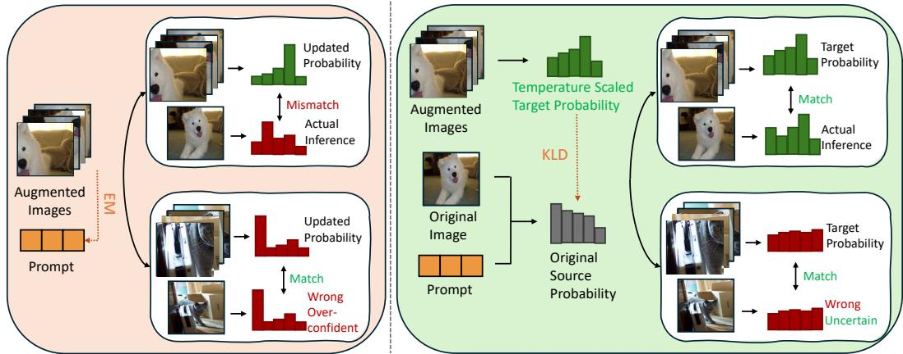
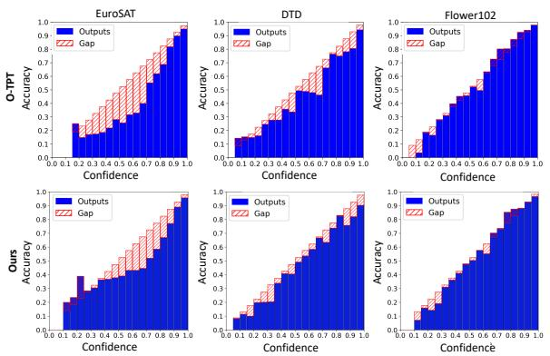
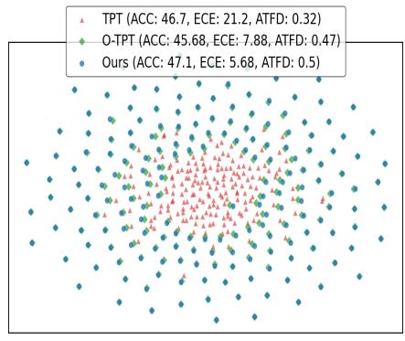
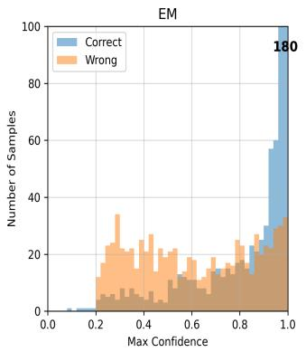
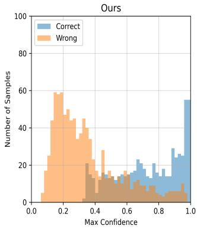
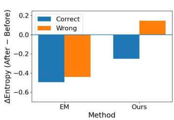
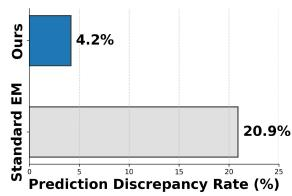

# Rethinking the Test-Time Prompt Tuning Objective from the Perspective of Calibration

Jungwon Choi1,∗ Hyeonseo Jang2,∗ Kibok Lee2 Eunwoo Kim1

1Department of Computer Science and Engineering, Chung-Ang University 2Department of Statistics and Data Science, Yonsei University ∗These authors contributed equally.

## Abstract

Test-time prompt tuning (TPT) has emerged as a powerful paradigm, refining prompts for each test sample via entropy minimization (EM) over multiple augmented views. However, we identify a limitation in the standard EM-based adaptation: it inherently drives the model toward overconfident predictions disregarding sample-specific uncertainty, leading to significant calibration degradation. Moreover, EM in TPT operates on augmented views rather than the original view used for inference, making it difficult to effectively control prediction confidence. Unfortunately, existing approaches retain the EM objective and rely on additional regularization terms, leaving the fundamental issue unresolved. To address these limitations, we propose a new objective that replaces the conventional EM loss by aligning the original-view prediction with a target distribution derived from augmented views via cross-entropy, while adversarially incorporating the entropy of the target distribution to capture sample-specific uncertainty. Furthermore, to better construct this target distribution, we apply confidence-aware temperature scaling to each augmented-view prediction according to its confidence, sharpening confident predictions while softening uncertain ones. This formulation allows the model to increase confidence only when the target distribution is reliable, while preserving uncertainty when it reflects ambiguous or conflicting augmented-view predictions. Extensive experiments across diverse benchmarks demonstrate that our approach not only achieves state-of-the-art accuracy but also significantly improves model calibration.

## 1 Introduction

Pre-trained vision-language models, such as CLIP [Radford et al., 2021], demonstrated remarkable zero-shot transferability by aligning images and texts in a shared embedding space. Building on this capability, prompt tuning [Zhou et al., 2022b,a, Khattak et al., 2023] emerged as an effective way to adapt these models by optimizing textual prompts instead of updating the entire model. Recently, test-time prompt tuning (TPT) [Shu et al., 2022] has attracted considerable attention by enabling adaptation using only unlabeled test samples, which is achieved by refining prompts at inference time with an entropy minimization (EM) loss over prediction probabilities computed from multiple augmented views [Feng et al., 2023, Xiao et al., 2025, Yoon et al., 2024, Sharifdeen et al., 2025]. This simple adaptation objective has proven effective in improving downstream task performance under distribution shift and has inspired a growing body of follow-up studies Feng et al. [2023], Zhu et al. [2024], Xiao et al. [2025], Choi and Kim [2026], Jang et al. [2026].

Despite its effectiveness, however, the EM loss used in TPT has an inherent limitation for trustworthy deployment. As analyzed in Section 6.3, it consistently encourages sharper prediction probabilities regardless of the characteristics of each test sample. Although this tendency can improve prediction accuracy, it may also increases the mismatch between prediction correctness and confidence scores, thereby degrading model calibration. Given that vision-language models are increasingly used in real-world decision-making pipelines including safety-critical settings, such degradation in calibration is particularly concerning because confidence estimates are expected to faithfully reflect the likelihood of correctness [Liu et al., 2023, Basu et al., 2025, Khandelwal et al., 2022].

Recent studies have attempted to address this issue from several perspectives, including enlarging text-feature dispersion [Yoon et al., 2024], enforcing angular separation between class text features [Sharifdeen et al., 2025], and initializing prompts in flatter regions of the loss landscape [Jang et al., 2026]. While these methods improve calibration to a meaningful extent, they share a common critical limitation: they retain the original EM loss, the fundamental source of calibration degradation, and merely mitigate its side effects through regularization, leaving the underlying issue unresolved. Moreover, the standard EM loss in TPT is applied to the average prediction distribution obtained from augmented views, whereas the final prediction confidence at test time is determined by the original view. We empirically observe that adjusting the probabilities of augmentation views does not necessarily yield appropriate control over the probability of the original view, making precise calibration inherently difficult and suggesting the need to revisit the objective itself.

Motivated by this observation, we propose a new uncertainty-aware objective that directly incorporates the information from augmented views into the original-view prediction confidence while using the uncertainty of this information to modulate the adaptation strength. Specifically, we treat the prediction probabilities from the original view as a source distribution to be updated and construct a target distribution from augmented views. Furthermore, to construct a more reliable target distribution, we apply confidence-aware temperature scaling to each augmented-view prediction, sharpening confident predictions while softening uncertain ones. Our objective consists of a cross-entropy matching term and an adversarial target-entropy regularization term. The former transfers class-level evidence from augmented views to the original-view confidence used for the final prediction, while the latter modulates the update strength according to the uncertainty of the augmentation-based target. Notably, unlike the conventional EM loss, which consistently sharpens prediction probabilities, our objective adjusts confidence according to augmentation-derived uncertainty: our experiments show that it increases confidence when augmented views provide consistent class-level evidence, while suppressing overconfident predictions when they are ambiguous or inconsistent. As a result, the proposed objective simultaneously improves performance and model calibration, achieving state-of-the-art results across diverse benchmarks. Our contributions are summarized as follows:

• Through a comprehensive set of experiments and analyses, we systematically examine an inherent limitation of the conventional EM loss in TPT, revealing that its optimization objective is structurally misaligned with calibration.

• We propose a new uncertainty-aware objective that directly incorporates information from augmented views into the original-view prediction while modulating the adaptation strength based on augmentation-derived uncertainty.

• We achieve state-of-the-art results in both calibration and downstream task performance, without relying on additional regularization to compensate for the side effects of EM loss.

## 2 Related Work

Prompt Learning. Vision-language models (VLMs) [Radford et al., 2021, Jia et al., 2021] have demonstrated strong generalization ability by aligning image and text representations in a shared embedding space. To further improve downstream performance, prompt learning methods have been proposed to adapt prompts to specific tasks [Zhou et al., 2022b,a, Khattak et al., 2023]. While prior prompt learning methods rely on labeled data during training, test-time prompt tuning (TPT) [Shu et al., 2022] updates prompt parameters using only unlabeled test samples by leveraging multiple augmented views of a single image. Specifically, TPT selects confident views and minimizes the entropy of their aggregated predictions, encouraging consistent outputs across augmentations. However, existing TPT methods [Shu et al., 2022, Yoon et al., 2024, Sharifdeen et al., 2025] primarily rely on entropy minimization as the optimization objective, assuming that selected predictions are equally reliable. As a result, the update is dominated by augmented views without explicitly anchoring the original prediction, and the entropy minimization objective can degrade calibration by promoting overconfident outputs.

Calibration of Deep Neural Networks. Calibration evaluates how well the predicted confidence of the model aligns with its empirical accuracy [Guo et al., 2017], which is critical for applications requiring reliable uncertainty estimates, such as healthcare [Liu et al., 2023, Wang et al., 2022] and autonomous systems [Bucker et al., 2022, Khandelwal et al., 2022]. Existing calibration approaches can be broadly categorized into post-hoc [Guo et al., 2017, Lei et al., 2018, Platt, 1999] and train-time methods Karandikar et al. [2021], Kumar et al. [2018], Yoon et al. [2023]. Post-hoc techniques, such as temperature scaling Guo et al. [2017] and Platt scaling Platt [1999], adjust a trained model using a held-out validation set to better align predicted probabilities with observed outcomes. However, they rely on labeled data from the target distribution, limiting their effectiveness under distribution shift or in zero-shot settings [Liu et al., 2022]. Train-time methods incorporate additional objectives or regularization to encourage calibrated predictions [Karandikar et al., 2021, Kumar et al., 2018, Yoon et al., 2023]. While effective in supervised settings, these methods also require labeled data and cannot be directly applied to test-time adaptation, where only unlabeled test samples are available.

Calibration of VLMs. While VLMs have demonstrated strong performance across diverse tasks, they often suffer from poor calibration when adapted to new domains, producing overconfident predictions. TPT [Shu et al., 2022] improves task-specific accuracy, but can further exacerbate this issue due to its entropy minimization objective. Recent works attempt to improve calibration through various strategies. For instance, C-TPT [Yoon et al., 2024] links textual feature dispersion to calibration and proposes a loss to enlarge inter-class separation, while O-TPT [Sharifdeen et al., 2025] introduces orthogonality-based regularization to enhance angular separation. However, these methods still rely on entropy minimization and only partially mitigate its side effects, without addressing the root cause of calibration degradation. Moreover, the entropy loss is applied to aggregated predictions from augmented views, whereas the final prediction confidence is determined by the original view, leading to a fundamental mismatch between the optimization objective and calibration. In contrast, our approach moves beyond existing entropy minimization methods by directly aligning the original-view prediction with a confidence-aware target constructed from augmented views, enabling more explicit control over prediction confidence at inference time.

## 3 Preliminaries

Zero-shot Classification. We first introduce a vision-language model [Radford et al., 2021] that aligns images and texts in a joint embedding space via contrastive learning. For zero-shot classification, given a set of classes $\mathcal { C } = \left\{ c _ { 1 } , c _ { 2 } , \dots , c _ { K } \right\}$ , each class name is embedded into a textual prompt $t _ { c _ { i } }$ using a template $( \mathrm { e . g . , \tilde { \Omega } a }$ photo of a {class}”). The text encoder extracts the corresponding text embeddings, $e _ { c _ { i } } = f _ { T } ( t _ { c _ { i } } )$ , for $i = 1 , \ldots , K$ . A test image I is mapped to a visual embedding $v = f _ { I } ( I )$ . The alignment between the image and each class is measured using cosine similarity, $s _ { i } = \cos ( v , e _ { c _ { i } } )$ These scores are converted into a probability distribution via the Softmax function, $P ( c _ { i } | I ) \stackrel { \cdot \cdot } { = }$ $\frac { \exp ( s _ { i } / \tau ) } { \sum _ { j = 1 } ^ { K } \exp ( s _ { j } / \tau ) }$ , where τ is a temperature parameter that controls the sharpness of the distribution.

The final prediction cˆ and its associated confidence $\hat { P }$ are determined as ${ \hat { c } } = \arg \operatorname* { m a x } _ { c _ { i } } P ( c _ { i } | I )$ and $\begin{array} { r } { \hat { P } = \operatorname* { m a x } _ { c _ { i } } P ( c _ { i } | I ) } \end{array}$ . This mechanism allows the model to perform robust classification across open-vocabulary tasks without requiring additional task-specific fine-tuning.

Test-time Prompt Tuning (TPT) [Shu et al., 2022] aims to adapt prompt parameters $\theta$ at inference time to enhance model robustness under distribution shifts without labeled data. Specifically, TPT optimizes θ by minimizing the prediction entropy across multiple augmented views of a single test image I. To ensure high-quality guidance for prompt, it filters these augmented views based on a confidence threshold and computes an aggregated probability distribution $\tilde { p } _ { \theta }$ from the selected lowentropy views. The prompt is then updated by minimizing the entropy of this aggregated prediction:

$$
\mathcal { L } _ { T P T } = - \sum _ { i = 1 } ^ { K } \tilde { p } _ { \theta } ( y _ { i } | I ) \log \tilde { p } _ { \theta } ( y _ { i } | I ) ,\tag{1}
$$

where $K$ denotes the total number of classes. This objective encourages the model to produce consistent and confident predictions across augmentations.

  
Figure 1: Comparison between entropy minimization (EM) (left) and our objective (right). Entropy minimization on augmented views can lead to misalignment between augmented and original-view predictions (upper left) and produce over-confident incorrect predictions even when they are aligned (lower left). In contrast, our proposed method constructs a confidence-aware target distribution from augmented views and directly aligns it with the original-view prediction, improving consistency between augmentation-derived targets and inference-time predictions (upper right) while producing smoother and more uncertain predictions for ambiguous samples (lower right).

## 4 Analysis of Uncertainty-Aware Adaptation Objective

For each test sample, we use p to denote the prediction probability from the original view, which are used to obtain the final prediction and confidence at inference time. We further define $p _ { \mathrm { a u g } }$ as the target probability obtained by averaging the prediction probabilities over multiple augmented views. Standard TPT minimizes the entropy of $p _ { \mathrm { a u g } }$ , thereby leveraging information aggregated across augmented views. However, since TPT does not explicitly optimize $p ,$ the prediction probabilities used for inference can still be misaligned with $p _ { \mathrm { a u g } }$ after adaptation. To address this, we first consider the cross-entropy matching term:

$$
\mathcal { L } _ { \mathrm { m a t c h } } = H ( p _ { \mathrm { a u g } } , p ) = - \sum _ { c = 1 } ^ { C } p _ { \mathrm { a u g } } ^ { ( c ) } \log p ^ { ( c ) } .\tag{2}
$$

Minimizing this term encourages $p$ to assign high probability to the classes tha t receive high probability under $p _ { \mathrm { a u g } } ,$ so that the class-level information estimated from multiple augmented views is directly reflected in the probabilities.

Beyond class-level guidance, $p _ { \mathrm { a u g } }$ can also be viewed as capturing sample-dependent uncertainty. If the augmented views give consistent predictions, the averaged distribution become sharp; if they are ambiguous or inconsistent, the averaged distribution remain soft. This uncertainty should be preserved for reliable confidence estimation, since an ambiguous target should not make p overconfident. We quantify it by

$$
H ( p _ { \mathrm { a u g } } ) = - \sum _ { k } p _ { \mathrm { a u g } } ^ { ( k ) } \log p _ { \mathrm { a u g } } ^ { ( k ) } .\tag{3}
$$

Unlike the conventional EM objective, we do not use $H ( p _ { \mathrm { a u g } } )$ to make the target probabilities sharper. Instead, we use it to adjust the matching cost according to the uncertainty of $p _ { \mathrm { a u g } }$ . When $p _ { \mathrm { a u g } }$ is sharp, its entropy is small, so the cross-entropy term remains a strong matching signal. When $p _ { \mathrm { a u g } }$ is soft, its entropy is large, so the matching cost is reduced, preventing an uncertain target from forcing $p$ to become overconfident. This leads to the objective

$$
\begin{array} { r } { \mathcal { L } = H ( p _ { \mathrm { a u g } } , p ) - H ( p _ { \mathrm { a u g } } ) . } \end{array}\tag{4}
$$

Here, subtracting the target entropy removes the uncertainty inherent in $p _ { \mathrm { a u g } }$ from the matching cost. As a result, the objective encourages $p$ to follow the class preference of $p _ { \mathrm { a u g } }$ when the augmented views are confident, while retaining softer predictions when the augmented views are uncertain.

The objective derived above has a compact interpretation. Expanding the two terms gives

$$
\mathcal { L } = - \sum _ { k } p _ { \mathrm { a u g } } ^ { ( k ) } \log p ^ { ( k ) } + \sum _ { k } p _ { \mathrm { a u g } } ^ { ( k ) } \log p _ { \mathrm { a u g } } ^ { ( k ) } = \sum _ { k } p _ { \mathrm { a u g } } ^ { ( k ) } \log \frac { p _ { \mathrm { a u g } } ^ { ( k ) } } { p ^ { ( k ) } } .\tag{5}
$$

Thus, the proposed objective can be written as

$$
{ \mathcal { L } } _ { \mathrm { K L D } } \triangleq D _ { \mathrm { K L } } ( p _ { \mathrm { a u g } } \Vert p ) .\tag{6}
$$

In our setting, $p _ { \mathrm { a u g } }$ is not a fixed target but remains differentiable and allows gradients to update the model. Therefore, the entropy term $H ( p _ { \mathrm { a u g } } )$ is not constant and contributes to the update together with the cross-entropy term. The negative entropy term counteracts the tendency of the cross-entropy term to produce overconfident predictions, allowing uncertain augmented targets to remain soft during adaptation.

Compared with standard TPT [Shu et al., 2022], which minimizes the entropy of the averaged probabilities and can sharpen them even for ambiguous samples, our objective uses the same augmented-view information to update the probabilities used for inference while retaining target-side uncertainty. It also differs from calibration-oriented methods Sharifdeen et al. [2025], Yoon et al. [2024], Jang et al. [2026] that keep the standard EM objective and add a separate regularizer, since since it preserves uncertainty within the objective itself, rather than through an additional regularizer. The qualitative difference between entropy minimization and our objective is illustrated in Fig. 1

## 5 Confidence-aware Adaptive Temperature Scaling

The above analysis suggests that confident and consistent augmented views tend to produce sharper aggregated targets, whereas uncertain or inconsistent views yield softer ones. However, individual augmented views may exhibit substantially different confidence levels. Directly averaging their probability distributions treats all views equally, without considering differences in confidence across views. To address this issue, we propose a Confidence-aware Adaptive Temperature Scaling strategy, which adjusts the sharpness of each augmented-view distribution according to its confidence before aggregation. Given a set of augmented views of a test image, the model first produces a probability distribution for each view, $p _ { i } = \operatorname { s o f t m a x } ( z _ { i } )$ , where $z _ { i }$ denotes the logits of the i-th view. We estimate the confidence of each view using the maximum predicted probability, $\alpha _ { i } = \operatorname* { m a x } _ { k } p _ { i } ^ { ( k ) }$ . Based on this confidence, we assign a view-specific temperature using linear interpolation, $T _ { i } = T _ { \operatorname* { m a x } } - ( T _ { \operatorname* { m a x } } - T _ { \operatorname* { m i n } } ) \cdot \alpha _ { i }$ , where $T _ { \mathrm { m i n } }$ and $T _ { \mathrm { m a x } }$ denote the minimum and maximum temperature values. This ensures that confident predictions produce sharper distributions, whereas uncertain predictions yield smoother distributions. We then generate calibrated soft labels for each view, $\begin{array} { r } { \tilde { p } _ { i } = \mathrm { s o f t m a x } \left( \frac { z _ { i } } { T _ { i } } \right) } \end{array}$ . The final target distribution is obtained by averaging across all views: $\begin{array} { r } { p _ { \mathrm { a u g } } = \frac { 1 } { N } \sum _ { i = 1 } ^ { N } \tilde { p } _ { i } } \end{array}$ , where N is the number of augmented views. Finally, we minimize the KL divergence between the prediction of the original image and the aggregated target ${ \mathcal { L } } _ { \mathrm { K L D } } =$ $D _ { \mathrm { K L } } ( p _ { \mathrm { a u g } } \parallel p )$

## 6 Experiments

## 6.1 Experimental Setting

Implementation Details. We use the CLIP-ViT-B/16 architecture as the backbone. For fair compari son, we adopt the same test-time adaptation setting as TPT Shu et al. [2022], following the protocols used in prior works [Yoon et al., 2024, Sharifdeen et al., 2025] without modification. Following the baseline works [Yoon et al., 2024, Sharifdeen et al., 2025], we evaluate calibration using expected calibration error (ECE) [Naeini et al., 2015]. We set $T _ { \mathrm { m i n } }$ and $T _ { \mathrm { m a x } }$ to 0.1 and 10.0, respectively. All reported results are averaged over three independent runs with random seeds 1, 2, and 3. All experiments were performed on an NVIDIA RTX A6000 ada with 48GB of memory.

## 6.2 Main Results

Fine-Grained Classification. We compare our method with existing test-time prompt tuning approaches on ten benchmark datasets. As shown in Table 1, our method consistently improves both accuracy and calibration compared to prior methods. In terms of accuracy, our method achieves an average accuracy of 65.71%, outperforming TPT (64.62%), C-TPT (64.48%), and O-TPT (64.12%). These results demonstrate that the proposed calibration-aware objective not only improves prediction reliability but also maintains competitive recognition performance under distribution shifts. More importantly, our method significantly improves calibration. While TPT suffers from severe miscalibration with an average ECE of 11.67, our method reduces it to 3.65, achieving the best calibration among all compared methods. Compared to prior calibration-oriented approaches, our method achieves gains of 1.67 and 0.81 ECE, improving over C-TPT (5.32) and O-TPT (4.46). These results indicate that explicitly modeling uncertainty and controlling prediction confidence lead to substantially more reliable calibration.

Table 1: Comparison of accuracy and calibration performance using the CLIP-ViT/B16 backbone. Values are mean of 3 runs (std: acc 0.11, ece 0.15). The best and second-best results are highlighted in bold and underline, respectively.
<table><tr><td>Method</td><td>|Metric</td><td>Air</td><td>Calt</td><td>Car</td><td>DTD</td><td>SAT</td><td>FLW</td><td>Food</td><td>Pets</td><td>SUN</td><td>UCF</td><td>Avg.</td></tr><tr><td rowspan="2">CLIP-ViT-B/16 [Radford et al., 2021]</td><td>Acc.</td><td>23.9</td><td>92.9</td><td>65.3</td><td>44.3</td><td>41.3</td><td>67.3</td><td>83.6</td><td>88.0</td><td>62.5</td><td>65.0</td><td>63.41</td></tr><tr><td>ECE</td><td>5.11</td><td>5.50</td><td>4.25</td><td>8.50</td><td>7.40</td><td>3.00</td><td>2.39</td><td>4.37</td><td>2.53</td><td>3.59</td><td>4.67</td></tr><tr><td rowspan="2">TPT [Shu et al., 2022]</td><td>Acc.</td><td>23.4</td><td>93.8</td><td>66.3</td><td>46.7</td><td>42.4</td><td>69.0</td><td>84.7</td><td>87.1</td><td>65.5</td><td>67.3</td><td>64.62</td></tr><tr><td>ECE</td><td>16.8</td><td>4.51</td><td>5.16</td><td>21.2</td><td>21.5</td><td>13.5</td><td>3.98</td><td>5.77</td><td>11.3</td><td>13.0</td><td>11.67</td></tr><tr><td rowspan="2">C-TPT [Yoon et al., 2024]</td><td>Acc.</td><td>24.0</td><td>93.6</td><td>65.8</td><td>46.0</td><td>43.2</td><td>69.8</td><td>83.7</td><td>88.2</td><td>64.8</td><td>65.7</td><td>64.48</td></tr><tr><td>ECE</td><td>4.36</td><td>4.24</td><td>1.59</td><td>11.9</td><td>13.2</td><td>5.04</td><td>3.43</td><td>1.90</td><td>5.04</td><td>2.54</td><td>5.32</td></tr><tr><td rowspan="2">O-TPT [Sharifdeen et al., 2025]</td><td>Acc.</td><td>23.64</td><td>93.95</td><td>64.53</td><td>45.68</td><td>42.84</td><td>70.07</td><td>84.13</td><td>87.95</td><td>64.23</td><td>64.16</td><td>64.12</td></tr><tr><td>ECE</td><td>3.68</td><td>3.80</td><td>1.78</td><td>7.88</td><td>12.98</td><td>3.87</td><td>1.46</td><td>1.90</td><td>4.93</td><td>2.34</td><td>4.46</td></tr><tr><td rowspan="2">Ours</td><td>Acc.</td><td>24.75</td><td>93.25</td><td>66.65</td><td>46.14</td><td>50.66</td><td>69.43</td><td>84.31</td><td>87.30</td><td>64.08</td><td>67.08</td><td>65.71</td></tr><tr><td>ECE</td><td>3.94</td><td>1.60</td><td>2.67</td><td>5.68</td><td>9.56</td><td>2.17</td><td>1.76</td><td>2.09</td><td>3.61</td><td>3.46</td><td>3.65</td></tr></table>

Table 2: Comparison of accuracy and calibration error using the CLIP-ViT/B16 backbone within the TPT framework under predefined prompts trained from CoOp and MaPLe.
<table><tr><td>Method</td><td>Metric</td><td>Air</td><td>Calt</td><td>Car</td><td>DTD</td><td>SAT</td><td>FLW</td><td>Food</td><td>Pets</td><td>SUN</td><td>UCF</td><td>Avg.</td></tr><tr><td>CoOp+TPT</td><td>Acc. ECE</td><td>20.0 29.6</td><td>94.0 3.65</td><td>65.6 6.63</td><td>44.5 34.8</td><td>40.6 31.3</td><td>68.7 19.9</td><td>83.8 9.66</td><td>89.1 7.40</td><td>65.6 20.8</td><td>67.2 19.9</td><td>63.91 18.36</td></tr><tr><td>CoOp+C-TPT</td><td>Acc. ECE</td><td>19.2 21.5</td><td>93.9 1.66</td><td>63.1 2.45</td><td>45.0 21.0</td><td>40.7 13.2</td><td>69.0 10.2</td><td>83.7 4.49</td><td>89.3 2.12</td><td>65.1 11.8</td><td>66.6 12.0</td><td>63.56 10.04</td></tr><tr><td>CoOp+O-TPT</td><td>Acc. ECE</td><td>18.69 16.82</td><td>93.71 0.92</td><td>64.12 2.85</td><td>45.45 16.02</td><td>40.17 13.76</td><td>68.57 6.81</td><td>83.55 3.59</td><td>89.07 1.92</td><td>64.01 7.23</td><td>65.64 9.16</td><td>63.29 7.91</td></tr><tr><td>CoOp+Ours</td><td>Acc. ECE</td><td>18.69 4.19</td><td>93.79 2.08</td><td>63.47 7.66</td><td>44.15 9.12</td><td>44.11 9.08</td><td>70.04 3.36</td><td>83.97 1.77</td><td>89.51 2.40</td><td>64.91 3.33</td><td>67.25 3.33</td><td>63.99 4.63</td></tr><tr><td>MaPLe+TPT</td><td>Acc. ECE</td><td>24.36 10.58</td><td>94.42 2.38 92.29</td><td>66.50 4.14</td><td>50.05 11.80</td><td>47.32 9.42</td><td>70.72 11.63</td><td>85.01 1.78</td><td>87.78 1.79</td><td>64.87 8.47</td><td>66.48 7.41</td><td>65.75 6.94</td></tr><tr><td>MaPLe+O-TPT</td><td>Acc. ECE</td><td>24.00 6.41</td><td>3.49</td><td>65.38 3.61</td><td>49.11 4.90</td><td>44.58 7.92</td><td>71.53 4.35</td><td>84.35 1.49</td><td>89.97 3.97</td><td>63.49 2.78</td><td>65.82 2.22</td><td>65.05 4.11</td></tr><tr><td>MaPLe+Ours</td><td>Acc. ECE</td><td>22.55 2.12</td><td>93.45 2.90</td><td>66.11 4.55</td><td>48.45 5.58</td><td>48.34 5.32</td><td>72.24 2.03</td><td>85.00 3.53</td><td>90.71 1.25</td><td>65.68 1.55</td><td>67.93 3.93</td><td>66.05 3.28</td></tr></table>

Pre-trained Prompts. Table 2 presents the performance of our method compared to existing TPTbased approaches under both CoOp and MaPLe initializations. Across all settings, our method consistently achieves the lowest ECE while maintaining competitive accuracy. Under the CoOp initialization, our method reduces the average ECE to 4.63, substantially outperforming prior approaches such as O-TPT (7.91). At the same time, it achieves the highest average accuracy of 63.99%, demon strating that improved calibration does not come at the expense of recognition performance. Notably, our method achieves substantial improvements in calibration across most datasets, demonstrating its effectiveness in mitigating overconfidence. Similarly, under the MaPLe initialization, our method achieves the best calibration performance with an average ECE of 3.28, significantly improving over the previous best result of 4.11. Moreover, it attains the highest average accuracy of 66.05% among all compared methods, showing that the proposed calibration-aware objective consistently improves both reliability and accuracy across different prompt initialization strategies.

Different TPT Framework. We further evaluate our method within the DynaPrompt [Xiao et al., 2025] framework to verify its generality under a most recent test-time prompt tuning strategy. As shown in Table 3, our method achieves the best calibration performance while maintaining strong accuracy. Compared to existing approaches, our method significantly reduces the average ECE to 4.04, outperforming prior methods. At the same time, it achieves the highest accuracy (65.51%), outperforming the original DynaPrompt framework, C-TPT, and O-TPT by 1.29%, 1.75%, and 2.16%, respectively. Notably, the calibration improvement is consistent across most datasets, indicating that our method effectively mitigates overconfidence. These results demonstrate that our approach is not limited to a specific prompt tuning approach but can be integrated into different frameworks.

Table 3: Comparison of accuracy and calibration error using the CLIP-ViT/B16 backbone within the DynaPrompt framework under a predefined hard prompt (“a photo of a”).
<table><tr><td>Method</td><td>Metric</td><td>Air</td><td>Calt</td><td>Car</td><td>DTD</td><td>SAT</td><td>FLW</td><td>Food</td><td>Pets</td><td>UCF</td><td>Avg.</td></tr><tr><td>DynaPrompt (Replication)</td><td>Acc. ECE</td><td>22.68 18.67</td><td>94.16 3.05</td><td>66.88 5.08</td><td>47.87 23.19</td><td>35.91 33.76</td><td>69.67 12.73</td><td>84.92 6.75</td><td>87.71 5.62</td><td>68.17 13.72</td><td>64.22 13.62</td></tr><tr><td>DynaPrompt+C-TPT</td><td>Acc. ECE</td><td>23.34 10.21</td><td>93.83 2.51</td><td>66.04 2.17</td><td>46.99 15.87</td><td>36.57 16.94</td><td>70.08 4.35</td><td>83.58 2.21</td><td>88.61 2.43</td><td>65.74 5.33</td><td>63.86 6.89</td></tr><tr><td>DynaPrompt+O-TPT</td><td>Acc. ECE</td><td>22.41 9.60</td><td>93.67 2.74</td><td>65.58 2.13</td><td>45.80 14.31</td><td>36.32 17.73</td><td>68.74 3.60</td><td>83.39 2.03</td><td>88.55 2.78</td><td>65.69 3.43</td><td>63.35 6.48</td></tr><tr><td>DynaPrompt+Ours</td><td>Acc. ECE</td><td>22.59 4.12</td><td>93.43 2.75</td><td>67.16 4.81</td><td>46.99 5.71</td><td>45.32 9.10</td><td>71.12 2.22</td><td>85.31 2.03</td><td>89.55 3.40</td><td>68.09 2.19</td><td>65.51 4.04</td></tr></table>

Table 4: Comparison of accuracy and calibration error in natural distribution shift datasets.
<table><tr><td>Method</td><td>Metric</td><td>I</td><td>I-A</td><td>I-V2</td><td>I-R</td><td>I-S</td><td>OOD Avg.</td></tr><tr><td>CLIP Radford et al. [2021]</td><td>Acc. ECE</td><td>66.7 2.12</td><td>47.8 8.61</td><td>60.8 3.01</td><td>74.0 3.58</td><td>46.1 4.95</td><td>57.18 5.04</td></tr><tr><td>TPT Shu et al. [2022]</td><td>Acc. ECE</td><td>69.0 10.6</td><td>52.6 16.4</td><td>63.0 11.1</td><td>76.7 4.36</td><td>47.5 16.1</td><td>59.95 11.99</td></tr><tr><td>C-TPT Yoon et al. [2024]</td><td>Acc. ECE</td><td>68.5 3.15</td><td>51.6 8.16</td><td>62.7 6.23</td><td>76.0 1.54</td><td>47.9 7.35</td><td>59.55 5.82</td></tr><tr><td>O-TPT Sharifdeen et al. [2025]</td><td>Acc. ECE</td><td>67.3 1.97</td><td>49.9 7.22</td><td>61.7 3.97</td><td>72.6 1.46</td><td>47.1 6.87</td><td>57.82 4.88</td></tr><tr><td>Ours</td><td>Acc. ECE</td><td>68.19 3.42</td><td>51.88 5.37</td><td>63.00 4.38</td><td>77.50 3.30</td><td>46.18 1.30</td><td>59.64 3.55</td></tr></table>

Natural Distribution Shifts. We evaluate our method on ImageNet [Deng et al., 2009] and its variants, including ImageNet-A [Hendrycks et al., 2021b], ImageNet-V2 [Recht et al., 2019], ImageNet-R [Hendrycks et al., 2021a], and ImageNet-Sketch [Wang et al., 2019], as shown in Table 4. While TPT achieves the highest accuracy, it suffers from severe miscalibration, resulting in a high average ECE of 11.99. In contrast, our method significantly improves calibration, achieving the lowest average ECE of 3.55, which substantially outperforms prior approaches. Importantly, this improvement is achieved without sacrificing accuracy, closely matching the best-performing baseline.

## 6.3 More Studies

Ablation Study. We conduct an ablation study to analyze the contributions of our temperature scaling and KLD-based objective. As shown in Table 5, both components independently improve performance over the baseline, while their combination yields the best results. Applying the temperature scaling alone provides a modest gain in accuracy (64.52% → 64.77%) and slightly improves calibration (ECE: 9.80 → 8.70), indicating that confidence smoothing partially alleviates overconfidence. In contrast, introducing the KLD loss leads to a more substantial improvement (Acc.: 64.97%, ECE: 6.18), demonstrating that aligning predictions with augmentation-derived targets is more effective for calibration. When combined, the two components achieve the best performance, reaching 65.71% accuracy and reducing ECE to 3.65. This result shows that temperature scaling and the KLD objective are complementary: temperature scaling stabilizes prediction confidence, while the KLD loss provides a strong calibration signal.

Table 5: Ablation study on the proposed temperature scaling and KLD averaged across fine-grained classification benchmarks.
<table><tr><td>Temperature Scaling</td><td>KLD</td><td>Accuracy</td><td>ECE</td></tr><tr><td>一</td><td>一</td><td>64.52</td><td>9.80</td></tr><tr><td>√</td><td>1</td><td>64.77</td><td>8.70</td></tr><tr><td>一</td><td>√</td><td>64.97</td><td>6.18</td></tr><tr><td>√</td><td>√</td><td>65.71</td><td>3.65</td></tr></table>

  
Figure 2: Reliability diagram showing improved calibration.

  
Figure 3: t-SNE visualization.

Reliability Plots. To further analyze the calibration behavior, we present reliability diagrams on the EuroSAT, DTD, and Flower102 datasets in Fig. 2. In a reliability diagram, perfect calibration is achieved when the prediction confidence matches the empirical accuracy within each confidence bin. As shown in the figure, O-TPT exhibits noticeable calibration gaps across all datasets. In particular, both the EuroSAT and DTD datasets exhibit a tendency toward over-confidence. In contrast, our method produces more well-aligned reliability curves across all datasets.

Text Feature Dispersion. To examine how each method affects the geometry of class text representations, we visualize the learned text features using t-SNE and measure their dispersion with the average text feature dispersion (ATFD). As shown in Fig. 3 , the baseline TPT exhibits relatively low dispersion (ATFD: 0.32), which corresponds to poor calibration performance (ECE: 21.20). O-TPT improves the dispersion of text features (ATFD: 0.47), resulting in a reduction in calibration error (ECE: 7.88). This observation aligns with a prior finding that increasing inter-class separation in the text space can enhance ECE performance [Yoon et al., 2024]. Our method achieves the highest dispersion (ATFD: 0.50) while simultaneously improving both calibration (ECE: 5.68) and accuracy (47.10). This result demonstrates that our approach naturally encourages the dispersion of class text features, without requiring additional regularization losses.

Confidence Distribution. We further analyze the distribution of prediction confidence to better understand calibration behavior. Figs. 4a and 4b present the confidence distributions for correct and incorrect samples on the DTD dataset. We observe that EM tends to collapse predictions toward high-confidence outputs regardless of correctness, resulting in over-confident predictions even for misclassified samples. In particular, the mean confidence of incorrect predictions remains relatively high $( \mu = 0 . 6 0 9 )$ , indicating that the model assigns excessive confidence to wrong predictions. In contrast, our method exhibits a more balanced distribution, maintaining high confidence for correct predictions $( \mu = 0 . 7 3 1 )$ ) while assigning significantly lower confidence to incorrect ones $( \mu = 0 . 3 5 5 )$ These results indicate that EM produces over-confident outputs irrespective of correctness, leading to poor calibration, whereas our method preserves uncertainty for difficult or ambiguous samples while maintaining reasonable confidence for correct predictions.

Entropy Behavior Analysis. To better understand the effect of our objective, we analyze the change in prediction entropy before and after test-time adaptation. Specifically, we measure $\dot { \Delta } H = H _ { \mathrm { a f t e r } } -$ $H _ { \mathrm { b e f o r e } }$ for both correct and incorrect samples. As shown in Fig. 5, EM consistently reduces entropy for both correct and incorrect samples, with mean $\Delta H$ values of −0.50 and −0.44, respectively.

  
(a) EM

  
(b) Ours

  
Figure 5: Entropy change before and after test-time adaptation. While EM reduces entropy for both correct and incorrect samples, our method increases entropy for incorrect samples while preserving confidence for correct ones.  
Figure 4: Confidence distribution comparison between EM and our method. EM produces over-confident predictions regardless of correctness, while our method better separates correct and incorrect samples by reducing confidence for misclassified cases.

This indicates that EM indiscriminately sharpens predictions, increasing confidence even when the prediction is incorrect. In contrast, our method exhibits fundamentally different behavior. For correct samples, the entropy change is $( \Delta H \approx - 0 . 2 5 )$ , indicating that unnecessary over-sharpening is avoided. More importantly, for incorrect samples, our method increases entropy $( \Delta H \approx + 0 . 1 4 )$ reflecting higher uncertainty in unreliable predictions. These results demonstrate that our approach adaptively modulates prediction confidence: it preserves confidence for correct predictions while increasing uncertainty for incorrect ones.

Analysis of Prediction Discrepancy. As shown in Fig. 6 Standard EM exhibits a high prediction discrepancy rate of 20.9%, where prediction discrepancy denotes the percentage of samples whose augmentation-derived prediction differs from the original-view prediction used for inference. This indicates that optimizing augmentedview probabilities can lead to significant misalignment with the actual inference-time prediction. In contrast, our method substantially reduces this discrepancy to 4.2%, demonstrating that directly aligning the original-view prediction with a confidence-aware target distribution enables more consistent and reliable control over prediction.

  
Figure 6: Prediction discrepancy between augmented and original views.

## 7 Conclusion

In this paper, we identify a fundamental mismatch in entropy minimization based test-time prompt tuning. We further show that enforcing alignment without accounting for uncertainty can produce over-confident predictions, especially under ambiguous augmentation signals. Building on these insights, we propose a calibration-aware objective that directly aligns the original-view prediction with a confidence-aware target distribution derived from augmented views. By incorporating adaptive temperature scaling, our method selectively enforces alignment when the target is reliable, while preserving uncertainty otherwise. Notably, our approach improves calibration without requiring additional regularization. Extensive experiments demonstrate that our method consistently achieves better reliability while maintaining competitive accuracy across diverse benchmarks.

Limitations. Our experiments are primarily conducted on CLIP-based vision-language models, and evaluating the proposed method on a broader range of VLM architectures remains an important direction for future work. Additionally, the current adaptation process focuses on test-time inference, and exploring the scalability of our approach to extremely large-scale batches or real-time streaming data could provide further insights into its practical deployment.

## References

Abhishek Basu, Fahad Shamshad, Ashshak Sharifdeen, Karthik Nandakumar, and Muhammad Haris Khan. Calibration-aware prompt learning for medical vision-language models. In Proceedings of the British Machine Vision Conference (BMVC), 2025.

Arthur Bucker, Luis Figueredo, Sami Haddadin, Ashish Kapoor, Shuang Ma, Sai Vemprala, and Rogerio Bonatti. Latte: Language trajectory transformer. In Advances in Neural Information Processing Systems (NeurIPS), 2022.

Jungwon Choi and Eunwoo Kim. Dual-modality anchor-guided filtering for test-time prompt tuning. arXiv preprint arXiv:2604.12403, 2026.

Jia Deng, Wei Dong, Richard Socher, Li-Jia Li, Kai Li, and Li Fei-Fei. Imagenet: A large-scale hierarchical image database. In 2009 IEEE conference on computer vision and pattern recognition, pages 248–255. Ieee, 2009.

Chun-Mei Feng, Kai Yu, Yong Liu, Salman Khan, and Wangmeng Zuo. Diverse data augmentation with diffusions for effective test-time prompt tuning. In Proceedings ofthe IEEE/CVF International Conference on Computer Vision (ICCV), 2023.

Chuan Guo, Geoff Pleiss, Yu Sun, and Kilian Q. Weinberger. On calibration of modern neural networks. In Doina Precup and Yee Whye Teh, editors, Proceedings of the 34th International Conference on Machine Learning, volume 70 of Proceedings of Machine Learning Research, pages 1321–1330. PMLR, 2017. URL https://proceedings.mlr.press/v70/guo17a.html.

Dan Hendrycks, Steven Basart, Norman Mu, Saurav Kadavath, Frank Wang, Evan Dorundo, Rahul Desai, Tyler Zhu, Samyak Parajuli, Mike Guo, et al. The many faces of robustness: A critical analysis of out-of-distribution generalization. In Proceedings of the IEEE/CVF international conference on computer vision, pages 8340–8349, 2021a.

Dan Hendrycks, Kevin Zhao, Steven Basart, Jacob Steinhardt, and Dawn Song. Natural adversarial examples. In Proceedings ofthe IEEE/CVF conference on computer vision and pattern recognition, pages 15262–15271, 2021b.

Hyeonseo Jang, Jaebyeong Jeon, Joong-Won Hwang, and Kibok Lee. Improving calibration in test-time prompt tuning for vision-language models via data-free flatness-aware prompt pretraining. In Proceedings ofthe IEEE/CVF Conference on Computer Vision and Pattern Recognition (CVPR), 2026.

Chao Jia, Yinfei Yang, Ye Xia, Yi-Ting Chen, Zarana Parekh, Hieu Pham, Quoc Le, Yun-Hsuan Sung, Zhen Li, and Tom Duerig. Scaling up visual and vision-language representation learning with noisy text supervision. In International conference on machine learning, pages 4904–4916. PMLR, 2021.

Archit Karandikar, Nicholas Cain, Dustin Tran, Balaji Lakshminarayanan, Jonathon Shlens, Michael Curtis Mozer, and Rebecca Roelofs. Soft calibration objectives for neural networks. In A. Beygelzimer, Y. Dauphin, P. Liang, and J. Wortman Vaughan, editors, Advances in Neural Infor mation Processing Systems, 2021. URL https://openreview.net/forum?id=-tVD13hOsQ3.

Apoorv Khandelwal, Luca Weihs, Roozbeh Mottaghi, and Aniruddha Kembhavi. Simple but effective: Clip embeddings for embodied ai. In Proceedings of the IEEE/CVF Conference on Computer Vision and Pattern Recognition (CVPR), 2022.

Muhammad Uzair Khattak, Hanoona Rasheed, Muhammad Maaz, Salman Khan, and Fahad Shahbaz Khan. Maple: Multi-modal prompt learning. In Proceedings of the IEEE/CVF Conference on Computer Vision and Pattern Recognition (CVPR), pages 19113–19122, 2023.

Aviral Kumar, Sunita Sarawagi, and Ujjwal Jain. Trainable calibration measures for neural networks from kernel mean embeddings. In Jennifer Dy and Andreas Krause, editors, Proceedings of the 35th International Conference on Machine Learning, volume 80 of Proceedings of Machine Learning Research, pages 2805–2814. PMLR, Jul 2018.

Jing Lei, Max G’Sell, Alessandro Rinaldo, Ryan J. Tibshirani, and Larry Wasserman. Distributionfree predictive inference for regression. Journal ofthe American Statistical Association, 113(523): 1094–1111, 2018.

Bingyuan Liu, Ismail Ben Ayed, Adrian Galdran, and Jose Dolz. The devil is in the margin: Marginbased label smoothing for network calibration. In Proceedings ofthe IEEE/CVF Conference on Computer Vision and Pattern Recognition (CVPR), pages 80–88, 2022.

Jie Liu, Yixiao Zhang, Jie-Neng Chen, Junfei Xiao, Yongyi Lu, Bennett A. Landman, Yixuan Yuan, Alan Yuille, Yucheng Tang, and Zongwei Zhou. Clip-driven universal model for organ segmentation and tumor detection. In Proceedings of the IEEE/CVF International Conference on Computer Vision (ICCV), 2023.

Mahdi Pakdaman Naeini, Gregory Cooper, and Milos Hauskrecht. Obtaining well calibrated probabilities using bayesian binning. In Proceedings ofthe AAAI Conference on Artificial Intelligence, 2015.

John C. Platt. Probabilistic outputs for support vector machines and comparisons to regularized likelihood methods. In Advances in Large Margin Classifiers, pages 61–74. MIT Press, 1999.

Alec Radford, Jong Wook Kim, Chris Hallacy, Aditya Ramesh, Gabriel Goh, Sandhini Agarwal, Girish Sastry, Amanda Askell, Pamela Mishkin, Jack Clark, Gretchen Krueger, and Ilya Sutskever. Learning transferable visual models from natural language supervision. arXiv preprint, 2021. URL https://arxiv.org/abs/2103.00020.

Benjamin Recht, Rebecca Roelofs, Ludwig Schmidt, and Vaishaal Shankar. Do imagenet classifiers generalize to imagenet? In International conference on machine learning, pages 5389–5400. PMLR, 2019.

Ashshak Sharifdeen, Muhammad Akhtar Munir, Sanoojan Baliah, Salman Khan, and Muhammad Haris Khan. O-tpt: Orthogonality constraints for calibrating test-time prompt tuning in vision-language models. In Proceedings ofthe IEEE Conference on Computer Vision and Pattern Recognition (CVPR), pages 19942–19951, 2025.

Manli Shu, Weili Nie, De-An Huang, Zhiding Yu, Tom Goldstein, Anima Anandkumar, and Chaowei Xiao. Test-time prompt tuning for zero-shot generalization in vision-language models. In Advances in Neural Information Processing Systems (NeurIPS), 2022. URL https://openreview.net/ forum?id=e8PVEkSa4Fq.

Haohan Wang, Songwei Ge, Zachary Lipton, and Eric P Xing. Learning robust global representations by penalizing local predictive power. Advances in neural information processing systems, 32, 2019.

Zifeng Wang, Zhenbang Wu, Dinesh Agarwal, and Jimeng Sun. Medclip: Contrastive learning from unpaired medical images and text. In Proceedings ofthe 2022 Conference on Empirical Methods in Natural Language Processing, 2022. URL https://aclanthology.org/2022.emnlp-main. 256/.

Zehao Xiao, Shilin Yan, Jack Hong, Jiayin Cai, Xiaolong Jiang, Yao Hu, Jiayi Shen, Cheems Wang, and Cees G. M. Snoek. Dynaprompt: Dynamic test-time prompt tuning. In International Conference on Learning Representations (ICLR), 2025. URL https://openreview.net/forum?id= EFZEdHB3Mp.

Hee Suk Yoon, Joshua Tian Jin Tee, Eunseop Yoon, Sunjae Yoon, Gwangsu Kim, Yingzhen Li, and Chang D. Yoo. ESD: Expected Squared Difference as a Tuning-free Trainable Calibration Measure. In The Eleventh International Conference on Learning Representations, 2023. URL https://openreview.net/forum?id=bHW9njOSON.

Hee Suk Yoon, Eunseop Yoon, Joshua Tian Jin Tee, Mark Hasegawa-Johnson, Yingzhen Li, and Chang D. Yoo. C-tpt: Calibrated test-time prompt tuning for vision-language models via text feature dispersion. In International Conference on Learning Representations (ICLR), 2024. URL https://openreview.net/forum?id=jzzEHTBFOT.

Kaiyang Zhou, Jingkang Yang, Chen Change Loy, and Ziwei Liu. Conditional prompt learning for vision-language models. In Proceedings ofthe IEEE/CVF Conference on Computer Vision and Pattern Recognition (CVPR), pages 16816–16825, 2022a.

Kaiyang Zhou, Jingkang Yang, Chen Change Loy, and Ziwei Liu. Learning to prompt for visionlanguage models. International Journal ofComputer Vision, pages 1–12, 2022b.

Yuhan Zhu, Guozhen Zhang, Chen Xu, Haocheng Shen, Xiaoxin Chen, Gangshan Wu, and Limin Wang. Efficient test-time prompt tuning for vision-language models. arXiv preprint arXiv:2408.05775, 2024.