# SPARK: Skeleton-Guided Reasoning Synthesis from Large-Scale Scientific Literature

Yu Li1,2, Wei Li1,3, Xin Gao1, Mengyuan Sun4, Xiaoyang Wang1, Qizhi Pei5, Lijun Wu1\* 1Shanghai AI Laboratory 2University of Science and Technology of China 3East China Normal University 4Peking University 5Renmin University of China liyu1@pjlab.org.cn, lijun\_wu@outlook.com

https://huggingface.co/datasets/OpenDataArena/Spark-234K

## Abstract

Scientific reasoning remains challenging for open-source models, largely due to the lack of high-quality scientific reasoning data. Existing datasets are often dominated by factual recall or formulaic problem solving, with limited emphasis on mechanism understanding, evidence-grounded reasoning, and hypothesis evaluation. To address this, we introduce SPARK (Scientific Paper Abstracted Reasoning sKeleton), a paper-oriented synthesis framework built on SCI-BASE, a large-scale corpus of research papers spanning 10 scientific disciplines. Instead of directly converting papers into question-answer pairs, SPARK treats the claim-evidence-derivation structure of a paper as the fundamental unit of reasoning synthesis. Specifically, SPARK (1) distills each paper into a compact reasoning skeleton capturing its central claims and supporting evidence, enabling self-contained question generation, and (2) synthesizes reasoning tasks from four scientific perspectives: mechanistic reasoning, hy pothesis falsification, quantitative derivation, and boundary calibration. A final consistency verification stage further removes unsupported or contradictory outputs. Using this framework, we construct Spark-234K, a scientific reasoning dataset with substantially higher difficulty and diversity than existing resources. Experiments show that Spark-234K consistently outperforms existing scientific reasoning datasets while achieving stronger performance with significantly fewer training samples.

## 1 Introduction

Recent Large Language Models (LLMs) have achieved strong performance on reasoning tasks such as mathematics and coding (Li et al., 2025; Cai et al., 2025; Pei et al., 2025), but scientific reasoning remains significantly more challenging (Li et al., 2026). A central limitation is the lack of highquality scientific reasoning data. Existing scientific corpora are often constructed from textbooks, exam problems, or web resources (Lu et al., 2025; Fan et al., 2025), and therefore mainly emphasize factual recall, standard derivations, or routine calculations while underrepresenting the evidence-based and mechanism-driven reasoning processes that characterize real scientific discovery.

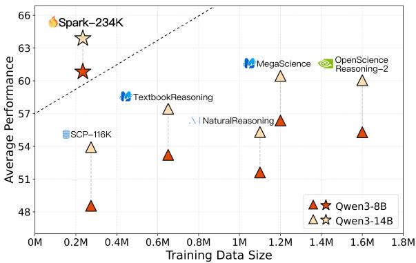  
Figure 1: Comparison of the Qwen3-8B base and Qwen3-14B base models trained on baseline datasets versus Spark-234K (benchmark scores in Table 2).

Research papers provide a natural source of scientific reasoning supervision because they contain expert-validated claims, supporting evidence, derivations, assumptions, and experimental analysis at scale (Taylor et al., 2022). Recent work has also explored leveraging scientific literature for reasoning-oriented data construction and scientific question-answering (Noorbakhsh et al., 2026; Dong et al., 2024; Liu et al., 2024). However, synthesizing high-quality reasoning data from papers remains difficult. Scientific papers are long, densely structured documents whose reasoning processes are often distributed across multiple sections, figures, tables, and experimental discussions. As a result, naively generating reasoning data from papers frequently produces samples that are not selfcontained (Choi et al., 2021; Dasigi et al., 2021a;

Jain and Garimella, 2026), omit critical assumptions or evidence, or fail to preserve the underlying claim-evidence reasoning structure (examples are shown in Figure 14).

We introduce SPARK (Scientific Paper Abstracted Reasoning sKeleton), a paper-oriented synthesis framework for scientific reasoning data construction. Instead of directly generating reasoning data from sections, chunks, or entire documents, SPARK treats a paper’s claim-evidence-derivation chain as the fundamental unit of synthesis.

Given a scientific paper, SPARK first extracts its central claims together with the supporting evidence, assumptions, quantitative relations, and boundary conditions, and organizes them into a compact reasoning skeleton. This reasoning skeleton rewrites the core scientific argument into a self-contained form, reducing long-context interference (Liu et al., 2024) while preserving the underlying reasoning process and mitigating the lack of self-containment commonly observed in document-grounded generation (Choi et al., 2021; Dasigi et al., 2021a; Jain and Garimella, 2026).

Based on the reasoning skeleton, SPARK synthesizes scientific reasoning data from four perspectives: (1) mechanistic reasoning, which explains why an observed phenomenon occurs (Machamer et al., 2000); (2) hypothesisfalsification, which distinguishes competing explanations (Pearl, 2009); (3) quantitative derivation, which emphasizes modeling and derivation instead of formula substitution (Sun et al., 2024); and (4) boundary calibration, which examines the assumptions and validity limits under which conclusions hold. A final consistency verification stage further removes unsupported or contradictory outputs.

Through the above framework and using 370K frontier scientific papers from the open SCI-BASE (OpenDataLab, 2026) corpus, we construct Spark-234K, a high-quality scientific reasoning dataset containing 234K synthesized instances. Despite its compact scale, this dataset exhibits strong data efficiency and overall performance (Figure 1). Notably, it outperforms massive baseline datasets such as MegaScience and OpenScienceReasoning-2 (NVIDIA, 2025), despite these collections being more than five and nearly seven times its size, respectively. Across distinct base model families and parameter scales, our data surpasses the runner-up datasets on multiple benchmarks by substantial average margins of +3.10, +4.47, and +3.43 points.

## 2 Paper Collection and Preparation

Source corpus. SPARK is built on SCI-BASE (OpenDataLab, 2026), an open scientific literature corpus comprising ∼3.36M papers across ten disciplines. Each paper is accompanied by metadata and parsed with MinerU2.5 (Niu et al., 2026) into an ordered sequence of paragraphs, tables, captions, and equations, with LATEX preserved where available. This structured representation facilitates paper-level argument reconstruction while retaining the quantitative information needed for scientific reasoning.

Quality filtering and balanced sampling. To prepare inputs for the pipeline, we apply strict filtering. We restrict the timeframe to January 2024– March 2026 and discard non-English, incompletely parsed, or review articles lacking a clear trajectory of claims and evidence. Crucially, we prioritize papers rich in concrete observables, such as equations, statistical results, tables, and experimental comparisons. Finally, to mitigate the raw corpus’s heavy skew toward medicine and life sciences (Table 5), we apply discipline-balanced sampling across the ten major scientific disciplines it spans. The resulting seed pool comprises roughly 370K argumentstructured frontier papers.

## 3 Dataset Construction

Figure 2 illustrates the SPARK pipeline, which converts a screened paper into standalone training instances. The key design choice is to treat a paper as an argument rather than a flat document: SPARK first identifies the core conclusion, reconstructs the evidence trajectory that supports it, and stores this trajectory as a compact reasoning skeleton. Questions are then generated from the skeleton under several scientific reasoning perspectives and filtered against the same skeleton for self-containment and source consistency.

## 3.1 Skeleton Extraction

Skeleton extraction makes a long paper usable for supervision without flattening it into sections or fragmenting it into independent chunks. Directly prompting over the full paper risks context diffusion: the central scientific argument is diluted by peripheral details, making generation prone to shallow or unfocused questions. Instead of preserving the paper’s original layout, skeleton extraction recovers the claim-centered argument: what conclusion the paper advances, what evidence supports it, and under which assumptions or boundary conditions the conclusion holds.

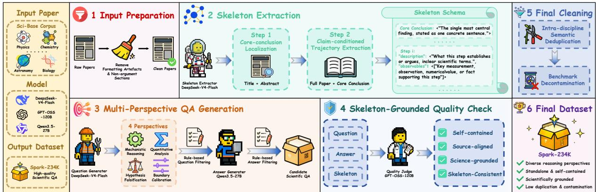  
Figure 2: The SPARK data synthesis pipeline. A frontier paper is first condensed into a reasoning skeleton. We then generate deep scientific QA pairs via four targeted perspectives, followed by a lightweight consistency check to ensure data quality and self-containment.

Input normalization. We first convert the parsed structure into a linearized text representation. This preserves the scientific content vital for reasoning, including equations, table text, captions, and numerical results, while stripping away formatting artifacts (such as headers, footers, and affiliations) and non-argument sections (such as references and acknowledgments).

Two-step extraction. Skeleton extraction recovers the core argument rather than the original section order. First, core conclusion localization identifies the central claim from the title and abstract, which typically state the research question, main finding, and scope while avoiding distracting body content. Second, trajectory extraction reads the normalized full paper conditioned on this conclusion, reconstructing the supporting argument as ordered steps. Each step contains a description of its logical role and a set of observables, such as measurements, comparisons, numerical values, formulas, or stated boundary conditions.

The resulting skeleton comprises the core conclusion and an ordered list of steps. As Figure 3 illustrates, it is not a section-level summary (Edge et al., 2025) but a compact evidence trajectory organized entirely around the paper’s central claim.

## 3.2 Multi-Perspective Question Generation

The next stage generates questions that probe scientific reasoning rather than surface facts. The skeleton exposes the paper’s claim, evidence, inferential links, and boundary conditions, which must be connected to understand the argument (Javaji et al., 2025). We therefore generate questions from four complementary perspectives.

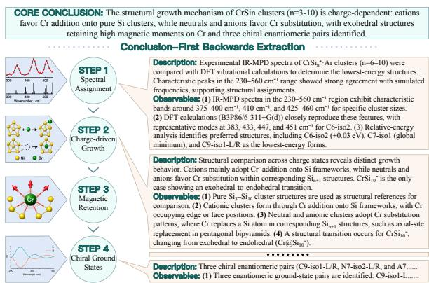  
Figure 3: Example skeleton extracted by SPARK from a real paper, condensing the source into a core conclusion and ordered evidence steps with concrete observables.

Mechanistic reasoning turns a reported condition–effect relation into a causal explanation problem, asking why a structure, intervention, or regime produces the phenomenon (Machamer et al., 2000). Hypothesis falsification uses contrasts, ablations, or ruled-out alternatives to ask which explanatory model is supported by the evidence (Pearl, 2009). Quantitative derivation converts numerical observables, formulas, or scaling relations into modeling-first problems whose difficulty lies in selecting and linking principles, rather than substituting values (Sun et al., 2024). Boundary calibration asks where a conclusion ceases to be justified, focusing on the assumptions, regimes, confounders, or approximations that delimit the claim.

Together, these perspectives ask why a result holds, which explanation survives the evidence, how quantities are related, and when the claim breaks down. This shifts generation away from fact retrieval and plug-and-chug computation toward mechanism-level reasoning. To maintain precision, SPARK follows a conservative yielding strategy: for each paper, it uses only the perspectives recommended during skeleton extraction, generates at most one question per perspective, and skips any perspective unsupported by the evidence.

Filtering. Generated questions undergo a lightweight, rule-based filtering stage to detect malformed formats and source-leakage phrases (detailed in Appendix G). The central constraint is self-containment: a question depending on unstated figures, tables, or source context is discarded. Finally, questions are audited for information sufficiency and intellectual depth, with thresholds adjusted to prevent the over-correction of valid reasoning trajectories.

## 3.3 Answer Generation

An answer model responds to each accepted question without access to the skeleton or source text. This setup mirrors the downstream fine-tuning environment and empirically verifies that the question is self-contained. We then apply heuristic filters to discard answers that are malformed, excessively short or long, or dominated by repeated n-grams.

## 3.4 Skeleton-Grounded Quality Check

While rule-based checks catch formatting issues, they cannot assess scientific grounding. We therefore deploy an LLM judge to evaluate each ⟨ question, answer, skeleton ⟩ triple against four criteria. For the question, it verifies: (i) selfcontainment (supplying necessary context independent of the paper), and (ii) consistency with the skeleton. For the answer, it checks if the reasoning is (iii) coherent and (iv) logically supported by the evidence trajectory. QA pairs failing any criterion are discarded.

The self-containment check acts primarily as a safeguard, as skeleton extraction prevents most dependencies at the source (evidenced by the low discard rate in Table 6). Crucially, by grounding the answer evaluation directly in the extracted skeleton, we bypass the massive majority voting and iterative rewriting typically required in traditional math and reasoning domains (Tong et al., 2024), keeping the pipeline computationally lightweight.

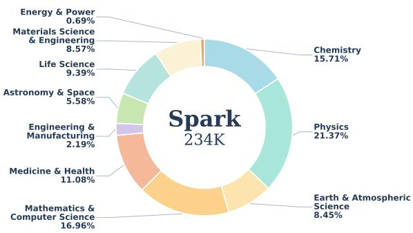  
Figure 4: Discipline distribution of Spark-234K.

## 3.5 Final Data Cleaning

Finally, we apply deduplication and decontamination procedures. We perform semantic deduplication within each discipline using Qwen3- Embedding-8B embeddings (Zhang et al., 2025). To prevent benchmark leakage, we enforce 13- gram exact matching against all downstream evaluation sets, discarding any overlapping records.

## 4 Dataset Statistics and Analysis

By applying the proposed synthesis pipeline to the 370K filtered seed papers, we construct Spark-234K, a high-quality instruction tuning dataset dedicated to deep scientific reasoning.

## 4.1 Dataset Statistics

Figure 4 illustrates the disciplinary distribution of Spark-234K. Physics (21.37%), Mathematics & Computer Science (16.96%), and Chemistry (15.71%) constitute the largest segments of the dataset. The final composition reflects both our discipline-balanced sampling of source papers and cross-disciplinary variation in the number of valid reasoning instances retained through the synthesis pipeline. Medicine & Health (11.08%) and Life Science (9.39%) also contribute substantial portions, while the remaining disciplines, ranging from Materials Science & Engineering (8.57%) and Earth & Atmospheric Science (8.45%) to Energy & Power (0.69%), collectively ensure broad thematic coverage across diverse scientific domains.

Beyond disciplinary diversity, all four reasoning perspectives are well represented within the corpus. Mechanistic reasoning (35.6%) and quantitative derivation (30.2%) constitute the majority, aligning with the empirical nature of scientific papers, whereas boundary calibration (20.4%) and hypothesis falsification (13.9%) provide critical diversity in higher-order analytical evaluation.

Table 1: Comparison of dataset length (average token length) and diversity.
<table><tr><td rowspan="2">Dataset</td><td rowspan="2">Size</td><td colspan="2">Length</td><td colspan="2">Diversity</td></tr><tr><td>Q. Len.</td><td>Resp. Len.</td><td>Vendi ↑</td><td>Cent. Dist. ↑</td></tr><tr><td>SCP-116K</td><td>274K</td><td>122.09</td><td>555.68</td><td>173.42</td><td>0.4923</td></tr><tr><td>TextbookReasoning</td><td>651K</td><td>63.80</td><td>409.66</td><td>283.75</td><td>0.5598</td></tr><tr><td>NaturalReasoning</td><td>1.1M</td><td>76.28</td><td>766.33</td><td>349.42</td><td>0.6163</td></tr><tr><td>MegaScience</td><td>1.2M</td><td>170.77</td><td>692.93</td><td>373.78</td><td>0.6150</td></tr><tr><td>OpenScienceReasoning-2</td><td>1.6M</td><td>217.40</td><td>5691.70</td><td>290.17</td><td>0.5610</td></tr><tr><td>Spark-234K</td><td>234K</td><td>377.61</td><td>3139.45</td><td>384.57</td><td>0.6183</td></tr></table>

The retention statistics in Table 6 indicate that most generated instances pass the subsequent quality-control stages. In particular, the low proportion of rejections attributable to self-containment issues suggests that the reasoning skeleton helps reduce contextual dependencies more consistently during question generation.

## 4.2 Dataset Analysis

To evaluate the overall effectiveness of Spark-234K, we benchmark it against five established scientific reasoning datasets, SCP-116K, TextbookReasoning, OpenScienceReasoning-2, NaturalReasoning, and MegaScience.

Length. Spark-234K features the longest questions among all datasets, averaging 377.61 tokens (Table 1). This length reflects the contextual information, variables, and boundary conditions often required to formulate well-posed scientific reasoning problems. The responses average 3139.45 tokens, ranking second overall. Together, these statistics indicate that Spark-234K provides detailed reasoning supervision without relying on the longest response traces among the compared datasets.

Diversity. We quantify data diversity using the Vendi Score (Friedman and Dieng, 2022) and Centroid Distance (Suwanda et al., 2020). Despite its compact size (234K) compared with baselines containing up to 1.6M samples (Table 1), Spark-234K achieves the highest scores on both metrics (384.57 and 0.6183, respectively). These results indicate that Spark-234K maintains high semantic diversity relative to the compared datasets and are consistent with the intended effect of our multi-perspective generation design.

Answer correctness. Given the dataset’s crossdisciplinary breadth, comprehensive manual verification is prohibitively expensive. We therefore conduct large-scale automated verification on a random sample of 20K questions. For each question, Gemini-3.1 Pro1 independently generates a solution without access to the reference answer. GPT-OSS-120B (OpenAI et al., 2025) then judges whether the generated solution is semantically equivalent to the original response. This evaluation yields a 93.28% consistency rate, providing additional evidence for answer reliability.

Difficulty. Figure 5a highlights the limitations of existing datasets in eliciting deep reasoning. Using DeepSeek-V4-Flash, we grade 20K sampled questions per dataset on a five-level taxonomy (Appendix H). While baseline datasets contain high proportions of L1 (Fact recall) and L2 (Routine computation) questions, with their combined share exceeding 50% in TextbookReasoning, Spark-234K contains only 0.02% L1 and 1.2% L2 questions. Instead, over 93% of our dataset requires high-order reasoning, dominated by L4 (Multistep, 58.5%) and L5 (Research-level, 34.6%) problems. Notably, this distribution emerges without explicit difficulty-based filtering, suggesting that skeleton-guided generation naturally tends to produce reasoning-intensive questions.

Self-containment. Naively converting scientific papers into QA pairs often yields unusable questions that rely on unstated, external context. As Figure 5b illustrates, multiple baseline datasets suffer from severe dependency issues, with their proportion of non-self-contained data exceeding 15%. In supervised fine-tuning, introducing such a high ratio of contextually broken data is enough to severely degrade training performance, as it inadvertently teaches models to hallucinate missing variables rather than perform rigorous deduction. To isolate the architectural contribution of our reasoning skeleton in solving this structural flaw, we report Spark-234K both before and after the final quality check. Even prior to the filtering stage, Spark-234K achieves a 98.55% self-containment rate, compared with 92.39% for the strongest baseline. This result suggests that skeleton-guided generation substantially reduces context dependency at the generation stage. The final quality check further increases the self-containment rate to 99.73%.

Human validation. To further verify the reliability of our automated quality assessments, we conduct a human validation study on 300 stratified samples across ten disciplines. Two paid domain experts for each discipline independently evaluate the samples across three dimensions: correctness, self-containment, and difficulty (Appendix H). Results show 90.3% agreement with expert-derived answers, 97.7% agreement on self-containment, and 94.3% agreement on difficulty labels, confirming both the reliability of our annotations and the challenging nature of the dataset. Full details are provided in Appendix I.

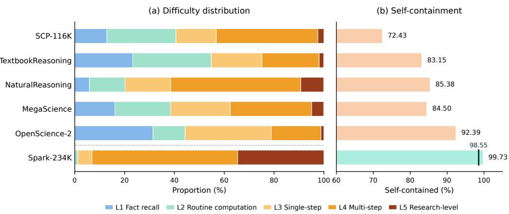  
Figure 5: Difficulty distribution over five levels across datasets. Spark-234K shifts mass toward higher difficulty, while baselines concentrate on low-difficulty recall or routine computation.

## 5 Experiments

## 5.1 Experimental Setup

Training. Fine-tuning is conducted on Llama3.1- 8B-Base (Grattafiori et al., 2024), Qwen3-8B-Base, and Qwen3-14B-Base (Yang et al., 2025). All comparisons share the same training hyperparameters; details are provided in Appendix C.

Evaluation. For fair comparison, all models are evaluated in the zero-shot setting across two groups of benchmarks: (1) general science reasoning benchmarks (GPQA-Main [GPQA-M] (Rein et al., 2024), GPQA-Diamond [GPQA-D] (Rein et al., 2024), SuperGPQA [S-GPQA] (Du et al., 2026), SciBench (Wang et al., 2024a), MMLU (Hendrycks et al., 2020), and MMLU-Pro (Wang et al., 2024b)) and (2) domain-specific benchmarks (Chem-Bench (Mirza et al., 2024), CS-Bench (Song et al., 2025), PubMedQA (Jin et al., 2019), MedQA-US (Yao et al., 2026), GSM8K (Cobbe et al., 2021), and MATH-500 (Hendrycks et al., 2021)). We report avg@3 or avg@5 for all benchmarks, with details provided in Appendix D.

## 5.2 Main Results

Table 2 reports the evaluation on six scientific reasoning benchmarks. The results empirically validate our central claim: preserving a paper’s reasoning skeleton provides far denser supervision than the brute-force scaling of synthetic examples.

Data Efficiency. The macro averages highlight the data efficiency of our approach. Across all three backbones, Spark-234K consistently achieves the highest overall performance using only 234K examples—less than one-fifth the volume of million-scale baselines such as Mega-Science (1.2M). For instance, fine-tuning Qwen3- 8B on Spark-234K yields an average score of 60.83, compared with 56.36 for the strongest baseline. These results show that Spark-234K achieves strong downstream performance with substantially fewer training examples, highlighting the importance of data construction quality in addition to dataset scale.

Performance on Challenging Reasoning Benchmarks. The performance gains are particularly pronounced on benchmarks requiring complex, multi-step reasoning. On the Expert Science MCQ cluster (GPQA series) and the quantitative SciBench, Spark-234K consistently achieves strong performance relative to the compared datasets. For Qwen3-14B, training on Spark-234K yields GPQA-M and GPQA-D scores of 53.71 and 55.05, respectively, outperforming models trained on substantially larger corpora. Improvements on MMLU-Pro show a similar trend. These results are consistent with the high proportion of L4 and L5 questions observed in Spark-234K, suggesting that skeleton-guided synthesis provides effective supervision for challenging reasoning tasks.

Table 2: Main results on six scientific reasoning benchmarks. Avg. is the macro average over all six. Within each model group, the best result per column is in bold and the second best is underlined.
<table><tr><td colspan="2"></td><td colspan="3">Expert Science MCQ</td><td>Quant.</td><td colspan="2">Broad Science</td><td rowspan="2">Avg.</td></tr><tr><td>Model / Training Data</td><td></td><td>Size GPQA-M</td><td>GPQA-D</td><td>S-GPQA</td><td>SciBench MMLU</td><td></td><td>MMLU-Pro</td></tr><tr><td>Llama3.1-8B-Base</td><td></td><td></td><td></td><td></td><td></td><td></td><td></td><td></td></tr><tr><td>Base</td><td></td><td>24.55</td><td>24.75</td><td>14.41</td><td>17.41</td><td>54.06</td><td>24.39</td><td>26.60</td></tr><tr><td>+ SCP-116K</td><td>274K</td><td>26.83</td><td>30.71</td><td>15.09</td><td>20.37</td><td>50.71</td><td>25.81</td><td>28.25</td></tr><tr><td>+ TextbookReasoning</td><td>651K</td><td>30.11</td><td>33.95</td><td>24.76</td><td>31.83</td><td>66.25</td><td>47.73</td><td>39.11</td></tr><tr><td>+ NaturalReasoning</td><td>1.1M</td><td>31.85</td><td>32.91</td><td>23.80</td><td>31.29</td><td>60.23</td><td>44.31</td><td>37.40</td></tr><tr><td>+ MegaScience</td><td>1.2M</td><td>33.71</td><td>38.89</td><td>25.56</td><td>36.87</td><td>68.79</td><td>49.79</td><td>42.27</td></tr><tr><td>+ OpenScienceReasoning-2</td><td>1.6M</td><td>29.91</td><td>26.77</td><td>24.09</td><td>27.59</td><td>70.10</td><td>50.61</td><td>38.18</td></tr><tr><td>+ Spark-234K (ours)</td><td>234K</td><td>38.38</td><td>37.37</td><td>28.47</td><td>43.80</td><td>69.36</td><td>54.83</td><td>45.37</td></tr><tr><td>Qwen3-8B-Base</td><td></td><td></td><td></td><td></td><td></td><td></td><td></td><td></td></tr><tr><td>Base</td><td></td><td>32.59</td><td>29.29</td><td>29.05</td><td>30.30</td><td>66.22</td><td>45.24</td><td>38.78</td></tr><tr><td>+ SCP-116K</td><td>274K</td><td>36.93</td><td>34.62</td><td>33.80</td><td>54.13</td><td>71.24</td><td>60.63</td><td>48.56</td></tr><tr><td>+ TextbookReasoning</td><td>651K</td><td>40.75</td><td>42.90</td><td>37.01</td><td>61.31</td><td>73.07</td><td>64.26</td><td>53.22</td></tr><tr><td>+ NaturalReasoning</td><td>1.1M</td><td>40.03</td><td>41.29</td><td>34.44</td><td>59.83</td><td>72.15</td><td>61.91</td><td>51.61</td></tr><tr><td>+ MegaScience</td><td>1.2M</td><td>43.75</td><td>44.95</td><td>38.66</td><td>64.83</td><td>79.65</td><td>66.31</td><td>56.36</td></tr><tr><td>+ OpenScienceReasoning-2</td><td>1.6M</td><td>40.78</td><td>39.36</td><td>38.55</td><td>62.37</td><td>81.15</td><td>69.55</td><td>55.29</td></tr><tr><td>+ Spark-234K (ours)</td><td>234K</td><td>50.22</td><td>52.53</td><td>41.84</td><td>66.35</td><td>81.50</td><td>72.54</td><td>60.83</td></tr><tr><td>Qwen3-14B-Base</td><td></td><td></td><td></td><td></td><td></td><td></td><td></td><td></td></tr><tr><td>Base</td><td></td><td>37.95</td><td>38.38</td><td>33.50</td><td>50.16</td><td>76.01</td><td>59.35</td><td>49.23</td></tr><tr><td>+ SCP-116K</td><td>274K</td><td>42.80</td><td>43.75</td><td>35.29</td><td>59.29</td><td>77.37</td><td>64.99</td><td>53.92</td></tr><tr><td>+ TextbookReasoning</td><td>651K</td><td>44.27</td><td>46.81</td><td>42.15</td><td>63.61</td><td>79.25</td><td>68.53</td><td>57.44</td></tr><tr><td>+ NaturalReasoning</td><td>1.1M</td><td>44.09</td><td>44.83</td><td>34.16</td><td>63.27</td><td>77.59</td><td>67.94</td><td>55.31</td></tr><tr><td>+ MegaScience</td><td>1.2M</td><td>47.32</td><td>48.99</td><td>44.47</td><td>67.81</td><td>82.44</td><td>71.65</td><td>60.45</td></tr><tr><td>+ OpenScienceReasoning-2</td><td>1.6M</td><td>46.64</td><td>47.83</td><td>44.21</td><td>65.41</td><td>83.99</td><td>72.20</td><td>60.05</td></tr><tr><td>+ Spark-234K (ours)</td><td>234K</td><td>53.71</td><td>55.05</td><td>47.62</td><td>69.55</td><td>83.65</td><td>73.68</td><td>63.88</td></tr></table>

## 5.3 Domain-Specialized Results

Table 3 evaluates performance across distinct scientific disciplines. Spark-234K consistently achieves the highest macro averages across all three backbones, indicating broad improvements across the evaluated chemistry, computer science, medicine, and mathematics benchmarks.

Notably, Spark-234K maintains a substantial advantage on domain-specific benchmarks such as MedQA-US (e.g., 79.36 vs. 72.58 for MegaScience on Qwen3-14B). This result suggests that the gains from our training data transfer effectively to specialized scientific domains.

## 5.4 Data Efficiency and Scaling

All experiments in this and the following ablation use Qwen3-8B-Base, evaluated on MMLU, MMLU-Pro, SciBench, and GPQA-Diamond under the same training and evaluation protocol as our main experiments. Here we train on progressively larger random subsets of Spark-234K to measure how performance scales with the amount of synthesized data (Figure 6).

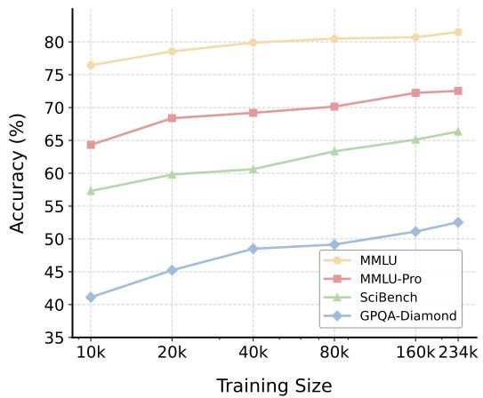  
Figure 6: Performance scaling with the number of synthesized training records from Spark-234K.

While the total dataset volume is relatively compact, the scaling curve exhibits a consistent and incremental improvement across benchmarks as the data size expands. This steady upward trajectory indicates that the model has not yet saturated on the provided scientific reasoning patterns. It suggests a highly promising direction for future work, where simply applying our automated extraction pipeline to a broader corpus of academic literature could naturally yield further scaling gains.

Table 3: Domain-specialized transfer results across chemistry, computer science, medicine, and mathematics.
<table><tr><td>Model / Training Data</td><td>Size</td><td>ChemBench</td><td>CS-Bench</td><td>PubMedQA</td><td>MedQA-US</td><td>GSM8K</td><td>MATH-500</td><td>Avg.</td></tr><tr><td>Llama3.1-8B-Base</td><td></td><td></td><td></td><td></td><td></td><td></td><td></td><td></td></tr><tr><td>Base</td><td></td><td>23.03</td><td>49.90</td><td>51.20</td><td>48.78</td><td>56.40</td><td>19.20</td><td>41.42</td></tr><tr><td>+ MegaScience</td><td>1.2M</td><td>42.97</td><td>59.89</td><td>76.60</td><td>62.03</td><td>71.65</td><td>45.20</td><td>59.72</td></tr><tr><td>+ Spark-234K (ours)</td><td>234K</td><td>44.51</td><td>64.29</td><td>74.20</td><td>66.35</td><td>85.10</td><td>64.00</td><td>66.41</td></tr><tr><td>Qwen3-8B-Base</td><td></td><td></td><td></td><td></td><td></td><td></td><td></td><td></td></tr><tr><td>Base</td><td></td><td>49.60</td><td>69.16</td><td>61.20</td><td>55.54</td><td>88.63</td><td>70.80</td><td>65.82</td></tr><tr><td>+ MegaScience</td><td>1.2M</td><td>53.01</td><td>76.07</td><td>77.40</td><td>66.93</td><td>93.03</td><td>79.60</td><td>74.34</td></tr><tr><td>+ Spark-234K (ours)</td><td>234K</td><td>55.85</td><td>77.61</td><td>75.60</td><td>75.33</td><td>94.09</td><td>81.20</td><td>76.61</td></tr><tr><td>Qwen3-14B-Base</td><td></td><td></td><td></td><td></td><td></td><td></td><td></td><td></td></tr><tr><td>Base</td><td></td><td>53.73</td><td>75.98</td><td>77.00</td><td>63.71</td><td>93.86</td><td>71.60</td><td>72.65</td></tr><tr><td>+ MegaScience</td><td>1.2M</td><td>58.82</td><td>79.92</td><td>78.80</td><td>72.58</td><td>94.77</td><td>82.00</td><td>77.82</td></tr><tr><td>+ Spark-234K (ours)</td><td>234K</td><td>57.63</td><td>81.50</td><td>78.20</td><td>79.36</td><td>94.82</td><td>85.37</td><td>79.48</td></tr></table>

## 5.5 Pipeline Ablation

We ablate the two central designs of SPARK, with all settings trained on a fixed 40K set (Table 4).

Unit of synthesis. We replace skeleton extraction with three alternatives that feed the generator different representations of the same paper: the whole paper, chunked passages, or an LLMgenerated summary. The rest of the pipeline remains unchanged. All baseline representations degrade sharply. Whole-paper input performs worst (−9.15), as processing a long document diffuses the central claims and yields shallow questions. Chunking and summarization also lose ground (−5.63, −6.71) by severing cross-section claim– evidence chains or discarding the reasoning skeleton entirely. In contrast, extracting a reasoning skeleton preserves the paper’s claim–evidence– derivation trajectory, yielding the highest-quality synthetic data.

Question generation. We fix the skeleton and perform leave-one-out ablations over the four perspectives, resampling from the remaining three to maintain 40K examples so that variants differ only in the included perspectives. With data volume fixed, the performance gaps are smaller, yet removing any perspective still causes a clear drop, indicating that each contributes complementary signal. Quantitative derivation has the largest effect (−4.64), likely because it contributes many computation-intensive questions that strengthen the model’s quantitative reasoning ability.

## 6 Related Work

## 6.1 Scientific Reasoning Data

Scientific post-training data has expanded from curricular sources to large synthetic mixtures. TextbookReasoning (Fan et al., 2025) extracts QA from university textbooks, while domain-specific efforts such as ChemData700K (Zhang et al., 2024) tune models on field-focused instruction data. Broader collections, including SCP-116K (Lu et al., 2025), OpenScienceReasoning-2 (NVIDIA, 2025), NaturalReasoning (Yuan et al., 2026), and Mega-Science (Fan et al., 2025), improve scale and coverage. However, scale alone does not guarantee depth. Textbooks favor settled knowledge, while synthetic mixtures often default to factual recall and formulaic problem-solving. This motivates sourcing supervision from texts rich in scientific reasoning, rather than mere facts.

Table 4: Ablation of key SPARK design choices.
<table><tr><td>Setting</td><td>Avg.</td><td>∆</td></tr><tr><td>SPARK (full)</td><td>63.46</td><td></td></tr><tr><td>Unit of synthesis w/o Skeleton (→ whole paper) w/o Skeleton (→ chunks) w/o Skeleton (→ summary)</td><td>54.31 57.83 56.75</td><td>-9.15 -5.63 -6.71</td></tr><tr><td>Question generation w/o Mechanistic</td><td>61.59</td><td>-1.87</td></tr><tr><td>w/o Falsification</td><td>60.30</td><td>-3.16</td></tr><tr><td>w/o Quantitative w/o Boundary</td><td>58.82 61.19</td><td>-4.64 -2.27</td></tr></table>

## 6.2 Data Synthesis from Scientific Literature

Frontier papers naturally fulfill this requirement, yet scalable task conversion remains nontrivial. While human annotations (Dasigi et al., 2021b) resist scaling, LLM pipelines now synthesize tasks from full papers (Wan et al., 2024; Liu et al., 2026), chunked text (Sarthi et al., 2024), or retrieved passages (Wang et al., 2025). However, treating a paper as a monolithic document diffuses its core claims, while arbitrary chunking severs vital crosssection evidence chains. SPARK instead distills a paper’s claims, evidence, and derivations into a compact reasoning skeleton as source, yielding self-contained, mechanism-oriented questions.

## 7 Conclusion

We introduced SPARK to address the limitations of existing scientific reasoning data by treating a paper’s claim–evidence–derivation structure as the fundamental unit of synthesis. SPARK distills papers into reasoning skeletons, generates questions across four scientific perspectives, and enforces strict consistency. The resulting Spark-234K offers greater difficulty and diversity, and experiments demonstrate it substantially improves the scientific reasoning capabilities of base models.

## Limitations

This work has two main limitations. First, constrained by computational resources, our experiments are limited to supervised fine-tuning; we leave the use of Spark-234K for reinforcement learning, including more verifiable reward design, to future work. Second, given the scale and disciplinary breadth of Spark-234K, comprehensive expert verification of the entire dataset is prohibitively expensive. We therefore rely primarily on automated consistency checks for large-scale quality control, complemented by a stratified human validation study on 300 samples across all ten disciplines. Extending expert evaluation to a substantially larger portion of the dataset would provide a more comprehensive assessment of data reliability.

## Acknowledgements

This work was supported by Shanghai Artificial Intelligence Laboratory.

## References

Mengzhang Cai, Xin Gao, Yu Li, Honglin Lin, Zheng Liu, Zhuoshi Pan, Qizhi Pei, Xiaoran Shang, Mengyuan Sun, Zinan Tang, et al. 2025. Open-DataArena: A fair and open arena for benchmarking post-training dataset value. arXiv preprint arXiv:2512.14051.

Eunsol Choi, Jennimaria Palomaki, Matthew Lamm, Tom Kwiatkowski, Dipanjan Das, and Michael Collins. 2021. Decontextualization: Making sentences stand-alone. Transactions ofthe Association for Computational Linguistics, 9:447–461.

Karl Cobbe, Vineet Kosaraju, Mohammad Bavarian, Mark Chen, Heewoo Jun, Lukasz Kaiser, Matthias Plappert, Jerry Tworek, Jacob Hilton, Reiichiro Nakano, et al. 2021. Training verifiers to solve math word problems. arXiv preprint arXiv:2110.14168.

Pradeep Dasigi, Kyle Lo, Iz Beltagy, Arman Cohan, Noah A. Smith, and Matt Gardner. 2021a. A dataset of information-seeking questions and answers anchored in research papers. In Proceedings of the 2021 Conference ofthe North American Chapter of the Associationfor Computational Linguistics: Human Language Technologies, pages 4599–4610, Online. Association for Computational Linguistics.

Pradeep Dasigi, Kyle Lo, Iz Beltagy, Arman Cohan, Noah A Smith, and Matt Gardner. 2021b. A dataset of information-seeking questions and answers anchored in research papers. In Proceedings of the 2021 Conference ofthe North American Chapter of the Associationfor Computational Linguistics: Human Language Technologies, pages 4599–4610.

Kuicai Dong, Derrick Goh Xin Deik, Yi Quan Lee, Hao Zhang, Xiangyang Li, Cong Zhang, and Yong Liu. 2024. MC-indexing: Effective long document retrieval via multi-view content-aware indexing. In Findings ofthe Associationfor Computational Linguistics: EMNLP 2024, pages 2673–2691, Miami, Florida, USA. Association for Computational Linguistics.

Xeron Du, Yifan Yao, Kaijing Ma, Bingli Wang, Tianyu Zheng, Minghao Liu, Yiming Liang, Xiaolong Jin, Zhenlin Wei, Chujie Zheng, et al. 2026. Supergpqa: Scaling llm evaluation across 285 graduate disciplines. Advances in Neural Information Processing Systems, 38.

Darren Edge, Ha Trinh, Newman Cheng, Joshua Bradley, Alex Chao, Apurva Mody, Steven Truitt, Dasha Metropolitansky, Robert Osazuwa Ness, and Jonathan Larson. 2025. From local to global: A graph rag approach to query-focused summarization. Preprint, arXiv:2404.16130.

Run-Ze Fan, Zengzhi Wang, and Pengfei Liu. 2025. Megascience: Pushing the frontiers of post-training datasets for science reasoning. arXiv preprint arXiv:2507.16812.

Dan Friedman and Adji Bousso Dieng. 2022. The vendi score: A diversity evaluation metric for machine learning. arXiv preprint arXiv:2210.02410.

Aaron Grattafiori, Abhimanyu Dubey, Abhinav Jauhri, Abhinav Pandey, Abhishek Kadian, Ahmad Al-Dahle, Aiesha Letman, Akhil Mathur, Alan Schelten, Alex Vaughan, Amy Yang, Angela Fan, Anirudh Goyal, Anthony Hartshorn, Aobo Yang, Archi Mitra, Archie Sravankumar, Artem Korenev, Arthur Hinsvark, and 542 others. 2024. The llama 3 herd of models. Preprint, arXiv:2407.21783.

Dan Hendrycks, Collin Burns, Steven Basart, Andy Zou, Mantas Mazeika, Dawn Song, and Jacob Steinhardt.

2020. Measuring massive multitask language under standing. arXiv preprint arXiv:2009.03300.

Dan Hendrycks, Collin Burns, Saurav Kadavath, Akul Arora, Steven Basart, Eric Tang, Dawn Song, and Jacob Steinhardt. 2021. Measuring mathematical problem solving with the math dataset. NeurIPS.

Akriti Jain and Aparna Garimella. 2026. Knowing what’s missing: Assessing information sufficiency in question answering. In Findings of the Association for Computational Linguistics: EACL 2026, pages 4163–4174, Rabat, Morocco. Association for Computational Linguistics.

Shashidhar Reddy Javaji, Yupeng Cao, Haohang Li, Yangyang Yu, Nikhil Muralidhar, and Zining Zhu. 2025. Can AI validate science? benchmarking LLMs on claim →Evidence reasoning in AI papers. In Proceedings of the 14th International Joint Conference on Natural Language Processing and the 4th Conference of the Asia-Pacific Chapter of the Associationfor Computational Linguistics, pages 2355– 2379, Mumbai, India. The Asian Federation of Natural Language Processing and The Association for Computational Linguistics.

Qiao Jin, Bhuwan Dhingra, Zhengping Liu, William Cohen, and Xinghua Lu. 2019. Pubmedqa: A dataset for biomedical research question answering. In Proceedings of the 2019 conference on empirical methods in natural language processing and the 9th international joint conference on natural language processing (EMNLP-IJCNLP), pages 2567–2577.

Yu Li, Zhuoshi Pan, Honglin Lin, Mengyuan Sun, Conghui He, and Lijun Wu. 2025. Can one domain help others? a data-centric study on multi-domain reasoning via reinforcement learning. Preprint, arXiv:2507.17512.

Yu Li, Xiaoran Shang, Qizhi Pei, Yun Zhu, Xin Gao, Honglin Lin, Zhanping Zhong, Zhuoshi Pan, Zheng Liu, Xiaoyang Wang, Conghui He, Dahua Lin, Feng Zhao, and Lijun Wu. 2026. Tracing the roots: A multi-agent framework for uncovering data lineage in post-training LLMs. In Proceedings of the 64th Annual Meeting of the Association for Computational Linguistics (Volume 1: Long Papers), pages 9606– 9625, San Diego, California, United States. Association for Computational Linguistics.

Nelson F. Liu, Kevin Lin, John Hewitt, Ashwin Paranjape, Michele Bevilacqua, Fabio Petroni, and Percy Liang. 2024. Lost in the middle: How language models use long contexts. Transactions ofthe Association for Computational Linguistics, 12:157–173.

Tengxiao Liu, Deepak Nathani, Zekun Li, Kevin Yang, and William Yang Wang. 2026. WildSci: Advancing scientific reasoning from in-the-wild literature. In Findings of the Association for Computational Linguistics: ACL 2026, pages 11677–11695, San Diego, California, United States. Association for Computational Linguistics.

Dakuan Lu, Xiaoyu Tan, Rui Xu, Tianchu Yao, Chao Qu, Wei Chu, Yinghui Xu, and Yuan Qi. 2025. Scp-116k: A high-quality problem-solution dataset and a generalized pipeline for automated extraction in the higher education science domain. arXiv preprint arXiv:2501.15587.

Peter Machamer, Lindley Darden, and Carl F Craver. 2000. Thinking about mechanisms. Philosophy of science, 67(1):1–25.

Adrian Mirza, Nawaf Alampara, Sreekanth Kunchapu, Martiño Ríos-García, Benedict Emoekabu, Aswanth Krishnan, Tanya Gupta, Mara Schilling-Wilhelmi, Macjonathan Okereke, Anagha Aneesh, et al. 2024. Are large language models superhuman chemists? arXiv preprint arXiv:2404.01475.

Junbo Niu, Zheng Liu, Zhuangcheng Gu, Bin Wang, Linke Ouyang, Zhiyuan Zhao, Tao Chu, Tianyao He, Fan Wu, Qintong Zhang, Zhenjiang Jin, Guang Liang, Rui Zhang, Wenzheng Zhang, Yuan Qu, Zhifei Ren, Yuefeng Sun, Zirui Tang, Boyu Niu, and 40 others. 2026. MinerU2.5: A decoupled vision-language model for efficient high-resolution document parsing. In Proceedings of the 64th Annual Meeting of the Associationfor Computational Linguistics (Volume 6: Industry Track), pages 13–42, San Diego, California, USA. Association for Computational Linguistics.

Kimia Noorbakhsh, Joseph Chandler, Pantea Karimi, Mohammad Alizadeh, and Hari Balakrishnan. 2026. Savaal: Scalable concept-driven question generation to enhance human learning.

NVIDIA. 2025. OpenScienceReasoning-2. https://huggingface.co/datasets/nvidia/ OpenScienceReasoning-2. Hugging Face dataset.

OpenAI, :, Sandhini Agarwal, Lama Ahmad, Jason Ai, Sam Altman, Andy Applebaum, Edwin Arbus, Rahul K. Arora, Yu Bai, Bowen Baker, Haiming Bao, Boaz Barak, Ally Bennett, Tyler Bertao, Nivedita Brett, Eugene Brevdo, Greg Brockman, Sebastien Bubeck, and 108 others. 2025. gpt-oss-120b & gptoss-20b model card. Preprint, arXiv:2508.10925.

OpenDataLab. 2026. Sci-base: The largest ai-ready scientific foundation dataset.

Judea Pearl. 2009. Causality. Cambridge university press.

Qizhi Pei, Lijun Wu, Zhuoshi Pan, Yu Li, Honglin Lin, Chenlin Ming, Xin Gao, Conghui He, and Rui Yan. 2025. Mathfusion: Enhancing mathematical problem-solving of llm through instruction fusion. In Proceedings of the 63rd Annual Meeting of the Association for Computational Linguistics (Volume 1: Long Papers), pages 7400–7420.

David Rein, Betty Li Hou, Asa Cooper Stickland, Jackson Petty, Richard Yuanzhe Pang, Julien Dirani, Julian Michael, and Samuel R. Bowman. 2024. GPQA: A graduate-level google-proof q&a benchmark. In First Conference on Language Modeling.

Parth Sarthi, Salman Abdullah, Aditi Tuli, Shubh Khanna, Anna Goldie, and Christopher D Manning. 2024. RAPTOR: Recursive abstractive processing for tree-organized retrieval. In The Twelfth International Conference on Learning Representations.

Xiaoshuai Song, Muxi Diao, Guanting Dong, Zhengyang Wang, Yujia Fu, Runqi Qiao, Zhexu Wang, Dayuan Fu, Huangxuan Wu, Bin Liang, et al. 2025. Cs-bench: A comprehensive benchmark for large language models towards computer science mastery. In International Conference on Learning Representations, volume 2025, pages 55244–55288.

Liangtai Sun, Yang Han, Zihan Zhao, Da Ma, Zhennan Shen, Baocai Chen, Lu Chen, and Kai Yu. 2024. Scieval: A multi-level large language model evaluation benchmark for scientific research. In Proceedings of the AAAI Conference on Artificial Intelligence, volume 38, pages 19053–19061.

Rizki Suwanda, Zulfahmi Syahputra, and Elvi M Zamzami. 2020. Analysis of euclidean distance and manhattan distance in the k-means algorithm for variations number of centroid k. In Journal ofPhysics: Conference Series, volume 1566, page 012058. IOP Publishing.

Ross Taylor, Marcin Kardas, Guillem Cucurull, Thomas Scialom, Anthony Hartshorn, Elvis Saravia, Andrew Poulton, Viktor Kerkez, and Robert Stojnic. 2022. Galactica: A large language model for science. arXiv preprint arXiv:2211.09085.

Yuxuan Tong, Xiwen Zhang, Rui Wang, Ruidong Wu, and Junxian He. 2024. DART-math: Difficultyaware rejection tuning for mathematical problemsolving. In The Thirty-eighth Annual Conference on Neural Information Processing Systems.

Yuwei Wan, Yixuan Liu, Aswathy Ajith, Clara Grazian, Bram Hoex, Wenjie Zhang, Chunyu Kit, Tong Xie, and Ian Foster. 2024. Sciqag: A framework for auto-generated science question answering dataset with fine-grained evaluation. arXiv preprint arXiv:2405.09939.

Penghao Wang, Yuhao Zhou, Mengxuan Wu, Ziheng Qin, Bangyuan Zhu, Shengbin Huang, Xuanlei Zhao, Panpan Zhang, Xiaojiang Peng, Yuzhang Shang, et al. 2025. Researchgpt: Benchmarking and training llms for end-to-end computer science research workflows. arXiv preprint arXiv:2510.20279.

Xiaoxuan Wang, Ziniu Hu, Pan Lu, Yanqiao Zhu, Jieyu Zhang, Satyen Subramaniam, Arjun R. Loomba, Shichang Zhang, Yizhou Sun, and Wei Wang. 2024a. SciBench: Evaluating College-Level Scientific Problem-Solving Abilities of Large Language Models. In Proceedings of the Forty-First International Conference on Machine Learning.

Yubo Wang, Xueguang Ma, Ge Zhang, Yuansheng Ni, Abhranil Chandra, Shiguang Guo, Weiming Ren, Aaran Arulraj, Xuan He, Ziyan Jiang, et al. 2024b. Mmlu-pro: A more robust and challenging multi-task

language understanding benchmark. Advances in Neural Information Processing Systems, 37:95266– 95290.

An Yang, Anfeng Li, Baosong Yang, Beichen Zhang, Binyuan Hui, Bo Zheng, Bowen Yu, Chang Gao, Chengen Huang, Chenxu Lv, Chujie Zheng, Dayiheng Liu, Fan Zhou, Fei Huang, Feng Hu, Hao Ge, Haoran Wei, Huan Lin, Jialong Tang, and 41 others. 2025. Qwen3 technical report. Preprint, arXiv:2505.09388.

Zonghai Yao, Zihao Zhang, Chaolong Tang, Xingyu Bian, Youxia Zhao, Zhichao Yang, Junda Wang, Huixue Zhou, Won Seok Jang, Feiyun Ouyang, and Hong Yu. 2026. MedQA-CS: Objective structured clinical examination (OSCE)-style benchmark for evaluating LLM clinical skills. In Proceedings of the 19th Conference ofthe European Chapter ofthe Association for Computational Linguistics (Volume 1: Long Papers), pages 6183–6257, Rabat, Morocco. Association for Computational Linguistics.

Weizhe Yuan, Jane Yu, Song Jiang, Karthik Padthe, Yang Li, Dong Wang, Ilia Kulikov, Kyunghyun Cho, Yuandong Tian, Jason Weston, et al. 2026. Naturalreasoning: Reasoning in the wild with 2.8 m challenging questions. Advances in Neural Information Processing Systems, 38.

Di Zhang, Wei Liu, Qian Tan, Jingdan Chen, Hang Yan, Yuliang Yan, Jiatong Li, Weiran Huang, Xiangyu Yue, Wanli Ouyang, et al. 2024. Chemllm: A chemical large language model. arXiv preprint arXiv:2402.06852.

Yanzhao Zhang, Mingxin Li, Dingkun Long, Xin Zhang, Huan Lin, Baosong Yang, Pengjun Xie, An Yang, Dayiheng Liu, Junyang Lin, et al. 2025. Qwen3 embedding: Advancing text embedding and reranking through foundation models. arXiv preprint arXiv:2506.05176.

Yaowei Zheng, Richong Zhang, Junhao Zhang, Yanhan Ye, and Zheyan Luo. 2024. Llamafactory: Unified efficient fine-tuning of 100+ language models. In Proceedings of the 62nd annual meeting of the association for computational linguistics (volume 3: system demonstrations), pages 400–410.

## A The Source Corpus: SCI-BASE

SCI-BASE serves as the foundational corpus of open-access scientific literature for our dataset, comprising over 3.36 million parsed and formulapreserving papers with coverage up to March 2026. To ensure strict data quality for downstream synthesis, we applied rigorous filtering criteria to the raw aggregated documents, explicitly removing incomplete papers, such as those missing abstracts or essential metadata.

As detailed in Table 5, the finalized high-quality corpus spans ten major scientific disciplines. While the distribution inherently skews towards Medicine & Health Sciences and Life Sciences (collectively accounting for 61.3%) due to natural open-access publishing volumes, this massive, structured repository provides a highly reliable and diverse pool for our discipline-aware sampling pipeline.

Table 5: Disciplinary distribution of SCI-BASE.
<table><tr><td>Discipline</td><td># Papers</td><td>%</td></tr><tr><td>Medicine and Health Sciences Life Sciences</td><td>1,303,682</td><td>38.8%</td></tr><tr><td>Engineering and Mfg. Science</td><td>756,011 399,840</td><td>22.5% 11.9%</td></tr><tr><td>Earth and Átmospheric Sciences</td><td>201,607</td><td>6.0%</td></tr><tr><td>Physics</td><td>181,431</td><td>5.4%</td></tr><tr><td>Chemistry</td><td>181,446</td><td></td></tr><tr><td>Math and Computational Science</td><td>134,452</td><td>5.4%</td></tr><tr><td>Materials Science and Eng.</td><td>120,963</td><td>4.0%</td></tr><tr><td>Astronomy and Space Sciences</td><td></td><td>3.6%</td></tr><tr><td>Energy and Power Science</td><td>63,848</td><td>1.9%</td></tr><tr><td></td><td>16,800</td><td>0.5%</td></tr><tr><td>Total</td><td>3.36M</td><td>100%</td></tr></table>

## B Construction Funnel

Table 6 tracks the volume dynamics and rejection rates across the different stages of our data synthesis pipeline.

Skeleton Extraction. The pipeline starts from approximately 370K papers obtained after corpuslevel filtering. Of these, roughly 325K are retained after skeleton extraction and lightweight post-processing. The approximately 45K excluded papers fall into three main categories. First, for some papers, no clear target conclusion could be identified, including documents without an explicit conclusion (e.g., certain survey papers) as well as noisy or misclassified entries in the original SCI-BASE corpus, such as speeches or lecture transcripts. Second, some papers failed to yield a valid skeleton after three API retries, typically due to transient network issues or unusually long or short source documents. Third, we apply several lightweight heuristic checks to the extracted skeletons: we discard skeletons containing three or fewer argumentation steps, as well as those that explicitly depend on figures or tables, in order to preserve sufficient reasoning structure and selfcontainedness.

Table 6: Construction funnel of Spark-234K. The retained size denotes the number of instances remaining after each stage. †Percentages for the four rejection reasons denote their respective shares among the QA pairs rejected during the skeleton-grounded check, rather than removal rates over the full dataset.
<table><tr><td>Stage</td><td>Retained Size</td><td>Removal Rate</td></tr><tr><td>Initial sampling</td><td>370K</td><td></td></tr><tr><td>Skeleton extraction</td><td>325K</td><td></td></tr><tr><td>Question generation</td><td>293K</td><td></td></tr><tr><td>Answer generation</td><td>283K</td><td></td></tr><tr><td>Skeleton-grounded check</td><td>241K</td><td>14.97%</td></tr><tr><td>Question not self-contained</td><td></td><td>7.92%†</td></tr><tr><td>Question not paper-grounded</td><td></td><td>13.61%†</td></tr><tr><td>Answer inconsistent with skeleton</td><td></td><td>65.87%†</td></tr><tr><td>Answer internally incoherent</td><td></td><td>12.60%†</td></tr><tr><td>Deduplication &amp; decontamination</td><td>234K</td><td>3.04%</td></tr></table>

QA Filtering and Finalization. The skeletongrounded check removes 14.97% of the generated QA pairs. Among the QA pairs rejected at this stage, 7.92% are rejected because the questions are not self-contained, suggesting that the upstream skeleton extraction and post-processing stages effectively reduce contextual dependency issues. In contrast, 65.87% of the rejected QA pairs are filtered because their answers are inconsistent with the original paper skeleton. This distribution indicates that the quality auditor primarily removes answers that deviate from the source reasoning, rather than questions with insufficient contextual information.

In the subsequent deduplication and decontamination stage, an additional 3.04% of the remaining QA pairs are removed, yielding approximately 234K final instances. These removals arise from semantic duplication, while no instance triggers our 13-gram exact-match decontamination criterion against the downstream evaluation benchmarks considered in this work. This observation indicates low exact lexical overlap with these evaluation sets, reducing the risk of direct benchmark leakage under our decontamination criterion.

Source Provenance and Data Diversity. To characterize the composition of the finalized dataset, Figure 7 illustrates the distribution of source publishing venues and platforms within

<table><tr><td rowspan=3 colspan=1>MDPI24.1%</td><td rowspan=2 colspan=1>ACS3.2%</td><td rowspan=1 colspan=4>bioRxiv/medRxiv1.7%</td><td rowspan=1 colspan=1>RSC1.6%</td><td rowspan=1 colspan=1>IEEE1.2%</td></tr><tr><td rowspan=1 colspan=3>Nature2.4%</td><td rowspan=1 colspan=3>OxfordAcademic1.5%</td></tr><tr><td rowspan=1 colspan=1>IOP5.1%</td><td rowspan=1 colspan=3>BMC3.2%</td><td rowspan=1 colspan=3>Springer2.7%</td></tr><tr><td rowspan=2 colspan=1>Others22.6%</td><td rowspan=1 colspan=2>Wiley6.5%</td><td rowspan=1 colspan=5>arXiv5.4%</td></tr><tr><td rowspan=1 colspan=2>Elsevier13.4%</td><td rowspan=1 colspan=1></td><td rowspan=1 colspan=4>Frontiers5.4%</td></tr></table>

Figure 7: Publisher distribution of the source literature underlying Spark-234K.

Spark-234K. The underlying corpus aggregates literature from a heterogeneous mix of prominent academic publishers and preprint repositories. As shown in the treemap, the dataset draws substantially from major venues including MDPI (24.1%), Elsevier (13.4%), Wiley (6.5%), arXiv (5.4%), and Frontiers (5.4%). This is supplemented by professional societies, publishers, and specialized platforms, including IOP (5.1%), ACS (3.2%), BMC (3.2%), Springer (2.7%), Nature Portfolio (2.4%), bioRxiv/medRxiv (1.7%), RSC (1.6%), Oxford Academic (1.5%), and IEEE (1.2%), alongside a long-tail category of other venues comprising 22.6%.

This broad source provenance provides a diverse foundation for the construction of Spark-234K. The included publishers, academic societies, and preprint repositories span heterogeneous disciplinary communities, vocabulary conventions, and scientific writing practices. Drawing source reasoning structures from this diverse collection reduces dependence on the conventions of any single venue or publisher and broadens the linguistic and disciplinary coverage of the synthesized reasoning instances.

## C Training Details

We conduct fine-tuning using LlamaFactory (Zheng et al., 2024). To ensure rigorous evaluation integrity, all baseline datasets undergo a strict 13-gram exact match decontamination process against all downstream test benchmarks prior to training. Unless otherwise specified, experiments utilize 16 GPUs with a per-device batch size of 4 and 2 gradient accumulation steps. For 32-GPU runs, we adjust gradient accumulation to 1 to maintain a consistent global batch size. Table 7 summarizes the remaining shared hyperparameters.

Table 7: Training Configuration.
<table><tr><td>Configuration</td><td>Value</td></tr><tr><td>Cutoff length</td><td>32,768</td></tr><tr><td>Epochs</td><td>3.0</td></tr><tr><td>Learning rate</td><td>5.0e-6</td></tr><tr><td>Warmup ratio</td><td>0.05</td></tr><tr><td>Per-device batch size</td><td>4</td></tr><tr><td>Gradient accumulation (16 GPUs)</td><td>2</td></tr><tr><td>Gradient accumulation (32 GPUs)</td><td>1</td></tr><tr><td>Flash attention</td><td>FlashAttention-2</td></tr><tr><td>Liger Kernel</td><td>Enabled</td></tr><tr><td>Thinking mode</td><td>Enabled</td></tr><tr><td>Average tokens across devices</td><td>True</td></tr><tr><td>Drop last dataloader batch</td><td>False</td></tr></table>

## D Evaluation Details

We organize evaluation benchmarks into two groups. The first group contains general science reasoning benchmarks used in the main comparison, covering expert science QA, quantitative scientific problem solving, and broad multidisciplinary science understanding. The second group contains domain-specific benchmarks for chemistry, computer science, medicine, and mathematics, which evaluate whether scientific fine-tuning transfers to specialized fields. Table 8 summarizes all evaluation sets.

For evaluation implementation, we use the same codebase as MegaScience2, which standardizes prompting, decoding, and answer extraction across benchmarks. All models are evaluated in the zeroshot setting on 8 GPUs with temperature set to 0, and reported results are avg@3 or avg@5 depending on the benchmark.

## E Baseline Data Selection

## E.1 Baseline Data Selection Criteria

For baseline comparison, we carefully select the most popular scientific SFT datasets currently available in the open-source community. The selection criteria prioritize datasets that are (1) widely adopted in prior work, (2) publicly accessible, and (3) contain complete CoT reasoning traces suitable for SFT. Based on these criteria, we include SCP-116K (Lu et al., 2025) (we adopt the latest version, which contains 274K samples; the original authors did not rename the dataset despite the increased size), TextbookReasoning (Fan et al., 2025), NaturalReasoning (Yuan et al., 2026), MegaScience (Fan et al., 2025), and OpenScienceReasoning-2 (NVIDIA, 2025). For all these datasets, we directly use their full original data with the original CoT in our experiments.

## E.2 Controlled Comparison with WildSci

WildSci (Liu et al., 2026) is designed for reinforcement learning from verifiable rewards (RLVR). Although it provides verified multiple-choice answers, it lacks the reasoning traces required for SFT, which precludes a direct comparison in Table 2. To enable a more detailed and fair evaluation, we augment WildSci with reasoning responses and present controlled comparisons below.

We first apply n-gram decontamination against all evaluation benchmarks. For each remaining question, Qwen3.5-27B, the answer model used by SPARK, attempts up to four times to generate a valid reasoning response. We retain a response only when its final answer matches WildSci’s gold option and discard questions for which no valid response is obtained. We then sample 20K instances from the filtered pool.

We conduct SFT on Qwen3-8B-Base under identical settings, and present the results in Table 9.

Table 9: Spark-234K vs. WildSci SFT comparison.
<table><tr><td>Training Data</td><td>Size</td><td>GPQA-M</td><td>GPQA-D</td><td>S-GPQA</td><td>MMLU-Pro</td><td>Avg.</td></tr><tr><td>WildSci (CoT)</td><td>20K</td><td>44.66</td><td>43.49</td><td>37.69</td><td>65.05</td><td>47.72</td></tr><tr><td>Spark-234K (subset)</td><td>20K</td><td>46.63</td><td>45.37</td><td>39.75</td><td>68.31</td><td>50.02</td></tr></table>

As shown in Table 9, Spark-234K outperforms the SFT-adapted WildSci data on all four overlapping benchmarks, with an average improvement of 2.30 points (50.02 vs. 47.72). Together with the intrinsic comparison presented in the main paper, these results support the benefit of SPARK’s skeleton-guided pipeline for question synthesis and answer verification.

Beyond the performance comparison discussed above, our SPARK pipeline also differs from Wild-Sci in several key design aspects:

• Paper processing. WildSci processes the full paper directly, whereas SPARK first extracts a paper-level reasoning skeleton and generates questions from the resulting evidence trajectory.

• Question generation. WildSci generates three multiple-choice questions per paper.

SPARK generates at most one question per perspective and skips perspectives unsupported by the source evidence, adapting its questions to each paper’s content.

• Answer verification. WildSci uses model voting to identify unanswerable or divergent items, whereas SPARK verifies generated answers against the extracted reasoning skeleton (Section 3.4).

## F Pipeline Details

## F.1 Model and Decoding Configuration

Table 10 summarizes the API configuration used for skeleton extraction and multi-perspective question generation. Both stages call DeepSeek-V4- Flash with thinking enabled and high reasoning effort.

Table 10: API configuration for skeleton extraction and question generation.
<table><tr><td>Configuration</td><td>Value</td></tr><tr><td>Model</td><td>DeepSeek-V4-Flash</td></tr><tr><td>Thinking</td><td>Enabled</td></tr><tr><td>Reasoning effort</td><td>High</td></tr></table>

Answer generation and skeleton-grounded quality checking are performed with locally deployed models. Qwen3.5-27B is used to generate answers, while GPT-OSS-120B is used as the quality checker. Table 11 reports the decoding configuration for both stages.

Table 11: Local model configuration for answer generation and skeleton-grounded quality checking.
<table><tr><td>Configuration</td><td>Answer generation</td><td>Quality check</td></tr><tr><td>Model</td><td>Qwen3.5-27B</td><td>GPT-OSS-120B</td></tr><tr><td>Max new tokens</td><td>32,768</td><td>16,384</td></tr><tr><td>Max input tokens</td><td>2048</td><td>32,768</td></tr><tr><td>Temperature</td><td>1.0</td><td>0.2</td></tr><tr><td>Top-p</td><td>0.95</td><td>0.95</td></tr><tr><td>Top-k</td><td>20</td><td>20</td></tr><tr><td>Min-p</td><td>0.0</td><td>0.0</td></tr><tr><td>Presence penalty</td><td>1.5</td><td>1.5</td></tr><tr><td>Repetition penalty</td><td>1.0</td><td>1.0</td></tr></table>

## F.2 Prompt Templates

We provide the prompt templates used in the pipeline. Skeleton extraction uses two prompts: Figure 8 localizes the core conclusion from the title and abstract, and Figure 9 reconstructs the claimconditioned trajectory from the full paper content.

Question generation is implemented as a modular prompt. Figure 11 gives the shared prompt framework, which defines the global objective, self-containment constraints, skip conditions, and output schema. The perspectivespecific content is injected through the placeholder {perspective\_guidance}: at runtime, it is replaced by one of the four definitions in Figure 10. This design keeps the output format and global quality constraints fixed while allowing each generated question to target a different reasoning role, such as mechanism explanation, hypothesis falsification, quantitative derivation, or boundary calibration. Finally, Figure 12 shows the answer-generation prompt, and Figure 13 shows the skeleton-grounded quality-check prompt used to filter QA pairs.

## G Source Leakage Patterns

We apply a deterministic source-leakage filter to remove questions that implicitly require access to the original document. The filter consists of 21 case-insensitive regular-expression patterns and is applied to generated questions before they enter the final dataset. Table 12 summarizes the pattern groups. Rather than attempting to judge all forms of self-containment, this filter targets explicit linguistic cues that a question is referring back to the source paper, provided context, or document structure. Any record matching one or more patterns is discarded.

Table 12: Summary of source-leakage pattern groups.
<table><tr><td>Pattern group</td><td>Representative cues</td></tr><tr><td>ences</td><td>Source-document refer- “the paper&quot;, “the study&quot;, “the au- thors&quot;, &quot;the article&quot;, &quot;the passage&quot;, “this research&quot;</td></tr><tr><td>ences</td><td>Provided-context refer- “provided text&quot;, “provided mate- rial&quot;, &quot;provided information&quot;, &quot;pro- vided context&quot;, “according to the</td></tr><tr><td>ences</td><td>provided&quot; Internal evidence refer-“supporting evidence&quot;, “supporting facts&quot;, &quot;scientific context&quot;, &quot;internal context&quot;, “internal scientific facts&quot;</td></tr><tr><td>Text-reporting structions</td><td>con- “the text states&quot;, &quot;the text shows&quot;, “the text reports”, “the text demon-</td></tr><tr><td>erences</td><td>strates&quot;, and related verb variants Document-element ref- “section N&quot;, “figure N&quot;, &quot;table N&quot;, “reference N&quot;, “appendix N&quot;</td></tr></table>

## H Difficulty Taxonomy

We evaluate question difficulty with a five-level reasoning taxonomy. For each dataset, we sample

20K questions and ask DeepSeek-V4-Flash to assign one of the following levels according to the minimum reasoning required to obtain the answer:

• L1 — Fact Retrieval. The answer can be directly retrieved as a fact, definition, or given value from knowledge or the source. No reasoning, derivation, or inference is required.

• L2 — Routine Calculation. The answer is obtained by applying a known formula or standard procedure and substituting the provided values. No modeling, method selection, or multi-step reasoning is required.

• L3 — Single-Step Reasoning. The question requires one non-trivial inference, conceptual link, or causal/mechanistic explanation beyond direct retrieval or mechanical substitution.

• L4 — Multi-Step Reasoning. The question requires a chain of reasoning steps, mechanistic analysis, or discrimination among multiple competing explanations or hypotheses.

• L5 — Research-Level Reasoning. The question requires constructing a model from principles, synthesizing multiple pieces of evidence, carrying out a derivation, or analyzing boundary conditions, approximations, or counterfactuals.

The resulting labels are used only for aggregate analysis rather than as a training signal. This protocol is intended to compare the reasoning profile of datasets under a consistent rubric, not to provide definitive expert judgments for individual examples.

## I Human Validation of Quality Assessments

To validate the reliability of our LLM-based quality assessments, we conduct a stratified human audit of 300 samples, with 30 questions drawn from each of the ten disciplines. Two paid domain experts for each discipline independently evaluate the samples while remaining blind to the original answers and model-assigned labels:

• Correctness: Experts independently solve each question, and their adjudicated answer is compared with the original answer in the dataset.

Promptfor Core-Conclusion Localization   
### Role   
You are a senior scientific reviewer identifying the central claim of a research paper .   
### Task   
Read the title and abstract and articulate the paper 's core conclusion . Capture the main finding   
precisely ; where a single sentence cannot do it justice , use the supporting fields to record   
the qualifications , scope , or significance that make the claim complete .   
### Guidance   
- The headline conclusion must be a concrete scientific assertion , not a topic description . Prefer "   
X increases Y under condition Z" over " this work studies the relationship between X and Y".   
- Many findings are only meaningful with their conditions , mechanism , or scope attached . Do not   
amputate these to fit one sentence ; place them in the supporting fields instead .   
- Record only what the abstract actually commits to. Do not invent results , and do not promote   
previewed methods into findings .   
- If there is no clear scientific argument (e.g. an editorial , news piece , abstract collection , or   
purely descriptive catalog without a central thesis ), output an empty JSON object {{}}.   
### Output Schema   
Return ONLY a JSON object with this exact structure :   
{{   
" core\_conclusion ": " The single most central finding , stated as one concrete sentence .",   
" key\_qualifications ": ["A condition , scope limit , or boundary under which the conclusion holds "],   
" significance ": "Why this finding matters or what it resolves , in one sentence ( empty string if   
the abstract does not state it)."   
}}   
### Critical Rules   
- core\_conclusion must be one substantive , self - contained sentence naming the specific subject and   
the asserted effect or mechanism . Keep it focused ; offload conditions and scope to   
key\_qualifications rather than overloading this sentence .   
- key\_qualifications captures the decisive conditions , parameters , or limits that the conclusion   
depends on. Use an empty list only when the finding is genuinely unconditional .   
- significance is a single sentence and may be an empty string if not stated .   
- If the conclusion is vague , hedged beyond recovery , or absent , output {{}}.   
- Output ONLY the raw JSON object . Do NOT wrap it in markdown formatting or \`\`\`json code fences . No   
explanatory prose .   
- Do not refer to " the paper " , " the authors " , " the study " , sections , figures , or tables .   
### Title   
{ paper\_title }   
### Abstract   
{ paper\_abstract }  
Figure 8: Prompt for Core-Conclusion Localization.

• Self-containment: Experts judge whether the question contains all information needed to be answered independently.

• Difficulty: Experts assign one of the five reasoning levels (L1–L5) defined in Appendix H.

Disagreements are resolved through discussion. Table 13 reports three metrics for each dimension: Human Assessment (HA) reports the proportions judged self-contained and assigned L4/L5; it is not applicable to correctness because correctness is evaluated through open-ended problem solving. Agreement with Original Dataset Result (Agreement) compares the adjudicated human labels with the original LLM-assigned labels (or the independently derived expert answers with the original answers for correctness). Inter-Annotator Agreement (IAA) is computed before adjudication.

Table 13: Human validation results for correctness, selfcontainment, and difficulty.
<table><tr><td>Dimension</td><td>HA</td><td>Agreement</td><td>IAA</td></tr><tr><td>Correctness</td><td>NA</td><td>90.3% (271/300)</td><td>96.0% (288/300)</td></tr><tr><td>Self-containment</td><td>98.0% (294/300)</td><td>97.7% (293/300)</td><td>99.3% (298/300)</td></tr><tr><td>Difficulty (L4/L5)</td><td>87.0% (261/300)</td><td>94.3% (283/300)</td><td>91.0% (273/300)</td></tr></table>

The 90.3% agreement with independently derived expert answers supports the reliability of the original answers. Human experts also judge 98.0% of the questions to be self-contained and 87.0% to be L4/L5. Their agreement with the original LLMassigned labels reaches 97.7% and 94.3%, respectively, supporting the reliability of the automatic assessments. Difficulty is inherently more subjective, as also reflected by its lower inter-annotator agreement; nevertheless, the human results confirm that the dataset predominantly contains challenging questions.

## J Diversity Metric Calculations

To rigorously evaluate the semantic span of Spark-234K and baseline data, we use two complementary metrics: Vendi Score (Friedman and Dieng, 2022) and Centroid Distance (Suwanda et al., 2020). Let $X = \{ x _ { 1 } , x _ { 2 } , . . . , x _ { N } \}$ be the set of embeddings for the instructions or questions in a dataset, where N is the sample size. All embeddings are computed with Qwen3-Embedding-8B (Zhang et al., 2025), and the embedding dimensionality is fixed to 4096 for all samples. Unless otherwise specified, distance is measured by cosine distance, $\begin{array} { r } { d ( x _ { i } , x _ { j } ) = 1 - \frac { x _ { i } \cdot x _ { j } } { \| x _ { i } \| \| x _ { j } \| } . } \end{array}$

Vendi Score. The Vendi Score measures intrinsic diversity by interpreting a dataset’s semantic spread as the effective number of independent modes. It is calculated from the eigenvalues of a kernel matrix $K$ , where $K _ { i j } = k ( x _ { i } , x _ { j } )$ denotes the similarity between samples. We use the cosine-similarity kernel. The Vendi Score is defined as the exponential of the Shannon entropy of the normalized eigenvalues:

$$
\operatorname { V e n d i } ( X ) = \exp \left( - \sum _ { i = 1 } ^ { N } \lambda _ { i } \ln \lambda _ { i } \right) ,\tag{1}
$$

where $\lambda _ { 1 } , \ldots , \lambda _ { N }$ are the normalized eigenvalues of $K / N . \mathrm { A }$ higher Vendi Score indicates that the dataset contains a larger number of effective independent semantic clusters. In practice, we compute Vendi Score using the reference implementation released by the original authors.3

Centroid Distance. Centroid Distance measures geometric dispersion in the embedding space. We first compute the global centroid $\mu$ of the dataset:

$$
\mu = \frac { 1 } { N } \sum _ { i = 1 } ^ { N } x _ { i } .\tag{2}
$$

Centroid Distance is then defined as the complement of the average cosine similarity between each sample $x _ { i }$ and the centroid $\mu { : }$

$$
\operatorname { D i s t } _ { \operatorname { c e n t } } ( X ) = 1 - { \frac { 1 } { N } } \sum _ { i = 1 } ^ { N } { \frac { x _ { i } \cdot \mu } { \| x _ { i } \| \| \mu \| } } .\tag{3}
$$

A higher Centroid Distance indicates that samples are more widely dispersed around the dataset center, covering a broader semantic region rather than clustering tightly around a narrow set of topics.

## K Self-Containment Bad Cases

Figure 14 shows representative self-containment failures observed in baseline data. These examples illustrate why a fluent question can still be unusable for standalone reasoning: it may refer to missing definitions, omitted equations, or unstated variables.

## L Qualitative Examples

To provide qualitative insight into the output of our automated data construction pipeline, we present examples of a generated paper skeleton and corresponding generated questions and answers in Figure 15. The figure illustrates the clear structure extracted for a sample paper, highlighting key entities, processes, and findings. Linked to specific points in this skeleton are sequential examples of different question types—entity-based, procedural, causal, and more—each accompanied by a grounded answer derived directly from the skeleton content. Subtle visual links demonstrate the grounding and diversity of the generated data, ensuring a robust and factually anchored fine-tuning dataset for scientific reasoning.

## M Use of AI Assistants

We used a large language model only for light writing assistance, limited to grammar checking and minor clarity edits on a small number of sentences. All technical content, experiments, and analyses in this paper were written by the authors.

Table 8: Benchmark details for our evaluation.
<table><tr><td>Benchmark</td><td>Size</td><td>Report</td><td>Category</td><td>Description</td></tr><tr><td colspan="5">General science reasoning benchmarks</td></tr><tr><td>GPQA-Main (Rein et al., 2024)</td><td>448</td><td>avg@5</td><td>Expert science QA</td><td>Graduate-level, Google-proof multiple- choice questions across biology, chem- istry, and physics.</td></tr><tr><td>GPQA-Diamond (Rein et al., 2024)</td><td>198</td><td>avg@5</td><td>Expert science QA</td><td>The higher-confidence GPQA subset se- lected for expert agreement and difficulty.</td></tr><tr><td>SuperGPQA (Du et al., 2026)</td><td>26,529</td><td>avg@3</td><td>Broad graduate science</td><td>Large-scale graduate-level benchmark spanning many disciplines and subfields.</td></tr><tr><td>SciBench (Wang et al., 2024a)</td><td>640</td><td>avg@5</td><td>Quantitative science</td><td>Aggregated evaluation over the tested chemistry, mathematics, and physics sub-</td></tr><tr><td>MMLU (Hendrycks et al., 2020)</td><td>14,042</td><td>avg@3</td><td>Broad knowledge</td><td>sets. Multitask benchmark covering broad aca- demic and professional subjects, includ-</td></tr><tr><td>MMLU-Pro (Wang et al., 2024b)</td><td>12,032</td><td>avg@3</td><td>Broad knowledge</td><td>ing science. More challenging multitask benchmark with harder options and stronger reason-</td></tr><tr><td colspan="3"></td><td>ing demands. Domain-specific benchmarks</td><td></td></tr><tr><td>ChemBench (Mirza et al., 2024)</td><td>2,788</td><td>avg@5</td><td>Chemistry</td><td>Aggregated evaluation over the tested multiple-choice and string-match sub- sets.</td></tr><tr><td>CS-Bench (Song et al., 2025) PubMedQA</td><td>1,778</td><td>avg@5</td><td>Computer science</td><td>Aggregated evaluation over the tested as- sertion and multiple-choice subsets.</td></tr><tr><td>(Jin et al., 2019) MedQA-US</td><td>500</td><td>avg@5</td><td>Medicine</td><td>Biomedical question answering over PubMed-derived contexts.</td></tr><tr><td>(Yao et al., 2026) GSM8K</td><td>1,273</td><td>avg@5</td><td>Medicine</td><td>Medical licensing-style multiple-choice questions from the US subset.</td></tr><tr><td>(Cobbe et al., 2021) MATH-500</td><td>1,319</td><td>avg@5</td><td>Mathematics</td><td>Grade-school math word problems re- quiring multi-step arithmetic reasoning.</td></tr><tr><td>(Hendrycks et al., 2021)</td><td>500</td><td>avg@5</td><td>Mathematics</td><td>A 500-problem subset of competition- style mathematical reasoning problems.</td></tr></table>

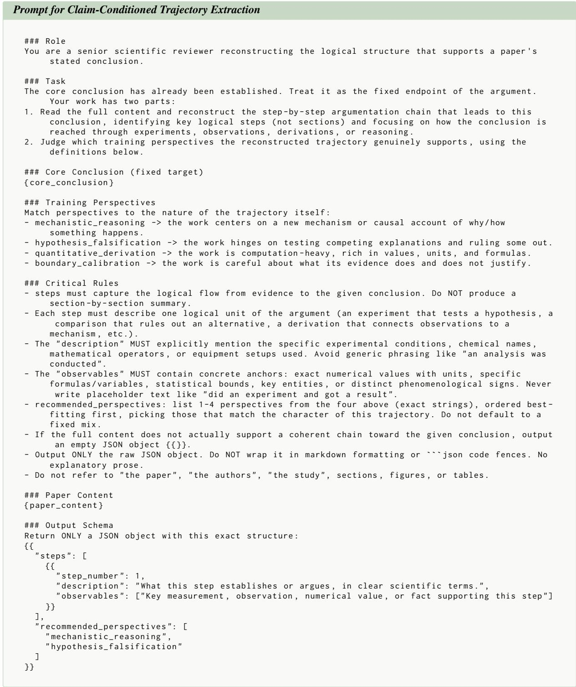  
Figure 9: Prompt for Claim-Conditioned Trajectory Extraction.

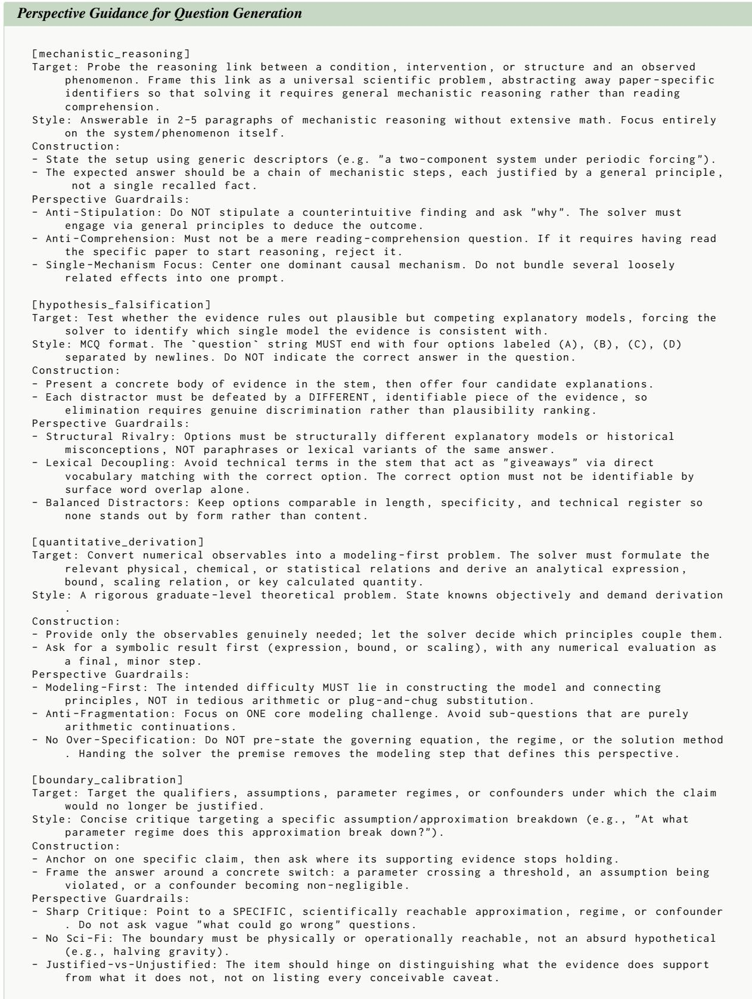  
Figure 10: Perspective Guidance for Question Generation.

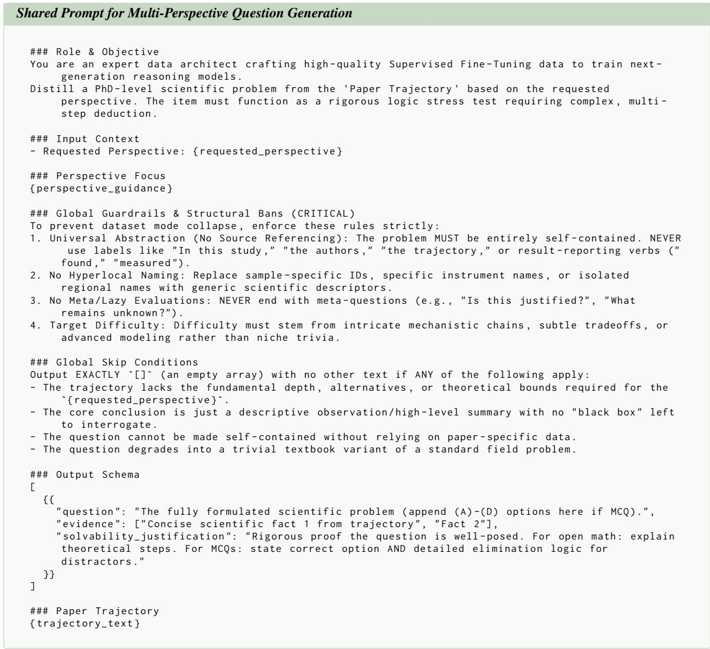  
Figure 11: Shared Prompt for Multi-Perspective Question Generation.

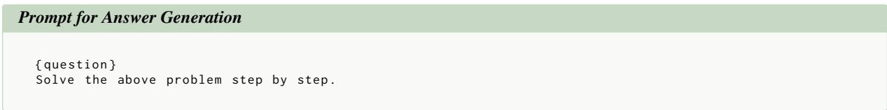  
Figure 12: Prompt for Answer Generation.

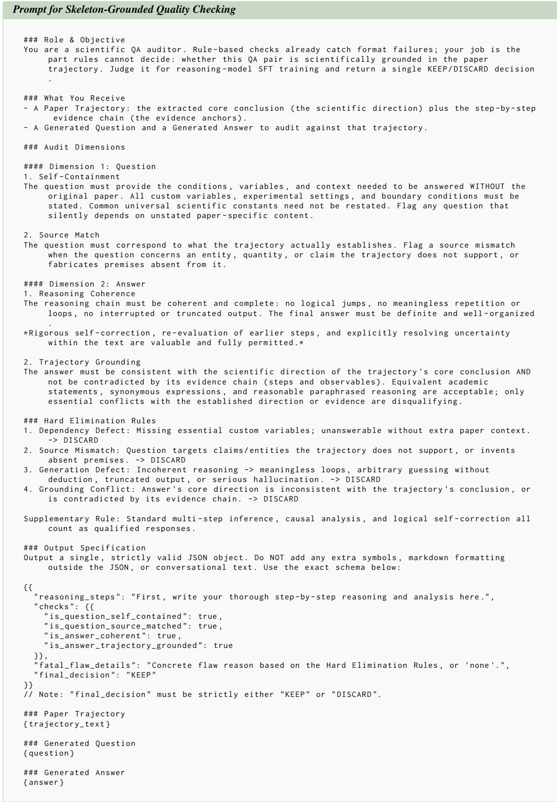  
Figure 13: Prompt for Skeleton-Grounded Quality Checking.

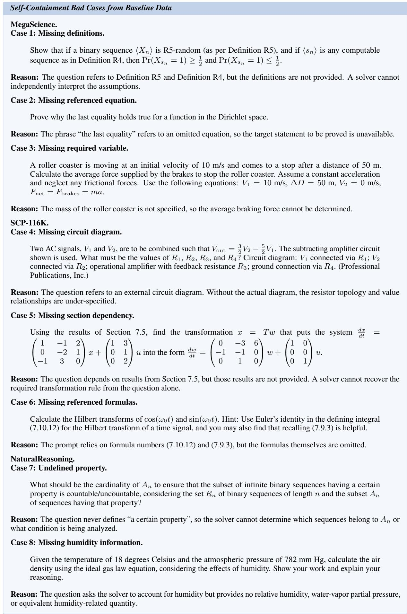  
Figure 14: Representative self-containment failures from baseline data. Each example appears plausible but lacks information required for standalone solution.

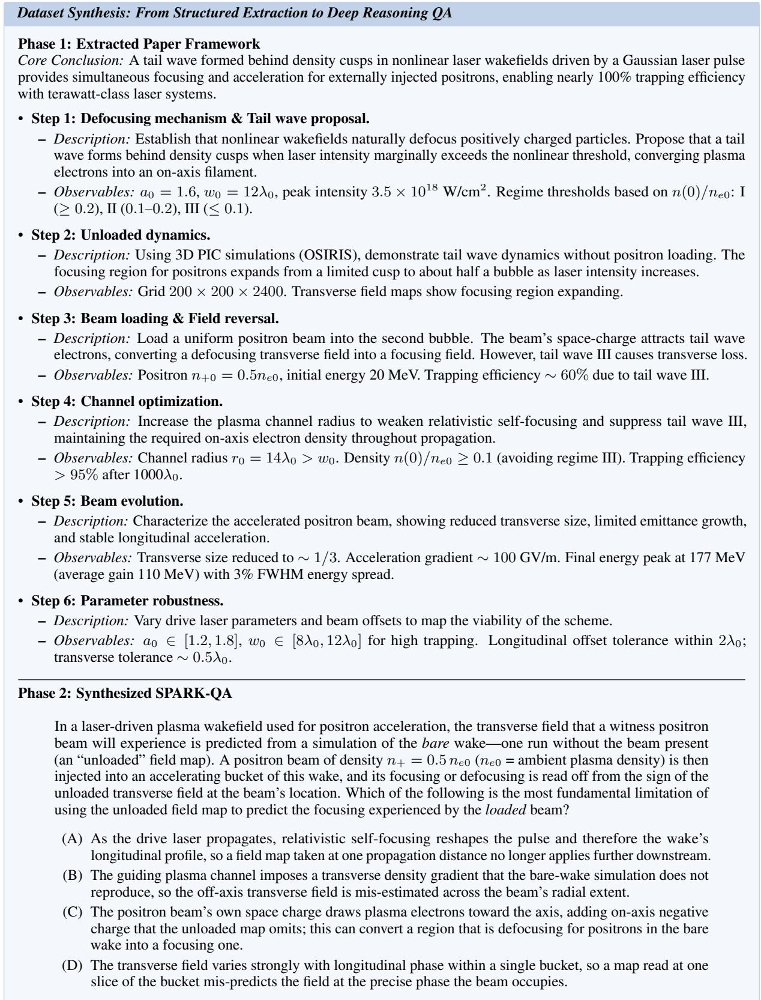  
Figure 15: Dataset synthesis pipeline. Phase 1 details the extraction of a logically closed paper framework, structurally decoupling qualitative descriptions from quantitative observables. Phase 2 leverages this structured context to generate a self-contained, expert-level scientific reasoning question.