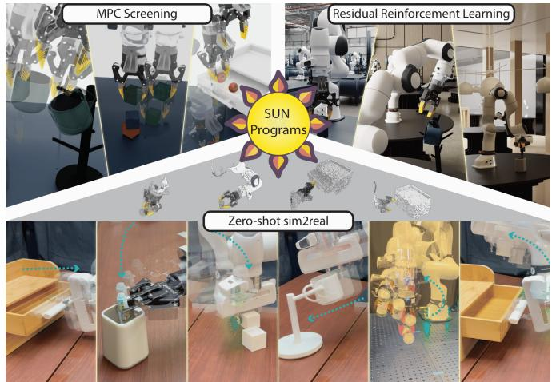
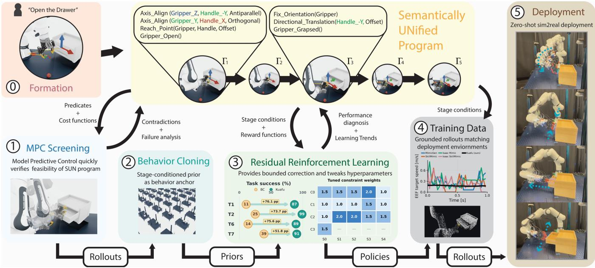
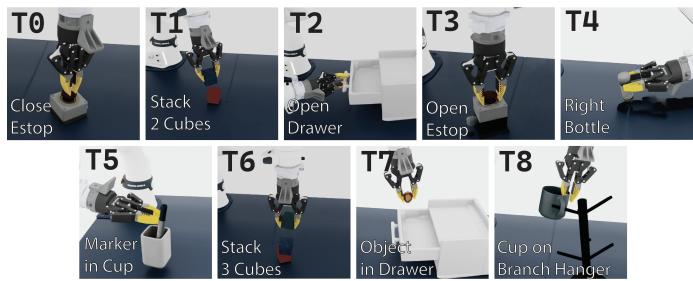

# SUN: Persistent Programs For Language-Grounded Control-to-Learning-to-Real Policies

Weiqi Wang1,∗, Zhi Li1,∗, Yudong Lei2, David Martinez1, Xiaofeng Gao3,‡, Yuxin Jiang1, Chenfanfu Jiang1, Yingnian Wu1,†, Demetri Terzopoulos1,†, Ran Gong4,†

1University of California, Los Angeles 2University of California, Santa Barbara 3Amazon 4Robotics and AI Institute

Abstract— Bridging model-based control and learned policies in long-horizon manipulation has harbored a silent disagreement: control executes specified objectives, learning amortizes that behavior into a reactive policy, yet existing protocols discard task semantics, leaving rewards hand-crafted and behavior drifting from what control verified. We introduce Semantically UNified (SUN) Programs, typed executables where geometric and contact relations are defined once and compiled into aligned Model Predictive Control (MPC) costs, satisfaction predicates, RL rewards, transition guards, and diagnostics. Our system, Kuafu, driven by large vision language systems, automatically synthesizes SUN Programs from language and scene semantics, screens feasibility via MPC, and retains semantics while training stage-conditioned policies. Across nine tasks, Kuafu achieves 82.03% macro-success, outperforming sparse-reward (35.67%) and Stage-BC (24.75%) baselines. At 8192-way scale, it generates 10.57× the successful trajectory time per hour of human teleoperation. With 500 trajectories per task, Kuafu data trains DP3 policies to 46.0% simulation success (vs. 22.4% for alternatives) and 34.7% on physical Franka and Kinova robots. These results establish that simulation-screened task semantics can effectively amortize control into robust policies, without demonstrations or manual dense rewards, unifying symbolic planning and data-driven execution.

Index Terms—Integrated Planning and Learning, Manipulation Planning, Optimization and Optimal Control, Imitation Learning, Datasets for Robot Learning

## I. INTRODUCTION

Reinforcement learning (RL) is an attractive method for multi-stage manipulation because it can learn highdimensional, contact-rich behaviors directly from interaction without requiring an accurate model of the underlying dynamics [1]. However, RL requires dense, structured rewards to expose intermediate progress, yet manually crafting these signals is laborious and brittle. Minor adjustments to reward terms or transition thresholds often yield drastically different behaviors, demanding extensive trial-and-error tuning. While recent methods automate reward generation [2], they suffer from a critical latency: the impact of a candidate reward can only be evaluated after full policy training and rollout. Consequently, each iterative revision incurs the full cost of a training cycle, rendering the search over reward structures inefficient.

Model-based planning and control explicitly encode task structures, defining geometric objectives and transition logic to enable testing and revision under closed-loop dynamics [3, 4]. However, this approach is highly sensitive to model fidelity; successful execution relies on accurate state reconstruction, precise interaction models, and strict adherence to task definitions. In practice, even minor discrepancies, such as model mismatch, observation noise, or specification errors, can cause controller failure. Furthermore, constructing these robust formulations demands substantial manual engineering for every new task [5].

  
Fig. 1. Kuafu preserves the SUN Program across language grounding, MPC feasibility screening, policy learning, and monitored data generation. Downstream visual-policy training and zero-shot deployment rely exclusively on the generated observations and actions, unaware of the original program.

These complementary properties have motivated efforts to bridge model-based control and learning. Most prominently, model-based controllers are used to generate successful trajectories for policy training [5, 6]. While this transfers physically grounded behavior, it discards the objectives, constraints, stage transitions, or satisfaction boundaries that defined why those actions were correct. Although recent methods expose richer task structure to control and learning [7, 8], the representations are often recast as distinct learning signals, forcing stage or completion logic to be reimplemented. As a result, the rewards guiding the policy may drift from the specification validated by control, allowing inconsistencies to surface only after deployment.

We argue that a persistent task program that survives closed-loop screening in simulated physics can significantly enhance multi-stage robot learning. To this end, we introduce the Semantically UNified (SUN) Program, a languagegrounded, typed executable artifact. Given a language instruction, an LLM agent constructs each SUN Program from system-provided scene frames and typed operators, binding their arguments and organizing the geometric relations into ordered stages. Each declared relation is coupled with a satisfaction boundary, and compiled into transition guards, diagnostic view, and aligned objectives for both Model Predictive Control (MPC) and Residual RL. Its end-to-end implementation, Kuafu 1 (Figure 1), retains the accepted artifact alongside a stage-conditioned whole-task policy.

  
Fig. 2. Kuafu grounds language instruction into a typed SUN Program over scene frames, screens feasibility with simulated physics via MPC, and retains it across policy learning and data production. Validated MPC rollouts and program annotations supervise behavioral cloning, while the retained program provides transitions, residual rewards, calibration, and diagnostics to the controller, which then generates sensor-action data for visual policies.

Optimization thus serves not merely as a trajectory generator, but as an efficient screener of task knowledge, rejecting faulty objectives and transitions before they incur repeated policy-training cycles. Kuafu then uses the screened SUN supervision to learn contact-rich execution through Residual RL, retaining control’s ability to validate task structure while replacing model-dependent online optimization with a deployable policy.

Across nine manipulation tasks, we demonstrate that the value of the persistent program scales with task horizon and cannot be reduced to mere behavior transfer. Compared with reward-learning and online-planning baselines, Kuafu achieves higher success rates with fewer language-model interactions and at a fraction of the computational cost. Furthermore, the persistent program guides the efficient collection of simulation data for sim-to-real learning, yielding significantly higher downstream policy success than comparable data-generation methods. Finally, we validate these results through sim-to-real transfer on physical Franka and Kinova robots, confirming the robustness of our approach in real-world settings.

Our contributions are threefold:

• We introduce Semantically UNified (SUN) Programs, a typed executable artifact that preserves task semantics across control, learning, and deployment, eliminating the semantic drift common in current handoffs.

• We present Kuafu, a system that synthesizes SUN Programs from natural language, screens them via MPC, and trains stage-conditioned policies without manual reward engineering or seed demonstrations.

• We demonstrate that Kuafu achieves higher success rates with fewer language-model interactions and at a fraction of the computational cost of competing methods, while enabling robust zero-shot sim-to-real transfer on physical robots.

## II. RELATED WORK

Executable Task Representations. Long-horizon manipulation requires representations connecting discrete task progression with continuous motion. Symbolic planning and program generation couple action sequences to geometric feasibility or scene grounding [3, 9]. Language-grounded optimization converts task descriptions into composable 3D value maps or reward parameters evaluated by MPC, exposing spatial objectives to closed-loop control [10, 11]. Formal approaches encode temporal progress as finite-state rewards or signal-temporal-logic constraints for learning and predictive control [12, 13]. While these representations constrain search and operationalize task progress, they generally remain confined to a single planning, control, or learning stage, breaking semantic continuity across the pipeline. Consequently, a state accepted by one component may still produce infeasible refinements, premature handoffs, or misleading learning signals that compound over long horizon execution.

Control-to-Policy Transfer. Task structure enters policy learning through generated objectives or controller-derived supervision. Language models reduce manual design by generating executable rewards and, for sim-to-real transfer, domain-randomization configurations [2, 14, 15]. Since it erated objectives can overfit observed behavior or encode invalid task specifications, a high return therefor may not translate into strong performance on the true task metric [16]. Complementarily, optimized trajectories provide supervised policy targets, while residual learning preserves nominal control and learns corrective actions [17, 18]. Iterative rewards generation are flexible, but each revision costs a full reinforcement-learning trial and another round of language model query. We instead restrict language models to executable geometric relations that control method can screen under close loop physics, rejecting invalid specifications at a fraction of the interaction cost.

Autonomous Robot Data Generation. Data generators scale robot experience by retargeting object-relative demonstration segments across scene configurations and decomposing behavior into reusable skills connected by planned motions [19, 20]. These convert sparse demonstrations into diverse imitation data, yet task semantics remain bound to the originals, lacking an independent, grounded monitor to validate learned-policy rollouts.

The closest precedents span three complementary interfaces. ReKep [8] expresses multi-stage tasks as sequences of grounded keypoint cost functions optimized in closed loop, while OmniManip [21] maps object-centric interaction primitives to 3D spatial constraints with high-level VLM checking and low-level pose tracking. LATO [6] adapts an MPC teacher to the state distribution induced by the learner, whereas MPC-Net [5] trains a policy with a Hamiltonian loss encoding the original control objective and constraints. RoboGen [22] and GenSim2 [23] automate simulation task and scene construction together with skill or demonstration generation through foundation models, optimization, planning, and RL. Kuafu unifies these interfaces by enforcing a persistent, MPC-screened representation where each relation’s identity, grounding, and satisfaction boundary remain fixed from controller validation through policy acquisition, learned execution, and monitored data production.

## III. METHODS

We consider a long-horizon manipulation task described by a user-provided natural-language instruction I. Kuafu uses an LLM to construct a SUN Program Γ from registered scene frames $\mathcal { F }$ and the typed operator library $\mathcal { L } .$ After closed-loop screening in simulated physics, the accepted program provides compiled supervision for learning a stageconditioned whole-task controller π. At time $t ,$ π maps the current observation $o _ { t }$ and active stage $z _ { t }$ to a robot action $u _ { t } ,$ such that $u _ { t } = \pi ( o _ { t } , z _ { t } )$ . Closed-loop execution of $\pi$ completes the task stages and generates sensor–action trajectories for downstream visual-policy learning. We assume access to registered scene semantics ${ \mathcal F } ,$ containing the identities and spatial and geometric information of the objects, and a typed operator library $\mathcal { L }$ that defines reusable relations over this information. Kuafu obtains π by constructing a SUN

Program Γ from $( \mathcal { T } , \mathcal { F } , \mathcal { L } )$ , screening its execution through MPC, and using the successful rollouts to train the Stage-BC policy $\pi _ { \theta }$ . The retained program then supplies stage context and program-derived learning signals to train the residual policy $\pi _ { \psi } ;$ the bounded composition of $\pi _ { \theta }$ and $\pi _ { \psi }$ defines the whole-task policy π. We define a lineage as the coherent chain linking an accepted SUN Program, its MPC-generated trajectories, the Stage-BC prior, the bounded residual controller, and the final evaluated policy. Figure 2 outlines the life cycle of a SUN Program within Kuafu.

## A. Semantically UNified (SUN) Programs

Central to Kuafu is the SUN Program Γ, a typed, executable representation of the task specified by I. Kuafu uses an LLM agent to construct Γ by selecting operators from the system-provided library ${ \mathcal { L } } ,$ binding them to registered frames in ${ \mathcal F } ,$ , and organizing the grounded relations into stages according to $\mathcal { T } .$ . The LLM therefore composes existing typed components rather than inventing new frames, relations, or implementations. Each relation is defined once and compiled into aligned interfaces for MPC, stage monitoring, and reinforcement learning. The resulting program is retained across screening, policy learning, and data generation.

Consider the instruction “open the drawer.” The scene registry $\mathcal { F }$ provides the location of the drawer’s base, handle and individual drawer, as well as the orientation and operation direction in terms of axis (handle bar along xaxis, +y for pushing in). $\mathcal { L }$ provides typed relations such as ”align axis”, ”direction move”, ”fix orientations”. We use the drawer-opening portion of this task as a running example below.

Semantic formation via LLM. For long-horizon tasks, we define the augmented state as $\tilde { { x } } _ { t } = ( x _ { t } , z _ { t } , \xi _ { z _ { t } } )$ , where $z _ { t }$ is the active stage and $\xi _ { k }$ records physical snapshots (e.g., frame poses, gripper state) captured upon entry to stage k. The robot state, observation, and action are denoted by $x _ { t }$ $o _ { t } .$ , and $u _ { t } ,$ respectively. Each operator schema in the library $\mathcal { L }$ declares typed arguments, a canonical residual function, units, stage-entry snapshot behavior, a satisfaction tolerance, and a default reward weight. Kuafu forms the SUN Program by selecting schemas from $\mathcal { L }$ and binding their arguments to registered frames in $\mathcal { F }$ and task-specific scalar parameters:

$$
\Gamma = \{ \Gamma _ { k } \} _ { k = 1 } ^ { K } , \qquad \Gamma _ { k } = \{ ( e _ { k , j } ( x , \xi _ { k } ) , \epsilon _ { k , j } , w _ { k , j } ) \} _ { j = 1 } ^ { m _ { k } } .\tag{1}
$$

Here, K is the number of stages and $m _ { k }$ is the number of grounded relations in stage k. Each term contains a grounded physical relation represented by $e _ { k , j }$ , its satisfaction tolerance $\epsilon _ { k , j }$ , and its relative learning weight $w _ { k , j }$

For each stage, the compiler maps every grounded relation to three executable interfaces:

$$
\begin{array} { r } { \mathrm { C o m p i l e } ( \Gamma _ { k } ) = \left\{ \left( \phi _ { k , j } ^ { \mathrm { m p c } } , P _ { k , j } , c _ { k , j } ^ { \mathrm { r l } } \right) \right\} _ { j = 1 } ^ { m _ { k } } . } \end{array}\tag{2}
$$

The MPC term $\phi _ { k , j } ^ { \operatorname* { m p c } }$ contributes to the stage objective, the predicate $P _ { k , j }$ is evaluated by the stage monitor, and the learning term $c _ { k , j } ^ { \mathrm { r l } }$ contributes to the reinforcement-learning signal. Their exact numerical forms are operator-specific, but all three retain the same relation identity, grounding, and stage membership.

For example, to pull the drawer open, the relation ”directional move” can measure the drawer displacement relative to the pose stored in $\xi _ { k }$ when the stage begins. Its compiled MPC term penalizes the remaining displacement, $P _ { k , j }$ tests the same residual against $\epsilon _ { k , j }$ , and $c _ { k , j } ^ { \mathrm { r l } }$ supplies the corresponding learning cost. An additional ”fix orientation” will measure the tool’s angular displacement relative to the snapshot, keeping the grip’s direction steady.

This typing reduces synthesis complexity to verified operator selection and typed argument binding. We refer to this correspondence across control, monitoring, and learning as Semantic Unification.

Stage progression. At runtime, Γ also defines the stage monitor. Each $\Gamma _ { k }$ contains the relations evaluated during stage $k ,$ and all of their predicates participate in stage completion. After applying $u _ { t }$ , the monitor evaluates the post-action augmented state $\hat { x } _ { t + 1 } = ( x _ { t + 1 } , z _ { t } , \xi _ { z _ { t } } )$ before updating the active stage. We use $D _ { k }$ to denote that every predicate $P _ { k , j }$ in stage k is satisfied. The program advances from $z _ { t } \ \mathrm { t o } \ z _ { t } + 1$ when $D _ { z _ { t } }$ is true; otherwise the current stage remains active. When a new stage begins, its entryscoped snapshot is recorded and its best-progress score is reset. Upon entering a new stage, the program initializes the entry-scoped fields in $\xi _ { z _ { t + 1 } }$ from $x _ { t + 1 }$ . Stage transitions are irreversible, and final-stage completion terminates the rollout. This same stage structure persists through control and learning, $z _ { t }$ conditions the Stage-BC and residual controllers, while the stored snapshot $\xi _ { z _ { t } }$ preserve the references required by stage-relative relations.

For drawer opening, the monitor remains in the draweropening stage until all associated predicates, such as ”direction move” and ”fix orientation”, are satisfied. Transitioning to the subsequent stage records a new entry snapshot, including the handle and the grippers position and orientation.

## B. Program Validation and Acceptance

Independent task success. Because the same stage monitor is retained during learning and data generation, its completion logic must be checked against an independent criterion. For each task, we introduce an external evaluator $g _ { \mathrm { e x t } } .$ manually authored independently of SUN Program formation and frozen prior to synthesis. Crucially, gext is never exposed to the LLM, VLM, SUN Program, or the learned policy. Its binary outcome provides the sparse terminal signal used for residual learning, acceptance, calibration, and final evaluation. In parallel, the SUN Program independently declares completion through its internal predicate $D _ { K }$ . A false completion occurs when the SUN monitor declares the final stage complete while $g _ { \mathrm { e x t } }$ reports that the required physical outcome has not been achieved. This separation supplies the independent acceptance criterion used during rollouts.

For the same drawer opening task, The independent evaluator $g _ { \mathrm { e x t } }$ only declares success when the drawer joint reaches 12 cm displacement. If SUN monitor declares its final geometric predicates satisfied without $g _ { \mathrm { e x t } }$ , the rollout will be treated as a false completion.

MPC screening. Following initial formulation, task-space nonlinear MPC is the first controller to consume the compiled interfaces of Γ, and screens each SUN Program in closedloop simulation (Step 1 in Figure 2). For stage k, the compiled MPC terms form the stage cost $\begin{array} { r } { \ell _ { k } ( \tilde { x } ) = \sum _ { j = 1 } ^ { m _ { k } } \phi _ { k , j } ^ { \mathrm { m p c } } ( \tilde { x } ) } \end{array}$ At state $x _ { t }$ , we solve via direct multiple shooting

$$
\begin{array} { r l r } {  { \operatorname* { m i n } _ { \substack { x _ { 1 : H } , u _ { 0 : H - 1 } } } \sum _ { h = 0 } ^ { H - 1 } \ell _ { z _ { t } } ( \tilde { x } _ { h } ) } } \\ & { \mathrm { s . t . } \quad x _ { 0 } = x _ { t } , } & { x _ { h + 1 } = f ( x _ { h } , u _ { h } ) . } \end{array}\tag{3}
$$

Here, H is the planning horizon, f is the prediction model. Within the prediction horizon, $\tilde { x } _ { h } ~ = ~ ( x _ { h } , z _ { t } , \xi _ { z _ { t } } )$ , so the active stage and its entry snapshot remain fixed while the problem is solved. Only the first optimized action is executed before re-observation and replanning. After observing the resulting state, Kuafu evaluates the current-stage predicates and $g _ { \mathrm { e x t } }$ before updating the stage index; in the final stage, the predicates determine $D _ { K }$ . The MPC problem is then resolved from the updated runtime state.

Acceptance and repair. Each candidate SUN Program is screened under 10 task-sampled initial conditions in closedloop simulation. The program is accepted when at least one rollout achieves the required physical outcome and no rollout produces a false completion. Failures may trigger up to five whole-program repair attempts based on unsatisfied terms and their measured violations. After acceptance, Kuafu fixes the grounded relations, satisfaction tolerances, predicates, term definitions, and stage order of Γ. The accepted program and its successful MPC trajectories form the handoff to policy learning: the trajectories supervise the Stage-BC policy $\pi _ { \theta } .$ , while Γ is retained as the task-semantic core.

## C. SUN-Guided Policy Amortization

The accepted SUN Program and successful MPC trajectories provide complementary supervision for policy learning. Stage-conditioned behavioral cloning. For each task, we collect 1,000 physically successful MPC trajectories and use them to train a deterministic Stage-BC policy $\pi _ { \theta }$ (Step 2 of Figure 2). The policy maps the current observation and active stage to a 10-step action chunk, and we optimize it using normalized mean-squared error. During learned execution, a reactive policy $\pi _ { \theta }$ replaces the MPC optimization loop at each control step, thereby amortizing the planning computation [24]. The observation $o _ { t }$ contains the end-effector, gripper, and object/frame poses. Additionally, the policy is conditioned on the active stage $z _ { t }$ . The policy predicts 10- step chunks of absolute actions. Training chunks are strictly stage-bound: padding repeats the final action, and only the first predicted action is executed by the residual controller before re-evaluation. Consequently, in the drawer opening example, while securing the grip on the drawer handle, stage-BC chunks cannot cross into the drawer opening manipulation.

We use $\pi _ { \theta } ^ { ( 1 ) } ( o _ { t } , z _ { t } )$ to denote the first action in the predicted chunk. Only this action enters the combined policy before the SUN monitor reevaluates the active stage. The retained SUN Program continues to supply $z _ { t }$ and carries the task semantics into residual learning.

Bounded residual reinforcement learning. We freeze π and use it as the behavior anchor for Step 3, training a bounded additive residual policy $\pi _ { \psi }$ via PPO with generalized advantage estimation. Following RRL [18], the combined whole-task policy is

$$
\begin{array} { r l r } & { } & { \pi ( o _ { t } , z _ { t } ) = \mathrm { c l i p } \Bigl ( \pi _ { \theta } ^ { ( 1 ) } ( o _ { t } , z _ { t } ) + \alpha _ { \rho } \pi _ { \psi } ( o _ { t } , z _ { t } ) , u _ { \mathrm { m i n } } , u _ { \mathrm { m a x } } \Bigr ) , } \\ & { } & { u _ { t } = \pi ( o _ { t } , z _ { t } ) , \qquad \left\| \pi _ { \psi } ( o _ { t } , z _ { t } ) \right\| _ { \infty } \le \rho _ { \mathrm { m a x } } . \qquad } \end{array}\tag{4}
$$

Here, θ and $\psi$ are the parameters of the Stage-BC and residual policies, respectively. The scalar $\alpha _ { \rho }$ controls the residual contribution, $\rho _ { \mathrm { m a x } }$ bounds it coordinate-wise, and $u _ { \mathrm { m i n } }$ and $u _ { \mathrm { m a x } }$ are the final environment action limits.

Program-derived residual reward. For stage k, the same learning costs and weights attached to the terms in $\Gamma _ { k }$ define the normalized stage score

$$
S _ { k } ( \tilde { x } ) = 1 - \frac { \sum _ { j = 1 } ^ { m _ { k } } w _ { k , j } c _ { k , j } ^ { \mathrm { r l } } ( \tilde { x } ) } { \sum _ { j = 1 } ^ { m _ { k } } w _ { k , j } } ,\tag{5}
$$

where $\begin{array} { r } { w _ { k , j } \geq 0 , \sum _ { j = 1 } ^ { m _ { k } } w _ { k , j } > 0 . } \end{array}$ , and a larger score indicates greater progress within the stage. Kuafu rewards monotonic progress:

$$
\begin{array} { r } { r _ { t } = \lambda _ { \mathrm { p r o g } } \left[ S _ { z _ { t } } ( \hat { x } _ { t + 1 } ) - S _ { z _ { t } , t - 1 } ^ { \mathrm { b e s t } } \right] _ { + } + \lambda _ { \mathrm { s t a g e } } \mathbb { I } \left[ z _ { t + 1 } > z _ { t } \right] } \\ { + \lambda _ { \mathrm { t r u e } } \mathbb { 1 } \left[ { \sf T S } _ { t } \right] - \lambda _ { \mathrm { f a l s e } } \mathbb { 1 } \left[ { \sf F C } _ { t } \right] - \lambda _ { \mathrm { a c t } } \mathbb { I } \left[ \| u _ { t } \| _ { 2 } ^ { 2 } . \right. } \end{array}\tag{6}
$$

The coefficients $\lambda _ { \mathrm { p r o g } } , \lambda _ { \mathrm { s t a g e } } , \lambda _ { \mathrm { t r u e } } , \lambda _ { \mathrm { f a l s e } } ,$ and $\lambda _ { \mathrm { { a c t } } }$ weight the corresponding reward terms. $S ^ { \mathrm { b e s t } }$ initializes at zero at episode/stage entry, updates as $S _ { k , t } ^ { \mathrm { b e s t } } ~ =$ max $( S _ { k , t - 1 } ^ { \mathrm { b e s t } } , S _ { k } ( \hat { x } _ { t + 1 } ) )$ , and resets after a stage transition. $\mathrm { T S } _ { t } ^ { \prime }$ and $\mathrm { F C } _ { t }$ denote the physical success and falsecompletion events, respectively. An episode terminates at the first such event or at timeout. The remaining terms provide program-derived supervision while the frozen prior and residual bound constrain adaptation.

Learning parameters calibration. Inspired by iterative reward refinement [2, 15], Kuafu actively monitors learning trends and constraint satisfaction via SUN Program performance during Step 3 (Figure 2). A liberal residual policy may perform well on short tasks but risks deviation on prolonged tasks demanding precision. These statistics are exposed to an LLM through a constrained schema. We introduce an LLM agent to tune the relative reward weights declared in the accepted program, the residual strength $\alpha _ { \rho } ,$ and the residual bound $\rho _ { \mathrm { m a x } }$ . Crucially, predicate tolerances, logic, grounded relations, stage order, and term definitions remain fixed at their MPC-accepted values. These updates calibrate the learning signal and the permitted deviation from the Stage-BC policy while preserving the task semantics validated by MPC. For example, while pulling the drawer opening, calibration may realize the ”fix orientation” term is easier to reach, and lower its weight relative to ”direction move”.

  
Fig. 3. Nine-task evaluation suite in Isaac Lab.

## D. Data Production

The same semantically fixed program remains active after residual learning. In Step 4, Kuafu supplies $z _ { t }$ to the state-based BC and residual controllers, providing stage progression, completion monitoring, and false-completion detection during data generation. For the downstream visualpolicy study, trajectories are retained using the common physical-success criterion $g _ { \mathrm { e x t } } ,$ ensuring consistent outcome evaluation across all data generators. At the final handoff, the retained trajectories supervise a visual policy using only their recorded observations and actions. The visual policy receives neither $z _ { t }$ nor any other output from the SUN monitor during training or deployment. Thus, the accepted SUN Program preserves the correspondence among control, monitoring, and learning throughout data production, while the resulting visual policy executes without the program or privileged state information.

## IV. EXPERIMENTS

We address four central questions in our experiments: (1) Formulation Reliability: How reliably can SUN Programs be synthesized from language and scene semantics? (2) Performance Elevation: Does the persistent support of SUN Programs significantly elevate task success compared to non-persistent baselines? (3) Data Efficiency: Can Kuafu outperform existing data-generation methods in terms of trajectory quality and sample efficiency? (4) Sim-to-Real Transfer: Does the dataset produced by Kuafu enable visual policies and robust zero-shot transfer to physical robots?

As shown in Figure 3, we designed nine multi-stage tasks to evaluate physical capabilities that recur throughout everyday manipulation. The suite spans constrained translational and rotational motion—including pushing, pulling, twisting, and reorienting—together with precise picking and placing, orientation-sensitive grasping, and high-precision manipulation. These capabilities are instantiated through: E-stop interactions (T0: push, T3: twist), stacking (T1: two cubes, T6: three cubes), drawer manipulation (T2: pull open, T7: open and place object), object reorientation (T4: right a bottle), insertion (T5: marker into cup), and dexterous hanging (T8: hang cup by handle). The tasks isolate different forms of compositional scalability for objects and interactions. T0/T3 vary the complexity of contact-constrained motion on the same mechanism. T6 extends T1 by repeating its precision pick-and-place and alignment sequence. T7 combines T2’s constrained drawer motion with the pick-and-place skill exercised in T1.T 4/T5 both require object reorientation, but T5 adds an inter-object geometric constraint by aligning the reoriented marker with the cup opening. Lastly, T5 and T8 compare high-precision manipulation across distinct object morphologies and contact geometries.

TABLE I  
FORMATION, VALIDATION, AND LANGUAGE INTERACTION COST
<table><tr><td>Metric / method</td><td>T0</td><td>T1</td><td>T2</td><td>T3</td><td>T4</td><td>T5</td><td>T6</td><td>T7</td><td>T8</td><td>Mean</td></tr><tr><td colspan="9">A. SUN Program formation and refinement: canonical accepted programs and their formation cost</td></tr><tr><td>Stages K</td><td>3</td><td>8</td><td>6</td><td>6</td><td>7</td><td>9</td><td>15</td><td>14</td><td>10</td><td>8.67</td></tr><tr><td>Constraints</td><td>12</td><td>25</td><td>19</td><td>19</td><td>27</td><td>31</td><td>53</td><td>44</td><td>31</td><td>29.00</td></tr><tr><td>Formation iterations</td><td>1</td><td>1</td><td>1</td><td>1</td><td>2</td><td>2</td><td>2</td><td>1</td><td>1</td><td>1.33</td></tr><tr><td>Refinement iterations LLM calls/task</td><td>0</td><td>0</td><td>0</td><td>0</td><td>1</td><td>1</td><td>0</td><td>0</td><td></td><td>0.44</td></tr><tr><td></td><td>11.2</td><td>19.8</td><td>15.2</td><td>16.2</td><td>24.6</td><td>29.2</td><td>37.0</td><td>32.8</td><td>28.8</td><td>23.87</td></tr><tr><td colspan="9">B. Five repeated formation-and-MPC-validation runs per task</td><td></td></tr><tr><td>Success w/o recovery</td><td>5/5</td><td>5/5</td><td>5/5</td><td>4/5</td><td>0/5</td><td>1/5</td><td>5/5</td><td>2/5</td><td>2/5</td><td>29/45</td></tr><tr><td>Recovery entry</td><td>0/5</td><td>0/5</td><td>0/5</td><td>1/5</td><td>5/5</td><td>4/5</td><td>0/5</td><td>3/5</td><td>3/5</td><td>16/45</td></tr><tr><td>Final success</td><td>5/5</td><td>5/5</td><td>5/5</td><td>5/5</td><td>5/5</td><td>5/5</td><td>5/5</td><td>3/5</td><td>5/5</td><td>43/45</td></tr><tr><td>Recovery cycles</td><td>0</td><td>0</td><td>0</td><td>2</td><td>5</td><td>9</td><td>0</td><td>11</td><td>3</td><td>30</td></tr><tr><td colspan="9">C. Comparator LLM interaction cost (Kuafu/Eureka: one-time per task; VoxPoser: per rollout)</td><td></td><td></td></tr><tr><td>Kuafu tokens/task (k)</td><td>37.6</td><td>84.0</td><td>57.1</td><td>62.6</td><td>110.1</td><td>144.1</td><td>183.7</td><td>152.5</td><td>163.1</td><td>110.50</td></tr><tr><td>Eureka tokens/task (k)</td><td>224.3</td><td>246.2</td><td>241.1</td><td>227.2</td><td>208.7</td><td>243.0</td><td>208.9</td><td>248.8</td><td>261.0</td><td>234.40</td></tr><tr><td>VoxPoser calls/run</td><td>12.9</td><td>13.9</td><td>13.0</td><td>13.0</td><td>16.1</td><td>21.8</td><td>18.8</td><td>19.9</td><td>23.5</td><td>16.99</td></tr><tr><td>VoxPoser tokens/run (k)</td><td>25.1</td><td>24.6</td><td>24.9</td><td>23.6</td><td>27.2</td><td>38.0</td><td>31.4</td><td>39.7</td><td>49.8</td><td>31.60</td></tr></table>

We report overall performance as task-macro externaloutcome success: the unweighted mean of the $g _ { \mathrm { e x t } }$ success rate across all tasks, ensuring each task contributes equally regardless of rollout count. All LLM calls (Kuafu, Eureka, VoxPoser) use GPT-5.5, and simulations run in Isaac Lab 5.1. State-controller evaluations use 8192 parallel environments with rollouts capped at 180 seconds. All methods share the same task-specific initial-condition sampler.

## A. Formulation Reliability

Rows A and B of Table I characterize accepted programs and the formation-validation outcomes. Programs span 3–15 stages and 12–53 constraints, with each canonical program obtained within one or two formation rounds. A formation round regenerates the program, whereas recovery repairs individual terms flagged by failed MPC screening. Of 45 independent runs, 29 pass initially; diagnostic repair accepted 14 of the remaining 16, raising the yield from 64.4% to 95.6%. Recovery was most critical for T4 and T5, improving acceptance from 1/10 to 10/10. T7 was the only task with unrecovered runs (3/5), accounting for 11 of the 30 total recovery cycles. Since the larger 15-stage T6 program succeeded in all five runs without recovery, raw program size alone does not explain formation difficulty. Instead, the T7 result suggests that combining heterogeneous manipulation phases poses a greater challenge. Within the tested scope, these results establish diagnostic-guided repair as an effective mechanism for recovering initially invalid programs.

Rows C report the language interaction. Kuafu uses 110.5k tokens per task, compared with 234.4k for Eureka’s onetime reward search. VoxPoser instead uses 16.99 calls and 31.6k tokens per rollout. At the reported mean rates, its cumulative interaction exceeds Kuafu’s after just two executions (calls) and four rollouts (tokens). Thus, forming a persistent program converts language interaction from a recurring execution cost into a task-level cost.

## B. Performance and Ablation Analysis

Table II reports structural handoff controls that remove program-derived progress supervision, the behavioral prior, or the residual constraint. For scalar refinement, Kuafu permits at most 5 residual-RL iterations per task. An iteration is deemed collapsed if its final success falls below 50% of its peak. Refinement halts at the first non-collapsed configuration or upon exhausting the 5-iteration budget, freezing the controller for evaluation. The closest matched ablation isolates program-derived supervision. Starting from the same Stage-BC prior and bounded residual learner, the sparse-reward variant achieves 35.67% task-macro success, versus 82.03% for Kuafu’s $L _ { 4 2 }$ mean, a 46.36-point gain. Separately, the 3-run robustness aggregate reaches 79.43% success. Because the accepted program, MPC mentor set, and residual training vary jointly across these runs, this result confirms the complete pipeline’s effectiveness beyond a single lineage. False-completion rates remain low posthandoff, at 0.60% across the three lineages.

The remaining partial handoffs establish complementarity. Stage-BC alone achieves 24.75%. With the SUN Program reward, residual architecture, and action bound held fixed, removing the accepted Stage-BC prior drops performance to 0% (Pure RL, SUN Program reward). Applying residual RL to a stage-free BC reaches only 18.56%. Similarly, adding a behavioral prior raises TD-MPC2 from 12.63% to 31.95%, though success remains concentrated on T0, T2, and T3. Removing or broadening the residual bound collapses all tasks to 0% success; we have omitted the resulting all-zero row from Table II. Neither accepted behavior nor program supervision alone reproduces the complete handoff.

Conversely, baselines that rely on iterative reward search or online planning without persistent task semantics struggle to achieve robust, multi-stage success. Eureka exhibits nonmonotonic instability: its best candidate within 5 search rounds reaches 18.24% success, but the final policy degrades to 12.85% (e.g., Task T0 drops from 45.14% to 0.21%), indicating reward overfitting. VoxPoser achieves only 10.00% success, failing completely on five tasks. These results confirm that Kuafu’s gains stem not from increased

TABLE II  
CONTROL-TO-LEARNING HANDOFF AND BASELINES
<table><tr><td>Variant / method</td><td>T0</td><td>T1</td><td>T2</td><td>T3</td><td>T4</td><td>T5</td><td>T6</td><td>T7</td><td>T8</td><td>Mean</td></tr><tr><td colspan="9">A. Accepted-program transfer success (%): MPC, Stage-BC, and bounded residual learning (with/without program supervision)</td><td></td></tr><tr><td>MPC</td><td>100.00</td><td>96.15</td><td>100.00</td><td>89.29</td><td>62.50</td><td>58.14</td><td>94.34</td><td>70.92</td><td>82.50</td><td>83.76</td></tr><tr><td>Stage-BC</td><td>36.01</td><td>10.79</td><td>25.11</td><td>29.80</td><td>22.47</td><td>31.82</td><td>13.81</td><td>38.80</td><td>14.16</td><td>24.75</td></tr><tr><td>Bounded RRL + Sparse Rewards</td><td>58.67</td><td>87.20</td><td>49.56</td><td>58.67</td><td>58.96</td><td>0.00</td><td>0.00</td><td>7.95</td><td>0.00</td><td>35.67</td></tr><tr><td>Kuafu  $( L _ { 4 2 } )$  Kuafu</td><td>98.48</td><td>95.78</td><td>98.01</td><td>84.62</td><td>58.80</td><td>69.70</td><td>87.25</td><td>95.21</td><td>50.43</td><td>82.03</td></tr><tr><td> $( L _ { 4 2 } , L _ { 4 3 } , L _ { 4 4 } )$ </td><td>98.37±0.81</td><td>94.75±0.62</td><td>97.58±1.04</td><td>82.09±0.65</td><td>56.24±1.81</td><td>62.04±5.34</td><td>84.72±1.32</td><td> $9 4 . 0 6 \pm 1 . 0 6 $ </td><td> $4 4 . 9 9 \pm 1 . 8 4 $ </td><td>79.43</td></tr><tr><td colspan="9">B. False completion rates (%) for Kuafu final controllers</td><td></td></tr><tr><td>Kuafu (L42)</td><td>0.37</td><td>0.00</td><td>0.05</td><td>3.26</td><td>0.45</td><td>0.00</td><td>0.00</td><td>0.00</td><td>1.05</td><td>0.58</td></tr><tr><td>Kuafu  $( L _ { 4 2 } , L _ { 4 3 } , L _ { 4 4 } )$ </td><td> $0 . 5 9 { \pm } 0 . 5 7$ </td><td>0.01±0.00</td><td>0.03±0.02</td><td> $3 . 2 1 \pm 0 . 2 7$ </td><td>0.48±0.07</td><td> $0 . 0 0 { \scriptstyle \pm 0 . 0 0 }$ </td><td> $0 . 0 0 { \scriptstyle \pm 0 . 0 0 }$ </td><td> $0 . 0 0 { \scriptstyle \pm 0 . 0 0 }$ </td><td> $1 . 0 7 { \pm } 0 . 5 0 $ </td><td>0.60±1.05</td></tr><tr><td colspan="9">C. Kuafu component-ablation success (%): partial handoffs and alternative state-policy learners</td><td></td></tr><tr><td>Stage-free-BC</td><td>52.20</td><td>12.16</td><td>3.38</td><td>11.17</td><td>5.29</td><td>0.00</td><td>0.00</td><td>0.00</td><td>0.77</td><td>9.44</td></tr><tr><td>Pure RL, naive reward</td><td>0.04</td><td>0.00</td><td>0.13</td><td>0.00</td><td>0.43</td><td>0.00</td><td>0.00</td><td>0.00</td><td>0.00</td><td>0.07</td></tr><tr><td>Pure RL, SUN Program reward</td><td>0.00</td><td>0.00</td><td>0.00</td><td>0.00</td><td>0.00</td><td>0.00</td><td>0.00</td><td>0.00</td><td>0.00</td><td>0.00</td></tr><tr><td>Stage-free-BC + RRL</td><td>1.20</td><td>67.30</td><td>0.03</td><td>0.00</td><td>60.31</td><td>17.49</td><td>3.83</td><td>0.16</td><td>16.69</td><td>18.56</td></tr><tr><td>TD-MPC2 [25], naive reward</td><td>79.64</td><td>27.00</td><td>0.00</td><td>5.99</td><td>1.07</td><td>0.00</td><td>0.00</td><td>0.00</td><td>0.00</td><td>12.63</td></tr><tr><td>TD-MPC2 + prior, naive reward</td><td>77.58</td><td>13.00</td><td>97.47</td><td>99.27</td><td>0.20</td><td>0.00</td><td>0.00</td><td>0.00</td><td>0.00</td><td>31.95</td></tr><tr><td colspan="9">D. Baseline performance success (%): iterative reward search (Eureka) and online planning (VoxPoser)</td><td></td><td></td></tr><tr><td>Eureka: Train@1</td><td>45.14</td><td>0.02</td><td>20.25</td><td>0.19</td><td>1.03</td><td>0.01</td><td>0.00</td><td>0.00</td><td>0.01</td><td>7.41</td></tr><tr><td>Eureka: Train@5</td><td>0.21</td><td>0.01</td><td>78.96</td><td>8.53</td><td>5.29</td><td>0.00</td><td>0.00</td><td>0.00</td><td>0.00</td><td>10.33</td></tr><tr><td>Eureka: Best Train  $\leq 5$ </td><td>60.53</td><td>0.02</td><td>78.96</td><td>18.17</td><td>6.47</td><td>0.01</td><td>0.00</td><td>0.01</td><td>0.01</td><td>18.24</td></tr><tr><td>Eureka: Final Eval.</td><td>25.85</td><td>0.01</td><td>71.75</td><td>15.16</td><td>2.83</td><td>0.01</td><td>0.00</td><td>0.00</td><td>0.01</td><td>12.85</td></tr><tr><td>VoxPoser: Direct</td><td>50.00</td><td>10.00</td><td>0.00</td><td>20.00</td><td>0.00</td><td>0.00</td><td>10.00</td><td>0.00</td><td>0.00</td><td>10.00</td></tr></table>

TABLE III

END-TO-END CONTROLLER COMPUTE (GPU-HRS)
<table><tr><td></td><td colspan="5">Kuafu</td><td colspan="3">Eureka</td></tr><tr><td></td><td>Form.</td><td>MPC</td><td>BC</td><td>RRL</td><td>Total</td><td>Search</td><td>Final</td><td>Total</td></tr><tr><td>Sum</td><td>1.55</td><td>69.03</td><td>3.21</td><td>48.86</td><td>122.67</td><td>412.24</td><td>67.36</td><td>479.60</td></tr></table>

LLM search budget, but from the synergistic integration of a verified prior, program-derived supervision, and bounded correction, which eliminate semantic drift.

The paired tasks provide a structured test of horizon robustness. Kuafu drops only 8.53 points as stacking grows from 8 stages (T1, 95.78%) to 15 (T6, 87.25%), 2.80 points when drawer opening (T2, 98.01%) is extended to the 14- stage open-and-place task (T7, 95.21%), and 13.86 points from the close-E-stop task (T0, 98.48%) to the more difficult open-E-stop task (T3, 84.62%). Across the three pairs, Kuafu retains 91.4% of its shorter-task performance; the matched sparse-reward handoff instead falls from 65.14% to 22.21%. In a boarder view, no non-Kuafu learned handoff or baseline reaches 50% on either T6 or T7, with taskwise maxima of only 13.81% and 38.80%, whereas Kuafu reaches 87.25% and 95.21%. This shows that the retained SUN Program preserves competence as stage sequences lengthen rather than merely improving isolated tasks.

Table III details the end-to-end compute costs, encompassing program formation, MPC validation, mentor trajectory collection (1000 per task), Stage-BC, and bounded residual learning. In constrast, the Eureka baseline accounts for 5 rounds of 4-candidate reward-searches plus finalization. Under one-GPU worker-hour accounting, Eureka uses 479.60 GPU-hours, compared with 122.67 for Kuafu (a 3.91× efficiency gain). Notably, while MPC validation and mentor collection dominate Kuafu’s cost, program formation is negligible (1.55 GPU-hours). Thus, Kuafu’s superior performance is achieved at a fraction of the computational cost, ruling out compute budget as a confounding factor.

TABLE IV  
KUAFU DATA GENERATION
<table><tr><td colspan="6">A. Downstream DP3 success (%) (500 successful trajectories per task)</td></tr><tr><td>Task</td><td>MimicGen SkillMimic</td><td></td><td>Isaac Lab Isaac Skill Mimic</td><td>Mimic</td><td>Kuafu</td></tr><tr><td>TO</td><td>94.52</td><td>97.07</td><td>90.78</td><td>72.82</td><td>95.70</td></tr><tr><td>Ti</td><td>4.95</td><td>3.91</td><td>14.21</td><td>1.04</td><td>58.70</td></tr><tr><td>T2</td><td>36.12</td><td>30.65</td><td>40.92</td><td>22.54</td><td>55.50</td></tr><tr><td>T3</td><td>33.33</td><td>62.00</td><td>36.54</td><td>15.25</td><td>85.30</td></tr><tr><td>T4</td><td>8.27</td><td>8.05</td><td>9.35</td><td>5.47</td><td>0.78</td></tr><tr><td>T5</td><td>0.00</td><td>0.00</td><td>0.00</td><td>0.00</td><td>15.80</td></tr><tr><td>T6</td><td>0.00</td><td>0.00</td><td>0.00</td><td>0.00</td><td>12.70</td></tr><tr><td>T7</td><td>0.00</td><td>0.00</td><td>0.00</td><td>0.00</td><td>69.00</td></tr><tr><td>T8</td><td>0.00</td><td>0.26</td><td>0.00</td><td>0.26</td><td>20.70</td></tr><tr><td>Mean</td><td>19.69</td><td>22.44</td><td>21.31</td><td>13.04</td><td>46.02</td></tr><tr><td colspan="6">B. MPC-relative Q95 yield and successful-trajectory diagnostics</td></tr><tr><td>Method</td><td>Q95 (%↑)</td><td>Time/ MPC50↓</td><td>EEF path/ MPC50↓</td><td>Action path/ MPC50↓</td><td>Action ∆2/ MPC50↓</td></tr><tr><td>MimicGen</td><td>20.4</td><td>1.11</td><td>1.14</td><td>1.94</td><td>1.27</td></tr><tr><td>SkillMimic Isaac Lab Mimic</td><td>6.9</td><td>1.66</td><td>1.15</td><td>3.01</td><td>1.28</td></tr><tr><td>Isaac SkillMimic</td><td>12.1</td><td>1.12</td><td>1.38</td><td>1.96</td><td>1.25</td></tr><tr><td>Kuafu (ours)</td><td>6.2</td><td>1.61</td><td>1.46</td><td>2.89</td><td>1.21</td></tr><tr><td></td><td>57.3</td><td>1.04</td><td>0.67</td><td>0.52</td><td>0.28</td></tr><tr><td>Human reference</td><td>0.0</td><td>3.06</td><td>1.59</td><td>2.81</td><td>1.25</td></tr><tr><td colspan="6">C. Successful trajectory-time throughput (min/active production hr, ↑)</td></tr><tr><td>Task Human MimicGen SkillMimic</td><td></td><td></td><td></td><td>Isaac Lab Isaac Skill Mimic</td><td>Kuafu Mimic</td></tr><tr><td>Task macro vs. Human</td><td>23.34</td><td>29.36 1.26</td><td>26.48 1.13</td><td>32.19 1.38</td><td>24.79 246.79 1.06 10.57</td></tr><tr><td>D. Final-controller readiness and successful-demonstration break-even</td><td>1.00</td><td></td><td></td><td></td><td></td></tr><tr><td colspan="6">Controller Human demos Break-even</td></tr><tr><td>Task</td><td></td><td>ready (GPU h)</td><td>at ready 494</td><td>demos</td><td>Post-ready collect (min) 29.10</td></tr><tr><td>Task macro Across-task range</td><td></td><td>13.63 4.84–25.52</td><td>222-805</td><td>513 225-854</td><td>4.35–76.19</td></tr></table>

## C. Data Efficiency

During data collection, the learned controller replaces online MPC, while the retained SUN Program continues to supply stage annotations, completion monitoring, diagnostics, and false-completion filtering. Table IV evaluates downstream utility under a matched successful-data budget, while also reporting MPC-relative trajectory diagnostics, steadystate production throughput, and controller amortization.

TABLE V  
VISUAL POLICY PERFORMANCE AND ZERO-SHOT TRANSFER
<table><tr><td colspan="3">A. Single-task success (%) by visual-policy architecture (same Kuafu data)</td></tr><tr><td>RGB policy Mean</td><td>Point-cloud policy</td><td>Mean</td></tr><tr><td>ACT [26]</td><td>35.40 DP3</td><td>46.02</td></tr><tr><td>Diffusion Policy</td><td>38.52 FlowPolicy [27]</td><td>21.01</td></tr><tr><td>smolVLA [28]</td><td>26.73 ManiFlow-PC [29]</td><td>46.46</td></tr><tr><td>ManiFlow-RGB [29]</td><td>34.09 MP1 [30]</td><td>12.94</td></tr></table>

<table><tr><td colspan="10">B. Per-task modality maxima (RGB vs. point-cloud) and state-controller success (%)</td></tr><tr><td></td><td>TO</td><td>T1</td><td>T2</td><td>T3</td><td>T4</td><td>T5</td><td>T6</td><td>T7</td><td>T8</td><td>Mean</td></tr><tr><td>RGB max</td><td>84.53 30.54 73.9860.70 25.5010.1012.10 73.0023.00</td><td></td><td></td><td></td><td></td><td></td><td></td><td></td><td></td><td>43.72</td></tr><tr><td>Point-cloud max98.38 65.53 86.28 85.30 10.05 15.80 12.70 69.00 20.70</td><td></td><td></td><td></td><td></td><td></td><td></td><td></td><td></td><td></td><td>51.53</td></tr><tr><td>State controller 98.48 95.78 98.01 84.62 58.80 69.70 87.25 95.21 50.43</td><td></td><td></td><td></td><td></td><td></td><td></td><td></td><td></td><td></td><td>82.03</td></tr></table>

<table><tr><td colspan="10">C. Multi-task VLA success (%) (single policy across TO–T8)</td></tr><tr><td>Policy</td><td>TO</td><td>T1</td><td>T2</td><td>T3</td><td>T4</td><td>T5</td><td>T6</td><td>T7</td><td>T8</td><td>Mean</td></tr><tr><td>SmolVLA [28]</td><td>5.87</td><td>0.26</td><td>12.94</td><td>2.08</td><td>0.00</td><td>0.00</td><td>0.00</td><td>0.00</td><td>0.00</td><td>2.35</td></tr><tr><td>WALL-X [31]</td><td>22.22</td><td>1.56</td><td>60.07</td><td>11.78</td><td>0.00</td><td>0.00</td><td>0.00</td><td>10.51</td><td>0.00</td><td>11.79</td></tr><tr><td>π0.5 [32]</td><td>26.61</td><td>0.0</td><td>81.87</td><td>0.00</td><td>4.17</td><td>4.17</td><td>0.00</td><td>69.17</td><td>0.00</td><td>20.67</td></tr></table>

D. Zero-shot Sim2Real (DP3) transfer to physical robots
<table><tr><td></td><td colspan="4">Franka FR3 Franka Hand</td><td>Franka FR3 Robotiq 2F-85</td><td>Kinova Gen3 Robotiq 2F-85</td><td></td></tr><tr><td>Task</td><td>T1</td><td>T2</td><td>T7</td><td>T8</td><td>T4</td><td>T5</td><td>Task Macro</td></tr><tr><td>Trials</td><td>20</td><td>20</td><td>20</td><td>30</td><td>10</td><td>6</td><td></td></tr><tr><td>Success</td><td>3</td><td>11</td><td>7</td><td>9</td><td>4</td><td>2</td><td></td></tr><tr><td>Rate (%)</td><td>15.0</td><td>55.0</td><td>35.0</td><td>30.0</td><td>40.0</td><td>33.3</td><td>34.72</td></tr></table>

To assess efficiency and smoothness beyond physical success, we define a rollout as Q95-qualified only if it satisfies $g _ { \mathrm { e x t } }$ and its completion time, end-effector path length, action path length, and action second difference are each no greater than the corresponding task-specific 95th percentile among successful MPC trajectories. Q95 yield is the fraction of evaluated rollouts that satisfy all of these conditions. As an MPC-relative metric, Q95 measures mentor-aligned efficiency and smoothness rather than universal quality; thus, the fixed-learner test reported in Rows A of Table IV serves as the primary utility measure. For reporting, metrics (time, paths, action derivatives) are normalized by task-specific successful-MPC medians (MPC50). Human baselines were collected via simulation teleoperation using an AgileX PIKA gripper, with measured poses defining the simulated endeffector targets. The simulated manipulator is still subjected to dynamics constraints and collisions.

Rows A of Table IV provide the primary data-utility comparison. Under a matched budget of 500 successful trajectories per task and a fixed DP3 learner, Kuafu data reach 46.02% task-macro success, compared with 22.44% for SkillMimic, the strongest alternative, a 2.05× gap. The seed-42 source leads on seven tasks and alone gives nonzero downstream success on all nine. Since $L _ { 4 2 }$ is used exclusively for this comparison (excluding $L _ { 4 3 }$ and $L _ { 4 4 } ) .$ , the result isolates data quality from selection bias. On T5–T7, all competing sources achieve 0%, whereas Kuafu reaches 15.80%, 12.70%, and 69.00%, respectively. Thus, Kuafu’s advantage stems from downstream utility, not data volume.

Rows B of Table IV characterize trajectory fidelity relative to the accepted MPC reference. Kuafu attains a 57.3% Q95 yield (vs. 20.4% for MimicGen, a 2.81× gain). Among successful rollouts, it produces the shortest paths and smoothest actions (metrics: 1.04 completion time, 0.67 end-effector path, 0.52 action path, 0.28 action second difference).

Rows C and Rows D of Table IV separate steady-state data-generation throughput from the one-time generator cost. With the final state controller, Kuafu generates 246.79 successful trajectory minutes per GPU-hour, a 10.57× increase over human teleoperation (23.34 min/hr).

## D. Visual Learning and Zero-Shot Transfer

Table V presents the utility of Kuafu’s trajectories after removing privileged state and stage inputs. Across four RGB and four point-cloud architectures, every single-task policy family achieves nonzero task-macro success. Notably, ManiFlow-PC reaches 46.46% and DP3 reaches 46.02%, outperforming the strongest RGB policy 38.52%. Rows B report per-task maxima within each modality family; these represent optimal architectures for each task, not a single deployable oracle. While maxima nearly match the state controller on T0 (98.38% vs. 99.61%) and exceed it on T3 (85.30% vs. 84.95%), the 15-stage T6 shows the largest gap (12.70% vs. 87.51%). These gaps, along with the multi-task results, reflect losses from observation conditioning, partial observability, and architectural constraints rather than statebased execution alone.

For physical deployment, each simulated setup reproduces the calibrated two or three RGBD-cameras configuration of the coresponding workspace, with constrained randomization. We double the dataset to 1,000 trajectories per task and deploy the resulting policies without real-world fine-tuning. DP3 achieves 36 successes in 106 trials across six tasks and three robot-gripper configurations without real-world finetuning. This yields a 34.72% task-macro and nonzero success on every tested task. The pooled rate is 33.96% (95% Wilson interval: 25.6–43.4%, with the smallest task showing 2/6 successes (9.7%–70.0%). Inspection of failed trials identifies precise grasp acquisition as the main remaining challenge: T1 has the lowest success rate at 15%, and grasping is the most frequent observed failure mode on T7. These results establish zero-shot sim-to-real feasibility using dataset produced under persistent SUN programs.

## V. CONCLUSIONS

We presented Kuafu, a control-to-learning framework that preserves an MPC-screened Semantically UNified (SUN) Program as a persistent, executable task artifact alongside a learned policy. Across three independent lineages, Kuafu achieves an average 79.43% task-macro success rate, demonstrating end-to-end robustness on multi-stage manipulation tasks. In our evaluation, the complete handoff reaches 82.03% success, significantly outperforming the sparsereward baseline (35.67%) and alternative learners; ablation studies further isolate the distinct contributions of the verified behavioral prior and bounded residual correction. Leveraging the SUN Program’s supervision in data generation, Kuafu trajectories yield 46.02% success in fixed-volume DP3 training, support eight single-task visual architectures and three multi-task VLAs, and enable zero-shot transfer across 106 physical trials. Results establish a key principle: task semantics validated through control remain effective even after behavior is amortized into a learned policy.

Scope and limitations. SUN Programs rely on a registered scene interface with informative object frames and axes, as well as a finite, typed-operator library. Consequently, Kuafu cannot handle deformable objects or fluids without defining new operators. Furthermore, our evaluation does not cover held-out instructions, operators, scene semantics, or task compositions, limiting strong claims of openworld generalization. Methodologically, the stage monitor advances monotonically and cannot rollback after a physical regression. Additionally, the Q95 metric is MPC-relative, measuring efficiency against a specific planner rather than absolute trajectory quality. Finally, the validation (6 task, 106 trials) establishes zero-shot feasibility across the tested robot-gripper configurations but does not guarantee broad sim-to-real reliability in unstructured environments.

## REFERENCES

[1] H. Zhu, A. Gupta, A. Rajeswaran, S. Levine, and V. Kumar, “Dexterous manipulation with deep reinforcement learning: Efficient, general, and low-cost,” in 2019 International Conference on Robotics and Automation (ICRA). IEEE, 2019, pp. 3651–3657.

[2] Y. J. Ma, W. Liang, G. Wang et al., “Eureka: Human-level reward design via coding large language models,” in Proc. Int. Conf. Learn. Representations (ICLR), 2024.

[3] M. Toussaint, “Logic-geometric programming: An optimization-based approach to combined task and motion planning,” in Proc. Int. Joint Conf. Artif. Intell. (IJCAI), 2015, pp. 1930–1936.

[4] D. Q. Mayne, J. B. Rawlings, C. V. Rao, and P. O. M. Scokaert, “Constrained model predictive control: Stability and optimality,” Automatica, vol. 36, no. 6, pp. 789–814, 2000.

[5] J. Carius, F. Farshidian, and M. Hutter, “MPC-Net: A first principles guided policy search,” IEEE Robotics and Automation Letters, vol. 5, no. 2, pp. 2897– 2904, 2020.

[6] G. Kahn, T. Zhang, S. Levine, and P. Abbeel, “PLATO: Policy learning using adaptive trajectory optimization,” in 2017 IEEE International Conference on Robotics and Automation. IEEE, 2017, pp. 3342–3349.

[7] T. Mu, M. Liu, and H. Su, “DrS: Learning reusable dense rewards for multi-stage tasks,” in Proc. Int. Conf. Learn. Representations (ICLR), 2024.

[8] W. Huang, C. Wang, Y. Li, R. Zhang, and L. Fei-Fei, “ReKep: Spatio-temporal reasoning of relational keypoint constraints for robotic manipulation,” in Proc. Conf. Robot Learn. (CoRL), vol. 270. PMLR, 2025, pp. 4573–4602.

[9] I. Singh, V. Blukis, A. Mousavian et al., “ProgPrompt: Generating situated robot task plans using large language models,” in Proc. IEEE Int. Conf. Robot. Autom. (ICRA), 2023, pp. 11 523–11 530.

[10] W. Huang, C. Wang, R. Zhang, Y. Li, J. Wu, and L. Fei-Fei, “VoxPoser: Composable 3D value maps for robotic manipulation with language models,” in Proc. Conf. Robot Learn. (CoRL), vol. 229. PMLR, 2023, pp. 540–562.

[11] W. Yu, N. Gileadi, C. Fu et al., “Language to rewards for robotic skill synthesis,” in Proc. Conf. Robot Learn. (CoRL), vol. 229. PMLR, 2023, pp. 374–404.

[12] R. Toro Icarte, T. Q. Klassen, R. Valenzano, and S. A. McIlraith, “Using reward machines for high-level task specification and decomposition in reinforcement learning,” in Proc. Int. Conf. Mach. Learn. (ICML), vol. 80. PMLR, 2018, pp. 2107–2116.

[13] Y. Meng and C. Fan, “Signal temporal logic neural predictive control,” IEEE Robotics and Automation Letters, vol. 8, no. 11, pp. 7719–7726, 2023.

[14] T. Xie, S. Zhao, C. H. Wu et al., “Text2Reward: Reward shaping with language models for reinforcement learning,” in Proc. Int. Conf. Learn. Representations (ICLR), 2024, spotlight.

[15] Y. J. Ma, W. Liang, H.-J. Wang et al., “DrEureka: Language model guided simto-real transfer,” in Robotics: Science and Systems, 2024.

[16] S. Booth, W. B. Knox, J. Shah, S. Niekum, P. Stone, and A. Allievi, “The perils of trial-and-error reward design: Misdesign through overfitting and invalid task specifications,” in Proceedings of the AAAI Conference on Artificial Intelligence, vol. 37, no. 5, 2023, pp. 5920–5929.

[17] S. Levine and V. Koltun, “Guided policy search,” in Proc. Int. Conf. Mach. Learn. (ICML), vol. 28. PMLR, 2013, pp. 1–9.

[18] T. Johannink, S. Bahl, A. Nair et al., “Residual reinforcement learning for robot control,” in Proc. IEEE Int. Conf. Robot. Autom. (ICRA), 2019, pp. 6023–6029.

[19] A. Mandlekar, S. Nasiriany, B. Wen et al., “MimicGen: A data generation system for scalable robot learning using human demonstrations,” in Proc. Conf. Robot Learn. (CoRL), 2023.

[20] C. R. Garrett, A. Mandlekar, B. Wen, and D. Fox, “SkillMimicGen: Automated demonstration generation for efficient skill learning and deployment,” in Proc Conf. Robot Learn. (CoRL), vol. 270. PMLR, 2025, pp. 2750–2790.

[21] M. Pan, J. Zhang, T. Wu, Y. Zhao, W. Gao, and H. Dong, “OmniManip: Towards general robotic manipulation via object-centric interaction primitives as spatial constraints,” in Proc. IEEE/CVF Conf. Comput. Vis. Pattern Recognit. (CVPR), 2025, pp. 17 359–17 369.

[22] Y. Wang, Z. Xian, F. Chen et al., “RoboGen: Towards unleashing infinite data for automated robot learning via generative simulation,” in Proc. Int. Conf. Mach. Learn. (ICML), vol. 235. PMLR, 2024, pp. 51 936–51 983.

[23] P. Hua, M. Liu, A. Macaluso et al., “GenSim2: Scaling robot data generation with multi-modal and reasoning llms,” in Proc. Conf. Robot Learn. (CoRL), vol. 270. PMLR, 2025, pp. 5030–5066.

[24] A. Byravan et al., “Evaluating model-based planning and planner amortization for continuous control,” in Proc. Int. Conf. Learn. Represent. (ICLR), 2022.

[25] N. Hansen, H. Su, and X. Wang, “TD-MPC2: Scalable, robust world models for continuous control,” in Proc. Int. Conf. Learn. Representations (ICLR), 2024.

[26] T. Z. Zhao, V. Kumar, S. Levine, and C. Finn, “Learning fine-grained bimanual manipulation with low-cost hardware,” in Proc. Robot.: Sci. Syst. (RSS), Daegu, Republic of Korea, 2023.

[27] Q. Zhang, Z. Liu, H. Fan, G. Liu, B. Zeng, and S. Liu, “FlowPolicy: Enabling fast and robust 3D flow-based policy via consistency flow matching for robot manipulation,” in Proc. AAAI, vol. 39, no. 14, 2025, pp. 14 754–14 762.

[28] M. Shukor, D. Aubakirova, F. Capuano et al., “SmolVLA: A vision-languageaction model for affordable and efficient robotics,” arXiv:2506.01844, 2025.

[29] G. Yan, J. Zhu, Y. Deng et al., “ManiFlow: A general robot manipulation policy via consistency flow training,” in Proc. Conf. Robot Learn. (CoRL), vol. 305. PMLR, 2025, pp. 2268–2293.

[30] J. Sheng, Z. Wang, P. Li, and M. Liu, “MP1: MeanFlow tames policy learning in 1-step for robotic manipulation,” in Proc. AAAI, vol. 40, no. 22, 2026.

[31] A. Zhai, B. Liu, B. Fang et al., “Igniting VLMs toward the embodied space,” arXiv preprint arXiv:2509.11766, 2025.

[32] K. Black, N. Brown, J. Darpinian et al., “π0.5: A vision-language-action model with open-world generalization,” in Proc. Conf. Robot Learn. (CoRL), vol. 305. PMLR, 2025, pp. 17–40.