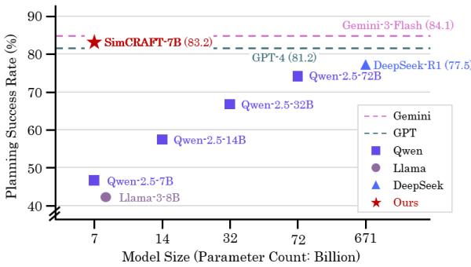
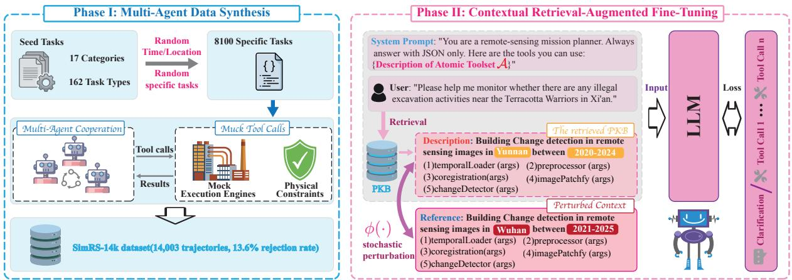
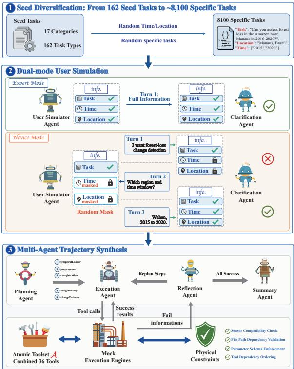
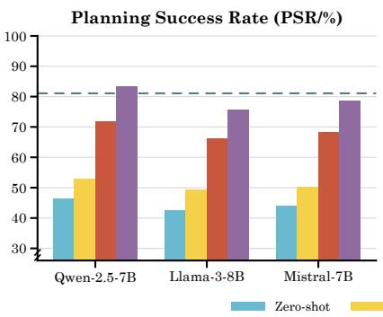
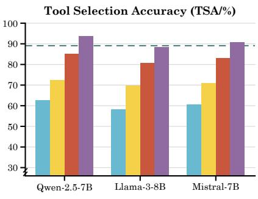
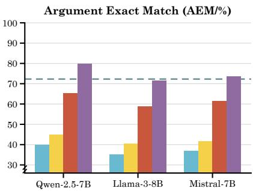
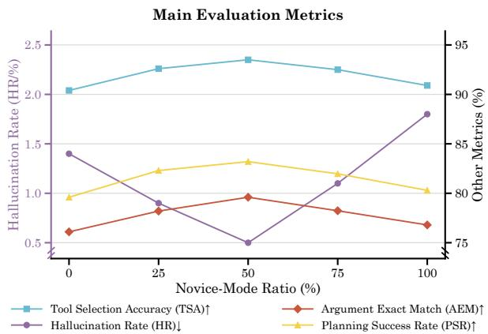
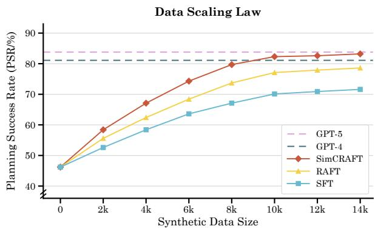
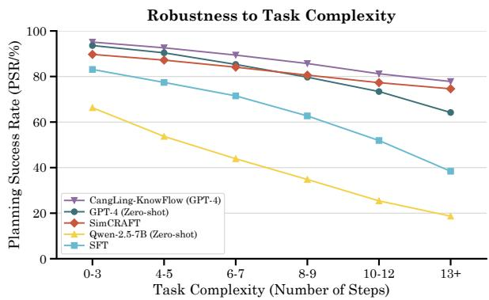

# SimCRAFT: Distilling Remote Sensing Agents via Synthetic Trajectories and Contextual Retrieval-Augmented Fine-Tuning

Haoran Wang1,2, Jing Yao1, Xu Yang1,2, Zeqing Wang1,2, Yang Zhang3, Pedram Ghamisi4, Zhengchao Chen1

1State Key Laboratory of Remote Sensing and Digital Earth,

3The Hong Kong University of Science and Technology (Guangzhou), Guangzhou 511453, China 4Helmholtz-Zentrum Dresden-Rossendorf, Freiberg 09599, Germany

{wanghaoran23, yangxu252, wangzeqing22}@mails.ucas.ac.cn, yaojing@aircas.ac.cn yzhang971@connect.hkust-gz.edu.cn, p.ghamisi@hzdr.de, chenzc@radi.ac.cn

## Abstract

The unprecedented surge in Earth observation data volume and diversity has exposed a crit ical bottleneck for traditional manual workflows, catalyzing the emergence of Remote Sensing (RS) Agents. However, the practical deployment of these advanced agents is severely hindered by their heavy reliance on large-scale general-purpose LLMs, which lack deep domain expertise and impose prohibitive infrastructure demands. To resolve this, we propose SimCRAFT, a model-agnostic framework that distills sophisticated RS orchestration capabilities into a compact 7B-scale model. Addressing data scarcity, we first pair a multi agent synthesis engine with a Mock Execution Engine that checks schema correctness, inter-tool dependencies, and sensor/tool compatibility, producing SimRS-14k, a large-scale, constraint-validated workflow planning corpus. Second, we propose Contextual Retrieval-Augmented Fine-Tuning (CRAFT) that finetunes the model to reason analogically by adapting retrieved Standard Operating Proce dures to novel queries under a noise-robust ob jective, generalizing RAFT to multi-step RS workflow planning without mechanical copying. Extensive experiments demonstrate that SimCRAFT-7B significantly outperforms openweights LLMs and rivals advanced closed source models and specialized RS agents, while reproducing across three 7B backbones. This work contributes a competitive open-weights baseline for lightweight RS intelligence, enabling efficient autonomous deployment under resource-constrained or resource-conserving conditions1.

Model Performance on Remote Sensing Agent Task  
  
Figure 1: Performance vs. model size. SimCRAFT-Qwen2.5-7B (red star) compared with open-weights and closed-source baselines.

## 1 Introduction

Earth observation produces petabytes of multisource imagery each day (Zhang et al., 2019, 2022). To extract actionable insight from this data, analysts manually compose GDAL, SNAP, and Google Earth Engine scripts that chain a dozen tools such as radiometric calibration, atmospheric correction, and change detection. Yet this process is expertonly, error-prone, and not reusable, which has motivated the emergence of Remote Sensing (RS) Agents that take a natural-language query and decompose it into an executable sequence of tool calls. The workflow is expert-only, error-prone, and not reusable, which has motivated the emergence of Remote Sensing (RS) Agents that take a natural-language query and decompose it into an executable sequence of tool calls. For example, given the query “Check illegal excavation near the Terracotta Army site between 2022 and 2026”, a competent RS agent is expected to plan a 7-step trajectory: RS data search → radiometric calibration → atmospheric correction → temporal change detection → vector analysis → area statistics. State-of-the-art systems such as Earth-Agent (Li et al., 2025a; Feng et al., 2025) and CangLing-KnowFlow (Chen et al., 2025) achieve this by orchestrating GPT-4-scale closed-source LLMs at runtime. Such a strong dependency tends to result in high compute requirements, strict network connectivity constraints, and increased privacy exposure, precluding their edge deployment on satellites, UAVs, or workstations without highend GPUs.

Distilling RS Agents into a small-scale opensource backbone becomes a natural target for edge deployment, yet two ready-made paths fail to deliver. Path A, inference-time Retrieval-Augmented Generation (RAG): a frozen small model fetches procedural templates from an external knowledge base and concatenates them into the prompt. The retrieved unit here can be a Standard Operating Procedure (SOP), a step-by-step template that chains RS tools for a given class of queries. This path yields only marginal gains at, for example, 7B scale, since a frozen small model has limited capacity to robustly recover an executable toolchain from heterogeneous, noisy SOPs. Path B, trajectory-only supervised fine-tuning: train directly on synthetic or expert trajectories. Trajectories are instance-level supervision that ties specific satellites, ROIs, and parameter values to the tool sequence. Small models tend to memorize individual instances rather than abstract the program schema mapping task type to tool composition. This granularity mismatch is especially pronounced in RS, where the parameter space is large, and sensor combinations are diverse. In addition, the RS domain currently lacks a large-scale tool use trajectory corpus that would be needed to drive such supervised fine-tuning (SFT) in the first place.

The common shortcoming of the two paths is that neither teaches the model how to plan tool calls under schema-level SOP guidance. A direction worth exploring is to move SOP retrieval from inference time into training time, so that the model learns each training trajectory alongside its corresponding SOP template and noise perturbations.

We instantiate this direction as SimCRAFT, a model-agnostic two-phase framework. The first phase, Multi-Agent Data Synthesis, addresses the scarcity of large-scale, parameter-precise, and physically consistent training corpora in RS: starting from expert-seeded tasks, it combines dual-mode user simulation, four-agent collaboration, and a Mock Execution Engine with constraint validation over schema, dependencies, and sensor compatibility to produce SimRS-14k, a large-scale, constraint-validated corpus of RS tool-call trajectories. The second phase, Contextual Retrieval-Augmented Fine-Tuning (CRAFT), addresses the training mechanism: it adapts retrieval-augmented fine-tuning to multi-step RS workflow planning, using two perturbations, Irrelevant Context Injection and Parameter Mutation, that lead the small model to extract transferable procedural structure from noisy SOPs rather than copy them mechanically. The task itself is formalized in Section 3.1 as constrained multi-step tool planning over an action space of 36 RS-specific tools.

Our three-fold contributions are as follows:

• SimCRAFT framework. A pure trainingtime path of data synthesis plus schema-aware supervised fine-tuning that lifts a 7B-scale open-source model to the level of GPT-4- driven RS agents on RS tool use.

• CRAFT training mechanism. We adapt retrieval-augmented fine-tuning to multi-step RS workflow planning over procedural SOPs, with noise-robust training that leads the model to extract transferable procedural structure from noisy SOPs rather than copy them mechanically.

• Multi-agent trajectory synthesis and SimRS-14k benchmark. We introduce dualmode user simulation paired with constraint validation in a Mock Execution Engine, producing a large-scale, constraint-validated RS tool use trajectory corpus.

## 2 Related Work

## 2.1 Remote Sensing Agents

RS intelligence is shifting from passive perception to active reasoning (Zhang et al., 2025a; Ghamisi et al., 2025). LLM-based RS agents address the multi-step planning gap left by vision-language models such as SkyEyeGPT (Zhan et al., 2025), SegEarth-R1 (Li et al., 2025b), RingMo-Agent (Hu et al., 2025a), and RSGPT (Hu et al., 2025b): EarthAgent (Li et al., 2025a) introduces a hierarchical task-abstraction mechanism, CangLing-KnowFlow (Chen et al., 2025) integrates a retrievalaugmented knowledge base for dynamic replanning, and frameworks such as GeoGPT (Zhang et al., 2024b), RS-Agent (Xu et al., 2024), and GIS Copilot (Akinboyewa et al., 2025) use multi-agent collaboration. These systems, however, all rely on GPT-4-scale closed-source LLMs for run-time orchestration. SimCRAFT instead internalizes procedural planning into the weights of a 7B-scale backbone, removing the dependence on run-time frontier models.

  
Figure 2: Overview of the SimCRAFT framework. Phase I expands 162 seed tasks into the SimRS-14k corpus; Phase II distills procedural knowledge into a 7B backbone via Contextual Retrieval-Augmented Fine-Tuning.

## 2.2 Data Synthesis for Agents

The scarcity of domain-specific planning data has driven attention to synthetic generation (Li et al., 2023). A mature pipeline has emerged in general domains: ToolAlpaca (Tang et al., 2023) generates multi-turn tool-use trajectories in a simulated environment, APIGen (Liu et al., 2024c) and ToolACE (Liu et al., 2025) ensure APIcall correctness through verification-based filtering and self-evolving models, and TOUCAN (Xu et al., 2025) scales the idea to millions of crossenvironment interactions. Benchmarks such as AgentBench (Liu et al., 2024b) and GTA (Wang et al., 2024; Krechetova and Kochedykov, 2025) further show that reliable multi-turn tool use remains challenging. Directly transplanting these pipelines to RS leaves two gaps: existing RS corpora are dominated by shallow single-turn interactions, and RS tasks routinely involve long-horizon sequences with hard physical constraints on parameter schemas and sensor compatibility that generaldomain pipelines rarely model explicitly. Our established SimRS-14k closes both gaps via dualmode user simulation and the constraint validation of the Mock Execution Engine.

## 2.3 Retrieval-Augmented Fine-Tuning

Retrieval-Augmented Generation (RAG) typically grounds frozen LLMs with external knowledge (Zhu et al., 2025), but the retrieved documents often inject distracting context (Zhang et al., 2024a). Retrieval-Augmented Fine-Tuning (RAFT) addresses this by bringing retrieval into the training stage, teaching the model to filter noise and reason by analogy; RAP (Kagaya et al., 2024) and InstructRAG (Wang et al., 2025) instantiate it for instruction-guided task execution, while RA-DIT (Lin et al., 2024) and HiRAG (Jiao et al., 2025) perform joint generator-retriever domain adaptation. These efforts, however, almost exclusively target factual knowledge retrieval or general instruction following; agent train-time remains an open space. While retrieval-augmented fine-tuning has targeted QA (Zhang et al., 2024a) and singlestep API selection (Patil et al., 2024), our CRAFT applies it to multi-step RS workflow planning, treating RS SOPs as procedural priors with Irrelevant Context Injection and Parameter Mutation perturbations.

## 3 Method

## 3.1 Task Formulation

We formalize the Remote Sensing (RS) Agent task as constrained multi-step tool calling. Given a natural-language query q and an atomic-tool action space A, the aim of the agent is to produce an executable tool-call trajectory $\boldsymbol { \tau } = [ ( t _ { i } , \pmb { \theta } _ { i } , r _ { i } ) ] _ { i = 1 } ^ { N } ,$ where $t _ { i } \in \mathcal { A } , \theta _ { i }$ is the argument dictionary, and $r _ { i }$ is the execution result. The full trajectory must satisfy a set of RS physical constraints CRS covering sensor compatibility, data dependencies, and parameter schema legality.

The task can be naturally decomposed into three stages: Stage 1: Intent Clarification elicits missing parameters from q through multi-turn dialogue to produce a parameter-complete intent $q ^ { * }$ ; Stage 2: Procedural Retrieval fetches the top-k SOPs $\mathcal { C } _ { q ^ { * } }$ from a Procedural Knowledge Base (PKB) K as a structural prior; and Stage 3: Autoregressive Planning generates each tool call from the policy $\pi _ { \boldsymbol { \theta } _ { M } }$ conditioned on the system prompt $I _ { \mathrm { s y s } } ,$ , retrieved context $\tilde { \mathcal { C } } _ { q ^ { \ast } } , q ^ { \ast }$ , and execution history $\mathcal { H } _ { < i } \mathrm { : }$

$$
\begin{array} { r l } & { ( t _ { i } , \pmb \theta _ { i } ) = \pi _ { \pmb \theta _ { M } } \left( I _ { \mathrm { s y s } } , \tilde { \mathcal { C } } _ { q ^ { * } } , \mathbf { \Delta } q ^ { * } , \mathcal { H } _ { < i } \right) , } \\ & { \qquad \mathrm { s . t . } \ \forall i \colon ( t _ { i } , \pmb \theta _ { i } ) \in \mathcal { C } _ { \mathrm { R S } } . } \end{array}\tag{1}
$$

## 3.2 Framework Overview

SimCRAFT is a two-phase, model-agnostic training framework, with an overview provided in Figure 2. Phase I (Multi-Agent Data Synthesis) addresses the lack of large-scale, parametrically precise, and constraint-validated training corpora in the RS domain: starting from expert-designed seed tasks, it produces the SimRS-14k corpus through dual-mode user simulation, multi-agent collaboration, and Mock Execution Engine validation. Phase II (CRAFT) addresses how procedural knowledge can be written into the weights: using SimRS-14k as the supervision signal, it injects retrieved SOPs from the PKB as a contextual prior during training and applies noise perturbations that force the model to learn the structural patterns underlying SOPs rather than surface details. While the framework can be instantiated on any compact pre-trained LLM, we use Qwen-2.5-7B as the primary backbone to obtain the representative checkpoint SimCRAFT-Qwen2.5-7B, with backbone generality further analyzed in Section 4.7.

## 3.3 Atomic Toolset

We start our method by instantiating the abstract action space A from Section 3.1 as the Atomic Toolset: an RS expert team designs and verifies it tool by tool, following the interface conventions of mainstream geospatial software (GDAL, SNAP, Google Earth Engine) and covering the full life cycle of RS analysis across five functional domains. Every tool is atomic to support flexible longhorizon composition, and is governed by a strictly typed JSON schema with valid value ranges to mitigate parameter hallucination. The full toolset, including JSON schemas and representative tools per domain, is provided in the appendix.

  
Figure 3: Phase I synthesis pipeline. (a) Dual-mode user simulation, (b) multi-agent trajectory synthesis, (c) Mock Execution Engine.

## 3.4 Phase I: Multi-Agent Data Synthesis

Phase I expands the expert-designed seed tasks into the SimRS-14k corpus (Figure 3): Dual-mode User Simulation diversifies user intents, Multi-Agent Trajectory Synthesis expands each intent into a multi-step tool-call trajectory, and the Mock Execution Engine applies three validation checks at every step. Consequently, downstream training admits only trajectories that pass all these checks.

## 3.4.1 Dual-mode User Simulation

Existing agent training corpora assume that users state every critical parameter in a single query, yet RS analysts routinely omit constraints such as the time window, sensor, or spatial extent on which downstream tools strictly depend, and an agent filling these gaps with hallucinated defaults silently inherits the errors into the training target. We therefore introduce two collaborating agents: the User Simulation Agent switches between Expert Mode (stating all parameters at once) and Novice Mode (random parameter masking that leaves an explicit information gap), and the Clarification Agent maintains a ledger of critical information and initiates a targeted follow-up whenever a slot is missing. The dialogue terminates only after all critical information is aligned, so the distilled small model learns both when to ask and when to act.

## 3.4.2 Multi-Agent Trajectory Synthesis

Letting a single LLM freely generate multi-step tool-call trajectories leads to two typical errors: fabricated tool-call orderings and violations of intertool physical dependencies. Furthermore, on longhorizon tasks, a single agent tends to fall into unrecoverable local errors, ultimately producing formally legal but semantically invalid hallucinated trajectories. To overcome these limitations, we decompose single-agent self-synthesis into a system of four role-complementary agents. The Atomic Toolset description from Section 3.3 acts as the system prompt to constrain every agent’s action space. Specifically, the Planning Agent drafts an initial high-level roadmap, and the Execution Agent produces a concrete atomic tool action $a _ { t }$ based on the current context. If an execution fails, the Reflection Agent activates to perform dynamic error recovery, while the Summary Agent aggregates the final result upon trajectory completion. These agents coordinate through a shared state machine rather than direct message passing. By letting the current state determine the active agent at each step, the system ensures the Reflection Agent can intercept and rewrite local errors before they propagate.

## 3.4.3 Mock Execution Engine Check

Even with four-agent collaboration, the LLM can still emit silent errors such as schema violations, fabricated file paths, or sensor-compatibility violations, which poison the training target if uncaught, while plugging the pipeline into real geospatial software is prohibitively expensive since petabytescale imagery cannot support large-scale synthesis. We therefore design a lightweight Mock Execution Engine E that applies three independent validation checks to each tool call $( t _ { i } , \pmb \theta _ { i } )$ . First, the schema check validates argument types and value ranges. Second, the dependency check, implemented by a Dynamic Path Registry $\mathcal { R } _ { : }$ rejects any call referencing an unregistered path with a PathNotFoundError. Third, the compatibility check rejects a call that violates sensor or tool compatibility, such as a spectral index requiring a near-infrared band on a product that lacks it. Beyond these validation checks, an error injection step emits recoverable errors (e.g., CloudCoverExceeded) with a small probability, forcing the model to learn the “try, fail, correct”

recovery pattern. Successful results are returned to the Execution Agent to advance the state, while failure information is routed to the Reflection Agent to trigger replanning. Across 16,200 candidate trajectories, the three checks jointly yield a rejection rate of 13.6%, leaving 14,003 trajectories that constitute SimRS-14k.

Beyond the automatic checks, four RS experts manually inspect a stratified random sample of 2800 trajectories, about 20% of SimRS-14k, stratified by seed task and trajectory length. For each sampled instance they judge both whether the full workflow executes correctly and whether it answers the query. In total, 2787 of the 2800 instances, or 99.5%, pass. We keep the 13 flagged instances in the corpus rather than removing them, treating them as low-rate residual noise consistent with the noise-robust objective of CRAFT.

## 3.5 Phase II: CRAFT

Phase II distills SimRS-14k together with the SOPs in the PKB into the weights of a 7B-scale pretrained LLM (see the Phase II part of Figure 2). CRAFT realizes this through two components: PKB Retrieval fetches top-k SOPs as a procedural prior at both training and inference time, and Noise-Robust Training perturbs the retrieved context so that the model learns structure rather than surface details, with the same frozen retriever reused at deployment to produce executable trajectories.

## 3.5.1 PKB Retrieval

Directly applying end-to-end SFT on SimRS-14k causes a 7B model to memorize training instances, severely degrading its generalization to queries beyond the seed tasks. On the other hand, relying solely on inference-time SOP injection into a frozen model introduces redundant signals that disrupt planning, primarily because small models lack the capacity to extract procedural structures from heterogeneous contexts. We therefore construct a Procedural Knowledge Base $\kappa =$ $\{ ( q _ { i } , \tau _ { i } ) \} _ { i = 1 } ^ { M }$ that pairs each task query $q _ { i }$ with its expert-validated $\operatorname { s O P } \tau _ { i }$ , initialized from the expert workflows of CangLing-KnowFlow (Chen et al., 2025). The retriever is a frozen dual-encoder $E ( \cdot )$ shared between training and inference, that selects from K the top-k trajectories whose cosine similarity with the query x exceeds a threshold δ as the

Table 1: Main comparison results on the SimRS-14k test split. Bold = best, underline = second-best within each metric. “Open” marks open-weights backbones.
<table><tr><td>Category</td><td>Model</td><td>Open</td><td>Size</td><td>PSR (%)</td><td>TSA (%)</td><td>AEM (%)</td><td>Hal.Rate (%) ↓</td><td>Fmt.Err (%) ↓</td></tr><tr><td rowspan="10">Generalist LLMs</td><td>Llama-3-8B-Instruct</td><td>√</td><td>8B</td><td>42.5</td><td>58.2</td><td>35.1</td><td>15.4</td><td>32.6</td></tr><tr><td>Qwen-2.5-7B-Instruct</td><td>√</td><td>7B</td><td>46.2</td><td>62.5</td><td>39.8</td><td>12.1</td><td>26.4</td></tr><tr><td>Qwen-2.5-14B-Instruct</td><td>√</td><td>14B</td><td>58.6</td><td>71.8</td><td>48.9</td><td>7.5</td><td>18.5</td></tr><tr><td>Qwen-2.5-32B-Instruct</td><td>√</td><td>32B</td><td>68.4</td><td>78.1</td><td>55.4</td><td>4.5</td><td>12.8</td></tr><tr><td>Qwen-2.5-72B-Instruct</td><td>√</td><td>72B</td><td>74.6</td><td>82.4</td><td>62.8</td><td>2.7</td><td>8.1</td></tr><tr><td>DeepSeek-V3</td><td>√</td><td>671B</td><td>76.9</td><td>84.5</td><td>66.4</td><td>3.2</td><td>6.7</td></tr><tr><td>DeepSeek-R1</td><td>√</td><td>671B</td><td>77.5</td><td>85.8</td><td>68.1</td><td>2.8</td><td>6.6</td></tr><tr><td>GPT-4</td><td>×</td><td>GPT-4</td><td>81.1</td><td>89.1</td><td>72.3</td><td>1.2</td><td>5.1</td></tr><tr><td>GPT-5</td><td>×</td><td>GPT-5</td><td>83.8</td><td>90.6</td><td>74.5</td><td>0.6</td><td>4.5</td></tr><tr><td>Gemini-3-Flash</td><td>X</td><td>Gemini-3-Flash</td><td>84.1</td><td>91.2</td><td>75.8</td><td>0.9</td><td>4.2</td></tr><tr><td rowspan="6">General Agents</td><td>ReAct (Llama-3-8B)</td><td>√</td><td>8B</td><td>52.1</td><td>65.3</td><td>41.9</td><td>8.5</td><td>22.5</td></tr><tr><td>Reflexion (Llama-3-8B)</td><td>√</td><td>8B</td><td>58.4</td><td>70.1</td><td>48.5</td><td>6.2</td><td>16.8</td></tr><tr><td>AFlow (Llama-3-8B)</td><td>√</td><td>8B</td><td>61.9</td><td>72.8</td><td>51.2</td><td>5.8</td><td>14.2</td></tr><tr><td>ReAct (GPT-4)</td><td>×</td><td>GPT-4</td><td>72.4</td><td>82.3</td><td>61.2</td><td>2.4</td><td>8.9</td></tr><tr><td>Reflexion (GPT-4)</td><td>×</td><td>GPT-4</td><td>76.8</td><td>85.4</td><td>65.6</td><td>2.2</td><td>6.8</td></tr><tr><td>AFlow (GPT-4)</td><td>×</td><td>GPT-4</td><td>79.2</td><td>87.6</td><td>68.4</td><td>1.1</td><td>5.5</td></tr><tr><td rowspan="4">RS Agents</td><td>EarthAgent (DeepSeek-R1)</td><td>√</td><td>671B</td><td>80.6</td><td>87.2</td><td>70.4</td><td>1.6</td><td>6.2</td></tr><tr><td>CangLing-KnowFlow (DeepSeek-R1)</td><td>√</td><td>671B</td><td>81.8</td><td>88.4</td><td>71.6</td><td>1.4</td><td>5.8</td></tr><tr><td>EarthAgent (GPT-4)</td><td>X</td><td>GPT-4</td><td>86.2</td><td>91.8</td><td>76.8</td><td>0.7</td><td>4.6</td></tr><tr><td>CangLing-KnowFlow (GPT-4)</td><td>×</td><td>GPT-4</td><td>87.5</td><td>92.1</td><td>77.2</td><td>0.8</td><td>5.2</td></tr><tr><td>Ours</td><td>SimCRAFT-Qwen2.5-7B</td><td>√</td><td>7B</td><td>83.2</td><td>93.5</td><td>79.6</td><td>0.5</td><td>5.4</td></tr></table>

procedural prior:

$$
\begin{array} { r } { \mathcal { C } _ { x } = \underset { \tau _ { i } } { \mathrm { T o p - } } k ( \{ \tau _ { i } \mid ( q _ { i } , \tau _ { i } ) \in \mathcal { K } \} ) , } \\ { \mathrm { s . t . ~ } \mathrm { s i m } ( E ( x ) , E ( q _ { i } ) ) \geq \delta . } \end{array}\tag{2}
$$

## 3.5.2 Noise-Robust Training

Concatenating the retrieved ${ \mathcal { C } } _ { x }$ directly into the prompt under standard RAFT training causes the model to take the shortcut of copying $\mathcal { C } _ { x } .$ , so that any drop in retrieval quality at inference time leads it to follow the flawed template and the whole trajectory collapses. We therefore apply a stochastic perturbation $\phi ( \cdot )$ to ${ \mathcal { C } } _ { x }$ at training time: (i) Irrelevant Context Injection $( \phi _ { I C I } )$ replaces a reference trajectory with a semantically unrelated one $\tau _ { \mathrm { n o i s e } }$ with a given probability; and (ii) Parameter Mutation $( \phi _ { P M } )$ randomly rewrites parameters within a valid reference, e.g., changing Sentinel-2 to Landsat-8, forcing the model to re-verify physical constraints. Given a query x, target trajectory $y ,$ and perturbed context $\tilde { \mathcal { C } } _ { x } = \phi ( \mathcal { C } _ { x } )$ the CRAFT training objective is

$$
\mathcal { L } _ { \mathrm { C R A F T } } = - \sum _ { t = 1 } ^ { T } \log P _ { \theta } \Big ( y _ { t } \mid x , \tilde { \mathcal { C } } _ { x } , y _ { < t } \Big ) .\tag{3}
$$

Because the supervision y is always a constraintvalidated correct trajectory while $\tilde { \mathcal { C } } _ { x }$ may contain incorrect fragments, the model must extract transferable procedural structures from the noisy context and actively override incorrect details. This process essentially serves as a context-denoising objective, teaching the model when to ignore retrieved content during the training phase. At deployment, the same frozen retriever fetches top-k SOPs for $q ^ { * }$ with no perturbation applied, and SimCRAFT-Qwen2.5-7B autoregressively generates tool calls following Equation 1 until Terminate.

## 4 Experiments

## 4.1 Experimental Setup

Datasets and implementation. The Phase-I pipeline (Section 3.4) expands 162 seed tasks into SimRS-14k. After validation via the Mock Execution Engine, we retain 14,003 multi-turn tool-call trajectories. We hold out 500 testing trajectories via stratified sampling to ensure strictly no overlap with the training set in geographic, temporal, or sensor parameters, leaving the remaining 13,503 for Phase-II CRAFT fine-tuning. To ensure rigorous evaluation, we perform zero-shot testing on KnowFlow-Bench (Chen et al., 2025), a collection of 324 expert-annotated real-world RS tasks completely isolated from our training pipeline. For implementation, SimCRAFT-Qwen2.5-7B is built upon Qwen-2.5-7B-Instruct (Yang et al., 2024) using LoRA (Hu et al., 2022) $( r = 6 4 , \alpha = 1 2 8 .$ dropout 0.05). We train for 3 epochs using AdamW (learning rate $2 \times 1 0 ^ { - 5 } )$ and a cosine schedule. Both the error-injection and CRAFT perturbation probabilities are set to $\varepsilon = 0 . 1 5$ . During retrieval, we apply a threshold of $\delta = 0 . 6$ and $k = 2$ . All experiments run on 8 NVIDIA A800 GPUs. We report 95% confidence intervals for SimCRAFT-Qwen2.5-7B from 1000 bootstrap resamples of the

test set in Appendix F.

The PKB provides retrieval templates and both the PKB and KnowFlow-Bench derive from CangLing-KnowFlow, so we additionally evaluate on the independently sourced ThinkGeo benchmark (Section 4.6) to rule out any sharedprovenance effect.

## 4.2 Baselines

Baselines. Table 1 compares against three categories: (i) Generalist LLMs: open-weights Llama-3-8B-Instruct (Dubey et al., 2024), the Qwen-2.5 Instruct family from 7B to 72B (Yang et al., 2024), DeepSeek-V3 (Liu et al., 2024a), DeepSeek-R1 (Guo et al., 2025), and proprietary GPT-4 (Achiam et al., 2023), GPT-5, Gemini-3-Flash; (ii) General Agents: ReAct (Yao et al., 2023), Reflexion (Shinn et al., 2023), AFlow (Zhang et al., 2025b), each instantiated on both Llama-3-8B and GPT-4; (iii) RS Agents: EarthAgent (Li et al., 2025a) (hierarchical planning) and CangLing-KnowFlow (Chen et al., 2025) (static RAG), each instantiated on DeepSeek-R1 and GPT-4. A samescale General Agents + Inf-RAG (no CRAFT) configuration is reserved as an ablation variant in Section 4.7.

## 4.3 Evaluation Metrics

We adopt a five-metric protocol covering correctness, planning quality, and robustness. Planning Success Rate (PSR) is the primary metric, measuring the proportion of tasks for which the generated toolchain is both executable and logically aligned with the ground truth under the longest common subsequence (Michelakis et al., 2025). Tool Selection Accuracy (TSA) and Argument Exact Match (AEM) decompose planning quality into tool-name hit rate (Li et al., 2025a) and the percentage of arguments that strictly match the schema (Shabbir et al., 2025). Hallucination Rate (Hal.Rate) and Format Error Rate (Fmt.Err) measure robustness as the frequencies of unregistered-path / non-existent-tool references and invalid JSON outputs (Shabbir et al., 2025), respectively (lower-is-better). Since PSR and AEM use strict matching, the reported values are conservative lower bounds, whereas TSA depends only on tool-name selection and is invariant to tool ordering and argument values.

<table><tr><td>Method</td><td>Params</td><td>PSR</td><td>AEM</td></tr><tr><td>Llama-3-8B + Inf-RAG</td><td>8B</td><td>46.3</td><td>51.2</td></tr><tr><td>Mistral-7B + Inf-RAG</td><td>7B</td><td>47.8</td><td>53.5</td></tr><tr><td>Qwen-2.5-7B + Inf-RAG</td><td>7B</td><td>50.2</td><td>55.1</td></tr><tr><td>Vanilla SFT-Qwen2.5-7B</td><td>7B</td><td>62.8</td><td>65.4</td></tr><tr><td>SimCRAFT-Qwen2.5-7B</td><td>7B</td><td>79.4</td><td>75.2</td></tr><tr><td>GPT-4 + Inf-RAG</td><td>~1.8T</td><td>82.6</td><td>78.3</td></tr><tr><td>CangLing-KnowFlow (GPT-4)</td><td>~1.8T</td><td>83.7</td><td>80.1</td></tr></table>

Table 2: Zero-fine-tuning evaluation on KnowFlow-Bench (324 expert-annotated tasks), all numbers in %.

## 4.4 Main Results

Table 1 shows the 7B-parameter SimCRAFT-Qwen2.5-7B demonstrates highly competitive performance on SimRS-14k. It matches top-tier proprietary models (GPT-5, Gemini-3-Flash) and surpasses the 671B DeepSeek-R1 in PSR (83.2%), while dominating all generalist LLMs in TSA and AEM. Furthermore, it outperforms GPT-4-driven general agents by a +4.0% PSR margin and significantly minimizes hallucinations to 0.5%. Although GPT-4-based RS agents still hold a slight PSR advantage due to massive runtime orchestration, Sim-CRAFT decisively overtakes them in execution precision and hallucination control.

## 4.5 Generalization to KnowFlow-Bench

Table 2 reports the zero-fine-tuning crossbenchmark comparison. SimCRAFT-Qwen2.5-7B attains 79.4% PSR, surpassing the same-backbone Inf-RAG baseline by 29.2%, trailing the 100×- larger GPT-4 + Inf-RAG by only 3.2%, and exhibiting a cross-benchmark drop (−3.8%) roughly 3× smaller than vanilla SFT (supervised fine-tuning on SimRS-14k trajectories without PKB context, −10.8%). This indicates that CRAFT learns transferable tool-use structure rather than surface templates of the 162 seed tasks.

## 4.6 Generalization to ThinkGeo

To test generalization beyond our own data, we evaluate SimCRAFT-Qwen2.5-7B with no finetuning on ThinkGeo (Shabbir et al., 2025), an independently constructed RS agent benchmark of 486 tasks and 1778 expert-verified steps over real Earth-observation imagery, with its own 14-tool action space and no shared provenance with our synthesis pipeline or CangLing-KnowFlow. We adopt its 14 tools directly as the action space and score predictions against its expert-verified references under our PSR, TSA, AEM, and Hal.Rate protocol. At inference SimCRAFT follows its standard pipeline, retrieving the most similar SOPs from the PKB before planning, without any adaptation to ThinkGeo. As shown in Table 3, the same-size baselines drop sharply on this unseen tool space while SimCRAFT-Qwen2.5-7B stays close to GPT-4, indicating that the planning ability transfers beyond our synthetic distribution and KnowFlow-Bench.

<table><tr><td>Model</td><td>PSR TSA</td><td>AEM</td><td>Hal.Rate↓</td></tr><tr><td>GPT-4 (reference)</td><td>61.8 67.4</td><td>34.9</td><td>2.3</td></tr><tr><td>Qwen-2.5-7B (zero-shot)</td><td>29.5 51.0</td><td>20.1</td><td>18.6</td></tr><tr><td>Llama-3-8B (zero-shot)</td><td>24.8 37.3</td><td>13.7</td><td>22.4</td></tr><tr><td>SimCRAFT-Qwen2.5-7B</td><td>58.3</td><td>66.5 32.8</td><td>3.9</td></tr></table>

Table 3: Zero-fine-tuning evaluation on ThinkGeo (Shabbir et al., 2025) (486 tasks), all numbers in %. SimCRAFT-Qwen2.5-7B uses no fine-tuning on ThinkGeo.

## 4.7 Ablation Studies

Backbone & Training-Paradigm. We evaluate three 7B-scale backbones (Qwen-2.5-7B, Llama-3-8B, Mistral-7B (Jiang et al., 2023)) across four paradigms: Zero-Shot, Inf-RAG (inference-time PKB retrieval into the prompt, no fine-tuning), vanilla SFT, and CRAFT (Figure 4). Across all backbones, CRAFT consistently yields a +9.6% to +11.6% PSR improvement over vanilla SFT without any paradigm rank-inversion. Furthermore, the 7.5% PSR range in the CRAFT column is comparable to the 3.7% inherent capability gap observed in the Zero-Shot column, supporting our model-agnostic positioning. Extending the study to a more recent 2025 backbone, Qwen3-8B (Yang et al., 2025), further raises CRAFT to 84.7% PSR and leaves all conclusions unchanged, confirming that the approach tracks backbone progress.

Novice Mode Ratio. Maintaining a fixed total corpus size of 13,974 trajectories, we evaluate the novice fraction across five distinct ratios (Figure 5). We observe that all four evaluation metrics simultaneously reach their optimal values at an even 50/50 split, achieving a PSR of 83.2%, TSA of 93.5%, AEM of 79.6%, and a Hallucination Rate as low as 0.5%. Conversely, models trained on either extreme ratio yield a PSR below 80.3%. This performance degradation demonstrates that the efficacy of our dual-mode approach stems from the synergistic coexistence of both distributions, rather than the exclusive scaling of a single data type.

<table><tr><td>0.00 0.05 0.10 0.15 ε 0.30</td></tr><tr><td>0.50 PSR (%) 78.6 80.7 82.4 83.2 81.1 76.9</td></tr></table>

Table 4: Perturbation probability ε sweep on SimRS-14k with both perturbation types active with backbone fixed to Qwen-2.5-7B.
<table><tr><td>Configuration</td><td>PSR (%)</td><td>AEM (%)</td></tr><tr><td>vanilla RAFT (φ off)</td><td>78.6</td><td>73.4</td></tr><tr><td>+ φICI only</td><td>81.7</td><td>75.3</td></tr><tr><td>+ φPM only</td><td>80.4</td><td>78.2</td></tr><tr><td>+ both (full)</td><td>83.2</td><td>79.6</td></tr></table>

Table 5: Component breakdown of the two perturbation types at the default ε=0.15. ICI: Irrelevant Context Injection; PM: Parameter Mutation.

Noise-Robust Training. Varying the perturbation scale $\varepsilon \in \{ 0 , 0 . 0 5 , 0 . 1 0 , 0 . 1 5 , 0 . 3 0 , 0 . 5 0 \}$ (Table 4) yields a peak PSR of 83.2% at ε = 0.15, whereas excessive noise (ε = 0.50) degrades performance below the unperturbed baseline, explicitly refuting the assumption of monotonic improvements. At this optimal setting (Table 5), the combined 4.6% gain from Irrelevant Context Injection (+3.1%) and Parameter Mutation (+1.8%) closely approximates their linear sum (4.9%), indicating these mechanisms operate as independent factors.

## 4.8 In-Depth Analysis

Data Scaling Law. Figure 6 shows that PSR scales near log-linearly with the size of SimRS-14k: Sim-CRAFT (Full) matches the 81.1% PSR of GPT-4 (zero-shot) at around 9k samples and reaches 83.2% at 14k, close to GPT-5’s 83.8%.

Long-Horizon Robustness. While baselines suffer severe degradation on extended trajectories (e.g., zero-shot Qwen-2.5-7B plummets from 66.3% to 18.7%), SimCRAFT exhibits remarkable stability across all lengths (Figure 7), maintaining a PSR of at least 74.6% and decisively surpassing zero-shot GPT-4 on tasks exceeding 8 steps.

## 5 Conclusion

We present SimCRAFT, a model-agnostic training framework that distills RS-agent procedural planning into a 7B open-source model. By combining the constraint-validated SimRS-14k corpus with the noise-robust CRAFT training paradigm, SimCRAFT-Qwen2.5-7B matches GPT-4-level RS agents on SimRS-14k (83.2% PSR, 93.5% TSA, 0.5% Hal.Rate) and generalizes to KnowFlow-Bench at 79.4% PSR without any additional finetuning. The results demonstrate that constraintvalidated synthetic data combined with a contextdenoising training objective can align a 100× smaller open-source model with closed-source frontier LLMs on RS procedural planning.

Figure 4: Joint backbone × training-paradigm ablation. Three 7B-scale backbones each evaluated under four paradigms (Zero-Shot, Inf-RAG, vanilla SFT, CRAFT).  
  
Figure 5: Clarification ratio ablation. PSR, TSA, AEM (right y axis), and Hal.Rate (left y axis) across five novice fractions from 0% to 100%.

## Limitations

The Mock Execution Engine validates only schema, dependency, and sensor compatibility rather than invoking GDAL/SNAP/GEE on real imagery, so end-to-end physical-accuracy evaluation of downstream science products (e.g., change-detection Kappa) remains future work. The Atomic Toolset and PKB are restricted to RS-specific tools, leaving cross-domain transfer (e.g., medical-imaging or bioinformatics pipelines) requiring a domainspecific reconstruction. Our metrics PSR, TSA, and AEM assess workflow-planning quality and do not measure the correctness of downstream products such as change maps, classification maps, or statistics, which we scope out as an explicit limitation.

  
Figure 6: Data scaling law. PSR vs. SimRS-14k corpus size, with GPT-4 / GPT-5 zero-shot reference lines.

  
Figure 7: Long-horizon robustness. PSR by trajectorylength bucket.

## References

Josh Achiam, Steven Adler, Sandhini Agarwal, Lama Ahmad, Ilge Akkaya, Florencia Leoni Aleman, Diogo Almeida, Janko Altenschmidt, Sam Altman, Shyamal Anadkat, et al. 2023. GPT-4 technical report. arXiv preprint arXiv:2303.08774.

Temitope Akinboyewa, Zhenlong Li, Huan Ning, and M Naser Lessani. 2025. GIS Copilot: Towards an autonomous gis agent for spatial analysis. International Journal ofDigital Earth, 18(1):2497489.

Zhengchao Chen, Haoran Wang, Jing Yao, Pedram Ghamisi, Jun Zhou, Peter M Atkinson, and Bing Zhang. 2025. CangLing-KnowFlow: A unified knowledge-and-flow-fused agent for comprehensive remote sensing applications. arXiv preprint arXiv:2512.15231.

Abhimanyu Dubey, Abhinav Jauhri, Abhinav Pandey, Abhishek Kadian, Ahmad Al-Dahle, Aiesha Letman, Akhil Mathur, Alan Schelten, Amy Yang, Angela Fan, et al. 2024. The Llama 3 herd of models. arXiv preprint arXiv:2407.21783.

Peilin Feng, Zhutao Lv, Junyan Ye, Xiaolei Wang, Xinjie Huo, Jinhua Yu, Wanghan Xu, Wenlong Zhang, Lei Bai, Conghui He, and Weijia Li. 2025. Earth-Agent: Unlocking the Full Landscape of Earth Observation with Agents. arXiv preprint. ArXiv:2509.23141 [cs].

Pedram Ghamisi, Weikang Yu, Xiaokang Zhang, Aldino Rizaldy, Jian Wang, Chufeng Zhou, Richard Gloaguen, and Gustau Camps-Valls. 2025. Geospatial foundation models to enable progress on sustainable development goals. arXiv preprint arXiv:2505.24528.

Daya Guo, Dejian Yang, Haowei Zhang, Junxiao Song, Peiyi Wang, Qihao Zhu, Runxin Xu, Ruoyu Zhang, Shirong Ma, Xiao Bi, et al. 2025. DeepSeek-R1 incentivizes reasoning in LLMs through reinforcement learning. Nature, 645:633–638.

Edward J. Hu, Yelong Shen, Phillip Wallis, Zeyuan Allen-Zhu, Yuanzhi Li, Shean Wang, Lu Wang, and Weizhu Chen. 2022. LoRA: Low-rank adaptation of large language models. In International Conference on Learning Representations.

Huiyang Hu, Peijin Wang, Yingchao Feng, Kaiwen Wei, Wenxin Yin, Wenhui Diao, Mengyu Wang, Hanbo Bi, Kaiyue Kang, Tong Ling, et al. 2025a. RingMo-Agent: A unified remote sensing foundation model for multi-platform and multi-modal reasoning. arXiv preprint arXiv:2507.20776.

Yuan Hu, Jianlong Yuan, Congcong Wen, Xiaonan Lu, Yu Liu, and Xiang Li. 2025b. RSGPT: A remote sensing vision language model and benchmark. IS-PRS Journal ofPhotogrammetry and Remote Sensing, 224:272–286.

Albert Q Jiang, Alexandre Sablayrolles, Arthur Mensch, Chris Bamford, Devendra Singh Chaplot, Diego de las Casas, Florian Bressand, Gianna Lengyel, Guillaume Lample, Lucile Saulnier, et al. 2023. Mistral 7b. arXiv preprint arXiv:2310.06825.

Yihan Jiao, Zhehao Tan, Dan Yang, Duolin Sun, Jie Feng, Yue Shen, Jian Wang, and Peng Wei.

2025. HIRAG: Hierarchical-thought instructiontuning retrieval-augmented generation. In Findings of the Association for Computational Linguistics: EMNLP 2025, pages 5111–5130, Suzhou, China. Association for Computational Linguistics.

Tomoyuki Kagaya, Thong Jing Yuan, Yuxuan Lou, Jayashree Karlekar, Sugiri Pranata, Akira Kinose, Koki Oguri, Felix Wick, and Yang You. 2024. RAP: Retrieval-augmented planning with contextual memory for multimodal llm agents. arXiv preprint arXiv:2402.03610.

Varvara Krechetova and Denis Kochedykov. 2025. GeoBenchX: Benchmarking LLMs in Agent Solving Multistep Geospatial Tasks. In Proceedings ofthe 1st ACM SIGSPATIAL International Workshop on Generative and Agentic AIfor Multi-Modality Space-Time Intelligence, pages 27–35.

Kaiyu Li, Jiayu Wang, Zhi Wang, Hui Qiao, Weizhan Zhang, Deyu Meng, and Xiangyong Cao. 2025a. Designing Domain-Specific Agents via Hierarchical Task Abstraction Mechanism.

Kaiyu Li, Zepeng Xin, Li Pang, Chao Pang, Yupeng Deng, Jing Yao, Guisong Xia, Deyu Meng, Zhi Wang, and Xiangyong Cao. 2025b. SegEarth-R1: Geospatial pixel reasoning via large language model. arXiv preprint arXiv:2504.09644.

Minghao Li, Yingxiu Zhao, Bowen Yu, Feifan Song, Hangyu Li, Haiyang Yu, Zhoujun Li, Fei Huang, and Yongbin Li. 2023. API-Bank: A comprehensive benchmark for tool-augmented LLMs. In Proceedings of the 2023 Conference on Empirical Methods in Natural Language Processing, pages 3102–3116.

Xi Victoria Lin, Xilun Chen, Mingda Chen, Weijia Shi, Maria Lomeli, Richard James, Pedro Rodriguez, Jacob Kahn, Gergely Szilvasy, Mike Lewis, Luke Zettlemoyer, and Wen tau Yih. 2024. RA-DIT: Retrieval-augmented dual instruction tuning. In The Twelfth International Conference on Learning Representations.

Aixin Liu, Bei Feng, Bing Xue, Bingxuan Wang, Bochao Wu, Chengda Lu, Chenggang Zhao, Chengqi Deng, Chenyu Zhang, Chong Ruan, et al. 2024a. DeepSeek-V3 technical report. arXiv preprint arXiv:2412.19437.

Weiwen Liu, Xu Huang, Xingshan Zeng, xinlong hao, Shuai Yu, Dexun Li, Shuai Wang, Weinan Gan, Zhengying Liu, Yuanqing Yu, Zezhong WANG, Yuxian Wang, Wu Ning, Yutai Hou, Bin Wang, Chuhan Wu, Wang Xinzhi, Yong Liu, Yasheng Wang, and 8 others. 2025. ToolACE: Winning the points of LLM function calling. In The Thirteenth International Conference on Learning Representations.

Xiao Liu, Hao Yu, Hanchen Zhang, Yifan Xu, Xuanyu Lei, Hanyu Lai, Yu Gu, Hangliang Ding, Kaiwen Men, Kejuan Yang, et al. 2024b. AgentBench: Evaluating LLMs as agents. In The Twelfth International Conference on Learning Representations.

Zuxin Liu, Thai Hoang, Jianguo Zhang, Ming Zhu, Tian Lan, Juntao Tan, Weiran Yao, Zhiwei Liu, Yihao Feng, Rithesh RN, et al. 2024c. APIGen: Automated pipeline for generating verifiable and diverse function-calling datasets. Advances in Neural Information Processing Systems, 37:54463–54482.

Panagiotis Michelakis, Yiannis Hadjiyiannis, and Dimitrios Stamoulis. 2025. CORE: Full-Path Evaluation of LLM Agents Beyond Final State. arXiv preprint. ArXiv:2509.20998 [cs].

Shishir G. Patil, Tianjun Zhang, Xin Wang, and Joseph E. Gonzalez. 2024. Gorilla: Large language model connected with massive APIs. In Advances in Neural Information Processing Systems.

Akashah Shabbir, Muhammad Akhtar Munir, Akshay Dudhane, Muhammad Umer Sheikh, Muhammad Haris Khan, Paolo Fraccaro, Juan Bernabe Moreno, Fahad Shahbaz Khan, and Salman Khan. 2025. ThinkGeo: Evaluating tool-augmented agents for remote sensing tasks. arXiv preprint arXiv:2505.23752.

Noah Shinn, Federico Cassano, Ashwin Gopinath, Karthik Narasimhan, and Shunyu Yao. 2023. Reflexion: Language agents with verbal reinforcement learning. Advances in Neural Information Processing Systems, 36:8634–8652.

Qiaoyu Tang, Ziliang Deng, Hongyu Lin, Xianpei Han, Qiao Liang, Boxi Cao, and Le Sun. 2023. ToolAlpaca: Generalized tool learning for language models with 3000 simulated cases. arXiv preprint arXiv:2306.05301.

Jize Wang, Zerun Ma, Yining Li, Songyang Zhang, Cailian Chen, Kai Chen, and Xinyi Le. 2024. GTA: a benchmark for general tool agents. Advances in Neural Information Processing Systems, 37:75749– 75790.

Zheng Wang, Shu Xian Teo, Jun Jie Chew, and Wei Shi. 2025. InstructRAG: Leveraging retrieval-augmented generation on instruction graphs for llm-based task planning. In Proceedings of the 48th International ACM SIGIR Conference on Research and Development in Information Retrieval, pages 1413–1422.

Wenjia Xu, Zijian Yu, Boyang Mu, Zhiwei Wei, Yuanben Zhang, Guangzuo Li, and Mugen Peng. 2024. Rs-Agent: Automating remote sensing tasks through intelligent agent. arXiv preprint arXiv:2406.07089.

Zhangchen Xu, Adriana Meza Soria, Shawn Tan, Anurag Roy, Ashish Sunil Agrawal, Radha Poovendran, and Rameswar Panda. 2025. TOUCAN: Synthesizing 1.5M Tool-Agentic Data from Real-World MCP Environments. arXiv preprint arXiv:2510.01179.

An Yang, Anfeng Li, Baosong Yang, et al. 2025. Qwen3 technical report. arXiv preprint arXiv:2505.09388.

An Yang, Baosong Yang, Beichen Zhang, et al. 2024. Qwen2.5 technical report. arXiv preprint arXiv:2412.15115.

Shunyu Yao, Jeffrey Zhao, Dian Yu, Nan Du, Izhak Shafran, Karthik Narasimhan, and Yuan Cao. 2023. ReAct: Synergizing reasoning and acting in language models. In International Conference on Learning Representations (ICLR), pages 1–18.

Yang Zhan, Zhitong Xiong, and Yuan Yuan. 2025. SkyEyeGPT: Unifying remote sensing visionlanguage tasks via instruction tuning with large language model. ISPRS Journal ofPhotogrammetry and Remote Sensing, 221:64–77.

Bing Zhang, Zhengchao Chen, Dailiang Peng, Jon Atli Benediktsson, Bo Liu, Lei Zou, Jun Li, and Antonio Plaza. 2019. Remotely sensed big data: Evolution in model development for information extraction [point of view]. Proceedings ofthe IEEE, 107:2294–2301.

Bing Zhang, Qinhuo Liu, Xiaoming Li, Liangyun Liu, Bisheng Yang, Letu Husi, Lianru Gao, Wenjuan Zhang, Hao Zhang, Zunjian Bian, Mengjia Qi, Chi Chen, and Huazhe Shang. 2025a. The core concepts and fundamental issues of remote sensing science. National Remote Sensing Bulletin, 29:1–48.

Bing Zhang, Yuanfeng Wu, Boya Zhao, Jocelyn Chanussot, Danfeng Hong, Jing Yao, and Lianru Gao. 2022. Progress and challenges in intelligent remote sensing satellite systems. IEEE Journal of Selected Topics in Applied Earth Observations and Remote Sensing, 15:1814–1822.

Jiayi Zhang, Jinyu Xiang, Zhaoyang Yu, Fengwei Teng, Xionghui Chen, Jiaqi Chen, Mingchen Zhuge, Xin Cheng, Sirui Hong, Jinlin Wang, et al. 2025b. AFlow: Automating agentic workflow generation. In The Thirteenth International Conference on Learning Representations.

Tianjun Zhang, Shishir G Patil, Naman Jain, Sheng Shen, Matei Zaharia, Ion Stoica, and Joseph E. Gonzalez. 2024a. RAFT: Adapting language model to domain specific RAG. In First Conference on Language Modeling.

Yifan Zhang, Cheng Wei, Zhengting He, and Wenhao Yu. 2024b. GeoGPT: An assistant for understanding and processing geospatial tasks. International Journal ofApplied Earth Observation and Geoinformation, 131:103976.

Yuqi Zhu, Shuofei Qiao, Yixin Ou, Shumin Deng, Shiwei Lyu, Yue Shen, Lei Liang, Jinjie Gu, Huajun Chen, and Ningyu Zhang. 2025. KnowAgent: Knowledge-augmented planning for LLMbased agents. In Findings ofthe Associationfor Computational Linguistics: NAACL 2025, pages 3709– 3732.

## A Dataset Construction and Splits

This section records the SimRS-14k construction quantities and split rules used in Section 4.1. SimRS-14k contains Remote Sensing (RS) tooluse trajectories generated from expert-seeded tasks. The content supports reproducibility and does not add experimental claims beyond the main paper.

SimRS-14k Construction Summary.
<table><tr><td>Item</td><td>Value</td><td>Role</td></tr><tr><td>Expert-seeded tasks</td><td>162</td><td>Initial task pool</td></tr><tr><td>Seed-task applica- tion domains</td><td>9</td><td>Intent coverage</td></tr><tr><td>Seed-task technical categories</td><td>8</td><td>Operation cover- age</td></tr><tr><td>Candidate trajecto- ries</td><td>16,200</td><td>Before valida- tion</td></tr><tr><td>Rejected candidates</td><td>2197</td><td>Failed valida- tion</td></tr><tr><td>Retained trajectories</td><td>14,003</td><td>SimRS-14k cor-</td></tr><tr><td>Expert-mode trajec- tories</td><td>6987</td><td>pus Complete initial</td></tr><tr><td>Novice-mode trajec- tories</td><td>7016</td><td>requests Clarification re- quired</td></tr><tr><td>CRAFT training tra- jectories</td><td>13,503</td><td>Fine-tuning split</td></tr><tr><td>Held-out test trajec- tories</td><td>500</td><td>SimRS-14k test split</td></tr></table>

The nine application domains and eight technical categories describe seed-task coverage, not the five functional domains used to organize the Atomic Toolset. We sample the test split with stratification over seed-task type, application domain, and trajectory length. The held-out split shares no geographic coordinates, time windows, or sensor parameters with the training split. This design reduces within-synthesis leakage and tests whether the model learns reusable tool-composition patterns rather than repeated locations, dates, or sensor settings. The novice-ratio ablation in the main paper uses a fixed 13,974-trajectory subset, equal to twice the smaller post-filtered mode count (2 × 6987), so expert-only, novice-only, and mixed-ratio settings are compared at the same corpus size.

## B Atomic Toolset Schemas and I/O Specifications

This section provides the full Atomic Toolset specification referenced in Section 3.3. The 36 RSspecific tools are mapped exhaustively to the five functional domains used in the main paper. Each schema entry is rendered in compact prose: required arguments are mandatory JSON keys, optional arguments are typed optional keys, and the

I/O field records the accepted artifact type and registered output returned to the Dynamic Path Registry.

The schema checker validates required-key presence, JSON type, enumerated values, numeric ranges when specified, and artifact compatibility. Path-valued arguments must refer to artifacts returned by previous valid tool calls as downloaded\_files, output\_path, or output\_paths. Raster-consuming tools accept GeoTIFF-like raster artifacts, vector-consuming tools accept GeoJSON or Shapefile-like vector artifacts, and visualization tools accept registered raster, vector, metadata, or statistics artifacts. The inventory below uses Req., Opt., and I/O to denote required arguments, optional arguments, and registered input-output artifacts.

## B.1 Domain Mapping

The five-domain mapping is exhaustive: Data & Preprocessing contains 12 tools, AI Interpretation contains 6 tools, Spatio-Temporal Analysis contains 4 tools, Physical & GIS Analytics contains 11 tools, and Visualization contains 3 tools. This gives the 36-tool action space A used in the main paper.

Representative Tool Summary.
<table><tr><td>Domain</td><td>Representative Tools</td></tr><tr><td>Data &amp; Prepro- rs_data_search,</td><td>rs_data_download,</td></tr><tr><td>cessing</td><td>rs_geo_reproject,</td></tr><tr><td rowspan="3">AI Interpretation</td><td>rs_pro_radiometric_calibration.</td></tr><tr><td>rs_ai_object_detection,</td></tr><tr><td>rs_ai_semantic_segmentation, rs_ai_change_detection.</td></tr><tr><td>Spatio-</td><td>rs_temporal_statistics,</td></tr><tr><td>Temporal</td><td>rs_temporal_trend_analysis,</td></tr><tr><td>Analysis</td><td>rs_temporal_disturbance_detection.</td></tr><tr><td>Physical &amp; GIS</td><td>rs_calc_spectral_index, rs_gis_overlay,</td></tr><tr><td>Analytics</td><td>rs_sar_processing, rs_lidar_processing.</td></tr><tr><td>Visualization</td><td>rs_vis_render_map, rs_vis_plot_chart,</td></tr></table>

## B.2 Data and Preprocessing Schemas

## rs\_data\_search

Req. location:string; time\_range:array[string]. Opt. time\_step:enum with year, quarter, month, or first\_last; platform:string; max\_cloud\_cover:integer in [0, 100]. I/O. Inputs are query slots for place, time, platform, and cloud cover; output is a metadata record set with searchable image\_ids.

## rs\_data\_download

Req. image\_ids:array[string].

Opt. output\_dir:string.

I/O. Input is the image ID list returned by search; output is downloaded\_files, which registers raster artifacts for downstream tools.

## rs\_geo\_reproject

Req. image\_paths:array[string]; target\_crs:string.   
Opt. None.

I/O. Inputs are registered raster paths; output is reprojected raster artifact paths.

## rs\_geo\_crop

Req. image\_paths:array[string]. Opt. roi\_bbox:array; vector\_mask\_path:string. I/O. Inputs are registered rasters and an optional vector boundary; output is cropped raster artifact paths.

## rs\_geo\_mosaic

Req. image\_paths:array[string]. Opt. overlap\_method:enum with mean, first, or blend. I/O. Inputs are adjacent registered rasters; output is a mosaicked raster artifact path.

## rs\_geo\_registration

Req. src\_image\_path:string; ref\_image\_path:string. Opt. None.   
I/O. Inputs are source and reference raster artifacts; output is a registered raster artifact path.

## rs\_pro\_radiometric\_calibration

Req. image\_paths:array[string]; calibration\_level:enum with TOA\_Reflectance, Surface\_Reflectance, or Brightness\_Temp. Opt. sensor:string. I/O. Inputs are registered rasters and optional sensor metadata; output is calibrated raster artifact paths.

## rs\_atmos\_cloud\_remove

Req. image\_paths:array[string].   
Opt. method:string with dark\_channel or qa\_band\_mask. I/O. Inputs are registered raster paths; output is cloud- or haze-corrected raster artifact paths.

## rs\_radio\_enhance

Req. image\_paths:array[string]; operation:string with stretch, equalize, or pansharpen.   
Opt. pan\_path:string.   
I/O. Inputs are registered rasters and an optional   
panchromatic image; output is enhanced raster artifact paths.

## rs\_utils\_read\_metadata

Req. input\_paths:array[string]. Opt. None. I/O. Inputs are registered image paths; output is metadata covering bands, resolution, CRS, and spatial extent.

## rs\_utils\_file\_convert

Req. input\_paths:array[string];   
target\_format:string.   
Opt. None.   
I/O. Inputs are registered raster or vector files; output is converted artifact paths in the requested format.

## rs\_utils\_coord\_transform

Req. input:string.   
Opt. ref\_image:string.   
I/O. Input is a place name or pixel coordinate, with an   
optional reference image; output is a coordinate object usable by later spatial filters.

## B.3 AI Interpretation Schemas

## rs\_ai\_object\_detection

Req. image\_paths:array[string];   
target\_class:string.   
Opt. confidence\_threshold:number in [0, 1].   
I/O. Inputs are registered rasters; output is a detection artifact with target locations and confidence scores. rs\_ai\_semantic\_segmentation   
Req. image\_paths:array[string];   
target\_class:string.   
Opt. target\_classes:array[string].   
I/O. Inputs are registered rasters; output is a class-specific mask artifact. rs\_ai\_land\_use\_classification   
Req. image\_paths:array[string].   
Opt. scheme:string.   
I/O. Inputs are registered rasters; output is a full-coverage classification raster and a class\_map for later visualization or vectorization.

## rs\_ai\_instance\_segmentation

Req. image\_paths:array[string];   
target\_class:string.   
Opt. None.   
I/O. Inputs are registered rasters; output is an instance mask or contour artifact for counting and geometry analysis.

## rs\_ai\_change\_detection

Req. image\_path\_t1:string; image\_path\_t2:string.   
Opt. mode:enum with binary or semantic.   
I/O. Inputs are registered pre-change and post-change rasters;   
output is a change mask or semantic change artifact. rs\_ai\_scene\_classification   
Req. image\_paths:array[string].   
Opt. None.   
I/O. Inputs are registered rasters; output is a scene-label result object and optional summary artifact.

## B.4 Spatio-Temporal Analysis Schemas

## rs\_temporal\_statistics

Req. image\_paths:array[string];   
statistic\_type:string.   
Opt. image\_stack\_dir:string; target\_band:string.   
I/O. Inputs are time-series raster artifacts; output is a statistics object or file with the requested aggregation.

## rs\_temporal\_preprocessing

Req. image\_paths:array[string]; operation:string with smooth or interpolate.   
Opt. image\_stack\_dir:string; params:object.   
I/O. Inputs are time-series raster artifacts; output is a smoothed or gap-filled raster stack.

## rs\_temporal\_trend\_analysis

Req. image\_paths:array[string]; method:string with linear\_regression or mann\_kendall.   
Opt. image\_stack\_dir:string;   
output\_metrics:array[string] such as slope or p\_value. I/O. Inputs are time-series raster artifacts; output is a trend result artifact with requested metrics.

## rs\_temporal\_disturbance\_detection

Req. image\_paths:array[string]; algorithm:string with bfast or landtrendr.   
Opt. image\_stack\_dir:string; params:object.   
I/O. Inputs are time-series raster artifacts; output is a disturbance or breakpoint artifact.

## B.5 Physical and GIS Analytics Schemas

## rs\_calc\_spectral\_index

Req. image\_paths:array[string]; index\_name:string.   
Opt. None.   
I/O. Inputs are registered rasters with required spectral bands;   
output is an index raster artifact.

## rs\_calc\_parameter\_inversion

Req. image\_paths:array[string]; parameter:string. Opt. None.   
I/O. Inputs are registered rasters with parameter-compatible bands or products; output is a physical-parameter raster artifact.

## rs\_raster\_math\_calc

Req. raster\_paths:array[string]; mode:string with threshold\_mask or band\_math; expression:string. Opt. output\_type:enum with mask or value. I/O. Inputs are registered rasters; output is a derived raster, mask, or scalar result artifact.

## rs\_surface\_geometry\_analysis

Req. scalar\_field\_paths:array[string];   
operation:string with slope, aspect, or hillshade.   
Opt. z\_factor:number; params:object.   
I/O. Inputs are DEM-like scalar fields; output is a terrain-analysis raster artifact.

## rs\_gis\_buffer

Req. input\_vectors:array[string]; distance:number.   
Opt. dissolve:boolean.

I/O. Inputs are registered vector artifacts; output is a buffered vector artifact.

## rs\_gis\_overlay

Req. input\_vectors:array[string];

overlay\_vector:string; method:enum with intersection, union, difference, or clip.

I/O. Inputs are registered vector artifacts; output is an overlay vector artifact.

## rs\_gis\_zonal\_statistics

Req. image\_paths:array[string]; zone\_vector:string. Opt. stats:array[string] such as mean, max, or sum. I/O. Inputs are raster artifacts and a zone vector; output is a zonal-statistics object or file.

## rs\_vector\_analysis

Req. input\_vectors:array[string]; operation:string with calculate\_area or count\_features.   
Opt. None.   
I/O. Inputs are registered vector artifacts; output is a   
vector-statistics object or file.

## rs\_sar\_processing

Req. sar\_paths:array[string]; operation:string with speckle\_filter or terrain\_correction.

I/O. Inputs are SAR raster artifacts; output is a SAR-derived raster artifact.

## rs\_hyperspectral\_processing

Req. image\_paths:array[string]; operation:string with pca, mnf, or spectral\_unmixing. Opt. target\_components:integer. I/O. Inputs are hyperspectral raster artifacts; output is a reduced or unmixed hyperspectral artifact.

## rs\_lidar\_processing rs\_lidar\_processing

Req. point\_cloud\_paths:array[string];   
operation:string with point\_to\_raster or classify\_ground.   
Opt. resolution:number.   
I/O. Inputs are registered point-cloud artifacts; output is a rasterized or classified LiDAR artifact.

## B.6 Visualization Schemas

## rs\_vis\_render\_map rs\_vis\_render\_map

Req. base\_images:array[string].   
Opt. overlay\_layers:array[string];   
class\_mapping:object; bands:array[integer];   
style:string.   
I/O. Inputs are registered raster, vector, and class-map artifacts; output is a rendered map artifact.

## rs\_vis\_plot\_chart

Req. data\_files:array[string]; chart\_type:string.   
Opt. None. I/O. Inputs are registered statistics files or result objects;   
output is a chart artifact. rs\_raster\_to\_vector   
Req. image\_paths:array[string].   
Opt. class\_values:array[integer];   
simplify\_tolerance:number; output\_format:string with geojson or shp.   
I/O. Inputs are registered raster masks; output is a vector artifact registered for visualization or GIS tools.

## C Mock Execution Engine Validation

This section expands the planning-level checks applied by the Mock Execution Engine. The engine filters synthesized trajectories before they become supervised training targets. It does not invoke

GDAL, SNAP, or Google Earth Engine on raw satellite imagery. It also does not evaluate downstream physical accuracy, such as change-detection masks or crop-classification maps.

Schema and Parameter Legality. The engine rejects tool arguments that violate type, requiredfield, enum, or value-range constraints. Example failures include a cloud-cover threshold outside [0, 100], a missing time\_range, or a string passed to a numeric argument.

Dependency and Path Consistency. The engine rejects a tool call when it references an artifact that no previous valid step produced. The Dynamic Path Registry rejects an input such as result\_step3.tif when no prior step registered that path.

Sensor and Tool Compatibility. The engine rejects tool calls whose sensor or product is incompatible with the operation, such as a spectral index on a product lacking a near-infrared band.

Error Injection. Beyond the three validation checks, the engine injects recoverable runtime-like failures to test replanning behavior. For example, it can emit CloudCoverExceeded and route the failure to the Reflection Agent for an adjusted search or preprocessing plan.

The engine maintains a Dynamic Path Registry R during synthesis. When a simulated tool call succeeds, the engine registers its output artifacts and exposes them to subsequent steps. When a later tool call references an unregistered artifact, the engine returns PathNotFoundError. This mechanism prevents trajectories from containing fabricated intermediate files that would otherwise appear syntactically plausible.

The error-injection check uses probability εexec=0.15 in Phase I. The main paper sets the Phase I error-injection probability and the Phase II context-perturbation probability to ε=0.15. This appendix uses subscripted notation only to distinguish the two roles. Phase I injects execution-like failures during data synthesis, whereas Phase II perturbs retrieved SOP context during fine-tuning.

## Candidate Filtering Summary.

<table><tr><td>Status</td><td>Count</td><td>Share</td></tr><tr><td>Candidate trajectories</td><td>16,200</td><td>100.0%</td></tr><tr><td>Rejected candidates</td><td>2197</td><td>13.6%</td></tr><tr><td>Retained trajectories</td><td>14,003</td><td>86.4%</td></tr><tr><td>Metric</td><td>Estimate (%)</td><td>95% CI</td></tr><tr><td>PSR</td><td>83.2</td><td>[80.6, 85.7]</td></tr><tr><td>TSA</td><td>93.5</td><td>[91.8, 95.0]</td></tr><tr><td>AEM</td><td>79.6</td><td>[76.8, 82.3]</td></tr></table>

Table 6: Bootstrap confidence intervals for SimCRAFT-Qwen2.5-7B on the SimRS-14k test split (1000 resamples).

## D Multi-Agent Synthesis Details

Phase I combines user-intent diversification with role-specialized trajectory generation. This section separates user simulation from trajectory synthesis, because dialogue clarification and tool-chain generation have different activation conditions.

User Simulation Agent. Before trajectory synthesis, the User Simulation Agent produces the initial user request. Expert Mode states all required slots, whereas Novice Mode masks a random subset of critical slots.

Clarification Agent. When a critical slot is missing, the Clarification Agent maintains a slot ledger for time range, sensor, and spatial extent. It asks targeted follow-up questions until the clarified intent $q ^ { * }$ is complete.

Planning Agent. In the initial synthesis state, the Planning Agent drafts a high-level RS workflow roadmap constrained by the Atomic Toolset.

Execution Agent. In the normal execution state, the Execution Agent emits the next atomic tool call $( t _ { i } , \pmb \theta _ { i } )$ from the current execution context and registered artifacts.

Reflection Agent. In the failure state, the Reflection Agent receives validation or injected error messages and revises the plan before execution resumes.

Summary Agent. In the completion state, the Summary Agent produces the final task summary once the trajectory reaches Terminate.

The shared state machine follows four stages: plan, execute, reflect, and summarize. The Planning Agent initializes the workflow, the Execution Agent proposes concrete tool calls, and the Mock Execution Engine validates each call. The Reflection Agent is dispatched only when validation fails or a recoverable error is injected. This design prevents a local invalid step from propagating through the rest of a long-horizon trajectory.

## E CRAFT Retrieval and Fine-Tuning Details

Contextual Retrieval-Augmented Fine-Tuning (CRAFT) differs from vanilla supervised finetuning (SFT) by injecting retrieved Standard Operating Procedure (SOP) context from the Procedural Knowledge Base (PKB) during training. Before optimization, CRAFT perturbs the retrieved context and trains the model to recover the validated target trajectory. This section records the retrieval and optimization details reported in the main paper.

Retrieval Configuration. The PKB contains 1008 SOPs. CRAFT uses a frozen dual encoder to keep train-time and inference-time retrieval behavior aligned. It filters retrieved SOPs with similarity threshold $\delta { = } 0 . 6$ and supplies top-k=2 contexts to the model.

Training Objective. The training target is the validated trajectory y. The model is trained to recover the correct tool sequence despite noisy retrieved context.

Noise-Robust Context Perturbations. Irrelevant Context Injection teaches the model when to ignore an unrelated SOP. Parameter Mutation teaches the model to verify sensor, temporal, and argument details rather than copy them. The context perturbation probability is $\varepsilon _ { \mathrm { c t x } } { = } 0 . 1 5$ , which uses the same numerical value as $\varepsilon { = } 0 . 1 5$ in the main paper; the subscript distinguishes Phase II context perturbation from Phase I error injection.

Optimization Setup. The primary backbone is Qwen-2.5-7B-Instruct. Fine-tuning uses LoRA with r=64, α=128, and dropout 0.05. Optimization uses AdamW with learning rate $2 \times 1 0 ^ { - 5 }$ , a cosine schedule, and 3 epochs.

At training time, the perturbation function turns the retrieved SOPs into a noisy context $\tilde { \mathcal { C } } _ { x }$ ; at inference the same retriever runs without perturbation, so the model applies its learned context-denoising to clean SOPs.

## F Bootstrap Confidence Intervals

We assess the stability of SimCRAFT-Qwen2.5- 7B with a non-parametric bootstrap: across 1000 resamples of the test set with replacement, we report each metric’s 2.5th/97.5th percentiles as a 95% CI (Table 6). The narrow intervals indicate stable estimates rather than test-split artifacts.