# TuringLLM: Efficiently Scaling Foundation Models Toward Physical AI

Foundation Model Team, Xpeng Inc.

## Abstract

We present Turing-20B-A2B, a 20B-parameter Mixture-of-Experts language model that activates approximately 2B parameters per token, designed for longcontext and latency-sensitive physical AI applications. The model adopts Quantile Routing in a dynamic top-k configuration, enabling token-adaptive expert allocation while maintaining balanced expert utilization and a controlled average compute budget. During deployment, we further apply capacity-constrained routing to prompt prefill for more regular and efficient expert execution, while retaining dropless routing during pretraining. Turing-20B-A2B also employs a hybrid attention architecture that combines Lightning Attention with a small number of full-attention layers for efficient long-context modeling. The model is pretrained with a progressive three-stage curriculum and extended to a native context length of 128K through continued pretraining, with further inference-time extension to 512K using YaRN. Despite its compact active-parameter budget, Turing-20B-A2B achieves, at the base-model stage, overall general capability exceeding Qwen3-8B Base and approaching Qwen3.5-9B Base, while maintaining strong long-context performance and favorable prefill-latency scaling. These results demonstrate an effective balance among model capability, long-context scalability, and practical inference efficiency.

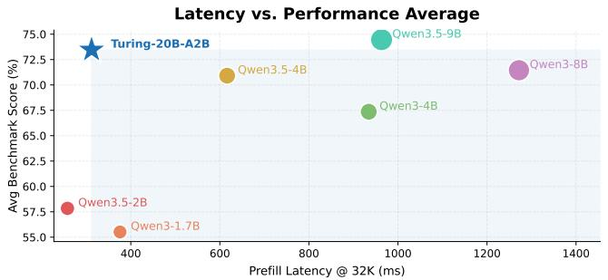

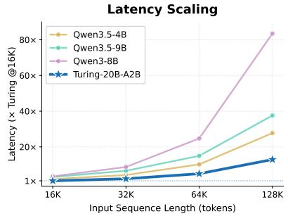

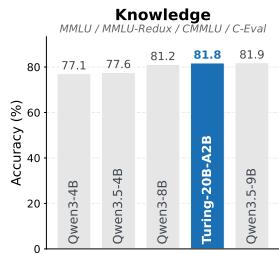

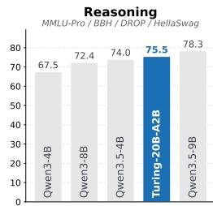

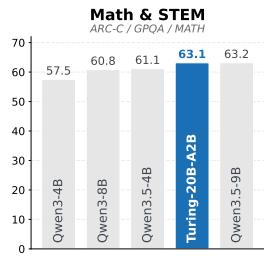

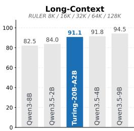  
Figure 1: Overall capability and inference-efficiency comparison of Turing-20B-A2B with representative open-source base models. The overall benchmark score averages all evaluated Knowledge, Reasoning, and Math & STEM benchmarks. Prefill latency is measured on NVIDIA H800 GPUs.

## 1 Introduction

In physical AI systems such as autonomous driving and embodied intelligence, large language models (LLMs) are increasingly used as foundation models to support perception, reasoning, decision-making, and the prediction of action-conditioned environment dynamics [1–5]. These systems require the underlying model to balance several competing objectives. To make reliable decisions in complex physical environments, the model must retain broad world knowledge and strong general reasoning capabilities. Meanwhile, foundation models deployed in autonomous-driving and embodied systems increasingly need to process extended histories of visual observations, system states, and actions to capture temporal dependencies and support coherent behavior over long interactions [4, 6, 7]. Such long-context inputs substantially increase the computational and memory costs of model inference [8, 9], while closed-loop interaction requires decisions to be produced under strict latency constraints. Therefore, a practical foundation model for physical AI must simultaneously provide strong general capabilities, efficient long-context modeling, and low-latency inference.

Scaling model capacity has been a major driver of capability improvements in modern LLMs [10, 11]. However, larger dense models generally require more computation for each token, increasing inference cost and response latency in latency-sensitive physical AI systems. Mixture-of-Experts (MoE) architectures alleviate part of this tension by increasing total model capacity while keeping the number of parameters activated per token relatively small [12]. MoE architectures have consequently become a common design choice in recent frontier open-weight models, including DeepSeek-V4, Qwen3.6, and Kimi K3 [13–15]. Nevertheless, computational sparsity does not automatically translate into proportional inference speedups: conventional top-k routing can produce imbalanced expert loads and irregular execution, making efficient deployment dependent on additional system-level optimization [16, 17]. At the same time, the long observation and action histories common in physical AI applications make standard full attention increasingly expensive in both computation and memory. Recent frontier models therefore adopt efficient or hybrid attention architectures to improve long-context efficiency while preserving expressive token interactions [13, 15, 18]. Despite these advances, many frontier models still operate with relatively large active-parameter budgets or require substantial deployment optimization to realize their architectural efficiency in practice. Achieving strong general capabilities, favorable long-context latency scaling, and efficient deployment within a compact active-parameter budget therefore remains challenging.

To address these challenges, we develop Turing-20B-A2B, a 20B-parameter Mixture-of-Experts language model that activates approximately 2B parameters per token on average. The model is designed around a deployment-oriented scaling recipe for physical AI foundation models. It combines dynamic top-k Quantile Routing [19] for token-adaptive expert allocation, a hybrid attention backbone dominated by Lightning Attention [20] for efficient long-context processing, progressive continued pretraining for context extension, and capacity-constrained expert execution during prompt prefill for more regular and predictable deployment behavior. Quantile Routing allows different tokens to activate different numbers of experts while maintaining balanced expert utilization and a controlled average compute budget through online quantile tracking. The hybrid attention design substantially reduces the contribution of quadratic-complexity attention as context length grows while retaining periodic global token interactions through full-attention layers. During pretraining, MoE execution remains dropless, whereas deployment-time expert-capacity control bounds per-expert workloads to improve the regularity and efficiency of prompt prefill. Progressive long-context continued pretraining further extends the native context window from 4K to 128K, followed by inference-time extension to 512K using YaRN. Together, these components provide a practical path to scaling foundation-model capability and context length without proportionally increasing per-token computation or sacrificing deployment efficiency.

The effectiveness of this design is reflected in the model’s empirical performance. As shown in Figure 1, at the base-model stage, Turing-20B-A2B outperforms Qwen3-8B Base in the overall benchmark average and approaches the substantially larger Qwen3.5-9B Base, despite activating only approximately 2B parameters per token on average. Across capability categories, Turing-20B-A2B exhibits particularly strong performance on knowledge and math & STEM benchmarks while remaining competitive in reasoning and long-context evaluations. Meanwhile, the model maintains favorable prefill-latency scaling over long contexts, with the efficiency advantage over representative Qwen3 and Qwen3.5 baselines becoming increasingly pronounced from 32K to 128K on NVIDIA H800 GPUs with FP16 precision. Together, these results demonstrate that the proposed deploymentoriented scaling recipe achieves a favorable balance among model capability, long-context scalability, and inference efficiency under a compact active-parameter budget, making Turing-20B-A2B well suited to latency-sensitive physical AI workloads that require both extended context processing and efficient execution.

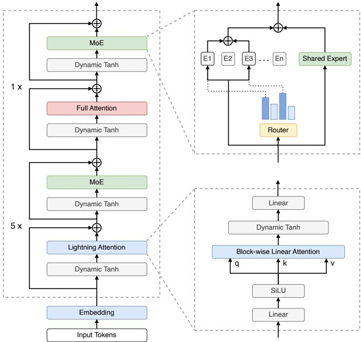

<table><tr><td>Turing-20B-A2B</td><td></td></tr><tr><td>Model Total parameters</td><td>20B</td></tr><tr><td>Activated parameters Layers Hidden size</td><td>~2B 24 2,048</td></tr><tr><td>Native context</td><td>128K 512K</td></tr><tr><td>Extended context MoE</td><td></td></tr><tr><td>Routed experts Active experts</td><td>256 ~8 1</td></tr><tr><td>Shared experts</td><td></td></tr><tr><td>Routed expert dim</td><td>512</td></tr><tr><td>Shared expert dim</td><td>2,048</td></tr><tr><td>Attention</td><td></td></tr><tr><td>Attention heads</td><td></td></tr><tr><td></td><td></td></tr><tr><td></td><td>16</td></tr><tr><td></td><td></td></tr><tr><td></td><td></td></tr><tr><td>Head dimension Lightning Attn. layers</td><td>128 20 4</td></tr></table>

Figure 2: Overview of the Turing-20B-A2B architecture and model configuration. The decoder stack alternates groups of five Lightning Attention layers with one full-attention layer. The table summarizes the main architectural configurations.

## 2 Model Architecture

Turing-20B-A2B is a decoder-only Mixture-of-Experts language model designed to balance model capacity, long-context efficiency, and inference cost under a compact activated-parameter budget. The model contains approximately 20B parameters in total while activating approximately 2B parameters per token. As illustrated in Figure 2, Turing-20B-A2B combines a hybrid-attention backbone with sparse MoE feed-forward modules and token-adaptive expert routing. Most decoder layers employ Lightning Attention for efficient long-context computation, while periodic full-attention layers preserve global token interactions. The feed-forward modules are predominantly implemented as sparse MoE layers with routed experts and a shared expert.

## 2.1 Overall Architecture

Turing-20B-A2B consists of 24 decoder layers with a hidden dimension of 2,048. A central consideration in the architectural design is deployment simplicity. Because the target inference stack includes internal edge devices with a relatively constrained operator set, we favor modules that can be implemented with simple and efficient primitives and avoid introducing unnecessary architectural complexity. This consideration motivates the use of the basic Lightning Attention formulation for linear-attention layers, as well as Dynamic Tanh (DyT) [21] in place of conventional RMSNorm. Together, these choices keep the core decoder structure lightweight and deployment-friendly while preserving the modeling capacity required for large-scale pretraining and long-context extension.

The decoder stack follows a repeating hybrid-attention pattern. Every group of six layers contains five Lightning Attention layers followed by one full-attention layer, resulting in 20 Lightning Attention layers and four full-attention layers in total. Each attention module is preceded by DyT, and its output is combined with the residual stream before entering the feed-forward module. This design substantially reduces the fraction of layers that incur quadratic attention cost while retaining periodic global token interactions through full attention.

The first decoder layer uses a dense feed-forward network, while the remaining layers use sparse MoE feed-forward modules. Each MoE module contains 256 routed experts and one shared expert. The routed experts use an intermediate dimension of 512, whereas the shared expert uses an intermediate dimension of 2,048. Approximately eight routed experts are activated per token on average, allowing the model to increase total parameter capacity while maintaining a compact per-token computation budget. The detailed MoE formulation and expert-routing strategy are described in Sections 2.3 and 2.4, respectively.

The final model supports a native context length of 128K tokens and is further extended to 512K at inference time using YaRN. The following subsections describe the hybrid attention mechanism, sparse MoE architecture, and routing strategy in detail.

## 2.2 Hybrid Attention

Turing-20B-A2B adopts a hybrid attention architecture in which Lightning Attention [20] is used in the majority of decoder layers and standard causal full attention is inserted periodically. As described in Section 2.1, the model follows a 5:1 pattern, with five Lightning Attention layers followed by one full-attention layer. This design reduces the computational growth associated with long-context processing while retaining periodic global token interactions.

Our Lightning Attention implementation largely follows the formulation introduced in Lightning Attention-2 [20]. The attention computation is performed in a block-wise linear-attention form, combining intra-block attention with recurrent inter-block state propagation. We additionally enable the exponential decay mechanism, with a different decay rate assigned to each attention head. For head $h ,$ the interaction between positions i and j is modulated by

$$
D _ { h } ( i , j ) = \exp \left( - s _ { h } ( i - j ) \right) , \qquad i \ge j ,\tag{1}
$$

where $s _ { h }$ is a head-specific decay slope. The slopes are constructed using an ALiBi-style head-wise schedule [22], so that different attention heads operate with different effective temporal ranges. Equivalently, by defining $\lambda _ { h } = \exp ( - s _ { h } )$ , the decay can be written as $D _ { h } ( i , j ) = \lambda _ { h } ^ { i - j }$ . This blockwise formulation avoids explicitly materializing the full quadratic attention matrix and therefore provides substantially more favorable scaling with sequence length.

Periodic full-attention layers complement Lightning Attention by providing unrestricted token-totoken interactions across the complete context. In Turing-20B-A2B, four of the 24 decoder layers use causal full attention, while the remaining 20 layers use Lightning Attention. This hybrid design provides a practical balance between long-context efficiency and global information exchange.

## 2.3 Mixture-of-Experts

To increase model capacity without proportionally increasing the per-token computation cost, Turing-20B-A2B replaces the dense feed-forward networks in most decoder layers with sparse Mixture-of-Experts (MoE) modules. The first decoder layer retains a dense feed-forward network, while the remaining layers employ sparse MoE blocks. In practice, expert loads in the earliest MoE layer are often more difficult to balance, since token representations are still at a relatively low level of abstraction. We therefore use a dense feed-forward layer at the bottom of the network and introduce sparse expert routing only in subsequent layers.

Each MoE block contains 256 routed experts together with one shared expert. For an input token representation $\mathbf { x } _ { t } ,$ the router produces expert scores and selects a sparse set of routed experts $S _ { t }$ . The routed branch is computed as

$$
\mathbf { y } _ { t } ^ { \mathrm { r o u t e d } } = \sum _ { e \in S _ { t } } w _ { t , e } \mathrm { F F N } _ { e } ( \mathbf { x } _ { t } ) ,\tag{2}
$$

where $w _ { t , e }$ denotes the routing weight assigned to expert e. In parallel, every token is processed by a shared expert, $\mathrm { F F N } _ { \mathrm { s h a r e d } }$ , and the final MoE output is given by

$$
\mathbf y _ { t } = \mathbf y _ { t } ^ { \mathrm { r o u t e d } } + \mathrm { F F N } _ { \mathrm { s h a r e d } } ( \mathbf x _ { t } ) .\tag{3}
$$

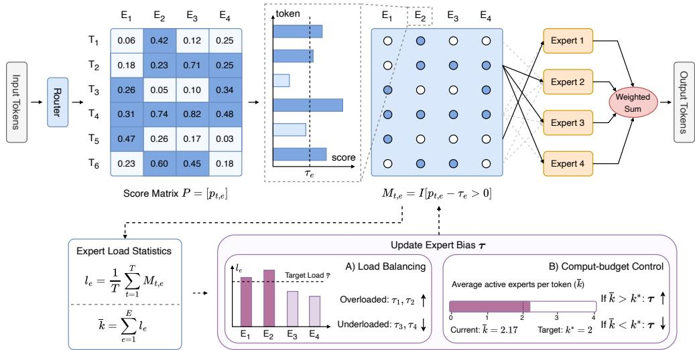  
Figure 3: Overview of the routing strategy. Expert-specific thresholds determine token–expert assignments and are updated from expert-load statistics during training to track the target $\left( 1 - k ^ { * } / E \right)$ score quantiles. This unified quantile-tracking process naturally balances expert utilization, controls the average routing budget, and allows token-adaptive expert activation.

The routed experts use an intermediate dimension of 512, whereas the shared expert uses a substantially larger intermediate dimension of 2,048. Besides providing a dense computation path shared by all tokens, the larger shared expert also serves as a stronger fallback path for the capacity-constrained routing used during prompt prefill. When some routed-expert assignments are removed because an expert exceeds its capacity, the shared expert remains available to every token and helps preserve a stable minimum amount of feed-forward computation. We describe the capacity-constrained routing mechanism in Section 2.4.

## 2.4 Routing Strategy

Turing-20B-A2B adopts Quantile Routing [19] in a dynamic top-k configuration. Unlike conventional top-k routing, which assigns every token to a fixed number of experts, this configuration determines expert activation by comparing router scores against expert-specific thresholds. As a result, different tokens may activate different numbers of routed experts according to their score distributions, while the average routing budget remains controlled around a target value.

As illustrated in Figure 3, given a token representation $\mathbf { x } _ { t } .$ , the router produces a score $p _ { t , e }$ for each routed expert e. Each expert is associated with an expert-specific threshold $\tau _ { e } ,$ , and the corresponding token–expert assignment is defined as

$$
M _ { t , e } = \mathbb { I } \left[ p _ { t , e } > \tau _ { e } \right] ,\tag{4}
$$

where $M _ { t , e } \in \{ 0 , 1 \}$ indicates whether token t is dispatched to expert e. The number of routed experts activated by token t is therefore

$$
k _ { t } = \sum _ { e = 1 } ^ { E } M _ { t , e } ,\tag{5}
$$

which is allowed to vary across tokens.

The key idea of Quantile Routing is to adapt each expert-specific threshold toward a target quantile of its router-score distribution. Given a target average routing budget of $k ^ { * }$ experts per token and E routed experts, the desired activation probability of each expert is approximately $k ^ { * } / E$ . Accordingly, the threshold $\tau _ { e }$ is driven toward the $( 1 - k ^ { * } / E )$ quantile of the score distribution $\{ p _ { t , e } \} _ { t = 1 } ^ { T }$ for expert $e ,$ such that

$$
\mathrm { P r } ( p _ { t , e } > \tau _ { e } ) \approx \frac { k ^ { * } } { E } .\tag{6}
$$

Intuitively, this places approximately the highest-scoring $k ^ { * } / E$ fraction of tokens above the routing threshold for each expert.

We track the target quantile through expert-load statistics and corresponding bias updates. For expert $e ,$ the normalized load is

$$
\ell _ { e } = \frac { 1 } { T } \sum _ { t = 1 } ^ { T } M _ { t , e } .\tag{7}
$$

As shown in Figure 3, the bias-update procedure incorporates both the relative load of individual experts and the current average number of activated experts. Together, they form the adjustment that moves the expert-specific thresholds toward their target quantiles.

Once the thresholds approach the target, expert balancing and computation-budget control arise naturally from the same routing mechanism. Since each expert accepts approximately a $k ^ { * } / E$ fraction of tokens, expert loads tend toward a balanced distribution. At the same time, the expected number of routed experts activated per token satisfies

$$
\mathbb { E } [ k _ { t } ] = \sum _ { e = 1 } ^ { E } \operatorname* { P r } ( p _ { t , e } > \tau _ { e } ) \approx k ^ { * } .\tag{8}
$$

Thus, Quantile Routing simultaneously provides balanced expert utilization and control of the average expert budget through a unified quantile-tracking process, while allowing the model to adaptively allocate different amounts of expert computation to tokens of varying difficulty. In Turing-20B-A2B, we set the target average routing budget to approximately eight routed experts per token.

During pretraining, we keep MoE routing dropless and do not impose an explicit expert-capacity constraint [12]. This avoids introducing capacity-induced competition among tokens, particularly for packed training sequences containing multiple independent documents. Moreover, global score-based capacity selection may cause the expert assignment of an earlier token to depend on router scores from later tokens in the same packed sequence, potentially introducing a non-causal dependency into the MoE execution path. We therefore retain dropless routing throughout these training stages. For prompt prefill during reinforcement learning and deployment, however, we additionally impose an expert-capacity constraint to bound the maximum workload assigned to individual experts.

For an input containing T prefill tokens, the capacity of each routed expert is defined as

$$
C _ { e } = \left\lceil \gamma \frac { T k ^ { * } } { E } \right\rceil , \qquad \gamma = 1 . 2 5 ,\tag{9}
$$

where $\gamma$ denotes the capacity factor. When the number of assignments routed to an expert exceeds its capacity, the assignments are ranked according to their router scores and only the highest-scoring $C _ { e }$ assignments are retained [23]. This score-based overflow policy preferentially preserves assignments with stronger routing preferences while explicitly bounding the maximum workload of each expert.

During reinforcement learning, each device processes a single QA sample, so capacity competition remains within one prompt and does not couple independent samples. Moreover, because the complete prompt serves as observed conditioning context, score-based selection does not access future response tokens and therefore preserves the causal structure of autoregressive generation. During deployment, bounding the per-expert workload also makes the expert-execution path more regular and improves long-context prefill efficiency. We evaluate the effect of this design on model capability and MoE-module prefill latency in Section 5.2.

## 3 Training Recipe

We train Turing-20B-A2B using a progressive curriculum designed to first establish broad language and knowledge capabilities, then strengthen capability-dense domains, and finally consolidate the model through quality-focused annealing. The main pretraining process is organized into three stages— knowledgefoundation, capability enhancement, and quality annealing—with stage-dependent data mixtures and learning-rate schedules while keeping the model architecture and training objective unchanged. After the main 4K-context pretraining curriculum, we further extend the native context window through continued long-context training from 4K to 32K and subsequently to 128K. Overall, the main pretraining process was completed in approximately 22 days using 512 NVIDIA H800 GPUs.

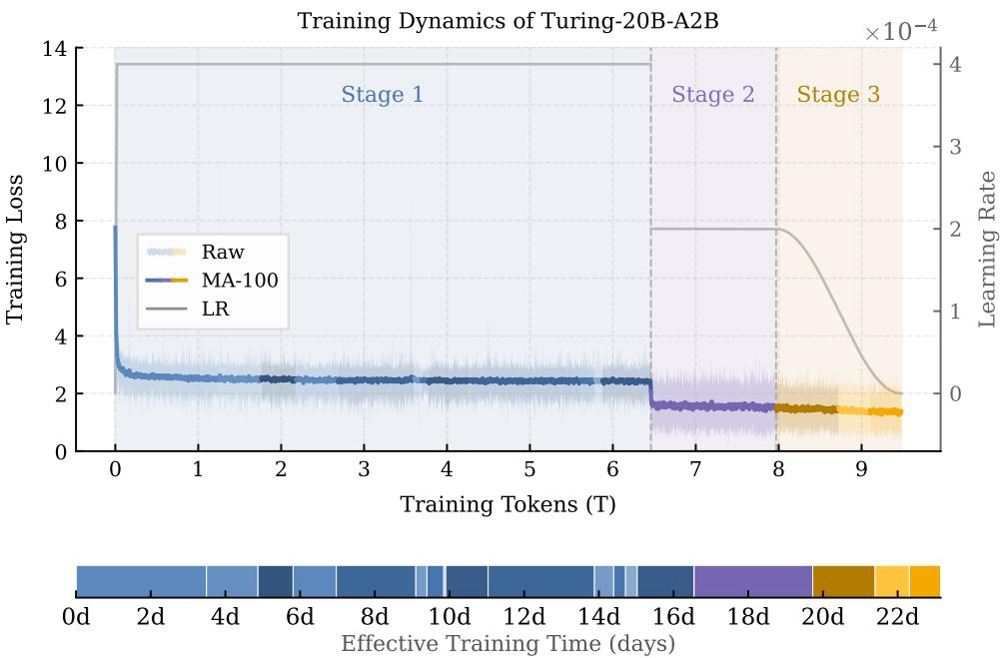  
Figure 4: Training dynamics of Turing-20B-A2B over the three-stage main pretraining curriculum. The upper panel shows the raw training loss, its 100-step moving average (MA-100), and the learning-rate schedule over processed tokens, with dashed lines indicating stage boundaries. The lower timeline shows the effective training time of individual resumed runs.

Figure 4 summarizes the corresponding training trajectory, including the training loss, learning-rate schedule, stage transitions, and effective training time.

## 3.1 Pretraining Data

Our pretraining corpus is primarily bilingual in English and Chinese and covers a broad range of domains, including general web text, mathematics, source code, scientific content, and other knowledge-intensive data. The data composition is progressively adjusted across the three-stage curriculum. Stage 1 emphasizes large-scale and diverse natural corpora to establish broad linguistic and knowledge coverage. Stage 2 increases the contribution of higher-quality filtered and capability dense data, while Stage 3 further shifts toward internally constructed data for capability consolidation. We do not disclose the exact mixture ratios of individual data sources.

For general web data, we use large-scale public corpora such as DCLM [24] and FineWeb-Edu [25] during the foundation stage, followed by higher-quality filtered English and Chinese web data in the later stages. The filtering and data-selection pipelines for web and mathematical corpora follow the quality-oriented tiered data management methodology explored in UltraData [26]. In particular, we apply deduplication, cleaning, and quality-aware selection to reduce noisy, redundant, and low-information content while preserving broad topical coverage.

Mathematical data includes FineMath [27], InfiMM-WebMath [28], and OpenWebMath [29] in Stage 1, with MegaMath [30] and additional filtered mathematical data introduced in Stage 2. Stage 3 further incorporates in-house mathematical data. For code, we primarily use The Stack v2 [31] and Stack-Edu [27] during Stages 1 and 2, while Stage 3 uses in-house code data. Knowledge-oriented data includes peS2o [32], Wikipedia, and Cosmopedia v2 [27] in Stage 1, followed by in-house knowledge data in the later stages. A relatively small amount of book and academic-paper data is additionally introduced during Stages 2 and 3 to improve coverage of long-form, structured, and specialized knowledge.

Our in-house corpora consist of both internally processed natural data and synthetic data. Synthetic data primarily targets mathematics, code, and knowledge, with the goal of increasing the diversity and density of high-value concepts, structured reasoning patterns, and specialized knowledge that may be underrepresented in naturally occurring corpora. Such data plays a larger role in the later stages, where training increasingly emphasizes data quality and capability density over raw corpus scale.

Table 1: Representative data sources used across the three-stage pretraining curriculum. Public datasets are listed by name, while filtered and in-house entries denote internally processed or constructed corpora. Exact mixture ratios are not disclosed.
<table><tr><td>Category</td><td>S1: Knowledge Foundation</td><td>S2: Capability Enhancement</td><td>S3: Quality Annealing</td></tr><tr><td>Web</td><td>DCLM, FineWeb-Edu</td><td>filtered web data</td><td>filtered web data</td></tr><tr><td>Math</td><td>FineMath, InfiWebMath, OpenWebMath</td><td>MegaMath, filtered math data</td><td>in-house math data</td></tr><tr><td>Code</td><td>The Stack v2, Stack-Edu</td><td>The Stack v2, Stack-Edu</td><td>in-house code data</td></tr><tr><td>Knowledge</td><td>peS2o, Wikipedia, Cosmopedia v2</td><td>in-house knowledge data, books/papers</td><td>in-house knowledge data, books/papers</td></tr></table>

Table 1 summarizes the representative data sources used across the three stages. Overall, the data curriculum progressively transitions from broad natural coverage toward higher-quality filtered and in-house data, providing a broad foundation in the early stage while allowing the later stages to focus more strongly on capability-dense training signals.

## 3.2 Optimization and Training Curriculum

The main pretraining process follows a three-stage curriculum while sharing a common optimization and distributed-training setup. We use a sequence length of 4,096 and a global batch size of 2,048 sequences, corresponding to approximately 8.4M tokens per optimization step. Training is performed with BF16 mixed precision using AdamW with $\beta _ { 1 } = \mathrm { { 0 . 9 , } } \bar { \beta } _ { 2 } = 0 . 9 5 , \bar { \epsilon } = 1 0 ^ { - 8 }$ , and a weight decay of 0.1. Weight decay is not applied to embedding parameters, and gradients are clipped to a maximum norm of 1.0. In addition to the standard next-token prediction objective, we adopt Multi-Token Prediction (MTP) following DeepSeek-V3 [33], using a single additional prediction head $( N _ { \mathrm { M T P } } = 1 )$ with a loss weight of $\lambda _ { \mathrm { M T P } } = 0 . 1$ . For distributed MoE training, we use expert parallelism with degree 8, while tensor and pipeline parallelism are both set to 1. A distributed optimizer is used, with gradient reduction performed in FP32.

For all training data, we adopt length-aware bin packing following Ding et al. [34] to improve sequence utilization and reduce unnecessary truncation and padding. The treatment of attention across packed documents evolves with the curriculum: Stage 1 uses standard causal attention over the packed sequence, whereas Stages 2 and 3 additionally apply a document-level attention mask to prevent tokens from attending across document boundaries.

As illustrated in Figure 4, the main pretraining process is organized into three progressive stages: knowledge foundation, capability enhancement, and quality annealing. The model architecture and training objective remain unchanged throughout the curriculum, while the data distribution, learning-rate schedule, and packed-sequence attention treatment are progressively adjusted. Stage 1 runs for 770K optimization steps (∼ 6.5T tokens), followed by 180K steps in Stage 2 and another 180K steps in Stage 3 (approximately 1.5T tokens each).

Stage 1: knowledge foundation. Training begins with a 2,000-step warm-up to a peak learning rate of $4 \times 1 0 ^ { - 4 }$ , which is then kept constant throughout Stage 1. The data mixture emphasizes large-scale and diverse natural data to establish broad linguistic coverage, world knowledge, and general modeling capability.

Stage 2: capability enhancement. At the transition to Stage 2, the learning rate is reduced to $2 \times 1 0 ^ { - 4 }$ and held constant. The data distribution shifts toward higher-quality and more capabilitydense content, with increased emphasis on mathematics, code, and specialized knowledge while retaining filtered web data for general knowledge. Starting from this stage, a document-level attention mask is applied to packed sequences to preserve document independence.

Table 2: Long-context training and inference-extension configuration. Turing-20B-A2B is progressively continued-pretrained from 4K to 32K and then to 128K. The resulting 128K checkpoint is further extended to 512K with YaRN without additional parameter updates.
<table><tr><td>Configuration</td><td>LC-1</td><td>LC-2</td><td>Inference Extension</td></tr><tr><td>Context window</td><td> $4 K  3 2 \mathrm { K }$ </td><td> $\mathrm { 3 2 K } \to \mathrm { 1 2 8 K }$ </td><td> $1 2 8 \mathrm { K }  5 1 2 \mathrm { K }$ </td></tr><tr><td>RoPE θ</td><td> ${ 1 0 } ^ { 6 }$ </td><td> $5 \times 1 0 ^ { 6 }$ </td><td> $5 \times 1 0 ^ { 6 }$ </td></tr><tr><td>Training steps</td><td>5,000</td><td>5,000</td><td>0</td></tr><tr><td>Context parallelism</td><td>2</td><td>8</td><td>一</td></tr><tr><td>YaRN factor</td><td>一</td><td>一</td><td>4</td></tr></table>

Stage 3: quality annealing. Stage 3 continues from the same learning rate of $2 \times 1 0 ^ { - 4 }$ and applies cosine decay to $1 0 ^ { - 6 }$ . The training mixture further shifts toward higher-quality in-house data, with greater emphasis on capability-dense mathematics, code, and knowledge data. The document-level attention mask introduced in Stage 2 is retained throughout this stage.

Overall, the curriculum progressively shifts the training emphasis from broad coverage to capability density and finally to data quality, while the learning-rate schedule transitions from high-rate foundation training to low-rate quality-focused annealing.

## 3.3 Long-Context Training

After completing the three-stage main pretraining curriculum at a context length of 4K, we progressively extend the native context window of Turing-20B-A2B through two continued-pretraining stages, first from 4K to 32K and subsequently from 32K to 128K. Rather than directly training at the target context length, this progressive schedule gradually exposes the model to increasingly longer sequences while adjusting the positional encoding and context-parallel configuration accordingly. Both stages are trained on 256 NVIDIA H800 GPUs with a global token batch of approximately 8.4M tokens per optimization step. Each stage runs for 5,000 steps with a peak learning rate of $8 \times 1 0 ^ { - 5 }$ , a 150-step warm-up, and a WSD schedule with cosine decay to a minimum learning rate of $1 0 ^ { - 6 }$

Long-context data mixture. Both continued-pretraining stages use the same dedicated longcontext data mixture. We retain 45% of the Stage 3 data distribution, preserving its original relative proportions to mitigate degradation of capabilities acquired during main pretraining. Synthetic long-context data accounts for another 20% and includes needle-in-a-haystack tasks, frequency-based aggregation tasks, long-context question answering, and other synthetic formats targeting long-range information access and reasoning. The remaining 35% consists of naturally long data, including long and extra-long books, textbooks, and web documents derived from ProLong [35] and FineWeb [25], long-context instruction data from LongAlign [36], and software-engineering data from Scale-SWE-Distilled [37]. This mixture balances capability retention, explicit long-context training signals, and exposure to naturally occurring long sequences.

LC-1: 4K→ 32K. Starting from the final checkpoint of the main pretraining curriculum, LC-1 increases the maximum sequence length to 32,768 tokens and raises the RoPE base to $\theta = 1 0 ^ { 6 }$ Context parallelism of degree 2 is used to support the longer sequence length. The resulting 32K checkpoint is then used to initialize the subsequent long-context training stage.

LC-2: 32K→ 128K. LC-2 further increases the maximum sequence length to 131,072 tokens and raises the RoPE base from $1 0 ^ { 6 } ~ \mathrm { t o } ~ 5 \times 1 0 ^ { 6 }$ . To accommodate the fourfold increase in context length, the context-parallel degree is increased from 2 to 8, while the remaining optimization configuration and global token batch are kept unchanged. The naturally long portion of the training mixture further incorporates long and extra-long documents to increase exposure to sequences approaching the target context length. The resulting checkpoint is the final model directly trained with a context window of 128K.

Inference extension: 128K→ 512K. For context lengths beyond the window observed during continued pretraining, we apply YaRN [38] directly to the final 128K checkpoint at inference time without performing any additional parameter updates. We retain the RoPE base $\theta = 5 \times 1 0 ^ { 6 }$ and apply a scaling factor of 4, extending the positional range from 131,072 to 524,288 tokens. Thus, 128K is the maximum context length directly observed during training, while the reported 256K and 512K results evaluate training-free positional extrapolation.

Table 3: Comparison of Turing-20B-A2B with representative Qwen3 base models on standard pretraining benchmarks. The best and second-best results are highlighted in bold and underlined, respectively.
<table><tr><td>Benchmark</td><td># Shots</td><td>Qwen3-1.7B Base</td><td>Qwen3-4B Base</td><td>Qwen3-8B Base</td><td>Turing-20B-A2B</td></tr><tr><td colspan="6">Knowledge Tasks</td></tr><tr><td>MMLU (Acc.)</td><td>5-shot</td><td>65.04</td><td>75.44</td><td>78.92</td><td>79.83</td></tr><tr><td>MMLU-Redux (Acc.)</td><td>5-shot</td><td>66.83</td><td>77.39</td><td>81.39</td><td>81.37</td></tr><tr><td>CMMLU (Acc.)</td><td>5-shot</td><td>66.46</td><td>77.01</td><td>81.28</td><td>84.17</td></tr><tr><td>C-Eval (Acc.)</td><td>5-shot</td><td>66.90</td><td>78.46</td><td>83.06</td><td>81.76</td></tr><tr><td colspan="6">Reasoning Tasks</td></tr><tr><td>MMLU-Pro (Acc.)</td><td>5-shot</td><td>36.91</td><td>50.23</td><td>55.35</td><td>55.17</td></tr><tr><td>BBH (EM)</td><td>3-shot</td><td>54.38</td><td>70.34</td><td>73.67</td><td>73.61</td></tr><tr><td>DROP (EM)</td><td>0-shot</td><td>56.46</td><td>76.22</td><td>79.03</td><td>82.61</td></tr><tr><td>WinoGrande (Acc.)</td><td>5-shot</td><td>53.83</td><td>67.01</td><td>70.24</td><td>68.75</td></tr><tr><td>HellaSwag (Acc.)</td><td>0-shot</td><td>57.48</td><td>73.16</td><td>81.39</td><td>90.44</td></tr><tr><td colspan="6">Math &amp; STEM Tasks</td></tr><tr><td>ARC-C (Acc.)</td><td>0-shot</td><td>80.34</td><td>90.17</td><td>91.53</td><td>90.17</td></tr><tr><td>GPQA (Acc.)</td><td>5-shot</td><td>24.78</td><td>30.81</td><td>34.82</td><td>37.05</td></tr><tr><td>GSM8K (EM)</td><td>4-shot</td><td>76.95</td><td>89.16</td><td>90.07</td><td>74.53</td></tr><tr><td>MATH (EM)</td><td>4-shot</td><td>41.68</td><td>51.56</td><td>56.12</td><td>62.20</td></tr></table>

Table 4: Comparison of Turing-20B-A2B with representative Qwen3.5 base models on standard pretraining benchmarks. The best and second-best results are highlighted in bold and underlined, respectively.
<table><tr><td>Benchmark</td><td># Shots</td><td>Qwen3.5-2B Base</td><td>Qwen3.5-4B Base</td><td>Qwen3.5-9B Base</td><td>Turing-20B-A2B</td></tr><tr><td colspan="6">Knowledge Tasks</td></tr><tr><td>MMLU (Acc.)</td><td>5-shot</td><td>65.51</td><td>77.53</td><td>81.02</td><td>79.83</td></tr><tr><td>MMLU-Redux (Acc.)</td><td>5-shot</td><td>67.24</td><td>80.11</td><td>82.81</td><td>81.37</td></tr><tr><td>CMMLU (Acc.)</td><td>5-shot</td><td>64.46</td><td>76.24</td><td>81.13</td><td>84.17</td></tr><tr><td>C-Eval (Acc.)</td><td>5-shot</td><td>65.05</td><td>76.66</td><td>82.52</td><td>81.76</td></tr><tr><td colspan="6">Reasoning Tasks</td></tr><tr><td>MMLU-Pro (Acc.)</td><td>5-shot</td><td>36.33</td><td>52.32</td><td>57.93</td><td>55.17</td></tr><tr><td>BBH (EM)</td><td>3-shot</td><td>63.67</td><td>79.44</td><td>82.56</td><td>73.61</td></tr><tr><td>DROP (EM)</td><td>0-shot</td><td>61.66</td><td>79.59</td><td>83.33</td><td>82.61</td></tr><tr><td>WinoGrande (Acc.)</td><td>5-shot</td><td>57.77</td><td>58.25</td><td>75.30</td><td>68.75</td></tr><tr><td>HellaSwag (Acc.)</td><td>0-shot</td><td>64.09</td><td>84.51</td><td>89.57</td><td>90.44</td></tr><tr><td colspan="6">Math &amp; STEM Tasks</td></tr><tr><td>ARC-C (Acc.)</td><td>0-shot</td><td>85.76</td><td>93.56</td><td>94.58</td><td>90.17</td></tr><tr><td>GPQA (Acc.)</td><td>5-shot</td><td>33.04</td><td>37.37</td><td>41.52</td><td>37.05</td></tr><tr><td>GSM8K (EM)</td><td>4-shot</td><td>69.60</td><td>86.05</td><td>89.46</td><td>74.53</td></tr><tr><td>MATH (EM)</td><td>4-shot</td><td>35.76</td><td>52.48</td><td>53.38</td><td>62.20</td></tr></table>

## 4 Evaluation

## 4.1 Overall Performance

We evaluate the general capabilities of Turing-20B-A2B on thirteen widely used benchmarks for pretrained base models, covering knowledge, reasoning, mathematics, and STEM. For knowledge evaluation, we use MMLU [39], MMLU-Redux [40], CMMLU [41], and C-Eval [42]. For reasoning, we evaluate on MMLU-Pro [43], BBH [44], DROP [45], WinoGrande [46], and HellaSwag [47]. Math and STEM capabilities are evaluated using ARC-Challenge (ARC-C) [48], GPQA [49], GSM8K [50], and MATH [51].

All models are evaluated using OpenCompass [52] under a unified generation-based evaluation protocol. Instead of scoring candidate answers using token likelihood, each model directly generates a textual response, from which the final answer is extracted using a benchmark-specific post-processing procedure. We use identical dataset versions and evaluation splits, few-shot demonstrations and their ordering, prompt templates, chain-of-thought settings, generation configurations, answer extraction procedures, and scoring implementations for all compared models. The number of in-context demonstrations and the reported metric for each benchmark are summarized in Tables 3 and 4. Complete benchmark-specific configurations are provided in Appendix A.

As shown in Table 3, Turing-20B-A2B achieves competitive overall performance compared with Qwen3 base models despite activating only approximately 2B parameters per token. Across the evaluated categories, the model exhibits a balanced capability profile, with particularly strong performance in knowledge-intensive, reasoning, and mathematical tasks. Overall, Turing-20B-A2B reaches a performance level comparable to Qwen3-8B while using a substantially smaller activated parameter budget per token, demonstrating favorable parameter efficiency.

Table 4 further compares Turing-20B-A2B with Qwen3.5 base models across multiple dense-model scales, including 2B, 4B, and 9B variants. Although Qwen3.5-9B achieves higher scores on a number of benchmarks, Turing-20B-A2B remains broadly competitive across the evaluated capability categories and preserves clear strengths on several tasks. It is worth noting that Qwen3.5 base models may activate an explicit thinking process during evaluation, resulting in substantially longer generations on reasoning-intensive tasks. The comparison with Qwen3.5-2B and Qwen3.5-4B further shows that Turing-20B-A2B maintains a strong and well-balanced general capability profile across model scales, while activating only approximately 2B parameters per token.

## 4.2 Long-Context Ability

We evaluate long-context capability using RULER [53], which assesses a range of abilities including information retrieval, multi-hop tracing, aggregation, and question answering over synthetically controlled context lengths. We separately compare Turing-20B-A2B with Qwen3 and Qwen3.5 base models to better characterize its long-context behavior across different model generations.

Turing-20B-A2B is progressively trained to a context length of 128K, following the 4K→ 32K→ 128K curriculum described in Section 3.3. For evaluations beyond the trained context window, we apply a factor-4 YaRN configuration to the same 128K checkpoint without additional continued pretraining. In the following tables, cells marked in light blue denote results obtained using YaRNbased context extension.

As shown in Table 5, Turing-20B-A2B exhibits substantially stronger scaling with context length than the Qwen3 base models. At shorter contexts, its performance is comparable to Qwen3-8B, while the gap becomes increasingly pronounced as the sequence length grows. Turing-20B-A2B maintains a RULER score above 90 through 64K and retains strong performance at the trained 128K context limit, indicating substantially slower degradation over long contexts.

Notably, all reported Qwen3 results beyond 32K are obtained using YaRN-based context extension, whereas the 64K and 128K results of Turing-20B-A2B remain within its progressively trained context range. The comparison therefore suggests that progressive long-context training provides robust scaling toward the model’s native training limit.

Table 6 provides a more challenging comparison with the newer Qwen3.5 base models across different model scales. At shorter context lengths, Turing-20B-A2B performs between Qwen3.5-2B and the larger Qwen3.5-4B and Qwen3.5-9B models. As the sequence length increases, however, Turing-20B

Table 5: Comparison of Turing-20B-A2B with representative Qwen3 base models on RULER across context lengths up to 128K. Cells marked in light blue denote results obtained using YaRNbased context extension. The best and second-best results are highlighted in bold and underlined, respectively.
<table><tr><td rowspan="2">Model</td><td colspan="5">RULER</td></tr><tr><td>8K</td><td>16K</td><td>32K</td><td>64K</td><td>128K</td></tr><tr><td>Qwen3-1.7B Base</td><td>87.01</td><td>83.67</td><td>76.99</td><td></td><td></td></tr><tr><td>Qwen3-4B Base</td><td>92.40</td><td>91.48</td><td>85.38</td><td>69.96</td><td>55.77</td></tr><tr><td>Qwen3-8B Base</td><td>94.14</td><td>92.63</td><td>89.26</td><td>74.83</td><td>61.56</td></tr><tr><td>Turing-20B-A2B</td><td>93.80</td><td>93.45</td><td>93.16</td><td>90.00</td><td>84.87</td></tr></table>

Table 6: Comparison of Turing-20B-A2B with representative Qwen3.5 base models on RULER across different context lengths. Cells marked in light blue denote results obtained using YaRNbased context extension. The best and second-best results are highlighted in bold and underlined, respectively.
<table><tr><td rowspan="2">Model</td><td colspan="7">RULER</td></tr><tr><td>8K</td><td>16K</td><td>32K</td><td>64K</td><td>128K</td><td>256K</td><td>512K</td></tr><tr><td>Qwen3.5-2B Base</td><td>92.24</td><td>89.75</td><td>84.02</td><td>78.30</td><td>75.75</td><td>65.10</td><td>一</td></tr><tr><td>Qwen3.5-4B Base</td><td>96.72</td><td>95.91</td><td>93.94</td><td>89.87</td><td>82.63</td><td>72.56</td><td>一</td></tr><tr><td>Qwen3.5-9B Base</td><td>97.72</td><td>96.97</td><td>96.05</td><td>93.01</td><td>88.89</td><td>81.81</td><td>一</td></tr><tr><td>Turing-20B-A2B</td><td>93.80</td><td>93.45</td><td>93.16</td><td>90.00</td><td>84.87</td><td>81.31</td><td>77.38</td></tr></table>

A2B exhibits substantially slower performance degradation. It consistently outperforms Qwen3.5-2B and becomes increasingly competitive with the larger Qwen3.5 models, surpassing Qwen3.5-4B from 64K onward and approaching Qwen3.5-9B at 256K. This trend indicates favorable long-context scaling despite the relatively small activated parameter budget of Turing-20B-A2B.

For Turing-20B-A2B, only the 256K and 512K results use YaRN-based extrapolation from the 128K-trained checkpoint. No additional continued pretraining is performed for these evaluations. The model maintains stable performance as the context is extended beyond its native training range, with gradual degradation up to 512K. Together, these results suggest that progressive long-context training provides robust scaling within the trained context range, while YaRN effectively extends the usable context window to substantially longer sequences without additional parameter updates.

## 4.3 Model Efficiency

We further evaluate the prefill efficiency of Turing-20B-A2B and representative Qwen base models across a wide range of input sequence lengths. As shown in Figure 5, we compare Turing-20B-A2B with Qwen3 models from 4K to 128K tokens and with Qwen3.5 models from 4K to 256K tokens. All latency experiments are conducted on a single NVIDIA H800 GPU using FP16 precision and a batch size of 1. The same compilation, input construction, warm-up, timing, and synchronization protocol is applied to all evaluated models. Complete benchmarking configurations are provided in Appendix B.

To focus on the sequence-length scaling of the model architecture, we benchmark representative decoder layers and estimate model-level prefill latency by aggregating the corresponding layer-level measurements. For an input sequence of length L, the estimated latency is computed as

$$
\widehat { T } _ { \mathrm { p r e f i l } } ( L ) = \sum _ { k \in \mathcal { K } } N _ { k } T _ { k } ( L ) ,\tag{10}
$$

where $\kappa$ denotes the set of distinct decoder-layer types, $N _ { k }$ is the number of layers of type $k ,$ and $T _ { k } ( L )$ is the measured latency of a representative layer of that type at sequence length L. For

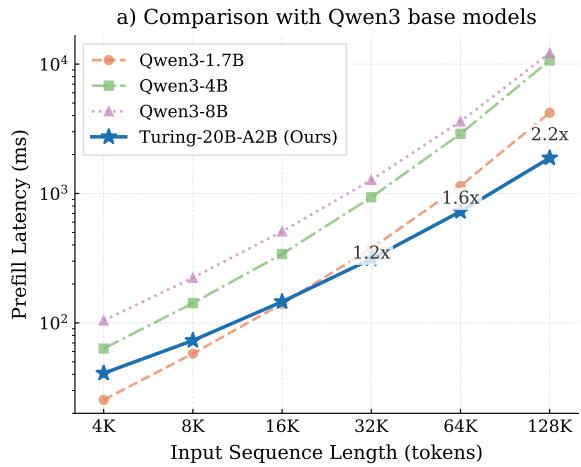

b) Comparison with Qwen3.5 base models  
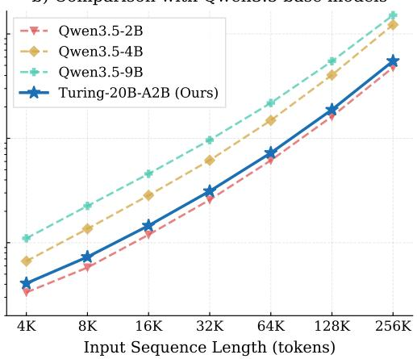  
Figure 5: Model-level prefill latency at different input sequence lengths compared with (a) Qwen3 and (b) Qwen3.5 base models.

Turing-20B-A2B, Lightning Attention layers and full-attention layers are measured separately and aggregated according to their frequencies in the model.

As shown in Figure 5, the latency differences among the models are relatively modest at short sequence lengths, whereas the advantage of Turing-20B-A2B becomes increasingly pronounced as the context length grows. Compared with the Qwen3 baselines, Turing-20B-A2B becomes faster than the fastest baseline at longer contexts, with the relative prefill speedup increasing from approximately 1.2× at 32K tokens to 1.6× at 64K and 2.2× at 128K tokens.

A similar scaling advantage is observed when comparing against the newer Qwen3.5 models. Turing-20B-A2B achieves substantially lower prefill latency than Qwen3.5-4B and Qwen3.5-9B as the context length increases, while remaining close to the substantially smaller Qwen3.5-2B baseline. Notably, this favorable scaling persists up to 256K tokens, where the latency gap relative to the larger Qwen3.5 models becomes particularly pronounced.

The favorable long-context scaling of Turing-20B-A2B is enabled by its attention-layer composition, in which Lightning Attention is used in the majority of decoder layers while only a small number of layers retain full attention. Consequently, the contribution of quadratic-complexity attention is substantially reduced as the sequence length grows, while periodic full-attention layers preserve global token interactions. Together with the general capability results, these measurements demonstrate a favorable trade-off among model capability, activated computation, and long-context inference efficiency.

## 5 Ablation Studies

## 5.1 MoE Routing Strategy

We investigate the effect of the routing mechanism adopted in Turing-20B-A2B through a controlled pretraining experiment. Specifically, we compare Quantile Routing [19] with Loss-Free Routing [16] using a 10B-parameter MoE model that activates approximately 1.6B parameters per token. The model contains 128 routed experts and one shared expert. The Loss-Free Routing baseline selects a fixed number of eight routed experts for each token, whereas Quantile Routing dynamically varies the number of activated experts across tokens while maintaining an average routed-expert budget of eight. The shared expert is always activated and is not included in the routed-expert budget.

Both variants are trained from scratch for approximately 100B tokens using the same model architecture, training data, initialization, and optimization configuration. The only difference between the two variants is the routing mechanism. The update threshold for the routing-control variables is set to 0.001 for both methods.

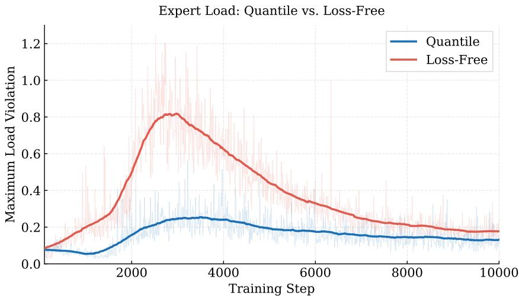  
Figure 6: Expert load balancing during pretraining. We report the maximum load violation (MaxVio) of the first MoE layer for Quantile Routing and Loss-Free Routing. The lightly shaded curves denote raw measurements, while the darker curves show smoothed trends. Lower values indicate better load balancing.

Table 7: Early-stage pretraining performance of Quantile Routing and Loss-Free Routing. Both variants use the same model architecture, training configuration, and average routed-expert budget. The better result on each benchmark is shown in bold.
<table><tr><td>Routing</td><td>MMLU</td><td>ARC-C</td><td>TriviaQA</td><td>MATH</td><td>GSM8K</td><td>MBPP</td><td>BBH</td><td>HellaSwag</td></tr><tr><td>Loss-Free</td><td>23.27</td><td>23.73</td><td>30.32</td><td>19.72</td><td>21.68</td><td>14.81</td><td>27.39</td><td>22.81</td></tr><tr><td>Quantile</td><td>24.06</td><td>27.12</td><td>31.92</td><td>20.14</td><td>20.02</td><td>18.78</td><td>28.18</td><td>25.18</td></tr></table>

Expert load balancing. We first examine whether dynamic expert allocation adversely affects expert load balancing. Following Loss-Free Routing [16], we use the maximum load violation (MaxVio) to measure the largest deviation of an expert workload from the target balanced workload. A lower MaxVio indicates better worst-case load balancing.

Figure 6 reports the MaxVio of the first MoE layer throughout training. The lightly shaded curves show the raw measurements, while the darker curves represent their smoothed trends. Quantile Routing exhibits substantially more stable expert utilization during the early stage of training and maintains a lower MaxVio over nearly the entire training trajectory. In contrast, the Loss-Free Routing baseline experiences a pronounced increase in load violation during the first several thousand steps and recovers only gradually as training proceeds. These results indicate that, under the model and training configuration considered here, Quantile Routing achieves more stable expert load balancing despite allowing the number of activated experts to vary across tokens.

Early-stage pretraining performance. We next evaluate the two routing variants at the same earlytraining checkpoint on representative knowledge, reasoning, mathematics, and coding benchmarks. All results use the same evaluation pipeline and benchmark-specific configurations as the general capability evaluation in Section 4.1, with full details provided in Appendix A.

As shown in Table 7, Quantile Routing outperforms Loss-Free Routing on seven of the eight evaluated benchmarks. The improvements are observed across different capability categories, with particularly clear gains on ARC-C, MBPP, and HellaSwag. GSM8K is the only benchmark on which the Loss-Free Routing variant obtains a higher score.

Because both variants use the same model architecture, training data, optimization configuration, and average routed-expert budget, the performance difference cannot be attributed to a larger average computational cost. Instead, the results suggest that dynamically allocating the available expert computation across tokens enables the model to use the same average expert budget more effectively.

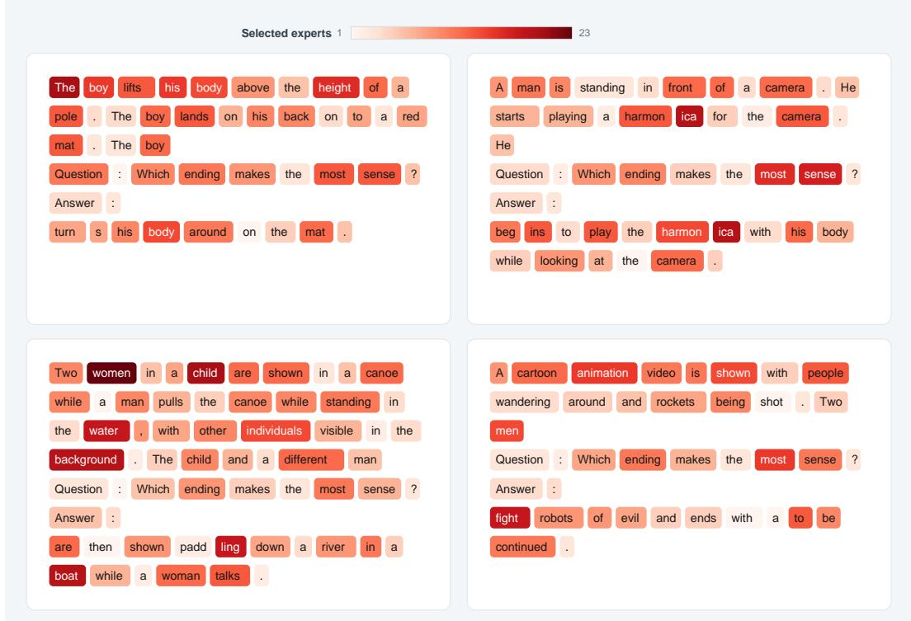  
Figure 7: Token-wise expert allocation produced by Quantile Routing on representative HellaSwag examples. Darker tokens activate more routed experts. The expert count varies according to the contextual representation of each token, while maintaining an average routed-expert budget of eight. The always-active shared expert is excluded from the displayed counts.

Token-wise expert allocation. A defining property of Quantile Routing is that different tokens may activate different numbers of routed experts. To examine the learned allocation pattern, we record the routed-expert count of each token on examples from HellaSwag [47]. Figure 7 presents representative visualizations, where darker tokens correspond to a larger number of activated routed experts. The shared expert, which is always active, is excluded from the displayed counts.

The qualitative examples in Figure 7 show a clear context-dependent pattern in expert allocation. Content-bearing and contextually informative tokens tend to activate more routed experts, whereas punctuation marks and frequent function words generally activate fewer. Different occurrences of the same surface token may also receive different numbers of experts, indicating that routing depends on contextual representations rather than token identity alone. These observations are consistent with adaptive computation, where more demanding tokens receive greater expert capacity while relatively predictable tokens consume less computation. Although expert count is not a direct measure of semantic importance, the results suggest that dynamic top-k Quantile Routing learns a structured allocation of computation across tokens.

Overall, the controlled ablation shows that Quantile Routing provides more stable expert load balancing and better early-stage pretraining performance than Loss-Free Routing under the same average routed-expert budget. The token-level analysis further illustrates that it allocates computation in a context-dependent manner. These results motivate our adoption of Quantile Routing in Turing-20B-A2B.

## 5.2 Expert Capacity for Efficient Prefill

We evaluate expert-capacity control directly on Turing-20B-A2B from two complementary perspectives: model capability and deployment efficiency. For the capability study, we conduct reinforcement learning using GSM8K as the sole training task and compare capacity-constrained and dropless variants under the same Quantile Routing configuration. For the efficiency study, we benchmark the MoE module of Turing-20B-A2B under the corresponding deployment configurations.

Table 8: Effect of expert-capacity control during GSM8K-oriented reinforcement learning on Turing-20B-A2B. Both variants use Quantile Routing and are evaluated at RL step 399, differing only in whether CF = 1.25 is applied during prompt prefill. The better result for each benchmark is highlighted in bold.
<table><tr><td>Setting</td><td>MMLU</td><td>CMMLU</td><td>MMLU-Pro</td><td>BBH</td><td>GPQA</td><td>GSM8K</td></tr><tr><td>Dropless</td><td>79.03</td><td>75.38</td><td>61.44</td><td>65.13</td><td>31.31</td><td>90.22</td></tr><tr><td>CF = 1.25</td><td>76.34</td><td>70.48</td><td>57.60</td><td>66.02</td><td>34.34</td><td>88.93</td></tr></table>

Prefill Latency: Turing MoE vs. Top-k MoE  
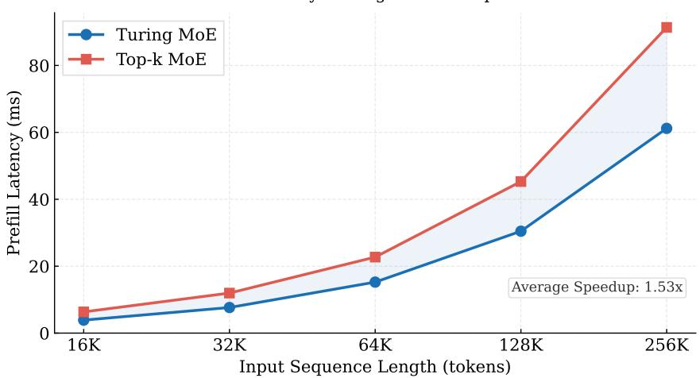  
Figure 8: MoE-module prefill latency comparison between Turing MoE and conventional top-k MoE. Turing MoE uses Quantile Routing with an expert capacity factor of 1.25, while the top-k baseline uses conventional dropless top-k routing. Turing MoE achieves an average 1.53× speedup over the evaluated context lengths.

Impact on model capability. We compare two reinforcement-learning runs of Turing-20B-A2B under the same Quantile Routing configuration, differing only in whether the expert-capacity constraint is enabled during prompt prefill. Both runs are optimized on GSM8K and evaluated at the same RL step.

As shown in Table 8, the capacity-constrained variant remains broadly competitive with the dropless setting, although some benchmark-level regressions are observed. The dropless variant achieves higher scores on MMLU, CMMLU, MMLU-Pro, and the directly optimized GSM8K task, whereas CF = 1.25 performs better on BBH and GPQA. Importantly, the capacity constraint does not lead to uniform capability degradation: the model retains strong performance across the evaluated benchmarks while improving on several reasoning tasks. These results indicate that capacity control introduces a measurable but limited capability trade-off in exchange for a more regular and efficient deployment-time expert-execution path.

Impact on prefill efficiency. We next evaluate the deployment-time efficiency of the MoE module in Turing-20B-A2B. Turing MoE combines Quantile Routing with an expert capacity factor of 1.25, while the baseline uses conventional dropless top-k routing. The two implementations use the same model dimensions and expert configuration and are evaluated under the same benchmarking protocol. The top-k baseline follows the fused-expert execution paradigm commonly adopted by modern LLM inference engines, where token–expert assignments are grouped by expert before fused expert computation and weighted output aggregation.

Figure 8 shows that Turing MoE consistently reduces average MoE-module prefill latency across context lengths from 16K to 256K. The advantage becomes increasingly pronounced as the sequence length grows, with particularly large gaps at 128K and 256K. Averaged over the evaluated sequence lengths, Turing MoE achieves a 1.53× speedup over the conventional dropless top-k MoE baseline.

The observed efficiency gain is consistent with the deployment motivation for capacity-constrained routing. By combining Quantile Routing with an explicit upper bound on per-expert workload, Turing MoE enables a more regular expert-execution path and improves long-context prefill efficiency. Together, the reinforcement-learning ablation and the MoE-module latency measurements at the Turing-20B-A2B scale provide complementary evidence that capacity-constrained prefill can substantially improve deployment efficiency while retaining broadly competitive downstream capability. Detailed benchmarking configurations are provided in Appendix C.

## 6 Applications and Practical Impact

Turing-20B-A2B explores a practical MoE scaling paradigm for physical AI foundation models. Physical AI systems require strong general capabilities, long-context modeling, and efficient, stable inference under strict deployment constraints. By combining dynamic top-k Quantile Routing with fine-grained experts, Turing-20B-A2B allows different tokens to receive different amounts of expert computation while maintaining balanced expert utilization and a controlled average compute budget through a unified quantile-tracking mechanism. This provides a practical path for scaling model capacity and improving knowledge, reasoning, and long-context capabilities without forcing every token to follow the same fixed expert-allocation pattern. During prompt prefill, expert-capacity control further bounds per-expert workloads, reducing workload fluctuations across experts and making the execution pattern more regular and predictable. This is particularly beneficial for deployment latency, where limiting worst-case expert workload helps avoid large variations in execution cost as routing distributions change. Controlled ablations show that the capacity-constrained variant retains broadly competitive downstream capability relative to the dropless setting while substantially improving MoE prefill efficiency.

Hardware–model co-design is another central consideration behind Turing-20B-A2B. The architecture favors simple, regular, and widely supported computation patterns that are beneficial across a range of edge and latency-sensitive devices, with the Turing chip serving as an important target platform during model design. This consideration motivates choices such as the Lightning-Attention-based hybrid attention backbone, Dynamic Tanh in place of conventional normalization, and fine-grained sparse expert computation. These hardware-friendly designs help translate model-level efficiency into practical improvements in inference latency and deployment stability.

These properties make Turing-20B-A2B suitable as a language foundation model for a range of physical AI applications, including VLA 2.0 for autonomous driving, intelligent-cockpit and integrated driving-and-parking systems, and embodied platforms such as the XPeng Iron robot. Although these applications differ in their downstream interfaces and modalities, they share the need to process extended histories of observations, states, instructions, and actions while meeting strict latency and computation budgets. Turing-20B-A2B is designed to provide a common foundation for such workloads, combining strong base-model capability with long-context scalability and deployment-oriented efficiency.

## 7 Conclusion and Future Work

This technical report presents Turing-20B-A2B, a 20B-parameter Mixture-of-Experts language model that activates approximately 2B parameters per token. The model combines dynamic top-k Quantile Routing, fine-grained experts, and a hybrid attention backbone dominated by Lightning Attention. Quantile Routing enables token-adaptive computation while maintaining balanced expert utilization and a controlled average compute budget, and capacity-constrained prompt prefill further regularizes expert workloads for efficient deployment. Despite its compact active-parameter budget, Turing-20B-A2B achieves base-model capability exceeding Qwen3-8B and approaching Qwen3.5-9B, while maintaining strong long-context performance and favorable prefill-latency scaling. Progressive continued pretraining extends the native context window from 4K to 128K, with training-free YaRN extrapolation further enabling effective inference up to 512K. Overall, the results demonstrate an effective balance among model capability, long-context scalability, and practical inference efficiency for latency-sensitive physical AI systems.

Looking forward, Turing-20B-A2B has so far been primarily validated as a base language model, and its post-training capabilities remain under active exploration. Future work will focus on supervised fine-tuning and reinforcement-learning-based post-training, together with broader evaluation on downstream tasks such as multi-turn interaction, long-document understanding, long-context code understanding, software engineering, and agent-oriented workloads. We also plan to extend the model toward multimodal foundation models by integrating it with TuringViT [54], providing a foundation for applications such as autonomous driving and embodied intelligence that require joint reasoning over long visual, language, state, and action histories under practical latency constraints.

## Contributors

We sincerely thank every member of the team for their dedication and valuable contributions. This work reflects our ongoing efforts to advance VLM/VLA-related applications, and we hope that Turing-20B-A2B will play an increasingly important role in this direction.

Advisors: Hang Zhang, HongGou Yang, Xianming Liu

Project Lead: Qiman Wu

Contributors: Yuheng Zhang\* , Yizhao Wang\* , Da Zhu\* , Hua Zhou , Yue He , Jiahui Hu , Shaman Tang , Hanlin Chen , Yuhua Wei , Anhua Liu , Shuang Su , Rui Xin , MingYuan Wang , MingHao Li , HaoJie Yang , Siqi Liu , Jianlei Zheng , WeiChao Huang

Core contribution.

## References

[1] Danny Driess, Fei Xia, Mehdi S. M. Sajjadi, et al. PaLM-E: An embodied multimodal language model. In Proceedings of the 40th International Conference on Machine Learning, volume 202 of Proceedings of Machine Learning Research, pages 8469–8488. PMLR, 2023.

[2] Anthony Brohan, Noah Brown, Justice Carbajal, et al. RT-2: Vision-language-action models transfer web knowledge to robotic control. arXiv preprint arXiv:2307.15818, 2023.

[3] Moo Jin Kim, Karl Pertsch, Siddharth Karamcheti, et al. OpenVLA: An open-source vision-language-action model. In Conference on Robot Learning, 2024.

[4] Hao Shao, Yuxuan Hu, Letian Wang, et al. LMDrive: Closed-loop end-to-end driving with large language models. In Proceedings of the IEEE/CVF Conference on Computer Vision and Pattern Recognition, pages 15120–15130, 2024.

[5] Anthony Hu, Lloyd Russell, Hudson Yeo, et al. GAIA-1: A generative world model for autonomous driving. arXiv preprint arXiv:2309.17080, 2023.

[6] Fuzhao Xue, Yukang Chen, Dacheng Li, et al. LongVILA: Scaling long-context visual language models for long videos. arXiv preprint arXiv:2408.10188, 2024.

[7] Hao Liu, Matei Zaharia, Pieter Abbeel. Ring attention with blockwise transformers for near-infinite context. arXiv preprint arXiv:2310.01889, 2023.

[8] Tri Dao. FlashAttention-2: Faster attention with better parallelism and work partitioning. arXiv preprint arXiv:2307.08691, 2023.

[9] Yukang Chen, Shengju Qian, Haotian Tang, et al. LongLoRA: Efficient fine-tuning of long-context large language models. arXiv preprint arXiv:2309.12307, 2023.

[10] Jared Kaplan, Sam McCandlish, Tom Henighan, et al. Scaling laws for neural language models. arXiv preprint arXiv:2001.08361, 2020.

[11] Jordan Hoffmann, Sebastian Borgeaud, Arthur Mensch, et al. Training compute-optimal large language models. Advances in Neural Information Processing Systems, 35, 2022.

[12] William Fedus, Barret Zoph, Noam Shazeer. Switch transformers: Scaling to trillion parameter models with simple and efficient sparsity. Journal ofMachine Learning Research, 23(120):1–39, 2022.

[13] DeepSeek-AI. DeepSeek-V4: Towards highly efficient million-token context modeling. arXiv preprint arXiv:2606.19348, 2026.

[14] Qwen Team. Qwen3.6-35B-A3B: Agentic coding power, now open to all. https://qwen.ai/blog?id=qwen3.6-35b-a3b, April 2026.

[15] Kimi Team. Kimi K3: Open frontier intelligence. arXiv preprint arXiv:2607.24653, 2026.

[16] Lean Wang, Huazuo Gao, Chenggang Zhao, et al. Auxiliary-loss-free load balancing strategy for mixture-of-experts. arXiv preprint arXiv:2408.15664, 2024.

[17] Shwai He, Weilin Cai, Jiayi Huang, et al. Capacity-aware inference: Mitigating the straggler effect in mixture of experts. arXiv preprint arXiv:2503.05066, 2025.

[18] Qwen Team. Qwen3.5: Towards native multimodal agents. https://qwen.ai/blog?id=qwen3.5, February 2026.

[19] Jianlin Su. Moe tour: More computation for harder tokens. https://spaces.ac.cn/archives/10815, 2025. Accessed: 2026-07-15.

[20] Zhen Qin, Weigao Sun, Dong Li, et al. Lightning attention-2: A free lunch for handling unlimited sequence lengths in large language models. arXiv preprint arXiv:2401.04658, 2024.

[21] Jiachen Zhu, Xinlei Chen, Kaiming He, et al. Transformers without normalization. In Proceedings ofthe IEEE/CVF Conference on Computer Vision and Pattern Recognition, 2025.

[22] Ofir Press, Noah A. Smith, Mike Lewis. Train short, test long: Attention with linear biases enables input length extrapolation. In International Conference on Learning Representations, 2022.

[23] Yanqi Zhou, Tao Lei, Hanxiao Liu, et al. Mixture-of-experts with expert choice routing. In Advances in Neural Information Processing Systems, volume 35, pages 7103–7114, 2022.

[24] Jeffrey Li, Alex Fang, Georgios Smyrnis, et al. Datacomp-lm: In search of the next generation of training sets for language models. In Advances in Neural Information Processing Systems, 2024.

[25] Guilherme Penedo, Hynek Kydlícek, Loubna Ben Allal, et al. The fineweb datasets: Decanting the web forˇ the finest text data at scale. In Advances in Neural Information Processing Systems, 2024.

[26] Yudong Wang, Zixuan Fu, Hengyu Zhao, et al. Data science and technology towards agi part i: Tiered data management. arXiv preprint arXiv:2602.09003, 2026.

[27] Loubna Ben Allal, Anton Lozhkov, Elie Bakouch, et al. Smollm2: When smol goes big—data-centric training of a small language model. arXiv preprint arXiv:2502.02737, 2025.

[28] Xiaotian Han, Yiren Jian, Xuefeng Hu, et al. Infimm-webmath-40b: Advancing multimodal pre-training for enhanced mathematical reasoning. In Findings of the Association for Computational Linguistics: EMNLP 2025, pages 14221–14231. Association for Computational Linguistics, 2025.

[29] Keiran Paster, Marco Dos Santos, Zhangir Azerbayev, et al. Openwebmath: An open dataset of high-quality mathematical web text, 2023.

[30] Fan Zhou, Zengzhi Wang, Nikhil Ranjan, et al. Megamath: Pushing the limits of open math corpora. In Conference on Language Modeling, 2025.

[31] Anton Lozhkov, Raymond Li, Loubna Ben Allal, et al. Starcoder 2 and the stack v2: The next generation. arXiv preprint arXiv:2402.19173, 2024.

[32] Luca Soldaini, Kyle Lo. peS2o (Pretraining Efficiently on S2ORC) Dataset. Technical report, Allen Institute for AI, 2023. ODC-By.

[33] DeepSeek-AI. Deepseek-v3 technical report. arXiv preprint arXiv:2412.19437, 2024.

[34] Hantian Ding, Zijian Wang, Giovanni Paolini, et al. Fewer truncations improve language modeling. In Proceedings ofthe 41st International Conference on Machine Learning, 2024.

[35] Tianyu Gao, Alexander Wettig, Howard Yen, et al. How to train long-context language models (effectively). In ACL, 2025.

[36] Yushi Bai, Xin Lv, Jiajie Zhang, et al. Longalign: A recipe for long context alignment of large language models. In Findings of the Association for Computational Linguistics: EMNLP 2024, pages 1376–1395, 2024.

[37] Jiale Zhao, Guoxin Chen, Fanzhe Meng, et al. Immersion in the github universe: Scaling coding agents to mastery, 2026.

[38] Bowen Peng, Jeffrey Quesnelle, Honglu Fan, et al. YaRN: Efficient context window extension of large language models. arXiv preprint arXiv:2309.00071, 2023.

[39] Dan Hendrycks, Collin Burns, Steven Basart, et al. Measuring massive multitask language understanding. In International Conference on Learning Representations, 2021.

[40] Aryo Pradipta Gema, Joshua Ong Jun Leang, Giwon Hong, et al. Are we done with mmlu? arXiv preprint arXiv:2406.04127, 2024.

[41] Haonan Li, Yixuan Zhang, Fajri Koto, et al. CMMLU: Measuring massive multitask language understanding in chinese. arXiv preprint arXiv:2306.09212, 2023.

[42] Yuzhen Huang, Yuzhuo Bai, Zhihao Zhu, et al. C-Eval: A multi-level multi-discipline chinese evaluation suite for foundation models. In Advances in Neural Information Processing Systems, volume 36, 2023.

[43] Yubo Wang, Xueguang Ma, Ge Zhang, et al. MMLU-Pro: A more robust and challenging multi-task language understanding benchmark. arXiv preprint arXiv:2406.01574, 2024.

[44] Mirac Suzgun, Nathan Scales, Nathanael Schärli, et al. Challenging BIG-Bench tasks and whether chain-of-thought can solve them. In Findings ofthe Associationfor Computational Linguistics: ACL 2023, 2023.

[45] Dheeru Dua, Yizhong Wang, Pradeep Dasigi, et al. Drop: A reading comprehension benchmark requiring discrete reasoning over paragraphs. arXiv preprint arXiv:1903.00161, 2019.

[46] Keisuke Sakaguchi, Ronan Le Bras, Chandra Bhagavatula, et al. Winogrande: An adversarial winograd schema challenge at scale. arXiv preprint arXiv:1907.10641, 2019.

[47] Rowan Zellers, Ari Holtzman, Yonatan Bisk, et al. HellaSwag: Can a machine really finish your sentence? In Proceedings of the 57th Annual Meeting of the Association for Computational Linguistics, pages 4791–4800, Florence, Italy, 2019. Association for Computational Linguistics. doi: 10.18653/v1/P19-1472.

[48] Peter Clark, Isaac Cowhey, Oren Etzioni, et al. Think you have solved question answering? try arc, the ai2 reasoning challenge. arXiv preprint arXiv:1803.05457, 2018.

[49] David Rein, Betty Li Hou, Asa Cooper Stickland, et al. GPQA: A graduate-level google-proof q&a benchmark. arXiv preprint arXiv:2311.12022, 2023.

[50] Karl Cobbe, Vineet Kosaraju, Mohammad Bavarian, et al. Training verifiers to solve math word problems. arXiv preprint arXiv:2110.14168, 2021.

[51] Dan Hendrycks, Collin Burns, Saurav Kadavath, et al. Measuring mathematical problem solving with the MATH dataset. In Proceedings of the Neural Information Processing Systems Track on Datasets and Benchmarks, volume 1, 2021.

[52] Maosong Cao, Kai Chen, Haodong Duan, et al. OpenCompass: A universal evaluation platform for large language models. arXiv preprint arXiv:2605.19276, 2026.

[53] Cheng-Ping Hsieh, Simeng Sun, Samuel Kriman, et al. RULER: What’s the real context size of your long-context language models? arXiv preprint arXiv:2404.06654, 2024.

[54] Qiman Wu, Hanlin Chen, Lyujie Chen, et al. TuringViT: Making sota vision transformers accessible to all. arXiv preprint arXiv:2606.24253, 2026.

[55] Woosuk Kwon, Zhuohan Li, Siyuan Zhuang, et al. Efficient memory management for large language model serving with pagedattention. In Proceedings ofthe 29th Symposium on Operating Systems Principles, 2023.

[56] Lianmin Zheng, Liangsheng Yin, Zhiqiang Xie, et al. Sglang: Efficient execution of structured language model programs. arXiv preprint arXiv:2312.07104, 2024.

## Supplementary Material

## A Base Model Evaluation Details

This appendix provides the detailed configurations used for the general capability evaluation in Section 4.1. All experiments use the generation mode of OpenCompass. Each model generates a textual response, which is subsequently processed by the task-specific answer extractor and evaluator. Unless otherwise specified, the maximum generation length is 1,024 tokens.

For fair comparison, all evaluated models use the same dataset version and evaluation split, the same few-shot examples and example ordering, identical prompt templates and chain-of-thought instructions, the same generation configuration, and identical answer extraction and scoring procedures. In particular, task-specific answer extraction is kept consistent for benchmarks such as HellaSwag, WinoGrande, GPQA, and DROP.

Table 9: Detailed evaluation configurations for the general capability benchmarks. “CoT” denotes chain-of-thought demonstrations.
<table><tr><td>Benchmark</td><td>Split</td><td># Shots</td><td>Metric</td><td>Max Output</td></tr><tr><td colspan="5">Knowledge Tasks</td></tr><tr><td>MMLU</td><td>Test</td><td>5-shot</td><td>Acc.</td><td>1024</td></tr><tr><td>MMLU-Redux</td><td>MMLU-Redux 2.0</td><td>5-shot</td><td>Acc.</td><td>1024</td></tr><tr><td>CMMLU</td><td>Test</td><td>5-shot</td><td>Acc.</td><td>1024</td></tr><tr><td>C-Eval</td><td>Validation</td><td>5-shot</td><td>Acc.</td><td>1024</td></tr><tr><td colspan="5">Reasoning Tasks</td></tr><tr><td>MMLU-Pro</td><td>Test</td><td>5-shot CoT</td><td>Acc.</td><td>1024</td></tr><tr><td>BBH</td><td>All 27 tasks</td><td>3-shot CoT</td><td>EM</td><td>4096</td></tr><tr><td>DROP</td><td>Validation subset</td><td>0-shot</td><td>EM</td><td>1024</td></tr><tr><td>WinoGrande</td><td>Dev</td><td>5-shot</td><td>Acc.</td><td>1024</td></tr><tr><td>HellaSwag</td><td>Validation</td><td>0-shot</td><td>Acc.</td><td>1024</td></tr><tr><td colspan="5">Math &amp; STEM Tasks</td></tr><tr><td>ARC-C</td><td>Dev</td><td>0-shot</td><td>Acc.</td><td>1024</td></tr><tr><td>GPQA</td><td>Main</td><td>5-shot CoT</td><td>Acc.</td><td>1024</td></tr><tr><td>GSM8K</td><td>Test</td><td>4-shot CoT</td><td>EM</td><td>512</td></tr><tr><td>MATH</td><td>Test</td><td>4-shot</td><td>EM</td><td>1024</td></tr></table>

Knowledge benchmarks. MMLU is evaluated on the test set across 57 subjects, containing 14,042 questions in total. Five fixed examples, corresponding to indices 0–4 of the development split of each subject, are used as in-context demonstrations. The model generates an answer to an A–D multiple-choice question, and the first valid option is extracted before computing accuracy.

MMLU-Redux is evaluated using MMLU-Redux 2.0 over 57 subjects and 5,330 questions. It follows the same 5-shot prompting format as MMLU, with five fixed development examples for each subject and generated A–D answers evaluated by accuracy.

CMMLU is evaluated on its test split across 67 subjects and 11,582 questions. Five fixed examples from the development split are provided for each subject. C-Eval is evaluated on its validation split across 52 subjects and 1,346 questions, also using five fixed development examples. Both benchmark use Chinese multiple-choice prompts and accuracy after extracting the generated option.

Reasoning benchmarks. MMLU-Pro is evaluated on the test split, consisting of 12,032 questions across 14 categories. Five examples from the validation split are provided with their chain-of-thought reasoning and final answers. The model is prompted to reason step by step, after which the final option is extracted from the generated response.

BBH is evaluated over all 27 BIG-Bench Hard subtasks, comprising 6,511 examples. Three chain-ofthought demonstrations are directly embedded in each task-specific prompt. The target response is generated following the instruction “Let’s think step by step.” Multiple-choice and free-form BBH tasks use their corresponding task-specific normalized answer matching procedures. The maximum generation length is increased to 4,096 tokens to accommodate intermediate reasoning.

DROP is evaluated zero-shot on a 6,114-example subset of the validation set. Given a passage and question, the model directly generates a free-form answer. The generated answer is normalized using the DROP-specific post-processing procedure, and we report exact match on this subset.

WinoGrande is evaluated on its 1,267-example development set. Five fixed demonstrations with indices 0, 2, 4, 6, and 8 are drawn from the train\_xs split. The two candidate expressions are mapped to options A and B, and accuracy is computed after extracting the generated option.

HellaSwag is evaluated zero-shot on all 10,042 examples of the validation set. Each example contains a context and four candidate continuations. The model generates the selected option, which is processed using the same HellaSwag-specific answer extractor for all compared models before accuracy is computed.

Math and STEM benchmarks. ARC-C is evaluated zero-shot on the ARC Challenge development split, containing 295 examples. Each question is presented with four candidate answers, and accuracy is computed from the extracted A–D option.

GPQA is evaluated using the GPQA Main set, containing 448 questions, rather than the GPQA Diamond subset. Five complete chain-of-thought examples are directly embedded in the prompt. Models may generate intermediate reasoning and are instructed to provide the final answer in the required option format before accuracy is computed.

GSM8K is evaluated on its 1,319-example test set using four chain-of-thought demonstrations embedded directly in the prompt. Models generate a complete solution, after which the final numerical answer is extracted and evaluated using exact match. The maximum generation length is 512 tokens.

MATH is evaluated on all 5,000 examples of the test set with four worked mathematical demonstrations. The model is allowed to generate the full derivation, and the final mathematical answer is extracted and evaluated using exact match.

## B Model Efficiency Evaluation Details

This appendix describes the implementation and measurement protocol used for the prefill-latency experiments reported in Figure 5. The benchmark measures the forward-pass latency of representative decoder layers and aggregates the measurements according to the layer composition of each model. No tensor, pipeline, data, or expert parallelism is used during the benchmark.

Hardware and software environment. All measurements are conducted on a single NVIDIA H800 GPU with 80 GB-class memory. The benchmark environment uses CUDA 12.9, PyTorch 2.8.0a0+5228986c39.nv25.06, Triton 3.3.0, Transformers 5.2.0, Flash Linear Attention 0.4.2, FlashAttention 2.7.4.post1, and causal-conv1d 1.6.2.post1. The models and inputs use FP16 precision throughout the benchmark.

Input construction and runtime measurement. For a model with hidden size H and sequence length L, the input hidden states are sampled directly on the GPU from a standard normal distribution with shape [1, L, H]. Position indices are constructed as $[ 0 , \ldots , L - 1 ]$ . All measurements use a batch size of 1 and run in evaluation mode under torch.no\_grad().

We compile each representative decoder layer with torch.compile in mode="reduce-overhead". Before timing, we run a 32K-token forward pass to trigger the initial compilation, followed by one untimed forward pass at each evaluated sequence length to trigger any shape-specific compilation or specialization. The reported latencies therefore exclude both initial compilation and shapespecialization overheads.

Runtime is measured with triton.testing.do\_bench, using a 100 ms warm-up period and a 5,000 ms measurement period for each sequence length. The reported value is the mean latency returned by do\_bench. CUDA-event timing and synchronization are used during measurement. The L2 cache is cleared before every timed repetition by do\_bench, and the CUDA allocator cache is cleared between sequence lengths.

Attention implementations. For the Hugging Face Qwen baselines, full-attention layers are configured with attn\_implementation="sdpa". On the H800 GPU, PyTorch SDPA dispatches to the fused cuDNN native scaled-dot-product attention kernel.

Qwen3.5 uses a hybrid architecture with model-defined linear-attention layers and full-attention layers. In our benchmark, the linear-attention layers retain the optimized execution path provided by the original implementation. In particular, the short causal convolution in the linear-attention block is executed through the optimized causal-conv1d kernel rather than the generic PyTorch fallback, while the linear-attention computation itself uses the corresponding optimized kernel path. This avoids replacing the model’s intended high-performance implementation with unfused operators during latency measurement. The Qwen3.5 full-attention layers use the same PyTorch SDPA configuration as the other Qwen baselines.

The Lightning Attention layers in Turing-20B-A2B use a custom Triton implementation adapted from Flash Linear Attention, with a block size of 512 and decay enabled. Q, K, V, layer parameters, and outputs are represented in FP16, while decay exponents are evaluated in FP32 inside the Triton kernels for numerical stability.

Turing-20B-A2B contains four causal full-attention layers implemented with FlashAttention-2. The prefill path directly uses the known query length for rotary-position construction, avoiding per-forward GPU-to-CPU scalar synchronization or TorchDynamo graph breaks. The KV-cache decoding path is not included in this benchmark.

Thus, all models are benchmarked using their respective optimized attention implementations rather than reference or fallback paths.

Layer-level aggregation. Turing-20B-A2B contains 24 decoder layers, consisting of 20 Lightning Attention layers and four full-attention layers. Five representative decoder-layer types are benchmarked:

Table 10: Representative decoder-layer types used to estimate the model-level prefill latency of Turing-20B-A2B.
<table><tr><td>Layer Type</td><td>Multiplicity</td></tr><tr><td>Dense FFN + Lightning Attention</td><td>1</td></tr><tr><td>Routing MoE + Lightning Attention</td><td>4</td></tr><tr><td>Non-routing MoE + Lightning Attention</td><td>15</td></tr><tr><td>Routing MoE + Full Attention</td><td>2</td></tr><tr><td>Non-routing MoE + Full Attention</td><td>2</td></tr></table>

Accordingly, the model-level prefill latency is estimated as

$$
\begin{array} { r l } & { \widehat { T } _ { \mathrm { p r e f i l l } } ( L ) = T _ { \mathrm { d e n s e } } ( L ) + 4 T _ { \mathrm { r o u t i n g , l i n e a r } } ( L ) } \\ & { \phantom { x x x x x x x x x x x x x x x x x x x x x x x x x x x x x x x x x x x x x x x } } \\ & { \phantom { x x x x x x x x x x x x x x x x x x x x } + 1 5 T _ { \mathrm { n o n r o u t i n g , f u l l } } ( L ) + 2 T _ { \mathrm { r o u t i n g , f u l l } } ( L ) } \\ & { \phantom { x x x x x x x x x x x x x } + 2 T _ { \mathrm { n o n r o u t i n g , f u l l } } ( L ) . } \end{array}\tag{11}
$$

For Qwen3-1.7B, the latency of one representative decoder layer is multiplied by 28. For Qwen3-4B and Qwen3-8B, the representative decoder-layer latency is multiplied by 36. Qwen3.5-4B and Qwen3.5-9B each contain 24 linear-attention layers and eight full-attention layers; the two layer types are measured independently and aggregated according to these multiplicities.

## C MoE Prefill Latency Benchmark Details

The latency experiment in Figure 8 measures the forward latency of a complete MoE module in isolation, excluding attention and normalization overhead. We benchmark the MoE module at layer index 1, corresponding to the first full MoE layer in the model. The measurement therefore captures the complete inference path of each MoE implementation, including routing, token selection or dispatch, routed-expert computation, shared-expert computation, weighting, and output aggregation.

We use the same hardware and software environment as the model-efficiency experiments described in Appendix B. All measurements are performed on a single NVIDIA H800 GPU with batch size 1 and FP16 precision. For each sequence length L, input hidden states are randomly generated directly on the GPU with shape [1, L, 2048]. Figure 8 reports results for sequence lengths from 16K to 256K.

Both MoE variants share the same model dimensions and expert configuration. The hidden dimension is 2,048, with 256 routed experts and a nominal routing budget of 8 experts per token. Each routed expert has an intermediate dimension of 512. Both variants also contain the same shared expert with an intermediate dimension of 2,048.

Both MoE modules are evaluated through their dedicated inference implementations and compiled with torch.compile using reduce-overhead mode. Forward latency is measured using triton.testing.do\_bench, with 100 ms of warm-up and a 5,000 ms measurement window. The reported values correspond to the mean forward latency returned by the benchmark. Model initialization, input generation, attention, layer normalization, and host-to-device input transfer are excluded from the timed region.

Turing MoE. Turing MoE uses Quantile Routing with sigmoid router scores, expert-specific routing thresholds, and an expert capacity factor of γ = 1.25. For an input containing BL tokens, the maximum number of assignments processed by each routed expert is

$$
C = \left\lfloor \gamma { \frac { B L k } { E } } \right\rfloor ,\tag{12}
$$

where B = 1, k = 8, and E = 256 in our experiments. For each expert, the router scores over the input tokens are ranked and at most the highest-scoring C assignments are retained. The resulting bounded per-expert token blocks are gathered into regular expert-wise tensors and processed using batched matrix multiplications for the two expert MLP projections, followed by weighted aggregation back to the original token positions.

Top-k MoE baseline. The baseline uses conventional top-k routing with dropless expert execution. All k selected token–expert assignments are retained, so the number of tokens processed by an individual expert varies with the input routing distribution.

To provide a representative deployment baseline, we implement the dropless top-k MoE following the fused-expert execution paradigm commonly adopted by modern LLM inference engines such as vLLM and SGLang [55, 56]. Rather than executing experts through a naive per-expert loop, token–expert assignments are first grouped according to their selected experts. The resulting expert wise token groups are then processed using fused kernels for the two expert MLP projections, gated activation, routing-weight scaling, and output aggregation.

Concretely, the implementation sorts token–expert assignments by expert and computes the corresponding expert offsets. The fused MoE kernels then execute the first projection together with the gated activation, followed by the second projection, routing-weight scaling, and scatter-add to the original token positions. This execution path supports variable per-expert workloads while avoiding the overhead of a naive expert-by-expert implementation.

Both implementations use the same model dimensions, expert configurations, input shapes, numerical precision, compilation settings, and timing protocol, differing only in routing and expert execution. We compare the complete Turing MoE design—Quantile Routing with capacity-constrained execution—against an optimized dropless top-k baseline using the fused-expert paradigm of modern inference systems. The benchmark neither isolates the capacity factor nor includes expert-parallel all to-all communication; it measures single-GPU local MoE execution rather than end-to-end distributed latency.