# VFR-Audit: Verdict-Level Reliability for Fairness Audits in Hospital Length-of-Stay Prediction

Md Jannatul Rakib Joy   
School of Science, Computing and   
Emerging Technologies   
Swinburne University of Technology   
Hawthorn, Victoria, Australia   
103799644@student.swin.edu.au

Viet Vo

School of Science, Computing and Emerging Technologies   
Swinburne University of Technology Hawthorn, Victoria, Australia vvo@swin.edu.au   
Caslon Chua   
School of Science, Computing and   
Emerging Technologies   
Swinburne University of Technology   
Hawthorn, Victoria, Australia   
cchua@swin.edu.au

## Abstract

Fairness audits in clinical Artificial Intelligence convert continuous fairness metrics into binary pass-or-fail verdicts against operational thresholds, where hospital governance boards, payers, and regula- tors act on the resulting verdicts. Such audits are repeated over time and across hospital sites, thus the same verdict can flip between pass and fail across audits. Existing uncertainty methods such as Bayesian posteriors, bootstrap confidence intervals, and permutation tests address verdict instability only at the continuous-metric level. Converting metric-level uncertainty into a verdict-stability claim remains a manual step that scales poorly across the (model, metric, attribute) cells an audit covers. Existing uncertainty methods also leave open whether bias-mitigation steps, such as reweighing or per-group threshold shifts, yield a stable passing verdict at the cost of model discrimination measured as AUROC or AUPRC.

To address this verdict-stability gap, we propose VFR-Audit, a framework built around the Verdict Flip Rate (VFR), a scalar bounded between 0 and 0.5 that measures the probability of ver- dict reversal under stratified bootstrap resampling. VFR-Audit re-ports VFR alongside three reliability axes, namely within-cohort resampling stability, audit-size sensitivity, and cross-hospital verdict agreement via Fleiss’ kappa. The framework was evaluated on 925,128 administrative discharge records from 441 Texas hospi tals, against an intersectional adaptation of Kamiran and Calders’ reweighing. On the unintervened baseline, the audit detects verdict reversal in 43.5% of cells in the cross-model audit grid. After the canonical intervention, 11 of 28 cells continue to flip. Intersectional reweighing fails the four-fifths rule on this cohort regardless of regularisation strength, while per-cell threshold shifting is the main efective component of the canonical intervention. VFR translates continuous metric uncertainty into a probability of binary-verdict reversal, and a derived-baseline comparison attributes the verdict outcome to specific intervention components, so audit reliability and intervention efects can be reported together rather than as separate claims.

CCS Concepts

• Applied computing → Health informatics; • Computing methodologies → Machine learning; • Social and professional topics → Computing / technology policy; • Information systems → Data mining.

## Keywords

algorithmic fairness, clinical AI, audit reliability, verdict stability, length-of-stay prediction, multi-site validation, responsible deploy- ment

ACM Reference Format:

Md Jannatul Rakib Joy, Viet Vo, and Caslon Chua. 2026. VFR-Audit: Verdict-Level Reliability for Fairness Audits in Hospital Length-of-Stay Prediction. In Proceedings ofthe 35th ACM International Conference on Information and Knowledge Management (CIKM ’26), November 7–11, 2026, Rome, Italy. ACM, New York, NY, USA, 12 pages. https://doi.org/10.1145/3799682.3840827

## 1 Introduction

Length-of-stay (LOS) prediction supports discharge planning, bed management, and care coordination [11, 27, 32, 51]. As clinical AI systems move closer to deployment, fairness evaluation has become a central requirement for assessing whether model be- haviour is acceptable across protected patient subgroups defined by race, sex, ethnicity, and age [2, 28, 30, 38, 43, 69]. Recent surveys document the breadth of healthcare-AI fairness concerns and the persistence of subpopulation disparities even in high-performance models [36, 40, 48, 60]. Many fairness audits summarise model behaviour by comparing a continuous fairness metric against a predefined threshold, producing a binary pass-or-fail verdict that hospital governance boards, payers, and regulators read and act upon [5, 54, 66].

This thresholded verdict is data-dependent. In practical deploy- ment, hospitals acquire new patient records over time. Demographic composition, subgroup size, and site-level case mix of the audit cohort change [7, 23, 25, 52, 55]. A fairness verdict that passes on one cohort may therefore fail on another even when the trained model is unchanged [17]. For example, when Disparate Impact is assessed using the four-fifths rule from the U.S. Equal Employment Opportunity Commission [20, 68], small changes in cohort composition around the 0.80 threshold can change the audit conclusion. Two deployed-system audits illustrate the operational stakes. Obermeyer et al. [47] audited a commercial risk-prediction tool deployed across major U.S. health systems and found that, at the same predicted risk score, Black patients had substantially worse health than White patients, with the corrective audit shifting the Black share of care- program enrolment from 17.7 % to 46.5 %. Omar et al. [49] stresstested nine large language models on 1,000 emergency-department cases across 32 sociodemographic variants $( 1 . 7 \times 1 0 ^ { 6 }$ outputs) and found that cases labelled as Black, unhoused, or LGBTQIA+ were more frequently routed to urgent care, invasive interventions, or mental-health evaluations despite identical clinical details. The deployment-relevant verdict therefore depended on whether and how the audit was performed.

Modern healthcare-AI systems, including generative and agentic systems, are updated and redeployed more frequently than tradi- tional static models [3, 57, 62, 64], making one-time certification insuficient [8, 16, 17, 22, 52]. Governance work likewise treats fairness as a lifecycle monitoring requirement [43, 69]. The EU AI Act [21], FDA PCCP guidance [65], and NIST AI RMF [61] reinforce repeatable post-deployment evidence, while deployment and gen- eralisability work highlights validation across settings [7, 25, 55]. Existing uncertainty methods quantify metric uncertainty using Bayesian posteriors [6], bootstrap confidence intervals [12], permutation tests [19], and sample-size formulae [59], while mitigation methods modify training or post-processing [41, 71]. Neither directly reports how often the resulting thresholded pass-or-fail verdict reverses across repeated audits.

Accordingly, our problem is to determine whether a thresholded fairness verdict for a fixed trained model remains reproducible under cohort resampling, audit-size variation, and hospital shift.

To address this gap, we propose the Verdict Flip Rate (VFR), a scalar measure of binary-verdict instability under stratified boot- strap resampling. VFR is the smaller of the pass-count and the fail-count across � resamples of the audit cohort, normalised by �, and bounded in [0, 0.5]. A VFR of zero indicates that all � resamples produce the same verdict. A VFR of 0.5 indicates that the pass-count equals the fail-count, so the audit grid carries no information about which verdict the next resample would return. VFR separates fair- ness status from verdict reliability. A model can be stably fair, stably unfair, or unstable near the threshold. The choice of bootstrap count � is fixed by a worst-case binomial standard-error argument with concentration-bound support and transfers across cohorts without re-derivation.

To operationalise VFR for repeated deployment audits, we de-velop the VFR-Audit framework. Axis 1 evaluates within-cohort re- sampling stability by repeatedly auditing the same trained model on stratified bootstrap resamples. Axis 2 provides audit-size guidance. The axis estimates the minimum cohort size at which a fairness metric becomes stable, defined as the smallest size at which the coeficient of variation of the metric falls below five per cent across thirty repetitions. Axis 3 evaluates cross-hospital verdict agreement using hospital-grouped validation and Fleiss’ �. Together, the three axes identify whether unreliable fairness conclusions arise from cohort resampling variation, insuficient audit size, or hospital-level heterogeneity. They feed a deterministic decision rule that classifies each (model, metric, attribute) cell into one of four reliability tiers.1

We validate the framework on the Texas-100X cohort, which contains $9 . 2 5 \times 1 0 ^ { 5 }$ administrative discharge records from 441 hospitals [63], audited using twelve standard machine-learning classifiers, seven fairness metrics, and four protected attributes (336 audit cells per pass). On the unintervened baseline, 146 of 336 (43.5 %) audited cells in the cross-model grid reverse their verdict under stratified bootstrap resampling. On the canonical post-intervention baseline, 11 of 28 cells continue to flip even when the point-estimate audit certifies all four protected attributes as fair. A four-baseline com- parison shows that intersectional reweighing alone fails to satisfy the four-fifths rule on this dataset regardless of the regularisation strength applied, while per-cell threshold shifting is the component responsible for the all-four-DI pass.

The main contributions of this paper are as follows.

• We propose the Verdict Flip Rate (VFR), a scalar measure of binary fairness-verdict instability under stratified bootstrap resampling, with a fixed resample-count selection rule moti- vated by worst-case binomial uncertainty and concentration bounds.

• We develop a three-axis reliability framework around VFR covering within-cohort resampling, audit-size guidance, and cross-hospital agreement, combined into a four-tier per-cell reliability classification.

• We empirically demonstrate the framework on Texas-100X, showing that 146 of 336 cells flip under bootstrap on the unintervened baseline, 11 of 28 flip after the canonical in- tervention, and per-cell threshold shifting is the component responsible for the all-four-DI pass.

## 2 Related Work

This section places the Verdict Flip Rate in the context of three lines of prior work: length-of-stay prediction, fairness audits in clinical AI, and audit-instrument uncertainty quantification.

## 2.1 Length-of-Stay Prediction

Hospital LOS prediction has been studied as binary classification (LOS > 3, 5, or 7 days) and as continuous regression. Reported predictive performance is high. Rajkomar et al. [51] reached AUROC = 0.85 to 0.86 on $\mathrm { L O S } > 7 \mathrm { d }$ with a deep-learning ensemble (LSTM, time-aware attention, and boosted time-based decision stumps) over 2.16 × 105 admissions from two academic medical centres. Wu et al. [70] trained on $1 . 1 7 \times 1 0 ^ { 5 }$ eICU-CRD ICU patients (internal 70/30 split, AUROC 0.742) and externally validated on 4 $. . 2 9 \times 1 0 ^ { 4 }$ MIMIC-III patients (AUROC 0.747) using a gradient-boosted decision tree for prolonged-ICU-LOS prediction. Jaotombo et al. [33] analysed 7.32 × 104 hospitalisations from a French university hospital and reached $\mathrm { A U C } = 0 . 8 1 0$ with gradient boosting, outperforming random forest, neural network, and logistic regression baselines (all $p < 0 . 0 0 0 1 )$

In the regression framing, Mekhaldi et al. [45] reached $R ^ { 2 } = 0 . 9 4$ and MAE = 0.44 d with gradient boosting on $1 . 0 0 \times 1 0 ^ { 5 }$ observations from an open hospital-LOS benchmark. Jain et al. [32] reported $R ^ { 2 } = 0 . 8 2$ for newborns using linear regression and $R ^ { 2 } = 0 . 4 3$ for non-newborns using CatBoost regression on $2 . 3 0 \times 1 0 ^ { 6 }$ SPARCS records. Rocheteau et al. [53] reached ${ \mathrm { M A E } } = 1$ .55 d on remaining- LOS regression with a temporal pointwise convolutional network on the eICU benchmark. Recent deep-learning advances include Pro- toEHR [11], which evaluates LOS prediction on MIMIC-III (5.45×103 patients, $1 . 4 3 \times 1 0 ^ { 4 }$ visits) and MIMIC-IV $( 5 . 1 5 \times 1 0 ^ { 4 }$ patients, $1 . 6 7 \times 1 0 ^ { 5 }$ visits) and reports a 7.4 % F1 improvement for LOS on MIMIC-IV.

Table 1: LOS-focused literature comparison across six audit-relevant axes. $\mathbf { \omega ^ { 6 } S t a b . } ^ { 3 }$ is verdict stability, $\mathbf { \Delta ^ { 6 } S i t e } ^ { 9 }$ is cross-site validation, ${ } ^ { \mathfrak { a } } \mathbf { S } \mathbf { i } \mathbf { z } \mathbf { e } ^ { \mathfrak { p } }$ is audit-size guidance. $\mathbf { \mu } ^ { 6 6 } \mathbf { n } / \mathbf { r } ^ { 9 }$ denotes not reported.
<table><tr><td>Study</td><td>Dataset</td><td>N (unit)</td><td>Task</td><td>Model</td><td>Performance</td><td>Stab.</td><td>Site</td><td>Size</td></tr><tr><td>Rajkomar et al. [51]</td><td>UCSF/UCM (private)</td><td> $2 . 1 6 \times 1 0 ^ { 5 } \mathrm { a d m } .$ </td><td> $\mathrm { L O S } > 7 \mathrm { d }$ </td><td>DL ensemble (LSTM TANN / boosted time-based</td><td>AUROC 0.85 to 0.86</td><td>n/r</td><td>multi (2)</td><td>n/r</td></tr><tr><td>Rocheteau et al. [53]</td><td>eICU-CRD (public)</td><td>n/r</td><td>remaining-LOS regr.</td><td>stumps) Temporal pointwise conv.</td><td>MAE 1.55 d</td><td>n/r</td><td>n/r</td><td>n/r</td></tr><tr><td>Wu et al. [70]</td><td>eICU → MIMIC-III</td><td> $1 . 1 7 \times 1 0 ^ { 5 } / 4 . 2 9 \times 1 0 ^ { 4 } \mathrm { p t s } .$ </td><td>prolonged ICU LOS</td><td>GBDT (best of 4)</td><td>AUROC 0.742 / 0.747</td><td>n/r</td><td>external</td><td>n/r</td></tr><tr><td>Jain et al. [32]</td><td>SPARCS (public)</td><td> $2 . 3 0 \times 1 0 ^ { 6 } \ \mathrm { r e c o r d } s$ </td><td>LOS regression</td><td>Linear regr. / CatBoost regr.</td><td>R2 ≈ 0.82 (NB)</td><td>n/r</td><td>n/r</td><td>n/r</td></tr><tr><td>Cai et al. [11]</td><td>MIMIC-III &amp; MIMIC-IV</td><td> $5 . 1 5 \times 1 0 ^ { 4 } ~ { \mathrm { p t s . } } / \ 1 . 6 7 \times 1 0 ^ { 5 } ~ { \mathrm { v i s i t s } }$ </td><td>LOS multi-class</td><td>ProtoEHR (proto. learning)</td><td>+7.4 F1 (MIMIC-IV LOS)</td><td>n/r</td><td>n/r</td><td>n/r</td></tr><tr><td>Li et al. [39]</td><td>GWTG-HF registry</td><td> $2 . 1 0 \times 1 0 ^ { 5 } \ \mathrm { p a t i e n t s }$ </td><td>LOS &gt; 5 d (HF)</td><td>GB + mitigation</td><td>AUROC 0.83</td><td>n/r</td><td>n/r</td><td>n/r</td></tr><tr><td>Abakasanga et al. [1]</td><td>SAIL LD (UK; restricted)</td><td> $9 . 6 2 \times 1 0 ^ { 3 } \ \mathrm { p a t i e n t s }$ </td><td>LOS prediction (LD)</td><td>RF + threshold opt.</td><td>AUC 0.759 (M) / 0.756 (F)</td><td>n/r</td><td>n/r</td><td>n/r</td></tr><tr><td>This study</td><td>THCIC PUDF (public)</td><td> $9 . 2 5 \times 1 0 ^ { 5 }$  records</td><td>LOS &gt; 3 d</td><td>GBDT (canon., 12-model panel)</td><td>AUROC 0.953</td><td>VFR</td><td> $K _ { \mathrm { h o s p } } { = } 2 0$ </td><td>min-N*</td></tr></table>

Fairness coverage in the LOS literature is sparse. Li et al. [39] audited $\phantom { - } 1 2 . 1 0 \times 1 0 ^ { 5 }$ -patient heart-failure cohort on Disparate Im-pact, Equal Opportunity, Equalised Odds, and Predictive Parity and found that adding social-determinant features reduced subgroup- AUC disparities by 0.022 to 0.037 across race strata. Abakasanga et al. [1] analysed $9 . 6 2 \times 1 0 ^ { 3 }$ patients with learning disabilities and reported random-forest AUCs of 0.759 for males and 0.756 for fe- males. Chesley et al. [13] analysed 102,362 adults with sepsis and/or acute respiratory failure across 27 U.S. hospitals and found that, after matching, Black patients had longer LOS than White patients by 1.26 d for sepsis and 0.97 d for acute respiratory failure. None of the surveyed LOS studies reports verdict stability under cohort resampling, cross-hospital verdict agreement through GroupKFold or Fleiss’ $\kappa ,$ or audit-size guidance for the metrics they evaluate.

## 2.2 Fairness Audits in Clinical AI

Group-fairness criteria including Disparate Impact, Statistical Par ity Diference, Equal Opportunity, Equalised Odds, the Theil index, Predictive Parity, and Calibration are formalised in the textbook of Barocas, Hardt and Narayanan [5] and surveyed in detail by Verma and Rubin [66] and Mehrabi et al. [44]. Corbett-Davies et al. [15] syn thesise the field through a measure-versus-mismeasure lens, argu- ing that no single metric is suficient for governance, in part because the well-known impossibility result prevents simultaneous satisfac- tion of more than one criterion when group base-rates difer. These criteria have been applied to clinical prediction across domains spanning intensive-care mortality, ED triage, sepsis, readmission, chest-X-ray classification, and dermatology [18, 46, 50, 56, 67, 72]. Scoping reviews by Mbakwe et al. [42] and, more recently, Liu et al. [40] document accelerating uptake but also persistent metric heterogeneity, the narrow focus on bias-relevant attributes, and the dominance of group fairness centered on model-performance equal ity; Hasanzadeh et al. [30] systematically review bias-recognition and mitigation strategies across the AI model lifecycle, from con-ception through to deployment and longitudinal surveillance. Inter- sectional fairness, the requirement that fairness hold jointly across combinations of protected attributes [42, 56], motivates Baseline 2 in our experiment to operate on the joint (race × age × sex) cell structure.

Two purpose-built clinical-AI fairness-audit frameworks have appeared. Cachel and Rundensteiner [10] developed FINS for group- fairness auditing of subset selections such as top-�, multi-winner voting, and clustering. Barnard et al. [4] developed MACAIF, a clinician-facing dashboard layered on the MLighter adversarial tool. Neither framework defines a scalar measure of binary-verdict instability, and neither has been validated on a state-wide clinical cohort.

## 2.3 Audit-Uncertainty and Verdict Stability

Statistical-uncertainty quantification for fairness metrics has three established branches. The Bayesian branch [6] computes posteriors over fairness-metric values. The frequentist branch [12] computes bootstrap confidence intervals and simultaneous bounds on sub- group performance disparities. The hypothesis-testing branch [19] tests null hypotheses through permutation �-values. A complemen- tary line of work derives sample-size formulae for fairness audits. Singh et al. [59] provide closed-form expressions via the central limit theorem and the delta method.

A separate line of work directly addresses verdict-level stability. Ganesh et al. [26] and Cooper et al. [14] show that fairness verdicts can change under random training-seed variation; Black et al. [9] document predictive multiplicity, the phenomenon that competing models with similar accuracy disagree on individual predictions. The conclusion across this work is consistent. Fairness verdicts are not stable in deployment, and the instability is not solely caused by sampling noise. None of these works, however, defines a scalar instrument for binary-verdict instability under stratified bootstrap that is suitable for governance reporting. The present work fills this gap. Across the closest LOS studies summarised in Table 1, none reports verdict stability under cohort resampling, cross-hospital verdict agreement through GroupKFold or Fleiss’ �, or audit-size guidance, which defines the empirical gap addressed here.

## 3 Proposed Method

## 3.1 Notation

Table 2 fixes the notation used throughout the paper. To avoid ambiguity, � denotes the number of discharge records in an audit cohort, not the number of unique patients. The same record may correspond to one of multiple admissions for a single patient, and the audit instrument operates on the record-level joint distribution.

Table 2: Notation used in the VFR-Audit framework.
<table><tr><td>Symbol</td><td>Meaning</td><td>Example / range</td></tr><tr><td>D</td><td>Audit dataset</td><td>Discharge records</td></tr><tr><td>N</td><td>Records in D (not patients)</td><td>10³ to 10⁶</td></tr><tr><td> $f , M$ </td><td>Trained model; model panel</td><td>XGBoost,  $| { \mathcal { M } } | = 1 2$ </td></tr><tr><td> $a , { \mathcal { A } }$ </td><td>Protected attribute; set</td><td>Race, sex, eth., age</td></tr><tr><td> $m , { \mathcal { F } }$ </td><td>Fairness metric; metric set</td><td>DI, SPD, EOPP, EOD, TI, PP, Cal</td></tr><tr><td> $\tau _ { m }$ </td><td>Operational threshold for m</td><td> $\mathrm { D I } \geq 0 . 8 0$ </td></tr><tr><td> $\boldsymbol { v } ( f , \mathcal { D } , m , a )$ </td><td>Binary verdict</td><td>{PASS, FAIL}</td></tr><tr><td> $c$ </td><td>Audit grid  $\mathcal { M } \times \mathcal { F } \times \mathcal { A }$ </td><td>336 cells (this study)</td></tr><tr><td> $K$ </td><td>Bootstrap-resample count (Axis 1)</td><td>500</td></tr><tr><td> $\operatorname { V F R } ( c )$ </td><td>Verdict Flip Rate of cell c</td><td>[0,0.5]</td></tr><tr><td> $\sigma ( c )$ </td><td>Stability margin (SD from τ)</td><td>≥ 0</td></tr><tr><td> $N ^ { * } ( c )$ </td><td>Minimum reliable audit size (Axis 2)</td><td>Smallest N with  $\mathrm { C V } \_ { } <$  0.05</td></tr><tr><td> $N _ { \mathrm { f i e l d } }$ </td><td>Field-realistic cohort size</td><td> $5 \times 1 0 ^ { 4 }$ </td></tr><tr><td> $K _ { \mathrm { h o s p } }$ </td><td>Hospital-fold count (Axis 3)</td><td>20</td></tr><tr><td> $\kappa ( c ) \bar { }$ </td><td>Metric-level Fleiss&#x27; κ assigned to c</td><td>[−1, 1], Landis-Koch bands</td></tr></table>

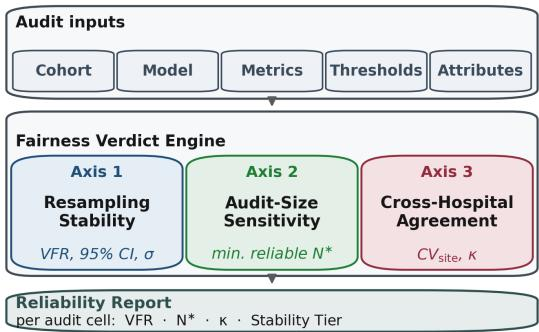  
Figure 1: VFR-Audit framework. Audit inputs feed the Fairness Verdict Engine, which evaluates each audit cell on three reliability axes. The Reliability Report records the per-cell outputs that downstream governance review consumes.

## 3.2 Design Intuition and Deployment Rationale

Hospital governance acts on thresholded fairness verdicts, for ex- ample $\mathrm { D I } ~ \geq ~ 0 . 8 0$ , rather than metric values alone. In practical deployment, fairness audits are repeated over time as new patient records are acquired and across sites as the model is run at difer- ent hospitals [52, 56]. Metric-level uncertainty therefore leaves a deployment gap. It does not directly report how often a pass-or-fail decision reverses, while mitigation can improve a point estimate without ensuring stability across cohorts or hospitals. VFR-Audit treats the verdict as the operational object. A single resampling axis is insuficient for repeated multi-site auditing. A verdict that is stable under bootstrap of a single cohort may still be underpow- ered for small subgroups or flip across hospital sites. As shown in Figure 1, each (model, metric, attribute) cell is evaluated on three complementary axes: resampling stability (VFR), audit-size sensitivity (�∗), and cross-hospital agreement (�), producing a four-tier reliability classification.

## 3.3 Verdict Flip Rate

Let $\mathcal { D } ^ { ( k ) }$ denote the �-th stratified bootstrap resample of size � drawn from the audit cohort with replacement, preserving the joint (label $\times \ : a )$ distribution. For a fixed cell $c \ = \ ( f , m , a )$ , let $\boldsymbol { v } _ { k } = v ( f , \mathcal { D } ^ { ( k ) } , m , a ) \in \{ 0 , 1 \}$ denote the per-resample verdict and $\begin{array} { r } { n _ { \mathrm { p a s s } } ( c ) = \sum _ { k = 1 } ^ { K } v _ { k } } \end{array}$ the pass count across � resamples. The Verdict Flip Rate is defined as

$$
\mathrm { V F R } ( c ) \ = \ \frac { \operatorname* { m i n } \bigl ( n _ { \mathrm { p a s s } } ( c ) , \ K - n _ { \mathrm { p a s s } } ( c ) \bigr ) } { K } .\tag{1}
$$

The statistic is bounded in [0, 0.5] by construction. $\mathrm { V F R } ( c ) = 0$ holds when all � resamples produce the same verdict. $\mathrm { V F R } ( c ) = 0 . 5$ holds when the verdicts split evenly between pass and fail. The dominant verdict �¯(�) ∈ {Pass, Fail} is the majority outcome across the � resamples. We set the operational verdict-stability threshold to $\tau _ { \mathrm { V F R } } = 0 . 1 0$ , so a cell is practically stable only when at least 90 % of the resampled audits agree with the dominant verdict. This Axis 1 criterion is distinct from the $C V \prec 0 .$ 05 criterion used by Axis 2 to determine the minimum reliable audit size $N ^ { * }$ , and it is also independent of the DI four-fifths threshold of 0.80. A reliability- aware audit therefore reports both the dominant verdict and its stability score. The two quantities together separate fairness status from verdict reliability.

3.3.1 Selecting the bootstrap count �. For a fixed cell �, the pass count $n _ { \mathrm { p a s s } } ( c )$ is an empirical count over � resampled audits. For a pass probability ${ \boldsymbol { p } } ,$ the Monte Carlo standard error of the empirical pass proportion is ${ \sqrt { p ( 1 - p ) / K } } .$ , which is maximised at $p = 0 . 5$ With $K = 5 0 0$ , the worst-case standard error is 0.0224, giving an approximate 95 % half-width of ±0.044. We therefore use $K = 5 0 0$ as a fixed audit budget that keeps Monte Carlo error below 0.05 VFR units while remaining tractable across the full audit grid. Hoefding’s inequality [31] can additionally bound the probability that the empirical pass proportion deviates from its expectation by more than a chosen tolerance �. The bound is distribution-free and de- pends neither on the size of the audit cohort nor on the distribution of the protected attribute, so the same $K = 5 0 0$ transfers across cohorts at the same precision target without re-derivation.

3.3.2 Selecting the per-resample size �. Audit size controls the trade-of between sampling noise and sensitivity to threshold-edge cells. For a fairness metric � with population value $m _ { \mathrm { p o p } } { \mathrm { ; } }$ , threshold $\tau ,$ and margin $\delta = | m _ { \mathrm { p o p } } - \tau |$ , a verdict flips when $| \hat { m } _ { N } - m _ { \mathrm { p o p } } | > \delta ,$ where $\hat { m } _ { N }$ is the metric estimate and $\sigma _ { N }$ its per-resample standard deviation. Smaller � inflates $\sigma _ { N }$ , since the audit loses discriminative power because cells far from threshold also flip on sampling noise. Larger � deflates $\sigma _ { N }$ , since the audit loses sensitivity to threshold- edge cells, which are the cells most informative for governance. We use $N = 1 0 ^ { 4 }$ within the prespecified $5 \times 1 0 ^ { 3 }$ to $5 \times 1 0 ^ { 4 }$ single-site audit-size design range. On this cohort, $N = 1 0 ^ { 4 }$ is the smallest tested size that separates threshold-edge cells $( \mathrm { V F R } > 0 . 1 0 )$ from far- from-threshold cells $\mathrm { ( V F R \approx 0 ) }$ without excessive sampling noise. Axis 2 independently sweeps audit size to estimate the minimum reliable $N ^ { * }$

3.3.3 Model-development and audit protocol. The model-training stage and the audit-reliability stage are treated as separate steps. Predictive models are trained on the training partition and evaluated on the held-out audit partition. The VFR-Audit procedure is then applied to the fixed trained model and the fixed prediction scores to quantify the reliability of thresholded fairness verdicts under resampling, audit-size variation, and hospital-grouped evaluation. The reported VFR values are reliability estimates for the specified audit cohort and protocol rather than prospective guar- antees. Robustness checks in Section 4.2.5 use a stricter $7 0 / 1 5 / 1 5$ train, validation, audit split in which intervention thresholds are selected on the validation partition and final statistics are reported on a previously unseen audit partition.

3.3.4 Relation to bootstrap confidence intervals. VFR does not re-place bootstrap confidence intervals on continuous fairness metrics. $\mathrm { A }$ confidence interval describes uncertainty in the continuous met ric value �ˆ ; VFR reports the empirical instability of the governancefacing binary verdict $1 [ \hat { m } \succeq \tau _ { m } ]$ after thresholding. Both are useful and they answer diferent questions. For ratio metrics such as DI, the bootstrap distribution is right-skewed near zero, so a normal- approximation flip probability tends to underestimate the empirical reversal rate near the threshold. VFR uses the empirical resample proportion directly.

## 3.4 Three-Axis Reliability Framework

Each axis answers one reliability question and is formalised by one of Algorithms 1 to 3. Axes 1 and 2 operate per (model, metric, attribute) cell, while Axis 3 operates per fairness metric across that metric's protected-attribute cells. Axis 1 (Algorithm 1) asks would the same verdict have been reached on a diferent audit cohort?; it draws $K = 5 0 0$ stratified bootstrap resamples and reports VFR via Equation 1 together with the stability margin $\sigma = | \hat { m } - \tau _ { m } | / \widehat { \mathrm { S D } } ( m )$ Axis 2 (Algorithm 2) asks how many records does an auditneedbefore the metric stabilises?; it sweeps an audit-size grid with $R = 3 0$ random sub-samples per point and reports $N ^ { * } =$ min $[ N _ { i } : \mathrm { C V } ( N _ { i } ) <$ 0.05}, flagging cells whose $N ^ { * }$ exceeds $N _ { \mathrm { f i e l d } } = 5 \times 1 0 ^ { 4 }$ as not reliably auditable at a single hospital site. Axis 3 (Algorithm 3) asks will the audit verdict reached at one hospital recur at another?; it evaluates verdict agreement across $K _ { \mathrm { h o s p } } = 2 0$ hospital-grouped GroupKFold folds. For each fairness metric, the four protected-attribute cells form the rated items and the folds act as raters, so Fleiss’ � [24] sum-marises agreement over this fold-by-cell verdict matrix, classified using the Landis-Koch [37] bands. The metric-level � is assigned to each constituent (metric, attribute) cell for the tier computation, because a single cell supplies only one rated item and would render Fleiss’ � de enerate.

Algorithm 1 Axis 1: Verdict Flip Rate (Resampling Stability).   
Require: Trained model $f ,$ audit cohort D, metric � with thresh   
old $\tau _ { m } ,$ attribute $^ { a , }$ bootstrap count $K = 5 0 0 \mathrm { ; }$ , resample size $N .$   
Ensure: VFR, dominant verdict ${ \bar { v } } ,$ stability margin $\sigma ,$ 95 % boot-   
strap CI.   
1: $n _ { \mathrm { p a s s } }  0 ; \quad M  [ ]$   
2: for $k = 1$ to � do   
3: $\mathcal { D } _ { k } \gets { \cal S } \mathrm { : }$ tratifiedBootstrap $( \mathcal { D } , N ,$ strata=� × �)   
4: $\hat { m } _ { k } \gets m ( f , \mathcal D _ { k } , a ) ; \quad v _ { k } \gets 1 \big [ \hat { m } _ { k } \succeq \tau _ { m } \big ]$   
5: $n _ { \mathrm { p a s s } }  n _ { \mathrm { p a s s } } + v _ { k } ;$ �.append $( \hat { m } _ { k } )$   
6: end for   
7: $\mathrm { V F R }  \operatorname* { m i n } ( n _ { \mathrm { p a s s } } , K - n _ { \mathrm { p a s s } } ) / K$   
8: �¯ ← Pass if $n _ { \mathrm { p a s s } } > K / 2$ else Fail   
9: $\sigma \gets | \mathrm { m e a n } ( M ) - \tau _ { m } | / \mathrm { S D } ( M )$   
10: return $( \mathrm { V F R } , \bar { v } , \sigma , \mathsf { C I } _ { 9 5 } ( M ) )$

Algorithm 2 Axis 2: Audit-Size Sensitivity $( N ^ { * } ) .$   
Require: $f , \mathcal { D } , m , a ,$ audit-size grid $\left\{ N _ { 1 } , \dots , N _ { \mathrm { m a x } } \right\}$ , repetitions   
$R = 3 0 , \mathrm { C V }$ cutof $\eta = 0 . 0 5 .$   
Ensure: $\mathrm { c v }$ curve, minimum reliable size $N ^ { * }$   
1: for each $N _ { i }$ in audit-size grid do   
2: $V _ { i } \gets [ m ( f ,$ RandomSubsample $( \mathcal { D } , N _ { i } ) , a ) : r = 1 \ldots R ]$   
3: $\mathrm { C V } _ { i } \gets \mathrm { S D } ( V _ { i } ) / | \mathrm { m e a n } ( V _ { i } ) |$   
4: end for   
5: $N ^ { * } \gets \operatorname* { m i n } \{ N _ { i } : \mathrm { C V } _ { i } < \eta \}$ (or ∞ if no grid point qualifies)   
6: return $\left( \{ \mathrm { C V } _ { i } \} , N ^ { * } \right)$

Algorithm 3 Axis 3: Cross-Hospital Verdict Agreement (�).   
Require: $f , { \mathcal { D } }$ with hospital identifiers �, metric $m ,$ attribute set   
${ \mathcal { A } } , \tau _ { m } ,$ fold count $K _ { \mathrm { h o s p } } = 2 0 .$   
Ensure: Fold-by-cell verdict matrix $V ,$ metric-level Fleiss $\kappa _ { m } .$   
1: $\{ \mathcal { D } _ { 1 } , . . . , \mathcal { D } _ { K _ { \mathrm { h o s p } } } \}$ ← GroupKFold $( { \mathcal { D } } ,$ groups=�, $K _ { \mathrm { h o s p } } )$   
2: for each fold $\dot { h } \in \{ 1 , . . . , K _ { \mathrm { h o s p } } \}$ do   
3: for each attribute $a \in \mathcal A$ do   
4: $V _ { a , h } \gets 1 [ m ( f , \mathcal { D } _ { h } , a ) \succeq \tau _ { m } ]$   
5: end for   
6: end for   
7: $\kappa _ { m } \gets$ FleissKappa(�) ⊲ items: $| \mathcal { R } |$ cells; raters: $K _ { \mathrm { h o s p } }$ folds   
8: ${ \mathfrak { c } } ( c ) \gets \kappa _ { m }$ for every cell $c = ( f , m , a )$ with $\iota \in \mathcal { A }$   
9: return $( V , \kappa _ { m } )$

Metric-specific pass rule. For each metric $m ,$ the relation $\succeq$ used in Algorithm 1 denotes the metric-specific pass condition. For ratiostyle metrics such as Disparate Impact, $\hat { m } \succeq \tau _ { m }$ means $\hat { m } \geq \tau _ { m } .$ . For two-sided diference-style metrics such as SPD, EOpp, EOD, and PP, $\hat { m } \succeq \tau _ { m }$ means $| { \hat { m } } | \leq \tau _ { m } .$ . For one-sided metrics such as Calibration and Theil Index, �ˆ $\succeq \tau _ { m }$ means �ˆ $\leq \tau _ { m }$ . The tie case $n _ { \mathrm { p a s s } } = K / 2$ assigns Fail as the dominant verdict, since any audit-grade verdict requires a strict majority of resamples to support a pass.

Combined reliability tier. A cell � is classified Practical-Stability when all three conditions hold, namely $\mathrm { V F R } ( c ) \leq 0 . 1 0 , N ^ { \ast } ( c ) \leq$ $N _ { \mathrm { f i e l d } } ,$ and $\kappa ( c ) \geq 0 . 4 0 .$ A cell is classified Caution-Required if one condition is violated, High-Variance if two, and Catastrophic-Instability if all three. The classification is conjunctive across the three axes, so any single-axis failure drops the cell to a lower tier. Operationally, a High-Variance cell should trigger additional data accumulation or cross-site pooling and manual governance review before automated certification; Catastrophic-Instability should de- fer deployment-level certification until reliability improves.

## 4 Experiment and Evaluation

## 4.1 Experimental Setting

This subsection specifies the dataset, the trained model panel, the fairness metrics and protected attributes, the baselines used for comparison, and the dataset exploratory analysis.

Reproducibility. Code and experiment notebooks are available at https://github.com/MdJoy31/VFR-Framework.

4.1.1 Dataset. The Texas-100X dataset comprises 925,128 inpatient discharge records from 441 hospitals in Texas. Records were drawn from the THCIC Public Use Data File for fiscal year 2006 (Quarters 1 to 4) [63]. The binary prediction target is LOS exceeding three days (positive class rate 45.0 %). The dataset was split 80/20 stratified by the LOS-greater-than-three-days target with random seed 42, producing 740,102 training records and 185,026 test records. Administrative discharge data are appropriate for this study because LOS prediction is directly tied to hospital operations, bed planning, and discharge management [32, 33, 51]. Unlike ICU-specific EHR benchmarks such as MIMIC-III or MIMIC-IV [34, 46], the Texas-100X dataset provides a state-wide, multi-hospital administrative setting with 441 hospitals, which is better aligned with the cross hospital deployment question studied here. External replication on richer EHR datasets remains necessary. Intersectional sparsity constrains the audit design: the primary 28-cell VFR grid therefore evaluates protected attributes separately, while the race × age × sex intersection is used only for the reweighing baseline. Given that the smallest race stratum contains 3,474 records in the full cohort (Table 3), we do not claim reliable bootstrap inference for finer intersections; Axis 2 instead identifies cells whose required audit size exceeds available single-site support.

4.1.2 Models. Twelve standard tabular classifiers were trained on identical pre-processed features: logistic regression, decision tree, random forest, gradient boosting, AdaBoost, XGBoost, LightGBM, CatBoost, histogram gradient boosting, bagging, extra trees, and a stacking ensemble. Each classifier was fitted with a fixed, model- specific hyperparameter configuration, archived in the experiment records and frozen before fairness auditing, preventing fairness outcomes from influencing model configuration. Deep neural base- lines were not included because Texas-100X is structured admin- istrative tabular data and the study targets audit reliability rather than sequence-representation learning. XGBoost was designated in advance as the canonical model; on the held-out test partition it achieved $\mathrm { A U R O C } = 0 . 9 5 2 8 .$ , accuracy = 0.8776, and $F _ { 1 } = 0 . 8 6 2 7$

4.1.3 Fairness metrics andprotectedatributes. Seven group-fairness metrics were evaluated [5, 66], namely Disparate Impact (DI, ≥ 0.80), Statistical Parity Diference (SPD, $| \cdot | \leq 0 . 1 0 )$ , Equal Opportunity (EOpp, $| \cdot | \leq 0 . 1 0 )$ , Equalised Odds $( \mathrm { E O D } , | \cdot | \le 0 . 1 0 )$ , Theil Index $( \mathrm { T I } , \leq 0 . 1 0 )$ , Predictive Parity $( \mathrm { P P } , | \cdot | \leq 0 . 1 0 ) .$ and Calibration (Cal, $| \cdot | \leq 0 . 0 5 )$ . Four protected attributes were evaluated, namely race (5-category THCIC code comprising White, Black, Asian/Pacific Islander, American Indian, and Other/Unknown), sex (Male/Female), ethnicity (Hispanic/non-Hispanic), and age (4-bucket THCIC PUDF scheme comprising Pediatric < 18, Young Adult 18 to 39, Middle-Aged 40 to 64, and $\operatorname { E l d e r l y } \geq 6 5 ) .$ The audit grid contains $7 \times 4 = 2 8$ (metric, attribute) cells per model, or 336 cells across all twelve models per audit pass.

4.1.4 Baselines. Four baselines are compared on the same audit instrument so that cross-baseline diferences in VFR, �∗, and Fleiss’ � reflect the intervention rather than the audit setup. The dataset, train-test split, feature pipeline, trained model, bootstrap seed, and hospital-fold partition are held constant across all four baselines.

• Baseline 1 (B1) Real-only model. No fairness intervention. Standard reference for the unintervened audit.

• Baseline 2 (B2) Reweighing baseline. Intersectional adaptation of the Kamiran-Calders pre-processing reweighing strategy [35], evaluated as a baseline in fairness-aware clinical ML [50], controlled by a � regularisation strength.

Texas-100X cohort composition (925,128 records · 441 hospitals

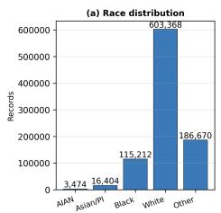

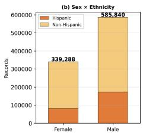

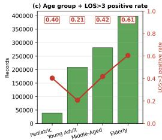

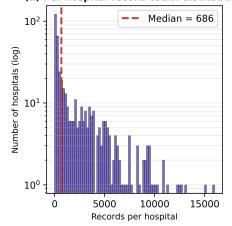  
Figure 2: Texas-100X dataset composition by protected attribute. Panel (c) reports the largest within-attribute baserate gap among the four protected attributes. The positive rate triples between Young Adult (20.7 %) and Elderly (60.6 %) strata, fixing an empirical lower bound on Age-DI.

Baseline 3 (B3) Threshold-shifting baseline. Per-cell �- search over SR/TPR/PPV on predicted probabilities, adapted from the post-processing equalised-odds method of Hardt et al. [29] and the per-cell threshold-optimisation strategy of Abakasanga et al. [1].

• VFR-Audit (B4). The proposed design. �-search followed by greedy refinement under the all-four-DI ≥ 0.80 constraint, then audits the resulting verdicts using VFR, audit-size sensitivity, and cross-hospital agreement.

VFR-Audit implementation. VFR-Audit starts from the Baseline 3 threshold-shifting solution and greedily adjusts candidate groupspecific decision thresholds under the hard all-four-DI ≥ 0.80 constraint. At each step, a candidate move is accepted only if it pre-serves the DI constraint on all four protected attributes and im- proves the selected VFR objective on the audited cell. Ties are resolved by higher accuracy within the intervention-selection partition. The stricter validation-audit robustness check in Section 4.2.5 separates threshold selection from final audit reporting. The se- lected configuration is then evaluated, post-hoc, with the same audit instrument used for Baselines 1 to 3, namely Verdict Flip Rate, audit-size sensitivity, and hospital-fold agreement.

Only VFR-Audit is original to this study. Baselines 1 to 3 are direct adoptions of earlier work. Cross-study comparison against published LOS work was not undertaken because no prior LOS study reports a verdict-stability measure or audit-instrument reliability statistic [32, 33].

4.1.5 Dataset exploratory analysis. Three properties of the cohort matter for the audit-reliability claims that follow (Figure 2, Table 3). The Age axis carries the largest base-rate gap (0.399) and the Race axis the second largest (0.189). Disparate Impact is upper-bounded by a function of the base-rate gap, so Age is the binding constraint for any DI-targeted intervention on this cohort, with Race a secondary constraint. The cohort’s race-by-ethnicity coding is non-standard. 99.4 % of records coded as Black are also coded as His- panic [63], so the audit reports parity between THCIC race codes as recorded. The hospital-volume distribution is heavily right-skewed (top 50 hospitals hold 46.5 %, top 100 hold 70.5 %). The GroupK-Fold cross-hospital evaluation at $K _ { \mathrm { h o s p } } = 2 0$ produces folds of ap- proximately $4 . 6 \times 1 0 ^ { 4 }$ records each, well within the field-realistic single-site audit range.

Table 3: Texas-100X cohort descriptive statistics on the full 925,128-record cohort. “Pos. rate” is the within-stratum proportion with LOS > 3 days; “BRG” is the base-rate gap.
<table><tr><td>Attribute</td><td>Stratum</td><td>N</td><td>%</td><td>Pos. rate</td></tr><tr><td rowspan="5">Race  $\mathrm { B R G } = 0 . 1 8 9$ </td><td>White</td><td>603,368</td><td>65.2</td><td>0.453</td></tr><tr><td>Other / Unknown</td><td>186,670</td><td>20.2</td><td>0.404</td></tr><tr><td>Black</td><td>115,212</td><td>12.5</td><td>0.523</td></tr><tr><td>Asian / Pacific Islander</td><td>16,404</td><td>1.8</td><td>0.410</td></tr><tr><td>American Indian</td><td>3,474</td><td>0.4</td><td>0.334</td></tr><tr><td rowspan="2">Sex  $\mathrm { B R G } = 0 . 1 0 7$ </td><td>Male</td><td>585,840</td><td>63.3</td><td>0.411</td></tr><tr><td>Female</td><td>339,288</td><td>36.7</td><td>0.518</td></tr><tr><td rowspan="2">Ethnicity  $\mathrm { B R G } = 0 . 0 7 4$ </td><td>Hispanic</td><td>670,586</td><td>72.5</td><td>0.471</td></tr><tr><td>Non-Hispanic</td><td>254,542</td><td>27.5</td><td>0.397</td></tr><tr><td rowspan="5">Age group BRG = 0.399</td><td>Pediatric (&lt; 18)</td><td>38,121</td><td>4.1</td><td>0.403</td></tr><tr><td>Young Adult (18 to 39)</td><td>208,528</td><td>22.5</td><td>0.207</td></tr><tr><td>Middle-Aged (40 to 64)</td><td>281,409</td><td>30.4</td><td>0.418</td></tr><tr><td>Elderly (≥ 65)</td><td>397,070</td><td>42.9</td><td>0.606</td></tr><tr><td>Top 10</td><td>124,892</td><td>13.5</td><td>n/r</td></tr><tr><td rowspan="5">Hospital volume</td><td>Top 50</td><td>430,184</td><td>46.5</td><td>n/r</td></tr><tr><td>Top 100</td><td></td><td>70.5</td><td></td></tr><tr><td>Top 200</td><td>652,215</td><td>93.3</td><td>n/r</td></tr><tr><td>Median / site</td><td>862,944</td><td>n/r</td><td>n/r</td></tr><tr><td></td><td>686</td><td></td><td>n/r</td></tr></table>

## 4.2 Evaluation Questions and Results

Results are organised around five evaluation questions.

EQ1. Does the administrative LOS dataset provide suficient predictive utility for downstream fairness auditing?

EQ2. Which fairness intervention satisfies the four-fifths rule, and what accuracy cost does it introduce relative to the Real-only refer- ence?

EQ3. Does VFR-Audit reveal verdict instability that point-estimate audits miss?

EQ4. What is the predictive-performance, computational, and labour cost of adopting VFR-Audit?

EQ5. Are the conclusions stable under alternative splits, feature ablation, and random seeds?

4.2.1 EQ1. Predictive Utility. On the held-out test partition (� = $1 . 8 5 \times 1 0 ^ { 5 } )$ , the XGBoost model (Baseline 1) achieves AUROC = 0.9528, accuracy = 0.8776, and $F _ { 1 } = 0 . 8 6 2 7$ before any fairness intervention. This value should be interpreted as the performance of a retrospective administrative audit model. Leakage-sensitivity and validation-audit robustness checks are reported separately in Section 4.2.5. Table 4 reports the full twelve-classifier baseline-audit panel. Predictive performance is consistent with prior LOS studies on EHR datasets [51, 58, 70], which confirms that administrative discharge data carry suficient signal at the cohort scale required by the cross-hospital audit.

Table 4: Per-model audit panel on the Baseline 1 Real-only reference. “Fair/28” is the count of (metric, attribute) cells passing the operational threshold.
<table><tr><td>Model</td><td>Acc</td><td>AUROC</td><td>F1</td><td>Race</td><td>Sex</td><td>Eth</td><td>Age</td><td>Fair/28</td></tr><tr><td>XGBoost (canon.)</td><td>0.878</td><td>0.953</td><td>0.863</td><td>0.644</td><td>0.763</td><td>0.831</td><td>0.299</td><td>20</td></tr><tr><td>LightGBM</td><td>0.865</td><td>0.943</td><td>0.847</td><td>0.595</td><td>0.752</td><td>0.821</td><td>0.264</td><td>20</td></tr><tr><td>HistGradientBoosting</td><td>0.858</td><td>0.939</td><td>0.840</td><td>0.603</td><td>0.746</td><td>0.820</td><td>0.256</td><td>20</td></tr><tr><td>Stacking Ensemble</td><td>0.853</td><td>0.935</td><td>0.834</td><td>0.619</td><td>0.744</td><td>0.821</td><td>0.258</td><td>19</td></tr><tr><td>Random Forest</td><td>0.853</td><td>0.934</td><td>0.834</td><td>0.587</td><td>0.742</td><td>0.810</td><td>0.240</td><td>18</td></tr><tr><td>Bagging</td><td>0.857</td><td>0.934</td><td>0.842</td><td>0.676</td><td>0.764</td><td>0.831</td><td>0.303</td><td>19</td></tr><tr><td>CatBoost</td><td>0.847</td><td>0.929</td><td>0.826</td><td>0.579</td><td>0.730</td><td>0.806</td><td>0.232</td><td>18</td></tr><tr><td>Gradient Boosting</td><td>0.838</td><td>0.922</td><td>0.817</td><td>0.617</td><td>0.719</td><td>0.796</td><td>0.218</td><td>16</td></tr><tr><td>Decision Tree</td><td>0.840</td><td>0.920</td><td>0.816</td><td>0.609</td><td>0.742</td><td>0.825</td><td>0.270</td><td>18</td></tr><tr><td>AdaBoost</td><td>0.814</td><td>0.897</td><td>0.794</td><td>0.654</td><td>0.693</td><td>0.777</td><td>0.227</td><td>10</td></tr><tr><td>Extra Trees</td><td>0.799</td><td>0.887</td><td>0.776</td><td>0.587</td><td>0.726</td><td>0.768</td><td>0.162</td><td>13</td></tr><tr><td>Logistic Regression</td><td>0.801</td><td>0.881</td><td>0.775</td><td>0.534</td><td>0.684</td><td>0.757</td><td>0.184</td><td>15</td></tr></table>

Table 5: Per-attribute Disparate Impact across the four baselines. Bold values satisfy $\mathrm { D I } \geq 0 . 8 0 .$
<table><tr><td>Baseline</td><td>Race</td><td>Sex</td><td>Eth</td><td>Age</td><td>Pass</td></tr><tr><td>B1 Real-only</td><td>0.644</td><td>0.763</td><td>0.831</td><td>0.299</td><td>1/4</td></tr><tr><td>B2 Reweighing (λ=2)</td><td>0.575</td><td>0.749</td><td>0.821</td><td>0.264</td><td>1/4</td></tr><tr><td>B3 Threshold-shifting</td><td>0.834</td><td>0.968</td><td>0.994</td><td>0.812</td><td>4/4</td></tr><tr><td>B4 VFR-Audit</td><td>0.801</td><td>0.932</td><td>1.000</td><td>0.800</td><td>4/4</td></tr></table>

4.2.2 EQ2. Fairness-Intervention Comparison. Table 5 reports perattribute Disparate Impact movement across the four baselines. Baseline 1 (Real-only) and Baseline 2 (Reweighing) satisfy the fourfifths rule on only 1 of 4 protected attributes. Baseline 3 (Thresholdshifting) and VFR-Audit (B4) satisfy the four-fifths rule on 4 of 4 protected attributes. The Race-DI value moves from 0.644 in Baseline 1 to 0.575 in Baseline 2, a movement away from the 0.80 threshold rather than toward it. An extreme-� sweep on twenty further reweighing configurations achieves a best Age-DI of 0.283, well below the 0.80 threshold. The Reweighing baseline therefore does not satisfy the four-fifths rule on this dataset regardless of the regularisation strength applied.

The panel in Table 4 exposes wide cross-model variation in the baseline fairness profile. All twelve models fail the four-fifths rule on the Age axis $( \mathrm { D I _ { A g e } } \in \left[ 0 . 1 6 , 0 . 3 0 \right] )$ , and none of the twelve satisfies all four DI constraints simultaneously without intervention. The VFR-Audit intervention applied to the canonical XGBoost model raises Race-axis DI from 0.644 to 0.801, Sex-axis from 0.763 to 0.932, Ethnicity-axis from 0.831 to 1.000, and Age-axis from 0.299 to 0.800. The DI Ethnicity = 1.000 value is an algorithmic artefact discussed in the Q3 analysis.

Accuracy cost is reported in percentage points relative to the Baseline 1 Real-only reference. For a method $^ { b , }$ the accuracy cost is

$$
\Delta \mathrm { A c c } _ { b } = 1 0 0 \times \left( \mathrm { A c c } _ { B 1 } - \mathrm { A c c } _ { b } \right) .
$$

Using Table 6, Reweighing loses 1.98 percentage points, Thresholdshifting loses 4.60 percentage points, and VFR-Audit loses 4.24 percentage points relative to Baseline 1. The comparison between Threshold-shifting (B3) and VFR-Audit is the substantive one, because both satisfy the all-four-DI criterion on the point estimate. Threshold-shifting reaches DI pass at accuracy 0.8316 with mean VFR 0.0863 and maximum VFR 0.490. VFR-Audit reaches DI pass at higher accuracy 0.8352 with lower mean VFR 0.0809 and lower maximum VFR 0.476. The gain of VFR-Audit over B3 is therefore not a new point-estimate fairness pass, since B3 already passes DI.

The gain is a verdict-reliability improvement delivered together with a +0.36 percentage-point accuracy improvement versus B3.

4.2.3 EQ3. Verdict-Reliability Analysis. Under $K = 5 0 0$ stratified bootstrap on the cross-model audit grid (12 models × 7 metrics × 4 attributes = 336 cells), 259 of336 cells (77.1 %) satisfy the operational stability cutof $\mathrm { V F R } \leq 0 . 1 0$ on Baseline 1, while 146 of 336 reverse their verdict at least once. Race-axis cells exhibit the highest insta- bility. $\mathrm { E O p p } _ { \mathrm { r a c e } }$ reaches $\mathrm { V F R } = 0 . 4 8 0 , \mathrm { E O D } _ { \mathrm { r a c e } }$ reaches $\mathrm { V F R } = 0 . 3 8 6$ and $\mathrm { P P _ { r a c e } }$ reaches $\mathrm { V F R } = 0 . 4 5 8$ . Age-axis cells concentrate around the PP instability point $( \mathrm { V F R } = 0 . 2 0 2 )$

After VFR-Audit satisfies the four-fifths rule on every protected attribute on the point estimate, 11 of 28 B4 cells still register $\mathrm { { V F R } > }$ 0 under the resampling protocol. Cohort-wide mean VFR on B4 is 0.081 (versus 0.066 for B1) and the maximum is 0.476 (versus 0.498). Race-axis cells concentrate the residual instability, while Sex, Ethnicity, and the remaining Age-axis cells reach $\mathrm { V F R } \leq 0 . 1 0 .$ Under the stricter operational cutof $\mathrm { V F R } \leq 0 . 1 0 ,$ 21 of 28 B4 cells are stable, which matches the single-split row of Table 7. The per- cell VFR landscape across the three independent robustness reruns is reported in Figure 3 and analysed in EQ5.

Finding: Point-estimate fairness does not imply verdict reliability. On B1, 146/336 audit cells flip at least once and 77/336 exceed VFR > 0.10. After B4 satisfies all four DI point-estimate thresholds, 11/28 cells still flip under resampling.

Axis 2 audit-size sensitivity. The $\mathrm { C V } < 5 \%$ cutof is reached at field-realistic audit sizes for 11 of 28 (metric, attribute) cells on VFR Audit. It requires the full 185,026-record test partition for 8 cells, comprising Calibration (4 of 4 attributes) and Equal Opportunity / Equalised Odds for race and ethnicity. A single hospital running a quarterly audit of approximately $5 \times 1 0 ^ { 3 }$ records cannot reliably audit those eight cells without pooling records across multiple quarters or sites. Of the 28 B4 cells, 17 exceed $\mathrm { C V } = 5 0 \% \mathrm { a t } N = 1 0 ^ { 3 }$ so small-cohort audits at this size are dominated by sampling noise rather than model behaviour.

Axis 3 cross-hospital agreement. Fleiss’ � at $K _ { \mathrm { h o s p } } = 2 0$ on VFR-Audit is moderate for EOpp $( \kappa = 0 . 4 6 5 )$ and EOD $( \kappa = 0 . 5 8 7 )$ . It reaches the degenerate ceiling for the Theil index $( \kappa = 1 . 0 0 0$ , be- cause the metric satisfies the threshold on every fold). It is slight or below-chance for DI (� = −0.035), SPD $( \kappa = 0 . 1 1 7 )$ , PP $( \kappa = 0 . 3 1 5 ) _ { ; }$ and Cal $( \kappa = 0 . 0 0 3 )$ . Fleiss’ � is used here as a descriptive sum-mary of hospital-fold verdict agreement under the grouped split protocol and should not be interpreted as a formal causal trans- portability estimate. The pattern is consistent across baselines. Equal-opportunity-style metrics show stronger cross-hospital verdict agreement, whereas calibration does not. A fairness verdict on calibration reached at one hospital, where $\kappa _ { \mathrm { C a l } } = 0 . 0 0 3$ , carries no measurable predictive value for the calibration verdict reached on another hospital’s records. Achieving DI pass costs cross-site verdict stability. Mean � drops from approximately 0.44 on Baselines 1 and 2 to approximately 0.35 on Baseline 3 and VFR-Audit once threshold-shifting engages, because per-cell �-search fits to the audited cohort’s intersectional cell structure, and that structure varies across hospital folds.

Four-baseline comparison summary. Table 6 reports the fourbaseline audit on the same instrument. The main reliability dif- ference is between Threshold-shifting (B3) and VFR-Audit. Both satisfy the all-four-DI criterion on the point estimate. VFR-Audit re- duces the mean VFR from 0.0863 to 0.0809 (−6.3 % relative) and the maximum VFR from 0.490 to 0.476 (a reduction of 0.014 VFR units, approximately 2.9 % relative), while raising accuracy from 0.8316 to 0.8352 (+0.36 percentage points). Baselines 1 and 2 produce nearly identical mean VFR (0.066 versus 0.062) and mean cross-site � (0.437 versus 0.436), so Reweighing does not change the verdict-reliability profile relative to no intervention on this cohort.

Root cause ofthe B3 to VFR-Audit VFR movement. B3 achieves all-four-DI ass on the full test artition. Under $K = 5 0 0$ stratified bootstrap, the Race-DI and Age-DI verdicts in B3 are unstable. Their VFRs are 0.41 and 0.40 respectively, so approximately 41 per cent and 40 per cent of bootstrap audits disagree with the dominant verdict for these cells. The greedy-refinement step in VFR-Audit walks the per-cell thresholds inward from the �-search starting point under the all-four- $\mathrm { \cdot D I } \geq 0 . 8 0$ constraint. On the four binding constraint cells, the resulting B3 to VFR-Audit VFR movements are DI $\mathrm { A g e } \ 0 . 4 1 2  0 . 2 3 2 \ : ( - 0 . 1 8 0 )$ , SPD Age 0.490 → 0.292 (−0.198), DI Race $0 . 4 1 0  0 . 4 7 6 ( + 0 . 0 6 6 )$ , and SPD Race $0 . 3 9 8  0 . 4 7 0$ (+0.072).

The movement shows a redistribution of instability across protected attributes rather than a uniform improvement across all cells. Age-axis VFR decreases for DI and SPD because the greedy refine-ment moves the Age thresholds farther from the DI boundary while preserving the all-four-DI constraint. Race-axis VFR increases for DI and SPD because the same refinement shifts part of the threshold burden from Age to Race. This is why the aggregate maximum VFR decreases from 0.490 to 0.476 while Race-DI and Race-SPD become less stable individually. The result demonstrates that VFR-Audit exposes where an intervention transfers instability, rather than re-porting only whether the final DI point estimate passes. Reporting only the 6.3 % relative reduction in mean VFR would conceal this redistribution pattern.

4.2.4 EQ4. Adoption Cost. Adopting VFR-Audit involves three cost components. Predictive-performance cost. VFR-Audit re-duces accuracy by 4.24 pp $( 0 . 8 7 7 6  0 . 8 3 5 2 )$ and $F _ { 1 }$ by 4.64 pp $( 0 . 8 6 2 7  0 . 8 1 6 3 )$ ), while preserving AUROC at 0.9528. AUROC preservation is mechanically expected under threshold shifting be- cause the score ranking is unchanged. Computational cost. Algorithm 1 runs in $O ( K N M _ { \mathcal { A } } )$ time and $O ( N + K M _ { \mathcal { A } } )$ memory, where $M _ { \mathcal { A } } = \left| \mathcal { F } \right| \cdot \left| \mathcal { A } \right|$ . The audit scales linearly with bootstrap samples, audit records, fairness metrics, and protected attributes. With prediction scores precomputed, the marginal cost over a bootstrap-CI audit is converting each resampled metric value into a pass-or-fail verdict and maintaining pass and fail counts. Labour cost. Each cell receives a dominant verdict, a VFR score, a minimum reliable audit size, a cross-hospital agreement value, and a reliability tier, so manual interpretation is bounded by the per-cell quintuple rather than by reading bootstrap CIs. Prior LOS fairness studies do not report a comparable verdict-reliability cost.

Accuracy and fairness trade-of summary. Across the twelve-classifier panel in Table 4, Race-axis threshold shifting moves every classifier above the four-fifths rule at an accuracy cost in the 4 to 6 percentage-point band. On the canonical model, �-search alone reaches the all-four-DI pass on the point estimate, but the Age-axis and Race-axis DI verdicts reverse on approximately 41 per cent of bootstrap resamples. The VFR-Audit greedy refinement reduces aggregate verdict instability while preserving the all-four-DI pointestimate pass, although the Race-DI and Age-DI cells remain above the VFR ≤ 0.10 stability cutof.

Verdict-Flip-Rate landscape on audit partition (3 independent reruns)  
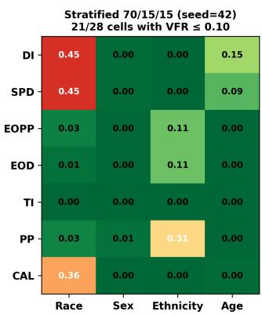

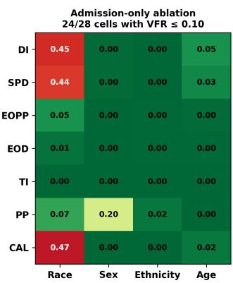

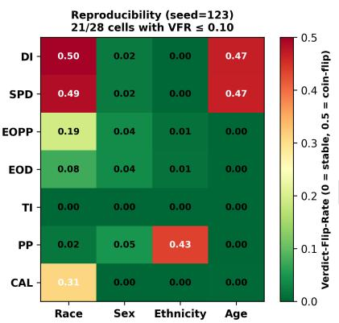  
Figure 3: VFR heatmaps across three robustness protocols on the audit partition.

Table 6: Four-method audit comparison under the same audit instrument.
<table><tr><td>Baseline</td><td>Acc</td><td>AUROC</td><td>VFR</td><td>VFR max</td><td>#flipped</td><td> $\overline { { \kappa } }$ </td><td> $\kappa _ { \mathrm { E O p p } }$ </td><td> $\kappa _ { \mathrm { E O D } }$ </td><td>DI pass</td></tr><tr><td>B1 Real-only</td><td>0.8776</td><td>0.9528</td><td>0.066</td><td>0.498</td><td>12</td><td>0.437</td><td>0.588</td><td>0.595</td><td>1/4</td></tr><tr><td>B2 Reweighing (λ=2)</td><td>0.8578</td><td>0.9373</td><td>0.062</td><td>0.426</td><td>10</td><td>0.436</td><td>0.618</td><td>0.607</td><td>1/4</td></tr><tr><td>B3 Threshold-shifting</td><td>0.8316</td><td>0.9532</td><td>0.086</td><td>0.490</td><td>11</td><td>0.346</td><td>0.606</td><td>0.607</td><td>4/4</td></tr><tr><td>B4 VFR-Audit</td><td>0.8352</td><td>0.9528</td><td>0.081</td><td>0.476</td><td>11</td><td>0.350</td><td>0.465</td><td>0.587</td><td>4/4</td></tr></table>

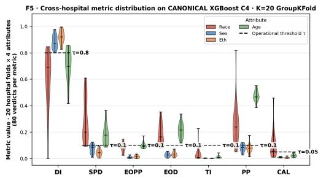  
Figure 4: Per-hospital-fold metric distribution across the 20 THCIC hospital folds. Equal Opportunity and Equalised Odds show tight inter-fold agreement; Disparate Impact and Cali bration show wide inter-fold spread.

Table 7: Robustness checks for the VFR-Audit pipeline.
<table><tr><td>Protocol</td><td>AUROC</td><td>Acc cost</td><td>all-4-DI</td><td>VFR-stable</td></tr><tr><td>Single-split main (canonical)</td><td>0.9528</td><td>4.24 pp</td><td>√</td><td>21/28</td></tr><tr><td>Stratified 70/15/15 (seed 42)</td><td>0.9418</td><td>4.98pp</td><td>√</td><td>21/28</td></tr><tr><td>Admission-lean (no TC, no PS)</td><td>0.8567</td><td>5.02pp</td><td>√</td><td>24/28</td></tr><tr><td>Independent seed (seed 123)</td><td>0.9426</td><td>5.04pp</td><td>√</td><td>21/28</td></tr></table>

4.2.5 EQ5. Robustness Checks. Table 7 reports four protocol-level audit-reliability checks against the single-split main result. As a cross-model check, the VFR-Audit intervention is applied to four model families (XGBoost, LightGBM, Random Forest, Logistic Re-gression). All four satisfy the four-fifths rule on every protected attribute post-intervention at an accuracy cost in the 4.24 to 5.39 percentage-point band. Sweeping the DI target from 0.80 to 0.90 on the XGBoost VFR-Audit configuration raises the accuracy cost monotonically from 4.24 to 5.97 percentage points.

The robustness checks preserve the main conclusion. All four protocols satisfy the all-four-DI criterion, and 21 to 24 of 28 cells remain VFR-stable. The admission-lean protocol produces the low- est AUROC (0.8567) because it removes TOTAL\_CHARGES and PAT\_STATUS, two end-of-encounter variables with strong predic- tive signal. Relative to the leakage-controlled full-feature baseline (0.9418), the drop is 0.0851 on the [0, 1] AUROC scale. Despite this predictive-performance loss, the fairness-verdict stability pattern remains similar to the single-split result (24/28 VFR-stable cells under admission-lean versus 21/28 under single-split). This indicates that the VFR pattern is not solely an artefact of leakage- sensitive features. The stratified 70/15/15 protocol selects intervention thresholds on the validation partition and reports VFR, �, and DI on an audit partition never seen during tuning. AUROC moves to 0.9418 at an accuracy cost of 4.98 pp, consistent with the primary single-split result while using a stricter validation-audit protocol. All-four-DI continues to ass, and 21/28 cells remain VFR-stable. The inde endent-seed check re roduces the leaka e-controlled re- sult within stochastic noise (AUROC 0.9426, accuracy cost 5.04 pp, 21/28 VFR-stable). Together, these checks reduce concern that the main VFR-Audit conclusions are artefacts of a single classifier, a single split, threshold tuning, or end-of-encounter variables.

Comparison of validation protocols on Texas-100X audit cohort

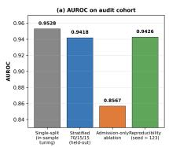

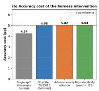

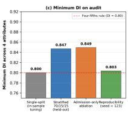  
Figure 5: Validation-protocol comparison on the Texas-100X audit cohort. (a) AUROC. (b) Accuracy cost of the VFR-Audit intervention. (c) Minimum Disparate Impact across the four protected attributes. All four protocols satisfy the four-fifths rule on every protected attribute.

## 5 Discussion

VFR-Audit separates fairness status from verdict reliability by jointly reporting the dominant verdict, VFR, minimum reliable audit size, and cross-hospital agreement. The results show that a point-estimate pass can remain unstable under resampling or site shift. Calibration is a persistent failure mode on this cohort $( \mathrm { V F R } _ { \mathrm { C a l } } \approx 0$ with a con- sistent Fail verdict and $\kappa _ { \mathrm { C a l } } \approx 0 )$ and should therefore be reported by site rather than only in pooled form.

The B3-versus-VFR-Audit comparison is the substantive costbenefit decision in this paper. Both methods pass the four-fifths rule on every protected attribute on the point estimate. Accuracy cost is reported relative to Baseline 1 using $\Delta \mathrm { A c c } _ { b } = 1 0 0 \times \left( \mathrm { A c c } _ { B 1 } - \mathrm { A c c } _ { b } \right)$ From Table 6, with $\mathrm { A c c } _ { B 1 } ~ = ~ 0 . 8 7 7 6$ , Reweighing pays 1.98 pp, Threshold-shifting pays 4.60 pp, and VFR-Audit pays 4.24 pp, so VFR-Audit raises the same DI pass at 0.36 pp lower cost than B3. Under $K = 5 0 0$ stratified bootstrap, the Race-DI and Age-DI verdicts in B3 carry VFRs of 0.41 and 0.40, so 40 to 41 per cent of bootstrap audits disagree with the dominant verdict on those cells. The greedy-refinement step walks the per-cell thresholds inward from the �-search start under the all-four-DI ≥ 0.80 constraint, producing per-cell VFR movements $\mathrm { D I } _ { \mathrm { A g e } } 0 . 4 1 2 \substack { \longrightarrow } 0 . 2 3 2 \left( - 0 . 1 8 0 \right)$ $\mathrm { S P D } _ { \mathrm { A g e } } 0 . 4 9 0 \longrightarrow 0 . 2 9 2 ( - 0 . 1 9 8 ) , \mathrm { D I } _ { \mathrm { R a c e } } 0 . 4 1 0 \longrightarrow 0 . 4 7 6 ( + 0 . 0 6 6 )$ , and $\mathrm { S P D _ { R a c e } 0 . 3 9 8  0 . 4 7 0 ~ ( + 0 . 0 7 2 ) }$ . The Age-axis VFR drops because the refinement opens headroom between Age decision thresholds and the DI boundary. The Race-axis VFR rises because the refine-ment transfers part of the threshold slack from Age to Race to maintain the all-four-DI constraint. The aggregate is a maximum-VFR reduction from 0.490 to 0.476 and a mean-VFR reduction from 0.0863 to 0.0809 (6.3 % relative). Reporting only the aggregate would conceal this redistribution pattern.

Reweighing fails on this dataset because the Age base-rate gap acts as a feature-based floor on the achievable selection-rate ratio. With Elderly LOS > 3 d rate 0.606 against 0.207 for young adults (a 2.93× ratio), Reweighing modifies the empirical risk the optimiser minimises but leaves the input features unchanged [35]. The selection-rate ratio defining DI is then floored by the feature-based predictability gap, which explains why Race-DI moves from 0.644 to 0.575 between Baselines 1 and 2 (away from the threshold) and why no � setting in the sweep satisfies the four-fifths rule. Per-cell threshold shifting bypasses this constraint by operating on the operating point per group rather than on the empirical risk, and satisfies all four DI constraints at the costs reported above.

The audit-reliability conclusions persist under both the stricter validation-audit protocol and the admission-lean sensitivity check.

Under the leaka e-controlled 70/15/15 s lit, all-four-DI contin-ues to pass on the audit slice, the VFR-stable cell count remains 21/28, and AUROC moves to 0.9418 at an accuracy cost of 4.98 pp. Removing the two end-of-encounter features TOTAL\_CHARGES and PAT\_STATUS drops AUROC from the leakage-controlled fullfeature baseline of 0.9418 to 0.8567 (a leakage-diagnostic score of 0.0851 on the [0, 1] scale) but preserves all-four-DI and yields 24/28 VFR-stable cells, so the fairness-audit reliability story is pre-served under the admission-lean feature set on this cohort. Texas- 100X is, however, a retrospective administrative discharge dataset, and this leakage-sensitivity analysis does not establish prospective admission-time deployability. The protected-attribute results should also be read with two caveats. The THCIC race-by-ethnicity coding is non-standard (Table 3), so race and ethnicity results reflect administrative parity rather than self-identified parity, and only Disparate Impact admits a regulatory threshold (the four-fifths rule). Counterfactual and individual-fairness instruments are not evaluated. The primary single-split experiment should therefore be interpreted as an intervention-analysis setting, while the 70/15/15 protocol provides the cleaner validation-audit evidence.

Future work. VFR-Audit should be validated prospectively on admission-time features and temporally held-out hospitals, and extended to sparse intersectional groups using hierarchical pooling or adaptive minimum-support rules. High-Variance cells should trigger additional data accumulation or cross-site pooling and gov-ernance review before automated certification. For high-speed clin- ical deployment, a streaming implementation could recompute Axis 1 over rolling audit windows from cached prediction scores, while the more expensive audit-size and cross-hospital axes run asynchronously at lower cadence, enabling near real-time equity monitoring without retraining the predictive model after every batch. Sensitivity to alternative �VFR values should also be evalu- ated rather than treating 0.10 as universal. Future work will extend VFR-Audit to additional datasets, protected attributes, deep neural networks, and LLM-derived clinical systems, while evaluating distributed cross-hospital deployment, including federated learning, and AI-agent-assisted continuous fairness auditing.

## 6 Conclusion

VFR-Audit provides a model-agnostic audit layer for assessing whether thresholded fairness verdicts remain reliable under cohort resampling, audit-size variation, and hospital shift. On Texas-100X, point-estimate fairness can remain unstable even after intervention satisfies the four-fifths rule, demonstrating that deployment decisions should report audit reliability alongside fairness status. Robustness checks under a stricter validation-audit split, admission- lean features, and an independent seed support this conclusion.

GenAI Usage Disclosure. Generative AI tools were used solely for grammar checking. No content in this manuscript was written or generated by AI. All text, technical content, experiments, analysis, and interpretations were authored and verified by the authors.

## References

[1] Emeka Abakasanga, Rania Kousovista, Georgina Cosma, Ashley Akbari, Francesco Zaccardi, Navjot Kaur, Danielle Fitt, Gyuchan Thomas Jun, Reza Kiani, and Satheesh Gangadharan. 2025. Equitable hospital length of stay prediction for patients with learning disabilities and multiple long-term conditions using machine learning. Frontiers in Digital Health 7 (2025), 1538793. doi:10.3389/fdgth.2025.1538793

[2] Joseph E. Alderman, Joanne Palmer, Elinor Laws, et al. 2025. Tackling algorithmic bias and promoting transparency in health datasets: the STANDING Together consensus recommendations. The Lancet Digital Health 7, 1 (2025), e64–e88. doi:10.1016/S2589-7500(24)00224-3

[3] Ghazal Azarfar, Sara Naimimohasses, Sirisha Rambhatla, et al. 2025. Responsible adoption of multimodal artificial intelligence in health care: promises and chal lenges. The Lancet Digital Health 7, 12 (2025), 100917. doi:10.1016/j.landig.2025. 100917

[4] Pepita Barnard, John Robert Bautista, Joshua Krook, Anqi Liu, Héctor D. Menén dez, Aurora Schmidt, and Tamim Sookoor. 2023. MACAIF: Machine Learning Auditing for Clinical AI Fairness. In Proceedings ofthe First International Symposium on Trustworthy Autonomous Systems (TAS ’23). Association for Computing Machinery, New York, NY, USA, Article 40, 4 pages. doi:10.1145/3597512.3597522

[5] Solon Barocas, Moritz Hardt, and Arvind Narayanan. 2023. Fairness and Machine Learning: Limitations and Opportunities. MIT Press, Cambridge, MA, USA. https: //fairmlbook.org/

[6] Ainhize Barrainkua, Paula Gordaliza, Jose A. Lozano, and Novi Quadrianto. 2024. Uncertainty Matters: Stable Conclusions under Unstable Assessment of Fairness Results. In Proceedings ofthe 27th International Conference on Artificial Intelligence and Statistics (AISTATS) (Proceedings ofMachine Learning Research, Vol. 238). PMLR, 1198–1206.

[7] Emma Beede, Elizabeth Baylor, Fred Hersch, Anna Iurchenko, Lauren Wilcox, Paisan Ruamviboonsuk, and Laura M. Vardoulakis. 2020. A Human-Centered Evaluation of a Deep Learning System Deployed in Clinics for the Detection of Diabetic Retinopathy. In Proceedings ofthe 2020 CHIConference on Human Factors in Computing Systems. Association for Computing Machinery, New York, NY, USA, 1–12. doi:10.1145/3313831.3376718 .

[8] Abeba Birhane, Ryan Steed, Victor Ojewale, Briana Vecchione, and Inioluwa Deborah Raji. 2024. AI Auditin : The Broken Bus on the Road to AI Accountabilit . In 2024 IEEE Conference on Secure and Trustworthy Machine Learning (SaTML). IEEE, 612–643. doi:10.1109/SaTML59370.2024.00037

[9] Emily Black, Manish Raghavan, and Solon Barocas. 2022. Model Multiplicity: Op portunities, Concerns, and Solutions. In Proceedings ofthe 2022 ACMConference on Fairness, Accountability, and Transparency (FAccT ’22). Association for Computing Machinery, New York, NY, USA, 850–863. doi:10.1145/3531146.3533149

[10] Kathleen Cachel and Elke Rundensteiner. 2022. FINS Auditing Framework: Group Fairness for Subset Selections. In Proceedings ofthe 2022 AAAI/ACM Conference on AI, Ethics, and Society (AIES ’22). Association for Computing Machinery, New York, NY, USA, 144–155. doi:10.1145/3514094.3534160

[11] Zi Cai, Yu Liu, Zhiyao Luo, and Tingting Zhu. 2025. ProtoEHR: Hierarchical Prototype Learning for EHR-based Healthcare Predictions. In Proceedings ofthe 34th ACM International Conference on Information and Knowledge Management (CIKM ’25). Association for Computing Machinery, New York, NY, USA, 169–178. doi:10.1145/3746252.3761381

[12] John J. Cherian and Emmanuel J. Candès. 2024. Statistical Inference for Fairness Auditing. Journal ofMachine Learning Research 25, 149 (2024), 1–49.

[13] Christopher F. Chesley, Marzana Chowdhury, Dylan S. Small, Douglas E. Schaubel, Vincent X. Liu, Meghan B. Lane-Fall, Scott D. Halpern, and George L. Anesi. 2023. Racial Disparities in Length of Stay Among Severely Ill Patients Presenting With Sepsis and Acute Respiratory Failure. JAMA Network Open 6, 5 (2023), e239739. doi:10.1001/jamanetworkopen.2023.9739

[14] A. Feder Cooper, Katherine Lee, Madiha Zahrah Choksi, Solon Barocas, Christo-pher De Sa, James Grimmelmann, Jon Kleinberg, Siddhartha Sen, and Baobao Zhang. 2024. Arbitrariness and Social Prediction: The Confounding Role of Variance in Fair Classification. Proceedings ofthe AAAI Conference on Artificial Intelligence 38, 20 (2024), 22004–22012. doi:10.1609/aaai.v38i20.30203

[15] Sam Corbett-Davies, Johann D. Gaebler, Hamed Nilforoshan, Ravi Shrof, and Sharad Goel. 2023. The Measure and Mismeasure of Fairness. Journal ofMachine Learning Research 24, 312 (2023), 1–117.

[16] Sharon E. Davis, Chad Dorn, Daniel J. Park, and Michael E. Matheny. 2025. Emerg- ing algorithmic bias: fairness drift as the next dimension of model maintenance and sustainability. Journal ofthe American Medical Informatics Association 32, 5 (2025), 845–854. doi:10.1093/jamia/ocaf039

[17] Sharon E. Davis, Peter J. Embí, and Michael E. Matheny. 2024. Sustainable deploy ment of clinical prediction tools: a 360 degree approach to model maintenance. Journal ofthe American Medical Informatics Association 31, 5 (2024), 1195–1198. doi:10.1093/jamia/ocae036

[18] Anahita Davoudi, Sena Chae, Lauren Evans, Sridevi Sridharan, Jiyoun Song, Kathryn H. Bowles, Margaret V. McDonald, and Maxim Topaz. 2024. Fairness Gaps

in Machine Learning Models for Hospitalization and Emergency Department Visit Risk Prediction in Home Healthcare Patients with Heart Failure. International Journal of Medical Informatics 191 (2024), 105534. doi:10.1016/j.ijmedinf.2024. 105534

[19] Cyrus DiCiccio, Sriram Vasudevan, Kinjal Basu, Krishnaram Kenthapadi, and Deepak Agarwal. 2020. Evaluating fairness using permutation tests. In Proceedings ofthe 26th ACM SIGKDD International Conference on Knowledge Discovery and Data Mining (KDD ’20). Association for Computing Machinery, New York, NY, USA, 1467–1477. doi:10.1145/3394486.3403199

[20] Equal Employment Opportunity Commission. 1978. Uniform Guidelines on Employee Selection Procedures (1978). 29 CFR Part 1607, 43 FR 38295 (Aug. 25, 1978). https://www.ecfr.gov/current/title-29/part-1607

[21] European Parliament and Council of the European Union. 2024. Regulation (EU) 2024/1689 of the European Parliament and of the Council of 13 June 2024 laying down harmonised rules on artificial intelligence (Artificial Intelligence Act). Oficial Journal of the European Union, OJ L, 2024/1689, 12.7.2024. https: //eur-lex.europa.eu/eli/reg/2024/1689/oj/eng

[22] Jean Feng, Rachael V. Phillips, Ivana Malenica, et al. 2022. Clinical artificial intelligence quality improvement: towards continual monitoring and updating of AI algorithms in healthcare. npj Digital Medicine 5, 1 (2022), 66. doi:10.1038/ s41746-022-00611-y

[23] Amelia Fiske, Sarah Blacker, Lester Darryl Geneviève, et al. 2025. Weighing the benefits and risks of collecting race and ethnicity data in clinical settings for medical artificial intelligence. The Lancet Digital Health 7, 4 (2025), e286–e294. doi:10.1016/j.landi .2025.01.003

[24] Joseph L. Fleiss. 1971. Measuring nominal scale agreement among many raters. Psychological Bulletin 76, 5 (1971), 378–382. doi:10.1037/h0031619 .

[25] Joseph Futoma, Morgan Simons, Trishan Panch, Finale Doshi-Velez, and Leo Anthon Celi. 2020. The M th of Generalisabilit in Clinical Research and Ma chine Learning in Health Care. The Lancet Digital Health 2, 9 (2020), e489–e492. doi:10.1016/S2589-7500(20)30186-2

[26] Prakhar Ganesh, Hongyan Chang, Martin Strobel, and Reza Shokri. 2023. On the Impact of Machine Learning Randomness on Group Fairness. In Proceedings of the 2023 ACM Conference on Fairness, Accountability, and Transparency (FAccT ’23). Association for Computing Machinery, New York, NY, USA, 1789–1800. doi:10.1145/3593013.3594116

[27] Konstantin Georgiev, Dimitrios Doudesis, Joanne McPeake, Nicholas L. Mills, Susan D. Shenkin, Jacques D. Fleuriot, and Atul Anand. 2025. Machine learning- based predictions of healthcare contacts following emergency hospitalisation using electronic health records. npj Digital Medicine 8, 1 (2025), 764. doi:10.1038/ s41746-025-02138-4

[28] Judy Wawira Gichoya, Imon Banerjee, Ananth Reddy Bhimireddy, et al. 2022. AI Recognition of Patient Race in Medical Imaging: A Modelling Study. The Lancet Digital Health 4, 6 (2022), e406–e414. doi:10.1016/S2589-7500(22)00063-2

[29] Moritz Hardt, Eric Price, and Nati Srebro. 2016. Equality of Opportunity in Supervised Learning. In Advances in Neural Information Processing Systems 29 (NIPS 2016). 3315–3323.

[30] Fereshteh Hasanzadeh, Colin B. Josephson, Gabriella Waters, et al. 2025. Bias recognition and mitigation strategies in artificial intelligence healthcare applica tions. npj Digital Medicine 8 (2025), 154. doi:10.1038/s41746-025-01503-7

[31] Wassily Hoefding. 1963. Probability Inequalities for Sums of Bounded Random Variables. J. Amer. Statist. Assoc. 58, 301 (1963), 13–30. doi:10.1080/01621459.1963. 10500830 .

[32] Raunak Jain, Mrityunjai Singh, A. Ravishankar Rao, and Rahul Garg. 2024. Predicting Hospital Length of Stay Using Machine Learning on a Large Open Health Dataset. BMC Health Services Research 24 (2024), 860. doi:10.1186/s12913-024- 11238-y

[33] Franck Jaotombo, Vanessa Pauly, Guillaume Fond, Veronica Orleans, Pascal Auquier, Badih Ghattas, and Laurent Boyer. 2023. Machine-learning prediction for hos ital len th ofsta usin a French medico-administrative database. Journal ofMarket Access & Health Policy 11, 1 (2023), 2149318. doi:10.1080/20016689.2022. 2149318

[34] Alistair E. W. Johnson et al. 2016. MIMIC-III, a freely accessible critical care database. Scientific Data 3 (2016), 160035. doi:10.1038/sdata.2016.35

[35] Faisal Kamiran and Toon Calders. 2012. Data preprocessing techniques for classification without discrimination. Knowledge and Information Systems 33, 1 (2012), 1–33. doi:10.1007/s10115-011-0463-8

[36] Ira Ktena, Olivia Wiles, Isabela Albuquerque, Sylvestre-Alvise Rebufi, Ryutaro Tanno, Abhijit Guha Roy, Shekoofeh Azizi, Danielle Belgrave, Pushmeet Kohli, Taylan Cemgil, Alan Karthikesalingam, and Sven Gowal. 2024. Generative models improve fairness of medical classifiers under distribution shifts. Nature Medicine 30 (2024), 1166–1173. doi:10.1038/s41591-024-02838-6

[37] J. Richard Landis and Gary G. Koch. 1977. The measurement of observer agreement for categorical data. Biometrics 33, 1 (1977), 159–174. doi:10.2307/2529310

[38] Karim Lekadir, Alejandro F. Frangi, Antonio R. Porras, et al. 2025. FUTURE AI: international consensus guideline for trustworthy and deployable artificia intelligence in healthcare. BMJ 388 (2025), e081554. doi:10.1136/bmj-2024-081554

[39] Yikuan Li, Hanyin Wang, and Yuan Luo. 2022. Improving Fairness in the Prediction of Heart Failure Length of Stay and Mortality by Integrating Social Determinants of Health. Circulation: Heart Failure 15, 11 (2022), e009473. doi:10.1161/CIRCHEARTFAILURE.122.009473

[40] Mingxuan Liu, Yilin Ning, Salinelat Teixayavong, et al. 2025. A scoping review and evidence gap analysis of clinical AI fairness. npj Digital Medicine 8, 1 (2025), 360. doi:10.1038/s41746-025-01667-2

[41] Shaina Mackin, Vincent J. Major, Rumi Chunara, and Remle Newton-Dame. 2025. Identifying and mitigating algorithmic bias in the safety net. npj Digital Medicine 8 (2025), 335. doi:10.1038/s41746-025-01732-w

[42] Agatha B. Mbakwe, Ismini Lourentzou, Leo A. Celi, and Joy T. Wu. 2023. Fairness Metrics for Health AI: We Have a Long Way to Go. eBioMedicine 90 (2023), 104525. doi:10.1016/j.ebiom.2023.104525

[43] Melissa D. McCradden, Shalmali Joshi, Mjaye Mazwi, and James A. Anderson. 2020. Ethical limitations of algorithmic fairness solutions in health care machine learning. The Lancet Digital Health 2, 5 (2020), e221–e223. doi:10.1016/S2589- 7500(20)30065-0

[44] Ninareh Mehrabi, Fred Morstatter, Nripsuta Saxena, Kristina Lerman, and Aram Galstyan. 2021. A Survey on Bias and Fairness in Machine Learning. Comput. Surveys 54, 6 (2021), 1–35. doi:10.1145/3457607

[45] Rachda Naila Mekhaldi, Patrice Caulier, Sondes Chaabane, Abdelahad Chraibi, and S lvain Piechowiak. 2021. A Com arative Stud ofMachine Learnin Models for Predicting Length of Stay in Hospitals. Journal of Information Science and Engineering 37, 5 (2021), 1025–1038.

[46] Chuizheng Meng, Loc Trinh, Nan Xu, James Enouen, and Yan Liu. 2022. Inter-pretability and fairness evaluation of deep learning models on MIMIC-IV dataset. Scientific Reports 12 (2022), 7166. doi:10.1038/s41598-022-11012-2

[47] Ziad Obermeyer, Brian Powers, Christine Vogeli, and Sendhil Mullainathan. 2019. Dissecting Racial Bias in an Algorithm Used to Manage the Health of Populations. Science 366, 6464 (2019), 447–453. doi:10.1126/science.aax2342

[48] Jed Keenan Obra, Chandan Singh, Kenshata Watkins, et al. 2025. Potential for algorithmic bias in clinical decision instrument development. npj Digital Medicine 8, 1 (2025), 762. doi:10.1038/s41746-025-02119-7

[49] Mahmud Omar, Shelly Sofer, Reem Agbareia, Nicola Luigi Bragazzi, Donald U. Apakama, Carol R. Horowitz, Alexander W. Charney, Robert Freeman, Benjamin Kummer, Benjamin S. Glicksberg, Girish N. Nadkarni, and Eyal Klang. 2025. Sociodemographic biases in medical decision making by large language models. Nature Medicine 31, 6 (2025), 1873–1881. doi:10.1038/s41591-025-03626-6

[50] Stephen R. Pfohl, Agata Foryciarz, and Nigam H. Shah. 2021. An Empirical Characterization of Fair Machine Learning for Clinical Risk Prediction. Journal ofBiomedical Informatics 113 (2021), 103621. doi:10.1016/j.jbi.2020.103621

[51] Alvin Rajkomar, Eyal Oren, Kai Chen, Andrew M. Dai, Nissan Hajaj, Michaela Hardt, Peter J. Liu, Xiaobing Liu, Jake Marcus, Mimi Sun, et al. 2018. Scalable and Accurate Deep Learning with Electronic Health Records. npj Digital Medicine 1, 1 (2018), 18. doi:10.1038/s41746-018-0029-1

[52] Michael Roberts, Derek Driggs, Matthew Thorpe, Julian Gilbey, Michael Ye ung, Stephan Ursprung, Angelica I. Aviles-Rivero, Christian Etmann, Cathal McCague, Lucian Beer, Jonathan R. Weir-McCall, Zhongzhao Teng, Efrossyni Gkrania-Klotsas, James H. F. Rudd, Evis Sala, and Carola-Bibiane Schönlieb. 2021. Common itfalls and recommendations for usin machine learnin to detect and ro nosticate for COVID-19 usin chest radio ra hs and CT scans. Nature Machine Intelligence 3, 3 (2021), 199–217. doi:10.1038/s42256-021-00307-0

[53] Emma Rocheteau, Pietro Liò, and Stephanie Hyland. 2021. Temporal Pointwise Convolutional Networks for Length of Stay Prediction in the Intensive Care Unit. In Proceedings ofthe Conference on Health, Inference, and Learning (CHIL ’21). Association for Computing Machinery, New York, NY, USA, 58–68. doi:10.1145/ 3450439.3451860

[54] Reva Schwartz, Apostol Vassilev, Kristen K. Greene, Lori Perine, Andrew Burt, and Patrick Hall. 2022. Towards a Standardfor Identifying and Managing Bias in Artificial Intelligence. Technical Report NIST Special Publication 1270. National Institute of Standards and Technology, Gaithersburg, MD. doi:10.6028/NIST.SP. 1270

[55] Mark P. Sendak, Joshua D’Arcy, Sehj Kashyap, Michael Gao, Marshall Nichols, Kristin Corey, William Ratlif, and Suresh Balu. 2020. A Path for Translation of Machine Learning Products into Healthcare Delivery. EMJ Innovations (2020). doi:10.33590/emjinnov/19-00172

[56] Laleh Seyyed-Kalantari, Haoran Zhang, Matthew B. A. McDermott, Irene Y. Chen, and Marzyeh Ghassemi. 2021. Underdiagnosis Bias of Artificial Intelligence Algorithms Applied to Chest Radiographs in Under-Served Patient Populations. Nature Medicine 27 12 (2021) 2176–2182. doi:10.1038/s41591-021-01595-0

[57] Divya Shanmugam, Monica Agrawal, Rajiv Movva, Irene Y. Chen, Marzyeh Ghassemi Maia Jacobs and Emma Pierson. 2025. Generative Artificial Intelli gence in Medicine. Annual Review ofBiomedical Data Science 8 (2025), 199–226.

doi:10.1146/annurev-biodatasci-103123-095332

[58] Seyedmostafa Sheikhalishahi, Vevake Balaraman, and Venet Osmani. 2020. Bench marking machine learning models on multi-centre eICU critical care dataset. PLOS ONE 15, 7 (2020), e0235424. doi:10.1371/journal.pone.0235424

[59] Harvineet Singh, Fan Xia, Mi-Ok Kim, Romain Pirracchio, Rumi Chunara, and Jean Feng. 2023. A Brief Tutorial on Sample Size Calculations for Fairness Audits. Workshop on Regulatable Machine Learning (RegML), NeurIPS 2023. doi:10.48550/arXiv.2312.04745 .

[60] Adarsh Subbaswamy, Berkman Sahiner, Nicholas Petrick, et al. 2024. A datadriven framework for identifying patient subgroups on which an AI/machine learning model may underperform. npj Digital Medicine 7, 1 (2024), 334. doi:10. 1038/s41746-024-01275-6

[61] Elham Tabassi. 2023. Artificial Intelligence Risk Management Framework (AI RMF 1.0). Technical Report NIST AI 100-1. National Institute of Standards and Technology, Gaithersburg, MD. doi:10.6028/NIST.AI.100-1

[62] Tara Templin, Sophia Fort, Prasanna Padmanabham, et al. 2025. Framework for bias evaluation in large language models in healthcare settings. npj Digital Medicine 8 (2025), 414. doi:10.1038/s41746-025-01786-w

[63] Texas Department of State Health Services. 2006. Texas Hospital Inpatient Discharge Public Use Data File, Quarters 1 to 4, 2006. https://www.dshs.texas.gov/center-health-statistics/texas-health-care- information-collection/download-and-purchase-data/texas-inpatient-public use-data-file-pudf/public-use-data-File-pudf-inpatient-free-download .

[64] Arun James Thirunavukarasu, Darren Shu Jeng Ting, Kabilan Elangovan, Laura Gutierrez, Ting Fang Tan, and Daniel Shu Wei Ting. 2023. Large language models in medicine. Nature Medicine 29, 8 (2023), 1930–1940. doi:10.1038/s41591-023- 02448-8

[65] U.S. Food and Drug Administration. 2025. Marketing Submission Recommendations for a Predetermined Chan e Control Plan for Artificial Intelli ence-Enabled Device Software Functions. Guidance for Industry and Food and Drug Adminis- tration Staf. https://www.fda.gov/regulatory-information/search-fda-guidancedocuments/marketing-submission-recommendations-predetermined-change-control-plan-artificial-intelligence

[66] Sahil Verma and Julia Rubin. 2018. Fairness Definitions Explained. In Proceedings of the International Workshop on Software Fairness (FairWare ’18). Association for Computing Machinery, New York, NY, USA, 1–7. doi:10.1145/3194770.3194776 .

[67] H. Echo Wang, Jonathan P. Weiner, Suchi Saria, and Hadi Kharrazi. 2024. Evaluating algorithmic bias in 30-day hospital readmission models: retrospective analysis. Journal ofMedical Internet Research 26 (2024), e47125. doi:10.2196/47125

[68] Elizabeth Anne Watkins and Jiahao Chen. 2024. The four-fifths rule is not dis-parate impact: a woeful tale of epistemic trespassing in algorithmic fairness. In Proceedings ofthe 2024 ACM Conference on Fairness, Accountability, and Transparency (FAccT ’24). Association for Computing Machinery, New York, NY, USA, 764–775. doi:10.1145/3630106.3658938

[69] Brian J. Wells, Hieu M. Nguyen, Andrew McWilliams, et al. 2025. A practical framework for appropriate implementation and review of artificial intelligence (FAIR-AI) in healthcare. npj Digital Medicine 8, 1 (2025), 514. doi:10.1038/s41746- 025-01900-y

[70] Jingyi Wu, Yu Lin, Pengfei Li, et al. 2021. Predicting Prolonged Length of ICU Stay through Machine Learning. Diagnostics 11, 12 (2021), 2242. doi:10.3390/ diagnostics11122242 .

[71] Jenny Yang, Andrew A. S. Soltan, David W. Eyre, and David A. Clifton. 2023. Algorithmic fairness and bias mitigation for clinical machine learning with deep reinforcement learning. Nature Machine Intelligence 5 (2023), 884–894. doi:10.1038/s42256-023-00697-3

[72] Yuzhe Yang, Haoran Zhang, Judy W. Gichoya, Dina Katabi, and Marzyeh Ghas-semi. 2024. The limits of fair medical ima in AI in real-world eneralization. Nature Medicine 30, 10 (2024), 2838–2848. doi:10.1038/s41591-024-03113-4