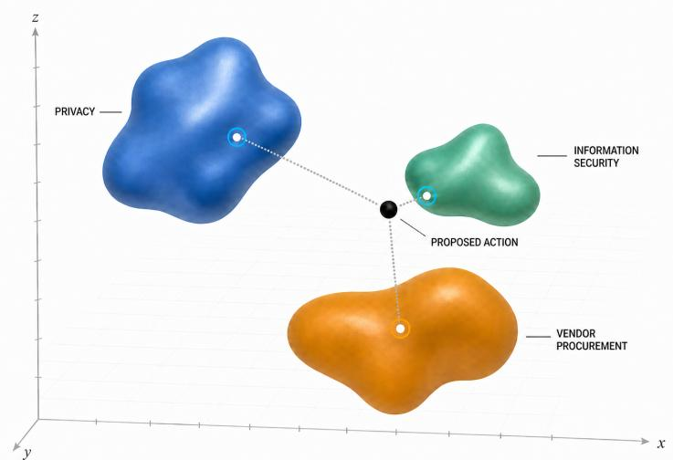

# Which Rules Matter Now? Policy-Centroid Routing Before an Intelligent System Acts

Thomson D. Nguy Radiant Institute for Manifold Studies

## Abstract

Before an intelligent system can decide whether an action is allowed, it must first know which rules the action has approached. A single proposed action can implicate several policy regimes at once, and their requirements can stack, overlap, or qualify one another. Many of those rules remain expressed in natural language rather than encoded as structured policy, while the action itself may arrive as an incomplete description of intent. Before interpretation or enforcement can begin, the system must determine which regimes belong in the review. The first problem is not judgment. It is attention. [1, 2]

Policy-centroid routing creates a layer before adjudication: semantic radar for determining which bodies of authority a proposed action has approached. It treats the policy landscape as searchable geometry. The expressions within each policy regime are compressed into one or more representative centroids, and the proposed action is placed in the same semantic space. A declared measure calculates proximity; a declared threshold determines which regimes enter authoritative review. Several regimes may trigger at once, carrying stacked or overlapping obligations forward before the system acts.

If policy-centroid routing works, it would help AI agents and other intelligent systems identify which policies may govern a proposed action. Those policies may sit inside an overwhelming stack of overlapping and sometimes conflicting obligations, many of which have never been translated into deterministic rules. More of the rules that matter could reach review before the system acts, while actual judgment remains with the proper authority. The paper develops six falsifiable claims and lays out seven follow-on studies to test them against structured workflows, lexical and semantic retrieval, hierarchical and direct classification, and selective prediction under the same review burden. The studies are designed to show where policy geometry recovers more applicable regimes, where it loses rare or overlapping obligations, and where the mechanism should abstain. The synthetic worked example is included in the paper, and a bounded reference implementation is publicly available. The next step is to run the studies.

Keywords: AI agents; policy applicability; policy-as-code; semantic routing; overlapping policy regimes; multilabel retrieval; selective prediction.

## 1. The First Problem Is Attention

An intelligent system often has to act before the institutional world around the action has been fully named. A purchase can also transfer data. A product change can trigger a disclosure. An ordinary message can touch privacy, safety, employment, contract, and sector-specific rules at once. The system cannot interpret every applicable rule until it knows which rule systems have entered the picture. The first allocation problem is simple to state: where should authoritative attention go? [1, 2]

Formal policy architectures already solve the downstream version of this problem. XACML distinguishes policy targets, applicable policies, policy decisions, and enforcement. Given a structured decision request, it can identify or retrieve the applicable policy components. By that point, the request, its attributes, and the policy objects have already been made explicit. [1]

The unresolved boundary appears before that structured request exists. Open Policy Agent evaluates declarative policy against structured input; an application or surrounding system must first supply the facts in machine readable form. Policy-text systems can annotate, classify, and query long rules once a domain and taxonomy have been established. The upstream question remains: how does an action described in the language of the world become attached to the formal regimes that deserve checking? [2, 4, 5]

The question can now be tested: can a compressed policy-level representation route authoritative attention from an unstructured proposed action toward the relevant policy regimes before adjudication begins? We call the representation a policy centroid and the function policy-centroid routing. The name carries both the mechanism and the wager. [11, 14-19]

## 2. Routing Before Judgment

Applicability routing decides where to look. Its output is a set of policy regimes: these are the bodies of authority that may govern what you are about to do. A route may identify a broad domain, a policy family, or another declared review target. It hands attention to authority; it does not replace the examination that follows. [1]

Compliance adjudication takes over from there. It interprets the applicable authority against the relevant facts, resolves conditions and exceptions, and reaches whatever decision the governing institution recognizes. Structured policy engines can perform parts of that work when their rules and inputs are formalized. Legal and organizational judgment may require additional evidence, authority, or human review. Semantic proximity determines none of those outcomes: permission, prohibition, legality, breach, notification duty, control implementation, contro efectiveness, or compliance. [1, 2]

Enforcement comes later still. In the XACML architecture, a policy decision point evaluates a request and a policy enforcement point carries out the resulting decision. Selection, evaluation, and enforcement remain separate functions inside one governed process. Policy-centroid routing stays on the selection side of that sequence. It neither executes nor blocks the action. [1]

Routing can fail in several diferent ways. It can omit a regime that should have been checked, trigger one that proves irrelevant, displace a better route, or abstain because the evidence is insuficient. False negatives, false positives, displacement, and abstention impose diferent burdens. Selective-prediction research formalizes the tradeof between coverage and risk. Abstention has operational meaning only when the system defines what authoritative fallback follows. [19]

Adjacent tasks look deceptively similar. Retrieval can surface a statutory article without establishing that it governs. Question answering can extract a sentence from a privacy policy without resolving the proposed action. Policy-centroid routing succeeds only if its output remains a routing object and every later judgment retains its own authority. [1, 6, 7]

## 3. Turning Policies Into Searchable Geometry

Policy-centroid routing turns a field of policies into a searchable geometry. The expressions belonging to each policy regime are encoded and compressed into one or more representative centroids. A proposed action is encoded in the same space. The system measures its proximity to each centroid and routes every regime whose score crosses a declared threshold.

  
Figure 1. Policy-centroid routing as distance in a shared semantic space. This schematic projects a higherdimensional policy-embedding space onto three axes. The black sphere is a proposed action; each colored field represents

a policy regime and its marked centroid. Dotted segments indicate distance to each centroid, not a path through physica space. Here, information security lies nearest, vendor procurement farther away, and privacy farthest. A declared measure and threshold determine which regimes enter review. The geometry and distances are illustrative; they are not empirical results or findings of policy applicability.

The geometry depends on design choices. The encoder determines which distinctions enter the space. The centroid construction determines what gets compressed together. Cosine similarity, Mahalanobis distance, and declared divergence measures each define proximity diferently. A regime can have one centroid or several. Representation and measure jointly determine what the router can see. [11, 12]

## 3.1 A Canonical Baseline

The hypothesis can be stated without leaving the baseline mechanism to interpretation. Let

$$
{ \mathcal { P } } = \{ P _ { 1 } , \ldots , P _ { m } \} , \qquad P _ { j } = ( \mathrm { i d } _ { j } , \ell _ { j } , E _ { j } )
$$

be a finite collection of policy regimes. Each regime has a unique identifier, a reader-facing label, and a nonempty finite sequence of policy expressions

$$
E _ { j } = ( p _ { j 1 } , \dots , p _ { j n _ { j } } ) .
$$

A regime is a body of authority fixed by the institution before routing; the geometry does not discover or redefine it. Expression assignment need not be exclusive: the same language may inform more than one regime when their authority overlaps.

Let $\phi : \mathcal { T }  \mathbb { R } ^ { d }$ be an encoder fixed and declared before evaluation, mapping both policy text and proposed actions into the same finite-dimensional space. Define the total normalization operator

$$
N ( v ) = \left\{ { v / \| v \| _ { 2 } , \ \| v \| _ { 2 } > 0 , } \right.
$$

The canonical construction is

$$
z _ { j i } = N ( \phi ( p _ { j i } ) ) , \qquad \bar { z } _ { j } = { \frac { 1 } { n _ { j } } } \sum _ { i = 1 } ^ { n _ { j } } z _ { j i } , \qquad c _ { j } = N ( \bar { z } _ { j } ) .
$$

Thus the canonical policy centroid $c _ { j }$ is the normalized arithmetic mean of the regime’s normalized expression vectors. For a nonempty proposed action �, let $a = N ( \phi ( x ) )$ ). The baseline score is cosine similarity,

$$
s _ { j } ( x ) = a ^ { \mathsf { T } } c _ { j } ,
$$

and, for a finite declared threshold $0 < \tau \leq 1$ , the routing set is

$$
R _ { \phi , \tau } ( x ) = \{ ( \mathrm { i d } _ { j } , \ell _ { j } , s _ { j } ( x ) ) : \ s _ { j } ( x ) \geq \tau \} .
$$

The inequality is inclusive. Every crossing is returned; equal scores do not require a tie-break for membership, and the router does not truncate the set to a top-� list. Multiple regimes may therefore enter review for one action. An empty routing set is an abstaining result requiring the institution’s declared fallback, never permission to act. Empty regimes, duplicate identifiers, malformed text, dimension mismatches, and non-finite vectors or arithmetic fail closed before a routing output. A zero action or centroid vector receives no positive-threshold route rather than an invented direction.

This definition is parameterized by $\phi$ and $\tau ,$ both of which must be prespecified in an experiment. The synthetic reference instance uses a deterministic TF–IDF encoder fitted only to policy expressions, normalized arithmetic centroids, cosine similarity, and the inclusive rule above so that the routing loop can be inspected. That encoder is not claimed to be the best empirical representation. Alternative encoders, distance measures, multiple-centroid constructions, and threshold-selection methods are experimental variants, not silent degrees of freedom in this baseline. The equations define an inspectable routing object; they provide no evidence that its routes correspond to actual policy applicability.

The routing threshold and the review budget perform diferent jobs. The threshold belongs inside the mechanism: it converts a proximity score into a route. The review budget belongs to the evaluation: it gives competing methods the same allowance and prevents any system from buying recall by returning every policy. [19]

The mechanism stops after routing. Triggered regimes pass to authoritative review, where the responsible institution interprets conditions, exceptions, conflicts, and consequences. Policy-centroid routing decides where attention should go before judgment begins.

## 3.2 One Action, Several Rulebooks

Suppose an employee proposes: ”Send two weeks of customer-support transcripts to a new outside AI vendor so it can test automated summaries.”

The sentence carries the business intent. It leaves out facts the institution may need before the action can proceed. Where will the vendor process the transcripts? Do they contain personal or restricted data? Will the vendor retain them or use them to improve another model? Has the vendor already passed procurement and security review? The proposal may approach several bodies of authority before anyone can answer those questions.

In a hypothetical routing pass, the proposed action is encoded once and compared with the policy representations already constructed for the institution. The output might look like this:

<table><tr><td>Policy regime</td><td>Illustrative routing state</td><td>Why the action approached it</td><td>Question left for authoritative review</td></tr><tr><td>Vendor procurement</td><td>Routed</td><td>A new outside vendor will receive institutional data</td><td rowspan="6">Has the vendor been approved, and what contractual review is required? What data are present, and is the proposed use permitted? What transfer, access, storage, and</td></tr><tr><td>Privacy and data handling</td><td>Routed</td><td>Customer transcripts may contain personal information</td></tr><tr><td>Information security</td><td>Routed</td><td>Data would leave the institution&#x27;s existing systems deletion controls apply?</td></tr><tr><td>AI governance</td><td>Routed</td><td>The transcripts would be What review applies to the model, used to test an AI system</td></tr><tr><td>Cross-border</td><td>Near the routing</td><td>purpose, and handling of its outputs? The vendor&#x27;s processing Does geography introduce another location is missing</td></tr><tr><td>transfer Records retention</td><td>boundary Not routed</td><td>The proposal says nothing about temporary copies or deletion</td><td>governing regime? Did compression hide an obligation that should have entered review?</td></tr></table>

The route creates the agenda for review. Procurement, privacy, security, and AI governance move forward together. Approval and prohibition remain downstream decisions. The cross-border question exposes a missing fact. Records retention stays outside the route unless a reviewer, another system, or a better representation recovers it.

The same example shows how the mechanism can fail. A broad privacy centroid could trigger whenever customer data appears, creating review that adds no value. A narrow retention rule governing temporary test copies could be averaged away. A cross-border restriction buried in exceptional language might never pull the action across the threshold. The scientific question is whether the geometry preserves more of the governing stack under the same review burden, including the rare obligations compression is most likely to erase.

## 4. Policy Geometry as a Scientific Hypothesis

The wager is straightforward: actions and policy regimes may share semantic structure even when they share little surface wording. If a representation preserves that structure, distance in the representation space may reveal governed territory that a literal match would rank poorly. Prototype classification and dense, sparse-expansion, and late-interaction retrieval show that learned representations can organize other tasks. They supply plausibility for the geometry, not evidence of policy applicability. That proposition remains untested. [11, 15-17]

A serious test begins with structured workflows. XACML can select and evaluate formal policy components against attributed requests. OPA evaluates declarative rules against structured JSON input. OSCAL provides machinereadable control documentation for validation, conversion, and assessment workflows. Where facts and policy objects are already formalized, these systems may be exact, auditable, and entirely suficient. A semantic front door earns its place only by solving the upstream problem or adding measurable value under matched facts and labor. [1, 2, 3]

Generic semantic retrieval may explain any apparent gain. A dense retriever can embed an action and policy passages without constructing policy centroids. A learned sparse method can expand beyond literal vocabulary while retaining an indexable representation. A late-interaction model can preserve token-level signals that a single vector would compress. If any of them matches or exceeds the proposed route under the same corpus and burden, generic retrieval is carrying the result. [15-17]

Direct classification is another serious rival. Multilabel and hierarchical classifiers can exploit known label structures when labeled examples exist. A direct language model can classify text against an explicit taxonomy, as Llama Guard demonstrates on the separate task of conversational-safety classification. These methods may route as well as or better than a centroid. Their data requirements, model access, taxonomy assumptions, and inference budgets difer. A fair comparison must account for those diferences. [8-10, 18]

Coverage can counterfeit a geometry efect. A centroid may appear to improve routing because it was built from longer, richer, or better-matched policy material, because its corpus contains the relevant language, or because its source unit makes recall easier. Representation length and term weighting afect ranking; legal-retrieval results also depend on the admitted corpus and answer universe. If the advantage disappears when source material and information opportunity are matched, geometry was not the cause. [7, 14, 15]

Compression can also defeat itself. A policy space becomes searchable by throwing information away, and that discarded information may contain the obligation that matters. Long-tail classification shows how aggregate performance can conceal rare labels. Mixture-prototype work shows that one representative may fit a complex class poorly. Polythetic-classification theory shows the strain placed on prototype thresholds when membership depends on combinations rather than one dominant feature. These neighboring results make tail loss a prediction to test not an observed failure of policy centroids. [8, 12, 13]

## 5. What the Theory Predicts

Proposition 1: comparative routing under matched burden. Can a declared centroid construction recover applicable policy regimes better than the strongest feasible alternatives when policy information, input facts, model opportunity, human labor, and review burden are matched? The contest must include structured workflows where their prerequisites are available, along with lexical, learned-sparse, dense, multi-vector, supervised, and direct-model alternatives where scientifically defensible. Ties and losses count. A win against a weak comparator does not. [1, 2, 14-18]

Ranked relevance and complete applicable-set recovery answer diferent questions. A top-ranked policy item can help while the returned set still omits another regime governing the same action. Complete applicability also depends on an oracle that may itself be incomplete. Evaluation must report ranking behavior and recovery of independently adjudicated applicable sets, including uncertainty and missingness. Top-k retrieval asks which item ranks first. This paper asks whether every applicable regime survived the route. [7, 8, 14-17]

Proposition 2: early warning without the answer. Can routing information survive when the credited downstream rule language is absent from the policy centroid? Policy question answering and statutory retrieval begin with known documents or corpora and seek answer-bearing text. This hypothesis concerns earlier warning at the policy-regime level: can the representation detect governed territory before the detailed answer has been supplied? It makes no claim of open-world discovery or recovery of an unknown atomic rule. [6, 7, 15-17]

Proposition 3: preservation of overlap and the tail. Can the route preserve every applicable regime when actions are multilabel, including narrow or low-prevalence policy families? Legal topic-classification datasets show how macro, rare-label, hierarchy-depth, and exact-set views can diverge sharply from aggregate scores. Those datasets provide no legal-applicability truth for this paper. They do show how a system can look broadly competent while failing where labels are sparse or overlapping. [8-10]

Proposition 4: value under burden. Does any recovery advantage survive the cost of irrelevant routes, displaced correct routes, indexing and inference, and hidden expert labor? A fixed-total comparison asks what each method recovers under the same allowance. An incremental comparison measures the added burden created by an augmentation. Both are necessary because returning more material can raise recall while making authoritative review less usable. The review budget is an evaluation constraint, not a new allocator. [14-17, 19]

Proposition 5: augmentation without a strawman. Can a centroid front door strengthen a serious conventional workflow? The miss set must be fixed before anyone sees the centroid output. Conditional recovery among those misses must be reported separately from value across the full population. The structured workflow must receive the facts it was designed to use; the semantic method cannot quietly receive richer language or human interpretation. Otherwise the experiment measures input asymmetry rather than augmentation. [1-3]

Proposition 6: knowable boundaries. Can the method's limits be described by domain, hierarchy layer, policy version, language, action population, and abstention behavior? MultiEURLEX documents temporal and granularity efects in a diferent legal-classification task. Selective prediction supplies risk-coverage vocabulary, and concept-drift synthesis distinguishes changing distributions from static evaluation. These concepts can define bounded evidence cells. One favorable threshold cannot be pooled into universal readiness, and this paper proposes neither online adaptation nor a generic account of policy revision as drift. [9, 19, 20]

## 6. Where Compression Can Fail

Arithmetic compression gives common language the most influence over the representative. Stable central tendencies make a large class easier to summarize, but policy significance does not follow frequency. A rare exception, a lowprevalence duty, or a minority policy family may matter more than the language dominating the centroid. Long-tai classification and multimodal prototype research make this a concrete risk to test; failure in policy centroids remains unobserved. [8, 12]

Multilabel collapse is the action-side version of the same danger. An action may sit close to one dominant regime while another applicable regime disappears below the threshold. Scoring “any applicable route found” as success would reward partial recognition and conceal the omission. Exact-set recovery, per-regime recall, and overlapspecific slices are necessary because governance can fail through the missing second answer. EUROVOC topics are labels rather than governing regimes, but multilabel legal classification makes the measurement problem visible. [8-10]

Conditional rules create a geometry with no dominant feature. Applicability may depend on a conjunction: an actor of a certain type, handling a certain object, in a certain jurisdiction, for a particular purpose, above or below a threshold. Polythetic-classification theory explains why prototype thresholds can struggle when combinations define membership. Its consequence for policy routing remains an empirical question. [13]

Every geometry embeds choices. The encoder determines which distinctions enter the space. The policy unit determines what gets compressed together. The measure defines “near,” and the threshold turns distances into routes. Dense single-vector, learned sparse, and late-interaction systems preserve diferent information at diferent costs. Representation and metric choices must be prespecified. Choosing the geometry after seeing the outcomes turns a test into a search for a win. [11, 15-17]

The oracle can fail before the router does. PolicyQA operates within selected policy documents. BSARD is bounded to Belgian legal questions and a corpus of statutory articles; some questions require unavailable or non-statutory sources. An incomplete oracle can punish a route for finding a plausible regime the annotation never represented, or reward the system for ignoring authority outside the corpus. Unknown and unavailable must remain distinct from negative. [6, 7]

Staleness hides several events under one word. A policy may be amended, changing the normative object. The corpus may change while the action population remains stable. The population may change while the policy stays fixed. The statistical relationship between action features and labels may drift. MultiEURLEX uses chronological splits to expose temporal efects in legal topic classification, while concept-drift research supplies a broader statistical taxonomy. A future bounded study may compare frozen policy versions with full recomputation. It must name which kind of change it is testing; this paper proposes no online updater. [9, 20]

## 7. A Program of Decisive Studies

The theory produces seven follow-on studies. Each answers a distinct empirical question, and evidence from one cannot fill an untested cell in another. The studies remain proposals: each still requires its own specification, review, execution, verification, and report.

Study 1 asks whether the simplest declared construction merits further study as a broad applicability router against serious alternatives at matched burden. Study 2 looks for the place where compression destroys rare, conditional, minority, exceptional, or overlapping structure even when the aggregate looks favorable. Study 3 removes downstream answer-bearing language and its ancestry, then asks whether any signal remains. Together they separate broad routing efects from tail harm and information leakage. [8, 11-18]

Study 4 places policy-centroid routing beside a serious structured workflow. It separates recovery among prospectively fixed workflow misses from value across the full action population. The accounting includes the adapter and human labor needed to turn an unstructured action into the facts a conventional system expects. A conditional gain that vanishes under full-population or fixed-total accounting narrows the contribution. [1-3]

Study 5 asks a conditional handof question: where defensible policy hierarchies exist, does a broad centroid front door improve downstream review-target recovery when paired with a conventional resolver? Hierarchy traversal, resolver design, calibration, and budget allocation sit outside this paper, so any implementation requires independent specification and review. The study names the dependency without smuggling in a solution. [9, 10]

Study 6 tracks a prespecified construction across frozen policy revisions using full recomputation. Study 7 asks whether a prespecified mechanism and its failure surfaces replicate in a separately evaluated domain. A replication cannot carry its threshold, taxonomy, oracle, or claim ceiling across jurisdictions. Each new domain must establish those elements for itself. [9, 20]

The reporting rule is simple: show the complete disposition. The mechanism may win, tie, harm, abstain, become infeasible, or become uninterpretable because the oracle or source contract cannot support the question. Rarepolicy and overlap harms remain visible beside a favorable aggregate. Abstention remains visible beside coverage. A null result bounds the theory. A failure tells us where compression has ceased to preserve the governed world. [8, 19]

## 8. What Is Known and What Remains Untested

Established work supplies the pieces around this problem. Formal policy architectures select and evaluate rules over structured requests. Policy-as-code systems execute declarative decisions against structured input. Policy-text systems annotate, classify, query, and retrieve from bounded corpora. Legal classification is multilabel, hierarchical, long-tailed, multilingual, and temporally sensitive. Prototype methods compress classes. Retrieval systems preserve lexical, vector, or token-level structure. Direct models classify against supplied taxonomies; selective systems abstain; drift research distinguishes forms of change. Together these fields define the comparison set. None has established policy-centroid routing. [1-20]

The mechanism examined here is deliberately narrow: represent a proposed action as a vector; derive one or more policy centroids from policy expressions; calculate a declared similarity, distance, or divergence; apply a declared routing threshold; and hand potentially applicable regimes to downstream review. The hypothesis does not extend to downstream adjudication, enforcement, or the broader systems in which such routing might operate.

The empirical ledger for this mechanism is still blank. This paper contains no completed study, pilot result, null result, or operational eficacy claim. The scientific question remains open.

The seven studies now carry the burden of answering the substantive questions. Does the geometry improve applicability recovery? Does it carry information beyond coverage and generic retrieval? Does it preserve overlap and the tail? Does any gain survive burden accounting or add value to structured workflows? Where does the mechanism stop working? Evidence from this paper or one study cannot answer another study's question automatically.

## 9. Toward Governed Attention

Governance begins by deciding where to look. Established policy systems already separate functions inside formal architectures. Policy-centroid routing asks whether a semantic layer can allocate attention earlier, while the proposed action is still incomplete natural language and before it has become a structured request. The layer routes, abstains, and exposes uncertainty. The authority that owns the rules retains their meaning and force. [1, 2, 19]

Success has a hard definition. “More” means more applicable regimes under a fixed review burden, rather than a longer list purchased with unbounded labor. “Governed” requires applicability, not merely semantic resemblance. “Territory” must preserve stacked regimes instead of collapsing them into the easiest answer. Policy geometry earns its place only after structured workflows, strong retrieval, supervised and direct classification, abstention, and compression-pathology accounts have had their chance to win. [8, 11-19]

Compression is the promise and the danger. A good representation makes a large policy space searchable. A bad one makes the inconvenient rules disappear. The decisive question is simple: when does compression preserve the rules that matter, and when does it make them disappear? [8, 12, 13]

## Code and Reproducibility

A bounded reference implementation is available from the Seldon Reflex Foundation at github.com/SRF-PBC/policy-centroid-routing. It implements the declared routing loop, returns the complete ordered score record, and fails closed on malformed or non-finite inputs. The deterministic TF-IDF encoder and cosine measure make the mechanism inspectable; this is a synthetic executable demonstration, not the empirical system proposed for the seven studies and not evidence of policy-applicability performance.

## Epistemic Status

<table><tr><td>Manuscript surface</td><td>Status</td></tr><tr><td>Attention-allocation problem and routing/adjudication distinction</td><td>Theory and definition, grounded in prior formal-policy architecture</td></tr><tr><td>Canonical normalized-arithmetic- centroid/cosine/threshold routing baseline</td><td>Proposed mechanism; no empirical result reported</td></tr><tr><td>Public bounded reference implementation</td><td>Executable demonstration at the SRF repository; not an efficacy</td></tr><tr><td>Policy-centroid efficacy</td><td>result Untested</td></tr><tr><td>Geometry, coverage, workflow-sufficiency, Competing theories and rivals generic-retrieval, direct-classification, and compression-pathology accounts</td><td></td></tr><tr><td>Studies 1 through 7</td><td>Prospective, separately evaluated studies; none executed or</td></tr><tr><td>Prior empirical evidence for this mechanism</td><td>reported by this paper None reported</td></tr></table>

## Disclosures

Conflict of interest. The author is an inventor on patent applications related to the concepts discussed in this manuscript.

AI assistance. The author originated and directed the research question, conceptual framework, analysis, and conclusions presented in this work. OpenAI Codex was used under the author’s direction to assist with literature organization, drafting, editing, and technical formatting. The author independently verified the claims and citations, approved the final text, and takes full responsibility for the work.

## References

1. OASIS. eXtensible Access Control Markup Language (XACML) Version 3.0. OASIS Standard, 22 January 2013. https://docs.oasis-open.org/xacml/3.0/xacml-3.0-core-spec-os-en.html.

2. Open Policy Agent project. Open Policy Agent Documentation and Integrating OPA. Accessed 26 August 2026. https://www.openpolicyagent.org/docs; https://www.openpolicyagent.org/docs/integration.

3. Piez, W. A. “The Open Security Controls Assessment Language (OSCAL): Schema and Metaschema.” Balisage: The Markup Conference 2019. https://doi.org/10.4242/BalisageVol23.Piez01. Oficial NIST contribution published in the Balisage proceedings; the article states that the author's opinions do not necessarily represent NIST.

4. Wilson, S., et al. “The Creation and Analysis of a Website Privacy Policy Corpus.” Proceedings of ACL, 2016, 1330-1340. https://doi.org/10.18653/v1/P16-1126.

5. Harkous, H., et al. “Polisis: Automated Analysis and Presentation of Privacy Policies Using Deep Learning.” USENIX Security Symposium, 2018, 531-548. https://www.usenix.org/conference/usenixsecurity18/present ation/harkous.

6. Ahmad, W. U., et al. “PolicyQA: A Reading Comprehension Dataset for Privacy Policies.” Findings of EMNLP, 2020, 743-749. https://doi.org/10.18653/v1/2020.findings-emnlp.66.

7. Louis, A., and Spanakis, G. “A Statutory Article Retrieval Dataset in French.” Proceedings of ACL, 2022, 6789-6803. https://doi.org/10.18653/v1/2022.acl-long.468.

8. Chalkidis, I., et al. “Extreme Multi-Label Legal Text Classification: A Case Study in EU Legislation.” Natural Legal Language Processing Workshop, 2019, 78-87. https://doi.org/10.18653/v1/W19-2209.

9. Chalkidis, I., Fergadiotis, M., and Androutsopoulos, I. “MultiEURLEX: A Multilingual and Multi-label Legal Document Classification Dataset for Zero-shot Cross-lingual Transfer.” EMNLP, 2021, 6974-6996. https: //doi.org/10.18653/v1/2021.emnlp-main.559.

10. Zhou, J., et al. “Hierarchy-Aware Global Model for Hierarchical Text Classification.” Proceedings of ACL, 2020, 1106-1117. https://doi.org/10.18653/v1/2020.acl-main.104.

11. Snell, J., Swersky, K., and Zemel, R. “Prototypical Networks for Few-shot Learning.” NeurIPS, 2017. https: //proceedings.neurips.cc/paper/6996-prototypical-networks-for-few-shot-learning.

12. Allen, K. R., et al. “Infinite Mixture Prototypes for Few-shot Learning.” ICML, 2019, 232-241. https: //proceedings.mlr.press/v97/allen19b.html.

13. Day, B. J., et al. “Attentional Meta-learners for Few-shot Polythetic Classification.” ICML, 2022, 4867-4889. https://proceedings.mlr.press/v162/day22a.html.

14. Robertson, S., and Zaragoza, H. “The Probabilistic Relevance Framework: BM25 and Beyond.” Foundations and Trends in Information Retrieval 3(4), 2009, 333-389. https://doi.org/10.1561/1500000019. Peer-reviewed scholarly synthesis; used here for bounded field vocabulary and formulation, not original empirical or priority claims.

15. Karpukhin, V., et al. “Dense Passage Retrieval for Open-Domain Question Answering.” EMNLP, 2020, 6769-6781. https://doi.org/10.18653/v1/2020.emnlp-main.550.

16. Formal, T., Piwowarski, B., and Clinchant, S. “SPLADE: Sparse Lexical and Expansion Model for First Stage Ranking.” SIGIR, 2021, 2288-2292. https://doi.org/10.1145/3404835.3463098.

17. Khattab, O., and Zaharia, M. “ColBERT: Eficient and Efective Passage Search via Contextualized Late Interaction over BERT.” SIGIR, 2020, 39-48. https://doi.org/10.1145/3397271.3401075.

18. Inan, H., et al. “Llama Guard: LLM-based Input-Output Safeguard for Human-AI Conversations.” arXiv:2312.06674, 2023. https://arxiv.org/abs/2312.06674. Original-research preprint; version and status remain visible.

19. Geifman, Y., and El-Yaniv, R. “SelectiveNet: A Deep Neural Network with an Integrated Reject Option.” ICML, 2019, 2151-2159. https://proceedings.mlr.press/v97/geifman19a.html.

20. Gama, J., Žliobaitė, I., Bifet, A., Pechenizkiy, M., and Bouchachia, A. “A Survey on Concept Drift Adaptation.” ACM Computing Surveys 46(4), Article 44, 2014. https://doi.org/10.1145/2523813. Peer-reviewed scholarly synthesis; used here for bounded vocabulary and taxonomy, not original empirical or priority claims.