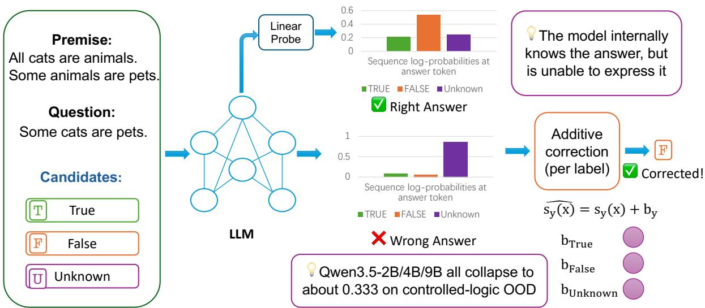
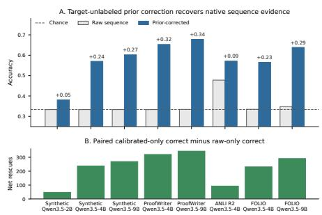
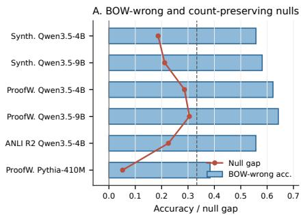
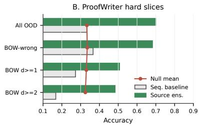
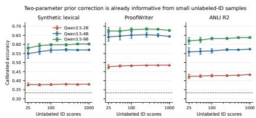

# Wrong Prediction, Right Answer: Recovering Evidence from Collapsed LLM Sequence Scores

Qiyao Yan1,2 and Chenpeng Wang3 and Liangming Pan1,3,4†

1State Key Laboratory of Multimedia Information Processing, Peking University

2School of Computer Science, Peking University

3YiXin-AILab, YIXIN, Beijing, China

4Beijing Academy of Artificial Intelligence, Beijing, China yqy.1@foxmail.com, liangmingpan@pku.edu.cn

## Abstract

When a large language model fails a reasoning task, it is often assumed to lack the underlying capability. However, this conflates a genuine absence of reasoning with a late-stage output bottleneck. We observe a consistent readout gap across diverse reasoning benchmarks: hidden-state probes successfully decode correct answers even when native sequence scoring completely collapses due to structural biases. To test whether instance-specific logic survives this collapse, we introduce a diagnostic protocol using a minimal, target-label-free additive correction. Fitting just two parameters on as few as 25 unlabeled examples recovers 9–34 accuracy points for Qwen3.5 models, transferring successfully to OLMo-2-1B and Llama-3.1-8B. Crucially, these recovered decisions persist on hard instances unresolved by simple lexical overlap and significantly exceed count-preserving permutation baselines. Our results definitively show that many apparent zero-shot reasoning deficits are merely expression failures masking intact internal logic, urging a narrower interpretation of benchmark evaluations.

## 1 Introduction

As large language models (LLMs) continue to advance (OpenAI et al., 2024; Grattafiori et al., 2024; Anthropic Team, 2024), standard evaluation relies on a straightforward assumption: if a model predicts the wrong final answer, it lacks the underlying reasoning capability. However, this view mixes up two fundamentally distinct mechanisms: a model’s internal understanding and its outward expression. A model might successfully figure out the correct answer behind the scenes, yet fail to express it through its final generated token. Therefore, looking only at the final output observed by an evaluator can be highly misleading.

This disconnect between internal knowledge and outward expression has been revealed by a series of studies. Investigations into model internals (often using hidden-state probes) demonstrate that LLMs actually compute the correct reasoning steps and answers deep inside their layers, well before reaching the final output stage (Alain and Bengio, 2018; Belrose et al., 2025; Burns et al., 2023; Bao et al., 2025; Servedio et al., 2025; Maiya et al., 2025; Sun et al., 2025; Yuchi et al., 2026). The problem typically occurs at the very end of the process. When the model translates its internal representations into actual vocabulary words, various structural biases kick in. For example, the model might have a builtin preference for frequent labels like unknown or be thrown off by the phrasing of the prompt (Zhao et al., 2021; Holtzman et al., 2021; Xia et al., 2025; Li et al., 2025a; Huang et al., 2026). As a result, the specific correct answer for a given question gets overwritten by these general biases, causing the final prediction to collapse into what looks like a random guess.

Existing works try to tackle this gap from two different directions, but both fall short in crucial ways. On one hand, while hidden-state probes prove that the model can represent the answer, they act as flexible external observers; they do not prove that the model’s native generation process actually uses this information (Hewitt and Liang, 2019; Voita and Titov, 2020; Pimentel et al., 2020; Belinkov, 2022). On the other hand, output calibration methods attempt to fix the final predictions by mathematically rebalancing the output probabilities to mitigate biases (Zhao et al., 2021; Holtzman et al., 2021; Sanz-Guerrero and von der Wense, 2025; Li et al., 2025b; Wang and Liu, 2025; Xiao et al., 2025; Nakkiran et al., 2025). While these techniques improve overall accuracy, this aggregate success can be highly deceptive. Simply shifting the global distribution of answers (such as forcing the model to output true and false at equal rates)

does not guarantee that the model’s underlying logical reasoning for individual questions was actually fixed or utilized.

To address this ambiguity, we introduce a comprehensive diagnostic protocol to systematically trace exactly where the model’s reasoning signal gets lost. We first compare the model’s hiddenstate probes, single-token logits, and full generative sequence scores to pinpoint the exact stage of the prediction collapse. Once we isolate this late-stage scoring bottleneck, we test whether the model’s native sequence scores still hide correct, example-specific logic. We do this by applying a minimal, target-label-free additive correction to the raw scores. Because this intervention is mathematically restricted—merely shifting the global decision boundaries using only two parameters without accessing any ground-truth labels—it cannot teach the model new reasoning skills or alter how it internally ranks candidate answers for a specific prompt. Therefore, if the model’s accuracy dramatically recovers after this minor adjustment, it provides definitive proof that the correct logical alignment was preserved in the native outputs all along, and the apparent failure was merely a late-stage scoring distortion.

We implement this protocol across a deliberate progression of reasoning tasks, starting from controlled symbolic deduction to natural-language benchmarks like ProofWriter, ANLI, and FOLIO. These tasks provide clear ground truths and balanced labels, making them ideal for isolating logical deduction from general text generation. Testing on the Qwen3.5 model family (Qwen Team, 2026), we find a consistent gap: probes easily decode the correct answer, while normal output scoring fails completely. However, by applying our simple two-parameter correction using as few as 25 unlabeled examples, we recover 9–34 accuracy points. Importantly, this recovery holds up against strict stress tests, proving it relies on genuine semantic reasoning rather than shallow word-matching shortcuts. The effect also transfers successfully to OLMo-2-1B (OLMo et al., 2025) and Llama-3.1-8B (Grattafiori et al., 2024).

## 2 Related Work

Probing versus output scoring. Research into model internal representations often relies on linear probes trained on frozen hidden states. These studies show that models encode substantial taskrelevant information—including truth directions, factuality, arithmetic steps, and chain-of-thought answer formation—well before the final output token (Alain and Bengio, 2018; nostalgebraist, 2020; Belrose et al., 2025; Bao et al., 2025; Servedio et al., 2025; Maiya et al., 2025; Sun et al., 2025; Yuchi et al., 2026; Kudo et al., 2026). Probe accuracy, however, bypasses the model’s own candidateanswer scoring and can arise from statistical features that the model’s native prediction path ignores (Hewitt and Liang, 2019; Voita and Titov, 2020; Pimentel et al., 2020; Belinkov, 2022). Probes are flexible external observers: their success demonstrates theoretical capacity, not practical utilization. As Burns et al. (2023) show, models can represent the correct answer internally while still outputting the wrong token. The challenge, then, is to identify what blocks the correct answer from reaching the output.

Softmax bottlenecks and unembedding misalignment. One explanation for this obstruction lies in the geometry of the language modeling head. The softmax bottleneck (Yang et al., 2017) shows that the final linear projection and softmax constrain the expressiveness of the output layer: even when a complex reasoning manifold exists in the final hidden state, mapping it into the vocabulary space through a single static linear transformation (the unembedding matrix) can distort it. Post-training can amplify these biases: instruction tuning and reinforcement learning from human feedback shift the baseline probabilities of structural tokens (Xiao et al., 2025), which can push native scoring toward safe or frequent labels (e.g., unknown or neutral) irrespective of the context vector.

Output bias and per-example recovery. Language model predictions over fixed choices are susceptible to systematic distortions, including label frequency (Zhao et al., 2021), surface-form competition (Holtzman et al., 2021), and prompt wording (Xia et al., 2025; Li et al., 2025a; Huang et al., 2026). While post-hoc corrections—such as verbal normalization and diagonal scaling (Wang and Liu, 2025; Sanz-Guerrero and von der Wense, 2025; Xiao et al., 2025; Li et al., 2025b; Nakkiran et al., 2025)—can mitigate these biases, their success is measured almost exclusively by aggregate accuracy or expected calibration error. These metrics are limited as diagnostic tools because they cannot distinguish a correction that fixes individual reasoning paths from one that only reshapes the global label distribution. We therefore pair additive offsets with per-example gain counts and label-count permutation baselines, which verify that corrected decisions resolve the right individual instances.

  
Figure 1: Diagnosing collapsed candidate-answer scores. Raw candidate-answer string scores can select the wrong label even when a linear probe decodes the gold label from a hidden state. We apply a prior-conditioned additive offset $( s _ { y } ( x ) \mapsto s _ { y } ( x ) + b _ { y } )$ as a diagnostic intervention; held-out rescue and permutation controls test whether the correction exposes example-specific structure.

Logical-reasoning benchmarks as testbeds. Controlled deduction tasks (Clark et al., 2020; Saparov and He, 2023) and natural-language benchmarks such as ProofWriter (Tafjord et al., 2021), FOLIO (Han et al., 2024), and ANLI (Nie et al., 2020) provide known ground truth, balanced labels, and controllable proof depth, making them well suited for auditing individual components of a prediction pipeline. Instead of treating these benchmarks as leaderboards where a wrong answer is equated with an absence of reasoning capacity, we use their structural controls to disentangle representation failures from scoring bottlenecks.

## 3 Method

To localize where a final-answer error originates, we use a three-stage diagnostic pipeline (Figure 1): (i) establish whether the answer is encoded in hidden states; (ii) test whether the frozen output layer exposes this information; and (iii) apply a minimal, prior-conditioned additive correction without target labels, verifying any recovery at the per-example level. No training objective is added to the model itself; every component operates on frozen outputs.

Task and full candidate-answer string score. Each example consists of a prompt x and a label y drawn from a fixed set (e.g., {true,false,unknown}). The prompt ends with a literal answer slot, Answer: <answer>. We evaluate candidates by scoring fixed continuations, such as true</answer>. The full candidate-answer string score is the sum of teacher-forced logprobabilities over this complete continuation:

$$
s _ { y } ( x ) = \sum _ { t = 1 } ^ { | a _ { y } | } \log p _ { \theta } ( a _ { y , t } \mid x , r , a _ { y , < t } ) ,
$$

where r is the prompt suffix and $a _ { y }$ is the fixed string. The raw prediction is arg maxy $s _ { y } ( x )$ . This step adds no auxiliary task heads or parameters, so the scores reflect native zero-shot behavior.

Probe training. All probes are multinomial logistic regressions fitted on frozen hidden states from in-domain examples and evaluated on disjoint heldout splits; no gradient reaches the model. Training sizes, seeds, and padding follow the formatmatched protocol listed in Appendix B (e.g., 2,000 training rows and three fixed seeds for the repaired 4B runs); training-size sensitivity appears in Appendix D.

Mathematical formulation of the scoring gap. To separate linearly decodable information from native output representations, we use positionmatched readouts. Let $h ^ { a } ( x ) \ \in \ \mathbb { R } ^ { d }$ be the hidden state immediately following the Answer: <answer> tag, before any label token is generated. At this position, the same-position label logits are computed via the frozen unembedding matrix

$W \in \mathbb { R } ^ { V \times d }$ and bias vector $b \in \mathbb { R } ^ { V }$ . For a candidate token y, the native score is determined by the pre-trained geometry alone: $z _ { y } = h ^ { a } ( x ) ^ { \top } w _ { y } + b _ { y } .$ If the structural bias $b _ { y }$ is large, or if the norm $\| w _ { y } \|$ favors a specific vocabulary subset, the prediction collapses regardless of the logic encoded in $h ^ { a } ( x )$

An answer-slot probe, by contrast, fits an independent separating hyperplane $\theta _ { y }$ via logistic regression, outside the vocabulary-projection constraints. Probing at this shared state $h ^ { a } ( x )$ avoids cascading effects from generated tokens and isolates the context vector available to the model at the decision point; a prompt-end probe applies the same readout to the final state of the original prompt, before the answer tag is appended.

Prior-conditioned offset correction. Building on established additive calibration techniques (Zhao et al., 2021), we use a low-capacity decision offset as our diagnostic intervention to counteract the $b _ { y }$ dominance described above. Given an unlabeled in-domain score set $D _ { \mathrm { i d } } ,$ , the corrected prediction is:

$$
\hat { y } _ { c } ( x ) = \arg \operatorname* { m a x } _ { y } ~ s _ { y } ( x ) + c _ { y } .
$$

We fix one reference offset to zero (a uniform shift preserves the argmax), leaving two free parameters for three labels. Given a target label prior π and the induced prediction fraction $q _ { c } ( y ; D _ { \mathrm { i d } } )$ , we choose the offsets by deterministic grid search to minimize the squared difference:

$$
c ^ { \star } = \arg \operatorname* { m i n } _ { c } \sum _ { y } \left( q _ { c } ( y ; D _ { \mathrm { i d } } \right) - \pi _ { y } ) ^ { 2 } .
$$

This formulation is deliberately constrained: with only two degrees of freedom for the entire dataset, the intervention cannot learn a new reasoning-task mapping. Because the offsets are global, they cannot alter within-label rankings; the correction acts only as a threshold shift.

To make this concrete, consider a Qwen3.5-9B lexical-OOD example (gold label true) whose raw scores collapse to unknown. Offsets fitted on an unlabeled ID set rebalance the candidates so that the correct one wins:

<table><tr><td>Candidate continuation</td><td>Raw score</td><td>Offset</td><td>Corrected score</td></tr><tr><td>false&lt;/answer&gt;</td><td>-6.18</td><td>+1.55</td><td>-4.63</td></tr><tr><td>true&lt;/answer&gt;</td><td>-5.89</td><td>+3.25</td><td>-2.64</td></tr><tr><td>unknown&lt;/answer&gt;</td><td>-3.49</td><td>0.00</td><td>-3.49</td></tr></table>

Evaluation protocol and controls. The offset-fit set is always disjoint from the evaluation set. We consider a recovery valid only if it yields positive per-example gains and survives three controls:

1. TF-IDF-missed slice: Language models can exploit spurious correlations—such as shallow word overlap between premise and hypothesis— to score well without reasoning (the “Clever Hans” effect). Restricting evaluation to examples that a bag-of-words classifier fails on removes instances solvable by surface matching alone.

2. Label-count permutation baselines: Accuracy is inflated if a correction only matches the true label distribution of a balanced dataset. We randomly permute the corrected predictions while preserving their label multiset; the resulting permutation gap quantifies per-example alignment beyond label counts.

3. Deterministic subsampling: Fitting offsets on very small subsets (25 to 500 examples) tests whether the correction extracts a pre-existing threshold shift, ruling out data-intensive relearning of a task mapping.

## 4 Experiments

## 4.1 Setup and design rationale

Our evaluation scales the complexity of the reasoning environment in four steps. We begin with controlled logic, which isolates multi-hop deductive rules and strips away world knowledge to test pure algorithmic syntax. ProofWriter embeds the same style of logic in natural language, adding linguistic variance. ANLI tests whether the findings survive human-written adversarial noise, and FO-LIO probes zero-shot transfer to formal first-order logic. This progression ensures that an observed scoring collapse is not an artifact of a single linguistic domain.

All four tasks are cast into the same forcedchoice format with a literal answer slot. For controlled logic, the ID fit split and each OOD split contain 1,000 examples, generated with fixed scripts and seeds and balanced over the three labels; distractor rules are label-balanced, so shallow matching does not solve the task. For ProofWriter, offsets are fitted on 1,000 in-domain score rows and evaluated on a disjoint 1,000-example OOD split. ANLI uses R1 as the in-domain fit split and the adversarial R2 as the held-out split. FOLIO serves as a sparsity diagnostic: offsets are fitted on the 203 validation examples and evaluated on 1,001 prepared training examples. Full construction details appear in Appendix B.

Our design holds the model family fixed, so that comparisons across scoring methods are not confounded by architectural differences: the central evaluation covers a protocol-matched, post-trained Qwen3.5-2B/4B/9B sweep, while cross-family models (OLMo-2-1B (OLMo et al., 2025), Llama-3.1-8B (Grattafiori et al., 2024), and Pythia (Biderman et al., 2023)) are tested only on ProofWriter, where they probe the generalization boundary. Appendix B records the protocol details and model revisions.

## 4.2 Readout gap: string scoring fails while answer-slot evidence remains

To isolate candidate-answer likelihood as the failing step, we first test whether task-relevant evidence survives in hidden states when sequence scoring collapses. If the answer is absent, probes should fail alongside native scoring.

Table 1 confirms this divergence. For posttrained Qwen3.5-2B, answer-slot probe accuracies reach 0.918 (in-domain) and 0.661 (lexical OOD), while the full candidate-answer string score stays at chance (0.333) on every split. The gap widens for Qwen3.5-9B, whose answer-slot probes reach 0.972 (ID) and 0.830 (lexical OOD) against the same collapsed string scores. The same-position label logits lag well behind the probes, confirming that the hidden state encodes the correct answer even where the frozen output matrix does not expose it.

The mismatch is thus geometric rather than representational: the answer is decodable from the hidden state, but the pre-trained unembedding geometry is not aligned with the direction that encodes it. Wrong sequence predictions therefore cannot be read as an absence of reasoning.

Nor is the divergence a post-training artifact. Table 11 repeats the comparison on the Qwen3.5 Base checkpoints, which never underwent instruction tuning: Qwen3.5-4B-Base answer-slot probes reach 0.968 (ID) and 0.751 (lexical OOD) while the string score stays at chance. The base rows also localize the loss more finely. For Qwen3.5-9B-Base, same-position label logits reach 0.627 (ID) and 0.607 (lexical OOD), yet the full string score remains at 0.374/0.361: even where the vocabulary head partially exposes the answer at the decision position, accumulating log-probability over the candidate string destroys the margin again. The bottleneck therefore sits in sequence-level aggregation as much as in the unembedding geometry.

Three further audits bound alternative accounts (Appendix D). First, the readout gap is statistically solid: on Qwen3.5-9B the answer-slot probe exceeds the string score by +0.488 (95% CI $[ + 0 . 4 5 2 , + 0 . 5 2 3 ]$ , paired $p < . 0 0 1 )$ , and the sameposition label logits exceed the string score by $+ 0 . 2 3 7 \ [ + 0 . 1 8 0 , + 0 . 2 9 3 ]$ , so information is lost at the vocabulary projection and again at sequence aggregation. Second, probes fitted to randomized labels stay at chance (0.304–0.341), so probe success reflects answer-related structure rather than arbitrary decodability. Third, the collapse is invariant to scoring convention: mean-normalized scores reproduce the summed-score collapse exactly (e.g., Qwen3.5-9B predicts unknown for 99.9% of lexical-OOD examples under both), ruling out length normalization as the cause.

## 4.3 Label-bias correction recovers per-example evidence

A pure label-frequency bias distorts the output distribution while leaving example-level rankings intact. We test whether sequence scoring suffers from this specific bottleneck by applying the two-parameter offset correction and tracking per-example macro-F1: if native scoring retains task-relevant structure, the correction should produce positive paired gains, not merely a balanced histogram.

Table 2 and Figure 2 confirm this prediction. Fitting offsets on 1,000 unlabeled ID score rows raises Qwen3.5-4B/9B on the synthetic lexical split from chance to 0.570 and 0.602, respectively, and to 0.653/0.678 on ProofWriter. Every configuration in Table 2 reaches statistical significance $( p \leq 0 . 0 3 5 )$ . Even on the adversarial ANLI task, Qwen3.5-4B improves from 0.478 to 0.571.

The parallel gain in macro-F1 shows that the correction is not defaulting to a single frequent class. Before correction, Qwen3.5-9B predicts unknown for 999 of 1,000 lexical-OOD examples; after the thresholds are rebalanced—without a single target label—the relative score differences reorder the candidates correctly. Raw sequence scores thus retain per-example logic even when the argmax is dominated by label-level offsets.

## 4.4 Sample efficiency

If the offset correction addresses a low-dimensional threshold bias rather than learning a new task mapping, it should need very few examples to fit.

Appendix Table 20 reports offset fits with as few as 25 unlabeled examples. Across all 30 random subsamples at the 25-example budget, Qwen3.5- 2B/4B/9B show positive accuracy gains on the synthetic lexical split; on ProofWriter, the 25-example fit yields improvements of +0.216 and +0.277 for Qwen3.5-4B/9B. Moving from 25 to 1,000 fit examples changes held-out accuracy by at most 0.022 on any task. This rapid saturation is consistent with fitting only two bias parameters: the representations are already separable, merely shifted relative to the output geometry, and the correction recenters them without retraining.

<table><tr><td>Model</td><td>Split</td><td>Prompt-end probe</td><td>Answer-slot probe</td><td>Same-position label logits</td><td>First-label-token score</td><td>Full string score</td></tr><tr><td>Qwen3.5-2B</td><td>id</td><td>0.908</td><td>0.918</td><td>0.333</td><td>0.333</td><td>0.333</td></tr><tr><td>Qwen3.5-2B</td><td>depth</td><td>0.580</td><td>0.583</td><td>0.333</td><td>0.333</td><td>0.333</td></tr><tr><td>Qwen3.5-2B</td><td>lexical</td><td>0.516</td><td>0.661</td><td>0.333</td><td>0.333</td><td>0.333</td></tr><tr><td>Qwen3.5-4B</td><td>id</td><td>0.951</td><td>0.962</td><td>0.575</td><td>0.572</td><td>0.333</td></tr><tr><td>Qwen3.5-4B</td><td>depth</td><td>0.761</td><td>0.858</td><td>0.521</td><td>0.515</td><td>0.333</td></tr><tr><td>Qwen3.5-4B</td><td>lexical</td><td>0.644</td><td>0.774</td><td>0.561</td><td>0.552</td><td>0.333</td></tr><tr><td>Qwen3.5-9B</td><td>id</td><td>0.975</td><td>0.972</td><td>0.573</td><td>0.572</td><td>0.333</td></tr><tr><td>Qwen3.5-9B</td><td>depth</td><td>0.799</td><td>0.821</td><td>0.480</td><td>0.478</td><td>0.333</td></tr><tr><td> $\bar { Q } w e n 3 . 5 { \cdot } Q B$ </td><td>lexical</td><td>0.611</td><td>0.830</td><td>0.574</td><td>0.568</td><td>0.333</td></tr></table>

Table 1: Position-matched post-trained Qwen3.5 scoring comparison. The prompt-end probe reads the final state of the original prompt; the answer-slot probe reads the state after literal Answer: <answer> and before any label; same-position label logits apply the frozen output matrix at that exact state; and the full candidate-answer string score sums teacher-forced log-probabilities over the fixed continuation. All columns use the same 1,000 examples per split. The repaired 4B probe values use the format-matched 2,000-example probe training run (three fixed seeds).
<table><tr><td>Task</td><td>Model</td><td>N</td><td>Raw</td><td>Cal.</td><td>Paired Gain</td><td>Macro-F1</td><td>p</td></tr><tr><td rowspan="3">synthetic lexical</td><td>Qwen3.5-2B</td><td>1000</td><td>0.333</td><td>0.381</td><td> $2 7 2 - 2 2 4 = + 4 8$ </td><td>0.371</td><td> $p = 0 . 0 3 5$ </td></tr><tr><td>Qwen3.5-4B</td><td>1000</td><td>0.333</td><td>0.570</td><td> $3 5 1 - 1 1 4 = + 2 3 7$ </td><td>0.572</td><td> $p < . 0 0 1$ </td></tr><tr><td>Qwen3.5-9B</td><td>1000</td><td>0.333</td><td>0.602</td><td> $3 7 1 - 1 0 2 = + 2 6 9$ </td><td>0.591</td><td> $p < . 0 0 1$ </td></tr><tr><td rowspan="2">ProofWriter</td><td>Qwen3.5-4B</td><td>1000</td><td>0.333</td><td>0.653</td><td>478-158=+320</td><td>0.650</td><td> $p < . 0 0 1$ </td></tr><tr><td>Qwen3.5-9B</td><td>1000</td><td>0.334</td><td>0.678</td><td>474-130=+344</td><td>0.678</td><td> $p < . 0 0 1$ </td></tr><tr><td>ANLI R2</td><td>Qwen3.5-4B</td><td>1000</td><td>0.478</td><td>0.571</td><td>149-56=+93</td><td>0.573</td><td> $p < . 0 0 1$ </td></tr><tr><td rowspan="2">FOLIO diagnostic</td><td>Qwen3.5-4B</td><td>1001</td><td>0.335</td><td>0.565</td><td> $4 0 7 - 1 7 6 = + 2 3 1$ </td><td>0.553</td><td> $p < . 0 0 1$ </td></tr><tr><td> $Q w e n 3 . 5 – 9 B$ </td><td>1001</td><td>0.348</td><td>0.638</td><td> $4 3 7 - 1 4 6 = + 2 9 1$ </td><td>0.632</td><td> $p < . 0 0 1$ </td></tr></table>

Table 2: Sequence scores preserve answer evidence after label-bias correction. Additive per-label offsets are fit on unlabeled in-domain score distributions and frozen before held-out evaluation. Per-example gain reports examples the corrected rule gets right that the raw rule gets wrong, minus the reverse.

## 4.5 Shortcut and label-count controls

Table 3 exposes the two budget endpoints behind this result. Recovery is already positive at 25 examples for every collapsed Qwen3.5 row, remains positive in all 30 subsamples, and changes only modestly by the full budget. The near-ceiling ANLI-9B row is the informative exception: additional unlabeled data cannot create headroom when the raw score is already strong. The complete sweep appears in the appendix.

To rule out lexical shortcuts and label-distribution matching as explanations, we stress-test the corrected decisions against two controls.

As described in Section 3, we first isolate examples that a bag-of-words (TF-IDF) classifier fails on, removing instances solvable by premise–hypothesis overlap. On these ProofWriter TF-IDF-missed subsets, the 25-example correction maintains Qwen3.5-4B/9B accuracies of 0.622 and 0.643. Second, we ask whether the gains reflect a favorable label histogram by comparing them with count-preserving permutation baselines: on balanced evaluation sets, a purely distributional fix would hover at chance (1/3). The corrected Qwen3.5-4B/9B predictions instead produce permutation gaps of +0.287 and +0.305, indicating that the accuracy reflects per-example alignment. Table 5 aggregates these controls; neither the collapse nor the recovery is explained away by surface heuristics.

Two further audits bound the roles of the prior and the prompt surface. Perturbing the target prior around the uniform operating point leaves worstcase gains positive for Qwen3.5-4B/9B on synthetic lexical (+0.193/+0.242) and ProofWriter $( + 0 . 2 8 1 / + 0 . 2 9 4 )$ , whereas Pythia-12B degrades to −0.021 (Tables 19 and 29). The collapse is also not tied to the answer surface: holding the verbalizers to equal token counts leaves Qwen3.5-9B string scoring at chance, and across 20 prompt/verbalizer variants the collapse persists in 87–96% of configurations (Appendix C). Finally, regenerating the evaluation splits with three independent generator seeds leaves the Qwen3.5-9B recovery intact (minimum $\Delta + 0 . 2 3 0$ ; observed-minus-null gap +0.252; Table 23), so the effect is a model property rather than a dataset artifact.

<table><tr><td>Task</td><td>Model</td><td>Raw</td><td>25 ID</td><td>1000 ID</td><td>Pos@25</td></tr><tr><td>Synthetic lexical</td><td>Qwen3.5-4B</td><td>.333</td><td> $. 5 4 9 { \pm } . 0 2 6 $ </td><td>.570</td><td>30/30</td></tr><tr><td>Synthetic lexical</td><td>Qwen3.5-9B</td><td>.333</td><td> $. 5 8 0 \pm . 0 2 4$ </td><td>.602</td><td>30/30</td></tr><tr><td>ProofWriter</td><td>Qwen3.5-4B</td><td>.333</td><td> $. 6 4 1 \pm . 0 2 3$ </td><td>.644</td><td>30/30</td></tr><tr><td>ProofWriter</td><td>Qwen3.5-9B</td><td>.334</td><td> $. 6 7 5 { \pm } . 0 1 8$ </td><td>.677</td><td>30/30</td></tr><tr><td>ANLI R2</td><td>Qwen3.5-4B</td><td>.445</td><td> $. 5 5 9 \pm . 0 2 3$ </td><td>.574</td><td>30/30</td></tr><tr><td>ANLI R2</td><td>Qwen3.5-9B</td><td>.638</td><td> $. 6 2 0 { \pm } . 0 1 9$ </td><td>.638</td><td>6/30</td></tr></table>

Table 3: Selected sample-efficiency results. Offsets are fit on unlabeled in-domain score rows and evaluated on a disjoint held-out split. The 25-ID column reports mean calibrated accuracy over 30 deterministic subsamples (standard deviation shown); 1000-ID is the full-budget result; “Pos@25” counts subsamples with a positive gain. Complete rows and intermediate budgets appear in Appendix 20.  
  
Figure 2: Cross-task recovery from collapsed sequence scoring. (A) Raw sequence accuracy (gray) versus corrected accuracy (blue); dashed line is chance (1/3). (B) Paired net gain, defined as corrected-only correct minus raw-only correct. Bars use 1,000 unlabeled ID score rows for Synthetic, ProofWriter, and ANLI, and 203 validation rows for FOLIO; every bar is evaluated on a disjoint held-out split. The 25-example result belongs only to the separate sample-efficiency analysis.

The detailed TF-IDF-missed results in Table 4 make the strongest control concrete. On the hard ProofWriter slice, the 25-example correction reaches 0.622/0.643 for Qwen3.5-4B/9B, while the observed-minus-null gaps are +0.287/+0.305 at the full budget. These margins remain well above the count-preserving null even after removing examples that a bag-of-words classifier can solve.

  
Figure 3: Shortcut and label-count controls for TF-IDF-missed examples. (A) Bars: calibrated accuracy on examples a TF-IDF classifier misses; red dots: gap above label-count permutation nulls. Qwen3.5 rows exceed both chance and nulls; Pythia does not. (B) ProofWriter hard slices: source ensemble (green) exceeds the sequence baseline (gray) and null means (red) across depth strata.

## 4.6 Complementarity with source-task transfer

Finally, if corrected sequence scores capture genuine target-domain evidence, they should complement representations learned through cross-task transfer: fine-tuned adapters rewrite reasoning pathways, while native sequence scores rely on pre-trained routing that may preserve complementary structure.

We test this on ProofWriter with a source-task ensemble (Qwen3.5-4B, Qwen3.5-9B, and Llama-3.1-8B adapters) fixed before seeing any target labels. The source-only ensemble achieves 0.700 accuracy on ProofWriter OOD. Fusing the targetdomain corrected sequence scores—still without target labels—raises the hybrid ensemble to 0.720, a paired net gain of 20 examples over the baseline. The margin is modest and we do not attach a significance claim to it, but the direction is consistent across the hard-slice audits: on the TF-IDFmissed slice the hybrid improves from 0.682 to 0.707, and on the deepest proof strata (≥ 2 hops) from 0.483 to 0.557 (Appendix F). This suggests that, once the scoring bottleneck is removed, native sequence scores carry additive evidence that source-task transfer alone does not capture.

<table><tr><td>Task</td><td>Model</td><td>NTFIDF-miss</td><td>Raw</td><td>25 ID</td><td>1000 ID</td><td>Null gap (full)</td></tr><tr><td>Synthetic lexical</td><td>Qwen3.5-4B</td><td>645</td><td>.468</td><td> $. 5 5 8 \pm . 0 1 8$ </td><td>.569</td><td>+.187</td></tr><tr><td>Synthetic lexical</td><td>Qwen3.5-9B</td><td>645</td><td>.468</td><td> $. 5 8 1 \pm . 0 3 0 $ </td><td>.594</td><td>+.212</td></tr><tr><td>ProofWriter</td><td>Qwen3.5-4B</td><td>576</td><td>.366</td><td> $. 6 2 2 { \pm } . 0 2 4 $ </td><td>.622</td><td>+.287</td></tr><tr><td>ProofWriter</td><td>Qwen3.5-9B</td><td>576</td><td>.366</td><td> $. 6 4 3 { \pm } . 0 2 4 $ </td><td>.651</td><td>+.305</td></tr><tr><td>ANLI R2</td><td>Qwen3.5-4B</td><td>660</td><td>.377</td><td> $. 5 5 7 { \pm } . 0 3 8$ </td><td>.583</td><td>+.226</td></tr></table>

Table 4: Selected TF-IDF-missed recovery results. Evaluation rows are restricted to instances missed by a bag-of-words classifier. The 25-ID and 1000-ID columns report calibrated accuracy for offsets fit with the indicated unlabeled budgets; “Null gap (full)” is the full-budget observed-minus-count-preserving-permutation gap. Complete model and slice rows appear in Appendix 26.
<table><tr><td>Control</td><td>Alternative explanation</td><td>Main outcome</td></tr><tr><td>TF-IDF-missed examples</td><td>Lexical shortcuts.</td><td>Qwen3.5-4B/9B stay positive on synthetic and ProofWriter hard examples; Qwen3.5-4B also on ANLI R2.</td></tr><tr><td>Label-count permutation baselines</td><td>Label-distribution matching only.</td><td>Main Qwen3.5 rows exceed their permutation baselines; multiseed Qwen3.5-9B lexical-OOD gap is +0.205.</td></tr><tr><td>Prior perturbations</td><td>Sensitive to the assumed prior.</td><td>Worst-case gains remain positive on synthetic (+0.193/ + 0.242) and ProofWriter</td></tr><tr><td>25-example fits</td><td>Requires large calibration set.</td><td>(+0.281/ + 0.294). Collapsed rows recover from 25 unlabeled examples on synthetic, ProofWriter, and ANLI R2.</td></tr><tr><td>Surface/model scope</td><td>or universal effect.</td><td>Answer-string artifact 20 prompt/verbalizer variants and equal-token ABC preserve collapse; Pythia and high-raw Qwen3.5 rows delimit scope.</td></tr></table>

Table 5: Control summary. Corrected decisions are checked against lexical filters, label-count permutation baselines, prior perturbations, small-sample fits, surface changes, and model-scope controls.
<table><tr><td>Model</td><td></td><td>Raw Corrected</td><td>△ Permutation test</td></tr><tr><td>OLMo-2-1B</td><td>.362</td><td>.566</td><td>+.204</td></tr><tr><td>Llama-3.1-8B</td><td>.333</td><td>.477</td><td>+.144</td></tr><tr><td>Pythia-410M</td><td>.328</td><td>.353</td><td>+.025</td></tr><tr><td>Pythia-12B</td><td>.343</td><td> $. 3 3 5 \mathrm { ~  ~ { ~ - . 0 0 8 } ~ }$ </td><td></td></tr></table>

Table 6: Cross-family ProofWriter comparison. Offsets are fitted on 1,000 unlabeled ID score rows and frozen for a disjoint 1,000-example OOD split. The OLMo and Llama gains exceed count-preserving permutation nulls; the two Pythia changes are not statistically reliable and serve as scope boundaries.

## 4.7 Boundary conditions: when recovery fails

The correction is not expected to help universally, and its failures are informative. Three boundary cases recur across our tables. First, near-ceiling rows: the high-baseline Qwen3.5-9B ANLI configuration (raw accuracy 0.638) leaves little recoverable structure, and the offset yields no gain $( \Delta = 0 . 0 0 0$ at the 1,000-example fit, positive in only 6 of 30 subsampled 25-example fits). Second, models without a collapsed ranking: Pythia-410M and Pythia-12B show no reliable recovery on ProofWriter $( p = . 1 0 3$ and $p = . 4 6 2$ ; Table 6); no hidden ranking is exposed for the offset to rescue. Third, prior misspecification: worst-case prior perturbations shrink the gains but keep them positive on the synthetic and ProofWriter splits (Table 5), so a wrong prior degrades the correction gradually rather than inverting it. These cases sharpen the scope of our claim: the correction recovers per-example evidence only when probes indicate that the answer is encoded and raw predictions are collapsed or strongly biased, rather than merely inaccurate.

## 5 Discussion

The conjunctive nature of evidence. Evaluating reasoning capacity through raw likelihood scoring underestimates a model’s internal representations, but this evidence must be read conjunctively. High probe accuracy alone shows that an answer is linearly decodable from hidden states, not that the model’s native scoring uses it; conversely, positive per-example gains from calibration are meaningful only if they exceed the label-count permutation baseline. Under this reading, the Pythia checkpoints fail the permutation-null test and the highbaseline Qwen3.5-9B ANLI row shows no recoverable gain, so we treat the offset as a descriptive diagnostic for collapsed distributions rather than a universal causal fix for models that lack the reasoning skill.

Mechanistic origins of the scoring collapse. The additive decomposition $s _ { y } ( x ) = \tilde { s } _ { y } ( x ) + \beta _ { y }$ is effective because task-relevant variation survives in the relative score differences, even when a large label-dependent offset dominates the raw argmax;

altering no within-label ranking, the two-parameter correction cannot “teach” new reasoning paths—it removes a shared threshold shift so that existing logic can surface. Why does the native output matrix fail to expose this structure? The Base-model results (Table 11) show that the collapse precedes instruction tuning; the bias plausibly originates in pretraining frequency priors over structural tokens, which instruction tuning and safety alignment then amplify toward neutral or uncertainty markers (e.g., unknown). The task-relevant signal then behaves as a small perturbation $\tilde { s } _ { y } ( x )$ on top of a much larger structural bias $\beta _ { y }$

Why recovery is partial. The correction closes only part of the probe–sequence gap: on the controlled-logic lexical-OOD split, corrected accuracy reaches 0.57–0.60 where answer-slot probes reach 0.77–0.83. This is expected under the additive account: the fitted offsets remove only the shared label-level component $\beta _ { y }$ and cannot repair per-example distortions such as surface-form competition between candidate strings (Holtzman et al., 2021) or context-dependent misalignment of the unembedding geometry. The residual gap bounds what a global, target-label-free correction can expose and marks per-example scoring distortions as the next diagnostic target.

Connections to chain-of-thought prompting. The scoring bottleneck we identify offers a mechanistic motivation for chain-of-thought (CoT) prompting (Wei et al., 2022): mapping a multihop deduction into a single classification token concentrates the representational burden on one unembedding step, where we observe the collapse, while CoT distributes the deduction across intermediate tokens and hidden states. The connection is speculative, but it predicts that the collapse should shrink as evaluation moves from single-token to free-form answers.

Implications for evaluation practice. These results argue for a change in how zero-shot failures are interpreted. Before concluding that a model lacks a reasoning capability because its accuracy is near chance, it is worth inspecting the prediction histogram: if the predictions collapse onto a single label, a lightweight, target-label-free offset fitted on a small unlabeled set can reveal whether the capability is absent or only masked by output-layer artifacts. Leaderboard rankings may currently penalize some models not for poor reasoning but for

poor default calibration.

## 6 Conclusion

Our results show that a wrong prediction need not mean that the underlying answer evidence is absent. Across controlled logic, ProofWriter, ANLI, and FOLIO, a low-capacity, target-label-free offset exposes held-out, example-specific structure and recovers accuracy for the larger Qwen3.5 models, with transfer to OLMo and Llama. These gains persist on TF-IDF-missed examples and exceed countpreserving permutation baselines, while Pythia and near-ceiling configurations delineate clear limits. Together, the findings argue that benchmark errors should be diagnosed across both internal representations and answer scoring before they are attributed to missing reasoning capability.

## Limitations

The supplied label prior in our diagnostic is an explicit assumption. Because every evaluation split in this paper is label-balanced, the correction is tested within the regime its prior describes. Our results therefore show that collapsed scores retain perexample evidence under a known operating regime, but they do not prescribe a solution for deployments where the true label distribution is imbalanced or unknown. Identifying both the prior and the offsets from the same unlabeled score matrix without additional supervision remains an open challenge.

Second, our method is an observational diagnostic, not a causal circuit analysis. Probes, sameposition label logits, and corrected scores triangulate where representation and scoring diverge, but they do not isolate the neural circuits responsible for the bottleneck. A positive permutation gap confirms example-specific alignment beyond label counts, yet it is not proof of human-like semantic processing. Our lexical, metadata, and matched counterfactual controls reduce shortcut explanations but cannot eliminate them.

Finally, the full position-matched chain centers on the protocol-matched Qwen3.5 sweep. While the transfer results on OLMo and Llama are promising, the negative results on Pythia show that the phenomenon is not universal across architectures. Extending the framework beyond forced-choice tasks to open-ended generation would require defining robust candidate-answer strings and matched permutation controls, which falls outside the scope of this work.

## Ethics Statement

This is an interpretability and evaluation study using synthetic data, public benchmarks, and open-weight model checkpoints (Qwen3.5, Pythia, $O L M o ,$ and Llama). All artifacts are used within their respective licenses for research evaluation. The study does not collect personal data or introduce a deployed decision system. The primary ethical risk is one of overclaiming: demonstrating that corrected scores recover accuracy could be misconstrued as proof that a model reasons safely or faithfully internally. To mitigate this, we report scope controls, shortcut audits, and explicit boundaries, and frame the correction as diagnostic evidence rather than a reliability guarantee.

## Acknowledgements

This work was supported in part by the Beijing Major Science and Technology Project under Contract No. Z251100008125054. This work was supported by the Beijing Academy of Artificial Intelligence (BAAI). This work was supported by Yixin Group Limited. We gratefully acknowledge their provision of the essential computing resources required for our experiments.

## References

Guillaume Alain and Yoshua Bengio. 2018. Understanding intermediate layers using linear classifier probes. Preprint, arXiv:1610.01644.

Anthropic Team. 2024. The claude 3 model family: Opus, sonnet, haiku. Anthropic Technical Report.

Yuntai Bao, Xuhong Zhang, Tianyu Du, Xinkui Zhao, Zhengwen Feng, Hao Peng, and Jianwei Yin. 2025. Probing the geometry of truth: Consistency and generalization of truth directions in LLMs across logical transformations and question answering tasks. In Findings ofthe Associationfor Computational Linguistics: ACL 2025, pages 682–700, Vienna, Austria. Association for Computational Linguistics.

Yonatan Belinkov. 2022. Probing classifiers: Promises, shortcomings, and advances. Computational Linguistics, 48(1):207–219.

Nora Belrose, Igor Ostrovsky, Lev McKinney, Zach Furman, Logan Smith, Danny Halawi, Stella Biderman, and Jacob Steinhardt. 2025. Eliciting latent predictions from transformers with the tuned lens. Preprint, arXiv:2303.08112.

Stella Biderman, Hailey Schoelkopf, Quentin Gregory Anthony, Herbie Bradley, Kyle O’Brien, Eric Hallahan, Mohammad Aflah Khan, Shivanshu Purohit,

Usvsn Sai Prashanth, Edward Raff, Aviya Skowron, Lintang Sutawika, and Oskar Van Der Wal. 2023. Pythia: A suite for analyzing large language models across training and scaling. In Proceedings of the 40th International Conference on Machine Learning, volume 202 of Proceedings of Machine Learning Research, pages 2397–2430. PMLR.

Collin Burns, Haotian Ye, Dan Klein, and Jacob Steinhardt. 2023. Discovering latent knowledge in language models without supervision. In The Eleventh International Conference on Learning Representations, ICLR 2023, Kigali, Rwanda, May 1-5, 2023. OpenReview.net.

Peter Clark, Oyvind Tafjord, and Kyle Richardson. 2020. Transformers as soft reasoners over language. CoRR, abs/2002.05867.

Aaron Grattafiori, Abhimanyu Dubey, Abhinav Jauhri, Abhinav Pandey, Abhishek Kadian, Ahmad Al-Dahle, Aiesha Letman, Akhil Mathur, Alan Schelten, Alex Vaughan, Amy Yang, Angela Fan, Anirudh Goyal, Anthony Hartshorn, Aobo Yang, Archi Mitra, Archie Sravankumar, Artem Korenev, Arthur Hinsvark, and 542 others. 2024. The llama 3 herd of models. Preprint, arXiv:2407.21783.

Simeng Han, Hailey Schoelkopf, Yilun Zhao, Zhenting Qi, Martin Riddell, Wenfei Zhou, James Coady, David Peng, Yujie Qiao, Luke Benson, Lucy Sun, Alexander Wardle-Solano, Hannah Szabó, Ekaterina Zubova, Matthew Burtell, Jonathan Fan, Yixin Liu, Brian Wong, Malcolm Sailor, and 16 others. 2024. FOLIO: Natural language reasoning with first-order logic. In Proceedings of the 2024 Conference on Empirical Methods in Natural Language Processing, pages 22017–22031, Miami, Florida, USA. Association for Computational Linguistics.

John Hewitt and Percy Liang. 2019. Designing and interpreting probes with control tasks. In Proceedings ofthe 2019 Conference on Empirical Methods in Natural Language Processing and the 9th International Joint Conference on Natural Language Processing (EMNLP-IJCNLP), pages 2733–2743, Hong Kong, China. Association for Computational Linguistics.

Ari Holtzman, Peter West, Vered Shwartz, Yejin Choi, and Luke Zettlemoyer. 2021. Surface form competition: Why the highest probability answer isn’t always right. In Proceedings ofthe 2021 Conference on Empirical Methods in Natural Language Processing, pages 7038–7051, Online and Punta Cana, Dominican Republic. Association for Computational Linguistics.

Jerry Huang, Peng Lu, Qiuhao Zeng, Yusuke Iwasawa, Yutaka Matsuo, Sarath Chandar, Edison Marrese-Taylor, and Irene Li. 2026. Investigating the multilingual calibration effects of language model instruction tuning. In Proceedings of the 19th Conference of the European Chapter of the Association for Computational Linguistics (Volume 2: Short Papers), pages 1– 59, Rabat, Morocco. Association for Computational Linguistics.

Keito Kudo, Yoichi Aoki, Tatsuki Kuribayashi, Shusaku Sone, Masaya Taniguchi, Ana Brassard, Keisuke Sakaguchi, and Kentaro Inui. 2026. LLMs faithfully and iteratively compute answers during CoT: A systematic analysis with multi-step arithmetics. In Findings of the Association for Computational Linguistics: EACL 2026, pages 1114–1153, Rabat, Morocco. Association for Computational Linguistics.

Chengzu Li, Han Zhou, Goran Glavaš, Anna Korhonen, and Ivan Vulic. 2025a. ´ Large language models are miscalibrated in-context learners. In Findings of the Associationfor Computational Linguistics: ACL 2025, pages 11575–11596, Vienna, Austria. Association for Computational Linguistics.

Haitao Li, Junjie Chen, Qingyao Ai, Zhumin Chu, Yujia Zhou, Qian Dong, and Yiqun Liu. 2025b. CalibraEval: Calibrating prediction distribution to mitigate selection bias in LLMs-as-judges. In Proceedings of the 63rd Annual Meeting of the Association for Computational Linguistics (Volume 1: Long Papers), pages 16537–16552, Vienna, Austria. Association for Computational Linguistics.

Sharan Maiya, Yinhong Liu, Ramit Debnath, and Anna Korhonen. 2025. Improving preference extraction in LLMs by identifying latent knowledge through classifying probes. In Proceedings of the 63rd Annual Meeting of the Association for Computational Linguistics (Volume 1: Long Papers), pages 9061–9081, Vienna, Austria. Association for Computational Linguistics.

Preetum Nakkiran, Arwen Bradley, Adam Golinski, Eugène Ndiaye, Michael Kirchhof, and Sinead Williamson. 2025. Trained on tokens, calibrated on concepts: The emergence of semantic calibration in llms. CoRR, abs/2511.04869.

Yixin Nie, Adina Williams, Emily Dinan, Mohit Bansal, Jason Weston, and Douwe Kiela. 2020. Adversarial NLI: A new benchmark for natural language understanding. In Proceedings of the 58th Annual Meeting ofthe Associationfor Computational Linguistics, pages 4885–4901, Online. Association for Computational Linguistics.

nostalgebraist. 2020. Interpreting GPT: The logit lens. LessWrong.

Team OLMo, Pete Walsh, Luca Soldaini, Dirk Groeneveld, Kyle Lo, Shane Arora, Akshita Bhagia, Yuling Gu, Shengyi Huang, Matt Jordan, Nathan Lambert, Dustin Schwenk, Oyvind Tafjord, Taira Anderson, David Atkinson, Faeze Brahman, Christopher Clark, Pradeep Dasigi, Nouha Dziri, and 24 others. 2025. 2 olmo 2 furious. Preprint, arXiv:2501.00656.

OpenAI, Josh Achiam, Steven Adler, Sandhini Agarwal, Lama Ahmad, Ilge Akkaya, Florencia Leoni Aleman, Diogo Almeida, Janko Altenschmidt, Sam Altman, Shyamal Anadkat, Red Avila, Igor Babuschkin, Suchir Balaji, Valerie Balcom, Paul Baltescu, Haiming Bao, Mohammad Bavarian, Jeff Belgum, and

262 others. 2024. Gpt-4 technical report. Preprint, arXiv:2303.08774.

Tiago Pimentel, Josef Valvoda, Rowan Hall Maudslay, Ran Zmigrod, Adina Williams, and Ryan Cotterell. 2020. Information-theoretic probing for linguistic structure. In Proceedings of the 58th Annual Meeting ofthe Associationfor Computational Linguistics, pages 4609–4622, Online. Association for Computational Linguistics.

Qwen Team. 2026. Qwen3.5: Towards native multimodal agents. Official model card and open-weight checkpoints: https://huggingface.co/Qwen/Qwen3.5- 9B.

Mario Sanz-Guerrero and Katharina von der Wense. 2025. Mitigating label length bias in large language models. In Proceedings of the 14th International Joint Conference on Natural Language Processing and the 4th Conference ofthe Asia-Pacific Chapter of the Associationfor Computational Linguistics, pages 1404–1420, Mumbai, India. The Asian Federation of Natural Language Processing and The Association for Computational Linguistics.

Abulhair Saparov and He He. 2023. Language models are greedy reasoners: A systematic formal analysis of chain-of-thought. In The Eleventh International Conference on Learning Representations, ICLR 2023, Kigali, Rwanda, May 1-5, 2023. OpenReview.net.

Giovanni Servedio, Alessandro De Bellis, Dario Di Palma, Vito Walter Anelli, and Tommaso Di Noia. 2025. Are the hidden states hiding something? testing the limits of factuality-encoding capabilities in LLMs. In Proceedings of the 63rd Annual Meeting ofthe Associationfor Computational Linguistics (Volume 1: Long Papers), pages 6089–6104, Vienna, Austria. Association for Computational Linguistics.

Yucheng Sun, Alessandro Stolfo, and Mrinmaya Sachan. 2025. Probing for arithmetic errors in language models. In Proceedings of the 2025 Conference on Empirical Methods in Natural Language Processing, pages 8111–8128, Suzhou, China. Association for Computational Linguistics.

Oyvind Tafjord, Bhavana Dalvi, and Peter Clark. 2021. ProofWriter: Generating implications, proofs, and abductive statements over natural language. In Findings of the Association for Computational Linguistics: ACL-IJCNLP 2021, pages 3621–3634, Online. Association for Computational Linguistics.

Elena Voita and Ivan Titov. 2020. Information-theoretic probing with minimum description length. In Proceedings ofthe 2020 Conference on Empirical Methods in Natural Language Processing (EMNLP), pages 183–196, Online. Association for Computational Linguistics.

Xiaoyue Wang and Xin Liu. 2025. Beyond generation: Leveraging LLM creativity to overcome label bias in classification. In Findings of the Association for

Computational Linguistics: ACL 2025, pages 25500– 25506, Vienna, Austria. Association for Computational Linguistics.

Jason Wei, Xuezhi Wang, Dale Schuurmans, Maarten Bosma, brian ichter, Fei Xia, Ed Chi, Quoc V Le, and Denny Zhou. 2022. Chain-of-thought prompting elicits reasoning in large language models. In Advances in Neural Information Processing Systems, volume 35, pages 24824–24837. Curran Associates, Inc.

Yuxi Xia, Pedro Henrique Luz De Araujo, Klim Zaporojets, and Benjamin Roth. 2025. Influences on LLM calibration: A study of response agreement, loss functions, and prompt styles. In Proceedings of the 63rd Annual Meeting of the Association for Computational Linguistics (Volume 1: Long Papers), pages 3740–3761, Vienna, Austria. Association for Computational Linguistics.

Jiancong Xiao, Bojian Hou, Zhanliang Wang, Ruochen Jin, Qi Long, Weijie J. Su, and Li Shen. 2025. Restoring calibration for aligned large language models: A calibration-aware fine-tuning approach. In Fortysecond International Conference on Machine Learning, ICML 2025, Vancouver, BC, Canada, July 13-19, 2025, Proceedings of Machine Learning Research. PMLR / OpenReview.net.

Zhilin Yang, Zihang Dai, Ruslan Salakhutdinov, and William W. Cohen. 2017. Breaking the softmax bottleneck: A high-rank RNN language model. CoRR, abs/1711.03953.

Fengting Yuchi, Li Du, and Jason Eisner. 2026. LLMs know more about numbers than they can say. In Proceedings ofthe 19th Conference ofthe European Chapter of the Association for Computational Linguistics (Volume 2: Short Papers), pages 659–673, Rabat, Morocco. Association for Computational Linguistics.

Zihao Zhao, Eric Wallace, Shi Feng, Dan Klein, and Sameer Singh. 2021. Calibrate before use: Improving few-shot performance of language models. In Proceedings of the 38th International Conference on Machine Learning, ICML 2021, 18-24 July 2021, Virtual Event, Proceedings of Machine Learning Research, pages 12697–12706. PMLR.

## A Appendix Overview

The appendix remains in the same ACL twocolumn layout as the main text. It first records data construction, model revisions, score computation, offset fitting, and uncertainty procedures; it then reports surface and verbalizer controls, expanded readout audits, controlled-logic robustness checks, ProofWriter transfer experiments, and the ANLI/FOLIO diagnostics. Within each block, read the raw scores first, then the label-free correction, and finally the TF-IDF-missed, permutation, priorsensitivity, and model-family controls that delimit the interpretation.

## B Data, Models, and Reproducibility

This section details the experimental configurations, split sizes, score computations, uncertainty procedures, and checkpoint revisions. All principal held-out evaluations use at least 1,000 examples, except for the explicitly labeled FOLIO diagnostic. Controlled logic, ProofWriter, ANLI, and FO-LIO use fixed three-way label sets and a uniform prior for the diagnostic offset fit; the FOLIO fit uses 203 validation examples and evaluates on a separate 1,001-example prepared split. Controlledlogic data is generated deterministically with fixed scripts and seeds, and every evaluation split is kept disjoint from the unlabeled fit set.

Compute budget. The broader artifact suite from which this paper draws required roughly 400 H100 GPU-hours; the present paper uses a selected subset of those results. Models range from 410M to 12B parameters. Once scores are cached, each offset fit is a deterministic two-dimensional grid search and adds negligible cost.

Offset fitting mechanics. In our codebase, the additive prior offsets are identified via a deterministic two-dimensional search. By fixing one label offset to zero, we rank the candidate parameter pairs by their fit to the prior, preferring lower collapse and smaller norm. Bootstrap intervals, paired statistical tests, sampled-ID repeats, and TF-IDF baselines govern the uncertainty and robustness reporting, following the pipeline: compute score → fit offsets label-free → freeze → evaluate on held-out.

Format-matched reruns. The Qwen3.5-4B answer-slot table relies on the pinned revision documented in the experiment manifest: formatted prompts end precisely with the literal Answer: <answer> suffix, with 2,000 probe-training rows across three 1,000-example held-out splits (seeds 42/123/456), left padding, and truncation at a maximum length of 1,024. Earlier values were excluded due to misaligned no\_format\_prompt flags between training and evaluation. The ProofWriter Pythia reruns similarly use pinned revisions, with 1,000 ID and 1,000 OOD rows per checkpoint. Complete provenance is recorded in the manifest and revision-summary CSVs supplied with the submission artifacts.

<table><tr><td>Model</td><td>Status</td><td>Revision</td><td>Trust RC</td></tr><tr><td>Qwen3.5-0.8B</td><td>post-trained</td><td>2fc06364</td><td>True</td></tr><tr><td>Qwen3.5-2B</td><td>post-trained</td><td>15852e8c</td><td>True</td></tr><tr><td>Qwen3.5-4B</td><td>post-trained</td><td>851bf6e8</td><td>True</td></tr><tr><td>Qwen3.5-9B</td><td>post-trained</td><td>c2022362</td><td>True</td></tr><tr><td>Qwen3.5-0.8B-Base</td><td>base-pretrained</td><td>dc7cdfe2</td><td>True</td></tr><tr><td>Qwen3.5-2B-Base</td><td>base-pretrained</td><td>b1485b2f</td><td>True</td></tr><tr><td>Qwen3.5-4B-Base</td><td>base-pretrained</td><td>1001bb4d</td><td>True</td></tr><tr><td>Qwen3.5-9B-Base</td><td>base-pretrained</td><td>68c46c4b</td><td>True</td></tr><tr><td>Pythia-160M</td><td>base-pretrained</td><td>582159a2</td><td>False</td></tr><tr><td>Pythia-410M</td><td>base-pretrained</td><td>c4fc8d58</td><td>False</td></tr><tr><td>Pythia-1B</td><td>base-pretrained</td><td>7199d8fc</td><td>False</td></tr><tr><td>Pythia-1.4B</td><td>base-pretrained</td><td>554d9c1b</td><td>False</td></tr><tr><td>Pythia-2.8B</td><td>base-pretrained</td><td>7d977fed</td><td>False</td></tr><tr><td>Pythia-6.9B</td><td>base-pretrained</td><td>372b1c08</td><td>False</td></tr><tr><td>Pythia-12B</td><td>base-pretrained</td><td>39c1bd94</td><td>False</td></tr></table>

Table 7: Model manifest. Pinned checkpoint revisions and trust status for the principal Qwen3.5, Pythia, OLMo, and Llama comparisons.

Controlled-logic dataset. Our controlled-logic benchmark is a balanced three-way deductive task (true/false/unknown). Each example contains shuffled logical facts and rules populated with nonce terms (e.g., dax, wug, mip). Distractors are label-balanced: every target label is accompanied by two positive-property and two negative-property rules targeting the query, so that solving the task requires multi-hop reasoning rather than shallow lexical matching.

## Example (depth-2, label true).

Facts and rules: Ivo is a marn. Every marn is   
a pavo. Every joto is bright. No wug is bright.   
Every pavo is a joto. Every joto is fragile. No dax   
is bright. Every sarn is bright.   
Question: Is Ivo bright?   
Answer: true (chain: marn → pavo → joto →   
bright)

Generalization is evaluated across the following axes:

• ID test (1,000 examples): Same depth distribution (1–2 hops) and template style as the fit set.

• Depth OOD (1,000): Extended reasoning chains (3–5 hops) using identical templates.

• Lexical OOD (1,000): Identical depth (1–2) with aggressively paraphrased templates (e.g., “All {src} things are {dst} things”).

• Stress/counterfactual: Alternative generator seeds and counterfactual rule inversions to check structural robustness.

These splits share a universal nonce vocabulary and entity set; only depth, template syntax, and generator seeds vary.

<table><tr><td>Feature group</td><td>ID</td><td>Depth</td><td>Lexical</td><td>Stress</td></tr><tr><td>Full text</td><td>0.640</td><td>0.550</td><td>0.381</td><td>0.345</td></tr><tr><td>Query only</td><td>0.353</td><td>0.347</td><td>0.326</td><td>0.333</td></tr><tr><td>Facts only</td><td>0.631</td><td>0.564</td><td>0.389</td><td>0.326</td></tr><tr><td>Prop-redacted</td><td>0.674</td><td>0.682</td><td>0.422</td><td>0.336</td></tr><tr><td>Template only</td><td>0.673</td><td>0.604</td><td>0.368</td><td>0.330</td></tr><tr><td>Metâdata no polarity</td><td>0.352</td><td>0.333</td><td>0.352</td><td>0.320</td></tr><tr><td>Metadata all</td><td>1.000</td><td>1.000</td><td>1.000</td><td>1.000</td></tr></table>

Table 8: Surface leakage audit. TF-IDF and metadata baselines test whether controlled-logic prompts reveal labels through shallow features; the resulting controls motivate TF-IDF-missed and permutation checks.
<table><tr><td>Model</td><td>Plain Seq.</td><td>ABC Seq.</td><td>ABC Options Seq.</td></tr><tr><td>Pythia-410M</td><td>0.332 (+0.208)</td><td>0.333 (+0.207)</td><td>0.344 (+0.196)</td></tr><tr><td>Pythia-12B</td><td>0.331 (+0.307)</td><td>0.333 (+0.305)</td><td>0.329 (+0.309)</td></tr><tr><td>Qwen3.5-0.8B</td><td>0.322 (+0.224)</td><td>0.333 (+0.213)</td><td>0.334 (+0.212)</td></tr><tr><td>Qwen3.5-9B</td><td>0.355 (+0.482)</td><td>0.333 (+0.504)</td><td>0.496 (+0.341)</td></tr></table>

Table 9: Equal-token verbalizer audit. Holding verbalizer token length constant, the sequence-score collapse persists, ruling out answer-length artifacts.

## C Surface and Verbalizer Controls

Before analyzing sequence-score recovery, we first check what shallow information the prompts might leak. The surface-leakage table tests whether the controlled-logic prompts can be solved by metadata or template structure alone. The strength of certain metadata baselines motivates our reliance on TF-IDF-missed slices and permutation nulls as the primary evidence controls.

The prompt and verbalizer controls then verify that the initial collapse is not an artifact of answerstring length or prompt wording. The collapse persists across these variants, which indicates that the correction targets an output-layer bottleneck rather than a formatting artifact.

## D Expanded Readout Audit

This section expands on the readout gap diagnostics of §4.2; the position-matched Qwen3.5 Base comparison appears below (Table 11). Table 12 further shows that even when the best native readout position is selected, answer-slot probes remain well above the best label-logit directions.

Tables 14 and 15 bound what the probes can tell us. Random-label fits establish a baseline for spurious decodability, so that probe success can be read as answer-related structure rather than arbitrary side-feature memorization.

Finally, Tables 16 and 17 complete the probe audit: the first quantifies the readout gap with bootstrap intervals and paired tests, and the second measures how probe accuracy depends on labeled training-set size.

<table><tr><td>Model</td><td>Variants</td><td>Slot Mean</td><td>Slot Max</td><td>Seq. Mean</td><td>Seq. Max</td><td>Seq. Collapse</td></tr><tr><td>Pythia-410M</td><td>20</td><td>0.336</td><td>0.366</td><td>0.339</td><td>0.354</td><td>0.764</td></tr><tr><td>Pythia-12B</td><td>20</td><td>0.333</td><td>0.342</td><td>0.335</td><td>0.380</td><td>0.895</td></tr><tr><td>Qwen3.5-0.8B</td><td>20</td><td>0.335</td><td>0.351</td><td>0.332</td><td>0.336</td><td>0.962</td></tr><tr><td>Qwen3.5-9B</td><td>20</td><td>0.402</td><td>0.567</td><td>0.383</td><td>0.563</td><td>0.886</td></tr><tr><td>Qwen3.5-0.8B-Base</td><td>20</td><td>0.341</td><td>0.380</td><td>0.339</td><td>0.373</td><td>0.964</td></tr><tr><td>Qwen3.5-9B-Base</td><td>20</td><td>0.448</td><td>0.594</td><td>0.392</td><td>0.551</td><td>0.873</td></tr></table>

Table 10: Prompt and verbalizer robustness. The collapse and its label-free recovery persist across 20 prompt/verbalizer variants, rather than depending on one surface template.
<table><tr><td>Model</td><td>Split</td><td>Prompt-end probe</td><td>Answer-slot probe</td><td>Same-position label logits</td><td>First-label-token score</td><td>Full string score</td></tr><tr><td>Qwen3.5-0.8B-Base</td><td>id</td><td>0.855</td><td>0.866</td><td>0.333</td><td>0.333</td><td>0.333</td></tr><tr><td>Qwen3.5-0.8B-Base</td><td>depth</td><td>0.603</td><td>0.655</td><td>0.333</td><td>0.333</td><td>0.333</td></tr><tr><td>Qwen3.5-0.8B-Base</td><td>lexical</td><td>0.607</td><td>0.655</td><td>0.333</td><td>0.333</td><td>0.333</td></tr><tr><td>Qwen3.5-2B-Base</td><td>id</td><td>0.915</td><td>0.933</td><td>0.333</td><td>0.333</td><td>0.333</td></tr><tr><td>Qwen3.5-2B-Base</td><td>depth</td><td>0.679</td><td>0.640</td><td>0.333</td><td>0.333</td><td>0.333</td></tr><tr><td>Qwen3.5-2B-Base</td><td>lexical</td><td>0.559</td><td>0.653</td><td>0.333</td><td>0.333</td><td>0.333</td></tr><tr><td>Qwen3.5-4B-Base</td><td>id</td><td>0.958</td><td>0.968</td><td>0.366</td><td>0.372</td><td>0.336</td></tr><tr><td>Qwen3.5-4B-Base</td><td>depth</td><td>0.741</td><td>0.860</td><td>0.339</td><td>0.340</td><td>0.333</td></tr><tr><td>Qwen3.5-4B-Base</td><td>lexical</td><td>0.626</td><td>0.751</td><td>0.347</td><td>0.349</td><td>0.333</td></tr><tr><td>Qwen3.5-9B-Base</td><td>id</td><td>0.968</td><td>0.975</td><td>0.627</td><td>0.617</td><td>0.374</td></tr><tr><td>Qwen3.5-9B-Base</td><td>depth</td><td>0.791</td><td>0.853</td><td>0.548</td><td>0.538</td><td>0.336</td></tr><tr><td>Qwen3.5-9B-Base</td><td>lexical</td><td>0.610</td><td>0.873</td><td>0.607</td><td>0.604</td><td>0.361</td></tr></table>

Table 11: Position-matched Qwen3.5 Base scoring. Base checkpoints show the same probe–scoring divergence; even partially informative label logits collapse again when scores are aggregated over the full candidate string.
<table><tr><td>Model</td><td>Slot Probe</td><td>Best Wu</td><td>Seq.</td><td>∆Peak</td><td>∆Final</td></tr><tr><td>Qwen3.5-0.8B-Base</td><td>0.639</td><td>0.334</td><td>0.333</td><td>+0.305</td><td>+0.321</td></tr><tr><td>Qwen3.5-2B-Base</td><td>0.691</td><td>0.357</td><td>0.333</td><td>+0.334</td><td>+0.296</td></tr><tr><td>Qwen3.5-4B-Base</td><td>0.846</td><td>0.515</td><td>0.333</td><td>+0.331</td><td>+0.236</td></tr><tr><td>Qwen3.5-9B-Base</td><td>0.910</td><td>0.607</td><td>0.361</td><td>+0.303</td><td>+0.266</td></tr></table>

Table 12: Qwen3.5 Base native-readout synthesis. Selecting the best native readout position narrows the gap only slightly; answer-slot probes remain well ahead, leaving sequence scoring as the weakest link.
<table><tr><td>Model</td><td>Answer</td><td>Random</td><td>Depth</td><td>Query</td><td>TF-IDF-easy</td></tr><tr><td>Pythia-410M</td><td>0.564 (+0.230)</td><td>0.341 (+0.007)</td><td>0.739 (+0.229)</td><td>0.726 (+0.592)</td><td>0.380 (-0.239)</td></tr><tr><td>Pythia-12B</td><td>0.618 (+0.284)</td><td>0.338 (+0.004)</td><td>0.687 (+0.177)</td><td>0.723 (+0.589)</td><td>0.497 (-0.122)</td></tr><tr><td>Qwen3.5-0.8B</td><td>0.600 (+0.266)</td><td>0.304 (-0.030)</td><td>0.752 (+0.242)</td><td>0.626 (+0.492)</td><td>0.538 (-0.081)</td></tr><tr><td>Qwen3.5-9B</td><td>0.651 (+0.317)</td><td>0.315 (-0.019)</td><td>0.639 (+0.129)</td><td>0.882 (+0.748)</td><td>0.548 (-0.071)</td></tr></table>

Table 14: Probe selectivity controls. Randomized and auxiliary targets bound the answer-related signal that can be decoded by the probes.
<table><tr><td>Model</td><td>Layer</td><td>Cosine</td><td>Canon.→CF</td><td>CF→Lex.</td><td>Agree Lex.</td></tr><tr><td>Pythia-410M</td><td>peak</td><td>0.177</td><td>0.458</td><td>0.386</td><td>0.178</td></tr><tr><td></td><td>final</td><td>0.065</td><td>0.348</td><td>0.343</td><td>0.343</td></tr><tr><td>Qwen3.5-0.8B</td><td>peak</td><td>0.040</td><td>0.465</td><td>0.508</td><td>0.694</td></tr><tr><td></td><td>final</td><td>0.316</td><td>0.358</td><td>0.388</td><td>0.456</td></tr></table>

Table 15: Probe direction stability. Transferring answer directions across splits measures probe variance under distribution shift and bounds their use as diagnostic upper limits.

## E Controlled-Logic Parallel Results and Label-Bias Details

This section extends §4.3 and §4.5 across seeds, alternate score normalizations, and TF-IDF-missed subsets. The Pythia-2.8B/12B checkpoints serve as boundary controls throughout. Across multiple independent generators, the Qwen3.5 models recover consistently, arguing against explanations based on score-normalization artifacts.

<table><tr><td>Model</td><td>Sum Acc</td><td>Sum majority</td><td>Mean Acc</td><td>Mean majority</td></tr><tr><td>Pythia-2.8B</td><td>0.329</td><td>true (0.947)</td><td>0.329</td><td>true (0.947)</td></tr><tr><td>Pythia-12B</td><td>0.334</td><td>true (0.852)</td><td>0.334</td><td>true (0.852)</td></tr><tr><td>Qwen3.5-0.8B</td><td>0.333</td><td>unknown (1.000)</td><td>0.333</td><td>unknown (1.000)</td></tr><tr><td>Qwen3.5-0.8B-Base</td><td>0.333</td><td>unknown (1.000)</td><td>0.333</td><td>unknown (1.000)</td></tr><tr><td>Qwen3.5-9B</td><td>0.333</td><td>unknown (0.999)</td><td>0.333</td><td>unknown (0.999)</td></tr><tr><td>Qwen3.5-9B-Base</td><td>0.361</td><td>unknown (0.972)</td><td>0.361</td><td>unknown (0.972)</td></tr></table>

Table 13: Sequence scoring sensitivity. Mean normalization (versus sum) leaves the candidate-score collapse unchanged, ruling out sequence-length normalization as an explanation.  
  
Figure 4: Offset sample efficiency. Calibrated accuracy as the unlabeled ID fit budget grows (log scale; error bars show seed variance). The larger Qwen3.5 checkpoints are already above chance at 25 examples; the near-ceiling ANLI-9B row is a scope control.

Normalization and permutation nulls. We verify that the findings are not artifacts of length normalization or label-distribution matching. Table 21 replicates the phenomenon with meannormalized scores, and Table 22 evaluates against count-preserving permutation baselines, supporting the claim of instance-specific alignment.

<table><tr><td>Model</td><td>Probe-WU</td><td>Probe-Seq.</td><td>Vocab-Seq.</td></tr><tr><td>Pythia-410M</td><td> $+ 0 . 1 2 1 \ [ + 0 . 0 8 3 , + 0 . 1 6 0 ] ; p < . 0 0 1$ </td><td>+0.121  $[ + 0 . 0 8 3 , + 0 . 1 6 0 ] ; p < . 0 0 1$ </td><td> $+ 0 . 0 0 0 [ + 0 . 0 0 0 , + 0 . 0 0 0 ] ; p = 1 . 0 0 0$ </td></tr><tr><td>Pythia-12B</td><td> $+ 0 . 1 3 7 \ [ + 0 . 0 9 1 , + 0 . 1 8 3 ] ; \stackrel { . } { p } < . 0 0 1$ </td><td>+0.132  $[ + 0 . 0 8 6 , + 0 . 1 7 7 ] ; p < . 0 0 1$ </td><td> $- 0 . 0 0 4 \left[ - 0 . 0 2 5 , + 0 . 0 1 6 \right] ; \stackrel { . } { p } = 0 . 7 6 9$ </td></tr><tr><td>Qwen3.5-0.8B</td><td> $+ 0 . 3 2 5 [ + 0 . 2 9 1 , + 0 . 3 5 8 ] ; p < . 0 0 1$ </td><td>+0.325  $[ + 0 . 2 9 1 , + 0 . 3 5 8 ] ; p < . 0 0 1$ </td><td> $+ 0 . 0 0 0 \left[ + 0 . 0 0 0 , + 0 . 0 0 0 \right] ; p = 1 . 0 0 0$ </td></tr><tr><td>Qwen3.5-9B</td><td> $+ 0 . 2 4 7 \ [ + 0 . 2 0 7 , + 0 . 2 8 8 ] ; p < . 0 0 1$ </td><td>+0.488  $[ + 0 . 4 5 2 , + 0 . 5 2 3 ] ; p < . 0 0 1$ </td><td> $+ 0 . 2 3 7 \ [ + 0 . 1 8 0 , + 0 . 2 9 3 ] ; p < . 0 0 1$ </td></tr><tr><td>Qwen3.5-0.8B-Base</td><td> $+ 0 . 3 2 2 [ + 0 . 2 8 1 , + 0 . 3 6 3 ] ; p < . 0 0 1$ </td><td>+0.322 [+0.281, +0.363]; p &lt; .001</td><td> $+ 0 . 0 0 0 [ + 0 . 0 0 0 , + 0 . 0 0 0 ] ; p = 1 . 0 0 0$ </td></tr><tr><td>Qwen3.5-9B-Base</td><td> $+ 0 . 2 6 6 [ + 0 . 2 3 4 , + 0 . 2 9 9 ] ; p < . 0 0 1$ </td><td> $+ 0 . 5 1 2 [ + 0 . 4 7 5 , + 0 . 5 5 0 ] ; p < . 0 0 1$ </td><td> $+ 0 . 2 4 3 \ [ + 0 . 1 9 4 , + 0 . 2 9 2 ] ; p < . 0 0 1$ </td></tr></table>

Table 16: Probe/readout gap significance. Bootstrap intervals and paired statistical tests quantify the gaps between linear probes, native readouts, and full-string scoring.
<table><tr><td>Dataset</td><td>Model</td><td>100</td><td>250</td><td>500</td><td>1000</td><td>2000</td></tr><tr><td>Synth.</td><td>Pythia-410M</td><td>0.434 (+0.063)</td><td>0.489 (+0.065)</td><td>0.474 (+0.036)</td><td> $0 . 5 4 5 \ : ( + 0 . 1 1 2 )$ </td><td> $0 . 5 5 2 \ : ( + 0 . 1 0 2 )$ </td></tr><tr><td></td><td>Pythia-12B</td><td>0.486 (+0.079)</td><td>0.532 (+0.119)</td><td>0.594 (+0.177)</td><td> $0 . 6 3 6 \left( + 0 . 2 0 7 \right)$ </td><td> $0 . 6 4 4 \left( + 0 . 1 9 3 \right)$ </td></tr><tr><td></td><td>Qwen3.5-0.8B</td><td>0.480 (+0.039)</td><td>0.500 (-0.028)</td><td>0.499 (-0.044)</td><td> $0 . 5 2 3 \ ( - 0 . 1 0 3 )$ </td><td> $0 . 5 3 0 \left( - 0 . 1 0 9 \right)$ </td></tr><tr><td></td><td>Qwen3.5-9B</td><td>0.732 (+0.030)</td><td>0.836 (+0.059)</td><td>0.852 (+0.058)</td><td> $0 . 9 1 0 \left( + 0 . 0 6 0 \right)$ </td><td>0.929 (+0.058)</td></tr><tr><td>ProofW.</td><td>Pythia-410M</td><td>0.465 (+0.114)</td><td>0.525 (+0.158)</td><td>0.558 (+0.174)</td><td> $0 . 5 5 6 \left( + 0 . 1 5 1 \right)$ </td><td> $0 . 5 8 7 \ ( + 0 . 1 6 4 )$ </td></tr><tr><td></td><td>Pythia-12B</td><td>0.502 (+0.098)</td><td>0.575 (+0.152)</td><td>0.611 (+0.154)</td><td> $0 . 6 3 8 \ ( + 0 . 1 3 4 )$ </td><td> $0 . 6 5 2 \ : ( + 0 . 1 2 6 )$ </td></tr><tr><td></td><td>Qwen3.5-0.8B</td><td>0.610 (+0.065)</td><td>0.633 (+0.023)</td><td>0.675 (+0.052)</td><td>0.680 (+0.030)</td><td> $0 . 6 9 8 \ : ( + 0 . 0 4 7 )$ </td></tr><tr><td></td><td>Qwen3.5-9B</td><td>0.748 (-0.003)</td><td>0.774 (+0.015)</td><td>0.791 (+0.014)</td><td>0.787 (+0.007)</td><td> $0 . 7 9 9 \left( + 0 . 0 1 5 \right)$ </td></tr></table>

Table 17: Probe training-size sensitivity. We measure how probe accuracy scales with training-set size; the probes behave as stable diagnostic upper bounds whose properties are cross-checked by the zero-shot sequence tests.
<table><tr><td>Model</td><td>Split</td><td>Raw Acc.</td><td>Cal. Acc. [95% CI]</td><td>∆ [95% CI]</td><td>Cal. Macro-F1</td><td>Cal. Collapse</td></tr><tr><td>Pythia-2.8B</td><td>lexical</td><td>0.329</td><td>0.317 [0.288, 0.346]</td><td>-0.012 [-0.050, +0.026]</td><td>0.312</td><td>0.391</td></tr><tr><td>Pythia-12B</td><td>lexical</td><td>0.334</td><td>0.338 [0.309, 0.368]</td><td>+0.004 [-0.036, +0.044]</td><td>0.325</td><td>0.539</td></tr><tr><td>Qwen3.5-0.8B</td><td>lexical</td><td>0.333</td><td>0.369 [0.338, 0.399]</td><td> $+ 0 . 0 3 6 \left[ + 0 . 0 0 0 , + 0 . 0 7 1 \right]$ </td><td>0.357</td><td>0.489</td></tr><tr><td>Qwen3.5-2B</td><td>lexical</td><td>0.333</td><td>0.381 [0.351, 0.412]</td><td>+0.048 [+0.004, +0.092]</td><td>0.371</td><td>0.548</td></tr><tr><td>Qwen3.5-4B</td><td>lexical</td><td>0.333</td><td>0.570 [0.539, 0.601]</td><td>+0.237 [+0.197, +0.276]</td><td>0.572</td><td>0.453</td></tr><tr><td>Qwen3.5-9B</td><td>lexical</td><td>0.333</td><td>0.602 [0.571, 0.633]</td><td>+0.269 [+0.229, +0.310]</td><td>0.591</td><td>0.462</td></tr><tr><td>Qwen3.5-9B</td><td>stress</td><td>0.333</td><td>0.467 [0.436, 0.498]</td><td>+0.134 [+0.098, +0.170]</td><td>0.422</td><td>0.557</td></tr><tr><td>Qwen3.5-9B</td><td>counterfactual</td><td>0.333</td><td>0.515 [0.484, 0.546]</td><td>+0.182 [+0.142, +0.222]</td><td>0.479</td><td>0.485</td></tr><tr><td>Qwen3.5-0.8B-Base</td><td>lexical</td><td>0.333</td><td>0.417 [0.386, 0.447]</td><td> $+ 0 . 0 8 4 \ : [ + 0 . 0 4 7 , + 0 . 1 2 0 ]$ </td><td>0.407</td><td>0.483</td></tr><tr><td>Qwen3.5-9B-Base</td><td>lexical</td><td>0.361</td><td>0.586 [0.556, 0.617]</td><td> $+ 0 . 2 2 5 \ [ + 0 . 1 8 9 , + 0 . 2 6 1 ]$ </td><td>0.566</td><td>0.558</td></tr></table>

Table 18: Controlled-logic label-bias correction. Offsets fit on unlabeled ID scores recover held-out accuracy and macro-F1 for larger Qwen3.5 checkpoints, while Pythia rows mark the boundary.
<table><tr><td>Model</td><td>Subset</td><td>N</td><td>Raw Acc.</td><td> $\mathrm { W o r s t \ A c c . }$ </td><td>Median Acc.</td><td>Worst ∆</td><td>Worst Macro-F1</td></tr><tr><td>Pythia-410M</td><td>all</td><td>1000</td><td>0.334</td><td>0.316</td><td>0.325</td><td>-0.018</td><td>0.312</td></tr><tr><td>Pythia-12B</td><td>all</td><td>1000</td><td>0.334</td><td>0.316</td><td>0.333</td><td>-0.018</td><td>0.288</td></tr><tr><td>Qwen3.5-0.8B</td><td>all</td><td>1000</td><td>0.333</td><td>0.369</td><td>0.373</td><td>+0.036</td><td>0.346</td></tr><tr><td> $Q w e n 3 . 5 – O . 8 B$ </td><td>TF-IDF-missed</td><td>645</td><td>0.468</td><td>0.397</td><td>0.408</td><td>-0.071</td><td>0.365</td></tr><tr><td>Qwen3.5-4B</td><td>all</td><td>1000</td><td>0.333</td><td>0.526</td><td>0.570</td><td>+0.193</td><td>0.529</td></tr><tr><td>Qwen3.5-4B</td><td>TF-IDF-missed</td><td>645</td><td>0.468</td><td>0.544</td><td>0.564</td><td>+0.076</td><td>0.535</td></tr><tr><td>Qwen3.5-9B</td><td>all</td><td>1000</td><td>0.333</td><td>0.575</td><td>0.594</td><td>+0.242</td><td>0.547</td></tr><tr><td>Qwen3.5-9B</td><td> $\mathsf { T F - I D F - m i s s e d }$ </td><td>645</td><td>0.468</td><td>0.538</td><td>0.589</td><td>+0.070</td><td>0.516</td></tr><tr><td> $Q w e n 3 . 5 \ – 9 B \ – B a s e$ </td><td>all</td><td>1000</td><td>0.361</td><td>0.541</td><td>0.572</td><td>+0.180</td><td>0.494</td></tr><tr><td> $Q w e n 3 . 5 \ – 9 B \ – B a s e$ </td><td> $\mathsf { T F - I D F - m i s s e d }$ </td><td>645</td><td>0.482</td><td>0.516</td><td>0.592</td><td>+0.034</td><td>0.481</td></tr></table>

Table 19: Controlled-logic prior sensitivity. We perturb the target prior to stress-test the offset fit. Positive margins persist for Qwen3.5, indicating that the recovery relies on internal rankings rather than a precisely tuned prior.
<table><tr><td>Task</td><td>Model</td><td> ${ \mathrm { R a w ~ A c c } } .$ </td><td>25 ID</td><td>100 ID</td><td>1000 ID</td><td>Pos@25</td><td>Macro-F1@25</td></tr><tr><td>Synthetic lexical</td><td> $Q w e n 3 . 5 – 2 B$ </td><td>0.333</td><td> $0 . 3 7 9 { \pm } 0 . 0 0 9 \ ( + 0 . 0 3 0 )$ </td><td>0.379±0.005 (+0.036)</td><td> $0 . 3 8 1 { \pm } 0 . 0 0 0 \ ( + 0 . 0 4 8 )$ </td><td>30/30</td><td>0.363</td></tr><tr><td>Synthetic lexical</td><td> $\tilde { Q } w e n 3 . 5 – 4 B$ </td><td>0.333</td><td> $0 . 5 4 9 { \pm } 0 . 0 2 6 ( + 0 . 1 4 2 )$ </td><td> $0 . 5 6 8 { \pm } 0 . 0 1 2 \ ( + 0 . 1 9 5 )$ </td><td> $0 . 5 7 0 { \scriptstyle \pm 0 . 0 0 0 \ ( + 0 . 2 3 7 ) }$ </td><td>30/30</td><td>0.546</td></tr><tr><td>Synthetic lexical</td><td> $Q w e n 3 . 5 – 9 B$ </td><td>0.333</td><td> $0 . 5 8 0 { \pm } 0 . 0 2 4 \ ( + 0 . 1 8 0 )$ </td><td> $0 . 5 9 8 { \pm } 0 . 0 0 7 \ ( + 0 . 2 4 8 )$ </td><td> $0 . 6 0 2 { \pm } 0 . 0 0 0 ( + 0 . 2 6 9 )$ </td><td>30/30</td><td>0.571</td></tr><tr><td>ProofWriter</td><td>Qwen3.5-4B</td><td>0.333</td><td>0.641±0.023 (+0.216)</td><td>0.651±0.017 (+0.289)</td><td> $0 . 6 4 4 { \pm } 0 . 0 0 0 \ ( + 0 . 3 1 1 )$ </td><td>30/30</td><td>0.638</td></tr><tr><td>ProofWriter</td><td> $\scriptstyle { \overline { { Q } } } w e n 3 . { \bar { s } } - { g } B$ </td><td>0.334</td><td>0.675±0.018 (+0.277)</td><td>0.681±0.011 (+0.314)</td><td> $0 . 6 7 7 { \scriptstyle \pm 0 . 0 0 0 \ ( + 0 . 3 4 3 ) }$ </td><td>30/30</td><td>0.674</td></tr><tr><td>ANLI R2</td><td>Qwen3.5-2B</td><td>0.389</td><td>0.423±0.012 (+0.001)</td><td>0.428±0.007 (+0.020)</td><td> $0 . 4 3 4 { \pm } 0 . 0 0 0 \ ( + 0 . 0 4 5 )$ </td><td>30/30</td><td>0.418</td></tr><tr><td>ANLI R2</td><td>Qwen3.5-4B</td><td>0.445</td><td>0.559±0.023 (+0.054)</td><td> $0 . 5 6 4 { \pm } 0 . 0 1 2 \ ( + 0 . 0 8 3 )$ </td><td> $0 . 5 7 4 { \scriptstyle \pm 0 . 0 0 0 \ ( + 0 . 1 2 9 ) }$ </td><td>30/30</td><td>0.554</td></tr><tr><td>ANLI R2</td><td> $Q w e n 3 . 5 – 9 B$ </td><td>0.638</td><td> $0 . 6 2 0 { \scriptstyle \pm 0 . 0 1 9 } \ ( - 0 . 0 6 8 )$ </td><td> $0 . 6 3 2 { \pm } 0 . 0 0 7 \ ( - 0 . 0 2 1 )$ </td><td> $0 . 6 3 8 { \pm } 0 . 0 0 0 \ { \scriptstyle { ( + 0 . 0 0 0 ) } }$ </td><td>6/30</td><td>0.615</td></tr></table>

Table 20: Offset sample efficiency. Held-out recovery is already positive with 25 unlabeled fit examples and saturates quickly, as expected for a two-parameter threshold shift.

<table><tr><td>Model</td><td>Full Cal. / ∆</td><td>TF-IDF Cal. / ∆</td><td>TF-IDF Null Gap</td><td>Worst Full ∆</td><td>Worst TF-IDF ∆</td></tr><tr><td>Pythia-410M</td><td>0.329 / -0.005</td><td> $0 . 3 1 9 / + 0 . 0 9 8$ </td><td> $- 0 . 0 1 9 \left( p = 0 . 8 5 8 0 \right)$ </td><td>-0.012</td><td>+0.070</td></tr><tr><td> $\dot { P y t h i a - l 2 B }$ </td><td>0.340 / +0.006</td><td> $0 . 2 8 7 \ : / + 0 . 0 7 3$ </td><td> $- 0 . 0 2 9 \bar { ( p = 0 . 9 6 5 3 ) }$ </td><td>-0.019</td><td>+0.056</td></tr><tr><td> $\dot { Q } w e n 3 . 5 – O . 8 B$ </td><td> $0 . 3 7 5 / + 0 . 0 4 2$ </td><td> $0 . 4 3 1 / - 0 . 0 3 7$ </td><td> $+ 0 . 0 3 8 \ : ( p = 0 . 0 1 5 5 )$ </td><td>+0.039</td><td>-0.078</td></tr><tr><td>Qwen3.5-4B</td><td>0.577 / +0.244</td><td>0.580 /+0.112</td><td> $+ 0 . 2 0 4 \ : ( p = 0 . 0 0 0 1 )$ </td><td>+0.173</td><td>+0.047</td></tr><tr><td>Qwen3.5-9B</td><td>0.608 / +0.275</td><td>0.600 / +0.132</td><td> $+ 0 . 2 3 5 \ : ( p = 0 . 0 0 0 1 )$ </td><td>+0.225</td><td>+0.048</td></tr><tr><td>Qwen3.5-9B-Base</td><td> $0 . 5 9 1 \ : / + 0 . 2 3 0$ </td><td> $0 . 6 0 5 / + 0 . 1 2 2$ </td><td> $+ 0 . 2 2 4 \ : ( p = 0 . 0 0 0 1 )$ </td><td>+0.174</td><td>+0.026</td></tr></table>

Table 21: Mean-normalized controlled-logic robustness. The collapse and the recovery persist under meannormalized candidate scores, ruling out token-length artifacts.
<table><tr><td>Model</td><td>Split</td><td>Cal. Acc.</td><td>Null Acc. [95%]</td><td>Sum Obs.-Null</td><td>Mean Obs.-Null</td><td>Cal. Macro-F1</td><td>Pperm</td></tr><tr><td>Qwen3.5-4B</td><td>stress</td><td>0.452</td><td>0.333 [0.308, 0.358]</td><td>+0.119</td><td>+0.103</td><td>0.401</td><td>0.0001</td></tr><tr><td>Qwen3.5-4B</td><td>counterfactual</td><td>0.504</td><td>0.333 [0.306, 0.361]</td><td>+0.171</td><td>+0.156</td><td>0.484</td><td>0.0001</td></tr><tr><td>Qwen3.5-9B</td><td>stress</td><td>0.467</td><td>0.333 [0.307, 0.359]</td><td>+0.134</td><td>+0.136</td><td>0.422</td><td>0.0001</td></tr><tr><td>Qwen3.5-9B</td><td>counterfactual</td><td>0.515</td><td>0.333 [0.306, 0.361]</td><td>+0.182</td><td>+0.179</td><td>0.479</td><td>0.0001</td></tr></table>

Table 22: Controlled-logic shift/permutation null. Corrected predictions are compared against random permutations that share the same label counts. A positive gap indicates per-example recovery beyond histogram matching.
<table><tr><td>Model</td><td>Score</td><td>Seeds</td><td>Raw Acc.</td><td>Cal. Acc.</td><td>Min ∆</td><td>Obs.-Null</td><td>Macro-F1</td></tr><tr><td>Pythia-410M</td><td>Sum</td><td>3</td><td> $0 . 3 3 4 { \scriptstyle \pm 0 . 0 0 0 }$ </td><td> $0 . 3 3 6 { \scriptstyle \pm 0 . 0 0 6 }$ </td><td>-0.004</td><td>+0.003</td><td>0.333</td></tr><tr><td>Pythia-12B</td><td>Sum</td><td>3</td><td> $0 . 3 3 2 { \scriptstyle \pm 0 . 0 0 5 }$ </td><td> $0 . 3 1 3 { \pm } 0 . 0 2 3$ </td><td>-0.045</td><td>-0.021</td><td>0.303</td></tr><tr><td>Qwen3.5-0.8B</td><td>Sum</td><td>3</td><td> $0 . 3 3 3 { \scriptstyle \pm 0 . 0 0 0 }$ </td><td> $0 . 3 7 7 { \scriptstyle \pm 0 . 0 2 0 }$ </td><td>+0.016</td><td>+0.044</td><td>0.370</td></tr><tr><td>Qwen3.5-9B</td><td>Sum</td><td>3</td><td> $0 . 3 3 3 { \scriptstyle \pm 0 . 0 0 0 }$ </td><td> $0 . 5 8 5 { \pm } 0 . 0 1 6$ </td><td>+0.230</td><td>+0.252</td><td>0.580</td></tr><tr><td>Qwen3.5-9B</td><td>Mean</td><td>3</td><td>0.333±0.000</td><td> $0 . 5 8 6 { \pm } 0 . 0 1 9$ </td><td>+0.228</td><td>+0.253</td><td>0.582</td></tr></table>

Table 23: Independent synthetic-seed label-bias correction. Regenerating the evaluation splits with new lexical-OOD seeds shows that the offset recovery in Qwen3.5-9B is a model property, not a dataset artifact.
<table><tr><td>Model</td><td>Score</td><td>N</td><td>Raw Acc.</td><td>Worst Acc.</td><td>Median  $\operatorname { A c c } .$ </td><td>Worst ∆</td><td>Worst Macro-F1</td></tr><tr><td>Pythia-410M</td><td>Sum</td><td> $6 3 7 { \pm } 1 6$ </td><td>0.200</td><td>0.317</td><td>0.348</td><td>+0.106</td><td>0.306</td></tr><tr><td>Pythia-12B</td><td>Sum</td><td> $6 3 7 { \pm } 1 6$ </td><td>0.206</td><td>0.281</td><td>0.300</td><td>+0.067</td><td>0.262</td></tr><tr><td>Qwen3.5-0.8B</td><td>Sum</td><td> $6 3 7 { \pm } 1 6$ </td><td>0.468</td><td>0.362</td><td>0.384</td><td>-0.116</td><td>0.334</td></tr><tr><td>Qwen3.5-9B</td><td>Sum</td><td> $6 3 7 { \pm } 1 6$ </td><td>0.468</td><td>0.529</td><td>0.571</td><td>+0.047</td><td>0.501</td></tr><tr><td>Qwen3.5-9B</td><td>Mean</td><td> $6 3 7 { \pm } 1 6$ </td><td>0.468</td><td>0.524</td><td>0.568</td><td>+0.048</td><td>0.503</td></tr></table>

Table 24: Independent synthetic-seed TF-IDF-missed sensitivity. For each seed, we recompute the TF-IDFmissed subsets; the positive margins persist, ruling out lexical-shortcut explanations.
<table><tr><td>Model</td><td>Score</td><td>N</td><td>Worst Acc.</td><td>Null  $\operatorname { A c c } .$ </td><td>Obs.-Null</td><td>Macro-F1</td><td>Pperm</td></tr><tr><td>Pythia-410M</td><td>Sum</td><td> $6 3 7 { \pm } 1 6$ </td><td>0.317</td><td>0.327</td><td>-0.010</td><td>0.307</td><td>0.8848</td></tr><tr><td>Pythia-12B</td><td>Sum</td><td> $6 3 7 { \pm } 1 6$ </td><td>0.281</td><td>0.317</td><td>-0.036</td><td>0.268</td><td>0.9999</td></tr><tr><td>Qwen3.5-0.8B</td><td>Sum</td><td>637±16</td><td>0.362</td><td>0.349</td><td>+0.013</td><td>0.334</td><td>0.9272</td></tr><tr><td>Qwen3.5-9B</td><td>Sum</td><td> $6 3 7 { \pm } 1 6$ </td><td>0.529</td><td>0.343</td><td>+0.186</td><td>0.506</td><td>0.0001</td></tr><tr><td>Qwen3.5-9B</td><td>Mean</td><td> $6 3 7 { \pm } 1 6$ </td><td>0.524</td><td>0.330</td><td>+0.194</td><td>0.512</td><td>0.0001</td></tr></table>

Table 25: Independent synthetic-seed TF-IDF-missed nulls. Seed-specific predictions must clear their label-count permutation baselines on TF-IDF-missed slices; this is the strictest combined control in our protocol.

TF-IDF-missed slices summary. By removing instances that bag-of-words heuristics solve, these tables create an adversarial evaluation regime. Beating the permutation baseline on these slices is our strongest evidence that the prior-conditioned offset recovers example-level structure.

## F ProofWriter Sequence Scores and Source-Task Evidence

This section carries the synthetic methodology over to the natural-language deduction of ProofWriter. The first set of tables checks that the offset correction is not a byproduct of sequence length (meannormalization check) or minor prior mismatch; the later tables assess the synergy between targetdomain sequence scores and fine-tuned source adapters.

<table><tr><td>Task</td><td>Model</td><td> $N _ { \mathrm { T F I D F - m i s s } }$ </td><td>Raw</td><td>25 ID</td><td>100 ID</td><td>1000 ID</td><td>NullGap@25</td><td>Pos@25</td></tr><tr><td>Synthetic lexical</td><td> $P y t h i a – 4 I O M$ </td><td>645</td><td>0.222</td><td>0.321±0.028 (+0.036)</td><td>0.327±0.012 (+0.068)</td><td> $0 . 3 3 2 { \pm } 0 . 0 0 0 ( + 0 . 1 1 0 )$ </td><td> $- 0 . 0 1 8 \ ( - 0 . 0 3 4 )$ </td><td>30/30</td></tr><tr><td>Synthetic lexical</td><td> $\dot { Q } w e n 3 . 5 – 4 B$ </td><td>645</td><td>0.468</td><td>0.558±0.018 (+0.020)</td><td>0.563±0.010 (+0.062)</td><td> $0 . 5 6 9 { \pm } 0 . 0 0 0 ( + 0 . 1 0 1 )$ </td><td> $+ 0 . 1 8 7 \ ( + 0 . 1 6 \dot { 1 } )$ </td><td>30/30</td></tr><tr><td>Synthetic lexical</td><td> $\tilde { Q } w e n 3 . 5 { \cdot } Q B$ </td><td>645</td><td>0.468</td><td> $0 . 5 8 1 { \pm } 0 . 0 3 0 \ \dot { ( + 0 . 0 3 1 ) }$ </td><td>0.587±0.018 (+0.067)</td><td> $0 . 5 9 4 { \pm } 0 . 0 0 0 \dot { ( + 0 . 1 2 6 ) }$ </td><td> $+ 0 . 2 1 2 \stackrel { . } { ( + 0 . 1 6 7 ) }$ </td><td>30/30</td></tr><tr><td>ProofWriter</td><td> $P y t h i a – 4 I O M$ </td><td>576</td><td>0.321</td><td>0.384±0.009 (+0.042)</td><td>0.382±0.006 (+0.052)</td><td> $0 . 3 8 4 { \pm } 0 . 0 0 0 ( + 0 . 0 6 2 )$ </td><td> $+ 0 . 0 5 2 \ ( + 0 . 0 3 0 )$ </td><td>30/30</td></tr><tr><td>ProofWriter</td><td> $Q w e n 3 . 5 – 4 B$ </td><td>576</td><td>0.366</td><td>0.622±0.024 (+0.205)</td><td>0.619±0.018 (+0.212)</td><td> $0 . 6 2 2 { \pm } 0 . 0 0 0 \ ( { + } 0 . 2 5 5 )$ </td><td>+0.287 (+0.238)</td><td>30/30</td></tr><tr><td>ProofWriter</td><td> $\tilde { Q } w e n 3 . 5 { \cdot } Q B$ </td><td>576</td><td>0.366</td><td>0.643±0.024 (+0.217)</td><td>0.647±0.017 (+0.227)</td><td> $0 . 6 5 1 { \pm } 0 . 0 0 0 ( + 0 . 2 8 5 )$ </td><td>+0.305 (+0.253)</td><td>30/30</td></tr><tr><td>ANLI R2</td><td>Pythia-410M</td><td>660</td><td>0.283</td><td>0.307±0.022 (-0.005)</td><td>0.309±0.013 (-0.002)</td><td> $0 . 3 0 9 { \pm } 0 . 0 0 0 \ ( + 0 . 0 2 6 )$ </td><td> $- 0 . 0 1 4 \left( - 0 . 0 2 6 \right)$ </td><td>23/30</td></tr><tr><td>ANLI R2</td><td>Qwen3.5-4B</td><td>660</td><td>0.377</td><td>0.557±0.038 (+0.095)</td><td>0.580±0.018 (+0.162)</td><td> $0 . 5 8 3 { \pm } 0 . 0 0 0 ( + 0 . 2 0 6 )$ </td><td>+0.226 (+0.169)</td><td>30/30</td></tr></table>

Table 26: TF-IDF-missed and label-count controls. Offset corrections evaluated only on instances the TF-IDF baseline misses. The observed-minus-null gap isolates example-level structure from lexical cues.
<table><tr><td>Model</td><td>Score</td><td>N</td><td> $\mathrm { R a w \ A c c . }$ </td><td> $\mathrm { C a l . \ A c c . }$ </td><td>Min ∆</td><td>Obs.-Null</td><td>Macro-F1</td></tr><tr><td> $P y t h i a – 4 I O M$ </td><td>Sum</td><td> $6 3 7 { \pm } 1 6$ </td><td>0.200</td><td> $0 . 3 4 9 { \pm } 0 . 0 1 4$ </td><td>+0.133</td><td>-0.000</td><td>0.327</td></tr><tr><td> $P y t h i a \ – \ 1 2 B$ </td><td>Sum</td><td> $6 3 7 { \pm } 1 6$ </td><td>0.206</td><td> $0 . 3 0 2 { \scriptstyle \pm 0 . 0 2 2 }$ </td><td>+0.086</td><td>-0.034</td><td>0.283</td></tr><tr><td>Qwen3.5-0.8B</td><td>Sum</td><td> $6 3 7 { \pm } 1 6$ </td><td>0.468</td><td> $0 . 3 8 6 { \pm } 0 . 0 3 3$ </td><td>-0.104</td><td>+0.033</td><td>0.361</td></tr><tr><td>Qwen3.5-9B</td><td>Sum</td><td> $6 3 7 { \pm } 1 6$ </td><td>0.468</td><td> $0 . 5 7 4 { \scriptstyle \pm 0 . 0 2 5 }$ </td><td>+0.086</td><td>+0.205</td><td>0.570</td></tr><tr><td>Qwen3.5-9B</td><td>Mean</td><td> $6 3 7 { \pm } 1 6$ </td><td>0.468</td><td> $0 . 5 7 9 { \pm } 0 . 0 2 3$ </td><td>+0.093</td><td>+0.208</td><td>0.575</td></tr></table>

Table 27: Independent synthetic-seed TF-IDF-missed check. The shortcut-controlled recovery generalizes across generator seeds (52, 62, and 72).

As on the synthetic tasks, any recovery on ProofWriter must also clear the label-count permutation null: shuffling the corrected predictions while preserving the label histogram tests whether the gains are example-specific.

Further ablations isolate the components behind the hybrid gain, mapping weight sensitivity and stability under small data budgets.

## G ANLI and FOLIO Diagnostics

To map the generalization boundaries of the scoring bottleneck, we extend the protocol to adversarial NLI (ANLI) and first-order logic in natural language (FOLIO). ANLI removes the rigid template structure of the synthetic tasks, while FOLIO tests the diagnostic under a sparse fit set (203 examples).

ANLI context. ANLI is adversarial and far less homogeneous than controlled logic. Persistence here—under permutation baselines and smallbudget fits—indicates that the offset correction extends to less templated natural-language inference.

FOLIO context. FOLIO is the most constrained diagnostic: offsets are fitted on 203 validation examples and evaluated on 1,001 prepared training examples.
<table><tr><td>Model</td><td>Cal. Acc.</td><td>Null Acc. [95%]</td><td>Obs.-Null</td><td>Cal. Macro-F1</td><td>Pperm</td></tr><tr><td>Qwen3.5-2B</td><td>0.472</td><td>0.337 [0.308, 0.366]</td><td>+0.135</td><td>0.461</td><td>0.0001</td></tr><tr><td>Qwen3.5-4B</td><td>0.565</td><td>0.340 [0.311, 0.369]</td><td>+0.226</td><td>0.553</td><td>0.0001</td></tr><tr><td>Qwen3.5-9B</td><td>0.638</td><td>0.337 [0.308, 0.366]</td><td>+0.301</td><td>0.632</td><td>0.0001</td></tr></table>

Table 43: FOLIO diagnostic label-count permutation. The 203-example fit clears label-histogram permutation nulls.

<table><tr><td>Model</td><td>Raw Acc.</td><td> $\mathrm { { W o r s t ~ A c c . } }$ </td><td> $\overline { { { \bf M e d i a n } \mathrm { A c c . } } }$ </td><td>Worst ∆</td><td>Min Macro-F1</td></tr><tr><td> $Q w e n 3 . 5 – 2 B$ </td><td>0.324</td><td>0.419</td><td>0.457</td><td>+0.095</td><td>0.421</td></tr><tr><td> $\overline { { Q } } w e n 3 . 5 – 4 B$ </td><td>0.335</td><td>0.536</td><td>0.563</td><td>+0.202</td><td>0.534</td></tr><tr><td> $\sim \sim \}$ </td><td>0.348</td><td>0.607</td><td>0.637</td><td>+0.260</td><td>0.608</td></tr></table>

Table 44: FOLIO diagnostic prior sensitivity. Local shifts in the target prior do not break the recovery from the sparse validation fit.
<table><tr><td>Model</td><td>N</td><td>Raw Acc.</td><td>Cal. Acc.</td><td>Obs.-Null</td><td>Macro-F1</td></tr><tr><td>Qwen3.5-2B</td><td>614</td><td>0.316</td><td>0.471</td><td> $+ 0 . 1 3 7 \left( p = 0 . 0 0 0 1 \right)$ </td><td>0.472</td></tr><tr><td>Qwen3.5-4B</td><td>614</td><td>0.324</td><td>0.550</td><td> $+ 0 . 2 1 8 \bar { ( p = } 0 . 0 0 0 1 )$ </td><td>0.552</td></tr><tr><td>Qwen3.5-9B</td><td>614</td><td>0.337</td><td>0.624</td><td> $+ 0 . 2 8 2 \stackrel { \_ } { ( p } = 0 . 0 0 0 1 )$ </td><td>0.618</td></tr></table>

Table 45: FOLIO diagnostic TF-IDF-missed check. The limited-data diagnostic retains per-example gains on TF-IDF-missed slices of the first-order logic task.

## H Auxiliary Evidence and Scope Controls

This final section marks the experimental boundaries. The auxiliary ablations and intervention tests localize candidate mechanisms, while prompt grids record surface sensitivity. Large adapter sweeps map the engineering search space; the main text reports only selected label-free summaries. Fullsplit sequence-score recovery remains the primary evidence, with per-example gains and permutation nulls separating it from prompt or label-prior effects.

Read in order—setup controls, readout audits, permutation checks, and scope controls—the appendix defines the boundary conditions of the output-scoring bottleneck.

The auxiliary ablations are diagnostic rather than additional claims about benchmark performance. Component patching and prompt grids identify which parts of the scoring path are sensitive to surface form, while the label-free sequence-score tables evaluate the complete held-out split. The adapter sweeps serve a complementary purpose: they show how much of the target-domain signal is already present in a transferred representation before native scores are added.

<table><tr><td>Audit</td><td>N</td><td>Raw Acc.</td><td>Cal./Min Acc.</td><td>∆ / Obs.-Null</td><td>Macro-F1</td></tr><tr><td>Mean sequence, OOD</td><td>1000</td><td>0.333</td><td>0.653 [0.623, 0.682]</td><td>+0.320 [+0.274, +0.366]</td><td>0.650</td></tr><tr><td>Prediction-count null</td><td>1000</td><td>0.333</td><td>0.653</td><td>0.320 0.0001</td><td>0.650</td></tr><tr><td>TF-IDF-missed stratum</td><td>576</td><td>0.366</td><td>0.627</td><td> $\begin{array} { c } { { + 0 . 3 . 2 0 ~ ( p = 0 . 0 0 0 1 ) } } \\ { { + 0 . 2 9 4 ~ ( p = 0 . 0 0 0 1 ) } } \end{array}$ </td><td>0.627</td></tr><tr><td>±0.10 prior sensitivity</td><td>1000</td><td>0.333</td><td>0.611 / 0.651</td><td>+0.278 worst</td><td>0.594 min</td></tr></table>

<table><tr><td>Model</td><td>Raw Acc.</td><td>Min Acc.</td><td>Median Acc.</td><td>Min Macro-F1</td><td>Worst ∆ Raw</td></tr><tr><td>Qwen3.5-0.8B</td><td>0.333</td><td>0.406</td><td>0.415</td><td>0.395</td><td>+0.073</td></tr><tr><td>Qwen3.5-2B</td><td>0.333</td><td>0.508</td><td>0.544</td><td>0.488</td><td>+0.175</td></tr><tr><td>Qwen3.5-4B</td><td>0.333</td><td>0.614</td><td>0.644</td><td>0.602</td><td>+0.281</td></tr><tr><td>Qwen3.5-9B</td><td>0.334</td><td>0.628</td><td>0.678</td><td>0.628</td><td>+0.294</td></tr><tr><td>OLMo-2-1B</td><td>0.362</td><td>0.533</td><td>0.561</td><td>0.528</td><td>+0.171</td></tr><tr><td>Llama-3.1-8B</td><td>0.333</td><td>0.458</td><td>0.475</td><td>0.454</td><td>+0.125</td></tr><tr><td>Pythia-410M</td><td>0.328</td><td>0.337</td><td>0.351</td><td>0.332</td><td>+0.009</td></tr><tr><td>Pythia-12B</td><td>0.343</td><td>0.322</td><td>0.335</td><td>0.322</td><td>-0.021</td></tr></table>

Table 28: ProofWriter sequence-score mean robustness. The offset correction on mean-normalized scores replicates the recovery observed on the synthetic tasks.  
Table 29: ProofWriter label-bias sensitivity. Prior perturbations define the range in which the Qwen3.5 models retain positive gains.
<table><tr><td>Model</td><td>Cal. Acc.</td><td>Null Acc. [95%]</td><td>Obs.-Null</td><td>Cal. Macro-F1</td><td>Pperm</td></tr><tr><td>Qwen3.5-0.8B</td><td>0.415</td><td>0.333 [0.305, 0.362]</td><td>+0.082</td><td>0.415</td><td>0.0001</td></tr><tr><td>Qwen3.5-2B</td><td>0.559</td><td>0.334 [0.305, 0.363]</td><td>+0.225</td><td>0.556</td><td>0.0001</td></tr><tr><td>Qwen3.5-4B</td><td>0.644</td><td>0.333 [0.304, 0.363]</td><td>+0.311</td><td>0.645</td><td>0.0001</td></tr><tr><td>Qwen3.5-9B</td><td>0.677</td><td>0.333 [0.304, 0.363]</td><td>+0.344</td><td>0.677</td><td>0.0001</td></tr><tr><td>OLMo-2-1B</td><td>0.566</td><td>0.333 [0.305, 0.363]</td><td>+0.233</td><td>0.563</td><td>0.0001</td></tr><tr><td>Llama-3.1-8B</td><td>0.477</td><td>0.333 [0.304, 0.363]</td><td>+0.144</td><td>0.481</td><td>0.0001</td></tr><tr><td> $P y t h i a – 4 I O M$ </td><td>0.353</td><td>0.334 [0.305, 0.363]</td><td>+0.019</td><td>0.353</td><td>0.1032</td></tr><tr><td>Pythia-12B</td><td>0.335</td><td>0.333 [0.305, 0.363]</td><td>+0.002</td><td>0.335</td><td>0.4625</td></tr></table>

Table 30: ProofWriter label-count permutation. The corrected accuracy exceeds what a label-matched random permutation achieves.
<table><tr><td>Fusion</td><td>Full Acc.</td><td>∆Src</td><td>TF-IDF Acc.</td><td>D≥2 Acc.</td><td>MinR</td><td>Paired Gain</td><td>Null Gap</td></tr><tr><td>Source only</td><td>0.700</td><td>+0.000</td><td>0.682</td><td>0.483</td><td>0.613</td><td>0</td><td>+0.367</td></tr><tr><td>Source + ail LM scores</td><td>0.720</td><td>+0.020</td><td>0.707</td><td>0.557</td><td>0.625</td><td>20</td><td>+0.387</td></tr><tr><td>Source + OLMo-2-1B</td><td>0.725</td><td>+0.025</td><td>0.720</td><td>0.577</td><td>0.619</td><td>25</td><td>+0.392</td></tr><tr><td> $\mathrm { S o u r c e } + Q w e n 3 . 5 { \cdot } 9 B$ </td><td>0.705</td><td>+0.005</td><td>0.674</td><td>0.450</td><td>0.628</td><td>5</td><td>+0.372</td></tr><tr><td> $\mathrm { S o u r c e } + Q w e n 3 . 5 – 4 B$ </td><td>0.687</td><td>-0.013</td><td>0.670</td><td>0.463</td><td>0.607</td><td>-13</td><td>+0.354</td></tr><tr><td> $\mathrm { S o u r c e } + L l a m a { - } 3 . { I - } \delta { B }$ </td><td>0.682</td><td>-0.018</td><td>0.661</td><td>0.490</td><td>0.553</td><td>-18</td><td>+0.349</td></tr><tr><td> $\mathrm { S o u r c e } + Q w e n 3 . 5 – 2 B$ </td><td>0.686</td><td>-0.014</td><td>0.670</td><td>0.497</td><td>0.598</td><td>-14</td><td>+0.353</td></tr><tr><td> $\mathrm { S o u r c e } + Q w e n 3 . 5 . 0 . 8 B$ </td><td>0.686</td><td>-0.014</td><td>0.658</td><td>0.450</td><td>0.601</td><td>-14</td><td>+0.353</td></tr><tr><td>Source + Pythia-12B</td><td>0.694</td><td>-0.006</td><td>0.686</td><td>0.523</td><td>0.616</td><td>-6</td><td>+0.361</td></tr><tr><td>Source + Pythia-410M</td><td>0.691</td><td>-0.009</td><td>0.696</td><td>0.550</td><td>0.586</td><td>-9</td><td>+0.358</td></tr></table>

Table 31: ProofWriter source-transfer plus sequence-score hybrid. Source adapters are frozen before any target labels are seen. Fusing them with the target sequence scores yields additive gains.

The model-family controls are equally important for interpretation. Positive permutation gaps for the larger Qwen3.5, OLMo, and Llama configurations coexist with null or negative gaps for the Pythia checkpoints and with near-ceiling rows where no headroom remains. Taken together, these boundary cases rule out a universal calibration effect and support the narrower conclusion that a global offset can expose example-specific evidence only when the raw ranking is collapsed but the underlying representations remain informative.

<table><tr><td>Slice</td><td>N</td><td>Depth</td><td> ${ \mathrm { S e q . ~ A c c . } }$ </td><td> $\operatorname { C a l . \ A c c . }$ </td><td> $\Delta { \sf S e q . }$ </td><td>MinR</td><td>Null Gap</td></tr><tr><td>All OOD</td><td>1000</td><td>0-5</td><td>0.333</td><td>0.700</td><td>+0.367</td><td>0.613</td><td>+0.367</td></tr><tr><td>TF-IDF-missed</td><td>576</td><td>0-5</td><td>0.366</td><td>0.682</td><td>+0.316</td><td>0.616</td><td>+0.347</td></tr><tr><td>TF-IDF depth 0</td><td>290</td><td>0</td><td>0.459</td><td>0.855</td><td>+0.397</td><td>0.737</td><td>+0.517</td></tr><tr><td>TF-IDF depth &gt;=1</td><td>286</td><td>1-5</td><td>0.273</td><td>0.507</td><td>+0.234</td><td>0.410</td><td>+0.177</td></tr><tr><td>TF-IDF depth  $> = 2$ </td><td>149</td><td>2-5</td><td>0.168</td><td>0.483</td><td>+0.315</td><td>0.400</td><td>+0.158</td></tr></table>

Table 32: ProofWriter hard-slice audit for the source-task ensemble. The sequence-augmented hybrid exceeds the frozen baseline and the permutation nulls across deeper proof strata and TF-IDF-missed variants.
<table><tr><td>LM-score set</td><td> $n _ { m }$ </td><td>Full Acc.</td><td> ${ \Delta } \mathrm { S r c }$ </td><td> ${ \mathrm { T F - I D F ~ A c c . } }$ </td><td> $\mathbf { D } { \geq } 2 \operatorname { A c c } .$ </td><td> $\scriptstyle \mathrm { D } \geq 2 \Delta$ </td><td>Paired Gain</td><td>D≥2 Null Gap</td></tr><tr><td>Source only</td><td>0</td><td>0.700</td><td>+0.000</td><td>0.682</td><td>0.483</td><td>+0.000</td><td>0</td><td>+0.158</td></tr><tr><td>All LM scores</td><td>8</td><td>0.720</td><td>+0.020</td><td>0.707</td><td>0.557</td><td>+0.074</td><td>20</td><td>+0.226</td></tr><tr><td>Drop Pythia family</td><td>6</td><td>0.702</td><td>+0.002</td><td>0.675</td><td>0.503</td><td>+0.020</td><td>2</td><td>+0.182</td></tr><tr><td>Drop Qwen family</td><td>4</td><td>0.694</td><td>-0.006</td><td>0.700</td><td>0.591</td><td>+0.107</td><td>-6</td><td>+0.259</td></tr><tr><td>Drop ÖLMo family</td><td>7</td><td>0.700</td><td>+0.000</td><td>0.689</td><td>0.510</td><td>+0.027</td><td>0</td><td>+0.187</td></tr><tr><td>Drop Llama family</td><td>7</td><td>0.711</td><td>+0.011</td><td>0.691</td><td>0.537</td><td>+0.054</td><td>11</td><td>+0.206</td></tr><tr><td>Drop Pythia-410M</td><td>7</td><td>0.717</td><td>+0.017</td><td>0.689</td><td>0.510</td><td>+0.027</td><td>17</td><td>+0.195</td></tr><tr><td>Drop Pythia-12B</td><td>7</td><td>0.712</td><td>+0.012</td><td>0.688</td><td>0.537</td><td>+0.054</td><td>12</td><td>+0.206</td></tr><tr><td>Drop Qwen3.5-0.8B</td><td>7</td><td>0.720</td><td>+0.020</td><td>0.710</td><td>0.577</td><td>+0.094</td><td>20</td><td>+0.248</td></tr><tr><td>Drop Qwen3.5-2B</td><td>7</td><td>0.708</td><td>+0.008</td><td>0.693</td><td>0.544</td><td>+0.060</td><td>8</td><td>+0.209</td></tr><tr><td>Drop Qwen3.5-4B</td><td>7</td><td>0.714</td><td>+0.014</td><td>0.701</td><td>0.557</td><td>+0.074</td><td>14</td><td>+0.222</td></tr><tr><td>Drop  $Q w e n 3 . 5 – 9 B$ </td><td>7</td><td>0.715</td><td>+0.015</td><td>0.698</td><td>0.557</td><td>+0.074</td><td>15</td><td>+0.227</td></tr><tr><td>Drop  $O L M o { - } 2 { - } I B$ </td><td>7</td><td>0.700</td><td>+0.000</td><td>0.689</td><td>0.510</td><td>+0.027</td><td>0</td><td>+0.187</td></tr><tr><td>Drop Llama-3.1-8B</td><td>7</td><td>0.711</td><td>+0.011</td><td>0.691</td><td>0.537</td><td>+0.054</td><td>11</td><td>+0.206</td></tr></table>

Table 33: ProofWriter source/sequence-score hybrid ablation. Omitting individual sequence-score families shows that the hybrid gain draws on complementary evidence rather than a single architecture.

<table><tr><td> $w _ { \mathrm { L M } }$ </td><td>Full Acc.</td><td>∆Src</td><td>TF-IDF Acc.</td><td> $\mathbf { D } { \geq } 2 \operatorname { A c c } .$ </td><td>MinR</td><td>Paired Gain</td><td>Null Gap</td></tr><tr><td>0</td><td>0.700</td><td>+0.000</td><td>0.682</td><td>0.483</td><td>0.613</td><td>0</td><td>+0.367</td></tr><tr><td>0.25</td><td>0.713</td><td>+0.013</td><td>0.698</td><td>0.530</td><td>0.622</td><td>13</td><td>+0.380</td></tr><tr><td>0.5</td><td>0.711</td><td>+0.011</td><td>0.698</td><td>0.544</td><td>0.619</td><td>11</td><td>+0.378</td></tr><tr><td>0.75</td><td>0.718</td><td>+0.018</td><td>0.705</td><td>0.564</td><td>0.625</td><td>18</td><td>+0.385</td></tr><tr><td>1</td><td>0.720</td><td>+0.020</td><td>0.707</td><td>0.557</td><td>0.625</td><td>20</td><td>+0.387</td></tr><tr><td>1.5</td><td>0.716</td><td>+0.016</td><td>0.700</td><td>0.557</td><td>0.610</td><td>16</td><td>+0.383</td></tr><tr><td>2</td><td>0.719</td><td>+0.019</td><td>0.701</td><td>0.557</td><td>0.613</td><td>19</td><td>+0.386</td></tr><tr><td>3</td><td>0.720</td><td>+0.020</td><td>0.703</td><td>0.570</td><td>0.604</td><td>20</td><td>+0.387</td></tr></table>

Table 34: ProofWriter source/sequence-score weight sensitivity. Varying the sequence-score fusion weights shows a wide plateau of improvement; the complementarity does not depend on fragile tuning.

<table><tr><td>ID rows</td><td>Repeats</td><td>Full Acc.</td><td>Worst Full</td><td>TF-IDF Acc.</td><td>Worst TF-IDF</td><td> $\mathbf { D } { \geq } 2 \operatorname { A c c } .$ </td><td>Max Coll.</td></tr><tr><td>25</td><td>30</td><td>0.698±0.018</td><td>0.659</td><td>0.679±0.020</td><td>0.639</td><td>0.535±0.048</td><td>0.489</td></tr><tr><td>50</td><td>30</td><td>0.701±0.016</td><td>0.663</td><td>0.681±0.017</td><td>0.637</td><td>0.548±0.050</td><td>0.556</td></tr><tr><td>100</td><td>30</td><td>0.705±0.013</td><td>0.679</td><td>0.687±0.014</td><td>0.660</td><td>0.542±0.037</td><td>0.421</td></tr><tr><td>250</td><td>30</td><td>0.714±0.007</td><td>0.697</td><td>0.698±0.009</td><td>0.672</td><td>0.553±0.026</td><td>0.409</td></tr><tr><td>500</td><td>30</td><td>0.717±0.004</td><td>0.706</td><td>0.702±0.004</td><td>0.693</td><td>0.557±0.012</td><td>0.374</td></tr><tr><td>1000</td><td>1</td><td>0.720±0.000</td><td>0.720</td><td>0.707±0.000</td><td>0.707</td><td>0.557±0.000</td><td>0.344</td></tr></table>

Table 35: ProofWriter source/sequence-score sample efficiency. Fits with small unlabeled budgets remain stable across hard slices, mirroring the sample efficiency seen on the synthetic tasks.
<table><tr><td>Radius</td><td>Priors</td><td>Full Worst</td><td>TF-IDF Worst</td><td>D≥2 Worst</td><td>Full ∆Src</td><td>D≥2 ∆Src</td><td>D≥2 Null Gap</td></tr><tr><td>0.025</td><td>7</td><td>0.705</td><td>0.689</td><td>0.537</td><td>+0.005</td><td>+0.054</td><td>+0.208</td></tr><tr><td>0.050</td><td>19</td><td>0.690</td><td>0.672</td><td>0.483</td><td>-0.010</td><td>+0.000</td><td>+0.157</td></tr><tr><td>0.100</td><td>61</td><td>0.666</td><td>0.648</td><td>0.430</td><td>-0.034</td><td>-0.054</td><td>+0.142</td></tr></table>

Table 36: ProofWriter source/sequence-score prior sensitivity. The operating range of the label-free hybrid ensemble under prior perturbations.

<table><tr><td>Members</td><td>OOD Acc./F1</td><td>OOD MinR</td><td>TF-IDF Acc./F1</td><td>TF-IDF MinR</td><td>TF-IDF Coll.</td><td>TF-IDF Null Gap</td></tr><tr><td>Qwen4</td><td>0.665/0.665</td><td>0.595</td><td>0.635/0.637</td><td>0.578</td><td>0.352</td><td>+0.301</td></tr><tr><td>Qwen9</td><td>0.695/0.695</td><td>0.625</td><td>0.661/0.664</td><td>0.578</td><td>0.345</td><td>+0.327</td></tr><tr><td>Llama</td><td>0.472/0.473</td><td>0.393</td><td>0.476/0.476</td><td>0.403</td><td>0.358</td><td>+0.142</td></tr><tr><td>Qwen4+Qwen9</td><td>0.688/0.687</td><td>0.595</td><td>0.653/0.655</td><td>0.569</td><td>0.340</td><td>+0.319</td></tr><tr><td>Qwen4+Llama</td><td>0.658/0.657</td><td>0.556</td><td>0.656/0.659</td><td>0.583</td><td>0.354</td><td>+0.321</td></tr><tr><td>Qwen9+Llama</td><td>0.676/0.675</td><td>0.568</td><td>0.674/0.675</td><td>0.578</td><td>0.335</td><td>+0.340</td></tr><tr><td>Qwen4+Qwen9+Llama</td><td>0.700/0.700</td><td>0.613</td><td>0.682/0.685</td><td>0.616</td><td>0.361</td><td>+0.347</td></tr></table>

Table 37: ProofWriter source-ensemble member ablation. Multiple member subsets independently retain positive target gains, so the ensemble’s contribution is not carried by a single member.

<table><tr><td>ID N</td><td>Full Acc.</td><td>TF-IDF Acc.</td><td>Full ∆Adapt.</td><td>TF-IDF ∆Adapt.</td><td>Full std</td><td>TF-IDF std</td></tr><tr><td>25</td><td>0.585</td><td>0.593</td><td>+0.003</td><td>+0.028</td><td>0.018</td><td>0.044</td></tr><tr><td>50</td><td>0.589</td><td>0.603</td><td>+0.007</td><td>+0.037</td><td>0.018</td><td>0.029</td></tr><tr><td>100</td><td>0.582</td><td>0.587</td><td>-0.000</td><td>+0.022</td><td>0.017</td><td>0.028</td></tr><tr><td>250</td><td>0.588</td><td>0.591</td><td>+0.006</td><td>+0.025</td><td>0.012</td><td>0.016</td></tr><tr><td>500</td><td>0.587</td><td>0.590</td><td>+0.005</td><td>+0.025</td><td>0.007</td><td>0.010</td></tr><tr><td>1000</td><td>0.588</td><td>0.591</td><td>+0.006</td><td>+0.026</td><td>0.000</td><td>0.000</td></tr></table>

Table 38: ANLI sequence-score/adapter hybrid sample efficiency. Evaluated on R2/OOD, the hybrid remains stable at very small fitting budgets.
<table><tr><td>Radius</td><td>Priors</td><td>Full Worst</td><td>TF-IDF Worst</td><td>Full ∆Adapt.</td><td>TF-IDF ∆Adapt.</td><td>TF-IDF Null Gap</td></tr><tr><td>0.025</td><td>7</td><td>0.571</td><td>0.570</td><td>-0.011</td><td>+0.005</td><td>+0.224</td></tr><tr><td>0.050</td><td>19</td><td>0.565</td><td>0.558</td><td>-0.017</td><td>-0.008</td><td>+0.221</td></tr><tr><td>0.100</td><td>61</td><td>0.549</td><td>0.508</td><td>-0.033</td><td>-0.058</td><td>+0.204</td></tr></table>

Table 39: ANLI sequence-score/adapter hybrid prior sensitivity. The TF-IDF-missed gaps persist under prior perturbations, so the gains are not an artifact of a tuned class prior.

<table><tr><td>Model</td><td>Cal. Acc.</td><td>Null Acc. [95%]</td><td>Obs.-Null</td><td>Cal. Macro-F1</td><td>pperm</td></tr><tr><td>Pythia-410M</td><td>0.333</td><td>0.333 [0.305, 0.362]</td><td>-0.000</td><td>0.333</td><td>0.5138</td></tr><tr><td>Qwen3.5-0.8B</td><td>0.381</td><td>0.333 [0.305, 0.362]</td><td>+0.048</td><td>0.378</td><td>0.0017</td></tr><tr><td>Pythia-1.4B</td><td>0.334</td><td>0.333 [0.304, 0.362]</td><td>+0.001</td><td>0.333</td><td>0.4947</td></tr><tr><td>Qwen3.5-4B</td><td>0.571</td><td>0.333 [0.305, 0.362]</td><td>+0.238</td><td>0.573</td><td>0.0001</td></tr></table>

Table 40: ANLI sequence-score label-count permutation. The positive Qwen3.5 recovery gap exceeds matched label-count permutations.

<table><tr><td>Model</td><td>Fit N</td><td>Eval N</td><td>Raw Acc.</td><td>Cal. Acc. [95% CI]</td><td>∆ [95% CI]</td><td>Macro-F1</td></tr><tr><td>Qwen3.5-2B</td><td>203</td><td>1001</td><td>0.324</td><td>0.472 [0.441, 0.503]</td><td>+0.148 [+0.102, +0.194]</td><td>0.461</td></tr><tr><td>Qwen3.5-4B</td><td>203</td><td>1001</td><td>0.335</td><td>0.565 [0.534, 0.597]</td><td>+0.231 [+0.186, +0.276]</td><td>0.553</td></tr><tr><td>Qwen3.5-9B</td><td>203</td><td>1001</td><td>0.348</td><td>0.638 [0.608, 0.668]</td><td>+0.291 [+0.247, +0.335]</td><td>0.632</td></tr></table>

Table 41: FOLIO diagnostic label-bias correction. This configuration is a transfer diagnostic under data sparsity, testing the offset correction outside standard benchmark splits.

<table><tr><td>Model</td><td>Raw Acc.</td><td>25 ID</td><td>50 ID</td><td>100 ID</td><td>203 ID</td><td>Pos@25</td></tr><tr><td>Qwen3.5-2B</td><td>0.324</td><td>0.454±0.018 (+0.082)</td><td>0.453±0.013 (+0.095)</td><td>0.458±0.010 (+0.119)</td><td>0.472±0.000 (+0.148)</td><td>30/30</td></tr><tr><td>Qwen3.5-4B</td><td>0.335</td><td>0.557±0.014 (+0.185)</td><td>0.558±0.011 (+0.202)</td><td>0.566±0.007 (+0.219)</td><td>0.565±0.000 (+0.231)</td><td>30/30</td></tr><tr><td>Qwen3.5-9B</td><td>0.348</td><td>0.625±0.026 (+0.204)</td><td>0.632±0.015 (+0.256)</td><td>0.638±0.009 (+0.266)</td><td>0.638±0.000 (+0.291)</td><td>30/30</td></tr></table>

Table 42: FOLIO diagnostic sample efficiency. Within the 203-example fit set, the Qwen3.5 models retain positive gains at fractional subsamples.