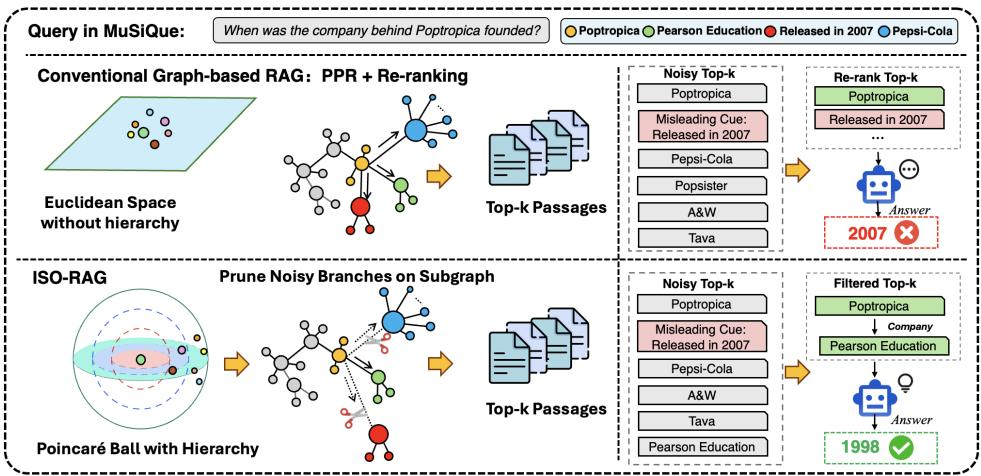
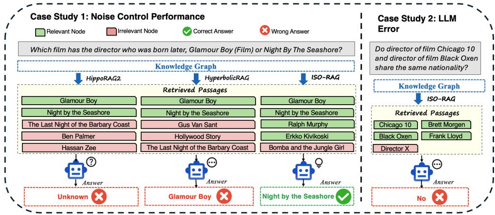
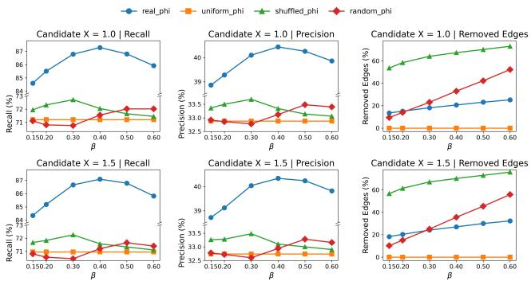

# ISO-RAG: Isoperimetric Noise Control for Retrieval-Augmented Generation

Siyuan Zhang1, Hanchen Wang1, Dong Wen2, Ying Zhang1, Wenjie Zhang2

1University of Technology Sydney 2University of New South Wales

## Abstract

Retrieval-Augmented Generation (RAG) mitigates large language models (LLMs) hallucinations, yet conventional dense retrieval struggles with the complex reasoning paths of multi-hop question answering (QA). Graph-based RAG captures multistep relationships but sufers from severe semantic drift and high online latency due to noisy global graph traversals. Thus, we propose ISO-RAG (ISOperimetric Retrieval-Augmented Generation), a training-free, purely topology-driven RAG framework. Breaking away from computationally expensive continuous geometric embeddings, ISO-RAG leverages discrete graph theory, specifically the local Cheeger ratio (topological expansion rate), to compute node-wise isoperimetric profiles. By identifying and pruning spurious shortcut edges that lead to combinatorial explosion, ISO-RAG restricts the search space to a strictly localized, contextually safe subgraph. This topological purification regulates deterministic Personalized PageRank (PPR) difusion during retrieval, ensuring exact and low-latency convergence without probability leakage. Experiments on multi-hop QA benchmarks demonstrate that ISO-RAG outperforms state-of-the-art baselines by average absolute gains of 10.0% in retrieval recall and 4.3% in downstream exact match, achieving a superior accuracyeficiency trade-of by fundamentally eliminating the latency bottleneck of global traversals. Our source code is available at https://github.com/ZaiizaiZHANG/ISO-RAG.git.

## 1 Introduction

Retrieval-Augmented Generation (RAG) (Lewis et al. 2020; Guu et al. 2020) is a standard paradigm for improving the factuality and controllability of large language models (LLMs) (Kaplan et al. 2020; Vaswani et al. 2017). Grounding generation in external evidence substantially reduces hallucinations (J et al. 2023; Gao et al. 2023; Jiang et al. 2023) and improves answer reliability. While efective for single-hop factual lookup, RAG remains less reliable for multi-hop question answering, which requires connecting multiple evidence pieces scattered across diferent documents. In such settings, retrieval quality becomes the dominant bottleneck, as LLMs cannot reliably infer answers (Wei et al. 2022; Yao et al. 2022, 2023) without the complete reasoning chain.

Existing sparse and dense retrievers (e.g., BM25 (Robertson, Zaragoza et al. 2009), MDR (Xiong et al. 2021), (Karpukhin et al. 2020)) rely on flat similarity matching, often failing to reconstruct the full reasoning chains required by compositional benchmarks (Trivedi et al. 2022; Chen et al. 2023). To address this, recent graph-based (Edge et al. 2024; Jimenez Gutierrez et al. 2024; Cao et al. 2025) methods organize corpora into interconnected structures for multi-hop evidence aggregation. Notably, HyperbolicRAG (Cao et al. 2025) embeds document networks into continuous hyperbolic spaces to model their inherent scale-free hierarchies. This non-Euclidean mapping enables capturing complex multi-hop dependencies with low structural distortion.

Despite these advantages, conventional graph paradigms lack explicit topological intervention, manifesting in three limitations (Figure 1): (1) Unconstrained difusion leads to semantic drift. Graph-based frameworks (Edge et al. 2024; Jimenez Gutierrez et al. 2024; Cao et al. 2025) utilizing Personalized PageRank (PPR) (Page et al. 1999) propagate probabilities over dense graphs. As illustrated by the MuSiQue query, answering requires traversing a specific two-hop path to the target entity (e.g., Poptropica to Pearson Education). However, unconstrained PPR retrieves misleading cues through spurious edges (e.g., release year 2007). Because these distractors exhibit high textual overlap with the query context, they bypass downstream re-rankers, causing the LLM to hallucinate the incorrect year. Crucially, if unconstrained difusion breaks down on a mere two-hop path, this semantic drift compounds for more complex three- or four-hop queries. (2) Continuous models fail to prune noise. Methods like HyperbolicRAG (Cao et al. 2025) rely on continuous node embeddings without explicitly pruning noisy edges (depicted as the scissors in Figure 1), thereby retaining erroneous pathways to distractors. This fails to isolate the specific reasoning branches necessary for accurate multi-hop deduction. (3) Dense graphs degrade eficiency. Computing random walks over the entire graph explores unrelated entities (e.g., distant brands like Pepsi-Cola), which incurs significant computational overhead and dilutes the probability mass of the actual target entity. Consequently, these paradigms struggle to balance signal fidelity and retrieval latency.

In response to these limitations, we propose ISO-RAG (ISOperimetric Retrieval-Augmented Generation), a geometry-aware local graph retrieval framework for multi-hop QA. The core intuition of ISO-RAG is transitioning from unconstrained probability difusion to geometrically regulated local difusion. After routing a query to semantically aligned seed nodes to form a candidate subgraph, the framework maps these nodes into a hyperbolic space using the Poincaré ball model (Nickel and Kiela 2017; Chami et al. 2019; Balazevic, Allen, and Hospedales 2019; Gulcehre et al. 2019; Nickel and Kiela 2018; Peng et al. 2022). Document networks in multihop QA naturally form hierarchical structures, where a few generic entities act as dense hubs connecting numerous specific facts. Because hyperbolic space expands exponentially, it embeds these scale-free topologies with low geometric distortion. Crucially, this non-Euclidean embedding structurally highlights intrinsic bottlenecks (Alon and Yahav 2021; Topping et al. 2022), such as the dense generic hubs (Girvan and Newman 2002) that misguide retrieval. In spectral graph theory, the classical Cheeger constant (Chung 1997) identifies global graph bottlenecks. Building on this geometric foundation, ISO-RAG introduces a localized isoperimetric control mechanism (Andersen, Chung, and Lang 2006; Krioukov et al. 2010).Because computing a strict set-level isoperimetric constant is computationally prohibitive for dynamic online retrieval, we design a numerically stable, node-wise proxy. This proxy acts as a structural filter, explicitly identifying and severing incompatible edges prior to propagation. By anchoring the Personalized PageRank difusion to initial query-aligned seed passages and executing it strictly within this geometrically bounded subgraph, the framework mitigates semantic drift and facilitates noise-controlled evidence aggregation.

  
Figure 1: Conceptual comparison of RAG paradigms. Top: Conventional graph-based RAG sufers from semantic drift: unconstrained difusion allows retrieval signals to leak into irrelevant noise (blue nodes) and misleading cues (red nodes). Bottom: ISO-RAG leverages hyperbolic hierarchy and an isoperimetric control mechanism (scissors) to explicitly sever these erroneous branches. This topological intervention isolates a pure reasoning path (green nodes).

Our contributions are summarized as follows. (1) We propose ISO-RAG, a novel geometry-aware RAG framework that uses explicit topological control to mitigate spurious difusion. (2) At the core of this framework, we introduce an isoperimetric control mechanism that explicitly prunes misleading connections to dense hubs prior to difusion. (3) Extensive evaluations demonstrate that ISO-RAG achieves a highly favorable balance between retrieval eficiency and downstream QA performance, delivering robust average absolute gains of nearly 10% in Recall@5 and 4.3% in Exact Match over competitive baselines.

## 2 Related Works

Sparse and Dense Retrieval for Multi-Hop QA. Conventional retrieval encompasses sparse methods like BM25 (Robertson, Zaragoza et al. 2009) and dense models ranging from flat bi-encoders (Karpukhin et al. 2020) to multi-hop extensions like MDR (Xiong et al. 2021). Whether utilizing exact keyword matching or cosine similarity, these approaches operate in fundamentally flat search spaces. Compressing documents into isolated points optimized for direct semantic overlap, dense vectors cannot explicitly model relationships between intermediate entities. This structural limitation fragments reasoning by allowing lexically similar yet logically disconnected distractors to overshadow critical evidence. Consequently, flat search spaces struggle with the compositional reasoning paths required by increasingly dificult multi-hop QA datasets like HotpotQA (Yang et al. 2018), 2WikiMultihopQA (Ho et al. 2020), and MuSiQue (Trivedi et al. 2022).

Conventional Graph-based RAG Systems. To overcome flat semantic spaces, graph-based retrieval structures corpora into networks capturing multi-hop dependencies. Notable architectures include GraphRAG (Edge et al. 2024) utilizing hierarchical summaries with optional heuristic routing, LightRAG (Guo et al. 2024) employing dual-level structures, and HippoRAG2 (Jimenez Gutierrez et al. 2025) leveraging neurobiologically-inspired memory networks with continuous activation spreading. Despite improving recall, these baselines rely on heuristic edge weighting and unconstrained probability difusion; for instance, HippoRAG2 executes unrestricted global PPR. Consequently, this uncontrolled difusion introduces severe topological noise during retrieval (Alon and Yahav 2021; Topping et al. 2022). Without rigorous mathematical bounds pruning the search space, these frameworks inevitably retrieve spurious subgraphs and misleading entities before generation.

Hyperbolic Geometry and Continuous Aggregation. The inherent hierarchical structure of knowledge graphs makes them poorly suited for Euclidean embeddings (Nickel and Kiela 2017; Sala et al. 2018). Foundational graph neural networks therefore extend representation learning into hyperbolic space through architectures like HGCN (Chami et al. 2019) and related hyperbolic networks (Gulcehre et al. 2019; Peng et al. 2022). Mainstream methodologies use the Poincar’e ball model (Nickel and Kiela 2017) for its intuitive conformal geometry, or the Lorentz model (Nickel and Kiela 2018) for its numerical advantages in distance optimization. Both models provide exponential capacity to embed complex networks with minimal structural distortion. Recent works like HyperbolicRAG (Cao et al. 2025) attempt to leverage this by introducing hyperbolic representations into RAG. However, despite operating in hyperbolic space, its probability difusion remains fundamentally unconstrained. By performing continuous neighborhood aggregation without explicit discrete pruning, HyperbolicRAG fails to resolve the topological bottleneck, inevitably accumulating topological noise and causing severe semantic drift during retrieval.

## 3 Methodology

We present ISO-RAG (ISOperimetric Retrieval-Augmented Generation), a geometry-aware local graph retrieval framework for multi-hop question answering. The core idea is to avoid broad graph-wide difusion by combining four components: (i) query-aware seed routing, (ii) local candidate graph construction, (iii) isoperimetric structural filtering derived from hyperbolic structure, and (iv) deterministic personalized PageRank on the filtered local graph.

## 3.1 Problem Formulation

Let $\mathcal { C } = \{ p _ { 1 } , p _ { 2 } , . . . , p _ { N } \}$ denote a corpus of passages. Given a multi-hop query $q ,$ , the retrieval objective is to extract a top-K subset $\mathcal { R } _ { K } ( q ) \subset \mathcal { C }$ , such that the retrieved passages jointly cover the evidence required to answer q.

We model the corpus as an undirected retrieval graph $\mathcal { G } = ( \nu , \mathcal { E } )$ , where each node $u \in \mathcal V$ represents a passage equipped with a dense semantic embedding $\mathbf { h } _ { u } \in \mathbb { R } ^ { d } .$ . G serves as a question-induced passage co-occurrence graph: an edge $( u , v ) \in \mathcal { E }$ is established whenever passages u and v co-occur within a training instance or retrieval context.

Such co-occurrence graphs efectively expose latent multihop dependencies, but they also inherently introduce noisy shortcuts and hub-like regions. As a result, unconstrained difusion processes can prematurely leak probability mass into generic yet weakly useful passages, reducing both retrieval precision and downstream QA performance.

## 3.2 Seeded Local Graph Construction

Given a query $q ,$ ISO-RAG first retrieves its dense embedding $\mathbf { h } _ { q }$ from a precomputed embedding cache and measures its cosine similarity to every node embedding:

$$
s _ { u } ( q ) = \cos ( \mathbf { h } _ { q } , \mathbf { h } _ { u } ) , \qquad u \in \mathcal { V } .\tag{1}
$$

Let $S ( q )$ denote the set of top-m seed nodes selected according to $s _ { u } ( q )$

$$
S ( q ) = \underset { u \in \mathcal { V } } { \mathrm { t o p - m } } \ s _ { u } ( q ) .\tag{2}
$$

Rather than propagating over the full graph, ISO-RAG restricts the search space to a compact local candidate set $\mathcal { V } _ { \mathrm { l o c } } ( q ) \subseteq \mathcal { V }$ . To ensure both high recall and structural connectivity, we construct this set by integrating two components: a dense semantic pool and a topology-aware neighborhood.

Specifically, let $\nu _ { \mathrm { d e n s e } } ( q )$ denote the top-L passages retrieved via $s _ { u } ( q )$ (where $L \geq m$ , thus containing the seed set $S ( q ) )$ . Let $\nu _ { \mathrm { e x p a n d } } ( q )$ denote the k-hop structural neighborhood expanded from $\dot { \boldsymbol { S } } ( \boldsymbol { q } )$ . The local candidate set is defined as their union:

$$
\mathcal { V } _ { \mathrm { l o c } } ( q ) = \mathcal { V } _ { \mathrm { d e n s e } } ( q ) \cup \mathcal { V } _ { \mathrm { e x p a n d } } ( q ) .\tag{3}
$$

The induced local subgraph is $\mathcal { G } _ { \mathrm { l o c } } ( q ) = \mathcal { G } [ \mathcal { V } _ { \mathrm { l o c } } ( q ) ]$

This query-conditioned local graph substantially reduces the search space and transforms retrieval from global difusion vulnerable to topological noise into local propagation anchored at semantically aligned entry points.

## 3.3 Hyperbolic Isoperimetric Edge Filtering

Hyperbolic structural signal. To characterize local graph structure, we map node representations into the Poincaré ball (Nickel and Kiela 2017; Chami et al. 2019; Balazevic, Allen, and Hospedales 2019):

$$
\begin{array} { r } { \mathbf { z } _ { u } = f _ { \theta } ( \mathbf { h } _ { u } ) , \qquad \mathbf { z } _ { u } \in \mathbb { B } ^ { d } , } \end{array}\tag{4}
$$

where

$$
\mathbb { B } ^ { d } = \left\{ \mathbf { z } \in \mathbb { R } ^ { d } : \| \mathbf { z } \| _ { 2 } < 1 \right\} ,\tag{5}
$$

and $\| \cdot \| _ { 2 }$ denotes the standard Euclidean norm. The mapping $f _ { \theta } ,$ , which includes a projection onto the open unit ball, directly maps precomputed Euclidean text embeddings into the hyperbolic manifold. To align textual semantics with discrete multi-hop topology, $f _ { \theta }$ is trained ofline via a graph-supervised margin-based triplet loss and a radial depth regularizer (detailed in Appendix). This helps ensure the representations encapsulate both raw semantics and hierarchical structures.

For a node u, let

$$
\lambda ( \mathbf { z } _ { u } ) = \frac { 2 } { 1 - \| \mathbf { z } _ { u } \| _ { 2 } ^ { 2 } }\tag{6}
$$

denote the conformal factor of the Poincaré metric at $\mathbf { z } _ { u }$ In Riemannian geometry, this factor dictates the volume expansion of the local space. Therefore, the geometric volume occupied by a node is intrinsically driven by this conformal scaling. We thus define the local volume proxy as:

$$
\mathrm { v } ( u ) = \lambda ( \mathbf { z } _ { u } ) ^ { p } .\tag{7}
$$

Geometrically, $\mathrm { v } ( u )$ quantifies this continuous spatial occupancy, which acts as an inverse indicator of semantic breadth. Due to the exponential outward expansion of the Poincaré ball, generic semantic hubs at the origin are tightly compressed into minimal conformal volumes, whereas highly specific factual entities at the periphery occupy vast spatial regions. In strict Riemannian geometry, the true volume scales with the dimensionality d. However, computing $\lambda ( \mathbf { z } _ { u } ) ^ { d }$ for high-dimensional embeddings $( d \ge 1 2 8 )$ inevitably leads to numerical overflow. To ensure system reliability, we introduce a tunable scaling exponent $p \ll d .$ This engineering formulation provides a numerically stable proxy for the node volume that flexibly controls the dynamic range of the structural signal. By doing so, we preserve the core monotonic conformal scaling property of hyperbolic space while guaranteeing robust online computation.

To construct a principled structural ratio, we define a localized geometric measure based on the classical Cheeger constant. For any node $u \in \mathcal V$ , let $S _ { u } = \{ u \} \cup \mathcal { N } ( u )$ denote its closed 1-hop neighborhood set. We define the internal geometric volume of this local region as the sum of the conformal volume proxies of its constituent nodes:

$$
V ( S _ { u } ) = \sum _ { n \in S _ { u } } \mathrm { v } ( n ) .\tag{8}
$$

Next, we identify the topological boundary of this region. Let $\partial S _ { u }$ denote the 2-hop boundary shell of $u ,$ consisting of all nodes adjacent to $\bar { \mathcal { N } } ( u )$ that are not contained within $S _ { u }$ . The geometric volume of this boundary is analogously defined as:

$$
V ( \partial S _ { u } ) = \sum _ { n \in \partial S _ { u } } \mathrm { v } ( n ) .\tag{9}
$$

Having formalized both the internal and boundary volumes using the exact same hyperbolic measure, we define the nodewise structural pruning score $\phi _ { u }$ as the localized geometric Cheeger ratio:

$$
\phi _ { u } = \frac { V ( \partial S _ { u } ) } { V ( S _ { u } ) + \varepsilon } ,\tag{10}
$$

where $\varepsilon > 0$ is a small stability constant. Unlike heuristic formulations that mix mismatched topological and geometric scales, this definition strictly preserves the isoperimetric nature of the score. The proxy measures the relative geometric expansion of a node’s local neighborhood. Generic hubs exhibit explosive boundary volumes $( V ( \partial S _ { u } ) )$ compared to their highly compressed internal neighborhood volumes $( V ( S _ { u } ) )$ , yielding extremely large $\phi _ { u }$ values. By evaluating this rigorous volume-to-volume ratio, the framework can explicitly identify structural bottlenecks without requiring computationally prohibitive global graph partitioning.

Discriminative Power of the Proxy. In scale-free hyperbolic embeddings, a node’s radial distance inversely tracks its topological degree, while its conformal volume grows exponentially with radius. This dual scaling creates a geometric mismatch for generic hubs: they reside near the origin with heavily compressed individual volumes, yet their massive topological connectivity bridges to numerous specific nodes at the periphery. Consequently, for a central hub, its 2-hop boundary shell $\partial S _ { u }$ reaches into the expansive periphery, accumulating an explosive boundary volume $V ( \partial \bar { \cal S } _ { u } )$ , while its internal 1-hop neighborhood volume $V ( S _ { u } )$ remains heavily constrained. This extreme volume-to-volume divergence triggers massive $\phi _ { u }$ anomalies for spurious edges connecting factual nodes to unrelated hubs, enabling ISO-RAG to structurally isolate probability leakage. Detailed mathematica formulations are provided in Appendix.

Edge Compatibility Filtering. To prune spurious edges bridging structurally dissimilar nodes, we enforce structural consistency between endpoints. An edge $( u , v ) \in \mathcal G _ { \mathrm { l o c } } ( q )$ is

retained only if:

$$
\frac { \operatorname* { m i n } ( \phi _ { u } , \phi _ { v } ) } { \operatorname* { m a x } ( \phi _ { u } , \phi _ { v } ) } \geq \beta ,\tag{11}
$$

where $\beta \in ( 0 , 1 ]$ is a validation-tuned tolerance threshold. Equivalently, in log-scale:

$$
| \log \phi _ { u } - \log \phi _ { v } | \leq - \log \beta .\tag{12}
$$

Here, − log $\beta$ bounds the maximum allowable structural divergence. Valid reasoning steps between nodes of comparable specificity exhibit small ϕ-divergences. Conversely, edges bridging opposite structural extremes $( \mathrm { e . g . }$ , direct transitions between specific factual leaves and generic hubs) inevitably violate this threshold and are systematically pruned. This dual-sided filtering mitigates semantic drift from two directions: it blocks forward probability leakage into hubs during propagation, and isolates erroneously retrieved hub anchors before difusion begins. Because all node-wise structural scores $\phi _ { u }$ can be fully precomputed and cached, this geometric filtering introduces negligible online computational latency. We provide details in Appendix.

Let

$$
\widetilde { \mathcal { G } } _ { \mathrm { l o c } } ( q ) = \left( \mathcal { V } _ { \mathrm { l o c } } ( q ) , \widetilde { \mathcal { E } } _ { \mathrm { l o c } } ( q ) \right)\tag{13}
$$

denote the resulting geometrically filtered local graph, which provides a structurally coherent and bounded manifold for the subsequent localized PageRank.

## 3.4 Localized Deterministic Personalized PageRank

After edge filtering, retrieval operates strictly on the compact graph $\widetilde { \mathcal { G } } _ { \mathrm { l o c } } ( \boldsymbol { q } )$ . We re-normalize its adjacency matrix to derive a valid column-stochastic transition matrix $\widetilde { \mathbf { W } }$

The personalization vector $\mathbf { r } ( q )$ distributes the initial probability mass exclusively across the selected seed nodes $\mathsf { \bar { \boldsymbol { s } } } ( \boldsymbol { q } )$ via a temperature-scaled softmax:

$$
r _ { u } ( q ) = \left\{ \begin{array} { l l } { \frac { \exp ( \tau \cdot s _ { u } ^ { \mathrm { d e n s e } } ) } { \sum _ { v \in S ( q ) } \exp ( \tau \cdot s _ { v } ^ { \mathrm { d e n s e } } ) } , } & { u \in S ( q ) , } \\ { 0 , } & { \mathrm { o t h e r w i s e } , } \end{array} \right.\tag{14}
$$

where $\tau > 0$ controls the mass concentration sharpness, and $s _ { u } ^ { \mathrm { d e n s e } }$ denotes the initial dense semantic similarity score.

The localized PPR vector $\pi ( q )$ is defined as the unique fixed point of the difusion process:

$$
\pmb { \pi } ( \ b q ) = ( 1 - \alpha ) \mathbf { r } ( \ b q ) + \alpha \widetilde { \mathbf { W } } \pmb { \pi } ( \ b q ) ,\tag{15}
$$

where $\alpha \in ( 0 , 1 )$ is the damping factor (with $1 - \alpha$ acting as the teleportation probability). During difusion, the probability mass of dangling nodes is intrinsically redistributed via $\mathbf { r } ( q )$ , which falls back to a uniform distribution if seed weights degrade to zero. Rather than relying on stochastic random walks that introduce approximation variance, we compute $\pi ( q )$ deterministically via power iteration. Because our structural filtering strictly bounds the difusion space to the compact local subgraph $\widetilde { \mathcal { G } } _ { \mathrm { l o c } } ( \boldsymbol { q } )$ , this exact computation remains highly eficient and yields stable structural scores.

<table><tr><td rowspan="2">Model</td><td rowspan="2">Retriever</td><td colspan="2">HotpotQA</td><td colspan="2">2Wiki- MultihopQA</td><td rowspan="2">MuSiQue</td></tr><tr><td>F1</td><td>EM</td><td>F1 EM</td><td>F1 EM</td></tr><tr><td rowspan="3">Qwen2.5</td><td>GraphRAG GraphRAG+PPR 75.0</td><td>79.1</td><td>72.3 54.1 68.4 54.5</td><td>52.8 52.9</td><td>28.8</td><td>23.2 30.6 24.2</td></tr><tr><td>LightRAG</td><td>79.8</td><td>72.3</td><td>72.2</td><td>68.9</td><td>34.0 28.4</td></tr><tr><td>HippoRAG2 HyperbolicRAG</td><td>80.6 79.6</td><td>73.1 72.3</td><td>62.3 60.0</td><td>59.7 58.2</td><td>36.930.8 30.6 25.6</td></tr><tr><td rowspan="3">Qwen- Plus</td><td>ISÓ-RAG GraphRAG GraphRAG+PPR 78.1 LightRAG</td><td>81.1 80.4</td><td>74.1 72.8 56.7 70.8 57.5</td><td>76.9 55.2</td><td>73.2 55.2</td><td>40.1 33.9 28.7 23.3 30.1 24.0</td></tr><tr><td>HippoRAG2 HyperbolicRAG ISÓ-RAG GraphRAG</td><td>82.3 82.2 81.4 82.5</td><td>75.0 74.6 73.7 75.0</td><td>72.8 63.7 61.6 80.4</td><td>68.8 60.9 59.4 75.8</td><td>30.9 24.6 34.2 27.7 32.1 25.4 42.8 31.4</td></tr><tr><td>GraphRAG+PPR 81.0 Qwen3-1 LightRAG HippoRAG2 HyperbolicRAG ISÓ-RAG</td><td>83.1 84.6 84.8 83.9 85.2</td><td>76.0 74.1 59.5 77.4 77.7 76.5 78.2 84.7</td><td>60.9 77.0 67.4 64.5</td><td>59.2 57.7 73.8 64.6 62.5 80.7</td><td>28.7 23.3 30.1 24.0 33.6 28.3 36.930.9 34.6 28.8 40.2 33.7</td></tr></table>

Table 1: Main Results on Multi-Hop QA Datasets. F1 and EM scores are in percentage (%). Best results are bolded.

Finally, the converged structural scores are fused with the initial dense semantic similarities. Denoting the scalar structural score for node u as $\pi _ { u } ( q )$ , which is extracted from the vector π(q), the final retrieval score $s _ { u } ^ { \mathrm { f i n a l } }$ for each passage u is computed via a linear combination:

$$
\begin{array} { r } { s _ { u } ^ { \mathrm { f i n a l } } = \lambda _ { \mathrm { g } } \pi _ { u } ( q ) + \lambda _ { \mathrm { d } } s _ { u } ^ { \mathrm { d e n s e } } , } \end{array}\tag{16}
$$

where $\pi _ { u } ( q )$ and $s _ { u } ^ { \mathrm { d e n s e } }$ are min-max normalized over the candidate set prior to fusion, and $\lambda _ { \mathrm { g } }$ and $\lambda _ { \mathrm { d } }$ are tunable balancing weights. The candidate passages are subsequently ranked by $s _ { u } ^ { \mathrm { f i n a } \overline { { \mathbf { l } } } }$ to extract the optimal top-K evidence set $\mathcal { R } _ { K } ( q )$ for downstream QA. This dual-signal fusion elegantly couples the semantic recall of dense models with the structural multi-hop precision of our isoperimetric framework, ensuring that the final ranking is both contextually relevant and topologically coherent.

## 4 Experiments

In this section, we comprehensively evaluate ISO-RAG to answer the following Research Questions (RQs): RQ1 (Overall Performance): Does ISO-RAG outperform existing dense and graph-based retrieval methods in both retrieval accuracy and downstream multi-hop QA? RQ2 (Eficiency): Can the localized deterministic routing paradigm achieve better retrieval-time eficiency compared to unconstrained graph traversals? RQ3 (Geometric Filtering): How does the isoperimetric signal (ϕ) explicitly contribute to noise-aware structural filtering?

## 4.1 Experimental Setup

Datasets & Graph Construction. We evaluate ISO-RAG on three standard multi-hop QA benchmarks with varying reasoning complexities: HotpotQA (Yang et al. 2018) (primarily

2-hop), 2WikiMultihopQA (Ho et al. 2020) (2–4 hop), and MuSiQue (Trivedi et al. 2022) (up to 4-hop compositional reasoning). To establish a unified evaluation setting for both structural retrieval and end-to-end QA, we randomly sample 1,000 instances from the validation set of each benchmark. For graph construction, rather than building a traditional entityrelation knowledge graph, we construct a question-induced passage co-occurrence graph (details in Appendix. Passages are treated as nodes, with edges connecting passages that cooccur in the same training instance. Node texts are embedded ofline using the text-embedding-v3 encoder (Zhang et al. 2025). To strictly prevent data leakage, the passage co-occurrence graphs are constructed exclusively using the training splits of the respective datasets. Validation and test sets are completely excluded from the graph construction phase, ensuring that the retrieval framework does not benefit from any benchmark-specific structural shortcuts.

Table 3 compares retrieval latency and token usage under Qwen3-Max to assess the computational advantage of our localized pipeline.

Baselines. To comprehensively evaluate retrieval quality, we categorize baselines into non-graph methods (BM25 (Robertson, Zaragoza et al. 2009), Flat Dense (Karpukhin et al. 2020), MDR (Xiong et al. 2021)) and graph-based paradigms. The latter ranges from foundational algorithms (Vanilla PPR (Page et al. 1999)) to state-of-the-art frameworks (GraphRAG (Edge et al. 2024), GraphRAG+PPR (Page et al. 1999), LightRAG (Guo et al. 2024), HippoRAG2 (Jimenez Gutierrez et al. 2024), and HyperbolicRAG (Cao et al. 2025)). As Vanilla PPR is a foundational retrieval algorithm rather than an end-to-end RAG pipeline, we focus our QA assessment exclusively on the aforementioned state-of-the-art frameworks designed for generative tasks. To execute this generation, the retrieval outputs are paired with multiple LLM backbones (Qwen2.5, Qwen-Plus (Team 2024), and Qwen3-Max (Team 2025)).

Implementation Details. We evaluate downstream QA performance using standard Exact Match (EM) and F1 scores. For fair comparison, all graph frameworks supply the raw text of their retrieved top-k passages to the LLM generator using an identical prompt template. Comprehensive implementation details, including hyperparameter tuning (e.g., PageRank α), exact grid-search ranges, and full prompt templates, are detailed in Appendix.

## 4.2 Main Results: Retrieval and QA Performance (RQ1)

We first evaluate the fundamental retrieval capability (Tables 2) and the end-to-end QA generation quality (Table 1). ISO-RAG consistently yields the best results across all settings.

Consistent Gains in Shallow Reasoning. While performance on HotpotQA is nearing saturation for high-capacity models, ISO-RAG still guarantees stable improvements, achieving 88.05 R@5 (+0.75 absolute points over the strongest baseline) and peaking at 85.2 F1 score with Qwen3-Max. Notably, the improvements are robust across model scales, suggesting that our retrieval framework itself fundamentally drives the observed gains.

<table><tr><td rowspan="2">Method</td><td colspan="4">HotpotQA</td><td colspan="4">2WikiMultihopQA</td><td colspan="4">MuSiQue</td></tr><tr><td>R@5</td><td>R@10</td><td>P@5</td><td>P@10</td><td>R@5</td><td>R@10</td><td>P@5</td><td>P@10</td><td>R@5</td><td>R@10</td><td>P@5</td><td>P@10</td></tr><tr><td>BM25</td><td>62.70</td><td>75.25</td><td>25.08</td><td>15.05</td><td>39.80</td><td>48.20</td><td>18.42</td><td>11.08</td><td>27.00</td><td>32.15</td><td>10.64</td><td>6.34</td></tr><tr><td>Flat Dense</td><td>81.90</td><td>87.95</td><td>32.76</td><td>17.59</td><td>69.43</td><td>71.58</td><td>31.82</td><td>16.39</td><td>52.40</td><td>58.95</td><td>20.54</td><td>11.57</td></tr><tr><td>MDR</td><td>78.80</td><td>88.15</td><td>31.52</td><td>17.63</td><td>61.65</td><td>68.55</td><td>27.70</td><td>15.53</td><td>51.70</td><td>59.45</td><td>20.34</td><td>11.70</td></tr><tr><td>Vanilla PPR</td><td>81.75</td><td>94.40</td><td>32.70</td><td>18.88</td><td>69.05</td><td>78.95</td><td>31.80</td><td>18.96</td><td>70.10</td><td>77.30</td><td>27.12</td><td>14.98</td></tr><tr><td>GraphRAG</td><td>85.25</td><td>96.20</td><td>34.10</td><td>19.24</td><td>71.15</td><td>88.45</td><td>32.84</td><td>21.34</td><td>59.00</td><td>72.30</td><td>22.84</td><td>13.99</td></tr><tr><td>GraphRAG+PPR</td><td>71.45</td><td>94.20</td><td>28.58</td><td>18.84</td><td>69.78</td><td>81.95</td><td>32.38</td><td>19.91</td><td>63.20</td><td>76.15</td><td>24.40</td><td>14.74</td></tr><tr><td>LightRAG</td><td>87.30</td><td>97.20</td><td>34.92</td><td>19.44</td><td>77.93</td><td>88.80</td><td>35.92</td><td>20.95</td><td>55.05</td><td>67.05</td><td>21.60</td><td>13.16</td></tr><tr><td>HippoRAG2</td><td>86.65</td><td>97.85</td><td>34.66</td><td>19.57</td><td>70.18</td><td>82.80</td><td>32.30</td><td>19.88</td><td>63.85</td><td>75.40</td><td>26.14</td><td>14.64</td></tr><tr><td>HyperbolicRAG</td><td>85.30</td><td>96.85</td><td>34.12</td><td>19.37</td><td>70.45</td><td>78.38</td><td>32.34</td><td>18.55</td><td>55.35</td><td>76.05</td><td>21.70</td><td>14.70</td></tr><tr><td>ISO-RAG</td><td>88.05</td><td>98.05</td><td>35.22</td><td>19.61</td><td>88.10</td><td>97.15</td><td>40.10</td><td>22.90</td><td>74.75</td><td>84.00</td><td>28.98</td><td>16.31</td></tr></table>

Table 2: Retrieval performance comparison of Recall (R@) and Precision (P@) at top-5 and top-10 across three multi-hop datasets. Best results are bolded.

Superiority in Complex Topologies. Table 1 demonstrates that ISO-RAG outperforms all baselines on 2Wiki-MultihopQA. Notably, it surpasses the strongest baseline, LightRAG, achieving an R@5 of 88.10 with a 10.17-point absolute improvement. Compared to recent topology-driven frameworks (i.e., HippoRAG2 and HyperbolicRAG), this gap widens, yielding a relative R@5 gain exceeding 25%. Furthermore, QA evaluation using Qwen3-Max yields an F1 score of 84.7 and an EM score of 80.7. These results confirm the eficacy of ISO-RAG in structured multi-hop scenarios, where preserving valid intermediate hops and suppressing spurious difusion are critical.

Robustness against High Noise. The MuSiQue dataset presents a severe challenge of deep compositional reasoning amidst dense distractors. In this regime, while ISO-RAG achieves a state-of-the-art R@10 score of 84.00 (+11.4% relative gain over HippoRAG2) alongside highly competitive precision of 16.31, its full potential materializes in the QA phase. Evaluated with Qwen-Plus, the framework peaks at an F1 score of 42.8, securing an approximate 25% relative gain over HippoRAG2. This disproportionate amplification, transitioning from a steady retrieval improvement to a drastic QA leap, demonstrates that ISO-RAG does not merely accumulate disjoint relevant documents. Instead, driven by its high retrieval precision, it successfully isolates the precise, noise-free multi-hop evidence pathways required to cross the reasoning threshold of the LLM.

## 4.3 Eficiency Analysis (RQ2)

Latency Reduction via Local Subgraphs. ISO-RAG maintains stable millisecond-level speeds across all benchmarks, ranking as the second fastest retriever on both HotpotQA and MuSiQue. While marginally trailing the vanilla GraphRAG baseline in raw speed, it provides a substantially more precise reasoning context. Compared to recent topology-driven frameworks, the latency gap is particularly striking: on MuSiQue, ISO-RAG delivers an approximate 8× speedup over HippoRAG2 and operates over 25× faster than HyperbolicRAG. This confirms that bounding PageRank within a geometrically filtered subgraph successfully bypasses the heavy overhead of global traversals.

<table><tr><td rowspan="2">Dataset</td><td rowspan="2">Method</td><td colspan="2">Efficiency</td></tr><tr><td>Retr/Q (ms) ↓</td><td>Avg Prompt</td></tr><tr><td rowspan="7">HotpotQA</td><td>GraphRAG</td><td>10.8</td><td>1619.91</td></tr><tr><td>GraphRAG+PPR</td><td>15.1</td><td>1652.10</td></tr><tr><td>LightRAG</td><td>22.9</td><td>1644.83</td></tr><tr><td>HippoRAG2</td><td>52.0</td><td>895.16</td></tr><tr><td>HyperbolicRAG</td><td>92.7</td><td>889.61</td></tr><tr><td>ISÓ-RAG</td><td>12.3</td><td>886.44</td></tr><tr><td>GraphRAG</td><td>6.2</td><td>1389.09</td></tr><tr><td rowspan="6">2Wiki- MultihopQA</td><td>GraphRAG+PPR</td><td>8.7</td><td>1225.13</td></tr><tr><td>LightRAG</td><td>14.4</td><td>1271.18</td></tr><tr><td>HippoRAG2</td><td>49.1</td><td>720.89</td></tr><tr><td>HyperbolicRAG</td><td>71.1</td><td>758.91</td></tr><tr><td>IŠÓ-RAG</td><td>11.5</td><td>793.49</td></tr><tr><td></td><td></td><td></td></tr><tr><td rowspan="6">MuSiQue</td><td>GraphRAG</td><td>9.9</td><td>1579.64</td></tr><tr><td>GraphRAG+PPR</td><td>16.2</td><td>1588.76</td></tr><tr><td>LightRAG</td><td>65.6</td><td>1561.58</td></tr><tr><td>HippoRAG2</td><td>117.2</td><td>912.46</td></tr><tr><td>HyperbolicRAG</td><td>375.1</td><td>900.95</td></tr><tr><td>IŠÓ-RAG</td><td>14.2</td><td>927.07</td></tr></table>

Table 3: Eficiency Comparison across Datasets. Latency is measured in milliseconds per query (Retr/Q). Best results in each dataset are bolded, and second-best results are underlined.

Favorable Accuracy-Eficiency Trade-of. ISO-RAG exhibits highly competitive token eficiency, incurring the lowest prompt token overhead among all baselines on HotpotQA. While structurally complex datasets require marginally more tokens than HippoRAG2 and HyperbolicRAG, this slight increment is fully ofset by substantial gains in retrieval accuracy. Ultimately, this confirms that ISO-RAG delivers a strictly higher density of actionable reasoning chains per token, ensuring a highly cost-efective retrieval process.

## 4.4 Ablation: Isoperimetric Geometric Filtering (RQ3)

We isolate the isoperimetric filtering module on 2WikiMultihopQA, where the impact of geometric guidance is most pronounced, to compare true geometric guidance against unconstrained, random, or topologically decoupled edge pruning under highly noisy conditions (Figure 3).

  
Figure 2: Case Study

  
Figure 3: Retrieval Performance and Removed Edges Grouped by Floor (β) and Candidate X Configurations (in %)

We define three core variables to control the ablation space: Candidate X, the over-retrieval factor applied to the initial dense pool prior to ϕ-filtering; β, the threshold controlling geometric edge pruning strictness; and four ϕ mapping strategies: (1) real\_phi applies actual learned scores to capture true local continuity; (2) uniform\_phi assigns a constant value, disabling the filter to revert to vanilla PPR; (3) shuffled\_phi randomly permutes real\_phi values, preserving global distribution but destroying correlation with graph topology; and (4) random\_phi applies uniform random values to test arbitrary edge pruning. The performance is evaluated using recall, precision, and the percentage of removed edges.

Necessity ofthe Real Geometric Signal. real\_phi dominates all variants, achieving 87.28% peak recall and 40.44% peak precision at β = 0.40. Conversely, uniform\_phi (no filtering) and random\_phi (random scalar field) stagnate at ∼71-72%. This demonstrates that retrieval gains stem from the learned geometric signal, not merely baseline graph topology (uniform\_phi) or random edge dropout regularization (random\_phi).

Necessity of Topological Alignment. shuffled\_phi preserves the true numerical distribution of isoperimetric scores but decouples them from graph topology. Consequently, it aggressively removes up to 75% of edges and sufers a massive performance drop, whereas ISO-RAG achieves peak results by pruning only 32%. This proves multi-hop retrieval requires topology-aware filtering, not indiscriminate pruning. By strictly aligning the isoperimetric signal with graph structure, ISO-RAG selectively prunes edges leaking probability mass into irrelevant neighborhoods.

## 4.5 Qualitative Case Study

To illustrate how geometric filtering prevents probability leakage in PPR, we examine a multi-hop query from 2Wiki-MultihopQA (Figure 2). This query requires a parallel 2-hop reasoning chain: identifying directors for two films, retrieving their biographies, and comparing their birth dates.

Preventing Probability Leakage. In the top-5 contexts, baseline methods fail to retrieve the crucial passages; their unconstrained PageRank difusion is hijacked by dense, semantically adjacent hub nodes (e.g., unrelated films or directors). Consequently, HippoRAG2 outputs "Unknown", while HyperbolicRAG hallucinates the wrong film. Conversely, ISO-RAG’s isoperimetric control severs spurious edges to these hubs. By bounding probability mass within the local manifold, it retrieves both required passages, enabling the LLM to deduce the correct answer.

Decoupling Retrieval and Generation Errors. To further illustrate the vulnerability of downstream LLMs to contextual noise, we present a "Perfect Retrieval, Failed Generation" case in Figure 2. Although ISO-RAG successfully retrieved 100% of the ground-truth entities, the LLM still failed. This demonstrates that degraded F1/EM scores are not exclusively indicative of retrieval failure, but can also stem from LLM reasoning bottlenecks.

## 5 Conclusion

In this work, we presented ISO-RAG, a novel retrievalaugmented generation framework that imposes strict topological control to mitigate spurious difusion during graph-based retrieval. By mapping the graph into hyperbolic space and training a geometry-aware encoder, ISO-RAG enables controlled retrieval that is both eficient and efective for downstream question answering. Across benchmarks, it yields consistent absolute improvements over competitive baselines, underscoring the importance of topology-aware control for multi-hop reasoning.

## References

Alon, U.; and Yahav, E. 2021. On the Bottleneck of Graph Neural Networks and Its Practical Implications. In International Conference on Learning Representations.

Andersen, R.; Chung, F.; and Lang, K. 2006. Local Graph Partitioning Using PageRank Vectors. In 47th Annual IEEE Symposium on Foundations ofComputer Science (FOCS’06), 475–486. IEEE.

Balazevic, I.; Allen, C.; and Hospedales, T. 2019. Multi-Relational Poincaré Graph Embeddings. In Advances in Neural Information Processing Systems, volume 32.

Cao, L.; Wang, R.; Li, J.; Zhou, Z.; and Yang, M. 2025. HyperbolicRAG: Enhancing Retrieval-Augmented Generation with Hyperbolic Representations. arXiv:2511.18808.

Chami, I.; Ying, Z.; Ré, C.; and Leskovec, J. 2019. Hyperbolic Graph Convolutional Neural Networks. In Advances in Neural Information Processing Systems, volume 32.

Chen, J.; Lin, H.; Han, X.; and Sun, L. 2023. Benchmarking Large Language Models in Retrieval-Augmented Generation. arXiv:2309.01431.

Chung, F. R. 1997. Spectral Graph Theory, volume 92. American Mathematical Society.

Edge, D.; Trinh, H.; Cheng, N.; Bradley, J.; Chao, A.; Mody, A.; Truitt, S.; and Larson, J. 2024. From Local to Global: A Graph RAG Approach to Query-Focused Summarization. arXiv:2404.16130.

Gao, Y.; Xiong, Y.; Gao, X.; Jia, K.; Pan, J.; Bi, Y.; Dai, Y.; Sun, J.; and Wang, H. 2023. Retrieval-Augmented Generation for Large Language Models: A Survey. arXiv:2312.10997.

Girvan, M.; and Newman, M. E. 2002. Community Structure in Social and Biological Networks. Proceedings of the National Academy ofSciences, 99(12): 7821–7826.

Gulcehre, C.; Denil, M.; Cabukuetli, M.; Pfau, D.; Pascanu, R.; Hofman, M. W.; and Nando, d. F. 2019. Hyperbolic Attention Networks. In International Conference on Learning Representations.

Guo, Z.; Xia, L.; Yu, Y.; Ao, T.; and Huang, C. 2024. LightRAG: Simple and Fast Retrieval-Augmented Generation. arXiv:2410.05779.

Guu, K.; Gurkurun, T.; Knecht, D.; Chang, M.-W.; and Salakhutdinov, R. 2020. REALM: Retrieval-Augmented Language Model Pre-training. In International Conference on Machine Learning, 3929–3938. PMLR.

Ho, X.; Nguyen, A.-K. D.; Sugawara, S.; and Aizawa, A. 2020. Constructing a Multi-hop QA Dataset for Comprehensive Evaluation of Reasoning Steps. In Proceedings of the 28th International Conference on Computational Linguistics, 6609– 6625.

Ji, Z.; Lee, N.; Frieske, R.; Yu, T.; Su, D.; Xu, Y.; Ishii, E.; Bang, Y. J.; Madotto, A.; and Fung, P. 2023. Survey

of Hallucination in Natural Language Generation. ACM Computing Surveys, 55(12): 1–38.

Jiang, Z.; Xu, F. F.; Gao, L.; Sun, Z.; Liu, Q.; Dwivedi-Yu, J.; Yang, Y.; Jamie, C.; and Neubig, G. 2023. Active Retrieval Augmented Generation. arXiv:2305.06983.

Jimenez Gutierrez, B.; Shu, Y.; Gu, Y.; Yasunaga, M.; and Su, Y. 2024. HippoRAG: Neurobiologically Inspired Long-Term Memory for Large Language Models. In Advances in Neural Information Processing Systems, volume 37, 59532–59569.

Jimenez Gutierrez, B.; Shu, Y.; Gu, Y.; Yasunaga, M.; and Su, Y. 2025. From RAG to Memory: Non-Parametric Continual Learning for Large Language Models. arXiv:2502.14802.

Kaplan, J.; McCandlish, S.; Henighan, T.; Brown, T. B.; Chess, B.; Child, R.; Gray, S.; Radford, A.; Wu, J.; and Amodei, D. 2020. Scaling Laws for Neural Language Models. arXiv:2001.08361.

Karpukhin, V.; Oguz, B.; Min, S.; Lewis, P.; Wu, L.; Edunov, S.; Chen, D.; and Yih, W.-t. 2020. Dense Passage Retrieval for Open-Domain Question Answering. In Proceedings ofthe 2020 Conference on Empirical Methods in Natural Language Processing (EMNLP), 6769–6781.

Krioukov, D.; Papadopoulos, F.; Kitsak, M.; Vahdat, A.; and Boguná, M. 2010. Hyperbolic Geometry of Complex Networks. Physical Review E, 82(3): 036106.

Lewis, P.; Perez, E.; Piktus, A.; Petroni, F.; Karpukhin, V.; Goyal, N.; Küttler, H.; Lewis, M.; Yih, W.-t.; Rocktäschel, T.; Riedel, S.; and Kiela, D. 2020. Retrieval-Augmented Generation for Knowledge-Intensive NLP Tasks. In Advances in Neural Information Processing Systems, volume 33, 9459– 9474.

Nickel, M.; and Kiela, D. 2017. Poincaré Embeddings for Learning Hierarchical Representations. In Advances in Neural Information Processing Systems, volume 30.

Nickel, M.; and Kiela, D. 2018. Learning Continuous Hierarchies in the Lorentz Model of Hyperbolic Geometry. In International Conference on Machine Learning, 3779–3788.

Page, L.; Brin, S.; Motwani, R.; and Winograd, T. 1999. The PageRank Citation Ranking: Bringing Order to the Web. Technical report, Stanford InfoLab.

Peng, W.; Varanka, T.; Mostafa, A.; Shi, H.; and Zhao, G. 2022. Hyperbolic Deep Neural Networks: A Survey. IEEE Transactions on Pattern Analysis and Machine Intelligence, 44(12): 10023–10044.

Robertson, S.; Zaragoza, H.; et al. 2009. The Probabilistic Relevance Framework: BM25 and Beyond. Foundations and Trends® in Information Retrieval, 3(4): 333–389.

Sala, F.; De Sa, C.; Gu, A.; and Ré, C. 2018. Representation Tradeofs for Hyperbolic Embeddings. In International Conference on Machine Learning, 4460–4469. PMLR.

Team, Q. 2024. Qwen2.5 Technical Report. arXiv:2412.15115.

Team, Q. 2025. Qwen3 Technical Report. arXiv:2505.09388.

Topping, J.; Di Giovanni, F.; Chamberlain, B. P.; Dong, X.; and Bronstein, M. M. 2022. Understanding Over-Squashing and Bottlenecks on Graphs via Ricci Curvature. In International Conference on Learning Representations.

Trivedi, H.; Balasubramanian, N.; Khot, T.; and Sabharwal, A. 2022. MuSiQue: Multihop Questions via Single-hop Question Composition. Transactions ofthe Associationfor Computational Linguistics, 10: 539–554.

Vaswani, A.; Shazeer, N.; Parmar, N.; Uszkoreit, J.; Jones, L.; Gomez, A. N.; Kaiser, Ł.; and Polosukhin, I. 2017. Attention Is All You Need. In Advances in Neural Information Processing Systems, 5998–6008.

Wei, J.; Wang, X.; Schuurmans, D.; Maeda, M.; Xia, F.; Chi, E.; Le, Q. V.; and Zhou, D. 2022. Chain-of-Thought Prompting Elicits Reasoning in Large Language Models. In Advances in Neural Information Processing Systems, volume 35, 24824– 24837.

Xiong, W.; Li, X. L.; Iyer, S.; Du, J.; Lewis, P.; Wang, W. Y.; Yashar, M.; Yih, W.-t.; Riedel, S.; Douze, M.; et al. 2021. Answering Complex Open-Domain Questions with Multi-Hop Dense Retrieval. In International Conference on Learning Representations (ICLR).

Yang, Z.; Qi, P.; Zhang, S.; Bengio, Y.; Cohen, W. W.; Salakhutdinov, R.; and Manning, C. D. 2018. HotpotQA: A Dataset for Diverse, Explainable Multi-hop Question Answering. In Proceedings of the 2018 Conference on Empirical Methods in Natural Language Processing, 2369–2380.

Yao, S.; Yu, D.; Zhao, J.; Shafran, I.; McManus, T. G.; Isbell, R.; and Narasimhan, K. 2023. Tree of Thoughts: Deliberate Problem Solving with Large Language Models. In Advances in Neural Information Processing Systems.

Yao, S.; Zhao, J.; Yu, D.; Du, N.; Shafran, I.; Narasimhan, K.; and Cao, Y. 2022. ReAct: Synergizing Reasoning and Acting in Language Models. In International Conference on Learning Representations.

Zhang, Y.; Li, M.; Long, D.; Zhang, X.; Lin, H.; Yang, B.; Xie, P.; Yang, A.; Liu, D.; Lin, J.; Huang, F.; and Zhou, J. 2025. Qwen3 Embedding: Advancing Text Embedding and Reranking Through Foundation Models. arXiv:2506.05176.