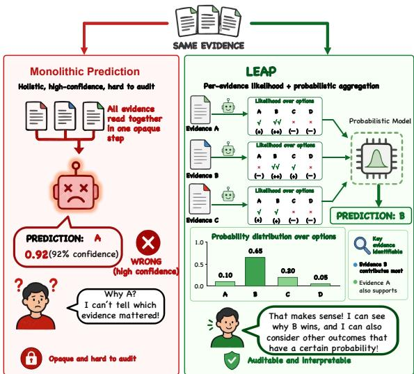
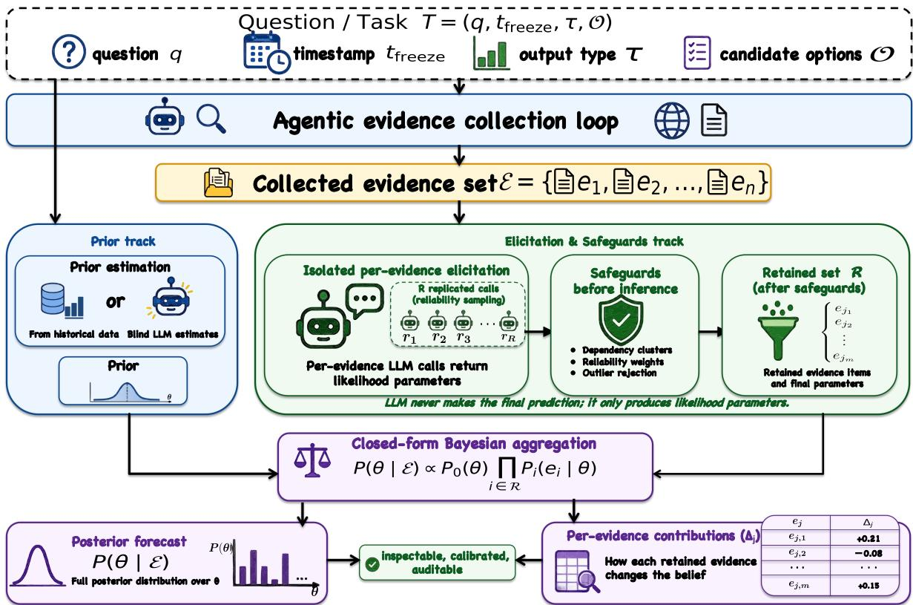
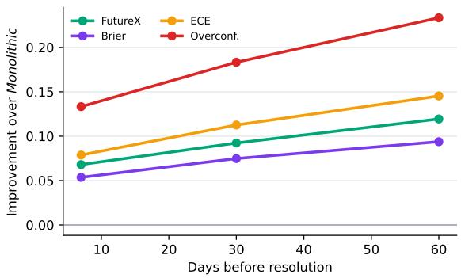

# LEAP: Likelihood Elicitation and Aggregation for LLM-based Probabilistic Forecasting

Yufei Chen1 Yiran Zhao2 Xiaogang Xu3,4,† Qipeng Xie5 Jiafei Wu3,4 Zhe Liu3,4,†

1Shandong University 2Nanjing University of Aeronautics and Astronautics 3School of Software Technology, Zhejiang University 4Ningbo Global Innovation Center, Zhejiang University 5The Hong Kong University of Science and Technology (Guangzhou)

## Abstract

LLM-based forecasting systems have improved on real-world tasks such as financial markets and sports outcomes, largely through stronger search and tool use. Many systems still ask an LLM to read all collected evidence together and produce the final forecast. We call this design Monolithic Prediction. It can obscure how individual evidence items affect the result and collapse uncertainty across competing outcomes. We propose LEAP (Likelihood Elicitation and Aggregation for Probabilistic forecasting), which reorganizes how collected evidence is used in the prediction stage. LEAP examines each evidence item separately and elicits likelihood parameters that describe its implications for the target. An explicit prior and a deterministic probabilistic model then combine these likelihoods into a posterior distribution. This procedure supports continuous, single-choice, and multi-choice forecasts while preserving reproducible evidence contributions. We build a benchmark covering forecasting, information-seeking, and browsing tasks, and evaluate LEAP on our own agent loop and several agent CLI frameworks. Given the same evidence, LEAP improves most prediction and calibration metrics across models and remains stronger under controlled comparisons of prior access, inference budget, and aggregation.1

## 1 Introduction

As large language models (LLMs) and agent harnesses mature, LLM-based agents are increasingly used for real-world forecasting, from economic and financial indicators to sports outcomes and geopolitical events (Zou et al., 2022; Karger et al., 2025; Yang et al., 2026; Halawi et al., 2024; Schoenegger et al., 2024; Alur et al., 2025). A representative system first runs an agent loop that searches the web and other sources for relevant material, then passes the collected evidence to one or more LLM calls that read it as a whole and produce the final prediction. Recent work has improved the first stage through agentic search loops, retrieval, tool use, web interaction, and source integration (Yan et al., 2024; Nakano et al., 2021; Yao et al., 2023; Schick et al., 2023; Trivedi et al., 2023; Qin et al., 2024; Liu et al., 2024b; Zhou et al., 2024; Deng et al., 2023; Xie et al., 2024). A common design for the second stage remains holistic: one or more LLM forecasting calls read everything gathered and write out the answer.

  
Figure 1: The Monolithic baseline can be confidently wrong without revealing which evidence drove the answer. LEAP exposes evidence-level support and combines it through a probabilistic update, making the prediction auditable.

This final prediction stage has two undesirable properties. First, it is opaque: the user can read the LLM’s rationale, but cannot isolate the influence of any specific evidence item on the result; as a result, the forecast may collapse evidence-supported uncertainty over competing outcomes into a single answer (DeYoung et al., 2020; Lyu et al., 2023). Second, because a point forecast requires one answer, the LLM must merge evidence from different sources into a single supporting context. In this long-context setting, the final prediction is more likely to be biased by LLM forgetting and hallucination (Liu et al., 2024a; Ji et al., 2023; Niu et al., 2024; Belém et al., 2025). Figure 1 illustrates this failure mode.

Probabilistic models provide a natural way to keep evidence interpretation separate from aggregation. BIRD uses LLM-generated factors and coarse probability judgments to parameterize a Bayesian model for probabilistic inference (Feng et al., 2025). Nafar et al. elicit conditional probabilities from LLMs to parameterize predefined Bayesian networks (Nafar et al., 2026). Concurrent work on the Bayesian Linguistic Forecaster maintains a structured belief state during iterative search and combines multiple forecasts through shrinkage and calibration (Murphy, 2026). These studies demonstrate practical ways to place LLM judgments inside structured probabilistic models. We apply the same general idea after evidence collection, using an explicit Bayesian model to combine the gathered evidence into a forecast.

We therefore propose LEAP (Likelihood Elicitation and Aggregation for Probabilistic forecasting), which reorganizes how gathered information is consumed in the final prediction step. Rather than asking the LLM to forecast from the full evidence bundle, LEAP uses it as a local interpreter: the LLM examines each evidence item in isolation and reports likelihood parameters describing what the evidence implies about the target. Alongside these likelihoods, a prior over the answer is also constructed, supplying a base rate before any evidence is examined. A deterministic probabilistic model then combines this prior with the individual evidence likelihoods and returns a posterior distribution over the answer.

This design gives LEAP two useful properties. First, the output is a posterior distribution rather than a point estimate, improving prediction accuracy and giving human decision makers richer information for comparing competing outcomes. Second, every step is inspectable: the user can see which evidence items entered the posterior, what each contributed, and how the final distribution was assembled. A forecast can therefore be audited at the level of individual evidence items, for example by removing one item and recomputing the prediction.

We evaluate LEAP on a benchmark drawn from FutureX, GAIA, and BrowseComp (Zeng et al., 2026; Mialon et al., 2024; Wei et al., 2025), covering forecasting, information-seeking, and browsing tasks. To make the comparison fair, the evaluation uses strict temporal isolation, model selection constrained by knowledge cutoffs, and a shared evidence set for both methods (details in Section 5.1). Under this setup, LEAP improves over Monolithic on most settings and metrics, both on our custom agent loop across multiple base models and as a probability skill atop several agent CLI frameworks used in practice.

Our contributions are: (1) we study how a fixed evidence set should be converted into a probabilistic forecast and isolate this prediction step from evidence collection; (2) we propose LEAP, which uses the LLM as a local interpreter of each evidence item and aggregates its outputs through a deterministic probabilistic model into a posterior over the answer; (3) we construct a benchmark covering forecasting, information-seeking, and browsing tasks on which LEAP improves prediction accuracy and probabilistic quality across multiple base models and several agent CLI frameworks; and (4) we provide diagnostic analyses showing where the gains come from and how forecasts can be audited at the evidence-item level.

## 2 Related Work

LLM-based forecasting systems. LLM-based forecasting has moved from benchmark construction toward systems that combine search, reasoning, aggregation, and calibration. AutoCast introduced temporally grounded forecasting questions with timestamped evidence (Zou et al., 2022); Auto-Cast++ improved world event prediction through zero-shot context retrieval and summarization (Yan et al., 2024); ForecastBench extends this line with a dynamic benchmark and human comparisons (Karger et al., 2025); and Prophet Arena studies the predictive intelligence of LLMs in forecasting settings (Yang et al., 2026). Concurrent work shows that ensembles of LLM forecasters can approach human crowd forecasts on binary questions (Schoenegger et al., 2024). Recent systems give the LLM search access and combine decomposition, retrieval, ensembling, and calibration after prediction, but the final forecast is still produced by LLM calls that read the gathered material as a whole (Halawi et al., 2024; Alur et al., 2025). We focus on what happens after evidence collection: how should fixed evidence be converted into the final prediction? Our method assesses what each evidence item implies about the candidate outcomes and keeps these local assessments separate until aggregation.

LLM-assisted Bayesian inference. BIRD uses LLM-generated factors and coarse probability judgments to parameterize a Bayesian model for probabilistic inference (Feng et al., 2025). Nafar et al. elicit conditional probabilities from LLMs to parameterize predefined Bayesian networks, especially when observed data are limited (Nafar et al., 2026). The Bayesian Linguistic Forecaster maintains a linguistic belief state during iterative search and combines multiple forecasts through shrinkage and calibration (Murphy, 2026). These systems show how LLM judgments can support structured probabilistic inference.

Evidence collection and agent evaluation. Agent methods are directly relevant to the first stage of our setting: collecting and organizing evidence before the prediction is made. Retrieval-augmented generation and passage readers ground generation and open-domain question answering in external documents (Lewis et al., 2020; Izacard and Grave, 2021), retrieval can reduce hallucination in dialogue (Shuster et al., 2021), WebGPT connects browser use with long-form question answering (Nakano et al., 2021), and ReAct interleaves reasoning and acting (Yao et al., 2023). Related methods decompose questions, sample multiple reasoning paths, learn tool use, call large API collections, or reflect on previous attempts (Press et al., 2023; Wei et al., 2022; Wang et al., 2023; Schick et al., 2023; Patil et al., 2024; Qin et al., 2024; Shinn et al., 2023). Agent benchmarks then score the combined effect of search, reasoning, tool use, and answer generation, from multi-hop QA and interleaved retrieval to web, desktop, browsing, and forecasting tasks (Yang et al., 2018; Trivedi et al., 2023; Liu et al., 2024b; Zhou et al., 2024; Deng et al., 2023; Xie et al., 2024; Mialon et al., 2024; Wei et al., 2025; Zou et al., 2022; Karger et al., 2025; Zeng et al., 2026). These evaluations score whole systems; our protocol holds the gathered evidence fixed, isolating how that evidence is turned into a forecast.

Auditability and faithful explanations. Our focus on evidence-level auditability is related to work on rationales and faithful explanations in NLP. ERASER evaluates rationalized models using human-marked supporting evidence and faithfulness metrics (DeYoung et al., 2020). Faithful chainof-thought work similarly argues that a reasoning trace is most useful when it is coupled to the computation that produces the answer, for example by delegating final execution to a deterministic solver (Lyu et al., 2023). LEAP follows this principle in forecasting: the LLM supplies local evidence interpretations, while the posterior and evidence contributions are computed by an explicit probabilistic update rather than by a simple explanation written after the fact.

Scope of LEAP. LEAP operates after an upstream system has collected evidence and focuses on the final prediction step. BIRD builds a Bayesian model from LLM-generated factors for a target query, while Nafar et al. parameterize predefined domain-level networks from LLM judgments (Feng et al., 2025; Nafar et al., 2026). LEAP starts from retrieved evidence for one forecasting task and elicits one likelihood per item. The Bayesian Linguistic Forecaster maintains a structured belief state during iterative search and aggregates calibrated forecasts across trials (Murphy, 2026); LEAP keeps evidence collection and prediction separate, then computes a posterior after the evidence set is fixed. This design is motivated by known weaknesses of holistic synthesis, including longcontext underuse (Liu et al., 2024a), unsupported factual claims in long outputs (Min et al., 2023), and hallucination relative to supplied sources (Niu et al., 2024; Ji et al., 2023; Belém et al., 2025), as well as probabilistic forecasting principles that favor calibrated distributions under proper scoring rules (Guo et al., 2017; Brier, 1950; Gneiting and Raftery, 2007). Because LEAP only requires a task, a fixed evidence set, and an output type, it can plug into different forecasting agents, browsing agents, or agent CLI frameworks. The output type selects the local likelihood schema and posterior family, but the collection interface stays fixed. This interface supports continuous, single-choice, and multi-choice targets across different upstream systems. The LLM interprets each evidence item locally, while an explicit probabilistic model performs the final combination, yielding forecasts that are more auditable than a single free-text rationale.

## 3 Problem Formulation

## 3.1 Task and Two-Stage Decomposition

A forecasting task is specified by a tuple

$$
T = ( q , t _ { \mathrm { f r e e z e } } , \tau , \mathcal { O } ) ,\tag{1}
$$

where $q$ is the question; $t _ { \mathrm { f r e e z e } }$ is the cutoff time, so usable information must be timestamped no later than this time; τ is the output type, either continuous, single-choice, or multi-choice; and O is an optional set of candidate options for discrete outputs. We decompose evidence-grounded LLM forecasting into two stages. A collection stage uses an agent loop to gather evidence items

$$
\mathcal { E } = \{ e _ { 1 } , \ldots , e _ { n } \} ,\tag{2}
$$

where each $e _ { i }$ is a text passage with a timestamp at or before $t _ { \mathrm { f r e e z e } }$ . A prediction stage then maps $( T , \mathcal { E } )$ to a forecast $f .$ . The prediction stage may read $\mathcal { E }$ but performs no additional retrieval.

## 3.2 Forecast Targets

The output type τ determines both the latent quantity and the form of the forecast $f .$ We consider three types: continuous targets for numeric quantities, single-choice targets where exactly one of $K$ options is correct, and multi-choice targets where any subset of K options may be correct.

Continuous. The latent target $\theta \in \mathbb { R }$ is a realvalued quantity, such as a closing price or a published economic indicator. The forecast reports values at fixed quantile levels, such as the median and the 10th and 90th percentiles, capturing both central tendency and uncertainty.

Single-choice. The latent target $\theta \in \{ 1 , \ldots , K \}$ is exactly one of the K candidate options in $\mathcal { O }$ The forecast is a probability distribution over these options: a vector $\mathbf { \bar { \boldsymbol { f } } } \in [ 0 , 1 ] ^ { \mathbf { \bar { \boldsymbol { K } } } }$ whose entries sum to one, with $f _ { k }$ giving the probability that option $k$ is the correct one.

Multi-choice. The latent target $\theta \in \{ 0 , 1 \} ^ { K }$ is a vector of yes/no labels, one per option in $\mathcal { O } _ { \cdot }$ . The forecast $f \in [ 0 , 1 ] ^ { K }$ assigns one probability to each option, with $f _ { k }$ being the probability that option k is true. Because options are evaluated independently rather than as alternatives, the entries of $f$ need not sum to one.

## 3.3 Monolithic Baseline and Evaluation Protocol

The comparison baseline is Monolithic Prediction. It uses the same LLM and the same E as our method, reads $( T , \mathcal { E } )$ in a single prompt, and emits a forecast $f$ in the form specified by τ in one pass.

Operationally, both methods share the same collection stage and are applied to the same $( T , \mathcal { E } )$ ; they differ only in how that evidence is consumed during prediction. For continuous targets, Monolithic would normally return a single number; we additionally ask it to provide an uncertainty range around that number so continuous predictions can be compared under the same scoring setup.

For each task $T _ { \cdot }$ , the collection stage is run once to produce a single $\mathcal { E } _ { : }$ and both methods are applied to the same $( T , \mathcal { E } )$ . Score differences can therefore be attributed to how evidence is turned into a forecast, not to retrieval differences or search budget.

## 4 Method

LEAP instantiates the prediction stage of Section 3.1: it consumes $( T , \mathcal { E } )$ and returns a forecast $f$ in the form specified by $\tau .$ . Its key design choice is not to ask the LLM for $f .$ Instead, prediction is divided into local parameter elicitation, in which the LLM analyzes one evidence item at a time and estimates parameters for an explicit probabilistic model, and deterministic aggregation, in which the probabilistic model combines these parameters with a prior through a closed-form update to produce the final prediction. The LLM thus supplies local evidence interpretations, while the probabilistic model makes the final judgment after all evidence items have been analyzed. Figure 2 illustrates the complete procedure, including the upstream collection loop that constructs $\mathcal { E } .$

## 4.1 Probabilistic Model

LEAP starts from a Bayesian probability model on the prediction target $\theta ,$ the unknown answer variable, and the evidence in $\mathcal { E }$

$$
\theta \sim P _ { 0 } ( \theta ) , \qquad e _ { i } \mid \theta \stackrel { \mathrm { \scriptsize ~ i n d e p } } { \sim } P _ { i } ( e _ { i } \mid \theta ) ,\tag{3}
$$

for $i = 1 , \ldots , n$ . The prior $P _ { 0 }$ encodes a base rate for θ before any evidence is examined. Each conditional $P _ { i }$ describes what the appearance of $e _ { i }$ implies about θ, under the working conditional independence assumption $e _ { i } \perp e _ { j } \mid \theta$ for $i \neq j$ Because duplicated or common-source evidence can violate this, LEAP later clusters dependent evidence before aggregation. For any retained subset ${ \mathcal { R } } \subseteq \{ 1 , \ldots , n \}$ , the unweighted posterior follows Bayes’ rule:

$$
P ( \boldsymbol { \theta } \mid \mathcal { E } ) \propto P _ { 0 } ( \boldsymbol { \theta } ) \prod _ { i \in \mathcal { R } } P _ { i } ( e _ { i } \mid \boldsymbol { \theta } ) .\tag{4}
$$

We instantiate $P _ { 0 }$ and $\{ P _ { i } \}$ as conjugate pairs so Equation (4) is closed form. Our experiments use a tempered version with role weights, reducing to Equation (4) at unit temperature and weights. The three output types of Section 3.2 use a Gaussian conjugate pair for continuous targets, a categorical pair with multinomial likelihood for singlechoice targets, and independent Bernoulli pairs for multi-choice targets; closed-form updates are in Appendix A.

## 4.2 Parameter Elicitation

The LLM estimates parameters of $P _ { 0 }$ and each $P _ { i } ;$ it does not output a forecast over θ. This is a constrained use of the model’s reasoning ability: modern LLMs are trained and evaluated on analytical and mathematical tasks, so LEAP uses them to estimate local likelihood signals while leaving the posterior update to the probabilistic model. Each evidence-level call analyzes $T$ with one evidence item and returns a structured likelihood schema. The call may see that item, but not the full evidence set, other evidence items, accumulated evidence, or any partial posterior. It therefore returns inputs to likelihood factors, not an answer or a final probability. Elicitation has two tasks: estimating prior parameters before any evidence is consulted, and estimating likelihood parameters for each $e _ { i }$ from that evidence item alone.

Prior parameters. The parameters of $P _ { 0 }$ come from the most informative source available. When the target has a recent and reliable numerical history, such as a market price or macroeconomic index, the prior is computed from that history. Otherwise, a single LLM call with no evidence visible returns prior parameters from background knowledge alone. For discrete tasks that lack even a reliable background base rate, we use an unbiased and conservative prior. The prompt forbids conditioning on specific evidence, since the prior should record a base rate before evidence is examined; letting the prior call read evidence would count that evidence twice in Equation (4).

Evidence likelihood parameters. Each evidence item $e _ { i }$ is sent to the LLM in isolation: the model sees $T$ and exactly one evidence item, never other sources, accumulated evidence, or partial posteriors. The prompt does not ask for a prediction; it elicits how $e _ { i }$ bears on each candidate outcome. The output is a structured qualitative schema for $P _ { i }$ , plus a dependency key identifying the source family of $e _ { i }$ .

For continuous targets, the LLM extracts a targetscale observation from $\textstyle e _ { i } \colon$ an explicit reported value when present, or a qualitative assessment otherwise. This observation becomes the likelihood mean $\mu _ { i }$ . The likelihood standard deviation $\sigma _ { i }$ reflects evidence strength, determined by the qualitative label and sampling agreement. Appendix B details the schema and strength calibration.

For single-choice targets, the LLM returns qualitative support labels for each option k, which determine non-normalized likelihoods $L _ { i } ( k ) = P ( e _ { i } \mid$ $\theta = k )$ . For multi-choice targets, it returns support and opposition labels that determine log likelihood ratios. These mappings follow standard elicitation practice for converting qualitative assessments into likelihood parameters. Appendix B gives the complete schema.

## 4.3 Deterministic Aggregation

Given the elicited prior and likelihood parameters and the retained evidence set R, aggregation is deterministic and uses no additional LLM call: it evaluates the posterior over the retained representatives, reads out the forecast in the form required by τ , and decomposes the update into evidence contributions.

Posterior update. The tempered posterior update is evaluated over R using the closed-form conjugate update for the chosen family. The forecast $f$ is a direct readout of the resulting distribution: quantiles for continuous targets, normalised option probabilities for single-choice targets, and Bernoulli marginals for multi-choice targets.

Per-evidence contribution. For each retained item $j \in \mathcal R$ , we recompute the update with $j$ excluded and report the resulting forecast change as a leave-one-out contribution $\Delta _ { j }$ . Because the computation is deterministic and closed form, $\Delta _ { j }$ is reproducible by running the update on $\mathcal { R } \setminus \{ j \}$ Appendix A gives the concrete form for each τ.

  
Figure 2: Overview of LEAP. After evidence collection, isolated LLM calls estimate a prior and one likelihood per evidence item. LEAP applies safeguards, performs a closed-form Bayesian update, and reports the posterior forecast with leave-one-out contributions $\Delta _ { j }$

## 4.4 Safeguard Components

Dependency clustering. The conditional independence assumption in Equation (3) can fail when evidence items share a source, e.g., multiple pages quoting one report. LEAP uses the dependency key returned with each likelihood to group commonsource evidence and retain one representative per group; only the retained set R enters the posterior update. Appendix C describes how equivalent keys are canonicalised.

Reliability sampling. A single local likelihood query may be noisy. LEAP can repeat the same query for an evidence item R times and use agreement across draws as a reliability adjustment. These draws are not a forecast ensemble: each draw still sees only $( T , e _ { i } )$ and returns the same local schema. Agreement only shrinks or preserves the local likelihood magnitude, and the final forecast is still produced once by the deterministic aggregation step.

Outlier rejection. For continuous targets with a data-derived prior, the prior serves as a numerical anchor for implausible elicited observations: if an evidence likelihood mean exceeds four prior standard deviations from the prior mean, the item is excluded from R as a likely elicitation error (e.g., a unit mismatch). This rule is not applied when the prior is itself elicited without historical data.

## 5 Experiments

## 5.1 Setup

Benchmark. The benchmark draws forecasting and information-seeking tasks from FutureX (Zeng et al., 2026), GAIA (Mialon et al., 2024), and BrowseComp (Wei et al., 2025), and converts each task into the tuple of Section 3.1. The output type τ follows the ground truth answer type, and ranking resolutions are excluded. Appendix D reports counts, conversion rules, tfreeze assignment, and the temporal leakage audit.

Evaluation settings. We evaluate LEAP in two settings, both using a single evidence set E shared by Monolithic and LEAP for each task. To avoid evidence leakage, retrieval is restricted to material available no later than the task timestamp, and the base models are chosen so that their knowledge cutoffs precede the evaluated timestamps. The first setting uses our ReAct-style agent loop across five base models: DeepSeek-V3.2, Gemini-3.1-Flash-Lite, Claude-Haiku-4.5, GPT-5.4-mini, and Grok-4.20-Fast. The second applies LEAP as a probability skill on unmodified traces from four external agent CLI frameworks: DeerFlow, Hermes, Open-Claw, and MiroFlow.

Metrics. All metrics are computed on our constructed benchmark. The FutureX composite score (Zeng et al., 2026) is the headline metric across all output types. Accuracy, Brier score (Brier, 1950), and Spherical score (Gneiting and Raftery, 2007) are computed on discrete tasks; NCRPS, a length-normalised variant of the continuous ranked probability score, is computed on continuous tasks (Gneiting and Raftery, 2007). Calibration diagnostics, including expected calibration error and overconfidence, are reported in Section 5.3, with formal definitions in Appendix D.

## 5.2 Main Results

Comparison across models on our Agent Loop. Table 1 compares Monolithic and LEAP with our ReAct-style agent loop fixed and the base model varied. For every base model, LEAP improves FutureX, Spherical score, and accuracy. Absolute gains range from 3.6 to 18.1 points on FutureX and from 2.5 to 15.1 points on Spherical. NCRPS also improves for every base model, with gains above 50 points on GPT-5.4-mini and 30 points on Gemini-3.1-Flash-Lite. Brier is less uniform: LEAP improves it on three of five base models, while the other two are close or essentially tied. Section 5.3 interprets this with calibration diagnostics.

Robustness across external agent CLI frameworks. Table 2 reports the external agent CLI setting. The pattern from our loop largely carries over: across four frameworks, LEAP improves most reported metrics over Monolithic, with FutureX gains of 7.0 to 13.8 points and Brier reductions of 12.9 to 23.7 points. The macro-average row improves on all five metrics, with gains of 9.8 points on FutureX, 4.7 on accuracy, 16.5 on Brier, 14.1 on Spherical, and 12.9 on NCRPS. This suggests that LEAP can improve existing forecasting systems as a plug-in module without modifying their collection pipelines.

## 5.3 Analysis

We complement the main results with diagnostics on calibration, forecast horizons, and LEAP components, plus case studies showing evidence-level contributions. Appendix D describes the diagnostic subset and base model.

  
Figure 3: Absolute improvement of LEAP over Monolithic on the diagnostic subset as a function of the forecast horizon (days between evidence collection and ground truth resolution). All four reported metrics move further in LEAP’s favour as the horizon lengthens.

Calibration. Table 6 explains why Brier is the least uniform metric in Table 1. Following standard calibration evaluation (Guo et al., 2017), ECE measures the gap between top-option confidence and empirical accuracy; Adaptive ECE uses datadependent bins, and overconfidence averages the positive part of this gap. Although LEAP is close to or slightly behind Monolithic on Brier for DeepSeek-V3.2 and Gemini-3.1-Flash-Lite, it roughly halves both ECE variants (0.184 to 0.088, and 0.177 to 0.091) and reduces overconfidence by more than half (0.317 to 0.150). This indicates a calibration difference rather than a loss in predictive quality: Monolithic concentrates probability on one option, lowering Brier when it is right but paying with sharp overconfidence on the rest. LEAP spreads probability more conservatively and keeps confidence aligned with accuracy.

Robustness across forecast horizons. Forecasting becomes harder as the horizon between evidence collection and ground truth resolution lengthens. We split the subset into horizons of 7, 30, and 60 days and plot LEAP’s absolute improvement over Monolithic in Figure 3. All four curves rise monotonically: FutureX gain increases from 6.8 to 11.9 points, and the overconfidence gap widens from 13.3 to 23.3 points. As evidence becomes more indirect, Monolithic continues to commit firmly to a single option, while LEAP recognises weaker support in E and produces wider posteriors—degrading by becoming conservative rather

<table><tr><td>Model</td><td>Method</td><td>FutureX↑</td><td>Accuracy↑</td><td>Brier↓</td><td>Spherical↑</td><td>NCRPS↓</td></tr><tr><td rowspan="2">DeepSeek-V3.2</td><td>Monolithic</td><td>0.4895</td><td>0.6237</td><td>0.2308</td><td>0.5581</td><td>0.2594</td></tr><tr><td>LEAP</td><td>0.6701</td><td>0.6407</td><td>0.2374</td><td>0.7089</td><td>0.2578</td></tr><tr><td rowspan="2">Gemini-3.1-Flash-Lite</td><td>Monolithic</td><td>0.6004</td><td>0.6271</td><td>0.2334</td><td>0.6693</td><td>0.4916</td></tr><tr><td>LEAP</td><td>0.7069</td><td>0.6542</td><td>0.2336</td><td>0.7223</td><td>0.1419</td></tr><tr><td rowspan="2">Claude-Haiku-4.5</td><td>Monolithic</td><td>0.6211</td><td>0.5933</td><td>0.2638</td><td>0.6726</td><td>0.2432</td></tr><tr><td>LEAP</td><td>0.6569</td><td>0.6102</td><td>0.2522</td><td>0.6975</td><td>0.1605</td></tr><tr><td rowspan="2">GPT-5.4-mini</td><td>Monolithic</td><td>0.6456</td><td>0.6473</td><td>0.2741</td><td>0.6857</td><td>0.5413</td></tr><tr><td>LEAP</td><td>0.7222</td><td>0.6873</td><td>0.2100</td><td>0.7484</td><td>0.0200</td></tr><tr><td rowspan="2">Grok-4.20-Fast</td><td>Monolithic</td><td>0.6533</td><td>0.6314</td><td>0.2971</td><td>0.6750</td><td>0.1282</td></tr><tr><td>LEAP</td><td>0.7503</td><td>0.7133</td><td>0.1916</td><td>0.7571</td><td>0.1174</td></tr></table>

Table 1: Main comparison of Monolithic and LEAP across five base models under the evaluation protocol of Section 3, with our ReAct-style agent loop fixed across rows. Arrows indicate the better direction. The better value per (model, metric) is in bold.
<table><tr><td>Framework Method</td><td></td><td>FutureX↑</td><td>Accuracy↑</td><td>Brier↓</td><td>Spherical↑</td><td>NCRPS↓</td></tr><tr><td rowspan="2">DeerFlow</td><td>Monolithic</td><td>0.4135</td><td>0.3500</td><td>0.5757</td><td>0.3790</td><td>1.0000</td></tr><tr><td>LEAP</td><td>0.4832</td><td>0.3500</td><td>0.4360</td><td>0.4902</td><td>0.5024</td></tr><tr><td rowspan="2">Hermes</td><td>Monolithic</td><td>0.4238</td><td>0.3810</td><td>0.4925</td><td>0.4678</td><td>0.8661</td></tr><tr><td>LEAP</td><td>0.5619</td><td>0.4762</td><td>0.2552</td><td>0.6723</td><td>0.6721</td></tr><tr><td rowspan="2">OpenClaw</td><td>Monolithic</td><td>0.3472</td><td>0.1667</td><td>0.5296</td><td>0.3974</td><td>0.5142</td></tr><tr><td>LEAP</td><td>0.4396</td><td>0.2222</td><td>0.3674</td><td>0.5413</td><td>0.4808</td></tr><tr><td rowspan="2">MiroFlow</td><td>Monolithic</td><td>0.5630</td><td>0.5185</td><td>0.3683</td><td>0.5912</td><td>0.7611</td></tr><tr><td>LEAP</td><td>0.6545</td><td>0.5556</td><td>0.2393</td><td>0.7016</td><td>0.7593</td></tr><tr><td rowspan="2">Overall</td><td>Monolithic</td><td>0.4491</td><td>0.3721</td><td>0.4806</td><td>0.4712</td><td>0.7598</td></tr><tr><td>LEAP</td><td>0.5471</td><td>0.4186</td><td>0.3157</td><td>0.6117</td><td>0.6312</td></tr></table>

Table 2: Monolithic vs LEAP applied as a downstream probability skill on evidence collected by four external agent CLI frameworks. Arrows indicate the better direction. The better value per (framework, metric) is in bold. The Overall row is the macro-average across the four frameworks.

<table><tr><td>Method</td><td>FutureX↑ Brier↓</td><td>ECE↓</td></tr><tr><td>Monolithic</td><td>0.6512 0.2689</td><td>0.1840</td></tr><tr><td>LEAP w/o prior</td><td>0.6427 0.2808</td><td>0.2134</td></tr><tr><td>LEAP w/o dep. clustering</td><td>0.7089 0.2299</td><td>0.1578</td></tr><tr><td>LEAP w/o reliab. sampling</td><td>0.7136 0.2215</td><td>0.1219</td></tr><tr><td>Full LEAP</td><td>0.7284 0.2057</td><td>0.0876</td></tr></table>

Table 3: Component ablation on the diagnostic subset. Each row removes one component from Full LEAP; Monolithic is reported for reference. Best values are in bold.

than confidently wrong.

Component ablation. Table 3 reports the results of removing the prior, dependency clustering, and reliability sampling one at a time.

Prior. Removing the prior drops FutureX below Monolithic (0.643 versus 0.651) and raises ECE to 0.213, making it the most important component on this subset: structured likelihood aggregation needs a stable starting point when local evidence is sparse or noisy.

Dependency clustering. Removing dependency clustering lowers FutureX by 1.9 points and raises ECE from 0.088 to 0.158, consistent with overcounting common source evidence and making the posterior sharper than the evidence warrants.

Reliability sampling. Removing reliability sampling has a smaller but consistent effect, lowering FutureX to 0.714 and raising ECE to 0.122; repeated local checks mainly protect against noisy likelihood estimates rather than supplying the main gain. All variants except the one without the prior remain above Monolithic on FutureX, so structured aggregation supplies most of the gain while these safeguards add robustness.

<table><tr><td>Method</td><td>Tokens/task</td><td>p50 / p95 (s)</td><td>FX↑</td><td>Brier↓</td><td>ECE↓</td></tr><tr><td>Monolithic</td><td>5,733</td><td>6.2/12.1</td><td>0.6512</td><td>0.2689</td><td>0.1840</td></tr><tr><td>Monolithic + same prior, one sample</td><td>6,521</td><td>9.1/17.0</td><td>0.6742</td><td>0.2510</td><td>0.1508</td></tr><tr><td>LEAP without reliability sampling</td><td>5,869</td><td>7.3/16.5</td><td>0.7136</td><td>0.2215</td><td>0.1219</td></tr><tr><td>Monolithic + same prior, two-sample mean</td><td>11,753</td><td>9.8/20.4</td><td>0.6736</td><td>0.2497</td><td>0.1471</td></tr><tr><td>LEAP</td><td>11,508</td><td>10.4/27.8</td><td>0.7284</td><td>0.2057</td><td>0.0876</td></tr></table>

Table 4: Prediction-time budget and latency under the diagnostic setup in Appendix D.4. The prior-matched Monolithic baselines control for prior access, and the two-sample mean controls for LEAP’s token budget.

<table><tr><td>Method</td><td>FX↑</td><td>Brier ↓</td><td>ECE↓</td></tr><tr><td colspan="3">Aggregation</td></tr><tr><td>Monolithic</td><td>0.6512</td><td>0.2689</td><td>0.1840</td></tr><tr><td>Linear opinion pool</td><td>0.6808</td><td>0.2389</td><td>0.1117</td></tr><tr><td>LEAP (η = 1.0)</td><td>0.7284</td><td>0.2057</td><td>0.0876</td></tr><tr><td colspan="4">Likelihood strength for LEAP</td></tr><tr><td>η = 0.5</td><td>0.7181</td><td>0.2166</td><td>0.1012</td></tr><tr><td>η = 1.0</td><td>0.7284</td><td>0.2057</td><td>0.0876</td></tr><tr><td>η = 2.0</td><td>0.7210</td><td>0.2139</td><td>0.1094</td></tr></table>

Table 5: Aggregation baseline and sensitivity to the global likelihood strength η, which scales the contribution of elicited likelihoods in the posterior update. The default is η = 1.0.

<table><tr><td>Metric</td><td>Monolithic</td><td>LEAP</td></tr><tr><td>FutureX↑</td><td>0.6512</td><td>0.7284</td></tr><tr><td>Brier↓</td><td>0.2689</td><td>0.2057</td></tr><tr><td>ECE↓</td><td>0.1840</td><td>0.0876</td></tr><tr><td>Adaptive ECE↓</td><td>0.1765</td><td>0.0912</td></tr><tr><td>Overconfidence↓</td><td>0.3167</td><td>0.1500</td></tr></table>

Table 6: Calibration diagnostics on the diagnostic subset. Arrows indicate the better direction; bold marks the better value.

Controlled baselines and inference efficiency. We also run controlled experiments to measure LEAP’s token cost and inference efficiency. Tables 4 and 5 show that LEAP retains its advantage when Monolithic receives the same prior or a comparable token budget, and that it performs better than linear opinion pooling. Its median latency is close to that of the two-sample ensemble, while its p95 latency is higher because completion time depends on the slowest evidence-level calls. Performance changes little across the tested likelihood strengths. Appendix D.10 reports alternative evidence grouping strategies and source-wise results.

Details and extended experiments. Appendix D reports prompts, the ReAct-style agent loop, the probability skill for external traces, additional sensitivity analyses, and case studies illustrating typical LEAP successes, failure modes, and how $\Delta _ { j }$ makes forecasts auditable at the evidence-item level.

## 6 Conclusion

This paper studied how LLM-based forecasting systems turn a fixed set of gathered evidence into a final prediction. Building on work that uses LLM judgments within probabilistic models, we proposed LEAP for this setting. LEAP leaves evidence collection unchanged, interprets each evidence item locally, and combines the resulting likelihoods with a prior through deterministic probabilistic aggregation.

Under a protocol that holds evidence fixed across methods, LEAP improves prediction accuracy and probabilistic quality in most settings and metrics across five base models and four external agent CLI frameworks. Calibration diagnostics show that LEAP roughly halves expected calibration error and overconfidence, with gains widening as the forecast horizon lengthens. Because inference is closed form, evidence contributions are reproducible by removing one item and rerunning the posterior update, yielding an audit signal not available from a free-text LLM rationale.

## Limitations

The scope of LEAP is the prediction step after evidence has already been collected. It changes how a fixed evidence set is converted into a forecast, but it does not improve the upstream collection stage itself. If the collected evidence is sparse, outdated, or only weakly relevant, LEAP will usually express that uncertainty in a wider posterior rather than recover information that was never retrieved.

Our evaluation is also bounded by the benchmark and model families studied here. We evaluate English forecasting and agentic information-seeking tasks with a fixed collection protocol and a limited set of base models. Extending the evaluation to other languages, specialised scientific domains, longer forecast horizons, and substantially different agent designs is left to future work. LEAP also uses more inference calls than Monolithic, since evidence items are interpreted separately and may be sampled more than once for local verification. This cost is the main practical tradeoff for the added calibration and auditability.

## Ethical Considerations

This work studies probabilistic forecasting systems that use LLMs. Their outputs should be understood as decision support rather than authoritative predictions. Forecasts about financial, political, public health, or similarly consequential events may affect downstream decisions if deployed in practice. Such systems should therefore be used with human oversight, clear uncertainty communication, and review by domain experts, especially in settings where incorrect forecasts could cause material harm.

LEAP is designed to make the prediction step more inspectable by exposing retained evidence items and their contributions, but this audit trail does not eliminate the risks inherited from the upstream evidence collection stage or from the underlying LLM. Retrieved sources may be incomplete, biased, outdated, or unevenly representative, and the LLM’s local interpretations may still reflect model biases or factual errors. The method should not be presented as removing the need for source verification or independent expert judgment.

Our experiments use benchmark tasks and collected evidence snapshots rather than private user data. We use existing benchmark artifacts only for research evaluation, and any converted derivatives are intended to remain research-only artifacts under the original access conditions, including the gated-access constraints attached to GAIA-derived records. More broadly, deployments that collect external evidence should respect data access policies, copyright restrictions, and privacy expectations of the sources they use. The same forecasting capabilities could also be misused to support manipulation, speculation, or strategic targeting; these risks are not specific to LEAP, but they are relevant to any system that improves the scalability or apparent credibility of automated forecasting.

## References

Rohan Alur, Bradly C. Stadie, Daniel Kang, Ryan Chen, Matt McManus, Michael Rickert, Tyler Lee,

Michael Federici, Richard Zhu, Dennis Fogerty, Hayley Williamson, Nina Lozinski, Aaron Linsky, and Jasjeet S. Sekhon. 2025. AIA forecaster: Technical report. CoRR, abs/2511.07678.

Catarina G. Belém, Pouya Pezeshkpour, Hayate Iso, Seiji Maekawa, Nikita Bhutani, and Estevam Hruschka. 2025. From single to multi: How LLMs hallucinate in multi-document summarization. In Findings of the Association for Computational Linguistics: NAACL 2025, pages 5291–5324, Albuquerque, New Mexico. Association for Computational Linguistics.

Glenn W. Brier. 1950. Verification of forecasts expressed in terms of probability. Monthly Weather Review, 78(1):1–3.

Xiang Deng, Yu Gu, Boyuan Zheng, Shijie Chen, Samuel Stevens, Boshi Wang, Huan Sun, and Yu Su. 2023. Mind2Web: Towards a generalist agent for the web. In Advances in Neural Information Processing Systems, volume 36, pages 28091–28114. Curran Associates, Inc.

Jay DeYoung, Sarthak Jain, Nazneen Fatema Rajani, Eric Lehman, Caiming Xiong, Richard Socher, and Byron C. Wallace. 2020. ERASER: A benchmark to evaluate rationalized NLP models. In Proceedings of the 58th Annual Meeting of the Association for Computational Linguistics, pages 4443–4458, Online. Association for Computational Linguistics.

Yu Feng, Ben Zhou, Weidong Lin, and Dan Roth. 2025. BIRD: A trustworthy bayesian inference framework for large language models. In The Thirteenth International Conference on Learning Representations, pages 8961–8989. OpenReview.net.

Tilmann Gneiting and Adrian E. Raftery. 2007. Strictly proper scoring rules, prediction, and estimation. Journal of the American Statistical Association, 102(477):359–378.

Chuan Guo, Geoff Pleiss, Yu Sun, and Kilian Q. Weinberger. 2017. On calibration of modern neural networks. In Proceedings ofthe 34th International Conference on Machine Learning, volume 70 of Proceedings ofMachine Learning Research, pages 1321– 1330. PMLR.

Danny Halawi, Fred Zhang, Chen Yueh-Han, and Jacob Steinhardt. 2024. Approaching human-level forecasting with language models. In Advances in Neural Information Processing Systems, volume 37, pages 50426–50468. Curran Associates, Inc.

Gautier Izacard and Edouard Grave. 2021. Leveraging passage retrieval with generative models for open domain question answering. In Proceedings of the 16th Conference of the European Chapter of the Associationfor Computational Linguistics: Main Volume, pages 874–880, Online. Association for Computational Linguistics.

Ziwei Ji, Nayeon Lee, Rita Frieske, Tiezheng Yu, Dan Su, Yan Xu, Etsuko Ishii, Yejin Bang, Andrea

Madotto, and Pascale Fung. 2023. Survey of hallucination in natural language generation. ACM Computing Surveys, 55(12):248:1–248:38.

Ezra Karger, Houtan Bastani, Chen Yueh-Han, Zachary Jacobs, Danny Halawi, Fred Zhang, and Philip E. Tetlock. 2025. ForecastBench: A dynamic benchmark of AI forecasting capabilities. In The Thirteenth International Conference on Learning Representations, pages 93943–93980. OpenReview.net.

Patrick Lewis, Ethan Perez, Aleksandra Piktus, Fabio Petroni, Vladimir Karpukhin, Naman Goyal, Heinrich Küttler, Mike Lewis, Wen-tau Yih, Tim Rocktäschel, Sebastian Riedel, and Douwe Kiela. 2020. Retrieval-augmented generation for knowledgeintensive NLP tasks. In Advances in Neural Information Processing Systems, volume 33, pages 9459– 9474. Curran Associates, Inc.

Nelson F. Liu, Kevin Lin, John Hewitt, Ashwin Paranjape, Michele Bevilacqua, Fabio Petroni, and Percy Liang. 2024a. Lost in the middle: How language models use long contexts. Transactions ofthe Associationfor Computational Linguistics, 12:157–173.

Xiao Liu, Hao Yu, Hanchen Zhang, Yifan Xu, Xuanyu Lei, Hanyu Lai, Yu Gu, Hangliang Ding, Kaiwen Men, Kejuan Yang, Shudan Zhang, Xiang Deng, Aohan Zeng, Zhengxiao Du, Chenhui Zhang, Sheng Shen, Tianjun Zhang, Yu Su, Huan Sun, and 3 others. 2024b. AgentBench: Evaluating LLMs as agents. In The Twelfth International Conference on Learning Representations, pages 52989–53046. OpenReview.net.

Qing Lyu, Shreya Havaldar, Adam Stein, Li Zhang, Delip Rao, Eric Wong, Marianna Apidianaki, and Chris Callison-Burch. 2023. Faithful chain-ofthought reasoning. In Proceedings of the 13th International Joint Conference on Natural Language Processing and the 3rd Conference ofthe Asia-Pacific Chapter of the Association for Computational Linguistics (Volume 1: Long Papers), pages 305–329, Nusa Dua, Bali. Association for Computational Linguistics.

Grégoire Mialon, Clémentine Fourrier, Thomas Wolf, Yann LeCun, and Thomas Scialom. 2024. GAIA: a benchmark for general AI assistants. In The Twelfth International Conference on Learning Representations, pages 9025–9049. OpenReview.net.

Sewon Min, Kalpesh Krishna, Xinxi Lyu, Mike Lewis, Wen-tau Yih, Pang Wei Koh, Mohit Iyyer, Luke Zettlemoyer, and Hannaneh Hajishirzi. 2023. FActScore: Fine-grained atomic evaluation of factual precision in long form text generation. In Proceedings ofthe 2023 Conference on Empirical Methods in Natural Language Processing, pages 12076–12100, Singapore. Association for Computational Linguistics.

Kevin Murphy. 2026. Agentic forecasting using sequential bayesian updating of linguistic beliefs. CoRR, abs/2604.18576.

Aliakbar Nafar, Kristen Brent Venable, Zijun Cui, and Parisa Kordjamshidi. 2026. Extracting probabilistic knowledge from large language models for bayesian network parameterization. Transactions on Machine Learning Research.

Reiichiro Nakano, Jacob Hilton, Suchir Balaji, Jeff Wu, Long Ouyang, Christina Kim, Christopher Hesse, Shantanu Jain, Vineet Kosaraju, William Saunders, Xu Jiang, Karl Cobbe, Tyna Eloundou, Gretchen Krueger, Kevin Button, Matthew Knight, Benjamin Chess, and John Schulman. 2021. WebGPT: Browser-assisted question-answering with human feedback. CoRR, abs/2112.09332.

Cheng Niu, Yuanhao Wu, Juno Zhu, Siliang Xu, KaShun Shum, Randy Zhong, Juntong Song, and Tong Zhang. 2024. RAGTruth: A hallucination corpus for developing trustworthy retrieval-augmented language models. In Proceedings of the 62nd Annual Meeting ofthe Associationfor Computational Linguistics (Volume 1: Long Papers), pages 10862– 10878, Bangkok, Thailand. Association for Computational Linguistics.

Shishir G. Patil, Tianjun Zhang, Xin Wang, and Joseph E. Gonzalez. 2024. Gorilla: Large language model connected with massive APIs. In Advances in Neural Information Processing Systems, volume 37, pages 126544–126565. Curran Associates, Inc.

Ofir Press, Muru Zhang, Sewon Min, Ludwig Schmidt, Noah A. Smith, and Mike Lewis. 2023. Measuring and narrowing the compositionality gap in language models. In Findings of the Association for Computational Linguistics: EMNLP 2023, pages 5687–5711, Singapore. Association for Computational Linguistics.

Yujia Qin, Shihao Liang, Yining Ye, Kunlun Zhu, Lan Yan, Yaxi Lu, Yankai Lin, Xin Cong, Xiangru Tang, Bill Qian, Sihan Zhao, Lauren Hong, Runchu Tian, Ruobing Xie, Jie Zhou, Mark Gerstein, Dahai Li, Zhiyuan Liu, and Maosong Sun. 2024. ToolLLM: Facilitating large language models to master 16000+ real-world APIs. In The Twelfth International Conference on Learning Representations, pages 9695–9717. OpenReview.net.

Timo Schick, Jane Dwivedi-Yu, Roberto Dessì, Roberta Raileanu, Maria Lomeli, Eric Hambro, Luke Zettlemoyer, Nicola Cancedda, and Thomas Scialom. 2023. Toolformer: Language models can teach themselves to use tools. In Advances in Neural Information Processing Systems, volume 36, pages 68539–68551. Curran Associates, Inc.

Philipp Schoenegger, Indre Tuminauskaite, Peter S. Park, Rafael Valdece Sousa Bastos, and Philip E. Tetlock. 2024. Wisdom of the silicon crowd: LLM ensemble prediction capabilities rival human crowd accuracy. Science Advances, 10(45):eadp1528.

Noah Shinn, Federico Cassano, Ashwin Gopinath, Karthik Narasimhan, and Shunyu Yao. 2023. Reflexion: Language agents with verbal reinforcement

learning. In Advances in Neural Information Processing Systems, volume 36, pages 8634–8652. Curran Associates, Inc.

Kurt Shuster, Spencer Poff, Moya Chen, Douwe Kiela, and Jason Weston. 2021. Retrieval augmentation reduces hallucination in conversation. In Findings of the Association for Computational Linguistics: EMNLP 2021, pages 3784–3803, Punta Cana, Dominican Republic. Association for Computational Linguistics.

Harsh Trivedi, Niranjan Balasubramanian, Tushar Khot, and Ashish Sabharwal. 2023. Interleaving retrieval with chain-of-thought reasoning for knowledgeintensive multi-step questions. In Proceedings of the 61st Annual Meeting ofthe Associationfor Computational Linguistics (Volume 1: Long Papers), pages 10014–10037, Toronto, Canada. Association for Computational Linguistics.

Xuezhi Wang, Jason Wei, Dale Schuurmans, Quoc V. Le, Ed H. Chi, Sharan Narang, Aakanksha Chowdhery, and Denny Zhou. 2023. Self-consistency improves chain of thought reasoning in language models. In The Eleventh International Conference on Learning Representations. OpenReview.net.

Jason Wei, Zhiqing Sun, Spencer Papay, Scott McKinney, Jeffrey Han, Isa Fulford, Hyung Won Chung, Alex Tachard Passos, William Fedus, and Amelia Glaese. 2025. BrowseComp: A simple yet challenging benchmark for browsing agents. CoRR, abs/2504.12516.

Jason Wei, Xuezhi Wang, Dale Schuurmans, Maarten Bosma, Brian Ichter, Fei Xia, Ed H. Chi, Quoc V. Le, and Denny Zhou. 2022. Chain-of-thought prompting elicits reasoning in large language models. In Advances in Neural Information Processing Systems, volume 35, pages 24824–24837. Curran Associates, Inc.

Tianbao Xie, Danyang Zhang, Jixuan Chen, Xiaochuan Li, Siheng Zhao, Ruisheng Cao, Toh Jing Hua, Zhoujun Cheng, Dongchan Shin, Fangyu Lei, Yitao Liu, Yiheng Xu, Shuyan Zhou, Silvio Savarese, Caiming Xiong, Victor Zhong, and Tao Yu. 2024. OSWorld: Benchmarking multimodal agents for open-ended tasks in real computer environments. In Advances in Neural Information Processing Systems, volume 37, pages 52040–52094. Curran Associates, Inc.

Qi Yan, Raihan Seraj, Jiawei He, Lili Meng, and Tristan Sylvain. 2024. AutoCast++: Enhancing world event prediction with zero-shot ranking-based context retrieval. In The Twelfth International Conference on Learning Representations, pages 34523–34539. OpenReview.net.

Qingchuan Yang, Simon Mahns, Sida Li, Anri Gu, Jibang Wu, and Haifeng Xu. 2026. LLM-as-aprophet: Understanding predictive intelligence with prophet arena. In The Fourteenth International Conference on Learning Representations, pages 107020– 107072. OpenReview.net.

Zhilin Yang, Peng Qi, Saizheng Zhang, Yoshua Bengio, William W. Cohen, Ruslan Salakhutdinov, and Christopher D. Manning. 2018. HotpotQA: A dataset for diverse, explainable multi-hop question answering. In Proceedings ofthe 2018 Conference on Empirical Methods in Natural Language Processing, pages 2369–2380, Brussels, Belgium. Association for Computational Linguistics.

Shunyu Yao, Jeffrey Zhao, Dian Yu, Nan Du, Izhak Shafran, Karthik R. Narasimhan, and Yuan Cao. 2023. ReAct: Synergizing reasoning and acting in language models. In The Eleventh International Conference on Learning Representations. OpenReview.net.

Zhiyuan Zeng, Jiashuo Liu, Siyuan Chen, Tianci He, Yali Liao, Yixiao Tian, Jinpeng Wang, Zaiyuan Wang, Yang Yang, Lingyue Yin, Mingren Yin, Zhenwei Zhu, Tianle Cai, Zehui Chen, Jiecao Chen, Yantao Du, Xiang Gao, Jiacheng Guo, Liang Hu, and 12 others. 2026. FutureX: An advanced live benchmark for LLM agents in future prediction. In The Fourteenth International Conference on Learning Representations, pages 19522–19563. OpenReview.net.

Shuyan Zhou, Frank F. Xu, Hao Zhu, Xuhui Zhou, Robert Lo, Abishek Sridhar, Xianyi Cheng, Tianyue Ou, Yonatan Bisk, Daniel Fried, Uri Alon, and Graham Neubig. 2024. WebArena: A realistic web environment for building autonomous agents. In The Twelfth International Conference on Learning Representations, pages 15585–15606. OpenReview.net.

Andy Zou, Tristan Xiao, Ryan Jia, Joe Kwon, Mantas Mazeika, Richard Li, Dawn Song, Jacob Steinhardt, Owain Evans, and Dan Hendrycks. 2022. Forecasting future world events with neural networks. In Advances in Neural Information Processing Systems, volume 35, pages 27293–27305. Curran Associates, Inc.

## A Closed-Form Posterior Updates

We collect here the tempered updates in closed form used for each output type, along with the corresponding form of the per-evidence contribution $\Delta _ { j } .$ . Throughout, R denotes the set of representatives retained after dependency clustering (Section 4.3), and the prior and per-evidence likelihood parameters are those elicited as in Section 4.2. Setting the temperature η and, where applicable, evidence weights $w _ { i }$ to one recovers the unweighted Bayesian updates implied by Equation (4).

## A.1 Continuous Targets

The target $\theta \in \mathbb { R }$ is modelled with a Gaussian prior, and each retained evidence item induces a Gaussian likelihood factor over θ:

$$
\theta \sim \mathcal { N } ( \mu _ { 0 } , \sigma _ { 0 } ^ { 2 } ) , \qquad \tilde { L } _ { i } ( \theta ) \propto \mathcal { N } ( \theta ; \mu _ { i } , \sigma _ { i } ^ { 2 } ) .\tag{5}
$$

Define the precision $\tau _ { x } = 1 / \sigma _ { x } ^ { 2 }$ . The posterior is Gaussian with precision $\begin{array} { r } { \tau _ { \mathrm { p o s t } } = \tau _ { 0 } + \eta \sum _ { i \in \mathcal { R } } \tau _ { i } } \end{array}$ and mean

$$
\mu _ { \mathrm { p o s t } } = \frac { 1 } { \tau _ { \mathrm { p o s t } } } \Bigg ( \mu _ { 0 } \tau _ { 0 } + \eta \sum _ { i \in \mathcal { R } } \mu _ { i } \tau _ { i } \Bigg ) .\tag{6}
$$

The forecast $f$ reports quantile values of $\mathcal { N } ( \mu _ { \mathrm { p o s t } } , 1 / \tau _ { \mathrm { p o s t } } )$ at the predefined levels of Section 3.2. The per-evidence contribution is the signed shift in the posterior mean,

$$
\Delta _ { j } = \mu _ { \mathrm { p o s t } } - \mu _ { \mathrm { p o s t } } ^ { ( - j ) } ,\tag{7}
$$

where $\mu _ { \mathrm { p o s t } } ^ { ( - j ) }$ is recomputed over $\mathcal { R } \setminus \{ j \}$

## A.2 Single-Choice Targets

The target $\theta \in \{ 1 , \ldots , K \}$ is modelled with a categorical prior $\bar { \pi _ { 0 } } \in \Delta ^ { K - 1 }$ and per-evidence likelihoods $L _ { i } ( k ) ~ = ~ P ( e _ { i } ~ \mid ~ \theta ~ = ~ k )$ The qualitative judgments of Section 4.2 are mapped to $L _ { i } ( k )$ through a fixed table that assigns higher likelihood to options the evidence supports and lower likelihood to options the evidence opposes, with relevance acting as the magnitude of the asymmetry. The posterior is computed in log space for numerical stability. Let α denote the prior power and $w _ { i }$ the evidence weight based on role:

$$
\log \pi _ { \mathrm { p o s t } } ( k ) \propto \alpha \log \pi _ { 0 } ( k ) + \eta \sum _ { i \in \mathcal { R } } w _ { i } \log L _ { i } ( k ) ,\tag{8}
$$

followed by softmax normalisation over $k .$ The forecast f is the normalised vector $\pi _ { \mathrm { p o s t } }$ . The perevidence contribution is the signed shift in the probability of the most likely option:

$$
\Delta _ { j } = \pi _ { \mathrm { p o s t } } ( \hat { k } ) - \pi _ { \mathrm { p o s t } } ^ { ( - j ) } ( \hat { k } ) ,\tag{9}
$$

where $\hat { k } =$ arg maxk πpost(k).

## A.3 Multi-Choice Targets

The target ${ \theta } ~ \in ~ \{ 0 , 1 \} ^ { K }$ uses an independent Bernoulli prior $\pi _ { 0 } ( k ) ~ \in ~ ( 0 , 1 )$ per option, and per-evidence likelihoods parameterised by a pair $( p _ { i , k } ^ { \mathrm { t r u e } } , p _ { i , k } ^ { \mathrm { f a l s e } } )$ giving the probability of observing $e _ { i }$ when option k is or is not in the correct set. Mapping from the qualitative judgments of Section 4.2 proceeds as in the single-choice case, applied per option. Let $\ell _ { i } ( k ) = \log ( p _ { i , k } ^ { \mathrm { t r u e } } / p _ { i , k } ^ { \mathrm { f a l s e } } )$ denote the log-likelihood ratio per option. The independent posterior update is

$$
\displaystyle \mathrm { l o g i t } \bigl ( \pi _ { \mathrm { p o s t } } ( k ) \bigr ) \ = \ \mathrm { l o g i t } \bigl ( \pi _ { 0 } ( k ) \bigr ) + \eta \sum _ { i \in { \mathcal R } } w _ { i } \ell _ { i } ( k ) ,\tag{10}
$$

and the forecast $f ~ \in ~ [ 0 , 1 ] ^ { K }$ has entries $f _ { k } \ =$ $\sigma ( \mathrm { l o g i t } ( \pi _ { \mathrm { p o s t } } ( k ) ) )$ , which are not constrained to sum to one. The per-evidence contribution is the $L _ { 1 }$ distance between the option marginals with and without item $j \colon$

$$
\Delta _ { j } \ = \ \sum _ { k = 1 } ^ { K } \bigl | \pi _ { \mathrm { p o s t } } ( k ) - \pi _ { \mathrm { p o s t } } ^ { ( - j ) } ( k ) \bigr | .\tag{11}
$$

## B Mappings from Elicitation to Likelihoods

This section records the deterministic maps used to convert local LLM judgments and evidence metadata into the likelihood parameters consumed by Appendix A. The LLM is asked to interpret one evidence item at a time; the numerical uncertainty, reliability shrinkage, caps based on evidence role, and posterior aggregation are then applied by fixed code paths. These constants were fixed before the final evaluation runs and were not tuned separately for individual test tasks or base models.

Reliability sampling is applied after the raw maps in Table 8. For single-choice tasks, repeated likelihood samples are normalised only for estimating reliability; the reliability score is the agreement on the top option multiplied by an exponential penalty on average $L _ { 1 }$ disagreement, and the raw likelihood vector is shrunk toward the uniform vector by that score. For multi-choice tasks, LEAP takes the median sampled log-LR per option, estimates reliability from sign agreement and $L _ { 1 }$ disagreement, shrinks the log-LR magnitudes by that score, and then clips them by the cap for the evidence role. The aggregation step also applies an evidence weight based on role in [0.05, 1.5]; for singlechoice tasks, multiple retained items peaking at the same option are discounted by rank within that group with the same direction.

## C Engineering Safeguards

We document here the engineering choices that surround the core aggregation path of Section 4. None of them changes the form of the posterior update; each protects the update against a specific failure mode of the elicitation step.

## C.1 Dependency Key Canonicalisation

The dependency keys returned by the LLM are short strings in free text, and semantically equivalent keys may be written with minor surface variations (different word order, hyphenation, or stopwords). To make the clustering step in Section 4.3 insensitive to such variations, each raw key is mapped to a canonical form by lowercasing, splitting on common separators, removing a fixed list of stopwords, sorting the remaining tokens, and joining them with a single delimiter. Two raw keys collapse to the same canonical form whenever their token sets agree, so that keys such as bafta\_2026\_longlist\_leading\_actress and bafta\_longlist\_2026\_leading\_actress are recognised as referring to the same underlying source.

<table><tr><td>Metadata field</td><td>Value</td><td>Mapping applied to the relative stan- dard deviation  $r _ { i }$ </td></tr><tr><td>measurement_scope</td><td>direct_target; proxy_signal; other/context</td><td>Initialise  $r _ { i }$  to 0.08, 0.18, or 0.45, respec- tively.</td></tr><tr><td>observation_type</td><td>point; interval; bound; other</td><td>Multiply by 0.85, 1.00, 1.15, or 1.20.</td></tr><tr><td>source_tier</td><td>A; B; C; other</td><td>Multiply by 0.80, 0.95, 1.15, or 1.10.</td></tr><tr><td>strength</td><td>strong; weak</td><td>Multiply by 0.85 or 1.20.</td></tr><tr><td>reliability</td><td>high; low</td><td>Multiply by 0.85 or 1.15.</td></tr><tr><td>target_match</td><td>exact/direct/same variable; partial/related; unknown/indirect</td><td>Multiply by 0.90, 1.05, or 1.10.</td></tr><tr><td>Direct target recency</td><td>≤ 7 days; ≤ 30 days; older</td><td>Multiply by 0.80, 1.00, or 1.25.</td></tr><tr><td>Threshold numeric</td><td>lower or upper bound wording</td><td>Enforce  $r _ { i } \ \geq \ 0 . 1 0$  so a threshold does not collapse the posterior.</td></tr><tr><td>Final clamp</td><td>all evidence</td><td>Clamp  $r _ { i }$  to [0.03, 1.25].</td></tr></table>

Table 7: Metadata map for continuous targets. For an evidence item with scale $s _ { i } , \mathrm { L E A P }$ sets the data uncertainty to $r _ { i } s _ { i } .$ . With reliability sampling, the final likelihood standard deviation is $\begin{array} { r } { \sigma _ { i } = \sqrt { \sigma _ { \mathrm { d a t a } , i } ^ { 2 } + \sigma _ { \mathrm { e l i c i t a t i o n } , i } ^ { 2 } } , } \end{array}$ and qualitative evidence that is only contextual is additionally floored at 0.35si.

## C.2 Calibration Table for Continuous Likelihoods

For continuous targets, the LLM returns a location estimate $\mu _ { i }$ or an effect relative to an anchor, while the uncertainty $\sigma _ { i }$ is assigned by the fixed metadata map in Table 7. This keeps the scale of each likelihood tied to auditable evidence metadata rather than to an unconstrained confidence value reported by the LLM.

## C.3 Outlier Rejection

When the prior is estimated from data, we treat it as a numerical anchor against which clearly miscalibrated elicitations can be flagged. An item whose elicited mean lies more than four standard deviations of the prior away from $\mu _ { 0 }$ is excluded from R as a likely elicitation error (typically a unit mismatch, a stale memory of a prior value of the target, or a confused asset reference). This rule is not applied when the prior is itself blind to evidence, because in that case there is no trusted reference against which to flag outliers.

## D Additional Experimental Details

## D.1 Benchmark Construction

Forecasting questions are drawn from FutureX after removing ranking resolutions, which our output types do not cover. Information-seeking and browsing tasks are drawn from GAIA and BrowseComp and rewritten into structured probabilistic tasks. The construction proceeds in four stages: source selection, structured rewriting, manual review, and final assembly. Manual review checks answer type validity, distractor plausibility, label conflicts, and temporal leakage risk before an item enters the final manifest. Table 9 reports the resulting counts.

For FutureX, the freeze time $t _ { \mathrm { f r e e z e } }$ is the original question time associated with the forecasting item. For GAIA and BrowseComp, whose original tasks are static question answering problems, $t _ { \mathrm { f r e e z e } }$ is assigned from the benchmark snapshot used during construction; it acts as a retrieval cutoff for the converted task, not as a forecast resolution date. Structured rewriting pairs the gold answer with plausible distractors that match its surface type and semantic class, removes duplicate or trivially invalid options, and drops items whose answer cannot be represented cleanly as single\_choice, multi\_choice, or continuous. The final assembly also applies a quarantine file for manually verified label conflicts, which accounts for three removed FutureX items and three removed GAIA continuous items.

The final manifest is evaluation-only. Because we do not train, fine-tune, or select models on this benchmark, we do not define train/dev/test splits; the 347 retained tasks are used for the reported evaluation, and the separate 60-task diagnostic subset is used only for the analyses in Section 5.3.

<table><tr><td>Local evidence judgment</td><td>Single-choice likelihood Multi-choice  $L _ { i } ( \bar { k } )$ </td><td>li(k)</td><td>log-LR Use case</td><td></td></tr><tr><td>Irrelevant to the option set</td><td>All options near 0.5; after normalisation this carries little information.</td><td> $p _ { i , k } ^ { \mathrm { t r u e } } \approx p _ { i , k } ^ { \mathrm { f a l s e } } \approx 0 . 5 ,$   $\begin{array} { r } { \ell _ { i } ( k ) \approx 0 . } \end{array}$ </td><td>so Prompt-calibrated neutral evidence.</td><td></td></tr><tr><td>Strong support for option k</td><td>Supported option in [0.70, 0.95] and alterna- 0.15, so li(k) ≈ 1.735. tives in [0.05, 0.20].</td><td> $p _ { i , k } ^ { \mathrm { t r u e } } ~ \approx ~ 0 . 8 5 , ~ p _ { i , k } ^ { \mathrm { f a l s e } }$ </td><td>evidence.</td><td>≈ Prompt-calibrated positive</td></tr><tr><td>Strong opposition to option k</td><td>Opposed option in the low likelihood range, with the exact vector determined lo- cally by the evidence.</td><td> $p _ { i , k } ^ { \mathrm { t r u e } } ~ \approx ~ 0 . 1 5 , ~ p _ { i , k } ^ { \mathrm { f a l s e } } ~ \approx$   $0 . { \dot { 8 } } 5 ,$  SO  $\ell _ { i } ( k )$ </td><td>≈ —1.735. evidence.</td><td>Prompt-calibrated negative</td></tr><tr><td>Deterministic verifier support/opposition Base values: support 0.99, Raw support/opposition Exact answer or structured</td><td>oppose 0.01, neutral 0.02, ± log(0.995/0.005), form vector by metadata re- tic cap 5.30. liability.</td><td>then mixed with the uni- clipped by the determinis-</td><td></td><td>verifier fallback.</td></tr><tr><td>Direct option result or forecast signal</td><td></td><td>oppose 0.08, neutral 0.12, ±1.735, followed by rectly names an option. then mixed by reliability. clipping based on evidence role; direct results and threshold signals can use</td><td></td><td>Base values: support 0.90, Raw support/opposition Extracted evidence that di-</td></tr><tr><td>Other extracted support/opposition</td><td></td><td>cap 3.00. Base values: support 0.85, Raw support/opposition Conservative oppose 0.12, neutral 0.35, ±1.735, scaled by meta- when LLM parsing fails by the evidence role.</td><td></td><td>fallback then mixed by reliability. data reliability and clipped or structured support is already available.</td></tr></table>

Table 8: Likelihood map for discrete targets. Single-choice tasks use raw likelihoods $P ( e _ { i } \mid \theta = k )$ that are not required to sum to one. Multi-choice tasks convert each evidence item into a log likelihood ratio for each option, $\ell _ { i } ( k ) = \log ( p _ { i , k } ^ { \mathrm { t r u e } } / p _ { i , k } ^ { \mathrm { f a l s e } } )$

## D.2 Artifact Licenses and Responsible Use

Table 11 documents the source artifacts, access conditions, and intended-use compatibility for the benchmark material and external agent frameworks used in our experiments. We use the artifacts only for research evaluation of probabilistic forecasting and browsing-assisted question answering. We do not redistribute GAIA answers or gated files, and any converted benchmark records produced by our pipeline are intended for research evaluation under the same access constraints as the original source material.

The source tasks cover forecasting, informationseeking, and browsing-oriented question answering. FutureX includes Chinese and English metadata in its public dataset card, while the converted GAIA and BrowseComp tasks in our final manifest are evaluated through the structured task format described above. The artifacts are task benchmarks rather than demographic or participant datasets: we do not use demographic labels, do not infer demographic group membership, and do not evaluate demographic representation. We did not collect private user data. During manual review, we checked converted items for answer-type validity, label conflicts, temporal leakage, named or uniquely identifying personal information, and offensive content. Items were dropped or quarantined when the answer could not be represented cleanly, when a conflict was verified, or when the converted record risked revealing gated answer material outside the allowed access context. We did not use external crowdworkers or run human-subject experiments; manual review was performed by the authors as quality control over benchmark conversion.

## D.3 Temporal Leakage Audit

To verify that no evidence in any collected E is later than its task’s $t _ { \mathrm { f r e e z e } } ,$ we run a temporal leakage audit on the evidence snapshots used in our analyses. The audit checks the timestamp of every retrieved page against the corresponding $t _ { \mathrm { f r e e z e } }$ and reports both literal cutoff violations and suspected leakage cases identified by heuristic matching of language written after resolution or phrasing that reveals the answer. Across the audited snapshots used for the reported analyses, no cutoff violations and no suspected leakage cases were detected, and the audit therefore introduced no change to the reported results.

<table><tr><td>Source</td><td>Initial selected pool Final retained</td><td></td><td>Construction rule</td></tr><tr><td>FutureX</td><td>160</td><td>157</td><td>Remove ranking resolutions from the structured FutureX pool; retain native single-choice, multi-choice, and continuous tasks; exclude manu- ally verified label conflicts.</td></tr><tr><td>GAIA</td><td>103</td><td>99</td><td>Use the text-only mirror; rewrite open-ended tasks into single-choice, multi-choice, or continuous targets; retain only reviewed conversions.</td></tr><tr><td>BrowseComp</td><td>100</td><td>91</td><td>Sample from the public BrowseComp pool; rewrite short answer tasks that require browsing into reviewed single-choice targets with plausible distractors.</td></tr><tr><td>Total</td><td>363</td><td>347</td><td>Final manifest after review and quarantine.</td></tr></table>

Table 9: Benchmark construction counts. The initial selected pool consists of 160 FutureX structured tasks after removing rankings, 103 GAIA rewrite candidates, and 100 sampled BrowseComp rewrite candidates. The final benchmark manifest contains 347 reviewed tasks.

<table><tr><td>Output type</td><td>Final count</td></tr><tr><td>single_choice</td><td>266</td></tr><tr><td>multi_choice</td><td>29</td></tr><tr><td>continuous</td><td>52</td></tr><tr><td>Total</td><td>347</td></tr></table>

Table 10: Output type distribution of the final benchmark manifest.

## D.4 Diagnostic Subset for Analysis

The analyses in Section 5.3 (calibration, robustness across lead times, component ablation) are reported on a diagnostic subset of 60 tasks sampled in a stratified manner across the three output types, with GPT-5.4-mini as the base model. The subset is held constant across the three analyses so that their conclusions can be read together. We do not redraw the subset between analyses, and no model selection is performed on it.

## D.5 Model and Inference Details

Table 12 reports the model identifiers and fixed inference settings used in the main cross-model evaluation. The displayed model names in Table 1 are aliases for the API identifiers in this table. We did not train or fine-tune any language model. All base-model calls were hosted API inference calls; provider-side hardware and GPU hours are not visible to us, so the visible compute budget is reported through API token usage below. Client-side orchestration, evidence processing, scoring, and posterior aggregation were CPU-side Python computations, so the experiments used zero local GPU hours for model training or inference.

Across the cross-model and cross-framework runs, the ReAct-style evidence-collection budget is fixed at $B = 1 0$ turns, research budget 6, at most 4 tool calls per round, one deliberation sample, LEAP temperature $\eta = 1 . 0 ,$ , at most 6 evidence items entering the likelihood stage, at most 60 likelihood calls per task, and 10 reliability samples per evidence item. We did not conduct a hyperparameter search; these values and the mapping constants in Appendix B were fixed before the final evaluation runs. The numbers in Tables 1 and 2 are means over N = 5 independent evaluation passes per (model, method) cell using different random seeds, on the fixed evaluation manifest. Run-to-run variability is modest: across all (model/framework, method, metric) cells, the sample standard deviation of the score over the five seeds has a median of $\sigma \approx 0 . 0 1 0$ (interquartile range [0.007, 0.014], maximum 0.022 on NCRPS for Grok-4.20-Fast under Monolithic), and the spread between the best and worst seed within a cell never exceeds 0.035. NCRPS and FutureX are the two noisiest metrics $( \sigma \approx 0 . 0 1 2$ on average), while Accuracy is the most stable $( \sigma \approx 0 . 0 0 8 )$ . The ordering of LEAP versus Monolithic reported in the tables is preserved under every individual seed in 48 out of 50 cells; the two exceptions are DeerFlow Accuracy (a tie at the mean, with seed-level differences within ±0.01) and DeepSeek-V3.2 Brier (LEAP behind Monolithic by 0.0066 at the mean, well within 1σ). All remaining pairwise differences exceed 2σ. Metric computation is implemented in the project evaluation code described in Appendix D.

## D.6 Metric Definitions

Let N denote the number of scored tasks. For discrete tasks with K candidate options, $p _ { i k }$ is the

<table><tr><td>Artifact</td><td>Use in this paper</td><td>License or access terms</td><td>Compatibility and handling</td></tr><tr><td>FutureX</td><td>and scoring rule.</td><td>Forecasting source tasks The FutureX-Past Hugging Face dataset card lists Apache-2.0.</td><td>We use past forecasting questions for research evaluation, remove unsupported ranking tasks, and retain the source citation and scoring rule (Zeng et al., 2026).</td></tr><tr><td>GAIA</td><td>Information-seeking tasks converted into probabilistic targets.</td><td>The GAIA Hugging Face dataset card is gated and states redistribution constraints.</td><td>We use a text-only mirror for evaluation, keep the original answers and attachments out of pub- lic redistribution, and treat converted records as research-only derivatives under the gated access condition (Mialon et al., 2024).</td></tr><tr><td>BrowseComp</td><td>Browsing questions con- BrowseComp verted into single-choice leasedthrough probabilistic targets.</td><td>is simple-evals whose license file is MIT.</td><td>re- We use sampled browsing tasks only for bench- OpenAI&#x27;s mark evaluation and preserve attribution to the repository, original BrowseComp artifact (Wei et al., 2025).</td></tr><tr><td>DeerFlow</td><td>framework used to col- MIT. lect completed traces.</td><td></td><td>External agent CLI The DeerFlow license file is We use unmodified framework traces only for re- search evaluation and do not redistribute frame- work code, private user data, or credentials.</td></tr><tr><td>Hermes</td><td>framework used to col- is MIT. lect completed traces.</td><td></td><td>External agent CLI The Hermes-Agent license file We use unmodified framework traces only for re- search evaluation and do not redistribute frame- work code, private user data, or credentials.</td></tr><tr><td>OpenClaw</td><td>framework used to col- MIT. lect completed traces.</td><td></td><td>External agent CLI The OpenClaw license file is We use unmodified framework traces only for re- search evaluation and do not redistribute frame- work code, private user data, or credentials.</td></tr><tr><td>MiroFlow</td><td>framework used to col- Apache-2.0. lect completed traces.</td><td></td><td>External agent CLI The MiroFlow license file is We use unmodified framework traces only for re- search evaluation and do not redistribute frame- work code, private user data, or credentials.</td></tr></table>

Table 11: Artifact license and access-term summary for the benchmark sources and external agent frameworks.

predicted probability for option k on task i, and $y _ { i k }$ the ground truth indicator. The metrics used in the main text are:

$$
\mathrm { A c c u r a c y } = \textstyle \frac { 1 } { N } \sum _ { i } { \bf 1 } \big [ \mathrm { a r g } \operatorname* { m a x } _ { k } p _ { i k } = c _ { i } \big ] ,\tag{12}
$$

$$
{ \mathrm { B r i e r } } = { \frac { 1 } { N } } \sum _ { i } { \frac { 1 } { K _ { i } } } \sum _ { k } ( p _ { i k } - y _ { i k } ) ^ { 2 } ,\tag{13}
$$

$$
{ \mathrm { S p h e r i c a l } } = { \textstyle { \frac { 1 } { N } } } \sum _ { i } { \frac { \sum _ { k } p _ { i k } y _ { i k } } { \sqrt { \sum _ { k } p _ { i k } ^ { 2 } } \sqrt { \sum _ { k } y _ { i k } ^ { 2 } } } } .\tag{14}
$$

For continuous tasks, NCRPSi min $\mathrm { 1 , C R P S } _ { i } / \operatorname* { m a x } ( | v _ { i } | , 1 ) )$ with CRPSi the standard continuous ranked probability score computed from quantiles. The FutureX composite score FX applies the scoring rule prescribed by Zeng et al. (2026) for each task (indicator for single-choice, F1 for multi-choice, and a squared distance score normalised by the past week standard deviation for continuous), and averages the task scores into a value in [0, 1]. Expected calibration error and overconfidence are computed by binning forecasts on the probability assigned to the top class and comparing the bin’s average confidence to its empirical accuracy.

## D.7 Prompt Templates

The elicitation step uses three prompt templates: one for the blind prior, one for the likelihood of each evidence item on continuous targets, and one for the likelihood of each evidence item on discrete targets. Each template provides the task description, the output type and (where applicable) the candidate options, and a strict JSON output schema. The discrete target template instructs the model to report local likelihoods for the single evidence item only, explicitly distinguishing them from posterior probabilities of the options; the fixed calibration anchors and programmatic fallbacks are described in Appendix B. The continuous template instructs the model to extract the value of the target that the evidence reports or most closely implies; its uncertainty is then assigned by the metadata map in Table 7.

## D.8 ReAct-Style Agent Loop

The agent loop used in the first evaluation setting alternates between a reasoning step and a tool call. The loop is summarised in Algorithm 1. At each iteration, the LLM produces a reasoning text together with a (possibly empty) list of tool calls. Executed tool calls produce new evidence items that are appended to the running evidence set $\mathcal { E } ,$ and their textual results are appended to the running conversation. The loop terminates when the LLM emits the stop signal [RESEARCH\_COMPLETE] together with no tool calls and at least m items collected, or when the search has been saturated (no new evidence for s consecutive rounds), or when the fixed round budget B is exhausted. The available tools are a web search call and a page fetch call sharing a single backend; after termination, gathered pages and snippets are processed into the evidence representation expected by the elicitation step, including a timestamp for each item and a candidate dependency key.

<table><tr><td>Displayed model</td><td>API identifier used</td><td>Provider/source documentation</td><td>Public parameter disclosure</td><td>Fixed settings</td></tr><tr><td>DeepSeek-V3.2</td><td>deepseek-v3-2-251201</td><td>DeepSeek-V3.2 model card.</td><td>685.4B parameters.</td><td>Model-card metadata reports Temp. 0; max tokens 32768.</td></tr><tr><td>Gemini-3.1-Flash-Lite</td><td>gemini-3.1-flash-lite- preview</td><td>Google Cloud Gemini 3.1 Flash-Lite Not publicly disclosed in the Temp. 0; max tokens 32768. documentation.</td><td>provider documentation listed here.</td><td></td></tr><tr><td>Claude-Haiku-4.5</td><td>aws/claude-haiku-4-5</td><td>Claude Haiku 4.5 announcement.</td><td>provider documentation listed here.</td><td>Not publicly disclosed in the Temp. 0; max tokens 8192.</td></tr><tr><td>GPT-5.4-mini</td><td>gpt-5.4-mini</td><td>OpenAI developer model documen- Not publicly disclosed in the Temp. 0; max tokens 16384; tation.</td><td>provider documentation listed reasoning effort none.</td><td></td></tr><tr><td>Grok-4.20-Fast</td><td>grok-4.20-fast</td><td>xAI model documentation.</td><td>here. Not publicly disclosed in the Temp. 0; max tokens 16384; provider documentation listed provider-native search dis- here.</td><td>abled.</td></tr></table>

Table 12: Model identifiers, public parameter-disclosure status, and fixed inference settings. Closed-model parameter counts are reported as undisclosed rather than estimated from third-party sources.

## D.9 Plug-in Probability Skill

In the second evaluation setting, LEAP is exposed as a downstream probability skill that consumes a trace produced by an external agent CLI framework. The skill receives the task tuple, the trace, and the framework’s final answer as input, and emits a forecast in the form specified by the task’s output type. Internally, the skill normalises the trace’s gathered material into the same evidence representation used in the first setting (one record per retrieved page or extracted snippet, with a timestamp and a candidate dependency key), and then runs the elicitation and aggregation of Section 4 unchanged. No retraining or framework modification is performed; the skill is a pure processing step over a completed framework trace.

## D.10 Additional Sensitivity Analyses

Using the diagnostic setup in Appendix D.4, we report evidence-grouping sensitivity and sourcewise performance. Both comparisons hold the collected evidence fixed across methods. Predictiontime budget, latency, aggregation, and likelihoodstrength results appear in Tables 4 and 5 in the main

text.

Source-key clustering groups items that identify the same underlying source or report. Domain clustering groups all items from the same website domain. Table 13 reports the resulting number of retained evidence items and forecast quality.

Without clustering, calibration degrades as repeated reports can be counted more than once. Source-key clustering gives the best FX and Brier scores, while domain clustering gives the lowest ECE after removing more evidence.

Table 14 shows that the aggregate improvement is present in each benchmark source.

## D.11 Human Subjects and AI Assistance Disclosure

No external annotators, crowdworkers, or humansubject participants were recruited or paid for this work. Accordingly, there were no participant instructions, compensation decisions, consent forms, or institutional review protocols for new humansubject data collection. The work uses existing benchmark artifacts under the conditions in Table 11; any consent and collection protocols for the original artifacts are those of the original benchmark creators.

The authors used AI assistants for limited research, coding, citation-checking, and writing support, consistent with the ARR policy that such tools do not qualify for authorship and that their use must be disclosed in the responsible NLP checklist. All AI-assisted outputs used in the paper, code, and bibliography were reviewed, edited, and verified by the authors, who remain responsible for the correctness of the submission.

<table><tr><td>Evidence grouping</td><td>Mean retained</td><td>Retained</td><td>FX↑</td><td>Brier ↓</td><td>ECE↓</td></tr><tr><td>No clustering</td><td>5.12</td><td>100.0%</td><td>0.7089</td><td>0.2299</td><td>0.1578</td></tr><tr><td>Source-key clustering</td><td>4.37</td><td>85.3%</td><td>0.7284</td><td>0.2057</td><td>0.0876</td></tr><tr><td>Domain clustering</td><td>3.72</td><td>72.6%</td><td>0.7192</td><td>0.2144</td><td>0.0798</td></tr></table>

Table 13: Sensitivity to evidence grouping. Source-key clustering gives the best FX and Brier scores, while domain clustering gives the lowest ECE after retaining fewer evidence items.

<table><tr><td>Source</td><td>Method</td><td>FX↑</td><td>Brier ↓</td><td>ECE↓</td></tr><tr><td rowspan="2">FutureX</td><td>Monolithic</td><td>0.6346</td><td>0.2843</td><td>0.2050</td></tr><tr><td>LEAP</td><td>0.7280</td><td>0.2136</td><td>0.1010</td></tr><tr><td rowspan="2">GAIA</td><td>Monolithic</td><td>0.6588</td><td>0.2580</td><td>0.1600</td></tr><tr><td>LEAP</td><td>0.7069</td><td>0.2213</td><td>0.1090</td></tr><tr><td rowspan="2">BrowseComp</td><td>Monolithic</td><td>0.6502</td><td>0.2740</td><td>0.1780</td></tr><tr><td>LEAP</td><td>0.7289</td><td>0.1952</td><td>0.0830</td></tr></table>

Table 14: Source-wise results under the diagnostic setup in Appendix D.4.

## D.12 Case Studies

We supplement the quantitative analyses of Section 5.3 with three case studies drawn from the diagnostic subset, summarised in the box below. In all three cases, a positive $\Delta _ { j }$ indicates that the item pushes the posterior toward the option LEAP currently places on top, and a negative $\Delta _ { j }$ indicates that it pulls the posterior away. We then expand one continuous case to show the audit trace exposed by LEAP: prior construction, local likelihood elicitation, safeguard decisions, posterior parameters, and leave-one-out contributions.

Case studies from the diagnostic subset   
Case 1. Confident Monolithic error, calibrated LEAP.   
Question. Identify a cathedral from clues: 13th-century   
construction, 17th-century damage, effigies and grave   
slabs, riverbank location.   
Ground truth. A. St. Canice’s Cathedral.   
Monolithic B. Christ Church (p = 0.85) incorrect   
LEAP A. St. Canice’s (p = 0.54) correct   
Per-evidence contributions (top 3 of 5):   
Grave slabs identification ∆=+0.249   
Christ Church search ∆=−0.248   
Maps summary ∆=+0.190   
Takeaway. Monolithic concentrates probability on the   
wrong option; LEAP places the correct option on top with   
conservative confidence and exposes which evidence   
items drove the decision.   
Case 2. Confidently correct LEAP under noisy evi  
dence.   
Question. Winner of the 2026 Rugby Europe Champi  
onship (Georgia, Portugal, Romania, Spain, or Other).   
Ground truth. A. Georgia.   
Monolithic B. Portugal (p = 0.33) incorrect   
LEAP A. Georgia (p = 0.80) correct   
Per-evidence contributions (top 3 of 5):

<table><tr><td>Official tournament page</td><td>Δ=+0.361 Δ=-0.081</td></tr><tr><td>Semifinalist bracket Georgia semifinal result</td><td>Δ=+0.027</td></tr></table>

Takeaway. Monolithic distributes mass over four nearly equal options. LEAP concentrates on the correct option through one strong supporting item, even with a second item that pulls in the opposite direction. The two minor items contribute negligibly to the posterior.

Case 3. Honest uncertainty under absent evidence. Question. Identify the publication date of a piece of writing (four candidate dates close in time). Ground truth A January 2 1975

Monolithic predicts B. Jan 2, 1974 with p=0.63 (incorrect); LEAP returns the uniform distribution p = 0.25 over the four options (no commitment).

Per-evidence contributions: none retained (|R| = 0 after dependency clustering).

Takeaway. When no usable evidence is collected, LEAP returns the uniform prior rather than committing to a guess, whereas Monolithic produces a confident but incorrect prediction. The uniform forecast is poorly resolved but well calibrated; the Monolithic forecast is sharper but concentrates probability on the wrong option. This is exactly the calibration tradeoff discussed in Section 5.3.

Expanded audit trace. The following continuous forecasting case illustrates what a reviewer can inspect beyond the final prediction. The task asks for the daily high of AAPL on January 23, 2026, with ground truth 249.41 USD. Monolithic predicts 249.0 with an 80% interval of [245.5, 253.5]. LEAP first constructs a data-derived prior from the latest available seven daily highs,

giving $P _ { 0 } = \mathcal { N } ( 2 5 0 . 7 4 , 7 . 5 2 2 2 ^ { 2 } )$ . This prior is not an LLM forecast; it is the base distribution before evidence likelihoods are added.

The safeguard step rejects E12 as an elicitation error because

$$
z = | 1 9 0 . 0 0 - 2 5 0 . 7 4 | / 7 . 5 2 2 2 = 8 . 0 7 > 4 .
$$

This catches a semantic mismatch: an analyst target price is not a direct estimate of the next daily high. The remaining 17 representatives enter the

Algorithm 1 ReAct-style Agent Loop for evidence   
collection   
Require: Task T, tool registry T, round budget B,   
min-evidence threshold m, saturation thresh  
old s   
Ensure: Evidence set E   
1: E ← ∅; stale ← 0   
2: msgs ← [BRIEF(T, B)]   
3: for r = 1 to B do   
4: (text, calls) ← LLM(msgs, tools = T )   
5: msgs ← msgs ∪ {(text, calls)}   
6: if [RESEARCH\_COMPLETE] ∈ text and   
|E| ≥ m and calls = ∅ then   
7: break   
8: end if   
9: if calls = ∅ then   
10: stale ← stale + 1   
11: if stale ≥ s then   
12: break   
13: end if   
14: continue   
15: end if   
16: added ← 0   
17: for c ∈ calls do   
18: (out, E ) ← EXECUTE(c, T)   
19: E ← E ∪ E ; added ← added + |E |   
20: msgs ← msgs ∪   
{TOOLRESULT(c, out)}   
21: end for   
22: stale ← 0 if added > 0 else stale + 1   
23: if stale ≥ s then   
24: break   
25: end if   
26: end for   
27: return E

Gaussian update. Their total precision is

$$
\tau _ { \mathrm { p o s t } } = 0 . 0 1 7 6 7 2 + 0 . 0 1 3 0 6 9 = 0 . 0 3 0 7 4 1 ,
$$

and the posterior is

$$
P ( \theta \mid \mathcal { R } ) = \mathcal { N } ( 2 5 0 . 1 5 7 , 5 . 7 0 3 1 ^ { 2 } ) .
$$

Most posterior precision comes from the prior, E1, and E5, with approximate weights 57.5%, 20.7%, and 21.2%, respectively; all other retained items together contribute less than 1%.

The leave-one-out trace identifies how the final mean changes when each retained item is removed: E5 contributes ∆ = −0.6727, E1 contributes $\Delta = + 0 . 1 5 2 0$ , E8 contributes $\Delta = + 0 . 0 6 8 0$ , and the remaining items are near zero. Thus the final forecast is accompanied by the local LLM interpretations, the deterministic posterior calculation, the rejected outlier, and reproducible evidence-level contributions.

<table><tr><td>Item</td><td>µi</td><td>σi</td><td>Local LLM rationale</td></tr><tr><td>E1</td><td>250.74</td><td>12.54</td><td>Previous daily high directly matches the target scale; un- certainty is set at roughly</td></tr><tr><td>E5</td><td>247.65</td><td></td><td>5% of the value. 12.40 Nasdaq quote gives a recent AAPL opening value, infor- mative but not identical to</td></tr><tr><td>E12</td><td>190.00</td><td></td><td>the next daily high. 47.50 Trefis reports a 190 USD an- alyst target; the model reads</td></tr><tr><td></td><td></td><td></td><td>it as target-scale evidence. Other items 250.74 300–1000 Headlines, broad indices, or macro context provide only weak proxies, so the local</td></tr></table>

Table 15: Representative local likelihood outputs in the expanded continuous case. Each row is produced from one isolated evidence item; the LLM does not see the other evidence items or the posterior.