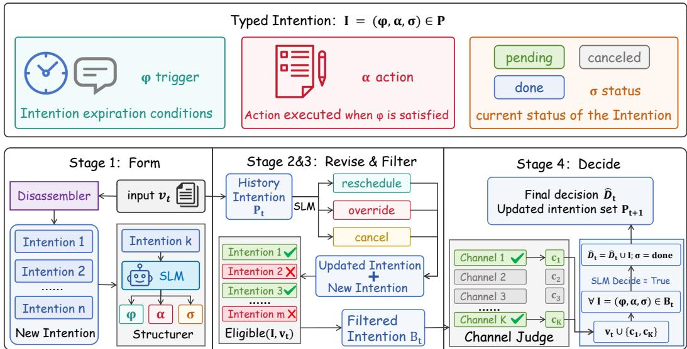

# Making Prospective Memory SLM-Shaped: Typed Intention Stores for Small-Model Agents

Jinqing Zhao Peking University

Chengcan Wu Peking University wuchengcan@stu.pku.edu.cn

## Abstract

Prospective memory means carrying out a deferred intention at the right future cue while other work continues. Benchmarks now isolate it as an agent skill, yet frontier LLMs still struggle: the best published PM-Bench scaffold reaches only 65.1% Set-F1. We argue that this loop is schema-constrained state tracking rather than open-ended reasoning, and that small models can execute it when the action space is typed. We propose the Prospective Intention Store (PIS) that puts lifecycle logic in code and scoped language work on the model. The scaffold is agentic and training-free: no selector fine-tuning and no trajectory distillation. On PM-Bench, DeepSeek-Chat with PIS reaches 82.9% Set-F1. On Gemma-E2B, Set-F1 is only 4.2% without a store and at most 6.6% under seven retrospective memories, while PIS reaches 66.2%. PIS further reaches 70.1% Set-F1, where retrospective memory methods stay at most 54.4%. PIS sets a new state of the art on this benchmark and enables small models to surpass the published large-model scaffold.

## 1 Introduction

As language agents move from single-turn answering to long-horizon assistance—planning, tool use, and multi-session interaction—memory becomes indispensable [Yao et al., 2023, Packer et al., 2023, Sumers et al., 2024]. Without an external store, models forget user constraints, lose intermediate state, and cannot reuse experience across steps [Liu et al., 2024, Maharana et al., 2024, Wu et al., 2024]. A large share of today’s agent memory is retrospective: write notes from interaction, update or merge entries, and later retrieve what is relevant to a query [Chhikara et al., 2025, Xu et al., 2025, Zhong et al., 2024]. In practice, that write–update–retrieve loop is dominated by narrow, repetitive calls—structured extraction, short summaries, similarity lookup, light JSON edits—rather than open-ended reasoning [Belcak et al., 2025, Fang et al., 2025]. Such scoped invocations are a natural fit for small language models (SLMs): they are cheaper, lower-latency, and deployable on-device, while large models remain a fallback for hard open-domain work [Belcak et al., 2025, Sharma and Mehta, 2025, Erdogan et al., 2024, Chen et al., 2024]. Schema-constrained tool use already shows that 1B–7B models can match or exceed cloud-scale APIs when the action space is typed [Erdogan et al., 2024, Chen et al., 2024, Patil et al., 2023].

Recent Memory×SLM systems report strong results: SLMs can run online controller/selector/writer pipelines [Zhang et al., 2026a], and dual-space distillation lets a 4B on-device agent approach a larger teacher when procedural memories are provided [Hosseini et al., 2026]. Those gains typically require training-time cost—selector LoRA, teacher trajectories, or student adapters—before the small model operates memory well. Despite this progress, the memories those systems operate remain retrospective: they retrieve or cache the past rather than maintain deferred commitments until a future cue fires. Prospective memory (PM)—maintaining a deferred intention and executing it at a future cue or time while other activities continue—is ubiquitous in everyday assistance (“remind me when the portal opens,” “take the medicine at 21:00”) and has long been distinguished from retrospective recall in cognitive science [Einstein and McDaniel, 1990, Rendell and Craik, 2000]. In agent-memory work, PM remains sparsely studied: most benchmarks and stores optimize sim(e, q) rather than whether a trigger is satisfied and which set of actions is due [Maharana et al., 2024,

  
Figure 1: Overview of the prospective intention store (PIS). A deferred commitment is typed as $I { = } ( \varphi , \alpha , \sigma )$ ; each step runs Form→Revise→Filter→Decide (with optional channel enrichment before Decide) and emits a due set.

Wu et al., 2024, Xu et al., 2025, Fang et al., 2025]. Evaluations that isolate PM find that even frontier LLMs are unreliable—PM-Bench’s best reported scaffold reaches only 65.1% Set-F1 [Liu and Gabriel, 2026], and TriggerBench shows near-ceiling retrospective accuracy where proactive intervention collapses [Zhang et al., 2026b]—and, to our knowledge, prior work has not studied SLMs for prospective memory. Existing Memory×SLM pipelines retrieve the past or cache procedural scripts; they do not maintain revisable due sets [Hosseini et al., 2026, Zhang et al., 2026a]. We argue that this gap is architectural as well as a scale gap: PM is schema-constrained state tracking of the same family as the repetitive memory operations SLMs already handle retrospectively [Belcak et al., 2025, Sharma and Mehta, 2025].

Conditioned delayed memory requires three loops that similarity RAG does not provide: Update (rewrite cancellations and overrides), Decision (emit a due set), and Observation (expand clocks and channels into evidence) [Liu and Gabriel, 2026, Liu et al., 2024]. Once intentions are typed as $( \varphi , \alpha , \sigma )$ , those loops are schema-scoped—the regime where TinyAgent-style interfaces succeed [Erdogan et al., 2024]—but overload a small model if packed into one open JSON state machine. We therefore propose the Prospective Intention Store (PIS; Figure 1): an agentic scaffold that externalizes intentions as typed records, implements lifecycle and board logic in code, and leaves scoped grounding to the model, usable at inference without PEFT [Belcak et al., 2025]. On PM-Bench, PIS sets a new state of the art and lets small models exceed the published large-model scaffold.

## Contributions.

1. We provide, to our knowledge, the first systematic formalization of prospective-memory operations for language agents, casting deferred commitments as typed records and due-set decisions as operators over an external store.

2. We propose an agent system, PIS, that executes those operations as a training-free Form–Decide loop and show empirically that it yields strong PM-Bench results across large and small backbones.

3. We are the first to study SLMs for prospective memory: PIS not only surpasses large-model scaffolds in Set-F1, but also uses far fewer tokens and less wall-clock time than heavy large-model memory stacks, offering an efficient and low-cost solution for this skill [Belcak et al., 2025].

We will release the method and code upon acceptance.

## 2 Related Work

SLMs for scoped agent work. Belcak et al. argue that most agent traffic is narrow and repetitive, so SLMs should be the default with selective LLM fallback [Belcak et al., 2025, Sharma and Mehta, 2025]. TinyAgent and Octopus show 1B–7B models matching larger APIs when tool interfaces are typed [Erdogan et al., 2024, Chen et al., 2024]; we treat prospective memory as another such scoped subroutine.

Retrospective memory. MemGPT/Letta, Mem0, A-Mem, MemoryOS, LightMem and related stacks store and retrieve episodic or semantic notes [Packer et al., 2023, Chhikara et al., 2025, Xu et al., 2025, Kang et al., 2025, Fang et al., 2025]. Memory×SLM systems (LightMem-SLM, DuoMem) operate those pipelines with small models, typically after selector LoRA or teacher distillation [Zhang et al., 2026a, Hosseini et al., 2026]. Success metrics remain answer quality or environment reward rather than cue-triggered due-set Set-F1, and the stored object remains a note optimized for sim $( e , q )$ not a revisable intention $( \varphi , \alpha , \sigma )$ with satisfaction sat $( \varphi , V _ { t } )$ . Overall, retrospective memory for agents is extensively studied, whereas work that targets prospective memory remains scarce.

Prospective memory. Cognitive work distinguishes event- and time-based deferred intentions [Einstein and McDaniel, 1990, Rendell and Craik, 2000]. PM-Bench isolates the skill for tool-using agents (best scaffold 65.1% Set-F1); residuals concentrate on monitoring, cross-day obligations, and updates, consistent with missing structure rather than insufficient model scale [Liu and Gabriel, 2026]. TriggerBench shows prospective performance far below matched retrospective probes [Zhang et al., 2026b]. PIS complements this landscape with a typed prospective object and Form–Decide operators on a frozen backbone, without selector LoRA or teacher distillation.

## 3 Method

We cast conditioned delayed memory as operations over a typed prospective intention store (PIS; Figure 1). Lifecycle over fields is deterministic and structural; the language model performs only scoped semantic grounding. This factorization is usable at inference without PEFT [Belcak et al., 2025].

## 3.1 Problem formulation

At discrete step t, the agent observes evidence $V _ { t }$ (vignette text, tool replies, clocks) and a menu $X _ { t }$ of candidate actions. It maintains an external store $\mathcal { P } _ { t }$ of intentions. Each intention is a triple $\boldsymbol { I } ~ = ~ ( \varphi , \alpha , \sigma )$ where $\varphi$ is the trigger condition, α is the intended action, and σ ∈ {pending, done, canceled} is status. Beyond clocks and in-scene events, many real triggers depend on hidden state channels—portals, dashboards, inboxes, sensors—whose contents are invisible until the agent proactively queries them. We write $\mathcal { C } _ { t }$ for the set of channels referenced by pending intentions in $\mathcal { P } _ { t } ;$ a query on channel $c \in { \mathcal { C } } _ { t }$ returns a reply that is merged into evidence, $V _ { t } \gets \bar { V } _ { t } \cup \{ c \}$ Without such Observation, $V _ { t } \models \varphi$ cannot be evaluated for channel-conditioned pledges, so Decide must be allowed to request queries before emitting a due set. Satisfaction $V _ { t } \models \varphi$ is checked by rules for clocks and by a language judge for event and channel cues once evidence is present. The ideal due set is $D _ { t } ^ { \star } = \{ \alpha \mid I \in \mathcal { P } _ { t } , \sigma = \mathrm { p e n d i n g }$ $V _ { t } \mid = \varphi \}$ ; the agent emits a predicted set $\hat { D } _ { t } \subseteq X _ { t }$ scored by trajectory Set-F1 against ground-truth $D _ { t }$ [Liu and Gabriel, 2026]. We write the decision and store update as $\hat { D } _ { t } = \pi ( \mathcal { P } _ { t } , V _ { t } )$ and $\mathcal { P } _ { t + 1 } = F ( \mathcal { P } _ { t } , V _ { t } , \hat { D } _ { t } )$ . Operationally, each step factors into four operators—Form, Revise, Filter, and Decide—with an eligibility board $B _ { t } \subseteq { \bar { \mathcal { P } } } _ { t }$ as the intermediate view on which Decide conditions, including which channels still need to be queried.

## 3.2 Store and decision interface

The interface contracts are

$$
\hat { D } _ { t } = \pi ( \mathcal { P } _ { t } , V _ { t } ) , \mathcal { P } _ { t + 1 } = F ( \mathcal { P } _ { t } , V _ { t } , \hat { D } _ { t } ) ,\tag{1}
$$

with ideal due set

$$
D _ { t } ^ { \star } = \{ \alpha \mid I \in \mathcal P _ { t } , \sigma = \mathrm { p e n d i n g } , V _ { t } \mid = \varphi \} .\tag{2}
$$

Clock predicates are rule-checked; event and channel predicates use a language judge after any needed channel replies enter $V _ { t }$

## 3.3 Operators

Done-marking after execution is folded into Decide.

Form. Narrative is converted into typed rows once. Disassemble(Vt) extracts commitment spans; Structure ${ \bf \Xi } ( s ) = ( \varphi , \alpha _ { \mathrm { { ; } } }$ , pending) fills trigger, action, and status:

$$
\Delta _ { t } ^ { \mathrm { f o r m } } = \mathrm { F o r m } ( V _ { t } ) = \{ \mathrm { S t r u c t u r e } ( s ) ~ | ~ s \in \mathrm { D i s a s s e m b l e } ( V _ { t } ) \} , \quad \mathcal { P } _ { t } \gets \mathcal { P } _ { t } \cup \Delta _ { t } ^ { \mathrm { f o r m } } .\tag{3}
$$

In the SLM realization, Structure is a slot-filling call assembled in code into $I { = } ( \varphi , \alpha , \sigma )$ ; Disassemble and Structure may share one model invocation. Form is the only stage where open text enters the store schema.

Algorithm 1 One PIS step: realizing $( \pi , F )$   
Require: store $\mathcal { P } _ { t } ,$ evidence $V _ { t } ,$ menu $X _ { t }$   
Ensure: action set $\hat { D } _ { t } ^ { \phantom { \dagger } } .$ , updated store $\mathcal { P } _ { t + 1 }$   
1: $\mathcal { P } _ { t }  \mathcal { P } _ { t } \cup \mathrm { F o r m } ( V _ { t } )$ ▷ Eq. (3)   
2: $\mathcal { P } _ { t }  \mathrm { R e v i s e } ( \mathcal { P } _ { t } , \stackrel { . } { V _ { t } } )$ ▷ Eq. (4)   
3: $B _ { t } \gets \mathrm { F i l t e r } ( \mathbf { \dot { \mathcal { P } } } _ { t } , V _ { t } )$ ▷ Eq. (5)   
4: while channel judge on $B _ { t }$ requests $c \in { \mathcal { C } } _ { t }$ do   
5: $V _ { t } \gets V _ { t } \cup \mathbf { \bar { \{ c \} } }$ ▷ query hidden channel   
6: end while   
7: $( \hat { D } _ { t } , \mathcal { P } _ { t + 1 } ) \gets \mathrm { D e c i d e } ( B _ { t } , V _ { t } , X _ { t } )$ ▷ Eqs. (6)–(7)   
8: return $\hat { D } _ { t } , \mathcal { P } _ { t + 1 }$

Revise. Revise performs belief update over the existing store rather than retrieval. For each pending I, a language judge may apply one typed patch: reschedule rewrites $\varphi ,$ , override replaces $\alpha ,$ , or cancel sets $\sigma \gets$ canceled. Cue appearance alone is not cancellation; it is evidence for $\bar { V _ { t } } \models \varphi$ and is handled by Filter and Decide.

$$
\rho _ { t } ( I ; V _ { t } ) = \left\{ \begin{array} { l l } { ( \varphi ^ { \prime } , \alpha , \mathrm { p e n d i n g } ) , } & { \mathrm { r e s c h e d u l e } ( I ; V _ { t } ) , } \\ { ( \varphi , \alpha ^ { \prime } , \mathrm { p e n d i n g } ) , } & { \mathrm { o v e r r i d e } ( I ; V _ { t } ) , } \\ { ( \varphi , \alpha , \mathrm { c a n c e l e d } ) , } & { \mathrm { c a n c e l } ( I ; V _ { t } ) , } \\ { I , } & { \mathrm { n o ~ r e v i s i o n } , } \end{array} \right. \quad \mathrm { R e v i s e } ( \mathcal { P } _ { t } , V _ { t } ) = \{ \rho _ { t } ( I ; V _ { t } ) \} _ { I \in \mathcal { P } _ { t } } .\tag{4}
$$

Implementation shortlists candidates $\mathcal C _ { t } \subseteq \mathcal P _ { t }$ , then one indexed judge emits a sparse patch set applied in code (no update span implies an empty patch).

Filter. Pending rows are reduced to an eligibility board by structural rules (day/horizon, exact clock matches, discrete event/channel labels). Channel-conditioned intentions whose watched channel has not yet been queried remain on the board as check targets rather than being dropped—a filtered view of $\mathcal { P }$ , not embedding neighbors of $V _ { t }$

$$
B _ { t } = \mathrm { F i l t e r } ( \mathcal { P } _ { t } , V _ { t } ) = \{ I \in \mathcal { P } _ { t } \mid \sigma = \mathrm { p e n d i n g } , \mathrm { e l i g i b l e } ( I ; V _ { t } ) \} .\tag{5}
$$

Decide. Because many pledges depend on hidden channels, a channel judge first inspects $B _ { t }$ and may request one or more queries $c \in { \mathcal { C } } _ { t } ;$ replies enrich evidence, $V _ { t } \dot {  } \dot { V _ { t } } \cup \{ c \}$ , before due-set selection. This Observation step mirrors everyday assistance, where the agent must open a portal or check a sensor rather than wait for the cue to appear in the dialogue. Decide then maps $( B _ { t } , V _ { t } , X _ { t } )$ to a due set and an updated store:

$$
( \hat { D } _ { t } , \mathcal { P } _ { t + 1 } ) = \mathrm { D e c i d e } ( B _ { t } , V _ { t } , X _ { t } ) ,\tag{6}
$$

where $\hat { D } _ { t } \subseteq X _ { t }$ and fulfilled pending rows are marked done:

$$
\begin{array} { r } { \kappa ( I ; \hat { D } _ { t } ) = \left\{ \begin{array} { l l } { ( \varphi , \alpha , \mathrm { d o n e } ) , } & { \alpha \in \hat { D } _ { t } , \sigma = \mathrm { p e n d i n g , ~ g u a r d s ~ a l l o w } , \quad \mathcal { P } _ { t + 1 } = \{ \kappa ( I ; \hat { D } _ { t } ) \mid I \in \mathcal { P } _ { t } \} . } \\ { I , } & { \mathrm { o t h e r w i s e } , } \end{array} \right. } \end{array}\tag{7}
$$

Filter and κ are structural; Form, Revise, the channel judge, and Decide require language grounding [Belcak et al., 2025].

## 3.4 One-step algorithm

Equivalently, π comprises Filter, proactive channel Observation over $\mathcal { C } _ { t }$ , and Decide; F comprises Form, Revise, and the $\kappa$ commit inside Decide. Errors are attributable at operator boundaries (§4).

## 4 Experiments

## 4.1 Setup

We evaluate on the released PM-Bench synthetic week [Liu and Gabriel, 2026]: seven simulated days of activity choice interleaved with anonymous prospective menus, lure actions, and hidden state channels. The primary metric is micro Set-F1 between predicted and ground-truth due sets; we also report update miss, cross-day miss, and false alarms per step (Table 1). All backbones remain frozen: no selector LoRA, no teacher-trajectory distillation, and no PEFT, so gains are attributable to the memory scaffold. Table 1 compares training-free retrospective memories (Naive RAG; Mem0;

Table 1: PM-Bench main comparison (DeepSeek-Chat left, Gemma-E2B right). Set-F1: micro F over predicted vs. ground-truth due sets (higher is better). Update miss: miss rate on the updatesensitive slice (reschedule/cancel/override; lower is better). Cross-day miss: miss rate on intentions planted on an earlier day (lower is better). FA/step: false alarms per decision step (lower is better).
<table><tr><td></td><td colspan="4">DeepSeek-Chat</td><td colspan="4">Gemma-E2B</td></tr><tr><td>Setup</td><td></td><td></td><td>Set-F1 Update miss Cross-day miss FA/step</td><td></td><td></td><td></td><td>Set-F1 Update miss Cross-day miss FA/step</td><td></td></tr><tr><td>single</td><td>67.7</td><td>55.6</td><td>57.1</td><td>6.3</td><td>4.2</td><td>100.0</td><td>85.7</td><td>13.8</td></tr><tr><td>+ Naive RAG</td><td>46.5</td><td>88.9</td><td>100.0</td><td>57.5</td><td>6.6</td><td>88.9</td><td>100.0</td><td>43.8</td></tr><tr><td>+ Mem0</td><td>48.7</td><td>100.0</td><td>57.1</td><td>6.3</td><td>4.9</td><td>88.9</td><td>100.0</td><td>45.0</td></tr><tr><td>+ A-Mem</td><td>54.1</td><td>100.0</td><td>42.9</td><td>8.8</td><td>0.0</td><td>100.0</td><td>100.0</td><td>10.0</td></tr><tr><td>+ Letta</td><td>52.2</td><td>66.7</td><td>71.4</td><td>25.0</td><td>4.5</td><td>88.9</td><td>100.0</td><td>55.0</td></tr><tr><td>+ LightMem-style</td><td>51.5</td><td>66.7</td><td>57.1</td><td>38.8</td><td>6.6</td><td>88.9</td><td>100.0</td><td>41.3</td></tr><tr><td>+ MemoryOS-style</td><td>58.3</td><td>66.7</td><td>42.9</td><td>8.8</td><td>3.3</td><td>88.9</td><td>100.0</td><td>42.5</td></tr><tr><td>+ PIS</td><td>82.9</td><td>22.2</td><td>0.0</td><td>8.8</td><td>66.2</td><td>77.8</td><td>28.6</td><td>15.0</td></tr></table>

A-Mem; Letta/MemGPT; LightMem-style; MemoryOS-style) [Chhikara et al., 2025, Xu et al., 2025, Packer et al., 2023, Fang et al., 2025, Kang et al., 2025] against PIS on DeepSeek-Chat [DeepSeek-AI, 2024] and a local Gemma-E2B SLM [Gemma Team et al., 2024]. Table 2 uses the same layout on Qwen3.5-4B and Qwen3-8B [Qwen Team, 2025], with Gemma+PIS as a size reference. Table 3 reports wall-clock duration and estimated main-prompt tokens. LightMem/MemoryOS rows are pattern adapters of the corresponding retrieval designs rather than full upstream servers [Fang et al., 2025, Kang et al., 2025]. The single row is a no-store baseline that reasons only from dialogue context.

## 4.2 Main results

DeepSeek-Chat. PIS attains the highest Set-F1 at 82.9%, above every retrospective memory and the no-store single (67.7%). On the three secondary metrics it also leads: update miss drops to 22.2% (vs. 55.6%–100% for the others), cross-day miss reaches 0.0%, and FA/step stays moderate at 8.8%—unlike Naive RAG or LightMem-style, which inflate false alarms with temporally obsolete notes. Notably, single outperforms all retrospective memories (46.5%–58.3%). Single relies on in-context reasoning over the ongoing dialogue rather than retrieved notes; the gap indicates that existing retrospective stores do not beat this PM-Bench baseline, whereas PIS does.

Gemma-E2B. Gemma-E2B is a short-context on-device-class SLM: when injected memory or long prompts exceed what it can use reliably, Set-F1 and the secondary metrics collapse. All seven retrospective setups stay near floor (0.0–6.6% Set-F1), with update miss at least 88.9%, cross-day miss typically 100%, and often high FA/step under noisy retrieves. We use this backbone deliberately to stress-test methods at the small-model extreme. The same frozen PIS reaches 66.2%, about 10× the best retrospective row, with cross-day miss falling to 28.6% (update miss 77.8% remains the main residual).

## 4.3 Scaling to other SLMs

Table 2 repeats the layout on Qwen3.5-4B and Qwen3-8B, with Gemma-E2B+PIS (66.2%) as a size reference. The two Qwen backbones tell a similar story: PIS is best on both (70.1% on 4B; 57.2% on 8B), with lower update and cross-day misses than most retrieval rows, while retrospective memories again fail to provide a reliable gain over the no-store baseline (on 4B they all fall below single; on 8B a weak single leaves some retrieval rows above it, but none approach PIS). Absolute scores are higher on Qwen3.5-4B than on Qwen3-8B because the 3.5-4B checkpoint is designed for agentic workloads, so it follows the typed board more reliably than the larger 8B chat model on this week.

## 4.4 Computation analysis

SLM-agent deployments care about latency and token load as well as accuracy [Belcak et al., 2025, Sharma and Mehta, 2025]. Table 3 reports wall-clock Dur and estimated main-prompt input tokens Tok (millions) from logged EST\_INPUT\_TOKENS on choose/query calls. Side calls (intention judges, embedders, external memory servers) are excluded, so Tok is a lower bound; Dur includes side effects on the critical path.

Efficiency without competence. On Gemma and both Qwen SLMs, most retrospective scaffolds finish in a few minutes at most about 1M estimated main tokens, yet remain near floor Set-F1. That

Table 2: PM-Bench on other SLMs (same metrics and layout as Table 1). Gemma-E2B+PIS is a size reference; columns are Qwen3.5-4B (left) and Qwen3-8B (right).
<table><tr><td rowspan="2">Setup</td><td colspan="4">Qwen3.5-4B</td><td colspan="4">Qwen3-8B</td></tr><tr><td></td><td></td><td>Set-F1 Update miss Cross-day miss FA/step</td><td></td><td></td><td>Set-F1 Update miss Cross-day miss FA/step</td><td></td><td></td></tr><tr><td>Gemma-E2B + PIS (ref.)</td><td>66.2</td><td>77.8</td><td>28.6</td><td>15.0</td><td>66.2</td><td>77.8</td><td>28.6</td><td>15.0</td></tr><tr><td>single</td><td>57.4</td><td>88.9</td><td>85.7</td><td>18.8</td><td>39.8</td><td>55.6</td><td>100.0</td><td>60.0</td></tr><tr><td>+ Naive RAG</td><td>48.8</td><td>88.9</td><td>85.7</td><td>57.5</td><td>41.5</td><td>77.8</td><td>100.0</td><td>58.8</td></tr><tr><td>+ Mem0</td><td>54.4</td><td>88.9</td><td>100.0</td><td>50.0</td><td>52.5</td><td>88.9</td><td>42.9</td><td>67.5</td></tr><tr><td>+ A-Mem</td><td>50.3</td><td>66.7</td><td>100.0</td><td>47.5</td><td>45.7</td><td>55.6</td><td>71.4</td><td>45.0</td></tr><tr><td>+ Letta</td><td>43.9</td><td>44.4</td><td>100.0</td><td>86.3</td><td>40.6</td><td>100.0</td><td>85.7</td><td>71.3</td></tr><tr><td>+ LightMem-style</td><td>46.9</td><td>66.7</td><td>100.0</td><td>86.3</td><td>42.8</td><td>88.9</td><td>71.4</td><td>88.8</td></tr><tr><td>+ MemoryOS-style</td><td>50.3</td><td>77.8</td><td>85.7</td><td>67.5</td><td>45.4</td><td>55.6</td><td>85.7</td><td>73.8</td></tr><tr><td>+ PIS</td><td>70.1</td><td>33.3</td><td>28.6</td><td>38.8</td><td>57.2</td><td>55.6</td><td>57.1</td><td>47.5</td></tr></table>

Table 3: Computation on the PM-Bench week. Dur: wall-clock time for one full week. Tok: estimated main-prompt input tokens in millions (sum of logged EST\_INPUT\_TOKENS; excludes judge/embed side calls).
<table><tr><td rowspan="3">Setup</td><td>DeepSeek</td><td>Gemma-E2B</td><td></td><td>Qwen3.5-4B</td><td></td><td>Qwen3-8B</td></tr><tr><td>Dur Tok</td><td>Dur</td><td>Tok</td><td>Dur</td><td>Tok</td><td>Dur Tok</td></tr><tr><td></td><td>1.7m</td><td></td><td></td><td></td><td></td></tr><tr><td>single</td><td>1.3m 0.82</td><td></td><td>0.90</td><td>1.7m</td><td>0.73 0.72</td><td>2.1m 1.04</td></tr><tr><td>+ Naive RAG + Mem0</td><td>1.8m 0.82 7.4m 2.50</td><td>1.5m 1.2m</td><td>0.78 0.79</td><td>2.3m</td><td>0.75</td><td>3.3m 0.99</td></tr><tr><td>+ A-Mem</td><td>22.0m 7.84</td><td>18.4m</td><td>3.37</td><td>2.1m 35.4m</td><td>8.78</td><td>2.5m0.87 27.6m 4.89</td></tr><tr><td>+ Letta</td><td>23.9m 8.11</td><td>20.7m</td><td>7.79</td><td>14.8m</td><td>5.23</td><td>15.2m 6.23</td></tr><tr><td>+ LightMem-style</td><td>6.3m 1.43</td><td>2.9m</td><td>0.85</td><td>3.5m</td><td>0.75</td><td>5.5m 1.42</td></tr><tr><td>+ MemoryOS-style</td><td>5.4m 1.65</td><td>2.2m</td><td>0.79</td><td>3.5m</td><td>0.72</td><td>6.1m 1.47</td></tr><tr><td>+ PIS</td><td>16.4m 2.08</td><td>4.7m</td><td>1.23</td><td>6.5m</td><td>1.48</td><td>5.6m 1.39</td></tr></table>

apparent efficiency largely reflects missing Observation traffic: few check\_time/query\_state loops shorten trajectories without improving PM. A-Mem and Letta are expensive exceptions (tens of minutes; several million tokens) because linking and server-side LLM work dominate Dur.

PIS cost profile. PIS spends more on the main agent than a quiet single baseline (DeepSeek 16.4 min / 2.08M; Gemma 4.7 min / 1.23M; Qwen3.5-4B 6.5 min / 1.48M; Qwen3-8B 5.6 min / 1.39M) because channel enrichment and longer boards increase choose/query volume. Relative to A-Mem and Letta, PIS is often cheaper in Dur while attaining the best Set-F1 on every backbone in Tables 1–2. For SLM stacks, a typed Form–Decide loop is preferable to heavy retrospective infrastructure that does not improve due-set F1.

## 5 Conclusion

Prospective memory is a newly isolated agent skill that frontier LLMs still struggle with, and that retrospective Memory×SLM systems do not address. We framed PM as schema-constrained state tracking and instantiated a typed intention store whose Form–Decide operators realize (π, F) as agentic scaffolding without training a selector or distilling a student. That training-free stance attributes competence to the typed object and the operator factorization rather than to PEFT as a prerequisite. Large backbones with this store exceed published PM-Bench scaffolds (82.9% Set-F1 on DeepSeek-Chat); Gemma-E2B rises from at most 6.6% under seven retrospective baselines to 66.2% with the same frozen store; Qwen3.5-4B+PIS reaches 70.1% while seven retrospective memories stay at most 54.4%. Wall-clock and estimated token costs (§4.4) indicate that the quality gain comes from scaffolding rather than merely longer prompts.

Limitations. Public prospective-memory benchmarks for agents remain scarce; to our knowledge PM-Bench is the main openly available suite, so our evaluation is necessarily concentrated on this dataset. Although PIS needs no model training, fine-tuning is not explored here and may further improve performance.

Future work. We plan to (i) fine-tune models on the Form–Decide interfaces, (ii) run evaluation studies that isolate the contribution of each operator, and (iii) build additional prospective-memory benchmarks to complement the currently limited open supply beyond PM-Bench. We release this as non-archival work in progress toward SLM-native prospective agents.

## References

Peter Belcak, Greg Heinrich, Shizhe Diao, Yonggan Fu, Xin Dong, Saurav Muralidharan, Yingyan Celine Lin, and Pavlo Molchanov. Small language models are the future of agentic AI. arXiv preprint arXiv:2506.02153, 2025.

Wei Chen, Zhiyuan Li, and Mingyuan Ma. Octopus v2: On-device language model for super agent. arXiv preprint arXiv:2404.01744, 2024.

Prateek Chhikara, Dev Khant, Saket Aryan, Taranjeet Singh, and Deshraj Yadav. Mem0: Building productionready AI agents with scalable long-term memory. arXiv preprint arXiv:2504.19413, 2025.

DeepSeek-AI. DeepSeek-V3 technical report. arXiv preprint arXiv:2412.19437, 2024.

Gilles O. Einstein and Mark A. McDaniel. Normal aging and prospective memory. Journal ofExperimental Psychology: Learning, Memory, and Cognition, 16(4):717–726, 1990.

Lutfi Eren Erdogan, Nicholas Lee, Siddharth Jha, Sehoon Kim, Ryan Tabrizi, Suhong Moon, Coleman Hooper, Gopala Anumanchipalli, Kurt Keutzer, and Amir Gholami. TinyAgent: Function calling at the edge. arXiv preprint arXiv:2409.00608, 2024.

Jizhan Fang, Xinle Deng, Haoming Xu, Ziyan Jiang, Yuqi Tang, Ziwen Xu, Shumin Deng, Yunzhi Yao, Mengru Wang, Shuofei Qiao, Huajun Chen, and Ningyu Zhang. LightMem: Lightweight and efficient memory-augmented generation. arXiv preprint arXiv:2510.18866, 2025.

Gemma Team et al. Gemma 2: Improving open language models at a practical size. arXiv preprint arXiv:2408.00118, 2024.

Peyman Hosseini, Ondrej Bohdal, Ahmed Alajrami, Andrea Maracani, Ignacio Castro, Matthew Purver, Mete Ozay, Savas Ozkan, and Taha Ceritli. DuoMem: Towards capable on-device memory agents via dual-space distillation. arXiv preprint arXiv:2606.29961, 2026.

Jiazheng Kang, Mingming Ji, Taize Zhao, and Fei Li. Memory OS of AI agent. arXiv preprint arXiv:2506.06326, 2025.

Genglin Liu and Saadia Gabriel. PM-Bench: Evaluating prospective memory in LLM agents. arXiv preprint arXiv:2607.12385, 2026.

Nelson F. Liu, Kevin Lin, John Hewitt, Ashwin Paranjape, Michele Bevilacqua, Fabio Petroni, and Percy Liang. Lost in the middle: How language models use long contexts. Transactions of the Association for Computational Linguistics, 12:157–173, 2024.

Adyasha Maharana, Dong-Ho Lee, Sergey Tulyakov, Mohit Bansal, Francesco Barbieri, and Yuwei Fang. Evaluating very long-term conversational memory of LLM agents. arXiv preprint arXiv:2402.17753, 2024.

Charles Packer, Sarah Wooders, Kevin Lin, Vivian Fang, Shishir G. Patil, Ion Stoica, and Joseph E. Gonzalez. MemGPT: Towards LLMs as operating systems. arXiv preprint arXiv:2310.08560, 2023.

Shishir G. Patil, Tianjun Zhang, Xin Wang, and Joseph E. Gonzalez. Gorilla: Large language model connected with massive APIs. arXiv preprint arXiv:2305.15334, 2023.

Qwen Team. Qwen3 technical report. arXiv preprint arXiv:2505.09388, 2025.

Peter G. Rendell and Fergus I. M. Craik. Virtual week and actual week: Ageing and context dependent prospective memory. Aging, Neuropsychology, and Cognition, 7(4):209–226, 2000.

Raghav Sharma and Manan Mehta. Small language models for agentic systems: A survey of architectures, capabilities, and deployment trade offs. arXiv preprint arXiv:2510.03847, 2025.

Theodore Sumers, Shunyu Yao, Karthik Narasimhan, and Thomas Griffiths. Cognitive architectures for language agents. Transactions on Machine Learning Research, 2024.

Di Wu, Hongwei Wang, Wenhao Yu, Yuwei Zhang, Kai-Wei Chang, and Dong Yu. LongMemEval: Benchmarking chat assistants on long-term interactive memory. arXiv preprint arXiv:2410.10813, 2024.

Wujiang Xu, Zujie Liang, Kai Mei, Hang Gao, Juntao Tan, and Yongfeng Zhang. A-Mem: Agentic memory for LLM agents. arXiv preprint arXiv:2502.12110, 2025.

Shunyu Yao, Jeffrey Zhao, Dian Yu, Nan Du, Izhak Shafran, Karthik Narasimhan, and Yuan Cao. ReAct: Synergizing reasoning and acting in language models. In International Conference on Learning Representations, 2023.

Jiaquan Zhang, Chaoning Zhang, Shuxu Chen, Zhenzhen Huang, Pengcheng Zheng, Zhicheng Wang, Ping Guo, Fan Mo, Sung-Ho Bae, Jie Zou, Jiwei Wei, and Yang Yang. Lightweight LLM agent memory with small language models. arXiv preprint arXiv:2604.07798, 2026a.

Tianhua Zhang, Xinjiang Wang, Q. Zhang, Qi Chen, Kun Li, Yaoqi Chen, Dingdong Wang, Helen Meng, and Yan Lu. TriggerBench: Investigating prospective memory for large language models. arXiv preprint arXiv:2606.23459, 2026b.

Wanjun Zhong, Lianghong Guo, Qiqi Gao, He Ye, and Yanlin Wang. MemoryBank: Enhancing large language models with long-term memory. Proceedings ofthe AAAI Conference on Artificial Intelligence, 38, 2024.