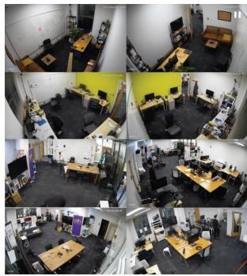
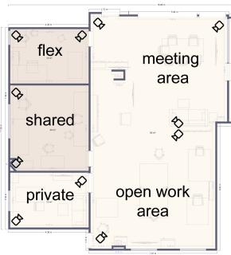
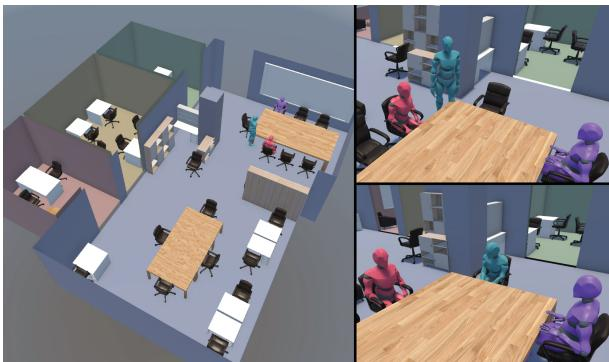

# Measuring the Behavioral Fidelity of Long-Horizon Human Activity Simulations

Yi Fei Cheng1, Fan Yang2, Iremsu Bas1, Koichiro Niinuma3, Narishige Abe2, David Lindlbauer1

1Human-Computer Interaction Institute, School of Computer Science, Carnegie Mellon University, Pittsburgh, PA, USA

2Fujitsu Ltd., Kawasaki, Japan

3Fujitsu Research of America, Pittsburgh, PA, USA

{yifeic2,ibas}@andrew.cmu.edu {fan.yang,kniinuma,abe.narishige}@fujitsu.com davidlindlbauer@cmu.edu

## Abstract

As LLM-based human simulators are increasingly used for policy, evaluation, and training, they must faithfully reproduce real behavioral patterns. While prior work has examined behavioral fidelity in survey responses and dialogue, longer-horizon real-world activity remains largely unexplored. We introduce a framework for evaluating behavioral fidelity in long-horizon activity simulations across temporal granularities and levels of analysis. As a case study, we collect a 43-hour multi-camera dataset of in-the-wild office activity and compare trace-derived conditioning mechanisms: persona descriptors, few-shot exemplars, and statistical transition and time-of-day priors. We find that behavioral fidelity is not uniform across metrics: statistical priors bring activity and sequence distributions closest to real behavior, yet over-fragment routines and suppress within-person variability. These findings motivate a more holistic evaluation that spans multiple metrics, temporal granularities, and levels of analysis.

## 1 Introduction

Large language models are increasingly being used to simulate human behavior. They have been applied to replicating survey responses (Kolluri et al., 2025; Park et al., 2026), generating human-like dialogues (Suh et al., 2026; Gandhi et al., 2026), and modeling daily activity sequences (Li et al., 2025a; Park et al., 2023). These capabilities have enabled a growing range of applications, from hypothesis exploration for policy (Li et al., 2026) to interactive evaluation of AI assistants (Yao et al., 2024).

Underlying these applications is the assumption that LLM-generated behavior faithfully reflects real behavioral patterns. However, LLMs can vary substantially in their behavioral fidelity. In survey questionnaires, LLMs often fail to exhibit humanlike response biases (Tjuatja et al., 2024). In dialogue settings, they can be excessively cooperative (Zhou et al., 2026). These limitations undermine the utility of LLM-based simulations in their promised downstream applications.

While a growing body of work investigates the behavioral fidelity of simulated survey responses and dialogue, behavioral fidelity in longer-horizon settings remains largely unexplored (Park et al., 2023; Bougie and Watanabe, 2025; Li et al., 2025a). Recent work has begun to examine the ability of LLMs to simulate long-term digital interaction traces (Chen et al., 2026). We build on this line of work by evaluating the behavioral fidelity of LLMs in simulating long-horizon real-world human activities. We refer to long-horizon activities as those that span multiple hours or days (e.g., a day in the life of a knowledge worker, including arriving at the office, working on a computer, getting coffee, and engaging in conversations).

In this work, we ask: do simulated agents reproduce the everyday activity patterns of real people over long time horizons? To address this question, we introduce a framework for systematically evaluating the behavioral fidelity of long-horizon human activity simulations. We decompose behavioral fidelity along two dimensions: temporal granularity (activity-level, timeof-day, and day-level fidelity) and level of analysis (individual- and population-level fidelity).

To demonstrate the applicability of our framework, we collected a 43-hour multi-camera office dataset capturing the in-the-wild activities of 55 people, five of whom were each observed for 4 ± 1 days, for 7 ± 1 hours per day. Using this dataset, we evaluate the behavioral fidelity of six simulation approaches, varying in how they incorporated real-world behavioral traces as priors, including a no-persona control, authored and trace-inferred persona descriptors, few-shot full-day behavioral exemplars, and statistical priors over activity transitions and time-of-day prevalence.

Our results indicate that, in our experimental setting, statistical priors improve alignment with real activity and sequence distributions, but at the cost of over-segmented days and reduced withinperson variability. We also find that differences among persona-based conditioning approaches are small by comparison, and depend on which metric is used to assess them. Finally, we observe that population-level agreement can mask errors at the individual level. Evaluating simulators across multiple temporal granularities and levels of analysis is therefore essential for characterizing their strengths and limitations, an evaluation that our framework is designed to support.

Contributions. Our contributions are threefold:

1. A framework for measuring the behavioral fidelity of long-horizon human activity simulators across multiple temporal granularities and levels of analysis.

2. A 43-hour multi-camera dataset of in-thewild office activities, enabling evaluation of simulated long-horizon activities against realworld activity traces.1

3. A case study applying the framework to six conditioning approaches, showing that behavioral fidelity is non-uniform across metrics, temporal granularities, and levels of analysis.

## 2 Related Work

## 2.1 LLM-Based Agents

In recent years, substantial research has focused on extending LLMs into LLM-based agents (Wang et al., 2024). By scaffolding LLM generation with components such as memory structures and planning modules, these systems have demonstrated the ability to perform complex multi-step tasks across diverse domains without task-specific finetuning (Yao et al., 2023; Shinn et al., 2023). Most relevant to our work are recent efforts using LLMbased agents to simulate human behavior.

Park et al. (2023) first introduced generative agents that leveraged LLMs in a perceive–reflect– plan–act loop to simulate believable everyday activities and social interactions in a simulated environment. Subsequent work has extended this paradigm in several dimensions. One line of research focused on modeling richer internal human characteristics, such as needs, emotion, and personality traits (Wang et al., 2025a, 2023; Liang et al.,

2025; Li et al., 2025a). A complementary line of work emphasized physical grounding and embodiment, introducing mechanisms to condition and constrain generated behaviors based on environmental context (Liang et al., 2025; Wu et al., 2025; Li et al., 2025a). Finally, Bougie and Watanabe (2025) and Piao et al. (2026) explored scaling these simulations to large multi-agent societies.

Existing approaches have shown promise in generating “believable” human behavior (Park et al., 2023). However, for downstream applications such as policy evaluation (Li et al., 2026), simulations must not only appear plausible, but also faithfully reproduce real human behavioral patterns. Our research builds on this literature by introducing a framework to systematically evaluate the fidelity of these behaviors.

## 2.2 Measuring the Behavioral Fidelity of Human Simulations

As LLMs are increasingly used to simulate humans, a natural question is how faithfully they do so. Prior work has shown that LLMs often fail to reproduce human behavioral patterns in surveys and opinion studies (Tjuatja et al., 2024; Bisbee et al., 2024). Studies of dialogue simulation have identified discrepancies in conversational style, engagement patterns, problem-solving strategies, emotional expression, and behavioral diversity between LLMsimulated and real human interactions (Ivey et al., 2024; Wang et al., 2025b; Zhou et al., 2026). Sim-Bench (Hu et al., 2026) recently aggregated tasks ranging from moral decision-making to economic choice, and found the same pattern. Collectively, this body of work shares the objective of assessing simulation fidelity: the extent to which a model reproduces the response distribution of the population it is conditioned on (Argyle et al., 2023).

While our work shares this objective, we focus on open-ended, long-horizon behavioral patterns rather than single-turn, self-contained questions (Hu et al., 2026) or dialogue (Mehri et al., 2026). In this setting, Li et al. (2025b) demonstrated that accurately reproducing continuous behavioral trajectories remains a significant challenge for LLMs, and Chen et al. (2026) found that simulations of long-term digital interaction traces tend to converge toward a positively skewed “average person” representation. In contrast to personas and user simulators derived from digital interaction logs (Chen et al., 2026) or fictional and biographical sources (Li et al., 2025b), our work grounds simulation in traces of real-world physical activity.

## 3 Long-Horizon Activity Simulation

Our work focuses on evaluating the behavioral fidelity of LLM-based simulators of long-horizon human activity. We build on the generation problem introduced by Wang et al. (2025a).

An LLM-based long-horizon human activity simulator is an agent that autoregressively generates sequences of activities within an interactive environment over the course of a day.

Each activity is realized as an activity episode $\boldsymbol { \sigma } = ( a , t _ { \mathrm { s t a r t } } , t _ { \mathrm { e n d } } ) \mathrm { ; }$ one uninterrupted stretch of a single activity, labeled a from a closed activity vocabulary ${ \mathcal { A } } ,$ running from time $t _ { \mathrm { s t a r t } }$ to time $t _ { \mathrm { e n d } }$ Formally, at each step m, the agent samples an activity,

$$
a _ { m } \sim \pi ( \cdot \mid \sigma _ { 1 : m - 1 } , o _ { 1 : m - 1 } , e , p ) ,\tag{1}
$$

conditioned on the episode history $\sigma _ { 1 : m } .$ −1, prior observations $o _ { 1 : m - 1 }$ of environment e, and a persona $p$ describing attributes such as identity, role, routines, and behavioral tendencies. The sampled activity is executed until it concludes, yielding the episode $\sigma _ { m }$ , which begins where $\sigma _ { m - 1 }$ ended. Rolling out the policy for M steps yields an $a c \mathrm { - }$ tivity trajectory $\tau = ( \sigma _ { 1 } , \dots , \sigma _ { M } )$ , a contiguous sequence of episodes spanning the simulated day.

## 4 Evaluating Behavioral Fidelity

We define behavioral fidelity as the extent to which simulated activity trajectories reproduce patterns observed in real human activity traces.

Human behavior exhibits structure across multiple temporal and population scales. Some regularities emerge only at coarse temporal resolutions, such as overall activity time allocation throughout the day, while others depend on finer-grained sequential dynamics, such as activity transitions and recurring routines. Likewise, fidelity can differ across levels of analysis: a simulator may reproduce aggregate population statistics while failing to preserve individual-specific tendencies, or generate plausible individual trajectories that collectively deviate from real population behavior. Therefore, our proposed framework evaluates the behavioral fidelity of long-horizon human activity simulators along two dimensions: temporal granularity and level of analysis.

Temporal granularity. Human activities exhibit structure across multiple temporal granularities.

At the local level, behavior can be characterized by structure within short spans of adjacent activities, including activity episode durations, transitions, and short-range behavioral motifs. For example, information workers frequently transition between focused work, communication, and other tasks throughout the day (Dabbish et al., 2011).

At the time-of-day granularity, we compute descriptors within fixed time windows (e.g., 09:00– 11:00, 11:00–13:00, . . . ), capturing higher-level behavioral patterns across different times of day. We characterize this using activity time allocation and frequency. Individuals may allocate different portions of the day to different activities, such as computer work in the morning and meetings later in the day, producing recurring daily work rhythms (Hernandez et al., 2025).

Finally, at the day level, behavior can similarly be characterized in terms of overall activity time allocation andfrequency. For instance, individuals may allocate more time to socializing than others. Behavior can also be characterized with respect to the number of activity switches that occur within a day. Some individuals may have a tendency to engage in prolonged tasks, while others are easily interrupted. Across days, individuals may differ in the variability of their behaviors, ranging from highly consistent daily routines to substantial dayto-day variation in behavior.

Level of analysis. Behavioral patterns can be characterized at the individual and population levels. At the individual level, fidelity concerns whether a simulator preserves the characteristic tendencies and behavioral styles of specific individuals, such as preferences for particular activities, transition habits, or degrees of routine consistency. At the population level, fidelity concerns whether simulated behaviors collectively reproduce aggregate statistics and behavioral diversity observed across a population, including overall activity frequencies, temporal allocation patterns, and between-person variability. A simulator may therefore achieve high fidelity at one level while failing at the other, matching population-level statistics while collapsing individual differences, or producing plausible individual routines that collectively diverge from real-world population behavior.

<table><tr><td>Temporal granularity Behavioral metrics</td><td></td></tr><tr><td>Local</td><td>Episode durations, transitions, behavioral motifs (e.g., 3-gram, 4-gram)</td></tr><tr><td>Time-of-day</td><td>Time allocation, frequency, switches</td></tr><tr><td>Day</td><td>Time allocation, frequency, switches, within-person variability (individual), between-person variability (population)</td></tr></table>

Table 1: Behavioral fidelity metrics organized by temporal granularity. Each metric is evaluated at both the individual and population levels of analysis unless otherwise specified.

## 4.1 Statistical Framework

Let P denote the distribution of real behaviors and Q denote the distribution of simulated behaviors. The behavioral fidelity of a simulator can thus be defined as the extent to which Q approximates ${ \mathcal { P } } .$

We estimate P empirically using a reference dataset of human activity trajectories, denoted $\mathcal { D } _ { \mathrm { r e a l } }$ Each trajectory in this dataset is enacted by an individual $i \in \mathcal { Z }$ during a session $s \in S _ { i } ,$ so that $\mathcal { D } _ { \mathrm { r e a l } } = \{ \tau _ { i } ^ { ( s ) } : i \in \mathcal { I } , s \in \mathcal { S } _ { i } \}$ . We estimate Q using a set of simulated trajectories $\mathcal { D } _ { \mathrm { s i m } } = \{ \tilde { \tau } _ { i } ^ { ( s ) }$ $i \in \mathcal { I } , s \in \tilde { S } _ { i } \}$ , each obtained by rolling out the simulation policy of §3 for an agent conditioned on a persona representing individual i. Hereafter, we use a tilde to denote simulated quantities.

This enables us to quantitatively measure behavioral fidelity by characterizing $\mathcal { D } _ { \mathrm { r e a l } }$ and $\mathcal { D } _ { \mathrm { s i m } }$ using metrics derived from our framework and quantifying the differences between them. Table 1 summarizes the metrics instantiated from our framework. For distributional behavioral representations (e.g., activity time allocation distributions), we quantify divergence between real and simulated behaviors using Total Variation (TV), Jensen–Shannon (JS) divergence, and forward and backward Kullback–Leibler (KL) divergence. For count- and duration-valued statistics, we use $L _ { 1 }$ distance and signed bias metrics to quantify the magnitude and direction of simulation errors. Operational definitions of the behavioral metrics are reported in Appendix A.

## 5 Data Collection

As a case study for our evaluation framework (§4), we collected a reference dataset $\mathcal { D } _ { \mathrm { r e a l } }$ comprising 43 hours of in-the-wild activity trajectories from occupants of a shared office. We use this dataset in our experiments (§6) to examine how conditioning approaches affect behavioral fidelity in this setting. We report the contents and construction procedure of our dataset in Appendices B and C, respectively.

Recording. We instrumented a four-room shared office comprising an open work area, shared office, flexible meeting room, and private office with 11 synchronized cameras that recorded continuously over one work week (43 hours of video; shown in Figure 1). The study was approved by an IRB (STUDY2025\_00000414).

Activity vocabulary. We instantiate the closed activity vocabulary A (§3) with labels covering common office behaviors. Following Patidar et al. (2025), we derive the label set by clustering sampled segments and merging overlapping candidates into stable categories. This yields six labels: use computer, engage in conversation, have meal, take a break, use phone, and out of room. This label space is used consistently for annotation and simulation.

Annotation. All labels in $\mathcal { D } _ { \mathrm { r e a l } }$ are produced with manual annotation (Appendix C). We converted the recordings into activity trajectories $\tau _ { i } ^ { ( s ) } . \mathcal { D } _ { \mathrm { r e a l } }$ collects them across all individuals and sessions.

Dataset statistics. Our final $\mathcal { D } _ { \mathrm { r e a l } }$ contains trajectories from 55 unique individuals across 43 recorded hours. Among the captured individuals, five had substantially more representation, averaging $2 9 \pm 4$ hours across 4 ± 1 days. On days they were present, they were in the office for 7±1 hours. This is in contrast to the remaining 50 captured individuals (e.g., visitors), who were typically only observed for 1±1 day for 1±1 hour per day present. We focused our analysis on the five individuals with sufficient longitudinal coverage $( 4 \pm 1$ days, 7 ± 1 hours per day when present) to support longhorizon persona construction.

  
Figure 1: Camera positions used during data collection.

## 6 Experiments

To demonstrate the framework (§4) and dataset (§5) in use, we analyze six LLM-based simulation approaches spanning different conditioning mechanisms. For each method, we generated $\mathcal { D } _ { \mathrm { s i m } }$ by instantiating a five-agent, eight-hour simulation within an environment designed to mirror the recorded office setting. Each agent was modeled after one of the five core individuals observed across multiple real-world days in our dataset. We then quantify the differences between simulated data $\mathcal { D } _ { \mathrm { s i m } }$ and our real-world reference corpus $\mathcal { D } _ { \mathrm { r e a l } } ,$ and draw conclusions about the efficacy of the approaches.

## 6.1 Environment

The simulation environment was designed to mirror the recorded office environment represented in $\mathcal { D } _ { \mathrm { r e a l } }$ . Similar to prior work on agent-based simulation (Park et al., 2023; Li et al., 2025a), we represent the environment as a hierarchical scene graph capturing rooms, areas, objects, and their spatial relationships. At each simulation step, the relevant portion of the graph is provided as context to ground agent activity generation. Figure 2 illustrates the environment used in our experiments.

The environment additionally supports multiagent conversations following Wu et al. (2025). Agents may initiate, join, remain in, or leave conversations, participating in at most one conversation at a time. Conversation sessions are managed globally within the environment.

## 6.2 Agent Architecture

The evaluated simulation approaches all build on a shared agent architecture adapted from recent LLM-based agents (Wu et al., 2025; Park et al., 2023). Our approach integrates multiple cognitive modules within a perceive–plan–act loop: perception, memory, planning, and action.

Initialization. Agents are initialized with a structured persona description (§6.3). Based on this description and the environment context, the agent generates a day plan specifying coarse higher-level intentions over the simulation horizon. The agent then selects an activity and instantiates it as a grounded action executed at the current timestep, repeating this at each subsequent timestep until the activity concludes and is realized as an episode spanning one to tens of minutes (§3).

  
Figure 2: An illustration of the simulation environment used in our experiments. The environment is represented to agents as a scene graph; the 3D rendering is shown for visualization purposes only.

Perception. At each timestep, the perception module gathers observations of the activities of co-located agents and updates the agent’s memory accordingly. In addition, it identifies interruptions to the agent’s current activity based on recent contextual observations.

Memory. This module maintains a working memory (Baddeley, 2020) of the agent’s current day plan and activity, and an episodic memory (Tulving, 2002) organized as a two-stage hierarchy (Atkinson and Shiffrin, 1968). New entries from perception and self-action are first integrated into a short-term memory storing ongoing and recently concluded episodes, and are periodically consolidated into a long-term memory consisting of condensed summaries spanning fixed temporal windows.

Planning. At episode boundaries or upon interruptions, the planning module uses the agent’s observations and memories to update the day plan and determine the next activity. The day plan is trimmed to the remaining horizon and, in the case of interruptions, revised using the agent’s current memories. The next activity is then selected following Wang et al. (2025a), adapting their activity proposal and evaluation paradigm into a multiobjective candidate sampling and scoring procedure. This multi-objective formulation allows activity selection to explicitly account for and balance competing behavioral constraints. As a default configuration, we introduce two equally weighted objective streams. One stream samples and evaluates candidate activities based on alignment with the current day plan, while the other samples and evaluates candidate activities based on the agent’s immediate context.

Action. Finally, the action module integrates information from perception, memory, and planning to select and execute the next action. Actions are observable one-timestep behaviors grounded within the environment.

## 6.3 Conditioning Approaches

Prior work has explored a range of conditioning approaches for steering the generation of human activity sequences. In LLM-based agents, the dominant approach is to prompt a model to role-play as a user profile (Park et al., 2023; Suh et al., 2026). In our experiments, we evaluate the behavioral fidelity of six conditioning approaches (Table 2).

(C1) AUTHORED PERSONA. In this approach, simulated agents are conditioned using a structured persona descriptor (Park et al., 2023) containing their name, pronouns, innate and learned identity, current focus, social relationships, environmentspecific context, and behavioral tendencies. Agents use the default architecture described in §6.2. The persona descriptors were authored by the simulated individuals themselves.

(C2) INFERRED PERSONA. This approach is identical to (C1), except that the behavioral tendencies field of the persona descriptor is inferred from the simulated individual’s activity traces collected in §5. Specifically, we generate natural-language descriptions summarizing behavioral tendencies from sequences of observed activities.

(C3) PERSONA + FEW-SHOT. This approach is identical to (C1), except that the behavioral tendencies field is excluded from the structured persona descriptor. Instead, behavioral grounding is provided through few-shot exemplars consisting of two real full-day activity sequences from our dataset corresponding to the simulated individual.

(C4) STATISTICAL PRIOR. In this approach, agents are conditioned using the structured persona descriptor in (C2–C3), excluding the behavioral tendencies field. Within the planning module, the LLM-based candidate sampling and scoring streams (§6.2) are disabled and replaced with tracederived priors estimated from the observed activity sequences of the corresponding individual.

Specifically, activity candidates are generated and scored using two prior-based streams. A transition stream samples candidates from the empirical first-order transition distribution $\textstyle P ( a _ { t + 1 } \mid a _ { t } )$ and scores them using the corresponding transition logprobability conditioned on the current activity. A time-of-day stream samples candidates from the empirical activity distribution conditioned on the current two-hour workday bin and scores them using the corresponding conditional log-probability.

Activity labels proposed by either stream are subsequently rendered into natural-language activity descriptions by an LLM, and the resulting prior scores are aggregated within the multi-objective selector. Episode durations are sampled from empirical per-activity duration distributions. The LLM still initializes day plans and executes grounded actions; only episodic activity selection is driven by empirical priors.

(C5) HYBRID PRIOR. This approach combines the inferred persona of (C2) with the full fourstream activity selector: LLM plan- and contextbased sampling and scoring operate alongside the transition- and time-of-day-prior streams of (C4).

(B0) NONE. As a no-persona control, agents are conditioned only on a name and pronouns.

## 7 Results and Analysis

We conducted experiments using three LLMs: the open-source Llama 3.3 70B Instruct model, and the proprietary GPT-5.4-mini-2026-03-17 and Gemini 2.5 Flash models. For each combination of simulation approach and backbone model, we conducted K = 3 independent simulation runs.

In our work, the objective was to evaluate the behavioral fidelity of long-horizon activity simulations rather than predictive performance on heldout days. Accordingly, for C2–C5, we derived empirical priors from the full real activity corpus $\mathcal { D } _ { \mathrm { r e a l } }$ , including behavioral tendency descriptors (C2), few-shot example sequences (C3), and statistical priors (C4–C5). We then quantified differences between $\mathcal { D } _ { \mathrm { r e a l } }$ and the simulated corpus $\mathcal { D } _ { \mathrm { s i m } }$ using the metrics described in §4.1, evaluating how different conditioning mechanisms reproduce behavioral patterns when grounded in the same underlying behavioral evidence.

Metrics. At the day level, we report the divergence between the simulated and real sequences with respect to activity time allocation,frequency distributions, switches, and within-person variability. We report divergences in the activity time allocation andfrequency distributions within four twohour windows (09:00–11:00, 11:00–13:00, 13:00– 15:00, and 15:00–17:00). Finally, at a local level, we report divergences in the next-activity transition, 3-gram and 4-gram distributions. Throughout, unless otherwise specified, divergences are computed at the individual level (Appendix A). We report per-approach metrics by averaging across backbones. We compute 95% BCa bootstrap confidence intervals $( B = 1 0 , 0 0 0 )$ for per-approach metrics and paired contrasts by resampling over individuals with replacement; contrasts are Bonferronicorrected across the 6 = 15 approach pairs. Due to the small number of individuals (n = 5), these intervals characterize how much each estimate depends on which individuals are included, rather than supporting generalization beyond this cohort.

<table><tr><td>Variant</td><td>Conditioning setup</td><td>LLM streams</td><td>Prior streams</td><td>Duration prior</td></tr><tr><td>(C1) AUTHORED PERSONA</td><td>Persona + Authored Behavior</td><td>√</td><td></td><td></td></tr><tr><td>(C2) INFERRED PERSONA</td><td>Persona + Trace-inferred Behavior</td><td>√</td><td></td><td></td></tr><tr><td>(C3) PERSONA + FEW-SHOT</td><td>Persona + Example Sequences</td><td>√</td><td></td><td></td></tr><tr><td>(C4) STATISTICAL PRIOR</td><td>Persona + Statistical Priors</td><td></td><td>√</td><td>√</td></tr><tr><td>(C5) HYBRID PRIOR</td><td>Persona + Trace-inferred Behavior + Statistical Priors</td><td>√</td><td>√</td><td>√</td></tr><tr><td>(BO) NONE</td><td>Name + Pronouns</td><td>√</td><td></td><td></td></tr></table>

Table 2: Conditioning approaches evaluated in our experiments. LLM streams and prior streams indicate which sources contribute candidate activities and scores during activity selection. All variants share the same agent architecture, environment, and LLM backbones.

Summary of Results. In this setting, conditioning on statistical priors (C4–C5) reduced divergence from real behavior on the activity and sequence distributions we measured (§7.1), but the same conditioning generated days with more activity switches than real ones, and less day-to-day variation within an individual (§7.2). In addition, differences among persona-based conditioning approaches were small by comparison and metricdependent (§7.3). Finally, our findings suggest population-level agreement can potentially mask individual-level error (§7.4). Collectively, these findings indicate that no single metric is sufficient to characterize the behavioral fidelity of a longhorizon activity simulator.

We report detailed results in Appendix G, backbone-specific patterns in Appendix D, and a held-out evaluation in Appendix E.

<table><tr><td>Method</td><td>Time allocation</td><td>Transition</td></tr><tr><td>BO No-Persona</td><td>.21 [.15, .27]</td><td>.36 [.29, .46]</td></tr><tr><td>C1 Persona-Auth.</td><td>.24 [.17,.32]</td><td>.35 [.26, .45]</td></tr><tr><td>C2 Persona-Inf.</td><td>.19 [.12,.26]</td><td>.31 [.26, .40]</td></tr><tr><td>C3 + Few-Shot</td><td>.22 [.15, .29]</td><td>.33 [.27, .42]</td></tr><tr><td>C4 Stat.-Prior</td><td>.010 [.007, .015]</td><td></td></tr><tr><td>C5 Hybrid</td><td>.010 [.007,.013]</td><td>.107 [.072,.146]</td></tr><tr><td></td><td></td><td>.091 [.085, .098]</td></tr></table>

Table 3: JS divergence between simulated and real activity distributions. Time allocation is the day-level activity time allocation distribution. Transition is the conditional next-activity distribution.

## 7.1 Statistical Priors Reduce Divergence on Activity and Sequence Distributions

At the day level, conditioning on statistical priors (C4–C5) reduced divergence in activity time allocation relative to both persona-based conditioning (C1–C3) and the no-persona control (B0), from JS = .19–.24 for B0–C3 to .010 for C4–C5 (Table 3). All eight contrasts of C4 and C5 against B0–C3 excluded zero, with the smallest, C2 vs. C5, at ∆JS = .18 [.09, .27]. Activity frequency followed the same pattern, with the smallest contrast at ∆JS = .11 [.08, .14] (C2 vs. C5).

At a local level, conditioning on statistical priors similarly reduced divergence on transitions (Table 3) and on longer sequential motifs. Divergence in transitions fell from JS = .31–.36 (B0–C3) to .107 (C4) and .091 (C5). All contrasts against B0– C3 again excluded zero, with the weakest, C2 vs. C4, at ∆JS = .21 [.09, .29]. The 3-gram and 4- gram distributions followed the same pattern, with every one of the 16 contrasts (eight per n-gram order) excluding zero.

At time-of-day granularity, the priors had lower time allocation divergence in all four windows, with all eight contrasts of C4 and C5 against B0–C3 excluding zero in every window. The time-binned activity frequency distributions showed the same pattern throughout, with all contrasts excluding zero in every window.

## 7.2 Statistical Priors Produce Fragmented, Homogeneous Days

While conditioning on statistical priors reduced divergence in activity and sequence distributions, this fidelity advantage did not extend to other properties of the simulated day.

First, our statistical-prior (C4) and hybrid (C5) approaches generated days with $\Delta _ { \mathrm { s w } } = + 3 8 . 0$ and +32.3 more activity switches than their real counterparts, respectively (Table 4). The persona-based approaches and the control erred in the opposite direction, producing 10.8 to 15.0 fewer switches across B0–C3, and remained closer to the real count in absolute terms $( L _ { 1 } = 1 3 . 0 – 1 5 . 2$ against 32.3–38.0). All contrasts of C4 and C5 against B0– C3 excluded zero on both the unsigned distance and the signed bias, with the weakest at $\Delta L _ { 1 } = - 1 7 . 1$ [−34.3, −5.2] (C1 vs. C5).

Second, every approach produced less withinperson day-to-day variation than the real data, and conditioning on statistical priors reduced it furthest (Table 5). Real individuals varied across their own days with a mean pairwise session JS of $V ^ { \mathrm { r e a l } } = . 0 9 7$ . Sessions generated under statistical priors were the most uniform, at $V ^ { \mathrm { s i m } } = . 0 1 8$ (C4) and .026 (C5), while the persona-based and control conditions (B0–C3) ranged from .043 to .064 (Table 5). All contrasts of C4–C5 against B0– C3 exclude zero, except C1 vs. C5, at $\Delta V = . 0 2$ [−.01, .03]. The smallest contrast excluding zero was C3 vs. C5, at $\Delta V = . 0 1 8$ [.002, .027].

The mean absolute gap from real within-person variability $L _ { 1 } ( \mathrm { J S } )$ was largest for C4 and C5 (.079 and .070, compared with .043–.054 for B0–C3). The four contrasts between C4 and B0–C3 excluded zero, with the smallest being its comparison with C3, at $\Delta L _ { 1 } ( \mathrm { J S } ) = . 0 2 [ . 0 1 , . 0 3 ]$ . Thus, C4 not only produced less within-person variability, but also reproduced the observed magnitude of within-person variability less faithfully than every persona-based approach and the no-persona control. For C5, only its comparison with C2 excluded zero $( \Delta L _ { 1 } ( \mathrm { J S } ) = . 0 2 5 \ [ . 0 0 1 , . 0 4 2 ] )$ ; its remaining contrasts against B0, C1, and C3 included zero.

## 7.3 Persona-Based Conditioning Differences Are Limited and Metric-Dependent

Across our metrics, the persona-based conditioning approaches and the no-persona control generally differed less than the statistical-prior approaches did against them. On day-level activity time allocation, for example, the six pairwise contrasts among B0–C3 span $| \Delta \mathrm { J S } | = . 0 0 8 { - . 0 5 6 }$ , whereas the eight contrasts of C4 and C5 against B0–C3 span $| \Delta \mathrm { J S } | = . 1 7 9 - . 2 3 5$ (Table 3).

<table><tr><td>Method</td><td> $L _ { 1 }$   $\Delta _ { \mathrm { s w } }$ </td></tr><tr><td>Real days average  $N _ { s w } ^ { r e a l } = 2 6 . 7$ </td><td>activity switches [21.1, 30.4]</td></tr><tr><td>BO No-Persona</td><td>13.0 [7.6, 17.4] -13.0 [-17.4,-7.6]</td></tr><tr><td>C1 Persona-Auth. 15.2 [10.5, 19.6]</td><td>-10.8 [-19.1,-4.3] -15.0 [-19.3,-8.7]</td></tr><tr><td>C2 Persona-Inf.</td><td>15.0 [8.7, 19.3]</td></tr><tr><td>C3 + Few-Shot</td><td>13.4 [9.4,17.4] -13.4 [-17.4,-9.4]</td></tr><tr><td>C4 Stat.-Prior</td><td>38.0 [24.3,47.8]</td></tr><tr><td>C5 Hybrid</td><td>+38.0 [+24.3,+47.8] 32.3 [19.5,45.3]  $+ 3 2 . 3 \ [ + 1 9 . 5 , + 4 5 . 3 ]$ </td></tr></table>

Table 4: The activity-switch gap between simulated and real days. $N _ { \mathrm { s w } }$ is the number of activity switches in a day. $\Delta _ { \mathrm { s w } }$ is the signed gap $N _ { \mathrm { s w } } ^ { \mathrm { s i m } } - N _ { \mathrm { s w } } ^ { \mathrm { r e a l } }$ and $L _ { 1 }$ its unsigned counterpart.

<table><tr><td>Method</td><td> $V ^ { \mathrm { s i m } }$ </td><td> $L _ { 1 } ( \mathrm { J S } )$ </td></tr><tr><td>BO No-Persona</td><td>.058 [.039, .066] .043 [.027, .060]</td><td></td></tr><tr><td>C2 Persona-Inf. C3 + Few-Shot</td><td>C1 Persona-Auth. .043 [.036, .053] .054 [.038, .066]</td><td>.064 [.061, .069] .045 [.026, .064] .044[.036,.050] .054[.037,.088]</td></tr><tr><td>C4 Stat.-Prior</td><td>.018 [.014, .027] .079 [.051,.104]</td><td></td></tr><tr><td>C5 Hybrid</td><td></td><td>.026 [.019, .043] .070 [.037, .093]</td></tr><tr><td>Real</td><td>.097 [.077,.119]</td><td></td></tr></table>

Table 5: Within-person session-to-session variability. $V ^ { \mathrm { s i m } }$ is the mean pairwise JS between sessions for the same individual; $\bar { L } _ { 1 } ( \mathrm { J S } ) = | V ^ { \mathrm { s i m } } - V ^ { \mathrm { r e a l } } |$ is the gap to the real reference.

We computed all six pairwise contrasts among B0–C3 for each of our 13 distributional metrics, giving 78 contrasts in total, of which 21 excluded zero. Within these, trace-inferred persona descriptors (C2) had lower divergence than every other approach in 38 of the 39 contrasts involving it (3 comparisons × 13 metrics); 13 of those 39 excluded zero. The remaining approaches showed no comparable trend, and their contrasts pointed in different directions depending on the metric. For example, of the five contrasts between B0 and C1 that excluded zero, three favored C1, while two favored B0. C1 and C3 divided similarly: of their three contrasts that excluded zero, two favored C3 and one favored C1. No contrast between B0 and C3 excluded zero on any metric.

These results suggest that the choice among persona-based conditioning approaches had a small effect on behavioral fidelity relative to the difference between persona-based conditioning and statistical priors. Within that smaller range, traceinferred descriptors (C2) showed lower divergence in all but one of its contrasts, but only a third of them excluded zero. For the remaining approaches, whether one approach improved fidelity over another depended on the metric used to assess it.

## 7.4 Behavioral Fidelity May Depend on the Level of Analysis

Finally, the values reported above are computed on an individual basis. Computing a population-averaged distribution first and then measuring its divergence from the real data systematically yields smaller values. Contrasting the individual- and population-level JS of each of our 13 distributional metrics, all 13 excluded zero, including activity time allocation $( \Delta _ { \mathrm { i n d - p o p } } ~ = ~ + . 0 2 0 ~ [ + . 0 1 1 , + . 0 2 3 ] )$ and transition $\left( + . 0 6 9 \left[ + . 0 4 0 , + . 0 8 5 \right] \right)$ distributions. We take this to suggest that reporting only population-level agreement may understate simulator error on individual routines. Specifically, a simulator may produce a realistic average day across the population without maintaining fidelity for individuals.

## 8 Conclusion

In this work, we contribute an evaluation framework for the behavioral fidelity of long-horizon human simulation. As a case study, we evaluated six simulation approaches on a newly collected dataset of human activities captured within an office. Our results show that, in this experimental setting, while methods leveraging statistical priors reduce divergence on activity distributions and local transition structure, they over-segment the day relative to real individuals and produce routines that vary far less from day to day than real ones. In addition, our results suggest that differences among persona-based conditioning approaches are small by comparison and depend on the metric used to assess them. Finally, we find that population-level agreement can mask individual-level error. Together, these results highlight the need for a holistic approach to evaluating LLM-based agents as human proxies.

## 9 Limitations

Generalizability. Our framework is settingagnostic. Its metrics apply to arbitrary categorical activity sequences and assume no particular label vocabulary, physical layout, or social configuration. Our experiments are a case study showing why evaluation at a single granularity, or with a single aggregate metric, can be insufficient. Our results, however, are specific to our experimental setting (single multi-room office, one work week, five individuals, six activity labels, fixed social configuration), and need replication across environments, longer observation periods, richer vocabularies, and varied social configurations. Such evaluation requires an uncommon form of ground truth: unscripted, multi-day, person-specific sequences with temporally complete labels per session. Few resources meet this requirement (Appendix F), and we see value in expanding them.

Behavior without Intent. Our annotations do not capture mental state, so our framework evaluates the fidelity of outward activity sequences only. This is necessary but not sufficient for downstream uses that depend on intent. It also limits counterfactual inference. Behavioral traces alone do not identify why a pattern holds, so a simulator matched to observed sequences may not reproduce behavior under changed conditions. Future work could pair traces with self-reported intent from experience sampling or interviews.

Simulator design. Several agent design choices, while informed by related agent architectures, warrant further investigation. Our agent selects activities partly by reference to a day plan it generates (§6.2), but we did not systematically vary plan quality, so how much the plan shapes generation outcomes remains unvalidated. Our statistical priors likewise condition only on first-order transitions. Higher-order priors may yield greater behavioral coherence. Moreover, persona-based prompting yielded modest and metric-dependent effects here, but whether this holds for long-horizon simulations in general remains an interesting open question. Finally, while our results were generally upheld in the three models we ran, they notably shifted in magnitude (Appendix D). How backbone choice interacts with conditioning approach is, therefore, an open question.

## 10 Ethics Statement

Consent and Data Release. Our data collection was approved by our Institutional Review Board (IRB STUDY2025\_00000414). Occupants and visitors were informed of continuous multi-camera recording through signs at the entrance and throughout the workspace and through direct messages in its shared communication channel, both before and during data collection. These notices also stated their right to request removal of their data at any time; no such requests were received.

To protect privacy, we release only derived activity sequences, consisting of per-frame activity labels, room labels, and estimated 2D positions on a scaled floor plan, each associated with an anonymized individual identifier (Appendix B). The released dataset does not contain raw video or identity-linkable metadata. Trajectory data can still carry re-identification risk for individuals with knowledge of the environment. To mitigate this, sessions are released without calendar dates, with timestamps retaining only the time of day. The activity vocabulary is also coarse, limiting the behavioral detail attributable to any individual.

Risks of Workplace Surveillance. Instrumenting an office with cameras also raises power asymmetries: visibility varies by room, and visitors and transient occupants have less capacity to opt out than regular occupants. This is part of why we release only derived data and withhold all imagery. We ask that researchers treat this resource as sensitive workplace trace data, not as precedent for monitoring where occupants have not been informed and given the opportunity to opt out.

Misuse of Behavior Simulation. By making the gap between simulated and real behavior measurable, we hope to support progress toward more faithful long-horizon simulation. Improved fidelity should not, however, be taken as license to substitute simulated agents for people, particularly in high-stakes decisions. We see such simulations as a complementary probe for studying human behavior (Li et al., 2026), and their application should be accompanied by independent ethical review and empirical grounding.

## Acknowledgments

We thank Sherry Tongshuang Wu, Jacob Springer, Leena Mathur, Drishti Goel, Yi-Hao Peng, Alexander Wang, and Jarod Bloch for their feedback and support throughout this project. This work was funded in part by Fujitsu Ltd.

## References

Hande Alemdar, Halil Ertan, Ozlem Durmaz Incel, and Cem Ersoy. 2013. Aras human activity datasets in multiple homes with multiple residents. In 2013 7th International Conference on Pervasive Computing Technologies for Healthcare and Workshops, pages 232–235.

Lisa P. Argyle, Ethan C. Busby, Nancy Fulda, Joshua R. Gubler, Christopher Rytting, and David Wingate. 2023. Out of one, many: Using language models to simulate human samples. Political Analysis, 31(3):337–351.

Richard C Atkinson and Richard M Shiffrin. 1968. Human memory: A proposed system and its control processes. In Psychology of learning and motivation, volume 2, pages 89–195. Elsevier.

Alan D. Baddeley. 2020. Working memory. In Alan D. Baddeley, Michael W. Eysenck, and Michael C. Anderson, editors, Memory, 3 edition, pages 71–111. Routledge.

James Bisbee, Joshua D. Clinton, Cassy Dorff, Brenton Kenkel, and Jennifer M. Larson. 2024. Synthetic replacements for human survey data? the perils of large language models. Political Analysis, 32(4):401–416.

Nicolas Bougie and Narimawa Watanabe. 2025. CitySim: Modeling urban behaviors and city dynamics with large-scale LLM-driven agent simulation. In Proceedings of the 2025 Conference on Empirical Methods in Natural Language Processing: Industry Track, pages 215–229, Suzhou (China). Association for Computational Linguistics.

Nicolas Carion, Laura Gustafson, Yuan-Ting Hu, Shoubhik Debnath, Ronghang Hu, Didac Suris Coll-Vinent, Chaitanya Ryali, Kalyan Vasudev Alwala, Haitham Khedr, Andrew Huang, Jie Lei, Tengyu Ma, Baishan Guo, Arpit Kalla, Markus Marks, Joseph Greer, Meng Wang, Peize Sun, Roman Rädle, and 19 others. 2026. Sam 3: Segment anything with concepts. In International Conference on Learning Representations, volume 2026, pages 138846–138923.

Jiawei Chen, Ruoxi Xu, Boxi Cao, Ruotong Pan, Yunfei Zhang, Yifei Hu, Yong Du, Tingting Gao, Yaojie Lu, Yingfei Sun, Xianpei Han, Le Sun, Xiangyu Wu, and Hongyu Lin. 2026. Towards real-world human behavior simulation: Benchmarking large language models on long-horizon, cross-scenario, heterogeneous behavior traces. Preprint, arXiv:2604.08362.

Diane J. Cook, Aaron S. Crandall, Brian L. Thomas, and Narayanan C. Krishnan. 2013. Casas: A smart home in a box. Computer, 46(7):62–69.

Laura Dabbish, Gloria Mark, and Víctor M. González. 2011. Why do i keep interrupting myself? environment, habit and self-interruption. In Proceedings of the SIGCHI Conference on Human Factors in Computing Systems, CHI ’11, page 3127–3130, New York, NY, USA. Association for Computing Machinery.

Sarah M. Flood, Liana C. Sayer, and Daniel Backman. 2025. American time use survey data extract builder: Version 3.3. [dataset].

Kanishk Gandhi, Agam Bhatia, and Noah D. Goodman. 2026. Learning to simulate human dialogue. Preprint, arXiv:2601.04436.

Jonathan I. Gershuny and Oriel Sullivan. 2017. United kingdom time use survey, 2014–2015. [data collection]. SN: 8128.

Kristen Grauman, Andrew Westbury, Eugene Byrne, Zachary Chavis, Antonino Furnari, Rohit Girdhar, Jackson Hamburger, Hao Jiang, Miao Liu, Xingyu Liu, Miguel Martin, Tushar Nagarajan, Ilija Radosavovic, Santhosh Kumar Ramakrishnan, Fiona Ryan, Jayant Sharma, Michael Wray, Mengmeng Xu, Eric Zhongcong Xu, and 66 others. 2022. Ego4d: Around the world in 3,000 hours of egocentric video. In Proceedings ofthe IEEE/CVF Conference on Computer Vision and Pattern Recognition (CVPR), pages 18995–19012.

Javier Hernandez, Vedant Das Swain, Jina Suh, Daniel McDuff, Judith Amores, Gonzalo Ramos, Kael Rowan, Brian Houck, Shamsi Iqbal, and Mary Czerwinski. 2025. Triple peak day: Work rhythms of software developers in hybrid work. IEEE Transactions on Software Engineering, 51(2):344–354.

Tiancheng Hu, Joachim Baumann, Lorenzo Lupo, Nigel Collier, Dirk Hovy, and Paul Röttger. 2026. Simbench: Benchmarking the ability of large language models to simulate human behaviors. Preprint, arXiv:2510.17516.

Jonathan Ivey, Shivani Kumar, Jiayu Liu, Hua Shen, Sushrita Rakshit, Rohan Raju, Haotian Zhang, Aparna Ananthasubramaniam, Junghwan Kim, Bowen Yi, Dustin Wright, Abraham Israeli, Anders Giovanni Møller, Lechen Zhang, and David Jurgens. 2024. Real or robotic? assessing whether llms accurately simulate qualities of human responses in dialogue. Preprint, arXiv:2409.08330.

Glenn Jocher, Jing Qiu, Mengyu Liu, Shuai Lyu, Fatih Cagatay Akyon, and Muhammet Esat Kalfaoglu. 2026. Ultralytics yolo26: Unified real-time end-to-end vision models. Preprint, arXiv:2606.03748.

Akaash Kolluri, Shengguang Wu, Joon Sung Park, and Michael S. Bernstein. 2025. Finetuning LLMs for human behavior prediction in social science experiments. In Proceedings of the 2025 Conference on Empirical Methods in Natural Language Processing, pages 30096–30111, Suzhou, China. Association for Computational Linguistics.

Haoyang Li, Zan Wang, Wei Liang, and Yizhuo Wang. 2025a. X’s day: Personality-driven virtual human behavior generation. IEEE Transactions on Visualization and Computer Graphics, 31(5):3514–3524.

Rui Li, Heming Xia, Xinfeng Yuan, Qingxiu Dong, Lei Sha, Wenjie Li, and Zhifang Sui. 2025b. How far are LLMs from being our digital twins? a benchmark for persona-based behavior chain simulation. In Findings of the Association for Computational Linguistics: ACL 2025, pages 15738–15763, Vienna, Austria. Association for Computational Linguistics.

Yuxuan Li, Kyzyl Monteiro, Hirokazu Shirado, and Sauvik Das. 2026. Whatif: Interactive exploration of llm-powered social simulations for policy reasoning. Preprint, arXiv:2604.17615.

Chen Liang, Wenguan Wang, and Yi Yang. 2025. Towards human-like virtual beings: Simulating human behavior in 3d scenes. In Proceedings of the IEEE/CVF International Conference on Computer Vision (ICCV), pages 10753–10763.

Shuhaib Mehri, Philippe Laban, Sumuk Shashidhar, Marwa Abdulhai, Sergey Levine, Michel Galley, and Dilek Hakkani-Tür. 2026. Measuring and mitigating the distributional gap between real and simulated user behaviors. Preprint, arXiv:2605.07847.

Joon Sung Park, Joseph O’Brien, Carrie Jun Cai, Meredith Ringel Morris, Percy Liang, and Michael S. Bernstein. 2023. Generative agents: Interactive simulacra of human behavior. In Proceedings ofthe 36th Annual ACM Symposium on User Interface Software and Technology, UIST ’23, New York, NY, USA. Association for Computing Machinery.

Joon Sung Park, Carolyn Q. Zou, Jonne Kamphorst, Niles Egan, Aaron Shaw, Benjamin Mako Hill, Carrie Cai, Meredith Ringel Morris, Percy Liang, Robb Willer, and Michael S. Bernstein. 2026. Llm agents grounded in self-reports enable general-purpose simulation of individuals. Preprint, arXiv:2411.10109.

Prasoon Patidar, Riku Arakawa, Ricardo Graça, Rúben Moutinho, Adriano Soares, Ana Vasconcelos, Filippo Talami, Joana Couto da Silva, Inês Silva, Cristina Mendes Santos, Mayank Goel, and Yuvraj Agarwal. 2025. Organichar: Towards activity discovery in organic settings for privacy preserving sensors using efficient video analysis. Proc. ACM Interact. Mob. Wearable Ubiquitous Technol., 9(4).

Jinghua Piao, Yuwei Yan, Jun Zhang, Nian Li, Junbo Yan, Xiaochong Lan, Zhihong Lu, Zhiheng Zheng, Jing Yi Wang, Di Zhou, Chen Gao, Fengli Xu, Fang Zhang, Ke Rong, Jun Su, and Yong Li. 2026. Agentsociety: Large-scale simulation of llm-driven generative agents advances understanding of human behaviors and society. Preprint, arXiv:2502.08691.

Luca Rossetto, Werner Bailer, Duc-Tien Dang-Nguyen, Graham Healy, Björn Þór Jónsson, Onanong Kongmeesub, Hoang-Bao Le, Stevan Rudinac, Klaus Schöffmann, Florian Spiess, Allie Tran, Minh-Triet Tran, Quang-Linh Tran, and Cathal Gurrin. 2025. The castle 2024 dataset: Advancing the art of multimodal understanding. In Proceedings of the 33rd ACM International Conference on Multimedia, MM

’25, page 12629–12635, New York, NY, USA. Association for Computing Machinery.

Noah Shinn, Federico Cassano, Ashwin Gopinath, Karthik Narasimhan, and Shunyu Yao. 2023. Reflexion: language agents with verbal reinforcement learning. In Advances in Neural Information Processing Systems, volume 36, pages 8634–8652. Curran Associates, Inc.

Joseph Suh, Ayush Raj, Minwoo Kang, and Serina Chang. 2026. Quantifying the utility of user simulators for building collaborative llm assistants. Preprint, arXiv:2605.09808.

Lindia Tjuatja, Valerie Chen, Tongshuang Wu, Ameet Talwalkwar, and Graham Neubig. 2024. Do llms exhibit human-like response biases? a case study in survey design. Transactions of the Association for Computational Linguistics, 12:1011–1026.

Endel Tulving. 2002. Episodic memory: From mind to brain. Annual review of psychology, 53(1):1–25.

U.S. Bureau of Labor Statistics. 2026. American time use survey. https://www.bls.gov/tus/. Accessed 2026-08-28.

Yonatan Vaizman, Katherine Ellis, Gert Lanckriet, and Nadir Weibel. 2018. Extrasensory app: Data collection in-the-wild with rich user interface to self-report behavior. In Proceedings of the 2018 CHI Conference on Human Factors in Computing Systems, CHI ’18, page 1–12, New York, NY, USA. Association for Computing Machinery.

Lei Wang, Chen Ma, Xueyang Feng, Zeyu Zhang, Hao Yang, Jingsen Zhang, Zhiyuan Chen, Jiakai Tang, Xu Chen, Yankai Lin, Wayne Xin Zhao, Zhewei Wei, and Jirong Wen. 2024. A survey on large language model based autonomous agents. Frontiers ofComputer Science, 18(6).

Yiding Wang, Yuxuan Chen, Fangwei Zhong, Long Ma, and Yizhou Wang. 2025a. Simulating humanlike daily activities with desire-driven autonomy. Preprint, arXiv:2412.06435.

Zhefan Wang, Ning Geng, Zhiqiang Guo, Weizhi Ma, and Min Zhang. 2025b. Human vs. agent in taskoriented conversations. Preprint, arXiv:2509.17619.

Zhilin Wang, Yu Ying Chiu, and Yu Cheung Chiu. 2023. Humanoid agents: Platform for simulating humanlike generative agents. In Proceedings of the 2023 Conference on Empirical Methods in Natural Language Processing: System Demonstrations, pages 167–176, Singapore. Association for Computational Linguistics.

Dekun Wu, Frederik Brudy, Bang Liu, and Yi Wang. 2025. INDOORWORLD : Integrating physical task solving and social simulation in a heterogeneous multi-agent environment. In Findings ofthe Associationfor Computational Linguistics: EMNLP 2025, pages 11078–11099, Suzhou, China. Association for Computational Linguistics.

Jingkang Yang, Shuai Liu, Hongming Guo, Yuhao Dong, Xiamengwei Zhang, Sicheng Zhang, Pengyun Wang, Zitang Zhou, Binzhu Xie, Ziyue Wang, Bei Ouyang, Zhengyu Lin, Marco Cominelli, Zhongang Cai, Bo Li, Yuanhan Zhang, Peiyuan Zhang, Fangzhou Hong, Joerg Widmer, and 3 others. 2025. Egolife: Towards egocentric life assistant. In Proceedings ofthe IEEE/CVF Conference on Computer Vision and Pattern Recognition (CVPR), pages 28885– 28900.

Shunyu Yao, Noah Shinn, Pedram Razavi, and Karthik Narasimhan. 2024. τ-bench: A benchmark for tool-agent-user interaction in real-world domains. Preprint, arXiv:2406.12045.

Shunyu Yao, Jeffrey Zhao, Dian Yu, Nan Du, Izhak Shafran, Karthik Narasimhan, and Yuan Cao. 2023. React: Synergizing reasoning and acting in language models. Preprint, arXiv:2210.03629.

Xuhui Zhou, Weiwei Sun, Qianou Ma, Yiqing Xie, Jiarui Liu, Weihua Du, Sean Welleck, Yiming Yang, Graham Neubig, Sherry Tongshuang Wu, and Maarten Sap. 2026. Mind the sim2real gap in user simulation for agentic tasks. Preprint, arXiv:2603.11245.

## A Behavioral Fidelity Metrics

In this section, we give operational definitions for the behavioral metrics introduced in §4 and summarized in Table 1.

As defined in $\ S 3 .$ we let $\boldsymbol { \sigma } = ( a , t _ { \mathrm { s t a r t } } , t _ { \mathrm { e n d } } )$ denote an activity episode, an uninterrupted stretch of a single activity, labeled a from a closed activity vocabulary A, running from time $t _ { \mathrm { s t a r t } }$ to time $t _ { \mathrm { e n d } }$ . We represent behavior as an activity trajectory $\tau = ( \sigma _ { 1 } , \dots , \sigma _ { M } )$ , where M is the number of episodes it contains.

Behavioral descriptors. For a trajectory τ, we can first compute the following descriptors with respect to its activities.

• Episode duration. The average duration of a single episode of each activity $a \in { \mathcal { A } }$ in τ .

• Transitions. The distribution over the next activity given the current one, estimated from the adjacent episode pairs $\left( \sigma _ { m - 1 } , \sigma _ { m } \right)$ in τ.

• Behavioral motifs. The distribution over short activity sequences, taken as the 3- and 4-grams formed by consecutive episodes in τ.

• Time allocation. The proportion of $\boldsymbol { \tau } ^ { \prime } \mathbf { s }$ total duration spent in each activity $a \in { \mathcal { A } }$

• Frequency. The proportion of $\boldsymbol { \tau } ^ { \prime } \mathbf { s }$ M episodes labeled with each activity $a \in { \mathcal { A } }$

• Switches. The number of times the activity changes across τ , equal to M − 1 since consecutive episodes carry different labels.

The descriptors above characterize a single trajectory. Given the set of trajectories belonging to one individual, $\{ \tau _ { i } ^ { ( s ) } : s \in S _ { i } \}$ , we can further characterize that individual’s within-person variability: how much their behavior differs between sessions. We compute a behavioral descriptor for each of their trajectories and take the mean difference over all pairs. Here, we characterize within-person variability with respect to the time allocation distribution, using the mean pairwise JS divergence between an individual’s trajectories.

Given trajectories belonging to multiple individuals, we can likewise characterize a population’s between-person variability: how much individuals differ from one another. We compute a descriptor for each trajectory, average these within each individual, and take the mean difference over all pairs of individuals. Again we characterize this with respect to the time allocation distribution, using the mean pairwise JS divergence between individuals descriptors.

Each of these descriptors can be computed over the full trajectory or over a time window $[ u , v )$ within it, in which case we first restrict τ to the window, clipping each episode to its intersection with [u, v). This yields the time-of-day descriptors of Table 1.

Quantifying differences. Given two trajectories, we quantify the difference between them with respect to each of the behavioral descriptors above.

For the distributional descriptors, namely transitions, behavioral motifs, time allocation, and frequency, we compute total variation distance (TV), Jensen–Shannon divergence (JS), and the forward and backward Kullback–Leibler divergences (KL).

For the remaining descriptors, namely episode duration and switches, since they are not probability distributions, we instead compute an unsigned distance $( L _ { 1 } )$ and a signed bias (∆). Within- and between-person variability are likewise not distributions but single summary values, and for these we report the unsigned distance $( L _ { 1 } )$ between the simulated and real values.

Characterizing Fidelity. Now, given a simulated set of trajectories $\mathcal { D } _ { \mathrm { s i m } } = \{ \tilde { \tau } _ { i } ^ { ( s ) } : i \in \mathcal { I } , s \in \tilde { \mathcal { S } } _ { i } \}$ and a reference set of trajectories $\mathcal { D } _ { \mathrm { r e a l } } = \{ \tau _ { i } ^ { ( s ) }$ $i \in \mathcal { T } , s \in \mathcal { S } _ { i } \}$ , we can quantitatively characterize the fidelity of the simulator.

Fidelity is first characterized at the individual level, that is, whether the simulator faithfully reproduces the behavior of each individual. For an individual $i \in \mathcal { Z } ,$ we compute a behavioral descriptor for each of their real and simulated trajectories, and aggregate these into a single real and a single simulated descriptor for that individual by averaging across trajectories. We then quantify the difference between the two aggregates as above. Averaging this difference across all represented individuals yields a single value per metric for the simulator.

Alternatively, fidelity can be characterized at the population level, that is, whether the simulator faithfully reproduces the behavior of the population as a whole. For this, we compute a single real and a single simulated descriptor for the population, averaging each individual’s trajectory descriptors as before and then averaging across individuals. Quantifying the difference between these two aggregates as above yields a single value per metric.

## B Data Release

We release the derived activity sequences detailed in §5. Raw video is withheld to protect participant privacy. Each session covers one day of activity and is distributed as a sequence of frames sampled at 1-minute intervals. Each frame records its timestamp, the number of people present, and a per-individual record containing an anonymized individual ID, an activity label, a room label, and an estimated 2D position on a scaled floor plan. Per-individual records labeled engaging in conversation additionally carry a conversation ID. The scaled floor plan is included with the release.

While our own experiments use only the activity sequences, we release the positional and conversational data as well, since they may support work on other dimensions of behavior, such as spatial routine, co-presence, and social interaction. We note that only activity labels were multiply annotated. Positions, room labels, and conversation IDs were manually verified by the first author, but not independently validated.

## C Dataset Construction

The dataset was constructed in three stages: tracking and localization (C.1), activity annotation (C.2), and conversation labeling (C.3).

## C.1 Tracking and Localization

This stage processes the raw multi-view video into persistent, globally identified trajectories within the environment. It consists of local single-camera tracking, multi-camera spatial fusion, and crosssession identity stitching. We additionally assign per-frame room labels and manually inspect and correct the pipeline outputs.

Single-camera Tracking. Each video feed is first processed individually. We use YOLO26L-Pose (Jocher et al., 2026) to identify individuals in the environment. For each detected individual, the system extracts bounding boxes and skeletal keypoints on a frame-by-frame basis. To establish temporal consistency within a single viewpoint, these frame-level spatial detections are linked using a SAM3-based tracking module (Carion et al., 2026). This generates continuous, reliable tracklets for each individual within a camera’s field of view.

Multi-camera Fusion. All cameras are precalibrated, and we project single-camera tracklets onto a shared 2D floor plan by mapping cameraview pixels to global physical coordinates via homography. Because an individual is often captured simultaneously by multiple overlapping cameras, we then resolve redundant tracks by clustering projected tracks on a combination of spatial proximity on the floor plan and visual appearance similarity, fusing single-view tracklets into environment-wide identities.

Global Identification. This final step bridges discontinuous tracking sessions, e.g., when an individual leaves the environment and returns later. For each track we compute a global appearance representation by aggregating and normalizing its visual features across all frames, and assign cross-session identities by agglomerative average-link clustering on the cosine similarity between these representations. To ensure physical plausibility, the clustering enforces a hard temporal constraint: any two tracks with overlapping temporal intervals are blocked from merging, so a single identity cannot exist in two places at once.

Room Labels. Each individual is assigned a room label at each frame based on camera visibility. Because each camera view largely captures a single room, the set of cameras in which an individual is detected is informative of their location. We assign an initial room label by majority vote over the rooms associated with the cameras that detect the individual in that frame. We found this more robust than testing projected positions against room boundaries, given projection errors. Ambiguous cases, including ties, are flagged for manual resolution.

Manual Refinement. Using a custom tool that allows switching between synchronized camera views, the first author manually inspected all recordings in full, correcting mis-identifications and resolving flagged room-label ambiguities.

## C.2 Activity Annotation

This stage assigns a frame-level activity label to each tracked individual. We first develop an activity vocabulary, then recruit and train three annotators, establish inter-rater reliability on a shared sample, and annotate the remaining frames.

Activity vocabulary. The first author developed the activity vocabulary following Patidar et al. (2025). The author iteratively open-coded a subset of the sequences, grouped the resulting codes into candidate categories, and merged overlapping categories until the label set stabilized, yielding six activity labels (§5).

Annotator training. We recruited three annotators from our university, compensated at \$20 per hour, and trained them in person. Following an overview of the project, they were introduced to our custom annotation tool, which loads individual sessions, allows switching between synchronized camera views, and supports frame-level activity and location labels for each individual. The annotators then completed a two-hour joint calibration session with the first author, annotating footage together and discussing disagreements until reaching consensus on the use of each label.

Inter-rater reliability. The three annotators and the first author then independently labeled the same 200 frames, sampled in a stratified manner across sessions and time. Agreement on activity labels was high (Fleiss’ κ = 0.86): all four raters assigned the same label on 87% of timestamps (mean pairwise agreement 92.7%).

Full activity annotation. Given this level of agreement, the remaining frames were singlecoded. Each annotator independently annotated one full day of activity and the first author annotated two, yielding five sessions in total.

<table><tr><td>Method</td><td></td><td>Gemini</td><td>GPT</td><td>Llama</td><td>Range</td></tr><tr><td>B0</td><td>No-Persona</td><td>.206</td><td>.228</td><td>.207</td><td>.022</td></tr><tr><td>C1 C2</td><td>Persona-Auth. Persona-Inf.</td><td>.271 .189</td><td>.259 .214</td><td>.205 .164</td><td>.067 .050</td></tr><tr><td>C3</td><td>+ Few-Shot</td><td>.208</td><td>.244</td><td>.213</td><td>.035</td></tr><tr><td></td><td>Persona methods (mean)</td><td>.013</td><td>.008</td><td></td><td>.044</td></tr><tr><td colspan="4">C4 Stat.-Prior</td><td>.008</td><td>.004</td></tr><tr><td colspan="4">C5 Hybrid</td><td>.011</td><td>.008</td></tr><tr><td colspan="4">Statistical priors (mean)</td><td></td><td>.006</td></tr></table>

Table 6: JS divergence between simulated and real daylevel activity time-allocation distributions. Range is the difference between the largest and smallest of the three backbone scores, and the mean rows average those ranges over B0–C3 and over C4–C5.

## C.3 Conversation Labeling

Finally, for individual records labeled engaging in conversation, the first author assigned a shared conversation ID to individuals engaged in a common interaction and tracked that ID across frames as individuals joined and left.

## D Backbone Analysis

The results presented in §7 are computed as an average over three LLM backbones: Llama 3.3 70B Instruct, GPT-5.4-mini, and Gemini 2.5 Flash. Here, we report an exploratory, descriptive breakdown of those results by backbone.

First, our analysis suggests that the differences between the behaviors generated with the statistical priors (C4–C5) and those generated with the control and the persona-based approaches (B0–C3) hold across backbones. Taking each backbone separately, the statistical priors reduced divergence in day-level activity time-allocation (Table 6), transitions, and longer sequential motifs relative to persona conditioning, as well as in time-allocation and activity frequency within each of the four two-hour windows; however, they also generated days with more activity switches than real ones and with less day-to-day variation within an individual. Backbone choice seemingly changed magnitudes, but not these qualitative conclusions.

Second, we observe that the backbone generally had a larger effect on the persona-based approaches on activity and transition distributions. For day-level activity time-allocation (Table 6), the cross-backbone JS spread was comparatively larger for the persona-based approaches (B0–C3: .044) than for the statistical priors (C4–C5: .006). The corresponding ranges were .040 against .003 for activity frequency and .063 against .026 for transitions. For time-allocation and activity frequency, the same patterns replicated across time windows.

Our results do not allow us to determine why these cross-backbone differences occurred and thus do not read them as a finding about particular models. How the backbone model, including factors like pretraining data composition, model scale, and post-training, affects simulation fidelity requires further investigation.

## E Leave-One-Session-Out Evaluation

In §6, we report on results from evaluating simulators whose conditioning was derived from the full real activity corpus, measuring each approach’s ability to replicate observed behavior. To assess generalization across sessions, we conducted a preliminary leave-one-session-out evaluation.

Setup. We hold out one session at a time, excluding it from trace-derived components of the conditioning, namely the trace-inferred behavioral tendencies (C2), few-shot sequences (C3), and statistical priors (C4–C5). B0 and C1 use no trace-derived conditioning and are unchanged across folds.

We use $\mathcal { D } _ { \mathrm { r e a l } }$ from §5, which comprises five recorded sessions, giving five folds and 5 × 6 = 30 simulations. Due to cost constraints, we conducted experiments using a single backbone, GPT-5.4- mini, and one generation per fold. We add a dataonly reference, DATA. For each fold, this calculates the mean distribution of an individual’s four nonheld-out sessions. DATA is not a simulator; rather, it provides an empirical reference for how well behavior from the observed sessions transfers to the held-out session.

Metrics. For most of the metrics we evaluate (e.g., activity time allocation, frequency, switches), we first calculate the divergence on a per-fold basis. In other words, for each fold, we only calculate divergence between the metric computed over the simulated activity sequence and the real held-out session. These fold values are then averaged within an individual, and finally across individuals. One exception is within-person variability, which quantifies differences within an individual’s simulated sessions. For this, we compute the mean pairwise divergence among an individual’s simulated sessions across all folds $( V ^ { \mathrm { s i m } } )$ , and its absolute difference from the same quantity computed over their real sessions $( L _ { 1 } ( \mathrm { J S } ) )$ ). These per-individual values are averaged across individuals. We compute 95% BCa bootstrap confidence intervals $( B = 1 0 , 0 0 0 )$ for per-approach metrics and paired contrasts by resampling over individuals with replacement, using each individual’s full set of folds; contrasts are Bonferroni-corrected across the ${ \binom { 6 } { 2 } } = 1 5$ simulator pairs. DATA is reported as a descriptive reference and does not enter any contrast. Due to the small number of individuals $( n \ : = \ : 5 )$ , these intervals characterize how much each estimate depends on which individuals are included, rather than supporting generalization beyond this cohort.

<table><tr><td>Method</td><td>Time allocation Transition</td><td></td><td colspan="2">Activity-switch gap</td><td colspan="3">Session variability</td></tr><tr><td></td><td>JS</td><td>JS</td><td> $L _ { 1 }$ </td><td> $\Delta _ { \mathrm { s w } }$ </td><td>Vsim</td><td></td><td> $L _ { 1 } ( \mathrm { J S } )$ </td></tr><tr><td>B0 No-Persona</td><td>.30 [.21,.36]</td><td></td><td></td><td>.36 [.33, .39] 16.8 [11.2,21.2] -16.6 [-21.1,-10.7] .038 [.026,.048] .058 [.037, .092]</td><td></td><td></td><td></td></tr><tr><td>C1 Persona-Auth.</td><td>.28 [.21,.37]</td><td></td><td>.39 [.38, .42] 18.8 [14.2,24.1]</td><td>-18.8[-24.1,-14.2] .041[.032,.054] .056[.024,.076]</td><td></td><td></td><td></td></tr><tr><td>C2 Persona-Inf.</td><td>.30 [.22,.39]</td><td></td><td></td><td>.50 [.41,.56] 19.6 [14.3,23.2] -19.6 [-23.2,-14.3] .052 [.041,.070] .051 [.031,.075]</td><td></td><td></td><td></td></tr><tr><td>C3 + Few-Shot</td><td>.29 [.21,.38]</td><td></td><td></td><td>.41 [.33,.51] 17.5 [13.7,21.0] -17.5 [-21.0,-13.7] .059 [.043,.085] .055 [.046, .073]</td><td></td><td></td><td></td></tr><tr><td>C4 Stat.-Prior</td><td>.071 [.066, .078]</td><td></td><td></td><td>.35 [.29, .41] 32.5 [22.2,41.2] +32.5 [+22.2, +41.2] .022 [.013,.032] .074 [.043,.101]</td><td></td><td></td><td></td></tr><tr><td>C5 Hybrid</td><td>.075 [.055, .096]</td><td></td><td></td><td>.32 [.27,.39] 27.2 [22.6,38.0] +27.2 [+22.6,+38.0] .023 [.015,.028] .073 [.053, .093]</td><td></td><td></td><td></td></tr><tr><td>DATA</td><td>.065 [.050, .087] .26 [.23, .28]</td><td></td><td>5.8 [3.7,8.3]</td><td>†</td><td></td><td>十</td><td>†</td></tr><tr><td>Real</td><td></td><td></td><td></td><td></td><td></td><td>.097 [.076, .119]</td><td></td></tr></table>

Table 7: Leave-one-session-out results. Time allocation JS is the day-level activity time-allocation divergence and Transition JS the conditional next-activity divergence to the held-out session. $L _ { 1 }$ and $\Delta _ { \mathrm { s w } }$ are the unsigned and signed gaps in activity switches against real days. Vsim is the mean pairwise JS between an individual’s simulated sessions and $L _ { 1 } ( \mathrm { J S } )$ its absolute difference from the same quantity over their real sessions. DATA is the fold-wise mean distribution over the four non-held-out sessions. †Not reported for DATA: averaging leave-one-out estimates recovers the full-sample value by construction, so DATA’s signed switch gap is necessarily zero and its session variability necessarily Vreal.

Results. Directionally, the hold-out experiments support the results in $\ S 7 .$ . The results showed that statistical priors reduced divergence in activity and sequence distributions. For activity time allocation, the statistical priors (C4–C5) reported a divergence of .071–.075, whereas the persona-based approaches and the no-persona control (B0–C3) reported .28–.30. All eight contrasts of C4–C5 against B0–C3 exclude zero, the weakest being C1 vs. C5 at $\Delta \mathrm { J S } = . 2 0 9 \ [ . 1 0 6 , . 3 7 0 ]$ . Activity frequency, 3-grams, and 4-grams follow the same pattern, with all eight cross-group contrasts excluding zero on each. Transitions are the exception. Here the priors reported .32–.35 against .36–.50 for B0–C3, and only two contrasts exclude zero, C2 vs. C4 at .159 [.051, .299] and C2 vs. C5 at .187 [.068, .272].

Our results similarly showed statistical priors generating more fragmented and homogeneous days. For the activity-switch gap, C4 and C5 produced 32.5 and 27.2 more switches than their heldout counterparts, while B0–C3 produced 16.6–19.6 fewer. All eight cross-group contrasts exclude zero on the signed bias; the unsigned distance followed the same pattern, but three of the eight included zero. For within-person variability, sessions generated under the priors were again the most uniform $( V ^ { \mathrm { s i m } } = . 0 2 2$ for C4 and .023 for C5, against .038– .059 for B0–C3 and $V ^ { \mathrm { r e a l } } = . 0 9 7 )$ . Four of the eight cross-group contrasts on $V ^ { \mathrm { s i m } }$ exclude zero, the weakest being C2 vs. C5 at .028 [.009, .056]. For the gap to real variability, C4 and C5 were furthest from the real value $( L _ { 1 } ( \mathrm { J S } ) = . 0 7 4$ and .073, against .051–.058 for B0–C3), though only two contrasts exclude zero, both against C2: C4 at .023 [.007, .043] and C5 at .022 [.009, .047].

Differences among the persona-based approaches were again limited. On day-level activity time allocation, the six pairwise contrasts among B0–C3 span $| \Delta \mathrm { J } \mathrm { S } | = . 0 0 5 \mathrm { - . 0 2 0 } .$ , against .209–.234 for the eight contrasts of C4–C5 against B0–C3. Computing the same six contrasts for each of the 13 distributional metrics used in §7.3 gives 78 contrasts, of which 12 exclude zero, against 21 in the main study. Six of the 30 contrasts across the five quantities in Table 7 likewise exclude zero. The consistent advantage for trace-inferred descriptors (C2) observed in §7.3 does not survive here; instead, C2 becomes metric-dependent in the same way the other approaches were. C2 has higher divergence in 31 of the 39 contrasts involving it and lower divergence in the remaining eight. Eight of the 39 exclude zero, all of them contrasts on which C2 is higher. Similarly, other pairs did not separate consistently. B0, for example, has lower divergence than C1 in six of the 13 metrics and higher in the other seven, with one contrast excluding zero.

<table><tr><td>Dataset</td><td>Setting</td><td>Unscr.</td><td>Days Seq. n</td><td></td><td></td></tr><tr><td>Ego4D</td><td>varied</td><td>√</td><td>×</td><td>X</td><td>1†</td></tr><tr><td>EgoLife</td><td>shared house</td><td>~</td><td>7</td><td>×</td><td>6</td></tr><tr><td>CASTLE2024</td><td>vacation home</td><td>~</td><td>4</td><td>×</td><td>10</td></tr><tr><td>ExtraSensory</td><td>daily life</td><td>√</td><td>7.6</td><td>×</td><td>1</td></tr><tr><td>ATUS</td><td>daily life</td><td>recall</td><td>1</td><td>√</td><td>1</td></tr><tr><td>UKTUS</td><td>daily life</td><td>diary</td><td>2</td><td>√</td><td>hh</td></tr><tr><td>CASAS Aruba</td><td>private home</td><td>√</td><td>≈220</td><td>√</td><td>1</td></tr><tr><td>ARAS</td><td>private homes</td><td>√</td><td>30</td><td>√</td><td>2</td></tr><tr><td>Ours</td><td>shared office</td><td>√</td><td>4±1</td><td>√</td><td>5</td></tr></table>

Table 8: Resources for long-horizon behavioral evaluation. Unscr.: unscripted in-the-wild behavior (∼: organized co-living event with suggested or assigned activities; recall: day-before recall interview; diary: in situ self-completion diary). Days: observed days per person (×: not released as multi-day per-person records). Seq.: a temporally complete categorical activity sequence per person for each observed session. n: number of colocated, individually labeled people (hh: all household members). †: Ego4D includes 224 hours of synchronized capture from multiple co-located camera wearers, but without parallel per-person activity sequences.

Population-level divergence is lower than individual-level divergence in 76 of the 78 method– metric combinations we evaluate (6 simulators × 13 distributional metrics). For C4–C5, transition divergence falls from .331 at the individual level to .198 at the population level.

The DATA reference provides useful context. Statistical priors approach it on activity time allocation (.071 and .075 against .065) and on transitions (.35 and .32 against .26), but every simulator is far off on activity switches, ranging from 16.8 for B0 to 32.5 for C4 against DATA’s 5.8. Against the real reference, every simulator again falls well short on variability (.022–.059 against $V ^ { \mathrm { r e a l } } = . 0 9 7 )$

These findings should be interpreted cautiously. The evaluation uses a single backbone and a single generation per fold. Moreover, the corpus contains relatively routine behavior across only five sessions, which may make held-out sessions comparatively predictable based on the remaining sessions. Finally, this experiment evaluates new sessions from the same individuals, not unseen individuals. Crossindividual and cross-setting generalization remain important directions for future work (§9).

## F Datasets for Evaluating Long-Horizon Simulations

Our analysis requires an uncommon form of ground truth. For each person, we need an activity sequence that covers an extended observation session, ideally across multiple days of unscripted behavior. In social settings, each co-located person must be labeled separately.

Below, we document the resources we identified as most relevant (Table 8). Ego4D (Grauman et al., 2022) records unscripted behavior in the wild, but annotates short sequences rather than continuous, day-long sessions for the same individuals. Ego-Life (Yang et al., 2025) and CASTLE2024 (Rossetto et al., 2025) record several consecutive days, but both were collected through organized co-living events, whereas our individuals followed their ordinary work routines. Their released annotations are also not activity sequences. ExtraSensory (Vaizman et al., 2018) observes about a week per user, annotating each minute with a set of context labels. ATUS (U.S. Bureau of Labor Statistics, 2026; Flood et al., 2025) records one day per respondent as a sequence of timed activity episodes, recalled through an interview. UKTUS (Gershuny and Sullivan, 2017) records two such days, one weekday and one weekend, as self-completed diaries in 10- minute slots. ExtraSensory, ATUS, and UKTUS, notably, do not describe the physical environment, whereas ours is represented as a scene graph. This does not preclude use of our framework, but it does not support a direct extension of our agent evaluation. The closest resources are the annotated free-living homes of CASAS (Cook et al., 2013) and ARAS (Alemdar et al., 2013). These record residents in their own homes, observed for a month or more. To our knowledge, ARAS and CASAS are the most immediately usable targets for testing whether the observed results generalize.

## G Additional Results

This appendix reports the per-approach estimates and the paired contrasts behind the claims in $\ S 7 .$ Throughout, we report JS divergence for distributional metrics and $L _ { 1 }$ with a signed bias $\Delta$ for scalar metrics, computed at the individual level and averaged over the three LLM backbones. Total variation (TV), both directions of KL divergence, the population-level estimates, the full per-backbone grid, and every pairwise contrast are released as a CSV alongside the dataset. Throughout, approaches are abbreviated as in Table 2: B0 NONE (no-persona control), C1 AUTHORED PERSONA, C2 INFERRED PERSONA, C3 PERSONA + FEW-SHOT, C4 STATISTICAL PRIOR, and C5 HYBRID PRIOR (§6.3).

Per-approach Estimates. Table 9 reports all 13 distributional metrics for each of the six approaches, and Table 10 the scalar ones.

Statistical Priors against Persona Conditioning. Tables 11–13 report the eight contrasts of each statistical-prior approach (C4, C5) against each persona-based approach and the control (B0–C3), which are the contrasts §7.1 and §7.2 count.

Within-person Variability. Table 14 reports the within-person session-to-session variability behind §7.2, both as each approach’s own level and as all 15 paired contrasts.

Contrasts among Persona-based Approaches. Table 15 reports the six pairwise contrasts among B0–C3 for each of the 13 distributional metrics, which is referenced in §7.3.

Individual versus Population Aggregation. Table 16 reports each of the 13 distributional metrics computed at the individual level beside the same metric computed after averaging distributions over the population, together with the pooled difference behind §7.4.

## H AI Usage Disclosure

We used Claude (Anthropic) to polish the writing of this manuscript and to assist in implementing our experimental and analysis infrastructure. The authors have reviewed and verified all AI-assisted outputs and take full responsibility for the accuracy and originality of the contents of this work.

<table><tr><td>Metric</td><td>BO</td><td></td><td></td><td>C2</td><td>C3</td><td>C4</td><td></td><td>C5</td></tr><tr><td>Time-allocation</td><td></td><td></td><td></td><td></td><td></td><td></td><td></td><td>.21[.15,.27].24 [.17,.32].19 [.12,.26].22 [.15,.29].010 [.007,.015] .010[.007,.013]</td></tr><tr><td>Frequency</td><td></td><td></td><td></td><td></td><td></td><td></td><td></td><td>.17[.13,.20].18[.15,.22].14[.11,.17].17[.13,.20].017[.014,.020].026[.018,.034]</td></tr><tr><td>Time-allocation, 09:00–11:00.44[.24,.65].42[.23, .63].41 [.22, .64].44 [.24,.66].022[.018, .031] .038[.021, .066]</td><td></td><td></td><td></td><td></td><td></td><td></td><td></td><td></td></tr><tr><td>Time-allocation, 11:00–13:00 .37[.27,.47].40[.28, .54] .30[.20, .40] .34[.24,.47].030[.017,.056] .031 [.025, .045]</td><td></td><td></td><td></td><td></td><td></td><td></td><td></td><td></td></tr><tr><td>Time-allocation, 13:00–15:00.17 [.14, .22] .16 [.10,.19].14 [.10, .21] .17 [.14,.22] .050 [.030,.097] .042[.025,.060]</td><td></td><td></td><td></td><td></td><td></td><td></td><td></td><td></td></tr><tr><td>Time-allocation, 15:00–17:00 .15 [.11,.20].20 [.16,.27].13 [.10,.16] .16 [.11, .20].028 [.014, .046].041 [.029, .069]</td><td></td><td></td><td></td><td></td><td></td><td></td><td></td><td></td></tr><tr><td>Frequency, 09:00–11:00</td><td></td><td></td><td></td><td></td><td></td><td></td><td></td><td>.45[.29,.57].41[.29,.52].42[.32, .56].44[.28,.57].059[.034,.101] .081[.054,.107]</td></tr><tr><td>Frequency, 11:00–13:00</td><td></td><td></td><td></td><td></td><td></td><td></td><td></td><td>.30[.23, .35].32 [.23, .39].24 [.19, .29].26 [.22, .30] .051 [.025, .096].034 [.018, .048]</td></tr><tr><td>Frequency, 13:00–15:00</td><td></td><td></td><td></td><td></td><td></td><td></td><td></td><td>.20[.14,.25].21[.14,.28].19[.13,.25].22[.17,.27].045[.034,.067] .065[.046,.101]</td></tr><tr><td>Frequency, 15:00–17:00</td><td></td><td></td><td>.23 [.19,.26].23 [.18, .29].19[.17,.23].20[.15,.24].019 [.012, .027] .032 [.022, .042]</td><td></td><td></td><td></td><td></td><td></td></tr><tr><td>Next-activity transition</td><td></td><td></td><td>.36 [.29, .46] .35 [.26, .45] .31 [.26, .40] .33 [.27, .42] .107 [.072, .146] .091 [.085, .098]</td><td></td><td></td><td></td><td></td><td></td></tr><tr><td>Motifs (3-gram)</td><td></td><td></td><td>.61 [.55, .67] .58 [.50, .65] .56 [.49, .60] .59 [.54, .66] .22 [.19, .27]</td><td></td><td></td><td></td><td></td><td>.22 [.20, .25]</td></tr><tr><td>Motifs (4-gram)</td><td></td><td></td><td>.75 [.73,.79].73 [.68,.77].72 [.71,.74].74 [.69,.79] .42 [.38, .52]</td><td></td><td></td><td></td><td></td><td>.44 [.40, .51]</td></tr></table>

Table 9: JS divergence between simulated and real activity distributions for all 13 distributional metrics.

<table><tr><td>Metric</td><td>B0</td><td>C1</td><td>C2</td><td>C3</td><td>C4</td><td>C5</td></tr><tr><td>Unsigned distance (L1)</td><td></td><td></td><td></td><td></td><td></td><td></td></tr><tr><td>Switches</td><td> $[ 7 . 6 , 1 7 . 4 ]$ </td><td> $[ 1 0 . 5 , 1 9 . 6 ]$ </td><td> $[ 8 . 7 , 1 9 . 3 ]$ </td><td> $_ { [ 9 . 4 , 1 7 . 4 ] }$ </td><td> $\phantom { + } [ 2 4 . 3 , 4 7 . 8 ]$ </td><td> $[ 1 9 . 3 , { \dot { 4 } } 5 . 3 ]$ </td></tr><tr><td>Switches, 09:00–11:00</td><td> $[ 1 . { \overset { 3 . 2 } { 7 } } , 4 . 9 ]$ </td><td> $[ 2 . 3 , 4 . 1 ]$ </td><td> $[ 1 . 9 , { ^ 4 . 5 } ]$ </td><td> $[ 2 . 1 , 4 . 6 ]$ </td><td> $[ 7 . 9 , 1 8 . 0 ]$ </td><td> $[ 8 . { \overset { 1 } { 3 } } , { \overset { 2 } { 1 } } { \overset { 8 } { 6 } } . { 5 } ]$ </td></tr><tr><td>Switches, 11:00–13:00</td><td> $[ 2 . 0 , 4 . 1 ]$ </td><td> $[ 2 . 2 , 3 . 1 ]$ </td><td> $[ 2 . 3 , \ S . 2 ]$ </td><td> $[ 1 . 3 ^ { 3 . 1 } 4 . 8 ]$ </td><td> $[ 2 . 4 , 7 . 7 ]$ </td><td> $[ 1 . { \overset { 4 . 3 } { 8 } } . { \overset { } { 5 } } . 8 ]$ </td></tr><tr><td>Switches, 13:00–15:00</td><td> $[ 2 . 2 , 4 . 9 ]$ </td><td> $[ 2 . 7 , 4 . 9 ]$ </td><td> $[ 3 . 0 ; { \frac { 1 } { 6 . 2 } } ]$ </td><td> $[ 2 . 3 , 3 . 1 ]$ </td><td> $[ 5 . 2 , \stackrel { 8 . 3 } { 1 0 . 9 } ]$ </td><td> $[ 4 . 7 , \mathrm { \AA } ^ { 5 } ]$ </td></tr><tr><td>Switches, 15:00–17:00</td><td> $[ 3 . 3 , 7 . 8 ]$ </td><td> $[ 4 . 3 , 8 . 3 ]$ </td><td> $\phantom { + } [ 3 . 7 , 7 . 4 ]$ </td><td> $[ 3 . 1 , 6 . 1 ]$ </td><td> $[ 8 . { } _ { 8 } ^ { 1 1 . 8 } 1 3 . 9 ]$ </td><td> $[ 3 . 3 , 1 0 . 1 ]$ </td></tr><tr><td>Signed bias (∆)</td><td></td><td></td><td></td><td></td><td></td><td></td></tr><tr><td>Switches</td><td> $[ - 1 7 . 4 , - 7 . 6 ]$ </td><td> $[ - 1 9 . 1 , - 4 . 3 ]$ </td><td> $[ - 1 \overline { { 9 } } . { \overset { 1 } { 3 } } , \overset { 0 } { - } 8 . 7 ]$ </td><td> $[ - 1 7 . 4 , - 9 . 4 ]$ </td><td> $_ { [ + 2 } \frac { + 3 8 . 0 } { 4 . 3 , + 4 7 . 8 ] }$ </td><td> $[ + 1 \ S _ { . } \dot { 5 } _ { , + 4 5 . 3 } ^ { 2 . 3 } ]$ </td></tr><tr><td>Switches, 09:00–11:00</td><td> $[ - 4 . 8 , ^ { 3 . 1 } \AA ]$ </td><td> $[ - 3 . { \overline { { 6 } } } , \mathbf { \Phi } ^ { \mathbf { 9 } } ] . 7 ] \mathbf { \Phi }$ </td><td> $[ - \overline { { 4 } } . \overline { { 4 } } , \overline { { - 4 } } ]$ </td><td> $[ - \frac { - 2 . 8 } { 4 . 2 , - . 6 ] }$ </td><td> $[ + 7 . 9 , + 1 8 . 0 ]$ </td><td> $[ + 8 . 3 , + 1 6 . 5 ]$ </td></tr><tr><td>Switches, 11:00–13:00</td><td> $[ - 4 . 1 , 2 . 3 _ { 0 ] }$ </td><td> $[ - 4 . 7 , - . 8 ]$ </td><td> $[ - \overline { { 5 . 0 } } _ { , + . 1 } ^ { - 3 . 2 } ]$ </td><td> $[ - 4 . 8 , ^ { 3 . 1 } . 3 ]$ </td><td> $[ + 1 . 6 , + 7 . 5 ]$ </td><td> $[ + 1 _ { . 7 , + 5 . 7 ] } ^ { + 4 . 3 }$ </td></tr><tr><td>Switches, 13:00–15:00</td><td> $[ - 4 . 9 _ { , - 2 . 0 } ^ { 2 . 9 } ]$ </td><td> $[ - 4 . 6 , \mathbf { ^ { 2 } } \cdot \mathbf { ^ { 9 } } _ { [ . 3 ] }$ </td><td> $[ - 6 . 2 , ^ { 4 . 1 } 2 . 0 ]$ </td><td> $[ - 5 . 1 _ { , - 2 . 4 } ^ { - 3 . 3 } ]$ </td><td> $[ + 4 . 7 , + 1 0 . 8 ]$ </td><td> $_ { [ + 4 . 7 , + 1 2 . 4 ] }$ </td></tr><tr><td>Switches, 15:00–17:00</td><td> $[ - 7 . 8 , ^ { 4 . 7 } . 3 ]$ </td><td> $[ - 7 . 8 , ^ { 4 . 4 } \AA ^ { - 2 . 8 ] }$ </td><td> $[ - 7 . 4 ^ { 5 . 2 } . 7 ]$ </td><td> $[ - 6 . 1 _ { , - 3 . 1 } ^ { - 4 . 4 }$ </td><td> $[ + 8 . 8 , + 1 3 . 9 ]$ </td><td> $[ + 3 . 3 , + 1 0 . 1 ]$ </td></tr></table>

Table 10: Activity switches per day, over the full day (09:00–17:00) and within each two-hour window. $L _ { 1 }$ is the unsigned gap to the individual’s real days and ∆ the signed gap, positive when the simulator switches more frequently than the real reference.

<table><tr><td>Contrast</td><td>Time-allocation</td><td>Frequency</td><td></td><td>Transition</td><td>Motifs (3-gram)</td><td>Motifs (4-gram)</td></tr><tr><td>C4 vs. B0 −.204[-.272, -.122]</td><td></td><td>-.158[-.192,-.101]</td><td></td><td>-.256 [-.442,-.164]</td><td>-.39[-.46,-.21]</td><td>-.33[-.40,-.17]</td></tr><tr><td></td><td>C4 vs. C1 −.235 [-.328, -.132]</td><td>-.168[-.213,-.115]</td><td>-.239[-.354,-.066]</td><td></td><td>-.36 [-.46,-.21]</td><td>-.30 [-.39,-.20]</td></tr><tr><td>C4 vs.C2</td><td>-.179[-.269,-.097]</td><td>-.124[-.157,-.085]</td><td>-.208[-.286,-.087]</td><td></td><td>-.34 [-.41,-.14]</td><td>-.30[-.36,-.15]</td></tr><tr><td>C4 vs. C3</td><td>-.212[-.297,-.126]</td><td>-.150 [-.191,-.100]</td><td>-.222 [-.397,-.115]</td><td></td><td>-.37[-.45, -.20]</td><td>-.32 [-.41,-.22]</td></tr><tr><td>C5 vs. B0</td><td>-.203[-.274,-.119]</td><td>-.148[-.182, -.093]</td><td>-.272 [-.401,-.170]</td><td></td><td>-.39[-.45,-.24]</td><td>-.32 [-.39, -.20]</td></tr><tr><td></td><td>C5 vs. C1 —.235 [-.324, -.128]</td><td>-.158[-.199,-.103]</td><td>-.255 [-.387,-.130]</td><td></td><td>-.36 [-.45,-.23]</td><td>-.29[-.39,-.22]</td></tr><tr><td></td><td>C5 vs. C2 −.179 [-.271, -.094]</td><td>-.115 [-.145, -.082]</td><td>-.224[-.370,-.145]</td><td></td><td>-.34[-.39, -.22]</td><td>−.29[-.34,-.16]</td></tr><tr><td></td><td>C5 vs. C3 −.212 [-.300, -.123]</td><td>-.141[-.176,-.099] -.237[-.382,-.154]</td><td></td><td></td><td>-.37[-.45, -.26]</td><td>-.30[-.42, -.24]</td></tr></table>

Table 11: Paired contrasts of the statistical priors (C4–C5) against the persona-based approaches and the control (B0–C3) for day-level (time allocation, frequency) and local metrics (transitions, 3-gram, 4-gram). Estimates are differences in JS divergence oriented as named. The negative values mean the statistical prior is closer to real behavior. Every interval in the table excludes zero.

<table><tr><td>Contrast</td><td>Time-allocation</td><td>Frequency</td><td>Contrast</td><td>Time-allocation</td><td></td><td>Frequency</td></tr><tr><td>09:00-11:00</td><td></td><td></td><td>13:00-15:00</td><td></td><td></td><td></td></tr><tr><td>C4 vs. B0</td><td>-.418 [-.732,-.166]</td><td>-.395[-.514,-.217]</td><td>C4 vs. B0</td><td></td><td>-.124 [-.188,-.048]</td><td>—.155 [-.222,-.074]</td></tr><tr><td>C4 vs. C1</td><td>-.397 [-.693,-.145]</td><td>-.355 [-.488, -.200]</td><td>C4 vs. C1</td><td></td><td>-.110 [-.161,-.038]</td><td>-.168[-.241,-.070]</td></tr><tr><td>C4 vs. C2</td><td>-.383 [-.706,-.162]</td><td>-.363 [-.504, -.262]</td><td>C4 vs. C2</td><td>-.091[-.197,-.035]</td><td></td><td>-.141[-.221,-.075]</td></tr><tr><td>C4 vs. C3</td><td>-.413 [-.737,-.148]</td><td>—.382 [-.521,-.185]</td><td>C4 vs. C3</td><td>-.118 [-.179,-.071]</td><td></td><td>-.176 [-.219,-.092]</td></tr><tr><td>C5 vs. B0</td><td>-.402 [-.674,-.165]</td><td>-.373 [-.520,-.193]</td><td>C5 vs. B0</td><td></td><td>-.132 [-.179,-.089]</td><td>-.135 [-.189,-.076]</td></tr><tr><td>C5 vs. C1</td><td>-.382 [-.635,-.144]</td><td>-.333 [-.493,-.183]</td><td>C5 vs. C1</td><td>-.118 [-.157,-.061]</td><td></td><td>-.148[-.214,-.060]</td></tr><tr><td>C5 vs. C2</td><td>-.368 [-.648,-.157]</td><td>-.341 [-.511,-.229]</td><td>C5 vs. C2</td><td>-.099 [-.186,-.061]</td><td></td><td>-.121[-.218,-.079]</td></tr><tr><td>C5 vs. C3</td><td>-.398[-.679,-.139]</td><td>-.360 [-.508,-.162]</td><td>C5 vs. C3</td><td>-.126 [-.180,-.103]</td><td></td><td>-.156 [-.200,-.116]</td></tr><tr><td>11:00-13:00</td><td></td><td></td><td>15:00-17:00</td><td></td><td></td><td></td></tr><tr><td>C4 vs. B0</td><td>-.336 [-.475,-.239]</td><td>-.250 [-.315,-.178]</td><td>C4 vs. B0</td><td>-.124[-.201,-.046]</td><td></td><td>-.206[-.257,-.151]</td></tr><tr><td>C4 vs. C1</td><td>-.369 [-.543,-.220]</td><td>-.268[-.334,-.177]</td><td>C4 vs. C1</td><td>—.167[-.294,-.105]</td><td></td><td>-.206 [-.303,-.132]</td></tr><tr><td>C4 vs. C2</td><td>-.269 [-.416,-.168]</td><td>—.193 [-.251,-.156]</td><td>C4 vs. C2</td><td>-.101 [-.163,-.043]</td><td></td><td>-.171 [-.239,-.141]</td></tr><tr><td>C4 vs. C3</td><td>-.314 [-.463,-.171]</td><td>-.213 [-.260,-.171]</td><td>C4 vs. C3</td><td>-.130[-.190,-.031]</td><td></td><td>-.182 [-.236,-.114]</td></tr><tr><td>C5 vs. B0</td><td>-.336 [-.488,-.241]</td><td>-.267 [-.318,-.192]</td><td>C5 vs. B0</td><td>-.111 [-.182,-.034]</td><td></td><td>-.193 [-.234,-.150]</td></tr><tr><td>C5 vs. C1</td><td>-.368[-.601,-.229]</td><td>-.285 [-.360,-.163]</td><td>C5 vs. C1</td><td>-.154[-.270,-.094]</td><td></td><td>—.193 [-.292,-.133]</td></tr><tr><td>C5 vs. C2</td><td>-.268 [-.423,-.170]</td><td>—.210 [-.248,-.156]</td><td>C5 vs. C2</td><td></td><td>-.088[-.141,-.041]</td><td>-.158 [-.215,-.141]</td></tr><tr><td>C5 vs. C3</td><td>-.314 [-.492,-.181]</td><td>-.230[-.259,-.168]</td><td>C5 vs. C3</td><td></td><td>—.117 [-.171,-.045]</td><td>-.170[-.214,-.109]</td></tr></table>

Table 12: Paired contrasts of the statistical priors (C4–C5) against the persona-based approaches and the control (B0–C3), within each two-hour window. Estimates are differences in JS divergence oriented as named. The negative values mean the statistical prior is closer to real behavior. Every interval in the table excludes zero.

<table><tr><td>Contrast</td><td>Switches</td></tr><tr><td>C4 vs. B0</td><td>24.9 [13.5,42.6]</td></tr><tr><td>C4 vs. C1</td><td>22.8 [9.1,37.5]</td></tr><tr><td>C4 vs. C2</td><td>22.9 [11.6, 37.8]</td></tr><tr><td>C4 vs. C3</td><td>24.6 [10.8,41.6]</td></tr><tr><td>C5 vs. B0</td><td>19.3 [8.8,37.4]</td></tr><tr><td>C5 vs. C1</td><td>17.1 [5.2,34.3]</td></tr><tr><td>C5 vs. C2</td><td>17.3 [7.2,37.6]</td></tr><tr><td>C5 vs. C3</td><td>18.9 [6.8,38.4]</td></tr></table>

Table 13: Paired contrasts of the statistical priors (C4–C5) against the persona-based approaches and the control (B0–C3) on the activity-switch gap. Estimates are differences in $L _ { 1 }$ switches per day, oriented as named. Every estimate and every interval bound is positive, which indicates the statistical priors are further from the real switch rate. Every interval in the table excludes zero.

<table><tr><td></td><td> $V ^ { \mathrm { s i m } }$ </td><td> $L _ { 1 } ( \mathrm { J S } )$ </td></tr><tr><td colspan="3">Per approach</td></tr><tr><td>B0 No-Persona</td><td>.058 [.039, .066]</td><td>.043[.027,.060]</td></tr><tr><td>C1 Persona-Auth.</td><td>.043 [.036, .053]</td><td>.054 [.038, .066]</td></tr><tr><td>C2 Persona-Inf.</td><td>.064 [.061, .069]</td><td>.045 [.026, .064]</td></tr><tr><td>C3 + Few-Shot</td><td>.044 [.036, .050]</td><td>.054 [.037, .088]</td></tr><tr><td>C4 Stat.-Prior</td><td>.018 [.014, .027]</td><td>.079 [.051,.104]</td></tr><tr><td>C5 Hybrid</td><td>.026 [.019, .043]</td><td>.070 [.037, .093]</td></tr><tr><td>Real</td><td>.097 [.077,.119]</td><td></td></tr><tr><td colspan="3">ΔV</td></tr><tr><td>Pairwise contrasts (row — column arm)</td><td></td><td></td></tr><tr><td colspan="3"></td></tr><tr><td>B0 vs. C1</td><td> $+ . 0 1 5 \ [ . . 0 1 3 , + . 0 2 8 ]$ </td><td> $- . 0 1 0 \ [ - . 0 3 2 , + . 0 0 8 ]$ </td></tr><tr><td>B0 vs. C2</td><td>-.007 [-.027, +.003]</td><td>-.002 [-.047, +.022]</td></tr><tr><td>B0 vs. C3</td><td>+.013 [-.008, +.036]</td><td>-.011 [-.036, +.010]</td></tr><tr><td>B0 vs. C4</td><td> $* + . 0 4 0 \ [ + . 0 2 1 , + . 0 5 4 ]$ </td><td>* -.036 [-.054, -.007]</td></tr><tr><td>B0 vs. C5</td><td> $* + . 0 3 1 \ [ + . 0 0 9 , + . 0 4 8 ]$ </td><td>—.027 [-.048, +.015]</td></tr><tr><td>C1 vs. C2</td><td>* -.021[-.036,-.005]</td><td>+.009 [-.013,+.021]</td></tr><tr><td>C1 vs. C3</td><td>-.001 [-.013, +.028]</td><td>-.000 [-.028, +.009]</td></tr><tr><td>C1 vs. C4</td><td> $* + . 0 2 6 \ [ + . 0 0 8 , + . 0 4 1 ]$ </td><td>* —.025 [-.042, -.007]</td></tr><tr><td>C1 vs. C5</td><td>+.017 [-.014, +.033]</td><td>-.016 [-.033, +.014]</td></tr><tr><td>C2 vs. C3</td><td> $* + . 0 2 0 \ [ + . 0 1 1 , + . 0 3 1 ]$ </td><td>-.009 [-.024, +.023]</td></tr><tr><td>C2 vs. C4</td><td> $* + . 0 4 7 \ [ + . 0 3 0 , + . 0 5 5 ]$ </td><td>* −.034 [-.048,-.006]</td></tr><tr><td>C2 vs. C5</td><td> $* + . 0 3 8 \ [ + . 0 1 2 , + . 0 4 9 ]$ </td><td>* −.025 [-.042, -.001]</td></tr><tr><td>C3 vs. C4</td><td> $* + . 0 2 7 \ [ + . 0 1 7 , + . 0 3 5 ]$ </td><td>* —.025 [-.035,-.011]</td></tr><tr><td>C3 vs. C5</td><td> $* + . 0 1 8 \ [ + . 0 0 2 , + . 0 2 7 ]$ </td><td>-.016 [-.027, +.009]</td></tr><tr><td>C4 vs. C5</td><td> $* - . 0 0 9 \ [ - . 0 1 8 , - . 0 0 6 ]$ </td><td> $* + . 0 0 9 \ [ + . 0 0 6 , + . 0 1 8 ]$ </td></tr></table>

Table 14: Within-person session-to-session variability. The upper block gives each approach’s own level; the lower block gives all 15 paired contrasts, oriented as named, so a negative $\Delta V$ means the first arm produced the more uniform days. ∗ marks intervals excluding zero.

<table><tr><td>Metric</td><td>B0-C1</td><td>B0-C2</td><td>B0-C3</td><td>C1-C2</td><td>C1-C3</td><td>C2-C3</td></tr><tr><td>Time-allocation</td><td> $^ { * } _ { [ - . 0 6 0 , - . 0 1 0 ] }$ </td><td>* ±:025 [+.006, +.047] [-.036, +.010]</td><td>.008</td><td> $^ * _ { [ + . 0 3 \mathrm { i } , + . 0 7 5 ] }$ </td><td> $^ { * } _ { [ + . 0 \bar { 1 } \bar { 2 } , + . 0 3 2 ] }$ </td><td> $^ { * } _ { [ - . 0 4 \bar { 5 } , - . 0 1 7 ] }$ </td></tr><tr><td>Frequency</td><td> $[ - . 0 { \overline { { 3 } } } 2 ^ { 0 1 } . 0 4 3 ]$ </td><td> $^ { * } _ { [ + . 0 \bar { 1 } \bar { 1 } , + . 0 4 9 ] } \ _ { [ - . 0 \bar { 0 } \bar { 7 } , + . 0 3 8 ] }$ </td><td></td><td> $[ - . 0 \frac { + } { 2 4 } , 0 4 . 4 _ { 0 6 7 ] }$ </td><td> $[ - . 0 \dot { 3 } \dot { 8 } , 0 1 7 _ { 0 5 1 ] }$ </td><td> $^ { * } _ { [ - . 0 6 \bar { 1 } , - . 0 1 1 ] }$ </td></tr><tr><td>Time-allocation, 09:00–11:00</td><td> $^ * _ { [ + . 0 \overline { { { 0 0 } } } , + . 0 4 6 ] }$ </td><td> $^ { * } _ { [ + . 0 0 1 , + . 1 0 0 ] }$ </td><td>[-.029,+.543]] 005</td><td> $[ - . 0 \dot { 4 } \dot { 2 } , 0 1 4 _ { 0 8 6 ] }$ </td><td> $[ - . 0 \overline { { { 6 } } } \dot { 5 } , 0 1 6 _ { 3 9 ] }$ </td><td> $[ - . 0 { \overline { { 7 } } } 3 ^ { 0 2 } \mathrm { { \_ } } 0 2 4 ]$ </td></tr><tr><td>Time-allocation,  $1 1 { : } 0 0 { - } 1 3 { : } 0 0$ </td><td> $[ - . 0 \overline { { 8 } } 4 , { ^ 0 3 2 } _ { [ 0 4 8 ] }$ </td><td> $^ { * } _ { [ + . 0 5 \dot { 8 } , + . 0 8 9 ] }$ </td><td>[-.029, +.086] e±.022</td><td> $^ * _ { [ + . 0 \dot { 3 } \dot { 5 } , + . 1 5 7 ] }$ </td><td> $^ { * } _ { [ + . 0 2 4 , + . 0 8 0 ] }$ </td><td> $[ - . 0 \overline { { 9 } } \dot { 9 } _ { , + . 0 0 1 ] } ^ { 0 4 5 }$ </td></tr><tr><td>Time-allocation, 13:00–15:00</td><td> $_ { [ - . 0 \mathrm { { \stackrel { . } { 0 } } \tilde { 8 } } , 0 1 4 } $ </td><td> $_ { [ - . 0 0 0 , + . 0 5 9 ] }$ </td><td>[-016,+.032]</td><td> $_ { [ - . 0 \overline { { { 2 } } } \dot { { 9 } } , + . 0 6 3 ] }$ </td><td> $[ - . 0 \overline { { 5 } } 3 ^ { 0 0 7 } ]$ </td><td> $[ - . 0 \overline { { { 6 0 } } } , 0 2 \overline { { { 6 0 } } } 1 ]$ </td></tr><tr><td>Time-allocation, 15:00–17:00</td><td> $^ { * } _ { [ - . 0 8 \dot { 5 } , - . 0 0 6 ] }$ </td><td> $\mathrm { [ - . 0 \frac { + } { 2 0 } \mathrm { , + . 0 4 6 } ] }$ </td><td> $[ - . 1 \overline { { 0 2 } } , 0 0 6 _ { 0 2 4 ] }$ </td><td> $^ { * } _ { [ + . 0 \dot { 4 } \dot { 9 } , + . 1 1 2 ] }$ </td><td> $[ - . 0 \frac { + } { 2 3 } , 0 3 7 _ { 0 8 8 ] }$ </td><td> $[ - . 0 7 2 , 0 2 9 _ { [ 0 0 1 ] }$ </td></tr><tr><td>Frequency, 09:00–11:00</td><td> $^ { * } _ { [ + . 0 \bar { 1 } \dot { 2 } , + . 0 8 1 ] }$ </td><td> $[ - . 0 \frac { + } { 3 3 } , 0 3 2 _ { 0 9 7 ] }$ </td><td> $[ - . 0 \dot { 6 } \dot { 1 } , 0 1 3 _ { 0 8 2 ] }$ </td><td> $[ - . 0 \overline { { 9 } } \dot { 6 } , 0 0 8 _ { 7 2 ] }$ </td><td> $[ - . 1 \overline { { 1 8 } } , 0 2 \overline { { 2 } } _ { 0 6 3 ] }$ </td><td> $\left[ - . 1 \overline { { { 6 4 } } } , 0 1 9 _ { 4 6 ] } \right.$ </td></tr><tr><td>Frequency, 11:00–13:00</td><td> $[ - . 0 \overline { { 8 } } \dot { 1 } , 0 1 8 _ { 7 7 ] }$ </td><td> $^ { * } _ { [ + . 0 2 5 , + . 0 8 2 ] }$ </td><td> $[ - . 0 \dot { 4 } \dot { 7 } _ { , + . 0 8 0 } ^ { 0 3 7 } ]$ </td><td> $^ { * } _ { [ + . 0 \mathrm { 6 } \dot { 6 } , + . 1 2 0 ] }$ </td><td> $[ - . 0 \dot { 0 } \dot { 3 } , 0 5 5 ]$ </td><td> $[ - . 0 \overline { { 7 } } \dot { 0 } , + . 0 0 0 ]$ </td></tr><tr><td>Frequency, 13:00–15:00</td><td> $[ - . 0 \overline { { { 3 0 } } } _ { , + . 0 2 3 ] }$ </td><td>[−.022011407]1</td><td> $[ - . 0 { \overline { { 4 9 } } } _ { , + . 0 3 6 ] } ^ { 0 2 1 }$ </td><td> $[ - . 0 \ d ] 4 , 0 2 7 _ { [ 2 4 ] }$ </td><td> $[ - . 0 \overline { { 7 } } \dot { 5 } , 0 0 7 _ { 4 0 ] }$ </td><td> $[ - . 0 \overline { { 6 3 } } , 0 3 5 _ { 0 4 ] }$ </td></tr><tr><td>Frequency, 15:00–17:00</td><td> $[ - . 0 \dot { 5 } \dot { 8 } , 0 0 0 ] _ { 3 4 ] }$ </td><td> $^ { * } _ { [ + . 0 \bar { 1 } 1 , + . 0 6 5 ] } \ _ { [ - . 0 \bar { 2 } 0 , + . 1 1 0 ] }$ </td><td></td><td> $[ - . 0 \dot { 1 } \dot { 0 } , 0 3 \dot { 3 } _ { 8 2 ] }$ </td><td> $[ - . 0 \dot { 5 } 6 , 0 2 3 , 0 ]$ </td><td> $\left[ - . 0 \overline { { { 3 } } } \dot { 8 } , 0 1 2 \right]$ </td></tr><tr><td>Next-activity transition</td><td> $[ - . 0 \dot { 6 } 0 , 0 1 7 _ { [ 0 9 ] }$ </td><td> $[ - . 0 \mathrm { { i } } 6 , 0 4 8 _ { 0 5 ] }$ </td><td> $[ - . 0 \overline { { 0 3 } } , 0 3 5 _ { 0 7 2 ] }$ </td><td> $[ - . 0 \ d ] _ { 4 , + . 0 9 4 ] }$ </td><td> $[ - . 0 \overline { { { 4 } } } \mathrm { { \dot { 9 } } } , 0 1 7 _ { [ 1 2 ] }$ </td><td> $[ - . 1 \overline { { { 6 2 } } } , 0 1 4 _ { 0 5 2 ] }$ </td></tr><tr><td>Motifs (3-gram)</td><td> $^ { * } _ { [ + . 0 \bar { 1 } \bar { 1 } , + . 1 0 9 ] }$ </td><td> $[ - . 0 \mathrm { { i } } \overline { { { 2 } } } , 0 4 9 ]$ </td><td> $[ - . 0 \overline { { { 0 } } } \overline { { { 7 } } } _ { , + . 0 5 1 ] } ^ { 0 2 0 }$ </td><td> $[ - . 1 \overline { { { 2 } } } \overline { { { 2 } } } , 0 1 4 _ { [ 0 5 6 ] }$ </td><td> $[ - . 0 { \overline { { 7 } } } 3 _ { , + . 0 1 9 ] } ^ { . 0 1 4 }$ </td><td> $[ - . 0 \overline { { 6 } } 8 , 0 2 8 _ { [ 0 4 9 ] }$ </td></tr><tr><td>Motifs (4-gram)</td><td> $_ { [ - . 0 \mathrm { ~ } 0 6 , + . 0 6 1 ] }$ </td><td> $^ { * } _ { [ + . 0 \dot { 0 } \dot { 3 } , + . 0 5 3 ] } \ [ - . 0 \dot { 2 } \dot { 2 } , + . 0 5 6 ]$ </td><td></td><td> $[ - . 0 \dot { 6 } 9 . 0 0 1 ] { }$ </td><td> $^ { * } _ { [ - . 0 3 \dot { 8 } , - . 0 0 2 ] }$ </td><td> $[ - . 0 { \overline { { 6 } } } 3 ^ { 0 1 } 9 _ { [ 0 5 2 ] }$ </td></tr></table>

Table 15: Paired contrasts among the no-persona control and the persona-based approaches (B0–C3), for all 13 distributional metrics. Estimates are differences in JS divergence oriented as named. ∗ marks intervals excluding zero.

<table><tr><td>Metric</td><td>Individual</td><td>Population</td><td> $\Delta { \ } ( \mathrm { i n d . \mathrm { \ - \ p o p . } ) }$ </td></tr><tr><td>Time-allocation</td><td>.148</td><td>.128</td><td>+.020  $[ + . 0 1 1 , + . 0 2 3 ]$ </td></tr><tr><td>Frequency</td><td>.119</td><td>.100</td><td>+.019  $[ + . 0 1 4 , + . 0 1 9 ]$ </td></tr><tr><td>Time-allocation, 09:00–11:00</td><td>.293</td><td>.242</td><td>+.052  $[ + . 0 2 0 , + . 0 6 9 ]$ </td></tr><tr><td>Time-allocation, 11:00–13:00</td><td>.245</td><td>.198</td><td>+.048  $[ + . 0 3 4 , + . 0 5 3 ]$ </td></tr><tr><td>Time-allocation, 13:00–15:00</td><td>.123</td><td>.087</td><td>+.036  $[ + . 0 3 4 , + . 0 3 8 ]$ </td></tr><tr><td>Time-allocation, 15:00–17:00</td><td>.117</td><td>.091</td><td>+.026 [+.019, +.029]</td></tr><tr><td>Frequency, 09:00–11:00</td><td>.312</td><td>.262</td><td>+.050 [+.047, +.050]</td></tr><tr><td>Frequency, 11:00–13:00</td><td>.202</td><td>.151</td><td>+.052 [+.048, +.052]</td></tr><tr><td>Frequency, 13:00–15:00</td><td>.155</td><td>.112</td><td>+.043  $[ + . 0 3 3 , + . 0 4 5 ]$ </td></tr><tr><td>Frequency, 15:00–17:00</td><td>.149</td><td>.122</td><td>+.027  $[ + . 0 2 1 , + . 0 2 8 ]$ </td></tr><tr><td>Next-activity transition</td><td>.258</td><td>.189</td><td>+.069  $[ + . 0 4 0 , + . 0 8 5 ]$ </td></tr><tr><td>Motifs (3-gram)</td><td>.465</td><td>.374</td><td>+.091  $[ + . 0 8 4 , + . 0 9 1 ]$ </td></tr><tr><td>Motifs (4-gram)</td><td>.634</td><td>.520</td><td>+.115  $[ + . 1 0 8 , + . 1 1 5 ]$ </td></tr></table>

Table 16: JS divergence computed at the individual level against the same quantity computed after averaging distributions over the population, for all 13 distributional metrics. A positive $\Delta$ means population-level aggregation reports the smaller divergence. Every interval in the table excludes zero.