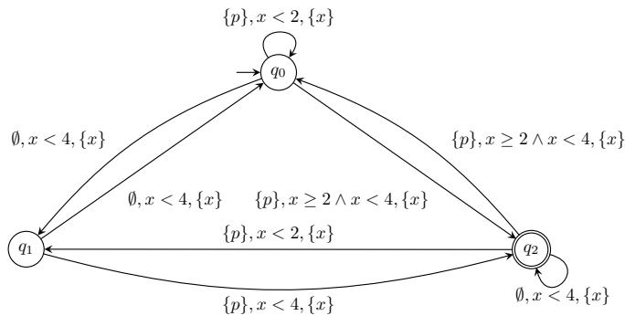
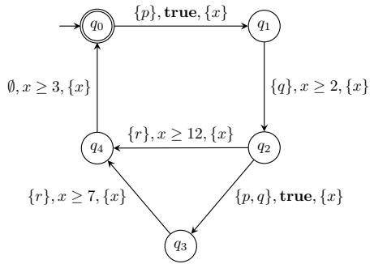

# On Synthesis of Metric Interval Temporal Logics

Hsi-Ming Ho University of Sussex, Brighton, UK hsi-ming.ho@sussex.ac.uk

Shankara Narayanan Krishna IIT Bombay, Mumbai, India krishnas@cse.iitb.ac.in

Khushraj Madnani IIT Guwahati, Guwahati, India khushraj@iitg.ac.in

Abstract—Automated mining of formal specifications is vital for verifying real-time systems. However, existing passive learning approaches remain restricted to deterministic specifications or limited fragments of Timed Regular Expressions (TRE). To our knowledge, this paper presents the first framework to tackle precise passive learning for an expressive timed logic—Metric Interval Temporal Logic (MITL)—without relying on predefined templates or restricted logic fragments. Our approach formally reduces the timed learning problem into a scalable untimed one. By identifying quantitative timing differences between positive and negative traces, we synthesise precise timed constraints and inject them as new Boolean atomic propositions. This embeds timing into the alphabet, delegating the complex formula evaluation to highly optimised, off-the-shelf untimed LTL tools. Crucially, our framework is complete, guaranteeing a separating specification can always be found. We evaluate our implementation across several benchmarks, demonstrating the effectiveness of our approach.

Index Terms—Metric Interval Temporal Logic, Specification Mining, Passive Learning, Feature Synthesis, Real-Time Systems.

## I. INTRODUCTION

Formal specifications underpin the verification, runtime monitoring, and testing of real-time and cyber-physical systems (CPS). However, manually crafting these rigorous mathematical formulae is notoriously complex and prone to error. While recent advances in Large Language Models (LLMs) have begun to alleviate this bottleneck by translating natural language requirements into formal specifications (see, e.g., [43]), this approach still relies on the existence of clear, comprehensive textual comments or documentation. In many practical scenarios, engineers instead possess vast amounts of implicit behavioural data, such as execution traces, logs, and counterexamples. Specification mining (or learning') addresses the inverse problem: synthesising a mathematical model that directly captures the behaviours hidden within samples of labelled traces, namely the positive and negative trace sets, $\Omega ^ { + }$ and $\Omega ^ { - }$ , respectively.

For (untimed) Linear Temporal Logic (LTL), the mining problem is well studied. Methods such as [28], [6], [31] are implemented in tools that handle thousands of traces. However, in many practical applications—such as autonomous driving, medical monitoring, and industrial automation—system correctness depends not only on the logical order of events but also on the strict time bounds of their occurrences. To rigorously reason about these timing constraints, one must turn to timed logics such as Metric Interval Temporal Logic (MITL) [3], a quantitative extension of LTL with integerbounded timing constraints. However, the learning problem for MITL is conceivably harder: constructing a consistent MITL formula requires choosing both a structure (nested operators, atomic propositions) and interval parameters.

A naïve attempt to reuse mature LTL learning tools is the simple ‘untiming' reduction: for a timed word $\omega =$ $\left( d _ { 1 } , \sigma _ { 1 } \right) \cdot \cdot \cdot \left( d _ { \ell } , \sigma _ { \ell } \right)$ over $\Sigma _ { \mathsf { A P } } = 2 ^ { \mathsf { A P } } \ ( { \mathsf { i . e . } } \ \sigma _ { i }$ is a subset of atomic propositions AP for all $i , 1 \leq i \leq \ell ,$ and $d _ { i } \mathrm { ' } s$ denote the time delay before witnessing $\sigma _ { i } \mathbf { \ ' } _ { \mathbf { S } } )$ , let $\mu ( \omega ) = \sigma _ { 1 } \cdot \cdot \cdot \sigma _ { \ell }$ be the sequence obtained from ω by removing the delay' component. We then feed $\{ \mu ( \omega ) : \omega \in \Omega ^ { + } \}$ and $\{ \mu ( \omega ) : \omega \in \Omega ^ { - } \}$ to an off-the-shelf LTL learner. This approach would not work, however, whenever a positive and a negative trace share an identical untimed projection, as obviously no LTL formula can distinguish between them. In this case, the two traces are said to be propositionally indistinguishable with respect to AP.

Example 1. Consider an EDF (Earliest Deadline First) scheduler with two tasks $T _ { 1 } , T _ { 2 }$ where $T _ { i }$ involves releasing a job (witnessed as $p _ { i } )$ and its completion (witnessed as $q _ { i } )$ . The trace $\omega ^ { + } = ( 0 , \{ p _ { 1 } \} ) ( 3 . 5 , \{ q _ { 1 } \} ) ( 4 , \{ p _ { 2 } \} ) ( 8 . 2 , \{ q _ { 2 } \} )$ records a successful release (pi) and completion $( q _ { i } )$ sequence, while the trace $\omega ^ { - } = ( 0 , \{ p _ { 1 } \} ) ( 1 2 . 5 , \{ q _ { 1 } \} ) ( 4 , \{ p _ { 2 } \} ) ( 8 . 2 , \{ q _ { 2 } \} )$ records the same sequence of events but with $T _ { 1 }$ completing after a delay of 12.5 time units, well past its deadline. The untimed projection of $\omega ^ { + } , \omega ^ { - }$ are identical: $\mu ( \omega ^ { + } ) ~ = ~ \mu ( \omega ^ { - } ) ~ = ~$ $\{ p _ { 1 } \} \{ q _ { 1 } \} \{ p _ { 2 } \} \{ q _ { 2 } \}$ , and obviously no LTL formula over $\mathsf { A P } = \{ p _ { 1 } , q _ { 1 } , p _ { 2 } , q _ { 2 } \}$ distinguishes them.

Quantitative distinguishability. When two propositionally indistinguishable traces are nonetheless behaviourally distinct (i.e. one in $\Omega ^ { + }$ and one in Ω−), their divergence is purely quantitative: some pair of event occurrences in the two traces differs in delay. We formalise this as a pivot—a tuple $( ( i , j ) , c )$ such that one trace's inter-event delay between positions i and j is below the integer boundary c and the other's is above c. Pivots are easily computable certificates of quantitative distinguishability. The crux of our framework is that a formula such as ${ \bf F } _ { [ 0 , c ] } p \mathrm { o r } \overleftarrow { { \bf F } } _ { [ 0 , c ] } p$ evaluated at the corresponding position can distinguish the two traces involved. When treated as a fresh proposition and added to the set of atomic propositions, this formula serves as a new feature and effectively restores propositional distinguishability.

From timed mining to untimed mining. The featureengineering pass is guaranteed to make progress on every iteration. Once enough synthesised features have been injected into the set of atomic propositions, every positive-negative trace pair $( \omega ^ { + } , \omega ^ { - } )$ are propositionally distinguishable with respect to the updated (expanded) set of atomic propositions AP. At that point, the set of positive and negative traces can both be recasted onto the updated AP with delays discarded, and an untimed LTL learner applied with no further modification. The expressive power lost when discarding delays is recovered by the features the learner now sees in the set of atomic propositions. In other words, this reduction turns a hard timed mining problem into an easier untimed one.

Contributions. We make the following contributions.

1) Formalisation of propositional indistinguishability (Section IV). We define propositional indistinguishability with respect to arbitrary subsets of atomic propositions, prove a structural characterisation of when a pair is quantitatively distinguishable but propositionally indistinguishable (Lemma 3), and reduce such cases to a finite collection of integer pivots.

2) Subset-projection collision detection (Section IV-A). We give an algorithm that enumerates subsets of atomic propositions in order of decreasing size and identifies every propositionally indistinguishable trace pair together with all the pivots which explain how the two traces may be distinguished. The algorithm runs in $\mathcal { O } ( 2 ^ { | \mathsf { A P } | } \cdot N ^ { 2 } \cdot \ell ^ { 2 } )$ in the worst case (where N is the number of traces in the larger of $\Omega ^ { + } , \Omega ^ { - }$ and l is the length of the longest trace) but is highly effective in practice because most real-world specifications use small numbers of atomic propositions.

3) Layered feature-synthesis framework (Sections IV-B and IV-C). We detail the successive phases of our translation pipeline: template injection, layered feature synthesis (formulated as a set-cover problem), and proposition minimisation. During feature synthesis, the engine primarily relies on standard MITL modalities $( \mathbf { F } _ { I } , \overleftarrow { \mathbf { F } } _ { I } )$ to extract separating timing constraints. Where these prove insufficiently expressive, such as for complex counting patterns, we use Pnueli modalities $( \mathbf { P n } _ { J } , \overleftarrow { \mathbf { P } } \mathbf { n } _ { J } )$ as a fallback strategy. Furthermore, domain-specific template injection can be applied prior to synthesis, acting as a structural pre-filter to accelerate the resolution of known specification patterns.

4) Soundness and completeness (Sec. V). We prove that the synthesised features suffice to make every $( \omega ^ { + } , \omega ^ { - } ) \in \Omega ^ { + } \times$ $\Omega ^ { - }$ propositionally distinguishable (Theorem 9), and that the framework is complete in the sense that we can generate an MITPPL formula that distinguishes $( \Omega ^ { + } , \Omega ^ { - } )$ if they can be distinguished by a timed automaton (Theorem 10).

5) Implementation and evaluation (Sec. VI). We implement the framework in Python and evaluate it across three specific benchmark scenarios: (1) learning the behaviours of a simple timed automaton, (2) learning typical parameterised specification patterns used in the online monitoring of cyber-physical systems, and (3) learning to determine the precise timing constants within a train-gate controller. We demonstrate the feasibility and computational efficiency of our translation pipeline, contextualising our results against the performance of direct MTL mining and TRE synthesis reported in [32], [42], and explicitly evaluate the structural trade-off between solver scalability and out-ofsample generalisation.

Outline. Section II presents a motivating example. Section III collects preliminaries on timed words, MITL and MITPPL, untimed LTL learning, etc. Section IV formalises propositional indistinguishability and present the four phases of the process. Section V establishes the framework's correctness, progress, and complexity. Section VI reports the experimental evaluation. Sections VII and VIII discuss related work and conclude.

## II. MOTIVATING EXAMPLE

We motivate the framework using an example adapted from [42]. In their work, certain problem instances are explicitly identified as out-of-scope (termed obscured') because separating them inherently requires the intersection operator in timed regular expressions (TREs). We demonstrate how our framework handles this trivially.

Setup. Consider a simple system with a single event type, giving the original set of atomic propositions $\mathsf { A P _ { o r i g } } = \{ p \}$ The goal is to distinguish $\Omega ^ { + } = \{ \omega _ { 1 } ^ { + } \}$ from $\Omega ^ { - } = \{ \omega _ { 1 } ^ { - } , \omega _ { 2 } ^ { - } \}$ with a simple TRE (without intersection). [42] demonstrates that while the positive trace can be separated from each negative trace individually using simple TREs, distinguishing it from both simultaneously requires intersection (cf. [7]), which their synthesis method explicitly forbids and cannot support. Specifically, the traces are given as follows:

$$
\omega _ { 1 } ^ { + } = ( 0 , \emptyset ) ( 1 . 5 , \{ p \} ) ( 2 . 6 , \{ p \} ) ( 1 . 5 , \{ p \} )
$$

$$
\omega _ { 1 } ^ { - } = ( 0 , \emptyset ) ( 1 . 2 , \{ p \} ) ( 2 . 6 , \{ p \} ) ( 1 . 5 , \{ p \} )
$$

$$
\omega _ { 2 } ^ { - } = ( 0 , \emptyset ) ( 1 . 5 , \{ p \} ) ( 2 . 6 , \{ p \} ) ( 1 . 2 , \{ p \} )
$$

All three traces share the exact same untimed projection $\emptyset \left\{ p \right\} \left\{ p \right\} \left\{ p \right\}$ , making them propositionally indistinguishable

What our framework does. Phase 1 (Sec. IV-A) detects the propositionally indistinguishable pairs and extracts pivots:

• Pair $( \omega _ { 1 } ^ { + } , \omega _ { 1 } ^ { - } )$ : the sum of the first two delays is 4.1 time units in the positive trace and 3.8 in the negative trace, crossing the integer boundary 4.

• Pair $( \omega _ { 1 } ^ { + } , \omega _ { 2 } ^ { - } )$ : the sum of the last two delays is 4.1 time units in the positive trace and 3.8 in the negative trace, again crossing the integer boundary 4.

Rather than attempting to construct a complex monolithic formula with intersections, Phase 3 (Section IV-C) synthesises two new MITL formulae that serve as features:

$$
\phi _ { 1 } = \overleftarrow { \mathbf { F } } _ { [ 0 , 4 ] } ( \neg p ) , \ \phi _ { 2 } = \overleftarrow { \mathbf { F } } _ { [ 0 , 4 ] } ( \overleftarrow { \mathbf { F } } _ { [ 0 , 4 ] } ( \neg p ) )
$$

The meaning of $\phi _ { 1 }$ is: there is an event with ¬p in at most 4 time units in the past from now'. This holds at position 3 in ${ \omega } _ { 1 } ^ { - }$ , but not at position 3 in $\omega _ { 1 } ^ { + }$ and ${ \omega } _ { 2 } ^ { - }$ . Similarly, φ2 holds at position 4 in ${ \omega } _ { 1 } ^ { - }$ and ${ \omega } _ { 2 } ^ { - }$ , but not at position 4 in $\omega _ { 1 } ^ { + }$

Expanded atomic propositions and untimed reduction. The expanded set of atomic propositions is $\mathsf { A P } = \mathsf { A P } _ { \mathsf { o r i g } } \cup \{ \phi _ { 1 } , \phi _ { 2 } \}$ The positive and negative traces, with all delays stripped, are now pairwise distinguishable as untimed strings:

$$
\begin{array} { l } { { \mu _ { 1 } ^ { + } = ( 0 , \{ \phi _ { 1 } , \phi _ { 2 } \} ) ( 1 . 5 , \{ p , \phi _ { 1 } , \phi _ { 2 } \} ) ( 2 . 6 , \{ p , \phi _ { 2 } \} ) ( 1 . 5 , \{ p \} ) } } \\ { { \mu _ { 1 } ^ { - } = ( 0 , \{ \phi _ { 1 } , \phi _ { 2 } \} ) ( 1 . 2 , \{ p , \phi _ { 1 } , \phi _ { 2 } \} ) ( 2 . 6 , \{ p , \phi _ { 1 } , \phi _ { 2 } \} ) ( 1 . 5 , \{ p , \phi _ { 2 } \} ) } } \\ { { \mu _ { 2 } ^ { - } = ( 0 , \{ \phi _ { 1 } , \phi _ { 2 } \} ) ( 1 . 5 , \{ p , \phi _ { 1 } , \phi _ { 2 } \} ) ( 2 . 6 , \{ p , \phi _ { 2 } \} ) ( 1 . 2 , \{ p , \phi _ { 2 } \} ) } } \end{array}
$$

The Boolean evaluations of $\phi _ { 1 }$ and $\phi _ { 2 }$ at each position natively separate the behaviours around the critical 4 time unit boundary. When fed to the off-the-shelf LTL learner BoLT [11], the tool outputs the formula

$$
{ \bf F } ( \lnot \phi _ { 2 } ) \equiv { \bf F } ( \lnot \stackrel {  } { \bf F } _ { [ 0 , 4 ] } ( \stackrel {  } { \bf F } _ { [ 0 , 4 ] } ( \lnot p ) ) ) ~ ,
$$

seamlessly resolving the exact problem instance that precludes the existing TRE-based synthesis method of [42].

## III. PRELIMINARIES

Timed words and projections. Let $\mathsf { A P }$ be a finite set of atomic propositions, and let $\Sigma _ { \mathsf { A P } } = 2 ^ { \mathsf { A P } }$ denote the corresponding finite alphabet. Let N and $\mathbb { R } _ { \geq 0 }$ denote the sets of natural numbers and non-negative real numbers, respectively.

Definition 1 (Timed Word). A timed word (or a trace) over $\Sigma _ { \mathsf { A P } }$ is a finite sequence $\omega = ( d _ { 1 } , \sigma _ { 1 } ) \cdot \cdot \cdot ( d _ { \ell } , \sigma _ { \ell } ) \in ( \mathbb { R } _ { \geq 0 } \times \Sigma _ { \mathsf { A P } } ) ^ { * }$ where each $d _ { i }$ represents the non-negative time delay elapsed immediately prior to observing the symbol $\sigma _ { i } .$ We denote the length of ω as $| \omega | = \ell .$ The untimed projection of ω is the sequence of symbols $\mu ( \omega ) = \sigma _ { 1 } \cdot \cdot \cdot \sigma _ { \ell } .$ For a set Ω of timed words, we write $\mu ( \Omega )$ for $\scriptstyle \bigcup _ { \omega \in \Omega } \{ \mu ( \omega ) \}$

Definition 2 (Propositional Projection). For a subset of atomic propositions ${ \mathsf { P } } \subseteq { \mathsf { A P } }$ , the P-projection of a letter $\sigma \in \Sigma _ { \mathsf { A P } }$ is $\pi _ { \mathsf { P } } ( \sigma ) = \sigma \cap { \mathsf { P } } $ The P-projection of an untimed string $\mu = \sigma _ { 1 } \cdot \cdot \cdot \sigma _ { \ell }$ is the string formed by projecting each individual letter in place, yielding $\pi _ { \mathsf { P } } ( \sigma _ { 1 } ) \cdot \cdot \cdot \pi _ { \mathsf { P } } ( \sigma _ { \ell } )$ . Similarly, the $\mathsf { P } _ { - }$ projection of a timed word $\omega = ( d _ { 1 } , \sigma _ { 1 } ) \cdot \cdot \cdot ( d _ { \ell } , \sigma _ { \ell } )$ , denoted $\pi _ { \mathsf { P } } ( \omega )$ , is the timed word $( d _ { 1 } , \sigma _ { 1 } \cap { \mathsf { P } } ) \cdot \cdot \cdot ( d _ { \ell } , \sigma _ { \ell } \cap { \mathsf { P } } )$ . For a set Ω of timed words, we write $\pi _ { \mathsf { P } } ( \Omega )$ for $\cup _ { \omega \in \Omega } \{ \pi _ { P } ( \omega ) \}$

Example 2 (Propositional Projection). Let

$$
\omega = ( 0 . 5 , \{ p _ { 1 } , r _ { 1 } \} ) ( 3 . 2 , \{ p _ { 2 } , q _ { 1 } \} ) ( 3 . 0 , \{ q _ { 2 } \} ) ( 4 . 5 , \{ p _ { 1 } , q _ { 2 } \} )
$$

be a timed word over $\Sigma _ { \mathsf { A P } }$ where $\mathsf { A P } = \{ p _ { 1 } , p _ { 2 } , q _ { 1 } , q _ { 2 } , r _ { 1 } \}$ The $\{ p _ { 1 } , p _ { 2 } \}$ -projection of ω is:

$$
\pi _ { \{ p _ { 1 } , p _ { 2 } \} } ( \omega ) = ( 0 . 5 , \{ p _ { 1 } \} ) ( 3 . 2 , \{ p _ { 2 } \} ) ( 3 . 0 , \emptyset ) ( 4 . 5 , \{ p _ { 1 } \} )
$$

The $\left\{ q _ { 1 } , q _ { 2 } \right\}$ -projection of $\omega$ is:

$$
{ \pi } _ { \{ q _ { 1 } , q _ { 2 } \} } ( \omega ) = ( 0 . 5 , \emptyset ) ( 3 . 2 , \{ q _ { 1 } \} ) ( 3 . 0 , \{ q _ { 2 } \} ) ( 4 . 5 , \{ q _ { 2 } \} )
$$

MITL with Past and Pnueli modalities. We use the standard MITPPL syntax and semantics of [19]. Let 〈 denote a left-open $^ { 6 6 } ( ^ { 9 } )$ or left-closed $^ { 6 6 } [ ^ { 5 } ,$ boundary, and let 〉 denote a right-open $^ { 6 6 } ) ^ { , 5 }$ or right-closed “]" boundary. Let Ī be the set of all intervals $\langle l , u \rangle$ where $l \le u , l \in \mathbb { N }$ , and $u \in \mathbb { N } \cup \{ \infty \}$ . Likewise, let $\mathcal { T } _ { 0 } = \{ [ 0 , u \rangle \mid u \in \mathbb { N } \cup \{ \infty \} \}$ . An interval is singular if it takes the form [c, c] for $c \in \mathbb { N }$ , and non-singular otherwise.

Definition 3 (MITPPL Syntax). MITPPL formulae over AP are defined by the grammar:

$$
\begin{array} { c } { \varphi : : = \mathrm { t r u e } \mid p \mid \neg \varphi \mid \varphi _ { 1 } \wedge \varphi _ { 2 } \mid \varphi _ { 1 } \mathbf { U } _ { I } \varphi _ { 2 } \mid \varphi _ { 1 } \mathbf { S } _ { I } \varphi _ { 2 } } \\ { \mid \mathbf { P } \mathbf { n } _ { J } ( \varphi _ { 1 } , \dots , \varphi _ { k } ) \mid \mathbf { \dot { P } } \mathbf { \tilde { n } } _ { J } ( \varphi _ { 1 } , \dots , \varphi _ { k } ) , } \end{array}
$$

where $p \in \mathsf { A P } , I \in \mathcal { I }$ is a non-singular interval, $J \in \mathcal { T } _ { 0 }$ is a bounded interval, and $k \in \mathbb N$ with $k \geq 2$

Standard derived modalities include: $\mathbf { F } _ { \scriptscriptstyle \perp } \varphi = \mathbf { t r u e } \mathbf { U } _ { I } \varphi ,$ $\mathbf { G } _ { I } \boldsymbol { \varphi } = \mathbf { \vec { \varphi } } \mathbf { F } _ { I } \lnot \varphi , \mathbf { F } _ { I } \boldsymbol { \varphi } = \mathbf { t r u e } \mathbf { S } _ { I } \boldsymbol { \varphi } ,$ and ${ \dot { \mathbf { G } } } _ { I } \varphi = \lnot { \mathbf { F } } _ { I } \lnot \varphi .$

Given a timed word $\omega = ( d _ { 1 } , \sigma _ { 1 } ) ( d _ { 2 } , \sigma _ { 2 } ) . .$ over $\Sigma _ { \mathsf { A P } } .$ a position $i \in \mathbb N$ , and any $a \in \mathsf { A P }$ , we define the pointwisesemantics of MITPPL inductively:

$$
\begin{array} { r l } { \omega _ { 2 } \dot { \omega } _ { 1 } } & { = \ p } \\ { \omega _ { 2 } \dot { \omega } _ { 1 } } & { = \ \varphi _ { 1 } \ \sin \varphi _ { 2 } \ \sin \varphi _ { 1 } , } \\ { \omega _ { 2 } \dot { \omega } _ { 1 } } & { = \ \varphi _ { 1 } \ \sin \varphi _ { 2 } \ \sin \varphi _ { 1 } , } \\ { \omega _ { 2 } \dot { \omega } _ { 1 } } & { = \ \varphi _ { 1 } \ \sin \varphi _ { 2 } \ \sin \varphi _ { 2 } , } \\ { \omega _ { 2 } \dot { \omega } _ { 1 } } & { = \ \frac { \sin \varphi _ { 1 } \gamma \varphi _ { 2 } } { \sin \varphi _ { 2 } \sin \varphi _ { 2 } \sin \varphi _ { 1 } } , } \\ { \omega _ { 2 } \dot { \omega } _ { 2 } } & { = \ \frac { \sin \varphi _ { 1 } \gamma \varphi _ { 2 } } { \sin \varphi _ { 2 } \sin \varphi _ { 2 } \sin \varphi _ { 2 } \sin \varphi _ { 1 } } , } \\ { \omega _ { 2 } \dot { \omega } _ { 1 } } & { = \ \frac { \sin \varphi _ { 1 } \gamma \sin \varphi _ { 2 } } { \sin \varphi _ { 2 } \sin \varphi _ { 2 } \sin \varphi _ { 2 } \sin \varphi _ { 2 } \sin \varphi _ { 2 } \sin \varphi _ { 1 } } , } \\ { \omega _ { 2 } \dot { \omega } _ { 1 } \operatorname { { f r o m } } _ { \varphi _ { 2 } \to \ \ \varphi _ { 1 } \mathrm { f r o m } } } &  \{ \begin{array} { l l } { \frac { \sin \varphi _ { 1 } \sin \varphi _ { 2 } } { \sin \varphi _ { 2 } \sin \varphi _ { 1 } } , } & { \mathrm { ~ f o r ~ } \omega _ { 2 } \omega _ { 1 } \sin \varphi _ { 1 } } \\ { \frac { \sin \varphi _ { 2 } \sin \varphi _ { 1 } \sin \varphi _ { 2 } \sin \varphi _ { 2 } \sin \varphi _ { 1 } } , } &  \mathrm { ~ f o r ~ } \omega _ { 2 } \omega _ { 2 } \sin  \end{array} \end{array}
$$

We write $\omega \Vdash \varphi$ to denote $\omega , 1 \models \varphi .$ We omit the subscript, for succinctness, when the intended interval is $[ 0 , \infty )$ as the interval imposes no restriction. Hence, LTL can be seen as a subclass of MITL with no intervals.

Passive untimed LTL learning. We adopt the standard passive learning setup of [24], [11]. An LTL formula uses standard temporal operators (F, G, X, U, etc.), without timing intervals.

Problem 1 (Untimed LTL Learning). Given an untimed sample $( \Omega ^ { + } , \Omega ^ { - } )$ , where $\Omega ^ { + }$ and $\Omega ^ { - }$ are sets of finite words over $\Sigma _ { \mathsf { A P } }$ find an LTL formula $\varphi$ such that $\omega \models \varphi$ for all $\omega \in \Omega ^ { + }$ and ω $\nvDash \varphi$ for all $\omega \in \Omega ^ { - }$

Trivially, as long as $\Omega ^ { + }$ and $\Omega ^ { - }$ are strictly disjoint, a distinguishing formula always exists (e.g., by explicitly encoding the finite set $\Omega ^ { + }$ as a large disjunction). However, such literal encodings severely overfit and fail to capture meaningful underlying patterns.

In practice, modern LTL learners employ various algorithmic strategies to systematically extract a minimum-size consistent formula. While some approaches reduce the problem to a SAT or SMT encoding (e.g., [28]), others leverage various syntactic and semantic enumeration techniques (e.g., [31], [38], [11]). Regardless of the specific methodology, our framework treats the untimed LTL learner purely as a black box. We remain entirely agnostic to its internal mechanisms, relying solely on the assumption that it returns a sound specification.

Passive MITPPL learning. We now lift the passive learning problem to the timed setting. While the untimed setting abstracts away absolute durations, the primary objective of our framework is to synthesise timing constraints directly from the delay data in traces. We formalise this core task as follows:

Problem 2 (Timed MITPPL Learning). Given a timed sample $( \Omega ^ { + } , \Omega ^ { - } )$ , where $\Omega ^ { + }$ and $\Omega ^ { - }$ are sets of timed words over $\Sigma _ { \mathsf { A P } }$ , find an MITPPL formula $\varphi$ such that $\omega \ \models \ \varphi$ for all $\omega \in \Omega ^ { + }$ and $\omega \not \ = e$ for all $\omega \in \Omega ^ { - }$

Our framework imposes no structural assumptions on the input traces; our theoretical guarantees hold strictly regardless of trace length, duration, or event density. Unlike the untimed setting, simply having disjoint positive and negative trace sets is insufficient to guarantee the existence of a distinguishing formula. As detailed in the subsequent sections, Problem 2 admits a valid solution if and only if the sets $\Omega ^ { + }$ and $\Omega ^ { - }$ can be separated by a timed automaton.

Remark 1 (Rational Constants and Scaling). While our pivot extraction algorithm relies on integer boundaries, non-integer timing constraints can always be accommodated via scaling. Provided the required granularity of timing precision is known, which is virtually always the case in practice, one can safely map the problem to the integer domain without any loss of precision. For example, if a target system requires thresholds at 0.5 granularity, pre-multiplying all trace timestamps by 2 safely satisfies the integer assumption prior to learning.

## IV. THE SYNTHESIS FRAMEWORK

In this section, we outline our four-phase translation architecture. Given a sample of positive and negative timed words, our objective is to identify a set of localised MITPPL features such that, when injected as new atomic propositions, the untimed projections of the positive and negative traces become strictly disjoint. We achieve this through four distinct phases: (1) subset-projection collision detection, which isolates the exact locations where traces share identical logical structures but diverge in timing; (2) template injection, which applies userprovided domain knowledge to rapidly filter out broad structural violations; (3) layered feature synthesis, which iteratively constructs and evaluates new temporal features to separate the remaining conflicts using a global $\mathcal O ( \ell )$ sliding-window algorithm (where l is the length of the longest trace); and (4) proposition minimisation, which eliminates redundant features to ensure the final set of propositions is as compact as possible.

Before detailing these phases, we first formalise the obstacle that defeats a naive reduction (i.e., the direct application of untimed LTL learning) and precisely characterise the conditions under which it occurs.

Definition 4 (Propositional Indistinguishability). Let ω1, ω2 be timed words of equal lengths $( { \bf i . e . } ~ | \omega _ { 1 } | ~ = ~ | \omega _ { 2 } | )$ over $\Sigma _ { \mathsf { A P } }$ and ${ \mathsf { P } } \subseteq { \mathsf { A P } }$ . The pair $( \omega _ { 1 } , \omega _ { 2 } )$ is propositionally indistinguishable with respect to P, written $\omega _ { 1 } ~ \equiv _ { \mathsf { P } } ~ \omega _ { 2 }$ , if $\mu ( \pi _ { \mathsf { P } } ( \omega _ { 1 } ) ) = \mu ( \pi _ { \mathsf { P } } ( \omega _ { 2 } ) )$ . Note that this implies $\omega _ { 1 } \equiv _ { \mathsf { P } ^ { \prime } } \omega _ { 2 }$ for all ${ \mathsf { P } } ^ { \prime } \subseteq { \mathsf { P } } .$

Lemma 1 (LTL Indistinguishability). ${ \cal I } f \\omega _ { 1 } \equiv _ { \mathsf { P } } \omega _ { 2 }$ , then for every untimed LTL formula $\varphi$ over P, $\omega _ { 1 } \left. = \varphi \iff \omega _ { 2 } \right. = \varphi .$ Corollary 2. $H \omega ^ { + } \in \Omega ^ { + }$ and $\omega ^ { - } \in \Omega ^ { - }$ satisfy $\omega ^ { + } \equiv _ { P } \omega ^ { - }$ then no untimed LTL formula can distinguish $\Omega ^ { + } \ f r o m \ \Omega ^ { - }$

Quantitative distinguishability. The key structural observation relies on the notion of simple elementary languages [41], which establishes a necessary condition for distinguishability with respect to timed automata [2]. By definition, a simple elementary language groups together propositionally indistinguishable timed words that satisfy the exact same tightest integer-bounded time constraints for all possible consecutive sequences of delays $( \mathrm { i . e . }$ , the sum of the delays strictly falls between two consecutive integers t and t + 1, or is exactly equal to t).

For example, consider the sequence of two delays $d _ { 1 } , d _ { 2 }$ associated with an untimed event sequence $\{ p \} \{ q \}$ . The timed words with delays (0.4, 0.7) and (0.3, 0.9) belong to the exact same simple elementary language because their delays and sums share identical integer bounds: $d _ { 1 } \in ( 0 , 1 ) , d _ { 2 } \in ( 0 , 1 )$ and $d _ { 1 } + d _ { 2 } \in ( 1 , 2 )$ . In contrast, a timed word with delays $( 0 . 6 , 0 . 2 )$ belongs to a different simple elementary language; although its individual delays still fall within $( 0 , 1 )$ , their sum (0.8) strictly falls into the distinct interval (0, 1).

Consequently, if two traces are propositionally indistinguishable yet can be separated by a timed automaton (and by extension, any formal timed specification), they cannot belong to the same simple elementary language. This implies that their tightest integer bounds must differ, guaranteeing the existence of a specific integer time boundary—which we term a pivot—at which the two traces' inter-event delays disagree.

Definition 5 (Pivot). Let $\omega _ { 1 } , \omega _ { 2 }$ be propositionally indistinguishable with respect to $\mathsf { P } \subseteq \mathsf { A P } \mathsf { \Gamma } ( \mathrm { i . e . } \mu ( \pi _ { \mathsf { P } } ( \omega _ { 1 } ) ) = $ $\mu ( \pi _ { \mathsf { P } } ( \omega _ { 2 } ) ) )$ and $| \omega _ { 1 } | = | \omega _ { 2 } | = \ell . \mathrm { ~ A ~ }$ pivot for $( \omega _ { 1 } , \omega _ { 2 } )$ is a triple $( ( i , j ) , c )$ where $1 \leq i < j \leq \ell , c \in \mathbb { N }$ , and

$$
\begin{array} { c c } { { \left[ \Delta _ { i , j } ^ { 1 } \leq c < \Delta _ { i , j } ^ { 2 } \right] } } & { { \vee } } & { { \left[ \Delta _ { i , j } ^ { 2 } \leq c < \Delta _ { i , j } ^ { 1 } \right] o r } } \\ { { } } & { { } } \\ { { \left[ \Delta _ { i , j } ^ { 1 } < c \leq \Delta _ { i , j } ^ { 2 } \right] } } & { { \vee } } & { { \left[ \Delta _ { i , j } ^ { 2 } < c \leq \Delta _ { i , j } ^ { 1 } \right] } } \end{array}
$$

with $\Delta _ { i , j } ^ { k } = \Sigma _ { m \in ( i , j ] } d _ { m } ^ { k }$ the accumulated delay between the ith and jth events of $\omega _ { k } \ ( k \in \{ 1 , 2 \} )$

Remark 2 (Pivot Multiplicity). A pair of inter-event delays $\Delta _ { i , j } ^ { 1 } \ < \ \Delta _ { i , j } ^ { 2 }$ generates exactly $\lfloor \bar { \Delta _ { i , j } ^ { 2 } } \rfloor - \lceil \Delta _ { i , j } ^ { 1 } \rceil + 1$ integer pivots, but for our purpose we just need one pivot for $( i , j )$

Definition 6 (Quantitative Indistinguishability). Let $\omega _ { 1 } , \omega _ { 2 }$ be timed words of equal lengths $\left( \mathrm { i . e . ~ } | \omega _ { 1 } | = | \omega _ { 2 } | \right)$ over $\Sigma _ { \mathsf { A P } }$ and ${ \mathsf { P } } \subseteq { \mathsf { A P } }$ . The pair $( \omega _ { 1 } , \omega _ { 2 } )$ is quantitatively indistinguishable, written $\omega _ { 1 } \equiv _ { t i m e } \omega _ { 2 } .$ if $\pi _ { \mathsf { P } } ( \omega _ { 1 } ) , \pi _ { \mathsf { P } } ( \omega _ { 2 } ) \in L$ for some simple elementary language L over $\Sigma _ { P }$

Lemma 3 (Pivot Characterisation). Let $\omega _ { 1 } , \omega _ { 2 }$ be propositionally indistinguishable with respect to ${ \mathsf { P } } \subseteq { \mathsf { A P } }$ but quantitatively distinguishable. Then there exists a pivot $\left( ( i , j ) , c \right) f o r \left( \omega _ { 1 } , \omega _ { 2 } \right)$

Example 3 (Pivots). The pair $( \omega ^ { + } , \omega ^ { - } )$ of Example 1 is propositionally indistinguishable with respect to any subset

```javascript
ω+ = (1.5, {p})(0.2, {q1 })(1.0, {p2})(2.3, {p1 })
ω− = (1.5, {p})(4.0, {q})(4.1, {q})(3.4, {p1})
ω± = (2.8, {p})(3.2, {q})(0.6, {q1 })(0.6, {p1})
ω2 = (2.8, {p})(1.5, {p2})(5.5, {p2})(1.0, {p1})
ω3 = (4.1, {p})(1.0, {p1})(2.0, {p2})(0.9, {q})
ω3 = (4.1, {p})(2.0, {q1})(4.0, {p2})(0.9, {q})
```

Algorithm 1 Phase 1: Subset-Projection Collision Detection   
Input: $( \Omega ^ { + } , \Omega ^ { - } ) ; \mathsf { A P } _ { \mathrm { o r i g } } ; k , 0 \le k \le | \mathsf { A P } _ { \mathrm { o r i g } } |$   
Output: $\mathsf { P a i r s } _ { \mathsf { c o n f } } \subseteq \Omega ^ { + } \times \Omega ^ { - } ;$   
Mismatches : $\mathsf { P a i r s } _ { \mathsf { c o n f } } \to 2 ^ { \mathsf { P i v o t s } }$   
1: $\mathsf { P a i r s } _ { \mathsf { c o n f } } \gets \emptyset ;$ Mismatches $\{ \cdot \}  \emptyset$   
2: for $r = | \mathsf { A P } _ { \mathrm { o r i g } } | , | \mathsf { A P } _ { \mathrm { o r i g } } | - 1 , \ldots , k$ do   
3: for all $P \subseteq \mathsf { A P } _ { \mathsf { o r i g } }$ with $| P | = r$ do   
4: Compute $\pi _ { P } ( \omega )$ for each ω $\ L ^ { \prime } \in \Omega ^ { + } \cup \Omega ^ { - }$   
5: for all $( \omega ^ { + } , \omega ^ { - } ) \in \Omega ^ { + } \times \Omega ^ { - }$ do   
6: if $\mu ( \pi _ { P } ( \omega ^ { + } ) ) = \mu ( \pi _ { P } ( \omega ^ { - } ) )$ then   
7: $\mathsf { P a i r s } _ { \mathsf { c o n f } } \gets \mathsf { P a i r s } _ { \mathsf { c o n f } } \cup \{ ( \omega ^ { + } , \omega ^ { - } ) \}$   
8: Compute pivots II for $( \omega ^ { + } , \omega ^ { - } )$   
9: Mismatches $[ ( \omega ^ { + } , \omega ^ { - } ) ] \gets$   
Mismatches $[ ( \omega ^ { + } , \omega ^ { - } ) ] \cup \Pi$   
10: return $\big ( \mathsf { P a i r s } _ { \mathsf { c o n f } }$ , Mismatches)

P of $\mathsf { A P } = \{ p _ { 1 } , q _ { 1 } , p _ { 2 } , q _ { 2 } \}$ but quantitatively distinguishable. The pivots are $( ( 1 , 2 ) , c )$ for $c \in \{ 4 , 5 , \ldots , 1 2 \} , ( ( 1 , 3 ) , c )$ for $c \in \{ 8 , 9 , \ldots , 1 6 \}$ , and $( ( 1 , 4 ) , c )$ for $c \in \{ 1 6 , 1 7 , \hdots , 2 4 \}$

## A. Phase 1: Subset-Projection Collision Detection

Algorithm 1 takes as input a sample $( \Omega ^ { + } , \Omega ^ { - } )$ over $\Sigma _ { \mathsf { A P _ { o r i g } } }$ and a user-specified threshold k. It yields two outputs: a set $\mathsf { P a i r s } _ { \mathsf { c o n f } } \subseteq \Omega ^ { + } \times \Omega ^ { - }$ of conflicting trace pairs that are propositionally indistinguishable with respect to at least one ${ \mathsf { P } } \subseteq { \mathsf { A P } }$ with $| { \mathsf { P } } | \geq k ,$ and a map Mismatches from each conflicting pair to its list of pivots.

The primary motivation for this subset-projection mechanism stems from the observation that, in many practical scenarios, $\Omega ^ { + }$ and $\Omega ^ { - }$ are already propositionally distinguishable over the complete set of atomic propositions AP. By systematically projecting the traces onto restricted subsets of atomic propositions, the framework intentionally abstracts away these irrelevant structural variations, effectively forcing otherwise distinct traces to become propositionally indistinguishable. Once this structural equivalence is artificially induced, any remaining behavioural divergence between the positive and negative traces must be inherently quantitative. This purposeful isolation enables the algorithm to precisely pinpoint the pure timing differences and extract their corresponding pivots.

The outer loop enumerates subsets of AP by decreasing cardinality; intuitively, our aim is to identify trace pairs that become propositionally indistinguishable once specific atomic propositions are discarded via projection. For any pair $( \omega _ { 1 } , \omega _ { 2 } )$ that is propositionally indistinguishable with respect to $P \subseteq \mathsf { A P } ,$ the pivot extractor iterates over all ordered index pairs $1 \leq$ $i < j \le \ell ,$ emitting a single pivot $( ( i , j ) , \lfloor \mathfrak { m a x } \{ \Delta _ { i , j } ^ { 1 } , \Delta _ { i , j } ^ { 2 } \} \rfloor )$ for each $( i , j )$ . We remark that in practice it is often the case that $| \mathsf { A P } _ { \mathrm { o r i g } } | \le 5$ for typical specifications, making $2 ^ { | \mathsf { A P } _ { \mathsf { o r i g } } | } \mathrm { ~ a ~ }$ small constant. For example, the benchmarks in [42] all have $| \Sigma | < 5$ , which corresponds to $| \mathsf { A P _ { o r i g } } | < 3$

Proposition 4 (Phase 1 Complexity). Algorithm 1 runs in time $\mathcal { O } ( 2 ^ { | \mathsf { A P } _ { \mathrm { o r i g } } | } \cdot N ^ { 2 } \cdot \ell ^ { 2 } )$ on a sample $( \Omega ^ { + } , \Omega ^ { - } )$ with $N =$ max $\{ | \Omega ^ { \cdot } | , | \Omega ^ { - } | \}$ traces of maximum length l.

Proof. The outer enumeration contributes $2 ^ { | \mathsf { A P _ { o r i g } } | }$ subsets. For each $P$ , projecting all N traces is $\mathcal { O } ( N \cdot \ell )$ . Comparing the $\mathcal { O } ( N ^ { 2 } )$ ordered cross-pairs costs $\mathcal O ( \ell )$ per pair. Pivot extraction per matched pair adds $\mathcal { O } ( \ell ^ { 2 } )$ □

Example 4. Consider the sample $( \Omega ^ { + } , \Omega ^ { - } )$ with $\Omega ^ { + } =$ $\begin{array} { r l r } { \{ \omega _ { 1 } ^ { + } , \bar { \omega _ { 2 } ^ { + } } , \omega _ { 3 } ^ { + } \} , \Omega ^ { - } } & { { } = } & { \{ \omega _ { 1 } ^ { - } , \omega _ { 2 } ^ { - } , \omega _ { 3 } ^ { - } \} } \end{array}$ where $\begin{array} { r l } { \mathsf { A P } } & { { } = } \end{array}$ $\{ p , q , p _ { 1 } , q _ { 1 } , p _ { 2 } \}$

Phase 1 enumerates subsets of $\mathsf { A P }$ in decreasing order of cardinality $( r = 5 , 4 , \ldots , k )$ . Suppose that we set $k = 2 .$

$\mathrm { A t } ~ r = 5$ and $r = 4 \colon$ no collisions occur.

${ \mathrm { A t ~ } } r = 3 { : }$

$P = \{ p , p _ { 2 } , q \}$ : The pair $( \omega _ { 3 } ^ { + } , \omega _ { 3 } ^ { - } )$ collides, both projecting to $\{ p \} \emptyset \left\{ p _ { 2 } \right\}$ {q}. There are more than one pivot for $( \pi _ { P } ( \omega _ { 3 } ^ { + } ) , \pi _ { P } ( \omega _ { 3 } ^ { - } ) )$ , but as an example, the accumulated delays between $\{ p \}$ (position 1) and $\{ p _ { 2 } \}$ (position 3) are 3.0 and 6.0 respectively, yielding $( ( 1 , 3 ) , 6 )$

$P = \{ p , q _ { 1 } , p _ { 2 } \}$ The pair $( \omega _ { 1 } ^ { + } , \omega _ { 3 } ^ { - } )$ collides, both projecting to $\left\{ p \right\} \left\{ q _ { 1 } \right\} \left\{ p _ { 2 } \right\} \varnothing .$

$P = \{ p , p _ { 1 } , p _ { 2 } \} \colon$ The pair $( \omega _ { 2 } ^ { + } , \omega _ { 1 } ^ { - } )$ collides, both projecting to $\{ p \} \emptyset \emptyset \{ p _ { 1 } \}$

• At $r \ = \ 2$ and $P ~ = ~ \{ p , p _ { 1 } \} \colon ~ ( \omega _ { 1 } ^ { + } , \omega _ { 1 } ^ { - } ) , ~ ( \omega _ { 2 } ^ { + } , \omega _ { 2 } ^ { - } )$ and $( \omega _ { 1 } ^ { + } , \omega _ { 2 } ^ { - } )$ both strip down to $\{ p \} \emptyset \emptyset \{ p _ { 1 } \}$

## B. Phase 2: Template Injection

Algorithm 2 takes as input the set of conflicting trace pairs $\mathsf { P a i r s } _ { \mathsf { c o n f } }$ generated in Phase 1, alongside an optional structural template $\phi _ { t e m p l a t e }$ It outputs Pairsundone, a reduced subset of trace pairs that remain unresolved.

The motivation for this phase is that, in many practical settings, domain experts possess prior knowledge of specific behavioural patterns the synthesised specification should respect—for example, every arrival is eventually followed by a completion'. When provided, this template $\phi _ { t e m p l a t e }$ is efficiently evaluated at every position across all traces using a slidingwindow dynamic programming algorithm (Proposition 5). The resulting Boolean truth vectors are then injected into all the traces as a free new proposition. Any conflicting pairs in $\mathsf { P a i r s } _ { \mathsf { c o n f } }$ that are successfully distinguished by this newly injected template are immediately resolved and discarded. The remaining, indistinguishable trace pairs form the output set $\mathsf { P a i r s } _ { \mathsf { u n d o n e } }$ . In this capacity, the template functions as a powerful structural $p r e - f l t e r .$ It cleanly separates broad structural violations—which the domain-knowledge template readily catches—from pure quantitative timing violations, leaving only the latter for Phase 3 to address.

Algorithm 2 Phase 2: Template Injection   
Input: $\mathsf { P a i r s } _ { \mathsf { c o n f } } ;$ optional template φtemplate   
Output: Updated AP, Pairsundone   
1: $\mathsf { A P  A P _ { o r i g } ; }$ Pairsundone ← PairSconf   
2: if $\phi _ { t e m p l a t e }$ is provided then   
3:Evaluate $\phi _ { t e m p l a t e }$ on every position of every trace via   
sliding-window DP   
4: $\mathsf { A P  A P \cup \{ \phi _ { t e m p l a t e } \} }$   
5: for all $( \omega ^ { + } , \omega ^ { - } ) \in \mathsf { P a i r s } _ { \mathsf { u n d o n e } }$ do   
6: if φtemplate at some position distinguishes $\omega ^ { + }$ from   
$\omega ^ { - }$ then   
7: $\mathsf { P a i r s } _ { \mathsf { u n d o n e } } \gets \mathsf { P a i r s } _ { \mathsf { u n d o n e } } \backslash \{ ( \omega ^ { + } , \omega ^ { - } ) \}$   
8: return $( \mathsf { A P } , \mathsf { P a i r s } _ { \mathsf { u n d o n e } } )$

Proposition 5 (Sliding-Window DP). For any feature formula φ of the form ${ \bf F } _ { [ 0 , c ] } \phi ^ { \prime } , \overleftarrow { { \bf F } } _ { [ 0 , c ] } \phi ^ { \prime } , \mathrm { \bf P n } _ { [ 0 , c ) } ( \phi _ { 1 } ^ { \prime } , \dots , \phi _ { k } ^ { \prime } ) ,$ or $\mathbf { \overleftarrow { P n } } _ { [ 0 , c ) } ( \phi _ { 1 } ^ { \prime } , \ldots , \phi _ { k } ^ { \prime } )$ where $\phi ^ { \prime } , \phi _ { 1 } ^ { \prime } , \ldots , \phi _ { k } ^ { \prime }$ are Boolean combinations of atomic propositions and a timed word ω of length $\ell ,$ the Boolean satisfaction values $\{ ( \omega , i ) \ : | = \phi : 1 \le i \le \ell \}$ can be computed in $\mathcal { O } ( \ell \cdot k )$ time and ${ \mathcal { O } } ( k )$ auxiliary space.

Proof sketch. The evaluation of the standard unary MITL modalities ${ \bf F } _ { [ 0 , c ] } \phi ^ { \prime }$ and $\dot { \mathbf { F } } _ { [ 0 , c ] } { \phi } ^ { \prime }$ can be computed in $\mathcal O ( \ell )$ time using standard sliding-window techniques (see, e.g., [20]). We therefore focus on constructively demonstrating the evaluation algorithm for the Pnueli modalities.

For the k-ary future Pnueli modality $\mathbf { P n } _ { [ 0 , c ) } ( \phi _ { 1 } ^ { \prime } , \dots , \phi _ { k } ^ { \prime } )$ we must evaluate whether there exists a sequence of indices $j _ { 1 } , j _ { 2 } , \ldots , j _ { k }$ such that $i < j _ { 1 } < j _ { 2 } < \cdots < j _ { k } ,$ $\Sigma _ { m \in ( i , j _ { k } ] } d _ { m } < c ,$ and $\sigma _ { j _ { m } } \models \phi _ { m } ^ { \prime }$ for all $1 \leq m \leq k$ (the case of the past Pnueli modality Pn is symmetric). We maintain a state array $M [ 1 \ldots k ]$ , where $M [ m ]$ records the minimum ending position of a valid matching subsequence $\phi _ { m } ^ { \prime } , \ldots , \phi _ { k } ^ { \prime }$ that lie after the current position. We initialise $M [ m ] = \infty$ for all $1 \leq m \leq k .$

We iterate i backwards from l down to 1. At each i:

1) Update the DP state: We process the position $i + 1 \colon$

$$
k - 1 \colon \mathrm { i f ~ } \sigma _ { i + 1 } \mid = \phi _ { m } ^ { \prime }
$$

$$
M [ m ] \gets \operatorname* { m i n } ( M [ m ] , M [ m + 1 ] )
$$

• For $m ~ = ~ k \colon \mathrm { i f } ~ \sigma _ { i + 1 } ~ | = ~ \phi _ { k } ^ { \prime }$ , we update $M [ k ] \ \gets$ min $( M [ k ] , i + 1 )$

2) Update right boundary: Update the right window boundary R(i) leftwards to enforce that $\Sigma _ { m \in ( i , R ( i ) ] } d _ { m } < c .$

The Pnueli modality holds at i if and only if $M [ 1 ] \leq R ( i )$

The state array M requires ${ \mathcal { O } } ( k )$ auxiliary space. For each of the l steps, advancing the DP state takes ${ \mathcal { O } } ( k )$ operations. The right pointer $R ( i )$ retreats at most l times globally, amortising to O(1) per step. Thus, the overall evaluation time is bounded by $\mathcal { O } ( \ell \cdot k )$ □

Corollary 6 (Membership for MITPPL formula). Given a timed word ω of length l, an MITPPL formula $\varphi$ with m temporal operators and maximum Pnueli arity k, the satisfaction relation $( \omega , i ) \ : \models \varphi$ can be decided for all i in time $O ( \ell \cdot m \cdot k )$ and space $O ( m \cdot ( \ell + k ) )$

## C. Phase 3: Layered Feature Synthesis as Set Cover

Algorithm 3 iteratively selects a sequence of synthesised features $\phi _ { 1 } , \phi _ { 2 } , . . .$ such that each $\phi _ { i }$ distinguishes at least one pair in $\mathsf { P a i r s } _ { \mathsf { u n d o n e } }$ that has not been previously resolved by $\phi _ { 1 } , \ldots , \phi _ { i - 1 }$ . This process continues until $\mathsf { P a i r s } _ { \mathsf { u n d o n e } } = \emptyset$ We formulate this as a classical set-cover problem: the universe of elements to cover is the set of unresolved pairs $\mathsf { P a i r s } _ { \mathsf { \Pi } }$ undone, and the available sets are defined by the distinguishing power of each candidate feature, denoted $\mathsf { D i s t } ( \phi ) = \{ ( \omega ^ { + } , \omega ^ { - } ) \in$ $\mathsf { P a i r s } _ { \mathsf { u n d o n e } } \mid \phi$ distinguishes $( \omega ^ { + } , \omega ^ { - } ) \}$ . The objective is to cover the universe using the minimum number of features.

Given the intractability of optimal set cover, we solve this problem greedily. Notably, our synthesis approach is layered (or compositional). When synthesising the i-th feature $\phi _ { i } .$ the framework may utilise not only the original atomic propositions $( \mathsf { A P } _ { \mathrm { o r i g } } )$ but also any of the previously synthesised and injected features $\big \{ \phi _ { 1 } , \dots , \phi _ { i - 1 } \big \}$ . This layered expansion allows the algorithm to express complex, nested timing constraints incrementally (e.g., placing a bounded deadline on a condition that itself contains a previously resolved temporal obligation) without suffering the combinatorial explosion of attempting to synthesise deeply nested MITPPL formulae in a single pass.

Standard MITL features. For each unresolved pair $( \omega ^ { + } , \omega ^ { - } ) \in \mathbb { P } \mathsf { a i r s } _ { \mathsf { u n d o n e } }$ and each corresponding pivot $( ( i , j ) , c ) \in$ Mismatches $[ ( \omega ^ { + } , \omega ^ { - } ) ]$ , we construct the candidate features:

$$
\phi _ { ( i , j ) , c } ^ { \mathbf { F } } = \mathbf { F } _ { [ 0 , c ] } ~ \sigma _ { j } ^ { \prime } \qquad \mathrm { a n d } \qquad \phi _ { ( i , j ) , c } ^ { \overleftarrow } = \overleftarrow { \mathbf { F } } _ { [ 0 , c ] } ~ \sigma _ { i } ^ { \prime } .
$$

These candidate features are subsequently evaluated at every position across all traces. (Note that we use the strict interval $[ 0 , c )$ rather than $[ 0 , c ]$ if the larger delay $\Delta _ { ( i , j ) }$ is exactly equal to $c ) .$ Here, $\boldsymbol { \sigma } _ { i } ^ { \prime }$ and $\sigma _ { j } ^ { \prime }$ are interpreted as the Boolean conjunctions corresponding to $\sigma _ { i } ^ { \prime } , \sigma _ { j } ^ { \prime } \in \Sigma _ { \mathsf { A P } }$ , respectively.

Pnueli features. If the previous step yields an empty candidate set, or if every candidate has an empty $\mathsf { M } _ { \mathsf { u n d o n e } } .$ it remains possible to distinguish the two timed words via counting. For each $( ( i , j ) , c ) \in$ Mismatches $[ ( \omega ^ { + } , \omega ^ { - } ) ]$ , we extract the subwords $w ^ { + }$ and $w ^ { - }$ around the pivot : specifically, the sequences of events from $\omega ^ { + }$ and $\omega ^ { - }$ that fall within the $[ 0 , c ]$ time window relative to position i.

We then identify a shortest sequence $\sigma _ { 1 } ^ { * } \cdots \sigma _ { k } ^ { * }$ that is a subsequence of one bounded sub-word but not of the other (this must exist since $w ^ { + }$ and $w ^ { - }$ are of different lengths). This constitutes a classical shortest distinguishing subsequence (SDS) problem [8], which can be solved via a breadth-first search (BFS) in $\mathcal { O } ( | w ^ { + } | \cdot | w ^ { - } | \cdot | \Sigma _ { \mathsf { A P } } | )$ time. The extracted SDS $\sigma _ { 1 } ^ { * } \cdots \sigma _ { k } ^ { * }$ naturally yields the Pnueli feature

$$
\phi _ { ( i , j ) , c } ^ { P n u e l i } = \mathbf { P n } _ { [ 0 , c ] } ( \sigma _ { 1 } ^ { * } , . . . , \sigma _ { k } ^ { * } )
$$

By construction, because the SDS is present in one sub-word and absent from the other, $\phi _ { ( i , j ) , c } ^ { P n u e l i }$ is guaranteed to distinguish $( \omega ^ { + } , \omega ^ { - } )$ at position i.

Expressiveness. It is important to note that our feature synthesis phase exclusively generates MITL and Pnueli modalities with bounded intervals of the form [0, u〉. This design choice, however, imposes no limitation on the theoretical expressiveness of our framework. As established in [19], unilateral MITL and Pnueli modalities are expressively complete for full MITPPL; for instance, a general bounded-until formula such as $\varphi _ { 1 } \mathbf { U } _ { [ a , b ] } \varphi _ { 2 }$ can always be logically decomposed into an equivalent formula using only unilateral intervals. Consequently, our approach requires no user-supplied templates to achieve full expressiveness. Instead, we rely on the downstream untimed LTL learner to compose these simple unilateral features into the logical equivalents of more complex modalities, should they be necessary to separate the sample.

Global scoring. Relying exclusively on a feature's ability to resolve currently outstanding conflicting pairs can lead to severe overfitting, as the algorithm risks selecting highly specific, brittle formulae tailored to noisy edge cases. To promote structural generalisation, candidate features are instead evaluated by their broad distinguishing power across the entire dataset, rather than being strictly limited to pairs currently in $\mathsf { P a i r s } _ { \mathsf { u n d o n e } } .$ Consequently, for the purpose of global scoring, we broaden the definition of a feature's distinguishing set Dist(φ) to encompass the entire universal dataset:

$$
{ \sf t } ( \phi ) = \{ ( \omega ^ { + } , \omega ^ { - } ) \in \Omega ^ { + } \times \Omega ^ { - } \mid \phi
$$

$$
( \omega ^ { + } , \omega ^ { - } ) \}
$$

This global set is computed using a single linear-time slidingwindow dynamic programming pass over all traces (Proposition 5). Candidates are then scored based on the cardinality of their intersection with a target set, $| \mathsf { D i s t } ( \phi ) \cap \mathsf { P a i r s } _ { \mathsf { t a r g e t } } |$ Here, $\mathsf { P a i r s } _ { \mathsf { t a r g e t } } \in \{ \mathsf { P a i r s } _ { \mathsf { u n d o n e } } , \mathsf { P a i r s } _ { \mathsf { c o n f } } , \Omega ^ { + } \times \Omega ^ { - } \}$ is a userselectable parameter that dictates the generalisation reach of the synthesis: targeting $\mathsf { P a i r s } _ { \mathsf { u n d o n e } }$ prioritises immediate local progress; targeting $\mathsf { P a i r s } _ { \mathsf { c o n f } }$ favours formulae that resolve a broader set of historical collisions; and targeting $\Omega ^ { + } \times \Omega ^ { - }$ optimises generalisation to unseen but structurally similar pairs. In the event of a tie, we prioritise candidates that maximise $| \mathsf { P } \cap \mathsf { A P } _ { \mathrm { o r i g } } | .$ where P is the set of atomic propositions occurring in φ. We favour features heavily grounded in $\mathsf { A P } _ { \mathsf { o r i g } } ,$ as they are typically easier for downstream untimed LTL learners to process. Finally, any remaining ties are broken by favouring shorter formula lengths.

Progress guarantee. We select the first candidate $\phi ^ { * }$ in sorted order whose ${ \sf M } _ { \sf u n d o n e } ( \phi ^ { * } ) = { \sf D i s t } ( \phi ^ { * } ) \cap$ Pairsundone is nonempty. This selection rule ensures that

$$
| \mathsf { P a i r s } _ { \mathsf { u n d o n e } } ^ { ( t + 1 ) } | \ < \ | \mathsf { P a i r s } _ { \mathsf { u n d o n e } } ^ { ( t ) } | ,
$$

i.e. the undone-pair count strictly decreases on every iteration.   
Hence the outer loop terminates in at most $| \mathsf { P a i r s \_ o n f } |$ iterations.

## D. Phase 4: Proposition Minimisation

While the expanded AP produced by Phase 3 successfully resolves all structural ambiguities, it is not necessarily minimal. Because of the greedy selection strategy, an earlier feature may become redundant if a subset of subsequently added features collectively covers all the trace pairs it originally distinguished thereby rendering it obsolete. Phase 4 minimises $\mathsf { A P }$ by reducing this task to another classical set-cover instance, which is then solved either exactly (via Petrick's method [30]) or approximately (via a greedy hitting-set algorithm). Specifically, let AP be the fully expanded set of atomic propositions output by Phase 3, and let $\mathsf { U } = \mathsf { P a i r s } _ { \mathsf { c o n f } }$ be the universal set of originally conflicting trace pairs. For each proposition $p \in \mathsf { A P }$ we define $\mathsf { D i s t } ( p ) \subseteq \mathsf { U }$ as the specific subset of conflicting pairs that $p$ successfully distinguishes. The objective is to identify a subset $\mathsf { A P } _ { \mathsf { f i n a l } } \subseteq \mathsf { A P }$ of minimum cardinality such that $\begin{array} { r } { \bigcup _ { p \in \mathsf { A P } _ { \mathsf { f i n a l } } } \mathsf { D i s t } ( p ) = \mathsf { U } } \end{array}$

Algorithm 3 Phase 3: Layered Feature Synthesis   
Input: $\mathsf { P a i r s } _ { \mathsf { u n d o n e } } ,$ Mismatches, AP, $\mathsf { P a i r s } _ { \mathsf { t a r g e t } }$   
Output: Updated $\mathsf { A P }$ with synthesised features   
1: while $\mathsf { P a i r s } _ { \mathsf { u n d o n e } } \neq \emptyset$ do   
2: Candidates $\gets \emptyset$   
3: for all $( \omega ^ { + } , \omega ^ { - } ) \in \mathsf { P a i r s } _ { \mathsf { u n d o n e } }$ do   
4: for all pivot $( ( i , j ) , c ) \in$ Mismatches $[ ( \omega ^ { + } , \omega ^ { - } ) ]$ do   
5: for all $\nabla \in \{ \mathbf { F } , \dot { \mathbf { F } } \}$ do   
6: ${ \phi  \nabla _ { [ 0 , c ] } \sigma _ { j } ^ { \prime } }$ (or $\boldsymbol { \sigma } _ { i } ^ { \prime }$ for $\stackrel {  } { \mathbf { F } } )$   
7: Compute $\mathsf { D i } \mathsf { \bar { s } t } ( \phi ) , \mathsf { M } _ { \mathsf { u n d o n e } } ( \phi )$ via DP   
8: Candidates ←Candidates ∪ $\{ ( \phi \}$   
9: if Candidates = Ø or every candidate has empty $\mathsf { M } _ { \mathsf { u n d o n e } }$   
then   
10: for all $( \omega ^ { + } , \omega ^ { - } ) \in \mathsf { P a i r s } _ { \mathsf { u n d o n e } }$ do   
11: Extract $w ^ { + } , w ^ { - } ;$ find SDS $\sigma _ { 1 } ^ { * } \cdots \sigma _ { k } ^ { * }$   
12: $\phi  \mathbf { P n } _ { [ 0 , c ) } ( \sigma _ { 1 } ^ { * } , \ldots , \sigma _ { k } ^ { * } )$   
13: Compute Dist(φ), $\mathsf { M } _ { \mathsf { u n d o n e } } ( \phi )$ via DP   
14: Candidates ←Candidates ∪ $\{ ( \phi \}$   
15: Sort Candidates descending by $\begin{array} { r } { \vert \mathsf { D i s t } \cap \mathsf { P a i r s } _ { \mathrm { t a r g e t } } \vert , } \end{array}$ then   
by $| P \cap \mathsf { A P } _ { \mathsf { o r i g } } | ,$ , then ascending by length   
16: $\phi ^ { * } \gets$ first candidate in sorted order with $\left| \mathsf { M } _ { \mathsf { u n d o n e } } \right| > 0$   
17: ${ \mathsf { A P } } \gets { \mathsf { A P } } \cup \{ \phi ^ { * } \}$   
18: $\mathsf { P a i r s } _ { \mathsf { u n d o n e } } \gets \mathsf { P a i r s } _ { \mathsf { u n d o n e } } \backslash \mathsf { M } _ { \mathsf { u n d o n e } } ( \phi ^ { * } )$   
19: return $\mathsf { A P }$

In practice, we observe that exact minimisation via Petrick's method is generally tractable for the problem instances typically encountered, where the universe is relatively small and the distinguishing sets are sparse. Upon completion, the framework returns $( \Omega _ { m i n } ^ { + } , \Omega _ { m i n } ^ { - } )$ . These sets are constructed by projecting the original traces exclusively onto $\mathsf { A P } _ { \mathsf { f i n a l } }$ and discarding all timing data. Because both sets now consist of strictly disjoint untimed words over a minimised set of atomic propositions, an off-the-shelf LTL learner can process them directly to mine the final specification.

## V. THEORETICAL ANALYSIS

In this section, we formally establish the correctness and efficiency of our proposed synthesis framework. First, we prove its soundness, demonstrating that the layered feature synthesis restores propositional distinguishability for all conflicting pairs, thereby validating our reduction from timed synthesis to untimed LTL learning. Second, we establish completeness, ensuring that the algorithm is guaranteed to terminate and return a valid separating set of atomic propositions. Finally, we analyse the computational complexity of the procedure. In what follows, we assume that the sample $( \Omega ^ { + } , \Omega ^ { - } )$ is inherently distinguishable, i.e. each trace pair $( \omega ^ { + } , \omega ^ { - } ) \in \Omega ^ { + } \times \Omega ^ { - }$ is either propositionally or quantitatively distinguishable.

Lemma 7 (Termination). Let AP be the set of atomic propositions produced by Phase $^ { 3 , }$ and let $\mathsf { A P } _ { \mathsf { f i n a l } }$ be the output of Phase 4. For every $( \omega ^ { + } , \omega ^ { - } ) \in \mathsf { P a i r s } _ { \mathsf { c o n f } } ,$ the untimed projections $\mu ( \pi _ { \mathsf { A P _ { f i n a l } } } ( \omega ^ { + } ) )$ and $\mu ( \pi _ { \mathsf { A P _ { f i n a l } } } ( \omega ^ { - } ) )$ are distinct untimed strings.

Proof. Every pair in $\mathsf { P a i r s } _ { \mathsf { c o n f } }$ is removed either in Phase 2 (by the injection of template φ) or, due to the progress guarantee of Phase $^ { 3 , }$ at some iteration in Phase 3 (by adding a feature $\phi$ with $( \omega ^ { + } , \omega ^ { - } ) \in \mathsf { D i s t } ( \phi ) ,$ ). In either case, $\phi$ evaluates to true at some position of $\omega ^ { + }$ and false at the matching position of $\omega ^ { - }$ (or vice versa). Phase 4’s set-cover constraint forces $\phi$ (or some other feature that distinguishes $\omega ^ { + } , \omega ^ { - } )$ into $\mathsf { A P } _ { \mathsf { f i n a l } }$ Therefore $\mu ( \pi _ { \mathsf { A P } _ { \mathsf { f i n a l } } } ( \omega ^ { + } ) ) \neq \mu ( \pi _ { \mathsf { A P } _ { \mathsf { f i n a l } } } ( \omega ^ { - } ) )$ □

Corollary 8. For a given sample $( \Omega ^ { + } , \Omega ^ { - } )$ over $\Sigma _ { \mathsf { A P } _ { \mathsf { o r i g } } } , \qquad t h e$ corresponding untimed sample $( \mu ( \pi _ { \mathsf { A P } _ { \mathsf { f i n a l } } } ( \Omega ^ { + } ) ) , \mu ( \pi _ { \mathsf { A P } _ { \mathsf { f i n a l } } } ( \Omega ^ { - } ) ) )$ over $\Sigma _ { \mathsf { A P _ { f i n a l } } }$ can be distinguished by an LTL formula Φ over $\mathsf { A P } _ { \mathsf { f i n a l } }$ at position 1.

The following theorem is then immediate, by the definition of the semantics of MITPPL.

Theorem 9 (Soundness). The MITPPL formula $\varphi =$ $\Phi ( \phi _ { 1 } , \ldots , \phi _ { r } )$ over $\mathsf { A P } _ { \mathsf { o r i g } } ,$ where $\phi _ { 1 } , . . . , \phi _ { r }$ are the templates and features added in Phase 2 and Phase 3, distinguishes $( \Omega ^ { + } , \Omega ^ { - } )$ at position 1.

The theorem below holds since in Phase 3, for each $( ( i , j ) , c ) \in$ Mismatches $[ ( \omega ^ { + } , \omega ^ { - } ) ]$ , the Pnueli feature $\phi _ { ( i , j ) , c } ^ { P n u e l i }$ is guaranteed to distinguish $( \omega ^ { + } , \omega ^ { - } )$ at position i.

Theorem 10 (Completeness). If an instance $( \Omega ^ { + } , \Omega ^ { - } )$ of Problem 2 has a solution, then applying Phases 1 to 4 also yields a solution $\varphi .$

Corollary 11. An instance $( \Omega ^ { + } , \Omega ^ { - } )$ of Problem 2 has a solution if and only $i f \left( \Omega ^ { + } , \Omega ^ { - } \right)$ can be distinguished by a timed automaton.

Proof sketch. By Theorem 10, if $( \Omega ^ { + } , \Omega ^ { - } )$ has a solution, there is an MITPPL formula $\varphi$ that distinguishes $( \Omega ^ { + } , \Omega ^ { - } )$ at position 1, and $\varphi$ can be translated into a languageequivalent timed automaton [19]. Conversely, if $( \Omega ^ { \bar { + } } , \Omega ^ { \bar { - } } )$ can be distinguished by a timed automaton, each trace pair $( \omega ^ { + } , \omega ^ { - } ) ~ \in ~ \Omega ^ { + } \times \Omega ^ { - }$ must either be propositionally or quantitatively distinguishable. By Theorem 9, we can apply Phases 1 to 4 and obtain a solution $\varphi .$ □

Although timed automata are strictly more expressive than MITPPL in general, Corollary 11 shows that the gap disappears while distinguishing finite collections of timed words.

Proposition 12 (Complexity). The framework runs in time $\mathcal { O } ( ( N + 2 ^ { \lceil \mathsf { A P } \rceil } ) \cdot N ^ { 4 } \cdot \bar { \ell } ^ { 4 } )$ on a sample $( \Omega ^ { + } , \Omega ^ { - } )$ with $N =$ max $\{ | \Omega ^ { + } | , | \Omega ^ { - } | \}$ , l the maximum length of traces, and AP the set of atomic propositions after Phase 3.

Proof. In each of the phases:

• Phase $1 \colon \mathcal { O } ( 2 ^ { | \mathsf { A P } _ { \mathsf { o r i g } } | } \cdot N ^ { 2 } \cdot \ell ^ { 2 } )$ by Proposition 4.

• Phase $2 \colon { \mathcal { O } } ( N \cdot \ell )$ per template evaluation.

• Phase $3 \colon | \mathsf { P a i r s } _ { \mathsf { c o n f } } |$ iterations in the worst case, each evaluating $\mathcal { O } ( | \mathsf { P a i r s } _ { \mathrm { t a r g e t } } | \ \cdot \ \ell ^ { 2 } )$ candidates by slidingwindow DP at $\mathcal { O } ( ( N + 2 ^ { \left| \mathsf { A P } \right| } ) \cdot \ell ^ { 2 } )$ per candidate, total $\mathcal { O } ( ( N + 2 ^ { \left| \mathsf { A P } \right| } ) \cdot \dot { N ^ { 4 } } \cdot \ell ^ { 4 } )$

• Phase $4 \colon \mathcal { O } ( | \mathsf { A P } | ^ { 2 } \cdot N ^ { 2 } )$ if we use the greedy hitting-set algorithm instead. □

## VI. IMPLEMENTATION AND EXPERIMENTAL EVALUATION

We have implemented our synthesis framework, including subset-projection collision detection, template injection, layered feature synthesis, and proposition minimisation, in Python 3.14. To generate timed words for our evaluations, we utilised the timed automata uniform sampler WORDGEN [9], and when necessary, employed MIGHTYPPL [19] to convert MITPPL formulae into timed automata. For the downstream untimed learning phase, we use the BOLT tool [11] as our LTL learning back-end. All experiments were conducted on a desktop workstation with an Intel Core i9-13900K CPU and 64 GB of RAM. While direct empirical comparisons are inherently difficult due to variations in problem instance formulations and targeted formalisms, a direct hardware-matched benchmarking was not possible because the implementation for [42] is not publicly available. Consequently, we frame our experimental results to explicitly demonstrate the standalone feasibility and efficiency of our translation pipeline, discussing its performance in the context of recent state-of-the-art methods [32], [42] whenever possible.

To demonstrate the effectiveness and efficiency of our approach, we conducted three sets of experiments. First, we evaluate the toolchain's performance on learning the behaviours of a simple timed automaton. Second, we demonstrate the scalability of our approach when learning standard CPS specification patterns, specifically evaluating the impact of domain-knowledge template injection. Finally, we apply our synthesis approach to a case study involving a train-gate controller to identify unknown timing constants.

## A. A Simple Timed Automaton

In this subsection, we evaluate our framework's ability to capture the behaviours of a simple timed automaton (Figure 1), adapted from [42, Section VII.A]. To precisely replicate the experimental setting of [42, Section VII.A], positive traces of varying lengths $( \ell \in \{ 6 , 7 , 8 , 9 , 1 0 \} )$ are sampled directly from the automaton, with the expected delay of each individual event set to 2. Negative traces of identical lengths are sampled, with the same expected delay, from a timed automaton accepting the complement timed language (this automaton is easy to construct, despite timed automata not being closed under complementation in the general case). We construct balanced trace sets where $| \Omega _ { + } | = | \Omega _ { - } | = N$ , for $N \in \{ 5 , 7 , 9 , 1 1 , 1 3 , 1 5 \}$ . In Tables I and II, each divided data cell contains two numbers: the first denotes the execution time originally reported in [42], and the second represents the execution time of our own toolchain. We emphasise that this juxtaposition is provided purely for reference; it must not be treated as a direct, head-to-head comparison, given the significant differences in the goal (their method finds minimal intersection- and renaming-free TREs), underlying hardware, and running environments.

The experimental results demonstrate that our approach highly efficiently synthesises separating MITPPL formulae which, for this specific benchmark, resolve entirely to standard MITL. Whilst enabling the subset-projection strategy incurs a minor runtime overhead, it yields slightly more concise specifications: the average number of operators in the resulting formulae is 8.63, compared to 9.90 when subset projection is disabled. Conversely, if we strictly minimise the output set of propositions, the downstream LTL learner must compensate by generating more sophisticated structural constraints: the average operator counts increase to 10.73 (with subset projection) and 10.23 (without), highlighting the delicate balance between proposition size and structural formula complexity.

  
Fig. 1. The simple timed automaton used in Section VI-A. Note that the alphabet size is 2.

TABLE I  
EXECUTION TIMES (S) ON THE SIMPLE TIMED AUTOMATON BENCHMARK (WITHOUT SUBSET PROJECTION). IN EACH CELL THE FIRST NUMBER IS THE REPORTED EXECUTION TIME IN [42], THE SECOND NUMBER IS THE EXECUTION TIME OF OUR FRAMEWORK.
<table><tr><td rowspan=1 colspan=1>eN</td><td rowspan=1 colspan=2>5</td><td rowspan=1 colspan=2>7</td><td rowspan=1 colspan=2>9</td><td rowspan=1 colspan=2>11</td><td rowspan=1 colspan=2>13</td><td rowspan=1 colspan=2>15</td></tr><tr><td rowspan=1 colspan=1>6</td><td rowspan=1 colspan=1>0.41</td><td rowspan=1 colspan=1>0.04</td><td rowspan=1 colspan=1>107.8</td><td rowspan=1 colspan=1>0.04</td><td rowspan=1 colspan=1>0.33</td><td rowspan=1 colspan=1>0.08</td><td rowspan=1 colspan=1>245.9</td><td rowspan=1 colspan=1>0.13</td><td rowspan=1 colspan=1>125.8</td><td rowspan=1 colspan=1>0.18</td><td rowspan=1 colspan=1>122.5</td><td rowspan=1 colspan=1>0.18</td></tr><tr><td rowspan=1 colspan=1>7</td><td rowspan=1 colspan=1>32.6</td><td rowspan=1 colspan=1>0.02</td><td rowspan=1 colspan=1>128.5</td><td rowspan=1 colspan=1>0.04</td><td rowspan=1 colspan=1>125.7</td><td rowspan=1 colspan=1>0.08</td><td rowspan=1 colspan=1>120.1</td><td rowspan=1 colspan=1>0.10</td><td rowspan=1 colspan=1>115.0</td><td rowspan=1 colspan=1>0.19</td><td rowspan=1 colspan=1>120.6</td><td rowspan=1 colspan=1>0.47</td></tr><tr><td rowspan=1 colspan=1>8</td><td rowspan=1 colspan=1>1.52</td><td rowspan=1 colspan=1>0.04</td><td rowspan=1 colspan=1>32.1</td><td rowspan=1 colspan=1>0.10</td><td rowspan=1 colspan=1>154.7</td><td rowspan=1 colspan=1>0.05</td><td rowspan=1 colspan=1>119.2</td><td rowspan=1 colspan=1>0.05</td><td rowspan=1 colspan=1>124.9</td><td rowspan=1 colspan=1>0.18</td><td rowspan=1 colspan=1>118.8</td><td rowspan=1 colspan=1>0.15</td></tr><tr><td rowspan=1 colspan=1>9</td><td rowspan=1 colspan=1>122.5</td><td rowspan=1 colspan=1>0.04</td><td rowspan=1 colspan=1>1.48</td><td rowspan=1 colspan=1>0.04</td><td rowspan=1 colspan=1>124.3</td><td rowspan=1 colspan=1>0.09</td><td rowspan=1 colspan=1>122.4</td><td rowspan=1 colspan=1>0.14</td><td rowspan=1 colspan=1>117.5</td><td rowspan=1 colspan=1>0.17</td><td rowspan=1 colspan=1>120.1</td><td rowspan=1 colspan=1>0.16</td></tr><tr><td rowspan=1 colspan=1>10</td><td rowspan=1 colspan=1>112.7</td><td rowspan=1 colspan=1>0.04</td><td rowspan=1 colspan=1>127.0</td><td rowspan=1 colspan=1>0.04</td><td rowspan=1 colspan=1>127.2</td><td rowspan=1 colspan=1>0.05</td><td rowspan=1 colspan=1>124.8</td><td rowspan=1 colspan=1>0.06</td><td rowspan=1 colspan=1>116.4</td><td rowspan=1 colspan=1>0.20</td><td rowspan=1 colspan=1>123.2</td><td rowspan=1 colspan=1>0.12</td></tr></table>

## B. Standard Patterns in CPS

In this subsection, we evaluate the scalability of our method against standard specification patterns common in real-time task

TABLE II  
EXECUTION TIMES (S) ON THE SIMPLE TIMED AUTOMATON BENCHMARK (WITH SUBSET PROJECTION). IN EACH CELL THE FIRST NUMBER IS THE REPORTED EXECUTION TIME IN [42], THE SECOND NUMBER IS THE EXECUTION TIME OF OUR FRAMEWORK.
<table><tr><td rowspan=1 colspan=1>lN</td><td rowspan=1 colspan=2>5</td><td rowspan=1 colspan=2>7</td><td rowspan=1 colspan=2>9</td><td rowspan=1 colspan=2>11</td><td rowspan=1 colspan=2>13</td><td rowspan=1 colspan=2>15</td></tr><tr><td rowspan=1 colspan=1>6</td><td rowspan=1 colspan=1>0.41</td><td rowspan=1 colspan=1>0.08</td><td rowspan=1 colspan=1>107.8</td><td rowspan=1 colspan=1>0.11</td><td rowspan=1 colspan=1>0.33</td><td rowspan=1 colspan=1>0.29</td><td rowspan=1 colspan=1>245.9</td><td rowspan=1 colspan=1>0.25</td><td rowspan=1 colspan=1>125.8</td><td rowspan=1 colspan=1>0.61</td><td rowspan=1 colspan=1>122.5</td><td rowspan=1 colspan=1>0.70</td></tr><tr><td rowspan=1 colspan=1>7</td><td rowspan=1 colspan=1>32.6</td><td rowspan=1 colspan=1>0.07</td><td rowspan=1 colspan=1>128.5</td><td rowspan=1 colspan=1>0.17</td><td rowspan=1 colspan=1>125.7</td><td rowspan=1 colspan=1>0.20</td><td rowspan=1 colspan=1>120.1</td><td rowspan=1 colspan=1>0.24</td><td rowspan=1 colspan=1>115.0</td><td rowspan=1 colspan=1>0.62</td><td rowspan=1 colspan=1>120.6</td><td rowspan=1 colspan=1>0.58</td></tr><tr><td rowspan=1 colspan=1>8</td><td rowspan=1 colspan=1>1.52</td><td rowspan=1 colspan=1>0.07</td><td rowspan=1 colspan=1>32.1</td><td rowspan=1 colspan=1>0.18</td><td rowspan=1 colspan=1>154.7</td><td rowspan=1 colspan=1>0.23</td><td rowspan=1 colspan=1>119.2</td><td rowspan=1 colspan=1>0.24</td><td rowspan=1 colspan=1>124.9</td><td rowspan=1 colspan=1>0.60</td><td rowspan=1 colspan=1>118.8</td><td rowspan=1 colspan=1>0.46</td></tr><tr><td rowspan=1 colspan=1>9</td><td rowspan=1 colspan=1>122.5</td><td rowspan=1 colspan=1>0.13</td><td rowspan=1 colspan=1>1.48</td><td rowspan=1 colspan=1>0.17</td><td rowspan=1 colspan=1>124.3</td><td rowspan=1 colspan=1>0.24</td><td rowspan=1 colspan=1>122.4</td><td rowspan=1 colspan=1>0.31</td><td rowspan=1 colspan=1>117.5</td><td rowspan=1 colspan=1>0.41</td><td rowspan=1 colspan=1>120.1</td><td rowspan=1 colspan=1>0.58</td></tr><tr><td rowspan=1 colspan=1>10</td><td rowspan=1 colspan=1>112.7</td><td rowspan=1 colspan=1>0.12</td><td rowspan=1 colspan=1>127.0</td><td rowspan=1 colspan=1>0.22</td><td rowspan=1 colspan=1>127.2</td><td rowspan=1 colspan=1>0.28</td><td rowspan=1 colspan=1>124.8</td><td rowspan=1 colspan=1>0.35</td><td rowspan=1 colspan=1>116.4</td><td rowspan=1 colspan=1>0.40</td><td rowspan=1 colspan=1>123.2</td><td rowspan=1 colspan=1>0.64</td></tr></table>

scheduling and the online monitoring of cyber-physical systems [32]. These include structural archetypes such as bounded response $( \mathbf { G } ( p \implies \mathbf { F } _ { [ 0 , 2 ] } q ) )$ and delayed acknowledgement.

To this end, we fix the sample size to $N = 4 0$ and select four representative MITL formulae from [32, Section 6]:

$$
\begin{array} { r l r } & { \mathbf { G } ( \mathbf { F } _ { [ 0 , 2 ] } p ) , \quad } & { \mathbf { G } ( \lnot p \implies \mathbf { F } _ { [ 0 , 2 ] } q ) } \\ & { \mathbf { G } ( \lnot p \implies \mathbf { G } _ { [ 0 , 2 ] } q ) , \quad } & { \mathbf { G } ( \lnot p \mathbf { U } _ { [ 0 , 2 ] } q ) ~ . } \end{array}
$$

For each target formula φ, positive and negative traces of varying lengths $( \ell \in \{ 5 , 1 0 , 1 5 , 2 0 \} )$ are sampled from the language-equivalent timed automata for φ and ¬φ, respectively, constructed via MiGHTYPPL. In Tables III and IV, each divided data cell reports two execution times to highlight the impact of domain knowledge: the first denotes the baseline synthesis time without template injection, and the second denotes the time when a corresponding structural template $( \mathbf { F } _ { [ 0 , 2 ] } p ,$ ${ \bf F } _ { [ 0 , 2 ] } q , { \bf G } _ { [ 0 , 2 ] } q .$ and $p \mathbf { U } _ { [ 0 , 2 ] } q .$ , respectively) is injected before the main synthesis loop.

The experimental results confirm the efficiency of our toolchain in resolving this benchmark suite. For context, the direct synthesis times reported for these patterns in [32, Section 6] range from 10 to 5400 seconds. We reiterate, however, that these figures are provided purely as a reference point rather than for direct empirical comparison, as [32] solves a related but different problem (find minimal formulae with bounded future-reach). We also observe that enabling the subset-projection strategy yields significantly more concise specifications, reducing the average number of operators from 11.44 down to 8.88. Finally, we evaluate the effect of template injection. We emphasise that templates represent a form of domain knowledge or an ‘oracle' that is not necessarily available in all practical settings. However, in scenarios where such structural priors are known and injected, they function as pre-computed, highly selective features. The downstream BoLT learner immediately incorporates these injected features, effectively bypassing the need to synthesise complex, quantitative structural constraints from scratch.

## C. Case Study: Train-Gate Controller

Our final case study involves extracting timing constants from a train-gate controller, modelled by a timed automaton and adapted from [42, Section VII.C]. For this scenario, we assume a grey-box setting where the general shape’ or logical sequence of the system's behaviour is known to the practitioner, but the precise integer time boundaries must be learned entirely from the sampled traces. Positive traces are sampled directly from the timed automaton shown in Figure 2, with the expected delay of each individual event set to 10. Negative traces are generated using the same expected delay, but are sampled from a structurally identical automaton where all guard conditions have been relaxed to true. The samples comprise traces of varying lengths; for instance, the rows marked $^ { \bullet } \ell \leq 1 0 ^ { \bullet }$ correspond to trace lengths $\ell \in \ \{ 4 , 5 , 8 , 9 , 1 0 \}$ , which are the only valid lengths up to 10 accepted by the original automaton. As before, we construct balanced trace sets where $| \Omega _ { + } | = | \Omega _ { - } | = N .$

TABLE III  
EXECUTION TIMES (S) ON THE CPS PATTERNS BENCHMARK (WITHOUT SUBSET PROJECTION). IN EACH CELL THE FIRST NUMBER IS THE EXECUTION TIME WITHOUT TEMPLATE INJECTION, THE SECOND NUMBER IS THE EXECUTION TIME WITH TEMPLATE INJECTION.
<table><tr><td rowspan=1 colspan=1> $\lvert \overleftarrow { \ell \setminus \phi } \rvert$ </td><td rowspan=1 colspan=2> ${ \bf G } ( { \bf F } _ { [ 0 , 2 ] } p )$ </td><td rowspan=1 colspan=2> $\mathbf { G } ( \lnot p \Rightarrow \mathbf { F } _ { [ 0 , 2 ] } q )$ </td><td rowspan=1 colspan=2>G( $\gamma p \Rightarrow \mathbf { G } _ { [ 0 , 2 ] } q )$ </td><td rowspan=1 colspan=2> $\mathbf { G } ( p \mathbf { U } _ { [ 0 , 2 ] } q )$ </td></tr><tr><td rowspan=1 colspan=1>5</td><td rowspan=1 colspan=1>0.12</td><td rowspan=1 colspan=1>0.07</td><td rowspan=1 colspan=1>0.43</td><td rowspan=1 colspan=1>0.07</td><td rowspan=1 colspan=1>1.54</td><td rowspan=1 colspan=1>0.07</td><td rowspan=1 colspan=1>0.07</td><td rowspan=1 colspan=1>0.07</td></tr><tr><td rowspan=1 colspan=1>10</td><td rowspan=1 colspan=1>0.17</td><td rowspan=1 colspan=1>0.12</td><td rowspan=1 colspan=1>2.58</td><td rowspan=1 colspan=1>0.12</td><td rowspan=1 colspan=1>0.43</td><td rowspan=1 colspan=1>0.12</td><td rowspan=1 colspan=1>0.43</td><td rowspan=1 colspan=1>0.12</td></tr><tr><td rowspan=1 colspan=1>15</td><td rowspan=1 colspan=1>2.06</td><td rowspan=1 colspan=1>0.12</td><td rowspan=1 colspan=1>2.05</td><td rowspan=1 colspan=1>0.12</td><td rowspan=1 colspan=1>0.12</td><td rowspan=1 colspan=1>0.12</td><td rowspan=1 colspan=1>0.12</td><td rowspan=1 colspan=1>0.12</td></tr><tr><td rowspan=1 colspan=1>20</td><td rowspan=1 colspan=1>0.64</td><td rowspan=1 colspan=1>0.12</td><td rowspan=1 colspan=1>2.82</td><td rowspan=1 colspan=1>0.17</td><td rowspan=1 colspan=1>0.12</td><td rowspan=1 colspan=1>0.17</td><td rowspan=1 colspan=1>0.12</td><td rowspan=1 colspan=1>0.17</td></tr></table>

TABLE IV

EXECUTION TIMES (S) ON THE CPS PATTERNS BENCHMARK (WITH SUBSET PROJECTION). IN EACH CELL THE FIRST NUMBER IS THE EXECUTION TIME WITHOUT TEMPLATE INJECTION, THE SECOND NUMBER IS THE EXECUTION TIME WITH TEMPLATE INJECTION.
<table><tr><td rowspan=1 colspan=1> $\lvert \overbrace { \ell \mathrm { ~  ~ \cdot ~ } \phi } \rvert$ </td><td rowspan=1 colspan=2> ${ \bf G } ( { \bf F } _ { [ 0 , 2 ] } p )$ </td><td rowspan=1 colspan=2>G( $\lnot p \Rightarrow \mathbf { F } _ { [ 0 , 2 ] } q )$ </td><td rowspan=1 colspan=2>G( $\lnot p \Rightarrow \mathbf { G } _ { [ 0 , 2 ] } q )$ </td><td rowspan=1 colspan=2> $\mathbf { G } ( p \mathbf { U } _ { [ 0 , 2 ] } q )$ </td></tr><tr><td rowspan=1 colspan=1>5</td><td rowspan=1 colspan=1>0.42</td><td rowspan=1 colspan=1>0.33</td><td rowspan=1 colspan=1>0.68</td><td rowspan=1 colspan=1>0.29</td><td rowspan=1 colspan=1>0.60</td><td rowspan=1 colspan=1>0.40</td><td rowspan=1 colspan=1>0.57</td><td rowspan=1 colspan=1>0.27</td></tr><tr><td rowspan=1 colspan=1>10</td><td rowspan=1 colspan=1>1.57</td><td rowspan=1 colspan=1>0.77</td><td rowspan=1 colspan=1>8.40</td><td rowspan=1 colspan=1>0.98</td><td rowspan=1 colspan=1>2.34</td><td rowspan=1 colspan=1>0.93</td><td rowspan=1 colspan=1>6.32</td><td rowspan=1 colspan=1>0.88</td></tr><tr><td rowspan=1 colspan=1>15</td><td rowspan=1 colspan=1>4.30</td><td rowspan=1 colspan=1>1.67</td><td rowspan=1 colspan=1>9.76</td><td rowspan=1 colspan=1>1.93</td><td rowspan=1 colspan=1>5.48</td><td rowspan=1 colspan=1>1.92</td><td rowspan=1 colspan=1>6.70</td><td rowspan=1 colspan=1>1.67</td></tr><tr><td rowspan=1 colspan=1>20</td><td rowspan=1 colspan=1>8.89</td><td rowspan=1 colspan=1>3.57</td><td rowspan=1 colspan=1>17.49</td><td rowspan=1 colspan=1>3.63</td><td rowspan=1 colspan=1>11.11</td><td rowspan=1 colspan=1>3.62</td><td rowspan=1 colspan=1>10.54</td><td rowspan=1 colspan=1>4.68</td></tr></table>

The effect of proposition minimisation. For this part of experiment we consider $N \in \{ 2 5 , 5 0 , 7 5 , 1 0 0 \}$ . In Tables V and VI, each divided data cell contains two numbers: the first denotes the execution time without proposition minimisation, and the second denotes the time with minimisation enabled.

Our framework performs efficiently on the moderate sample sizes evaluated here. Consistent with previous observations, enabling the subset-projection strategy slightly reduces the structural complexity of the output formulae, dropping the average number of operators from 37.25 to 36.83 (when proposition minimisation is disabled). Furthermore, whilst proposition minimisation can yield up to a 2× performance boost in certain cases, this speed-up comes at the cost of significantly more complex formulae: the average operator counts surge to 64.67 (without subset-projection) and 63.17 (with subset-projection).

Scalability bottleneck and phase-by-phase breakdown. To identify the primary computational bottleneck, Table VII provides a runtime breakdown on extended sample sizes $( N \in \{ 2 5 , \ldots , 7 5 0 \}$ , as in [42, Section VII.C]). Our feature synthesis (Phases 1–3) and proposition minimisation (Phase 4) remain highly efficient, completing in roughly 9 minutes even for the largest sets of 750 traces. The primary computational limitation, however, arises during the downstream BoLT execution. Because BoLT performs an exact structural search over an exponentially large space, it times out on datasets of 300 or more traces when proposition minimisation is disabled. However, enabling minimisation drastically compresses this search space, allowing BoLT to scale up to 600 traces. This confirms that our frontend timing reduction is fundamentally scalable; as downstream untimed learners improve, the overall capacity of our framework will naturally increase.

Generalisation and formula quality. Because BOLT cannot scale beyond $N ~ = ~ 1 0 0$ without enabling proposition minimisation—which acts as a form of lossy compression on the logical search space—we disable minimisation for the feature-level analysis of this experiment. Table VIII lists the raw timing features extracted (Phases 1-3) for larger trace sets $( N \ge 1 0 0 )$ . For shorter traces $( \ell \leq 1 0 )$ , the framework consistently isolates bounds matching the automaton's exact internal guards (e.g., 2, 3, 7, and 12), converging tightly on these physical bounds as N increases. For larger bounds $( \ell \in \{ 1 5 , 1 9 \} )$ , the features incorporate larger constants (e.g., 24, 36, or 62). Because longer traces encompass multiple structural loops, these expanded intervals successfully capture macro-level systemic delays that reflect the accumulated sums of base constants across repeated iterations. Examples of the corresponding full MITPPL formulae synthesised from these features are provided in Table IX. Furthermore, to assess generalisation, we evaluated these formulae against a single large hold-out set comprising 10, 000 unseen test traces (5, 000 positive, 5, 000 negative) generated up to $\ell \leq 1 9$ Table X illustrates the out-of-sample accuracy of specifications trained on varying sample sizes $( N ~ \leq ~ 1 0 0 )$ The results highlight a clear structural trade-off: specifications learned without proposition minimisation consistently achieve higher accuracy (reaching up to 94.48%). By retaining full feature granularity, the uncompressed alphabet allows the exact solver to better capture the ground truth. In contrast, while proposition minimisation is strictly necessary to prevent the downstream BoLT search from timing out on larger datasets, this logical compression artificially restricts the solver's vocabulary, forcing a measurable degradation in accuracy on unseen traces.

  
Fig. 2. The train-gate timed automaton used in Section VI-C. Note that the alphabet size is 5.

TABLE V

EXECUTION TIMES (S) ON THE TRAIN-GATE BENCHMARK (WITHOUT SUBSET PROJECTION). IN EACH CELL THE FIRST NUMBER IS THE EXECUTION TIME WITHOUT PROPOSITION MINIMISATION, THE SECOND NUMBER IS THE EXECUTION TIME WITH PROPOSITION MINIMISATION.

<table><tr><td rowspan=1 colspan=1>EN</td><td rowspan=1 colspan=2>25</td><td rowspan=1 colspan=2>50</td><td rowspan=1 colspan=2>75</td><td rowspan=1 colspan=2>100</td></tr><tr><td rowspan=1 colspan=1>≤ 10</td><td rowspan=1 colspan=1>1.77</td><td rowspan=1 colspan=1>0.67</td><td rowspan=1 colspan=1>10.25</td><td rowspan=1 colspan=1>4.94</td><td rowspan=1 colspan=1>32.33</td><td rowspan=1 colspan=1>15.46</td><td rowspan=1 colspan=1>20.09</td><td rowspan=1 colspan=1>11.38</td></tr><tr><td rowspan=1 colspan=1>≤ 15</td><td rowspan=1 colspan=1>1.82</td><td rowspan=1 colspan=1>1.19</td><td rowspan=1 colspan=1>11.19</td><td rowspan=1 colspan=1>8.39</td><td rowspan=1 colspan=1>25.77</td><td rowspan=1 colspan=1>9.60</td><td rowspan=1 colspan=1>37.29</td><td rowspan=1 colspan=1>16.04</td></tr><tr><td rowspan=1 colspan=1>≤ 19</td><td rowspan=1 colspan=1>1.42</td><td rowspan=1 colspan=1>0.56</td><td rowspan=1 colspan=1>6.17</td><td rowspan=1 colspan=1>8.50</td><td rowspan=1 colspan=1>11.11</td><td rowspan=1 colspan=1>7.70</td><td rowspan=1 colspan=1>24.15</td><td rowspan=1 colspan=1>18.83</td></tr></table>

TABLE VI

EXECUTION TIMES (S) ON THE TRAIN-GATE BENCHMARK (WITH SUBSET PROJECTION). IN EACH CELL THE FIRST NUMBER IS THE EXECUTION TIME WITHOUT PROPOSITION MINIMISATION, THE SECOND NUMBER IS THE EXECUTION TIME WITH PROPOSITION MINIMISATION.

<table><tr><td rowspan=1 colspan=1>EN</td><td rowspan=1 colspan=2>25</td><td rowspan=1 colspan=2>50</td><td rowspan=1 colspan=2>75</td><td rowspan=1 colspan=2>100</td></tr><tr><td rowspan=1 colspan=1>≤ 10</td><td rowspan=1 colspan=1>3.49</td><td rowspan=1 colspan=1>1.50</td><td rowspan=1 colspan=1>10.05</td><td rowspan=1 colspan=1>6.22</td><td rowspan=1 colspan=1>41.33</td><td rowspan=1 colspan=1>19.48</td><td rowspan=1 colspan=1>39.11</td><td rowspan=1 colspan=1>15.99</td></tr><tr><td rowspan=1 colspan=1>≤ 15</td><td rowspan=1 colspan=1>3.00</td><td rowspan=1 colspan=1>2.23</td><td rowspan=1 colspan=1>14.00</td><td rowspan=1 colspan=1>8.80</td><td rowspan=1 colspan=1>30.66</td><td rowspan=1 colspan=1>14.52</td><td rowspan=1 colspan=1>40.00</td><td rowspan=1 colspan=1>21.08</td></tr><tr><td rowspan=1 colspan=1>≤ 19</td><td rowspan=1 colspan=1>3.70</td><td rowspan=1 colspan=1>2.78</td><td rowspan=1 colspan=1>10.75</td><td rowspan=1 colspan=1>12.71</td><td rowspan=1 colspan=1>24.34</td><td rowspan=1 colspan=1>18.68</td><td rowspan=1 colspan=1>32.95</td><td rowspan=1 colspan=1>28.42</td></tr></table>

TABLE VII  
PHASE-BY-PHASE EXECUTION TIME BREAKDOWN (S) FOR THE TRAIN-GATE BENCHMARK (l ≤ 19, WITH SUBSET PROJECTION).
<table><tr><td rowspan=1 colspan=1>N</td><td rowspan=1 colspan=1>SubsetProjection</td><td rowspan=1 colspan=1>Layered FeatureSynthesis</td><td rowspan=1 colspan=1>PropositionMinimisation</td><td rowspan=1 colspan=1>BOLT w/oPropositionMinimisation</td><td rowspan=1 colspan=1>BOLT w/PropositionMinimisation</td></tr><tr><td rowspan=1 colspan=1>25</td><td rowspan=1 colspan=1>0.05</td><td rowspan=1 colspan=1>2.35</td><td rowspan=1 colspan=1>0.00</td><td rowspan=1 colspan=1>3.34</td><td rowspan=1 colspan=1>2.56</td></tr><tr><td rowspan=1 colspan=1>50</td><td rowspan=1 colspan=1>0.21</td><td rowspan=1 colspan=1>9.82</td><td rowspan=1 colspan=1>0.00</td><td rowspan=1 colspan=1>9.08</td><td rowspan=1 colspan=1>14.46</td></tr><tr><td rowspan=1 colspan=1>75</td><td rowspan=1 colspan=1>0.53</td><td rowspan=1 colspan=1>12.22</td><td rowspan=1 colspan=1>0.01</td><td rowspan=1 colspan=1>25.13</td><td rowspan=1 colspan=1>16.02</td></tr><tr><td rowspan=1 colspan=1>100</td><td rowspan=1 colspan=1>0.91</td><td rowspan=1 colspan=1>20.04</td><td rowspan=1 colspan=1>0.02</td><td rowspan=1 colspan=1>33.12</td><td rowspan=1 colspan=1>27.51</td></tr><tr><td rowspan=1 colspan=1>300</td><td rowspan=1 colspan=1>8.74</td><td rowspan=1 colspan=1>100.56</td><td rowspan=1 colspan=1>0.24</td><td rowspan=1 colspan=1>ERR</td><td rowspan=1 colspan=1>123.58</td></tr><tr><td rowspan=1 colspan=1>450</td><td rowspan=1 colspan=1>21.82</td><td rowspan=1 colspan=1>196.79</td><td rowspan=1 colspan=1>0.71</td><td rowspan=1 colspan=1>ERR</td><td rowspan=1 colspan=1>243.26</td></tr><tr><td rowspan=1 colspan=1>600</td><td rowspan=1 colspan=1>38.14</td><td rowspan=1 colspan=1>316.19</td><td rowspan=1 colspan=1>1.76</td><td rowspan=1 colspan=1>ERR</td><td rowspan=1 colspan=1>425.13</td></tr><tr><td rowspan=1 colspan=1>750</td><td rowspan=1 colspan=1>60.87</td><td rowspan=1 colspan=1>478.81</td><td rowspan=1 colspan=1>3.40</td><td rowspan=1 colspan=1>ERR</td><td rowspan=1 colspan=1>ERR</td></tr></table>

TABLE VIII  
TIMING FEATURES SYNTHESISED (WITHOUT PROPOSITION MINIMISATION).
<table><tr><td rowspan=1 colspan=1>e</td><td rowspan=1 colspan=1>N</td><td rowspan=1 colspan=1>Synthesised Features (Phases 1–3)</td></tr><tr><td rowspan=5 colspan=1>≤ 10</td><td rowspan=1 colspan=1>100</td><td rowspan=1 colspan=1> $\mathbf { F } _ { [ 0 , 7 ] } ( \mathbf { t r u e } ) , \mathbf { F } _ { [ 0 , 1 8 ] } ( \lnot r ) , \mathbf { F } _ { [ 0 , 4 0 ] } ( \lnot q \land \lnot r )$ </td></tr><tr><td rowspan=1 colspan=1>300</td><td rowspan=1 colspan=1> ${ \bf F } _ { [ 0 , 8 ] } ( { \bf t r u e } ) , { \bf F } _ { [ 0 , 1 6 ] } ( - r ) , { \bf F } _ { [ 0 , 3 ] } ( { \bf t r u e } ) , { \bf F } _ { [ 0 , 1 2 ] } ( { \bf t r u e } ) , { \bf F } _ { [ 0 , 1 8 ] } ( - q )$ </td></tr><tr><td rowspan=1 colspan=1>450</td><td rowspan=1 colspan=1> $\mathbf { F } _ { [ 0 , 7 ] } ( \mathbf { t r u e } ) , \mathbf { F } _ { [ 0 , 1 8 ] } ( \lnot r ) , \mathbf { F } _ { [ 0 , 2 ] } ( \mathbf { t r u e } ) , \mathbf { F } _ { [ 0 , 1 2 ] } ( \lnot p )$ </td></tr><tr><td rowspan=1 colspan=1>600</td><td rowspan=1 colspan=1> $\begin{array} { r l } & { { \bf F } _ { [ 0 , 7 ] } ( { \bf t r u e } ) , ~ { \bf F } _ { [ 0 , 1 8 ] } (  p ~ \wedge ~  r ) , ~ { \bf F } _ { [ 0 , 1 2 ] } ( { \bf t r u e } ) , ~ { \bf F } _ { [ 0 , 3 ] } ( { \bf t r u e } ) , } \\ & { { \bf F } _ { [ 0 , 2 ] } ( { \bf t r u e } ) } \end{array}$ </td></tr><tr><td rowspan=1 colspan=1>750</td><td rowspan=1 colspan=1> $\begin{array} { r l } { \mathbf { F } _ { [ 0 , 7 ] } ( \mathbf { t r u e } ) , } & { \mathbf { F } _ { [ 0 , 1 7 ] } ( \lnot p \land \lnot r ) , \quad \mathbf { F } _ { [ 0 , 2 ] } ( \mathbf { t r u e } ) , \quad \mathbf { F } _ { [ 0 , 1 2 ] } ( \mathbf { t r u e } ) , } \\ { \mathbf { F } _ { [ 0 , 3 ] } ( \mathbf { t r u e } ) } & { } \end{array}$ </td></tr><tr><td rowspan=5 colspan=1>≤ 15</td><td rowspan=1 colspan=1>100</td><td rowspan=1 colspan=1> ${ \bf F } _ { [ 0 , 1 0 ] } ( \neg p ) , { \bf F } _ { [ 0 , 2 ] } ( { \bf t r u e } ) , { \bf F } _ { [ 0 , 4 0 ] } ( \neg q \wedge \neg r )$ </td></tr><tr><td rowspan=1 colspan=1>300</td><td rowspan=1 colspan=1> $\mathbf { F } _ { [ 0 , 1 1 ] } ( \lnot p ) , \mathbf { F } _ { [ 0 , 4 ] } ( \mathbf { t r u e } ) , \mathbf { F } _ { [ 0 , 2 2 ] } ( \lnot r ) , \mathbf { F } _ { [ 0 , 1 2 ] } ( \lnot q )$ </td></tr><tr><td rowspan=1 colspan=1>450</td><td rowspan=1 colspan=1> $\mathbf F _ { [ 0 , 7 ] } ( \mathbf t \mathbf r \mathbf u \mathbf e ) , \mathbf F _ { [ 0 , 2 4 ] } ( \lnot p \wedge \lnot r ) , \mathbf F _ { [ 0 , 1 1 ] } ( \mathbf t \mathbf r \mathbf u \mathbf e ) , \mathbf F _ { [ 0 , 2 ] } ( \mathbf t \mathbf r \mathbf u \mathbf e )$ </td></tr><tr><td rowspan=1 colspan=1>600</td><td rowspan=1 colspan=1> $\mathbf { F } _ { [ 0 , 8 ] } ( \mathbf { t r u e } ) , \mathbf { F } _ { [ 0 , 3 4 ] } ( \lnot p \wedge \lnot q \wedge \lnot r ) , \mathbf { F } _ { [ 0 , 4 ] } ( \mathbf { t r u e } ) , \mathbf { F } _ { [ 0 , 1 2 ] } ( \mathbf { t r u e } )$ </td></tr><tr><td rowspan=1 colspan=1>750</td><td rowspan=1 colspan=1> $\begin{array} { r l } & { \mathbf { F } _ { [ 0 , 8 ] } ( \mathbf { t r u e } ) , \ \mathbf { F } _ { [ 0 , 1 9 ] } ( r ) , \ \mathbf { F } _ { [ 0 , 4 ] } ( \mathbf { t r u e } ) , \ \mathbf { F } _ { [ 0 , 2 ] } ( \mathbf { t r u e } ) , \ \mathbf { F } _ { [ 0 , 1 6 ] } ( \neg r ) , } \\ & { \mathbf { F } _ { [ 0 , 2 9 ] } ( \neg q \land \neg r ) , \ \mathbf { F } _ { [ 0 , 6 2 ] } ( \neg q \land \neg r ) } \end{array}$ </td></tr><tr><td rowspan=5 colspan=1>≤ 19</td><td rowspan=1 colspan=1>100</td><td rowspan=1 colspan=1> ${ \bf F } _ { [ 0 , 2 0 ] } ( \neg p \land \neg r ) , { \bf F } _ { [ 0 , 4 6 ] } ( \neg q \land \neg r )$ </td></tr><tr><td rowspan=1 colspan=1>300</td><td rowspan=1 colspan=1> ${ \bf F } _ { [ 0 , 9 ] } ( \not { - } p ) , \ { \bf F } _ { [ 0 , 3 6 ] } ( \not { - } q \wedge \not { - } r ) , \ { \bf F } _ { [ 0 , 3 ] } ( { \bf t r u e } ) , \ { \bf F } _ { [ 0 , 1 2 ] } ( { \bf t r u e } )$ </td></tr><tr><td rowspan=1 colspan=1>450</td><td rowspan=1 colspan=1> ${ \bf F } _ { [ 0 , 1 1 ] } ( \neg r ) , ~ { \bf F } _ { [ 0 , 1 2 ] } ( \neg p ) , ~ { \bf F } _ { [ 0 , 4 ] } ( \mathrm { t r u e } )$ </td></tr><tr><td rowspan=1 colspan=1>600</td><td rowspan=1 colspan=1> $\overline { { \mathbf { F } _ { [ 0 , 8 ] } ( \mathbf { t r u e } ) , \mathbf { F } _ { [ 0 , 1 9 ] } ( \neg p \wedge \neg r ) , \mathbf { F } _ { [ 0 , 2 ] } ( \mathbf { t r u e } ) , \mathbf { F } _ { [ 0 , 1 2 ] } ( \mathbf { t r u e } ) } }$ </td></tr><tr><td rowspan=1 colspan=1>750</td><td rowspan=1 colspan=1> $\begin{array} { r l } & { \mathbf { F } _ { [ 0 , 8 ] } ( \mathbf { t r u e } ) , \mathbf { F } _ { [ 0 , 2 0 ] } ( \lnot p \wedge \lnot r ) , \mathbf { F } _ { [ 0 , 3 ] } ( \mathbf { t r u e } ) , \mathbf { F } _ { [ 0 , 1 4 ] } ( \lnot \mathbf { r } _ { [ 0 , 2 0 ] } ( \lnot p \wedge \lnot p ) } \\ & { \mathbf { - } r ) ) , \mathbf { F } _ { [ 0 , 1 1 ] } ( \mathbf { t r u e } ) } \end{array}$ </td></tr></table>

TABLE IX  
EXAMPLE FORMULAE SYNTHESISED (l ≤ 10, WITHOUT PROPOSITION MINIMISATION).
<table><tr><td rowspan=1 colspan=1>l</td><td rowspan=1 colspan=1>N</td><td rowspan=1 colspan=1>Synthesised MITPPL Formula</td></tr><tr><td rowspan=2 colspan=1>≤ 10</td><td rowspan=1 colspan=1>25</td><td rowspan=1 colspan=1>(G ((X[!](X(X[!](X[!](r))))) -&gt; (F[0, 29](!(q) &amp;&amp;!(r)))))&amp;((X ((!(F[0,29](!(q) &amp;&amp; !(r)))) R ((F[0,42](!(q)))U(F[0,29](!(q)&amp;&amp; !(r)))))) | ((F[0, 42](!(q)))&amp;(G((q)&lt;-&gt;((q)R((q)U(F[0, 29](!(q)&amp;&amp; !(r)))))))))</td></tr><tr><td rowspan=1 colspan=1>50</td><td rowspan=1 colspan=1>(G(F(!(r))))&amp;((G((F[0,14](!(r))) &lt;-&gt; (r))) | ((! ((r)R ((F[0,15](!(q)))U(!(F[0, 14](!(r))))))) &amp; ((G ((F[0,15](!(q)))-&gt;((X(X(F[0,15](!(q))))) -&gt; (r)))) | ((G((X[!] (p))-&gt;(F[0,14] (!(r))))) &amp; ((! (F[0, 15] (! (q)))) &amp;(G (((F[0, 14](!(r)))U(X[!] (X(false)))) -&gt; (r))))))))</td></tr></table>

TABLE X

OUT-OF-SAMPLE GENERALISATION ACCURACY EVALUATED ON A HELD-OUT SET OF 10, 000 UNSEEN TRACES (l ≤ 19).
<table><tr><td rowspan=1 colspan=1>l</td><td rowspan=1 colspan=1>Training Size (N)</td><td rowspan=1 colspan=1>Accuracy (w/o Prop. Min.)</td><td rowspan=1 colspan=1>Accuracy (w/ Prop. Min.)</td></tr><tr><td rowspan=4 colspan=1>≤ 10</td><td rowspan=1 colspan=1>25</td><td rowspan=1 colspan=1>77.22%</td><td rowspan=1 colspan=1>71.27%</td></tr><tr><td rowspan=1 colspan=1>50</td><td rowspan=1 colspan=1>78.64%</td><td rowspan=1 colspan=1>80.12%</td></tr><tr><td rowspan=1 colspan=1>75</td><td rowspan=1 colspan=1>83.63%</td><td rowspan=1 colspan=1>77.80%</td></tr><tr><td rowspan=1 colspan=1>100</td><td rowspan=1 colspan=1>91.97%</td><td rowspan=1 colspan=1>89.65%</td></tr><tr><td rowspan=4 colspan=1>≤ 15</td><td rowspan=1 colspan=1>25</td><td rowspan=1 colspan=1>83.11%</td><td rowspan=1 colspan=1>72.35%</td></tr><tr><td rowspan=1 colspan=1>50</td><td rowspan=1 colspan=1>90.87%</td><td rowspan=1 colspan=1>83.42%</td></tr><tr><td rowspan=1 colspan=1>75</td><td rowspan=1 colspan=1>88.99%</td><td rowspan=1 colspan=1>85.96%</td></tr><tr><td rowspan=1 colspan=1>100</td><td rowspan=1 colspan=1>94.48%</td><td rowspan=1 colspan=1>89.88%</td></tr><tr><td rowspan=4 colspan=1>≤ 19</td><td rowspan=1 colspan=1>25</td><td rowspan=1 colspan=1>84.70%</td><td rowspan=1 colspan=1>83.21%</td></tr><tr><td rowspan=1 colspan=1>50</td><td rowspan=1 colspan=1>83.86%</td><td rowspan=1 colspan=1>65.00%</td></tr><tr><td rowspan=1 colspan=1>75</td><td rowspan=1 colspan=1>81.40%</td><td rowspan=1 colspan=1>80.60%</td></tr><tr><td rowspan=1 colspan=1>100</td><td rowspan=1 colspan=1>80.86%</td><td rowspan=1 colspan=1>79.07%</td></tr></table>

## VII. RELATED WORK

## A. Learning Timed Automata

Automata learning techniques seek to construct a statemachine representation of timed behaviors. These approaches are typically divided into active and passive learning.

Active learning. Active learning assumes the existence of an oracle or “teacher" that can answer membership and equivalence queries during the learning process. Foundational work [17] adapts Angluin's classical L\* algorithm to infer event-recording automata (ERAs) [4]. Subsequent research has focused on expanding the expressiveness of the learned models while managing the inherent complexity of continuous time. For instance, [18] extends active learning to timed automata with unobservable clock resets. Some other works restrict the learning problem to one-clock formalisms, such as one-clock timed automata [5], [44] and single-timer Mealy machines [37]. More recently, significant advances have been made toward learning general multi-clock deterministic timed automata (DTAs) [41], [36]. Some other approaches have sought to optimise the learning process by bridging passive state-merging with active query refinement [1], utilising model-based mutation testing to iteratively refine timed automata from tests [34], or inferring symbolic timed constraints directly from concrete timed interactions [14].

Passive learning. In contrast, passive learning operates solely on given sets of positive (normal) and negative (anomalous) traces; the dominant methodology here is state-merging. For example, [40] uses statistical heuristics on timestamped labels to efficiently identify deterministic real-time automata (DRTAs), i.e. DTAs with only one clock that resets on every transition over integer-time traces. Another recent approach is the TAG algorithm [13], which infers DRTAs from only positive traces. Other approaches formulate passive timed automata learning as an exact logical constraint satisfaction problem solved via SMT [35], [26]. We remark that passive learning of automata is generally computationally hard (see e.g., [39]).

## B. Learning Untimed LTL Specifications

Texada [24] is the first tool to support passive learning of full LTL. Subsequent state-of-the-art tools have employed sophisticated combinatorial search techniques. SCARLET [31], for instance, focusses on specifically tailored fragments of LTL to improve scalability. [38] proposes a GPU-accelerated enumerative algorithm that utilises characteristic tables and observational equivalence for fast formula evaluation. Building upon this, BOLT [11] is a CPU-based tool that achieves further orders-of-magnitude speedups.

## C. Learning Timed Temporal Logics

Parameter synthesis. Much of the existing literature relies on template-based parameter synthesis, where the structural architecture of the formula is provided a priori: the learning algorithm optimises the numerical time bounds and signal thresholds. This is frequently formulated as a statistical optimisation problem, where algorithms maximise quantitative robustness semantics to classify stochastic processes [10], detect cyber-physical anomalies [21], [22], or extract reward functions for reinforcement learning frameworks [25], [45], [32]. While template-based methods are less computationally demanding, they inherently limit the expressive capability of the learned specifications to the designer's prior domain assumptions.

Structure synthesis. Overcoming the template restriction requires structure synthesis——a significantly more complex problem due to the infinite search space of formula architectures. Foundational work [16] established the synthesis of distinguishing formulae for timed bisimulation equivalence. Modern template-free approaches tackle the computational challenge using diverse techniques. Some rely on systematic enumerative search, coupled with aggressive heuristic pruning or partial ordering to manage the combinatorial explosion [23], [27]. Others adapt classical machine learning paradigms, such as inferring interval temporal logic decision trees [12] or clustering execution traces to generate hybrid system assertions [29]. A notable recent approach [15] maps discrete logic into continuous domains for differentiable neural-network inference.

Comparison to our approach. While recent template-free structure synthesis methods have shown considerable progress, they often face severe scalability bottlenecks or expressiveness limits. For instance, [42] tackles the passive synthesis of (intersection- and renaming-free) timed regular expressions (TREs) by enumerating untimed parametric TRE templates and subsequently resolving the timing constraints via SMT solvers. Although effective and able to find minimal (intersectionand renaming-free) TREs, this method is inherently tied to the rigid structure of that limited fragment. Similarly, [32] proposes an exact SMT-based approach to synthesise MTL formulae of arbitrary structure by encoding the entire syntax DAG and continuous monitoring semantics into Linear Real Arithmetic. However, their reliance on a monolithic SMT encoding to discover both the logical structure and timing bounds simultaneously poses a substantial scalability challenge. Their focus is also quite different: finding minimal formulae with bounded future reach (lookahead) to prioritise online monitoring efficiency.

In contrast, our framework distinctively separates the timed and untimed aspects of the problem. By extracting quantitative timing differences a priori and embedding them into the alphabet as atomic propositions, we bypass the need for monolithic SMT structural encoding or template enumeration entirely. This novel abstraction allows us to delegate the complex combinatorial search to highly optimised untimed LTL tools (such as BOLT or SCARLET), guaranteeing completeness while retaining the full expressiveness of MITPPL.

## VIII. CONCLUSION AND FUTURE WORK

We presented a framework that reduces timed specification mining to untimed LTL learning by synthesising timed features to resolve propositional indistinguishability. The approach combines collision detection, template injection, layered feature synthesis, and proposition minimisation, with formal guarantees of soundness, progress, and completeness, alongside strong experimental results across diverse real-time systems. Our experimental evaluation demonstrates its efficiency and practical utility across diverse real-time scenarios.

Several directions remain for future work, including synthesising minimal timed formulae through incremental enumeration, integrating regular expressions to better capture cyclic behaviours, and reversing the workflow by first extracting untimed structural templates and subsequently synthesising timing parameters. Furthermore, while our current approach is highly effective, it relies on the availability of both positive and negative examples to extract separating timing pivots and mathematically bound the learned specification. Recognising that observing anomalous failure traces can be difficult in safety-critical domains, we plan to adapt our framework to learn exclusively from positive traces via one-class classification (see, e.g., [33]). Because our architecture strictly separates the extraction of timing features from the synthesis of logical structure, these modules can be updated independently. By shifting our feature extraction module to calculate tightness metrics such as bounding envelopes from positive delayswe can swap our downstream structural learner for one that optimises for language minimality over those features, acting as a regulariser to prevent overfitting.

## ACKNOWLEDGMENT

The authors would like to acknowledge the use of Claude 4.6 (Anthropic) to assist with copy-editing and grammatical refinement during the preparation of this manuscript.

[1] Bernhard K Aichernig, Andrea Pferscher, and Martin Tappler. From passive to active: Learning timed automata efficiently. In NFM, pages 1–19. Springer, 2020.

[2] Rajeev Alur and David L. Dill. A theory of timed automata. Theoretical Computer Science, 126(2):183–235, 1994.

[3] Rajeev Alur, Tomás Feder, and Thomas A. Henzinger. The benefits of relaxing punctuality. Journal of the ACM, 43(1):116–146, 1996.

[4] Rajeev Alur, Limor Fix, and Thomas A Henzinger. Event-clock automata: A determinizable class of timed automata. Theoretical Computer Science, 211(1-2):253–273, 1999.

[5] Jie An, Mingshuai Chen, Bohua Zhan, Naijun Zhan, and Miaomiao Zhang. Learning one-clock timed automata. In TACAS, pages 444–462. Springer, 2020.

[6] M Fareed Arif, Daniel Larraz, Mitziu Echeverria, Andrew Reynolds, Omar Chowdhury, and Cesare Tinelli. Syslite: syntax-guided synthesis of pltl formulas from finite traces. In FMCAD, pages 93–103. IEEE, 2020.

[7] Eugene Asarin, Paul Caspi, and Oded Maler. Timed regular expressions. Journal of the ACM, 49(2):172–206, 2002.

[8] Ricardo A Baeza-Yates. Searching subsequences. Theoretical Computer Science, 78(2):363–376, 1991.

[9] Benoît Barbot, Nicolas Basset, and Alexandre Donzé. Wordgen: a timed word generation tool. In HSCC, pages 1–7, 2023.

[10] Ezio Bartocci, Luca Bortolussi, and Guido Sanguinetti. Data-driven statistical learning of temporal logic properties. In FORMATS, pages 23–37. Springer, 2014.

[11] Gabriel Bathie, Nathanaël Fijalkow, Théo Matricon, Baptiste Mouillon, and Pierre Vandenhove. LTLf learning meets boolean set cover. In TACAS, pages 480–501. Springer, 2026.

[12] Andrea Brunello, Guido Sciavicco, and Ionel E Stan. Interval temporal logic decision tree learning. In JELIA, pages 778–793. Springer, 2019.

[13] Léo Cornanguer, Christine Largouët, Laurence Rozé, and Alexandre Termier. Tag: learning timed automata from logs. In AAAI, volume 36, pages 3949–3958, 2022.

[14] S Dierl, FM Howar, S Kauffman, M Kristjansen, KG Larsen, F Lorber, and M Mauritz. Learning symbolic timed models from concrete timed data. In NFM, pages 104–121. Springer, 2023.

[15] N Fronda and H Abbas. Differentiable inference of temporal logic formulas. In ICCAD, pages 1–9. IEEE, 2022.

[16] Jens Chr Godskesen and Kim G Larsen. Synthesizing distinguishing formulae for real time systems. In MFCS, pages 426–435. Springer, 1995.

[17] Olga Grinchtein, Bengt Jonsson, and Martin Leucker. Learning of eventrecording automata. Theoretical Computer Science, 411(47):4029–4054, 2010.

[18] Léo Henry, Thierry Jéron, and Nicolas Markey. Active learning of timed automata with unobservable resets. In FORMATS, pages 144–160. Springer, 2020.

[19] Hsi-Ming Ho, Shankara Narayanan Krishna, Khushraj Madnani, Rupak Majumdar, and Paritosh K. Pandya. MightyPPL: Model checking MITL with past and Pnueli modalities. In TACAS, volume 16505 of Lecture Notes in Computer Science, pages 457–479. Springer, 2026.

[20] Hsi-Ming Ho, Joël Ouaknine, and James Worrell. Online monitoring of metric temporal logic. In RV, pages 178–192. Springer, 2014.

[21] Austin Jones, Zhaodan Kong, and Calin Belta. Anomaly detection in cyber-physical systems: A formal methods approach. In CDC, pages 848–853. IEEE, 2014.

[22] Zhaodan Kong, Austin Jones, and Calin Belta. Temporal logics for learning and detection of anomalous behavior. IEEE Transactions on Automatic Control, 62(3):1210–1224, 2016.

[23] Zhaodan Kong, Austin Jones, Ana Medina Ayala, Ebru Aydin Gol, and Calin Belta. Temporal logic inference for classification and prediction from data. In HSCC, pages 273–282, 2014.

[24] Caroline Lemieux, Dennis Park, and Ivan Beschastnikh. General LTL specification mining. In ASE, pages 81–92. IEEE, 2015.

[25] Xiao Li, Cristian-Ioan Vasile, and Calin Belta. Reinforcement learning with temporal logic rewards. In IROS, pages 3834–3839. IEEE, 2017.

[26] Anirban Majumdar, Sayan Mukherjee, and Jean-François Raskin. Learning event-recording automata passively. In ATVA, pages 27–48. Springer, 2025.

[27] Sara Mohammadinejad, Jyotirmoy V Deshmukh, et al. Interpretable classification of time-series data using efficient enumerative techniques. In HSCC, pages 1–10, 2020.

[28] Daniel Neider and Ivan Gavran. Learning linear temporal properties. In FMCAD, pages 1–10. IEEE, 2018.

[29] D Nicoletti, S Germiniani, et al. Mining signal temporal logic specifications for hybrid systems. In FDL. IEEE, 2024.

[30] Stanley R. Petrick. A direct determination of the irredundant forms of a boolean function from the set of prime implicants. Technical Report AFCRC-TR-56-110, Air Force Cambridge Research Center, 1956.

[31] Ritam Raha, Rajarshi Roy, Nathanaël Fijalkow, and Daniel Neider. Scalable anytime algorithms for learning fragments of linear temporal logic. In TACAS, pages 263–280. Springer, 2022.

[32] Ritam Raha, Rajarshi Roy, Nathanaël Fijalkow, Daniel Neider, and Guillermo A. Pérez. Synthesizing efficiently monitorable formulas in metric temporal logic. In TACAS. Springer, 2023.

[33] Rajarshi Roy, Jean-Raphaël Gaglione, Nasim Baharisangari, Daniel Neider, Zhe Xu, and Ufuk Topcu. Learning interpretable temporal properties from positive examples only. In AAAI, volume 37, pages 6507–6515, 2023.

[34] Martin Tappler, Bernhard K. Aichernig, Kim G. Larsen, and Florian Lorber. Time to learn—learning timed automata from tests. In FORMATS, volume 11750 of Lecture Notes in Computer Science, pages 216–235. Springer, 2019.

[35] Martin Tappler, Bernhard K. Aichernig, and Florian Lorber. Timed automata learning via SMT solving. In NFM, volume 13260 of Lecture Notes in Computer Science, pages 489–507. Springer, 2022.

[36] Yin Teng, Miaomiao Zhang, and Jie An. Learning deterministic multiclock timed automata. In HSCC, pages 6:1–6:11. ACM, 2024.

[37] Frits W Vaandrager, Roderick Bloem, and Moesken Ebrahimi. Learning mealy machines with one timer. In LATA, pages 157–170. Springer, 2021.

[38] Mojtaba Valizadeh, Nathanaël Fijalkow, and Martin Berger. LTL learning on GPUs. In CAV, pages 209–231. Springer, 2024.

[39] Sicco Verwer, Mathijs de Weerdt, and Cees Witteveen. The efficiency of identifying timed automata and the power of clocks. Information and Computation, 209(3):606–625, 2011.

[40] Sicco Verwer, Mathijs de Weerdt, and Cees Witteveen. Efficiently identifying deterministic real-time automata from labeled data. Machine Learning, 86(3):295–333, 2012.

[41] Masaki Waga. Active learning of deterministic timed automata with Myhill-Nerode style characterization. In CAV, volume 13964 of Lecture Notes in Computer Science, pages 3–26. Springer, 2023.

[42] Ziran Wang, Naijun Zhan, Jie An, Miaomiao Zhang, and Zhenya Zhang. On synthesis of timed regular expressions. In RTSS, pages 311–323. IEEE, 2025.

[43] Danning Xie, Byoungwoo Yoo, Nan Jiang, Mijung Kim, Lin Tan, Xiangyu Zhang, and Judy S Lee. How effective are large language models in generating software specifications? In SANER, pages 1–12. IEEE, 2025.

[44] Rui Xu, Jie An, and Bohua Zhan. Active learning of one-clock timed automata using constraint solving. In ATVA, pages 249–265. Springer, 2022.

[45] Zhe Xu and Ufuk Topcu. Transfer of temporal logic formulas in reinforcement learning. In IJCAI, pages 4010–4018, 2019.

APPENDIX  
FORMULAE SYNTHESISED WITH AND WITHOUT PROPOSITION MINIMISATION.
<table><tr><td rowspan=4 colspan=1></td><td rowspan=1 colspan=1></td><td rowspan=1 colspan=1></td><td rowspan=1 colspan=1></td></tr><tr><td rowspan=1 colspan=1></td><td rowspan=1 colspan=1></td><td rowspan=1 colspan=1></td></tr><tr><td rowspan=1 colspan=1></td><td rowspan=1 colspan=1>(((F[0, 4](True)) R (F[0, 10](! (p)))) −&gt; (X (X (F[0, 10](! (p))))))))))|((x ((F[0, 10](! (p)))(x[!] (X (F[0, 10] ( (p)))))))5 ((X (F[0, 25] (! (q) §6 !(z)))) &lt;-&gt; (F (!((X[!] (F[0, 25](! (q) &amp;s!(r)))) (F (F[0, 4] (True)))))))))) &amp; (((F[0,10] (! (p)))                 (F[0, 4](True)))))) &lt;−&gt; ((x(F[0, 4] (True)))1((F[0,10] (! (p))) R (!((F[0, 4] (True)) R (X[!] (F[0,4] (True)))) &amp; ((X (F[0,25](!(q)&amp;&amp; !(r))))  (F[0, 4](True)))))125] (! (q) &amp;s!(r))))R (F(F[0,25](! (q) &amp;s10] (! (p))) (F[0, 25](! (q)10] (! (p))))  ((X (X (F[0, 4](True)))) R (F[0, 10](! (p))))) &amp; ((F[0,10](! (p)))    ((F[0, 10](! (p))) R ((F[0, 4] (True)) −&gt; (F[0, 25] (!(q)&amp;6</td><td rowspan=1 colspan=1>−&gt; (F[0, 4] (True))))(((G (! ((F[0, 4] (True)) R (p)))) &amp; (F ((F[0, 25](!(q) &amp;&amp; !(r))) &lt;−&gt; (X(p))))) ((((r) R (! (F[0, 4](True))))4] (True))) υ ((F[0, 10] (! (p))) &amp; (q))))))))))) &amp;((F ((F[0,10] (! (p)))((F (F[0, 4](True)))((F[0, 4] (True)) (X (X[!](r)))))))) (((F[0,25](!(q) &amp;&amp; !(r)))1 ((G ((F[0,25] (! (q) &amp;&amp;!(r)))      (((r) R (F (F[0, 10](! (p))))) &amp; (G&amp;&amp; !(r))))))))))))) &amp; ((G (F&lt;−&gt; (x)))) &amp; ((F[0,25](!(q) &amp;&amp;!(r)))((G (((X (F[0, 10](!(p)))) R(F[0, 4] (True))) (x (p)))) (X (X (((X (F[0, 4](True))) U (F[0,10] (!(p))))    25](!(q)  (r)))))))))</td></tr><tr><td rowspan=1 colspan=1>100</td><td rowspan=1 colspan=1>(((X ((F[0,18](!(r)))           (F[0,(G ((F[0,7] (True))                 (X (X (F[018](!(r))))))) &amp; (G((F[0, 7] (True)) &lt;−&gt;(X[!](q))))))&amp;((F ((F[0, 7] (True))&amp; ((q) &lt;−&gt; (x</td><td rowspan=1 colspan=1>(((((F[0,40] (! (q) &amp;§    &gt; (F[0,18](!(r)))) &amp; (G ((F[0, 7](True))((r) U (x(X[!] (F[0,40](! (q) &amp;&amp;!(r)))))))))&amp; ((X ((F[0, 18](!(r)))(x (p)))   ((F[0,                18](!(r)))))))))(((r) R       ((X[!]((F[0,             (r))))) &amp; ((&gt;(p)))                      (F[0,18](!(r))))))))</td></tr><tr><td rowspan=4 colspan=1>≤ 15</td><td rowspan=1 colspan=1>25</td><td rowspan=1 colspan=1>(X (X ((F[0(G(!((F[0,           !(r)))&amp; (X (F[0,27](! (p) &amp;s !(q) &amp;s!(r)))))))                &amp;&amp; !(r)))) R (F (F[0, 27](!(p)! (q) &amp;s(r))))(X (false)))&amp; ((X (! (F [0, 27](! (p) &amp;§ !(q)&amp;&amp;!(r)))))(G (! ((F[0,27] (! (p) &amp;s                           ! (q) &amp;&amp;!(r)))))))))))))</td><td rowspan=1 colspan=1>(F (! ((X[!]              !(r))))-&gt; (p)))) &amp; ((G ((F[0,27](!(p) &amp;&amp;        -&gt; (X (X (F(F[0, 27](! (p) &amp;s !(q) &amp;&amp;!(x)))))))) (G ((X[!] ((F[0,</td></tr><tr><td rowspan=1 colspan=1>50</td><td rowspan=1 colspan=1>((X (!                         (((X (F[0,3] (True)))                    (X (false))))))))&amp; ((X(! (F[0,8](!(p))))       3](Tru ) R (F [0,8](!(p))))&gt; (x(F[0, 3] (True)))))                  (X[!] (x[!](true))))))))))))   ((F (F[0, 8](!(p))))  (X (x (false)))))(F[0, 8](!(p)))))))) ((F[0,8](!(p)))|((F[0,3] (True)) R ((F[0,</td><td rowspan=1 colspan=1>((G (F ((p)  (x)))) &amp; (((r) R (X (! (F[0,8](!(p))))))(((F[0,3] (True))   (X[!] (F[0, 3] (True)))))((q) U (p)))))))) &amp; (((F[0,3] (True))</td></tr><tr><td rowspan=1 colspan=1>75</td><td rowspan=1 colspan=1>(€(x (X (!3] (True))) U (F[0, 34](!(q) &amp;s !(r))))))) &amp; ((G (X (! (F[0, 6] (True)))))((F (! ((F[0, 6](True)) (F[0, 3] (True))))) &amp; (G ((F[0, 6](True))!(r)))))))))((F (! ((F[0, 3](True)) (F[0,34](!(q) &amp;s !(r)))))) &amp; (F(! ((X[!] (F[0, 34](!(q) &amp;s !(x)))) -&gt;(F(F[0,6] (Tzue))))) &amp; ((([0,34] (! (q) §6 !(z)) −&gt;(F (F[0, 6] (Irue)))) &lt;−&gt;(((F[0, 34](!(q) &amp;s !(r))) -&gt;((F[0, 3] (True)) -&gt;(X ((F[0,                 34] (! (q) &amp;s3] (True))                (F [0,3] (True))))))  ((F [0, 3] (True))</td><td rowspan=1 colspan=1>!(x)))-&gt; ((p)               (G ((r) |(X ((X (F[0,3] (True)))((F[0, 6] (True))-&gt; (X ( (p) U (X[!](r)))))))) &amp; ((G (! ((F[0, 3](True))((F[0,                                (p)))))(p)))))))</td></tr><tr><td rowspan=1 colspan=1>100</td><td rowspan=1 colspan=1>((((((F[0, 10](!(p)))&lt;−&gt; (F[0, 40](! (q) &amp;&amp; !(r)))) R (X[!] (true))) &amp; (()((F{0, 10](! (p)})) −&gt; (X (X (X (F[0, 2] (Tzue)))) &amp; (((F (F[0,40] (! (q)&amp;&amp; !(r)))) U (X (false))) R (! (F[0, 2] (True)))))) &amp; ((G ((F[0, 10](! (p)))-&gt; ((! (F[0, 2](True))) R (F[0, 10](!(p)))))) &amp; (X (X ((F[0, 2] (True))(X (X[!] (X[!] (F[0, 2](True)))))))))) I ((! ((F[0, 2](True)) R ((F[0,−&gt; (F[0, 10] (! (p)))))) R (F[0, 10] (! (p))))) &amp; ((F (! ((x[!](F[0, 40](!(q)10] (! (p)))40] (! (q)&amp;&amp; !(r)))) I (F ((F[0, 40](!(q)δ5 !(x))) &amp; (X (X[!] (X (F (F[0,2] (True))))))))) &amp; ((X (X (X (F[0, 10](! (p)))))) | (F (! ((F[0, 10](! (p)))</td><td rowspan=1 colspan=1>(((G (! (F[0, 10](!(p))))) | (((F[0, 40](!(q) &amp;s !(r))) R (F (p)))&amp;(!(F{0, 2] (True))) &amp; ((X ((ε[0, 10] (! (p))) −&gt; (X (p)))) &amp; (G ((X[!] ((F[0,(x))) &amp; ((F[0, 2](True)) R ((r) R((G ((F[0, 10](!(p))) ((X (r)) (p))))&amp;(X (! ((F[0, 10](!(p))) U (G(X (F (x))))))))</td></tr><tr><td rowspan=4 colspan=1>≤ 19</td><td rowspan=1 colspan=1>25</td><td rowspan=1 colspan=1>(X (! ((F[0,25](!(p) &amp;s !(q) &amp;s25] (() §s !(a) (s) 1 () 1 (α ([]) (tu)) &amp; ((G ([0, 25 ((p) §6! (q) &amp;s                             25](! (p) &amp;&amp;25](! (p) &amp;&amp; !(q) &amp;&amp; ! (x)))) U(x (false)))</td><td rowspan=1 colspan=1>(( (0,[!) [])8()|)E→ (] (](x[!]((r)−&gt; (F [0, 25] (! (p) &amp;&amp; !(q) &amp;&amp;!(x)))))))))</td></tr><tr><td rowspan=1 colspan=1>50</td><td rowspan=1 colspan=1>12](!(p))) U (X (false))))) &amp;(((F[0, 12](!(p))) U (X (X (X(X (false))) | ((F (! ((ε[0, 12] (! (p)})) | (X (X (ε (F[0,12](! (p)))))))) &amp; (((x (x (F[0, 12](!(p)))) &lt;-&gt; ((ε[0,12](! (p))) &amp; (x((X (X (X (F[0, 12](!(p)))))) R (! (F[0, 12](!(p)))))))) ((X (X (X (X((F (F[0, 12](!(p))))(F[0, 12](!(p))))))))&amp; (X (! ((F[0, 12](!(p))) B(X[!] (X (X (F[0,12](!(p))))))))))))))|((((F(F[0, 12](!(p)))) U (X(false)))&amp; (x (((F [0, 12] (! (p))) R    12] (! (p)))))((X ()(X (x[!]                               (x[!](X[!] (X[!](F[0, 12](!(p)))))))) &lt;−&gt; (G (((F[0, 12](! (p))) R (X[!](F[0,12] (! (p)))))(F[0,12](!(p))))))))       12](! (p)))|(true)))))))|(((X (F[0, 12](!(p)))) |(X (! ((F[0, 12] (! (p))) R (X (X[!](X (F[0,12](! (p)))))))))) &lt;-&gt;    12] (! (p)))&lt;-&gt; (X ((F[0, 12] (! (p)))I (X (X(F[0, 12](!(p)))))))) ((F[0, 12](!(p)))       12] (! (p)))</td><td rowspan=1 colspan=1>((G (((F[0,12](! (p))) R (q)) −&gt; (X[!] (X (F[0,1 ((F (! ((F{0, 12] (! (p))) −&gt; (p)))) &amp; ((G ((q) −&gt; ((F [0,12] (! (p))) &lt;−&gt; (p)))) | (((x (x (F[0, 12](! (p))))) −&gt; (F[0, 12] (! (p)))) &amp;(F (q)))))))))))))</td></tr><tr><td rowspan=1 colspan=1>75</td><td rowspan=1 colspan=1>((G   26](! (p)! (q) &amp;6 ! (x)))))1((F[0, 26](!(p)G&amp; !(q) Gs           (F[0, 26](! (p) &amp;&amp; !(q) &amp;&amp;    −&gt; (F[0,26] (! (p)&amp;5!(q) &amp;s !(r)))))))))) &amp; (((! (F[0, 26](!(p) &amp;&amp; !(q) &amp;&amp; !(x))))U (X (X  6]((p)))))) | ((X (X (X ((X (F[0, 26](!(p) &amp;&amp;(! ((F[0,26] (! (p) &amp;6              (ε[0, 6]((p))))))) &lt;((F (F[0,6]((p))))      26](!(p) &amp;&amp;!(q) &amp;S !(r)))) U ((F[0,26] (! (p)      !(r))) U (X (X (F[0, 6]((p)))))))))))))1 ((X (X (!(F[0,                      26](! (p) &amp;§(q) &amp; §&amp; ((X ((X (F[0, 26](!(p) &amp;&amp; !(q) &amp;&amp; !(r))))−&gt; (F{0, 26] (! (p) 50!(r))))) &lt;−&gt; (((F[0, 6]((p))) R (X (! ((F[0,26] (! (p)&amp;&amp; !(q) &amp;&amp;!(r))) &lt;−&gt; (F[0,6]((p))))))) | ((G ((F[0, 6]((p)))    (F [0,26](! (p) &amp;s    (x)))))))&amp;(((F (F[0         &amp;&amp; !(r)))) U(X (false)))                ((F[0, 26](!(p) &amp;6 !(q) &amp;s!(r)))             (((F (F[0, 26](!(p) &amp;&amp;!(q) &amp;&amp; !(r)))) u(X (false))) &amp; ((!(((F[0, 6]((p)))     26](! (p) &amp;s !(q) &amp;&amp; !(r))) U(X (false))))&amp;(F ((F[0, 6]((p)))-&gt; ((F[0, 26] (! (p) &amp;s ! (q) &amp;s !(r))) (X (X (F [0,(x)))))))))))</td><td rowspan=1 colspan=1>!(r)))) R (F (F[0,26](! (p)((x[!]((F[0,26](!(p) &amp;&amp;6]((p))))6]((p)))6]((p))))))26] (! (p) §6!(q) &amp;&amp; !(x))))))))))))(((F [0,6]((p))) R (F (F[0, 26](! (p)!(r))))) &amp; ((G ((x) | (x ((x (p)) (F[0, 6]((p)))))))R (! (F[0,6]((p)))))&amp; (F(! (((F[0, 6]((p))) U  26](!(p) &amp;§(q) &amp;oaae(6 !(z)) &lt;−&gt;26] (! (p) &amp;&amp;  &amp;&amp;!(x)))))))</td></tr><tr><td rowspan=1 colspan=1>100</td><td rowspan=1 colspan=1>(((((X (F[0, 46](!(q) &amp;s !(x))))&lt;-&gt; (((F[0, 20](!(p) &amp;&amp; !(r))) U (X (X(F[0, 20] (! (p) §6 !(z)))))) &lt;−&gt; ((x ((F[0, 20](! (p) &amp;§ ! (z))) −&gt; (x (x(F[0,20](!(p) §6 !(z))))))) &amp; ((G (([0, 20](!(p) &amp;5 !(z))) | (x (F[0,20] (! (p)&amp;&amp; !(x)))))) I (G ((F[0,( C n &quot;  E E,46] (! (q)&amp;&amp; !(r)))))))))))) | ((G46] (! (q)&amp;&amp; !(r))))) § ((G ((F[0, 20](!(p) §5 !(r))) -&gt; (X (X (F (F[0,20] (! (p)(X[!] (! (F[0, 20](!(p) &amp;s !(r))))))))))))))!(r)))  (F (F[0, 46] (! (q) &amp;6 ! (r)))))) &amp; ((!(x[!](true)))))))))((x (! ((F[0, 46](!(q) &amp;5 !(z))) U ((F[0, 20](!(p)20](!(p) (6 !(z))) &lt;−&gt; (F[0, 46](!(q) 66( !(x))))) R(X (X (F[0, 46](!(q) &amp;s !(r))))))) | ((G ((F[0, 20](!(p) &amp;&amp; !(r))) -&gt; (X(x (x (x[!](true))))))) &amp; (G((F[0,46] (! (q) &amp;s !(r))) −&gt; (x ((F[0,20](!(p) !(x))) U (X (F[0, 20](! (p) &amp;&amp; !(x)))))))))))) &amp; (((((F[0,20] (! (p)!(r)))) R (! (F[0, 20](!(p) &amp;&amp; !(r))))))&amp; ((G ((F[0, 20](!(p) &amp;S !(r)))(X (F[0,20](! (p) &amp;s !(x))))))I ((F (! ((ε[0, 20](! (p) §5 !(r))) -&gt; (ε[0,46] (! (q)       | ((F[0, 20](! (p) &amp;&amp; !(x))) &amp; (X ((F[0, 20](! (p) &amp;s! (r))) &lt;−&gt; (X ((F[0, 20](! (p) &amp;s ! (r))) &lt;−&gt; (X (F[0, 20] (! (p) &amp;s!(x)))))))))))) | ((((F[0, 46](! (q) &amp;&amp; !(r))) U (X (false))) &amp; (X ((F[0,20](!(p) &amp;&amp; !(x))) R (X (X (X (x[!] (F[0, 20](! (p) &amp;&amp; !(r)))))))))) | ((x(X (X (X[!] (X (X (X (ε[0, 20](! (p) &amp;5 !(x)))))) &amp; ((ε[0, 20](!(p) &amp;s! (r))) U (G ((F[0, 20](! (p) &amp;&amp; ! (r)))−&gt; (X (X (F[0,46] (! (q) &amp;s!(r)))))))))))(X (! ((G ((F[0, 20](! (p) &amp;&amp; !(r)))    46](!(q) &amp;! (x))))) U (F[0,20](!(p) §§!(r)))))))</td><td rowspan=1 colspan=1>(((F (F[0, 46](!(q) &amp;s !(x)))) &amp; ((G (X ((p) ((F[0, 20](! (p)U (x[] (F[0, 46] (!(q) 6s ! (z)))))) &amp; ((G ((! (p)) U ((q) &lt;-&gt;(X[!](F[0, 20](!(p) 66 !(z))))))) | (((! (F[0, 20](!(p) &amp;&amp; !(z)))) R (F (F[0,20](! (p) &amp;&amp; !(r))))) &amp; ((((q) U (F[0,20](!(p) &amp;&amp; !(r)))) U (X (false)))(G (((F[0, 20](! (p) &amp;s ! (r))) U (x[ (x (false)))) −&gt; (x)))))))) | ((F[0,(((x) R ((p)&lt;−&gt; (x (X (X (F[0, 20] (! (p) &amp;&amp; !(x))))))))20](!(p) !(r))))) &amp; (G ((p) | (X (X (F[0, 20](!(p) &amp;s !(r))))))))&amp;&amp; !(x)))))) &amp; (! ((F[0,46](!(q)    U (x!(x))))(x ((F[0, 46](! (q) &amp;s !(r))) U (! ((q) &lt;−&gt; (x (F[0, 20] (!(p) &amp;s(X (((F[0,20] (! (p) &amp;&amp; !(r))) R (q)) (F[0, 20] (! (p) &amp;s !(r))))))(((F[0, 20](!(p) &amp;s !(r))) R (F[0, 46](!(q) &amp;s !(r)))) -&gt;I9   E0 20]R&amp;&amp; !(r)))))) &amp; ((G ((X[!] (x))−&gt; (p)))!(x))))) &amp; (G ((r) −&gt; (X[!] ((F [0, 46](! (q) &amp;s !(r))) &lt;−&gt; (F (F [0,20](!(p) §δ !(r)))))))))) | ((X (! ((G ((F[0, 20](!(p) §§ (r))) -&gt;(F[0, 46] (! (q) §5 !(z))))) U (ε[0, 20](! (p) §5 !(z)))1 ((ε{0, 20](! (p)(((p) R (F [0, 46] (! (q) &amp;&amp; ! (r)))) R (q)))))))</td></tr></table>