# One Policy, Any Budget: Internalizing Budget-Aware Search via Reinforcement Learning

Xiaowei Sun1, Jin Li2, Yili Hong1, Yikun Fu3, Yanghua Xiao1 1College of Computer Science and Artificial Intelligence, Fudan University 2College of Software Engineering, Southeast University 3School of Artificial Intelligence, Shanghai Jiao Tong University {xwsun24, ylhong24}@m.fudan.edu.cn, jin\_li@seu.edu.cn, fuyikun123456@sjtu.edu.cn, shawyh@fudan.edu.cn

## Abstract

While reinforcement learning has enabled LLM-based search agents to invoke external tools, existing methods train under fixed budgets and cannot adapt when constraints vary at deployment. We propose AnySearch, a framework that enables a single policy to perform budget-aware search under any budget constraint through a training scaffold and curriculum reinforcement learning. In the first phase, we train the agent with explicit budget state injection and structured reasoning prompts that guide efficient allocation under linearly decaying budgets. In the second phase, the scaffold is removed and the agent learns to operate autonomously under adaptively sampled budget constraints, matching inference conditions. Both phases are optimized with a composite reward that couples answer accuracy with budget efficiency through absolute and relative signals, where an adaptive weight amplifies the efficiency signal for high-accuracy queries and attenuates it for low-accuracy ones. Extensive experiments on seven general and multi-hop QA benchmarks show that our method outperforms baselines across all budget scales, generalizes to unseen constraints beyond the training range, and achieves superior tool productivity without excessive token overhead. Our code is available at https://github.com/ xwsun01/AnySearch.

## 1 Introduction

Augmenting Large Language Models (LLMs) with external tools has become a fundamental approach to compensate for the limitations of static parametric knowledge (Qin et al., 2024; Qu et al., 2025; Schick et al., 2023). Reinforcement learning (RL) further enables search agents to autonomously decide when and what to search through multi-turn interaction (Jin et al., 2025; Song et al., 2025; Chen et al., 2025; Yao et al.,

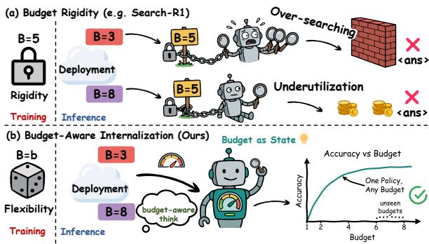  
Figure 1: Comparison of search behaviors under varying budgets. Existing methods trained under fixed budgets cannot adapt their search strategy when the budget changes, while our method adjusts its allocation proportionally to the available budget.

2022). However, existing RL-based search agents are predominantly trained under fixed or unconstrained budgets, producing policies that cannot adapt when resource availability changes at deployment (Jin et al., 2025; Wang et al., 2025b).

In practice, search budgets vary widely across diverse deployment scenarios, from latencycritical applications requiring minimal external search calls to deep research tasks permitting extensive exploration (Jeong et al., 2024; Zheng et al., 2025). An ideal search agent should operate effectively under any budget constraint with a single policy, rather than requiring retraining or separate models for different resource regimes (Figure 1). This requires more than simply capping tool calls at a threshold. The agent must learn to allocate limited budgets effectively, deciding which queries merit external search and which can be resolved through reasoning (Asai et al., 2024; Jiang et al., 2023; Xi et al., 2025).

Prior approaches fall short of this goal. Methods that reduce redundant tool calls via reward shaping (Wang et al., 2025a; Huang et al., 2025) lack an explicit budget interface and cannot adapt to arbitrary constraints specified at inference.

BATS (Liu et al., 2025) introduces budget state tracking, but relies on an external tracker that must persist at inference, leaving budget-aware allocation as an external dependency rather than an internalized capability of the policy itself.

Accordingly, we propose AnySearch that internalizes budget-aware search into the policy, so that at inference the agent requires only a total budget specification and autonomously handles all allocation decisions. Our key insight is that budgetaware behavior can be scaffolded during training and internalized into the policy, eliminating external dependencies at inference (Wood et al., 1976; Yu et al., 2024).

Specifically, we design a training scaffold that provides explicit budget state tracking and structured reasoning prompts, guiding the agent toward budget-aware decision patterns. To internalize these patterns, we employ a two-phase curriculum that progressively removes the scaffold. Phase I trains with the full scaffold under linearly decaying budgets, allowing the agent to learn search behaviors with explicit guidance. Phase II removes the scaffold entirely and applies adaptive budget sampling that focuses training on weak budget levels while maintaining coverage through uniform smoothing. Since Phase II matches inference conditions exactly, the training-inference gap is eliminated. The learning signal is provided by a composite reward that couples answer accuracy with budget efficiency through absolute and relative signals, where an adaptive weight dynamically adjusts the balance based on per-query difficulty, preventing the agent from sacrificing correctness on hard queries.

We evaluate on seven benchmarks across three backbone models. Our method consistently outperforms baselines at all tested budget levels, generalizes to budget constraints unseen during training, achieves the highest tool productivity, and produces the lowest total token consumption. Ablation studies confirm that the scaffold is successfully internalized after removal, and that each component of the curriculum and reward design contributes to the final performance.

Our contributions are summarized as follows:

• We propose a framework that internalizes budget-aware search through a progressively removed training scaffold, eliminating external dependencies at inference.

• We introduce a two-phase curriculum with sliding-window-based adaptive budget sampling and a composite reward with adaptive efficiency weighting to jointly optimize accuracy and efficiency.

• Extensive experiments demonstrate consistent improvements, robust generalization to unseen budgets, and superior tool productivity. Ablations validate the internalization hypothesis and each component’s necessity.

## 2 Related Work

Budget-Aware Reasoning. Efficiently allocating finite computational resources has become central to LLM inference research (Chen et al., 2026). For token-budget constrained reasoning, BRPO (Qi et al., 2025) and BudgetThinker (Wen et al., 2025) train under varying token constraints via RL, but still require explicit budget signals at inference to control reasoning depth. For tool-budget constrained agents, OTC-PO (Wang et al., 2025a) and IKEA (Huang et al., 2025) reduce redundant tool calls via reward shaping, yet lack an explicit budget interface and cannot adapt to arbitrary constraints. BATS (Liu et al., 2025) introduces budget state tracking for tool-call scaling. However, it relies on an external tracker at inference and does not internalize budget-aware capability into the policy model. In contrast, our method internalizes budget-aware capability via RL, requiring only a total budget specification at inference and adapting to any budget without retraining.

Agentic RL with Search Engines. Recent work trains LLMs to interleave reasoning with external search via RL (Wei et al., 2026; Lin et al., 2025; Pati, 2025; Acharya et al., 2025). Search-R1 (Jin et al., 2025), R1-Searcher (Song et al., 2025), ReSearch (Chen et al., 2025), and Deep-Researcher (Zheng et al., 2025) optimize multiturn interaction trajectories with outcome-based reward, learning when and what to search. To address the sparsity of the reward, StepSearch (Wang et al., 2025b) and AutoRefine (Shi et al., 2025) introduce step-level supervision. Furthermore, ZeroSearch (Sun et al., 2025) and SSRL (Fan et al., 2025) replace external search engines with LLMsimulated retrieval environments, reducing API costs while enabling scalable training. These methods focus on improving search effectiveness under fixed budgets, without explicitly modeling how to allocate limited search budgets or adapt to any constraint at inference. To our knowledge, no prior work trains search agents under dynamic tool-call budgets.

## 3 Method

This section describes how we internalize budgetaware search via RL. The method comprises task formulation (Section 3.1), a training scaffold (Section 3.2), a two-phase curriculum (Section 3.3), and reward design (Section 3.4). The overall framework is illustrated in Figure 2.

## 3.1 Task Formulation

We formulate budget-aware agentic search as a resource-constrained sequential decision problem. Given a question q and an assigned search budget $B \in \mathbb { Z } _ { \geq 0 }$ , the agent must produce an accurate answer while consuming at most B search calls.

Agent Loop. At each step t, the agent observes its current state $s _ { t } ~ = ~ ( h _ { t } , b _ { t } )$ , where $h _ { t }$ denotes the accumulated context and $b _ { t }$ is the remaining budget. Then it takes one of actions $a _ { t } \mathrm { : }$ Reason $( \mathcal { A } _ { t h i n k } )$ performs reasoning within <think> tags. Search $( \mathcal { A } _ { t o o l } )$ calls the search engine via <search> tag and consumes one unit of budget. Answer $( \mathcal { A } _ { a n s } )$ outputs the final answer via <answer> tag and terminates the episode.

The budget evolves deterministically:

$$
b _ { t + 1 } = b _ { t } - \mathbb { I } ( a _ { t } \in \mathcal { A } _ { t o o l } )\tag{1}
$$

When the budget is exhausted $( b _ { t } = 0 )$ , the agent can no longer search but may still reason before outputting the final answer. The core challenge lies not only in respecting the budget ceiling, but in learning to allocate it effectively. We refer to this as the budget-aware search capability and aim to internalize it via reinforcement learning. Formally, the agent learns a policy $\pi _ { \boldsymbol { \theta } } ( a _ { t } | \boldsymbol { s } _ { t } )$ that generates a trajectory $\tau = ( s _ { 0 } , a _ { 0 } , \ldots , s _ { T } )$ , the goal is to maximize the expected reward:

$$
\operatorname* { m a x } _ { \theta } \mathbb { E } _ { \tau \sim \pi _ { \theta } } \left[ R ( \tau ) \right] \quad \mathrm { s . t . } \quad \sum _ { t } \mathbb { I } ( a _ { t } \in \mathcal { A } _ { t o o l } ) \leq B\tag{2}
$$

where $R ( \tau )$ is the composite reward detailed in Section 3.4. The budget is defined over external search calls, as each call is orders of magnitude more expensive than equivalent inference tokens and the returned documents dominate total token consumption (Appendix B).

## 3.2 Budget-Aware Training Scaffold

To internalize budget-aware search capabilities, we employ a training scaffold that provides explicit budget state tracking and structured reasoning prompts. The entire scaffold is removed at Phase II of training (Section 3.3) and remains absent at inference.

Budget State Injection. Motivated by (Liu et al., 2025), we explicitly inject the budget state at the onset of each turn, containing the remaining, used and total budget:

$$
< \mathrm { b u d g e t } > \ r \mathrm { e m a i n i n g = R } ; \ \mathrm { u s e d = U } ; \ \mathrm { t o t a l = T } \ < / \mathrm { b u d g e t } >
$$

This makes budget state fully observable, enabling the agent to condition its search decisions on resource availability at each step.

Structured Reasoning Prompts. We prompt the agent to conduct a dual-factor analysis within the <think> block (Wei et al., 2022): (1) Information Sufficiency Assessment, evaluating whether the current information is adequate for producing a reliable answer; and (2) Budget-Conditioned Strategy, determining whether the next search is necessary and worthwhile given the observed budget state and current information. More details can be found in Appendix C.

## 3.3 Curriculum Learning

To internalize budget-aware search, we employ a two-phase curriculum (Narvekar et al., 2020; Bengio et al., 2009) via GRPO (Shao et al., 2024) algorithm, progressing from budget annealing to adaptive sampling with a sliding window that focuses training on budget levels with lower accuracy while maintaining overall coverage.

Phase I: Annealing. We linearly decay the budget from $B _ { m a x }$ to 1 over this phase, allocating equal training steps to each budget level, with the scaffold (Section 3.2) active to guide exploration. The agent first learns how to search under abundant budgets, then progressively learns when to search as constraints tighten, while initializing the per-level accuracy statistics needed by Phase II.

Phase II: Adaptive Budget Sampling. The scaffold is removed in this phase, and the agent only receives the total budget B at the beginning of each episode. After annealing, the budget is sampled from an adaptive distribution that focuses training on budget levels where the agent’s performance remains weakest. We maintain a per-level sliding window of size W tracking accuracy at each budget level $b \in \{ 1 , \dots , B _ { m a x } \}$ . At training step t:

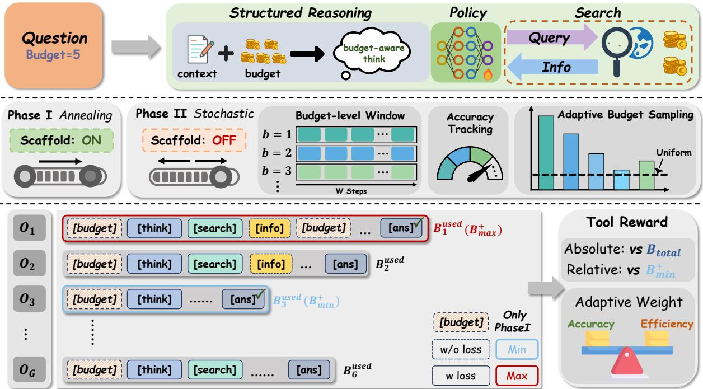  
Figure 2: Overview of our framework. Phase I trains the agent with a reasoning scaffold and linearly decaying budgets to establish budget-aware decision patterns. Phase II removes the scaffold and applies sliding-windowbased adaptive budget sampling and a composite reward with adaptive efficiency weighting.

$$
\bar { R } ^ { ( t ) } ( b ) = \frac { 1 } { | \mathcal { W } _ { b } ^ { ( t ) } | } \sum _ { \tau \in \mathcal { W } _ { b } ^ { ( t ) } } \mathbb { I } _ { a n s } ( \tau )\tag{3}
$$

where $\mathbb { I } _ { a n s } ( \tau ) \in \{ 0 , 1 \}$ denotes the answer accuracy of trajectory τ and $\mathcal { W } _ { b } ^ { ( t ) }$ contains the most recent W trajectories assigned budget b. The sampling distribution is:

$$
\begin{array} { r l r } {  { P ^ { ( t ) } ( B { = } b ) = ( 1 { - } \lambda ) \cdot \frac { \bar { R } _ { m a x } ^ { ( t ) } - \bar { R } ^ { ( t ) } ( b ) + \epsilon } { \sum _ { b ^ { \prime } } ( \bar { R } _ { m a x } ^ { ( t ) } - \bar { R } ^ { ( t ) } ( b ^ { \prime } ) + \epsilon ) } } } \\ & { } & { + \lambda \cdot \frac { 1 } { B _ { m a x } } \qquad ( 4 ) } \end{array}
$$

where $\bar { R } _ { m a x } ^ { ( t ) } \ = \ \operatorname* { m a x } _ { b } \bar { R } ^ { ( t ) } ( b ) ,$ , ϵ is a smoothing constant for numerical stability and λ controls the minimum sampling probability assigned to each budget level. Intuitively, this distribution increases the sampling probability for budget levels where the agent lags furthest behind its best performance, while retaining minimum sampling exposure to all budget levels to ensure distributional robustness across all budget levels.

We optimize the policy via GRPO (Shao et al., 2024), with the full optimization objective detailed in Appendix A.1.5.

## 3.4 Reward Design

The composite reward combines four signals:

$$
R _ { t o t a l } = \alpha \cdot R _ { a c c } + \beta \cdot R _ { f o r m a t } + \delta \cdot R _ { l e n g t h } + \gamma _ { q } \cdot R _ { t o o l }\tag{5}
$$

where $R _ { a c c }$ measures answer accuracy, $R _ { f o r m a t }$ enforces structural validity of the interaction trajectory, and $R _ { l e n g t h }$ applies a length penalty (details of these terms in Appendix A.1.6). Below we focus on $R _ { t o o l }$ and $\gamma _ { q } .$ , which are central to incentivizing budget-aware search capability.

Tool Reward. $R _ { t o o l }$ measures how efficiently the agent uses its budget, decomposing into an absolute signal and a relative signal:

$$
R _ { t o o l } = R _ { a b s } \cdot R _ { r e l }\tag{6}
$$

The absolute signal $R _ { a b s }$ rewards correct answers proportionally to the budget saved:

$$
R _ { a b s } = \mathbb { I } _ { a n s } \cdot \frac { B _ { t o t a l } - B _ { u s e d } } { B _ { t o t a l } }\tag{7}
$$

This incentivizes the agent to answer correctly using the fewest budget possible.

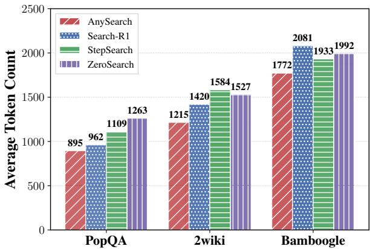  
Figure 3: Average token count across different benchmarks on Llama-3.1-8B-Instruct. Here, the token count is the sum of output token and retrieved token.

The relative signal $R _ { r e l }$ compares against the most efficient correct trajectory in the same sampling group:

$$
R _ { r e l } = \mathbb { I } _ { a n s } \cdot \left( 1 - \frac { B _ { u s e d } - B _ { m i n } ^ { + } } { B _ { m a x } ^ { + } - B _ { m i n } ^ { + } + \xi } \right)\tag{8}
$$

where $B _ { m i n } ^ { + }$ and $B _ { m a x } ^ { + }$ are the minimum and maximum budget used among correct trajectories in the group, and ξ is a stability constant.

Adaptive Efficiency Weight. We dynamically adjust $\gamma _ { q }$ based on group accuracy to control the proportion of $R _ { t o o l }$ in $R _ { t o t a l } { : }$

$$
\gamma _ { q } = \gamma _ { m a x } \cdot \frac { 1 } { G } \sum _ { i = 1 } ^ { G } \mathbb { I } _ { a n s } ^ { ( i ) }\tag{9}
$$

where G is the group size. For high-accuracy queries, $R _ { a c c }$ provides little differentiation and $R _ { t o o l }$ dominates the advantage, driving the agent to optimize efficiency. But for low-accuracy queries, $\gamma _ { q }$ is attenuated so that the advantage is primarily shaped by $R _ { a c c }$ , directing the agent to prioritize answer accuracy over search efficiency.

## 4 Experiments

## 4.1 Experimental Setup

Training Details. We use Qwen2.5-7B-Instruct (Yang et al., 2024), Llama-3.1-8B-Instruct (Grattafiori et al., 2024), and Qwen3- 4B (Yang et al., 2025) as backbone models. For RL training, we adopt GRPO (Shao et al., 2024) implemented with the Slime framework (Zhu et al., 2025). Following (Jin et al., 2025), we use the 2018 Wikipedia dump (Karpukhin et al., 2020) as the retrieval corpus and employ E5 (Wang et al., 2022) as the dense retriever with top-k = 3 documents per query. Training budget is set to $B _ { \mathrm { m a x } } \ = \ 5$ We train on NQ (Kwiatkowski et al., 2019) and HotpotQA (Yang et al., 2018) to cover both general and multi-hop QA. Full hyperparameter details are in Appendix A.1.

Evaluation Details. We evaluate on seven benchmarks: three general QA (NQ, TriviaQA (Joshi et al., 2017), PopQA (Mallen et al., 2023)) and four multi-hop QA (HotpotQA, 2Wiki-MultiHopQA (Ho et al., 2020), MuSiQue (Trivedi et al., 2022), Bamboogle (Press et al., 2023)). We report Exact Match (EM) as the primary metric for fair comparison. To measure retrieval efficiency, we also report Tool Productivity (TP) following (Wang et al., 2025a), defined as the number of correctly answered questions per unit of external search. Formally, TP is computed as:

$$
\mathrm { T P } = \frac { \sum _ { i = 1 } ^ { N } \mathbb { I } \{ a n s _ { i } = y _ { i } ^ { * } \} } { \sum _ { i = 1 } ^ { N } c _ { i } }\tag{10}
$$

where $c _ { i }$ is the search count for instance i.

Baselines. We compare against prompt-based budget-aware methods (BATS (Liu et al., 2025)), RAG-based methods (Search-o1 (Li et al., 2025)), and RL-based methods (Search-R1 (Jin et al., 2025), ZeroSearch (Sun et al., 2025), StepSearch (Wang et al., 2025b)). All methods are prompted with the search budget that limits the maximum number of search actions. More details are provided in Appendix B.3.

## 4.2 Main Results

Our method delivers consistent improvements over all baselines on both general and multihop QA. As shown in Table 1, using Qwen2.5-7B-Instruct as the backbone, our method achieves an average EM of 0.431, outperforming the strongest RL baseline StepSearch at 0.403. BATS and Search-o1, which lack RL-based policy optimization, fall considerably behind at 0.227 and 0.266 respectively, confirming that budget awareness alone without trained allocation is insufficient. Our advantage holds across both in-domain and out-of-domain datasets, and similar trends persist on Llama-3.1-8B-Instruct and Qwen3-4B, demonstrating consistent effectiveness across different model families and sizes.

Our method consistently outperforms baselines across varying budget scales, generalizing effectively to constraints unseen during training. According to Figure 4, our method maintains a consistently dominant and monotonically increasing performance curve across the entire spectrum, including the unseen budgets of 6 to 8 that exceed our maximum training budget of 5. In contrast, the baselines exhibit noticeable fluctuations with occasional mid-range drops and tend to plateau at higher budgets. Specifically, on Bamboogle using Qwen2.5-7B-Instruct, our method achieves an accuracy of about 0.40 at a budget of 5 and further improves to about 0.42 at a budget of 8, whereas the strongest baseline Search-R1 plateaus around 0.37. This sustained superiority at unseen budgets suggests that the agent has internalized budget-proportional allocation rather than memorizing a fixed search strategy.

Table 1: Main results of EM scores across seven QA benchmarks using different backbone models. All methods are prompted with a search-call budget of $B = 5 ,$ , which limits the maximum number of search actions. Results are means over three independent evaluations.
<table><tr><td rowspan="2">Methods</td><td colspan="3">General QA</td><td colspan="4">Multi-Hop QA</td><td rowspan="2">Avg.</td></tr><tr><td>NQ†</td><td>TriviaQA*</td><td>PopQA*</td><td>HotpotQA†</td><td>2wiki*</td><td>Musique*</td><td>Bamboogle</td></tr><tr><td colspan="9">Qwen2.5-7B-Instruct</td></tr><tr><td>BATS</td><td>0.223</td><td>0.428</td><td>0.128</td><td>0.284</td><td>0.205</td><td>0.051</td><td>0.272</td><td>0.227</td></tr><tr><td>Search-o1</td><td>0.266</td><td>0.579</td><td>0.286</td><td>0.240</td><td>0.229</td><td>0.076</td><td>0.184</td><td>0.266</td></tr><tr><td>Search-R1</td><td>0.388</td><td>0.620</td><td>0.501</td><td>0.372</td><td>0.356</td><td>0.169</td><td>0.372</td><td>0.397</td></tr><tr><td>ZeroSearch</td><td>0.407</td><td>0.642</td><td>0.522</td><td>0.328</td><td>0.315</td><td>0.178</td><td>0.319</td><td>0.387</td></tr><tr><td>StepSearch</td><td>0.415</td><td>0.654</td><td>0.514</td><td>0.384</td><td>0.342</td><td>0.185</td><td>0.328</td><td>0.403</td></tr><tr><td>AnySearch</td><td>0.436</td><td>0.687</td><td>0.529</td><td>0.395</td><td>0.364</td><td>0.205</td><td>0.398</td><td>0.431</td></tr><tr><td colspan="9">Llama-3.1-8B-Instruct</td></tr><tr><td>BATS</td><td>0.273</td><td>0.590</td><td>0.198</td><td>0.208</td><td>0.240</td><td>0.088</td><td>0.248</td><td>0.264</td></tr><tr><td>Search-o1</td><td>0.365</td><td>0.604</td><td>0.316</td><td>0.321</td><td>0.307</td><td>0.182</td><td>0.336</td><td>0.347</td></tr><tr><td>Search-R1</td><td>0.401</td><td>0.642</td><td>0.514</td><td>0.364</td><td>0.349</td><td>0.188</td><td>0.365</td><td>0.403</td></tr><tr><td>ZeroSearch</td><td>0.468</td><td>0.664</td><td>0.559</td><td>0.332</td><td>0.368</td><td>0.184</td><td>0.392</td><td>0.424</td></tr><tr><td>StepSearch</td><td>0.422</td><td>0.635</td><td>0.531</td><td>0.350</td><td>0.361</td><td>0.193</td><td>0.376</td><td>0.410</td></tr><tr><td>AnySearch</td><td>0.468</td><td>0.684</td><td>0.576</td><td>0.402</td><td>0.392</td><td>0.203</td><td>0.412</td><td>0.448</td></tr><tr><td colspan="9">Qwen3-4B</td></tr><tr><td>BATS</td><td></td><td>0.384</td><td>0.112</td><td>0.165</td><td>0.210</td><td>0.045</td><td></td><td></td></tr><tr><td>Search-o1</td><td>0.278 0.318</td><td>0.586</td><td>0.231</td><td>0.268</td><td>0.258</td><td>0.064</td><td>0.232 0.280</td><td>0.204 0.286</td></tr><tr><td>Search-R1</td><td>0.375</td><td>0.604</td><td>0.448</td><td>0.356</td><td>0.353</td><td>0.132</td><td>0.344</td><td>0.373</td></tr><tr><td>ZeroSearch</td><td>0.392</td><td>0.598</td><td>0.432</td><td>0.328</td><td>0.342</td><td>0.115</td><td>0.326</td><td>0.362</td></tr><tr><td>StepSearch</td><td>0.407</td><td>0.616</td><td>0.465</td><td>0.345</td><td>0.349</td><td>0.148</td><td>0.352</td><td>0.383</td></tr><tr><td>AnySearch</td><td>0.429</td><td>0.648</td><td>0.496</td><td>0.384</td><td>0.375</td><td>0.164</td><td>0.352</td><td>0.407</td></tr></table>

Bold indicates the best, underline indicates the second-best performance within each backbone group.  
† indicates in-domain evaluation; ∗ indicates out-of-domain evaluation.

Table 2: Comparison of efficiency on HotpotQA under different settings measured by Accuracy and TP.
<table><tr><td>Settings</td><td>Methods</td><td>Accuracy↑</td><td>TP↑</td></tr><tr><td rowspan="2">Qwen2.5-7B  $\mathrm { B } = 6$ </td><td>AnySearch</td><td>0.398</td><td rowspan="2">0.354 0.212</td></tr><tr><td>Search-R1</td><td>0.375</td></tr><tr><td rowspan="2">Llama3.1-8B  $\mathbf { B } = 5$ </td><td>StepSearch AnySearch</td><td>0.388</td><td>0.276 0.378</td></tr><tr><td>Search-R1 StepSearch</td><td>0.402 0.364</td><td>0.236 0.297</td></tr><tr><td rowspan="2">Qwen3-4B  $\mathrm { B } = 4$ </td><td>AnySearch</td><td>0.350 0.378</td><td>0.309</td></tr><tr><td>Search-R1 StepSearch</td><td>0.351 0.339</td><td>0.235 0.198</td></tr></table>

Table 3: Ablation study of the tool reward on 2wiki with Qwen3-4B, covering the adaptive efficiency weight $\gamma _ { q }$ and the reward components $R _ { a b s }$ and $R _ { r e l } .$
<table><tr><td>Settings</td><td>Accuracy↑</td><td>TP↑</td></tr><tr><td>AnySearch (Adaptive  $\gamma _ { q } )$ </td><td>0.375</td><td>0.342</td></tr><tr><td>Fixed  $\gamma _ { q } = \gamma _ { m a x }$ </td><td>0.354</td><td>0.328</td></tr><tr><td>Fixed  $\gamma _ { q } = 0 . 5 \cdot \gamma _ { m a x }$ </td><td>0.366</td><td>0.334</td></tr><tr><td>w/o  $R _ { t o o l } ( \mathrm { F i x e d } \gamma _ { q } = 0 )$ </td><td>0.348</td><td>0.226</td></tr><tr><td>w/o  $R _ { a b s }$ </td><td>0.352</td><td>0.272</td></tr><tr><td>w/o  $R _ { r e l }$ </td><td>0.359</td><td>0.295</td></tr></table>

Our method achieves superior accuracy with fewer search calls, pushing the costperformance Pareto frontier beyond all baselines. As shown in Figure 4, on Bamboogle using Qwen2.5-7B-Instruct at the same budget of 3, our method achieves a score of 0.38, which is higher than Search-R1 at 0.34. Conversely, to reach the accuracy of about 0.35, the strongest baseline requires a budget of 4, whereas our method meets the same threshold with a budget of 3. These results suggest that budget-aware training produces more effective allocation decisions, yielding stable performance improvements under any constraint.

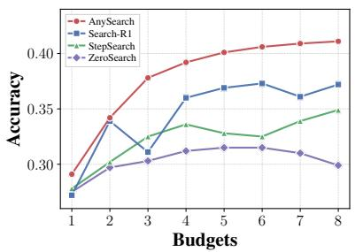  
(a) Qwen2.5-7B on Bamboogle

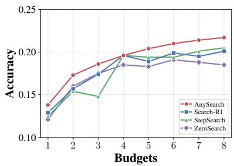  
(b) Llama-3.1-8B on Musique

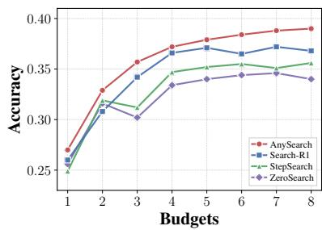  
(c) Qwen3-4B on 2wiki

Figure 4: Performance of RL-based methods across varying budgets. We report the accuracy curves for (a) Qwen2.5-7B-Instruct on Bamboogle, (b) Llama-3.1-8B-Instruct on Musique, and (c) Qwen3-4B on 2wiki. For tool-free baselines such as ZeroSearch, we define the budget as the max turn, set to B + 1.  
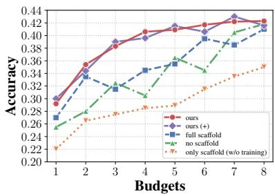  
(a) Scaffold ablation

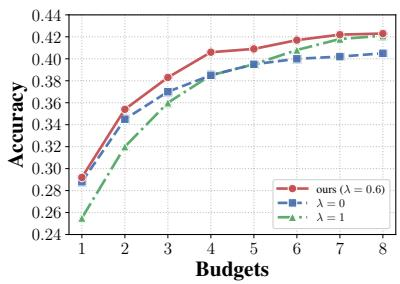  
(b) Sampling strategy ablation

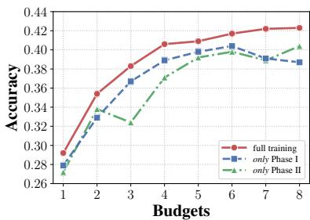  
(c) Curriculum phase ablation  
Figure 5: Ablation studies on HotpotQA with Qwen2.5-7B-Instruct across varying budgets. (a) Scaffold ablation. Full Scaffold uses scaffold in both Phase I and Phase II but removes it at inference; No Scaffold never uses scaffold in training or inference; Ours uses scaffold in Phase I, removes it in Phase II and inference; Ours (+Scaffold) applies our full training and retains the scaffold at inference; Only Scaffold uses scaffold at inference without any RL training. (b) Budget sampling strategy in Phase II, comparing λ=0, λ=1, and Ours (λ=0.6). (c) Curriculum phase ablation, comparing training with only Phase I, only Phase II, and full training, all trained for 500 steps.

## 4.3 Analysis of Efficiency

Table 2 shows that our method achieves the highest Tool Productivity across all backbone models and budget levels, meaning it answers more questions correctly per external search invoked. Furthermore, as retrieval documents dominate total token consumption (see Table 10 in Appendix), reducing search calls directly lowers overall inference cost. As shown in Figure 3, our method achieves the lowest total token count across all datasets, indicating that budget-aware training enables more effective utilization of each search call and avoids redundant retrieval. Full token consumption results are provided in Appendix A.3, and full efficiency comparisons across all multi-hop benchmarks are in Appendix A.2. The training-cost comparison in Appendix A.1.4 further shows that our two-phase curriculum has a single-run cost comparable to fixed-budget baselines while amortizing one policy across the tested budget range.

## 4.4 Ablation Studies

Tool reward. Table 3 ablates the tool reward along two dimensions. For the adaptive efficiency weight, fixing $\gamma _ { q } = \gamma _ { m a x }$ causes accuracy to drop while TP increases, as the agent over-prioritizes efficiency on difficult queries where it should focus on answering correctly. Fixing $\gamma _ { q } ~ = ~ 0 . 5$ $\gamma _ { m a x }$ partially alleviates this but remains suboptimal. Removing $R _ { t o o l }$ entirely $( \gamma _ { q } ~ = ~ 0 )$ leads to the sharpest accuracy and TP decline, confirming that explicit efficiency feedback is essential. The adaptive design resolves this tension by naturally attenuating $\gamma _ { q }$ on low-accuracy queries so that the agent prioritizes correctness, while on high-accuracy queries the efficiency signal dominates and drives the agent to reduce redundant searches. For the reward components, removing $R _ { a b s }$ eliminates the absolute incentive to save budget, while removing $R _ { r e l }$ removes the relative pressure to approach the most efficient correct trajectory within each group. Both provide complementary efficiency signals and are jointly necessary.

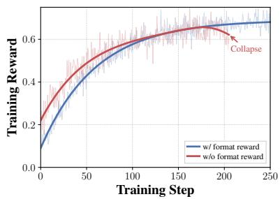  
(a) Training Reward Curve

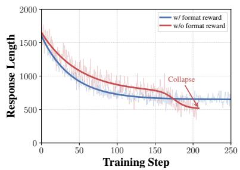  
(b) Response Length Curve

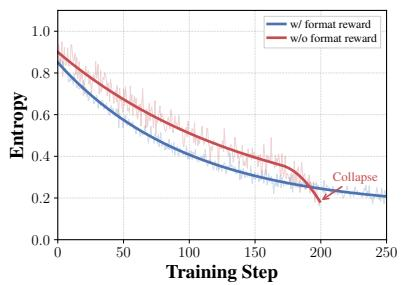  
(c) Entropy Curve  
Figure 6: Training dynamics on Qwen3-4B showing the role of format rewards in training stability. (a) Without $R _ { f o r m a t } .$ , training reward rises initially but reverses around training step 175, while the full setting remains stable. (b) The no-format variant undergoes a sharp response-length reduction around the same point, indicating degeneration into trivial short outputs. (c) Its policy entropy also collapses abruptly, whereas the full setting decays smoothly and retains exploration.

Table 4: Counterfactual analysis of early stopping on 2Wiki with Qwen3-4B under a budget of five searches. π is AnySearch and $\pi _ { 0 }$ is the $\gamma _ { q } = 0$ control without efficiency reward.
<table><tr><td>Outcome</td><td>Count</td><td>Rate</td></tr><tr><td>π incorrect,  $\pi _ { 0 }$  correct</td><td>77</td><td>0.61%</td></tr><tr><td>Cases with unused budget  $( B _ { u s e d } ^ { \pi } < B )$ </td><td>41</td><td>0.33%</td></tr><tr><td>π correct, π0 incorrect</td><td>417</td><td>3.32%</td></tr><tr><td>Net accuracy gain</td><td>340</td><td>2.70%</td></tr></table>

Early-stopping analysis. The efficiency reward is correctness-gated because both components of $R _ { t o o l }$ are multiplied by $\mathbb { I } _ { a n s }$ , so an incorrect early answer receives no efficiency reward. Moreover, $\gamma _ { q }$ decreases on low-accuracy groups, reducing efficiency pressure on hard queries. We compare AnySearch π with a $\gamma _ { q } ~ = ~ 0$ control $\pi _ { 0 }$ that removes the efficiency reward while keeping the framework and training configuration fixed. On 2Wiki with Qwen3-4B under a budget of five searches, AnySearch is incorrect while the control is correct on 77 examples. Only 41 cases, or 0.33% of the test set, terminate with unused budget. In contrast, AnySearch correctly answers 417 examples missed by the control, a gain of 3.32%. This yields a net gain of 340 examples, or 2.70%, as shown in Table 4. Thus, early stopping is rare and is substantially outweighed by the accuracy gains from better allocation.

Budget-aware search internalization. Figure 5a validates the internalization hypothesis. Training with the scaffold throughout but removing it at inference (Full Scaffold) leads to noticeable performance degradation, particularly at low budgets where budget-aware allocation matters most. This indicates that the agent becomes reliant on explicit budget state signals without learning to allocate autonomously, producing a train-inference gap. Training without any scaffold (No Scaffold) results in the weakest overall performance, as the agent lacks sufficient guidance during early exploration to discover budget-aware decision patterns. Our strategy achieves the highest accuracy across all budget levels with a smooth, monotonically increasing curve. The advantage is most pronounced under tight budgets, confirming that the scaffold successfully guides the agent toward budget-aware behaviors in Phase I, and these behaviors are retained after scaffold removal in Phase II. Moreover, Ours (+) shows that the trained policy no longer benefits from the scaffold at inference, while Only Scaffold shows that the scaffold without RL training is ineffective, jointly confirming successful internalization.

Adaptive budget sampling. Figure 5b compares budget sampling strategies in Phase II. Uniform sampling (λ=1) distributes training equally across all budget levels, resulting in weaker performance at low budgets where the task is inherently more difficult and requires more training exposure. Adaptive sampling without uniform smoothing (λ=0) focuses entirely on budget levels with low accuracy, which improves low-budget performance but causes degradation at high budgets due to insufficient coverage of well-learned levels. Our full adaptive distribution (λ=0.6) achieves the best performance across all budget levels, balancing focused training on weak levels with maintained coverage of strong ones. The resulting sampling distribution is visualized in Appendix A.4.

Curriculum phases. Figure 5c ablates the two training phases. Training with only Phase I provides budget annealing but lacks adaptive sampling, while training with only Phase II applies adaptive sampling without warm-up. Both configurations underperform and fail to improve steadily with budget. Full two-phase training achieves the highest performance and the most stable budget-scaling curve, validating that Phase I teaches budget-aware search under scaffold guidance while Phase II removes the scaffold and consolidates robust performance across all budgets.

## 4.5 Discussion

Training stability. Figure 6 highlights the stabilizing role of $R _ { f o r m a t }$ . Removing this component causes the reward to deteriorate around training step 175, together with sharp decreases in response length and policy entropy. These trends indicate a collapse toward overly short outputs with limited exploration. In contrast, the full reward formulation maintains stable learning and wellformed trajectories throughout training. The same pattern is observed for the other backbone models in Appendix B.1.

Case Study. Appendix D presents qualitative examples showing that the trained agent adjusts search depth adaptively to budget availability, confirming internalization of budget-aware search.

## 5 Conclusion

We presented AnySearch, a framework that internalizes budget-aware search into a single policy via a progressively removed training scaffold and a two-phase curriculum RL with adaptive budget sampling. A composite reward with adaptive efficiency weighting jointly optimizes accuracy and search efficiency. Experiments across seven general and multi-hop QA benchmarks and three backbone models show consistent improvements over baselines at all budget levels, robust generalization to unseen budgets, highest tool productivity, and lowest token consumption. Ablations confirm that the scaffold is successfully internalized and each component contributes to the final performance.

## Limitations

Although AnySearch internalizes budget-aware search into a single policy and adapts across budgets without retraining, several limitations remain. First, we model the budget as a discrete count of external search calls. In real deployment the true cost is multidimensional, spanning latency, monetary expense, and system load, so a continuous and multi-objective cost formulation is a natural extension of our framework. Second, the quality of budget allocation is still bounded by the backbone model. AnySearch decides when and what to search more efficiently, but it cannot recover an answer that lies neither in the model’s parametric knowledge nor in the retrieval corpus. Finally, our training and evaluation use a static 2018 Wikipedia dump, following the standard protocol of prior RL-search agents. This keeps the retrieval environment controlled and reproducible, but it does not test temporal adaptation, and extending AnySearch to a continuously updated open-web setting is left to future work.

## Ethics Statement

Our research adheres to strict ethical guidelines. We verified the licenses of all software, models, and datasets used in this study to ensure full compliance with their terms. Since this work focuses on training search agents via reinforcement learning using existing public QA datasets and a publicly available Wikipedia corpus, no human annotation or primary data collection was involved. No privacy concerns or personally identifiable information have been identified in the training or evaluation data. Additionally, we have conducted a thorough assessment of the project and do not anticipate any further risks.

## Acknowledgments

We gratefully acknowledge the insightful discussions, constructive feedback, and support received throughout this work.

## References

Deepak Bhaskar Acharya, Karthigeyan Kuppan, and B Divya. 2025. Agentic ai: Autonomous intelligence for complex goalsa comprehensive survey. IEEe Access, 13:18912–18936.

Akari Asai, Zeqiu Wu, Yizhong Wang, Avi Sil, and Hannaneh Hajishirzi. 2024. Self-rag: Learning to re-

trieve, generate, and critique through self-reflection. In International conference on learning representations, volume 2024, pages 9112–9141.

Yoshua Bengio, Jérôme Louradour, Ronan Collobert, and Jason Weston. 2009. Curriculum learning. In Proceedings ofthe 26th annual international conference on machine learning, pages 41–48.

Mingyang Chen, Linzhuang Sun, Tianpeng Li, Haoze Sun, Yijie Zhou, Chenzheng Zhu, Haofen Wang, Jeff Z Pan, Wen Zhang, Huajun Chen, and 1 others. 2025. Learning to reason with search for llms via reinforcement learning. arXiv preprint arXiv:2503.19470.

Yuxi Chen, Junming Chen, Chenyu He, Yiwei Li, Yicheng Ji, Yifan Wu, Dingyu Yang, Lansong Diao, Lidan Shou, Hongliang Zhang, and 1 others. 2026. Token economics for llm agents: A dual-view study from computing and economics. arXiv preprint arXiv:2605.09104.

Yuchen Fan, Kaiyan Zhang, Heng Zhou, Yuxin Zuo, Yanxu Chen, Yu Fu, Xinwei Long, Xuekai Zhu, Che Jiang, Yuchen Zhang, and 1 others. 2025. Ssrl: Self-search reinforcement learning. arXiv preprint arXiv:2508.10874.

Aaron Grattafiori, Abhimanyu Dubey, Abhinav Jauhri, Abhinav Pandey, Abhishek Kadian, Ahmad Al-Dahle, Aiesha Letman, Akhil Mathur, Alan Schelten, Alex Vaughan, and 1 others. 2024. The llama 3 herd of models. arXiv preprint arXiv:2407.21783.

Xanh Ho, Anh-Khoa Duong Nguyen, Saku Sugawara, and Akiko Aizawa. 2020. Constructing a multi-hop qa dataset for comprehensive evaluation of reasoning steps. arXiv preprint arXiv:2011.01060.

Ziyang Huang, Xiaowei Yuan, Yiming Ju, Jun Zhao, and Kang Liu. 2025. Reinforced internal-external knowledge synergistic reasoning for efficient adaptive search agent. arXiv preprint arXiv:2505.07596.

Soyeong Jeong, Jinheon Baek, Sukmin Cho, Sung Ju Hwang, and Jong C Park. 2024. Adaptive-rag: Learning to adapt retrieval-augmented large language models through question complexity. In Proceedings of the 2024 Conference of the North American Chapter of the Association for Computational Linguistics: Human Language Technologies (Volume 1: Long Papers), pages 7036–7050.

Zhengbao Jiang, Frank F Xu, Luyu Gao, Zhiqing Sun, Qian Liu, Jane Dwivedi-Yu, Yiming Yang, Jamie Callan, and Graham Neubig. 2023. Active retrieval augmented generation. In Proceedings of the 2023 conference on empirical methods in natural language processing, pages 7969–7992.

Bowen Jin, Hansi Zeng, Zhenrui Yue, Jinsung Yoon, Sercan Arik, Dong Wang, Hamed Zamani, and Jiawei Han. 2025. Search-r1: Training llms to reason and leverage search engines with reinforcement learning. arXiv preprint arXiv:2503.09516.

Mandar Joshi, Eunsol Choi, Daniel S Weld, and Luke Zettlemoyer. 2017. Triviaqa: A large scale distantly supervised challenge dataset for reading comprehension. arXiv preprint arXiv:1705.03551.

Vladimir Karpukhin, Barlas Oguz, Sewon Min, Patrick SH Lewis, Ledell Wu, Sergey Edunov, Danqi Chen, and Wen-tau Yih. 2020. Dense passage retrieval for open-domain question answering. In EMNLP (1), pages 6769–6781.

Tom Kwiatkowski, Jennimaria Palomaki, Olivia Redfield, Michael Collins, Ankur Parikh, Chris Alberti, Danielle Epstein, Illia Polosukhin, Jacob Devlin, Kenton Lee, and 1 others. 2019. Natural questions: a benchmark for question answering research. Transactions of the Association for Computational Linguistics, 7:453–466.

Xiaoxi Li, Guanting Dong, Jiajie Jin, Yuyao Zhang, Yujia Zhou, Yutao Zhu, Peitian Zhang, and Zhicheng Dou. 2025. Search-o1: Agentic searchenhanced large reasoning models. arXiv preprint arXiv:2501.05366.

Minhua Lin, Zongyu Wu, Zhichao Xu, Hui Liu, Xianfeng Tang, Qi He, Charu Aggarwal, Xiang Zhang, and Suhang Wang. 2025. A comprehensive survey on reinforcement learning-based agentic search: Foundations, roles, optimizations, evaluations, and applications. arXiv preprint arXiv:2510.16724.

Tengxiao Liu, Zifeng Wang, Jin Miao, I Hsu, Jun Yan, Jiefeng Chen, Rujun Han, Fangyuan Xu, Yanfei Chen, Ke Jiang, and 1 others. 2025. Budgetaware tool-use enables effective agent scaling. arXiv preprint arXiv:2511.17006.

Alex Mallen, Akari Asai, Victor Zhong, Rajarshi Das, Daniel Khashabi, and Hannaneh Hajishirzi. 2023. When not to trust language models: Investigating effectiveness of parametric and non-parametric memories. In Proceedings of the 61st Annual Meeting of the Association for Computational Linguistics (Volume 1: Long Papers), pages 9802–9822.

Sanmit Narvekar, Bei Peng, Matteo Leonetti, Jivko Sinapov, Matthew E Taylor, and Peter Stone. 2020. Curriculum learning for reinforcement learning domains: A framework and survey. Journal of Machine Learning Research, 21(181):1–50.

Ashis Kumar Pati. 2025. Agentic ai: a comprehensive survey of technologies, applications, and societal implications. IEEE Access.

Ofir Press, Muru Zhang, Sewon Min, Ludwig Schmidt, Noah A Smith, and Mike Lewis. 2023. Measuring and narrowing the compositionality gap in language models. In Findings ofthe Associationfor Computational Linguistics: EMNLP 2023, pages 5687–5711.

Penghui Qi, Zichen Liu, Tianyu Pang, Chao Du, Wee Sun Lee, and Min Lin. 2025. Optimizing anytime reasoning via budget relative policy optimization. arXiv preprint arXiv:2505.13438.

Yujia Qin, Shengding Hu, Yankai Lin, Weize Chen, Ning Ding, Ganqu Cui, Zheni Zeng, Xuanhe Zhou, Yufei Huang, Chaojun Xiao, and 1 others. 2024. Tool learning with foundation models. ACM Computing Surveys, 57(4):1–40.

Changle Qu, Sunhao Dai, Xiaochi Wei, Hengyi Cai, Shuaiqiang Wang, Dawei Yin, Jun Xu, and Ji-Rong Wen. 2025. Tool learning with large language models: A survey. Frontiers of Computer Science, 19(8):198343.

Timo Schick, Jane Dwivedi-Yu, Roberto Dessì, Roberta Raileanu, Maria Lomeli, Eric Hambro, Luke Zettlemoyer, Nicola Cancedda, and Thomas Scialom. 2023. Toolformer: Language models can teach themselves to use tools. Advances in neural information processing systems, 36:68539–68551.

John Schulman, Filip Wolski, Prafulla Dhariwal, Alec Radford, and Oleg Klimov. 2017. Proximal policy optimization algorithms. arXiv preprint arXiv:1707.06347.

Zhihong Shao, Peiyi Wang, Qihao Zhu, Runxin Xu, Junxiao Song, Xiao Bi, Haowei Zhang, Mingchuan Zhang, YK Li, Yang Wu, and 1 others. 2024. Deepseekmath: Pushing the limits of mathematical reasoning in open language models. arXiv preprint arXiv:2402.03300.

Yaorui Shi, Sihang Li, Chang Wu, Zhiyuan Liu, Junfeng Fang, Hengxing Cai, An Zhang, and Xiang Wang. 2025. Search and refine during think: Facilitating knowledge refinement for improved retrievalaugmented reasoning. In The Thirty-ninth Annual Conference on Neural Information Processing Systems.

Huatong Song, Jinhao Jiang, Yingqian Min, Jie Chen, Zhipeng Chen, Wayne Xin Zhao, Lei Fang, and Ji-Rong Wen. 2025. R1-searcher: Incentivizing the search capability in llms via reinforcement learning. arXiv preprint arXiv:2503.05592.

Hao Sun, Zile Qiao, Jiayan Guo, Xuanbo Fan, Yingyan Hou, Yong Jiang, Pengjun Xie, Yan Zhang, Fei Huang, and Jingren Zhou. 2025. Zerosearch: Incentivize the search capability of llms without searching. arXiv preprint arXiv:2505.04588.

Harsh Trivedi, Niranjan Balasubramanian, Tushar Khot, and Ashish Sabharwal. 2022. musique: Multihop questions via single-hop question composition. Transactions of the Association for Computational Linguistics, 10:539–554.

Hongru Wang, Cheng Qian, Wanjun Zhong, Xiusi Chen, Jiahao Qiu, Shijue Huang, Bowen Jin, Mengdi Wang, Kam-Fai Wong, and Heng Ji. 2025a. Acting less is reasoning more! teaching model to act efficiently. arXiv preprint arXiv:2504.14870.

Liang Wang, Nan Yang, Xiaolong Huang, Binxing Jiao, Linjun Yang, Daxin Jiang, Rangan Majumder,

and Furu Wei. 2022. Text embeddings by weaklysupervised contrastive pre-training. arXiv preprint arXiv:2212.03533.

Ziliang Wang, Xuhui Zheng, Kang An, Cijun Ouyang, Jialu Cai, Yuhang Wang, and Yichao Wu. 2025b. Stepsearch: Igniting llms search ability via stepwise proximal policy optimization. arXiv preprint arXiv:2505.15107.

Jason Wei, Xuezhi Wang, Dale Schuurmans, Maarten Bosma, Fei Xia, Ed Chi, Quoc V Le, Denny Zhou, and 1 others. 2022. Chain-of-thought prompting elicits reasoning in large language models. Advances in neural information processing systems, 35:24824–24837.

Tianxin Wei, Ting-Wei Li, Zhining Liu, Xuying Ning, Ze Yang, Jiaru Zou, Zhichen Zeng, Ruizhong Qiu, Xiao Lin, Dongqi Fu, and 1 others. 2026. Agentic reasoning for large language models. arXiv preprint arXiv:2601.12538.

Hao Wen, Xinrui Wu, Yi Sun, Feifei Zhang, Liye Chen, Jie Wang, Yunxin Liu, Yunhao Liu, Ya-Qin Zhang, and Yuanchun Li. 2025. Budgetthinker: Empowering budget-aware llm reasoning with control tokens. arXiv preprint arXiv:2508.17196.

David Wood, Jerome S Bruner, and Gail Ross. 1976. The role of tutoring in problem solving. Journal of child psychology and psychiatry, 17(2):89–100.

Yunjia Xi, Jianghao Lin, Yongzhao Xiao, Zheli Zhou, Rong Shan, Te Gao, Jiachen Zhu, Weiwen Liu, Yong Yu, and Weinan Zhang. 2025. A survey of llm-based deep search agents: Paradigm, optimization, evaluation, and challenges. arXiv preprint arXiv:2508.05668.

An Yang, Anfeng Li, Baosong Yang, Beichen Zhang, Binyuan Hui, Bo Zheng, Bowen Yu, Chang Gao, Chengen Huang, Chenxu Lv, and 1 others. 2025. Qwen3 technical report. arXiv preprint arXiv:2505.09388.

An Yang, Baosong Yang, Binyuan Hui, Bo Zheng, Bowen Yu, Chang Zhou, Chengpeng Li, Chengyuan Li, Dayiheng Liu, Fei Huang, Guanting Dong, Haoran Wei, Huan Lin, Jialong Tang, Jialin Wang, Jian Yang, Jianhong Tu, Jianwei Zhang, Jianxin Ma, and 40 others. 2024. Qwen2 technical report. arXiv preprint arXiv:2407.10671.

Zhilin Yang, Peng Qi, Saizheng Zhang, Yoshua Bengio, William Cohen, Ruslan Salakhutdinov, and Christopher D Manning. 2018. Hotpotqa: A dataset for diverse, explainable multi-hop question answering. In Proceedings of the 2018 conference on empirical methods in natural language processing, pages 2369–2380.

Shunyu Yao, Jeffrey Zhao, Dian Yu, Nan Du, Izhak Shafran, Karthik Narasimhan, and Yuan Cao. 2022. React: Synergizing reasoning and acting in language models. arXiv preprint arXiv:2210.03629.

Ping Yu, Jing Xu, Jason Weston, and Ilia Kulikov. 2024. Distilling system 2 into system 1. arXiv preprint arXiv:2407.06023.

Qiying Yu, Zheng Zhang, Ruofei Zhu, Yufeng Yuan, Xiaochen Zuo, Yu Yue, Weinan Dai, Tiantian Fan, Gaohong Liu, Lingjun Liu, and 1 others. 2025. Dapo: An open-source llm reinforcement learning system at scale. arXiv preprint arXiv:2503.14476.

Yuxiang Zheng, Dayuan Fu, Xiangkun Hu, Xiaojie Cai, Lyumanshan Ye, Pengrui Lu, and Pengfei Liu. 2025. Deepresearcher: Scaling deep research via reinforcement learning in real-world environments. arXiv preprint arXiv:2504.03160.

Zilin Zhu, Chengxing Xie, Xin Lv, and slime Contributors. 2025. slime: An llm post-training framework for rl scaling. https://github.com/THUDM/slime. GitHub repository. Corresponding author: Xin Lv.

## A Experiment Details

In this section, we provide a comprehensive breakdown of our experimental setup, ensuring reproducibility and clarifying the configurations used for all baselines and our proposed method.

## A.1 Implementation Details and Experimental Configuration

Our implementation is built upon the Slime framework (Zhu et al., 2025), leveraging GRPO (Shao et al., 2024) within an asynchronous distributed training architecture.

## A.1.1 Asynchronous Distributed Training Framework

We use the asynchronous architecture of the Slime framework orchestrated via Ray. By decoupling the training actor from rollout workers, GPU idle time is eliminated. Experiments run on a single node with eight NVIDIA H800 (80GB) GPUs: GPUs 0–3 handle training (TP=2), and GPUs 4– 7 handle rollout and retrieval. We use gradient checkpointing, sequence parallelism, and SGLang with a static memory fraction of 0.6.

## A.1.2 Retrieval Service Infrastructure

We use E5-base-v2 (Wang et al., 2022) as the dense retriever over the 2018 Wikipedia dump (Karpukhin et al., 2020) (∼18M passages), indexed via FAISS Flat for exact nearest-neighbor search. The service runs on port 8000 and returns top-k = 3 documents per query formatted into <information> tags.

## A.1.3 Curriculum Learning Strategy

We adopt a two-phase curriculum that progressively internalizes budget-aware search.

In Phase I (Warm-up) (first 100 steps, ∼20% of training), the search budget is linearly decayed from $B _ { m a x } = 5 \mathrm { t o } 1$ , with equal training steps (20 steps per level) allocated to each budget level. The full scaffold (budget state injection and structured reasoning prompts) is active throughout this phase, guiding the agent to learn search behaviors across all budget levels.

In Phase II (Adaptive Budget Sampling) (remaining 400 steps), the scaffold is entirely removed and the agent only receives the total budget B in natural language at the beginning of each episode. Each budget level independently tracks its accuracy over the most recent W assigned episodes. The sampling probability is then set proportionally to the gap between each level’s accuracy and the best-performing level, smoothed by ϵ, and mixed with a uniform distribution weighted by λ (see Eq. 4 for the full formulation).

## A.1.4 Training Cost Analysis

AnySearch uses 500 training steps, the same number as the fixed-budget baselines under the same per-step configuration. Its single-run cost is therefore comparable rather than additive. When deployment requires K budget levels, fixed-budget baselines require K separately trained policies, whereas one AnySearch policy serves the tested budget range, including the unseen budgets evaluated in Figure 4. The resulting cost is amortized across budget levels rather than incurred once per level.

## A.1.5 GRPO Optimization Objective

We optimize the policy $\pi _ { \theta }$ via GRPO. For each query $q$ with assigned budget B, we sample G trajectories $\{ \tau _ { i } \} _ { i = 1 } ^ { G }$ from $\pi _ { \theta _ { \mathrm { o l d } } }$ and compute advantages by standardizing the composite reward against group statistics:

$$
\hat { A } _ { i } = \frac { R ( \tau _ { i } ) - \operatorname* { m e a n } ( \{ R ( \tau _ { j } ) \} _ { j = 1 } ^ { G } ) } { \operatorname* { s t d } ( \{ R ( \tau _ { j } ) \} _ { j = 1 } ^ { G } ) + \epsilon _ { 0 } }\tag{11}
$$

The policy is updated to maximize:

$$
\mathcal { I } ( \theta ) = \mathbb { E } _ { q , B } [ \frac { 1 } { G } \sum _ { i = 1 } ^ { G } \frac { 1 } { | \tau _ { i } | } \sum _ { t = 1 } ^ { | \tau _ { i } | } ( \operatorname* { m i n } ( r _ { i , t } \hat { A } _ { i } , 
$$

$$
\mathrm { c l i p } ( r _ { i , t } , 1 - \epsilon , 1 + \epsilon ) \hat { A } _ { i } ) - \beta _ { K L } D _ { K L } ^ { i , t } \Big ) \Bigg ]\tag{12}
$$

where $\begin{array} { r c l } { r _ { i , t } } & { = } & { \pi _ { \boldsymbol { \theta } } ( \tau _ { i , t } | \boldsymbol { q } , \tau _ { i , < t } ) / \pi _ { \theta _ { 0 \mathrm { l d } } } ( \tau _ { i , t } | \boldsymbol { q } , \tau _ { i , < t } ) } \end{array}$ is the token-level importance ratio, $D _ { K L } ^ { i , t } \quad = \quad$ log $\frac { \pi _ { \theta } ( \tau _ { i , t } | { q } , \tau _ { i , < t } ) } { \pi _ { \mathrm { r e f } } ( \tau _ { i , t } | { q } , \tau _ { i , < t } ) }$ is the per-token KL penalty, $\epsilon _ { \mathrm { 0 } }$ is a small constant for numerical stability, ϵ clips the ratio to stabilize updates, and $\beta _ { K L }$ controls the strength of regularization toward the reference policy $\pi _ { \mathrm { r e f } } .$

## A.1.6 Reward Function Configuration

The total reward is $R _ { t o t a l } = \alpha \cdot R _ { a c c } + \beta \cdot R _ { f o r m a t } +$ $\delta \cdot R _ { l e n g t h } + \gamma _ { q } \cdot R _ { t o o l }$ , with the following components:

• Accuracy Reward (α = 0.5): We extract the answer from the <answer> tag and compute a binary exact match against the ground truth ${ \boldsymbol { y } } ^ { * } \colon R _ { a c c } = \operatorname { E M } ( a n s , { \boldsymbol { y } } ^ { * } ) \in \{ 0 , 1 \}$ , returning 1 for a correct match and 0 otherwise.

Table 5: Key hyperparameter configuration for our experiments.
<table><tr><td>Category</td><td>Parameter</td><td>Value</td></tr><tr><td>Optimization</td><td>Learning Rate Optimizer Betas Weight Decay</td><td> $1 . 0 \times 1 0 ^ { - 6 }$   $\beta _ { 1 } = 0 . 9 , \beta _ { 2 } = 0 . 9 8$  0.01</td></tr><tr><td>Generation Rewards</td><td>Group Size (G) Global batch size KL Penalty Coefficient (βKL) Policy Clip Ratio Advantage Stability (€0) Max Response Length Sampling Temperature Top-p</td><td>5 512 0.001 0.2 (low) / 0.28 (high) 1e-6 4096 1.0 1.0</td></tr><tr><td>Curriculum</td><td>Accuracy Reward (α) Format Reward (β) Length Reward (δ) Tool Reward  $( \gamma _ { m a x } )$  Stability Constant (ξ)</td><td>0.5 0.15 0.05 0.3 1e-6</td></tr><tr><td></td><td>Phase I (Warm-up) Phase II (Adaptive Sampling)  $B _ { m a x }$  Sliding Window Size (W) Uniform Smoothing (λ) Smoothing Constant (€)</td><td>100 Steps 400 Steps 5 20 0.6 1e-6</td></tr></table>

• Format Reward $( \beta = 0 . 1 5 ) \colon$ Defined as the product of three binary indicators $R _ { f o r m a t } =$ $\textstyle \prod _ { i = 1 } ^ { 3 } \mathbb { I } _ { i }$ , yielding 1 only when all three constraints are satisfied and 0 otherwise:

(i) Proper pairing of all special tags. In Phase I: <budget>, <think>, <search>, <information>, <answer>. In Phase II: <think>, <search>, <information>, <answer> (no <budget> tag).

(ii) Correct sequential ordering. In Phase I: each round begins with <budget>, <search> is preceded by <think>, and the trajectory ends with <answer>. In Phase II: <search> is preceded by <think>, and the trajectory ends with <answer>.

(iii) No token generation outside valid tags.

• Length Reward $( \delta \ \mathrm { ~  ~ { ~ = ~ } ~ } 0 . 0 5 )$ : Following DAPO (Yu et al., 2025), we apply a piecewise linear length penalty to discourage excessively long generations:

$$
R _ { l e n g t h } ( y ) = \left\{ \begin{array} { l l } { 0 } & { | y | \leq L _ { l i m } } \\ { \frac { L _ { l i m } - | y | } { L _ { t o l } } } & { L _ { l i m } < | y | \leq L _ { l i m } + L _ { t o l } } \\ { - 1 } & { | y | > L _ { l i m } + L _ { t o l } } \end{array} \right.
$$

where |y| denotes the generation length, $L _ { l i m i t }$ is the penalty threshold, and $L _ { t o l }$ is the tolerance window within which the penalty increases linearly from 0 to −1. In our experiments, we set $L _ { l i m i t } = 2 0 4 8$ and $L _ { t o l } =$ 1024.

• Tool Reward $( \gamma _ { m a x } ~ = ~ 0 . 3 )$ : Decomposes into $R _ { t o o l } = R _ { a b s } \cdot R _ { r e l } .$ The absolute signal $R _ { a b s } = \mathbb { I } _ { a n s } \cdot ( B _ { t o t a l } - B _ { u s e d } ) / B _ { t o t a l } \mathrm { \ r e } -$ wards correct answers proportionally to budget saved. The relative signal $R _ { r e l } = \mathbb { I } _ { a n s }$ $( 1 - ( B _ { u s e d } - B _ { m i n } ^ { + } ) / ( B _ { m a x } ^ { + } - B _ { m i n } ^ { + } + \xi ) )$ compares against the most and least efficient correct trajectories within the GRPO group. The weight $\begin{array} { r } { \gamma _ { q } = \gamma _ { m a x } \cdot \frac { 1 } { G } \sum _ { i } \mathbb { I } _ { a n s } ^ { ( i ) } } \end{array}$ is scaled by group accuracy so that efficiency pressure is strong only when the agent already answers well.

Table 6: Statistics of the datasets used in our experiments.
<table><tr><td>Dataset</td><td>Type</td><td>Size</td><td>Source</td></tr><tr><td>Training Sets</td><td></td><td></td><td></td></tr><tr><td>Natural Questions (NQ) HotpotQA</td><td>General QA Multi-hop QA</td><td>79k 90k</td><td>Kwiatkowski et al. (2019) Yang et al. (2018)</td></tr><tr><td>Evaluation Sets</td><td></td><td></td><td></td></tr><tr><td>Natural Questions (NQ)</td><td>General QA</td><td>3.6k</td><td>Kwiatkowski et al. (2019)</td></tr><tr><td>TriviaQA</td><td>General QA</td><td>11k</td><td>Joshi et al. (2017)</td></tr><tr><td>PopQA</td><td>General QA</td><td>14k</td><td>Mallen et al. (2023)</td></tr><tr><td>HotpotQA</td><td>Multi-hop QA</td><td>7.4k</td><td>Yang et al. (2018)</td></tr><tr><td>2WikiMultiHopQA</td><td>Multi-hop QA</td><td>12k</td><td>Ho et al. (2020)</td></tr><tr><td>Musique</td><td>Multi-hop QA</td><td>2.4k</td><td>Trivedi et al. (2022)</td></tr><tr><td>Bamboogle</td><td>Multi-hop QA</td><td>125</td><td>Press et al. (2023)</td></tr></table>

Table 7: Training cost comparison on one $8 \times \mathrm { H 8 0 0 }$ node. All methods use 500 training steps. Fixed-budget methods require K separately trained policies to serve K budget levels, whereas AnySearch uses one policy across the tested budget range.
<table><tr><td>Method</td><td>Total GPU-hours per Run</td><td>Policies for K budgets</td><td>Supports varying budgets</td></tr><tr><td>Search-R1</td><td>320</td><td>K</td><td>No</td></tr><tr><td>StepSearch</td><td>336</td><td>K</td><td>No</td></tr><tr><td>ZeroSearch</td><td>304</td><td>K</td><td>No</td></tr><tr><td>AnySearch</td><td>328</td><td>1</td><td>Yes</td></tr></table>

## A.2 Full Efficiency Results

Table 11 extends the efficiency comparison in the main text to all four multi-hop QA benchmarks across three backbone models and three budget levels $( B ~ = ~ 4 , 5 , 6 )$ AnySearch consistently achieves the highest accuracy and tool productivity across all configurations, confirming that the efficiency advantage generalizes broadly beyond a single dataset or model.

## A.3 Token Consumption Analysis

Figure 7 reports the average total token count across all seven benchmarks on Llama-3.1-8B-Instruct with $B = 5$ , where total tokens include both output tokens and retrieved tokens. Our method achieves the lowest token consumption on all datasets, confirming that budget-aware training reduces redundant search calls and the associated retrieval overhead.

Table 8: Average sampling probability for each budget level across training steps in Phase II (Qwen3-4B).
<table><tr><td>Step</td><td> $B = 1$ </td><td> $B = 2$ </td><td> $B = 3$ </td><td> $B = 4$ </td><td> $B = 5$ </td></tr><tr><td>100</td><td>20%</td><td>20%</td><td>20%</td><td>20%</td><td>20%</td></tr><tr><td>150</td><td>30%</td><td>24%</td><td>19%</td><td>15%</td><td>12%</td></tr><tr><td>200</td><td>29%</td><td>22%</td><td>20%</td><td>17%</td><td>12%</td></tr><tr><td>250</td><td>28%</td><td>23%</td><td>19%</td><td>18%</td><td>12%</td></tr><tr><td>300</td><td>29%</td><td>22%</td><td>19%</td><td>17%</td><td>13%</td></tr></table>

## A.4 Budget Sampling Distribution

Table 8 shows how the budget sampling distribution evolves during Phase II. At the onset of Phase II (step 100), the distribution is uniform across all levels. As training progresses, the adaptive mechanism rapidly shifts probability mass toward lower budgets, which are inherently more challenging and exhibit lower accuracy. The distribution stabilizes after approximately 50 steps, with $B = 1$ consistently receiving the highest sampling probability and $B = 5$ the lowest. This confirms that the adaptive sampling mechanism successfully identifies and prioritizes the most difficult budget levels throughout training.

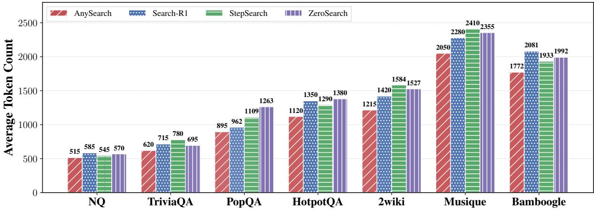  
Figure 7: Average total token count across all benchmarks on Llama-3.1-8B-Instruct (B = 5). Total tokens include output tokens and retrieved tokens.

## B Cost Analysis

## B.1 Training Dynamics

Figure 8 shows the training dynamics of Qwen2.5- 7B-Instruct and Llama-3.1-8B-Instruct. Both models exhibit stable training curves consistent with the Qwen3-4B results reported in the main text: training reward increases steadily, response length remains within a reasonable range, and policy entropy decreases gradually without sudden collapse. These results confirm that our training framework generalizes stably across different model families and sizes.

## B.2 Datasets

## General QA Benchmarks.

• Natural Questions (NQ): Real anonymized Google search queries with Wikipediaannotated answers. Tests open-domain QA grounded in a single reference page.

• TriviaQA: Trivia-style questions with independently collected evidence. Known for compositional questions and lexical mismatch requiring multi-sentence reasoning.

• PopQA: Long-tail factual QA derived from Wikidata triples. Probes reliance on parametric knowledge for low-popularity entities.

## Multi-hop QA Benchmarks.

• HotpotQA: Distractor setting with gold and distractor paragraphs; evaluates multi-hop reasoning under noisy context.

• 2WikiMultiHopQA: 2-hop compositional reasoning over Wikidata and Wikipedia with annotated evidence paths.

• MuSiQue: 2–4 hop questions with filtering for strict multi-hop requirement; tests evidence aggregation across multiple steps.

• Bamboogle: Manually written 2-hop questions designed to be difficult for keyword lookup; probes multi-step decomposition.

## B.3 Baselines Implementation

Prompt-based Budget-Aware Baselines.

• BATS (Liu et al., 2025): Prompt-based budget-aware method that injects budget state via an external tracker at inference without RL training.

## RAG-based Baselines.

• Search-o1 (Li et al., 2025): Inference-time agentic RAG interleaving reasoning with ondemand search queries without additional training.

## RL-based Baselines.

• Search-R1 (Jin et al., 2025): RL-trained agent with outcome-based reward and retrieved-token masking.

• ZeroSearch (Sun et al., 2025): RL with simulated retrieval; trains without live search engine calls.

• StepSearch (Wang et al., 2025b): Step-wise PPO (Schulman et al., 2017) with token-level information gain and redundancy penalties.

According to the pricing policy of the Google Custom Search JSON API1, beyond the initial free tier, the service charges \$5.00 per 1,000 queries, resulting in a unit cost of \$0.005 per query.

Table 9: Cost of one external search query (\$0.005) expressed as equivalent output tokens, based on OpenRouter pricing.
<table><tr><td>Model</td><td>Output Price</td><td>Cost per 1M Tokens</td><td>Equivalent Tokens</td></tr><tr><td>Qwen2.5-7B-Instruct</td><td>$0.10 / M tokens</td><td>$0.10</td><td>50,000</td></tr><tr><td>Qwen3-4B</td><td>$0.25 / M tokens</td><td>$0.25</td><td>20,000</td></tr><tr><td>LLaMA3.1-8B-Instruct</td><td>$0.05 / M tokens</td><td>$0.05</td><td>100,000</td></tr></table>

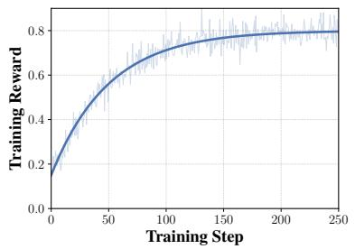  
(a) Training Reward (Qwen2.5-7B)

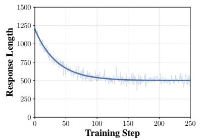  
(b) Response Length (Qwen2.5-7B)

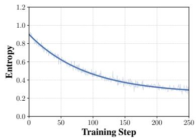  
(c) Entropy (Qwen2.5-7B)

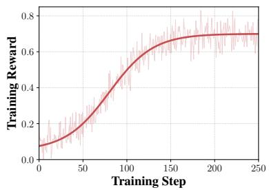  
(d) Training Reward (Llama-3.1-8B)

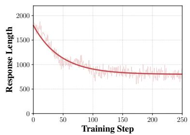  
(e) Response Length(Llama-3.1-8B)

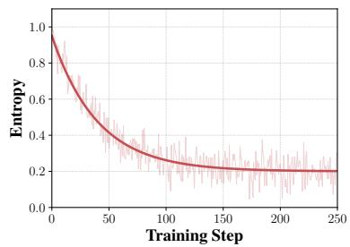  
(f) Entropy (Llama-3.1-8B)  
Figure 8: Training dynamics on Qwen2.5-7B-Instruct (top) and Llama-3.1-8B-Instruct (bottom), showing training reward, response length, and policy entropy across training steps.

Table 10: Token composition analysis on Llama-3.1- 8B-Instruct (B = 5). We report average total tokens, retrieval tokens, and the proportion of retrieval tokens in total tokens.
<table><tr><td>Dataset</td><td>Methods</td><td>Total</td><td>Retrieval</td><td>Ratio</td></tr><tr><td rowspan="2">PopQA</td><td>Search-R1</td><td>962</td><td>601</td><td>62.5%</td></tr><tr><td>StepSearch AnySearch</td><td>1263 895</td><td>728 594</td><td>57.6% 66.4%</td></tr><tr><td>2wiki</td><td>Search-R1 StepSearch</td><td>1420 1527 1215</td><td>732 1056</td><td>51.5% 69.2%</td></tr><tr><td>Bamboogle</td><td>AnySearch Search-R1 StepSearch AnySearch</td><td>2081 1992 1772</td><td>784 1410 1161 1150</td><td>64.5% 67.8% 58.3% 64.9%</td></tr></table>

In contrast, internal inference is significantly cheaper. As shown in Table 9, the output token costs of the three backbone models (Qwen2.5-7B-Instruct, Qwen3-4B, and LLaMA3.1-8B-Instruct)

used in our experiments are orders of magnitude lower than the per-query cost of external search, based on current market rates from OpenRouter2. Even for the relatively more expensive Qwen3-4B, one external search query costs the equivalent of 20,000 output tokens. This stark disparity confirms that external search is the dominant cost factor in our agentic search systems, motivating our choice to define the budget constraint over external search calls.

Furthermore, Table 10 shows that retrieval tokens account for 51–68% of total token consumption across all datasets in our experiments, confirming that the documents returned by search calls are the primary contributor to inference cost. This empirically validates that reducing unnecessary search calls is the most effective lever for lowering overall token overhead.

## C Prompt Design

The following prompt serves as the training scaffold used in Phase I. It enforces a structured cycle of budget state observation, reasoning, and action, guiding the agent toward budget-aware decision patterns. This scaffold is removed in Phase II and at inference.

Training Prompt   
You are an expert assistant designed to   
solve complex tasks through a rigorous cycle   
of reasoning and search. Your goal is to   
answer the user's question accurately while   
efficiently using your search budget. You   
have a total of {B} searches available. You   
must execute a structured loop of Budget,   
Reasoning, Action, Observation until you   
have sufficient information to answer.   
1. Budget Phase (\`<budget>\`)   
Before each reasoning step, you will see the   
current search budget:   
<budget>remaining=R; used=U; total=T</budget>   
The remaining is the number of searches you   
can still perform, used is the number of   
searches you have already performed, and   
total is the total budget allocated. Note   
that remaining + used = total.   
You must consider the current budget state   
before deciding any action.   
2. Reasoning Phase (\`<think>\`)   
Before taking any action or providing an   
answer, you must output a reasoning block.   
Inside \`<think>...</think>\`, you are   
required to explicitly analyze:   
Information Sufficiency: Is the current   
information adequate for producing a   
reliable answer? What specific information   
is still missing?   
Budget Strategy: Analyze the current budget   
state (\`<budget>\`). Determine whether the   
next search is necessary and worthwhile   
given remaining resources. Prioritize using   
your internal knowledge when possible, and   
reserve search budget for information that   
is clearly beyond your parametric knowledge.   
3. Search Phase (\`<search>\`)   
If additional information is needed, invoke   
the search engine:   
<search>query</search>   
Cost: 1 unit of budget per search.   
Usage: Use this when you need specific   
factual information that you cannot reliably   
produce from internal knowledge alone.   
4. Observation Phase (\`<information>\`)   
The system will return search results   
wrapped in \`<information>...</information>\`   
tags.   
5. Answering Phase (\`<answer>\`)   
Once you have gathered sufficient   
information and no further searching is

required, provide the final concise answer   
wrapped in \`<answer>...</answer>\` tags. For   
example: <answer> Beijing </answer>   
Now, answer the following question:   
{Question}

In Phase II and at inference, the budget state injection and structured reasoning prompts are removed. The agent receives the following prompt, which specifies the total budget in natural language and retains only the basic interaction format:

Phase II / Inference Prompt   
You are an expert assistant designed to   
solve complex tasks through reasoning and   
search. Your goal is to answer the user's   
question accurately. You have a total of {B}   
searches available. You must execute a loop   
of Reasoning, Action, Observation until you   
have sufficient information to answer.   
1. Reasoning Phase (\`<think>\`)   
Before taking any action or providing an   
answer, you must output a reasoning block   
inside \`<think>...</think>\` tags.   
2. Search Phase (\`<search>\`)   
If additional information is needed, invoke   
the search engine:   
<search>query</search>   
Cost: 1 unit of budget per search.   
3. Observation Phase (\`<information>\`)   
The system will return search results   
wrapped in \`<information>...</information>   
tags.   
4. Answering Phase (\`<answer>\`)   
Once you have gathered sufficient   
information and no further searching is   
required, provide the final concise answer   
wrapped in \`<answer>...</answer>\` tags. For   
example: <answer> Beijing </answer>   
Now, answer the following question:   
{Question}

## D Case Studies

We present five case studies on the same multihop questions. Cases 1–4 contrast Search-R1 and AnySearch under different budget constraints, illustrating that AnySearch internalizes budgetproportional allocation while Search-R1 lacks adaptive behavior regardless of budget availability. Case 5 further compares AnySearch with and without the training scaffold, demonstrating that the internalized policy preserves allocation quality while producing more concise reasoning.

Case 1: Search-R1 @ Budget = 6 — Premature Convergence under Abundant Budget. Despite having ample budget, Search-R1 terminates after only two searches and produces an incorrect answer (1631 instead of 1625). The agent retrieves the Dutch founding date of Philipsburg but fails to verify the earlier French arrival in the region. This reflects a key limitation observed in our main results (Table 1): without budget-aware training, the agent does not learn to leverage additional budget for verification, leading to premature convergence even when resources permit deeper exploration.

Case 1 (Search-R1 Budget=6)   
Question: When did the people who captured   
Malakoff come to the region where   
Philipsburg is located?   
Ground Truth: 1625   
<think>I first need to identify who captured   
Malakoff.</think>   
<search>who captured Malakoff</search>   
<information>[...The Malakoff Redoubt was   
captured by French forces under General   
Pélissier during the Crimean War in   
1855...]</information>   
<think>The people were French. Now I need   
information about Philipsburg and its   
regional history.</think>   
<search>Philipsburg history</search>   
<information>[...Philipsburg is the capital   
of Sint Maarten, founded by the Dutch in   
1631...]</information>   
<think>The retrieved timeline gives 1631 for   
Philipsburg, which appears to answer the   
question.</think>   
<answer>1631</answer>

Case 2: AnySearch @ Budget = 6 — Budget-Proportional Verification Depth. Given the same question and budget, AnySearch uses four searches to progressively decompose the multihop problem: identifying the French as the captors, locating Philipsburg, then verifying the earlier French settlement date. Crucially, the agent recognizes that the initial Dutch date (1631) is insufficient and invests additional budget to confirm the correct French arrival (1625). This demonstrates the budget-proportional behavior validated by Figure 4: under abundant budgets, AnySearch deepens verification rather than stopping prematurely, yielding monotonically increasing accuracy with budget.

Case 2 (AnySearch Budget=6)   
Question: When did the people who captured   
Malakoff come to the region where   
Philipsburg is located?   
Ground Truth: 1625   
<think>I need to identify who captured   
Malakoff, then determine when those people   
arrived in the region where Philipsburg is   
located.</think>   
<search>who captured Malakoff</search>   
<information>[...The Malakoff Redoubt was   
captured by French forces under General   
Pélissier during the Crimean War in   
1855...]</information>   
<think>The people were French. I now need   
the relevant regional history connected to   
Philipsburg.</think>   
<search>Philipsburg location history</search>   
<information>[...Philipsburg is the capital   
of Sint Maarten, founded by the Dutch in   
1631...]</information>   
<think>The retrieved date refers to the   
Dutch founding of Philipsburg, but the   
question asks when the French came to the   
region. I should verify the earlier French   
presence in Saint Martin.</think>   
<search>French settlement Saint   
Martin</search>   
<information>[...French settlers established   
a presence in the St. Martin region by 1625,   
prior to Dutch colonization   
efforts...]</information>   
<think>This gives an earlier French arrival   
date distinct from the later Dutch founding   
of Philipsburg. I will verify the timeline   
once more before answering.</think>   
<search>Saint Martin French and Dutch   
colonization timeline</search>   
<information>[...1625 marks the beginning of   
sustained French settlement in the Saint   
Martin area, while Philipsburg was founded   
later under Dutch rule...]</information>   
<think>The evidence consistently indicates   
that the French arrived in the region in   
1625.</think>   
<answer>1625</answer>

Case 3: Search-R1 @ Budget = 3 — Poor Budget Allocation under Tight Constraints. Under a tight budget of 3, Search-R1 spends all three searches on this question but allocates them ineffectively. The agent retrieves Jonas Salk’s biography and personal beliefs, obtaining conflicting information about his secular worldview versus Jewish heritage. Having exhausted its budget without resolving the ambiguity, it answers incorrectly. This exemplifies the efficiency gap measured by Tool Productivity (Table 2): Search-R1 consumes more searches per correct answer because it lacks the ability to prioritize the most informative queries under constrained budgets.

Case 3 (Search-R1 Budget=3)   
Question: What was the religion of the   
inventor of the Polio vaccine?   
Ground Truth: Jewish   
<think>I need to identify the inventor of   
the Polio vaccine first.</think>   
<search>history of the polio vaccine</search>   
<information>[...Jonas Salk led the   
development of the first effective polio   
vaccine in 1955...]</information>   
<think>The inventor was Jonas Salk. I should   
gather more background information before   
determining his religion.</think>   
<search>Jonas Salk biography and   
beliefs</search>   
<information>[...Jonas Salk described   
himself as a secular humanist and emphasized   
scientific rather than religious   
values...]</information>   
<think>This gives his personal beliefs, but   
it is still unclear whether the question   
refers to religion, ethnicity, or   
upbringing. I need more   
clarification.</think>   
<search>Jonas Salk family background</search>   
<information>[...Jonas Salk was born to   
Jewish immigrant parents from   
Russia...]</information>   
<think>I now have conflicting signals   
between his personal worldview and family   
background. Since no budget remains for   
further verification, I will answer based on   
his stated beliefs.</think>   
<answer>Secular humanist</answer>

Case 4: AnySearch @ Budget = 3 — Internalized Budget-Aware Allocation. Given the same question with only 3 searches, AnySearch allocates its limited budget with precision. The first search identifies Jonas Salk; the second directly targets his religious background, yielding the correct answer. The agent then reasons that the evidence is sufficient and terminates with one search remaining, rather than spending budget on redundant verification. This selective allocation— searching for the most discriminative information and stopping once confident—is the hallmark of the internalized budget-aware capability that our progressive scaffold removal produces, as confirmed by the superior TP scores in Table 2.

## Case 4 (AnySearch Budget=3)

Question: What was the religion of the   
inventor of the Polio vaccine?   
Ground Truth: Jewish   
<think>I first need to identify the inventor   
of the Polio vaccine.</think>   
<search>inventor of the polio   
vaccine</search>   
<information>[...Jonas Salk developed the   
first effective polio vaccine in   
1955...]</information>   
<think>The inventor was Jonas Salk. I should   
directly verify his religious   
background.</think>   
<search>Jonas Salk religious   
background</search>   
<information>[...Jonas Salk was born to   
Jewish immigrant parents and was raised in a   
Jewish family...]</information>   
<think>The retrieved information directly   
answers the question, so additional searches   
are unnecessary.</think>   
<answer>Jewish</answer>

These four cases jointly illustrate the internalized budget-aware capability validated in our ablation studies (Figure 5a): AnySearch adjusts its search depth proportionally to the available budget—investing in verification when resources are abundant (Case 2) and focusing on the most informative queries when resources are scarce (Case 4). In contrast, Search-R1 applies a fixed search strategy regardless of the budget, resulting in under-utilization under high budgets (Case 1) and inefficient allocation under low budgets (Case 3).

Case 5: AnySearch with Scaffold @ Budget = 6 — From Explicit Scaffold to Internalized Allocation. We additionally present the same question solved by AnySearch under the Phase I scaffold (with explicit <budget> state injection and structured dual-factor reasoning). Comparing Case 5 with Case 2 reveals two important observations. First, both reach the correct answer with identical search trajectories (4 searches, same termination point), confirming the finding in Figure 5a that Ours (+Scaffold) achieves comparable accuracy to Ours—the policy has fully internalized the budgetaware allocation that the scaffold teaches. Second, Case 2 (without scaffold) produces notably more concise reasoning: each <think> block focuses directly on the next action decision, whereas Case 5 (with scaffold) generates verbose Information

<information>[...French settlers established   
a presence in the St. Martin region by 1625,   
prior to Dutch colonization   
efforts...]</information>   
<budget>remaining=3; used=3; total=6</budget>   
<think>Information Sufficiency: I now have   
evidence for French presence in the region   
by 1625. This appears to answer the   
question, but I should confirm that this   
regional timeline is distinct from the later   
Dutch founding of Philipsburg.   
Budget Strategy: I still retain ample   
remaining budget. One additional   
verification search is worthwhile to improve   
reliability before finalizing the   
answer.</think>   
<search>French vs Dutch colonization Saint   
Martin timeline</search>   
<information>[...1625 marks the beginning of   
sustained French settlement in the Lesser   
Antilles including the Saint Martin area.   
Philipsburg itself was founded later by the   
Dutch...]</information>   
<budget>remaining=2; used=4; total=6</budget>   
<think>Information Sufficiency: The   
retrieved evidence is now sufficient and   
internally consistent. The French arrived in   
the region in 1625, while Philipsburg was   
founded later by the Dutch. No critical   
information remains missing.   
Budget Strategy: Further searching is   
unnecessary because the answer is supported   
by multiple consistent retrievals, and   
preserving remaining budget is   
preferable.</think>   
<answer>1625</answer>

Sufficiency and Budget Strategy analyses at every step. This difference is consistent with the lower total token consumption reported in Figure 3— after internalization, the agent compresses the explicit budget reasoning into implicit decision patterns, reducing thinking overhead while preserving the same allocation quality.

## Case 5 (AnySearch with Scaffold Budget=6)

Question: When did the people who captured   
Malakoff come to the region where   
Philipsburg is located?   
Ground Truth: 1625   
<budget>remaining=6; used=0; total=6</budget>   
<think>Information Sufficiency: I do not yet   
know who captured Malakoff, so I cannot   
determine which people the question refers   
to. The missing information is the identity   
of the captors.   
Budget Strategy: I have the full budget   
available. A search is necessary because the   
identity of the captors is specific factual   
information that should not be assumed from   
internal knowledge.</think>   
<search>who captured Malakoff</search>   
<information>[...The Malakoff Redoubt was   
captured by French forces under General   
Pélissier during the Crimean War in   
1855...]</information>   
<budget>remaining=5; used=1; total=6</budget>   
<think>Information Sufficiency: I now know   
that the people were French. However, I   
still lack the relevant regional timeline   
connected to Philipsburg. I need information   
about where Philipsburg is located and the   
associated historical context.   
Budget Strategy: With substantial budget   
remaining, an additional search is   
worthwhile. A targeted search about   
Philipsburg's location and history should   
efficiently reduce the remaining   
uncertainty.</think>   
<search>Philipsburg location history</search>   
<information>[...Philipsburg is the capital   
of Sint Maarten, founded by the Dutch in   
1631...]</information>   
<budget>remaining=4; used=2; total=6</budget>   
<think>Information Sufficiency: I now have a   
date associated with Philipsburg, but the   
retrieved information describes Dutch   
founding activity. The question asks when   
the French came to the region where   
Philipsburg is located, so the missing   
information is the timeline of French   
presence in the Saint Martin region.   
Budget Strategy: The current information is   
not yet reliable enough for answering. Since   
sufficient budget remains, a focused   
verification search about French settlement   
in Saint Martin is justified.</think>   
<search>French settlement Saint   
Martin</search>

## D.1 Consolidating Evidence for Internalization

Beyond the ablation comparison in Figure 5a, we consolidate three complementary signals from our experiments that jointly support the internalization claim.

Scaffold redundancy at inference. The Ours (+) variant in Figure 5a reintroduces the full scaffold (budget state injection and structured reasoning prompts) at inference time. The resulting accuracy is virtually identical to our standard inference without the scaffold, indicating that the policy has already absorbed the budget-tracking capability the scaffold previously provided. If budget awareness were not internalized, re-enabling the scaffold should yield measurable gains.

Active budget conservation. The tool productivity results in Table 2 show that AnySearch uses substantially fewer searches per correct answer than baselines operating under the same budget ceiling. This implies that the policy actively conserves budget rather than defaulting to exhaustive search. A model without internal budget awareness would lack the basis for such selective allocation and would tend to use all available searches indiscriminately.

Early stopping without external signals. The case studies above demonstrate that AnySearch stops search early when confident. Case 4 uses only 2 of 3 available searches, and Case 2 stops at 4 of 6. This behavior requires implicit awareness of remaining budget without external state injection: the agent must simultaneously track that resources remain available and judge that further search is unnecessary. Search-R1, by contrast, either under-utilizes budget without deliberation (Case 1) or exhausts it without strategic allocation (Case 3).

Together, these three observations suggest that the trained policy maintains an internal representation of budget state and conditions its search decisions accordingly, rather than relying on external budget tracking at inference.

Table 11: Full comparison of efficiency across four multi-hop QA benchmarks under different backbone models and budget levels, measured by Accuracy (Acc) and Tool Productivity (TP).
<table><tr><td>Settings</td><td>Methods</td><td colspan="2">HotpotQA Acc↑ TP↑</td><td colspan="2">2wiki Acc↑ TP↑</td><td colspan="2">MuSiQue Acc↑ TP↑</td><td colspan="2">Bamboogle Acc↑ TP↑</td></tr><tr><td colspan="9">Qwen2.5-7B-Instruct</td></tr><tr><td></td><td>AnySearch</td><td>0.386</td><td>0.305</td><td>0.351</td><td>0.281</td><td>0.192</td><td>0.153</td><td>0.384</td><td>0.319</td></tr><tr><td>B = 4</td><td>Search-R1 StepSearch</td><td>0.365 0.374</td><td>0.241 0.223</td><td>0.341 0.330</td><td>0.207 0.189</td><td>0.158 0.172</td><td>0.101 0.118</td><td>0.360 0.312</td><td>0.203 0.179</td></tr><tr><td>B = 5</td><td>AnySearch Search-R1 StepSearch</td><td>0.395 0.372 0.384</td><td>0.338 0.215 0.258</td><td>0.364 0.356 0.342</td><td>0.302 0.221 0.196</td><td>0.205 0.169 0.185</td><td>0.171 0.113 0.107</td><td>0.398 0.372 0.328</td><td>0.327 0.209 0.218</td></tr><tr><td>B = 6</td><td>AnySearch Search-R1 StepSearch</td><td>0.398 0.375 0.388</td><td>0.354 0.212 0.276</td><td>0.372 0.362 0.348</td><td>0.317 0.218 0.203</td><td>0.212 0.174 0.190</td><td>0.179 0.126 0.108</td><td>0.408 0.376 0.336</td><td>0.341 0.211 0.194</td></tr><tr><td colspan="9">Llama-3.1-8B-Instruct</td></tr><tr><td>B = 4</td><td>AnySearch Search-R1 StepSearch</td><td>0.394 0.356 0.342</td><td>0.347 0.249 0.226</td><td>0.378 0.335 0.348</td><td>0.309 0.218 0.197</td><td>0.190 0.176 0.182</td><td>0.158 0.119 0.104</td><td>0.400 0.352 0.360</td><td>0.338 0.231 0.207</td></tr><tr><td>B = 5</td><td>AnySearch Search-R1 StepSearch AnySearch</td><td>0.402 0.364 0.350</td><td>0.378 0.236 0.297</td><td>0.392 0.349 0.361</td><td>0.334 0.213 0.204</td><td>0.203 0.188 0.193</td><td>0.168 0.122 0.109</td><td>0.412 0.365 0.376</td><td>0.351 0.227 0.214</td></tr><tr><td>B = 6</td><td>Search-R1 StepSearch</td><td>0.408 0.368 0.356</td><td>0.386 0.231 0.247</td><td>0.398 0.354 0.365</td><td>0.349 0.208 0.217</td><td>0.208 0.192 0.198</td><td>0.177 0.131 0.113</td><td>0.416 0.368 0.384</td><td>0.362 0.219 0.236</td></tr><tr><td colspan="9">Qwen3-4B AnySearch</td></tr><tr><td>B = 4</td><td>Search-R1 StepSearch</td><td>0.378 0.351 0.339</td><td>0.309 0.235 0.198</td><td>0.340 0.336</td><td>0.216 0.192</td><td>0.124 0.136</td><td>0.093 0.078</td><td>0.328 0.336</td><td>0.201 0.183</td></tr><tr><td>B = 5</td><td>AnySearch Search-R1 StepSearch</td><td>0.384 0.356 0.345</td><td>0.321 0.231 0.204</td><td>0.375 0.353 0.349</td><td>0.308 0.204 0.213</td><td>0.164 0.132 0.148</td><td>0.137 0.088 0.096</td><td>0.352 0.344 0.352</td><td>0.283 0.206 0.189</td></tr><tr><td>B = 6</td><td>AnySearch Search-R1 StepSearch</td><td>0.388 0.360 0.350</td><td>0.332 0.218 0.223</td><td>0.380 0.358 0.354</td><td>0.313 0.213 0.196</td><td>0.170 0.138</td><td>0.143 0.097</td><td>0.360 0.352</td><td>0.291 0.204</td></tr></table>