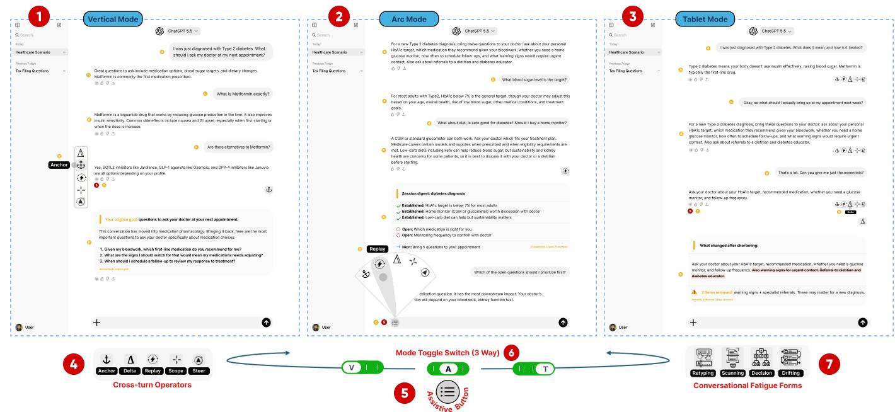
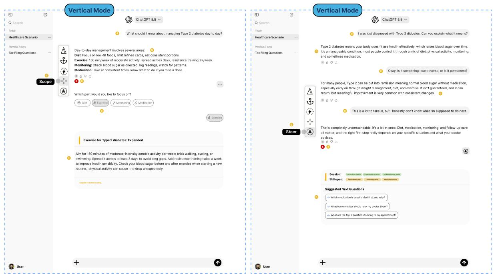
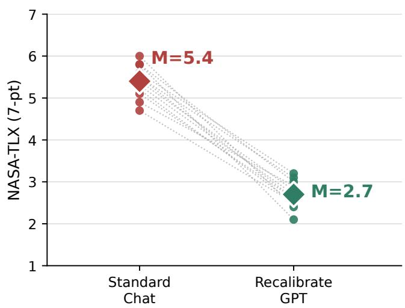
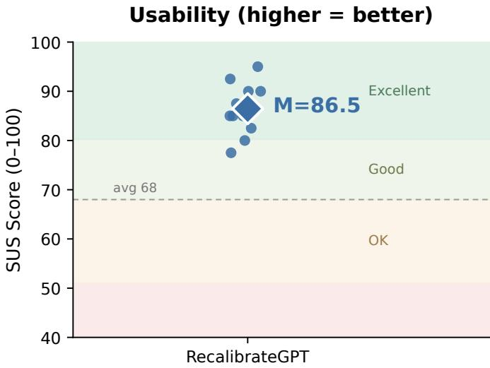

# RecalibrateGPT: AI Fatigue Resilient Conversational Interfaces

Nikhil Wani OpenThreads AI Research nikhylwani@openthreadsai.com

  
Figure 1: Three drifting healthcare conversations calibrated by RecalibrateGPT’s cross-turn operators (4) across 3 palette layouts: Vertical (1), Arc (2), Tablet (3), invoked via the AssistiveButton (5) and mode-toggle (6), each targeting a fatigue form (7).

## Abstract

Large language models are powerful, but their interfaces often devolve into a type → read → retype loop, creating conversational AI fatigue, cognitive load, and eventual task abandonment. To mitigate this, we present RecalibrateGPT, a system introducing five crossturn operators (Anchor, Replay, Delta, Scope, and Steer) that each target a distinct fatigue type, recalibrating LLM responses through a structured panel by acting on the full conversation history with a single click. Users invoke these operators through the AssistiveButton in one of three operator palette layouts: Vertical, Arc, or Tablet. We conducted two pilot studies with the same 12 advanced LLM users. An initial formative qualitative study identifies a taxonomy of four fatigue types (retyping, scanning, decision paralysis, and context drift) and derives two design objectives for RecalibrateGPT. A follow-up quantitative evaluation finds it reduces perceived cogni tive workload by half (NASA-TLX = 2.7) at high perceived usability (SUS = 86.5), suggesting AI fatigue is not just a model-quality issue but an interaction-flow cost that interfaces can remove.

## CCS Concepts

• Human-centered computing → Natural language interfaces; Interactive systems and tools; User studies; • Computing methodologies → Artificial intelligence.

## Keywords

Human-AI Interaction, Conversational User Interfaces

## ACM Reference Format:

Nikhil Wani. 2026. RecalibrateGPT: AI Fatigue Resilient Conversational Interfaces. In The 39th Annual ACM Symposium on User Interface Software and Technology (UIST Adjunct ’26), November 02–05, 2026, Detroit, MI, USA. ACM, New York, NY, USA, 5 pages. https://doi.org/10.1145/3830397.3841834

## 1 Introduction and Related Work

Large language models (LLMs) are powerful, but their interfaces often devolve into a type → read → retype interaction loop: users restate goals, correct drifts, constantly keep up with relentless changes, and manage growing context across turns. Over time this produces conversational AI fatigue, creating cognitive load [9, 11], frustration [5], and eventual decision paralysis [16] that can end in abandonment [14], especially in high-stakes domains (clinical diagnosis [7] and legal interpretation) where accuracy matters [12, 13]. This fatigue is not only a model-quality issue but also an interaction-flow issue: many user actions currently require full re-prompting by typing, which increases per-token inference cost, compounding the burden of every additional turn.

We present RecalibrateGPT, a system introducing five crossturn operators (Section 3) that each targets one of four conversational AI fatigue types (Section 2), recalibrating LLM responses through a structured panel (Fig. 1(h)) by acting on the full conversation history with one click, rather than only the previous response. The AssistiveButton opens one of three operator palettes (Vertical, Arc, or Tablet) from which users select an operator; the system also calibrates interaction flow by breaking the exhausting type → read → retype loop into a lighter, restorative type → read → click loop, as traced in Fig. $1 \colon a { \longrightarrow } b { \longrightarrow } c { \longrightarrow } d { \longrightarrow } e { \longrightarrow } f { \longrightarrow } g { \longrightarrow } h$

Related Work. Prior work in UIST and the broader HCI literature explores reifying prompt actions into reusable interface controls, yet two major gaps remain: existing operators act only on a single-turn previous response, and none are designed around session-level conversational fatigue. DirectGPT [6] ofers commands for embodying prompts as reusable direct-manipulation objects; Cells and Lenses [3] treats LLM inputs and outputs as manipulable objects of iteration. Other systems improve singleresponse navigation, converting it into interactive diagrams [2] or verifiable editing surfaces [4, 10], while pipeline tools chain prompts into workflows [1, 15]. Across all of these cited prior systems and commercial interfaces (ChatGPT, Claude, Gemini), the unit of manipulation remains a single response, with fatigue unaddressed. RecalibrateGPT closes both gaps: our cross-turn operators recalibrate the entire conversation, derived from observed fatigue themes (Section 2). To our knowledge, no prior system defines op erators acting on full conversation history across three geometric palettes (Vertical, Arc, Tablet) tuned specifically to fatigue context.

## 2 Study 1: Formative Study

To ground RecalibrateGPT in observed user interaction behavior rather than designer intuition, we conducted a qualitative formative study. Participants. We recruited 12 advanced LLM users (7M, 5F; ages 22–39, M=28.4, SD=4.6) through purposive sampling via social and academic networks. Inclusion criteria required daily LLM use (≥ 5 days/week, ≥ 6 months sustained), active experience across ≥ 2 conversational AI platforms, English fluency (self-rated ≥ 4/5), and self-reported use of LLMs for high-stakes information-seeking tasks (e.g., medical or legal questions); users with exclusively single turn, casual LLM experience were excluded. Task. Participants completed an online survey describing in free text their interaction frustrations and most retyped corrections during everyday LLM sessions, yielding 96 reprompt examples (M=8.0 per participant).

Derived Design Objectives. We derive two design objectives (DOs) grounding RecalibrateGPT. DO1: Multi-turn response calibration. Single-coder thematic analysis identified four recurring fatigue themes (F1–F4), each clustering around multi-turn interaction breakdown. Participants repeatedly referenced (F1) Retyping fatigue: "I kept retyping the same constraints because the answer drifted" [P2]; (F2) Scanning fatigue: "I was rereading to find the one line that actually mattered" [P11]; (F3) Decision paralysis: "I kept asking follow-ups because I couldn’t tell what to pick" [P9]; and (F4) Context drift: "I was fighting the interface, not solving the problem" [P3]. These themes motivate cross-turn operators.

DO2: Single-click corrective control. This motivates the AssistiveButton and three-way toggle that reduces retyping burden.

## 3 RecalibrateGPT System Design

Cross-Turn Operators. RecalibrateGPT’s primary contribution, these five button instances (Fig. 1(4)) each target one of four fatigue types (F1–F4) [DO1], recalibrating LLM responses into a structured panel (Fig. 1(h)) by acting on the full conversation history. Anchor detects semantic drift between the current response and the user’s original goal and reorients the output back toward it, reducing context drift (F4). Replay extracts a session digest of established facts, open questions, and a next step, reducing scanning fatigue (F2). Delta (Dif) semantically compares the diference between current and previous response, surfacing additions and flagging goal-relevant removals, reducing retyping fatigue (F1). Scope narrows to a user-selected subtopic without retyping: it first surfaces detected subtopics as tappable options, then expands the selection on the second tap, reducing retyping fatigue (F1). Steer analyzes goal completion and generates three tappable follow-up questions targeting remaining gaps, reducing decision paralysis fatigue (F3).

Three-Way Mode Toggle. The toggle switch (Fig. 1(6)) sets the operator palette layout to one mode at a time: Vertical (V), Arc (A), or Tablet (T). Vertical renders a pill-shaped sidebar left of each response, for repeated use across turns; Arc renders a fan menu radiating from the AssistiveButton, for rapid micro-corrections while reading; Tablet renders a persistent horizontal strip below each response, for single-click access under higher cognitive load.

Universal AssistiveButton. The AssistiveButton (Fig. 1(5)) is the single entry point across all three modes for operator palette invocation. Its placement adapts (Fig. 1(f)): in Vertical and Tablet it appears as the first afordance after every response; in Arc it anchors to the left of the central input field. On tap, it reads the toggle switch state and renders the matching operator palette.

Implementation. We implement the operator backend in Python over the OpenAI API (GPT-5.5); all operators share sentence transformer embeddings [8] Emb(�). Let � denote conversation history, � the original goal, $c _ { n }$ the latest response. Anchor computes goal alignment using cosine similarity cos(Emb(�), Emb(� )) and reorients low-similarity outputs. Delta compares response semantic distributions using KL divergence $D _ { K L } ( P _ { n } \Vert P _ { n - 1 } )$ and flags �- relevant removals. Replay summarizes $H  \langle E , O , s \rangle$ , where � are established facts, � are open questions, and � is the next step. Scope clusters sentence embeddings $\{ \mathbf { v } _ { s _ { i } } : s _ { i } \in c _ { n } \}$ to surface subtopics. Steer computes unresolved gaps as $G \ = \ \{ a \ \in \ A _ { g }$ $\mathbf { m a x } _ { h \in H }$ cos(Emb(�), Emb(ℎ)) < � }, where $A _ { g }$ are goal sub-aspects, then converts them into targeted follow-up questions. Each operator returns JSON response templates (Fig. 1(g)).

## 4 Study 2: User Feedback on RecalibrateGPT

We conducted a follow-up within-subjects pilot with the same 12 participants. For each of cross-turn operators, participants compared the same healthcare conversation interfaces (Fig. 1) under standard chat and the RecalibrateGPT system, shown side-by-side in their preferred layout (Vertical n=5, Arc n=4, Tablet n=3). For each operator, they chose the less fatiguing interface and rated both on the 7-point NASA-TLX; after all five, they completed the 10-item

SUS. Findings. Participants consistently selected RecalibrateGPT as less fatiguing, with lower perceived workload (NASA-TLX: M=2.7 vs. 5.4) and high perceived usability (SUS: M=86.5). Anchor (n=4), Replay (n=3), and Delta (n=3) were rated most useful. Given the pilot scale, we report these as directional evidence of feasibility rather than generalizable efects.

## 5 Conclusion and Future Work

We present RecalibrateGPT, a system introducing five cross-turn operators that act on the full conversation history to target conversational AI fatigue through calibrated responses and single-click interactions. In our pilot study, it reduced perceived cognitive work load by half at high perceived usability, suggesting that much of AI fatigue is not just a model-quality issue but also an interaction-flow cost that interfaces can remove. Future work will explore proactive interfaces that dynamically surface the right operator as fatigue emerges, validated through larger-scale studies.

## References

[1] Ian Arawjo, Priyan Vaithilingam, Martin Wattenberg, and Elena Glassman. 2023. ChainForge: An open-source visual programming environment for prompt engineering. In Adjunct Proceedings ofthe 36th Annual ACM Symposium on User Interface Software and Technology (San Francisco, CA, USA) (UIST ’23 Adjunct). Association for Computing Machinery, New York, NY, USA, Article 4, 3 pages. doi:10.1145/3586182.3616660

[2] Peiling Jiang, Jude Rayan, Steven P. Dow, and Haijun Xia. 2023. Graphologue: Exploring Large Language Model Responses with Interactive Diagrams. In Proceedings of the 36th Annual ACM Symposium on User Interface Software and Technology (San Francisco, CA, USA) (UIST ’23). Association for Computing Machinery, New York, NY, USA, Article 3, 20 pages. doi:10.1145/3586183.3606737

[3] Tae Soo Kim, Yoonjoo Lee, Minsuk Chang, and Juho Kim. 2023. Cells, Gen erators, and Lenses: Design Framework for Object-Oriented Interaction with Large Language Models. In Proceedings of the 36th Annual ACM Symposium on User Interface Software and Technology (San Francisco, CA, USA) (UIST ’23). As sociation for Computing Machinery, New York, NY, USA, Article 4, 18 pages. doi:10.1145/3586183.3606833

[4] Philippe Laban, Jesse Vig, Marti Hearst, Caiming Xiong, and Chien-Sheng Wu. 2024. Beyond the Chat: Executable and Verifiable Text-Editing with LLMs. In Proceedings ofthe 37th Annual ACM Symposium on User Interface Software and Technology (Pittsburgh, PA, USA) (UIST ’24). Association for Computing Machin ery, New York, NY, USA, Article 20, 23 pages. doi:10.1145/3654777.3676419

[5] Ewa Luger and Abigail Sellen. 2016. "Like Having a Really Bad PA": The Gulf be tween User Expectation and Experience of Conversational Agents. In Proceedings ofthe 2016 CHI Conference on Human Factors in Computing Systems (San Jose, California, USA) (CHI ’16). Association for Computing Machinery, New York, NY, USA, 5286–5297. doi:10.1145/2858036.2858288

[6] Damien Masson, Sylvain Malacria, Géry Casiez, and Daniel Vogel. 2024. Direct GPT: A Direct Manipulation Interface to Interact with Large Language Models. In Proceedings ofthe 2024 CHIConference on Human Factors in Computing Systems (Honolulu, HI, USA) (CHI ’24). Association for Computing Machinery, New York, NY, USA, Article 975, 16 pages. doi:10.1145/3613904.3642462

[7] Niroop Channa Rajashekar, Yeo Eun Shin, Yuan Pu, Sunny Chung, Kisung You, Mauro Giufre, Colleen E Chan, Theo Saarinen, Allen Hsiao, Jasjeet Sekhon, Ambrose H Wong, Leigh V Evans, Rene F. Kizilcec, Loren Laine, Terika Mccall, and Dennis Shung. 2024. Human-Algorithmic Interaction Using a Large Language Model-Augmented Artificial Intelligence Clinical Decision Support System. In Proceedings ofthe 2024 CHI Conference on Human Factors in Computing Systems (Honolulu, HI, USA) (CHI ’24). Association for Computing Machinery, New York, NY, USA, Article 442, 20 pages. doi:10.1145/3613904.3642024

[8] Nils Reimers and Iryna Gurevych. 2019. Sentence-BERT: Sentence Embeddings using Siamese BERT-Networks. In Proceedings ofthe 2019 Conference on Empirical Methods in Natural Language Processing and the 9th International Joint Conference on Natural Language Processing (EMNLP-IJCNLP), Kentaro Inui, Jing Jiang, Vincent Ng, and Xiaojun Wan (Eds.). Association for Computational Linguistics, Hong Kong, China, 3982–3992. doi:10.18653/v1/D19-1410

[9] Hari Subramonyam, Roy Pea, Christopher Pondoc, Maneesh Agrawala, and Colleen Seifert. 2024. Bridging the Gulf of Envisioning: Cognitive Challenges in Prompt Based Interactions with LLMs. In Proceedings ofthe 2024 CHIConference on Human Factors in Computing Systems (Honolulu, HI, USA) (CHI ’24). Association for Computing Machinery, New York, NY, USA, Article 1039, 19 pages. doi:10. 1145/3613904.3642754

[10] Sangho Suh, Bryan Min, Srishti Palani, and Haijun Xia. 2023. Sensecape: Enabling Multilevel Exploration and Sensemaking with Large Language Models. In Proceedings ofthe 36th Annual ACM Symposium on User Interface Software and Technology (San Francisco, CA, USA) (UIST ’23). Association for Computing Machinery, New York, NY, USA, Article 1, 18 pages. doi:10.1145/3586183.3606756

[11] Lev Tankelevitch, Viktor Kewenig, Auste Simkute, Ava Elizabeth Scott, Advait Sarkar, Abigail Sellen, and Sean Rintel. 2024. The Metacognitive Demands and Opportunities of Generative AI. In Proceedings ofthe 2024 CHI Conference on Human Factors in Computing Systems (Honolulu, HI, USA) (CHI ’24). Association for Computing Machinery, New York, NY, USA, Article 680, 24 pages. doi:10. 1145/3613904.3642902

[12] Dakuo Wang, Liuping Wang, Zhan Zhang, Ding Wang, Haiyi Zhu, Yvonne Gao, Xiangmin Fan, and Feng Tian. 2021. “Brilliant AI Doctor” in Rural Clinics: Challenges in AI-Powered Clinical Decision Support System Deployment. In Proceedings of the 2021 CHI Conference on Human Factors in Computing Systems (Yokohama, Japan) (CHI ’21). Association for Computing Machinery, New York, NY, USA, Article 697, 18 pages. doi:10.1145/3411764.3445432

[13] Nikhil Wani, Sandeep Mathias, Jayashree Aanand Gajjam, and Pushpak Bhattacharyya. 2018. The Whole is Greater than the Sum of its Parts: Towards the Efectiveness of Voting Ensemble Classifiers for Complex Word Identification. In Proceedings ofthe Thirteenth Workshop on Innovative Use ofNLPfor Building Educational Applications, Joel Tetreault, Jill Burstein, Ekaterina Kochmar, Claudia Leacock, and Helen Yannakoudakis (Eds.). Association for Computational Linguistics, New Orleans, Louisiana, 200–205. doi:10.18653/v1/W18-0522

[14] Siyuan Wu, Guochao Peng, Shuyang Li, David Cameron, Jun Zhang, Zuopeng Zhang, and Qing Zhang. 2026. Textual cues, cognitive load, and social fatigue: Unveiling the reasons behind user discontinuance in conversational AI. International Journal ofHuman-Computer Studies 215 (2026), 103846. doi:10.1016/j.ijhcs. 2026.103846

[15] Tongshuang Wu, Ellen Jiang, Aaron Donsbach, Jef Gray, Alejandra Molina, Michael Terry, and Carrie J Cai. 2022. PromptChainer: Chaining Large Language Model Prompts through Visual Programming. In Extended Abstracts ofthe 2022 CHI Conference on Human Factors in Computing Systems (New Orleans, LA, USA) (CHI EA ’22). Association for Computing Machinery, New York, NY, USA, Article 359, 10 pages. doi:10.1145/3491101.3519729

[16] J.D. Zamfirescu-Pereira, Richmond Y. Wong, Bjoern Hartmann, and Qian Yang. 2023. Why Johnny Can’t Prompt: How Non-AI Experts Try (and Fail) to Design LLM Prompts. In Proceedings ofthe 2023 CHI Conference on Human Factors in Computing Systems (Hamburg, Germany) (CHI ’23). Association for Computing Machinery, New York, NY, USA, Article 437, 21 pages. doi:10.1145/3544548. 3581388

A. Appendix  
  
Figure A: Two drifting healthcare conversations calibrated by RecalibrateGPT’s Scope (left) and Steer (right) cross-turn operator interfaces in the Vertical palette layout.

This appendix details the Study 2 procedure, participant feedback and measurement instruments. Results are reported in the main paper; the summary below, Fig. A, and Fig. B are provided for completeness.

## A.1 Study 2 Procedure

Sessions were conducted online, approximately 35 minutes per participant, across three phases. Participants were compensated for their time. The study protocol was reviewed and approved by an internal ethics review process. All participants provided informed consent.

Phase 1: Onboarding (5 min). Participants were briefed on the objective, re-verified against inclusion criteria, and introduced to the scenario.

Phase 2: Paired Evaluation (20 min). We employed a withinsubjects design (N=12). Participants evaluated a simulated healthcare scenario, shown in Fig. 1 of the main paper, across five crossturn operator-specific comparisons involving the management of a new Type 2 diabetes diagnosis. For each operator (Anchor, Replay, Delta, Scope, and Steer), they viewed a side-by-side pair of conversation interfaces: Condition A, a standard-chat baseline, and Condition B, a RecalibrateGPT intervention, resulting in 10 screens total. Each pair was shown together in the participant’s preferred layout (Vertical N=5, Arc N=4, Tablet N=3), with operator order and the presentation order of the two conditions randomized per participant to reduce order efects. After each comparison, participants selected the less fatigue-inducing interface and completed parallel 7-point NASA-TLX ratings for both conditions. For each operatorcondition comparison, the six NASA-TLX dimension ratings were averaged to obtain an unweighted NASA-TLX score. The five operator scores were then averaged to obtain one participant-level mean per condition. Fig. B plots these paired means.

Phase 3: Usability and Debrief (10 min). After all five pair comparisons, participants rated the RecalibrateGPT panel on the 10-item SUS, followed by a brief semi-structured interview to understand which elements afected retyping, scanning, decision-making, and context maintenance.

## A.2 Participant Feedback

Observations. Participants uniformly selected RecalibrateGPT as the less fatigue-inducing interface, reported lower perceived workload (NASA-TLX: M=2.7 vs. 5.4), and rated it highly usable (SUS: M=86.5); Anchor (n=4), Replay (n=3), and Delta (n=3) were most frequently identified as useful during debrief.

## A.3 Measurement Instruments

1. NASA-TLX (Unweighted, 7-point). Participants rated each interface on the six standard NASA-TLX dimensions, each on a 7-point scale (1 = Very Low, 7 = Very High); Performance used reversed anchors from 1 (Very Successful) to 7 (Very Unsuccessful), so that higher values consistently indicated greater perceived workload:

Perceived Workload (lower = better)  

  
Figure B: Study 2 participant feedback (N=12). Left: participant-level mean workload (NASA-TLX) ratings were lower (M = 2.7 vs. 5.4) under RecalibrateGPT. Right: SUS scores (M=86.5) fall in the “excellent” usability band.

(1) Mental Demand: How mentally demanding was the interface?

(2) Physical Demand: How physically demanding was the inter face?

(3) Temporal Demand: How hurried or rushed was the pace of the task (conversational interaction flow)?

(4) Performance: How successful were you in accomplishing what you were asked to do?

(5) Efort: How hard did you have to work to accomplish your level of performance?

(6) Frustration: How insecure, discouraged, irritated, stressed, and annoyed were you?

2. System Usability Scale (SUS), 10-item, 5-point Likert (1 = Strongly Disagree, 5 = Strongly Agree), scored 0–100:

(2) I found the system unnecessarily complex.

(3) I thought the system was easy to use.

(4) I think that I would need the support of a technical person to be able to use this system.

(1) I think that I would like to use this system frequently.

(5) I found the various functions in this system were well integrated.

(6) I thought there was too much inconsistency in this system.

(7) I would imagine that most people would learn to use this system very quickly.

(8) I found the system very cumbersome to use.

(9) I felt very confident using the system.

(10) I needed to learn a lot of things before I could get going with this system.