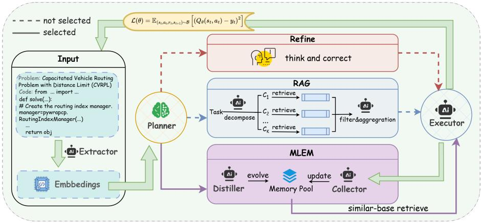
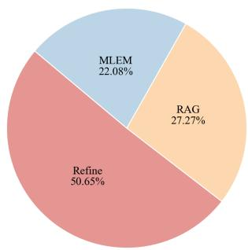
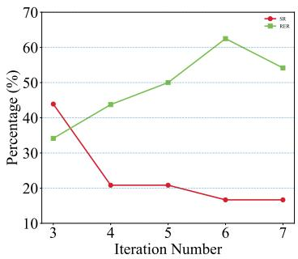

# Reinforcement Learning Enhanced LLM Agents for Complex Vehicle Routing Problems

Yi Chen1[0009−0009−6748−0479], Zikang Yu1[0000−0001−6992−2829], Jiahai Wang1(B)[0000−0002−6961−7813], Jinbiao Chen2[0000−0001−7417−0430], Jianpeng Zhou1[0009−0002−4570−3298], and Zizhen Zhang1[0000−0003−0320−9355]

1 School of Computer Science and Engineering, Sun Yat-sen University, Guangzhou 510006, China

{cheny2596,wangjiah,yuzk6,zhoujp7}@mail2.sysu.edu.cn

2 Department of Industrial Systems Engineering and Management, National University of Singapore, Singapore bill.cjb@nus.edu.sg

Abstract. Vehicle Routing Problems (VRPs) are fundamental combinatorial optimization problems with widespread applications in various scenarios. The advanced optimization solvers can efectively solve such problems. However, modeling complex VRP variants for solvers often requires substantial domain expertise, which limits the accessibility of advanced optimization technologies. In this paper, we propose Reinforcement Learning Enhanced LLM Agents (RLEA), a multi-agent framework designed to automate the modeling of complex VRPs. RLEA introduces a lightweight neural Planner trained with Soft Q-learning to eficiently orchestrate the actions of LLM-based agents. In addition, we equip the system with an evolutionary memory module and retrieval-augmented generation, enabling the agent to leverage both accumulated experience and external solver knowledge during program generation and refinement for solving VRPs. We evaluated 48 distinct VRP variants across various solvers. The experimental results demonstrate that RLEA outperforms the previous state-of-the-art method, achieving a 16.67% higher success rate while significantly reducing runtime errors. These results validate that integrating reinforcement learning with LLM-based reasoning is highly efective for automated optimization modeling. The appendix is available at: https://doi.org/10.5281/zenodo.19134435.

Keywords: Vehicle Routing Problem · Large Language Model · Automatic Modeling · Multi-Agent System · Reinforcement Learning.

## 1 Introduction

Vehicle routing problems (VRPs) constitute an important class of combinatorial optimization problems in operations research and have been widely applied across various domains, such as communication and transportation [23,2,15]. Recent studies increasingly focus on more complex VRP variants to better reflect real-world scenarios [18,27]. As the number and complexity of the constraints increase, the challenge of solving these NP-hard VRPs grows commensurately [4].

Recently, large language models (LLMs) have been increasingly applied to solving complex VRPs due to their strong capabilities in reasoning and code generation [6]. The LLM-based methods for complex VRPs can be mainly divided into three categories.

The first paradigm attempts to directly generate solutions using LLM [11]. These methods prompt the model to infer routes or decision sequences from natural language descriptions. However, due to the complex combinatorial structure and strict feasibility constraints of VRPs, these methods often struggle to produce valid and scalable solutions. The second paradigm emphasizes automated heuristic design. Leveraging the reasoning and code generation capabilities of LLMs, this approach has demonstrated substantial potential for automating heuristic design. Recent works [22,16,26,30,3,7,5,29,13] focus on combining evolutionary computation (EC) with LLMs to generate heuristics to solve VRPs. Although these methods show promise, they remain heavily reliant on the internal knowledge of LLMs and fail to leverage the capabilities of state-of-the-art (SOTA) optimization solvers designed by experts.

The third paradigm focuses on automatic modeling [10,24,1,20,21], where problem constraints are transformed into programs, enabling direct invocation of expert solvers to solve complex VRPs. Its core value lies in democratizing advanced optimization tools, enabling non-expert users to bridge the gap between high-level business requirements and rigorous solver execution. Traditionally, converting real-world VRPs into solver-ready models requires substantial domain expertise, which limits the accessibility of powerful optimization engines such as Gurobi [8] and OR-Tools [19]. The rapid development of LLMs has made this process increasingly feasible through automated reasoning and code generation. Existing automatic modeling methods mainly follow two routes: formulation-first methods, which first derive explicit mathematical formulations before program implementation, and code-only methods, which directly generate executable solver code from problem descriptions. In this paper, we use automatic modeling as a broad term to refer to the process of transforming high-level problem descriptions into solver-ready optimization programs, regardless of whether an explicit mathematical formulation is generated as an intermediate step. Recent state-of-the-art method DRoC [12] also adopts a code-only paradigm and improves the modeling accuracy of complex VRP variants by using retrievalaugmented generation (RAG). However, DRoC primarily depends on LLMs for action decision-making at each modeling step, leading to high inference latency caused by repeated LLM calls. In addition, its retrieval process mainly leverages external solver knowledge, overlooking valuable internal experience accumulated from previous modeling attempts.

In this work, we follow the automatic modeling paradigm and propose a Reinforcement Learning Enhanced LLM Agents famework (RLEA) that integrates a lightweight neural Planner, retrieval-based knowledge augmentation, and an evolved memory mechanism. This design enables eficient action orchestration while leveraging both external knowledge and internal experience to improve modeling robustness for complex VRP variants. The contributions of this paper can be summarized as follow:

1. We propose RLEA, a novel multi-agent framework that integrates reinforcement learning with LLM agents to automatically generate solver-ready programs for complex VRP variants.

2. We introduce a lightweight Planner trained with Soft Q-learning to adaptively select actions for LLM agents, enabling eficient exploration while significantly reducing the latency compared with LLM-based decision-making.

3. We present an agent equipped with evolvable memory. This agent actively analyzes interaction trajectories to identify successful action paths and derives the root causes of constraint conflicts from failure instances. Beyond the external knowledge provided by RAG, the agent further leverages its accumulated experience to enhance modeling robustness.

4. We conducted a comprehensive evaluation of RLEA across 48 distinct VRP variants. Experimental results demonstrate that RLEA significantly outperforms existing methods. Compared to the state-of-the-art (SOTA) method DRoC, RLEA achieves a 16.67% increase in success rate and a 10.41% reduction in runtime error rate.

## 2 Related Work

Recent studies have explored the potential of LLMs for automating modeling of operations research problems. Existing approaches within this paradigm can be broadly categorized into two groups based on whether an explicit mathematical formulation is generated before program implementation.

Formulation-First Methods The first line of work follows a sequential pipeline that explicitly translates optimization problems into mathematical expressions before generating executable code. Early studies proposed structured workflows [1] to convert natural language descriptions into mathematical representations. Chainof-Experts [24] introduces specialized agents to collaboratively construct mathematical formulations and corresponding solver implementations. More recently, unified learning-based frameworks have been proposed to improve the robustness of this formalization process. LLMOPT [10] introduces a universal five-element formulation that enables LLMs to represent diverse optimization problems in a structured symbolic form before generating solver-ready programs. By emphasizing mathematical clarity and structured reasoning, these approaches enhance interpretability and reduce the risk of incorrect program implementations.

Code-Only Methods While methods that explicitly generate mathematical formulations ofer strong interpretability, they often introduce unnecessary reasoning steps that can be error-prone, especially for highly specialized optimization tasks. As a result, a more eficient paradigm has emerged that directly maps problem descriptions to executable solver code, bypassing the need for explicit mathematical formulation. A representative example is DRoC [12], which leverages RAG to incorporate solver documentation and constraint-specific knowledge during code generation. By grounding the generation process in external resources, DRoC significantly enhances the modeling accuracy of complex VRP variants. However, such frameworks typically rely on LLMs for decision-making at every interaction step, resulting in high inference latency and underutilizing accumulated experience from previous modeling eforts.

To overcome these limitations, we propose RLEA, a reinforcement learning enhanced multi-agent framework [25]. RLEA introduces a lightweight neural Planner that eficiently orchestrates LLM-driven actions. By integrating policy learning, retrieval-augmented knowledge, and an evolved memory mechanism, RLEA enables more eficient and robust automatic modeling for complex VRP variants.

## 3 Preliminaries

## 3.1 Complex Vehicle Routing Problems

The VRPs aim to determine the optimal routes for a fleet of vehicles serving a set of customers. Formally, the problem is represented on a directed graph $G = ( V , E )$ , where $V = 0 , 1 , \dots , N$ denotes the set of nodes (node 0 is the depot, and $V _ { c } = \{ 1 , \dots , N \}$ are the customers), and $E = \{ ( i , j ) \mid i , j \in V , i \neq j \}$ defines the edges. Each edge $( i , j )$ has an associated travel cost $c _ { i j }$ , representing the distance between nodes i and $j$ . The binary decision variable $x _ { i j }$ is 1 if a vehicle travels from node i to $j ,$ , and 0 otherwise. The objective is to minimize the total travel cost, expressed as:

$$
\mathcal { I } = \operatorname* { m i n } \sum _ { i \in V } \sum _ { j \in V , j \neq i } c _ { i j } x _ { i j } .\tag{1}
$$

This objective is subject to several constraints:

$$
\sum _ { j \in V , j \neq i } x _ { i j } = \sum _ { j \in V , j \neq i } x _ { j i } = 1 , \quad \forall i \in V _ { c } ,\tag{2}
$$

$$
\sum _ { j \in V _ { c } } x _ { 0 j } = \sum _ { i \in V _ { c } } x _ { i 0 } .\tag{3}
$$

Eq. (2) ensures each customer is visited by exactly one vehicle, and $\operatorname { E q . }$ (3) ensures the depot flow conservation, with the same number of vehicles returning to the depot. We also consider nine additional VRP constraints based on realworld variants encountered in practical applications [12]: 1) Capacity, the vehicle load limit; 2) Open routes, where vehicles don’t have to return to the depot; 3) Distance limit, the total travel distance cannot exceed a specified bound; 4) Service time, each customer requires a specific service time; 5) Time window, each customer must be served within a given time frame; 6) Multiple depots, allowing vehicles to start and return to multiple depots; 7) Resource constraints, additional resource limitations; 8) Prize collecting, maximizing rewards while satisfying routing constraints; 9) Pickup and delivery, where pickup must occur before delivery. More details are in Appendix 1.

## 3.2 Problem Formulation

The goal of this work is to automatically generate solver-ready programs for complex VRP variants. Formally, We model this process as a Markov Decision Process (MDP) augmented with a memory pool, defined by the tuple $\langle S , \mathcal { A } , \mathcal { P } , \mathcal { R } , \gamma , \mathcal { M } \rangle$

At each step $t ,$ an agent follows a policy $\pi ( \boldsymbol { a } _ { t } \mid \boldsymbol { s } _ { t } )$ to select an action $a _ { t } \in \mathcal A$ based on the current state $s _ { t } \in S$ . Repeated action selection induces a trajectory $\tau = ( s _ { 0 } , a _ { 0 } , s _ { 1 } , a _ { 1 } , \dots , s _ { T } )$ , which represents the entire process of code generation and refinement. Each state consists of the embeddings of the problem description and the current modeling code, while the action space defines the operations that the agent can invoke to generate or revise the code. After executing an action, the environment transitions to a new state according to the transition probability $\mathcal { P } ( s _ { t + 1 } \mid s _ { t } , a _ { t } )$ . The reward function R evaluates the quality and feasibility of the generated code. In addition, a memory pool M stores historical experiences, allowing the agent to learn from past successes and failures.

To improve exploration and avoid premature convergence to sub-optimal actions, we adopt the Soft Q-Learning framework [9]. This approach augments the standard reinforcement learning objective with an entropy regularization term, encouraging stochastic policies and better exploration. The resulting objective is defined as:

$$
J ( \pi ) = \mathbb { E } _ { \tau \sim \pi } \left[ \sum _ { { t = 0 } } ^ { T } \gamma ^ { t } r ( s _ { t } , a _ { t } ) + \alpha H ( \pi ( \cdot \mid s _ { t } , M _ { t } ) ) \right] ,\tag{4}
$$

where $\tau$ denotes a trajectory of states, actions, and rewards generated by the policy, H denotes the entropy, and α is a weighting coeficient that regulates the impact of the entropy. The discount factor $\gamma \in [ 0 , 1 ]$ balances immediate rewards with long-term optimization performance.

## 4 Methodology

## 4.1 Overview

We propose Reinforcement Learning Enhanced LLM Agents (RLEA), a multiagent framework for automatic VRP modeling. As illustrated in Figure 1, RLEA consists of three main components: a neural Planner, an LLM-based Executor, and a Memory module. The Planner selects actions based on the current problem state, the Executor carries out the selected action to generate or revise code, and the memory module continuously evolves historical interaction trajectories into reusable experience for future decision-making.

  
Fig. 1. Architecture of RLEA for automated VRP modeling. The input consists of the problem name and the current modeling code to be generated or revised. An extractor encodes this pair into embeddings, which define the Planner state. Based on the current state, the Planner follows a policy π(a | s) to select the action, such as exploiting similar historical experiences from the memory pool (MLEM). The selected action is then executed to generate or update the modeling code and invoke the solver for the current problem instance. During training, the Planner samples actions according to the learned policy; during inference, the Planner is frozen and selects actions deterministically.

We next describe the action space, followed by the training strategy of the Planner and the inference procedure.

## 4.2 Execution Action Space Design

To support automatic VRP modeling in complex settings, we design an action space A consisting of three actions: Refine, Retrieval-Augmented Generation (RAG), and Meta-Learning with Evolved Memory (MLEM). These actions are designed to address three key requirements in solver-oriented program generation: iterative error correction, the incorporation of external solver knowledge, and the reuse of evolved experience. Detailed prompts are provided in Appendix 2. Below we describe the mechanics of each action.

Refine When handling complex VRP variants, the executor may produce erroneous code or incomplete constraint implementations. The Refine action exploits the self-correction capability of LLMs by enabling iterative revision based on the current code state. When this action is selected, the executor examines whether the generated code satisfies all required constraints, identifies potential sources of failure, and revises the program accordingly. This process allows the executor to reflect on and correct its previous output in a debugging-style manner. We denote this action by $a _ { r }$

Retrieval-Augmented Generation To compensate for the limited solverspecific knowledge encoded in LLM parameters, we incorporate a RAG mechanism that injects external documentation into the code generation process. This action is denoted by $a _ { g }$

When selected, the Executor first decomposes the current problem P into a set of atomic constraints,

$$
{ \mathcal { C } } = \{ c _ { 1 } , c _ { 2 } , \ldots , c _ { N } \} = \varPhi _ { \mathrm { d e c o m p } } ( P ) ,\tag{5}
$$

where $\varPhi _ { \mathrm { d e c o m p } }$ denotes the LLM-based decomposition prompt and N is the number of identified constraints, such as capacity limits or time windows. Each constraint $c _ { i }$ is then used as a retrieval query.

Following [12], both query keywords and external documents are encoded into embeddings. For each constraint $c _ { i } .$ , we construct a query $Q _ { i }$ using the template “Python code for $c _ { i } ^ { \ : \gamma }$ . The relevance between the query embedding $E ( Q _ { i } )$ and a document embedding $E ( d _ { j } )$ is measured by the squared Euclidean distance:

$$
\begin{array} { r } { \mathcal { D } \big ( E ( Q _ { i } ) , E ( d _ { j } ) \big ) = \| E ( Q _ { i } ) - E ( d _ { j } ) \| _ { 2 } ^ { 2 } . } \end{array}\tag{6}
$$

The retrieved candidates are further filtered by the LLM to remove irrelevant documents. If multiple candidates remain, the LLM summarizes them and selects the most relevant reference. The Executor then generates or revises modeling code using the retrieved documentation associated with all constraints. If the RAG action is invoked again, the executor refines the failed code conditioned on the previously retrieved content.

Meta-learning with Evolved Memory To improve adaptation to new problem settings, we further introduce Meta-Learning with Evolved Memory (MLEM), which enables the agents to reuse evolved experience distilled from prior interactions. This action is denoted by $a _ { m }$

The memory module consists of a Collector agent and a Memory Distiller agent. Formally, the memory pool is defined as a set of tuples $\mathcal { M } = \{ ( q _ { i } , f _ { i } ) \} _ { i = 1 } ^ { N }$ where $q _ { i }$ denotes the problem description and $f _ { i }$ represents corresponding execution feedback, including success summaries or failure analyses. The Collector monitors the Executor’s generation process, summarizes the causes of success or failure, and appends new records to the evolving memory pool M.

When the MLEM action is activated for a current problem $q ,$ the Memory Distiller aggregates the subset $\mathcal { M } _ { q } \subset \mathcal { M }$ associated with similar problem types and organizes it into two complementary forms of experience: successful experience $f _ { \mathrm { s u c c } }$ and failed experience $f _ { \mathrm { f a i l } }$ . To retrieve the most relevant demonstrations, we rank historical cases by the semantic similarity between problem embeddings:

$$
S ( q _ { c u r r } , q _ { i } ) = \frac { E ( q _ { c u r r } ) \cdot E ( q _ { i } ) } { | | E ( q _ { c u r r } ) | | | E ( q _ { i } ) | | } ,\tag{7}
$$

where $E ( \cdot )$ denotes the embedding function. We then retrieve the top-K most similar successful and failed memory pairs, denoted by $\mathcal { D } _ { r e t } = \{ ( f _ { s u c c } ^ { ( k ) } , f _ { f a i l } ^ { ( k ) } ) \} _ { k = 1 } ^ { K } .$

The Executor implements the meta-learning mechanism by utilizing $\mathcal { D } _ { r e t }$ as in-context demonstrations. The action $a _ { m }$ of MLEM is thus formalized as generating the solution conditioned on both the current problem $q _ { c u r r }$ and the evolved memory $D _ { r e t }$ . This mechanism enables fast adaptation to unseen constraints by leveraging historical meta-knowledge. The detailed prompt together with representative memory examples, are provided in Appendix 2.

## 4.3 Training Phase: Policy Optimization and Memory Evolution

Static LLM-based decision-making pipelines are often insuficient for complex VRP modeling [14], where the most efective action depends on both the problem context and the current code state. This makes adaptive decision-making essential. In addition, the evolving memory pool is initially sparse, so the MLEM action $a _ { m }$ may provide limited benefit in early training, which can further suppress exploration if a fixed action strategy is used. To address these challenges, RLEA employs a lightweight neural Planner trained with Soft Q-learning, enabling adaptive action selection without incurring the high cost of LLM-based decision-making at every interaction step.

The Planner learns a stochastic policy $\pi _ { \theta } { \big ( } a _ { t } \ { \big | } \ s _ { t } { \big ) }$ over the action space $\mathcal { A } = \{ a _ { r } , a _ { g } , a _ { m } \}$ , corresponding to Refine, RAG, and MLEM, respectively. The detailed definitions of these actions are given in Section 4.2. The policy is induced by a soft Q-network through the Boltzmann distribution:

$$
\pi _ { \theta } ( a \mid s ) = \frac { \exp { ( Q _ { \theta } ( s , a ) / \alpha ) } } { \sum _ { a ^ { \prime } \in \mathcal { A } } \exp { ( Q _ { \theta } ( s , a ^ { \prime } ) / \alpha ) } } ,\tag{8}
$$

where $\alpha > 0$ is the temperature parameter controlling the exploration–exploitation trade-of. A larger α encourages broader exploration over candidate actions, which is particularly beneficial in the early stage when evolved memory is not yet suficiently informative, whereas a smaller α leads to more greedy action selection.

During training, the planner interacts with the environment to generate a trajectory τ . To guide policy optimization, we design a dense reward based on the optimality gap. Let $\dot { y } _ { t } ^ { \mathrm { o b j } }$ denote the objective value of the solution obtained at step t. The relative optimality gap $\delta _ { t }$ is defined as

$$
\delta _ { t } = \left| \frac { y _ { t } ^ { \mathrm { o b j } } - y ^ { * } } { y ^ { * } } \right| ,\tag{9}
$$

where $y ^ { * }$ denotes the reference optimal objective value obtained from expert benchmarks. To encourage high-quality solutions while explicitly penalizing execution failures, the reward $r _ { t }$ is defined as

$$
r _ { t } = \left\{ \begin{array} { l l } { \frac { 1 } { 1 + \delta _ { t } } , } & { \mathrm { i f ~ a ~ f e a s i b l e ~ s o l u t i o n ~ } y _ { t } ^ { \mathrm { o b j } } \mathrm { ~ i s ~ o b t a i n e d , } } \\ { 0 , } & { \mathrm { o t h e r w i s e . } } \end{array} \right.\tag{10}
$$

This reward is bounded in (0, 1] for valid solutions and approaches 1 as the solution converges to the optimum.

The Planner is parameterized by a soft Q-network $Q _ { \theta } ( s , a )$ . Its input state is the embedding of the current problem context, including the VRP variant description and the current modeling code, extracted by a frozen open-source small language model. The Planner is trained by minimizing the soft Bellman residual. Specifically, the soft temporal-diference target is defined as

$$
\hat { y } _ { t } = r _ { t } + \gamma ( 1 - d _ { t } ) \alpha \log \sum _ { a ^ { \prime } \in \mathcal { A } } \exp \left( \frac { Q _ { \bar { \theta } } ( s _ { t + 1 } , a ^ { \prime } ) } { \alpha } \right) ,\tag{11}
$$

where $d _ { t } \in \{ 0 , 1 \}$ is the termination flag, $\gamma \in [ 0 , 1 ]$ is the discount factor, and $Q _ { \bar { \theta } }$ denotes the target network. The training objective is

$$
\mathcal { L } ( \theta ) = \mathbb { E } _ { ( s _ { t } , a _ { t } , r _ { t } , s _ { t + 1 } ) \sim \mathcal { B } } \left[ \left( Q _ { \theta } \big ( s _ { t } , a _ { t } \big ) - \hat { y } _ { t } \right) ^ { 2 } \right] ,\tag{12}
$$

where B is the experience replay bufer. Meanwhile, memory evolution proceeds in parallel with policy optimization. The replay bufer B is used exclusively for reinforcement learning updates, whereas the memory pool M is maintained separately to accumulate and evolve historical interaction records for the MLEM action.

## 4.4 Inference Phase: Policy Evaluation and Generalization

During inference, the Planner parameters θ are frozen. Given a target VRP variant, the executor first attempts to generate solver-ready code from the problem description directly. If this initial attempt fails to produce a valid code, the problem description together with the generated code is encoded as the initial state for the Planner.

Starting from this state, the Planner performs a forward pass and selects actions from the action space A according to the learned policy. Conditioned on the selected actions, the Executor iteratively generates or refines the modeling code for the target problem. In this way, the Planner serves as a lightweight decisionmaking module that orchestrates the interaction process without requiring costly LLM-based deliberation at every step.

We impose a maximum number of steps $T _ { m a x }$ . The procedure terminates early once the generated code successfully invokes the solver and produces a solution whose relative optimality gap is below 5%. This mechanism prevents infinite refinement loops while still allowing suficient opportunities for the agent to correct modeling or syntax errors.

## 5 Experiments

In this section, we conduct comprehensive experiments to evaluate the efectiveness of RLEA on automated VRP modeling. The experiments cover 48 VRP variants composed of diferent constraint combinations. All experiments are conducted on a Tesla A40 GPU and an Intel i5-7500 CPU.

## 5.1 Experiment Settings

Hyperparameters The Planner is trained using the Soft Q-Learning algorithm with the Adam optimizer and a learning rate of $1 \times 1 0 ^ { - 4 }$ . The model consists of a frozen small language model (SLM) and a trainable Q-value head. We adopt Qwen2.5-1.5B-Instruct as the SLM to encode state representations with a maximum context length of 8192 tokens. The Q-value head is a two-layer MLP with 256 hidden units and ReLU activation, mapping state embeddings to the action space. DeepSeek-Reasoner as the Executor and ChatGPT (gpt-4o-2024-08-06) as the Memory Agent.

The replay bufer has a capacity of 512 state transitions, with a training batch size of 16. The discount factor is set to $\gamma = 0 . 9 9$ , and the entropy temperature coeficient is fixed at $\alpha = 4$ to encourage exploration. The target network is updated every four training steps via hard parameter copying. Each training episode is limited to a maximum of 16 interaction steps to avoid infinite loops.

Baselines We compare RLEA with five representative baselines:

– Direct Generation: Standard prompting without additional reasoning or correction mechanisms.

– Reasoning-based methods: Self-Refine [17] and Chain-of-Thought (CoT) [28].

– Formulation-first approach: Chain-of-Experts (CoE) [24].

– Code-only approach: DRoC [12].

In our framework, two inference settings are evaluated. In ofline inference, the Executor generates solutions using a pre-trained memory pool. In online inference, the memory agent dynamically constructs and updates the memory pool during test time.

To ensure robustness, we conducted evaluations using two widely used optimization solvers: Gurobi [8] and OR-Tools [19]. The maximum number of interaction steps during inference was set to $T _ { m a x } = 6$ . To ensure a fair comparison, all baselines were assigned the same iteration budget. As in previous work [12], the reported results are the average of three independent runs.

Performance Metrics There are two performance metrics we used:

– Success Rate (SR): This metric evaluates the capability of the framework to generate valid modeling code. It is defined as:

$$
\mathrm { S R } = \frac { N _ { s u c c } } { N _ { t o t a l } } \times 1 0 0 \%\tag{13}
$$

where $N _ { t o t a l }$ is the total number of VRP instances tested. $N _ { s u c c }$ represents the number of instances where the generated code successfully executes and yields a feasible solution (i.e., the solver successfully returns a valid objective value without errors).

– Runtime Error Rate (RER): This metric reflects the proportion of programs that fail to execute due to syntax errors, API misuse, or internal logical flaws. It is calculated as:

$$
\mathrm { R E R } = \frac { N _ { e r r } } { N _ { t o t a l } } \times 1 0 0 \%\tag{14}
$$

## 5.2 Main Results

Table 1 reports the performance of RLEA and five representative baselines in terms of Success Rate (SR) and Runtime Error Rate (RER) on both OR-Tools and Gurobi solvers.

Methods that rely solely on the internal knowledge of LLMs, including Standard Prompting, CoT, and Self-Refine, achieve limited performance, indicating that complex VRP variants are dificult to model accurately without domainspecific knowledge. CoE produces the lowest rates on SR due to its focus on Mixed-Integer Programming rather than complex ${ \mathrm { V R P s } } ,$ it maintains a remarkably low RER suggesting the potential of the multi-agent framework. By incorporating external solver documentation, DRoC improves performance over these methods, demonstrating the importance of domain-specific knowledge retrieval.

Our method achieves the best overall performance. On OR-Tools, RLEA reaches an SR of 62.50%, outperforming the previous state-of-the-art DRoC by 16.67%, while also significantly reducing runtime errors. Although the generated solutions are not always optimal, they already provide valid solver implementations, allowing human developers to focus on solution improvement rather than constructing models from scratch. This improvement stems from the synergy of the learned Planner policy, external knowledge retrieval, evolved memory, and the refine mechanism, which together enable efective error correction and solution refinement.

In the online inference setting, the performance is slightly lower than in the ofline setting but still surpasses all baselines. This diference is mainly due to the dynamic updating of the memory pool during inference, which introduces additional stochasticity in the learning process. However, this dynamic memory mechanism encourages broader exploration and ultimately contributes to a further reduction in runtime errors.

## 5.3 Ablation Study

We conduct ablation studies to evaluate the contribution of key components in RLEA, including the neural Planner and the action modules. The results are presented in Table 2 and Table 3.

Ablation on the Planner To assess the impact of the learned Planner, we compare RLEA with two variants on OR-Tools: (1) $\mathrm { w / o }$ Planner, where actions are randomly selected, and (2) prompt-based Planner, where DeepSeek-Reasoner generates the execution strategy through prompting. As shown in Table 2, RLEA achieves the highest SR, indicating that the learned policy efectively captures action-selection patterns across diferent VRP variants. Although the promptbased Planner also attains a reasonable success rate, it incurs higher inference latency, while our neural Planner enables significantly faster decision-making. The slightly higher RER of RLEA reflects a trade-of between aggressive exploration and execution stability: by exploring more complex reasoning trajectories, the Planner occasionally encounters challenging edge cases. In contrast, the lower RER of the baselines stems from their simpler or more cautious trajectories, which avoid such boundary risks but fail to achieve high SR.

Table 1. Performance comparison of diferent prompting and agent-based methods.
<table><tr><td rowspan="2">Methods</td><td colspan="3">OR-Tools Gurobi</td></tr><tr><td>SR (%) RER</td><td>(%) SR (%)</td><td>RER (%)</td></tr><tr><td>Standard Prompting Self-Refine</td><td>29.17 39.58 31.25 39.58</td><td>29.17 33.33</td><td>27.08 35.42</td></tr><tr><td>Chain of Thoughts Chain of Experts</td><td>25.00</td><td>54.17 18.75</td><td>56.25</td></tr><tr><td>DRoC</td><td>16.67</td><td>27.08 8.33</td><td>18.75</td></tr><tr><td></td><td>45.83</td><td>35.42</td><td></td></tr><tr><td>Ours (offline)</td><td></td><td>27.08</td><td>33.33</td></tr><tr><td>Ours (online)</td><td>62.50 60.42 12.50</td><td>16.67 43.75 39.58</td><td>16.67</td></tr></table>

Table 2. Ablation study on the Planner.
<table><tr><td>Method</td><td colspan="3">SR (%) RER (%) Avg Time (s)</td></tr><tr><td>Ours</td><td>62.50</td><td>16.67</td><td>3.06</td></tr><tr><td>w/o Planner</td><td>50.00</td><td>14.58</td><td></td></tr><tr><td>Prompt-based Planner</td><td>56.25</td><td>12.50</td><td>153.30</td></tr></table>

Ablation on action module In order to investigate the impact of the actions, we conduct an ablation study as shown in Table 3. The results demonstrate that our full method consistently achieves the highest SR and the lowest RER compared to all variants lacking a specific action module. Removing Refine causes the largest performance drop, suggesting that refine is the most critical action in our framework. Given that many modeling or programming errors are relatively easy to solve, the Executor can rectify minor logical flaws autonomously, thereby preventing simple errors from escalating into task failures. The action distribution in Figure 2 further supports this observation, where Refine accounts for 50.65% of the executed actions. In contrast, removing RAG or MLEM leads to comparable performance degradation, suggesting that external knowledge retrieval and evolved memory play complementary roles in improving modeling accuracy.

  
Fig. 2. Distribution of action types executed by RLEA on OR-Tools.

Table 3. Ablation study of diferent actions on OR-Tools.
<table><tr><td>Method</td><td>SR (%) RER (%)</td></tr><tr><td>Ours 62.50</td><td>16.67</td></tr><tr><td>w/o Refine 39.58</td><td>36.25</td></tr><tr><td>w/o RAG 43.75</td><td>22.92</td></tr><tr><td>w/o Meta learning with evolved memory 41.67</td><td>27.08</td></tr></table>

## 5.4 Impact of Diferent LLM Compositions

The experimental results in Table 4 reveal a clear performance advantage in heterogeneous multi-agent collaboration, specifically validating the optimal division of Action (reasoning-intensive models) and Memory (general-purpose models). The DeepSeek-r1 (Action) and GPT-4o (Memory) configuration achieves a peak Success Rate (SR) of 62.50%, demonstrating that DeepSeek-r1 demonstrates its ability to leverage reasoning capabilities for the efective modeling of complex VRPs, while GPT-4o provides a robust contextual foundation for retrieval.

Conversely, when assigning GPT-4o to execute action and DeepSeek-r1 to manage the memory modules, the SR to drop to 45.83%. This suggests that DeepSeek-r1’s intensive reasoning may be counterproductive for memory distillation, where its tendency toward over-deliberation introduces noise that hinders concise information flow. Furthermore, all single-model setups exhibit significant performance bottlenecks, such as the standalone GPT-4o’s low 37.50% SR. These findings underscore that decoupling roles within a multi-agent framework prevents the cognitive overload inherent in single-agent architectures, allowing specialized LLMs to leverage their distinct strengths for superior collective performance.

## 5.5 Sensitivity Analysis of Iterations

We analyze the efect of the maximum number of interaction iterations on performance using OR-Tools. Since the action space contains three actions, the minimum number of iterations is set to 3. As shown in Figure 3, performance improves steadily as the number of iterations increases from 3 to 6: the SR rises from 34.15% to 62.50%, while the RER decreases from 43.90% to 16.67%.

Table 4. Performance comparison of diferent LLM compositions
<table><tr><td rowspan="3">Memory Executor</td><td colspan="2">DeepSeek-r1</td><td colspan="2">GPT-40</td><td colspan="2">Qwen3-max</td></tr><tr><td>SR(%)</td><td>RER(%)</td><td>SR(%)</td><td>RER(%)</td><td>SR(%)</td><td>RER(%)</td></tr><tr><td colspan="2">DeepSeek-r1</td><td>52.08</td><td>22.92</td><td>62.50</td><td>16.67 43.75</td><td>12.50</td></tr><tr><td colspan="2">GPT-4o</td><td>45.83</td><td>25.00</td><td>37.50 31.25</td><td>47.92</td><td>18.75</td></tr><tr><td colspan="2">Qwen3-max</td><td>52.08</td><td>16.67 60.42</td><td>12.50</td><td>45.83</td><td>14.58</td></tr></table>

  
Fig. 3. Sensitivity analysis of OR-Tools performance relative to iterations

When the iteration number reaches 6, the framework achieves its best performance. Further increasing the iteration budget brings only marginal gains. This suggests that excessive iterations may lead to over-searching or algorithmic stagnation, where the added computational cost no longer yields better performance.

## 6 Conclusion

In this paper, we propose RLEA, a novel multi-agent framework for automating the modeling and solving of complex VRPs. By integrating a lightweight Planner optimized via Soft Q-Learning, RLEA enables rapid execution by the Executor, reducing computational overhead. The hybrid memory mechanism, combining evolutionary trajectory analysis with external RAG-based knowledge, ensures robust self-correction, helping resolve constraint conflicts that often cause solver failures. Empirical results show a 62.50% success rate across 48 VRP variants, achieving a 16.67% performance gain over the previous state-of-the-art. Future work will explore integrating multi-modal inputs for VRPs described through visual diagrams and extending the framework to dynamic, real-time routing scenarios with evolving constraints.

## Acknowledgements

This work is supported by the National Natural Science Foundation of China (62472461), and the Guangdong Basic and Applied Basic Research Foundation (2025A1515010129).

## References

1. AhmadiTeshnizi, A., Gao, W., Udell, M.: OptiMUS: Scalable optimization modeling with (MI)LP solvers and large language models. In: ICML. Proceedings of Machine Learning Research, vol. 235, pp. 577–596 (2024)

2. Bi, J., Ma, Y., Wang, J., Cao, Z., Chen, J., Sun, Y., Chee, Y.M.: Learning generalizable models for vehicle routing problems via knowledge distillation. In: Advances in Neural Information Processing Systems. vol. 35, pp. 31226–31238 (Dec 2022)

3. Cazenave, T.: Learning a prior for monte Carlo search by replaying solutions to combinatorial problems. In: Parallel Problem Solving from Nature - PPSN XVIII - 18th International Conference, PPSN 2024. vol. 15148, pp. 85–99

4. Chen, J., Huang, H., Zhang, Z., Wang, J.: Deep reinforcement learning with twostage training strategy for practical electric vehicle routing problem with time windows. In: International Conference on Parallel Problem Solving from Nature. pp. 356–370. Springer (2022)

5. Cybula, P., Jaszkiewicz, A., Pelka, P., Rogalski, M., Sielski, P.: Evolutionary algorithm for vehicle routing with diversity oscillation mechanism. In: Parallel Problem Solving from Nature - PPSN XVII - 17th International Conference, PPSN 2022, Dortmund, Germany, September 10-14, 2022, Proceedings, Part I. vol. 13398, pp. 279–293

6. Feng, Y., Liu, Y., Zhang, J., Qin, J., et al.: Monitor: Exploiting large language models with instruction for online video anomaly detection. In: Advances in Neural Information Processing Systems (2026)

7. Guo, S., Yin, N., Kwok, J., Yao, Q.: Nested-refinement metamorphosis: Reflective evolution for eficient optimization of networking problems. In: Findings of the Association for Computational Linguistics, ACL 2025, Vienna, Austria, July 27 - August 1, 2025. pp. 17398–17429

8. Gurobi Optimization, LLC: Gurobi Optimizer Reference Manual (2024), https: //www.gurobi.com/documentation/, accessed: 2026-03-16

9. Haarnoja, T., Tang, H., Abbeel, P., Levine, S.: Reinforcement learning with deep energy-based policies. In: ICML. Proceedings of Machine Learning Research, vol. 70, pp. 1352–1361. PMLR (2017)

10. Jiang, C., Shu, X., Qian, H., Lu, X., Zhou, J., Zhou, A., Yu, Y.: LLMOPT: Learning to define and solve general optimization problems from scratch. In: The Thirteenth International Conference on Learning Representations (2025)

11. Jiang, X., Wu, Y., Li, M., Cao, Z., Zhang, Y.: Large language models as end-toend combinatorial optimization solvers. Advances in Neural Information Processing Systems 38, 164787–164826 (2026)

12. Jiang, X., Wu, Y., Zhang, C., Zhang, Y.: DRoC: Elevating large language models for complex vehicle routing via decomposed retrieval of constraints. In: ICLR (2025)

13. Li, K., Liu, F., Wang, Z., Tong, X., Han, X., Yuan, M., Zhang, Q.: Ars: Automatic routing solver with large language models. arXiv preprint arXiv:2502.15359 (2025)

14. Li, Y., Cai, G., Yang, S., Luo, H., Han, S., He, X., Li, D., Feng, L.: Phgpo: Pheromone-guided policy optimization for long-horizon tool planning. arXiv preprint arXiv:2602.13691 (2026)

15. Liao, Z., Chen, J., Wang, D., Zhang, Z., Wang, J.: BOPO: Neural combinatorial optimization via best-anchored and objective-guided preference optimization. In: Proceedings of the 42nd International Conference on Machine Learning (ICML 2025). vol. 267, pp. 37456–37475 (2025)

16. Liu, F., Tong, X., Yuan, M., Lin, X., Luo, F., Wang, Z., Lu, Z., Zhang, Q.: Evolution of heuristics: Towards eficient automatic algorithm design using large language model. In: Forty-first International Conference on Machine Learning, ICML 2024, Vienna, Austria, July 21-27, 2024 (2024)

17. Madaan, A., Tandon, N., Gupta, P., Hallinan, S., Gao, L., Wiegrefe, S., Alon, U., Dziri, N., Prabhumoye, S., Yang, Y., Gupta, S., Majumder, B.P., Hermann, K., Welleck, S., Yazdanbakhsh, A., Clark, P.: Self-Refine: Iterative refinement with self-feedback. In: NeurIPS (2023)

18. Mor, A., Speranza, M.G.: Vehicle routing problems over time: a survey. Annals of Operations Research 314(1), 255–275 (2022)

19. Perron, L., Furnon, V.: OR-Tools, https://developers.google.com/optimization/

20. Prasath, G., Karande, S.: Synthesis of mathematical programs from natural language specifications. arXiv preprint arXiv:2304.03287 (2023)

21. Ramamonjison, R., Yu, T.T.L., Li, R., Li, H., Carenini, G., Ghaddar, B., He, S., Mostajabdaveh, M., Banitalebi-Dehkordi, A., Zhou, Z., Zhang, Y.: NL4Opt competition: Formulating optimization problems based on their natural language descriptions. arXiv preprint arXiv:2303.08233 (2023)

22. Romera-Paredes, B., Barekatain, M., Novikov, A., Balog, M., Kumar, M.P., Dupont, E., Ruiz, F.J.R., Ellenberg, J.S., Wang, P., Fawzi, O., Kohli, P., Fawzi, A.: Mathematical discoveries from program search with large language models. Nat. 625(7995), 468–475 (2024)

23. Wu, X., Wang, D., Wen, L., Xiao, Y., Wu, C., Wu, Y., Yu, C., Maskell, D.L., Zhou, Y.: Neural combinatorial optimization algorithms for solving vehicle routing problems: A comprehensive survey with perspectives. arXiv preprint arXiv:2406.00415 (2025)

24. Xiao, Z., Zhang, D., Wu, Y., Xu, L., Wang, Y.J., Han, X., Fu, X., Zhong, T., Zeng, J., Song, M., Chen, G.: Chain-of-Experts: When LLMs meet complex operations research problems. In: ICLR (2024)

25. Yang, S., Li, Y., He, S., Li, Y., Cai, Q., Jiang, P., Feng, L.: Phase-aware mixture of experts for agentic reinforcement learning. In: ICML (2026)

26. Ye, H., Wang, J., Cao, Z., Berto, F., Hua, C., Kim, H., Park, J., Song, G.: ReEvo: Large language models as hyper-heuristics with reflective evolution. In: Advances in Neural Information Processing Systems 38: Annual Conference on Neural Information Processing Systems 2024, NeurIPS 2024, Vancouver, BC, Canada, December 10 - 15, 2024

27. Yu, Z., Chen, J., Wang, J.: Combination-of-experts with knowledge sharing for cross-task vehicle routing problems. In: The Fourteenth International Conference on Learning Representations (2026)

28. Zhang, J., Wang, W., Guo, S., Wang, L., Lin, F., Yang, C., Yin, W.: Solving general natural-language-description optimization problems with large language models. In: NAACL (Industry Track). pp. 483–490. Association for Computational Linguistics (2024)

29. Zhang, N., Cao, Z., Zhou, J., Zhang, C., Ong, Y.: An agentic framework with LLMs for solving complex vehicle routing problems. In: The Fourteenth International Conference on Learning Representations (2026)

30. Zheng, Z., Xie, Z., Wang, Z., Hooi, B.: Monte Carlo tree search for comprehensive exploration in LLM-based automatic heuristic design. In: Forty-second International Conference on Machine Learning, ICML 2025, Vancouver, BC, Canada, July 13-19, 2025