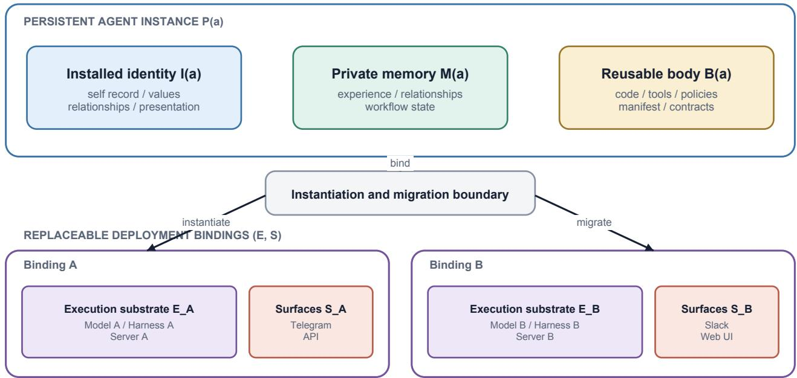
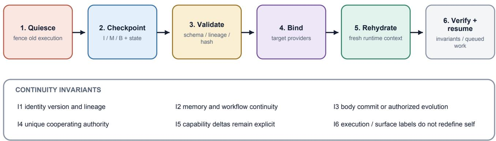

# Runtime-Independent Persistent Agents:

# Preserving Identity, Memory, and Code Across Models, Harnesses, and Servers

Zhenyu Zhao1 Roy Zhao2

1Independent Researcher

2Paul G. Allen School of Computer Science & Engineering, University of Washington Reference implementation and artifacts: github.com/our-ark/enoch

## Abstract

Agent systems are commonly described by the model and harness that currently produce their behavior. That boundary is useful for one execution but underspecifies a long-lived agent that may change models, orchestration harnesses, interaction sessions, and host servers while retaining one identity, memory, and executable code lineage. We present a runtime-independent architecture for persistent agents. A continuity-bearing substrate $\boldsymbol { \mathcal { P } } _ { t } = \left( { \boldsymbol { I } } _ { t } , { \boldsymbol { M } } _ { t } , { \boldsymbol { B } } _ { t } \right)$ contains an architectural identity represen tation, private durable memory, and a versioned software body. A replaceable deployment binding comprises an execution substrate $\mathcal { E } _ { t } ~ = ~ \left( R _ { t } , H _ { t } , D _ { t } \right)$ , which supplies a reasoner, harness, and host, and a set of interaction surfaces S� , such as chat, API, or user interface bindings. A deployed execution is $\mathcal { A } _ { t } = \mathcal { P } _ { t } \circ ( \mathcal { E } _ { t } , S _ { t } )$ ; changing either replaceable layer is migration, no agent creation, when an authorized protocol preserves attributable lineage and transfers continuation authority within a governed deployment boundary.

We define six continuity invariants and a quiesce–checkpoint–validate–bind– rehydrate–resume protocol. Enoch realizes the design as a reusable body plus private installed identity, memory, workflow state, and continuation authority, with infras tructure dependencies behind versioned provider contracts. A clean-room run of the frozen public commit passes 833 core tests and 92 provider and library tests executed separately from the core suite; deployments have exercised reasoner-version, interaction-surface, and host-machine substitutions while retaining continuity-bearing state. This evidence supports mechanical substitutability and authorized system continuity, not behavioral invariance or exhaustive pairwise evaluation. The downstream measurement question is whether an authorized continuation still recalls, composes, and enacts its identity.

## 1 Introduction

An agent can outlive a chat. It can also outlive the model, harness, process, machine, or provider that happens to execute its next action. A personal agent may begin in one chat application, move from a laptop to a server, replace a reasoning model, resume an unfinished task through another harness, and still be treated by its user as the same agent. Existing systems contain many of the necessary mechanisms – persistent memory, resumable sessions, provider adapters, durable queues, and versioned code – but these mechanisms do not by themselves define the agent boundary.

A common shorthand identifies an agent with a model plus an agent harness. It captures a useful synchronic question: what currently generates behavior? It does not answer the diachronic question: what must remain continuous for two executions at diferent times to be executions of the same agent? If the model is replaced, did the agent migrate or die? If the same memory is copied into two processes, are both the original? If a chat session is reset, has a new agent been created? These are architecture and lifecycle questions, not only prompt engineering questions.

We propose a sharper boundary. The persistent agent is the continuity-bearing substrate of identity, memory, and executable body. Models, harnesses, and servers form a replaceable execution substrate. Chats, APIs, email, and user interfaces are replaceable interaction surfaces. The model and harness remain causally important: they shape current behavior and capability. A communication surface determines where an interaction occurs. Neither is a necessary invariant of longitudinal identity.

A specific chat is therefore not the agent’s mind or identity-bearing core. The capability to communicate is implemented by the body through provider contracts; a current chat account, channel, thread, or session is an external binding. Conversationderived facts, relationships, commitments, and unfinished work become persistent only when they are committed to memory or durable workflow state. A persistent agent does not live inside a chat; it enters and leaves chats.

This paper extends the agent-owned software-body boundary introduced in prior work [1]. That work asks what users can possess, inspect, evolve, and use for descent. The present paper asks a diferent systems question: how the whole continuity bearing substrate can be rebound to a new deployment without silently creating a new agent, resetting its history, or allowing two hosts to act as the sole authority.

The paper makes three contributions:

1. A runtime-independent agent boundary. We separate a logical persistent substrate (�, �, �) from a replaceable execution substrate containing the reasoner, harness, and host, plus independently replaceable interaction surfaces.

2. Migration semantics and continuity invariants. We distinguish migration from restart, evolution, identity update, replica tion, and descent, and define an authorized migration protocol with explicit failure semantics.

3. An implemented reference architecture. We map the boundary to Enoch’s reusable versioned body, installed-agent identity and memory, provider contracts, durable workflow state, fencing, conformance suites, and host-service adapters, reporting executable mechanism evidence and its limits.

  
Figure 1: Runtime-independent agent boundary. An installed agent binds identity and private memory to an authorized reusable-body revision; each deployment supplies replaceable execution and interaction bindings.

We use identity functionally, not phenomenally. The paper does not claim consciousness, personhood, or metaphysical persistence. We call a transition authorized system continuity when the persistent lineage, state, body, and execution authority satisfy the architectural invariants. We call the degree to which the resulting execution recalls, composes, and enacts its identity behavioral identityfidelity. Unless explicitly qualified, claims of continuity in this paper refer only to the former.

## 2 System Model

## 2.1 Persistent substrate, execution substrate, and interaction surfaces

At time �, define the continuity-bearing persistent substrate as

$$
\boldsymbol { \mathcal { P } } _ { t } = ( I _ { t } , M _ { t } , B _ { t } ) ,\tag{1}
$$

where $I _ { t }$ is the agent’s architectural identity representation, $M _ { t }$ is private durable memory and continuity-relevant workflow state, and $B _ { t }$ is the versioned executable body: code, prompts, tools, policies, tests, provider contracts, and evolution mechanisms. Lineage relates substrate versions; transition authority governs valid successors. Both are continuity conditions distinct from $I _ { t } ,$ even if represented in colocated metadata; the components of $\mathcal { P } _ { t }$ likewise remain logically distinct when packaged together.

The replaceable execution substrate is

$$
\mathcal { E } _ { t } = ( R _ { t } , H _ { t } , D _ { t } ) ,\tag{2}
$$

where $R _ { t }$ is a language model or other reasoner, $H _ { t }$ is the orchestration harness that supplies inference and tool execution, and $D _ { t }$ is the host device, service manager, and available environment capabilities. Separately, let

$$
S _ { t } = \{ s _ { t , 1 } , \ldots , s _ { t , n } \}\tag{3}
$$

denote the currently bound interaction surfaces: chat accounts and sessions, APIs, email, graphical interfaces, or other endpoints through which the agent and its environment exchange events. A deployed execution is

$$
{ \mathcal { A } } _ { t } = { \mathcal { P } } _ { t } \circ ( { \mathcal { E } } _ { t } , S _ { t } ) .\tag{4}
$$

The operator ⊲ denotes instantiation, not ownership. The execution substrate runs the persistent agent, while interaction surfaces connect it to users and external systems; neither becomes its durable identity. The body’s communication interfaces belong to $B _ { t }$ , but a particular Slack thread or API endpoint belongs to $S _ { t }$ . Figure 1 shows two deployment bindings attached to the same logical substrate at diferent times.

Table 1: Persistent-agent lifecycle operations.
<table><tr><td>Operation</td><td>Change</td><td>Continuity consequence</td></tr><tr><td>Restart</td><td>Recreate a process in the same logical environment</td><td>System continuity retained; no binding migration</td></tr><tr><td>Resume</td><td>Reopen a session or queued task</td><td>System continuity retained if the same substrate is reloaded</td></tr><tr><td>Migrate</td><td>Replace one or more elements of E or S</td><td>Authorized system continuity after invariant verifica- tion</td></tr><tr><td>Evolve</td><td>Change B through its governed version lineage</td><td>Substrate lineage retained; new body revision</td></tr><tr><td>Identity update</td><td>Change I under its declared authority rules</td><td>Same lineage, new identity version</td></tr><tr><td>Replicate</td><td>Instantiate the same checkpoint concurrently</td><td>Shared lineage; unique authority only if coordinated</td></tr><tr><td>Descend / fork</td><td>Create an independently governed substrate</td><td>New identity and private-state boundary</td></tr></table>

## 2.2 Continuity is not bitwise immutability

Persistence does not require all three components to remain byte-identical. Memory grows, body code evolves through reviewed revisions, and identity may change through an authorized governance process. The relevant property is lineage continuity. Let $\nu _ { I } ,$ $\nu _ { M } ,$ , and $\nu _ { B }$ identify the attributable identity version, memory snapshot ancestry, and body revision. A pure runtime migration from � to � + 1 requires

$$
\begin{array} { c } { { \nu _ { I } ( t + 1 ) = \nu _ { I } ( t ) , } } \\ { { \nu _ { M } ( t ) \preceq \nu _ { M } ( t + 1 ) , } } \\ { { \nu _ { B } ( t + 1 ) = \nu _ { B } ( t ) , } } \end{array}\tag{5}
$$

unless the migration transaction also contains a separately authorized memory repair, body evolution, or identity update. Here ⪯ denotes an auditable continuation rather than equality: checkpoint metadata, schema migration, or new experience may extend memory without resetting its ancestry.

This account is causal and administrative rather than purely behavioral. Diferent models may produce diferent wording, competence, or style while executing the same persistent substrate. Behavioral identity fidelity is an important empirical property, but it is not a reliable storage identifier and cannot by itself prevent a copied process from claiming sole authority.

## 2.3 Lifecycle operations

Table 1 separates operations that are often collapsed into “resume” or “fork.”

Replication exposes why a stable name or UUID is insuficient. If a directory is copied to two servers, both copies contain the same identifier. Without an authority lease, fencing epoch, or declared multi-embodiment policy, the copies cannot both safely behave as the unique continuation. Agent continuity requires identity, attributable lineage, and transition authority; a stable label alone is insuficient.

## 3 Architecture

## 3.1 Provider-neutral binding

Runtime independence requires the persistent body to depend on semantic contracts rather than infrastructure brands. The body may include adapters, but application logic should receive normalized operations and opaque provider identities. A chat event, runtime result, repository revision, review unit, or service descriptor must remain meaningful without exposing a Telegram update, Codex transcript, Git branch, GitHub pull request, or launchd property list to the portable core.

This separates capability from attachment. The body owns the capability and policy for communication; an interaction surface supplies the current account, channel, session, and provider-native identifiers. Rebinding Telegram to Slack changes S, not �, while removing every chat surface leaves an agent that still exists but is temporarily unreachable through chat.

Each provider declares a kind, contract version, stable identity, and supported capabilities. Before a side efect, the application verifies both the task’s requirements and the selected provider’s grants. A provider swap may reduce capability – for example, a local review provider may not publish remotely – without changing who the agent is. The missing capability must be explicit and must fail closed rather than silently selecting another provider.

## 3.2 Storage and custody boundaries

The architecture separates three physical ownership areas:

• the software body, reviewed and versioned;

• private state, including installed identity, memory, configuration, credentials, queues, schedules, sessions, and provider cur sors; and

• retained artifacts, including logs and task, evolution, and learning evidence, which may have a diferent retention policy.

  
Failure before verification leaves the source authoritative; failed target activation rolls back to the checkpoint.  
Figure 2: Authorized migration. The old execution is fenced before a checkpoint is captured. The target becomes authoritative only after binding, rehydration, and system-continuity verification succeed.

The logical substrate (�, �, �) can therefore be transported through diferent mechanisms. Public code may move through version control, private memory through encrypted backup, and secrets through a target-host credential store. A migration manifest records exact versions and hashes without requiring every private byte to enter the body repository.

Human custody remains explicit. The agent can participate in checkpointing, validation, provider selection, and health checks, but deployment authority, secret release, identity update, and promotion policy remain externally governed unless a custodian deliberately delegates them.

## 3.3 Execution reliability across replacement

A provider-independent state machine must survive the provider it invokes. Before an external efect, the application records intent with an idempotency key and a daemon fencing epoch. A stale process cannot claim or finalize work. After ambiguous failure, a provider with reconciliation can prove whether the efect occurred; a provider with idempotent delivery can safely replay it. A legacy provider that ofers neither must fail closed rather than risk a duplicate message or action. Queue state and task identity likewise remain in the persistent substrate, not in a transient harness transcript.

These rules separate session continuity from agent continuity. A new harness session is expected after migration. The agent reconstructs its context from identity, memory, body, and durable work records instead of treating one provider-native conversation as its mind. A transcript is raw interaction evidence, not automatically memory; selected facts, commitments, relationships, and pending work enter � through explicit retention and workflow policies.

## 4 Authorized Migration Protocol

Let $\mu : ( { \mathcal { E } } _ { a } , S _ { a } ) \to ( { \mathcal { E } } _ { b } , S _ { b } )$ replace any nonempty subset of reasoner, harness, host, or interaction surface. Figure 2 shows the six migration phases.

1. Quiesce and fence. Stop admitting new work, allow or cancel bounded in-flight work, and advance an authority epoch so executions and providers that honor the governed binding reject work under the stale epoch.

2. Checkpoint. Capture the identity version, body revision, memory and workflow-state versions, pending work, provider cursors, and artifact references. Secrets may be referenced rather than exported.

3. Validate. Verify schemas, hashes, declared lineage, supported-state versions, and target capability requirements before mutating the target.

4. Bind. Resolve target providers and credentials through the body contracts. Provider-native identifiers remain target-local.

5. Rehydrate. Install or migrate private state atomically, load body and self as separate startup inputs, and create fresh harness and interaction sessions.

6. Verify and resume. Run health and mechanical-continuity checks, acquire the new authority epoch, reconcile ambiguous efects, and resume the same durable tasks.

The source remains authoritative until target verification succeeds. If target state conversion fails, every changed file is restored from the checkpoint and the source may resume. Once the target acquires authority, the source remains fenced within the governed deployment boundary even if it later reconnects. This ordering treats migration as a transaction with a single promotion point.

The protocol enforces six invariants:

I1 – Identity and lineage. Migration preserves installed identity version and attributable lineage; updates require declared governance.

Table 2: Provider surfaces in the frozen Enoch snapshot.
<table><tr><td>Kind</td><td>Reference implementations</td><td>Portable responsibility</td></tr><tr><td>Chat</td><td>Telegram, Slack</td><td>normalized events, messages, edits, acknowledgements, attachments</td></tr><tr><td>Runtime</td><td>Codex; external contract</td><td>respond, execute, resume, cancel, model and health inspection</td></tr><tr><td>VCS</td><td>Git; branchless fixture</td><td>inspect, resolve, capture, isolate, restore revisions and workspaces</td></tr><tr><td>Review</td><td>GitHub, local; independent fixture</td><td>create, inspect, stack, close, or land review units</td></tr><tr><td>Service</td><td>launchd, systemd</td><td>install, start, stop, restart, inspect, and diagnose the agent process</td></tr></table>

I2 – Memory. Memory and continuity-relevant workflow state extend or validly migrate their recorded ancestry; they are not silently reset.

I3 – Body. The target executes the same body revision unless a separately governed evolution is declared.

I4 – Authority. Within the governed deployment boundary, at most one cooperating execution can hold continuation authority and produce authoritative external efects for the migrated instance.

I5 – Capability. Environmental capability deltas are visible and do not masquerade as identity changes.

I6 – Self-description. Execution, process, interaction-surface, and deployment labels remain environment metadata and do not overwrite the installed identity.

I4 assumes participating executions share or honor the authority store and that afected providers enforce the relevant fencing or reconciliation contracts. It does not claim to suppress arbitrary efects from a detached copy that retains independently usable credentials.

I6 is easy to overlook. An agent body, package, bot account, host, and model may each have a name. A fresh session may report one of those labels when asked who it is, even though the installed identity says otherwise. The architecture therefore loads identity and body as separate, explicitly labeled inputs and treats behavioral self-representation as a post-migration test rather than an assumption.

## 5 Reference Implementation

Enoch is an open-source reusable agent body, not itself an installed agent identity. We use it to implement the reference archi tecture. The evidence in this section is frozen to Git commit c8013ed249bc11bc13f3843ed0f0cb9729f858c1 on 31 August 2026.

## 5.1 Reusable body and installed agent instance

Enoch loads body.yaml from the software body and a private self.json from the installed agent. The former is a body manifest, not the whole body: it declares body/package identity, mission, principles, and repository lineage; the repository supplies code, tools, policies, tests, and provider contracts. The latter stores agent �’s installed identity record $I _ { t } ^ { ( a ) }$ : designation, relationships, and values, plus separate lineage metadata.

An installed agent is the durable binding $\mathcal { P } _ { t } ^ { ( a ) } = ( I _ { t } ^ { ( a ) } , M _ { t } ^ { ( a ) } , B _ { t } ^ { ( a ) } )$ , with authority metadata governing continuation. Thus self.json is identity-bearing but is not the complete agent. Agents may share an Enoch body revision while remaining distinc in identity, memory, private-state lineage, and authority; copying the body alone neither copies nor instantiates an agent.

Body and identity reload separately for each fresh runtime session. Memory, configuration, queues, schedules, provider cursors, runtime session keys, and authority metadata live under private state; retained evidence uses a separate artifact namespace.

## 5.2 Five replaceable provider surfaces

The application core depends on five provider kinds:

The selected providers live in private instance configuration and can be changed without modifying the body. Model identifier and reasoning settings are owned by the selected runtime provider. The runtime contract accepts a fresh session or a stable task session key, reports typed progress and completion, and distinguishes authentication pause, timeout, and human cancellation. At the frozen snapshot Codex is the only bundled live reasoning runtime. A second harness is therefore an extension point with conformance coverage, not yet a cross-provider live result.

## 5.3 Executable mechanism evidence

A clean-room run of the public frozen commit used CPython 3.12.13 and passed all 833 core tests and 92 provider and library tests executed separately from the core suite. Table 3 maps architecture claims to the strongest current evidence.

Together, the evidence supports architectural substitutability, failure handling, and individual-axis feasibility, but not equal task performance, behavioral fidelity, latency, cost, or controlled combined migration.

Table 3: Mechanism and operational evidence with claim boundaries.
<table><tr><td>Claim</td><td>Evidence</td></tr><tr><td>tion</td><td>Installed identity/body separa- Independent schema validation and startup rendering for Demonstrated self.json and body.yaml</td></tr><tr><td>State migration and rollback</td><td>Backup, idempotence, manifest-last commit, failed-commit restore, Demonstrated and post-validation rollback tests</td></tr><tr><td>Chat replacement surface normalization tests</td><td>Telegram and Slack implementations plus structural and event- Two references</td></tr><tr><td>Host-service replacement hermetic suites</td><td>launchd and systemd providers expose the same lifecycle and pass Two references</td></tr><tr><td>Runtime replacement surface</td><td>Selectable provider registry, typed contract, capability checks, ses- Contract-level sion keys, cancellation, timeout, and fake-runtime switching</td></tr><tr><td>Provider-independent install</td><td>Offline wheel E2E installs third-party chat and VCS providers into Demonstrated an empty target and completes a governed task</td></tr><tr><td>Authority handoff and stale- execution fencing iation, and restart-recovery tests</td><td>Daemon epochs, stale-token rejection, durable notification reconcil- Demonstrated</td></tr><tr><td>Individual-axis substitution</td><td>Deployed reasoner-version, interaction-surface, and host-machine Operationally observed changes retaining continuity-bearing state</td></tr></table>

## 6 Evaluation Protocol for Full Migration

A complete systems evaluation should freeze one substrate checkpoint and vary one environment dimension at a time before testing a combined migration. For each run, the evaluator should remain outside the target agent and record both authorized system continuity and behavioral identity fidelity.

1. Pre-migration installation. Install an identity representation, memories, a body commit, an unfinished task, and one delivered and one pending external efect.

2. Controlled replacement. Replace one execution component (model, harness, or host) or one interaction surface, then perform the six-phase migration with an evaluator-private oracle.

3. Mechanical checks. Compare identity version, memory ancestry, body commit, task id, provider grants, authority epoch, and external-efect receipts.

4. Behavioral checks. Test atomic identity recall, whole-identity composition, relationship address, mission enactment, conflict resistance, and completion of the unfinished task.

5. Failure injection. Crash before and after target promotion, corrupt one state file, withhold one capability, and reconnect the fenced source process.

The experiment should report authorized system continuity separately from behavioral identity fidelity. A run may satisfy every migration invariant and still fail to enact the identity through the new model. Conversely, a model may imitate the identity while executing from an unauthorized copy. The two outcomes answer diferent questions and require diferent evidence. This paper specifies these downstream evaluation requirements; it does not contribute a behavioral identity benchmark or behavioral migration results.

## 7 Discussion

## 7.1 Agent execution is not the longitudinal agent

The model–harness view and the persistent-substrate view operate at diferent time scales. At one instant, model and harness strongly determine what the system can do. Across time, they are execution resources. Our claim is not that models are interchangeable in quality or personality. It is that a change in reasoning machinery need not, by architectural definition, break the authorized system lineage when the continuity-bearing substrate and authority remain.

This distinction resembles a logical actor whose location and worker process can change while its address and state persist [2]. Persistent agents add richer problems: identity representations, autobiographical memory, executable self-modification, human relationships, model-dependent behavior, and governance over copying. Distributed-systems mechanisms are therefore necessary but not suficient.

## 7.2 Copying memory does not copy authority

Memory is evidence of history, not exclusive proof of continuation. A backup, fork, or attacker can copy it. The migration protocol anchors continuation in authorized lineage and a single promotion point. A copied checkpoint may be a useful replica or descendant, but it must not silently inherit unique authority. Future multi-embodiment agents will require an explicit policy for concurrent instances, reconciliation, and responsibility attribution.

## 7.3 Safety and governance

Runtime portability can improve user custody and reduce provider lock-in, but it can also move an agent into a less capable security boundary. Migration must therefore preserve or deliberately revise permissions, secret handling, logging, and approval policy. Capability loss should fail closed. Capability gain should require authorization rather than follow automatically from the target server. Identity continuity does not imply that every remembered goal or requested action is safe or authorized.

## 8 Related Work

Language-agent architectures describe combinations of models, memory, tools, actions, and control flow. CoALA provides a cognitive architecture with modular memory and action spaces [3]; AutoGen provides programmable multi-agent interaction among models, humans, and tools [4]. These frameworks explain agent execution and composition. Our focus is the longitudinal boundary when the executing composition itself changes.

Distributed-systems research already separates logical entities and durable computation from physical execution. Actor systems provide stable logical addresses, and Orleans virtual actors persist beyond any in-memory activation or particular server [2, 5]. Checkpoint/restart captures consistent process state and can resume it on a diferent host [6]; mobile-code work classifies the relocation of code, state, and execution [7]; and durable workflows persist and replay progress across process failures [8]. These systems establish logical addressing, host relocation, state recovery, and durable progress. Our contribution is to place architectural identity, private memory, a versioned software body, attributable lineage, human custody, behavioral-fidelit requirements, and unique continuation authority in one AI-agent lifecycle model.

Persistent-memory systems support continuity across interactions: Generative Agents combines memory, reflection, and planning [9], while Voyager accumulates executable skills [10]. Identity work provides stability metrics [11] and redundant anchors separated from memory [12]. We treat identity, memory, and body as jointly continuity-bearing and add migration authority and execution/interaction rebinding. Portable Agent Memory specifies verified transfer and rehydration of structured memory across heterogeneous agents [13]; its unit of portability is memory state, whereas ours is the complete (�, �, �) substrate together with body lineage and continuation authority.

Most directly adjacent, the Continuity Kernel defines authorized state-head lineage and formalizes atomic activation, writer handof, schema migration, and restoration [14]. It governs which candidate state becomes authoritative inside a branch; we define which components constitute the longitudinal agent and how that substrate is rebound across replaceable execution and interaction bindings.

Self-evolving systems make implementation resources mutable: MOSS governs source rewriting [15]; Autogenesis versions agent resources under a propose–assess–commit loop [16]; SemaClaw explores a persistent personal-agent harness [17]; and Agent libOS adds process lineage, capabilities, and approvals [18]. Our closest precursor is the agent-owned software body [1]. We generalize it to an explicit persistent/execution/interaction boundary and whole-agent migration semantics.

## 9 Limitations

The architecture is derived from one young open-source agent lineage. The snapshot demonstrates contracts, multiple chat and host-service providers, portable installation, state migration, and recovery, but it does not yet include a second bundled live reasoning harness. Despite operational individual-axis substitutions, we have not run a controlled all-axis matrix or measured behavioral continuity, downtime, cost, or operator burden. Provider conformance can detect interface and lifecycle violations but cannot prove semantic equivalence or security of an external implementation.

The authority invariant applies to cooperating executions within a governed deployment that share or honor the authority store and provider contracts. It cannot prevent a detached or malicious copy retaining unrevoked credentials from producing efects outside that boundary. Stronger enforcement requires credential rotation, provider-side leases or fencing, or an external authority service.

The (�, �, �) decomposition is functional, not a complete identity theory: it prioritizes causal lineage, custody, and governance. The single-authority protocol leaves coordinated multi-embodiment, divergent-memory merge, and recovery after irreversible external efects for future work.

## 10 Conclusion

A persistent agent need not be the model, harness, or server executing it, nor the chat carrying its messages. The first three form an execution substrate; the latter is an interaction surface. Identity, memory, and versioned code form a continuity-bearing substrate whose replacement bindings can be governed as auditable lifecycle operations.

Enoch reflects this boundary through separate body/identity loading, shareable body lineage, durable private state, five provider contracts, and guarded transitions. Next, a controlled combined migration should test authorized system continuity and behavioral identity fidelity across real models, harnesses, interaction surfaces, and hosts.

## References

[1] Roy Zhao and Zhenyu Zhao. Code is the body: Agent-owned software bodies for recursive evolution and descent, 2026.

[2] Gul A. Agha. Actors: A Model of Concurrent Computation in Distributed Systems. MIT Press, 1986.

[3] Theodore R. Sumers, Shunyu Yao, Karthik Narasimhan, and Thomas L. Grifiths. Cognitive architectures for language agents, 2023.

[4] Qingyun Wu et al. AutoGen: Enabling next-gen LLM applications via multi-agent conversation, 2023.

[5] Philip A. Bernstein, Sergey Bykov, Alan Geller, Gabriel Kliot, and Jorgen Thelin. Orleans: Distributed virtual actors for programmability and scalability. Technical Report MSR-TR-2014-41, Microsoft Research, 2014.

[6] Oren Laadan and Jason Nieh. Transparent checkpoint-restart of multiple processes on commodity operating systems. In 2007 USENIX Annual Technical Conference, pages 323–336. USENIX Association, 2007.

[7] Alfonso Fuggetta, Gian Pietro Picco, and Giovanni Vigna. Understanding code mobility. IEEE Transactions on Software Engineering, 24(5):342–361, 1998.

[8] Sebastian Burckhardt, Chris Gillum, David Justo, Konstantinos Kallas, Connor McMahon, and Christopher S. Meiklejohn. Durable functions: Semantics for stateful serverless. Proceedings ofthe ACM on Programming Languages, 5(OOPSLA):1–27, 2021.

[9] Joon Sung Park, Joseph C. O’Brien, Carrie Jun Cai, Meredith Ringel Morris, Percy Liang, and Michael S. Bernstein. Generative agents: Interactive simulacra of human behavior. In Proceedings ofthe 36th Annual ACM Symposium on User Interface Software and Technology, 2023.

[10] Guanzhi Wang et al. Voyager: An open-ended embodied agent with large language models, 2023.

[11] Elija Perrier and Michael Timothy Bennett. Agent identity evals: Measuring agentic identity, 2025.

[12] Prahlad G. Menon. Persistent identity in ai agents: A multi-anchor architecture for resilient memory and continuity, 2026.

[13] Santhosh Kumar Ravindran. Portable agent memory: A protocol for cryptographically-verified memory transfer across heterogeneous ai agents, 2026.

[14] Jun He and Deying Yu. Beyond memory: A transactional continuity kernel for long-lived AI agents, 2026.

[15] Qianshu Cai, Yonggang Zhang, Xianzhang Jia, Huajiang Zheng, Wei Xue, Jun Song, Xinmei Tian, and Yike Guo. MOSS: Self-evolution through source-level rewriting in autonomous agent systems, 2026.

[16] Wentao Zhang, Zhe Zhao, Haibin Wen, Yingcheng Wu, Cankun Guo, Ming Yin, and Bo An. Autogenesis: A self-evolving agent protocol, 2026.

[17] Ningyan Zhu et al. SemaClaw: A step towards general-purpose personal AI agents through harness engineering, 2026.

[18] Yingqi Zhang. Agent libos: A runtime substrate for capability-controlled self-evolving LLM agents, 2026.