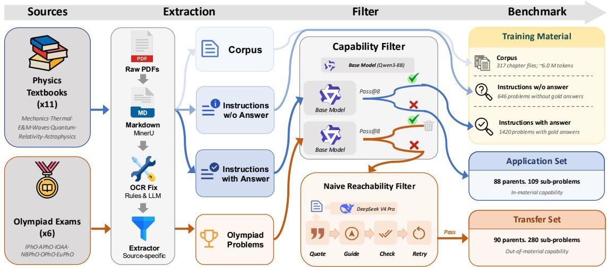
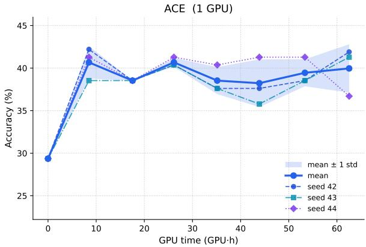
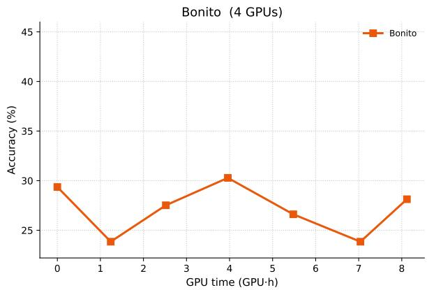
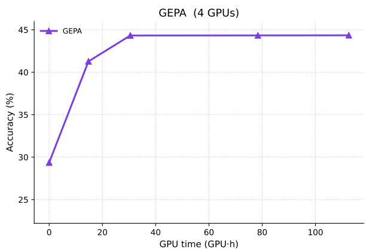
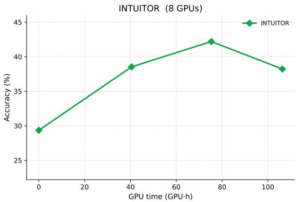
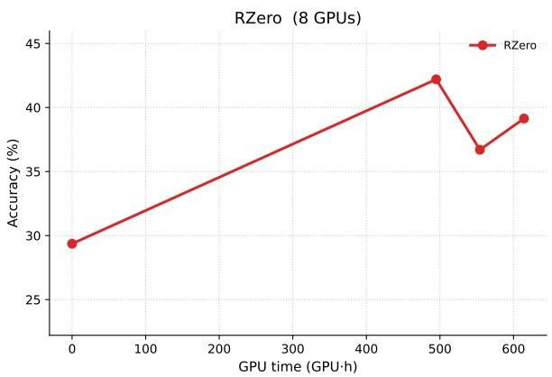

# StudyBench: Can Self-Evolution Squeeze Textbooks for Olympiad Capability?

Yinghao Chen1∗, Zixi Chen1∗, Bingxiang He1∗†, Ziqing Qiao1, Huan-ang Gao1, Yinuo Xu1, Yuxin Zuo1, Zeyuan Liu1, Yuhao Zhan2, Chaojun Xiao1†

1Tsinghua University 2Zhejiang University

## Abstract

Humans need to study only a handful of well written textbooks to master a discipline and attempt its hardest problems. We argue that an ideal self-evolution method should share the same property, that is autonomously learning from raw training material for transferable problem-solving capability. However, we still lack a direct measurement for it. We introduce StudyBench, a controlled physics benchmark that directly measures how efficiently a self-evolution method converts training material into capability. We organise the test set into an Application Set, consisting of difficult textbook problems and evaluating absorption ability, and a Transfer Set, consisting of olympiad-level problems and evaluating transfer ability. Benchmarking representative selfevolution methods across three base models, we find that improvements on the Application Set rarely translate to the harder Transfer Set. A guidance ablation exposes a Guidance Gap: even the strongest method closes only a small fraction of what the same material unlocks when supplied as in-context guidance. Besides, every method hits a Compute Plateau, saturating well before exhausting its compute budget. The remaining gap is therefore a method problem rather than a data or compute problem. By offering a clean and controlled benchmark, StudyBench turns self-evolution progress from an open-ended pursuit into a measurable target for future research. Our code is released at https://github.com/thunlp/StudyBench.

## 1 Introduction

Self-evolution, the capacity for a model to keep improving on its own without being capped by a limited supply of high-quality data, shows the promise of true Artificial General Intelligence (Goertzel and Pennachin, 2007; Silver and Sutton, 2025). We argue that any system worthy of that promise must succeed at two things at once. First, it should continuously absorb new knowledge from its environment (Yuan et al., 2026). Second, and more critically, it should continuously evolve absorbed knowledge into transferable problem-solving capability, instead of merely memorizing or paraphrasing what it has seen (Mirzadeh et al., 2025; Huang et al., 2025b). The second ability is arguably the harder of the two: absorption alone is bounded by what the training material already states; yet realworld problems seldom have direct precedents in the training material, and addressing them therefore demands transferable problem-solving capability. Whether self-evolution can scale beyond the data it consumes therefore turns on how efficiently it performs this knowledge-to-capability conversion.

Despite a rapidly growing literature (Gao et al., 2025; Novikov et al., 2025; Huang et al., 2025a) on self-evolution, we still lack a clear way to measure how effectively a method performs this conversion. Static high-difficulty exams such as AIME and Humanity’s Last Exam (Phan et al., 2025) only give a final score, conflating the algorithm’s contribution with that of the training data and the base model. Dynamic and lifelong-learning benchmarks (Castillo-Bolado et al., 2024; Zheng et al., 2025a; Wan and Ma, 2025; Dou et al., 2026) test whether a model reuses earlier experiences to do better on later problems; they address local adaptation, while we operate at a higher level, testing conversion from experiences to transferable capability. The deeper reason these existing evaluations fall short is that the conversion itself is hard to measure directly: any such measurement faces three obstacles. First, the vanishing capability gap: when the base model already passes the test set on its own, any post-training score merely surfaces existing capability rather than what the algorithm added. Second, unreachable targets: when the training material is insufficient for any algorithm to derive the test solutions. Third, confounded attribution: when the base model, the training material, and the algorithm vary together, thus the score conflates all three. To our knowledge, no existing evaluation eliminates all three at once.

We close this gap with StudyBench, aiming to directly reveal the enhancement brought by selfevolution methods. We instantiate the setting in physics: 11 canonical physics textbooks serve as the training material, factored into three layers to fit requirements of different self-evolution methods: a Corpus of raw passages, Instructions with Answer, and Instructions without Answer. The training material is paired with two complementary test splits that form a built-in difficulty progression. The Application Set consists of difficult end-of-chapter exercises drawn from the textbooks themselves, retained only when Qwen3-8B (Yang et al., 2025) does not solve them reliably; it probes whether an algorithm has absorbed the training material. The Transfer Set consists of olympiad-level theory problems, retained only when Qwen3-8B alone fails but succeeds with the help of textbookgrounded guidance, which is built from passages taken directly from the training material; it probes whether the method has additionally converted that material into capability transferable to problems harder than any in the textbooks themselves. We filter with Qwen3-8B because it sits at mid capability: strong enough that a failed parent is a genuine gap, yet not so strong that the retained set collapses or fails the guidance-based reachability check.

This construction guarantees three properties by design: (1) Capability Gap, that retained test problems lie outside Qwen3-8B’s reliable capability, so scores on that model reflect ability gained rather than residual competence; (2) Reachability, that every retained test problem is solvable by utilizing the training material, eliminating unreachable targets; and (3) Controlled Attribution, that the training material, the test items, and the evaluation protocol are identical across methods, so that within each base model the score isolates the algorithm. Llama-3.2-3B-Instruct (Grattafiori et al., 2024) and Opus 4.7 (Anthropic, 2025) reuse the same items, so cross-model comparison is on a shared problem set rather than on per-model filters.

On StudyBench, we benchmark multiple representative self-evolution methods across three base models and find that (i) Application-Set gains remain local to textbook exercises: on Qwen3-

8B, GEPA lifts Application Par@8 from 17.05 to 34.85, yet Transfer Par@8 reaches only 7.04; (ii) textbook-grounded guidance already certifies that every Transfer-Set parent is fully reachable from the training material, yet the strongest method raises Par@8 only from 0.00 to 7.04 on Qwen3- 8B; and (iii) on the self-evolution loops we profile, methods plateau well before exhausting their compute budget. The remaining gap is therefore a method problem rather than a data or compute problem, leaving substantial room for future work.

## 2 StudyBench

StudyBench is inspired by the way humans master a discipline: a motivated student typically needs no more than a handful of well-chosen textbooks and some deliberate practice to attempt the hardest problems in the field. A self-evolution method, placed in an analogous setting, ought to demonstrate comparable capability. StudyBench builds such a setting and provides a means to measure it. We instantiate it in physics, where final answers are verifiable, the set of standard textbooks is small and widely shared across physics curricula of top universities and olympiad training, and hard problems require both textbook knowledge and the reasoning capability to use it. These properties make physics an ideal setting for measuring capability rather than knowledge alone.

## 2.1 Benchmark Construction

Figure 1 summarises the construction. Each textbook yields three nested layers of training material: the Corpus of raw passages contains the Instructions without Answer (every exercise as a problem statement), which in turn contains the Instructions with Answer (the subset for which a gold answer is available from the textbook or its official solution manual). Each self-evolution method draws on whichever layer fits its training paradigm.

The test set, in turn, draws from two complementary sources of escalating difficulty: difficult endof-chapter problems from these same textbooks (Table 5) and problems from six international physics and astronomy olympiads (Table 6). From both pools we keep only problems on which Qwen3-8B does not succeed reliably, then subsample failed textbook parents by sub-discipline so that no subject dominates; failed competition parents all proceed. For the olympiad pool we additionally retain only those Qwen3-8B can solve under a textbookgrounded guidance trace, certifying that the answer is reachable from the training material. Llama-3.2- 3B-Instruct and Opus 4.7 are scored on this same item set. The retained textbook problems form the Application Set, which measures whether a method has absorbed the training material well enough to apply it where it was first introduced; the retained olympiad problems form the Transfer Set, which measures whether the method has additionally converted that material into capability that transfers to problems harder than any in the textbooks themselves. The remainder of this subsection details each step.

  
Figure 1: Construction pipeline for StudyBench. Textbooks are extracted into a Corpus, Instructions with Answer , and Instructions without Answer, which together form the training material; olympiad problems are extracted along a separate, test-only stream. A Capability Filter run on Qwen3-8B keeps items that model does not solve reliably; Llama-3.2-3B-Instruct and Opus 4.7 reuse the same items. Failed textbook problems become the Application Set; failed olympiad problems pass an additional Naive Reachability Filter and become the Transfer Set.

Sources. The 11 textbooks (Table 5) are each currently adopted as a course text at top universities and independently recommended either by olympiad-training coaches or on the competitions own preparation pages. By sub-discipline, the 11 textbooks jointly cover the syllabus of all six olympiads.

Extraction. All source materials are PDFs. We convert every PDF to Markdown via MinerU (Wang et al., 2026) and then fix common OCR errors (broken super- and subscripts, malformed LATEX, dropped figure captions) by first applying deterministic rules and then using an LLM to handle cases the rules cannot. With Claude Opus 4.7 as a coding assistant, we then write a separate extractor for each textbook and each competition, since each source has its own layout. From each textbook we extract its worked examples and endof-chapter exercises, and from each competition we extract every theory problem of every past edition. For five textbooks we take exercise answers and reference solutions from the matching official solution manual; for the rest they come from in-book answer keys or end-of-chapter solutions (Table 5). Physics problems are commonly split into several sub-problems sharing a common setup, so each extracted record stores both the full problem statement and a list of per-sub-problem entries carrying the sub-problem text, the reference solution where given, and the gold answer. The gold answer of every sub-problem is further classified by DeepSeek V4 Flash (DeepSeek-AI, 2026) into one of nine answer types: NV (numeric value), EX (symbolic expression), EQ (equation), TUP (ordered tuple), IN (interval), MC (single multiple-choice letter), TF (boolean), QL (short qualitative phrase), and ALT (alternative acceptable forms of one answer); composite types (TUP and ALT) additionally carry a per-position sequence that tells the verifier how to judge each slot. Appendix E gives the full record schema and shows one example.

Capability Filter. We run Qwen3-8B with pass@8 sampling on both pools and treat a parent as failed if no attempt solves every sub-problem. Solved textbook problems stay in the training material;

solved competition problems are discarded. Every failed competition parent advances to the Naive Reachability Filter. Failed textbook parents do not: we subsample them by sub-discipline so that hard subjects do not dominate the Application Set, and send unselected failed parents back to the training material. Subjects that would otherwise empty under a strict zero-of-eight rule are kept in play by additionally admitting 15 parents that Qwen3-8B solved on exactly one of eight attempts. These 15 are the sole source of Qwen3-8B’s Application Par@8 $( 1 5 / 8 8 = 1 7 . 0 5 \% )$ ; the other 73 Application parents, and every Transfer-Set parent, fail on all eight attempts. Llama-3.2-3B-Instruct and Opus 4.7 reuse this set. Appendix C reports the resulting sub-discipline distribution. Since the prerequisite material lives in the same chapter, the Application Set is reachable by construction.

Naive Reachability Filter. Since we cannot precisely characterise the reachability boundary, we adopt a naive but auditable proxy: a competition problem is admitted only if Qwen3-8B can solve it under teacher-distilled, textbook-grounded guidance. The procedure is driven by a strong teacher DeepSeek V4 Pro (DeepSeek-AI, 2026) and consists of five steps:

• Decompose. For each sub-problem the teacher enumerates a minimal set of named knowledge points—concepts, laws or equations, techniques, and assumptions—required by the gold solution. Near-duplicate names are then canonicalised across the corpus.

• Retrieve. The training textbooks are first split into exposition and worked-example fragments. Each canonical knowledge point is matched to those fragments by a two-channel retriever: BM25 over normalised text and dense embeddings, fused by reciprocal rank fusion with a preference for in-domain books.

• Verify. The teacher scores every candidate on a 0–3 coverage rubric and copies a short verbatim quote as evidence. A server-side check demotes any quote that does not actually appear in the fragment; only scores of 2 (applied/example) or 3 (direct exposition) count as coverage.

• Guide. Given the verified passages and, for the teacher’s own understanding, the gold solution, the teacher writes a methodological guidance that names which textbook concepts, formulae, and examples to use and in what order, without stating the answer or performing the key calculation. A dual leakage gate—deterministic redaction rules plus a separate teacher review— regenerates failing guidance up to twice and rulesanitises the last attempt as a fallback.

• Retry. We admit the problem into the Transfer Set if Qwen3-8B solves it at least once in eight attempts under this grounded guidance.

Together these five steps form an explicit, textbookauditable witness that the gold answer is reachable by recombining the training material. To check that this witness is not tied to one teacher, we re-run the same pipeline with GLM-5.1 and evaluate Qwen3- 8B under the independently written traces: 56 of 90 Transfer-Set parents (62.22 Par@8) and 242 of 280 sub-problems (86.43 Sub@8) remain solvable (Appendix D).

Properties. By construction, the resulting benchmark satisfies three properties. (1) Capability Gap, that retained test problems lie outside Qwen3-8B’s reliable capability; (2) Reachability, that every retained test problem is solvable by recombining content from the training material, eliminating unreachable targets; and (3) Controlled Attribution, that the training material, the test items, and the evaluation protocol are fixed across methods, so that within each base model a method’s score reflects only what the method does between them.

## 2.2 Evaluation

Protocol. Each method is free to draw on any subset of the training material to suit its training paradigm. We then evaluate every evolved model on both test sets. Open-weight models use k=8 samples per sub-problem; because of API cost, Opus 4.7 uses k=1. All runs share temperature 1.0, top-p 0.95, top-k 20, and a 32,768-token cap. From these samples we report two accuracies. Let $\mathcal { P }$ denote the parent problems in a test set, $n _ { p }$ the number of sub-problems of parent $p ,$ and $c _ { p , j , a } \in \{ 0 , 1 \}$ the verifier’s judgement on the j-th sub-problem of parent $p$ in attempt a. Parent accuracy (Par@k) counts a parent correct only if some single attempt solves every one of its sub-problems:

$$
\mathrm { P a r @ } k = \frac { 1 } { | \mathcal { P } | } \sum _ { p \in \mathcal { P } } \operatorname* { m a x } _ { 1 \leq a \leq k } \prod _ { j = 1 } ^ { n _ { p } } c _ { p , j , a } .
$$

Sub-problem accuracy (Sub@k) flattens parents into sub-problems and marks each correct if any of the k attempts solves it:

$$
\operatorname { S u b @ } k = \frac { 1 } { \sum _ { p \in \mathcal { P } } n _ { p } } \sum _ { p \in \mathcal { P } } \sum _ { j = 1 } ^ { n _ { p } } \operatorname* { m a x } _ { 1 \leq a \leq k } c _ { p , j , a } .
$$

For open-weight models we repeat the pass@8 evaluation three times with independent sampling seeds and report the mean ± standard deviation. For Opus 4.7 we report a single pass@1 run.

Sub-problem Evaluation. Multi-part problems are scored sub-problem by sub-problem with conversational continuity: at sub-problem i, the model sees the shared stem, the i − 1 prior sub-problem statements, and the model’s own prior answers to them, but never the gold solutions. When the model fails to produce a final answer for sub-problem i, we insert a fixed placeholder stating the failure in the assistant slot and continue with sub-problem i + 1 rather than discarding the rest of the parent. This isolates each sub-problem’s correctness, so pass@k can be reported per sub-problem and aggregated per parent.

Verifier. We build our verifier on the rule-based judger of UG-Physics (Xu et al., 2025), adding one new primitive answer type QL (short qualitative phrases such as “tidal forces”). We also introduce a new field, type\_sequence, which lets the verifier dispatch composite answers (TUP and ALT) onto position-wise primitive judgers. The resulting verifier applies a different judging rule for every one of the nine answer types. For leaderboard evaluation we additionally route failed problems to DeepSeek-V4-Flash-0731 as an LLM judger to enhance correctness. Appendix G reports a consistency analysis of the two-stage verifier. The full judge prompt is reproduced in Appendix F. When the verifier is wired into an RL-based self-evolution method as a reward signal, we expose only this rule-based part to avoid reward hacking.

## 2.3 Contamination

The 11 textbooks and the Olympiad archives are public, so a problem’s statement or answer can, in principle, leak into a method’s pipeline at two stages: (a) the pretraining of the base model, or (b) training material of a self-evolution method. StudyBench neutralises both by design.

Pretraining leakage is screened out by the Capability Filter. A problem enters either test set only if Qwen3-8B does not solve it reliably under pass@8 (zero successes, or, for 15 Application parents, a single success). Answers Qwen3-8B has memorised well enough to recover consistently are therefore removed from the test sets, regardless of whether the problem statement appears verbatim in pretraining. The same items are reused for

Llama-3.2-3B-Instruct and Opus 4.7, so this screen is defined with respect to Qwen3-8B.

Training-material leakage is removed by redaction. Transfer Set problems come from olympiad theory exams, which do not appear in any of the eleven textbooks that constitute the training material. Application Set problems do come from those textbooks, but for every retained parent we excise both the problem statement and the reference solution (including any back-of-book answer key or solution-manual entry) from the raw markdown before assembling the training material, and we audit the resulting corpus to confirm no verbatim residue remains; Appendix H details the two-pass redaction pipeline and the audit procedure. A method that memorises every page of its training material therefore gains access to none of the answers it will be asked for.

## 2.4 Statistics

Test sets. The filters retain 88 Application Set parents (109 sub-problems) and 90 Transfer Set parents (280 sub-problems). The Application Set is subsampled so that no sub-discipline dominates; the Transfer Set keeps every competition parent that fails Qwen3-8B and then passes the Naive Reachability Filter. Appendix C reports both mixes. Together the two sets measure in-material and outof-material capability.

Training material. Table 1 reports the per-layer counts of the Corpus, the Instructions without Answer, and the Instructions with Answer. The three layers cover the supervision regimes of the major self-evolution families.

Table 1: Statistics of the three nested training-material layers. Instructions with Answer means we successfully extracted the instruction-answer pair from the textbook or its official solution manual, while Instructions without Answer means we failed to find the corresponding answer.
<table><tr><td>Layer</td><td>Count</td></tr><tr><td>Corpus chapter files</td><td>317</td></tr><tr><td>total size (MB)</td><td>18.19</td></tr><tr><td>total tokens</td><td>~6.0M</td></tr><tr><td>Instructions without Answer Instructions with Answer</td><td>646 1,420</td></tr></table>

## 3 Experiments

Baselines. We benchmark a representative set of self-evolution methods grouped by which layer of the training material each one consumes. (1) Corpus. Bonito (Nayak et al., 2024) runs a taskconditioned generator over textbook passages to synthesise question–answer pairs and performs supervised fine-tuning on the base model with them. Naive Guidance is not a training method: it injects textbook-grounded traces built from the same Corpus at inference time, and serves as the reachability ceiling on the Transfer Set. (2) Instructions with Answer. GRPO (Shao et al., 2024)

Table 2: Main results on StudyBench for open-weight models (k=8), grouped by training-material layer. Qwen3- 8B’s Transfer Par@8 is 0.00 by construction. ∆Sub@8 is relative to the same base model; ± is over three independent pass@8 evaluations. All numbers in %.
<table><tr><td rowspan="2"></td><td colspan="3">Application Set</td><td colspan="3">Transfer Set</td></tr><tr><td>Par@8</td><td>Sub@8</td><td>∆Sub@8</td><td>Par@8</td><td>Sub@8</td><td>∆Sub@8</td></tr><tr><td>Qwen3-8B</td><td> $1 7 . 0 5 \pm 1 . 1 4$ </td><td> $2 9 . 3 6 \pm 2 . 7 5$ </td><td>一</td><td>0.00</td><td> $5 6 . 4 3 \pm 1 . 8 9$ </td><td>一</td></tr><tr><td>Corpus</td><td></td><td></td><td></td><td></td><td></td><td></td></tr><tr><td>Bonito (Nayak et al., 2024)</td><td> $2 1 . 2 1 \pm 3 . 4 7$ </td><td> $2 8 . 1 3 \pm 3 . 4 7$ </td><td>-1.23</td><td> $4 . 4 4 \pm 1 . 1 1$ </td><td> $3 5 . 0 0 \pm 0 . 3 6$ </td><td>-21.43</td></tr><tr><td>Instructions with Answer</td><td></td><td></td><td></td><td></td><td></td><td></td></tr><tr><td>GRPO (Shao et al., 2024)</td><td> $2 8 . 4 1 \pm 1 . 9 7$ </td><td> $3 8 . 8 4 \pm 1 . 4 0$ </td><td>+9.48</td><td> $4 . 0 7 \pm 1 . 7 0$ </td><td> $5 7 . 0 2 \pm 1 . 0 9$ </td><td>+0.59</td></tr><tr><td>GEPA (Agrawal et al., 2025)</td><td> $3 4 . 8 5 \pm 1 . 3 1$ </td><td> $\pm 4 . 3 4 \pm 1 . 4 0$ </td><td>+14.98</td><td> ${ \bf 7 . 0 4 } \pm 2 . 8 0$ </td><td> ${ \pm } 8 . 5 7 \pm 1 . 4 3$ </td><td>+2.14</td></tr><tr><td>ACE (Zhang et al., 2025)</td><td> $3 1 . 0 6 \pm 1 . 7 4$ </td><td> $4 1 . 9 0 \pm 1 . 0 6$ </td><td>+12.54</td><td> $2 . 9 6 \pm 2 . 3 1$ </td><td> $5 7 . 2 6 \pm 1 . 0 9$ </td><td>+0.83</td></tr><tr><td>Instructions without Answer</td><td> $2 8 . 7 9 \pm 3 . 6 5$ </td><td></td><td></td><td></td><td></td><td></td></tr><tr><td>TTRL (Zuo et al., 2025) Intuitor (Zhao et al., 2025)</td><td> $2 6 . 8 9 \pm 2 . 3 7$ </td><td> $3 8 . 8 4 \pm 2 . 8 0$ </td><td>+9.48</td><td> $2 . 5 9 \pm 1 . 7 0$ </td><td> ${ \pm \mathbf { 8 . 5 7 \pm 1 . 8 6 } }$ </td><td>+2.14</td></tr><tr><td>Data-free</td><td></td><td> $3 8 . 2 3 \pm 2 . 6 5$ </td><td>+8.87</td><td> $5 . 5 6 \pm 1 . 9 2$ </td><td> $5 8 . 2 1 \pm 0 . 3 6$ </td><td>+1.78</td></tr><tr><td>R-Zero (Huang et al., 2025a)</td><td> $2 9 . 5 5 \pm 5 . 9 0$ </td><td> $3 9 . 1 4 \pm 5 . 3 0$ </td><td>+9.78</td><td> $4 . 0 7 \pm 2 . 8 0$ </td><td></td><td></td></tr><tr><td>Guided (Corpus)</td><td></td><td></td><td></td><td></td><td> $5 8 . 1 0 \pm 1 . 0 3$ </td><td>+1.67</td></tr><tr><td>Naive Guidance</td><td></td><td></td><td></td><td>100.00</td><td>100.00</td><td>+43.57</td></tr><tr><td>Llama-3.2-3B-Instruct</td><td> $9 . 4 7 \pm 0 . 6 6$ </td><td> $1 4 . 3 7 \pm 0 . 5 3$ </td><td></td><td>0.00</td><td></td><td></td></tr><tr><td>Corpus</td><td></td><td></td><td></td><td></td><td> $1 4 . 8 8 \pm 1 . 7 6$ </td><td>1</td></tr><tr><td>Bonito (Nayak et al., 2024)</td><td> $1 0 . 9 8 \pm 2 . 6 2$ </td><td></td><td></td><td> $1 . 8 5 \pm 1 . 2 8$ </td><td></td><td></td></tr><tr><td>Instructions with Answer</td><td></td><td> $1 5 . 9 0 \pm 2 . 3 1$ </td><td>+1.53</td><td></td><td> $1 7 . 8 6 \pm 1 . 8 6$ </td><td>+2.98</td></tr><tr><td>GRPO (Shao et al., 2024)</td><td> $1 0 . 9 8 \pm 1 . 3 1$ </td><td> $1 4 . 0 7 \pm 1 . 4 0$ </td><td>-0.30</td><td> ${ \bf 2 . 5 9 \pm 1 . 2 8 }$ </td><td> $2 2 . 7 4 \pm 1 . 4 4$ </td><td>+7.86</td></tr><tr><td>GEPA (Agrawal et al., 2025)</td><td> $1 1 . 7 4 \pm 1 . 3 1$ </td><td> $1 4 . 9 8 \pm 1 . 0 6$ </td><td>+0.61</td><td> $2 . 2 2 \pm 2 . 9 4$ </td><td> $1 7 . 2 6 \pm 1 . 2 5$ </td><td>+2.38</td></tr><tr><td>ACE (Zhang et al., 2025)</td><td> $9 . 8 5 \pm 3 . 6 5$ </td><td> $1 4 . 3 7 \pm 2 . 9 5$ </td><td>+0.00</td><td> $1 . 8 5 \pm 0 . 0 2$ </td><td> $1 6 . 7 9 \pm 1 . 2 9$ </td><td>+1.91</td></tr><tr><td>Instructions without Answer</td><td></td><td></td><td></td><td></td><td></td><td></td></tr><tr><td>TTRL (Zuo et al., 2025)</td><td> $9 . 8 5 \pm 0 . 6 6$ </td><td> $1 2 . 8 5 \pm 0 . 9 2$ </td><td>-1.52</td><td> ${ \bf 2 . 5 9 \pm 0 . 6 4 }$ </td><td> $1 9 . 7 6 \pm 1 . 4 9$ </td><td>+4.88</td></tr><tr><td>Intuitor (Zhao et al., 2025)</td><td> ${ \bf 1 } 2 . 5 0 \pm 2 . 2 7$ </td><td> ${ \bf 1 6 . 8 2 \pm 1 . 9 1 }$ </td><td>+2.45</td><td> $0 . 7 4 \pm 0 . 6 4$ </td><td> $2 0 . 6 0 \pm 0 . 8 2$ </td><td>+5.72</td></tr><tr><td>Data-free</td><td></td><td></td><td></td><td></td><td></td><td></td></tr><tr><td>R-Zero (Huang et al., 2025a)</td><td> $5 . 6 8 \pm 1 . 1 4$ </td><td> $1 0 . 7 0 \pm 1 . 0 6$ </td><td>-3.67</td><td> $0 . 7 4 \pm 0 . 6 4$ </td><td> $1 8 . 6 9 \pm 1 . 1 5$ </td><td>+3.81</td></tr><tr><td>Guided (Corpus)</td><td></td><td></td><td></td><td></td><td></td><td></td></tr><tr><td></td><td></td><td></td><td></td><td> $1 0 . 7 4 \pm 3 . 3 9$ </td><td></td><td></td></tr><tr><td>Naive Guidance</td><td></td><td></td><td></td><td></td><td> $4 6 . 7 9 \pm 0 . 3 6$ </td><td>+31.91</td></tr></table>

Table 3: Results on StudyBench for Opus 4.7 with Claude Code (k=1), on the same item set as Table 2. A single pass@1 run. All numbers in %.
<table><tr><td rowspan="2"></td><td colspan="3">Application Set</td><td colspan="3">Transfer Set</td></tr><tr><td>Par@1</td><td>Sub@1</td><td>∆Sub@1</td><td>Par@1</td><td>Sub@1</td><td>∆Sub@1</td></tr><tr><td>Opus 4.7 with Claude Code</td><td>59.09</td><td>66.06</td><td>一</td><td>40.00</td><td>72.14</td><td>一</td></tr><tr><td>Instructions with Answer</td><td></td><td></td><td></td><td></td><td></td><td></td></tr><tr><td>GEPA (Agrawal et al., 2025)</td><td>51.14</td><td>57.80</td><td>-8.26</td><td>41.11</td><td>72.14</td><td>+0.00</td></tr><tr><td>ACE (Zhang et al., 2025)</td><td>60.23</td><td>63.30</td><td>-2.76</td><td>33.33</td><td>66.79</td><td>-5.35</td></tr><tr><td>EvoSkill (Alzubi et al., 2026)</td><td>52.27</td><td>58.72</td><td>-7.34</td><td>43.33</td><td>73.57</td><td>+1.43</td></tr><tr><td>Guided (Corpus) Naive Guidance</td><td></td><td></td><td></td><td>63.33</td><td>84.64</td><td>+12.50</td></tr></table>

is a supervised RL reference: it trains on these labelled problems with a gold outcome reward. GEPA (Agrawal et al., 2025) treats them as a development set and evolves a system prompt via reflective genetic search, while ACE (Zhang et al., 2025) distils them into an in-context playbook of formulae, strategies, and common pitfalls; both artefacts are injected into the system message at inference time without any weight update. (3) Instructions without Answer. TTRL (Zuo et al., 2025) and

Intuitor (Zhao et al., 2025) both run label-free RL on these problems, rewarding majority-vote consistency and the policy’s own self-certainty, respectively. (4) Data-free. R-Zero (Huang et al., 2025a) bootstraps capability from Challenger-Solver selfplay under self-consistency rewards. We include it to see how well a method that uses no training data at all can do on StudyBench.

Setup. The test set is filtered with Qwen3- 8B (Yang et al., 2025) (thinking mode enabled). We then evaluate the same items on three base models of increasing capability: Llama-3.2-3B-Instruct (Grattafiori et al., 2024), Qwen3-8B, and Opus 4.7 (Anthropic, 2025) with Claude Code. For each method we reproduce from its official repository and make only minimal modifications to fit StudyBench’s training material and evaluation protocol. All open-weight self-evolution methods run on a single 8×NVIDIA-A800-80GB node. Appendix J lists per-method modifications and full configurations.

Results. Tables 2 and 3 report the main results. Because the item set is filtered with Qwen3-8B, that model’s Transfer Par@8 is 0.00 by construction, while its Application Par@8 of 17.05 is the 15 coverage parents admitted at one-of-eight; Llama-3.2-3B-Instruct and Opus 4.7 are not guaranteed a zero parent score on the same items. On Qwen3- 8B, most methods absorb the textbooks: Application Sub@8 rises by +8.87 to +14.98, with GEPA leading on both Application metrics (34.85 Par@8, +14.98 ∆Sub@8). Those gains stay local. Transfer Sub@8 moves by at most +2.14 (GEPA and TTRL), and the best Transfer Par@8 is only 7.04 against a 100% Corpus-grounded guidance ceiling. Bonito is the exception: synthetic-data SFT erodes Qwen3-8B’s thinking behaviour, so problems the base model already solved become unsolvable (−1.23 Application and −21.43 Transfer ∆Sub@8). The other two models on the same items confirm the pattern. Llama-3.2-3B-Instruct barely moves on Application (peak +2.45 under Intuitor), while supervised GRPO leads Transfer (+7.86); Opus 4.7 already solves much of the set, and context-evolution methods mostly regress on Application. Section 4.1 attributes the remaining Transfer headroom to the Guidance Gap—the accuracy a method recovers when textbook-grounded guidance is supplied at inference but not internalised by training.

## 4 Analysis

We organise our analysis around two research questions: RQ1: how much of the corpus-reachable knowledge actually migrates into standalone transfer capability? RQ2: can the remaining gap be closed by simply running each self-evolution loop longer?

## 4.1 The Guidance Gap (RQ1)

The Application Set probes whether a method has absorbed the training material; the Transfer Set probes whether that material has transferred to problems strictly harder than any in the textbooks. The two probes diverge in Table 2. On Qwen3- 8B, Application ∆Sub@8 ranges from +8.87 to +14.98 for every method except Bonito, yet Transfer ∆Sub@8 is at most +2.14 and Transfer Par@8 stays in the single digits. RQ1 asks how much of the corpus-reachable knowledge certified by our Naive Reachability Filter has actually migrated into standalone transfer capability, rather than remaining merely reachable.

Guidance ablation. To answer this, we re-run the Transfer Set under the textbook-grounded guidance produced during construction (§2.1), injecting them at inference. Table 4 reports the ablation for Qwen3-8B and the five self-evolution methods we re-ran under guidance; We define the Guidance Gap as the accuracy a method recovers when grounded guidance is supplied at inference but not internalised by training:

$$
\mathrm { G u i d a n c e \ G a p = A c c _ { g u i d e d } - A c c _ { s o l o } , }\tag{1}
$$

where $\mathbf { A c c _ { s o l o } }$ is Transfer-Set accuracy under the solo protocol of §2.2 and $\mathrm { A c c } _ { \mathrm { g u i d e d } }$ uses the same Naive Reachability Filter traces in the system prompt. Both quantities are reported for Par@8 and Sub@8. Closing the gap means the method has converted into standalone capability what, for Qwen3-8B, only an in-context guidance trace could surface.

A high, method-stable ceiling—except under SFT. By construction of the Reachability Filter, Qwen3-8B under guidance solves every Transfer parent (100 Par@8 and Sub@8). The same traces remain highly effective after context evolution or label-free RL: GEPA, ACE, Intuitor, and R-Zero all sit at 88.89–90.00 guided Par@8 and 97.14– 98.21 guided Sub@8. Training therefore barely moves the ceiling. Bonito is the outlier: after synthetic-data SFT its guided Par@8 falls to 23.33 and guided Sub@8 to 68.93. The same collapse of thinking behaviour that hurts solo accuracy also prevents the model from following guidance that the untrained backbone can use.

Table 4: Transfer-Set accuracy with textbook-grounded guidance on Qwen3-8B. Solo accuracies repeat Table 2; guided accuracies inject the Naive Reachability Filter traces at inference. Guidance $\mathbf { G a p } = \mathbf { A c c } _ { \mathrm { g u i d e d } } -$ $\mathbf { A c c } _ { \mathrm { s o l o } } . \mathbf { Q } \mathrm { w e n } 3 { - } 8 \mathbf { B } ^ { \prime } \mathbf { s }$ guided scores are 100 by construction of that filter. Appendix D reports the same protocol with independently written GLM-5.1 traces.
<table><tr><td rowspan="2">Method</td><td colspan="3">Par@8</td><td colspan="3">Sub@8</td></tr><tr><td>Solo</td><td>Guided</td><td>Gap</td><td>Solo</td><td>Guided</td><td>Gap</td></tr><tr><td>Qwen3-8B</td><td>0.00</td><td>100.00</td><td>100.00</td><td>56.43</td><td>100.00</td><td>43.57</td></tr><tr><td>Bonito</td><td>4.44</td><td>23.33</td><td>18.89</td><td>35.00</td><td>68.93</td><td>33.93</td></tr><tr><td>GEPA</td><td>7.04</td><td>90.00</td><td>82.96</td><td>58.57</td><td>97.14</td><td>38.57</td></tr><tr><td>ACE</td><td>2.96</td><td>88.89</td><td>85.93</td><td>57.26</td><td>97.14</td><td>39.88</td></tr><tr><td>Intuitor</td><td>5.56</td><td>90.00</td><td>84.44</td><td>58.21</td><td>98.21</td><td>40.00</td></tr><tr><td>R-Zero</td><td>4.07</td><td>90.00</td><td>85.93</td><td>58.10</td><td>98.21</td><td>40.11</td></tr></table>

Solo gains close almost none of the gap. Relative to Qwen3-8B’s original headroom (100 Par@8 points; 43.57 Sub@8 points), the strongest solo run is GEPA at 7.04 Par@8 and +2.14 ∆Sub@8— closing 7% of the parent gap and 5% of the subproblem gap. Intuitor (5.56 / +1.78) and R-Zero (4.07 / +1.67) close even less; ACE trails on parents (2.96). GRPO and TTRL, which we did not re-run under guidance, have solo Transfer scores in the same band (4.07 / +0.59 and 2.59 / +2.14). Bonito’s solo Transfer Sub@8 falls below the base model, so it widens rather than closes the subproblem gap. The Application Set, where the same methods (Bonito aside) gain +8.87 to +14.98 Sub@8, cannot see this failure: absorption and transfer remain complementary probes.

Substantial headroom remains. Because guidance still unlocks about 90% of Transfer parents for every method except Bonito, what remains is an internalisation problem rather than a reachability problem: the textbooks already contain what is needed to solve the retained olympiad parents, yet no method converts more than a sliver of that into standalone capability. Llama-3.2-3B-Instruct and Opus 4.7 reuse the same items and the same traces (Tables 2 and 3); their guidance ceilings are lower (10.74 and 63.33 Par@8) because the filter was built for Qwen3-8B, but the qualitative gap is unchanged—the strongest solo run still leaves most of the available headroom on the table.

  
Figure 2: Application-Set Sub@8 of ACE against cumulative GPU-time (1×A800). The solid line is the mean of three seeds; the band is ±1 standard deviation. Accuracy jumps from the Qwen3-8B baseline (≈ 29.4%) to ≈ 40% by the 8.50 GPU hour snapshot, then the mean stays in a 38–41% band through the 62.54 GPU hour endpoint. Late seed-to-seed scatter does not resume a climb. The same early-plateau pattern holds for the other four methods (Appendix I).

## 4.2 The Compute Plateau (RQ2)

RQ1 left most of the Guidance Gap unclosed: even GEPA, the strongest method, recovers only 7% of Qwen3-8B’s parent-level Transfer headroom. RQ2 asks whether the remaining gap can be closed by simply running each self-evolution loop longer.

Setup. For each of the five self-evolution loops we profile on Qwen3-8B, we evaluate the model checkpoint (Bonito, Intuitor, R-Zero) or inference-time artefact (GEPA, ACE) at intermediate snapshots and plot Application-Set Sub@8 against cumulative GPU-time on NVIDIA A800 GPUs. Compute scales differ by nearly two orders of magnitude— from 8.12 GPU hour for Bonito to 614 GPU hour for R-Zero—so the curves cannot share an axis. We show ACE in the main text (Figure 2) because we ran it under three random seeds, and place the other four curves in Appendix I.

The plateau is not a single-run artefact. ACE’s three seeds all make the same early jump and then stop improving: after the 8.50 GPU hour snapshot the mean never leaves a narrow band, even though the remaining 54.0 GPU hour are most of the 62.54 GPU hour budget. Seed 44 drops at the 62.54 GPU hour snapshot and seed 42 recovers; neither trajectory looks like continued learning. The table’s ACE Sub@8 of 41.90 sits inside this band.

The other four loops (Appendix I) saturate in the same way: GEPA climbs then sits flat; Intuitor and R-Zero peak and decline; Bonito never leaves the baseline band. In every case the late phase is a noisy plateau or a decline, not a second climb.

Compute is not the bottleneck. The remaining headroom from RQ1 therefore cannot be closed by running any of these loops longer. Extra GPU-time past saturation moves Application accuracy by at most a few noisy points, even though total compute spans 76× (8.12 to 614 GPU hour) and the highest plateau (GEPA’s 44.3%) is not the most expensive. Closing more of the gap will require a different self-evolution loop, not a longer one.

## 5 Related Work

## 5.1 Self-Evolving Methods

Self-evolution methods differ mainly in where the improvement signal comes from. Selfplay and intrinsic-reward approaches such as R-Zero (Huang et al., 2025a), Absolute Zero (Zhao et al., 2026), SPICE (Liu et al., 2025), Self-Rewarding LMs (Yuan et al., 2024), and Intuitor (Zhao et al., 2025) generate or score new practice without relying on a fixed external answer set. Context-level methods such as GEPA (Agrawal et al., 2025) and ACE (Zhang et al., 2025) leave model weights unchanged and instead evolve prompts or in-context playbooks. SEAL (Zweiger et al., 2026) occupies a third point in the design space: it trains a model to emit self-edits that transform passages into finetuning data.

A related line studies improvement through memory, reflection, or test-time search. Voyager (Wang et al., 2023), Reflexion (Shinn et al., 2023), ExpEL (Zhao et al., 2024), and ReasoningBank (Ouyang et al., 2025) accumulate reusable experience across trajectories, while AlphaEvolve (Novikov et al., 2025) applies evolutionary search at inference time. These systems demonstrate many ways to make a model adapt after deployment, but they are usually evaluated with implicit or freely chosen training data. As a result, it is difficult to attribute gains to a specific corpus or compare methods from different families on equal footing.

## 5.2 Benchmarks for Self-Evolution

Dynamic and lifelong-learning benchmarks such as the LTM Benchmark (Castillo-Bolado et al., 2024), LifelongAgentBench (Zheng et al., 2025a), Story-Bench (Wan and Ma, 2025), and EvaLearn (Dou et al., 2026) measure adaptation over interaction streams, but typically leave the training material implicit or submitter-chosen. More targeted benchmarks, including SE-Bench (Yuan et al., 2026), NewtonBench (Zheng et al., 2025b), and Frontier-Eng (Chi et al., 2026), study knowledge internalisation, scientific-law discovery, or engineering agents.

These benchmarks are closest to StudyBench in spirit, but their units of comparison differ from ours. Some emphasise local adaptation within an interaction stream; others evaluate open-ended agent improvement on tasks whose useful training evidence is not fixed in advance. StudyBench is complementary: it fixes the source corpus, enforces both a capability gap and reachability, and provides a guidance ceiling for measuring how much corpusreachable capability a method internalises.

## 6 Conclusion

We introduce StudyBench, a controlled physics benchmark that measures how efficiently a selfevolution method converts a fixed corpus into transferable problem-solving capability. Pairing 11 textbooks with an Application Set of unsolved textbook exercises and a Transfer Set of olympiad problems certified reachable under textbook-grounded guidance, it isolates knowledge-to-capability conversion from a vanishing capability gap, unreachable targets, and confounded attribution. Application-Set gains do not become olympiad capability: on Qwen3-8B, GEPA lifts Application Par@8 from 17.05 to 34.85, yet Transfer Par@8 reaches only 7.04 against a 100% guidance ceiling, and the same local-gain pattern holds on Llama-3.2-3B-Instruct and Opus 4.7. The profiled loops additionally hit a Compute Plateau. The remaining gap is therefore a method problem rather than a data or compute problem—a distinction StudyBench makes directly measurable for future research.

## Acknowledgements

This work is supported by the China National Postdoctoral Program for Innovative Talents (grant no. BX20250388), Tsinghua University (Department of Computer Science and Technology)-Siemens Ltd., China Joint Research Center for Industrial Intelligence and Internet of Things (JCIIOT), Institute Guo Qiang at Tsinghua University.

## Limitations

The test set is filtered with Qwen3-8B, then reused for Llama-3.2-3B-Instruct and Opus 4.7; a capability gap and a 100% guidance ceiling are therefore guaranteed only for Qwen3-8B under the DeepSeek V4 Pro traces, and Opus 4.7 already solves a substantial fraction of both splits. Independently written GLM-5.1 traces recover 62.22 Par@8 on the same Transfer-Set items (Appendix D). The setting is instantiated in physics over 11 textbooks; while the construction principles—Capability Filter, Naive Reachability Filter, and two-level test design—are domain-agnostic, we have not verified that they replicate in other disciplines. On the Application Set we additionally admit 15 parents that Qwen3-8B solved once in eight attempts, a limited relaxation of the Capability Gap in order to keep easier subjects represented. Compute constraints additionally limit the guidance ablation (Table 4) and the compute-plateau curves; we do not claim either result for every method–model pair. Verifier consistency (Appendix G) is measured on Qwen3- 8B Transfer-Set rollouts only.

## References

Lakshya A Agrawal, Shangyin Tan, Dilara Soylu, Noah Ziems, Rishi Khare, Krista Opsahl-Ong, Arnav Singhvi, Herumb Shandilya, Michael J Ryan, Meng Jiang, and 1 others. 2025. Gepa: Reflective prompt evolution can outperform reinforcement learning. arXiv preprint arXiv:2507.19457.

Salaheddin Alzubi, Noah Provenzano, Jaydon Bingham, Weiyuan Chen, and Tu Vu. 2026. Evoskill: Automated skill discovery for multi-agent systems. Preprint, arXiv:2603.02766.

Anthropic. 2025. Claude opus 4.7.

David Castillo-Bolado, Joseph Davidson, Finlay Gray, and Marek Rosa. 2024. Beyond prompts: Dynamic conversational benchmarking of large language models. Advances in Neural Information Processing Systems, 37:42528–42565.

Yizhe Chi, Deyao Hong, Dapeng Jiang, Tianwei Luo, Kaisen Yang, Boshi Zhang, Zhe Cao, Xiaoyan Fan, Bingxiang He, Han Hao, and 1 others. 2026. Frontiereng: Benchmarking self-evolving agents on realworld engineering tasks with generative optimization. arXiv preprint arXiv:2604.12290.

DeepSeek-AI. 2026. Deepseek-v4: Towards highly efficient million-token context intelligence.

Shihan Dou, Ming Zhang, Chenhao Huang, Jiayi Chen, Feng Chen, Shichun Liu, Yan Liu, Chenxiao Liu, Cheng Zhong, Zongzhang Zhang, and 1 others. 2026. Evalearn: quantifying the learning capability and efficiency of llms via sequential problem solving. Advances in Neural Information Processing Systems, 38:125892–125945.

Huan-ang Gao, Jiayi Geng, Wenyue Hua, Mengkang Hu, Xinzhe Juan, Hongzhang Liu, Shilong Liu, Jiahao Qiu, Xuan Qi, Yiran Wu, and 1 others. 2025. A survey of self-evolving agents: On path to artificial super intelligence. arXiv preprint arXiv:2507.21046, 1.

Ben Goertzel and Cassio Pennachin. 2007. Artificial general intelligence, volume 2. Springer.

Aaron Grattafiori, Abhimanyu Dubey, Abhinav Jauhri, Abhinav Pandey, Abhishek Kadian, Ahmad Al-Dahle, Aiesha Letman, Akhil Mathur, Alan Schelten, Alex Vaughan, Amy Yang, Angela Fan, Anirudh Goyal, Anthony Hartshorn, Aobo Yang, Archi Mitra, Archie Sravankumar, Artem Korenev, Arthur Hinsvark, and 542 others. 2024. The llama 3 herd of models. Preprint, arXiv:2407.21783.

Chengsong Huang, Wenhao Yu, Xiaoyang Wang, Hongming Zhang, Zongxia Li, Ruosen Li, Jiaxin Huang, Haitao Mi, and Dong Yu. 2025a. R-zero: Selfevolving reasoning LLM from zero data. Preprint, arXiv:2508.05004.

Kaixuan Huang, Jiacheng Guo, Zihao Li, Xiang Ji, Jiawei Ge, Wenzhe Li, Yingqing Guo, Tianle Cai, Hui Yuan, Runzhe Wang, and 1 others. 2025b. Mathperturb: Benchmarking llms’ math reasoning abilities against hard perturbations. arXiv preprint arXiv:2502.06453.

Bo Liu, Chuanyang Jin, Seungone Kim, Weizhe Yuan, Wenting Zhao, Ilia Kulikov, Xian Li, Sainbayar Sukhbaatar, Jack Lanchantin, and Jason Weston. 2025. Spice: Self-play in corpus environments improves reasoning. arXiv preprint arXiv:2510.24684.

Iman Mirzadeh, Keivan Alizadeh-Vahid, Hooman Shahrokhi, Oncel Tuzel, Samy Bengio, and Mehrdad Farajtabar. 2025. Gsm-symbolic: Understanding the limitations of mathematical reasoning in large language models. In International Conference on Learning Representations, volume 2025, pages 94743– 94765.

Nihal Nayak, Yiyang Nan, Avi Trost, and Stephen Bach. 2024. Learning to generate instruction tuning datasets for zero-shot task adaptation. In Findings of the Associationfor Computational Linguistics: ACL 2024, pages 12585–12611.

Alexander Novikov, Ngân Vu, Marvin Eisenberger,˜ Emilien Dupont, Po-Sen Huang, Adam Zsolt Wagner, Sergey Shirobokov, Borislav Kozlovskii, Francisco JR Ruiz, Abbas Mehrabian, and 1 others. 2025. Alphaevolve: A coding agent for scientific and algorithmic discovery. arXiv preprint arXiv:2506.13131.

Siru Ouyang, Jun Yan, I Hsu, Yanfei Chen, Ke Jiang, Zifeng Wang, Rujun Han, Long T Le, Samira Daruki, Xiangru Tang, and 1 others. 2025. Reasoningbank: Scaling agent self-evolving with reasoning memory. arXiv preprint arXiv:2509.25140.

Long Phan, Alice Gatti, Ziwen Han, Nathaniel Li, Josephina Hu, Hugh Zhang, Chen Bo Calvin Zhang, Mohamed Shaaban, John Ling, Sean Shi, and 1 others. 2025. Humanity’s last exam. arXiv preprint arXiv:2501.14249.

Zhihong Shao, Peiyi Wang, Qihao Zhu, Runxin Xu, Junxiao Song, Xiao Bi, Haowei Zhang, Mingchuan Zhang, Y. K. Li, Y. Wu, and Daya Guo. 2024. Deepseekmath: Pushing the limits of mathematical reasoning in open language models. Preprint, arXiv:2402.03300.

Noah Shinn, Federico Cassano, Ashwin Gopinath, Karthik Narasimhan, and Shunyu Yao. 2023. Reflexion: Language agents with verbal reinforcement learning. Advances in neural information processing systems, 36:8634–8652.

David Silver and Richard S Sutton. 2025. Welcome to the era of experience. Google AI, 1:11.

Luanbo Wan and Weizhi Ma. 2025. Storybench: A dynamic benchmark for evaluating long-term memory with multi turns. arXiv preprint arXiv:2506.13356.

Bin Wang, Tianyao He, Linke Ouyang, Fan Wu, Zhiyuan Zhao, Tao Chu, Yuan Qu, Zhenjiang Jin, Weijun Zeng, Ziyang Miao, and 1 others. 2026. Mineru2. 5-pro: Pushing the limits of datacentric document parsing at scale. arXiv preprint arXiv:2604.04771.

Guanzhi Wang, Yuqi Xie, Yunfan Jiang, Ajay Mandlekar, Chaowei Xiao, Yuke Zhu, Linxi Fan, and Anima Anandkumar. 2023. Voyager: An open-ended embodied agent with large language models. arXiv preprint arXiv:2305.16291.

Xin Xu, Qiyun Xu, Tong Xiao, Tianhao Chen, Yuchen Yan, Jiaxin Zhang, Shizhe Diao, Can Yang, and Yang Wang. 2025. Ugphysics: A comprehensive benchmark for undergraduate physics reasoning with large language models. arXiv preprint arXiv:2502.00334.

An Yang, Anfeng Li, Baosong Yang, Beichen Zhang, Binyuan Hui, Bo Zheng, Bowen Yu, Chang Gao, Chengen Huang, Chenxu Lv, Chujie Zheng, Dayiheng Liu, Fan Zhou, Fei Huang, Feng Hu, Hao Ge, Haoran Wei, Huan Lin, Jialong Tang, and 41 others. 2025. Qwen3 technical report. Preprint, arXiv:2505.09388.

Jiarui Yuan, Tailin Jin, Weize Chen, and Zeyuan Liu. 2026. Se-bench: Benchmarking selfevolution with knowledge internalization. Preprint, arXiv:2602.04811.

Weizhe Yuan, Richard Yuanzhe Pang, Kyunghyun Cho, Xian Li, Sainbayar Sukhbaatar, Jing Xu, and Jason Weston. 2024. Self-rewarding language models. arXiv preprint arXiv:2401.10020.

Qizheng Zhang, Changran Hu, Shubhangi Upasani, Boyuan Ma, Fenglu Hong, Vamsidhar Kamanuru, Jay Rainton, Chen Wu, Mengmeng Ji, Hanchen Li, and 1

others. 2025. Agentic context engineering: Evolving contexts for self-improving language models. arXiv preprint arXiv:2510.04618.

Andrew Zhao, Daniel Huang, Quentin Xu, Matthieu Lin, Yong-Jin Liu, and Gao Huang. 2024. Expel: Llm agents are experiential learners. In Proceedings ofthe AAAI Conference on Artificial Intelligence, 17, pages 19632–19642.

Andrew Zhao, Yiran Wu, Tong Wu, Quentin Xu, Yang Yue, Matthieu Lin, Shenzhi Wang, Qingyun Wu, Zilong Zheng, and Gao Huang. 2026. Absolute zero: Reinforced self-play reasoning with zero data. Advances in Neural Information Processing Systems, (17):105816–105879.

Xuandong Zhao, Zhewei Kang, Aosong Feng, Sergey Levine, and Dawn Song. 2025. Learning to reason without external rewards. Preprint, arXiv:2505.19590.

Junhao Zheng, Xidi Cai, Qiuke Li, Duzhen Zhang, ZhongZhi Li, Yingying Zhang, Le Song, and Qianli Ma. 2025a. Lifelongagentbench: Evaluating llm agents as lifelong learners. arXiv preprint arXiv:2505.11942.

Tianshi Zheng, Kelvin Kiu-Wai Tam, Newt Hue-Nam K Nguyen, Baixuan Xu, Zhaowei Wang, Jiayang Cheng, Hong Ting Tsang, Weiqi Wang, Jiaxin Bai, Tianqing Fang, and 1 others. 2025b. Newtonbench: Benchmarking generalizable scientific law discovery in llm agents. arXiv preprint arXiv:2510.07172.

Yuxin Zuo, Kaiyan Zhang, Li Sheng, Shang Qu, Ganqu Cui, Xuekai Zhu, Haozhan Li, Yuchen Zhang, Xinwei Long, Ermo Hua, Biqing Qi, Youbang Sun, Zhiyuan Ma, Lifan Yuan, Ning Ding, and Bowen Zhou. 2025. Ttrl: Test-time reinforcement learning. Preprint, arXiv:2504.16084.

Adam Zweiger, Jyo Pari, Han Guo, Yoon Kim, and Pulkit Agrawal. 2026. Self-adapting language models. Advances in Neural Information Processing Systems, 38:74084–74115.

## A Source materials

Table 5 lists the eleven physics textbooks that make up the training material C, alongside the subdiscipline each one covers. Table 6 lists the six international physics and astronomy olympiads that contribute to the competition pool; for each contest we collected every past edition. Together the two tables make explicit the syllabus-level match between C and the test pool: every sub-discipline labelled in Table 5 is also a sub-discipline tested by at least one olympiad in Table 6.

Table 5: The 11 physics textbooks comprising Study-Bench’s training material. Textbooks marked † are paired with an official solution manual, which we bundle alongside the textbook and use to extract exercise answers.
<table><tr><td>Textbook</td><td>Sub-discipline</td></tr><tr><td>Introduction to Classical Mechanics</td><td>Mechanics</td></tr><tr><td>Introduction to Mechanics†</td><td>Mechanics</td></tr><tr><td>Electricity and Magnetism†</td><td>Electromagnetism</td></tr><tr><td>Introduction to Electrodynamics†</td><td>Electromagnetism</td></tr><tr><td>Concepts in Thermal Physics†</td><td>Thermal Physics</td></tr><tr><td>The Physics of Waves†</td><td>Waves</td></tr><tr><td>Quantum Physics</td><td>Quantum Physics</td></tr><tr><td>Special Relativity</td><td>Relativity</td></tr><tr><td>Spacetime Physics</td><td>Relativity</td></tr><tr><td>An Introduction to Modern Astrophysics</td><td></td></tr><tr><td>Schaum&#x27;s Outline of Astronomy</td><td>Astrophysics Astrophysics</td></tr></table>

Table 6: The six international physics olympiads we utilized.
<table><tr><td>Acronym Full name</td><td></td></tr><tr><td>APhO</td><td>Asian Physics Olympiad</td></tr><tr><td>EuPhO</td><td>European Physics Olympiad</td></tr><tr><td>IPhO</td><td>International Physics Olympiad</td></tr><tr><td>IOAA</td><td>Intl. Olympiad on Astronomy &amp; Astrophysics</td></tr><tr><td>NBPhO</td><td>Nordic-Baltic Physics Olympiad</td></tr><tr><td>OPhO</td><td>Online Physics Olympiad (Invitational)</td></tr></table>

## B Distribution of the training material

The eleven textbooks in Table 5 are in-copyright commercial works. We therefore do not release their PDFs, nor the Corpus of raw passages parsed from them. The public release contains only the instruction layers that we extract and process— Instructions with Answer and Instructions without Answer—together with the scripts that rebuild the Corpus from a reader’s own legal copies of the books. Methods that require the Corpus layer must run that pipeline locally; methods that consume only the instruction layers can use the released files directly. The extracted textbook instructions and the competition problems are released for academic research only and must not be used for commercial purposes.

## C Sub-discipline mix of the two test sets

Table 7 reports the parent and sub-problem counts of Application Set and Transfer Set by subdiscipline.

Table 7: Sub-discipline mix of the Application Set (88 parents, 109 sub-problems) and the Transfer Set (90 parents, 280 sub-problems).
<table><tr><td colspan="3">Application Set</td><td colspan="2">Transfer Set</td></tr><tr><td>Sub-discipline</td><td>Parents</td><td>Subs</td><td>Parents</td><td>Subs</td></tr><tr><td>Mechanics</td><td>18</td><td>22</td><td>28</td><td>89</td></tr><tr><td>Electromagnetism</td><td>19</td><td>23</td><td>18</td><td>59</td></tr><tr><td>Astrophysics</td><td>14</td><td>18</td><td>23</td><td>67</td></tr><tr><td>Quantum Physics</td><td>15</td><td>17</td><td>4</td><td>15</td></tr><tr><td>Thermal Physics</td><td>12</td><td>15</td><td>12</td><td>31</td></tr><tr><td>Relativity</td><td>3</td><td>3</td><td>2</td><td>7</td></tr><tr><td>Waves</td><td>7</td><td>11</td><td>3</td><td>12</td></tr><tr><td>Total</td><td>88</td><td>109</td><td>90</td><td>280</td></tr></table>

## D Alternative-teacher guidance

The Naive Reachability Filter (§2.1) is driven by DeepSeek V4 Pro. To test whether the retained Transfer Set is reachable only under that teacher’s traces, we re-run the same five-step pipeline— decompose, retrieve, verify, guide, retry—with GLM-5.1 as the teacher and evaluate Qwen3-8B on the already-retained 90 Transfer-Set parents under the independently written traces. Admission is not re-applied: every parent stays in the set, so the scores below are a teacher-swap ablation rather than a new filter.

Table 8 reports the result. GLM-5.1 guidance unlocks 56 of 90 parents (62.22 Par@8) and 242 of 280 sub-problems (86.43 Sub@8). The DeepSeek V4 Pro traces remain 100 by construction of the filter. A majority of Transfer parents are therefore reachable from the textbooks under two independently written guidance traces, so the reachability witness is not an artifact of a single teacher’s style.

Tables 9 and 10 break the parent-level result down by contest and by sub-discipline. Coverage is broad rather than concentrated: every source and every sub-discipline contributes at least one solved parent.

Table 8: Transfer-Set accuracy of Qwen3-8B under textbook-grounded guidance written by two teachers. DeepSeek V4 Pro scores are 100 by construction of the Naive Reachability Filter. All numbers in %.
<table><tr><td>Teacher</td><td>Par@8</td><td>Sub@8</td></tr><tr><td>DeepSeek V4 Pro</td><td>100.00</td><td>100.00</td></tr><tr><td>GLM-5.1</td><td>62.22</td><td>86.43</td></tr></table>

Table 9: Qwen3-8B Par@8 under GLM-5.1 guidance, by olympiad source. All numbers in %.
<table><tr><td>Source</td><td>Parents</td><td>Passed</td><td>Par@8</td></tr><tr><td>OPhO</td><td>1</td><td>1</td><td>100.00</td></tr><tr><td>APhO</td><td>14</td><td>10</td><td>71.43</td></tr><tr><td>NBPhO</td><td>16</td><td>11</td><td>68.75</td></tr><tr><td>IOAA</td><td>24</td><td>16</td><td>66.67</td></tr><tr><td>IPhO</td><td>30</td><td>16</td><td>53.33</td></tr><tr><td>EuPhO</td><td>5</td><td>2</td><td>40.00</td></tr><tr><td>Total</td><td>90</td><td>56</td><td>62.22</td></tr></table>

Each extracted record represents one physics problem in a unified schema. The top-level fields capture provenance (source, source\_problem\_id, title, problem\_type) and the full problem statement. For multi-part problems, the record additionally holds a sub\_problems list with one entry per sub-question; each entry carries:

## E An extracted record

• problem\_id — a label such as (a) or T1(b) that disambiguates the sub-question within its parent;

• problem — the sub-question text;

• solution — the reference solution from the textbook or its official solution manual, where one is provided;

• type\_sequence — for composite types (TUP and ALT), the inner answer type at each position; empty for the seven primitive types.

Solo problems lift these per-sub-problem fields to the top level and leave sub\_problems empty.

Table 10: Qwen3-8B Par@8 under GLM-5.1 guidance, by sub-discipline, using the same labels as Table 7. All numbers in %.
<table><tr><td>Sub-discipline</td><td>Parents</td><td>Passed</td><td>Par@8</td></tr><tr><td>Relativity</td><td>2</td><td>2</td><td>100.00</td></tr><tr><td>Thermal Physics</td><td>12</td><td>10</td><td>83.33</td></tr><tr><td>Astrophysics</td><td>23</td><td>15</td><td>65.22</td></tr><tr><td>Mechanics</td><td>28</td><td>17</td><td>60.71</td></tr><tr><td>Electromagnetism</td><td>18</td><td>9</td><td>50.00</td></tr><tr><td>Quantum Physics</td><td>4</td><td>2</td><td>50.00</td></tr><tr><td>Waves</td><td>3</td><td>1</td><td>33.33</td></tr><tr><td>Total</td><td>90</td><td>56</td><td>62.22</td></tr></table>

Below is one extracted record — exercise P1.3 (“Force from a cone”) from Purcell’s Electricity and Magnetism — whose two sub-problems carry different answer types: sub-problem (a) yields a single equation (EQ), and sub-problem (b) yields an ordered tuple of two equations (TUP with type\_sequence = "EQ,EQ").

• answer\_type — one of the nine answer types listed in Section 2.1, drawn from {NV, EX, EQ, TUP, IN, MC, TF, QL, ALT};

• answer — the gold answer, with each final quantity wrapped in \boxed{};

swer and return a binary verdict together with a short justification. The full prompt template is reproduced below. The placeholders {{problem}}, {{RS}}, {{RA}}, {{SS}}, {{SA}} are filled in at run-time with the problem statement, the reference solution, the reference final answer(s), the student’s full solution, and the answer(s) extracted from the student’s solution, respectively.

You are an expert physics / astronomy grader.   
You will be given   
1. The original problem statement.   
2. The reference (official) step-by-step   
solution.   
3. The reference final answer(s).   
4. A student's full solution.   
5. The answer(s) extracted from the student's   
solution.   
Your job is ONLY to decide whether the student's   
final answer is mathematically and physically   
equivalent to the reference final answer, taking   
into account acceptable tolerances (e.g. unit   
conversion, reasonable rounding, equivalent   
algebraic forms, equivalent sign conventions,   
equivalent multiple-choice letters, etc.).   
You are not grading the derivation; if the final   
answer matches up to acceptable numerical   
tolerance or algebraic equivalence, it is   
correct, even if the reasoning was imperfect.   
Conversely, a correct derivation that ends with   
an incorrect numerical value should be judged   
incorrect.   
You MUST output your response in exactly the   
following format, with nothing else before or   
after:   
## Equivalence Judgement   
TRUE   
## Justification   
<one or two sentences explaining the decision>   
Where the line after "## Equivalence Judgement"   
is either the single word TRUE or the single   
word FALSE (uppercase, no punctuation).   
Guidelines for numerical answers:   
- Accept answers within \~2% relative tolerance   
for "order of magnitude" / "estimate" style   
problems.   
- Accept answers within the explicitly stated   
tolerance range given in the reference solution,   
if any.   
- Different but equivalent units (e.g. "20 kT"   
vs "2e4 T", "90 m" vs "90 meters") are   
equivalent.   
- Different precisions that round to the same   
value at the reference's stated precision are   
equivalent.   
Guidelines for symbolic answers:   
- Expressions that are algebraically equal after   
simplification are equivalent.

- Expressions differing only by a named physical   
constant that has been replaced with its symbol   
(e.g. "c" vs "3e8 m/s") are equivalent.   
- Expressions differing only by dimensionally  
trivial rearrangement (e.g. d \* sqrt(d/GM) vs   
sqrt(d^3/GM)) are equivalent.   
Guidelines for tuples / multi-answer:   
- Match element-wise; order matters unless the   
problem clearly says otherwise.   
- For ALT answer types (alternative acceptable   
answers), matching ANY one of the listed   
acceptable answers is sufficient.   
Guidelines for True/False / multiple choice:   
- Normalize case and synonyms ("Yes" == "True"   
== "T", "No" == "False" == "F").   
Guidelines for qualitative answers (short   
natural-language phrases such as "tidal forces",   
"general relativity", "spectral line broadening   
"):   
- Accept answers that name the same physical   
concept / mechanism / object as the reference,   
even if the wording differs (e.g. "tidal force"   
vs "tidal forces" vs "differential gravitational   
pull from the companion").   
- Accept reasonable synonyms and equivalent   
technical terms used in the field.   
- Reject answers that name a different concept,   
even if related (e.g. "radiation pressure" is   
NOT equivalent to "tidal forces").   
- A correct answer buried inside a longer   
explanation is still correct as long as the   
named concept is unambiguously the reference one.   
- Spelling, capitalization, pluralization and   
trivial word-order differences are immaterial.   
Do not include any text outside the two required   
sections.   
--- Problem ---   
{{problem}}   
--- Reference solution ---   
{{RS}}   
--- Reference final answer(s) --   
{{RA}}   
--- Student's full solution ---   
{{SS}}   
--- Answer(s) extracted from student's solution   
{{SA}}

## G Verifier consistency

Section 2.2 scores each sub-problem with a twostage verifier: the type-aware rule-based judger first, then DeepSeek-V4-Flash-0731 on every residual the rules reject. We adopt the conservative assumption that every rule-based accept would also be accepted by the judge model, and measure consistency on the 6,720 attempt-level sub-problem judgements from Qwen3-8B’s 24-sample Transfer-Set run (90 parents, 280 unique sub-problems).

Table 11 reports the resulting 2×2. The two stages agree on 4,967 of 6,720 judgements (73.91%). The 739 rule-based accepts (11.00%) are treated as joint accepts. Of the 5,981 residuals routed to the LLM, 4,228 (70.69%) remain incorrect and 1,753 (29.31%) are recovered as equivalent. Treating the cascade—and the assumption above—as the reference label, the rule-based judger therefore has precision 1 and recall 29.65%: it is a high-precision, low-recall filter. This is why we expose only the rule-based stage as an RL reward and reserve the LLM fallback for leaderboard evaluation.

Table 11: Attempt-level agreement between the rulebased judger and the LLM fallback on Qwen3-8B Transfer-Set rollouts. A rule-based accept is assumed to be an LLM accept (starred cell, unobserved).
<table><tr><td></td><td>LLM accept</td><td>LLM reject</td></tr><tr><td>Rule accept</td><td>739</td><td>0*</td></tr><tr><td>Rule reject</td><td>1,753</td><td>4,228</td></tr><tr><td>Total</td><td>2,492</td><td>4,228</td></tr></table>

Disagreement is one-sided and type-dependent. Discrete types like MC and TF agree almost perfectly. Recovered cases concentrate on EQ, IN, NV, TUP, and QL, where the LLM accepts algebraically equivalent rearrangements, unit or constant synonyms $( k \mathrm { v s . } k _ { B } )$ , interval-versus-inequality notation, numerical values within tolerance, and short qualitative aliases that the symbolic matcher rejects.

## H Application Set redaction from the training material

Because Application Set problems are themselves end-of-chapter exercises drawn from textbooks in C, naively releasing those textbooks as training material would leak every Application Set answer. We therefore physically redact, from the raw markdown that becomes C, both the problem statement and the reference solution of every retained Application Set parent. The process runs in two passes followed by an audit.

Pass 1: problem statements. For each retained Application Set parent, we locate its problem block in its source textbook and replace the block with a single-line marker of the form <!--[TEST-SETREDACTION]source\_ problem\_id=<id>source=<src>-->.

Block boundaries are determined by sourcespecific layout rules, since the eight contributing textbooks use heterogeneous exercise layouts.

Pass 2: solutions and answer keys. A second pass excises the corresponding solutions and answer keys, which for several textbooks live in entirely separate files: Purcell’s electricity\_and\_ magnetism/12\_solutions/full.md aggregates every chapter-end solution; Kleppner ships a parallel introduction\_to\_mechanics\_solution\_ manual\_by\_chapter directory; each chapter of Morin ends with its own “X.5Solutions” section; French’s 11\_answers/full.md lists short answers chapter-by-chapter; Taylor & Wheeler’s 10a\_answers/full.md concatenates every chapter’s answers into a single paragraph, from which we surgically remove only the spans corresponding to redacted parents; Eisberg & Resnick’s inline back-of-chapter answer paragraphs are trimmed similarly. For the remaining contributors (Carroll & Ostlie and Palen’s Schaum’s Astronomy), the textbook provides no separate solution section, so Pass 1 alone suffices.

Audit. After both passes, we walk every full.md in the corpus, extract 40-character normalised anchors from each retained parent’s problem and solution texts, and search for verbatim matches. The assembled corpus C contains zero such matches; the same audit additionally confirms that every retained Application Set parent has at least one redaction marker placed in the corpus. The full redaction and audit scripts are released with the instruction layers; the Corpus itself is not redistributed (Appendix B).

## I Convergence curves for the remaining methods

Figure 2 in the main text plots ACE’s Application-Set Sub@8 against cumulative GPU-time, averaged over three seeds. The corresponding curves for the other four profiled methods are reproduced below (Figures 3–6). Each panel uses a methodspecific GPU-time axis; the accuracy axis is fixed at 25–45% for visual comparison. GEPA climbs then sits flat; Intuitor and R-Zero peak and decline; Bonito never leaves the baseline band.

## J Replication detail

We reproduce each baseline from its official repository and adapt it to StudyBench’s training-material layers and evaluation protocol. Unless noted otherwise, all changes are implemented by subclassing upstream base classes or adding thin wrapper scripts. Below we summarise the adaptations for each method.

  
Figure 3: Application-Set Sub@8 of Bonito against cumulative GPU-time (4×A800). The curve oscillates between ≈ 24% and ≈ 30% over 8.12 GPU hour and ends at 28.13, below the Qwen3-8B baseline, with no sustained climb.

  
Figure 4: Application-Set Sub@8 of GEPA against cumulative GPU-time (4×A800). GEPA reaches 44.3% by 30.5 GPU hour and remains there through the 112.5 GPU hour endpoint, matching the 44.34 in Table 2.

GEPA. GEPA consumes the Instructions with Answer layer and evolves a system prompt via reflective genetic search. We made four adaptations:

• Train/validation split. We wrote a data loader that shuffles the instruction set and reserves 32 items as a validation set, using the remainder for training. The validation set is kept small because GEPA re-evaluates it after every iteration; a larger set slows each rollout substantially and, in our runs, occasionally caused the evaluation loop to hang for unknown reasons.

• StudyBench adapter. We subclass GEPA’s Adapter class, which is responsible for generation, scoring, and returning textual feedback. Our adapter mirrors the benchmark’s multi-turn generation protocol and its rule-plus-LLM verifier, and calls Qwen3-8B to produce the reflective feedback GEPA uses to mutate candidate system prompts.

  
Figure 5: Application-Set Sub@8 of Intuitor against cumulative GPU-time (8×A800). Intuitor rises to ≈ 42% at 75.3 GPU hour and then drops to 38.23 at the 106.3 GPU hour endpoint.

  
Figure 6: Application-Set Sub@8 of R-Zero against cumulative GPU-time (8×A800). R-Zero spends 495 GPU hour to peak near 42%, then drops and ends at 39.14 after 614 GPU hour.

• Checkpoint callback. We register a callback that snapshots the best system prompt seen so far every 100 rollouts. This is a bookkeeping convenience for post-hoc inspection and does not change the search objective or final result.

• Non-invasive integration. All of the above are implemented through inheritance; the upstream GEPA package itself is left unmodified.

Bonito. Bonito consumes the Corpus layer to synthesise instruction data and fine-tunes the base model on it. We made three adaptations:

• Corpus chunking. We wrote a data loader that splits each textbook in C into 2,048-token chunks for downstream instruction extraction.

• Physics-problem task type. We added a physics-problem extraction category to Bonito’s task-conditioned generator. A dedicated prompt asks the model to mine standalone physics exercises from textbook passages.

• Self-evolution loop. The original Bonito pipeline stops after instruction extraction. We add one further round: instructions produced by Qwen3-8B are fed back to train the same model, closing a single self-evolution cycle on the corpus.

ACE. We make three classes of changes to the opensourced ACE codebase. (i) Backbone. All three roles (Generator, Reflector, Curator) are driven by a single locally-served Qwen3-8B; we strip <think> traces between roles, disable thinking on Reflector/Curator (kept on the Generator), and harden the JSON parser against LaTeX escape sequences. (ii) Playbook management. We cap the playbook at 12,000 tokens and implement the token-budget Pruning Trigger described in the ACE paper but absent from the released code, which drops the lowestutility bullets whenever the budget is exceeded; we additionally enable the bulletpoint analyzer for embedding-based deduplication and LLM-driven merging of near-duplicate entries. (iii) Evaluation. Rather than use ACE’s built-in eval\_only (whose prompt format, judge, and metric are not aligned with StudyBench), we leave StudyBench’s evaluator untouched and inject the playbook into its Generator system message, reducing the ACE-vsbaseline comparison to a single controlled variable.

EvoSkill. EvoSkill consumes the Instructions with Answer layer and evolves a Claude Code agent program—a system prompt together with a folder of reusable skills—via a failure-driven proposer/- generator/evaluator loop. Unlike GEPA, which revises a single instruction in place, each iteration can add or edit skill files and is accepted only if it improves held-out accuracy. We preserve the official loop (skill-only mutations, a size-3 frontier) and make five adaptations:

• Instruction-pool loader. We convert the StudyBench verifiable instruction JSONs into EvoSkill’s CSV layout. Only items with a gold answer are kept; multi-turn parents are flattened into conversational prompts that match the benchmark protocol. Because the pool mixes two source files (single-ask and multi-sub), we partition per source at 20/10/70 train/val/heldout (283/141 train/val rows) rather than using EvoSkill’s built-in stratified split; the loader honours the pre-computed split column so the remaining labelled instructions are never seen during evolution, matching the original paper’s small-train convention.

• Skill-category clustering. The official pipeline first clusters the dataset into K skill categories with an LLM classifier and then round-robins failure samples by category. We keep that design but replace the OfficeQA taxonomy with eight physics-reasoning labels (conservation laws, force/dynamics, differential equations, fields/potentials, thermodynamics, waves/optics, quantum/modern, and estimation/dimensional analysis), assigned by a DSPy classifier. Sampling therefore rotates over reasoning skills rather than answer types or textbook topics.

• Frontier parent selection. The released runtime defaults to greedy best selection, which never mutates the 2nd/3rd-best lineages when the frontier has size greater than one. We expose the paper’s round\_robin strategy in the project config so every frontier member gets equal mutation budget.

• Rule-based physics verifier. We replace EvoSkill’s default multi\_tolerance string/numeric scorer with the same type-aware, ruleonly judger used by the benchmark (Section 2.2), with no LLM-judge fallback. Composite types (TUP/ALT) are graded slot-by-slot through the declared type\_sequence. Because the scorer signature carries no type field, we rebuild a question-to-schema lookup from the CSV. Each judgment runs in a spawn subprocess with a hard timeout so a pathological sympy input cannot stall the event loop—the same isolation used for GRPO, TTRL, and R-Zero.

• Prompt and evaluation. We rewrite the default OfficeQA system prompt as a physics-olympiad solver that must emit one \boxed{} per final answer in valid LAT X, matching the grader’s extraction rule. Training uses Claude Code with a tool loop; StudyBench’s evaluator is a raw Messages API with no tools. Rather than use EvoSkill’s built-in eval (whose prompt format, judge, and metric are not aligned with Study-Bench), we export the best frontier program by inlining the task description and the learned skills—filtering out Claude Code’s stock metaskills—into a single system-prompt blob, and inject that blob as the entire system message.

This reduces the EvoSkill-vs-baseline comparison to a single controlled variable, the same evaluation pattern used for GEPA and ACE. We run only on Opus 4.7 with Claude Code, budget ∼ 1.5 epochs over the 283-row train pool (the convention of the original paper), and stop after 5 iterations without improvement. All of the above are thin wrappers (a preprocess script, a scorer hook, a split-honouring loader, and an export script); the upstream loop itself is left unmodified.

GRPO. GRPO consumes the Instructions with Answer layer and trains with group-relative policy optimisation under a gold outcome reward. We keep verl’s official loop—group-normalised advantages over n rollouts, a low-variance KL penalty, and no learned critic—and make four adaptations:

• Instruction-pool loader. We convert the StudyBench instruction JSONs into verl parquet. Gold answers are stored as reward\_model.ground\_truth and enter the 0/1 outcome reward on every actor update. Multi-turn parents are flattened into conversational histories that match the benchmark protocol, and a short suffix on the last user turn asks for one \boxed{} per final answer. We shuffle the 1,420 labelled items and hold out 5% for validation.

• Rule-based physics verifier. We replace verl’s GSM8K/MATH grader with the same typeaware, rule-only judger used by the benchmark (Section 2.2), with no LLM-judge fallback. Composite types (TUP/ALT) are graded slot-byslot through the declared type\_sequence. A worker subprocess stages an ANTLR 4.11 runtime for sympy.parsing.latex so the parent can keep the 4.9 runtime that Hydra/Omega-Conf require—the same isolation used for TTRL and R-Zero. Each judgment is hard-timeoutbounded so a pathological sympy input cannot stall a training step.

• Thinking-mode generation. Qwen3 thinking is required for the physics RL signal to be useful: we enable it and raise the response cap from verl’s default 2,048 to 16,384 tokens. A first run at 8,192 truncated 57% of completions, collapsing the reward.

• Scale and evaluation. The labelled pool is small (∼ 1.3k train rows), so we use a train batch of 128 (∼ 10 groups per epoch) and a group size of n=8 so that sparse 0/1 physics rewards still yield a usable within-group baseline.

We train Qwen3-8B and Llama-3.2-3B-Instruct for 15 epochs on a single 8×A800-80GB node. Mid-training validation uses the held-out split under the rule-based verifier only; final evaluation uses StudyBench’s standard protocol, not verl’s built-in GSM8K/MATH eval. All of the above are thin wrappers (a preprocess script, a custom\_reward\_function hook, and a launch script); the upstream verl package itself is left unmodified.

Intuitor. Intuitor consumes the Instructions without Answer layer and trains with GRPO under the policy’s own self-certainty as reward. We made two adaptations:

• StudyBench training split. We load our own instruction set and partition it into training and validation splits for the GRPO run. Because Intuitor is designed to train without an external reward signal, no verifier is used during optimisation.

• Validation-time monitoring. On the heldout validation split we attach the same rulebased verifier used in benchmark evaluation (Section 2.2) to track learning curves and guard against degenerate training trajectories. To keep validation lightweight, we expose only the rulebased component and omit the LLM-judge fallback.

TTRL. TTRL consumes the Instructions without Answer layer and trains with GRPO under majorityvote consistency as reward. We keep the official loop—vote a pseudo-label over nvotes rollouts, then update the actor on nsamples of them—and make four adaptations:

• Instruction-pool loader. We convert the StudyBench instruction JSONs into TTRL parquet. Gold answers, when present, are stored only for the offline label\_accuracy metric; apply\_ttrl\_gt overwrites ground\_truth with the majority-voted pseudo-label before every actor update, so labels never enter the loss. Multi-turn parents are flattened into conversational histories that match the benchmark protocol, and a short suffix on the last user turn asks for one \boxed{} per final answer.

• Physics-aware majority vote. Upstream TTRL extracts the last \boxed{} and pre-simplifies it with sympy, which is appropriate for singlenumber math answers. Physics composites (TUP/ALT) carry several boxes; voting on only the last one collapses the answer so the pseudolabel is ungradable. We therefore vote on the full ordered tuple of normalised boxes for composite types and on the last box for atomic or unknown types, drop the inline sympy.simplify (fragile under units and scientific notation), and reconstruct a multi-box pseudo-GT that round-trips through the same extractor the reward uses.

• Rule-based physics verifier. We replace ttrl\_math’s mathd/sympy grader with the same type-aware, rule-only judger used by the benchmark (Section 2.2), with no LLM-judge fallback. A worker subprocess stages an ANTLR 4.11 runtime for sympy.parsing.latex so the parent can keep the 4.9 runtime that Hydra/Omega-Conf require—the same isolation used for R-Zero. Each judgment is hard-timeout-bounded.

• Scale and evaluation. Because the instruction pool is ∼ 70× larger than AIME, we reduce the official 64/32 vote/train split to 16/8 so that rollouts per step stay comparable, and we raise the response cap to 16,384 tokens to leave room for Qwen3 thinking traces. We train Qwen3-8B and Llama-3.2-3B-Instruct for 3 epochs on a single 8×A800-80GB node. Mid-training validation uses a held-out textbook split under the rulebased verifier only; final evaluation uses Study-Bench’s standard protocol, not TTRL’s built-in AIME-style eval.

R-Zero. We adapt R-Zero (Huang et al., 2025a) to our setting without altering its core algorithm: we preserve the Challenger/Solver GRPO objectives, the uncertainty reward and BLEU diversity penalty, majority-vote pseudo-labels with m = 10 Solver samples per question, the pˆ ∈ [0.3, 0.8] consistency band, and the co-evolution loop, and only rewrite (i) the Challenger and Solver system prompts from math problem setting/solving to physics-olympiad-style problem setting/solving, enforcing a single boxed numerical, symbolic, or equation answer with no units, no proofs, and no plots; (ii) the verifier, replacing mathruler.grade\_answer with the same rule-based, type-aware judger used by our benchmark (no LLM fallback), with a monkey-patch that routes sympy.parsing.latex.parse\_latex through latex2sympy2\_extended to sidestep the omegaconf/sympy ANTLR version conflict; and (iii) some pipeline plumbing (local Parquet instead of a HuggingFace round-trip, dynamic checkpoint-path resolution that tolerates midtraining crashes, and set -e propagation across stages). We use Qwen3-8B as the base model and run 3 co-evolution iterations (the saturating regime reported in the original paper), with 6 Challenger and 20 Solver GRPO steps per iteration and max\_response\_length=8192, on a single 8×A800-80GB node; one full run takes approximately ten days of wall time. Final evaluation uses our benchmark’s standard protocol, not R-Zero’s built-in evaluation.

## K LLM Usage

During preparation of this manuscript we used large language models (LLMs) as editorial and data-processing tools to support the writing and dataset preparation workflow. Their assistance included PDF-to-Markdown conversion and automated correction of common OCR and formatting errors. Also we use it with editorial help on the manuscript text such as grammar and style polishing, sentence rephrasing, paragraph restructuring, and drafting initial versions of descriptive passages. Crucially, all LLM-assisted outputs were treated as drafts, every suggestion was reviewed, edited, and approved by the authors before incorporation. We disclose this use here and in the submission form in accordance with community guidance.