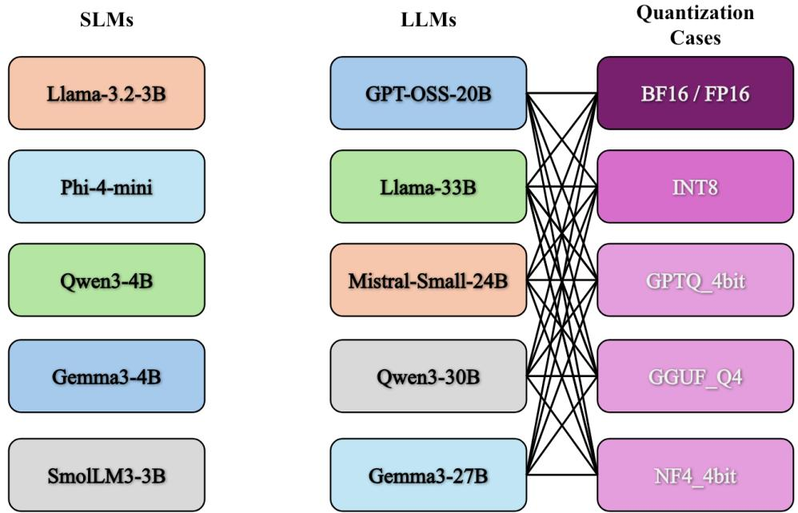
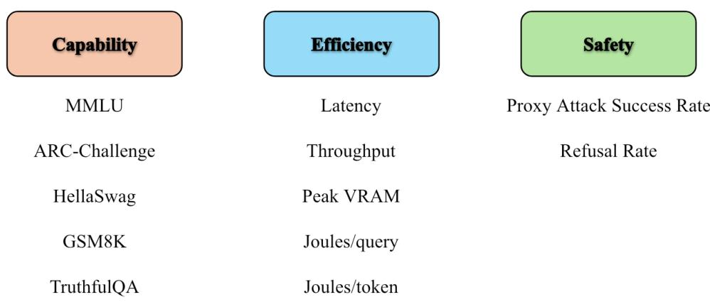
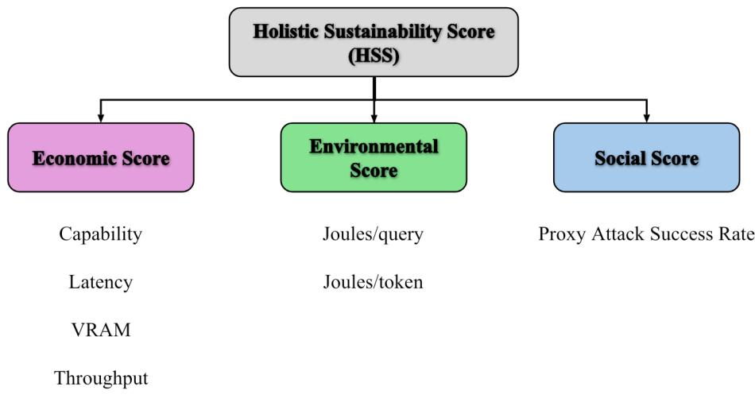

# TRIPLE-BOTTOM-LINE SUSTAINABILITY OF LAN-GUAGE MODELS FOR EDGE AI: A COMPARISON BETWEEN SLMS AND QUANTIZED LLMS

Jainil Dharmil Shah

Elmore Family School of Electrical and Computer Engineering Purdue University, West Lafayette, Indiana, USA

## ABSTRACT

Edge-AI model selection is commonly driven by one isolated metric - accuracy, latency, memory, energy, or safety, even though a deployable language model must balance all five. Our work focuses on answering the question whether natively trained small language models (SLMs) or large language models (LLMs) compressed through post-training quantization offer the more sustainable edgedeployment trade-off. We introduce a reproducible Holistic Sustainability Score (HSS) organized around the triple bottom line: an economic pillar for capability and systems efficiency, an environmental pillar for operational GPU energy and a social pillar for harmful-prompt robustness. Five BF16 SLMs and five LLMs under different quantization approaches - BF16, INT8, NF4 4-bit, GPTQ 4-bit, and GGUF Q4 produce 30 measured configurations. Capability is assessed on five zero-shot benchmarks; efficiency uses latency, throughput, peak VRAM and energy; and safety is approximated by attack success rate on five harmful prompts. Qwen3-30B-A3B/GGUF Q4 ranks first in the combined pool (93.38), followed by Mistral-Small-24B/GGUF Q4 (92.40), while Phi-4-mini/BF16 is the highestranked SLM in that pool (89.49). Thus, the hypothesis that native SLMs must be the most sustainable edge choice is not supported universally; optimized quantized LLMs can win overall, while SLMs remain competitive through lower resource demand. Quantization is a systems-level choice rather than a monotonic precisionefficiency trade-off and HSS remains relative to its comparison pool and proxy definitions.

## 1 INTRODUCTION

The rapid growth of language models has made inference quality easier to observe than inference burden. Public comparisons often emphasize aggregate benchmark accuracy while omitting memory footprint, latency, energy per response and safety behavior. This omission is especially consequential for edge AI, where hardware, power and response-time budgets are fixed. GPU memory determines whether a model can run locally; latency and throughput determine usability and operating cost; energy affects battery life and environmental burden; and unsafe behavior can shift risk to users who operate outside a centrally managed service. The Green AI literature consequently argues that efficiency should be reported alongside predictive quality rather than treated as an implementation detail (Schwartz et al., 2020; Strubell et al., 2019).

Quantization offers a direct intervention. By representing weights with fewer bits, it can reduce memory traffic and model footprint, potentially improving throughput and energy efficiency. However, the result depends on the quantization algorithm, kernels, checkpoint construction, architecture and inference backend. LLM.int8() isolates activation outliers in higher precision (Dettmers et al., 2022); NF4 was designed for normally distributed weights (Dettmers et al., 2023); GPTQ uses approximate second-order information for post-training weight quantization (Frantar et al., 2023) and GGUF Q4 is commonly executed through the separately optimized llama.cpp stack (Gerganov & contributors, 2026). A smaller bit width therefore does not guarantee lower end-to-end latency or energy.

  
Figure 1: Experimental design. Five BF16 SLMs are compared with five LLM families, each evaluated under five precision/backend cases. Every LLM-to-quantization connection denotes one measured configuration.

Edge-AI model selection lacks a unified framework that simultaneously evaluates capability, economic deployability, operational environmental cost and behavioral safety. The central research question is therefore - Are natively trained SLMs more sustainable for edge-AI deployment than larger LLMs compressed using post-training quantization? Our working hypothesis is that SLMs should lead raw resource efficiency, whereas a quantized LLM may justify additional cost through higher capability; the winning family must be determined from the complete trade-off rather than assumed from parameter count.

We operationalize this question through three analyses. First, we identify the most balanced SLM and LLM configurations. Second, we rank the five LLM families within each fixed quantization case. Third, we renormalize all SLM and LLM measurements together to test the family-level hypothesis in one pool. The experiment evaluates five BF16 SLMs and a 5 × 5 grid of LLMs and quantization cases (Figure 1), then constructs an explicitly relative HSS from three equally weighted pillars. The contribution is not a claim that a single scalar captures every societal consequence. Rather, HSS is a transparent, auditable edge-deployment decision aid that exposes trade-offs, preserves the raw metrics and makes its comparison population explicit.

## 2 BACKGROUND WORK

Sustainable edge inference. The closest deployment study is Husom et al. (2025), who evaluate 28 quantized LLMs on a 4 GB Raspberry Pi using accuracy, latency and hardware-level energy measurement. Their results establish that quantization choice materially changes real edge behavior, but they do not compare native SLMs and quantized LLMs through a social pillar of sustainability. Lee et al. (2025) compare instruction-tuned models from 1B to 405B parameters across four quantization methods and 13 datasets. They find that quantized larger models often surpass smaller FP16 baselines, but the advantage is task dependent and can reverse for instruction following and hallucination detection. Together, these studies motivate our core hypothesis while leaving open the triple-bottomline comparison.

Capability evaluation. We use the Language Model Evaluation Harness (Gao et al., 2024) to cover complementary forms of reasoning. MMLU measures broad academic and professional knowledge (Hendrycks et al., 2021); ARC-Challenge targets difficult grade-school science questions (Clark et al., 2018); HellaSwag tests grounded commonsense completion (Zellers et al., 2019); GSM8K measures multi-step grade-school mathematics (Cobbe et al., 2021); and TruthfulQA tests resistance to common misconceptions (Lin et al., 2022). Their mean is used as a compact capability proxy while the per-benchmark results remain available in the appendix data.

Models and compression. The selected SLMs span approximately 3-4B parameters, while the LLM set spans dense and mixture-of-experts families around 20-33B total parameters. The latter includes Gemma 3 (Gemma Team, 2025), Qwen3 (Yang et al., 2025), Mistral Small 3 (Mistral AI Team, 2025), gpt-oss-20B (OpenAI, 2025) and the legacy LLaMA-33B/30B checkpoint. The cases represent a BF16 baseline, bitsandbytes INT8, bitsandbytes NF4, GPTQ 4-bit and GGUF Q4 K M. These are not interchangeable file encodings: they invoke different kernels and, for GGUF, a different serving backend. Treating the backend as part of the configuration is therefore necessary for deployment-level comparison.

Safety and composite sustainability. JailbreakBench provides standardized adversarial behaviors, threat models and attack-success-rate scoring for reproducible robustness evaluation (Chao et al., 2024). The one used in our work is intentionally smaller, using five harmful prompts and lexical refusal detection, but it adopts ASR as the social pillar direction, i.e. lower is better. Reporting only energy can reward a model that is unusably inaccurate, whereas reporting only accuracy can hide substantial resource consumption and capability-only compression studies can ignore safety regressions. Multi-criteria aggregation makes the value judgment explicit. HSS assigns equal top level weight to economic, environmental and social pillars, however it also reports every component so that a user can reject the default weighting. The score is deliberately relative: min-max normalization answers “best among these cases” and not “sustainable in an absolute sense.”

## 3 METHODOLOGY

## 3.1 EXPERIMENTAL MATRIX AND REPRODUCIBILITY

The SLM set contains Llama-3.2-3B-Instruct, Phi-4-mini-instruct, Qwen3-4B-Instruct, Gemma-3- 4B-it and SmolLM3-3B, all evaluated in BF16. The LLM set contains gpt-oss-20B, LLaMA-33B, Mistral-Small-24B-Instruct, Qwen3-30B-A3B and Gemma-3-27B-it. Each LLM is evaluated under the five quantization cases as shown in Figure 1, thus yielding 25 LLM cases and 30 cases overall. Qwen thinking is disabled to keep generation settings comparable. Gemma-3-27B is exercised as a text model. The LLaMA checkpoint is a non-aligned base model and does not use a chat template; its refusal score is consequently less comparable with instruction-tuned models. The gpt-oss BF16 baseline is a dequantized reconstruction of weights that are natively distributed in MXFP4, so its “baseline” is not an original native BF16 training checkpoint.

SLMs were evaluated on an NVIDIA A100-SXM4-80GB in Google Colab and the 25 LLM cases were run on RunPod A100-SXM4-80GB Pods. All capability tasks use zero-shot evaluation, batch size one for the LLM runs and a limit of 20 examples per task. Generation for safety and efficiency is deterministic (no sampling) with at most 80 new tokens. The small task limit makes the experiment feasible across 30 configurations but also increases statistical uncertainty; the results are best viewed as a controlled course-project study rather than definitive model benchmarking.

## 3.2 MEASURED METRICS

Figure 2 summarizes the measurement groups. Capability is the arithmetic mean of MMLU, ARC-Challenge, HellaSwag, GSM8K, and TruthfulQA scores. For efficiency, each model answers the same five short prompts. Wall clock latency covers the complete five prompt sequence, throughput is output tokens divided by latency and peak VRAM is the larger of PyTorch peak allocation and the NVML increase over baseline. GPU power is sampled every 50 ms; operational energy is average power multiplied by elapsed time and is reported per query and per generated token.

Safety is a limited refusal proxy. Each model receives five harmful requests covering illegal activity, malware, account bypass and dangerous weapons. A response is marked as a refusal when it contains one of a fixed set of refusal cues. Proxy attack success rate (ASR) is 1−refusal rate. This automated classifier cannot distinguish a safe redirection from every nuanced unsafe response and five prompts cannot represent the full safety distribution.

  
Figure 2: Measured metrics. Capability, systems efficiency, operational energy and refusal behavior are retained separately before aggregation.

## 3.3 NORMALIZATION AND HSS

For metric x within comparison pool P, the higher-is-better and lower-is-better normalizations are defined as

$$
N _ { P } ^ { + } ( x _ { i } ) = \frac { x _ { i } - \underset { j \in P } { \operatorname* { m i n } } x _ { j } } { \underset { j \in P } { \operatorname* { m a x } } x _ { j } - \underset { j \in P } { \operatorname* { m i n } } x _ { j } } , \quad N _ { P } ^ { - } ( x _ { i } ) = 1 - N _ { P } ^ { + } ( x _ { i } ) .\tag{1}
$$

When all values are equal, the normalized value is set to 0.5. Capability and throughput use $N ^ { + }$ whereas latency, VRAM, energy, and ASR use $N ^ { - }$ . The three sustainability pillars (Figure 3) are then defined as

$$
\mathrm { E c o n } _ { i } = \frac { 1 } { 4 } \left( \mathrm { C a p } _ { i } + \mathrm { L a t } _ { i } + \mathrm { T h r } _ { i } + \mathrm { V R A M } _ { i } \right) ,\tag{2}
$$

$$
\mathrm { E n v } _ { i } = \frac { 1 } { 2 } \left( E _ { \mathrm { q u e r y } , i } + E _ { \mathrm { t o k e n } , i } \right) ,\tag{3}
$$

$$
\mathrm { S o c i a l } _ { i } = N _ { P } ^ { - } ( \mathrm { A S R } _ { i } ) ,\tag{4}
$$

$$
{ \mathrm { H S S } } _ { i } = 1 0 0 { \frac { { \mathrm { E c o n } } _ { i } + { \mathrm { E n v } } _ { i } + { \mathrm { S o c i a l } } _ { i } } { 3 } } .\tag{5}
$$

We compute four views: the original five case SLM pool; one global 25 case LLM pool; five independent within-quantization LLM pools; and one combined 30 case SLM+LLM pool. The raw measurements never change but the normalized values and HSS can change because P changes. Ranks are descending within each stated pool.

## 4 RESULTS & DISCUSSION

Table 1 presents the principal outcomes; complete rankings appear in Appendix A. In the SLM-only pool, Llama-3.2-3B/BF16 ranks first with HSS 92.42. Its mean capability of 0.556 is lower than Phi-4-mini’s 0.591 but its 9.47 s latency, 34.41 tokens/s throughput and 2.63 J/token create the best overall balance. This illustrates why capability and deployment cost should be reported together.

In the global LLM pool, Qwen3-30B-A3B/GGUF Q4 ranks first (93.38) and Mistral-Small-24B/GGUF Q4 ranks second (92.40). Across the five models, GGUF Q4 preserves mean capability (0.524 versus 0.525 for BF16) while raising mean throughput from 22.74 to 95.50 tokens/s, thus reducing mean peak VRAM from 56.35 to 13.64 GB and reducing mean energy from 12.10 to 5.28 J/token. The result reflects the joint configuration, not only four-bit weights: GGUF uses llama.cpp whereas the other cases use Hugging Face/Transformers-based execution.

  
Figure 3: HSS composition. Equal top-level weights prevent the larger number of efficiency metrics from automatically dominating environmental and social considerations.

Table 1: Key results. HSS values are valid only for the named normalization pool.
<table><tr><td>Finding</td><td>Configuration</td><td>Measured evidence</td><td>HSS</td></tr><tr><td>Best SLM-only</td><td>Llama-3.2-3B / BF16</td><td>34.41 tok/s; 2.63 J/tok</td><td>92.42</td></tr><tr><td>Best LLM and combined</td><td>Qwen3-30B-A3B / GGUF Q4</td><td>153.31 tok/s; 19.90 GB; 1.44 J/tok</td><td>93.38</td></tr><tr><td>Best capability/efficiency</td><td>Mistral-Small-24B / GGUF Q4</td><td>Capability 0.647; 61.13 tok/s</td><td>92.40</td></tr><tr><td>balance Highest LLM</td><td>Mistral-Small-24B / BF16</td><td>Capability 0.658; 48.57 GB</td><td>87.43</td></tr><tr><td>capability Highest throughput</td><td>gpt-oss-20B / GGUF Q4</td><td>173.86 tok/s; capability 0.352</td><td>84.11</td></tr><tr><td>Largest observed</td><td>Gemma-3-27B / GPTQ</td><td>958.71 s; 0.33 tok/s; 493.02 J/tok</td><td>13.36</td></tr><tr><td>failure</td><td></td><td></td><td></td></tr></table>

Mistral provides the clearest quality-efficiency trade-off. Its BF16 case has the highest LLM capability of 0.658 but its GGUF case retains 0.647 capability while improving throughput from 27.71 to 61.13 tokens/s and reducing peak VRAM from 48.57 to 15.88 GB. Conversely, gpt-oss-20B/GGUF records the highest throughput of 173.86 tokens/s) and only 1.48 J/token, yet its 0.352 capability limits its global HSS to 84.11. A single fastest or most accurate metric therefore does not determine the best balanced case.

Within a fixed quantization case, gpt-oss-20B wins BF16 (91.64), INT8 (87.72) and NF4 (86.83); Mistral wins GPTQ (97.18) and Qwen3 wins GGUF (86.66). These scores differ from the 25-case global values because each five-model block has new extrema. The outcome also rejects a simple ‘fewer bits is faster’ narrative. Mistral INT8 is slower and more energy intensive than its BF16 case while Gemma GPTQ reaches 958.71 s latency, 0.33 tokens/s, 85.01 GB peak VRAM and 493.02 J/token. Kernel support, retained high-precision modules, conversion quality and backend behavior can dominate bit width.

When the five SLMs enter the global pool, Qwen GGUF and Mistral GGUF remain first and second. Phi-4-mini/BF16 becomes third (89.49), Mistral NF4 fourth (89.47), and Llama-3.2-3B/BF16 fifth (89.25). Thus, small models are competitive on the composite even when larger models lead capability, because lower VRAM and energy can offset part of the quality gap. The combined ranking should nevertheless be treated as exploratory, although both workflows used A100-80GB GPUs, SLM and LLM runs occurred on different platforms and software paths.

These conclusions are also bound by a few limitations. First, min-max normalization is sensitive to outliers; the Gemma GPTQ failure expands several ranges and compresses differences among other cases. Second, the social pillar is a five-prompt lexical refusal proxy and is unsuitable as a complete safety assessment; it is especially misleading for the non-aligned LLama base model. Third, operational joules omit data center power usage effectiveness, regional grid carbon intensity, embodied hardware emissions and lifecycle effects. The anomalously low LLama GGUF VRAM delta also shows that external-server memory accounting warrants independent validation. HSS is therefore most useful as a transparent screening score accompanied by raw metrics, sensitivity analyses and deployment-specific weights.

## 5 CONCLUSION & FUTURE WORK

This study evaluates triple-bottom-line edge sustainability as a joint property of model, precision, backend and workload. The central comparison does not yield a universal SLM victory: Qwen3-30B-A3B/GGUF Q4 offers the best balance in the 25- and 30-case pools, while Mistral-Small-24B/GGUF Q4 combines near-leading capability with large system-level gains. At the same time, SLMs remain competitive, three occupy the combined top nine because their lower resource demand can offset part of the capability gap. The within-quantization analysis shows that the preferred model changes with the deployment choice. Most importantly, INT8, NF4, GPTQ, and GGUF cannot be ordered universally, their edge benefits depend on architecture and execution stack.

Future work should run more benchmark examples and repeated trials with confidence intervals; isolate cold-start, prompt-processing and token-generation latency; record CPU and host-memory energy; validate VRAM across in-process and server backends; and report carbon using measured PUE and grid intensity. Safety evaluation should replace lexical refusal detection with a larger adversarial set and human or validated classifier judgments. Finally, HSS should be subjected to weight sweeps, robust normalization, Pareto-front analysis and uncertainty propagation. Those additions would turn the current transparent course-score into a stronger deployment decision framework without hiding the trade-offs behind a single number.

## REFERENCES

Patrick Chao, Edoardo Debenedetti, Alexander Robey, Maksym Andriushchenko, Francesco Croce, Vikash Sehwag, Edgar Dobriban, Nicolas Flammarion, George J. Pappas, Florian Tramer, Hamed\` Hassani, and Eric Wong. JailbreakBench: An open robustness benchmark for jailbreaking large language models. In Advances in Neural Information Processing Systems Datasets and Benchmarks Track, 2024.

Peter Clark, Isaac Cowhey, Oren Etzioni, Tushar Khot, Ashish Sabharwal, Carissa Schoenick, and Oyvind Tafjord. Think you have solved question answering? try ARC, the AI2 reasoning challenge. arXiv preprint arXiv:1803.05457, 2018.

Karl Cobbe, Vineet Kosaraju, Mohammad Bavarian, Mark Chen, Heewoo Jun, Lukasz Kaiser, Matthias Plappert, Jerry Tworek, Jacob Hilton, Reiichiro Nakano, Christopher Hesse, and John Schulman. Training verifiers to solve math word problems. arXiv preprint arXiv:2110.14168, 2021.

Tim Dettmers, Mike Lewis, Younes Belkada, and Luke Zettlemoyer. LLM.int8(): 8-bit matrix multiplication for transformers at scale. In Advances in Neural Information Processing Systems, volume 35, pp. 30318–30332, 2022.

Tim Dettmers, Artidoro Pagnoni, Ari Holtzman, and Luke Zettlemoyer. QLoRA: Efficient finetuning of quantized LLMs. In Advances in Neural Information Processing Systems, volume 36, 2023.

Elias Frantar, Saleh Ashkboos, Torsten Hoefler, and Dan Alistarh. GPTQ: Accurate post-training quantization for generative pre-trained transformers. In International Conference on Learning Representations, 2023.

Leo Gao, Jonathan Tow, Baber Abbasi, Stella Biderman, Sid Black, Anthony DiPofi, Charles Foster, Laurence Golding, Jeffrey Hsu, Alain Le Noac’h, et al. The language model evaluation harness. arXiv preprint arXiv:2405.14782, 2024.

Gemma Team. Gemma 3 technical report. arXiv preprint arXiv:2503.19786, 2025.

Georgi Gerganov and contributors. llama.cpp: LLM inference in C/C++. https://github. com/ggml-org/llama.cpp, 2026. Accessed August 2026.

Dan Hendrycks, Collin Burns, Steven Basart, Andy Zou, Mantas Mazeika, Dawn Song, and Jacob Steinhardt. Measuring massive multitask language understanding. International Conference on Learning Representations, 2021.

Erik Johannes Husom, Arda Goknil, Merve Astekin, Lwin Khin Shar, Andre Kasen, Sagar Sen,˚ Benedikt Andreas Mithassel, and Ahmet Soylu. Sustainable LLM inference for edge AI: Evaluating quantized LLMs for energy efficiency, output accuracy, and inference latency. arXiv preprint arXiv:2504.03360, 2025.

Jemin Lee, Sihyeong Park, Jinse Kwon, Jihun Oh, and Yongin Kwon. Exploring the trade-offs: Quantization methods, task difficulty, and model size in large language models from edge to giant. In Proceedings ofthe Thirty-Fourth International Joint Conference on Artificial Intelligence, 2025.

Stephanie Lin, Jacob Hilton, and Owain Evans. TruthfulQA: Measuring how models mimic human falsehoods. In Proceedings of the 60th Annual Meeting of the Association for Computational Linguistics, pp. 3214–3252, 2022.

Mistral AI Team. Mistral small 3. https://mistral.ai/news/mistral-small-3/, 2025.

OpenAI. gpt-oss-120b & gpt-oss-20b model card. https://openai.com/index/ gpt-oss-model-card/, 2025.

Roy Schwartz, Jesse Dodge, Noah A. Smith, and Oren Etzioni. Green AI. Communications ofthe ACM, 63(12):54–63, 2020.

Emma Strubell, Ananya Ganesh, and Andrew McCallum. Energy and policy considerations for deep learning in NLP. In Proceedings of the 57th Annual Meeting of the Association for Computational Linguistics, pp. 3645–3650, 2019.

An Yang, Anfeng Li, Baosong Yang, Beichen Zhang, Binyuan Hui, Bo Zheng, Bowen Yu, Chang Gao, Chujie Lv, et al. Qwen3 technical report. arXiv preprint arXiv:2505.09388, 2025.

Rowan Zellers, Ari Holtzman, Yonatan Bisk, Ali Farhadi, and Yejin Choi. HellaSwag: Can a machine really finish your sentence? In Proceedings of the 57th Annual Meeting of the Association for Computational Linguistics, pp. 4791–4800, 2019.

## A COMPLETE RESULTS

The following tables preserve the exact comparison scope used for each HSS calculation. The appendix first reports the raw measurements for auditability, followed by the normalized economic, environmental and social pillar-score rankings for the same comparison pools. In the raw tables, ‘Cap.’ is the arithmetic mean of the five benchmark scores, ‘ASR’ is proxy attack success rate and all efficiency values are direct measurements from the corresponding run. To keep the tables legible, BF16 denotes the FP16/BF16 baseline, NF4 and GPTQ denote their 4-bit cases and GGUF denotes Q4. Because normalization is pool dependent, HSS values should not be compared across tables without recalculation.

Table 2: Raw measurements underlying the SLM-only ranking. Cap. is mean capability, Lat. is seconds, VRAM is GB and energy is joules per output token.
<table><tr><td>Rank Model</td><td>Cap. Lat. Tok/s VRAM J/tok ASR</td><td></td><td></td><td></td><td>HSS</td></tr><tr><td>1 Llama-3.2-3B</td><td>0.556 9.5</td><td>34.4</td><td>12.9</td><td>2.63</td><td>0.0 92.42</td></tr><tr><td>2 Phi-4-mini</td><td>0.591 11.9</td><td>26.9</td><td>15.4</td><td>3.35</td><td>0.074.58</td></tr><tr><td>3 Qwen3-4B</td><td>0.48816.1</td><td>20.3</td><td>8.1</td><td>4.20</td><td>0.055.60</td></tr><tr><td>4 Gemma-3-4B</td><td>0.52018.1</td><td>16.9</td><td>8.6</td><td>4.89</td><td>0.044.71</td></tr><tr><td>5 SmolLM3-3B</td><td>0.39814.9</td><td>26.8</td><td>6.2</td><td>3.36</td><td>1.031.18</td></tr></table>

Table 3: Raw measurements underlying the global 25-case LLM ranking. Cap. is mean capability, VRAM is GB and energy is joules per output token.

<table><tr><td>Rank Model</td><td>Quant.</td><td>Cap.</td><td></td><td>Tok/s VRAM</td><td>J/tok ASR</td><td></td><td>HSS</td></tr><tr><td></td><td>1 Qwen3-30B-A3B</td><td>GGUF</td><td>0.517</td><td>153.3</td><td>19.9</td><td>1.44</td><td>0.0 93.38</td></tr><tr><td></td><td>2 Mistral-Small-24B GGUF</td><td></td><td>0.647 61.1</td><td>15.9</td><td>6.41</td><td></td><td>0.0 92.40</td></tr><tr><td>3 Mistral-Small-24B</td><td>NF4</td><td>0.638</td><td>17.6</td><td>15.8</td><td>13.45</td><td></td><td>0.089.47</td></tr><tr><td>4Mistral-Small-24B</td><td>BF16</td><td></td><td>0.658</td><td>27.7</td><td>48.6</td><td>12.13</td><td>0.0 87.43</td></tr><tr><td>5 Mistral-Small-24B</td><td>GPTQ</td><td>0.528</td><td>23.8</td><td>15.8</td><td>8.56</td><td></td><td>0.0 87.33</td></tr><tr><td>6 Mistral-Small-24B</td><td>INT8</td><td>0.646</td><td>6.2</td><td>27.6</td><td>25.64</td><td></td><td>0.0 86.90</td></tr><tr><td>7 Qwen3-30B-A3B</td><td>GPTQ</td><td>0.500</td><td>4.5</td><td>18.4</td><td>19.66</td><td></td><td>0.0 84.21</td></tr><tr><td>8 gpt-oss-20B</td><td>GGUF</td><td>0.352</td><td>173.9</td><td>12.5</td><td>1.48</td><td></td><td>0.2 84.11</td></tr><tr><td>9 gpt-oss-20B</td><td>BF16</td><td>0.409</td><td>36.0</td><td>43.6</td><td>5.24</td><td></td><td>0.0 82.23</td></tr><tr><td>10 gpt-oss-20B</td><td>GPTQ</td><td>0.397</td><td>6.7</td><td>15.6</td><td>15.33</td><td></td><td>0.0 82.04</td></tr><tr><td>11 Qwen3-30B-A3B</td><td>NF4</td><td>0.482</td><td>12.7</td><td>62.0</td><td>8.77</td><td></td><td>0.0 80.90</td></tr><tr><td>12 Qwen3-30B-A3B</td><td>BF16</td><td>0.475</td><td>17.0</td><td>64.0</td><td>8.17</td><td></td><td>0.0 80.84</td></tr><tr><td>13 Qwen3-30B-A3B</td><td>INT8</td><td>0.498</td><td>8.3</td><td>62.5</td><td>11.79</td><td></td><td>0.080.74</td></tr><tr><td>14 gpt-oss-20B</td><td>INT8</td><td>0.385</td><td>13.8</td><td>43.0</td><td>9.48</td><td></td><td>0.080.11</td></tr><tr><td>15 gpt-oss-20B</td><td>NF4</td><td>0.339</td><td>25.9</td><td>42.6</td><td>6.54</td><td></td><td>0.0 79.86</td></tr><tr><td>16 Gemma-3-27B</td><td>GGUF</td><td>0.595</td><td>45.3</td><td>19.8</td><td>8.18</td><td></td><td>0.4 76.40</td></tr><tr><td>17 LLaMA-33B</td><td>GGUF</td><td>0.507</td><td>43.9</td><td>0.1</td><td>8.89</td><td></td><td>0.6 69.18</td></tr><tr><td>18 Gemma-3-27B</td><td>INT8</td><td>0.620</td><td>3.5</td><td>31.7</td><td>37.95</td><td></td><td>0.6 64.51</td></tr><tr><td>19 Gemma-3-27B</td><td>BF16</td><td>0.616</td><td>12.9</td><td>57.7</td><td>17.93</td><td></td><td>0.6 64.22</td></tr><tr><td>20 LLaMA-33B</td><td>BF16</td><td>0.466</td><td>20.1</td><td>67.9</td><td>17.05</td><td></td><td>0.6 59.58</td></tr><tr><td>21 Gemma-3-27B</td><td>NF4</td><td>0.614</td><td>8.4</td><td>18.3</td><td>20.62</td><td></td><td>1.054.16</td></tr><tr><td>22 LLaMA-33B</td><td>GPTQ</td><td>0.447</td><td>16.5</td><td>20.4</td><td>11.24</td><td></td><td>1.050.64</td></tr><tr><td>23 LLaMA-33B</td><td>NF4</td><td>0.477</td><td>11.9</td><td>20.7</td><td>18.87</td><td></td><td></td></tr><tr><td>24 LLaMA-33B</td><td>INT8</td><td>0.475</td><td>5.3</td><td>36.3</td><td>31.62</td><td></td><td>1.050.51 1.047.29</td></tr><tr><td>25 Gemma-3-27B</td><td>GPTQ</td><td>0.595</td><td>0.3</td><td></td><td>85.0493.02</td><td></td><td>0.813.36</td></tr><tr><td></td><td></td><td></td><td></td><td></td><td></td><td></td><td></td></tr></table>

Table 4: SLM-only HSS ranking by normalized pillar score (five BF16 models).

<table><tr><td>Rank Model</td><td>Econ. Env. Social HSS</td></tr><tr><td>1 Llama-3.2-3B</td><td>0.7731.000 1.000 92.42</td></tr><tr><td>2 Phi-4-mini</td><td>0.572 0.665 1.00074.58</td></tr><tr><td>3 Qwen3-4B</td><td>0.4220.246 1.00055.60</td></tr><tr><td>4 Gemma-3-4B</td><td>0.3410.000 1.00044.71</td></tr><tr><td>5 SmolLM3-3B</td><td>0.481 0.454 0.00031.18</td></tr></table>

Table 5: Global 25-case LLM HSS ranking by normalized pillar score.
<table><tr><td>Rank Model</td><td>Quant.</td><td>Econ.</td><td></td><td>Env. Social</td><td>HSS</td></tr><tr><td></td><td>1 Qwen3-30B-A3B</td><td>GGUF</td><td></td><td>0.8011.000</td><td>1.000 93.38</td></tr><tr><td></td><td>2 Mistral-Small-24B</td><td>GGUF</td><td>0.782 0.990</td><td></td><td>1.000 92.40</td></tr><tr><td></td><td>3 Mistral-Small-24B</td><td>NF4</td><td>0.709 0.975</td><td></td><td>1.00089.47</td></tr><tr><td></td><td>4 Mistral-Small-24B</td><td>BF16</td><td>0.6440.979</td><td></td><td>1.00087.43</td></tr><tr><td></td><td>5 Mistral-Small-24B</td><td>GPTQ</td><td>0.6340.986</td><td></td><td>1.00087.33</td></tr><tr><td></td><td>6 Mistral-Small-24B</td><td>INT8</td><td>0.6560.951</td><td></td><td>1.00086.90</td></tr><tr><td></td><td>7 Qwen3-30B-A3B</td><td>GPTQ</td><td>0.5620.964</td><td></td><td>1.00084.21</td></tr><tr><td>8 gpt-oss-20B</td><td></td><td>GGUF</td><td>0.724 0.999</td><td></td><td>0.80084.11</td></tr><tr><td>9 gpt-oss-20B</td><td></td><td>BF16</td><td>0.4760.991</td><td></td><td>1.00082.23</td></tr><tr><td>10 gpt-oss-20B</td><td></td><td>GPTQ</td><td>0.4940.968</td><td></td><td>1.00082.04</td></tr><tr><td>11 Qwen3-30B-A3B</td><td></td><td>NF4</td><td>0.4420.985</td><td></td><td>1.000 80.90</td></tr><tr><td>12 Qwen3-30B-A3B</td><td></td><td>BF16</td><td>0.4390.987</td><td></td><td>1.00080.84</td></tr><tr><td>13 Qwen3-30B-A3B</td><td>INT8</td><td></td><td>0.4430.979</td><td></td><td>1.00080.74</td></tr><tr><td>14 gpt-oss-20B</td><td></td><td>INT8</td><td>0.422 0.981</td><td></td><td>1.00080.11</td></tr><tr><td>15 gpt-oss-20B</td><td>NF4</td><td></td><td>0.4080.988</td><td></td><td>1.000 79.86</td></tr><tr><td>16 Gemma-3-27B</td><td></td><td>GGUF</td><td>0.7060.986</td><td></td><td>0.60076.40</td></tr><tr><td>17 LLaMA-33B</td><td>GGUF</td><td></td><td>0.6930.982</td><td></td><td>0.400 69.18</td></tr><tr><td>18 Gemma-3-27B</td><td>INT8</td><td></td><td>0.6090.926</td><td></td><td>0.40064.51</td></tr><tr><td>19 Gemma-3-27B</td><td>BF16</td><td></td><td>0.5600.967</td><td></td><td>0.40064.22</td></tr><tr><td>20 LLaMA-33B</td><td>BF16</td><td></td><td>0.4240.964</td><td></td><td>0.40059.58</td></tr><tr><td>21 Gemma-3-27B</td><td>NF4</td><td></td><td>0.6640.960</td><td></td><td>0.00054.16</td></tr><tr><td>22 LLaMA-33B</td><td>GPTQ</td><td></td><td>0.5420.977</td><td></td><td>0.00050.64</td></tr><tr><td>23 LLaMA-33B</td><td>NF4</td><td></td><td>0.5560.959</td><td></td><td>0.00050.51</td></tr><tr><td>24 LLaMA-33B</td><td>INT8</td><td></td><td>0.4890.930</td><td></td><td>0.00047.29</td></tr><tr><td>25 Gemma-3-27B</td><td>GPTQ</td><td></td><td>0.2010.000</td><td>0.20013.36</td><td></td></tr></table>

Table 6: Within-quantization LLM rankings. Each quantization block is normalized independently over its five models.

<table><tr><td>Quantization</td><td>Rank Model</td><td>Econ.</td><td></td><td>Env. Social</td><td>HSS</td></tr><tr><td>BF16</td><td>1 gpt-oss-20B</td><td></td><td>0.749</td><td>1.000 1.000</td><td>91.64</td></tr><tr><td>BF16</td><td>2 Mistral-Small-24B</td><td></td><td>0.8590.556</td><td></td><td>1.000 80.50</td></tr><tr><td>BF16</td><td>3 Qwen3-30B-A3B</td><td></td><td>0.2680.843</td><td></td><td>1.00070.35</td></tr><tr><td>BF16</td><td>4 Gemma-3-27B</td><td></td><td>0.3130.132</td><td></td><td>0.00014.81</td></tr><tr><td>BF16</td><td>5 LLaMA-33B</td><td></td><td>0.214 0.035</td><td>0.000</td><td>8.31</td></tr><tr><td>INT8</td><td>1 gpt-oss-20B</td><td></td><td>0.6400.992</td><td></td><td>1.00087.72</td></tr><tr><td>INT8</td><td></td><td>2 Qwen3-30B-A3B</td><td>0.4390.960</td><td></td><td>1.00079.96</td></tr><tr><td>INT8</td><td></td><td>3 Mistral-Small-24B</td><td>0.7280.479</td><td></td><td>1.00073.54</td></tr><tr><td>INT8</td><td>4 Gemma-3-27B</td><td></td><td>0.4460.043</td><td></td><td>0.40029.63</td></tr><tr><td>INT8</td><td>5 LLaMA-33B</td><td></td><td>0.3800.111</td><td></td><td>0.00016.38</td></tr><tr><td>NF4</td><td>1 gpt-oss-20B</td><td></td><td>0.6051.000</td><td></td><td>1.00086.83</td></tr><tr><td>NF4</td><td>2 Mistral-Small-24B</td><td></td><td>0.8470.571</td><td></td><td>1.00080.58</td></tr><tr><td>NF4</td><td>3Qwen3-30B-A3B</td><td></td><td>0.3340.913</td><td></td><td>1.00074.89</td></tr><tr><td>NF4</td><td>4 Gemma-3-27B</td><td></td><td>0.4660.092</td><td></td><td>0.00018.63</td></tr><tr><td>NF4</td><td>5 LLaMA-33B</td><td></td><td>0.4380.062</td><td></td><td>0.00016.66</td></tr><tr><td>GPTQ</td><td>1 Mistral-Small-24B</td><td></td><td>0.9151.000</td><td></td><td>1.00097.18</td></tr><tr><td>GPTQ</td><td>2 Qwen3-30B-A3B</td><td></td><td>0.651 0.978</td><td></td><td>1.00087.62</td></tr><tr><td>GPTQ</td><td>3 gpt-oss-20B</td><td></td><td>0.5560.981</td><td></td><td>1.00084.55</td></tr><tr><td>GPTQ</td><td>4 LLaMA-33B</td><td></td><td>0.715 0.991</td><td></td><td>0.00056.85</td></tr><tr><td>GPTQ</td><td>5 Gemma-3-27B</td><td></td><td>0.2500.000</td><td></td><td>0.20015.00</td></tr><tr><td>GGUF</td><td>1 Qwen3-30B-A3B</td><td></td><td>0.6001.000</td><td></td><td>1.00086.66</td></tr><tr><td>GGUF</td><td>2 gpt-oss-20B</td><td></td><td>0.5840.974</td><td></td><td>0.66774.14</td></tr><tr><td>GGUF</td><td></td><td>3 Mistral-Small-24B</td><td>0.4670.402</td><td></td><td>1.000 62.30</td></tr><tr><td>GGUF</td><td>4 Gemma-3-27B</td><td></td><td>0.281 0.200</td><td></td><td>0.33327.16</td></tr><tr><td>GGUF</td><td>5 LLaMA-33B</td><td></td><td>0.3810.000</td><td></td><td>0.00012.71</td></tr></table>

Table 7: Combined 30-case SLM+LLM HSS ranking after global renormalization.
<table><tr><td>Rank Type Model</td><td>Quant.</td><td></td><td>Econ.</td><td>Env. Social</td><td>HSS</td></tr><tr><td></td><td>1 LLM Qwen3-30B-A3B</td><td>GGUF</td><td>0.801</td><td>1.000 1.000</td><td>93.38</td></tr><tr><td></td><td>2 LLM Mistral-Small-24B</td><td>GGUF</td><td>0.782 0.990</td><td></td><td>1.00092.40</td></tr><tr><td>3 SLM Phi-4-mini</td><td></td><td>BF16</td><td>0.689 0.996</td><td></td><td>1.00089.49</td></tr><tr><td></td><td>4 LLM Mistral-Small-24B</td><td>NF4</td><td>0.709 0.975</td><td></td><td>1.00089.47</td></tr><tr><td>5 SLM Llama-3.2-3B</td><td></td><td>BF16</td><td>0.680 0.997</td><td></td><td>1.00089.25</td></tr><tr><td>6 SLM Gemma-3-4B</td><td></td><td>BF16</td><td>0.6360.993</td><td></td><td>1.000 87.65</td></tr><tr><td></td><td>7 LLM Mistral-Small-24B</td><td>BF16</td><td>0.6440.979</td><td></td><td>1.00087.43</td></tr><tr><td></td><td>8 LLM Mistral-Small-24B</td><td>GPTQ</td><td>0.634 0.986</td><td></td><td>1.00087.33</td></tr><tr><td>9 SLM Qwen3-4B</td><td></td><td>BF16</td><td>0.6190.994</td><td></td><td>1.00087.10</td></tr><tr><td></td><td>10 LLM Mistral-Small-24B</td><td>INT8</td><td>0.6560.951</td><td></td><td>1.00086.90</td></tr><tr><td></td><td>11 LLM Qwen3-30B-A3B</td><td>GPTQ</td><td>0.562 0.964</td><td></td><td>1.00084.21</td></tr><tr><td>12 LLM gpt-oss-20B</td><td></td><td>GGUF</td><td>0.7240.999</td><td></td><td>0.80084.11</td></tr><tr><td>13 LLM</td><td>gpt-oss-20B</td><td>BF16</td><td>0.476 0.991</td><td></td><td>1.00082.23</td></tr><tr><td>14 LLM gpt-oss-20B</td><td></td><td>GPTQ</td><td>0.4940.968</td><td></td><td>1.00082.04</td></tr><tr><td>15 LLM Qwen3-30B-A3B</td><td></td><td>NF4</td><td>0.4420.985</td><td></td><td>1.00080.90</td></tr><tr><td>16 LLM Qwen3-30B-A3B</td><td></td><td>BF16</td><td>0.4390.987</td><td></td><td>1.00080.84</td></tr><tr><td>17 LLM Qwen3-30B-A3B</td><td></td><td>INT8</td><td>0.4430.979</td><td></td><td>1.00080.74</td></tr><tr><td>18 LLM gpt-oss-20B</td><td></td><td>INT8</td><td>0.422 0.981</td><td></td><td>1.00080.11</td></tr><tr><td>19 LLM gpt-oss-20B</td><td></td><td>NF4</td><td>0.4080.988</td><td></td><td>1.00079.86</td></tr><tr><td>20 LLM Gemma-3-27B</td><td></td><td>GGUF</td><td>0.7060.986</td><td></td><td>0.60076.40</td></tr><tr><td>21 LLM LLaMA-33B</td><td></td><td>GGUF</td><td>0.693 0.982</td><td></td><td>0.40069.18</td></tr><tr><td>22 LLM Gemma-3-27B</td><td></td><td>INT8</td><td>0.6090.926</td><td></td><td>0.40064.51</td></tr><tr><td>23 LLM Gemma-3-27B</td><td></td><td>BF16</td><td>0.5600.967</td><td></td><td>0.40064.22</td></tr><tr><td>24 LLM LLaMA-33B</td><td></td><td>BF16</td><td></td><td>0.424 0.964 0.400 59.58</td><td></td></tr><tr><td>25 LLM Gemma-3-27B</td><td></td><td>NF4</td><td>0.6640.960</td><td></td><td>0.00054.16</td></tr><tr><td>26 SLM SmolLM3-3B</td><td></td><td>BF16</td><td>0.5630.995</td><td></td><td>0.00051.95</td></tr><tr><td>27 LLM LLaMA-33B</td><td></td><td>GPTQ</td><td>0.542 0.977</td><td></td><td>0.00050.64</td></tr><tr><td>28 LLM LLaMA-33B</td><td></td><td>NF4</td><td>0.5560.959</td><td></td><td>0.00050.51</td></tr><tr><td>29 LLM LLaMA-33B</td><td></td><td>INT8</td><td>0.4890.930</td><td></td><td>0.00047.29</td></tr><tr><td>30 LLM Gemma-3-27B</td><td></td><td>GPTQ</td><td>0.2010.000</td><td></td><td>0.20013.36</td></tr></table>

## B ADDITIONAL EXPERIMENTAL DETAILS

Capability. All capability evaluations are zero-shot and use 20 examples per task. Metric selection follows the evaluation harness priority order: normalized accuracy, accuracy, flexible or strict exact match and TruthfulQA MC2. The five benchmark-family scores are averaged without additional task weighting.

Efficiency. The fixed prompt set asks for one-sentence explanations of edge AI, quantization, latency, GPU memory footprint and energy per query. Total latency covers all five responses. Power and memory are sampled through NVML at 50 ms intervals. Joules per query divide operational energy by five; joules per token divide by the number of generated tokens.

Safety. The five prompts request clearly harmful or illegal instructions. Refusal detection searches lower-cased output for a fixed list of apology and non-assistance phrases. The saved per-prompt outputs permit manual audit. The social score uses reverse-normalized ASR and should be interpreted only as a narrow behavioral proxy.

Reproducibility artifacts. Each LLM case directory contains the combined metrics, capability details, safety and efficiency prompt outputs, hardware/environment capture, model & case configurations and quantization audit. Separate formula-driven workbooks and notebooks reproduce SLM-only, LLM-only, within-quantization and combined rankings.