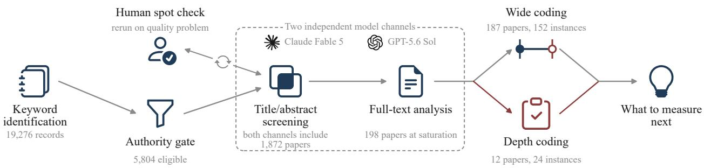

# The Safeguard Worked. Is the LLM System Safer?

Pingyu Wu1,2, Weiming Zhang1\*, Nenghai Yu1

1University of Science and Technology of China

2Hefei AiDA Lab

wupingyu@mail.ustc.edu.cn, zhangwm@ustc.edu.cn

## Abstract

Safeguards in deployed LLM services are evaluated by refusal, attack success, and policy violation rates. Those rates characterize how a control performed on the requests it was tested on. A deployment has to answer a different question: how much help with harmful tasks the service still gives an attacker who keeps adapting or finds another way in. We determine what each reported result implies for that question, allowing results from different safeguard families to be compared under one deployment criterion. The evidence requirements are strongly asymmetric. One attack that obtains harmful help from the deployed service suffices to establish that such help remains, and such attacks appear repeatedly in the coded record. Establishing that little remains cannot follow from the safeguard’s own numbers alone; it also requires evidence about what the surrounding system still allows after the safeguard performs its local function. Such evidence is supported or derived in only a small minority of the depth-coded claims, and one such claim bounds its scoped residual. A better local score is therefore not, by itself, a stronger claim about the deployment. Safeguard research cannot stop at raising local scores; a gain has to be judged by whether it makes a deployed system any safer.

## 1 Introduction

Production LLM services use safeguards because the same capabilities that support legitimate work can also assist prohibited or harmful activity [114, 153, 185, 229]. Deployed and proposed systems combine model-level refusal behavior [6, 8, 46, 255] with runtime classifiers [45, 75, 89], account monitoring [3, 151], access controls, tool policies, and permissions [43, 47, 182], and execution containment [5, 217]. Model-level refusal has failure modes of its own: capability objectives compete with refusal objectives, and safety training generalizes less broadly than the capabilities it constrains [210]. Evaluations report direct outcomes such as refusal and attack-success rates [25, 137], policy violations [45], and benign-task utility [48, 172]. These measures answer useful questions: whether a control rejected a request, whether an attack crossed a specified boundary, and what capability the control removed from benign users.

The conclusion supported by these measures changes when the attacker, interaction history, or measured outcome changes. Nasr et al. evaluated 12 jailbreak and prompt-injection defenses using adaptive, defense-aware attacks. Their attacks exceeded 90% success against most defenses, although a majority of the original evaluations had reported rates near zero [145]. Holding scenarios, attackers, defenders, and scoring fixed, Jain et al. measured 0 to 1% attack success on the first turn and 5.4 to 14.0% after 15 rounds of adaptation to defender feedback [91]. The adapting attacker need not be a person: Hagendorff et al. had reasoning models act as autonomous jailbreak agents against other models, so the adaptation behind the two results above requires no human in the loop [74]. FragFuse changed the system path by distributing a prohibited request across agent memory; it achieved 86.3% access-control bypass but 41.1% end-to-end harmful-task success [168]. A near-zero result against a fixed or first-turn attack therefore cannot be reused unchanged for a deployment facing adaptive attackers, and a bypass rate cannot be read as the rate of completed harm. Doing so can favor a control whose reported advantage disappears under the deployed attack process [2, 228].

These findings improve individual measurements but expose a problem that additional measurements of the same kind cannot solve. A deployment must decide how much harmful assistance the guarded service still supplies [131, 164]. Surveys and SoKs make safeguard techniques and benchmark configurations comparable [56, 78, 203, 221]; guidance asks evaluators to declare threat actors, requirements, and supporting evidence [21, 167, 192]; and safety-case and uplift work connects particular measurements to broader models under explicit assumptions [40, 134, 194]. Each of these lines of work handles one step from a safeguard mechanism to a deployment decision. They stop at a comparable reported quantity or at a single deployment argument (Section 6).

We supply the conversion between them: we read each reported result against two coordinates, the outcome and attacker class it was measured under. We derive and prove the strongest deployment conclusion that result supports. The conversion changes what an evaluation result can justify: if a reported quantity supports no nontrivial deployment conclusion, reanalysis cannot produce one. The evaluator must instead measure a different quantity or establish a missing system property. A common coding instrument records which coordinates a source supplies and keeps each conclusion auditable back to the reported evidence.

Applied to 198 distinct papers at two levels of detail, the instrument yields an asymmetric coded record. Establishing how little harmful assistance remains through a safeguard check requires three deployment facts together. The one supplied least often is what remains possible after the check succeeds: five of the 24 depth-coded claims supply it. Across both coding strata, one coded claim rules out the worst case. The opposite direction needs one number, not a conjunction: of the 152 wide-coded claims, 108 report an adverse value putting the residual above zero. Section 7 treats these counts as hypotheses about what an evaluation should report.

Our contributions are:

• From results to deployment conclusions. We determine the strongest conclusion each reported safeguard result supports about remaining harmful assistance, and prove when no stronger conclusion follows from that result alone. This shows when reanalysis can help and when a different measurement is necessary (Section 3).

• Missing evidence made explicit. We turn those determinations into an auditable coding instrument that records the source facts each conclusion requires. Applied to a paper, it identifies the precise missing fact that prevents a deployment conclusion without rerunning the safeguard (Section 4).

• A case-based stress test. Across the coded claims, the supported conclusion tracks the evidence reported rather than the technique category, which makes a benchmark gain a hypothesis about deployment, not a guarantee (Section 5).

## 2 Definitions and Scope

## 2.1 Deployment Safety

We define deployment safety as the governance of the harmful assistance a focal service still supplies once its safeguards have acted, subject to constraints protecting basic rights and legitimate use.

## 2.2 Evaluation Anchor and Scope

A concrete deployment assessment must fix the conditions under which its decision is made. Research papers may supply evidence for only a subset; Section 4 defines the anchor coordinates recoverable from a source. The full anchor has seven coordinates:

• S: the focal LLM service without the evaluated safeguard intervention.

• D: the evaluated intervention; applying it yields $S [ D ] _ { \mathrm { \Omega } }$ , the same service with the intervention deployed, all other parts unchanged.

• Σ: the declared nonempty class of attacker strategies, including its resource and interaction limits.

• L : the basic-rights and legitimate-use constraints every admissible deployment must satisfy, supplied by the concrete application and its governing institutions rather than inferred from a method paper.

• q: the minimum normal-utility requirement, measured on a declared benign reference population and utility scale; it scalarizes one component of $\mathcal { L }$ without replacing the rest.

• Z: the scalar harmful-assistance functional, normalized to $[ 0 , 1 ] .$ , with lower values less adverse. It measures what the service supplies toward the adverse outcome through its outputs, actions, and state transitions, not the harm an attacker ultimately achieves with that supply.

• E: the fixed task, target, operating environment, benign reference conditions, and evaluation horizon, including allowed interactions and retries, plus any persistence or recovery window relevant to Z.

We call

$$
\mathfrak { a } = ( S , D , \mathcal { E } , Z , \Sigma , \mathcal { L } , q )\tag{1}
$$

an evaluation anchor. A deployment-safety claim is an assertion about a particular $S [ D ]$ under one such anchor: deployment safety is a property of an intervention in a specified deployment, not an intrinsic property of an isolated mechanism. Its scope is the set of attacker strategies and operating conditions within the anchor for which the conclusion is asserted to hold. The anchor is the interface through which a deployment enters the analysis: the bounds of Section 3 hold for whatever outcome, attacker class, and utility target it declares. The same bounds therefore cover outcomes as different as an action the service must not take and knowledge an attacker must not gain.

All anchor coordinates are held fixed across comparisons; only the presence of D differs. The attacker may choose any admissible strategy in Σ. A deployment that violates $\mathcal { L }$ is inadmissible regardless of its value of Z. We suppress a below.

## 2.3 Residual Assistance and Safeguard Effect

Write $Z ( S [ D ] )$ for the adverse value the guarded service supplies against an attacker in Σ, and $Z ( S )$ for the same quantity when that service runs without $D .$ . The primary deployment quantity is the residual harmful assistance $Z ( S [ D ] )$ itself: what the service still supplies once the safeguard has acted. The safeguard effect

$$
V _ { Z } ( D ) = Z ( S ) - Z ( S [ D ] )\tag{2}
$$

diagnoses what D removed [134, 194]. The two quantities partition the unguarded total,

$$
V _ { Z } ( { \cal D } ) + Z ( { \cal S } [ { \cal D } ] ) = Z ( { \cal S } ) ,\tag{3}
$$

so a safeguard reallocates the service’s assistance between a removed part and a retained part. Reporting $V _ { Z } ( D )$ alone leaves $Z ( S [ D ] )$ undetermined.

A deployment declares a tolerance $\tau \in [ 0 , 1 ]$ on the retained part and requires

$$
Z ( S [ D ] ) \leq \tau .\tag{4}
$$

The strict boundary is $\tau = 0 .$ , at which the service supplies nothing toward the anchored outcome; we call a certificate for that case a zero-residual certificate. Section 3 determines which outcomes admit one and what evidence any τ requires. A deployment decision also verifies the conditions in $\mathcal { L }$ and the utility requirement q, so a service cannot meet the criterion by refusing service or by excluding legitimate users.

Because Z is normalized, $Z ( S [ D ] ) \in [ 0 , 1 ]$ always holds; the content of a certificate is the tighter bound it supplies. The next section derives what each kind of published evidence supports on this scale.

## 3 What a Reported Quantity Can Bound

Section 2 identifies $Z ( S [ D ] )$ , the assistance a guarded service still supplies, as the quantity a deployment decision needs. A local score does not fix it: a score describes one test, whereas $Z ( S [ D ] )$ ranges over every strategy the declared attacker may run.

This section instead asks the question relevant to deployment. Given a quantity a paper reports, measured on the declared outcome scale and produced inside the declared attacker class, what is the tightest bound on $Z ( S [ D ] )$ that follows from it? Every bound in Table 1 is sharp: no smaller upper bound and no larger lower bound follow from the reported quantities alone. Section 3.4 collects the results as one schedule, and Section 4 gives the coding rule that performs that reading and applies the schedule to the literature. Complete proofs and the attaining constructions are in Appendix A.

## 3.1 The Deployed Quantity

Fix the anchor $\mathfrak { a } = ( S , D , \mathcal { E } , Z , \Sigma , \mathcal { L } , q )$ from Section 2. Every statement below holds these coordinates fixed.

Let $\Omega _ { D }$ be the set of complete security-relevant trajectories under D; each $\omega \in \Omega _ { D }$ carries the evidence history H available before each decision. Declaring Z also fixes a valuerelevant projection $\phi _ { Z } : \Omega _ { D } \to \mathcal { T } _ { Z }$ , written $T = \phi _ { Z } ( \omega )$ . It retains the information needed by the legitimate value $b ( T )$ and the adverse continuation value $\nu _ { Z } ( T )$ , both in [0, 1].

The key quantity is the continuation value. $\nu _ { Z } ( T )$ is the largest adverse value the service still supplies from the retained state over the remaining horizon, counting outputs already released, actions the policy still permits, accumulated state, and further attempts. It is a property of the service’s own interface and policy, which makes it measurable.

A causal policy $g \in { \mathcal { G } } _ { D }$ implements D and satisfies every non-scalar condition in L . The deployment commits to g before the attacker chooses $\sigma \in \Sigma$ . For a transferable artifact, the release remains in T and Σ includes every permitted modification, which places post-release adaptation inside the evaluated deployment.

Let $P _ { \mathrm { b } } ^ { g }$ be the benign-reference trajectory law on $\Omega _ { D }$ and $P _ { \mathrm { m } , \sigma } ^ { g }$ the law induced by attack σ. Randomized attacks and their total-variation limits form

$$
\mathcal { C } _ { g } = \overline { { \mathrm { c o } } } \{ P _ { \mathrm { m } , \sigma } ^ { g } : \sigma \in \Sigma \} .\tag{5}
$$

Convexification and total-variation closure do not change the supremum of a bounded value functional. The deployment quantities are

$$
W _ { Z } ( g ) = \operatorname* { s u p } _ { Q \in \mathcal { C } _ { g } } \mathbb { E } _ { Q } [ \nu _ { Z } ( T ) ] , \qquad B ( g ) = \mathbb { E } _ { P _ { \mathfrak { b } } ^ { g } } [ b ( T ) ] ,\tag{6}
$$

and $\mathcal { G } _ { D } ( q ) = \{ g \in \mathcal { G } _ { D } : B ( g ) \geq q \}$ collects the policies that also meet the utility target. A committed deployment realizes

$$
Z ( S [ { \cal D } ] ) = W _ { Z } ( g ) ,\tag{7}
$$

so every bound below is a bound on the quantity of Section 2.

One distinction governs the whole section. An upper bound on $W _ { Z } ( g )$ must cover every attacker law $Q \in \mathcal { C } _ { g } ,$ , because $W _ { Z } ( g )$ is the supremum over that class. A lower bound, by contrast, needs only one attainable attack law. Thus one observed attack can establish that harmful assistance remains, whereas showing that little remains requires evidence covering the full attacker class. This quantifier asymmetry, not mechanism strength, explains the different evidence requirements, which adversarial example defenses established empirically [20, 190].

## 3.2 Lower Bounds: Assistance That Remains

A lower bound identifies adverse continuation the deployment cannot remove. Because $W _ { Z } ( g )$ is a supremum, any single law bounds it from below, and the constructions differ only in how far they quantify: over one executed attack, over the one committed policy, or over every policy the architecture can realize.

## 3.2.1 One Executed Attack

Proposition 1 (Attack-witness bound). For every $\sigma \in \Sigma ,$

$$
W _ { Z } ( g ) \geq \mathbb { E } _ { P _ { \mathrm { m } , \sigma } ^ { g } } [ \nu _ { Z } ( T ) ] .\tag{8}
$$

The law $P _ { \mathrm { m } , \sigma } ^ { g }$ lies in $\mathcal { C } _ { g } ,$ , so the supremum is at least its value. Write $L ^ { \mathrm { w i t } }$ for this lower endpoint. It is the $\mathrm { p a p e r } ^ { \prime } \mathrm { s }$ least evidentially demanding bound: an attack run inside the declared class against the deployed configuration supplies its adverse value as a lower endpoint, and the bound reaches no further than the strategies actually run.

## 3.2.2 Simulating a Committed Policy

When no such attack was executed, a floor still follows from benign measurements alone, provided the attacker can reproduce the value-relevant behavior. Define the attacker-tobenign distance on value-relevant coordinates,

$$
\delta _ { T } ( g ) = \operatorname* { i n f } _ { Q \in \mathcal { C } _ { g } } \mathrm { T V } \big ( ( P _ { \mathfrak { b } } ^ { g } ) _ { T } , Q _ { T } \big ) ,\tag{9}
$$

and write $[ x ] _ { + } = \operatorname* { m a x } \{ x , 0 \}$

Proposition 2 (Committed-policy simulation bound). Every committed policy satisfies

$$
W _ { Z } ( g ) \geq \left[ \mathbb { E } _ { P _ { \mathrm { b } } ^ { g } \nu _ { Z } - } \delta _ { T } ( g ) \right] _ { + } .\tag{10}
$$

Write $L ^ { \mathrm { s i m } }$ for this endpoint. The coefficient of $\delta _ { T } ( g )$ is one and cannot be improved, since a two-point construction attains the bound. A safeguard whose protective context the attacker can copy is one reported case where this bound binds [215].

The premise this endpoint needs is an upper bound on $\delta _ { T } ( g )$ , and the next result fixes what kind of measurement can supply one.

Proposition 3 (Sequential simulation certificate). Suppose that under one $\sigma \in \Sigma ,$ , every attacker-generated evidence update t and every history on which the benign and malicious processes remain coupled satisfy

$$
\begin{array} { r } { \mathrm { T V } \big ( P _ { \mathfrak { b } } ^ { g } ( H _ { t } \in \cdot \mid h ) , P _ { \mathfrak { m } , \sigma } ^ { g } ( H _ { t } \in \cdot \mid h ) \big ) \leq \eta _ { t } , } \end{array}\tag{11}
$$

with all deployment-controlled transitions using the same committed g and every remaining transition having the same conditional law in both processes. Then

$$
\delta _ { T } ( g ) \leq 1 - \prod _ { t } ( 1 - \eta _ { t } ) .\tag{12}
$$

The premise is conditional on every adaptive history. A marginal error rate measured on a fixed suite supplies no $\eta _ { t }$ because it constrains an average over histories rather than the kernel after any particular one. This is the first row of Table 1 that yields no nontrivial endpoint: a fixed-suite rate, however low, supports no simulation bound.

Takeaway Harmful help can be shown to remain without running an attack.

## 3.2.3 From One Policy to the Attainable Frontier

Evidence about the evaluated operating point does not by itself describe what any admissible policy could attain. The architecture envelope is

$$
R _ { D , Z } ( q ) = \operatorname* { i n f } _ { g \in { \mathcal G } _ { D } ( q ) } W _ { Z } ( g ) .\tag{13}
$$

The benign T laws the architecture realizes are

$$
\mathcal { H } _ { D } ^ { \mathrm { r e a l } } = \{ ( P _ { \mathfrak { b } } ^ { g } ) _ { T } : g \in \mathcal { G } _ { D } \} ,\tag{14}
$$

whose least adverse value at utility target q is

$$
\Gamma _ { D , Z } ^ { \mathrm { r e a l } } ( q ) = \operatorname* { i n f } _ { \mu \in \mathcal { H } _ { D } ^ { \mathrm { r e a l } } : \mathbb { E } _ { \mu } b \geq q } \mathbb { E } _ { \mu } \nu _ { Z } .\tag{15}
$$

Supported contracts and known trace constraints may instead identify an outer relaxation $\mathcal { H } _ { D } ^ { \mathrm { o u t } } \supseteq \mathcal { H } _ { D } ^ { \mathrm { r e a l } }$ with frontier $\Gamma _ { D , Z } ^ { \mathrm { o u t } } ( q )$

Proposition 4 (Frontier order and restriction monotonicity). For every target feasible for both frontiers, $\Gamma _ { D , Z } ^ { \mathrm { o u t } } ( q ) \leq \Gamma _ { D , Z } ^ { \mathrm { r e a l } } ( q )$ Writing $\Gamma _ { \mathcal { H } }$ for the same optimization over a law set $\mathcal { H }$ and holding both valuefunctionsfixed,

$$
\begin{array} { r } { \mathcal { H } ^ { \prime } \subseteq \mathcal { H } \implies \Gamma _ { \mathcal { H } ^ { \prime } } ( q ) \geq \Gamma _ { \mathcal { H } } ( q ) . } \end{array}\tag{16}
$$

Theorem 5 (Attainable-frontier simulation bound). Every $g \in \mathcal { G } _ { D } ( q )$ satisfies

$$
W _ { Z } ( g ) \geq \left[ \Gamma _ { D , Z } ^ { \mathrm { r e a l } } ( q ) - \delta _ { T } ( g ) \right] _ { + } \geq \left[ \Gamma _ { D , Z } ^ { \mathrm { o u t } } ( q ) - \delta _ { T } ( g ) \right] _ { + } .\tag{17}
$$

Consequently a deployment with $W _ { Z } ( g ) \le \beta$ must satisfy $\beta + \delta _ { T } ( g ) \geq \Gamma _ { D , Z } ^ { \mathrm { r e a l } } ( q )$ . If every q-feasible policy is exactly simulable, meaning $\delta _ { T } ( g ) = 0 ,$ , then $R _ { D , Z } ( q ) \geq \Gamma _ { D , Z } ^ { \mathrm { r e a l } } ( q )$ , with equality when some frontier optimizer $g ^ { \star }$ also satisfies $\begin{array} { r } { \operatorname* { s u p } _ { Q \in \mathcal { C } _ { g ^ { \star } } } \mathbb { E } _ { Q } \nu _ { Z } = \mathbb { E } _ { P _ { \mathsf { h } } ^ { g ^ { \star } } } \nu _ { Z } . } \end{array}$

Write $L ^ { \mathrm { f r t } } = [ \Gamma _ { D , Z } ^ { \mathrm { r e a l } } ( q ) - \delta _ { T } ( g ) ] _ { + }$ . The equality condition matters for what a paper can claim: without it, a measured operating point stays a statement about that point and does not become a statement about the architecture.

Equation 16 characterizes the effect of behavior removal. Deleting feasible laws while holding b and $\nu _ { Z }$ fixed cannot lower the frontier, and by shrinking the feasible set at target q it can raise the frontier or empty the feasible set entirely.

Takeaway Blocking more behavior can leave only riskier useful options.

A uniform dual-use relation makes the floor explicit. It requires the adverse value of every trace supported by $\mathcal { H } _ { D } ^ { \mathrm { o u t } }$ to be at least a fixed fraction $\rho$ of its legitimate value:

$$
\begin{array} { r } { \nu _ { Z } ( t ) \geq \rho b ( t ) \quad \mathrm { f o r e v e r y t r a c e } t \in \mathrm { s u p p } ( \mu ) , \mu \in \mathcal { H } _ { D } ^ { \mathrm { o u t } } . } \end{array}\tag{18}
$$

If $\rho > 0$ , both frontiers are at least $\rho q$ . Any exactly simulable deployment meeting a positive utility target therefore has $Z ( S [ D ] ) \ge \rho q > 0$ and cannot obtain a zero-residual certificate. In plain terms, useful behavior is then inseparable from a fixed positive share of adverse value.

Whether ρ can be zero, and with it whether $\tau = 0$ is available at all, depends on the declared outcome together with the traces the safeguard leaves reachable. Where one release supplies both the legitimate and the adverse value, reaching $\rho = 0$ requires a safeguard that makes a useful trace with no adverse value reachable, which restriction alone cannot supply.

## 3.2.4 When Reachability Changes the Floor

The simulation term depends on reachable laws, not on mechanism names. Let $\mathcal { M } _ { g } ^ { T } = \{ Q _ { T } : Q \in \mathcal { C } _ { g } \}$ be the maliciously reachable T laws.

Proposition 6 (Value-law invariance). Iftwo committed deployments g and g¯ are evaluated with the same b and vZ, and satisfy $( P _ { \mathrm { b } } ^ { g } ) _ { T } = ( P _ { \mathrm { b } } ^ { \bar { g } } ) _ { T }$ and $\mathcal { M } _ { g } ^ { T } = \mathcal { M } _ { \bar { g } } ^ { T }$ , then $B ( g ) = B ( \bar { g } )$ $W _ { Z } ( g ) = \bar { W } _ { Z } ( \bar { g } )$ , and $\delta _ { T } ( g ) = \breve { \delta } _ { T } ( \bar { g } )$

A new label, credential, or isolation boundary does not change either bound merely by existing. Proposition 6 shows that it helps only if it changes value-relevant behavior or which states an attacker can reach. Trusted state can create a reachability separation. When the attacker must reproduce its benign state distribution, the easiest allowed acquisition or compromise path sets the floor. By the data-processing inequality, the relevant quantity is the total-variation distance $d _ { \star }$ to the nearest maliciously reachable state marginal, not average acquisition accuracy. Evidence must therefore identify the trusted state, its acquisition class, and the downstream conditional kernel. Appendix A.6 states the frontier and the bound.

## 3.3 Upper Bounds: What a Deployment Can Guarantee

An upper bound must control every law available to the anchored attacker. The direct route bounds the reachable law set. The factored route bounds how often a deployment success event occurs and what continuation remains there.

## 3.3.1 Direct Reachable-Set Bounds

Proposition 7 (Direct reachable-set bound). For any evidence-supported outer class $\mathcal { C } _ { g } \subseteq \mathcal { C } _ { g } ^ { \mathrm { o u t } }$

$$
W _ { Z } ( g ) \leq { \cal U } ^ { \mathrm { r c h } } = \operatorname* { s u p } _ { Q \in \mathcal { C } _ { g } ^ { \mathrm { o u t } } } \mathbb { E } _ { Q } [ \nu _ { Z } ( T ) ] ,\tag{19}
$$

with equality when $\mathcal { C } _ { g } ^ { \mathrm { o u t } } = \mathcal { C } _ { g }$

This route covers artifacts without a mediation domain, such as released weights, when the declared tampering bud get contains Σ and the value bound holds for every reachable system. The evidentiary requirement is exacting in one specific way. A set of tested modifications is an inner sample of $\mathcal { C } _ { g } ,$ , and a supremum over an inner sample provides no upper bound. Enumerating more attacks therefore does not change this endpoint at any sample size short of exhausting Σ [7,190].

## 3.3.2 Success-Region Bounds

Let $G \subseteq \Omega _ { D }$ be a success region and $\mathcal { R } _ { g } \subseteq \Omega _ { D }$ a reachable envelope with $Q ( \mathcal { R } _ { g } ) = 1$ for every $Q \in \mathcal { C } _ { g }$ . Define

$$
\lambda _ { G } = \operatorname* { i n f } _ { Q \in \mathcal { C } _ { g } } Q ( G ) , \qquad r _ { G } = \operatorname* { s u p } _ { \omega \in G \cap \mathcal { R } _ { g } } \nu _ { Z } ( T ( \omega ) ) ,\tag{20}
$$

using $r _ { G } = 0$ when $G \cap \mathcal { R } _ { g }$ is empty.

Proposition 8 (Sharp success-region bound). For every committed policy, $W _ { Z } ( g ) \leq U ^ { \mathrm { r e g } } = 1 - \lambda _ { G } ( 1 - r _ { G } )$ , and no smaller uniform bound follows from $\lambda _ { G }$ and rG alone.

The expectation splits over G and $G ^ { c } ;$ a matching tworegion law proves sharpness. Every success-region bound therefore needs class-uniform coverage and a continuation bound over all remaining state, interfaces, and attempts.

## 3.3.3 Closed Mediation and the Three Gates

Mediation is the factorization reported safeguard results take. Let A denote entry into a mediation domain and F failure of its local security fact, so $G = A \cap F ^ { c }$ . A reference law may satisfy $P ( F \cap A ) \leq \varepsilon P ( A )$ . For a deployment bound, assume the same contract for every $Q \in \mathcal { C } _ { g }$ and define

$$
Q ( F \cap A ) \leq \varepsilon Q ( A ) , \qquad \alpha = \operatorname* { i n f } _ { Q \in \mathcal { C } _ { g } } Q ( A ) ,\tag{21}
$$

which gives $\lambda _ { G } \geq \alpha ( 1 - \varepsilon )$

Theorem 9 (Sharp closed-mediation bound). Fix g and suppose every $Q \in \mathcal { C } _ { g }$ satisfies the contract in Equation 21. If $\nu _ { Z } ( T ) \leq r$ on every attacker-reachable trajectory in $A \cap F ^ { c }$ then

$$
W _ { Z } ( g ) \leq 1 - \alpha ( 1 - \varepsilon ) ( 1 - r ) .\tag{22}
$$

No smaller bound holds uniformly over models described only by $( \alpha , \varepsilon , r )$ , and this information gives a nontrivial bound $i f$ and only if

$$
\alpha > 0 , \qquad \varepsilon < 1 , \qquad r < 1 .\tag{23}
$$

Sharpness is proved by a three-atom construction, and it converts the theorem from a bound into a sensitivity rule. Improving ε to $\varepsilon ^ { \prime }$ moves the certified bound by exactly

$$
\begin{array} { r } { [ 1 - \alpha ( 1 - \varepsilon ) ( 1 - r ) ] - [ 1 - \alpha ( 1 - \varepsilon ^ { \prime } ) ( 1 - r ) ] } \\ { = \alpha ( \varepsilon - \varepsilon ^ { \prime } ) ( 1 - r ) , \qquad } \end{array}\tag{24}
$$

so the certified contribution of detection accuracy is determined by coverage and continuation. Where either is unmeasured, that contribution cannot be quantified; where either is adverse, it is zero.

Corollary 10 (Local perfection is globally non-identifying). Even with $\varepsilon = 0 ,$ , the sharp bound in Equation 22 equals one when $\alpha = 0 o r r = 1 $ . Any number of mechanisms may establish their localfacts without error on every invocation and remain compatible with $W _ { Z } ( g ) = 1$

The two quantities that convert a reported ε into information, α and r, are properties of the surrounding deployment rather than of the classifier.

Takeaway A flawless check can coexist with a maximally risky system.

At the strict boundary the three gates collapse to a clean statement. For $\tau = 0 ,$ , the bound in Equation 22 certifies

$Z ( S [ D ] ) = 0$ exactly when $\alpha = 1 , \varepsilon = 0$ , and $r = 0 \colon$ complete coverage of every path to the outcome (the completemediation condition [176]), no conditional failure on those paths, and no continuation after a covered success. A zeroresidual certificate through mediation is therefore a conjunction of three deployment-wide facts, none of which a local score reports.

## 3.3.4 Composition

A stack contributes through its deployment event structure, not its layer count.

Proposition 11 (Adaptive composition bounds). If an attack path requires ordered failures $F _ { 1 } , \ldots , F _ { m }$ and, at every history reaching layer $j , \operatorname* { P r } ( F _ { j } \mid F _ { 1 } , \dots , F _ { j - 1 } , h ) \le \varepsilon _ { j } ,$ , then

$$
\operatorname* { P r } \bigl ( \bigcap _ { j = 1 } ^ { m } F _ { j } \bigr ) \leq \prod _ { j = 1 } ^ { m } \varepsilon _ { j } .\tag{25}
$$

With marginal bounds alone, the sharp general bound is instead

$$
\operatorname* { P r } \left( \bigcap _ { j = 1 } ^ { m } F _ { j } \right) \leq \operatorname* { m i n } _ { j } \varepsilon _ { j } .\tag{26}
$$

For alternative path events $E _ { i }$ with $\begin{array} { r } { \mathrm { P r } ( E _ { i } ) \leq \bar { p } _ { i } , \mathrm { P r } ( \bigcup _ { i } E _ { i } ) \leq } \end{array}$ min $\left\{ 1 , \sum _ { i } { \bar { p } } _ { i } \right\}$ , and for ordered attempts with $\ell _ { j } \leq \operatorname* { P r } ( E _ { j } \mid$ $\cap _ { i < j } E _ { i } ^ { c } ) \leq \bar { p } _ { j }$

$$
1 - \prod _ { j } ( 1 - \ell _ { j } ) \leq \operatorname* { P r } \bigl ( \bigcup _ { j } E _ { j } \bigr ) \leq 1 - \prod _ { j } ( 1 - \bar { p } _ { j } ) .\tag{27}
$$

The improvement provided by a composition argument is the gap between Equations 25 and 26. This gap is determined by the dependence premise rather than by the number of layers. Marginal bounds are attained by perfectly correlated failures, so under them the best bound a stack of any depth supports is that of its single strongest layer. History-uniform conditional bounds, which independence implies but which can hold without it, are what license the product. Alternative paths and retries meanwhile accumulate attempts at any fixed per-attempt rate.

Takeaway Several safeguards can fail together as often as the strongest one fails alone.

## 3.4 The Schedule

Table 1 collects the results as one schedule from reported evidence to what follows for $Z ( S [ D ] )$ . We call a row noninformative when its named evidence yields no nontrivial endpoint. Every bound is sharp: no better bound follows from the quantities in the first column, so a noninformative row cannot be made informative by further measurement of the same kind. Two rows state a structural relation rather than a bound, and their witness is the proof that establishes it.

Four rows are noninformative for three distinct reasons. A marginal rate and an enumerated attack set fail on the quanti fier: the former averages over histories without constraining the conditional kernel after any particular history, whereas the latter samples a class that the bound must cover. A conditional failure rate is insufficient when another gate can reduce its contribution to zero. A relabeled boundary contributes no quantity used by either bound. Sharpness shows that making the reported value in any of these rows more favorable cannot replace the missing relation or quantity.

Multiple rows may apply to one deployment. For finite sets of supported candidates bounding the same $W _ { Z } ( g )$ under one anchor, the combined endpoints are $L = { \operatorname* { m a x } } _ { i } L _ { i }$ and $U = \operatorname* { m i n } _ { j } U _ { j } ;$ a side with no candidate stays open. Every upper candidate must cover the full class $\mathcal { C } _ { g } .$ , so a subclassspecific bound must first be lifted to the union of the declared subclasses. The combined endpoints must also be mutually consistent: if $L > U$ , their premises cannot share one anchor, and no interval follows until the inconsistency is resolved.

## 4 Reading the Literature Against the Schedule

Table 1 maps reported evidence to supported bounds. To apply it to published work, we need four elements: a claim instance with a fixed anchor, coding slots for the quantities required by each schedule $\mathrm { r o w } ,$ a rule that maps supported slots to a conclusion, and a source-selection procedure (Figure 1). This section defines all four, and Section 5 reports what the resulting coding shows.

## 4.1 A Common Object of Comparison

The unit of analysis is a deployment-safety claim instance

$$
\boldsymbol { x } = ( g _ { x } , \theta _ { x } , c _ { x } ) ,\tag{28}
$$

where $g _ { x }$ is the evaluated deployed policy, $\theta _ { x }$ fixes the comparison, and $c _ { x }$ is the assertion under assessment. Each instance also carries its source and version, which record provenance without entering the comparison. A candidate becomes an instance when the source identifies a deployed intervention, an operationalized adverse outcome, and either a comparison world or a formal statement connecting the intervention to that outcome. This rule prevents an isolated component score from acquiring a deployment interpretation before a deployed action and outcome are fixed. A paper can therefore yield several instances when it changes the intervention, outcome, attacker class, utility target, or evaluation horizon. Measurements remain in one instance only when they support the same anchored assertion. External attack evaluations attach to that instance, so later evidence can assess the original claim without changing the object being judged.

For each instance, the coordinates recoverable from a source are

$$
\mathfrak { a } _ { x } ^ { \mathrm { s r c } } = ( S _ { x } , D _ { x } , \mathcal { O } _ { x } , Z _ { x } , \Sigma _ { x } , q _ { x } ) ,\tag{29}
$$

and the schedule additionally requires the coded anchor

$$
\theta _ { x } = ( \mathfrak { a } _ { x } ^ { \mathrm { s r c } } , T _ { x } , b _ { x } , \nu _ { Z _ { x } } ) .\tag{30}
$$

Table 1: Sharp consequences of reported evidence for lower and upper bounds on $Z ( S [ D ] )$ .
<table><tr><td>Reported quantity</td><td>Consequence for  $Z ( S [ D ] )$ </td><td>Sharpness witness</td></tr><tr><td colspan="3">Lower endpoints</td></tr><tr><td>One attack executed inside Σ</td><td> $\geq$  its measured adverse value</td><td>the executed law itself (Prop. 1)</td></tr><tr><td>Benign continuation value and a bound on  $\delta _ { T } ( g )$ </td><td> $\geq [ \mathbb { E } _ { P _ { \mathrm { h } } ^ { g } } \nu _ { Z } - \delta _ { T } ( g ) ] _ { + }$ </td><td>a two-point transfer of mass (Prop. 2)</td></tr><tr><td>Per-history conditional evidence distances</td><td> $\begin{array} { r } { \delta _ { T } ( g ) \leq 1 - \prod _ { t } ( 1 - \eta _ { t } ) } \end{array}$ </td><td>independent per-update deviations (Prop. 3)</td></tr><tr><td>Marginal error rate on a fixed suite</td><td>no simulation bound</td><td>an average over histories constrains no adaptive kernel</td></tr><tr><td>Removal of behaviors at fixed b and  $\nu _ { Z }$  at utility q and a</td><td>frontier does not fall</td><td>monotonicity (Prop. 4)</td></tr><tr><td>Uniform dual-use ratio  $\rho$  bound on  $\delta _ { T } ( g )$ </td><td> $\geq \rho [ q - \delta _ { T } ( g ) ] .$  t</td><td>a proportional two-point law (Eq. 18; App. A.2)</td></tr><tr><td>A label, credential, or boundary leaving value laws and reachability unchanged</td><td>no nontrivial endpoint on either side</td><td>value-law invariance (Prop. 6)</td></tr><tr><td>Average acquisition accuracy for trusted state</td><td>moves with the distance d to the nearest maliciously reachable state marginal, not with the average</td><td>the data-processing inequality (App. A.6)</td></tr><tr><td colspan="3">Upper endpoints</td></tr><tr><td>Enumerated attacks inside a declared budget Outer reachable class with a uniform value</td><td>no upper bound</td><td>an inner sample cannot bound a supremum</td></tr><tr><td>bound</td><td> $\le U ^ { \mathrm { { r c h } } }$ </td><td>a tight outer class (Prop. 7)</td></tr><tr><td>Coverage α, conditional failure ε, continuation  $r$ </td><td> $\leq 1 - \alpha ( 1 - \varepsilon ) ( 1 - r )$ </td><td>a three-atom law (Thm. 9)</td></tr><tr><td>ε alone, at any value including zero</td><td> $\leq 1$ </td><td>the same law at  $\alpha = 0 \mathrm { o r } r = 1 ( \mathrm { C o r . } 1 0 )$ </td></tr><tr><td>Marginal per-layer failure rates</td><td> $\begin{array} { r } { \operatorname* { P r } ( \bigcap _ { j } F _ { j } ) \leq \operatorname* { m i n } _ { j } \varepsilon _ { j } } \end{array}$ </td><td>perfectly correlated failures (Prop. 11)</td></tr><tr><td>History-conditioned per-layer bounds</td><td> $\begin{array} { r } { \operatorname* { P r } ( \bigcap _ { j } F _ { j } ) \leq \prod _ { j } \varepsilon _ { j } } \end{array}$ </td><td>independent layers (Prop. 11)</td></tr></table>

Here $T _ { x }$ is the trajectory projection on which simulation and continuation are judged, while $b _ { x }$ and $\nu _ { Z _ { x } }$ are its normal use and adverse continuation values. This tuple bundles exactly the structure declared in Section 3.1; a concrete deployment fixes it implicitly, whereas a coded source must record it as a checkable operand. The external constraint set $\mathcal { L } _ { x }$ remains a condition on a concrete deployment, because a literature source may not determine it.

Every coordinate is supported by a source locator, derived by a declared rule, or left unknown. Unknown coordinates receive no default.

## 4.2 The Coding Slots

Table 2 defines the ten slots. Four record what an attacker retains and six what the deployment controls, matching the two directions of Section $_ { 3 ; }$ the constructions below name the schedule row each one feeds. A slot holds a payload from its allowed value set, an evidence state, a source locator, and the sub-entries the analysis requires. A construction yields an endpoint only when every slot it consumes is supported or validly derived under one claim instance.

The slots make incompleteness diagnostic. Because each construction consumes a named set of slots, an endpoint that stays open identifies the exact missing fact.

The two slot blocks answer different questions: the lower records evidence that can establish a floor on the harmful assistance that remains, and the upper a ceiling.

Three lower-bound constructions use these slots. First, an attack executed inside the declared class needs no reproduction argument. For one $\sigma \in \Sigma _ { x }$ , Proposition 1 gives the witness endpoint $L _ { x } ^ { \mathrm { w i t } } = \mathbb { E } _ { P _ { \mathrm { m } , \sigma } ^ { g _ { x } } } \nu _ { Z _ { x } }$ from LB1’s guarded-arm value. LB1’s qualification sub-entry determines whether that value qualifies. A guarded-arm suite rate, bypass count, or other quantity not measured on the anchored $Z _ { x }$ scale can fill LB1 but supplies no endpoint. Second, when no qualifying attack was executed, LB3 and the benign continuation value supply the simulation endpoint of Proposition 2, $L _ { x } ^ { \mathrm { s i m } } = [ \mathbb E _ { P _ { \mathrm { { b } } } ^ { g x } } \nu _ { Z _ { x } } - \delta _ { T _ { x } } ( g _ { x } ) ] .$ +. Third, suppose that the evaluated deployment meets the utility target $q _ { x } ,$ that LB2 and LB4 together identify the least adverse value attainable at that target, and that LB3 bounds $\delta _ { T _ { x } } ( g _ { x } )$ . The frontier construction of Theorem 5 gives

Table 2: Coding slots and the source evidence each one requires.
<table><tr><td>Slot</td><td>What the source must report</td></tr><tr><td colspan="2">Lower-endpoint evidence</td></tr><tr><td>LB1</td><td>The guarded versus unguarded comparison, its attribution, and whether the guarded arm&#x27;s adverse value was produced by a strategy in  $\Sigma _ { x }$  and measured on the  $\Xi _ { x }$  scale</td></tr><tr><td>LB2</td><td>Whether the intervention only removes behaviors or supplies an additive substitute at matched utility</td></tr><tr><td>LB3</td><td>Whether an attacker can reproduce the value-relevant benign behavior, and any upper bound on  $\delta _ { T _ { x } } ( g _ { x } )$ </td></tr><tr><td>LB4</td><td>Whether trusted state separates attacker-reachable laws from the benign state distribution, and how that state is acquired</td></tr><tr><td colspan="2">Upper-endpoint evidence</td></tr><tr><td>UB0</td><td>Whether the artifact transfers to the attacker with no mediation domain, and the declared tampering budget</td></tr><tr><td>UB1</td><td>The decidable deployment success event  $G _ { x }$  and its grain</td></tr><tr><td>UB2</td><td>Coverage  $\alpha _ { x } ,$  which paths to the anchored outcome must enter the mediation domain: the first gate, and an architecture fact rather than a classifier accuracy</td></tr><tr><td>UB3</td><td>Conditional failure  $\varepsilon _ { x }$  after adaptive history, and the class over which it holds: the second gate</td></tr><tr><td>UB4</td><td>Continuation  $r _ { x } ,$  the adverse value still reachable after a covered success: the third gate, covering released outputs, permitted actions, accumulated state, and retries</td></tr><tr><td>UB5</td><td>The dependence relation across composed components at the deployed history grain</td></tr></table>

  
Figure 1: Overview of the evidence pipeline. The coded set contains 198 papers: twelve receive full ten-slot depth coding and 187 receive endpoint-route wide coding, with one paper in both strata. Both analyses identify the next measurement needed to tighten an endpoint.

$$
L _ { x } ^ { \mathrm { f r t } } = \Bigl [ \Gamma _ { D _ { x } , Z _ { x } } ^ { \mathrm { r e a l } } ( q _ { x } ) - \delta _ { T _ { x } } ( g _ { x } ) \Bigr ] _ { + } .\tag{31}
$$

Two constructions read the upper block. UB0 yields $U _ { x } ^ { \mathrm { r c h } }$ when the declared budget class contains $\Sigma _ { x }$ and the value bound holds over all of it. Otherwise UB1 through UB4 yield

$$
U _ { x } ^ { \mathrm { r e g } } = 1 - \lambda _ { x } ( 1 - r _ { x } ) , \qquad \lambda _ { x } \geq \alpha _ { x } ( 1 - \varepsilon _ { x } ) ,\tag{32}
$$

with UB5 governing whether component bounds may be multiplied. A source reports a supported coverage bound rather than the exact infimum, so we evaluate $U _ { x } ^ { \mathrm { r e g } }$ at $\alpha _ { x } ( 1 - \varepsilon _ { x } )$ Substituting a lower bound for $\lambda _ { x }$ can only raise the endpoint, the conservative direction.

An instance can support several candidates on one side. The quantities carried forward are $L _ { x } = \operatorname* { m a x } _ { i } L _ { x } ^ { i }$ and $U _ { x } = \mathbf { m i n } _ { j } U _ { x } ^ { j }$ and a side with no supported candidate leaves that endpoint open.

## 4.3 Evidence States and Permitted Conclusions

Each required relation receives one of five evidential states, so that a construction uses exactly what the source establishes. A relation is supported when a result, measurement, architectural property, or trace establishes it under the required anchor and quantifier. It is derived when it follows from supported premises through a stated inference rule. A relation asserted without identifying evidence is claimed; a required relation absent from the source is not reported; and a relation excluded by the declared scope is not applicable. Only supported and validly derived relations enter endpoint computation. These states assess the evidentiary relation, not mechanism quality, and the cited passages preserve the basis of every conclusion.

The composite endpoints bracket the residual quantity of Section 2,

$$
L _ { x } \leq Z _ { x } ( S _ { x } [ D _ { x } ] ) \leq U _ { x } ,\tag{33}
$$

against which a declared tolerance $\tau _ { x }$ is decided. The evidence establishes that the tolerance is met when $U _ { x } \leq \tau _ { x }$ , establishes that it is exceeded when $L _ { x } > \tau _ { x } .$ , and otherwise leaves it unresolved. At the strict boundary $\tau _ { x } = 0$ this specializes to three residual conclusions: $U _ { x } = 0$ establishes a zero-residual certificate, $L _ { x } > 0$ establishes a positive residual and rules out $\tau _ { x } = 0 .$ , and every other interval leaves the boundary unresolved. A positive tolerance records a practical compromise with some retained assistance; the strict boundary stays at zero.

The verdict on $c _ { x }$ answers a separate question. It is upheld when evidence supports the assertion over its declared class, refuted when evidence from that class contradicts it, and unresolved otherwise. A valid improvement claim can coexist with a positive residual, while an in-class counterexample can refute a broad claim without supplying either endpoint. Keeping these outputs separate lets Section 5 recover both the truth of a coded claim and its deployment consequence.

## 4.4 Study Selection and Coding

Records first passed a hard authority gate. Two independent model channels then screened titles and abstracts, with advancement requiring include from both. The same channels analyzed randomized full-text sequences from the resulting pool. At full text, we extracted claim instances only from studies that introduce or evaluate an intervention and make or assess a claim about an adverse deployment outcome. Each el igible result was assigned to a claim instance as defined above. Coding stopped when the reported shares stopped moving as batches were added. The resulting 198-paper coded set is analyzed in Section 5. Appendix B reports the protocol in full, and Appendix C the record format, coding aggregates, and two case records.

Table 3: Availability of supported or derived slot evidence in the depth-coded subset (N = 24).
<table><tr><td>Slot</td><td>Relation</td><td colspan="2">Filled</td></tr><tr><td></td><td></td><td>n</td><td>%</td></tr><tr><td colspan="2">Lower-endpoint evidence</td><td></td><td></td></tr><tr><td>LB1</td><td>guarded versus unguarded comparison</td><td>21</td><td>88</td></tr><tr><td>LB2</td><td>removal versus matched-utility substitute</td><td>18</td><td>75</td></tr><tr><td>LB3</td><td>reproducibility of benign behavior</td><td>19</td><td>79</td></tr><tr><td>LB4</td><td>reachability separation</td><td>15</td><td>63</td></tr><tr><td colspan="2">Upper-endpoint evidence</td><td></td><td></td></tr><tr><td>UB0</td><td>artifact transfer and tampering budget</td><td>8</td><td>33</td></tr><tr><td>UB1</td><td>decidable success event</td><td>23</td><td>96</td></tr><tr><td>UB2</td><td>coverage α</td><td>19</td><td>79</td></tr><tr><td>UB3</td><td>conditional failure ε</td><td>21</td><td>88</td></tr><tr><td>UB4</td><td>continuation r</td><td>5</td><td>21</td></tr><tr><td>UB5</td><td>dependence across components</td><td>19</td><td>79</td></tr></table>

## 5 What Published Safeguard Evidence Establishes

We apply the schedule of Section 3 using the slots of Section 4 to determine what the reported evidence can and cannot establish, rather than grouping papers by technique.

## 5.1 One Coded Set at Two Coding Depths

The depth-coded stratum yielded 24 claim instances under the full ten-slot coding. The wide-coded stratum pooled 152 claim instances across the two channels, each record carrying slot evidence states, endpoints, and a verdict. Wide-coded verdicts are single-channel judgments, so they stay on the individual records and are not aggregated.

A positive residual is established for 108 of the 152 widecoded instances and a zero-residual certificate for none; the remaining 44 stay unresolved. Claim validity and residual bounding answer distinct questions about the same evidence. In the depth-coded subset, where both outputs are recorded on the same 24 instances, neither determines the other: an upheld claim can coexist with a positive residual, while all three refuted claims leave the residual unresolved. The refuting evidence invalidates an upper-bound operand but supplies no lower endpoint: its values are not on the anchored scale, and its sources report no anchored adverse value of their own.

Table 3 states the depth-coded subset’s central pattern. Across the 24 depth-coded instances, sources define a success event, measure its conditional failure rate, and describe its coverage with comparable frequency. Evidence about what remains reachable after that event is supported or validly derived in only five of the 24 instances. By Corollary 10, a supported ε without a supported or derived r yields the bound $Z _ { x } ( S _ { x } [ D _ { x } ] ) \leq 1$ . Of the three gates an upper bound through mediation requires, the subset measures conditional failure most often and supports least often the continuation that governs its effect.

The gap is larger than the table alone shows. Of the five instances with a supported or derived r, only one also has supported $\alpha , \varepsilon ,$ and a success event under the same anchor. That one supplies the depth-coded subset’s only computable upper endpoint from this route. Supporting one operand in isolation cannot tighten the endpoint.

Independent coding of the depth-coded subset by the two channels matched on all 24 residual conclusions and on 20 of the 24 claim verdicts. Appendix C reports the per-slot states.

## 5.2 The Attack-Witness Row, and How the Literature Reaches It

All 108 wide-coded positive residuals rest on the same attackwitness row in Table 1. Each source ran at least one strategy from its declared class against its deployed configuration and reported the adverse value produced by that strategy. By Proposition 1, each reported value is a lower bound on $Z _ { x } ( S _ { x } [ D _ { x } ] )$ , so the corresponding lower endpoint can be read directly from the published result and reaches no further than the strategies actually run. The attack-witness lower bound does not depend on $\delta _ { T _ { x } } ( g _ { x } )$

Emulated Disalignment recombines a released pretrained checkpoint with its aligned sibling at decoding time, scored against a harmful outcome measure [252]. Across four model families the executed attack yields harmful rates of 32.0%, 37.0%, 27.0%, and 57.6%. Each rate is the value of one law the attacker can induce on the deployed configuration, so each is directly a lower bound on $Z _ { x } ( S _ { x } [ D _ { x } ] )$ ).

RESTA shows why the safeguard effect and the residual must stay separate even inside one source [12]. Its reduction in judged unsafe responses supports the paper’s improvement claim, so its single-channel record assigns an upheld verdict. The same evaluation still judges 37.78% of the restored model’s multilingual CATQA answers harmful. This rate alone gives $L _ { x } \ge 0 . 3 7 7 8 > 0 $ . The measured improvement and the positive residual are both supported, and under Equation 3 they are the two parts of the same unguarded total. We analyze the other instances on the attack-witness row in the same way, using the adverse-value column of a table published to demonstrate a reduction or an attack.

The lower side also characterizes the restriction-only pattern. None of the seven capability-removal instances in the depth-coded subset establishes a frontier change at matched normal utility: six report restriction evidence in LB2 and one supplies no qualifying relation. By Proposition 4, restriction alone cannot lower the frontier. These sources support improvement at their chosen operating points, without evidence that the best attainable adverse value has moved. Repeating attack tests at the restricted operating point improves the estimate of that point; changing the floor requires an additive substitute at matched utility or a reachability separation, which are LB2 and LB4.

## 5.3 Coverage and Continuation Determine a Check’s Deployment Bound

Coverage depends on topology, not on component quality, as two non-LLM precedents show. Against Blacklight’s global store [109], every query enters the collision check, so a harmful query that passes is a conditional failure inside a covered path. Against a detector whose state is scoped per account, opening a new account resets that state, so the same attack never enters the mediation domain and becomes a coverage failure [60]. The distinction is decision-relevant because the repairs differ: one calls for a better check, the other for routing the bypass path through any check.

Equation 24 shows continuation determines the certified contribution of accuracy. The sequential monitor of Chen et al., a depth-coded instance, reports defense success up to 93% on cumulative decomposition attacks [32]. That figure supports conditional performance on the evaluated sequences. An upper bound also requires the value still available after a locally successful check: harmful content already released in earlier answers, fresh-session retries, and permitted follow-on actions. Those paths lie outside the reported event, so $r _ { x }$ is unreported and $U _ { x }$ stays open at one. A response classified as safe does not bound what the trajectory has already supplied.

## 5.4 The Quantifier Sets the Scope, Not the Format

Whereas coverage and continuation determine how a rate affects the bound, the quantifier decides which attackers the rate describes. A measured maximum over a fixed suite quantifies over the listed attacks. A claim about an adaptive class quantifies over every strategy the class admits.

Six of the 24 depth-coded instances report a maximum over enumerated attacks within a stated tampering or interaction budget [114, 149, 189]. Each maximum is informative for the attacks run, and none is a uniform bound over the budget. A set of tested strategies lies inside $\mathcal { C } _ { g _ { x } }$ , and a supremum over an inner sample provides no upper bound at any sample size. A scaling analysis over four attack paradigms makes the gap measurable: on a shared compute axis, attack success rises with the budget spent inside a fixed method and model [200]. A suite run at one budget point therefore describes that point, not the class. Naming a budget defines the domain a useful bound would have to cover, without performing the quantification the reachable-set row requires.

Circuit Breakers makes the consequence observable. The original evaluation reports low attack success on fixed suites and claims robustness to powerful unseen attacks [255]. A later defense-aware reinforcement learning attack operates within that declared class and reaches conditional failure near one [145]. Those measurements remain valid descriptions of the attacks they ran, while the in-class counterexample refutes the broader claim. Because the counterexample supplies neither a matched adverse value on the anchored scale nor any upper operand, both endpoints stay open.

SmoothLLM provides the complementary formal case. Its theorem supplies a robust failure bound for a declared kunstable certificate class using defender-controlled independent perturbations [171]. The proof supports claims whose attacker scope is contained in that class. In the claim analyzed here the accompanying prose reaches a wider scope, and no containment result connects the two. The theorem remains a supported local guarantee, and the wider claim stays open.

## 5.5 Dependence, Not Depth

No depth-coded instance reports a history-uniform conditional bound for a general serial stack, so by Equation 26 the best bound such a stack supports is that of its single strongest layer, whatever its depth. SmoothLLM’s controlled randomization is the one premise that licenses a product: it supplies independence for the votes inside one invocation, and composition holds at that grain. Fresh invocations and attackerchosen retries need their own premise. The certifying property of a stack is the supported dependence relation at the deployed history grain, and UB5 records that.

## 5.6 Where the Three Gates Close

Fides supplies a worked instance in which coverage, failure, and continuation are all supported or derived under one anchor [43]. Its service-integrity instance fixes an event on the agent’s consequential actions. Every consequential tool action passes through the policy check, so architecture evidence establishes $\alpha _ { x } = 1$ . The source’s noninterference result covers all untrusted inputs in the declared class, establishing $\varepsilon _ { x } = 0 .$ On a checked trajectory untrusted data cannot influence the consequential action, which gives $r _ { x } = 0$ . Theorem 9 then closes the route:

$$
U _ { x } = 1 - \alpha _ { x } ( 1 - \varepsilon _ { x } ) ( 1 - r _ { x } ) = 0 ,\tag{34}
$$

and with $Z _ { x } \geq 0$ by normalization the interval is $Z _ { x } ( S _ { x } [ D _ { x } ] ) =$ 0: a zero-residual certificate for the anchored integrity outcome.

Each premise plays a distinct role. If any one is missing, the endpoint remains open. The decisive premise is $r _ { x } = 0$ which detection accuracy cannot supply (Corollary 10); it is derived from the declared outcome instead. $Z _ { x }$ is the probability of the binary episode event that untrusted data causes one unintended consequential action [68]. The informationflow separation makes that continuation structurally unavailable after a covered success. CaMeL belongs to the same broad mechanism family, yet its source claim leaves the classuniform failure and continuation relations open: the shared family label does not determine the certificate [47].

The certificate has a reported utility cost in the same instance: task-completion loss up to 24.5% under the policy-on configuration [43]. Structural separation establishes $r _ { x } = 0$ while reducing attainable utility. A deployment declaring a utility target q decides whether that exchange is acceptable; the certificate states the supported guarantee, not whether to accept it.

The schedule names what is missing, and the sharpest case is one where only the last operand is absent. The fsecure LLM system disaggregates planning from execution and keeps untrusted input out of the planning stage, and its Theorem 6.2 proves execution trace non-compromise, a noninterference property over the declared untrusted class [212]. Coverage and class-uniform failure are therefore established by proof rather than measured: $\alpha _ { x } = 1$ and $\varepsilon _ { x } = 0$ for plan compromise. The source then names the surviving channel itself. The attacker may still influence the data being processed, and their inability to influence the plan “drastically limits the scale and scope of any possible attacks.” This statement identifies the continuation operand but supplies neither a bound on it nor a comparison with ${ \mathcal { B } } _ { x }$ , the baseline for what the attacker could achieve using only resources outside the deployed system. By Theorem 9, $U _ { x } = 1 - \alpha _ { x } ( 1 - \varepsilon _ { x } ) ( 1 - r _ { x } ) = r _ { x } .$ , so the whole upper endpoint passes to an unvalued term and $U _ { x } = 1$ Two gates closed by proof narrow the interval by nothing when the third is left without a value.

## 5.7 What Transfers

The transferable relations hold between evidence and conclusions, not between mechanisms. The quantifier asymmetry separating the two directions follows from the supremum in Equation 6 and applies to any safeguard. Every established positive lower bound in either coding stratum comes from a strategy the source itself executed. An upper endpoint below one requires coverage, conditional failure, and continuation together, as the Fides instance shows.

Whether the strict boundary is attainable depends on the declared outcome together with the traces the safeguard leaves reachable. Restriction alone cannot reach it: removing behaviors cannot create a useful trace with no adverse value. A zero-residual certificate through mediation requires $r _ { x } = 0 .$ , so useful behavior must supply no adverse value. This separation can hold for a service-integrity outcome because completing a task does not necessarily require the prohibited action. For an external-world outcome, the same output can supply both legitimate value and uplift toward the harm. When the uniform dual-use condition holds with $\rho > 0$ , Equation 18 gives a positive floor $\rho q$ for every exactly simulable deployment that meets a positive utility target.

Of the 152 wide-coded instances, 81 concern serviceintegrity outcomes, 52 concern external-world outcomes, and 19 are mixed. The zero-residual certificate above is a serviceintegrity instance. For external-world outcomes, wherever the dual-use floor binds, the reportable target is a bounded τ supported by $\alpha , \varepsilon ,$ and r.

These relations are what a catalogue organized by technique cannot express. Fides and CaMeL reach different conclusions inside one architecture family because their supported quantifiers and deployed paths differ. RESTA and Emulated Disalignment reach the same conclusion through unrelated interventions, because each ran a strategy from its own declared class and reported the adverse value it produced. What transfers across mechanism families is evidence that fills a particular slot under a fixed anchor. Section 7 derives what to report and what to build.

## 6 Relation to Prior Systematizations

Prior systematizations of this literature differ in which step of the path from a safeguard mechanism to a deployment decision they hold fixed, and each step supplies something different. Fixing what is compared supplies a shared vocabulary and a position for every mechanism, attack, and evaluation resource: conversation-safety and jailbreak surveys, guardrail reviews covering desired properties and the systems development lifecycle, systematic reviews extending defense taxonomies, and recent SoKs constructing multidimensional taxonomies all do this [42,53,54,56,78,203,221,225]. Fixing what an evaluation must declare supplies explicit provenance for whatever it reports: guidance of this kind asks evaluators to state threat actors, requirements, access conditions, and supporting evidence [21, 167, 192]. Fixing the conditions under which a number is produced supplies protocol-level comparability: JailbreakRadar scores 17 attacks from its own taxonomy against nine aligned models and eight defenses in one shared setting [38], and TeleAI-Safety runs 19 attacks, 29 defenses, and 19 evaluation methods as interchangeable components of one protocol over 14 target models [31]. Those same SoKs [78, 203, 221] re-evaluate attacks and defenses under matched configurations, comparing security, efficiency, utility, cost, and judge choices; cross-model red teaming instead holds a fixed prompt corpus and asks which model resists it [92, 161]. Fixing how an outcome is scored supplies numbers that carry the same meaning across methods: GuidedBench shows that evaluation systems without case-specific criteria yield effectiveness estimates that do not support comparison across methods [85]. PandaGuard reaches the same point from the scoring side, finding across a grid of 19 attacks and 12 defenses over 49 models that judge disagreement introduces nontrivial variance in the resulting safety assessment [180]. Fixing the argumentfrom one measurement to one deployment supplies a deployment conclusion for that deployment: safety cases and uplift analyses connect particular measurements to broader models under explicit assumptions, one argument at a time [40, 134, 194].

The first four steps deliver a comparable reported quantity with explicit provenance. That is not yet a statement about the residual: an attack-success rate that every paper computes identically, on a declared threat model, leaves open what it establishes about the assistance a guarded service still supplies. The fifth step reaches such a statement for a single deployment, under assumptions selected for it. Between them is the conversion this paper provides: it acts on the reported quantity itself, reads it on the outcome scale and attacker class its source declared, and returns the strongest conclusion about the residual that follows. Each further entry at any of the five steps enlarges the evidence base available to this conversion. Our comparison unit is accordingly a source-anchored deployment-safety claim instance. We apply the schedule and record which coding slots prevent a stronger conclusion. The common schedule and coding procedure make that conversion auditable across safeguard families before any individual de ployment argument is attempted. Mechanistic work on refusal separates the scored utterance from the mechanism behind it: the refusal an evaluation scores can be traced to a small set of residual-stream features and ablated away [6], and redundant features behind them stay dormant until those are suppressed [166].

## 7 Discussion

Section 5 illustrates which measurements can tighten a deployment conclusion and which cannot, even if their reported values improve.

## 7.1 What an Evaluation Should Report

An evaluation intended to support a deployment claim should first fix the anchor $\theta _ { x }$ of Equation 30. It should then identify the schedule row that supports the intended conclusion and report all quantities required by that row [21, 167, 192]. Improving one reported number cannot tighten the bound when another required quantity is missing. For lower bounds, the attack-witness row needs no additional evidence. The frontier route requires both a deployment meeting the utility target and the LB2, LB3, and LB4 operands. None of the seven depth-coded capability-removal instances in Section 5 completes that route. The four changes below address the upper side.

Report coverage as an architecture fact. α asks which paths to the anchored outcome must enter the mediation domain. It is answered by enumerating the deployment’s paths and showing the domain on each, not by any accuracy figure. A path that resets scoped state belongs in that enumeration.

Report continuation, or the value of accuracy is undetermined. r asks what adverse value remains available after the event succeeds: content already released, actions the policy still permits, state accumulated before the check, and further attempts within the horizon. Because Equation 24 scales every accuracy gain by 1 − r, an unreported r leaves the value of a reported improvement undetermined rather than merely unstated.

Report the dependence premise, not the layer count. Error rates across layers can be multiplied only if each layer’s conditional bound remains valid after every preceding interaction history, at the deployed history grain. An evaluation should report this dependence condition and the grain at which it holds, not only the number of layers.

For transferable artifacts, declare a covering outer class. Released weights admit no mediation event. Their upperbound route therefore requires a uniform value bound over a declared tampering class that contains Σ. Testing more individual attacks cannot supply this uniform bound: each test adds only a lower-bound witness.

## 7.2 What the Schedule Implies for Design

Each gate requires a different kind of intervention. Lowering ε is a statistical problem in the classifier [45, 75, 89]. Raising α is a routing problem in the architecture [43, 47, 182]. Driving r to zero is a structural problem: it requires that a covered success leave no adverse continuation available. Detection accuracy cannot deliver that at any value.

For an external-world outcome where the dual-use floor binds, Section 5 leaves a bounded τ as the reportable target. Choosing that value is a deployment decision rather than an evaluation result: it requires the constraints in L and the utility requirement $B ( g ) \geq q .$

A certificate binds to its anchor and to the premises of the row that produced it. A second deployment inherits it only by preserving those coordinates and premises, or through a containment argument covering the new scope.

The coded set is a saturation sample rather than a census.

## 8 Conclusion

A local safeguard score establishes that a control worked in a specified test, while deployment safety concerns the harmful assistance the guarded service still supplies. A single successful attack can establish that harmful assistance remains. Showing how little remains requires a conjunction: coverage of the relevant attack paths, conditional failure on those paths, and the continuation available after a safeguard succeeds. One coded claim supplies that conjunction and rules out the worst case. When a quantity yields no tighter bound, what is missing is a different quantity, not a more precise version of the same one. A safeguard can work exactly as tested while the safety of the deployed system remains unresolved.

## Ethical Considerations

This paper systematizes results that are already published. Every quantity it recomputes is one its source already reported, the evidence base is the public literature, and the full-text coding was executed by the two independent model channels on public papers. The work involved no attack execution, no deployed system, and no human subjects.

The stakeholders are the authors who report safeguard evaluations, the reviewers and evaluators who read those reports, and the operators who act on them. The schedule states which reported quantity bounds deployment risk and which returns no bound, so what it supplies is a standard for evaluation rather than a capability for attack. An adversary gains nothing the cited papers do not already state. On that basis we consider publication justified.

## Open Science

The supplementary materials document the wide-coded claim instances in this paper. The first file states the common fulltext review task applied by both independent model channels. The second lists every source-channel record of the wide-coded portion of the full-text coding pass with its final eligibility status, claim-instance status, and instance count. The third and fourth compile the final per-source assessments from the Fable and GPT channels, respectively, including the source version used, eligibility decision, extracted instances, evidence assessments and locators, residual conclusion, claim verdict, and recorded boundary cases. The supplement also includes the coding instrument applied by both channels; the assessment records cite its numbered rules and global conventions. The depth-coded subset is documented in Appendix C rather than here: Section C.3 gives its aggregates and Sections C.5 and C.6 reproduce two case records.

The supplementary materials are available in the project repository.

Together, these files document the executed review decisions behind the aggregate results. Third-party full texts are not redistributed. The assessment files contain source identifiers, locators, and the excerpts needed to substantiate a judgment.

## References

[1] Anna Ablove, Shreyas Chandrashekaran, Xiao Qiang, and Roya Ensafi. Characterizing the implementation of censorship policies in chinese LLM services. In 33rd Annual Network and Distributed System Security Symposium, NDSS 2026, San Diego, California, USA, February 23-27, 2026. The Internet Society, 2026.

[2] Maksym Andriushchenko, Francesco Croce, and Nicolas Flammarion. Jailbreaking leading safety-aligned LLMs with simple adaptive attacks. In The Thirteenth International Conference on Learning Representations, 2025.

[3] Anthropic. Detecting and countering misuse of AI: August 2025. Anthropic Threat Intelligence Report, August 2025. Published August 27, 2025; accessed August 20, 2026. URL: https://www.anthropic.com/ne ws/detecting-countering-misuse-aug-2025.

[4] Anthropic. Claude Fable 5 and Claude Mythos 5, June 2026. Model announcement, June 9, 2026. Accessed 2026-08-20. URL: https://www.anthropic.com/news/c laude-fable-5-mythos-5.

[5] Anthropic. How we contain Claude across products. Anthropic Engineering, May 2026. Published May 25, 2026; accessed August 14, 2026. URL: https://www. anthropic.com/engineering/how-we-contain-claude.

[6] Andy Arditi, Oscar Obeso, Aaquib Syed, Daniel Paleka, Nina Panickssery, Wes Gurnee, and Neel Nanda. Refusal in language models is mediated by a single direction. In Advances in Neural Information Processing Systems, volume 37, 2024.

[7] Anish Athalye, Nicholas Carlini, and David Wagner. Obfuscated gradients give a false sense of security: Circumventing defenses to adversarial examples. In Proceedings ofthe 35th International Conference on Machine Learning (ICML), volume 80 of Proceedings of Machine Learning Research, pages 274–283. PMLR, 2018.

[8] Yuntao Bai, Saurav Kadavath, Sandipan Kundu, Amanda Askell, Jackson Kernion, Andy Jones, Anna Chen, Anna Goldie, Azalia Mirhoseini, Cameron McKinnon, Carol Chen, Catherine Olsson, Christopher Olah, Danny Hernandez, Dawn Drain, Deep Ganguli, Dustin Li, Eli Tran-Johnson, Ethan Perez, Jamie Kerr, Jared Mueller, Jeffrey Ladish, Joshua Landau, Kamal Ndousse, Kamile Lukosuite, Liane Lovitt, Michael Sellitto, Nelson Elhage, Nicholas Schiefer, Noemi Mercado, Nova DasSarma, Robert Lasenby, Robin Larson, Sam Ringer, Scott Johnston, Shauna Kravec, Sheer El Showk, Stanislav Fort, Tamera Lanham, Timothy Telleen-Lawton, Tom Conerly, Tom Henighan, Tristan Hume, Samuel R. Bowman, Zac Hatfield-Dodds, Ben Mann, Dario Amodei, Nicholas Joseph, Sam McCandlish, Tom Brown, and Jared Kaplan. Constitutional ai: Harmlessness from ai feedback, 2022.

[9] Yavuz Faruk Bakman, Duygu Nur Yaldiz, Sungmin Kang, Tuo Zhang, Baturalp Buyukates, Salman Avestimehr, and Sai Praneeth Karimireddy. Reconsidering LLM uncertainty estimation methods in the wild. In Wanxiang Che, Joyce Nabende, Ekaterina Shutova, and Mohammad Taher Pilehvar, editors, Proceedings ofthe 63rd Annual Meeting of the Association for Computational Linguistics (Volume 1: Long Papers), ACL 2025, Vienna, Austria, July 27 - August 1, 2025, pages 29531–29556. Association for Computational Linguistics, 2025.

[10] Advik Raj Basani and Xiao Zhang. GASP: efficient black-box generation of adversarial suffixes for jailbreaking llms. In Danielle Belgrave, Cheng Zhang, Laura N. Montoya, Hsuan-Tien Lin, Razvan Pascanu, Piotr Koniusz, Marzyeh Ghassemi, Nancy Chen, Iván Vladimir Meza Ruíz, and Arturo Loaiza-Bonilla, editors, Advances in Neural Information Processing Systems 38: Annual Conference on Neural Information Processing Systems 2025, NeurIPS 2025, San Diego, CA, USA, December 2-7, 2025 / Mexico City, Mexico, November 30 - December 5, 2025, 2025.

[11] Samuel Belkadi, Libo Ren, Nicolo Micheletti, Lifeng Han, and Goran Nenadic. Generating synthetic free-text medical records with low re-identification

risk using masked language modeling. In Abteen Ebrahimi, Samar Haider, Emmy Liu, Sammar Haider, Maria Leonor Pacheco, and Shira Wein, editors, Proceedings of the 2025 Conference of the Nations of the Americas Chapter of the Association for Computational Linguistics: Human Language Technologies, NAACL 2025 - Volume 4: Student Research Workshop, Albuquerque, NM, USA, April 30 - May 1, 2025, pages 200–206. Association for Computational Linguistics, 2025.

[12] Rishabh Bhardwaj, Duc Anh Do, and Soujanya Poria. Language Models are Homer Simpson! Safety Re-Alignment of Fine-tuned Language Models through Task Arithmetic. In Proceedings of the 62nd Annual Meeting of the Association for Computational Linguistics (ACL), Volume 1: Long Papers, pages 14138– 14149, Bangkok, Thailand, 2024. Association for Computational Linguistics.

[13] Baolong Bi, Shaohan Huang, Yiwei Wang, Tianchi Yang, Zihan Zhang, Haizhen Huang, Lingrui Mei, Junfeng Fang, Zehao Li, Furu Wei, Weiwei Deng, Feng Sun, Qi Zhang, and Shenghua Liu. Context-dpo: Aligning language models for context-faithfulness. In Wanxiang Che, Joyce Nabende, Ekaterina Shutova, and Mohammad Taher Pilehvar, editors, Findings of the Association for Computational Linguistics, ACL 2025, Vienna, Austria, July 27 - August 1, 2025, volume ACL 2025 of Findings of ACL, pages 10280–10300. Association for Computational Linguistics, 2025.

[14] Ting Bi, Chenghang Ye, Zheyu Yang, Ziyi Zhou, Cui Tang, Zui Tao, Jun Zhang, Kailong Wang, Liting Zhou, Yang Yang, and Tianlong Yu. On the feasibility of using multimodal llms to execute AR social engineering attacks. In Sven Koenig, Chad Jenkins, and Matthew E. Taylor, editors, Fortieth AAAI Conference on Artificial Intelligence, Thirty-Eighth Conference on Innovative Applications ofArtificial Intelligence, Sixteenth Symposium on Educational Advances in Artificial Intelligence, AAAI 2026, Singapore, January 20-27, 2026, pages 38252–38260. AAAI Press, 2026.

[15] Jakub Binkowski, Denis Janiak, Albert Sawczyn, Bogdan Gabrys, and Tomasz Kajdanowicz. Hallucination detection in llms using spectral features of attention maps. In Christos Christodoulopoulos, Tanmoy Chakraborty, Carolyn Rose, and Violet Peng, editors, Proceedings of the 2025 Conference on Empirical Methods in Natural Language Processing, EMNLP 2025, Suzhou, China, November 4-9, 2025, pages 24354–24385. Association for Computational Linguistics, 2025.

[16] Dillon Bowen, Brendan Murphy, Will Cai, David Khachaturov, Adam Gleave, and Kellin Pelrine. Scaling trends for data poisoning in llms. In Toby Walsh, Julie Shah, and Zico Kolter, editors, Thirty-Ninth AAAI

Conference on Artificial Intelligence, Thirty-Seventh Conference on Innovative Applications of Artificial Intelligence, Fifteenth Symposium on Educational Advances in Artificial Intelligence, AAAI 2025, Philadelphia, PA, USA, February 25 - March 4, 2025, pages 27206–27214. AAAI Press, 2025.

[17] Lennart Bürger, Fred A. Hamprecht, and Boaz Nadler. Truth is universal: Robust detection of lies in llms. In Amir Globersons, Lester Mackey, Danielle Belgrave, Angela Fan, Ulrich Paquet, Jakub M. Tomczak, and Cheng Zhang, editors, Advances in Neural Information Processing Systems 37: Annual Conference on Neural Information Processing Systems 2024, NeurIPS 2024, Vancouver, BC, Canada, December 10 - 15, 2024, 2024.

[18] Yishuo Cai, Renjie Gu, Jiaxu Li, Xuancheng Huang, Junzhe Chen, Xiaotao Gu, and Minlie Huang. MHALO: evaluating mllms as fine-grained hallucination detectors. In Wanxiang Che, Joyce Nabende, Ekaterina Shutova, and Mohammad Taher Pilehvar, editors, Findings of the Association for Computational Linguistics, ACL 2025, Vienna, Austria, July 27 - August 1, 2025, volume ACL 2025 of Findings ofACL, pages 9197–9222. Association for Computational Linguistics, 2025.

[19] Yuanpu Cao, Bochuan Cao, and Jinghui Chen. Stealthy and persistent unalignment on large language models via backdoor injections. In Kevin Duh, Helena Gómez-Adorno, and Steven Bethard, editors, Proceedings of the 2024 Conference of the North American Chapter of the Association for Computational Linguistics: Human Language Technologies (Volume 1: Long Papers), NAACL 2024, Mexico City, Mexico, June 16-21, 2024, pages 4920–4935. Association for Computational Linguistics, 2024.

[20] Nicholas Carlini and David Wagner. Adversarial examples are not easily detected: Bypassing ten detection methods. In Proceedings of the 10th ACM Workshop on Artificial Intelligence and Security (AISec ’17), pages 3–14. ACM, 2017.

[21] Stephen Casper, Carson Ezell, Charlotte Siegmann, Noam Kolt, Taylor Lynn Curtis, Benjamin Bucknall, Andreas Haupt, Kevin Wei, Jeremy Scheurer, Marius Hobbhahn, Lee Sharkey, Satyapriya Krishna, Marvin Von Hagen, Silas Alberti, Alan Chan, Qinyi Sun, Michael Gerovitch, David Bau, Max Tegmark, David Krueger, and Dylan Hadfield-Menell. Black-box access is insufficient for rigorous ai audits. In Proceedings of the 2024 ACM Conference on Fairness, Accountability, and Transparency, pages 2254–2272. Association for Computing Machinery, 2024.

[22] Neeloy Chakraborty, John Pohovey, Melkior Ornik, and Katherine Rose Driggs-Campbell. Characterizing the robustness of black-box LLM planners under perturbed observations with adaptive stress testing.

In Maria Liakata, Viviane P. Moreira, Jiajun Zhang, and David Jurgens, editors, Findings of the Association for Computational Linguistics, ACL 2026, San Diego, California, United States, July 2-7, 2026, pages 39445–39475. Association for Computational Linguistics, 2026.

[23] Alex Chandler, Devesh Surve, and Hui Su. Detecting errors through ensembling prompts (DEEP): an endto-end LLM framework for detecting factual errors. In Yaser Al-Onaizan, Mohit Bansal, and Yun-Nung Chen, editors, Proceedings of the 2024 Conference on Empirical Methods in Natural Language Processing, EMNLP 2024, Miami, FL, USA, November 12-16, 2024, pages 13120–13133. Association for Computational Linguistics, 2024.

[24] Trenton Chang, Tobias Schnabel, Adith Swaminathan, and Jenna Wiens. A course correction in steerability evaluation: Revealing miscalibration and side effects in llms. In Sven Koenig, Chad Jenkins, and Matthew E. Taylor, editors, Fortieth AAAI Conference on Artificial Intelligence, Thirty-Eighth Conference on Innovative Applications ofArtificial Intelligence, Sixteenth Symposium on Educational Advances in Artificial Intelligence, AAAI 2026, Singapore, January 20-27, 2026, pages 37259–37267. AAAI Press, 2026.

[25] Patrick Chao, Edoardo Debenedetti, Alexander Robey, Maksym Andriushchenko, Francesco Croce, Vikash Sehwag, Edgar Dobriban, Nicolas Flammarion, George J. Pappas, Florian Tramèr, Hamed Hassani, and Eric Wong. Jailbreakbench: An open robustness benchmark for jailbreaking large language models. In Advances in Neural Information Processing Systems, volume 37, 2024.

[26] Chien Hung Chen, Hen-Hsen Huang, and Hsin-Hsi Chen. Self-augmented preference alignment for sycophancy reduction in llms. In Christos Christodoulopoulos, Tanmoy Chakraborty, Carolyn Rose, and Violet Peng, editors, Proceedings of the 2025 Conference on Empirical Methods in Natural Language Processing, EMNLP 2025, Suzhou, China, November 4-9, 2025, pages 12379–12391. Association for Computational Linguistics, 2025.

[27] Guanzhong Chen, Zhenghan Qin, Mingxin Yang, Yajie Zhou, Tao Fan, Tianyu Du, and Zenglin Xu. Unveiling the vulnerability of private fine-tuning in split-based frameworks for large language models: A bidirectionally enhanced attack. In Bo Luo, Xiaojing Liao, Jun Xu, Engin Kirda, and David Lie, editors, Proceedings of the 2024 on ACM SIGSAC Conference on Computer and Communications Security, CCS 2024, Salt Lake City, UT, USA, October 14-18, 2024, pages 2904–2918. ACM, 2024.

[28] Hongyu Chen and Seraphina Goldfarb-Tarrant. Safer or luckier? llms as safety evaluators are not robust to

artifacts. In Wanxiang Che, Joyce Nabende, Ekaterina Shutova, and Mohammad Taher Pilehvar, editors, Proceedings of the 63rd Annual Meeting of the Association for Computational Linguistics (Volume 1: Long Papers), ACL 2025, Vienna, Austria, July 27 - August 1, 2025, pages 19750–19766. Association for Computational Linguistics, 2025.

[29] Meiqi Chen, Yixin Cao, Yan Zhang, and Chaochao Lu. Quantifying and mitigating unimodal biases in multimodal large language models: A causal perspective. In Yaser Al-Onaizan, Mohit Bansal, and Yun-Nung Chen, editors, Findings of the Association for Computational Linguistics: EMNLP 2024, Miami, Florida, USA, November 12-16, 2024, volume EMNLP 2024 of Findings of ACL, pages 16449–16469. Association for Computational Linguistics, 2024.

[30] Xiusi Chen, Hongzhi Wen, Sreyashi Nag, Chen Luo, Qingyu Yin, Ruirui Li, Zheng Li, and Wei Wang. Iteralign: Iterative constitutional alignment of large language models. In Kevin Duh, Helena Gómez-Adorno, and Steven Bethard, editors, Proceedings ofthe 2024 Conference ofthe North American Chapter ofthe Association for Computational Linguistics: Human Language Technologies (Volume 1: Long Papers), NAACL 2024, Mexico City, Mexico, June 16-21, 2024, pages 1423–1433. Association for Computational Linguistics, 2024.

[31] Xiuyuan Chen, Jian Zhao, Yuxiang He, Yuan Xun, Xin wei Liu, Yanshu Li, Huilin Zhou, Wei Cai, Ziyan Shi, Yuchen Yuan, Tianle Zhang, Chi Zhang, and Xuelong Li. TeleAI-Safety: A comprehensive LLM jailbreaking benchmark towards attacks, defenses, and evaluations. arXiv preprint arXiv:2512.05485, 2025.

[32] Yueh-Han Chen, Nitish Joshi, Yulin Chen, Maksym Andriushchenko, Rico Angell, and He He. Monitoring decomposition attacks in LLMs with lightweight sequential monitors. In The Fourteenth International Conference on Learning Representations, 2026.

[33] Zhiyuan Chen, Shiqi Shen, Guangyao Shen, Gong Zhi, Xu Chen, and Yankai Lin. Towards tool use alignment of large language models. In Yaser Al-Onaizan, Mohit Bansal, and Yun-Nung Chen, editors, Proceedings of the 2024 Conference on Empirical Methods in Natural Language Processing, EMNLP 2024, Miami, FL, USA, November 12-16, 2024, pages 1382–1400. Association for Computational Linguistics, 2024.

[34] Zixin Chen, Hongzhan Lin, Kaixin Li, Ziyang Luo, Zhen Ye, Guang Chen, Zhiyong Huang, and Jing Ma. Adammeme: Adaptively probe the reasoning capacity of multimodal large language models on harmfulness. In Wanxiang Che, Joyce Nabende, Ekaterina Shutova, and Mohammad Taher Pilehvar, editors, Proceedings of the 63rd Annual Meeting of the Association for Computational Linguistics (Volume 1: Long Papers), ACL

2025, Vienna, Austria, July 27 - August 1, 2025, pages 4234–4253. Association for Computational Linguistics, 2025.

[35] Jiahao Cheng, Tiancheng Su, Jia Yuan, Guoxiu He, Jiawei Liu, Xinqi Tao, Jingwen Xie, and Huaxia Li. Chain-of-thought prompting obscures hallucination cues in large language models: An empirical evaluation. In Christos Christodoulopoulos, Tanmoy Chakraborty, Carolyn Rose, and Violet Peng, editors, Findings of the Association for Computational Linguistics: EMNLP 2025, Suzhou, China, November 4- 9, 2025, pages 1272–1305. Association for Computational Linguistics, 2025.

[36] Xiaoqing Cheng, Ruizhe Chen, Hongying Zan, Yuxiang Jia, and Min Peng. Biasfilter: An inference-time debiasing framework for large language models. In Christos Christodoulopoulos, Tanmoy Chakraborty, Carolyn Rose, and Violet Peng, editors, Findings of the Association for Computational Linguistics: EMNLP 2025, Suzhou, China, November 4-9, 2025, pages 15187– 15205. Association for Computational Linguistics, 2025.

[37] Yize Cheng, Vinu Sankar Sadasivan, Mehrdad Saberi, Shoumik Saha, and Soheil Feizi. Adversarial paraphrasing: A universal attack for humanizing aigenerated text. CoRR, abs/2506.07001, 2025.

[38] Junjie Chu, Yugeng Liu, Ziqing Yang, Xinyue Shen, Michael Backes, and Yang Zhang. JailbreakRadar: Comprehensive assessment of jailbreak attacks against LLMs. In Proceedings of the 63rd Annual Meeting of the Associationfor Computational Linguistics (ACL), Volume 1: Long Papers, pages 21538–21566. Association for Computational Linguistics, 2025.

[39] Zhixuan Chu, Yan Wang, Longfei Li, Zhibo Wang, Zhan Qin, and Kui Ren. A causal explainable guardrails for large language models. In Bo Luo, Xiaojing Liao, Jun Xu, Engin Kirda, and David Lie, editors, Proceedings of the 2024 on ACM SIGSAC Conference on Computer and Communications Security, CCS 2024, Salt Lake City, UT, USA, October 14-18, 2024, pages 1136–1150. ACM, 2024.

[40] Joshua Clymer, Jonah Weinbaum, Robert Kirk, Kimberly Mai, Selena Zhang, and Xander Davies. An example safety case for safeguards against misuse, 2025. arXiv preprint.

[41] Stav Cohen, Ron Bitton, and Ben Nassi. Here comes the AI worm: Preventing the propagation of adversarial self-replicating prompts within genai ecosystems. In Chun-Ying Huang, Jyh-Cheng Chen, Shiuh-Pyng Shieh, David Lie, and Véronique Cortier, editors, Pro ceedings of the 2025 ACM SIGSAC Conference on Computer and Communications Security, CCS 2025,

Taipei, Taiwan, October 13-17, 2025, pages 3975–3989. ACM, 2025.

[42] Pedro H. Barcha Correia, Ryan W. Achjian, Diego E. G. Caetano de Oliveira, Ygor Acacio Maria, Victor Takashi Hayashi, Marcos Lopes, Charles Christian Miers, and Marcos A. Simplicio, Jr. A systematic literature review on LLM defenses against prompt injection and jailbreaking: Expanding NIST taxonomy. arXiv preprint arXiv:2601.22240, 2026.

[43] Manuel Costa, Boris Köpf, Aashish Kolluri, Andrew Paverd, Mark Russinovich, Ahmed Salem, Shruti Tople, Lukas Wutschitz, and Santiago Zanella-Béguelin. Securing AI agents with information-flow control. arXiv preprint arXiv:2505.23643, 2025.

[44] Thomas Coste, Usman Anwar, Robert Kirk, and David Krueger. Reward model ensembles help mitigate overoptimization. CoRR, abs/2310.02743, 2023.

[45] Hoagy Cunningham, Jerry Wei, Zihan Wang, Andrew Persic, Alwin Peng, Jordan Abderrachid, Raj Agarwal, Bobby Chen, Austin Cohen, Andy Dau, Alek Dimitriev, Rob Gilson, Logan Howard, Yijin Hua, Jared Kaplan, Jan Leike, Mu Lin, Christopher Liu, Vladimir Mikulik, Rohit Mittapalli, Clare O’Hara, Jin Pan, Nikhil Saxena, Alex Silverstein, Yue Song, Xunjie Yu, Giulio Zhou, Ethan Perez, and Mrinank Sharma. Constitutional classifiers++: Efficient production-grade defenses against universal jailbreaks, 2026. arXiv preprint.

[46] Josef Dai, Xuehai Pan, Ruiyang Sun, Jiaming Ji, Xinbo Xu, Mickel Liu, Yizhou Wang, and Yaodong Yang. Safe RLHF: Safe reinforcement learning from human feedback. In The Twelfth International Conference on Learning Representations, 2024.

[47] Edoardo Debenedetti, Ilia Shumailov, Tianqi Fan, Jamie Hayes, Nicholas Carlini, Daniel Fabian, Christoph Kern, Chongyang Shi, Andreas Terzis, and Florian Tramèr. Defeating prompt injections by design, 2025. arXiv preprint.

[48] Edoardo Debenedetti, Jie Zhang, Mislav Balunovic, Luca Beurer-Kellner, Marc Fischer, and Florian Tramèr. Agentdojo: A dynamic environment to evaluate prompt injection attacks and defenses for LLM agents. In Advances in Neural Information Processing Systems 37, 2024. Datasets and Benchmarks Track.

[49] Axel Delaval, Shujian Yang, Haicheng Wang, Han Qiu, and Jialiang Lu. TOXIFRENCH: benchmarking and enhancing language models via cot fine-tuning for french toxicity detection. In Maria Liakata, Viviane P. Moreira, Jiajun Zhang, and David Jurgens, editors, Findings of the Association for Computational Linguistics, ACL 2026, San Diego, California, United States, July 2-7, 2026, pages 21354–21375. Association for Computational Linguistics, 2026.

[50] Gelei Deng, Yi Liu, Yuekang Li, Kailong Wang, Ying Zhang, Zefeng Li, Haoyu Wang, Tianwei Zhang, and Yang Liu. MASTERKEY: automated jailbreaking of large language model chatbots. In 31st Annual Network and Distributed System Security Symposium, NDSS 2024, San Diego, California, USA, February 26 - March 1, 2024. The Internet Society, 2024.

[51] Yue Deng, Wenxuan Zhang, Sinno Jialin Pan, and Lidong Bing. Multilingual jailbreak challenges in large language models. In The Twelfth International Conference on Learning Representations, ICLR 2024, Vienna, Austria, May 7-11, 2024. OpenReview.net, 2024.

[52] Chenlu Ding, Jiancan Wu, Yancheng Yuan, Jinda Lu, Kai Zhang, Alex Su, Xiang Wang, and Xiangnan He. Unified parameter-efficient unlearning for llms. In The Thirteenth International Conference on Learning Representations, ICLR 2025, Singapore, April 24-28, 2025. OpenReview.net, 2025.

[53] Yi Dong, Ronghui Mu, Gaojie Jin, Yi Qi, Jinwei Hu, Xingyu Zhao, Jie Meng, Wenjie Ruan, and Xiaowei Huang. Position: Building guardrails for large language models requires systematic design. In Proceedings of the 41st International Conference on Machine Learning (ICML), volume 235 of Proceedings of Machine Learning Research, pages 11375–11394. PMLR, 2024.

[54] Yi Dong, Ronghui Mu, Yanghao Zhang, Siqi Sun, Tianle Zhang, Changshun Wu, Gaojie Jin, Yi Qi, Jinwei Hu, Jie Meng, Saddek Bensalem, and Xiaowei Huang. Safeguarding large language models: A survey. Artificial Intelligence Review, 58(12):382, 2025.

[55] Yijiang River Dong, Hongzhou Lin, Mikhail Belkin, Ramón Huerta, and Ivan Vulic. UNDIAL: selfdistillation with adjusted logits for robust unlearning in large language models. In Luis Chiruzzo, Alan Ritter, and Lu Wang, editors, Proceedings of the 2025 Conference of the Nations of the Americas Chapter ofthe Associationfor Computational Linguistics: Human Language Technologies, NAACL 2025 - Volume 1: Long Papers, Albuquerque, New Mexico, USA, April 29 - May 4, 2025, pages 8827–8840. Association for Computational Linguistics, 2025.

[56] Zhichen Dong, Zhanhui Zhou, Chao Yang, Jing Shao, and Yu Qiao. Attacks, defenses and evaluations for LLM conversation safety: A survey. In Proceedings of the 2024 Conference of the North American Chapter ofthe Associationfor Computational Linguistics: Human Language Technologies (Volume 1: Long Papers), pages 6734–6747, Mexico City, Mexico, June 2024. Association for Computational Linguistics.

[57] Yanrui Du, Sendong Zhao, Danyang Zhao, Ming Ma, Yuhan Chen, Liangyu Huo, Qing Yang, Dongliang Xu, and Bing Qin. Mogu: A framework for enhancing

safety of llms while preserving their usability. In Amir Globersons, Lester Mackey, Danielle Belgrave, Angela Fan, Ulrich Paquet, Jakub M. Tomczak, and Cheng Zhang, editors, Advances in Neural Information Processing Systems 37: Annual Conference on Neural Information Processing Systems 2024, NeurIPS 2024, Vancouver, BC, Canada, December 10 - 15, 2024, 2024.

[58] Arka Dutta, Rijul Magu, Sean Kim, Seohee Yoon, Munmun De Choudhury, and Ashiqur R. KhudaBukhsh. Auditing LLM responses to harmful stereotypes targeting mental health groups. In Maria Liakata, Viviane P. Moreira, Jiajun Zhang, and David Jurgens, editors, Findings of the Association for Computational Linguistics, ACL 2026, San Diego, California, United States, July 2-7, 2026, pages 40435–40452. Association for Computational Linguistics, 2026.

[59] Xinyue Fang, Zhiliang Tian, Zhen Huang, Ziyi Pan, Zhihua Wen, Xi Wang, Quntian Fang, and Dongsheng Li. Knowledge injection exists in moe? exploring expert-aware contrast decoding in moe for mitigating llms’ hallucinations. In Maria Liakata, Viviane P. Mor eira, Jiajun Zhang, and David Jurgens, editors, Proceedings of the 64th Annual Meeting of the Association for Computational Linguistics (Volume 1: Long Papers), ACL 2026, San Diego, California, United States, July 2-7, 2026, pages 39326–39343. Association for Computational Linguistics, 2026.

[60] Ryan Feng, Ashish Hooda, Neal Mangaokar, Kassem Fawaz, Somesh Jha, and Atul Prakash. Stateful defenses for machine learning models are not yet secure against black-box attacks. In Proceedings ofthe 2023 ACM SIGSAC Conference on Computer and Communications Security, pages 786–800. ACM, 2023.

[61] Giorgos Filandrianos, Angeliki Dimitriou, Maria Lymperaiou, Konstantinos Thomas, and Giorgos Stamou. Bias beware: The impact of cognitive biases on LLM-driven product recommendations. In Christos Christodoulopoulos, Tanmoy Chakraborty, Carolyn Rose, and Violet Peng, editors, Proceedings of the 2025 Conference on Empirical Methods in Natural Language Processing, pages 22397–22426, Suzhou, China, November 2025. Association for Computational Linguistics.

[62] João Fonseca, Andrew Bell, and Julia Stoyanovich. SAFENUDGE: safeguarding large language models in real-time with tunable safety-performance trade-offs. In Christos Christodoulopoulos, Tanmoy Chakraborty, Carolyn Rose, and Violet Peng, editors, Proceedings of the 2025 Conference on Empirical Methods in Natural Language Processing, EMNLP 2025, Suzhou, China, November 4-9, 2025, pages 19955–19969. Association for Computational Linguistics, 2025.

[63] Brian Formento, Chuan-Sheng Foo, and See-Kiong Ng. Confidence elicitation: A new attack vector for

large language models. In The Thirteenth International Conference on Learning Representations, ICLR 2025, Singapore, April 24-28, 2025. OpenReview.net, 2025.

[64] Hang Fu, Wanli Peng, Yinghan Zhou, Jiaxuan Wu, Juan Wen, and Yiming Xue. Inhibitory attacks on backdoorbased fingerprinting for large language models. In Maria Liakata, Viviane P. Moreira, Jiajun Zhang, and David Jurgens, editors, Proceedings of the 64th Annual Meeting of the Association for Computational Linguistics (Volume 1: Long Papers), ACL 2026, San Diego, California, United States, July 2-7, 2026, pages 26246–26266. Association for Computational Linguistics, 2026.

[65] He Geng, Yangmin Huang, Lixian Lai, Qianyun Du, Hui Chu, Zhiyang He, Jiaxue Hu, and Xiaodong Tao. Promedical: Hierarchical fine-grained criteria modeling for medical LLM alignment via explicit injection. In Maria Liakata, Viviane P. Moreira, Jiajun Zhang, and David Jurgens, editors, Proceedings of the 64th Annual Meeting ofthe Associationfor Computational Linguistics (Volume 1: Long Papers), ACL 2026, San Diego, California, United States, July 2-7, 2026, pages 36955–36994. Association for Computational Linguistics, 2026.

[66] Kristina Gligoric, Myra Cheng, Lucia Zheng, Esin Dur-´ mus, and Dan Jurafsky. NLP systems that can’t tell use from mention censor counterspeech, but teaching the distinction helps. In Kevin Duh, Helena Gomez, and Steven Bethard, editors, Proceedings of the 2024 Conference ofthe North American Chapter ofthe Association for Computational Linguistics: Human Language Technologies (Volume 1: Long Papers), pages 5942– 5959, Mexico City, Mexico, June 2024. Association for Computational Linguistics.

[67] Xueluan Gong, Mingzhe Li, Yilin Zhang, Fengyuan Ran, Chen Chen, Yanjiao Chen, Qian Wang, and Kwok-Yan Lam. PAPILLON: efficient and stealthy fuzz testing-powered jailbreaks for llms. In Lujo Bauer and Giancarlo Pellegrino, editors, 34th USENIX Secu rity Symposium, USENIX Security 2025, Seattle, WA, USA, August 13-15, 2025, pages 2401–2420. USENIX Association, 2025.

[68] Kai Greshake, Sahar Abdelnabi, Shailesh Mishra, Christoph Endres, Thorsten Holz, and Mario Fritz. Not what you’ve signed up for: Compromising real-world llm-integrated applications with indirect prompt injection. In Proceedings of the 16th ACM Workshop on Artificial Intelligence and Security, pages 79–90, 2023.

[69] Tianle Gu, Zongqi Wang, Kexin Huang, Yuanqi Yao, Xiangliang Zhang, Yujiu Yang, and Xiuying Chen. Invisible entropy: Towards safe and efficient low-entropy LLM watermarking. In Christos Christodoulopou los, Tanmoy Chakraborty, Carolyn Rose, and Violet

Peng, editors, Proceedings of the 2025 Conference on Empirical Methods in Natural Language Processing, EMNLP 2025, Suzhou, China, November 4-9, 2025, pages 6716–6733. Association for Computational Linguistics, 2025.

[70] Tianle Gu, Zeyang Zhou, Kexin Huang, Dandan Liang, Yixu Wang, Haiquan Zhao, Yuanqi Yao, Xingge Qiao, Keqing Wang, Yujiu Yang, Yan Teng, Yu Qiao, and Yingchun Wang. Mllmguard: A multi-dimensional safety evaluation suite for multimodal large language models. In Amir Globersons, Lester Mackey, Danielle Belgrave, Angela Fan, Ulrich Paquet, Jakub M. Tomczak, and Cheng Zhang, editors, Advances in Neural Information Processing Systems 37: Annual Conference on Neural Information Processing Systems 2024, NeurIPS 2024, Vancouver, BC, Canada, December 10 - 15, 2024, 2024.

[71] Phillip Guo, Aaquib Syed, Abhay Sheshadri, Aidan Ewart, and Gintare Karolina Dziugaite. Mechanistic unlearning: Robust knowledge unlearning and editing via mechanistic localization. CoRR, abs/2410.12949, 2024.

[72] Zhenyuan Guo, Yi Shi, Wenlong Meng, Chen Gong, Chengkun Wei, and Wenzhi Chen. Be cautious when merging unfamiliar llms: A phishing model capable of stealing privacy. In Wanxiang Che, Joyce Nabende, Ekaterina Shutova, and Mohammad Taher Pilehvar, editors, Findings of the Association for Computational Linguistics, ACL 2025, Vienna, Austria, July 27 - August 1, 2025, volume ACL 2025 of Findings of ACL, pages 13852–13871. Association for Computational Linguistics, 2025.

[73] Shashank Gupta, Vaishnavi Shrivastava, Ameet Deshpande, Ashwin Kalyan, Peter Clark, Ashish Sabharwal, and Tushar Khot. Bias runs deep: Implicit reasoning biases in persona-assigned llms. CoRR, abs/2311.04892, 2023.

[74] Thilo Hagendorff, Erik Derner, and Nuria Oliver. Large reasoning models are autonomous jailbreak agents. Na ture Communications, 17(1):1435, 2026.

[75] Seungju Han, Kavel Rao, Allyson Ettinger, Liwei Jiang, Bill Yuchen Lin, Nathan Lambert, Yejin Choi, and Nouha Dziri. Wildguard: Open one-stop moderation tools for safety risks, jailbreaks, and refusals of LLMs. In Advances in Neural Information Processing Systems, volume 37, 2024.

[76] Kevin David Hayes, Micah Goldblum, Vikash Sehwag, Gowthami Somepalli, Ashwinee Panda, and Tom Goldstein. Finegrain: Evaluating failure modes of textto-image models with vision language model judges. In Danielle Belgrave, Cheng Zhang, Laura N. Montoya, Hsuan-Tien Lin, Razvan Pascanu, Piotr Koniusz, Marzyeh Ghassemi, Nancy Chen, Iván Vladimir Meza

Ruíz, and Arturo Loaiza-Bonilla, editors, Advances in Neural Information Processing Systems 38: Annual Conference on Neural Information Processing Systems 2025, NeurIPS 2025, San Diego, CA, USA, December 2-7, 2025 / Mexico City, Mexico, November 30 - December 5, 2025, 2025.

[77] Jiaming He, Wenbo Jiang, Guanyu Hou, Wenshu Fan, Rui Zhang, and Hongwei Li. Watch out for your guidance on generation! exploring conditional backdoor attacks against large language models. In Toby Walsh, Julie Shah, and Zico Kolter, editors, Thirty-Ninth AAAI Conference on Artificial Intelligence, Thirty-Seventh Conference on Innovative Applications of Artificial Intelligence, Fifteenth Symposium on Educational Advances in Artificial Intelligence, AAAI 2025, Philadelphia, PA, USA, February 25 - March 4, 2025, pages 26220–26228. AAAI Press, 2025.

[78] Hanbin Hong, Shuang Wu, Shuya Feng, Nima Nader loui, Shenao Yan, Jingyu Zhang, Ali Arastehfard, Heqing Huang, and Yuan Hong. SoK: Systematizing LLM prompt security: Taxonomies, datasets, and unified evaluation of attacks and defenses. arXiv preprint arXiv:2510.15476, 2025.

[79] Wenqing Hou, Hongkui Tu, Ye Wang, Yue Zhang, Yuying Liu, Dong Zhu, Liqun Gao, and Bin Zhou. Beyond single-view detection: A dual-space reasoning framework for interpretable harmful meme understanding. In Maria Liakata, Viviane P. Moreira, Jiajun Zhang, and David Jurgens, editors, Proceedings of the 64th Annual Meeting of the Association for Computational Linguistics (Volume 1: Long Papers), pages 10526– 10544, San Diego, California, United States, July 2026. Association for Computational Linguistics.

[80] Jinwei Hu, Xinmiao Huang, Youcheng Sun, Yi Dong, and Xiaowei Huang. Lying with truths: Open-channel multi-agent collusion for belief manipulation via generative montage. In Maria Liakata, Viviane P. Moreira, Jiajun Zhang, and David Jurgens, editors, Proceedings ofthe 64th Annual Meeting ofthe Associationfor Com putational Linguistics (Volume 1: Long Papers), pages 5979–5996, San Diego, California, United States, July 2026. Association for Computational Linguistics.

[81] Zixuan Hu, Li Shen, Zhenyi Wang, Yongxian Wei, and Dacheng Tao. Adaptive defense against harmful fine-tuning for large language models via bayesian data scheduler. In Danielle Belgrave, Cheng Zhang, Laura N. Montoya, Hsuan-Tien Lin, Razvan Pascanu, Piotr Koniusz, Marzyeh Ghassemi, Nancy Chen, Iván Vladimir Meza Ruíz, and Arturo Loaiza-Bonilla, editors, Advances in Neural Information Processing Systems 38: Annual Conference on Neural Information Processing Systems 2025, NeurIPS 2025, San Diego, CA, USA, December 2-7, 2025 / Mexico City, Mexico, November 30 - December 5, 2025, 2025.

[82] Kexin Huang, Xiangyang Liu, Qianyu Guo, Tianxiang Sun, Jiawei Sun, Yaru Wang, Zeyang Zhou, Yixu Wang, Yan Teng, Xipeng Qiu, Yingchun Wang, and Dahua Lin. Flames: Benchmarking value alignment of llms in chinese. In Kevin Duh, Helena Gómez-Adorno, and Steven Bethard, editors, Proceedings of the 2024 Conference ofthe North American Chapter ofthe Associationfor Computational Linguistics: Human Language Technologies (Volume 1: Long Papers), NAACL 2024, Mexico City, Mexico, June 16-21, 2024, pages 4551–4591. Association for Computational Linguistics, 2024.

[83] Linhao Huang, Xue Jiang, Zhiqiang Wang, Wentao Mo, Xi Xiao, Yong-Jie Yin, Bo Han, and Feng Zheng. Transferability of adversarial attacks in video-based mllms: A cross-modal image-to-video approach. In Sven Koenig, Chad Jenkins, and Matthew E. Taylor, editors, Fortieth AAAI Conference on Artificial Intelligence, Thirty-Eighth Conference on Innovative Applications ofArtificial Intelligence, Sixteenth Symposium on Educational Advances in Artificial Intelligence, AAAI 2026, Singapore, January 20-27, 2026, pages 5067–5075. AAAI Press, 2026.

[84] Qingjia Huang, Jingyu Zhang, Jianguo Wu, Yakai Li, Weijuan Zhang, Yankai Rong, Junyi Yao, Shengzhi Zhang, and Xiaoqi Jia. Jailmeter: An evidence-based evaluation framework for jailbreak attacks on large lan guage models. In Maria Liakata, Viviane P. Moreira, Jiajun Zhang, and David Jurgens, editors, Findings of the Association for Computational Linguistics, ACL 2026, San Diego, California, United States, July 2-7, 2026, pages 16006–16029. Association for Computational Linguistics, 2026.

[85] Ruixuan Huang, Xunguang Wang, Zongjie Li, Daoyuan Wu, and Shuai Wang. GuidedBench: Measuring and mitigating the evaluation discrepancies of in-the-wild LLM jailbreak methods. arXiv preprint arXiv:2502.16903, 2025.

[86] Yixiao Huang, Lan Zhang, and Chaoran Wang. How do llms "trust" unknown knowledge? an unknown knowledge based jailbreak attack. In Maria Liakata, Viviane P. Moreira, Jiajun Zhang, and David Jurgens, editors, Findings ofthe Associationfor Computational Linguistics, ACL 2026, San Diego, California, United States, July 2-7, 2026, pages 37105–37124. Association for Computational Linguistics, 2026.

[87] Yuanhong Huang, Huili Wang, Xueying Bai, Jinrui Wang, Jiajun Liu, Ziqin Wang, Wanchun Ni, Shangguang Wang, and Tao Qi. Robust membership inference for large language models under adversarial generative corruption. In Maria Liakata, Viviane P. Moreira, Jiajun Zhang, and David Jurgens, editors, Proceedings of the 64th Annual Meeting of the Association for Computational Linguistics (Volume 1: Long Papers), ACL

2026, San Diego, California, United States, July 2-7, 2026, pages 39531–39547. Association for Computational Linguistics, 2026.

[88] Yue Huang, Lichao Sun, Haoran Wang, Siyuan Wu, Qihui Zhang, Yuan Li, Chujie Gao, Yixin Huang, Wenhan Lyu, Yixuan Zhang, Xiner Li, Zhengliang Liu, Yixin Liu, Yijue Wang, Zhikun Zhang, Bertie Vidgen, Bhavya Kailkhura, Caiming Xiong, Chaowei Xiao, Chunyuan Li, Eric Xing, Furong Huang, Hao Liu, Heng Ji, Hongyi Wang, Huan Zhang, Huaxiu Yao, Manolis Kellis, Marinka Zitnik, Meng Jiang, Mohit Bansal, James Zou, Jian Pei, Jian Liu, Jianfeng Gao, Jiawei Han, Jieyu Zhao, Jiliang Tang, Jindong Wang, Joaquin Vanschoren, John Mitchell, Kai Shu, Kaidi Xu, Kai-Wei Chang, Lifang He, Lifu Huang, Michael Backes, Neil Zhenqiang Gong, Philip S. Yu, Pin-Yu Chen, Quanquan Gu, Ran Xu, Rex Ying, Shuiwang Ji, Suman Jana, Tianlong Chen, Tianming Liu, Tianyi Zhou, William Wang, Xiang Li, Xiangliang Zhang, Xiao Wang, Xing Xie, Xun Chen, Xuyu Wang, Yan Liu, Yanfang Ye, Yinzhi Cao, Yong Chen, and Yue Zhao. Trustllm: Trustworthiness in large language models. CoRR, abs/2401.05561, 2024.

[89] Hakan Inan, Kartikeya Upasani, Jianfeng Chi, Rashi Rungta, Krithika Iyer, Yuning Mao, Michael Tontchev, Qing Hu, Brian Fuller, Davide Testuggine, and Madian Khabsa. Llama guard: LLM-based input-output safeguard for human-ai conversations, 2023.

[90] Calvin Isch and Grace Jennings. Narrative license and model sycophancy in LLM summaries of scientific work. In Maria Liakata, Viviane P. Moreira, Jiajun Zhang, and David Jurgens, editors, Proceedings ofthe 64th Annual Meeting of the Association for Computational Linguistics (Volume 1: Long Papers), pages 16418–16432, San Diego, California, United States, July 2026. Association for Computational Linguistics.

[91] Devina Jain, David Hartmann, and Chuan Li. Adaptive adversaries: A multi-turn, multi-llm benchmark for LLM agent security, 2026. arXiv preprint.

[92] Piyush Jaiswal, Aaditya Pratap, Shreyansh Saraswati, Harsh Kasyap, and Somanath Tripathy. Analysis of LLMs against prompt injection and jailbreak attacks. In Proceedings of the Workshop on Privacy in Large Language Models (LLM) and Natural Language Processing (NLP) 2026. ACM, 2026.

[93] Jinwoo Jeon, JunHyeok Oh, Hayeong Lee, and Byung-Jun Lee. Iterative prompt refinement for safer textto-image generation. In Christos Christodoulopoulos, Tanmoy Chakraborty, Carolyn Rose, and Violet Peng, editors, Proceedings of the 2025 Conference on Empirical Methods in Natural Language Processing, EMNLP 2025, Suzhou, China, November 4-9, 2025, pages 18080–18096. Association for Computational Linguistics, 2025.

[94] Sullam Jeoung, Yubin Ge, and Jana Diesner. StereoMap: Quantifying the awareness of human-like stereotypes in large language models. In Houda Bouamor, Juan Pino, and Kalika Bali, editors, Proceedings ofthe 2023 Conference on Empirical Methods in Natural Language Processing, pages 12236–12256, Singapore, December 2023. Association for Computational Linguistics.

[95] Prince Jha, Raghav Jain, Konika Mandal, Aman Chadha, Sriparna Saha, and Pushpak Bhattacharyya. Memeguard: An LLM and vlm-based framework for advancing content moderation via meme intervention. In Lun-Wei Ku, Andre Martins, and Vivek Srikumar, editors, Proceedings of the 62nd Annual Meeting of the Association for Computational Linguistics (Volume 1: Long Papers), ACL 2024, Bangkok, Thailand, August 11-16, 2024, pages 8084–8104. Association for Computational Linguistics, 2024.

[96] Lai Jiang, Yuekang Li, Xiaohan Zhang, Youtao Ding, and Li Pan. SceneJailEval: A scenario-adaptive multidimensional framework for jailbreak evaluation. CoRR, abs/2508.06194, 2025.

[97] Peihai Jiang, Xixiang Lyu, Yige Li, and Jing Ma. Backdoor token unlearning: Exposing and defending backdoors in pretrained language models. In Toby Walsh, Julie Shah, and Zico Kolter, editors, Thirty-Ninth AAAI Conference on Artificial Intelligence, Thirty-Seventh Conference on Innovative Applications of Artificial Intelligence, Fifteenth Symposium on Educational Advances in Artificial Intelligence, AAAI 2025, Philadelphia, PA, USA, February 25 - March 4, 2025, pages 24285–24293. AAAI Press, 2025.

[98] Mintong Kang, Zhaorun Chen, and Bo Li. Csafegen: Certified safe LLM generation with claimbased streaming guardrails. In Danielle Belgrave, Cheng Zhang, Laura N. Montoya, Hsuan-Tien Lin, Razvan Pascanu, Piotr Koniusz, Marzyeh Ghassemi, Nancy Chen, Iván Vladimir Meza Ruíz, and Arturo Loaiza-Bonilla, editors, Advances in Neural Information Processing Systems 38: Annual Conference on Neural Information Processing Systems 2025, NeurIPS 2025, San Diego, CA, USA, December 2-7, 2025 /Mexico City, Mexico, November 30 - December 5, 2025, 2025.

[99] San Kim and Gary Lee. Merging triggers, breaking backdoors: Defensive poisoning for instruction-tuned language models. In Maria Liakata, Viviane P. Moreira, Jiajun Zhang, and David Jurgens, editors, Proceedings ofthe 64th Annual Meeting ofthe Associationfor Com putational Linguistics (Volume 1: Long Papers), ACL 2026, San Diego, California, United States, July 2-7, 2026, pages 24269–24287. Association for Computational Linguistics, 2026.

[100] Sangyeop Kim, Yohan Lee, Yongwoo Song, and Kimin Lee. What really matters in many-shot attacks? an em pirical study of long-context vulnerabilities in llms. In Wanxiang Che, Joyce Nabende, Ekaterina Shutova, and Mohammad Taher Pilehvar, editors, Proceedings of the 63rd Annual Meeting of the Association for Computational Linguistics (Volume 1: Long Papers), ACL 2025, Vienna, Austria, July 27 - August 1, 2025, pages 2043–2063. Association for Computational Linguistics, 2025.

[101] Siwon Kim, Sangdoo Yun, Hwaran Lee, Martin Gubri, Sungroh Yoon, and Seong Joon Oh. Propile: Probing privacy leakage in large language models. In Alice Oh, Tristan Naumann, Amir Globerson, Kate Saenko, Moritz Hardt, and Sergey Levine, editors, Advances in Neural Information Processing Systems 36: Annual Conference on Neural Information Processing Systems 2023, NeurIPS 2023, New Orleans, LA, USA, December 10 - 16, 2023, 2023.

[102] Ching-Yun Ko, Pin-Yu Chen, Payel Das, Youssef Mroueh, Soham Dan, Georgios Kollias, Subhajit Chaudhury, Tejaswini Pedapati, and Luca Daniel. Large language models can become strong selfdetoxifiers. In The Thirteenth International Conference on Learning Representations, ICLR 2025, Singapore, April 24-28, 2025. OpenReview.net, 2025.

[103] Shigeki Kusaka, Keita Saito, Mikoto Kudo, Takumi Tanabe, Akifumi Wachi, and Youhei Akimoto. Costminimized label-flipping poisoning attack to LLM alignment. In Sven Koenig, Chad Jenkins, and Matthew E. Taylor, editors, Fortieth AAAI Conference on Artificial Intelligence, Thirty-Eighth Conference on Innovative Applications of Artificial Intelligence, Sixteenth Symposium on Educational Advances in Artificial Intelligence, AAAI 2026, Singapore, January 20- 27, 2026, pages 37538–37546. AAAI Press, 2026.

[104] Fayi Le, Wenwu He, Chentao Cao, Dong Liang, and Zhuo-Xu Cui. Dualcnst: Enhancing zero-shot out-ofdistribution detection via text-image consistency in vision-language models. In Danielle Belgrave, Cheng Zhang, Laura N. Montoya, Hsuan-Tien Lin, Razvan Pascanu, Piotr Koniusz, Marzyeh Ghassemi, Nancy Chen, Iván Vladimir Meza Ruíz, and Arturo Loaiza-Bonilla, editors, Advances in Neural Information Processing Systems 38: Annual Conference on Neural Information Processing Systems 2025, NeurIPS 2025, San Diego, CA, USA, December 2-7, 2025 / Mexico City, Mexico, November 30 - December 5, 2025, 2025.

[105] DongGeon Lee, Joonwon Jang, Jihae Jeong, and Hwanjo Yu. Are vision-language models safe in the wild? A meme-based benchmark study. In Christos Christodoulopoulos, Tanmoy Chakraborty, Carolyn Rose, and Violet Peng, editors, Proceedings of the 2025 Conference on Empirical Methods in Natural

Language Processing, EMNLP 2025, Suzhou, China, November 4-9, 2025, pages 30545–30588. Association for Computational Linguistics, 2025.

[106] Chak Tou Leong, Yi Cheng, Jiashuo Wang, Jian Wang, and Wenjie Li. Self-detoxifying language models via toxification reversal. In Houda Bouamor, Juan Pino, and Kalika Bali, editors, Proceedings ofthe 2023 Conference on Empirical Methods in Natural Language Processing, EMNLP 2023, Singapore, December 6-10, 2023, pages 4433–4449. Association for Computational Linguistics, 2023.

[107] Hao Li, Xiaogeng Liu, Ning Zhang, and Chaowei Xiao. Piguard: Prompt injection guardrail via mitigating overdefense for free. In Wanxiang Che, Joyce Nabende, Ekaterina Shutova, and Mohammad Taher Pilehvar, editors, Proceedings ofthe 63rd Annual Meeting ofthe Associationfor Computational Linguistics (Volume 1: Long Papers), ACL 2025, Vienna, Austria, July 27 - August 1, 2025, pages 30420–30437. Association for Computational Linguistics, 2025.

[108] Hongyi Li, Jiawei Ye, Jie Wu, Tianjie Yan, Chu Wang, and Zhixin Li. Jailpo: A novel black-box jailbreak framework via preference optimization against aligned llms. In Toby Walsh, Julie Shah, and Zico Kolter, editors, Thirty-Ninth AAAI Conference on Artificial Intelligence, Thirty-Seventh Conference on Innovative Applications ofArtificial Intelligence, Fifteenth Symposium on Educational Advances in Artificial Intelligence, AAAI 2025, Philadelphia, PA, USA, February 25 - March 4, 2025, pages 27419–27427. AAAI Press, 2025.

[109] Huiying Li, Shawn Shan, Emily Wenger, Jiayun Zhang, Haitao Zheng, and Ben Y. Zhao. Blacklight: Scalable defense for neural networks against Query-Based Black-Box attacks. In 31st USENIX Security Symposium (USENIX Security 22), pages 2117–2134, Boston, MA, August 2022. USENIX Association.

[110] Kenneth Li, Oam Patel, Fernanda B. Viégas, Hanspeter Pfister, and Martin Wattenberg. Inference-time intervention: Eliciting truthful answers from a language model. CoRR, abs/2306.03341, 2023.

[111] Keyu Li, Junhao Shi, Yang Xiao, Mohan Jiang, Jie Sun, Yunze Wu, Dayuan Fu, Shijie Xia, Xiaojie Cai, Tianze Xu, Weiye Si, Wenjie Li, Dequan Wang, and Pengfei Liu. AgencyBench: Benchmarking the frontiers of autonomous agents in 1M-token real-world contexts. In Maria Liakata, Viviane P. Moreira, Jiajun Zhang, and David Jurgens, editors, Proceedings of the 64th Annual Meeting of the Association for Computational Linguistics (Volume 1: Long Papers), pages 7422–7440, San Diego, California, United States, July 2026. Association for Computational Linguistics.

[112] Kun Li, Lai Man Po, Hongzheng Yang, Xuyuan Xu, Kangcheng Liu, and Yuzhi Zhao. Aesbiasbench: Evaluating bias and alignment in multimodal language models for personalized image aesthetic assessment. In Christos Christodoulopoulos, Tanmoy Chakraborty, Carolyn Rose, and Violet Peng, editors, Proceedings of the 2025 Conference on Empirical Methods in Natural Language Processing, EMNLP 2025, Suzhou, China, November 4-9, 2025, pages 7607–7620. Association for Computational Linguistics, 2025.

[113] Linbao Li, Yannan Liu, Daojing He, and Yu Li. One model transfer to all: On robust jailbreak prompts generation against llms. In The Thirteenth International Conference on Learning Representations, ICLR 2025, Singapore, April 24-28, 2025. OpenReview.net, 2025.

[114] Nathaniel Li, Alexander Pan, Anjali Gopal, Summer Yue, Daniel Berrios, Alice Gatti, Justin D. Li, Ann-Kathrin Dombrowski, Shashwat Goel, Gabriel Mukobi, Nathan Helm-Burger, Rassin Lababidi, Lennart Justen, Andrew Bo Liu, Michael Chen, Isabelle Barrass, Oliver Zhang, Xiaoyuan Zhu, Rishub Tamirisa, Bhrugu Bharathi, Ariel Herbert-Voss, Cort B. Breuer, Andy Zou, Mantas Mazeika, Zifan Wang, Palash Oswal, Weiran Lin, Adam Alfred Hunt, Justin Tienken-Harder, Kevin Y. Shih, Kemper Talley, John Guan, Ian Steneker, David Campbell, Brad Jokubaitis, Steven Basart, Stephen Fitz, Ponnurangam Kumaraguru, Kallol Krishna Karmakar, Uday Tupakula, Vijay Varadharajan, Yan Shoshitaishvili, Jimmy Ba, Kevin M. Esvelt, Alexandr Wang, and Dan Hendrycks. The WMDP benchmark: Measuring and reducing malicious use with unlearning. In Proceedings of the 41st Interna tional Conference on Machine Learning, volume 235, pages 28525–28550. PMLR, 2024.

[115] Qinfeng Li, Tianyue Luo, Xuhong Zhang, Yangfan Xie, Zhiqiang Shen, Lijun Zhang, Yier Jin, Hao Peng, Xinkui Zhao, Xianwei Zhu, and Jianwei Yin. Coreguard: Safeguarding foundational capabilities of llms against model stealing in edge deployment. In Danielle Belgrave, Cheng Zhang, Laura N. Montoya, Hsuan-Tien Lin, Razvan Pascanu, Piotr Koniusz, Marzyeh Ghassemi, Nancy Chen, Iván Vladimir Meza Ruíz, and Arturo Loaiza-Bonilla, editors, Advances in Neural Information Processing Systems 38: Annual Conference on Neural Information Processing Systems 2025, NeurIPS 2025, San Diego, CA, USA, December 2-7, 2025 / Mexico City, Mexico, November 30 - December 5, 2025, 2025.

[116] Rui Li, Jing Long, Muge Qi, Heming Xia, Lei Sha, Peiyi Wang, and Zhifang Sui. Towards harmonized uncertainty estimation for large language models. In Wanxiang Che, Joyce Nabende, Ekaterina Shutova, and Mohammad Taher Pilehvar, editors, Proceedings of the 63rd Annual Meeting of the Association for Computational Linguistics (Volume 1: Long Papers), ACL

2025, Vienna, Austria, July 27 - August 1, 2025, pages 22938–22953. Association for Computational Linguistics, 2025.

[117] Shuo Li, Jiajun Sun, Guodong Zheng, Xiaoran Fan, Yujiong Shen, Yi Lu, Zhiheng Xi, Yuming Yang, Wenming Tan, Tao Ji, Tao Gui, Qi Zhang, and Xuanjing Huang. Mitigating object hallucinations in mllms via multi-frequency perturbations. In Christos Christodoulopoulos, Tanmoy Chakraborty, Carolyn Rose, and Violet Peng, editors, Findings of the Association for Computational Linguistics: EMNLP 2025, Suzhou, China, November 4-9, 2025, pages 1230–1247. Association for Computational Linguistics, 2025.

[118] Yingji Li, Mengnan Du, Xin Wang, and Ying Wang. Prompt tuning pushes farther, contrastive learning pulls closer: A two-stage approach to mitigate social biases. In Anna Rogers, Jordan L. Boyd-Graber, and Naoaki Okazaki, editors, Proceedings of the 61st Annual Meeting ofthe Associationfor Computational Linguistics (Volume 1: Long Papers), ACL 2023, Toronto, Canada, July 9-14, 2023, pages 14254–14267. Association for Computational Linguistics, 2023.

[119] Zaitang Li, Pin-Yu Chen, and Tsung-Yi Ho. Retention score: Quantifying jailbreak risks for vision language models. In Toby Walsh, Julie Shah, and Zico Kolter, editors, Thirty-Ninth AAAI Conference on Artificial In telligence, Thirty-Seventh Conference on Innovative Applications ofArtificial Intelligence, Fifteenth Symposium on Educational Advances in Artificial Intelligence, AAAI 2025, Philadelphia, PA, USA, February 25 - March 4, 2025, pages 27446–27454. AAAI Press, 2025.

[120] Jiacheng Liang, Zian Wang, Spencer Hong, Shouling Ji, and Ting Wang. Watermark under fire: A robustness evaluation of LLM watermarking. In Christos Christodoulopoulos, Tanmoy Chakraborty, Carolyn Rose, and Violet Peng, editors, Findings of the Association for Computational Linguistics: EMNLP 2025, Suzhou, China, November 4-9, 2025, pages 21050– 21074. Association for Computational Linguistics, 2025.

[121] Zi Liang, Liantong Yu, Shiyu Zhang, Qingqing Ye, and Haibo Hu. How much do large language model cheat on evaluation? benchmarking overestimation under the one-time-pad-based framework. In Sven Koenig, Chad Jenkins, and Matthew E. Taylor, editors, Fortieth AAAI Conference on Artificial Intelligence, Thirty-Eighth Conference on Innovative Applications ofArtificial Intelligence, Sixteenth Symposium on Educational Advances in Artificial Intelligence, AAAI 2026, Singapore, January 20-27, 2026, pages 37636–37644. AAAI Press, 2026.

[122] Zi Lin, Zihan Wang, Yongqi Tong, Yangkun Wang, Yuxin Guo, Yujia Wang, and Jingbo Shang. ToxicChat:

Unveiling hidden challenges of toxicity detection in real-world user-AI conversation. In Houda Bouamor, Juan Pino, and Kalika Bali, editors, Findings of the Association for Computational Linguistics: EMNLP 2023, pages 4694–4702, Singapore, December 2023. Association for Computational Linguistics.

[123] Fengyu Liu, Yuan Zhang, Jiaqi Luo, Jiarun Dai, Tian Chen, Letian Yuan, Zhengmin Yu, Youkun Shi, Ke Li, Chengyuan Zhou, Hao Chen, and Min Yang. Make agent defeat agent: Automatic detection of taint-style vulnerabilities in llm-based agents. In Lujo Bauer and Giancarlo Pellegrino, editors, 34th USENIX Security Symposium, USENIX Security 2025, Seattle, WA, USA, August 13-15, 2025, pages 3767–3786. USENIX Association, 2025.

[124] Hongfu Liu, Yuxi Xie, Ye Wang, and Michael Shieh. Advancing adversarial suffix transfer learning on aligned large language models. In Yaser Al-Onaizan, Mohit Bansal, and Yun-Nung Chen, editors, Proceedings of the 2024 Conference on Empirical Methods in Natural Language Processing, EMNLP 2024, Miami, FL, USA, November 12-16, 2024, pages 7213–7224. Association for Computational Linguistics, 2024.

[125] Xiaogeng Liu, Peiran Li, G. Edward Suh, Yevgeniy Vorobeychik, Zhuoqing Mao, Somesh Jha, Patrick Mc-Daniel, Huan Sun, Bo Li, and Chaowei Xiao. Autodanturbo: A lifelong agent for strategy self-exploration to jailbreak llms. In The Thirteenth International Conference on Learning Representations, ICLR 2025, Singapore, April 24-28, 2025. OpenReview.net, 2025.

[126] Xuxu Liu, Siyuan Liang, Mengya Han, Yong Luo, Aishan Liu, Xiantao Cai, Zheng He, and Dacheng Tao. Elba-bench: An efficient learning backdoor attacks benchmark for large language models. In Wanxiang Che, Joyce Nabende, Ekaterina Shutova, and Mohammad Taher Pilehvar, editors, Proceedings of the 63rd Annual Meeting of the Association for Computational Linguistics (Volume 1: Long Papers), ACL 2025, Vienna, Austria, July 27 - August 1, 2025, pages 17928–17947. Association for Computational Linguistics, 2025.

[127] Yan Liu, Yu Liu, Xiaokang Chen, Pin-Yu Chen, Daoguang Zan, Min-Yen Kan, and Tsung-Yi Ho. The devil is in the neurons: Interpreting and mitigating social biases in language models. In The Twelfth International Conference on Learning Representations, ICLR 2024, Vienna, Austria, May 7-11, 2024. OpenReview.net, 2024.

[128] Jianrong Lu, Junwei Liu, Xingyun Zheng, Minghui Yang, Jian Wang, Ping Wang, and Yechao Zhang. MHB: medical hallucination benchmark for large language models in complex clinical tasks. In Sven Koenig, Chad Jenkins, and Matthew E. Taylor, editors,

Fortieth AAAI Conference on Artificial Intelligence, Thirty-Eighth Conference on Innovative Applications ofArtificial Intelligence, Sixteenth Symposium on Educational Advances in Artificial Intelligence, AAAI 2026, Singapore, January 20-27, 2026, pages 38971–38978. AAAI Press, 2026.

[129] Ximing Lu, Faeze Brahman, Peter West, Jaehun Jung, Khyathi Chandu, Abhilasha Ravichander, Prithviraj Ammanabrolu, Liwei Jiang, Sahana Ramnath, Nouha Dziri, Jillian Fisher, Bill Lin, Skyler Hallinan, Lianhui Qin, Xiang Ren, Sean Welleck, and Yejin Choi. Inference-time policy adapters (IPA): Tailoring extreme-scale LMs without fine-tuning. In Houda Bouamor, Juan Pino, and Kalika Bali, editors, Proceedings of the 2023 Conference on Empirical Methods in Natural Language Processing, pages 6863–6883, Singapore, December 2023. Association for Computational Linguistics.

[130] Yifan Lu, Jing Li, Yigeng Zhou, Yihui Zhang, Wenya Wang, Xiucheng Li, Meishan Zhang, Fangming Liu, Jun Yu, and Min Zhang. Adaptive detoxification: Safeguarding general capabilities of llms through toxicityaware knowledge editing. In Wanxiang Che, Joyce Nabende, Ekaterina Shutova, and Mohammad Taher Pilehvar, editors, Findings of the Association for Computational Linguistics, ACL 2025, Vienna, Austria, July 27 - August 1, 2025, volume ACL 2025 of Findings of ACL, pages 19744–19758. Association for Computational Linguistics, 2025.

[131] Kamile Lukoši˙ ut¯ e and Adam Swanda. LLM cyber eval-˙ uations don’t capture real-world risk. arXiv preprint arXiv:2502.00072, 2025.

[132] Weidi Luo, Shenghong Dai, Xiaogeng Liu, Suman Banerjee, Huan Sun, Muhao Chen, and Chaowei Xiao. Agrail: A lifelong agent guardrail with effective and adaptive safety detection. In Wanxiang Che, Joyce Nabende, Ekaterina Shutova, and Mohammad Taher Pilehvar, editors, Proceedings ofthe 63rd Annual Meeting of the Association for Computational Linguistics (Volume 1: Long Papers), ACL 2025, Vienna, Austria, July 27 - August 1, 2025, pages 8104–8139. Association for Computational Linguistics, 2025.

[133] Tinh Son Luong, Thanh-Thien Le, Linh Ngo Van, and Thien Huu Nguyen. Realistic evaluation of toxicity in large language models. In Lun-Wei Ku, Andre Martins, and Vivek Srikumar, editors, Findings of the Association for Computational Linguistics, ACL 2024, Bangkok, Thailand and virtual meeting, August 11-16, 2024, volume ACL 2024 of Findings ofACL, pages 1038–1047. Association for Computational Linguistics, 2024.

[134] Dipesh Tharu Mahato. Safeguard-conditioned uplift: Measuring utility–risk frontiers for dual-use biology assistants, 2026. arXiv preprint.

[135] Rishabh Maheshwary, Vikas Yadav, Hoang Nguyen, Khyati Mahajan, and Sathwik Tejaswi Madhusudhan. M2lingual: Enhancing multilingual, multi-turn instruction alignment in large language models. In Luis Chiruzzo, Alan Ritter, and Lu Wang, editors, Proceedings of the 2025 Conference of the Nations of the Americas Chapter of the Association for Computational Linguistics: Human Language Technologies, NAACL 2025 - Volume 1: Long Papers, Albuquerque, New Mexico, USA, April 29 - May 4, 2025, pages 9676–9713. Association for Computational Linguistics, 2025.

[136] Sarah Masud, Sahajpreet Singh, Viktor Hangya, Alexander Fraser, and Tanmoy Chakraborty. Hate personified: Investigating the role of llms in content moderation. In Yaser Al-Onaizan, Mohit Bansal, and Yun-Nung Chen, editors, Proceedings of the 2024 Conference on Empirical Methods in Natural Language Processing, EMNLP 2024, Miami, FL, USA, November 12-16, 2024, pages 15847–15863. Association for Computational Linguistics, 2024.

[137] Mantas Mazeika, Long Phan, Xuwang Yin, Andy Zou, Zifan Wang, Norman Mu, Elham Sakhaee, Nathaniel Li, Steven Basart, Bo Li, David Forsyth, and Dan Hendrycks. HarmBench: A standardized evaluation framework for automated red teaming and robust refusal. In Proceedings ofthe 41st International Conference on Machine Learning, volume 235 of Proceedings of Machine Learning Research, pages 35181–35224. PMLR, 2024.

[138] Alex McKenzie, Urja Pawar, Phil Blandfort, William Bankes, David Krueger, Ekdeep Singh Lubana, and Dmitrii Krasheninnikov. Detecting high-stakes interactions with activation probes. CoRR, abs/2506.10805, 2025.

[139] Rui Miao, Yixin Liu, Yili Wang, Xu Shen, Yue Tan, Yiwei Dai, Shirui Pan, and Xin Wang. Blindguard: Safeguarding llm-based multi-agent systems under unknown attacks. In Maria Liakata, Viviane P. Moreira, Jiajun Zhang, and David Jurgens, editors, Proceedings ofthe 64th Annual Meeting ofthe Associationfor Computational Linguistics (Volume 1: Long Papers), ACL 2026, San Diego, California, United States, July 2-7, 2026, pages 39215–39234. Association for Computational Linguistics, 2026.

[140] Wenjie Jacky Mo, Qin Liu, Xiaofei Wen, Dongwon Jung, Hadi Askari, Wenxuan Zhou, Zhe Zhao, and Muhao Chen. Redcoder: Automated multi-turn red teaming for code llms. In Maria Liakata, Viviane P. Moreira, Jiajun Zhang, and David Jurgens, editors, Proceedings of the 64th Annual Meeting of the Association for Computational Linguistics (Volume 1: Long Papers), ACL 2026, San Diego, California, United States, July 2-7, 2026, pages 33140–33155. Association for Computational Linguistics, 2026.

[141] Sumeet Ramesh Motwani, Mikhail Baranchuk, Martin Strohmeier, Vijay Bolina, Philip H. S. Torr, Lewis Hammond, and Christian Schröder de Witt. Secret collusion among AI agents: Multi-agent deception via steganography. CoRR, abs/2402.07510, 2024.

[142] Rajiv Movva, Pang Wei Koh, and Emma Pierson. Annotation alignment: Comparing LLM and human annotations of conversational safety. In Yaser Al-Onaizan, Mohit Bansal, and Yun-Nung Chen, editors, Proceedings of the 2024 Conference on Empirical Methods in Natural Language Processing, EMNLP 2024, Miami, FL, USA, November 12-16, 2024, pages 9048–9062. Association for Computational Linguistics, 2024.

[143] Manish Nagireddy, Lamogha Chiazor, Moninder Singh, and Ioana Baldini. Socialstigmaqa: A benchmark to uncover stigma amplification in generative language models. In Michael J. Wooldridge, Jennifer G. Dy, and Sriraam Natarajan, editors, Thirty-Eighth AAAI Conference on Artificial Intelligence, AAAI 2024, Thirty-Sixth Conference on Innovative Applications of Artificial Intelligence, IAAI 2024, Fourteenth Symposium on Educational Advances in Artificial Intelligence, EAAI 2024, February 20-27, 2024, Vancouver, Canada, pages 21454–21462. AAAI Press, 2024.

[144] Grigor Nalbandyan, Rima Shahbazyan, and Evelina Bakhturina. SCORE: systematic consistency and robustness evaluation for large language models. In Weizhu Chen, Yi Yang, Mohammad Kachuee, and Xue-Yong Fu, editors, Proceedings of the 2025 Conference of the Nations of the Americas Chapter of the Associa tion for Computational Linguistics: Human Language Technologies, NAACL 2025 - Volume 3: Industry Track, Albuquerque, New Mexico, USA, April 30, 2025, pages 470–484. Association for Computational Linguistics, 2025.

[145] Milad Nasr, Nicholas Carlini, Chawin Sitawarin, Sander V. Schulhoff, Jamie Hayes, Michael Ilie, Juliette Pluto, Shuang Song, Harsh Chaudhari, Ilia Shumailov, Abhradeep Guha Thakurta, Kai Yuanqing Xiao, Andreas Terzis, and Florian Tramèr. The attacker moves second: Stronger adaptive attacks bypass defenses against LLM jailbreaks and prompt injections. In 35th USENIX Security Symposium (USENIX Security 26), Baltimore, MD, August 2026. USENIX Association.

[146] Milad Nasr, Javier Rando, Nicholas Carlini, Jonathan Hayase, Matthew Jagielski, A. Feder Cooper, Daphne Ippolito, Christopher A. Choquette-Choo, Florian Tramèr, and Katherine Lee. Scalable extraction of training data from aligned, production language models. In The Thirteenth International Conference on Learning Representations, ICLR 2025, Singapore, April 24-28, 2025. OpenReview.net, 2025.

[147] Huy Nghiem, John Prindle, Jieyu Zhao, and Hal Daumé III. “you gotta be a doctor, lin” : An investigation of name-based bias of large language models in employment recommendations. In Yaser Al-Onaizan, Mohit Bansal, and Yun-Nung Chen, editors, Proceed ings of the 2024 Conference on Empirical Methods in Natural Language Processing, pages 7268–7287, Miami, Florida, USA, November 2024. Association for Computational Linguistics.

[148] Georg Niess and Roman Kern. Ensemble watermarks for large language models. In Wanxiang Che, Joyce Nabende, Ekaterina Shutova, and Mohammad Taher Pilehvar, editors, Proceedings ofthe 63rd Annual Meeting of the Association for Computational Linguistics (Volume 1: Long Papers), pages 2903–2916, Vienna, Austria, July 2025. Association for Computational Linguistics.

[149] Kyle O’Brien, Stephen Casper, Quentin Gregory Anthony, Tomek Korbak, Robert Kirk, Xander Davies, Ishan Mishra, Geoffrey Irving, Yarin Gal, and Stella Biderman. Deep ignorance: Filtering pretraining data builds tamper-resistant safeguards into open-weight LLMs. In BioSafe GenAI Workshop 2025, 2025.

[150] Sanghak Oh, Kiho Lee, Seonhye Park, Doowon Kim, and Hyoungshick Kim. Poisoned chatgpt finds work for idle hands: Exploring developers’ coding practices with insecure suggestions from poisoned AI models. In IEEE Symposium on Security and Privacy, SP 2024, San Francisco, CA, USA, May 19-23, 2024, pages 1141– 1159. IEEE, 2024.

[151] OpenAI. Disrupting malicious uses of AI: An update (october 2025). OpenAI Threat Intelligence Report, October 2025. Published October 7, 2025; accessed August 20, 2026. URL: https://openai.com/global-affa irs/disrupting-malicious-uses-of-ai-october-2025/.

[152] OpenAI. GPT-5.6, July 2026. Model suite announcement (Sol, Terra, Luna), July 9, 2026. Accessed 2026- 08-20. URL: https://openai.com/index/gpt-5-6/.

[153] OpenAI. GPT-5.6 system card. OpenAI Deployment Safety Hub, July 2026. Published July 9, 2026; accessed August 14, 2026. URL: https://deploymentsafe ty.openai.com/gpt-5-6.

[154] Matthew J. Page, Joanne E. McKenzie, Patrick M. Bossuyt, Isabelle Boutron, Tammy C. Hoffmann, Cynthia D. Mulrow, Larissa Shamseer, Jennifer M. Tetzlaff, Elie A. Akl, Sue E. Brennan, Roger Chou, Julie Glanville, Jeremy M. Grimshaw, Asbjørn Hróbjartsson, Manoj M. Lalu, Tianjing Li, Elizabeth W. Loder, Evan Mayo-Wilson, Steve McDonald, Luke A. McGuinness, Lesley A. Stewart, James Thomas, Andrea C. Tricco, Vivian A. Welch, Penny Whiting, and David Moher. The PRISMA 2020 statement: An updated guideline for reporting systematic reviews. BMJ, 372:n71, 2021.

[155] Leyi Pan, Aiwei Liu, Shiyu Huang, Yijian Lu, Xuming Hu, Lijie Wen, Irwin King, and Philip S. Yu. Can LLM watermarks robustly prevent unauthorized knowledge distillation? In Wanxiang Che, Joyce Nabende, Ekaterina Shutova, and Mohammad Taher Pilehvar, editors, Proceedings of the 63rd Annual Meeting of the Associationfor Computational Linguistics (Volume 1: Long Papers), ACL 2025, Vienna, Austria, July 27 - August 1, 2025, pages 13228–13251. Association for Computational Linguistics, 2025.

[156] Xiaoyi Pang, Xuanyi Hao, Song Guo, Qi Luo, and Zhibo Wang. Iclscan: Detecting backdoors in blackbox large language models via targeted in-context illumination. In Danielle Belgrave, Cheng Zhang, Laura N. Montoya, Hsuan-Tien Lin, Razvan Pascanu, Piotr Koniusz, Marzyeh Ghassemi, Nancy Chen, Iván Vladimir Meza Ruíz, and Arturo Loaiza-Bonilla, editors, Advances in Neural Information Processing Systems 38: Annual Conference on Neural Information Processing Systems 2025, NeurIPS 2025, San Diego, CA, USA, December 2-7, 2025 / Mexico City, Mexico, November 30 - December 5, 2025, 2025.

[157] Yan Pang, Wenlong Meng, Xiaojing Liao, and Tianhao Wang. Paladin: Defending LLM-enabled Phishing Emails with a New Trigger-Tag Paradigm. In Network and Distributed System Security Symposium (NDSS), 2026.

[158] Leo Hyun Park, Juwon Cho, Gyuhwan Kim, Yoon-Dong Yeo, and Taekyoung Kwon. Chimera: Compositional jailbreak attacks on llms via judgment-driven search over heterogeneous strategies. In Maria Liakata, Viviane P. Moreira, Jiajun Zhang, and David Jurgens, editors, Findings of the Association for Computational Linguistics, ACL 2026, San Diego, California, United States, July 2-7, 2026, pages 33330–33355. Association for Computational Linguistics, 2026.

[159] Seong-Jin Park and Kang-Min Kim. Measuring and mitigating media outlet name bias in large language models. In Christos Christodoulopoulos, Tanmoy Chakraborty, Carolyn Rose, and Violet Peng, editors, Proceedings of the 2025 Conference on Empirical Methods in Natural Language Processing, EMNLP 2025, Suzhou, China, November 4-9, 2025, pages 29778–29797. Association for Computational Linguistics, 2025.

[160] Hitesh Laxmichand Patel, Amit Agarwal, Arion Das, Bhargava Kumar, Srikant Panda, Priyaranjan Pattnayak, Taki Hasan Rafi, Tejaswini Kumar, and Dong-Kyu Chae. Sweeval: Do llms really swear? A safety benchmark for testing limits for enterprise use. In Weizhu Chen, Yi Yang, Mohammad Kachuee, and Xue-Yong Fu, editors, Proceedings of the 2025 Conference of the Nations of the Americas Chapter of the Association for Computational Linguistics: Human Language

Technologies, NAACL 2025 - Volume 3: Industry Track, Albuquerque, New Mexico, USA, April 30, 2025, pages 558–582. Association for Computational Linguistics, 2025.

[161] Chetan Pathade. Red teaming the mind of the machine: A systematic evaluation of prompt injection and jailbreak vulnerabilities in LLMs. arXiv preprint arXiv:2505.04806, 2025.

[162] Kellin Pelrine, Anne Imouza, Camille Thibault, Meilina Reksoprodjo, Caleb Gupta, Joel Christoph, Jean-François Godbout, and Reihaneh Rabbany. Towards reliable misinformation mitigation: Generalization, uncertainty, and GPT-4. In Houda Bouamor, Juan Pino, and Kalika Bali, editors, Proceedings of the 2023 Conference on Empirical Methods in Natural Language Processing, EMNLP 2023, Singapore, December 6-10, 2023, pages 6399–6429. Association for Computational Linguistics, 2023.

[163] Duo Peng, Qiuhong Ke, and Jun Liu. UPAM: unified prompt attack in text-to-image generation models against both textual filters and visual checkers. In Ruslan Salakhutdinov, Zico Kolter, Katherine A. Heller, Adrian Weller, Nuria Oliver, Jonathan Scarlett, and Felix Berkenkamp, editors, Forty-first International Conference on Machine Learning, ICML 2024, Vienna, Austria, July 21-27, 2024, volume 235 of Proceedings ofMachine Learning Research, pages 40200–40214. PMLR / OpenReview.net, 2024.

[164] Aidan Peppin, Ann-Katrin Reuel, Stephen Casper, Elliot Jones, Andrew Strait, Usman Anwar, Anurag Agrawal, Sayash Kapoor, Oluwasanmi Koyejo, Marie Pellat, Rishi Bommasani, Nick Frosst, and Sara Hooker. The reality of ai and biorisk. In Proceedings of the 2025 ACM Conference on Fairness, Accountability, and Transparency, pages 763–771. Association for Computing Machinery, 2025.

[165] Ethan Perez, Saffron Huang, Francis Song, Trevor Cai, Roman Ring, John Aslanides, Amelia Glaese, Nat McAleese, and Geoffrey Irving. Red teaming language models with language models. In Yoav Goldberg, Zornitsa Kozareva, and Yue Zhang, editors, Proceedings of the 2022 Conference on Empirical Methods in Natural Language Processing, pages 3419–3448, Abu Dhabi, United Arab Emirates, December 2022. Association for Computational Linguistics.

[166] Nirmalendu Prakash, Yeo Wei Jie, Amir Abdullah, Ranjan Satapathy, Erik Cambria, and Roy Ka Wei Lee. Beyond “I’m sorry, I can’t”: Dissecting large language model refusal. arXiv preprint arXiv:2509.09708, 2025.

[167] Xiangyu Qi, Boyi Wei, Nicholas Carlini, Yangsibo Huang, Tinghao Xie, Luxi He, Matthew Jagielski, Milad Nasr, Prateek Mittal, and Peter Henderson. On evaluating the durability of safeguards for open-weight

LLMs. In The Thirteenth International Conference on Learning Representations, 2025.

[168] Zixin Rao, Wentian Zhu, Chan Aristella Lu, Zhaorun Chen, Wei Niu, Le Guan, Bo Li, and Zhen Xiang. FragFuse: Bypassing access control of large language model agents via memory-based query fragmentation and fusion. In 35th USENIX Security Symposium (USENIX Security 26), Baltimore, MD, August 2026. USENIX Association.

[169] Melissa L. Rethlefsen, Shona Kirtley, Siw Waffenschmidt, Ana Patricia Ayala, David Moher, Matthew J. Page, Jonathan B. Koffel, and PRISMA-S Group. PRISMA-S: An extension to the PRISMA statement for reporting literature searches in systematic reviews. Systematic Reviews, 10(1):39, 2021.

[170] Leo Richter, Xuanli He, Pasquale Minervini, and Matt J. Kusner. An auditing test to detect behavioral shift in language models. In The Thirteenth International Conference on Learning Representations, ICLR 2025, Singapore, April 24-28, 2025. OpenReview.net, 2025.

[171] Alexander Robey, Eric Wong, Hamed Hassani, and George J. Pappas. SmoothLLM: Defending large language models against jailbreaking attacks. Transactions on Machine Learning Research, 2025.

[172] Paul Röttger, Hannah Kirk, Bertie Vidgen, Giuseppe Attanasio, Federico Bianchi, and Dirk Hovy. XSTest: A test suite for identifying exaggerated safety behaviours in large language models. In Proceedings of the 2024 Conference of the North American Chapter of the Association for Computational Linguistics: Human Language Technologies (Volume 1: Long Papers), pages 5377–5400, Mexico City, Mexico, June 2024. Association for Computational Linguistics.

[173] Yangjun Ruan, Honghua Dong, Andrew Wang, Silviu Pitis, Yongchao Zhou, Jimmy Ba, Yann Dubois, Chris J. Maddison, and Tatsunori Hashimoto. Identifying the risks of LM agents with an lm-emulated sandbox. CoRR, abs/2309.15817, 2023.

[174] Hamidreza Saffari, Mohammadamin Shafiei, Hezhao Zhang, Lasana T. Harris, and Nafise Sadat Moosavi. Beyond hate speech: NLP’s challenges and opportunities in uncovering dehumanizing language. In Christos Christodoulopoulos, Tanmoy Chakraborty, Carolyn Rose, and Violet Peng, editors, Proceedings ofthe 2025 Conference on Empirical Methods in Natural Language Processing, pages 26965–26980, Suzhou, China, November 2025. Association for Computational Linguistics.

[175] Som Sagar, Aditya Taparia, and Ransalu Senanayake. Failures are fated, but can be faded: Characterizing

and mitigating unwanted behaviors in large-scale vision and language models. In Ruslan Salakhutdinov, Zico Kolter, Katherine A. Heller, Adrian Weller, Nuria Oliver, Jonathan Scarlett, and Felix Berkenkamp, edi tors, Forty-first International Conference on Machine Learning, ICML 2024, Vienna, Austria, July 21-27, 2024, volume 235 of Proceedings ofMachine Learning Research, pages 42999–43023. PMLR / OpenReview.net, 2024.

[176] Jerome H. Saltzer and Michael D. Schroeder. The protection of information in computer systems. Proceedings of the IEEE, 63(9):1278–1308, September 1975.

[177] Pritam Sarkar, Sayna Ebrahimi, Ali Etemad, Ahmad Beirami, Sercan Ö. Arik, and Tomas Pfister. Mitigating object hallucination in mllms via data-augmented phrase-level alignment. In The Thirteenth International Conference on Learning Representations, ICLR 2025, Singapore, April 24-28, 2025. OpenReview.net, 2025.

[178] G. M. Shahariar, Zabir Al Nazi, Md. Olid Hasan Bhuiyan, and Zhouxing Shi. Pii-visbench: Evaluating personally identifiable information safety in vision language models along a continuum of visibility. In Maria Liakata, Viviane P. Moreira, Jiajun Zhang, and David Jurgens, editors, Findings ofthe Associationfor Computational Linguistics, ACL 2026, San Diego, California, United States, July 2-7, 2026, pages 10294–10316. Association for Computational Linguistics, 2026.

[179] Rana Muhammad Shahroz, Zhen Tan, Sukwon Yun, Charles Fleming, and Tianlong Chen. Agents under siege: Breaking pragmatic multi-agent LLM systems with optimized prompt attacks. In Wanxiang Che, Joyce Nabende, Ekaterina Shutova, and Mohammad Taher Pilehvar, editors, Proceedings of the 63rd Annual Meeting of the Association for Computational Linguistics (Volume 1: Long Papers), ACL 2025, Vienna, Austria, July 27 - August 1, 2025, pages 9661–9674. Association for Computational Linguistics, 2025.

[180] Guobin Shen, Dongcheng Zhao, Linghao Feng, Xiang He, Jihang Wang, Sicheng Shen, Haibo Tong, Yiting Dong, Jindong Li, Xiang Zheng, and Yi Zeng. Panda-Guard: Systematic evaluation of LLM safety against jailbreaking attacks. arXiv preprint arXiv:2505.13862, 2025.

[181] Huanming Shen, Baizhou Huang, and Xiaojun Wan. Enhancing LLM watermark resilience against both scrubbing and spoofing attacks. In Danielle Belgrave, Cheng Zhang, Laura N. Montoya, Hsuan-Tien Lin, Razvan Pascanu, Piotr Koniusz, Marzyeh Ghassemi, Nancy Chen, Iván Vladimir Meza Ruíz, and Arturo Loaiza-Bonilla, editors, Advances in Neural Informa tion Processing Systems 38: Annual Conference on

Neural Information Processing Systems 2025, NeurIPS 2025, San Diego, CA, USA, December 2-7, 2025 /Mexico City, Mexico, November 30 - December 5, 2025, 2025.

[182] Tianneng Shi, Jingxuan He, Zhun Wang, Linyu Wu, Hongwei Li, Wenbo Guo, and Dawn Song. Progent: Securing AI agents with privilege control. arXiv preprint arXiv:2504.11703, 2025.

[183] Weijia Shi, Anirudh Ajith, Mengzhou Xia, Yangsibo Huang, Daogao Liu, Terra Blevins, Danqi Chen, and Luke Zettlemoyer. Detecting pretraining data from large language models. In The Twelfth International Conference on Learning Representations, ICLR 2024, Vienna, Austria, May 7-11, 2024. OpenReview.net, 2024.

[184] Wai Man Si, Mingjie Li, Michael Backes, and Yang Zhang. Pruning unsafe tickets: A resource-efficient framework for safer and more robust llms. In Maria Liakata, Viviane P. Moreira, Jiajun Zhang, and David Jurgens, editors, Proceedings of the 64th Annual Meeting ofthe Associationfor Computational Linguistics (Volume 1: Long Papers), ACL 2026, San Diego, California, United States, July 2-7, 2026, pages 26285–26302. Association for Computational Linguistics, 2026.

[185] Irene Solaiman, Miles Brundage, Jack Clark, Amanda Askell, Ariel Herbert-Voss, Jeff Wu, Alec Radford, Gretchen Krueger, Jong Wook Kim, Sarah Kreps, Miles McCain, Alex Newhouse, Jason Blazakis, Kris McGuffie, and Jasmine Wang. Release strategies and the social impacts of language models, 2019.

[186] Minjoo Son, Jonghak Jang, and Misuk Kim. Lightweight query checkpoint: Classifying faulty user queries to mitigate hallucinations in large language model question answering. In Wanxiang Che, Joyce Nabende, Ekaterina Shutova, and Mohammad Taher Pilehvar, editors, Findings of the Association for Computational Linguistics, ACL 2025, Vienna, Austria, July 27 - August 1, 2025, volume ACL 2025 of Findings ofACL, pages 14664–14677. Association for Computational Linguistics, 2025.

[187] Yejin Son, Minseo Kim, Sungwoong Kim, Seungju Han, Jian Kim, Dongju Jang, Youngjae Yu, and Chan Young Park. Subtle risks, critical failures: A framework for diagnosing physical safety of llms for embodied decision making. In Christos Christodoulopoulos, Tanmoy Chakraborty, Carolyn Rose, and Violet Peng, editors, Proceedings of the 2025 Conference on Empirical Methods in Natural Language Processing, EMNLP 2025, Suzhou, China, November 4-9, 2025, pages 25692–25733. Association for Computational Linguistics, 2025.

[188] Maximilian Spliethöver, Tim Knebler, Fabian Fumagalli, Maximilian Muschalik, Barbara Hammer, Eyke

Hüllermeier, and Henning Wachsmuth. Adaptive prompting: Ad-hoc prompt composition for social bias detection. In Luis Chiruzzo, Alan Ritter, and Lu Wang, editors, Proceedings ofthe 2025 Conference ofthe Nations of the Americas Chapter of the Association for Computational Linguistics: Human Language Technologies, NAACL 2025 - Volume 1: Long Papers, Albuquerque, New Mexico, USA, April 29 - May 4, 2025, pages 2421–2449. Association for Computational Linguistics, 2025.

[189] Rishub Tamirisa, Bhrugu Bharathi, Long Phan, Andy Zhou, Alice Gatti, Tarun Suresh, Maxwell Lin, Justin Wang, Rowan Wang, Ron Arel, Andy Zou, Dawn Song, Bo Li, Dan Hendrycks, and Mantas Mazeika. Tamperresistant safeguards for open-weight LLMs. In The Thirteenth International Conference on Learning Representations, 2025.

[190] Florian Tramèr, Nicholas Carlini, Wieland Brendel, and Aleksander Madry. On adaptive attacks to adversarial example defenses. In Advances in Neural Information Processing Systems 33 (NeurIPS 2020), 2020.

[191] Iqtedar Uddin and André Bauer. Conformal LLM routing with distribution-free safety guarantees. In T. Y. S. S. Santosh, Juan Diego Rodriguez, and Ona de Gibert, editors, Proceedings of the 64th Annual Meeting ofthe Associationfor Computational Linguistics (Volume 4: Student Research Workshop), ACL 2026, San Diego, California, United States, July 2-7, 2026, pages 791–799. Association for Computational Linguistics, 2026.

[192] UK AI Safety Institute Safeguards Analysis Team. Principles for evaluating misuse safeguards of frontier AI systems. Technical report, UK AI Safety Institute, 2025. Published February 4, 2025; organization renamed the AI Security Institute on February 14, 2025; accessed August 14, 2026. URL: https://www.aisi.gov .uk/blog/principles-for-safeguard-evaluation.

[193] Rheeya Uppaal, Apratim Dey, Yiting He, Yiqiao Zhong, and Junjie Hu. Model editing as a robust and denoised variant of DPO: A case study on toxicity. CoRR, abs/2405.13967, 2024.

[194] Michelle Vaccaro, Jaeyoon Song, Abdullah Almaatouq, and Michiel A. Bakker. Evaluating human–ai safety: A framework for measuring harmful capability uplift, 2026. arXiv preprint.

[195] Chenxi Wang, Xiang Chen, Ningyu Zhang, Bozhong Tian, Haoming Xu, Shumin Deng, and Huajun Chen. MLLM can see? dynamic correction decoding for hallucination mitigation. In The Thirteenth International Conference on Learning Representations, ICLR 2025, Singapore, April 24-28, 2025. OpenReview.net, 2025.

[196] Haoyu Wang, Zhuo Huang, Zhiwei Lin, and Tongliang Liu. Noisegpt: Label noise detection and rectification through probability curvature. In Amir Globersons, Lester Mackey, Danielle Belgrave, Angela Fan, Ulrich Paquet, Jakub M. Tomczak, and Cheng Zhang, editors, Advances in Neural Information Processing Systems 37: Annual Conference on Neural Information Processing Systems 2024, NeurIPS 2024, Vancouver, BC, Canada, December 10 - 15, 2024, 2024.

[197] Jeffrey George Wang, Jason Wang, Marvin Li, and Seth Neel. Checkmiabench: Firm foundations for membership inference attacks on language models. In Maria Liakata, Viviane P. Moreira, Jiajun Zhang, and David Jurgens, editors, Proceedings of the 64th Annual Meeting of the Association for Computational Linguistics (Volume 2: Short Papers), ACL 2026, San Diego, California, United States, July 2-7, 2026, pages 364–370. Association for Computational Linguistics, 2026.

[198] Jiatai Wang, Zhiwei Xu, Di Jin, Xuewen Yang, and Tao Li. Accommodate knowledge conflicts in retrievalaugmented llms: Towards robust response generation in the wild. In Sven Koenig, Chad Jenkins, and Matthew E. Taylor, editors, Fortieth AAAI Conference on Artificial Intelligence, Thirty-Eighth Conference on Innovative Applications of Artificial Intelligence, Sixteenth Symposium on Educational Advances in Artificial Intelligence, AAAI 2026, Singapore, January 20- 27, 2026, pages 33530–33538. AAAI Press, 2026.

[199] Pengli Wang, Bingyou Dong, Yifeng Cai, Zheng Zhang, Junlin Liu, Huanran Xue, Ye Wu, Yao Zhang, and Ziqi Zhang. Game of arrows: On the (in-)security of weight obfuscation for on-device tee-shielded LLM partition algorithms. In Lujo Bauer and Giancarlo Pellegrino, editors, 34th USENIX Security Symposium, USENIX Security 2025, Seattle, WA, USA, August 13- 15, 2025, pages 279–298. USENIX Association, 2025.

[200] Xiangwen Wang, Ananth Balashankar, and Varun Chandrasekaran. Systematic scaling analysis of jailbreak attacks in large language models. arXiv preprint arXiv:2603.11149, 2026.

[201] Xu Wang, Zihao Li, Benyou Wang, Yan Hu, and Difan Zou. Model unlearning via sparse autoencoder subspace guided projections. In Christos Christodoulopoulos, Tanmoy Chakraborty, Carolyn Rose, and Violet Peng, editors, Proceedings ofthe 2025 Conference on Empirical Methods in Natural Language Processing, pages 26530–26546, Suzhou, China, November 2025. Association for Computational Linguistics.

[202] Xuekang Wang, Shengyu Zhu, and Xueqi Cheng. Speculative safety-aware decoding. In Christos Christodoulopoulos, Tanmoy Chakraborty, Carolyn Rose, and Violet Peng, editors, Proceedings of the 2025 Conference on Empirical Methods in Natural Language Processing, pages 12827–12841, Suzhou, China,

November 2025. Association for Computational Linguistics.

[203] Xunguang Wang, Zhenlan Ji, Wenxuan Wang, Zongjie Li, Daoyuan Wu, and Shuai Wang. SoK: Evaluating jailbreak guardrails for large language models. In 2026 IEEE Symposium on Security and Privacy (S&P), pages 39–58, 2026.

[204] Xunguang Wang, Daoyuan Wu, Zhenlan Ji, Zongjie Li, Pingchuan Ma, Shuai Wang, Yingjiu Li, Yang Liu, Ning Liu, and Juergen Rahmel. Selfdefend: Llms can defend themselves against jailbreaking in a practical manner. In Lujo Bauer and Giancarlo Pellegrino, editors, 34th USENIX Security Symposium, USENIX Security 2025, Seattle, WA, USA, August 13-15, 2025, pages 2441–2460. USENIX Association, 2025.

[205] Yibo Wang, Tiansheng Huang, Li Shen, Huanjin Yao, Haotian Luo, Rui Liu, Naiqiang Tan, Jiaxing Huang, and Dacheng Tao. Panacea: Mitigating harmful finetuning for large language models via post-fine-tuning perturbation. In Danielle Belgrave, Cheng Zhang, Laura N. Montoya, Hsuan-Tien Lin, Razvan Pascanu, Piotr Koniusz, Marzyeh Ghassemi, Nancy Chen, Iván Vladimir Meza Ruíz, and Arturo Loaiza-Bonilla, editors, Advances in Neural Information Processing Systems 38: Annual Conference on Neural Information Processing Systems 2025, NeurIPS 2025, San Diego, CA, USA, December 2-7, 2025 / Mexico City, Mexico, November 30 - December 5, 2025, 2025.

[206] Yining Wang, Mi Zhang, Junjie Sun, Chenyue Wang, Min Yang, Hui Xue, Jialing Tao, Ranjie Duan, and Jiexi Liu. Mirage in the eyes: Hallucination attack on multi-modal large language models with only attention sink. In Lujo Bauer and Giancarlo Pellegrino, editors, 34th USENIX Security Symposium, USENIX Security 2025, Seattle, WA, USA, August 13-15, 2025, pages 3707–3726. USENIX Association, 2025.

[207] Yu Wang, Ruihan Wu, Zexue He, Xiusi Chen, and Julian J. McAuley. Large scale knowledge washing. CoRR, abs/2405.16720, 2024.

[208] Ze Wang, Zekun Wu, Xin Guan, Michael Thaler, Adriano S. Koshiyama, Skylar Lu, Sachin Beepath, Ediz Ertekin Jr., and María Pérez-Ortiz. Jobfair: A framework for benchmarking gender hiring bias in large language models. In Yaser Al-Onaizan, Mohit Bansal, and Yun-Nung Chen, editors, Findings of the Association for Computational Linguistics: EMNLP 2024, Miami, Florida, USA, November 12-16, 2024, volume EMNLP 2024 of Findings of ACL, pages 3227–3246. Association for Computational Linguistics, 2024.

[209] Zi Wang, Divyam Anshumaan, Ashish Hooda, Yudong Chen, and Somesh Jha. Functional homotopy: Smoothing discrete optimization via continuous parameters for

LLM jailbreak attacks. In The Thirteenth International Conference on Learning Representations, ICLR 2025, Singapore, April 24-28, 2025. OpenReview.net, 2025.

[210] Alexander Wei, Nika Haghtalab, and Jacob Steinhardt. Jailbroken: How does LLM safety training fail? In Advances in Neural Information Processing Systems 36, 2023.

[211] Chao-Chung Wu, Zhi Rui Tam, Chieh-Yen Lin, Yun-Nung Vivian Chen, Shao-Hua Sun, and Hung-yi Lee. Mitigating forgetting in LLM fine-tuning via lowperplexity token learning. In Danielle Belgrave, Cheng Zhang, Laura N. Montoya, Hsuan-Tien Lin, Razvan Pascanu, Piotr Koniusz, Marzyeh Ghassemi, Nancy Chen, Iván Vladimir Meza Ruíz, and Arturo Loaiza-Bonilla, editors, Advances in Neural Information Processing Systems 38: Annual Conference on Neural Information Processing Systems 2025, NeurIPS 2025, San Diego, CA, USA, December 2-7, 2025 / Mexico City, Mexico, November 30 - December 5, 2025, 2025.

[212] Fangzhou Wu, Ethan Cecchetti, and Chaowei Xiao. System-level defense against indirect prompt injection attacks: An information flow control perspective. arXiv preprint arXiv:2409.19091, 2024.

[213] Lyucheng Wu, Mengru Wang, Ziwen Xu, Tri Cao, Nay Oo, Bryan Hooi, and Shumin Deng. Automating steering for safe multimodal large language models. In Christos Christodoulopoulos, Tanmoy Chakraborty, Carolyn Rose, and Violet Peng, editors, Proceedings of the 2025 Conference on Empirical Methods in Natural Language Processing, EMNLP 2025, Suzhou, China, November 4-9, 2025, pages 792–814. Association for Computational Linguistics, 2025.

[214] Mingrui Wu, Jiayi Ji, Oucheng Huang, Jiale Li, Yuhang Wu, Xiaoshuai Sun, and Rongrong Ji. Evaluating and analyzing relationship hallucinations in large visionlanguage models. In Ruslan Salakhutdinov, Zico Kolter, Katherine A. Heller, Adrian Weller, Nuria Oliver, Jonathan Scarlett, and Felix Berkenkamp, editors, Forty-first International Conference on Machine Learning, ICML 2024, Vienna, Austria, July 21-27, 2024, volume 235 of Proceedings of Machine Learning Research, pages 53553–53570. PMLR / OpenReview.net, 2024.

[215] Pingyu Wu, Lingyao Zhu, Weiming Zhang, and Nenghai Yu. Safeguards based on copyable context cannot provide reliable safety for LLMs, 2026. arXiv preprint.

[216] Yixin Wu, Rui Wen, Chi Cui, Michael Backes, and Yang Zhang. Inferpilot: Autonomous inference attacks against ML services with llm-based agents. In Maria Liakata, Viviane P. Moreira, Jiajun Zhang, and David Jurgens, editors, Findings ofthe Associationfor Computational Linguistics, ACL 2026, San Diego, Califor-

nia, United States, July 2-7, 2026, pages 11781–11801. Association for Computational Linguistics, 2026.

[217] Yuhao Wu, Franziska Roesner, Tadayoshi Kohno, Ning Zhang, and Umar Iqbal. IsolateGPT: An execution isolation architecture for LLM-based agentic systems. In Network and Distributed System Security Symposium, 2025.

[218] Wei Xia and Zhi-Hong Deng. SDA: steering-driven distribution alignment for open llms without fine-tuning. In Sven Koenig, Chad Jenkins, and Matthew E. Taylor, editors, Fortieth AAAI Conference on Artificial Intelligence, Thirty-Eighth Conference on Innovative Applications of Artificial Intelligence, Sixteenth Symposium on Educational Advances in Artificial Intelligence, AAAI 2026, Singapore, January 20-27, 2026, pages 34025–34033. AAAI Press, 2026.

[219] Tong Xiang, Liangzhi Li, Wangyue Li, Mingbai Bai, Lu Wei, Bowen Wang, and Noa Garcia. CARE-MI: chinese benchmark for misinformation evaluation in maternity and infant care. CoRR, abs/2307.01458, 2023.

[220] Tiancheng Xing, Jerry Li, Yixuan Du, and Xiyang Hu. Are LLMs reliable rankers? rank manipulation via twostage token optimization. In Maria Liakata, Viviane P. Moreira, Jiajun Zhang, and David Jurgens, editors, Proceedings of the 64th Annual Meeting of the Association for Computational Linguistics (Volume 1: Long Papers), pages 9120–9132, San Diego, California, United States, July 2026. Association for Computational Linguistics.

[221] Feiyue Xu, Hongsheng Hu, Chaoxiang He, Sheng Hang, Hanqing Hu, Xiuming Liu, Yubo Zhao, Zhengyan Zhou, Bin Benjamin Zhu, Shi-Feng Sun, Dawu Gu, and Shuo Wang. SoK: Robustness in large language models against jailbreak attacks. In 2026 IEEE Symposium on Security and Privacy (S&P), pages 118–137, 2026.

[222] Jiashu Xu, Mingyu Derek Ma, Fei Wang, Chaowei Xiao, and Muhao Chen. Instructions as backdoors: Backdoor vulnerabilities of instruction tuning for large language models. In Kevin Duh, Helena Gómez-Adorno, and Steven Bethard, editors, Proceedings of the 2024 Conference of the North American Chapter ofthe Associationfor Computational Linguistics: Human Language Technologies (Volume 1: Long Papers), NAACL 2024, Mexico City, Mexico, June 16-21, 2024, pages 3111–3126. Association for Computational Linguistics, 2024.

[223] Shicheng Xu, Liang Pang, Yunchang Zhu, Huawei Shen, and Xueqi Cheng. Cross-modal safety mechanism transfer in large vision-language models. In The Thirteenth International Conference on Learning Representations, ICLR 2025, Singapore, April 24-28, 2025. OpenReview.net, 2025.

[224] Zhao Xu, Fan Liu, and Hao Liu. Bag of tricks: Benchmarking of jailbreak attacks on llms. In Amir Globersons, Lester Mackey, Danielle Belgrave, Angela Fan, Ulrich Paquet, Jakub M. Tomczak, and Cheng Zhang, editors, Advances in Neural Information Processing Systems 37: Annual Conference on Neural Information Processing Systems 2024, NeurIPS 2024, Vancouver, BC, Canada, December 10 - 15, 2024, 2024.

[225] Sibo Yi, Yule Liu, Zhen Sun, Tianshuo Cong, Xinlei He, Jiaxing Song, Ke Xu, and Qi Li. Jailbreak attacks and defenses against large language models: A survey. arXiv preprint arXiv:2407.04295, 2024. preprint; no peer-reviewed venue recorded on arXiv as of 2026-08- 19.

[226] Xiaodong Yu, Hao Cheng, Xiaodong Liu, Dan Roth, and Jianfeng Gao. Reeval: Automatic hallucination evaluation for retrieval-augmented large language models via transferable adversarial attacks. In Kevin Duh, Helena Gómez-Adorno, and Steven Bethard, editors, Findings ofthe Associationfor Computational Linguistics: NAACL 2024, Mexico City, Mexico, June 16-21, 2024, volume NAACL 2024 of Findings of ACL, pages 1333–1351. Association for Computational Linguistics, 2024.

[227] Zhenrui Yue, Huimin Zeng, Yimeng Lu, Lanyu Shang, Yang Zhang, and Dong Wang. Evidence-driven retrieval augmented response generation for online misinformation. In Kevin Duh, Helena Gomez, and Steven Bethard, editors, Proceedings ofthe 2024 Conference ofthe North American Chapter ofthe Associationfor Computational Linguistics: Human Language Technologies (Volume 1: Long Papers), pages 5628–5643, Mexico City, Mexico, June 2024. Association for Computational Linguistics.

[228] Qiusi Zhan, Richard Fang, Henil Shalin Panchal, and Daniel Kang. Adaptive attacks break defenses against indirect prompt injection attacks on LLM agents. In Findings of the Association for Computational Linguistics: NAACL 2025, pages 7116–7132, Albuquerque, New Mexico, April 2025. Association for Computational Linguistics.

[229] Xiao Zhan, Juan Carlos Carrillo, William Seymour, and Jose Such. Malicious llm-based conversational AI makes users reveal personal information. In Lujo Bauer and Giancarlo Pellegrino, editors, 34th USENIX Security Symposium, USENIX Security 2025, Seattle, WA, USA, August 13-15, 2025, pages 61–80. USENIX Association, 2025.

[230] Bing Zhang and Guang-Jie Ren. Challenges and remedies of domain-specific classifiers as LLM guardrails: Self-harm as a case study. In Weizhu Chen, Yi Yang, Mohammad Kachuee, and Xue-Yong Fu, editors, Proceedings of the 2025 Conference of the Nations of

the Americas Chapter ofthe Associationfor Computational Linguistics: Human Language Technologies, NAACL 2025 - Volume 3: Industry Track, Albuquerque, New Mexico, USA, April 30, 2025, pages 173–182. Association for Computational Linguistics, 2025.

[231] Bowei Zhang, Hanbing Liu, Qixin Tian, Siyu Chen, Ziyuan Wang, and Qi Qi. Towards trustworthy smart contract synthesis: A multi-agent framework with leanbased verification. In Maria Liakata, Viviane P. Moreira, Jiajun Zhang, and David Jurgens, editors, Proceedings of the 64th Annual Meeting of the Association for Computational Linguistics (Volume 1: Long Papers), pages 39548–39582, San Diego, California, United States, July 2026. Association for Computational Linguistics.

[232] Collin Zhang, John Xavier Morris, and Vitaly Shmatikov. Extracting prompts by inverting LLM outputs. In Yaser Al-Onaizan, Mohit Bansal, and Yun-Nung Chen, editors, Proceedings ofthe 2024 Conference on Empirical Methods in Natural Language Processing, pages 14753–14777, Miami, Florida, USA, November 2024. Association for Computational Linguistics.

[233] Mengdi Zhang, Kai Kiat Goh, Peixin Zhang, Jun Sun, Lin Xin Rose, and Hongyu Zhang. Llmscan: Causal scan for LLM misbehavior detection. In Aarti Singh, Maryam Fazel, Daniel Hsu, Simon Lacoste-Julien, Felix Berkenkamp, Tegan Maharaj, Kiri Wagstaff, and Jerry Zhu, editors, Forty-second International Conference on Machine Learning, ICML 2025, Vancouver, BC, Canada, July 13-19, 2025, volume 267 of Proceedings ofMachine Learning Research. PMLR / OpenReview.net, 2025.

[234] Sheng Zhang, Hui Li, and Rongrong Ji. Code membership inference for detecting unauthorized data use in code pre-trained language models. In Yaser Al-Onaizan, Mohit Bansal, and Yun-Nung Chen, editors, Findings ofthe Associationfor Computational Linguistics: EMNLP 2024, Miami, Florida, USA, November 12-16, 2024, volume EMNLP 2024 of Findings of ACL, pages 10593–10603. Association for Computational Linguistics, 2024.

[235] Shenyi Zhang, Yuchen Zhai, Keyan Guo, Hongxin Hu, Shengnan Guo, Zheng Fang, Lingchen Zhao, Chao Shen, Cong Wang, and Qian Wang. Jbshield: Defending large language models from jailbreak attacks through activated concept analysis and manipulation. In Lujo Bauer and Giancarlo Pellegrino, editors, 34th USENIX Security Symposium, USENIX Security 2025, Seattle, WA, USA, August 13-15, 2025, pages 8215– 8234. USENIX Association, 2025.

[236] Tianrong Zhang, Zhaohan Xi, Ting Wang, Prasenjit Mitra, and Jinghui Chen. Promptfix: Few-shot backdoor

removal via adversarial prompt tuning. In Kevin Duh, Helena Gómez-Adorno, and Steven Bethard, editors, Proceedings of the 2024 Conference of the North American Chapter of the Association for Computational Linguistics: Human Language Technologies (Volume 1: Long Papers), NAACL 2024, Mexico City, Mexico, June 16-21, 2024, pages 3212–3225. Association for Computational Linguistics, 2024.

[237] Xiaocheng Zhang, Xi Wang, Yifei Lu, Jianing Wang, Zhuangzhuang Ye, Mengjiao Bao, Peng Yan, and Xiaohong Su. TrendFact: A benchmark towards hotspot perception in automatic fact-checking. In Maria Liakata, Viviane P. Moreira, Jiajun Zhang, and David Jurgens, editors, Proceedings of the 64th Annual Meeting of the Association for Computational Linguistics (Volume 1: Long Papers), pages 26494–26513, San Diego, California, United States, July 2026. Association for Computational Linguistics.

[238] Yingjie Zhang, Tong Liu, Zhe Zhao, Guozhu Meng, and Kai Chen. Bleeding pathways: Vanishing discrim inability in LLM hidden states fuels jailbreak attacks. In 33rd Annual Network and Distributed System Security Symposium, NDSS 2026, San Diego, California, USA, February 23-27, 2026. The Internet Society, 2026.

[239] Yudong Zhang, Ruobing Xie, Jiansheng Chen, Xingwu Sun, Zhanhui Kang, and Yu Wang. QAVA: queryagnostic visual attack to large vision-language models. In Luis Chiruzzo, Alan Ritter, and Lu Wang, editors, Proceedings of the 2025 Conference of the Nations ofthe Americas Chapter ofthe Associationfor Computational Linguistics: Human Language Technologies, NAACL 2025 - Volume 1: Long Papers, Albuquerque, New Mexico, USA, April 29 - May 4, 2025, pages 10205–10218. Association for Computational Linguistics, 2025.

[240] Zhexin Zhang, Leqi Lei, Lindong Wu, Rui Sun, Yongkang Huang, Chong Long, Xiao Liu, Xuanyu Lei, Jie Tang, and Minlie Huang. Safetybench: Evaluating the safety of large language models. In Lun-Wei Ku, Andre Martins, and Vivek Srikumar, editors, Proceedings of the 62nd Annual Meeting of the Association for Computational Linguistics (Volume 1: Long Papers), ACL 2024, Bangkok, Thailand, August 11-16, 2024, pages 15537–15553. Association for Computational Linguistics, 2024.

[241] Zishuai Zhang, Hainan Zhang, Weihua Li, Qinnan Zhang, Jin Dong, Yongxin Tong, and Zhiming Zheng. Fedsea-llama: A secure, efficient and adaptive federated splitting framework for large language models. In Sven Koenig, Chad Jenkins, and Matthew E. Taylor, editors, Fortieth AAAI Conference on Artificial Intelligence, Thirty-Eighth Conference on Innovative Applications of Artificial Intelligence, Sixteenth Sympo-

sium on Educational Advances in Artificial Intelligence, AAAI 2026, Singapore, January 20-27, 2026, pages 28680–28688. AAAI Press, 2026.

[242] Andrew Zhao, Quentin Xu, Matthieu Lin, Shenzhi Wang, Yong-Jin Liu, Zilong Zheng, and Gao Huang. Diver-ct: Diversity-enhanced red teaming large language model assistants with relaxing constraints. In Toby Walsh, Julie Shah, and Zico Kolter, editors, Thirty-Ninth AAAI Conference on Artificial Intelligence, Thirty-Seventh Conference on Innovative Applications ofArtificial Intelligence, Fifteenth Symposium on Educational Advances in Artificial Intelligence, AAAI 2025, Philadelphia, PA, USA, February 25 - March 4, 2025, pages 26021–26030. AAAI Press, 2025.

[243] ChenZhuo Zhao, Xinda Wang, Pu Zhao, Yue Huang, Junting Lu, Ziqian Liu, Qingwei Lin, Saravan Rajmohan, and Dongmei Zhang. Gradient-guided multi-judge prompt optimization. In Maria Liakata, Viviane P. Moreira, Jiajun Zhang, and David Jurgens, editors, Proceedings of the 64th Annual Meeting of the Association for Computational Linguistics (Volume 1: Long Papers), pages 23744–23773, San Diego, California, United States, July 2026. Association for Computational Linguistics.

[244] Shuai Zhao, Meihuizi Jia, Anh Tuan Luu, Fengjun Pan, and Jinming Wen. Universal vulnerabilities in large language models: Backdoor attacks for in-context learning. In Yaser Al-Onaizan, Mohit Bansal, and Yun-Nung Chen, editors, Proceedings of the 2024 Conference on Empirical Methods in Natural Language Processing, EMNLP 2024, Miami, FL, USA, November 12-16, 2024, pages 11507–11522. Association for Computational Linguistics, 2024.

[245] Stephen Zhao, Rob Brekelmans, Alireza Makhzani, and Roger B. Grosse. Probabilistic inference in language models via twisted sequential monte carlo. CoRR, abs/2404.17546, 2024.

[246] Weiliang Zhao, Daniel Ben-Levi, Wei Hao, Junfeng Yang, and Chengzhi Mao. Diversity helps jailbreak large language models. In Luis Chiruzzo, Alan Ritter, and Lu Wang, editors, Proceedings of the 2025 Conference of the Nations of the Americas Chapter ofthe Associationfor Computational Linguistics: Human Language Technologies, NAACL 2025 - Volume 1: Long Papers, Albuquerque, New Mexico, USA, April 29 - May 4, 2025, pages 4647–4680. Association for Computational Linguistics, 2025.

[247] Weixiang Zhao, Jiahe Guo, Yulin Hu, Yang Deng, An Zhang, Xingyu Sui, Xinyang Han, Yanyan Zhao, Bing Qin, Tat-Seng Chua, and Ting Liu. Adasteer: Your aligned LLM is inherently an adaptive jailbreak defender. In Christos Christodoulopoulos, Tanmoy Chakraborty, Carolyn Rose, and Violet

Peng, editors, Proceedings of the 2025 Conference on Empirical Methods in Natural Language Processing, EMNLP 2025, Suzhou, China, November 4-9, 2025, pages 24559–24577. Association for Computational Linguistics, 2025.

[248] Yiran Zhao, Wenyue Zheng, Tianle Cai, Xuan Long Do, Kenji Kawaguchi, Anirudh Goyal, and Michael Shieh. Accelerating greedy coordinate gradient and general prompt optimization via probe sampling. CoRR, abs/2403.01251, 2024.

[249] Kening Zheng, Junkai Chen, Yibo Yan, Xin Zou, Huiyu Zhou, and Xuming Hu. Reefknot: A comprehensive benchmark for relation hallucination evaluation, analysis and mitigation in multimodal large language models. In Wanxiang Che, Joyce Nabende, Ekaterina Shutova, and Mohammad Taher Pilehvar, editors, Findings of the Association for Computational Linguistics, ACL 2025, Vienna, Austria, July 27 - August 1, 2025, volume ACL 2025 of Findings of ACL, pages 6193–6212. Association for Computational Linguistics, 2025.

[250] Kaiwen Zhou, Chengzhi Liu, Xuandong Zhao, Anderson Compalas, Dawn Song, and Xin Eric Wang. Multimodal situational safety. CoRR, abs/2410.06172, 2024.

[251] Xiaoling Zhou, Mingjie Zhang, Zhemg Lee, Wei Ye, and Shikun Zhang. Hademif: Hallucination detection and mitigation in large language models. In The Thirteenth International Conference on Learning Representations, ICLR 2025, Singapore, April 24-28, 2025. OpenReview.net, 2025.

[252] Zhanhui Zhou, Jie Liu, Zhichen Dong, Jiaheng Liu, Chao Yang, Wanli Ouyang, and Yu Qiao. Emulated Disalignment: Safety Alignment for Large Language Models May Backfire! In Proceedings ofthe 62nd Annual Meeting of the Association for Computational Linguistics (ACL), Volume 1: Long Papers, pages 15810– 15830, Bangkok, Thailand, 2024. Association for Computational Linguistics.

[253] Zihao Zhou, Qiufeng Wang, Mingyu Jin, Jie Yao, Jianan Ye, Wei Liu, Wei Wang, Xiaowei Huang, and Kaizhu Huang. Mathattack: Attacking large language models towards math solving ability. In Michael J. Wooldridge, Jennifer G. Dy, and Sriraam Natarajan, editors, Thirty-Eighth AAAI Conference on Artificial Intelligence, AAAI 2024, Thirty-Sixth Conference on Innovative Applications of Artificial Intelligence, IAAI 2024, Fourteenth Symposium on Educational Advances in Artificial Intelligence, EAAI 2024, February 20-27, 2024, Vancouver, Canada, pages 19750–19758. AAAI Press, 2024.

[254] Yong Zhuang, Keyan Guo, Juan Wang, Yiheng Jing, Xiaoyang Xu, Wenzhe Yi, Mengda Yang, Bo Zhao, and Hongxin Hu. I know what you meme! understanding

and detecting harmful memes with multimodal large language models. In 32nd Annual Network and $D i s \ –$ tributed System Security Symposium, NDSS 2025, San Diego, California, USA, February 24-28, 2025. The Internet Society, 2025.

[255] Andy Zou, Long Phan, Justin Wang, Derek Duenas, Maxwell Lin, Maksym Andriushchenko, Rowan Wang, Zico Kolter, Matt Fredrikson, and Dan Hendrycks. Improving alignment and robustness with circuit breakers. In Advances in Neural Information Processing Systems, volume 37, 2024.

## A Proofs and Attaining Constructions

This appendix proves the results in Section 3 and gives the constructions that attain them, which makes each row of Table 1 sharp. Probability laws are defined on the declared trajectory space; all spaces are standard Borel and all declared events are measurable. Finite or countable structure is assumed only where a result states it. Write $P _ { T }$ for the pushforward of P under the declared value-relevant projection and $[ x ] _ { + } = \operatorname* { m a x } \{ x , 0 \}$

Two elementary facts are used throughout. For any measurable f with range in [0, 1],

$$
| \mathbb { E } _ { P } f - \mathbb { E } _ { Q } f | \leq \mathrm { T V } ( P , Q ) ,\tag{35}
$$

and projecting a law cannot increase total variation.

## A.1 Witness and Reachable-Set Bounds

Proposition 1 holds because $P _ { \mathrm { m } , \sigma } ^ { g } \in \mathcal { C } _ { g }$ , so the supremum defining $W _ { Z } ( g )$ is at least the value at that law. Proposition 7 holds because a supremum over a superset of $\mathcal { C } _ { g }$ dominates the supremum over $\mathcal { C } _ { g }$ , with equality when the two classes coincide.

The corresponding negative entry in Table 1 is equally immediate. A finite set of tested modifications $\{ \sigma _ { 1 } , . . . , \sigma _ { n } \} \subseteq \Sigma$ generates laws lying inside $\mathcal { C } _ { g }$ . For any candidate ceiling $c < 1$ , consider any Σ that also contains a strategy whose law places all mass on a trace with $\nu _ { Z } = 1$ and which agrees with $\sigma _ { 1 }$ on every coordinate the enumeration observed. The enumeration is unchanged and $W _ { Z } ( g ) = 1$ . Hence no supremum over an inner sample bounds $W _ { Z } ( g )$ above at any sample size, unless the sample is shown to exhaust $\Sigma ,$ in which case it is no longer a sample and the equality case of Proposition 7 applies.

## A.2 Frontier Bounds

ProofofProposition 4. The inclusion $\mathcal { H } _ { D } ^ { \mathrm { r e a l } } \subseteq \mathcal { H } _ { D } ^ { \mathrm { o u t } }$ implies that every law feasible for the realizable frontier is feasible for the outer frontier. Minimizing the same objective over the superset gives the frontier order. The restriction statement follows because minimizing over a subset cannot lower the optimum. This argument applies to either law set without identifying the two sets. □

Under the uniform dual-use relation of Equation 18, every feasible law $\mu$ obeys

$$
\mathbb { E } _ { \mu } \nu _ { Z } \geq \rho \mathbb { E } _ { \mu } b \geq \rho q ,
$$

and minimization proves the stated floor for both frontiers. The uniform premise cannot be replaced on an infinite space by pointwise positivity. For $\mathcal { T } _ { Z } = \{ t _ { n } : n \geq 1 \} , b ( t _ { n } ) = 1$ , and $\nu _ { Z } ( t _ { n } ) = 1 / n$ , every trace has positive adverse value but the frontier at $q = 1$ has infimum zero and no optimizer.

The floor $\rho q$ is attained. On a two-point space with $b ( t _ { 1 } ) =$ $1 , \nu _ { Z } ( t _ { 1 } ) = \rho$ and $b ( t _ { 0 } ) = \nu _ { Z } ( t _ { 0 } ) = 0$ , the feasible law placing mass q on t has legitimate value exactly q and adverse value exactly $\rho q$

When a bound on $\delta _ { T } ( g )$ accompanies the dual-use premise, the pointwise relation gives more than the composed frontier route. Fix $g \in \mathcal { G } _ { D } ( q )$ , write $\mu = \big ( P _ { \mathfrak { h } } ^ { g } \big ) _ { T }$ , and for any $Q \in \mathcal { C } _ { g }$ let $\mu \land Q _ { T }$ be the common part of the two laws, the largest positive measure dominated by both; its total mass is $1 -$ $\mathrm { T V } ( \mu , Q _ { T } )$ . Because $\nu _ { Z } \geq 0 .$ , because $\mu \land Q _ { T } \leq \mu$ inherits the relation $\nu _ { Z } \ge \rho b$ , and because $b \leq 1$ with $\mathbb { E } _ { \mu } b \geq q _ { \because }$

$$
\begin{array} { r l r } {  { \mathbb { E } _ { Q } \nu _ { Z } \geq \int \nu _ { Z } d \big ( \mu \wedge Q _ { T } \big ) \geq \rho \int b d \big ( \mu \wedge Q _ { T } \big ) } } \\ & { } & { \geq \rho [ q - \mathrm { T V } ( \mu , Q _ { T } ) ] . } \end{array}
$$

Selecting Q with $\mathrm { T V } ( \mu , Q _ { T } )$ arbitrarily near $\delta _ { T } ( g )$ and using $W _ { Z } ( g ) \geq 0$ prove the endpoint of Table 1, $W _ { Z } ( g ) \geq \rho [ q -$ $\delta _ { T } ( g ) ] _ { + }$ . It is attained: moving mass $\delta _ { T } ( g )$ from $t _ { 1 }$ to t in the construction above yields a law at total variation exactly $\delta _ { T } ( g )$ from the benign law whose adverse value is exactly $\rho [ q - \delta _ { T } ( g ) ]$ , so no larger lower bound follows from $\rho , q$ , and a bound on $\delta _ { T } ( g )$

## A.3 Value-Relevant Simulation

ProofofProposition 2. Fix a committed policy g. For every $\xi > 0$ , select $Q _ { \xi } \in \mathcal { C } _ { g }$ such that

$$
\begin{array} { r } { \mathrm { T V } \big ( \big ( P _ { \mathfrak { b } } ^ { g } \big ) _ { T } , ( Q _ { \xi } ) _ { T } \big ) \leq \delta _ { T } ( g ) + \xi . } \end{array}
$$

Applying Equation 35 to vZ gives

$$
W _ { Z } ( g ) \geq \mathbb { E } _ { Q _ { \xi } } \nu _ { Z } \geq \mathbb { E } _ { P _ { \mathfrak { b } } ^ { g } } \nu _ { Z } - \delta _ { T } ( g ) - \xi .
$$

Letting $\xi$ vanish and using $W _ { Z } ( g ) \geq 0$ proves the bound.

The coefficient of $\delta _ { T } ( g )$ is sharp. On a two-point T space, move mass $\delta$ from a point with $\nu _ { Z } = 1$ to one with $\nu _ { Z } = 0$ The expectation difference and the total variation are both $\delta ,$ so no coefficient smaller than one is valid.

ProofofTheorem 5. Fix a policy $g \in \mathcal { G } _ { D } ( q )$ . Its benign T law belongs to $\mathcal { H } _ { D } ^ { \mathrm { r e a l } }$ and is feasible at q, hence

$$
\mathbb { E } _ { P _ { \mathrm { b } } ^ { g } } \nu _ { Z } \ge \Gamma _ { D , Z } ^ { \mathrm { r e a l } } ( q ) \ge \Gamma _ { D , Z } ^ { \mathrm { o u t } } ( q ) .
$$

Combining these inequalities with Proposition 2 and monotonicity of the positive part proves Equation 17. If $W _ { Z } ( g ) \le \beta$ and the realizable-frontier positive part is active, that bound rearranges to $\beta + \delta _ { T } ( g ) \geq \Gamma _ { D , Z } ^ { \mathrm { r e a l } } ( q )$ . If it is inactive, the same inequality already holds because $\delta _ { T } ( g ) \geq \Gamma _ { D , Z } ^ { \mathrm { r e a l } } ( q )$

If every feasible policy has $\delta _ { T } ( g ) = 0$ , taking the infimum over g gives $R _ { D , Z } ( q ) \geq \Gamma _ { D , Z } ^ { \mathrm { r e a l } } ( q )$ . Now suppose $g ^ { \star }$ induces a realizable-frontier optimizer and satisfies the value equalizer condition su $\mathtt { p } _ { Q \in \mathcal { C } _ { g ^ { \star } } } \mathbb { E } _ { Q } \nu _ { Z } = \mathbb { E } _ { P _ { \mathtt { h } } ^ { g ^ { \star } } } \nu _ { Z }$ . Then

$$
{ \cal W } _ { Z } ( g ^ { \star } ) = \mathbb { E } _ { P _ { \flat } ^ { g ^ { \star } } } \nu _ { Z } = \Gamma _ { D , Z } ^ { \mathrm { r e a l } } ( q ) ,
$$

which supplies the reverse inequality for $R _ { D , Z } ( q )$ and proves equality. No equality of malicious laws was used. □

ProofofProposition 3. Condition on the two processes having identical histories before update t. Maximal coupling of their next evidence kernels makes the updates disagree with probability at most $\eta _ { t }$ . Couple each deployment-controlled or remaining random draw through its common conditional kernel; such a draw cannot create the first disagreement while its inputs agree. The chain rule over successive updates therefore leaves the processes coupled with probability at least $\textstyle \prod _ { t } ( 1 - \eta _ { t } )$ , so a first disagreement occurs with probability at most $\begin{array} { r } { 1 - \prod _ { t } ( 1 - \eta _ { t } ) } \end{array}$ . The coupling characterization of total variation then bounds $\mathrm { T V } ( P _ { \mathrm { b } } ^ { g } , P _ { \mathrm { m } , \sigma } ^ { g } )$ by the same quantity. Projecting a law cannot increase total variation, and the selected malicious law is one candidate in the infimum defining $\delta _ { T } ( g )$ These two facts prove Equation 12. □

The bound is attained: let every deployment transition be trivial, let the malicious process deviate to a fresh symbol independently with probability exactly $\eta _ { t }$ at each update, and let $\Sigma$ contain that strategy alone; each conditional distance is then exactly $\eta _ { t }$ and the identity projection gives $\delta _ { T } ( g ) =$ $\begin{array} { r } { 1 - \prod _ { t } ( 1 - \eta _ { t } ) } \end{array}$

The premise is conditional by necessity, which is the content of the corresponding negative row. Split the histories into a set ${ \mathcal { H } } _ { \mathrm { d i s } }$ after which the benign and malicious evidence kernels disagree maximally, so that each $h \in { \mathcal { H } } _ { \mathrm { d i s } }$ admits an event $A _ { h }$ of benign conditional probability one and malicious conditional probability zero, and a complement ${ \mathcal { H } } _ { \mathrm { a g r } }$ after which the two kernels coincide. Let the benign law give $P _ { \mathrm { b } } ^ { g } ( \mathcal { H } _ { \mathrm { d i s } } ) = \bar { \eta }$ and $P _ { \mathrm { b } } ^ { g } ( \mathcal { H } _ { \mathrm { a g r } } ) = 1 - \bar { \eta }$ , so a suite drawn from the benign workload reports marginal disagreement rate exactly η¯ . Let Σ contain a single strategy $\sigma ,$ , and let that strategy drive the process into ${ \mathcal { H } } _ { \mathrm { d i s } }$ with probability one. Let A be the event that the history lies in ${ \mathcal { H } } _ { \mathrm { a g r } }$ , or lies in ${ \mathcal { H } } _ { \mathrm { d i s } }$ and the next update falls in $A _ { h }$ . Then $P _ { \mathrm { b } } ^ { g } ( A ) \bar { = } ( 1 - \bar { \eta } ) + \bar { \eta } = 1$ while $P _ { \mathrm { m } , \sigma } ^ { g } ( A ) = 0$ , so the two trajectory laws are mutually singular and the identity projection gives $\delta _ { T } ( g ) = 1$ however small η¯ is. Proposition 3 asks for a distance that holds after every shared history, and the smallest such value here is one; η¯ is the benign average of those distances, and the attacker selects the histories the average treats as rare. An average over histories therefore constrains neither the kernel after any particular history nor $\delta _ { T } ( g )$

Proof of Proposition 6. Each of $B ( g ) , W _ { Z } ( g )$ , and $\delta _ { T } ( g )$ is a functional of the benign T law and of the set $\mathcal { M } _ { g } ^ { T }$ alone: $B ( g )$

integrates b against the former, $W _ { Z } ( g )$ maximizes Ev over the latter, and $\delta _ { T } ( g )$ minimizes total variation between the former and members of the latter. Two deployments agreeing on both objects therefore agree on all three. □

## A.4 Success-Region Sharpness

ProofofProposition 8. For any $Q \in \mathcal { C } _ { g }$ , the reachable envelope gives $Q ( \mathcal { R } _ { g } ) = 1$ , so $\nu _ { Z } \leq r _ { G }$ holds Q-almost surely on G. Boundedness of $\nu _ { Z }$ and $Q ( G ) \geq \lambda _ { G }$ with $1 - r _ { G } \ge 0$ give

$$
\begin{array} { r } { \mathbb { E } _ { Q } \nu _ { Z } \leq r _ { G } Q ( G ) + 1 - Q ( G ) \leq 1 - \lambda _ { G } ( 1 - r _ { G } ) . } \end{array}
$$

Maximization over $Q$ proves the bound. For sharpness, a tworegion law placing mass $\lambda _ { G }$ on value $r _ { G }$ inside G and the remaining mass on value one outside G attains it in a model consistent with these two parameters. No smaller uniform bound therefore follows from $\lambda _ { G }$ and $r _ { G }$ alone. □

## A.5 Closed-Mediation Tightness

Proof of Theorem 9. For any $Q \in \mathcal { C } _ { g }$ , boundedness of vZ and the continuation premise give

$$
\begin{array} { r } { \mathbb { E } _ { Q } \nu _ { Z } \leq r Q ( A \cap F ^ { c } ) + 1 - Q ( A \cap F ^ { c } ) = 1 - ( 1 - r ) Q ( A \cap F ^ { c } ) . } \end{array}
$$

The robust contract and coverage definition imply

$$
\begin{array} { r } { Q ( A \cap F ^ { c } ) = Q ( A ) - Q ( A \cap F ) \geq ( 1 - \varepsilon ) Q ( A ) \geq \alpha ( 1 - \varepsilon ) . } \end{array}
$$

Substitution and maximization over Q prove Equation 22.

The bound is sharp from exactly these three quantities. On a three-atom space, assign mass $\alpha ( 1 - \varepsilon )$ to $A \cap F ^ { c }$ with value $r ,$ mass αε to $A \cap F$ with value one, and mass $1 - \alpha$ to $A ^ { c }$ with value one. The coverage, contract, and continuation inequalities all hold with equality, and the expectation is 1 − $\alpha ( 1 - \varepsilon ) ( 1 - r )$ . A singleton attacker class containing this law therefore attains the bound.

The sharp value is below one exactly when $\alpha ( 1 - \varepsilon ) ( 1 -$ $r ) > 0$ , which is equivalent to the three strict conditions in Equation 23. This proves both the if-and-only-if statement and the impossibility of a stronger uniform bound. □

Equation 24 follows by direct subtraction of the two sharp bounds, so the stated contribution of detection accuracy is exact rather than an estimate. Corollary 10 follows by setting $\varepsilon = 0$ in the tight construction. The $r = 1$ construction may take A to be the whole space and $F$ empty: the local fact then holds without error on every invocation, yet $\nu _ { Z } = 1$ on the success region and the deployment value remains one.

At the strict boundary, $1 - \alpha ( 1 - \varepsilon ) ( 1 - r ) = 0$ requires $\alpha ( 1 - \varepsilon ) ( 1 - r ) = 1$ , and since each factor lies in $[ 0 , 1 ]$ this holds exactly when $\alpha = 1 , \varepsilon = 0$ , and $r = 0$ . If any one of the three fails, the three-atom construction has strictly positive value, so no zero-residual certificate follows from these quantities.

## A.6 Robust Trusted State

This subsection states the robust frontier summarized in Section 3.2.4 and proves its bound. Write $T = ( N , \bar { T } )$ , let $p _ { \mathsf { b } }$ be the benign marginal of trusted state N and ${ \mathfrak { P } } _ { \mathrm { m } }$ the set of maliciously reachable state marginals, both common to all feasible policies, and let $\mathcal { H } _ { D } ^ { N }$ be the set of kernels realized by some $g \in \mathcal { G } _ { D }$ as the benign conditional law of T¯ given N. The robust frontier is

$$
\Gamma _ { D , Z } ^ { N } ( q ) = \operatorname* { i n f } _ { k \in \mathcal { H } _ { D } ^ { N } : \mathbb { E } _ { p _ { \mathfrak { b } } ^ { k } } b \geq q } \operatorname* { s u p } _ { p \in \mathfrak { P } _ { \mathfrak { m } } } \mathbb { E } _ { p k } \nu _ { Z } .\tag{36}
$$

Theorem 12 (Robust conditional simulation). If for every feasible g and every $p \in \mathfrak { P } \mathrm { m }$ the attacker can induce $p ( d n ) P _ { \mathfrak { b } } ^ { g } ( d \bar { t } \mid n ) \in \mathcal { M } _ { g } ^ { T }$ , then $R _ { D , Z } ( q ) \geq \Gamma _ { D , Z } ^ { N } ( q )$ . Moreover, with $d _ { \star } = \operatorname* { i n f } _ { p \in \mathfrak { P } _ { \mathrm { m } } } \mathrm { T V } ( p _ { \mathsf { b } } , p )$

$$
\Gamma _ { D , Z } ^ { N } ( q ) \geq [ \Gamma _ { D , Z } ^ { \mathrm { r e a l } } ( q ) - d _ { \star } ] _ { + } .\tag{37}
$$

The definition of $\mathcal { H } _ { D } ^ { N }$ supplies both inclusions the argument uses. On a standard Borel trace space, every feasible g has a benign disintegration $p _ { \mathrm { b } } ( d n ) k _ { g } ( d \bar { t } \mid n )$ , and $k _ { g } \in \mathcal { K } _ { D } ^ { \breve { N } }$ by definition. Conversely, every $k \in \mathcal { K } _ { D } ^ { N }$ is the benign disintegration of some policy in $\mathcal { G } _ { D }$ , so its benign law $p _ { \mathrm { b } } k$ belongs to $\mathcal { H } _ { D } ^ { \mathrm { r e a l } }$

ProofofTheorem 12. Fix a feasible g and disintegrate its benign T law as $p _ { \mathrm { b } } ( d n ) k _ { g } ( d \bar { t } | n )$ . By the robust conditional copy premise, for every $p \in \mathfrak { P } \mathrm { m }$ the law $p k _ { g }$ is attacker-reachable. Hence

$$
W _ { Z } ( g ) \geq \operatorname* { s u p } _ { p \in \mathfrak { P } _ { \mathrm { m } } } \mathbb { E } _ { p k _ { g } \nu _ { Z } } \geq \Gamma _ { D , Z } ^ { N } ( q ) ,
$$

because $k _ { g } \in \mathcal { H } _ { D } ^ { N }$ and the legitimate value is at least $q .$ Taking the infimum over feasible $g$ proves the lower bound. If a robust optimizer $k ^ { \star }$ has a realizing policy $g ^ { \star }$ for which no attacker law yields value exceeding $\mathrm { s u p } _ { p \in \mathfrak { P } _ { \mathrm { m } } } \mathbb { E } _ { p k ^ { \star } \nu _ { Z } }$ , the bound is attained at $g ^ { \star }$

For the data-processing bound, fix a feasible k. Its benign law is feasible for the realizable frontier, so $\mathbb { E } _ { p _ { \mathsf { b } } k } \nu _ { Z } \geq \Gamma _ { D , Z } ^ { \mathrm { r e a l } } ( q )$ For every $p \in { \mathfrak { P } } { \mathfrak { m } }$ , the common kernel k and Equation 35 give

$$
\begin{array} { r } { \mathbb { E } _ { p k } \nu _ { Z } \geq \Gamma _ { D , Z } ^ { \mathrm { r e a l } } ( q ) - \mathrm { T V } ( p _ { \mathrm { b } } , p ) . } \end{array}
$$

Choosing a sequence of malicious marginals whose distance tends to $d _ { \star }$ and taking the infimum over k proves Equation 37.

The bound depends on $d _ { \star }$ rather than an average, which is the content of the corresponding table row. Let acquisition succeed on a single allowed path with probability one and fail on m other paths. The average success rate over paths tends to zero as m grows, while $d _ { \star }$ and therefore the bound are unchanged.

## A.7 Composition Bounds and Tightness

Proof of Proposition 11. For a serial path, the probability chain rule gives

$$
\operatorname* { P r } \left( \bigcap _ { j = 1 } ^ { m } F _ { j } \right) = \operatorname* { P r } ( F _ { 1 } ) \prod _ { j = 2 } ^ { m } \operatorname* { P r } \left( F _ { j } \mid \bigcap _ { i < j } F _ { i } \right) .
$$

The history-uniform premise bounds every factor, proving the product bound without independence. Independent layers attain it.

With marginal bounds only, $\operatorname* { P r } ( \cap _ { j } F _ { j } ) \leq \operatorname* { P r } ( F _ { i } ) \leq \varepsilon _ { i }$ for each $i ,$ and taking the smallest bound proves the minimum bound. It is attained when all events share a common subevent of probability min ${ \mathrm { l } } _ { i } \varepsilon _ { i } ,$ so a stack of any depth whose layers fail together supports no bound better than its single strongest layer.

The union bound proves the alternative-path bound, and disjoint events attain it until total mass reaches one. For retries, the chain rule gives

$$
\mathrm { P r } \left( \bigcap _ { j } E _ { j } ^ { c } \right) = \prod _ { j } \mathrm { P r } \left( E _ { j } ^ { c } \mid \bigcap _ { i < j } E _ { i } ^ { c } \right) .
$$

Each factor lies between $1 - { \bar { p } } _ { j }$ and $1 - \ell _ { j }$ . Multiplication and subtraction from one prove Equation 27; sequential Bernoulli trials attain both endpoints. □

For additive outcomes, suppose $T = ( T _ { 1 } , \dots , T _ { n } ) , b ( T ) =$ $\textstyle \sum _ { i } b _ { i } ( T _ { i } )$ , and $\begin{array} { r } { \nu _ { Z } ( T ) = \sum _ { i } \nu _ { i } ( T _ { i } ) } \end{array}$ , with a separate target $q _ { i }$ for each coordinate. Write $\Gamma _ { i }$ for the frontier of coordinate i. Every feasible joint law then has marginal value at least $\Gamma _ { i } ( q _ { i } )$ so linearity gives the sum as a lower bound on the joint frontier. If the marginal optimizers have an admissible joint coupling, that coupling attains the sum. Correlation is unrestricted; the conclusion fails for a union or intersection payoff because such a payoff is not additive.

## A.8 Combining Candidates

If $L _ { 1 } , \ldots , L _ { m }$ and $U _ { 1 } , \dots , U _ { n }$ are supported endpoints for the same $W _ { Z } ( g )$ under one anchor, then $W _ { Z } ( g ) \ge \mathrm { m a x } _ { i } L _ { i }$ and $W _ { Z } ( g ) \leq \operatorname* { m i n } _ { j } U _ { j }$ , since each inequality holds separately. Neither combination need be sharp under the joint premises: a law attaining one candidate can violate another’s. $\operatorname { I f } \operatorname* { m a x } _ { i } L _ { i } >$ min ${ } _ { j } U _ { j }$ , no law satisfies all the stated premises simultaneously, so at least one premise fails under the fixed anchor and neither endpoint is available until the conflict is resolved.

A candidate established for a subclass $\Sigma ^ { \prime } \subsetneq \Sigma$ bounds only the supremum over $\mathcal { C } _ { g }$ restricted to $\Sigma ^ { \prime }$ . Since $\Sigma = \cup _ { k } \Sigma _ { k }$ gives $\begin{array} { r } { W _ { Z } ( g ) = \operatorname* { m a x } _ { k } \operatorname* { s u p } _ { Q \in \mathcal { C } _ { g } ( \Sigma _ { k } ) } \mathbb { E } _ { Q } \nu _ { Z } . } \end{array}$ a family of subclass upper bounds combines into a bound for Σ only when the subclasses cover Σ, and the combined value is then their maximum rather than any single one.

## B Complete Search and Screening Protocol

This appendix states the protocol under which the corpus is assembled and every denominator in the paper is produced. The supplementary materials provide the common full-text review task, the final source-status list, and both channels’ per-source assessment records.

The search target follows Section 4.4. We look for sources that make, or directly adjudicate, at least one locatable claim that some deployed or deployable intervention reduces LLMenabled misuse or a closely specified adverse deployment outcome. Attack, red-teaming, and adaptive-evaluation sources are therefore included: they assess deployment-safety claims on the lower-bound side of the schedule.

The review task was frozen before full-text coding began.

## B.1 Information Sources and Exact Queries

Three sources are used, reported in the PRISMA-S searchreporting structure [169]. S1 arXiv, via the API, restricted to cs.CR, cs.CL, cs.AI, cs.LG, cs.SE, cs.MA, and stat.ML. S2 the ACL Anthology, screened offline by regular expression over a frozen full BibTeX dump. S3 dblp venue enumeration for the major security and machine-learning venues and their workshop volumes, with a deliberately liberal title screen. The arXiv and dblp windows run from 2023-01-01 to the freeze date.

Query terms. The query structure is derived from the language of the claim. A deployment-safety claim in the sense of Section 4.4 has a recurring surface form: [intervention] reduces / prevents / bounds [adverse outcome] for [deployed system] under [attacker or usage conditions]. Three facets are read off that frame: facet A, the deployed system (LLM, foundation model, LLM agent, and variants); facet B, the claim verb or evidential noun (defense, mitigate, safeguard, guarantee, plus adjudication nouns such as benchmark and red teaming); and facet C, the adverse outcome (misuse, jailbreak, prompt injection, exfiltration, and related terms). A record is a candidate when it matches A AND (B OR C). A fourth facet D, the mechanism lexicon, is added by union solely to recover sources matching neither B nor C. The source-specific imple mentations apply this facet logic under the category and date window stated above.

## B.2 Deduplication and Version Families

A version family is the set of records sharing a work identity, keyed by a DOI-to-arXiv cross-link, or by normalized title similarity together with an author-set Jaccard overlap above a fixed threshold, or by an explicit “extended version of” statement. Candidate pairs may be generated automatically, including by model, but every merge is human-confirmed and logged with both identifiers.

Preprint, conference, and journal extension form one family. A workshop paper and its later full version form one family when the contribution is the same, and two families when the later claim set differs materially. System cards and policies are never merged. Each dated release is a separate source because changes in deployment claims between releases are part of the analysis.

The coded claim comes by default from the latest peerreviewed version available at freeze. If a claim exists only in the preprint and is weakened or removed in the camera-ready, a separate instance is bound to the preprint version and flagged version\_divergence. Divergence between versions is a reportable finding. Every quoted or coded claim records the identifier, version label, date, and a page or section locator.

## B.3 Screening, Eligibility, and Machine Assistance

The executed sequence has five ordered stages (Figure 1): keyword-based identification; the hard authority gate; independent title-and-abstract screening, with advancement requiring include from both channels; human quality spot checks, with any detected quality problem triggering a rerun of the preceding screening step; and randomized full-text sampling and analysis. Version-family deduplication reconciles records between the authority gate and screening but does not add another eligibility criterion.

Title-and-abstract screening. Screening is conservative: a record advances to the full-text pool only when both channels independently record include. Any disagreement, or an unsure verdict from either channel, keeps the record out. Human spot checks assess the quality and rule compliance of the channel outputs. They do not replace the both-include rule with per-record adjudication. When a spot check detects a quality problem, the title-and-abstract screening step is run again before the pool is finalized.

Full-text analysis layers. Within the randomized full-text sample, Layer 1 decides whether a source enters the corpus; Layer 2 decides whether a codable claim instance exists.

Layer 1: source level. A source is included only if I1 and I2 both hold and at least one of I3 or I4 holds. I1 English full text is obtainable by the freeze date. I2 the work concerns an LLM-based, LLM-integrated, or LLM-agentic deployed or deployable system. I3 the work contains at least one locatable sentence that is citable to a section, page, or paragraph and that asserts or directly tests whether an intervention changes an adverse deployment outcome, or demonstrates that such an assertion fails. A pure attack paper satisfies I3 because it adjudicates the existing claim that current deployments resist that attack class. I4 the evidence-apparatus clause admits sources that supply the instruments used to adjudicate such claims, including benchmarks, evaluation-validity critiques, auditing-access analyses, and safety-case templates; these sources are tagged role=apparatus. Methodological sources that describe how we work rather than what we study are tagged role=method and are excluded from every corpus denominator.

Six exclusion codes are used: E1 capability-only reporting with no adverse-outcome claim; E2 normative-only argument with no intervention and no adverse-outcome evidence; E3 non-LLM subject; E4 non-substantive item, with vendor system cards and policies never excluded on length; E5 secondary literature without primary claims; and E6 duplicate within a version family.

Layer 2: claim-instance level and the minimum anchoring threshold. For each included source, channels attempt to instantiate the anchor of Equation 30. An instance is created if and only if C1 and C2 both hold and at least one of C3 or C4 holds. C1, the intervention is locatable: the source identifies a concrete evaluated policy or configuration and where it acts in the deployment. C2, the adverse outcome is locatable: a named outcome with an attached operationalization, not “unsafe behaviour.” C3, a comparison world is reported: guarded versus unguarded, guarded versus a baseline defense, or before versus after. C4, a formal statement is given: a theorem, invariant, or architectural non-bypassability argument, even without measurement.

Every remaining anchor coordinate the source does not state is recorded unknown. Coders never supply a missing coordinate by inference. A source that passes Layer 1 but fails C1 or C2 is recorded as included, no codable instance and retained: these sources are counted in every corpus denominator and must not be dropped.

Full-text exclusion requires an explicit criterion and a locator.

Machine assistance. Title-and-abstract screening and sampled full-text analysis are performed by two independent model channels using Claude Fable 5 [4] and GPT-5.6 Sol [152]. At the title-and-abstract stage, advancement is determined mechanically by the intersection of their include decisions, subject to the human quality check and rerun rule above. At full text, each channel applies the same frozen review task, samples the full-text pool independently, and remains blind to the other. No unknown anchor coordinate is filled from model background knowledge.

Flow accounting. Table 4 reconciles the executed pipeline. Identified records pass a hard authority gate before title-andabstract screening: G1 admits records peer-reviewed at a fixed list of major security and machine-learning venues, G2 ad mits the remainder at a citations-per-year threshold checked against an open bibliographic index, and G3 covers first-party vendor material, of which these database pools contain none. Gate-eligible records are consolidated into version families, and only families included by both title-and-abstract channels enter the full-text pool after the human quality check. Full-text analysis then samples that pool in two independently randomized sequences. Twelve papers receive full ten-slot depth coding and 187 receive endpoint-route wide coding. The two strata overlap in one paper, and the coded set holds 198 distinct papers. The wide-coding counts reconcile: confirmed records for each source and channel pair split into corpus and apparatus, and corpus records split into those yielding at least one instance and those with none. The widecoded set comprises 187 distinct papers [1, 9–19, 22–24, 26– 30,33–37,39,41,44,49–52,55,57–59,61–67,69–73,76,77,79– 84,86–90,93–108,110–113,115–130,132,133,135,136,138– 144,146–148,150,155–160,162,163,165,170,173–175,177– 179, 181, 183, 184, 186–188, 191, 193, 195–199, 201, 202, 204– 209,211,213,214,216,218–220,222–224,226,227,229–254].

Table 4: Identification, screening, and claim-instance accounting for the executed pipeline, in the PRISMA reporting structure [154].
<table><tr><td>Stage</td></tr><tr><td>Identification (full scope)</td></tr><tr><td>arXiv, five queries, deduped → scope-filtered 42,029 → 10,387</td></tr><tr><td>ACL Anthology, regex-registered → scoped 3,899</td></tr><tr><td>dblp, 11 venues (2023–2026), title prefilter 4,990</td></tr><tr><td>Records entering the authority gate 19,276</td></tr><tr><td>Screening (full scope)</td></tr><tr><td>Gate-eligible (G1 5,662; G2 142; G3 0) 5,804</td></tr><tr><td>After version-family dedup 4,810</td></tr><tr><td>Both-channel include 1,872</td></tr><tr><td>Full-text analysis (coded set)</td></tr><tr><td>Distinct papers coded 198</td></tr><tr><td>Depth-coded papers 12</td></tr><tr><td>Depth-coded claim instances 24</td></tr><tr><td>Wide-coded papers (one also depth-coded) 187</td></tr><tr><td>Source-channel wide-coding records 190</td></tr><tr><td>Excluded at Layer 1 17</td></tr><tr><td>Included, role=corpus 104</td></tr><tr><td>Corpus records yielding ≥ 1 instance 88</td></tr><tr><td>Included, no codable instance (C1 / C2) 16</td></tr><tr><td>Included, role=apparatus 69</td></tr><tr><td>Wide-coded claim instances extracted 152</td></tr><tr><td>Wide-coded instances on channel-overlap papers 7</td></tr></table>

## B.4 Stopping Rule and Truncation Stability

Full-text coding samples the full-text pool rather than coding it exhaustively. Sources are coded in randomized batches, and coding stops when the reported quantities stop moving as batches are added. Saturation is defined on the estimates this paper reports. It is not defined on the supply of new boundary cases: each batch separately logs new proof-relevant anchor coordinate values or slot distinctions, new boundary cases that would require review task revision, and new claimrelation types, and those ledgers continued to record new items through the final batch of both channels. Category novelty and estimate convergence are different quantities, and the reported proportions are the ones the conclusions rest on.

Truncating the coding sequences shows that convergence directly. Dropping the final batch of each channel, then the final two, then the final three, moves the positive-residual share from 108 of 152 to 100 of 141, then 89 of 124, then 80 of 113: 71.1, 70.9, 71.8, and 70.8 percent. The scale for that movement is the estimate’s own sampling error: clustering instances within their source papers (87 clusters, design effect 1.51) gives a standard error of 4.5 points, so truncation moves the share by about a quarter of one standard error. The two channels, drawing separately randomized samples, reach 68 of 93 and 40 of 59, a difference inside that same error. Further batches would move the share within its noise rather than toward a different value.

## C Review Records, Coding Aggregates, and Cases

This appendix documents the two coding strata of one full-text coding pass. The depth-coded records provide the slot-level aggregates. The wide-coded records provide the quantities required by each endpoint route.

## C.1 Claim-Instance Record Format

A claim instance is the unit of coding. Each record is a structured document with five blocks. Section 4 defines the slots and states, while the coding instrument in the supplementary materials gives the per-slot rules both channels applied.

The anchor block records the source identifiers, the verbatim anchored claim $c _ { x }$ and its locator, the claim-scope extension flag, the promotion basis, and the coded anchor $\theta _ { x }$ of Equation 30. It lists one anchor coordinate per row, each with a locator or an explicit ABSENT record, together with the channel-assigned harm\_locus and the anchor-completeness count. The case tables below list the nine coordinates of $\theta _ { x }$ and count completeness over those nine; records add two context rows, the outside-resource baseline and the external constraint set $\mathcal { L } _ { x }$ , so their own counts use eleven as the denominator.

The slot block lists the ten slots of Table 2 in fixed order. Each slot includes a payload from its allowed value set, an annotated evidence state, a locator, and the required slotspecific sub-entries. The derivation and cross-source blocks record channel-added inferences, including their premises, inference rule, result, and residual uncertainty. They also record attachment rows from attack-evaluation sources; these rows are keyed by the attacked defense and carry the attacking source’s evidence.

The conclusion block records the endpoints $L _ { x }$ and $U _ { x }$ of Equation 33, the row used to compute each endpoint or the reason it is unavailable, any separately declared tolerance $\tau _ { x } .$ the residual conclusion and its unresolved reasons, the independent claim\_verdict, and the consistency flag. The residual conclusion and the claim verdict are recorded separately and can diverge; Section C.6 is the case where they do.

Source-reported deployment costs are retained in each record alongside the slots. They do not enter any endpoint, and they are reported here only where a case discussion uses them, as in the utility cost of the zero-continuation design in Section C.5.

## C.2 Supplementary Evidence Files

The supplementary materials contain four evidence files: the common review task, the final source-status list, and one final assessment compilation for each model channel. All four cover the wide-coded portion of the full-text coding pass. The list records channel, source identifier, full-text eligibility status, claim-instance status, and instance count. The two assessment compilations preserve the evidence and source locators behind the wide-coded aggregates in Section C.4. The depth-coded subset is documented in this appendix instead.

Table 5: Evidence states by slot in the depth-coded subset (24 instances; 240 slot assessments).
<table><tr><td>Slot</td><td>su</td><td>de</td><td>cl</td><td>nr</td><td>na</td></tr><tr><td colspan="6">Lower-endpoint evidence</td></tr><tr><td>LB1</td><td>21</td><td>0</td><td>1</td><td>2</td><td>0</td></tr><tr><td>LB2</td><td>18</td><td>0</td><td>3</td><td>3</td><td>0</td></tr><tr><td>LB3</td><td>19</td><td>0</td><td>2</td><td>3</td><td>0</td></tr><tr><td>LB4</td><td>15</td><td>0</td><td>2</td><td>4</td><td>3</td></tr><tr><td colspan="6">Upper-endpoint evidence</td></tr><tr><td>UB0</td><td>8</td><td>0</td><td>0</td><td>13</td><td>3</td></tr><tr><td>UB1</td><td>23</td><td>0</td><td>1</td><td>0</td><td>0</td></tr><tr><td>UB2</td><td>19</td><td>0</td><td>2</td><td>3</td><td>0</td></tr><tr><td>UB3</td><td>21</td><td>0</td><td>2</td><td>1</td><td>0</td></tr><tr><td>UB4</td><td>4</td><td>1</td><td>2</td><td>17</td><td>0</td></tr><tr><td>UB5</td><td>19</td><td>0</td><td>2</td><td>0</td><td>3</td></tr><tr><td>Total</td><td>167</td><td>1</td><td>17</td><td>46</td><td>9</td></tr></table>

Each assessment record carries the anchor coordinates, the slot evidence with its locators, and the channel’s structured conclusion block. The endpoints and residual conclusions tabulated below are those recorded in the conclusion blocks, computed under Equation 33, and can be re-derived from it. A positive residual rules out $\tau _ { x } = 0$ under the anchor.

## C.3 Depth-Coded Subset Aggregates

Table 5 tabulates the depth-coded subset’s slot-level evidence states, and Table 6 gives its instance-level distributions beside the wide-coded set’s. The subset is 24 claim instances, plus the two attack-evaluation source records it also covers, which yield no instances of their own and instead contribute 45 attachment rows keyed by the defenses they attack. The two channels agreed on 24 of 24 residual conclusions and on 20 of 24 claim verdicts. The table abbreviates supported as su, derived as de, claimed as cl, not-reported as nr, and notapplicable as na. The 45 attachment rows are excluded from the table and are all supported.

## C.4 Wide-Coded Set Aggregates

Table 6 reports the two coding strata together. The two channels sampled the 1,872-paper full-text pool under different random seeds. In the wide-coded stratum, they coded 80 and 110 papers (187 distinct) and extracted 152 claim instances between them. Because the channels assessed the overlap papers independently, instance counts are pooled across channels rather than deduplicated at the paper level; the three channeloverlap papers yield seven instances across the two channels. Wide-coded claim verdicts are single-channel judgments; they stay on the individual records and are not aggregated, so the verdict rows below cover the depth-coded subset only. The nine positive residuals occur with upheld and unresolved verdicts, and the zero-residual instance has an upheld verdict. All three refuted verdicts occur in instances whose residual conclusion remains unresolved.

Table 6: Instance-level outcomes in the depth-coded and widecoded strata.
<table><tr><td>Depth-coded</td><td>(n = 24)</td><td>Wide-coded (n = 152)</td></tr><tr><td>Residual conclusion</td><td></td><td></td></tr><tr><td>zero residual established</td><td>1</td><td>0</td></tr><tr><td>unresolved</td><td>14</td><td>44</td></tr><tr><td>positive residual established</td><td>9</td><td>108</td></tr><tr><td>Claim verdict</td><td></td><td></td></tr><tr><td>upheld</td><td>4</td><td></td></tr><tr><td>refuted</td><td>3</td><td></td></tr><tr><td>unresolved</td><td>17</td><td></td></tr><tr><td>Harm locus</td><td></td><td>Wide-coded</td></tr><tr><td>service-integrity</td><td></td><td>81</td></tr><tr><td>external-world</td><td></td><td>52</td></tr><tr><td>mixed</td><td></td><td>19</td></tr><tr><td>Endpoint availability</td><td></td><td></td></tr><tr><td>upper endpoint below one</td><td>1</td><td>0</td></tr><tr><td>both endpoints computable</td><td>1</td><td>0</td></tr></table>

## C.5 Case Record I: All Three Gates Closed

Instance costa2025fides-01 anchors the by-design integrity noninterference claim of the Fides information-flowcontrol planner [43]. It is the depth-coded subset’s only zeroresidual instance and its only instance with both endpoints computable. The anchored claim is that attacker-controlled untrusted data cannot influence the agent’s consequential tool actions. Its locator is Section 1 and Proposition 1 in Section 4.4 of the source. The record has promotion\_basis = explicit-deployment-claim, harm\_locus = service-integrity, and claim-scope extension YES because the source separately uses a broader prompt-injection headline. The broader empirical and confidentiality readings are represented by sibling instances.

Table 7 gives all nine coordinates of the coded anchor $\theta _ { x }$ and the complete ten-slot projection with payload, state, and locator, so the conclusion below can be replayed without consulting the narrative in Section 5. The deployment-specific constraint set ${ \mathcal { L } } _ { x }$ is not a coordinate of $\theta _ { x }$ . The completeness count is 6/9: $S _ { x } , D _ { x } , \mathcal { E } _ { x } , Z _ { x } , \Sigma _ { x }$ , and $b _ { x }$ are filled, while $q _ { x } ,$ $T _ { x } .$ , and the general continuation value $\nu _ { Z _ { x } }$ remain unknown. The cross-episode part of the horizon is also unreported. An ABSENT locator supplies no default, and a (+) state applies to the slot’s sub-entry.

The conclusion procedure executes in four steps. C1 records the general continuation coordinate $\nu _ { Z _ { x } }$ as unknown while the route-specific integrity value is fully identified by the binary adverse event behind $Z _ { x } ,$ Proposition 1, and the derived $r _ { x } = 0$ . The endpoints therefore rest on supported or derived premises: the attacker controls untrusted tool data, the configuration remains trusted, and the proof uses the same consequential-action semantics as the guarded comparison. C2 combines supported coverage $\alpha _ { x } = 1$ , supported robust failure $\varepsilon _ { x } = 0$ , and derived continuation $r _ { x } = 0 \colon$

$$
U _ { x } = 1 - \alpha _ { x } ( 1 - \varepsilon _ { x } ) ( 1 - r _ { x } ) = 1 - 1 ( 1 - 0 ) ( 1 - 0 ) = 0 .\tag{38}
$$

With $Z _ { x }$ normalized to [0, 1] this gives $0 \leq Z _ { x } ( S _ { x } [ D _ { x } ] ) \leq 0$ , so C3 establishes a zero-residual certificate at the strict boundary and clears the consistency flag. C4 assigns upheld because the coverage, failure, and continuation evidence matches the integrity claim’s own attacker class.

The decisive coding judgment is whether UB3 is supported or merely claimed. The final assessment assigns supported. The source provides Proposition 1 and the small-step proof in its Appendix A. The integrity result does not depend on deterministic model behavior, and within the declared $\Sigma _ { x } .$ external data receives the conservative untrusted label by construction. This ruling supports $\varepsilon _ { x } = 0 .$ The route-specific continuation value has an independent basis. $Z _ { x }$ is the probability of the binary event that untrusted data causes one unintended consequential action within the episode. For this outcome, a covered success leaves no further adverse value. The record derives $r _ { x } = 0$ from this premise. The outcome definition, not the accuracy of the check, makes this endpoint available.

The record also retains the source-reported cost of this design: policy-on task-completion loss up to 24.5% with a data-dependent-task ceiling, and two to three times the Basic planner’s token use plus query\_llm latency, at Section 8.2 Figure 4 and source Appendix E Figure 7. These values do not enter the endpoint. They quantify the cost of the design that yields $r _ { x } = 0 .$ , and a concrete deployment weighs them against its declared q.

The certificate covers the integrity-scoped outcome with trusted configuration and correct conservative labeling. Text response manipulation, implicit confidentiality leakage, and the broader statement that the system stops all promptinjection attacks belong to the two sibling instances.

## C.6 Case Record II: Refuted Under the Claim’s Own Class

Instance zou2024circuitbreakers-01 anchors the representation-rerouting claim of [255] for text-only models. Table 8 gives the condensed record. It is one of the three depth-coded instances whose claim is refuted while the residual conclusion stays unresolved, so it illustrates the separation of residual conclusion and claim verdict. It also shows the role of attachment rows contributed by an attack-evaluation source [145], which yields no instance of its own.

The verdict is refuted because supported attachment evidence contradicts the anchored claim within its own declared class: the adaptive attack reaches $\varepsilon \approx 1$ , which also reclassifies the in-source suite averages as a reference rate. The residual conclusion nonetheless remains unresolved. Refuting the robustness claim invalidates an upper-bound operand, while the lower-bound rows contributed by the attack source are not measured on the anchored scale and therefore supply no lower endpoint. This difference is why the two outputs are recorded separately.

Table 7: Complete coded record for costa2025fides-01: anchor, slots, states, and source locators.
<table><tr><td>Coded anchor θx Coordinate</td><td>Coded value</td><td>Status</td><td>Source locator</td></tr><tr><td> $S _ { x }$ </td><td>ReAct-style LLM agent loop with native tool calling and no</td><td>filled</td><td>Section 2; Section 7.2 Basic-planner</td></tr><tr><td> $D _ { x }$ </td><td>information-flow control Fides taint-tracking planner, P-T/P-F policy engine, selective</td><td>filled</td><td>baseline Sections 4 and 5</td></tr><tr><td> $\mathcal { E } _ { x } ^ { \circ }$ </td><td>hide/reveal, query_11m, and constrained decoding Agentic tasks over email, calendar, banking, Slack, and travel tools;</td><td>filled</td><td>Section 2; Section 7; cross-episode</td></tr><tr><td> $Z _ { x }$ </td><td>untrusted tool outputs; one AgentDojo user-task episode Probability of the binary episode event in which untrusted tool data</td><td>filled</td><td>persistence ABSENT Section 2.1; Section 4.3 P-T; Section 7.2</td></tr><tr><td> $\Sigma _ { x }$ </td><td>causes this agent to execute an unintended consequential tool action Defense-aware attacker controlling arbitrary untrusted tool content,</td><td>filled</td><td>ASR metric Section 2.1 threat model</td></tr><tr><td></td><td>knowing the configuration, and observing some tool effects; configuration compromise excluded Task-completion rate measured on 97 AgentDojo tasks, but no</td><td></td><td></td></tr><tr><td> $q _ { x }$ </td><td>minimum normal-utility threshold declared</td><td></td><td></td></tr><tr><td> $T _ { x }$   $b _ { x }$ </td><td>No explicit value-relevant trajectory projection</td><td>unknown</td><td>ABSENT</td></tr><tr><td> $\nu _ { Z _ { x } }$ </td><td>AgentDojo task-completion rate under a programmatic user-goal check Binary integrity semantics are stated, but a general continuation value</td><td>filled unknown</td><td>Section 7.2 Section 8.1; route-specific noninterference</td></tr><tr><td></td><td>is not separately reported</td><td></td><td>in Proposition 1</td></tr><tr><td colspan="4">Slots</td></tr><tr><td>Slot</td><td>Payload present, clean attribution; injections 163(156) to 1(0), parenthetical</td><td>State</td><td>Source locator</td></tr><tr><td>LB1</td><td>figures excluding two tasks the source rules outside its policies; task-completion-rate improvement 16.7% for o1</td><td>supported</td><td>Table 1; Section 8.2 Figure 4</td></tr><tr><td>LB2</td><td>restriction-only; query_11m is an additive candidate but the matched-utility comparator is absent reproducible, with zero benign adverse value</td><td>supported, claimed(+)</td><td>Sections 4.3 and  $5 ;$  comparator ABSENT</td></tr><tr><td>LB3</td><td></td><td>supported</td><td>Proposition 1 and noninterference definition in Section 4.4; Algorithm 5 lines 7 and 9; source Appendix A</td></tr><tr><td>LB4</td><td>separation shown</td><td>supported</td><td>Section 4.1 default-untrusted labeling; Section 4.3 P-T; Proposition 1; Section 2.1</td></tr><tr><td>UB0 UB1</td><td>no artifact-transfer or capability-removal route session-grain, decidable policy-success event</td><td>not-applicable supported</td><td>Mediation architecture in Sections 4 and 5 Section 4.3; Section 4.4</td></tr><tr><td></td><td></td><td></td><td>complete-execution noninterference; Algorithm 5</td></tr><tr><td>UB2</td><td>deployment coverage,  $\alpha _ { x } = 1$ </td><td>supported</td><td>Algorithm 5 line 7; Section 8.1 response channel outside this integrity outcome</td></tr><tr><td>UB3</td><td>robust integrity bound,  $\varepsilon _ { x } = 0$ </td><td>supported</td><td>Proposition 1; source Appendix A small-step semantics; Algorithm 5</td></tr><tr><td>UB4</td><td>bounded continuation,  $r _ { x } = 0$  on covered integrity successes</td><td>derived</td><td>Section 2.1 binary episode event behind  $Z _ { x } ;$  Proposition 1; Algorithm 5</td></tr><tr><td>UB5</td><td>serial per-call stateful topology; whole-trace property proved directly rather than composed from marginal rates</td><td>supported</td><td>Algorithm 5; Section 4.4</td></tr></table>

Table 8: zou2024circuitbreakers-01, condensed. Coded anchor $\theta _ { x }$ completeness 5/9; harm\_locus = external-world; claim scope extension YES (the anchored abstract claim reaches beyond a single-turn scope declaration). The two attachment rows are contributed by the attack source and inherit this instance's anchor.
<table><tr><td>Slot</td><td>Payload</td><td>State</td></tr><tr><td>LB1</td><td>present, clean attribution</td><td>supported</td></tr><tr><td>LB2</td><td>restriction-only</td><td>supported, claimed(+)</td></tr><tr><td>LB3</td><td>simulable-output</td><td>supported</td></tr><tr><td>LB4</td><td>structural none</td><td>supported</td></tr><tr><td>UB0</td><td>silent none</td><td>not-reported</td></tr><tr><td>UB1</td><td>event-defined</td><td>supported</td></tr><tr><td>UB2</td><td>artifact-coverage</td><td>supported</td></tr><tr><td>UB3</td><td>reference-rate, class check no-open-quantifier</td><td>supported, claimed(+)</td></tr><tr><td>UB4 UB5</td><td>none</td><td>not-reported supported</td></tr><tr><td></td><td>none, single component</td><td></td></tr><tr><td>attachment:LB3</td><td>simulable-output at ≈100% ASR</td><td>supported</td></tr><tr><td>attachment:UB3</td><td>refuted, ε ≈ 1</td><td>supported</td></tr></table>

On the upper side there is no robust and no r, so $U _ { x } = 1 ,$ , the bound available before measurement. On the lower side the attachment rows report a conditional failure rate and output simulability rather than an adverse value measured on the anchored $Z _ { x }$ scale. The benign continuation value needed by the simulation row is not reported either, so no nontrivia $L _ { x }$ follows. State unresolved (no-nontrivial-endpoint); verdict refuted.