# Towards Generalizable Visually Grounded Exploration of Household Devices

Linhao Zheng<sup>1\*</sup>, Zeming Liu<sup>2\*</sup>, Wangke Chen<sup>1</sup>, Li Zeng<sup>1</sup>,

Wanxiang Che<sup>3</sup>, Heyan Huang<sup>1</sup>, Yuhang Guo<sup>1†</sup>

<sup>1</sup>School of Computer Science and Technology, Beijing Institute of Technology

<sup>2</sup>School of Computer Science and Engineering, Beihang University

<sup>3</sup>Research Center for Social Computing and Interactive Robotics, Harbin Institute of Technology zhenglinhao@bit.edu.cn zmliu@buaa.edu.cn guoyuhang@bit.edu.cn

## Abstract

Recent advancements in Vision-Language Models (VLMs) have demonstrated impres sive capabilities in static visual recognition and high-level semantic reasoning. However, current embodied exploration paradigms still heavily rely on imitation learning from humanannotated trajectories, which severely limits agents’ generalization ability. The key bottleneck of realizing general autonomous embodied agents lies in Generalizable Visually Grounded Exploration—the ability to operate novel devices without manuals or specific training by actively grounding abstract world knowledge into fine-grained visual affordances. Yet, existing benchmarks fail to evaluate this capability: they generally rely on explicit documents and annotated trajectories, neglecting the dynamic Hypothesis-Interaction-Refinement process essential for functional device operation. To bridge this gap, we introduce VGEBench, a comprehensive benchmark designed to evaluate the generalizable visually grounded exploration capabilities of VLMs. Unlike static datasets, we construct a Logic-Driven State Machine framework. This framework simulates multi-turn interaction loops, compelling agents to achieve goals by active visual perception and feedback-driven correction. Experimental results demonstrate that existing VLMs face significant challenges in translating semantic knowledge into physical execution and maintaining long-horizon state tracking.

## 1 Introduction

The ultimate goal of Artificial General Intelligence (AGI) is to develop embodied agents capable of assisting humans by seamlessly interacting with the devices in their daily lives (Duan et al., 2022; Wang et al., 2023; Driess et al., 2023). From heating food in a microwave to adjusting a standing fan, these activities constitute the fundamental fabric of daily living. While humans can effortlessly manipulate a never-before-seen device without consulting a manual, this ability remains a formidable challenge for current AI systems. Humans achieve this proficiency not by memorizing the operation of every specific device instance, but through generalizable exploration grounded in general world knowledge. When encountering a novel device, a human forms a hypothesis based on affordance perception (e.g., “the  symbol might represent temperature control”) (Qian et al., 2024), interacts with it, and refines their understanding based on physical feedback (e.g., “turning it left didn’t work, so I must turn it right”) (Bohg et al., 2017). This dynamic process of Hypothesis-Interaction-Refinement is the cornerstone of generalizable manipulation.

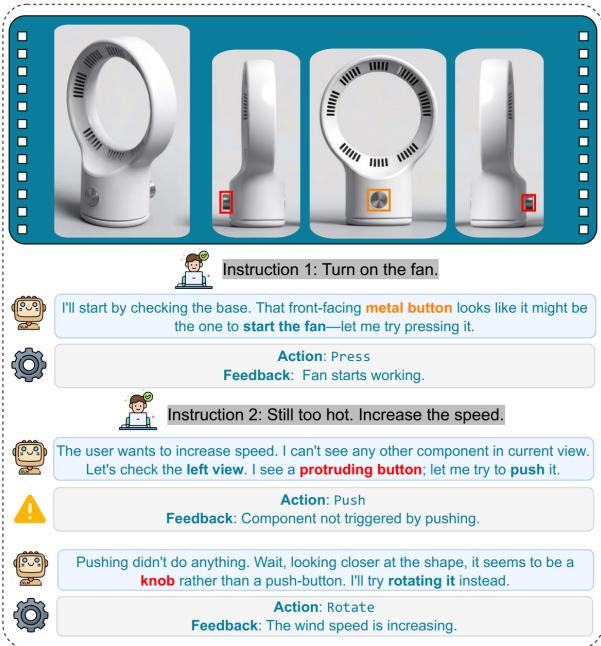  
Figure 1: An example of Generalizable Visually Grounded Exploration. The example demonstrates a Hypothesis-Interaction-Refinement loop: after failing to increase the speed by pushing a component, the agent interprets the physical feedback, updates its hypothesis, re-evaluates the visual features to identify the component as a rotatable knob, and successfully corrects its action.

However, current research in embodied AI and Large Language Models (LLMs) has yet to fully capture this capability. On one hand, traditional robotic learning benchmarks typically rely on Imitation Learning or Reinforcement Learning (Tao et al., 2024; Li et al., 2024; Shridhar et al., 2021), requiring agents to be trained on specific environments, which limits their ability of generalization to unseen devices (Liang et al., 2022). On the other hand, LLM-based tool learning (Schick et al., 2023; Qin et al., 2023) has achieved success in software domains, but primarily operates on structured APIs with explicit documentation. These paradigms bypass the core challenge of the physical world: the need to bridge the gap between abstract common sense and instance-specific physical interfaces through active visual exploration and feedback reasoning.

To bridge this gap, we introduce VGEBench, a novel benchmark designed to evaluate the Generalizable Visually Grounded Exploration capabilities of Vision Language Models (VLMs) on household devices. Unlike previous benchmarks that focus on static visual recognition or rote execution, VGEBench simulates a high-fidelity, documentation-free environment where agents must figure out how to use 968 diverse devices across 26 categories solely through visual perception and interaction. Our setting poses unique challenges: (1) Knowledge Grounding: The agent must map abstract knowledge (e.g., “fans oscillate”) to fine-grained, unlabelled visual affordances (e.g., a specific mechanical pin); (2)Visual Grounding: The agent must transcend static recognition to precisely localize interactive components, serving as the spatial prerequisite for valid physical interaction; (3) Feedback-Driven Reasoning: The agent must interpret diverse environmental feedback—ranging from state changes (lights turning on) to failures (pressing a knob)—to correct its plans in real-time.

Our main contributions are summarized as follows:

• We identify Generalizable Visually Grounded Exploration as a critical missing link for VLM agents in operating household devices, revealing a critical gap between abstract world knowledge and instance-level affordances.

• To bridge this gap, we present VGEBench, a novel benchmark which features a Logic-Driven State Machine framework that supports deterministic, multi-turn interactions, enabling the evaluation of long-horizon generalizable exploratory reasoning.

• We establish a multi-dimensional evaluation protocol and conduct extensive experiments on various VLMs, revealing their limitations in visual grounding, generalizable exploration, and long-horizon state tracking. Our results show that existing models struggle to translate general world knowledge into precise physical interaction in multi-turn interaction scenarios.

## 2 Related Work

From API to Physical Interaction. Large language models have demonstrated strong tooluse capability in language-centric settings, where tools are accessed through structured API interfaces (Schick et al., 2023; Qin et al., 2023). While advanced reasoning frameworks enhance decisionmaking through iterative thought traces (Yao et al., 2023; Shinn et al., 2023), these agents largely operate under a manual-dependent paradigm (Patil et al., 2025; Li et al., 2025), relying on explicit documentation or schema definitions provided in the prompt rather than discovering functionality through exploration (Cheng et al., 2025). Moving to operating systems, agents are required to navigate GUI environments (Xie et al., 2024; Rawles et al., 2024). While they support open-ended tasks, their perception is often simplified by accessing the accessibility tree (e.g., DOM/XML), and their interaction is confined to 2D screen spaces, lacking the multi-view active perception required in the 3D physical world.

Fine-grained Visual Grounding. Operating physical devices not only requires an understanding of the device’s functionality but hinges on finegrained visual grounding of interactive components (e.g., knobs, ports, or mode buttons). Traditional VQA-style benchmarks have advanced holistic vision-language understanding (Antol et al., 2015; Hudson and Manning, 2019; Marino et al., 2019) and physical object reasoning (Ma et al., 2025; Zhang et al., 2025), yet they largely evaluate static question answering, without explicitly modeling actionable component localization under interaction constraints (You et al., 2023). Although there has been progress on linking language to specific regions or instances through referring expression comprehension (Yu et al., 2016; Liu et al., 2024) and grounded multimodal interfaces (Peng et al., 2023; Chen et al., 2023), there remains a practical granularity mismatch in current VLMs: models can be robust in holistic recognition but brittle when correct actions depend on small, functionally meaningful components that are easy to confuse across instances and viewpoints (Geng et al., 2022).

<table><tr><td rowspan="2">Benchmark</td><td colspan="3">Exploration Capabilities</td><td colspan="2">Functional Logic</td><td colspan="3">Vision</td><td rowspan="2">Domain</td></tr><tr><td>GE</td><td>IFR</td><td>EC</td><td>DLM</td><td>MF</td><td>PE</td><td>FG</td><td>MV</td></tr><tr><td>BFCL (Patil et al., 2025)</td><td></td><td></td><td></td><td></td><td></td><td></td><td></td><td></td><td>API/Code</td></tr><tr><td>PhysToolBench (Zhang et al., 2025)</td><td></td><td></td><td></td><td></td><td></td><td></td><td></td><td></td><td>Physical Tools</td></tr><tr><td>OpenEQA (Majumdar et al., 2024)</td><td></td><td></td><td></td><td></td><td></td><td></td><td></td><td></td><td>Indoor Scenes</td></tr><tr><td>OSWorld (Xie et al., 2024)</td><td></td><td></td><td></td><td></td><td></td><td></td><td></td><td></td><td>Computer GUIs</td></tr><tr><td>AndroidWorld (Rawles et al., 2024)</td><td></td><td></td><td></td><td></td><td></td><td></td><td></td><td></td><td>Android Apps</td></tr><tr><td>HomeBench (Li et al., 2025)</td><td></td><td></td><td></td><td></td><td></td><td></td><td></td><td></td><td>Virtual Smart Home</td></tr><tr><td>RoboCasa (Nasiriany et al., 2024)</td><td></td><td></td><td></td><td></td><td></td><td></td><td></td><td></td><td>Kitchen Tasks</td></tr><tr><td>BEHAVIOR-1k (Li et al., 2024)</td><td>X</td><td></td><td></td><td></td><td></td><td></td><td>X</td><td></td><td>Household Tasks</td></tr><tr><td>VGEBench (Ours)</td><td></td><td></td><td></td><td></td><td></td><td></td><td></td><td></td><td>Household Devices</td></tr></table>

Table 1: Comparison of VGEBench with existing related benchmarks. Exploration: GE (Generalizable Exploration): training-free generalization without environment-specific RL/IL finetuning; IFR (Interactive Feedback & Refinement): Supporting multi-turn hypothesis testing; EC (Error Correction): Environment can support multiturn trial-and-error. Logic: DLM (Device Logic Modeling): Providing explicit device state and transition logic; MF (Manual-Free): Relying on world knowledge and environmental feedback rather than provided documentation. Vision: PE (Physical Entity): Targeting 3D functional appliances with realistic topology; FG (Fine-grained Grounding): Localizing specific interactive parts (e.g., buttons) vs. coarse objects; MV (Multi-View): Active <sub>perception</sub> <sub>across</sub> <sub>multiple</sub> <sub>viewpoints.</sub> "<sub>:</sub> <sub>Fully</sub> <sub>Supported;</sub> "% <sub>:</sub> <sub>Partially</sub> <sub>Supported;</sub> %<sub>:</sub> <sub>Not</sub> <sub>Supported.</sub>

Embodied Exploration. Beyond knowing where to act, operating household devices requires anticipating what will happen when acting, with actions ultimately validated through observable state changes and feedback. Recently, benchmarks like OpenEQA (Majumdar et al., 2024) and PEAP (Lan et al., 2026) have focused on assessing embodied perception. However, they primarily evaluate passive observation or static functional reasoning rather than active, state-changing manipulation. In physical environments, traditional benchmarks (e.g., ALFWorld (Shridhar et al., 2021), BEHAV-IOR (Li et al., 2024)) have established high-fidelity simulation environments for common household tasks. However, they typically rely on training agents within specific simulators—often via Imitation Learning on extensive human action trajectories (Savva et al., 2019). This paradigm inherently limits their generalizability to novel instances outside the training distribution. The central challenge remains generalizable exploration: enabling agents to map abstract world knowledge to instance-specific affordances without prior training or manuals. Unlike previous works that focus on either text-heavy reasoning or rote skill execution, VGEBench targets the intersection of visual grounding, active logic probing, and feedbackdriven refinement.

## 3 VGEBench

To accurately evaluate the generalizable visually grounded exploration capabilities of VLMs in household environments, we constructed VGEBench, a large-scale benchmark of diverse household devices with fine-grained component annotations and executable interaction logic. As shown in Fig. 2, the data construction pipeline consists of three main stages: raw view collection, state machine annotation, and instruction generation.

## 3.1 Raw View Collection

To accurately evaluate fine-grained manipulation capabilities (e.g., rotating a specific knob or toggling a small switch), high-fidelity visual observations are essential. Traditional 3D model datasets (e.g., ShapeNetCore (Chang et al., 2015)) often lack the texture resolution or distinct functional details required for such precise interactions. Motivated by this gap, we sourced high-quality 3D models that support legible component identification from Sketchfab<sup>2</sup> and 3D Warehouse<sup>3</sup>. Utilizing the platforms’ built-in 360-degree model preview features, human annotators captured 8 multi-view images per object (6 orthographic and 2 axonometric). We also conducted a rigorous manual verification for every candidate model to ensure the presence of clearly identifiable interactive components. We finally collected 968 high-fidelity 3D models across 26 common categories (e.g., CoffeeMachine, DigitalAlarmClock, WashingMachine), totaling 7,888 collected views. A detailed distribution is provided in Tab. 7.

Step 1: Raw View Collection  
Step 2: Annotation and State Machine Design  
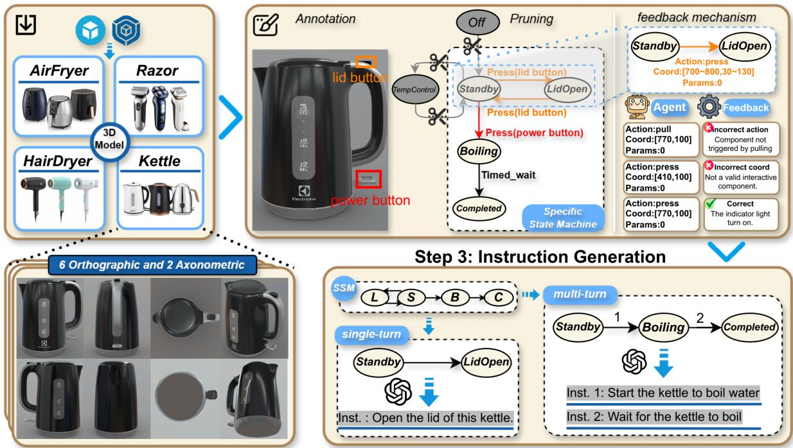  
Figure 2: The Data Construction Pipeline of VGEBench: This pipeline consists of three main phases: raw view collection, Annotation and state machine design, and instruction generation. In the Raw View Collection phase, we acquire high-fidelity visual observations, capturing views for each 3D object to ensure comprehensive coverage. The process then proceeds to Annotation and State Machine Design, where a Universal Category State Machine (UCSM) is instantiated into a Specific State Machine (SSM) based on manual annotations of visible interactive components. Building on this SSM, our environment simulator can generate state-dependent feedbacks. Finally, Instruction Generation synthesizes diverse tasks by sampling valid state transition paths from the SSM and refining them into natural language instructions via LLMs.

## 3.2 Annotation and State Machine Design

We propose a logic-driven annotation protocol to ground visual perception into executable plans. First, human annotators labeled the bounding boxes of all interactive components (e.g., buttons, knobs) visible across the collected views. To govern the interaction logic, we designed a Universal Category State Machine (UCSM) for each category, which serves as a superset containing all potential functionalities within that category. Subsequently, we derived a Specific State Machine (SSM) for each individual object by pruning the UCSM based on the visual evidence of the object’s components. For instance, if a specific weighing scale visually lacks a charging port, the corresponding charging states and transitions are removed from its SSM. This process yields a rigorous logic graph for every device, where transitions are bound to atomic actions and parameters. Component names are used only for internal state tracking and are not exposed to the model, ensuring the agent relies on visual features rather than textual shortcuts.

Notably, the generalization evaluated by VGEBench refers not to appearance-level novelty in static image recognition, but to functional and interactive generalization: whether an agent can select actions and parameters based on visual components and revise incorrect hypotheses through environment feedback. Since the 3D assets are sourced from public websites, we cannot guarantee that closed-source VLMs have not encountered related assets or renderings during pretraining. However, the manually constructed Logic-Driven State Machines define instance-specific component-action bindings and state-transition rules that are not provided by the static visual assets. Thus, even if a model has seen images of similar devices, it cannot directly obtain the instance-specific interaction logic evaluated by our simulator from those images alone.

## 3.3 Instruction Generation

Based on the validated SSMs, we generated instruction-following tasks divided into single-turn and multi-turn scenarios. We performed pathfinding on the SSMs starting from a manually aligned initial state to generate state transition sequences that avoid loops. To simulate realistic user commands, we converted these symbolic sequences into natural language instructions using GPT-5- mini. In this process, the LLM is used only to verbalize a symbolic state-transition sequence whose initial state, target state, and valid transition path are determined by the validated SSM. For example, a symbolic transition Off → Active is refined into natural commands like “Turn on the flashlight.” In total, we constructed 4,948 single-turn and 10,005 multi-turn instructions. The detailed statistics of VGEBench and prompts used for instruction refinement can be found in the Appendix A and Tab. 20.

To examine whether the evaluation is sensitive to the choice of instruction generator, we regenerate instructions using additional generators and evaluate the resulting variants. The results show that VGEBench is robust to the choice of generation model. Detailed results are provided in $\mathsf { A p - }$ pendix E.3.

## 3.4 Environment Feedback and Task Evaluation

Inspired by ScienceWorld (Wang et al., 2022), we designed a closed-loop interactive system where the instantiated Specific State Machine (SSM) serves as the ground truth environment simulator. Unlike static evaluation datasets, our system evaluates the agent’s ability to navigate through a state space by executing a sequence of visual actions. The interaction mechanism consists of two core components: the Feedback Generator and the Completion Judge.

Deterministic Feedback Generation At each time step t, the agent receives the current observation $O _ { t } = \left( I _ { v i e w } , V _ { l i s t } , F _ { t - 1 } , I n s t _ { t } \right)$ , and executes an action $a _ { t } = ( { \mathrm { t y p e } }$ , coord, params). Here, $I _ { \mathrm { v i e w } }$ represents the image of the current view, $V _ { \mathrm { l i s t } }$ denotes the set of accessible views, $F _ { t - 1 }$ is the feedback from the environment regarding the previous action, and Inst<sub>t</sub> denotes the current user instruction. The environment simulator validates this action against the current state $S _ { t }$ defined in the SSM. To simulate realistic physical constraints and provide instructive feedback, the system employs a hierarchical validation protocol:

Validity Check: The system first verifies if the action is permissible in the current view (e.g., physical interactions are prohibited in axonometric views likefront\_top, requiring a Switch\_view action first) and whether the coordinates fall within the image bounds. Invalid actions trigger immediate “System Notification” errors without altering the state.

Geometric & Semantic Matching: If the action format is valid, the system queries the transitions defined in $S _ { t }$ . An action is considered successful only if:

(1) coord: The coordinates fall within the bounding box of a reactive component defined in the SSM for the current view.

(2) action: The action type matches the component’s defined atomic action.

(3) params: The parameters satisfy the transition conditions (e.g., rotation direction).

Environment Feedback: To facilitate effective interaction and error recovery, the environment generates outcome-dependent feedback for each agent action. The feedback differentiates among qualitatively different interaction outcomes, enabling the agent to infer whether an action was successful, misapplied, or irrelevant.

Task Completion Criteria A task is defined not merely by reaching a final state, but by satisfying a sequence of sub-goals. Each task instance is associated with an ordered list of goal states $G = [ g _ { 1 } , g _ { 2 } , \dots , g _ { n } ]$ . The agent can only observe the user instruction corresponding to the next goal after completing the current goal. To limit resource consumption and prevent infinite exploration loops, we further control the interaction budget of the VLM using a Global Interaction Budget $( B _ { \mathrm { g l o b a l } } )$ and a Local Interaction Budget $( B _ { \mathrm { l o c a l } } )$ . Once the agent reaches either interaction limit, the interaction loop is immediately terminated, even if the task has not been fully completed. Importantly, task completion is state-based rather than trajectorybased. Any valid sequence of interactions is accepted as long as it reaches the required goal states in the specified order within the interaction budget. Accordingly, when multiple components or action sequences can validly lead to the same goal according to the SSM, all such executions are accepted. The theoretical shortest path is used for efficiency-related evaluation rather than as the only valid execution trajectory. The concrete feedback formulations and the interaction budget mechanism are deferred to Appendix D.

## 3.5 Quality Control and Validation

We implemented strict quality control throughout the dataset construction pipeline. At each stage, we randomly sampled 10% of the annotated items for review, with each batch containing at least 1,000 items to ensure that our sampling strategy provides a statistically reliable estimate. An annotator’s annotations were accepted only if the error rate remained below 5%; otherwise, their annotations were rejected and reassigned. During Instruction Generation stage, inspired by MidMed(Shi et al., 2023), we further filtered out unreasonable state transition sequences to ensure that the resulting instructions remain natural, coherent, and executable.

After the dataset was constructed, following MT-bench (Zheng et al., 2023), we implemented a rigorous quality validation protocol on a subset randomly sampled to comprise 1% of the entire dataset. We defined three metrics to evaluate data quality on a 3-level scale (0, 1, 2), which respectively assess the quality of vision, logic, and instruction alignment. Both human experts and two advanced VLMs (Gemini-3-Flash, GPT-5-mini) are employed for evaluation. As shown in Tab. 17, our dataset achieves consistently high scores across all dimensions, with Gemini-3- flash/GPT-5-mini/Human Expert reaching average scores of 1.978/1.947/1.943. The strong humanmodel agreement further confirms the dataset’s clarity and robustness. The complete quality-control workflow, data quality table and the scoring criteria are provided in Appendix G.

## 3.6 Data statistics

Tab. 2 presents the data statistics of VGEBench. We first curated a diverse collection of 968 highprecision 3D household device models spanning

<table><tr><td>Section Item</td><td></td><td>Count</td></tr><tr><td>Assets</td><td># Categories # Devices</td><td>26 968</td></tr><tr><td rowspan="4">Vision</td><td># Total views</td><td>7,888</td></tr><tr><td># Component types</td><td>234</td></tr><tr><td># Unique components</td><td>3,712</td></tr><tr><td># Annotated BBoxes</td><td>7,264</td></tr><tr><td rowspan="4">Logic</td><td># UCSM</td><td>26</td></tr><tr><td>- States / Transitions</td><td>302 / 1,206</td></tr><tr><td># SSM</td><td>968</td></tr><tr><td>- States / Transitions</td><td>6,352 / 15,861</td></tr><tr><td>Tasks</td><td># Total episodes - Single / Multi-turn</td><td>14,953 4,948 / 10,005</td></tr></table>

Table 2: Data statistics of VGEBench. UCSM: Universal Category State Machine; SSM: Specific State Machine.

26 categories. To ensure rich interactability, we collected 7,888 views of these 3D models, recognized 3,712 unique interactive components in 234 classes (e.g., power buttons or charging ports), and annotated 7,264 BBoxes for these components.

To support realistic behavior Logic, we designed 26 Universal Category State Machines (UCSMs) as high-level template for each device category, comprising 302 states and 1,206 transitions. These were then instantiated into 968 Specific State Machines (SSMs) for individual devices to a total number of 6,352 states and 15,861 transitions. Based on this foundation, we generated 14,953 Task episodes. Notably, 10,005 of these are multi-turn interactions, which imposes significant challenges for long-horizon planning and exploration.

## 4 Experiment

## 4.1 Experimental Setups

Models. We conduct a comprehensive experiment on VGEBench across three categories of VLMs: (a) Closed-source VLMs: GPT-5- mini (OpenAI, 2025), Gemini-3-Flash (Google DeepMind, 2025), Doubao-1.5-Thinking-Vision-Pro (Guo et al., 2025); (b) Open-source VLMs: Qwen3-VL-8B-Instruct (Bai et al., 2025), InternVL3.5-8B (Wang et al., 2025), Mimo-Embodied-7B (Hao et al., 2025).

Implementation. VGEBench is a test-only benchmark and does not define conventional train/test splits. For all models, we adopt Re-Act (Yao et al., 2023) as the underlying reasoning framework and expose the complete chat history.

<table><tr><td rowspan="3">Model</td><td colspan="2">Task Performance</td><td colspan="2">Efficiency</td><td colspan="4">Visual Grounding and Perception</td><td>Exploration</td></tr><tr><td>SR↑</td><td>SSR ↑</td><td>SPL ↑</td><td>State-F1 ↑</td><td>EIR↑</td><td>TIR ↑</td><td>VSPS↓</td><td>GVPE↓</td><td>EER↑</td></tr><tr><td>MiMo-Embodied-7B</td><td>1.48</td><td>2.79</td><td>1.10</td><td>47.86</td><td>7.34</td><td>3.44</td><td>0.88</td><td>21.66</td><td>15.78</td></tr><tr><td>InternVL3.5-8B-Instruct</td><td>3.72</td><td>7.71</td><td>2.28</td><td>51.07</td><td>23.14</td><td>13.12</td><td>1.23</td><td>11.26</td><td>20.89</td></tr><tr><td>Qwen3-VL-8B-Instruct</td><td>7.77</td><td>12.69</td><td>5.11</td><td>54.31</td><td>30.46</td><td>14.80</td><td>1.42</td><td>11.46</td><td>29.91</td></tr><tr><td>GPT-5-mini</td><td>10.78</td><td>17.51</td><td>5.88</td><td>57.16</td><td>22.86</td><td>10.21</td><td>1.20</td><td>6.72</td><td>28.81</td></tr><tr><td>Doubao-1.5-Thinking-Vision-Pro</td><td>16.68</td><td>24.30</td><td>12.50</td><td>60.61</td><td>46.62</td><td>23.93</td><td>1.21</td><td>3.21</td><td>37.24</td></tr><tr><td>Gemini-3-Flash</td><td>54.27</td><td>62.86</td><td>39.34</td><td>78.67</td><td>67.21</td><td>43.56</td><td>1.12</td><td>1.85</td><td>64.36</td></tr></table>

Table 3: Main results on VGEBench. Bold indicates the best results, and underline indicates the second-best results. ↑ indicates higher is better, and ↓ indicates lower is better.

For interaction budget control, the redundancy factor λ is set to 5. More details about the reasoning framework and the interaction budget can be found in Appendices H and D.2.

## 4.2 Metrics

Inspired by classic works in embodied (Anderson et al., 2018) and vision (Yu et al., 2016) domains, we adopt a multi-dimensional assessment protocol covering task performance, execution efficiency, visual grounding, and reasoning stability to evaluate the capabilities of VLMs comprehensively. Detailed definitions and formulations are provided in Appendix F.

## 4.2.1 Task Performance

We primarily measure the Success Rate (SR) to denote the percentage of successfully completed episodes. To more accurately evaluate multi-turn tasks, we additionally report the Sub-task Success Rate (SSR) to assess step-wise correctness based on achieved sub-goals.

## 4.2.2 Efficiency

We report Success Weighted by Path Length (SPL) to jointly account for success rate and execution length. We also compute the State-F1 Score to measure the alignment between the model’s state trajectory and the ground-truth optimal path.

## 4.2.3 Visual Grounding and Navigation

We assess visual interaction using the Effective Interaction Rate (EIR) (validity of component identification) and the Target Interaction Rate (TIR) (precision of goal-oriented grounding). Navigation efficiency is evaluated via View Switches Per Success (VSPS) for local efficiency and Global View Switches Per Episode (GVPE) for macro-level exploration cost.

## 4.2.4 Exploration

We define the Effective Exploration Rate (EER) as the ratio of valid operations to total steps, serving as an indicator of reasoning efficiency and safety awareness.

## 4.3 Main Results

Tab. 3 presents the comprehensive evaluation of representative VLMs on VGEBench. We report the results across nine metrics described in Section 4.2.

VGEBench poses a significant challenge to VLM-based agents. The result shows that only Gemini-3-Flash achieves a notable Success Rate of 54.27%, while the second-best model, Doubao-1.5-Thinking-Vision-Pro, drops sharply to 16.68%. All remaining models obtain success rates below 15%. Even when considering subtask completion, no model other than Gemini-3-Flash attains an SSR exceeding 25%. These results indicate that generalizable visually grounded exploration remains a difficult open problem for the majority of VLMs.

Both visual grounding and exploration capabilities determine model performance. The results demonstrate that advanced VLMs, especially Gemini-3-Flash and Doubao-1.5-Thinking-Vision-Pro, achieve significantly higher scores in both visual grounding (EIR, TIR) and exploration (EER) compared to other models. This superior capability to accurately perceive targets and efficiently explore the environment directly underpins their leading task completion rates. In contrast, MiMo-Embodied-7B presents a compelling counter-example. Benefiting from its specialized training in autonomous driving scenarios, it exhibits exceptional strength in View Navigation (VSPS), achieving a score of 0.88 which even surpasses Gemini-3-Flash. However, its overall task performance remains poor (SR: 1.48%) due to a critical lack of fine-grained visual grounding and reasoning capabilities. This disparity highlights that while navigation efficiency is valuable, the integration of fine-grained visual perception and logical reasoning is the decisive factor for success in complex household environments.

## 5 Analysis

To better evaluate the ability of VLMs in exploring household devices and further investigate the underlying mechanisms, we propose four research questions (RQs). These RQs include four key dimensions in VGEBench: (1) the necessity of generalization capacity, (2) the improvement from extended interaction budgets, (3) the primary visual bottleneck, and (4) the gap between current VLMs and human performance.

RQ1: The necessity of generalization capacity: Can VLMs immediately recognize target?
<table><tr><td>Model</td><td>PSR</td><td>SSR</td></tr><tr><td>MiMo-Embodied-7B</td><td>0.51%</td><td>2.79%</td></tr><tr><td>Qwen3-VL-8B</td><td>1.53%</td><td>12.69%</td></tr><tr><td>InternVL3.5-8B</td><td>0.91%</td><td>7.71%</td></tr><tr><td>GPT-5-mini</td><td>1.97%</td><td>17.51%</td></tr><tr><td>Doubao-1.5-Thinking-Vision-Pro</td><td>4.06%</td><td>24.30%</td></tr><tr><td>Gemini-3-Flash</td><td>12.94%</td><td>62.86%</td></tr></table>

Table 4: Generalization Performance. We report SSR and PSR (Perfect Sub-task success Rate): The proportion of sub-tasks completed using exactly the optimal number of interaction steps.

To investigate the necessity of generalization capacity in VLMs, we evaluate whether models can achieve “one-shot success” in Table 4. The results reveal a pronounced discrepancy between PSR and SSR across all models. Even for the bestperforming model, Gemini-3-Flash, the PSR is only 12.94%, whereas the SSR reaches 62.86%. This gap indicates that current models exhibit little to no immediate, zero-shot understanding of the operational logic of household devices. Instead, successful performance mainly arises from feedback-driven exploration, where agents iteratively test hypotheses, correct errors, and gradually infer device-specific functional logic.

## RQ2: Do VLMs continuously benefit from extended exploration budgets?

Fig. 3 illustrates the relative performance gains as the interaction limit increases (the detailed relationship between λ and the interaction limit can be found in Appendix D.2). All models exhibit a pattern of improvement that gradually tapers off, indicating that current VLMs are able to convert additional interactions into better task completion, especially during the early stages of exploration. However, weaker models (e.g., Qwen3-VL-8B) show a more pronounced and earlier performance plateau, whereas advanced models such as Gemini-3-Flash, benefiting from stronger exploratory reasoning and more stable long-term memory maintenance, demonstrate a more robust ability to exploit deep exploration for effective self-correction. In addition to the interaction budget, we further examine how the available interaction history affects agents’ self-correction ability. The detailed analysis is provided in Appendix E.1.

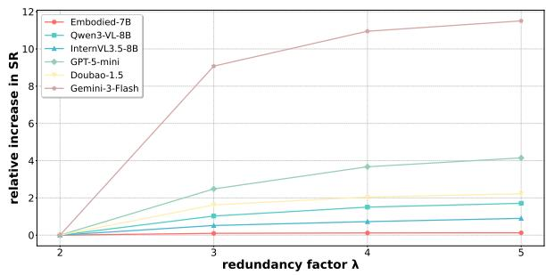  
Figure 3: Impact of interaction budget on SR score. We normalize the performance at the baseline budget (λ = 2) to zero to isolate the relative gains. The curves illustrate the relative improvement as λ increases.

RQ3: Where lies the visual bottleneck: Coarse-grained navigation or fine-grained grounding?  
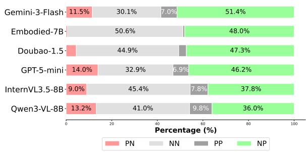  
Figure 4: Distribution of view switching actions. We classify Switch\_view actions into four categories based on whether the target component is visible in the start and end views (defined as "Positive" or "Negative"). NP (Green): Successful navigation to the target view (Negative → Positive view); PN (Red): Losing the target; NN: Ineffective searching; PP: Maintaining focus.

To isolate the bottleneck, we compared performance in coarse-grained navigation (Fig. 4) with fine-grained grounding (Tab. 5). The performance gap in navigation is relatively moderate: For example, GPT-5-mini’s successful navigation (NP) is only 12.5% lower than that of Gemini-3-Flash. However, the disparity in fine-grained grounding is drastic. GPT-5-mini’s coordinate error (Avg Dist) is 63.9% worse than Gemini-3-Flash. Crucially, the even wider gap in Avg W-Dist (77.3%) reveals that weaker models fail to efficiently correct their coordinates after initial failures. This empirical result confirms that the primary bottleneck in VGEBench is not navigating to the correct view, but precisely localizing the interactive component within it. To further examine the fine-grained grounding bottleneck, we additionally evaluate model robustness under common visual perturbations. The detailed results are reported in Appendix E.2.

<table><tr><td>Model</td><td>Avg Dist↓</td><td>Avg W-Dist ↓</td></tr><tr><td>Mimo-Embodied-7B</td><td>274.04</td><td>441.69</td></tr><tr><td>InternVL3.5-8B-Instruct</td><td>188.35</td><td>312.43</td></tr><tr><td>Qwen3-VL-8B</td><td>178.09</td><td>312.63</td></tr><tr><td>Doubao-1.5-Thinking-Vision-Pro</td><td>188.53</td><td>290.53</td></tr><tr><td>GPT-5-mini</td><td>178.96</td><td>290.33</td></tr><tr><td>Gemini-3-Flash</td><td>109.18</td><td>163.75</td></tr></table>

Table 5: Fine-grained Action Precision Analysis. Metrics are calculated on a normalized 1000 × 1000 scale. Avg Dist: The average distance to the closest target BBox. Avg W-Dist: The weighted average distance that penalizes repeated failed attempts on the same target.

## RQ4: How large is the gap between humans and current VLMs?

To contextualize current VLM performance, we evaluate a human baseline on 149 episodes (approximately 1% of VGEBench) under the same interface and interaction budgets as Gemini-3-Flash. As shown in Tab. 6, humans achieve consistently higher task performance, reaching 74.50% SR and 81.43% SSR, compared with 56.38% and 64.32% for Gemini-3-Flash on the same episodes. Human performance nevertheless remains below saturation, indicating that manual-free operation of unfamiliar devices remains non-trivial even for humans under the constrained interaction setting.

Beyond task success, the complete metric and error analyses reveal a notable behavioral difference: humans produce fewer Invalid Coord Errors and therefore more frequently interact with valid component regions, enabling more informative component-level feedback for subsequent hypothesis refinement. This provides additional evidence that fine-grained visual grounding is important for efficient exploration. Full results and error-distribution comparisons are provided in Appendix C.

<table><tr><td>Model</td><td>SR</td><td>SSR</td><td>SPL</td></tr><tr><td>Gemini-3-Flash</td><td>56.38</td><td>64.32</td><td>39.23</td></tr><tr><td>Human Baseline</td><td>74.50</td><td>81.43</td><td>54.86</td></tr></table>

Table 6: Comparison between Gemini-3-Flash and Human baseline on 149 episodes under the same interface and interaction budgets.

## 6 Conclusion

To investigate the capabilities of current VLMs in visually grounded device exploration, this paper introduces VGEBench, a comprehensive benchmark designed to evaluate generalizable visually grounded exploration without reliance on manuals. We construct a Logic-Driven State Machine framework which simulates multi-turn interaction loops to provide deterministic feedback. Extensive experiments reveal that despite strong semantic knowledge, current VLMs still struggle significantly with fine-grained visual grounding and maintaining long-horizon state consistency. We hope that VGEBench will inspire further research to bridge the gap between abstract world knowledge and precise device execution.

## Limitations

VGEBench introduces a dynamic, interactive evaluation framework involving multi-turn agentenvironment feedback loops. Consequently, conducting a full-scale evaluation requires significant computational resources and inference time. Additionally, the necessity for high-resolution visual observations to resolve fine-grained grounding details imposes high demands on the visual encoding efficiency and context window of current VLMs.

VGEBench employs interactive components annotated on high-fidelity rendered views, discrete atomic actions, and fixed viewpoint switching. This abstraction of low-level control to focus on highlevel reasoning avoids the confounding effects of factors such as continuous robotic control and freeform camera navigation, thereby enabling a more focused evaluation of models’ capabilities in the generalizable visually grounded exploration task. Although this design enables deterministic evaluation, it does not fully capture all sim-to-real challenges encountered in physical robotic deployment.

The current observations are device-centered rendered images and do not fully capture complex backgrounds, natural illumination, or object occlusion in real environments. Although Appendix E.2 provides controlled robustness tests under compression, blur, and random occlusion, these perturbations cannot fully substitute for real-world observations.

## Ethics Statement

We are committed to strict ethical standards in the construction and distribution of VGEBench.

Data Compliance. Our dataset leverages 3D assets sourced from open platforms (Sketchfab and 3D Warehouse). We strictly adhered to the platforms’ ethical and licensing guidelines. Specifically, we utilized only assets available under permissible licenses and explicitly excluded any assets marked with “NoAI” tags to respect creators’ rights regarding generative AI training. The dataset focuses solely on household objects and contains no Personally Identifiable Information (PII) or offensive content.

Professional Annotation. We ensure that all employed human annotators underwent rigorous training specific to the categories of household devices involved in the dataset. All participants were fully informed of the intended data usage prior to their involvement. Additionally, we have provided fair and reasonable compensation for their work, ensuring that their efforts are appropriately rewarded and that the quality of the annotated content is guaranteed.

## Acknowledgments

We thank all the reviewers for their insightful and valuable comments. This work is supported by the National Natural Science Foundation of China (Grant No.U21B2009).

## References

Peter Anderson, Angel Chang, Devendra Singh Chaplot, Alexey Dosovitskiy, Saurabh Gupta, Vladlen Koltun, Jana Kosecka, Jitendra Malik, Roozbeh Mottaghi, Manolis Savva, et al. 2018. On evaluation of embodied navigation agents. arXiv preprint arXiv:1807.06757.

Stanislaw Antol, Aishwarya Agrawal, Jiasen Lu, Margaret Mitchell, Dhruv Batra, C Lawrence Zitnick, and Devi Parikh. 2015. Vqa: Visual question answering. In Proceedings ofthe IEEE international conference on computer vision, pages 2425–2433.

Shuai Bai, Yuxuan Cai, Ruizhe Chen, Keqin Chen, Xionghui Chen, Zesen Cheng, Lianghao Deng, Wei Ding, Chang Gao, Chunjiang Ge, Wenbin Ge, Zhifang Guo, Qidong Huang, Jie Huang, Fei Huang, Binyuan Hui, Shutong Jiang, Zhaohai Li, Mingsheng Li, and 45 others. 2025. Qwen3-vl technical report. Preprint, arXiv:2511.21631.

Jeannette Bohg, Karol Hausman, Bharath Sankaran, Oliver Brock, Danica Kragic, Stefan Schaal, and Gaurav S Sukhatme. 2017. Interactive perception: Leveraging action in perception and perception in action. IEEE Transactions on Robotics, 33(6):1273–1291.

Angel X. Chang, Thomas Funkhouser, Leonidas Guibas, Pat Hanrahan, Qixing Huang, Zimo Li, Silvio Savarese, Manolis Savva, Shuran Song, Hao Su, Jianxiong Xiao, Li Yi, and Fisher Yu. 2015. ShapeNet: An Information-Rich 3D Model Repository. Technical Report arXiv:1512.03012 [cs.GR], Stanford University — Princeton University — Toyota Technological Institute at Chicago.

Keqin Chen, Zhao Zhang, Weili Zeng, Richong Zhang, Feng Zhu, and Rui Zhao. 2023. Shikra: Unleashing multimodal llm’s referential dialogue magic. arXiv preprint arXiv:2306.15195.

Zihao Cheng, Hongru Wang, Zeming Liu, Yuhang Guo, Yuanfang Guo, Yunhong Wang, and Haifeng Wang. 2025. Toolspectrum: Towards personalized tool utilization for large language models. In Findings of the Associationfor Computational Linguistics: ACL 2025, pages 20679–20699.

Danny Driess, Fei Xia, Mehdi S. M. Sajjadi, Corey Lynch, Aakanksha Chowdhery, Brian Ichter, Ayzaan Wahid, Jonathan Tompson, Quan Vuong, Tianhe Yu, Wenlong Huang, Yevgen Chebotar, Pierre Sermanet, Daniel Duckworth, Sergey Levine, Vincent Vanhoucke, Karol Hausman, Marc Toussaint, Klaus Greff, and 3 others. 2023. Palm-e: An embodied multimodal language model. arXiv preprint arXiv:2303.03378.

Jiafei Duan, Samson Yu, Hui Li Tan, Hongyuan Zhu, and Cheston Tan. 2022. A survey of embodied AI: from simulators to research tasks. IEEE Trans. Emerg. Top. Comput. Intell., 6(2):230–244.

Haoran Geng, Helin Xu, Chengyang Zhao, Chao Xu, Li Yi, Siyuan Huang, and He Wang. 2022. Gapartnet: Cross-category domain-generalizable object perception and manipulation via generalizable and actionable parts. arXiv preprint arXiv:2211.05272.

Google DeepMind. 2025. Gemini 3. https:// deepmind.google/models/gemini/. Accessed: 2026-05-26.

Dong Guo, Faming Wu, Feida Zhu, Fuxing Leng, Guang Shi, Haobin Chen, Haoqi Fan, Jian Wang, Jianyu Jiang, Jiawei Wang, Jingji Chen, Jingjia Huang, Kang Lei, Liping Yuan, Lishu Luo, Pengfei Liu, Qinghao Ye, Rui Qian, Shen Yan, and 178 others. 2025. Seed1.5-vl technical report. Preprint, arXiv:2505.07062.

Xiaoshuai Hao, Lei Zhou, Zhijian Huang, Zhiwen Hou, Yingbo Tang, Lingfeng Zhang, Guang Li, Zheng Lu, Shuhuai Ren, Xianhui Meng, Yuchen Zhang, Jing Wu, Jinghui Lu, Chenxu Dang, Jiayi Guan, Jianhua Wu, Zhiyi Hou, Hanbing Li, Shumeng Xia, and 25 others. 2025. Mimo-embodied: X-embodied foundation model technical report. Preprint, arXiv:2511.16518.

Dan Hendrycks and Thomas Dietterich. 2019. Benchmarking neural network robustness to common corruptions and perturbations. Proceedings ofthe International Conference on Learning Representations.

Drew A Hudson and Christopher D Manning. 2019. Gqa: A new dataset for real-world visual reasoning and compositional question answering. In Proceedings of the IEEE/CVF conference on computer vision and pattern recognition, pages 6700–6709.

Tianwei Lan, Jiaqi Wu, Zeming Liu, Zhaoxin Fan, Haifeng Wang, and Yuhang Guo. 2026. Peap: Proactive embodied action sequence planning with joint understanding of vision and audio perception. In Proceedings of the 64th Annual Meeting of the Association for Computational Linguistics (Volume 1: Long Papers), pages 23118–23138.

Chengshu Li, Ruohan Zhang, Josiah Wong, Cem Gokmen, Sanjana Srivastava, Roberto Martín-Martín, Chen Wang, Gabrael Levine, Wensi Ai, Benjamin Martinez, Hang Yin, Michael Lingelbach, Minjune Hwang, Ayano Hiranaka, Sujay Garlanka, Arman Aydin, Sharon Lee, Jiankai Sun, Mona Anvari, and 16 others. 2024. Behavior-1k: A human-centered, embodied ai benchmark with 1,000 everyday activities and realistic simulation. arXiv preprint arXiv:2403.09227.

Silin Li, Yuhang Guo, Jiashu Yao, Zeming Liu, and Haifeng Wang. 2025. Homebench: Evaluating llms in smart homes with valid and invalid instructions across single and multiple devices. arXiv preprint arXiv:2505.19628.

Jacky Liang, Wenlong Huang, Fei Xia, Peng Xu, Karol Hausman, Brian Ichter, Pete Florence, and Andy Zeng. 2022. Code as policies: Language model programs for embodied control. arXiv preprint arXiv:2209.07753.

Shilong Liu, Zhaoyang Zeng, Tianhe Ren, Feng Li, Hao Zhang, Jie Yang, Qing Jiang, Chunyuan Li, Jianwei Yang, Hang Su, et al. 2024. Grounding dino: Marrying dino with grounded pre-training for open-set object detection. In European conference on computer vision, pages 38–55. Springer.

Liang Ma, Jiajun Wen, Min Lin, Rongtao Xu, Xiwen Liang, Bingqian Lin, Jun Ma, Yongxin Wang, Ziming Wei, Haokun Lin, et al. 2025. Phyblock: A progressive benchmark for physical understanding and planning via 3d block assembly. arXiv preprint arXiv:2506.08708.

Arjun Majumdar, Anurag Ajay, Xiaohan Zhang, Pranav Putta, Sriram Yenamandra, Mikael Henaff, Sneha Silwal, Paul Mcvay, Oleksandr Maksymets, Sergio Arnaud, et al. 2024. Openeqa: Embodied question answering in the era of foundation models. In Proceedings of the IEEE/CVF conference on computer vision and pattern recognition, pages 16488–16498.

Kenneth Marino, Mohammad Rastegari, Ali Farhadi, and Roozbeh Mottaghi. 2019. Ok-vqa: A visual question answering benchmark requiring external knowledge. In Proceedings of the IEEE/cvf conference on computer vision and pattern recognition, pages 3195–3204.

Soroush Nasiriany, Abhiram Maddukuri, Lance Zhang, Adeet Parikh, Aaron Lo, Abhishek Joshi, Ajay Mandlekar, and Yuke Zhu. 2024. Robocasa: Large-scale simulation of everyday tasks for generalist robots. In Robotics: Science and Systems.

OpenAI. 2025. Gpt-5 system card. https:// openai.com/index/gpt-5-system-card/. Accessed: 2026-05-26.

Shishir G Patil, Huanzhi Mao, Fanjia Yan, Charlie Cheng-Jie Ji, Vishnu Suresh, Ion Stoica, and Joseph E. Gonzalez. 2025. The berkeley function calling leaderboard (BFCL): From tool use to agentic evaluation of large language models. In Forty-second International Conference on Machine Learning.

Zhiliang Peng, Wenhui Wang, Li Dong, Yaru Hao, Shaohan Huang, Shuming Ma, and Furu Wei. 2023. Kosmos-2: Grounding multimodal large language models to the world. arXiv preprint arXiv:2306.14824.

Shengyi Qian, Weifeng Chen, Min Bai, Xiong Zhou, Zhuowen Tu, and Li Erran Li. 2024. Affordancellm: Grounding affordance from vision language models. In Proceedings ofthe IEEE/CVF Conference on Computer Vision and Pattern Recognition (CVPR) Workshops, pages 7587–7597.

Yujia Qin, Shihao Liang, Yining Ye, Kunlun Zhu, Lan Yan, Yaxi Lu, Yankai Lin, Xin Cong, Xiangru Tang, Bill Qian, Sihan Zhao, Lauren Hong, Runchu Tian, Ruobing Xie, Jie Zhou, Mark Gerstein, Dahai Li, Zhiyuan Liu, and Maosong Sun. 2023. Toolllm: Facilitating large language models to master 16000+ real-world apis. Preprint, arXiv:2307.16789.

Christopher Rawles, Sarah Clinckemaillie, Yifan Chang, Jonathan Waltz, Gabrielle Lau, Marybeth Fair, Alice Li, William Bishop, Wei Li, Folawiyo Campbell-Ajala, et al. 2024. Androidworld: A dynamic benchmarking environment for autonomous agents. arXiv preprint arXiv:2405.14573.

Manolis Savva, Abhishek Kadian, Oleksandr Maksymets, Yili Zhao, Erik Wijmans, Bhavana Jain, Julian Straub, Jia Liu, Vladlen Koltun, Jitendra Malik, et al. 2019. Habitat: A platform for embodied ai research. In Proceedings of the IEEE/CVF international conference on computer vision, pages 9339–9347.

Timo Schick, Jane Dwivedi-Yu, Roberto Dessì, Roberta Raileanu, Maria Lomeli, Eric Hambro, Luke Zettlemoyer, Nicola Cancedda, and Thomas Scialom. 2023. Toolformer: Language models can teach themselves to use tools. Advances in Neural Information Processing Systems, 36:68539–68551.

Xiaoming Shi, Zeming Liu, Chuan Wang, Haitao Leng, Kui Xue, Xiaofan Zhang, and Shaoting Zhang. 2023. MidMed: Towards mixed-type dialogues for medical consultation. In Proceedings ofthe 61st Annual Meeting of the Association for Computational Linguistics (Volume 1: Long Papers), pages 8145–8157, Toronto, Canada. Association for Computational Linguistics.

Noah Shinn, Federico Cassano, Ashwin Gopinath, Karthik Narasimhan, and Shunyu Yao. 2023. Reflexion: Language agents with verbal reinforcement learning. Advances in Neural Information Processing Systems, 36:8634–8652.

Mohit Shridhar, Xingdi Yuan, Marc-Alexandre Côté, Yonatan Bisk, Adam Trischler, and Matthew Hausknecht. 2021. ALFWorld: Aligning Text and Embodied Environments for Interactive Learning. In Proceedings of the International Conference on Learning Representations (ICLR).

Stone Tao, Fanbo Xiang, Arth Shukla, Yuzhe Qin, Xander Hinrichsen, Xiaodi Yuan, Chen Bao, Xinsong Lin, Yulin Liu, Tse-kai Chan, et al. 2024. Maniskill3: Gpu parallelized robotics simulation and rendering for generalizable embodied ai. arXiv preprint arXiv:2410.00425.

Guanzhi Wang, Yuqi Xie, Yunfan Jiang, Ajay Mandlekar, Chaowei Xiao, Yuke Zhu, Linxi Fan, and Anima Anandkumar. 2023. Voyager: An open-ended embodied agent with large language models. arXiv preprint arXiv:2305.16291.

Ruoyao Wang, Peter Jansen, Marc-Alexandre Côté, and Prithviraj Ammanabrolu. 2022. ScienceWorld: Is your agent smarter than a 5th grader? In Proceedings of the 2022 Conference on Empirical Methods in Natural Language Processing, pages 11279–11298, Abu Dhabi, United Arab Emirates. Association for Computational Linguistics.

Weiyun Wang, Zhangwei Gao, Lixin Gu, Hengjun Pu, Long Cui, Xingguang Wei, Zhaoyang Liu, Linglin Jing, Shenglong Ye, Jie Shao, Zhaokai Wang, Zhe Chen, Hongjie Zhang, Ganlin Yang, Haomin Wang, Qi Wei, Jinhui Yin, Wenhao Li, Erfei Cui, and 56 others. 2025. Internvl3.5: Advancing open-source multimodal models in versatility, reasoning, and efficiency. Preprint, arXiv:2508.18265.

Tianbao Xie, Danyang Zhang, Jixuan Chen, Xiaochuan Li, Siheng Zhao, Ruisheng Cao, Toh J Hua, Zhoujun Cheng, Dongchan Shin, Fangyu Lei, et al. 2024. Osworld: Benchmarking multimodal agents for openended tasks in real computer environments. Advances in Neural Information Processing Systems, 37:52040–52094.

Shunyu Yao, Howard Chen, John Yang, and Karthik Narasimhan. 2022. Webshop: Towards scalable realworld web interaction with grounded language agents. Advances in Neural Information Processing Systems, 35:20744–20757.

Shunyu Yao, Jeffrey Zhao, Dian Yu, Nan Du, Izhak Shafran, Karthik Narasimhan, and Yuan Cao. 2023. ReAct: Synergizing reasoning and acting in language models. In International Conference on Learning Representations (ICLR).

Haoxuan You, Haotian Zhang, Zhe Gan, Xianzhi Du, Bowen Zhang, Zirui Wang, Liangliang Cao, Shih-Fu Chang, and Yinfei Yang. 2023. Ferret: Refer and ground anything anywhere at any granularity. arXiv preprint arXiv:2310.07704.

Licheng Yu, Patrick Poirson, Shan Yang, Alexander C Berg, and Tamara L Berg. 2016. Modeling context in referring expressions. In European conference on computer vision, pages 69–85. Springer.

Zixin Zhang, Kanghao Chen, Xingwang Lin, Lutao Jiang, Xu Zheng, Yuanhuiyi Lyu, Litao Guo, Yinchuan Li, and Ying-Cong Chen. 2025. Phystoolbench: Benchmarking physical tool understanding for mllms. arXiv preprint arXiv:2510.09507.

Lianmin Zheng, Wei-Lin Chiang, Ying Sheng, Siyuan Zhuang, Zhanghao Wu, Yonghao Zhuang, Zi Lin, Zhuohan Li, Dacheng Li, Eric P. Xing, Hao Zhang, Joseph E. Gonzalez, and Ion Stoica. 2023. Judging llm-as-a-judge with mt-bench and chatbot arena. In Proceedings of the 37th International Conference on Neural Information Processing Systems, NIPS ’23, Red Hook, NY, USA. Curran Associates Inc.

Zhun Zhong, Liang Zheng, Guoliang Kang, Shaozi Li, and Yi Yang. 2020. Random erasing data augmentation. In Proceedings ofthe AAAI conference on artificial intelligence, volume 34, pages 13001–13008.

## Appendix

## A Supplementary Statistics

This section reports supplementary statistics and explains the criteria used for selecting device categories in VGEBench.

<table><tr><td>Category</td><td>Total</td><td>SF</td><td>3DW</td></tr><tr><td>CoffeeMachine</td><td>72</td><td>52</td><td>20</td></tr><tr><td>DigitalAlarmClock</td><td>71</td><td>66</td><td>5</td></tr><tr><td>Lighter</td><td>63</td><td>46</td><td>17</td></tr><tr><td>Microwave</td><td>59</td><td>48</td><td>11</td></tr><tr><td>WashingMachine</td><td>55</td><td>50</td><td>5</td></tr><tr><td>MechanicalAlarmClock</td><td>54</td><td>51</td><td>3</td></tr><tr><td>WeighingScale</td><td>49</td><td>44</td><td>5</td></tr><tr><td>Heater</td><td>48</td><td>37</td><td>11</td></tr><tr><td>Lamp</td><td>46</td><td>45</td><td>1</td></tr><tr><td>ElectricKettle</td><td>44</td><td>39</td><td>5</td></tr><tr><td>ElectricFan</td><td>41</td><td>32</td><td>9</td></tr><tr><td>AirFryer</td><td>36</td><td>27</td><td>9</td></tr><tr><td>Flashlight</td><td>34</td><td>22</td><td>12</td></tr><tr><td>FilmCamera</td><td>32</td><td>24</td><td>8</td></tr><tr><td>Razor</td><td>29</td><td>27</td><td>2</td></tr><tr><td>DigitalCamera</td><td>28</td><td>24</td><td>4</td></tr><tr><td>HairDryer</td><td>27</td><td>21</td><td>6</td></tr><tr><td>Humidifier</td><td>27</td><td>23</td><td>4</td></tr><tr><td>Landline</td><td>23</td><td>19</td><td>4</td></tr><tr><td>PowerBank</td><td>23</td><td>19</td><td>4</td></tr><tr><td>CarKey</td><td>22</td><td>14</td><td>8</td></tr><tr><td>Vacuum</td><td>21</td><td>19</td><td>2</td></tr><tr><td>AirPurifier</td><td>20</td><td>18</td><td>2</td></tr><tr><td>RiceCooker</td><td>19</td><td>13</td><td>6</td></tr><tr><td>ElectricToothbrush</td><td>14</td><td>13</td><td>1</td></tr><tr><td>ThermometerGun</td><td>11</td><td>11</td><td>0</td></tr><tr><td>Total</td><td>968</td><td>804</td><td>164</td></tr></table>

Table 7: Category-wise distribution of 3D models. (SF: Sketchfab; 3DW: 3DWarehouse)

Category Selection Criteria. We prioritize household devices that are commonly encountered in everyday life, such as CoffeeMachine, Microwave, Lamp, and DigitalAlarmClock. This choice ensures that evaluated models can rely on world knowledge rather than domain-specific expertise. At the same time, we restrict the selection to devices with relatively simple and compact physical structures, avoiding objects with deeply nested or highly articulated components, so as to prevent incomplete visual coverage from becoming a confounding factor in evaluation.

Data Source Distribution. As shown in Tab. 7, the benchmark contains 968 tool instances spanning 26 categories, sourced from both Sketchfab and 3DWarehouse. In our data sources, Sketchfab accounts for a higher proportion due to its greater availability of high-quality 3D models. On the other hand, 3DWarehouse, as a completely free 3D model website, has a relatively smaller number of high-quality models.

Action Type Distribution. Tab. 8 presents the statistical distribution of atomic actions in SSM transitions across 26 device categories. Press serves as the most fundamental action, appearing ubiquitously across all device types and accounting for approximately 45.20% of the total dataset. In contrast, Rotate, Grasp and Timed\_wait exhibit significant device-dependency; they are sparse across the dataset and appear only in specific categories compatible with such affordances. Furthermore, Pull and Push demonstrate a notable correlation in their occurrence frequencies within many devices (e.g., ElectricFan, Powerbank), as these actions typically function as complementary pairs in mechanical operations, such as opening and closing drawers.

## B Error Analysis

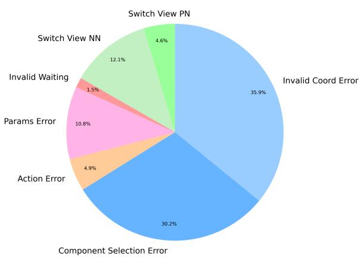  
Figure 5: Distribution of error types. The errors are grouped into Fine-grained Visual Grounding (blue), Action Execution (red), and Visual Navigation (green) categories.

To deeply understand the limitations of current advanced VLMs in performing generalizable visually grounded exploration, we conducted a systematic error analysis on the failure cases collected during the evaluation of Gemini-3-Flash, which serves as the best-performing model in our benchmark. We categorize the observed errors into three distinct groups: Fine-grained Visual Grounding, Action Execution, and Visual Navigation. These error categories are defined as follows:

<table><tr><td>Category</td><td>press</td><td>pull</td><td>push</td><td>rotate</td><td>grasp</td><td>timed_wait</td><td>Total</td></tr><tr><td>AirFryer</td><td>813</td><td>44</td><td>1</td><td>1051</td><td>0</td><td>0</td><td>1909</td></tr><tr><td>AirPurifier</td><td>268</td><td>0</td><td>0</td><td>6</td><td>0</td><td>0</td><td>274</td></tr><tr><td>CarKey</td><td>147</td><td>0</td><td>0</td><td>0</td><td>0</td><td>0</td><td>147</td></tr><tr><td>CoffeeMachine</td><td>752</td><td>86</td><td>55</td><td>63</td><td>10</td><td>366</td><td>1332</td></tr><tr><td>DigitalAlarmClock</td><td>314</td><td>11</td><td>118</td><td>42</td><td>0</td><td>45</td><td>530</td></tr><tr><td>DigitalCamera</td><td>92</td><td>19</td><td>34</td><td>99</td><td>0</td><td>0</td><td>244</td></tr><tr><td>ElectricFan</td><td>809</td><td>111</td><td>103</td><td>242</td><td>0</td><td>0</td><td>1265</td></tr><tr><td>ElectricKettle</td><td>85</td><td>4</td><td>167</td><td>9</td><td>0</td><td>43</td><td>308</td></tr><tr><td>ElectricToothbrush</td><td>66</td><td>6</td><td>34</td><td>56</td><td>14</td><td>0</td><td>176</td></tr><tr><td>FilmCamera</td><td>77</td><td>0</td><td>8</td><td>245</td><td>0</td><td>0</td><td>330</td></tr><tr><td>Flashlight</td><td>90</td><td>23</td><td>7</td><td>141</td><td>0</td><td>0</td><td>261</td></tr><tr><td>HairDryer</td><td>298</td><td>0</td><td>672</td><td>0</td><td>296</td><td>0</td><td>1266</td></tr><tr><td>Heater</td><td>177</td><td>7</td><td>2</td><td>270</td><td>0</td><td>0</td><td>456</td></tr><tr><td>Humidifier</td><td>194</td><td>0</td><td>0</td><td>8</td><td>0</td><td>0</td><td>202</td></tr><tr><td>Lamp</td><td>92</td><td>0</td><td>0</td><td>0</td><td>0</td><td>0</td><td>92</td></tr><tr><td>Landline</td><td>66</td><td>0</td><td>0</td><td>10</td><td>65</td><td>0</td><td>141</td></tr><tr><td>Lighter</td><td>124</td><td>0</td><td>92</td><td>165</td><td>0</td><td>49</td><td>430</td></tr><tr><td>MechanicalAlarmClock</td><td>47</td><td>9</td><td>57</td><td>182</td><td>0</td><td>16</td><td>311</td></tr><tr><td>Microwave</td><td>818</td><td>39</td><td>0</td><td>1304</td><td>0</td><td>0</td><td>2161</td></tr><tr><td>PowerBank</td><td>56</td><td>45</td><td>45</td><td>0</td><td>0</td><td>0</td><td>146</td></tr><tr><td>Razor</td><td>76</td><td>58</td><td>66</td><td>0</td><td>0</td><td>0</td><td>200</td></tr><tr><td>RiceCooker</td><td>174</td><td>56</td><td>2</td><td>0</td><td>0</td><td>9</td><td>241</td></tr><tr><td>ThermometerGun</td><td>21</td><td>2</td><td>2</td><td>0</td><td>0</td><td>0</td><td>25</td></tr><tr><td>Vacuum</td><td>43</td><td>10</td><td>51</td><td>42</td><td>0</td><td>0</td><td>146</td></tr><tr><td>WashingMachine</td><td>508</td><td>345</td><td>265</td><td>91</td><td>0</td><td>62</td><td>1271</td></tr><tr><td>WeighingScale</td><td>304</td><td>14</td><td>210</td><td>12</td><td>0</td><td>0</td><td>540</td></tr><tr><td>Total</td><td>6511</td><td>889</td><td>1991</td><td>4038</td><td>385</td><td>590</td><td>14404</td></tr></table>

Table 8: Statistical distribution of atomic actions across 26 device categories.

(1)Fine-grained Visual Grounding Errors: Failures in pixel-level localization, including Invalid Coord Error (clicking on non-interactive regions) and Component Selection Error (interacting with incorrect or non-optimal components).

(2)Action Execution Errors: Correct targeting but incorrect operation logic, comprising Params Error (wrong execution parameters, e.g., rotation direction), Action Error (mismatched atomic actions), and Invalid Waiting (waiting without triggering state changes).

(3)Visual Navigation Errors: Ineffective view exploration, specifically Switch View NN (ineffective searching) and Switch View PN (losing the target component).

Statistical analysis reveals that fine-grained visual grounding is the dominant failure mode, accounting for approximately 66.1% of all errors. This is significantly higher than Action Execution (17.2%) and Visual Navigation (16.7%). The high prevalence of coordinate-related errors indicates that precise spatial localization remains the primary bottleneck for current VLMs within the devicecentric interaction setting of VGEBench.

In conclusion, our analysis highlights a dichotomy in model performance: while agents demonstrate competent global navigation and highlevel planning, they exhibit significant weakness in fine-grained visual perception. Regarding reasoning, the high rate of parameter errors (10.8%) indicates a struggle with precise physical constraints even when the correct component is identified. Typical examples and the proportions for each category are shown in Tab. 9 and Fig. 5.

<table><tr><td>Error Type</td><td>Current View</td><td>Model Output</td></tr><tr><td>Invalid Coord Error</td><td rowspan="2"></td><td>I need to locate the release mechanism. In the front view, there is a prominent red button located just below the blade head assembly. Pressing this button should release the latch holding the blade head. Action: Press(coord=[500, 280], params=[0])</td></tr><tr><td>Component Selection Error</td><td>adjust the temperature switch, which is the upper sliding switch on the handle. The lower switch controls the fan speed and should remain in the &#x27;off&#x27; position as per the instruction. I will push the upper switch to its highest position. Action: Push(coord=[285, 620], params=[0])</td></tr><tr><td>Params Error</td><td rowspan="2">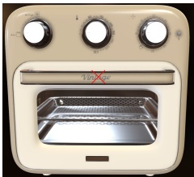</td><td>Thinking: To load the food, I first need to open the air fryer door. I will pull the handle located in the center of the door downwards. Action: Pull(coord=[500, 420], params=[1])</td></tr><tr><td>Action Error</td><td>Thinking: The flashlight has a button visible in the current ‘top view. It&#x27;s located on the neck of the flashlight. I will click on it to turn it on. Action: Click(params=[701, 303])</td></tr><tr><td>Invalid Waiting</td><td>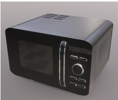</td><td>Thinking: The microwave is currently operating at medium power in short-time mode with the food inside, which fulfills the user&#x27;s instruction. I will wait for the cooking process to complete. Action: Timed_wait()</td></tr><tr><td>Switch View NN</td><td>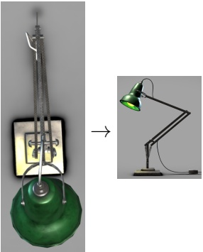</td><td>Thinking: The user wants to turn on the desk lamp. In the top view, I can see the lamp&#x27;s structure, but the switch on the cord is not clearly visible. I will switch to the right view to get a better look at the base and the cord, which might reveal the switch more clearly. Action: Switch_view(params=[right])</td></tr><tr><td>Switch View PN</td><td>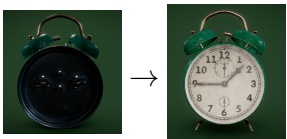</td><td>hand instead of the main time hand. To set the correct time, I need to identify the appropriate knob. I will switch to the front view to check the hand positions before adjusting the other knob. Action: Switch_view(params=[front])</td></tr></table>

Table 9: Typical examples of each error type on VGEBench. For actions that include coordinate parameters, we mark the corresponding locations with a red $^ { 6 6 } \times \vec { }$ . For Switch\_view actions, we display both the start view and the end view.

<table><tr><td>Model</td><td>SR↑</td><td>SSR ↑</td><td>SPL↑</td><td>State-F1 ↑</td><td>EIR↑</td><td>TIR ↑</td><td>VSPS↓</td><td>GVPE↓</td><td>EER↑</td></tr><tr><td>Gemini-3-Flash</td><td>56.38</td><td>64.32</td><td>39.23</td><td>78.51</td><td>64.79</td><td>42.77</td><td>1.18</td><td>1.94</td><td>63.11</td></tr><tr><td>Human Baseline</td><td>74.50</td><td>81.43</td><td>54.86</td><td>85.65</td><td>80.22</td><td>52.89</td><td>1.12</td><td>1.36</td><td>75.72</td></tr></table>

Table 10: Complete human baseline results on 149 episodes. Human participants and Gemini-3-Flash are evaluated under the same interface and interaction budgets.
<table><tr><td>Error Type</td><td>Gemini-3-Flash</td><td>Human Baseline</td><td>Difference (pp)</td></tr><tr><td>Invalid Coord Error</td><td>35.5%</td><td>26.2%</td><td>-9.3</td></tr><tr><td>Component Selection Error</td><td>30.6%</td><td>36.8%</td><td>+6.2</td></tr><tr><td>Params Error</td><td>10.8%</td><td>10.5%</td><td>-0.3</td></tr><tr><td>Action Error</td><td>4.9%</td><td>4.5%</td><td>-0.4</td></tr><tr><td>Invalid Waiting</td><td>1.5%</td><td>1.8%</td><td>+0.3</td></tr><tr><td>Switch View NN</td><td>12.1%</td><td>15.4%</td><td>+3.3</td></tr><tr><td>Switch View PN</td><td>4.6%</td><td>4.8%</td><td>+0.2</td></tr></table>

Table 11: Comparison of error distributions between Gemini-3-Flash and the human baseline. Percentages denote the proportion of each error type among all observed errors for the corresponding evaluator. Difference is computed as Human Baseline minus Gemini-3-Flash in percentage points.

## C Human Baseline Analysis

To contextualize current VLM performance, we evaluate a human baseline on 149 episodes (approximately 1% of VGEBench) under the same interface and interaction budgets as Gemini-3-Flash.

Table 10 reports the complete results across all evaluation metrics. Humans consistently outperform Gemini-3-Flash across the major taskperformance, visual grounding, and exploration metrics. Human performance nevertheless remains below saturation, indicating that manual-free operation of unfamiliar devices remains non-trivial even for humans under the constrained interaction setting.

Error Distribution Comparison. We further compare the distributions of interaction errors between humans and Gemini-3-Flash using the same error taxonomy introduced in Appendix B. As shown in Tab. 11, Humans and Gemini-3-Flash show similar overall distributions of Action Execution Errors and Visual Navigation Errors, with the main differences concentrated in Fine-grained Visual Grounding Errors: the Invalid Coord Error rate for humans is 26.2%, which is 9.3 percentage points lower than that of Gemini-3-Flash, while the Component Selection Error rate is 36.8%, which is 6.2 percentage points higher.

This pattern can be explained from the perspective of the information gained during interaction. Humans make fewer invalid coordinate errors, indicating that humans can localize actual interactive regions more precisely, thereby triggering valid component-level feedback and completing a more informative and effective hypothesisinteraction-refinement loop under the same interaction budget. In contrast, the model more frequently selects invalid coordinates, causing the feedback to remain at the lower-information “invalid coordinate” level and preventing it from fully entering subsequent functional inference and feedback-driven refinement. Therefore, the human baseline not only shows that the model continues to lag behind humans, but also provides supporting evidence for the importance of fine-grained visual grounding to exploration efficiency.

## D Environment Mechanism Details

## D.1 Environment Feedback Mechanism

The environment feedback is generated deterministically based on the matching result between the agent’s action and the Specific State Machine (SSM). We categorize the feedback into three distinct levels to guide the agent’s error recovery:

• Successful Transition: If a transition occurs, the system returns the description of the transition and the new state (e.g., “Power connected, the screen has turned on”).

• Operational Errors: If the agent interacts with a valid component but uses an incorrect action or parameters (e.g., rotating a button that should be pushed), the system provides a hint: “It seems that this component can be operated, but not in this way.”

• Null Effect: If the coordinates do not intersect with any interactive region, the system returns a “null” feedback.

## D.2 Interaction Budget Configuration

To ensure efficient task execution, the episode terminates if all sub-tasks are completed or if any of the two budget constraints is violated:

Global Interaction Budget $( B _ { \mathbf { g l o b a l } } ) \colon$ To limit the absolute resource consumption, the total number of interaction steps across the entire episode must not exceed a static upper bound $B _ { \mathrm { g l o b a l } }$ . This bound is determined by the total complexity of the task, defined as

$$
B _ { \mathrm { g l o b a l } } = \lambda \cdot \sum C _ { \mathrm { o p t } } ,\tag{1}
$$

where $\sum C _ { \mathrm { o p t } }$ represents the cumulative optimal cost across all sub-goals. Here, the optimal cost function is calculated as

$$
C _ { \mathrm { o p t } } = d ( S _ { \mathrm { s t a r t } } , S _ { \mathrm { e n d } } ) + k _ { \mathrm { v i e w } } ,\tag{2}
$$

composed of the shortest transition distance $d ( \cdot )$ on the ground-truth state machine graph and the minimum number of view switches $k _ { \mathrm { v i e w } }$ required along the path. λ is a redundancy factor defined to tolerate reasonable exploration, which is set to 5 in our main experiments.

Local Interaction Budget $( B _ { \mathrm { l o c a l } } ) \colon$ To prevent inefficient looping within specific sub-tasks, we maintain a dynamic interaction budget $\boldsymbol { B _ { \mathrm { l o c a l } } }$ for the current execution phase. $\boldsymbol { B _ { \mathrm { l o c a l } } }$ is initialized to a base value and decrements by 1 at each step. When the agent successfully completes a sub-goal and proceeds to the next target state $S _ { \mathrm { n e x t } }$ , B<sub>local</sub> is adaptively replenished based on the topological complexity of the upcoming task:

$$
B _ { \mathrm { l o c a l } }  \operatorname* { m a x } ( B _ { \mathrm { l o c a l } } , \lambda \cdot C _ { \mathrm { o p t } } ) .\tag{3}
$$

This mechanism ensures that the local budget is dynamically aligned with the difficulty of the current sub-task.

This dual-constraint mechanism enforces a rigorous standard for efficiency: the Global Constraint ensures the agent manages resources over the long horizon, while the Dynamic Local Constraint demands that the agent makes progress on specific sub-tasks without getting stuck in local optima. By grounding the budget in the ground-truth state machine $( C _ { \mathrm { o p t } } )$ , the protocol ensures the allowance is always proportional to the actual task difficulty.

## D.3 View Mechanism

The views include six orthographic views (front, back, left, right, top, bottom), two axonometric views (front\_top, back\_bottom) and a special “dashboard” view. Because common rectangular buttons are prone to distortion in axonometric views, which makes bounding box annotation difficult, we restrict the agent’s interactions to the orthographic views. The axonometric views are only used to provide the agent with global visual information.

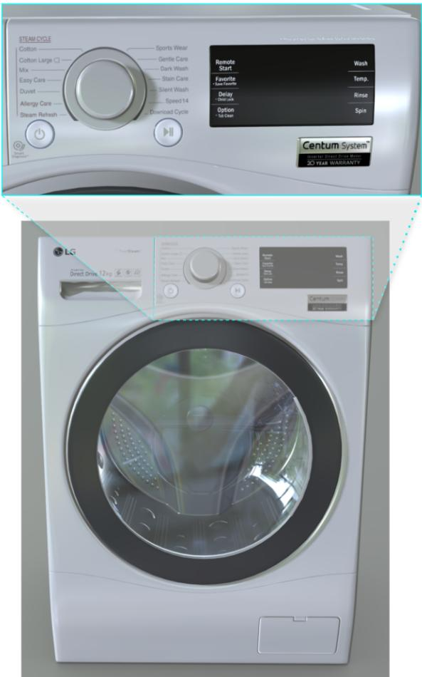  
Figure 6: Illustration of the Dashboard View mechanism. For large devices where descriptive text or buttons are too small relative to the global view, this specialized view simulates the human perspective of approaching the object for closer inspection, enabling precise finegrained interactions.

Dashboard View Mechanism. For large household devices such as washing machines, the descriptive text or buttons are often too small relative to the device’s global view, making interactive components difficult to recognize in the standard view. To address this challenge, we introduce a specialized Dashboard View that simulates the human perspective of approaching an object for closer inspection, as illustrated in Fig. 6. To prevent the agent from taking shortcuts, we do not provide the Dashboard View directly. Instead, we design two distinct unlocking mechanisms:

Active Unlock: Triggered when the agent explicitly executes a Switch\_view command with target coordinates falling within the dashboard region, resulting in an immediate transition to the Dashboard View.

Passive Unlock: Triggered implicitly when the agent attempts a spatial interaction (e.g., Press) within the locked region. In this case, the intended action is aborted and the view remains unchanged, but the dashboard state is updated to “unlocked” for subsequent operations.

Once unlocked, the dashboard functions as a standard view, enabling precise fine-grained interactions.

## D.4 Temporal and Chain Transitions

The simulator supports non-atomic state changes to model complex device behaviors:

Immediate Transitions: The state machine supports “immediate” nodes. If the system transitions to a state marked as immediate, it automatically evaluates the next transition without waiting for agent input. This allows for causal chains to be represented as a single step to the user.

Timed Actions: To support processes that require duration (e.g., a machine booting up), the system includes a Timed\_wait action. This action is only valid when the current state defines a temporal transition; otherwise, it returns feedback indicating that waiting had no effect.

## E Additional Analysis

In this section, we conduct analysis experiments on a randomly sampled 10% subset of VGEBench.

## E.1 History Length Sensitivity

We vary the history length provided to the agent during multi-turn interaction, where “No Limit” denotes access to the complete interaction history, and smaller values indicate that only the most recent interaction turns are retained.

As shown in Table 12, Gemini-3-Flash consistently benefits from longer interaction history. Its SR and SSR increase from 22.61% and 31.83% with no history to 55.04% and 63.29% when the complete history is retained. This suggests that

<table><tr><td rowspan="2">History Length</td><td colspan="2">Gemini-3-Flash</td><td colspan="2">Doubao-1.5</td></tr><tr><td>SR</td><td>SSR</td><td>SR</td><td>SSR</td></tr><tr><td>No Limit</td><td>55.04</td><td>63.29</td><td>16.30</td><td>24.15</td></tr><tr><td>10</td><td>51.10</td><td>59.88</td><td>18.19</td><td>25.99</td></tr><tr><td>3</td><td>48.70</td><td>58.29</td><td>18.66</td><td>26.21</td></tr><tr><td>1</td><td>42.47</td><td>51.69</td><td>17.19</td><td>24.58</td></tr><tr><td>0</td><td>22.61</td><td>31.83</td><td>13.24</td><td>20.26</td></tr></table>

Table 12: The result of history length sensitivity analysis. “No Limit” denotes that the complete interaction history is provided to the agent.

Gemini-3-Flash can effectively use long-horizon interaction traces to accumulate evidence and perform self-correction. In contrast, Doubao-1.5- Thinking-Vision-Pro achieves its best performance with a shorter history window of 3 turns, slightly outperforming the no-limit setting. This indicates that long histories may introduce distracting information for weaker models, especially when early failed attempts or irrelevant visual states remain in the context. Overall, the results show that interaction history is not merely a context-length variable, but also affects how different models balance useful feedback against historical noise.

## E.2 Visual Perturbation Robustness

Following ImageNet-C (Hendrycks and Dietterich, 2019) and Random Erasing (Zhong et al., 2020), we apply three common visual perturbations to the input observations: image compression, Gaussian blur, and random occlusion. We designed the severity levels to ensure equal intervals and observable gradients:

• Compression (Image Quality): We tested quality levels at 50 (mild artifacts) and 20 (severe blocking), simulating low-bandwidth transmission or low-quality sensors.

• Blur (Gaussian): We applied Gaussian blur with $\sigma \in \{ 1 . 0 , 3 . 0 , 5 . 0 \}$ , simulating motion blur or defocusing.

• Occlusion: We employed a “Coarse Dropout” strategy (Zhong et al., 2020) with 8 random black patches, covering total area ratios of 10%, 25%, and 40%, to simulate environmental clutter blocking the view.

Tables 13 and 14 show that both models are particularly sensitive to Gaussian blur. For Gemini-3-Flash, SR drops from 55.04% to 38.53% under strong blur with $\sigma = 5 . 0$ , and SSR decreases from

<table><tr><td>Perturbation Type</td><td>Severity Level</td><td>SR</td><td>SSR</td></tr><tr><td>Baseline</td><td>None</td><td>55.04</td><td>63.29</td></tr><tr><td rowspan="2">Compression</td><td>Quality = 50</td><td>53.29</td><td>62.83</td></tr><tr><td>Quality = 20</td><td>51.12</td><td>60.16</td></tr><tr><td rowspan="3">Blur</td><td> $\sigma = 1 . 0$ </td><td>51.85</td><td>60.94</td></tr><tr><td> $\sigma = 3 . 0$ </td><td>40.92</td><td>51.18</td></tr><tr><td> $\sigma = 5 . 0$ </td><td>38.53</td><td>48.12</td></tr><tr><td rowspan="3">Occlusion</td><td> $\mathrm { R a t i o } = 0 . 1 0$ </td><td>50.14</td><td>59.44</td></tr><tr><td> $\mathrm { R a t i o } = 0 . 2 5$ </td><td>50.73</td><td>58.69</td></tr><tr><td> $\mathrm { R a t i o } = 0 . 4 0$ </td><td>47.05</td><td>56.72</td></tr></table>

Table 13: The result of visual perturbation robustness analysis of Gemini-3-Flash.
<table><tr><td>Perturbation Type</td><td>Severity Level</td><td>SR</td><td>SSR</td></tr><tr><td>Baseline</td><td>None</td><td>16.30</td><td>24.15</td></tr><tr><td rowspan="2">Compression</td><td>Quality = 50</td><td>16.88</td><td>25.22</td></tr><tr><td>Quality = 20</td><td>16.31</td><td>23.27</td></tr><tr><td rowspan="2">Blur</td><td> $\sigma = 1 . 0$ </td><td>14.65</td><td>22.56</td></tr><tr><td> $\sigma = 3 . 0$ </td><td>10.28</td><td>17.40</td></tr><tr><td rowspan="3">Occlusion</td><td> $\sigma = 5 . 0$ </td><td>10.16</td><td>15.60</td></tr><tr><td> $\mathrm { R a t i o } = 0 . 1 0$ </td><td>15.94</td><td>22.97</td></tr><tr><td> $\mathrm { R a t i o } = 0 . 2 5$   $\mathrm { R a t i o } = 0 . 4 0$ </td><td>17.23 14.57</td><td>25.83 22.57</td></tr></table>

Table 14: The result of visual perturbation robustness of Doubao-1.5-Thinking-Vision-Pro.

63.29% to 48.12%. Doubao-1.5-Thinking-Vision-Pro shows a similar trend, with SR decreasing from 16.30% to 10.16% under the same blur severity. In contrast, compression and occlusion lead to more moderate degradation. These results further support our main finding that fine-grained visual grounding is a central bottleneck in VGEBench: when high-frequency details such as small component boundaries, icons, and textual cues are degraded, models struggle to maintain reliable interaction performance.

## E.3 Cross-Model Instruction Robustness

To examine whether the evaluation is sensitive to the choice of instruction generator, we regenerate the task instructions using two additional LLMs, DeepSeek-v4-pro and Qwen3.5-Plus. We evaluate both Gemini-3-Flash and GPT-5-mini using instructions generated by GPT-5-mini, DeepSeek-v4-pro, and Qwen3.5-Plus.

As shown in Tab. 15, changing the instruction generator results in only minor performance variations for both evaluated models. Gemini-3-Flash achieves SR between 55.04% and 56.86% and SSR between 63.29% and 64.19%, while GPT-5-mini achieves SR between 10.71% and 12.58% and SSR between 17.20% and 19.20%. In particular, using GPT-5-mini-generated instructions to evaluate GPT-5-mini does not produce a disproportionate performance increase compared with instructions generated by the other models. These results indicate that the evaluation is robust to the choice of instruction generator and does not exhibit a strong generator-specific performance advantage.

<table><tr><td>Generator</td><td>Evaluated Model</td><td>SR</td><td>SSR</td></tr><tr><td>GPT-5-mini DeepSeek-v4-pro</td><td>Gemini-3-Flash</td><td>55.04 55.52</td><td>63.29 63.38</td></tr><tr><td>Qwen3.5-Plus GPT-5-mini</td><td></td><td>56.86 12.58</td><td>64.19 19.20</td></tr><tr><td>DeepSeek-v4-pro</td><td>GPT-5-mini</td><td>10.71</td><td>17.20</td></tr><tr><td></td><td></td><td></td><td></td></tr><tr><td>Qwen3.5-Plus</td><td></td><td>11.04</td><td>18.05</td></tr></table>

Table 15: The result of cross-model instruction robustness analysis on a randomly sampled 10% subset of VGEBench.

## E.4 Instruction Style Robustness

To address the concern that the current fixed language pipeline might introduce template and stylistic biases, we design an additional experiment comparing multiple instruction rewriting prototypes. The results are reported in Table 16.

The experimental results demonstrate that our framework exhibits strong robustness to rewriting styles. The standard deviations across both metrics are consistently below 0.6%, and the narrow confidence intervals (CIs) further confirm the stability of the relative model ordering.

## F Detailed Evaluation Metrics

In this section, we provide the rigorous definitions and calculation details for the metrics used in our main evaluation.

## F.1 Task Performance

We primarily measure the Success Rate (SR), defined as the percentage of test episodes where the model successfully achieves the goal state. For better evaluating step-wise correctness in multi-turn tasks, we additionally report the Sub-task Success Rate (SSR) which calculates the ratio of successfully achieved sub-goals to the total number of required sub-goals within an episode.

<table><tr><td>Model</td><td>Metrics</td><td>Version 1</td><td>Version 2</td><td>Version 3</td><td>Version 4</td><td>Std Dev</td><td>95% CI</td></tr><tr><td>Gemini-3-Flash</td><td>SR SSR</td><td>51.64 60.09</td><td>51.51 59.84</td><td>52.71 60.95</td><td>52.44 59.99</td><td>0.59 0.50</td><td>[49.89, 54.26] [58.25, 62.19]</td></tr><tr><td>Doubao-1.5-Thinking-Vision-Pro</td><td>SR SSR</td><td>16.66 23.96</td><td>17.26 24.50</td><td>17.39 24.50</td><td>18.06 25.09</td><td>0.58 0.46</td><td>[15.64, 19.04] [22.78, 26.25]</td></tr></table>

Table 16: The result of instruction style robustness analysis. Performance is evaluated across four different instruction rewriting versions.

## F.2 Efficiency

Following Anderson et al. (2018), we evaluate execution efficiency using two metrics:

Success Weighted by Path Length (SPL): A metric that penalizes successful but inefficient executions. It is calculated as

$$
\mathrm { S P L } = S \times \frac { L _ { o p t } } { \operatorname* { m a x } ( L _ { a c t } , L _ { o p t } ) } ,\tag{4}
$$

where S indicates success (1 or 0), $\boldsymbol { L _ { o p t } }$ is the length of the theoretical shortest path derived from the state machine, and $L _ { a c t }$ is the model’s actual path length.

State-F1 Score: To measure the alignment between the model’s trajectory and the optimal solution, we treat the sequence of visited states as a set and compute the F1 score between the model’s state trajectory and the ground-truth optimal path.

## F.3 Visual Grounding and Perception

Inspired by RefCOCO (Yu et al., 2016), we evaluate the model’s visual interaction capabilities using four metrics:

Effective Interaction Rate (EIR): Measures the proportion of actions where the output coordinates (x, y) fall within the bounding box of any interactive component. This indicates the model’s fundamental ability to identify and interact with valid UI elements.

Target Interaction Rate (TIR): Measures the precision of goal-oriented grounding. An interaction is deemed accurate only if the coordinates fall within the bounding box of a component that triggers a transition to a state with a strictly shorter shortest-path distance to the current goal.

View Switches Per Success (VSPS) is an episode-level metric that calculates the number of view switches executed prior to a successful action, normalized by the number of goals achieved.

VSPS isolates local navigation efficiency, measuring how directly the model navigates to the target view when it correctly understands the task.

Global View Switches Per Episode (GVPE) is a dataset-level metric computed as the total number of view switches across all test episodes divided by the total number of achieved goals. Unlike VSPS, GVPE incorporates the cost of invalid exploration in failed episodes. It serves as a macro-level indicator of the exploration-to-success ratio.

## F.4 Exploration

Inspired by Webshop (Yao et al., 2022), we assess the model’s ability to explore devices’ functionality effectively by defining the Effective Exploration Rate (EER). We classify operations into valid and invalid categories. Invalid operations include repetitive actions, dangerous actions, and null-transition actions that trigger no state change. The EER is calculated as the ratio of valid operations to the total number of operation steps, reflecting the model’s reasoning efficiency and safety awareness.

## G Data Validation Details

## G.1 Annotation Quality Control

Our annotation process consists of two parts. First, annotators labeled the bounding boxes of all visible interactive components across 7,888 rendered views. Second, annotators annotated the trigger conditions for 15,861 state transition edges in the instantiated SSMs. Each transition trigger specifies the reactive coordinate region, the corresponding atomic action type, and the required action parameters. We use transition edges rather than components as the annotation unit because the same physical component may correspond to different state-dependent transitions or require different actions and parameters under different device states (e.g., pull to open vs. push to close).

We adopted a batch-level quality-control protocol for both annotation stages. For bounding-box annotation, annotators first completed an initial familiarization batch of approximately 100 views, all of which were manually reviewed. In regular annotation, each batch contained no fewer than 1,000 views; with a 10% random sampling rate, at least 100 views were reviewed per batch. For transitiontrigger annotation, each batch contained no fewer than 2,000 transition edges; therefore, at least 200 transition edges were reviewed per batch.

A batch was accepted only when its error rate was below 5%. Otherwise, the batch was rejected and reassigned for correction. This protocol provides reliable quality control for both visual component annotation and state-machine trigger annotation.

## G.2 Dataset Quality Validation

<table><tr><td>Evaluator</td><td>VGA</td><td>LC</td><td>IA</td><td>Avg.</td></tr><tr><td>Gemini-3-Flash</td><td>1.944</td><td>1.997</td><td>1.991</td><td>1.978</td></tr><tr><td>GPT5-mini</td><td>1.906</td><td>1.964</td><td>1.970</td><td>1.947</td></tr><tr><td>Human</td><td>1.910</td><td>1.954</td><td>1.965</td><td>1.943</td></tr></table>

Table 17: Data validation results on the validation subset. Scores are evaluated on a 3-level scale (0/1/2) and reported as the mean value across all samples.

In addition to batch-level annotation quality control, we established a rigorous quality validation scoring criteria to ensure dataset reliability. We defined three specific metrics to assess the quality of the visual grounding, logical feasibility, and instruction alignment. The detailed scoring criteria are described as follows:

Visual Grounding Accuracy (VGA): Measures whether the annotated bounding box (visual context) accurately identifies the specific physical UI element corresponding to the execution action.

• bad(0): The highlighted region is clearly incorrect, unrelated to the target element, or physically implausible.

• fair(1): The highlighted region partially matches the target or presents slight ambiguity regarding the specific element.

• good(2): The highlighted region clearly and correctly corresponds to the required trigger for the transition.

Logical Consistency (LC): Evaluates whether the state transition and action sequence are physically feasible and logically sound for the specific device configuration.

• bad(0): The transition from the start state to the end state is impossible or clearly contradicts physical constraints.

• fair(1): The transition is mostly logical but may involve minor practical issues or unlikely aspects.

• good(2): The transition is fully logical, feasible, and consistent with real-world physical behavior.

Instruction Alignment (IA): Assesses whether the symbolic state transition represents a valid subtask that effectively contributes to the user’s overall high-level intent.

• bad(0): The transition is clearly unrelated to any part of the user’s overall task.

• fair(1): The transition is partially related or exhibits minor mismatches with the user’s specific intent.

• good(2): The transition is fully contained within the user’s intended task and logically aligns with the execution plan.

## H Details of Exploration framework

Our exploration framework is based on a basic Re-Act paradigm (Yao et al., 2023), which employs an iterative reasoning–action loop to guide interaction with the environment. Given visual observations, the agent first analyzes the scene to identify potential interaction targets and infer device functionality. It then executes a single atomic action grounded on this reasoning, receives environment feedback, and continues the exploration process until the task objective is achieved.

System Prompt   
You are an intelligent robotic agent capable of manipulating a wide variety of household devices   
based on visual inputs.   
1. Output Format   
You must structure your response strictly in the following two parts:   
Thinking:   
Analyze the visual information to identify the target interactable area . Reason about the device   
functionality and the physics of the interaction (e.g., whether it is a button, a knob, a door, or   
a purely temporal process). If the required interaction target is not visible in the current view,   
or the task cannot yet be executed, reason about the appropriate non-physical action.   
Action:   
Execute the operation using a precise function call format.   
Format: ActionName(coord=[x, y], params=[...])   
For actions that do not require a spatial target, omit coord   
2. Coordinate System   
• Origin (0,0): Top-Left corner of the image.   
• X-axis: Extends horizontally to the Right.   
• Y-axis: Extends vertically Downwards.   
• Scale: Normalized integer coordinates ranging from 0 to 1000 (Top-Left: [0, 0], Bottom-Right:   
[1000, 1000]).   
3. Atomic Action Space   
Select the most appropriate action from the atomic operations below.   
Press(coord, params)   
• Description: Interacting with buttons, touchscreens, switches, or triggers.   
• Params: [duration\_type]   
– 0: Click (Standard press)   
– 1: Long Press (Hold for >1s)   
– 2: Double Click (Rapid toggle)   
Rotate(coord, params)   
• Description: Turning knobs, dials, keys, or mechanical winders.   
• Params: [direction, extent]   
– direction: 0 (Clockwise), 1 (Counter-clockwise), \* (Unconstrained or irrelevant)   
– extent: Integer representing the number of discrete rotational steps (e.g., notches or   
detents). \* (Rotation magnitude is unspecified).   
Push(coord, params)   
• Description: Applying force to slide objects, close doors, or insert plugs.   
• Params: [direction]   
– 0: Up, 1: Down, 2: Left, 3: Right   
– 4: In / Forward (e.g., closing a door, pushing a drawer in, inserting a cable)   
Pull(coord, params)   
• Description: Applying force to open doors, remove lids, or unplug cables.   
• Params: [direction]   
– 0: Up, 1: Down, 2: Left, 3: Right   
– 4: Out / Backward (e.g., opening a fridge, pulling a drawer out, unplugging)  
Table 18: System Prompt Part 1: Output Format, Coordinate System and Action Space. Format constraint , constraints & boundaries , logical mechanics are highlighted.

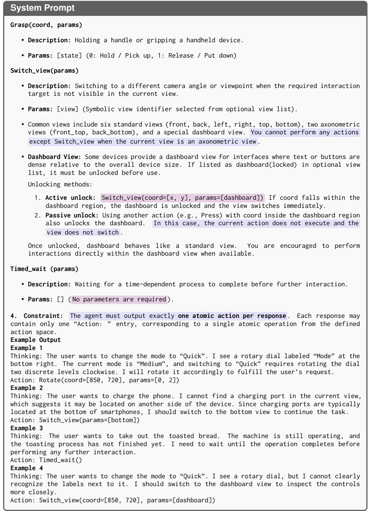  
Table 19: System Prompt Part 2: Action Space, Constraint and Examples. Format constraint , constraints & boundaries are highlighted.

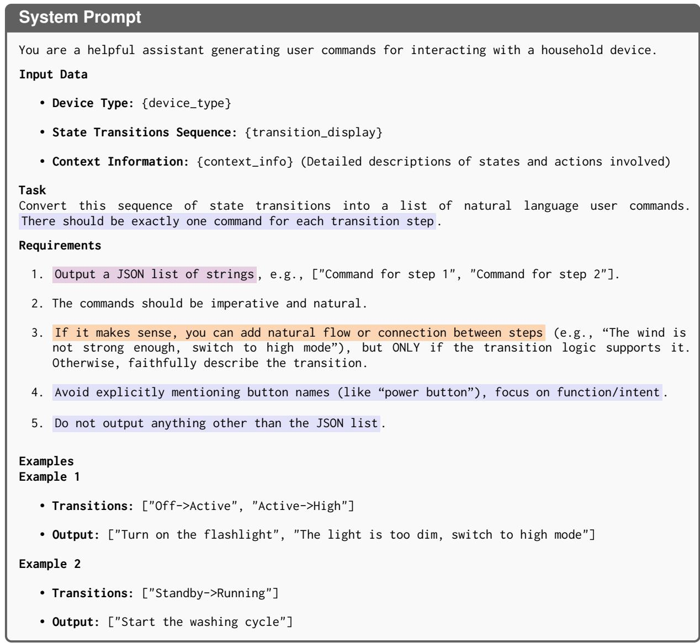  
Table 20: Prompt for Generating User Commands from State Transitions. Format constraint constraints & boundaries , logical mechanics are highlighted.

## I Data Sample

In this section, we present a detailed example of the state machine structure used in VGEBench, taking the Electric Kettle as a case study. We illustrate both the Universal Category State Machine (UCSM) and the derived Specific State Machine (SSM).

## I.1 Data Structure

Each device entry in our dataset consists of three primary fields: name, initial\_state, and states. The states field is a dictionary that defines the topology of the logic graph. Each state object includes:

• description: A natural language description of the current device status.

• on: A dictionary defining valid transitions. The keys correspond to interactive components (e.g., power\_button), and the values are lists of transition objects. A list is used because interacting with a single component can lead to different states depending on the action parameters (e.g., rotating a knob to position 1 vs. position 2).

Universal Category State Machine (UCSM). In the UCSM, each transition object primarily defines the next\_state and a transition\_description. Notably, some UCSMs include a special Error state. This state captures dangerous or invalid operations (e.g., opening the lid while the device is running). If an agent triggers such a transition, the device enters the Error state and is subsequently reset to the initial\_state, simulating a safety mechanism.

Specific State Machine (SSM). The SSM is derived from the UCSM by pruning transitions associated with components that are not visually present on the specific 3D model instance. Unreachable states and transitions are subsequently removed to ensure graph connectivity. Crucially, the SSM enriches each transition with ground-truth execution details:

• bbox: A list of bounding boxes for the interactive component. This is a list because a single component may be visible and actionable from multiple viewpoints (e.g., front, top, right).

• atomic\_action: The specific action type required (e.g., push, rotate).

• parameter: The precise parameters for the action (e.g., ["1"]).

## I.2 JSON Examples

Listing 1 shows the structure of the UCSM for the Electric Kettle category, and Listing 2 displays the instantiated SSM for a specific kettle instance, featuring detailed visual grounding annotations. For data privacy reasons, the “path” field has been anonymized.

```jsonl
"name": "ElectricKettle",
"initial_state": "Standby",
"states": {
"Off": {
"description": "Disconnect the power cord; the electric kettle is powered off",
"on": {
"power_input_port": [
{
"next_state": "Standby",
"transition_description": "Power connected, entering standby mode"
}
]
}
},
"Standby": {
"description": "Standby state, power connected but not started",
"on": {
"power_button": [
{
"next_state": "Boiling",
"transition_description": "Start the electric kettle; begin heating"
}
],
"lid_release_button": [
{
"next_state": "LidOpen",
"transition_description": "Open the kettle lid and prepare to add water"
}
],
"temperature_control": [
{
"next_state": "StandbyTemperatureControl",
"transition_description": "Adjust the keep-warm/target temperature setting"
}
],
"power_input_port": [
{
"next_state": "Off",
"transition_description": "Unplug the power cord; enter a power-off state"
}
]
}
},
"StandbyTemperatureControl": {
"description": "Adjusting keep-warm/target temperature settings",
"on": {
"immediate": [
"next_state": "Standby",
"transition_description": "Temperature setting completed; return to standby st
}
]
}
},
"Boiling": {
"description": "Heating or boiling water",
"on": {
"timed_wait": [
{
"next_state": "BoilingComplete",
"transition_description": "Water has boiled"
}
],
"power_button": [
{
"next_state": "Standby",
"transition_description": "Press the power button to stop heating"
}
```

],   
"temperature\_control": [   
{   
"next\_state": "BoilingTemperatureControl",   
"transition\_description": "Adjust the keep-warm/target temperature during heating"   
}   
],   
"power\_input\_port": [   
{   
"next\_state": "Off",   
"transition\_description": "Forced power-off caused heating interruption"   
  
],   
"lid\_release\_button": [   
{   
"next\_state": "Error",   
"transition\_description": "Forcibly opening the top cover during heating, dangerous   
operation"   
}   
]   
}   
},   
"BoilingTemperatureControl": {   
"description": "Adjust the keep-warm/target temperature during heating",   
"on": {   
"immediate": [   
{   
"next\_state": "Boiling",   
"transition\_description": "Finished adjusting temperature; return to heating state"   
}   
]   
}   
},   
"LidOpen": {   
"description": "Open the kettle lid and add water",   
"on": {   
"lid\_release\_button": [   
{   
"next\_state": "Standby",   
"transition\_description": "After adding water, close the kettle lid and return to standb   
}   
],   
"power\_button": [   
{   
"next\_state": "Error",   
"transition\_description": "Attempting to heat with the lid open, erroneous operation"   
}   
]   
}   
},   
"BoilingComplete": {   
"description": "Water has boiled, boiling process completed",   
"on": {   
"immediate": [   
{   
"next\_state": "Standby",   
"transition\_description": "Pour out the brewed water and return to standby"   
  
}   
},   
"Error": {   
"description": "Error operation state",   
"on": {   
"immediate": [   
{   
"next\_state": "Standby",   
"transition\_description": "An incorrect operation occurred; automatically reset to the   
initial state"

Listing 1: Example of the Universal Category State Machine (UCSM) for Electric Kettle.

```json
{
"name": "ElectricKettle",
"path": "image_view\\ElectricKettle\\device number",
"initial_state": "Standby",
"states": {
"Standby": {
"description": "Standby state, power connected but not started",
"on": {
"power_button": [
{
"next_state": "Boiling",
"transition_description": "Start the electric kettle; begin heating",
"bbox": [
{
"coordinate": [199, 815, 143, 57, 1138, 1122],
"view": "back"
},<sub>{</sub>
"coordinate": [915, 373, 160, 135, 1195, 908],
"view": "bottom"
},<sub>{</sub>
"coordinate": [852, 955, 184, 76, 1209, 1369],
"view": "front"
},<sub>{</sub>
"coordinate": [324, 978, 135, 66, 786, 1191],
"view": "right"
}
],
"atomic_action": "push",
"parameter": ["1"]
}
],
"lid_release_button": [
{
"next_state": "LidOpen",
"transition_description": "Open the kettle lid and prepare to add water"
"bbox": [
{
"coordinate": [216, 61, 98, 27, 1138, 1122],
"view": "back"
},
{
"coordinate": [881, 81, 117, 34, 1209, 1369],
"view": "front"
},
{
"coordinate": [336, 87, 84, 44, 786, 1191],
"view": "right"
},<sub>{</sub>
"coordinate": [1005, 377, 126, 96, 1292, 760],
"view": "top"
}
],
"atomic_action": "push",
"parameter": ["1"]
}
]
```

```csv
}
},
"Boiling": {
"description": "Heating or boiling water",
"on": {
"timed_wait": [
{
"next_state": "BoilingComplete",
"transition_description": "Water has boiled"
}
],
"power_button": [
{
"next_state": "Standby",
"transition_description": "Press the power button to stop heating",
"bbox": [
{
"coordinate": [199, 815, 143, 57, 1138, 1122],
"view": "back"
},
{
"coordinate": [915, 373, 160, 135, 1195, 908],
"view": "bottom"
},
{
"coordinate": [852, 955, 184, 76, 1209, 1369],
"view": "front"
},<sub>{</sub>
"coordinate": [324, 978, 135, 66, 786, 1191],
"view": "right"
}
],
"atomic_action": "push",
"parameter": ["0"]
}
],
"lid_release_button": [
{
"next_state": "Error",
"transition_description": "Forcibly opening the top cover during heating, dangerous
operation",
"bbox": [
{
"coordinate": [216, 61, 98, 27, 1138, 1122],
"view": "back"
},
{
"coordinate": [881, 81, 117, 34, 1209, 1369],
"view": "front"
},
{
"coordinate": [336, 87, 84, 44, 786, 1191],
"view": "right"
},<sub>{</sub>
"coordinate": [1005, 377, 126, 96, 1292, 760],
"view": "top"
}
],
"atomic_action": "push",
"parameter": ["1"]
}
]
},
"LidOpen": {
"description": "Open the kettle lid and add water",
"on": {
"lid_release_button": [
```

{   
"next\_state": "Standby",   
"transition\_description": "After adding water, close the kettle lid and return to standb   
"bbox": [   
{   
"coordinate": [216, 61, 98, 27, 1138, 1122],   
"view": "back"   
},   
{   
"coordinate": [881, 81, 117, 34, 1209, 1369],   
"view": "front"   
},<sub>{</sub>   
"coordinate": [336, 87, 84, 44, 786, 1191],   
"view": "right"   
},<sub>{</sub>   
"coordinate": [1005, 377, 126, 96, 1292, 760],   
"view": "top"   
}   
],   
"atomic\_action": "push",   
"parameter": ["0"]   
}   
],   
"power\_button": [   
{   
"next\_state": "Error",   
"transition\_description": "Attempting to heat with the lid open, erroneous operation",   
"bbox": [   
{   
"coordinate": [199, 815, 143, 57, 1138, 1122],   
"view": "back"   
},   
{   
"coordinate": [915, 373, 160, 135, 1195, 908],   
"view": "bottom"   
},   
{   
"coordinate": [852, 955, 184, 76, 1209, 1369],   
"view": "front"   
},   
{   
"coordinate": [324, 978, 135, 66, 786, 1191],   
"view": "right"   
}   
],   
"atomic\_action": "push",   
"parameter": ["1"]   
}   
]   
}   
},   
"BoilingComplete": {   
"description": "Water has boiled, boiling process completed",   
"on": {   
"immediate": [   
{   
"next\_state": "Standby",   
"transition\_description": "Pour out the brewed water and return to standby"   
}   
]   
}   
},   
"Error": {   
"description": "Error operation state",   
"on": {   
"immediate": [   
{

"next\_state": "Standby",   
"transition\_description": "An incorrect operation occurred; automatically reset to the   
initial state"   
}   
]   
}   
}  
Listing 2: Example of the Specific State Machine (SSM) for a specific kettle instance. Transitions now include fine-grained bounding boxes across multiple views, atomic actions and corresponding parameters.