# Towards a Reliable and Practical Eval Pipeline

Emma Thuong Nguyen Salesforce emmanguyen@salesforce.com

Abhishek Ghose Salesforce aghose@salesforce.com

## Abstract

LLM-based software systems increasingly require effective “evals” as quality gates in the development lifecycle. However, existing work typically addresses individual aspects of eval reliability rather than the full set of practical requirements. We present an end-to-end eval pipeline that combines eval checklist creation, with learned aggregation for checklist responses, to improve agreement across LLM judges and accuracy against human judgments. The framework additionally provides self-consistency, explanations, and prediction uncertainty, and we empirically demonstrate its effectiveness.

## 1 Introduction

Over the past few years Large Language Models (LLM) have become a common ingredient in software, where they assist users in a variety of tasks such as drafting emails, writing and summarizing documents. This has engendered novel challenges in the software development process, where such product features are required to be released only after passing through rigorous quality tests. Here, the traditional practice of writing purely programmatic tests no longer suffices, and this step needs to utilize LLMs as well. For example, if a particular LLM-driven feature produces summaries, a corresponding test that checks for its coherence orfluency also typically needs to use an LLM.

This creates an interesting problem: the fundamental behaviors we want our tests to check, e.g., effects of LLM non-determinism, are also possessed by the tests themselves. How do we then ensure that our tests precisely measure what we intend them to, and also provide guarantees similar to a traditional quality assurance framework?

Effective LLM-as-judge evaluations (“evals” henceforth) are a topic of active research, e.g., G-Eval [Liu et al., 2023], CheckEval [Lee et al., 2025], Prometheus-2 [Kim et al., 2024], FActScore [Min et al., 2023], dynamic rubrics based on information gain [Xu et al., 2026], hybrid judges for image caption evaluation [Matsuda et al., 2025], GraphJudge for evaluating knowledge graphs [Huang et al., 2025]. However, most research focuses on specific aspects of evals; usually certain forms of alignment with human judges. We believe that this state of the current literature leaves open many questions wrt practical deployment .

These gaps exist both in form of (a) not examining different aspects of alignment, and (b) not covering the full gamut of practical use-cases. In a sense, recent research leans towards addressing challenges that may be deemed necessary, but are not sufficient for a practical setup. Our focus is the latter.

Our primary contributions are: (a) first, we present the desiderata of a practical eval framework, outlining risks and benefits, and (b) then, we propose such a framework, and empirically show that it effectively satisfies those needs. Rather than a single novel idea, this work offers an assembly of strategies to create an end-to-end eval pipeline that can augment a standard quality assurance pipeline.

The paper is organized as follows: we begin by listing the desiderata for a practical eval framework in §2, and then we present an overview of our framework in §3. Sections 4 - 7 present our empirical analyses. Our final section, §8, discusses limitations of the current study, and our conclusions.

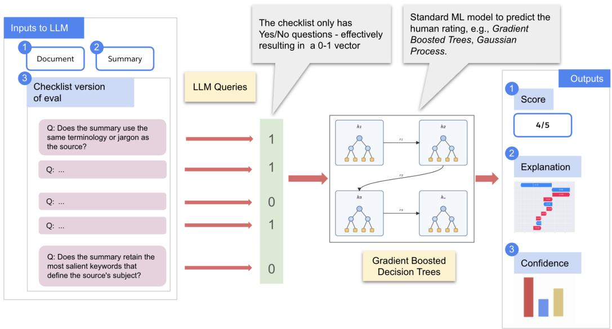  
Figure 1: Our eval pipeline. A checklist of YES/NO eval questions are sent to an LLM, along with inputs for the eval. In this example, the eval assesses the quality of summarization, so a document and its corresponding summary constitute our additional inputs. The outputs from the LLM are sent to a tabular model, e.g., Gradient Boosted Decision Trees, to produce the final judgment score. An explanation, and some form of confidence score, are also produced. See §3 for details.

## 2 A Practical Eval Pipeline

We believe that a practical eval system must at least ensure the following properties:

P1. Inter-LLM Agreement (or agreement in short): An eval output must exhibit minimal variance across LLMs. The lack of this property is a business risk. LLM A might clear all tests today, but when evals are switched to use LLM B (maybe due to an organization’s policy) that’s a harsher critic, we might end up with high failure rates.

P2. Accuracy: Eval outcomes must closely match human judgments. This is in contrast to most empirical analyses where some form of correlation, e.g., Kendall’s τ or Spearman correlation coefficient ρ, is measured, e.g., Lee et al. [2025], Liu et al. [2023]. Product quality gates are almost always hard thresholds, e.g., “the coherence score for this summary must be $\geq 4 ^ { \prime }$ . For such scenarios, there is a budgeting risk in productizing research with reported success in correlation-type metrics.

P3. Self-consistency: An eval output should exhibit minimal variation across multiple executions against the same LLM. This directly impacts how many times a test needs to be run for it to certify that a feature works. Thus, this impacts development cost and time-to-ship.

P4. Explainability: In traditional software testing, it is easy to trace failures to pinpoint a cause, by looking at a stack trace or logs. This is difficult when evals are complex and are written as large text prompts. What’s the equivalent of a stack trace in this new world?

P5. Confidence scores: Since LLM-based evals are probabilistic, we need to provide some representation of confidence for eval outcomes. We need to move away from hard predictions, e.g., “the eval score is 5” to soft estimates, e.g., “the eval score has a 90% prediction interval of 3-5”.

P1-P3 characterize forms of alignment, while P4 and P5 represent additional critical use-cases.

## 3 Methodology

Our eval pipeline is shown in Figure 1. All evals are represented as a checklist of d atomic YES/NO questions. The checklist, along with eval inputs, are sent to an LLM, which produces a binary vector of responses $x \in \{ 0 , 1 \} ^ { d }$ . A model $f : \{ 0 , 1 \} ^ { d } \mapsto$ R learned earlier is used $\mathrm { t o } \ \mathrm { ^ {  } a g g r e g a t e ^ { \prime \prime } }$ these responses to predict a judgment $y = f ( x )$ . We produce two additional outputs: (1) explanations using SHAP, which help a user trace back a judgment to specific questions, and (2) a representation of confidence, either in the form of a calibrated probability [Platt, 1999, Guo et al., 2017, Niculescu-Mizil and Caruana, 2005] or a high-confidence interval via conformal prediction [Shafer and Vovk, 2008].

The checklist and the model are created in a prior eval-authoring step. This requires human inputs in the form of: (a) an eval prompt - we’ll refer to this as the seed prompt, and (b) sample inputs and outputs for their eval. The step produces, as output, (1) an eval checklist, and (2) a model $\bar { f } .$

The seed prompt is decomposed into multiple simpler YES/NO questions. The idea is that (a) having targeted atomic questions leaves little room for ambiguity, and (b) having multiple of them acts as an “error buffer”: even if the LLM misinterprets one question, it is unlikely that it will misinterpret every related question, which leads to a stable fraction of YES responses. This strategy leads to both improved agreement and self-consistency (empirically shown in §5).

We are motivated to follow the above strategy due to its success in a variety of eval settings [Min et al., 2023, Lee et al., 2025, Liu et al., 2024, Li et al., 2025, Xu et al., 2026]. We specifically use CheckEval [Lee et al., 2025] because of its good results wrt inter-LLM agreement.

Since our goal also is accuracy wrt human judgment, we use the eval input-output examples to construct our model f. The technique of using a model in the final step has successful precedents [Hashemi et al., 2024, Liu et al., 2024]. We use Gradient Boosted Decision Trees (GBDT) [Friedman, 2001, Ke et al., 2017] in this work, which gives us positive results (see §5).

In addition to being a powerful model family, GBDTs offer other benefits: (a) they may be easily learned for a specific output type, e.g., y may be boolean, ordinal, categorical or continuous; (b) we use SHAP [Lundberg and Lee, 2017] to generate prediction explanations, which permits exact explanations for tree-based models such as GBDTs.

## 4 Experiment Setup

In our experiments, we rigorously measure agreement, self-consistency and accuracy, and present persuasive results for confidence scoring and explanations (these rely on standard techniques).

Dataset and LLMs: The SummEval [Fabbri et al., 2021] dataset (MIT License) is used for experiments. It consists of documents, their corresponding summaries (more than one summary per document), and human-provided scores per summary that assess their quality across different axes. These axes are coherence, consistency,fluency and relevance, and we have one eval corresponding to each $\mathrm { a x i s } ^ { 1 }$ . Each summary, per quality axis, is rated by multiple human raters, with the provided scores being in {1, 2, 3, 4, 5}. The summaries are our measurement units, and for summary $s _ { i }$ and an eval axis, we average the human ratings to obtain the ground truth (GT) label $y _ { i } \in [ 1 , 5 ]$

We generate LLM scores for two additional configuration parameters :

1. LLMs: We use $L = 4$ different LLMs to measure agreement. The LLMs used are Opus 4.8 (abbreviated to opus), Sonnet 4.6 (sonnet), GPT 5.6 Sol (sol), Grok 4.6 (grok). For sonnet the temperature was set to 0; the others don’t support this parameter.

2. Number of trials: Each eval execution is repeated T times to measure statistical significance. In our experiments $T = 5$

These additional configurations will be denoted by the indices l and t respectively; the predicted scores are denoted as $\hat { y } _ { i l t }$ for summary $s _ { i }$ for a particular eval axis.

Assuming a checklist size of d questions for an eval, a response vector generated for various combinations is denoted by $x _ { i l t } \in \{ 0 , 1 \} ^ { d }$ . We train one GBDT model per eval, on tuples of the form $( x _ { i l t } , y _ { i } )$ to minimize $R M S E ( y _ { i } , \hat { y } _ { i l t } )$ on a held-out set. Thus, for an eval, each GT label is paired with $L \times T$ inputs. Essentially, the model is trained to map from various noisy realizations of x to a GT label. We use a train-conformal-test split of 50 : 10 : 40 (the conformal split is used in §7), and to prevent data leakage, we ensure that data related to a specific $s _ { i }$ is in exactly one split. For additional details, please see §A.

Metrics: As mentioned above, accuracy is measured using the RMSE score. Lower is better.

For measuring agreement and self-consistency (note, these scores don’t use GT, only $\hat { y } _ { i l t } \ )$ , we do not use the popular Krippendorff’s-α score because: (a) we have multiple trials per rater/LLM, which α doesn’t naturally accommodate, and (b) α might be negative [Artstein and Poesio, 2008], and we prefer a range of [0, 1] for easy interpretation.

Instead we map our scores from a range of $[ 1 , 5 ] \ \mathrm { t o } \ [ 0 , 1 ]$ , and define the disagreement between two scores a and b as $D = | a - b |$ . For an eval, this is averaged over trials for a measurement unit (here, a summary) to produce $\bar { D } _ { i }$ . For agreement, the averaging for two given $\mathrm { L L M s } ^ { 2 }$ is over their $T ^ { 2 }$ possible trial combinations, and for self-consistency the $\check { T } ( T - 1 ) / 2$ unique combinations for an LLM are used. Finally we report $1 - \bar { D } _ { i }$ as our score (agreement or self-consistency, depending on the averaging) for this unit. Further averaging is called out in our analyses in §5.

Of course, since these scores are not chance-adjusted, they should be interpreted jointly with accuracy.

Hardware: The LLMs were accessed through an Amazon Bedrock API. All experiments were run on a M3 Max Apple Macbook Pro laptop.

## 5 Results

This section presents results from our setup as compared to a baseline. The latter uses seed prompts from prior literature - see $\ S \mathrm { A } . 1$

Agreement: The average agreement for a pair of LLMs is shown as 4 × 4 heatmap in Figure 2. A particular cell further averages $1 - { \bar { D } } _ { i }$ over all summaries and evals in a common held-out set. Figure 2(a) shows baseline results, and both (b) and (c) come from our setup.

In Figure 2(b), the aggregator model f has seen data from all LLMs during training, and a cell indexed by $[ A , B ]$ compares the agreement between LLMs A and B on a held-out set. We notice that (b) produces much higher scores than (a), and the overall average (in the plot title) improves: 0.84 → 0.96.

Perhaps more interesting is Figure 2(c). Here an LLM is held-out as well, and we cycle through all the LLMs, denoted by rows. For example, the first row indicates that the model f only saw data from opus, sol and sonnet in the training data, but the agreement is computed between each of these and grok, on a held-out set. Even here, we note high scores for all pairs.

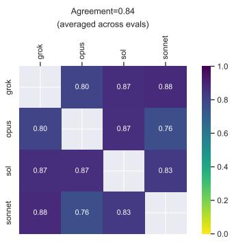  
(a) Baseline agreements.

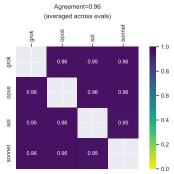  
(b) Agreements - all LLMs in train/test.

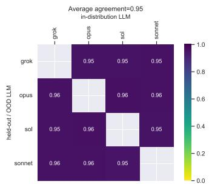  
(c) Agreements - with one held-out LLM.  
Figure 2: LLM agreements on held-out test data (higher is better). (a) shows baseline agreements, (b) and (c) are from our setup. In (b) data from all LLMs were present both in train and test splits. In (c), for a row, data from the LLM indexing the row was absent in train, but agreements are reported with the other LLMs on a held-out set. See text for details.

Self-consistency: The self-consistency scores on the baseline prompts, and then on the output from our framework, are shown in Table 1. The score for an LLM are averaged over summaries and evals. Here, the scores look good to start with, although Sol and Grok seem to benefit most from our approach, and the overall average slightly improves.

<table><tr><td></td><td>grok</td><td>opus</td><td>sol</td><td>sonnet</td><td>Average</td></tr><tr><td>Baseline</td><td>0.94</td><td>0.97</td><td>0.96</td><td>0.99</td><td>0.97</td></tr><tr><td>Our setup</td><td>0.97</td><td>0.99</td><td>0.98</td><td>0.99</td><td>0.98</td></tr></table>

Table 1: Self-consistency averaged across all evals, per LLM. Higher is better.

Accuracy: Accuracy scores, per eval, are shown as grouped bar plots in Figure 3. Each group shows a bar for the baseline RMSE (labeled Baseline), aggregation via just reporting the fraction of YES answers (labeled CheckEval), and the output from the entire pipeline (labeled CheckEval+ML).

We show the CheckEval bars to emphasize that reducing variability - which CheckEval is effective at when the fraction of YESes are reported as the final score (as reported in the original work Lee et al. [2025]) is insufficient to obtain good accuracy. In fact, for the coherence eval, CheckEval is worse than Baseline. In all cases, CheckEval+ML produces the lowest RMSE score.

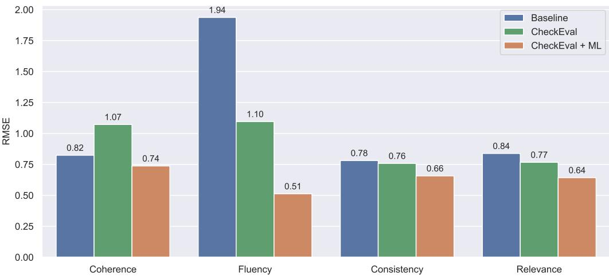  
Figure 3: Eval accuracy measured using RMSE (lower is better).

## 6 Explanations

It is often not enough to know why a test produced a certain result; the ability to trace an outcome back to causes provides an actionable path to improving a product feature. For a typical LLM eval driven by one prompt, since both the prompt and input might be long, pinpointing an exact fragment in the input, and the corresponding violated rubric in the eval prompt, is much harder. The simple strategy of asking the LLM to explain its judgment has been shown to be unreliable: LLMs tend to favor plausibility overfaithfulness [Turpin et al., 2023, Madsen et al., 2024, Chen et al., 2025].

Our framework is able to sidestep this issue:

• Because our eval is distilled into a checklist, there are specific contributing questions to point back to.

• Using a tabular model as the aggregator allows us to use a popular technique like SHAP to identify questions most influential to a specific outcome. Additionally for GBDTs, TreeSHAP [Lundberg et al., 2019] provides exact SHAP attribution values. Figure 4 shows a waterfall plot<sup>3</sup> of question influences, produced by SHAP.

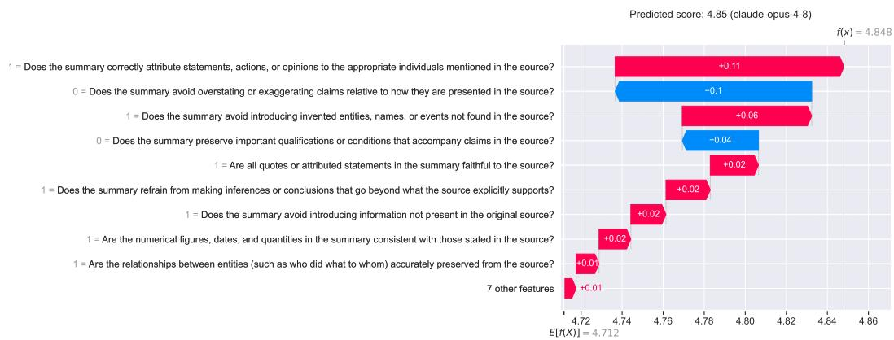  
Figure 4: A standard SHAP waterfall chart for a particular input - for the consistency eval, on opus - showing influences of various questions in a checklist, in decreasing order from top-to-bottom.

## 7 Prediction Confidence

We discuss how we quantify uncertainty, which arises due to various factors such as variability across LLMs, non-determinism, and eval inputs that are poorly represented in the training data.

While this is convenient with a model like Gaussian Process [Rasmussen and Williams, 2005], as mentioned earlier, we prefer a tree-based model due to high-fidelity SHAP explanations. We use conformal predictions (CP) here to report prediction intervals that are likely to contain the true outcome 90% of the time. Being model-agnostic, CP also makes this step invariant to future model changes. We use the residual-normalized version [Lei et al., 2018, Cordier et al., 2023] to make the intervals input-adaptive.

To validate, we generate synthetic data from valid $x _ { i l t } ~ \in ~ \{ 0 , 1 \} ^ { d }$ vectors by flipping $b \in$ {0.2, 0.4, 0.6} fraction of bits, and visualize the distribution of the interval widths; shown in Figure 5, for the (a) consistency, and (b) coherence evals. The “inliers” KDE plot is on the test data, and is expected to have relatively small widths; the legend shows its empirical coverage. In both cases, we observe that higher values b lead to wider intervals (expected behavior). See §A.4 for more plots.

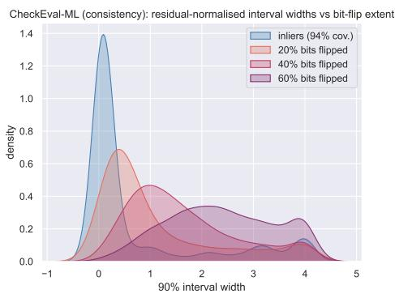  
(a) consistency eval

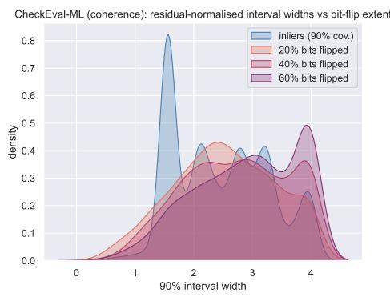  
(b) coherence eval  
Figure 5: Distribution of interval widths on actual (inliers) vs synthetic noisy data.

## 8 Limitations and Conclusion

In this work we presented a reliable eval pipeline that meets multiple practical requirements, listed in §2. We think this work is important in bringing academic research into the industry; even if the exact pipeline isn’t used, the general architecture and specific components may be built upon. An obvious limitation of this work is that it is validated on a single dataset for the task of summarization, against proprietary LLMs; something that the authors are working to address.

## 9 Acknowledgements

This work was possible with the support of the Q3 Salescloud team in Salesforce, specifically Ronnie Fong, Nitin Jain and William Hackett. We are grateful to Harsha Medikonda, Prasad Maderamitla, Hinita Patel, Aaron Quan and Soumya Mittapalli, for pointing us to multiple real-world challenges. We also would like to thank Pratik Gupte, Kimberley Lee and Daniel May for various technical suggestions.

## References

Ron Artstein and Massimo Poesio. Inter-coder agreement for computational linguistics. Computational Linguistics, 34(4):555–596, 12 2008. ISSN 0891-2017. doi: 10.1162/coli.07-034-R2. URL https://doi.org/10.1162/coli.07-034-R2.

Yanda Chen, Joe Benton, Ansh Radhakrishnan, Jonathan Uesato, Carson Denison, John Schulman, Arushi Somani, Peter Hase, Misha Wagner, Fabien Roger, Vlad Mikulik, Samuel R. Bowman, Jan Leike, Jared Kaplan, and Ethan Perez. Reasoning models don’t always say what they think, 2025. URL https://arxiv.org/abs/2505.05410.

Thibault Cordier, Vincent Blot, Louis Lacombe, Thomas Morzadec, Arnaud Capitaine, and Nicolas Brunel. Flexible and systematic uncertainty estimation with conformal prediction via the mapie library. In Harris Papadopoulos, Khuong An Nguyen, Henrik Boström, and Lars Carlsson, editors, Proceedings ofthe Twelfth Symposium on Conformal and Probabilistic Prediction with Applications, volume 204 of Proceedings ofMachine Learning Research, pages 549–581. PMLR, 13–15 Sep 2023. URL https://proceedings.mlr.press/v204/cordier23a.html.

Alexander R. Fabbri, Wojciech Krysci´ nski, Bryan McCann, Caiming Xiong, Richard Socher, and´ Dragomir Radev. Summeval: Re-evaluating summarization evaluation. Transactions of the Associationfor Computational Linguistics, 9:391–409, 04 2021. ISSN 2307-387X. doi: 10.1162/ tacl\_a\_00373. URL https://doi.org/10.1162/tacl\_a\_00373.

Jerome H. Friedman. Greedy function approximation: A gradient boosting machine. The Annals of Statistics, 29(5):1189 – 1232, 2001. doi: 10.1214/aos/1013203451. URL https://doi.org/10. 1214/aos/1013203451.

Chuan Guo, Geoff Pleiss, Yu Sun, and Kilian Q. Weinberger. On calibration of modern neural networks. In Proceedings of the 34th International Conference on Machine Learning - Volume 70, ICML’17, page 1321–1330. JMLR.org, 2017.

Helia Hashemi, Jason Eisner, Corby Rosset, Benjamin Van Durme, and Chris Kedzie. LLMrubric: A multidimensional, calibrated approach to automated evaluation of natural language texts. In Lun-Wei Ku, Andre Martins, and Vivek Srikumar, editors, Proceedings of the 62nd Annual Meeting of the Association for Computational Linguistics (Volume 1: Long Papers), pages 13806–13834, Bangkok, Thailand, August 2024. Association for Computational Linguistics. doi: 10.18653/v1/2024.acl-long.745. URL https://aclanthology.org/2024.acl-long.745/.

Haoyu Huang, Chong Chen, Zeang Sheng, Yang Li, and Wentao Zhang. Can LLMs be good graph judge for knowledge graph construction? In Christos Christodoulopoulos, Tanmoy Chakraborty, Carolyn Rose, and Violet Peng, editors, Proceedings ofthe 2025 Conference on Empirical Methods in Natural Language Processing, pages 10929–10948, Suzhou, China, November 2025. Association for Computational Linguistics. ISBN 979-8-89176-332-6. doi: 10.18653/v1/2025.emnlp-main. 554. URL https://aclanthology.org/2025.emnlp-main.554/.

Guolin Ke, Qi Meng, Thomas Finley, Taifeng Wang, Wei Chen, Weidong Ma, Qiwei Ye, and Tie-Yan Liu. Lightgbm: A highly efficient gradient boosting decision tree. In I. Guyon, U. Von Luxburg, S. Bengio, H. Wallach, R. Fergus, S. Vishwanathan, and R. Garnett, editors, Advances in Neural Information Processing Systems, volume 30. Curran Associates, Inc., 2017. URL https://proceedings.neurips.cc/paper\_files/paper/2017/file/ 6449f44a102fde848669bdd9eb6b76fa-Paper.pdf.

Seungone Kim, Juyoung Suk, Shayne Longpre, Bill Yuchen Lin, Jamin Shin, Sean Welleck, Graham Neubig, Moontae Lee, Kyungjae Lee, and Minjoon Seo. Prometheus 2: An open source language model specialized in evaluating other language models. In Yaser Al-Onaizan, Mohit Bansal, and Yun-Nung Chen, editors, Proceedings of the 2024 Conference on Empirical Methods in Natural Language Processing, pages 4334–4353, Miami, Florida, USA, November 2024. Association for Computational Linguistics. doi: 10.18653/v1/2024.emnlp-main.248. URL https://aclanthology.org/2024.emnlp-main.248/.

Yukyung Lee, JoongHoon Kim, Jaehee Kim, Hyowon Cho, Jaewook Kang, Pilsung Kang, and Najoung Kim. CheckEval: A reliable LLM-as-a-judge framework for evaluating text generation

using checklists. In Christos Christodoulopoulos, Tanmoy Chakraborty, Carolyn Rose, and Violet Peng, editors, Proceedings of the 2025 Conference on Empirical Methods in Natural Language Processing, pages 15771–15798, Suzhou, China, November 2025. Association for Computational Linguistics. ISBN 979-8-89176-332-6. doi: 10.18653/v1/2025.emnlp-main.796. URL https://aclanthology.org/2025.emnlp-main.796/.

Jing Lei, Max G’Sell, Alessandro Rinaldo, Ryan J. Tibshirani, and Larry Wasserman. Distributionfree predictive inference for regression. Journal ofthe American Statistical Association, 113(523): 1094–1111, 2018. doi: 10.1080/01621459.2017.1307116. URL https://doi.org/10.1080/ 01621459.2017.1307116.

Minzhi Li, Zhengyuan Liu, Shumin Deng, Shafiq Joty, Nancy Chen, and Min-Yen Kan. DnAeval: Enhancing large language model evaluation through decomposition and aggregation. In Owen Rambow, Leo Wanner, Marianna Apidianaki, Hend Al-Khalifa, Barbara Di Eugenio, and Steven Schockaert, editors, Proceedings ofthe 31st International Conference on Computational Linguistics, pages 2277–2290, Abu Dhabi, UAE, January 2025. Association for Computational Linguistics. URL https://aclanthology.org/2025.coling-main.156/.

Yang Liu, Dan Iter, Yichong Xu, Shuohang Wang, Ruochen Xu, and Chenguang Zhu. G-eval: NLG evaluation using gpt-4 with better human alignment. In Houda Bouamor, Juan Pino, and Kalika Bali, editors, Proceedings of the 2023 Conference on Empirical Methods in Natural Language Processing, pages 2511–2522, Singapore, December 2023. Association for Computational Linguistics. doi: 10.18653/v1/2023.emnlp-main.153. URL https://aclanthology.org/2023. emnlp-main.153/.

Yuxuan Liu, Tianchi Yang, Shaohan Huang, Zihan Zhang, Haizhen Huang, Furu Wei, Weiwei Deng, Feng Sun, and Qi Zhang. HD-eval: Aligning large language model evaluators through hierarchical criteria decomposition. In Lun-Wei Ku, Andre Martins, and Vivek Srikumar, editors, Proceedings of the 62nd Annual Meeting of the Association for Computational Linguistics (Volume 1: Long Papers), pages 7641–7660, Bangkok, Thailand, August 2024. Association for Computational Linguistics. doi: 10.18653/v1/2024.acl-long.413. URL https://aclanthology.org/2024. acl-long.413/.

Scott M. Lundberg and Su-In Lee. A unified approach to interpreting model predictions. In Proceedings ofthe 31st International Conference on Neural Information Processing Systems, NIPS’17, page 4768–4777, Red Hook, NY, USA, 2017. Curran Associates Inc. ISBN 9781510860964.

Scott M. Lundberg, Gabriel G. Erion, and Su-In Lee. Consistent individualized feature attribution for tree ensembles, 2019. URL https://arxiv.org/abs/1802.03888.

Andreas Madsen, Sarath Chandar, and Siva Reddy. Are self-explanations from large language models faithful? In Lun-Wei Ku, Andre Martins, and Vivek Srikumar, editors, Findings of the Associationfor Computational Linguistics: ACL 2024, pages 295–337, Bangkok, Thailand, August 2024. Association for Computational Linguistics. doi: 10.18653/v1/2024.findings-acl.19. URL https://aclanthology.org/2024.findings-acl.19/.

Kazuki Matsuda, Yuiga Wada, Shinnosuke Hirano, Seitaro Otsuki, and Komei Sugiura. VELA: An LLM-hybrid-as-a-judge approach for evaluating long image captions. In Christos Christodoulopoulos, Tanmoy Chakraborty, Carolyn Rose, and Violet Peng, editors, Proceedings of the 2025 Conference on Empirical Methods in Natural Language Processing, pages 8680–8696, Suzhou, China, November 2025. Association for Computational Linguistics. ISBN 979-8-89176-332-6. doi: 10.18653/v1/2025.emnlp-main.438. URL https://aclanthology.org/2025.emnlp-main. 438/.

Sewon Min, Kalpesh Krishna, Xinxi Lyu, Mike Lewis, Wen-tau Yih, Pang Koh, Mohit Iyyer, Luke Zettlemoyer, and Hannaneh Hajishirzi. FActScore: Fine-grained atomic evaluation of factual precision in long form text generation. In Houda Bouamor, Juan Pino, and Kalika Bali, editors, Proceedings of the 2023 Conference on Empirical Methods in Natural Language Processing, pages 12076–12100, Singapore, December 2023. Association for Computational Linguistics. doi: 10.18653/v1/2023.emnlp-main.741. URL https://aclanthology.org/2023.emnlp-main. 741/.

Alexandru Niculescu-Mizil and Rich Caruana. Obtaining calibrated probabilities from boosting. In Proceedings ofthe Twenty-First Conference on Uncertainty in Artificial Intelligence, UAI’05, page 413–420, Arlington, Virginia, USA, 2005. AUAI Press. ISBN 0974903914.

John C. Platt. Probabilistic outputs for support vector machines and comparisons to regularized likelihood methods. In Advances in Large Margin Classifiers, pages 61–74. MIT Press, 1999.

Carl Edward Rasmussen and Christopher K. I. Williams. Gaussian Processesfor Machine Learning. The MIT Press, 11 2005. ISBN 9780262256834. doi: 10.7551/mitpress/3206.001.0001. URL https://doi.org/10.7551/mitpress/3206.001.0001.

Glenn Shafer and Vladimir Vovk. A tutorial on conformal prediction. Journal of Machine Learning Research, 9:371–421, March 2008. ISSN 1532-4435.

Miles Turpin, Julian Michael, Ethan Perez, and Samuel Bowman. Language models don't always say what they think: Unfaithful explanations in chain-of-thought prompting. In A. Oh, T. Naumann, A. Globerson, K. Saenko, M. Hardt, and S. Levine, editors, Advances in Neural Information Processing Systems, volume 36, pages 74952–74965. Curran Associates, Inc., 2023. doi: 10.52202/075280-3275. URL https://proceedings.neurips.cc/paper\_files/ paper/2023/file/ed3fea9033a80fea1376299fa7863f4a-Paper-Conference.pdf.

Wang Xu, Shan Zhao, Haolan Chen, Tianwei Yan, Chengyu Wang, Shizhao Chen, and Qian Wan. Beyond drift: Stabilizing subjective LLM evaluation with information-theoretic rubrics. In Fortythird International Conference on Machine Learning, 2026. URL https://openreview.net/ forum?id=9DfcvXahRb.

## A Additional Experiment Details

## A.1 Baseline Prompts

We use the G-Eval [Liu et al., 2023] prompts without the autogenerated chain-of-thoughts evaluation steps as the baseline prompts in our experiment.

Coherence   
You will be given one summary written for a news article.   
Your task is to rate the summary on one metric.   
Please make sure you read and understand these instructions carefully.   
Please keep this document open while reviewing, and refer to it as needed.   
Evaluation Criteria:   
Coherence (1-5) - the collective quality of all sentences. We align this   
dimension with the DUC quality question of structure and coherence whereby   
"the summary should be well-structured and well-organized. The summary   
should not just be a heap of related information, but should build from   
sentence to a coherent body of information about a topic."   
Source Text:   
{{Document}}   
Summary:   
{{Summary}}   
Evaluation Form (scores ONLY):   
- Coherence:

Consistency   
You will be given a news article. You will then be given one summary   
written for this article.   
Your task is to rate the summary on one metric.   
Please make sure you read and understand these instructions carefully.   
Please keep this document open while reviewing, and refer to it as needed.   
Evaluation Criteria:   
Consistency (1-5) - the factual alignment between the summary and the   
summarized source. A factually consistent summary contains only statements   
that are entailed by the source document. Annotators were also asked to   
penalize summaries that contained hallucinated facts.   
Source Text:   
{{Document}}   
Summary:   
{{Summary}}   
Evaluation Form (scores ONLY):   
- Consistency:

## Fluency

You will be given one summary written for a news article.   
Your task is to rate the summary on one metric.   
Please make sure you read and understand these instructions carefully.   
Please keep this document open while reviewing, and refer to it as needed.   
Evaluation Criteria:   
Fluency (1-5): the quality of individual sentences. Drawing again from   
the DUC quality guidelines, sentences in the summary "should have no   
formatting problems, capitalization errors or obviously ungrammatical   
sentences (e.g., fragments, missing components) that make the text   
difficult to read."   
Example:   
Source Text:   
{{Document}}   
Summary:   
{{Summary}}   
Evaluation Form (scores ONLY):   
- Fluency:

Relevance   
You will be given one summary written for a news article.   
Your task is to rate the summary on one metric.   
Please make sure you read and understand these instructions carefully.   
Please keep this document open while reviewing, and refer to it as needed.   
Evaluation Criteria:   
Relevance (1-5) - selection of important content from the source. The   
summary should include only important information from the source document.   
Annotators were instructed to penalize summaries which contained   
redundancies and excess information.   
Example:   
Source Text:   
{{Document}}   
Summary:   
{{Summary}}   
Evaluation Form (scores ONLY):   
- Relevance:

## A.2 Generated Checklists

<table><tr><td>Dimension</td><td># Sub-dimensions</td><td># Seed Questions</td><td># Final Questions</td></tr><tr><td>Coherence</td><td>3</td><td>3</td><td>20</td></tr><tr><td>Consistency</td><td>3</td><td>3</td><td>16</td></tr><tr><td>Fluency</td><td>4</td><td>4</td><td>24</td></tr><tr><td>Relevance</td><td>5</td><td>5</td><td>21</td></tr></table>

Table 2: Checklist size per SummEval dimension. The sub-dimensions and seed questions were taken from CheckEval [Lee et al., 2025]. We used Opus 4.8 to generate the final questions.

## A.3 GBDT Hyperparameters

The GBDT in §4 was learned using cross-validation of hyperparameters from the following search space:

```python
"n_estimators": [20, 50, 100, 200]
"learning_rate": [0.001, 0.01, 0.1, 1.0]
"max_depth": [3, 5, 10]
"min_child_samples": [5, 10, 20, 40]
"reg_lambda": [0.0, 1.0, 5.0]
```

## A.4 Additional Conformal Prediction Results

Continuing from §7, we present the plots for all evals in Figure 6.

CheckEval-ML (consistency): residual-normalised interval widths vs bit-flip exten  
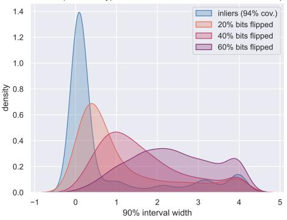  
(a) consistency eval

CheckEval-ML (coherence): residual-normalised interval widths vs bit-flip extent  
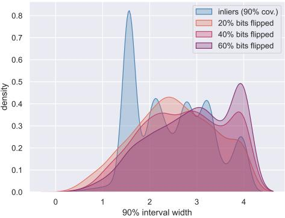  
(b) coherence eval

CheckEval-ML (fluency): residual-normalised interval widths vs bit-flip extent  
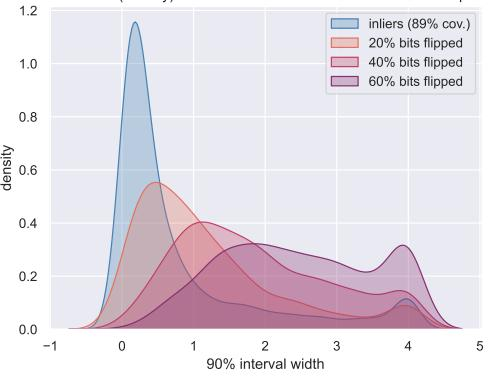  
(c) fluency eval

CheckEval-ML (relevance): residual-normalised interval widths vs bit-flip extent  
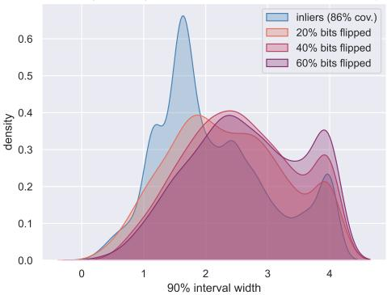  
(d) relevance eval  
Figure 6: Distribution of interval widths for points in the data or “inliers” and synthetic noisy data, which is constructed by flipping bit for different fractions of bits $b \in \{ 0 . 2 , 0 . 4 , 0 . 6 \}$ . The empirical coverage of the inliers is shown in the legend, which may be observed to be quite close to intended coverage of 90%.