# Making Every Tool Call Count: Necessary Tool-Evidence Path Rewards for Agentic Vision-Language Models

Xingming Long3∗, Yu Liu1,3∗†, Zhiwei Yang1,3∗, Hanqi Feng2, Shaojie Zhang3, Barnabas Poczos2, Chao Jiang3, Zhenbo Luo3, Lei Jiang1, Pei Fu3†

Institute of Information Engineering, Chinese Academy of Sciences1 Department of Machine Learning, Carnegie Mellon University2 MiLM Plus, Xiaomi Inc.3

## Abstract

Modern vision-language models (VLMs) can directly answer many image-grounded questions, yet they often struggle with complex queries requiring fine-grained visual details or ex- ternal knowledge. To acquire this missing evidence, agentic VLMs invoke tools such as image cropping, image search, and text search. However, existing training paradigms primar- ily evaluate tool-use based on final answer correctness, leaving evidence acquisition and utilization insuficiently supervised. This leads to two critical shortcomings: (i) models frequently issue redundant or of-target tool calls that fail to gather neces- sary evidence, and (ii) even when appropriate tools are called, models often fail to extract the required information from the resulting observations. To address these limitations, we in- troduce the NTEP (Necessary Tool-Evidence Path), a novel annotation scheme that explicitly specifies the essential ex- ternal evidence and corresponding tool calls for each query. Building upon this, we propose NTEP-R (NTEP Reward), a supervision mechanism ensuring that each tool invocation strictly advances the reasoning process toward the final solu- tion. Specifically, our approach rewards the agent for aligning its pre-call intent with a necessary evidence-seeking goal, and for ensuring the information summarized from the post-call observation aligns with the necessary evidence. Furthermore, we introduce a non-repeated-goal regularizer to penalize re- dundant calls that revisit satisfied NTEP goals. Extensive evaluations on seven image-grounded benchmarks demon- strate that our 8B-parameter instantiation, NTEP-8B, significantly improves both search-oriented accuracy and tool-use eficiency within a unified three-tool framework. These results highlight the critical value of fine-grained tool-evidence path supervision for training robust agentic VLMs.

## 1 Introduction

Modern vision-language models (VLMs) demonstrate re-markable proficiency in answering image-grounded ques- tions directly from initial image-query inputs (Bai et al. 2025; Comanici et al. 2025). However, not all questions can be fully resolved relying solely on this provided context. Com- plex queries often hinge on fine-grained visual details requir- ing closer inspection, unfamiliar entities demanding identi- fication, or external world knowledge necessitating verifica- tion. These limitations naturally motivate the development of agentic VLMs, which actively invoke tools to obtain external evidence during the reasoning process (Wu et al. 2025; Chng et al. 2025; Hong et al. 2025).

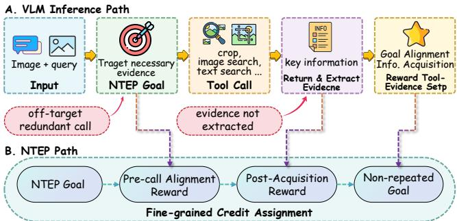  
Figure 1: Motivation for NTEP-R. A useful tool call must target necessary evidence before execution and extract the re- quired information from the returned observation afterward; NTEP-R supervises both stages and penalizes repeated goals.

In the text domain, large language models are trained via reinforcement learning (RL) to dynamically acquire external knowledge through search during reasoning (Jin et al. 2025; Song et al. 2025a). Extending this agentic paradigm to the multimodal setting, vision-language models leverage supervised fine-tuning and RL pipelines to master diverse operations, such as text search, image search, cropping, and zooming, to achieve accurate visual question answering (Wu et al. 2025; Chng et al. 2025; Hong et al. 2025; Zheng et al. 2025b; Liu et al. 2025; Li et al. 2025b). However, existing training paradigms typically reward the agent based solely on final answer correctness or mere tool invocation. This outcome-centric supervision serves as an inaccurate proxy for the actual necessity and efectiveness of each tool call.

As illustrated in Figure 1, we find that a useful tool in- vocation is not merely one that happens to appear within a successful reasoning trajectory. Instead, it must function as a complete tool-evidence step, satisfying a dual require- ment: it must proactively target necessary evidence prior to execution, and it must successfully extract the required in- formation from the resulting observation afterward. When this rigorous standard is absent, agents are prone to two dis- tinct failure points. (i) Pre-call misalignment: The model may select a of-target redundant call that fails to seek the essential evidence. (ii) Post-acquisition failure: Even when an appropriate tool returns valuable context, the model may fail to extract the necessary evidence required for subsequent reasoning. Consequently, the critical unresolved challenge is evidence-level credit assignment: providing fine-grained supervision to ensure not only that a tool is called, but that the agent’s intent is genuinely necessary and the retrieved information is accurately utilized.

To address this gap, we introduce the NTEP (Necessary Tool-Evidence Path), an explicit annotation scheme that specifies the essential external evidence and corresponding tool calls for each training instance. Specifically, an NTEP de- composes the reasoning trajectory into an ordered sequence of answer-critical steps, where each step explicitly defines an evidence-seeking goal, the appropriate tool to execute, and the essential information that must be extracted from the re- sulting observation. Building upon this, we propose NTEP-R (NTEP Reward), a sample-specific process reward tailored for evidence-seeking tool invocation. During reinforcement learning, NTEP-R provides a dual-phase evaluation for each tool-use step: it rewards the agent for aligning its pre-call in- tent with a necessary evidence goal, and for ensuring the in- formation summarized from the post-call observation aligns with the required evidence. Furthermore, a non-repeated- goal regularizer penalizes redundant operations that revisit satisfied NTEP goals. This design elevates tool supervision from a coarse binary of whether tools are used, to a fine- grained evaluation of how efectively each call advances the essential evidence trajectory for a given sample.

We evaluate NTEP-R across seven image-grounded bench- marks covering search-oriented reasoning and fine-grained visual perception. Operating under a unified three-tool framework (image cropping, visual search, and text retrieval), NTEP-R significantly improves both accuracy and tool-use eficiency over strong end-to-end and agentic baselines. Ab- lation studies confirm that pre-call goal alignment and post- call information extraction are highly complementary, while our non-repeated-goal regularizer efectively enforces pre- cise, selective tool utilization. Overall, these findings estab- lish that robust agentic VLMs require fine-grained process supervision over evidence acquisition, rather than crude in- centives based solely on tool-call volume.

Our contributions are threefold:

• We introduce NTEP (Necessary Tool-Evidence Path), a novel formulation that explicitly defines the essential evi- dence goal, tool action, and required information of each answer-critical step, addressing the lack of fine-grained intentionality in existing outcome-driven methods.

• We propose NTEP-R (NTEP Reward), a fine-grained process-reward framework for tool-using agents. It pro- vides a dual-phase supervision that rewards pre-call goal alignment and post-call information extraction, while in- troducing a non-repeated-goal regularizer to explicitly penalize redundant tool invocations.

• We conduct extensive evaluations on seven image-grounded benchmarks under a unified three-tool frame- work. Our results demonstrate significant improvements in search-oriented accuracy and tool-use eficiency, with comprehensive ablation studies validating the essential contribution of each reward component.

## 2 Related Work

Agentic VLM Tool Use. Tool-using agents extend lan-guage and vision-language models with external actions for search, visual inspection, browsing, and multi-step evidence gathering. In the text domain, Search-R1, R1-Searcher, R1- Searcher++, StepSearch, and WebThinker show that LLMs can learn to acquire external knowledge through search dur- ing reasoning (Jin et al. 2025; Song et al. 2025a,b; Zheng et al. 2025a; Li et al. 2025a). In the multimodal domain, MMSearch-R1 and SenseNova-MARS train agents with im- age search, text search, and visual operations, while MM- DeepResearch and WebWatcher scale multimodal search and deep-research workflows (Wu et al. 2025; Chng et al. 2025; Yao et al. 2026; Geng et al. 2025). Another line focuses on visual operations and interactive image reasoning, including DeepEyes, DeepEyesV2, Vision-R1, Visual-ARFT, Pixel- Reasoner, Thyme-RL, Chain-of-Focus, V-Thinker, VISTA- R1, and IMAgent (Zheng et al. 2025b; Hong et al. 2025; Huang et al. 2025; Liu et al. 2025; Li et al. 2025b; Zhang et al. 2025b,a; Qiao et al. 2025; Lu et al. 2025; Dong et al. 2025). These pipelines demonstrate that VLMs can learn to interact with tools, but they mainly study whether the agent can complete the task or learn a useful tool behavior, rather than explicitly specifying the evidence role of each call.

Reinforcement Learning for Agent-Tool Interaction. Reinforcement learning trains agents to invoke tools with out- come, cost, or process rewards. Search-agent methods use RL to encourage query issuing, dynamic knowledge acqui- sition, or step-wise search behavior (Jin et al. 2025; Song et al. 2025a,b; Zheng et al. 2025a), and multimodal systems extend this idea to image-grounded search and visual oper- ations (Wu et al. 2025; Chng et al. 2025; Lu et al. 2025). Reward methods include ToolRL for tool-learning rewards, RLTR for good processes without correct outcomes, Atom- Searcher for atomic reasoning rewards, and TA-MDP for LVLM reward decomposition (Qian et al. 2025; Li, Hu, and Wang 2025; Deng et al. 2025; Adams et al. 2026).

## 3 Method

## 3.1 Problem Formulation

We consider a general agentic vision-language workflow in which answering a question may require evidence beyond the initial visual input. Given an input $x = ( v , q )$ containing a visual context v and a question $q ,$ a policy $\pi _ { \theta }$ may interact with a set of external tools $\tau$ before producing an answer $y .$ At interaction step i, the policy forms a reasoning state or intent $r _ { i } .$ , issues a call $c _ { i } ~ = ~ ( t _ { i } , a _ { i } )$ with tool $t _ { i } ~ \in ~ \tau$ and arguments $a _ { i }$ , receives an observation $o _ { i }$ , and continues reasoning. This yields a trajectory

$$
\boldsymbol { \tau } = \left( r _ { 1 } , c _ { 1 } , o _ { 1 } , r _ { 2 } , c _ { 2 } , o _ { 2 } , \ldots , r _ { K } , c _ { K } , o _ { K } , y \right) ,\tag{1}
$$

where $K$ is not fixed and $\tau$ may include visual operations, retrieval systems, OCR, code interpreters, databases, or other external modules.

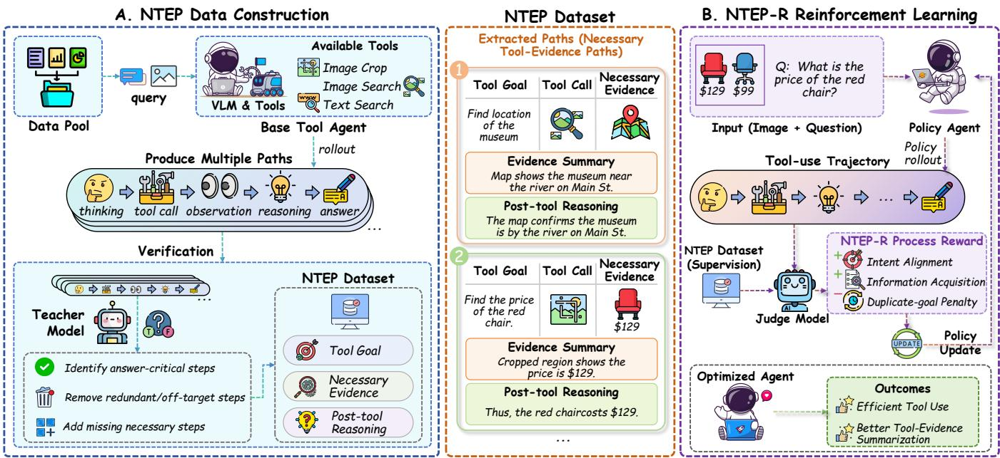  
Figure 2: Two-stage overview of NTEP-R. Before the main GRPO stage, a teacher distills target-policy warm-up rollouts into frozen, sample-specific NTEPs. During GRPO, current-policy rollouts receive verifiable answer and format rewards, while a semantic judge evaluates pre-call goal alignment and post-call information acquisition against the NTEP. NTEP-R aggregates these signals to update the policy.

Objective. The objective is to produce a correct answer while acquiring the necessary evidence through valid and eficient interactions. The central problem is to identify which inter- mediate interactions contribute necessary evidence and to assign them process-level credit without assuming a partic- ular tool set or a single canonical tool sequence. Terminal correctness alone cannot provide this distinction: trajecto-ries with the same answer may contain useful, redundant, or of-target calls, while partially successful trajectories may acquire valid evidence before arriving at an incorrect answer.

## 3.2 Overview

Our key insight is that a valid tool invocation requires pro- cess supervision at two complementary stages: (1) verify- ing whether the agent’s pre-call intent targets the necessary evidence, and (2) ensuring its post-call reasoning successfully extracts this evidence from the observation. Rather than enforcing rigid reasoning trajectories, NTEPs define these essential evidence milestones for each training sam- ple, granting the agent flexibility in formulating exact tool arguments and intermediate steps. As illustrated in Figure 2, a teacher first distills target-policy warm-up rollouts into frozen NTEPs; during GRPO, verifiable outcome rewards and NTEP-conditioned semantic judgments jointly score current-policy trajectories. NTEP-R turns these signals into process-level credit while penalizing redundant calls that re- visit the same NTEP goal.

## 3.3 Necessary Tool-Evidence Paths

Concretely, we model each necessary step as a tool-mediated evidence transition,

$$
g _ { j } \xrightarrow { t _ { j } } e _ { j } ,\tag{2}
$$

where $g _ { j }$ is the evidence goal before the call, $t _ { j } \in \tau$ is the tool expected to acquire that evidence, and $e _ { j }$ is the neces- sary information that should be extracted from the returned observation. For an input x, a Necessary Tool-Evidence Path (NTEP) is the ordered collection of these answer-critical transitions,

$$
\begin{array} { r } { \mathcal { P } ( x ) = \big ( ( g _ { j } , t _ { j } , e _ { j } ) \big ) _ { j = 1 } ^ { N } . } \end{array}\tag{3}
$$

By defining essential evidence targets rather than prescrib- ing exact wording or rigid trajectories, NTEPs allow multiple valid queries and reasoning traces to achieve the same goal. Importantly, this abstraction is tool-agnostic. A new work- flow can seamlessly incorporate any tool $t _ { j }$ from its own in- ventory, provided its pre- and post-action states are mapped to our universal reward interface.

We construct NTEPs from the target agent’s own warm- up rollouts and use the teacher as a distiller rather than a trajectory demonstrator. Target rollouts accurately reflect workflow-specific evidence needs that a stronger teacher might skip, though they often contain redundant or failed in- teractions. To resolve this, the teacher filters answer-critical transitions from successful rollouts and imputes missing ev- idence steps into unsuccessful ones, producing standardized $( g _ { j } , t _ { j } , e _ { j } )$ targets in both cases.

## 3.4 NTEP Reward

To ensure that every tool invocation actively advances the reasoning process, NTEP Reward (NTEP-R) translates the predefined evidence paths in two complementary judgments around each tool interaction. Let $r _ { i } ^ { + }$ denote the first reasoning state after observation $o _ { i }$ is returned. For each still-unfinished NTEP step, we define

$$
\begin{array} { r l } & { \alpha _ { i , j } = \mathrm { A l i g n } ( r _ { i } , c _ { i } ; g _ { j } , t _ { j } ) , } \\ & { \beta _ { i , j } = \mathrm { A c q u i r e } ( r _ { i } ^ { + } ; e _ { j } ) , } \end{array} \quad \quad \alpha _ { i , j } , \beta _ { i , j } \in \{ 0 , 1 \} .\tag{4}
$$

Here, Align asks whether the pre-call intent and the tool call target the required evidence goal, while Acquire asks whether the post-call reasoning explicitly captures the nec- essary information. They are independent binary semantic judgments from a frozen training-time judge, used only for reward computation. Scoring them separately localizes credit to evidence-seeking and evidence uptake instead of collaps- ing both into terminal-answer supervision.

Given an agent’s reasoning trajectory τ and its corresponding reference path ${ \mathcal { P } } ( x )$ , we sequentially evaluate each tool invocation to track its progress against the pending NTEP. During this process, we record four key metrics:

$$
H _ { \mathrm { g o a l } } = \sum _ { j = 1 } ^ { N } \mathbb { I } \left[ \sum _ { i = 1 } ^ { K } \alpha _ { i , j } \geq 1 \right] ,\tag{5}
$$

$$
H _ { \mathrm { i n f o } } = \sum _ { j = 1 } ^ { N } \mathbb { I } \left[ \sum _ { i = 1 } ^ { K } \beta _ { i , j } \geq 1 \right] ,\tag{6}
$$

$$
M _ { \mathrm { g o a l } } = \sum _ { i = 1 } ^ { K } \mathbb { I } \bigg [ \operatorname* { m a x } _ { j } \alpha _ { i , j } = 0 \bigg ] ,\tag{7}
$$

$$
D _ { \mathrm { d u p } } = \sum _ { j = 1 } ^ { N } \operatorname* { m a x } \left( 0 , \sum _ { i = 1 } ^ { K } \alpha _ { i , j } - 1 \right) ,\tag{8}
$$

where $H _ { \mathrm { g o a l } }$ denotes distinct evidence goals targeted by the agent; $H _ { \mathrm { i n f o } }$ represents necessary information items ex- tracted; $M _ { \mathrm { g o a l } }$ tracks of-path calls matching no required goal; and $\bar { D _ { \mathrm { d u p } } }$ counts redundant calls that retarget a goal al- ready satisfied earlier. Thus, $H _ { \mathrm { g o a l } }$ and $H _ { \mathrm { { i n f o } } }$ credit evidence- seeking intent and post-call information uptake, while the remaining terms discourage of-path and repetitive actions.

The NTEP-R process reward is

$$
\begin{array} { r } { R _ { \mathrm { N T E P } } ( \tau , x ) = \displaystyle \frac { 1 } { N } \big ( ( 1 - \lambda _ { g } ) H _ { \mathrm { i n f o } } + \lambda _ { g } H _ { \mathrm { g o a l } } } \\ { - \lambda _ { g } M _ { \mathrm { g o a l } } - \lambda _ { d } D _ { \mathrm { d u p } } \big ) , } \end{array}\tag{9}
$$

where $\lambda _ { g }$ balances information acquisition against goal align- ment, and $\lambda _ { d }$ controls the non-repeated-goal regularizer. Only the first call aligned with a goal receives alignment credit; each additional call aligned with that goal is treated as redundant and explicitly penalized. Removing this regu- larizer yields the corresponding component ablation.

## 3.5 Reinforcement Learning with NTEP-R

Because each tool observation dynamically updates the con- text for future decisions, trajectory-level optimization is better suited for tool use than isolated behavior cloning. Since

NTEPs define evidence milestones rather than rigid action se uences, standard imitation learnin would unnecessaril constrain the agent’s exploration space. To address this, we leverage GRPO (Shao et al. 2024) to optimize over alternative trajectories, prioritizing those that eficiently meet all evidence requirements. Crucially, we retain GRPO’s clipped policy update but modify its group-relative advantage com- putation to operate at the token level, parameterized by our path-conditioned composite reward.

Interaction Protocol. We utilize an XML-style protocol to explicitly expose the state transitions required for reward computation:

• Pre-call State (Align): The <thinking> tag captures the intent $r _ { i } .$ , followed by a JSON action $c _ { i } = ( t _ { i } , a _ { i } )$ inside <tool\_call>.

• Post-call State (Acquire): The environment injects the observation $o _ { i }$ into <tool\_response>, and the agent’s subsequent <thinking> step $r _ { i } ^ { + }$ integrates this infor- mation.

• Termination: The <answer> block provides the nonempty final prediction y and halts the trajectory.

To enforce adherence to this schema, the format reward $R _ { \mathrm { f m t } }$ is strictly positive if and only if the structural syntax is valid, all JSON calls contain registered tools with legitimate arguments, and no model-induced execution errors occur.

Trajectory Sampling and Reward Construction. For each training input x, the current policy samples a group of G trajectories $\{ \bar { \tau } _ { g } \} _ { g = 1 } ^ { G }$ . Each trajectory receives verifiable answer and format rewards together with the process reward from Equation 9. The composite reward is

$$
R _ { g } = R _ { \mathrm { a n s } } ( y _ { g } , y ^ { * } ) + R _ { \mathrm { f m t } } ( \tau _ { g } ) + \lambda R _ { \mathrm { N T E P } } ( \tau _ { g } , x ) ,\tag{10}
$$

where λ controls the contribution of semantic process su-pervision. The answer reward anchors task success, while the process term distinguishes trajectories by how efectively they acquire the required evidence.

Group-Relative Optimization. For the trajectories sampled for x, let $\bar { R } _ { x }$ and $s _ { x }$ denote the mean and standard deviation of their composite rewards. We define the NTEP-conditioned group-relative advantage as

$$
\widehat { A } _ { g } ^ { \mathrm { N T E P } } = \frac { R _ { g } - \bar { R } _ { x } } { s _ { x } + \epsilon } .\tag{11}
$$

Through Eq. 10, the NTEP process signal enters $R _ { g }$ before group normalization, turning outcome-centered GRPO into a path-conditioned learning signal. Because trajectories in the group share the same input and frozen NTEP, this advan- tage compares not only task outcomes but also how efec- tively each trajectory acquires the required evidence. Unlike outcome-only group scoring, answer-equivalent trajectories can receive diferent learning signals according to their goal alignment, information uptake, and redundant actions. We use $\widehat { A } _ { g } ^ { \mathrm { N T E P } }$ in the standard clipped GRPO objective without introducing a separate critic.

Inference. The teacher, semantic judge, and NTEP annotations are used only during training. At test time, the policy receives only the image, question, and tool interface and in- teracts independently, without a scafold or oracle path.

<table><tr><td></td><td colspan="5">Search-oriented (%)</td><td colspan="4">Visual (%)</td><td>Avg. (%)</td></tr><tr><td>Method</td><td></td><td>MMSe HR-MMSe InfoS</td><td></td><td>MAT</td><td>S-Avg.↑</td><td>V*</td><td></td><td>HR-4K HR-8K</td><td>V-Avg.↑</td><td>Avg.↑</td></tr><tr><td colspan="9">(i) End-to-end VLMs (no tools)</td><td></td><td></td></tr><tr><td>Qwen3-VL-8B (Bai et al. 2025)</td><td>11.11</td><td>2.95</td><td></td><td>21.55 62.00</td><td>24.40</td><td>87.43</td><td>82.62</td><td>74.25</td><td>81.44</td><td>48.85</td></tr><tr><td>Qwen3-VL-30B (Bai et al. 2025)</td><td>15.79</td><td>3.28</td><td></td><td>27.05 66.00</td><td>28.03</td><td>86.39</td><td>79.88</td><td>74.88</td><td>80.38</td><td>50.47</td></tr><tr><td>GPT-5 (OpenAI 2026)</td><td>38.01</td><td>14.43</td><td></td><td>50.3078.67</td><td>45.35</td><td>72.77</td><td>75.75</td><td>73.50</td><td>74.01</td><td>57.63</td></tr><tr><td>Claude-Sonnet-4.6 (Anthropic 2026)</td><td>32.75</td><td>12.13</td><td></td><td>49.80 74.67</td><td>42.34</td><td>71.73</td><td>76.12</td><td>68.75</td><td>72.20</td><td>55.14</td></tr><tr><td>Grok-4 (xAI 2025)</td><td>36.26</td><td>17.38</td><td></td><td>40.0086.00</td><td>44.91</td><td>82.20</td><td>79.25</td><td>73.88</td><td>78.44</td><td>59.28</td></tr><tr><td>Gemini-2.5-Pro (Comanici et al. 2025)</td><td>35.67</td><td>12.13</td><td></td><td>54.5581.33</td><td>45.92</td><td>81.15</td><td>86.62</td><td>81.50</td><td>83.09</td><td>61.85</td></tr><tr><td colspan="9">(ii) RL agent pipelines (three-tool evaluation)</td><td></td><td></td></tr><tr><td>Vision-R1-7B (Huang et al. 2025)</td><td>17.5</td><td>4.6</td><td>23.4</td><td>57.3</td><td>25.70</td><td>76.4</td><td>72.4</td><td>69.5</td><td>72.77</td><td>45.87</td></tr><tr><td>MM-DeepResearch-8B (Yao et al. 2026)</td><td>33.3</td><td>17.4</td><td>29.8</td><td>77.3</td><td>39.46</td><td>56.5</td><td>68.1</td><td>56.9</td><td>60.51</td><td>48.48</td></tr><tr><td>DeepEyes-7B (Zheng et al. 2025b)</td><td>31.0</td><td>11.5</td><td>22.9</td><td>68.0</td><td>33.34</td><td>71.2</td><td>66.2</td><td>57.4</td><td>64.94</td><td>46.89</td></tr><tr><td>DeepEyesV2-7B (Hong et al. 2025)</td><td>24.6</td><td>10.8</td><td>29.6</td><td>68.0</td><td>33.23</td><td>66.0</td><td>64.4</td><td>56.4</td><td>62.24</td><td>45.66</td></tr><tr><td>Thyme-RL (Zhang et al. 2025b)</td><td>15.2</td><td>3.9</td><td>25.1</td><td>61.3</td><td>26.38</td><td>70.2</td><td>66.1</td><td>61.1</td><td>65.80</td><td>43.28</td></tr><tr><td>Chain-of-Focus-7B (Zhang et al. 2025a)</td><td>21.1</td><td>4.9</td><td>21.9</td><td>56.0</td><td>25.97</td><td>69.1</td><td>60.4</td><td>52.6</td><td>60.70</td><td>40.85</td></tr><tr><td>V-Thinker-7B (Qiao et al. 2025)</td><td>16.4</td><td>5.2</td><td>24.4</td><td>51.3</td><td>24.35</td><td>71.2</td><td>61.2</td><td>55.2</td><td>62.57</td><td>40.73</td></tr><tr><td>PixelReasoner-7B (Li et al. 2025b)</td><td>18.1</td><td>5.2</td><td>23.5</td><td>58.7</td><td>26.39</td><td>57.1</td><td>57.9</td><td>51.5</td><td>55.48</td><td>38.85</td></tr><tr><td>Visual-ARFT-Search (Liu et al. 2025)</td><td>24.6</td><td>9.2</td><td>25.6</td><td>70.0</td><td>32.35</td><td>42.9</td><td>46.5</td><td>41.2</td><td>43.56</td><td>37.15</td></tr><tr><td>WebWatcher-7B (Geng et al. 2025)</td><td>24.0</td><td>17.0</td><td>29.8</td><td>63.3</td><td>33.54</td><td>32.5</td><td>37.0</td><td>31.4</td><td>33.61</td><td>33.57</td></tr><tr><td>SenseNova-MARS-8B (Chng et al. 2025)</td><td>62.0</td><td>34.1</td><td>54.4</td><td>82.0</td><td>58.12</td><td>92.7</td><td>78.2</td><td>74.8</td><td>81.90</td><td>68.31</td></tr><tr><td>NTEP-8B (ours)</td><td>68.4</td><td>35.7</td><td>56.8</td><td>81.3</td><td>60.55</td><td>90.6</td><td>81.2</td><td>78.4</td><td>83.40</td><td>70.34</td></tr></table>

Table 1: Main results. S-Avg., V-Avg., and Avg. macro-average search, visual, and all splits; bold/underline mark best/secondbest RL-agent results.

## 4 Experiments

## 4.1 Experimental Setup

Datasets. We evaluate on seven image-grounded benchmarks. MMSearch (Jiang et al. 2025), HR-MMSearch (Chng et al. 2025), InfoSeek (Chen et al. 2023), and MAT-Search (Liu et al. 2025) evaluate search-oriented reasoning and external evidence acquisition; V\* Bench (Wu and Xie 2024) and HR-Bench 4K/8K (Wang et al. 2025) evaluate fine-grained and high-resolution visual perception. The main comparison uses matched 500-example subsets for InfoS- eek and HR-Bench 4K/8K when comparing NTEP-8B with SenseNova-MARS-8B, and full splits for MMSearch, HR- MMSearch, MAT-Search, and V\*; end-to-end and external- agent rows use full splits. Component ablation and budget sweep use all 4,417 examples across the seven evaluation splits.

Baselines. We compare two groups in Table 1: end-to-end VLMs that answer without tools, and RL agent pipelines that perform multi-turn tool interaction. The former in- clude Qwen3-VL-8B/30B (Bai et al. 2025), GPT-5 (OpenAI 2026), Grok-4 (xAI 2025), Gemini-2.5-Pro (Comanici et al. 2025), and Claude-Sonnet-4.6 (Anthropic 2026); the latter include NTEP-8B, SenseNova-MARS-8B (Chng et al. 2025), Vision-R1-7B (Huang et al. 2025), and the external agent checkpoints listed in the table. End-to-end VLMs use no tools. RL-agent rows use a common three-tool protocol; external checkpoints are evaluated through a generic adapter exposing the same tools, so these rows measure transfer to a common interface rather than native-pipeline performance. Metrics. We report Accuracy (Acc.) and Average Tool Calls (ATC), split into Crop, Image, Text, and Total calls. Search

Average (S-Avg.), Visual Average (V-Avg.), and Overall Average (Avg.) macro-average the four search, three visual, and all splits from unrounded scores. Trajectory and failure-mode analyses use 300 stratifiedjudge-labeled examples per model. Implementation Details. NTEP-8B and its ablations are initialized from Qwen3-VL-8B-Instruct (Bai et al. 2025) and use image crop, image search, and text search with a shared ten-call budget. Training follows the two-stage procedure in Figure 2; during GRPO (Shao et al. 2024), we sample G = 8 trajectories per input with a 32K context window and a maximum 16K response length. All same-harness com- parisons use matched benchmark splits and serving config- urations. Unless otherwise stated, each reported checkpoint result is from one training run and one evaluation pass un- der the fixed decoding seed. Closed-source baselines receive the same prompt, full-resolution image input, and requested decoding settings; unsupported API parameters are omitted and recorded.

## 4.2 Main Results

Best same-harness RL agent. Table 1 compares all methods on seven image-grounded benchmarks. Within the unified three-tool harness, NTEP-8B obtains the best RL-agent aver- age of 70.34, exceeding the reproduced SenseNova-MARS- 8B checkpoint by 2.03 points. The gain is not concentrated in one benchmark group: Search Avg. improves from 58.12 to 60.55, and Visual Avg. improves from 81.90 to 83.40. Tool- using agents are especially important on search-oriented tasks: the strongest end-to-end baseline, Gemini-2.5-Pro, reaches 45.92 Search Av ., while NTEP-8B reaches 60.55 under the same protocol. This gap indicates that search-heavy tasks still require active evidence acquisition beyond para- metric knowledge and full-resolution image input.

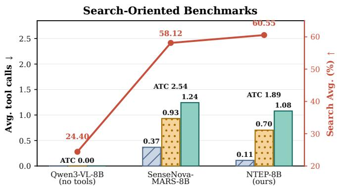

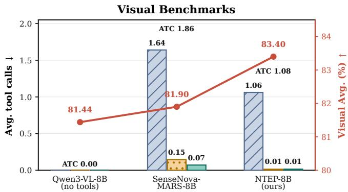  
Figure 3: Accuracy and tool-call profiles under the main-table protocol. Bars show average calls by tool (left axes), ATC labels give total calls, and lines show accuracy (right axes). Qwen3-VL-8B is end-to-end; RL agents use the common three-tool interface.

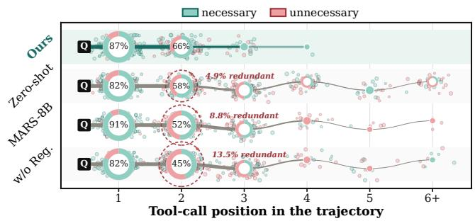  
Figure 4: Tool-call trajectories. Ring area encodes frequency; mint/red splits mark necessary-and-used versus unnecessary calls.

Tool-Use Eficiency. Figure 3 makes the corresponding op-erating points explicit. Compared to SenseNova-MARS-8B, NTEP-8B reduces average tool calls from 2.54 to 1.89 on search-oriented benchmarks and from 1.86 to 1.08 on visual benchmarks, while improving accuracy in both groups. The gain therefore comes from more selective tool use rather than more frequent invocation.

## 4.3 Tool-call Analysis

Tool-call trajectory. The left panel of Figure 4 shows where tool calls occur. NTEP-8B concentrates evidence acquisi- tion in the first two positions and never reaches a fifth call in this sample. The baselines continue into later positions, where useful-call rates decay and repeated evidence acquisi- tion becomes more visible. The same audit gives NTEP-8B a 78.8% necessary-and-used call rate, compared with 69.0% for SenseNova-MARS-8B; the stricter Case-5 rate, requiring every call to be necessary and the final answer to be correct, rises from 39.0% to 58.7%.

Failure modes. To localize residual waste, we group nonnecessary calls in the judged sample into four disjoint failure modes: of-goal targeting, wrong-tool selection, repeated ev- idence acquisition, and evidence returned but unused. For deterministic labeling, categories follow the priority redun- dant > of-goal > wrong tool > unused. Figure 5 shows that the regularizer acts as intended: redundancy falls from 13.5% without regularization to 1.0% in NTEP-8B. Wrongtool selection remains the largest residual failure for every model, suggesting tool-choice supervision as a complemen- tary direction beyond evidence-path supervision.

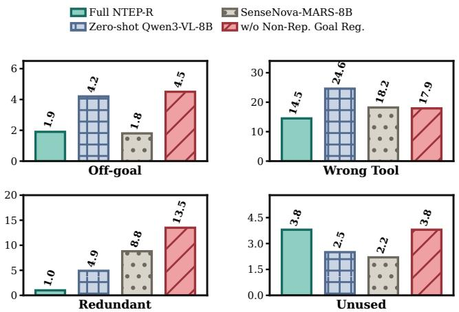  
Figure 5: Failure modes over calls from 300 judged trajectories/model (%; lower is better).

## 4.4 Cross-Tool OOD Transfer

The NTEP-R objective trains the policy around abstract evidence states rather than overfitting to the training tool dis- tribution. To assess this out-of-distribution (OOD) transfer, we use a policy trained exclusively on search tasks, com- pletely omitting the V\* and HR-Bench datasets, as well as the visual zoom interface. We then evaluate this model on the held-out visual benchmarks under two settings: a restricted search-only interface, and an extended interface incorporat- ing the unseen zoom tool. As shown in Figure 6, without any further RL updates, activating this OOD tool raises the Vi- sual Avg. accuracy from 75.01% to 82.32% while reducing average calls from 1.679 to 1.294 per query. This simultane-ous gain in accuracy and tool-use eficiency confirms that the evidence-seeking strategy learned during search training suc- cessfully transfers to visual operations: the model eficiently invokes the novel zoom tool to acquire missing details and halts once the goal is met. Appendix A.6 provides a formal theoretical account of this transfer behavior.

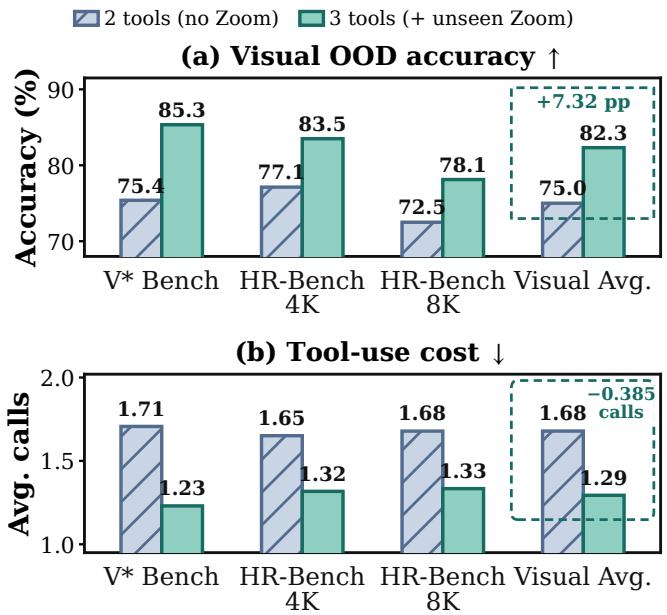  
Figure 6: Cross-Tool OOD transfer. Adding unseen zoom to search-only interface improves accuracy and reduces ATC.

## 4.5 Ablation Studies

Figure 7 evaluates the reward design from both accuracy and call-eficiency perspectives. All variants keep the shared format reward; the labels only describe which NTEP pro- cess terms are removed. The w/o Information Acquisition and Non-Repeated-Goal Regularizer arm keeps only pre-call goal alignment and is shown at its final collapsed checkpoint, while Answer Reward Only is a smaller-pool legacy diagnos- tic rather than a strict single-variable run.

Accuracy. Goal alignment by itself is insuficient: without information acquisition and duplicate-goal regularization, Search Avg. collapses to 34.58 even though the policy still learns to issue many calls. Full NTEP-R restores Search Avg. to 59.44 and Overall Avg. to 69.69, while leaving Visual Avg. essentially unchanged at 83.36 versus 83.37. Answer- reward-only RL reaches a similar Overall Avg. of 69.63, but this number hides substantially diferent tool behavior.

Calls. The call counts expose the diference that accuracy alone misses. The goal-only variant averages 5.36 calls per sample, and Answer Reward Only still uses 3.11 calls. Full NTEP-R reduces this to 1.55 calls, cutting total calls by roughly 71% relative to the goal-only variant and by roughly 50% relative to Answer Reward Only.

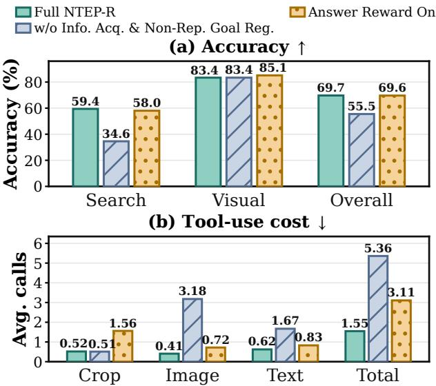

Figure 7: Reward-component ablation. Top: split-macro accuracy. Bottom: average calls by tool and total.
<table><tr><td>Item</td><td>Value</td></tr><tr><td>Scope</td><td>100 blinded cases covering search-answer scoring and trajectory labels</td></tr><tr><td>Inputs</td><td>Image, question, model answer, tool tran- script, and returned evidence</td></tr><tr><td>Labels</td><td>Correctness, tool necessity, and failure mode for non-necessary calls</td></tr><tr><td>Use</td><td>Reliability check only; no model selection or reward tuning</td></tr><tr><td>Agreement</td><td>97.0%; Cohen&#x27;s κ = 0.94</td></tr></table>

Table 2: Human audit of judge reliability.

## 4.6 Judge Reliability

Automated judgments are used only for open-ended searchanswer scoring and trajectory-level analysis labels; multiple-choice visual benchmarks use exact matching. We therefore audit a random sample covering all judge-involved settings with blinded human adjudication; Appendix D gives the full protocol and disagreement breakdown. Table 2 summarizes the protocol and agreement. The high agreement supports using the frozen judge as a reliable measurement and reward signal, while keeping visual benchmark scores independent through exact matching.

## 5 Conclusion

We presented NTEP-R, a reward framework that trains agen- tic VLMs to follow necessary tool-evidence paths rather than optimize only final-answer correctness. By supervising both pre-call goal alignment and post-call information acquisition, and by regularizing repeated evidence-seeking goals, NTEP- R improves the selectivity of tool use in a unified crop, image- search, and text-search environment. Across seven bench- marks, NTEP-8B improves over the strongest same-harness RL-agent baseline while reducing average tool calls, and our analyses show that the gains come from earlier, more nec- essary, and less redundant evidence acquisition. The visual OOD transfer results suggest that NTEP-R learns reusable evidence-seeking discipline rather than memorizing a fixed tool inventory. Overall, explicit evidence-path supervision is a practical direction for VLM agents that are more accurate, eficient, and auditable.

## References

Adams, C.; Oliveira, R.; Almeida, G.; and Torres, S. 2026. Rethinking Reinforcement Fine-Tuning in LVLM: Conver- gence, Reward Decomposition, and Generalization. arXiv preprint arXiv:2604.19857.

Anthropic. 2026. Claude Sonnet 4.6. https://www.anthropic. com/claude/sonnet.

Bai, S.; Cai, Y.; Chen, R.; Chen, K.; Chen, X.; Cheng, Z.; Deng, L.; Ding, W.; Gao, C.; Ge, C.; et al. 2025. Qwen3-VL Technical Report. arXiv:2511.21631.

Chen, Y.; Hu, H.; Luan, Y.; Sun, H.; Changpinyo, S.; Rit- ter, A.; and Chang, M.-W. 2023. Can Pre-trained Vision and Language Models Answer Visual Information-Seeking Questions? In Proceedings of the 2023 Conference on Empirical Methods in Natural Language Processing, 14948– 14968. Association for Computational Linguistics.

Chng, Y. X.; Hu, T.; Tong, W.; Li, X.; Chen, J.; Yu, H.; Lu, J.; Guo, H.; Deng, H.; Xie, C.; et al. 2025. SenseNova-MARS: Empowering Multimodal Agentic Reasoning and Search via Reinforcement Learning. arXiv preprint arXiv:2512.24330.

Comanici, G.; Bieber, E.; Schaekermann, M.; Pasupat, I.; Sachdeva, N.; et al. 2025. Gemini 2.5: Pushing the Frontier with Advanced Reasoning, Multimodality, Long Context, and Next Generation Agentic Capabilities. arXiv preprint arXiv:2507.06261.

Deng, Y.; Wang, G.; Ying, Z.; Wu, X.; Lin, J.; Xiong, W.; Dai, Y.; Yang, S.; Zhang, Z.; Wang, Q.; Qin, Y.; Wang, Y.; Zha, Q.; Dai, S.; and Meng, C. 2025. Atom-Searcher: Enhancing Agentic Deep Research via Fine-Grained Atomic Though Reward. arXiv preprint arXiv:2508.12800.

Dong, C.; Yue, C.; He, H.; Mao, R.; Tang, F.; et al. 2025. Training Multi-Image Vision Agents via End2End Reinforce- ment Learning. arXiv preprint arXiv:2512.08980.

Geng, X.; Xia, P.; Zhang, Z.; Wang, X.; Wang, Q.; Ding, R.; Wang, C.; Wu, J.; Zhao, Y.; Li, K.; et al. 2025. WebWatcher: Breaking New Frontier of Vision-Language Deep Research Agent. arXiv preprint arXiv:2508.05748.

Hong, J.; Zhao, C.; Zhu, C.; Lu, W.; Xu, G.; and Yu, X. 2025. DeepEyesV2: Toward Agentic Multimodal Model. arXiv preprint arXiv:2511.05271.

Huang, W.; Jia, B.; Zhai, Z.; Cao, S.; Ye, Z.; Zhao, F.; Hu, Y.; and Lin, S. 2025. Vision-R1: Incentivizing Reasoning Capability in Multimodal Large Language Models. arXiv preprint arXiv:2503.06749.

Jiang, D.; Zhang, R.; Guo, Z.; Wu, Y.; Lei, J.; Qiu, P.; Lu, P.; Chen, Z.; Song, G.; Gao, P.; Liu, Y.; Li, C.; and Li, H. 2025. MMSearch: Unveiling the Potential of Large Models as Multi-modal Search Engines. In International Conference on Learning Representations.

Jin, B.; Zeng, H.; Yue, Z.; Yoon, J.; Arik, S.; Wang, D.; Zamani, H.; and Han, J. 2025. Search-R1: Training LLMs to Reason and Leverage Search Engines with Reinforcement Learning. arXiv preprint arXiv:2503.09516.

Li, X.; Jin, J.; Dong, G.; Qian, H.; Wu, Y.; Wen, J.-R.; Zhu, Y.; and Dou, Z. 2025a. WebThinker: Empowering Large Reasoning Models with Deep Research Capability. arXiv preprint arXiv:2504.21776.

Li, X.; Li, X.; Gao, J.; Pi, R.; Hu, S.; and Zhang, W. 2025b. Look Less, Reason More: Rollout-Guided Adaptive Pixel- Space Reasoning. arXiv preprint arXiv:2510.01681.

Li, Z.; Hu, Y.; and Wang, W. 2025. Encouraging Good Processes Without the Need for Good Answers: Reinforce- ment Learning for LLM Agent Planning. arXiv preprint arXiv:2508.19598.

Liu, Z.; Zang, Y.; Zou, Y.; Liang, Z.; Dong, X.; Cao, Y.;Duan, H.; Lin, D.; and Wang, J. 2025. Visual Agentic Rein-forcement Fine-Tuning. arXiv preprint arXiv:2505.14246.

Lu, M.; Xu, R.; Fang, Y.; Zhang, W.; Yu, Y.; et al. 2025. Scaling Agentic Reinforcement Learning for Tool-Integrated Reasoning in VLMs. arXiv preprint arXiv:2511.19773.

OpenAI. 2026. GPT-5 Model. https://openai.com/gpt-5.

Qian, C.; Acikgoz, E. C.; He, Q.; Wang, H.; Chen, X.; Hakkani-Tür, D.; Tur, G.; and Ji, H. 2025. ToolRL: Reward is All Tool Learning Needs. arXiv preprint arXiv:2504.13958.

Qiao, R.; Tan, Q.; Yang, M.; Dong, G.; Yang, P.; Lang, S.; Wan, E.; Wang, X.; Xu, Y.; Yang, L.; et al. 2025. V- Thinker: Interactive Thinking with Images. arXiv preprint arXiv:2511.04460.

Shao, Z.; Wang, P.; Zhu, Q.; Xu, R.; Song, J.; Bi, X.; Zhang, H.; Zhang, M.; Li, Y. K.; Wu, Y.; and Guo, D. 2024. DeepSeekMath: Pushing the Limits of Mathemati- cal Reasoning in Open Language Models. arXiv preprint arXiv:2402.03300.

Song, H.; Jiang, J.; Min, Y.; Chen, J.; Chen, Z.; Zhao, W. X.; Fang, L.; and Wen, J.-R. 2025a. R1-Searcher: Incentivizing the Search Capability in LLMs via Reinforcement Learning. arXiv preprint arXiv:2503.05592.

Song, H.; Jiang, J.; Tian, W.; Chen, Z.; Wu, Y.; Zhao, J.; Min, Y.; Zhao, W. X.; Fang, L.; and Wen, J.-R. 2025b. R1- Searcher++: Incentivizing the Dynamic Knowledge Acqui- sition of LLMs via Reinforcement Learning. arXiv preprint arXiv:2505.17005.

Wang, W.; Ding, L.; Zeng, M.; Zhou, X.; Shen, L.; Luo, Y.; Yu, W.; and Tao, D. 2025. Divide, Conquer and Combine: A Training-Free Framework for High-Resolution Image Per- ception in Multimodal Large Language Models. Proceedings of the AAAI Conference on Artificial Intelligence.

Wu, J.; Deng, Z.; Li, W.; Liu, Y.; You, B.; Li, B.; Ma, Z.; and Liu, Z. 2025. MMSearch-R1: Incentivizing LMMs to Search. arXiv preprint arXiv:2506.20670.

Wu, P.; and Xie, S. 2024. V\*: Guided Visual Search as a Core Mechanism in Multimodal LLMs. In Proceedings of the IEEE/CVF Conference on Computer Vision and Pattern Recognition, 13084–13094.

xAI. 2025. Grok 4. https://x.ai/grok.

Yao, H.; Yin, Q.; Yang, M.; Zhao, Z.; Wang, Y.; Luo, H.; Zhang, J.; and Huang, J. 2026. MM-DeepResearch: A Simple and Efective Multimodal Agentic Search Baseline. arXiv preprint arXiv:2603.01050.

Zhang, X.; Gao, Z.; Zhang, B.; Li, P.; Zhang, X.; Liu, Y.;Yuan, T.; Wu, Y.; Jia, Y.; Zhu, S.-C.; and Li, Q. 2025a.Adaptive Chain-of-Focus Reasoning via Dynamic Visual

Search and Zooming for Eficient VLMs. arXiv preprint arXiv:2505.15436.

Zhang, Y.-F.; Lu, X.; Yin, S.; Fu, C.; Chen, W.; Hu, X.; Wen, B.; Jiang, K.; Liu, C.; Zhang, T.; et al. 2025b. Thyme: Think Beyond Images. arXiv preprint arXiv:2508.11630.

Zheng, X.; An, K.; Wang, Z.; Wang, Y.; and Wu, Y. 2025a. StepSearch: Igniting LLMs Search Ability via Step-Wise Proximal Policy Optimization. In Proceedings of the 2025 Conference on Empirical Methods in Natural Language Processing, 21805–21830. Suzhou, China: Association for Com-putational Linguistics.

Zheng, Z.; Yang, M.; Hong, J.; Zhao, C.; Xu, G.; Yang, L.; Shen, C.; and Yu, X. 2025b. DeepEyes: Incentivizing “Thinking with Images” via Reinforcement Learning. arXiv preprint arXiv:2505.14362.

## A Additional Methodological Details

## A.1 NTEP Data Fields

Each NTEP annotation is stored as three aligned lists: $\mathtt { t a r g e t \_ l i s t } , \mathtt { t o o l \_ l i s t } .$ , and info\_list. The j-th entries correspond to the evidence goal $g _ { j } .$ , expected tool $t _ { j }$ and necessary information $e _ { j }$ in Equation 2. This represen- tation is intentionally looser than a full trajectory transcript: it does not prescribe exact query strings, bounding boxes, or intermediate wording, but records the evidence milestone that a valid trajectory must satisfy.

The construction step uses target-policy warm-up rollouts as the source material. For successful rollouts, the teacher removes redundant and non-answer-critical interactions and keeps only the evidence-bearing steps. For unsuccessful roll- outs, the teacher identifies the missing evidence transitions needed to complete the question and writes them into the same $( g _ { j } , t _ { j } , e _ { j } )$ schema. The resulting paths are frozen be- fore GRPO; during RL, the current policy is scored against these paths but does not see them in its prompt.

## A.2 Training Data Composition

Table 3 reports the per-source composition of the two training pools used in this work. Both pools draw on the same five public sources: FVQA, DeepEyes-4K (split into multiple-choice and open-ended subsets), Visual-Probe, VDR, and the text-only Search-R1 corpus, whose paths con- tain only text\_search\_tool steps and are included to preserve strong text-retrieval reasoning. The historical 7,774- example pool spans all three tools and underlies the reward- composition diagnostics in Appendix C. The search-only 4,855-example pool used to train the selected NTEP-8B checkpoint keeps exactly those examples whose necessary paths contain no crop/zoom step; its NTEP toolsets decom- pose into 2,309 text-search-only, 1,058 image-search-only, 1,483 dual-search, and 5 tool-free paths.

The extraction and completion branches contribute 4,819 (62.0%) and 2,955 (38.0%) paths, respectively. The branch mix tracks source dificulty for the warm-up policy: the easier corpora are extraction-dominated, whereas VDR—the hard- est visual source—derives 82.0% of its paths from the com- pletion branch. Without the completion branch, VDR would contribute almost no NTEP supervision, weakening exactly the multi-step retrieval patterns it is included to teach; con- versely, the text-only Search-R1 paths keep the policy pro- ficient at extracting facts from text\_search\_tool returns.

## A.3 Tool Interface

The main experiments use a unified three-tool interface. The registered tool names are image\_zoom\_in\_tool for re-gion crop/zoom, image\_search\_tool for reverse image search, and text\_search\_tool for textual web/search retrieval. At inference time, the model receives only the im- age, the question, and the tool schemas. It does not receive the NTEP annotation, teacher explanations, or judge feedback.

Concretely, image\_zoom\_in\_tool crops the refer-enced region using bounding-box coordinates normalized to [0, 1000] and re-encodes the crop with the model’s native smart-resize preprocessing before returning it as a new visual observation. image\_search\_tool performs reverse im-age search over the input image and returns the top retrieved entries as titled thumbnails, and text\_search\_tool sends a textual query to a shared retrieval gateway that re- turns the top-3 summarized results. All rollouts operate under a single global budget of at most 10 interaction turns with no per-tool caps, so the composition of zoom and search calls is left entirely to the policy; individual tool responses are truncated to an 8K-token cap.

<table><tr><td></td><td colspan="3">Historical pool</td><td>Search-only pool</td></tr><tr><td>Source</td><td>Extracted</td><td>Completed</td><td>Total</td><td>Total</td></tr><tr><td>FVQA</td><td>1,643</td><td>249</td><td>1,892</td><td>1,850</td></tr><tr><td>DeepEyes-4K (MCQ)</td><td>424</td><td>164</td><td>588</td><td>27</td></tr><tr><td>DeepEyes-4K (open-ended)</td><td>358</td><td>58</td><td>416</td><td>6</td></tr><tr><td>Visual-Probe</td><td>638</td><td>271</td><td>909</td><td>1</td></tr><tr><td>VDR</td><td>356</td><td>1,618</td><td>1,974</td><td>976</td></tr><tr><td>Search-R1 (text-only)</td><td>1,400</td><td>595</td><td>1,995</td><td>1,995</td></tr><tr><td>Total</td><td>4,819</td><td>2,955</td><td>7,774</td><td>4,855</td></tr></table>

Table 3: Per-source composition of the two training pools. Extracted = paths distilled from correct warm-up rollouts; Completed = paths reconstructed from failed rollouts. The search-only pool retains the examples whose necessary paths involve no crop/zoom step.

## A.4 Reward Accounting

The implementation follows the reward decomposition in Section 3 with the concrete accounting reported as part of the experimental setup in Table 5. The process score is nor- malized by the NTEP length N and then multiplied by the process-reward scale used in training. Only the first semantic hit for a goal receives goal credit; later calls that re-target a still-pending, already-scored goal are counted as duplicates, and calls matching no pending goal are counted as misses.

All semantic judgments—pre-call goal alignment, post-call information acquisition, and open-ended answer scoring—are produced by a frozen Qwen3-VL-Plus judge served behind an OpenAI-compatible endpoint and queried with temperature 0, an 8K-token output cap, and a structured <judge>Yes/No</judge> verdict format that is parsed deterministically. The judge is used exclusively inside reward computation; the policy never observes its outputs.

## A.5 Training Hyperparameters

Table 4 lists the optimization and serving settings that com- plement the protocol summary in Table 5.

## A.6 Theoretical Analysis: Call Eficiency and Tool-Interface Transfer

This subsection formalizes the two mechanisms behind the observations of Sections 4.3–4.4: NTEP-R makes every wasted call individually unprofitable while keeping gen- uinely needed retries profitable, and it attaches credit to evidence states rather than tool identities, which is what en- ables transfer to an unseen tool. We abstract the interaction as an evidence process. For an input x with NTEP P(x)

<table><tr><td>Component</td><td>Setting</td></tr><tr><td>Optimizer</td><td>AdamW; lr  $1 \times 1 0 ^ { - 5 }$  , constant schedule (no warm-up); weight decay 0.01; gradient clip 1.0</td></tr><tr><td>GRPO sampling</td><td>group size  $G \ = \ 8 ;$  batch 128 prompts (1,024 rollouts per step); mini-batch 128 (single on-policy pass); dynamic micro-</td></tr><tr><td>Policy loss</td><td>batching under a 16K-token cap asymmetric clipping (0.20, 0.28); token-</td></tr><tr><td>KL regularization</td><td>mean aggregation; entropy coefficient 0 none (no KL term in reward or loss)</td></tr><tr><td>Sequence budget</td><td>16K prompt; 16K response; 32K model context; 8K per tool response</td></tr><tr><td>Rollout sampling</td><td>temperature 1.0; top-p 1.0; presence penalty 1.5; fixed seed</td></tr><tr><td>Rollout serving</td><td>asynchronous sglang engine; frozen vision tower</td></tr><tr><td>Judge serving</td><td>Qwen3-VL-Plus; temperature 0; 8K-token cap; 300 s timeout; bounded concurrency</td></tr><tr><td>Path teacher</td><td>Gemini-3.1-Pro for both the extraction and</td></tr><tr><td>Schedule</td><td>completion branches 20 epochs; checkpointing and validation every 10 steps</td></tr><tr><td>Software</td><td>Python 3.12; PyTorch 2.9.1; Transformers 5.3.0; sglang 0.5.10; Ray 2.53.0</td></tr></table>

Table 4: Complete training configuration for NTEP-8B.

of length N, goal $j$ is completed once some call has ac-quired $e _ { j }$ and pending otherwise; $U \subseteq \{ 1 , \ldots , N \}$ denotes the pending set. Verdicts follow the training accounting of Appendix A.4: calls are judged against the pending steps and each call is attributed to at most one pending step; infor- mation credit is granted only through an aligned call’s own return, so $\beta _ { i , j } \le \alpha _ { i , j }$ and an information hit is a conjunction of alignment and acquisition; goal credit is granted on the first alignment of a goal only; a repeated alignment of a pending goal counts in ${ \bar { D } } _ { \mathrm { d u p } } ;$ and a call matching no pending goal counts in $M _ { \mathrm { g o a l } }$ . We use four assumptions. (A1) Measurement locality: each verdict is a function of the judged call’s own reasoning state, invocation, and observation, given the pending set. (A2) Stochastic tool success: a call aligned with pending goal $g _ { j }$ via tool t acquires $e _ { j }$ with probabil- ity $p _ { t } ( j ) \in ( 0 , 1 ]$ . Assuming an optimal policy modulates its arguments (e.g., query reformulations) upon failure, we model these attempts as independent across calls given the goal. (A3) Evidence-conditioned policy: the policy under analysis selects actions as a function $\pi ( \boldsymbol { a } \mid \boldsymbol { x } , \boldsymbol { U } )$ of the input and pending set. This is the abstraction the process reward is designed to induce—every term of Equation 9 conditions on the goal and evidence semantics $( g _ { j } , e _ { j } )$ of the necessary path, with the expected tool entering only through the Align check, rather than on trajectory templates or the evaluationtime tool inventory—and we analyze policies of this form. (A4) Evidence-monotone answering: the probability of a correct final answer is nondecreasing in the set of acquired evidence and is unafected by calls issued after all goals are completed.

Proposition 1 (the reward prices waste, not retries). (i) For any two trajectories τ and $\tau ^ { * }$ with the same hit profile $( H _ { \mathrm { g o a l } } , H _ { \mathrm { i n f o } } )$ of which $\tau ^ { * }$ is waste-free $( M _ { \mathrm { { g o a l } } } = D _ { \mathrm { { d u p } } } =$ 0),

$$
R _ { \mathrm { N T E P } } ( \tau ^ { * } ) - R _ { \mathrm { N T E P } } ( \tau ) = \frac { \lambda _ { g } M _ { \mathrm { g o a l } } ( \tau ) + \lambda _ { d } D _ { \mathrm { d u p } } ( \tau ) } { N } :\tag{12}
$$

every of-path call and every redundant alignment carries an individual, additive price. (ii) The maximal attainable R is attained exactly by trajectories that align each goal once and acquire its information on that call: $M _ { \mathrm { g o a l } } = D _ { \mathrm { d u p } } = 0$ and $K = N$ calls. (iii) Appending, as the final call before answering, a retry of a pending goal $g _ { j }$ whose earlier aligned attempt failed to acquire $e _ { j }$ changes $R _ { \mathrm { { N T E P } } }$ in expectation by $\big ( p ( 1 - \lambda _ { g } ) - \lambda _ { d } \big ) / N ,$ which is positive whenever $p > \lambda _ { d } / ( \dot { 1 } - \lambda _ { g } ) ~ ( = 1 / 7$ at the published constants): the duplicate penalty taxes pure repetition yet leaves genuinely needed retries profitable.

Proof. (i) is immediate from Equation 9: the two trajectories share the credit terms and difer only in the penalty terms. (ii) Since information credit requires alignment $( \beta \leq \alpha ) .$ $H _ { \mathrm { i n f o } } \leq H _ { \mathrm { g o a l } } \leq N$ , so $R _ { \mathrm { N T E P } } \stackrel { \cdot } { \leq } \big ( ( 1 - \bar { \lambda } _ { g } ) N + \lambda _ { g } N \big ) / N$ with equality if $H _ { \mathrm { g o a l } } = H _ { \mathrm { i n f o } } = \dot { N }$ and $\bar { M } _ { \mathrm { g o a l } } = \bar { D } _ { \mathrm { d u p } } =$ 0, which forces exactly one aligned, acquiring call per goal. (iii) The retry adds $( 1 ^ { \cdot } - \lambda _ { g } ) / \bar { N }$ with probability $p$ (the first acquisition of $e _ { j } )$ and costs $\lambda _ { d } / N$ with certainty. □ Equation 12 states that the reward prices every wasted call individually, and part (iii) shows the price is calibrated: waste is always unprofitable, while a retry with a realistic success rate remains worthwhile. Under the group-relative advan- tage of Equation 11, rollouts in a GRPO group that share answer, format, and hit profile difer in composite reward only through the waste term, so the policy gradient moves probability mass from wasteful to waste-free realizations at a rate proportional to their waste gap. This is the mecha- nism behind the redundancy collapse from 13.5% to 1.0% (Figure 5) and the uniform call reductions in Figure 4.

Proposition 2 (optimal stopping: call demand is set by the evidence path). Once $U = \mathcal { D }$ , every further call earns no credit and strictly lowers the trajectory reward by at least min $( \lambda _ { g } , \lambda _ { d } ) / N$ , while by (A4) it cannot raise the answer reward; the reward-optimal policy therefore answers immediately after its last goal completes. Consequently its behavior is invariant to any budget increase beyond its stopping time T, and under (A2) the probability that T exceeds b calls decays geometrically in b.

Proof. With all goals completed, no call can add goal or information credit (information credit requires alignment with a pending goal), so every further call is a pure penalty—booked as of-path or as a duplicate depending on the accounting— and answering dominates. Because of-path calls are pure penalties, the reward-optimal policy issues only aligned calls, so T is bounded by a sum of independent geometric variables governed by the selected tools’ per-goal success probabili- ties, whose tail decays geometrically. □

The observed operating point places evaluation squarely in this invariance regime: in an inference-budget sweep over $B \in \{ 5 , 1 0 , 1 5 , 2 0 \}$ on the full 4,417-example suite, Overall

Avg. moves only within 69.45–69.69 and realized tool use stays within 1.545–1.549 calls per example (Table 7). The demand for calls is set by the evidence path, not by the budget.

Proposition 3 (evidence-conditioning enables toolinterface transfer). Let $\tau \subset \tau ^ { \prime }$ be tool inventories. (i) The optimal evidence-conditioned value $V ^ { * }$ (the supremum of expected composite reward over policies of form (A3)) is monotone in the inventory: $V _ { T ^ { \prime } } ^ { * } ( \dot { x } , U ) \geq \dot { V } _ { T } ^ { * } ( x , U )$ for every state. The objective’s credit is defined by the evidence path rather than by the inventory exposed at evaluation time, so an evidence-conditioned policy has nothing inventory-specific to unlearn when the toolset grows. (ii) Suppose the policy extends its evidence-conditioned rule greedily to $\mathcal { T } ^ { \prime } \dot { z }$ it routes a pending goal j to the highest-success available tool, including the new tool $t ^ { * } \in \breve { T } ^ { \prime } \setminus \tau$ on the goal class $\mathcal { G } ^ { * }$ where $\begin{array} { r } { p _ { t ^ { * } } ( j ) > p _ { \operatorname* { m a x } } ( j ) = \operatorname* { m a x } _ { t \in \mathcal { T } } p _ { t } ( j ) } \end{array}$ (e.g., fine-grained visual evidence). Then $f o r \ j \ \in \ { \mathcal { G } } ^ { * }$ the probability of completing j within b remaining turns rises from $1 - ( 1 - p _ { \operatorname* { m a x } } ( j ) ) ^ { \bar { b } } \dot { t o } 1 - ( 1 - p _ { t ^ { * } } ( j ) ) ^ { b }$ , and the expected calls spent on j fallfrom E[min $( \mathrm { G e o m } ( p _ { \mathrm { m a x } } ( j ) , b ) ]$ to $\mathbb { E } [ \operatorname* { m i n } ( \operatorname { G e o m } ( p _ { t ^ { * } } ( j ) ) , b ) ]$ ]; with Proposition 2 and $( A 4 ) ,$ expected accuracy weakly increases while expected calls decrease on instances containing $\mathcal { G } ^ { * }$ goals.

Proof. (i) is feasible-policy inclusion: every policy avail-able under $\tau$ remains available under $\mathcal { T } ^ { \prime } .$ , so the supremum cannot decrease. (ii) The within-budget success probability $1 - ( 1 - p ) ^ { b }$ is strictly increasing and the truncated mean E[min $( \mathrm { G e o m } ( p ) , b ) ] \stackrel { . } { = } ( 1 - ( 1 - \bar { p } ) ^ { b } ) / p$ strictly decreasing in p for $b \geq 2 ;$ the stopping argument of Proposition 2 applies unchanged to the extended rule—it answers once $U = \varnothing - \infty$ the saved calls are not respent, and (A4) converts additional completed goals into weakly higher answer accuracy. □ The antecedent of (ii)—extending the learned rule to a tool never seen in training, from its interface description alone— relies on the inherent semantic priors of the base large language model. While the RL objective cannot explicitly teach the success probabilities of unseen tools, evidence- conditioned training is precisely what unlocks this capability: by decoupling abstract evidence goals from rigid tool iden- tities, it prevents the policy from overfitting to the training inventory and allows the base model’s zero-shot reasoning to naturally map pending visual goals to the novel interface. This property is directly testable. The theory therefore makes a falsifiable prediction with a distinctive signature: if the rule transfers, accuracy and eficiency must improve together, not trade of. The visual OOD transfer experiment matches this signature on every split (Figure 6): adding the unseen zoom tool raises Visual Avg. from 75.01 to 82.32 while cutting average calls from 1.679 to 1.294, with per-benchmark values in Appendix C.6. An outcome-only objective makes no such prediction: its credit attaches to whole trajectories executed over the training-time inventory, so joint accuracy-and-eficiency gains under an unseen tool are not implied by it.

## B Case Study

Figure 8 gives a same-pool, same-interface diagnostic com- parison on one real MMSearch example using abridged ob- servable trajectory fields from saved rollout JSONL files. The goal-only policy receives the answer-critical Nintendo Switch release date on its first call but continues through nine text searches that repeatedly target the same release- date goal. Full NTEP-R with the non-repeated-goal regular- izer retrieves the release date in one call and then answers correctly. The example captures the central behavioral insight behind NTEP-R: eficient tool use requires learning which returned evidence is necessary, not merely learning to invoke an appropriate tool.

<table><tr><td>Item</td><td>Setting</td></tr><tr><td>Base policy</td><td>Qwen3-VL-8B-Instruct; vision tower frozen</td></tr><tr><td>Training pool</td><td>4,855 search-oriented, no-zoom exam- ples</td></tr><tr><td>Training tools</td><td>image_search_tool, text_search_tool</td></tr><tr><td>Evaluation tools</td><td> $\mathtt { i m a g e \_ z o o m \_ i n \_ t o o l , }$   $\mathtt { i m a g e \_ s e a r c h \_ t o o l } ,$ </td></tr><tr><td>GRPO sampling</td><td>text_search_tool Group size  $G = 8 ;$  training batch size</td></tr><tr><td>Sequence limits</td><td>128 32K context; 16K response; at most 10</td></tr><tr><td>Optimization</td><td>interaction turns AdamW; learning rate  $1 \times 1 0 ^ { - 5 } ;$  20</td></tr><tr><td>Evaluation size</td><td>epochs 2,317 examples for the matched main</td></tr><tr><td>Answer scoring</td><td>protocol; 4,417 for full-split analyses Shared VLM judge for open-ended search; exact match for visual multiple</td></tr><tr><td>NTEP accounting</td><td>choice Info hit  $+ 0 . 7 ;$  goal hit +0.3; goal miss —0.3; duplicate goal —0.1; scale 0.5</td></tr></table>

Table 5: Implementation and evaluation setup for the current search-only NTEP-8B OOD-evaluation protocol. Crop/zoom is withheld during training and introduced only through the three-tool evaluation interface.

## C Additional Experiments

## C.1 Experimental Setup

Table 5 consolidates the implementation and evalua- tion settings for the current search-only NTEP-8B OOD- evaluation protocol. The training interface deliberately ex- cludes crop/zoom, whereas evaluation exposes the common three-tool interface; this separation is what makes crop/zoom an unseen tool capability rather than a trained behavior. Unless a subsection states otherwise, additional evaluations use the same selected checkpoint, benchmark examples, tool schemas, and decoding configuration as the corresponding main-paper comparison. The reward-composition diagnos- tics in the next subsection retain their original training pools, which are stated alongside the corresponding rows. The vi- sual toolset-transfer subsection is an explicit exception: it uses the frozen step-180 checkpoint so that the two-tool and three-tool conditions are paired evaluations of identi- cal weights.

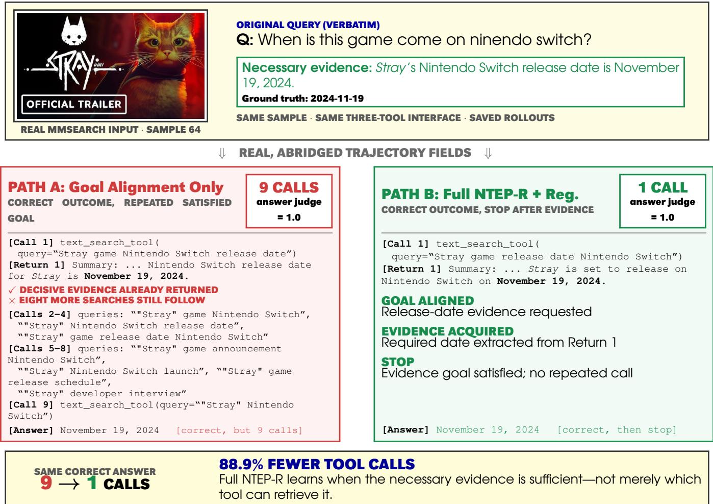  
Figure 8: Real MMSearch case mmsearch\_end2end\_only\_image-64. The image and question come from the dataset record; displayed calls, returns, answers, and answer-judge outcomes come from saved rollouts, with long returns excerpted. Under the same training pool and three-tool interface, both policies answer correctly, but Full NTEP-R + Reg. stops after the first decisive result instead of repeating a satisfied goal.

## C.2 Exact Reward-Ablation Values

Figure 7 summarizes the component ablation in the main text; Table 6 reports the corresponding three-decimal values. Full NTEP-R and the goal-only process-reward row use the same historical 7,774-example training pool. Answer Reward Only is retained as a 3,859-example legacy diagnostic, matching the note in Section 4.4, and serves as a call-eficiency refer- ence point.

## C.3 Inference-Budget Sweep

Table 7 reports the inference-budget sweep referenced in Ap- pendix A.6: the same Full NTEP-R checkpoint is evaluated on the full 4,417-example suite with the maximum number of assistant turns varied over $B \in \{ 5 , 1 0 , 1 5 , 2 0 \}$ . Accu- racy and realized tool use are essentially flat across budgets, confirming that the policy’s demand for calls is set by the evidence path rather than by the available budget.

<table><tr><td>Setting</td><td>Search Avg.</td><td>Visual Avg.</td><td>Overall Avg.</td><td>Crop</td><td>Image</td><td>Text</td><td>Total</td></tr><tr><td>Full NTEP-R</td><td>59.438</td><td>83.359</td><td>69.690</td><td>0.518</td><td>0.407</td><td>0.623</td><td>1.549</td></tr><tr><td>w/o Info. Acq. &amp; Non-Rep. Goal Reg.</td><td>34.580</td><td>83.374</td><td>55.492</td><td>0.511</td><td>3.178</td><td>1.671</td><td>5.360</td></tr><tr><td>Answer Reward Only</td><td>58.016</td><td>85.124</td><td>69.634</td><td>1.561</td><td>0.718</td><td>0.828</td><td>3.107</td></tr></table>

Table 6: Reward-component diagnostics (values shown to three decimals). Accuracy columns are split-macro percent-ages and tool columns are average calls per example; totals are computed from unrounded per-tool counts and can dif- fer by 0.001 from the visible component sum. The first two rows share the 7,774-example historical pool; Answer Re- ward Only uses a 3,859-example legacy pool and is shown as a diagnostic rather than a data-matched ablation.

## C.4 Tool-Need Counterfactual

Table 8 tests whether the trained checkpoint actually needs external tools. Both modes use the same NTEP-8B weights and the same examples. The end-to-end mode removes the tool interface, while the agentic mode enables crop/zoom, image search, and text search. The counterfactual shows that tools change many otherwise wrong predictions into correct ones, especially on search-oriented benchmarks, while in- troducing relatively few cases where a correct direct answer becomes wrong.

<table><tr><td>Budget B</td><td>Search Avg.</td><td>Visual Avg.</td><td>Overall Avg.</td><td>Total calls</td></tr><tr><td>5</td><td>59.256</td><td>83.051</td><td>69.454</td><td>1.548</td></tr><tr><td>10</td><td>59.438</td><td>83.359</td><td>69.690</td><td>1.549</td></tr><tr><td>15</td><td>59.047</td><td>83.851</td><td>69.677</td><td>1.545</td></tr><tr><td>20</td><td>58.700</td><td>83.926</td><td>69.512</td><td>1.548</td></tr></table>

Table 7: Inference-budget sweep for Full NTEP-R on the full 4,417-example suite, using the same checkpoint and scoring as Table 6 (B = 10 is the main protocol). Accuracy columns are split-macro percentages; Total calls is the average number of tool calls per example.
<table><tr><td>Benchmark</td><td>N</td><td>E2E Acc.</td><td>Agent Acc.</td><td>E2E×,Agent√</td><td>E2E√,Agent×</td><td>Crop</td><td>Image</td><td>Text</td><td>Total</td></tr><tr><td>MMSearch</td><td>171</td><td>14.6</td><td>63.7</td><td>86 (50.3)</td><td>2 (1.2)</td><td>0.07</td><td>0.73</td><td>0.90</td><td>1.70</td></tr><tr><td>HR-MMS</td><td>305</td><td>4.3</td><td>33.4</td><td>94 (30.8)</td><td>5 (1.6)</td><td>0.29</td><td>0.48</td><td>1.22</td><td>1.98</td></tr><tr><td>InfoSeek</td><td>500</td><td>25.6</td><td>56.8</td><td>173 (34.6)</td><td>17 (3.4)</td><td>0.05</td><td>0.98</td><td>0.82</td><td>1.85</td></tr><tr><td>MAT</td><td>150</td><td>61.3</td><td>84.7</td><td>38 (25.3)</td><td>3 (2.0)</td><td>0.03</td><td>0.62</td><td>1.37</td><td>2.02</td></tr><tr><td>V*</td><td>191</td><td>86.9</td><td>90.6</td><td>11 (5.8)</td><td>4 (2.1)</td><td>1.07</td><td>0.00</td><td>0.00</td><td>1.07</td></tr><tr><td>HR-4K</td><td>500</td><td>79.4</td><td>81.2</td><td>44 (8.8)</td><td>35 (7.0)</td><td>1.08</td><td>0.02</td><td>0.01</td><td>1.10</td></tr><tr><td>HR-8K</td><td>500</td><td>75.8</td><td>78.4</td><td>62 (12.4)</td><td>49 (9.8)</td><td>1.06</td><td>0.01</td><td>0.01</td><td>1.08</td></tr><tr><td>All</td><td>2317</td><td>51.8</td><td>68.8</td><td>508 (21.9)</td><td>115 (5.0)</td><td>0.61</td><td>0.38 0.50</td><td></td><td>1.48</td></tr></table>

Table 8: Same-checkpoint tool-necessity counterfactual. E2E uses no tools; Agent enables image\_zoom\_in\_tool, image\_search\_tool, and text\_search\_tool. Parentheses report percentages of the benchmark split. Per- tool and total call columns are averaged independently from unrounded counts, so their displayed sums can difer by 0.01.

## C.5 Trajectory-Label Distribution

For the behavioral analysis, we label 300 tool-using trajecto-ries per model, stratified across the seven benchmarks. Labels are assigned per call with the deterministic priority redun- dant > of-goal > wrong tool > evidence returned but unused > necessary-and-used. Table 9 reports the exact distribution behind Figure 5 and the trajectory analysis in Section 4.4.

## C.6 Toolset-Transfer Exact Values

Table 10 reports the exact per-benchmark values behind Fig- ure 6. Accuracy improves and average calls drop on every visual split when the previously unseen zoom tool is added; the largest accuracy gain (+9.95 points on V\*) coincides with the largest call reduction.

## C.7 Training Dynamics

Figures 10 and 9 track the archived GRPO process-reward runs on the historical 7,774-example pool. Plot legends retain their historical run names for reproducibility; Outcome+Goal corresponds to the goal-only row in Table 6, and NPR + Reg. corresponds to Full NTEP-R. Three obser-vations support the reward design. First, pre-call alignment alone is unstable: the goal-only run inflates its process re- ward late in training while its answer reward collapses— the training-time signature of saturation-style calling— whereas both information-supervised runs hold a stable answer reward throughout. Second, the efect of NTEP-R is selective rather than uniform: the per-trajectory rate of image\_zoom\_in\_tool converges to the same level under all three configurations, so necessary visual operations are preserved by every variant, while the goal-only run’s image\_search\_tool rate climbs toward four calls per trajectory and the information-supervised runs stay near 0.5. Third, information supervision does not suppress legitimate retrieval: on text\_search\_tool the w/o-regularizer run tracks the goal-only run closely, and only the non-repeated- goal regularizer compresses it further toward the eficient operating point reported in the main results.

<table><tr><td>Model</td><td>Calls/traj.</td><td>Off-goal</td><td>Wrong tool</td><td>Redundant</td><td>Unused evidence</td><td>Necessary-used</td><td>Case-5</td></tr><tr><td>Full NTEP-R</td><td>1.59</td><td>1.9</td><td>14.5</td><td>1.0</td><td>3.8</td><td>78.8</td><td>58.7</td></tr><tr><td>NTEP-R w/o Reg.</td><td>2.35</td><td>4.5</td><td>17.9</td><td>13.5</td><td>3.8</td><td>60.2</td><td>29.3</td></tr><tr><td>SenseNova-MARS-8B</td><td>2.24</td><td>1.8</td><td>18.2</td><td>8.8</td><td>2.2</td><td>69.0</td><td>39.0</td></tr><tr><td>Zero-shot Qwen3-VL-8B</td><td>2.16</td><td>4.2</td><td>24.6</td><td>4.9</td><td>2.5</td><td>63.8</td><td>50.0</td></tr></table>

Table 9: Exact trajectory-label distribution on 300 judgelabeled tool-using trajectories per model. Failure-mode columns are percentages of tool calls; Case-5 is the per- centage of trajectories where all calls are necessary-used and the final answer is correct.

<table><tr><td></td><td colspan="3">Accuracy (%)</td><td colspan="2">Avg. calls</td></tr><tr><td>Benchmark</td><td>N</td><td>Search tools</td><td>+Zoom</td><td>Search tools</td><td>+Zoom</td></tr><tr><td>V* Bench</td><td>191</td><td>75.39</td><td>85.34</td><td>1.707</td><td>1.230</td></tr><tr><td>HR-Bench 4K</td><td>800</td><td>77.12</td><td>83.50</td><td>1.651</td><td>1.318</td></tr><tr><td>HR-Bench 8K</td><td>800</td><td>72.50</td><td>78.12</td><td>1.679</td><td>1.334</td></tr><tr><td>Average</td><td></td><td>75.01</td><td>82.32</td><td>1.679</td><td>1.294</td></tr></table>

Table 10: Exact values for the visual OOD toolset transfer in Figure 6. Both conditions use the frozen step-180 check- point and identical decoding; only the exposed tool interface difers. Averages are computed from unrounded values.

## C.8 Unified Evaluation Protocol and Baseline Adapter

All rows of Table 1 are produced by one evaluation harness that fixes the datasets, prompts, tool schemas, tool backends, image budget, interaction budget, decoding budget, and scor- ing protocol across systems. Policies decode with tempera- ture 1.0, top-p 1.0, top-k 20, presence penalty 1.5, and a fixed seed, under a 32K context, a 16K generated-token cap, at most 10 interaction turns, and a shared maximum image bud- get of 8,294,400 pixels. Visual multiple-choice benchmarks are scored by a single deterministic option-matching rule shared by every row. Open-ended search answers are scored by exact match first and otherwise by a vision-capable judge (Qwen3-VL-Plus, temperature 0) that receives the image, question, ground truth, and prediction under the same rubric as the training-time judge; empty predictions are scored 0 without judge involvement.

External RL-agent checkpoints are evaluated through a generic in-process multi-turn driver: it parses each model’s native tool-call dialect, dispatches every call to the same three tool backends used by NTEP-8B (normalized-coordinate crop with native smart-resize, reverse image search, and top- 3 summarized text search), and feeds the returns back in the model’s expected format. Each checkpoint required only minimal, additive wiring—registering the missing tools in- side its own agent loop—so these rows measure the transfer of released weights to the common interface under identi- cal evidence sources and budgets. For closed-source APIs, parameters a provider does not accept are left at provider defaults and recorded per row, and providers whose serving stack rejects the native tool schema receive the same tools through text-format tool-call parsing.

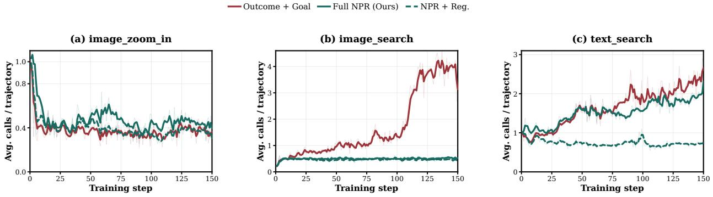  
Figure 9: Per-tool training d namics (average per-trajector invocation count). Zoom converges to the same level under all three configurations, so necessary visual operations are preserved; saturation lands primarily on image search under goal-only supervision; text search is preserved by information supervision and compressed only by the non-repeated-goal regularizer.

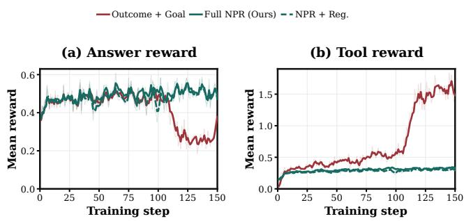  
Figure 10: Reward dynamics over GRPO training on the historical pool. (a) Answer reward: the goal-only configuration collapses after step ∼100, while both informationsupervised configurations hold near 0.5. (b) Process re-ward: the goal-only configuration inflates its tool reward to ≈1.6 by crediting calls whose returns are never used; the information-supervised configurations remain flat. The simultaneous process-reward spike and answer-reward col- lapse is the training-time signature of saturation-style tool calling.

## C.9 Limitations

We note the scope of the current study. First, path quality is bounded by the teacher: NTEPs are distilled by a stronger model, and the completion branch, which reconstructs paths for failed rollouts, is intrinsically harder than pruning suc- cessful ones; the retained outcome reward anchors training against residual path noise, but the dependence remains. Sec- ond, step-wise semantic judging adds serving overhead relative to outcome-only RL; bounded judge concurrency and response caps keep this manageable at our scale, and the judge is needed only during training. Third, our experiments cover three tools and predominantly English retrieval; be- cause the NTEP interface is tool-agnostic (Section 3), richer tool families and multilingual corpora are natural extensions rather than redesigns. Fourth, the non-repeated-goal regu- larizer selects an eficiency-leaning operating point on the accuracy–eficiency frontier; applications that value maxi- mal retries can tune the duplicate penalty accordingly.

<table><tr><td>Item</td><td>Value</td></tr><tr><td>Audit size</td><td>100 judge-involved cases</td></tr><tr><td>Scope</td><td>Search-answer scoring; trajectory-labeling analysis</td></tr><tr><td>Benchmarks</td><td>Search-oriented splits and trajectory-analysis samples</td></tr><tr><td>Blinding</td><td>Model identity and judge score hidden</td></tr><tr><td>Inputs shown</td><td>Image, question, model an- swer, tool transcript, returned evidence when applicable</td></tr><tr><td>Labels</td><td>Correctness; neces- sary/unnecessary use; non- necessary failure mode</td></tr><tr><td>Agreement</td><td>97.0% (97/100)</td></tr><tr><td>Cohen&#x27;s κ</td><td>0.936</td></tr><tr><td>Use of audit</td><td>Reliability check only; not used for selection or tuning</td></tr></table>

Table 11: Blinded human audit of judge reliability across judge-involved settings.

## D Human Audit

The human audit validates the automated judgments used for open-ended search-answer scoring and trajectory-level behavior analysis. We sample 100 judge-scored cases from the judge-involved settings and hide both model identity and judge decision from the annotator. Each audit row contains the image, question, model answer, tool transcript, and re- turned evidence when applicable. Annotators assign the same label t pes used b the automated judge, including answer correctness, necessary-versus-unnecessary tool use, and the failure category for non-necessary calls. Table 11 summa- rizes the audit protocol and agreement.

Agreement is uniform across systems: 98% on NTEP-8B cases and 96% on the strongest baseline’s cases, with one judge false positive and two false negatives among the 100 audited decisions. All three disagreements are bound- ary judgments—synonym granularity (e.g., “contemporary” vs. “modern”) and a magnitude misreading—rather than systematic bias toward any model.

This audit is not used for model selection, reward tun- ing, or post-hoc correction of reported results. The visual multiple-choice benchmarks do not use automated judging for correctness; they are scored by answer extraction and exact matching.

## E Non-Commercial Use Statement

This work uses MMSearch (end-to-end, image-only), InfoS-eek, V\*Bench, HR-Bench 4K, and HR-Bench 8K. Although the code or annotations of these benchmarks are released under permissive licenses such as MIT or Apache-2.0, some of their underlying images and source data remain subject to non-commercial or research-only terms imposed by the orig- inal data providers. The authors confirm that these bench- marks and their underlying data were used solely for non- commercial academic research and were not used for any commercial activity, in accordance with the applicable up- stream licenses and terms of use.