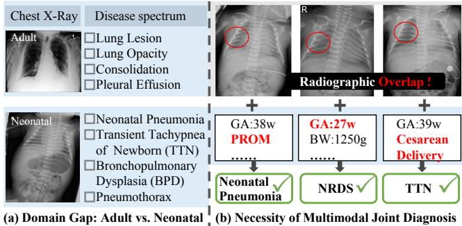
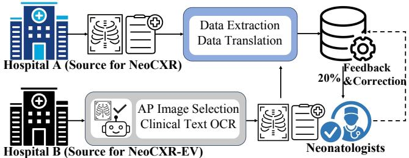
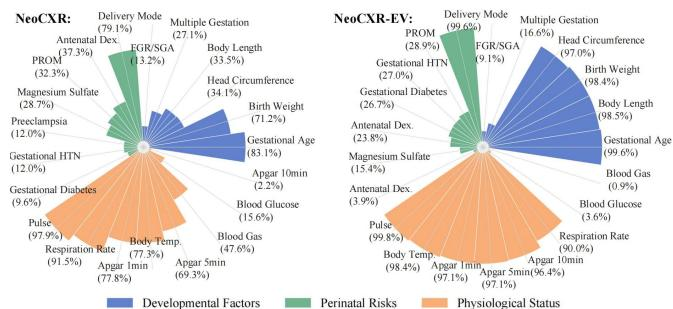
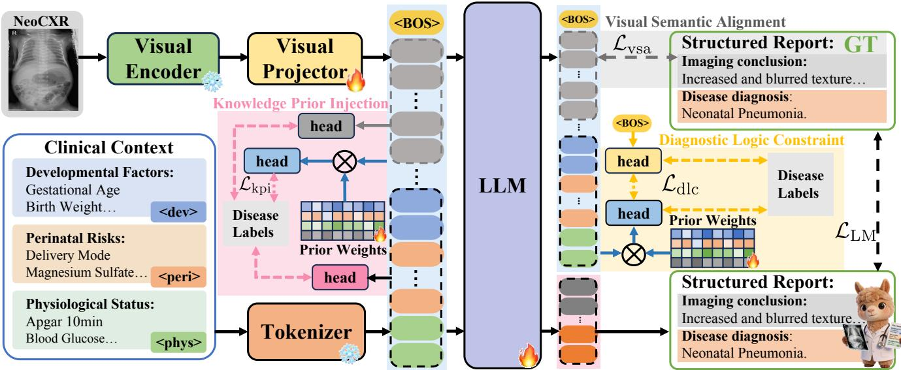
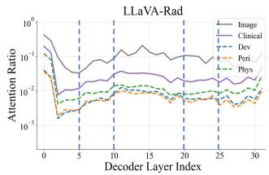
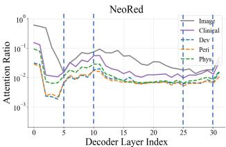
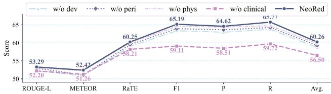
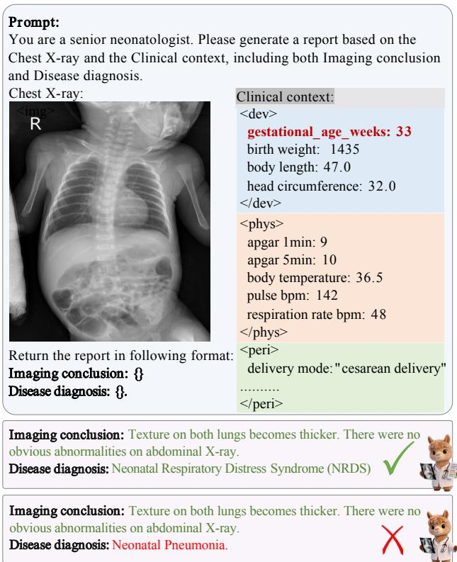

# NeoRed: A Knowledge-Logic-Alignment MLLM for Neonatal Respiratory Disease Diagnosis

Yinan Liu, Hongtai Xia, Haoran Xu, Jiankang Hong, Jingkuan Song, Ye Luo∗

School of Computer Science and Technology, Tongji University Shanghai, China yeluo@tongji.edu.cn

## Abstract

Neonatal respiratory diseases are a major cause of neonatal morbidity and mortality, posing substantial challenges in clinical practice. Despite recent advances, existing Multimodal Large Language Models (MLLMs) face two key limitations in neonatal diagnosis: (1) domain gap arising from predominantly adult training data; (2) insuficient integration of multidimensional clinical context for accurate diagnosis. To address these challenges, we collect two real-world clinical datasets (NeoCXR and NeoCXR-EV) and propose NeoRed, to the best of our knowledge, the first MLLM tailored for neonatal respiratory disease, filling the gap in neonatal diagnostic reports generation. To enhance joint diagnosis from heterogeneous clinical context and chest X-rays, we design a novel Knowledge–Logic–Alignment (KLA) framework which constrains model behavior from three perspectives: 1) Knowledge Prior Injection (KPI) incorporates neonatologist-inspired diagnostic priors into multimodal representations, guiding diseasespecific attention across modalities; 2) Diagnostic Logic Constraint (DLC) aligns the semantics of generated reports with multimodal diagnostic logic; and 3) Visual Semantic Alignment (VSA) establishes semantic correspondence between visual features and imaging conclusions. Extensive experiments demonstrate that NeoRed enables accurate neonatal diagnostic reports generation, achieving ROUGE-L of 53.29% and Clinical Eficacy F1 score of 65.19% on NeoCXR, outperforming existing MLLMs. NeoRed also preserves competitive report generation performance on adult benchmarks (MIMIC-CXR and IU-Xray). Datasets will be available upon application.

## Introduction

Neonatal respiratory diseases, including Neonatal Respiratory Distress Syndrome (NRDS), Transient Tachypnea of the Newborn (TTN), and neonatal pneumonia, represent one of the leading causes of morbidity and mortality among newborns globally (Cho et al. 2025; Chen, Li, and Shi 2023). Early and accurate diagnosis is pivotal for timely intervention and improving clinical outcomes (Yu et al. 2025a; Ismaiel, Farouk, and Mohammed 2025).

In recent years, Multimodal Large Language Models (MLLMs) have shown strong capabilities in joint vision–language understanding and reasoning, achieving notable progress in tasks such as image captioning (Radford et al. 2021; Li et al. 2023b) and multimodal dialogue (Sun and Zhou 2025; Chen et al. 2023). Inspired by these advancements, recent studies have explored adapting MLLMs to medical domain, particularly for tasks such as radiology report generation (Hyland et al. 2023; Wang et al. 2022) and medical visual question answering (He et al. 2024; Gu et al. 2024). However, despite these promising advances, their application to neonatal clinical scenarios remains challenging due to two main reasons. First, as shown in Fig. 1(a), neonatal and adult populations exhibit substantial domain gaps in both radiographic appearance and disease spectrum. Neonatal CXRs show immature anatomy and smaller, lowercontrast lesions, while neonatal diseases such as NRDS, TTN, and BPD difer markedly from common adult conditions. Existing MLLMs are primarily trained on adult data. Given the severe domain shift in both visual features and disease spectrum, directly transferring such models to neonatal CXRs yields limited efectiveness. Second, neonatal respiratory diseases often exhibit substantial radiographic overlap, making them dificult to distinguish on CXRs. As shown in Fig. 1(b), neonatal pneumonia, NRDS, and TTN can present with highly similar radiographic patterns in the same lung regions, limiting diagnosis based on imaging alone. However, incorporating clinical information enables more accurate diferentiation. For example, the first case can be identified as pneumonia when combined with premature rupture of membranes; the second as NRDS when considered alongside prematurity and extremely low birth weight; and the third as TTN when cesarean delivery is taken into account. In clinical practice, neonatologists therefore integrate multiple sources of clinical information to support comprehensive diagnosis and reduce misdiagnosis. while existing MLLMs primarily focus on vision–language alignment and natural language generation. Due to lack of explicit training constraints, such models fail to prioritize key clinical indicators, limiting joint diagnosis from CXR and clinical context.

  
Figure 1: Motivations of the proposed NeoRed model. (a) Domain gaps in Chest X-ray and disease spectrum between neonatal and adult. (b) Necessity of integrating CXRs with clinical context for accurate neonatal diagnosis.

To address these limitations, we propose the Knowledge-Logic Alignment Multimodal Large Language Model for Neonatal Respiratory Disease Diagnosis (NeoRed). To the best of our knowledge, NeoRed is the first MLLM tailored for neonatal respiratory disease diagnosis, filling the gap in neonatal radiology report generation. NeoRed jointly incorporates neonatal CXRs and clinical context as model inputs to generate reports containing imaging conclusions and disease diagnosis, enabling multimodal diagnosis for neonatal respiratory disease. Specifically, to address the domain gap between adult and neonatal populations and the scarcity of neonatal data, we collaborate with two partner hospitals to curate two real-world multimodal datasets: NeoCXR and NeoCXR External Validation (NeoCXR-EV). Together, NeoCXR and NeoCXR-EV form a dual-center benchmark for training and evaluating MLLMs for neonatal respiratory disease diagnosis. To address the limited capability of existing models in jointly diagnosis over heterogeneous clini cal information, we design a Knowledge–Logic– Alignment (KLA) framework that inspired by the multimodal diagnostic workflow of neonatologists. Specifically, KLA constrains model behavior from three perspectives: 1) Knowledge Prior Injection (KPI), which injects neonatologist-inspired diagnostic priors into multimodal representations for diseasespecific attention; 2) Diagnostic Logic Constraint (DLC), which enforces semantic–diagnostic consistency by aligning global diagnostic-semantic anchor of report generation with the diagnostic logic of neonatologist; 3) Visual Semantic Alignment (VSA), which establishes bidirectional semantic correspondence between image features and conclusions via cross-modal contrastive learning, aligning visual evidence with its clinical interpretation. By coordinating multimodal clinical information in accordance with neonatologists’ diagnostic workflow, the proposed KLA enables accurate diagnosis of neonatal respiratory diseases. In summary, the key contributions of this paper are fourfold:

• We construct NeoCXR and NeoCXR-EV, two real-world multimodal neonatal report generation datasets that fill a critical domain gap and will be released through application-based access to support future research.

• We propose NeoRed, to the best of our knowledge, the first MLLM for neonatal respiratory disease diagnosis, which jointly interprets chest X-rays and clinical context to generate accurate neonatal diagnostic reports.

• We propose a novel KLA framework to enhance multimodal joint diagnosis, where KPI injects expert priors into multimodal representations, DLC enforces semantic–diagnostic consistency, and VSA aligns imaging conclusions with visual evidence.

• Extensive experiments demonstrate that NeoRed outperforms 8 mainstream MLLMs on neonatal benchmarks (NeoCXR, NeoCXR-EV) while remaining competitive on adult benchmarks (MIMIC-CXR, IU-Xray).

## Related Work

## Multimodal Large Language Models

General MLLMs have advanced cross-modal representation learning and vision–language alignment (Bai et al. 2025b; Glm et al. 2024; Chen et al. 2024b; Bai et al. 2023; Liu et al. 2024b). Early models, including Flamingo (Alayrac et al. 2022) and the BLIP series (Li et al. 2022; Dai et al. 2023; Li et al. 2023b), established strong multimodal representations through large-scale image–text pretraining. Subsequent models such as LLaVA (Liu et al. 2024a), Qwen-VL (Bai et al. 2025b,a), and InternVL (Chen et al. 2024b) project visual features into the language space and adopt instruction tuning for multimodal interaction. LLaVA-NeXT (Liu et al. 2024b) and LLaVA-OneVision (Li et al. 2024) further improve visual alignment and reasoning through enhanced visual encoding and multi-stage training. However, their limited domain-specific medical knowledge constrains their reliability in medical diagnosis.

## Medical Multimodal Large Language Models

Recent studies have extended MLLMs to radiology report generation and medical visual question answering (Chen et al. 2024a; Li et al. 2023a; Chaves et al. 2024; Guo et al. 2024; Xu et al. 2025; Huang et al. 2025). General medical models, including BiomedGPT (Zhang et al. 2024), LLaVA-Med (Li et al. 2023a), UMIT (Yu et al. 2025b), HuatuoGPT-Vision (Chen et al. 2024a), and Lingshu (Xu et al. 2025), use large-scale multi-stage training to enhance multimodal alignment and diagnostic reasoning. Task-specific models such as LLaVA-Ultra (Guo et al. 2024), LLaVA-Rad (Chaves et al. 2024), and RadFM (Wu et al. 2025) further improve radiological understanding across targeted 2D and 3D settings. However, most existing medical MLLMs are trained primarily on adult data and remain limited in modeling neonatal-specific disease patterns and diagnostic processes.

## NeoCXR and NeoCXR-EV Datasets Data Collection and Process

To support precise diagnosis of neonatal respiratory diseases, we construct NeoCXR and NeoCXR-EV datasets, which are collected from two independent hospitals. We designed a heterogeneous data pipeline to handle the distinct data from each hospital, as shown in Fig. 2. Hospital A provided ready-to-use Anteroposterior (AP) CXRs and metadata, from which we directly extract the relevant data. While hospital B provided raw data, including multi-view CXRs and PDF-formatted clinical records. We first employed Zhipu GLM-4-Flash (Glm et al. 2024) to automatically identify AP views from multi-view images. Text was first extracted from the PDF documents using PaddleOCR (Cui et al. 2025), followed by extraction of structured metadata. Then data from both hospitals were structured and translated into English by Tencent Cloud API. To ensure data quality, we performed iterative quality control. In each round, a new random 20% subset of each dataset was independently reviewed by two neonatologists for AP-view identification, OCR, translation, and disease annotation. Errors were corrected based on expert feedback, and the process was repeated until no further errors were identified.

Figure 2: Data collection and process pipeline of NeoCXR and NeoCXR-EV. AP denotes anteroposterior projection.
<table><tr><td>Dataset</td><td>Patients</td><td>Samples</td><td>Train</td><td>Val</td><td>Test</td></tr><tr><td>NeoCXR</td><td>2,466</td><td>6,278</td><td>4,219</td><td>625</td><td>1,434</td></tr><tr><td>NeoCXR-EV</td><td>590</td><td>1,089</td><td></td><td>一</td><td>1,089</td></tr></table>

Table 1: Summary of the NeoCXR dataset series.

We finally obtain two datasets. NeoCXR, collected from Hospital A, contains 6,278 samples from 2,466 patients and is split at the patient level into training, validation, and internal test sets with a ratio of 7:1:2. NeoCXR-EV, collected from Hospital B, includes 1,089 samples from 590 patients and serves as an external validation set. Details are summarized in Tab. 1. Both datasets were approved by the relevant institutional ethics committees, and all patient data were deidentified before analysis. Each sample in the datasets is a multimodal tuple: the inputs consist of a chest X-ray paired with 21 clinical factors, while the outputs are structured reports comprising both imaging conclusion and disease diagnosis. These datasets cover 7 neonatal respiratory diseases (NRDS, neonatal pneumonia, TTN, pneumothorax, BPD, pleural efusion, atelectasis) and a normal category. Disease distribution is provided in supplementary material.

## Structured Clinical Context

To better model the clinical diagnostic logic, we structure complex clinical factors into three categories, according to the causal progression ofneonatal diseases and the diagnostic logic of neonatologists. The factors are organized as follows:

1) Developmental factors, which capture neonatal maturity and growth, including gestational age, birth weight, body length, head circumference, multiple pregnancy, fetal growth restriction (FGR) or small for gestational age (SGA).

2) Perinatal risks, which capture maternal and obstetric conditions that may adversely afect the neonate, including delivery mode, premature rupture of membranes (PROM), preeclampsia, gestational hypertension, gestational diabetes, antenatal dexamethasone and magnesium sulfate.

3) Physiological status, which represents the newborn’s immediate postnatal condition, encompassing Apgar scores, body temperature, respiration rate, pulse, blood gas, and blood glucose. The distribution of clinical context on both datasets is shown in Fig. 3. Clinical factors are prevalent in both datasets, while notable distributional diferences between NeoCXR and NeoCXR-EV.

To provide the model with explicit boundaries across clinical categories, each category is enclosed within relevant tokens: "<dev>...</dev>", "<peri>...</peri>", and "<phys>...</phys>". Missing categories are replaced with "not provided" for input consistency.

  
Figure 3: Distribution of clinical context. Percentages indicate the completeness rate of each clinical factor.

## Methodology

## Overview of NeoRed

As illustrated in Fig. 4, NeoRed takes a neonatal CXR and clinical context as input, and generates a structured report comprising an imaging conclusion and a disease diagnosis.

Formally, the input CXR is denoted as $\mathbf { x } ^ { \mathrm { c x r } } \in \mathbb { R } ^ { \check { C } \times H \times W }$ V and the structured clinical context is denoted as $\mathbf { x } ^ { \mathrm { t x t } }$ . Vision encoder ${ \mathcal { E } } _ { v }$ and a projector $\mathcal { P }$ extract and map visual features into a sequence of visual tokens $\mathbf { V } = \{ v _ { 1 } , v _ { 2 } , \ldots , v _ { N _ { v } } \}$

$$
\mathbf { V } = \mathcal { P } ( \mathcal { E } _ { v } ( \mathbf { x } ^ { \mathrm { c x r } } ) ) .\tag{1}
$$

The $\mathbf { x } ^ { \mathrm { t x t } }$ is tokenized into a sequence of textual tokens $\mathbf { T } =$ $\{ t _ { 1 } , t _ { 2 } , \ldots , t _ { N _ { t } } \}$ . The two token sequences are concatenated into a joint multimodal input $\mathbf { U } = \left[ \mathbf { \bar { V } } , \mathbf { T } \right]$ , which is fed into the LLM backbone to autoregressively generate target report $\mathcal { R } = \{ r _ { 1 } , r _ { 2 } , . . . , r _ { K } \}$ . K denotes the length of generated report in tokens. The model is optimized by minimizing the autoregressive cross-entropy loss over the ground-truth report $\mathcal { R } ^ { * } \bar { \ } = \{ r _ { 1 } ^ { * } , r _ { 2 } ^ { * } , \ldots , r _ { K } ^ { * } \}$

$$
P _ { \Theta } ( \mathcal { R } | \mathbf { U } ) = \prod _ { i = 1 } ^ { K } P _ { \Theta } ( r _ { i } | \mathbf { U } , r _ { < i } ) ,\tag{2}
$$

$$
\mathcal { L } _ { \mathrm { L M } } = - \sum _ { i = 1 } ^ { K } \log P _ { \Theta } ( r _ { i } ^ { * } | \mathbf { U } , r _ { < i } ^ { * } ) ,\tag{3}
$$

where $r _ { < i } = \{ r _ { 1 } , \ldots , r _ { i - 1 } \}$ represents all previously generated tokens before step i, Θ denotes the learnable parameters.

## KLA: Knowledge-Logic-Alignment

To emulate the diagnostic logic of experienced neonatologists and improve joint multimodal diagnosis, we design a novel KLA framework comprising KPI, DLC and VSA.

## 1) Knowledge Prior Injection

Neonatal respiratory disease diagnosis relies on both clinical context and CXRs, yet existing methods overlook the exploration of disease-specific modality dependencies and fail to efectively leverage this multidimensional information. To address this issue, we propose KPI to inject neonatologistinspired priors into multimodal representations, implicitly guiding disease-specific attention of MLLM.

Formally, for each modality m ∈ M = {dev, peri, phys, cxr}, we first extract the input embeddings $\pmb { h } ^ { \check { m } } \in \mathrm { ~ \mathbb ~ { R } ~ } ^ { B \times L \times D }$ from the corresponding developmental, perinatal, physiological, and image tokens.

  
Figure 4: The overview of NeoRed based on the proposed KLA framework. KLA consists of three modules: KPI, which inject neonatologist diagnostic knowledge into multimodal representations; DLC, which constrains the diagnostic reasoning during report generation; VSA, which establishes the correspondence between image features and imaging conclusions.

<table><tr><td>Modality</td><td>Pneu.</td><td>NRDS</td><td>TTN</td><td>PTx</td><td>BPD</td><td>Ate.</td><td>PE</td><td>Normal</td></tr><tr><td>Dev.</td><td>0.2</td><td>1.0</td><td>0.5</td><td>0.3</td><td>1.0</td><td>0.3</td><td>0.4</td><td>1.0</td></tr><tr><td>Peri.</td><td>1.0</td><td>0.9</td><td>1.0</td><td>0.3</td><td>0.4</td><td>0.3</td><td>0.8</td><td>1.0</td></tr><tr><td>Phys.</td><td>1.0</td><td>1.0</td><td>0.9</td><td>1.0</td><td>0.8</td><td>1.0</td><td>1.0</td><td>1.0</td></tr><tr><td>Img.</td><td>1.2</td><td>1.5</td><td>1.3</td><td>1.6</td><td>1.4</td><td>1.5</td><td>1.3</td><td>1.0</td></tr></table>

Table 2: Diagnostic priors between diseases and modalities. Disease abbreviations: Pneu. (Pneumonia), PTx (Pneumothorax), Ate. (Atelectasis), and PE (Pleural Efusion).

Here, L represents sequence length $( \mathrm { i . e . }$ , number of tokens for each modality), and D is embedding dimension. After applying average pooling along token dimension, we obtain modality-specific features $\bar { \boldsymbol { h } } ^ { m } \in \mathbb { R } ^ { B \times D } ,$ . These features are then stacked to form a unified multimodal representation $\bar { \pmb { H } } \in \mathbb { R } ^ { B \times | \mathcal { M } | \times D }$ . To model dependencies between diseases and modalities, we introduce a learnable disease-specific prior matrix $W _ { p r i o r } \in \mathbb { R } ^ { N \times | \mathcal { M } | }$ |, initialized using neonatologist-inspired priors (see Tab. 2). The prior matrix $W _ { p r i o r }$ is normalized via softmax and then used to weight modality-specific features H¯ , yielding diseasespecific multimodal representations $\mathbf { \Delta } \mathbf { F } ^ { d i a g } \mathbf { \Xi } \in \bar { \mathbb { R } } ^ { B \times N \times D }$ where N denotes the number of disease categories.

$$
F ^ { d i a g } = \mathrm { s o f t m a x } ( W _ { p r i o r } ) \cdot \bar { \cal H } ,\tag{4}
$$

$$
\begin{array} { r } { { \cal F } ^ { c l i } = [ \bar { \bf h } ^ { d e v } ; \bar { \bf h } ^ { p e r i } ; \bar { \bf h } ^ { p h y s } ] . } \end{array}\tag{5}
$$

Then, $\mathbf { F } ^ { d i a g } , \bar { \mathbf { h } } ^ { c x r }$ , and ${ \pmb { F } } ^ { c l i }$ are passed through a dedicated classifier and supervised with binary cross-entropy (BCE) loss against disease labels, independently. This process yields prior classification loss ${ \mathcal { L } } _ { \mathrm { p r i o r } } ,$ , CXR classification loss ${ \mathcal { L } } _ { \mathrm { c x r } } ,$ and clinical classification loss $\mathcal { L } _ { \mathrm { c l i } }$ . The total optimization objective of KPI is formulated as:

$$
{ \mathcal { L } } _ { \mathrm { k p i } } = { \mathcal { L } } _ { \mathrm { p r i o r } } + \lambda _ { 1 } { \mathcal { L } } _ { \mathrm { c x r } } + \lambda _ { 2 } { \mathcal { L } } _ { \mathrm { c l i } } ,\tag{6}
$$

where $\lambda _ { 1 } = \lambda _ { 2 } = 0 . 1$ are weighting coeficients.

2) Diagnostic Logic Constraint

Existing MLLMs generate reports in an autoregressive manner without explicit constraints ensuring that the generated text remains consistent with the underlying diagnostic decision. This may result in linguistically fluent yet diagnostically inconsistent reports. To address this issue, we propose DLC to ensure semantic consistency between generated text and clinical diagnostic logic.

To address this issue, we seek a global representation to regulate autoregressive generation. The BOS hidden state naturally serves this role in causal LLMs, as all subsequent tokens can access it through self-attention. Our attention analysis further shows strong token-level dependency on BOS, motivating us to inject diagnostic supervision into BOS and transform it into a global diagnostic anchor for guiding report generation. Specifically, we impose diagnostic supervision on BOS token and align its diagnostic distribution with multimodal diagnostic representations. We adopt multimodally fused features as local diagnostic representations, following the same formulation as ${ \pmb { F } } ^ { d i a g }$ in KPI (as defined in Eq. 4), while features are derived from the last-layer hidden states of LLM. The hidden state of <BOS> token and Fdiag are passed through dedicated classifiers and supervised with BCE loss, yielding global semantic loss $\mathcal { L } _ { \mathrm { g l } }$ and local classification loss ${ \mathcal { L } } _ { \mathrm { l c } } .$ To enforce semantic consistency between report generation and diagnostic logic, we compute Jensen-Shannon divergence between the two predictive distributions of global and local views as diagnostic consistency loss ${ \mathcal { L } } _ { \mathrm { d c } }$

$$
\mathcal { L } _ { \mathrm { d c } } = \frac { 1 } { 2 } \mathrm { K L } ( p \| m ) + \frac { 1 } { 2 } \mathrm { K L } ( q \| m ) ,\tag{7}
$$

where p and q denote the predicted probabilities from global and local views, and m denotes their mean.

The optimization objective of DLC is defined as:

$$
\begin{array} { r } { \mathcal { L } _ { \mathrm { d l c } } = \alpha \mathcal { L } _ { \mathrm { g l } } + \beta \mathcal { L } _ { \mathrm { l c } } + \gamma \mathcal { L } _ { \mathrm { d c } } , } \end{array}\tag{8}
$$

where weighting coeficients $\alpha = 1 . 0 , \beta = 0 . 5 , \gamma = 0 . 1$

<table><tr><td rowspan="2">Type</td><td rowspan="2">Model</td><td colspan="6">NLG</td><td colspan="2">CE</td><td rowspan="2">R</td><td rowspan="2"></td><td rowspan="2">Avg. p-value</td></tr><tr><td colspan="8">ROUGE-L ROUGE-1 BLEU-1 BLEU-2 METEOR RaTE</td></tr><tr><td></td><td colspan="10"></td><td></td><td></td><td></td></tr><tr><td rowspan="2">Generalist</td><td>LLaVA-NeXT-7B (Liu et al. 2024b) InternVL-2.5-8B (Chen et al. 2024b)</td><td>16.17 16.44 9.59</td><td>16.80 17.27</td><td>7.89 9.84 5.00</td><td>4.45 5.56 2.79</td><td>22.89 23.21 17.35</td><td>34.25 34.45</td><td></td><td>4.96 8.60</td><td>19.14 17.62</td><td>2.85 5.69 15.41</td><td>14.381.7E-502 4.7E-468</td><td></td></tr><tr><td>Qwen2.5-VL-7B (Bai et al. 2025b) Qwen3-VL-8B (Bai et al. 2025a)</td><td>15.14</td><td>10.04 15.60</td><td>8.71</td><td>5.22</td><td>22.14</td><td></td><td>35.01 37.51</td><td>15.03 24.25</td><td>20.67 22.07</td><td>11.81 26.90</td><td>14.14 19.73</td><td>2.0E-486 1.3E-387</td></tr><tr><td rowspan="2"></td><td>Qwen3-VL-8B † (Bai et al. 2025a)</td><td>52.28</td><td>52.91</td><td>48.27</td><td>42.38</td><td>52.39</td><td></td><td>58.39</td><td>62.32</td><td>61.81</td><td>62.83</td><td>54.85</td><td>6.1E-07</td></tr><tr><td>LLaVA-Med-7B (Li et al. 2023a)</td><td>19.97</td><td>22.01</td><td>10.88</td><td>5.67</td><td>15.55</td><td></td><td>28.83</td><td>3.13</td><td>18.75</td><td>1.71</td><td>14.06</td><td>9.3E-513</td></tr><tr><td rowspan="2">Medical</td><td>LLaVA-Rad-7B (Chaves et al. 2024)</td><td>16.80</td><td>17.65</td><td>17.47</td><td>6.79</td><td>16.52</td><td></td><td>35.10</td><td>3.81</td><td>8.00</td><td>2.50</td><td>13.85</td><td>1.2E-481</td></tr><tr><td>HuatuoGPT-V-7B (Chen et al. 2024a) Lingshu-7B (Xu et al. 2025)</td><td>20.51 16.80</td><td>21.76 17.92</td><td>14.09 9.22</td><td>7.84 5.06</td><td>23.47</td><td>27.21</td><td>33.36 33.33</td><td>9.73</td><td>21.84</td><td>6.26</td><td>18.07</td><td>1.0E-451 2.9E-476</td></tr><tr><td rowspan="2">NeoRed</td><td>LLaVA-Rad-7B † (Chaves et al. 2024)</td><td>50.06</td><td>50.33</td><td>44.70</td><td>38.76</td><td>48.72</td><td></td><td></td><td>6.29</td><td>16.13</td><td>3.91</td><td>14.68</td><td></td></tr><tr><td></td><td>53.29</td><td>53.56</td><td>48.83</td><td>42.54</td><td>52.42</td><td></td><td>57.49 60.25</td><td>63.21</td><td>62.53</td><td>63.91</td><td>53.30</td><td>2.1E-09</td></tr><tr><td colspan="10">NeoCXR-EV</td><td>65.19 64.62</td><td>65.77 56.27</td><td></td><td></td></tr><tr><td colspan="10">LLaVA-NeXT-7B (Liu et al. 2024b)</td><td></td><td></td><td></td><td></td><td></td></tr><tr><td rowspan="2">Generalist</td><td>InternVL-2.5-8B (Chen et al. 2024b)</td><td>14.85 16.58</td><td>15.63 17.53</td><td>8.37 11.98</td><td>4.71 7.06 3.43</td><td>22.05 25.08</td><td></td><td>29.91 31.08</td><td>6.79 14.43</td><td>45.05 38.54</td><td>3.67</td><td>16.78</td><td>4.3E-225 5.3E-172</td></tr><tr><td>Qwen2.5-VL-7B (Bai et al. 2025b) Qwen3-VL-8B (Bai et al. 2025a)</td><td>9.36 15.51</td><td>9.97 16.35</td><td>6.03 10.50</td><td>6.24</td><td></td><td>19.74 23.77</td><td>31.55 34.63</td><td>17.07 34.32</td><td>47.03 42.18</td><td>8.88 10.43 28.93</td><td>19.02 17.18 23.60</td><td>1.6E-205 1.5E-84</td></tr><tr><td rowspan="2">Medical</td><td>Qwen3-VL-8B † (Bai et al. 2025a) LLaVA-Med-7B (Li et al. 2023a)</td><td>26.79 12.57</td><td>27.12 17.08</td><td>20.14 5.56</td><td>14.41 3.49</td><td></td><td>25.78 12.57</td><td>42.10 24.69</td><td>37.49 4.14</td><td>43.79</td><td>32.77</td><td>30.05</td><td>3.7E-11</td></tr><tr><td>LLaVA-Rad-7B (Chaves et al. 2Ó24)</td><td>13.25</td><td>12.83</td><td>15.51</td><td>3.88</td><td></td><td>13.25</td><td>30.38</td><td>4.07</td><td>87.88 11.00</td><td>2.12 2.50</td><td>18.90 11.85</td><td>3.8E-266 3.9E-238</td></tr><tr><td rowspan="2"></td><td>HuatuoGPT-V-7B (Chen et al. 2024a) Lingshu-7B (Xu et al. 2025)</td><td>20.97</td><td>22.22</td><td>16.84 10.76</td><td>9.78</td><td></td><td>28.94</td><td>31.24</td><td>10.68</td><td>36.43</td><td>6.26</td><td>20.37</td><td>7.2E-161</td></tr><tr><td></td><td>16.64</td><td>17.61</td><td></td><td>6.20</td><td></td><td>23.96</td><td>30.52</td><td>8.57</td><td>41.94</td><td>4.77</td><td>17.89</td><td>1.1E-199</td></tr><tr><td rowspan="2">NeoRed</td><td>LLaVA-Rad-7B † (Chaves et al. 2024)</td><td>31.21</td><td>32.52</td><td>26.82</td><td>20.49</td><td></td><td>31.40</td><td>44.36</td><td>36.1542.08</td><td></td><td>31.69</td><td></td><td>5.2E-1</td></tr><tr><td></td><td>32.90</td><td>33.13</td><td>27.12</td><td>20.92</td><td></td><td>32.34</td><td>45.85</td><td>39.2844.36 35.24 34.57</td><td></td><td></td><td>32.97</td><td></td></tr></table>

Table 3: Performance comparison between NeoRed and existing MLLMs on the NeoCXR and NeoCXR-EV datasets. † is fine-tuned under the same settings of NeoRed. The best and second-best results are highlighted in bold and underline.

<table><tr><td>Model</td><td>ROUGE-L METEOR</td><td></td><td>RaTE</td><td>F1</td><td>P</td><td>R</td><td> $\operatorname { A v g } .$ </td></tr><tr><td>Baseline</td><td>50.06</td><td>48.72</td><td>57.49</td><td>63.21</td><td>62.53</td><td></td><td>63.91 57.65</td></tr><tr><td>w/o KPI</td><td>52.33</td><td>50.73</td><td>58.74</td><td>64.18</td><td>63.53</td><td>64.84</td><td>59.06</td></tr><tr><td>w/o DLC</td><td>52.67</td><td>51.79</td><td>59.09</td><td>63.54</td><td>62.90</td><td>64.20</td><td>59.03</td></tr><tr><td>w/o VSA</td><td>51.60</td><td>51.32</td><td>59.29</td><td>65.14</td><td>64.53</td><td>65.77</td><td>59.61</td></tr><tr><td>NeoRed</td><td>53.29</td><td>52.42</td><td>60.25 65.1964.62 65.77 60.26</td><td></td><td></td><td></td><td></td></tr></table>

Table 4: Ablation study of KLA on the NeoCXR dataset.
<table><tr><td>Model</td><td>ROUGE-L METEOR</td><td></td><td>RaTE</td><td>F1</td><td>P</td><td>R</td><td>Avg.</td></tr><tr><td>Baseline</td><td>50.06</td><td>48.72</td><td>57.49</td><td>63.21</td><td>62.53</td><td>63.91</td><td>57.65</td></tr><tr><td>w/o  ${ \mathcal { L } } _ { \mathrm { p r i o r } }$ </td><td>52.45</td><td>51.53</td><td>59.00</td><td>64.45</td><td>63.90</td><td>65.01</td><td>59.39</td></tr><tr><td>w/o  $\mathcal { L } _ { \mathrm { c l i } }$ </td><td>52.84</td><td>51.89</td><td>59.05</td><td>64.24</td><td>63.65</td><td>64.84</td><td>59.42</td></tr><tr><td>w/o  $\mathcal { L } _ { \mathrm { c x r } }$ </td><td>53.04</td><td>52.22</td><td>59.16</td><td>64.75</td><td>64.53</td><td>64.98</td><td>59.78</td></tr><tr><td>NeoRed</td><td>53.29</td><td>52.42</td><td>60.25</td><td>65.19</td><td>64.62</td><td></td><td>65.77 60.26</td></tr></table>

Table 5: Internal ablation of KPI on the NeoCXR dataset.

## 3) Visual Semantic Alignment

To further align visual evidence with its clinical textual interpretation, we design VSA, which establishes bidirectional semantic correspondence between image features and imaging conclusions, encouraging the generated imaging conclusions to be supported by visual evidence.

We extract the last-layer hidden states of image tokens by the LLM, denoted as $\pmb { h } ^ { c x r } ~ \in ~ \mathbb { R } ^ { B \times L \times D }$ , and apply average pooling along the token dimension to obtain image representation $\bar { h } ^ { \mathit { \tilde { c } x r } }$ . We extract the textual representation of imaging conclusion from the ground-truth report $R ^ { * } ~ = ~ \{ r _ { 1 } ^ { * } , \bar { r _ { 2 } ^ { * } } , . . . , r _ { K } ^ { * } \}$ by applying a binary mask over token-level hidden states, where tokens in the imaging conclusion field are set to 1 and others to 0. Textual representation $\bar { \pmb { h } } ^ { c o n }$ is obtained via average pooling over masked tokens. We employ a bidirectional contrastive objective to align image and text representations:

<table><tr><td>Model</td><td>ROUGE-L METEOR</td><td></td><td>RaTE</td><td>F1</td><td>P</td><td>R</td><td>Avg.</td></tr><tr><td>Baseline</td><td>50.06</td><td>48.72</td><td>57.49</td><td>63.21</td><td>62.53</td><td>63.91</td><td>57.65</td></tr><tr><td>w/o  ${ \mathcal { L } } _ { \mathrm { g l } }$ </td><td>52.06</td><td>52.11</td><td>59.47</td><td>64.14</td><td>63.51</td><td>64.78</td><td>59.34</td></tr><tr><td>w/o  $\mathcal { L } _ { \mathrm { l c } } ^ { \mathrm { v } }$ </td><td>52.25</td><td>52.34</td><td>59.56</td><td>64.11</td><td>63.40</td><td>64.84</td><td>59.42</td></tr><tr><td>w/o Ldc</td><td>52.31</td><td>52.41</td><td>60.09</td><td>64.51</td><td>64.56</td><td>64.47</td><td>59.74</td></tr><tr><td>NeoRed</td><td>53.29</td><td>52.42</td><td>60.25</td><td>65.19</td><td></td><td></td><td>64.62 65.77 60.26</td></tr></table>

Table 6: Internal ablation of DLC on the NeoCXR dataset.

  
Figure 5: Attention Analysis of generated tokens.

$$
\mathcal { L } _ { \mathrm { i 2 t } } = - \frac { 1 } { B } \sum _ { i = 1 } ^ { B } \log \frac { \exp ( s _ { i i } / \tau ) } { \sum _ { j = 1 } ^ { B } \exp ( s _ { i j } / \tau ) } ,\tag{9}
$$

$$
\mathcal { L } _ { \mathrm { t 2 i } } = - \frac { 1 } { B } \sum _ { i = 1 } ^ { B } \log \frac { \exp ( s _ { i i } / \tau ) } { \sum _ { j = 1 } ^ { B } \exp ( s _ { j i } / \tau ) } ,\tag{10}
$$

$$
\mathcal { L } _ { \mathrm { v s a } } = \frac { 1 } { 2 } \left( \mathcal { L } _ { \mathrm { i 2 t } } + \mathcal { L } _ { \mathrm { t 2 i } } \right) ,\tag{11}
$$

where $s _ { i j }$ denotes the cosine similarity, τ is set to 0.07.

## Training Objective

The total training objective $\mathcal { L } _ { \mathrm { t o t a l } }$ is formulated as a weighted sum of language modeling loss and three auxiliary losses:

$$
\mathcal { L } _ { \mathrm { t o t a l } } = w _ { \mathrm { l m } } \mathcal { L } _ { \mathrm { L M } } + w _ { \mathrm { k p i } } \mathcal { L } _ { \mathrm { k p i } } + w _ { \mathrm { d l c } } \mathcal { L } _ { \mathrm { d l c } } + w _ { \mathrm { v s a } } \mathcal { L } _ { \mathrm { v s a } } ,\tag{12}
$$

where $w _ { \mathrm { l m } } = 1 . 0$ and $w _ { \mathrm { k p i } } = w _ { \mathrm { d l c } } = w _ { \mathrm { v s a } } = 0 . 5 .$

<table><tr><td>Type</td><td>Model</td><td>ROUGE-L</td><td>ROUGE-1</td><td>BLEU-1</td><td>BLEU-2</td><td>METEOR</td><td>RaTE</td><td>Avg.</td><td>p-value</td></tr><tr><td colspan="10">MIMIC-CXR</td></tr><tr><td>Generalist</td><td>LLaVA-NeXT-7B (Liu et al. 2024b) InternVL-2.5-8B (Chen et al. 2024b) Qwen2.5-VL-7B (Bai et al. 2025b) Qwen3-VL-8B (Bai et al. 2025a)</td><td>17.14 23.15 24.33 23.31</td><td>18.15 24.53 25.90 24.80</td><td>10.51 21.53 22.30 20.96</td><td>3.72 8.70 9.26 8.70</td><td>14.99 20.30 19.28 21.16</td><td>41.49 45.89 45.74</td><td>17.67 24.02 24.47</td><td>4.5E-406 9.7E-59 4.0E-44 8.0E-40</td></tr><tr><td>Medical</td><td>LLaVA-Med-7B (Li et al. 2023a) LLaVA-Rad-7B (Chaves et al. 2Ó24) HuatuoGPT-V-7B (Chen et al. 2024a) Lingshu-7B (Xu et al. 2025)</td><td>14.39 28.94 23.11 29.71</td><td>14.91 30.45 24.56 30.89</td><td>3.70 24.06 21.35 20.58</td><td>0.68 12.88 8.85 9.75</td><td>6.07 21.05 19.13 18.53</td><td>32.67 53.63 47.96 50.76</td><td>12.07 28.50 24.16 26.70</td><td>6.2E-889 1.3E-20 1.9E-53 8.3E-1</td></tr><tr><td colspan="10">NeoRed 29.01 29.80</td></tr><tr><td>Generalist</td><td>LLaVA-1.5-7B (Liu et al. 2024a) LLaVA-NeXT-7B (Liu et al. 2024b)</td><td>13.95 16.17 24.78</td><td>15.26 16.80 26.51</td><td>13.94 7.89 21.83</td><td>4.37 4.45</td><td>16.23 22.89</td><td>40.07 34.25</td><td>17.30 17.08</td><td>2.7E-860 3.7E-224</td></tr><tr><td></td><td>Qwen2.5-VL-7B (Bai et al. 2025b) Qwen3-VL-8B (Bai et al. 2025a) LLaVA-Med-7B (Li et al. 2023a) LLaVA-Rad-7B (Chaves et al. 2Ó24) HuatuoGPT-V-7B (Chen et al. 2024a)</td><td>32.62 27.62 18.21 33.11 27.05</td><td>34.46 29.38 18.51 35.81 28.34</td><td>27.64 24.53 7.66 27.46</td><td>14.31 11.73 2.18 15.18</td><td>27.59 28.07 8.05 23.33</td><td>54.62 51.78 35.12</td><td>31.87 28.85 14.96 32.67</td><td>3.8E-92 2.7E-27 3.7E-1104 3.1E-29</td></tr><tr><td></td><td>Lingshu-7B (Xu et al. 2025) NeoRed</td><td>41.33 36.27</td><td>43.51 37.75</td><td>22.10 30.42 28.27</td><td>10.52 20.15 15.43</td><td>25.84 27.64 24.03</td><td>53.30 57.32 56.33</td><td>27.86 36.73 33.01</td><td>4.7E-32 7.1E-861</td></tr></table>

Table 7: Performance comparison between NeoRed and existing MLLMs on the MIMIC-CXR and IU-Xray datasets.

<table><tr><td>Type</td><td></td><td>ROUGE-L METEOR</td><td>RaTE</td><td>F1</td><td>P</td><td>R</td><td>Avg.</td></tr><tr><td>Random</td><td>50.81</td><td>48.67</td><td>58.15</td><td>61.18</td><td>60.53</td><td>61.84</td><td>56.86</td></tr><tr><td>All-one</td><td>51.94</td><td>49.94</td><td>58.67</td><td>61.28</td><td>59.80</td><td>62.84</td><td>57.41</td></tr><tr><td>All-zero</td><td>50.26</td><td>48.10</td><td>57.14</td><td>60.49</td><td>58.95</td><td>62.12</td><td>56.18</td></tr><tr><td>Priors</td><td>53.29</td><td>52.42</td><td>60.25</td><td>65.19</td><td></td><td></td><td>64.62 65.77 60.26</td></tr></table>

Table 8: Ablation of prior matrix on NeoCXR.
<table><tr><td>Weight</td><td>ROUGE-L</td><td>METEOR</td><td>RaTE</td><td>F1</td><td>P</td><td>R</td><td>Avg.</td></tr><tr><td>0.25</td><td>52.15</td><td>50.47</td><td>58.79</td><td>63.54</td><td>63.88</td><td>63.20</td><td>58.67</td></tr><tr><td>0.50</td><td>53.29</td><td>52.42</td><td>60.25</td><td>65.19</td><td>64.62</td><td>65.77</td><td>60.26</td></tr><tr><td>0.75</td><td>50.04</td><td>47.77</td><td>57.98</td><td>63.40</td><td>63.18</td><td>63.63</td><td>57.67</td></tr></table>

Table 9: Sensitivity analysis of loss weights.

## Experiments

## Datasets and Evaluation Metrics

We evaluate our model on two benchmarks. 1) The neonatal benchmark comprises internal test set of NeoCXR (1434 samples) and the full NeoCXR-EV (1089 samples), as we mentioned in Tab. 1. 2) The adult benchmarksinclude the official test sets of MIMIC-CXR (Johnson et al. 2019) and IU-Xray (Demner-Fushman et al. 2015). After removing samples with empty findings or impression sections, 2,737 and 3,193 samples remain for MIMIC-CXR and IU-Xray. We evaluate generated reports using natural language generation (NLG) metrics, including ROUGE-L (Lin 2004), BLEU-1 (Papineni et al. 2002), METEOR (Banerjee and Lavie 2005), RaTE (Zhao et al. 2024), to assess linguistic quality and medical factuality. For neonatal benchmarks, we evaluate diagnostic consistency using an unified label extraction protocol, reporting micro precision, recall, and F1 scores. Details and validation are provided in supplementary material. For adult benchmarks, we follow previous report generation studies (Xu et al. 2025; Wang et al. 2026) and report standard NLG together with RaTE for factuality evaluation. Implementation details provided in supplementary material.

  
Figure 6: Ablation of clinical context.

## Results

## Compare with SOTA MLLMs

We compare NeoRed against 8 state-of-the-art (SOTA) MLLMs across two domains. 1) Generalist models: LLaVA-NeXT-7B (Liu et al. 2024b), Qwen2.5-VL-7B (Bai et al. 2025b), InternVL-2.5-8B (Chen et al. 2024b), and Qwen3- VL-8B (Bai et al. 2025a). 2) Medical models: LLaVA-Med-7B (Li et al. 2023a), LLaVA-Rad-7B (Chaves et al. 2024), HuatuoGPT-V-7B (Chen et al. 2024a), Lingshu-7B (Xu et al. 2025). Following the common practice in prior works (Xu et al. 2025; Deria et al. 2026; Li et al. 2025), we evaluate existing models in a zero-shot setting by directly using their publicly released weights under a unified prompt, without any additional fine-tuning. Detailed prompt templates are provided in supplementary material.

1) Performance on neonatal benchmark. Tab. 3 reports results on the in-domain NeoCXR test set and the external NeoCXR-EV set. On NeoCXR, NeoRed substantially outperforms both the best generalist model, Qwen3-VL-8B (24.25% F1), and the strongest medical model, HuatuoGPT-V-7B (9.73% F1). NeoRed also remains the best-performing model on NeoCXR-EV, demonstrating generalization under substantial disease distribution shift (see supplementary material). All pair-wise comparisons of the average performance achieve statistical significance (p < 0.05).

To demonstrate the contribution of neonatal-domain adaptation, we fine-tune Qwen3-VL and LLaVA-Rad under the same training settings as NeoRed. Fine-tuning on NeoCXR substantially enhances their performance, achieving average gains of 35.12% and 39.45% on NeoCXR, and 6.45% and 21.12% on NeoCXR-EV for Qwen3-VL-8B and LLaVA-Rad-7B, respectively, highlighting the importance of neonatal-specific data adaptation. Furthermore, equipped with the proposed KLA framework, NeoRed consistently outperforms fine-tuned LLaVA-Rad on NeoCXR by 2.97% and Qwen3-VL on NeoCXR-EV by 4.52%.

  
Figure 7: Diagnostic case w/ and w/o clinical context.

2) Generalization to adult benchmark. Tab. 7 evaluates NeoRed on adult benchmarksMIMIC-CXR and IU-Xray. On MIMIC-CXR, NeoRed achieves an average score of 26.73%, second only to LLaVA-Rad-7B, which is specifically optimized for adult chest X-rays. On IU-Xray, NeoRed achieves an average score of 33.01%, second only to the best model, Lingshu. These results indicate that NeoRed retains generalization on adult report generation.

See comparative case studies in supplementary material.

## Ablation Studies

To comprehensively evaluate the efectiveness of each module in the proposed KLA framework, we conduct extensive ablation studies on NeoCXR dataset as follows:

1) Ablation of KLA framework. Our baseline is LLaVA-Rad-7B fine-tuned on NeoCXR without KLA. We adopt a leave-one-out ablation strategy to isolate each module’s contribution, while comparison with baseline demonstrates their joint efectiveness. As shown in Tab. 4, removing KPI or DLC module causes a larger drop in CE metrics, confirming the importance of knowledge prior injection and diagnostic consistency constraint in neonatal disease diagnosis. Removing VSA primarily hurts NLG performance, confirming significance of vision alignment.

2) Internal Ablation of KPI and DLC. Tab. 5 evaluates the three KPI components. Removing ${ \mathcal { L } } _ { \mathrm { p r i o r } }$ degrades both NLG and CE performance, confirming the importance of prior knowledge injection. Excluding $\mathcal { L }$ ∗ cli or L ∗ cxr also degrades performance, confirming the benefit of modalityspecific supervision. Tab. 6 analyzes the three DLC components. Removing $\mathcal { L } _ { \mathrm { g l } }$ consistently harms both NLG and CE metrics, while excluding ${ \mathcal { L } } _ { \mathrm { d c } }$ or ${ \mathcal { L } } _ { \mathrm { l c } }$ also causes performance drops, with ${ \mathcal { L } } _ { \mathrm { l c } }$ having the largest overall impact.

3) Ablation of priors. The prior matrix is constructed based on disease–modality relevance determined through expert consensus between two neonatologists, with any disagreements resolved through discussion until consensus is reached. Comparison results of random, all-one, all-zero initializations confirm efectiveness of our priors (see Tab. 8).

4) Attention analysis of generated tokens. Following (Lin et al. 2025), we sample 100 NeoCXR cases and compute the attention ratios of generated tokens to image and clinical tokens across decoder layers, averaged over heads and tokens. During the learning (layers 5–10) and diagnostic stages (layers 25–31), NeoRed achieves more balanced multimodal fusion than the vision-dominated LLaVA-Rad (see Fig. 5), providing visual evidence for the efectiveness of our proposed KLA framework. Detailed token-level analysis is provided in supplementary material.

5) Sensitivity analysis of loss weight. Following prior work (Liu et al. 2025), we adopt commonly used auxiliaryloss weights and validate them through sensitivity analysis. A representative analysis for weighting coeficient in overall objective $( w _ { \mathrm { k p i } } = w _ { \mathrm { d l c } } = w _ { \mathrm { v s a } } { = } 0 . 5$ ) is shown in Tab. 9.

6) Ablation ofclinical context. As shown in Fig. 6, removing all clinical context produces the worst results, demonstrating the necessity of clinical context. Removing any clinical category degrades performance, confirming contribution of each. Developmental factors have the greatest impact on CE metrics, followed by perinatal risks. A diagnostic case with and without clinical text is shown in Fig. 7. Image-only input leads to a pneumonia misdiagnosis, while incorporating clinical context enables correct NRDS diagnosis.

## Conclusion

We construct two real-world neonatal datasets (NeoCXR and NeoCXR-EV) and propose NeoRed, to the best of our knowledge, the first MLLM tailored for neonatal respiratory disease diagnosis, filling a critical gap in this domain. NeoRed organizes key clinical indicators into three categories (developmental factors, perinatal risks, and physiological status), providing structured clinical context for diagnosis. To further enhance multimodal diagnosis, we propose a novel KLA framework with three modules: KPI for injecting prior knowledge into multimodal representations, DLC for enforcing diagnostic consistency during report generation, and VSA for aligning visual features with textual descriptions. KLA incorporates neonatologist-inspired diagnostic priors and consistency constraints, forming a closed loop from knowledge acquisition to report generation. Extensive experiments show that NeoRed consistently outperforms mainstream MLLMs on neonatal benchmarks while maintaining generalization on adult benchmarks (MIMIC-CXR and IU-Xray).

## References

Alayrac, J.-B.; Donahue, J.; Luc, P.; Miech, A.; Barr, I.; Hasson, Y.; Lenc, K.; Mensch, A.; Millican, K.; Reynolds, M.; et al. 2022. Flamingo: a visual language model for fewshot learning. Advances in neural information processing systems, 35: 23716–23736.

Bai, J.; Bai, S.; Chu, Y.; Cui, Z.; Dang, K.; Deng, X.; Fan, Y.; Ge, W.; Han, Y.; Huang, F.; et al. 2023. Qwen technical report. arXiv preprint arXiv:2309.16609.

Bai, S.; Cai, Y.; Chen, R.; et al. 2025a. Qwen3-VL Technical Report. ArXiv, abs/2511.21631.

Bai, S.; Chen, K.; Liu, X.; Wang, J.; Ge, W.; Song, S.; Dang, K.; Wang, P.; Wang, S.; Tang, J.; et al. 2025b. Qwen2. 5-vl technical report. arXiv preprint arXiv:2502.13923.

Banerjee, S.; and Lavie, A. 2005. METEOR: An automatic metric for MT evaluation with improved correlation with human judgments. In Proceedings of the acl workshop on intrinsic and extrinsic evaluation measures for machine translation and/or summarization, 65–72.

Chaves, J. M. Z.; Huang, S.-C.; Xu, Y.; Xu, H.; Usuyama, N.; Zhang, S.; Wang, F.; Xie, Y.; Khademi, M.; Yang, Z.; et al. 2024. Towards a clinically accessible radiology foundation model: open-access and lightweight, with automated evaluation. arXiv preprint arXiv:2403.08002.

Chen, J.; Gui, C.; Ouyang, R.; Gao, A.; Chen, S.; Chen, G. H.; Wang, X.; Zhang, R.; Cai, Z.; Ji, K.; et al. 2024a. Huatuogptvision, towards injecting medical visual knowledge into multimodal llms at scale. arXiv preprint arXiv:2406.19280.

Chen, K.; Zhang, Z.; Zeng, W.; Zhang, R.; Zhu, F.; and Zhao, R. 2023. Shikra: Unleashing multimodal llm’s referential dialogue magic. arXiv preprint arXiv:2306.15195.

Chen, L.; Li, J.; and Shi, Y. 2023. Clinical characteristics and outcomes in neonates with perinatal acute respiratory distress syndrome in China: a national, multicentre, crosssectional study. EClinicalMedicine, 55.

Chen, Z.; Wang, W.; Cao, Y.; Liu, Y.; Gao, Z.; Cui, E.;Zhu, J.; Ye, S.; Tian, H.; Liu, Z.; Gu, L.; Wang, X.; Li, Q.;Ren, Y.; Chen, Z.; Luo, J.; Wang, J.; Jiang, T.; Wang, B.;He, C.; Shi, B.; Zhang, X.; Lv, H.; Wang, Y.; Shao, W.;Chu, P.; Tu, Z.; He, T.; Wu, Z.; Deng, H.; Ge, J.; Chen, K.;Dou, M.; Lu, L.; Zhu, X.; Lu, T.; Lin, D.; Qiao, Y.; Dai, J.;and Wang, W. 2024b. Expanding Performance Boundariesof Open-Source Multimodal Models with Model, Data, andTest-Time Scaling. ArXiv, abs/2412.05271.

Cho, H. W.; Jung, S.; Park, K. H.; Choi, J. W.; Heo, J. S.; Kim, J.; Yun, H.; Yu, D.; Son, J.; and Choi, B. M. 2025. Deep-learning-based multi-class classification for neonatal respiratory diseases on chest radiographs in neonatal intensive care units. Neonatology, 122(4): 446–454.

Cui, C.; Sun, T.; Lin, M.; Gao, T.; Zhang, Y.; Liu, J.; Wang, X.; Zhang, Z.; Zhou, C.; Liu, H.; et al. 2025. Paddleocr 3.0 technical report. arXiv preprint arXiv:2507.05595.

Dai, W.; Li, J.; Li, D.; Tiong, A.; Zhao, J.; Wang, W.; Li, B.; Fung, P. N.; and Hoi, S. 2023. Instructblip: Towards generalpurpose vision-language models with instruction tuning. Advances in neural information processing systems, 36: 49250– 49267.

Demner-Fushman, D.; Kohli, M. D.; Rosenman, M. B.; Shooshan, S. E.; Rodriguez, L.; Antani, S.; Thoma, G. R.; and McDonald, C. J. 2015. Preparing a collection of radiology examinations for distribution and retrieval. Journal of the American Medical Informatics Association, 23(2): 304–310.

Deria, A.; Kumar, K.; Dukre, A. M.; Segal, E.; Khan, S.; and Razzak, I. 2026. MedMO: Grounding and Understanding Multimodal Large Language Model for Medical Images. arXiv preprint arXiv:2602.06965.

Glm, T.; Zeng, A.; Xu, B.; Wang, B.; Zhang, C.; Yin, D.; Zhang, D.; Rojas, D.; Feng, G.; Zhao, H.; et al. 2024. Chatglm: A family of large language models from glm-130b to glm-4 all tools. arXiv preprint arXiv:2406.12793.

Gu, T.; Yang, K.; Liu, D.; and Cai, W. 2024. Lapa: Latent prompt assist model for medical visual question answering. In Proceedings of the IEEE/CVF Conference on Computer Vision and Pattern Recognition, 4971–4980.

Guo, X.; Chai, W.; Li, S.-Y.; and Wang, G. 2024. Llava-ultra: Large chinese language and vision assistant for ultrasound. In Proceedings of the 32nd ACM international conference on multimedia, 8845–8854.

He, J.; Li, P.; Liu, G.; He, G.; Chen, Z.; and Zhong, S. 2024. PeFoMed: Parameter eficient fine-tuning of multimodal large language models for medical imaging. arXiv preprint arXiv:2401.02797.

Huang, X.; Shen, L.; Liu, J.; Shang, F.; Li, H.; Huang, H.; and Yang, Y. 2025. Towards a multimodal large language model with pixel-level insight for biomedicine. In Proceedings of the AAAI Conference on Artificial Intelligence, volume 39, 3779–3787.

Hyland, S. L.; Bannur, S.; Bouzid, K.; Castro, D. C.; Ranjit, M.; Schwaighofer, A.; Pérez-García, F.; Salvatelli, V.; Srivastav, S.; Thieme, A.; et al. 2023. Maira-1: A specialised large multimodal model for radiology report generation. arXiv preprint arXiv:2311.13668.

Ismaiel, H. S.; Farouk, H. M.; and Mohammed, M. H. 2025. Lung Ultrasound versus Chest X-ray for Diagnosing Pulmonary Disorders in Neonatal Age Group. Benha Medical Journal, 42(8): 80–92.

Johnson, A. E.; Pollard, T. J.; Berkowitz, S. J.; Greenbaum, N. R.; Lungren, M. P.; Deng, C.-y.; Mark, R. G.; and Horng, S. 2019. MIMIC-CXR, a de-identified publicly available database of chest radiographs with free-text reports. Scientific data, 6(1): 317.

Li, B.; Zhang, Y.; Guo, D.; Zhang, R.; Li, F.; Zhang, H.; Zhang, K.; Zhang, P.; Li, Y.; Liu, Z.; et al. 2024. Llava-onevision: Easy visual task transfer. arXiv preprint arXiv:2408.03326.

Li, C.; Wong, C.; Zhang, S.; Usuyama, N.; Liu, H.; Yang, J.; Naumann, T.; Poon, H.; and Gao, J. 2023a. Llava-med: Training a large language-and-vision assistant for biomedicine in one day. Advances in Neural Information Processing Systems, 36: 28541–28564.

Li, J.; Li, D.; Savarese, S.; and Hoi, S. C. H. 2023b. BLIP-2: Bootstrapping Language-Image Pre-training with Frozen Image Encoders and Large Language Models. In International Conference on Machine Learning (ICML).

Li, J.; Li, D.; Xiong, C.; and Hoi, S. 2022. Blip: Bootstrapping language-image pre-training for unified vision-language understanding and generation. In International conference on machine learning, 12888–12900. PMLR.

Li, S.; Lin, T.; Lin, L.; Zhang, W.; Liu, J.; Yang, X.; Li, J.; He, Y.; Song, X.; Xiao, J.; et al. 2025. Eyecaregpt: Boosting comprehensive ophthalmology understanding with tailored dataset, benchmark and model. In Proceedings of the 33rd ACM International Conference on Multimedia, 3893–3902.

Lin, C.-Y. 2004. Rouge: A package for automatic evaluation of summaries. In Text summarization branches out, 74–81.

Lin, Z.; Lin, M.; Lin, L.; and Ji, R. 2025. Boosting multimodal large language models with visual tokens withdrawal for rapid inference. In Proceedings of the AAAI Conference on Artificial Intelligence, volume 39, 5334–5342.

Liu, H.; Li, C.; Li, Y.; and Lee, Y. J. 2024a. Improved baselines with visual instruction tuning. In Proceedings of the IEEE/CVF conference on computer vision and pattern recognition, 26296–26306.

Liu, H.; Li, C.; Li, Y.; Li, B.; Zhang, Y.; Shen, S.; and Lee, Y. J. 2024b. Llava-next: Improved reasoning, ocr, and world knowledge, January 2024. 1(8).

Liu, K.; Ma, Z.; Kang, X.; Li, Y.; Xie, K.; Jiao, Z.; and Miao, Q. 2025. Enhanced contrastive learning with multiview longitudinal data for chest x-ray report generation. In Proceedings of the Computer Vision and Pattern Recognition Conference, 10348–10359.

Papineni, K.; Roukos, S.; Ward, T.; and Zhu, W.-J. 2002. Bleu: a method for automatic evaluation of machine translation. In Proceedings of the 40th annual meeting of the Associationfor Computational Linguistics, 311–318.

Radford, A.; Kim, J. W.; Hallacy, C.; Ramesh, A.; Goh, G.; Agarwal, S.; Sastry, G.; Askell, A.; Mishkin, P.; Clark, J.; et al. 2021. Learning transferable visual models from natural language supervision. In International conference on machine learning, 8748–8763. PmLR.

Sun, Y.; and Zhou, T. 2025. DialogueMLLM: Transforming Multimodal Emotion Recognition in Conversation Through Instruction-Tuned MLLM. IEEE Access, 13: 121048– 121060.

Wang, Y.; Gao, S.; Liu, J.; Jiang, S.; Haoxiang, X.; Zhang, X.; Kang, Z.; Wang, Y.; and Liu, Z. 2026. Beyond n-grams: A hierarchical reward learning framework for clinically-aware medical report generation. In Proceedings of the AAAI Conference on Artificial Intelligence, volume 40, 33719–33727.

Wang, Z.; Wu, Z.; Agarwal, D.; and Sun, J. 2022. Medclip: Contrastive learning from unpaired medical images and text. In Proceedings of the 2022 Conference on Empirical Methods in Natural Language Processing, 3876–3887.

Wu, C.; Zhang, X.; Zhang, Y.; Hui, H.; Wang, Y.; and Xie, W. 2025. Towards generalist foundation model for radiology by leveraging web-scale 2d&3d medical data. Nature Communications, 16(1): 7866.

Xu, W.; Chan, H. P.; Li, L.; Aljunied, M.; Yuan, R.; Wang, J.; Xiao, C.; Chen, G.; Liu, C.; Li, Z.; et al. 2025. Lingshu: A Generalist Foundation Model for Unified Multi-

modal Medical Understanding and Reasoning. arXiv preprint arXiv:2506.07044.

Yu, A.; Hou, H.; Ran, L.; Sun, X.; Xin, W.; and Feng, T. 2025a. A nomogram for predicting neonatal acute respiratory distress syndrome in patients with neonatal pneumonia after 34 weeks of gestation. Frontiers in Pediatrics, 12: 1451466.

Yu, H.; Yi, S.; Niu, K.; Zhuo, M.; and Li, B. 2025b. Umit: Unifying medical imaging tasks via vision-language models. arXiv preprint arXiv:2503.15892.

Zhang, K.; Zhou, R.; Adhikarla, E.; Yan, Z.; Liu, Y.; Yu, J.; Liu, Z.; Chen, X.; Davison, B. D.; Ren, H.; et al. 2024. A generalist vision–language foundation model for diverse biomedical tasks. Nature medicine, 30(11): 3129–3141.

Zhao, W.; Wu, C.; Zhang, X.; Zhang, Y.; Wang, Y.; and Xie, W. 2024. Ratescore: A metric for radiology report generation. arXiv preprint arXiv:2406.16845.