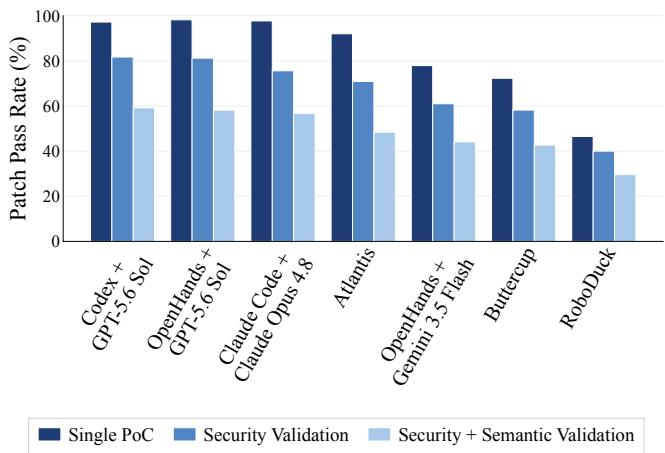
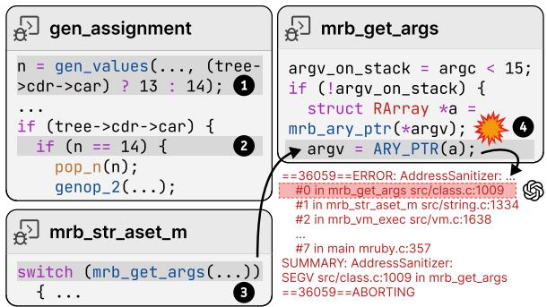
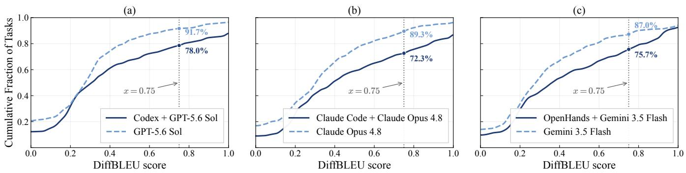
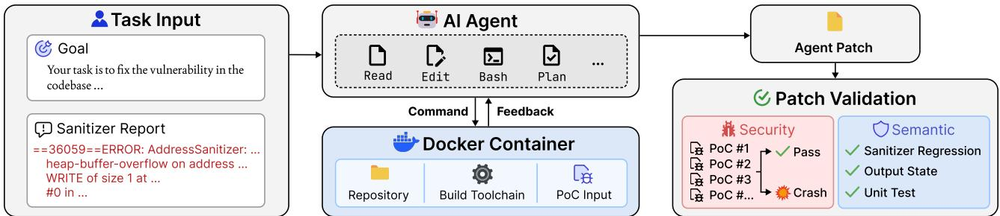
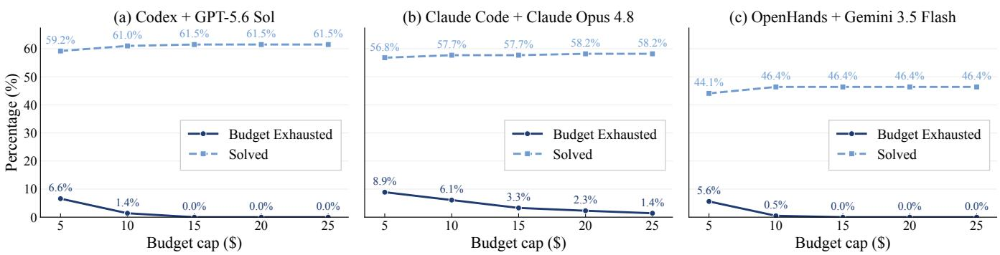
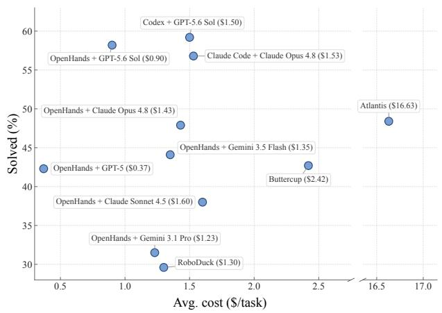
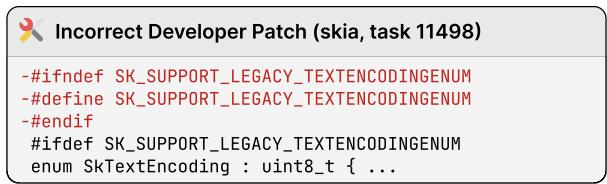
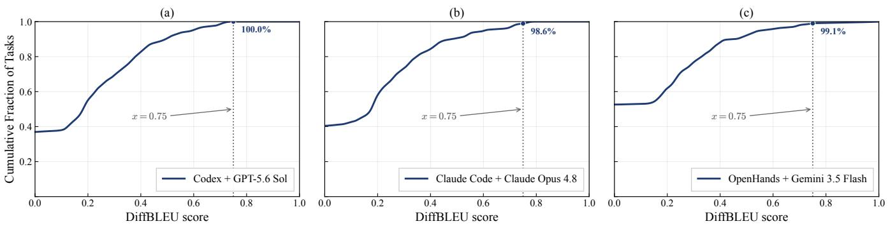
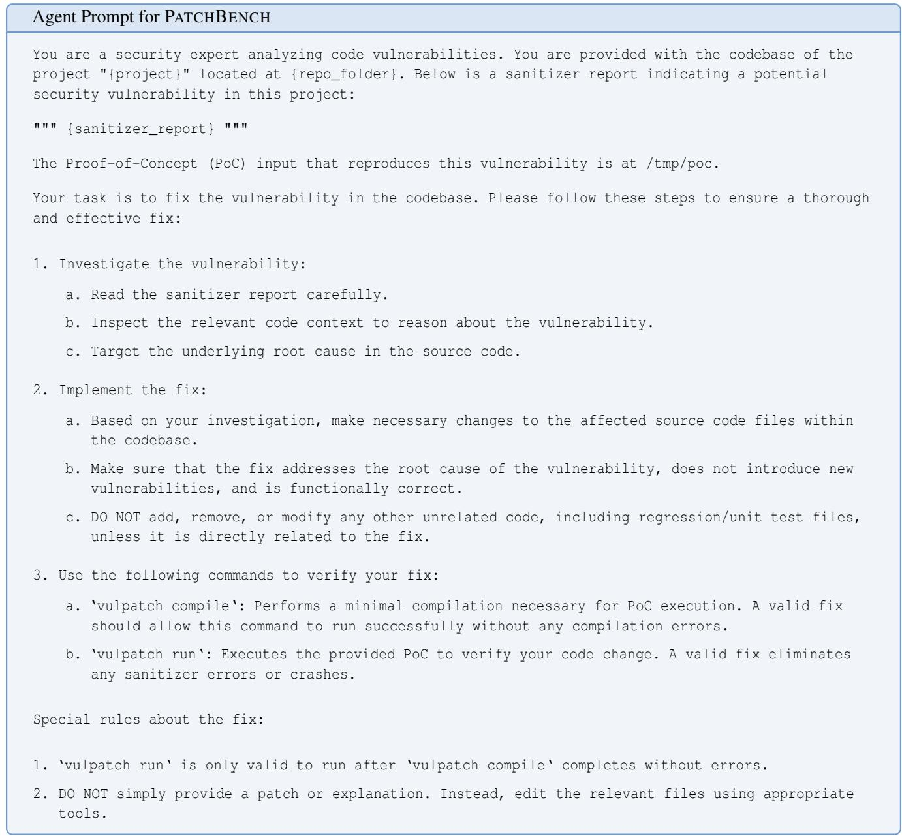

# PATCHBENCH: Evaluating AI Agents for Vulnerability Patching

Chihao Shen Jiacheng Li Aastha Mahajan Jeffery Siyuan Tian Yonghwi Kwon Yizheng Chen University of Maryland

## Abstract

AI agents have recently demonstrated strong performance in automated vulnerability patching. However, existing evaluations often validate a patch only by testing whether the provided Proof-of-Concept (PoC) input still triggers a crash. This leaves two key threats to validity: agents may reproduce memorized historical developer patches, or they may generate surface-level fixes that only suppress the reported crash.

We study these concerns for C/C++ vulnerability patching. We introduce a patch similarity metric to detect memorized patches. On average, 25% of the agent patches exhibit substantial similarity to historical developer patches, indicating that patch memorization is a real threat to the validity of vulnerability patching evaluations. Meanwhile, agents also frequently exploit benchmark structures to pass patch validation by patching on the crash stack trace to suppress the crash, rather than localizing and fixing the root cause of the vulnerabilities.

To handle these issues, we propose PATCHBENCH, a new benchmark for evaluating AI agents on realistic vulnerability patching tasks. PATCHBENCH selects vulnerabilities whose ground-truth fixes lie outside the crash stack and uses vulnerability transplant and code mutations to migrate historical vulnerabilities into new repository contexts, reducing the risks of surface-level fixes and patch memorization. We develop new patch validation methods that thoroughly evaluate both security and semantic correctness of agent patches. Across 11 state-of-the-art agents, including the top three AIxCC agents, the original PoC-only validation inflates the patching task solve rate of agents by 1.83× on average. Our results reveal key limitations of current patching agents and point to future research directions for more reliable vulnerability repair.

## 1 Introduction

Patching software vulnerabilities is a crucial, yet expensive and time-consuming security task. Unpatched software vulnerabilities in systems can cost organizations millions of dollars annually [30] when exploited by adversaries. According to Project Zero [46], security vendors took 52 days on average to fix vulnerabilities in 2021. Recent advances in AI agents have shown a promising path toward automated software vulnerability patching, demonstrated by the AI industry [2, 38] and academic events such as the AI Cyber Challenge (AIxCC) [8]. However, rigorous evaluation of AI-assisted patching remains a relevant and challenging problem.

This paper focuses on evaluating AI agents for patching software vulnerabilities, tackling two aspects: memorization of historical security patches and shallow, surface-level patches. First, LLMs underlying the AI agents often memorize their training data [5, 6, 64], which likely contain bug reports and developer-written patches to known vulnerabilities [24, 43]. Hence, evaluation using known vulnerabilities [27] may end up testing memorized knowledge extraction, instead of agents’ analysis and patching capabilities. Note that AIxCC has 63 manually written synthetic vulnerabilities (40 in C and 23 in Java) [70] to mitigate the memorization issue. Unfortunately, such a manual effort is expensive and not scalable for evaluating AI agents that patch vulnerabilities across diverse real-world projects.

Second, prior automatic patch validation methods fail to assess the semantic correctness of agent patches. Prior work often relies on testing against a few inputs, such as Proofof-Concept (PoC) inputs and project-level functional test cases. Hence, they often fail to validate incomplete, surfacelevel fixes, frequently generated by agents that take shortcuts and guess at solutions [20]. Worse, they also fail to identify patches altering critical functionalities (e.g., patching by removing functionality containing vulnerabilities), leading to inflated performance. A study [70] reveals that Team Atlanta of AIxCC and Claude Code can pass all automatic patch validation, but 16% to 38% of patches they generated are still semantically incorrect.

In this paper, we first focus on measuring the impact of LLM memorization on patching. Specifically, we study the extent to which security patches are memorized by LLMs and how this affects AI agents. Note that while prior works have explored LLMs memorizing bug benchmarks [24, 43], their methods focus on function-level program repair tasks, which are not directly applicable to general security patching at the repository level. To this end, we develop a new similarity metric that aims to detect memorized patches generated by LLMs. We then conduct a study under two distinct settings using the state-of-the-art vulnerability patching benchmark SEC-BENCH [27] containing 300 patching tasks in C/C++: (1) local-context LLM-based patching and (2) repository-level agent-based patching. Surprisingly, we find that agents Codex, Claude Code and OpenHands produce a higher proportion of likely memorized patches, compared to the underlying LLM alone. Specifically, we find that an average of 25% of agent patches are extremely similar to, if not the same as, the historical ground-truth patches written by developers. We hypothesize that agent scaffolds provide better code context, which could enable the underlying LLM to produce more memorized content.

Moreover, we observe that AI agents’ patches frequently appear in functions on the crash stack trace, regardless of the vulnerable code’s location. Overall, 81% of Codex + GPT-5.6 Sol’s patches modify functions on the crash stack trace. Even when the root cause of the vulnerability is not located in the functions in the crash stack trace as indicated by the historical developer patch, 64% of such agent patches are still found in functions on the trace. These patches may only suppress the crash of a single PoC but do not fix the root cause of the vulnerability. Therefore, PoC input-based benchmarks (e.g., in SEC-BENCH) cannot precisely reflect the patches’ validity.

To this end, we propose a rigorous vulnerability patching benchmark PATCHBENCH, which comprehensively evaluates the capabilities of AI agents in generating quality security patches, including 213 patching tasks across 16 CWEs and 32 real-world projects. Specifically, to tackle AI agents relying on the crash stack trace for localizing vulnerabilities, we focus on vulnerabilities whose ground-truth patches do not appear in functions of the crash stack trace. They help differentiate agents that take shortcuts from those that con duct localization. In addition, to measure agents’ capability beyond patch memorization, we transplant historical vulnerabilities to newer versions of their repositories and mutate the code at the patch sites, so that agents face unseen context and cannot reproduce a historical patch verbatim. Finally, we manually audit the reference patch of every task. We find that commits labeled as security fixes do not always eliminate the root cause, and many carry code changes unrelated to the vulnerability [15, 18]. We therefore discard tasks of the former kind and strip the unrelated changes from the latter, so that the reference patch of each task is a manually curated fix for the root cause rather than the original developer patch.

Furthermore, we validate patches in both security and semantic aspects. Our security validation checks whether a patch eliminates the target vulnerability on fuzz-generated crashing inputs in the vulnerable repository, while our semantic validation checks whether a patch preserves expected behavior on benign inputs and project unit tests against the reference-patched repository. A patch is considered semantically valid if and only if it satisfies all three of the following conditions: (1) The agent-patched repository does not trigger sanitizer errors on benign inputs. (2) The program-level output state on benign inputs match that of the referencepatched repository. (3) It passes all working unit tests from the reference-patched repository. Compared to our work, the most comprehensive patch validation techniques from AIxCC teams do not use program-level output state validation for benign inputs, and not all teams check multiple PoCs, which could lead to semantically incorrect patches [70].

  
Figure 1: The top three agents achieve Single-PoC pass rates above 97%, while their pass rates drop to 75–82% after security validation with multiple PoCs, and to roughly half with additional semantic validation, which checks whether patches preserve intended program behavior.

We evaluate PATCHBENCH on 11 state-of-the-art patching agents, including the top three AIxCC agents [8] and 8 general-purpose agents spanning commercial scaffolds, such as Codex [39] and Claude Code [1], and an open-source scaffold, OpenHands [55], with different large language models. As shown in Figure 1, PoC-only validation inflates solve rates by 1.83× on average, and even the strongest agents are affected: the top three pass over 97% of the original PoCs but solve roughly half of tasks under our Security + Semantic Validation. We observe that the current patching agents frequently fail to preserve functional correctness on valid inputs. PATCH-BENCH contains 67 patching tasks that are not solved by any of the 11 agents, regardless of the patching budget allocated to LLMs (performance plateaus well before a 5× budget cap; see Section 5.2). We make the following contributions:

• We study security patch memorization of AI agents and large language models, using a new patch similarity metric. We find that memorization is a critical challenge for the evaluation of patching agents.

```diff
Developer Patch S Agent Patch
@@ -1283,0 +1283,5 @@ fasthuf_initialize ( @@ -1283,0 +1283,5 @@ fasthuf_initialize (
+ if (currByte >= topByte) { + if (currByte >= topByte) {
+ if (pctxt) + if (pctxt) // Avoid reading past
+ pctxt->print_error(...<sub>,</sub> “Error decoding ...”); + pctxt->print_error(...<sub>,</sub> “Fail to ...”);
+ return EXR_ERR_CORRUPT_CHUNK; + return EXR_ERR_CORRUPT_CHUNK;
+ } + }
@@ -1300,1 +1305,1 @@ fasthuf_initialize (
for (int i = 0; i < MAX_CODE_LEN; ++i)
+ for (int i = 0; i <= MAX_CODE_LEN; ++i)
```  
Figure 2: Comparison between the developer patch and the agent patch for OSS-Fuzz bug 42517450 in openexr. Codex generates a patch that matches the developer patch at the same program location and introduces the same guard condition, despite superficial textual differences in the comment, error message, and an additional diff hunk.

• We propose PATCHBENCH, a new benchmark to evaluate AI agents for patching C/C++ vulnerabilities, that mitigates the vulnerability memorization issue.

• We propose patch validation techniques, comprehensively covering both security and semantic validation.

• We thoroughly evaluate 11 state-of-the-art patching agents including commercial agents and top three AIxCC agents. Our results reveal bottlenecks and provide insights for developing stronger patching agents.

• We release our code and benchmark at https:// github.com/ai-sec-lab/PatchBench.

## 2 Motivation

We use a recent benchmark, SEC-BENCH [27], to study the current patching ability of AI agents. SEC-BENCH is a repository-level benchmark for evaluating AI agents on real istic C/C++ vulnerability repair. It contains 300 tasks derived from OSS-Fuzz [47] and CVE [36], each providing a reproducible vulnerable codebase, sanitizer report, triggering PoC, and validation commands. These artifacts allow agents to modify and compile the program and test their patches.

Although SEC-BENCH is designed to require vulnerability localization, contextual reasoning, and dependency preserving repair, recent agents perform surprisingly well under its original setup and validation procedure. With a maximum budget of \$5 per task, our evaluation shows that Codex with GPT-5.6 Sol passes 97.3% of the tasks. Rather than necessarily demonstrating robust repair capabilities, this result raises two concerns. First, because the tasks are based on public vulnerabilities, agents may reproduce memorized developer patches instead of deriving fixes through reasoning. Second, passing a single provided PoC does not guarantee a robust patch: a patch may merely suppress the observed crash or inadvertently break benign functionality.

## 2.1 Data Contamination Issue

Figure 2 gives an example developer patch from SEC-BENCH and the corresponding agent patch generated by Codex. The agent patch is quite similar to the developer patch, but not textually identical, which suggests a potential data contamination issue. The developer patch adds a boundary check and prints some error messages. The agent patch reproduces the same guard at the same program location, with the same controlflow structure and return value. However, as highlighted in the grey background, the agent patch adds a new comment, prints slightly different error messages, and also changes a loop bound (in the second patch hunk).

If we directly compare the tokens in the two patches, superficial differences such as a different string literal in the error message and an appended comment make them look quite different, even though they are indeed similar. To address this, we propose a new tokenizer in Section 3. Moreover, existing similarity metrics are not suitable for code diffs since they do not directly model multiple hunks in two patches. This example illustrates why patch memorization cannot be measured reliably by applying a generic text similarity metric directly to patch hunks, motivating our patch similarity detection method defined in Section 3.

Critically, we need to understand how often such memorization behavior occurs in SEC-BENCH. Since SEC-BENCH is built from public vulnerabilities, a high pass rate may reflect large language models producing memorized fixes that they have trained on from public repositories. Therefore, we conduct a study to quantify the fraction of agent patches highly similar to historical developer patches, potentially suggesting the memorization effect.

## 2.2 Patch Validation Issue

Figure 3a illustrates a real-world vulnerability CVE-2022- 1276, an Out-of-Bounds (OOB) read in mruby, from SEC-BENCH. This example explains why passing the provided PoC is not sufficient for patch validation.



(a) Compiler-side argument packing vulnerability that later triggers a VM-side OOB read.  
```diff
Developer Patch
--- a/mrbgems/mruby-compiler/core/codegen.c
+++ b/mrbgems/mruby-compiler/core/codegen.c
@@ -1906,5 +1906,5 @@ gen_assignment(
}
if (tree->cdr->car) {
if (n == 14) {
+ if (n == 13) {
pop<sub>_</sub>n(n);
genop<sub>_</sub>2(s<sub>,</sub> OP<sub>_</sub>ARRAY<sub>,</sub> cursp()<sub>,</sub> n);
```

(b) Developer Patch  
```diff
Agent Patch
--- a/src/class.c
+++ b/src/class.c
@@ -1006,4 +1006,6 @@ mrb_get_args(
argv_on_stack = argc < 15;
if (!argv_on_stack) {
+ if (!mrb_array_p(*argv))
+ mrb_argnum_error(mrb, argc, argc_min, argc_max);
struct RArray *a = mrb_ary_ptr(*argv);
argv = ARY_PTR(a);
```  
(c) Agent Patch  
Figure 3: CVE-2022-1276 in mruby. The developer patch fixes the compiler-side argument packing condition at the correct location, while the agent adds only a surface-level check at the VM crash location.

Background. In Ruby, a program is first compiled to bytecode and then executed on its virtual machine, where a vulnerability may involve both the compiler and the virtual machine. Specifically, the compiler (in compiler.c) generates bytecode from the source code. In particular, for Ruby function calls with 14 or fewer arguments, the arguments are placed directly on the register stack. If there are 15 or more arguments, the compiler needs to pack them into an array and place that array in a single register. Second, the register-based virtual machine (VM) (in vm.c) executes the compiled bytecode. The function mrb\_get\_args from the VM side checks the argument count to decide whether to read the arguments out of an array. In this example, the AddressSanitizer report points to a crash on the VM side, but the root cause of the vulnerability is in the compiler.

Vulnerability Root Cause. The vulnerability originates from an inconsistency in the compiler’s argument packing logic. The arguments consist of positional arguments and keyword arguments. As shown in Figure 3a, in the compiler function gen\_assignment, when tree->cdr->car is true, the compiler sets n = 13 to indicate that argument packing should happen once there are 13 positional arguments ( 1 ), since the keyword argument and the assigned value occupy two additional argument slots and bring the total argument count to 15. However, the later packing condition check uses an incorrect constant 14 at 2 . Observe that at 1 , 14 is assigned when tree->cdr->car is false, which conflicts with the predicate guarding 2 .

On the VM side, when mrb\_str\_aset\_m processes arguments for the Ruby string slice assignment method using mrb\_get\_args ( 3 ), it sees that the number of arguments is 15, expecting that arguments have been packed. As a result, mrb\_get\_args tries to read the unpacked argument scalar value register as an array pointer, causing the OOB read ( 4 ). Developer Patch. Figure 3b shows the developer patch, which modifies the compiler-side packing condition in gen\_assignment, making sure that argument packing indeed occurs when it should. This is a desirable patch as it eliminates the root cause of the vulnerability in the compiler. The malformed state is introduced during bytecode generation, before execution ever reaches the VM argument parser. However, the sanitizer crash stack can only see the VM’s failure (in the argument parsing routine), making it impossible to connect the crash to its root cause.

Agent Patch. Rather than patching the root cause in the compiler, the agent adds a surface-level array-type check at the crash point in the VM (Figure 3c). This successfully stops the reported crash in the Ruby string slice assignment method, but the logical bug remains, transforming it into a silent error. In other words, the fix remains incomplete and the patched program can still silently generate malformed outputs.

Incompleteness. The agent patch guards only one of the several argument-reading routines in the VM. Other routines that parse arguments are not patched, so the vulnerability remains, e.g., similar argument assignments to the Array slicing method still result in an OOB read.

Malformed Functionality. More seriously, the agent patch fails to repair the malformed behavior silently generated by non-crashing inputs. In the agent-patched version, the argument packing logic is still wrong. If the first argument of argv is a valid array for string slice assignment, the check mrb\_array\_p(\*argv) succeeds, and the guard is bypassed. The code silently proceeds to unpack that array as if it were the entire argument list, and the method simply uses that wrong set of arguments to generate the answer.

This example reflects a broader pattern: 81% of patches generated by Codex + GPT-5.6 Sol modify a function on the crash stack. Even among the 92 tasks whose developer patches lie outside the crash stack, 64% of agent patches modify crash-stack functions while passing the PoC. This suggests that agents often bypass vulnerability localization, while single-PoC validation rewards patches that suppress the observed crash without fixing its root cause.

These findings motivate PATCHBENCH and our validation design (Section 4.3). PATCHBENCH selects tasks whose developer patches lie outside the crash stack trace, requiring agents to reason about the vulnerability in a broader context. Our patch validation uses related crashing inputs to test whether the sanitizer error is truly eliminated, and benign inputs to check that the patched program preserves benign behavior.

## 3 Patch Memorization

Data contamination can influence AI agents in code generation. In this section, we focus on one concrete and measurable way: whether agents generate patches by reproducing historical developer fixes. We refer to this behavior as patch memorization. We do not aim to prove other contamination effects, as the training data of many modern language models is unavailable, and data contamination can appear in different forms. Instead, we concentrate on patch-level evidence, where we measure the similarity between generated patches and developer patches.

## 3.1 Detection Methods

There is no universal detection method that determines whether two patches are similar. Prior work commonly uses different methods, including n-gram accuracy, negative loglikelihood for code benchmark leakage detection [43], and exact match, PPL-based methods for code generation [24, 64]. Other general memorization studies use textual-overlap metrics such as ROUGE-based methods [13, 65]. However, these methods suffer from the following two problems.

Code Awareness. A patch is not plain text, but it combines program structure with edit operations. Token-level metrics ignore syntactic roles and may fail to capture similarities in templates or control-flow constructs such as if, switch, and while. They also do not distinguish edit directions, e.g., an added line and a removed line may be treated similarly even though they have opposite meanings. Moreover, such metrics are sensitive to superficial changes such as formatting, comments, and literals. As a result, semantically similar patches may receive low scores, while patches with overlapping tokens but different edits or behaviors may receive high scores. Context Awareness. A hunk alone does not fully characterize a patch. The behavior of a changed statement often depends on its surrounding control and data flow, especially in C/C++, where branches, loop conditions, variable definitions, and macros can determine the meaning of the edit. At the same time, comparing the entire function or file can in troduce large amounts of unchanged code that dominate the similarity score. A good detection method should therefore compare the changed hunks together with only the relevant local context.

## 3.2 DiffBLEU

We introduce DiffBLEU, a context-aware patch similarity metric built on top of the code-aware design of Code-BLEU [45]. Before describing DiffBLEU, we briefly summarize the CodeBLEU score here. Given the reference code snippet $x _ { r }$ and the candidate code snippet $x _ { c } ,$ CodeBLEU computes how well $x _ { c }$ matches the ground truth $x _ { r } { : }$

$$
\begin{array} { r l } & { \mathrm { C o d e B L E U } = \alpha \mathrm { B L E U } ( x _ { r } , x _ { c } ) + \beta \mathrm { B L E U } _ { \mathrm { w } } ( x _ { r } , x _ { c } ) } \\ & { \mathrm { ~ } + \gamma \mathrm { M a t c h } _ { \mathrm { a s t } } ( x _ { r } , x _ { c } ) + \delta \mathrm { M a t c h } _ { \mathrm { d f } } ( x _ { r } , x _ { c } ) } \end{array}\tag{1}
$$

where BLEU is the standard BLEU score [40] that calculates the n-gram-based precision, $\mathrm { B L E U } _ { w }$ is a weighted variant of BLEU that assigns higher weights to keywords than to other tokens, $\mathbf { M a t c h } _ { \mathrm { a s t } }$ calculates the percentage of candidate AST subtrees that match those in the reference code, and Match<sub>df</sub> calculates the fraction of the data-flow edges in the candidate code that match those in the reference code.

DiffBLEU adapts CodeBLEU by comparing both tokens in code patches and the context around the patches, incorporating our diff-aware tokenizer and program slices. Let $\Delta _ { r }$ be the developer patch, $\Delta _ { c }$ be the agent patch, and let $C _ { r }$ and $C _ { c }$ be the corresponding code contexts containing the code diff hunks. We define DiffBLEU as:

$$
\begin{array} { r l } & { \mathrm { D i f f B L E U } = \propto \mathrm { { \alpha } } { \mathrm { { B L E U } } } ( \Delta _ { r } , \Delta _ { c } ) + \beta { \mathrm { B L E U } } _ { \mathrm { w } } ( \Delta _ { r } , \Delta _ { c } ) } \\ & { + \gamma { \mathrm { M a t c h } } _ { \mathrm { a s t } } ( C _ { r } , C _ { c } ) + \delta { \mathrm { M a t c h } } _ { \mathrm { d f } } ( C _ { r } , C _ { c } ) . } \end{array}\tag{2}
$$

where BLEU and BL $\mathbf { \nabla } \cdot \mathrm { E U _ { w } }$ are computed using a diff-aware tokenizer over code diffs $\Delta _ { r }$ and $\Delta _ { c } .$ , while $\mathbf { M a t c h } _ { \mathrm { a s t } }$ and Match<sub>df</sub> are computed on the code contexts $C _ { r }$ and $C _ { c } .$ . The first two terms calculate the surface-level similarity of the patch hunks. The last two terms capture control-flow and data-flow structure similarity over patch context.

Diff-aware Tokenizer. We construct a diff-aware tokenizer to preserve the edit operation, such that tokens from added lines and removed lines are mapped into separate spaces. Apart from that, the tokenizer also normalizes code-irrelevant noise by anonymizing literals, removing comments, preserving code-specific tokens, etc.

Code Context for AST. We compute $\mathbf { M a t c h } _ { \mathrm { a s t } }$ over controlflow slices in the code contexts that contain the patches.

Code Context for Data Flow. We compute Match<sub>df</sub> over data-flow slices in the code contexts related to data dependency of variables used in the patches, including variable definitions and dependent statements.

A higher score of DiffBLEU indicates that the agent patch is more similar to the historical patch written by the developer. This does not necessarily mean the patch is correct.

  
Figure 4: DiffBLEU similarity between agent patches and developer patches on SEC-BENCH. Agents consistently shift the score distribution toward higher developer patch similarity compared with their corresponding standalone LLMs.

We use DiffBLEU to detect memorized patches. We set the hyperparameters to α = 0.3, β = 0.3, γ = 0.2, and δ = 0.2, giving slightly lower weight to the context scores, and a similarity threshold that considers a generated patch with $\mathrm { D i f f B L E U } > 0 . 7 5$ as a memorized patch. Our manual analysis over a validation set shows that these hyperparameters result in the lowest false omission rate (1.1%) with no false positives. The detailed validation results are in Section A.7.

## 3.3 Memorization Study

We use our new detection method to test whether the high SEC-BENCH pass rate (97.3%) is accompanied by patch memorization.

Experimental Setups. We consider two settings.

(1) Local-context LLM-based Patching. Following prior studies [24, 41, 43], for each task, we extract the vulnerable code identified by the developer patch, including the enclosing entity, e.g. function or structure, together with header macros, and ask the model to generate a patch given this context.

(2) Repository-level Agent-based Patching. We use AI agents to generate the patch. Unlike the local-context setting, the agent has access to the full repository, sanitizer report, PoC, build configuration, and validation commands.

We strictly follow the SEC-BENCH setup for repair instructions. Each task prompt provides the sanitizer report, the location of the repository, and the same step-by-step repair requirements. In the local-context setting, we evaluate GPT-5.6 Sol, Gemini 3.5 Flash, and Claude Opus 4.8. Each model generates a patch without repository access or execution feedback. In the repository-level setting, we choose Codex + GPT-5.6 Sol, OpenHands + Gemini 3.5 Flash, and Claude Code + Claude Opus 4.8. All experiments use a maximum budget of \$5 per task and medium reasoning effort.

Memorization Measurement Results. In Figure 4, each curve represents the cumulative distribution of DiffBLEU scores between generated patches and developer patches on

SEC-BENCH. For all three model families, repository-level agents produce patches that are more similar to developer patches than standalone LLMs do. At the memorization threshold of 0.75, GPT-5.6 Sol has 8.3% of patches above the threshold, while Codex + GPT-5.6 Sol has 22.0%. The same trend appears for both Claude Opus 4.8 and Gemini 3.5 Flash, where the fraction above the threshold increases from 10.7% to 27.7% under Claude Code, and from 13.0% to 24.3% under OpenHands, respectively. On average, the estimated memorized fraction increases substantially from 11% in the local-context setting to 25% in the repository-level agent setting, roughly one task in four.

These results show that patch memorization is a concrete threat to repository-level vulnerability patching benchmarks. Agentic repair more than doubles the fraction of patches that are highly similar to developer fixes compared with localcontext repair. To explicitly reduce opportunities for reproducing developer patches, we introduce vulnerability transplant and patch-site code mutations to present agents with patching tasks they have not seen (Steps 4 and 5 in Section 4.2).

## 4 Benchmark

## 4.1 Overview

We construct PATCHBENCH, a C/C++ repository-level vulnerability patching benchmark, which contains 213 patching tasks from 32 GitHub projects across 16 distinct CWE types. Each task provides the agent with a Docker container that includes the task repository, a triggering PoC, and the commands needed to compile and run the program. The agent is also given the sanitizer report and is asked to edit the source code in place, following a realistic repair setting (Figure 5).

We highlight the contributions of PATCHBENCH in comparison to prior benchmarks in Table 1. Unlike prior benchmarks, PATCHBENCH both mitigates the patch memorization issue and provides comprehensive patch validation methods.

For memorization mitigation, except for AIxCC final competition (AFC) [70], none of the prior benchmarks provide techniques to mitigate the effect of patch memorization. AIxCC hires security experts to manually write synthetic vulnerabilities to mitigate memorization, which is very expensive and can only work at a smaller scale of 40 vulnerabilities in C projects. In comparison, we use both vulnerability transplant and code mutation to mitigate memorization for 213 tasks, 5× the number of the vulnerabilities in AIxCC.

  
Figure 5: Overview of PATCHBENCH. Each task provides the agent with a repository-level repair environment containing the task repository, build toolchain and the PoC input. The agent modifies the source code within a Docker container, after which the generated patch is evaluated with security validation on crashing inputs and semantic validation on benign inputs.

For patch validation, EXTRACTFIX [11], PATCHA-GENT [66], SAN2VULN [23], and SEC-BENCH [27] use only a single reported PoC to validate AI-generated patches. As shown in Section 2.2, if validation only checks the original PoC, it cannot distinguish a robust fix from a surface-level guard that happens to block one crashing input. AUTOPATCHBENCH [35] distills its validation inputs from a single undirected fuzzing campaign on the original harness. Such a campaign, however, aims to widen code coverage rather than exercise the target vulnerability. It rarely produces additional PoCs a patch must eliminate. This is a problem since one root cause can manifest in different ways, depending on the exploit path [18, 56]. In comparison, we provide more thorough security validation using a set of PoCs found by both directed and undirected fuzzing campaigns. Among all previous benchmarks, AIxCC AFC benchmark, SAN2VULN, and PATCHAGENT use project-level tests to validate the semantics of AI-generated patches. However, project-level unit tests may not evaluate the semantics of vulnerable code regions. While AUTOPATCHBENCH uses differential tests for function-level states, it may reject good patches, because two programs with equivalent behavior need not have equivalent intermediate states. In comparison, we provide comprehensive semantic validation using sanitizer regression checks and program output state checks on a large set of benign inputs, in addition to project-level unit tests.

## 4.2 Benchmark Construction

Key Ideas. We build PATCHBENCH to address two threats to meaningful evaluation: surface-level shortcut solutions and patch memorization. To reduce shortcut solutions, we select vulnerabilities whose developer patch sites are far from the sanitizer crash stack. Since agents cannot localize the vulnerabilities by only reading the crash stack, these tasks require agents to reason about the broader code structure. To mitigate memorization, we construct a task repository by transplanting a historical vulnerability into a newer version of its project and mutating the relevant code. Then, we manually construct a reference patch to fix the transplanted vulnerability in the task repository. To construct PATCHBENCH, we use historical vulnerabilities from ARVO [34], a dataset of reproducible C/C++ vulnerabilities from open-source projects. For each vulnerability, ARVO provides a PoC input, a runnable harness, and the original developer patch. We use the following terms to describe the benchmark construction process:

• Developer patch: the original patch provided by ARVO.

• Task repository: the final task repository containing the vulnerability presented to the agent.

• Reference patch: the task-specific ground-truth patch we manually construct in PATCHBENCH.

• Reference-patched repository: the repository obtained by applying the reference patch.

Step 1: Identifying developer patch sites. For each historical vulnerability, we use the developer patch to approximate the root cause location. We first identify the code entities modified by the developer patch and map each entity to a specific function. This can be a function directly edited by the developer patch. Or, this is a function that references a structure, template, macro, or declaration edited by the developer patch, during the PoC execution. We denote the resulting set of functions as developer patch sites.

Step 2: Measuring distance from the crash stack. We then measure whether the developer patch sites are close to or far from the observed crash stack. For each historical vulnerability, we collect two dynamic traces. The first is the patch-reaching trace: the call stack observed when PoC execution first reaches a developer patch site. The second is the crash trace: the sanitizer-reported call stack at the time of the crash. Let $F _ { p } , F _ { c }$ denote the set of functions appearing in the patch-reaching trace and the crash trace, respectively. We define trace overlap score as the Jaccard similarity ρ between

Table 1: Compared with prior vulnerability patching benchmarks, PATCHBENCH mitigates patch memorization and provides more comprehensive patch validation methods.
<table><tr><td rowspan="2">Benchmark</td><td rowspan="2"># of Projects</td><td rowspan="2"># of Tasks</td><td rowspan="2">Memorization Mitigation</td><td colspan="4">Patch Validation</td></tr><tr><td>Additional PoC1</td><td>Sanitizer Regression²</td><td>Output State³</td><td>Unit Test</td></tr><tr><td>EXTRACTFIX [11]</td><td>3</td><td>30</td><td>None</td><td>O</td><td>O</td><td>O</td><td>O</td></tr><tr><td>AIxCC AFC [70]</td><td>14</td><td>40</td><td>Manual⁴</td><td>一</td><td></td><td>O</td><td></td></tr><tr><td>AUTOPATCHBENCH [35]</td><td>46</td><td>136</td><td>None</td><td>0</td><td></td><td>0</td><td>O</td></tr><tr><td>SAN2VULN [23]</td><td>4</td><td>27</td><td>None</td><td>O</td><td>O</td><td>O</td><td></td></tr><tr><td>PATCHAGENT [66]</td><td>30</td><td>178</td><td>None</td><td>O</td><td>O</td><td>O</td><td></td></tr><tr><td>SEC-BENCH [27]</td><td>29</td><td>300</td><td>None</td><td>O</td><td>O</td><td>O</td><td>O</td></tr><tr><td>PATCHBENCH</td><td>32</td><td>213</td><td>Transplant &amp; Mutation</td><td></td><td></td><td></td><td></td></tr></table>

<sup>1</sup> Extra PoC validation via both directed and undirected fuzzing.  Extra PoC validation via undirected fuzzing alone.  Only the original PoC. 2 G# #<sub>Checks benign inputs for new sanitizer errors. No check for benign inputs.</sub> 3 <sub>Program-level output state check. Functional-level output</sub> # G#<sub>state check. No output state check.</sub> 4 <sub>Manual means that the vulnerabilities are manually written by security experts, rather than taken directly from</sub> historical public patches.  
For AIxCC AFC, we compare against 40 C synthesized tasks. The final security test setup is hidden, so both the additional PoC and sanitizer regression columns are marked –.

$F _ { p }$ and $F _ { c }$ . A high overlap score means the developer patch site is close to the crash location at runtime. A low overlap score means that the two traces share very little execution context, and the vulnerability requires an AI agent to conduct reasoning beyond the information in the sanitizer crash stack. Step 3: Selecting off-stack tasks. We retain only historical vulnerabilities whose developer patch sites fall off the crash trace. This removes cases where an agent can find the likely repair location simply by following the crash trace. Among the selected tasks, we further require ρ to be at most <sup>1</sup> . This favors tasks in which the crash is a downstream symptom of an earlier root cause. Such tasks better evaluate whether agents can reason across repository-level code context rather than insert local guards near the crash.

Step 4: Transplanting vulnerabilities. To reduce the risk of agents solving tasks by memorizing historical patches, we transplant each selected vulnerability to the newest applicable version of the same project. Given a developer patch, we first reverse it to obtain a vulnerability-inducing code diff. Then, we use bisection to search for the newest commit where the vulnerability-inducing code diff can be applied validly and transplant the vulnerability there (details in Section A.1).

Step 5: Mutating patch sites. After vulnerability transplant, the original developer patch may still be applied. Thus, we perform the following code mutations to ensure that the developer patch can no longer be used to fix the vulnerability, even if agents memorize the historical patch. For each diff hunk in the developer patch, we first apply all five semantic-preserving transformations of NATGEN [7], namely variable renaming, loop transformation, block swapping, operand swapping, and the insertion of confusing code elements, to its changed lines and to its enclosing entity. To introduce perturbations beyond what static rewriting of NATGEN can express, we randomly apply one mutation per diff hunk entity using CODE-

MORPH [44], which restructures code in context-specific ways, e.g., extracting a conditional into a new function. We manually repair any mutation that breaks syntax or semantics. This step ensures that the surrounding code of the vulnerabil ity and the solution patch to the task are both different from the historical vulnerability.

Step 6: Curating reference patch. Developer patches can be imperfect and sometimes incorrect [15, 18] (see Section A.2 for an example). For each task in PATCHBENCH, we manually curate a reference patch that fixes the root cause of the vulnerability. We start by inspecting the mutated developer patch from the previous step. We examine the benchmark task to identify the root cause of the vulnerability. When the patch is orthogonal to the root cause, we discard the task. When the patch fixes the root cause but carries changes unrelated to the vulnerability, which is the more common case, we remove those irrelevant code changes to construct the reference patch. We make sure that the reference patch contains mutations consistent with the surrounding code context and fixes the vulnerability in the task repository. After applying the reference patch to the task repository, we also obtain a reference-patched repository, which we use to validate the quality of agent-generated patches.

Step 7: Keeping tasks with patch validation support. We retain only tasks that support our patch validation procedure in Section 4.3. A working fuzzing engine must exist for the provided harness. In addition, the project must include a unit test suite that can be compiled for both the task repository and the reference-patched repository. We also require the reference-patched repository to pass at least one unit test.

## 4.3 Patch Validation

Patch validation determines whether an agent-generated patch satisfies two complementary requirements: eliminating the target vulnerability and preserving intended program behavior on regular inputs. Accordingly, we evaluate both the security and semantic behavior of the agent-patched repository. For semantic comparisons, we treat the reference-patched repository as the behavioral oracle because it captures the expected postfix behavior, which may intentionally differ from that of the vulnerable repository. For example, Figure 3 in Section 2.2 shows that the developer patch corrects the malformed behavior of the input-processing logic of the vulnerable program, increasing the valid input space. The patched program represents intended behavior on regular inputs better than the vulnerable program.

We require an agent-generated patch to pass the following two conditions to be considered a valid patch:

(1) Security Condition. For any input that triggers the target sanitizer error in the task repository, running the same input in the agent-patched repository must no longer result in a sanitizer error. This accepts both common forms of secure behavior: the agent-patched program may reject the input as invalid, or it may handle the input with valid functionality without crashing.

(2) Semantic Condition. The agent-patched repository pre serves the behavior of the reference-patched repository on benign inputs. For any input accepted by the referencepatched repository, running the same input on the agentpatched repository must not introduce any sanitizer error, and its observable output must be equivalent to the output of the reference-patched repository.

Input Space Generation. Given an agent patch, we construct two complementary classes of inputs: PoC variants that expose different manifestations of the target vulnerability [18, 56], and benign inputs that test whether the patch preserves valid functionality. In particular, benign inputs that traverse the vulnerable execution path are highly valuable, because they exercise the code most likely to be affected by the patch without triggering the vulnerability. To obtain both focused exploration around this path and broader coverage of the program, we combine PoC-seeded directed fuzzing with conventional undirected fuzzing.

First, we run CONCFUZZ from VULNLOC [48], a directed fuzzer that follows the exploit trace up to some branch instances and then diverges. Seeded with the original PoC, it yields a set containing numerous PoC variants that cluster around the exploit path. Meanwhile, the benign inputs it generates follow the same path up to the divergence points, exercising the code region where a patch is likely to apply. Therefore, the first stage concentrates on where an incomplete fix reveals itself, complementing what undirected fuzzing misses. Second, to widen exploration to other code regions, we run the fuzzing engine that OSS-Fuzz reports for the harness (lib-

Fuzzer [32], Honggfuzz [50], or an AFL-based fuzzer [9,68]), starting from an initial small corpus [16] (details in Section A.3). For both stages, we run fuzzing with the harness on the sanitizer-instrumented task repository for ten minutes each, matching the time used in prior work [35, 70]. Across our tasks, the first stage contributes most of the new PoC variants, a median of 33 per vulnerability against 4 from the second. We deduplicate the generated inputs and execute them on the task repository and the reference-patched repository to derive:

• Crashing corpus. It contains inputs that trigger the sanitizerreported crash in the task repository but not the referencepatched repository. This corpus includes the original PoC. These inputs represent variants of the same vulnerable behavior exposed by the original PoC.

• Benign corpus. It contains inputs that do not trigger a sanitizer error in either the task repository or the referencepatched repository. These inputs approximate the valid input region and therefore can be used to test whether the agent patch preserves valid program behaviors.

Security Validation. For each input in the crashing corpus, we run the agent-patched repository under the same sanitizer configuration. The agent patch passes this check if no input in the crashing corpus triggers a sanitizer error. This check rejects patches that only block the original PoC but still fail on nearby inputs exposing the same vulnerability.

Semantic Validation. We validate the semantics of the agent-patched program with three checks, using the referencepatched repository as a reference.

Sanitizer Regression Check. For each input in the benign corpus, we run the agent-patched repository under the same sanitizer configuration. This must not trigger a sanitizer error. This check detects agent patches that fix the original crash but introduce new vulnerabilities on benign inputs.

Output State Check. For each benign input, we require that the program-level output state of the agent-patched repository must be the same as that of the reference-patched repository. We modify the fuzzing harness to record the output state after the input is fully processed (details in Section A.4). For each task, we require at least one benign input with a comparable output state. To avoid treating nondeterministic behavior as an output mismatch, we compile and run the reference-patched repository three times and discard any input whose recorded output state is flaky across the three executions.

Unit Test Check. We run the project unit test suite. The agent-patched repository must pass every unit test that passes on the reference-patched repository. This ensures that the agent-patched repository does not break project-level functionality already satisfied by the reference-patched repository.

To summarize, an agent patch is accepted as valid if it passes both security validation and semantic validation.

Table 2: Main results on PATCHBENCH. We report the overall solved rate, original-PoC pass rate, security and semantic validation pass rates, and the fraction of tasks for which each agent exhausted its full budget. The top three agents pass over 97% of the original PoCs, but solve only about half of the benchmark after both security and semantic validation.
<table><tr><td>Agent</td><td>Solved ↑ (%)</td><td>PoC Pass (%)</td><td>Security Pass (%)</td><td>Semantic Pass (%)</td><td>Budget Exhausted (%)</td></tr><tr><td>Codex + GPT-5.6 Sol</td><td>59.2</td><td>97.2</td><td>81.7</td><td>70.9</td><td>6.6</td></tr><tr><td>OpenHands + GPT-5.6 Sol</td><td>58.2</td><td>98.1</td><td>81.2</td><td>70.0</td><td>1.4</td></tr><tr><td>Claude Code + Claude Opus 4.8</td><td>56.8</td><td>97.7</td><td>75.6</td><td>68.1</td><td>8.9</td></tr><tr><td>Atlantis [52]</td><td>48.4</td><td>92.0</td><td>70.9</td><td>66.7</td><td>11.7</td></tr><tr><td>OpenHands + Claude Opus 4.8</td><td>47.9</td><td>93.0</td><td>71.8</td><td>62.0</td><td>8.5</td></tr><tr><td>OpenHands + Gemini 3.5 Flash</td><td>44.1</td><td>77.9</td><td>61.0</td><td>64.8</td><td>5.6</td></tr><tr><td>Buttercup [54]</td><td>42.7</td><td>72.3</td><td>58.2</td><td>64.8</td><td>7.0</td></tr><tr><td>OpenHands + GPT-5</td><td>42.3</td><td>96.2</td><td>70.0</td><td>56.8</td><td>0.0</td></tr><tr><td>OpenHands + Claude Sonnet 4.5</td><td>38.0</td><td>85.9</td><td>65.3</td><td>61.0</td><td>2.8</td></tr><tr><td>OpenHands + Gemini 3.1 Pro</td><td>31.5</td><td>57.7</td><td>48.8</td><td>60.6</td><td>8.9</td></tr><tr><td>RoboDuck [53]</td><td>29.6</td><td>46.5</td><td>39.9</td><td>51.6</td><td>2.3</td></tr></table>

## 5 Evaluation

## 5.1 Setups

Models and Agents. We evaluate 11 representative agent configurations. For general-purpose agents, we select 3 popular frameworks: Codex [39], Claude Code [1], and Open Hands [55]. To cover different model families and model strengths, we select a top-performing model and a weaker model at the time of the experiments from the GPT, Claude, and Gemini families. Specifically, we evaluate Codex with GPT-5.6 Sol, Claude Code with Claude Opus 4.8, and Open-Hands with GPT-5.6 Sol, GPT-5, Claude Opus 4.8, Claude Sonnet 4.5, Gemini 3.5 Flash, and Gemini 3.1 Pro. As recent AIxCC agents have shown strong performance in automated vulnerability repair, we further include the top three AIxCC AFC Cyber Reasoning Systems (CRSs): Atlantis from Team Atlanta [52], Buttercup from Trail of Bits [54], and Robo-Duck from Team Theori [53]. We run Buttercup and Robo-Duck with the top-performing model GPT-5.6 Sol. Atlantis comprises sub-agents designed around different model capa bilities, so we run it with both GPT-5.6 Sol and Claude Opus 4.8. We configure all models with medium reasoning effort for comparability across model families.

Task Setup. All agents are given the task prompt (see Figure 10 in Section A.8), the full repository, the triggering PoC, and the build toolchain within a Docker environment. All web search and external browsing tools are disabled to ensure that agents cannot rely on external resources or directly retrieve historical developer fixes.

Budget. Each agent uses a maximum budget of \$5 per task. Atlantis launches four nodes containing different sub-agents concurrently. Because the concurrent nodes do not share a globally synchronized budget, we assign each node its own \$5 cap, giving Atlantis \$20 in total. Therefore, Atlantis is not directly comparable to the other agents. We show in Finding 4 that increasing the budget cap by up to 5× only minimally improves the solved rate, suggesting that the \$5 cap is not a meaningful performance bottleneck.

## 5.2 Results

Evaluating 11 agents across 213 patching tasks amounts to approximately \$6,500 in total inference cost. Table 2 summarizes the main evaluation results on PATCHBENCH across different agents, and Figure 7 shows the cost-performance tradeoff. The results show that many agents can suppress the original PoC crash, but far fewer patches satisfy the full validation pipeline. We discuss these trends in the following findings. Meanwhile, DiffBLEU measurements show that the fraction of memorized patches drops to near zero on PATCH-BENCH (see Figure 9 in Section A.6).

Finding 1: PoC pass rate inflates patch correctness by 1.83× and fails to distinguish strong agents from weak ones.

The most visible result is the large gap between the original PoC pass rate and the final solved rate. Averaged over all agents, 83.1% of the generated patches eliminate the original PoC crash, yet only 45.3% of the tasks are solved, i.e., pass both security and semantic validation, which shows a significant 1.83× inflation. Even for the strongest agents, the gap remains large. Codex + GPT-5.6 Sol, OpenHands + GPT-5.6 Sol, and Claude Code + Claude Opus 4.8 all pass over 97% of the original PoCs but solve only 59.2%, 58.2%, and 56.8% of the tasks, respectively. The best AIxCC system, Atlantis, shows the same pattern, passing 92.0% of PoCs but solving only 48.4% of tasks.

Because the PoC pass rate saturates, it loses its power to differentiate agents’ performance. Four agents achieve nearly identical PoC pass rates, from 96.2% to 98.1%, but their solved rates span 17 points from 42.3% to 59.2%. Even worse, PoC-only validation distorts the ranking. OpenHands + GPT-5 has the fourth-highest PoC pass rate (96.2%), yet it ranks only eighth by solved rate (42.3%), whereas OpenHands + Gemini 3.5 Flash passes far fewer original PoCs (77.9%) yet solves more tasks (44.1%). A benchmark that validates against the original PoC alone would thus not only inflate the scores but also misidentify which agents patch better.

  
Figure 6: We evaluate budget-exhaustion and solved rates as the per-task budget cap varies from \$5 to \$25. As the budget cap increases, budget exhaustion drops sharply, while the solved rate improves only modestly and quickly plateaus. These trends suggest that most additional spending beyond a modest budget yields limited gains.

  
Figure 7: Cost–performance tradeoff on PATCHBENCH. Each point plots an agent’s overall solved rate against its average cost per task under the \$5 maximum-budget setting. Atlantis is given \$5 budget for each of its four nodes, and is therefore not directly comparable to the other agents.

Finding 2: Semantic validation remains a major bottleneck due to inconsistent behavior on benign inputs.

On average, agents pass only 63.4% of the semantic validation. Among the three checks, the sanitizer regression check has the highest average pass rate at 95.7%, showing that most generated patches do not introduce new sanitizer errors on benign inputs. Most failures instead come from the output state check and the unit test check, whose average pass rates are only 75.5% and 79.9%, respectively (see Table 4 in Section A.5). These failures appear as mismatches in the expected behavior, e.g., malformed printed outputs, wrong decoded values, different generated files, or unexpected API-level results, suggesting that many generated patches suppress the crash at the cost of changing the intended program.

Finding 3: AIxCC CRSs underperform general-purpose agents built on the same model.

Although those AIxCC systems are built for automated vulnerability repair, they perform worse than general-purpose agents on the same model. Buttercup and RoboDuck, running with GPT-5.6 Sol, solve only 42.7% and 29.6% of the tasks, well below Codex and OpenHands with the same underlying model. Atlantis solves the most tasks among the three (48.4%) but still remains below all three general-purpose leaders.

For Atlantis, we attribute part of the discrepancy to framework designs that can predate strong reasoning models. Atlantis’s patching subsystem incorporates sub-agents built for earlier models like Claude 3.7 Sonnet and o4-mini [26]. Several follow fixed workflows instead of acting autonomously, e.g., Martian restricts every patch to a single function, and MultiRetrieval regenerates the full patch set under a fixed template on every attempt [52]. These constraints substituted for the weak planning of earlier models, but with frontier models they waste budget on repeated boilerplate and prevent free exploration of the codebase. Consistent with this, a post-competition study by Team Atlanta reports that generalpurpose agents paired with top-performing models now also patch the AIxCC final vulnerabilities well, and that model choice outweighs framework choice [69].

For Buttercup and RoboDuck, most failed tasks are due to framework limitations. RoboDuck terminates the run whenever patch application fails and no active patch is recorded, and its framework also lets the model end a run on its own, e.g., when the model does not feel confident enough. In Buttercup, 23.5% of the tasks suffer from the context retriever failing to find relevant code snippets, resulting in no patch generated.

Finding 4: As we give agents more budget per task, the patching task solved rate quickly plateaus, and far fewer tasks use up the budget allocation.

To further analyze whether the remaining unsolved tasks are caused by insufficient budget, we run three representative agents that have the best solved rate within their respective model families, each with a maximum budget of \$25, and take snapshots of the patches at every \$5 cutoff. Figure 6 shows that the solved rate improves only modestly and then plateaus soon. Codex + GPT-5.6 Sol increases from 59.2% at \$5 to 61.5% at \$15, with no further gains at \$20 or \$25. Two other agents show the same trend, improving from 56.8% to 58.2% for Claude Code + Claude Opus 4.8, and from 44.1% to 46.4% for OpenHands + Gemini 3.5 Flash. At \$25, no agent is cut off by the budget on more than 1.4% of tasks, yet a large fraction of tasks still remains unsolved. Therefore, budget is not what holds the agents back, which motivates our failure pattern analysis in Section 5.3.

## 5.3 Failure Pattern Analysis

The best agent can only solve 59% of the tasks in PATCH-BENCH, and 67 out of 213 patching tasks cannot be solved by any of the 11 agents. We inspect the unsolved cases from our benchmark. Since the PoC pass rate already tends to saturate, our analysis mainly focuses on agent patches that compile and suppress the original PoC crash, but fail either security validation on related PoCs, or semantic validation on benign inputs. Overall, these failure patterns reflect recurring patching strategies that are rewarded by PoC-only validation.

Pattern 1: Agents guard the symptom with incomplete local checks.

This is the most common failure pattern in our analysis, accounting for 41 of the 81 Codex + GPT-5.6 Sol patches that pass the original PoC but fail our validation. We observe a similar fraction for other agents, e.g., 47/87 for Claude Code + Claude Opus 4.8 and 39/72 for OpenHands + Gemini 3.5 Flash. In these cases, the agent adds a local check around the locations reported by the sanitizer, such as a bounds check, resize, null check, or early return. These patches are usually sufficient to pass the original PoC because they block the exact path in the crash report. However, it does not cover other crashing inputs that target the same vulnerability, and they can still reach the same bug via a different downstream path. For example, in task 22320 from rdkit, Codex adds a local resize right before the buffer overflow location. It prevents the specific vector from overflowing, however, other crashing inputs can still propagate the same malformed values to different downstream arrays.

Pattern 2: Agents fail to localize the vulnerability that causes malformed functionality.

Similar to the first pattern, the agent tends to change downstream functions instead of localizing the vulnerable condition. Unlike the first pattern, however, the consequence is the patched program can pass security validation, but it preserves malformed behavior or changes benign behavior, which later breaks the output state check or the unit test check. In task 49797 from assimp, the overflow comes from an invalid faceindex skip path where the loop skips a face without advancing the counter. Claude Code instead rewrites the loop with a new counter. This successfully prevents the overflow, but it also changes the mesh layout and face count in the return value. Therefore, the output is no longer equivalent to the reference behavior, which fails the output state check.

Pattern 3: Agent silences the crash by deleting the offending operation or the entire functionality.

In these tasks, the agent directly removes the code region that makes the code unsafe. Sometimes the deletion is acceptable, such as removing the second free operation for a double-free vulnerability. Other times the deletion is destructive, which removes the entire feature that contains the crashing operation. In task 26015 from nDPI, Buttercup avoids the overflow by deleting the entire TLS metadata extraction block. The agent patch passes the PoC because the offending copies no longer execute, removing the load-bearing functionality.

Pattern 4: Agents add broader conditions that reject benign inputs causing functionality break.

In some tasks, the agent adds a validation check that is broader than the vulnerable condition. The new predicate covers the original PoC, but it also rejects valid inputs that should remain accepted. This pattern is less frequent because most of the time, agents will add checks that are too narrow and PoC-specific.

## 5.4 Ablations

We focus our ablation on the output state check. This is the main difference between our validation and crash-oriented patch validation used in many existing workflows, including teams that participated in AIxCC [70].

Effect of Output State Check. To measure its contribution, we remove only the output state check while keeping the other validation checks unchanged. We find that the overall solved rate increases by 8.1 points on average across agents. This means a non-trivial fraction of patches pass all other validation checks but still change the program behavior on benign inputs. The increase is consistent across agents, with larger gaps for Atlantis and GPT-5, GPT-5.6 Sol with OpenHands (see Table 3 in Section A.5).

Captured Patch Failures. We further inspect the patches that fail only the output state check while passing all other validation checks. By manually reviewing all such tasks in Codex, we find that all 18 patches are unable to fix the vulnerability, with no invalid cases caused by checker artifacts. 15 tasks fall under Pattern 2 and 3 fall under Pattern 4. Several of these patches also overlap with Pattern 1 or Pattern 4, since a wrong-layer fix can still be incomplete on nearby inputs, and a broad rejection check can also reflect a bad localization issue. This ablation shows that the output state check is effective, and it captures a class of incorrect patches missed by other validations.

## 6 Discussion and Limitation

Memorization Attribution. Since there is no public information about the actual training data of proprietary models, the purpose of our memorization study is not meant to point out exactly memorized training data. Rather, our memorization study aims to raise awareness that models can train on historical bug patches [24, 43] and produce highly similar patches without reasoning about the root cause of vulnerabilities.

Reference Dependency. During deployment of a patching agent, there is no reference-patched repository to conduct our semantic validation. In these cases, our technique allows for semantic validation that compares program-level output states between the vulnerable repository and the agentpatched repository, although this weaker reference cannot account for behavior that a correct patch intentionally changes. Since the best patching agents can only solve about half of the tasks in our benchmark, there is value for patch validation using the reference-patched repository, in order to develop stronger patching agents.

Validation Gap. Our manual review found that 6.8% of the Atlantis patches and 7.1% of the Codex patches that pass our validation still leave the root cause partially unfixed. Those patches are overly invasive as they change the surrounding states in ways that are not exercised by our validation inputs. These cases remain because our validation is dependent on the input corpus. Fuzzing cannot guarantee coverage of all relevant program paths. Future work can reduce these false positives, e.g., by using symbolic execution [4] or concolic execution [42, 67] that can generate inputs reaching both the agent-edited and the developer-patched program paths.

Benchmark Contamination. PATCHBENCH is a static benchmark. There is a risk of data contamination if model developers use our benchmark to train future models. However, our vulnerability transplant and mutation methods can be continuously used to mitigate this issue. Future researchers can use these methods to transplant and mutate new vulnerabilities discovered by developers, dynamically constructing new patching tasks to evaluate AI agents.

## 7 Related Work

Vulnerability Patching Benchmarks. General bug repair benchmarks such as Defects4J [19] and GitBug-Java [49] are widely used in program repair, but recent studies have found data contamination and patch memorization issues in these popular benchmarks [24, 43, 58]. Security vulnerability patch ing benchmarks [17, 23, 27, 57, 66] provide a repository-level framework for evaluating agents with executable validation commands. AUTOPATCHBENCH [35] further explores AI agent vulnerability repair with different evaluation settings, including fuzzing and differential testing. AIxCC tests AI agents for vulnerability discovery and repair, which includes 40 synthetic vulnerabilities manually written by security experts across 14 C projects [70]. In the context of fuzzing, FIXREVERTER [73] injects realistic bugs by reverting three conditional patterns and Magma [14] proposes forward porting the bugs. In contrast, our vulnerability transplant and mutation target LLM-based agents, diversifying the context of vulnerabilities, which influences the LLM’s memorization behavior [24, 43]. While the above benchmarks support increasingly realistic agent evaluation, they still lack thorough validation for determining whether agent-generated patches are correct, which motivates our validation methods.

Vulnerability Patching Agents. LLM-based code repair systems have evolved from single-shot patch generation to interactive AI agents that can perform different kinds of operations. General-purpose patching agents [3, 23, 28, 31, 63, 71] allow models to explore repositories, edit files, and run terminal commands in a structured interface to solve GitHub issues. Current commercial and open-source AI agents for coding follow a similar feedback-driven workflow [1,12,39,55]. Recent security agents and patching workflows [37,66,70] also show strong performance on vulnerability patching by combining LLM agents with system security tools. Notably, in AIxCC, Atlantis [52] and Buttercup [54] use an ensemble of LLM agents.

Patch Validation Methods. Recent Systematization of Knowledge papers [17, 29, 70] discussed the challenges of security patch validation. Existing works have proposed using static analysis [10, 25, 51, 61], dynamic analysis [21, 60, 62], or a combination of both [22] to evaluate the correctness of patches. After AI agents generate patches in real-world projects, researchers have used PoCs [17, 23, 27, 35, 66], project unit tests [8, 23, 66], LLM-as-a-judge [52], post-patch fuzzing, and manual validation [70, 72] to evaluate the patch quality. Our patch validation methods are inspired by prior works SPIDER [33] and VeriBin [59]. They define safe patch conditions that are too restrictive for valid vulnerability patches. Therefore, we adapt these ideas to construct our security and semantic validation methods.

## 8 Conclusion

We have presented PATCHBENCH and conducted a systematic study of evaluating AI agents for security vulnerability patching. Our evaluation covers both commercial patching agents and top-performing AIxCC agents, with rigorous patch validation techniques. Through this study, we have identified key technical limitations that current state-of-the-art agents continue to face. We hope that our work raises awareness of security patch memorization in large language models and provides insights for future research on developing more capable vulnerability patching agents.

## Acknowledgment

We are grateful to Luke Griffith and Akshat Parikh for their preliminary work on agent configurations. This research is supported in part by Coefficient Giving, NSF CAREER Awards CNS-2442719 and CNS-2427783, and generous gifts from OpenAI. Any opinions, findings, and conclusions or recommendations expressed in this material are those of the author(s) and do not necessarily reflect the views of the sponsors.

## References

[1] Anthropic. Claude Code, 2025. URL: https:// www.claude.com/product/claude-code.

[2] Anthropic. Assessing Claude Mythos Preview’s cybersecurity capabilities. https://red.anthropic.com/ 2026/mythos-preview/, 2026.

[3] Antonis Antoniades, Albert Örwall, Kexun Zhang, Yuxi Xie, Anirudh Goyal, and William Wang. SWE-Search: Enhancing software agents with Monte Carlo tree search and iterative refinement. In International Conference on Learning Representations, volume 2025, pages 64485– 64515, 2025.

[4] Cristian Cadar, Daniel Dunbar, and Dawson Engler. KLEE: Unassisted and automatic generation of high coverage tests for complex systems programs. In 8th USENIX Symposium on Operating Systems Design and Implementation (OSDI 08), 2008.

[5] Nicholas Carlini, Daphne Ippolito, Matthew Jagielski, Katherine Lee, Florian Tramer, and Chiyuan Zhang. Quantifying memorization across neural language models. In The Eleventh International Conference on Learning Representations, 2022.

[6] Nicholas Carlini, Florian Tramer, Eric Wallace, Matthew Jagielski, Ariel Herbert-Voss, Katherine Lee, Adam Roberts, Tom Brown, Dawn Song, Ulfar Erlingsson, et al.

Extracting training data from large language models. In 30th USENIX Security Symposium (USENIX Security 21), pages 2633–2650, 2021.

[7] Saikat Chakraborty, Toufique Ahmed, Yangruibo Ding, Premkumar T. Devanbu, and Baishakhi Ray. NatGen: Generative pre-training by “naturalizing” source code. In Proceedings of the 30th ACM Joint European Software Engineering Conference and Symposium on the Foundations of Software Engineering, ESEC/FSE 2022, pages 18–30. Association for Computing Machinery, November 2022.

[8] DARPA. AI Cyber Challenge. https:// aicyberchallenge.com/, 2025.

[9] Andrea Fioraldi, Dominik Maier, Heiko Eißfeldt, and Marc Heuse. AFL++: Combining incremental steps of fuzzing research. In 14th USENIX Workshop on Offensive Technologies (WOOT 20). USENIX Association, August 2020.

[10] Jonathan Gallagher, Robin Gonzalez, and Michael E Locasto. Verifying security patches. In Proceedings of the 2014 international workshop on privacy & security in programming, pages 11–18, 2014.

[11] Xiang Gao, Bo Wang, Gregory J. Duck, Ruyi Ji, Yingfei Xiong, and Abhik Roychoudhury. Beyond tests: Program vulnerability repair via crash constraint extraction. ACM Transactions on Software Engineering and Methodology, 30(2), February 2021.

[12] Paul Gauthier. Aider: AI-assisted coding in your terminal with GPT. https://aider.chat/, 2023.

[13] Shahriar Golchin and Mihai Surdeanu. Time travel in LLMs: Tracing data contamination in large language models. In The Twelfth International Conference on Learning Representations, 2024.

[14] Ahmad Hazimeh, Adrian Herrera, and Mathias Payer. Magma: A ground-truth fuzzing benchmark. Proc. ACM Meas. Anal. Comput. Syst., 4(3), December 2020.

[15] Jingxuan He and Martin Vechev. Large language models for code: Security hardening and adversarial testing. In Proceedings ofthe 2023 ACM SIGSAC Conference on Computer and Communications Security, CCS ’23, pages 1865–1879. Association for Computing Machinery, November 2023.

[16] Adrian Herrera, Hendra Gunadi, Shane Magrath, Michael Norrish, Mathias Payer, and Antony L. Hosking. Seed selection for successful fuzzing. In Proceedings of the 30th ACM SIGSOFT International Symposium on Software Testing and Analysis, ISSTA 2021, page 230–243. Association for Computing Machinery, 2021.

[17] Yiwei Hu, Zhen Liu, Kedie Shu, Shenghua Guan, Deqing Zou, Shouhuai Xu, Bin Yuan, and Hai Jin. SoK: Automated vulnerability repair: Methods, tools, and assessments. In 34th USENIX Security Symposium (USENIX Security 25), pages 4421–4440, 2025.

[18] Zhiyuan Jiang, Shuitao Gan, Adrian Herrera, Flavio Toffalini, Lucio Romerio, Chaojing Tang, Manuel Egele, Chao Zhang, and Mathias Payer. Evocatio: Conjuring bug capabilities from a single PoC. In Proceedings of the 2022 ACM SIGSAC Conference on Computer and Communications Security, CCS ’22, pages 1599–1613. Association for Computing Machinery, November 2022.

[19] René Just, Darioush Jalali, and Michael D. Ernst. Defects4J: a database of existing faults to enable controlled testing studies for Java programs. In Proceedings of the 2014 International Symposium on Software Testing and Analysis, ISSTA 2014, page 437–440. Association for Computing Machinery, 2014.

[20] Sayash Kapoor, Benedikt Stroebl, Peter Kirgis, Nitya Nadgir, Zachary S Siegel, Boyi Wei, Tianci Xue, Ziru Chen, Felix Chen, Saiteja Utpala, et al. Holistic agent leaderboard: The missing infrastructure for AI agent evaluation. In International Conference on Learning Representations, 2026.

[21] Dongsun Kim, Jaechang Nam, Jaewoo Song, and Sunghun Kim. Automatic patch generation learned from human-written patches. In 2013 35th international conference on software engineering (ICSE), pages 802–811. IEEE, 2013.

[22] Hyungsub Kim, Muslum Ozgur Ozmen, Z Berkay Celik, Antonio Bianchi, and Dongyan Xu. PatchVerif: Discovering faulty patches in robotic vehicles. In 32nd USENIX Security Symposium (USENIX Security 23), pages 3011–3028, 2023.

[23] Youngjoon Kim, Sunguk Shin, Hyoungshick Kim, and Jiwon Yoon. Logs in, patches out: Automated vulnerability repair via Tree-of-Thought LLM analysis. In 34th USENIX Security Symposium (USENIX Security 25), pages 4401–4419, 2025.

[24] Jiaolong Kong, Xiaofei Xie, and Shangqing Liu. Demystifying memorization in LLM-based program repair via a general hypothesis testing framework. Proceedings of the ACM on Software Engineering, 2(FSE), June 2025.

[25] Xuan-Bach D Le, Duc-Hiep Chu, David Lo, Claire Le Goues, and Willem Visser. S3: Syntax-and semanticguided repair synthesis via programming by examples. In Proceedings ofthe 2017 11th Joint Meeting on Foundations ofSoftware Engineering, pages 593–604, 2017.

[26] Haein Lee and Insu Yun. Every patch agent has its own story (1) — Martian: Exploring the unknown with sophisticated tools. https://team-atlanta.github.io/blog/postcrs-patch-agent-martian/, October 2025.

[27] Hwiwon Lee, Ziqi Zhang, Hanxiao Lu, and Lingming Zhang. SEC-bench: Automated benchmarking of LLM agents on real-world software security tasks. Advances in Neural Information Processing Systems, 38:116342– 116378, 2026.

[28] Hongwei Li, Yuheng Tang, Shiqi Wang, and Wenbo Guo. PatchPilot: A cost-efficient software engineering agent with early attempts on formal verification. In International Conference on Machine Learning, pages 35922–35941. PMLR, 2025.

[29] Ying Li, Faysal hossain Shezan, Bomin Wei, Gang Wang, and Yuan Tian. SoK: Towards effective automated vulnerability repair. In 34th USENIX Security Symposium (USENIX Security 25), pages 4441–4462, 2025.

[30] Limor Kessem, IBM. 2025 Cost of a Data Breach Report: Navigating the AI rush without sidelining security. https://www.ibm.com/think/x-force/2025- cost-of-a-data-breach-navigating-ai, 2025.

[31] Yizhou Liu, Pengfei Gao, Xinchen Wang, Jie Liu, Yexuan Shi, Zhao Zhang, and Chao Peng. Marscode agent: AI-native automated bug fixing. arXiv preprint arXiv:2409.00899, 2024.

[32] LLVM. libFuzzer: A library for coverage-guided fuzz testing. https://llvm.org/docs/LibFuzzer.html, 2015.

[33] Aravind Machiry, Nilo Redini, Eric Camellini, Christopher Kruegel, and Giovanni Vigna. SPIDER: Enabling fast patch propagation in related software repositories. In 2020 IEEE Symposium on Security and Privacy (SP), pages 1562–1579. IEEE, 2020.

[34] Xiang Mei, Jordi Del Castillo, Pulkit Singh Singaria, Haoran Xi, Abdelouahab Benchikh, Tiffany Bao, Ruoyu Wang, Yan Shoshitaishvili, Adam Doupé, Hammond Pearce, and Brendan Dolan-Gavitt. ARVO: Atlas of reproducible vulnerabilities for open-source software. In 2026 IEEE 11th European Symposium on Security and Privacy (EuroS&P), pages 860–873, 2026.

[35] Meta. Introducing AutoPatchBench: A benchmark for AI-powered security fixes. https://engineering.fb.com/2025/04/29/ ai-research/autopatchbench-benchmark-aipowered-security-fixes/, 2025.

[36] National Institute of Standards and Technology. National Vulnerability Database, 2015. URL: https: //nvd.nist.gov/.

[37] Yu Nong, Haoran Yang, Long Cheng, Hongxin Hu, and Haipeng Cai. APPATCH: Automated adaptive prompting large language models for real-world software vulnerability patching. In 34th USENIX Security Symposium (USENIX Security 25), pages 4481–4500. USENIX Association, August 2025.

[38] OpenAI. Introducing Aardvark: OpenAI’s agentic security researcher. https://openai.com/index/ introducing-aardvark/, 2025.

[39] OpenAI. Codex. https://openai.com/codex/, 2026.

[40] Kishore Papineni, Salim Roukos, Todd Ward, and Wei-Jing Zhu. BLEU: a method for automatic evaluation of machine translation. In Proceedings ofthe 40th annual meeting ofthe Associationfor Computational Linguistics, pages 311–318, 2002.

[41] Hammond Pearce, Benjamin Tan, Baleegh Ahmad, Ramesh Karri, and Brendan Dolan-Gavitt. Examining zero-shot vulnerability repair with large language models. In 2023 IEEE Symposium on Security and Privacy (SP), pages 2339–2356, 2023.

[42] Sebastian Poeplau and Aurélien Francillon. Symbolic execution with SymCC: Don’t interpret, compile! In 29th USENIX Security Symposium (USENIX Security 20), pages 181–198, 2020.

[43] Daniel Ramos, Claudia Mamede, Kush Jain, Paulo Canelas, Catarina Gamboa, and Claire Le Goues. Are large language models memorizing bug benchmarks? In 2025 IEEE/ACM International Workshop on Large Language Models for Code (LLM4Code), page 1–8. IEEE Press, 2025.

[44] Hongzhou Rao, Yanjie Zhao, Wenjie Zhu, Ling Xiao, Meizhen Wang, and Haoyu Wang. CODEMORPH: Mit igating data leakage in large language model assessment. In 2025 IEEE/ACM 47th International Conference on Software Engineering: Companion Proceedings (ICSE Companion), pages 267–278. IEEE Press, April 2025.

[45] Shuo Ren, Daya Guo, Shuai Lu, Long Zhou, Shujie Liu, Duyu Tang, Neel Sundaresan, Ming Zhou, Ambrosio Blanco, and Shuai Ma. CodeBLEU: a method for automatic evaluation of code synthesis, 2020. arXiv: 2009.10297.

[46] Ryan Schoen, Project Zero. A walk through Project Zero metrics. https://projectzero.google/2022/02/awalk-through-project-zero-metrics.html, 2022.

[47] Kostya Serebryany. OSS-Fuzz - Google’s continuous fuzzing service for open source software. USENIX Association, August 2017.

[48] Shiqi Shen, Aashish Kolluri, Zhen Dong, Prateek Saxena, and Abhik Roychoudhury. Localizing vulnerabilities statistically from one exploit. In Proceedings of the 2021 ACM Asia Conference on Computer and Communications Security, ASIA CCS ’21, pages 537–549. Association for Computing Machinery, June 2021.

[49] André Silva, Nuno Saavedra, and Martin Monperrus. GitBug-Java: A reproducible benchmark of recent Java bugs. In Proceedings of the 21st International Conference on Mining Software Repositories, MSR ’24, page 118–122. Association for Computing Machinery, 2024.

[50] Robert Swiecki. Honggfuzz: Security oriented software fuzzer, 2016.

[51] Shin Hwei Tan, Hiroaki Yoshida, Mukul R Prasad, and Abhik Roychoudhury. Anti-patterns in search-based program repair. In Proceedings of the 2016 24th ACM SIGSOFT International Symposium on Foundations of Software Engineering, pages 727–738, 2016.

[52] Team Atlanta. Atlantis. https://github.com/Team-Atlanta/aixcc-afc-atlantis, 2025.

[53] Team Theori. Theori Finals Release. https:// github.com/theori-io/aixcc-afc-archive, 2025.

[54] Trail of Bits. Trail of Bits AIxCC Finals CRS. https: //github.com/trailofbits/afc-buttercup, 2025.

[55] Xingyao Wang, Boxuan Li, Yufan Song, Frank F. Xu, Xiangru Tang, Mingchen Zhuge, Jiayi Pan, Yueqi Song, Bowen Li, Jaskirat Singh, Hoang H. Tran, Fuqiang Li, Ren Ma, Mingzhang Zheng, Bill Qian, Yanjun Shao, Niklas Muennighoff, Yizhe Zhang, Binyuan Hui, Junyang Lin, Robert Brennan, Hao Peng, Heng Ji, and Graham Neubig. OpenHands: An open platform for AI software developers as generalist agents. In The Thirteenth International Conference on Learning Representations, 2025.

[56] Haolai Wei, Liwei Chen, Zhijie Zhang, Gang Shi, and Dan Meng. Sleuth: A switchable dual-mode fuzzer to investigate bug impacts following a single PoC. In Proceedings of the 33rd ACM SIGSOFT International Symposium on Software Testing and Analysis, ISSTA 2024, pages 730–742. Association for Computing Machinery, September 2024.

[57] Zichao Wei, Jun Zeng, Ming Wen, Zeliang Yu, Kai Cheng, Yiding Zhu, Jingyi Guo, Shiqi Zhou, Le Yin, Xiaodong Su, and Zhechao Ma. PATCHEVAL: A new benchmark for evaluating LLMs on patching real-world vulnerabilities, 2025. arXiv:2511.11019.

[58] Di Wu, Xu He, Shu Wang, and Kun Sun. BenchChecker: Assessing the credibility of bug-fixing benchmarks for LLMs. In 35th USENIX Security Symposium (USENIX Security 26), 2026.

[59] Hongwei Wu, Jianliang Wu, Ruoyu Wu, Ayushi Sharma, Aravind Machiry, and Antonio Bianchi. VeriBin: Adaptive verification of patches at the binary level. In Proceedings of the Network and Distributed System Security Symposium (NDSS), 2025.

[60] Qi Xin and Steven P Reiss. Identifying test-suiteoverfitted patches through test case generation. In Proceedings ofthe 26th ACM SIGSOFT international symposium on software testing and analysis, pages 226–236, 2017.

[61] Qi Xin and Steven P Reiss. Leveraging syntax-related code for automated program repair. In 2017 32nd IEEE/ACM International Conference on Automated Software Engineering (ASE), pages 660–670. IEEE, 2017.

[62] Yingfei Xiong, Xinyuan Liu, Muhan Zeng, Lu Zhang, and Gang Huang. Identifying patch correctness in testbased program repair. In Proceedings of the 40th international conference on software engineering, pages 789–799, 2018.

[63] John Yang, Carlos E Jimenez, Alexander Wettig, Kilian Lieret, Shunyu Yao, Karthik R Narasimhan, and Ofir Press. SWE-agent: Agent-computer interfaces enable automated software engineering. In The Thirty-eighth Annual Conference on Neural Information Processing Systems, 2024.

[64] Zhou Yang, Zhipeng Zhao, Chenyu Wang, Jieke Shi, Dongsun Kim, Donggyun Han, and David Lo. Unveiling memorization in code models. In Proceedings ofthe IEEE/ACM 46th International Conference on Software Engineering, ICSE ’24. Association for Computing Machinery, 2024.

[65] Yuanshun Yao, Xiaojun Xu, and Yang Liu. Large language model unlearning. In The Thirty-eighth Annual Conference on Neural Information Processing Systems, 2024.

[66] Zheng Yu, Ziyi Guo, Yuhang Wu, Jiahao Yu, Meng Xu, Dongliang Mu, Yan Chen, and Xinyu Xing. PATCHA-GENT: A practical program repair agent mimicking human expertise. In 34th USENIX Security Symposium (USENIX Security 25), pages 4381–4400. USENIX Association, August 2025.

[67] Insu Yun, Sangho Lee, Meng Xu, Yeongjin Jang, and Taesoo Kim. QSYM: A practical concolic execution engine tailored for hybrid fuzzing. In 27th USENIX

Security Symposium (USENIX Security 18), pages 745– 761, 2018.

[68] Michal Zalewski. American Fuzzy Lop, June 2020.

[69] Cen Zhang, Andrew Chin, Brian Lee, Dongkwan Kim, Fabian Fleischer, Youngjoon Kim, Jiho Kim, and Taesoo Kim. Patching vulnerabilities with coding agents in 2026. https://team-atlanta.github.io/blog/ post-patch-2026-ensemble/, March 2026.

[70] Cen Zhang, Younggi Park, Fabian Fleischer, Yu-Fu Fu, Jiho Kim, Dongkwan Kim, Youngjoon Kim, Qingxiao Xu, Andrew Chin, Ze Sheng, Hanqing Zhao, Michael Pelican, David J. Musliner, Jeff Huang, Jon Silliman, Mikel Mcdaniel, Jefferson Casavant, Isaac Goldthwaite, Nicholas Vidovich, Matthew Lehman, and Taesoo Kim. SoK: DARPA’s AI Cyber Challenge (AIxCC): Competition design, architectures, and lessons learned. In Proceedings of the 35th USENIX Security Symposium (USENIX Security 26), 2026.

[71] Yuntong Zhang, Haifeng Ruan, Zhiyu Fan, and Abhik Roychoudhury. AutoCodeRover: Autonomous program improvement. In Proceedings of the 33rd ACM SIG-SOFT International Symposium on Software Testing and Analysis, pages 1592–1604, 2024.

[72] Yuntong Zhang, Jiawei Wang, Dominic Berzin, Martin Mirchev, and Abhik Roychoudhury. Fixing security vulnerabilities with agentic AI in OSS-Fuzz. In Proceedings of the IEEE/ACM 48th International Conference on Software Engineering, SEIP Track, 2026.

[73] Zenong Zhang, Zach Patterson, Michael Hicks, and Shiyi Wei. FIXREVERTER: A realistic bug injection methodology for benchmarking fuzz testing. In 31st USENIX Security Symposium (USENIX Security 22), pages 3699–3715, 2022.

## A Appendix

## A.1 Vulnerability Transplant

At a given commit, if applying the vulnerability-inducing code diff can compile the repository, the PoC triggers the same sanitizer error, and the developer patch eliminates the crash, then the location is valid. If the candidate is valid, we continue searching the newer half of the history; otherwise, we search the older half. The process stops when no newer valid commit exists. The latest valid candidate becomes the final benchmark task.

We implement vulnerability transplant using a contextaware patch applying procedure adapted from Aider’s searchreplace tool [12]. We use Git commits to select and manage the newer project versions. To transplant the vulnerability, we first generate a vulnerability-inducing code diff by reversing the developers’ security-fix diff. Then a matcher tries to apply the diff to a newer Git commit hunk by hunk. For each hunk, it searches the newer commit for the pre-edit block using the complete context and applies the hunk only if this region has a unique match. If such a match does not exist, the matcher will gradually shrink the context (e.g., from three preceding lines to two, and then to one) until a match is found or all context lines are exhausted. We discard cases if no match exists in any of its newer project versions.

  
Figure 8: The developer patch incorrectly marked by ARVO for task 11498, which does not fix the root cause.

## A.2 Example of an Incorrect Developer Patch

In task 11498 (Figure 8) of the ARVO dataset [34], the commit<sup>1</sup> is identified by ARVO as fixing a heap buffer overflow vulnerability. However, this patch suppresses the PoC by modifying the fuzzer’s input grammar (i.e., changing the width of an enum by deleting a macro) instead of fixing the root cause. Such a patch is incorrect despite passing the standard vulnerable-to-fixed verification.

## A.3 Initial Fuzzing

We fuzz the sanitizer-instrumented vulnerable repository rather than the developer-patched repository because the vulnerable version gives the fuzzer more useful feedback around the original vulnerability. However, directly starting a fuzzer from a single PoC is ineffective. Depending on the fuzzing engine, a single PoC as initial corpus can directly terminate the fuzzer, or behave the same as starting from an empty corpus. We therefore first expand the original PoC into a small initial corpus. To approximate the first round corpus inputs, we run the fuzzer on the developer-patched repository with the PoC as the only input and use fuzzer options that reduce feedback-guided exploration. We enable the non instrumentation guided mutation mode with options -n and -x when supported, so corpus construction is mainly driven by mutation rather than coverage feedback. The developer patched repository provides a stable target for this corpus construction step. Following prior work showing that minimized seed corpora outperform singleton, empty, and overly large seed sets [16], we cap this initial corpus at 10 inputs and then use it as the initial seed corpus. During the main run, we configure the fuzzer to continue after sanitizer crashes, so it can collect multiple related crashing inputs instead of terminating at the first failure.

Table 3: Gain in the overall solved rate when the output state check is removed from semantic validation. Those output state check failures are not tied to one agent framework or model family. They appear across different agent systems.
<table><tr><td>Agent</td><td>Gain in Solved Rate w/o Output State (pp)</td></tr><tr><td>Codex + GPT-5.6 Sol</td><td>8.5</td></tr><tr><td>OpenHands + GPT-5.6 Sol</td><td>9.4</td></tr><tr><td>Claude Code + Claude Opus 4.8</td><td>6.6</td></tr><tr><td>Atlantis</td><td>9.9</td></tr><tr><td>OpenHands + Gemini 3.5 Flash</td><td>6.6</td></tr><tr><td>Buttercup</td><td>7.5</td></tr><tr><td>OpenHands + Claude Opus 4.8</td><td>8.5</td></tr><tr><td>OpenHands + Claude Sonnet 4.5</td><td>8.9</td></tr><tr><td>OpenHands + Gemini 3.1 Pro</td><td>7.0</td></tr><tr><td>OpenHands + GPT-5</td><td>11.3</td></tr><tr><td>RoboDuck</td><td>4.7</td></tr><tr><td>Average</td><td>8.1</td></tr></table>

## A.4 Output State Check

Depending on the harness, the output state can vary, such as decoded values, parsed objects, generated files, serialized data, or API-level return values. When a harness writes to the file system, we record the contents of the files it produces rather than the return status. For tasks where fuzzing cannot produce such an input, we apply an input normalization wrapper that rewrites each input in the benign corpus to satisfy task-specific preconditions in order to generate the output states.

The wrapper is a script that rewrites each seed in the benign corpus into the smallest syntactically-valid input the harness’s parser will accept. It prepends or surrounds the seed with a constant block of bytes the parser strictly requires. For example, in the RDKit project, the MOL-stream harness expects inputs to follow the MOL-file format. Raw seed bytes in the fuzzing corpus would cause the harness to emit the failure sentinel for every input. The wrapper therefore reformats each raw seed into a minimally valid MOL-stream input while preserving the original seed bytes.

## A.5 Semantic Validation Details

Table 4 breaks down the pass rates of the validation components used in semantic validation. On average, semantic validation pass rate is 63.4%. Among the components, the average output state pass rate is 75.5%, the lowest among all three checks. The sanitizer regression check has the highest average pass rate at 95.7%. This confirms that semantic validation is necessary for separating patches that only remove crashes from patches that preserve the expected program behavior on benign inputs.

  
Figure 9: DiffBLEU score distributions on PATCHBENCH for three representative agents. Most generated patches fall below the 0.75 threshold.

Table 3 provides a per-agent breakdown of the output state ablation discussed in the main text. The table reports the increase in percentage points in the solved rate when the output state check is removed, while all other validation checks are kept unchanged. RoboDuck has the smallest increase of 4.7 points, while OpenHands + GPT-5 has the largest increase of 11.3 points. OpenHands + GPT-5.6 Sol and Atlantis also show large increases of 9.4 points and 9.9 points. These results show that output state check failures are not tied to one agent framework or model family. They appear across different agent systems, which further supports including the output state check as part of semantic validation.

## A.6 Memorization on PATCHBENCH

Figure 9 reports the DiffBLEU score distributions of the three representative agents on PATCHBENCH. At the memorization threshold of 0.75, 100.0%, 98.6%, and 99.1% of the patches generated by Codex + GPT-5.6 Sol, Claude Code + Claude Opus 4.8, and OpenHands + Gemini 3.5 Flash fall below the threshold, respectively. In other words, the fraction of patches flagged as memorized drops to near zero, i.e., 0.0%, 1.4%, and 0.9%, compared with 22.0%, 27.7%, and 24.3% for the same model families on SEC-BENCH (Section 3). The score distributions also shift markedly toward the low similarity region, and about 40% of the patches receive a score of 0, indicating that they modify entirely different locations from the reference patch. These results suggest that the failures observed in our evaluation are mainly due to the difficulty of our patching tasks and validation rather than direct reproduction of developer fixes.

## A.7 DiffBLEU Validation

We validate whether DiffBLEU measures patch similarity more reliably than other metrics. We use two independent random samples from ARVO [34]. For the first sample, we select 100 tasks and run Kimi K2.6 to generate patches. We then compute the similarity score between each generated patch and the corresponding developer patch using DiffBLEU and the baseline metrics, such as exact match, ROUGE-based methods, and CodeBLEU. Three security researchers independently label each generated patch’s similarity to the developer patch based on control flow, variable and statement usage, and error-handling logic. Majority voting determines whether two patches are substantially similar, and we use these labels to calibrate each metric’s threshold.

We then evaluate the thresholds on a second independent sample of 100 ARVO tasks. We again use Kimi K2.6 to do the patching and manually label these tasks by the same process. This held-out evaluation measures whether a threshold selected on one set of patches transfers to unseen patch pairs. DiffBLEU achieves the best separation among the evaluated metrics. With α = 0.3, β = 0.3, γ = 0.2, and δ = 0.2, the metric gives slightly more weight to token-level similarity than to context scores. The resulting threshold of 0.75 yields no false positives and a false omission rate of 1.1% on the validation set. We use this threshold for the memorization analysis in Section 3.

## A.8 Evaluation Setup Details

We run Codex version v0.145.0, OpenHands with SDK version v1.20.0, and Claude Code with SDK version v0.2.100.

Figure 10 shows the prompt used for all agent configurations. The prompt provides the project name, repository path, sanitizer report, and the location of the triggering PoC.

Table 4: Breakdown of the semantic pass rate on PATCHBENCH.
<table><tr><td>Agent</td><td>Semantic Pass ↑ (%)</td><td>Unit Test (%)</td><td>Sanitizer Regression (%)</td><td>Output State (%)</td></tr><tr><td>Codex + GPT-5.6 Sol</td><td>70.9</td><td>89.7</td><td>98.1</td><td>80.3</td></tr><tr><td>OpenHands + GPT-5.6 Sol</td><td>70.0</td><td>84.0</td><td>98.6</td><td>79.8</td></tr><tr><td>Claude Code + Claude Opus 4.8</td><td>68.1</td><td>83.1</td><td>97.7</td><td>78.9</td></tr><tr><td>Atlantis [52]</td><td>66.7</td><td>80.8</td><td>99.1</td><td>78.4</td></tr><tr><td>OpenHands + Gemini 3.5 Flash</td><td>64.8</td><td>80.8</td><td>94.8</td><td>77.0</td></tr><tr><td>Buttercup [54]</td><td>64.8</td><td>81.2</td><td>99.1</td><td>77.5</td></tr><tr><td>OpenHands + Claude Opus 4.8</td><td>62.0</td><td>79.8</td><td>97.7</td><td>76.5</td></tr><tr><td>OpenHands + Claude Sonnet 4.5</td><td>61.0</td><td>78.4</td><td>94.8</td><td>73.7</td></tr><tr><td>OpenHands + Gemini 3.1 Pro</td><td>60.6</td><td>78.4</td><td>97.7</td><td>76.1</td></tr><tr><td>OpenHands + GPT-5</td><td>56.8</td><td>74.6</td><td>93.9</td><td>71.8</td></tr><tr><td>RoboDuck [53]</td><td>51.6</td><td>68.5</td><td>81.2</td><td>60.6</td></tr><tr><td>Average</td><td>63.4</td><td>79.9</td><td>95.7</td><td>75.5</td></tr></table>

  
Figure 10: PATCHBENCH’s prompt for vulnerability patching tasks. The prompt includes the repository location, sanitizer report, PoC location, and validation commands. After editing the repository in place, the agent can run vulpatch compile to build the program for PoC execution, and run vulpatch run after successful compilation to check whether the PoC triggers a sanitizer error.