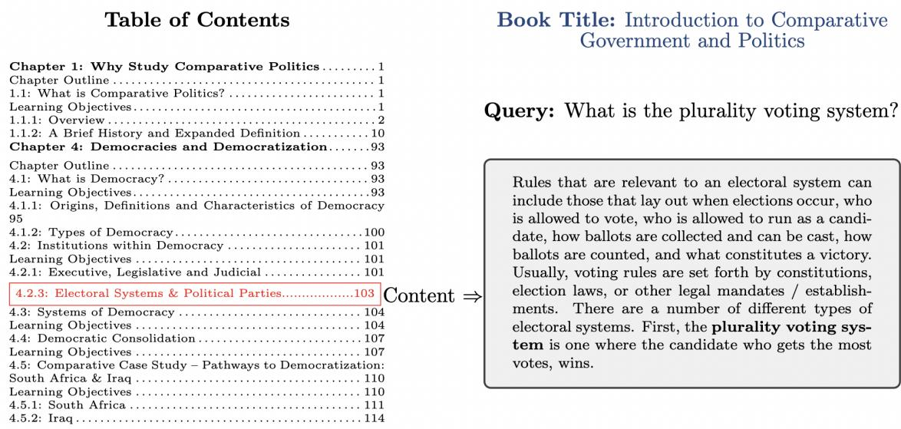
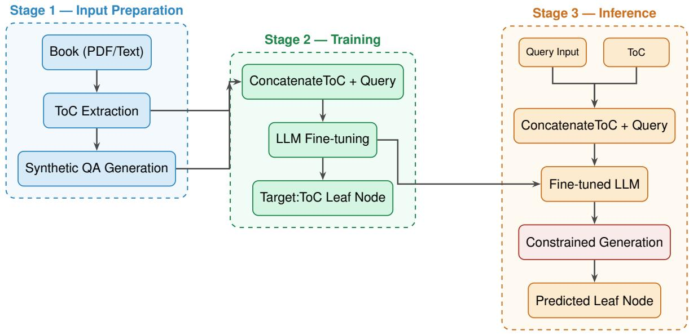
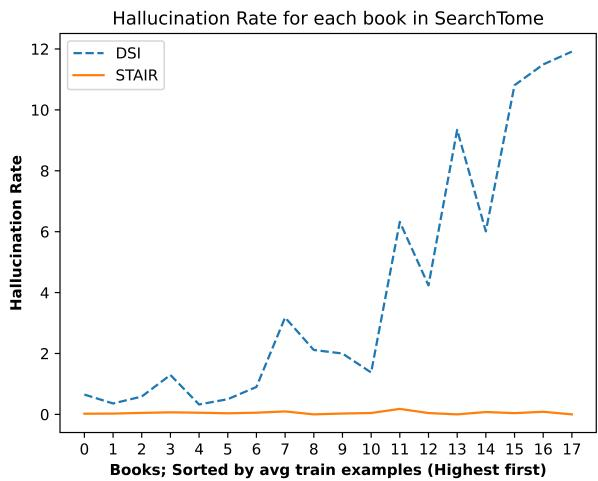
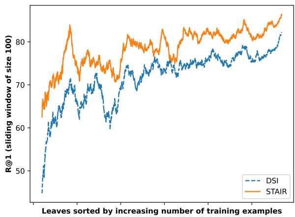

# STAIR (STructure Aware Information Retriever): A novel dataset and LLM based retriever for document structure augmentation

Vineet Kumar\* Meghanadh Pulivarthi Vishwajeet Kumar Jaydeep Sen

Riyaz Ahmad Bhat Sachindra Joshi

IBM

vineet.mundhra@gmail.com vishk024@in.ibm.comjaydesen@in.ibm.com Riyaz.Bhat@ibm.com jsachind@in.ibm.com

## Abstract

Retrieval Augmented Generation (RAG) is a key component for generating accurate and hallucination free answers using Large Language Models (LLMs). LLMs are improving at handling long context, but still suffer from “lost in the middle” problem. Thus, precise and accurate retrieval is important. Current retrievers chunk long context into length-based manageable chunks – in the process throwing away rich and informative semantic global structure in the corpus. We introduce a novel retrieval system STAIR that empowers an LLM to exploit global structure in a corpus such as a Ta ble of Contents (ToC) to efficiently store and retrieve information from its model parameters. Our thorough and careful ablation studies with a finetuned Differentiable Search Index (DSI) system show that ToC helps build a low hallucination (less than 0.05%) generative Information Retrieval (IR) system and can generalize to examples where very few training samples are available. To further research in this novel direction of ToC based retrieval we release SearchTome – a diverse benchmark created from 18 books across 6 diverse domains to further research in this novel direction. STAIR achieves a high Recall@1 score of 82.6% on SearchTome as compared to DSI (76.9%), where the difference is found to be statistically significant. STAIR easily beats other strong baselines such as BM25 (59.5%), DPR (68.7%) and out-of-the-box Mistral (13.8%). The benchmark data and code used for training STAIR is available at https://anonymous. 4open.science/r/s\_331/README.md.

## 1 Introduction

The burgeoning interest in Retrieval Augmented Generation (RAG) has led to a significant surge in the development of advanced Information Retrieval (IR) systems. Large Language Models (LLMs) in turn can now handle large contexts (Chen et al., 2023; Liu et al., 2024a), though they suffer from a “lost in the middle” problem (Liu et al., 2024c; Bai et al., 2024a,b; Li et al., 2024). Therefore, retrieving precise information (Pipitone and Alami, 2024) is extremely important to curb hallucinations (Laban et al., 2024) and generate accurate responses. Current retrievers address this by creating length based chunks (Setty et al., 2024) and throwing away rich and informative semantic global structure in the corpus. This leads to a sub-optimal retrieval quality – length-based chunks compete with each other due to a lack of semantic coherence and boundaries.

In this work, we address this key limitation by augmenting the retriever with a structured global view of the corpus. Global structured view over a long context helps knowledge ingestion (Liu et al., 2024b). Further, LLMs are capable of storing the entire corpus in its model parameters to directly generate a document identifier for a user query (Tay et al., 2022). We posit that by empowering an LLM with a global structure of the search corpus, it can store and retrieve information more accurately from its model parameters. Such a global structure already exists for a Wikipedia (Wikipedia, 2024) page, textbooks, and enterprise help and product feature webpages (SAP, 2024) and technical reports (SEC, 2024).

Figure 1 demonstrates that for a question such as “What is the plurality voting system?”, it is natural for a human to consult the ToC and first narrow down that it could be answered by the Chapter “Democracies and Democratization”. Further subsections reveal that perhaps the Section “Institutions within Democracy” and the subsection “Electoral Systems & Political Parties” could contain the answer. Content for this subsection indeed contains the definition for the plural voting system. Text content associated with ToC entries is semantically coherent organized around a topic as captured by the title of the ToC entry. Further, a ToC entry has a clear semantic boundary with other ToC entries. ToC as a unit of retrieval is a novel yet intuitive way of organizing long context for retrieval.

  
Figure 1: A human can answer “What is the plurality voting system?” by looking at the table of contents and picking Section 4.2.3 without even reading the book Introduction to Comparative Government and Politics.

In this work, we present STAIR (STructure Aware Information Retriever) for ToC based retrieval, inspired by how a human searches for information using ToC, and the fact that LLMs can store the entire corpus in the model’s parameters. Our careful and thorough ablation studies reveal that empowering an LLM with ToC helps in two critical dimensions - curbing hallucinations and generalizing for content with a low number of training examples. STAIR achieves a high Recall@1 score of 82.6, which is is (+7.4%) better than its closest baseline Differentiable Search Index (DSI) (Tay et al., 2022). DSI needs to discover the book structure (indirectly) through the completion part of training examples, while STAIR can use exploit the structure provided as part of the input to accurately store and retrieve information from its model’s parameters.

We develop and release a new multi-domain benchmark SearchTome, made up of 18 books of varying sizes across 6 domains, parsed and cleaned to extract their ToC mapped to the text of the pertinent sections. We also release a set of train, dev and test queries for each book as part of the benchmark, with gold ToC entries labeled for each query serving as the retrieval output. We believe this will be a first step towards promoting further research on ToC based retrieval, with SearchTome serving as a standard evaluation benchmark. We train and evaluate STAIR using SearchTome and compare it with strong baseline retrievers like BM25 and a fully fine-tuned Sequence-to-Sequence model, such as DSI (Tay et al., 2022), which does not utilize ToC. Our experimental results show that STAIR significantly benefits from incorporating ToC in its training and easily outperforms the traditional DSI. Our main contributions are as follows:

• We propose a novel direction leveraging the Table of Contents (ToC) of a lengthy corpus, like a book, as a valuable element for efficiently indexing corpus knowledge and utilizing ToC entries as effective retrieval units.

• We build and release a multi-domain and diverse benchmark SearchTome, consisting of 18 books from 6 diverse domains for the task of ToC retrieval

• We develop an LLM based STAIR and evaluate it on SearchTome and compare it with strong competitive baselines

## 2 Related Work

Efficient and precise retrieval is a critical research problem in natural language processing, with a wide range of applications such as semantic search (Guha et al., 2003), open domain question answering (Chen and Yih, 2020; Zhu et al., 2021) and Retrieval Augmented Generation(RAG) (Lewis et al., 2020) to name a few.

With the rise of RAG applications, precise retrieval has become increasingly important, particularly in curbing hallucination in generative models. We can broadly classify all retrieval techniques into three main categories:

Dense Retrieval (Cai et al., 2021; Karpukhin et al., 2020) represent a query and document using a dense vector and compute the similarity based on the distance between their vectors. DPR (Karpukhin et al., 2020) uses dual encoder, ColBERT (Khattab and Zaharia, 2020) represents every token in the query and document using dense vector and performs late interaction to score query and document pairs. Recently, Sarthi et al. (2024) introduced RAPTOR, a method for building a hierarchical tree by recursively embedding, clustering, and summarizing content from lengthy documents to retrieve relevant text at various levels of abstraction. Our approach differs in two key aspects: while RAPTOR uses dense retrievers for indexing and retrieval, we adopt model-based indexing. Additionally, we enhance model-based indexing by leveraging table-of-contents (ToC) structures, unlike RAPTOR, which relies solely on dense retrievers to access information at multiple levels of abstraction.

Learned Sparse Retrieval systems use sparse vector representation for a query and document. Unlike traditional sparse retrieval methods like BM25(Robertson and Zaragoza, 2009), which rely on exact token matches, these models learn to represent queries and documents in a sparse highdimensional space, allowing for efficient lexical matching. SPLADE (Hai et al., 2023) (Sparse Lexical and Expansion Model for Information Retrieval) is a prominent example of such systems. Several other models have been developed to enhance sparse retrieval, including SPLADEv2 (Formal et al., 2021), DeepCT(Dai and Callan, 2019), uniCOIL(Lin and Ma, 2021) and DeepImpact (Basnet et al., 2024).

Model-based Indexing (Metzler et al., 2021) such as Differential Search Index (DSI) (Tay et al., 2022) embed knowledge of the entire corpus directly into its model parameters – greatly simplifying the retrieval process. STAIR takes this paradigm one step further by learning to exploit a rich hierarchal and semantic global structure within the corpus.

3 SearchTome: A new benchmark for Table of Contents based retrieval

## 3.1 Breaking the Mold: Why a New Benchmark Is Needed

There are multiple benchmarks proposed around long context applications such as ContractNLI (Koreeda and Manning, 2021) focused on NLI or Scrolls (Shaham et al., 2022) with seven challenging tasks. However, there doesn’t exist any benchmark for long context retrieval with any form of structured view, which we hypothesize as the key for precise retrieval. Benchmarks such as Gov-Report (Huang et al., 2021), SummScreen (Chen et al., 2022), and QM-Sum (Zhong et al., 2021) focus on generating summaries of a length document, whereas, Qasper (Dasigi et al., 2021), QuAL-ITY (Pang et al., 2022) and NarrativeQA (Kociskýˇ et al., 2018) focus on the generation aspect with only answers for a user query and do not contain the gold passage for retrieval. The closest benchmark is LocoV1 (Saad-Falcon et al., 2024) which does include gold passages for each query. However, due to lack of ToC or a global structure for the input document, we cannot use this benchmark for our task.

To the best of our knowledge, SearchTome is the first benchmark which provides a clean structured view with Table of Contents for evaluating long context retrieval with structures .

## 3.2 SearchTome: A diverse and novel benchmark for ToC Retrieval

Our main motivation for a new benchmark is to evaluate how well a global semantic structure such as a ToC can help in better retrieval for long context applications which is typical for technical reports or voluminous books. Thus to create a clean and effective benchmark we turn to opentextbooks, which is perhaps the largest collection of such textbooks. To make the benchmark a comprehensive one across domains, we picked six diverse domains namely – Education, Finance, Law, Medicine, Natural Sciences and Social Sciences and selected three books from each domain (Table 1). We parsed the PDF for each book and extracted Table of Contents using pymupdf1. A sample of the final cleaned content for one of the books can be viewed here. For each paragraph we ask a powerful LLM Mixtral 8x7b model (Jiang et al., 2024) to generate multiple questions covering all important topics in the paragraph (Zhang et al., 2024). Following the same technique as was proposed in DSI (Tay et al., 2022) to train the parametric index, we use a portion of these questions for training DSI (Tay et al., 2022) and STAIR, a small portion as development set which is to help us pick the best checkpoint. Majority of the generated questions were picked as test questions – to thoroughly test coverage of content by an IR system. We believe our benchmark SearchTome will further research in building IR systems which can leverage structure in a corpus and retrieve the most relevant chunks for a user query.

Table 1: SearchTome Book links & Statistics
<table><tr><td>Domain</td><td>Book</td><td>#Pages</td><td>#Leaves</td><td>Test</td><td>Train</td><td>Dev</td></tr><tr><td rowspan="3">Education</td><td>Open Music Theory</td><td>1297</td><td>429</td><td>7430</td><td>4493</td><td>1671</td></tr><tr><td>The Whole Child: Development in the Early Years</td><td>182</td><td>129</td><td>1746</td><td>1056</td><td>388</td></tr><tr><td>Teaching in a Digital Age</td><td>779</td><td>118</td><td>6150</td><td>3797</td><td>1489</td></tr><tr><td rowspan="3">Finance</td><td>Principles of Financial Accounting</td><td>318</td><td>98</td><td>4119</td><td>2395</td><td>981</td></tr><tr><td>Accounting in the Finance World</td><td>572</td><td>80</td><td>4481</td><td>2747</td><td>1081</td></tr><tr><td>Financial and Managerial Accounting</td><td>1077</td><td>107</td><td>7815</td><td>4692</td><td>1901</td></tr><tr><td rowspan="3">Law</td><td>Construction Contracting</td><td>403</td><td>103</td><td>3653</td><td>2249</td><td>866</td></tr><tr><td>Criminal Procedure</td><td>897</td><td>106</td><td>5610</td><td>3401</td><td>1349</td></tr><tr><td>Tort Law: Cases and Commentaries</td><td>948</td><td>396</td><td>18209</td><td>11174</td><td>4363</td></tr><tr><td rowspan="3">Medicine</td><td>Nursing Assistant</td><td>659</td><td>118</td><td>4586</td><td>2790</td><td>1093</td></tr><tr><td>Nursing Fundamentals</td><td>1327</td><td>121</td><td>9065</td><td>5493</td><td>2200</td></tr><tr><td>Nursing Management and Professional Concepts</td><td>599</td><td>74</td><td>3695</td><td>2277</td><td>885</td></tr><tr><td rowspan="3">Natural Sciences</td><td>Introduction to Genetics</td><td>513</td><td>70</td><td>2254</td><td>1345</td><td>527</td></tr><tr><td>Principles of Mechanics</td><td>179</td><td>125</td><td>2341</td><td>1418</td><td>543</td></tr><tr><td>Organic Chemistry</td><td>1249</td><td>321</td><td>11124</td><td>6601</td><td>2635</td></tr><tr><td rowspan="3">Social Sciences</td><td>Foundations of Aural Skills</td><td>674</td><td>118</td><td>2451</td><td>1421</td><td>559</td></tr><tr><td>Introduction to Comparative Government and Politics</td><td>421</td><td>189</td><td>3893</td><td>2288</td><td>898</td></tr><tr><td>A Practicum in Behavioral Economics</td><td>381</td><td>178</td><td>4627</td><td>2821</td><td>1073</td></tr></table>

## 4 STAIR: Table of Contents Searcher

We now formally define the problem statement and the technique for retrieving a section title given a book and its Table of Contents (ToC)

## 4.1 Notations

We are given a long document D and its Table of Contents $\mathbf { I o C } _ { D } = \{ T _ { 1 } , T _ { 2 } , . . . . , T _ { n } \}$ . An edge $e : T _ { p }  T _ { c }$ between two nodes $T _ { p } , T _ { c } \in \mathbf { T o C } _ { D }$ is defined as $T _ { p } = \mathrm { p a r e n t } ( T _ { c } )$ , if the section represented by title $T _ { p }$ is further divided into multiple sub-sections including $T _ { c }$ . The set of leaf nodes can thus be defined as $L N _ { D } { = } \{ T _ { l } \in \mathbf { T o C } _ { D } | \exists ! T _ { c } \in$ $\mathbf { \mathrm { T o C } } _ { D } , T _ { l } = p a r e n t \_ o f ( T _ { c } ) \} \subseteq \mathbf { \mathrm { T o C } } _ { D }$ . Our goal is to retrieve the correct leaf node $T _ { l } \in L N _ { D }$ whose content can answer a user query q.

## 4.2 Training STAIR

Figure 2 depicts the training pipeline for STAIR which learns two correlated but different tasks: Corpus knowledge ingestion: STAIR needs to learn the information trove D by mapping a book’s text content to the corresponding section titles $T _ { i } ~ \in ~ \mathbf { T o C } _ { D }$ This is facilitated by the training data, which consists of a series of queries that are linked to their corresponding section titles. Consequently, this phase of training integrates the book’s knowledge into the LLM’s parameters, similar to model-based indexing systems like DSI, but with a key difference. Unlike other model-based indexing systems, the parameters in STAIR remember the corpus knowledge not by a document identifier, but by using fine-grained section title entries in the ToC, which are likely to have a much stronger semantic connection with the content being ingested into parametric knowledge.

Learning to generate from ToC: STAIR learns to pick the most relevant leaf node from the complete global structure (ToC) of a document.

We use the training split from SearchTome to train STAIR through supervised fine-tuning. During training, we provide the query q along with the complete $\mathbf { T o C } _ { D }$ as input. Consequently, the complete input during training consists of prompt $\mathbf { \Sigma } + \mathbf { \Sigma } \left( q , \mathbf { T o C } _ { D } \right)$ . Note that $\mathbf { T o C } _ { D }$ , remains consistent across queries from the same book, while the prompt remains unchanged throughout the training process. We fine-tune the model to generate the correct leaf node $T _ { l } \in L N _ { D }$ that corresponds to

  
Figure 2: Overview of our pipeline. Stage 1 prepares synthetic QA data from the input book. Stage 2 fine-tunes a language model to map a ToC-augmented query to the correct leaf node. Stage 3 runs inference with constrained generation, restricting the output vocabulary to valid ToC leaf nodes.

the query q.

Table 2: Sample training example
<table><tr><td>Prompt</td></tr><tr><td>### Book: Teaching in a Digital Age Pick the best section from the table of contents below which can answer the user query below. Only generate the section name, do not generate any explanation!</td></tr><tr><td>### Table of Contents 1 Chapter 1: Fundamental Change in Education</td></tr><tr><td>leaf 12.7 Step five:master the technology leaf 12.8 Step six:set appropriate learning goals</td></tr><tr><td>leaf 12.9 Step seven:design course structure and learning</td></tr><tr><td>leaf 13.7 Building the future ### Query: What is the suggested time allocation</td></tr><tr><td></td></tr><tr><td>for students studying a course or program? ### Section: leaf Completion</td></tr></table>

12.9 Step seven: design course structure and learning

## 5 Experiments

We report Recall@1 (R@1), Recall@3 (R@3) and Normalized Discounted Cumulative Gain (nDCG@3) metrics on the test set for each book. BeIR (Thakur et al., 2021) is used for computing the metrics.

## 5.1 Baselines

Mistral (Out of the Box LLM): Beam search is used to generate the Top-K predictions for Mistral Instruct v0.2

BM25 (Robertson and Zaragoza, 2009): We index content using Elastic Search v 8.11.2. Leaf node acts as a unique document identifier for a book DPR: We use NV-Embed-v2(Lee et al., 2024) out of the box with text lengths set to 512 for passages and 256 for queries. NV-Embed-v2 is the leading text-only embedding model with open weights on the MTEB leaderboard2. The model is based on Mistral-7B-v0.13, making it a suitable baseline for STAIR as both are finetuned over Mistral.

DSI (Tay et al., 2022) infuses the entire knowledge of a corpus in the parameters of an LLM and directly generates a document identifier. We fine-tune DSI using the train split for each book.

## 5.2 Fine-tuning STAIR and DSI

We fine-tune Mistral Instruct $\mathrm { v 0 } . 2 ^ { 4 }$ (Jiang et al., 2023) for a maximum of 200 epochs using a LoRA adapter (Hu et al., 2021) with a r = 16 and α = 32. We early stop with a patience of 20 epochs, by computing Recall@1 on the dev set. We set the maximum input length to 14k tokens for STAIR and 512 tokens for DSI and a maximum output length of 64 tokens. See Table 2 for a sample training input and output for STAIR.

## 6 Results and Analysis

Table 4 compares STAIR with all the baselines listed in Section 5.1 and addresses the following two research questions:

• RQ1: Does ToC based training makes STAIR more accurate as a retriever?

• RQ2: Can we finetune an LLM to learn the new task of generating leaf nodes from ToC? Our key findings are as follows:

1. STAIR outperforms strong baselines such as BM25, DPR and fine-tuned DSI

2. R@1 for Mistral is much lower than BM25 – this suggests the LLM not only needs to learn the new task of picking the best section but also needs to ingest knowledge from the corpus

3. DPR performs much better than BM25 but worse than DSI. This result is expected, as NV-Embed-v2 is not fine-tuned for SearchTome

4. Tuning with ToC as input helps STAIR: The only difference in the input between DSI and STAIR is that STAIR leverages ToC. STAIR outperforms DSI by 7.4%, as it is able to access the entire structure of the book and better align it with the queries during fine-tuning. DSI on the other hand must learn the semantic alignment between queries and sections by looking at all the training data. We can thus conclude that RQ1 and RQ2 are answered in affirmative.

Statistical significance testing was done for the Recall@1 performance difference between DSI and STAIR. We follow the randomization test tailored to retrieval systems as described in Smucker et al. (2007). The null hypothesis for the significance testing is that outputs from SystemA (DSI) and SystemB (STAIR) may belong to the same underlying distribution and the difference of performance between SystemA (DSI) and SystemB (STAIR) is because of the sampling variance. We test the null hypothesis with the traditional p value of 0.05 at the domain level i.e. for each of the 6 domains separately (by combining all the books from a single domain). The significance test results conclude that the difference in DSI and STAIR is indeed statistically significant for all the 6 domains where the null hypothesis is successfully invalidated. More specifically, through our sample runs for randomization test, we find that the probability of seeing this scale of Recall@1 performance difference as observed in Table 4 when being randomly sampled from the same distribution falls below $p = 0 . 0 5$ As with any statistical significance testing, the key takeaway from these experiments is a confirmation that the performance improvement seen in STAIR is statistically significant and therefore, it is a property of the STAIR design and not because of the data set size or data distribution in SearchTome.

## 6.1 Ablations

We conduct ablation studies to study the impact of using ToC as an input. Two key conclusions are as follows:

ToC reduces hallucinations: We define hallucination as the generation of a non-leaf node (invalid document identifier). Figure 3 illustrates the number of hallucinations per leaf node. We observed that the hallucination rate of STAIR remains nearly constant at close to zero, regardless of the number of training examples. This indicates that STAIR has effectively learned to generate outputs solely from the leaf nodes, making it inherently less prone to hallucination. In contrast, DSI, which does not use ToC, exhibits a higher hallucination rate than STAIR, particularly for leaf nodes with fewer training examples.

Remembering the structure is hard without ToC Figure 4 shows that for leaf nodes with less number of training examples, the Recall@1 difference between DSI and STAIR is much higher. This supports our hypothesis, that without ToC, DSI needs to discover the book structure and also remember it within its parameters. DSI attempts to learn this via the training data on query and associated ToC leaf node pairs. Thus, leaf nodes which have low representations in training data are prone to be missed by DSI. In contrast, STAIR does not need to “remember” the leaf nodes. As the number of training examples for a leaf node increase, Recall@1 gap between DSI and STAIR decreases – although STAIR consistently achieves higher Recall@1 numbers.

## 6.2 Error Analysis with Anecdotal Examples

We observe that out-of-the-box Mistral’s error rate is 86.20%, and 26.81% of its mistakes are as it predicts a non-leaf node, while 23.86% are hallucinations. This suggests that Mistral out-of-box needs knowledge ingestion and task finetuning. For

Table 3: Examples of model predictions. Gold leaf is highlighted in bold in Table of Contents
<table><tr><td rowspan=1 colspan=2>Example 1:</td></tr><tr><td rowspan=1 colspan=2>Book: The Whole Child: Development in the Early YearsQuery: How do preschoolers react when caregivers and teachers belittle their autonomous actions?</td></tr><tr><td rowspan=1 colspan=2>Table of Contents                                       Content2 Chapter Two: Theorists and Theories of Development      Initiative vs. Guilt (Preschool Years)leaf 2.1 Theories of Development                          The development of courage and independence ...2.2 Psychosocial Theoryleaf 2.2.1 Trust vs. Mistrust (Infancy)leaf 2.2.2 Autonomy vs. Shame/Doubt (Toddlerhood)         …leaf 2.2.3 Initiative vs. Guilt (Preschool Years)leaf 2.2.4 Industry vs. Inferiority (Elementary Years)         If caregivers and preschool teachers encourage and supportleaf 2.2.5 Identity vs. Role-Confusion (Adolescence)         children&#x27;s efforts while also helping them make realisticleaf 2.2.6 Intimacy vs. Isolation (Early Adulthood)           and appropriate choices, children develop a healthy sense of initiative inleaf 2.2.7 Generativity vs. Stagnation (Middle Adulthood)    planning and undertaking activities If, instead, adults discourage theleaf 2.2.8 Integrity vs. Despair (Older Adulthood)            pursuit of independent activities or dismiss them as silly andbothersome, children develop guilt about their needs and desires.3 Chapter Three: Domains in Development</td></tr><tr><td rowspan=1 colspan=2>Mistral: 8.3.3 Moral Development, leaf 7.3.2 Hitting/Scratching and Temper Tantrums, leaf 2.2.3 Initiative vs. Guilt (Preschool Years)BM25: 8.3.2 Moral DevelopmentDPR: 2.2.2 Autonomy vs. Shame/Doubt (Toddlerhood)DSI: 2.2.2 Autonomy vs. Shame/Doubt (Preschool Years)STAIR: 2.2.3 Initiative vs. Guilt (Preschool Years)</td></tr><tr><td rowspan=1 colspan=2>Example 2:</td></tr><tr><td rowspan=1 colspan=2>Book: Nursing FundamentalsQuery: In what way does a chronic illness affect an elderly person&#x27;s ability to perform daily activities?</td></tr><tr><td rowspan=1 colspan=2>Table of Contents                                       Contentleaf 30.5 Spiritual Care of Self                            Applying the Nursing Processleaf 30.6 Putting It All Together31 Care of the Older Adult                                It is also important to consider the impact of chronic diseaseleaf 31.1 Care of the Older Adult Introduction               on their ability to function and complete Activities of Daily Livingleaf 31.2 Basic Concepts                                  (ADLs). older adults who are able to perform ADLs without assistanceleaf 31.3 Applying the Nursing Process                    consider themselves healthy.</td></tr><tr><td rowspan=1 colspan=2>Mistral: 31.3 Applying the Nursing ProcessBM25: 11.2 Sensory Impairments Basic ConceptsDPR: 31.2 Basic ConceptsDSI: 31.2 Basic ConceptsSTAIR: 31.3 Applying the Nursing Process</td></tr><tr><td rowspan=1 colspan=2>Example 3:</td></tr><tr><td rowspan=1 colspan=2>Book: Introduction to Comparative Government and PoliticsQuery: What are irregular armed organizations and how are they used by states?</td></tr><tr><td rowspan=1 colspan=1>Table of Contents9 Chapter 5: Non-Democracies and Democratic Backsliding9.2 Strategies for staying in powerleaf 9.2.1 Institutional channelsleaf 9.2.2 Cultural and ideological controls9.3 Varieties of non-democracy</td><td rowspan=1 colspan=1>ContentAnother powerful instrument of repression are paramilitaries.These refer to groups with access to military-grade weapons and trainingyet they are not part of the national military.They are “irregular armed organizations that carry out acts of violenceagainst civilians on behalf of a state,</td></tr></table>

Mistral: 9.3.5 Illiberal and hybrid regimes  
BM25: 15.3.1 Insurgencies/Civil Wars  
DPR: 15.2.2 External State-Sponsored Political Violence (State-Sponsored Terrorism)  
DSI: 15.2.1 Internal State-Sponsored Political Violence (Government Terrorism)  
STAIR: 9.2.1 Institutional channels

DSI, the error rate drops to 24.31%, with 3.25% of its predictions being non-leaf nodes (suggesting knowledge infusion helps). STAIR has the lowest error rate of 18.67%, with only 0.05% of its predictions being non-leaf nodes.

Table 3 lists a few qualitative examples. We discuss next the first example “How do preschoolers react when caregivers and teachers belittle their autonomous actions” from the book “The Whole Child: Development in the Early Years”:

Mistral could correctly guess that the query can be answered by “2.2.3 Initiative vs. Guilt (Preschool Years)” using its world knowledge. It doesn’t understand that it needs to pick only one option – due to lack of the task training BM25 suffers from the known bias of keyword matching where and picks the section “8.3.2. Moral Development” purely because of highest lexical overlap with query tokens, which is the incorrect answer

Table 4: Recall@1, Recall@3 and nDCG@3 for SearchTome; Haiku is Claude haiku 4.5
<table><tr><td></td><td>Education</td><td>Finance</td><td>Law</td><td>Med</td><td>NatSci</td><td>SocSci</td><td>Avg</td></tr><tr><td>Mistral</td><td>14.8/17.8/16.6</td><td>16.4/19.4/18.2</td><td>13.6/15.7/14.9</td><td>13.7/17.0/15.7</td><td>13.1/15.3/14.4</td><td>10.9/13.4/12.4</td><td>13.8/16.4/15.4</td></tr><tr><td>BM25</td><td>58.7/75.8/68.8</td><td>55.0/76.8/67.8</td><td>62.0/77.7/71.3</td><td>59.6/78.7/70.8</td><td>58.7/78.1/70.1</td><td>62.8/78.3/72.0</td><td>59.5/77.6/70.1</td></tr><tr><td>Haiku</td><td>59.8/80.4/72.0</td><td>37.7/56.3/48.4</td><td>41.1/60.6/52.3</td><td>46.1/65.0/57.2</td><td>54.6/73.7/65.7</td><td>34.0/48.8/42.6</td><td>45.6/64.1/56.4</td></tr><tr><td>DPR</td><td>71.5/86.8/80.6</td><td>66.4/85.5/77.7</td><td>69.6/84.1/78.2</td><td>72.7/88.8/82.2</td><td>63.0/84.1/75.7</td><td>68.8/83.1/77.3</td><td>68.7/85.4/78.6</td></tr><tr><td>DSI</td><td>76.2/84.1/80.9</td><td>78.1/87.8/83.9</td><td>73.3/82.9/79.0</td><td>82.1/89.9/86.8</td><td>76.2/84.7/81.3</td><td>75.4/82.2/79.4</td><td>76.9/85.3/81.9</td></tr><tr><td>STAIR</td><td>83.3/91.2/88.0</td><td>82.8/91.4/88.0</td><td>80.8/89.4/85.9</td><td>86.1/93.2/90.3</td><td>80.6/90.4/86.4</td><td>81.8/89.0/86.1</td><td>82.6/90.8/87.5</td></tr></table>

Figure 3: As number of training examples decrease, hallucination rate for DSI increases  

DPR is used out of the box and does a word sensed matching where it predicts “2.2.2 Autonomy vs. Shame/Doubt (Toddlerhood)” being most relevant to the query tokens mentioning “belittling of autonomous actions”. However, without the corpus specific training it falls short of identifying the correct section.

DSI is finetuned for the corpus but faulters to find the precise section. It errs just like DPR in this example but might have chosen a more sensible match “2.2.2 Autonomy vs. Shame/Doubt (Preschool years)” which takes into account the importance of keyword “preschool” for getting a better topic match. However, careful consideration shows this is a hallucinated header not present in the input ToC. This correlates with our ablation in figure 3 on DSI hallucination.

STAIR: Our proposed system STAIR correctly identifies the gold leaf node as “Initiative vs. Guilt (Preschool Years)”.

The comparison between DPR, DSI and STAIR is interesting as they all are built on top odf the same base LLM – Mistral. The difference between DSI and STAIR largely points towards the importance of having ToC as an input during training, which makes it easier for the LLM to align much better to the corpus. Other anecdotal examples in Table 3 also enumerate the same partial ordering seen among the baselines and provide more qualitative analysis to support the claim that the design of STAIR helps it do a much better retrieval.

Figure 4: Recall@1 for each leaf across SearchTome. STAIR shows high accuracy even with a low number of training examples  

## 7 Conclusion

We introduce STAIR, a novel LLM based IR system that leverages ToC to store and retrieve information from its parameters. Given a query, STAIR generates the most probably leaf section header from a ToC which could answer it. We use Mistral Instruct v0.2 to demonstrate that it is possible to instruction finetune the modern day LLMs to efficiently use the ToC structure to generate the correct leaf node while reducing the hallucinations to almost zero. STAIR outperforms all strong baselines such as BM25, finetuned DSI and DPR and achieves a Recall@1 score of 82.6% which is around 7.4% gain over the next best system (DSI). We release a new comprehensive benchmark SearchTome across 6 domains with 18 books comprising of train, dev and test splits to further research in this novel direction.

As a future work, we want to explore directions where a ToC like structure is created dynamically over an unseen search corpus, as has been proposed by some previous works. We envision that having a ToC-based retrieval paradigm will gain more traction in future for agentic frameworks needing multihop retrieval and reasoning over retrieved context. To that end, we want to develop STAIR to work in a complete zero shot setup where it iteratively retrieves ToC leaf nodes and makes intelligent decisions by reasoning on the content of the leaf node to do precise information retrieval.

## 8 Limitations

Our current evaluation is limited to corpora where a global structure exists. While this setting is suitable for initial validation, it may not fully represent the diversity of real-world use cases. In future work, we plan to extend our evaluation to standard benchmarks by artificially inducing a Table of Contents structure. Additionally, we aim to test our model on enterprise datasets where such a structure already exists at a very large scale (possibly millions of URLs in the corpus).

## References

Yushi Bai, Xin Lv, Jiajie Zhang, Hongchang Lyu, Jiankai Tang, Zhidian Huang, Zhengxiao Du, Xiao Liu, Aohan Zeng, Lei Hou, Yuxiao Dong, Jie Tang, and Juanzi Li. 2024a. LongBench: A bilingual, multitask benchmark for long context understanding. In Proceedings of the 62nd Annual Meeting of the Associationfor Computational Linguistics (Volume 1: Long Papers), pages 3119–3137, Bangkok, Thailand. Association for Computational Linguistics.

Yushi Bai, Shangqing Tu, Jiajie Zhang, Hao Peng, Xiaozhi Wang, Xin Lv, Shulin Cao, Jiazheng Xu, Lei Hou, Yuxiao Dong, Jie Tang, and Juanzi Li. 2024b. Longbench v2: Towards deeper understanding and reasoning on realistic long-context multitasks. arXiv preprint arXiv:2412.15204.

Soyuj Basnet, Jerry Gou, Antonio Mallia, and Torsten Suel. 2024. Deeperimpact: Optimizing sparse learned index structures. arXiv preprint arXiv:2405.17093.

Yinqiong Cai, Yixing Fan, Jiafeng Guo, Fei Sun, Ruqing Zhang, and Xueqi Cheng. 2021. Semantic models for the first-stage retrieval: A comprehensive review.

ACM Transactions on Information Systems (TOIS), 40:1 – 42.

Danqi Chen and Wen-tau Yih. 2020. Open-domain question answering. In Proceedings ofthe 58th Annual Meeting ofthe Associationfor Computational Linguistics: Tutorial Abstracts, pages 34–37, Online. Association for Computational Linguistics.

Mingda Chen, Zewei Chu, Sam Wiseman, and Kevin Gimpel. 2022. SummScreen: A dataset for abstractive screenplay summarization. In Proceedings of the 60th Annual Meeting ofthe Associationfor Computational Linguistics (Volume 1: Long Papers), pages 8602–8615, Dublin, Ireland. Association for Computational Linguistics.

Shouyuan Chen, Sherman Wong, Liangjian Chen, and Yuandong Tian. 2023. Extending context window of large language models via positional interpolation. arXiv preprint arXiv:2306.15595.

Zhuyun Dai and Jamie Callan. 2019. Context-aware sentence/passage term importance estimation for first stage retrieval. arXiv preprint arXiv:1910.10687.

Pradeep Dasigi, Kyle Lo, Iz Beltagy, Arman Cohan, Noah A. Smith, and Matt Gardner. 2021. A dataset of information-seeking questions and answers anchored in research papers. In Proceedings of the 2021 Conference of the North American Chapter of the Associationfor Computational Linguistics: Human Language Technologies, pages 4599–4610, Online. Association for Computational Linguistics.

Thibault Formal, Carlos Lassance, Benjamin Piwowarski, and Stéphane Clinchant. 2021. Splade v2: Sparse lexical and expansion model for information retrieval. arXiv preprint arXiv:2109.10086.

R. Guha, Rob McCool, and Eric Miller. 2003. Semantic search. In Proceedings ofthe 12th International Conference on World Wide Web, WWW ’03, page 700–709, New York, NY, USA. Association for Computing Machinery.

Nam Le Hai, Thomas Gerald, Thibault Formal, Jianyun Nie, Benjamin Piwowarski, and Laure Soulier. 2023. Cosplade: Contextualizing splade for conversational information retrieval. ArXiv, abs/2301.04413.

J. Edward Hu, Yelong Shen, Phillip Wallis, Zeyuan Allen-Zhu, Yuanzhi Li, Shean Wang, and Weizhu Chen. 2021. Lora: Low-rank adaptation of large language models. ArXiv, abs/2106.09685.

Luyang Huang, Shuyang Cao, Nikolaus Parulian, Heng Ji, and Lu Wang. 2021. Efficient attentions for long document summarization. In Proceedings ofthe 2021 Conference of the North American Chapter of the Association for Computational Linguistics: Human Language Technologies, pages 1419–1436, Online. Association for Computational Linguistics.

Albert Q Jiang, Alexandre Sablayrolles, Antoine Roux, Arthur Mensch, Blanche Savary, Chris Bamford, Devendra Singh Chaplot, Diego de las Casas, Emma Bou Hanna, Florian Bressand, and 1 others. 2024. Mixtral of experts. arXiv preprint arXiv:2401.04088.

Albert Qiaochu Jiang, Alexandre Sablayrolles, Arthur Mensch, Chris Bamford, Devendra Singh Chaplot, Diego de Las Casas, Florian Bressand, Gianna Lengyel, Guillaume Lample, Lucile Saulnier, L’elio Renard Lavaud, Marie-Anne Lachaux, Pierre Stock, Teven Le Scao, Thibaut Lavril, Thomas Wang, Timothée Lacroix, and William El Sayed. 2023. Mistral 7b. ArXiv, abs/2310.06825.

Vladimir Karpukhin, Barlas Oguz, Sewon Min, Patrick˘ Lewis, Ledell Yu Wu, Sergey Edunov, Danqi Chen, and Wen tau Yih. 2020. Dense passage retrieval for open-domain question answering. ArXiv, abs/2004.04906.

O. Khattab and Matei A. Zaharia. 2020. Colbert: Efficient and effective passage search via contextualized late interaction over bert. Proceedings of the 43rd International ACM SIGIR Conference on Research and Development in Information Retrieval.

Tomáš Kociský, Jonathan Schwarz, Phil Blunsom, Chrisˇ Dyer, Karl Moritz Hermann, Gábor Melis, and Edward Grefenstette. 2018. The NarrativeQA reading comprehension challenge. Transactions ofthe Associationfor Computational Linguistics, 6:317–328.

Yuta Koreeda and Christopher Manning. 2021. ContractNLI: A dataset for document-level natural language inference for contracts. In Findings of the Associationfor Computational Linguistics: EMNLP 2021, pages 1907–1919, Punta Cana, Dominican Republic. Association for Computational Linguistics.

Philippe Laban, A. R. Fabbri, Caiming Xiong, and Chien-Sheng Wu. 2024. Summary of a haystack: A challenge to long-context llms and rag systems. In Conference on Empirical Methods in Natural Language Processing.

Chankyu Lee, Rajarshi Roy, Mengyao Xu, Jonathan Raiman, Mohammad Shoeybi, Bryan Catanzaro, and Wei Ping. 2024. Nv-embed: Improved techniques for training llms as generalist embedding models. arXiv preprint arXiv:2405.17428.

Patrick Lewis, Ethan Perez, Aleksandra Piktus, Fabio Petroni, Vladimir Karpukhin, Naman Goyal, Heinrich Küttler, Mike Lewis, Wen-tau Yih, Tim Rocktäschel, and 1 others. 2020. Retrieval-augmented generation for knowledge-intensive nlp tasks. Advances in Neural Information Processing Systems, 33:9459–9474.

Tianle Li, Ge Zhang, Quy Duc Do, Xiang Yue, and Wenhu Chen. 2024. Long-context llms struggle with long in-context learning. ArXiv, abs/2404.02060.

Jimmy Lin and Xueguang Ma. 2021. A few brief notes on deepimpact, coil, and a conceptual framework for information retrieval techniques. arXiv preprint arXiv:2106.14807.

Hao Liu, Wilson Yan, Matei Zaharia, and Pieter Abbeel. 2024a. World model on million-length video and language with blockwise ringattention. arXiv preprint arXiv:2402.08268.

Kai Liu, Ze Chen, Zhihang Fu, Rongxin Jiang, Fan Zhou, Yaowu Chen, Yue Wu, and Jieping Ye. 2024b. Structure-aware domain knowledge injection for large language models.

Nelson F. Liu, Kevin Lin, John Hewitt, Ashwin Paranjape, Michele Bevilacqua, Fabio Petroni, and Percy Liang. 2024c. Lost in the middle: How language models use long contexts. Transactions of the Associationfor Computational Linguistics, 12:157–173.

Donald Metzler, Yi Tay, Dara Bahri, and Marc Najork. 2021. Rethinking search: Making experts out of dilettantes. ArXiv, abs/2105.02274.

Richard Yuanzhe Pang, Alicia Parrish, Nitish Joshi, Nikita Nangia, Jason Phang, Angelica Chen, Vishakh Padmakumar, Johnny Ma, Jana Thompson, He He, and Samuel Bowman. 2022. QuALITY: Question answering with long input texts, yes! In Proceedings ofthe 2022 Conference ofthe North American Chapter of the Association for Computational Linguistics: Human Language Technologies, pages 5336–5358, Seattle, United States. Association for Computational Linguistics.

Nicholas Pipitone and Ghita Houir Alami. 2024. Legalbench-rag: A benchmark for retrievalaugmented generation in the legal domain. ArXiv, abs/2408.10343.

Stephen Robertson and Hugo Zaragoza. 2009. The probabilistic relevance framework: Bm25 and beyond. ACM Transactions on Information Systems, 27(3):1–27.

Jon Saad-Falcon, Daniel Y. Fu, Simran Arora, Neel Guha, and Christopher R’e. 2024. Benchmarking and building long-context retrieval models with loco and m2-bert. ArXiv, abs/2402.07440.

SAP. 2024. Sap-product-documentation. https: //help.sap.com/doc/saphelp\_snc70/7.0/ en-US/ef/c08d5377a0ec23e10000000a174cb4/ frameset.htm.

Parth Sarthi, Salman Abdullah, Aditi Tuli, Shubh Khanna, Anna Goldie, and Christopher D Manning. 2024. Raptor: Recursive abstractive processing for tree-organized retrieval. arXiv preprint arXiv:2401.18059.

SEC. 2024. Sec 10k structure. https://www.sec. gov/files/reada10k.pdf.

Spurthi Setty, Katherine Jijo, Eden Chung, and Natan Vidra. 2024. Improving retrieval for rag based question answering models on financial documents. ArXiv, abs/2404.07221.

Uri Shaham, Elad Segal, Maor Ivgi, Avia Efrat, Ori Yoran, Adi Haviv, Ankit Gupta, Wenhan Xiong, Mor Geva, Jonathan Berant, and Omer Levy. 2022. SCROLLS: Standardized CompaRison over long language sequences. In Proceedings of the 2022 Conference on Empirical Methods in Natural Language Processing, pages 12007–12021, Abu Dhabi, United Arab Emirates. Association for Computational Linguistics.

Mark Smucker, James Allan, and Ben Carterette. 2007. A comparison of statistical significance tests for information retrieval evaluation. pages 623–632.

Yi Tay, Vinh Q. Tran, Mostafa Dehghani, Jianmo Ni, Dara Bahri, Harsh Mehta, Zhen Qin, Kai Hui, Zhe Zhao, Jai Gupta, Tal Schuster, William W. Cohen, and Donald Metzler. 2022. Transformer memory as a differentiable search index. ArXiv, abs/2202.06991.

Nandan Thakur, Nils Reimers, Andreas Rücklé, Abhishek Srivastava, and Iryna Gurevych. 2021. BEIR: A heterogeneous benchmark for zero-shot evaluation of information retrieval models. In Thirty-fifth Conference on Neural Information Processing Systems Datasets and Benchmarks Track (Round 2).

Wikipedia. 2024. wikipedia sample layout. https://en.wikipedia.org/wiki/Wikipedia: Manual\_of\_Style/Layout.

Jiaxin Zhang, Wendi Cui, Yiran Huang, Kamalika Das, and Kumar Sricharan. 2024. Synthetic knowledge ingestion: Towards knowledge refinement and injection for enhancing large language models. In Conference on Empirical Methods in Natural Language Processing.

Ming Zhong, Da Yin, Tao Yu, Ahmad Zaidi, Mutethia Mutuma, Rahul Jha, Ahmed Hassan Awadallah, Asli Celikyilmaz, Yang Liu, Xipeng Qiu, and Dragomir Radev. 2021. QMSum: A new benchmark for querybased multi-domain meeting summarization. In Proceedings ofthe 2021 Conference ofthe North American Chapter ofthe Associationfor Computational Linguistics: Human Language Technologies, pages 5905–5921, Online. Association for Computational Linguistics.

Fengbin Zhu, Wenqiang Lei, Chao Wang, Jianming Zheng, Soujanya Poria, and Tat-Seng Chua. 2021. Retrieving and reading: A comprehensive survey on open-domain question answering. arXiv e-prints, pages arXiv–2101.