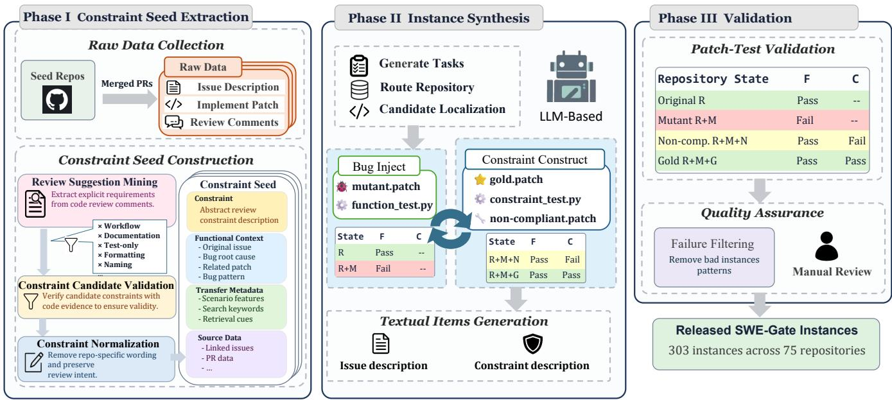
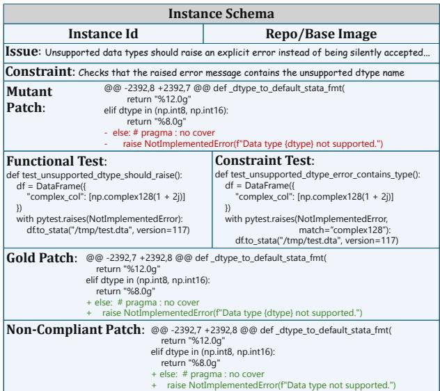

# SWE-Gate: Passing Functional Tests Is Not Enough for Software Engineering Agents

Xin He1, Yanlin Wang1∗, Mingwei Liu1, Jiachi Chen2, Hongyu Zhang3, Guanbin Li4

1School of Software Engineering, Sun Yat-sen University

2College of Computer Science and Technology, Zhejiang University

3School of Big Data and Software Engineering, Chongqing University

4School of Computer Science and Engineering, Sun Yat-sen University

## Abstract

Repository-level software engineering benchmarks have significantly advanced the evaluation of coding agents, but existing benchmarks primarily measure whether generated patches pass functional tests and overlook review-derived acceptance constraints (review constraints) that often influence whether a patch is acceptable in real-world software development. We introduce SWE-Gate, a repository-level benchmark for software engineering agents that explicitly evaluates review constraint compliance alongside functional correctness. SWE-Gate derives review constraints from real pull request review comments and synthesizes repository-level repair instances around these constraints. Each instance provides separate functional and constraint tests, together with non-compliant and gold patches, enabling explicit separation between issue resolution capability and review constraint compliance. We construct SWE-Gate with 303 repositorylevel repair instances spanning 75 open-source Python repositories across diverse software domains. Experiments with four LLM backends spanning diferent capability levels under a common coding-agent scafold reveal a substantial gap between functional success and success under the complete repair specification: among 644 repairs that pass the functional tests, 221 fail to satisfy the provided review constraints. These findings show that functional-only evaluation overestimates agents’ ability to satisfy the full requirements of repository-level repair tasks. The replication package including code, data, and experimental results is available at https://github.com/DeepSoftwareAnalytics/SWE-Gate.

## Introduction

Recent advances in large language models (LLMs) have transformed automated software engineering, evolving from early function-level code generation benchmarks [1, 2] to repository-level agents capable of understanding large codebases [3–5], localizing defects, and repairing real software issues using code, version history, tests, and natural-language reports [6–9]. Repository-level repair has consequently become an important measure of practical programming ability. SWE-Bench [6], the de facto benchmark, constructs tasks from real issue–pull request pairs and evaluates patches with executable functional tests, driving systems such as SWE-Agent [7] and OpenHands [8].

Despite their success, existing repository-level benchmarks largely adopt a single evaluation criterion: a repair is considered successful if the generated patch passes the functional test suite which is typically provided with the PR and mainly assesses whether the reported issue has been functionally resolved. However, in practice, a patch that resolves the reported issue and passes functional tests is not necessarily accepted [10, 11]. During code review, repository maintainers frequently require contributors to satisfy additional requirements beyond functional correctness. We call such requirements review-derived acceptance constraints (gates): additional, objectively testable requirements that restrict which functionally correct repairs are acceptable. For brevity, we refer to them as review constraints hereafter. These requirements are often reflected in review comments that request changes before a patch can be accepted. Examples of such requirements include preserving backward compatibility, maintaining established exception semantics, or following repository-specific implementation conventions [12–14].

For example, a Pydantic pull request sought to add conditional serialization for extra fields. Its initial implementation provided the requested behavior by introducing a new core-schema representation, but a reviewer noted that changing this public interface would be breaking and recommended adding an extras\_ser\_exclude\_if parameter instead.1 The contributor subsequently adopted this backward-compatible design.

The two requirements can be tested separately. A functional test checks whether qualifying extra fields are omitted from serialized output, whereas a compatibility test checks whether the existing public schema remains unchanged and usable by code written against the previous format. A patch may therefore pass the functional test while failing compatibility, showing that implementing the requested behavior does not necessarily satisfy the review constraint raised during review.

Existing benchmarks answer whether a model can generate a functionally correct repair, but not whether that repair also complies with review-derived review constraints. These are separable evaluation dimensions: issue tests establish functional success, whereas constraint tests determine whether a functional repair also meets additional acceptance requirements. Evaluating only the first may therefore overestimate agents’ ability to satisfy complete repair requirements.

To bridge this gap, we introduce SWE-Gate, the first repository-level benchmark to evaluate review constraint compliance alongside functional correctness using separate executable tests. Rather than manually inventing rules or attaching them to unrelated tasks, SWE-Gate derives naturallanguage constraints from maintainer reviews and synthesizes realistic repairs around their engineering intent. Each instance includes a non-compliant patch that passes functional tests but violates the constraint and a gold patch that passes both, demonstrating that the dimensions are separable, executable, and jointly satisfiable.

Using SWE-Gate, we evaluate representative LLMs on 303 repository-level repair instances spanning 75 repositories across six software domains. Our experiments reveal that many repairs that successfully pass functional tests nevertheless violate review constraints, demonstrating that functional success alone does not establish that an agent-generated repair satisfies the full set of repository requirements or is acceptable for integration.

Our contributions are summarized as follows:

• We introduce SWE-Gate, the first repository-level software engineering benchmark that incorporates executable review constraints into realistic software repair tasks.

• We propose a dual-dimension evaluation protocol that separately measures functional correctness and review constraint compliance with executable tests.

• We develop a semi-automated construction framework and use it to create 303 quality-assured instances across 75 repositories and six domains, then characterize constraint following across four LLM backends evaluated under a common Mini-SWE-Agent scafold.

## Related Work

Early benchmarks such as HumanEval and MBPP evaluate function-level programs with unit tests [15, 16], whereas RepoBench, RepoCoder, and CrossCodeEval introduce repository or cross-file context, with subsequent work further studying repository-level code generation[3, 17–19]; multilingual code evaluation and real-fault corpora are further represented by xCodeEval, Defects4J, and BugsInPy [20– 22]. Pre-trained code models have substantially advanced code representation and understanding [23, 24], while subsequent work has incorporated richer contextual information into code intelligence[25–27]. Recent studies further examine context utilization, task-relevant retrieval, and the quality of repository-level agent trajectories, including work on context use and retrieval [28–32] and on selecting highquality trajectories for more efective agent supervision [33], advancing the study of LLMs for repository-level software engineering tasks.

SWE-bench formulates repository-level repair as resolving real GitHub issues with executable tests [6], motivating agents such as SWE-agent, OpenHands, and Agentless [7–9]. Multi-agent approaches such as MAGIS further explore collaborative issue resolution, while recent repairagent research also investigates how agents explore and select repair strategies [34, 35], reflecting the broader adoption of LLM-based agents in software engineering. Later benchmarks extend languages, enterprise projects, repository evolution, freshness, contamination control, multimodal issues, and security [36–47], but still primarily evaluate tested functional behavior. Related empirical studies have also highlighted that benchmark design and contextual assumptions can substantially afect the realism of LLM-based code-generation evaluation [48]. Scalable task construction has been explored by SWE-smith, which synthesizes testbreaking tasks within repositories [49], and SWE-Mirror, which transfers the semantic essence of real issues across repositories [50]. Recent work further investigates automated construction of software engineering datasets, including automated SWE data construction and LLM-assisted rebuilding of code-intelligence benchmarks [51, 52]. SWE-Gate is inspired by SWE-Mirror’s cross-repository transfer paradigm but instead transfers review-derived review constraints together with their bug patterns, applicability conditions, and validation requirements, producing separate functional and constraint tests as well as non-compliant and gold repairs.

Passing available tests does not necessarily establish patch correctness because weak suites can admit overfitting repairs [10, 53, 54], a problem also observed in SWE-bench evaluations [11]. Moreover, code reviews address maintainability, consistency, compatibility, and other engineering concerns beyond functional defects [12–14, 55]. These concerns also require engineering knowledge beyond the target code, with project and testing knowledge shown to improve LLMbased test generation [56]. More broadly, surveys of code LLMs and LLM-based software engineering document the limitations of narrow evaluation criteria for complex development tasks [57, 58]. Constraint-aware code benchmarks have begun evaluating additional requirements [59], while repository-level work attaches design constraints but relies on LLM-based verification [60]; such judges can exhibit subjectivity and evaluation biases [61, 62]. In contrast, SWE-Gate constructs every instance around a review-derived constraint and separately executes functional and constraint tests, enabling deterministic evaluation of both dimensions.

## SWE-Gate Benchmark

SWE-Gate adopts a constraint-first construction strategy because a review-derived constraint is tied to a particular functional and code context rather than being a standalone rule that can be appended to an arbitrary issue. Moreover, directly reusing the source issue–pull request pair preserves a public one-to-one correspondence between the task and its known repair. SWE-Gate instead jointly abstracts the bug pattern, engineering intent, and applicability conditions from real review discussions and instantiates them in distinct, compatible repository contexts. This strategy preserves the authenticity of the original review requirement, expands a single constraint into multiple contextually valid tasks across repositories and domains, and mitigates direct solution memorization without claiming to eliminate all training-data contamination. Figure 1 illustrates the resulting construction pipeline.

  
Figure 1: Overview of the SWE-Gate construction pipeline. SWE-Gate reconstructs issue–pull request artifacts, uses LLMbased processing to extract atomic review suggestions and select verifiable constraint seeds, transfers the seeds into compatible repository contexts, and validates the resulting instances through executable tests and quality assurance.

  
Figure 2: SWE-Gate benchmark instance schema.

## Benchmark Instance

Each SWE-Gate instance is a repository-level repair task that combines natural-language descriptions, patches, and executable tests to evaluate issue resolution and constraint following (Figure 2).

• Issue Description. A natural-language specification of the observed incorrect behavior and expected functionality, without revealing the root cause or repair strategy.

• Mutant Patch. A patch that injects a reproducible target defect into the original repository while preserving the surrounding engineering context.

• Functional Test. An executable test that exposes the defect and validates its repair.

• Constraint Description. A natural-language engineering requirement that the repair must satisfy beyond functional correctness.

• Constraint Test. An executable test that validates compliance with the review constraint.

• Non-compliant Patch. A reference repair that passes the functional test but violates the constraint.

• Gold Patch. A reference repair that passes both the functional and constraint tests.

Among these artifacts, the non-compliant patch and the gold patch play a central role in the design of SWE-Gate instances. The non-compliant patch demonstrates that a patch can fix the issue while violating the review constraint; therefore, the review constraint is not merely a restatement of the functional requirement. The gold patch demonstrates that the review constraint is satisfiable and can hold simultaneously with the functional repair. Together, they show that constraint compliance is not implied by functional correctness, can be validated separately, and is jointly satisfiable with a functional repair.

## Constraint-First Instance Construction

Repository Selection SWE-Gate distinguishes between two types of repository roles: seed repositories and instance repositories. Seed repositories provide engineering knowledge from real code review discussions, while instance repositories provide the code contexts needed to construct executable benchmark instances.

Seed repositories are mature open-source Python projects. These projects typically have active development communities, rich pull request review histories, and high community adoption. We select such repositories because their review comments are more likely to reflect engineering requirements raised by maintainers during real software development.

Because constraints are context-dependent, candidate instance repositories are selected from related functionality or domains; for example, data-processing constraints prioritize that ecosystem and CLI constraints prioritize command-line projects. This domain mapping only defines a search space rather than presuming transferability: synthesis must still verify every target location against the seed’s semantic and validation requirements. Representative mappings appear in the supplementary material .

Constraint Extraction Before the two LLM-assisted extraction stages, SWE-Gate collects merged pull requests from seed repositories through the GitHub API. For each pull request, we retrieve the pull request itself, review comments, linked issues, changed files, and the final unified dif. Inline review comments retain their file paths, line locations, and dif hunks. Together, these artifacts form the raw data used as input to the first stage.

Inspired by the atomic-suggestion stage of DesignHunter in SWE-Shield [60], the first-stage LLM extracts only suggestions explicitly stated in review comments. It decomposes comments containing multiple requests into atomic records of the reviewer-identified problem, requested change, rationale, category, source identifiers, and confidence, without inferring unstated rules. Rule-based filtering then removes workflow, documentation-only, test-only, formatting, naming, typographical, vague, and otherwise unverifiable requests. Linking each retained record to its source comment and original and revised dif context preserves review and implementation traceability.

Second, deterministic checks require a linked issue, substantive suggestion, and suficient dif context. An LLM then evaluates each survivor with its issue, review, and code evidence. Candidates are retained only when the issue is uservisible, the dif supports the root cause or repair direction, the review adds rather than restates a requirement, and the governed control flow, API, error behavior, state, or representation can be validated independently. The LLM must identify a plausible functional but non-compliant repair, justify non-implication and transferability, and propose separate executable oracles. Candidates lacking code support, separability, or distinct oracles are rejected.

Each retained candidate becomes a structured constraint seed that preserves the normalized engineering intent and behavioral scope while removing incidental repository wording. It records the constraint, category, rationale, comments, and code evidence; the issue, root cause, relevant change, bug pattern, and an example non-compliant repair; scenario features and retrieval cues for compatible contexts; and nonredundancy, transferability, and separate oracle specifications. Complete issue, review, code, and dif provenance remains linked by a stable identifier. At this stage, oracle proposals establish suitability for instantiation; executable tests are realized only after transfer.

<table><tr><td>Repository State</td><td>Notation</td><td>F</td><td>C</td></tr><tr><td>Original Repository</td><td>R</td><td>Pass</td><td>一</td></tr><tr><td>Mutant Bug</td><td>R + M</td><td>Fail</td><td></td></tr><tr><td>Non-compliant Repair</td><td> $R + M + N$ </td><td>Pass</td><td>Fail</td></tr><tr><td>Gold Repair</td><td> $R + M + G$ </td><td>Pass</td><td>Pass</td></tr></table>

Table 1: Validation matrix for a SWE-Gate instance. Following the fail-to-pass repair paradigm [6], the original repository passes F and the mutant one fails it. The non-compliant repair passes F but fails C, whereas the gold repair passes both, establishing constraint separability and satisfiability.

Instance Synthesis Building on SWE-Mirror’s demonstrated cross-repository transfer paradigm [50], SWE-Gate transfers a constraint seed into a compatible target repository, jointly instantiating its functional bug pattern and reviewderived constraint as an executable repair task with separate oracles.

The agent first explores the repository’s source files, tests, existing abstractions, and implementation conventions to locate a compatible synthesis anchor. An anchor is a concrete implementation context in which the agent can introduce a user-visible functional failure while preserving an independently testable review constraint. Candidate anchors are rejected when the constraint is not naturally motivated by the target context, every plausible functional repair would necessarily satisfy the constraint, or the functional and constraint dimensions cannot be validated separately.

Rather than generating all mutually dependent artifacts at once, the synthesis agent follows a progressive two-phase generate–execute–refine workflow. First, it creates mutant.patch and a functional-only function\_test.patch, verifying that the test passes on the original repository and fails on the mutant. It revises the anchor, injected bug, or test until this relationship holds. Second, it creates constraint\_test.patch, a natural functional but non-compliant non-compliant.patch, and a compliant gold.patch. The former must pass the functional test and fail the constraint test; the latter must pass both. Execution feedback refines the test and repairs. If a failure shows that the functional task cannot support a separable violation, the agent revisits the first phase, regenerates dependent artifacts, and reruns the full matrix. This progressive construction strategy first establishes a valid functional task and then adds the stricter constraint-compliance relationships, reducing the dificulty of producing all interdependent patches and tests correctly in a single generation step.

Let F and C denote functional and constraint tests, and R, M, N, and G the original repository, mutant patch, noncompliant repair, and gold repair. Valid instances satisfy Table 1. Finally, the agent writes issue.md in a realistic user or contributor voice, describing only the visible failure without exposing injected locations, hidden tests, reference repairs, or validation internals. Any included reproduction program must run against the constructed buggy state, although this requirement is prompt-guided rather than independently rule-enforced. The separate constraint.md states the review-derived requirement, remains aligned with its test, and avoids revealing an expected implementation.

## Quality Assurance

Executable validity alone does not exclude artificial, semantically inconsistent, or otherwise unsuitable LLM-generated instances. We manually inspected pilot candidates, consolidated recurring semantic rejection reasons into a failurepattern taxonomy, and encoded this human-derived taxonomy as criteria for scalable LLM review.

Each candidate first undergoes basic structural checks to ensure that the required artifacts, execution commands, and provenance fields are complete. It is then validated in a containerized environment using the complete validation matrix: the original repository must pass the functional test, the injected bug must fail it, the non-compliant repair must pass the functional test but fail the constraint test, and the gold repair must pass both tests. Patch-application failures, execution timeouts, and other infrastructure errors are not treated as expected test failures. This Docker-based validation automatically rejects candidates whose functional and constraint behaviors cannot be independently established.

Only candidates that pass the Docker validation matrix proceed to LLM-based semantic review. The reviewer receives the constraint seed, source provenance, generated artifacts, and execution results, and applies the rejection criteria derived from manual inspection. Common semantic failure patterns include constraints that merely restate the functional issue, constraint descriptions that prescribe a particular API or implementation strategy, constraint tests that enforce behavior not stated in the natural-language description, benchmark-specific helpers or abstractions introduced solely to make the constraint testable, constraints that are not naturally motivated by the synthesized scenario, and descriptions that expose hidden evaluation artifacts. The complete taxonomy and corresponding rejection rationales are provided in the supplementary material .

Finally, all instances retained after LLM-based screening are manually inspected. This final review verifies that the issue resembles a realistic user-reported defect, the constraint remains faithful to its review-derived seed and arises naturally from the target repository, the issue and constraint are non-redundant, the non-compliant repair represents a natural functional solution, and the gold patch provides a general repository-consistent repair rather than hard-coding the generated tests. Stage-wise candidate counts and rejection reasons are reported in the supplementary material.

## Dataset Characteristics

The current version of SWE-Gate contains 303 repositorylevel repair instances covering 75 open-source Python repositories. SWE-Gate covers multiple software domains, including data analysis, web frameworks, testing frameworks, command-line tools, configuration management, symbolic computation, and data validation. This repository diversity enables the benchmark to evaluate review constraints across diferent code contexts, rather than only measuring local conventions in a single project or a single project family.

Because a constraint may involve several engineering concerns, SWE-Gate uses a multi-label taxonomy. The most frequent categories are Error Semantics (152 instances, 50.2%) and Schema/Metadata/Typing (143, 47.2%). The taxonomy also covers ordering and argument preservation, encoding and escaping, scope generalization, compatibility, sentinel distinctions, performance, idempotence, and resource lifecycle requirements. Table 5 reports the complete category counts together with category-level model performance. This distribution shows that code review evaluates interface behavior, exception semantics, metadata consistency, and other engineering properties beyond whether functional tests pass.

## Evaluation

## Experimental Setup

We evaluate all 303 instances. For each, an agent receives the target repository and issue description and generates a repair. Its patch is applied to a clean repository containing the injected bug and evaluated by both functional and constraint suites. Any generated changes to benchmark test files are discarded before execution, preventing evaluation leakage and ensuring that only the repair patch is assessed.

Under Constraint-Provided (+C), the agent also receives the natural-language constraint; under Constraint-Omitted (−C), it receives only the same repository and issue. Instances, framework, interaction budget, and hidden functional and constraint tests are identical, so the only diference is whether constraint guidance is visible during repair. The +C condition measures intended SWE-Gate performance, while −C is a controlled input ablation.

Evaluation Models. We evaluate GPT-5.5, GPT-5.4-mini, DeepSeek-V4-Flash, and GPT-4o-mini, spanning providers and capability levels that support repository-level engineering. All use Mini-SWE-Agent with at most 100 interaction steps. The standard SWE-Bench execution pipeline validates each patch in an isolated container.

Evaluation Metrics. We report three complementary metrics. Let N be the total number of instances, N the number of generated patches that pass the functional tests, and $N _ { F \cap C }$ the number that pass both the functional and constraint tests.

• Functional Success Rate (FSR). The proportion of all instances for which the generated patch resolves the reported functional issue:

$$
\mathrm { F S R } = \frac { N _ { F } } { N } .
$$

• Constraint Following Rate (CFR). The proportion of functionally successful repairs that also satisfy the review constraint:

$$
\mathrm { C F R } = { \frac { N _ { F \cap C } } { N _ { F } } } .
$$

• Joint Success Rate (JSR). The proportion ofall instances for which the generated patch satisfies both the functional requirement and the review constraint:

$$
\mathrm { J S R } = { \frac { N _ { F \cap C } } { N } } .
$$

<table><tr><td>Model</td><td>F.Pass</td><td>J.Pass</td><td>FSR</td><td>CFR</td><td>JSR</td></tr><tr><td>GPT-5.5</td><td>227</td><td>160</td><td>74.9</td><td>70.5</td><td>52.8</td></tr><tr><td>GPT-5.4-mini</td><td>187</td><td>120</td><td>61.7</td><td>64.2</td><td>39.6</td></tr><tr><td>DeepSeek-V4-Flash</td><td>202</td><td>130</td><td>66.7</td><td>64.4</td><td>42.9</td></tr><tr><td>GPT-4o-mini</td><td>28</td><td>13</td><td>9.2</td><td>46.4</td><td>4.3</td></tr></table>

Table 2: Overall performance in the Constraint-Provided setting. Rates are reported as percentages. F. Pass denotes the number of generated patches that pass the functional test suite. J. Pass (Joint Pass) denotes the number of patches that pass both the functional and constraint test suites.

JSR is the primary metric of SWE-Gate because it captures complete success under the benchmark’s dual evaluation protocol. For the input ablation, we also report the percentage-point diference between the two conditions. For any metric M ∈ {FSR, CFR, JSR}, we define

$$
\Delta M = M _ { + C } - M _ { - C } .
$$

A positive ∆M indicates a higher observed rate when the review constraint is provided to the agent.

## RQ1: How Do Coding Agents Perform under SWE-Gate’s Dual Evaluation?

Table 2 reports functional and joint performance under the intended +C setting.

The models difer substantially in functional repair performance. GPT-5.5 achieves the highest FSR at 74.9%, followed by DeepSeek-V4-Flash at 66.7% and GPT-5.4-mini at 61.7%. GPT-4o-mini resolves only 9.2% of the instances, showing that SWE-Gate remains dificult for a substantially weaker model.

Functional success, however, does not imply joint success. GPT-5.5 produces 227 functionally successful repairs, but only 160 also pass constraint validation. The corresponding CFR is 70.5%, meaning that 29.5% of its functionally successful repairs violate the accompanying constraint. The same gap appears for every evaluated model.

Failures Hidden by Functional-Only Evaluation. We call a patch that passes functional validation but fails constraint validation a hidden failure. Such a patch would be accepted under an evaluation protocol that observes only issue-related functional tests. We define the Hidden Failure Rate (HFR) as

$$
\mathrm { H F R } = \frac { N _ { F } - N _ { F \cap C } } { N _ { F } } = 1 - \mathrm { C F R } .
$$

Across the four models, 644 generated patches pass the functional tests, but only 423 pass both test suites. SWE-Gate therefore identifies 221 hidden failures, corresponding to 34.3% of all functional successes. The HFR ranges from 29.5% for GPT-5.5 to 53.6% for GPT-4o-mini. These results demonstrate that functional-only evaluation leaves a substantial fraction of constraint-violating repairs undetected. More precisely, they show that functional success does not entail review constraint compliance under SWE-Gate’s executable evaluation protocol.

<table><tr><td>Model</td><td>F. Pass</td><td>Hidden Failures</td><td>HFR</td></tr><tr><td>GPT-5.5</td><td>227</td><td>67</td><td>29.5</td></tr><tr><td>GPT-5.4-mini</td><td>187</td><td>67</td><td>35.8</td></tr><tr><td>DeepSeek-V4-Flash</td><td>202</td><td>72</td><td>35.6</td></tr><tr><td>GPT-4o-mini</td><td>28</td><td>15</td><td>53.6</td></tr><tr><td>Total</td><td>644</td><td>221</td><td>34.3</td></tr></table>

Table 3: Functionally successful repairs that fail review constraint validation in the Constraint-Provided setting. Rates are percentages.

Answer to RQ1. Current coding agents resolve a substantial fraction of SWE-Gate’s functional issues, but their joint success rates are consistently lower than their functional success rates. Across all evaluated model–instance pairs, 221 of 644 functional successes fail constraint validation. SWE-Gate therefore provides an additional, independently executable evaluation signal that is not captured by functional tests alone.

## RQ2: How Does Explicit Constraint Guidance Afect Repair Outcomes?

Table 4 compares the controlled input conditions.

Providing the constraint increases JSR for every model. The largest gain is observed for GPT-5.5, whose JSR rises from 41.3% to 52.8%, an improvement of 11.5 percentage points. DeepSeek-V4-Flash and GPT-5.4-mini improve by 4.9 and 3.3 points, respectively, while GPT-4o-mini improves by 1.0 point. Across all four models, the number of joint successes increases from 360 to 423.

Providing the constraint description also substantially improves CFR for all four models. GPT-5.5 achieves the highest CFR improvement, increasing from 54.6% under the Constraint-Omitted condition to 70.5% under the Constraint-Provided condition. The CFR of GPT-5.4-mini increases from 50.7% to 64.2%, while that of DeepSeek-V4-Flash increases from 54.2% to 64.4%. GPT-4o-mini exhibits the largest relative change, with its CFR increasing from 20.8% to 46.4%. Overall, providing the constraint improves CFR by 10.2–25.6 percentage points across the evaluated models. These results show that, among functionally successful repairs, explicit constraint guidance substantially increases the likelihood of satisfying the corresponding engineering requirement.

At the same time, FSR does not improve under the Constraint-Provided condition. It decreases slightly for GPT-5.5 and by 3.3–9.9 percentage points for the other models. One possible explanation is that satisfying an additional requirement increases the complexity of the repair and may steer an agent away from a simpler functionally adequate patch. Because each condition contains one generation per model and instance, these results should be interpreted as an observed trade-of under the controlled input ablation rather than as a general causal claim about model behavior.

Answer to RQ2. Explicit constraint descriptions improve the observed joint success rate for all evaluated models and substantially increase the fraction of functional repairs that also satisfy constraint validation. However, this improvement is accompanied by lower functional success for three models and a small decrease for GPT-5.5. Constraint information therefore improves compliance and overall joint success in these runs, but does not uniformly improve functional repair.

<table><tr><td></td><td colspan="3">FSR</td><td colspan="3">CFR</td><td colspan="3">JSR</td></tr><tr><td>Model</td><td>-C</td><td>+C</td><td>∆</td><td>-C</td><td>+C</td><td>∆</td><td>-C</td><td>+C</td><td>∆</td></tr><tr><td>GPT-5.5</td><td>75.6</td><td>74.9</td><td>-0.7</td><td>54.6</td><td>70.5</td><td>+15.9</td><td>41.3</td><td>52.8</td><td>+11.5</td></tr><tr><td>GPT-5.4-mini</td><td>71.6</td><td>61.7</td><td>-9.9</td><td>50.7</td><td>64.2</td><td>+13.5</td><td>36.3</td><td>39.6</td><td>+3.3</td></tr><tr><td>DeepSeek-V4-Flash</td><td>70.0</td><td>66.7</td><td>-3.3</td><td>54.2</td><td>64.4</td><td>+10.2</td><td>38.0</td><td>42.9</td><td>+4.9</td></tr><tr><td>GPT-4o-mini</td><td>15.8</td><td>9.2</td><td>-6.6</td><td>20.8</td><td>46.4</td><td>+25.6</td><td>3.3</td><td>4.3</td><td>+1.0</td></tr></table>

Table 4: Constraint input ablation. +C provides the natural-language review constraint; −C omits it while retaining the same hidden functional and constraint tests. ∆ is +C minus −C in percentage points.
<table><tr><td rowspan="2">Constraint Category</td><td rowspan="2">N</td><td colspan="3">GPT-5.5</td><td colspan="3">GPT-5.4-mini</td><td colspan="3">DeepSeek-V4-Flash</td><td colspan="3">GPT-4o-mini</td></tr><tr><td>FSR</td><td>CFR</td><td>JSR</td><td>FSR</td><td>CFR</td><td>JSR</td><td>FSR</td><td>CFR</td><td>JSR</td><td>FSR</td><td>CFR</td><td>JSR</td></tr><tr><td>Error semantics</td><td>152</td><td>75.0</td><td>72.8</td><td>54.6</td><td>67.1</td><td>72.5</td><td>48.7</td><td>70.4</td><td>66.4</td><td>46.7</td><td>9.2</td><td>78.6</td><td>7.2</td></tr><tr><td>Schema / metadata / typing</td><td>143</td><td>72.7</td><td>68.3</td><td>49.7</td><td>62.2</td><td>60.7</td><td>37.8</td><td>64.3</td><td>64.1</td><td>41.3</td><td>11.9</td><td>52.9</td><td>6.3</td></tr><tr><td>Ordering / argument preservation</td><td>86</td><td>60.5</td><td>76.9</td><td>46.5</td><td>51.2</td><td>75.0</td><td>38.4</td><td>62.8</td><td>79.6</td><td>50.0</td><td>7.0</td><td>66.7</td><td>4.7</td></tr><tr><td>Encoding / escaping / quoting</td><td>74</td><td>81.1</td><td>68.3</td><td>55.4</td><td>60.8</td><td>51.1</td><td>31.1</td><td>79.7</td><td>55.9</td><td>44.6</td><td>5.4</td><td>0.0</td><td>0.0</td></tr><tr><td>Scope generalization</td><td>62</td><td>87.1</td><td>63.0</td><td>54.8</td><td>66.1</td><td>46.3</td><td>30.6</td><td>69.4</td><td>53.5</td><td>37.1</td><td>12.9</td><td>0.0</td><td>0.0</td></tr><tr><td>Compatibility / deprecation</td><td>55</td><td>74.5</td><td>75.6</td><td>56.4</td><td>56.4</td><td>71.0</td><td>40.0</td><td>63.6</td><td>77.1</td><td>49.1</td><td>12.7</td><td>28.6</td><td>3.6</td></tr><tr><td>Missing vs. empty / sentinel distinction</td><td>51</td><td>74.5</td><td>81.6</td><td>60.8</td><td>60.8</td><td>74.2</td><td>45.1</td><td>56.9</td><td>75.9</td><td>43.1</td><td>17.6</td><td>66.7</td><td>11.8</td></tr><tr><td>Performance / structure</td><td>41</td><td>75.6</td><td>71.0</td><td>53.7</td><td>68.3</td><td>78.6</td><td>53.7</td><td>75.6</td><td>74.2</td><td>56.1</td><td>9.8</td><td>75.0</td><td>7.3</td></tr><tr><td>Idempotence / duplicate processing</td><td>30</td><td>60.0</td><td>72.2</td><td>43.3</td><td>46.7</td><td>71.4</td><td>33.3</td><td>46.7</td><td>71.4</td><td>33.3</td><td>0.0</td><td></td><td>0.0</td></tr><tr><td>Lifecycle cleanup / resource</td><td>19</td><td>84.2</td><td>62.5</td><td>52.6</td><td>68.4</td><td>53.8</td><td>36.8</td><td>73.7</td><td>57.1</td><td>42.1</td><td>10.5</td><td>50.0</td><td>5.3</td></tr></table>

Table 5: Performance by review constraint category in the Constraint-Provided condition. FSR and JSR are calculated over all instances in each category, whereas CFR is calculated over functionally successful repairs. “–” indicates that CFR is undefined because the model has no functional success in that category. Categories are multi-label and therefore not mutually exclusive.

## RQ3: Which Review Constraint Categories Remain Challenging?

Table 5 analyzes overlapping categories under +C; rows are not mutually exclusive and their counts should not be summed. For the three stronger models, Scope Generalization has CFRs of 63.0%, 46.3%, and 53.5%, while Lifecycle Cleanup/Resource reaches 62.5%, 53.8%, and 57.1%. These constraints demand coverage beyond the immediate failure or preservation across a resource lifecycle, making them difficult to satisfy with a narrowly localized patch.

Encoding/Escaping/Quoting is also dificult for GPT-5.4- mini and DeepSeek-V4-Flash, which satisfy only 51.1% and 55.9% of constraints after functional success, while Schema/Metadata/Typing yields 60.7–68.3% across stronger models. By contrast, Missing-vs.-Empty/Sentinel Distinction reaches 74.2–81.6%, and Ordering/Argument Preservation 75.0–79.6%. The larger functional–joint gaps in the former categories therefore reflect conditional dificulty in satisfying the review constraint, not only variation in functional repair rates.

Model profiles also difer: DeepSeek-V4-Flash leads Ordering/Argument Preservation at 79.6% CFR, GPT-5.4-mini leads Performance/Structure at 78.6%, and GPT-5.5 reaches 81.6% on Missing-vs.-Empty/Sentinel Distinction. GPT-4omini has too few functional successes in most categories for stable conclusions, so its high conditional values should not be interpreted as superior constraint following. Since categories overlap and several are small, all comparisons are descriptive, but they show that aggregate scores obscure which engineering requirements agents fail.

Answer to RQ3. Constraint-following dificulty is not uniform across engineering requirements. Among functionally successful repairs, Scope Generalization, Lifecycle Cleanup/Resource, Encoding/Escaping/Quoting, and Schema/Metadata/Typing yield some of the lowest CFR values for the three stronger models. In contrast, Missing-vs.- Empty/Sentinel Distinction and Ordering/Argument Preservation are satisfied more frequently. These results show that aggregate scores hide meaningful diferences in the review constraints that agents fail to follow.

## Conclusion

We introduced SWE-Gate, a repository-level benchmark that derives review constraints from real pull request reviews, constructs repair tasks around them, and evaluates constraint compliance separately from functional correctness. Across 303 instances from 75 Python repositories, 221 of 644 functionally successful repairs fail to satisfy the provided constraints, showing that functional-only evaluation overestimates agents’ ability to satisfy complete repair requirements. Future work should extend SWE-Gate beyond

Python and develop reliable evaluation methods for review requirements that cannot yet be expressed as executable tests. Incorporating broader maintainer feedback into instance construction could further improve the realism of transferred tasks and reduce potential bias introduced by LLM-assisted synthesis and screening.

## Acknowledgments

This work is supported by the National Natural Science Foundation of China (Grant No. 92582202, No. 62302534)

## References

[1] Ensheng Shi, Fengji Zhang, Yanlin Wang, Bei Chen, Lun Du, Hongyu Zhang, Shi Han, Dongmei Zhang, and Hongbin Sun. Sotana: The open-source software development assistant, 2023.

[2] Yanlin Wang, Wanjun Zhong, Yanxian Huang, Ensheng Shi, Min Yang, Jiachi Chen, Hui Li, Yuchi Ma, Qianxiang Wang, and Zibin Zheng. Agents in software engineering: Survey, landscape, and vision, 2024.

[3] Fengji Zhang, Bei Chen, Yue Zhang, Jacky Keung, Jin Liu, Daoguang Zan, Yi Mao, Jian-Guang Lou, and Weizhu Chen. RepoCoder: Repository-level code completion through iterative retrieval and generation. In Houda Bouamor, Juan Pino, and Kalika Bali, editors, Proceedings of the 2023 Conference on Empirical Methods in Natural Language Processing, pages 2471–2484, Singapore, December 2023. Association for Computational Linguistics.

[4] Ziyao Zhang, Chong Wang, Yanlin Wang, Ensheng Shi, Yuchi Ma, Wanjun Zhong, Jiachi Chen, Mingzhi Mao, and Zibin Zheng. Llm hallucinations in practica code generation: Phenomena, mechanism, and mitigation. Proceedings oftheACM on Software Engineering, 2(ISSTA):481–503, 2025.

[5] Dewu Zheng, Yanlin Wang, Ensheng Shi, Xilin Liu, Yuchi Ma, Hongyu Zhang, and Zibin Zheng. Top general performance = top domain performance? domaincodebench: A multi-domain code generation benchmark, 2025.

[6] Carlos E Jimenez, John Yang, Alexander Wettig, Shunyu Yao, Kexin Pei, Ofir Press, and Karthik R Narasimhan. SWE-bench: Can language models resolve real-world github issues? In The Twelfth International Conference on Learning Representations, 2024.

[7] John Yang, Carlos Jimenez, Alexander Wettig, Kilian Lieret, Shunyu Yao, Karthik Narasimhan, and Ofir Press. Swe-agent: Agent-computer interfaces enable automated software engineering. In A. Globerson, L. Mackey, D. Belgrave, A. Fan, U. Paquet, J. Tomczak, and C. Zhang, editors, Advances in Neural Information Processing Systems, volume 37, pages 50528–50652. Curran Associates, Inc., 2024.

[8] Xingyao Wang, Boxuan Li, Yufan Song, Frank F. Xu, Xiangru Tang, Mingchen Zhuge, Jiayi Pan, Yueqi Song, Bowen Li, Jaskirat Singh, Hoang H. Tran, Fuqiang Li, Ren Ma, Mingzhang Zheng, Bill Qian, Daniel Shao,

Niklas Muennighof, Yizhe Zhang, Binyuan Hui, Junyang Lin, Robert Brennan, Hao Peng, Heng Ji, and Graham Neubig. Openhands: An open platform for AI software developers as generalist agents. In The Thirteenth International Conference on Learning Representations, 2025.

[9] Chunqiu Steven Xia, Yinlin Deng, Soren Dunn, and Lingming Zhang. Agentless: Demystifying llm-based software engineering agents, 2024.

[10] Zichao Qi, Fan Long, Sara Achour, and Martin Rinard. An analysis of patch plausibility and correctness for generate-and-validate patch generation systems. In Proceedings of the 2015 International Symposium on Software Testing and Analysis, ISSTA 2015, page 24–36, New York, NY, USA, 2015. Association for Computing Machinery.

[11] Boxi Yu, Yuxuan Zhu, Pinjia He, and Daniel Kang. UT-Boost: Rigorous evaluation of coding agents on SWEbench. In Wanxiang Che, Joyce Nabende, Ekaterina Shutova, and Mohammad Taher Pilehvar, editors, Proceedings ofthe 63rd Annual Meeting ofthe Association for Computational Linguistics (Volume 1: Long Papers), pages 3762–3774, Vienna, Austria, July 2025. Association for Computational Linguistics.

[12] Alberto Bacchelli and Christian Bird. Expectations, outcomes, and challenges of modern code review. In 2013 35th International Conference on Software Engineering (ICSE), pages 712–721, 2013.

[13] Caitlin Sadowski, Emma Söderberg, Luke Church, Michal Sipko, and Alberto Bacchelli. Modern code review: a case study at google. In Proceedings of the 40th International Conference on Software Engineering: Software Engineering in Practice, ICSE-SEIP ’18, page 181–190, New York, NY, USA, 2018. Association for Computing Machinery.

[14] Peter C. Rigby and Christian Bird. Convergent contemporary software peer review practices. In Proceedings of the 2013 9th Joint Meeting on Foundations of Software Engineering, ESEC/FSE 2013, page 202–212, New York, NY, USA, 2013. Association for Computing Machinery.

[15] Mark Chen, Jerry Tworek, Heewoo Jun, Qiming Yuan, Henrique Ponde de Oliveira Pinto, Jared Kaplan, Harri Edwards, Yuri Burda, Nicholas Joseph, Greg Brockman, Alex Ray, Raul Puri, Gretchen Krueger, Michael Petrov, Heidy Khlaaf, Girish Sastry, Pamela Mishkin, Brooke Chan, Scott Gray, Nick Ryder, Mikhail Pavlov, Alethea Power, Lukasz Kaiser, Mohammad Bavarian, Clemens Winter, Philippe Tillet, Felipe Petroski Such, Dave Cummings, Matthias Plappert, Fotios Chantzis, Elizabeth Barnes, Ariel Herbert-Voss, William Hebgen Guss, Alex Nichol, Alex Paino, Nikolas Tezak, Jie Tang, Igor Babuschkin, Suchir Balaji, Shantanu Jain, William Saunders, Christopher Hesse, Andrew N. Carr, Jan Leike, Josh Achiam, Vedant Misra, Evan Morikawa, Alec Radford, Matthew Knight, Miles Brundage, Mira Murati, Katie Mayer, Peter Welinder, Bob McGrew,

Dario Amodei, Sam McCandlish, Ilya Sutskever, and Wojciech Zaremba. Evaluating large language models trained on code, 2021.

[16] Jacob Austin, Augustus Odena, Maxwell Nye, Maarten Bosma, Henryk Michalewski, David Dohan, Ellen Jiang, Carrie Cai, Michael Terry, Quoc Le, and Charles Sutton. Program synthesis with large language models, 2021.

[17] Tianyang Liu, Canwen Xu, and Julian McAuley. Repobench: Benchmarking repository-level code autocompletion systems, 2023.

[18] Yangruibo Ding, Zijian Wang, Wasi Uddin Ahmad, Hantian Ding, Ming Tan, Nihal Jain, Murali Krishna Ramanathan, Ramesh Nallapati, Parminder Bhatia, Dan Roth, and Bing Xiang. Crosscodeeval: A diverse and multilingual benchmark for cross-file code completion. In Thirty-seventh Conference on Neural Information Processing Systems Datasets and Benchmarks Track, 2023.

[19] Yifan Li, Ensheng Shi, Dewu Zheng, Kefeng Duan, Jiachi Chen, and Yanlin Wang. Repomincoder: Improving repository-level code generation based on information loss screening. In Proceedings of the 15th Asia-Pacific Symposium on Internetware, pages 229– 238, 2024.

[20] Mohammad Abdullah Matin Khan, M Saiful Bari, Xuan Long Do, Weishi Wang, Md Rizwan Parvez, and Shafiq Joty. xcodeeval: A large scale multilingual multitask benchmark for code understanding, generation, translation and retrieval, 2023.

[21] René Just, Darioush Jalali, and Michael D. Ernst. Defects4j: a database of existing faults to enable controlled testing studies for java programs. In Proceedings of the 2014 International Symposium on Software Testing and Analysis, ISSTA 2014, page 437–440, New York, NY, USA, 2014. Association for Computing Machinery.

[22] Ratnadira Widyasari, Sheng Qin Sim, Camellia Lok, Haodi Qi, Jack Phan, Qijin Tay, Constance Tan, Fiona Wee, Jodie Ethelda Tan, Yuheng Yieh, Brian Goh, Ferdian Thung, Hong Jin Kang, Thong Hoang, David Lo, and Eng Lieh Ouh. Bugsinpy: a database of existing bugs in python programs to enable controlled testing and debugging studies. In Proceedings ofthe 28th ACM Joint Meeting on European Software Engineering Conference and Symposium on the Foundations ofSoftware Engineering, ESEC/FSE 2020, page 1556–1560, New York, NY, USA, 2020. Association for Computing Machinery.

[23] Daya Guo, Shuai Lu, Nan Duan, Yanlin Wang, Ming Zhou, and Jian Yin. Unixcoder: Unified cross-modal pre-training for code representation. In Proceedings of the 60th Annual Meeting of the Association for Computational Linguistics (Volume 1: Long Papers), pages 7212–7225, 2022.

[24] Jiayi Lin, Yanlin Wang, Yibiao Yang, Lei Zhang, and Yutao Xie. Towards better code understanding in

decoder-only models with contrastive learning. In Proceedings of the AAAI Conference on Artificial Intelli gence, volume 40, pages 32006–32014, 2026.

[25] Hanyang Guo, Xiangping Chen, Yuan Huang, Yanlin Wang, Xi Ding, Zibin Zheng, Xiaocong Zhou, and Hong-Ning Dai. Snippet comment generation based on code context expansion. ACM Transactions on Software Engineering and Methodology, 33(1):1–30, 2023.

[26] Yanlin Wang, Yanxian Huang, Daya Guo, Hongyu Zhang, and Zibin Zheng. Sparsecoder: Identifier-aware sparse transformer for file-level code summarization. In 2024 IEEE International Conference on Software Analysis, Evolution andReengineering (SANER), pages 614–625. IEEE, 2024.

[27] Yanlin Wang, Ensheng Shi, Lun Du, Xiaodi Yang, Yuxuan Hu, Shi Han, Hongyu Zhang, and Dongmei Zhang. Cocosum: Contextual code summarization with multi-relational graph neural network. arXiv preprint arXiv:2107.01933, 2021.

[28] Yanlin Wang, Kefeng Duan, Dewu Zheng, Ensheng Shi, Fengji Zhang, Yanli Wang, Jiachi Chen, Xilin Liu, Yuchi Ma, Hongyu Zhang, et al. Towards an understanding of context utilization in code intelligence. ACM Computing Surveys, 58(11):1–43, 2026.

[29] Yanlin Wang, Yanli Wang, Daya Guo, Jiachi Chen, Ruikai Zhang, Yuchi Ma, and Zibin Zheng. Rlcoder: Reinforcement learning for repository-level code completion. In 2025 IEEE/ACM 47th International Conference on Software Engineering (ICSE), pages 1140– 1152. IEEE, 2025.

[30] Tianyue Jiang, Yanli Wang, Yanlin Wang, Daya Guo, Ensheng Shi, Yuchi Ma, Jiachi Chen, and Zibin Zheng. Aligncoder: Aligning retrieval with target intent for repository-level code completion, 2026.

[31] Yanlin Wang, Suiquan Wang, Yanli Wang, Bowen Zhang, Daya Guo, Jiachi Chen, and Zibin Zheng. Reporeasoner: Evaluating repository-level code reasoning ability of long-context language models. Proceedings of the ACM on Software Engineering, 3(FSE):2790– 2812, 2026.

[32] Wenchao Gu, Juntao Chen, Yanlin Wang, Tianyue Jiang, Xingzhe Li, Mingwei Liu, Xilin Liu, Yuchi Ma, and Zibin Zheng. What to retrieve for efective retrievalaugmented code generation? an empirical study and beyond. arXiv preprint arXiv:2503.20589, 2025.

[33] Dewu Zheng, Ruizhe Ye, Yanlin Wang, Yang Ye, Hongyu Zhang, Ensheng Shi, Xilin Liu, Yuchi Ma, Jianxing Yu, and Zibin Zheng. Swe-prime: Fewer trajectories, better performance, 2026.

[34] Wei Tao, Yucheng Zhou, Yanlin Wang, Wenqiang Zhang, Hongyu Zhang, and Yu Cheng. Magis: Llmbased multi-agent framework for github issue resolution. Advances in Neural Information Processing Systems, 37:51963–51993, 2024.

[35] Tianyue Jiang, Yanlin Wang, Xin He, Daya Guo, Jiachi Chen, Ming Wen, Ensheng Shi, Xilin Liu, Yuchi Ma, and Guanbin Li. Phoenixrepair: Rethinking repair

strategy exploration in software agents. arXiv preprint arXiv:2607.18859, 2026.

[36] Daoguang Zan, Zhirong Huang, Wei Liu, Hanwu Chen, Shulin Xin, Linhao Zhang, Qi Liu, Li Aoyan, Lu Chen, Xiaojian Zhong, Siyao Liu, Yongsheng Xiao, Liangqiang Chen, Yuyu Zhang, Jing Su, Tianyu Liu, RUI LONG, Ming Ding, and liang xiang. Multi-swebench: A multilingual benchmark for issue resolving. In D. Belgrave, C. Zhang, H. Lin, R. Pascanu, P. Koniusz, M. Ghassemi, and N. Chen, editors, Advances in Neural Information Processing Systems, volume 38. Curran Associates, Inc., 2025.

[37] Daoguang Zan, Zhirong Huang, Ailun Yu, Shaoxin Lin, Yifan Shi, Wei Liu, Dong Chen, Zongshuai Qi, Hao Yu, Lei Yu, Dezhi Ran, Muhan Zeng, Bo Shen, Pan Bian, Guangtai Liang, Bei Guan, Pengjie Huang, Tao Xie, Yongji Wang, and Qianxiang Wang. Swe-bench-java: A github issue resolving benchmark for java, 2024.

[38] Xiang Deng, Jef Da, Edwin Pan, Yannis Yiming He, Charles Ide, Kanak Garg, Niklas Laufer, Andrew Park, Nitin Pasari, Chetan Rane, Karmini Sampath, Maya Krishnan, Srivatsa Kundurthy, Sean Hendryx, Zifan Wang, Vijay Bharadwaj, Jef Holm, Raja Aluri, Chen Bo Calvin Zhang, Noah Jacobson, Bing Liu, and Brad Kenstler. Swe-bench pro: Can ai agents solve longhorizon software engineering tasks?, 2025.

[39] Thomas Joshi, Shayan Chowdhury, and Fatih Uysal. Swe-bench-cl: Continual learning for coding agents, 2025.

[40] Linghao Zhang, Shilin He, Chaoyun Zhang, Yu Kang, Bowen Li, Chengxing Xie, Junhao Wang, Maoquan Wang, Yufan Huang, Shengyu Fu, Elsie Nallipogu, Qingwei Lin, Yingnong Dang, Saravan Rajmohan, and Dongmei Zhang. Swe-bench goes live! In D. Belgrave, C. Zhang, H. Lin, R. Pascanu, P. Koniusz, M. Ghassemi, and N. Chen, editors, Advances in Neural Information Processing Systems, volume 38. Curran Associates, Inc., 2025.

[41] Ibragim Badertdinov, Alexander Golubev, Maksim Nekrashevich, Anton Shevtsov, Simon Karasik, Andrei Andriushchenko, Maria Trofimova, Daria Litvintseva, and Boris Yangel. Swe-rebench: An automated pipeline for task collection and decontaminated evaluation of software engineering agents. In D. Belgrave, C. Zhang, H. Lin, R. Pascanu, P. Koniusz, M. Ghassemi, and N. Chen, editors, Advances in Neural Information Processing Systems, volume 38. Curran Associates, Inc., 2025.

[42] John Yang, Carlos E. Jimenez, Alex L. Zhang, Kilian Lieret, Joyce Yang, Xindi Wu, Ori Press, Niklas Muennighof, Gabriel Synnaeve, Karthik R. Narasimhan, Diyi Yang, Sida I. Wang, and Ofir Press. Swe-bench multimodal: Do ai systems generalize to visual software domains?, 2024.

[43] Lianghong Guo, Wei Tao, Runhan Jiang, Yanlin Wang, Jiachi Chen, Xilin Liu, Yuchi Ma, Mingzhi Mao, Hongyu Zhang, and Zibin Zheng. Omnigirl: A multilingual and multimodal benchmark for github issue

resolution. Proceedings of the ACM on Software Engineering, 2(ISSTA):24–46, 2025.

[44] Dewu Zheng, Yanlin Wang, Ensheng Shi, Ruikai Zhang, Yuchi Ma, Hongyu Zhang, and Zibin Zheng. Humanevo: An evolution-aware benchmark for more realistic evaluation of repository-level code generation. In 2025 IEEE/ACM 47th International Conference on Software Engineering (ICSE), pages 1372–1384. IEEE, 2025.

[45] Yanli Wang, Yanlin Wang, Suiquan Wang, Daya Guo, Jiachi Chen, John Grundy, Xilin Liu, Yuchi Ma, Mingzhi Mao, Hongyu Zhang, et al. Repotransbench: A real-world multilingual benchmark for repository-level code translation. arXiv preprint arXiv:2412.17744, 2024.

[46] Yanlin Wang, Bowen Zhang, Yanli Wang, Daya Guo, Terry Yue Zhuo, Jiachi Chen, Mingwei Liu, Xingong Zhang, and Zibin Zheng. Arkrepobench: A repositorylevel code completion benchmark for harmonyos development. In Findings of the Association for Computational Linguistics: ACL 2026, pages 19409–19429, 2026.

[47] Yanlin Wang, Ziyao Zhang, Chong Wang, Xinyi Xu, Mingwei Liu, Yong Wang, Jiachi Chen, and Zibin Zheng. Realsec-bench: A benchmark for evaluating secure code generation in real-world repositories. In Findings ofthe Associationfor Computational Linguistics: ACL 2026, pages 35866–35883, 2026.

[48] Dewu Zheng, Yanlin Wang, Ensheng Shi, Ruikai Zhang, Yuchi Ma, Hongyu Zhang, and Zibin Zheng. Towards more realistic evaluation of llm-based code generation: an experimental study and beyond. arXiv preprint arXiv:2406.06918, 2024.

[49] John Yang, Kilian Lieret, Carlos Jimenez, Alexander Wettig, Kabir Khandpur, Yanzhe Zhang, Binyuan Hui, Ofir Press, Ludwig Schmidt, and Diyi Yang. Swesmith: Scaling data for software engineering agents. In D. Belgrave, C. Zhang, H. Lin, R. Pascanu, P. Koniusz, M. Ghassemi, and N. Chen, editors, Advances in Neural Information Processing Systems, volume 38. Curran Associates, Inc., 2025.

[50] Junhao Wang, Daoguang Zan, Shulin Xin, Siyao Liu, Yurong Wu, and Kai Shen. Swe-mirror: Scaling issueresolving datasets by mirroring issues across repositories, 2025.

[51] Lianghong Guo, Yanlin Wang, Caihua Li, Wei Tao, Pengyu Yang, Jiachi Chen, Haoyu Song, Duyu Tang, and Zibin Zheng. Swe data construction, automatically! Proceedings ofthe ACM on Software Engineering, 3:525 – 546, 2025.

[52] Kang Yang, Xinjun Mao, Shangwen Wang, Yanlin Wang, Tanghaoran Zhang, Bo Lin, Yihao Qin, Zhang Zhang, Yao Lu, and Kamal Al-Sabahi. Large language models are qualified benchmark builders: Rebuilding pre-training datasets for advancing code intelligence tasks. In 2025 IEEE/ACM 33rd International Confer-

ence on Program Comprehension (ICPC), pages 298– 309, 2025.

[53] Edward K. Smith, Earl T. Barr, Claire Le Goues, and Yuriy Brun. Is the cure worse than the disease? overfitting in automated program repair. In Proceedings of the 2015 10th Joint Meeting on Foundations of Software Engineering, ESEC/FSE 2015, page 532–543, New York, NY, USA, 2015. Association for Computing Machinery.

[54] Jinqiu Yang, Alexey Zhikhartsev, Yuefei Liu, and Lin Tan. Better test cases for better automated program repair. In Proceedings of the 2017 11th Joint Meeting on Foundations of Software Engineering, ESEC/FSE 2017, page 831–841, New York, NY, USA, 2017. Association for Computing Machinery.

[55] Moritz Beller, Alberto Bacchelli, Andy Zaidman, and Elmar Juergens. Modern code reviews in open-source projects: which problems do they fix? In Proceedings of the 11th Working Conference on Mining Software Repositories, MSR 2014, page 202–211, New York, NY, USA, 2014. Association for Computing Machinery.

[56] Anji Li, Mingwei Liu, Zhenxi Chen, Zheng Pei, Zike Li, Dekun Dai, Yanlin Wang, and Zibin Zheng. Knowledge matters: Injecting project and testing knowledge into llm-based unit test generation. arXiv preprint arXiv:2511.14224, 2025.

[57] Zibin Zheng, Kaiwen Ning, Yanlin Wang, Jingwen Zhang, Dewu Zheng, Mingxi Ye, and Jiachi Chen. A survey of large language models for code: Evolution, benchmarking, and future trends, 2024.

[58] Zibin Zheng, Kaiwen Ning, Qingyuan Zhong, Jiachi Chen, Wenqing Chen, Lianghong Guo, Weicheng Wang, and Yanlin Wang. Towards an understanding of large language models in software engineering tasks, 2024.

[59] Guoliang Duan, Mingwei Liu, Yanlin Wang, Chong Wang, Xin Peng, and Zibin Zheng. A hierarchical and evolvable benchmark for fine-grained code instruction following with multi-turn feedback, 2025.

[60] Kai Yu, Zhenhao Zhou, Junhao Zeng, Ying Wang, Xueying Du, Zhiqiang Yuan, Junwei Liu, Ziyu Zhou, Yujia Wang, Chong Wang, and Xin Peng. Does pass rate tell the whole story? evaluating design constraint compliance in llm-based issue resolution. ArXiv, abs/2604.05955, 2026.

[61] Lianmin Zheng, Wei-Lin Chiang, Ying Sheng, Siyuan Zhuang, Zhanghao Wu, Yonghao Zhuang, Zi Lin, Zhuohan Li, Dacheng Li, Eric Xing, Hao Zhang, Joseph Gonzalez, and Ion Stoica. Judging llm-as-a-judge with mt-bench and chatbot arena. In A. Oh, T. Naumann, A. Globerson, K. Saenko, M. Hardt, and S. Levine, editors, Advances in Neural Information Processing Systems, volume 36, pages 46595–46623. Curran Associates, Inc., 2023.

[62] Peiyi Wang, Lei Li, Liang Chen, Zefan Cai, Dawei Zhu, Binghuai Lin, Yunbo Cao, Lingpeng Kong, Qi Liu,

Tianyu Liu, and Zhifang Sui. Large language models are not fair evaluators. In Lun-Wei Ku, Andre Martins, and Vivek Srikumar, editors, Proceedings of the 62nd Annual Meeting of the Association for Computational Linguistics (Volume 1: Long Papers), pages 9440–9450, Bangkok, Thailand, August 2024. Association for Computational Linguistics.