# SimSkill: A Lifelong Learning AI Agent for Autonomous Mastery of Trafic Simulation

Qi Liu<sup>1</sup>, Qinzheng Wang<sup>1</sup>, and Yiming Bie<sup>1</sup>

<sup>1</sup>School of Transportation, Jilin University,, 5988 Renmin St., Changchun, Jilin 130022, China

September 4, 2026

## Abstract

As large language models (LLMs) become increasingly capable, the long-term value of AI systems depends not only on solving individual requests, but also on transforming experience and accumulated knowledge into durable, reusable competence. We introduce SimSkill, a self-evolving agent built around the Simulation of Urban MObility (SUMO) trafic simulator. SimSkill identifies capability gaps, generates and solves environment-grounded tasks, verifies solutions through an action–critic loop, and consolidates experience into episodic, procedural, and semantic memory without updating the backbone model. Through autonomous exploration, it builds a reusable library spanning the trafic-simulation workflow. We evaluate SimSkill on two held-out benchmarks with three backbone LLMs and independent artifact-based verification. SimSkill improves verified completion by up to 25 percentage points, while ablations show complementary contributions from procedural and semantic memory. Its benefits remain backbone- and budget-dependent: memory does not improve every model or uniformly reduce inference cost. More broadly, SimSkill illustrates a design paradigm in which natural language preserves and composes computational capabilities, while executable tools and code provide precise and reproducible execution. All code and experimental data are publicly available at https://github.com/qiliuchn/SimSkill-V1.

## 1 Introduction

Human intelligence depends on the accumulation of knowledge and experience. People build on concepts, procedures and lessons developed over time instead of solving every problem from the beginning. A similar capability is becoming increasingly important for artificial intelligence. As large language models (LLMs) become increasingly capable, the long-term value of an AI system depends not only on the quality of its response to a single request, but also on whether it can transform its own experience and previously accumulated knowledge into durable, reusable competence. LLM-based autonomous agents ofer a path toward this capability by combining language-model reasoning with planning, tool use, environmental feedback, and memory [WMF<sup>+</sup>24, YZY<sup>+</sup>22, ZDB<sup>+</sup>25]. This need is especially relevant in technical domains that involve repeated modeling, tool use, and validation. Trafic simulation is one such domain. Existing trafic-simulation agents mainly focus on completing individual modeling or analysis tasks and provide limited support for retaining and reusing validated procedures, domain knowledge, and lessons from earlier tasks. The central challenge is therefore to develop an agent that can accumulate experience and turn it into resuable capabilities across successive tasks.

This challenge lies at the heart of lifelong learning, in which an agent continually acquires and integrates new knowledge while retaining previously learned capabilities [ZSC<sup>+</sup>26]. Voyager demonstrated the potential of this paradigm through open-ended exploration in Minecraft, using an automatic curriculum and a growing library of executable, compositional skills [WXJ<sup>+</sup>23]. Subsequent work has further emphasized skills as a useful abstraction for transforming transient interaction experience into reusable behavior [YLP<sup>+</sup>26]. These studies suggest that an agent can improve at the system level without repeatedly updating the parameters of its underlying LLM. They also expose three fundamental questions: how to generate useful experiences through self-directed exploration, how to distil those experiences into transferable capabilities, and how to organize accumulated knowledge so that it remains useful as the agent continues to learn.

Trafic simulation provides a natural setting to study these questions. It is an essential instrument for evaluating transportation infrastructure, operations, and control policies before real-world deployment [CZY<sup>+</sup>24]. Simulation of Urban MObility (SUMO), in particular, is a widely used opensource platform for microscopic and multimodal trafic simulation [BBEK11]. However, efective use of SUMO requires substantial transportation knowledge and software expertise, which creates barriers for users who are unfamiliar with the platform [ENFLF17, HHH18]. Recent LLM-based trafic-simulation systems, such as ChatSUMO [LAK24] and SUMO-MCP [YXS<sup>+</sup>25], have reduced this burden by translating natural-language requests into executable workflows. These systems primarily focus on helping an agent complete a simulation task specified by a user. Procedures and lessons developed for modeling, calibration, control, and analysis are therefore not systematically retained and reused across successive tasks. This limitation is important because trafic-simulation studies are highly compositional. Complex studies often build on capabilities developed in earlier tasks, including network construction, demand modeling, simulation control, calibration, optimization, and result interpretation. At the same time, executable simulations and quantitative outputs provide direct evidence for testing and refining these capabilities. A complementary problem therefore remains largely unexplored: whether an agent can self-evolve and autonomously learn advanced trafic-simulation capabilities.

To address this gap, we present SimSkill, a self-evolving LLM agent for lifelong mastery of SUMO. Rather than treating SUMO only as a tool to be controlled, SimSkill treats it as an environment that can be explored and cumulatively mastered. The agent autonomously proposes tasks that extend its current competence, learns through attempting and evaluating those tasks, and consolidates reusable outcomes into persistent memory. SimSkill separates persistent memory into three complementary forms: episodic memory preserves complete attempts and evidence, procedural memory stores reusable skills that may combine natural-language instructions with executable resources, and semantic memory stores structured, cross-linked domain knowledge. Through this process, experience from individual task is progressively consolidated into procedural and semantic knowledge that can support future tasks.

Although instantiated in SUMO, SimSkill reflects a more generaldesign principle of self-evolving AI systems. Its high-level control logic is specified through natural-language instructions rather than a hard-coded workflow for each domain task. Designers articulate goals, principles, knowledge, and reusable procedures in language, and the LLM uses these descriptions as a connective layer for selecting, adapting, and composing executable components. This division of labor parallels how human societies accumulate capability: language preserves, transmits, and recombines knowledge and skills in forms that remain flexible across contexts, while specialized tools, algorithms, and code provide precise, eficient, and reproducible execution. Natural language thus serves not merely as a user interface or documentation, but as an organizing medium through which computational capabilities can be coordinated and reconfigured as experience accumulates. In this sense, SimSkill exemplifies an emerging design paradigm for self-evolving agents with relevance beyond trafic simulation.

The main contributions of this work are as follows:

• We formulate trafic-simulator mastery as a lifelong agent-learning problem and introduce Sim-Skill, a framework that closes the loop among autonomous curriculum generation, environmentgrounded task execution, and experience consolidation. Unlike systems whose objective ends with the current simulation study, SimSkill makes autonomous cross-task capability acquisition and persistent system-level evolution the central objective, without updating the backbone LLM.

• We develop an explicit tripartite memory architecture and its complete lifecycle. Episodic records preserve attempts and evidence, procedural skills combine adaptable instructions with reproducible executable resources, and linked semantic pages preserve declarative knowledge; bounded retrieval, ingestion, merging, and linting keep these artifacts reusable as the collection grows. During approximately 80 hours of autonomous operation over five days, SimSkill accumulated 150 procedural skills and 153 semantic-memory pages spanning the major stages of trafic-simulation practice. The resulting artifacts are inspectable, editable, composable, transferable across compatible backbones.

• We evaluate SimSkill on two held-out 40-task benchmarks with three LLM backbones, independent verification, and five-condition ablations. SimSkill improves verified completion over vanilla Claude Code for DeepSeek-V4-Pro (+10 and +20 percentage points on V1 and V2) and Qwen3.7-Max (+25 points on V1; 2 versus 0 tasks on V2), but not for GLM-5.2. The ablations show complementary contributions from procedural and semantic memory, with model-dependent accuracy–cost trade-ofs.

The remainder of this paper is organized as follows. Section 2 reviews related work. Section 3 presents the conceptual foundations, memory architecture, learning process, and SUMO instantiation of SimSkill. Section 4 traces representative learning and memory-maintenance episodes. Section 5 describes the experiments and reports the results, and Section 6 concludes the paper. Appendices provide representative benchmark task execution traces showing how procedural and semantic memory are used during inference.

## 2 Related Work

SimSkill lies at the intersection of four research areas: self-improvement of language models, experiencedriven lifelong learning, long-term memory for LLM agents, and LLM-based trafic simulation.

## 2.1 Self-Improvement and Self-Evolution of Large Language Models

Research on self-evolving LLMs studies how models can generate the experience and feedback needed for their own improvement [TLC<sup>+</sup>24]. One line of work constructs training data with reduced human supervision. Self-Instruct [WKM<sup>+</sup>23] bootstraps instruction-following data from a model’s own generations and uses the filtered examples for instruction tuning. Similarly, Large Language Models Can Self-Improve $[ \mathrm { H G H ^ { + } 2 3 } ]$ selects high-confidence rationale–answer pairs generated on unlabeled questions and fine-tunes the model on those pairs, while reinforced self-training combines model-generated samples with reward-based filtering and training $\mathrm { [ G P S ^ { + } 2 3 ] }$ ]. These approaches improve the model itself by converting self-generated outputs into parameter updates.

A second line of work improves behavior through interaction, exploration, and reflection. Autotelic $\mathrm { [ C T O ^ { + } 2 3 ] }$ agents can propose goals and acquire competence by exploring an environment under feedback, while AppAgent $[ \mathrm { Z Y L ^ { + } 2 5 } ]$ learns operational knowledge for smartphone applications through autonomous exploration or demonstrations. Reflection provides a complementary source of experience: Reflexion $[ \mathrm { S C G ^ { + } 2 3 } ]$ converts task feedback into verbal reflections stored in episodic memory, allowing an agent to adjust later trials without updating model weights; Recursive Introspection [QZGK24] instead trains models to revise unsuccessful attempts over multiple turns. Together, these studies establish two ideas central to later autonomous agents: useful experience can be actively generated rather than passively supplied, and feedback on failed attempts can itself become a learning signal. SimSkill draws on both ideas but targets improvement at the agent-system level, distilling environment-grounded experience into persistent procedural and semantic memory for reuse across future tasks without updating the backbone model.

## 2.2 Experience-Driven Lifelong Learning Agents

Lifelong LLM agents seek to acquire, retain, and transfer capabilities over an extended sequence of interactions $[ \mathrm { Z S C ^ { + } 2 6 } ]$ . Adaptation may occur through continual parameter updates or through non parametric mechanisms that keep the model fixed and accumulate external memory. The latter avoids repeated training and makes acquired capabilities directly inspectable, but raises dificult questions about curriculum design, experience abstraction, retrieval, and forgetting.

Voyager $[ \mathrm { W X J ^ { + } 2 3 } ]$ is a seminal example of this externalized approach. In the open-world environment of Minecraft, it combines an automatic curriculum, iterative improvement from execution feedback, and a growing library of executable skills. Related Minecraft agents use text-based or multimodal memory to support long-horizon planning and broad task coverage $\mathrm { [ Z C T ^ { + } 2 3 , W C L ^ { + } 2 4 ] }$ Lifelong Robot Library Learning [TK24] transfers a similar principle to embodied manipulation by coupling self-guided exploration with the continual abstraction of reusable robot skills. These works demonstrate the value of external skill libraries, but their principal environments are games and embodied control.

Recent research treats skills more explicitly as maintainable artifacts. AutoSkill $[ \mathrm { Y L P ^ { + } 2 6 } ]$ derives reusable skills from interaction traces. SkillOpt $[ \mathrm { Y G H ^ { + } 2 6 } ]$ further formulates improvement of a textual skill as a controlled optimization process in which edits are retained only when they improve held-out performance. LifelongAgentBench [ZCL<sup>+</sup>25] shows that replaying raw experience is often limited by irrelevant information and context-window constraints. This evidence favors abstraction over indiscriminate transcript accumulation. SimSkill extends this line of research to trafic simulation, introducing richer representations and management mechanisms for procedural and semantic memory.

## 2.3 Long-Term Memory for LLM Agents

Long-term memory enables an agent to use information that lies outside both model parameters and the current context window $[ \mathrm { Z D B ^ { + } 2 5 } ]$ . Retrieval-augmented generation $[ \mathrm { L P P ^ { + } 2 0 } ]$ established the value of supplying external knowledge at inference time, but conventional RAG generally assumes a corpus constructed independently of the agent: retrieving from that corpus does not by itself determine what should be learned from a new interaction. Agent memory therefore adds a write-and-maintain problem to the familiar retrieval problem. Early systems stored conversations, observations, or reflections for later use. MemoryBank $\mathrm { [ Z G G ^ { + } 2 4 ] }$ , for example, updates and selectively retains conversational memories for long-term personalization, while Generative Agents $[ \mathrm { P O C ^ { + } 2 3 }$ , LLM26] organize an experience stream into memories that support reflection and planning. MemGPT [PWL<sup>+</sup>23] makes the memorymanagement problem explicit through an operating-system metaphor: it treats the constrained LLM context window as main memory and external storage as a larger persistent tier. Crucially, the LLM can invoke memory-management functions to page information into or out of the active context and to append, retrieve, or revise external records. Thus, rather than merely receiving memories selected by an external retriever, the agent itself acts as the memory manager, deciding what to preserve and recall.

More recent systems emphasize selection, consolidation, and structure as memory grows. Mem0 [CKA<sup>+</sup>25] dynamically extracts, consolidates, and retrieves salient information from long-running interactions; MemInsight [SCY<sup>+</sup>25] augments records with semantic and contextual attributes to improve retrieval; and A-MEM [XLM<sup>+</sup>26] constructs an evolving network of linked notes whose representations can be revised when new information arrives. These developments move agent memory beyond a flat archive toward an actively maintained knowledge system.

Parallel engineering developments provide artifact-level representations for such knowledge. Agent Skills [Ant26] package reusable instructions, references, and executable resources as discoverable filesystem artifacts. The LLM Wiki [Kar26] pattern proposes that an agent continually compile source material into a structured, interlinked, and revisable knowledge base rather than repeatedly retrieve isolated raw chunks; the Open Knowledge Format [MH26] subsequently formalizes this pattern for portable and interoperable knowledge exchange. SimSkill integrates these representations into a linked tripartite memory that separates episodic evidence, procedural skills, and semantic knowledge, and investigates mechanisms for distilling experience into these stores and updating them over time.

## 2.4 Large Language Model Agents for Trafic Simulation

LLMs have entered transportation research in several roles. TraficGPT $[ \mathrm { Z F L ^ { + } 2 4 } ]$ provides a naturallanguage interface to trafic foundation models and trafic data; Open-TI [DLC<sup>+</sup>24] augments an LLM with external packages for trafic analysis, simulation, demand optimization, and control; and LLMLight and LLM-assisted Light use LLM reasoning for trafic-signal control $\mathrm { [ L X Z ^ { + } 2 5 , W P K ^ { + } 2 4 ] }$ Other work uses generative agents inside mobility simulations to represent travelers and their decisions [LLM25, LLM26]. These studies apply LLMs to particular transportation analyses, control policies, or simulated actors. The work most closely related to SimSkill instead uses an LLM agent to operate the trafic simulator itself.

ChatSUMO [LAK24] demonstrated natural-language generation and modification of SUMO scenarios by mapping user requests to parameters for prepared scripts. SUMO-MCP [YXS<sup>+</sup>25] broadened the available action space by exposing SUMO preprocessing, execution, optimization, and analysis utilities through the Model Context Protocol (MCP), allowing an agent to compose tools into task-specific workflows. AgentSUMO [JCY25] adds interactive reasoning that translates incomplete policy objectives into executable simulation plans, while TraficSimAgent $[ \mathrm { D Z F ^ { + } 2 5 } ]$ uses hierarchical expert agents and MCP-compatible tools for general trafic-experiment design and decision optimization. Most recently, ChatSUMO-Agent [LMAK26] couples planning and multi-tool execution with simulation feedback, enabling state-aware iterative refinement within an end-to-end SUMO study. Whereas these systems primarily automate the simulation study at hand, SimSkill focuses on autonomous cross-task learning that expands persistent capabilities over time.

## 3 Method

## 3.1 Conceptual Foundations and Framework Overview

SimSkill is based on four premises about how an LLM agent can turn interaction with an executable environment into cumulative competence.

Verification asymmetry. For many engineering tasks, constructing a valid solution is open-ended and dificult, whereas evaluating a candidate can be decomposed into simpler checks. A traficsimulation workflow, for example, can be assessed for syntactic validity, successful execution, compliance with task constraints, nonempty outputs, reproducibility, and consistency between reported metrics and generated artifacts. This practical asymmetry provides a foundation for self-improvement: an LLM agent can iteratively generate, test, diagnose, and revise candidate solutions using verifiable feedback.

Multi-objective and skill-based reinforcement learning. SimSkill adopts the reinforcementlearning principle that competence grows through interaction, trial and error, and feedback $\mathrm { [ S B ^ { + } 9 8 ] }$ together with skill-based learning’s emphasis on reusable and composable behaviors [SPS99]. Its feedback encompasses task completion, correctness, reproducibility, capability coverage, and knowledge gain rather than a single scalar reward. Unlike conventional reinforcement learning, SimSkill stores acquired skills explicitly as natural-language instructions and executable resources, updating external memory rather than model parameters. This connection is conceptual rather than algorithmic.

Generality and broad competence. The Bitter Lesson [Sut19] argues that general methods capable of exploiting computation tend, in the long run, to outperform systems built around extensive hand-crafted domain structure. SimSkill follows this principle by using a small set of general operations—task proposal, memory retrieval, environment interaction, criticism, consolidation, and maintenance—instead of introducing a dedicated chain-of-thought template, planner, or hard-coded workflow for each trafic-simulation problem. Domain knowledge is accumulated as experience rather than embedded exhaustively in the system architecture.

This choice also determines what the system seeks to improve. Let $\mathcal { Q }$ denote a broad family of tasks and let $\mathrm { P e r f } \left( q ; \mathcal { M } _ { t } \right)$ denote the performance of the agent on task q with memory state $\mathcal { M } _ { t }$ . The conceptual lifelong-learning objective is

$$
J ( \mathcal { M } _ { t } ) = \mathrm { E } _ { q \sim \mathcal { Q } } \left[ \mathrm { P e r f } ( q ; \mathcal { M } _ { t } ) \right] ,\tag{1}
$$

rather than performance on one repeatedly optimized task $[ \mathrm { Z S C ^ { + } 2 6 } ]$ . SimSkill does not estimate this expectation during learning; it uses the objective to guide curriculum design. The curriculum favors novelty, diversity, practical value, gap coverage, and progressively increasing dificulty. These criteria reduce the risk that the agent obtains repeated positive verdicts by exploiting a narrow family of easy tasks—a system-level analogue of reward hacking—while failing to expand its overall competence. This broad objective distinguishes lifelong self-evolution from a deep-research process optimized only for the current request.

Natural language as cumulative memory. SimSkill assumes that explicit, language-based memory is a better substrate for accumulating agent experience than parameter updates alone. Parametric knowledge is dificult to inspect, revise locally, attribute to evidence, or transfer between diferent model families. By contrast, natural-language instructions and knowledge pages can be read, criticized, versioned, combined, and shared by humans and heterogeneous LLMs. Prompt- and skill-based engineering also suggests that carefully preserved instructions can constitute reusable capability rather than disposable context [Ant26, Mul26].

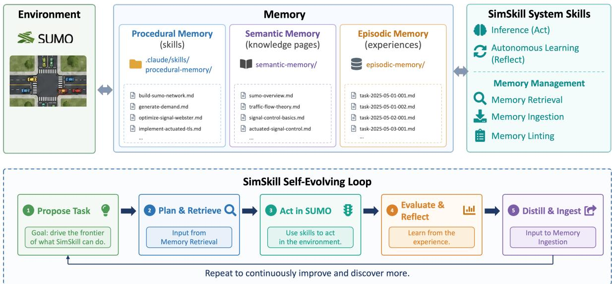  
Figure 1: Simplified architecture of SimSkill. A language-model runtime coordinates interaction with SUMO and three complementary external memory stores. SimSkill system skills implement inference, autonomous learning, retrieval, ingestion, and linting, while the lower loop summarizes continual task proposal, memory-guided action, evaluation, and consolidation. Memory merging and change logging are omitted from this simplified view and appear in Figure 4.

SimSkill Architecture. These four premises determine the structure shown in Figure 1. At learning iteration t, the persistent state of SimSkill is

$$
\mathcal { M } _ { t } = ( \mathcal { E } _ { t } , \mathcal { P } _ { t } , \mathcal { S } _ { t } ) ,\tag{2}
$$

where $\mathcal { E } _ { t } , \mathcal { P } _ { t } ,$ and $S _ { t }$ denote episodic, procedural, and semantic memory, respectively. The system evolves by adding, revising, linking, validating, and consolidating these explicit artifacts.

Claude Code provides the filesystem, tool-use, and sub-agent runtime, while a compatible LLM backend can be changed without altering the stored memory. Seven natural-language system skills specify the control logic: learn, infer, memory-retrieve, memory-ingest, memory-merge, memory-lint, and log. Three role-specialized agents—curriculum-agent, action-agent, and critic-agent— propose tasks, execute them, and independently evaluate the resulting evidence. The resulting loop is simple: propose a task, retrieve relevant memory, act in the environment, evaluate the result, and distill reusable outcomes. The next iteration begins from the updated memory state. The exploration mechanism is inspired by Voyager [WXJ<sup>+</sup>23], while the richer memory structure allows SimSkill to retain not only executable behavior but also declarative knowledge and the evidence from which both were learned.

## 3.2 Tripartite Memory and Experience Consolidation

Short-lived observations and intermediate reasoning remain in the active LLM context as working memory; they are not part of the persistent state in Equation 2. The purpose of SimSkill’s persistent memory is not merely to retain more text, but to preserve diferent products of learning at appropriate levels of abstraction. Episodic memory records what happened, procedural memory records how to act, and semantic memory records what is known. Semantic and procedural memory can be viewed as two complementary compressions of episodic experience: the former abstracts regularities about the environment, whereas the latter abstracts reusable patterns of action.

Episodic memory. Every attempted task produces a timestamped episode in episodic-memory/. An episode contains the original task, success status, memory items used, and the complete sequence of action–critic attempts. For each attempt, SimSkill preserves the action agent’s report, the critic’s evidence and verdict, and any scripts that were created or executed. The episode also contains the final deliverables and a concise summary specifying the method, reproducible commands, measured results, and the transition between successive attempts. Failed attempts are retained rather than overwritten by the final solution. Episodic memory consequently serves as an auditable evidence layer: it records not only the answer reached, but also how claims were tested and why revisions were made.

Procedural memory. Procedural memory is stored as Claude Code skills [Ant26]. Each skill is a directory containing a required SKILL.md file and optional scripts/, references/, and assets/ directories. YAML front matter provides a unique name and a retrieval-oriented description, while the Markdown body describes when and how the procedure should be applied, including assumptions, validation checks, and known failure modes. Executable scripts capture operations that should be repeated exactly. A skill may invoke simpler skills or link to relevant knowledge pages, allowing complex capabilities to be built compositionally. Unlike a library in which each skill is a single fixed function, this representation can combine flexible natural-language strategy with reproducible executable components.

This artifact representation has three additional advantages. First, the same format spans a continuum from soft interactional behavior to rigid task execution. Natural-language instructions can express preferences, heuristics, explanation conventions, and context-dependent judgments, whereas bundled scripts can implement operations that require exact and repeatable execution. A skill may combine both forms, allowing the LLM to adapt the procedure to a new situation while delegating its deterministic steps to code. Second, externalized skills make acquired capabilities transparent, editable, and attributable. Users and developers can inspect the rules and scripts, revise an incorrect assumption locally, examine links to supporting knowledge and experience, and identify which retrieved skills influenced a later solution because skill use is recorded in the action report and episodic memory.

Consequently, a completed interaction need not remain an ephemeral transcript or an opaque change in model behavior. SimSkill can distill its reusable procedural content into a persistent artifact that can be retrieved across sessions, refined when new evidence arrives, composed with other skills, and shared without modifying the backbone model. This explicitness is central to the framework’s approach to cumulative competence.

Listing 1 gives the file-level contract. The description is deliberately operational: it is the firststage retrieval key and must state both what the skill does and when it should be selected. Detailed references and deterministic operations are moved out of the instruction body so that they can be loaded or executed only when needed.

## Listing 1: Procedural-memory skill format.

your−s k i l l −name/   
− SKILL .md # r e q u i r e d i n s t r u c t i o n s   
s c r i p t s / # o p t i o n a l e x e c u t a b l e c o d e   
|−− p r o c e s s d a t a . py   
‘−− v a l i d a t e . sh   
− r e fe r e n c e s / # o p t i o n a l d e t a i l e d m a t e r i a l   
|−− api−guide .md   
‘−− examples /   
a s s e t s / # o p t i o n a l t e m p l a t e s / r e s o u r c e s   
‘−− r e p o r t −template .md

## # SKILL .md

d e s c r i p t i o n : What the s k i l l does and when to use i t .

\# S k i l l T i t l e

Natural−l a n g u a g e p r o c e d u r e , assumptions , v a l i d a t i o n s t e p s ,

known f a i l u r e modes , and l i n k s t o r e l a t e d s k i l l s o r k n o w l e d g e .

summary : One or two s e n t e n c e s d e s c r i b i n g the concept .   
keywords :   
− keyword−1   
− keyword−2   
created : YYYY−MM−DDThh:mm: ss   
last updated : YYYY−MM−DDThh:mm: ss   
s o u r c e s :   
− ” [ [ raw−m a t e r i a l s / source − f i l e .md ] ] ”   
− https : / / example . com/ so urce   
r e l a t e d p a g e s :   
− ” [ [ r e l a t e d −c o n c e p t ] ] ”   
r e l a t e d s k i l l s :   
− r e l a t e d − s k i l l   
# Concept T i t l e   
S y n t h e s i z e d f a c t s , e x p l a n a t i o n s , q u a l i f i c a t i o n s , and l i n k s t o   
r e l a t e d c o n c e p t s , s o u r c e m a t e r i a l s , and p r o c e d u r a l s k i l l s .

Semantic memory. Semantic memory is a persistent, LLM-maintained knowledge base inspired by the LLM Wiki pattern [Kar26] and represented in a form compatible with the principles of the Open Knowledge Format [MH26]. Each concept is stored as one Markdown page in semantic-memory/. Its front matter contains a summary, retrieval keywords, creation and update times, provenance sources, related pages, and related skills. Wiki links connect concepts into a graph, and citations point either to external sources or to source material retained in raw-materials/. A compact index exposes the summary and keywords of every page, enabling the agent to search the knowledge base without loading all page bodies. The knowledge base is therefore a compiled and revisable synthesis, rather than a collection of raw chunks that must be reconstructed at every query.

Each page’s lowercase, hyphenated filename is its identity. Listing 2 shows the required representation. The summary and keywords fields are copied into semantic-memory/index.md for first-stage retrieval; sources preserve provenance; and related pages and related skills connect declarative knowledge to the procedures that use it.

## Listing 2: Semantic-memory knowledge-page format.

## # semantic−memory/ concept−name .md

Figure 2 shows how this schema appears in a rendered knowledge page. Retrieval metadata and provenance remain in YAML front matter, while the body contains the synthesized explanation. The relation fields connect the concept both to neighboring declarative knowledge and to the procedural skills that operationalize it.

Retrieval. Given a task q, memory retrieval first matches q against skill descriptions and the summaries and keywords in the semantic index. It returns a bounded candidate set

$$
\mathcal { R } ( q ) = \mathrm { T o p K } ( q ; \mathcal { P } _ { t } \cup \mathcal { S } _ { t } ) , \qquad | \mathcal { R } ( q ) | \leq 1 0 ,\tag{3}
$$

after which full skill or page content is loaded only if it is needed. This two-stage, lazy-loading policy limits context growth while preserving access to a much larger external store. Raw episodes are not routinely replayed during task execution. They remain available for audit and for curriculum decisions—especially when a previously failed task may now be solvable—while their transferable content is expected to be consolidated into procedural or semantic memory.

Consolidation. After an episode $e _ { t }$ has been completed and evaluated, the memory-ingestion process applies an LLM-based consolidation operator

$$
\left( \mathcal { P } _ { t + 1 } , S _ { t + 1 } \right) = \mathcal { T } ( \mathcal { P } _ { t } , S _ { t } , e _ { t } ) .\tag{4}
$$

The operator first asks whether the episode contains anything novel and reusable. A procedural lesson may create a new skill, extend an existing skill to a broader case, or correct a previously discovered defect. A declarative lesson may create or revise a knowledge page. Both outcomes may occur for the same episode, and ingestion is skipped when no reusable contribution is found. Before creating an artifact, the agent searches for a semantically similar item and updates it when appropriate; this favors cumulative refinement over near-duplicate proliferation. New and revised pages are cross-linked to related pages and skills, the semantic index is synchronized, and every change is appended to a shared log. In this way, consolidation implements experience compression along two axes: what appears to be true and how a class of tasks can be performed.

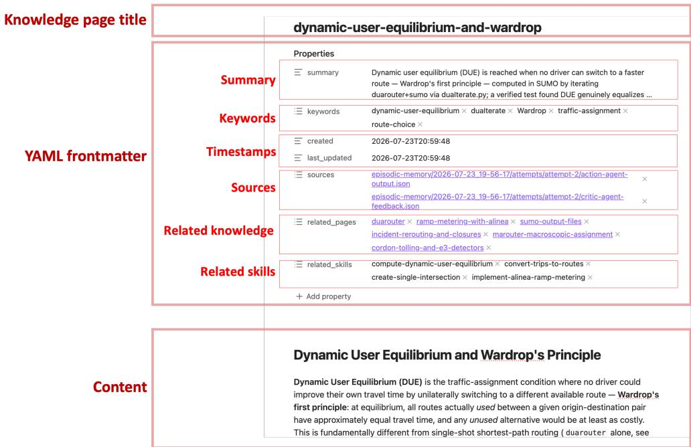  
Figure 2: An example semantic-memory knowledge page. The YAML front matter contains the retrieval summary, keywords, timestamps, provenance sources, related knowledge pages, and related procedural skills; the Markdown body stores the synthesized declarative content.

Listing 3 presents the operational core of the two system skills that connect active reasoning to long-term memory. It is a condensed transcription of their natural-language instructions; reporting and file-naming rules are omitted here but remain part of the executable skill definitions.

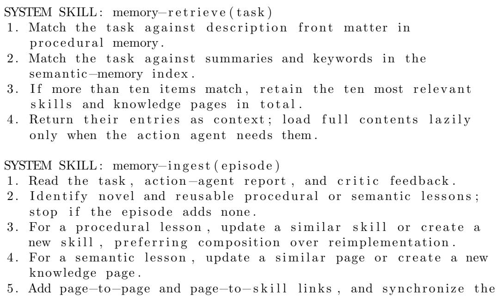

semantic−memory index .

6 . Record e v e r y a c c e p t e d change i n the s h a r e d memory l o g .

Memory Maintenance. Explicit memory does not eliminate the stability–plasticity problem, but converts it from opaque interference among model parameters into a tractable artifact-management problem. New evidence can be incorporated locally, while existing content remains visible and can be tested for compatibility. Because continual learning does not update model parameters, Sim-Skill also sidesteps parameter-level catastrophic forgetting [KPR<sup>+</sup>17]. SimSkill periodically invokes memory-lint to compare newly changed items against the full memory collection, merge genuine duplicates, repair broken or drifted references, remove fully superseded artifacts, and synchronize the semantic index. Incremental linting is triggered after a configurable number of changes (ten by default), while full linting checks the entire collection. A shared append-only log allows this process to determine its incremental scope without loading the growing history into the LLM context. Externally contributed memory can be processed by memory-merge: new skills are executed on representative tasks before acceptance, and updates are rejected when compatibility with local dependents cannot be established. The current implementation uses consolidation, supersession, and merging rather than age-based memory decay; automatic forgetting by access frequency is left for future work. Listing 4 condenses the operative workflow of memory-lint.

Listing 4: Core memory-maintenance system skill.

SYSTEM SKILL : memory−l i n t ( mode = i n c r e m e n t a l | f u l l )

1 . Query the shared l o g fo r changed−item names and count .

2 . Determine s c o p e :

a . i n c r e m e n t a l : s t o p below the change t h r e s h o l d ; o t h e r w i s e i n s p e c t changed items a g a i n s t the f u l l memory c o l l e c t i o n ;

b . f u l l : i n s p e c t every p r o c e d u r a l s k i l l and semantic page .

3 . For p r o c e d u r a l memory :

a . merge only genuine d u p l i c a t e s ;

b . r e p a i r d r i ft e d names , paths , arguments , and i n t e r f a c e s ;

c . r e p l a c e s t a n d a l o n e p r o c e d u r e s with v e r i f i e d c o m p o s i t i o n s where a p p r o p r i a t e ;

d . remove s u p e r s e d e d s k i l l s and r e d i r e c t t h e i r d e p e n d e n t s .

4 . For s e m a n t i c memory :

a . merge g e n u i n e d u p l i c a t e s and remove s u p e r s e d e d p a g e s ;

b . r e p a i r p a g e l i n k s and r e l a t e d − s k i l l r e f e r e n c e s .

5 . S y n c h r o n i z e t h e s e m a n t i c i n d e x with t h e r e s u l t i n g p a g e s .

6 . Record e v e r y change , c l o s e t h e c u r r e n t l i n t i n t e r v a l , and open t h e next i n t e r v a l i n t h e s h a r e d l o g .

7 . Report merges , r e p a i r s , removals , and p r e s e r v e d d i s t i n c t i o n s .

The explicit related pages and related skills fields make the accumulated structure inspectable as a graph. Figure 3 shows both the full procedural–semantic memory network and a local neighborhood centered on emergency-vehicle preemption. The graph is primarily a human-facing diagnostic and navigation view; task-time retrieval continues to use the bounded metadata-first process in Equation 3.

## 3.3 Autonomous Self-Evolution

Autonomous learning is implemented as a continual curriculum–execution–consolidation loop, shown on the left of Figure 4. At the beginning of each iteration, SimSkill runs incremental memory maintenance and invokes the curriculum agent. Let $\mathcal { E } _ { t } ^ { \mathrm { f a i l } } \subseteq \mathcal { E } _ { t }$ denote prior unsuccessful episodes. The next task is proposed as

$$
q _ { t } = \mathcal { C } \big ( \mathcal { P } _ { t } , \mathcal { S } _ { t } , \mathcal { E } _ { t } ^ { \mathrm { f a i l } } \big ) ,\tag{5}
$$

where C is realized by the curriculum agent’s natural-language policy. The agent first inspects current skill coverage, the semantic index, and prior failures; it then identifies a capability gap and explains why the proposed task is the appropriate next step. Tasks must be novel or genuinely extend an existing capability, achievable using current competence plus a reasonable increment of new work, and progressively more demanding. In the SUMO instantiation, coverage is considered across network construction, demand generation, signal configuration and optimization, simulation execution, and post-processing. This produces an adaptive curriculum rather than a fixed task list.

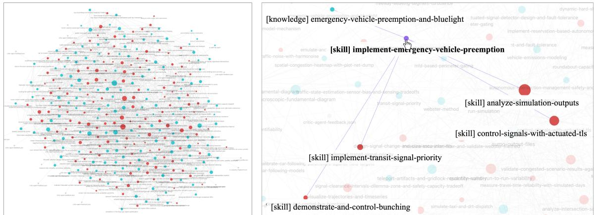  
(a) Graph view of semantic and procedural memory. Blue dots denote semantic memory skills, and red dots denote procedural memory knowledge pages.  
(b) Graph-based representation of relationships between semantic and procedural memory. The example illustrates the connections between the skill “Implement Emergency Vehicle Preemption," related skills such as “Control Signals with Actuated TLS" and “Implement Transit Signal Priority," and the knowledge page “Emergency Vehicle Preemption and Blue Light."  
Figure 3: Graph view of accumulated procedural and semantic memory. The left panel shows the collection-level network of skills, knowledge pages, and their explicit links; the right panel expands a local neighborhood around emergency-vehicle-preemption knowledge and its related procedural skills.

The core control flow is itself represented as natural-language system skills. Listing 5 condenses the operative steps of learn and infer. The former is the persistent autonomous-learning loop; the latter is a complete task-solving transaction and is invoked both by learn and by direct user requests.

## Listing 5: Core autonomous-learning and inference system skills.

SYSTEM SKILL : l ea rn   
1 . Load memory−l i n t and i n fe r .   
2 . Repeat :   
a . Run memory−l i n t in incremental mode .   
b . Ask c u r r i c u l u m −a g e n t f o r t h e next n o v e l t a s k .   
c . Invoke i n fe r on that task in normal mode .   
3 . Stop when t h e u s e r r e q u e s t s ; r e p o r t memory c h a n g e s .   
4 . Pause f o r g u i d a n c e a f t e r t e n i t e r a t i o n s with no memory change .

SYSTEM SKILL : i n fe r ( task , mode = normal )   
1 . R e t r i e v e task−r e l e v a n t p r o c e d u r a l and semantic memory .   
2 . I n i t i a l i z e an empty c r i t i c −fe e d b a c k h i s t o r y .   
3 . Repeat fo r at most t h r e e o u t e r attempts :   
a . I nv ok e a c t i o n −a g e n t with t h e t a s k , r e t r i e v e d memory , and   
a l l accumulated c r i t i c f e e d b a c k . The a c t i o n a g e n t may   
i n t e r n a l l y r e t r y s c r i p t e x e c u t i o n up t o f i v e t i m e s .   
b . I n v o k e c r i t i c −a g e n t t o i n d e p e n d e n t l y e v a l u a t e t h e r e s u l t .   
c . Append t h e c r i t i c f e e d b a c k t o t h e f e e d b a c k h i s t o r y .   
d . S t o p i f t h e t a s k i s c o m p l e t e ; o t h e r w i s e r e t r y s t e p 3 a .   
4 . Save e v e r y o u t e r attempt , v e r d i c t , s c r i p t , and f i n a l o u tp ut   
to e p i s o d i c memory .   
5 . I n normal mode , i n v o k e memory−i n g e s t ; i n t e s t mode , s k i p i t .

Each proposed task is passed to the same infer process used for user requests. The retriever supplies R(q<sub>t</sub>), and the action agent constructs a solution using those memories together with native environment tools. It writes and executes the required scripts, inspects simulator output, and corrects minor execution errors internally. Its output is a structured report containing the memories used, created artifacts, exact reproduction commands, measured results, and any retries. Requiring execution and concrete outputs distinguishes an environment-grounded experience from an untested textual answer.

An independently prompted critic then evaluates the candidate. For outer attempt $j ,$ the interaction can be summarized as

$$
\begin{array} { c } { x _ { t } ^ { ( j ) } = \boldsymbol { \mathcal { A } } \left( \boldsymbol { q } _ { t } , \mathcal { R } ( \boldsymbol { q } _ { t } ) , f _ { t } ^ { ( < j ) } \right) , } \\ { \left( v _ { t } ^ { ( j ) } , f _ { t } ^ { ( j ) } \right) = \mathcal { V } \left( \boldsymbol { q } _ { t } , x _ { t } ^ { ( j ) } \right) , } \end{array}\tag{6}
$$

where $\boldsymbol { x } _ { t } ^ { ( j ) }$ is the action agent’s executed solution, $v _ { t } ^ { ( j ) }$ is the completion verdict, and $f _ { t } ^ { ( j ) }$ is evidencebased feedback. The critic checks reproducibility, correspondence between claims and artifacts, silent failures such as empty outputs or unrouted demand, and coverage of every requested subtask.

The action agent and infer maintain two nested retry loops at diferent abstraction levels. The inner execution loop belongs to one invocation of the action agent. It addresses local implementation failures—for example, syntax errors, incorrect paths or arguments, simulator runtime errors, and malformed or empty output—by modifying and rerunning scripts until execution succeeds or the fiveattempt limit is reached. The action agent then emits one structured report for that outer attempt, including a concise account of its failures and retries. The outer design loop belongs to infer. After the action agent returns, the critic asks whether the executed solution actually satisfies the task. A negative verdict may expose a wrong modeling assumption, an omitted requirement, an invalid evaluation design, or a silent failure that successful execution alone did not reveal. In that case, infer invokes a new action agent, up to three outer attempts by default.

Information crosses the loop boundary selectively. Every critic response $f _ { t } ^ { ( j ) }$ is appended to the feed back history $f _ { t } ^ { ( < j + 1 ) }$ and supplied to the next action-agent invocation, preventing previously identified design errors from being repeated. By contrast, the raw command-by-command debugging trajectory of the inner loop is not inserted into later outer contexts. Its structured report—including a concise failures-and-retries account—and the produced scripts and artifacts are retained as the record of that outer attempt. All outer action reports and critic verdicts are subsequently preserved in episodic memory. This separation keeps routine debugging from consuming the design-revision context while retaining the feedback needed for cumulative correction.

When the critic accepts the result or the attempt limit is reached, SimSkill writes the full episode to $\mathcal { E } _ { t + 1 }$ and invokes the consolidation operator in Equation 4. Importantly, ingestion is based on reusable evidence rather than success alone. A failed task may still update a skill with a newly discovered limitation or create semantic knowledge about an invalid modeling assumption. Conversely, a successfu task need not change memory if it merely repeats known procedures. The next curriculum iteration therefore operates on the capabilities and gaps revealed by the previous one. Learning continues unti the user stops it; as a safeguard against unproductive cycling, the current implementation pauses after ten consecutive iterations that produce no procedural or semantic change.

Preventing context explosion. Because SimSkill’s external memory grows throughout its lifetime, the framework treats the context window as a bounded working resource rather than loading persistent state wholesale. First, memory retrieval is metadata-first and lazy. The retrieval skill initially searches only procedural-skill descriptions and the summaries and keywords in the semantic-memory index, retains at most ten candidates across the two memory types, and loads complete skill definitions, scripts, references, or knowledge pages only when they are needed for the current task. Raw episodic records are likewise not replayed by default, because their transferable content is consolidated into procedural and semantic memory during ingestion.

Second, routine bookkeeping is delegated to lightweight script tools. For example, the system’s log skill updates the append-only log.md through scripts/log manager.py instead of placing the complete and continually growing log in the LLM context. Targeted operations append an item, return the number or names of open items, or close a lint interval; only a scalar, short list, compact JSON object, or confirmation is returned to the agent. Incremental memory linting can therefore use the returned item names to inspect recently changed artifacts without repeatedly loading the full change history.

Third, role-specialized sub-agents isolate transient details in separate contexts. The curriculum, action, and critic agents receive only the information required by their roles and return fixed-schema reports to the orchestration loop. In particular, accumulated critic feedback is passed to the action agent across outer inference attempts so that major design mistakes are not repeated, whereas command-level debugging traces from the action agent’s inner script-repair loop remain local and are not copied into subsequent attempts. Together with bounded retrieval and finite retry limits, these mechanisms prevent active-context consumption from growing in proportion to accumulated experience while preserving detailed evidence and reusable artifacts in external storage.

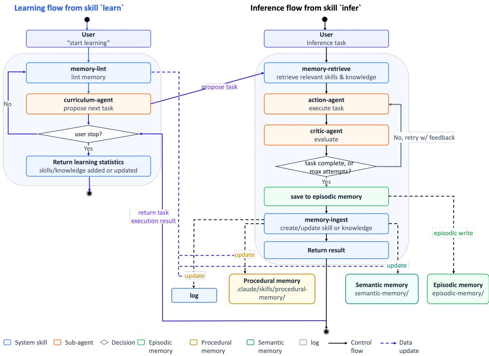  
Figure 4: Detailed SimSkill learning, inference, and memory-management workflows. Autonomous learning (left) uses direct inference (right) as an inner process: the curriculum agent proposes a task, inference retrieves memory and iterates between execution and criticism, completed attempts are written to episodic memory, and reusable outcomes update procedural and semantic memory. The lower portion shows raw-material ingestion, the shared change log, and the validation and integration of externally contributed memory through memory-merge.

## 3.4 Learning-Time and User-Directed Task Execution

In the current implementation, the same infer skill serves both learning-time task execution and userdirected inference. The autonomous learn process invokes it after the curriculum agent proposes a task, whereas a user request enters it directly, bypassing curriculum generation and routine linting. In both cases, SimSkill retrieves relevant procedural and semantic memory and applies the action–critic protocol shown on the right of Figure 4. This shared implementation makes capabilities acquired during exploration immediately available to users and gives both entry points a consistent execution standard.

The current infer skill also supports two memory-write policies. Normal mode records the episode and considers it for procedural or semantic ingestion, allowing user interactions as well as autonomous tasks to improve future performance. Test mode retains the episode for reproducibility but disables ingestion, leaving procedural and semantic memory frozen for controlled evaluation.

Sharing one execution policy is an implementation choice rather than an architectural requirement. Learning-time execution benefits from stringent criticism, retries, and artifact checks because an undetected error may be consolidated into memory and influence many future tasks. User-facing inference may instead prioritize latency or cost; a deployment could omit the critic verdict, reduce retry limits, or disable write-back, accepting a corresponding reduction in assurance. Conversely, high-stakes applications may require stronger verification than autonomous exploration. Because memory retrieval and representation are separated from task-execution policy, these two paths can be configured and optimized independently. The experiments in Section 5 evaluate the current shared action–critic implementation, not these alternative deployment policies.

## 3.5 Instantiation in the SUMO Environment

SimSkill instantiates the general framework in SUMO [BBEK11, Ecl26]. The environment exposes diverse, compositional operations: constructing and validating road networks, synthesizing and routing demand, configuring signal controllers, executing microscopic or mesoscopic simulations, interacting with vehicles and infrastructure at runtime, and analyzing quantitative outputs. These operations supply both an open-ended capability space and concrete feedback, making SUMO suitable for studying cumulative agent learning.

Domain specialization enters at three points. First, the curriculum policy is instructed to reason as a transportation engineer and to search for gaps across the five principal stages of a simulation study. Second, the action and critic agents are given SUMO-specific responsibilities: the action agent must execute native tools and produce actual simulation artifacts, while the critic checks routing, simulator warnings, non-empty outputs, metric validity, and the completeness of multi-stage analyses. Third, procedural and semantic memory use trafic-simulation concepts as their retrieval vocabulary and cross-link skills to the corresponding domain knowledge.

The action space deliberately consists of native interfaces rather than a fixed catalog of wrapper tools. The action agent can write Python or shell scripts, invoke SUMO command-line programs, inspect XML and output files, and control a running simulation through TraCI. We do not require an additional Model Context Protocol (MCP) layer because direct access avoids committing the learned skills to a particular wrapper design and leaves the agent free to use newly discovered SUMO functionality. MCP remains compatible with the framework and may be advantageous when the same abstract operation must be mapped to multiple simulators or when tools are distributed across machines; it is not required for self-evolution itself.

The system can begin with empty procedural and semantic stores, although a small seed collection accelerates early exploration. In our implementation, the seed covers only foundational operations such as creating an isolated intersection, generating random demand, running a simulation, accessing vehicle state, and basic knowledge of abstract network generation and TraCI. It does not encode advanced analyses or a fixed progression of tasks. From this starting point, the same curriculum, verification, and consolidation mechanisms are responsible for expanding coverage. Consequently, the SUMO-specific content resides primarily in the accumulated memory, while the self-evolving mechanism remains applicable to other executable domains that provide tools, observable outcomes, and reusable structure.

## 4 Case Studies

This section presents representative episodes from SimSkill’s autonomous learning process. Together, they demonstrate curriculum construction, memory retrieval and task decomposition, revision through criticism, learning from unsuccessful tasks, composition and repair of existing skills, and collectionwide memory maintenance. At the snapshot considered here, approximately 80 hours of autonomous operation over five days on a MacBook Pro with an M1 Max processor, using claude-opus-5 as the principal backbone, had produced 150 procedural skills and 153 semantic-memory pages.

## 4.1 Curriculum Construction, Retrieval, and Task Decomposition

The curriculum agent searches for missing capabilities and decision variables rather than merely for absent topic names. For example, the memory already contained methods for estimating an origin– destination (OD) matrix from trafic counts, but every method treated count locations as fixed. The agent therefore proposed count-station placement as a new decision problem, comparing random, volume-greedy, rule-based, observability-based, and D-optimal designs across sensor budgets. In another iteration, it found that the signal-control collection contained ofline and reactive controllers but no method that optimized future switching decisions against predicted arrivals. That gap led to the predictive-control episode in Section 4.3.

Table 1: Successive revisions of the assumed simulator limitation in the shared-micromobility episode.
<table><tr><td></td><td>Attempt Provisional claim</td><td>Refuting evidence and correction</td></tr><tr><td>1</td><td>A finite bicycle fleet cannot be ra- tioned because a bicycle requested by a traveler is created implicitly.</td><td>A controlled test showed that a named fleet can be ra- tioned with a person-triggered stop; demand can there- fore be denied while all vehicles are occupied.</td></tr><tr><td>2</td><td>SUMO cannot bind a traveler to whichever shared bicycle is available.</td><td>The lines=&quot;ANY&quot; mechanism performs runtime bind- ing. The negative test had been confounded by discon- nected and one-edge decoy routes and by suppressed route errors.</td></tr><tr><td>3</td><td>A vehicle cannot wait as station in- ventory and later carry a traveler.</td><td>The incompatibility resulted from vehicle-capacity and stop-holding settings. Corrected capacity and stop- extension semantics allowed the same vehicle to serve both roles.</td></tr></table>

Retrieval makes such tasks cumulative rather than independent. For the complex multimodal portfolio task PP-T4-3-V2, the retriever selected eight procedural skills and two semantic pages covering grid construction, OD demand, transit, accessibility and equity, benefit–cost analysis, constrained network design, project interactions, and simulation execution. The action agent then decomposed the task into network construction, demand generation, experimental design, simulation, surrogate fitting, stress testing, distributional analysis, and appraisal. No retrieved artifact solved the complete task; the retrieved set supplied complementary components and constraints from which the agent constructed a task-specific workflow. An abridged trace of the retrieved memories and decomposition is given in Listing 6 in Appendix A.

In the observed 150-skill, 153-page collection, Claude Code’s built-in file search combined with metadata-first retrieval remained adequate and did not become the dominant bottleneck. This is an empirical observation at the present scale, not a claim of indefinite scalability: a library containing tens of thousands of artifacts may require hierarchical indexing, learned retrieval, or domain-specific routing. SimSkill separates retrieval policy from memory representation, allowing the retriever to be replaced without changing the stored skills, knowledge pages, or learning loop.

## 4.2 Learning from an Unsuccessful Task

A station-based shared-micromobility episode shows why task failure need not imply learning failure. The curriculum agent correctly detected that the memory lacked a model of a reusable physical asset whose inventory moves among stations, but it further inferred that SUMO lacked the required primitive. The action agent attempted three times to establish this premise, and each attempt was rejected after a more discriminating test revealed that the apparent limitation was caused by the test design. Table 1 summarizes the progression.

Because the motivating claim did not survive verification, SimSkill created no procedural skill. It instead created the semantic page station-based-shared-micromobility-in-sumo, which records the measured boundary between native functionality and the residual need for external control logic. It also corrected two existing knowledge pages concerning stop-output fields and ofline observation of parking-area occupancy. The reusable outcome was therefore a better account of what the environment supports, not a procedure justified by a false premise.

The episode also changed the curriculum policy itself. From the repeated refutations, rather than from a manually supplied rule, the agent distilled the principle that “memory is silent about X” implies only that X is not covered by memory; it does not establish that the environment cannot provide X. Subsequent tasks premised on a missing simulator capability were required to challenge that premise through documentation, source inspection, and adversarial control–treatment tests. The agent also relaxed its novelty bias: characterization, validation, comparison, and integration can yield valuable learning tasks without first asserting a simulator deficiency. Its next demand-reconstruction task consequently verified that SUMO provides tracemapper.py and route2OD.py before identifying the genuine gap—the memory covered reconstruction from fixed-point counts but not from sparse GPS trajectories. Appendix A preserves the corresponding curriculum trace in Listing 7.

Table 2: Memory changes produced by the predictive-control episode.
<table><tr><td>Operation</td><td>Artifact</td><td>Retained contribution</td></tr><tr><td>New procedural skill</td><td>implement-predictive- rolling-horizon-signal-</td><td>Reusable controllers, predictor interfaces, validation checks, and benchmarking rules; three scripts were bundled with the skill.</td></tr><tr><td>Procedural updates</td><td>control build-rolling-horizon- traffic-forecast-with- state-warm-start; optimize-under-simulation-</td><td>Qualified state restoration and required a candidate controller&#x27;s own constraints to be tested before comparison.</td></tr><tr><td>New semantic page</td><td>noise-with-a-fixed-budget value-of-anticipation-in-</td><td>Recorded when anticipation was useful and</td></tr><tr><td></td><td>predictive-signal-control</td><td>which factors limited its value.</td></tr><tr><td>Semantic update</td><td colspan="2">state-serialization-and- Refined prior claims about simulator-state</td></tr><tr><td></td><td>rolling-horizon-traffic-forecastingestoration under TraCI control.</td><td></td></tr></table>

## 4.3 Acquisition of a Predictive-Control Skill

The predictive rolling-horizon signal-control episode, recorded as the acquisition of the 147th learned task skill, illustrates the complete learning pipeline. The curriculum agent identified anticipatory control as a gap in a library of ofline and reactive controllers. Retrieval then supplied adjacent capabilities—closed-loop control, rolling-horizon forecasting, detector design, baseline signal timing, and stochastic evaluation—which the action agent composed into a new solution.

The first action-agent attempt produced executable artifacts and a complete report, but the critic rejected it because key claims were insuficiently verified and a design confound undermined the controller comparison. The critic’s findings were passed to a fresh action-agent iteration, whereas loca timeout recovery and script-debugging details remained isolated within the first attempt. After revising the experimental design and independently validating the critical claims, the second attempt was accepted. The episode thus demonstrates the division between the inner execution loop, which repairs operational errors, and the outer action–critic loop, which addresses conceptual and methodologica errors.

Although the study did not establish an advantage for predictive control, it yielded reusable procedures, validation rules, and knowledge about the method’s operating boundary. Ingestion therefore created a new skill and semantic page while revising related artifacts whose assumptions had been tested more rigorously, as summarized in Table 2.

After ingestion, an incremental memory-lint pass verified the changed artifacts, bundled scripts, and cross-references against the full collection. The more detailed phase-by-phase trace is provided in Listing 8 in Appendix A.

## 4.4 Compositional Acquisition and Consistent Repair

The GPS map-matching episode illustrates how SimSkill acquires a capability by composing existing ones. The action agent combined procedures for network import, demand reconstruction, stochastic evaluation, and output analysis to produce map-match-gps-traces-to-reconstruct-demand, together with four reusable scripts. The new skill was therefore built from accumulated procedural memory rather than developed as an isolated solution.

Composition also tested an older dependency in a new setting. A reused script from load-osm-network failed because of incorrect command-line argument handling. The action agent diagnosed and repaired the defect, after which ingestion updated the dependency together with the new skill and related semantic knowledge. Table 3 summarizes this coordinated transaction.

This case shows that skill reuse serves both composition and continued validation. New capabilities can build on previously learned scripts, while failures encountered during reuse provide evidence for correcting earlier memory. Because the new skill, repaired dependency, and semantic updates were committed together, subsequent agents receive a consistent set of artifacts. A more detailed trace is provided in Listing 9 in Appendix A.

Table 3: Consistent memory update produced by the GPS map-matching episode.
<table><tr><td>Operation</td><td>Artifact</td><td>Retained contribution</td></tr><tr><td>New procedural</td><td>map-match-gps-traces-to-</td><td>A reusable trajectory-to-demand work-</td></tr><tr><td>skill Procedural repair</td><td>reconstruct-demand load-osm-network</td><td>flow with four bundled scripts. Corrected command-line handling in</td></tr><tr><td></td><td></td><td>both the wrapper script and its instruc- tions.</td></tr><tr><td>New semantic page</td><td>gps-map-matching-and- probe-demand-reconstruction</td><td>Recorded the method&#x27;s empirical behav- ior and operating conditions.</td></tr><tr><td>Semantic update</td><td>geh-statistic</td><td>Clarified the distinction between aggre- gate count fit and demand-recovery qual- ity.</td></tr></table>

## 4.5 Memory Maintenance as Library-Level Learning

As memory grows, episode-level ingestion alone cannot guarantee the health of the collection. New artifacts may overlap or conflict with existing ones, references and interfaces may become outdated, and errors in bundled scripts may silently propagate through later skill composition. memory-lint therefore performs collection-level quality control: it checks recent changes against existing memory, repairs inconsistencies, maintains cross-references, and identifies redundant or obsolete content. Table 4 presents representative examples.

Memory linting is essential because the usefulness of accumulated experience depends on its continued trustworthiness. It keeps memory correct by repairing content and executable defects, up to date by replacing drifted names and interfaces, connected by maintaining links and indexes, and relevant by controlling redundancy without merging capabilities that remain meaningfully distinct. When the evidence for a change is insuficient, the issue is recorded and deferred rather than resolved speculatively. Every check and modification is retained in log.md in the public repository, making the maintenance process auditable. Memory maintenance is therefore part of learning itself: it preserves a reliable foundation on which later retrieval and skill composition can operate.

## 4.6 Accumulated Capability and Retrieval Scale

The learned skills cover the end-to-end trafic-simulation workflow rather than a narrow family of controllers. Table 5 categorizes all 150 skills by primary function. Each skill is counted once for summary purposes, although many span category boundaries and explicitly link to skills in other groups. The complete name-level inventory is provided in Listing 10 in Appendix B.

## 4.7 Flexibility and Limits of Language-Specified Orchestration

In SimSkill, the high-level learning workflow is specified through natural-language system skills rather than a fully hard-coded control program. These instructions describe when to retrieve memory, delegate execution, request criticism, retry a task, record an episode, and update memory; the LLM interprets and coordinates these steps at runtime while invoking executable scripts for precise operations. This representation makes the workflow transparent, editable, and easy to extend as the system evolves.

The same flexibility introduces a reliability limitation: natural-language instructions are not enforced as deterministically as program control flow. In pilot runs with the weaker (e.g. claude-haiku) orchestrator, a polished success report from the action agent was occasionally interpreted as completion of the entire workflow. The orchestrator then stopped before critic evaluation, episodic recording, or memory ingestion. The underlying SUMO task had been solved, but the learning cycle had not been completed. This distinction shows that long-horizon orchestration and instruction following are system capabilities in their own right.

SimSkill combines language-based orchestration with explicit safeguards at points where an omitted step would compromise learning. It limits context growth through lazy memory loading, script-based log updates, and sub-agent isolation; its workflow instructions state that completion of an actionagent call is only an intermediate result, after which critic evaluation, episodic recording, and memory ingestion must continue; and an external completeness check verifies that all mandatory artifacts have been produced, resuming the session when necessary. These safeguards do not remove dependence on the backbone model, but they pair the adaptability of natural-language instructions with deterministic checks for critical workflow requirements.

Table 4: Representative memory-lint operations for maintaining memory health.
<table><tr><td>Memory-health issue</td><td>Observed evidence</td><td>Maintenance action</td></tr><tr><td>Broken, drifted, and po- tentially duplicate arti-</td><td>fcd-postprocessing to a nonexistent</td><td>linked Repaired the page and argument ref- page; erences. The possible merge was</td></tr><tr><td>facts</td><td>actuated-signal-control the obsolete --sumo-seed argument; two intersection-construction skills</td><td>used recorded but deferred because equiva- lence had not been established.</td></tr><tr><td>Executable metric bug</td><td>overlapped. Two scripts summed a cumulative teleport counter over all time steps, silently overcounting whenever tele-</td><td>Changed both scripts to read the fi- nal cumulative value and corrected the associated output-format knowl-</td></tr><tr><td>Incorrect skill identifier</td><td>ports occurred. A GLOSA skill referred to the procedural skill is named</td><td>edge page. Corrected the identifier and verified change-vehicle-state,although the reciprocal semantic-memory rela-</td></tr><tr><td>Incomplete reciprocal re- lation</td><td>set-vehicle-state. A departure-time-equilibrium skill omitted its relation to the Braess- paradox skill, although the route- choice, departure-time, and mode-</td><td>Added the missing related-skill entry; no merge or index change was needed.</td></tr><tr><td>Internal inconsistency and weak reference form</td><td>choice pages formed a connected conceptual group. A saturation-flow skill stated an unconditional estimator preference that contradicted a later qualifica-</td><td>Made the recommendation conditional on the stated stochasticity regime and converted the page name to an explicit</td></tr><tr><td>Apparent duplicate in a late-stage batch</td><td>tion; another skill named a page without a semantic-memory link. The nearest neighbors of two new skills were the older skills they in- tentionally composed; similarity was low and the descriptions already dis-</td><td>link. Preserved the skills, verified all scripts and links, and logged the non-merge so that later passes would not repeatedly reconsider it.</td></tr></table>

## 5 Experiments

We evaluate whether the explicit experience accumulated by SimSkill improves its ability to solve heldout trafic-simulation tasks. The experiment compares the complete system with both memory-ablated variants and a plain Claude Code baseline, while varying the backbone LLM and task dificulty. It addresses the following research questions:

RQ1 Task completion: Does the complete SimSkill system solve more tasks than the same inference framework without accumulated memory and than vanilla Claude Code?

RQ2 Backbone dependence: Are the efects consistent across diferent backbone LLMs, or do they depend on the model used to interpret and execute the framework or compatibility with Claude Code?

RQ3 Memory contribution: How much do procedural memory and semantic memory contribute individually and jointly, relative to the inference framework alone?

RQ4 Resource eficiency: How does memory change the trade-of between verified task completion, monetary cost, and wall-clock time?

Table 5: Primary-function distribution of the 150-skill procedural-memory snapshot.
<table><tr><td>Primary function</td><td>Count</td><td>Scope</td></tr><tr><td>Scenario construction, execution, and state</td><td>6</td><td>Simulation runners, numerical configuration, output inspection, and vehicle-state transfer.</td></tr><tr><td>Network and infrastructure design</td><td>12</td><td>Synthetic and imported networks, geometric fa- cilities, subnetworks, lane permissions, and for- mat fidelity.</td></tr><tr><td>Demand, routing, and assignment</td><td>17</td><td>Demand generation, OD conversion, assign- ment, route choice, equilibrium, and count- or trajectory-based reconstruction.</td></tr><tr><td>Signals and intersection control</td><td>30</td><td>Signal timing, adaptive and predictive control, progression, priority, intersection treatments, and roundabout control.</td></tr><tr><td>Freeway, corridor, and network operations</td><td>31</td><td>Interchanges, work zones, ramp control, man- aged facilities, incidents, pricing, resilience, and network management.</td></tr><tr><td>Transit, multimodal, fleet, and parking sys- tems</td><td>20</td><td>Transit planning and operations, rail, walking, cycling, parking, freight, taxis, and electrifica- tion.</td></tr><tr><td>Calibration, estimation, and experimental design</td><td>21</td><td>Behavioral and demand calibration, state and capacity estimation, sensitivity, stochastic repli- cation, forecasting, and analytical validation.</td></tr><tr><td>Impact analysis, validation, and visualiza- tion</td><td>13</td><td>Safety, environment, equity, economics, reliabil- ity, artifact diagnosis, and result communica-</td></tr><tr><td>Total</td><td>150</td><td>tion. Complete procedural-memory snapshot.</td></tr></table>

RQ5 Generalization: Do the benefits persist on held-out compositional and novel tasks rather than only on tasks closely resembling stored experience?

## 5.1 Experimental Setup

Benchmarks. We constructed two frozen benchmarks, each comprising 40 standalone tasks. Benchmark V1 spans ten capability areas: network generation, demand generation, signal control and optimization, TraCI-based closed-loop control, output analysis and visualization, surrogate safety assessment, emissions and energy analysis, multimodal transit, calibration, and cross-category integration. Its 40 tasks are evenly distributed across four dificulty tiers, with 10 tasks per tier; higher tiers require progressively more complex reasoning and stronger generalization.

Benchmark V2 concentrates on substantially more dificult engineering studies. It contains 40 tasks across network design, demand inference, signal control, freeway operations, multimodal transit, safety and human factors, environment and energy, freight and curb operations, planning and policy equity, and simulation methodology.

Five V1 tasks and ten V2 tasks use committed, tool-independent input fixtures such as detector counts, origin–destination matrices, trajectories, or General Transit Feed Specification data. All other information required to reproduce a task is contained in its prompt.

Systems and ablations. Table 6 defines the five conditions. The headline comparison uses the complete system (full-ver) and plain Claude Code (vanilla-cc) on both benchmarks with DeepSeek-V4-Pro, GLM-5.2, and Qwen3.7-Max. The five-way ablation is conducted on Benchmark V1 with DeepSeek-V4-Pro and Qwen3.7-Max. In every SimSkill condition, the orchestrator and its sub-agents use the same backbone model. The models are accessed through the same Claude Code-compatible execution interface; no model parameters are updated during evaluation.

Execution protocol. Each condition–model batch was instantiated in a disposable Git worktree. The appropriate memory directories and framework files were retained, emptied, or removed only inside that worktree. Every task was then run in a fresh, cold-context model session. SimSkill was invoked in test mode: it retrieved memory, executed the action–critic loop, and saved an episodic record, but did not ingest the benchmark experience into procedural or semantic memory. The vanilla condition was likewise required to save its artifacts in the common episodic format so that all outputs could be evaluated identically. At the end of a batch, the worktree was discarded; no evaluation artifact was merged into the memory under test. We obtained one run for each task–condition–model cell. Thus each headline endpoint contains 40 runs per condition, while each five-way ablation contains 200 runs per backbone.

Table 6: Experimental conditions. The four SimSkill conditions form a $2 \times 2$ design over procedural and semantic memory; the vanilla condition additionally removes the SimSkill inference framework.
<table><tr><td>Condition</td><td>Infer framework</td><td>Procedural memory</td><td>Semantic memory</td><td>Interpretation</td></tr><tr><td>full-ver</td><td>Yes</td><td>Yes</td><td>Yes</td><td>Complete SimSkill system.</td></tr><tr><td>proc-mem-ver</td><td>Yes</td><td>Yes</td><td>No</td><td>Isolates procedural skills while retaining the action-critic architecture.</td></tr><tr><td>sem-mem-ver</td><td>Yes</td><td>No</td><td>Yes</td><td>Isolates declarative knowledge while retain- ing the action-critic architecture.</td></tr><tr><td>infer-frame-only Yes</td><td></td><td>No</td><td>No</td><td>Retains retrieval control, sub-agents, criti- cism, and retry logic, but removes accumu-</td></tr><tr><td>vanilla-cc</td><td>No</td><td>No</td><td>No</td><td>lated memory content. Removes CLAUDE.md, SimSkill system skills, and SimSkill sub-agents; the model receives the task and ordinary execution tools only.</td></tr></table>

Independent evaluation. The primary outcome is independently verified completion. After a task session ended, Claude Opus 5 was launched in a separate, context-free Claude Code session and worktree. The judge received the original task text and the attempted episode, inspected scripts, configurations, outputs, and logs, reran safe simulations or validation scripts when practical, and checked reproducibility, scope, numerical claims, and silent failures. The task runner’s self-reported success was not used as the final verdict. A missing or indeterminate verdict is conservatively counted as unsolved in the fixed denominator of 40.

For the V2 DeepSeek-V4-Pro and Qwen3.7-Max runs, we additionally used GLM-5.2 as an independent pointwise judge. It decomposed each task into weighted requirements and assigned a completion score in [0, 1], where zero denotes no verifiable task-specific result and one denotes complete, correct, evidenced, and reproducible completion. This continuous score captures substantial partial progress that a binary verdict necessarily discards.

Cost and time metrics. We report the task-solving session’s dollar cost and total wall-clock time. Input, output, cache-creation, and cache-read tokens were repriced with a fixed provider-specific table dated 17 August 2026, using peak prices where a provider ofered time-varying rates. The wall-clock metric includes both model/tool orchestration and simulator execution and therefore represents userobserved elapsed time.

For condition c, let $\mathcal { E } _ { c }$ be the runs with both a conclusive independent verdict and an observed value of the budget metric. The plotted success-at-budget curve is

$$
A _ { c } ( b ) = \frac { 1 } { | \mathcal { E } _ { c } | } \sum _ { i \in \mathcal { E } _ { c } } \mathbf { 1 } [ V _ { c i } = 1 \ \wedge \ B _ { c i } \leq b ] ,\tag{7}
$$

where $V _ { c i }$ is the independent verdict and $B _ { c i }$ is either observed cost or wall-clock time. A verified failure remains in the denominator and never increments the curve. Median cost and time are also reported, but they are secondary: a condition that fails quickly can have a deceptively small median.

## 5.2 Main Results

Table 7 consolidates the headline endpoints and median resource use. Figures 5 and 6 show the corresponding empirical success-at-budget curves. The curves expose both eventual coverage and the budget required to reach it; markers denote runs that consumed resources but failed independent verification.

(SimSkill LLM=deepseek-v4-pro, Judge LLM=claude-opus-5)  
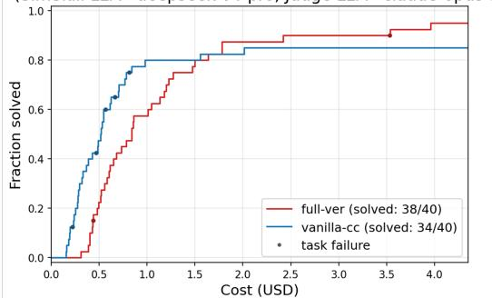

(SimSkill LLM=deepseek-v4-pro, Judge LLM=claude-opus-5)  
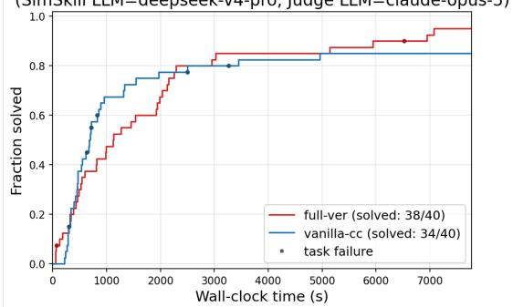  
(a) Success-at-budget curves by cost (LLM=deepseek-v4-pro) (b) Success-at-budget curves by wall-clock time (LLM=deepseek-v4-pro)

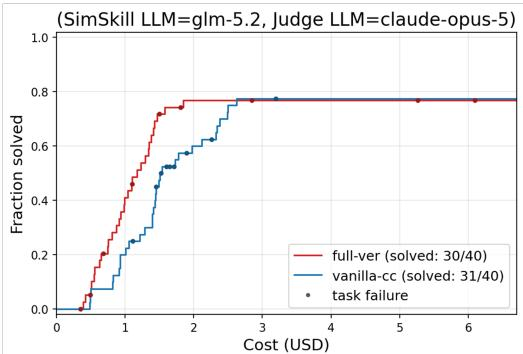  
(c) Success-at-budget curves by cost (LLM=glm-5.2)

(SimSkill LLM=glm-5.2, Judge LLM=claude-opus-5)  
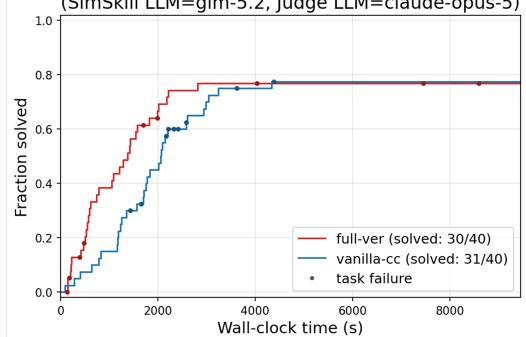  
(d) Success-at-budget curves by wall-clock time (LLM=glm-5.2)

(SimSkill LLM=qwen3.7-max, Judge LLM=claude-opus-5)  
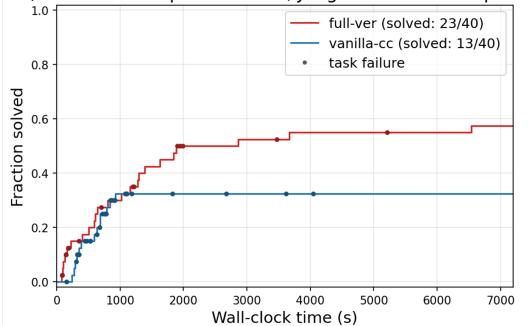  
(e) Success-at-budget curves by cost (LLM=qwen3.7-max)

(SimSkill LLM=qwen3.7-max, Judge LLM=claude-opus-5)  
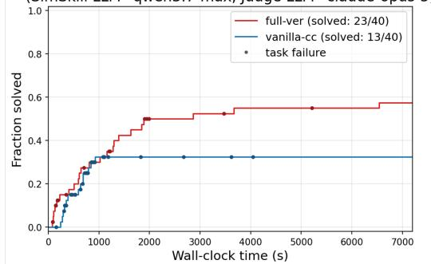  
(f) Success-at-budget curves by wall-clock time (LLM=qwen3.7-max)

Figure 5: Verified completion on Benchmark V1 as a function of observed monetary or wall-clock budget. Each panel uses the budget shown on its horizontal axis. Red curves show complete SimSkill and blue curves show vanilla Claude Code; endpoint labels give verified completions out of all 40 tasks, and markers locate verified failures at their consumed resource levels.

(SimSkill LLM=deepseek-v4-pro, Judge LLM=claude-opus-5)  
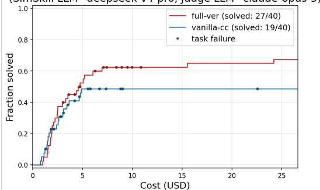

(SimSkill LLM=deepseek-v4-pro, Judge LLM=claude-opus-5)  
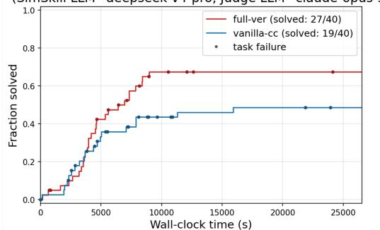  
(a) Success-at-budget curves by cost (LLM=deepseek-v4-pro) (b) Success-at-budget curves by wall-clock time (LLM=deepseek-v4-pro

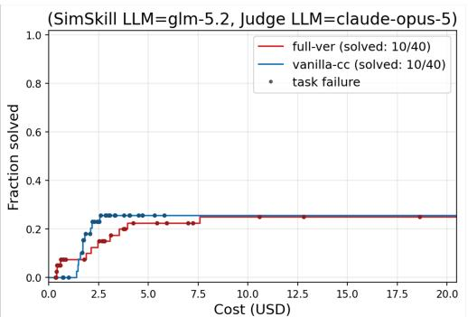  
(c) Success-at-budget curves by cost (LLM=glm-5.2)

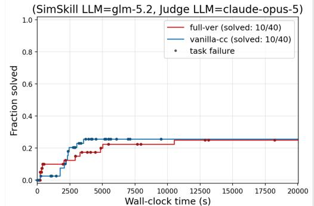  
(d) Success-at-budget curves by wall-clock time (LLM=glm-5.2)

(SimSkill LLM=qwen3.7-max, Judge LLM=claude-opus-5)  
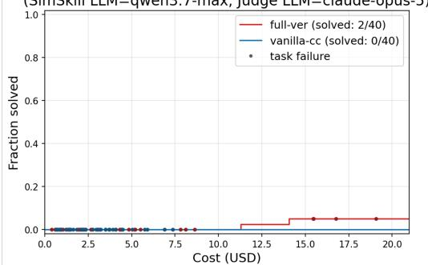  
(e) Success-at-budget curves by cost (LLM= qwen3.7-max)

(SimSkill LLM=qwen3.7-max, Judge LLM=claude-opus-5)  
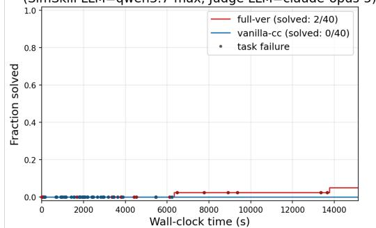  
(f) Success-at-budget curves by wall-clock time (LLM= qwen3.7-max)

Figure 6: Verified completion on the hard Benchmark V2 as a function of observed monetary or wallclock budget. Plot semantics are the same as in Figure 5.

Table 7: Complete SimSkill versus vanilla Claude Code. Completion is reported as verified tasks out of 40, with percentages in parentheses. Cost and time entries are per-run medians in the form full/vanilla.
<table><tr><td>Benchmark</td><td> Backbone</td><td>Full</td><td>Vanilla</td><td>∆ (pp)</td><td>Cost F/V (USD)</td><td>Time F/V (s)</td></tr><tr><td>V1</td><td>DeepSeek-V4-Pro</td><td>38 (95.0%)</td><td>34 (85.0%)</td><td>+10.0</td><td>0.78/0.49</td><td>1056/650</td></tr><tr><td>V1</td><td>GLM-5.2</td><td>30 (75.0%)</td><td>31 (77.5%)</td><td>-2.5</td><td>1.02/1.47</td><td>918/1918</td></tr><tr><td>V1</td><td>Qwen3.7-Max</td><td>23 (57.5%)</td><td>13 (32.5%)</td><td>+25.0</td><td>1.84/1.03</td><td>851/683</td></tr><tr><td>V2</td><td>DeepSeek-V4-Pro</td><td>27 (67.5%)</td><td>19 (47.5%)</td><td>+20.0</td><td>3.93/2.92</td><td>4623/4796</td></tr><tr><td>V2</td><td>GLM-5.2</td><td>10 (25.0%)</td><td>10 (25.0%)</td><td>0.0</td><td>2.29/2.44</td><td>2008/2899</td></tr><tr><td>V2</td><td>Qwen3.7-Max</td><td>2 (5.0%)</td><td>0 (0.0%)</td><td>+5.0</td><td>2.16/2.35</td><td>916/1969</td></tr></table>

Completion and backbone dependence. With DeepSeek-V4-Pro, SimSkill improves verified completion from 34 to 38 tasks on V1 and from 19 to 27 tasks on V2, corresponding to absolute gains of 10 and 20 percentage points. Qwen3.7-Max exhibits the largest V1 gain: 23 tasks are verified under SimSkill compared with 13 under vanilla Claude Code. On V2, vanilla Qwen3.7-Max solves no task completely, whereas SimSkill solves two. SimSkill therefore enables some long-horizon completion even when the baseline does not, although the absolute V2 result of 2/40 also shows that scafolding and memory cannot compensate fully for limitations of the backbone.

The result is not universal across models. GLM-5.2 shows no gain: SimSkill trails vanilla by one task on V1 and ties it on V2. The efect of an explicit, language-specified framework is therefore not determined solely by the amount of stored memory or by a model’s baseline completion rate. It also depends on how reliably the backbone follows long-horizon control instructions, uses tools, delegates to sub-agents, and acts on retrieved material. The present experiment does not isolate these model–runtime factors, so they should be treated as a plausible explanation rather than an established cause.

Generalization to dificult tasks. The gains are not confined to direct skill recall. On V1, Qwen3.7-Max improves in every tier, including a gain of four verified tasks among the 11 Tier 4 tasks. On V2, DeepSeek-V4-Pro gains two tasks in Tier 3 (11/20 versus 9/20) and six in Tier 4 (16/20 versus 10/20). The two Qwen3.7-Max successes are also Tier 4 tasks. These results provide evidence that the accumulated library can support new compositions and first-principles tasks rather than only near-duplicates of past experience.

Appendices C–E make this aggregate result concrete through three independently verified DeepSeek-V4-Pro executions from the complete SimSkill condition, OA-T3 is a congestion visualization and surrogate-safety analysis task from benchmark V2; DG-T4-3-V2 and MT-T4-4-V2 are V2 Tier 4 studies of time-dependent OD inference and shared e-scooter operations from benchmark V2. They illustrate how accumulated memory participates in inference.

Accuracy–resource trade-of. Memory does not produce a uniform reduction in inference cost. On V1, vanilla Claude Code often solves the easiest tasks at smaller budgets because it avoids retrieva and multi-agent orchestration. DeepSeek-V4-Pro and Qwen3.7-Max reach higher endpoints under SimSkill, but their median costs rise from \$0.49 to \$0.78 and from \$1.03 to \$1.84, respectively. Their median times also increase. GLM-5.2 is the counterexample: despite essentially unchanged completion, SimSkill reduces its V1 median cost by approximately 31% and median time by approximately 52%, indicating that structured execution can reduce exploration even when it does not expand the set of solvable tasks.

On V2, DeepSeek-V4-Pro pays a higher median cost under SimSkill (\$3.93 versus \$2.92) while achieving eight additional completions and a slightly lower median elapsed time. GLM-5.2 has lower SimSkill medians but no accuracy gain. The same total-cost pattern holds for DeepSeek-V4-Pro (\$203 versus \$157) and GLM-5.2 (\$128 versus \$107) on V2. Thus the completed experiment supports an accuracy–resource trade-of, not a general claim that memory makes inference cheaper. The success-atbudget curves are therefore more informative: they show how much verified task coverage is achieved at each expenditure level, whereas median cost alone may appear favorable when many runs terminate early without completing the task.

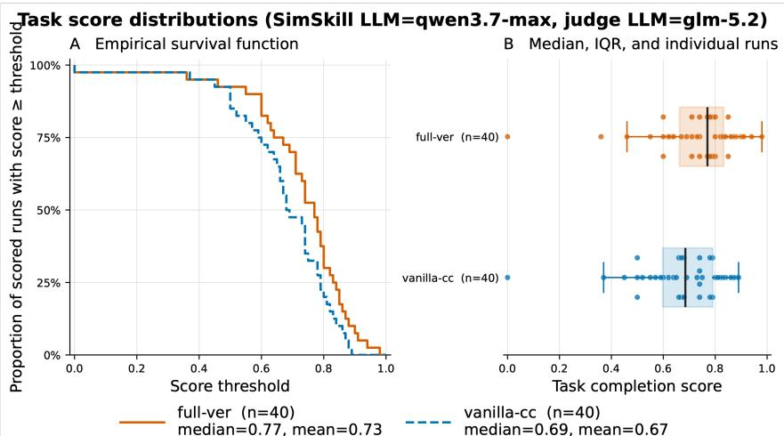

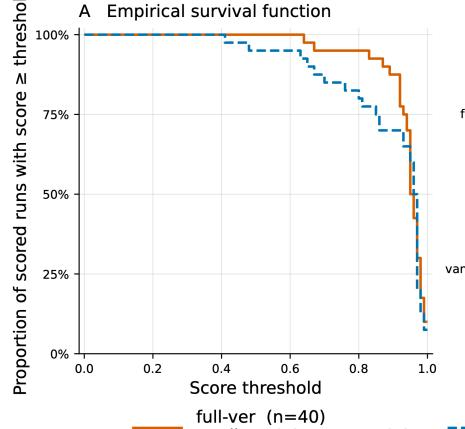

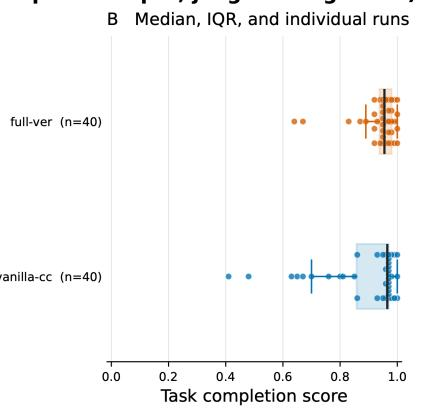  
(a) Task scores on Benchmark V2 (SimSkill LLM: deepseek-v4-pro; judge LLM: glm-5.2)  
(b) Task scores on Benchmark V2 (SimSkill LLM: qwen-3.7max; judge LLM: glm-5.2)

Figure 7: Scores on Benchmark V2 assigned independently by GLM-5.2. The left panels show the empirical proportion of runs whose score meets or exceeds each threshold; the right panels show individual runs together with the median and interquartile range. DeepSeek-V4-Pro is shown above and Qwen3.7-Max below.

Continuous quality scores. Figure 7 provides a second evaluation of the V2 outputs. Under the GLM-5.2 pointwise judge, DeepSeek-V4-Pro with SimSkill has a mean score of 0.940, compared with 0.891 for vanilla Claude Code. Its median is slightly lower (0.955 versus 0.965), showing that the improvement is concentrated in reducing the lower tail rather than uniformly shifting every task. For Qwen3.7-Max, both the mean (0.728 versus 0.674) and median (0.770 versus 0.685) favor SimSkill. The continuous judge therefore agrees with the direction of the Claude Opus 5 binary results for the two evaluated backbones while revealing substantial partial completion among tasks that did not pass the binary threshold.

## 5.3 Ablation Study

Figure 8 and Table 8 compare all five conditions on V1. For DeepSeek-V4-Pro, the inference framework without memory solves the same 34 tasks as vanilla Claude Code. Adding semantic memory raises the endpoint to 35, procedural memory raises it to 37, and the combination reaches 38. For Qwen3.7-Max, the framework itself raises completion from 13 to 16 tasks; semantic and procedural memory raise it further to 19 and 20; and the complete system reaches 23. Procedural memory contributes slightly more than semantic memory for both backbones, but neither representation subsumes the other.

(SimSkill LLM=deepseek-v4-pro, Judge LLM=claude-opus-5) SimSkill LLM=deepseek-v4-pro, Judge LLM=claude-opus-5  
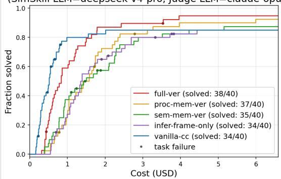  
(a) Ablation studies by cost (LLM=deepseek-v4-pro)

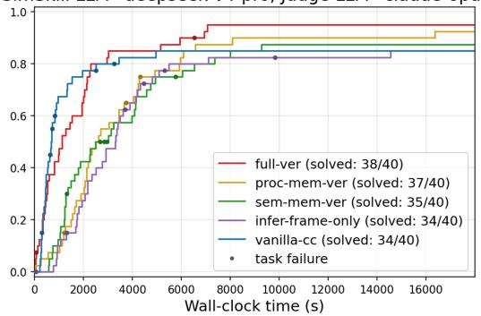  
(b) Ablation studies by wall-clock time (LLM=deepseek-v4-pro)

(SimSkill LLM=qwen3.7-max, Judge LLM=claude-opus-5)  
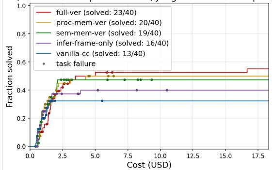  
(c) Ablation studies by cost (LLM=qwen3.7-max)

(SimSkill LLM=qwen3.7-max, Judge LLM=claude-opus-5)  
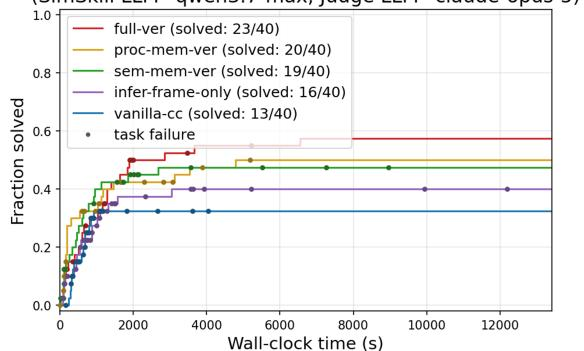  
(d) Ablation studies by wall-clock time (LLM=qwen3.7-max)  
Figure 8: Benchmark V1 ablation curves for DeepSeek-V4-Pro (top) and Qwen3.7-Max (bottom), under the Claude Opus 5 binary judge. The left panels use dollar cost and the right panels use wallclock time.

Table 8: Verified V1 endpoint in the five-way ablation (tasks solved out of 40).
<table><tr><td>Backbone</td><td></td><td>Vanilla Frame only</td><td></td><td>Semantic Procedural Full</td><td></td></tr><tr><td>DeepSeek-V4-Pro</td><td>34</td><td>34</td><td>35</td><td>37</td><td>38</td></tr><tr><td>Qwen3.7-Max</td><td>13</td><td>16</td><td>19</td><td>20</td><td>23</td></tr></table>

The factorial interaction contrast at the completion endpoint is

$$
\Delta _ { P \times S } = A _ { P S } - A _ { P \bar { S } } - A _ { \bar { P } S } + A _ { \bar { P } \bar { S } } ,\tag{8}
$$

where P and S denote the presence of procedural and semantic memory within the SimSkill inference framework. Equation 8 equals zero for both backbones: $0 . 9 5 0 - 0 . 9 2 5 - 0 . 8 7 5 + 0 . 8 5 0 = 0$ for DeepSeek-V4-Pro and $0 . 5 7 5 - 0 . 5 0 0 - 0 . 4 7 5 + 0 . 4 0 0 = 0$ for Qwen3.7-Max. At the aggregate endpoint, the two memory types therefore exhibit additive rather than super-additive efects in this ablation study.

The resource curves add an important qualification. With DeepSeek-V4-Pro, the complete system has a lower median cost and time than either single-memory ablation despite solving more tasks: \$0.78 and 1056 s for the full system, compared with \$1.41 and 2423 s for procedural memory alone and \$1.31 and 2383 s for semantic memory alone. Access to both forms of memory appears to reduce unproductive exploration for this backbone, even though their endpoint accuracy efects are additive. By contrast, Qwen3.7-Max’s complete system is more expensive and slower than either single-memory variant, and its advantage emerges mainly in the long-budget tail. The value of an architectural component must therefore be stated jointly with the operating budget: the endpoint ordering full-ver > proc-mem-ver > sem-mem-ver > infer-frame-only ≥ vanilla-cc does not hold at every intermediate cost or time threshold.

## 5.4 Scope of the Evidence

Taken together, the results answer the five research questions with important qualifications. Full SimSkill increases verified completion for two of the three tested backbones and retains an advantage on hard compositional and novel tasks, but the efect is model-dependent. Both procedural and semantic memory contribute, with a modestly larger procedural contribution. Memory can reduce wasted exploration in some settings, yet its retrieval and orchestration overhead frequently raises tota inference cost; the principal demonstrated benefit is expanded task coverage rather than universal cost savings.

## 6 Conclusion

This paper presented SimSkill, a self-evolving LLM agent that converts interaction with an executable environment into persistent competence without updating the backbone model. In SUMO, autonomous curriculum generation and verified task execution are coupled with episodic, procedural, and semantic memory. After approximately 80 hours of operation, SimSkill had accumulated 150 procedural skills and 153 semantic-memory pages. The case studies show how both successful and unsuccessful experience can create, revise, and maintain reusable memory.

On two 40-task benchmarks, SimSkill improved verified completion for DeepSeek-V4-Pro by 10 percentage points on Benchmark V1 and 20 points on Benchmark V2, and for Qwen3.7-Max by 25 points on V1; it also completed two V2 tasks for which vanilla Qwen3.7-Max completed none. The ablations indicate complementary, additive contributions from procedural and semantic memory. These gains were not universal: GLM-5.2 showed no improvement, and greater task coverage did not consistently reduce inference cost.

Future work should evaluate successive memory snapshots with repeated runs, improve curriculum selection, consolidation, and large-scale memory retrieval, and test transfer and forgetting across simulators and scientific domains. Explicit memory may also be combined with parameter adaptation to preserve new knowledge in an inspectable form while accelerating mature capabilities.

More broadly, SimSkill exemplifies a shift from fully hard-coded agent workflows toward systems whose goals, principles, knowledge, and procedures are expressed in natural language and composed by an LLM with executable tools. This division parallels collective human problem solving: language preserves and transmits adaptable knowledge, while tools, algorithms, and code provide precise and reproducible execution. Natural language can therefore serve not only as an interface, but also as a medium for accumulating and reorganizing computational capability.

## References

[Ant26] Anthropic. Extend claude with skills. https://code.claude.com/docs/en/skills, 2026. Claude Code documentation. Accessed: 2026-08-24.

[BBEK11] Michael Behrisch, Laura Bieker, Jakob Erdmann, and Daniel Krajzewicz. Sumo– simulation of urban mobility: an overview. In Proceedings of SIMUL 2011, the third international conference on advances in system simulation. ThinkMind, 2011.

[CKA<sup>+</sup>25] Prateek Chhikara, Dev Khant, Saket Aryan, Taranjeet Singh, and Deshraj Yadav. Mem0: Building production-ready ai agents with scalable long-term memory. arXiv preprint arXiv:2504.19413, 2025.

[CTO<sup>+</sup>23] C´edric Colas, Laetitia Teodorescu, Pierre-Yves Oudeyer, Xingdi Yuan, and Marc-Alexandre Cˆot´e. Augmenting autotelic agents with large language models. In Conference on Lifelong Learning Agents, pages 205–226. PMLR, 2023.

[CZY<sup>+</sup>24] Di Chen, Meixin Zhu, Hao Yang, Xuesong Wang, and Yinhai Wang. Data-driven traffic simulation: A comprehensive review. IEEE Transactions on Intelligent Vehicles, 9(4):4730–4748, 2024.

[DLC<sup>+</sup>24] Longchao Da, Kuanru Liou, Tiejin Chen, Xuesong Zhou, Xiangyong Luo, Yezhou Yang, and Hua Wei. Open-ti: Open trafic intelligence with augmented language model. International Journal of Machine Learning and Cybernetics, 15(10):4761–4786, 2024.

[DZF<sup>+</sup>25] Yuwei Du, Jun Zhang, Jie Feng, Zhicheng Liu, Jian Yuan, and Yong Li. Traficsimagent: A hierarchical agent framework for autonomous trafic simulation with mcp control. arXiv preprint arXiv:2512.20996, 2025.

[Ecl26] Eclipse Foundation. Eclipse SUMO – Simulation of Urban MObility. https://eclipse. dev/sumo/, 2026. Accessed: 2026-02-14.

[ENFLF17] Paolo M Ejercito, Kristine Gayle E Nebrija, Rommel P Feria, and Ligaya Leah Lara-Figueroa. Trafic simulation software review. In 2017 8th International Conference on Information, Intelligence, Systems & Applications (IISA), pages 1–4. IEEE, 2017.

[GPS<sup>+</sup>23] Caglar Gulcehre, Tom Le Paine, Srivatsan Srinivasan, Ksenia Konyushkova, Lotte Weerts, Abhishek Sharma, Aditya Siddhant, Alex Ahern, Miaosen Wang, Chenjie Gu, et al. Reinforced self-training (rest) for language modeling. arXiv preprint arXiv:2308.08998, 2023.

[HGH<sup>+</sup>23] Jiaxin Huang, Shixiang Gu, Le Hou, Yuexin Wu, Xuezhi Wang, Hongkun Yu, and Jiawei Han. Large language models can self-improve. In Proceedings of the 2023 conference on empirical methods in natural language processing, pages 1051–1068, 2023.

[HHH18] Sara Haddouch, Hanaˆa Hachimi, and Nabil Hmina. Modeling the flow of road trafic with the sumo simulator. In 2018 4th International Conference on Optimization and Applications (ICOA), pages 1–5. IEEE, 2018.

[JCY25] Minwoo Jeong, Jeeyun Chang, and Yoonjin Yoon. Agentsumo: An agentic framework for interactive simulation scenario generation in sumo via large language models. arXiv preprint arXiv:2511.06804, 2025.

[Kar26] Andrej Karpathy. LLM Wiki. https://gist.github.com/karpathy/ 442a6bf555914893e9891c11519de94f, 2026.

[KPR<sup>+</sup>17] James Kirkpatrick, Razvan Pascanu, Neil Rabinowitz, Joel Veness, Guillaume Desjardins, Andrei A Rusu, Kieran Milan, John Quan, Tiago Ramalho, Agnieszka Grabska-Barwinska, et al. Overcoming catastrophic forgetting in neural networks. Proceedings of the national academy of sciences, 114(13):3521–3526, 2017.

[LAK24] Shuyang Li, Talha Azfar, and Ruimin Ke. Chatsumo: Large language model for automating trafic scenario generation in simulation of urban mobility. IEEE Transactions on Intelligent Vehicles, 2024.

[LLM25] Qi Liu, Can Li, and Wanjing Ma. Generative agents for urban mobility: A cognitive framework for realistic travel behavior simulation. Simulation Modelling Practice and Theory, page 103234, 2025.

[LLM26] Qi Liu, Can Li, and Wanjing Ma. Gatsim: Urban mobility simulation with generative agents. Transportation Research Part C: Emerging Technologies, 186:105576, 2026.

[LMAK26] Shuyang Li, Meng Ma, Talha Azfar, and Ruimin Ke. Chatsumo agent: An llm-based agent for conversational trafic simulation in sumo. Transportation Research Part C: Emerging Technologies, 190:105759, 2026.

[LPP<sup>+</sup>20] Patrick Lewis, Ethan Perez, Aleksandra Piktus, Fabio Petroni, Vladimir Karpukhin, Naman Goyal, Heinrich K¨uttler, Mike Lewis, Wen-tau Yih, Tim Rockt¨aschel, et al. Retrievalaugmented generation for knowledge-intensive nlp tasks. Advances in neural information processing systems, 33:9459–9474, 2020.

[LXZ<sup>+</sup>25] Siqi Lai, Zhao Xu, Weijia Zhang, Hao Liu, and Hui Xiong. Llmlight: Large language models as trafic signal control agents. In Proceedings of the 31st ACM SIGKDD Conference on Knowledge Discovery and Data Mining V. 1, pages 2335–2346, 2025.

[MH26] Sam McVeety and Amir Hormati. How the open knowledge format can improve data sharing. https://cloud.google.com/blog/products/data-analytics/ how-the-open-knowledge-format-can-improve-data-sharing, June 2026. Google Cloud Blog, accessed June 23, 2026.

[Mul26] Multica AI. andrej-karpathy-skills: A single CLAUDE.md file to improve claude code behavior, derived from andrej karpathy’s observations on llm coding pitfalls. https:// github.com/multica-ai/andrej-karpathy-skills, 2026. GitHub repository. Accessed: 2026-06-26.

[POC<sup>+</sup>23] Joon Sung Park, Joseph O’Brien, Carrie Jun Cai, Meredith Ringel Morris, Percy Liang, and Michael S Bernstein. Generative agents: Interactive simulacra of human behavior. In Proceedings of the 36th annual acm symposium on user interface software and technology, pages 1–22, 2023.

[PWL<sup>+</sup>23] Charles Packer, Sarah Wooders, Kevin Lin, Vivian Fang, Shishir G Patil, Ion Stoica, and Joseph E Gonzalez. Memgpt: Towards llms as operating systems. arXiv preprint arXiv:2310.08560, 2023.

[QZGK24] Yuxiao Qu, Tianjun Zhang, Naman Garg, and Aviral Kumar. Recursive introspection: Teaching language model agents how to self-improve. Advances in Neural Information Processing Systems, 37:55249–55285, 2024.

[SB<sup>+</sup>98] Richard S Sutton, Andrew G Barto, et al. Reinforcement learning: An introduction. MIT press Cambridge, 1998.

[SCG<sup>+</sup>23] Noah Shinn, Federico Cassano, Ashwin Gopinath, Karthik Narasimhan, and Shunyu Yao. Reflexion: Language agents with verbal reinforcement learning. Advances in neural information processing systems, 36:8634–8652, 2023.

[SCY<sup>+</sup>25] Rana Salama, Jason Cai, Michelle Yuan, Anna Currey, Monica Sunkara, Yi Zhang, and Yassine Benajiba. Meminsight: Autonomous memory augmentation for llm agents. In Proceedings of the 2025 Conference on Empirical Methods in Natural Language Processing, pages 33124–33140, 2025.

[SPS99] Richard S. Sutton, Doina Precup, and Satinder Singh. Between MDPs and semi-MDPs: A framework for temporal abstraction in reinforcement learning. Artificial Intelligence, 112(1–2):181–211, 1999.

[Sut19] Richard S. Sutton. The bitter lesson. http://www.incompleteideas.net/IncIdeas/ BitterLesson.html, 2019. Incomplete Ideas.

[TK24] Georgios Tziafas and Hamidreza Kasaei. Lifelong robot library learning: Bootstrapping composable and generalizable skills for embodied control with language models. In 2024 IEEE International Conference on Robotics and Automation (ICRA), pages 515–522. IEEE, 2024.

[TLC<sup>+</sup>24] Zhengwei Tao, Ting-En Lin, Xiancai Chen, Hangyu Li, Yuchuan Wu, Yongbin Li, Zhi Jin, Fei Huang, Dacheng Tao, and Jingren Zhou. A survey on self-evolution of large language models. arXiv preprint arXiv:2404.14387, 2024.

[WCL<sup>+</sup>24] Zihao Wang, Shaofei Cai, Anji Liu, Yonggang Jin, Jinbing Hou, Bowei Zhang, Haowei Lin, Zhaofeng He, Zilong Zheng, Yaodong Yang, et al. Jarvis-1: Open-world multi-task agents with memory-augmented multimodal language models. IEEE Transactions on Pattern Analysis and Machine Intelligence, 47(3):1894–1907, 2024.

[WKM<sup>+</sup>23] Yizhong Wang, Yeganeh Kordi, Swaroop Mishra, Alisa Liu, Noah A Smith, Daniel Khashabi, and Hannaneh Hajishirzi. Self-instruct: Aligning language models with selfgenerated instructions. In Proceedings of the 61st annual meeting of the association for computational linguistics (volume 1: long papers), pages 13484–13508, 2023.

[WMF<sup>+</sup>24] Lei Wang, Chen Ma, Xueyang Feng, Zeyu Zhang, Hao Yang, Jingsen Zhang, Zhiyuan Chen, Jiakai Tang, Xu Chen, Yankai Lin, et al. A survey on large language model based autonomous agents. Frontiers of Computer Science, 18(6):186345, 2024.

[WPK<sup>+</sup>24] Maonan Wang, Aoyu Pang, Yuheng Kan, Man-On Pun, Chung Shue Chen, and Bo Huang. Llm-assisted light: Leveraging large language model capabilities for human-mimetic trafic signal control in complex urban environments. arXiv preprint arXiv:2403.08337, 2024.

[WXJ<sup>+</sup>23] Guanzhi Wang, Yuqi Xie, Yunfan Jiang, Ajay Mandlekar, Chaowei Xiao, Yuke Zhu, Linxi Fan, and Anima Anandkumar. Voyager: An open-ended embodied agent with large lan guage models. arXiv preprint arXiv:2305.16291, 2023.

[XLM<sup>+</sup>26] Wujiang Xu, Zujie Liang, Kai Mei, Hang Gao, Juntao Tan, and Yongfeng Zhang. A-mem: Agentic memory for llm agents. Advances in Neural Information Processing Systems, 38:17577–17604, 2026.

[YGH<sup>+</sup>26] Yifan Yang, Ziyang Gong, Weiquan Huang, Qihao Yang, Ziwei Zhou, Zisu Huang, Yan Li, Xuemei Gao, Qi Dai, Bei Liu, et al. Skillopt: Executive strategy for self-evolving agent skills. arXiv preprint arXiv:2605.23904, 2026.

[YLP<sup>+</sup>26] Yutao Yang, Junsong Li, Qianjun Pan, Bihao Zhan, Yuxuan Cai, Lin Du, Jie Zhou, Kai Chen, Qin Chen, Xin Li, et al. Autoskill: Experience-driven lifelong learning via skill self-evolution. arXiv preprint arXiv:2603.01145, 2026.

[YXS<sup>+</sup>25] Chenglong Ye, Gang Xiong, Junyou Shang, Xingyuan Dai, Xiaoyan Gong, and Yisheng Lv. Sumo-mcp: Leveraging the model context protocol for autonomous trafic simulation and optimization. arXiv preprint arXiv:2506.03548, 2025.

[YZY<sup>+</sup>22] Shunyu Yao, Jefrey Zhao, Dian Yu, Nan Du, Izhak Shafran, Karthik Narasimhan, and Yuan Cao. React: Synergizing reasoning and acting in language models. arXiv preprint arXiv:2210.03629, 2022.

[ZCL<sup>+</sup>25] Junhao Zheng, Xidi Cai, Qiuke Li, Duzhen Zhang, ZhongZhi Li, Yingying Zhang, Le Song, and Qianli Ma. Lifelongagentbench: Evaluating llm agents as lifelong learners. arXiv preprint arXiv:2505.11942, 2025.

[ZCT<sup>+</sup>23] Xizhou Zhu, Yuntao Chen, Hao Tian, Chenxin Tao, Weijie Su, Chenyu Yang, Gao Huang, Bin Li, Lewei Lu, Xiaogang Wang, et al. Ghost in the minecraft: Generally capable agents for open-world environments via large language models with text-based knowledge and memory. arXiv preprint arXiv:2305.17144, 2023.

[ZDB<sup>+</sup>25] Zeyu Zhang, Quanyu Dai, Xiaohe Bo, Chen Ma, Rui Li, Xu Chen, Jieming Zhu, Zhenhua Dong, and Ji-Rong Wen. A survey on the memory mechanism of large language modelbased agents. ACM Transactions on Information Systems, 43(6):1–47, 2025.

[ZFL<sup>+</sup>24] Siyao Zhang, Daocheng Fu, Wenzhe Liang, Zhao Zhang, Bin Yu, Pinlong Cai, and Baozhen Yao. Traficgpt: Viewing, processing and interacting with trafic foundation models. Transport Policy, 150:95–105, 2024.

[ZGG<sup>+</sup>24] Wanjun Zhong, Lianghong Guo, Qiqi Gao, He Ye, and Yanlin Wang. Memorybank: Enhancing large language models with long-term memory. In Proceedings of the AAAI conference on artificial intelligence, pages 19724–19731, 2024.

[ZSC<sup>+</sup>26] Junhao Zheng, Chengming Shi, Xidi Cai, Qiuke Li, Duzhen Zhang, Chenxing Li, Dong Yu, and Qianli Ma. Lifelong learning of large language model based agents: A roadmap. IEEE Transactions on Pattern Analysis and Machine Intelligence, 2026.

[ZYL<sup>+</sup>25] Chi Zhang, Zhao Yang, Jiaxuan Liu, Yanda Li, Yucheng Han, Xin Chen, Zebiao Huang, Bin Fu, and Gang Yu. Appagent: Multimodal agents as smartphone users. In Proceedings of the 2025 CHI Conference on Human Factors in Computing Systems, pages 1–20, 2025.

## A Supplementary Traces for the Learning Case Studies

The following listings provide condensed, lightly normalized excerpts from the learning logs discussed in Section 4. They preserve the sequence of decisions and memory operations while omitting commandlevel output, repeated status messages, and long numerical tables. Unlike the preceding benchmark appendices, these traces come from autonomous learning episodes in which accepted experience could modify procedural and semantic memory.

## A.1 Retrieval and Task Decomposition for PP-T4-3-V2

Listing 6 shows how bounded retrieval supplied a heterogeneous set of components for a multimodal portfolio problem. The decomposition was generated after retrieval; it was not stored as a fixed workflow.

Retrieved procedural memory (8):   
1. create-grid-network   
2. convert-od-matrix-to-trips   
3. run-simulation   
4. simulate-multimodal-transit   
5. evaluate-multimodal-accessibility-and-equity   
6. appraise-project-alternatives-with-benefit-cost-analysis   
7. solve-budget-constrained-network-design-problem   
8. build-pedestrian-crossings-and-phasing   
Retrieved semantic memory (2):   
9. discrete-network-design-and-project-interaction   
10. accessibility-measurement-and-transport-equity   
Task-specific decomposition:   
- construct a 5 x 5 grid with a river constraint and five projects;   
- generate and route OD demand;   
- enumerate feasible portfolios and select 14 by D-optimal design;   
- simulate the selected portfolios;   
- fit a surrogate and predict the feasible portfolio space;   
- identify the Pareto frontier and conduct stress tests;   
- evaluate accessibility, equity, and the 5% loss floor;   
- monetize benefits and report distributional outcomes.   
No single retrieved item specifies this end-to-end workflow. The action   
agent composes it from the retrieved procedures and knowledge pages.

## A.2 Curriculum Revision After a Failed Premise

Listing 7 preserves the transition from the original shared-micromobility hypothesis to a stricter curriculum principle and then to a verified trajectory-reconstruction gap.

## Listing 7: Abridged curriculum-level learning trace.

Initial gap:   
Memory contains dispatched fleets, scheduled transit, and private   
vehicles in finite parking facilities, but no station-based shared   
asset with inventory that one traveler consumes and another reuses.   
Initial premise:   
SUMO lacks the required shared-asset primitive; build and verify one.   
Outer attempt 1:   
Claim: a finite bicycle fleet cannot be rationed.   
Refutation: a person-triggered stop can ration a named fleet.   
Outer attempt 2:   
Claim: a traveler cannot bind to whichever bicycle is available.   
Refutation: lines="ANY" binds at runtime; the negative test used   
invalid decoy routes and suppressed route errors.   
Outer attempt 3:   
Claim: one vehicle cannot wait as inventory and later carry a rider.   
Refutation: corrected capacity and stop-extension settings permit it.   
Ingestion decision:   
Create no skill whose justification depends on the rejected premise.   
Create station-based-shared-micromobility-in-sumo as a semantic page.   
Correct knowledge about stopinfo fields and parking occupancy.

Curriculum principle learned:   
"Memory does not cover X" does not imply "SUMO cannot do X."   
Establish absence adversarially before proposing a replacement.   
Characterization, validation, comparison, and integration are also   
legitimate sources of novelty.   
Next task:   
Reconstruct SUMO routes and an OD matrix from sparse GPS probes.   
First verify that tracemapper.py and route2OD.py exist; then confirm   
that memory covers only fixed-point count-based reconstruction.

## A.3 Predictive-Control Skill Acquisition

Listing 8 summarizes the complete curriculum–execution–criticism–ingestion–maintenance sequence for the predictive-control episode.

Listing 8: Abridged end-to-end trace for predictive-control learning.

CURRICULUM   
Gap: existing signal controllers are offline-static or reactive;   
none optimizes a sequence of future decisions using predicted arrivals.   
Task: compare rolling-horizon DP and simulation-rollout MPC with   
validated prediction, null and oracle controls, demand and arrival   
regimes, replication intervals, and a two-signal coordination arm.   
RETRIEVAL   
Skills:   
implement-maxpressure-traci-controller   
build-rolling-horizon-traffic-forecast-with-state-warm-start   
design-actuated-signal-detector-placement-and-fault-tolerance   
model-demand-arrival-process-and-its-effect-on-capacity-and-delay   
optimize-signals-by-tlscycleadaptation   
quantify-sumo-run-to-run-variability   
Pages:   
state-serialization-and-rolling-horizon-traffic-forecasting   
actuated-signal-detector-design-and-fault-tolerance   
demand-arrival-process-and-unsignalized-capacity   
coordinated-adaptive-signal-control-detector-bias-and-transition-cost   
OUTER ATTEMPT 1   
The action agent recovers from a watchdog timeout and consolidates   
1,016 existing SUMO runs without re-simulating completed cells.   
Critic verdict: success=false.   
Required checks include state restoration, sequence optimization,   
prediction-null equivalence, controller constraints, and claim scope.   
OUTER ATTEMPT 2   
The action agent receives the critic findings, sweeps the controller’s   
own constraints, checks the DP against exhaustive enumeration,   
separates predictor and optimizer effects, and repeats critical cells.   
Critic verdict: success=true after nine independent checks.   
INGESTION   
New skill:   
implement-predictive-rolling-horizon-signal-control   
(+3 bundled scripts)   
Updated skills:   
build-rolling-horizon-traffic-forecast-with-state-warm-start   
optimize-under-simulation-noise-with-a-fixed-budget   
New page:   
value-of-anticipation-in-predictive-signal-control   
Updated page:   
state-serialization-and-rolling-horizon-traffic-forecasting   
MEMORY LINT   
Check ten changed artifacts against all existing skills and pages;   
parse 3/3 new scripts; resolve all links; synchronize page summaries;   
inspect nearest-neighbor overlap; retain distinct skills. No repair.

## A.4 Compositional Map-Matching Acquisition

Listing 9: Abridged composition and ingestion trace for GPS map matching.

TASK Turn sparse GPS probe trajectories into SUMO routes and an OD matrix. Use tracemapper.py and route2OD.py; vary ping interval, location noise, fleet penetration, and dropout; validate edge, route, and OD recovery.

COMPOSITION

Reuse network-import, demand-reconstruction, replication, and outputanalysis skills. Bundle new scripts for probe generation, matching, scoring, and OD aggregation.

## DEPENDENCY FAILURE

The load-osm-network wrapper passes --bbox and a western-hemisphere value as separate arguments. The negative longitude is parsed as an option, so all tested bounding boxes in the Americas fail.

## CONSISTENT INGESTION

New skill:

map-match-gps-traces-to-reconstruct-demand (+4 bundled scripts) Repaired skill and script:

load-osm-network (use the single-token --bbox=... form)

New page: gps-map-matching-and-probe-demand-reconstruction

## Updated page:

geh-statistic (independent evidence on fit versus OD recovery)

## B Complete Categorized Procedural-Memory Inventory

Listing 10 gives the complete 150-skill snapshot summarized in Table 5. Categories indicate each skill’s primary function only; cross-links and composition routinely connect skills across these boundaries.

Listing 10: Complete categorized inventory of the 150 learned procedural skills.

[Scenario construction, execution, and state] (6)   
analyze-simulation-outputs   
choose-time-discretization-and-integration-method   
get-vehicles-state   
run-mesoscopic-simulation   
run-simulation   
set-vehicle-state   
[Demand, routing, and assignment] (17)   
assign-traffic-with-marouter   
build-four-step-model-with-feedback-loop   
compute-dynamic-user-equilibrium   
construct-and-verify-braess-paradox   
convert-od-matrix-to-trips   
convert-trips-to-routes   
equilibrate-departure-time-choice-in-bottleneck-model   
equilibrate-endogenous-mode-choice-with-transit-supply-feedback   
generate-activity-based-demand   
generate-demand-with-jtrrouter   
generate-random-trips   
implement-eco-routing   
map-match-gps-traces-to-reconstruct-demand   
reconstruct-demand-with-dfrouter   
reconstruct-simulation-demand-from-field-turning-movement-counts   
specify-route-choice-models-and-generate-route-sets   
synthesize-population-and-generate-disaggregate-demand   
[Signals and intersection control] (30)   
build-atspm-pipeline-and-retime-arterial   
build-pedestrian-crossings-and-phasing   
compare-left-turn-signal-treatments   
compare-unsignalized-intersection-control-types   
conduct-driveway-signal-warrant-traffic-impact-analysis   
control-signals-with-actuated-tls   
design-actuated-signal-detector-placement-and-fault-tolerance   
design-arterial-signal-progression-and-verify-bandwidth   
design-left-turn-storage-bay-length   
design-multimodal-signal-progression-for-bicycles-and-cars   
design-restricted-crossing-uturn-and-michigan-left-intersections   
design-signal-change-and-clearance-intervals   
evaluate-right-turn-on-red-and-leading-pedestrian-interval   
implement-detector-free-cv-adaptive-signal-control   
implement-emergency-vehicle-preemption   
implement-glosa-speed-advisory-controlle   
implement-maxpressure-traci-controller   
implement-nema-dual-ring-controller   
implement-predictive-rolling-horizon-signal-control   
implement-railroad-preemption-at-a-signalized-intersection   
implement-reservation-based-autonomous-intersection-management   
implement-scats-style-coordinated-adaptive-signal-control   
implement-transit-signal-priority   
measure-roundabout-capacity-and-implement-metering   
model-intersection-sight-distance-restriction-at-a-twsc-junction   
optimize-signal-plan-with-simulation-in-the-loop-ga   
optimize-signals-by-qlearning   
optimize-signals-by-tlscoordinator   
optimize-signals-by-tlscycleadaptation   
switch-signal-plans-by-time-of-day-with-waut

```ini
[Network and infrastructure design] (12)
audit-repair-and-persist-imported-network-defects
compare-one-way-vs-two-way-street-grid-conversion
create-grid-network
create-roundabout-network
create-single-intersection
create-spider-network
extract-subnetwork-scenario-with-boundary-demand
load-osm-network
model-horizontal-curvature-and-evaluate-design-consistency
model-road-gradient-effects-on-energy
model-vclass-lane-permissions
quantify-opendrive-roundtrip-fidelity
```

[Freeway, corridor, and network operations] (31) build-and-benchmark-freeway-incident-detection build-and-evaluate-system-interchange build-diamond-interchange-with-signal-offset-spillback

build-diverging-diamond-interchange   
compare-zipper-vs-default-merge-at-lane-drop   
control-one-lane-two-way-alternating-flow-through-a-work-zone   
demonstrate-and-stabilize-phantom-traffic-jams   
design-and-control-freeway-work-zone-lane-closures   
evaluate-corridor-access-management-and-median-treatments   
evaluate-integrated-corridor-management-with-factorial-interaction-design   
evaluate-neighborhood-traffic-calming-and-cut-through-displacement   
evaluate-two-lane-highway-with-hcm-and-passing-lanes   
form-platoons-with-simpla   
implement-alinea-ramp-metering   
implement-coordinated-corridor-ramp-metering   
implement-dynamic-hard-shoulder-running   
implement-mfd-based-perimeter-gating   
implement-variable-speed-limits   
model-adverse-weather-effects-on-freeway-traffic   
model-cordon-tolling-with-generalized-cost-surcharge   
model-freeway-weaving-segment   
model-grade-aware-heavy-vehicle-performance-and-climbing-lanes   
model-managed-lanes-with-dynamic-tolling-and-self-selection   
model-opposite-direction-overtaking   
model-toll-plaza-as-queueing-facility   
operate-reversible-tidal-flow-lane   
scan-network-link-criticality-and-vulnerability   
simulate-emergency-evacuation   
simulate-incident-rerouting   
solve-budget-constrained-network-design-problem   
sweep-rerouting-device-market-penetration   
[Transit, multimodal, fleet, and parking systems] (20)   
build-and-evaluate-park-and-ride-corridor   
build-gtfs-transit-scenario   
build-rail-corridor-with-railsignal   
build-rail-road-grade-crossing   
demonstrate-and-control-bus-bunching   
design-bus-stop-placement-type-and-spacing   
design-transit-service-plan-under-a-bus-hour-budget   
evaluate-protected-bicycle-intersection-design   
model-capacity-constrained-transit-passenger-loading   
model-cruising-for-parking-search-externality   
model-curbside-delivery-and-lane-blocking-externality   
model-dedicated-bicycle-lane-infrastructure   
model-parking-with-rerouting   
model-urban-freight-delivery-tours   
simulate-ev-charging   
simulate-motorcycle-lane-filtering-with-sublane-model   
simulate-multimodal-transit   
simulate-street-running-tram-corridor   
simulate-taxi-and-drt-dispatch   
size-battery-electric-bus-fleet-and-chargers   
[Calibration, estimation, and experimental design] (21)   
build-macroscopic-fundamental-diagram   
build-rolling-horizon-traffic-forecast-with-state-warm-start   
calibrate-car-following-parameters-against-field-targets   
calibrate-demand-with-routesampler   
calibrate-desired-speed-and-evaluate-speed-enforcement   
calibrate-flow-with-in-simulation-calibrator   
calibrate-lane-changing-parameters-at-a-freeway-diverge   
calibrate-motorist-yielding-and-select-midblock-crossing-treatment   
characterize-pedestrian-flow-and-striping-model-artifacts   
design-count-station-locations-for-od-estimation   
emulate-and-evaluate-partial-sensor-traffic-state-estimation   
estimate-od-matrix-with-odme   
estimate-stochastic-freeway-capacity-and-breakdown-probability   
measure-av-penetration-effect-on-bottleneck-capacity   
measure-heavy-vehicle-passenger-car-equivalent   
measure-saturation-flow-and-validate-webster-method   
model-demand-arrival-process-and-its-effect-on-capacity-and-delay   
optimize-under-simulation-noise-with-a-fixed-budget   
quantify-sumo-run-to-run-variability   
screen-and-decompose-sumo-parameter-sensitivity   
validate-kinematic-wave-theory-across-car-following-models   
[Impact analysis, validation, and visualization] (13)   
analyze-intersection-air-quality-hot-spots-from-microsimulation   
analyze-intersection-safety-with-ssm   
analyze-traffic-noise-with-harmonoise   
appraise-project-alternatives-with-benefit-cost-analysis   
evaluate-multimodal-accessibility-and-equity   
generate-hcm-los-report-and-validate-against-microsimulation   
measure-travel-time-reliability-with-simulated-days   
publish-georeferenced-and-animated-results   
screen-network-safety-with-spf-and-empirical-bayes

## C Memory-Guided Congestion–Safety Cross-Check (OA-T3)

This and the following two appendices trace memory-guided inference under the complete SimSkill condition. Each case follows the same sequence: retrieval of procedural skills and semantic knowledge, action-agent execution and critic verification, and production of a final result with reproducible artifacts. All three tasks were executed with DeepSeek-V4-Pro in test mode. Memory was available for retrieval, but ingestion was disabled, so the evaluated memory snapshot remained fixed across tasks. Each episode was accepted by the in-loop critic and subsequently passed the independent artifact-based verification described in Section 5.1.

## C.1 Task and Memory Use

OA-T3 asks the agent to build a spatial congestion heat map for a 4 × 4-block signalized grid with 200 m spacing and heavy demand of 1,000 veh/h at each inbound fringe edge, and then determine whether the most congested edges coincide with the locations reporting the most surrogate-safetymeasure (SSM) conflicts. The task is compositional: network and demand generation, simulation, output visualization, safety-device configuration, spatial matching, and statistical comparison must operate on one consistent scenario.

Retrieval returned six procedural skills. create-grid-network, generate-random-trips, and run-simulation supplied network construction, demand generation, and reproducible execution.

visualize-network-congestion-heatmap supplied interval-based heat-map generation; analyze-intersection-safety supplied SSM configuration, conflict parsing, and spatial assignment; and

analyze-simulation-outputs supplied output-integrity checks. The two semantic pages shaped analytical decisions rather than execution. spatial-congestion-heatmap-with-plot-net-dump guided the choice of lane occupancy as the congestion metric, while surrogate-safety-measures provided the meaning of the safety indicators, thresholds, and conflict types.

## C.2 Memory-Guided Inference and Critic Revision

The action agent composed the retrieved artifacts into a workflow that generated one common simulation, produced twelve interval-level congestion maps, assigned SSM conflicts to directed edges, and compared the resulting congestion and safety rankings. This workflow was not copied from a single skill: the LLM connected network, simulation, visualization, safety-analysis, and validation procedures to satisfy the cross-domain task.

The episode used all three outer action–critic attempts. The critic rejected the first attempt after detecting an incorrect demand calculation and a silent conflict-parser failure. The second action-agent attempt repaired both defects, but the critic found that the written interpretation still disagreed with the output files and omitted important limitations. The third attempt reconciled the report with the artifacts, corrected the hotspot description, and stated the insertion and ranking limitations explicitly. The trace therefore shows that SimSkill inference continues beyond successful program execution unti the critic accepts both the artifacts and the claims derived from them.

## C.3 Verified Result and Output

Table 9 summarizes the accepted evidence. No edge appeared in both top-ten lists, although the full 120-edge rankings had a Spearman correlation of 0.748. The result therefore distinguishes broad rank association from agreement among the most critical locations. The critic also required the conclusion to be scoped to the realized simulation: only 3,619 of 20,000 scheduled vehicles entered, the leading occupancy values were narrowly separated, and the SSM output represented each interaction twice.

The final output included reproducible build-and-analysis scripts, edge-data and SSM files from the common scenario, a combined edge-ranking table, the corrected report, and the twelve heat maps shown in Figure 9. The maps instantiate the retrieved visualization procedure and the congestion metric selected from semantic memory; their rankings were then compared with conflicts parsed using the retrieved safety procedure. Within the stated limitations, the verified result is that a congestion heat map cannot substitute for direct safety-hotspot analysis in this scenario.

Table 9: Accepted OA-T3 congestion–safety cross-check. SSM counts are raw ego–foe records.
<table><tr><td>Quantity</td><td>Value</td><td>Interpretation</td></tr><tr><td>Demand realization</td><td>20,000 completed</td><td>scheduled; The intended demand severely oversaturated 3,619 inserted; 2,304 the network; the realized pattern represents only the vehicles that entered.</td></tr><tr><td>SSM records</td><td>events</td><td>37,721 raw; approxi- Each physical interaction was recorded twice mately 18,860 distinct with ego and foe exchanged; rankings are un- affected.</td></tr><tr><td>Hotspot overlap</td><td>Top five: 0/5; top ten: 0/10</td><td>The highest-congestion and highest-conflict lo- cations were disjoint.</td></tr><tr><td>Full-ranking association</td><td>ρ = 0.748 overall</td><td>Bulk agreement did not imply agreement at the top of the rankings.</td></tr><tr><td>Type-specific association</td><td>Rear-end: crossing: 0.316; merg- end interactions. ing: -0.024</td><td>0.652; The association was driven primarily by rear-</td></tr></table>

## D Memory-Guided Time-Dependent OD Inference (DG-T4- 3-V2)

## D.1 Task and Memory Use

DG-T4-3-V2 is a Tier 4 demand-inference task on a 3 × 3 grid with six boundary trafic analysis zones. It asks for posterior distributions over all 30 directed origin–destination (OD) pairs in eight 15-minute intervals, yielding 240 nonnegative flows, from only 24 screenline counts and sparse Bluetooth travel times. Holdout rows must be excluded from fitting and model selection, the result must quantify non-identifiability, and the simulation budget is fixed at 15 designated SUMO executions. This is a useful test of compositional inference because the stored library contained relevant foundations but no end-to-end procedure for likelihood-free, time-dependent OD estimation.

Retrieval returned five procedural skills. create-grid-network and run-simulation supplied the network and reproducible execution foundation. estimate-od-matrix-with-odme supplied the assignment-matrix logic, a deterministic comparator, and diagnostics separating count fit from OD recovery. optimize-under-simulation-noise-with-a-fixed-budget guided surrogate construction and the fixed run ledger, while quantify-sumo-run-to-run-variability guided the separation of training and validation seeds.

The two retrieved knowledge pages shaped interpretation and validation.

od-matrix-estimation-and-underdetermination led the agent to report uncertainty and non-identifiable contrasts instead of presenting one fitted OD matrix as ground truth. geh-statistic supplied the count goodness-of-fit measure and its limitations. Memory provided the foundations and evidential standards, but no retrieved skill implemented likelihood-free, time-dependent OD inference. The action agent therefore constructed that task-specific component in new code.

## D.2 Memory-Guided Inference and New Construction

The action agent used the retrieved ODME procedure and identifiability knowledge to define a lowdimensional demand model that generated all 240 flows, applied one route set to both the posterior method and the deterministic comparator, and excluded holdout observations from fitting and stopping. It then built the missing likelihood-free component as a task-owned ABC–SMC workflow.

The fixed-budget skill directly shaped execution. Twelve SUMO runs trained a physics-informed surrogate; three independent posterior populations then operated entirely on the cached surrogate without calling SUMO; and two posterior representatives plus the ODME comparator consumed the final three runs. The resulting ledger contained exactly 15 designated simulations. Unusable development executions were retained separately in a discarded-run ledger, preserving transparency without mixing them into the reported design.

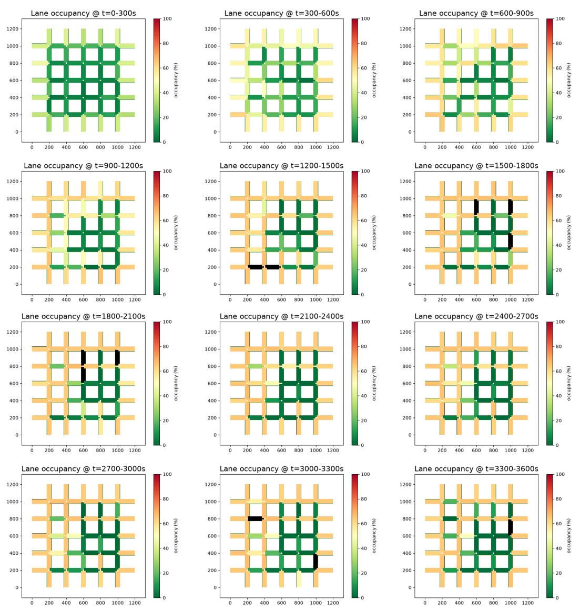  
Figure 9: OA-T3 lane-occupancy heat maps for twelve consecutive 300 s intervals. The maps were generated from edge-data output using the retrieved congestion-visualization procedure and semantic guidance on metric selection. Their interval maxima produced the congestion ranking subsequently compared with spatially assigned SSM conflicts.

Table 10: Accepted DG-T4-3-V2 inference and verification results.
<table><tr><td>Verification target</td><td>Result</td><td>Interpretation</td></tr><tr><td>Simulation budget</td><td>12 training runs and 3 final runs</td><td>Exactly 15 designated SUMO executions; posterior inference itself used no additional SUMO calls.</td></tr><tr><td>Population agreement</td><td>ESS 7,628–7,647 of 8,000; maximum R = 1.007</td><td>The three independent ABC-SMC popula- tions produced closely aligned posteriors.</td></tr><tr><td>Holdout coverage</td><td>6/6 observations within 90% predictive intervals</td><td>The required coverage threshold of 80% was exceeded without using holdouts for fitting or stopping.</td></tr><tr><td>Fitted count agreement</td><td>Mean GEH 5.73; 48% be- low 5</td><td>Peak counts on two screenlines remained underpredictedbecauseof simulated connector-capacity limits.</td></tr><tr><td>OD identifiability</td><td>90% intervals for all 240 flows and explicit null- space contrasts</td><td>Uncertainty in individual OD cells was re- tained rather than hidden by a single point estimate.</td></tr></table>

The episode was accepted in its first outer action–critic attempt. The critic independently verified the holdout masks, the 15-run ledger, the absence of SUMO calls during posterior inference, the comparator, and the required convergence and predictive diagnostics. It also found five minor discrepancies between reported numbers and stored artifacts; these were corrected in the report without changing the code or rerunning the experiment. This case shows how retrieved memory can structure a nove solution while the critic enforces the task’s evidential requirements.

## D.3 Verified Result and Output

The accepted output satisfied the prescribed simulation budget, convergence checks, and holdout criterion, as summarized in Table 10. It also retained the limitations highlighted by semantic memory: aggregate demand was better identified than individual OD cells, and apparently good count fit did not eliminate the OD null space or simulator–surrogate discrepancy.

The final artifacts included the network and signal files, ten task scripts, the 15-run and discardedrun ledgers, the fitted surrogate, posterior samples and metadata, a CSV containing credible intervals for all 240 flows, the deterministic ODME comparator, summary JSON files, and five diagnostic figures. Figure 10 combines the principal outputs: demand and posterior-predictive checks, parameter correlations, and non-identifiable contrasts. It therefore makes visible both the inferred result and the caution supplied by semantic memory about underdetermination.

## E Procedural Transfer to Shared E-Scooter Operations (MT-T4-4-V2)

## E.1 Task and Selective Memory Use

MT-T4-4-V2 compares no rebalancing, scheduled truck rebalancing, and incentive-based user rebalancing for a docked shared e-scooter system under operational, environmental, and equity constraints. No semantic page about shared scooters or micromobility operations was present in the frozen memory, and the episode records knowledge used: []. The case therefore shows how SimSkill can transfer procedural memory while constructing missing domain-specific logic in task-owned code.

Retrieval returned eight procedural skills, six of which shaped the solution. create-grid-network and run-simulation supplied network construction and SUMO validation; model-dedicated-bicycle-lane-infrastructure informed the protected-lane representation; model-urban-freight-delivery-tours supplied routing and VKT-accounting patterns for the rebalancing truck; simulate-fleet-emissions supplied the emissions-reporting structure; and evaluate-multimodal-accessibility-and-equity guided reporting by origin-area income label. The agent also inspected get-vehicles-state and set-vehicle-state, but did not use them because

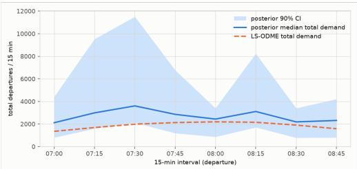

(a) Departure profile  
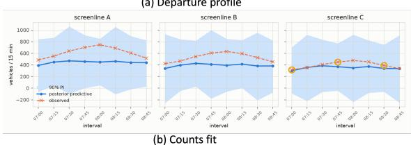

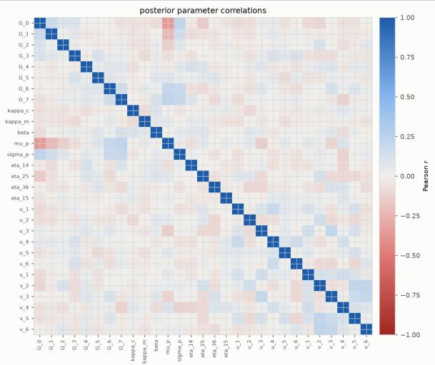

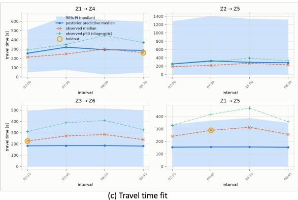

(d) Posterior parameter correlation heatmap  
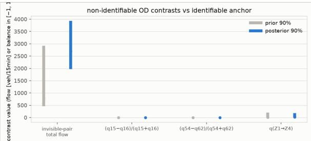  
(e) non-identifiable OD contrasts vs identifiable anchor

Figure 10: DG-T4-3-V2 posterior diagnostics and results. The left column shows total interval demand, posterior-predictive screenline counts, and Bluetooth travel times; circled observations are holdouts and Bluetooth 90th-percentile values are diagnostic only. The right column shows posterior parameter correlations and prior-to-posterior changes in selected non-identifiable OD contrasts. Together, the panels distinguish fit to observed aggregates from uncertainty in the underlying OD cells.

Table 11: MT-T4-4-V2 base-scenario results, averaged over four paired perturbation seeds.
<table><tr><td>Metric</td><td>None</td><td>Truck</td><td>Incentive</td></tr><tr><td>Served share (%)</td><td>58.8</td><td>95.8</td><td>75.1</td></tr><tr><td>Served share, low-income origins (%)</td><td>40.9</td><td>95.7</td><td>64.7</td></tr><tr><td>Served share, high-income origins (%)</td><td>94.1</td><td>95.8</td><td>95.8</td></tr><tr><td>Total motorized VKT (km)</td><td>43.8</td><td>82.5</td><td>75.2</td></tr><tr><td>Truck VKT (km)</td><td>0.0</td><td>10.7</td><td>0.0</td></tr><tr><td>Truck CO2 (kg)</td><td>0.00</td><td>2.13</td><td>0.00</td></tr><tr><td>Incentive cost (USD)</td><td>0.0</td><td>0.0</td><td>94.0</td></tr></table>

the selected event-driven formulation required no TraCI state-transfer loop. Retrieval thus provided candidate capabilities rather than commands that had to be applied mechanically.

## E.2 Memory-Guided Inference and Task-Specific Extension

Using the retrieved procedures, the action agent assigned SUMO to network construction and routetime validation, while implementing scooter inventory, battery state, walking, docking, truck movement, and incentive decisions in a task-owned discrete-event engine. This division illustrates adaptive skill use: stored procedures supplied reliable components, while the LLM constructed the domainspecific mechanism absent from memory.

The agent then executed paired policy comparisons under four base perturbations and two rain perturbations, producing 18 policy–scenario–seed runs. Within the action agent’s inner loop, it corrected four local defects involving metric calculation, incentive logic, report generation, and route validation. The critic subsequently reran the complete workflow, obtained byte-identical outputs, checked every explicit task requirement, and accepted the first outer attempt. Non-blocking modeling qualifications were retained in the report rather than treated as reasons to discard an otherwise verified result.

## E.3 Verified Result and Output

Table 11 reports the base-scenario means. Scheduled truck rebalancing raised served share from 58.8% without rebalancing to 95.8%; incentives raised it to 75.1%. The largest distributional change occurred at low-income-origin stations, where served share rose from 40.9% to 95.7% under the truck policy. The truck added 10.7 km of combustion-vehicle travel and 2.13 kg of $\mathrm { C O } _ { 2 }$ , while the incentive policy incurred no truck travel but paid \$94.0 per simulated day on average. Neither full-dock failures nor sidewalk conflicts occurred in the abstract network.

The policy ordering remained stable in the rain sensitivity case, with served shares of 87.6%, 98.9%, and 97.8% for no rebalancing, truck rebalancing, and incentives, respectively. Considering availability, equity, VKT, emissions, and cost together, the action agent recommended the truck policy as the primary strategy and incentives as a rebalancing complement without truck travel.

The final output included five task scripts, the SUMO network and specification, route-time validation, machine-readable aggregate and per-seed results, request-level outcome files, a written report, and two figures. Figure 11 combines the network representation derived from the retrieved infrastructure procedures with the policy, equity, and VKT outcomes produced by the task-owned engine. The critic’s non-blocking qualifications were retained in the report so that the accepted result remained reproducible and appropriately scoped.

## E.4 Cross-Case Interpretation

The three cases illustrate complementary forms of memory-guided inference. OA-T3 composed mature procedural and semantic artifacts and required repeated critic-guided correction. DG-T4-3-V2 used memory as methodological scafolding for a likelihood-free estimator that had to be constructed in task-owned code. MT-T4-4-V2 selectively transferred procedural skills despite having no matching semantic page and set aside retrieved skills that were unnecessary. Across all three cases, the action agent selected, adapted, and composed memory into a task-specific workflow; the critic verified the artifacts and claims; and the final output preserved scripts, data, results, and figures for reproduction.

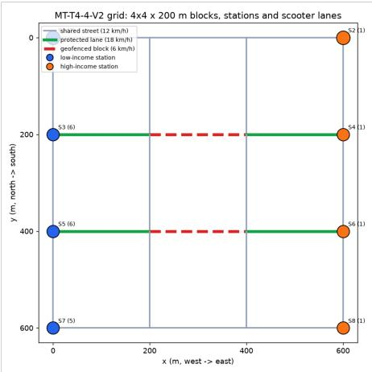  
(a) Network Illustration

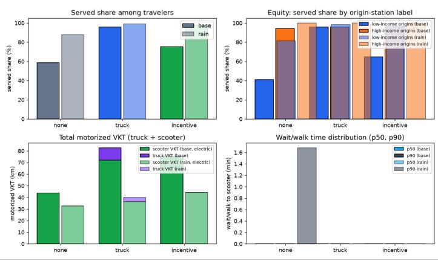  
(b) Result Analysis  
Figure 11: MT-T4-4-V2 network and policy outcomes. The left panel shows station locations, incomearea labels, protected scooter lanes, and geofenced low-speed blocks. The right panels compare served share, served share by origin-station label, total motorized VKT, and wait/walk time for no rebalancing, truck rebalancing, and incentive rebalancing under base and rain demand.

Because all tasks ran in test mode, none could alter the memory available to subsequent benchmark tasks.