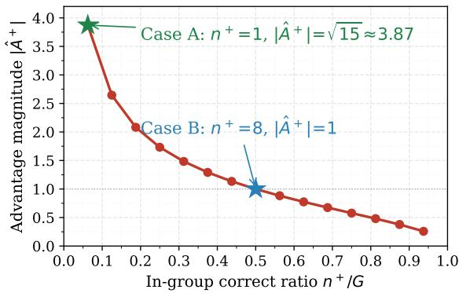
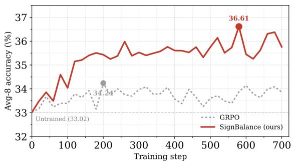
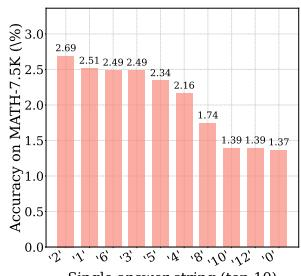
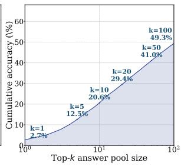
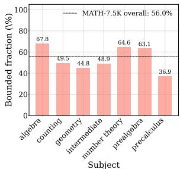
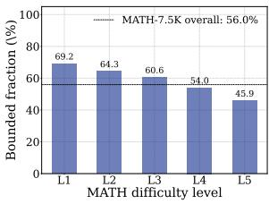
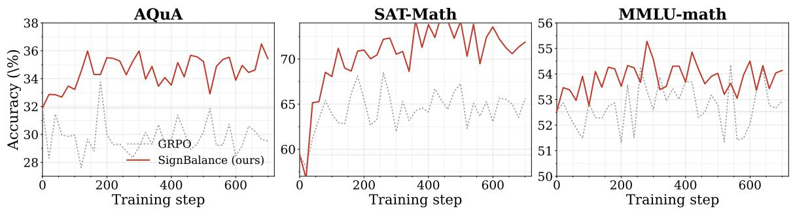

# Spurious Advantage Hidden in GRPO

Jiamian Wang1, Samyadeep Basu2, Koustava Goswami2, Tong Yu2, Zhiqiang Tao1 1Rochester Institute of Technology, 2Adobe Research

## Abstract

Group Relative Policy Optimization (GRPO) is widely studied for reinforcement learning with verifiable rewards, where its advantage estimator assigns each rollout a magnitude from within-group reward statistics. In the common case, this magnitude rewards rollouts that reach the correct answer through reasoning. Yet, an overlooked case shares the same surface: a rollout may land on it by guessing, and the formula still assigns a high magnitude, which we identify as the spurious advantage. This arises in three cases: bounded-answer tasks with a small candidate set; open-answer sets hosting bounded sub-cases; and search agents whose budget opens many paths to the same answer. In all three, this misleads the policy toward guess-like behaviors. We propose SIGNBAL-ANCE, whose magnitude is composition-free: it keeps the verifier sign, uses a global scale, and restores zero-mean balance via a stop-gradient per-class rescaling. Across math and searchagent benchmarks at different scales, SIGN-BALANCE matches GRPO on open-answer math and improves on bounded-answer math and search agents. Code will be released.

## 1 Introduction

Reinforcement learning with verifiable rewards (RLVR) has become the standard recipe for posttraining large language models on reasoning tasks, and Group Relative Policy Optimization (GRPO) (Shao et al., 2024) is widely studied in this line, where a group of rollouts is sampled per prompt, each rollout is scored by a binary verifier, and the per-rollout advantage is constructed from within-group reward statistics (Shao et al., 2024; Guo et al., 2025). Recent improvements operate around this estimator, e.g., refining the clip range, replacing or removing the normalization term, reshaping the sampling strategy, etc. (Yu et al., 2026; Liu et al., 2025; Xiao et al., 2025; Wu et al., 2025a).

The GRPO advantage estimator applies the same within-group normalization formula on every task, where the magnitude assigned to each rollout is determined by the in-group correct/wrong composition, regardless of whether the prompt is an open-answer math problem or a multi-choice question, and whether the rollout is a single answer or a multi-turn search trajectory. In the common case, a correct rollout earns its magnitude because the policy reasoned through the problem, which serves as an effective weight for the gradient. Yet, an overlooked case shares the same surface: a rollout can land on the correct answer by guessing one candidate answer rather than by reasoning, still attaining it a high magnitude. The estimator does not distinguish the two. The per-rollout gradient weight then contains a component that comes from guessing, misleading the policy toward learning lucky-guess trajectories instead of reasoning. We call this component the spurious advantage.

The spurious advantage shows up most directly on bounded-answer tasks. Consider a multi-choice prompt with k options (e.g., k = 4): even without any reasoning, a policy that randomly picks one option still hits the gold answer with probability 1/k. Within a group of G rollouts, a rollout that arrives at the correct option by guessing and another that arrives at it by reasoning receive the very same per-rollout magnitude from the within-group formula, and therefore feed the policy update with the same gradient weight. The guessing one is a noisy signal that latently encourages the policy to imitate lucky guesses rather than to reason.

Interestingly, this phenomenon is not exclusive to bounded-answer benchmarks; it can quietly extend to other settings whose effective answer surface remains finite. On the training-data side, even a nominally open-answer math corpus can be far from uniformly open: in MATH-7.5K, 55.95% of problems admit short numeric or categorical answers, so the corpus is in fact a mixture of many small bounded sub-cases (Table 1), leaving the policy a non-negligible probability of guessing into the gold answer. On the search-agent side, a multiturn rollout with a larger action budget explores a wider set of possible paths to the final answer, and many of these paths involve redundant or invalid searches yet still cash out as correct via outcomeonly reward. The estimator assigns those guessed or detoured rollouts the same high magnitude as the genuinely reasoned ones, so the spurious advantage enters the gradient weight in both settings. This motivates an advantage estimator that separates the guessing component from the reasoning one.

To this end, we propose an advantage estimator, SIGNBALANCE, whose per-rollout magnitude does not depend on the within-group composition, i.e., $( n ^ { + } , n ^ { - } )$ . The spurious component no longer enters the per-rollout gradient weight. SIGNBAL-ANCE keeps the verifier sign of each rollout, replaces the composition-dependent magnitude with a global scale, and restores the batch-level zeromean force balance through a stop-gradient perclass rescaling. It is parameter-free, leaves the PPO-style surrogate unchanged, and adds no external model or inference-time cost. We summarize the contributions as follows:

• This work isolates a spurious advantage phenomenon in GRPO advantage estimator, which can mislead the policy toward learning guesslike behaviors rather than effective reasoning.

• This work identifies three cases where this component becomes large: bounded-answer tasks, bounded cases hidden in open-answer training sets, and multi-turn search agents with outcome-only reward, providing a unified lens to revisit GRPO’s learning signal.

• This work proposes SIGNBALANCE, an advantage estimator whose magnitude does not depend on within-group composition, is parameter-free, keeps the PPO-style surrogate unchanged, and introduces no external model or inference-time cost.

• Experiments across math reasoning and searchagent tasks, and across different model scales, show consistent gains. We hope this work may invite further attention to how GRPO interacts with the structure of specific tasks.

## 2 Related Work

GRPO and Its Variants. GRPO (Shao et al., 2024) estimates per-rollout advantage from the in-group reward distribution and removes the PPO value network, and has driven strong results on open-answer math reasoning at scale (Shao et al., 2024; Guo et al., 2025). A rich body of follow-up work has refined the surrounding mechanics on clipping and sampling (Yu et al., 2026; Xiong et al., 2025), on normalization and aggregation (Liu et al., 2025; Xiao et al., 2025; Wu et al., 2025a; Zhao et al., 2025b; He et al., 2025b; Pang et al., 2025), on advantage shaping (Wang et al., 2025a; Huang et al., 2025; Chen et al., 2025a; Zhang et al., 2025), on the treatment of wrong rollouts and all-wrong groups (Zhu et al., 2026; Nan et al., 2025; Feng et al., 2025; Li et al., 2025a), and on multi-objective composite rewards (Ichihara et al., 2025). These efforts achieve strong empirical results within their respective scopes; their evaluations and design choices center on open-answer math, where the GRPO magnitude assignment can be treated as a universally applicable credit signal.

Advantage Estimators. A complementary line of work analyzes the GRPO advantage estimator itself. Mroueh (Mroueh, 2025) derives the closedform weighting that GRPO implicitly applies under binary rewards, $\omega ^ { + } ( p ) ~ = ~ \sqrt { ( 1 - p ) / p }$ and $\omega ^ { - } ( p ) = - \sqrt { p / ( 1 - p ) }$ , and shows that GRPO is equivalent to an adaptive weighted contrastive loss in which rare-success rollouts receive large positive weight; this adaptive weighting is afeature on open-answer math, where rare success corresponds to a rare reasoning trajectory. Other analyses give complementary characterizations of the estimator from cross-prompt expectation (Yang et al., 2026), rank-bias (He et al., 2025a), KL-constrained closed-form (Zhang et al., 2026), group-size scaling (Wu et al., 2025b), supervised-learning reframings (Li et al., 2025b, 2026) angles. We adopt Mroueh’s closed-form as the starting point of our analysis. While the works above develop theory of the estimator within the regime where the withingroup composition reflects reasoning, our analysis focuses on the complementary regime: we identify three structural cases in which this composition acquires a reasoning-independent component, and design an advantage variant whose magnitude is independent of this composition.

## 3 Method

Section 3.1 introduces the preliminaries of GRPO. Section 3.2 examines the learning signal within GRPO, and introduces the spurious advantage phe-

nomenon that has been overlooked. Section 3.3 diagnoses the effect of this phenomenon. Section 3.4 presents the proposed method.

## 3.1 Preliminary

Given a question q and a current policy $\pi _ { \theta } .$ GRPO (Shao et al., 2024) samples a group of G rollouts $\{ \tau _ { 1 } , \dots , \tau _ { G } \}$ from the old policy $\pi _ { \theta _ { \mathrm { o l d } } }$ and assigns each rollout a binary verifier reward $r _ { i } \in \{ + 1 , - 1 \}$ . We write $n ^ { + }$ and $n ^ { - } = G - n ^ { + }$ for the in-group counts of correct and wrong rollouts, and refer to $( n ^ { + } , n ^ { - } )$ as the within-group composition. The per-rollout advantage is computed by within-group standardization,

$$
\hat { A } _ { i } = \frac { r _ { i } - \mu } { \sigma + \varepsilon } ,\tag{1}
$$

where $\begin{array} { r } { \mu = \frac { 1 } { G } \sum _ { j } r _ { j } , \sigma ^ { 2 } = \frac { 1 } { G } \sum _ { j } ( r _ { j } - \mu ) ^ { 2 } } \end{array}$ , and $\varepsilon$ is a numerical stabilizer. The policy is then updated with a PPO-style clipped surrogate,

$$
\begin{array} { r l r } & { } & { { \mathcal L } _ { \mathrm { G R P O } } ( \theta ) = - \displaystyle \frac { 1 } { G } \sum _ { i = 1 } ^ { G } \frac { 1 } { | \tau _ { i } | } \sum _ { t = 1 } ^ { | \tau _ { i } | } \mathrm { m i n } \big ( w _ { i , t } ( \theta ) \hat { A } _ { i } , } \\ & { } & { \mathrm { c l i p } ( w _ { i , t } ( \theta ) , 1 - \epsilon , 1 + \epsilon ) \hat { A } _ { i } \big ) + \beta \mathrm { K L } \big [ \pi _ { \theta } \| \pi _ { \mathrm { r e f } } \big ] , } \\ & { } & { ( 2 } \end{array}\tag{2}
$$

where $w _ { i , t } ( \theta ) ~ = ~ \frac { \pi _ { \theta } ( \tau _ { i , t } \mid q , \tau _ { i , < t } ) } { \pi _ { \theta _ { \mathrm { o l d } } } ( \tau _ { i , t } \mid q , \tau _ { i , < t } ) }$ is the pertoken importance ratio. The advantage ${ \hat { A } } _ { i }$ enters Eq. (2) as a scalar multiplier on the token-level loglikelihood ratio. Taking the gradient with respect to $\theta$ (and ignoring the KL term in the unclipped regime where $w _ { i , t } { \approx } 1 )$ gives

$$
\nabla _ { \boldsymbol { \theta } } \mathcal { L } _ { i } ( \boldsymbol { \theta } ) \ = \ - \ \hat { A } _ { i } \cdot \frac { 1 } { | \tau _ { i } | } \sum _ { t = 1 } ^ { | \tau _ { i } | } \nabla _ { \boldsymbol { \theta } } \log \pi _ { \boldsymbol { \theta } } ( \tau _ { i , t } \mid \boldsymbol { q } , \tau _ { i , < t } ) ,\tag{3}
$$

where $| \hat { A } _ { i } |$ is the per-rollout scalar weight on rollout $i \ ' _ { \mathrm { { s } } }$ gradient contribution to the policy update (see Appendix B for further discussion).

Substituting $r _ { i } \in \{ + 1 , - 1 \}$ into the definitions of $\mu$ and $\sigma$ and grouping by reward class, the group reward statistics can be simplified to

$$
\mu = \frac { n ^ { + } - n ^ { - } } { G } , \quad \sigma = \frac { 2 \sqrt { n ^ { + } n ^ { - } } } { G } ,\tag{4}
$$

and substituting into Eq. (1) gives

$$
\hat { A } ^ { + } = \sqrt { n ^ { - } / n ^ { + } } , \quad \hat { A } ^ { - } = - \sqrt { n ^ { + } / n ^ { - } } ,\tag{5}
$$

which has also been derived in concurrent work (Mroueh, 2025). The magnitude assigned to any rollout is thus a function of $( n ^ { + } , n ^ { - } )$ alone (Figure 1). The content of the rollout and the policy’s confidence on the prompt do not enter.

Figure 1: Illustration of GRPO’s advantage estimator. Per-rollout magnitude $| { \hat { A } } ^ { + } | = { \sqrt { n ^ { - } / n ^ { + } } }$ is a function of the within-group correct ratio $n ^ { + } / G$ under binary rewards. The smaller $n ^ { + }$ is, the larger $| \hat { A } ^ { + } |$ becomes: when a policy happens to obtain a rare correct rollout (small $n ^ { + } )$ by chance rather than by reasoning, the estimator nevertheless assigns it a large $| \hat { A } ^ { + } |$ , which by Eq. (3) translates into a disproportionately high gradient weight on that rollout. We examine this effect on the learning signal in Section 3.2.

## 3.2 Impact of the GRPO advantage estimator

The magnitude in Eq. (5) is largest in imbalanced groups. For $G = 1 6 .$ , a rare-correct group $( n ^ { + } = 1 )$ gives $| \hat { A } ^ { + } | = \sqrt { 1 5 } \approx 3 . 8 7$ , while a balanced group $( n ^ { + } = 8 )$ gives $| \hat { A } ^ { + } | = 1$ . The estimator amplifies the gradient on the rare-correct rollout by a factor of roughly 3.87 over the rollout in a balanced group, even though the verifier reward is the same.

Notably, the PPO-style clip in Eq. (2) bounds the importance ratio $w _ { i , t }$ but not $\vert { \hat { A } } _ { i } \vert \colon$ in the common case where $w _ { i , t } \approx 1 \left( \mathrm { e . g . } \right.$ , the first inner update before the policy drifts), the full $| \hat { A } _ { i } |$ enters the gradient through Eq. (3). The clip therefore hardly removes the per-rollout amplification we describe, and our experiments in Section 4 show that the amplification leads to measurable performance gaps rather than being absorbed.

To examine what learning signal this amplification carries, we decompose the per-prompt success probability $p _ { q }$ by the source of the +1 outcome:

$$
\underbrace { p _ { q } } _ { \mathrm { p r o b . \ o f } \ r = + 1 } = \underbrace { p _ { \mathrm { r } } } _ { \mathrm { f r o m \ r e a s o n i n g } } + \underbrace { ( 1 - p _ { \mathrm { r } } ) \cdot p _ { \mathrm { g } } } _ { \mathrm { f r o m \ n o n - r e a s o n i n g } } ,\tag{6}
$$

where $p _ { \mathrm { r } }$ is the probability that the policy obtains the correct answer through reasoning, and $p _ { \mathrm { g } }$ is the probability of obtaining the correct answer in any other way (for example, by emitting one of a small set of candidate answers without reasoning). The within-group count $n ^ { + } \sim$ Binomial $( G , p _ { q } )$ then has a contribution from each source. Substituting Eq. (6) into Eq. (5), the magnitude $\sqrt { n ^ { - } / n ^ { + } }$ acts on a count $n ^ { + }$ whose expectation $G p _ { q }$ inherits both components; the rare-correct push the estimator delivers in an imbalanced group therefore consists of a learning signal driven by reasoning and a component driven by the second term of Eq. (6). We refer to the latter component as the spurious advantage in the GRPO learning signal.

When $p _ { \mathrm { g } } \approx 0$ , the second term of Eq. (6) vanishes and the spurious advantage is small. This is the case for open-answer mathematical reasoning (Mroueh, 2025; Shao et al., 2024; Guo et al., 2025) (See more in Appendix A). The spurious advantage becomes sizeable when $p _ { \mathrm { g } }$ is not small; the next subsection works out two such cases.

## 3.3 Cases with a sizeable spurious advantage

Bounded answer sets. When the task admits only a small set of candidate answers (e.g., multi-choice with k options), a policy that emits one candidate at random hits the correct answer with probability $p _ { \mathrm { g } } \approx 1 / k$ . For 4-choice with $G \ : = \ : 1 6 .$ , Eq. (6) gives a baseline expectation of $G \cdot p _ { \mathrm { g } } = 4$ correct rollouts from non-reasoning alone. An observed group with $n ^ { + } = 1$ sits below this baseline; yet the estimator assigns the lone correct rollout magnitude $| \hat { A } ^ { + } | = \sqrt { 1 5 } \approx 3 . 8 7$ . By Eq. (6), the expected fraction of this magnitude is

$$
\frac { p _ { \mathrm { r } } } { p _ { q } } \ = \ \frac { p _ { \mathrm { r } } } { p _ { \mathrm { r } } + ( 1 - p _ { \mathrm { r } } ) / k } ,\tag{7}
$$

which is small whenever $p _ { \mathrm { r } }$ is comparable to or below $1 / k$ . The same form applies to any task with a finite candidate set, $e . g .$ ., bounded-output classification and QA over a closed vocabulary.

A nominally open-answer training set can also exhibit the bounded case on a sizeable subset of its problems. We analyze MATH-7.5K by the syntactic shape of the gold answer, and group them into 11 shape categories (Table 1; see Appendix C for per-quantity derivations). Five of the 11 categories are flagged as bounded, together covering 55.95% of MATH-7.5K, indicating that even an open-answer benchmark can contain a sizeable subset with closed answer form. Section 4.3 returns to this point with the per-string empirical baseline and the per-level breakdown.

Multi-turn search agents. Consider a search agent (e.g., Search-R1) that, on a prompt q, samples G trajectories with up to B search invocations per trajectory. Let $T _ { i } \in \{ 1 , \ldots , B \}$ denote the actual number of turns at which trajectory i terminates, and let $a _ { i } = ( a _ { i , 1 } , \ldots , a _ { i , T _ { i } } )$ denote its turn-level decision sequence (when to search, what query to issue, when to answer). The reward is computed at the trajectory endpoint upon the exact-match score,

<table><tr><td>Category</td><td># / Share (%)</td><td>Guess hit rate (pg)</td><td>Bounded</td></tr><tr><td>int_smal1 [-10,10]</td><td>1806 / 24.41</td><td>4.76%</td><td>√</td></tr><tr><td>int_medium [-100,100]</td><td>1701 / 22.99</td><td>0.50%</td><td>√</td></tr><tr><td>expression</td><td>1544 / 20.87</td><td>0.00%</td><td>一</td></tr><tr><td>int_large</td><td>1206 / 16.30</td><td>0.00%</td><td></td></tr><tr><td>simple_fraction</td><td>556 / 7.51</td><td>1.00%</td><td>√</td></tr><tr><td>tuple_or_list</td><td>270 / 3.65</td><td>0.00%</td><td></td></tr><tr><td>other</td><td>121 / 1.64</td><td>0.00%</td><td></td></tr><tr><td>decimal_short</td><td>116 / 1.57</td><td>0.00%</td><td></td></tr><tr><td>finite_set_listed</td><td>46 / 0.62</td><td>20.00%</td><td>√</td></tr><tr><td>percent</td><td>31 / 0.42</td><td>0.99%</td><td>√</td></tr><tr><td>empty</td><td>2 / 0.03</td><td>0.00%</td><td></td></tr></table>

Table 1: Answer-shape distribution of MATH-7.5K. # / Share (%) reports the problem count in each shape category and its percent over the 7,399 parsable problems. Guess hit rate is the probability that a random answer exactly matches the gold answer, i.e., $1 / S$ for a category with a finite answer surface of size S and 0 when the surface is open-ended. The bounded categories cover 55.95% of MATH-7.5K.

$$
r _ { i } = \mathbf { 1 } \big [ \hat { y } ( a _ { i } ) = y ^ { * } \big ] , \qquad r _ { i } \perp T _ { i } , r _ { i } \perp a _ { i } ,\tag{8}
$$

in the sense that $r _ { i }$ depends on the trajectory only through its final answer $\hat { y } ( a _ { i } )$ . Trajectories with very different $( T _ { i } , a _ { i } )$ can yield $r _ { i } = 1$ . For two trajectories $i , j$ on the same prompt with $r _ { i } = r _ { j } = 1$ but $( T _ { i } , a _ { i } ) \neq ( T _ { j } , a _ { j } )$ , Eq. (5) assigns the identical magnitude $\hat { A } _ { i } = \hat { A } _ { j } = \sqrt { n ^ { - } / n ^ { + } }$ . Splitting $p _ { q }$ as in Eq. (6), $p _ { \mathrm { g } }$ now includes the probability that the policy terminates with a correct final answer through any trajectory. This contribution can be sizeable when B is not small, since the space of $( T _ { i } , a _ { i } )$ that can land on the correct yˆ is large.

## 3.4 Proposed method: SIGNBALANCE

We construct an advantage whose magnitude does not depend on $( n ^ { + } , n ^ { - } )$ and which therefore does not carry the spurious component identified in Section 3.2. We refer to the resulting variant as SIGN-BALANCE and present it in three steps. Each step removes one dependence of Eq. (5) on $( n ^ { + } , n ^ { - } )$

Step 1: per-class normalization. Normalize correct and wrong rollouts separately,

$$
\hat { A } _ { i } ^ { ( 1 ) } = \frac { r _ { i } - \mu ^ { c ( i ) } } { \sigma ^ { c ( i ) } + \varepsilon } ,\tag{9}
$$

where $c ( i ) \in \{ + , - \}$ and $( \boldsymbol { \mu } ^ { c ( i ) } , \boldsymbol { \sigma } ^ { c ( i ) } )$ are statistics inside the correct or wrong subgroup. Given such a design, a correct rollout in an imbalanced group is no longer rescaled against many wrong rollouts. However, $\sigma ^ { + }$ still depends on $n ^ { + }$ alone and $\sigma ^ { - }$ on n− alone; the per-class magnitude remains a function of within-group counts.

Step 2: sign-only magnitude. Collapse the magnitude to a global scale,

$$
\hat { A } _ { i } ^ { ( 2 ) } = \mathrm { s i g n } ( r _ { i } ) \cdot c .\tag{10}
$$

Such a design fully decouples the per-rollout magnitude from $( n ^ { + } , n ^ { - } )$ and the magnitude no longer depends on within-group composition. However, the total correct-side force $\begin{array} { r } { \sum _ { i \in + } | \hat { A } _ { i } ^ { ( 2 ) } | = n ^ { + } } \end{array}$ ·c no longer matches the wrong-side force $n ^ { - } \cdot c$ whenever $n ^ { + } \neq n ^ { - }$ , so the batch-level zero-mean property of the GRPO advantage is broken.

Step 3: sign with per-class force balance. The proposed main variant restores batch-level zeromean without reintroducing a count-dependent perrollout magnitude:

$$
\begin{array} { l l } { { \hat { A } ^ { + } = c , \qquad \hat { A } ^ { - } = - c \cdot \mathrm { s g } \Big [ \frac { n ^ { + } } { n ^ { - } } \Big ] , } } \end{array}\tag{11}
$$

where sg[·] is the stop-gradient operator. The rescaling enforces $\begin{array} { r } { \sum _ { i \in + } | \hat { A } _ { i } ^ { ( 3 ) } | = \sum _ { i \in - } | \hat { A } _ { i } ^ { ( 3 ) } | } \end{array}$ , while the per-rollout magnitude c remains constant.

Summary. The proposed Eq. (11) is a drop-in replacement for Eq. (1) inside the GRPO loss Eq. (2). It is parameter-free apart from the global scale c, introduces no external model, and adds no inference cost. Since the per-rollout magnitude does not read from $( n ^ { + } , n ^ { - } )$ , the spurious advantage isolated in Section 3.2 does not enter the gradient assignment.

## 4 Experiments

## 4.1 Experimental Settings

Backbone and training data. We adopt Qwen2.5- 0.5B-Instruct as the primary policy and Qwen2.5- 3B-Base for scale generalization, training on the MATH dataset (Hendrycks et al., 2021) (∼ 7,500 problems) with G = 16 rollouts per question (max response length 8,192). Optimization uses learning rate $1 \times 1 0 ^ { - 6 }$ , KL coefficient $\beta = 1 \times 1 0 ^ { - 3 }$ , up to 1000 steps; the reward is binary, from a rulebased verifier matching the ground-truth answer. For the search-agent setting, we adopt Qwen2.5- 7B-Instruct as the policy.

Evaluation. We evaluate across three settings tailored to the model capacity. (a) 0.5B math reasoning. We use 8 math benchmarks, split by answer space into the open-answer group (free-form numeric or symbolic answer:

  
Figure 2: SignBalance’s Avg-8 advantage over GRPO is sustained across the entire training trajectory, not just at the best checkpoint reported in Table 2.

GSM8K (Cobbe et al., 2021), MATH-500 (Lightman et al., 2024), Minerva-Math (Lewkowycz et al., 2022), OlympiadBench (He et al., 2024)) and the bounded-answer group (correct answer drawn from a small set: MMLU-math (Hendrycks et al., 2020), SAT-Math (Zhong et al., 2024), AQuA (Ling et al., 2017), AMC (Jia et al., 2024)). We report per-benchmark accuracy and the overall mean Avg-8. (b) 3B math reasoning. Following (Wang et al., 2025a), we use a more difficult 8-benchmark suite (GSM8K (Cobbe et al., 2021), MATH-500 (Lightman et al., 2024), Minerva-Math (Lewkowycz et al., 2022), Gaokao (Zhang et al., 2024), OlympiadBench (He et al., 2024), College Math (Tang et al., 2024), AIME24 (Jia et al., 2024), AMC23 (Jia et al., 2024)) covering both standard and competition-grade math, and report Avg-8. (c) Search-agent QA. We use the 6-benchmark text-QA following Search-R1 (Jin et al., 2025): NQ (Kwiatkowski et al., 2019), TriviaQA (Joshi et al., 2017), PopQA (Mallen et al., 2023) (single-hop) and HotpotQA (Yang et al., 2018), 2WikiMultiHopQA (Ho et al., 2020), MuSiQue (Trivedi et al., 2022) (multi-hop). We report the mean Avg-6 upon exact match score.

Baselines. The 0.5B and 3B comparisons both cover: the untrained backbone; the classical criticbased actor-critic method PPO (Schulman et al., 2017); the modernized REINFORCE-style baseline REINFORCE++ (Hu, 2026); the group-relative baseline RLOO (Ahmadian et al., 2024); standard GRPO (Shao et al., 2024) and its recent variants Dr.GRPO (Liu et al., 2025), DAPO (Yu et al., 2026), and BNPO (Xiao et al., 2025). All methods share the same backbone, training data, optimization, and evaluation pipeline; the advantage estimation mechanism is the sole controlled variable.

Agent setting. We further evaluate on Search-R1 (Jin et al., 2025), which trains a search agent with outcome-only reward (exact-match on the final answer) under a multi-turn search protocol with up to B = 4 search invocations per trajectory. Following Search-R1, we use Qwen2.5-7B-Instruct as the policy, adopt the same training corpus, and report exact-match accuracy at evaluation. See more implementation details, in Appendix D.

<table><tr><td rowspan="2">Methods</td><td colspan="4">Open-answer</td><td colspan="4">Bounded-answer</td><td rowspan="2">Avg-8</td></tr><tr><td>GSM8K</td><td>MATH-500</td><td>Min.-M</td><td>Olymp.</td><td>MMLU-m</td><td>SAT-M</td><td>AQuA</td><td>AMC</td></tr><tr><td>Untrained Qwen2.5-0.5B-IT</td><td>47.23</td><td>48.40</td><td>8.46</td><td>10.25</td><td>52.54</td><td>59.38</td><td>31.89</td><td>6.02</td><td>33.02</td></tr><tr><td>PPO</td><td>47.50</td><td>54.20</td><td>6.62</td><td>7.23</td><td>52.81</td><td>67.19</td><td>30.71</td><td>6.02</td><td>34.04</td></tr><tr><td>REINFORCE++</td><td>48.83</td><td>55.20</td><td>6.99</td><td>7.95</td><td>53.61</td><td>64.06</td><td>29.92</td><td>7.23</td><td>34.22</td></tr><tr><td>Dr.GRPO</td><td>48.90</td><td>55.60</td><td>6.99</td><td>8.13</td><td>52.27</td><td>68.75</td><td>25.98</td><td>7.23</td><td>34.23</td></tr><tr><td>GRPO</td><td>49.89</td><td>56.60</td><td>6.25</td><td>7.07</td><td>52.94</td><td>65.62</td><td>29.53</td><td>6.02</td><td>34.24</td></tr><tr><td>RLOO</td><td>49.20</td><td>55.80</td><td>7.35</td><td>7.60</td><td>52.94</td><td>67.19</td><td>30.71</td><td>7.23</td><td>34.75</td></tr><tr><td>BNPO</td><td>49.51</td><td>56.20</td><td>7.35</td><td>8.13</td><td>53.61</td><td>68.75</td><td>33.46</td><td>8.43</td><td>35.68</td></tr><tr><td>DAPO</td><td>48.82</td><td>55.40</td><td>6.25</td><td>8.48</td><td>55.88</td><td>71.88</td><td>36.22</td><td>7.23</td><td>36.27</td></tr><tr><td>Ours</td><td>49.66</td><td>53.60</td><td>8.46</td><td>8.83</td><td>54.14</td><td>71.88</td><td>35.43</td><td>10.84</td><td>36.61</td></tr></table>

Table 2: Main results on 8 math benchmarks (Qwen2.5-0.5B-Instruct, MATH-7.5K training). Benchmarks are split into open-answer (GSM8K, MATH-500, Minerva-Math, Olympiad) and bounded-answer (MMLU-math, SAT-Math, AQuA, AMC). All methods share the same backbone, training data, and evaluation protocol; the advantage construction is the sole controlled variable. Bold: best per column among the RL methods (the Untrained row is a reference and is excluded from the comparison).

## 4.2 Main Results

Table 2 reports the per-benchmark accuracy of GRPO, the GRPO variants, and SIGNBALANCE. We observe two main patterns. On bounded-answer benchmarks, SIGNBALANCE attains the large improvements, e.g., SAT-Math 71.88 vs. GRPO 65.62 (+6.26) and AQuA 35.43 vs. 29.53 (+5.90). A plausible explanation is that when the within-group composition contains a sizeable random-guess component, the count-dependent magnitude in Eq. (5) amplifies that component, while the constant magnitude of SIGNBALANCE does not. Appendix G provides side-by-side reasoning traces in which the GRPO-trained policy produces a correct derivation but selects a wrong letter, while the SIGNBAL-ANCE-trained policy maps the same derivation to the correct letter. Second, on open-answer benchmarks, SIGNBALANCE brings clear improvements over the untrained baseline.

Scale generalization to 3B. We reproduce the same setup on Qwen2.5-3B-Base using the benchmarks introduced in Section 4.1. As shown in Table 3, SIGNBALANCE again attains the highest Avg-8 (43.78), with the largest per-bench margins on the competition and bounded-answer cases (Gaokao +1.2, AMC +1.7, AIME +0.8). The perbench leader count grows from 4/8 at 0.5B to 7/8 at 3B, so the advantage of SIGNBALANCE broadens across benchmarks at the larger scale rather than washing out, even as the absolute Avg-8 gap over GRPO narrows from +2.37 to +0.98.

  
Single answer string (top-10)  
Figure 3: A policy that does no reasoning at all can still score on MATH-7.5K just by guessing popular answer strings. Left: per-string accuracy of a constant policy that always emits one fixed string from the top-10 list (emitting “2” alone scores 2.69%). Right: cumulative accuracy under uniform sampling over the top-k strings (20.6% at k=10, ∼50% at k=100). Even on a freeform math benchmark, there is a measurable lowerbound score from guessing, amplifying the gradientscalar weight defined in Eq. (3).

## 4.3 Empirical Analysis and Discussion

We analyze where the spurious advantage component is large and how it affects the GRPO estimator’s training behavior, on the 0.5B setting.1

Figure 3 shows that a policy that emits no reasoning at all can score on MATH-7.5K by guessing popular answers: constantly outputting the single string “2” scores 2.69%, and uniformly sampling from the top-10 strings reaches 20.6%. Figure 4 shows the bounded-answer fraction is highest on easy problems (Level 1: 69.2% → Level 5: 45.9%), so the spurious advantage component is largest on exactly the problems an early-stage policy is most likely to solve. Together with Table 1 in Section 3.3, these observations confirm that the bounded-answer case is not specific to MCQ benchmarks: it shows up inside what is widely treated as a free-form math training set.

<table><tr><td>Methods</td><td>GSM8K</td><td>MATH-500</td><td>Min.-M</td><td>Gaokao</td><td>Olymp.</td><td>C. Math</td><td>AIME</td><td>AMC</td><td>Avg-8</td></tr><tr><td>Untrained Qwen2.5-3B-Base</td><td>81.6</td><td>58.8</td><td>25.0</td><td>47.0</td><td>24.1</td><td>32.8</td><td>6.5</td><td>35.8</td><td>38.90</td></tr><tr><td>PPO</td><td>84.8</td><td>62.5</td><td>30.0</td><td>51.4</td><td>26.5</td><td>36.0</td><td>6.2</td><td>35.3</td><td>41.59</td></tr><tr><td>REINFORCE++</td><td>85.3</td><td>63.5</td><td>30.6</td><td>52.4</td><td>27.2</td><td>36.5</td><td>7.2</td><td>35.7</td><td>42.30</td></tr><tr><td>Dr.GRPO</td><td>85.5</td><td>63.6</td><td>30.8</td><td>52.6</td><td>27.4</td><td>36.7</td><td>7.5</td><td>36.0</td><td>42.51</td></tr><tr><td>DAPO</td><td>85.1</td><td>65.4</td><td>31.2</td><td>53.0</td><td>27.6</td><td>36.6</td><td>6.2</td><td>35.9</td><td>42.60</td></tr><tr><td>GRPO</td><td>85.7</td><td>64.0</td><td>31.2</td><td>53.0</td><td>27.9</td><td>37.0</td><td>7.7</td><td>36.5</td><td>42.80</td></tr><tr><td>RLOO</td><td>85.9</td><td>64.3</td><td>31.4</td><td>53.2</td><td>28.0</td><td>37.1</td><td>7.8</td><td>36.7</td><td>43.05</td></tr><tr><td>BNPO</td><td>86.0</td><td>64.4</td><td>31.4</td><td>53.4</td><td>28.0</td><td>37.2</td><td>8.0</td><td>37.0</td><td>43.18</td></tr><tr><td>Ours</td><td>86.4</td><td>64.8</td><td>32.0</td><td>54.2</td><td>28.6</td><td>37.5</td><td>8.5</td><td>38.2</td><td>43.78</td></tr></table>

Table 3: Scale generalization on Qwen2.5-3B-Base across an 8-benchmark math suite tailored to the 3B scale (following (Wang et al., 2025a)); see Section 4.1 for the bench list and the rationale for the bench-set change relative to Table 2. Bold: best per column among the RL methods (the Untrained row is a reference).
<table><tr><td rowspan="2">Methods</td><td colspan="2">Single-hop</td><td colspan="3">Multi-hop</td><td rowspan="2">Avg-6</td></tr><tr><td>NQ</td><td>TriviaQA PopQA</td><td>HotpotQA</td><td>2Wiki</td><td>MuSiQue</td></tr><tr><td>R-Search (Zhao et al., 2025a)</td><td>34.71 58.85</td><td>36.17</td><td>32.59</td><td>29.76</td><td>12.83</td><td>34.15</td></tr><tr><td>ZeroSearch (Sun et al., 2025)</td><td>36.29 57.09</td><td>35.79</td><td>32.11</td><td>34.90</td><td>10.88</td><td>34.51</td></tr><tr><td>DeepResearcher (Zheng et al., 2025)</td><td>35.60 58.44</td><td>37.06</td><td>34.85</td><td>31.39</td><td>14.40</td><td>35.29</td></tr><tr><td>ReSearch (Chen et al., 2025b)</td><td>36.40 58.71</td><td>38.87</td><td>34.88</td><td>27.97</td><td>17.09</td><td>35.65</td></tr><tr><td>Search-R1 (Jin et al., 2025)</td><td>39.20 59.22</td><td>38.91</td><td>36.16</td><td>27.58</td><td>14.94</td><td>36.00</td></tr><tr><td>StepSearch (Wang et al., 2025b)</td><td>36.84 57.51</td><td>36.41</td><td>36.31</td><td>32.05</td><td>19.53</td><td>36.44</td></tr><tr><td>Ours</td><td>39.25</td><td>59.30 39.00</td><td>36.55</td><td>35.20</td><td>17.50</td><td>37.80</td></tr></table>

Table 4: Exact-match accuracy on six text-based QA benchmarks under the search-agent scenario (Qwen2.5-7B-Instruct, Section 4.1). All methods use E5-base-v2 with Wikipedia-18 as the retriever and identical inference parameters; the advantage estimation mechanism within the GRPO outer loop is the sole controlled variable.

  
Figure 4: The bounded-answer fraction concentrates on the easy subset of MATH-7.5K. Left: bounded-answer fraction by subject. Right: bounded-answer fraction by MATH difficulty level. The fraction drops monotonically from 69.2% at Level 1 to 45.9% at Level 5; easier problems tend to have small answer surfaces (e.g., 0–10 integers), which are exactly the problems an early-stage policy is most likely to solve, amplifying the spurious advantage during early training.

## 4.4 Multi-Turn Agent Training

Table 4 reports exact-match accuracy under the search-agent scenario described in Section 4.1, where the multi-turn trajectory structure of Section 3.3 applies. We compare SIGNBALANCE against six representative search-agent methods: Search-R1 (Jin et al., 2025), StepSearch (Wang et al., 2025b), ZeroSearch (Sun et al., 2025), R-Search (Zhao et al., 2025a), ReSearch (Chen et al., 2025b), and DeepResearcher (Zheng et al., 2025).

SIGNBALANCE attains the highest Avg-6 (37.80, +1.36 over StepSearch and +1.80 over Search-R1) and is the per-bench leader on 5 of the 6 benchmarks. The largest single-bench gain over Search-R1 appears on 2WikiMultiHopQA (35.20 vs. 27.58, +7.62), the most multi-hop-intensive bench in the suite. The one bench where SIGN-BALANCE is not the per-bench leader is MuSiQue, where StepSearch’s step-level reward shaping (a procedure-level addition orthogonal to advantageestimator design) holds the top spot. The advantage estimator in vanilla GRPO can encourage the policy to guess the correct answer, fitting the underlying statistics and lacks generalization ability. The proposed method enhances the generalization, benefiting the broader scenarios, when there are same outer GRPO loop, same training corpus, and only the per-rollout advantage differs.

## 4.5 Ablation on the Advantage Estimation

We compare the three steps of SIGNBALANCE (Section 3.4) against the GRPO baseline and against a fixed asymmetric boost following Table 2.

Figure 5: The per-bench gains of SIGNBALANCE over GRPO on bounded-answer benchmarks are sustained across the training trajectory, not concentrated at a single checkpoint. Per-checkpoint accuracy on AQuA, SAT-Math, and MMLU-math; best-checkpoint values match the corresponding columns of Table 2.
<table><tr><td rowspan="2">Variants</td><td colspan="4">Open-answer</td><td colspan="4">Bounded-answer</td><td rowspan="2">Avg-8</td></tr><tr><td>GSM8K</td><td>MATH-500</td><td>Min.-M</td><td>Olymp.</td><td>MMLU-m</td><td>SAT-M</td><td>AQuA</td><td>AMC</td></tr><tr><td>GRPO baseline</td><td>49.89</td><td>56.60</td><td>6.25</td><td>7.07</td><td>52.94</td><td>65.62</td><td>29.53</td><td>6.02</td><td>34.24</td></tr><tr><td>Sep. norm (Step 1)</td><td>48.50</td><td>55.80</td><td>6.80</td><td>7.60</td><td>53.61</td><td>62.50</td><td>31.10</td><td>9.20</td><td>34.39</td></tr><tr><td>Asym. boost</td><td>46.93</td><td>53.40</td><td>6.99</td><td>7.95</td><td>52.94</td><td>71.88</td><td>31.89</td><td>8.43</td><td>35.05</td></tr><tr><td>Sign-only (Step 2)</td><td>47.99</td><td>51.80</td><td>7.72</td><td>8.13</td><td>53.61</td><td>71.88</td><td>29.92</td><td>9.64</td><td>35.09</td></tr><tr><td>Ours (Step 3)</td><td>49.66</td><td>53.60</td><td>8.46</td><td>8.83</td><td>54.14</td><td>71.88</td><td>35.43</td><td>10.84</td><td>36.61</td></tr></table>

Table 5: Ablation on the advantage estimation. “Sep. norm” is Step 1 of SIGNBALANCE (class-separate normalization, Section 3.4); “Sign-only” is Step $2 ( \hat { A } ^ { + } = \hat { A } ^ { - } = c ,$ , no force balance); “Asym. boost” is a fixed-factor variant $( \hat { A } ^ { + } = 2 . 5 , \hat { A } ^ { - } = - 1 )$ included to isolate the role of force balance: it also removes the per-rollout count dependence, but with a hand-coded asymmetry that breaks the batch-level zero-mean property; “Ours” is the full SIGNBALANCE (Step 3, sign + per-class force balance).

Step 1 improves AQuA a bit and brings a marginal gain over GRPO, contributing to the crossclass scale interaction. Step 2 removes the perrollout count dependence and improves SAT-Math by +6.26 over GRPO and AMC by +3.62, but reduces MATH-500 by 4.80 due to the loss of batchlevel force balance. This matches the intuition in Section 3.3 where the spurious advantage peaks on bounded-answer tasks. The asymmetric boost is an additional factor that also removes the per-rollout count dependence by replacing the matched force balance with a hand-coded asymmetry. We hypothesis that the 1.56 gap between Asym. (35.05) and Ours (36.61) could be caused by the hand-coded asymmetry, indicating that force balance should be data-adaptive but not fixed. SIGNBALANCE (Step 3) combines sign with per-class force balance, achieving more gains on the bounded-answer benchmarks (AQuA, AMC). The averaged gain can stems from bounded-answer benchmarks. Besides, MATH-500 is the only trade-off due to the negligible effect of the spurious advantage.

## 4.6 Stability Analysis

Figure 5 shows the per-checkpoint accuracy of GRPO and SIGNBALANCE on the three boundedanswer benchmarks (AQuA, SAT-Math, MMLUmath). The two trajectories separate early (within ∼100 steps) and SIGNBALANCE stays above GRPO for the rest of training on all three. This rules out the alternative reading that the per-bench gaps reported in Table 2 come from a single lucky checkpoint: the gap is sustained across hundreds of training steps, supporting the picture in Section 3.3 that the per-rollout count dependence of GRPO consistently injects a spurious component on bounded-answer benchmarks, which the proposed method SIGNBALANCE removes.

## 5 Conclusion

We identified a spurious advantage component in the GRPO advantage estimator: whenever a task admits a non-zero probability of producing the correct answer without reasoning, GRPO’s countdependent magnitude amplifies that component. We worked out the two cases where it becomes sizeable (bounded answer sets and multi-turn search agents) and proposed SIGNBALANCE, a one-line advantage variant that decouples the per-rollout magnitude from within-group composition. SIGN-BALANCE matches GRPO on open-answer math, beats it on bounded-answer math at both 0.5B and 3B, and gives the best Avg on multi-turn QA.

## Limitations

Although we have validated SIGNBALANCE on math reasoning and the multi-turn search-agent setting, the validation does not yet extend to more general settings. For instance, when an agent must select the most suitable tool from a finite tool library at every action, the setting closely resembles the multi-choice case in math reasoning; by our analysis, canonical GRPO may likewise suffer from the spurious advantage there, and our method is therefore expected to bring consistent gains in such a setting as well.

While we have validated SIGNBALANCE across settings (math reasoning and search-agent) and across model scales (0.5B, 3B, and 7B), and we empirically observe that our method drives the policy toward more effective reasoning strategies, we have not yet quantitatively measured the resulting growth in reasoning ability, such as the policy’s reasoning confidence and its uncertainty behavior across problem difficulty levels.

## References

Arash Ahmadian, Chris Cremer, Matthias Gallé, Marzieh Fadaee, Julia Kreutzer, Olivier Pietquin, Ahmet Üstün, and Sara Hooker. 2024. Back to basics: Revisiting reinforce-style optimization for learning from human feedback in llms. In ACL.

Guanxu Chen, Yafu Li, Yuxian Jiang, Chen Qian, Qihan Ren, Jingyi Yang, Yu Cheng, Dongrui Liu, and Jing Shao. 2025a. Conditional advantage estimation for reinforcement learning in large reasoning models. arXiv preprint arXiv:2509.23962.

Mingyang Chen, Linzhuang Sun, Tianpeng Li, Haoze Sun, Yijie Zhou, Chenzheng Zhu, Haofen Wang, Jeff Z Pan, Wen Zhang, Huajun Chen, and 1 others. 2025b. Learning to reason with search for llms via reinforcement learning. In NeurIPS.

Karl Cobbe, Vineet Kosaraju, Mohammad Bavarian, Mark Chen, Heewoo Jun, Lukasz Kaiser, Matthias Plappert, Jerry Tworek, Jacob Hilton, Reiichiro Nakano, and 1 others. 2021. Training verifiers to solve math word problems. arXiv preprint arXiv:2110.14168.

Yunzhen Feng, Parag Jain, Anthony Hartshorn, Yaqi Duan, and Julia Kempe. 2025. Don’t waste mistakes: Leveraging negative rl-groups via confidence reweighting. arXiv preprint arXiv:2510.08696.

Daya Guo, Dejian Yang, Haowei Zhang, Junxiao Song, Ruoyu Zhang, Runxin Xu, Qihao Zhu, Shirong Ma, Peiyi Wang, Xiao Bi, and 1 others. 2025. Deepseek-r1: Incentivizing reasoning capability in

llms via reinforcement learning. In arXiv preprint arXiv:2501.12948.

Andre Wang He, Daniel Fried, and Sean Welleck. 2025a. Rewarding the unlikely: Lifting grpo beyond distribution sharpening. In EMNLP.

Chaoqun He, Renjie Luo, Yuzhuo Bai, Shengding Hu, Zhen Thai, Junhao Shen, Jinyi Hu, Xu Han, Yujie Huang, Yuxiang Zhang, and 1 others. 2024. Olympiadbench: A challenging benchmark for promoting agi with olympiad-level bilingual multimodal scientific problems. In ACL.

Zhiyuan He, Xufang Luo, Yike Zhang, Yuqing Yang, and Lili Qiu. 2025b. δl normalization: Rethink loss aggregation in rlvr. arXiv e-prints.

Dan Hendrycks, Collin Burns, Steven Basart, Andy Zou, Mantas Mazeika, Dawn Song, and Jacob Steinhardt. 2020. Measuring massive multitask language understanding. arXiv preprint arXiv:2009.03300.

Dan Hendrycks, Collin Burns, Saurav Kadavath, Akul Arora, Steven Basart, Eric Tang, Dawn Song, and Jacob Steinhardt. 2021. Measuring mathematical problem solving with the math dataset. arXiv preprint arXiv:2103.03874.

Xanh Ho, Anh-Khoa Duong Nguyen, Saku Sugawara, and Akiko Aizawa. 2020. Constructing a multi-hop qa dataset for comprehensive evaluation of reasoning steps. In COLING.

Jian Hu. 2026. Reinforce++: A simple and efficient approach for aligning large language models. arXiv preprint arXiv:2501.03262.

Wenke Huang, Quan Zhang, Yiyang Fang, Jian Liang, Xuankun Rong, Huanjin Yao, Guancheng Wan, Ke Liang, Wenwen He, Mingjun Li, and 1 others. 2025. Mapo: Mixed advantage policy optimization. arXiv preprint arXiv:2509.18849.

Yuki Ichihara, Yuu Jinnai, Tetsuro Morimura, Mitsuki Sakamoto, Ryota Mitsuhashi, and Eiji Uchibe. 2025. Mo-grpo: Mitigating reward hacking of group relative policy optimization on multi-objective problems. arXiv preprint arXiv:2509.22047.

LI Jia, Beeching Edward, Tunstall Lewis, Lipkin Ben, Soletskyi Roman, Huang Shengyi Costa, Rasul Kashif, Yu Longhui, Jiang Albert, Shen Ziju, Qin Zihan, Dong Bin, Zhou Li, Fleureau Yann, Lample Guillaume, and Polu Stanislas. 2024. Numinamath.

Bowen Jin, Hansi Zeng, Zhenrui Yue, Jinsung Yoon, Sercan Arik, Dong Wang, Hamed Zamani, and Jiawei Han. 2025. Search-r1: Training llms to reason and leverage search engines with reinforcement learning. In COLM.

Mandar Joshi, Eunsol Choi, Daniel S Weld, and Luke Zettlemoyer. 2017. Triviaqa: A large scale distantly supervised challenge dataset for reading comprehension. In ACL.

Tom Kwiatkowski, Jennimaria Palomaki, Olivia Redfield, Michael Collins, Ankur Parikh, Chris Alberti, Danielle Epstein, Illia Polosukhin, Jacob Devlin, Kenton Lee, and 1 others. 2019. Natural questions: a benchmark for question answering research. In TACL.

Aitor Lewkowycz, Anders Andreassen, David Dohan, Ethan Dyer, Henryk Michalewski, Vinay Ramasesh, Ambrose Slone, Cem Anil, Imanol Schlag, Theo Gutman-Solo, and 1 others. 2022. Solving quantitative reasoning problems with language models. In NeurIPS.

Gang Li, Yan Chen, Ming Lin, and Tianbao Yang. 2025a. Drpo: Efficient reasoning via decoupled reward policy optimization. arXiv preprint arXiv:2510.04474.

Gang Li, Ming Lin, Tomer Galanti, Zhengzhong Tu, and Tianbao Yang. 2026. Disco: Reinforcing large reasoning models with discriminative constrained optimization. In NeurIPS.

Jiaming Li, Longze Chen, Ze Gong, Yukun Chen, Lu Wang, Wanwei He, Run Luo, and Min Yang. 2025b. Implicit actor critic coupling via a supervised learning framework for rlvr. arXiv preprint arXiv:2509.02522.

Hunter Lightman, Vineet Kosaraju, Yuri Burda, Harrison Edwards, Bowen Baker, Teddy Lee, Jan Leike, John Schulman, Ilya Sutskever, and Karl Cobbe. 2024. Let’s verify step by step. In ICLR.

Wang Ling, Dani Yogatama, Chris Dyer, and Phil Blunsom. 2017. Program induction by rationale generation: Learning to solve and explain algebraic word problems. In ACL.

Zichen Liu, Changyu Chen, Wenjun Li, Penghui Qi, Tianyu Pang, Chao Du, Wee Sun Lee, and Min Lin. 2025. Understanding r1-zero-like training: A critical perspective. arXiv preprint arXiv:2503.20783.

Alex Mallen, Akari Asai, Victor Zhong, Rajarshi Das, Daniel Khashabi, and Hannaneh Hajishirzi. 2023. When not to trust language models: Investigating effectiveness of parametric and non-parametric memories. In ACL.

Youssef Mroueh. 2025. Reinforcement learning with verifiable rewards: Grpo’s effective loss, dynamics, and success amplification. arXiv preprint arXiv:2503.06639.

Gongrui Nan, Siye Chen, Jing Huang, Mengyu Lu, Dexun Wang, Chunmei Xie, Weiqi Xiong, Xianzhou Zeng, Qixuan Zhou, Yadong Li, and 1 others. 2025. Ngrpo: Negative-enhanced group relative policy optimization. arXiv preprint arXiv:2509.18851.

Lei Pang, Jun Luo, and Ruinan Jin. 2025. Tic-grpo: Provable and efficient optimization for reinforcement learning from human feedback. arXiv preprint arXiv:2508.02833.

John Schulman, Filip Wolski, Prafulla Dhariwal, Alec Radford, and Oleg Klimov. 2017. Proximal policy optimization algorithms. In arXiv preprint arXiv:1707.06347.

Zhihong Shao, Peiyi Wang, Qihao Zhu, Runxin Xu, Junxiao Song, Xiao Bi, Haowei Zhang, Mingchuan Zhang, YK Li, Yang Wu, and 1 others. 2024. Deepseekmath: Pushing the limits of mathematical reasoning in open language models. In arXiv preprint arXiv:2402.03300.

Hao Sun, Zile Qiao, Jiayan Guo, Xuanbo Fan, Yingyan Hou, Yong Jiang, Pengjun Xie, Yan Zhang, Fei Huang, and Jingren Zhou. 2025. Zerosearch: Incentivize the search capability of llms without searching. In arXiv preprint arXiv:2505.04588.

Zhengyang Tang, Xingxing Zhang, Benyou Wang, and Furu Wei. 2024. Mathscale: Scaling instruction tuning for mathematical reasoning. arXiv preprint arXiv:2403.02884.

Harsh Trivedi, Niranjan Balasubramanian, Tushar Khot, and Ashish Sabharwal. 2022. Musique: Multihop questions via single-hop question composition. In TACL.

Yining Wang, Jinman Zhao, Chuangxin Zhao, Shuhao Guan, Gerald Penn, and Shinan Liu. 2025a. lambdagrpo: Unifying the grpo frameworks with learnable token preferences. arXiv preprint arXiv:2510.06870.

Ziliang Wang, Xuhui Zheng, Kang An, Cijun Ouyang, Jialu Cai, Yuhang Wang, and Yichao Wu. 2025b. Stepsearch: Igniting llms search ability via step-wise proximal policy optimization. In EMNLP.

Junkang Wu, Kexin Huang, Jiancan Wu, An Zhang, Xiang Wang, and Xiangnan He. 2025a. Quantile advantage estimation for entropy-safe reasoning. arXiv preprint arXiv:2509.22611.

Yihong Wu, Liheng Ma, Lei Ding, Muzhi Li, Xinyu Wang, Kejia Chen, Zhan Su, Zhanguang Zhang, Chenyang Huang, Yingxue Zhang, and 1 others. 2025b. It takes two: Your grpo is secretly dpo. arXiv preprint arXiv:2510.00977.

Changyi Xiao, Mengdi Zhang, and Yixin Cao. 2025. Bnpo: Beta normalization policy optimization. arXiv preprint arXiv:2506.02864.

Wei Xiong, Chenlu Ye, Baohao Liao, Hanze Dong, Xinxing Xu, Christof Monz, Jiang Bian, Nan Jiang, and Tong Zhang. 2025. Reinforce-ada: An adaptive sampling framework under non-linear rl objectives. arXiv preprint arXiv:2510.04996.

Fengkai Yang, Zherui Chen, Xiaohan Wang, Xiaodong Lu, Jiajun Chai, Guojun Yin, Wei Lin, Shuai Ma, Fuzhen Zhuang, Deqing Wang, and 1 others. 2026. Your group-relative advantage is biased. arXiv preprint arXiv:2601.08521.

Zhilin Yang, Peng Qi, Saizheng Zhang, Yoshua Bengio, William W Cohen, Ruslan Salakhutdinov, and Christopher D Manning. 2018. Hotpotqa: A dataset for diverse, explainable multi-hop question answering. In EMNLP.

Qiying Yu, Zheng Zhang, Ruofei Zhu, Yufeng Yuan, Xiaochen Zuo, Yu Yue, Weinan Dai, Tiantian Fan, Gaohong Liu, Lingjun Liu, and 1 others. 2026. Dapo: An open-source llm reinforcement learning system at scale. In NeurIPS.

Boning Zhang, Chengxi Li, and Kai Fan. 2024. Mario eval: Evaluate your math llm with your math llm– a mathematical dataset evaluation toolkit. arXiv preprint arXiv:2404.13925.

Kaichen Zhang, Yuzhong Hong, Junwei Bao, Hongfei Jiang, Yang Song, Hong Dingqian, and Hui Xiong. 2026. Gvpo: Group variance policy optimization for large language model post-training. In NeurIPS.

Xingjian Zhang, Siwei Wen, Wenjun Wu, and Lei Huang. 2025. Edge-grpo: Entropy-driven grpo with guided error correction for advantage diversity. arXiv preprint arXiv:2507.21848.

Qingfei Zhao, Ruobing Wang, Dingling Xu, Daren Zha, and Limin Liu. 2025a. R-search: Empowering llm reasoning with search via multi-reward reinforcement learning. In arXiv preprint arXiv:2506.04185.

Yuzhong Zhao, Yue Liu, Junpeng Liu, Jingye Chen, Xun Wu, Yaru Hao, Tengchao Lv, Shaohan Huang, Lei Cui, Qixiang Ye, and 1 others. 2025b. Geometric-mean policy optimization. arXiv preprint arXiv:2507.20673.

Yuxiang Zheng, Dayuan Fu, Xiangkun Hu, Xiaojie Cai, Lyumanshan Ye, Pengrui Lu, and Pengfei Liu. 2025. Deepresearcher: Scaling deep research via reinforcement learning in real-world environments. In EMNLP.

Wanjun Zhong, Ruixiang Cui, Yiduo Guo, Yaobo Liang, Shuai Lu, Yanlin Wang, Amin Saied, Weizhu Chen, and Nan Duan. 2024. Agieval: A human-centric benchmark for evaluating foundation models. In NAACL.

Xinyu Zhu, Mengzhou Xia, Zhepei Wei, Wei-Lin Chen, Danqi Chen, and Yu Meng. 2026. The surprising effectiveness of negative reinforcement in llm reasoning. In NeurIPS.

## A Open-answer mathematical reasoning: the small-spurious-advantage case

We work out the case $p _ { \mathrm { g } } \approx 0$ deferred from Section 3.2.

Setup. Consider a prompt q on which the policy attains per-sample success probability $p _ { q }$ , and recall the decomposition of Eq. (6),

$$
p _ { q } = p _ { \mathrm { r } } + ( 1 - p _ { \mathrm { r } } ) \cdot p _ { \mathrm { g } } ,
$$

where $p _ { \mathrm { r } }$ is the probability that the policy obtains the correct answer through reasoning, and $p _ { \mathrm { g } }$ is the probability of obtaining the correct answer by any other route. For open-answer mathematical reasoning, the answer surface is large (numbers, fractions, symbolic expressions, tuples, intervals), and the prompt typically admits a single correct surface form; producing this form without reasoning is a ≪ 1 event, so $p _ { \mathrm { g } } \to 0$

Effect on the within-group count. With $p _ { \mathrm { g } } $ 0, the per-prompt success probability reduces to $p _ { q } ~ \approx ~ p _ { \mathrm { r } } ,$ and the within-group count $n ^ { + } ~ \sim$ Binomial $( G , p _ { q } )$ has $\mathbb { E } [ n ^ { + } ] = G p _ { q } \approx G p _ { \mathrm r }$ — the count is driven by the reasoning channel alone. Substituting into Eq. (5), the rare-correct magnitude

$$
| { \hat { A } } ^ { + } | ~ = ~ { \sqrt { n ^ { - } / n ^ { + } } }
$$

is large precisely when $p _ { \mathrm { r } }$ is small, i.e., when the policy is reasoning through the prompt only rarely.

Connection to prior work. This is the case in which the closed-form weighting of Mroueh (Mroueh, 2025),

$$
\omega ^ { + } ( p ) = \sqrt { ( 1 - p ) / p } , \qquad \omega ^ { - } ( p ) = - \sqrt { p / ( 1 - p ) } .
$$

admits the adaptive contrastive interpretation: a rare-correct rollout receives a large weight because reasoning success on this prompt is genuinely rare. When $p _ { \mathrm { g } } ~ = ~ 0$ , the second term of Eq. (6) contributes nothing, and the magnitude assigned by Eq. (5) corresponds to a learning signal with no spurious advantage.

Bound on the residual spurious advantage. When $p _ { \mathrm { g } }$ is small but not zero, the expected fraction of the magnitude attributable to reasoning is

$$
{ \frac { p _ { \mathrm { r } } } { p _ { q } } } ~ = ~ { \frac { p _ { \mathrm { r } } } { p _ { \mathrm { r } } + ( 1 - p _ { \mathrm { r } } ) p _ { \mathrm { g } } } } ,
$$

which is $\geq 1 - p _ { \mathrm { g } } / p _ { q }$ . For open-answer mathematical reasoning the ratio is close to 1, and the spurious advantage is at the level of $p _ { \mathrm { g } }$ at most. The within-MATH-7.5K analysis in Section 4.3 quantifies this residual: even on a nominally open-answer training set, $p _ { \mathrm { g } }$ is not zero and the residual is measurable, though small relative to the bounded-answer cases of Section 3.3.

## B $| \hat { A } _ { i } |$ as a per-rollout learning weight

Throughout the main paper we describe $| \hat { A } _ { i } |$ as the per-rollout scalar weight on rollout i’s gradient contribution to the policy update. Strictly, the GRPO policy gradient for rollout i (ignoring the KL term and in the unclipped regime where $w _ { i , t } \approx 1 )$ factorizes as

$$
\nabla _ { \theta } \mathcal { L } _ { i } = - \hat { A } _ { i } \cdot \underbrace { \frac { 1 } { | \tau _ { i } | } \sum _ { t } \nabla _ { \theta } \log \pi _ { \theta } ( \tau _ { i , t } ) } _ { \mathrm { r o l l o u t - s p e c i f i c l o g - p r o b g r a d i e n t } } ,
$$

so the gradient norm contributed by rollout i factorizes as $\begin{array} { r l } { \vert \hat { A } _ { i } \vert \cdot \Vert \frac { 1 } { \vert \tau _ { i } \vert } \sum _ { t } \nabla _ { \theta } \log \pi _ { \theta } ( \tau _ { i , t } ) \Vert } & { { } } \end{array}$ . The second factor depends on the rollout’s tokens and the current policy, but is independent of the choice of advantage estimator. For a fixed rollout, $| \hat { A } _ { i } |$ therefore acts as a multiplicative scalar that determines how strongly that rollout’s log-probability is pushed.

This usage matches the standard convention in the RL-for-LLM literature, where $| \hat { A } _ { i } |$ is treated as the per-rollout learning weight when comparing advantage estimators (Schulman et al., 2017; Ahmadian et al., 2024; Hu, 2026; Shao et al., 2024; Mroueh, 2025). In particular, Mroueh (Mroueh, 2025) analyzes GRPO at this per-rollout weight level under binary rewards and derives the same $\sqrt { n ^ { - } / n ^ { + } }$ form we use in Eq. (5). Our analysis of the spurious advantage component is therefore a statement about how this per-rollout weight is composed across reasoning-driven and non-reasoning success channels, not a claim about gradient norms in absolute units or about the precise effect under specific PPO clip realizations.

## C Justification of the MATH-7.5K answer-shape categorization

This appendix walks through every quantity in Table 1 column by column, so each cell can be rederived from the underlying definitions.

Source set (the denominator of every column). We work with the standard MATH training split of 7,500 problems. We extract the gold answer of each problem by parsing the \boxed{...} token in the official solution. 7,399 problems contain a parsable \boxed{}; the remaining 101 are dropped where parsing fails. Every column of Table 1 is computed over this set of 7,399 problems.

Category (the row label). Each parsable gold answer is assigned to one of 11 surface-syntactic categories, defined purely by the shape of the answer string rather than the underlying problem domain. For example, an answer of 5 goes to int\_small regardless of whether the problem is about geometry or arithmetic; an answer of $p / q$ with $| p | , | q | \leq 2 0$ goes to simple\_fraction; a non-numeric algebraic answer such as $x ^ { 2 } { + } 1$ goes to expression. The 11 categories are mutually exclusive and exhaustive, with other as a catch-all.

#Problems (column 2). The count of problems in the source set whose gold answer falls in this category. The 11 counts sum to 7,399.

Share (column 3). #Problems divided by 7,399, expressed as a percent. The 11 shares sum to 100%. This column tells the reader how large each shape category is relative to the whole training set.

Guess hit rate (column 4). The probability that a policy producing a uniformly random answer of the given syntactic shape lands on the gold answer. Two cases:

• Finite surface. If the category has a finite answer surface of size S, the hit rate is 1/S. For int\_small (S=21 integers in [−10, 10]), this gives $1 / 2 1 ~ \approx ~ 4 . 7 6 \%$ ; for int\_medium (S=201), 1/201 ≈ 0.50%; for simple\_fraction (S≈100 irreducible fractions with $| p | , | q | ~ \leq ~ 2 0 ) , \approx ~ 1 . 0 0 \%$ ; for finite\_set\_listed (typical S=5 enumerated options), ≈ 20.00%; for percent (S=101 percent values), ≈ 0.99%.

• Open-ended surface. If the category has an infinite or open-ended answer surface (e.g., expression, int\_large, tuple\_or\_list, decimal\_short, other, empty), the hit rate is treated as 0 — emitting a random expression or large integer that exactly matches the gold answer has negligible probability.

This column is the per-category estimate of $p _ { \mathrm { g } }$ in Eq. (6): the probability of obtaining the correct answer without reasoning.

Bounded (column 5). A binary flag set to 3 when the guess hit rate is $\geq 0 . 5 \%$ , and − otherwise. The threshold is conservative: we only flag categories where a no-reasoning policy already has a measurable hit rate, not categories with a marginal rate that would be hard to distinguish from sampling noise. Under this rule, 5 of the 11 categories are flagged (int\_small, int\_medium, simple\_fraction, finite\_set\_listed, percent), together covering 4,140 problems (55.95% of MATH-7.5K).

Why this analysis is defensible. Three points clarify the reading of Table 1: (i) the categorization is syntactic, not semantic — we group answers by surface shape, not by problem difficulty, so the table reports a fact about the answer surface of MATH-7.5K rather than a re-interpretation of the benchmark; (ii) the 0.5% threshold flags only categories with a measurable hit rate, and the largest bounded category, int\_small (24.41% of the data), has a guess rate of 4.76%, well above the threshold; (iii) we do not claim that bounded problems in MATH-7.5K are easy or unimportant — we claim only that the bounded case of Section 3.3 arises on a sizeable subset of MATH-7.5K, so the spurious advantage component is non-zero even on a benchmark conventionally treated as openanswer. Section 4.3 provides further empirical evidence.

## D Implementation details

SIGNBALANCE sets $\hat { A } ^ { + } ~ = ~ 1$ and $\begin{array} { r l } { \hat { A } ^ { - } } & { { } = } \end{array}$ $- \mathrm { s g } [ n ^ { + } / n ^ { - } ]$ on top of the standard GRPO policygradient loss, with no additional hyperparameter beyond the global scale c = 1. We adopt vLLM for rollout generation, and report the best checkpoint per run by Avg-8.

## E Additional empirical diagnostics

We report three additional diagnostics on the 0.5B evaluation suite that further support the analysis in Section 4.3.

Random-guess share of correct rollouts. On each benchmark, we quantify how much of a correct rollout could already be produced by a random-guess policy. For a k-option multi-choice benchmark, a uniform random-guess policy attains accuracy $\geq ~ 1 / k$ Under a first-order uniformguess assumption, the random-guess share of correct rollouts is $\frac { ( 1 / k ) ( 1 - s ) } { \operatorname { a c c } }$ , where s = (acc − $1 / k ) / ( 1 - 1 / k )$ . On the untrained Qwen2.5-0.5B-Instruct, this share is 53.4% on AQuA (k=5),

30.1% on MMLU-math (k=4), and 22.8% on SAT-Math (k=4); on the open-answer math benchmarks (MATH-500, GSM8K, Minerva-Math, Olympiad), the random-guess floor is 0 and the share is 0. The bounded-answer benchmarks therefore feed the estimator a within-group composition that is partially random-guess even at the start of training.

Checkpoint-to-checkpoint stability of GRPO evaluation. For a GRPO training run, we compute the standard deviation of evaluation accuracy across the last 30 training checkpoints on each benchmark (the same checkpoints used for bestcheckpoint selection in Table 2). The mean standard deviation is 2.69 on the bounded-answer subset (SAT-Math, MMLU-math, AQuA) and 0.92 on the open-answer subset (MATH-500, GSM8K, Minerva-Math, Olympiad), a ratio of 2.91×. On the same training run, the GRPO estimator’s latestage evaluation moves about three times more from checkpoint to checkpoint on bounded-answer benchmarks than on open-answer ones, consistent with the spurious component contributing a noisier per-update gradient on the bounded-answer regime.

Performance gain by regime. We measure GRPO’s performance gain across the two regimes via $( \mathrm { a c c } _ { \mathrm { l a t e } } - 1 / k ) - ( \mathrm { a c c } _ { \mathrm { u n t r } } - 1 / k )$ for boundedanswer benchmarks (or simply $\operatorname { a c c } _ { \mathrm { l a t e } } - \operatorname { a c c } _ { \mathrm { u n t } }$ r for open-answer ones), where $\mathrm { a c c } _ { \mathrm { l a t e } }$ is the mean over the last 30 training checkpoints. On the two openanswer benchmarks where the 0.5B policy has enough capacity to actually improve, GRPO’s gain is +7.17 on MATH-500 and +2.70 on GSM8K; on the bounded-answer benchmarks the gains are −0.24 on MMLU-math, +2.26 on AQuA, and +5.28 on SAT-Math. The bounded-answer gains are visibly smaller and noisier than the openanswer ones, consistent with the spurious component diluting the GRPO update on the boundedanswer regime.

## F Algorithmic comparison with GRPO

We provide side-by-side pseudocode of the standard GRPO advantage estimator (Algorithm 1) and SIGNBALANCE (Algorithm 2). Lines in red mark where SIGNBALANCE differs from GRPO, so the reader can locate the design at a glance.

Algorithm 1 GRPO advantage estimator (standard,   
per prompt q).   
Require: rollouts $\{ \tau _ { i } \} _ { i = 1 } ^ { G } ,$ binary rewards   
$\{ r _ { i } \} _ { i = 1 } ^ { G } , r _ { i } \in \{ + 1 , - \mathrm { 1 } \}$   
1: $\begin{array} { r } { \mu  \frac { 1 } { G } \sum _ { i } r _ { i } } \end{array}$   
2: $\begin{array} { r } { \sigma \gets \sqrt { \frac { 1 } { G } \sum _ { i } ( r _ { i } - \mu ) ^ { 2 } } } \end{array}$   
3: for $i \stackrel { \cdot } { = } 1 , \ldots , G$ do   
4: $\hat { A } _ { i } \gets ( r _ { i } - \mu ) / ( \sigma + \varepsilon )$ ▷ per-rollout   
magnitude depends on $( n ^ { + } , n ^ { - } )$   
5: end for   
6: return $\{ \hat { A } _ { i } \} _ { i = 1 } ^ { G }$   
Algorithm 2 SIGNBALANCE advantage estimator   
(ours, per prompt q).   
Require: rollouts $\{ \tau _ { i } \} _ { i = 1 } ^ { G } .$ binary rewards   
$\{ r _ { i } \} _ { i = 1 } ^ { G } , r _ { i } \in \{ + 1 , - 1 \} .$ , global scale c   
1: $n ^ { + }  \vert \{ i : r _ { i } = + 1 \} \vert , \quad n ^ { - }  G - n ^ { + }$   
2: $\rho \gets \mathrm { s g } [ n ^ { + } / n ^ { - }$ − ] ▷ stop-gradient per-class   
force-balance ratio   
3: for $i = 1 , \dots , G$ do   
if $r _ { i } = + 1$ then   
5: $\hat { A } _ { i } \gets c$ ▷ constant magnitude, free of   
$( n ^ { + } , n ^ { - } )$   
6: else   
7: $\hat { A } _ { i } \gets - c \cdot \rho \qquad \triangleright$ per-class rescaling   
restores zero-mean balance   
8: end if   
9: end for   
10: return $\{ \hat { A } _ { i } \} _ { i = 1 } ^ { G }$

## G Reasoning trace comparisons on bounded-answer benchmarks

To illustrate how SIGNBALANCE changes the policy’s behavior on bounded-answer tasks, we compare reasoning traces from the GRPOtrained and SIGNBALANCE-trained Qwen2.5-0.5B-Instruct policies on two test problems where the two methods disagree: one from MMLU-math, and one from SAT-Math. In both cases, the GRPOtrained policy carries out a correct derivation but then maps it to the wrong letter — a failure that we interpret as the policy still relying on a spurious cue at the letter-selection step. The SIGNBAL-ANCE-trained policy produces a closely matched derivation but maps it to the correct letter.

Example 1 (MMLU-math). Prompt. “What is the largest factor of 54,321 that is less than 54,321? (A) 6, (B) 121, (C) 18,107, (D) 54,320.” Gold

A

To find the largest factor of 54,321 that is less than 54,321, we need to follow these steps:

1. Identify the factors of 54,321: First, we need to find the prime factorization of 54,321. 54,321 is an odd number, so it is not divisible by 2. The sum of the digits of 54,321 is 5 + 4 + 3 + 2 + 1 = 15, which is divisible by 3. Therefore, 54,321 is divisible by 3. Dividing 54,321 by 3, we get 54, 321 ÷ 3 = 18, 107. Now, we need to check if 18,107 is a prime number. We do this by checking divisibility by prime numbers up to the square root of 18,107 (approximately 134.5). 18,107 is not divisible by 2, 3, 5, 7, 11, 13, 17, 19, 23, 29, 31, 37, 41, 43, 47, 53, 59, 61, 67, 71, 73, 79, 83, 89, or 97. Since 18,107 is not divisible by any of these primes, it is a prime number. Therefore, the prime factorization of 54,321 is 3 × 18, 107.

2. Identify the largest factor less than 54,321: The largest factor of 54,321 is 18,107. To confirm, we check that 18,107 is less than 54,321. Indeed, 18, 107 < 54, 321.

Therefore, the largest factor of 54,321 that is less than 54,321 is B .

## SIGNBALANCE output (verbatim).

To find the largest factor of 54,321 that is less than 54,321, we need to follow these steps:

1. Identify the largest factor less than 54,321: The largest factor of a number is its smallest positive factor. Therefore, we need to find the largest factor of 54,321 that is less than 54,321.

2. Check divisibility by small prime numbers: We start by checking if 54,321 is divisible by the smallest prime number, 2. Since 54,321 is odd, it is not divisible by 2.

3. Check divisibility by 3: A number is divisible by 3 if the sum of its digits is divisible by 3. The sum of the digits of 54,321 is 5 + 4 + 3 + 2 + 1 = 15. Since 15 is divisible by 3, 54,321 is also divisible by 3. We can perform the division:

$$
5 4 , 3 2 1 \div 3 = 1 8 , 1 0 7
$$

$$
\mathrm { S o , 5 4 , 3 2 1 = 3 \times 1 8 , 1 0 7 . }
$$

4. Verify that 18,107 is a factor: We need to check if 18,107 is a factor of 54,321. We do this by performing the division:

$$
5 4 , 3 2 1 \div 1 8 , 1 0 7 = 3
$$

Since the division is exact, 18,107 is indeed a factor of 54,321.

5. Conclusion: The largest factor of 54,321 that is less than 54,321 is 18,107.

Therefore, the correct answer is C .

Example 2 (SAT-Math). Prompt. “There are 435 voting members of the US House of Representatives. If b voting members are in favor of a certain bill, which expression represents the percentage of the voting members in favor of the bill?” Gold answer: A.

## GRPO output (verbatim).

To find the percentage of voting members in favor of the bill, we need to express the number of voting members in favor as a fraction of the total number of voting members and then convert that fraction to a percentage.

The total number of voting members is 435. If b is the number of voting members in favor, then the number of voting members against is 435 − b.

The percentage of voting members in favor is given by the formula:

$$
{ \mathrm { P e r c e n t a g e } } = \left( { \frac { b } { 4 3 5 } } \right) \times 1 0 0
$$

This can be rewritten as:

$$
\mathrm { P e r c e n t a g e } = { \frac { b \times 1 0 0 } { 4 3 5 } }
$$

So, the expression that represents the percentage of the voting members in favor of the bill is:

$$
\frac { b \times 1 0 0 } { 4 3 5 }
$$

Therefore, the correct answer is: B

## SIGNBALANCE output (verbatim).

To find the percentage of voting members in favor of the bill, we need to express the number of voting members in favor as a fraction of the total number of voting members and then convert that fraction to a percentage.

The total number of voting members is 435. If b is the number of voting members in favor, then the number of voting members against is 435 − b.

The percentage of voting members in favor is given by the formula:

$$
{ \mathrm { P e r c e n t a g e } } = \left( { \frac { b } { 4 3 5 } } \right) \times 1 0 0
$$

This can be rewritten as:

$$
\mathrm { P e r c e n t a g e } = { \frac { b \times 1 0 0 } { 4 3 5 } }
$$

Therefore, the expression that represents the percentage of the voting members in favor of the bill is:

$$
1 0 0 \left( { \frac { b } { 4 3 5 } } \right)
$$

So, the correct choice is:

Interpretation. In both examples shown above, GRPO’s reasoning content is correct, and the error appears only at the final letter-selection step. Under our analysis (Section 3.3), a policy trained with the count-dependent GRPO advantage receives reinforcement on rollouts that produce the correct letter, regardless of whether that letter was reached through reasoning or by guessing among the candidates. Such a policy can therefore learn a letterselection shortcut that does not faithfully follow the derivation. SIGNBALANCE, by decoupling the perrollout magnitude from within-group composition, removes the gradient weight on rollouts that produce the correct letter by guessing. Accordingly, the resulting policy maps its derivations to letters more faithfully.

## H Use of AI assistance

We used an AI writing assistant to help polish the manuscript, including typo checking and refining word. All technical content, experimental design, results, and analyses are produced by the authors.