# Symmetries and Causality: Causal Efect Identification Beyond IID Data

Martin Rabel<sup>a</sup>, Jakob Runge<sup>a</sup>

September 4, 2026

<sup>a</sup>Department of Computer Science, University of Potsdam, Potsdam, Germany

## Abstract

In the natural sciences, symmetries and cause–efect relationships are ubiquitous. Yet for complex machine-learning tasks, like world-modeling in reinforcement learning, they appear dificult to harness. We propose a formal description of statistical systems based on symmetries in data leaving causal mechanisms invariant. The result is an abstract, simple and general formal language for causal reasoning. This paper provides formal descriptions of models and queries, setting up this language, and the formal infrastructure and strategies for their mathematically rigorous identification from data within this formalism. This approach reproduces and matches standard theoretical results on IID data and transport of experimental and non-experimental data. But its main purpose is to unify and substantially extend the scope of causal reasoning, in going beyond IID data and in approaching complex causal queries not captured by do- or soft-interventions. This new perspective on causally relevant aspects of data-modeling additionally sheds new light on well-known structures like c-components or hedges but also includes aspects of missing data and is inherently well-suited for the description of transfer and robustness properties.

## 1 Introduction

The scientific method of exploring and understanding our reality seems to naturally evoke a notion of cause and efect in our reasoning. This alone motivates causal machine learning methods for their interpretability and often claimed robustness. But there is also a much more fundamental argument. The core problem in realizing sophisticated AI is in the requirement to describe, understand, explore and reason about a complex world. There is one well-known approach that seems so far to have been rather successful at this task: Human science. We may not know why causality arises in scientific study, yet this evidence suggests a deep role of causal reasoning in eficient world modeling. This evokes another question: Where are these amazing causality driven AIs?

Causality in general, as motivating the above claims, is a rather vaguely defined concept. Certain formalisms, like the do-operator and graphical-models [30] or potential outcomes [46; 18], have had tremendous success in capturing some aspects of causality in some systems. But at the same time, for most more complex real-world problems, it seems at first impossible to cast them into a form where such frameworks apply (usually something close to IID with few but suficient variables), and then it seems similarly impossible to answer our questions – seemingly causal and intuitive – from the formal output provided (usually something close to do-interventions). The main purpose of this paper is to make progress on these problems: Applicability of causal language to complex problems, and the extraction of answers to complex questions. Improving expressiveness, and thereby bringing the notion of causality actually captured by the formalism closer to the vague concept of causality that motivates its use in the first place, will aspirationally also advance its capabilities towards what has often been envisioned in terms of applied science use-cases and machine learning theory.

Many approaches to broaden the scope of causal inference have been made before. From the incorporation of experimental data and transportability between contexts [6; 33] for efect estimation, structure learning on multi-context data [19; 27; 15] or regimes and patterns [52; 39]. Also more complex queries like soft-interventions [11], interventions in time-series [51], program-evaluation [30, §4.4] or mediation questions [32] and many more have been studied. Indeed these approaches have brought many invaluable theoretical and practical insights. But at the same time, they seem to largely happen in isolation. We may be able to predict certain soft-interventions, and predict do-interventions from experimental data, but already the prediction of anything from data obtained doing a "soft-experiment" would require additional technology. We may be able to combine IID data-sets [6; 19; 27], but for time-series data we suddenly need new ideas [15]. Of course any such combination could be solved individually, but this is not a satisfactory answer – at some point, there are simply to many combinations. What is needed is not just expressiveness, but also a shared language, that can incorporate and combine all (or at least many) such ideas uniformly.

## 1.1 Need for Abstraction

One conceptual idea that practically all generalizing approaches seem to share is that of adding definitional structure to model and / or query: Add selection-variables [6; 33] (often called context-variables) to grow the system into a "meta"-system [27], add new types of interventions, to describe queries that are not do-interventions, add proxies for hidden structure [19; 15]. Combining multiple formalisms will be expensive, already because it requires a compatible rephrasing of added structures.

Our approach advances in the opposite direction, toward a more abstract model. Instead of adding yet more definitional structure, the basic question we set out to ask is: What structure can be removed form model and query? Generalization to a specific problem is only required, if there is something in the way to modeling it in the first place. A more abstract formalism applies more generally simply by virtue of having less constraints on what problems can be readily described. It is of course of crucial importance that the simplified structure still retains the ability to describe the causal aspects of the problem. It is certainly always possible to remove any formal structure, if one is willing to give up on the ability to rigorously reason about or automate a problem at hand – indeed it has sometimes been claimed that causal inference in general were unnecessary as it only translates causal problems to statistical ones, a task that could also be achieved manually; it is not this trivia type of removal of structure we aim for.

The first removed structural aspect baked into the description by structured causal models (SCMs) or potential outcomes (POs) is IIDness of the data. Complex questions in applied science involve combination of data from, and prediction for, diferent environments, sub-scale experiments etc., thus inherently cannot be phrased in IID-setups. More generally, the ubiquity of IID setups in statistics is based on the idea that a researcher curates suitable data-sets; so the modeling of how to obtain such data-sets is inherently out of scope for IID approaches. Also from the advanced AI perspective, an ML-agent that requires curated data-sets is not autonomous. Note that for example mz-transport [6; 33] or JCI [27] have to add selection- / context-variables to remodel a problem by an IID meta-SCM – additional structure that will no longer be required, once IIDness is no longer enforced by the underlying formalism.

The second removed structural aspect, rooted similarly deep in existing formalisms, is randomness; SCMs and POs are formulated through random variables. Removing randomness from the model and query does not in any way impede the ability to treat stochastic data or questions. Indeed the perspective is similar to the one commonly taken on time-series, which are given by a random process, but under suitable conditions can be modeled by Markovkernels – certain probability-kernels, which are purely measure-theoretical (do not reference a basic probability space (Ω, A, P) or random elements). Writing a model in measure-theoretic rather than probability-theoretic terms may seem, at first sight, like technical minutiae much more than conceptual paradigm-shift. Yet this innocently looking detail turns out to be crucial to enable a rigorous, clear and surprisingly simple and intuitive description of causal reasoning.

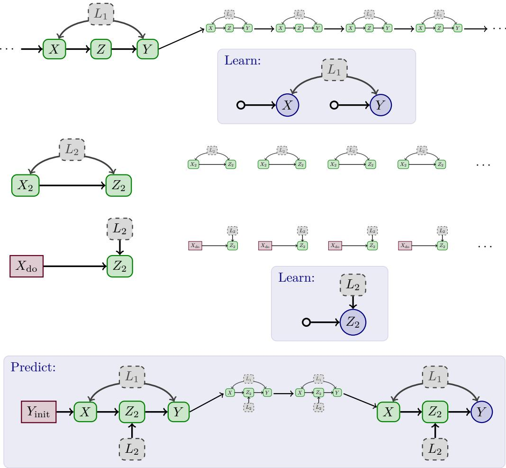  
Figure 1: Consider three given data-sets (green solid – observed, gray dashed – latent): A threeperiodic univariate time-series (top), repeated IID observations (middle), and repeated experimen (bottom) evaluating for example an upgraded (modular) replacement part in a technical system. Labels (capital letters) are by mechanism, not variables. A plausible question is, what happens if we replace the mechanism Z by $Z _ { 2 }$ (in the time-series setup), and, starting from some known initial state, have the modified system run for a number, say four, periods to the final value (blue circle). The intuitive solution to this problem is rather clear: there are things that can be learned from the diferent data-sets, and this knowledge can be pieced together to answer the query. For specific (and simple) examples it might be possible to hand-craft a solution, and maybe even to convince oneself of its soundness, yet – while clearly practically relevant – questions of such flexible type are no captured by conventional formalisms of causality.

## 1.2 Employed Structure

We base our model-structure on a concept that is already pervasive in causal study: Invariance of mechanisms. While formally somewhat elusive, invariance of mechanisms has played a pivotal role in causal inference in general [30; 38], for discovering causal structure [19; 27; 15; 37] and for robust prediction or transfer [44; 45; 6; 33]. Invariance of mechanisms is also baked into the SCM and PO frameworks, and while usually not made explicit has certainly played a core role in their motivation; for example Pearl [30, p. 322] states (slightly paraphrased)

that "what we call ’causal knowledge’" are the "extra assumptions that identify what in the distribution remains invariant when the specified modification takes place". Invariance is the property of remaining unchanged under a given symmetry, the symmetry Pearl seems to have in mind is the symmetry switching mechanisms of observed and intervened model – indeed this is the form of symmetry we will need to reproduce the results of do-calculus as a special case (§E).

Invariant mechanisms in our formalism are probability kernels – combining an ambiguous pair of a structural mapping and a noise-distribution into a single unambiguous object; this is (see above) inspired by the use of Markov-kernels in the process literature (see e. g. [22, §7]). Additionally we explicitly attach a symmetry and range of applicability. A single model can describe both the observed world an the query uniformly, indeed it makes precise the idea eluded to above about invariance under switching mechanisms of observed and intervened model: both observed and intervened world share a model, with unintervened mechanisms invariant under the symmetry switching between worlds. Some kernels are considered known a priori (conventionally called "interventions") while others can be extracted, individually or only as part of larger confounded structures, from data by virtue of their symmetry properties. Of course statistics, at its very foundations, is about learning shared stochastic properties by combining many observations; so relating invariant structures built from mechanisms to suitable subsets of data is not fundamentally a new idea – however its consistent, rigorous and explicit execution to capture causality is novel.

So we elevate a weak notion of invariance of mechanisms – weak enough to be implicit in SCM and PO frameworks, that is without adding definitional structure – to become the fundamental formal starting point of causal modeling. After establishing a canonical link to probabilistic observations (including randomness), there is nothing more required to capture a meaningful notion of causality – a notion that in the special case of IID data and do-interventional queries reproduces the results of SCM and PO frameworks.

## 1.3 Contributions and Content

An important reason why selection- / context-variables have been so successful [6; 33; 19; 27] is in their ability to map a new problem to an established setup – thus much of the required technology to work on the resulting mapped problem was already established. The proposed formalism here is rather a simpler (more low-level) language. Many ideas of modeling problems can be compiled into this simpler (and unified) language and thus remain intact; such ideas are among the core contributions of the existing frameworks. However, getting information back out of a modeled system is inherently more dificult as there is less definitional structure to work with. So, for example, identification-strategies like the Id-algorithm [61; 57] or mz-transport [5; 4] or even the do-calculus [30] do not carry over. The primary contribution of this paper is to provide the formal machinery to re-establish the link from modeled problem-statement to identification-strategy.

Constructions on simple structures are dificult. For example group-theory is much more dificult than linear algebra. Our models are quite simple, so it should not come as a surprise, that substantial work will be required to obtain results. Importantly we can keep the problem tractable by dividing it into three logically independent parts – largely by virtue of having deleted randomness from the model. These parts are the description and transformation of / computation with knowledge about a model; the extraction of knowledge from observations; and the phrasing of causal queries as questions about what knowledge needs to be computed from what was extracted. After a formal definition of our modeling approach §2, these points also dictate the structure of this paper, with §3 introducing structure, §4 extracting it from data, and §5 finally answering causal queries.

We do not discuss selection bias or correlated missingness. We also do not focus on completeness of the proposed strategy – it is complete for IID-data and likely for mz-transport, see §5.4 – instead we formulate transparent conjectures A, B, C, D that should clarify what questions concerning completeness remain open. We provide algorithmic descriptions, to elucidate what systematic approach an applied researcher might take to write down a specific identification strategy, and to refine and explain the formal structures by enforcing a certain degree of tractability. While our approach is amenable to automation, immediate implementation in code is not the primary goal of the presented algorithms.

## 1.4 Related Literature

Some of the cornerstone results of causal inference in multi-context setups, like transportability of experimental and non-experiment information [5; 4; 6; 33], causal discovery by contextvariable and similar approaches [19; 27] and by invariant prediction [37] were already discussed above. Our results are about what would traditionally be called identification of interventional distributions, thus among these are closest to transportability [4] in terms of goals (comparable results are available in potential outcome language, see e. g. [26]). There are also many results for identification of interventional distributions in IID-data [61; 57; 56] building on Pearls’s do-calculus (see e. g. [30]). We encounter analogues for many of the structures like c-components [61], c-trees, c-forests [57] and ultimately for do-interventional queries also hedges [57]. A comprehensive comparison to the single-context IID-case [57; 56] and transportability [4] is given in §E. Known results for the IID-case also include counterfactual queries [58; 54]. We do not discuss counter-factuals specifically, but coincidentally our flexible query-formulation captures some mediation questions (natural direct efects) recovering known formulas [31], see §E.8.

More abstract formulations for causality have been proposed e. g. by [29] to clarify the relation of causality to probability. Here, we primarily abstract to gain flexibility for non-IID applications and complex queries which leads to a mostly orthogonal (detached from IID and random elements) result; our primary focus is on re-establishing a pathway to identification of complex queries in non-IID systems from observations, the abstraction is guided by (and subordinate to) this goal. We also want to mention the perspective of [21] of causality as the ability to predict unobserved joint distributions, which is philosophically close to our approach but focused on IID observations and statistical learning, and has very interesting consequences for analyzing finite-sample reliability of CD-methods [13].

We do not investigate the discovery of the structures defining our models. Causal structure discovery (CD) results beyond the IID-case [59; 9; 60] exist from time-series [50; 48] to for example multi-context data [19; 27], proxies of hidden confounders [19; 15], for contextspecific structure [16; 40], see also [35; 10; 20], or for learning both context-structure and graphical structure [52; 41; 3; 25; 39], or learning diferences only [1]. Learning more flexible structure seems initially more dificult, but such weaker structure is also more likely to exist (which is nice for anything one wants to find). Further, the usefulness of non-IIDness for improving causal discovery [19; 27; 37], especially edge-orientations, suggests that a principled approach focused on invariance in modeling may be helpful to extracting information.

Symmetries and invariance also play an important role in modern probability theory (for a great overview, see [23]), the causal questions we ask sometimes touch on trivial cases of deep results like de-Finetti’s theorem (exchangeable is conditional IID; cf. Rmk. E.17 or example D.13), but the intricacies of such characterizations (like conditional IIDness) and other topics commonly studied in probability-theory, while interesting problems of their own right, seem mostly disjoint from the causal questions we are interested in. Also in machine-learning, especially for parameter-sharing, symmetries are of great relevance, for example in convolution-models (image-convolution, but also graph-convolutional networks etc.) or in attention-mechanisms (for example in transformers), see any textbook on the topic, e. g. [28]. Their use to guide the transfer to causal queries and the systematic structuring of world-models and -exploration seems to be largely unexplored however, even though toy-models like "causal bandits" [24] have received substantial attention lately. Causal models are believed to take a special role for invariant prediction, as justified for example by results like [43; 45] (and references therein). Finally, our results (Cor. 3.9) have some unexpected connections to simple missing-data problems [47]. A causal perspective on missing-data problems can be found for example in [12] and references therein.

## 2 Models and Observations

We introduce the basic formalism, consisting of models and their relation to statistical observations, including observedness and asymptotic limits.

## 2.1 Preliminaries

We are interested in causal properties, not in technical intricacies of measure-theory, hence assume throughout this paper (see also §G):

Assumption 2.1. Measurable spaces $( X , B ( X ) )$ are standard Borel (Polish spaces X with their associated Borel σ-algebra $B ( X ) )$ . Examples for Polish spaces are $\mathbb { R } ^ { n }$ (with standard topology) and open or closed subsets of $\mathbb { R } ^ { n }$ (with the induced topology), e. g. finite sets with the discrete topology.

We describe causal models based on probability kernels. We give a preliminary definition and notation here and discuss technical details in §G.

Definition 2.2 (Kernels, preliminary). Given measurable spaces $( S , B ( S ) )$ and $( T , B ( T ) )$ , a measurable mapping $f : S  { \mathcal { P } } ( B ( T ) )$ into the probability measures on $( T , B ( T ) )$ is called a probability kernel.

Symmetry is an abstract concept, which we formally express via group-actions. Groupactions are ubiquitous in the natural sciences and in many cases intuitive. More abstract formal descriptions are possible §G.5.

Definition 2.3 (Symmetry). Group-Actions: A (left) group action $G \cap I$ on a set I is a mapping $\cdot : G \times I  I , ( g , i ) \mapsto g \cdot i$ such that $\forall i \in I : e \cdot i = i$ and $\forall g , h \in G$ : $\forall i \in I : ( g * h ) \cdot i = g \cdot ( h \cdot i )$ . Given a sub-group $H \subset G$ , there is an induced action $\cdot _ { H } : H \times I \to I , ( h , i ) \mapsto h \cdot _ { H } i : = i _ { H } ( h ) \cdot i .$

Properties: A group action $G \cap I$ is called efective, if $( \forall i \in I : g \cdot i = i ) \Rightarrow g = e ,$ called free if $\forall i \in I : ( g \cdot i = i \Rightarrow g = e )$ , and called transitive if $\forall i , i ^ { \prime } \in I : \exists g \in G : i ^ { \prime } = g \cdot i$ Given $I _ { 0 } \subset I$ we will call an action free / transitive on $I _ { 0 }$ if the corresponding condition holds $\forall i , i ^ { \prime } \in I _ { 0 }$ . An orbit is a set $G \cdot i = \{ i ^ { \prime } \in I | \exists g \in G : g \cdot i = i ^ { \prime } \}$ , the set of orbits is $I / { \cal G }$

Invariance / Equivariance: A mapping $f : I  Z$ is called $G \cap I$ invariant, if $\forall i \in I :$ $\forall g \in G : f ( g \cdot i ) = f ( i )$ . A mapping $f ^ { \prime } : I \to I ^ { \prime }$ is called $( G \cap I , G \cap I ^ { \prime } )$ equivariant, if $f ^ { \prime } ( g \cdot i ) = g \cdot f ^ { \prime } ( i )$

Notation: We fix a group G and a efective group action $G \cap I$ . A symmetry is denoted as (induced action of) a subgroup $H \subset G$

## 2.2 Model

Our models are purely measure-theoretic constructions (no $( \Omega , A , P )$ or random elements appear). Other than in the IID-setting, we cannot presuppose structure on the index-set (indexing the data), instead we only ask for:

Notation 2.4. We fix a countable index-set I, and measurable spaces $\{ ( X _ { i } , B ( X _ { i } ) ) \} _ { i \in { I } }$ that are standard Borel (Ass. 2.1). Given $J \subset I$ , we denote $\begin{array} { r } { X _ { J } : = \prod _ { j \in J } X _ { j } } \end{array}$

Our models will specify (invariant) mechanisms and their symmetries.

Definition 2.5 (Mechanism). A mechanism is a probability kernel f from $\begin{array} { r } { X ^ { \mathrm { P a } } = \prod _ { k = 1 } ^ { \kappa } X ^ { ( k ) } } \end{array}$ (with κ arguments) to Y (both standard Borel, Ass. 2.1) together with a region of applicability (a subset) $J \subset I ,$ a symmetry H, acting freely and transitively on $^ { J , }$ and a H-equivariant mapping ${ \mathrm { P a } } : J \to I ^ { \kappa }$ of relative parents such that:

Denoting the kth parent by $\mathrm { P a } ^ { ( k ) }$ , require $\forall k : \operatorname { P a } ^ { ( k ) } ( j ) \neq j$ and $k \neq k ^ { \prime } \Rightarrow \forall j \in J \colon$ $\mathrm { P a } ^ { ( k ) } ( j ) \neq \mathrm { P a } ^ { ( k ^ { \prime } ) } ( j )$ . Finally, $\forall j \in J , Y \subset X _ { j }$ and ∀k: $X _ { \mathrm { P a } ^ { ( k ) } ( j ) } \subset X ^ { ( k ) }$

Definition 2.6 (Model). A model $\mathcal { M } = \{ ( f _ { J } , J , H _ { J } , \ldots ) \} _ { J \in \mathcal { I } }$ is a collection of mechanisms, which we index by their region of applicability J, such that I is the disjoint union of regions of applicability $I = \cup _ { J \in \mathcal { J } } J$ and $J \neq J ^ { \prime } \in \mathcal { I } \Rightarrow J \cap J ^ { \prime } = \emptyset$

Mechanisms are in one of two (disjoint) categories: Either $f _ { J }$ is considered initially unknown $f _ { J } \in \mathcal { F } _ { \mathrm { o b s } }$ or known $\tilde { f } _ { J } \in \mathcal { F } _ { \mathrm { i n t e r v e n e } }$ ("interventions" transfer external, fixed knowledge into the model). Every $i \in I$ is by construction contained in exactly one $J \in \mathcal { I }$ which we denote by $J ( i )$ and we write $f _ { i } : = f _ { J ( i ) }$

Example 2.7 (IID-Models from SCMs). Given an SCM on variables indexed by $v \in I _ { \mathrm { v a r s } }$ with parent-sets Pa SCM-mechanisms $g _ { v }$ and noise-distributions $P ( \eta _ { v } )$ , there is an associated model M on $I = I _ { \mathrm { v a r s } } \times I _ { \mathrm { s a m p l e } }$ with $G = \mathfrak { S } _ { I _ { \mathrm { s a m p l e } } }$ the permutations of $I _ { \mathrm { s a m p l e } }$ (with $\pi \in \mathfrak { S } _ { I _ { \mathrm { s a m p l e } } }$ acting as $\pi \cdot ( v , s ) = ( v , \pi ( s ) ) ,$ ) with mechanisms $f _ { v } ( \mathrm { p a } _ { v } ) : = g _ { v } ( \mathrm { p a } _ { v } , \cdot ) _ { * } P ( \eta _ { v } )$ (the distribution of $V _ { \mathrm { p a } _ { v } } ( \omega ) : = g _ { v } ( \mathrm { p a } _ { v } , \eta _ { v } ( \omega ) ) ) , H _ { v } = G , J _ { v } = \{ v \} \times I _ { \mathrm { s a m p l e } }$ and for $j = ( v , s ) \in J _ { v }$ $\mathrm { P a } _ { v } ( j ) = \mathrm { P a } _ { v } \times \{ s \}$

An intervention on an SCM replaces an SCM-mechanism $g _ { v }$ by a known function (for example a constant value for do-interventions), so an interventional SCM $M ^ { \mathrm { d o } }$ for do $( X = x )$ (where $X \subset I _ { \mathrm { v a r s } } )$ induces a model $\mathcal { M } ^ { \mathrm { d o } }$ as above, but mechanisms associated to $v \in X$ are known: $\forall v \in X : f _ { v } \in \mathcal { F } _ { \mathrm { i n t e r v e n e } }$ (for do-interventions these $f _ { v } \in \mathcal { F } _ { \mathrm { i n t e r v e n e } }$ are singular measures without parents, thus $\mathrm { P a } _ { v } ( j ) = \varnothing )$ . We will not need interventional models however, instead we can just define a unified model on $I ^ { \mathrm { u n i f i e d } } = I \sqcup I$ (we return here in example 5.1), this dramatically simplifies the description of multi-context or experimental-data settings. See also Fig. 6 or Fig. 8. Further details are given in §E.

Example 2.8 (Timeseries-Models). Given a time-series SCM on variables indexed by $v \in I _ { \mathrm { v a r s } }$ with parent-sets $\operatorname { P a } _ { v } \subset I _ { \mathrm { v a r s } } \times \{ - \tau , \dots , 0 \}$ , where $\tau$ is some maximal lag, and again SCM-mechanisms $g _ { v }$ and noise-distributions $P ( \eta _ { v } )$ , given an initial state $\vec { \nu }$ (for example a stationary distribution if one exists) for $\tau { + 1 }$ time-steps, there is a model $\mathcal { M }$ with $I = I _ { \mathrm { v a r s } } \times T$ where $T = \mathbb { N } _ { 0 } .$ , with the first τ steps fixed to $\vec { \nu } \in \mathcal { F } _ { \mathrm { i n t e r v e n e } }$ and later ones with time-translation invariant $( H _ { v } = G = \mathbb { Z }$ , with $a \cdot ( v , t ) : = ( v , t + a )$ for $a \in G ;$ usually called time-homogeneous [22], sometimes "causally stationary") mechanisms $f _ { v } ( \mathrm { p a } _ { v } ) : = { g _ { v } ( \mathrm { p a } _ { v } , \cdot ) _ { * } } P ( \eta _ { v } )$ . Note that H<sub>v</sub>-equivariance of ${ \mathrm { P a } } _ { v } : J  I ^ { \kappa _ { v } }$ amounts to fixing pairs $( v , \Delta t )$ of a variable and a lag, automatically matching the intuition and hand-crafted form of a time-series SCM. The choice of an initial state is made explicit in our formalism. While sometimes obfuscated a little (usually by defaulting to the use of a stationary distribution), this cannot be avoided: In cases where no or multiple stationary distributions exist, this choice cannot be made implicitly. Even in cases where a unique stationary distribution does exist, there seems to be little reason to needlessly restrict the formalism to this particular choice, as other initial states may make practical sense.

## 2.3 Shallow Distribution and Realization

We fix a model M. Via relative parents, M defines a single large graph on I.

Definition 2.9 (I-Graph). The I-graph ${ \sf G } _ { I }$ has nodes I and an edge $i  i ^ { \prime } \mathrm { ~ i f ~ } i \in \operatorname { P a } _ { I } ( i ^ { \prime } )$ 2 where $\mathrm { P a } _ { I } ( i ^ { \prime } ) : = \{ i \in I | \exists k : i = \mathrm { P a } _ { J ( i ^ { \prime } ) } ^ { ( k ) } ( i ^ { \prime } ) \}$

We assume the I-graph is acyclic, as we want independent mechanisms. In principle, indices contained in a finite cycle can be replaced by a single index (consistent with Ass. 2.1, which is closed under finite products).

Assumption 2.10 (Acyclic I-Graph). We assume that the I-graph is acyclic, and fix a total order $\pi _ { I }$

For formal simplicity (to avoid issues with non-unique solvability of equations and filtrations of σ-algebras), we assume the modeled past is finite.

Assumption 2.11 (Finite Past). For all $i \in I , | \operatorname { A n c } _ { I } ( i ) | < \infty$ is finite.

Remark 2.12 (Boundary Construction). It is possible, rather generally, to construct a "boundary" (e. g. an initial state for a time-series / Markov-process) that translates infinite past models to finite past models, see example 2.8. Thus this assumption is primarily a statement about decomposition of the problem, where we discuss the causal aspects and detach the logically distinct question of choice of (non-unique) solutions into the choice of a (non-unique) initial state; see §D.4.

Then, the model M defines a distribution, jointly over $X _ { i }$ associated to $i \in I$ by composing mechanisms. The result is (using notation from §3) given essentially by $P _ { \theta } = \otimes _ { i } ^ { \pi _ { I } } f _ { J ( i ) }$ , we can avoid defining infinite ⊗-products by the following formulation:

Lemma / Definition 2.13 (Shallow Distribution). Given acyclicity (Ass. 2.10) and finite past (Ass. 2.11), there is a probability measure $P _ { \theta }$ on $\Pi _ { i \in I } X _ { i }$ , which we will call the shallow distribution, parametrized by $\theta = { \mathcal { F } } _ { \mathrm { i n t e r v e n e } } .$ such that the marginalization to any finite $I ^ { \prime } \subset I$ satisfies for all measurable $B _ { i } \in B ( X _ { i } )$ the following characterizing property:

$$
P _ { \theta } \Big ( \big ( \prod _ { i ^ { \prime } \in I ^ { \prime } } B _ { i ^ { \prime } } \big ) \times \big ( \prod _ { i \in I \setminus I ^ { \prime } } X _ { i } \big ) \Big ) = \Big [ \otimes _ { i ^ { \prime } \in \mathrm { A n c } _ { I } ( I ^ { \prime } ) } ^ { \pi _ { I } } f _ { J ( i ^ { \prime } ) } \Big ] \Big ( \big ( \prod _ { i ^ { \prime } \in I ^ { \prime } } B _ { i ^ { \prime } } \big ) \times \big ( \prod _ { i \in \mathrm { A n c } _ { I } ( I ^ { \prime } ) \setminus I } X _ { i } \big ) \Big ) .
$$

While the model is not probabilistic, the observable world it describes is:

Definition 2.14 (Observable World). An observable world realizing the model M is a family of random variables $\{ \mathcal { V } _ { i } : \Omega \to X _ { i } \} _ { i \in I }$ , together with measurable maps $f _ { i } : \mathcal { X } _ { \mathrm { P a } _ { I } ( i ) } \times [ 0 , 1 ] $ $X _ { i }$ and jointly independent random variables $\eta _ { i } \sim U ( [ 0 , 1 ] )$ called noises, such that

$$
\begin{array} { r } { \mathcal { V } _ { i } = f _ { i } ( \mathcal { V } _ { \mathrm { P a } _ { I } ( i ) } , \eta _ { i } ) \quad \mathrm { a n d } \quad P ( \{ \mathcal { V } _ { i } \} _ { i \in I } ) = P _ { \theta } . } \end{array}
$$

Mandated by the second equality, we will often simply write $P _ { \theta } ( \{ \mathcal { V } _ { i } \} _ { i \in I } )$

Remark 2.15 (Shallowness). The reason for calling $P _ { \theta }$ "shallow" is conceptually important: The way we model our data, for each $i \in I ,$ there is at most one observation. Thus each random variable $\mathcal { V } _ { i }$ is observed at most once. If we had more observations, we would instead extend I and enhance the model’s symmetry to capture this repetition. So $P _ { \theta }$ , while formally well-defined, does not not allow for a statistical analysis without additional use of the model’s symmetries. It becomes, in this language, an important aspect of identifiability, to ensure that any statistical analysis of the data must be able to draw from an invariant subset of data that becomes large as $N \to \infty$ , thus is "deep" as opposed to "shallow".

Lemma 2.16 (Observable World Existence). Given acyclicity (Ass. 2.10) and finite past (Ass. 2.11), an observable world exists, it is unique up to equality in distribution and it is locally Markov, i. e. $\begin{array} { r } { \mathcal { V } _ { i } \perp \perp \mathcal { V } _ { K } | \operatorname { P a } _ { I } ( i ) } \end{array}$ for any $K \subset I$ with K ∩ Desc $\boldsymbol { \mathbf { \mathit { I } } } ( i ) = \boldsymbol { \emptyset }$

Example 2.17 (IID-Models from SCMs). Continuing example 2.7, which given an SCM M constructed an associated model M. For M and $\forall s \in I _ { \mathrm { s a m p l e } }$ $P _ { \theta } ( \{ \mathcal { V } _ { v , s } \} _ { v \in I _ { \mathrm { v a r s } } } ) = P ^ { \mathrm { o b s } }$ 2 where $P ^ { \mathrm { o b s } }$ is the observed distribution of M. In particular the random model described by M is an observable world of M. Similarly, for $\bar { \mathcal { M } } ^ { \mathrm { d o } }$ $P _ { \theta } ( \{ \mathcal { V } _ { v , s } \} _ { v \in Y } ) = P ( Y | \mathrm { d o } ( X = x ) )$

## 2.4 Observedness and Asymptotics

So far, we have no notion of observed vs. hidden variables. We use a simple and flexible definition.

Definition 2.18 (Viewport). Given a model, a viewport is given by an infinite subset $\mathcal { N } \subset \mathbb { N }$ together with a mapping

$$
\begin{array} { r l r } & { } & { \lor : \mathcal { N } \to \mathrm { F i n i t e S u b s e t s O f } ( I ) , N \mapsto V ( N ) \ \mathrm { s u c h ~ t h a t } \ | V ( N ) | = N \ \mathrm { a n d } } \\ & { } & { N \to N ^ { \prime } \in \mathcal { N } \Rightarrow V ( N ) \subset V ( N ^ { \prime } ) . } \end{array}
$$

We write $\begin{array} { r } { \pmb { \mathsf { V } } : = \mathsf { U } _ { N \in \mathcal { N } } \pmb { \mathsf { V } } ( N ) \subset I . } \end{array}$

Assumption 2.19 (Independent Missingness). The viewport is not a random object and thus implicitly independent of values taken by variables in the observable world.

Example 2.20. Consider an IID model with three variables $I _ { \mathrm { v a r s } } = \{ x , y , l \}$ , where x and y are always observed, while l is never observed. In this case we can choose $\mathcal { N } : = 2 \mathbb { N }$ the even numbers (we could try to say what is observed first, x or $y .$ but we do not have to, this is why $\mathcal { N } \neq \mathbb { N }$ is allowed). Then for $N = 2 n \in \mathcal { N }$ , define $V ( N ) = \{ x , y \} \times \{ 1 , \dots , n \} \subset I _ { \mathrm { v a r s } } \times \mathbb { N }$ (we replaced $I _ { \mathrm { s a m p l e } }$ by the natural numbers here) to capture the described missingness pattern. In the asymptotic limit $n \to \infty$ we observe $\mathbf { V } = \{ x , y \} \times \mathbb { N } \subset I$

It only remains to combine observable worlds and viewports, and to formally encode the assumption that each variable of an observable world is observed at most once (Rmk. 2.15).

Definition 2.21 (Realized World). Given an observable world and a viewport, we call a sample $\mathcal { D } ^ { N } ( \omega ) = \mathcal { V } _ { i } ( \omega ) _ { i \in \mathsf { V } ( N ) }$ a realized data-set / observation and for $\mathcal { D } = \cup _ { N } \mathcal { D } ^ { N } ( \omega )$ define $P _ { \theta } ^ { \cal D } : = P _ { \theta } ( ( \mathcal { V } _ { i } ) _ { i \in I } | ( \mathcal { V } _ { i } ) _ { i \in \pmb { V } } = \mathcal { D } )$ a realized world (distribution).

Remark 2.22. If we ask a question about the realized world $P _ { \theta } ^ { \mathcal { D } }$ , we ask a question about $P _ { \theta }$ with each $i \in { \mathsf V }$ fixed to a value. Thus we input exactly one value ("observation") for each element of the viewport (additional to the structure of the shallow distribution provided by the model and its symmetries). So the realized world is a formal means of asking questions under the restriction of only one observation per variable.

Intuitively, we cannot generally extrapolate to arguments we have never observed. The choice of the formal assumption, is explained in detail in Rmk. $\mathrm { A . 6 ; }$ this assumption is usually not made explicit, but formally necessary and implicitly made in other approaches.

Assumption 2.23 (Valid Support for Transfer). We assume that queries and other computations on kernels identified from observations remain within the the observational support in the sense that any disintegration $\nu _ { x }$ of a observed joint distribution $\mu \otimes \nu _ { x }$ is only transferred to (evaluated in) products $\xi \otimes \nu _ { x }$ where $\xi \ll \mu$ is dominated by $\mu \ ( { \mathrm { i . ~ e . ~ } } \forall$ measurable B: $\mu ( B ) = 0 \Rightarrow \xi ( B ) = 0 )$ , or the result can for practical purposes $( \mathrm { e . g . }$ by regularity assumption like smoothness of densities) be interpreted as if this were the case.

## 3 Structured Kernels

We need formal objects to capture pieces of knowledge that will be obtained from observations in $\ S 4$ . Further, we need tools to transform them in a mathematically rigorous yet practically applicable calculus.

## 3.1 Preliminaries

Probability kernels are in wide spread use especially in probability theory and time-series statistics. We provide a very brief structure-oriented overview of standard constructs here and a more detailed discussion connecting this language to SCMs in §G.2.

Some basic operations on kernels (illustrated in $\mathrm { F i g . 2 } )$ are: ⊗-products, given kernels $\mu$ from $Z$ to X and $\nu$ from $Z \times X$ to $Y .$ , construct a kernel $\mu$ ⊗ ν from $Z$ to $X \times Y \colon$ ; note the causal ordering (asymmetry in $\mu  \nu )$ . Marginalizations (on the right) drop a term at the end (in causal order), disintegrations (on the left) turn a term at the beginning (in the causal order) into an argument. These expressions can sometimes be thought of as conditional distributions (if a suitable joint distribution including Z exists). Reordering terms, for example switching $( x , y ) \mapsto ( y , x )$ is a Borel-isomorphism – given P(X, Y ) we know what $P ( Y , X )$ is. We can marginalize after switching to get a composition $\nu \circ \mu$ of kernels, "hiding" a cause X of Y does not change the distribution of Y, it still depends on the actual distribution of X. Similar by disintegration after switching we get an "anti-causal" disintegration (µ|ν).

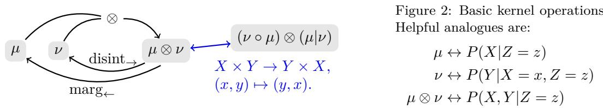

With $\xi : = \mu \otimes \nu$ being a kernel itself, operations like $\xi \otimes \vartheta = [ \mu \otimes \nu ] \otimes \vartheta$ , and thus larger products are immediately defined (and turn out to be associative). It is however not immediately obvious, how reordering terms, marginalizations (on the right) and disintegrations (on the left) commute. In analogy to ${ } ^ { " } P ( X , Y ) = P ( Y | X ) P ( X ) ^ { \prime }$ , which holds for tuples / multi-variate X, Y regardless of causal ordering, arbitrary marginalizations and disintegrations can be defined with these characterizing (defining) properties:

Lemma / Definition 3.1 (Order Independent Operations). Given $\mu = \mu _ { 1 } \otimes . . . \otimes \mu _ { n }$ together with $L \subset \{ 1 , \ldots , n \}$ and $C = \{ 1 , \ldots , n \} \setminus L$ , there are unique (Rmk. A.6) kernels mar $\xi _ { L } ( \mu )$ and disint (µ) such that ∀ measurable $\dot { B } _ { k } ^ { C } \in \mathfrak { B } ( X _ { k } )$ where $B _ { k } ^ { C } = X _ { k } { \mathrm { ~ i f ~ } } k \in L \colon$

$$
\begin{array} { r } { \operatorname* { m a r g } _ { L } ( \mu ) ( \prod _ { k \in C } B _ { i } ) = \mu ( \prod _ { k = 1 } ^ { n } B _ { k } ^ { C } ) } \end{array}
$$

$$
\mathrm { m a r g } _ { L } ( \mu ) \otimes \mathrm { d i s i n t } _ { C } ( \mu ) = \mu ~ ( \mathrm { u p ~ t o ~ r e o r d e r i n g } ) .
$$

These operations all produce suitably unique results. Combining finitely many such operations again produces a unique result. We call such (finite) computations with these operations regular (functionals). For generic kernels (without known internal structure like linearity), there do not seem to be any more well-defined (finite; excluding limits and fixed-points) computations, thus, for completeness considerations, we are inclined to consider:

Conjecture A (Completeness of Regular Computation). If a functional uniquely computes a result from finitely many generic kernels then it is regular (Def. A.8, Rmk. A.11).

## 3.2 Causality and Sparsity

So far, ⊗-products were defined with shared arguments in Z plus the value-space of the left-hand-side as additional argument to the right-hand-side. To define a product of many terms in "causal order", meaning any arguments that depend on another kernels value are such that this parent is to the left, it is of course possible to trivially extend the argument space to include all ancestors (including all shared ones, but without actual dependence on non-parents); the product can then be defined successively from left to right. However causal reasoning oftentimes relies precisely on the sparsity of parents among the ancestors.

As is common practice, both for tensor networks and causal modeling [30], we encode this sparsity in a attached (to the trivially constructed product, see above) graph object. Technical details and proofs are given in $\ S \mathrm { A }$ . We usually need not be concerned by reordered results (in the sense explained above), but we will need a notion of hidden variables. Further (shared) arguments (inputs) for kernels are fundamentally diferent from their outputs.

Definition 3.2 (Structural Graph). A structural graph G is given by a finite set of nodes ${ \mathcal { N } } : = { \mathcal { N } } _ { \mathrm { i n n e r } } { \dot { \cup } } { \mathcal { N } } _ { \mathrm { o u t e r } }$ with $\mathcal { N } _ { \mathrm { i n n e r } } \cap \mathcal { N } _ { \mathrm { o u t e r } } = \emptyset$ , together with a set of directed edges $\mathcal { E } \subset \mathcal { N } \times \mathcal { N } _ { \mathrm { i n n e r } }$ , such that edges never point to an element of $\mathcal { N } _ { \mathrm { o u t e r } }$

Alignment: A model aligned structural graph is an acyclic (no directed cycles) structural graph G together with a probability kernel $\mu ^ { n }$ for each inner node $n \in \mathcal { N } _ { \mathrm { i n n e r } }$ and a bijective assignment (cf. G.24) of the κ arguments of $\mu ^ { n }$ to parents of n:

$$
\operatorname { p a } ^ { n } : \{ 1 , 2 , \dots , \kappa \} \stackrel { 1 : 1 } { \longrightarrow } \operatorname { P a } _ { G } ( n ) .
$$

Value-spaces of parents are subspaces of a respective factor of the domain of their children.

The mappings $\mathrm { p a } ^ { n }$ tell us how to "wire up" each kernel: Reorder the (inductively obtained) product over ancestors such that $\mathrm { \ p a } ^ { n } ( 1 ) , \ldots , \mathrm { p a } ^ { n } ( \kappa )$ are the κ first terms, then trivially $" \mathrm { p a d } "$ the kernel $\mu ^ { n }$ (add trivial dependence on all other non-parent ancestors) and write down the standard product. Thereby we obtain a structured (by a model-aligned graph) kernel:

Definition 3.3 (Structured Kernel). Given a tuple $( G , L )$ , called a structural model below, of a model aligned structural graph G together with a subset $L \subset \mathcal { N } _ { \mathrm { i n n e r } }$ , we define

$$
\mu ( G , L ) _ { x } \ : = \ \operatorname * { m a r g } _ { L } ( \otimes _ { n \in \mathcal { N } _ { \mathrm { i n n e r } } } ^ { \mathrm { w i r e d } } \mu ^ { n } ) _ { x } ,
$$

where $\boldsymbol { x } = ( x _ { i } ) _ { i \in \mathcal { N } _ { \mathrm { o u t e r } } }$ is the tuple of shared arguments in $\mathcal { N } _ { \mathrm { o u t e r } }$ . A F-structured kernel is a kernel $\mu _ { x }$ that can be written in the form $\mu _ { x } = \mu ( G , L ) _ { \mathrm { : } }$ <sub>x</sub> with $\forall n \in { \mathcal { N } } _ { \mathrm { i n n e r } } : \mu ^ { n } \in { \mathcal { F } }$

Finally, the next subsection will require a formal notion of sub-graphs:

Definition 3.4 (Structural Subgraphs). A structural subgraph $G ^ { A } \leq G ^ { B }$ of a structural graph $G ^ { B }$ is a structural graph $G ^ { A }$ such that:

(i) Node Sets: $\mathcal { N } ^ { A } \subset \mathcal { N } ^ { B }$ and $\mathcal { N } _ { \mathrm { i n n e r } } ^ { A } \subset \mathcal { N } _ { \mathrm { i n n e r } } ^ { B }$

(ii) Edge Sets: edges are exactly those in $G ^ { B }$ from nodes in ${ \mathcal { N } } ^ { A }$ to inner nodes of $\mathcal { N } _ { \mathrm { i n n e r } } ^ { A }$

(iii) Inner Parents: $\forall n \in { \mathcal { N } } _ { \mathrm { i n n e r } } ^ { A } \colon \mathrm { i f } \ p \in \operatorname { P a } _ { G ^ { B } } ( n )$ , then $p \in { \mathcal { N } } ^ { A }$

(iv) Alignment: for model-aligned graphs ∀n $\in { \mathcal { N } } _ { \mathrm { i n n e r } } ^ { A } : ( \mu ^ { A } ) ^ { n } = ( \mu ^ { B } ) ^ { n }$

## 3.3 Graphical Operations

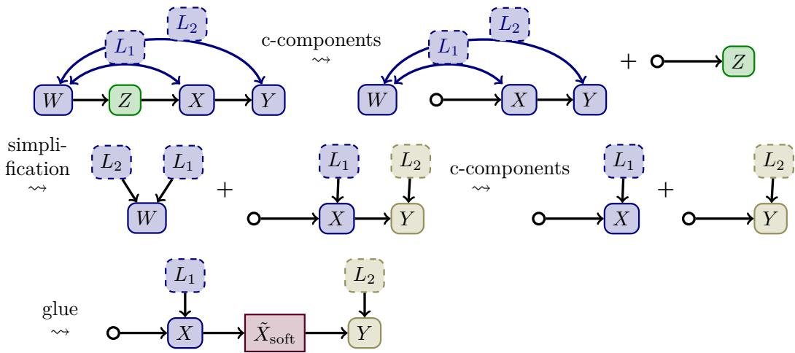  
Figure 3: Examples for graphical operations. All shown structured kernels can be computed from Pearl’s "napkin"-graph (top-left) and the (know) soft-intervention $\tilde { X } _ { \mathrm { s o f t } }$ (a single inner node plus a single outer node for its argument). Inner nodes are colored by structural c-component, hidden nodes $L _ { i }$ have dashed border.

We have seen certain regular computations on kernels, and we have structured kernels by graphs. Next we show that many (maybe all) relevant regular computations on kernels can be represented by simple and intuitive operations performed on model-aligned graphs. The first plausible candidate are sub-graphs. Given $\mu ( G , L )$ we can certainly compute $\mu ( G ^ { \prime } , L ^ { \prime } )$ for trivial cases where we simply discard hidden structure irrelevant to observed nodes:

Lemma / Definition 3.5 (Simplify). Given a structured kernel $\mu ( G , L )$ and a sub-set $B \subset { \mathcal { N } } _ { \mathrm { i n n e r } }$ with $\operatorname { D e s c } _ { G } ( B ) \subset B$ , then $\mu ( G ^ { \prime } , L \setminus ( B \cap L ) )$ can be computed as a regular functional of $\mu ( G , L )$ , where we call the sub-graph $G ^ { \prime } \leq G$ with inner nodes ${ \mathcal { N } } _ { \mathrm { i n n e r } } ^ { \prime } = { \mathcal { N } } _ { \mathrm { i n n e r } } \backslash B$ and outer nodes $\mathcal { N } _ { \mathrm { o u t e r } } ^ { \prime } = \mathrm { P a } _ { G } ( \mathcal { N } _ { \mathrm { i n n e r } } ^ { \prime } ) \setminus \mathcal { N } _ { \mathrm { i n n e r } } ^ { \prime }$ a simplification. Restricting to $B \subset L$ , there is a unique maximal $B \subset L$ and we call the corresponding (minimal) $\mu ( G ^ { \prime } , L \setminus B )$ simplified.

But also a kind of sub-graphs well known from the IID-case [61] appear: c-components.

Definition 3.6 (C-Components). Given a structural model $( G , L )$ , we call $l \in L$ a hidden confounder of $y , w \in \mathcal { N } _ { \mathrm { i n n e r } } \setminus L$ if there are directed paths $\gamma _ { y }$ from l to y and $\gamma _ { w }$ from l to w such that all non-endpoint nodes of $\gamma _ { y } , \gamma _ { w }$ are in $L$ . On $\mathcal { N } _ { \mathrm { i n n e r } } \setminus L$ define a relation y ∼ w :⇔ ∃ hidden confounder l of $y , w$ . Define $\sim _ { L }$ as the equivalence relation generated by $\sim .$ We call equivalence-classes of $\sim _ { L }$ on ${ \mathcal { N } } _ { \mathrm { i n n e r } } \setminus L$ c-components.

We can consistently extend this notion to L by defining $l \approx y$ for $y \in \mathcal { N } _ { \mathrm { i n n e r } } \ \backslash \ .$ L if there exists a directed path $\gamma _ { y }$ from l to y such that all non-endpoint nodes of $\gamma _ { y }$ are in L. We call a sub-graph $G ^ { c } \leq G$ with ${ \mathcal { N } } _ { \mathrm { i n n e r } } ^ { c }$ an equivalence-class of ${ \approx } _ { L }$ and $\mathcal { N } _ { \mathrm { o u t e r } } ^ { c } = \mathrm { P a } _ { G } ( \mathcal { N } _ { \mathrm { i n n e r } } ^ { c } ) \setminus \mathcal { N } _ { \mathrm { i n n e r } } ^ { c }$ together with $L ^ { c } = L \cap \mathcal { N } _ { \mathrm { i n n e r } } ^ { c } = L \cap \mathcal { N } ^ { c }$ a structural c-component.

Lemma 3.7 (Computation of C-Components). Given a structural c-component $G ^ { c } \leq G$ then there is a regular functional computing $\mu ( G ^ { c } , L ^ { c } )$ from $\mu ( G , L )$

On the other hand, we can regularly compute (larger) products from their (smaller) constituents. A graphical analogue to obtain a larger graph from smaller ones is a gluing operation:

Lemma 3.8 (Gluing). Given a structural kernel $\mu ( G , L )$ , and subgraphs $G ^ { A } , G ^ { B } \leq G$ , such that each structural c-component $G ^ { c } \leq G$ is a sub-graph $\smash { \dot { G } ^ { c } \le G ^ { A } }$ or $G ^ { c } \leq G ^ { B }$ , then there is a regular functional computing $\mu ( G , L )$ from $\mu ( G ^ { \bar { A } } , \bar { L } \cap \mathcal { N } ^ { A } )$ and $\mu ( G ^ { B } , L \cap \mathcal { N } ^ { B } )$

Our notion of observed and hidden variables is flexible, and it is possible to end up in situations where structural models on a graphical overlap difer by their latent sets. Almost by accident, we end up with a (non-parametric) causal missing-value imputation technique:

Corollary 3.9 (Revealing). Given a structural kernel $\mu ( G , L )$ , a structural c-component $G ^ { c } \leq G$ and $L ^ { \prime } \subset L ^ { c }$ , then there is a regular functional computing $\mu ( G , ( L \setminus L ^ { c } ) \cup L ^ { \prime } )$ from $\mu ( G , L )$ and $\mu ( G ^ { c } , L ^ { \prime } )$

Provided knowledge of a set of structured kernels $\kappa .$ we can systematically find regular computations to learn a (unknown) structured kernel of interest. It will be practically useful to order gluing operations to the end, i. e. to first decompose elements of K into smaller pieces (which can be done algorithmically, Algo. CGDecomp), then glue the kernel of interest from these pieces (which can also be done algorithmically Algo. SVSearch). Finally, for details on how the results of these operations can be computed in practice, see Rmk. A.18, A.22.

It seems plausible, that all regular computations of structured results (see §D.4 and nested queries however) can be achieved by these graphical operations, our main concern are potential generalizations of the revealing operation (Cor. 3.9), which currently is a simple corollary of other operations, but might be possible more generally (see $\ S \mathrm { A . 5 } )$

Conjecture B (Graphical Regular Computation). If a structured kernel $\mu ( G , L )$ can be regularly computed from a set $\kappa$ of structured kernels, then there is a finite sequence of graphical operations computing $\mu ( G , L )$ from $\kappa$

## 4 Extraction from Data

Having introduced a language of structured kernels, we still need to connect its primitives to our model and to analyze what can be learned from data. The reader interested in the reasons behind formal choices made in the definitions of this section may want to analyze the proof of Thm. 1, especially step 1, in §C.4. We focus on the single-level case (cf. §4.6), not to be confused with the single-context case. All results and proofs are given for the multi-level case in the appendix. Multi-level statistics (see e. g. [14]) do so far not play a major role in causal literature and the specialization to a single level allows for a simplified notation.

## 4.1 Families of Embeddings

We relate model-aligned graphs to individual local structures in the model (and I-graph) by a suitable notion of embeddings. For statistical reasoning, we need certain (for example suficiently non-degenerate) repeated observations, thus we study families of embeddings additionally to individual embeddings. In the single-level case we can directly embed structured graphs, we nevertheless call them "local" graphs (and denote them G instead of G) in this section to emphasize that conceptually they are not the same as structured graphs.

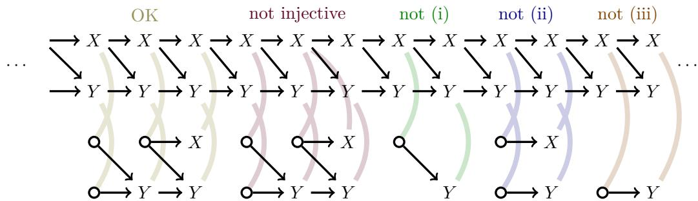  
Figure 4: Examples illustrating conditions on local graph embeddings. Alignment is indicated by capital letters, external nodes are drawn as circles.

Definition 4.1 (Local Graph Embedding). An embedding of a model aligned local graph G, denoted by $\psi : { \mathcal { G } } \hookrightarrow I ,$ , is an injective mapping $\psi : \mathcal { N } \hookrightarrow I$ such that the following conditions are satisfied (see Fig. 4):

(i) Proper-Node I-Parents are Included: If $n \in \mathcal { N } _ { \mathrm { i n n e r } }$ , then $\forall i ^ { \prime } \in \mathrm { P a } _ { I } ( \psi ( n ) ) , \exists n ^ { \prime } \in \mathcal { N }$ such that $i ^ { \prime } = \psi ( n ^ { \prime } )$

(ii) Proper Edges equal I-Graph Edges: For $n ^ { \prime } \in \mathcal { N } _ { \mathrm { i n n e r } }$ , there is a proper edge $n  n ^ { \prime }$ in G if and only if $\psi ( n ) \in \mathrm { P a } _ { I } ( \psi ( n ^ { \prime } ) )$ .

(iii) Model Alignment: ∀n $\in { \mathcal { N } } _ { \mathrm { i n n e r } } \colon \mu ^ { n } = f _ { J ( \psi ( n ) ) }$ is a model mechanism (Def. 2.6).

Definition 4.2 (Families of Embeddings). A family of local graph embeddings

$$
( J _ { 0 } , \{ \psi _ { j } \} _ { j \in J _ { 0 } } , \mathcal { G } , H , y _ { 0 } )
$$

is a collection of local graph embeddings $\psi _ { j } : { \mathcal { G } } \hookrightarrow I$ of a single model-aligned local graph G. Further there is a fixed element $y _ { 0 } \in \mathcal { N }$ , which will be called the anchor(-node), a symmetry $H \subset G$ and a range of applicability $J _ { 0 } \subset I .$ . For $n \in \mathcal N$ denote:

$$
\psi _ { * } ( n ) : J _ { 0 }  I , \ j \mapsto \psi _ { j } ( n ) .
$$

Finally, we will require the following conditions to be satisfied:

(I) Trivial on Anchor: $\forall j \in J _ { 0 } \colon \psi _ { j } ( y _ { 0 } ) = j$

(II) Rigidity: $\forall n \in \mathcal { N } \colon \psi _ { * } ( n )$ is H-equivariant.

(III) Freeness: $\forall n \in \mathcal { N } _ { \mathrm { i n n e r } } \colon \psi _ { * } ( n )$ is injective.

Remark 4.3. The intuition behind using families of embeddings is to collect repeated occurrences of the same structure, as a prerequisite of statistical learning. The properties can be understood as follows: (I) simply says that indexing within the family is by occurrences (of the anchor node plus correct neighborhood) in the I-graph. (III) will avoid degeneracy of data-sets (for an injective map, the image contains as many elements as the domain $J _ { 0 } { \mathrm { : } }$ diferent nodes may overlap, but for finitely many nodes this will not afect limits).

(II) is specific to our formal description of symmetries by group-actions. In the presence of latent nodes, non-trivial neighborhoods of a mechanism in the $I { \mathrm { - g r a p h } }$ have to be inspected (see below, e. g. Fig. 5), which requires the "absorption" of additional nodes (growing a graph). Rigidity guides these absorption-operations for ensuring (and analyzing choices for) freeness (III) also after the addition of new nodes. Orbit-based based approaches might be more general (§G.5), but for formal analysis group-actions have the nice and intuitive property that absorbing a $H ^ { \prime } .$ -symmetric mechanism into a H-symmetric structure yields a $H \cap H ^ { \prime }$ -symmetric structure, i. e. symmetry of larger structures (as intuitively expected) is reduced to the intersection of the symmetries of their parts. This formal description of symmetries also simplifies encoding (both theoretically and practically) which might make it favorable for structure-learning in future work.

Example: One also finds for $H _ { 1 }$ -symmetric X and H<sub>2</sub>-symmetric $Y _ { x }$ the product will appear in the I-graph (at best) $H _ { 1 } \cap H _ { \mathrm { 2 ^ { - S y m m e t r i c } } }$ . The causal disintegration is simply $Y _ { x } .$ thus $H _ { 2 }$ -symmetric, while the anti-causal disintegration $( X | Y ) _ { y }$ is only $H _ { 1 } \cap H _ { 2 } { \mathrm { - s y } }$ mmetric, which provides a more concrete connection to invariance-based edge-orientation in structurediscovery, compare e. g. to [37; 19; 27].

## 4.2 Decorated Families

These objects, so far, do not account for hidden variables, and also the well-known "backdoorpaths" [30] from the IID-world will find an analogue in embedded families.

Definition 4.4 (Observedness). We call $I _ { 0 } \subset I$ observed if $\vert I _ { 0 } \cap \mathsf { V } ( N ) \vert \to \infty$ for $N \to \infty$ Given a family of local graph embeddings $\{ \psi _ { j } \} _ { j \in J _ { 0 } }$ , we call a subset $O \subset { \mathcal { N } }$ observed if

$$
J _ { 0 } ^ { \mathrm { o b s } } ( N , O ) : = \{ j \in J _ { 0 } | \psi _ { j } ( O ) \subset \mathsf { V } ( N ) \} ,
$$

$$
\mathrm { s a t i s f i e s } \ | J _ { 0 } ^ { \mathrm { o b s } } ( N , O ) | \to \infty \quad \mathrm { f o r } \ N \to \infty .
$$

Definition 4.5 (Minimal Latent Subsets). Given a family of local graph embeddings $\{ \psi _ { j } \} _ { j \in J _ { 0 } } ,$ , we call a subset $O \subset { \mathcal { N } }$ maximal observed if $O ^ { \prime } \supseteq O \Rightarrow O ^ { \prime }$ is not observed. In this case, we call the complement $L = \mathcal { N } - O$ a minimal latent subset.

Similarly, some of the ancestral structure of the I-graph will be relevant for identifiability.

Definition 4.6 (Ancestral Structure). Given a local graph ${ \mathcal { G } } ,$ an ancestral structure $\mathcal { A }$ on $\mathcal { G }$ is a set of directed edges ⇝ (ancestral edges) each starting at an inner node and ending at an outer node, such that $\mathcal { G }$ with proper and ancestral edges is acyclic.

Validity: An ancestral structure $\mathcal { A }$ on $\mathcal { G }$ is valid for an embedding $\psi : \mathcal { G } \hookrightarrow I$ if $\forall y \in \mathcal { N } _ { \mathrm { i n n e r } } , x \in \mathcal { N } _ { \mathrm { o u t e r } } \colon$ If there is directed path $\gamma$ in $\mathsf { G } _ { I } \mathrm { ~ } \backslash$ img(ψ) (the I-graph with ψ-image of proper edges of $\mathcal { G }$ removed) from $\psi ( y )$ to $\psi ( x )$ , then there is an ordering edge $y \sim x$ in ${ \mathcal { A } } .$ See Fig. 5 for examples of valid ancestral structures.

We call A valid for a family of embeddings $\{ \psi _ { j } \} _ { j \in J _ { 0 } }$ if $\forall j \in J _ { 0 }$ it is valid for $\psi _ { j }$

Definition 4.7 (Minimal Ancestral Structures). Given a local graph $\mathcal { G } .$ , an ancestral structure $\mathcal { A }$ on $\mathcal { G }$ valid for a family of embeddings $\{ \psi _ { j } \} _ { j \in J _ { 0 } }$ is $J ^ { \mathrm { o b s } } ( N )$ -minimal for this family, if removing any non-empty subset $\emptyset \neq e \subset A$ then the largest (sequence of) subsets of $J _ { 0 } ^ { \prime } ( N ) \subset$ $J ^ { \mathrm { o b s } } ( N )$ such that $A \backslash e$ is valid for $\{ \psi _ { j } \} _ { j \in J _ { 0 } ^ { \prime } }$ is finite for $N \to \infty , \forall N : | J _ { 0 } ^ { \prime } ( N ) | \leq C < \infty$

Remark 4.8 (Non-Uniqueness). Neither one of these minimal structures is unique. For example consider a local graph containing the structure $X _ { 1 } \right. Y \left. X _ { 2 }$ such that for each $j \in J _ { 0 }$ of a associated family of embeddings exactly one of $X _ { 1 }$ or $X _ { 2 }$ is observed (and either one asymptotically infinitely often). Then there are two minimal latent subsets: $L _ { 1 } = \{ X _ { 1 } \}$ and $L _ { 2 } = \{ X _ { 2 } \}$

These attached structures "decorate" a family of embeddings (non-uniquely):

Definition 4.9 (Decorated Families). A decorated family of embeddings is a family of embeddings $\{ \psi _ { j } \} _ { j \in J _ { 0 } }$ together with a minimal latent subset $L \subset \mathcal { N }$ and a $J _ { 0 } ^ { \mathrm { o b s } } ( N , O )$ -minimal ancestral structure A.

For identification, the interaction of backdoor-paths and latents will be important.

Definition 4.10 (Backdoor-Freeness). Given a decorated family of embeddings $( \{ \psi _ { j } \} _ { j \in J _ { 0 } }$ $L , A )$ , we call an ancestral edge $l \sim x \in A$ a backdoor if it starts at $l \in L$ . We call the family backdoor-free, if $L \cap { \mathcal { N } } _ { \mathrm { o u t e r } } = \emptyset$ and there are no backdoors.

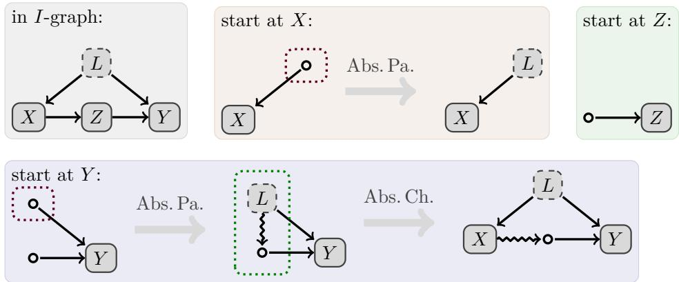  
Figure 5: Systematic construction of minimal backdoor-free families. While there are: hidden external nodes (red-dotted boxes) absorb parents; backdoor-paths (green-dotted boxes) absorb children. Note that $\mu ( G , L )$ extracted by Thm. 1 will in the end drop the remaining ancestral edge (it depends only on G and $L ,$ not on $\boldsymbol { \mathcal { A } } )$ , and can be further decomposed (cf. Fig. 3). A single gluing-operation then yields the well-known frontdoor formula [30].

There is a simple algorithmic approach (cf. Algo. ExtractCS, §C.5) to find (enough, Lemma C.26, "minimal") backdoor-free families by "growing" embeddings successively. As starting point we use direct embeddings of mechanisms: A mechanism $f _ { J }$ (Def. 2.5) with range of applicability J defines an embedded family indexed by J with a single proper node (aligned to $f _ { J } )$ , one external node per parent and $\psi ( j , n ) = j$ (for $n \in \mathcal { N } _ { \mathrm { i n n e r } } )$ $\psi ( j , k ) = \mathrm { P a } ^ { ( k ) } ( j )$ $( \mathrm { f o r } \ k \in \mathcal { N } _ { \mathrm { o u t e r } } )$ . Then, as illustrated in Fig. 5, "absorb" latent external nodes as proper (or pinned) nodes and close backdoors by "absorbing" their starting node (a child of a latent node) as proper node. This process must be repeated until the result is backdoor-free. Here absorbing a node means checking overlaps with direct embeddings (see above) to find a family of embeddings for an enlarged local graph; note however, that the same mechanism can appear in the I-graph with diferent neighborhoods, so absorbing parents (or children of L) is not unique.

There are at least three practical challenges to this approach: (i) Many constructions (like minimal latent-sets or candidates for absorption) are non-unique, so we usually have to deal with sets of results. (ii) We can start this construction from any directly embedded mechanism, but even univariate queries will require intermediate results on joint descriptions (products of kernels), so besides starting-points of backdoor-paths, additional children of latents have to be absorbed (depending on the query). (iii) Minimal backdoor-free families can, in principle, have arbitrarily many nodes which means algorithms either terminate after a finite number of steps or they are complete, but never both; in the IID case this number is bounded by the number of system variables. In practice large backdoor-free families require the estimation of kernels with many parameters and use (often) small subsets of the full data-set, so if we are interested in plausibly estimable results only, we can bail on large graphs and algorithms do efectively terminate.

## 4.3 Notions of Identifiability

In the IID-case, identifiability is conventionally defined as being uniquely determined by the observational distribution $P _ { \mathrm { o b s } } ~ [ 6 1 ; 5 7 ; 5 6 ; 4 ]$ . Our closest analogue of $P _ { \mathrm { o b s } }$ is the shallow distribution $P _ { \theta }$ and the observable world. But each variable in the observable world is observed at most once, so we cannot "learn" $P _ { \theta }$ (at least not immediately as for $P _ { \mathrm { o b s } } )$ , so uniquely expressing anything relative to $P _ { \theta }$ does not identify it in any reasonable sense. In fact, a suitable "joint" distribution to learn from will often not exist:

Example 4.11 (Random Walk). Let $\eta _ { t } \sim \mathcal { N } ( b , 1 )$ be normal distributed and $\textstyle X _ { n } : = \sum _ { t = 1 } ^ { n } \eta$ t a random walk. While the kernel that describes $X _ { n + 1 }$ relative to the preceding time-step $X _ { n + 1 } ( x _ { n } ) = x _ { n } + \mathcal { N } ( b , 1 )$ if perfectly well-defined, already the marginal distributions even of the unbiased, $b = 0 .$ , one-dimensional case of the "joint distribution" of $\left( X _ { n } , X _ { n + 1 } \right)$ are (by CLT) of the form $X _ { n } \sim { \mathcal { N } } ( 0 , \sigma _ { n } ^ { 2 } = n )$ . They not only depends on $n _ { : }$ even worse the density pointwise approaches zero for large n.

The fundamental idea of statistics is to combine many observations of the same thing. We employ a notion of identifiability that is a rather direct formalization of this idea. This approach helps to separate causal ideas from problems of statistical estimation theory (which is not a main topic of the present paper). Further discussion can be found in §C.3.

Definition 4.12 (Data-Set). A data-set is a tuple $\mathcal { D } = ( \mathscr { X } _ { j } , \mathscr { Y } _ { j } ) _ { j \in J _ { 0 } } .$ , where $\mathcal { X } _ { j }$ and $\forall _ { j }$ are tuples of $\mathcal { V } _ { i }$ , i. e. there exist $i _ { X , j } ^ { ( 1 ) } , \ldots , i _ { X , j } ^ { ( n ) } \in I$ , such that $\mathcal { X } _ { j } = ( \mathcal { V } _ { i _ { X , j } ^ { ( 1 ) } } , \ldots , \mathcal { V } _ { i _ { X , j } ^ { ( n ) } } )$ and analogously for $\forall _ { j }$

We call the data-set valid if X and Y are observed that is

$$
J _ { 0 } ^ { \mathrm { o b s } } ( N ) \ : = \ \{ \ j \in J _ { 0 } \ | \ \forall m : i _ { X , j } ^ { ( m ) } \in \mathsf { V } ( N ) , \forall m ^ { \prime } : i _ { Y , j } ^ { ( m ^ { \prime } ) } \in \mathsf { V } ( N ) \ \}
$$

satisfies $| J _ { 0 } ^ { \mathrm { o b s } } ( N ) |  \infty$ as $N \to \infty$ and is non-degenerate $j \neq j ^ { \prime } \Rightarrow \forall m : i _ { Y , j } ^ { ( m ) } \neq i _ { Y , j ^ { \prime } } ^ { ( m ) }$ (this last condition is imposed only on $Y ,$ not on $X ;$ see Rmk. C.22).

Example 4.13 (Data-Set of Decorated Families). Given a decorated family of embeddings $( \{ \psi _ { j } \} _ { j \in J _ { 0 } } , L , \mathcal { A } )$ with $L \cap { \mathcal { N } } _ { \mathrm { o u t e r } } = \emptyset$ , there is a valid data-set $( { \mathcal { X } } _ { j } , { \mathcal { Y } } _ { j } ) _ { j \in J _ { 0 } }$ (Def. 4.12) defined for $j \in J _ { 0 }$ as the tuples

$$
\begin{array} { r c l } { { \mathscr X } _ { j } } & { { = } } & { { ( \mathcal V } _ { \psi _ { j } ( n ) } ) _ { n \in { \mathcal N } _ { \mathrm { o u t e r } } } } \\ { { \mathscr Y } _ { j } } & { { = } } & { { ( \mathcal V } _ { \psi _ { j } ( n ) } ) _ { n \in { \mathcal N } _ { \mathrm { i n n e r } } \backslash L } . } \end{array}
$$

Definition 4.14 (Direct Identifiability). Given a valid data-set (Def. 4.12) $\mathcal { D } = ( \mathcal { X } _ { j } , \mathcal { Y } _ { j } ) _ { j \in J _ { 0 } }$ and kernels $\{ X _ { j } \} _ { j \in J _ { 0 } } , Y _ { x }$ , such that for each j individually the shallow distribution $P _ { \theta }$ (Def. 2.14) satisfies,

$$
\forall j \in J _ { 0 } : \ P _ { \theta } ( \mathfrak { X } _ { j } , \mathfrak { Y } _ { j } ) =  { X } _ { j } \otimes  { Y _ { x } } ,
$$

then we call $Y _ { x }$ directly identifiable. Formally we also consider the known a priori $\mathcal { F } _ { \mathrm { i } }$ ntervene (Def. 2.6) directly identifiable.

Example 4.15. If the data are IID, then $X _ { j } \equiv X$ do not depend on j and given (asymptotically infinite) data for the joint $P _ { \theta } ( \mathfrak { X } _ { j } , \mathfrak { Y } _ { j } ) \overset { \cdot } { = } X \otimes Y _ { x }$ , we consider $Y _ { x } = P ( \mathbb { Y } | \mathcal { X } = x )$ directly identifiable. Indeed in this case our notion of direct identifiability is the same as considering $P ^ { \mathrm { o b s } }$ and its conditionals to be known (Lemma E.24).

Definition 4.16 (Identifiablility). We call a kernel $\mu$ identifiable if $\mu$ can be uniquely computed from finitely many directly identifiable kernels. We call a collection of directly identifiable kernels $\mu _ { 1 } , \ldots , \mu _ { n }$ (plus their datasets) together with a regular functional $F$ computing $\mu = F [ \mu _ { 1 } , \ldots , \mu _ { n } ]$ an identification strategy for $\mu$

## 4.4 Identifiability from Embeddings

Having fixed a formal notion of identifiability from data-sets, we continue by formal statements on the identifiability of structured kernels from decorated families of embeddings.

The main result of this section is that backdoor-free families have identifiable $\mu ( \mathcal { G } , L )$ There is a simple intuition for this: For each $j ,$ the image of $\psi _ { j } ( \mathcal { G } )$ depends on its I-graph ancestors only through $\mathcal { N } _ { \mathrm { o u t e r } }$ (by Def. 4.1 (i)), if there are no backdoor-paths $L  \mathcal { N } _ { \mathrm { o u t e r } } .$ then inner nodes ${ \mathcal { N } } _ { \mathrm { i n n e r } }$ form a union of c-components of the I-graph, thus $\psi _ { j } ( \mathcal { G } )$ is essentially a union of structural c-components of the I-graph and a variant of Lemma 3.7 applies.

Theorem 1. Given a backdoor free family of embeddings $( \{ \psi _ { j } \} _ { j \in J _ { 0 } } , L , \mathcal { A } ) \ ( D e f . \ \downarrow . . 1 0 )$ , then

$$
\mu ( \mathcal { G } , L ) \ ( \mathrm { D e f . ~ 3 . 3 } ) \mathrm { ~ i s ~ i d e n t i f i a b l e ~ ( D e f . ~ 4 . 1 6 ) . }
$$

For the computation of this result in practice, cf. Rmk. C.23. Backdoor-free families of embeddings are also rather generic means of curating data-sets with invariant properties, thus the following seems plausible:

Conjecture C (Completeness of Extraction). In the absence of selection bias, if a kernel $\mu$ is directly identifiable $( D e f . \ 4 . 1 4 )$ from data, then there is a backdoor-free family of embeddings on $( \mathcal { G } , L )$ with $\mu = \mu ( \mathcal { G } , L )$ , at least for an orbit-based notion of symmetry, see §G.5 and after including multi-level structure (see appendix, §C).

## 4.5 Summary: Extracted Knowledge

We briefly summarize what we kind of knowledge will be available for the reasoning about causal queries.

Definition 4.17 (Extracted Knowledge Set). Let B be the set of all backdoor-free families of embeddings. For $( \psi , L , \mathcal { A } ) \in B$ define a structured model $k ( \psi , L , \mathcal { A } ) : = ( \mathcal { G } , L )$ . By Thm. 1, $\mu ( \mathcal { G } , L )$ is identifiable (we simply say k is identifiable).

For $\tilde { f } \in \mathcal { F } _ { \mathrm { i n t e r v e n e } } ,$ , define a structured model $k ( { \tilde { f } } ) = ( G ( { \tilde { f } } ) , L = \emptyset )$ , where $G ( \tilde { f } )$ is a graph with a single inner node $y$ aligned to $\mu ^ { y } = \tilde { f } ,$ κ (the number of parents) outer nodes $\mathcal { N } _ { \mathrm { o u t e r } } = \{ x _ { 1 } , \ldots , x _ { \kappa } \}$ and a proper edge from each $x _ { k } \to y$ . By definition (Def. 2.6 and 4.14), elements of $\mathcal { F } _ { \mathrm { i n t e r v e n e } }$ are considered known, thus $k ( \tilde { f } )$ is identifiable for all $\tilde { f } \in \mathcal { F } _ { \mathrm { i n t e r v e n e } }$

Define the, thus (element-wise) identifiable, single-level basic knowledge set as

$$
\begin{array} { l l l } { { \displaystyle { \cal K } _ { \mathrm { b a s i c } } ~ = } } & { { \displaystyle \bigcup _ { ( \psi , L , A ) \in { \cal B } } k ( \psi , L , A ) ~ \cup ~ \bigcup _ { \tilde { f } \in \mathcal { F } _ { \mathrm { i n t e r v e n e } } } k ( \tilde { f } ) . } } \\ { { } } & { { } } & { { } } \end{array}
$$

## 4.6 Extension: Multi-Level Statistics

Multi-level statistics [14] models collections of datasets hierarchically (see example below). Our models do not explicitly fix a hierarchy on elements of I (nodes of the I-graph). But, while parent-sets in the I-graph are enforced finite, arbitrary numbers of children are allowed. Thus parts of the I-graph can be described meaningfully as hierarchical systems; in our formalism hierarchy is an emerging phenomenon – it is explicit only in the machinery used for identification of queries, not in the queries or models themselves.

Example 4.18. Consider a case, similar to the motivating example of [15], where data was collected on water-levels (and similar properties) at multiple river-sites over time. Some physical mechanisms may be shared, but could depend on site-specific, constant in time, "contextual" properties like slope or form of the riverbed. It is possible to model these mechanisms per site (equivalently, a unique site-id is treated as "context-variable" [27; 15]). There are relevant questions, e. g. about edge-orientations or interventions at a particular site that rely on such information.

However, we might want to introduce a second level of modeling that inter-relates contextual properties: The form (e. g. depth vs. width) of a riverbed may be driven by slope when comparing diferent sites. In that case, there should be hidden variables (e. g. slope) per site, with infinitely many children (time-points at that site). Such structure is allowed by our models implicitly. The argument above, and choice of hierarchy, can be made dynamically: The same variable may, with regard to some extraction-tasks, take the role of a context, while appearing as an ordinary variable in others.

On a first reading, it may be helpful to disregard the additional complexity arising from the emergence of hierarchy and we will give simplified statements for the single-level case in the main text. Finally we want to point out that multi-context systems [19; 27; 15] can be described by a single-level system, as long as the modeling of relations between context-variables is not of relevance to a particular question (see §E.6); for an example where the multi-level aspects are relevant, see §D.5.

## 5 Queries and Prediction

At this point, we have a formalism to describe a model, machinery to extract structured kernels from observations, and intuitive graphical transformations to work with such structured kernels. What is left to do, is to provide a way to phrase causal questions. We do so in two steps: First we define simple formal objects (basic queries), which we make then accessible through a more intuitive graphical language. Finally, the identifiability of queries will be a simple consequence of the results obtained in the previous sections. We will additionally phrase the question of query-identifiability in a slightly more abstract way that facilitates and structures the incorporation of internal structure, for example via instrumental variable arguments, for future work. Finally, we compare to standard formalisms in the IID-case. For reference, consider the following standard-setup (see Fig. 6):

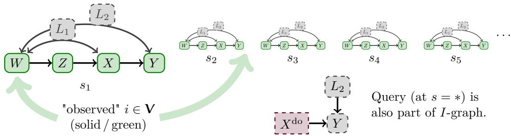  
Figure 6: Illustration of I-graph for do-intervention and IID-data (unified model). Nodes correspond to variables of the observable world, labels (capital letters) indicate mechanisms (Def. 2.5).

Example 5.1 (IID Do-Intervention). Given SCM and associated IID model (example 2.7) on $I _ { \mathrm { v a r s } }$ and $X , Y \subset I _ { \mathrm { v a r s } } .$ , extend the index set $I = I _ { \mathrm { v a r s } } \times I _ { \mathrm { s a m p l e } }$ by $I _ { \mathrm { v a r s } } \times \{ * \}$ such that mechanisms are invariant under permutations of $I _ { \mathrm { s a m p l e } } \sqcup \big \{ * \big \}$ on $J _ { v } = \{ v \} \times ( I _ { \mathrm { s a m p l e } } \sqcup \{ * \} )$ for $v \not \in X$ , under permutations of $I _ { \mathrm { s a m p l e } }$ on $J _ { v } = \{ v \} \times I _ { \mathrm { s a m p l e } }$ if $v \in X$ or have single element $J _ { v } = \{ v \} \times \{ * \}$ and associated known mechanism $\delta _ { v } \in \mathcal { F } _ { \mathrm { i n t e r v e n e } }$ (singular at a component $( x _ { 0 } ) _ { v }$ of $x _ { 0 }$ , the interventional target for X). This is a unified model description of example 2.7. Note that the I-graph has no edges between nodes at diferent samples in $I _ { \mathrm { s a m p l e } }$ or between any $( v , s ) \in I _ { \mathrm { v a r s } } \times I _ { \mathrm { s a m p l e } }$ and $( v ^ { \prime } , * ) \in I _ { \mathrm { v a r s } } \times \{ * \}$ , in particular we are in a single-level setup.

Define $\theta = x _ { 0 }$ (fully parameterizing $\mathcal { F } _ { \mathrm { i n t e r v e n e } } )$ and $\tilde { Y } : = Y \times \{ * \}$ , from example 2.17 we find $P _ { \theta } ^ { \mathcal { D } } ( \tilde { Y } ) = P _ { \theta } ( \tilde { Y } ) = \bar { P } ( Y | \mathrm { d o } ( X = \bar { x } _ { 0 } ) )$ and the dataset $\mathcal { D } ( \omega )$ corresponds directly to the observations from the (unintervened) SCM M. Therefore, identifying $\overset { \cdot } { P _ { \theta } ^ { D } } ( \tilde { Y } )$ from $\mathcal { D } ( \omega )$ is the same as identifying $P ( Y | \operatorname { d o } ( X = x _ { 0 } ) )$ from $P ^ { \mathrm { o b s } }$ (the observational distribution).

We will formalize questions about $P _ { \theta } ^ { \mathcal { D } }$ (like "find $P _ { \theta } ^ { \mathcal { D } } ( \tilde { Y } ) ^ { \mathfrak { n } } )$ as "basic queries". Identification of interventional distributions (and thus causal efects etc.) in the IID / SCM sense is a special case of such a query (by the construction described above). We show in the present section, that basic queries can, under weak assumptions always satisfied for do-interventions on IID-models, be transformed into graphical queries which can be answered soundly using §3 and §4 (see Thm. 2). This approach is complete in the IID case §E.1.

## 5.1 Basic Queries

A basic query is formulated directly relative to a realized world. Query-identifiability is thus a tight statement; it directly relates simple and abstract structures, without referencing any of the technology like embeddings or structured kernels in its hypothesis or claim.

Remark 5.2. A formal machinery can always show results about its own structure. But to justify its relevance, such "internal" results are of no use: Results about a structure are relevant if the structure is relevant. So justifying the relevance of a structure by results about its internals is always a cyclic argument. It is conceptually important that the machinery of embeddings and structured kernels presented in this paper enables us to proof more abstract statements, phrased in a much simpler and more abstract language.

Definition 5.3 (Query). A basic query $q = ( \tilde { Y } , \tilde { X } , \theta )$ consists of finite subsets $\tilde { Y } , \tilde { X } \subset I$ with $\tilde { X } \cap \tilde { Y } = \emptyset$ plus a set of parameters $\theta = \mathcal { F } _ { \mathrm { i } }$ <sub>intervene</sub> (of the shallow distribution), with target

$$
P _ { \theta } ^ { \cal D } ( \tilde { Y } | \tilde { X } = x ) .
$$

On (standard) Borel spaces $\left( \mathrm { A s s . 2 . 1 } \right)$ , a basic query has a regular version, that is, there is a unique probability kernel $\tilde { Y } _ { x }$ such that $P _ { \theta } ^ { \cal D } ( \tilde { Y } | \tilde { X } = x ) = \tilde { Y } _ { x }$ . We call a basic query identifiable, if $\tilde { Y } _ { x }$ is identifiable (Def. 4.16) from the dataset $\mathcal { D } ( \omega )$

Remark: For interventional queries $\tilde { X } = \varnothing$ , the intervention is parameterized by θ. Other $\tilde { X }$ allow queries for intermediate results (cf. Fig. 3) and are necessary e. g. in example 4.11, see also example D.11.

## 5.2 Structured Queries

The illustrations in Fig. 1 and 6 of queries really show (embedded) local graphs with a few simple properties. This can be made formally clearer.

Definition 5.4 (Structured Query). A structured query is an embedded local graph $\psi :$ $\mathcal { G } \hookrightarrow I$ together with a set of interest $Y \subset \mathcal { N } _ { \mathrm { i n n e r } } ,$ such that $A = \emptyset$ is valid (Def. 4.6).

Underlying Query: Given a structured query $( \psi , Y )$ , there is an underlying basic query $q ( \psi , Y ) : = ( \tilde { Y } = \psi ( Y ) , \tilde { X } = \psi ( \mathcal { N } _ { \mathrm { o u t e r } } ) , \theta )$ . We call $( \psi , Y )$ identifiable, if the underlying basic query is identifiable.

For many basic queries there is a canonical structured query constructed by, starting from $\tilde { Y }$ , adding I-graph parents until a parent is either in $\tilde { X }$ (and added as external node), or no more parents are available. By Ass. 2.11 (finite past), this construction terminates after a finite number of steps with a finite graph. Embed this graph by the identity-mapping $\psi = \mathrm { i d }$ and identify $Y : = \bar { \tilde { Y } }$ with its ψ-image.

Lemma 5.5 (Associated Structured Query). Given is a basic query $q = ( \tilde { Y } , \tilde { X } , \theta )$ about a single-level statement, that is $\tilde { Y }$ is disconnected (not reachable by directed or undirected paths in the I-graph) from V. Further, $\tilde { X }$ cannot be bypassed in the sense of: $F o r y \in \tilde { Y }$ and $w \in \mathrm { A n c } _ { I } ( \tilde { X } ) \setminus \tilde { X }$ , there is no directed path γ : w ⇝ y in the I-graph with $\gamma \cap { \tilde { X } } = \emptyset$

Then there is a structured query $( \psi ( q ) , \tilde { Y } )$ with underlying query q.

Remark 5.6 (Assumptions for Structured Representation). "Standard" interventions, as in example 5.1, and even transport-questions (§E.6) can be described as single-level statements in this sense. Further, for interventional formulations (like the do-calculus), ${ \tilde { X } } = \emptyset$ (see §E), so the "no bypassing" assumption is always trivially satisfied; in other cases (parts of) X<sup>˜</sup> can be included into Y<sup>˜</sup> and disintegrated at the end, see §D.4; however nodes might be allowed in X<sup>˜</sup> but not in $\tilde { Y } .$ , see example 4.11. In the multi-level case the hypothesis of Lemma 5.5 can be weakened (Lemma D.8), and it becomes an if and only if statement.

Structured queries can be identified using the previously introduced machinery, §3 produces regular functionals, §4 produces identifiable knowledge:

Theorem 2. Given a structured query (ψ, Y ), using $L : = \mathcal { N } _ { \mathrm { i n n e r } } \setminus Y$ , if there is a regular functional F computing $\mu ( \mathcal G , L ) = F [ \mu _ { 1 } , \dots , \mu _ { n } ]$ with $\mu _ { 1 } , \ldots , \mu _ { n }$ all identifiable, then the underlying query $q ( \psi , Y )$ is identifiable.

Algorithm EDAIdentify Extact–Decompose–Assemble Identification   
Input: A query $\mu ( G , L )$   
Output: A (potentially empty) set of identification strategies.   
1) Extract:   
B := ExtractCS.   
K := Apply Thm. 1 to elements of B.   
2) Decompose:   
K<sup>′</sup> := Apply CGDecomp to elements of K.   
3) Assemble:   
Return SVSearch $\begin{array} { r } { \mathsf { \Omega } _ { 1 } ( K ^ { \prime } \cup _ { \tilde { f } \in \mathcal { F } _ { \mathrm { i n t e r v e n e } } } k ( \tilde { f } ) \cup _ { i \in \pmb { V } } k ( i ) , ( G , L ) ) . \mathsf { \Omega } \circ k ( i ) } \end{array}$ are included here for   
completeness, they are relevant only to the multi-level case (cf. Def. C.13).

A systematic approach to find identification strategies based on graphical operations §3 for a given query is sketched in Algo. EDAIdentify. First, minimal backdoor-free families are constructed. Then $\mu ( \mathcal { G } , L )$ (obtained by Thm. 1) are decomposed into smaller parts and finally assembled by gluing (Lemma 3.8) into the query-graph of interest. This approach is evidently only complete if graphical operations are complete (Conj. B) and additionally:

Conjecture D (Decomposition Before Assembly). If a regular computation is possible by graphical operations, then it is possible to arrange all gluing operations to the end.

We leave a detailed analysis of algorithms and their properties to future work, we do however give multiple partial results (like Lemmas C.17, C.20, C.26) that clarify why some simplifications in the algorithms presented in the appendix are possible without loss of generality. Summarizing, the main open questions concerning completeness are in the already highlighted conjectures:

Conjecture (Completeness). If Conjectures A, B, C, D hold true, then in absence of selection-bias, a structured query is identifiable if and only if Algo. EDAIdentify returns a non-empty set.

## 5.3 Knowledge-Closures and Identification

At the end of $\ S 4 .$ , we summarized the extracted knowledge as a set $\mathcal { K } _ { \mathrm { b a s i c } }$ (Def. 4.17). Next, we ask, from an abstract perspective, when is a query identifiable relative to $\kappa _ { \mathrm { b a s i c } } ?$ Algorithmic completeness, relative to extraction-results (i. e. modular completeness of computation only), can be phrased as the recovery of a closure under a given regularity condition.

Definition 5.7 (Closures of Knowledge Sets). Given a knowledge-set $\kappa$ and a class R ("regularity class") of functionals closed under finite compositions, the R-closure of $\kappa .$ , denoted $\bar { \mathcal { K } } ^ { \mathcal { R } }$ , is the set of elements of knowledge R-identified from $\kappa \colon$

$$
\bar { \mathcal { K } } ^ { \mathcal { R } } \ : = \ \{ \ k ^ { \prime } \ | \ \exists \boldsymbol { F } \in \mathcal { R } , \exists k _ { 1 } , \dots , k _ { n } \in \mathcal { K } : k ^ { \prime } = F [ k _ { 1 } , \dots , k _ { n } ] \ \} .
$$

If R is the set of (standard-)regular functionals in the sense of Def. A.8, then we simply write $\bar { \kappa }$ (dropping the superscript), and $\mu$ is identifiable (Def. 4.16) if $\mu \in \bar { \mathcal { K } } _ { \mathrm { b a s i c } }$

Example 5.8 (Instrumental Variables). Assume there are subsets ${ \mathcal { F } } _ { \mathrm { m o n o } } , { \mathcal { F } } _ { \mathrm { e p i } } \subset { \mathcal { F } } _ { \mathrm { i n t e r v e n e } } \cup$ ${ \mathcal { F } } _ { \mathrm { o b s } }$ of left- and right-cancelative kernels respectively $\operatorname { ( i . e . } \mu \in { \mathcal { F } } _ { \mathrm { m o n o } } \operatorname { i f f } \nu \circ \mu = \nu ^ { \prime } \circ \mu \Rightarrow \nu = \nu ^ { \prime }$ for all $\nu \in { \mathcal { F } } _ { \mathrm { i n t e r v e n e } } \cup { \mathcal { F } } _ { \mathrm { o b s } } ;$ in other words, $\mathcal { F } _ { \mathrm { m o n o } }$ and $\mathcal { F } _ { \mathrm { e p i } }$ contain "suficiently injective / surjective" elements). Define $\mathcal { R } ^ { \mathrm { I V } }$ as the class of regular functionals (Def. A.8), functionals of the form $\nu \circ \mu \mapsto \nu \mathrm { { i f } } \mu \in \mathcal { F } _ { \mathrm { m o n o } }$ and $\nu \circ \mu \mapsto \mu \mathrm { ~ i f ~ } \nu \in \mathcal { F } _ { \mathrm { e p i } }$ and compositions of such functionals. For example if all elements of $\mathcal { F } _ { \mathrm { i n t e r v e n e } } \cup \mathcal { F } _ { \mathrm { o b s } }$ are linear, then ${ \mathcal { F } } _ { \mathrm { m o n o } } = { \mathcal { F } } _ { \mathrm { e p i } } = { \mathcal { F } } _ { \mathrm { i n t e r v e n e } } \cup { \mathcal { F } } _ { \mathrm { o b s } }$ and this deconvolution is called an "instrumental variable" argument $[ 3 0 , \mathrm { p } . 2 4 7 ]$ . Formally, the distinction should be made between a priori knowledge of $\mathcal { F } _ { \mathrm { m o n o } } , \mathcal { F } _ { \mathrm { e p i } }$ and their existence (since not every $f _ { J }$ is identifiable, this may or may not be testable, given fixed assumptions on the form of mechanisms).

Since (by definition) regular functionals are in $\mathcal { R } ^ { \mathrm { I V } }$ , automatically $\bar { \kappa } \subset \bar { \kappa } ^ { \mathcal { R } ^ { \mathrm { { I V } } } }$ for all $\kappa .$

## 5.4 Relation to the IID-Case

Under assumptions where the do-calculus applies, if data is IID, interventions are dointerventions, and missingness is uniform (IID-variables are either always or never observed), the id-algorithm [61] is known to be complete [57]. In §E.1, we show in detail that Algo. EDAIdentify returns an empty set only if there is a "hedge", which by a criterion of [57] immediately implies that our algorithm is also complete, at least for unconditional dointerventions, matching the id-algorithm. For conditional queries, some care should be taken as rule 2 of the do-calculus exploits the internal structure of do-interventions (which we intentionally exclude), but conditional queries (treated in detail by [56] in the IID case) matching this internal structure assumption can readily be formulated as meta-queries (see §D.4) without substantial overhead, see §E.4.

We also compare our approach in detail to the mz-transportability setup [34; 6; 4] in §E.7. This setup aims to transport experimental and non-experimental information between IID-contexts (with a number of restrictions, for example all contexts share a graph, and hiddenness is cross-context uniform). It uses "selection-variables" (often called contextvariables in other sources), which (in similar form) are at the foundation of many influential multi-context approaches to causal questions [19; 27; 15]. We find that also here Algo. EDAIdentify seems to be complete (by a criterion of [4]), matching the algorithm of [5; 4].

Finally, somewhat surprisingly, we can also readily reproduce the mediation formula for natural direct efects (NDE) (or rather: the formula for underlying conditional probabilities). This is initially somewhat surprising, as we do not actually consider counter-factuals. However, our query-formulation is general enough to capture the question motivating NDE directly, without the detour through counterfactuals, see §E.8.

We can readily reproduce many relevant results from the literature, importantly we can do so in a unified approach (and algorithm). While literature on the topic of causal efect-estimation is dominated by IID-setups and do-interventions (and hence so is this comparison-section), the main purpose and strength of our formalism is its applicability far from IID and its flexible query formulation. However, as the comparison above shows, this improved flexibility avoids costs in identification-power. While we do not know if our algorithm is complete, it does not lead to a regression below the state of the art in standard setups.

## 6 Conclusion

We introduced a simple and widely applicable abstract language to describe causal reasoning §2. This weak imposed structure proofs suficient to learn and reason about a model §3, §4 in order to ultimately identify a notion of causal queries §5, that includes many conventionally considered questions as special cases.

While some questions, about selection-bias, correlated missingness, counterfactuals and also about the completeness of our identification strategy in general remain open, we do re-discovery many core structures like c-components, c-trees, c-forests and hedges known to be pivotal to IID do-interventional queries [61; 57] from a new perspective, which not only sheds new light on these objects, but it also validates our results against known special cases. Also the ability to (correctly) reproduce the mediation-formula for natural direct efects, and mz-transport results is quite encouraging.

From a larger perspective, it would certainly be interesting to understand how and to what degree the models employed by our formalism can be learned from data, §F.3. However, finding the right structure to learn must necessarily precede finding ways of learning it.

Finally, returning to the example from the introduction (Fig. 1), note that the panels highlighted as "learn" can indeed be identified by Thm. 1, and the query can be glued (lemma 3.8) from these partial results and the known $Y _ { \mathrm { i n i t } }$ . In a last step, variables not of interest can be marginalized.

## Acknowledgements

J.R. has received funding from the European Research Council (ERC) Starting Grant CausalEarth under the European Union’s Horizon 2020 research and innovation program (Grant Agreement No. 948112). J.R. and M.R. have received funding from the European Union’s Horizon 2020 research and innovation program under grant agreement No 101003469 (XAIDA).

## References

[1] C. K. Assaad. Causal reasoning in diference graphs. arXiv preprint arXiv:2411.01292, 2024.

[2] C. Avin, I. Shpitser, and J. Pearl. Identifiability of path-specific efects. In Proceedings of the 19th International Joint Conference on Artificial Intelligence, IJCAI’05, page 357–363, San Francisco, CA, USA, 2005. Morgan Kaufmann Publishers Inc.

[3] C. Balsells-Rodas, Y. Wang, and Y. Li. On the identifiability of markov switching models, 2023.

[4] E. Bareinboim and J. Pearl. Transportability of causal efects: Completeness results. In Proceedings of the AAAI Conference on Artificial Intelligence, volume 26, pages 698–704, 2012.

[5] E. Bareinboim and J. Pearl. A general algorithm for deciding transportability of experimental results. Journal of Causal Inference, 1(1):107–134, 2013.

[6] E. Bareinboim and J. Pearl. Causal inference and the data-fusion problem. Proceedings of the National Academy of Sciences, 113:7345 – 7352, 2016.

[7] S. Bongers, P. Forré, J. Peters, and J. M. Mooij. Foundations of structural causal models with cycles and latent variables. The Annals of Statistics, 49(5):2885–2915, 2021.

[8] J. T. Chang and D. Pollard. Conditioning as disintegration. Statistica Neerlandica, 51 (3):287–317, 1997.

[9] D. Colombo, M. H. Maathuis, et al. Order-independent constraint-based causal structure learning. J. Mach. Learn. Res., 15(1):3741–3782, 2014.

[10] J. Corander, A. Hyttinen, J. Kontinen, J. Pensar, and J. Väänänen. A logical approach to context-specific independence. Annals of Pure and Applied Logic, 170(9):975–992, 2019.

[11] J. Correa and E. Bareinboim. General transportability of soft interventions: Completeness results. Advances in Neural Information Processing Systems, 33:10902–10912, 2020.

[12] J. de Aguas, L. Henckel, J. Pensar, and G. Biele. Causal inference amid missingnessspecific independencies and mechanism shifts. arXiv preprint arXiv:2506.15441, 2025.

[13] P. M. Faller, L. C. Vankadara, A. A. Mastakouri, F. Locatello, and D. Janzing. Selfcompatibility: Evaluating causal discovery without ground truth. In International Conference on Artificial Intelligence and Statistics, pages 4132–4140. PMLR, 2024.

[14] A. Gelman and J. Hill. Data analysis using regression and multilevel/hierarchical models. Cambridge university press, 2006.

[15] W. Günther, U. Ninad, and J. Runge. Causal discovery for time series from multiple datasets with latent contexts. In Uncertainty in Artificial Intelligence, pages 766–776. PMLR, 2023.

[16] W. Günther, O.-I. Popescu, M. Rabel, U. Ninad, A. Gerhardus, and J. Runge. Causal discovery with endogenous context variables. Advances in Neural Information Processing Systems, 37:36243–36284, 2025. arXiv:2412.04981.

[17] F. R. Guo and E. Perković. Eficient least squares for estimating total efects under linearity and causal suficiency. Journal of Machine Learning Research, 23(104):1–41, 2022.

[18] P. W. Holland. Statistics and causal inference. Journal of the American Statistical Association, 81(396):945–960, 1986. ISSN 01621459, 1537274X.

[19] B. Huang, K. Zhang, J. Zhang, J. Ramsey, R. Sanchez-Romero, C. Glymour, and B. Schölkopf. Causal discovery from heterogeneous/nonstationary data. The Journal of Machine Learning Research, 21(1):3482–3534, 2020.

[20] A. Hyttinen, J. Pensar, J. Kontinen, and J. Corander. Structure learning for bayesian networks over labeled dags. In International conference on probabilistic graphical models, pages 133–144. PMLR, 2018.

[21] D. Janzing, P. M. Faller, and L. C. Vankadara. Reinterpreting causal discovery as the task of predicting unobserved joint statistics. arXiv preprint arXiv:2305.06894, 2023.

[22] O. Kallenberg. Foundations of modern probability. Springer, 1997.

[23] O. Kallenberg. Probabilistic symmetries and invariance principles. Springer, 2005.

[24] F. Lattimore, T. Lattimore, and M. D. Reid. Causal bandits: Learning good interventions via causal inference. Advances in neural information processing systems, 29, 2016.

[25] S. Mameche, L. Cornanguer, U. Ninad, and J. Vreeken. Spacetime: Causal discovery from non-stationary time series. arXiv preprint arXiv:2501.10235, 2025.

[26] A.-U. Margueritte, A. Z. Balcıoğlu, J. Krijthe, D. Zachariah, and F. D. Johansson. Learning plug-in surrogate endpoints for randomized experiments. arXiv preprint arXiv:2605.12051, 2026.

[27] J. M. Mooij, S. Magliacane, and T. Claassen. Joint causal inference from multiple contexts. The Journal of Machine Learning Research, 21(1):3919–4026, 2020.

[28] K. P. Murphy. Probabilistic machine learning: an introduction. MIT press, 2022.

[29] J. Park, S. Buchholz, B. Schölkopf, and K. Muandet. A measure-theoretic axiomatisation of causality. In A. Oh, T. Naumann, A. Globerson, K. Saenko, M. Hardt, and S. Levine, editors, Advances in Neural Information Processing Systems, volume 36, pages 28510– 28540. Curran Associates, Inc., 2023. doi: 10.52202/075280-1239.

[30] J. Pearl. Causality: Models, reasoning and inference. Cambride University Press, 2000.

[31] J. Pearl. Direct and indirect efects. Proceedings of the Seventeenth Conference on Uncertainty in Artificial intelligence, 2001.

[32] J. Pearl. The causal mediation formula—a guide to the assessment of pathways and mechanisms. Prevention science, 13:426–436, 2012.

[33] J. Pearl and E. Bareinboim. External validity: From do-calculus to transportability across populations. Statistical Science, 29(4):579–595, 2014.

[34] J. Pearl and E. Bareinboim. External validity: From do-calculus to transportability across populations. In Probabilistic and causal inference: The works of Judea Pearl, pages 451–482. 2022.

[35] J. Pensar, H. Nyman, T. Koski, and J. Corander. Labeled directed acyclic graphs: a generalization of context-specific independence in directed graphical models. Data mining and knowledge discovery, 29:503–533, 2015.

[36] E. Perković, J. Textor, M. Kalisch, and M. H. Maathuis. A complete generalized adjustment criterion. arXiv preprint arXiv:1507.01524, 2015.

[37] J. Peters, P. Bühlmann, and N. Meinshausen. Causal inference by using invariant prediction: identification and confidence intervals. Journal of the Royal Statistical Society Series B: Statistical Methodology, 78(5):947–1012, 2016.

[38] J. Peters, D. Janzing, and B. Schölkopf. Elements of causal inference: foundations and learning algorithms. The MIT Press, 2017.

[39] M. Rabel and J. Runge. Context-specific causal graph discovery with unobserved contexts: Non-stationarity, regimes and spatio-temporal patterns, 2026.

[40] M. Rabel, W. Günther, J. Runge, and A. Gerhardus. Causal modeling in multi-context systems: Distinguishing multiple context-specific causal graphs which account for observational support. arXiv preprint arXiv:2410.20405, 2025.

[41] A. Rahmani and P. Frossard. Castor: Causal temporal regime structure learning. 2023.

[42] J. M. Robins and T. S. Richardson. Alternative graphical causal models and the identification of direct efects. Causality and psychopathology: Finding the determinants of disorders and their cures, 84:103–158, 2010.

[43] C. B. Rodas, R. Tu, and H. Kjellstrom. Causal discovery from conditionally stationary time-series. arXiv preprint arXiv:2110.06257, 2021.

[44] M. Rojas-Carulla, B. Schölkopf, R. Turner, and J. Peters. Invariant models for causal transfer learning. The Journal of Machine Learning Research, 19(1):1309–1342, 2018.

[45] D. Rothenhäusler, N. Meinshausen, P. Bühlmann, and J. Peters. Anchor regression: Heterogeneous data meet causality. Journal of the Royal Statistical Society Series B: Statistical Methodology, 83(2):215–246, 2021.

[46] D. B. Rubin. Estimating causal efects of treatments in randomized and nonrandomized studies. J. Educ. Psychol., 66(5):688–701, 1974. ISSN 00220663. doi: 10.1037/h0037350.

[47] D. B. Rubin. Inference and missing data. Biometrika, 63(3):581–592, 1976.

[48] J. Runge. Discovering contemporaneous and lagged causal relations in autocorrelated nonlinear time series datasets. In Conference on Uncertainty in Artificial Intelligence, pages 1388–1397. PMLR, 2020.

[49] J. Runge. Necessary and suficient graphical conditions for optimal adjustment sets in causal graphical models with hidden variables. Advances in Neural Information Processing Systems, 34:15762–15773, 2021.

[50] J. Runge, P. Nowack, M. Kretschmer, S. Flaxman, and D. Sejdinovic. Detecting and quantifying causal associations in large nonlinear time series datasets. Science advances, 5(11):eaau4996, 2019.

[51] J. Runge, A. Gerhardus, G. Varando, V. Eyring, and G. Camps-Valls. Causal inference for time series. Nature Reviews Earth & Environment, pages 1–19, 2023.

[52] E. Saggioro, J. de Wiljes, M. Kretschmer, and J. Runge. Reconstructing regimedependent causal relationships from observational time series. Chaos: An Interdisciplinary Journal of Nonlinear Science, 30(11), 2020.

[53] R. D. Shah and J. Peters. The hardness of conditional independence testing and the generalised covariance measure. The Annals of Statistics, 48(3):1514, 2020.

[54] I. Shpitser. Counterfactual graphical models for longitudinal mediation analysis with unobserved confounding. Cognitive science, 37(6):1011–1035, 2013.

[55] I. Shpitser. When does the id algorithm fail? arXiv preprint arXiv:2307.03750, 2023.

[56] I. Shpitser and J. Pearl. Identification of conditional interventional distributions. In Uncertainty in Artificial Intelligence, volume 22, pages 437–444, 2006. arXiv:1206.6876.

[57] I. Shpitser and J. Pearl. Identification of joint interventional distributions in recursive semi-markovian causal models. In AAAI, pages 1219–1226, 2006.

[58] I. Shpitser and J. Pearl. What counterfactuals can be tested. arXiv preprint arXiv:1206.5294, 2012.

[59] P. Spirtes and C. Glymour. An algorithm for fast recovery of sparse causal graphs. Social Science Computer Review, 9:62–72, 1991.

[60] P. Spirtes, C. Glymour, and R. Scheines. Causation, prediction, and search. MIT press, 2001.

[61] J. Tian and J. Pearl. A general identification condition for causal efects. In Aaai/iaai, pages 567–573, 2002.

[62] V. Vapnik. Estimation of dependences based on empirical data. In M. Jordan, J. Kleinberg, and B. Schölkopf, editors, Vapnik: Estimation of Dependences Based on Empirical Data, Information Science and Statistics, pages 1–399. Springer Science + Business Media, New York, second edition, 2006. Reprint of 1982 edition.

## Reading Guide

This appendix is rather long and in places very technical, so we start with a brief overview to help the reader orient themselves. A table of contents is included at the very end of the paper.

The two technically most interesting and relevant results are the proofs of graphical operations (§3.3) and of Thm. 1 (extraction from backdoor-free families). It should be possible to start reading the respective proofs, then reference back to other material of the appendices where required (or of interest). Graphical operations are proved in §A.3. The main proof technique is a reduction to statements about certain univariate kernels called "atoms" in §A.3. The proof of Thm. 1 in §C.4 relies on results about these "atoms" as well, hence it is recommendable to get an overview of results shown in §A.3 before starting to read the proof of Thm. 1 (this is especially true for proof-steps 2 and 3). Some technical details on the relation of data-sets to models relevant to the proof of Thm. 1 have been detached into §B to make the proof more accessible.

We removed multi-level results from the main-text for improving readability. Where diferences arise (in §C and §D) an initial sub-section introduces the multi-level setup as a simple modification of the main text. It should also be possible to read the corresponding appendices (especially §C) for the single-level case only, without much confusion (see introduction to §C; for the proof of Thm. 1 all multi-level aspects are contained within a separate proof-step 3). For queries (§D), multi-level aspects are relevant for phrasing more general questions: In the single-level case, after marginalizing to the query $P _ { \theta } ^ { \cal D } ( \tilde { X } , \tilde { Y } ) =$ $P _ { \theta } ( { \tilde { X } } , { \tilde { Y } } )$ and many technical problems vanish. For an intuition why additional non-trivial statements can be made with multi-level structures see the example in notation C.11. Further examples of multi-level queries and their usefulness are given in §D.5. Especially to the reader familiar with results for the IID-case [30; 61; 56], to better understand the query-formulation, it may also be helpful to have a look at §E.

By separating the random elements of an observable world from the purely measuretheoretical model our approach can be made mathematically rigorous. To clarify notation and technical details, §G builds the detailed technical connection from citeable text-book results to the notation and computational means used throughout the remainder of this paper.

## A Details on Structured Kernels

Basic notions, especially concerning kernels, are recalled and explained with examples in SCM language in §G. Here we continue with non-standard constructions on kernels, designed for our use-case of encoding (and computing with) the sparsity-structure of a (causal) structural graph while respecting latent structure.

## A.1 Structural Graphs

Large ⊗-products of kernels with sparse inter-dependencies, are essentially a type of tensor network. Tensor networks are often represented graphically. Also the representation of causal relationships by graphical models is very common. It therefore is not particularly surprising, that a suitable form of graphical representation will also help substantially in organizing the knowledge we encounter in our reasoning here. We start by defining a precise notion of graphical representation that can encapsulate the causal sparsity information of §G.4 in a more accessible form.

First, we give a slightly more detailed version of Def. 3.2 split into a graph-definition A.1 and model-alignment A.3.

Definition A.1 (Structural Graph And Causal Orders). A structural graph G is a finite set of nodes ${ \mathcal { N } } : = { \mathcal { N } } _ { \mathrm { i n n e r } } { \dot { \cup } } { \mathcal { N } } _ { \mathrm { o u t e r } }$ with $\mathcal { N } _ { \mathrm { i n n e r } } \cap \mathcal { N } _ { \mathrm { o u t e r } } = \emptyset$ , together with a set of directed edges $\mathcal { E } \subset \mathcal { N } \times \mathcal { N } _ { \mathrm { i n n e r } } \setminus \Delta$ , where $\Delta = \{ ( n , n ) | n \in \mathcal { N } _ { \mathrm { i n n e r } } \}$ is the diagonal, (proper edges) between nodes in $\mathcal { N } _ { \mathrm { i n n e r } }$ and from nodes in $\mathcal { N } _ { \mathrm { o u t e r } }$ to nodes in ${ \mathcal { N } } _ { \mathrm { i n n e r } }$

We call a structural graph G acyclic, if there are no directed cycles. If G is acyclic, then there is a partial order on (all) nodes $\mathcal { N }$ defined by $n _ { 1 } \leq n _ { 2 }$ :⇔ there is a directed path from $n _ { 1 }$ to n<sub>2</sub>. A G-causal order on $\mathcal { N }$ is a total order extending this partial order. Such a total order always exists, but it is in general not unique.

Remark A.2. Edges are relevant (only) for parent relation-ships (and properties deduced thereof, like ancestral relation-ships), it thus is irrelevant if more than one edge is allowed between nodes for each orientation and that there are no edges from a node to itself. We did adopt the convention of allowing at most one edge (per orientation) between any two nodes (the definition of edges $\mathcal { E } \subset \mathcal { N } \times \mathcal { N } _ { \mathrm { i n n e r } } \setminus \Delta$ enforces this), which is in line with standard causal analysis [30; 38].

With the same mechanism $f _ { Y }$ potentially featuring in diferent contexts, it may occur in practice, with the same variable acting as multiple parents, $\mathrm { e . g . } f _ { Y } ( x _ { 1 } , x _ { 2 } )$ could be evaluated as $x \mapsto f _ { Y } ( x , x )$ . This can be modeled easily, by defining a diagonal map $\Delta _ { X } : X  X \times X , x \mapsto ( x , x )$ with $\Delta _ { X } \in \mathcal { F } _ { \mathrm { i n t e r v e n e } }$ and considering $f _ { y } \circ \Delta _ { X }$ as a softintervention (which is allowed both in observations an queries, which we do not distinguish formally); technically the reader may have noticed, that $\Delta { _ { X } }$ is not actually a probabilitykernel, however we can replace it by one which has singular measure 1 at the value taken by $\Delta _ { X }$

Note that this interpretation does not seem to afect identifiability: If $f _ { Y }$ is identifiable, then the composition with an intervention $\Delta _ { X } \in \mathcal { F } _ { \mathrm { i n t e r v e n e } }$ will be considered identifiable (if we know $f _ { Y } ( x _ { 1 } , x _ { 2 } )$ we can in particular plug in the same argument twice), but knowing (from observations) only $f _ { Y } \circ \Delta _ { X }$ will only retain this composition (i. e. , observing only $f _ { Y } ( x , x )$ we cannot make predictions for queries that involve the full two-dimensional $f _ { Y } ( x _ { 1 } , x _ { 2 } )$ , at least not without substantial knowledge about internal structure, cf. §5.3).

Definition A.3 (Model Alignment). A model aligned structural graph is an acyclic structural graph G together with

(i) a probability kernel $\mu ^ { n }$ for each inner node $n \in \mathcal { N } _ { \mathrm { i n n e r } }$ . and a bijective assignment (cf. G.24) of the κ arguments of $\mu ^ { n }$ to proper parents of n:

$$
\operatorname { p a } ^ { n } : \{ 1 , 2 , \dots , \kappa \} \stackrel { 1 : 1 } { \longrightarrow } \operatorname { P a } _ { G } ( n ) .
$$

(ii) $\mu ^ { n }$ is a kernel on $\kappa ^ { n }$ arguments, from $X _ { 1 } ^ { n } , \ldots , X _ { \kappa ^ { n } } ^ { n }$ to $Y ^ { n }$ , we require ∀n: $Y ^ { \mathrm { p a } ^ { n } ( 1 ) } \subset X _ { 1 } ^ { n }$ $\smash { \ldots , Y ^ { \mathrm { p a } ^ { n } \left( \kappa ^ { n } \right) } \subset X _ { \kappa ^ { n } } ^ { n } }$

Notation A.4 (Structural Graph Contraction). Given a model aligned acyclic structural graph G together with a G-causal order π and a subset $\mathcal { N } ^ { \prime } \subset \mathcal { N } _ { \mathrm { i n n e r } }$ (which is totally ordered by $\leq _ { \pi } )$ , we write

$$
\begin{array} { r l } & { \otimes _ { n \in N ^ { \prime } } ^ { \pi } \mu ^ { n } : = \otimes _ { n \in N ^ { \prime } } ^ { \mathtt { p a } ^ { * } } \mu ^ { n } \ ( \mathrm { c f . \ D e f . \ G . } 2 4 ) } \\ & { \mathrm { w h i c h \ i s \ a \ k e r n e l \ f r o m \ } \displaystyle \prod _ { x \in \mathrm { P a } _ { G } ( N ^ { \prime } ) \backslash N ^ { \prime } } \left( \cap _ { \{ ( n , k ) | \mathtt { p a } ^ { n } ( k ) = x \} } X _ { k } ^ { n } \right) \mathrm { \ t o \ } \displaystyle \prod _ { n \in N ^ { \prime } } Y ^ { n } , } \end{array}
$$

for the product of the $\mu ^ { n }$ in π-order, contracted by the mapping $\mathrm { p a } ^ { n }$ of Def. A.3, i. e. using notation G.25 if nodes in the graph are named ${ \mathcal { X } } , { \mathcal { Y } } , { \mathcal { Z } } , \dots$ . with associated kernels $X , Y , Z ,$ then for example Y having parents $\mathcal { X } , \mathcal { Z }$ will have arguments / indices $x , z , Y _ { x , z }$ (the order is relevant, by convention we write indices in π-order, that is the kernels formally depends on $\pi ,$ albeit only by reordering its arguments). More formally this means we set $w ^ { n } : = \mathrm { p a } ^ { n }$ in Def. G.24.

Next we use these structural graphs to attach sparsity-information to kernels, detailing Def. 3.3 of the main text; the main text additionally uses notation A.7:

Definition A.5 (Structured Kernel). A structural model $( G , L )$ is a tuple of a model aligned structural graph G together with a subset $L \subset \mathcal { N } _ { \mathrm { i n n e r } }$ . Given a structural model $( G , L )$ and a G-causal order π, we define (using notation A.4; "in causal order compute the value at node $n ,$ by plugging into the k-th argument of $\mu ^ { n }$ , the value of the node $\mathrm { p a } ^ { n } ( k )$ ), where outer nodes x are left open as arguments of the resulting $\mu ( G , L , \pi ) _ { x } " )$

$$
\mu ( G , L , \pi ) _ { x } \ : = \ \mathrm { m a r g } _ { L } ( \otimes _ { n \in \mathcal { N } _ { \mathrm { i n n e r } } } ^ { \pi } \mu ^ { n } ) _ { x } ,
$$

where $\boldsymbol { x } = ( x _ { i } ) _ { i \in \mathcal { N } _ { \mathrm { o u t e r } } }$ summarizes arguments in ${ \mathcal { N } } _ { \mathrm { o u t e r } } .$

Given a set $\mathcal { F }$ of probability kernels (later typically ${ \mathcal { F } } = { \mathcal { F } } _ { \mathrm { m o d e l } } \cup { \mathcal { F } } _ { \mathrm { i n t e r v e n e } } \cup \{ \delta _ { i } | i \in I \} )$ ， a F-structured kernel is a kernel $\mu _ { x }$ that can be written in the form $\mu _ { x } = \mu ( G , L , \pi ) _ { x }$ , where all nodes $n \in \mathcal { N } _ { \mathrm { i n n e r } }$ are aligned to an element $\mu ^ { n } \in \mathcal { F }$

This definition depends on the G-causal order $\pi ,$ but only up to transposition (Def. G.19), see A.7. It is helpful to briefly recall (slightly more formal) the precise definition of subgraphs introduced in the main text, as it is relevant to multiple graphical operations:

Definition 3.4 (Structural Subgraphs). A structural subgraph $G ^ { A } \leq G ^ { B }$ of a structural graph $G ^ { B }$ is a structural graph $G ^ { A }$ such that:

(i) Node Sets: $\mathcal { N } ^ { A } \subset \mathcal { N } ^ { B }$ and $\mathcal { N } _ { \mathrm { i n n e r } } ^ { A } \subset \mathcal { N } _ { \mathrm { i n n e r } } ^ { B }$

(ii) Edge Sets: $\mathcal { E } ^ { A } = \mathcal { E } ^ { B } \cap ( \mathcal { N } ^ { A } \times \mathcal { N } _ { \mathrm { i n n e r } } ^ { A } )$ , i. e. edges are exactly those in $G ^ { B }$ from nodes in $\bar { G } ^ { A }$ to inner nodes of $G ^ { A }$

(iii) Inner Parents: ∀n $\in \mathcal { N } _ { \mathrm { i n n e r } } ^ { A }$ : if $p \in \operatorname { P a } _ { G ^ { B } } ( n )$ , then $p \in { \mathcal { N } } ^ { A }$

(iv) Alignment: For model-aligned graphs $\forall n \in \mathcal { N } _ { \mathrm { i n n e r } } ^ { A } \colon ( \mu ^ { A } ) ^ { n } = ( \mu ^ { B } ) ^ { n }$

We write $G ^ { A } < G ^ { B }$ , if $G ^ { A } \leq G ^ { B }$ and $\mathcal { N } _ { \mathrm { i n n e r } } ^ { A } \subsetneq \mathcal { N } _ { \mathrm { i n n e r } } ^ { B }$

## A.2 Regularity

This subsection is conceptually important to understanding the limits of computation and identifiability within the formalism proposed in this paper and beyond it. However, it is somewhat technical and, on a first reading, may be skipped, as it may disrupt the logical flow of the presentation.

Statistical and causal inference fundamentally ask: What questions about a system are "identifiable", that is well-defined, i. e. have answers that are uniquely determined by observations (at least in principle and asymptotically), and how can they be "estimated", that is how can answers be approximated (from finite data). In this section we clarify what kind of computations are possible with kernels within this philosophy.

However, first a few remarks about uniqueness of kernels and the relevance of distributional support to transfer problems are required.

Remark A.6 (Support). Disintegrations are typically only ${ } " \vartheta \otimes \mu$ -almost everywhere" unique (see Lemma G.14). In statistics, "almost everywhere" is often read essentially as "good enough". From the perspective of learning transferable properties of a model, this hides a very fundamental aspect of empirical science: We can only ever learn things that we actually see (encounter with non-zero-probability). If we observe $P ( \mathcal X , \mathcal Y )$ of a causal (say IID) model $\mathcal { X }  \mathcal { Y }$ with mariginal $\mu = P ( \mathfrak { X } )$ , then whatever we try to learn about (a regular version of) the conditional distribution $\nu _ { x } : = P ( \mathbb { Y } | \mathcal { X } = x )$ , we can learn at best in a µ-almost everywhere sense. This is not a problem of our formalism, it is a deeply rooted issue of modeling transfer of knowledge (for example to an intervened system).

Before we go into any detail, it seems important to point out, that this is (usually) not actually a problem in practice. When Pearl [30] (and others) talk about do-interventions to a value $x _ { 0 }$ then either $\mathcal { X }$ is categorical (and $P ( \mathcal { X } = x _ { 0 } ) \neq 0 .$ , in which case $\delta [ x _ { 0 } ] \otimes \nu _ { x }$ is well-defined, even if $\nu _ { x }$ is defined only µ-almost everywhere) or the actual real-world problem formally expressed as ${ } " \mathrm { d o } ( \mathcal { X } = x ) "$ is understood as "once X is forced to a value very close to $x " { \mathrm { i } }$ this last notion is actually perfectly fine, for example if "very close to $x "$ is a measure dominated by (absolutely continuous $\operatorname { w . r . t . } ) \ \mu .$

Essentially, the usual argument is "the formal problem is just a proxy for the real-world problem". Despite this, there is the (inherently formal) aspect of mathematical rigor. For (most) practical computations, the interpretation of do-interventions given above makes sense. But what about proofs? A proof-technique that can "prove" both true and false statements does not seem particularly convincing. Overly simplistic notions of conditional probability (like quotients of joints) have long since been known for their pitfalls (see $\mathrm { e . g . \ [ 8 ] ) }$ . The problem here is as follows: Consider two IID models $M _ { 1 }$ and $M _ { 2 }$ with $\mathcal { X }  \mathcal { Y }$ and $X \sim \mathcal { N } ( 0 , 1 )$ , in $M _ { 1 }$ the mechanism at Y is $f _ { Y } ( x ) = x + { \mathcal { N } } ( 0 , 1 )$ if $x \neq 0$ but $f _ { Y } ( x ) = 4 2 + \mathcal { N } ( 0 , 1 )$ if $x = 0$ , while in $M _ { 2 }$ the mechanism at Y is simply $g _ { Y } ( x ) = x + \mathcal { N } ( 0 , 1 )$ . Both models produce the same joint observational distribution $P ( \mathcal X , \mathcal Y )$ , yet $P _ { 1 } ( \mathbb { Y } | \mathrm { d o } ( \mathcal { X } = 0 ) ) \neq P _ { 2 } ( \mathbb { Y } | \mathrm { d o } ( \mathcal { X } = 0 ) )$ Thus the do-intervention is (formally) not identifiable from observations or even from perfect knowledge of the observational joint distribution. The problem is, that by $P ( \mathcal { X } = 0 ) = 0$ so we will almost never (with probability 0) figure out the diference between both models. Note that $p ( \mathcal X ) > 0$ , so a positivity-assumtion cannot fix this issue. This may often not be a problem in computations (see above), but obviously, if it is not actually formally true that this singular intervention can be identified (the example above is a counter-example), then any rigorous mathematical approach must see this formal problem.

Using a rigorous language for conditional probabilities, on standard Borel spaces (Ass. 2.1) disintegrations are available, the problem actually becomes apparent: The general idea of identifying $P ( \mathcal { Y } | \mathrm { d o } ( \mathcal { X } = 0 ) )$ is to write down a Markov-factorization (actually a disintegration) $\begin{array} { r } { P ( \mathfrak { X } , \mathfrak { Y } ) = \int P ( X = x ) P ( Y | X = x ) } \end{array}$ dx, then to replace $P ( X )$ by the intervention $\delta [ 0 ]$ singular at 0, and compute the new joint distribution. Writing $\mu = P ( X ) , \nu _ { x } = P ( Y | X = x )$ (a regular version), then $P ( \mathcal { X } , \mathcal { Y } ) = \mu \otimes \nu$ . However, it also becomes clear (cf. Cor. G.2) that ν (computed form the joint) is unique only µ-almost everywhere. So the second step, replacing $\mu$ by $\xi$ (more in line with our symmetry-guided perspective: transfer $\nu _ { x }$ from the observational system to the query; for example $\xi = \delta [ 0 ] )$ ) produces a well-defined (unique) result $\xi \otimes \nu$ if $\xi \ll \mu$ is dominated by $\mu \ ( { \mathrm { i . ~ e . } }$ . if ∀ measurable B: $\mu ( B ) = 0 \Rightarrow \xi ( B ) = 0 )$ . For the example above {0} is a measurable set and $\mu ( \{ 0 \} ) = P ( { \mathcal { X } } \in \{ 0 \} ) = 0$ , but $\xi ( \{ 0 \} ) = \delta [ 0 ] ( \{ 0 \} ) = 1$ , in particular $\delta [ 0 ] \ll \mu$ and our formalism correctly alerts us to the fact that the transfer is not well-defined.

Practical interpretation is often possible by replacing $\xi \ll \mu$ by a regularity assumption, for example by existence of smooth densities. Given a smooth density, a limit over a Dirac-sequence can be exchanged with integration, thus $\delta [ 0 ]$ can be safely expressed as

$$
\begin{array} { r } { \delta [ 0 ] \otimes \nu _ { x } = \big ( \operatorname* { l i m } _ { n  \infty } \delta _ { n } [ 0 ] \big ) \otimes \nu _ { x } } \\ { = \operatorname* { l i m } _ { n  \infty } [ \delta _ { n } [ 0 ] \otimes \nu _ { x } ] } \end{array}
$$

by smoothness.

So in this case as long as a Dirac-sequence with ∀n : $\delta _ { n } [ 0 ] \ll \mu$ can be chosen, the computation is $" \mathrm { s a f e " }$

The uniqueness $" \vartheta \otimes \mu "$ -almost everywhere in our formalism can mostly (for cases like example 4.11 this problem is more complicated, e. g. it depends on $b \neq 0$ or dimension $\geq 3 )$ be traced back to some data-set on which we learned our initial information. So it is a formal means of making this reliance on support in data explicit. On the other hand, reliance on observational support is itself a very complicated topic, and not the main topic of this paper. So we will usually "forget about" observational support and simply write $\mu = \nu$ if this is true almost surely on our data. We make this transparent however in Ass. 2.23, and want to emphasize that our approach does provide a formal means of making explicit and analyzing this problem, thus sets the stage for future work on this topic.

While often ignored, observational support has been understood to be relevant for learning and interpreting causal structure on multi-context systems $\left[ 1 6 ; 4 0 \right]$

Another, less deep, aspect of our notation so far is that it tracks order of factors even though this order can be trivially changed post-hoc, thus is largely irrelevant (cf. §G.3 for details). We will usually suppress this order in notation:

Notation A.7 (Equality and Transposition). We call two structured kernels $\mu , \nu$ essentially equivalent $\mu \approx \nu _ { \mathrm { { \scriptsize ~ + ~ } } }$ , if $\boldsymbol { \mu } ^ { T } = \boldsymbol { \nu }$ (Def. G.19). For example, given two G-causal orders $\pi , \pi ^ { \prime }$ then $\mu ( G , L , \pi ) \approx \mu ( G , L , \pi ^ { \prime } )$ by Lemma G.27. We will write $\mu ( G , L )$ for the ≈-equivalence class of any (thus all) causal orders.

Remark: The reader may think of this as a writing $\mu ( G , L )$ for $\mu ( G , L , \pi )$ in cases where $\pi$ is not of interest, with slight abuse of notation (as equality $" = "$ on equivalence classes technically means ≈ on actual kernels).

Knowing something about a system, in form of one or multiple structured kernels, we seek to understand what else can be concluded or "computed" from this information. We will revisit this question in §C.3 when discussing identifiability more generally. In the IID case, most treatments [61; 56; 57], allow for "general probability-theoretical transformations" (and the docalculus, which is itself proved by probability-theoretical transformations employing causally mandated independencies [30]). This is in practice taken to mean "quotients" (or formally more rigorous and more generally applicable: disintegrations [8]) to compute conditional distributions, marginalizations, and certain integrals (corresponding to ⊗-products in our case). This does, in the IID-case, not seem to lead to any confusion, as in practice there are very few available statements (§E).

In the present case, with a purely measure-theoretic model (and correspondingly no troubles from trying to define suitable random elements) we are in a position where we can actually state, in a mathematically rigorous way, what exactly we mean by computation. Indeed, there is not a unique meaningful notion: It is well-understood that for example in the linear case instrumental-variable arguments can improve identification-results. This is one of many examples that can be understood as an extended notion of computation and is discussed in §5.3. We will, for the purposes of the present section, start with what in the extended notion of §5.3 is called standard-regular (computations), i. e. we make, for now, no assumptions about the internal structure (like linearity) of mechanisms. The following notion of regular computations will in the IID case reproduce the results of [61; 56; 57; 4] (see §E), but applies much more generally:

Definition A.8 (Regularity). We call a functional F of probability kernels (standard-) regular if F is the identity or projection to one of its arguments, or if F consists of a finite combination of ⊗-products, left-disintegrations, right-marginalizations and transpositions.

More formally $F [ \mu _ { 1 } , \ldots , \mu _ { n } ]$ is regular if $\exists F ^ { 1 } , \ldots , F ^ { m }$ such that defining $\mu _ { 1 } ^ { 0 } : = \mu _ { 1 } , . . . ,$ $\mu _ { n } ^ { 0 } = \mu _ { n }$ , then inductively for $i + 1 = 1$ to m, let k ≤ n + i: $\mu _ { k } ^ { i + 1 } = \mu _ { k } ^ { i }$ and $\mu _ { n + i + 1 } ^ { i + 1 } =$ $F ^ { \ddot { i } + 1 } [ \mu _ { 1 } ^ { i } , \dots , \mu _ { n + i } ^ { i } ]$ where each $F ^ { i }$ is either of the form $\mu _ { l } ^ { i } \otimes \mu _ { j } ^ { i }$ or a right-marginalization of an argument $\mu _ { j } ^ { i }$ or a left-disintegration of an argument $\mu _ { j } ^ { i }$ or a transposition of an argument $\mu _ { j } ^ { i }$ and finally $\mathbf { \bar { \rho } } _ { F [ \mu _ { 1 } , \dots , \mu _ { n } ] } = \mu _ { n + m } ^ { m }$

Example A.9. Any finite composition of regular functionals is thus also regular. Anti-causal disintegrations can be written as a combination of a transposition and a left-disintegration, thus are regular. The general marginalization and disintegration operators can be written as a combination of left-disintegrations, anti-causal disintegrations, transpositions and rightmarginalizations, thus are regular. Compositions are marginalizations of products, thus are regular.

Remark A.10 (Regularity). We call these functionals regular, without actually fixing a regularity condition. The idea is as follows: In practice, given some assumptions (like smoothness etc) about mechanisms and an estimator (for example of a kernel / "conditional density") suitable (converging) under those assumptions, it is usually possible to give an actual regularity condition (like smoothness in some sense) such that convergence of the estimator(s) in the arguments entails convergence of the functional. For the chosen estimator to be applicable with the formalism outlined, this estimator-specific regularity must at least include Def. A.8; in practice, additionally data-support is relevant – we cannot intervene to a range of values we have never seen (without extremely strong parametric assumptions like linearity), cf. Rmk. A.6.

On generic kernels (i. e. without internal structure) no further computations should be possible, motivating Conjecture A, a relevant details to this problem is however:

Remark A.11 (Fixed-Points and Limits). Given a kernel $\mu _ { x }$ such that $[ \mu _ { x } \otimes \mu _ { x ^ { \prime } } ] _ { x }$ is well-defined (e. g. the Markov-kernel of a time-series), it is reasonable to ask for a limit $\scriptstyle \operatorname* { l i m } _ { n \to \infty } [ \otimes _ { k = 1 } ^ { n } \mu ] _ { x }$ (e. g. a stationary distribuition of a time-series). There is no reason why this computation would be regular (in the sense above). However, there is also no reason why such limits would be well-defined (exist uniquely) for generic kernels, so Conjecture A still seems plausible, albeit for non-trivial reasons.

While this clarifies what computations we consider on general kernels, it does not yet tell us how these computations on kernels, when applied to structured kernels, correspond to operations on graphs of structured kernels.

## A.3 Graphical Operations

In this subsection, we describe how structured kernels, can be transformed and combined. To this end, we study which graphical operations correspond to regular computations (see §A.2) on the described structured kernels. Note that the main text uses notation $\mathrm { A . 7 }$ to suppress causal orders π in these results. The main technical result is Lemma A.17 (a). This is actually a result about "atoms", factors associated to individual observable nodes of a structured kernel. The full power of Lemma A.17 (a) is a little obscured by its very simple and very technical claim, but it immediately implies Lemma 3.7 (c-components, cf. Lemma A.17 (b)), makes Lemma 3.8 (gluing, cf. Lemma A.21) astonishingly easy to state and proof and is a major ingredient in the proof of Thm. 1 (extraction from backdoor-free families, cf. §C.4). Given its central importance, the proof of Lemma A.17 (a) is stated with great detail; the reader may want to first go through Rmk. A.15, which explains the general idea behind the structures studied carefully in the proof of Lemma A.17 (a).

We will start with sub-graphs: Given $\mu ( G , L , \pi )$ , which sub-graphs $G ^ { \prime } \leq G$ encode a kernel $\mu ( G ^ { \prime } , L ^ { \prime } , \pi ^ { \prime } )$ that can be computed from $\mu ( G , L , \pi ) ?$ Besides trivial simplifications that only delete hidden parts of the graph (possibly after first hiding them by marginalization), there is also an analogue of c-components which play an important role in the IID case [61], and their simplifications, which form an analogue of c-trees and c-forests [56; 57]. Sub-graphs (at least as they are formulated here) are local, in the sense that information about the kernel of a sub-graph $G ^ { \prime } \leq G$ is obtained from the kernel of G, without any reference to other possibly known information. The next construction glues two graphs with controlled overlap, that is two "smaller" graphs’ kernels provide information about the kernel associated to a larger graph containing both as sub-graphs. If both smaller graphs agree on which variables are hidden, this operation is semi-local, in the sense that it requires two, but only two, graphs as inputs. Finally, we conclude with a construction that reveals / imputates certain hidden nodes in a larger graph, by virtue of using a second smaller graph with smaller latent set. This construction seemingly is also semi-local (as is gluing). A more general revealing operation might be possible (see §A.5 for further discussion), in which case gluing on revealed parts might become truly non-local.

We start by a more detailed version of Lemma / Def. 3.5.

Lemma / Definition A.12 (Simplified Graphs). Given a structural model $( G , L )$ , then for any $L ^ { \prime } \subset \mathcal { N } _ { \mathrm { i n n e r } } , \mu ( G , L \cup L ^ { \prime } ) = \operatorname* { m a r g } _ { L ^ { \prime } \setminus L } ( \mu ( G , L ) )$ can be regularly computed from $\mu ( G , L )$ Further, for a sub-set $B \subset L$ with $\dot { \operatorname { D e s c } } _ { G } ( B ) \subset B$ , there is a G-causal order π putting B at the end, i. e. such that $\forall n \in { \mathcal { N } } \forall b \in B \colon ( n \geq b \Rightarrow n \in B )$ . Using this π, the sub-graph $G ^ { \prime } \leq G$ with nodes ${ \mathcal { N } } _ { \mathrm { i n n e r } } ^ { \prime } = { \mathcal { N } } _ { \mathrm { i n n e r } } \setminus B$ and $\mathcal { N } _ { \mathrm { o u t e r } } ^ { \prime } = \mathrm { P a } _ { G } ( \mathcal { N } _ { \mathrm { i n n e r } } ^ { \prime } ) \setminus \mathcal { N } _ { \mathrm { i n n e r } } ^ { \prime } \subset \mathcal { N } _ { \mathrm { o u t e r } }$ (with

$B \subset L \subset \mathcal { N } _ { \mathrm { i n n e r } }$ removing B only removes inner nodes, however, some of the original arguments, i. e. outer nodes, may only be relevant to nodes in $B .$ , in which case we can discard them) satisfies

$$
\mu ( G ^ { \prime } , L \setminus B , \pi ) = \mu ( G , L , \pi ) .
$$

We call $\left( G ^ { \prime } , L \setminus B \right)$ a direct simplification of $( G , L )$ . There is a unique maximal such B (in the sense that any $B ^ { \prime }$ satisfying the hypothesis is a subset $B ^ { \prime } \subset B )$ , and we call the corresponding (minimal) $G ^ { \prime }$ simplified. The maximal B can be constructed in practice as described by the proof.

Combining both, given a sub-set $B \subset \mathcal { N } _ { \mathrm { i n n e r } }$ with Des $\mathsf { c } _ { G } ( B ) \subset B$ , define $L ^ { \prime } : = B \setminus L .$ and again the sub-graph $G ^ { \prime } \leq G$ with nodes ${ \mathcal { N } } _ { \mathrm { i n n e r } } ^ { \prime } = { \mathcal { N } } _ { \mathrm { i n n e r } } \backslash B$ and $\mathcal { N } _ { \mathrm { o u t e r } } ^ { \prime } = \mathrm { P a } _ { G } ( \mathcal { N } _ { \mathrm { i n n e r } } ^ { \prime } ) \ \backslash$ $\mathcal { N } _ { \mathrm { i n n e r } } ^ { \prime } \subset \mathcal { N } _ { \mathrm { o u t e r } } ,$ , then $\mu ( \mathcal { G } ^ { \prime } , L \setminus B )$ can be regularly computed from $\mu ( \mathcal { G } , L )$ , we call this construction a simplification.

Proof. The first claim follows directly by definition, the last claim follows from the first two claims, thus we proof the remaining second claim.

For the existence of $\pi ,$ first choose a $\pi ^ { A }$ of $\mathcal { N } \backslash B$ (compatible with the ancestral partial order) and $\pi ^ { B }$ of $B$ (compatible with the ancestral partial order). Define the total order π $( \mathrm { i . e . } \leq _ { \pi } )$ as follows: Given arbitrary $n , n ^ { \prime } \in \mathcal { N }$ , if both $n , n ^ { \prime } \in B _ { \ast }$ , define $n \leq _ { \pi } n ^ { \prime } : \Leftrightarrow n \leq _ { \pi ^ { B } } n ^ { \prime }$ if both $n , n ^ { \prime } \notin B$ , define $n \leq _ { \pi } n ^ { \prime } : \Leftrightarrow n \leq _ { \pi ^ { A } } n ^ { \prime }$ , otherwise (one of $n , n ^ { \prime }$ is in $B _ { : }$ one is not), define $n \leq _ { \pi } n ^ { \prime } : \Leftrightarrow n ^ { \prime } \in B { \mathrm { ~ ( i . ~ e ~ } }$ . order nodes not in $B$ before those in $B )$ . This total order is compatible with the ancestral partial order on $\mathcal { N } \backslash B$ and $B$ because $\pi ^ { A }$ and $\pi ^ { B }$ are, on mixed terms because $\operatorname { D e s c } _ { G } ( B ) \subset B ( { \mathrm { i . e . ~ i f ~ } } n , n ^ { \prime }$ with exactly one of them in $B$ are ancestral-comparable, then they must compare as the one not in B ordered after the one in $B )$ . By construction π satisfies $\forall n \in { \mathcal { N } } \forall b \in B \colon ( n \geq _ { \pi } b \Rightarrow n \in B )$ . We will drop the subscript π on comparison operators for the remainder of this proof.

Using $N : = \mathcal { N } _ { \mathrm { i n n e r } } \cup ( \mathcal { N } _ { \mathrm { o u t e r } } \cap L )$ we compute:

$$
\begin{array} { r l r } { \mu ( G , L , \pi ) = \mathrm { m a r g } _ { L } ( \otimes _ { n \in N } ^ { \pi } \mu ^ { n } ) } & { \qquad } & { \mathrm { ( b y ~ d e f i n i t i o n ) } } \\ { = \mathrm { m a r g } _ { L } ( [ \otimes _ { n \in N \setminus B } ^ { \pi } \mu ^ { n } ] \otimes [ \otimes _ { n \in B } ^ { \pi } \mu ^ { n } ] ) } & { \qquad } & { \mathrm { ( b y ~ p r o p e r t y ~ o f ~ } \pi ) } \\ { = \mathrm { m a r g } _ { L \setminus B } ( [ \otimes _ { n \in N \setminus B } ^ { \pi } \mu ^ { n } ] ) } & { \qquad } & { \mathrm { ( t r i v i a l ~ m a r g . ~ o n ~ r h s ) } } \\ { = \mu ( G ^ { \prime } , L \setminus B , \pi ) } & { \qquad } & { \mathrm { ( b y ~ d e f i n i t i o n ) . } } \end{array}
$$

To construct a maximal $B ,$ filter L by longest descendant-chains, i. e. $B ^ { ( 0 ) } : = \{ n \in$ $L | \operatorname { C h } ( n ) = \varnothing { \mathfrak { ) } }$ and inductively $B ^ { ( k + 1 ) } : = \{ \bar { n } \in \bar { L | } \mathrm { C h } ( n ) \subset B ^ { ( k ) } \}$ (note that $B ^ { ( k ) } \subset B ^ { ( { \tilde { k + 1 } } ) } )$ Define $\dot { B } : = \dot { B } ^ { ( \infty ) } : = \cup _ { k } B ^ { ( k ) }$ (since $L$ is finite, obviously there is a finite number m where this filtration becomes stationary and $B ^ { ( \infty ) } = B ^ { ( m ) }$ is not a $" \mathrm { r e a l " }$ limit, just a convenient notation).

Let $B ^ { \prime }$ satisfying the hypothesis be arbitrary. We show $B ^ { \prime } \subset B ^ { ( \infty ) }$ . Since $B ^ { \prime }$ satisfies the hypothesis $B ^ { \prime } \subset L$ and Desc $( B ^ { \prime } ) \subset B ^ { \prime } \subset L$ . Define $( B ^ { \prime } ) ^ { ( 0 ) } : = \{ n \in B ^ { \prime } | \mathrm { C h } ( n ) = \emptyset \}$ , then $( B ^ { \prime } ) ^ { ( 0 ) } \subset B ^ { ( 0 ) }$ (because $B ^ { \prime } \subset L )$ . Define inductively $( B ^ { \prime } ) ^ { ( k + 1 ) } : = \{ n \in B ^ { \prime } | \operatorname { C h } ( n ) \subset ( { \dot { B } } ^ { \prime } ) ^ { ( k ) } \}$ then (inductively, i. e. by $( B ^ { \prime } ) ^ { ( k ) ^ { \prime } } \subset B ^ { ( k ) } )$ we have for arbitrary $n \in \dot { ( B ^ { \prime } ) } ^ { ( k + 1 ) }$ that $n \in B ^ { \prime } \subset L$ and that ${ \mathrm { C h } } ( n ) \subset ( B ^ { \prime } ) ^ { ( i ) } \ \bar { \subset } \ B ^ { ( k ) }$ , thus $n \in B ^ { ( k + 1 ) }$ , showing $( \dot { B ^ { \prime } } ) ^ { ( \dot { k } + 1 ) } \subset B ^ { ( k + 1 ) }$ ; after a finite number of steps $( B ^ { \prime } ) ^ { ( \infty ) } = ( B ^ { \prime } ) ^ { ( m ) } \subset B ^ { ( m ) } \subset B ^ { ( \infty ) }$ . Finally, by Desc $( B ^ { \prime } ) \subset B ^ { \prime }$ (and by finiteness of N ) $B ^ { \prime } = ( B ^ { \prime } ) ^ { ( \infty ) }$ □

The main technical ingredient for proving the more sophisticated statements below is a decomposition of the product describing $\mu ( G , L , \pi )$ in per-observable-node factors or "atoms": For each observed inner node $n ,$ we define $A ^ { n }$ for a causal order $\pi$ on nodes by disintegrating from the left until we reach n and marginalizing from the right until we reach n (by Lemma G.23 (c) the order in which this is executed does not matter).

Definition A.13 (Atoms). Given a structural model $( G , L )$ , a G-causal order $\pi ,$ then for $n \in { \mathcal { N } } _ { \mathrm { i n n e r } } \backslash L$ , we define the atom at n as

$$
\begin{array} { r } { A ^ { n } ( G , L , \pi ) : = \dim \mathrm { t } _ { \{ n ^ { \prime } \in \mathcal { N } _ { \mathrm { i n n e r } } \backslash L | n ^ { \prime } < _ { \pi } n \} } \operatorname* { m a r g } _ { L \cup \{ n ^ { \prime } \in \mathcal { N } _ { \mathrm { i n n e r } } \backslash L | n ^ { \prime } > _ { \pi } n \} } ( \mu ( G , L , \pi ) ) . } \end{array}
$$

These atoms by construction are regularly computable for a given structured kernel and turn out to contain all relevant information to reconstruct the structured kernel:

Lemma A.14 (Properties of Atoms). Given a structural model $( G , L )$ and a G-causal order π then:

(a) $A ^ { n } ( G , L , \pi )$ is a regular functional of $\mu ( G , L , \pi )$

(b) $\mu ( G , L , \pi ) = \otimes _ { n \in \mathcal { N } _ { \mathrm { i n n e r } } \backslash L } ^ { \pi } A ^ { n } ( G , L , \pi ) .$

(c) $\mu ( G , L , \pi )$ is a regular functional of its atoms.

(d) Given $B \subset { \mathcal { N } } _ { \mathrm { i n n e r } }$ with Des $\mathop { : } _ { G } ( B ) \subset B$ , and π the G-causal order and $G ^ { \prime } \leq G$ are the results produced by Lemma A.12, then ∀n $\in \mathcal { N } _ { \mathrm { i n n e r } } ^ { \prime } \setminus L ^ { \prime } \colon A ^ { n } ( G , L , \pi ) = A ^ { n } ( G ^ { \prime } , L ^ { \prime } , \pi ^ { \prime } )$

Proof. Part (a): Disintegrations and marginaliztions are regular, so are their compositions. Part (b): Inductively over $n \in \mathcal { N } _ { \mathrm { i n n e r } } \ \backslash \ L$ along π we show: Using $L ^ { n } : = L \cup \{ n ^ { \prime } \in$ $\mathcal { N } _ { \mathrm { i n n e r } } | n ^ { \prime } > _ { \pi } n \}$ and ${ \mathcal { N } } ^ { \leq n } : = \{ n ^ { \prime } \in { \mathcal { N } } _ { \mathrm { i n n e r } } \backslash L | n ^ { \prime } \leq _ { \pi } n \}$

$$
\mu ( G , L ^ { n } , \pi ) = \otimes _ { n ^ { \prime } \in \mathcal { N } \leq n } ^ { \pi } A ^ { n ^ { \prime } } ( G , L , \pi ) .
$$

For the start of induction (the first, in π-order, $n \in \mathcal { N } _ { \mathrm { i n n e r } } \backslash L )$ : By definition $A ^ { n } ( G , L , \pi )$ $= \mathrm { m a r g } _ { L } \big ( \big [ \otimes _ { l \in \mathrm { A n c } _ { G } ( n ) } \mu ^ { l } \big ] \otimes \mu ^ { n } \big )$ , where ancestors of n are in $L \ ( \mathrm { b y } \ n$ being the first observed inner node) by trivial marginalization on the right this is $\mu ( G , L ^ { n } , \pi )$

Inductive step (n to $" n + 1 "$ , where $n + 1$ is the next, in π-order, node in ${ \mathcal { N } } _ { \mathrm { i n n e r } } \setminus L$ after n): By the characterizing property of the disintegration (Lemma G.22), $\mu ( G , L ^ { n } , \pi ) \otimes$ $A ^ { n + 1 } ( G , L , \pi ) = \mu ( G , L ^ { n + 1 } , \pi )$ . By inductive hypothesis $\mu ( G , L ^ { n } , \pi ) = \otimes _ { n ^ { \prime } , N \leq n } ^ { \pi } A ^ { n ^ { \prime } } ( G , L , \pi )$ 2 thus proving the claim.

Part (c): Immediate by (b) (products are regular).

Part (d): Intuitively, since π puts B at the end of the product in (b), and $\mu ( \mathcal { G } ^ { \prime } , L ^ { \prime } , \pi ^ { \prime } ) =$ mar ${ \bf g } _ { B \backslash L } ( \mu ( \mathcal { G } , L , \pi ) )$ by Lemma A.12 is given by trivial marginalizations on the right this follows by comparing terms in the representation by (b). Formally, for example use $\mu ( \mathcal { G } ^ { \prime } , L ^ { \prime } , \pi ^ { \prime } ) = \mathrm { m a r g } _ { B \backslash L } ( \mu ( \mathcal { G } , L , \pi ) )$ by Lemma A.12, then Lemma G.21 and Lemma G.23 (a) and the definition of atoms. □

Remark A.15 (Computation of Atoms I). We briefly illustrate how atoms are related to the kernels $\mu ^ { n }$ associated to nodes n of the graph (a more formal version can be found in the proof of Lemma A.17). First, we associate the $\mu ^ { n }$ into groups $L _ { i }$ (if they are in L) and $Y _ { i }$ (otherwise) and write (up to transposition, denoted $" \approx "$ , notation A.7)

$$
{ { \otimes } _ { n } } \mu ^ { n } \ \approx \ \left[ { \cal L } _ { 1 } \otimes Y _ { 1 } \right] \otimes \ldots \otimes \left[ { \cal L } _ { m } \otimes Y _ { m } \right]
$$

We can, without loss of generality, assume that each Y<sub>i</sub>-term is exactly a single node (by injecting empty L<sub>i</sub>-terms with the understanding that $\mu \otimes \varnothing = \mu$ by convention). We reorder this successively by moving L-terms further to the right. First, $L _ { 1 } \otimes Y _ { 1 } = ( Y _ { 1 } \circ L _ { 1 } ) \otimes ( L _ { 1 } | Y _ { 1 } )$ We write $L _ { 1 } ^ { \leq } : = L _ { 1 }$ , then this reads $L _ { 1 } \otimes Y _ { 1 } = ( Y _ { 1 } \circ L _ { 1 } ^ { \leq } ) \otimes ( L _ { 1 } ^ { \leq } | Y _ { 1 } )$ The next term in the expression for $\otimes _ { n } { \boldsymbol { \mu } } ^ { n }$ is $L _ { 2 }$ , we collect this term into $L _ { 2 } ^ { \lessgtr } : = L _ { 1 } ^ { \lessgtr } \otimes L _ { 2 }$ and swap it with $Y _ { 2 }$ to get

$$
\begin{array} { r } { \left[ L _ { 1 } \otimes Y _ { 1 } \right] \otimes [ L _ { 2 } \otimes Y _ { 2 } ] \approx ( Y _ { 1 } \circ L _ { 1 } ^ { \leq } ) \otimes L _ { 2 } ^ { \leq } \otimes Y _ { 2 } \qquad } \\ { \approx ( Y _ { 1 } \circ L _ { 1 } ^ { \leq } ) \otimes ( Y _ { 2 } \circ L _ { 2 } ^ { \leq } ) \otimes ( L _ { 2 } ^ { \leq } | Y _ { 2 } ) . } \end{array}
$$

Then inductively define $L _ { k + 1 } ^ { \le } : = L _ { k } ^ { \le } \otimes L _ { k + 1 }$ and swap to get

$$
\otimes _ { n } \mu ^ { n } \ \approx \ ( Y _ { 1 } \circ L _ { 1 } ^ { \leq } ) \otimes . . . \otimes ( Y _ { m } \circ L _ { m } ^ { \leq } ) \otimes L _ { m + 1 } ^ { \leq } .
$$

This expression can be trivially marginalized at the right (all elements of $L$ were transposed / swapped to the right and were collected into the product $L _ { m + 1 } ^ { \le } )$ to compute

$$
\mu ( G , L , \pi ) = \operatorname * { m a r g } _ { L } \left( \otimes _ { n } \mu ^ { n } \right) \approx \left( Y _ { 1 } \circ L _ { 1 } ^ { \leq } \right) \otimes \ldots \otimes ( Y _ { m } \circ L _ { m } ^ { \leq } ) .
$$

Disintegrating observable nodes from left to right is now a trivial disintegration on the left, thus we can read of

$$
A ^ { n } ( G , L , \pi ) = Y _ { n } \circ L _ { n } ^ { \leq } .
$$

We have not yet considered which arguments these terms actually carry, we will investigate this in the proof of Lemma A.17, and continue in Rmk. A.18.

Similar to the IID-case [61], c-components of graphs (in the sense of the next definition) play an important role for computing results, detailing Def. 3.6:

Definition A.16 (Local C-Component). Given a structural model $( G , L )$ , we call $l \in L$ a hidden confounder of $y , w \in \mathcal { N } _ { \mathrm { i n n e r } } \backslash L$ if there are directed paths $\gamma _ { y }$ from l to y and $\gamma _ { w }$ from l to w such that all non-endpoint nodes of $\gamma _ { y } , \gamma _ { w }$ are in L. On $\hat { \mathcal { N } } _ { \mathrm { i n n e r } } \setminus L$ define a relation $y \sim w : \Leftrightarrow \exists$ hidden confounder l of $y , w$ . Define $\sim _ { L }$ as the equivalence relation generated by ∼ (the "smallest" equivalence relation with $y \sim w \Rightarrow y \sim _ { L } w$ , since $\sim$ is already symmetric, this amounts to trivially making ∼ reflective and transitively closing it, i. e. define $y \sim _ { L }$ w if $y = w$ or if $y \sim z _ { 1 } \sim . . . \sim z _ { n } \sim w )$ . We call equivalence-classes <sup>N</sup>inner $\backslash L / _ { \sim _ { L } }$ c-components of $( G , L )$ and say $( G , L )$ is c-connected if there is only a single c-component, $\vert { \mathcal { N } } _ { \mathrm { i n n e r } } \setminus L / _ { \sim _ { L } } \vert = 1$

We can extend this notion to ${ \mathcal { N } } _ { \mathrm { i n n e r } }$ by defining $l \approx y$ for $y \in { \mathcal { N } } _ { \mathrm { i n n e r } } \backslash L$ if there exists a directed path $\gamma _ { y }$ from l to y such that all non-endpoint nodes of $\gamma _ { y }$ are in $L$ . Then each $l \in \mathrm { A n c } _ { G } ( \mathcal { N } _ { \mathrm { i n n e r } } \setminus L ) \cap L$ is equivalent to at least one y, and if it is equivalent via $\gamma _ { w }$ to another $w \in \mathcal { N } _ { \mathrm { i n n e r } } \ \backslash \ L$ , then $y \sim w$ via $( \gamma _ { y } , \gamma _ { w } )$ . Thus ≈ and ∼ together (i. e. two nodes $n , n ^ { \prime }$ are related if $n \approx n ^ { \prime }$ or $n \sim n ^ { \prime } )$ , then generates an equivalence relation ${ \approx } _ { L }$ on $\operatorname { A n c } _ { G } ( { \mathcal { N } } _ { \mathrm { i n n e r } } \setminus L )$ with the same number of equivalence-classes as $\sim _ { L }$ (indeed the intersections of $\approx _ { L }$ equivalence-classes of $\operatorname { A n c } _ { G } ( { \mathcal { N } } _ { \mathrm { i n n e r } } \setminus L )$ with $\mathcal { N } _ { \mathrm { i n n e r } } \setminus L$ are exactly the $\sim _ { L }$ equivalence-classes; every c-component thus has a unique associated $\approx _ { L }$ equivalence class, containing additional hidden ancestors). Finally, we formally make all elements of $L \setminus \operatorname { A n c } _ { G } ( \sqrt { \operatorname { i n n e r } } \ \backslash \ L )$ equivalent, this adds zero or one additional classes (depending on whether $L \setminus \operatorname { A n c } _ { G } ( \sqrt { _ { \mathrm { i n n e r } } } \setminus L ) = \emptyset )$ witch we call a trivial c-component.

A structural c-component is a subgraph $G ^ { c } \leq G$ containing as inner nodes ${ \mathcal { N } } _ { \mathrm { i n n e r } } ^ { c }$ the elements of a non-trivial ≈<sub>L</sub>-equivalence class and as outer nodes $\mathcal { N } _ { \mathrm { o u t e r } } ^ { c } = \mathrm { P a } _ { G } ( \mathcal { N } _ { \mathrm { i n n e r } } ^ { c } ) \ \backslash$ ${ \mathcal { N } } _ { \mathrm { i n n e r } } ^ { c }$ . By slight abuse of notation, we also refer to the structural model $( G ^ { c } , L ^ { c } )$ with $L ^ { c } : = L \cap \mathcal { N } ^ { c }$ as structural c-component; note that by construction of $\approx _ { L } , \mathcal { N } _ { \mathrm { i n n e r } } ^ { c }$ is closed under latent parents, thus $L ^ { c } \subset \mathcal { N } _ { \mathrm { i n n e r } } ^ { c }$

These c-components are a direct analogue of c-components in the IID-case which are well-understood to be of great importance to the question of identifiability of interventional distributions [61]. Similarly we find also here (note that part (b) is Lemma 3.7):

Lemma A.17 (Properties of C-Components). Given a structural model $( G , L )$ , a G-causal order π and a c-component $( G ^ { c } , L ^ { c } ) \leq ( G , L )$ with $G ^ { c }$ -causal order $\pi ^ { c } = \pi |$ then:

(a) $I f n \in \mathcal { N } _ { \mathrm { i n n e r } } ^ { c } \setminus L ^ { c }$ , then $A ^ { n } ( G ^ { c } , L ^ { c } , \pi ^ { c } ) = A ^ { n } ( G , L , \pi )$

(b) $\mu ( G ^ { c } , L ^ { c } , \pi ^ { c } )$ is a regular functional of $\mu ( G , L , \pi )$

(c) $\mu ( G , L , \pi )$ is a regular functional of jointly all non-trivial c-components’ $\mu ( G ^ { c } , L ^ { c } , \pi ^ { c } )$

Proof. We follow the idea outlined in Rmk. A.15, but carefully track kernel-arguments. For any fixed structural c-component, we will be able split the $L ^ { \leq }$ terms of the remark into terms $L ^ { \leq }$ relevant to that particular c-component and terms $W ^ { \leq }$ irrelevant to that particular c-component. We write $C = \mathcal { N } _ { \mathrm { i n n e r } } ^ { c } \setminus L ^ { c } \subset \mathcal { N } _ { \mathrm { i n n e r } } \setminus L$ for the c-component with associated structural c-component $G ^ { c }$ . We may assume w. l. o. g. that there are only non-trivial structural c-components (otherwise simplify, Lemma A.12).

We may assume, without loss of generality that the π-ordered $\mathcal { N } _ { \mathrm { i n n e r } } = \{ 1 , \dots , m \}$ . Thus $\mu ( G , L , \pi ) = \mathrm { m a r g } _ { L } ( \mu ^ { 1 } \otimes . . . \otimes \mu ^ { m } )$ . To simplify notation, we define $\ " \mathrm { e m p t y } \ "$ kernels $L _ { 0 } ^ { \leq } = \varnothing$ and $W _ { 0 } ^ { \leq } = \varnothing$ (with the understanding that $\forall \mu \colon \varnothing \otimes \mu = \mu \otimes \varnothing = \mu$ and $\mu \circ \varnothing = \mu ;$ this is merely for notational convenience), then we inductively for $k = 1 , \dots$ , m construct $L _ { k } ^ { \le } , W _ { k } ^ { \le }$ with the properties (to be shown below):

(a) $L _ { \bar { k } } ^ { \le }$ and $W _ { k } ^ { \le }$ have arguments only in observed nodes (nodes not in L).

(b) $L _ { \bar { k } } ^ { \le }$ and $W _ { k } ^ { \le }$ contain exactly those factors associated to nodes $n \leq k$ with $n \in L ^ { c }$ and $n \in L \backslash L ^ { c }$ respectively (i. e. the transposition, Def. G.19, T in (c) is such that it puts these terms to the right, see also proof below).

(c) $( \otimes _ { i \leq k } \mu ^ { i } ) ^ { T } = [ \otimes _ { i \notin L , i \leq k } ( \mu ^ { i } \circ Z _ { i - 1 } ^ { \leq } ) ] \otimes L _ { k } ^ { \leq } \otimes W _ { k } ^ { \leq }$ , where $Z _ { i - 1 } ^ { \le } = L _ { i - 1 } ^ { \le } { \mathrm { ~ i f ~ } } i \in C$ , and $Z _ { i - 1 } ^ { \le } = W _ { i - 1 } ^ { \le }$ otherwise.

For the inductive start at $k = 0$ , define $L _ { 0 } ^ { \lessgtr } = \varnothing , W _ { 0 } ^ { \leq } = \varnothing$ , then $^ { ( \mathrm { a } , \mathrm { b } ) }$ are trivial, defining the empty ⊗-product as ∅ also (c) is trivial (and this will be consistent, as for $k = 1$ , the product containing only $\mu ^ { 1 }$ by definition is $\mu ^ { 1 } = \varnothing \otimes \mu ^ { 1 } )$

For the inductive step $( k - 1 \mapsto k \geq 1 )$ , we note that for each $k = 1 , \ldots , m$ we are in exactly one of the following cases:

1) Case $k \in L ^ { c } ;$ : Define $W _ { k } ^ { \le } : = W _ { k - 1 } ^ { \le }$ and $L _ { k } ^ { \le } : = L _ { k - 1 } ^ { \le } \otimes \mu ^ { k }$ . Arguments of $L _ { \bar { k } } ^ { \le }$ are those of $L _ { k - 1 } ^ { \le }$ plus those of $\mu ^ { k } , \mathrm { i . e . } \ \operatorname* { P a } ( k )$ (parents of inner nodes in $G ^ { c }$ agree with those in $G ,$ cf. Def. 3.4). Note that $\mathrm { P a } ( k ) \cap L \subset L ^ { c } $ : Let $p \in \operatorname { P a } ( k ) \cap L$ be arbitrary. Since $k \in L ^ { c } \subset \mathcal { N } _ { \mathrm { i n n e r } } ^ { c } , k \approx _ { L } y$ for some $y \in C , \mathrm { i . e }$ . there is a path $\gamma : k \sim y$ with non-endpoints in L. Prefixing this path with the edge $p  k$ we get $p \approx _ { L } y$ , thus $p \in \mathcal { N } _ { \mathrm { i n n e r } } ^ { c }$ . Since also $p \in L$ , and $L ^ { c } = L \cap \mathcal { N } _ { \mathrm { i n n e r } } ^ { c }$ by definition, $p \in L ^ { c }$

We show (a): Arguments of $W _ { k } ^ { \le }$ and $L _ { k - 1 } ^ { \le }$ already satisfy (a) by inductive hypothesis (a). Given $p \in \operatorname { P a } ( k ) \cap L$ , it remains to show $p$ is not an argument of $L _ { k } ^ { \le } , \mathrm { i . e }$ . it is contracted with $L _ { k - 1 } ^ { \le }$ . Clearly parents are ancestors, thus π-before $k ,$ i. e. $p < _ { \pi } k$ , thus this parent $p \leq k$ with $p \in L ^ { c }$ is contracted into $L _ { k - 1 } ^ { \le }$ by inductive hypothesis (b).

We show (b): By inductive hypothesis (b) this is true for $n < _ { \pi } k$ . We absorbed $\mu ^ { k }$ into $L _ { k } ^ { \le } : = L _ { k - 1 } ^ { \le } \otimes \mu ^ { k }$ , thus it remains true for $n \leq _ { \pi } k$

We show (c): Plugging in the inductive hypothesis (c), $( \otimes _ { i \leq k } \mu ^ { i } ) ^ { T } = [ \otimes _ { i \notin { L , i \leq k - 1 } } ( \mu ^ { i } \circ \circ$ $Z _ { i - 1 } ^ { \leq } ) ] \otimes L _ { k - 1 } ^ { \leq } \otimes W _ { k - 1 } ^ { \leq } \otimes \mu ^ { k }$ . The new term $\mu ^ { k }$ has only observed arguments and arguments in $L ^ { c }$ (a; shown above) while $W _ { k } ^ { \le }$ contains only hidden node factors in $L \setminus L ^ { c }$ (b; shown above), so $W _ { k - 1 } ^ { \leq } \otimes \mu ^ { k } = \mu ^ { k } \otimes W _ { k - 1 } ^ { \leq }$ by sparsity, Lemma G.27. Thus (c) follows with the definition of $L _ { k } ^ { \le } = L _ { k - 1 } ^ { \le } \otimes \mu ^ { k }$

2) Case $k \in C \colon$ : Define $W _ { k } ^ { \le } : = W _ { k - 1 } ^ { \le }$ and $L _ { k } ^ { \le } : = ( L _ { k - 1 } ^ { \le } | \mu ^ { k } )$

We show (a): By inductive hypothesis arguments of $W _ { k } ^ { \le }$ and $L _ { k - 1 } ^ { \le }$ are in observed nodes. $L _ { k } ^ { \le } : = ( L _ { k - 1 } ^ { \le } | \mu ^ { k } )$ has additional arguments k and $\operatorname { P a } ( k ) \setminus L ^ { c }$ (from the disintegration, Lemma G.27 (iv) and using the inductive hypothesis (b)). k itself is observed by case-hypothesis. $\operatorname { P a } ( k )$ are either observed or in $L ^ { c }$ by definition of $G ^ { c }$ , so $\operatorname { P a } ( k ) \setminus L ^ { c }$ are observed.

We show (b): Since k is observed by case-hypothesis the claim of (b) is already given by the inductive hypothesis (b).

We show (c): Plugging in the inductive hypothesis (c), $( \otimes _ { i \leq k } \mu ^ { i } ) ^ { T } = [ \otimes _ { i \notin { L , i \leq k - 1 } } ( \mu ^ { i } \circ \circ$ $Z _ { i - 1 } ^ { \leq } ) ] \otimes L _ { k - 1 } ^ { \leq } \otimes W _ { k - 1 } ^ { \leq } \otimes \mu ^ { k }$ . All hidden arguments of the new term $\mu ^ { k }$ are in $L ^ { c }$ (by definition of ${ \approx } _ { L }$ and $\mathcal G ^ { c } )$ while $W _ { k } ^ { \le }$ contains only hidden node factors in $L \backslash L ^ { c } ~ ( \mathrm { b }$ shown above), so $W _ { k - 1 } ^ { \le } \otimes \mu ^ { k } = \mu ^ { k } \otimes W _ { k } ^ { \le }$ by sparsity, Lemma G.27. By anti-causal disintegration $\left[ \otimes _ { i \notin L , i \leq k - 1 } ( \mu ^ { i } \circ Z _ { i - 1 } ^ { \leq } ) \right] \otimes L _ { k - 1 } ^ { \leq } \otimes \mu ^ { k } \otimes W _ { k - 1 } ^ { \leq } = \left[ \otimes _ { i \notin L , i \leq k - 1 } ( \mu ^ { i } \circ Z _ { i - 1 } ^ { \leq } ) \right] \otimes L _ { k - 1 } ^ { \leq } \otimes \mu ^ { k } \otimes W _ { k - 1 } ^ { \leq } .$ $( \mu ^ { k } \circ L _ { k - 1 } ^ { \leq } ) \otimes ( L _ { k - 1 } ^ { \leq } | \mu ^ { k } ) \otimes W _ { k - 1 } ^ { \leq }$ . Thus (c) follows with the definition of $L _ { \bar { k } } ^ { \le }$

3) Case $k \in L \setminus L ^ { c }$ , define $W _ { k } ^ { \le } : = W _ { k - 1 } ^ { \le } \otimes \mu ^ { k }$ and $L _ { k } ^ { \le } = L _ { k - 1 } ^ { \le }$ . Arguments of $W _ { k } ^ { \le }$ are those of $W _ { k - 1 } ^ { \le }$ plus those of $\mu ^ { k } , \mathrm { i . e . } \operatorname* { P a } ( k )$ . Note that $\mathrm { P a } ( k ) \cap L ^ { c } = \varnothing \mathrm { : }$ : By contradiction. If there were a $p \in \mathrm { P a } ( k ) \cap L ^ { c }$ , then there is a latent path $\gamma _ { y } : p  y$ for some observed $y \in C$ . Since $k \notin \mathcal { N } _ { \mathrm { i n n e r } } ^ { c }$ is in a non-trivial $\left( \operatorname { w . l . o . g . } \right.$ via simplify, see above) structural c-component associated to $k \in C ^ { \prime } \neq C$ , there is a latent path $\gamma _ { w } : k \sim w$ for some observed $w \in C ^ { \prime } \setminus L$ . Prefix this path with the edge $p  k$ to obtain the latent path $\gamma _ { w } ^ { \prime } : p  w$ . Using $( \gamma _ { y } , \gamma _ { w } ^ { \prime } )$ , thus $y \sim _ { L }$ w and $C ^ { \prime } = C$ contradicting $C ^ { \prime } \neq C$

We show (a): Arguments of $W _ { k - 1 } ^ { \le }$ and $L _ { \bar { k } } ^ { \le }$ are observed by inductive hypothesis (a). Clearly parents are ancestors, thus π-before $k , { \mathrm { i } } . { \mathrm { e } } . \ p < _ { \pi }$ k and if $p \in L$ , then $p \notin L ^ { c }$ (see above), thus such arguments are contracted into $W _ { k - 1 } ^ { \le }$

We show (b): For factors $n < k$ this is true by inductive hypothesis (b). For $n = k$ it remains true by definition of $W _ { k } ^ { \le }$

We show (c): Property (c) holds immediately by inductive hypothesis and definition of $W _ { k } ^ { \le }$

4) Case k $\notin C \cup L \colon$ Define $W _ { k } ^ { \le } : = ( W _ { k - 1 } ^ { \le } | \mu ^ { k } )$ and $L _ { k } ^ { \le } : = L _ { k - 1 } ^ { \le }$

We show (a): By inductive hypothesis arguments of $W _ { k } ^ { \le }$ and $L _ { k - 1 } ^ { \le }$ are observed nodes. $W _ { k } ^ { \le } : = ( W _ { k - 1 } ^ { \le } | \mu ^ { k } )$ has a additional arguments k and $\mathrm { P a } ( k ) \setminus ( L \setminus L ^ { c } )$ (from the disintegration, Lemma G.27 (iv) and using the inductive hypothesis (b)). k itself is observed by case-hypothesis. Pa(k) are either observed or in $L \setminus L ^ { c }$ by definition of $G ^ { c }$ , so $\mathrm { P a } ( k ) \setminus ( L \setminus L ^ { c } )$ are observed.

We show (b): Since k is observed by case-hypothesis the claim of (b) is already given by the inductive hypothesis (b).

We show (c): Plugging in the inductive hypothesis $( \mathrm { c } ) , ( \otimes _ { i \leq k } \mu ^ { i } ) ^ { T } = [ \otimes _ { i \notin L , i \leq k - 1 } ( \mu ^ { i } \mathrm { ~ c ~ }$ $Z _ { i - 1 } ^ { \leq } ) ] \otimes L _ { k - 1 } ^ { \leq } \otimes W _ { k - 1 } ^ { \leq } \otimes \mu ^ { k }$ . By anti-causal disintegration $[ \otimes _ { i \notin L , i \leq k - 1 } ( { \mu ^ { i } } \circ Z _ { i - 1 } ^ { \leq } ) ] \otimes$ $L _ { k - 1 } ^ { \leq } \otimes W _ { k - 1 } ^ { \leq } \otimes \mu ^ { k } = \left[ \otimes _ { i \notin L , i \leq k - 1 } ( \mu ^ { i } \circ Z _ { i - 1 } ^ { \leq } ) \right] \otimes L _ { k - 1 } ^ { \leq } \otimes ( \mu ^ { k } \circ W _ { k - 1 } ^ { \leq } ) \otimes ( W _ { k - 1 } ^ { \leq } | \mu ^ { k } ) = L _ { k - 1 } ^ { \leq } \otimes L _ { k - 1 } ^ { \leq } \otimes L _ { k - 1 } ^ { \leq } \otimes L _ { k - 1 } ^ { \leq } .$ $[ \otimes _ { i \notin { L } , i \le k - 1 } ( \mu ^ { i } \circ Z _ { i - 1 } ^ { \le } ) ] \otimes L _ { k } ^ { \le } \otimes ( \mu ^ { k } \circ W _ { k - 1 } ^ { \le } ) \otimes W _ { k } ^ { \le }$ by definitions of $L _ { k } ^ { \sum }$ and $W _ { k } ^ { \le }$

$W _ { k - 1 } ^ { \le }$ has no hidden arguments $( \mathrm { a } ;$ shown above) and all hidden arguments of the new term $\mu ^ { k }$ are in $L \setminus L ^ { c }$ (by definition of $\approx _ { L }$ and $\mathcal G ^ { c } )$ thus all hidden arguments of $\mu ^ { k } \circ W _ { k - 1 } ^ { \leq }$ are in $L \setminus L ^ { c }$ . On the other hand $L _ { \bar { k } } ^ { \le }$ contains only hidden node factors in $L ^ { c } ~ ( \mathrm { b } .$ , shown above), so $L _ { k } ^ { \leq } \otimes ( \mu ^ { k } \circ W _ { k - 1 } ^ { \leq } ) = ( \mu ^ { k } \circ W _ { k - 1 } ^ { \leq } ) \otimes L _ { k } ^ { \leq }$ by sparsity, Lemma G.27. Thus (c) follows.

In the end, (after m-steps), we obtain by property $( \mathbf { c } ) \colon \otimes _ { i } \mu ^ { i } = [ \otimes _ { i \notin { L } } ( \mu ^ { i } \circ Z _ { i - 1 } ^ { \le } ) ] \otimes L _ { m } ^ { \le } \otimes W _ { \bar { m } } ^ { \le }$ 2 where $Z _ { i - 1 } ^ { \le } = L _ { i - 1 } ^ { \le } { \mathrm { ~ i f ~ } } i \in C .$ , and $Z _ { i - 1 } ^ { \le } = W _ { i - 1 } ^ { \le }$ otherwise. By property (b), $L _ { \overline { { { m } } } } ^ { < } \otimes W _ { \overline { { { m } } } } ^ { \leq }$ contains (as factors) exactly the term in L, thus

$$
\mu ( G , L , \pi ) = \mathrm { m a r g } _ { L } ( \otimes _ { i } \mu ^ { i } ) = \otimes _ { i \not \in L } ( \mu ^ { i } \circ Z _ { i - 1 } ^ { \le } ) .
$$

By trivially marginalizing on the right, then trivially disintegrating from the left we get:

$$
A ^ { i } ( G , L , \pi ) = ( \mu ^ { i } \circ Z _ { i - 1 } ^ { \leq } ) .\tag{∗}
$$

Next we apply the same process to $G ^ { c }$ instead of G. By definition, $G ^ { c }$ contains exactly the $k \in \mathcal { G } ^ { c }$ , thus cases 1) and 2) are invoked exactly as before, we obtain the same $L _ { \bar { k } } ^ { \le }$ , while steps 3) and 4) cannot occur, thus all $W _ { k } ^ { \le }$ are trivial. We thereby obtain:

$$
\begin{array} { r } { \mu ( G ^ { c } , L ^ { c } , \pi ^ { c } ) = \operatorname* { m a r g } _ { L ^ { c } } \bigl ( \otimes _ { i \in C \cup L ^ { c } } \mu ^ { i } \bigr ) = \otimes _ { i \in C } \bigl ( \mu ^ { i } \circ Z _ { i - 1 } ^ { \le } \bigr ) . } \end{array}
$$

By trivially marginalizing on the right, then trivially disintegrating from the left we get for $i \in C ;$

$$
A ^ { i } ( G ^ { c } , L ^ { c } , \pi ^ { c } ) = ( \mu ^ { i } \circ L _ { i - 1 } ^ { \leq } ) \stackrel { ( * ) , i \in C } { = } A ^ { i } ( G , L , \pi ) .
$$

This proves part (a) of the lemma.

Parts (b) and (c) follow immediately with Lemma A.14.

Remark A.18 (Computation of Atoms II). Fundamentally, atoms are computable essentially by definition via disintegrations from the left and marginalizations from the right. Marginalizations from the right are trivial in practice: They just drop the last factor. Disintegrations on the left can be complicated (they are like estimating conditional probabilities).

If we want to compute an atom $A ^ { n } ( { \mathcal { G } } , L , \pi )$ in practice, then Lemma A.17 (a) and its proof tells us something about the actual arguments. That is, we drop terms strictly π-after $n ,$ then disintegrate those strictly π-before $n _ { \colon }$ , but since we know that the result is actually a function (or kernel) in arguments $C \cup \operatorname { P a } ( C )$ (where $C$ is the c-component containing n), we can simply ignore all other disintegrated nodes and shared arguments. Thus the kernel $A ^ { n } ( { \mathcal { G } } , L , \pi )$ in practice gets harder to estimate if the c-component is large, but at least it depends only on the c-component (and its parents). Estimating each atom in C relative to its ancestors in $C$ and parents of $\dot { C }$ is of course very closely related to estimating the joint distribution of nodes in $C$ by the (not simplifiable in this case, cf. [61]) Markov-factorization of $P ( C | \operatorname { P a } ( C ) \setminus C )$

Example: For the napkin graph (cf. Fig. 6) in the IID case, with causal order $\pi =$ $( L _ { 1 } , L _ { 2 } , W , Z , X , Y )$ the atom $A ^ { w }$ is simply $P ( W ) = W _ { \left[ l _ { 1 } , l _ { 2 } \right] } \circ \left[ L _ { 1 } \otimes L _ { 2 } \right]$ , the atom $A ^ { z }$ is simply $P ( Z | W = w ) = Z _ { w }$ , the atom $A ^ { x }$ is $P ( X | W = w , \dot { Z } = \dot { z } )$ (because $Z$ is a parent and W is an ancestor in the same c-component), but note that

$$
P ( X | W = w , Z = z ) = \left( X _ { z , [ l _ { 1 } ] } \circ ( L _ { 1 } | W ) _ { w } \right) _ { w , z }
$$

actually contains an anti-causal term! The atom at $A ^ { y }$ is $P ( Y | W = w , Z = z , X = x )$ (because W, X are ancestors in the same c-component, $Z$ is additionally a parent of the c-component). The dependence is non-trivial in $Z ,$ because Y $\begin{array} { r } { \mathscr { U } \mathscr { Z } | W , X , } \end{array}$ , due to the colliders at W, X there is an open path $Z \to X  W  Y$ . To estimate $A ^ { y }$ from data, we only have to know its arguments (see above), yet the question remains: What is $A ^ { y }$ as expressed by model-kernels? Tracing Rmk. A.15 and the proof of the lemma we find (cf. π given above) $L _ { 1 } ^ { \lessgtr } = L _ { 1 } , L _ { 2 } ^ { \lessgtr } = L _ { 1 } \otimes L _ { 2 }$ , from $W \in C$ at index 3 we get $L _ { 3 } ^ { \Xi } = ( L _ { 2 } ^ { \Xi } | W ) _ { w } = ( L _ { 1 } \otimes L _ { 2 } | W ) _ { u }$ from $Z \not \in C$ at index 4 simply $L _ { 4 } ^ { \le } = L _ { 3 } ^ { \le }$ , from $X \in C$ at index 5 we get and $L _ { 5 } ^ { \lessgtr } = ( ( L _ { 4 } ^ { \lessgtr } ) _ { w } | X _ { z , [ l _ { 1 } ] } ) _ { w , z , x } = ( ( L _ { 1 } \otimes L _ { 2 } | W ) _ { w } | X _ { z , [ l _ { 1 } ] } ) _ { w , z , x }$ so finally:

$$
\begin{array} { r } { P ( Y | W = w , Z = z , X = x ) = Y _ { x , [ l _ { 2 } ] } \circ L _ { 5 } ^ { \lessgtr } = Y _ { x , [ l _ { 2 } ] } \circ ( ( L _ { 1 } \otimes L _ { 2 } | W ) _ { w } | X _ { z , [ l _ { 1 } ] } ) _ { w , z , x } . } \end{array}
$$

Computing $\mu ( \mathcal { G } ^ { c } , L ^ { c } , \pi )$ for the c-component containing W, X, Y from these atoms in the form $A ^ { w } \otimes A ^ { x } \otimes A ^ { y }$ , through the definition of the ⊗-product (Def. G.8) contains an integral over W (if we then marginalize $W$ , this simply "integrates out" W) which corresponds to the well-known integrating out of the adjustment set $\{ W \}$ for the efect $P ( \mathcal { X } , \mathcal { Y } | \operatorname { d o } ( \mathcal { Z } = z ) )$ (we study an IID example after all).

In case the reader was wondering, why we bothered introducing graphical operations, they might take note that in Fig. 3 it is almost immediately evident that the c-subgraph marginalizing $W$ from $\mathcal G ^ { c }$ has two c-components and can be split further, i. e. we actually can compute the much simpler $Y _ { x , \left[ l _ { 2 } \right] } \circ L _ { 2 }$ . Indeed as pointed out above, we know the arguments of atoms, thus we may estimate $\bar { A } ^ { \bar { x } } = P ( X | W = w , Z = z )$ and $A ^ { y } = P ( Y | W = w , Z = z , X =$ x), then marginalizing W means computing the integral $\begin{array} { r } { P _ { z } ^ { \prime } ( X , Y ) = \int P ( W = w ) P ( X | W = } \end{array}$ $w , Z = z ) P ( Y | W = w , Z = z , X = x )$ , finally we know the argument of the (new) atoms, and $( A ^ { y } ) ^ { \prime }$ has argument X (cf. Fig. 3), thus we can estimate $( A ^ { y } ) ^ { \prime } = P _ { z } ^ { \prime } ( Y | X = x )$ for any z. In practice to use data optimally we will probably want to integrate z over the observational distribution $P ( Z )$ . Note that from Fig. 3 it is also clear that we can compute

$P ( Y | \operatorname { d o } ( X = x ) )$ by gluing a $\delta [ x ] \in { \mathcal { F } } _ { \mathrm { i n t e r v e n e } }$ (which, cf. proof of Lemma A.21 and Rmk. A.22, is simply a product with $A ^ { y } )$ , the product with $\delta [ x ]$ in turn is the same as plugging x in for X, thus (if we are willing to write the disintegration as a quotient, which is common but may not be a good idea in general [8]):

$$
P ( Y | \operatorname { d o } ( X = x ) ) = { \frac { \int P ( W = w ) P ( X \vert W = w , Z = z ) P ( Y \vert W = w , Z = z , X = x ) \operatorname { d w } } { \int P ( W = w ) P ( X \vert W = w , Z = z ) \operatorname { d w } } }
$$

This is of course the same result commonly obtained using do-calculus.

As illustrated in Fig. 3, simplifications of c-components (and more generally repeated identification of c-components and their simplifications) is often relevant:

Definition A.19 (c-Subgraphs). Given a structural model $( G , L )$ , and a c-component $( G ^ { c } , L ^ { c } ) \leq ( G , L )$ , we call a simplification (Def. A.12) $\left( G ^ { \prime } , L ^ { c } \setminus B \right)$ of $( G ^ { c } , L ^ { c } )$ a c-subgraph.

Corollary A.20. Given a structural model $( G , L )$ , and a c-subgraph $( G ^ { \prime } , L ^ { \prime } ) \leq ( G , L )$ , then $\mu ( G ^ { \prime } , L ^ { \prime } , \pi ^ { \prime } )$ is a regular functional of $\mu ( G , L , \pi )$

Proof. Apply Lemma A.17 (b), then Lemma A.12.

Given suitable overlap, two graphs (with know kernels) can be glued to a larger graph with regularly computable kernel. The next result is Lemma 3.8:

Lemma A.21 (Gluing). Given a structural model $( G , L )$ , a G-causal order $\pi \ ( w i t h$ restrictions $\pi ^ { A } , \pi ^ { B }$ respectively) and subgraphs $G ^ { A } , G ^ { B } \leq { \bar { G } }$ such that each structural c-component $G ^ { c }$ is contained in at least one subgraph as $G ^ { c } \leq G ^ { A }$ or $G ^ { c } \leq G ^ { B }$ then there is a regular functional ${ \cal F } _ { \cup } [ \mu ( G ^ { A } , L \cap \mathcal { N } ^ { A } , \pi ^ { A } ) , \breve { \mu } ( \hat { G } ^ { B } , L \cap \mathcal { N } ^ { B } , \pi ^ { B } ) ]$ which we denote as $G ^ { A } \cup _ { ( G , L ) } { \overline { { G ^ { B } } } }$ computing $\mu ( G , L , \pi )$ ，

$$
\mu ( G , L , \pi ) ~ = ~ G ^ { A } \cup _ { ( G , L ) } G ^ { B } .
$$

Proof. Let $n \in \mathcal { N } _ { \mathrm { i n n e r } } \backslash L$ be arbitrary. Let $G ^ { c } \leq G$ be the structural c-component associated to the c-component of n $( \mathrm { i . e . }$ . the unique structural c-component with $n \in \mathcal { N } _ { \mathrm { i n n e r } } ^ { c } )$ . By Lemma A.17 (a), ${ \cal A } ^ { n } ( G , L , \pi ) \ = \ { \cal A } ^ { n } ( G ^ { c } , L ^ { c } , \pi ^ { c } )$ By hypothesis $G ^ { c }$ is contained in at least one of $G ^ { A }$ or $G ^ { \dot { B } }$ If $G ^ { c } \leq G ^ { A }$ , then Lemma $\mathrm { { A . 1 7 \ ( a ) } }$ applies to $G ^ { A }$ and yields $A ^ { n } ( G ^ { A } , L ^ { A } , \pi ^ { A } ) \ : = \ : A ^ { n } ( G ^ { c } , L ^ { c } , \pi ^ { c } )$ By Lemma A.14 (a), $A ^ { n } ( G , L , \pi )$ is thus a regular functional of $\mu ( G ^ { A } , L ^ { A } , { \overline { { \pi } } } ^ { A } )$ . If $G ^ { c } \le G ^ { B }$ , the same argument yields $A ^ { n } ( G , L , \pi )$ as a regular functional of $\bar { \mu ( G ^ { B } , L ^ { B } , \pi ^ { B } ) }$

Since $n \in \mathcal { N } _ { \mathrm { i n n e r } } \ \backslash \ L$ was arbitrary, we thus have regular functionals computing all the (finitely many) $A ^ { n } ( G , L , \pi )$ from $\mu ( G ^ { A } , L ^ { A } , \pi ^ { A } )$ or $\mu ( { \check { G } } ^ { B } , L ^ { B } , \pi ^ { B } )$ . By Lemma A.14 (c), $\mu ( G , L , \pi )$ is a regular functional of these $A ^ { n } ( G , L , \pi )$ . Since composition of regular functionals is regular, thus $\mu ( G , L , \pi )$ is a regular functional of $\mu ( G ^ { A } , \bar { L } \cap \mathcal { N } ^ { A } , \pi ^ { A } )$ and $\mu ( G ^ { B } , L \cap$ $\mathcal { N } ^ { B } , \bar { \pi } ^ { B } )$ □

Remark A.22 (Computation of Gluings). As pointed out for the example in Rmk. A.18, the gluing lemma is not only easy to proof once we have atoms of c-components Lemma A.17 (a), but are also easy to compute given atoms: For each (non-trivial) structural c-component $\mathcal G ^ { c }$ , by hypothesis either $\mathcal { G } ^ { c } \leq \mathcal { G } ^ { A }$ or $\mathcal { G } ^ { c } \le \mathcal { G } ^ { B }$ , compute atoms in $C = \mathcal { N } _ { \mathrm { i n n e r } } ^ { c } \backslash L ^ { c }$ in this respective graph as described in Rmk. A.18. Once we have all atoms (from all c-components), use Lemma ${ \mathrm { A . 1 4 ~ ( b ) } }$ , i. e. compute $\mu ( G , L , \pi )$ as a product over atoms. The product is essentially a Markov factorization of the joint distribution.

The revealing corollary (Cor. 3.9) follows immediately:

Corollary A.23 (Revealing). Given a structural kernel $\mu ( G , L )$ , a structural c-component $G ^ { c } \leq G$ and $L ^ { \prime } \subset L ^ { c }$ , then there is a regular functional computing $\mu ( G , ( L \setminus L ^ { c } ) \cup L ^ { \prime } )$ from $\mu ( G , L )$ and $\mu ( G ^ { c } , L ^ { \prime } )$ .

Proof. Use Lemma A.17 (b) to extract all (other) c-components of $( G , L )$ , then glue (by repeated application of Lemma A.21) $( G , ( L \setminus \dot { L } ^ { c } ) \cup L ^ { \prime } )$ from these c-components and $( G ^ { c } , L ^ { \prime } )$ □

The question as to whether such a revealing operation can be computed more generally is quite subtle and discussed in A.5.

## A.4 Algorithmic Construction

We give a "simplest viable search" algorithm (Algo. SVSearch) that constructs, by a regular computation, a structural kernel of interest by gluing elements from a set of known structural kernels. We do not know if this algorithm is complete (cf. also A.5). But first decomposing knowledge, then gluing (only growing the result) makes the approach rather simple, while remaining complete in the IID case. This is a "search" in the sense that other than for the local operations of the last sub-section, we have to search a knowledge-set K for pieces to glue. See also $\ S \mathrm { F . 4 . }$

Algorithm SVSearch simplest\_viable\_search   
Input: A structural model $( G , L )$ to construct, a set structured kernels ${ \mathcal { K } } = \{ \mu ( { \mathcal { G } } ^ { k } , L ^ { k } , \pi ^ { k } ) \}$   
optionally $( G ^ { \prime } , L ^ { \prime } ) \leq ( G , L )$ and a regular functional $F ^ { \prime }$ computing $\mu ( G ^ { \prime } , L ^ { \prime } , \pi ^ { \prime } )$   
from finitely many elements of $\kappa .$   
Output: $\mathrm { A }$ (possibly empty) set of regular functionals $F$ computing $\mu ( G , L , \pi )$ from finitely   
many elements of $\kappa .$   
$R : = \varnothing .$   
for $k \in \mathcal { K } , ( G ^ { \cup } , L ^ { \cup } )$ with $\mathbf { \tau } ( \mathtt { m a t c h i n g } _ { ( G ^ { \cup } , L ^ { \cup } ) } ( k , ( G , L ) )$ and $\mathsf { g l u a b l e } _ { ( G ^ { \cup } , L ^ { \cup } ) } ( k , ( \mathcal { G } ^ { \prime } , L ^ { \prime } ) ) \big )$   
do   
$R : = R \cup \mathsf { s v s } ( ( G , L ) , \mathcal { K } , ( G ^ { \cup } , L ^ { \cup } ) , F ^ { \cup } [ F ^ { \prime } , k ] )$ ▷ Use Lemma 3.8.   
end for   
if $( G ^ { \prime } , L ^ { \prime } ) { = } { = } ( G , L )$ then   
return $\{ F ^ { \prime } \}$   
else   
return $R .$   
end if   
Remark: $G ^ { \cup }$ with $G , G ^ { k } \leq G ^ { \cup }$ is used to describe where and how these graphs overlap. If   
no $( \mathcal { G } ^ { \prime } , L ^ { \prime } ) , F ^ { \prime }$ are given, then gluable is true and $F ^ { \cup } [ F , k ] : = \operatorname { I d } [ k ]$

The "opposite" of searching for glued structures, namely an algorithmic decomposition into c-subgraphs, is in many ways much simpler (it is "local" in the sense of not having to search over a set K of potential building-blocks). It is described in Algo. CGDecomp and returns the set of smaller sub-graphs plus regular functionals computing their structured kernels.

## A.5 Revealing Operations

The gluing operation (Lemma A.21) was formulated enforcing the same missingness: nodes are latent in one subgraph, if and only if they are latent in the other one. To account for diferent missingness from diferent sub-graphs, we formulated a revealing operation (Cor. A.23) – this was however a simple combinations of other graphical operations. Intuitively it seems plausible that a more elementary (and more general) revealing operation, e. g. on c-subgraphs (instead of c-components) or by combining gluing and revealing might be possible; a careful analysis of the situation suggests however that this might be an illusion (at least if one first decomposes into c-connected pieces). The dificulties are quite subtle, so we illustrate them on a simple example.

```latex
Algorithm CGDecomp csubgraph_decomposition
Input: A structured kerne $\mu = \mu ( G , L , \pi )$
Output: $\mathrm { A }$ set of pairs of a structural model $( \mathcal { G } ^ { \prime } , L ^ { \prime } )$ and a regular functional $F ^ { \prime }$ computing
$\mu ( \mathcal { G } ^ { \prime } , L ^ { \prime } , \pi ^ { \prime } ) = F ^ { \prime } [ \bar { \mu } ]$ , such that the projection to the first component is a bijection to the set
of c-subgraphs of $( G , L )$
1) C-Components:
Construct structural c-components (as equivalence-classes of $\approx _ { L } )$
For each structural c-component $( \dot { \mathcal { G } } ^ { c } , L ^ { c } )$ , denote by $F ^ { c }$ the regular functional from
Lemma A.17 (b) computing $\mu ( \mathcal { G } ^ { c } , \dot { L } ^ { c } , \pi ^ { c } ) = F ^ { c } [ \mu ]$ and perform the steps below.
2) Latent-Sets:
Enumerate $L ^ { \prime } \subsetneq \mathcal { N } _ { \mathrm { i n n e r } }$ with $L ^ { c } \subset L ^ { \prime } .$
For each $L ^ { \prime } ,$ denote by $F ^ { m }$ the (regular) marginalization of $L ^ { \prime } \setminus L ^ { c }$ computing
$\mu ( \mathcal { G } ^ { c } , L ^ { \prime } , \pi ^ { c } ) = F ^ { m } [ \mu ( \mathcal { G } ^ { c } , L ^ { c } , \pi ^ { c } ) ] = \dot { F } ^ { m } \circ F ^ { c } [ \mu ]$ , and perform the steps below.
3) Simplify:
Construct the maximal B for $L ^ { \prime }$ as described in the proof of Lemma A.12.
Denote the B-simplification of $( \mathcal { G } ^ { c } , L ^ { \prime } )$ by $( { \mathcal { G } } ^ { \prime } , L ^ { \prime } \setminus B )$ , denote by $F ^ { s }$ the regular
functional (actually $F ^ { s } = \mathrm { I d } )$ from Lemma A.12, computing $\bar { \mu ( \mathcal { G } ^ { \prime } , L ^ { \prime } \setminus B , \pi ^ { \prime } ) } \ =$
$F ^ { s } [ \mu ( \mathcal { G } ^ { c } , L ^ { \prime } , \pi ^ { c } ) ] = F ^ { s } \circ F ^ { m } \circ F ^ { c } [ \mu ] .$
4) Finalize or Iterate:
If $( { \mathcal { G } } ^ { \prime } , L ^ { \prime } \backslash B )$ is c-connected: Yield $( ( \mathcal { G } ^ { \prime } , L ^ { \prime } \setminus B ) , F ^ { s } \circ F ^ { m } \circ F ^ { c } )$
Else: Repeat from 1).
Remark: Yield adds the given expression to the output-set. For an example, see Fig. 3
(ignoring the last gluing operation, which is not part of decomposition). Importantly, also the
trivial, $L ^ { \prime } = L ^ { c }$ , simplification is in the output, so for example the first "large" c-component
in Fig. 3 (which cannot be glued from its simplifications!) is in the output.
```

Example A.24 (C-Subgraph Revealing). Consider we are given information about structured kernels with the following structural graphs (mechanisms in square brackets are hidden), where we want to "reveal" / imputate some of the hidden structure on the left graph from one on the right:

(i)

(ii)

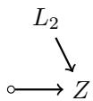

(ii<sup>′</sup>)

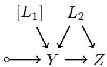

$$
L _ { 1 } \qquad [ L _ { 2 } ]
$$

i. e. and we want to compute one of the following:

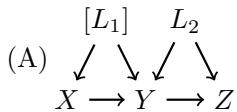

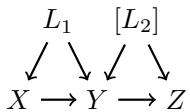

First, we simply try to apply the gluing operation (Lemma A.21) with (i) plus one of the other structures. This works trivially (e. g. after marginalizing $L _ { 1 }$ or $L _ { 2 }$ in any of (ii,ii<sup>′</sup>, iii) to restore the same missingness hypothesis again, but also only reproduces (i) then. We could first simplify (i) by Lemma A.12: We can drop $\{ Z \}$ (still enforcing $L _ { 2 }$ as latent as above) we cannot drop $\{ L _ { 2 } , Z \}$ (the descendants of $L _ { 2 }$ contain $Y )$ , we can drop $\{ Y , Z , L _ { 2 } \}$ , but then it no longer contains the (left-hand side) structural c-component $\mathcal G ^ { c }$ of (A) as subgraph (on $X , Y , [ L _ { 1 } ]$ , with an outer node instead of $L _ { 2 } ;$ this is also a hypothesis of gluing), and neither of (ii,ii<sup>′</sup>) do either (for $( \mathrm { i i } ) ^ { \prime }$ note that sub-graphs must not contain outer nodes of the containing graph as inner nodes by definition 3.4 (i)). Neither the simplification nor (iii) even contain $Z ,$ so the best we could possibly reproduce would be (iii) itself.

Next we try to apply the gluing operation with (ii) or $( \mathrm { i i } ) ^ { \prime }$ and (iii), but for $( \mathrm { i i } ) ^ { \prime }$ and (iii), we can only glue (i) (we have to marginalize to restore same missingess), and for (ii) and (iii), we have to marginalize $L _ { 2 }$ (can at most glue (B)), but neither (ii) nor (iii) contain the right-hand side structural c-component.

It seems on first sight, that one could disintegrate $\mathrm { e . g . }$ all observed nodes other than $L _ { 1 }$ (similar for $( \mathrm { i i } ) , ( \mathrm { i i } ) ^ { \prime } )$ and directly "imputate" the result in (i), but note that in (i), Z provides information about $L _ { 2 }$ , which restricts (via knowledge of Y ) the plausible origin in the (multivariate) $L _ { 1 } { - } L _ { 2 } { \mathrm { - } } \mathrm { a r g }$ ument-plane of Y, thus it restricts $L _ { 1 } -$ information that cannot possibly be extracted from (iii) where nothing is known about where in the argument plane of Y (other than the "level-lines" of the preimage of Y ) we are. Another indication of this problem is $L _ { 1 } \nsimeq Z | Y$ , because the path $L _ { 1 } \right. Y \left. Z$ is open; after realizing the kernel by Lemma 2.16 the independence-statement makes sense, the question we are asking is however not really one of dependence vs. independence.

Similarly, it seems on first sight plausible to obtain B from (i) and (iii) by disintegrating the left-hand side (X and Y ), with the idea that using Lemma G.22 the kernel $\mu _ { B }$ of (B) can be reconstructed from mar $\mathrm { g } _ { Z } ( \mu _ { B } ) = \mu ^ { \prime \prime \prime }$ and a disintegration, however this disintegration has an argument $L _ { 1 }$ which for similar reasons as above cannot be reconstructed from (i).

The problem that we could not find a more general "revealing" operation does of cause not prove that there is none. However, the situation is clearly much more complicated than it may initially seem. If we inspect the proofs of the other operations, then they are rather simple consequences of the properties of "atoms", and the problem encountered here does not seem to be amenable to this approach directly either, at least not beyond the statement of Cor. A.23.

## B Details on Models and Observations

This section provides proofs for results (like the existence of model-realizations as "observable worlds") in the main text, plus some simple properties of observable and realized worlds that will be helpful for filling in the formal details when identifying model-properties from observations (§C.4).

Remark B.1 (Subspace-Relations). In Def. 2.5 and $\mathrm { A . 5 , }$ we ask for certain subspace-relations between $X _ { i }$ for diferent $i \in I$ . Formally, we should point out that notation 2.4 should include a suitable notion of intersections; for example we could fix a shared topological value space $\bar { X }$ and continuous inclusions $j _ { i } : X _ { i } \hookrightarrow \bar { X }$ , then intersect in $\bar { X }$ . In practice it is usually clear what it means that the output of $X$ is in the domain of $Y _ { x }$ so $X \otimes Y _ { x }$ makes sense.

## B.1 Results in the Main Text

First note, that by acyclicity and finite past assumptions, causally ordered index sets are essentially $I = \mathbb { N }$ (or finite).

Remark B.2 (Simplified Form of Index-Sets). By acyclicity (Ass. 2.10), a causal order $\pi _ { I }$ exists, thus w. l. $\cdot \mathrm { o } . \mathrm { g } . I \subset \mathbb { Z }$ . By finite past (Ass. 2.11), a $\pi _ { I } .$ -first element exists and actually w. l. o. g. I = N or $I = \{ 1 , \ldots , N \}$ (if I is finite) as ordered set (obviously the countable I is has this property as a set anyway).

The shallow distribution was defined as follows:

Lemma 2.13 (Shallow Distribution). Given acyclicity (Ass. 2.10) and finite past $( A s s . \ 2 . 1 1 )$ there is a probability measure $P _ { \theta }$ on $\Pi _ { i \in I } X _ { i }$ , which we will call the shallow distribution, parametrized by $\theta = { \mathcal { F } } _ { \mathrm { i n t e r v e n e } } ,$ such that the marginalization to any finite $I ^ { \prime } \subset I$ satisfies for all measurable $B _ { i } \in B ( X _ { i } )$ the following characterizing property:

$$
P _ { \theta } \Big ( \big ( \prod _ { i ^ { \prime } \in I ^ { \prime } } B _ { i ^ { \prime } } \big ) \times \big ( \prod _ { i \in I \setminus I ^ { \prime } } X _ { i } \big ) \Big ) = \Big [ \otimes _ { i ^ { \prime } \in \mathrm { A n c } _ { I } ( I ^ { \prime } ) } ^ { \pi _ { I } } f _ { J ( i ^ { \prime } ) } \Big ] \Big ( \big ( \prod _ { i ^ { \prime } \in I ^ { \prime } } B _ { i ^ { \prime } } \big ) \times \big ( \prod _ { i \in \mathrm { A n c } _ { I } ( I ^ { \prime } ) \setminus I } X _ { i } \big ) \Big ) .
$$

Proof. We use the notation from Rmk. B.2. First, we construct $P _ { \theta } ^ { n }$ for $n \in \mathbb { N } = I$ inductively over n as $P _ { \theta } ^ { n } : = \otimes _ { i = 1 } ^ { n } f _ { J ( i ) }$ (cf. §G.4 for technical details on extending domains from parents to ancestors). This is well-defined for any finite n and satisfies the claimed equation by construction.

It remains to show, that this is actually well-defined and characterizing, i. e. that there is a unique probability-measure with this property. This follows from the definition of products of σ-algebras, for a standard-result see $\mathrm { e . g . }$ . [22, Prop. $2 . 2 \ ( \mathrm { p . 2 5 } ) ]$ . Let $B \in B ( \prod _ { i } X _ { i } )$ be arbitrary. By definition of the product sigma-algebra, a basis of measurable sets in $\textstyle { \vec { B } } ( \prod _ { i } X _ { i } )$ is given by "rectangles" $\begin{array} { r } { ( \prod _ { i \in I _ { B } } B _ { i } ) \times ( \prod _ { i \in I \setminus I _ { B } } X _ { i } ) } \end{array}$ with a finite $I _ { B } \subset I$ and $B _ { i } \in B ( X _ { i } )$ . It is enough to fix $P _ { \theta }$ on a basis, which the property does. □

We start with the existence of realizations by random elements. The non-trivial result at the core of the argument is provided by [22, Lemma 2.22 (p. 34)], a standard result in probability-theory.

Definition 2.14 (Observable World). An observable world realizing the model M is a family of random variables $\{ \mathcal { V } _ { i } : \Omega \to X _ { i } \} _ { i \in I }$ , together with measurable maps $f _ { i } : \mathcal { X } _ { \mathrm { P a } _ { I } ( i ) } \times [ 0 , 1 ] $ $X _ { i }$ and jointly independent random variables $\eta _ { i } \sim U ( [ 0 , 1 ] )$ called noises, such that

$$
\begin{array} { r } { \mathcal { V } _ { i } = f _ { i } ( \mathcal { V } _ { \mathrm { P a } _ { I } ( i ) } , \eta _ { i } ) \quad \mathrm { a n d } \quad P ( \{ \mathcal { V } _ { i } \} _ { i \in I } ) = P _ { \theta } . } \end{array}
$$

Mandated by the second equality, we will often simply write $P _ { \theta } ( \{ \mathcal { V } _ { i } \} _ { i \in I } )$

Lemma 2.16 (Observable World Existence). Given acyclicity (Ass. 2.10) and finite past (Ass. 2.11), an observable world exists, it is unique up to equality in distribution and it is locally Markov, $i . e . \ \mathcal { V } _ { i } \perp \perp \mathcal { V } _ { K } | \operatorname { P a } _ { I } ( i )$ for any $K \subset I$ with $K \cap \operatorname { D e s c } _ { I } ( i ) = \emptyset$

Proof. Existence: We use notation from Rmk. B.2.

Even though I may be infinite, by definition of products of sigma-algebras, only finitely many factors of a measurable set in $\Pi _ { i \in I } X _ { i }$ are not the full space, thus in order to proof $P ( \{ \mathcal { V } _ { i } \} _ { i \in I } ) = P _ { \theta }$ it sufices to proof this statement for all finite subsets $I ^ { \prime } \subset I$ (see e. g.

$[ 2 2 , { \mathrm { ~ P r o p . ~ 2 . 2 ~ ( p . 2 5 ) } } ] )$ . By finite past $\left( \mathrm { A s s . ~ 2 . 1 1 } \right)$ we can replace $I ^ { \prime }$ by the (also finite) $I ^ { \prime \prime } : = \operatorname { A n c } _ { I } ( I ^ { \prime } )$ , so w. l. o. g. $I ^ { \prime } = \operatorname { A n c } _ { I } ( I ^ { \prime } ) = \{ 1 , \dots , m \} \subset \mathbb { N } = I$

Our construction will be inductive over $n \in I , \mathrm { i . e }$ . we show: $\forall n \in I \ \exists \mathcal { V } _ { 1 } , \ldots , \mathcal { V } _ { n }$ together with $f _ { i } , \eta _ { i }$ such that $\mathrm { ( i ) ~ } \forall i \leq n : \mathcal { V } _ { i } = f _ { i } ( \mathcal { V } _ { \mathrm { P a } _ { I } ( i ) } , \eta _ { i } )$ and (ii) $P ( \mathcal { V } _ { 1 } , \ldots , \mathcal { V } _ { n } ) = P _ { \theta } ( \mathcal { V } _ { 1 } , \ldots , \mathcal { V } _ { n } )$ Inductive start $( n = 0 )$ : There is nothing to show; the case $n = 0$ sufices as inductive start, see use of the inductive hypothesis in the inductive step.

Inductive step $( n \mapsto n + 1 \geq 1 )$ : We are given $\mathcal { V } _ { 1 } , \ldots , \mathcal { V } _ { n }$ with the required properties by inductive hypothesis. Since $\pi _ { I }$ is a causal order, $\operatorname { P a } _ { I } ( n + 1 ) \subset \{ 1 , \dots , n \}$ . If $n + 1 = 1$ then $\mathrm { P a } _ { I } ( n + 1 ) = \varnothing$ and even though the inductive hypothesis – in this case constructed as the inductive start – is trivial and does not give us any random variables the construction below works. By [22, Lemma $2 . 2 2 \ ( \mathrm { p . 3 4 } ) ]$ , there is a measurable map $f _ { n + 1 } : X _ { \operatorname { P a } _ { I } ( n + 1 ) }$ × $[ 0 , 1 ] \to X _ { n + 1 }$ and a random variable $\eta _ { n + 1 } \sim \mathrm { U n i f } ( [ 0 , 1 ] )$ with $\eta _ { n + 1 } \perp \perp \left( \eta _ { 1 } , \ldots , \eta _ { n } \right)$ , such that $\forall \mathrm { p a } _ { n + 1 } \in X _ { \mathrm { P a } _ { I } ( n + 1 ) }$ we have $f _ { n + 1 } ( \mathrm { p a } _ { n + 1 } , \eta _ { n + 1 } ) \sim f _ { J ( n + 1 ) } ( \mathrm { p a } _ { n + 1 } )$ ; we write $f _ { J ( i ) }$ to unambiguously distinguish the mechanism at $i ~ ( \mathrm { D e f . ~ 2 . 6 } )$ from the mapping $f _ { i }$ constructed in this proof. Define $\mathcal { V } _ { n + 1 } : = f _ { n + 1 } ( \mathcal { V } _ { \mathrm { P a } _ { I } ( n + 1 ) } , \eta _ { n + 1 } )$ . Property (i) is thus immediately satisfied.

For (ii), by definition of P<sub>θ</sub>, $P _ { \theta } ( \mathcal { V } _ { 1 } , \ldots , \mathcal { V } _ { n + 1 } ) = P _ { \theta } ( \mathcal { V } _ { 1 } , \ldots , \mathcal { V } _ { n } ) \otimes ( f _ { J ( n + 1 ) } ) _ { \mathrm { P a } _ { I } ( n + 1 ) }$ Since $f _ { n + 1 } ( { \mathrm { p a } } _ { n + 1 } , \eta _ { n + 1 } ) \ \sim \ f _ { J ( n + 1 ) } ( { \mathrm { p a } } _ { n + 1 } ) \ { \mathrm { ( s e e ~ a b o v e ) } } \ P ( \mathcal V _ { n + 1 } | \mathcal V _ { { \mathrm { P a } } _ { I } ( n + 1 ) } \ = \ { \mathrm { p a } } _ { n + 1 } ) \ = \ { \mathrm { p a } } _ { n + 1 } ,$ $f _ { J ( n + 1 ) } ( \mathrm { p a } _ { n + 1 } )$ . Thus for all measurable $\dot { B } = B _ { \leq n } \times B _ { n + 1 }$

$$
\begin{array} { l } { P ( \mathcal { V } _ { 1 } , \dots , \mathcal { V } _ { n + 1 } \in B ) } \\ { \ = \displaystyle \int P ( d v _ { n + 1 } | \mathcal { V } _ { \mathrm { P a } _ { I } ( n + 1 ) } = \mathrm { p a } _ { n + 1 } ) P ( d v _ { 1 } , \dots , d v _ { n } ) 1 _ { B } ( v _ { 1 } , \dots , v _ { n } , v _ { n + 1 } ) d \vec { v } } \\ { \ = \displaystyle \int f _ { J ( n + 1 ) } ( \mathrm { p a } _ { n + 1 } , d v _ { n + 1 } ) P _ { \theta } ( d v _ { 1 } , \dots , d v _ { n } ) 1 _ { B } ( v _ { 1 } , \dots , v _ { n } , v _ { n + 1 } ) d \vec { v } } \\ { \ = \left[ P _ { \theta } ( \mathcal { V } _ { 1 } , \dots , \mathcal { V } _ { n } ) \otimes \left( f _ { J ( n + 1 ) } \right) _ { \mathrm { P a } _ { I } ( n + 1 ) } \right] ( B ) . } \end{array}
$$

Using that products form a basis of the σ-algebra $B ( X _ { 1 } \times \ldots \times X _ { n + 1 } )$ , this shows claim (ii). Note that the model (Def. 2.6) by definition ensures $X _ { \mathrm { P a } _ { J } ( j ) } \subset X _ { \mathrm { P a } _ { J } }$ and $X _ { J } \subset X _ { j }$ , so $f _ { n + 1 }$ is defined on all values the parents might take and produces values in $X _ { n + 1 }$

Properties:

Uniqueness up to equality in distribution is clear by definition (as any observed world has distribution $P _ { \theta } )$

For the local Markov property, first note that by construction $\begin{array} { r } { \mathcal { V } _ { n + 1 } : = f _ { n + 1 } ( \mathcal { V } _ { \mathrm { P a } _ { I } ( n + 1 ) } , } \end{array}$ $\eta _ { n + 1 } )$ , so it inductively follows immediately that $ { \mathcal { V } } _ { n + 1 } : \Omega \ \to \ X _ { n + 1 }$ factors through $\eta _ { \mathrm { A n c } _ { I } ( n + 1 ) } , \mathrm { i . e }$ . there is a measurable mapping $g _ { n + 1 } : [ 0 , 1 ] ^ { | }$ | Anc<sub>I</sub> $^ { ( n + 1 ) | } \to X _ { n + 1 }$ with ${ \mathcal { V } } _ { n + 1 } ( \omega )$ $= g _ { n + 1 } ( \eta _ { \mathrm { A n c } _ { I } ( n + 1 ) } )$ . Also by $\begin{array} { r } { \vartheta _ { n + 1 } : = f _ { n + 1 } ( \vartheta _ { \mathrm { P a } _ { I } ( n + 1 ) } , \eta _ { n + 1 } ) } \end{array}$ we have $P ( \mathbb { V } _ { n + 1 } | \operatorname { P a } _ { I } ( n + 1 ) =$ $\mathrm { p a } _ { n + 1 } ) = f _ { n + 1 } ( \mathrm { p a } _ { n + 1 } , \eta _ { n + 1 } )$

So for $K \subset I$ with $K \cap \mathrm { D e s c } _ { I } ( n + 1 ) \ = \ \varnothing , P ( \mathcal { V } _ { n + 1 } , \mathcal { V } _ { K } | \mathrm { P a } _ { I } ( n + 1 ) \ = \ \mathrm { p a } _ { n + 1 } ) \ =$ $P \big ( f _ { n + 1 } ( \mathrm { p a } _ { n + 1 } , \eta _ { n + 1 } ) , g _ { K } \big ( \eta _ { \mathrm { A n c } _ { I } ( K ) } \big ) \big )$ . Using $\eta _ { n + 1 } \perp \perp \left( \eta _ { 1 } , \ldots , \eta _ { n } \right)$ (see above) repeatedly $\eta _ { n + 1 } \perp \lfloor \eta _ { \mathrm { A n c } _ { I } ( K ) } ; \mathrm { b y } K \cap \mathrm { D e s c } _ { I } ( n + 1 ) = \emptyset$ we know $n + 1 \not \in \operatorname { A n c } _ { I } ( K )$ . Measurable transformations of independent variables are independent variables, thus the claim follows. □

## B.2 Properties of Probabilistic Worlds

The following property is essentially a direct consequence of definitions, but it will be helpful for making the connection to identifiability in §C.4 clearer. A similar result connecting structured queries to the realized world will be given in Lemma D.9.

Lemma B.3 (Properties). Given an observable world $\{ \mathcal { V } _ { i } \} _ { i \in I }$ and a model-aligned structural graph G with $\mathcal { N } _ { \mathrm { i n n e r } } = \mathcal { N } \subset I$ and $\mathcal { E } = \{ ( p , c ) \in \mathcal { N } \times  { \mathcal { N } } _ { \mathrm { i n n e r } } | p \in  { \mathrm { P a } } _ { I } ( c ) \}$

(a) Single-Level: $I f \mathrm { A n c } _ { I } ( { \mathcal { N } } ) \subset { \mathcal { N } }$ and ∀n $\epsilon { \mathcal { N } } : \mu ^ { n } = f _ { J ( n ) }$ , then $\forall L \subset { \mathcal { N } } .$

$$
P _ { \theta } ( \mathcal { V } _ { \mathcal { N } \backslash L } ) \ = \ \mu ( G , L ) .
$$

(b) Multi-Level: Given $N _ { 0 } \subset \mathcal { N }$ with $\mathrm { P a } _ { I } ( { \mathcal { N } } \backslash N _ { 0 } ) \subset { \mathcal { N } }$ and $\forall n \in \mathcal { N } \setminus N _ { 0 } : \mu ^ { n } = f _ { J ( n ) }$ and $\forall n \in N _ { 0 } \colon \mu ^ { n } = \delta [ x _ { n } ^ { \prime } ]$ , then there is a structural graph $G ^ { \prime }$ with $\mathcal { N } \subset \mathcal { N } ^ { \prime }$ , ∀n ∈ N \ Anc<sub>I</sub> $( N _ { 0 } ) : ( \mu ^ { \prime } ) ^ { n } = \mu ^ { n }$ , ∀n ∈ N \ Anc<sub>I</sub>(N<sub>0</sub>) : Pa<sup>′</sup>(n) = Pa<sub>I</sub>(n), such that

$$
P _ { \theta } ( \mathcal { V } _ { \mathcal { N } \setminus L } \vert \mathcal { V } _ { N _ { 0 } } = x ^ { \prime } ) = \mu ( G ^ { \prime } , L ^ { \prime } ) [ x ^ { \prime } ] ,
$$

where $\mu ( G ^ { \prime } , L ^ { \prime } ) [ x ^ { \prime } ]$ is a functional $o f x ^ { \prime }$ through alignment to $\mu ^ { n } = \delta [ x _ { n } ^ { \prime } ]$ at $n \in N _ { 0 }$ Further, given $Y \subset { \mathcal { N } }$ with $Y \cap \operatorname { A n c } _ { I } ( N _ { 0 } ) = \varnothing$ and such that it satisfies the graphical property (a "latent path" here means a directed path with all nodes except for its last one in $L ^ { \prime } , i . e . \gamma \cap L ^ { \prime } = \gamma \setminus \{ b \} \ /$

(i) Given a latent path $\gamma$ in $G ^ { \prime }$ starting at $a \in Y \backslash N _ { 0 } ^ { \prime }$ to a node $b \notin L ^ { \prime } ,$ , then $b \in Y \setminus L ^ { \prime }$ Then $G ^ { \prime }$ can be chosen to also satisfy the graphical property $( i ^ { \prime } )$ with $a \in N _ { 0 }$ allowed: $( i ^ { \prime } )$ Given a latent path $\gamma$ in $G ^ { \prime }$ starting at $a \in Y$ to a node $b \notin L ^ { \prime } .$ , then $b \in Y \setminus L ^ { \prime }$

Remark: This graphical property will make more sense after reading the proof of Thm. 1 in $\mathcal { S } C . 4 .$ Essentially $( i )$ appears (also named $( i ) )$ in step 1 of that proof, for step 3 (the multi-level case) it has to be modified to $( i ^ { \prime } )$ , the statement above essentially says this can always be achieved by proper choice of $G ^ { \prime }$

Proof. Using the notation I = N from Rmk. B.2, let $m : = \operatorname* { m a x } ( \mathcal { N } )$ . By definition

$$
P _ { \theta } ( \mathcal { V } _ { 1 } , \ldots , \mathcal { V } _ { m } ) = \otimes _ { n = 1 } ^ { m } f _ { m } .
$$

Part (a): In the single-level case, by $\mathrm { A n c } _ { I } ( { \mathcal { N } } ) \subset { \mathcal { N } }$ we can define $B = \{ 1 , \ldots , m \} \setminus N$ with $B = \operatorname { D e s c } _ { \mathcal { G } } ( B )$ and G is a simplification (Lemma A.12) of a similar (using the same edges as the I-graph, aligned to $f _ { i } ) \ G ^ { + }$ with $\mathcal { N } ^ { + } = \{ 1 , \ldots , m \}$ . By Lemma A.12 also $\mu ( G , L ) = \mu ( G ^ { + } , L \cup B )$ . By definition,

$$
\begin{array} { r } { \mu ( G ^ { + } , L \cup B ) = \operatorname* { m a r g } _ { L \cup B } ( \otimes _ { n = 1 } ^ { m } f _ { m } ) = \operatorname* { m a r g } _ { L \cup B } ( P _ { \theta } ( \mathcal { V } _ { 1 } , \ldots , \mathcal { V } _ { m } ) ) = P _ { \theta } ( \mathcal { V } _ { N \setminus L } ) . } \end{array}
$$

Part (b): For the multi-level case, first define $A : = \mathrm { A n c } _ { I } ( N _ { 0 } )$ . By exploiting sparsity (Lemma G.27) we can w. l. o. g. arrange nodes (replace π) such that $A = \{ 1 , \ldots , m _ { 0 } \}$ . The conditional distribution $P _ { \theta } ( \mathcal { V } _ { \{ 1 , . . . , m \} \backslash A } | \mathcal { V } _ { A } = a )$ has a regular version (by Ass. 2.1, [22, Thm. $5 . 3 \left( \mathrm { p . 8 4 } \right) ] )$ and satisfies $\dot { P } _ { \theta } ( \dot { \mathcal { V } } _ { N _ { 0 } } ) \otimes P _ { \theta } ( \mathcal { V } _ { \{ 1 , \dots , m \} \setminus N _ { 0 } } | \mathcal { V } _ { N _ { 0 } } = x ^ { \prime } ) = P _ { \theta } ( \mathcal { V } _ { 1 } , \dots , \mathcal { V } _ { m } ) ;$ so by uniqueness of disintegrations (Lemma G.22), this is the same as disintegrating $P _ { \theta } ( \mathcal { V } _ { \{ 1 , . . . , m \} } ) =$ $\otimes _ { n = 1 } ^ { m } f _ { n }$ (Def. 2.13) by $N _ { 0 }$ as:

$$
\begin{array} { r l r } { P _ { \theta } ( \mathcal { V } _ { \{ 1 , \ldots , m \} \setminus N _ { 0 } } | \mathcal { V } _ { N _ { 0 } } = x ^ { \prime } ) } & { = } & { \mathrm { d i s i n t } _ { N _ { 0 } } ( \otimes _ { n = 1 } ^ { m } f _ { n } ) _ { x ^ { \prime } } . } \end{array}
$$

This disintegration can be computed (by uniqueness, Lemma G.22) inductively over $a _ { 1 } <$ $a _ { 2 } < \ldots \in N _ { 0 }$ moving $a _ { 1 }$ (then $a _ { 2 }$ etc.) to the first (then second etc.) position in $\otimes _ { n = 1 } ^ { m } f _ { n }$ by anti-causal disintegrations (Def. G.16); this replaces terms to the left of $a _ { 1 }$ producing

$$
\otimes _ { n = 1 } ^ { m } f _ { n } ~ = ~ \left( f _ { a _ { 1 } } \circ [ \otimes _ { n < a _ { 1 } } f _ { n } ] \right) \otimes \left( \otimes _ { n < a _ { 1 } } f _ { n } \big | f _ { a _ { 1 } } \right) \otimes \ldots . . .
$$

Before we continue with $a _ { 2 }$ , we note that this only modifies terms $\leq a _ { 1 }$ , and $a _ { 1 } \in N _ { 0 } \subset A$ thus $a _ { 1 } \leq m _ { 0 }$ . In particular, there are kernels $W ^ { n }$ (we can move $a _ { 1 }$ one position at a time to avoid confusion) such that (up to transposition, Def. G.19, denoted $" \approx "$ following notation A.7)

$$
\otimes _ { n = 1 } ^ { m } f _ { n } ~ \approx ~ \left[ \otimes _ { n \in N _ { 0 } } { \cal W } ^ { n } \right] \otimes \left[ \otimes _ { n \in A \backslash N _ { 0 } } { \cal W } ^ { n } \right] \otimes \left[ \otimes _ { n > m _ { 0 } } f _ { n } \right] .
$$

The kernels $W ^ { n }$ may have additional arguments $/$ parents among their ancestors (Lemma G.27 (iv)); call the new parent-sets $\mathrm { P a } ^ { \prime } ( n )$ . The disintegration of $N _ { 0 }$ is now (by uniqueness) a simple disintegration from the left:

$$
\mathrm { d i s i n t } _ { N _ { 0 } } \big ( \otimes _ { n = 1 } ^ { m } f _ { n } \big ) = \big [ \otimes _ { n \in A \backslash N _ { 0 } } W ^ { n } \big ] \otimes \big [ \otimes _ { n > m _ { 0 } } f _ { n } \big ] .
$$

We can already define a graph $\tilde { G }$ on $\tilde { \mathcal { N } } = \tilde { \mathcal { N } } _ { \mathrm { i n n e r } } = \{ 1 , \dots , m \}$ , with edges prescribed by $\mathrm { P a } _ { I }$ $\left( \mathrm { f o r } \ n > m _ { 0 } \right)$ and $\mathrm { P a } ^ { \prime } \left( \mathrm { f o r } \ n \leq m _ { 0 } \right)$ , and aligned to $W ^ { n }$ for $n \leq m _ { 0 }$ , to $\delta [ x _ { n } ^ { \prime } ]$ for $n \in N _ { 0 }$ and

to $f _ { n }$ for $n \in \{ n > m _ { 0 } \} = \mathcal { N } \backslash A$ . Using $\delta [ X = x _ { 0 } ] \otimes \mu _ { x } = \mu _ { x = x _ { 0 } }$ we readily get the first part of our result (using again $B = \{ 1 , . . . , m \} \setminus ( { \mathcal { N } } \cup A )$ , as in the proof of part (a); note that $\operatorname { A n c } _ { I } ( { \mathcal { N } } \cup A ) \subset ( { \mathcal { N } } \cup A )$ by closedness under parents, cf. hypothesis):

$$
\mu ( \tilde { G } , L \cup B ) _ { n _ { 0 } = x ^ { \prime } } = P _ { \theta } ( \mathcal { V } _ { \{ 1 , \ldots , m \} \setminus N _ { 0 } } | \mathcal { V } _ { N _ { 0 } } = x ^ { \prime } ) .
$$

However, we cannot yet satisfy the graphical property: the nodes in $N _ { 0 }$ now seem to confound nodes in $\mathcal { N } \backslash A$ with nodes in A. (In the proof of Thm. 1, we need a sub-graph of the I-graph that is a structural c-component, if $N _ { 0 }$ [which will be pinned latents] confounds $Y$ [nodes of the subgraph] with other ancestors, then those ancestors are also in the c-component. The graphical property is a formal means of ensuring that ancestors are "disconnected" from the c-component $Y$ after the shufling procedure above.) The solution is surprisingly simple. In this case we actually do know something about the internal structure of the confounder. For singular (taking only a single value) kernels there is no actual information in the value taken so they right-distribute:

$$
\begin{array} { l l l } { { { [ [ } Z _ { x } \otimes Y _ { z , x } { ] ] } _ { [ x ] } \circ \delta [ X = x _ { 0 } { ] } } } & { { = } } & { { { Z _ { x = x _ { 0 } } \otimes Y _ { z , x = x _ { 0 } } } } } \\ { { } } & { { = } } & { { { ( Z _ { x } \circ \delta [ X = x _ { 0 } { ] } ) \otimes ( Y _ { z , [ x ] } \circ \delta [ X = x _ { 0 } { ] } ) _ { z } } } } \end{array}\tag{∗}
$$

I. $\mathrm { e . }$ , while generally, copying a node in a structural graph (adding a node with the same alignment and distributing children across both copies) changes the represented structured kernel, we can copy nodes aligned to singular kernels. In particular, we can modify $\tilde { G }$ into $G ^ { \prime }$ with additional nodes $\mathcal { N } _ { \mathrm { c o p y } }$ (added to $L )$ to ensure the graphical criterion as follows: Define

$$
\begin{array} { r } { \mathcal { N } _ { \mathrm { c o p y } } \ : = \ \mathrm { P a } _ { I } ( Y ) \cap N _ { 0 } , } \end{array}
$$

and $N _ { 0 } ^ { \prime } : = N _ { 0 } \lfloor \mathsf { \mathscr { N } _ { \mathrm { c o p y } } }$ as the set adding a disjoint copy (we will write $a \in N _ { 0 }$ and $a ^ { \prime } \in \mathcal { N } _ { \mathrm { c o p y } }$ if the distinction is relevant). Define $G ^ { \prime }$ on nodes $\mathcal { N } ^ { \prime } = \mathcal { N } _ { \mathrm { i n n e r } } ^ { \prime } = \mathcal { N } \cup \mathcal { N } _ { \mathrm { c o p y } }$ and $L ^ { \prime } = L \sqcup \mathcal { N } _ { \mathrm { c o p v } } .$ with edges as in $\tilde { G }$ except for edges out of $N _ { 0 } { : }$ Here, keep edges out of $\mathrm { P a } _ { I } ( Y ) \cap N _ { 0 }$ into Y and out of $N _ { 0 } \setminus \operatorname* { P a } _ { I } ( Y )$ as is, edges out of $p \in \operatorname { P a } _ { I } ( Y ) \cap N _ { 0 }$ to $w \in { \mathcal { N } } \backslash Y$ are removed and instead added as $p ^ { \prime }  w , \mathrm { i . e }$ . starting from $\mathcal { N } _ { \mathrm { c o p y } }$ . By equation $( * )$ , we still have

$$
\mu ( G ^ { \prime } , L ^ { \prime } \cup B ) _ { n _ { 0 } = x ^ { \prime } } = P _ { \theta } ( \mathcal { V } _ { \{ 1 , \dots , m \} \setminus N _ { 0 } } | \mathcal { V } _ { N _ { 0 } } = x ^ { \prime } ) .
$$

Given $Y \subset { \mathcal { N } }$ with $Y \cap \operatorname { A n c } _ { I } ( N _ { 0 } ) = \emptyset$ and such that (i) given a latent path $\gamma$ in $G ^ { \prime }$ starting at $a \in Y \backslash N _ { 0 } ^ { \prime }$ to a node $b \notin L ^ { \prime }$ , then $b \in Y \setminus L ^ { \prime }$

Let γ be an arbitrary latent path in $G ^ { \prime }$ starting at $a \in Y$ to a node b /∈ L<sup>′</sup>. If a /∈ $N _ { 0 } { \sqcup }  { N _ { \mathrm { c o p y } } }$ y then by ${ \mathrm { ( i ) } } , b \in Y \setminus L ^ { \prime }$

If $a \in ( N _ { 0 } \sqcup \mathcal { N } _ { \mathrm { c o p y } } ) \cap Y = N _ { 0 }$ , then the child c of a which is the first node on $\gamma$ after a is, by construction of $G ^ { \prime }$ , in Y (edges out of $N _ { 0 }$ into $Y$ were kept in the construction of $G ^ { \prime }$ while edges out of $N _ { 0 }$ into ${ \mathcal { N } } \backslash Y$ were moved to $\mathcal { N } _ { \mathrm { c o p y } } )$ . If c is still in $N _ { 0 } .$ , repeat the last argument, otherwise apply (i) to the restriction of $\gamma$ starting at $c ,$ to obtain $b \in Y \setminus L ^ { \prime }$ □

## C Details on the Extraction of Structured Kernels

This section provides the technical details about the connection from observations to the identification of model properties. Before proving statements from the main text, we give definitions for the multi-level case in parallel to the main text. The reader not (currently) interested in the multi-level case may skip the first subsection, and only needs to know that in the single-level case ${ } ^ { \mathrm { { } ^ { \circ } } } \mathcal { G } = G ^ { \mathrm { { \circ \bar { b } } s } } = \dot { G } ^ { 0 \mathrm { { \circ } } } , \mathcal { N } _ { \mathrm { { i n n e r } } } = \mathcal { N } _ { \mathrm { { p r o p e r } } } , \mathcal { N } _ { \mathrm { o u t e r } } = \mathcal { N } _ { \mathrm { { e x t e r n } } }$ (while $\mathcal { N } _ { \mathrm { p i n n e d } } = \emptyset )$ . The phrasing $" \mu$ is $\delta _ { i }$ -identifiable" is equivalent to ${ " } \mu$ is identifiable" in the single-level case.

## C.1 Multi-Level Modifications

We need some smaller modifications to families of embeddings and to data-sets / identifiabilitydefinitions for the multi-level case.

Families of Embeddings: We formulate the machinery of embeddings on local graphs, which are closely related to structural graphs (and structured kernels); in the single-level case, $\mathcal { N } _ { \mathrm { p i n n e d } } = \emptyset$ and ${ \mathcal { G } } , G ^ { 0 } , G ^ { \mathrm { o b s } }$ (see below) agree. Starting from a slightly diferent kind of object allows to keep both aspects of the formalism reasonably simple.

Definition C.1 (Local Graph). A local graph G is a finite set of nodes which is a disjoint union of proper, pinned (new in multi-level) and external nodes

$$
\mathcal { N } ~ = ~ \mathcal { N } _ { \mathrm { p r o p e r } } \dot { \cup } \mathcal { N } _ { \mathrm { p i n n e d } } \dot { \cup } \mathcal { N } _ { \mathrm { e x t e r n } }
$$

together with a parent structure $\mathcal { P } \subset \mathcal { N } \times \mathcal { N } _ { \mathrm { p r o p e r } } , \mathrm { a }$ set of directed edges (which we will call proper edges) ending at a node in $\mathcal { N } _ { \mathrm { p r o p e r } }$

Alignment: There is an underlying structural graph $G ^ { 0 } ( { \mathcal { G } } )$ , with $\mathcal { N } ^ { 0 } : = \mathcal { N } , \mathcal { N } _ { \mathrm { i n n e r } } ^ { 0 } : =$ $\mathcal { N } _ { \mathrm { p r o p e r } }$ and $\mathcal { E } ^ { 0 } : = \mathcal { P }$ . A model-aligned local graph is a local graph together with indices $i ^ { x } \in I$ for $x \in \mathcal { N } _ { \mathrm { p i n n e d } }$ (new in multi-level) and kernels $\mu ^ { n }$ plus argument-assignments $\mathrm { p a } ^ { n }$ for $n \in \mathcal { N } _ { \mathrm { p r o p e r } }$ such that $G ^ { 0 }$ is model-aligned.

The embeddings from Def. 4.1 are slightly modified, the only diference is that modelalignment now includes additionally the statement $\begin{array} { r } { " \forall x \in \mathcal { N } _ { \mathrm { p i n n e d } } ; \ i ^ { x } = \psi ( n ) . } \end{array}$

Definition C.2 (Local Graph Embedding). An embedding of a model aligned local graph $\mathcal { G } .$ denoted by $\psi : { \mathcal { G } } \hookrightarrow I ,$ , is an injective mapping $\psi : \mathcal { N } \hookrightarrow I$ such that the following conditions are satisfied (see Fig. 4):

(i) Proper-Node I-Parents are Included: If $n \in \mathcal { N } _ { \mathrm { p r o p e r } } ,$ , then $\forall i ^ { \prime } \in \mathrm { P a } _ { I } ( \psi ( n ) ) , \exists n ^ { \prime } \in \mathcal { N }$ such that $i ^ { \prime } = \psi ( n ^ { \prime } )$

(ii) Proper Edges equal I-Graph Edges: For $n ^ { \prime } \in \mathcal { N } _ { \mathrm { p r o p e r } }$ , there is a proper edge $n  n ^ { \prime }$ in G if and only if $\psi ( n ) \in \mathrm { P a } _ { I } ( \psi ( n ^ { \prime } ) )$

(iii) Model Alignment: ∀n $\in { \mathcal { N } } _ { \mathrm { p r o p e r } } \colon \mu ^ { n } = f _ { J ( \psi ( n ) ) }$ is a model mechanism (Def. 2.6) and new in multi-level: $\forall x \in \mathcal { N } _ { \mathrm { p i n n e d } } \colon i ^ { x } = \psi ( n )$

Families of embeddings can be defined as before (Def. 4.2), only the notation for $\mathcal { N } _ { \mathrm { i n n e r } } \mapsto$ $\mathcal { N } _ { \mathrm { p r o p e r } }$ changes:

Definition C.3 (Families of Embeddings). A family of local graph embeddings

$$
( J _ { 0 } , \{ \psi _ { j } \} _ { j \in J _ { 0 } } , \mathcal { G } , H , y _ { 0 } )
$$

is a collection of local graph embeddings $\psi _ { j } : { \mathcal { G } } \hookrightarrow I$ of a single model-aligned local graph G. Further there is a fixed element $y _ { 0 } \in \mathcal { N }$ , which will be called the anchor(-node), a symmetry $H \subset G$ and a range of applicability $J _ { 0 } \subset I$ . For $n \in \mathcal N$ denote:

$$
\psi _ { * } ( n ) : J _ { 0 }  I , \ j \mapsto \psi _ { j } ( n ) .
$$

Finally, we will require the following conditions to be satisfied:

(I) Trivial on Anchor: $\forall j \in J _ { 0 } \colon \psi _ { j } ( y _ { 0 } ) = j$

(II) Rigidity: $\forall n \in \mathcal { N } \colon \psi _ { * } ( n )$ is H-equivariant.

(III) Freeness: $\forall n \in \mathcal { N } _ { \mathrm { p r o p e r } }$ (multi-level: inner nodes become proper nodes): $\psi _ { * } ( n )$ is injective.

While our models allow only a fixed and finite number of parents in the I-graph, nodes can have an arbitrary number of children. This allows for example for multi-level statics.

Definition C.4 (Singular Nodes). This has no analogue in the single-level case: Given a family $\{ \psi _ { j } \} _ { j \in J _ { 0 } }$ of local graph embeddings, we call a node $x \in \mathcal N$ singular embedded at $i \in I { \mathrm { ~ i f ~ } } \forall j \in J _ { 0 } \colon { \dot { \psi } } _ { j } ( x ) = i$

Remark: For $| J _ { 0 } | > 1$ , proper nodes cannot be singular by freeness. For pinned alignment Def. 4.1(iii), all pinned nodes $\mathcal { N } _ { \mathrm { p i n n e d } }$ must be singular embedded. Conversely singular embedded nodes $x \in \mathcal { N } _ { \mathrm { e x t e r n } }$ can always be pinned at $i ^ { x } = \psi _ { j } ( x )$ , i. e. there is a valid family of embeddings with $x \in \mathcal { N } _ { \mathrm { p i n n e d } }$ (this can render the family backdoor-free, cf. 4.10)

For attached structure (decorated graphs) not much new happens for the multi-level case. Some general remarks on attached structure can be found in the next subsection. Some smaller remarks are in place however and the definition of ancestral structure should use the nomenclature of external and proper (rather than inner and outer) nodes:

Definition C.5 (Ancestral Structure). Given a local graph ${ \mathcal { G } } ,$ an ancestral structure $\mathcal { A }$ on G is a set of directed edges ⇝ (ancestral edges) each starting at a proper node and ending at an external node, such that $\mathcal { G }$ with proper and ancestral edges is acyclic.

Remark C.6 (Validity of Ancestral Sets in the Multi-Level Case). In the multi-level case, a valid ancestral structure remains essentially unchanged (compared to the single-level case), so it tracks only ancestral paths to $\mathcal { N } _ { \mathrm { e x t e r n } }$ , not to nodes $\mathcal { N } _ { \mathrm { p i n n e d } }$ . This will sufice for asymptotic results as there are only finitely many $j \in J _ { 0 }$ with ancestral paths to $\mathcal { N } _ { \mathrm { p i n n e d } }$ (see proof of Thm. 1, step $^ { 3 , }$ choice of $J _ { 0 } ^ { \mathrm { i n v a l i d } } )$

Finally, also in backdoor-freeness (Def. 4.10), replace $\mathcal { N } _ { \mathrm { o u t e r } } \mapsto \mathcal { N } _ { \mathrm { p i n n e d } }$ . This means $\mathcal { N } _ { \mathrm { p i n n e d } } \cap L \neq \emptyset$ is explicitly allowed, and is indeed typically (excluding trivial cases) the case.

Definition C.7 (Backdoor-Freeness). Given a decorated family of embeddings $( \{ \psi _ { j } \} _ { j \in J _ { 0 } }$ $L , A )$ , we call an ancestral edge $l \sim x \in A$ a backdoor if it starts at $l \in L$ . We call the family backdoor-free, if $L \cap { \mathcal { N } } _ { \mathrm { e x t e r n } } = \emptyset$ (multi-level: $\mathcal { N } _ { \mathrm { o u t e r } }$ is replaced by $\mathcal { N } _ { \mathrm { e x t e r n } } )$ and there are no backdoors.

Data-Sets: We slightly extend the definition of data-sets (Def. 4.12), note that a data-set in the sense of the main text is a dataset with $\mathcal { X } ^ { \prime } = \emptyset$ . Similar to backdoor-freeness, "pinned nodes" (here X<sup>′</sup>) are typically not observed; they are however j-independent.

Definition C.8 (Data-Set). A data-set is a tuple $\mathcal { D } = ( ( \mathcal { X } _ { j } , \mathcal { Y } _ { j } ) _ { j \in J _ { 0 } } , \mathcal { X } ^ { \prime } )$ , where $\mathcal { X } _ { j } , \mathcal { Y } _ { j }$ and $\mathcal { X } ^ { \prime }$ (multi-level: the inclusion of $\textbf { a } \mathcal { X } ^ { \prime }$ is new) are tuples of $\mathcal { V } _ { i } , \mathrm { i . e }$ . there exist $i _ { X , j } ^ { ( 1 ) } , \ldots , i _ { X , j } ^ { ( n ) } \in I ,$ , such that $\mathcal { X } _ { j } = ( \mathcal { V } _ { i _ { X . . j } ^ { ( 1 ) } } , \ldots , \mathcal { V } _ { i _ { X . . j } ^ { ( n ) } } )$ and analogously for $\forall _ { j }$ and $\mathcal { X } ^ { \prime }$

We call the data-set valid if $X$ and $\overset { \mathcal { I } } { Y }$ are observed that is

$$
J _ { 0 } ^ { \mathrm { o b s } } ( N ) \ : = \ \{ \ j \in J _ { 0 } \ | \ \forall m : i _ { X , j } ^ { ( m ) } \in \mathsf { V } ( N ) , \forall m ^ { \prime } : i _ { Y , j } ^ { ( m ^ { \prime } ) } \in \mathsf { V } ( N ) \ \}
$$

satisfies $| J _ { 0 } ^ { \mathrm { o b s } } ( N ) |  \infty$ as $N \to \infty$ and is non-degenerate $j \neq j ^ { \prime } \Rightarrow \forall m : i _ { Y , j } ^ { ( m ) } \neq i _ { Y , j ^ { \prime } } ^ { ( m ) }$ (this last condition is imposed only on $Y ,$ , not on $X ;$ see Rmk. A.6).

As before decorated families of embeddings induce data-sets (note that even though $\mathcal { X } ^ { \prime }$ is not observed, its j-independent existence is an important condition).

Example C.9 (Data-Set of Decorated Families). Given a decorated family of embeddings $( \{ \psi _ { j } \} _ { j \in J _ { 0 } } , L , \mathcal { A } )$ with $L \cap { \mathcal { N } } _ { \mathrm { e x t e r n } } = \emptyset$ , there is a valid data-set $( ( \mathscr { X } _ { j } , \mathscr { Y } _ { j } ) _ { j \in J _ { 0 } } , \mathscr { X } ^ { \prime } )$ (Def. 4.12) defined for $j \in J _ { 0 }$ as the tuples

$$
\begin{array} { r c l } { { \mathcal X } _ { j } } & { { = } } & { { \left( { \mathcal V } _ { \psi _ { j } ( n ) } \right) _ { n \in { \mathcal N } _ { \mathrm { e x t e r n } } \cup { ( \mathcal N _ { \mathrm { p i n n e d } } \backslash L ) } } ~ ( \mathrm { m u l t i - l e v e l } ; ~ \mathrm { a d d ~ o b s . ~ p i n n e d } ~ n ) } } \end{array}
$$

$$
\begin{array} { l l l } { \mathcal { Y } _ { j } } & { = } & { ( \mathcal { V } _ { \psi _ { j } ( n ) } ) _ { n \in \mathcal { N } _ { \mathrm { p r o p e r } } \backslash L } } \end{array}
$$

$$
\begin{array} { r } { \begin{array} { l l l } { \displaystyle \mathcal { X } ^ { \prime } } & { = } & { \big ( \mathcal { V } _ { i ^ { n } } \big ) _ { n \in \mathcal { N } _ { \mathrm { p i n n e d } } \cap L } \big ( \mathbf { m u l t i - l e v e l ~ o n l y } \big ) . } \end{array} } \end{array}
$$

Identifiability: Direct identifiability (Def. 4.14) must respect the shared across $j$ value of $\mathcal { X } ^ { \prime } \colon$

Definition C.10 (Direct Identifiability). Given a valid data-set (Def. 4.12) $\mathcal { D } = ( ( \mathcal { X } _ { j } , \mathcal { Y } _ { j } ) _ { j \in J _ { 0 } }$ $\mathcal { X } ^ { \prime } )$ and kernels $\{ \dot { X } _ { j } \} _ { j \in J _ { 0 } } , Y _ { x } [ x ^ { \prime } ]$ (a functional of $x ^ { \prime } )$ , such that for each $j$ individually the shallow distribution $P _ { \theta }$ (Def. 2.14) satisfies,

$$
\forall j \in J _ { 0 } : P _ { \theta } ( \mathcal X _ { j } , \forall j | \mathcal X ^ { \prime } = x ^ { \prime } ) = X _ { j } \otimes Y _ { x } [ x ^ { \prime } ] ( \mathbf { m u l t i \ – l e v e l : \ x ^ { \prime } \ } \mathbf { i s \ n e w } ) ,
$$

then we call $Y _ { x } [ x ^ { \prime } ]$ directly identifiable. Formally we also consider the known a priori $\mathcal { F } _ { \mathrm { i } }$ ntervene (Def. 2.6) and the immediately observed $\mathcal { V } _ { i }$ for $i \in { \mathsf V }$ (thus also $\delta [ \mathcal { V } _ { i } = x _ { i } ^ { \prime } ] ;$ ; multi-level only) directly identifiable.

Remark: We usually will not know or observe the value $x ^ { \prime }$ , we only know that $x ^ { \prime }$ does not depend on $j$

For the multi-level case, we use the following notation.

Notation C.11 (Pinned Kernels). Tracking in computations which arguments of a structured kernel correspond to pinned nodes would be arduous. Instead we adjoin generic kernels $\mathcal { F } _ { \mathrm { I } } = \{ \delta _ { i } \} _ { i \in I }$ with zero parents (similar to how, for example, polynomial rings adjoin a generic variable to an algebraic structure) and consider $\mathcal { F } = \mathcal { F } _ { \mathrm { m o d e l } } \cup \mathcal { F } _ { \mathrm { i n t e r v e n e } } \cup \mathcal { F } _ { \mathrm { I } }$ -structured kernels. We will then call an expression $\mu [ \delta _ { i ^ { 1 } } , \ldots , \delta _ { i ^ { m } } ] , \delta _ { i }$ -identifiable, if there is an identifiable kernel ν such that (writing $\delta [ \mathcal { V } _ { i } ]$ for the random measure singular at the value taken by $\mathcal { V } _ { i } )$

$$
\mu \big [ \delta [ \mathcal { V } _ { i ^ { 1 } } ] , \ldots , \delta [ \mathcal { V } _ { i ^ { m } } ] \big ] \stackrel { \mathrm { a . s . } } { = } \nu \mathrm { ~ ( a l m o s t ~ s u r e l y ~ w . r . t . ~ } P _ { \theta } ^ { \mathcal { D } } \big ) .
$$

The intuitive idea is that, in each realization, hidden contexts (like slope in example 4.18) do take a value $C = c ,$ . We do not know this value, but given observations of many children we gain partial information: $\operatorname { E } . \operatorname { g } .$ . if $Y _ { c } = \mathcal { N } ( c ^ { 2 } , 1 )$ (in SCM notation this could be $Y : = C ^ { 2 } + \eta _ { Y } )$ , from many observations of $Y$ we gain information about $c ^ { 2 }$ . So from observations, we know $P _ { \theta } ^ { \cal D } ( C \in \{ \pm \sqrt { E [ Y ] } \} ) = 1$ . Indeed, we gain precisely the information about $C$ needed to compute $Y ;$ we can learn $Y _ { c } ,$ up to sign of $^ { c , }$ as $Y ^ { \prime } = \mathcal { N } ( c ^ { 2 } , 1 )$ . Taken together: $P _ { \theta } ^ { \cal D } ( Y _ { \cal C } = Y ^ { \prime } ) = 1$ , where the capital index $Y _ { C }$ means we plug in the randomvariable C (or equivalently: compose $Y _ { c }$ to $Y _ { C } = Y _ { c } \circ \delta [ C ] )$

We have to associate structural graphs to local graphs (the embedded objects) for identification statements.

Definition C.12 (Associated Structural Graphs). We are given a model-aligned local graph $( \mathcal { G } , L )$ , with $L \cap { \mathcal { N } } _ { \mathrm { e x t e r n } } = \emptyset$ . Def. C.1 introduced its underlying structural model $( G ^ { 0 } , L )$ with $\mathcal { N } ^ { 0 } : = \mathcal { N } , \mathcal { N } _ { \mathrm { i n n e r } } ^ { 0 } : = \mathcal { N } _ { \mathrm { p r o p e r } }$ and $\mathcal { E } ^ { 0 } : = \mathcal { P }$

We additionally define $\bar { G } ^ { \mathrm { o b s } } ( \mathcal { G } )$ with nodes $\mathcal { N } ^ { \mathrm { { o b s } } } = \mathcal { N }$ split as

$$
N _ { \mathrm { i n n e r } } ^ { \mathrm { o b s } } : = \mathcal { N } _ { \mathrm { p r o p e r } } \cup \left( \mathcal { N } _ { \mathrm { p i n n e d } } \cap L \right) \ , \qquad \mathcal { N } _ { \mathrm { o u t e r } } ^ { \mathrm { o b s } } : = \mathcal { N } _ { \mathrm { e x t e r n } } \cup \left( \mathcal { N } _ { \mathrm { p i n n e d } } \setminus L \right)
$$

and the edges $\mathcal { E } ^ { \mathrm { o b s } } = \mathcal { P }$ . Then $G ^ { \mathrm { o b s } }$ is model-aligned with $\mu ^ { n }$ for $n \in \mathcal { N } _ { \mathrm { p r o p e r } }$ and $\mu ^ { x } : =$ $\delta _ { i ^ { x } } \in \mathcal { F } _ { \mathrm { I } }$ for $x \in \mathcal { N } _ { \mathrm { p i n n e d } } \cap L$

Thm. 1 will be formulated as $\delta _ { i }$ -identifying (notation C.11) $\mu ( G ^ { \mathrm { o b s } } , L )$ , the formal details are given below at C.4.

Knowledge Sets: We modify Def. 4.17 to include immediately observed variables as (basic) knowledge:

Definition C.13 (Extracted Knowledge Set). Let B be the set of all backdoor-free families of embeddings. For $( \psi , L , \mathcal { A } ) \in B$ define a structured model $k ( \psi , L , \mathcal { A } ) : = ( G ^ { \mathrm { o b s } } , L )$ . By Thm. 1 $\mu ( G ^ { \mathrm { o b s } } , L )$ is $\delta _ { i } .$ -identifiable (we simply say k is identifiable).

For $\tilde { f } \in \mathcal { F } _ { \mathrm { i n t e r v e n e } } .$ , define a structured model $k ( \tilde { f } ) = ( G ( \tilde { f } ) , L = \emptyset )$ , where $G ( \tilde { f } )$ is a graph with a single inner node $y$ aligned to $\mu ^ { y } = \tilde { f } ,$ , κ (the number of parents) outer nodes $\mathcal { N } _ { \mathrm { o u t e r } } = \{ x _ { 1 } , \ldots , x _ { \kappa } \}$ and a proper edge from each $x _ { k } \to y$ . By definition (Def. 2.6 and 4.14), elements of $\mathcal { F } _ { \mathrm { i n t e r v e n e } }$ are considered known, thus $k ( \tilde { f } )$ is identifiable for all $\tilde { f } \in \mathcal { F } _ { \mathrm { i r } }$ <sub>tervene</sub>. Multi-Level only: Finally, what is immediately observed is known (Def. 4.14), so for $i \in { \mathsf { V } } ,$ define k(i) as the structured graph with a single inner node aligned to $\delta [ \mathcal { V } _ { i } ] .$

Define the, thus (element-wise) $\delta _ { i } .$ -identifiable $( \delta _ { i }$ added in multi-level), basic knowledge set as (multi-level: add last union)

$$
\begin{array} { r c l l } { { \mathcal { K } _ { \mathrm { b a s i c } } } } & { { = } } & { { \displaystyle \bigcup _ { ( \psi , L , A ) \in \mathcal { B } } k ( \psi , L , A ) } } & { { \cup } } & { { \displaystyle \bigcup _ { \tilde { f } \in \mathcal { F } _ { \mathrm { i n t e r v e n e } } } k ( \tilde { f } ) } } & { { \cup } } \end{array} \bigcup _ { i \in \pmb { V } } \bigcup _ { \begin{array} { l } { { \scriptstyle ( i ) } } \end{array} } k ( i ) .
$$

## C.2 Embedding-Families and Attached Structure

We add some remarks and simple properties, beyond what was stated in the main text, that are useful for later reference and for the practical interpretation of these definitions.

Remark C.14 (Change of Anchor). Given a family of embeddings $\{ \psi _ { j } \} _ { j \in J _ { 0 } }$ anchored on $x \in \mathcal N$ and a fixed choice $y \in \mathcal { N }$ with $\psi _ { \ast } ( y )$ injective (e. g. any proper node by freeness $4 . 2 \ ( \mathrm { I I I } ) ,$ . Define $J _ { 0 } ^ { \prime } : = \mathrm { i m g } ( \psi _ { * } ( y ) ) \subset I ,$ clearly when restricting the target to the image $\psi _ { * } ( y ) : J _ { 0 } \twoheadrightarrow J _ { 0 } ^ { \prime }$ is also surjective, thus $\psi _ { \ast } ( y )$ is bijective (to its image $J _ { 0 } ^ { \prime } )$ ; we will write $\psi _ { y } ^ { - 1 } ( j ^ { \prime } ) : = ( \psi _ { * } ( \tilde { y } ) ) ^ { - 1 } ( j ^ { \prime } )$ for its inverse at $j ^ { \prime } \in J _ { 0 } ^ { \prime }$ . Define a family of local graph embeddings anchored on y indexed by $J _ { 0 } ^ { \prime }$ as

$$
\psi _ { j } ^ { \prime } : { \mathcal { N } } \hookrightarrow I , \quad n \mapsto \psi _ { \psi _ { y } ^ { - 1 } ( j ) } ( n ) .
$$

Note that given an anchor (here $x \in \mathcal { N } )$ , even though freeness (III) is given only at proper nodes, the mapping $\psi _ { * } ( x )$ at the original anchor is of course also injective (by (I)).

Remark C.15 (Relevant Latent Subsets). In practice, for the finite sample case, the definition of ${ \mathfrak { L } } _ { \psi }$ can easily be adapted as follows: $\mathrm { ~ A ~ } L \subset \mathcal { N }$ is relevant, if there is no $L ^ { \prime } \subsetneq L$ such that (at least) the same number of data-points is available $| J _ { 0 } ^ { \mathrm { o b s } } ( N ) | \leq | ( J _ { 0 } ^ { \mathrm { o b s } } ) ^ { \prime } ( N ) |$ (cf. Def. 4.4) and the number $| J _ { 0 } ^ { \mathrm { o b s } } ( N ) |$ of available data-points is larger some (possibly ψ-dependent; estimator and precision-target specific) minimum number (if precision-measures are available for a specific estimator, those can of course used directly instead of a minimum number of samples, this may involve expensive evaluations on many potentially relevant branches however). It may however make sense to track not only minimal latent subsets, as trading additional latents for additional samples might be favorable.

It will be helpful to have a notion of sub-graphs and sub-families (in loose analogy to Def. 3.4).

Definition C.16 (Local Subgraphs). A local subgraph $\mathcal { G } ^ { A } \leq \mathcal { G } ^ { B }$ of a local graph $\mathcal { G } ^ { B }$ is a local graph $\mathcal { G } ^ { A }$ such that:

(i) Node Sets: $\mathcal { N } ^ { A } \subset \mathcal { N } ^ { B } , \mathcal { N } _ { \mathrm { p r o p e r } } ^ { A } \subset \mathcal { N } _ { \mathrm { p r o p e r } } ^ { B } \mathrm { ~ a n d ~ } \mathcal { N } _ { \mathrm { p i n n e d } } ^ { A } \subset \mathcal { N } _ { \mathrm { p i n n e d } } ^ { B }$

(ii) Edge Sets: $\mathcal { P } ^ { B } \cap ( \mathcal { N } ^ { A } \times \mathcal { N } _ { \mathrm { p r o p e r } } ^ { A } )$ , i. e. edges are exactly those in $G ^ { B }$ from nodes in $G ^ { A }$ to inner nodes of $G ^ { A }$

(iii) Proper Parents: ∀n $\in \mathcal { N } _ { \mathrm { p r o p e r } } ^ { A } \colon \mathrm { i f } \ p \in \operatorname { P a } _ { G ^ { B } } ( n )$ , then $p \in { \mathcal { N } } ^ { A }$

(iv) Alignment: For model-aligned graphs $\forall n \in \mathcal { N } _ { \mathrm { p r o p e r } } ^ { A }$ (inner nodes of $G ^ { 0 } ( { \mathcal { G } } ^ { A } ) ) \colon ( \mu ^ { A } ) ^ { n } =$ $( \mu ^ { B } ) ^ { n }$

A sub-family of embeddings $\{ \psi _ { j } ^ { A } \} _ { J _ { 0 } ^ { A } } \leq \{ \psi _ { j } ^ { B } \} _ { J _ { 0 } ^ { B } }$ of a family of embeddings $\{ \psi _ { j } ^ { B } \} _ { J _ { 0 } ^ { B } }$ is a family of embeddings $\{ \psi _ { j } ^ { A } \} _ { J _ { 0 } ^ { A } }$ , such that

(i) Graphs: $\mathcal { G } ^ { A } \leq \mathcal { G } ^ { B }$

(ii) Applicability: $\{ \psi _ { j } ^ { A } \} _ { J _ { 0 } ^ { A } }$ and $\{ \psi _ { j } ^ { B } \} _ { J _ { 0 } ^ { B } }$ have the same anchor $n _ { 0 } \in \mathcal { N } ^ { A } , J _ { 0 } ^ { B } \subset J _ { 0 } ^ { A }$ (note that larger graphs have worse symmetry, cf. Rmk. 4.3) and $\forall j \in J _ { 0 } ^ { B } : \psi _ { j } ^ { A } = \psi _ { j } ^ { B } | _ { N ^ { A } }$

A decorated sub-family $\left( \{ \psi _ { j } ^ { A } \} _ { J _ { \Omega } ^ { A } } , L ^ { A } , { \mathcal { A } } ^ { A } \right) \ \leq \ \left( \{ \psi _ { j } ^ { B } \} _ { J _ { \Omega } ^ { B } } , L ^ { B } , { \mathcal { A } } ^ { B } \right)$ of a decorated family $( \{ \psi _ { j } ^ { B } \} _ { J _ { 0 } ^ { B } } , L ^ { B } , \mathcal { A } ^ { B } )$ is a decorated family $( \{ \psi _ { j } ^ { A } \} _ { J _ { 0 } ^ { A } } , L ^ { A } , \hat { \mathcal { A } } ^ { A } )$ , such that

(I) Underlying Families: $\{ \psi _ { j } ^ { A } \} _ { J _ { 0 } ^ { A } } \leq \{ \psi _ { j } ^ { B } \} _ { J _ { 0 } ^ { B } }$

(II) Latents: $L ^ { A } \subset L ^ { B } \cap \mathcal { N } ^ { A }$

(III) Ancestral Structure: $\mathcal { A } ^ { A } \subset P _ { B \setminus A }$ , where $P _ { B \setminus A }$ contains exactly those pairs $( y , x ) \in$ $\mathcal { N } _ { \mathrm { p r o p e r } } ^ { A } \times \mathcal { N } _ { \mathrm { e x t e r n } } ^ { A } ,$ such that there is directed path in $\mathcal { G } ^ { B }$ exclusively along edges in $\mathcal { A } ^ { \hat { B } } \dot { \cup } ( \mathcal { P } ^ { B } \setminus \mathcal { P } ^ { A } )$ from y to x.

Larger graphs have larger latent sets in the following sense, which will make algorithmic search simpler:

Lemma C.17 (Latent Monotonicity). Given a sub-family of embeddings $\{ \psi _ { j } ^ { A } \} _ { J _ { 0 } ^ { A } } \leq \{ \psi _ { j } ^ { B } \} _ { J _ { 0 } ^ { B } }$ 2 then

$$
\forall L ^ { B } \in \mathfrak { L } ^ { B } : \ \exists L ^ { A } \in \mathfrak { L } ^ { A } : L ^ { A } \subset L ^ { B } \cap \mathcal { N } ^ { A } .
$$

Proof. Let $L ^ { B } \in \mathfrak { L } ^ { B }$ be arbitrary. We first show: $O ^ { A } : = \mathcal { N } ^ { A } \setminus ( L ^ { B } \cap \mathcal { N } ^ { A } )$ is $\psi ^ { A }$ -observed. Since $L ^ { B } \mathfrak { L } ^ { B } , O ^ { B } = \mathcal { N } ^ { B } \backslash L ^ { B }$ is $\psi ^ { B }$ -observed, thus (by definition, 4.4) $| J _ { 0 } ^ { B , \mathrm { o b s } } ( N , O ^ { B } ) |  \infty$ for $N \to \infty$ , where $J _ { 0 } ^ { B , \mathrm { o b s } } ( N , O ^ { B } ) \subset J _ { 0 } ^ { B } \subset J _ { 0 } ^ { A }$ by definition. Since $O ^ { A } = \mathcal { N } ^ { A } \setminus ( L ^ { B } \cap \mathcal { N } ^ { A } ) \subset$ $O ^ { B }$ , we have $J _ { 0 } ^ { B , \mathrm { o b s } } ( N , { \cal O } ^ { B } ) \subset J _ { 0 } ^ { A , \mathrm { o b s } } ( N , \bar { { \cal O } } ^ { A } )$ . So also $| J _ { 0 } ^ { A , \mathrm { o b s } } ( N , O ^ { A } ) | ~  ~ \infty$ , and by definition 4.4 $O ^ { \bar { A } }$ is ψ<sup>A</sup>-observed.

Finally, $\exists L ^ { A } \in { \mathfrak { L } } ^ { A }$ with $L ^ { A } \subset L ^ { B } \cap \mathcal { N } ^ { A }$ , by definition of ${ \mathfrak { L } } ^ { A }$ and $O ^ { A }$ being observed.

Remark C.18 (Data Availability). Given a family of embeddings $\{ \psi _ { j } \} _ { j \in J _ { 0 } }$ with a minimal latent-set L then (by definition) $O = \mathcal { N } \backslash L$ is observed. By Def. 4.4, thus $| J _ { 0 } ^ { \mathrm { o b s } } ( N , O ) |  \infty$ for $N  \infty$ , where $J _ { 0 } ^ { \mathrm { o b s } } ( N , O ) = \{ j \in J _ { 0 } | \psi _ { j } ( O ) \subset V ( N ) \}$ . So there is, asymptotically, infinite data available; this is implicit in the definition of decorated families of embeddings. Note, that freeness at inner nodes (Def. 4.2(III)), together with $| { \mathcal { N } } _ { \mathrm { i n n e r } } | < \infty$ , protects inner nodes suficiently from degeneracies in this data-set; see also Lemma C.21.

Remark C.19 (Relevant Sparse Families). In analogy to Rmk. C.15, we call a decorated family of embeddings $( \{ \psi _ { j } \} _ { j \in J _ { 0 } } , L , \mathcal { A } )$ weakly maximal if for any $( \{ \psi _ { j } ^ { \prime } \} _ { j \in J _ { 0 } ^ { \prime } } , L ^ { \prime } , \mathcal { A } ^ { \prime } )$ that satisfies all requirements for $( \{ \bar { \psi } _ { j } ^ { \prime } \} _ { j \in J _ { 0 } ^ { \prime } } , L ^ { \prime } , \mathcal { A } ^ { \prime } ) \leq ( \{ \psi _ { j } \} _ { j \in J _ { 0 } } , L , \mathcal { A } )$ other than $J _ { 0 } ^ { \prime } \subset J _ { 0 }$ , also $J _ { 0 } ^ { \prime } \subset J _ { 0 }$ holds.

Larger graphs have (essentially) larger ancestral structure, thus together with Lemma C.17 all attached structure is monotonic.

Lemma C.20 (Ancestral / Decorated Monotonicity). Given a family of embeddings $\{ \psi _ { j } ^ { A } \} _ { J _ { 0 } ^ { A } }$ and a decorated family $( \{ \psi _ { j } ^ { B } \} _ { J _ { 0 } ^ { B } } , L ^ { B } , \mathcal { A } ^ { B } )$ with $\{ \psi _ { j } ^ { A } \} _ { J _ { 0 } ^ { A } } \leq \{ \psi _ { j } ^ { B } \} _ { J _ { 0 } ^ { B } }$ , then

$$
\exists L ^ { A } \in \mathfrak { L } ^ { A } \exists \ \mathrm { v a l i d ~ } \mathcal { A } ^ { A } \ \mathrm { s u c h ~ t h a t ~ } ( \{ \psi _ { j } ^ { A } \} _ { J _ { 0 } ^ { A } } , L ^ { A } , \mathcal { A } ^ { A } ) \leq ( \{ \psi _ { j } ^ { B } \} _ { J _ { 0 } ^ { B } } , L ^ { B } , \mathcal { A } ^ { B } ) .
$$

Proof. A suitable $L ^ { A } \subset L ^ { B } \cap \mathcal { N } ^ { A }$ exists by Lemma C.17. We may shrink $J _ { 0 } ^ { A }$ as long as $J _ { 0 } ^ { A } \subset J _ { 0 } ^ { B }$ , thus it is enough to check $j \in J _ { 0 } ^ { B }$ for ancestral paths. Let $\gamma$ be an ancestral path, i. e. a directed path in the I-graph from $\psi _ { j } ^ { A } ( y )$ to $\psi _ { i } ^ { B } ( x )$ (see Def. 4.6) for $y \in \mathcal { N } _ { \mathrm { p r o p e r } } ^ { A }$ to $x \in \mathcal { N } _ { \mathrm { e x t e r n } } ^ { A }$ along I-graph edges covered by edges in $\mathcal { G } ^ { A }$ . Then either $\gamma$ is covered by edges in $\mathcal { G } ^ { B }$ (and thus $( y , x ) \in P _ { B \backslash A } )$ or $\gamma$ leaves $\mathcal { G } ^ { B }$ . If $\gamma$ leaves $\mathcal { G } ^ { B }$ , since $\mathcal { P } ^ { \dot { B } }$ contains only edges pointing to $\mathcal { N } _ { \mathrm { p r o p e r } } ^ { B }$ , the last covered edge points at $\psi _ { j } ^ { B } ( y ^ { \prime } )$ for $y ^ { \prime } \in \mathcal { N } _ { \mathrm { p r o p e r } } ^ { B }$ . To end up at $x \in \mathcal { N } ^ { A } , \gamma$ must at some point (possibly at x) reenter $\mathcal { N } ^ { B }$ , by Def. 4.1 (i) and (ii) this can only happen at $\psi _ { j } ^ { B } ( x ^ { \prime } )$ for $x ^ { \prime } \in \mathcal { N } _ { \mathrm { p i n n e d } } ^ { B }$ . The restriction of γ to $\psi _ { j } ^ { B } ( y ^ { \prime } )  \psi _ { j } ^ { B } ( x ^ { \prime } )$ is an ancestral path, so by validity of $\mathcal { A } ^ { B }$ we must have $( y ^ { \prime } , x ^ { \prime } ) \in \mathcal { A } ^ { B }$ . Doing this whenever γ leaves $\mathcal { G } ^ { B }$ again, we get a path in $\mathcal { A } ^ { B } \cup ( \mathcal { P } ^ { B } \setminus \mathcal { P } ^ { A } )$ (there are no edges in $\mathcal { P } ^ { A }$ as $\gamma$ is outside of $\mathcal { G } ^ { A }$ as ancestral path for $\mathcal { G } ^ { A } )$ . This shows $( y , x ) \in P _ { B \backslash A }$ □

## C.3 Identifiability

We extend on the remarks made in §4.3 about meaningful definitions of identifiablility.

Statistical Estimation: We intentionally separate the question of having data for a problem (our notion of identifiability) from the question of the existence of statistical estimators and notions of estimator consistency.

Already (absolute) density-estimation is usually an ill-posed problem [62, §2.5 (p. 36f)], also problems like the hardness of conditional independence testing arise from conditional density estimation [53, p. 1517]. Many approaches to such problems, restoring meaningful notions of consistency and of the actually estimable, are known. Influential and informative approaches include VC-theory [62] or Skorohod-embeddings [22, §12 (p. 220f)] (which includes for example functional CLT formulations like Donsker’s theorem, cf. [22, Thm. 12.9]).

While learning conditional distributions is not generally possible in a naive sense, these (or often also much simpler) ideas still allow to learn meaningful and practically useful result. For example, in practice one is often interested in causal efects (expectation-values), optimal choices of interventional parameters or approximations by specific function-classes. These problems often can be resolved in a satisfactory way, and provide statistical estimators that provide interpretable results given enough (and suitably curated) data.

We focus on the aspect of "suitably curating" data for sub-problems, without regard to what kind of statistical estimator is used in the end. That is, we focus on the causal and symmetry aspects of the problem. The kernels "directly identified" in our notion contain all information about that particular (combination of) model-mechanisms, queries etc., thus any estimator learning some property of that kernel should be applicable to the curated data-set if the actual model-property in question is compatible with estimator-assumptions (like linearity etc.).

Stationarity: The random walk example 4.11 may raise, for the time-series case, the question about connections to stationarity.

In some cases, it may be possible to restore an IID-like notion of identifiability via a stationarity (or similar) condition. But is such a condition necessary, or even helpful? Fundamentally, the properties of the model and its predictions (like efects) do not seem to have anything to do with stationarity, so unsurprisingly it turns out to be unnecessary in a systematic approach via symmetry (see main text). Concerning the actual helpfulness of such assumptions, there are two cases that should be distinguished: Stationarity, as an a-priori assumption about the form of a specific model(-realization), can be helpful, see §D.4, §5.3. On the other hand stationarity as a means of structuring the problem, besides conceptual doubts (see above), does not seem to solve, but rather to move and obfuscate the dificulty.

## C.4 Identification from Families of Embeddings

The main technical content of $\ S 4$ – besides finding workable definitions for what embeddings should look like and how additional structure like latent-sets or ancestral information can be encoded – is in the actual identification of structured kernels.

We first need a simple result about valid data-sets provided by families of embeddings.

Lemma C.21 (Valid Data-Sets). Given a decorated family of embeddings $( \{ \psi _ { j } \} _ { j \in J _ { 0 } } , L )$ and $N _ { Y } \subset \mathcal { N } _ { \mathrm { p r o p e r } } \backslash L , N _ { X } \subset \mathcal { N } \backslash ( N _ { Y } \cup L )$ , and $N _ { 0 } \subset \mathcal { N } _ { \mathrm { p i n n e d } } \cap L$ then the data-set

$\mathcal { D } = ( ( \mathcal { X } _ { j } , \mathcal { Y } _ { j } ) _ { j \in J _ { 0 } } , \mathcal { X } ^ { \prime } )$ defined for $j \in J _ { 0 }$ by the tuples

$$
\begin{array} { r c l } { { \mathfrak { X } _ { j } } } & { { = } } & { { ( \mathcal { V } _ { \psi _ { j } ( n ) } ) _ { n \in N _ { X } } } } \\ { { \mathfrak { Y } _ { j } } } & { { = } } & { { ( \mathcal { V } _ { \psi _ { j } ( n ) } ) _ { n \in N _ { Y } } } } \\ { { \mathfrak { X } ^ { \prime } } } & { { = } } & { { ( \mathcal { V } _ { i ^ { n } } ) _ { n \in N _ { 0 } } . } } \end{array}
$$

is valid (Def. 4.12).

Remark C.22. Our definition of valid datasets (Def. 4.12, Def. C.8) does not require any guarantee on the non-degeneracy of $\mathcal { X } _ { j }$ . In particular, it is always legal to move nodes from $\mathcal { X } ^ { \prime }$ to $\mathcal { X } _ { j }$ if they are not hidden (or do not overlap $G ^ { \mathrm { o b s } }$ in the proof of Thm. 1 below). This choice should be understood in the context of Ass. 2.23 and Rmk. A.6: If $\mathcal { X } _ { j }$ is degenerate (the same random variable $\mathcal { V } _ { i }$ appears asymptotically infinitely often), then the directly identified kernel (Def. 4.14) is learned on an observational support which has singular points of non-zero probability. This is no diferent from other problems related to observational support. If all j lead to the same value, there is no observational support elsewhere and Ass. 2.23 severely restricts allowed conclusions about transfer. But similar problems can occur for non-X-degenerate data-sets as well. It seems conceptually more meaningful to treat this problem as an issue of observational support, rather than as a problem of multi-level statistics, see also §E.7.

Proof. By definition of decorated families, L is a minimal latent subset, thus $O : = \mathcal { N } \backslash L$ is observed (Def. 4.4), i. e.

$$
\begin{array} { r l } & { J _ { 0 } ^ { \mathrm { o b s } } ( N , O ) \ : = \ \{ j \in J _ { 0 } | \psi _ { j } ( O ) \subset { \mathsf { V } ( N ) } \} , } \\ & { \mathrm { s a t i s f i e s ~ } | J _ { 0 } ^ { \mathrm { o b s } } ( N , O ) | \to \infty \quad \mathrm { f o r ~ } N \to \infty . } \end{array}
$$

The sets $J _ { 0 } ^ { \mathrm { o b s } } ( N )$ defined in Def. 4.12 as

$$
J _ { 0 } ^ { \mathrm { o b s } } ( N ) \ : = \ \{ \ j \in J _ { 0 } \ | \ \forall m : i _ { X , j } ^ { ( m ) } \in { \bf V } ( N ) , \forall m ^ { \prime } : i _ { Y , j } ^ { ( m ^ { \prime } ) } \in { \bf V } ( N ) \ \} ,
$$

by $N _ { X } \cup N _ { Y } \subset O$ , satisfy $J _ { 0 } ^ { \mathrm { o b s } } ( N , O ) \subset J _ { 0 } ^ { \mathrm { o b s } } ( N )$ , in particular $| J _ { 0 } ^ { \mathrm { o b s } } ( N ) |  \infty$ for $N \to \infty$ The non-degeneracy of elements in $N _ { Y } , \ j \neq j ^ { \prime } \Rightarrow \forall m \ : \ i _ { Y , j } ^ { ( m ) } \neq \ i _ { Y , j ^ { \prime } } ^ { ( m ) }$ , is satisfied by Def. 4.2 (III) and $N _ { Y } \subset \mathcal { N } _ { \mathrm { p r o p e r } }$ □

Next, we show that backdoor free embedded families allow for the identification of structured kernels. The intuition is that $\psi _ { j } ( G ^ { \mathrm { { o b s } } } )$ behaves like a structural c-component of the I-graph. We need to find suitable sub-structures that are both j-independent and have suitable data-sets attached to them, so that they become directly identifiable.

Theorem 1. Given a backdoor free family of embeddings $( \{ \psi _ { j } \} _ { j \in J _ { 0 } } , L , \mathcal { A } ) \ ( D e f . \ C . 7 )$ , then

$$
\mu ( G ^ { \mathrm { o b s } } ( \mathcal { G } ) , L ) \ ( \mathrm { D e f . ~ A . 3 } ) \mathrm { ~ i s ~ } \delta _ { i } \mathrm { - i d e n t i f i a b l e ~ ( N o t a t i o n ~ C . 1 1 ) . }
$$

Proof. We first focus on the single-level case, the multi-level case is then studied in step 3. Let $j \in J _ { 0 }$ be arbitrary. We build a model-aligned structural graph $G ^ { j }$ with only inner nodes. To this end, set $\mathcal { N } ^ { j } = \mathcal { N } _ { \mathrm { i n n e r } } ^ { j } = \mathrm { A n c } _ { I } ( \psi _ { j } ( \mathcal { N } ) )$ and define an edge-set $\mathcal { E } ^ { j } =$ $\{ ( p , c ) \in \mathcal { N } ^ { j } \times \mathcal { N } _ { \mathrm { i n n e r } } ^ { j } | p \in \operatorname { P a } _ { I } ( c ) \}$ the same as in the I-graph. Align (inner) nodes to the model-mechanisms, i. e. $\mu ^ { i } : = f _ { i }$ for $i \in \mathcal { N } _ { \mathrm { i n n e r } } ^ { j }$ . Then define $L ^ { j } : = L \cup ( \mathcal { N } ^ { j } \setminus \mathcal { N } )$

With $\psi _ { j } : \mathcal { N } \hookrightarrow I$ having img $( \psi _ { j } ) \subset \mathcal { N } ^ { j }$ by construction of $\mathcal { N } ^ { j }$ , we can identify nodes in $G ^ { \mathrm { o b s } }$ with their images in $\mathcal { N } ^ { j }$ (by injectivity of $\psi _ { j }$ , Def. 4.1) making it a sub-graph $G ^ { \mathrm { o b s } } \leq G ^ { j }$ (the alignment of nodes agrees by Def. 4.1 (iii)).

Step 1: We show, by backdoor freeness, $G ^ { \mathrm { o b s } } \leq G ^ { j }$ is a union of structural c-components (i. e. every structural c-component $G ^ { c } \leq G ^ { j }$ touching, in the sense of non-empty overlap of inner nodes, $G ^ { \mathrm { o b s } } \leq G ^ { j }$ is also a structural c-component of $G ^ { \mathrm { o b s } }$ and every structural c-component of $G ^ { c } \leq G ^ { \mathrm { o b s } }$ is also a structural c-component of $G ^ { j } )$

We write $n \approx _ { j } n ^ { \prime }$ for $n \approx _ { L } n ^ { \prime }$ in $( G ^ { j } , L ^ { j } )$ and n ${ \approx } _ { \mathrm { o b s } } n ^ { \prime }$ for $n \approx _ { L } n ^ { \prime }$ in $( G ^ { \mathrm { o b s } } , L )$ We have to show: (a) Given $n , n ^ { \prime } \in \mathcal { N } _ { \mathrm { i n n e r } } ^ { \mathrm { o b s } }$ with $n \approx _ { \mathrm { o b s } } n ^ { \prime }$ , then n $\approx _ { j } \ n ^ { \prime }$ and (b) given $n \in \mathcal { N } _ { \mathrm { i n n e r } } ^ { \mathrm { o b s } } , n ^ { \prime } \in \mathcal { N } _ { \mathrm { i n n e r } } ^ { j }$ with $n \approx _ { j } n ^ { \prime } ,$ , then $n ^ { \prime } \in \mathcal { N } _ { \mathrm { i n n e r } } ^ { \mathrm { o b s } }$ and $n \approx _ { \mathrm { o b s } } n ^ { \prime }$

(a) Let $n , n ^ { \prime } \in \mathcal { N } _ { \mathrm { i n n e r } } ^ { \mathrm { o b s } }$ with n ${ \approx } _ { \mathrm { o b s } }$ n<sup>′</sup> be arbitrary. By definition of ${ \approx } _ { \mathrm { o b s } } .$ , there are $y , w \in \mathcal { N } _ { \mathrm { i n n e r } } ^ { \mathrm { o b s } } \setminus L$ (possibly equal to n or $n ^ { \prime } )$ , latent (all nodes on $\gamma$ other than y are in $L )$ paths $\gamma _ { y } : n  y$ and $\gamma _ { w } : n ^ { \prime }  w$ in $G ^ { \mathrm { o b s } }$ (possibly trivial), an element $l \in L$ and latent paths $\gamma _ { y } ^ { \prime } : l  y$ and $\gamma _ { w } ^ { \prime } : l  w$ in $G ^ { \mathrm { o b s } }$

By $L \subset L ^ { j }$ non-endpoint nodes on these paths are also latent in $G ^ { j }$ . Edges on these paths are in $\mathcal { E } ^ { j }$ by Def. 4.1 (ii) and the definition of $\mathcal { E } ^ { j }$ as I-graph edges. Thus these paths are latent paths in $G ^ { j }$ and thus n $\approx _ { j } n ^ { \prime }$

(b) Let $n \in \mathcal { N } _ { \mathrm { i n n e r } } ^ { \mathrm { o b s } } , n ^ { \prime } \in \mathcal { N } _ { \mathrm { i n n e r } } ^ { j }$ with n $\approx _ { j } \ n ^ { \prime }$ be arbitrary. By definition of $\approx _ { j } .$ , there are $y , w \in \mathcal { N } _ { \mathrm { i n n e r } } ^ { j } \backslash L ^ { j }$ (possibly equal to n or $n ^ { \prime } )$ , latent paths $\gamma _ { y } : n  y$ and $\gamma _ { w } : n ^ { \prime } $ w in $G ^ { j }$ (possibly trivial), an element $l \in L ^ { j }$ and latent paths $\gamma _ { y } ^ { \prime } : l  y$ and $\gamma _ { w } ^ { \prime } : l  \iota$ w in $G ^ { j }$

We show: (i) Given a latent path $\gamma$ in $G ^ { j }$ starting at $a \in \mathcal { N } _ { \mathrm { i n n e r } } ^ { \mathrm { o b s } }$ to a node $b \notin L ^ { j }$ , then $b \in { \mathcal { N } } _ { \mathrm { i n n e r } } ^ { \mathrm { o b s } } \backslash L .$

Proof of (i): Recall that $L ^ { j } = L \cup ( \mathcal { N } ^ { j } \setminus \mathcal { N } ^ { \mathrm { o b s } } )$ , thus $b \in \mathcal { N } ^ { \mathrm { o b s } } \setminus L$ . By contradiction, assume it were $b \in \mathcal { N } _ { \mathrm { o u t e r } } ^ { \mathrm { o b s } }$ . With $a \in \mathcal { N } _ { \mathrm { i n n e r } } ^ { \mathrm { o b s } } .$ , we have $a \neq b$ and $\gamma$ is non-trivial (contains more than one node). By definition (Def. A.1), there are no (proper) edges in $G ^ { \mathrm { o b s } }$ ending at $b ,$ thus the last node before b on $\gamma$ is not in $\dot { \mathcal { N } } ^ { \mathrm { o b s } }$ (using Def. $4 . 1 \ ( \mathrm { i i } ) )$ . The starting point a of $\gamma _ { y }$ is in $\mathcal { N } ^ { \mathrm { { o b s } } }$ , thus there is a last (along $\gamma _ { y } )$ node $l ^ { \mathrm { o b s } } \in \mathcal { N } ^ { \mathrm { o b s } } \cap \bar { L } ^ { j } = \mathcal { N } ^ { \mathrm { o b s } } \cap L$ . Restrict γ to $l ^ { \mathrm { o b s } }  b$ . This is a path in the I-graph (by construction of $G ^ { j } )$ not through $G ^ { \mathrm { o b s } }$ . By validity of the ancestral structure A (Def. 4.6), there is $l ^ { \mathrm { o b s } }  b$ in ${ \mathcal { A } } .$ This is a contradiction to backdoor freeness of $( \{ \psi _ { j } \} _ { j \in J _ { 0 } } , L , \mathcal { A } )$

Next we show: (ii) Given a latent path γ in $G ^ { j }$ ending at $b \in \mathcal { N } _ { \mathrm { i n n e r } } ^ { \mathrm { o b s } } \backslash L$ , then $\gamma$ is a latent path in $G ^ { \mathrm { o b s } }$

Proof of (ii): By contradiction. $\operatorname { I f } \gamma$ is not a latent path in $G ^ { \mathrm { o b s } }$ , then by $L \subset L ^ { j }$ , there is a last (along γ) node a with $a \in L ^ { j } \setminus \mathcal { N } _ { \mathrm { i n n e r } } ^ { \mathrm { o b s } }$ . Clearly $a \neq b ,$ because $b \in \mathcal { N } _ { \mathrm { i n n e r } } ^ { \mathrm { o b s } }$

By $\mathcal { N } _ { \mathrm { o u t e r } } ^ { \mathrm { o b s } } = \mathcal { N } _ { \mathrm { e x t e r n } } \cup ( \mathcal { N } _ { \mathrm { p i n n e d } } \setminus L )$ by definition of $G ^ { \mathrm { o b s } }$ and $\mathcal { N } _ { \mathrm { e x t e r n } } \cap L = \emptyset$ by backdoor freeness, we have $\mathcal { N } _ { \mathrm { o u t e r } } ^ { \mathrm { o b s } } \cap L = \emptyset$ . By definition of $L ^ { j }$ also $\mathcal { N } _ { \mathrm { o u t e r } } ^ { \mathrm { o b s } } \cap L ^ { j } = \emptyset$ . In particular (∗) $a \not \in \mathcal { N } ^ { \mathrm { o b s } }$

But $a \in \mathrm { P a } _ { I } ( b ^ { \prime } )$ where $b ^ { \prime }$ is the node directly after a (on γ). Note that $b ^ { \prime } \in \mathcal { N } _ { \mathrm { i n n e r } } ^ { \mathrm { o b s } }$ because a by definition was the last node (along γ) not in $\mathcal { N } _ { \mathrm { i n n e r } } ^ { \mathrm { o b s } }$ . By Def. $4 . 1 \ ( \mathrm { i } )$ also $a \in \mathcal { N } ^ { \mathrm { o b s } }$ , contradicting the previous result (∗).

Finalizing the proof of (b): By (i) applied to γ<sub>y</sub>: $y \in \mathcal { N } _ { \mathrm { i n n e r } } ^ { \mathrm { o b s } } \backslash L$ . Thus by $( \mathrm { i i } ) , \gamma _ { y }$ and $\gamma _ { y } ^ { \prime }$ are latent paths in $G ^ { \mathrm { o b s } }$ . By (i), applied to $\gamma _ { w } , w \in \mathcal { N } _ { \mathrm { i n n e r } } ^ { \mathrm { o b s } } \backslash L$ . Thus by $( \mathrm { i i } ) , \gamma _ { w }$ and $\gamma _ { w } ^ { \prime }$ are latent paths in $G ^ { \mathrm { o b s } }$ . In particular $n ^ { \prime } \in \mathcal { N } _ { \mathrm { i n n e r } } ^ { \mathrm { o b s } }$ . Finally the latent paths $\gamma _ { y } , \gamma _ { y } ^ { \prime }$ and $\gamma _ { w } , \gamma _ { w } ^ { \prime }$ in $G ^ { \mathrm { o b s } }$ show $n \approx _ { \mathrm { o b s } } n ^ { \prime }$

Step 2: We show the single-level $( \mathcal { N } _ { \mathrm { p i n n e d } } = \emptyset )$ case.

For $n \in \mathcal { N } _ { \mathrm { i n n e r } } ^ { \mathrm { o b s } } \backslash L$ , contained in the structural c-component $G ^ { c } \leq G ^ { \mathrm { o b s } } , G ^ { j }$ (by step 1), we have $A ^ { \acute { n } } ( \acute { G } ^ { \mathrm { o b s } } , L ) = A ^ { n } ( G ^ { c } , L ^ { c } ) = A ^ { n } ( G ^ { j } , L ^ { j } )$ by applying Lemma $\mathrm { { A . 1 7 \ ( a ) } }$ twice. Crucially $A ^ { n } ( G ^ { \mathrm { o b s } } , L )$ (and thus $A ^ { n } ( G ^ { j } , L ^ { j } ) )$ does not depend on $j$ . Further, by Lemma A.14 $\begin{array} { r } { \mathrm { ( b ) } , \mu ( G ^ { j } , L ^ { j } ) = \prod _ { n ^ { \prime } \in \mathcal { N } _ { \mathrm { i n n o r } } ^ { j } \backslash L } A ^ { n ^ { \prime } } ( G ^ { j } , L ^ { j } ) } \end{array}$ (note that only terms $n ^ { \prime }$ also in $\mathcal { N } _ { \mathrm { i n n e r } } ^ { \mathrm { o b s } } \setminus L$ do not depend on $j )$ , thus for $n \in \mathcal { N } _ { \mathrm { i n n e r } } ^ { \mathrm { o b s } } \backslash L$

$$
\mathrm { m a r g } _ { n ^ { \prime } > n } ( \mu ( G ^ { j } , L ^ { j } ) ) = \Big [ \prod _ { n ^ { \prime } \in  { \mathcal { N } } _ { \mathrm { i n n e r } } ^ { j } \setminus L ^ { j } , n ^ { \prime } < n } A ^ { n ^ { \prime } } ( G ^ { j } , L ^ { j } ) \Big ] \otimes A ^ { n } ( G ^ { \mathrm { o b s } } , L ) .
$$

This is already in the correct form for the right-hand-side in Def. 4.14. For $n \in { \mathcal { N } } _ { \mathrm { i n n e r } } ^ { \mathrm { o b s } } \backslash L$ by Lemma $\mathrm { C . 2 1 }$ , there is further a valid data-set $\mathcal { D } _ { n }$ for $N _ { X } ^ { n } = \{ n ^ { \prime } \in \mathcal { N } _ { \mathrm { i n n e r } } ^ { j } \backslash L ^ { j } | n ^ { \prime } < n \}$ (by $\mathcal { N } _ { \mathrm { i n n e r } } ^ { j } \setminus L ^ { j } = \mathcal { N } ^ { \mathrm { o b s } } \setminus L$ Lemma C.21 applies), $N _ { Y } ^ { n } = \{ n \}$ and $N _ { 0 } ^ { n } = \varnothing$

Finally, by Lemma B.3 (a)

$$
P _ { \theta } ( \mathcal { X } _ { j } , \mathcal { Y } _ { j } ) = \operatorname* { m a r g } _ { n ^ { \prime } > n } ( \mu ( G ^ { j } , L ^ { j } ) ) ,
$$

so Def. 4.14 applies and $A ^ { n } ( G ^ { \mathrm { o b s } } , L )$ is directly identifiable. By Lemma A.14 $( \mathrm { b } ) , \mu ( G ^ { \mathrm { o b s } } , L )$ is identifiable (Def. 4.16).

Step 3: We show the multi-level case.

Define the structural graph $G ^ { j }$ as before. Applying Lemma B.3 (b) (cf. below for satisfiability of the hypothesis) with $N _ { 0 } = \psi _ { j } ( \mathcal { N } _ { \mathrm { p i n n e d } } )$ provides a $( G ^ { j } ) ^ { \prime } ;$ the statement of the lemma ensures $\bar { G } ^ { \mathrm { o b s } } [ \delta _ { i } = \dot { \delta } [ { \cal D } _ { i } ] ] \leq ( G ^ { j } ) ^ { \prime }$ . Note that, if $\mathcal { N } _ { \mathrm { i n n e r } } ^ { \mathrm { o b s } } \cap \mathrm { A n c } _ { I } ( \mathcal { N } _ { \mathrm { p i n n e d } } ) = \emptyset$ , its graphical property (see Lemma B.3 (b)) applies for $Y = \mathcal { N } _ { \mathrm { i n n e r } } ^ { \mathrm { o b s } }$ by result (i) of step 1 above and then replaces (i) in the remainder of step 1. Then step 1 produces the same result as before.

The condition $\mathcal { N } _ { \mathrm { i n n e r } } ^ { \mathrm { o b s } } \cap \mathrm { A n c } _ { I } ( \mathcal { N } _ { \mathrm { p i n n e d } } ) = \emptyset$ in the hypothesis of Lemma B.3 (b) may not hold true for all $j \in J _ { 0 }$ . It fails however only for finitely many, and thus we can replace $J _ { 0 }$ by a (still infinite) $J _ { 0 } ^ { \prime } : = J _ { 0 } \setminus J _ { 0 } ^ { \mathrm { i n v a l i d } }$ . Removing a finite (N-independent) subset does not afect asymptotic properties: if the used data-set $\mathcal { D }$ is valid (using an infinite subset of $J _ { 0 } )$ then the removal of any intersection with $J _ { 0 } ^ { \mathrm { i n v a l i d } }$ does not change this validity (infinitude of the subset of $J _ { 0 } )$ . The subset we want to remove is:

$$
\begin{array} { r l r } { J _ { 0 } ^ { \mathrm { i n v a l i d } } } & { : = } & { \left\{ \begin{array} { l } { \displaystyle j \in J _ { 0 } } \end{array} \big | \begin{array} { l } { \psi _ { j } ( { \mathcal N } _ { \mathrm { p r o p e r } } ) \cap \mathrm { A n c } _ { I } ( \psi _ { j } ( { \mathcal N } _ { \mathrm { p i n n e d } } ) ) \neq \emptyset } \end{array} \right\} . } \end{array}
$$

This set is finite: By the finite past assumption (Ass. 2.11), Anc $: ( \psi _ { j } ( \mathcal { N } _ { \mathrm { p i n n e d } } ) )$ is finite. For any $n \in \mathcal { N } _ { \mathrm { p r o p e r } } ,$ by freeness Def. $4 . 2 ( \mathrm { I I I } ) , \psi _ { * } ( n )$ is injective, thus $\psi _ { * } \bar { ( n ) ^ { - 1 } } ( \operatorname { A n c } ( \psi _ { j } ( \mathcal { N } _ { \mathrm { p i n n e d } } ) ) )$ $\subset J _ { 0 }$ is finite. The number of inner nodes $| \mathcal { N } _ { \mathrm { p r o p e r } } | < \infty$ is also finite (by Def. C.1) thus $\cup _ { n \in \mathcal { N } _ { \mathrm { p r o p e r } } } \psi _ { * } ( n ) ^ { - 1 } ( \operatorname { A n c } ( \psi _ { j } ( \mathcal { N } _ { \mathrm { p i n n e d } } ) ) )$ is finite. Finally we show

$$
J _ { 0 } ^ { \mathrm { i n v a l i d } } \subset \cup _ { n \in \mathcal { N } _ { \mathrm { p r o p e r } } } \psi _ { * } ( n ) ^ { - 1 } ( \operatorname { A n c } ( \psi _ { j } ( \mathcal { N } _ { \mathrm { p i n n e d } } ) ) )
$$

(thus $J _ { 0 } ^ { \mathrm { i n v a l i d } }$ is finite as subset of a finite set): Let $j \in J _ { 0 } ^ { \mathrm { i n v a l i d } }$ be arbitrary. By construction, $\psi _ { j } ( \mathcal { N } _ { \mathrm { p r o p e r } } ) \cap \mathrm { A n c } _ { I } ( \psi _ { j } ( \mathcal { N } _ { \mathrm { p i n n e d } } ) ) \neq \emptyset , \mathrm { i . e . } \ \exists n \in \mathcal { N } \mathcal { N } _ { \mathrm { p r o p e r } } : \psi _ { j } ( n ) \ \in \ \mathrm { A n c } _ { I } ( \psi _ { j } ( \mathcal { N } _ { \mathrm { p i n n e d } } ) )$ Therefore $j \in \psi _ { * } ( n ) ^ { - 1 } ( \operatorname { A n c } ( \psi _ { j } ( \operatorname { N } _ { \mathrm { p i n n e d } } ) ) )$ , in particular

$$
j \in \cup _ { n \in \mathcal { N } _ { \mathrm { p r o p e r } } } \psi _ { * } ( n ) ^ { - 1 } ( \operatorname { A n c } ( \psi _ { j } ( \mathcal { N } _ { \mathrm { p i n n e d } } ) ) ) .
$$

Returning to step $^ { 3 , }$ with step 1 established, it remains to modify step $2 . ~ \mu ( G ^ { \mathrm { o b s } } , L ) [ \delta _ { i } ]$ now is a functional of $\delta _ { i }$ for $i \in \psi _ { j } ( \mathcal { N } _ { \mathrm { p i n n e d } } )$ , but step 2 works essentially as before, Lemma C.21 is applied with $N _ { X } ^ { n } = \{ n ^ { \prime } \in \mathring { \mathcal { N } _ { \mathrm { i n n e r } } ^ { \prime } } \setminus ( L ^ { \prime } \cup N _ { 0 } ) | n ^ { \prime } < n \} \ N _ { Y } ^ { n } = \{ n \}$ and $N _ { 0 } ^ { n } = N _ { 0 }$ to obtain a data-set $\mathcal { D } _ { n }$ on which Lemma B.3 (b) yields

$$
P _ { \theta } ( \mathfrak { X } _ { j } , \mathfrak { Y } _ { j } | \mathfrak { X } ^ { \prime } = \mathfrak { x } ^ { \prime } ) = \operatorname* { m a r g } _ { n ^ { \prime } > n } ( \mu ( G ^ { \prime } , L ^ { \prime } ) [ \mathfrak { x } ^ { \prime } ] ) ,
$$

thus Def. 4.14 applies and $A ^ { n } ( G ^ { \mathrm { o b s } } [ \delta _ { N _ { 0 } } [ x ^ { \prime } ] ]$ is directly identifiable, where $\mathcal { X } ^ { \prime } = x ^ { \prime }$ is the value taken by nodes in (the j-independent) $N _ { 0 }$ in the data-set $\mathcal { D } _ { n } \subset \mathcal { D } ( \omega ) , \mathrm { i . e . } x ^ { \prime } = \mathcal { V } _ { \psi _ { j } ( \mathcal { N } _ { \mathrm { p i n n e d } } ) } ( \omega )$

The claim of the Lemma is that $\mu ( G ^ { \mathrm { o b s } } , L )$ is $\delta _ { i } .$ -identifiable, i. e. it remains to show, that

$$
\mu ( G ^ { \mathrm { o b s } } , L ) [ \delta [ \mathcal { V } _ { \psi _ { j } ( \mathcal { N } _ { \mathrm { p i n n e d } } ) } ( \omega ) ] ] \overset { \mathrm { a . s . } } { = } \mu ( G ^ { \mathrm { o b s } } , L ) [ \delta [ \mathcal { V } _ { \psi _ { j } ( \mathcal { N } _ { \mathrm { p i n n e d } } ) } ] ] .
$$

The left-hand-side is a constant (not random), thus we have to show $P _ { \theta } ^ { \mathcal { D } }$ a. s. the righthand-side takes this value. Let $\omega ^ { \prime } \in \Omega$ with $\mathcal { D } ( \omega ^ { \prime } ) = \mathcal { D } ( \omega )$ be arbitrary (by definition $P _ { \theta } ^ { \cal D } ( \cdot ) = P _ { \theta } ( \cdot | \{ \mathcal { V } _ { i } \} _ { i \in \pmb { V } } = \mathcal { D } ( \omega ) )$ , so we know $\mathcal { D } ( \omega ^ { \prime } ) = \mathcal { D } ( \omega )$ almost surely). By the above result $\mu ( G ^ { \mathrm { o b s } } , L ) [ \delta [ \mathcal { V } _ { \psi _ { j } ( \mathcal { N } _ { \mathrm { p i n n e d } } ) } ( \omega ^ { \prime } ) ] ]$ is (uniquely) identifiable from $\mathcal { D } ( \omega ^ { \prime } ) = \mathcal { D } ( \omega )$ , thus

$$
\mu ( G ^ { \mathrm { o b s } } , L ) [ \delta [ \mathcal { V } _ { \psi _ { j } ( \mathcal { N } _ { \mathrm { p i n n e d } } ) } ( \omega ^ { \prime } ) ] ] = \mu ( G ^ { \mathrm { o b s } } , L ) [ \delta [ \mathcal { V } _ { \psi _ { j } ( \mathcal { N } _ { \mathrm { p i n n e d } } ) } ( \omega ) ] ] .
$$

Remark C.23 (Practical Computation of Extraction). Inspecting step 2 of the proof of Thm. C.4, it becomes evident that we first have to learn (j-independent) atoms $A ^ { n }$ for $n \in { \mathcal { N } } _ { \mathrm { i n n e r } } \backslash L$ . This can be achieved in practice as described in Rmk. A.18: We know the relevant arguments and data-set, thus we simply apply our favorite estimator. Knowing all the atoms of $( G ^ { \mathrm { o b s } } , L )$ , by Lemma A.14 (b), we can compute $\mu ( G ^ { \mathrm { o b s } } , L )$ as their product.

We have thus seen, that backdoor-free families of embeddings allow for the identification of associated kernels from data. On the other hand, backdoor-free families of embeddings are a rather generic means of curating data-sets with invariant properties, thus it seems plausible that Conj. C might be true.

Remark C.24. It seems that internal structure (like linearity) can be employed post-hoc as a computational means (see §5.3) without the need to modify this claim. It is however conceivable that using internal structure might allow to efectively improve symmetry locally, in which case the above conjecture C could hold at most in the generic case.

## C.5 Algorithmic Construction of Backdoor-Free Families

Algorithm ExtractCS-R shows how to extend a given decorated family $( \psi , L , A )$ to obtain (non-unique) c-connected backdoor-free families of embeddings.

Definition C.25 (C-Connected Backdoor-Free Families). We call a backdoor-free family of embeddings $( \{ \psi _ { j } \} _ { j \in J _ { 0 } } , L , \mathcal { A } )$ c-connected, if $G ^ { \mathrm { o b s } } ( { \mathcal { G } } , L )$ is c-connected.

It is enough to find all c-connected backdoor-free families:

Lemma C.26. Let $B _ { \mathrm { C } }$ be the set of all c-connected backdoor-free families of embeddings and $\begin{array} { r } { k ^ { \prime } = ( G ^ { \prime } , L ^ { \prime } ) \in \bigcup _ { ( \psi , L , A ) \in \mathcal { B } } k ( \psi , L , A ) } \end{array}$ (cf. Def. $\it 4 . 1 7 )$ , then $\exists ( \psi ^ { 1 } , L ^ { 1 } , \mathcal { A } ^ { 1 } ) , \dots , ( \psi ^ { m } , L ^ { m } , \mathcal { A } ^ { m } ) \in$ $\boldsymbol { B } _ { \mathrm { C } }$ such that by repeated application of Lemma ${ \mathrm { } } ^ { 3 . 8 } \mu ( G ^ { \prime } , L ^ { \prime } )$ can be regularly computed from $\mu ( G _ { 1 } ^ { \mathrm { o b s } } , L ^ { 1 } ) , \dots , \mu ( G _ { m } ^ { \mathrm { o b s } } , L ^ { m } )$ . In particular by Thm. $1 , k ^ { \prime } \in \mathcal { K } _ { \mathrm { b a s i c } }$ is identifiable from only c-connected backdoor-free families.

Proof. Let $G ^ { c } \leq G ^ { \prime } = G ^ { \mathrm { o b s } } ( \mathcal { G } ^ { \prime } , L ^ { \prime } )$ be a structural c-component. Define a local graph ${ \mathcal { G } } ^ { \prime \prime }$ with inner nodes $\mathcal { N } _ { \mathrm { i n n e r } } ^ { c } \backslash ( \mathcal { N } _ { \mathrm { p i n n e d } } ^ { \prime } \cap L )$ , pinned nodes $\mathcal { N } _ { \mathrm { i n n e r } } ^ { c } \cap ( \mathcal { N } _ { \mathrm { p i n n e d } } ^ { \prime } \cap L )$ and external nodes $\mathcal { N } _ { \mathrm { o u t e r } } ^ { c }$ . Then the restrictions of $\psi _ { i } ^ { \prime } | _ { \mathcal { N } ^ { \prime \prime } }$ to ${ \mathcal { G } } ^ { \prime \prime }$ are again a family of embeddings. The choices $L ^ { \prime \prime } = L ^ { \prime } \cap \mathcal { N } ^ { \prime \prime }$ and $\mathcal { A } ^ { \prime \prime } = \mathcal { A } ^ { \prime } \cap ( \tilde { \mathcal { N } } _ { \mathrm { p r o p e r } } ^ { \prime \prime } \times \tilde { \mathcal { N } } _ { \mathrm { p i n n e d } } ^ { \prime \prime } )$ are such that $\mathcal { N } ^ { \prime \prime } \backslash L ^ { \prime \prime }$ is observed and $A ^ { \prime \prime }$ is valid, but they may not be minimal anymore. If a smaller (minimal) $L ^ { \prime \prime \prime } \subset L ^ { \prime \prime }$ exists, repeat the previous proof-steps with (potentially smaller) c-components of $( ( G ^ { \mathrm { o b s } } ) ^ { \prime \prime } , L ^ { \prime \prime \prime } )$ note: smaller $\mathcal { A } ^ { \prime \prime \prime }$ will result in $G ^ { \mathrm { o b s } }$ having more simplifications (Lemma A.12), which is needed to get smaller pieces, but is not needed to recover the glued $G ^ { \prime }$

Lemma 3.8 automatically applies with the c-components (which each contain themselves). If the above steps were repeated with smaller $L ^ { \prime \prime \prime }$ , the gluing target (larger graph) is the one with $L = \cup _ { c } L _ { c } ^ { \prime \prime \prime }$ (where $L _ { c } ^ { \prime \prime \prime }$ is $L ^ { \prime \prime \prime }$ of c-component c) a finial marginalization will connected this result to the original $G ^ { \prime }$ □

In the algorithms ExtractCS-R and ExtractCS we sketch the general logic for the systematic construction of c-connected backdoor-free families of embeddings (absorbing operations are given in §F.4). Important to note are the many non-unique partial constructions, discernible from the $: \stackrel { \forall } { = }$ operators in ExtractCS-R and for-each statements in ExtractCS. These constructions in the IID case (§E) are usually unique (Lemma E.22). Both algorithms are intentionally written such that ignoring these non-uniqueness challenges, they are easy to read and make sense for the IID case. Indeed the construction of c-components – leaving non-uniqueness aside (each mechanism can occur locally in many diferent c-components) – in the IID case is very similar.

There are however two notable diferences: First, in enumerating all (or all matching etc.) c-components ExtractCS always starts from embedding a single variable (in fcs-r( direct\_embed(J))), then adds children (ancestral or relevant) relative to this embedded variable. There is a simple reason for this approach: Embedding disconnected graphs does not usually make sense in our formalism (any form of "rigidity", equivariance relative to an anchor in another component, must be introduced in some ad-hoc way).

Second, and maybe more importantly, we cannot, in general, start from maximal size c-components and go to c-subgraphs as we can in the IID case. The "largest" local c-structure

Algorithm ExtractCS-R extract\_cstructures\_relative   
Input: A decorated family of embeddings $\overline { { F ^ { B } = ( \{ \psi _ { j } ^ { B } \} _ { j \in J _ { 0 } ^ { B } } , L ^ { B } , \mathcal { A } ^ { B } ) } }$   
Output: The set of backdoor-free families of embeddings $\overset { \cup } { F } = ( \{ \psi _ { j } \} _ { j \in J _ { 0 } } , L , \mathcal { A } )$ c-connected   
and with $F ^ { B } \le F$ (Def. C.16).   
1) Attach monotonic structure:   
$L : \stackrel { \forall } { = }$ minimal\_hidden(ψ, L). ▷ No-op in first iteration.   
$\mathscr { A } : \stackrel { \forall } { = }$ minimal\_ancestral $( \psi , L , A )$ ▷ Relative choice by Lemma C.20.   
2) Absorb hidden parent-chains:   
$\psi : \stackrel { \forall } { = }$ absorb\_parents $( \psi , L \cap ( \mathcal { N } _ { \mathrm { o u t e r } } \setminus \mathcal { N } _ { \mathrm { p i n n e d } } ) )$   
Repeat (1–2) until   
$L \cap ( \mathcal { N } _ { \mathrm { o u t e r } } \setminus \mathcal { N } _ { \mathrm { p i n n e d } } ) = \emptyset .$ (∗)   
3) Absorb starting nodes of backdoor paths:   
$\psi , w : = \frac { \forall } { \psi _ { } , w _ { } } : = \psi$ absorb\_child\_ancestral $( \psi , L , A )$   
Repeat (1–3) until   
$( \{ \psi _ { j } \} _ { j \in J _ { 0 } } , L , \mathcal { A } )$ is backdoor-free. (∗∗)   
4) Collect branch into output set:   
Yield $( \{ \psi _ { j } \} _ { j \in J _ { 0 } } , L , \mathcal { A } )$

Notation: For set-returning sub-algorithms, we write $: \stackrel { \forall } { = }$ short for iterate over all elements of. Yield returns to iterating those other elements, appending the yielded result to the output set. Details on subroutines are given in $\mathrm { F . 4 . }$

```latex
Algorithm ExtractCS extract_cstructures
Input: Implicitly the model and viewport.
Output: The set of c-connected backdoor-free families of embeddings $F = ( \{ \psi _ { j } \} _ { j \in J _ { 0 } } , L , A )$
1) Initialize:
$k : = 0 . \ R _ { 0 } : = \emptyset .$
For each $J \in { \mathcal { I } } ( M )$
Add FCS-R( direct_embbed $\left( J \right) ~ )$ to $R _ { 0 }$
2) Step:
$R _ { k + 1 } = R _ { k } . \ k : = k + 1 .$
For each $F \in R _ { k }$ and For each $\chi \in { \mathrm { C h } } ^ { \mathrm { r e l e v a n t } } ( F ) { \mathrm { : } }$
Add FCS-R( absorb_child $( F , \chi ) )$ to $R _ { k }$
Repeat 2) until $R _ { k } = R _ { k - 1 }$ or limit $k _ { \mathrm { m a x } }$ reached.
3) Finalize:
Return $R _ { k }$
Remark: We separate Algo. ExtractCS from Algo. ExtractCS-R because, for most practical
applications, for example for use as input to Algo. SVSearch„ searching all relevant children
in step 2) is not necessary, rather the match (and even gluable) filters of SVSearch can be
integrated directly with Algo. ExtractCS-R to only enumerate useful families of embeddings.
direct_embbed(J) returns the embedding of Lemma F.1.
```

is also the local c-structure with worst symmetry (Rmk. 4.3), it may therefore happen that smaller c-structures (proper sub-graphs of this largest one) are observed (have smaller than the trivial intersection minimal latent set $L )$ , while the largest one is not. Thus it may happen that these smaller sub-graphs lead to better identification results.

It seems usually not advisable to eagerly discover all elements of $B _ { \mathrm { C } }$ . Rather, given a query, only parents and children matching the structure of the query have to be inspected (see Algo. SVSearch). These matching results can be discovered lazily (see §F.4).

## D Details on Query Identification

The formal claims of $\ S 5$ fall in two main categories: The representation of basic queries by structured queries and the relation of underlying basic queries, in particular their target in the realized distribution, to the material of $\ S 3$ and $\ S 4$ . These aspects are discussed separately in the two subsections §D.2 and §D.3. As in $\ S \mathrm { C } ,$ we start by stating some small modifications that allow to account for the multi-context case. Finally, we briefly outline how our work fits into a larger formal context and can be extended in future work, for example to include instrumental variable arguments or stationarity considerations for time-series.

## D.1 Multi-Level Modifications

Proofs are given in the sub-sections below, here we only provide the correct statements to be proved for the multi-level case. In the multi-level case, we need to identify "contexts", i. e. variables $\mathcal { V } _ { i }$ shared by the observations and a query. In example 4.18, a query about an intervention in a specific context (e. g. river-site), has relevant contexts (e. g. slope) as auxiliary index (see below). A query about an unknown (generic) context on the other hand instead contains a copy (a separate node sharing the mechanism but not observed descendants) of this context (i. e. it is a Baysian estimate integrating out the prior over, for example, slopes; see §D.5).

Definition D.1 (Auxiliaries). This has no single-level analogue: Given an embedded local graph $\psi : \mathcal { G } \hookrightarrow I$ , we call $I ^ { \operatorname { a u x } } ( \psi ) : = \operatorname { A n c } _ { I } ( \psi ( { \mathcal { N } } ) ) \cap \operatorname { A n c } _ { I } ( \mathbf { V } )$ ψ-auxiliary indices.

While it is not immediately obviously at a first glance, the basic query implicitly accounts for multi-level structure: this is because it is formulated on $P _ { \theta } ^ { D }$ , not on $P _ { \theta }$ . The hierarchical structure emerges in embeddings and structural queries from these basic queries, despite the absence of an explicit hierarchy in either the basic query or the model. Compared to Def. 5.4, structured queries in the multi-level case have to additionally account for auxiliary nodes:

Definition D.2 (Structured Query). A structured query is an embedded local graph $\psi : \mathcal { G } \hookrightarrow I$ together with a set of interest $Y \subset { \mathcal { N } } _ { \mathrm { p r o p e r } } ,$ , such that $A = \emptyset$ is valid (Def. 4.6) and (multi-level case only:) $\psi ( \mathcal { N } _ { \mathrm { p i n n e d } } ) = I ^ { \mathrm { a u x } } ( \dot { \psi ) } \cap \psi ( \mathcal { N } \setminus \mathcal { N } _ { \mathrm { e x t e r n } } )$

Underlying Query: Given a structured query $( \psi , Y )$ , there is an underlying basic query $q ( \psi , Y ) : = ( \tilde { Y } = \psi ( Y ) , \tilde { X } = \psi ( \mathcal { N } _ { \mathrm { e x t e r n } } ) , \theta )$ . We call (ψ, Y ) identifiable, if the underlying basic query is identifiable.

Before connecting basic queries to structured queries in the multi-level case, we first need to make a small modification to associated structural graphs (for reasons explained below in Rmk. D.4). In §C, for the multi-level extraction, we used an associated structural graph $G ^ { \mathrm { o b s } }$ (Def. C.12), the next definition is almost identical, except for the treatment it gives to observed pinned nodes:

Definition D.3 (Associated Structural Query-Graphs). We are given a model-aligned local graph $( \mathcal { G } , L )$ , with $L \cap { \mathcal { N } } _ { \mathrm { e x t e r n } } = \emptyset$

We define a model-aligned structural graph $G ^ { \mathrm { q u e r y } } ( { \mathcal { G } } )$ with nodes $\mathcal { N } ^ { \mathrm { q u e r y } } = \mathcal { N }$ split as

$$
\mathcal { N } _ { \mathrm { i n n e r } } ^ { \mathrm { q u e r y } } : = \mathcal { N } _ { \mathrm { p r o p e r } } \cup \mathcal { N } _ { \mathrm { p i n n e d } } , \qquad \mathcal { N } _ { \mathrm { o u t e r } } ^ { \mathrm { q u e r y } } : = \mathcal { N } _ { \mathrm { e x t e r n } }
$$

and the edges $\mathcal { E } ^ { \mathrm { q u e r y } } = \mathcal { P }$ . Then $G ^ { \mathrm { q u e r y } }$ is model-aligned with $\mu ^ { n }$ for $n \in \mathcal { N } _ { \mathrm { p r o p e r } }$ and $\mu ^ { x } : = \delta _ { i ^ { x } } \in \mathcal { F } _ { \mathrm { I } }$ for $x \in \mathcal { N } _ { \mathrm { p i n n e d } }$

Remark D.4 (Comparison of Associated Structural Graphs). Extraction and queries take a diferent perspective on observed pinned nodes.

Extraction: We want to learn the most informative object from data. Given an observed pinned node, we can treat it as an outer node with the understanding that we know the associated $\delta _ { i } = \delta [ \mathcal { V } _ { i } ]$ since $( \mathcal { V } _ { i }$ is observed), thus we can plug in the value of $\mathcal { V } _ { i }$ in case we want to recover the context-specific result, or we may use the structured kernel like any other kernel. We will not have actually useful observational support (Rmk. A.6) for doing much else (other than plugging in the actual value of $\mathcal { V } _ { i } )$ with it, but conceptually, since we are working under Ass. 2.23, it seems more logical to retain the general object rather than suddenly mixing support-arguments into our otherwise support-agnostic treatment.

Query: We have to produce a specific target kernel (Def. 5.3), and must fill in all information required to compute that target. The value of an observed $\mathcal { V } _ { i }$ is fixed in $P _ { \theta } ^ { \mathcal { D } }$ thus if it afects the query (is in its structural query), the information about the (known) value of $\mathcal { V } _ { i }$ must be used, and the structural graph of the query cannot leave "open" additional external nodes. Thus and inner node must be aligned to $\delta _ { i }$

Identification: Note that for identification, we typically have to glue (Lemma 3.8) the structural query graph from smaller (extracted, §4) pieces. These pieces can contain a composition with $\delta _ { i }$ (if they are extracted with pinned nodes, cf. Thm. C.4), but it is also legal to extract a (standard, no $\delta _ { i } )$ kernel with the pinned query-node as outer-node and glue $\delta _ { i }$ (as a structured kernel whose graph has a single node, cf. $k ( i )$ in Def. C.13), which is (directly) identifiable if $i \in \mathsf { V } , \mathrm { i . e . ~ i f ~ } \vartheta _ { i }$ is observed (cf. Def. C.10).

This more sophisticated structured query-formulation can capture additional basic queries, i. e. the hypothesis in Lemma 5.5 can be weakened (we still exclude "queries causing observations" by enforcing ${ \tilde { Y } } \cap \operatorname { A n c } _ { I } ( \mathbf { V } ) = \emptyset$ , cf. Rmk. D.6, but this is a much weaker condition than disconnecting $\bar { \tilde { Y } }$ from V in the I-graph):

Lemma D.5 (Associated Structured Query). Given an abstract query $q = ( \tilde { Y } , \tilde { X } , \theta )$ , then there is a structured query $( \psi ( q ) , \tilde { Y } )$ with underlying query q, if and only $i f { \tilde { Y } } \cap \operatorname { A n c } _ { I } ( \mathbf { V } ) = \emptyset$ (replacing the stronger disconnectivity-hypothesis of the single-level case) and X<sup>˜</sup> cannot be bypassed in the sense of: For $y \in \tilde { Y }$ and $w \in \mathrm { A n c } _ { I } ( \tilde { X } ) \setminus ( \tilde { X } \cup \psi ( \mathcal { N } _ { \mathrm { p i n n e d } } ) )$ , there is no directed path $\gamma : w  y$ in the I-graph with $\gamma \cap ( \tilde { X } \cup \psi ( \mathcal { N } _ { \mathrm { p i n n e d } } ) ) = \emptyset$ (multi-level: $\gamma$ now also does not pass through the previously empty $\psi ( \mathcal { N } _ { \mathrm { p i n n e d } } ) \big )$

Remark D.6 (Assumptions for Structured Representation). The condition $\tilde { Y } \cap \mathrm { A n c } _ { I } ( \pmb { V } ) = \emptyset$ intuitively speaking means the query does not cause the observations. For "interventional" formulations (like the do-calculus) this is always true; one plausible use-case violating this assumption would be missing-value imputation, the problem we avoid by this simplification is to give a formal interpretation of what "imputation" should mean precisely (for example, should it use downstream observations to narrow down imputed distributions?).

Finally, in Lemma Thm. 2 the hypothesis has to be (and can be) weakened to $\delta _ { i } .$ -identifiable inputs:

Lemma D.7. Given a structured query $( \psi , Y )$ , using $L : = ( \mathcal { N } _ { \mathrm { p r o p e r } } \setminus Y ) \cup \mathcal { N } _ { \mathrm { p i n n e d } }$ (multilevel: includes $ { \mathcal { N } _ { \mathrm { p i n n e d } } } )$ , if there is a regular functional F computing $\mu ( G ^ { \mathrm { q u e r y } } ( { \mathcal G } ) , L ) =$ $F [ \mu _ { 1 } , \ldots , \mu _ { n } ]$ with $\mu _ { 1 } , \ldots , \mu _ { n }$ all $\delta _ { i }$ -identifiable (multi-level: replace identifiable by $\delta _ { i } – i d e n t i f i a b l e )$ , then the underlying query $q ( \psi , Y )$ is identifiable.

## D.2 Structured Representation of Basic Queries

The representation of basic queries by structured queries in the main text (Lemma 5.5) was phrased as a single-level simplification of (and immediately follows from) the following

Lemma D.8 (Associated Structured Query). Given an abstract query $q = ( \tilde { Y } , \tilde { X } , \theta )$ , then there is a structured query $( \psi ( q ) , \tilde { Y } )$ with underlying query q, if and only $; f { \tilde { Y } } \cap \operatorname { A n c } _ { I } ( \mathbf { V } ) = \emptyset$ and $\tilde { X }$ cannot be bypassed in the sense of: For $y \in \tilde { Y }$ and $w \in \operatorname { A n c } _ { I } ( \tilde { X } ) \setminus ( \tilde { X } \cup \psi ( \mathcal { N } _ { \mathrm { p i n n e d } } ) )$ there is no directed path $\gamma : w  y$ in the I-graph with $\gamma \cap ( \tilde { X } \cup \psi ( \mathcal { N } _ { \mathrm { p i n n e d } } ) ) = \emptyset$

Proof. By slight abuse of notation, we will use injectivity of $\psi$ (Def. C.2) to identify $\mathcal { N }$ with $\psi ( { \mathcal { N } } )$

$" \Leftarrow "$ : We start by constructing a local graph G. First, the node-set is built inductively as a subset of I as follows: We start from $\tilde { \mathcal { N } _ { \mathrm { p r o p e r } } ^ { 0 } } : = \mathcal { N } ^ { 0 } : = \tilde { Y }$ . Then

$$
\mathcal { N } ^ { k + 1 } : = \mathcal { N } ^ { k } \cup \mathrm { P a } _ { I } ( \mathcal { N } _ { \mathrm { p r o p e r } } ^ { k } ) ,
$$

$$
\mathcal { N } _ { \mathrm { e x t e r n } } ^ { k + 1 } : = \mathcal { N } ^ { k + 1 } \cap \tilde { X } ,
$$

$$
{ \mathcal { N } } _ { \mathrm { p i n n e d } } ^ { k + 1 } : = ( { \mathcal { N } } ^ { k + 1 } \setminus { \mathcal { N } } _ { \mathrm { e x t e r n } } ^ { k + 1 } ) \cap { \mathrm { A n c } } _ { I } ( { \mathbf { V } } ) ,
$$

$$
\mathcal { N } _ { \mathrm { p r o p e r } } ^ { k + 1 } : = \mathcal { N } ^ { k + 1 } \setminus ( \mathcal { N } _ { \mathrm { e x t e r n } } ^ { k + 1 } \cup \mathcal { N } _ { \mathrm { p i n n e d } } ^ { k + 1 } ) .
$$

By finiteness of $\tilde { Y }$ (Def. 5.3) and finite past $( \operatorname { A s s . 2 . 1 1 } ) , \vert \operatorname { A n c } _ { I } ( \tilde { Y } ) \vert < \infty ,$ so we may define the finite sets $\mathcal { N } : = \mathcal { N } ^ { \infty } : = \cup _ { k } \mathcal { N } ^ { k }$ etc., and obtain a graph G by adding edges from the I-graph, $\mathcal { P } : = \{ ( p , c ) \in \mathcal { N } \times \mathcal { N } _ { \mathrm { p r o p e r } } | p \in \mathrm { P a } _ { I } ( c ) \}$ . Then define $\psi : { \mathcal { N } } \hookrightarrow I , n \mapsto n$ as the (restricted) identity mapping, align to model-mechanisms $\mu ^ { i } = f _ { J ( i ) }$ and pin $x \in \mathcal { N } _ { \mathrm { p i n n e d } }$ at $i ^ { x } = x .$ , finally define the node-set of interest as $Y : = { \tilde { Y } }$ . Then by construction the underlying query is q.

We have to check that (a) $Y \subset \mathcal { N } _ { \mathrm { p r o p e r } } , \left( \mathrm { b } \right) \mathcal { A } = \varnothing$ is valid, (c) $\psi ( \mathcal { N } _ { \mathrm { p i n n e d } } ) = I ^ { \mathrm { a u x } } ( \psi ) \cap \psi ( \mathcal { N } )$ and that $( \mathrm { d } ) \ \psi : \mathcal { G } \hookrightarrow I$ is indeed an embedded local graph (satisfies Def. 4.1).

Part (a): By Def. 5.3 ${ \tilde { X } } \cap { \tilde { Y } } = \emptyset$ , thus $\mathcal { N } _ { \mathrm { e x t e r n } } \cap Y = \emptyset$ . By hypothesis, $\tilde { Y } \cap \mathrm { A n c } _ { I } ( \mathbf { V } ) = \emptyset$ thus $\mathcal { N } _ { \mathrm { p i n n e d } } \cap Y = \emptyset .$ . So, indeed, $Y \subset \mathcal { N } _ { \mathrm { p r o p e r } }$

Part (b): We have to check Def. 4.6. Let $w \in \mathcal { N } _ { \mathrm { p r o p e r } }$ and $x \in \mathcal { N } _ { \mathrm { e x t e r n } }$ be arbitrary. By contradiction. Assume there were a directed path $\gamma : w  x$ in the I-graph not through $\mathcal { G }$ . In particular $w \in \operatorname { A n c } _ { I } ( \tilde { X } ) \setminus ( \tilde { X } \cup \psi ( \mathcal { N } _ { \mathrm { p i n n e d } } ) )$ . By $w \in \mathcal { N } _ { \mathrm { p r o p e r } }$ and by construction of $\mathcal { N } _ { \mathrm { p r o p e r } }$ there is path $\eta : w  y$ to $y \in \tilde { Y }$ with $\eta \subset \mathcal { N } _ { \mathrm { p r o p e r } }$ (the chain of parents of $y$ that inductively were included in subsequent $\mathcal { N } _ { \mathrm { p r o p e r } } ^ { k } )$ . But η also is a path as described in the statement of the lemma (it starts at $w \in \bar { \mathrm { A n c } _ { I } } ( \tilde { X } ) \setminus ( \tilde { X } \cup \psi ( \mathcal { N } _ { \mathrm { p i n n e d } } ) )$ and ends at $y \in \tilde { Y } )$ 2 thus by hypothesis $\eta \cap ( \tilde { X } \cup \psi ( \mathcal { N } _ { \mathrm { p i n n e d } } ) ) \neq \emptyset$ , which contradicts $\eta \subset \mathcal { N } _ { \mathrm { p r o p e r } } $

Part (c): By construction ${ \mathcal { N } } _ { \mathrm { p i n n e d } } = ( { \mathcal { N } } \setminus { \mathcal { N } } _ { \mathrm { e x t e r n } } ) \cap \mathrm { A n c } _ { I } ( \mathbf { V } )$ and thus $\mathcal { N } _ { \mathrm { p i n n e d } } =$ $I ^ { \mathrm { a u x } } ( \psi ) \cap ( \mathcal { N } \backslash \mathcal { N } _ { \mathrm { e x t e r n } } )$ by definition (Def. D.1).

Part (d): First note that G is indeed a local graph, i. e. edges point only at proper nodes by construction. For Def. 4.1, ψ is the identity mapping, thus injective. (i) $\mathrm { P a } _ { I } ( \mathcal { N } _ { \mathrm { p r o p e r } } ) \subset \mathcal { N }$ by construction. (ii) Edges equal I-graph edges by construction. (iii) Model-alignment is to $f _ { J ( i ) }$ and to $i ^ { x } = x = \psi ( x )$ by construction.

$" \Rightarrow "$ : Part 1 $( \psi ( Y ) \cap \mathrm { A n c } _ { I } ( \mathbf { V } ) = \emptyset ) \colon Y \subset \mathcal { N } _ { \mathrm { p r o p e r } } .$ , but $\operatorname { A n c } _ { I } ( \mathbf { V } ) \cap \psi ( \mathcal { N } ) \subset I ^ { \operatorname { a u x } } ( \psi ) \cap \psi ( \mathcal { N } )$ (by Def. D.1) and $I ^ { \mathrm { a u x } } ( \psi ) \cap \psi ( \mathcal { N } ) \subset \psi ( \mathcal { N } _ { \mathrm { e x t e r n } } \cup \mathcal { N } _ { \mathrm { p i n n e d } } )$ (by Def. 5.4), so by $\mathcal { N } _ { \mathrm { p r o p e r } } \cap$ $( \mathcal N _ { \mathrm { e x t e r n } } \cup \mathcal N _ { \mathrm { p i n n e d } } ) = \emptyset \ ( \mathrm { b y ~ D e f . ~ C . 1 } ) \ \psi ( Y ) \cap \mathrm { A n c } _ { I } ( \pmb V ) = \emptyset .$

Part 2 (no bypassing of X<sup>˜</sup>): By contradiction. Assume there were $y \in \tilde { Y }$ and $w \in \operatorname { A n c } _ { I } ( \tilde { X } ) \setminus ( \tilde { X } \cup \psi ( \mathcal { N } _ { \mathrm { p i n n e d } } ) )$ , and a directed path $\gamma : w  y$ in the I-graph with $\gamma \cap ( \tilde { X } \cup \psi ( \mathcal { N } _ { \mathrm { p i n n e d } } ) ) = \emptyset$ . With proper parents being included Def. C.2 (i), and $\gamma \cap ( { \tilde { X } } \cup$ $\psi ( \mathcal { N } _ { \mathrm { p i n n e d } } ) ) = \emptyset$ , all nodes on $\gamma$ (going backwards from y step by step) must be in $\check { Y }$ , in particular $w \in \tilde { Y }$ , contradicting validity of A. □

## D.3 Identification of Queries

Finally, for the identification of structured queries, we connect their structured kernels to the realized world, then confirm that regular computation works on $\delta _ { i } .$ -identifiable objects as is, and then assemble both to a proof of Thm. 2.

Having fixed a structured graph associated to the structured query (Def. D.3, note that in the single-level case $G ^ { \mathrm { q u e r y } } = \mathcal { G } )$ , we start by associating it to the realized world distribution; this is actually already the main technical step of the query-formalism.

Lemma D.9. Given a structured query $( \mathcal G , Y )$ , then, using $L : = ( \mathcal { N } _ { \mathrm { p r o p e r } } \setminus Y ) \cup \mathcal { N } _ { \mathrm { p i n n e d } }$

$$
P _ { \theta } ^ { \mathcal { D } } ( \mathcal { V } _ { \psi ( Y ) } | \mathcal { V } _ { \psi ( N _ { \mathrm { p i n n e d } } ) } , \mathcal { V } _ { \psi ( N _ { \mathrm { e x t e r n } } ) } = \tilde { x } ) = \big ( \mu ( G ^ { \mathrm { q u e r y } } , L ) [ \delta _ { i } = \delta [ \mathcal { V } _ { i } ] ] \big ) _ { x = \tilde { x } } .
$$

$I f$ ∃ν a probability kernel with $\mu ( G ^ { \mathrm { q u e r y } } , L ) [ \delta _ { i } = \delta [ \mathcal { V } _ { i } ] ] = \nu$ almost surely $P _ { \theta } ^ { \mathcal { D } }$ , then

$$
P _ { \theta } ^ { \cal D } ( \mathcal { V } _ { \psi ( Y ) } | \mathcal { V } _ { \psi ( \mathcal { N } _ { \mathrm { e x t e r n } } ) } = x ) = \nu _ { x } .
$$

Remark: The last equation, by our notation of equality of kernels $( c f .$ discussion in and around Rmk. $A . 6 )$ is an equality almost everywhere, so the "almost surely" part did not magically vanish, it was just absorbed into our notation of kernel equality /uniqueness.

Proof. We will write ${ \tilde { Y } } : = \psi ( Y )$ and $\tilde { X } : = \psi (  { N _ { \mathrm { e x t e r n } } } )$ . We start by using an embedded local graph analogue of simplification (Lemma A.12) which allows us to assume w. l. o. g. $\psi ( { \mathcal { N } } ) \subset \mathrm { A n c } _ { I } ( \psi ( Y ) )$ . Applying Lemma A.12 with the unique maximal B for $L = ( \mathcal { N } _ { \mathrm { p r o p e r } } )$ $Y ) \cup \mathcal { N } _ { \mathrm { p i n n e d } }$ (see statement of the Lemma) we get $( G ^ { \mathrm { q u e r y } } ) ^ { \prime }$ with ${ \mathcal { N } } _ { \mathrm { i n n e r } } ^ { \prime } \subset \operatorname { A n c } _ { \mathcal { G } } ( { \bar { Y } } )$ , and $\mu ( G ^ { \mathrm { q u e r y } } , L ) = \mu ( ( G ^ { \mathrm { q u e r y } } ) ^ { \prime } , L ^ { \prime } )$ . The restriction of ψ to $( G ^ { \mathrm { q u e r y } } ) ^ { \prime }$ is still a structured query. The hypothesis of the lemma is thus still satisfied, and the claimed result is the same, thus we may proof the Lemma for this new structured query instead. This new structured query satisfies $\psi ( { \mathcal { N } } ) \subset \mathrm { A n c } _ { I } ( \psi ( Y ) )$

By finite past (Ass. 2.11), $\operatorname { A n c } _ { I } ( \psi ( Y ) )$ is finite. We use Rmk. B.2 to write $I = \mathbb { N }$ as totally ordered set and we may assume w. l. o. g. that Anc $\mathbf { \nabla } \cdot ( \psi ( Y ) ) = \{ 1 , \dots , m \}$ . Next, we show that by $A = \emptyset$ being valid the query-graph is not "interlaced" with any of its ancestors, that is we can further assume w. l. o. g. $\psi ( \mathcal { N } _ { \mathrm { p r o p e r } } ) = \{ m _ { 0 } , m _ { 0 } + 1 , \ldots , m - 1 , m \}$ , i. e. we can put $\psi ( \mathcal { N } _ { \mathrm { p r o p e r } } )$ a the π-end of $\operatorname { A n c } _ { I } ( \psi ( Y ) )$ . To see this, note that by validity of $A = \emptyset$ and inclusion of proper parents Def. 4.1 (i), nodes in $\operatorname { A n c } _ { I } ( \psi ( { \mathcal { N } } _ { \mathrm { p r o p e r } } ) ) = \operatorname { A n c } _ { I } ( \psi ( { \mathcal { N } } ) )$ cannot have arguments in any $\psi ( \mathcal { N } _ { \mathrm { p r o p e r } } )$ , so by sparsity (Lemma G.27) we can move them all to the left of $\psi ( \mathcal { N } _ { \mathrm { p r o p e r } } )$

By definition of P<sub>θ</sub> (Def. 2.13):

$$
P _ { \theta } ( \mathcal { V } _ { \mathrm { A n c } _ { I } ( \tilde { Y } ) } ) = [ \otimes _ { k = 1 } ^ { m _ { 0 } - 1 } f _ { k } ] \otimes [ \otimes _ { k = m _ { 0 } } ^ { m } f _ { k } ]
$$

By uniqueness of disintegrations, with $P _ { \theta } ( \mathcal { V } _ { m _ { 0 } , . . . , m } | \mathcal { V } _ { 1 , . . . , m _ { 0 } - 1 } )$ satisfying the characterizing property of Lemma G.22, and disintegrating $m _ { 0 } - 1$ times from the left:

$$
P _ { \theta } ( \mathcal { V } _ { m _ { 0 } , . . . , m } | \mathcal { V } _ { 1 , . . . , m _ { 0 } - 1 } ) = [ \otimes _ { k = m _ { 0 } } ^ { m } f _ { k } ] .
$$

Combining this with the definition of structured kernels (and model-alignment of $\psi$ , Def. 4.1 (iii)) using the extraction-associated graph $G ^ { \mathrm { o b s } } ( \mathcal { G } , L \setminus \mathcal { N } _ { \mathrm { p i n n e d } } )$ , which has outer nodes $\mathcal { N } _ { \mathrm { e x t e r n } } \cup \mathcal { N } _ { \mathrm { p i n n e d } }$ (denoted with value $x ^ { \prime } = ( \tilde { x } , d )$ , where x˜ is associated to $\mathcal { N } _ { \mathrm { e x t e r n } }$ and thus X<sup>˜</sup> , while d the pinned part related to the dataset), we thus already find

$$
\begin{array} { r c l } { \mu : = \mu ( G ^ { \mathrm { o b s } } ( \mathcal { G } , L \setminus \mathcal { N } _ { \mathrm { p i n n e d } } ) _ { x ^ { \prime } = ( \tilde { x } , d ) } } & { = } & { \operatorname* { m a r g } _ { L } ( [ \otimes _ { k = m _ { 0 } } ^ { m } f _ { k } ] ) } \\ & { = } & { P _ { \theta } ( \mathcal { V } _ { \tilde { Y } } | \mathcal { V } _ { 1 , \dots , m _ { 0 } - 1 } = ( \tilde { x } , d ) ) . } \end{array}
$$

Importantly, if we treat the model-aligned multi-level kernel $\mu ( G ^ { \mathrm { q u e r y } } , L ) [ \delta _ { i } ]$ as a functional of its place-holder kernels $\delta _ { i \cdot }$ , then with all proper nodes aligned the same in $\mu ( G ^ { \mathrm { q u e r y } } , L )$ and $\mu ( G ^ { \mathrm { o b s } } ( { \mathcal G } , L \setminus { \mathcal N } _ { \mathrm { p i n n e d } } )$

$$
\begin{array} { r c l } { \mu : = \mu ( G ^ { \mathrm { o b s } } ( \mathcal { G } , L \setminus \mathcal { N } _ { \mathrm { p i n n e d } } ) , L ) _ { x ^ { \prime } = ( \tilde { x } , d ) } } & { = } & { \big ( \mu ( G ^ { \mathrm { q u e r y } } , L ) [ \delta _ { i } = \delta [ d _ { i } ] ] \big ) _ { x ^ { \prime } = ( \tilde { x } ) } , } \end{array}\tag{∗}
$$

and it sufices to compute $\mu ,$ , for $d _ { i } = \mathcal { V } _ { i }$ (i. e. plug the random variable $\mathcal { V } _ { i }$ into the argument $d _ { i } ;$ this is the right-hand side of the claim of the Lemma).

For structured queries $\psi ( Y ) \cap \operatorname { A n c } _ { I } ( \mathbf { V } ) = \varnothing$ (Lemma D.8 is an if and only if statement). So by applying the Markov-property (Lemma 2.16):

$$
P _ { \theta } ( \mathcal { V } _ { \tilde { Y } } | \mathcal { V } _ { 1 , . . . , m _ { 0 } - 1 } ) \ = \ P _ { \theta } ( \mathcal { V } _ { \tilde { Y } } | \mathcal { V } _ { 1 , . . . , m _ { 0 } - 1 } , \mathcal { V } \mathbf { v } ) .
$$

On the other hand $\mu ( G ^ { \mathrm { o b s } } , L \setminus \mathcal { N } _ { \mathrm { p i n n e d } } )$ has arguments only in $\psi ( \mathcal { N } _ { \mathrm { e x t e r n } } \cup \mathcal { N } _ { \mathrm { p i n n e d } } )$ ; by Def. 4.1 (i) and (ii) this is also true for $\otimes _ { k = m _ { 0 } } ^ { m } f _ { k }$ in the definition of $P _ { \theta }$ . Thus by successive application of the Markov-property (Lemma 2.16)

$$
P _ { \theta } ( \mathcal { V } _ { \tilde { Y } } | \mathcal { V } _ { { 1 , \ldots } , m _ { 0 } - 1 } , \mathcal { V } _ { \mathbf { V } } ) \ = \ P _ { \theta } ( \mathcal { V } _ { \tilde { Y } } | \mathcal { V } _ { \tilde { X } \cup \psi ( \mathcal { N } _ { \mathrm { p i n n e d } } ) } , \mathcal { V } _ { \mathbf { V } } ) .
$$

Putting the previous results together:

$$
\mu \ : = \ : P _ { \theta } ( \mathcal { V } _ { \tilde { Y } } | \mathcal { V } _ { \tilde { X } \cup \psi ( { \cal N } _ { \mathrm { p i n n e d } } ) } = ( x , d ) , \mathcal { V } _ { \bf V } = \mathcal { D } ) .
$$

The right-hand-side, by Def. 2.21, is $P _ { \theta } ^ { \cal D } ( \vartheta _ { \tilde { Y } } | \vartheta _ { \tilde { X } } = x )$ , thus, plugging in (∗), we have proved the first claim of the lemma. (Note that, writing $P ( Y | X = x ) | _ { x = X }$ for the random measure obtained by plugging the random variable X into a regular version of $P ( \boldsymbol { Y } | \boldsymbol { X } = \boldsymbol { x } )$ , we have $P ( Y | X = x ) | _ { x = X } = P ( Y | X ) { \mathrm { ; } }$ ; cf. e. g. [22, Thm. $5 . 3 \ ( \mathrm { p } . 8 4 ) ] )$ .

For the second part, we have $P _ { \theta } ^ { \mathcal { D } } ( \mathcal { V } _ { \psi ( Y ) } | \mathcal { V } _ { \psi ( \mathcal { N } _ { \mathrm { p i n n e d } } ) } , \mathcal { V } _ { \psi ( \mathcal { N } _ { \mathrm { e x t e r n } } ) } = x ) = \nu _ { x }$ almost surely $P _ { \theta } ^ { D }$ , where the right-hand side is a probability kernel (not a random measure or kernel) by hypothesis. The left-hand side is (see above, cf. e. g. [22, Thm. 5.3 (p. 84)])

$$
\begin{array} { r l } & { P _ { \theta } ^ { \mathcal { D } } ( \mathcal { V } _ { \psi ( Y ) } | \mathcal { V } _ { \psi ( { N _ { \mathrm { p i n n e d } } } ) } , \mathcal { V } _ { \psi ( \mathcal { N } _ { \mathrm { e x t e r n } } ) } = x ) } \\ & { \quad \quad = P _ { \theta } ^ { \mathcal { D } } ( \mathcal { V } _ { \psi ( Y ) } | \mathcal { V } _ { \psi ( \mathcal { N } _ { \mathrm { p i n n e d } } ) } = d , \mathcal { V } _ { \psi ( \mathcal { N } _ { \mathrm { e x t e r n } } ) } = x ) | _ { d = \mathcal { V } _ { \psi ( \mathcal { N } _ { \mathrm { p i n n e d } } ) } ( \omega ) } . } \end{array}
$$

In particular $P _ { \theta } ^ { \mathcal { D } } ( \mathcal { V } _ { \psi ( Y ) } | \mathcal { V } _ { \psi ( \mathcal { N } _ { \mathrm { p i n n e d } } ) } = t , \mathcal { V } _ { \psi ( \mathcal { N } _ { \mathrm { e x t e r n } } ) } = x ) = \nu _ { x }$ for $P _ { \theta } ^ { \mathcal { D } } ( \mathcal { V } _ { \psi ( \mathcal { N } _ { \mathrm { p i n n e d } } ) } )$ almost all t. Plugging this into

$$
\begin{array} { r l } & { P _ { \theta } ^ { \mathcal { D } } ( \mathcal { V } _ { \psi ( Y ) } | \mathcal { V } _ { \psi ( \mathcal { N } _ { \mathrm { e x t e r n } } ) } = x ) } \\ & { = \displaystyle \int P _ { \theta } ^ { \mathcal { D } } ( \mathcal { V } _ { \psi ( Y ) } | \mathcal { V } _ { \psi ( \mathcal { N } _ { \mathrm { p i n n e d } } ) } = t , \mathcal { V } _ { \psi ( \mathcal { N } _ { \mathrm { e x t e r n } } ) } = x ) P _ { \theta } ^ { \mathcal { D } } ( \mathcal { V } _ { \psi ( \mathcal { N } _ { \mathrm { p i n n e d } } ) } \in \mathrm { d t } ) } \\ & { = \nu _ { x } \displaystyle \int P _ { \theta } ^ { \mathcal { D } } ( \mathcal { V } _ { \psi ( \mathcal { N } _ { \mathrm { p i n n e d } } ) } \in \mathrm { d t } ) } \\ & { = \nu _ { x } , } \end{array}
$$

we obtain the claimed result; we denoted the integral of a measurable $f ( t )$ in the variable t over the measure $P _ { \theta } ^ { \mathcal { D } } ( \mathcal { V } _ { \psi ( \mathcal { N } _ { \mathrm { p i n n e d } } ) } )$ as $\begin{array} { r } { \int f ( t ) P _ { \theta } ^ { \cal D } ( \mathcal { V } _ { \psi ( N _ { \mathrm { p i n n e d } } ) } \in \mathrm { d t } ) } \end{array}$ □

Lemma D.10. Given a regular functional computing $\mu [ \delta _ { i } ] = F [ \mu _ { 1 } , \ldots , \mu _ { n } ]$ with $\mu _ { 1 } , \ldots , \mu _ { n }$ all $\delta _ { i } - i d e n t i f i a b l e .$ , then $\mu$ is δ<sub>i</sub>-identifiable. Given representing $\nu _ { 1 } , \ldots , \nu _ { n }$ with $\nu _ { i } = \mu _ { i }$ almost surely $P _ { \theta } ^ { \mathcal { D } }$ , then $\nu = F [ \nu _ { 1 } , \ldots , \nu _ { n } ]$ represents µ almost surely $P _ { \theta } ^ { \mathcal { D } }$

Proof. By definition (C.11), there are $\nu _ { 1 } , \ldots , \nu _ { n }$ with $\nu _ { i } = \mu _ { i }$ almost surely $P _ { \theta } ^ { D }$ after plugging in $\delta _ { i } ( \omega ) = \delta [ \mathcal { V } _ { i } ( \omega ) ]$ ]. Let $\omega \in \Omega$ be arbitrary. With probability 1, the finitely many $\nu _ { i } = \mu _ { i } ( \omega )$ simultaneously. Thus $\mu ( \omega ) = F [ \mu _ { 1 } ( \omega ) , \ldots , \mu _ { n } ( \omega ) ] = F [ \nu _ { 1 } , \ldots , \nu _ { n } ]$ with probability 1. In particular $\exists \nu : = F [ \nu _ { 1 } , \dots , \nu _ { n } ]$ with $\mu = \nu$ almost surely $P _ { \theta } ^ { D }$ after plugging in $\delta _ { i } ( \omega ) = \delta [ \mathcal { V } _ { i } ( \omega ) ]$ and $\mu$ is $\delta _ { i }$ -identified by definition (C.11). □

Theorem 2. Given a structured query $( \psi , Y )$ , using $L : = ( \mathcal { N } _ { \mathrm { p r o p e r } } \setminus Y ) \cup \mathcal { N } _ { \mathrm { p i n n e d } }$ , if there is a regular functional computing $\mu ( G ^ { \mathrm { q u e r y } } ( { \mathcal G } ) , L ) = F [ \mu _ { 1 } , \dots , \mu _ { n } ]$ with $\mu _ { 1 } , \ldots , \mu _ { n }$ all $\delta _ { i } - i d e n t i f i a b l e ,$ then $\mu ( G ^ { \mathrm { q u e r y } } , L )$ and the underlying query q(ψ, Y ) are identifiable.

Proof. We have to identify the target $P _ { \theta } ^ { \cal D } ( \tilde { Y } | \tilde { X } = x )$ of the underlying query. We apply Lemma D.9, using Lemma D.10 to apply the second part, to obtain

$$
P _ { \theta } ^ { \cal D } ( \mathcal { V } _ { \psi ( Y ) } | \mathcal { V } _ { \psi ( \mathcal { N } _ { \mathrm { e x t e r n } } ) } = x ) = \nu _ { x } ,
$$

where $\nu = F [ \nu _ { 1 } , \ldots , \nu _ { n } ]$ with $\nu _ { 1 } , \ldots , \nu _ { n }$ identifiable representatives of $\mu _ { 1 } , \ldots , \mu _ { n }$ (see Lemma D.10). In particular ν is identifiable, and hence so is $\bar { P } _ { \theta } ^ { \mathcal { D } } ( \tilde { Y } | \tilde { X } = x )$ (using that by definition of the underlying query, $\tilde { X } = \psi ( \mathcal { N } _ { \mathrm { e x t e r n } } ) , \tilde { Y } = \psi ( Y ) )$ ). □

## D.4 Beyond Basic Queries

Basic queries contain conventional do- or soft-interventions as special cases, but are substan tially more flexible and by their simple form easily extensible.

Meta Queries: Our approach is intentionally kept simple, describing only causal relations, no other preconceptions about data. By "meta-queries" we mean queries that stack other kinds of reasoning on top of our queries.

This includes for example compiling the language of IID do-interventions to basic queries as described in example 5.1, or accounting for internal structure of singular interventions to reproduce "rule $2 "$ conditioned interventions (§E.4) and thus the results of [56].

More generally, assumptions like stationarity of time-series can be leveraged: To ensure Ass. 2.11 (finite past) on a stationary k-Markov time-series (with not too complicated missingness structure), estimate the stationary distribution jointly over k time-steps from data and prefix the observed time-interval in the I-graph by a "known" (in $\mathcal { F } _ { \mathrm { i n t e r v e n e } } = \theta )$ k-step block (without ancestors), then in identification-formulas of queries, plug in the estimated stationary distribution for these "known" kernels (where they appear).

Similarly, if a query $\tilde { Y } _ { x }$ can also be formulated in form of a Markov-kernel $( \mathrm { i . e . } \ \tilde { X }$ is a "past" and $\tilde { \bar { Y } } \mathrm { ~ a ~ }$ "present" in the sense that $\tilde { Y } _ { y _ { 0 } } \otimes \tilde { Y } _ { y _ { 1 } } \otimes \tilde { Y } _ { y _ { 2 } } \otimes . .$ . is a valid expression), one may post-hoc want to know what stationary distributions of this process (with Markov-kernel $\tilde { Y } _ { x } )$ exist. I. e. it is (from a formal perspective) readily possible to ask for example for the new stationary distribution(s) after an intervention; our formalism provides a kernel suitable to assess this fixed-point question.

Consider also the following example (which also illustrates the relevance of the set $\tilde { X }$ in basic queries):

Example D.11 (Query Argument). Consider a simple time-homogeneous (i. e. there is only one model-variable / kernel $f _ { X } )$ , Markov (single time-lag) univariate time-series $\cdots $ $X _ { t - 1 } \to X _ { t } \to X _ { t + 1 } \to . .$ . without latents $( { \mathrm { i } } . { \mathrm { e } } . { \mathsf { V } } ( N )$ contains $X _ { 1 } , \ldots , X _ { N } )$ . For time-series, diferent meaningful notions of interventions compete. For example we could replace $X _ { t }$ by a do intervention $X _ { \mathrm { d o } }$ (without parents) for a single t. At least if $\tilde { Y }$ contains only elements $X _ { t ^ { \prime } }$ with $t ^ { \prime } > t .$ , we can obviously extract the kernel $X _ { x \mathrm { p a s t } } \mathrm { ~ - ~ n o t e ~ }$ that it does at this point not matter in our formalism if the time-series is stationary (up to support problems), i. e. neither the joint $" P ( X _ { t - 1 } , X _ { t } ) "$ nor the marginals $" P ( X _ { t } ) "$ must be defined, cf. example 4.11, Rmk. A.6 – then compute any finite future sub-sequence (thus elements of $\tilde { Y }$ jointly) as

$$
X _ { \mathrm { d o } } \otimes X _ { x ^ { \mathrm { p a s t } } } \otimes X _ { x ^ { \mathrm { p a s t } } } \otimes . . . X _ { x ^ { \mathrm { p a s t } } } .
$$

Now, what about soft interventions? Or even intervention-free queries (we have extracted $X _ { x ^ { \mathrm { p a s t } } }$ , but how do we ask for it as a query)? If $\tilde { f } _ { x }$ replacing $X _ { t }$ has a single parent (its immediate past), then even asking for future values of $\tilde { Y }$ makes no sense if the time-series is not stationary (indeed this is also not a finite past query, Ass. 2.11). The definition of query we employ allows in such cases to ask the (actually meaningful) question about

$$
X _ { t - 1 } ^ { \prime } \otimes \tilde { f } _ { x } \otimes X _ { x ^ { \mathrm { p a s t } } } \otimes X _ { x ^ { \mathrm { p a s t } } } \otimes . . . X _ { x ^ { \mathrm { p a s t } } } \quad \mathrm { w i t h } \quad \tilde { X } = \{ X _ { t - 1 } ^ { \prime } \} .
$$

We can reason about the efect of this soft intervention on future values ${ \tilde { Y } } _ { \cdot }$ , if we can reason about $X _ { t - 1 } ^ { \prime } \in \mathcal { F } _ { \mathrm { i n t e r v e n e } }$ . For example if we believe our intervention happens in a stationary time-series, if our observations are also stationary simply intervene to the distribution over observations; the last point need not be true however: we could extract $X _ { x ^ { \mathrm { p a s t } } }$ also from a non-stationary time-series (e. g. alternating $X _ { x \mathrm { p a s t } }$ and another kernel two-periodically). In this case, while we can reason about $X _ { t - 1 } ^ { \prime } \in \mathcal { F } _ { \mathrm { i n t e r v e n e } } .$ we may not actually care about any specific choice of $X _ { t - 1 } ^ { \prime }$ , and in this case can use $\tilde { X } = \{ X _ { t - 1 } ^ { \prime } \}$ instead to query for a "partial" result $X _ { x ^ { \mathrm { p a s t } } }$ . Then $X _ { t - 1 } ^ { \prime }$ should be an invariant state of this (partial) result $X _ { x ^ { \mathrm { p a s t } } }$ in particular it can (at least in principle) be estimated from this first query. In a second query (the one from before), we can then use this estimated $X _ { t - 1 } ^ { \prime }$ as an intervention.

Nested Queries: We focused on queries (and graphical operations) with structured kernels as results. The authors are not aware of queries outside of this category having been considered in the literature, however, such queries exist, can be identifiable, and might make sense. It should, with the same graphical operations plus "disintegration nesting" (align nodes to disintegrations of other queries), be possible to approach problems like this:

Example D.12. We are given system A which describes an ecosystem of micro-organisms in a Petri-dish (with multiple causally interrelated biological variables). System B is an experimental protocol that leads to samples (full ecosystems/Petri-dishes) being discarded or kept / multiplied for future test-generations based on some of the measured properties of A. If we want to describe the long term result of repeatedly generating time-series from A, then selecting to initial states from B and again propagating by A many times, our query has disintegrated (from selection) sub-systems of A as sub-graphs (or "sub-structured" nodes).

## D.5 Examples for Multi-Level Queries

A multi-level description allows for very fine-grained query specification. We start from a modification of example 4.18.

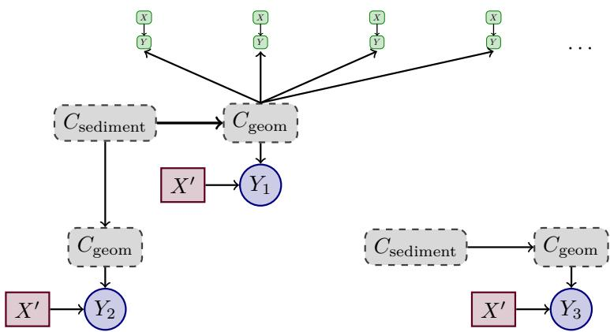  
Figure 7: Diferent multi-level queries for the same system, see example D.13. Green (solid outline, rounded corner rectangles) are observations a single site (other observed sites are not shown).

Example D.13. We observe many river sites (water-levels, throughput, $\cdots )$ , each over many time-steps. Each river-site has a context $C _ { \mathrm { s e d i m e n t } }$ "sediment $\mathrm { t y p e " }$ . This context is extremely complex (there are a lot of aspects to the actual sediment that afect to form of a resulting river-bed geometry and other relevant parameters) and we thus consider C<sub>sediment</sub> unobserved. However, $C _ { \mathrm { s e d i m e n t } }$ will not change over time (at least not within realistic time-frames of observation). There is a distribution / prior $P _ { \mathrm { s e d i m e n t } }$ that describes how likely diferent types of sediment among the river-sites we observe are; we do not know $P _ { \mathrm { s e d i m e n t } } .$ but we fix notation here for later reference and interpretation.

Further we assume there is a context $C _ { \mathrm { g e o m } }$ describing the "geometry" of a riverbed. This context is extremely complex (there are a lot of aspects to the actual geometry that are relevant to water-flow, like the distribution over cross-sections encountered but also the relation between cross-sections along the river, roughness measures and many more) and we thus consider $C _ { \mathrm { g e o m } }$ unobserved. However, $C _ { \mathrm { g e o m } }$ will not change over time (at least not within realistic time-frames of observation). There is a distribution / prior $P _ { \mathrm { g e o m | s e d i m e n t } }$ , over geometries encountered given a sediment-type; this is a probability-kernel from sediment-types to geometries. Again, we do not know this kernel.

For each river-site, there are time-dependent variables like water-throughput X and waterlevel Y . For the sake of argument, assume that water-throughput X is driven externally (throughput must match influx over time-scales where rising water-levels and "water-capacity"

at the site are irrelevant; for simplicity let’s assume samples far enough apart in time, that they are efectively IID for each site) and that water-levels Y depends on X and $C _ { \mathrm { g e o m } }$ only, in particular the kernel / mechanism $Y _ { x , g }$ is assumed to be the same across all river-sites (site-dependent aspects are captured by $C _ { \mathrm { g e o m } }$ in good enough approximation); X may vary by site (this will not matter for the purpose of this example).

We ask a question about $Y ,$ , when changing X (for example by diverting part of the water-influx to a channel or large-scale reservoir). Indeed we ask not one question, but rather three questions that are similar, but practically important to distinguish.

1) Enforcing influx / throughput $X ^ { \prime }$ at a particular site $s ,$ how will Y change at that site $s ?$

2) Enforcing influx / throughput $X ^ { \prime }$ at a particular previously unobserved site $s ^ { \prime }$ that is geographically very close to an observed site s and can plausibly be assumed to share geological sediment properties $C _ { \mathrm { s e d i m e n t } }$ with site s, how will $Y$ change / behave at that site $s ^ { \prime } \{ $

3) Enforcing influx / throughput $X ^ { \prime }$ at a particular previously unobserved site $s ^ { \prime \prime }$ , how will Y change / behave at that site $s ^ { \prime \prime \prime } ?$

The actual question is always the same, so we should be more precise as to what we mean by "how will Y change at that site $s ? "$ . Indeed we will typically want to know, what is the "most narrow" (smallest noise) prediction we can make. There are both a finite-sample aspect and an aspect of the precise formulation of the question (and infinite-sample answer) to this question. Figure 7 illustrates these three diferent queries for $Y _ { 1 } , Y _ { 2 } , Y _ { 3 }$ (in this order); the mechanism at each $Y _ { i }$ is $Y _ { x , g }$ as in the observations, the additional index is just for book-keeping.

Note, that these queries are identifiable under diferent conditions: For $Y _ { 1 }$ , we need many time-points in context s to learn the structural query where $C _ { \mathrm { g e o m } }$ is pinned; for $Y _ { 2 }$ , we either need to observe $C _ { \mathrm { g e o m } }$ (as variable, with distribution $C _ { \mathrm { g e o m } } \circ C _ { \mathrm { s e d i m e n t } } )$ across many sites or we need to observe many sites (not just $s , s ^ { \prime } )$ with "shared" $C _ { \mathrm { s e d i m e n t } }$ (while not shown in Fig. 7 this could be read of the I-graph, where a single $C _ { \mathrm { s e d i m e n t } }$ occurrence / instance may have many $C _ { \mathrm { g e o m } ^ { - } } \mathrm { c h i l d r e n } )$ to learn $Y _ { x , [ g ] } \circ C _ { \mathrm { g e o m } }$ with C<sub>sediment</sub> pinned (the argument of $C _ { \mathrm { g e o m } } ) ;$ for $Y _ { 3 }$ we need to learn $Y _ { x , [ g ] } \circ C _ { \mathrm { g e o m } } \circ C _ { \mathrm { s e d i m e n t } }$ , which requires many sites (note that our "freeness" condition means we use only one sample for Y for each site, which is likely not a good strategy in the finite sample case; however one has to ensure to suitably reweigh diferent sites if they have diferent numbers of time-points).

In principle, staying more local is more precise: For example the variance of $Y _ { 1 }$ is essentially the variance of noise at $Y .$ , while the variance of $Y _ { 2 }$ (or $Y _ { 3 } )$ additionally captures variance from $P _ { \mathrm { g e o m | s e d i m e n t } }$ (or from both $P _ { \mathrm { s e d i m e n t } }$ and $P _ { \mathrm { g e o m | s e d i m e n t } } ) ;$ ; i. e. priors are relevant to the interpretation of resulting distributions. However, as pointed out above, conditions for identification are diferent. Further, in the finite-sample case, the actual variance of an estimator depends on both the variance of the true predicted distribution but also on finite-sample error – and the number of available samples favors the opposite order $( Y _ { 3 }$ can use, somewhat over-simplified, more data-points than $Y _ { 2 }$ than $Y _ { 1 } )$ , so these non-trivial trade-ofs have to be considered in practice.

Finally the mathematically inclined reader may have noticed an interesting detail: If we observe multiple Y (time-points) at the new site, then they are IID for query $Y _ { 1 }$ , but only exchangeable (conditionally IID given $C _ { \mathrm { g e o m } }$ for that particular site) for queries $Y _ { 2 }$ $Y _ { 3 } . \ \mathrm { I . e . } \ P _ { \theta } ^ { \cal D } ( ( Y _ { 2 } ) _ { t _ { 0 } } , . . . , ( Y _ { 2 } ) _ { t _ { n } } )$ is not IID (but exchangeable), while $P _ { \theta } ^ { \cal D } ( ( Y _ { 1 } ) _ { t _ { 0 } } , \ldots , ( Y _ { 1 } ) _ { t _ { n } } )$ is IID. This subtlety is correctly captured by our query and identification formalism: The query (for $( Y _ { 2 } ) _ { t _ { 0 } } , \ldots , ( Y _ { 2 } ) _ { t _ { n } } )$ in this case has a single $C _ { \mathrm { g e o m } }$ node $i _ { c } \in I$ (for the new site $s ^ { \prime } )$ which is a child of a $C _ { \mathrm { s e d i m e n t } }$ node shared with s (but s has a diferent $C _ { \mathrm { g e o m } } { \mathrm { n o d e } } )$ . This single node $i _ { c }$ in turn has $n + 1$ children $( Y _ { 2 } ) _ { t _ { 0 } } , \ldots , ( Y _ { 2 } ) _ { t _ { n } }$ . Above we sketched two possible identification-strategies for $Y _ { 2 } \colon ( 1 )$ "observe" (somehow) $C _ { \mathrm { g e o m } }$ to learn $\bullet  C _ { \mathrm { g e o m } }$ (where • is a pinned node for the shared $C _ { \mathrm { s e d i m e n t } } )$ and $\circ \right. Y \left. \circ$ (with two outer external nodes for X and the now assumed observed $C _ { \mathrm { g e o m } } )$ . The query (see above) can immediately be glued from these: In practice this means, to jointly draw from $P _ { \theta } ^ { \cal D } ( ( Y _ { 2 } ) _ { t _ { 0 } } , \ldots , ( Y _ { 2 } ) _ { t _ { n } } )$ , first draw from $\bullet  C _ { \mathrm { g e o m } }$ once, then plug the result into $\circ \right. Y \left. \circ$ for all $n + 1$ observations. To draw again from $P _ { \theta } ^ { \cal D } ( ( Y _ { 2 } ) _ { t _ { 0 } } , \ldots , ( Y _ { 2 } ) _ { t _ { n } } )$ , draw a new value from $\bullet  C _ { \mathrm { g e o m } } \ ( \mathrm { o n c e } )$ and so on. (2) given many sites sharing C<sub>sediment</sub>, learn $\bullet  [ C _ { \mathrm { g e o m } } ]  Y  \circ$ (where $C _ { \mathrm { g e o m } }$ is hidden, indicated by square-brackets), for a single $Y ,$ plug in $X ^ { \prime }$ . However, this second strategy does not apply for the joint $\bar { P _ { \theta } ^ { D } } ( ( Y _ { 2 } ) _ { t _ { 0 } } , \ldots , ( Y _ { 2 } ) _ { t _ { n } } )$ , because the single node for $C _ { \mathrm { g e o m } }$ in the query would enforce an overlap which is not of the form allowed by Lemma 3.8 (gluing; formally we work on $G ^ { \mathrm { o b s } }$ with the pinned node aligned to some $\delta _ { i } .$ , however the query has a c-component containing the hidden $C _ { \mathrm { g e o m } }$ and its children $( Y _ { 2 } ) _ { t _ { 0 } } , \ldots , ( Y _ { 2 } ) _ { t _ { n } }$ none of our learned structures contains this full c-component as subgraph). Indeed from $\bullet  [ C _ { \mathrm { g e o m } } ]  Y  \circ$ we only know how to draw $Y$ once before redrawing $C _ { \mathrm { g e o m } }$

Small issues like the last one are often dificult to even spot. In our graphical operations and query perspective, they become surprisingly evident.

As this example shows, there are subtly diferent, but meaningful, queries that are formally distinguished by our formalism. These queries difer in how the query-part of the I-graph is attached to the observational part of the I-graph, in particular this distinction cannot be made in the single-level case (where query and observational part of the I-graph are disconnected, cf. Lemma 5.5).

## E The IID Case

We compare our results to well-established standard results for the IID case. This enables us to validate that answers obtained from our formalism are indeed sound. Further, while we do not show that our algorithms are complete in the general case, they turn out to be complete in IID settings.

## E.1 Standard Results for the Single-Context Case

Some of the assumptions implicit in this notation become clearer in the next subsection §E.2 where they appear as explicit constraints on the form of the model (in the sense of Def. 2.6). We start from the standard formulation via structural causal models (SCM) [30; 38]:

Notation E.1 (Variables). For some finite index set $I _ { \mathrm { v a r s } } \times I _ { \mathrm { s a m p l e } }$ (typically $I _ { \mathrm { s a m p l e } } =  { \mathbb { N } } )$ 2 $I _ { \mathrm { v a r s } }$ is a finite set, fix a set of endogenous random variables $\{ \mathcal { X } _ { v , s } \} _ { ( v , s ) \in I _ { \mathrm { v a r s } } \times I _ { \mathrm { s a m p l e } } }$ , taking values in $\mathcal { X } _ { v }$ , that is measurable mappings $\mathcal { X } _ { v , s } : \Omega \to \mathcal { X } _ { v }$ . We assume these are IID (in $I _ { \mathrm { s a m p l e } } )$ , i. e. $\forall s , s ^ { \prime } \in I _ { \mathrm { s a m p l e } } \colon ( \ast ) ( \mathcal { X } _ { v , s } ) _ { v \in I _ { \mathrm { v a r s } } } \stackrel { \mathrm { d } } { = } ( \mathcal { X } _ { v , s ^ { \prime } } ) _ { v \in I _ { \mathrm { v a r s } } }$ are (jointly) equal in distribution and for diferent $s \in I _ { \mathrm { s a m p l e } }$ are (jointly) independent, i. e.

$$
\begin{array} { r c l } { P ( \{ \mathfrak { X } _ { v , s } \} _ { ( v , s ) \in I _ { \mathrm { v a r s } } \times I _ { \mathrm { s a m p l e } } } ) } & { = } & { \displaystyle \prod _ { s \in I _ { \mathrm { s a m p l e } } } P ( \{ \mathfrak { X } _ { v , s } \} _ { v \in I _ { \mathrm { v a r s } } } ) } \\ & { \stackrel { ( * ) } { = } } & { \displaystyle \prod _ { s \in I _ { \mathrm { s a m p l e } } } P ( \{ \mathfrak { X } _ { v } \} _ { v \in I _ { \mathrm { v a r s } } } ) , } \end{array}
$$

by slight abuse of notation (we just drop the index s mandated by $( * ) ) ;$ as is common in the literature we will (justified by IIDness) talk about variables $\{ \mathcal { X } _ { v } \} _ { v \in I _ { \mathrm { v a r s } } }$ (omitting an index $s \in I _ { \mathrm { s a m p l e } } )$ . We will sometimes use indices $v \in I _ { \mathrm { v a r s } }$ and their associated random variable $\mathcal { X } _ { v }$ interchangeably, this should not lead to confusion (it is equivalent to saying the $I _ { \mathrm { v a r s } } .$ which as a finite set is defined essentially by the number of its elements is the set containing as elements these random variables).

Definition E.2 (SCM). An SCM M consists of the following information:

Fix an index-set $I _ { \mathrm { v a r s } } \times I _ { \mathrm { s a m p l e } }$ and an observed subset $\mathcal { O } \subseteq I _ { \mathrm { v a r s } }$ with complement $L : = I _ { \mathrm { v a r s } } \backslash \mathcal { O }$ . Using notation E.1, there are (IID) variables $\{ \mathcal { X } _ { v } \} _ { v \in I _ { \mathrm { v a r s } } }$ and (IID) exogenous noises (hidden) $\{ \eta _ { v } \} _ { v \in I _ { \mathrm { v a r s } } } .$ , taking values in $\mathcal { N } _ { v }$ . Noises are jointly independent also within a sample, i. e. we additionally (to IID) have $\begin{array} { r } { P ( \{ \eta _ { v } \} _ { v \in I _ { \mathrm { v a r s } } } ) = \prod _ { v \in I _ { \mathrm { v a r s } } } P ( \eta _ { v } ) } \end{array}$ .

Further, for each $v \in I _ { \mathrm { v a r s } }$ there is a set of parents $\mathrm { P a } _ { v } \subset I _ { \mathrm { v a r s } } \overline { { \backslash } } \overline { { \{ v \} } }$ and a mechanism (a measurable mapping) $f _ { v } : { \mathcal { X } } _ { \mathrm { P a } _ { v } } \times { \mathcal { N } } _ { v } \to { \mathcal { X } } _ { v }$ such that the endogenous variables satisfy the structural equations

$$
\mathcal { X } _ { v } : = f _ { v } ( \mathcal { X } _ { \mathrm { P a } _ { i } } , \eta _ { i } )
$$

relative to their parents and noise-term. Parent-sets are assumed to satisfy a suitable minimality condition, $\mathrm { { e . g . \ [ 7 } }$ , Def. 2.6], that is $f _ { v }$ are not trivial in any argument.

We assume SCMs are uniquely solvable (for example acyclic), meaning the distribution of endogenous variables is fixed uniquely by noise-terms and mechanisms.

We assume (in the IID case, this is essentially w. l. o. g., cf. Rmk. E.3) each $l \in L$ has no parents $\mathrm { P a } _ { l } = \emptyset$ and at most two children (usually we start from M where there are always exactly two children, but after a hard-intervention, see below, there might be less children), and its children are observed.

Remark E.3 (Latent Projections). The form of latent-structure in assumed in the previous definition is standard in the literature, see e. g. [30, Def. 2.6.1 (p. 52)], because it simplifies graphical representation and logic, and a model can also be transformed into this form, see e. g. [30, Thm. $2 . 6 . 2 \ ( \mathrm { p . 5 2 } ) ]$ . This is however primarily a consequence of the strong restrictions IIDness puts on symmetries of the model. In general, there does not seem to be any simple "standard form" in a comparable sense. Note that our approach makes latents always explicit, also in IID models, for example in Fig. 1 it is very clear that $( Z _ { 2 } ) _ { x , [ l _ { 2 } ] } \circ L _ { 2 }$ (the second blue-box labeled "learn") does depend on $L _ { 2 }$ and can only be transferred to a query, where the latent has the same distribution. For transfer between contexts, it is important to be transparent about such requirements.

Definition E.4 (Interventions). Interventions (or "actions") are defined as follows: Given an SCM M, an intervened on $\tilde { X } \subset \mathcal { O }$ SCM $M ^ { \prime }$ is an SCM with the same exogenous noises, and parent-sets $\mathrm { P a } _ { v } ^ { \prime }$ , mechanisms $g _ { v }$ such that for $v \in I _ { \mathrm { v a r s } } \setminus \tilde { X } : \mathrm { P a } _ { v } ^ { \prime } = \mathrm { P a } _ { \tau }$ and $g _ { v } = f _ { v } . \ \mathrm { A n }$ intervention is called hard if for $v \in \tilde { X } : \mathrm { P a } _ { v } ^ { \prime } = \varnothing$ . A hard intervention is a do-intervention, if for $v \in \tilde { X } : g _ { v } = x _ { v }$ is a constant. We denote a do-intervention on $\tilde { X }$ by Pearl’s do-operator $\operatorname { d o } ( \tilde { X } = x )$ , for example the interventional distribution of $\tilde { Y } \subset \mathcal { O }$ conditioned on ("in a given context" in $[ 5 6 ] ) \ \tilde { Z } \subset \mathcal { O }$

$$
\begin{array} { r l r } { P ( \tilde { Y } | \mathrm { d o } ( \tilde { X } = x ) , \tilde { Z } ) } & { : = } & { P ( \{ \mathfrak { X } _ { v } ^ { \prime } \} _ { v \in \tilde { Y } } | \{ \mathfrak { X } _ { v } ^ { \prime } \} _ { v \in \tilde { Z } } ) , } \end{array}
$$

where $\mathcal { X } _ { v } ^ { \prime }$ are the endogenous variables of the model $M ^ { \prime }$ (since we assumed SCMs are uniquely solvable, this is well-defined). We also write $M ^ { \mathrm { d o } ( \tilde { X } = x ) }$ or simply $M ^ { \mathrm { d o } }$ (if clear from context) in this case. We will assume that the intervened value is in the value-space x $\in \mathcal { X } _ { \tilde { X } }$ (i. e. we do not intervene e. g. categorical variables to arbitrary real values).

Definition E.5 (Causal Graph). The causal graph including latents $\mathbf { G } ^ { L }$ of a SCM M is defined as the directed graph with nodes $\mathbf { N } ^ { L } = I _ { \mathrm { v a r s } }$ and a directed edge $x  y$ in $\mathsf { E } ^ { L }$ if $x \in \mathrm { P a } _ { y }$ . The corresponding graph of the do-interventional model $M ^ { \mathrm { d o } }$ is denoted $\mathbf { G } _ { \mathrm { d o } } ^ { L } ,$ and can also be obtained graphically by "amputating" all incoming edges to nodes in $\tilde { X } .$

Define G as the graph with nodes $\boldsymbol { \mathsf { N } } = \boldsymbol { \mathcal { O } }$ and a directed edge $x  y$ in E if $x \in \mathrm { P a } _ { y }$ and a bi-directed edge $x  y$ in E if $L \cap \operatorname { P a } _ { x } \cap \operatorname { P a } _ { y } \neq \emptyset$

Causal graphs including latents $\mathbf { G } ^ { L }$ will typcially be DAGs (directed acyclic graphs) below, in this case the graph $\mathbf { G } ^ { L }$ is called Markovian and G is called semi-Markovian.

For this section we adapt:

Definition E.6 (Causal Efect Identifiability). Quoting [56, Def. $2 \ ( \mathrm { p 3 } ) ]$ with only notation adapted and comments in square brackets added:

The causal efect of an action $\operatorname { d o } ( \tilde { X } ) = x$ on a set of variables $\tilde { Y }$ in a given context $\tilde { Z } = z$ such that $\tilde { X } , \tilde { Y } , \tilde { Z }$ are disjoint [subsets of O] is said to be identifiable from $P \ [ P$ is the joint distribution $P ( \{ \mathcal { X } _ { v } \} _ { v \in \mathcal { O } } ) ]$ in G, if $P ( \tilde { Y } | \mathrm { d o } ( \tilde { X } = x ) , \tilde { Z } )$ is (uniquely) computable from $P$ in any causal model which induces G.

Remark E.7. Here computable (seems to) mean "uniquely determined", i. e. given the causal graph G and any observed distribution P, then any two SCMs that produce the same P and have causal graph G will induce the same interventional distribution.

Here "any SCM" puts us in the generic case, i. e. internal structure (like linearity) cannot be used (as there could still be a non-linear SCM with the same graph and observed distribution).

Non-identifiablity (and thus completeness) is then proved by counter-example (i. e. given some property of G, show there are two SCMs with the same observational distribution and diferent interventional distribution).

This last point is relevant: We are talking about SCMs compatible with G and producing the same, but any observed distribution, not the observed distribution.

[56; 57] implicitly<sup>1</sup> use the following definition of "subgraphs"

Definition E.8. A edge-subgraph $\mathbf { G } ^ { \prime } { \boldsymbol { \approx } } \mathbf { G }$ is a graph on the same nodes $\mathbf { N } ^ { \prime } = \mathbf { N }$ but with a subset of edges $\mathbf { E } ^ { \prime } \subset \mathbf { E }$ . We call a edge-subgraph of a (node-)subgraph a sparse subgraph.

Remark E.9. We use, throughout this paper, the convention that ancestors $\operatorname { A n c } ( X )$ of X include X as an element $X \in \operatorname { A n c } ( X )$ . The definitions below and in [56; 57] also follow this convention. However some care has to be taken, as in places (for example the definition of a root set [57, p. 1220, left column] and [56, p. 2, right column]) the given references deviate from this convention.

Definition E.10 (C-Component). [57, Def. 3 (p. 1221)], see also [61]: Given a semi-Markovian graph G such that a subset of its bidirected arcs forms a spanning tree over all vertices in G. Then G is called a c-component.

Remark: This is analogous (and the inspiration for) our definition of c-connectivity $( \mathrm { o n } ~ \mathbf { G } ^ { L } )$ i. e. here a "c-component" is a graph with a single c-component in our notation. Where this would lead to confusion, we clarify what is meant; usually the wording ${ } " \mathbf { G }$ is a c-component" is used, which seems rather unambiguous in either nomenclature.

Definition E.11 (C-Tree). [57, Def. 4 $\left( \mathrm { p . 1 2 2 1 } \right) ]$ : Given a semi-Markovian graph G such that G is a c-component, all observable nodes have at most one child, and there is a node $Y \in \mathbb { N }$ such that $\operatorname { A n c } _ { \mathbf { G } } ( Y ) = \mathbf { N }$ . Then G is a Y-rooted c-tree.

Remark: Usually we are only interested in whether there is a edge-subgraph that is a c-tree.

Definition E.12 (C-Forest). [57, Def. 5 (p. 1222)]: Given a semi-Markovian graph G and $R \subset \bf N$ (called the root set) such that $\operatorname { A n c } _ { \mathbf { G } } ( R ) = \mathbf { N }$ . Then G is a R-rooted c-forest, if G is a c-component, and all observable nodes have at most one child.

Remark: Usually we are only interested in whether there is a edge-subgraph that is a c-forest.

Definition E.13 (Hedge). [57, Def. 6 (p. 1223)]: Given a semi-Markovian graph G. Let $X , Y \subset \mathbf { N }$ with $X \cap Y = \emptyset$ . Let $F , F ^ { \prime }$ be R-rooted c-forests [both are sparse subgraphs of G] such that (for their node-sets which are subsets of the node-set of G) $F \cap X \neq \emptyset , F ^ { \prime } \cap X = \emptyset$ $F ^ { \prime }$ is a sparse subgraph of $F _ { ; }$ , and $R \subset \operatorname { A n c } _ { \mathbf { G } _ { \mathrm { d o } } } ( Y )$ . Then $F$ and $F ^ { \prime }$ form a hedge for (X, Y ) in G.

Lemma E.14 (Hedge Criterion). We use the formulation from [55, Prop. $\textit { 1 } ( p , 7 ) ]$ , where the authors correct a small erratum in their statement of [57, Cor. 3 (p. 1225)]:

An interventional distribution $P ( { \tilde { Y } } | \operatorname { d o } ( { \tilde { X } } = x ) )$ , is identifiable $( D e f . \ E . \ 6 )$ , if and only if there is no hedge for $( { \tilde { X } } , { \tilde { Y } } )$ in G.

Lemma E.15 (Completeness of ID-Algorithm). [57, Thm. $8 { \ : } ( p . 1 2 2 6 ) / .$ If the id-algorithm $( s e e \ ( 6 1 ; \ 5 \eta )$ fails to identify $P ( \tilde { Y } | \mathrm { d o } ( \tilde { X } = x ) )$ , then it outputs a hedge $( F , F ^ { \prime } )$ for $( \tilde { X } , \tilde { Y } )$ . As a corollary by using the hedge-criterion $[ 5 7 ,$ Cor. 5 (p. 1226)] thus: The id-algorithm is complete.

## E.2 Translating the Standard IID-Setup

All IID models can be described with the following strongly restricted form of symmetry and viewport. See also examples 2.7, 2.17 and 5.1.

Definition E.16 (IID-Observations with Uniform Missingness). We call a model IID (see Rmk. E.17), if it can be written in the following form: $I = I _ { \mathrm { d a t a s e t } } \times I _ { \mathrm { v a r s } } \times I _ { \mathrm { s a m p l e } ; }$ , where $\vert I _ { \mathrm { s a m p l e } } \vert = \infty ,$ while $| I _ { \mathrm { v a r s } } | <$ ∞ and $| I _ { \mathrm { d a t a s e t } } | < \infty$ with symmetry-group $G = \mathfrak { S } _ { I _ { \mathrm { d a t a s e t } } \times I }$ sample (the permutations / symmetric group acting trivially on the middle factor $I _ { \mathrm { v a r s } }$ of $I$ and mixing datasets and samples), and variables $J _ { ( C , v ) } = C \times \{ v \} \times I _ { \mathrm { s a m p l e } }$ with symmetry $H _ { v } = \mathfrak { S } _ { C \times I _ { \mathrm { s a m p l e } } }$ for some subset $C \subset I _ { \mathrm { d a t a s e t } }$ (but disjoint, i. e. every c is in exaclty one $C$ of some $J _ { ( C , v ) }$ , denoted $C ( c ) )$ and $\mathfrak { S } _ { C } \subset \mathfrak { S } _ { I _ { \mathrm { d a t a s e } 1 } }$ embedded as subgroup by extending as the identity on elements outside of $C .$ . We assume ${ I _ { \mathrm { d a t a s e t } } = I _ { \mathrm { d a t a s e t } } ^ { \mathrm { o b s } } \sqcup I _ { \mathrm { d a t a s e t } } ^ { \mathrm { q u e r y } } }$ is a disjoint union of observed data-sets (see viewport below) and pseudo-datasets $I _ { \mathrm { d a t a s e t } } ^ { \mathrm { q u e r y } }$ to encode queries (in the single context case, both are one-element sets: $I _ { \mathrm { d a t a s e t } } ^ { \mathrm { o b s } } = \{ \stackrel {  } { \alpha } \}$ and $I _ { \mathrm { d a t a s e t } } ^ { \mathrm { q u e r y } } = \{ \beta \} ,$ ). By slight abuse of notation we will pretend that $I _ { \mathrm { s a m p l e } }$ depends on the $\ " \mathrm { c o n t e x t } " \ c \in I _ { \mathrm { i } }$ dataset (as only the viewport, see below, really matters this is purely notational).

There is a subset $\mathcal { O } \subset I _ { \mathrm { v a r s } }$ with complement $L = I _ { \mathrm { v a r s } } \backslash \mathcal { O }$ and the viewport V(N) is such that $\forall ( c , v , s ) \in I _ { \mathrm { d a t a s e t } } ^ { \mathrm { o b s } } \times \mathcal { O } \times I _ { \mathrm { s a m p l e } } \ \exists N _ { 0 } \in \mathcal { N }$ such that $\forall N \ge N _ { 0 } \colon ( c , v , s ) \in \mathsf { V } ( N )$ , while for $\forall ( c , v , s ) \in ( I _ { \mathrm { d a t a s e t } } ^ { \mathrm { o b s } } \times L \times I _ { \mathrm { s a m p l e } } ) \cup ( I _ { \mathrm { d a t a s e t } } ^ { \mathrm { q u e r y } } \times I _ { \mathrm { v a r s } } \times I _ { \mathrm { s a m p l e } } ) \ ( \mathrm { i }$ . e. for the complement in $I ) \ \forall N \in { \mathcal { N } } \colon ( c , v , s ) \not \in \nabla ( N )$

In words: All variables in O are asymptotically observed for infinitely many samples in all observed contexts $I _ { \mathrm { d a t a s e t } } ^ { \mathrm { o b s } }$ . A typical viewport of this form, for $I _ { \mathrm { s a m p l e } } = \mathbb { N }$ , is given by $\mathcal { N } = | I _ { \mathrm { d a t a s e t } } ^ { \mathrm { o b s } } \times \mathcal { O } | \mathbb { N }$ (we observe samples of size $M : = | I _ { \mathrm { d a t a s e t } } ^ { \mathrm { o b s } } \times \mathcal { O } |$ , thus the viewport ${ \mathsf { V } } ( N )$ is defined for N that are multiples of this number), and for $N = n M \in \mathcal { N }$ observed indices are $\mathsf { V } ( N ) = I _ { \mathrm { d a t a s e t } } ^ { \mathrm { o b s } } \times \mathcal { O } \times \{ 1 , \dots , n \}$

Note that by equivariance of parent-sets, the I-graph decomposes into disjoint (no mutual edges) subgraphs on nodes $\{ c \} \times I _ { \mathrm { v a r s } } \times \{ s \}$ , and further by $\mathfrak { S } _ { I _ { \mathrm { s a m p l e } } } \subset H _ { J }$ (and acting as permutations on $I _ { \mathrm { s a m p l e } } )$ , the equivariant parent sets cannot change between samples s (only between contexts $c ;$ here lower indices c on graphs will denote contexts, elsewhere in this paper upper indices c on graphs denote structural c-components, this should not lead to confusion), thus there are local graphs $\mathcal { G } _ { c }$ (with only proper nodes) and families of embeddings (anchored at any $v _ { 0 } \in I _ { \mathrm { v a r s } } ) ~ \{ \psi _ { j = ( c , v _ { 0 } , s ) } ^ { c } \} _ { s \in I _ { \mathrm { s a m p l e } } }$ embedding $\mathcal { G } _ { c }$ with image $\{ c \} \times I _ { \mathrm { v a r s } } \times \{ s \}$ into the I-graph; we can identify $\mathcal { G } _ { c }$ with $G _ { c } = G ^ { \mathrm { o b s } } ( \mathcal { G } _ { c } )$ (there are no external or pinned nodes; see also Def. E.20).

Remark E.17 (Exchangability). Exchangability refers to the property of a distribution being invariant under permutations. We explicitly keep track of multiple datasets via $I = I _ { \mathrm { d a t a s e t } } \times I _ { \mathrm { v a r s } } \times I _ { \mathrm { s a m p l e } }$ and given the data-set index we are essentially in a simple case of de Finetti’s theorem (see e. g. [23]): If the samples are exchangeable, than they are conditionally IID. In our case: conditional on the data-set index. Thus even though we only assume a symmetry, by explicitly tracking data-set association the models defined above are efectively IID (not just exchangeable) and the naming-convention makes sense.

Model mechanisms in the sense of Def. 2.5 under these symmetry-restrictions are then push-forwards of noise-distributions.

Lemma / Definition E.18 (Translating Mechanisms). Given a measurable map $f : \mathcal { X } \times$ $\mathcal { N }  \mathcal { V }$ and a probability measure $P _ { \eta }$ on ${ \mathcal N } .$ , define a probability-kernel $\mu ( f , P _ { \eta } )$ from $\mathcal { X }$ to

Y given by $x \mapsto f ( x , \cdot ) _ { * } P _ { \eta }$ (see Rmk. G.5) or equivalently for $x \in \mathcal { X }$ and $B \in B ( \mathcal { V } )$ :

$$
\mu ( f , P _ { \eta } ) ( x , B ) \ : = \ \int 1 _ { B } \bigl ( f ( x , u ) \bigr ) P _ { \eta } ( \mathrm { d u } ) .
$$

If a random variable Y satisfies $P ( \mathcal { Y } | \mathcal { X } = x ) = f ( x , \eta )$ for a random variable η ⊥⊥ X with law $\begin{array} { r } { P ( \eta ) = P _ { \eta } , } \end{array}$ then $P ( \mathcal { X } , \mathcal { Y } ) = P _ { \eta } \otimes \mu ( f , P _ { \eta } )$

In particular for an SCM M, there are probability-kernels $\mu _ { v } : = \mu ( f _ { v } , P ( \eta _ { v } ) )$ for $v \in I _ { \mathrm { v a r s } }$ such that aligning $G = \mathbf { G } ^ { L }$ (with only inner nodes) to these $\mu _ { v }$ has a structured kernel $\mu ( G , L , \pi ) = P ( \{ \mathcal { X } _ { v } \} _ { v \in \mathcal { O } } )$

Remark: Indeed $\mu ( f _ { y } , P ( \eta _ { y } ) ) _ { \mathrm { p a } _ { y } } = P ( \mathbb { Y } | \operatorname { P a } _ { y } = \mathrm { p a } _ { y } )$ , however it seems conceptually clearer to define it directly relative mechanisms and noise-distributions, rather than through intermediate realizations as random variables.

Proof. See examples in $\ S \mathrm { G }$

Commonly, e. g. in [30; 38; 61; 57; 56; 4], the following assumption is implicit in the assumption of "generic" mechanisms:

Assumption E.19 (Unique Mechanisms). There are no two diferent variables with the same mechanism: Given an SCM M, then ∀v $\neq v ^ { \prime } \in I _ { \mathrm { v a r s } } : \mu ( f _ { v } , P ( \eta _ { v } ) ) \neq \mu ( f _ { v ^ { \prime } } , P ( \eta _ { v ^ { \prime } } ) )$

We are now able to "translate" standard SCMs to (restricted symmetry) models in the sense of Def. 2.6.

Lemma / Definition E.20 (Translated Model). Given an SCM M with variables $I _ { \mathrm { v a r s } }$ and observed variables $\mathcal { O } \subset I _ { \mathrm { v a r s } }$ , and an intervention $P ( { \tilde { Y } } | \operatorname { d o } ( { \tilde { X } } = x ) )$ , there is an IID model $\mathcal { M } ( M )$ (Def. 2.6) given by $I _ { \mathrm { d a t a s e t } } ^ { \mathrm { o b s } } = \{ \alpha \} , I _ { \mathrm { d a t a s e t } } ^ { \mathrm { q u e r y } } \stackrel { } { = } \{ \beta \}$ , variables as required for being an IID model (Def. E.16), i. e. $J _ { ( C , v ) } = C \times \{ v \} \times I _ { \mathrm { s a m p l e } }$ with symmetry $H _ { v } = \mathfrak { S } _ { C \times I _ { \mathrm { s a m p l e } } } .$ Here C is $C = \{ \alpha , \beta \}$ if $v \not \in \tilde { X }$ , if $v \in \tilde { X }$ then there are two variables $J _ { ( \{ \alpha \} , v ) }$ and $J _ { ( \{ \beta \} , v ) }$ associated to v.

If $\alpha \in C .$ , then the mechanisms are $f _ { J _ { ( C , v ) } } = \mu ( f _ { v } , P ( \eta _ { v } ) )$ (Def. E.18) and (equivariant) parent-mappings at $j = ( v , s ) \in J _ { v }$ take values $\mathrm { P a } _ { J _ { * } } ^ { ( k ) } ( j ) = ( p _ { k } , s )$ , where $p _ { k }$ is the k-th (in order of arguments of $f _ { v } )$ parent of v, i. e. as a set $\mathrm { P a } _ { J _ { v } } ( j = ( v , s ) ) = \mathrm { P a } _ { v } \times \{ s \}$ . Value- and parent-value-spaces are the value-spaces $\mathcal { X } _ { v }$ of the SCM.

If $C = \{ \beta \}$ (and thus $v \in \tilde { X } )$ , then mechanisms are known $f _ { v } ^ { \mathrm { d o } } \in \mathcal { F } _ { \mathrm { i n t e r v e n e } }$ . Indeed for a do-intervention, they are singular at value $x _ { v }$ (the v-component of the tuple x to which X<sup>˜</sup> was intervened) without parents. We will default to the value-space $\mathcal { X } _ { v }$ (assuming $x _ { v } \in \mathcal { X } _ { v }$ as required in Def. E.4).

The viewport is as required by Def. E.16, typically $\mathsf { V } ( N ) = I _ { \mathrm { d a t a s e t } } ^ { \mathrm { o b s } } \times \mathcal { O } \times \{ 1 , \dots , n \}$

This model $\mathcal { M } ( M )$ has the following properties. The I-graph of $\mathcal { M } ( M )$ is the disjoint union of its restrictions to $\{ \alpha \} \times I _ { \mathrm { v a r s } } \times \{ s \}$ which are of the form $\mathbf { G } ^ { L }$ (the causal graph including latents of M) and its restriction to $\{ \beta \} \times I _ { \mathrm { v a r s } } \times \{ * \}$ which is of the form $\mathbf { G } _ { \mathrm { d o } } ^ { L } , \mathrm { i . e }$ the families of embeddings of the last paragraph of Def. E.16 embed $G _ { \alpha } = \mathcal { G } _ { \alpha } = \mathbf { G } ^ { \bar { L } }$ and $G _ { \beta } = \mathcal { G } _ { \beta } = \mathbf { G } _ { \mathrm { d o } } ^ { L }$ as local graphs with only proper nodes and aligned to $\mu ( f _ { v } , P ( \eta _ { v } ) )$ .

As an immediate consequence $\forall s \in I _ { \mathrm { s a m p l e } } .$

$$
\begin{array} { r c l } { P = P ( \{ \mathfrak { X } _ { v } \} _ { v \in \mathcal { O } } ) } & { = } & { P _ { \theta } ( \{ \mathfrak { V } _ { i } \} _ { i \in \{ \alpha \} \times \mathcal { O } \times \{ s \} } ) } \\ { P ( \tilde { Y } | \mathrm { d o } ( \tilde { X } = x ) ) } & { = } & { P _ { \theta } ( \{ \mathfrak { V } _ { i } \} _ { i \in \{ \beta \} \times \tilde { Y } \times \{ * \} } ) , } \end{array}
$$

where ∗ is the single (relevant) "sample" of the query.

Proof. The claims about the I-graph are true by construction. By Lemma E.18 thus for each $s \in I _ { \mathrm { s a m p l e } } \colon \mu ( \mathcal { G } _ { \alpha } , L , \pi ) = P ( \{ \mathfrak { X } _ { v } \} _ { v \in I _ { \mathrm { v a r s } } } ) = P$ . On the other hand, by $P _ { \theta } ( \{ \mathcal { V } _ { i } \} _ { i \in \{ \alpha \} \times \mathcal { O } \times \{ s \} } ) =$ $\mu ( \mathcal { G } _ { \alpha } , L , \pi )$ by Def. 2.13.

Similarly $\mu ( \mathcal { G } _ { \beta } , L , \pi ) = P ( \{ \mathcal { X } _ { v } ^ { \mathrm { d o } } \} _ { v \in I _ { \mathrm { v a r s } } } ) = P ( \tilde { Y } | \mathrm { d o } ( \tilde { X } = x ) )$ and $P _ { \theta } ( \{ \nabla _ { i } \} _ { i \in \{ \beta \} \times \{ * \} } ) =$ $\mu ( \mathcal { G } _ { \beta } , L , \pi )$ □

The commonly considered do-interventions are a special case of structured queries. We already built them into the translated model as a context $\beta ,$ and the last result, $P ( \tilde { Y } | \mathrm { d o } ( \tilde { X } = x ) ) = P _ { \theta } ( \{ \mathcal { V } _ { i } \} _ { i \in \{ \beta \} \times \tilde { Y } \times \{ * \} } )$ suggests a rather obvious choice of query (Def. 5.3):

Definition E.21 (Translated Query). In $\mathcal { M } ( M )$ , construct a query as follows: $q = ( Y _ { q } , X _ { q } , \theta )$ with $X _ { q } = \emptyset$ and $\dot { Y } _ { q } = \{ \beta \} \times \tilde { Y } \times \{ * \}$ and $\theta = x = \left( x _ { k } \right) _ { k \in \tilde { X } }$ fully parameterizes $\mathcal { F } _ { \mathrm { i n t e r v e n e } } =$ $\{ \delta [ x _ { k } ] \} _ { k \in \tilde { X } }$ . The structured query associated by Lemma 5.5 is ${ \bf G } _ { \mathrm { d o } } ^ { L } \big | _ { \mathrm { A n c } _ { \mathrm { d o } } ^ { L } ( \tilde { Y } ) }$ (cf. proof of Lemma 5.5 or its explanation in the main text), using the identification $G _ { \beta } = \mathbf { G } _ { \mathrm { d c } } ^ { L }$ and restricting this graph to $\mathrm { A n c } _ { \mathrm { d o } } ^ { L } ( \tilde { Y } ) : = \mathrm { A n c } _ { { \bf G } _ { \mathrm { d o } } ^ { L } } ( \tilde { Y } )$ . Note that $I ^ { \mathrm { a u x } } = \emptyset$ (the view-port and the query are in disconnected graph-components of the $I { \mathrm { - g r a p h } } )$ ; thus (by Markov-property, Lemma 2.16), the underlying query is

$$
P _ { \theta } ^ { \mathcal { D } } ( \{ \mathcal { V } _ { i } \} _ { i \in \{ \beta \} \times \tilde { Y } \times \{ * \} } ) = P _ { \theta } ( \{ \mathcal { V } _ { i } \} _ { i \in \{ \beta \} \times \tilde { Y } \times \{ * \} } ) = P ( \tilde { Y } | \mathrm { d o } ( \tilde { X } = x ) ) .
$$

In the IID-case, no dificulties arise from non-uniqueness (of minimal latent-sets, ancestral structures or absorbed parents / children), which allows for a very simple classification of families of embeddings:

Lemma E.22 (IID Classification of Embeddings). For an IID-model with $\mathbf { G } ^ { L } = ( \mathsf { N } ^ { L } , \mathsf { E } ^ { L } )$ decorated families of embeddings with maximal $J _ { 0 }$ are of the form: $J _ { 0 } ~ = ~ C \times I _ { \mathrm { s } }$ <sub>ample</sub>, where $\emptyset \neq C \subset I _ { \mathrm { d a t a s e t } } ^ { \mathrm { o b s } }$ are the relevant contexts (for the present sub-section $C = \{ \alpha \}$ is the only valid choice), $\mathcal { N } \subset \mathsf { N } ^ { L } = I _ { \mathrm { v a r s } } , \mathcal { N } _ { \mathrm { p i n n e d } } = \emptyset$ and $\psi _ { j = ( c , s ) } ( n ) = ( c , n , s ) \in$ $I _ { \mathrm { d a t a s e t } } \times I _ { \mathrm { v a r s } } \times I _ { \mathrm { s a m p l e } } = I$ . There is always a unique minimal latent subset given by $\mathcal { N } ^ { L } \cap L$ Edges are fixed by the subset $o f \ \mathsf { E } ^ { L } \ ( b y \ D e f . \ \not \downarrow . 1 )$

Remark: Some care should be taken, because ancestral structure is part of decorated families of embeddings (but hidden in this notation), in a multi-context setup, there might be diferent choices for the relevant contexts $C \subset I _ { \mathrm { d a t a s e t } }$ difering only by validity of respective ancestral structures.

Proof. As has been noted in Def. E.16, there are families of embeddings of $\mathcal { G } _ { c }$ to $\{ c \} \times I _ { \mathrm { v a r s } } \times \{ s \}$ indexed by $s \in J _ { 0 } = I _ { \mathrm { s a m p l e } }$ . We can also embed subgraphs $\mathcal { G } _ { c } ^ { \prime }$ of these $\mathcal { G } _ { c } .$ . The index set $J _ { 0 } ^ { \prime }$ can be potentially enlarged to $J _ { 0 } ^ { C } = C \times \{ v _ { 0 } \} \times I _ { \mathrm { s a m p l e } }$ , where $C$ is the largest subset of $I _ { \mathrm { d a t a s e t } } ^ { \mathrm { o b s } }$ such that model-alignment is still valid. However by Ass. E.19 (unique mechanisms) each mechanism $\mu _ { v }$ appears exactly once for each $( c , s ) \in I _ { \mathrm { d a t a s e t } } ^ { \mathrm { o b s } } \times I _ { \mathrm { s a m p l e } }$ so these are indeed the largest possible $J _ { 0 }$

By the form of the viewport, hidden-ness of $i = ( c , v , s )$ depends only on $v \in L$ and all contexts are observed (asymptotically) infinitely often, so the claims minimal latent sets are immediate. □

Notation E.23. The classification-lemma E.22 justifies denoting IID embeddings $\psi$ as a triple $( C , { \mathcal { N } } _ { \mathrm { p r o p e r } } , { \mathcal { N } } )$ with $C \subset I _ { \mathrm { d a t a s e t } } , \mathcal { N } _ { \mathrm { p r o p e r } } \subset \mathcal { N } \subset I _ { \mathrm { v a r s } } .$ In the single context case, there is only one observed context, so $C = \{ \alpha \}$ , thus until §E.6 we will simply write $\psi = ( \mathcal { N } _ { \mathrm { p r o p e r } } , \mathcal { N } )$ for statements about extraction (the set of minimal latents is implicitly given by $\bar { L } \cap \mathcal { N } )$ . Indeed, as long as contexts individually have infinitely many samples (asymptotically), the size of C is actually irrelevant (as long as it is non-empty).

Lemma E.24 (Direct Identification). In the IID case, the claim of Thm. 1 (extraction from backdoor-free families of embeddings) holds true with the notion of "direct identifiability" from Def. 4.14 replaced by "knowledge of the observational distribution $P = P _ { \theta } { \big ( } \{ \vartheta _ { i } \} _ { i \in \{ \alpha \} \times \mathcal { O } \times \{ s \} } { \big ) }$ and its conditional distributions".

Remark: This results will become much clearer in the light of the analysis of the ED-phase in $\it 8 E . 3$

Proof. The proof of Thm. 1 only uses data-sets induced via Lemma C.21, which are of the form of marginalizations of the observational distribution. Direct identification than claims that if for each sample $P ( X _ { s } , Y _ { s } ) = \mu _ { s } \otimes \nu _ { x }$ for s-independent ν (the disintegration $\nu _ { x } = P ( Y | X = x )$ always independent of s by IIDness), ν is "directly identifiable", and $\nu _ { x } = P ( Y | X = x )$ is, indeed, a conditional distribution of $P .$ □

Corollary E.25 (Identification). Regular functionals are given uniquely by their argument, thus identifiability in the sense of Def. 4.16 implies in the IID case identifiability in the sense of Def. E.6.

If we can show that our algorithm identifies a query in the sense of Def. $4 . 1 6 ,$ , then this implies our algorithm identifies this query in the sense of Def. E.6.

Finally, identifying the structured query ${ \bf G } _ { \mathrm { d o } } ^ { L } \big | _ { \mathrm { A n c } _ { \mathrm { d o } } ^ { L } ( \tilde { Y } ) }$ identifies $P ( \tilde { Y } | \mathrm { d o } ( \tilde { X } = x ) )$ (cf. $E . 2 1 )$ in the sense of Def. E.6.

Proof. Regular functionals are composed of finitely many operations, which individual produce a well-defined (unique) result (§G). Thus regular functionals compute a unique result. The other claims follow directly from the definitions □

## E.3 Single-Context with Empty Conditioning Set

We first analyze what results are produced by the extract–decompose (ED)-phase(s) in Algo.   
EDAIdentify, steps 1) and 2). Then we separately analyze the assembly (A)-phase in Algo.   
EDAIdentify, step 3).

ED-Phase: We discus the "ED-phase" combined, as it will turn out that in the IID-case the extraction (E)-phase can be replaced by the claim $\ " \mu ( \mathbf { G } ^ { L } , L ) = P$ (the observational distribution) is identifiable" (which also makes it clearer why Lemma E.24 was essentially trivial to prove). To illustrate this, we start with a (not finite-context IID) example where the E-phase is clearly necessary.

Example E.26 (Non-Trivial Extraction). Consider a setup (inspired by JPCMCI [15]) given as follows: There are time-series for time-points T at river-sites S for multiple variables. Some of the mechanisms vary between sites $s \in S$ , others over time $t \in T$ or are shared. We assume there are many sites and time-points, i. e. the relevant asymptotic limit has both |S| → ∞ and $| T | \to \infty { \mathrm { ~ a s ~ } } N \to \infty$ . Lets consider a very simple such model of the form $X  Z _ { s }  Y _ { t }$ , where X is the same mechanism for all $s \in S$ and $t \in T , Z _ { s }$ is the same for all $t \in T$ , but depends on $s \in S$ , while $Y _ { t }$ is the same for all $s \in S$ , but depends on $t \in T$ . Most frameworks, like JCI [27], mz-transport [4] or JPCMCI [15] would inject "context-variables" for S and T.

We want to predict an intervention on site s and at time t on for do $( X = x )$ . Conventional wisdom tells us this efect is identifiable and given simply by $P ( Y | X = x , S = s , T = t )$ This is correct in IID-terms. It is also, unfortunately, not helpful: We have exactly one data-point at $S = s$ and $T = t .$ . So what could we do? The E-phase of our approach would actually search for smallest (best symmetry) backdoor-free graphs. It would find the following: $\circ  Z _ { s }$ is identifiable on the (asymptotically infinite) data-set $T \times \{ s \} \times \{ ( x , z ) \}$ $\circ  Y _ { t }$ is identifiable on the (asymptotically infinite) data-set $\{ t \} \times S \times \{ ( z , y ) \}$ . Then the A-phase simply glues these partial results.

In this example the E-phase does essentially two things: (1) It validates that only local graphs with suficient available data are taken into account. Thus it avoids, even if Z is unobserved, dubious identification claims and rather fails gracefully. (2) It enables the A-phase to find the (actually useful) "frontdoor-like" identification strategy, even though it would conventionally be entirely unclear what makes this strategy better than any other plausible one.

The point here is, that smaller local graphs have better symmetry, thus larger available data-sets. This is not just a finite sample issue, as the example above illustrates, taking the wrong local graphs, we can end up with finite data-sets (or even literally a single data-point)

to learn from, which also breaks asymptotic identification results; this problem only gets more severe once latents are added. As already remarked 4.3, the symmetry of a local graph containing two subgraphs A and B of symmetry $H _ { A }$ and $H _ { B }$ has symmetry $H _ { A } \cap H _ { B }$ . In some cases, we can simply intersect all symmetries of all variables J to get $\cap _ { J \in { \mathcal { I } } } H _ { J }$ . We then get a "fundamental-domain" local graph containing "everything" about the model. In the IID case, all mechanisms are at least $\mathfrak { S } _ { I _ { \mathrm { s a m p l e } } }$ -invariant, and essentially the fundamental domain would be G (or in the finite-context / mz-transport case: a disjoint union of causal and interventional graphs, one for each context and experiment, cf. Fig. 8). Another example: A time-series with m- and k-periodic mechanisms has fundamental domain τ-periodic, where τ is the smallest common multiple of m and k (translation symmetries here are mZ and kZ with $m \mathbb { Z } \cap k \mathbb { Z } = \tau \mathbb { Z } )$ . As the example above shows, generally the fundamental domain may not be identifiable (here: $( \mathfrak { S } _ { S } \times \{ 0 \} ) \cap ( \{ e \} \times \mathbb { Z } _ { T } ) = \{ ( e , 0 ) \}$ is the trivial sub-group). This is the deeper reason why the E-phase is necessary in general, but could be skipped for the IID-case.

The result of the combined ED-phase is the same as applying only th D-phase (Algo. CGDecomp) to $\mu ( \mathbf { G } ^ { L } , L )$ ; see also Fig. 3 for an illustration.

Lemma E.27 (ED-Phase). The ED-phase (the first two steps of Algo. EDAIdentify) produces after a finite number of steps the finite set of all c-connected structured kernels (and associated identification strategies) which can be obtained from $\mu ( \mathbf { G } ^ { L } , L )$ by repeated decomposition into c-components (Lemma 3.7) and simplification (Lemma $A . 1 2 ) _ { \cdot }$ ; this includes intermediate c-connected results (cf. Algo. CGDecomp).

Notation: We call c-connected sub-graphs obtained by repeated decomposition into ccomponents (Lemma 3.7) and simplification (Lemma A.12), c-fragments. The claim above then reads: The ED-phase outputs all c-fragments of $\mu ( \mathbf { G } ^ { L } , L )$

Proof. The E-phase produces all minimal (c-connected) backdoor-free families, which are, by classification of embeddings (Lemma E.22), are all c-subgraphs of $\mathbf { G } ^ { L }$ . I. e. the E-phase produces the decomposition of $\mathbf { G } ^ { L }$ into c-components (Lemma 3.7) and simplifications (Lemma A.12). The D-phase then further iterates these steps.

Since all non-trivial decomposition-steps (c-components or simplifications) reduce the size of the graph (the produced pieces are smaller than the original one) and Algo. CGDecomp yields on trivial ones, the sizes of graphs in step m is at most $| I _ { \mathrm { v a r s } } | - m$ nodes (because $\mathbf { G } ^ { L }$ has $| I _ { \mathrm { v a r s } } |$ nodes), and the algorithm terminates after a finite number of iterations. There is a finite number of forks (sub-iterations, e. g. c-components, simplifications) in each iteration (there are only finitely many c-components and subsets of L in finite graphs). □

A-Phase: We finally discuss the assembly (A)-phase in Algo. EDAIdentify, step 3). We start by relating c-fragments (cf. E.27) to c-forests (Def. E.12, cf. [57]).

Lemma E.28 (C-Fragments and C-Forests). Some properties of c-structures are:

(a) Given a c-fragment $G ^ { c } \leq ( G , L )$ , then there is a c-forest in G on $\mathcal { N } _ { \mathrm { i n n e r } } ^ { c } \backslash L$ rooted on

$$
R \ : = \ \{ \ y \in \mathcal { N } _ { \mathrm { i n n e r } } ^ { c } \setminus L \ | \ \mathrm { C h } _ { G } ( y ) \cap \mathcal { N } _ { \mathrm { i n n e r } } ^ { c } = \emptyset \ \} .
$$

(b) A c-forest F in $\mathbf { G } _ { \mathrm { d o } }$ is a c-forest in G.

(c) Given a R-rooted c-forest F<sup>′</sup> in G such that there is no c-fragment $G ^ { c } \leq ( \mathbf G ^ { L } , L )$ , with ${ \mathcal { N } } _ { \mathrm { i n n e r } } ^ { c } \backslash L = F ^ { \prime }$ , then there is a R-rooted c-forest $F \supset F ^ { \prime }$ in G.

Proof. Part (a): We first show: C-fragments contain an edge-subgraph that is a forest. By definition of R, every node $y \in \mathcal { N } _ { \mathrm { i n n e r } } ^ { c } \backslash \left( L \cup R \right)$ has a child $c \in \mathcal { N } _ { \mathrm { i n n e r } } ^ { c }$ . Using the special form of hidden structure assumed in the IID-case (cf. Def. E.2, Rmk. E.3), hidden nodes have no parents, thus $c \in \mathcal { N } _ { \mathrm { i n n e r } } ^ { c } \setminus L$ . Pick one of these children and call it $c ( y )$ . For $y \in R$ Then define a forest F rooted on R with nodes ${ \mathcal { N } } _ { \mathrm { i n n e r } } ^ { c }$ and an edges $y  c ( y )$ for each $y \in \mathcal { N } _ { \mathrm { i n n e r } } ^ { c } \setminus \left( L \cup R \right)$ . C-fragments are c-connected (a c-component in the sense of $\left[ 6 1 ; 5 7 \right] )$ by definition, thus this is a c-forest.

Part (b): A c-forest in $\mathbf { G } _ { \mathrm { d o } }$ is an edge-subgraph $F \subset \mathbf { G } _ { \mathrm { d o } }$ with a single c-component. Also $\mathbf { G } _ { \mathrm { d o } } \subset \mathbf { G }$ is an edge-subgraph, so $F \subset \mathbf { G }$ is an edge-subgraph. Since the nodes of $F$ are in a single c-component of $\mathbf { G } _ { \mathrm { d o } }$ , there is a path of bi-directed arrows between any two nodes, but again by $\mathbf { G } _ { \mathrm { d o } } \subset \mathbf { G }$ being an edge-subgraph, this path of bi-directed arrows is also in G.

Part (c): By definition the c-forest $F ^ { \prime }$ is a single c-component, i. e. all its nodes are in the same c-component $F ^ { \prime } \subset C \subset \mathsf { N }$ of G. Call the associated structural c-component (with $\mathcal { N } _ { \mathrm { i n n e r } } ^ { c } \backslash L = C ) G ^ { c } \leq \mathbf { G } ^ { L }$

This $G ^ { c }$ need not be rooted on R. So we define a simplification $G ^ { \prime }$ of $G ^ { c }$ as follows: Define $R _ { 0 } : = R$ , then

$$
R _ { k + 1 } : = R _ { k } \cup \big ( \mathcal { N } _ { \mathrm { i n n e r } } ^ { c } \cap \mathrm { P a } _ { \mathbf { G } } ( R _ { k } ) \big ) .
$$

After a finite number of steps $R _ { n + 1 } = R _ { n }$ . Finally define $B : = { \mathcal { N } } _ { \mathrm { i n n e r } } ^ { c } \setminus \left( R _ { n } \cup L \right)$ and add latents that are not a parent (or ancestor by form of hidden structure, cf. Def. E.2, Rmk. E.3) of any node in ${ \mathcal { N } } _ { \mathrm { i n n e r } } ^ { c }$ not in $B$ to get $B ^ { L } : = B \cup ( L \setminus \operatorname { P a } _ { \mathbf { G } ^ { L } } ( \mathcal { N } _ { \mathrm { i n n e r } } ^ { c } \setminus B ) )$ . By construction $B = \operatorname { D e s c } _ { G ^ { c } } ( B )$ and there is a B-simplification $G ^ { \prime }$ of $G ^ { c }$

As a simplification of the structural c-component $G ^ { c } , G ^ { \prime }$ is a c-fragment of $\mathbf { G } ^ { L }$ . Thus by hypothesis ${ \mathcal { N } } _ { \mathrm { i n n e r } } ^ { \prime } \backslash L \neq F ^ { \prime }$ . Note that initially $F \subset { \mathcal { N } } _ { \mathrm { i n n e r } } ^ { c }$ , and the simplification cannot remove nodes in $F$ (because they are ancestors of the observable $R )$ , thus ${ \mathcal { N } } _ { \mathrm { i n n e r } } ^ { \prime } \backslash L \subsetneq F ^ { \prime }$ . By $\mathrm { ( a ) }$ , there is a c-forest $\tilde { F }$ on the nodes $\mathcal { N } _ { \mathrm { i n n e r } } ^ { \prime } \backslash L$ . Note that $\tilde { F }$ is rooted on R, by construction of $R _ { n }$ . Define F on the nodes $\mathcal { N } _ { \mathrm { i n n e r } } ^ { \prime } \backslash \stackrel { \sim } { L }$ containing $F ^ { \prime }$ as a subgraph as follows: For nodes $y \in F ^ { \prime } \subset \tilde { F }$ insert all edges (there is actually at most one) out of $y$ in $F ^ { \prime }$ , for nodes $y \in { \tilde { F } } \backslash F .$ insert all edges (there is actually exactly one) out of y in $\tilde { F }$ □

Lemma E.29 (Identification of Do-Interventions). Applying algorithm EDAIdentify to the structured query (Def. E.21) of the intervention $P ( \mathbb { Y } | \operatorname { d o } ( \mathcal { X } ) = x )$ returns after a finite number of steps. It outputs a non-empty set (thus at least one sound identification strategy) $i f$ and only if there is a no hedge $( F , F ^ { \prime } )$ for $P ( { \tilde { Y } } | \operatorname { d o } ( { \tilde { X } } = x ) )$ ).

Proof. We equivalently proof: The output of Algo. EDAIdentify is empty ⇔ there is a hedge. Recall that $G ^ { \mathrm { q u e r y } } = \mathbf { G } _ { \mathrm { d o } } ^ { L } \big | _ { \mathrm { A n c } _ { \mathrm { d o } } ^ { L } ( Y ) }$ (Def. E.21). Further, we note that by construction structural c-components $G ^ { c } \leq \mathbf { G } _ { \mathrm { d o } } ^ { L } \big | _ { \mathrm { A n c } _ { \mathrm { d o } } ^ { L } ( Y ) }$ of ${ \mathbf { G } } _ { \mathrm { d o } } ^ { L } \big | _ { \mathrm { A n c } _ { \mathrm { d o } } ^ { L } ( Y ) }$ are either such that $\mathcal { N } _ { \mathrm { i n n e r } } ^ { c } \cap \tilde { X } =$ ∅ or $\mathcal { N } _ { \mathrm { i n n e r } } ^ { c } = \{ x \}$ for a single node $x \in { \tilde { X } }$ . This is because hard-interventions do not have parents, thus also no hidden parents.

$" \Rightarrow " \colon$ Given, the output of Algo. EDAIdentify is empty.

Step 1: $\exists G ^ { c } \leq \mathbf { G } _ { \mathrm { d o } } ^ { L } { \big \vert } _ { \mathbf { A n c } _ { \mathrm { d o } } ^ { L } ( Y ) }$ , a structural c-component of ${ \mathbf { G } } _ { \mathrm { d o } } ^ { L } \big | _ { \mathrm { A n c } _ { \mathrm { d o } } ^ { L } ( Y ) }$ , where $G ^ { c }$ is not one of the single-node c-components with inner node in $\tilde { X }$ , such that $G ^ { c } \leq \mathbf { G } ^ { L }$ is not a c-fragment of $\bar { \mathbf { G } } ^ { L }$

Proof of Step 1: By contradiction. Let $G ^ { c } \leq \mathbf { G } _ { \mathrm { d o } } ^ { L } \big | _ { \mathrm { A n c } _ { \mathrm { d o } } ^ { L } ( Y ) }$ be an arbitrary structural c-component of ${ \mathbf { G } } _ { \mathrm { d o } } ^ { L } \big | _ { \mathrm { A n c } _ { \mathrm { d o } } ^ { L } ( Y ) }$ . If $G ^ { c }$ is one of the single-node c-components with inner node in $\tilde { X }$ , then $G ^ { c }$ is identified by definition of $\mathcal { F } _ { \mathrm { i n t e r v e n e } }$ and added to the output of the ED-phase (in step 3) of Algo. EDAIdentify). Otherwise, $G ^ { c } \leq \mathbf { G } ^ { L }$ is a c-fragment of $\mathbf { G } ^ { L }$ (this is the negation of the claim considered in the proof by contradiction). Thus by Lemma $\mathrm { E . 2 7 , } \ G ^ { c }$ is identifiable and in the output of the ED-phase. By repeated application of gluing (Lemma 3.8), thus $\mathbf { G } _ { \mathrm { d o } } ^ { L } \big | _ { \mathrm { A n c } ( Y ) }$ is identifiable. The A-phase (Algo. SVSearch) searches all such gluings on the output of the ED-phase, thus it finds (and returns) this identification-strategy. This is a contradiction to the output of Algo. EDAIdentify being empty.

Step 2: There is a hedge for $P ( \mathbb { Y } | \operatorname { d o } ( \mathcal { X } ) = x )$ in $\mathbf { G } ^ { L }$

Proof of Step 2: Let $G ^ { c } \leq \mathbf { G } _ { \mathrm { d o } } ^ { L } \big | _ { \mathrm { A n c } _ { \mathrm { d o } } ^ { L } ( Y ) }$ be the structural c-component from step 1. By applying Lemma E.28 (a) (with $G \equiv \mathbf { G } _ { \mathrm { d o } } ^ { L }$ and using that c-components are trivially c-fragments), then E.28 (b) there is a c-forest $F ^ { \prime }$ in $\mathbf { G }$ on nodes $\mathcal { N } _ { \mathrm { i n n e r } } ^ { c } \backslash L$ rooted on (some) $R \subset \operatorname { A n c } _ { \mathbf { G } } ( Y )$ (by $G ^ { c } \leq \mathbf { G } _ { \mathrm { d o } } ^ { L } | _ { \operatorname { A n c } ( Y ) }$ we have $\mathcal { N } _ { \mathrm { i n n e r } } ^ { c } \subset \mathrm { A n c } _ { \mathrm { d o } } ^ { L } ( Y ) \subset \mathrm { A n c } _ { \mathbf { G } ^ { L } } ( Y )$ , with $\operatorname { A n c } _ { \mathbf { G } } ( Y ) = \operatorname { A n c } _ { \mathbf { G } ^ { L } } ( Y ) \setminus L$ , thus $\mathcal { N } _ { \mathrm { i n n e r } } ^ { c } \backslash L \subset \mathrm { A n c } _ { \mathbf { G } } ( Y ) )$ . Since $G ^ { c }$ is not one of the singlenode c-components with inner node in X<sup>˜</sup> , this c-forest satisfies $\mathcal { N } _ { \mathrm { i n n e r } } ^ { c } \cap \tilde { X } = \varnothing$ . Also by step $1 , G ^ { c } \leq \mathbf { G } ^ { L }$ is not a c-fragment. Thus, by Lemma E.28 (c), there is a c-forest $F \supset F ^ { \prime }$ in $\mathbf { G } ^ { L }$ rooted on $R .$ . Let $x \in F \setminus F ^ { \prime }$ be arbitrary. By F being a c-forest there is $y \in F ^ { \prime }$ , x ↔ y in G $( \mathrm { i . e . ~ } \exists l \in \mathbf { G } ^ { L } \colon x \left. l \right. y \mathrm { ~ i n ~ } \mathbf { G } ^ { L } )$ . Since x $\notin \mathcal { N } _ { \mathrm { i n n e r } } ^ { c } = F ^ { \prime }$ , one of the two edges $x \left. l \right. y$ is not in $\mathbf { G } _ { \mathrm { d o } } ^ { L }$ (otherwise x would be in the c-component $\mathcal { N } _ { \mathrm { i n n e r } } ^ { c } )$ . The only edges in $\mathbf { G } ^ { L }$ not in $\mathbf { G } _ { \mathrm { d o } } ^ { L }$ , by definition, are edges into $\tilde { X }$ . Since $y \in F ^ { \prime }$ and $F ^ { \prime } \cap \tilde { X } = \emptyset$ , thus $x \in { \tilde { X } }$ . In particular $F \overset \vartriangle { \cap } { \tilde { X } } \neq \varnothing$ . Thus $( F , F ^ { \prime } )$ is a hedge for $P ( \mathbb { Y } | \operatorname { d o } ( \mathcal { X } ) = x )$ in $\mathbf { G } ^ { L }$

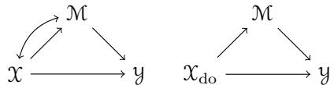

$" \Leftarrow " \mathrel { \left. \downarrow \right.} $ This direction follows indirectly by soundness and the hedge-criterion [57] (Lemma E.14). Alternatively, note that the proof of the other direction can (essentially) be traced backward, very briefly: Since $F ^ { \prime }$ is c-connected and $F ^ { \prime } \cap \tilde { X } = \emptyset$ , there is a c-component $G ^ { c }$ in $\mathbf { G } _ { \mathrm { d o } }$ containing $F ^ { \prime }$ in its inner nodes. By $F \cap { \tilde { X } } \neq \emptyset$ and $F$ being rooted on R there is a chain of children in $F$ from $x \in \tilde { X } \cap F$ to $F ^ { \prime } { \ ; }$ or from the perspective of its endpoint y in $F ^ { \prime } { : }$ there is a chain of (observable) parents in $F$ to x. Parents of observables cannot be simplified (Lemma A.12) away, so they must remain in any c-fragment of G.

Finite number of steps: The query-graph is finite, and gluing grows the intermediate result by at least one node. Further there are finitely many elements in K to choose from (for gluing), thus Algo. SVSearch terminates after a finite number of steps. For the other algorithms, see Lemma E.27. □

Corollary E.30 (IID Completeness, single context, empty conditioning set). By the hedgecriterion (Lemma E.14; cf. [57; 55]), algorithm EDAIdentify is complete in the (single context) IID case for do-interventions with empty conditioning set.

Remark: This result is analogous to the completeness of the id-algorithm (Lemma. E.15).

## E.4 Single-Context with Non-Empty Conditioning Set

In the conditional case, the reader may notice that seemingly our criterion and the one given by [56] disagree. Consider the following example:

Example E.31. Given observations and a simple intervention $\mathcal { X } _ { \mathrm { d o } } \in \mathcal { F } _ { \mathrm { i } }$ <sub>ntervene</sub>.

Observations:

We want to know $P ( \mathcal { Y } | \mathrm { d o } ( \mathcal { X } = x ) , \mathcal { M } = m )$

• According to [56] this query is identifiable.

• According to our logic it is not.

As it turns out, both assessments are correct. This happens, because we do not assume any (known / exploitable) internal structure on mechanisms (observed or intervened) while [56] implicitly does through rule 2 of the do-calculus.

We first illustrate the actual problem: Rule 2 of the do-calculus allows the replacement

$$
P ( \mathcal { Y } | \operatorname { d o } ( \mathcal { X } = x ) , \mathcal { M } = m ) = P ( \mathcal { Y } | \operatorname { d o } ( \mathcal { X } = x , \mathcal { M } = m ) ) .
$$

This replacement is correct, $i f { P ( \mathcal { X } _ { \mathrm { d o } } ) }$ is singular (only takes a single value), which rule 2 assumes but we do not (it is an internal structure of the intervened mechanism $\mathcal { X } _ { \mathrm { d o } } )$ . If the intervention were for example chosen as $\mathcal { X } _ { \mathrm { d o } } \sim \mathcal { N } ( 0 , 1 )$ , then conditioning on M generally will introduce selection-bias on $\mathcal { X } _ { \mathrm { d o } }$ . For estimation of $P _ { \theta } ( \mathbb { Y } | \mathbb { M } = m )$ (the intervention $\mathcal { X } _ { \mathrm { d o } }$ is now encapsulated as part of $\theta )$ , we have to estimate the joint distribution $P _ { \theta } ( \mathbb { Y } , \mathcal { M } )$ first – which is not identifiable from our observations (due to the confounder between X and M). The reader may convince themselves, that this assessment is correct, on basis of the confounder preventing an unbiased estimation of the selection-bias $P ( \mathcal { X } _ { \mathrm { d o } } | \mathcal { M } )$

So in general, the conditional efect discussed above is not identifiable, but under the constraint of $\mathcal { X } _ { \mathrm { d o } }$ taking only a single value it is. Both conclusions in example E.31 make sense, depending on the question we initially intended to ask. The evident next question to ask is: Can we, in our formulation, recover the results of do-calculus? I. e. can we draw conclusions under assumptions on the internal structure of $\mathcal { X } _ { \mathrm { d o } } \mathrm { ? }$ As it turns out, there are actually two diferent ways to achieve this:

(a) Conventionally, expressions like $P ( \mathcal { Y } | \mathrm { d o } ( \mathcal { X } = x ) , \mathcal { X } = x )$ are not considered. If the intervention on X is singular, there is no further information provided by its value. However, our formalism allows to ask for $P _ { \theta } ( \mathbb { Y } | \mathbb { M } = m , \mathcal { X } _ { \mathrm { d o } } = x )$ , and this does make sense if $\because \mathcal { X } _ { \mathrm { d o } }$ is not singular. Interestingly this query is identifiable (because $Y _ { x , m }$ is identifiable), so one can directly recover the notion of conditional queries as interpreted by the do-calculus (and [56]) by conditioning on intervened variables (including them in X<sup>˜</sup> for the basic query).

This approach does not require any additional theory and works as is. It does, however, not provide any insights about other internal structure afecting selection-bias.

(b) Similar to, for example, instrumental variables (example 5.8), we can extend our notion of regularity / computation: The rule we need is that for some kernels in $\mathcal { F } _ { \mathrm { s p e c i a l } } \subset \mathcal { F } _ { \mathrm { i n t e r v e n e } } \cup \mathcal { F } _ { \mathrm { m o d e l } }$ (containing for example all singular interventions in queries or experimental data) selection-bias is trivial, e. g. allowing for a regular functional $( \mu | \nu ) \mapsto \mu \mathrm { ~ i f ~ } \mu \in \mathcal { F } _ { \mathrm { s p e c i a l } }$ . Such additional classification of kernels (similar to instrumental variables) can be useful more generally. For example if X is multidimensional or categorical of the form ${ \mathcal { X } } \in \{ 1 , \ldots , m \} \times \{ 1 , \ldots , n \}$ and M depending only on one coordinate-projection $\pi _ { 1 } , \forall$ on the other coordinate-projection $\pi _ { 2 } .$ then if $P ( \mathcal X )$ is a product (i. e. the components relevant to M and Y are independent $\mathcal { X } _ { 1 } \perp \perp \mathcal { X } _ { 2 } )$ 2 the query of example E.31 is identifiable.

This approach is more complicated to implement, as it requires a custom notion of regularity, but if one is interested in complex problems with categorical or multidimensional variables, it may provide substantial insights.

In conclusion, the confusion seems to arise from the do-calculus conventionally being thought of as a set of causal inference rules. However, through rule 2, it allows additionally for conclusions based on the internal structure of interventions (and unrelated to causality). To reproduce the same results from a causal rule-set, one might have to add such an assumption about internal structure separately. This is possible for our approach in diferent ways, simply by conditioning on interventions, or by clarifying the rules of allowed computations for interventions known to satisfy suitable constraints.

## E.5 Standard Results for the Multi-Context, Experimental Case

In a seminal series of papers [5; 4; 6] (see also [34] for an overview) Bareinboim and Pearl studied the use of "selection-variables" for combining observations and experiments from multiple related contexts. This idea was also employed and further developed (e. g. under the name "context-variables") for causal discovery for example in [19; 27; 15] and has formed the technical and conceptual basis for most available results concerning causality in multi-context systems.

Many of the problems encountered and insights made possible by these approaches provided substantial motivation for the present paper. It hence seems natural assess how our formalism describes their "mz-transportability" setups. We primarily discuss the topic along the lines of [4] in this subsection, but reproduce its contents in language consistent with §E.1.

The setup from before is modified two-fold: Instead of one system, multiple systems (with known relations) are available, with further potentially diferent experiments (observations from intervened, by do-interventions, models). We start with two contexts π and $\pi ^ { * }$ (and add experiments later). The reader may want to have a look at Fig. 8, which illustrates many of the encountered concepts on an example.

Definition E.32 (Selection Diagrams). [4, Def. 1 (p. 4)] (slightly rephrased to make it clearer on which nodes D is defined): Let $( M , M ^ { * } )$ be a pair of SCMs relative to domains $( \pi , \pi ^ { * } )$ [domains are "labels" for the contexts] sharing a causal graph ${ \bf G } . \mathrm { ~ } ( M , M ^ { * } )$ is said to induce a selection diagram D if D is constructed as follows: D has nodes $\mathsf { \textbf { N } } \cup S$ , where S contains a "selection variable" $S _ { v }$ for each $v \in \mathcal { O }$ with $f _ { v } \neq f _ { v } ^ { * }$ or $P ( \eta _ { v } ) \neq P ( \eta _ { v } ^ { * } )$ , every edge in G is also an edge in $D ; D$ contains an extra edge $S _ { v }  v$ for each $S _ { v } \in S$

Remark E.33 (Changing Latents). This definition is not compatible with changing latent variables, but can immediately be interpreted in that case by adding a selection variable $S _ { v }$ also if a latent parent $l \in \mathrm { P a } _ { v } \cap L$ has changing mechanism $f _ { l } \neq f _ { l } ^ { * }$ or changing noise $P ( \eta _ { l } ) \neq P ( \eta _ { l } ^ { * } )$

Definition E.34 (mz-Transportability). [4, Def. $2 \ ( \mathrm { p . 4 } ) ]$ : Let $\mathbf { D } = \{ D ^ { ( 1 ) } , \ldots , D ^ { ( n ) } \}$ be a collection of selection diagrams relative to source domains $\Pi = \{ \pi _ { 1 } , \ldots , \pi _ { n } \}$ and a target domain $\pi ^ { * }$ , respectively [i. e. there are SCMs $M ^ { * }$ and $M _ { 1 } , \dots , M _ { n }$ and $D ^ { ( k ) }$ is a selectiondiagram for $( M _ { k } , M ^ { * } )$ , in particular they all share a causal graph G], and $Z _ { k }$ (and $Z ^ { * } )$ [subsets of $I _ { \mathrm { v a r s } } ]$ be the variables in which experiments can be conducted in domain $\pi _ { k }$ (and $\pi ^ { * } )$ . Let $( P ^ { k } , I _ { z } ^ { k } )$ be the pair of observational and interventional distributions of $\pi _ { k }$ [on subsets of $Z _ { k } ] \ [ \mathrm { \tilde { i } . e . } \ P ^ { k } = \bar { P } ( \{ \mathcal { X } _ { v } ^ { k } \} _ { v \in \mathcal { O } } )$ , where $\mathcal { X } _ { v } ^ { k }$ are the endogenous variables of $M _ { k }$ , and $I _ { z } ^ { k } = \cup _ { Z ^ { \prime } \subset Z _ { k } } \bar { P ( \{ \mathcal { X } _ { v } ^ { k } \} _ { v \in \mathcal { O } } | \operatorname { d o } ( Z ^ { \prime } = z ^ { \prime } ) ) }$ , where the union-symbol $\ ' \cup '$ means the collection of these distributions is considered], and in an analogous manner, $( P ^ { * } , P _ { z } ^ { * } )$ be the observational and interventional distributions of $\pi ^ { * }$

[Identifiability:] The causal efect $R = P ^ { * } ( Y | \mathrm { d o } ( X = x ) )$ ) is said to be mz-transportable, from Π to $\pi ^ { * }$ in D if $P ^ { * } ( Y | \mathrm { d o } ( X = x ) )$ is uniquely computable from $\cup _ { k } ( P ^ { k } , P _ { z } ^ { k } ) \cup ( P ^ { * } , P _ { z } ^ { * } )$ in any model [any collection of SCMs $M ^ { * } , M _ { 1 } , \ldots , M _ { n } ]$ that induces D.

Remark: This notion of identifiability used is conceptual very similar to Def. E.6.

Definition E.35 (mz\*-shedge). [4, Def. 5 (p. 6)]: Let $\mathbf { D } = \{ D ^ { ( 1 ) } , \ldots , D ^ { ( n ) } \}$ be a collection of selection diagrams relative to source domains $\Pi = \{ \pi _ { 1 } , \ldots , \pi _ { n } \}$ and a target domain $\pi ^ { * }$ respectively, $S _ { k }$ represents the collection of S-variables in the selection-diagram $D ^ { ( i ) }$ and let $D ^ { ( * ) } = \mathbf { G } ^ { * }$ be the causal diagram [graph] of $\pi ^ { * }$ . Let $( P ^ { k } , I _ { z } ^ { k } )$ be the pairs of observational and interventional [on subsets of $Z _ { k } ]$ ] distributions of $\pi _ { k }$ [as before], similar for $( P ^ { * } , I _ { z } ^ { * } )$

Consider an R-rooted hedge $( F , F ^ { \prime } )$ (Def. E.13). We say that the induced collection of pairs of R-rooted c-forests over each diagram $( ( F _ { 1 } , F _ { 1 } ^ { \prime } ) , \dots , ( F _ { n } , F _ { n } ^ { \prime } ) )$ ), is an mz-shedge for $P ^ { * } ( Y | \mathrm { d o } ( X = x ) )$ ) relative to experiments $( I _ { z } ^ { * } , I _ { z } ^ { 1 } , \ldots , I _ { z } ^ { n } )$ if they are all hedges and one of the following conditions hold for each domain $\pi _ { k } \ ( k \in \{ * , 1 , . . . , n \} )$

1. There exists at least one variable $s \in S _ { k }$ pointing to the induced diagram $F _ { k } ^ { \prime }$ , or

2. $( F _ { k } \setminus F _ { k } ^ { \prime } ) \cap Z _ { k } = \emptyset ,$ or

3. The collection of pairs of c-forests induced over diagrams, $( ( F _ { 1 } , F _ { 1 } ^ { \prime } ) , \dots , ( F _ { k } \setminus Z _ { k } ^ { * } , F _ { k } ^ { \prime } )$ $\ldots , ( F _ { n } , F _ { n } ^ { \prime } ) )$ , is also an mz-shedge relative to $( I _ { z } ^ { * } , I _ { z } ^ { 1 } , \ldots , I _ { z \backslash z _ { k } ^ { * } } , \ldots , I _ { z } ^ { n } )$ , where $Z _ { k } ^ { * } =$ $( F _ { k } \setminus F _ { k } ^ { \prime } ) \cap Z _ { k }$

Furthermore, we call mz\*-shedge the mz-shedge in which there exist[s] one directed path from $R \setminus ( R \cap \operatorname { D e s c } _ { F } ( X ) )$ to $R \cap \operatorname { D e s c } _ { F } ( X )$ not passing through X.

Remark E.36. Unfortunately the quoted definition is in places slightly unclear. The appendix to [4] containing proof-details also seems to not be available online (anymore?).

(a) The path from $R \setminus ( R \cap \operatorname { D e s c } _ { F } ( X ) )$ to $R \cap { \mathrm { D e s c } } _ { F } ( X ) { \mathrm { : } }$ : For the distinction between mz\*-shedges and mz-shedges [4, p. 6f] give the following example (lhs):

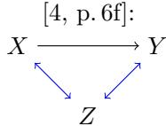

Extended Example:

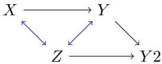

As $\left[ 4 , \mathrm { p . 6 f } \right]$ correctly point out $P ( Y | \operatorname { d o } ( X = x ) )$ is identifiable, while $P ( Y , Z | \operatorname { d o } ( X = x ) )$ is not. The requirement for the existence of a path (last sentence of the definition) is motivated as follows: $F = \{ X , Y , Z \}$ and $F ^ { \prime } = \{ Z , Y \}$ are c-forests rooted at $R = \{ Z , Y \}$ and the directed path "from $R \backslash ( R \cap \operatorname { D e s c } _ { F } ( X ) ) = \{ Z \}$ to $R \cap \operatorname { D e s c } _ { F } ( X ) = \{ Y \}$ not passing through $X ^ { \mathfrak { n } }$ does not exist. However, the definition of a hedge already asks for $\bar { R } \subset \bar { \mathrm { A n c } _ { \mathrm { d o } } ^ { L } } ( \bar { \tilde { Y } } )$ (where $\tilde { Y }$ is the set of target-nodes). In particular $( F , \bar { F ^ { \prime } } )$ is a hedge for $\tilde { Y } = \{ Y , Z \}$ (consistent with $P ( Y , Z | \operatorname { d o } ( X = x ) )$ being not identifiable), but it is not a hedge for $\tilde { Y } = \{ Y \}$ , because $Z$ is not an $\mathbf { G } _ { \mathrm { d o } }$ -ancestor of $Y$ . Indeed for $\tilde { Y } = \{ Y \}$ no hedge exists (removing Y from $F , F ^ { \prime }$ would break them being c-forests).

Note, that directed paths "not passing through $X ^ { \mathfrak { n } }$ are the same as paths in $\mathbf { G } _ { \mathrm { d o } }$ (if the path does not start at a node in X). So the definition seems to attempt to move the ancestral requirement from G -ancestors of $Y ^ { " } \mathrm { u p " }$ to $\mathbf { G } _ { \mathrm { d o } } .$ -ancestors of $( R \cap \operatorname { D e s c } _ { F } ( X ) )$ (there is also a small additional technical / notational problem here: if one of the sets $R \setminus ( R \cap \operatorname { D e s c } _ { F } ( X ) )$ or $R \cap \operatorname { D e s c } _ { F } ( X )$ is empty – which occurs especially for simple examples quite often – there obviously never exists such a path; the intended statements seems to be one about ancestral relationships in $\mathbf { G } _ { \mathrm { d o } } )$ . However, the weaker requirement of $R \subset \mathrm { A n c } _ { \mathrm { d o } } ^ { L } ( \tilde { Y } )$ already seems to prevent identification. Consider the second, extended, example above: If we want to identify (from a single context without experiments) $P ( Y _ { 2 } | \operatorname { d o } ( X = x ) )$ , then we notice that $( F , F ^ { \prime } )$ is a hedge as $R \subset \operatorname { A n c } _ { \mathrm { d o } } ^ { L } ( \{ Y _ { 2 } \} )$ . Yet there still exists no directed path from $R \setminus ( { \bar { R } } \cap \operatorname { D e s c } _ { F } ( X ) ) = \{ Z \}$ to $R \cap \operatorname { D e s c } _ { F } ( X ) = \{ Y \}$ . So for theorems 2 and 3 in $[ 4 , \mathrm { p . 7 } ]$ to hold, one cannot insist on the existence of such a path (otherwise the extended example above is a simple counter-example).

(b) The "inducedness" and point 3: The authors say a mz-shedge is "induced" from a pair $( F , F ^ { \prime } )$ . Since all contexts in Π share a graph this makes sense. However, point 3 then modifies a single $F _ { i }$ which clearly breaks the "inducedness" property, so clearly the result cannot "also [be] a mz-shedge". It appears that the statement intended by the authors was something like: $^ { \mathfrak { n } } ( ( F _ { 1 } , F _ { 1 } ^ { \prime } ) , \dots , ( F _ { n } , F _ { n } ^ { \prime } ) )$ has the mz-shedging property, if 1–3 hold" (where in 3 it is only required that the replacement "also has the mz-shedging proper $\mathrm { t y } ^ { \mathfrak { N } } )$ ; this can be written inductively in a non-cyclic form. Then an mz-shedge is a pair $( F , F ^ { \prime } )$ such that the induced $( ( F _ { 1 } , F _ { 1 } ^ { \prime } ) , \dots , ( F _ { n } , F _ { n } ^ { \prime } ) )$ has the shedging-property.

Our attempt at a slightly clearer phrasing is the following:

Definition E.37 (mz-shedge revisited). Interpreting [4, Def. $5 ~ ( \mathrm { p } . 6 ) ]$ : Let $\mathbf { D } = \{ D ^ { ( 1 ) }$ $D ^ { ( n ) } \}$ be a collection of selection diagrams relative to source domains $\Pi = \{ \pi _ { 1 } , \ldots , \pi _ { n } \}$ and a target domain $\pi ^ { * }$ , respectively, $S _ { k }$ represents the collection of S-variables in the selection-diagram $D ^ { ( i ) }$ and let $D ^ { ( * ) } = \mathbf { G } ^ { * }$ be the causal diagram [graph] of $\pi ^ { * }$ . Let $( P ^ { k } , I _ { z } ^ { k } )$ be the pairs of observational and interventional [on subsets of $Z _ { k } ]$ distributions of $\pi _ { k }$ [as before], similar for $( P ^ { * } , I _ { z } ^ { * } )$

We say that a collection of pairs of R-rooted c-forests, one for each diagram, $( ( F _ { 1 } , F _ { 1 } ^ { \prime } ) , \dots ,$ $\left( F _ { n } , F _ { n } ^ { \prime } \right) )$ , has the mz-shedging<sub>0</sub> property for $P ^ { * } ( Y | \mathrm { d o } ( X = x ) )$ ) relative to experiments $( I _ { z } ^ { * } , I _ { z } ^ { 1 } , \ldots , I _ { z } ^ { n } )$ if they are all hedges (Def. E.13) and one of the following conditions holds for each domain $\pi _ { k } \ ( k \in \{ * , 1 , . . . , n \} )$ :

1. There exists at least one variable $s \in S _ { k }$ pointing to the induced diagram $F _ { k } ^ { \prime }$ , or

2. $( F _ { k } \setminus F _ { k } ^ { \prime } ) \cap Z _ { k } = \emptyset .$

Inductively, $( ( F _ { 1 } , F _ { 1 } ^ { \prime } ) , \dots , ( F _ { n } , F _ { n } ^ { \prime } ) )$ , has the mz-shedgin $\boldsymbol { \mathrm { g } } _ { m + 1 }$ property for $P ^ { * } ( Y | \mathrm { d o } ( X = x ) )$ relative to experiments $( I _ { z } ^ { * } , I _ { z } ^ { 1 } , \ldots , I _ { z } ^ { n } )$ if they are all hedges (Def. E.13) and one of the following conditions holds for each domain $\pi _ { k } \ ( k \in \{ * , 1 , . . . , n \} )$ :

1. There exists at least one variable $s \in S _ { k }$ pointing to the induced diagram $F _ { k } ^ { \prime } { : }$ , or

2. The collection of pairs of c-forests induced over diagrams, $( ( F _ { 1 } , F _ { 1 } ^ { \prime } ) , \dots , ( F _ { k } \setminus Z _ { k } ^ { * } , F _ { k } ^ { \prime } )$ $\ldots , ( F _ { n } , F _ { n } ^ { \prime } ) )$ , is has the mz-shedging<sub>m</sub> property relative to $( I _ { z } ^ { * } , I _ { z } ^ { 1 } , \ldots , I _ { z \backslash z _ { k } ^ { * } } , \ldots , I _ { z } ^ { n } )$ where $Z _ { k } ^ { \ast } = ( F _ { k } \setminus F _ { k } ^ { \prime } ) \cap Z _ { k }$

$( ( F _ { 1 } , F _ { 1 } ^ { \prime } ) , \dots , ( F _ { n } , F _ { n } ^ { \prime } ) )$ , has the mz-shedging property for $P ^ { * } ( Y | \mathrm { d o } ( X = x ) )$ relative to experiments $( I _ { z } ^ { * } , I _ { z } ^ { 1 } , \ldots , I _ { z } ^ { n } )$ if ∃m $\in \mathbb { N } _ { 0 }$ such that it has the mz- $\operatorname { s h e d g i n g } _ { m }$ property for $P ^ { * } ( Y | \mathrm { d o } ( X = x ) )$ relative to experiments $( I _ { z } ^ { * } , I _ { z } ^ { 1 } , \ldots , I _ { z } ^ { n } )$

Consider an R-rooted hedge $( F , F ^ { \prime } )$ (Def. E.13). $( F , F ^ { \prime } )$ is a mz-shedge, for $P ^ { * } ( Y | \operatorname { d o } ( X =$ $x ) )$ relative to experiments $( I _ { z } ^ { * } , I _ { z } ^ { 1 } , \ldots , I _ { z } ^ { n } )$ , if the induced $( ( F _ { 1 } , F _ { 1 } ^ { \prime } ) , \dots , ( F _ { n } , F _ { n } ^ { \prime } ) )$ has the mz-shedging property for $P ^ { * } ( Y | \mathrm { d o } ( X = x ) )$ relative to experiments $( I _ { z } ^ { * } , I _ { z } ^ { 1 } , \ldots , I _ { z } ^ { n } )$

Lemma E.38 (Shedge-Criterion). Interpreting $/ 4 ,$ Thm. $\mathcal { S } \ ( p , \ 7 ) ] .$ Let ${ \bf D } = \{ D ^ { ( 1 ) } , \ldots ,$ ${ \cal D } ^ { ( n ) } \}$ be a collection of selection diagrams relative to source domains $\Pi = \{ \pi _ { 1 } , \ldots , \pi _ { n } \}$ and a target domain $\pi ^ { * }$ , respectively, and $\{ I _ { z } ^ { i } \} f o r i = \{ * , 1 , \dots , n \}$ defined appropriately. If there is a mz\*-shedge for the efect $R = P ^ { * } \dot { ( Y ) }$ | do $( X = x ) )$ relative to experiments $( I _ { z } ^ { * } , I _ { z } ^ { 1 } , \ldots , I _ { z } ^ { n } )$ in D, R is not mz-transportable (Def. E.34) from Π to $\pi ^ { * }$ in D.

Lemma E.39 (Completeness of TR<sup>mz</sup>-Algorithm). [4, Thm. $4 \ ( p . \ 8 ) ] .$ If the TR<sup>mz</sup>-algorithm $( / 4 , \ F i g . \ 3 \ ( p . \ 7 ) ] )$ fails to identify $P ( \tilde { Y } | \mathrm { d o } ( \tilde { X } = x ) )$ , then it outputs a graph-pair that contains as edge-subgraphs c-forests that span a mz\*-hshedge for $P ( \tilde { Y } | \mathrm { d o } ( \tilde { X } = \bar { x } ) )$ . [To our understanding, the same problem as with $B 7 ,$ Cor. 3 (p. 1225)] appears, see [55, Prop. 1 $( p . 7 ) ]$ and Lemma $E . 1 \llangle \rfloor$

As a corollary by using the shedge-criterion thus $/ 4 { ; }$ , Thm. $5 ~ ( p . 8 ) ] .$ The TR<sup>mz</sup>-algorithm is complete.

## E.6 Translating the Transportability Setup

It is possible to translate the mz-transport setup in two equivalent ways: as diferent systems sharing properties or as copies of the same system with selection-variables providing a multi-level structure (where the upper level is trivial $. /$ consists exclusively of nodes without edges connecting them).

Viewpoint – Diferent Systems Sharing Properties: As long as every context $c \in$ $I _ { \mathrm { d a t a s e t } } ^ { \mathrm { o b s } }$ has an infinite number of observations, it is only relevant what properties are shared with the query (which is always in $\pi ^ { * } )$ . For clarity we nevertheless give the full model (and modified Def. E.16):

Definition E.40 (IID-Model, Shared Properties). We call a model IID (shared properties), if it can be written in the following form: $I = I _ { \mathrm { d a t a s e t } } \times I _ { \mathrm { v a r s } } \times I _ { \mathrm { s a m p l e } }$ , where $| I _ { \mathrm { s a m p l e } } | = \infty$ , with symmetry-group $G = \mathfrak { S } _ { I _ { \mathrm { d a t a s e t } } \times I _ { \mathrm { s a m p l e } } }$ (acting trivially on the middle factor $I _ { \mathrm { v a r s } }$ of I), and variables $J _ { ( C , v ) } = C \times \{ v \} \times I _ { \mathrm { s a m p l e } }$ (where $C \subset I _ { \mathrm { d a t a s e t } } )$ with symmetry $H _ { C , v } = \mathfrak { S } _ { C \times I _ { \mathrm { s a m p l e } } } ,$ where $\mathfrak { S } _ { C } \subset \mathfrak { S } _ { I _ { \mathrm { d a t a s e t } } }$ is embedded as the permutations on elements of C extended by the identity on other elements of $I _ { \mathrm { d a t a s e t } }$

Lemma / Definition E.41. Given a mz-transport setup $M ^ { \mathrm { m z } }$ Def. E.34, and an intervention $P ( \tilde { Y } | \mathrm { d o } ( \tilde { X } = x ) )$ , then there is an IID (shared properties) model (Def. 2.6) $\mathcal { M } ( M ^ { \mathrm { m z } } )$ with $\begin{array} { r } { | I _ { \mathrm { d a t a s e t } } ^ { \mathrm { o b s } } | = \sum _ { k \in \{ * , 1 , \ldots , n \} } ( | I _ { z } ^ { k } | + 1 ) } \end{array}$ , call its single elements $( \pi _ { k } , Z ^ { \prime } )$ (where $Z ^ { \prime }$ is the actual intervention, cf. Def. E.34), $| I _ { \mathrm { d a t a s e t } } ^ { \mathrm { q u e r y } } | = 1$ , call its single element $\beta ,$ such that $\forall c = ( \pi _ { k } , Z ^ { \prime } ) \in I _ { \mathrm { d a t a s e t } } ^ { \mathrm { o b s } } , s \in I _ { \mathrm { s a m p l } 6 }$

$$
\begin{array} { r c l } { P = P ( \{ \mathfrak { X } _ { v } ^ { \pi _ { k } } \} _ { v \in \mathcal { O } } \setminus Z ^ { \prime } | \mathrm { d o } ( Z ^ { \prime } = z ^ { \prime } ) ) } & { = } & { P _ { \theta } ( \{ \mathcal { V } _ { i } \} _ { i \in \{ c \} \times ( \mathcal { O } \setminus Z ^ { \prime } ) \times \{ s \} } ) } \\ { P ( \tilde { Y } | \mathrm { d o } ( \tilde { X } = x ) ) } & { = } & { P _ { \theta } ( \{ \mathcal { V } _ { i } \} _ { i \in \{ \beta \} \times \tilde { Y } \times \{ * \} } ) , } \end{array}
$$

where $\mathcal { X } _ { v } ^ { \pi _ { k } }$ are the variables of SCM $M _ { k }$ (corresponding to context $\pi _ { k } )$ and ∗ is the single (relevant) "sample" of the query. This model is such that for $i = ( \beta , \tilde { x } , * )$ with $\tilde { x } \in \tilde { X }$ and for $i = ( ( \pi _ { k } , Z ^ { \prime } ) , \tilde { z } ^ { \prime } , s )$ with $\tilde { z } ^ { \prime } \in Z ^ { \prime }$ the corresponding mechanism $f _ { i } \in \mathcal { F } _ { \mathrm { i n t e r v e n e } }$ is known: It is singular at value x or $z ^ { \prime }$ respectively. The I-graph of $\mathcal { M } ( M ^ { \mathrm { m z } } )$ is the disjoint union of its restrictions to $\{ c \} \times I _ { \mathrm { v a r s } } \times \{ s \}$ which are, for $c = ( \pi _ { k } , Z ^ { \prime } )$ of the form $\mathbf { G } ^ { L }$ (the shared causal graph including latents) if $Z ^ { \prime } = \emptyset$ and $\mathbf { G } _ { \mathrm { d o } } ^ { L , Z ^ { \prime } }$ for the intervention on $Z ^ { \prime }$ and its restriction to $\{ \beta \} \times I _ { \mathrm { v a r s } } \times \{ * \}$ which is of the form $\mathbf { G } _ { \mathrm { d c } } ^ { L }$ (for the intervention on $\tilde { X } )$

The query graph (embedded into $\{ \beta \} \times I _ { \mathrm { v a r s } } \times \{ * \}$ , which is as before) can be defined as in the single-context case (Def. E.21). Similarly the classification of embeddings and results on definitions of identification carry over.

Viewpoint – Multi Level Structure: This is the viewpoint taken for example by [27] (even though the connection to multi-level statistics [14] is not made explicit).

Definition E.42 (IID-Model, Shared Properties). We call a model IID (shared model), if it can be written in the form Def. E.16 after extending the system as follows: Let $S : = I _ { \mathrm { v a r s } }$ be a disjoint copy of $I _ { \mathrm { v a r s } }$ . To avoid issues with observational support (Rmk. A.6) we follow the philosophy of [15]: We think of "context" as a hidden property of the system, and the (know) context $\pi _ { k }$ (the dataset of origin) as a proxy for this property (this also clarifies how to define context- / selection-variables as random elements): They are not realized per-sample but rather (at most) per data-set, more precisely: Add for all $v \in I _ { \mathrm { v a r s } }$ a variable $s _ { v } ^ { 0 }$ to $S ,$ and add (the single node in the I-graph) $s _ { v } ^ { 0 }$ as a parent to (the infinitely many nodes in the I-graph) of $( ( \pi ^ { * } , Z ^ { \prime } ) , v , s )$ for all $Z ^ { \prime } \subset Z _ { * }$ and for all $s \in I _ { \mathrm { s a m p l e } }$ an of $( \beta , v , * )$ (making it auxiliary for the query-graph). If $D _ { k }$ contains a selection-variable $S _ { v } .$ then add a index $s _ { v } ^ { k }$ to $S ,$ and add (the single node in the I-graph) $s _ { v } ^ { k }$ as a parent to (the infinitely many nodes in the I-graph) of $( ( \pi _ { k } , Z ^ { \prime } ) , v , s )$ for all $Z ^ { \prime } \subset Z _ { k }$ and for all $s \in I _ { \mathrm { s a m p l e } }$ . If $D _ { k }$ does not contain a selection-variable $S _ { v } ,$ instead add $s _ { v } ^ { 0 }$ as a parent of these variables. Finally add S to $I ,$ i. e. replace I by $I ^ { \prime } { = } I \sqcup S$ (a disjoint union). Further we assume the viewport is such that $S \cap { \mathsf { V } } ( N ) = \emptyset$ for all N.

## E.7 Multi-Context and Transportability

<table><tr><td></td><td> $\pi ^ { * } \ \mathrm { ( t a r g e t ) }$ </td><td> $\pi ^ { 1 }$ </td><td> $\pi ^ { 2 }$ </td></tr><tr><td>Selection- Diagram  $D _ { i }$ </td><td></td><td>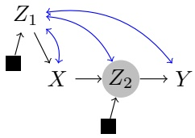</td><td>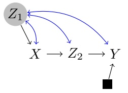</td></tr><tr><td>Observations</td><td>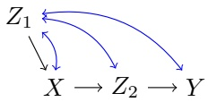</td><td>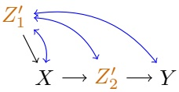</td><td>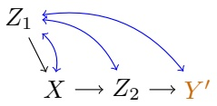</td></tr><tr><td>Intervention</td><td>Query:  $L _ { 2 } \quad \_ L _ { 3 }$  √ Y  $X ^ { \mathrm { d o } }  Z _ { 2 }  Y$ </td><td>Experiment: 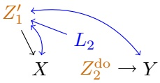</td><td>Experiment: 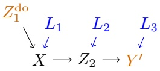</td></tr><tr><td>Extract</td><td> $X ^ { \mathrm { d o } } \in { \mathcal { F } } ^ { \mathrm { k n o w n } } .$  glue query from known and extracted.</td><td> $L _ { 3 }$  7  $\circ \longrightarrow Y$ </td><td> $L _ { 2 }$  √  $\circ \longrightarrow Z _ { 2 }$ </td></tr></table>

Figure 8: Example from [4, Fig. 1 c, d (p. 3)] (first row), filled squares are the selection-variables for each selection-diagram, experiments are possible in $Z _ { 2 } ~ ( \mathrm { f o r } ~ \pi ^ { 1 } )$ and in $Z _ { 1 }$ (for $\pi ^ { 2 } )$ respectively (gray circle nodes). Below (rows 2 and 3), are observations, observed interventions (experiments) and the query-graph. This is the data-available and the problem to solve (query). Finally the last line shows relevant extracted c-subgraphs (in this case both non-trivially extracted kernels are obtained from the respective experiment). Mechanisms with a prime (dark orange) difer compared to $\pi ^ { * }$

## Viewpoint – Diferent Systems Sharing Properties:

Lemma E.43 (ED-Phase). The ED-phase (the first two steps of Algo. EDAIdentify) outputs, after a finite number of steps, all c-fragments (cf. Lemma E.27) in one of: $\mathbf { G } ^ { \pi _ { k } }$ (the context $\pi _ { k }$ afects which kernels each node is aligned to) or $\mathbf { G } _ { \mathrm { d o } } ^ { \pi _ { k } , Z ^ { \prime } }$ for $Z ^ { \prime } \subset Z _ { k }$ . together with identification formulas.

Proof. As for Lemma E.27, note that diferent contexts correspond to disconnected graphcomponents in the I-graph. □

Lemma E.44 (Identification of Do-Interventions). Applying algorithm EDAIdentify to a query $P ( \mathbb { Y } | \operatorname { d o } ( \mathcal { X } ) = x )$ returns after a finite number of steps. It outputs a non-empty set (thus at least one sound identification strategy) if and only if there is a no mz-shedge (F, F<sup>′</sup>) for $P ( { \tilde { Y } } | \operatorname { d o } ( { \tilde { X } } = x ) )$ ).

Proof Sketch. Formal details about c-forests etc. are similar as in the proof of Lemma E.29. Additionally we use the following information:

We can use an extracted c-fragment for the mz-transport query, if its nodes are aligned to the same kernels as in the query-graph (as in $\pi ^ { * } )$ , this explains the condition "1." in the mz\*-shedge definition (Def. E.35).

We extract c-forests of $\mathbf { G } _ { \mathrm { d o } } ^ { \pi _ { k } , Z ^ { \prime } }$ , which have no edges into $Z ^ { \prime }$ (the targets of interventions in experimental data-sets), in particular nodes in $Z ^ { \prime }$ are their own c-components (aligned to $\mathcal { F } _ { \mathrm { i n t e r v e n e } }$ however), but also they thus cannot be part of any other c-fragment, which explains the appearance of conditions $" 2 . "$ and $" 3 . "$ in the $\mathrm { m } z ^ { * }$ -shedge definition (Def. E.35). □

Viewpoint – Multi Level Structure: This time, we will extract many results with pinned nodes: the hidden (potentially very complex) system properties encoded by selectionvariables are realized once for one or multiple systems, potentially including $\pi ^ { * }$ and thus our query.

Definition E.45 (Multi-Level Query-Graph). The query-graph from Def. E.21 needs some small modification. We add, for each node in $v \in \mathcal { N } _ { \mathrm { p r o p e r } } ^ { \mathrm { q u e r y } }$ , a pinned / auxiliary node aligned to the index $i = s _ { v } ^ { 0 } \in S \subset I$ . The underlying query thus contains a kernel $\delta _ { s _ { v } ^ { 0 } }$ in this place and we ask for the target $P _ { \theta } ^ { \mathcal { D } } ( \tilde { Y } )$ to be δ<sub>i</sub>-identified.

Condition "1." in the $\mathrm { m z ^ { * } } .$ -shedge definition (Def. E.35) now arises from agreement (or disagreement) of aligned indices at pinned nodes. In gluing $G ^ { \mathrm { o b s } } ( G ^ { \mathrm { q u e r y } } )$ this structural graph has aligned kernels $\delta _ { s _ { v } ^ { 0 } }$ in $\pi ^ { * }$ and $\delta _ { s _ { v } ^ { 0 } }$ or $\delta _ { s _ { v } ^ { k } }$ in $\pi ^ { k }$ which must be matched (as before), see Algo. SVSearch.

As before, experimental knowledge is the reason for the appearance of $" 2 . "$ and $" 3 . "$ .

## E.8 Mediation and Counterfactuals

Observations G:

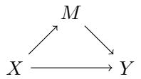

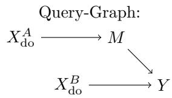  
Figure 9: Query graph yielding the mediation-formula.

Lemma E.46. On IID-observations for G in Fig. 9, extraction yields kernels $X = P ( X )$ $M _ { x } = P ( M | X = x )$ and $Y _ { x , m } = P ( Y | X = x , M = m )$ ) plus $X _ { \mathrm { d o } } ^ { A } , \bar { X } _ { \mathrm { d o } } ^ { B } \in \mathcal { F } _ { \mathrm { i n t e r v e n e } }$ , singular at ${ \tilde { x } } ^ { a }$ and $\tilde { x } ^ { b }$ . The structured query in Fig. 9 with nodes of interest $\{ Y \}$ is identifiable (and

identified by Algo. EDAIdentify) as for all $B \in B ( \mathcal { V } )$

$$
\begin{array} { r l } & { Y _ { [ m , x ^ { b } ] } \circ [ X _ { \mathrm { d o } } ^ { B } \otimes ( M _ { [ x ^ { a } ] } \circ X _ { \mathrm { d o } } ^ { A } ) ] ( B ) } \\ & { \ = \displaystyle \int X _ { \mathrm { d o } } ^ { B } ( d x ^ { b } ) \int X _ { \mathrm { d o } } ^ { A } ( d x ^ { a } ) \int M _ { x ^ { a } } ( \mathrm { d m } ) \int Y _ { x ^ { b } , m } ( \mathrm { d y } ) 1 _ { B } ( y ) } \\ & { \ = \displaystyle \int M _ { { \tilde { x } } ^ { a } } ( \mathrm { d m } ) \int Y _ { { \tilde { x } } ^ { b } , m } ( \mathrm { d y } ) 1 _ { B } ( y ) } \\ & { \ = \displaystyle \int P ( M = m | X = { \tilde { x } } ^ { a } ) \left( \int P ( Y = y | X = { \tilde { x } } ^ { b } , M = m ) 1 _ { B } ( y ) \mathrm { d y } \right) \mathrm { d m } . } \end{array}
$$

Taking the expectation of Y we get

$$
\begin{array} { l } { { \displaystyle E \Big [ Y _ { [ m , x ^ { b } ] } \circ [ X _ { \mathrm { d o } } ^ { B } \otimes \big ( M _ { [ x ^ { a } ] } \circ X _ { \mathrm { d o } } ^ { A } \big ) ] \Big ] } } \\ { { \displaystyle ~ = \int P ( M = m | X = \tilde { x } ^ { a } ) E [ Y = y | X = \tilde { x } ^ { b } , M = m ] \mathrm { d m } . } } \end{array}
$$

I. e. our algorithm finds the mediation-formula for natural direct efects (see $e . \ g . \ \not { p } \ 3 1 , \ E q . \ \delta ,$ $( p . 6 ) ] ;$ usually natural direct efects are defined as a diference of expectations, but taking the expectation in Y computes both terms of the diference immediately). With additional observed confounders $Z _ { 1 } , . . . ,$ extraction yields kernels with more arguments, the same confounders appear in the query, but are not in the variables of interest, thus get integrated out as in [31, Eq. $8 , \ ( p . \ 6 ) ]$

Considering that we never introduced counterfactuals, it may seem quite surprising, that we can describe natural direct efects, which conventionally are formalized via counterfactuals. However, maybe more accurately, the idea behind natural direct efects can be directly articulated with our more flexible query-language, thus counterfactuals are not actually needed to phrase the questions we wanted to ask in the first place. Many issues arising for counterfactuals, see e. g. [42], seem related to formulating practical questions via counterfactuals, rather than from the original questions.

From the formal perspective, counterfactuals are usually seen as fundamentally diferent from interventional queries, Pearl [30] even elevates them to a separate rank on his causal ladder. This special place is usually justified by the observation that there are counterfactuals that cannot be identified even given full experimental knowledge [2, Lemma $2 \ ( \mathrm { p 5 } ) \mathrm { . }$ ]. However such counter-examples usually rely on scm-mechanisms $f _ { i } ( \mathrm { p a } _ { i } , \eta _ { i } )$ which are not injective in their respective noise-term argument. This type of counter-example seems impossible with mechanisms formulated as probability-kernels, as pushing forward along non-injective mappings removes precisely the ambiguity in the model that allows examples like [2, Lemma $2 \ ( \mathrm { p 5 } ) ]$ . This raises the question if this kind of counterfactual is meaningful in the first place, which in turn puts the special role of counterfactuals in doubt.

## E.9 Conclusion

We focused our comparison to literature on the IID case and do-interventions (both in queries and experimental data). The primary reason for this decision is, that most results in the literature are in these setups or build on these setups. The relation to do-calculus and selection- / context-variables seems of central importance to understand – and validate – our approach in the light of well-understood problem-statements. While we can generalize some of the results immediately within the space of questions available in standard causal language (for example to soft-interventions; such individual problems have often also been studied, see e. g. [11]), the purpose of our formalism is not primarily on the extension to a single setup, rather it is in unifying many apparently completely diferent causal questions (like mediation, transportability, etc.) into a simple shared language and to expand the scope of accessible data-structures and accessible queries – not just algorithmically, but also in terms of what assumptions about data and what queries can be formulated and be made formally available in the first place.

## F Future Work

Our approach is very flexible by design, therefore it is impossible to fully explore all its consequences in a single paper. We summarize some insights and observations relevant to future work here. This should also hope clarify why the scope of the present paper was chosen as presented.

## F.1 Statistical Considerations

Our approach will usually extract small compounds of mechanisms, then compose (possibly many) such smaller pieces (via Lemma 3.8). A main reason for doing so, is the high symmetry of small compounds (Rmk. 4.3), besides improving asymptotic results, these can, in the finite data case, be learned on a larger part of the data. They might (having better symmetry) also be more robust under structure miss-specification. Further, the results of [17] for linear models suggest that at least for simple (low parameter-count per learned kernel) estimators such a local approach via many small pieces can actually be statistically very eficient.

It is also clear however, that for very complex estimators, or very large queries, statistical properties can also be adversely afected by this approach. The extraction phase, and especially the query-construction phase, should therefore potentially take statistical finitesample properties into account.

Our identification results are phrased relative to probability kernels, similar to how classical identification results are often phrased relative to conditional distributions [61; 56; 36; 49]. Depending on the actual quantity of interest, one will want to choose one’s estimator wisely, cf. C.3. It is in practice of course quite complex to do so, as suitable choices of estimators have to be propagated through regular computations in a correct, but also statistically eficient way. An instructive example for constructing non-trivial estimators for such a compound problem can be found e. g. in [26].

## F.2 Selection Bias and Correlated Missingness

Correlated missingness refers to statistical dependence between what is observed and the values taken by the observed (see e. g. [47] and the many subsequent works inspired by it). We could model this by allowing the viewport V itself to be random, for example by adding a (always observed) binary variable $\mathcal { B } _ { i }$ for each $i \in I$ such that $\mathcal { V } _ { i }$ is observed if and only if $\mathcal { B } _ { i } = 1$

This problem is closely related with selection bias: Selecting for $\mathcal { V } _ { i } \in A _ { i }$ essentially amounts to $\mathcal { B } _ { i } = 1$ if $\textstyle { \mathcal { V } } _ { i } \in A _ { i }$ and $\mathcal { B } _ { i } = 0$ otherwise. $\mathcal { B } _ { i }$ has in this case a single parent $( \mathcal { V } _ { i } )$ and selection-bias is modeled as a special case of correlated missingness.

Allowing for correlated missingness in this sense (i. e. generally) is evidently quite nontrivial: Already finding a suitable notion of what an assymptotic limit is supposed to be is not obvious anymore. Providing a comprehensive treatment is beyond the scope of this paper.

Special cases on the other hand should be rather accessible. Nested queries, ${ \ S } { \mathrm { D } } . 4 ,$ already allow for phrasing questions for systems under selection-bias. In the extraction phase, selection bias from a descendant can be for example included by "growing" a backdoor-free graph to envelop the selecting descendant, a disintegration by the selected nodes of the joint distribution of the enlarged $G ^ { \mathrm { o b s } }$ should be identifiable from data. In this case a computation in the sense of $\ S 3$ can no longer be complete (as nested graphs produced by the extraction-phase must be considered for regular computations).

## F.3 Structure Discovery

This paper describes models and how to use them for the identification of queries from data. The separate topic of discovery of such structure is left to future work. We want to briefly remark, that the model-structure as described has is not explicitly bounded in its complexity, meaning it can become more complicated with more data. In practice one does of course require some assumptions about the prior distribution of the model-structure that might appear. As a special case, the prior over model-structures can be chosen to allow only IID-models (with fixed product structure on $I )$ or only time-series etc., in these cases conventional causal discovery ideas apply. If the result of query-estimation does not depend on choice of representative in a discovered Markov equivalence-class, it is identifiable.

Generally, it is well-understood that employing some notion of invariant mechanism can substantially aid structure discovery [19; 27; 15; 37]. Considering that in our approach it is formally very clear what this means, holds promise to better understand the discovery of causal structures from data.

## F.4 Algorithmic Approach

We briefly explain what "absorbing" nodes in the main text should mean formally. Then we provide some clarification about some of the algorithms. The algorithmic approach is, as pointed out repeatedly in the main text, considered future work. We provide sketches for algorithms, because these seem quite helpful to better understand the concepts of the main text.

Constructing Families: Families of embeddings can be constructed from individual mechanisms by successive "absorbtion" of neighbors. This sub-section briefly explains what this means concretely.

Lemma F.1 (Direct Embedding of Model Mechanisms). Given a mechanism $( f _ { J } , J , H _ { J } , \mathrm { P a } _ { J } )$ (Def. 2.5) of the model M $( D e f . ~ 2 . 6 )$ , define the local graph $\mathcal { G }$ consisting of a single inner node y and external nodes $x _ { 1 } , \ldots , x _ { \kappa }$ (where κ is the number of arguments of the mechanisms kernel) with exactly one proper edge from each external to the single inner node. Modelalignment is to $\mu ^ { y } : = f _ { J }$ (and assigning arguments by $\mathrm { p a } ^ { y } ( i ) = x _ { i }$ in the structured kernel, cf. A.5). This local graph is embedded by the mappings $\psi _ { j } ( y ) = j$ and $\psi _ { j } ( x _ { k } ) = \mathrm { P a } _ { J } ^ { ( k ) } ( j )$ The collection $\{ \psi _ { j } \} _ { j \in J }$ is a family of local graph embeddings anchored at y.

Proof. We unravel definitions carefully. First G is an model-aligned local graph (Def. C.1) by construction. Next we check, that $\psi _ { j }$ is a local graph embedding (Def. 4.1):

Injectivity of $\psi _ { j } \colon \mathrm { B y }$ Def. 2.5, $\forall k : \operatorname { P a } ^ { ( k ) } ( j ) \neq j$ and k ̸= $k ^ { \prime } \Rightarrow \forall j \in J \colon \mathrm { P a } ^ { ( k ) } ( j ) \neq \mathrm { P a } ^ { ( k ^ { \prime } ) } ( j )$ Thus $\psi _ { j }$ is injective.

Proper node I-parents included (i): The only proper node is y, by definition of the I-graph (Def. 2.9), $\psi _ { j } ( y )$ has parents $\mathrm { P a } _ { I } ( \psi _ { j } ( y ) ) = \{ i \in I | \exists k : i = \mathrm { P a } _ { J ( \psi _ { i } ( y ) ) } ^ { ( k ) } ( \psi _ { j } ( y ) ) \}$ . By construction, $\psi _ { j } ( y ) = j \in J$ the (region of applicability of) the mechanism we are working on, so by definition $J ( \psi _ { j } ( y ) ) = J$ , also by $\psi _ { j } ( y ) = j$ , thus $\mathrm { P a } _ { J ( \psi _ { j } ( y ) ) } ^ { ( k ) } ( \psi _ { j } ( y ) ) \} = \mathrm { P a } _ { J } ^ { ( k ) } ( j ) =$ $\psi _ { j } ( x _ { k } )$ . In particular $i \in \mathrm { P a } _ { I } ( \psi _ { j } ( y ) ) \Rightarrow \exists k \colon i = \psi _ { j } ( x _ { k } )$

Proper edges equal I-graph edges (ii): The only proper node is $y ,$ by the previous point (and injectivity), there are exactly κ parents $\psi _ { j } ( x _ { k } )$ in the I-graph, these are also precisely the proper parents in the local graph.

Model Alignment (iii): The only proper node y is aligned to $f _ { J ( \psi _ { j } ( y ) ) } = f _ { J }$ (see above) by construction. There are no pinned nodes.

We check that the collection $\{ \psi _ { j } \} _ { j \in J }$ is a family of local graph embeddings (Def. 4.2).   
Trivial on Anchor $( \operatorname { I } ) \colon \psi _ { j } ( y ) = j$ by construction.

Rigidity (II): Using the notation $\psi _ { * } ( n ) : J _ { 0 }  I , j \mapsto \psi _ { j } ( n )$ . Let $h \in H = H _ { J }$ (by construction), and $j ^ { \prime } = h \cdot j$ with both $j , j ^ { \prime } \in J$ , we have to show $\psi _ { h \cdot j } ( n ) = h \cdot \psi _ { j } ( n )$ (cf. Def. 2.3, which explicitly defined equivariance restricted to subsets of I in this way). Case $1 \ ( n = y ) \colon \psi _ { h \cdot j } ( y ) = h \cdot j = \psi _ { h \cdot j } ( y )$ by contstruction. Case $2 ~ ( n = x _ { k } ) \colon \psi _ { h \cdot j } ( x _ { k } ) =$ $\mathrm { P a } _ { J } ^ { ( k ) } ( h \cdot j ) = h \cdot \mathrm { P a } _ { J } ^ { ( k ) } ( j ) = h \cdot \psi _ { j } ( x _ { k } )$ by H<sub>J</sub>-equivariance of $\mathrm { P a } _ { J } ^ { ( k ) } ~ ( \mathrm { D e f . ~ 2 . 5 ) }$

Freeness (III): For the (only) proper node $y ,$ we have to show $\psi _ { \ast } ( y )$ (see last point) is injective. This is the identity mapping id $\mathbf { \Phi } _ { J } : J \to J , j \mapsto j$ and clearly injective. □

Definition F.2 (Absorbed Parents). Given a family of local graph embeddings $\{ \psi _ { j } \} _ { j \in J _ { 0 } }$ and an external node $x \in \mathcal { N } _ { \mathrm { e x t e r n } } .$ , we say a family of local graph embeddings $\{ \psi _ { j } ^ { \prime } \} _ { j \in J _ { 0 } ^ { \prime } }$ , on $J _ { 0 } ^ { \prime } \subset J _ { 0 }$ , is an x-parent extension of $\{ \psi _ { j } \} _ { j \in J _ { 0 } }$ , if exactly one of

$$
\begin{array} { r } { \left\{ \begin{array} { l l } { \mathcal { N } _ { \mathrm { i n n e r } } ^ { \prime } = \mathcal { N } _ { \mathrm { i n n e r } } \cup \{ x \} } & { \mathrm { a n d } \ \mathcal { N } _ { \mathrm { p i n n e d } } ^ { \prime } = \mathcal { N } _ { \mathrm { p i n n e d } } , \mathrm { o r } } \\ { \mathcal { N } _ { \mathrm { i n n e r } } = \mathcal { N } _ { \mathrm { i n n e r } } } & { \mathrm { a n d } \ \mathcal { N } _ { \mathrm { p i n n e d } } ^ { \prime } = \mathcal { N } _ { \mathrm { p i n n e d } } \cup \{ x \} . } \end{array} \right. } \end{array}
$$

A unique minimal set of outer nodes, and edges, are determined by Def. 4.2. We assume $J _ { 0 } ^ { \prime }$ is chosen maximal with the above properties. We write for the set of x-parent extensions

AbsorbP $\mathfrak { i } ( \psi , x ) \ : = \ \left\{ \begin{array} { l } { \{ \psi _ { j } ^ { \prime } \} _ { j \in J _ { 0 } ^ { \prime } } \ | \ \{ \psi _ { j } ^ { \prime } \} _ { j \in J _ { 0 } ^ { \prime } } } \end{array} \right. | \ \{ \psi _ { j } ^ { \prime } \} _ { j \in J _ { 0 } ^ { \prime } }$ is an x-parent extension of $\{ \psi _ { j } \} _ { j \in J _ { 0 } } \quad \}$

We say an x-parent extension introduces the mechanism $J \in \mathcal { I }$ (Def. 2.6, Def. 2.5), if $x \in \mathcal { N } _ { \mathrm { i n n e r } } ^ { \prime }$ and $\mu ^ { x } = f _ { J }$ . For a mechanism $J \in { \mathcal { I } } ,$ we write Absorb $\mathrm { P a } ( \psi , x , J )$ for the subset of x-parent extensions introducing J and Absorb $\mathrm { P a } ( \psi , x , * )$ for the subset of x-parent extensions with $x \in \mathcal { N } _ { \mathrm { e x t e r n } } ^ { \prime }$

Remark F.3 (Freeness and Non-Uniqueness). The original family $\{ \psi _ { j } \} _ { j \in J _ { 0 } } ,$ , on the external node $x ,$ may be degenerate. In order for $\{ \psi _ { j } ^ { \prime } \} _ { j \in J _ { 0 } ^ { \prime } } ,$ to be free (Def. 4.2 (III)), if x is absorbed as proper node, it might be necessary to shrink ${ \bf \ddot { \cal J } } _ { 0 } .$ , and the resulting $J _ { 0 } ^ { \prime }$ need not be unique. In practice the best choice for $J _ { 0 } ^ { \prime }$ will also depend on latent- and ancestral-structure, see §F.4.

Definition F.4 (Absorbed Children). Given a family of local graph embeddings $\{ \psi _ { j } \} _ { j \in J _ { 0 } }$ and an inner node $l \in \mathcal { N } _ { \mathrm { i n n e r } }$ , we say a family of local graph embeddings $\{ \psi _ { j } ^ { \prime } \} _ { j \in J _ { 0 } ^ { \prime } }$ , on $J _ { 0 } ^ { \prime } \subset J _ { 0 }$ , is an l-child extension of $\{ \psi _ { j } \} _ { j \in J _ { 0 } } , \mathrm { i f } \ N _ { \mathrm { i n n e r } } ^ { \prime } = \ N _ { \mathrm { i n n e r } } \cup \{ w \}$ for $l \in \mathrm { P a } _ { \mathcal { G } ^ { \prime } } ( w )$ and $\mathcal { N } _ { \mathrm { p i n n e d } } = \mathcal { N } _ { \mathrm { p i n n e d } }$ . A unique minimal set of outer nodes, and edges, are determined by Def. 4.2. We assume $J _ { 0 } ^ { \prime }$ is chosen maximal with the above properties. We write for the set of l-child extensions

AbsorbCh $( \psi , l ) ~ : = ~ \{ ~ \psi _ { j } ^ { \prime } \} _ { j \in J _ { 0 } ^ { \prime } } ~ \vert ~ \{ \psi _ { j } ^ { \prime } \} _ { j \in J _ { 0 } ^ { \prime } }$ is an x-parent extension of $\{ \psi _ { j } \} _ { j \in J _ { 0 } } \quad \}$

We say an l-child extension introduces (J, k) if $\mu ^ { w } = f _ { J }$ and l is the kth parent of w. We call the l-child extension ancestral, if every valid ancestral structure $\mathcal { A }$ for $\psi ^ { \prime }$ contains $w  x$ to some $x \in \mathcal { N } _ { \mathrm { e x t e r n } }$

Finally, we call a tuple ${ \boldsymbol { \chi } } = ( l , J , { \boldsymbol { k } } )$ a relevant child, if an l-child extension introducing $( J , k )$ with $J _ { 0 } \neq \emptyset$ exists. We write $\mathrm { C h } ^ { \mathrm { r e l e v a n t } } ( \psi )$ for the set of relevant children of $\psi .$

Constructing C-Structures: We briefly provide some context on how theses definitions tie into the algorithms ExtractCS, ExtractCS-R.

Definition F.5 (Sub-Algorithms of Algo. ExtractCS). The following sub-routines are involved:

• minimal\_hidden $( \psi , L )$ for a family of embeddings and $L \subset \mathcal N$ returns the set of minimal latent subsets containing L, i. e. $\{ L ^ { \prime } \subset \mathfrak { L } _ { \psi } | L \subset L ^ { \prime } \}$ Remark: By Lemma C.17 this recursive relative search finds all $L$

• minimal\_ancestral\_structure $( \psi , L , A )$ for a family of embeddings and $L \in \mathfrak { L } _ { \psi }$ returns the set of minimal valid ancestral structures subsets containing $\mathcal { A }$ (in the sense of Def. C.16). Remark: By Lemma C.20 this recursive relative search finds all ${ \mathcal { A } } .$

• absorb\_parents $( \psi , P )$ for a family of embeddings and $P \subset \mathcal { N } _ { \mathrm { o u t e r } }$ returns the set of local graph embeddings $\operatorname { A b s o r b P a } ( \psi , P )$ (absorbing parents one-by-one in any order).

• absorb\_children\_ancestral $( \psi , C )$ for a family of embeddings and $C \subset { \mathcal { N } }$ returns the set of tuples $( \bar { \psi ^ { \prime } } , J , k )$ of ancestral local graph embeddings $\psi ^ { \prime }$ introducing $( J , k )$ , i. e. $\operatorname { A b s o r b C h } ( \psi , C )$ such that no additional ancestral child can be absorbed (i. e. continue until no more ancestral absorbtions are possible, discard "incomplete" intermediate results).

• absorb\_chi $\exists { \mathrm { d } } ( \psi , \chi )$ for a family of embeddings and a relevant child $\chi$ (cf. Def. F.4) returns the set of tuples $( \psi ^ { \prime } , J , k )$ of ancestral local graph embeddings $\psi ^ { \prime }$ introducing $\chi .$

Practical Considerations: From a practical perspective, the main challenge to an algorithmic realization seems to be in issues of non-uniqueness and ensued problems in structuring intermediate results.

It is also clear, that in very simple cases, like IID or mutli-context / transport IID cases an algorithmic realization, in light of classifications of embedded families (Lemma E.22), should be rather easy to attain. It may be helpful to restrict the setup initially.

There are some obvious practical modifications that should be made: Instead of infinitude of data-sets, it only matters if they are large enough to give an estimate suitable for the problem at hand. Also, for most cases Algo. EDAIdentify should probably not be evaluated eagerly, however the "matching" filters of Algo. SVSearch can efectively be propagated to absorbtion-operations, so these can be evaluated lazily with constraints making them much more attainable in practice.

It also seems that instead of inflating absorbtion-results to ensure freeness (Rmk. F.3) eagerly, it may be more practical to instead track possibly degnerate data-sets, then account for degeneracy in the very end. This not only simplifies absorbtion-operations in practice, but likely estimators can, in the finite sample case, benefit from additional data, even if it is to some degree degenerate (enforcing freeness corresponds to what in the missing data-literature seems to usually be called "deletion").

## G Mathematical Basics and Notation

This section revisits standard concepts from measure theory and probability theory, fixing notation for the remainder of the paper. We start by some standard results from measuretheory, in particular disintegrations. The focus is on writing statements as found in literature, under Ass. 2.1 (spaces are standard Borel) in a simplified language suitable for our purposes. Next we recall probability kernels and some commonly employed operations.

Afterwards results presented in §G.3 and §G.4 are still elementary, but tailored more specificially to the needs of the present discussion, which makes them hard to find in this form in the literature (we provide proofs for these results). Finally, even more customized, and to our knowledge novel in this form, results are presented separately in $\ S \mathrm { A }$ where kernels are systematically "structured" using certain graphs.

## G.1 Measure-Theory

We recall some standard definitions and translate results from literature, specifically from [22; 8], into a more uniform language – we will only consider standard Borel spaces (Ass. 2.1; see below) which will allow for a number of simplifications.

A topological space (X, O) has an induced Borel σ-algebra $B = \sigma ( \mathcal { O } )$ ; the pair $( X , B )$ is then a measurable space, a measure on this measurable space is called a Borel measure on X. A measurable space (X, B) is called Borel space (there are diferent conventions, we follow [22, p. 20]) if it is Borel-isomorphic (a Borel-morphism is a measurable map, an isomorphism is a morphism $f : X \to Y$ for which an inverse morphism g – i. e. satisfying $f g = \operatorname { i d } _ { Y }$ and $g f = \operatorname { i d } _ { X }$ – exists) to $( [ 0 , 1 ] , B _ { [ 0 , 1 ] } )$ , where $B _ { [ 0 , 1 ] }$ is the Borel σ-algebra induced by the standard (subspace in R) topology on [0, 1].

A Polish space X is a separable (there exists a dense countable subset) topological space $( X , { \mathcal { O } } )$ such that there exists a metric d inducing the topology O which makes $( X , d )$ into a complete (Cauchy-sequences converge) metric space. Polish spaces, endowed with their Borel σ-algebra are Borel spaces [22, Thm. A1.6].

Given a metric space $X , \mathrm { a }$ Borel measure λ on X is called a Radon measure $[ 8 , \mathrm { p . 2 9 3 } ]$ , if for all compact sets $K , \lambda K < \infty$ (compact subsets of Hausdorf-spaces – and metric spaces are Hausdorf – are closed, thus in the Borel σ-algebra), and $\forall B \in B : \lambda B = \operatorname* { s u p } _ { K \subset B } \lambda K$ (the supremum is over all compact $K \subset B )$ . A finite Borel-measure (thus in particular any probability measure) on a Polish space is Radon (see $\mathrm { e . g . \ [ 8 , \ p . 2 9 3 ] }$ and references therein).

A measure λ on $( X , { \mathcal { F } } )$ is called σ-finite if there is a countable union $X = \cup _ { i } X _ { i }$ of $X _ { i } ~ \in ~ \mathcal { F }$ such that $\forall i \ : \ \lambda X _ { i } \ < \ \infty$ . In particular every finite measure, and thus every probability-measure, is also σ-finite.

Finally note, that since metric spaces are Hausdorf and in Hausdorf-spaces points (subsets {t} containing a single point) are closed, they are in the Borel σ-algebra $\{ t \} \in B$ Further separable metric spaces are second countable, i. e. there is a countable basis of the topology O, thus of the induced Borel σ-algebra. In particular both is the case for Polish spaces with their Borel σ-algebra (i. e. for standard Borel spaces): individual points {t} are measurable and the σ-algebra is countably generated.

We will later specialize to $P = X \times Y$ and $\pi = \pi _ { X } : P \to X$ the coordinate-projection, but first note the following general result.

Definition G.1 (Disintegration). See e. g. [8, Def. 1 (p. 292)]: Let $\pi : ( P , A ) \to ( X , B )$ be a measurable map, λ a σ-finite measure on A, µ a σ-finite measure on $B { \mathrm { . } }$ , then:

We say λ has a $( \pi , \mu )$ -disintegration $\{ \lambda _ { x } \} _ { x \in X } , { \mathrm { i f } }$

(i) $\lambda _ { x }$ is a sigma-finite measure on ${ \mathcal { A } } ,$ concentrated on $\{ \pi ( p ) = x \} ( { \mathrm { i . e . ~ } } \lambda _ { x } \{ \pi ( p ) \neq x \} = 0$ for µ-almost all t).

(ii) ∀ non-negative measurable $\begin{array} { r } { f : P  \mathbb { R } _ { \ge 0 } \colon x \mapsto \int \lambda _ { x } ( \mathrm { d p } ) f ( p ) } \end{array}$ is measurable.

(iii) ∀ non-negative measurable $\begin{array} { r } { f : P \to \mathbb { R } _ { \geq 0 } \colon \int \lambda ( \mathrm { d p } ) f ( p ) = \int \mu ( \mathrm { d x } ) \int \lambda _ { x } ( \mathrm { d p } ) f ( p ) } \end{array}$

Theorem 3 (Existence and Uniqueness of Disintegrations). See $e .  g . \ [ 8 ,$ Thm. $1 ~ ( p . ~ 2 9 3 ) ] .$ Let λ be a σ-finite Radon measure on a metric space P (with its Borel σ-algebra), and let $\pi : { \cal P }  ( X , B )$ be measurable. Let $\mu$ be a σ-finite measure on B that dominates $\pi _ { * } \lambda$ $( i . e . \ \pi _ { * } \lambda B = 0 \Rightarrow \mu B = 0 )$ . If B is countably generated and contains all singleton sets, $\forall x \in X : \{ x \} \in B$ , then λ has a (π, µ)-disintegration.

Uniqueness: $I f \left\{ \lambda _ { x } \right\} , \left\{ \lambda _ { x } ^ { \prime } \right\}$ are two (π, µ)-disintegrations of λ, then $\mu \{ x \in X | \lambda _ { x } \neq \lambda _ { x } ^ { \prime } \} =$ 0, i. e. the disintegration is µ-almost everywhere unique.

Corollary G.2. Let X and Y be standard Borel spaces and λ a probability-measure on $X \times Y$ . Denote by $\pi _ { X } : X \times Y \to X$ the projection to the first coordinate. Set $\mu = ( \pi _ { X } ) _ { * } \lambda$ Then there is a µ-almost everywhere unique probability-kernel ν from X to Y , such that $\lambda = \mu \otimes \nu$ (cf. Def. G.8).

Proof. Both λ and $\mu$ are probability measures. Apply Thm. 3 to get $\lambda _ { x }$ with properties (i–iii) of Def. G.1. Define for $B \in B ( Y )$

$$
\nu _ { x } ( B ) : = \lambda _ { x } ( \{ x \} \times B ) .
$$

For all $B ^ { \prime } \in B ( X \times Y )$ and for all $x \in X$ by property (i):

$$
\begin{array} { r l } & { \lambda _ { x } ( B ^ { \prime } ) = \lambda _ { x } ( B ^ { \prime } \cap \{ x \} \times Y ) + \lambda _ { x } ( B ^ { \prime } \cap ( X - \{ x \} ) \times Y ) } \\ & { \qquad \stackrel { \mathrm { ( i ) } } { = } \lambda _ { x } ( B ^ { \prime } \cap \{ x \} \times Y ) \quad \mu \mathrm { - a l m o s t ~ e v e r y w h e r e } } \\ & { \qquad = \nu _ { x } ( \pi _ { Y } ( B ^ { \prime } \cap \{ x \} \times Y ) ) } \end{array}\tag{∗}
$$

We first use this relation to immediately conclude from properties (i) and (ii) (which holds in particular for indicator functions) that $\nu _ { x }$ is a probability kernel (for normalization, see [8, Thm. 2 (iii) (p. 294)]). Second, we use this relation to rewrite property (iii) with

$$
f ( p ) = 1 _ { B ^ { \prime } } ( p ) = 1 _ { \pi _ { X } ( B ^ { \prime } ) } ( \pi _ { X } ( p ) ) 1 _ { \pi _ { Y } ( B ^ { \prime } \cap \{ \pi _ { X } ( p ) \} \times Y ) } ( \pi _ { Y } ( p ) )
$$

as follows:

$$
\begin{array} { r l } { \lambda ( B ^ { t } ) = \int \lambda ( \Phi ) \mathrm { l } x ( \Phi ) } \\ & { \stackrel { \mathrm { ( a s s ) } } { = } \int \mu ( \mathrm { d } x ) \int \lambda x ( \Phi ) \mathrm { l } x ( \Phi ) } \\ & { = \int \mu ( \mathrm { d } x ) \mathrm { l } _ { x \leq \pi ^ { \prime } } ( x ) \int \lambda x ( \Phi ) \mathrm { l } _ { x \leq \pi ^ { \prime } } ( x ) \mathrm { r } ( \Phi ) \mathrm { r } ( x ( \Phi ) \times x ) ( \Phi ) \mathrm { r } ( \Phi ) } \\ & { \stackrel { \mathrm { ( i * ) } } { = } \int \mu ( \mathrm { d } x ) \mathrm { l } _ { x \leq \pi ^ { \prime } } ( x ) \int \lambda x ( \Phi ) \mathrm { l } _ { x \leq \pi ^ { \prime } } ( x ) \mathrm { r } ( \Phi ) \mathrm { d } x \times \lambda ( \Phi ) \mathrm { r } ( x ) ) } \\ & { = \int \mu ( \mathrm { d } x ) \mathrm { l } _ { x \leq \pi ^ { \prime } } ( x ) \lambda ( \Phi ) \mathrm { d } x \exp ( x ) \mathrm { l } _ { x \leq \pi ^ { \prime } } ( x ) \mathrm { l } _ { x \leq \pi ^ { \prime } } ( x ) ) } \\ & { = \int \mu ( \mathrm { d } x ) \mathrm { l } _ { x \leq \pi ^ { \prime } } ( x ) \delta ( x ) \mathrm { l } _ { x \leq \pi ^ { \prime } } ( x ) \mathrm { l } _ { x \leq \pi ^ { \prime } } ( x ) \mathrm { l } _ { x \leq \pi ^ { \prime } } ) } \\ & { = \int \mu ( \mathrm { d } x ) \mathrm { l } _ { x \leq \pi ^ { \prime } } ( x ) \int \alpha \big ( x ^ { \prime } ( \Phi ) \cdot \big ( x _ { \pi } ( \Phi ) \big ) \times x \big ) \mathrm { l } _ { x \leq \pi ^ { \prime } } ( x ) \mathrm { l } _ { x \leq \pi ^ { \prime } } ( x ) \mathrm { l } _ { x \leq \pi ^ { \prime } } } \\ &  = \int \mu ( \mathrm { d } x ) \mathrm { l } _ { x \leq \pi ^ { \prime } } ( x ) \int x _  \pi  \end{array}
$$

This demonstrates existence. For uniqueness, assume $\nu _ { x }$ and $\nu _ { x } ^ { \prime }$ are two probability-kernels with $\lambda = \mu \otimes \nu = \mu \otimes \nu ^ { \prime }$ . Then both $\lambda _ { x } ( B ^ { \prime } ) : = \nu _ { x } ( \pi _ { Y } ( B ^ { \prime } \cap \{ x \} \times Y ) )$ and $\lambda _ { x } ^ { \prime } ( B ^ { \prime } ) : =$ $\nu _ { x } ^ { \prime } ( \pi _ { Y } ( B ^ { \prime } \cap \{ x \} \times Y ) )$ are disintegrations (by reverting the arguments given above; the only one that is not evidently an equivalence is that our definition of kernel requires measurability only on indicator functions, but general integrals are limits over such indicator-function integrals, thus not more general in this case, i. e. Def. G.1ii follows from Def. G.4i) and thus $\mu \{ x \in X | \lambda _ { x } \neq \lambda _ { x } ^ { \prime } \} = 0$ by the uniqueness-part of Thm. 3. In particular, by equation (∗) also $\nu _ { x } = \nu _ { x } ^ { \prime } ,$ , µ-almost everywhere. □

Corollary G.3. Let S, X and Y be standard Borel spaces and $\lambda _ { s }$ a probability-kernel from S to $X \times Y$ . Denote by $\pi _ { X } : X \times Y \to X$ the projection to the first coordinate. Set $\mu _ { s } = ( \pi _ { X } ) _ { * } \lambda _ { s }$ Fix a supporting probability-measure ϑ on $S$ . Then there is a probability-kernel $\nu _ { s , x }$ from $S \times X$ to ${ \cal Y } ,$ such that $\lambda _ { s } = ( \mu \otimes \nu ) _ { s }$ and this kernel is ϑ ⊗ µ-almost everywhere unique in the sense that for and any two such ν and $\nu ^ { \prime } ;$

$$
( \vartheta \otimes \mu ) \{ ( s , x ) | \nu _ { s , x } \neq \nu _ { s , x } ^ { \prime } \} = 0
$$

Proof. Apply Cor. G.2 to $\vartheta \otimes \lambda$ with $\pi _ { 1 } : ( S \times X ) \times Y \to S \times X$

## G.2 Kernels and Basic Properties

There are multiple equivalent ways to define kernels, we use the following definition; the preliminary definition form the main text can be made mathematically rigorous and then agrees with this notion (Rmk. G.5).

Definition G.4 (Kernels). See $\mathrm { e . g . \ [ 2 2 , p . 1 9 ] }$ : Given measurable spaces $( S , S )$ and $( T , \mathcal { T } )$ a mapping $\mu : S \times \mathcal { T }  \bar { \mathbb { R } } _ { + }$ where $\bar { \mathbb { R } } _ { + } = \mathbb { R } _ { \geq 0 } \cup \{ \infty \}$ are the non-negative real numbers plus an element at infinity, then $\mu$ is called a (probability) kernel from (S, S) to $( T , \mathcal { T } )$ if

$$
{ \mathrm { ( i ) } } \ \forall B \in { \mathcal { T } } ;
$$

$$
\mu _ { s } B : S \to \bar { \mathbb { R } } _ { + } , ~ s \mapsto \mu ( s , B )
$$

is S-measurable.

$$
( \operatorname { i i } ) \ \forall s \in S \colon
$$

$$
\mu _ { s } : { \mathcal { T } }  { \bar { \mathbb { R } } } _ { + } , B \mapsto \mu ( s , B )
$$

is a (probability) measure.

Remark G.5. Given a measurable space $( S , S )$ , on the set $\mathcal { M } ( \boldsymbol { S } )$ of the σ-finite measures on $s ,$ one defines the σ-algebra induced by mappings of the form $\pi _ { B } : { \mathcal { M } } ( S ) \to { \bar { \mathbb { R } } } _ { + } , \mu \mapsto \mu B$ (i. e. the smallest σ-algebra for which all these projects are measurable w. r. t. the Borel σ-algebra on the reals; see $\mathrm { e . g . \ [ 2 2 , \ p . 1 8 ] ) }$ . In particular the probability measures ${ \mathcal { P } } ( S ) = \pi _ { S } ^ { - 1 } { \bar { ( \{ 1 \} ) } }$ are a measurable subset ${ \mathcal { P } } ( S ) \subset { \mathcal { M } } ( S )$ , thus possess an induced σ-algebra. Then $\mu$ is a probability-kernel from $( S , S ) \mathrm { t o } \left( T , T \right)$ according to Def. $\mathrm { G . 4 } ,$ if and only if $S \to \mathcal { P } ( \mathcal { T } ) , s \mapsto \mu _ { s }$ is measurable [22, Lemma 1.37 (p. 19)]. I. e. the intuition that probability kernels are measurevalued mappings is formally correct in this sense and the preliminary Def. 2.2 can be made precise by fixing this σ-algebra.

Example G.6. Given a probability-kernel $\mu$ from $( S , S )$ to $( T , \mathcal { T } )$ , then there is a mapping $f : S \times \lbrack 0 , 1 ]  T$ and a uniform random variable $\eta \sim U ( [ 0 , 1 ] )$ such that $\forall s \in S : f ( s , \eta )$ has distribution $\mu _ { s } ~ [ 2 2$ , Lemma $2 . 2 2 \ ( \mathrm { p . 3 4 } ) ]$ . The reader accustomed to SCMs in the notation given a noise-term η and a mapping $f$ may thus think about probability-kernels as the analogue of the law of a random variable for causal mechanisms. The domain $S$ corresponds to the value-space of the parents.

Remark: Given random variables $\vartheta _ { 1 } , \ldots , \vartheta _ { n }$ , the new random variable $\eta$ can be chosen independent $\eta \perp \perp \left( \vartheta _ { 1 } , \ldots , \vartheta _ { n } \right)$

Conversely, given a measurable mapping $f : S \times N  T$ and a random element $\eta \in N$ then mapping to the push-forward $s \mapsto f ( s , \eta ) _ { \ast } P = f ( s , \cdot ) _ { \ast } \eta _ { \ast } P \in \mathcal { P } ( T )$ is measurable, thus defines a probability kernel (see remark G.5).

Remark G.7. There are in general many choices for f and $\eta$ in the example G.6 above. This ambiguity goes far beyond simply transforming η to a universal uniform. Indeed even after standardizing on uniform noise, besides flipping it to $1 - \eta$ , without continuity-requirements on $f$ we can arbitrarily tear apart and reassemble the unit interval (and adapt $f$ accordingly) or choose non-injective $f$ and so on. The corresponding probability-kernel may then be thought of as a means of representing the equivalence-class of indistinguishable pairs $( f , P ( \eta ) )$ .

Kernels can easily be arranged together to describe more complex joint distributions $/$ kernels:

Definition G.8 (Product of Kernels). See $\mathrm { e . g . \ [ 2 2 , p . 1 9 ] }$ . Given measurable spaces $( S , S )$ $( T , T ) , ( U , \mathcal { U } )$ and (probability-)kernels $\mu : S \times \mathcal { T }  \mathbb { R } _ { > 0 }$ and $\nu : S \times T \times \mathcal { U } \to \mathbb { R } _ { > 0 }$ , define the product $\mu \otimes \nu : S \times ( \mathcal { T } \otimes \mathcal { U } ) \to \mathbb { R } _ { \geq 0 }$ as the (probability-)kernel given by

$$
\forall B \in { \mathcal { T } } \otimes { \mathcal { U } } : \quad | \mu \otimes \nu ] ( s , B ) = \int \mu ( s , \mathrm { d t } ) \int \nu ( s , t , \mathrm { d u } ) 1 _ { B } ( t , u ) .
$$

Example G.9. Given probability-kernels $\mu$ from $\{ * \}$ (the one-element set) to $S ,$ and ν from $\{ * \} \times S = S$ to $T _ { : }$ , then by example $\mathrm { G . 6 } ,$ there are mappings $g : \{ * \}  S , f : S \times [ 0 , 1 ]  T$ and independent uniform random variables $\eta _ { x } , \eta _ { y } \sim U ( [ 0 , 1 ] )$ such that $\mathcal { X } : = g ( \eta _ { x } )$ has distribution $\mu$ and $\forall s \in S : f ( s , \eta _ { y } )$ has distribution $\nu _ { s }$ . If we define $\mathcal { Y } : = f ( \mathcal { X } , \eta _ { y } )$ , then the pair (X, Y) has joint distribution $\mu \otimes \nu$ , as can be verified by a simple computation.

The reader accustomed to SCMs in the notation given an noise-terms η and a mappings $f$ may thus think about products of probability-kernels as a generalization $( \mu$ need not, in general, be defined on the trivial space $\{ * \} )$ of the law of the joint distribution of a causal model $\mathcal X  \mathcal Y$ . Concerning the choice of domain for $\mu ,$ , note that in the case of ν above (which does have a non-trivial domain $S )$ , ν encodes $P ( \mathbb { y } | \mathcal { X } )$ , and its domain corresponds to the value-space of X. Similarly, the domain of $\mu$ relates to conditioning on causal ancestors, if a suitable joint distribution to be conditioned on exists (already for non-stationary time-series, this is typically not the case, see example 4.11).

Lemma / Definition G.10 (Properties of Products). Products have the following properties:

(i) Associativity:

$$
\xi \otimes [ \mu \otimes \nu ] = [ \xi \otimes \mu ] \otimes \nu
$$

(ii) Trivial marginalization on the right $( U \in { \mathcal { U } }$ is the full space):

$$
\begin{array} { r l } { \forall B \in { \mathcal { T } } : } & { { } [ \mu \otimes \nu ] ( B \times U ) = \mu ( B ) } \end{array}
$$

We will write marg $ _ { \cdot  } ( \mu \otimes \nu ) = \mu$ for this operator, uniquely computing µ from $\mu \otimes \nu$ Proof. (i) Use $\pi _ { u w } : T \times U \times W \to U \times W$ and set $B _ { t } : = \pi _ { u w } ( B \cap \{ t \} \times U \times W )$ , then by definition $\forall B \in T \otimes \mathcal { U } \otimes \mathcal { W } = B ( T \times U \times W )$ (using Ass. 2.1):

$$
\begin{array} { r l } & { \bigl [ \xi \otimes [ \mu \otimes \nu ] \bigr ] ( s , B ) = \int \xi ( s , \mathrm { d t } ) \int [ \mu \otimes \nu ] \bigl ( ( s , t ) , \mathrm { d u d w } \bigr ) \mathrm { 1 } _ { B } ( t , u , w ) } \\ & { \qquad = \int \xi ( s , \mathrm { d t } ) \int [ \mu \otimes \nu ] \bigl ( ( s , t ) , \mathrm { d u d w } \bigr ) \mathrm { 1 } _ { B _ { t } } ( u , w ) } \\ & { \qquad = \int \xi ( s , \mathrm { d t } ) [ \mu \otimes \nu ] \bigl ( ( s , t ) , B _ { t } \bigr ) } \\ & { \qquad = \int \xi ( s , \mathrm { d t } ) \int \mu ( ( s , t ) , \mathrm { d u } ) \int \nu ( ( s , t , u ) , \mathrm { d w } ) \mathrm { 1 } _ { B _ { t } } ( u , w ) } \\ & { \qquad = \int \xi ( s , \mathrm { d t } ) \int \mu ( ( s , t ) , \mathrm { d u } ) \int \nu ( ( s , t , u ) , \mathrm { d w } ) \mathrm { 1 } _ { B } ( t , u , w ) . } \end{array}
$$

A similar argument expands $[ \xi \otimes \mu ] \otimes \nu$ into the same ("un-associated") expression.

(ii) By Ass. 2.1, $\mathcal { T } \otimes \mathcal { U } = B ( T \times U )$ , in particular $\forall B \in \mathcal { T }$ , also $B \times U \in \mathcal { T } \otimes \mathcal { U }$ is measurable (so the expression is well-defined). By definition,

$$
\begin{array} { l } { { [ \mu \otimes \nu ] ( s , B \times U ) = \displaystyle \int \mu ( s , \mathrm { d t } ) \displaystyle \int \nu ( s , t , \mathrm { d u } ) { \bf 1 } _ { B \times U } ( t , u ) } } \\ { { { } ~ = ~ \displaystyle \int \mu ( s , \mathrm { d t } ) \displaystyle \int \nu ( s , t , \mathrm { d u } ) { \bf 1 } _ { B } ( t ) } } \\ { { { } ~ = ~ \displaystyle \int \mu ( s , \mathrm { d t } ) { \bf 1 } _ { B } ( t ) \displaystyle \int \nu ( s , t , \mathrm { d u } ) } } \\ { { { } ~ = ~ \displaystyle \int \mu ( s , \mathrm { d t } ) { \bf 1 } _ { B } ( t ) = \mu ( s , B ) . } } \end{array}
$$

The last line is obtained by ν being a probability-kernel (normalized to 1) and definition of the integral. □

Definition G.11 (Composition of Kernels). Given measurable spaces $( S , S ) , ( T , { \mathcal { T } } ) , ( U , { \mathcal { U } } )$ and (probability-)kernels $\mu : S \times \mathcal { T }  \mathbb { R } _ { \geq 0 }$ and $\nu : S \times T \times \mathcal { U } \to \mathbb { R } _ { \geq 0 }$ , define the composition $\nu \circ \mu : S \times \mathcal { U } \to \mathbb { R } _ { \ge 0 }$ as the (probability-)kernel given by

$$
\forall B \in \mathcal { U } : \quad ( \nu \circ \mu ) ( B ) : = [ \mu \otimes \nu ] ( T \times B ) .
$$

Example G.12. Extending example G.9, note that the composition $\nu \circ \mu$

$$
\begin{array} { c } { { ( \nu \circ \mu ) ( B ) = [ \mu \otimes \nu ] ( T \times B ) } } \\ { { = \displaystyle \int \mu ( \mathrm { d t } ) \int \nu ( t , \mathrm { d s } ) 1 _ { B } ( s ) } } \end{array}
$$

simply integrates out $\mu$ corresponding to X in example G.9. The result is thus simply $P ( \mathbb { y } )$ Why is this a composition? Since $\mathcal { Y }$ causally depends on X, it also "sees" the noise $\eta _ { X }$ injected at ${ \mathcal { X } } .$ , and the distribution of $\mathcal { Y }$ is only fully described from a suitable combination of the mechanisms $\mu$ at X and ν at Y.

Lemma G.13 (Properties of Compositions). Compositions are associative:

$$
( \nu \circ \mu ) \circ \xi = \nu \circ ( \mu \circ \xi )
$$

Warning: The emerging ring-like algebraic structure does not right-distribute, generally

$$
\begin{array} { r l r } { [ \mu \otimes \nu ] \circ \xi } & { { } \neq } & { ( \mu \circ \xi ) \otimes ( \nu \circ \xi ) , \mathrm { { s e e ~ L e m m a ~ G . 1 8 i i , ~ G . 2 7 i i i } . } } \end{array}
$$

Proof. We again make use of $\mathcal { T } \otimes \mathcal { U } \otimes \mathcal { W } = \mathcal { B } ( T \times U \times W )$ (by Ass. 2.1). By definition $\forall B \in \mathcal { W }$ ，

$$
\begin{array} { r l } { \big ( ( \nu \circ \mu ) \circ \xi \big ) ( s , B ) = [ \xi \otimes \langle \nu \circ \mu \rangle ] ( s , T \times B ) } \\ & { = \int \xi ( s , \mathrm { d i f } ) \int ( \nu \circ \mu ) \big ( ( s , t ) , \mathrm { d w } \big ) \mathrm { l } _ { T \times B } ( t , w ) } \\ & { = \int \xi ( s , \mathrm { d i f } ) \int ( \nu \circ \mu ) \big ( ( s , t ) , \mathrm { d w } \big ) \mathrm { l } _ { B } ( w ) } \\ & { = \int \xi ( s , \mathrm { d i f } ) ( \nu \circ \mu ) \big ( ( s , t ) , B \big ) } \\ & { = \int \xi ( s , \mathrm { d i f } ) \mu \otimes \nu \big ( | ( s , t ) , B \big ) } \\ & { = \int \xi ( s , \mathrm { d i f } ) \mu \otimes \nu \big ( | ( s , t ) , \mathrm { d i f } \big ) \nu \big ( ( s , t , u ) , \mathrm { d w } \big ) \mathrm { l } _ { U \times B } ( u , w ) } \\ & { = \int \xi ( s , \mathrm { d i f } ) \int \mu ( ( s , t ) , \mathrm { d i f } ) \int \nu \big ( ( s , t , u ) , \mathrm { d w } \big ) \mathrm { l } _ { U \times B } ( u , w ) } \\ & { = \int \xi ( s , \mathrm { d i f } ) \int \mu ( ( s , t ) , \mathrm { d i f } ) \int \nu \big ( ( s , t , u ) , \mathrm { d w } \big ) \mathrm { l } _ { D } ( w ) } \end{array}
$$

Again, the same "un-associated" form can similarly be obtained for $\nu \circ ( \mu \circ \xi )$ □

Knowing $\mu$ and $\nu ,$ we can obviously obtain $\mu \otimes \nu ,$ interestingly the opposite is also true (beware of the warning in the previous lemma G.13 however) via disintegrations (see [8] for a very nice overview):

Lemma / Definition G.14 (Disintegration). Let $( S , B ( S ) ) , ( X , B ( X ) )$ and $( Y , B ( Y ) )$ be standard Borel spaces (Ass. 2.1) and $\lambda _ { s }$ a probability-kernel from S to $X \times Y$ . Denote by $\pi _ { X } : X \times Y \to X$ the projection to the first coordinate and set $\mu _ { s } = ( \pi _ { X } ) _ { * } \lambda _ { s }$ (then $\mu _ { s } ( B ) = \lambda _ { s } ( B \times Y )$ , so this marginalizes the Y -coordinate away). Then there is a probabilitykernel $\nu$ from $S \times X$ to $Y ,$ , such that $\lambda = \mu \otimes \nu .$ . This kernel is unique almost everywhere relative to (any fixed choice of) a supporting probability measure $\vartheta$ on $S _ { ; }$ , in the sense that for any two such ν and $\nu ^ { \prime } ;$

$$
[ \vartheta \otimes \mu ] \{ ( s , x ) | \nu _ { s , x } \neq \nu _ { s , x } ^ { \prime } \} = 0
$$

We will write disint ${ \bf \Phi } _ {  } ( \mu \otimes \nu ) = \nu $ for this operator, uniquely (in the sense defined above; see also Rmk. A.6) computing ν from $\mu \otimes \nu .$

Proof. This was already proofed as Cor. G.3, as a consequence of standard results [8] in §G.1 above. □

Example G.15. If we think of λ as a joint distribution $P ( \mathcal X , \mathcal Y )$ , then $\mu$ (by marginalization from the right, lemma G.10ii) contains precisely the information about $P ( \mathcal X )$ (see example G.9). By example G.6 the constructed kernel $\nu$ (for trivial $S = \left\{ * \right\} )$ corresponds to $P ( \mathbb { y } | \mathcal { X } )$ so disintegration states in this language that the (regular version [22, Thm. 5.3 (p. 84)] of) the conditional distribution $P ( \mathbb { y } | \mathcal { X } )$ is unique and thus can be reconstructed from knowledge of the joint distribution; see also [22, Thm. 5.4 (p. 85)].

It does not generally make sense to talk about commutativity of $\otimes$ as domains of the involved kernels are not generally suitable for exchanging the order, we will come back to this in Lemma G.27i. For now, we make the following observation:

Definition G.16 (Anti-Causal Disintegration). Given are standard Borel spaces $( S , B ( S ) )$ , $( T , B ( T ) ) , ( U , B ( U ) )$ ) and (probability-)kernels $\mu : S \times B ( T ) \to \mathbb { R } _ { > 0 }$ and $\nu : S \times T \times B ( U ) \to$ $\mathbb { R } _ { \geq 0 }$ . For $B \subset X \times Y$ denote by $B ^ { t } = \{ ( y , x ) \in Y \times X | ( x , y ) \in B \}$ the "transposed" set<sup>2</sup>.

For a kernel λ from S to $X \times Y$ denote

$$
\forall B \in { \mathcal { B } } ( Y \times X ) : \quad \lambda _ { s } ^ { t } ( B ) : = \lambda _ { s } ( B ^ { t } ) .
$$

If $\lambda = \mu \otimes \nu ,$ , then lemma G.14 produces a disintegration of $\lambda ^ { t } = \xi \otimes \vartheta$ . We will denote $\xi : = \mathrm { m a r g } _ {  } ( \lambda ^ { t } )$ by $\nu \circ \mu$ (as will be justified by Lemma G.18i) and $\vartheta : = \mathrm { d i s i n t } _ {  } ( \lambda ^ { t } )$ by $( \mu \vert \nu )$ , thus (definitionally)

$$
[ \mu \otimes \nu ] ^ { t } = ( \nu \circ \mu ) \otimes ( \mu | \nu ) ,
$$

where $\nu \circ \mu$ is a probability-kernel from S to $U$ and $( \mu \vert \nu )$ is a probability-kernel from $S \times U$ to $T$

Example G.17. Given a joint distribution for $( { \mathcal { X } } , { \mathcal { Y } } )$ , from a causal model $\mathcal { X }  \mathcal { Y } .$ , there is a "causal" conditioning $P ( \mathbb { y } | \mathcal { X } )$ which is given directly by the causal mechanism ν alone. But there is of course also an anti-causal $P ( \mathcal { X } | \mathcal { Y } )$ that is uniquely (in a suitable sense) determined by the joint distribution. The joint distribution is $P ( \mathfrak { X } , \mathfrak { Y } ) = P ( \mathfrak { X } | \mathfrak { Y } ) P ( \mathfrak { Y } )$ – however $P ( \mathbb { y } )$ is not trivially given by the mechanism on Y, rather by the composition $\nu \circ \mu$ (cf. example G.12). Similarly the anti-causal disintegration is a property of the joint distribution and depends on both $\mu$ and $\nu .$

Lemma G.18 (Properties of Anti-Causal Disintegrations). The kernels $\xi$ and $\vartheta = : ( \mu | \nu )$ in Def. G.16 have the following properties:

(i) $\xi = \nu \circ \mu$ (justifying the notation used in Def. G.16).

$$
( i i ) \ ( \mu | \nu ) \circ ( \nu \circ \mu ) = \mu \ a n d \left( \mu \circ \xi \right) \otimes \left( \nu \circ ( \xi | \mu ) \right) = \left[ \mu \otimes \nu \right] \circ \xi .
$$

Proof. (i) This follows immediately from Lemma G.10 (ii) and the definition of composition (using again Ass. 2.1):

$$
\begin{array} { r l } & { \xi ( s , B ) = [ \xi \otimes \vartheta ] ( s , B \times T ) } \\ & { \qquad = [ \mu \otimes \nu ] ^ { t } ( s , B \times T ) } \\ & { \qquad = [ \mu \otimes \nu ] ( s , T \times B ) } \\ & { \qquad = ( \nu \circ \mu ) ( s , B ) . } \end{array}
$$

(ii) By definition of composition and the anti-causal disintegration, and Lemma G.10 (ii):

$$
\begin{array} { r l } & { \big ( ( \mu | \nu ) \circ ( \nu \circ \mu ) \big ) ( s , B ) = [ ( \nu \circ \mu ) \otimes ( \mu | \nu ) ] ( s , U \times B ) } \\ & { \qquad = [ \mu \otimes \nu ] ^ { t } ( s , U \times B ) } \\ & { \qquad = [ \mu \otimes \nu ] ( s , B \times U ) } \\ & { \qquad = \mu ( s , B ) } \end{array}
$$

Given that compositions are defined as marginalized ⊗-products, it should not surprise us, that also the second statement works (by using associativity, Lemma G.10):

$$
\begin{array} { r l } { ( \mu \circ \xi ) \otimes ( \nu \circ ( \xi | \mu ) ) ( s , B \times B ^ { \prime } ) = ( \mu \circ \xi ) \otimes [ ( \xi | \mu ) \otimes \nu ] ( s , B \times T \times B ^ { \prime } ) } & { } \\ { = [ ( \mu \circ \xi ) \otimes ( \xi | \mu ) ] \otimes \nu ( s , B \times T \times B ^ { \prime } ) } & { } \\ { = [ \xi \otimes \mu ] ^ { t } \otimes \nu ( s , B \times T \times B ^ { \prime } ) } & { } \\ { = [ \xi \otimes \mu ] \otimes \nu ( s , T \times B \times B ^ { \prime } ) } & { } \\ { = \xi \otimes [ \mu \otimes \nu ] ( s , T \times B \times B ^ { \prime } ) } & { } \\ { = \mathbb { I } \mu \otimes \nu \mathbb { I } \circ \xi ( s , B \times B ^ { \prime } ) } & { } \end{array}
$$

Note, that by definition $( \nu \circ \mu ) \otimes ( \mu | \nu ) = [ \mu \otimes \nu ] ^ { t }$ , so this statement also tells us what happens if we replace the ⊗-product in the anti-causal disintegration by a confounded one. Recall, that we said earlier, that disintegrating confounded terms is non-trivial – it does not simply produce the right-hand side kernel; this latest statement also tells us what the non-trivial result actually is: The disintegration of the right-hand side is of course the same as the disintegration of the (equivalent) expression on the left-hand side – thus we have also found, that disintegrating $[ [ \mu \otimes \nu ] ] \circ \xi$ will yield $( \nu \circ ( \xi | \mu ) ) ( s , t )$ . This does make intuitive sense: Conditioning on $\mu$ selects values of $\xi ,$ namely $\left( \xi | \mu \right)$ , and the efect of confounding is precisely that conditioning ν on $\mu$ will see this selection of its (other, marginalized) parent ξ on top of the causal efect. □

## G.3 Order Independent Operators

In general the order of variables in a joint distribution does not matter – yet properties like the factorization of a joint distribution into a marginal and a conditional remain untouched – and similarly we can reorder $\otimes \cdot$ -products in the same way we have already seen for anti-causal disintegrations (Def. G.16).

Definition G.19 (Transposition). Given a ⊗-product $\mu _ { 1 } \otimes \ldots \otimes \mu _ { n }$ with n factors from X to $Y _ { 1 } \times \ldots \times Y _ { n }$ and a permutation $T \in { \mathfrak { S } } _ { n } .$ , there is a Borel-isomorphism

$$
T _ { B } : Y _ { T ( 1 ) } \times \ldots \times Y _ { T ( n ) } \to Y _ { 1 } \times \ldots \times Y _ { n } , ( y _ { 1 } , \ldots , y _ { n } ) \mapsto \left( y _ { T ^ { - 1 } ( 1 ) } , \ldots , y _ { T ^ { - 1 } ( n ) } \right)
$$

and we write $( \mu _ { 1 } \otimes . . . \otimes \mu _ { n } ) ^ { T } ( x , B ) : = ( \mu _ { 1 } \otimes . . . \otimes \mu _ { n } ) ( x , T _ { B } ( B ) )$ , which is a kernel from X to $Y _ { T ( 1 ) } \times \ldots \times Y _ { T ( n ) }$

We defined marginalizations on the right Lemma G.10 (ii) and disintegrations on the left Lemma G.14 however in the light of anti-causal disintegrations and more generally reordering by transposition, it is unclear how exactly the order in which multiple marginalizations or disintegrations on diferent orders of the variables are executed matters. The present section shows, that there is a suitable order-independent notion, that clarifies this behavior.

First note, that marginalization more generally can immediately be defined as follows:

Definition G.20 (Marginalizing Out). Given a product of kernels $\mu _ { 1 } \otimes \ldots \otimes \mu _ { n }$ (with respective target $X _ { k } )$ and a subset $L \subset \{ 1 , \ldots , n \}$ we define a marginalization of $L ,$ denoted mar $\mathfrak { s } _ { L } ( \mu _ { 1 } \otimes \ldots \otimes \mu _ { n } )$ on $\prod _ { k \not \in L } B _ { k } \in B ( \prod _ { k \not \in L } X _ { k } )$ as

$$
\begin{array} { l } { \mathrm { m a r g } _ { L } ( \mu _ { 1 } \otimes . . . \otimes \mu _ { n } ) ( s , \displaystyle \prod _ { k \not \in L } B _ { k } ) ~ : = ~ [ \mu _ { 1 } \otimes . . . \otimes \mu _ { n } ] ( s , \displaystyle \prod W _ { k } ) } \\ { \qquad \quad } \end{array}
$$

$$
{ \mathrm { w h e r e ~ } } W _ { k } = { \left\{ \begin{array} { l l } { X _ { k } \quad { \mathrm { ~ i f ~ } } k \in L } \\ { B _ { k } \quad { \mathrm { ~ i f ~ } } k \not \in L . } \end{array} \right. }
$$

Lemma G.21 (Properties of Marginalization). $I f L = L _ { 1 } \cup L _ { 2 }$ , then

$$
\begin{array} { r } { \operatorname* { m a r g } _ { L } ( \mu _ { 1 } \otimes . . . \otimes \mu _ { n } ) = \operatorname* { m a r g } _ { L _ { 2 } \searrow L _ { 1 } } ( \operatorname* { m a r g } _ { L _ { 1 } } ( \mu _ { 1 } \otimes . . . \otimes \mu _ { n } ) ) } \\ { = \operatorname* { m a r g } _ { L _ { 1 } \searrow L _ { 2 } } ( \operatorname* { m a r g } _ { L _ { 2 } } ( \mu _ { 1 } \otimes . . . \otimes \mu _ { n } ) ) . } \end{array}
$$

Proof. This follows immediately from plugging in the definitions.

Lemma / Definition G.22 (Joint from Marginal and Conditional). Given a product $\mu = \mu _ { 1 } \otimes \ldots \otimes \mu _ { m }$ of kernels and a subset $C \subset \{ 1 , \ldots , m \}$ , label its complement as $L : = \{ 1 , \dots , m \} \backslash C$ , then there is a unique (in the sense of Lemma G.14) kernel $\exists ! \operatorname { d i s i n t } _ { C } ( \mu )$ ， such that

$$
\mathrm { m a r g } _ { L } ( \mu ) \otimes \mathrm { d i s i n t } _ { C } ( \mu ) = \mu ^ { T } .
$$

Proof. Part $\mathrm { ( a ) }$ of Lemma G.23 is proved independently of this result, and will be used here as result $( * )$ . The (non-cyclic) logical proof order is thus: Show Lemma G.23 (a), then show the present Lemma G.22, then show Lemma G.23 (b) and (c).

Inductively over |C|. Start of induction $( C = \varnothing ) \colon { \mathrm { I f ~ } } C = \varnothing$ , then define disint ${ \mathfrak { g } } ( \mu ) = \mu$ Further this can of course be written as a product of $m - | C | = m$ terms and the last m $( \mathrm { i . e . }$ all) factors remain the same. The identity functional is regular by definition.

Inductive step $( | C | = k \mapsto | C | = k + 1 , k \geq 0 )$ : We can write $C = \{ c _ { 1 } , \ldots , c _ { k + 1 } \}$ with $c _ { 1 } < c _ { 2 } < . . . < c _ { k + 1 }$ . Define $C ^ { \prime } : = \{ c _ { 1 } , \ldots , c _ { k } \}$ and set $c : = c _ { k + 1 }$ . By inductive hypothesis, there is disin $\mathrm { { } } \mathrm { t } _ { C ^ { \prime } } ( \mu )$ with ma $\operatorname { r g } _ { L ^ { \prime } } ( \mu ) \otimes \mathrm { d i s i n t } _ { C ^ { \prime } } ( \mu ) = \mu .$ where $L ^ { \prime } = L \cup \{ c \}$ is the complement of $C ^ { \prime }$ . Further disin $\mathbf { \Phi } _ { C ^ { \prime } } ( \mu ) = \nu _ { 1 } \otimes \ldots \otimes \nu _ { c _ { k } - k } \otimes \mu _ { c _ { k } + 1 } \otimes \ldots \otimes \mu _ { m }$ . With $c _ { k + 1 } \geq c _ { k } + 1$ the corresponding term $\mu _ { c _ { k + 1 } }$ is in the second part. We use anti-causal disintegration to write this as

$$
\begin{array} { r l } { \mathrm { d i s i n t } _ { C ^ { \prime } } ( \mu ) ~ = ~ \mu _ { c _ { k + 1 } } \circ [ \nu _ { 1 } \otimes . . . \otimes \nu _ { c _ { k } - k } \otimes \mu _ { c _ { k } + 1 } \otimes . . . \otimes \mu _ { c _ { k + 1 } - 1 } ] } \\ & { \otimes [ ( \nu _ { 1 } \otimes . . . \otimes \nu _ { c _ { k } - k } \otimes \mu _ { c _ { k } + 1 } \otimes . . . \otimes \mu _ { c _ { k + 1 } - 1 } \big | \mu _ { c _ { k + 1 } } ) \otimes \mu _ { c _ { k + 1 } + 1 } \otimes . . . \otimes \mu _ { m } ] . } \end{array}
$$

This can be elementarily disintegrated (from the left; Lemma G.14), i. e. by a regular functional we obtain:

$$
\begin{array} { r c l } { \mathrm { d i s i n t } _ { C } ( \mu ) } & { : = } & { \left( \nu _ { 1 } \otimes \ldots \otimes \nu _ { c _ { k } - k } \otimes \mu _ { c _ { k } + 1 } \otimes \ldots \otimes \mu _ { c _ { k + 1 } - 1 } \middle | \mu _ { c _ { k + 1 } } \right) \otimes \mu _ { c _ { k + 1 } + 1 } \otimes \ldots \otimes \mu _ { m } . } \end{array}
$$

This is regular and has the required product-form, it remains to check, that indeed $\mathrm { m a r g } _ { L } ( \mu ) \otimes$ disin $\operatorname { t t } _ { C } ( \mu ) ~ = ~ \mu$ . First, note that $\mu _ { c _ { k + 1 } } \circ [ \nu _ { 1 } \otimes . . . \otimes \nu _ { c _ { k } - k } \otimes \mu _ { c _ { k } + 1 } \otimes . . . \otimes \mu _ { c _ { k + 1 } - 1 } ] \ : =$ $\mathrm { m a r g } _ { L } ( \mathrm { d i s i n t } _ { C ^ { \prime } } ( \mu ) )$

$$
\begin{array} { r l } & { \mu = \operatorname* { m a r g } _ { L ^ { \prime } } ( \mu ) \otimes \mathrm { d i s i n t } _ { C ^ { \prime } } ( \mu ) } \\ & { \quad = \operatorname* { m a r g } _ { L ^ { \prime } } ( \mu ) \otimes \operatorname* { m a r g } _ { L } ( \mathrm { d i s i n t } _ { C ^ { \prime } } ( \mu ) ) \otimes \mathrm { d i s i n t } _ { C } ( \mu ) } \\ & { \quad = \operatorname* { m a r g } _ { L } ( \operatorname* { m a r g } _ { L ^ { \prime } } ( \mu ) \otimes \mathrm { d i s i n t } _ { C ^ { \prime } } ( \mu ) ) \otimes \mathrm { d i s i n t } _ { C } ( \mu ) \quad \quad \mathrm { u s e ~ ( * ) ~ w i t h ~ } L ^ { A } = \varnothing , L ^ { B } = L } \\ & { \quad = \operatorname* { m a r g } _ { L } ( \mu ) \otimes \mathrm { d i s i n t } _ { C } ( \mu ) . } \end{array}
$$

Remark: In the line applying (∗) (cf. initial paragraph of this proof), we use the same indexing convention explained in detail in the proof of Lemma G.23 (c).

Finally, uniqueness follows from the uniqueness in Lemma G.14 applied to $\mu ^ { T }$ (a kernel on $X _ { C } \times X _ { L } )$ factorizing it into the marginalization marg ${ \sf \Omega } _ { \sf C } \left( \mu \right)$ on $X _ { C }$ (marginalizing L leaves its the value-space components of its complement $C )$ , and a unique second factor. Any kernel satisfying the characterizing property can take the role of this second factor, thus by its uniqueness is always the same as the kernel constructed above. □

## Lemma G.23 (Properties). These operators have the following properties:

(a) Given products of kernels $\mu ^ { A } = \mu _ { 1 } ^ { A } \otimes . . . \otimes \mu _ { m } ^ { A }$ and $\mu ^ { B } = \mu _ { m + 1 } ^ { B } \otimes \ldots \otimes \mu _ { n } ^ { B }$ of kernels and subsets $L ^ { A } \subset \{ 1 , \dots , m \} , L ^ { B } \subset \{ m + 1 , \dots , n \}$ , such that arguments of $\mu ^ { B }$ are not in $L ^ { A }$ , then

$$
\mathrm { m a r g } _ { L ^ { A } } ( \mu ^ { A } ) \otimes \mathrm { m a r g } _ { L ^ { B } } ( \mu ^ { B } ) = \mathrm { m a r g } _ { L ^ { A } \cup L ^ { B } } ( \mu ^ { A } \otimes \mu ^ { B } ) .
$$

(b) Given products of kernels $\mu ^ { A } = \mu _ { 1 } ^ { A } \otimes . . . \otimes \mu _ { m } ^ { A }$ and $\mu ^ { B } = \mu _ { m + 1 } ^ { B } \otimes \ldots \otimes \mu _ { n } ^ { B }$ of kernels and subsets $C ^ { A } \subset \{ 1 , \dots , m \} , C ^ { B } \subset \{ m + 1 , \dots , n \}$ , such that arguments of $\mu ^ { B }$ are in $C ^ { A }$ or shared (with $\mu ^ { A } , i . e$ . not in $\{ 1 , \ldots , m \} \setminus C ^ { A } )$ , then

$$
\mathrm { d i s i n t } _ { C ^ { A } } ( \mu ^ { A } ) \otimes \mathrm { d i s i n t } _ { C ^ { B } } ( \mu ^ { B } ) = \mathrm { d i s i n t } _ { C ^ { A } \cup C ^ { B } } ( \mu ^ { A } \otimes \mu ^ { B } ) .
$$

(c) Given a product $\mu = \mu _ { 1 } \otimes \ldots \otimes \mu _ { m }$ of kernels and subsets $C , L \subset \{ 1 , \ldots , m \}$ , with $C \cap L = \emptyset$ , then

$$
\mathrm { d i s i n t } _ { C } \left( \mathrm { m a r g } _ { L } ( \mu ) \right) = \mathrm { m a r g } _ { L } \left( \mathrm { d i s i n t } _ { C } ( \mu ) \right) .
$$

Proof. Part (a): With arguments of $\mu ^ { B }$ in $\{ 1 , \ldots , m \} \setminus L ^ { A }$ (by hypothesis), the left-hand side is defined. By definition, for $B _ { i } \in B ( X _ { i } )$ with $B _ { i } = X _ { i }$ for $i \in L ^ { A } , L ^ { B }$

$$
\begin{array} { l } { { [ \mathrm { m a r g } _ { L ^ { A } } ( \mu ^ { A } ) \otimes \mathrm { m a r g } _ { L ^ { B } } ( \mu ^ { B } ) ] \bigl ( \displaystyle \prod _ { i = 1 , i \not \in L ^ { A } \cup L ^ { B } } ^ { n } B _ { i } \bigr ) = [ \mu ^ { A } \otimes \mu ^ { B } ] \bigl ( \displaystyle \prod _ { i = 1 } ^ { n } B _ { i } \bigr ) } } \\ { { \mathrm { ~ } } } \\ { { \mathrm { ~ } = \mathrm { m a r g } _ { L ^ { A } \cup L ^ { B } } ( \mu ^ { A } \otimes \mu ^ { B } ) \bigl ( \displaystyle \prod _ { i = 1 , i \not \in L ^ { A } \cup L ^ { B } } ^ { n } B _ { i } \bigr ) . } } \end{array}
$$

These products form a basis of the product sigma-algebra, thus this proves the claim.

Part (b): Define $L ^ { A } : = \{ 1 , \dots , m \} \setminus C ^ { A } , L ^ { B } : = \{ m + 1 , \dots , n \} \setminus C ^ { B }$ . The right-hand side is (by definition) the unique kernel with the universal property marg $\mathsf { \Omega } _ { \mathsf { ^ { \prime } } L ^ { A } \cup L ^ { B } } ( \mu ^ { A } \otimes \mu ^ { B } )$ ⊗ disint ${ } _ { \mathcal { O } ^ { A } \cup C ^ { B } } ( \mu ^ { A } \otimes \mu ^ { B } ) = \mu ^ { A } \otimes \mu ^ { B }$ , thus it sufices to show, that the left-hand side also has this characterizing property. To this end, we compute (using the hypothesis that arguments of $\mu ^ { B }$ are in $C ^ { A }$ in the second and third line):

$$
\begin{array} { r l r } & { ~ \operatorname* { m a r g } _ { L ^ { A } \cup L ^ { B } } ( \mu ^ { A } \otimes \mu ^ { B } ) \otimes [ \mathrm { d i s i n t } _ { C ^ { A } } ( \mu ^ { A } ) \otimes \mathrm { d i s i n t } _ { C ^ { B } } ( \mu ^ { B } ) ] } \\ & { = \operatorname* { m a r g } _ { L ^ { A } } ( \mu ^ { A } ) \otimes \operatorname* { m a r g } _ { L ^ { B } } ( \mu ^ { B } ) \otimes \mathrm { d i s i n t } _ { C ^ { A } } ( \mu ^ { A } ) \otimes \mathrm { d i s i n t } _ { C ^ { B } } ( \mu ^ { B } ) } & { \mathrm { b y ~ ( a ) } } \\ & { = [ \operatorname* { m a r g } _ { L ^ { A } } ( \mu ^ { A } ) \otimes \mathrm { d i s i n t } _ { C ^ { A } } ( \mu ^ { A } ) ] \otimes [ \operatorname* { m a r g } _ { L ^ { B } } ( \mu ^ { B } ) \otimes \mathrm { d i s i n t } _ { C ^ { B } } ( \mu ^ { B } ) ] } & { \mathrm { b y ~ s p a r s i t y ~ G . 2 7 } } \\ & { = \mu ^ { A } \otimes \mu ^ { B } } & { \mathrm { b y ~ d e f i n i t i o n . } } \end{array}
$$

The claim follows by uniqueness of disintegrations.

Part (c): Define $L ^ { \prime } : = \{ 1 , \dots , m \} \backslash C$ . By $L \cap C = \emptyset$ , we have $L \subset L ^ { \prime }$ . We will again use the universal property of disintegrations, for example $\mathrm { m a r g } _ { L ^ { \prime } } ( \mu )$ ⊗ disint $c ( \mu ) = \mu .$ . To apply previous parts, we first have to clarify our indexing convention, as terms $\mu _ { i }$ in $\mu$ appear twice, once in the first term, once in the second term. It does not matter which one of these remains $( \mathrm { i . e . }$ corresponds to the right-hand side), only that we get each factor exactly once and in the right order. We retain $\mu ^ { A } = \mu _ { 1 } \otimes \ldots \otimes \mu _ { m }$ as given, and define $\mu ^ { B } : = \mu _ { m + 1 } \otimes . . . \otimes \mu _ { n }$ where $n = 2 m$ and $\mu m + i : = \mu _ { i }$ , in particular $\mu = \mu ^ { A } = \mu ^ { B }$ (as kernels, ignoring indexing). For subsets of $\{ 1 , \ldots , m \}$ we write $L + m$ etc. for the respective shifted versions.

We use the same trick as in (b), and notice that the left-hand side is characterized by the property ma $\mathrm { r g } _ { L ^ { \prime } \backslash L } ( \mathrm { m a r g } _ { L } ( \mu ) )$ ⊗ disint<sub>C</sub> mar $\mathrm { g } _ { L } ( \mu ) = \mathrm { m a r g } _ { L } ( \mu )$ . Thus we compute:

$$
\begin{array} { r l r } & { \mathrm { { m a r g } } _ { L ^ { \prime } \setminus L } ( { \operatorname { m a r g } } _ { L } ( \mu ) ) \otimes \mathrm { { m a r g } } _ { L } ( \mathrm { { d i s i n t } _ { C } } \mu ) } \\ & { = \mathrm { { m a r g } } _ { L ^ { \prime } \setminus L } ( { \operatorname { m a r g } } _ { L } ( \mu ^ { A } ) ) \otimes \mathrm { { m a r g } } _ { L + m } ( { \mathrm { d i s i n t } } _ { C + m } \mu ^ { B } ) } & { \mathrm { b y } ~ \mu = \mu ^ { A } = \mu ^ { B } } \\ & { = \mathrm { { m a r g } } _ { \theta } ( { \operatorname { m a r g } } _ { L ^ { \prime } \setminus L } ( { \operatorname { m a r g } } _ { L } ( \mu ^ { A } ) ) ) \otimes \mathrm { { m a r g } } _ { L + m } ( \mathrm { { d i s i n t } } _ { C + m } \mu ^ { B } ) } \\ & { = \mathrm { { m a r g } } _ { L + m } ( { \operatorname { m a r g } } _ { L ^ { \prime } } ( \mu ^ { A } ) \otimes \mathrm { { d i s i n t } } _ { C + m } \mu ^ { B } ) } & { \mathrm { b y } ~ ( \mathrm { a } ) ~ \mathrm { a n d } ~ \mathrm { { G } } . 2 1 } \\ & { = \mathrm { { m a r g } } _ { L } ( \mu ) } & { \mathrm { b y } ~ \mu = \mu ^ { A } = \mu ^ { B } ~ \mathrm { a n d } ~ \mathrm { { D e f } } . } \end{array}
$$

The claim follows by uniqueness of disintegrations.

## G.4 Sparsity and Contraction

In principle the constructions introduced so far already describe acyclic causal models, in the sense that a suitable joint distribution can be described by a product over mechanisms in causal order: Each node can be interpreted to depend on all its causal-order predecessors, albeit the dependence on predecessors that are not direct parents is trivial. However, for causal reasoning, precisely this sparsity in arguments, of each node depending only on its parents, is of central importance. Thus a formal description that "forgets" about this structure may be simple, but is unlikely to be useful.

We approach the problem in two steps: First, in the present sub-section, we formally define what we mean by "sparsity" in arguments. This notion is unfortunately rather unwieldy to work with, so $\ S \mathrm { A . 1 }$ instead encapsulates it in a graphical description. For most practical purposes, the reader may want to continue with §A.1, as it seems rather evident that the graphical definitions given there can be expressed directly in a formal language. Nevertheless, in case the reader really wants to know, these ideas can be expressed formally as follows (we borrow language from tensor-networks, and call the wiring of input-arguments to sources contractions):

Definition G.24 (Contraction). Given finite sets $I _ { S } , I _ { T } , I _ { U } , I _ { W }$ , given a kernel $\mu$ from $\textstyle S : = \prod _ { i \in I _ { S } } X _ { i }$ to $\textstyle T : = \prod _ { i \in I _ { T } } X _ { i }$ , a kernel ν from $\begin{array} { r } { U : = \prod _ { i \in I _ { I I } } X _ { i } } \end{array}$ to $\textstyle W : = \prod _ { i \in I _ { W } } X _ { i }$ , and a mapping w $: I _ { U } \to I _ { S } \cup I _ { T }$ such that $X _ { w ( i _ { u } ) } \subset X _ { i _ { u } }$ , define a kernel $\mu \otimes _ { w } \nu$ from S to $T \times W$ by

$$
\begin{array} { r l } & { \forall s = ( x _ { i } ) _ { i \in I _ { S } } \in S , \ \forall ( B _ { i } ) _ { i \in I _ { T } \cup I _ { W } } \in \mathcal { B } ( T \times W ) : } \\ & { \mu \otimes _ { w } \nu \big ( ( x _ { i } ) _ { i \in I _ { S } } , ( B _ { i } ) _ { i \in I _ { T } \cup I _ { W } } \big ) } \\ & { \ : = \ \displaystyle \int \mu ( s , ( \mathrm { d x } _ { i } ) _ { i \in I _ { T } } ) \int \nu \big ( ( x _ { w ( i ) } ) _ { i \in I _ { U } } , ( \mathrm { d x } _ { i } ) _ { i \in I _ { W } } \big ) 1 _ { B } \big ( ( x _ { i } ) _ { i \in I _ { T } \cup I _ { U } } \big ) . } \end{array}
$$

Given a set $\{ \boldsymbol { \mu } ^ { n } \} _ { n \in \mathcal { N } }$ of kernels indexed by a finite totally ordered $( \mathrm { b y } \leq )$ set $\mathcal { N } \left( \mathrm { w . l . o . g } \right.$ $\mathcal { N } = \{ 1 , \ldots , n \}$ to simplify notation), from $\Pi _ { i \in I ^ { n } } X _ { i }$ to $X _ { n }$ (for finite $I ^ { n } ) _ { \ l }$ , a finite set $I _ { S }$ (and $\textstyle S : = \prod _ { i \in I _ { S } } X _ { i } )$ and $w ^ { n } : I ^ { n }  I _ { S } \cup \{ m \in \bar { \mathcal { N } } | m < n \}$ , such that $X _ { w _ { n } ( i ) } \subset X _ { i }$ then there is a kernel

$$
\otimes _ { n \in { \mathcal N } } ^ { w ^ { * } } \mu ^ { n } : = { \mathit { \Pi } } _ { { \mathcal { \mu } } } { } ^ { n } \otimes _ { w ^ { 2 } } \mu ^ { 2 } \otimes _ { w ^ { 3 } } \ldots \otimes _ { w ^ { n } } \mu ^ { n } { \mathrm { ~ f r o m ~ } } S { \mathrm { ~ t o ~ } } \prod _ { n \in { \mathcal N } } X _ { n } ,
$$

where $\tilde { \mu } ^ { 1 } ( s = ( x _ { i } ) _ { i \in I ^ { 1 } } , B ) : = \mu ^ { 1 } ( ( x _ { w ^ { 1 } ( i ) } ) _ { i \in I ^ { 1 } } , B )$ . If one or multiple of the $\mu ^ { k }$ have no arguments (are measures / kernels on the one-element set $\{ * \} )$ , replace $" \otimes _ { w ^ { k } } "$ by $" \bigotimes "$ , if $\mu ^ { 1 }$ has no arguments, then $\tilde { \mu } ^ { 1 } = \mu ^ { 1 }$

Notation G.25 (Causal Wiring). In explicit computations, we denote kernels by capital roman letters, e. g. X. If the same letter appears as a lowercase roman letter in an index, e. g. in $Y _ { x }$ , then this argument is set to the integration-variable taking the value of their capitalized version, e. g. a mediator plus direct efect (a) vs. a chain (mediator only; b) then read:

(a)

$$
[ X \otimes M _ { x } \otimes Y _ { x , m } ] ( B ) = \int X ( \mathrm { d x } ) \int M _ { x } ( \mathrm { d m } ) \int Y _ { x , m } ( \mathrm { d y } ) 1 _ { B } ( x , m , y )\tag{b}
$$

$$
[ X \otimes M _ { x } \otimes Y _ { m } ] ( B ) = \int X ( \mathrm { d x } ) \int M _ { x } ( \mathrm { d m } ) \int Y _ { m } \mathrm { d y } 1 _ { B } ( x , m , y ) .
$$

For readability, we repeat inputs that come from "outside" of a bracket around kernels

$$
[ X \otimes M _ { x } ] \otimes Y _ { x , m } = X \otimes [ M _ { x } \otimes Y _ { x , m } ] _ { x }
$$

and put composed upon arguments in square brackets $( m \mapsto [ m ] )$

$$
( Y _ { x , [ m ] } \circ M _ { x } ) _ { x } .
$$

In light of Lemma G.18ii (see also the warning on Lemma. G.13), we will say for kernels $X _ { s , t }$ and $Y _ { x , s , u }$ that "overlap" in at least one composed with argument (here: $s )$ , that their product is confounded (see example G.26) and change the notation of the brackets to

$$
[ [ X _ { s , t } \otimes Y _ { x , s , u } ] ] _ { [ s ] , t , u } \circ S
$$

Note that, while this seems to occur less rarely, similar problems arise with "confounded" compositions (which are defined through products), and we adopt a similar notation:

$$
\begin{array} { r l } {  { \bigl ( \bigl ( \| Y _ { x , [ m ] } \circ M _ { x } \ b \| _ { [ x ] } \circ X \bigr ) ( B ) = \bigl [ X \otimes [ M _ { x } \otimes Y _ { x , m } ] _ { x } \bigr ] ( X \times M \times B ) } \qquad } & { } \\ & { = \bigl ( \bigl [ \| M _ { x } \otimes Y _ { x , m } \bigr ] _ { [ x ] } \circ X \bigr ) ( M \times B ) } \end{array}
$$

Example G.26. For a causal graph $X \left. Z \right. Y$ , where $\mathcal { X }$ and $\mathcal { Y }$ are confounded by ${ \mathcal { Z } } ,$ , we have (see example G.9) kernels $Z , X _ { z }$ and $Y _ { z }$ , thus for example:

$$
[ X _ { z } \otimes Y _ { z } ] _ { z } \quad { \mathrm { a n d } } \quad [ [ X _ { z } \otimes Y _ { z } ] ] _ { [ z ] } \circ Z
$$

Note, that composition by definition is taking the joint distribution $Z \otimes X _ { z } \otimes Y _ { z }$ (an observed confounder) and integrates out $Z$ (producing "hidden" confounding) $[ [ X _ { z } \otimes Y _ { z } ] ] _ { [ z ] } \circ Z$ , while re-associating as $Z \otimes [ X _ { z } \otimes Y _ { x , z } ] _ { z }$ makes the conditioned (on the observed confounder) joint $P ( \mathcal X , \mathcal Y | \mathcal Z )$ given by $[ X _ { z } \otimes Y _ { z } ] _ { z }$ explicit (but retains information of / dependence on Z).

We can, from the distribution of $\mathcal { Z }$ and the conditioned joint distribution $[ X _ { z } \otimes Y _ { z } ] _ { i }$ z reproduce the full $Z \otimes X _ { z } \otimes Y _ { x , z }$ (by associativity), but from $[ [ X _ { z } \otimes Y _ { z } ] ] _ { [ z ] } \circ Z$ we can neither decompose (deconvolute) in the sense of undoing the composition with $\dot { Z }$ (thus cannot get back $[ X _ { z } \otimes Y _ { x , z } ] _ { z } )$ nor can we decompose (disintegrate) in the sense of obtaining factors to get $X _ { z } , Y _ { z }$ or $Y _ { [ z ] } \circ Z \ ( \mathrm { o n l y } \ X _ { [ z ] } \circ Z$ by marginalizing from the right).

Lemma G.27 (Causality Mandated Transformations). Sparsity enables further operations, we write s, t etc. for tuples of arguments, and summarize combined arguments as $s \cup t$ and shared arguments as s ∩ t in the evident way, similarly X and $Y$ are allowed to be products of kernels (in the sense of having distinguishable factors that might partially overlap s $o r t )$

(i) Products without parent–child relation $( Y$ has no index ’x’) commute up to transposition:

$$
\mathrm { I f } \ t \cap { \boldsymbol { x } } = \emptyset = s \cap y \ \mathrm { t h e n } \ [ X _ { s } \otimes Y _ { t } ] _ { s \cup t } = [ Y _ { t } \otimes X _ { s } ] _ { s \cup t } ^ { t }
$$

(ii) Compositions without parent–child relation are trivial:

$$
\mathrm { I f } \ x \cap t = \emptyset , \mathrm { t h e n } \ ( Y _ { t } \circ X _ { s } ) _ { s \cup t } = Y _ { t }
$$

(iii) Composition right-distributes over unconfounded products $( c f . \ ( i i ) ) .$

$$
\begin{array} { l r c l } { { \mathrm { I f } \ t \cap z = \emptyset \mathrm { , ~ t h e n ~ } [ X _ { s } \otimes Y _ { t } ] _ { s \cup ( t \backslash x ) } \circ Z _ { u } } } & { { = } } & { { [ ( X _ { s } \circ Z _ { u } ) _ { ( s \backslash z ) \cup u } \otimes Y _ { t } ] _ { ( s \backslash z ) \cup u \cup ( t \backslash x ) } } } \\ { { \mathrm { I f } \ s \cap z = \emptyset \mathrm { , ~ t h e n ~ } [ X _ { s } \otimes Y _ { t } ] _ { s \cup ( t \backslash x ) } \circ Z _ { u } } } & { { = } } & { { [ X _ { s } \otimes \left( Y _ { t } \circ Z _ { u } \right) _ { ( t \backslash z ) \cup u } ] _ { ( t \backslash z \backslash x ) \cup u \cup s } } } \end{array}
$$

(iv) Anti-causal disintegrations carry arguments and entries of the joint distribution excluding visible terms:

$$
\operatorname { F o r } X _ { s } , Y _ { t } \colon ( X _ { s } | Y _ { t } ) _ { y \cup s \cup ( t \backslash x ) } .
$$

Proof. Part (i): Note that the argument $[ X _ { s } \otimes _ { t } ] _ { s \cup ( t \setminus x ) }$ by $t \cap x = \emptyset$ is indeed $s \cup ( t \setminus x ) = s \cup t$ By definition of the ⊗-product (Def. G.8), using that $B = B _ { X } \times B _ { Y }$ form a basis of $B ( X ) \otimes B ( Y )$

$$
\forall B _ { X } \times B _ { Y } \in B ( X ) \otimes B ( Y ) :
$$

$$
\begin{array} { r l r } { [ X _ { s } \otimes Y _ { t } ] ( s \cup t , B _ { X } \times B _ { Y } ) = \displaystyle \int X ( s , \mathrm { d x } ) \int Y ( t , \mathrm { d y } ) 1 _ { B _ { X } \times B _ { Y } } ( x , y ) } \\ { = \displaystyle \int X ( s , \mathrm { d x } ) 1 _ { B _ { X } } ( x ) \int Y ( t , \mathrm { d y } ) 1 _ { B _ { Y } } ( y ) } & { } & { \mathrm { b y ~ } t \cap x = \emptyset } \\ { = X ( s , B _ { X } ) Y ( t , B _ { Y } ) } & { } & { \mathrm { d e f . ~ o f ~ } \int } \end{array}
$$

The problem is symmetric under exchange of $X  Y$ , thus the same computation shows $[ Y _ { t } \otimes X _ { s } ] ( s \cup t , B _ { Y } \times B _ { X } ) = [ Y _ { t } \otimes X _ { s } ] ^ { t } ( s \cup t , B _ { X } \times B _ { Y } ) = X ( s , B _ { X } ) Y ( t , B _ { Y } ) .$

Part (ii): By definition of composition (Def. G.11):

$$
\forall B _ { Y } \in B ( Y ) :
$$

$$
\begin{array} { l } { { Y _ { t } \circ X _ { s } ( s \cup t , B _ { Y } ) = \displaystyle \int X ( s , \mathrm { d } { \mathbf x } ) \int Y ( t , \mathrm { d } { \mathbf y } ) 1 _ { X \times B _ { Y } } ( x , y ) \qquad } } \\ { { \qquad = \displaystyle \int Y ( t , \mathrm { d } { \mathbf y } ) 1 _ { B _ { Y } } ( y ) \int X ( s , \mathrm { d } { \mathbf x } ) \qquad \ } } \\ { { \qquad = Y ( t , B _ { Y } ) \qquad \int X = 1 ; \mathrm { d e f . \ o f \ } \int X ( s , \mathrm { d } { \mathbf x } ) \qquad } } \end{array}
$$

Part (iii): By definition of composition (Def. G.11), using that $B = B _ { X } \times B _ { Y }$ form a basis of $B ( X ) \otimes B ( Y )$ for the first case $( t \cap z = \emptyset )$ ):

$$
\begin{array} { l } { { \displaystyle \forall B _ { X } \times B _ { Y } \in B ( X ) \otimes B ( Y ) : } } \\ { { \displaystyle [ X _ { s } \otimes Y _ { t } ] \circ Z _ { u } ( ( s \setminus z ) \cup ( t \setminus x ) , B _ { X } \times B _ { Y } ) } } \\ { { \displaystyle \quad = \int Z ( u , \mathrm { d } z ) \int X ( s , \mathrm { d } x ) \int Y ( t , \mathrm { d } \mathrm { y } ) 1 _ { Z \times B _ { X } \times B _ { Y } } ( z , x , y ) } } \\ { { \displaystyle \quad = \int Z ( u , \mathrm { d } z ) \int X ( s , \mathrm { d } \mathrm { x } ) 1 _ { B _ { X } } ( x ) \int Y ( t , \mathrm { d } \mathrm { y } ) 1 _ { B _ { Y } } ( y ) } } \end{array}
$$

Also by definition of composition (Def. G.11) and definition of integrals:

$$
\begin{array} { c } { \forall B _ { X } \in \mathcal { B } ( X ) } \\ { \ } \\ { \displaystyle \int ( X _ { s } \circ Z _ { u } ) ( ( s \setminus u ) \cup t , \mathrm { d x } ) 1 _ { B _ { X } } ( x ) = X _ { s } \circ Z _ { u } ( ( s \setminus u ) \cup t , B _ { X } ) } \\ { \displaystyle = \int Z ( u , \mathrm { d z } ) \int X ( s , \mathrm { d x } ) 1 _ { Z \times B _ { X } } ( z , x ) } \\ { \displaystyle = \int Z ( u , \mathrm { d z } ) \int X ( s , \mathrm { d x } ) 1 _ { B _ { X } } ( x ) } \end{array}
$$

By definition of integrals, for any measurable mapping $f : X \to [ 0 , 1 ]$ thus:

$$
\int ( X _ { s } \circ Z _ { u } ) ( ( s \setminus u ) \cup t , \mathrm { d } \mathbf { x } ) f ( x ) = \int Z ( u , \mathrm { d } \mathbf { z } ) \int X ( s , \mathrm { d } \mathbf { x } ) f ( x )
$$

The choice $f _ { t } ( x ) : = 1 _ { B _ { X } } ( x ) \int Y ( t , \mathrm { d y } ) 1 _ { B _ { Y } } ( y )$ is valid for any fixed t and we can fix a t, because by hypothesis, $t \cap z = \emptyset$ , so plugging this integral-operator into the previous equation we get for all t:

$$
\begin{array} { r l } & { \quad \forall B _ { X } \times B _ { Y } \in \mathcal { B } ( X ) \otimes \mathcal { B } ( Y ) : } \\ & { [ X _ { s } \otimes Y _ { t } ] \circ Z _ { u } ( ( s \setminus z ) \cup ( t \setminus x ) , B _ { X } \times B _ { Y } ) } \\ & { \quad = \displaystyle \int ( X _ { s } \circ Z _ { u } ) ( ( s \setminus u ) \cup t , \mathrm { d x } ) 1 _ { B _ { X } } ( x ) \int Y ( t , \mathrm { d y } ) 1 _ { B _ { Y } } ( y ) } \\ & { \quad = \left[ ( X _ { s } \circ Z _ { u } ) \otimes Y _ { t } \right] \left( ( s \setminus z ) \cup u \cup ( t \setminus x ) , B _ { X } \times B _ { Y } \right) } \end{array}
$$

The second case works similar (but is actually easier, because we can move the integral over Z inside the integral over X).

Part (iv): The joint distribution $[ X _ { s } \otimes Y _ { t } ] _ { s \cup ( t \backslash x ) } ^ { t }$ carries arguments $s \cup ( t \setminus x )$ by construction (Def. G.8). Disintegration adds an argument y for $Y _ { t } \circ X _ { s }$ by definition (Def. G.14), so in general $( X _ { s } | Y _ { t } ) _ { y \cup s \cup ( t \backslash x ) }$

Remark: We only need (in the proof of Lemma A.17) that $( X _ { s } | Y _ { t } )$ does not have more than these arguments. Considering that these are basically all plausible arguments that could be added this is result is not actually surprising. It is, however, in general not possible to remove any of these arguments, which further emphasizes that anti-causal (as opposed to causal-direction) disintegrations are really properties of the joint distribution and in general as complicated as joint distributions from the causal perspective. □

## G.5 Symmetries

As the attentive reader may have noticed, we do not really rely on symmetries described as group-actions, rather on the orbit-sets of these group-actions. Indeed we could easily reformulate our formalism as follows. Change Def. 2.5 to:

Definition G.28 (Mechanism, Alternative Version). A mechanism is a probability kernel f from $\begin{array} { r } { X ^ { \mathrm { P a } } = \prod _ { k = 1 } ^ { \kappa } \dot { X } ^ { ( k ) } } \end{array}$ (with κ arguments) to Y (both standard Borel, Ass. 2.1) together

with a region of applicability $J \subset I ,$ , and a mapping ${ \mathrm { P a } } : J \to I ^ { \kappa }$ of relative parents such that (no sub-group or equivariance-condition):

Denoting the kth parent by $\mathrm { P a } ^ { ( k ) }$ , require $\forall k : \operatorname { P a } ^ { ( k ) } ( j ) \neq j$ and $k \neq k ^ { \prime } \Rightarrow \forall j \in J \colon$ $\mathrm { P a } ^ { ( k ) } ( j ) \neq \mathrm { P a } ^ { ( k ^ { \prime } ) } ( j )$

Additionally: ∀k $\mathrm { P a } ^ { ( k ) }$ is injective.

Finally, $\forall j \in J , Y \subset X _ { j }$ and ∀k: $X _ { \mathrm { P a } ^ { ( k ) } ( j ) } \subset X ^ { ( k ) }$

Remark G.29. A mechanism in the sense of Def. 2.5 is a mechanism in the sense of Def.   
G.28.

The additional condition immediately restores freeness of the direct embedding (Lemma F.1), so if we delete the equivariance $\mathrm { \ " r i g i t i d t y " , ~ ( I I ) ) }$ in Def. 4.2:

Definition G.30 (Families of Embeddings, Alternative Version). A family of local graph embeddings

$$
( J _ { 0 } , \{ \psi _ { j } \} _ { j \in J _ { 0 } } , \mathcal { G } , y _ { 0 } )
$$

is a collection of local graph embeddings $\psi _ { j } : { \mathcal { G } } \hookrightarrow I$ of a single model-aligned local graph G. Further there is a fixed element $y _ { 0 } \in \mathcal { N }$ , which will be called the anchor(-node) and a range of applicability $J _ { 0 } \subset I .$ . For $n \in \mathcal N$ denote:

$$
\psi _ { * } ( n ) : J _ { 0 }  I , \ j \mapsto \psi _ { j } ( n ) .
$$

Finally, we will require the following conditions to be satisfied:

(I) Trivial on Anchor: ∀j $\in J _ { 0 } \colon \psi _ { j } ( y _ { 0 } ) = j $

(II) (no rigidity condition)

(III) Freeness: $\forall n \in \mathcal { N } _ { \mathrm { p r o p e r } } \colon \psi _ { * } ( n )$ is injective.

This actually leaves us in a place where Thm. 1 still applies! Indeed the proof of Thm. 1, while painstakingly going through all the properties of the definitions, does never reference rigidity. So everything else works exactely as before.

Motivation: Considering Rmk. G.29 this alternative formulation is strictly more general, while at the same time producing the same output. There are, however very good reasons for an approach by group-actions.

• Group-actions are the standard approach to symmetries in physics and other natural sciences. Thinking about a model for example as time-translation invariant (or λ- periodic etc.) is much more intuitive than thinking about symmetries in terms of their induced orbit-spaces. Also, the gain in generality only matters, if an application would specify a symmetry that is not induced by Rmk. G.29.

• Group-actions allow for an elegant structure. For example observations as in Rmk. 4.3 are intuitive and immediate in the language of group-theory. More generally, having a sub-group hierarchy paralleling constructions has been of great relevance in many topics, from (classical) Galois-theory to classifications of covering-maps.

• Group-actions allow for eficient encoding. Going forward, at some point, we will certainly want to find models from data in some form of structure-discovery (§F.3). Clearly searching all possible structures is not a viable option. Here group-actions should help to eficiently encode both models and assumptions about priors over models.

• This paper is targeted at an audience in machine-learning and applied sciences, and for that purpose is already on the rather abstract side. Making it yet more abstract without substantial benefit seems unwise. The pure mathematician reading this is of course invited to investigate simpler and more abstract ideas.

## Contents

1 Introduction 1   
1.1 Need for Abstraction 2   
1.2 Employed Structure 3   
1.3 Contributions and Content 4   
1.4 Related Literature 5   
2 Models and Observations 6   
2.1 Preliminaries 6   
2.2 Model 6   
2.3 Shallow Distribution and Realization 7   
2.4 Observedness and Asymptotics 8   
3 Structured Kernels 9   
3.1 Preliminaries 9   
3.2 Causality and Sparsity 10   
3.3 Graphical Operations 11   
4 Extraction from Data 13   
4.1 Families of Embeddings 13   
4.2 Decorated Families 14   
4.3 Notions of Identifiability 16   
4.4 Identifiability from Embeddings 17   
4.5 Summary: Extracted Knowledge 17   
4.6 Extension: Multi-Level Statistics 17   
5 Queries and Prediction 18   
5.1 Basic Queries 19   
5.2 Structured Queries 19   
5.3 Knowledge-Closures and Identification 20   
5.4 Relation to the IID-Case . 21   
6 Conclusion 22   
Reading Guide to the Appendix 26   
A Details on Structured Kernels 26   
A.1 Structural Graphs 26   
A.2 Regularity . 28   
A.3 Graphical Operations 31   
A.4 Algorithmic Construction 39   
A.5 Revealing Operations . 39   
B Details on Models and Observations 41   
B.1 Results in the Main Text 42   
B.2 Properties of Probabilistic Worlds 43   
C Details on the Extraction of Structured Kernels 45   
C.1 Multi-Level Modifications 45   
C.2 Embedding-Families and Attached Structure 49   
C.3 Identifiability 51   
C.4 Identification from Families of Embeddings 51   
C.5 Algorithmic Construction of Backdoor-Free Families 55   
D Details on Query Identification 57   
D.1 Multi-Level Modifications . 57   
D.2 Structured Representation of Basic Queries 58   
D.3 Identification of Queries 59   
D.4 Beyond Basic Queries 62   
D.5 Examples for Multi-Level Queries 63   
E The IID Case 65   
E.1 Standard Results for the Single-Context Case 65   
E.2 Translating the Standard IID-Setup 68   
E.3 Single-Context with Empty Conditioning Set 71   
E.4 Single-Context with Non-Empty Conditioning Set 74   
E.5 Standard Results for the Multi-Context, Experimental Case . . 75   
E.6 Translating the Transportability Setup 78   
E.7 Multi-Context and Transportability 79   
E.8 Mediation and Counterfactuals 80   
E.9 Conclusion 81   
F Future Work 82   
F.1 Statistical Considerations 82   
F.2 Selection Bias and Correlated Missingness 82   
F.3 Structure Discovery 82   
F.4 Algorithmic Approach 83   
G Mathematical Basics and Notation 85   
G.1 Measure-Theory 85   
G.2 Kernels and Basic Properties 87   
G.3 Order Independent Operators 92   
G.4 Sparsity and Contraction 94   
G.5 Symmetries 97