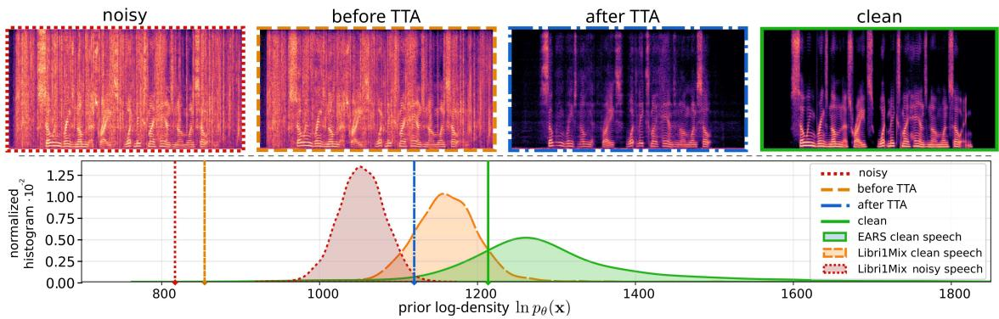
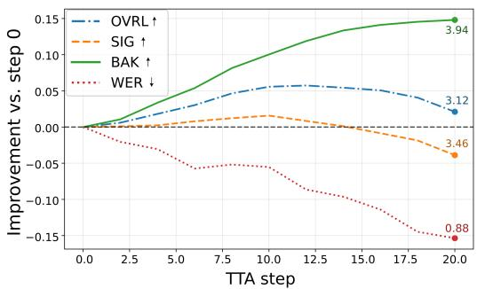
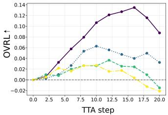
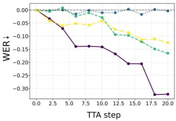
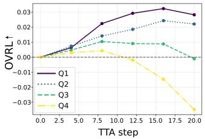
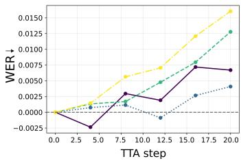

# TEST-TIME ADAPTATION FOR SPEECH ENHANCEMENT WITH AN AUTOREGRESSIVE SPEECH PRIOR

Sofiene Kammoun1 Simon Leglaive1 Xavier Alameda-Pineda2 Timo Gerkmann3

1CentraleSup´elec, IETR (UMR CNRS 6164), France 2Inria at Univ. Grenoble Alpes, CNRS, LJK, France 3Signal Processing Group, University of Hamburg, Germany

## ABSTRACT

Test-time adaptation (TTA) offers a promising direction for improving speech enhancement models under mismatched acoustic conditions, without requiring access to labeled target data. In this work, we propose a single-utterance TTA method that regularizes a pretrained speech enhancement model using an autoregressive prior trained on clean speech latent representations extracted from a neural audio codec. Adaptation is performed by minimizing the Kullback-Leibler divergence between the enhanced speech distribution and the clean speech prior. Experiments across multiple noisy speech datasets show consistent improvements in speech quality, particularly under training-testing noise mismatch conditions. Code and audio examples are available online.1

Index Terms— Speech enhancement, test-time adaptation, neural audio codec, autoregressive model

## 1. INTRODUCTION

Speech enhancement (SE) aims to recover a clean speech signal from a degraded recording, typically affected by environmental noise. Recent SE systems predominantly rely on supervised deep learning models trained on paired noisy-clean speech data. While these approaches achieve strong performance under matched training and testing conditions, they can degrade significantly when the acoustic characteristics encountered at test time differ greatly from those seen during training, or when the input signal contains unseen corruption types such as reverberation, bandwidth reduction, clipping, or codec artifacts. In practical deployments, access to clean speech target signals or labeled training data is unavailable, motivating the adaptation of a supervised SE to the test distribution.

Existing adaptation strategies include supervised fine-tuning, unsupervised domain adaptation (UDA), test-time training (TTT), and test-time adaptation (TTA) [1]. Fine-tuning and UDA require access to the labeled source data [2, 3], while TTT constrains the original supervised training pipeline with auxiliary loss functions [4, 5]. In contrast, TTA methods update the pretrained model during inference using unsupervised loss functions, without modifying the original supervised training procedure [6, 7, 8, 9]. A commonly used variant, referred to as single-instance or -utterance TTA, adapts the model independently for each test sample and reinitializes the model to its pretrained parameters after each update, thereby mitigating catastrophic forgetting [10].

Domain adaptation has been extensively studied for classification tasks, where many methods exploit statistical properties of model outputs. Those include techniques such as entropy minimization [1, 10, 11] and feature alignment [12, 13]. However, such approaches do not readily translate to SE, which is typically formulated as a regression problem rather than a classification task.

Early approaches to domain adaptation for SE drew inspiration from the TTT paradigm and generally combined labeled source data with unlabeled target data through adversarial learning [14, 15] or reconstruction-based consistency objectives [2, 3]. These methods require access to the source dataset during adaptation, which limits their practicality in real-world deployment. The TTT-based method [4] incorporates an auxiliary self-supervised loss during supervised training, which is then used only for adaptation on the unlabeled target data. Although effective, this method constrains the original training pipeline and cannot be applied to arbitrary pretrained SE models. This is not the case for the method proposed in [3], which explores the use of self-supervised models for speech representation learning. This approach performs adaptation by identifying samples in the source dataset whose latent representations are closest to those of the target unlabeled samples. However, this approach requires access to the source dataset during adaptation.

More recent research has focused on TTA methods that operate using exclusively unlabeled target data. RemixIT [16] and LaDen [8] both rely on a teacher-student framework where a student model is trained on the target data using pseudo-clean speech labels obtained with a teacher model. The method proposed in [9] introduces a single-utterance TTA method for SE methods based on timefrequency mask prediction. The approach fosters predicted masks to approach either 0 or 1 by minimizing their entropy, which encourages the model to produce more confident and discriminative masks for unseen noise conditions.

In this paper, we propose a novel single-utterance TTA method for SE that leverages an autoregressive prior trained on clean speech latent representations extracted from a pretrained neural audio codec (NAC). The core idea is to use the prior as a measure of how likely a given enhanced representation resembles clean speech, and to adapt the pretrained SE model by minimizing the Kullback–Leibler (KL) divergence between the distribution of the enhanced speech and the prior. As illustrated in Figure 1, a supervised SE model before adaptation can generalize poorly on unseen noise types, providing an output whose log-density under the prior is substantially lower than that of clean speech. Through TTA with the KL divergence, the enhanced output is progressively pushed toward regions of higher prior logdensity, effectively encouraging it to align with the structure learned from clean data. Experimental results on multiple real and synthetic noisy speech benchmarks show that the proposed method consistently improves speech quality, especially when the pretrained SE model operates under mismatched noise conditions.

  
Fig. 1. Visualization of the clean-speech prior log-density and its role in TTA. Top: Spectrograms of a noisy input signal, the output of the pretrained SE model before and after adaptation, and the clean reference speech. Bottom: Normalized histogram of log-density values for the pretrained prior evaluated on clean and noisy speech datasets. Vertical lines indicate the log-density values for the examples shown on top. The proposed TTA method pushes the enhanced output toward higher prior log-density values and closer to the clean reference.

## 2. METHOD

## 2.1. Supervised speech enhancement

Supervised SE assumes access to a labeled dataset of parallel noisy-clean speech recordings ${ \mathcal D } _ { { \bf x } { \bf y } } = \{ ( { \bf x } _ { i } , { \bf y } _ { i } ) \} _ { i = 1 } ^ { N } ,$ , where x $\in { \mathcal { A } }$ and $\mathbf { y } \in \mathcal { A }$ denote the clean and noisy speech signals respectively, defined in some representation domain A. SE can be cast as probabilistic inference using a conditional probability density function (PDF) $q _ { \phi } ( \mathbf { x } \mid \mathbf { y } )$ with parameters $\phi .$ The predicted clean speech is then obtained by computing the mean or arg max of this inference model, or by sampling, given an estimate of the model parameters φ. In a supervised training stage, those are learned by minimizing the negative log-likelihood averaged over the labeled source dataset:

$$
\mathcal { L } _ { \mathrm { s u p } } ( \mathcal { D } _ { \mathbf { x y } } ; \boldsymbol { \phi } ) = \frac { 1 } { N } \sum _ { ( \mathbf { x } , \mathbf { y } ) \in \mathcal { D } _ { \mathbf { x y } } } - \ln q _ { \phi } ( \mathbf { x } \mid \mathbf { y } ) .\tag{1}
$$

The present work builds upon a fully supervised SE system operating in the latent space of a pretrained NAC [17]. Both clean and noisy waveforms are first encoded into NAC’s latent representations before quantization, denoted by $\mathbf { x } = \{ \mathbf { x } _ { t } \in \mathbb { R } ^ { L } \} _ { t = 1 } ^ { \hat { T } }$ and $\mathbf { y } = \{ \mathbf { y } _ { t } \in \mathbb { R } ^ { L } \} _ { t = 1 } ^ { T }$ , which serve as output targets and inputs for the SE model. Here, L denotes the NAC latent space dimension and $T$ the number of time frames. The inference model is then defined as

$$
q _ { \phi } ( \mathbf { x } \mid \mathbf { y } ) = \prod _ { t = 1 } ^ { T } \mathcal { N } \big ( \mathbf { x } _ { t } ; f _ { \phi , t } ( \mathbf { y } ) , \mathbf { I } \big ) ,\tag{2}
$$

where $f _ { \phi }$ is a non-autoregressive Conformer network [17, 18], and $\mathcal { N } ( \mathbf { x } ; \pmb { \mu } , \pmb { \Sigma } )$ denotes the PDF of the multivariate Gaussian distribution, whose logarithm is given, up to an additive constant, by

$$
\ln \mathcal { N } ( { \bf x } ; { \pmb \mu } , { \pmb \Sigma } ) \overset { c } { = } - \frac { 1 } { 2 } \left[ \ln \operatorname* { d e t } ( { \pmb \Sigma } ) + ( { \bf x } - { \pmb \mu } ) ^ { \top } { \pmb \Sigma } ^ { - 1 } ( { \bf x } - { \pmb \mu } ) \right]\tag{3}
$$

Under the Gaussian model $( 2 ) , \mathcal { L } _ { \mathrm { s u p } }$ in (1) reduces to the meansquared error (MSE) loss function. It is clear from (1) that the parameters φ minimizing $\mathcal { L } _ { \mathrm { s u p } }$ depend on the dataset $\mathcal { D } _ { \mathbf { x y } }$ . While this supervised setting has been shown to be very effective, it assumes that the labeled training data capture the variability of acoustic environments encountered at test time. In practice, this assumption does not always hold, which can lead to poor generalization under strongly mismatched training and testing conditions [19, 20, 21, 22].

## 2.2. Unsupervised test-time adaptation

The goal of this work is to improve enhancement performance on previously unseen noisy recordings, without access to additional parallel clean–noisy training data. To this end, we introduce an autoregressive prior trained on a clean speech corpus. TTA is then performed by optimizing the inference model parameters φ on a single noisy utterance using only the KL divergence between the inference model and the pretrained clean speech prior.

Autoregressive prior The clean speech prior $p _ { \theta } ( \mathbf { x } )$ is defined as an autoregressive Gaussian model in the NAC latent space:

$$
p _ { \theta } ( \mathbf { x } ) = \prod _ { t = 1 } ^ { T } p _ { \theta } ( \mathbf { x } _ { t } \mid \mathbf { x } _ { < t } ) = \prod _ { t = 1 } ^ { T } \mathcal { N } \big ( \mathbf { x } _ { t } ; \mu _ { \eta , t } ( \mathbf { x } _ { < t } ) , \pmb { \Sigma } _ { \theta , t } ( \mathbf { x } _ { < t } ) \big ) ,\tag{4}
$$

where $\mathbf { x } _ { < t } = \{ \mathbf { x } _ { s } \} _ { s = 1 } ^ { t }$ , with the convention that $\mathbf { x } _ { < 1 } = \varnothing .$ , and the covariance matrix is parameterized as follows:

$$
\begin{array} { r } { \pmb { \Sigma } _ { \theta , t } \big ( \mathbf { x } _ { < t } \big ) = \mathbf { W } \mathrm { d i a g } \big \{ \mathbf { v } _ { \eta , t } \big ( \mathbf { x } _ { < t } \big ) \big \} \mathbf { W } ^ { \top } \in \mathbb { R } ^ { L \times L } , } \end{array}\tag{5}
$$

with $\boldsymbol { \theta } = \{ \mathbf { W } \in \mathbb { R } ^ { L \times L } , \boldsymbol { \eta } \}$ . In this model, W is a global orthogonal matrix shared across time steps and speech signals, while the mean and variance vectors $\mu _ { \eta , t } ( \mathbf { x } _ { < t } ) , \mathbf { v } _ { \eta , t } ( \mathbf { x } _ { < t } ) \in \mathbb { R } ^ { L }$ are obtained using a neural network at each time step t. The parametrization in (5) can be interpreted as learning a global eigenbasis for the NAC latent space, represented by the orthogonal matrix W, while allowing the corresponding eigenvalues (the variances along each eigenvector’s direction, represented by $\mathbf { v } _ { \eta , t } ( \mathbf { x } _ { < t } ) )$ to vary over time steps and conditioning speech signals. This model, inspired by [23], reflects the assumption that cross-dimensional correlations are intrinsic to the latent space induced by the NAC encoder. It allows us to consider a full covariance matrix in potentially high dimension $L ,$ , while remaining computationally efficient. Empirically, this full covariance model was found to lead to much higher log-density values than a diagonal covariance model when fitted on clean speech data. Given a clean speech corpus $\mathcal { D } _ { \mathbf { x } } = \{ \mathbf { x } _ { i } \in \mathbb { R } ^ { L \times T } \} _ { i = 1 } ^ { M }$ , the prior parameters θ are learned by minimizing the average negative log-likelihood using teacher forcing [24]:

$$
\mathcal { L } _ { \mathrm { p r i o r } } ( \mathcal { D } _ { \mathbf { x } } ; \theta ) = - \frac { 1 } { M } \sum _ { \mathbf { x } \in \mathcal { D } _ { \mathbf { x } } } \sum _ { t = 1 } ^ { T } \ln \mathcal { N } \big ( \mathbf { x } _ { t } ; \pmb { \mu } _ { \eta , t } ( \mathbf { x } _ { < t } ) , \pmb { \Sigma } _ { \theta , t } ( \mathbf { x } _ { < t } ) \big ) ,\tag{6}
$$

which can be easily computed using (3).

TTA loss function At test time, given a noisy speech signal y, the pretrained and frozen autoregressive prior $p _ { \theta } ( \mathbf { x } )$ defined in (4), and the pretrained SE model $q _ { \phi } ( \mathbf { x } \mid \mathbf { y } )$ defined in (2), adaptation is performed by optimizing with respect to φ the following TTA loss function based on the KL divergence:

$$
\mathcal { L } _ { \mathrm { T T A } } ( \mathbf { y } ; \boldsymbol { \phi } ) = D _ { \mathrm { K L } } \big ( q _ { \phi } ( \mathbf { x } \mid \mathbf { y } ) \big | \big | p _ { \theta } ( \mathbf { x } ) \big )
$$

$$
= \sum _ { t = 1 } ^ { T } \mathbb { E } _ { q _ { \phi } ( \mathbf { x } _ { < t } | \mathbf { y } ) } \left[ D _ { \mathrm { K L } } \left( q _ { \phi } ( \mathbf { x } _ { t } \mid \mathbf { y } ) \parallel p _ { \theta } ( \mathbf { x } _ { t } \mid \mathbf { x } _ { < t } ) \right) \right]\tag{7}
$$

$$
\stackrel { c } { \approx } - \frac { 1 } { 2 } \sum _ { t = 1 } ^ { T } \left\| \mathrm { d i a g } \{ { \bf v } _ { \eta , t } ( \tilde { \bf x } _ { < t } ) \} ^ { - \frac { 1 } { 2 } } { \bf W } ^ { \top } \left( \mu _ { \eta , t } ( \tilde { \bf x } _ { < t } ) - f _ { \phi , t } ( { \bf y } ) \right) \right\| _ { 2 } ^ { 2 } ,\tag{8}
$$

where $D _ { \mathrm { K L } } ( q \parallel p ) = \mathbb { E } _ { q } [ \ln q - \ln p ]$ and the approximation in (8) originates from the fact that we replace the intractable expectation in (7) by the use of $\tilde { \mathbf { x } } _ { < t } = \mathbb { E } _ { q _ { \phi } ( \mathbf { x } _ { < t } | \mathbf { y } ) } [ \mathbf { x } _ { < t } ] = f _ { \phi , < t } ( \mathbf { y } )$ . In practice, the parameters φ are treated as fixed when computing x˜<t, such that gradients of ${ \mathcal { L } } _ { \mathrm { T T A } }$ with respect to φ are not backpropagated through the computation of $\tilde { \mathbf { x } } _ { < t }$

Adaptation algorithm Adaptation is performed independently for each test sample, following a single-utterance TTA setting. The noisy speech waveform is first normalized so that its amplitude is between −1 and 1, after which a contiguous one-second segment is randomly selected and encoded using the NAC encoder to obtain the latent representation $\mathbf { y } \in \mathbb { R } ^ { L \times T }$ . This sequence is passed through the pretrained SE model to produce the enhanced sequence $\tilde { \textbf { x } } =$ $\{ f _ { \phi , t } ( \mathbf { y } ) \in \mathbb { R } ^ { L } \} _ { t = 1 } ^ { T }$ . The clean speech prior is then evaluated on x˜, giving the mean and variance parameters $\{ \mu _ { \eta , t } ( \tilde { \mathbf { x } } _ { < t } ) , \mathbf { v } _ { \eta , t } ( \tilde { \mathbf { x } } _ { < t } )$ ∈ $\mathbb { R } ^ { L } \} _ { t = 1 } ^ { T }$ These quantities, as well as the orthogonal matrix W, are used to compute the TTA loss function in (8), which is optimized with respect to the inference model parameters φ using a fixed number of gradient descent steps K and a small learning rate. The adapted model $f _ { \phi }$ is then used to produce the latent representation of the complete enhanced speech signal, which is typically longer than the one-second segment used for adaptation. Therefore, the proposed TTA technique can be viewed as a calibration of the SE model to new acoustic noise characteristics, requiring only 1 second of representative unlabeled noisy speech. The clean speech waveform is eventually reconstructed using the NAC decoder.

Note that the model parameters φ are reinitialized to their supervised pretrained values before processing another noisy speech signal. Indeed, if we keep optimizing the same parameters φ as new noisy speech signals arrive, the inference model will eventually collapse to the prior and become independent of the input noisy speech. To mitigate this problem, the parameters φ are reinitialized, and the TTA loss is optimized with a small number of steps and a small learning rate. This strategy is expected to encourage the inference model to output cleaner speech signals without becoming independent of the noisy input.

## 3. EXPERIMENTS

## 3.1. Experimental Setup

Datasets The supervised SE model is trained on the Libri1Mix dataset [25], following the experimental setup described in [17]. The clean speech prior is trained independently using the EARS dataset [26], which provides anechoic speech recordings and is disjoint from the SE training data.

  
Fig. 2. Relative improvement of the metrics along TTA iterations, computed on the DNS Challenge V5 dev-test set.

To evaluate the proposed test-time adaptation method under realistic and mismatched conditions, we primarily conduct experiments on the DNS Challenge V5 dev-test set, track 2 [27]. This dataset contains 600 real noisy speech recordings without parallel clean references and reflects a wide range of acoustic environments and noise conditions. To further assess generalization, we validate our approach on additional datasets with varying degrees of mismatch. These include the TIMIT-DEMAND dataset [28], which introduces both unseen speakers and unseen noise environments; the EARS-WHAM dataset [26], which combines clean speech drawn from the same distribution as the prior training data with noise conditions seen during SE training; and the Libri1Mix test set, which represents a matched condition for the supervised SE model. This selection allows us to disentangle the effects of speaker mismatch, noise mismatch, and prior–SE alignment.

Evaluation metrics Since we are working in the latent space of a NAC trained with adversarial learning and without an explicit phaseaware reconstruction loss function, NAC outputs are not aligned sample-wise with the clean speech reference [29, 30]. Therefore, and as commonly done in the literature [31], we primarily rely on the non-intrusive DNSMOS P.835 metrics [32], which include SIG (speech quality), BAK (background noise suppression), and OVRL (overall quality), each ranging from 1 to 5. In addition, we use the word error rate (WER) as an intrusive intelligibility metric whenever reference transcripts are available. WER is computed using a pretrained wav2vec 2.0 ASR model2, with the provided transcripts serving as ground truth.

TTA setup All experiments use the Descript Audio Codec (DAC) [33] as the NAC architecture underlying the SE and prior models. TTA is performed using standard gradient descent with momentum 0.9. The learning rate is fixed to $2 \times 1 0 ^ { - 5 }$ , and the maximum number of adaptation steps is empirically set to $K = 2 0$ . At every two adaptation steps, the enhanced speech is reconstructed using the adapted model parameters and evaluated using the selected metrics. This allows tracking the evolution of quality and intelligibility throughout the adaptation process.

## 3.2. Results

Prior model validation The objective of the clean speech prior is to discriminate between clean and noisy speech by assigning higher log-density values to clean latent speech representations. To validate this behavior, we evaluate the prior log-density on several datasets and analyze its distribution. Figure 1 shows histograms of the logdensity values computed on the EARS clean test set, as well as on the clean and noisy subsets of the Libri1Mix test set. The results indicate a clear separation between clean and noisy speech, with clean speech consistently assigned higher values. We also visualize the prior logdensity values and the spectrograms of a noisy speech signal, the enhanced signal before and after TTA, and the clean reference. We chose an example for which the pretrained SE model completely fails to suppress background noise, because of a mismatch with the training noise types. This qualitative analysis confirms that the prior assigns a higher log-density to cleaner speech representations. These observations support the use of the prior as a form of weak supervision during TTA, where the objective is to push the enhanced speech representation toward regions of higher prior log-density in the latent space.

Improvement vs. step 0 on the DNS Challenge V5 dataset  

Improvement vs. step 0 on the Libri1Mix dataset  

  
Fig. 3. OVRL and WER relative improvements over TTA steps and per initial prior log-density quartile, for the DNS Challenge V5 and Libri1Mix datasets.

TTA results We first analyze the behavior of the proposed TTA method on the DNS Challenge V5 dev-test set. Figure 2 reports the relative improvement of DNSMOS metrics and WER as a function of the adaptation step, compared to the model output at step $k = 0 ,$ corresponding to the pretrained SE model without adaptation. On average, speech quality improves during the early adaptation steps, before eventually degrading as the number of steps increases. This behavior is expected, as the TTA objective relies exclusively on the unsupervised KL divergence, which may eventually cause the inference model to collapse to the prior and thus ignore the noisy speech input. These results highlight the necessity of early stopping mechanisms to prevent over-adaptation.

Informal listening tests and quantitative analysis reveal that the effectiveness of TTA strongly depends on the initial quality of the enhanced speech. Specifically, TTA tends to yield larger improvements when the pretrained SE model leaves residual noise in the enhanced output, while it can degrade performance when the initial enhancement quality is already high. To validate this observation, we compute the prior log-density of the enhanced speech at step $k = 0$ and partition the dataset into four equally sized quartiles, Q1 to $Q _ { 4 }$ sorted by increasing log-density values. The underlying intuition is that the prior log-density provides a proxy for enhancement quality, with lower values corresponding to noisier outputs. Figure 3 reports the evolution of OVRL and WER improvements over TTA iterations for each quartile on both the DNS V5 and Libri1Mix datasets. The results show that lower-log-density quartiles benefit more significantly from adaptation and typically require more adaptation steps to reach their optimal performance. In contrast, higher-log-density quartiles exhibit limited or negative gains, confirming the sensitivity of TTA to the initial operating point. Note that the WER increase on Libri1Mix is negligible, reaching at most about 0.015 for $Q _ { 4 }$

Table 1. Test-time adaptation results across datasets. “SE w/o TTA $( k = 0 ) ^ { \because }$ denotes to the pretrained SE model before TTA, while “SE w/ TTA $( k = \tilde { k } / k ^ { * } ) ^ { * }$ denotes the adapted model at different steps.
<table><tr><td></td><td></td><td>OVRL</td><td>SIG</td><td>BAK</td></tr><tr><td rowspan="4">DNS Challenge</td><td>Noisy input</td><td>2.22</td><td>3.19</td><td>2.38</td></tr><tr><td>SE w/o TTA  $( k = 0 )$ </td><td>3.09</td><td>3.50</td><td>3.80</td></tr><tr><td>SE w/ TTA (k = k)</td><td>+0.05</td><td>-0.02</td><td>+0.15</td></tr><tr><td> $\mathrm { S E } \mathrm { w } / \mathrm { T T A } \left( k = k ^ { * } \right)$ </td><td>+0.18</td><td>+0.08</td><td>+0.23</td></tr><tr><td rowspan="4">TIMIT-DEMAND</td><td>Noisy input</td><td>2.24</td><td>2.89</td><td>2.69</td></tr><tr><td>SE w/o TTA  $( k = 0 )$ </td><td>3.00</td><td>3.51</td><td>3.62</td></tr><tr><td>SE w/ TTA  $( k = \tilde { k } )$ </td><td>+0.07</td><td>+0.02</td><td>+0.13</td></tr><tr><td>SE w/ TTA  $\dot { ( k = k ^ { * } ) }$ </td><td>+0.15</td><td>+0.06</td><td>+0.22</td></tr><tr><td rowspan="4">EARS-WHAM</td><td>Noisy input</td><td>2.09</td><td>2.72</td><td>2.39</td></tr><tr><td>SE w/o TTA  $( k = 0 )$ </td><td>3.24</td><td>3.50</td><td>3.99</td></tr><tr><td>SE w/ TTA  $( k = \tilde { k } )$ </td><td>0.00</td><td>-0.01</td><td>+0.02</td></tr><tr><td>SE w/ TTA  $( k = k ^ { * } )$ </td><td>+0.09</td><td>+0.08</td><td>+0.09</td></tr><tr><td rowspan="4">Libri1Mix</td><td>Noisy input</td><td>1.75</td><td>2.46</td><td>1.81</td></tr><tr><td>SE w/o TTA  $( k = 0 )$ </td><td>3.28</td><td>3.57</td><td>4.03</td></tr><tr><td>SE w/ TTA  $( k = \tilde { k } )$ </td><td>+0.03</td><td>+0.02</td><td>+0.03</td></tr><tr><td>SE w/ TTA  $( k = k ^ { * } )$ </td><td>+0.08</td><td>+0.05</td><td>+0.07</td></tr></table>

The optimal step can be computed as $k ^ { * } =$ arg max OVRL(k) using the non-intrusive DNSMOS metric, but this approach is computationally expensive. Motivated by the quartile analysis, we investigate training a simple logistic regression model that gives a prediction ˜k of $\mathbf { \bar { \boldsymbol { k } } ^ { * } }$ based solely on the prior log-density of the enhanced speech before TTA. The regression model is trained using the DNS Challenge results and then applied to other datasets.

The results reported in Table 1 show improvements across all datasets for $k = k ^ { * }$ , and also for $k = k ,$ , although to a lesser extent. Performance gains are more important for the DNS Challenge and TIMIT-DEMAND datasets, especially in terms of BAK score. This is because those datasets are mismatched to the one used for supervised pretraining of the SE model in terms of noise type. We can indeed see that the BAK and OVRL scores obtained by the pretrained SE model before TTA are lower on the DNS Challenge and TIMIT-DEMAND datasets than on EARS-WHAM and Libri1Mix, even though the noisy input scores are higher. Overall, this quantitative analysis confirms that the proposed TTA method is particularly effective at reducing residual background noise when the pretrained supervised SE model fails on unseen noise types, as also illustrated qualitatively in Figure 1 and in the online audio examples.1

## 4. CONCLUSION

We presented a novel single-utterance TTA framework for SE that leverages an autoregressive clean speech prior defined in the latent space of a NAC. By optimizing a pretrained SE model through a KL divergence objective, the proposed method enables unsupervised adaptation to unseen acoustic conditions without modifying the original training pipeline or requiring access to source data. Experimental results demonstrated that the clean speech prior effectively discriminates between noisy and clean speech and serves as a meaningful adaptation signal. Future work will explore more expressive prior models and extensions to non-additive distortions.

## 5. REFERENCES

[1] D. Wang, E. Shelhamer, S. Liu, B. A. Olshausen, and T. Darrell, “Tent: Fully test-time adaptation by entropy minimization,” in Int. Conf. Learn. Represent. (ICLR), 2021.

[2] H. Lin, H. Tseng, X. Lu, and Y. Tsao, “Unsupervised noise adaptive speech enhancement by discriminator-constrained optimal transport,” in Adv. Neural Inf. Process. Syst. (NeurIPS), 2021.

[3] C.-H. Lee, C. Yang, R. S. Srinivasa, M. Saidutta et al., “Leveraging self-supervised speech representations for domain adaptation in speech enhancement,” in IEEE Int. Conf. Acoust. Speech Signal Process. (ICASSP), 2024.

[4] A. Behera, R. A. Easow, V. Parvathala, and K. S. R. Murty, “Test-Time Training for Speech Enhancement,” in Interspeech, 2025.

[5] Y. Sun, X. Wang, Z. Liu, J. Miller, A. A. Efros, and M. Hardt, “Test-time training with self-supervision for generalization under distribution shifts,” in Int. Conf. Mach. Learn. (ICML), 2020.

[6] S. Kim and M. Kim, “Test-time adaptation toward personalized speech enhancement: Zero-shot learning with knowledge distillation,” in IEEE Workshop Appl. Signal Process. Audio Acoust. (WASPAA), 2021.

[7] K. Adachi, S. Yamaguchi, A. Kumagai, and T. Hamagami, “Test-time adaptation for regression by subspace alignment,” in Int. Conf. Learn. Represent. (ICLR), 2025.

[8] T. Raichle, N. Edinger, and B. Yang, “Test-time adaptation for speech enhancement via domain invariant embedding transformation,” IEEE Open J. Signal Process., 2026.

[9] T. Raichle, E. Amini, and B. Yang, “Test-time adaptation for speech enhancement via mask polarization,” in IEEE Int. Conf. Acoust. Speech Signal Process. (ICASSP), 2026.

[10] G. Lin, S. Li, and H. Lee, “Listen, adapt, better WER: sourcefree single-utterance test-time adaptation for automatic speech recognition,” in Interspeech, 2022.

[11] M. Zhang, S. Levine, and C. Finn, “Memo: Test time robustness via adaptation and augmentation,” Adv. Neural Inf. Process. Syst. (NeurIPS), 2022.

[12] C. Eastwood, I. Mason, C. K. I. Williams, and B. Sch¨olkopf, “Source-free adaptation to measurement shift via bottom-up feature restoration,” in Int. Conf. Learn. Represent. (ICLR), 2022.

[13] T. Kojima, Y. Matsuo, and Y. Iwasawa, “Robustifying vision transformer without retraining from scratch by test-time classconditional feature alignment,” in Int. Jt. Conf. Artif. Intell. (IJ-CAI), 2022.

[14] C. Liao, Y. Tsao, H. Lee, and H. Wang, “Noise adaptive speech enhancement using domain adversarial training,” in Interspeech, 2019.

[15] D. Michelsanti and Z. Tan, “Conditional generative adversarial networks for speech enhancement and noise-robust speaker verification,” in Interspeech, 2017.

[16] E. Tzinis, Y. Adi, V. K. Ithapu, B. Xu, P. Smaragdis, and A. Kumar, “Remixit: Continual self-training of speech enhancement models via bootstrapped remixing,” IEEE J. Sel. Top. Signal Process., vol. 16, 2022.

[17] S. Kammoun, X. Alameda-Pineda, and S. Leglaive, “Modeling strategies for speech enhancement in the latent space of a neural audio codec,” in IEEE Int. Conf. Acoust. Speech Signal Process. (ICASSP), 2026.

[18] A. Gulati, J. Qin, C. Chiu, N. Parmar, Y. Zhang, J. Yu, W. Han, S. Wang, Z. Zhang, Y. Wu et al., “Conformer: Convolutionaugmented transformer for speech recognition,” in Interspeech, 2020.

[19] A. Pandey and D. Wang, “On cross-corpus generalization of deep learning based speech enhancement,” IEEE/ACM Trans. Audio Speech Lang. Process., vol. 28, pp. 2489–2499, 2020.

[20] X. Bie, S. Leglaive, X. Alameda-Pineda, and L. Girin, “Unsupervised speech enhancement using dynamical variational autoencoders,” IEEE/ACM Trans. Audio Speech Lang. Process., vol. 30, pp. 2993–3007, 2022.

[21] J. Richter, S. Welker, J.-M. Lemercier, B. Lay, and T. Gerkmann, “Speech enhancement and dereverberation with diffusion-based generative models,” IEEE/ACM Trans. Audio Speech Lang. Process., vol. 31, pp. 2351–2364, 2023.

[22] P. Gonzalez, T. S. Alstrøm, and T. May, “Assessing the generalization gap of learning-based speech enhancement systems in noisy and reverberant environments,” IEEE/ACM Trans. Audio Speech Lang. Process., vol. 31, pp. 3390–3403, 2023.

[23] T. Muller, S. Ragot, P. Philippe, and P. Scalart, “Post-training latent dimension reduction in neural audio coding,” in Eur. Signal Process. Conf. (EUSIPCO), 2024.

[24] A. M. Lamb, A. Goyal, Y. Zhang, S. Zhang, A. C. Courville, and Y. Bengio, “Professor forcing: A new algorithm for training recurrent networks,” Adv. Neural Inf. Process. Syst. (NeurIPS), vol. 29, 2016.

[25] J. Cosentino et al., “LibriMix: An open-source dataset for generalizable speech separation,” arXiv:2005.11262, 2020.

[26] J. Richter, Y. Wu, S. Krenn, S. Welker, B. Lay, S. Watanabe, A. Richard, and T. Gerkmann, “EARS: an anechoic fullband speech dataset benchmarked for speech enhancement and dereverberation,” in Interspeech, 2024.

[27] H. Dubey, A. Aazami, V. Gopal, B. Naderi, S. Braun, R. Cutler, H. Gamper, M. Golestaneh, and R. Aichner, “Icassp 2023 deep noise suppression challenge,” in IEEE Int. Conf. Acoust. Speech Signal Process. (ICASSP), 2023.

[28] S. Leglaive, L. Girin, and R. Horaud, “A variance modeling framework based on variational autoencoders for speech enhancement,” in IEEE Int. Workshop Mach. Learn. Signal Process. (MLSP), 2018.

[29] R. Kumar, K. Kumar, V. Anand, Y. Bengio, and A. Courville, “NU-GAN: High resolution neural upsampling with GAN,” arXiv preprint arXiv:2010.11362, 2020.

[30] R. Langman, A. Jukic, K. Dhawan, N. R. Koluguri, and B. Ginsburg, “Spectral codecs: Spectrogram-based audio codecs for high quality speech synthesis,” arXiv preprint arXiv:2406.05298, 2024.

[31] Z. Wang, X. Zhu, Z. Zhang, Y. Lv, N. Jiang, G. Zhao, and L. Xie, “SELM: Speech enhancement using discrete tokens and language models,” in IEEE Int. Conf. Acoust. Speech Signal Process. (ICASSP), 2024.

[32] C. K. Reddy, V. Gopal, and R. Cutler, “DNSMOS P. 835: A non-intrusive perceptual objective speech quality metric to evaluate noise suppressors,” in IEEE Int. Conf. Acoust. Speech Signal Process. (ICASSP), 2022.

[33] R. Kumar, P. Seetharaman, A. Luebs, I. Kumar, and K. Kumar, “High-fidelity audio compression with improved RVQGAN,” in Adv. Neural Inf. Process. Syst. (NeurIPS), 2023.